# 3-D Self-Tracking of UAV Based on Minor Subspace Majorization-Minimization Iteration

Zhongkang Cao , Graduate Student Member, IEEE, Jianfeng Li , Senior Member, IEEE, Pan Li , Graduate Student Member, IEEE, Jianghao Xiao, and Qihui Wu , Fellow, IEEE

Abstract—The unmanned aerial vehicle (UAV) position tracking via non-cooperative anchors is an effective alternative method when global navigation satellite systems (GNSS) are interrupted. We propose a three-dimension (3-D) UAV selftracking method based on the minor subspace (MS) update and the majorization-minimization (MM) result iteration. An enhanced approximate inverse-power (EAIP) algorithm, which is integrated with the new residual term, the novel orthonormal matrix and the eigenvalue update, is proposed to improve the MS update precision and achieve noise suppression. Simulation has shown that EAIP performs less MS error than orthogonal data projection method (ODPM), fast data projection method (FDPM), yet another subspace tracker (YAST) and approximate inverse-power (AIP). Then, continuous MM iteration tracking is applied to eliminate the initial value setting issue, extract position information from MS and reduce the complexity by avoiding grid search. Finally, the Kalman filter (KF) for tracking result intervals is proposed to suppress the positioning interference and the moving averaging (MA) is employed to control the acceleration parameter of the UAV dynamics, thereby avoiding construction of the state transition equation. Moreover, the Cramer-Rao lower bound (CRLB) of each dimension in the 3-D self-tracking is derived, establishing a theoretical benchmark for performance analysis. The proposed method has lower complexity and better tracking performance compared to ‘AIP+MUSIC+KF’ and ‘AIP+SSF+KF’, which have been verified by both complexity analysis and simulation experiments.

Index Terms—Self-tracking, array signal processing, noncooperative signal, minor subspace, majorization minimization.

## I. INTRODUCTION

P OSITION tracking of the unmanned aerial vehicle (UAV)is a critical issue in wireless communication [1]. Since is a critical issue in wireless communication [1]. Since

Received 22 August 2025; revised 3 December 2025 and 6 February 2026; accepted 18 April 2026. Date of current version 29 April 2026. This work was supported in part by the National Science Foundation of China under Grant 62427801, Grant 62371227, Grant 62371225, and Grant 62531019; in part by the Key Research and Development Plan of Jiangsu Province under Grant BE2023027; in part by the Funding of Steady-Supported Guofang Characteristic Subject Fundamental Research Project under Grant ILF240061A24; and in part by the Fundamental Research Funds for the Central Universities under Grant NP2025203. The associate editor coordinating the review of this article and approving it for publication was A. Guerra. (Corresponding author: Jianfeng Li.)

Zhongkang Cao, Jianfeng Li, Pan Li, and Qihui Wu are with the College of Electronic and Information Engineering and the Key Laboratory of Dynamic Cognitive System of Electromagnetic Spectrum Space, Ministry of Industry and Information Technology, Nanjing University of Aeronautics and Astronautics, Nanjing, Jiangsu 211106, China (e-mail: caozhongkang@nuaa.edu.cn; lijianfeng@nuaa.edu.cn; nanhang4yuanlipan@nuaa.edu.cn; wuqihui@nuaa.edu.cn).

Jianghao Xiao is with China Telecom Corporation Ltd., Jiangsu Branch, Nanjing, Jiangsu 210037, China (e-mail: xiaojh.js@chinatelecom.cn).

Digital Object Identifier 10.1109/TWC.2026.3686429 global navigation satellite systems (GNSS) are vulnerable to radio interference, UAV-based autonomous tracking using wireless communication base stations have emerged as an effective alternative to GNSS [2], [3], [4], [5], [6]. UAV tracking in wireless communication networks primarily relies on cellular-connected UAVs or local autonomous navigation. Cellular-connected UAVs operate as aerial users integrated into cellular networks for information exchange, receiving the same quality of positioning service as terrestrial users [7]. However, this method requires the allocation of cellular network resources, resulting in higher service costs [8]. In contrast, local autonomous navigation employs non-cooperative localization techniques that do not depend on time information from multiple cellular base stations [9]. By analyzing electromagnetic spectrum characteristics through UAV onboard platforms, this approach obtains positioning information while being decoupled from cellular network protocols, enabling more flexible localization capabilities [10]. Currently, in local autonomous navigation, the main methods for UAV self-localization include received signal strength (RSS) [11], time difference of arrival (TDOA) [12], frequency difference of arrival (FDOA) [13], and angle of arrival (AOA) [14]. Among them, RSS, TDOA, and FDOA require precise electromagnetic signal attenuation models [16] or time synchronization information [17]. In contrast, AOA can avoid deviations caused by modeling and synchronization issues, enabling accurate estimation of the signal’s direction of arrival (DOA). Based on the DOA results, the position information of the UAV can be obtained. Antenna arrays are the primary means for measuring the DOA of incoming signals. Array-based positioning techniques using AOA include clustering-based localization [18], least squares estimation [19] and orthogonal grid matching [20].

However, AOA-based positioning propagates angle parameter errors into the final positioning results during DOA estimation process [21]. In contrast, direct self-localization techniques estimate the probability distribution of the target’s position by analyzing the spatial distribution characteristics of the raw signal across a grid, thereby avoiding error accumulation and achieving higher positioning accuracy [22]. Multiple signal classification (MUSIC) is proposed in [14] to obtain better localization performance than pseudo-linear estimator (PLE). In traditional wireless communication systems, to avoid interference among communication signals, different frequencies are required to distinguish among communication links. Due to the increasingly scarce spectrum resources, signals with the same frequency band are applied in modern wireless communication systems. Moreover, with the development of code-division multiple-access (CDMA) schemes, there are an increasing number of signals with same frequency in wireless communication systems [15]. At the receiver of the wireless communication system, the transmitting anchors of same-frequency signals are distinguished by utilizing the coding information provided by CDMA technology. In local autonomous navigation systems, the UAV cannot directly read the coding information in communication signals to distinguish the signals from different anchors. Instead, they can only process the signals by means of non-cooperative measurement, which offers excellent anti-interference capability. In the scenario of signals with the same frequency, since all anchor signals are superimposed together, traditional frequency distinguishable methods become ineffective. To address signals with same frequency, [22] proposes signal subspace fitting (SSF), which is more accurate than MUSIC. Both the MUSIC and SSF methods rely on eigenvalue decomposition (EVD), which typically involves a computational complexity of $O ( M ^ { 3 } )$ Minor subspace (MS) tracking techniques address this by breaking down the EVD process into iterative updates based on single-snapshot data, enabling a progressive approximation of the noise subspace with computational costs lower than $O ( M ^ { 3 } )$ . In [23], approximate inverse-power (AIP) algorithm is proposed to possess long-term numerical stability for MS tracking. Fast data projection method (FDPM) is proposed in [24] to provide orthonormal subspace for eliminating roundoff errors. In order to achieve low steady-state error, [25] proposes yet another subspace tracker (YAST). Reference [26] proposes the orthonormal data projection method (ODPM), which employs a novel orthonormalization matrix to produce stable subspace tracking performance. Among the above MS tracking techniques, AIP can keep the most stable tracking performance. But its transition matrix exhibits numerical instability and diverges fast from orthonormality. AIP also ignores the influence of the noise power in the covariance matrix.

Trajectory tracking is the optimization of real-time positioning results. Representative algorithms, including particle filtering (PF) [27] and Kalman filtering (KF) [28], both rely on UAV dynamics to achieve state transitions [29]. Compared to the PF, the KF describes a local approximation of the stochastic system and can reduce the computational resources by an order of magnitude [30]. In array signal processing, without UAV dynamics, the signal steering vector is often expanded and iteratively updated to track the target position [31]. Majorization-Minimization (MM) is a common solver for convex optimization problems [32]. It first finds a local approximation function of the problem to be solved, and then iteratively minimizes this function to approximate and converge to the solution. Reference [33] proposes MM based on the maximum likelihood (ML) method for self-localization, which demonstrates that the MM method achieves accuracy comparable to that of ML in [22]. In positioning problems, this algorithm is convergent, but its speed is often limited by the initial position [34]. Applying MM to tracking, similar to the iterative expansion of the signal steering vector, can help avoid this issue.

In this paper, we propose an array self-tracking method based on MS and MM in three-dimension (3-D) scenario when anchors emit signals with same frequency. In practical applications, signals with same frequency are relatively rare, as most signals operate at distinct frequencies. However, the presence of same-frequency signals can degrade the performance of frequency distinguishable signal localization methods. This study focuses exclusively on analyzing this specific scenario of signals with same frequency, while the proposed method can be extended to scenarios involving signals with different frequencies. This paper mainly includes the following contributions:

(1) In order to improve the precision of MS, AIP is enhanced with a new residual term and the novel orthonormal matrix, which contributes to the numerical stability of the updating process. The new residual term introduces the covariance matrices with second-order moment properties to enhance the signal-to-noise ratio (SNR) of the input data. The novel orthonormal matrix maintains the orthonormality of the transition matrix and the update matrix. The eigenvalue update is also added into the iteration procedure to suppress the noise interference. The simulated experiment shows that the enhanced AIP (EAIP) can achieve less MS error than ODPM, FDPM, YAST and AIP.

(2) MM tracking based noise subspace fitting (NSF) is proposed to quickly obtain the 3-D UAV position from the MS update matrix. For avoiding the issue of selecting the starting position for iteration, the initial position of MM is obtained with the previous iteration result, which forms the iterative tracking of the trajectory. Without using inertial sensors, based on the UAV dynamics, the UAV displacement is transformed into a form influenced solely by acceleration components. The estimation of acceleration components is achieved through moving averaging (MA), thereby proposing a positional difference KF method that does not rely on a state transition equation.

(3) The Cramer-Rao lower bound (CRLB) for each dimension of 3-D self-tracking in the same-frequency signal scenario is derived, which serves as a benchmark for analyzing positioning performance. The numerical analysis and simulation experiments are carried out to verify that the proposed method has lower complexity and higher accuracy than ‘AIP+MUSIC+KF’ and $\mathsf { \Pi } ^ { \bullet } \mathrm { A I P } { + } \mathrm { S S F } { + } \mathrm { K F } ^ { \bullet }$

Notation $: \{ \cdot \} ^ { \mathrm { T } }$ and $\{ \cdot \} ^ { \mathrm { H } }$ denote the transpose and conjugate transpose, respectively. $\operatorname { t r } ( \cdot )$ and $\lVert \cdot \rVert _ { 2 }$ are the trace and 2-norm respectively. $\lVert \cdot \rVert _ { \mathrm { F } }$ is Frobenius-norm. diag $\langle \cdot \}$ converts a set of scalars into a diagonal matrix with $\{ \cdot \}$ on the diagonal. ${ \mathbf I } _ { m }$ and ${ \bf 0 } _ { m \times n }$ respectively denote the m × m identity matrix and m $\times n$ zero matrix. $\operatorname { E } ( \cdot )$ denotes the expectation operator. $\hat { ( \cdot ) }$ denotes the estimation of $( \cdot ) . ( \cdot ) ^ { - 1 }$ is the operator of inverse matrix. $( \cdot ) \sim N ( 0 , \sigma ^ { 2 } )$ denotes the zero-mean, $\sigma ^ { 2 }$ -variance Gaussian probability distribution. $a \gg b$ denotes that a is much greater than $b , \ x ^ { i }$ denotes the value of x at the i-th iteration of MM. $\lambda _ { \operatorname* { m a x } } ( \cdot )$ denotes the maximum eigenvalue of (·). R(·) denotes the real value part of (·). |(·)| and $\mathrm { a r g } ( \cdot )$ denote the modulus and argument of $( \cdot ) . \ ( \cdot ) > ( \cdot )$ denotes the value relationship of elements in $( \cdot ) . \mathbb { R } ^ { n }$ denotes the $n \times 1$ real value matrix. $\mathbb { R } ^ { m \times n }$ denotes the $m \times n$ real value matrix. $\mathbb { S } _ { + + }$ denotes the positive definite cone. A  B implies that A − B is positive semi-definite. const denotes the constant term. denotes the Hadamard product operator. $a \left( b \right)$ represents that a or b are selected to be substituted into the equation according to the actual situation.

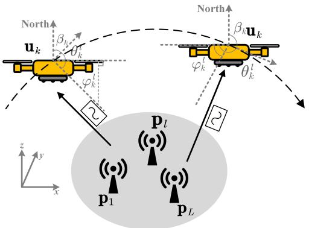  
Fig. 1. 3-D self-tracking scenario.

## II. SIGNAL MODEL

As is shown in Fig. 1, L anchors, which is denoted as $\{ \mathbf { p } _ { 1 } , \mathbf { p } _ { 2 } , \cdot \cdot \cdot , \mathbf { p } _ { L } \}$ , transmit signals with same frequency. In the scenario of non-cooperative signals, the number of anchors can be determined using the Akaike information criterion (AIC) [35], while the locations of anchors can be identified by referring to the distribution maps that depict the correspondence between anchor frequency bands and their respective locations, as provided by mobile network operators [36], [37]. During the operation of the algorithm, source number estimation is performed at fixed time intervals and upon the occurrence of tracking outliers. In the subsequent analysis, the number and positions of anchors are assumed as known. The UAV flies around these anchors, whose positions are denoted as ${ \bf u } _ { k } = [ u _ { k } ^ { x } , u _ { k } ^ { y } , u _ { k } ^ { z } ] ^ { \mathrm { T } } , k = 1 , 2 , \cdots , K$ . The UAV is equipped with the M-element uniform circle array (UCA), which can receive these signals through equidistantly distributed channels. The radius of this UCA is r. By comparing the signal phases, the UCA can determine the two-dimensional (2-D) direction of the incident signal, namely the azimuth angle $\theta _ { k } ^ { l }$ and the elevation angle $\varphi _ { k } ^ { l }$ . The reference element is assumed to be aligned with the yaw direction of the UAV. The yaw direction of the UAV is denoted as $\beta _ { k } . ~ \beta _ { k }$ is measured through the fusion of a high-precision gyroscope and magnetometer, which typically has minimal error. In this paper, $\beta _ { k }$ is assumed to have no measurement error.

The array output data can be expressed as

$$
\mathbf { X } _ { k } \left( t \right) = \mathbf { A } _ { k } \mathbf { S } _ { k } \left( t \right) + \mathbf { N } _ { k } \left( t \right)\tag{1}
$$

where $t ~ = ~ 1 , 2 , \cdots , T$ in which T denotes the snapshot number at each moment. The array manifold is written as $\mathbf { A } _ { k } = \left[ \mathbf { a } _ { k } ^ { 1 } , \mathbf { a } _ { k } ^ { 2 } , \cdot \cdot \cdot , \mathbf { a } _ { k } ^ { L } \right]$ . The steering vector of the l-th anchor

at the k-th moment is

$$
\mathbf { a } _ { k } ^ { l } = \left[ \begin{array} { c } { e ^ { - j \frac { 2 \pi } { \lambda } \left( \overline { { \mathbf { u } } } _ { k } ^ { l } \right) ^ { \mathrm { T } } } \mathbf { d } _ { 1 } } \\ { e ^ { - j \frac { 2 \pi } { \lambda } \left( \overline { { \mathbf { u } } } _ { k } ^ { l } \right) ^ { \mathrm { T } } } \mathbf { d } _ { 2 } } \\ { \vdots } \\ { e ^ { - j \frac { 2 \pi } { \lambda } \left( \overline { { \mathbf { u } } } _ { k } ^ { l } \right) ^ { \mathrm { T } } } \mathbf { d } _ { M } } \end{array} \right]\tag{2}
$$

where $\boldsymbol { \bar { \mathbf { u } } } _ { k } ^ { l } = \left[ \cos \left( \varphi _ { k } ^ { l } \right) \cos \left( \theta _ { k } ^ { l } \right) , \cos \left( \varphi _ { k } ^ { l } \right) \sin \left( \theta _ { k } ^ { l } \right) , \sin \left( \varphi _ { k } ^ { l } \right) \right] ^ { \mathrm { T } }$ and $\mathbf { d } _ { m }$ denotes the local coordinates of m-th element with respect to a reference point. λ denotes the signal wavelength. Assuming the reference point is located at the center of the UCA, $\mathbf { d } _ { m }$ can be expressed as

$$
{ \bf d } _ { m } = \left[ r \cos \left( 2 \pi \frac { m - 1 } { M } \right) \right]\tag{3}
$$

The source vector of the l-th anchor at the k-th moment is

$$
\mathbf { s } _ { k } ^ { l } = \left[ \mathbf { s } _ { k } ^ { l } \left( 1 \right) , \mathbf { s } _ { k } ^ { l } \left( 2 \right) , \cdots , \mathbf { s } _ { k } ^ { l } \left( T \right) \right]\tag{4}
$$

and the noise vector of the l-th anchor at the k-th moment is

$$
{ \bf n } _ { k } ^ { l } = \left[ { \bf n } _ { k } ^ { l } \left( 1 \right) , { \bf n } _ { k } ^ { l } \left( 2 \right) , \cdot \cdot \cdot , { \bf n } _ { k } ^ { l } \left( T \right) \right]\tag{5}
$$

where ${ \bf n } _ { k } ^ { l } \left( t \right) \sim N ( 0 , \sigma ^ { 2 } )$ and T denotes the snapshot number at each moment. So we can get that

$$
{ \bf S } _ { k } \left( t \right) = \left[ { \bf s } _ { k } ^ { 1 } \left( t \right) , { \bf s } _ { k } ^ { 2 } \left( t \right) , \cdot \cdot \cdot , { \bf s } _ { k } ^ { L } \left( t \right) \right] ^ { \mathrm { T } }\tag{6}
$$

and

$$
{ { \bf { N } } _ { k } } \left( t \right) = { \left[ { { \bf { n } } _ { k } ^ { 1 } \left( t \right) , { { \bf { n } } _ { k } ^ { 2 } } \left( t \right) , \cdot \cdot \cdot , { { \bf { n } } _ { k } ^ { L } } \left( t \right) } \right] ^ { \mathrm { T } } }\tag{7}
$$

where E $\begin{array} { r } { \left\{ { \bf N } _ { k } \left( t \right) { \bf N } _ { k } ^ { \mathrm { H } } \left( t \right) \right\} = \frac { \sum _ { t = 1 } ^ { T } { \bf N } _ { k } \left( t \right) { \bf N } _ { k } ^ { \mathrm { H } } \left( t \right) } { T } = \sigma ^ { 2 } { \bf I } _ { \mathrm { M } } . } \end{array}$

The auto-correlation matrix of $\mathbf { X } _ { k } \left( t \right)$ is denoted as

$$
\begin{array} { r } { \mathbf { R } _ { k } = \mathrm { E } \{ \mathbf { X } _ { k } \left( t \right) \mathbf { X } _ { k } ^ { \mathrm { H } } \left( t \right) \} } \\ { = \displaystyle \sum _ { t = 1 } ^ { T } \frac { \mathbf { X } _ { k } \left( t \right) \mathbf { X } _ { k } ^ { \mathrm { H } } \left( t \right) } { T } } \end{array}\tag{8}
$$

Then (8) can be eigenvalue decomposed as

$$
\mathbf { R } _ { k } = \mathbf { U } _ { s } ^ { k } \mathbf { \Lambda } \mathbf { A } _ { s } ^ { k } \left( \mathbf { U } _ { s } ^ { k } \right) ^ { \mathrm { H } } + \mathbf { U } _ { n } ^ { k } \mathbf { \Lambda } \mathbf { A } _ { n } ^ { k } \left( \mathbf { U } _ { n } ^ { k } \right) ^ { \mathrm { H } }\tag{9}
$$

= diag $\left\{ \lambda _ { 1 } ^ { k } , \lambda _ { 2 } ^ { k } , \cdots , \lambda _ { L } ^ { k } \right\}$ and $\begin{array} { r l } { \Lambda _ { n } ^ { k } } & { { } = } \end{array}$ diag $\{ \lambda _ { L + 1 } ^ { k } , \lambda _ { L + 2 } ^ { k } , \cdot \cdot \cdot , \lambda _ { M } ^ { k } \}$ in which ${ \boldsymbol { \lambda } } _ { m } ^ { k }$ denotes the eigenvalue and $\bar { \lambda _ { 1 } ^ { k } } > \lambda _ { 2 } ^ { k } > \cdots > \lambda _ { L } ^ { k } \gg \lambda _ { L + 1 } ^ { k } \approx \cdot \cdot \cdot \lambda _ { M } ^ { k } \approx \sigma ^ { 2 }$ Under a white-noise assumption, the noise subspace corresponds to the smallest $M \ - \ L$ eigenvalues, which matches the noise-covariance level. $\mathbf { U } _ { s } ^ { k }$ represents the signal subspace/principle subspace (PS) corresponding with $\pmb { \Lambda } _ { s }$ and $\mathbf { U } _ { \eta } ^ { k }$ represents the noise subspace/MS corresponding with $\mathbf { A } _ { n } ^ { k }$ . After the inverse operation for (9), the following equation can be obtained.

$$
\mathbf { R } _ { k } ^ { - 1 } = \mathbf { U } _ { n } ^ { k } \left( \mathbf { \Lambda } \Lambda _ { n } ^ { k } \right) ^ { - 1 } \left( \mathbf { U } _ { n } ^ { k } \right) ^ { \mathrm { H } } + \mathbf { U } _ { s } ^ { k } \left( \mathbf { \Lambda } \Lambda _ { s } ^ { k } \right) ^ { - 1 } \left( \mathbf { U } _ { s } ^ { k } \right) ^ { \mathrm { H } }\tag{10}
$$

where $\left( \Lambda _ { n } ^ { k } \right) ^ { - 1 } = \operatorname { d i a g } \left\{ \left( \lambda _ { M } ^ { k } \right) ^ { - 1 } , \left( \lambda _ { M - 1 } ^ { k } \right) ^ { - 1 } , \cdots , \left( \lambda _ { L + 1 } ^ { k } \right) ^ { - 1 } \right\}$ and $\begin{array} { r l r } { \left( \dot { \Lambda } _ { s } ^ { k } \right) ^ { - 1 } } & { = } & { \mathrm { d i a g } \left\{ \left( \lambda _ { L } ^ { k } \right) ^ { - 1 } , \left( \lambda _ { L - 1 } ^ { k } \right) ^ { - 1 } , \cdots , \left( \lambda _ { 1 } ^ { k } \right) ^ { - 1 } \right\} } \end{array}$ with $\left( \lambda _ { M } ^ { k } \right) ^ { - 1 } > \left( \lambda _ { M - 1 } ^ { k } \right) ^ { - 1 } > \cdots > \left( \lambda _ { L + 1 } ^ { k } \right) ^ { - 1 } \gg \left( \lambda _ { L } ^ { k } \right) ^ { - 1 } \approx$ $\cdots \left( \lambda _ { 1 } ^ { k } \right) ^ { - 1 }$ . In this case, $\mathbf { U } _ { n } ^ { k }$ becomes the PS.

Algorithm 1 3-D Self-Tracking of UAV Based on Minor   
Subspace Majorization-Minimization Iteration   
Input: The anchor position $\{ \mathbf { p } _ { 1 } , \mathbf { p } _ { 2 } , \cdot \cdot \cdot , \mathbf { p } _ { L } \}$ ; The array out  
put data ${ \bf X } _ { k } \left( t \right) , t = 1 , 2 , \cdots , T , k = 1 , 2 , \cdots , K ;$ The   
UCA parameter $\mathbf { d } _ { m } , m = 1 , 2 , \cdot \cdot \cdot , M ;$ The real UAV   
position at the first moment u1; The EAIP parameter $\mu ;$   
The MM parameter $I ;$ The MA parameters B and $c ;$ The   
KF parameters Q and R.   
Output: The UAV self-position tracking results   
$\widehat { \mathbf { u } } ^ { \prime } { } _ { 1 } , \widehat { \mathbf { u } } ^ { \prime } { } _ { 2 } , \cdots , \widehat { \mathbf { u } } ^ { \prime } { } _ { K }$   
b b bParameter Initialization:   
1: The weight matrix $\mathbf { W } _ { 1 } \left( 0 \right) = \left[ { \mathbf { I } } _ { M - L } , \mathbf { 0 } _ { \left( M - L \right) \times L } \right] ^ { \mathrm { T } } ;$   
2: The estimated error covariance $\mathbf { P } _ { B + 2 c - 1 } = \mathbf { I } _ { 3 } ;$   
3: The eigenvalues $\left[ \widehat { \lambda } _ { L + 1 } ^ { 0 } \left( 0 \right) , \widehat { \lambda } _ { L + 2 } ^ { 0 } \left( 0 \right) , \cdots , \widehat { \lambda } _ { M } ^ { 0 } \left( 0 \right) \right]$ =   
${ \bf 0 } _ { 1 \times ( M - L ) } ;$   
4: ${ \bf R } _ { 1 } ^ { 0 } \left( 0 \right) = { \bf 0 } _ { M \times M } , { \bf R } _ { 1 } ^ { y 0 } \left( 0 \right) = { \bf 0 } _ { \left( M - L \right) \times M } ;$   
5: $\mathbf { u } _ { 1 } ^ { 0 } = \mathbf { u } _ { 1 } , \widehat { \mathbf { u } } _ { 0 } ^ { \prime } = \mathbf { u } _ { 1 } ;$   
6: for $k = 1 , 2 , \cdots , K$ do   
MS Update:   
7: for $t = 1 , 2 , \cdots , T$ do   
8: Update ${ \bf R } _ { k } \left( t \right)$ and ${ \bf R } _ { k } ^ { y } \left( t \right)$ via (13), (15), (21) and   
$( 2 2 ) ;$   
9: Calculate the residual term ${ \bf e } _ { k } \left( t \right)$ by (23);   
10: Calculate ${ \bf g } _ { k } ^ { 0 } \left( t \right)$ and ${ \bf g } _ { k } \left( t \right)$ with (28) and (29);   
11: Calculate $\Theta _ { k } \left( t \right)$ via (33);   
12: Update $\mathbf { W } _ { k } \left( t \right)$ with (24);   
13: Update $\left[ \widehat { \lambda } _ { L + 1 } ^ { k } \left( t \right) , \widehat { \lambda } _ { L + 2 } ^ { k } \left( t \right) , \cdot \cdot \cdot , \widehat { \lambda } _ { M } ^ { k } \left( t \right) \right]$ via (19);   
14: end for   
15: ${ \bf R } _ { k + 1 } ^ { 0 } \left( 0 \right) = { \bf R } _ { k } ^ { 0 } \left( T \right) , { \bf R } _ { k + 1 } ^ { y 0 } \left( 0 \right) = { \bf R } _ { k } ^ { y 0 } \left( T \right) ;$   
16: $\mathbf { W } _ { k + 1 } \left( 0 \right) = \mathbf { W } _ { k } \left( T \right) ;$   
MM Iteration:   
17: $\mathbf { C } _ { k } ^ { \left( 1 \right) } = \mathbf { I } _ { M } - \mathbf { W } _ { k } \left( T \right) \mathbf { W } _ { k } ^ { \mathrm { H } } \left( T \right) ;$   
18: for $i = 1 , 2 , \cdots , I$ do   
19: Calculate $\mathbf { A } _ { k } ^ { i }$ from (41) to (49);   
20: $\mathbf { C } _ { k , i } ^ { ( 2 ) } = - 2 \left( \mathbf { \bar { A } } _ { k } ^ { i } \right) ^ { \mathrm { H } } \mathbf { C } _ { k } ^ { ( 1 ) } ;$   
21: $\begin{array} { r } { \mathbf { \Sigma } _ { u _ { l , m } } = \left| \left[ \mathbf { C } _ { k , i } ^ { ( 2 ) } \right] _ { l , m } \right| , v _ { l , m } = \arg \left\{ \left[ \mathbf { C } _ { k , i } ^ { ( 2 ) } \right] _ { l , m } \right\} ; } \end{array}$   
22: Calculate $\mathbf { C } _ { k , i , l } ^ { ( 3 ) } , \mathbf { \dot { C } } _ { k , i , l } ^ { ( 4 ) }$ and $\mathbf { C } _ { k , i , l } ^ { ( 5 ) }$ based on (52);   
23: Obtain $\mathbf { C } _ { k , i , l } ^ { ( 6 ) } , \mathbf { C } _ { k , i , l } ^ { ( 7 ) }$ and $\mathbf { C } _ { k , i , l } ^ { ( 8 ) }$ based on (56);   
24: Acquire $\mathbf { C } _ { k , i } ^ { ( 9 ) }$ and $\mathbf { C } _ { k , i } ^ { ( 1 0 ) }$ via (57);   
25: $\begin{array} { r } { \mathbf { u } _ { k } ^ { i } = - \frac { \mathbf { C } _ { k , i } ^ { ( 1 0 ) } } { 2 \mathbf { C } _ { k , i } ^ { ( 9 ) } } ; } \end{array}$   
26: end for   
27: $\mathbf { u } _ { k + 1 } ^ { 0 } = \mathbf { u } _ { k } ^ { I } , \Delta \widehat { \mathbf { u } } _ { k } = \mathbf { u } _ { k } ^ { I } - \mathbf { u } _ { k } ^ { 0 } ;$   
bTracking Filtering:   
28: if $k \geq B + 2 c$ then   
29: $\begin{array} { r } { \widehat { \underline { { \mathbf { a } } } } _ { k } = \sum _ { b = 0 } ^ { \widehat { B } - 1 } \frac { \widehat { \mathbf { u } } _ { k - b } - \widehat { \mathbf { u } } _ { k - b - c } - \widehat { \mathbf { u } } _ { k - b - c } + \widehat { \mathbf { u } } _ { k - b - 2 c } } { B c ^ { 2 } T ^ { 2 } \Delta t ^ { 2 } } } \end{array}$   
30: $\mathbf { P } _ { k } ^ { - } = \mathbf { P } _ { k - 1 } + \mathbf { Q } ;$   
31: $\mathbf { G } _ { k } = \mathbf { P } _ { k } ^ { - } \left( \mathbf { P } _ { k } ^ { - } + \mathbf { R } \right) ^ { - 1 } ;$   
32: $\Delta \widehat { \mathbf { u } } _ { k } ^ { \prime \prime } = \Delta \widehat { \mathbf { u } } _ { k - 1 } ^ { \prime } + \widehat { \mathbf { a } } _ { k } ^ { \prime } T ^ { 2 } \Delta t ^ { 2 }$   
33: $\Delta \widehat { \mathbf { u } } _ { k } ^ { \prime } = \Delta \widehat { \mathbf { u } } _ { k } ^ { \prime \prime } + \mathbf { G } _ { k } \left( \Delta \widehat { \mathbf { u } } _ { k } - \Delta \widehat { \mathbf { u } } _ { k } ^ { \prime \prime } \right)$   
34: $\mathbf { P } _ { k } = \left( \mathbf { I } _ { 3 } - \mathbf { G } _ { k } \right) \mathbf { P } _ { k } ^ { - } ;$   
35: else   
36: $\Delta \widehat { \mathbf { u } } _ { k } ^ { \prime } = \Delta \widehat { \mathbf { u } } _ { k } ;$   
37: end if   
38: $\widehat { \mathbf { u } } _ { k } ^ { \prime } = \widehat { \mathbf { u } } _ { k - 1 } ^ { \prime } + \Delta \widehat { \mathbf { u } } _ { k } ^ { \prime } ;$   
b39: end for

## III. THE PROPOSED METHOD

For the 3-D self-tracking problem based on signals with same frequency, the proposed method is divided into three components: subspace update, iterative tracking and trajectory filtering. In Section III-A, the EAIP method is proposed to achieve more accurate subspace update of the MS. In Section III-B, the iterative tracking component introduces an MM method based on the MS, where iterative plot points derived from the MM are used to track the UAV’s position. In Section III-C, the trajectory filtering component proposes substituting the acceleration parameter in the UAV dynamics with MA and employs a KF for difference values to suppress trajectory noise. The specific algorithm implementation is presented in Algorithm 1.

## A. Enhanced Approximate Inverse-Power Algorithm for Minor Subspace Update

By performing inverse power operations on the signal data, the AIP algorithm enables fast estimation of the MS. According to [38], compared to the raw signal data, the covariance matrix, owing to its second-order moment properties, exhibits a higher signal-to-noise ratio (SNR). Therefore, the proposed method applies the inverse power operation to the covariance matrix, achieving higher estimation accuracy. The novel orthonormal matrix proposed in [26] can preserve the orthonormality of data projections, thereby maintaining the numerical stability of the tracking results. In this paper, this matrix is utilized to maintain the orthonormality of the transition matrix and the update matrix. In addition, eigenvalue estimation is introduced during the MS update process to help suppress the noise variance in the covariance matrix, thereby achieving more stable MS tracking performance.

The estimation of noise subspace for ${ \bf R } _ { k }$ is denoted as a $M \times ( M - L )$ update matrix $\mathbf { W } _ { k } \left( t \right)$ which is columnorthonormal. In order to extract PS in (10), according to the PS method in [39], the classic power method can be expressed as

$$
\mathbf { W } _ { k } \left( t \right) = \mathbf { R } _ { k } ^ { - 1 } \mathbf { W } _ { k } \left( t - 1 \right)\tag{11}
$$

where $\mathbf { W } _ { k } \left( t \right)$ denotes the update matrix at the k-th moment and the t-th snapshot, with similar notations following the same convention. $\mathbf { W } _ { k } \left( 0 \right) \ = \ \mathbf { W } _ { k - 1 } \left( T \right)$ and $\mathbf { W } _ { 1 } \left( 0 \right) \ =$ $\left[ { \bf I } _ { M - L } , { \bf 0 } _ { ( M - L ) \times L } \right] ^ { \mathrm { T } }$

Due to the inverse operation of ${ \bf R } _ { k }$ , directly performing PS tracking on (11) results in high computational complexity. After left-multiplying both sides of (11) by ${ \bf R } _ { k }$ simultaneously, (11) can be transformed into the following form, which is also called inverse-power method.

$$
\mathbf { W } _ { k } \left( t - 1 \right) = \mathbf { R } _ { k } \mathbf { W } _ { k } \left( t \right)\tag{12}
$$

${ \bf R } _ { k }$ can be computed with an iteration formula.

$$
\mathbf { R } _ { k } ^ { 0 } \left( t \right) = \mu \mathbf { R } _ { k } ^ { 0 } \left( t - 1 \right) + \mathbf { X } _ { k } \left( t \right) \mathbf { X } _ { k } ^ { \mathrm { H } } \left( t \right)\tag{13}
$$

where $\mu$ is the forgetting factor and ${ \bf R } _ { k } ^ { 0 } \left( 0 \right) = { \bf R } _ { k - 1 } ^ { 0 } \left( T \right)$ with ${ \bf R } _ { 1 } ^ { 0 } \left( 0 \right) = { \bf 0 } _ { M \times M }$

Define that

$$
\mathbf { Y } _ { k } \left( t \right) = \mathbf { W } _ { k } ^ { \mathrm { H } } \left( t - 1 \right) \mathbf { X } _ { k } \left( t \right)\tag{14}
$$

So the cross-covariance matrix can be updated using the following formula.

$$
{ \bf R } _ { k } ^ { y 0 } \left( t \right) = \mu { \bf R } _ { k } ^ { y 0 } \left( t - 1 \right) + { \bf Y } _ { k } \left( t \right) { \bf X } _ { k } ^ { \mathrm { H } } \left( t \right)\tag{15}
$$

where ${ \bf R } _ { k } ^ { y 0 } \left( 0 \right) = { \bf R } _ { k - 1 } ^ { y 0 } \left( T \right)$ and $\mathbf { R } _ { 1 } ^ { y 0 } \left( 0 \right) = \mathbf { 0 } _ { \left( M - L \right) \times M } .$

The eigenvalues corresponding with the MS are equivalent to the noise covariance element values. In order to suppress the noise interference, the eigenvalue update is added into the iteration procedure. By performing the operation on (9) and (13), we can derive the extraction formula for the eigenvalue matrix

$$
\mathbf { W } _ { k } \left( t - 1 \right) ^ { \mathrm { H } } \mathbf { R } _ { k } ^ { 0 } \left( t \right) \mathbf { W } _ { k } \left( t - 1 \right) = { \mathbf { A } } _ { n } ^ { k } \left( t \right)\tag{16}
$$

After substituting (13) into (16), the following formula can be obtained.

$$
\begin{array} { r } { \mathbf { A } _ { n } ^ { k } \left( t \right) = \mu \mathbf { W } _ { k } ^ { \mathrm { H } } \left( t - 1 \right) \mathbf { R } _ { k } ^ { 0 } \left( t - 1 \right) \mathbf { W } _ { k } \left( t - 1 \right) \mathbf { \Omega } } \\ { + \mathbf { W } _ { k } ^ { \mathrm { H } } \left( t - 1 \right) \mathbf { X } _ { k } \left( t \right) \mathbf { X } _ { k } ^ { \mathrm { H } } \left( t \right) \mathbf { W } _ { k } \left( t - 1 \right) \mathbf { \Omega } } \end{array}\tag{17}
$$

According to [39], there is the assumption that $\mathbf { W } _ { k } \left( t - 1 \right) \approx \mathbf { W } _ { k } \left( t - 2 \right)$ in continuous sampling systems. In addition, owing to the high array sampling rate, which can exceed 100MHz, corresponding to a sampling time interval of less than $1 0 ^ { - 8 } \mathrm { s }$ , the quasi-stationary assumption holds true. (17) can be approximated as

$$
\begin{array} { r l } & { \mathbf { A } _ { n } ^ { k } \left( t \right) \approx \mu \mathbf { W } _ { k } ^ { \mathrm { H } } \left( t - 2 \right) \mathbf { R } _ { k } ^ { 0 } \left( t - 1 \right) \mathbf { W } _ { k } \left( t - 2 \right) } \\ & { \quad \quad \quad + \mathbf { W } _ { k } ^ { \mathrm { H } } \left( t - 1 \right) \mathbf { X } _ { k } \left( t \right) \mathbf { X } _ { k } ^ { \mathrm { H } } \left( t \right) \mathbf { W } _ { k } \left( t - 1 \right) } \\ & { \quad \quad \quad = \mu \mathbf { A } _ { n } ^ { k } \left( t - 1 \right) + \mathbf { W } _ { k } ^ { \mathrm { H } } \left( t - 1 \right) \mathbf { X } _ { k } \left( t \right) \mathbf { X } _ { k } ^ { \mathrm { H } } \left( t \right) \mathbf { W } _ { k } \left( t - 1 \right) } \end{array}\tag{18}
$$

The eigenvalues are the diagonal elements of ${ \boldsymbol { \Lambda } } _ { n } ^ { k } \left( t \right)$ . Therefore, (18) is equivalent to

$$
\begin{array} { r l } & { \left[ \widehat { \lambda } _ { L + 1 } ^ { k } \left( t \right) , \widehat { \lambda } _ { L + 2 } ^ { k } \left( t \right) , \cdots , \widehat { \lambda } _ { M } ^ { k } \left( t \right) \right] } \\ & { = \mu \left[ \widehat { \lambda } _ { L + 1 } ^ { k } \left( t - 1 \right) , \widehat { \lambda } _ { L + 2 } ^ { k } \left( t - 1 \right) , \cdots , \widehat { \lambda } _ { M } ^ { k } \left( t - 1 \right) \right] } \\ & { + \left| \mathbf { X } _ { k } ^ { \mathrm { H } } \left( t \right) \mathbf { W } _ { k } \left( t - 1 \right) \right| ^ { 2 } } \end{array}\tag{19}
$$

where $\left[ \widehat { \lambda } _ { L + 1 } ^ { k } \left( 0 \right) , \widehat { \lambda } _ { L + 2 } ^ { k } \left( 0 \right) , \cdots , \widehat { \lambda } _ { M } ^ { k } \left( 0 \right) \right] = \mathbf { 0 } _ { 1 \times \left( M - L \right) } .$

According to [40], the estimated noise power can be obtained.

$$
\widehat { \sigma } _ { k } ^ { 2 } \left( t \right) = \frac { \sum _ { l = L + 1 } ^ { M } \widehat { \lambda } _ { l } ^ { k } \left( t \right) } { M - L }\tag{20}
$$

After suppressing the noise power, (13) and (15) can be changed into

$$
{ \bf R } _ { k } \left( t \right) = { \bf R } _ { k } ^ { 0 } \left( t \right) - \widehat { \sigma } _ { k } ^ { 2 } \left( t \right) { \bf I } _ { M }\tag{21}
$$

$$
\mathbf { R } _ { k } ^ { y } \left( t \right) = \mathbf { R } _ { k } ^ { y 0 } \left( t \right) - \widehat { \sigma } _ { k } ^ { 2 } \left( t \right) \mathbf { W } _ { k } ^ { \mathrm { H } } \left( t - 1 \right) \mathbf { I } _ { M }\tag{22}
$$

Then, based on the correlation-based projection approximation subspace tracking (COPAST) proposed in [38], the new residual term, incorporating the covariance matrix and the cross-covariance matrix, can be defined as

$$
{ \bf e } _ { k } \left( t \right) = { \bf R } _ { k } \left( t \right) { \bf X } _ { k } \left( t \right) - { \bf W } _ { k } \left( t - 1 \right) { \bf R } _ { k } ^ { y } \left( t \right) { \bf X } _ { k } \left( t \right)\tag{23}
$$

Similar to fast approximated power iteration (FAPI) in [41], the weight matrix can be updated by

$$
\mathbf { W } _ { k } ( t ) = \left[ \mathbf { W } _ { k } ( t - 1 ) + \mathbf { e } _ { k } ( t ) \mathbf { g } _ { k } ^ { \mathrm { H } } ( t ) \right] \boldsymbol { \Theta } _ { k } ( t )\tag{24}
$$

where ${ \bf g } _ { k } \left( t \right)$ is the unknown parameter vector to be determined. $\Theta _ { k } \left( t \right)$ is the orthonormal transition matrix which makes $\mathbf { W } _ { k } \left( t \right)$ keep column-orthonormal when updating element values.

Substituting (24) into (12), the following formula can be obtained.

$$
{ { \bf { R } } _ { k } } \left( t \right) { \left[ { { { \bf { W } } _ { k } } { { \left( { t - 1 } \right) } + { { \bf { e } } _ { k } } { { \left( t \right) } { { \bf { g } } _ { k } ^ { \mathrm { H } } } \left( t \right) } }  } { \Theta _ { k } } ( t ) } = { {\right] \bf { W } } _ { k } } { { \left( { t - 1 } \right) } }\tag{25}
$$

Utilizing the orthogonal property between ${ \bf e } _ { k } \left( t \right)$ and ${ \bf W } _ { k } ( t -$ 1), we can get

$$
\begin{array} { r l } & { { \mathbf { e } } _ { k } ^ { \mathrm { H } } \left( t \right) { \mathbf { R } } _ { k } \left( t \right) \left[ { \mathbf { W } } _ { k } ( t - 1 ) + { \mathbf { e } } _ { k } ( t ) { \mathbf { g } } _ { k } ^ { \mathrm { H } } ( t ) \right] { \mathbf { \Theta } } _ { { k } } ( t ) } \\ & { ~ = { \mathbf { e } } _ { k } ^ { \mathrm { H } } \left( t \right) { \mathbf { W } } _ { k } ( t - 1 ) = 0 } \end{array}\tag{26}
$$

Because $\Theta _ { k } \left( t \right)$ is a full-rank matrix, we can obtain

$$
{ { \bf { e } } _ { k } ^ { \mathrm { H } } } \left( t \right) { { \bf { R } } _ { k } } \left( t \right) \left[ { { { \bf { W } } _ { k } } { { \left( { t - 1 } \right) } } + { { \bf { e } } _ { k } } { { \left( t \right) } } { \bf { g } } _ { k } ^ { \mathrm { H } } { { \left( t \right) } } } \right] = 0\tag{27}
$$

According to [23], the unknown parameter ${ \bf g } _ { k } \left( t \right)$ can be derived as

$$
\mathbf { g } _ { k } ^ { 0 } \left( t \right) = \mathbf { R } _ { k } \left( t \right) \mathbf { e } _ { k } \left( t \right)\tag{28}
$$

$$
{ \bf g } _ { k } \left( t \right) = \frac { - { \bf W } _ { k } \left( t - 1 \right) ^ { \mathrm { H } } { \bf g } _ { k } ^ { 0 } \left( t \right) } { { \bf g } _ { k } ^ { 0 } \left( t \right) ^ { \mathrm { H } } { \bf e } _ { k } \left( t \right) }\tag{29}
$$

Based on the novel orthonormal matrix in [26], $\Theta _ { k } \left( t \right)$ can be expressed by

$$
\boldsymbol { \Theta } _ { k } \left( t \right) = { { \mathbf { U } } _ { k } } \left( t \right) { { \mathbf { D } } _ { k } } \left( t \right) { { \mathbf { U } } _ { k } ^ { \mathrm { H } } } \left( t \right)\tag{30}
$$

where

$$
\mathbf { U } _ { k } \left( t \right) = \left[ \frac { \mathbf { g } _ { k } \left( t \right) } { \| \mathbf { g } _ { k } \left( t \right) \| _ { 2 } } , \mathbf { H } _ { k } \left( t \right) \right]\tag{31}
$$

and

$$
{ { \bf { D } } _ { k } } \left( t \right) = { { \mathrm { d i a g } } \left\{ \frac { 1 } { { { \| { { \bf { w } } _ { k } } \left( t \right) \| _ { 2 } } } } , 1 , \cdot \cdot \cdot , 1 \right\} }\tag{32}
$$

in which $\mathbf { H } _ { k } \left( t \right)$ is a $( M - L ) \times ( M - L - 1 )$ matrix satisfying $\begin{array} { l l l } { { \displaystyle { \bf H } _ { k } ^ { \mathrm { H } } \left( t \right) { \bf H } _ { k } \left( t \right) } } & { { = } } & { { { \bf I } _ { { \underline { { M } } } - L - 1 } } } \end{array}$ and $\begin{array} { r l } { \mathbf { H } _ { k } ^ { \mathrm { H } } \left( t \right) \mathbf { g } _ { k } \left( t \right) } & { { } = } \end{array}$ $\begin{array} { r l r } { \mathbf { 0 } _ { ( M - L - 1 ) \times 1 } . \ \mathbf { w } _ { k } \left( t \right) } & { = } & { \frac { \mathbf { b } _ { k } \left( t \right) } { \left\| \mathbf { g } _ { k } \left( t \right) \right\| _ { 2 } } \ + \ \mathbf { e } _ { k } \left( t \right) \left\| \mathbf { g } _ { k } \left( t \right) \right\| _ { 2 } } \end{array}$ and $\mathbf { b } _ { k } \left( t \right) = \mathbf { W } _ { k } \left( t - 1 \right) \mathbf { g } _ { k } \left( t \right)$

Then (30) can be written as

$$
\left. \begin{array} { l } { { \bf { \sigma } } ^ { \bf { { e } } _ { k } } \left( \tau \right) \left( { { { \bf { I } } _ { M - L } } + \mathrm { d i a g } \left\{ \frac 1 { { \left\| { { { \bf { w } } _ { k } } \left( t \right) } \right\| _ { 2 } } } - 1 , 0 , \cdots , 0 \right\} } \right) } \\ { { \bf { U } } _ { k } ^ { \mathrm { H } } \left( t \right) } \end{array} \right.
$$

$$
= \mathbf { I } _ { M - L } + \left( { \frac { 1 } { \| \mathbf { w } _ { k } \left( t \right) \| _ { 2 } } } - 1 \right) { \frac { \mathbf { g } _ { k } \left( t \right) \mathbf { g } _ { k } ^ { \mathrm { H } } \left( t \right) } { \| \mathbf { g } _ { k } \left( t \right) \| _ { 2 } ^ { 2 } } }\tag{33}
$$

Similar to the manipulations in [26], after substituting (33) into (24), we can derive that

$$
\mathbf { W } _ { k } ( t ) = { { \mathbf { W } } _ { k } } ( t - 1 ) + { { \mathbf { q } } _ { k } } ( t ) \frac { { { \mathbf { g } } _ { k } ^ { \mathrm { H } } ( t ) } } { \|  \mathbf { g } _ { k } ( t ) \| _ { 2 } }\tag{34}
$$

where $\begin{array} { r } { \mathbf q _ { k } \left( t \right) = \frac { \mathbf w _ { k } \left( t \right) } { \| \mathbf w _ { k } \left( t \right) \| _ { 2 } } - \frac { \mathbf b _ { k } \left( t \right) } { \| \mathbf g _ { k } \left( t \right) \| _ { 2 } } } \end{array}$ . For the convenience of subsequent discussion, the final iterative result of $\mathbf { W } _ { k } \left( t \right)$ is denoted as $\mathbf { W } _ { k }$ at the k-th moment.

Compared with the AIP algorithm, the proposed method incorporates historical information into the estimation of the residual term by utilizing the cross-covariance matrix. The orthonormalization scheme of the AIP method suffers from numerical divergence, while the scheme adopted in this paper can simultaneously guarantee the numerical stability of both the weight matrix and the transition matrix. These schemes all contribute to enhancing the continuity of subspace update. In combination with the application scenario of this paper, a correlation-based estimation form of the residual term is employed to mitigate the degradation of target tracking performance induced by noise, which is conducive to improving the SNR of the input data. Meanwhile, the noise power is estimated via the eigenvalues to suppress the noise components in the covariance matrix, thereby further boosting the tracking performance of the algorithm under low SNR conditions.

## B. Majorization-Minimization Iteration Based on Noise Subspace Fitting for 3-D Self-Tracking

The NSF method extracts position information by exploiting the orthogonality between the noise subspace and the array manifold. Compared to the ML and SSF approaches proposed in [22], NSF avoids matrix inversion operations, resulting in lower computational complexity. However, in 3-D space, the spatial spectrum search method proposed in [22] suffers from the limitations of extensive grid-based feature computations and grid quantization errors. To address these challenges, signal steering vector expansion [31] and the MM method [33] are the most widely used approaches. Compared to the signal steering vector expansion method, the MM approach demonstrates superior convergence properties and accuracy. Therefore, in this section, we employ the MM to decompose the NSF expression, enabling accurate tracking of the UAV’s position.

The noise subspace is orthogonal to the array manifold [20], so we can get

$$
\| \left( \mathbf { U } _ { n } ^ { k } \right) ^ { \mathrm { H } } \mathbf { A } _ { k } \| _ { \mathrm { F } } ^ { 2 } = 0\tag{35}
$$

${ \bf U } _ { n } ^ { k }$ is described as $\mathbf { W } _ { k }$ in the MS update result. So the NSF problem minimizes

$$
\begin{array} { r l } & { f \left( \mathbf { u } _ { k } \right) = \Vert \mathbf { W } _ { k } ^ { \mathrm { H } } \mathbf { A } _ { k } \Vert _ { \mathrm { F } } ^ { 2 } } \\ & { \qquad = \operatorname { t r } \left( \mathbf { A } _ { k } ^ { \mathrm { H } } \mathbf { W } _ { k } \mathbf { W } _ { k } ^ { \mathrm { H } } \mathbf { A } _ { k } \right) } \end{array}\tag{36}
$$

Define that $\mathbf { C } _ { k } ^ { ( 1 ) } = \lambda _ { \operatorname* { m a x } } \left( \mathbf { W } _ { k } \mathbf { W } _ { k } ^ { \mathrm { H } } \right) \mathbf { I } _ { M } - \mathbf { W } _ { k } \mathbf { W } _ { k } ^ { \mathrm { H } } = \mathbf { I } _ { M } -$ $\mathbf { W } _ { k } \mathbf { W } _ { k } ^ { \mathrm { H } }$ . (36) can be derived as

$$
\begin{array} { r l } & { \operatorname { t r } \left( \mathbf { A } _ { k } ^ { \mathrm { H } } \mathbf { W } _ { k } \mathbf { W } _ { k } ^ { \mathrm { H } } \mathbf { A } _ { k } \right) } \\ & { = \operatorname { t r } \left( \mathbf { A } _ { k } ^ { \mathrm { H } } \mathbf { A } _ { k } \right) - \operatorname { t r } \left[ \mathbf { A } _ { k } ^ { \mathrm { H } } \mathbf { C } _ { k } ^ { ( 1 ) } \mathbf { A } _ { k } \right] } \\ & { = - \operatorname { t r } \left[ \mathbf { A } _ { k } ^ { \mathrm { H } } \mathbf { C } _ { k } ^ { ( 1 ) } \mathbf { A } _ { k } \right] + L M } \end{array}\tag{37}
$$

To find the upper bound for $f \left( { \mathbf { u } } _ { k } \right)$ , the following lemma in Section III-A of [32] is required.

Lemma 1: Function tr $\left( \mathbf { \bar { X } } ^ { \mathrm { H } } \mathbf { Y } ^ { - 1 } \mathbf { X } \right)$ with $\mathbf { Y } \in \mathbb { S } _ { + + }$ can be lowerbounded as

$$
\begin{array} { r l } & { \operatorname { t r } \left( \mathbf { X } ^ { \mathrm { H } } \mathbf { Y } ^ { - 1 } \mathbf { X } \right) } \\ & { \geq 2 \mathrm { R } \left\{ \operatorname { t r } \left[ \left( \mathbf { X } ^ { i } \right) ^ { \mathrm { H } } \left( \mathbf { Y } ^ { i } \right) ^ { - 1 } \mathbf { X } \right] \right\} } \\ & { \quad - \operatorname { t r } \left[ \left( \mathbf { Y } ^ { i } \right) ^ { - 1 } \mathbf { X } ^ { i } \left( \mathbf { X } ^ { i } \right) ^ { \mathrm { H } } \left( \mathbf { Y } ^ { i } \right) ^ { - 1 } \mathbf { Y } \right] + \mathrm { c o n s t } } \end{array}\tag{38}
$$

with equality achieved at $( { \bf X } , { \bf Y } ) = \left( { \bf X } ^ { i } , { \bf Y } ^ { i } \right)$ . By using Lemma 1, the following formula can be obtained.

$$
\begin{array} { r l } & { - \mathrm { t r } \left[ \mathbf { A } _ { k } ^ { \mathrm { H } } \mathbf { C } _ { k } ^ { ( 1 ) } \mathbf { A } _ { k } \right] \leq - 2 \mathrm { R } \left\{ \mathrm { t r } \left[ \left( \mathbf { A } _ { k } ^ { i } \right) ^ { \mathrm { H } } \mathbf { C } _ { k } ^ { ( 1 ) } \mathbf { A } _ { k } \right] \right\} } \\ & { \qquad + \mathrm { t r } \left\{ \mathbf { C } _ { k } ^ { ( 1 ) } \mathbf { A } _ { k } ^ { i } \left( \mathbf { A } _ { k } ^ { i } \right) ^ { \mathrm { H } } \mathbf { C } _ { k } ^ { ( 1 ) } \left[ \mathbf { C } _ { k } ^ { ( 1 ) } \right] ^ { - 1 } \right\} } \\ & { = \mathrm { R } \left\{ \mathrm { t r } \left[ - 2 \left( \mathbf { A } _ { k } ^ { i } \right) ^ { \mathrm { H } } \mathbf { C } _ { k } ^ { ( 1 ) } \mathbf { A } _ { k } \right] \right\} + \mathrm { c o n s t } } \end{array}\tag{39}
$$

Thus, we can obtain

$$
f \left( \mathbf { u } _ { k } \right) \leq \mathrm { R } \left\{ \mathrm { t r } \left[ \mathbf { C } _ { k , i } ^ { \left( 2 \right) } \mathbf { A } _ { k } \right] \right\} + \mathrm { c o n s t }\tag{40}
$$

where $\mathbf { C } _ { k , i } ^ { ( 2 ) } = - 2 \left( \mathbf { A } _ { k } ^ { i } \right) ^ { \mathrm { H } } \mathbf { C } _ { k } ^ { ( 1 ) }$ and $\mathbf { A } _ { k } ^ { i }$ is denoted as

$$
\mathbf { A } _ { k } ^ { i } = \left[ \left( \mathbf { a } _ { k } ^ { 1 } \right) ^ { i - 1 } , \left( \mathbf { a } _ { k } ^ { 2 } \right) ^ { i - 1 } , \cdot \cdot \cdot , \left( \mathbf { a } _ { k } ^ { L } \right) ^ { i - 1 } \right]\tag{41}
$$

in which

$$
\begin{array}{c} \left( \mathbf { a } _ { k } ^ { l } \right) ^ { i - 1 } = \left[ e ^ { - j \frac { 2 \pi } { \lambda } \left[ \left( \overline { { \mathbf { u } } } _ { k } ^ { l } \right) ^ { i - 1 } \right] ^ { \mathrm { T } } \mathbf { d } _ { 1 } } \\ { e ^ { - j \frac { 2 \pi } { \lambda } \left[ \left( \overline { { \mathbf { u } } } _ { k } ^ { l } \right) ^ { i - 1 } \right] ^ { \mathrm { T } } \mathbf { d } _ { 2 } } } \\ { \vdots } \\ { e ^ { - j \frac { 2 \pi } { \lambda } \left[ \left( \overline { { \mathbf { u } } } _ { k } ^ { l } \right) ^ { i - 1 } \right] ^ { \mathrm { T } } \mathbf { d } _ { M } } } \end{array} \right]\tag{42}
$$

with

$$
\left( \overline { { \mathbf { u } } } _ { k } ^ { l } \right) ^ { i - 1 } = \left[ \begin{array} { c } { \cos \left( \varphi _ { k } ^ { l } \right) ^ { i - 1 } \cos \left( \theta _ { k } ^ { l } \right) ^ { i - 1 } } \\ { \cos \left( \varphi _ { k } ^ { l } \right) ^ { i - 1 } \sin \left( \theta _ { k } ^ { l } \right) ^ { i - 1 } } \\ { \sin \left( \varphi _ { k } ^ { l } \right) ^ { i - 1 } } \end{array} \right]\tag{43}
$$

The components of (43) is defined as

$$
\begin{array} { r l } & { \sin \left( \theta _ { k } ^ { l } \right) ^ { i - 1 } = \sin \left[ \left( { \theta ^ { \prime } } _ { k } ^ { l } \right) ^ { i - 1 } - \beta _ { k } \right] } \\ & { \phantom { \frac { 1 } { 1 } } = \sin \left( \theta _ { k } ^ { \prime l } \right) ^ { i - 1 } \cos \left( \beta _ { k } \right) - \cos \left( \theta _ { k } ^ { \prime l } \right) ^ { i - 1 } \sin \left( \theta _ { k } ^ { \prime } \right) } \end{array}\tag{βk}
$$

(44)

$$
\begin{array} { r l } & { \cos \left( \theta _ { k } ^ { l } \right) ^ { i - 1 } = \cos \left[ \left( \theta _ { k } ^ { \prime l } \right) ^ { i - 1 } - \beta _ { k } \right] } \\ & { \qquad = \cos \left( \theta _ { k } ^ { \prime l } \right) ^ { i - 1 } \cos \left( \beta _ { k } \right) + \sin \left( \theta _ { k } ^ { \prime l } \right) ^ { i - 1 } \sin \left( \theta _ { k } ^ { \prime l } \right) ^ { i } } \end{array}\tag{βk}
$$

(45)

where

$$
\begin{array} { l } { \displaystyle \sin \left( \varphi _ { k } ^ { l } \right) ^ { i - 1 } = \frac { p _ { l } ^ { z } - \left( u _ { k } ^ { i - 1 } \right) ^ { z } } { \| \mathbf { p } _ { l } - \mathbf { u } _ { k } ^ { i - 1 } \| _ { 2 } } ( 4 \mathrm { ~ } } \\ { \displaystyle \cos \left( \varphi _ { k } ^ { l } \right) ^ { i - 1 } = \frac { \sqrt { \left[ p _ { l } ^ { x } - \left( u _ { k } ^ { i - 1 } \right) ^ { x } \right] ^ { 2 } + \left[ p _ { l } ^ { y } - \left( u _ { k } ^ { i - 1 } \right) ^ { y } \right] ^ { 2 } } } { \| \mathbf { p } _ { l } - \mathbf { u } _ { k } ^ { i - 1 } \| _ { 2 } } } \end{array}\tag{6}
$$

(47)

$$
\sin ( \theta ^ { \prime } \overset { l } { \underset { k } { ) } } ) ^ { i - 1 } = \frac { p _ { l } ^ { y } - ( u _ { k } ^ { i - 1 } ) ^ { y } } { \sqrt { [ p _ { l } ^ { x } - ( u _ { k } ^ { i - 1 } ) ^ { x } ] ^ { 2 } + [ p _ { l } ^ { y } - ( u _ { k } ^ { i - 1 } ) ^ { y } ] ^ { 2 } } }\tag{48}
$$

$$
\cos \left( \theta ^ { \prime } \mathbf { \Sigma } _ { k } ^ { l } \right) ^ { i - 1 } = \frac { p _ { l } ^ { x } - \left( u _ { k } ^ { i - 1 } \right) ^ { x } } { \sqrt { \left[ p _ { l } ^ { x } - \left( u _ { k } ^ { i - 1 } \right) ^ { x } \right] ^ { 2 } + \left[ p _ { l } ^ { y } - \left( u _ { k } ^ { i - 1 } \right) ^ { y } \right] ^ { 2 } } }\tag{49}
$$

For simplicity, we define $u _ { l , m } = \left| \left[ \mathbf { C } _ { k , i } ^ { ( 2 ) } \right] _ { l , m } \right|$ and $v _ { l , m } =$ arg $\left\{ \left[ \mathbf { C } _ { k , i } ^ { \left( 2 \right) } \right] _ { l , m } \right\}$ . Consequently, the right-hand side term of (40) can be reformulated as

$$
\begin{array} { r l } & { \mathrm { R } \left. \mathrm { t r } \left[ \mathbf { C } _ { k , i } ^ { ( 2 ) } \mathbf { A } _ { k } \right] \right. } \\ & { = \mathrm { R } \left. \displaystyle \sum _ { l = 1 } ^ { L } \sum _ { m = 1 } ^ { M } \left[ \mathbf { C } _ { k , i } ^ { ( 2 ) } \right] _ { l , m } [ \mathbf { A } _ { k } ] _ { m , l } \right. } \\ & { = \mathrm { R } \left. \displaystyle \sum _ { l = 1 } ^ { L } \sum _ { m = 1 } ^ { M } u _ { l , m } e ^ { j v _ { l , m } } e ^ { - j \frac { 2 } { \lambda } \left( \bar { \mathbf { u } } _ { k } ^ { l } \right) ^ { \mathrm { T } } \mathbf { d } _ { m } } \right. } \\ & { = \displaystyle \sum _ { l = 1 } ^ { L } \sum _ { m = 1 } ^ { M } u _ { l , m } \cos \left[ \frac { 2 \pi } { \lambda } \left( \bar { \mathbf { u } } _ { k } ^ { l } \right) ^ { \mathrm { T } } \mathbf { d } _ { m } - v _ { l , m } \right] } \end{array} .\tag{50}
$$

After deriving (50), the final MM iteration formula can be obtained by employing surrogate functions similar to those in [33]. Since the variables in the iteration formula involve complex expressions, the detailed derivation process is still provided. To facilitate further derivation, the following lemma is needed, which is in Appendix $\mathrm { A }$ of the supplementary file from [42].

Lemma 2 (Cosine Surrogate): cos (x) can be lower bounded as

$$
\cos \left( x \right) \leq 0 . 5 x ^ { 2 } + b \left( x ^ { i } \right) x + c \left( x ^ { i } \right)\tag{51}
$$

where $b \left( x ^ { i } \right) \ = \ - x ^ { i } - \sin \left( x ^ { i } \right)$ and $c \left( x ^ { i } \right) ~ = ~ 0 . 5 \left( x ^ { i } \right) ^ { 2 } +$ sin $\left( x ^ { i } \right) \dot { x ^ { i } } + \cos \left( x ^ { i } \right)$ . Equality is achieved at $x = x ^ { i }$

Let us define $\begin{array} { r l r } { g _ { l , m } ^ { i } } & { { } = } & { \frac { 2 \pi } { \lambda } \left( \overline { { \bf u } } _ { k } ^ { l } \right) ^ { \mathrm { T } } { \bf d } _ { m } - v _ { l , m } } \end{array}$ . Applying Lemma 2, the following formula can be obtained.

$$
\begin{array} { r l } & { \quad \mathrm {  ~ { \cal ~ R } ~ } \Big \{ \mathrm { t r } \left[ { \bf { C } } _ { k , i } ^ { ( 2 ) } { \bf A } _ { k } \right] \Big \} } \\ & { \quad \leq \displaystyle \sum _ { l = 1 } ^ { L } \left( \overline { { \bf u } } _ { k } ^ { l } \right) ^ { \mathrm { T } } { \bf C } _ { k , i , l } ^ { ( 3 ) } \overline { { \bf u } } _ { k } ^ { l } + \left( \overline { { \bf u } } _ { k } ^ { l } \right) ^ { \mathrm { T } } { \bf C } _ { k , i , l } ^ { ( 4 ) } + { \bf C } _ { k , i , l } ^ { ( 5 ) } } \\ & { \quad = \displaystyle \sum _ { l = 1 } ^ { L } \frac { \left( \overline { { \bf u } } _ { k } ^ { l } \right) ^ { \mathrm { T } } { \bf C } _ { k , i , l } ^ { ( 3 ) } \overline { { \bf u } } _ { k } ^ { l } } { \left( \overline { { \bf u } } _ { k } ^ { l } \right) ^ { \mathrm { T } } \overline { { \bf u } } _ { k } ^ { l } } + \frac { \left( \overline { { \bf u } } _ { k } ^ { l } \right) ^ { \mathrm { T } } { \bf C } _ { k , i , l } ^ { ( 4 ) } } { \| \overline { { \bf u } } _ { k } ^ { l } \| _ { 2 } } + { \bf C } _ { k , i , l } ^ { ( 5 ) } } \end{array}\tag{52}
$$

where $\begin{array} { r } { \left( \overline { { \mathbf { u } } } _ { k } ^ { l } \right) ^ { \mathrm { T } } \overline { { \mathbf { u } } } _ { k } ^ { l } = 1 , \mathbf { C } _ { k , i , l } ^ { ( 3 ) } = \sum _ { m = 1 } ^ { M } 0 . 5 \left( \frac { 2 \pi } { \lambda } \right) ^ { 2 } u _ { l , m } \mathbf { d } _ { m } \mathbf { d } _ { m } ^ { \mathrm { T } } . } \end{array}$ $\begin{array} { r } { \mathbf { C } _ { k , i , l } ^ { ( 4 ) } = \sum _ { m = 1 } ^ { M } \frac { 2 \pi } { \lambda } u _ { l , m } \left[ - v _ { l , m } + b \left( g _ { l , m } ^ { i } \right) \right] \mathbf { d } _ { m } } \end{array}$ and $\mathbf { C } _ { k , i , l } ^ { ( 5 ) } =$ $\begin{array} { r l } { \sum _ { m = 1 } ^ { M } 0 . 5 u _ { l , m } v _ { l , m } ^ { 2 } - u _ { l , m } b \left( g _ { l , m } ^ { i } \right) v _ { l , m } + u _ { l , m } c \left( g _ { l , m } ^ { i } \right) } & { { } } \end{array}$ The theorem below in Section VI-A of [44] is adopted to assist our derivation.

Theorem 1 (Non-homogeneous Rayleigh Quotient Surrogate): Consider the function $\begin{array} { r } { f ( \mathbf { x } ) = \frac { \mathbf { x } ^ { \top } \mathbf { \hat { x } } _ { \mathbf { x } } } { \mathbf { x } ^ { \top } \mathbf { x } } + \frac { \mathbf { \boldsymbol { x } } ^ { \top } \mathbf { x } } { \| \mathbf { \boldsymbol { x } } \| _ { 2 } } \left( \mathbf { \boldsymbol { x } } \in \mathbb { R } ^ { n } \right) } \end{array}$ with $\mathbf { Y } \succeq \mathbf { 0 } _ { n \times n }$ . Define the following matrices/vectors

$$
\begin{array} { r l } & { \mathbf { C } = \underset { \{ ( 1 / 2 ) \chi ^ { \intercal }  \qquad 0 \} } { \mathbf { Y } } ( 1 / 2 ) x \Biggr ] \in \mathbb { R } ^ { ( n + 1 ) \times ( n + 1 ) } } \\ & { \mathbf { I I } = \lambda \mathbf { I } - \mathbf { C } } \\ & { \mathbf { y } ^ { i } = [ \| \mathbf { x } ^ { i } \| _ { 2 } \mathbf { I } _ { n }  } \\ & {  \qquad 1 ] ^ { - 1 } \mathbf { I I } [ \| \mathbf { x } ^ { i } \| _ { 2 } \mathbf { I } _ { n }  } \\ & {  \qquad 1 ] ^ { - 1 } [ \mathbf { X } ^ { i } ] \in \mathbb { R } ^ { n + 1 } } \end{array}\tag{53}
$$

where $\lambda = \lambda _ { \mathrm { m a x } } ( \mathbf { C } ) + \widetilde { \epsilon }$ and $\widetilde { \epsilon } > 0$ is an arbitrary positive constant. Besides, partitioning $\mathbf { y } ^ { i }$ and $\pmb { \Pi } ^ { - 1 }$ into $\mathbf { y } ^ { i } = \overline { { [ ( \mathbf { y } _ { 1 } ^ { i } ) ^ { \mathrm { T } } , y _ { 1 } ^ { i } ] ^ { \mathrm { T } } } }$

and $\mathbf { \Pi } ^ { \mathbf { \Pi } } \mathbf { \Pi } ^ { \mathbf { - 1 } } = \left[ \mathbf { \Pi } _ { \mathbf { { d } } _ { 1 } } ^ { \mathbf { \Pi } } \mathbf { \Pi } _ { \overline { { d } } _ { 1 } } ^ { \mathbf { ' } \mathbf { d } _ { 1 } } \right]$ for convenience. Then the considered function can be upper bounded by a quadratic form

$$
f \left( \mathbf { x } \right) \leq a _ { 1 } \left( \mathbf { x } ^ { i } , \mathbf { \mathcal { \mathbf { T } } } , \mathbf { \boldsymbol { \chi } } \right) \mathbf { x } ^ { \mathrm { { T } } } \mathbf { x } + \mathbf { b } _ { 1 } ^ { \mathrm { { T } } } \left( \mathbf { x } ^ { i } , \mathbf { \mathcal { \mathbf { T } } } , \pmb { \chi } \right) \mathbf { x } + c _ { 1 } \left( \mathbf { x } ^ { i } , \mathbf { \mathcal { \mathbf { T } } } , \pmb { \chi } \right)
$$

where

(54)

$$
\begin{array} { r l } & { a _ { 1 } ( \mathbf { x } ^ { i } , \mathbf { Y } , \mathbf { \Phi } ) } \\ & { = \{ \begin{array} { l l } { \frac { \partial _ { \mathbf { i } } ^ { \ + } \mathbf { i } _ { \mathbf { i } } ^ { \top } \mathbf { y } _ { \mathbf { i } } ^ { i } } { | \mathbf { k } ^ { \top } | ^ { 2 } } + ( \mathbf { y } _ { 1 } ^ { i } ) ^ { \top } \mathbf { I } _ { 1 } \mathbf { y } _ { 1 } ^ { i } } & { y _ { 1 } ^ { i } \mathbf { d } _ { 1 } ^ { \top } \mathbf { y } _ { 1 } ^ { i } \leq 0 } \\ { ( \mathbf { y } _ { 1 } ^ { i } ) ^ { \top } \mathbf { I } _ { 1 } \mathbf { y } _ { 1 } ^ { i } } & { y _ { 1 } ^ { i } \mathbf { d } _ { 1 } ^ { \top } \mathbf { y } _ { 1 } ^ { i } < 0 } \\ { ( \mathbf { y } _ { 1 } ^ { i } ) ^ { \top } \mathbf { I } _ { 1 } \mathbf { y } _ { 1 } ^ { i } } & { y _ { 1 } ^ { i } \mathbf { d } _ { 1 } ^ { \top } \mathbf { y } _ { 1 } ^ { i } < 0 } \end{array}  } \\ & { \mathrm { b _ { 1 } } ( \mathbf { x } ^ { i } , \mathbf { Y } , \mathbf { \Phi } ) } \\ &  = \{ \begin{array} { l l } { - 2 \mathbf { y } _ { 1 } ^ { \top } } & { y _ { 1 } ^ { i } \mathbf { d } _ { 1 } ^ { \top } \mathbf { y } _ { 1 } ^ { i } \geq 0 } \\ { \frac { 2 \mu _ { i } ^ { \top } \mathbf { d } _ { 1 } ^ { \top } \mathbf { y } _ { 1 } ^ { i } } { | \mathbf { k } ^ { \top } | ^ { 2 } } \mathbf { x } ^ { i } - 2 \mathbf { y } _ { 1 } ^ { i } } & { y _ { i } ^ { i } \mathbf { d } _ { 1 } ^ { \top } \mathbf { y } _ { 1 } ^ { i } < 0 } \\  c _ \end{array} \end{array}\tag{55}
$$

in which the equality holds true when $\mathbf { x } = \mathbf { x } ^ { i }$

Employing Theorem 1, we can derive that

$$
f \left( { { \bf { u } } _ { k } } \right) \le \sum _ { l = 1 } ^ { L } { { { \bf { C } } _ { k , i , l } ^ { \left( 6 \right) } } \left( { { { \overline { { \bf { u } } } } _ { k } ^ { l } } } \right) ^ { \mathrm { { T } } } { { \overline { { \bf { u } } } } _ { k } ^ { l } } + \left( { { { \bf { C } } _ { k , i , l } ^ { \left( 7 \right) } } } \right) ^ { \mathrm { { T } } } { { \overline { { \bf { u } } } } _ { k } ^ { l } } + { { \bf { C } } _ { k , i , l } ^ { \left( 8 \right) } } }\tag{56}
$$

where $\begin{array} { r l r } { \mathbf { C } _ { k , i , l } ^ { ( 6 ) } } & { { } \quad } & { = \quad } & { \quad \quad \quad \quad \quad a _ { 1 } \left\lceil \left( \overline { { \mathbf { u } } } _ { k } ^ { l } \right) ^ { i } , \mathbf { C } _ { k , i , l } ^ { ( 3 ) } , \mathbf { C } _ { k , i , l } ^ { ( 4 ) } \right\rceil , } \end{array}$ $\begin{array} { r l r } { \mathbf { C } _ { k , i , l } ^ { ( 7 ) } } & { { } = } & { \mathbf { b } _ { 1 } \left[ \left( \overline { { \mathbf { u } } } _ { k } ^ { l } \right) ^ { i } , \mathbf { C } _ { k , i , l } ^ { ( 3 ) } , \mathbf { C } _ { k , i , l } ^ { ( 4 ) } \right] } \end{array}$ and $\begin{array} { r l } { \mathbf { C } _ { k , i , l } ^ { ( 8 ) } } & { { } = } \end{array}$ $c _ { 1 } \left\lceil \left( \overline { { \mathbf { u } } } _ { k } ^ { l } \right) ^ { i } , \mathbf { C } _ { k , i , l } ^ { ( 3 ) } , \mathbf { \bar { C } } _ { k , i , l } ^ { ( 4 ) } \right\rceil + \mathbf { C } _ { k , i , l } ^ { ( 5 ) } .$ L

Rearranging the term in (56) leads to the following formula

$$
g \left( \mathbf { u } _ { k } | \mathbf { u } _ { k } ^ { i } \right) = \mathbf { C } _ { k , i } ^ { ( 9 ) } \mathbf { u } _ { k } ^ { \mathrm { T } } \mathbf { u } _ { k } + \left( \mathbf { C } _ { k , i } ^ { ( 1 0 ) } \right) ^ { \mathrm { T } } \mathbf { u } _ { k } + \mathbf { C } _ { k , i } ^ { ( 1 1 ) }\tag{57}
$$

where $\begin{array} { r } { { \bf C } _ { k , i } ^ { ( 9 ) } \ = \ \sum _ { l = 1 } ^ { L } { \bf C } _ { k , i , l } ^ { ( 6 ) } , \ { \bf C } _ { k , i } ^ { ( 1 0 ) } \ = \ \sum _ { l = 1 } ^ { L } - 2 { \bf C } _ { k , i , l } ^ { ( 6 ) } \mathbf { p } _ { l } \ + } \end{array}$ $\left[ \mathbf { C } _ { k , i , l } ^ { ( 7 ) } \right] _ { ( 1 : 3 ) }$ and $\begin{array} { r l r } { { \bf C } _ { k , i } ^ { ( 1 1 ) } } & { { } = } & { \sum _ { l = 1 } ^ { L } { \bf C } _ { k , i , l } ^ { ( 6 ) } \| { \bf p } _ { l } \| _ { 2 } ^ { 2 } + { \bf C } _ { k , i , l } ^ { ( 8 ) } - } \end{array}$ $\mathbf { p } _ { l } ^ { \mathrm { T } } \left[ \mathbf { C } _ { k , i , l } ^ { ( 7 ) } \right] _ { ( 1 : 3 ) } ^ { ^ { \mathrm { \scriptscriptstyle T } } }$

Taking the derivative of (57) with respect to $\mathbf { u } _ { k }$ yields

$$
\frac { \partial g \left( \mathbf { u } _ { k } | \mathbf { u } _ { k } ^ { i } \right) } { \partial \mathbf { u } _ { k } } = 2 \mathbf { C } _ { k , i } ^ { ( 9 ) } \mathbf { u } _ { k } + \mathbf { C } _ { k , i } ^ { ( 1 0 ) }\tag{58}
$$

Let $\begin{array} { r } { \frac { \partial g \left( { \mathbf { u } } _ { k } \vert { \mathbf { u } } _ { k } ^ { i } \right) } { \partial { \mathbf { u } } _ { k } } = \boldsymbol { 0 } } \end{array}$ . The minimum of $g \left( \mathbf { u } _ { k } | \mathbf { u } _ { k } ^ { i } \right)$ appears when

$$
\mathbf { u } _ { k } ^ { i + 1 } = - \frac { \mathbf { C } _ { k , i } ^ { ( 1 0 ) } } { 2 \mathbf { C } _ { k , i } ^ { ( 9 ) } }\tag{59}
$$

where $\mathbf { u } _ { k + 1 } ^ { 0 } = \mathbf { u } _ { k } ^ { I } .$

Based on Section II-C in [32], $f \left( { \bf { u } } _ { k } \right)$ and $g \left( \mathbf { u } _ { k } | \mathbf { u } _ { k } ^ { i } \right)$ satisfy (A1), (A2.1) and (A3.1), so the value sequence $\left\{ \mathbf { u } _ { k } ^ { i } \right\} _ { i = 0 , 1 , \cdots , I }$ converges to a stationary point of $f \left( \widehat { \mathbf { u } } _ { k } \right)$ in which I denotes the sequence length and $\widehat { \mathbf { u } } _ { k }$ denotes the estimated result of $\mathbf { u } _ { k }$ by MM. If the anchors transmit signals at different frequencies, it is only necessary to modify the MM method to adapt to this scenario. The MM method presented in this paper can be employed to perform position tracking for each frequency signal individually. Subsequently, by summing the functions of different frequencies during the derivation process, the final position tracking result of the UAV can be obtained. The detailed formula derivation can be seen in Appendix.

C. Difference Value Kalman Filter With Acceleration Moving Averaging

By leveraging the state transition and measurement equations, the classical KF enables efficient multi-sensor fusion localization. To achieve localization using only array sensor measurements, we derive the solution starting from the UAV dynamics, estimate the acceleration components via MA, and apply the KF to the UAV displacement differences to suppress the error covariance.

Assuming the UAV’s average velocity is $\mathbf { v } _ { k }$ and its average acceleration is ${ \bf a } _ { k }$ between $( k - 1 )$ )-th and k-th moment, the following dynamic model of the UAV velocity can be derived:

$$
\mathbf { v } _ { k } = \mathbf { v } _ { k - 1 } + \mathbf { a } _ { k } T \Delta t\tag{60}
$$

where $\mathbf { v } _ { k } ~ = ~ \left[ v _ { k } ^ { x } , v _ { k } ^ { y } , v _ { k } ^ { z } \right]$ and $\Delta t$ is time of the sampling interval. $\mathbf { v } _ { k }$ and ${ \bf a } _ { k }$ are separately defined as

$$
\mathbf { v } _ { k } = \frac { \Delta \mathbf { u } _ { k } } { T \Delta t }\tag{61}
$$

$$
\mathbf { a } _ { k } = \frac { \Delta \mathbf { v } _ { k } } { T \Delta t }\tag{62}
$$

with $\mathbf { a } _ { k } \ = \ \big [ a _ { k } ^ { x } , a _ { k } ^ { y } , a _ { k } ^ { z } \big ] , \ \Delta \mathbf { u } _ { k } \ = \ \mathbf { u } _ { k } \ - \ \mathbf { u } _ { k - 1 }$ and $\begin{array} { r } { \Delta \mathbf { v } _ { k } } \end{array} =$ ${ \bf v } _ { k } \mathrm { ~ - ~ } { \bf v } _ { k - 1 }$ . For the sake of concise representation, in the simulations, $a _ { x } , a _ { y }$ and $a _ { z }$ are used to denote the acceleration components along the three dimensions, while $v _ { x } , v _ { y }$ and $v _ { z }$ represent the velocity components along the three dimensions, respectively.

By substituting (61) into (60), the following formula can be obtained

$$
\Delta \mathbf { u } _ { k } = \Delta \mathbf { u } _ { k - 1 } + \mathbf { a } _ { k } T ^ { 2 } \Delta t ^ { 2 }\tag{63}
$$

By substituting the true value with the estimated value, (63) can be transformed into

$$
\Delta \widehat { \mathbf { u } } _ { k } = \Delta \widehat { \mathbf { u } } _ { k - 1 } + \widehat { \mathbf { a } } _ { k } T ^ { 2 } \Delta t ^ { 2 }\tag{64}
$$

$$
\widehat { \mathbf { a } } _ { k } = \frac { \Delta \widehat { \mathbf { v } } _ { k } } { T \Delta t }\tag{65}
$$

where $\Delta \mathbf { N } _ { k } ^ { \prime } = \mathbf { N } _ { k } ^ { \prime } - \mathbf { N } _ { k - 1 } ^ { \prime } \sim N \left( 0 , \sigma ^ { \prime 2 } \right)$ and $\Delta \widehat { \mathbf { u } } _ { k } = \widehat { \mathbf { u } } _ { k } -$ $\widehat { \mathbf { u } } _ { k - 1 } = \Delta \mathbf { u } _ { k } + \Delta \mathbf { N } _ { k } ^ { \prime }$ in which $\widehat { \mathbf { u } } _ { k } = \mathbf { u } _ { k } + \mathbf { N } _ { k } ^ { \prime }$ bwith $\mathbf { N } _ { k } ^ { \prime } \sim$ $N \left( 0 , \sigma ^ { \prime 2 } \right) . \Delta \widehat { \mathbf { v } } _ { k } = \widehat { \mathbf { v } } _ { k } - \widehat { \mathbf { v } } _ { k - 1 } = \Delta \mathbf { v } _ { k } + \Delta \widehat { \mathbf { N } } _ { k } ^ { \prime \prime }$ in which $\widehat { \mathbf { v } } _ { k } = \mathbf { v } _ { k } + \mathbf { N } _ { k } ^ { \prime \prime }$ with $\begin{array} { r } { \mathbf N _ { k } ^ { \prime \prime } = \frac { \Delta \mathbf N _ { k } ^ { \prime } } { T \Delta t } } \end{array}$

During the update process of $\Delta \widehat { \mathbf { u } } _ { k }$ , the parameter $\widehat { \mathbf { a } } _ { k }$ serves as the key variable controlling numerical variations. If $\Delta \mathbf { N } _ { k } ^ { \prime } >$ $\Delta { \mathbf u } _ { k }$ , the proportional numerical relationship between $\Delta \widehat { \mathbf { u } } _ { k }$ and $\Delta { \mathbf u } _ { k }$ is disturbed, thereby rendering the estimated value of $\mathbf { v } _ { k }$ in (61) unreliable. Assuming the moment intervals are sufficiently short, the $\Delta { \mathbf u } _ { k }$ values at adjacent c moments are approximately equal. To mitigate the disturbance caused by $\Delta \mathbf { N } _ { k } ^ { \prime }$ , (62) is extended to the following form

$$
\widehat { \mathbf { v } } _ { k ^ { \prime } } = \frac { c \Delta \widehat { \mathbf { u } } _ { k ^ { \prime } } } { c T \Delta t } \approx \frac { \widehat { \mathbf { u } } _ { k ^ { \prime } } - \widehat { \mathbf { u } } _ { k ^ { \prime } - c } } { c T \Delta t } , k ^ { \prime } = c + 1 , c + 2 , \cdots , K\tag{66}
$$

In (66), as long as c is sufficiently large, $\mathbf { u } _ { k } - \mathbf { u } _ { k - c } > \mathbf { N } _ { k } ^ { \prime } -$ $\mathbf { N } _ { k - c } ^ { \prime } \sim N \left( 0 , \hat { \sigma ^ { \prime 2 } } \right)$ . The proportional numerical relationship between $\widehat { \mathbf { v } } _ { k }$ and $\Delta { \mathbf u } _ { k }$ can be restored.

Similarly, to mitigate the interference of $\Delta N ^ { \prime \prime }$ , we employ a value of $\widehat { \mathbf { v } } _ { k ^ { \prime } }$ with an adjacent interval of c to solve for $\widehat { \mathbf { a } } _ { k ^ { \prime } }$

$$
\widehat { \bf { a } } _ { k ^ { \prime \prime } } = \frac { \widehat { \bf { v } } _ { k ^ { \prime \prime } } - \widehat { \bf { v } } _ { k ^ { \prime \prime } - c } } { c T \Delta t } , k ^ { \prime \prime } = 2 c + 1 , 2 c + 2 , \cdots , K\tag{67}
$$

MA is a common method to mitigate Gaussian noise in numerical sequences. By applying the MA operation B times to (67), we can obtain

$$
\widehat { \mathbf { a } } _ { k ^ { \prime \prime \prime } } = \frac { 1 } { B } \sum _ { b = 0 } ^ { B - 1 } \frac { \widehat { \mathbf { v } } _ { k ^ { \prime \prime \prime } - b } - \widehat { \mathbf { v } } _ { k ^ { \prime \prime \prime } - b - c } } { c T \Delta t } ,
$$

Substituting (66) into (68), we can obtain

(68)

$$
\begin{array} { l } { { \displaystyle \widehat { \mathbf { a } } _ { k ^ { \prime \prime \prime } } } } \\ { { \displaystyle \ = \sum _ { b = 0 } ^ { B - 1 } \frac { \widehat { \mathbf { u } } _ { k ^ { \prime \prime \prime } - b } - \widehat { \mathbf { u } } _ { k ^ { \prime \prime \prime } - b - c } - \widehat { \mathbf { u } } _ { k ^ { \prime \prime \prime } - b - c } + \widehat { \mathbf { u } } _ { k ^ { \prime \prime \prime } - b - 2 c } } { B c ^ { 2 } T ^ { 2 } \Delta t ^ { 2 } } } } \end{array}\tag{69}
$$

To accurately track $\Delta \widehat { \mathbf { u } } _ { k }$ , the KF is applied based on (64). As a real-time estimator for suppressing trajectory errors, the KF operates according to the procedures outlined in (70), (71), (72), (73) and (74).

$$
\mathbf { P } _ { k ^ { \prime \prime \prime } } ^ { - } = \mathbf { P } _ { k ^ { \prime \prime \prime } - 1 } + \mathbf { Q }\tag{70}
$$

$$
\mathbf { G } _ { k ^ { \prime \prime \prime } } = \mathbf { P } _ { k ^ { \prime \prime \prime } } ^ { - } \left( \mathbf { P } _ { k ^ { \prime \prime \prime } } ^ { - } + \mathbf { R } \right) ^ { - 1 }
$$

$$
\Delta \widehat { \mathbf { u } } _ { k ^ { \prime \prime \prime } } ^ { \prime \prime } = \Delta \widehat { \mathbf { u } } _ { k ^ { \prime \prime \prime } - 1 } ^ { \prime } + \widehat { \mathbf { a } } _ { k ^ { \prime \prime \prime } } T ^ { 2 } \Delta t ^ { 2 }\tag{71}
$$

$$
\Delta \widehat { \mathbf { u } } _ { k ^ { \prime \prime \prime } } ^ { \prime } = \Delta \widehat { \mathbf { u } } _ { k ^ { \prime \prime \prime } } ^ { \prime \prime } + \mathbf { G } _ { k ^ { \prime \prime \prime } } \left( \widehat { \mathbf { u } } _ { k ^ { \prime \prime \prime } } - \widehat { \mathbf { u } } _ { k ^ { \prime \prime \prime } - 1 } - \Delta \widehat { \mathbf { u } } _ { k ^ { \prime \prime \prime } } ^ { \prime \prime } \right)\tag{72}
$$

$$
\mathbf { P } _ { k ^ { \prime \prime \prime } } = \left( \mathbf { I } _ { 3 } - \mathbf { G } _ { k ^ { \prime \prime \prime } } \right) \mathbf { P } _ { k ^ { \prime \prime \prime } } ^ { - }\tag{73}
$$

(74)

where $\begin{array} { r } { \mathbf Q = \operatorname { E } \left( \Delta \mathbf N _ { k } ^ { \prime } \Delta { \mathbf N _ { k } ^ { \prime } } ^ { \mathrm { H } } \right) = \frac { \sum _ { k = 1 } ^ { K } \Delta \mathbf N _ { k } ^ { \prime } \Delta { \mathbf N _ { k } ^ { \prime } } ^ { \mathrm { H } } } { K } } \end{array}$ and $\mathbf { R } =$ E $\begin{array} { r } { \mathbf { \Omega } _ { i } ^ { { \bf \Gamma } } \left( \mathbf { N } _ { k } ^ { v } \left( \mathbf { N } _ { k } ^ { v } \right) ^ { \mathrm { H } } \right) \mathbf { \Omega } = \frac { \sum _ { k = 1 } ^ { K } \mathbf { N } _ { k } ^ { v } \left( \mathbf { \tilde { N } } _ { k } ^ { v } \right) ^ { \mathrm { H } } } { K } } \end{array}$ , which are preset parameters. $\mathbf { N } _ { k } ^ { v }$ is the observation noise of $\Delta \widehat { \mathbf { u } } _ { k } . \ \mathbf { P } _ { k ^ { \prime \prime \prime } } ^ { - }$ and $\mathbf { P } _ { k ^ { \prime \prime \prime } }$ are respectively the prior error covariance and the estimated error covariance in which $\mathbf { P } _ { B + 2 c - 1 } = \mathbf { I } _ { 3 \cdot } \mathbf { G } _ { k ^ { \prime \prime \prime } }$ is the Kalman gain which controls the increase in $\Delta \widehat { \mathbf { u } } _ { k ^ { \prime \prime \prime } } ^ { \prime \prime } . \ \Delta \widehat { \mathbf { u } } _ { k ^ { \prime \prime \prime } } ^ { \prime }$ is the KF estimated value for $\Delta { \bf { u } } _ { k ^ { \prime \prime \prime } }$

So the trajectory position at the k-th moment is calculated by

$$
\widehat { \mathbf { u } } _ { k } ^ { \prime } = \widehat { \mathbf { u } } _ { k - 1 } ^ { \prime } + \Delta \widehat { \mathbf { u } } _ { k } ^ { \prime }\tag{75}
$$

where $\widehat { \mathbf { u } } _ { k ^ { \prime \prime \prime \prime } } ^ { \prime } = \widehat { \mathbf { u } } _ { k ^ { \prime \prime \prime \prime } } , k ^ { \prime \prime \prime \prime } = 1 , 2 , \cdot \cdot \cdot , B + 2 c - 1 .$

## IV. CRAMER-RAO LOWER BOUND FOR 3-D SELF-TRACKING

In this section, we will derive the CRLB of 3-D selftracking under signals with same frequency. In linear filtering scenarios such as the KF, the CRLB can accurately evaluate the theoretical lower bound of tracking systems [43]. For the convenience of subsequent derivation, the following equations are defined

$$
\sin \left( \alpha _ { m , l } ^ { k } \right) = \left( \overline { { \mathbf { u } } } _ { k } ^ { l } \right) ^ { \mathrm { T } } \frac { \mathbf { d } _ { m } } { \| \mathbf { d } _ { m } \| _ { 2 } } , - 9 0 ^ { \circ } \leq \alpha _ { m , l } ^ { k } \leq 9 0 ^ { \circ }\tag{76}
$$

According to [40], the fisher information matrix (FIM) relative to $\alpha _ { m , l } ^ { k }$ is

$$
\mathbf { J } _ { k } \left( { \alpha } _ { m , l } ^ { k } ; { \varphi } _ { k } ^ { l } , { \theta } _ { k } ^ { l } \right) = \frac { 2 T } { { \sigma } ^ { 2 } } \mathrm { R } \left\{ \left( \mathbf { D } _ { k } ^ { \mathrm { H } } \mathbf { P } _ { { \mathbf { A } } _ { k } } ^ { \perp } \mathbf { D } _ { k } \right) \odot \mathbf { R } _ { s s } ^ { k } \right\}\tag{77}
$$

where the projection matrix $\mathbf { P } _ { \mathbf { A } _ { k } } ^ { \perp } = \mathbf { I } _ { M } - \mathbf { A } _ { k } \left( \mathbf { A } _ { k } ^ { \mathrm { H } } \mathbf { A } _ { k } \right) ^ { - 1 } \mathbf { A } _ { k } ^ { \mathrm { H } }$ and the source covariance matrix $\mathbf { R } _ { s s } ^ { k } = \mathrm { E } \left( \dot { \mathbf { S } _ { k } } \left( \ddot { t } \right) \mathbf { S } _ { k } ^ { \dot { \mathrm { H } } } \left( t \right) \right) \stackrel { \sim } { = }$ $\begin{array} { r } { \sum _ { t = 1 } ^ { T } \mathbf S _ { k } ( t ) \mathbf S _ { k } ^ { \mathrm { H } } ( t ) } \\ { ~ \sum _ { t = 1 } ^ { T } \mathbf S _ { k } ^ { \mathrm { \Lambda } } ( t ) \mathbf S _ { k } ^ { \mathrm { H } } ( t ) } \end{array}$ . The m-th row and l-th column element of $\mathbf { D } _ { k }$ is $\begin{array} { r } { \mathbf { D } _ { k } ^ { m , \bar { l } } = \frac { \partial \mathbf { a } _ { k } ^ { l } } { \partial \alpha _ { m } ^ { k } \mathbf { \Phi } _ { l } } } \end{array}$

The FIM relative to $\mathbf { u } _ { k }$ is

$$
\mathbf { J } _ { k } \left( \mathbf { u } _ { k } ; \boldsymbol { \varphi } _ { k } ^ { l } , \boldsymbol { \theta } _ { k } ^ { l } \right) = \mathbf { T } _ { k } ^ { \mathrm { T } } \mathbf { J } _ { k } \left( \alpha _ { m , l } ^ { k } ; \boldsymbol { \varphi } _ { k } ^ { l } , \boldsymbol { \theta } _ { k } ^ { l } \right) \mathbf { T } _ { k }\tag{78}
$$

where the m-th row and l-th column element of $\mathbf { T } _ { k }$ is $\mathbf { T } _ { k } ^ { m , l } =$ $\frac { \partial \alpha _ { m , l } ^ { k } } { \partial \mathbf { u } _ { \boldsymbol { \tau } } ^ { \mathrm { T } } }$

kThe CRLB of 3-D self-tracking is

$$
C R L B _ { k } = \sqrt { \mathrm { t r } \left[ \mathbf { J } _ { k } ^ { - 1 } \left( \mathbf { u } _ { k } ; \boldsymbol { \varphi } _ { k } ^ { l } , \boldsymbol { \theta } _ { k } ^ { l } \right) \right] }\tag{79}
$$

The CRLB in the x-direction is

$$
C R L B _ { x } ^ { k } = \sqrt { \mathrm { t r } \left\{ \left[ \mathbf { J } _ { k } ^ { 1 } \left( \mathbf { u } _ { k } ; \boldsymbol { \varphi } _ { k } ^ { l } , \boldsymbol { \theta } _ { k } ^ { l } \right) \right] ^ { - 1 } \right\} }\tag{80}
$$

where $\mathbf { J } _ { k } ^ { 1 } \left( \mathbf { u } _ { k } ; \boldsymbol { \varphi } _ { k } ^ { l } , \boldsymbol { \theta } _ { k } ^ { l } \right)$ denotes the element in the first row and first column of $\ddot { \mathbf { J } } _ { k } \left( \dot { \mathbf { u } } _ { k } ; \varphi _ { k } ^ { l } , \theta _ { k } ^ { l } \right)$

The CRLB in the y-direction is

$$
C R L B _ { y } ^ { k } = \sqrt { \mathrm { t r } \left\{ \left[ \mathbf { J } _ { k } ^ { 2 } \left( \mathbf { u } _ { k } ; \varphi _ { k } ^ { l } , \theta _ { k } ^ { l } \right) \right] ^ { - 1 } \right\} }\tag{81}
$$

where $\mathbf { J } _ { k } ^ { 2 } \left( \mathbf { u } _ { k } ; \boldsymbol { \varphi } _ { k } ^ { l } , \boldsymbol { \theta } _ { k } ^ { l } \right)$ denotes the element in the second row and second column of $\mathbf { J } _ { k } \left( \mathbf { u } _ { k } ; \boldsymbol { \varphi } _ { k } ^ { l } , \boldsymbol { \theta } _ { k } ^ { l } \right)$

The CRLB in the z-direction is

$$
C R L B _ { z } ^ { k } = \sqrt { \mathrm { t r } \left\{ \left[ \mathbf { J } _ { k } ^ { 3 } \left( \mathbf { u } _ { k } ; \boldsymbol { \varphi } _ { k } ^ { l } , \boldsymbol { \theta } _ { k } ^ { l } \right) \right] ^ { - 1 } \right\} }\tag{82}
$$

where $\mathbf { J } _ { k } ^ { 3 } \left( \mathbf { u } _ { k } ; \boldsymbol { \varphi } _ { k } ^ { l } , \boldsymbol { \theta } _ { k } ^ { l } \right)$ denotes the element in the third row and third column of $\mathbf { J } _ { k } \left( \mathbf { u } _ { k } ; \boldsymbol { \varphi } _ { k } ^ { l } , \boldsymbol { \theta } _ { k } ^ { l } \right)$ .

## V. COMPLEXITY ANALYSIS

The computational complexity of the proposed method is analyzed in this section. The eigenvalue update in (19) has the complexity of $O \left\{ \left( M + 1 \right) \left( M - L \right) T K \right\}$ . The estimation ${ \widehat { \sigma } } ^ { 2 }$ in (20) needs the complexity of $O \left\{ T K \right\}$ . The update of ${ \bf R } _ { k } \left( t \right)$ in (21) and ${ \bf R } _ { k } ^ { y } \left( t \right)$ in (22) requires the complexity of $O \left\{ \left( M ^ { 2 } + 2 M \right) \left( M - L \right) T K + M ^ { 2 } T K + 2 M T K \right\}$ The complexity of $\mathbf { e } _ { k } \left( t \right)$ in (23) is $O \left\{ M ^ { 2 } \left( M - L + \mathrm { ^ { 2 } } \right) T K \right\}$ The complexity of ${ \bf g } _ { k } ^ { 0 } \left( t \right)$ in (28) and ${ \bf g } _ { k } \left( t \right)$ in (29) is $O \left\{ M ^ { 2 } T K \right\}$ and $O \left\{ M \left( M - L + 1 \right) T K + T K \right\}$ The calculation of $\Theta _ { k }$ in (33) needs the complexity of $O \left\{ \left( 2 M - L + 3 \right) \left( M - L \right) T K + 2 M T K + 2 T K \right\}$ The update of $\mathbf { W } _ { k } \left( t \right)$ in (24) needs the complexity of $\mathcal { \bar { O } } \left\{ \left( M ^ { 2 } - M L + M \right) \left( M - L \right) T K \right\}$ The update of eigenvalues in (19) requires the complexity of $O \left\{ \left( M + 1 \right) \left( M - L \right) T K \right\}$ . The calculation of $\mathbf { C } _ { k } ^ { ( \mathrm { 1 } ) }$ in (37) has the complexity of $O \left\{ M ^ { 2 } \left( M - L \right) K \right\}$ The construction of $\mathbf { A } _ { k } ^ { i }$ from (41) to (49) needs the complexity of $O \left\{ \left( 3 M + 2 3 \right) L I K \right\}$ . The complexity of calculating $\mathbf { C } _ { k , i } ^ { ( 2 ) }$ in (40) is $O \left\{ \left( M + 1 \right) L M I K \right\}$ . The complexity of calculating $\mathbf { C } _ { k , i , l } ^ { ( 3 ) } , \mathbf { C } _ { k , i , l } ^ { ( 4 ) }$ and $\mathbf { C } _ { k , i , l } ^ { ( 5 ) }$ in (52) is separately $O \left\{ 1 5 M L I K \right\}$ $O \left\{ 5 M L I ^ { \prime } \acute { K } \right\}$ and $\ r _ { O } \{ \ l 9 M L I K \}$ The complexity of computing (52) is $O \left\{ 3 0 L I K \right\}$ The constructed matrices C, Π and $\mathbf { y } ^ { i }$ are respectively $O \left\{ 3 L I K \right\}$ O {69LIK} and $O \left\{ 1 5 4 L I K \right\}$ When $\begin{array} { r l r } { y _ { 1 } ^ { i } \mathbf { \bar { d } } _ { 1 } ^ { \mathrm { ~ T ~ } } \mathbf { y } _ { 1 } ^ { i } } & { { } \ge } & { 0 . } \end{array}$ calculating $\mathbf { C } _ { k , i , l } ^ { ( 6 ) } , \ \mathrm { ~ \bar { ~ C } _ { { k , i , l } } ^ { ( 7 ) } ~ }$ and $\mathbf { C } _ { k , i , l } ^ { ( 8 ) }$ in (56) separately need the complexities of $O \left\{ 1 9 { \bar { L } } { \bar { I } } { \bar { K } } \right\} , \ O \left\{ 3 L I K \right\}$ and $O \left\{ 4 L I K \right\}$ When $y _ { 1 } ^ { i } { \bf d } _ { 1 } ^ { \mathrm { ~ T ~ } } { \bf y } _ { 1 } ^ { i } \ < \ 0 ,$ calculating $\mathbf { C } _ { k , i , l } ^ { ( 6 ) } , \mathbf { C } _ { k , i , l } ^ { ( 7 ) }$ and $\mathbf { C } _ { k , i , l } ^ { ( 8 ) }$ in (56) separately need the complexities of $O \{ 1 2 L I { \dot { K } } \} _ { }$ $O \left\{ 6 L I K \right\}$ and $O \left\{ 4 L I K \right\}$ The complexity of $\mathbf { C } _ { k , i } ^ { ( 1 \check { 0 } ) }$ in (57) is $O \left\{ 4 L I K \right\}$ The complexity of computing (59) is $O \left\{ 4 I K \right\}$ . The MA operation in (69) has the complexity of $O \left\{ 6 \left( K - B - 2 c + 1 \right) \right\}$ . The KF requires the complexity of $O \left\{ 9 3 \left( K - B - 2 c + 1 \right) \right\}$ . Assume that the probabilities of $y _ { 1 } ^ { i } \mathbf { d } _ { 1 } ^ { \phantom { i } } \mathbf { y } _ { 1 } ^ { i } \geq 0$ and $\bar { y } _ { 1 } ^ { i } \mathbf { d } _ { 1 } ^ { \phantom { i } } ^ { \mathrm { T } } \mathbf { y } _ { 1 } ^ { i } \ < \ 0$ occurring are equal. So the complexity of the proposed method is $O \{ \left( 3 M ^ { 2 } - M L + 8 M + 5 \right) \left( M - L \right) T K +$ $\begin{array} { r l r l r } { \big ( 4 M ^ { 2 } + 5 M + 4 \big ) \dot { T } K } & { { } } & { + } & { { } } & { M ^ { 2 } \big ( \dot { M } - L \big ) \dot { K } \qquad } & { { } + } & { } \end{array}$ $\left( M ^ { 2 } + 3 3 M + 3 0 7 \right) L I K + 4 I K + 9 9 \left( K - B - 2 c + 1 \right) \}$ Table I shows the specific complexity value of three methods, where $Q _ { G }$ is the grid point number for spatial spectrum search. The compared methods obtain the MS by AIP [23] and track the trajectory with KF [45]. The compared method, which determine the UAV position via MUSIC [14], is denoted as ‘AIP+MUSIC+KF’. The compared method, which determine the UAV position via SSF [22], is denoted as $\cdot _ { \mathrm { A I P + S S F + K F } } ,$ . The proposed method is denoted as ‘Proposed’. Fig. 2 shows the complexity comparison of three methods, where $L = 4 , K = 4 5 8 , T = 5 1 2 , B = 3 .$ $c = 5 , I = 1 0 0$ and $Q _ { G } = 9 2 6 1$ . The UCA element number M varies from 5 to 9 in increments of 1 in Fig. 2. It can be seen that the complexity of three methods increases as M grows. The average complexity of the proposed method is 85.0191dB, which is 7.6928dB less than $\bf \dot { \tau } _ { A I P + M U S I C + K F } ,$ and 11.6113dB less than $\cdot _ { \mathrm { A I P + S S F + K F } } ,$ . Therefore, compared with $\bf \dot { \tau } _ { A I P + M U S I C + K F } ,$ and $\mathsf { \Pi } ^ { \bullet } \mathrm { A I P } { + } \mathrm { S S F } { + } \mathrm { K F } ^ { \bullet }$ , the proposed method exhibits the minimum complexity.

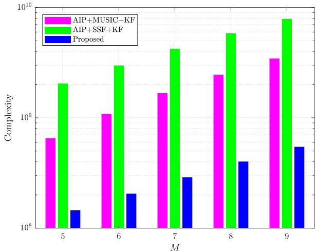  
Fig. 2. Computational complexity of three methods.

TABLE I  
COMPUTATIONAL COMPLEXITY OF THREE METHODS
<table><tr><td rowspan=1 colspan=1>Method</td><td rowspan=1 colspan=1>Computational complexity</td></tr><tr><td rowspan=1 colspan=1>AIP+MUSIC+KF</td><td rowspan=1 colspan=1> $O \{ \left[ \left( M - L + 7 \right) M ^ { 2 } - 3 M L + 6 M - 2 L \right] T K$  $+ 4 T K + \left( M ^ { 3 } + M L \right) Q _ { G } K + 9 0 K \Big \}$ </td></tr><tr><td rowspan=1 colspan=1>AIP+SSF+KF</td><td rowspan=1 colspan=1> $\overline { { O \{ \left[ \left( M - L + 7 \right) M ^ { 2 } - 3 M L + 6 M - 2 L \right] T K } } $  $+ 4 \bar { T } K + \left( 2 M ^ { 3 } + 2 M L ^ { 2 } + L ^ { 3 } \right) Q _ { G } K + \bar { 9 } 0 K \}$ </td></tr><tr><td rowspan=1 colspan=1>Proposed</td><td rowspan=1 colspan=1> $\overline { { O \{ \left( 3 M ^ { 2 } - M L + 8 M + 5 \right) \left( M - L \right) T K } } $  $+ 4 I K + \left( 4 M ^ { 2 } + 5 M ^ { ' } + 4 \right) T K$  $+ M ^ { 2 } \left( M - L \right) \dot { K ^ { + } } \left( M ^ { 2 } + 3 3 M ^ { ' } + 3 0 7 \right) L I K$  $+ 9 9 ( K - \stackrel { \cdot } { B } - 2 c + 1 ) \}$ </td></tr></table>

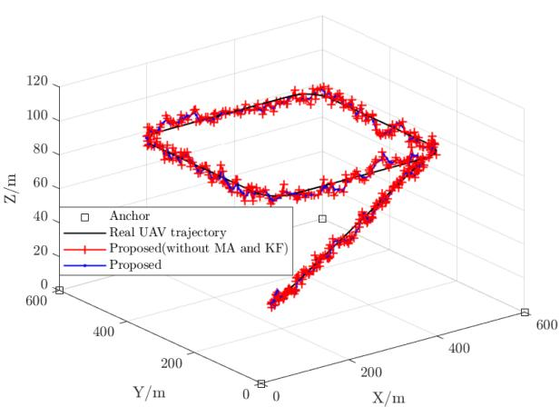

Fig. 3. Simulated scenario.  
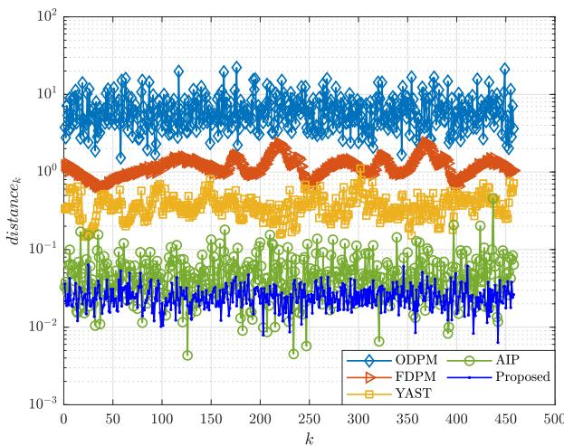  
Fig. 4. Comparison of MS performance.

## VI. SIMULATION ANALYSIS

The performance of the proposed method is analyzed in this section and the simulated scenario is shown in Fig. 3. The UAV initiates positioning at the coordinate $[ 1 0 0 \mathrm { m } , \mathrm { \bar { 1 } 0 0 \mathrm { m } , 3 0 \mathrm { m } ] ^ { T } } ,$ with an initial velocity of $v _ { x } ~ = ~ 2 \mathrm { m / s } , ~ v _ { y } ~ = ~ 0 \mathrm { m / s }$ and $v _ { z } ~ = ~ 0 . 3 \mathrm { m / s }$ . It then ascends along a straight line with constant acceleration, where $a _ { x } ~ = ~ 0 . 1 \mathrm { m / s ^ { 2 } } , ~ a _ { y } ~ = ~ 0 \mathrm { m / s ^ { 2 } }$ and $a _ { z } = 0 . 0 2 \mathrm { m } / \mathrm { s } ^ { 2 }$ , until the condition $\sqrt { v _ { x } ^ { 2 } + v _ { y } ^ { 2 } } > 5 \mathrm { m } / \mathrm { s }$ is satisfied. Subsequently, it transitions to a constant-velocity straight-line ascent, maintaining $v _ { x } = 5 . 0 5 \mathrm { m / s } , v _ { y } = 0 \mathrm { m / s }$ and $v _ { z } = 0 . 9 1 \mathrm { m } / \mathrm { s }$ . The endpoint of the ascent phase is located at $[ 4 4 9 . 9 1 2 \mathrm { m } , 1 \dot { 0 } 0 \mathrm { m } , 9 2 . 1 3 \dot { 2 } 5 \mathrm { m } ] ^ { \mathrm { T } }$ . During the hovering phase, the $\mathrm { U A V } ^ { \ , } \mathbf { s }$ flight speed is $\sqrt { v _ { x } ^ { 2 } + v _ { y } ^ { 2 } } = 5 . 0 5 \mathrm { m / s }$ . Its trajectory forms a square with a side length of 400m, and the corners of the square are connected by circular arcs with a radius of 50m. The anchors, whose frequency is 2.6GHz, are located at $\mathrm { [ 0 m , 0 m , 0 m ] _ { \mathrm { - } } ^ { T } }$ , [600m, 0m, 0m]T, [600m, 600m, $0 \mathrm { m } ] ^ { \mathrm { T } }$ and $[ 0 \mathrm { { i m } , 6 0 0 \mathrm { { m } , 0 \mathrm { { m } ] ^ { T } } } }$ . The SNR in the simulated scenario is set as 5dB. The simulated parameters are set as $T = 5 1 2 , K = 4 5 8$

$$
M = 7 , B = 3 , c = 5 , \mu = 0 . 9 , I = 1 0 0 , \mathbf { Q } = \left[ { \begin{array} { c } { 0 . 1 } \\ { 0 . 1 } \\ { 0 . 1 } \end{array} } \right]
$$

and $\mathbf { R } = \left[ \begin{array} { c } { 0 . 1 } \\ { 0 . 1 } \\ { 0 . 2 } \end{array} \right]$ . In Fig. 3, the blue line represents

the positioning trajectory of the proposed algorithm, while the red line denotes the positioning trajectory of the proposed algorithm without employing the filtering algorithm described in Section III-C. It can be observed that the proposed filtering algorithm enables a smoother positioning trajectory. Fig. 4 illustrates the comparative performance of subspace tracking using five MS update methods. The performance evaluation metric is defined by the following formula which is generally adopted in [25], [46], and [47]

$$
d i s t a n c e _ { k } = \frac { \mathrm { t r } \left[ \mathbf { W } _ { k } ^ { \mathrm { H } } \left( T \right) \mathbf { U } _ { s } ^ { k } \left( \mathbf { U } _ { s } ^ { k } \right) ^ { \mathrm { H } } \mathbf { W } _ { k } \left( T \right) \right] } { \mathrm { t r } \left[ \mathbf { W } _ { k } ^ { \mathrm { H } } \left( T \right) \mathbf { U } _ { n } ^ { k } \left( { \mathbf { U } _ { n } ^ { k } } \right) ^ { \mathrm { H } } \mathbf { W } _ { k } \left( T \right) \right] }\tag{83}
$$

The comparative algorithms are the ODPM [26], FDPM [24], YAST [25], and AIP [23]. The proposed algorithm achieves an average error of −15.9637dB, which is 24.0267dB lower than ODPM, 16.7102dB lower than FDPM, 11.7559dB lower than YAST, and 2.9436dB lower than AIP. Consequently, the proposed method demonstrates higher MS tracking accuracy.

Using the same simulation parameters as in Fig. 3, Fig. 5a presents the self-tracking trajectories of the three methods. Compared to $\bf \dot { \tau } _ { A I P + M U S I C + K F } ,$ and $\mathsf { \Pi } ^ { \bullet } \mathrm { A I P } { + } \mathrm { S S F } { + } \mathrm { K F } ^ { \bullet }$ , the proposed method’s tracking results more closely align with the actual trajectory. Fig. 5b, 5c, 5d, and 5e display the tracking errors of the three methods along with error comparisons across each dimension, and also provide the CRLB error curve of the simulated trajectory. The error calculation formula is as follows

$$
e r r o r _ { k } = \| \widehat { \mathbf { u } } _ { k } ^ { \prime } ( \widehat { \mathbf { u } } _ { k } ) - \mathbf { u } _ { k } \| _ { 2 }\tag{84}
$$

In x-direction, the error formula can be calculated by

$$
e r r o r _ { k } ^ { x } = | \widehat { u } _ { k } ^ { \prime x } ( \widehat { u } _ { k } ^ { x } ) - u _ { k } ^ { x } |\tag{85}
$$

In y-direction, the error formula can be calculated by

$$
e r r o r _ { k } ^ { y } = | \widehat { u } _ { k } ^ { \prime y } ( \widehat { u } _ { k } ^ { y } ) - u _ { k } ^ { y } |\tag{86}
$$

In z-direction, the error formula can be calculated by

$$
e r r o r _ { k } ^ { z } = | \widehat { u } _ { k } ^ { \prime z } ( \widehat { u } _ { k } ^ { z } ) - u _ { k } ^ { z } |\tag{87}
$$

Specifically, the proposed method achieves an average tracking error of 4.089m, which is 9.841m less than ‘AIP+MUSIC+KF’, 5.188m less than $\cdot _ { \mathrm { A I P + S S F + K F } } ,$ and 2.278m more than the CRLB with (79). Along the x-direction, the proposed method’s average error is 2.052m, which is 3.589m less than ‘AIP+MUSIC+KF’, 1.836m less than ‘AIP+SSF+KF’, and 1.4072m more than the CRLB with (80). In the y-direction, the average error is 1.5m, which is 3.096m less than ‘AIP+MUSIC+KF’, 1.372m less than $\cdot _ { \mathrm { A I P + S S F + K F } } ,$ and 1.012m more than the CRLB with (81). For the z-direction, the average error is 2.495m, which is 7.254m less than ‘AIP+MUSIC+KF’, 3.93m less than $\mathsf { \Pi } ^ { \bullet } \mathrm { A I P } { + } \mathrm { S S F } { + } \mathrm { K F } ^ { \bullet }$ and 1.119m more than the CRLB with (82). Across all dimensions, the proposed method consistently demonstrates the smallest average error. In Fig. 5b, 5c, 5d and 5e, since the CRLB serves as the per-unit-time statistical error lower bound, a single measurement value per unit time may occasionally fall below the CRLB.

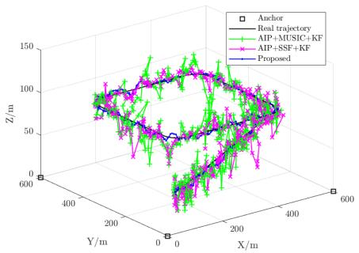  
(a)

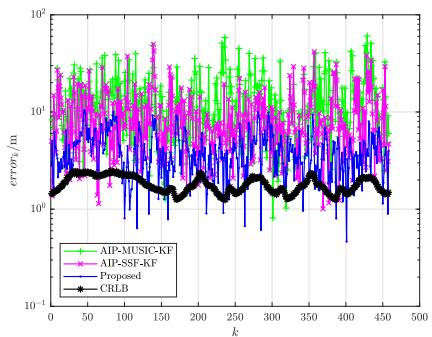  
(b)

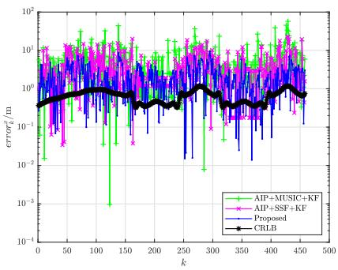  
(c)

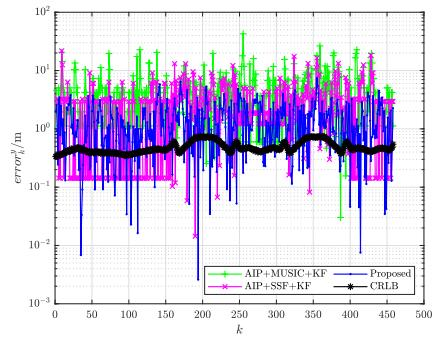  
(d)

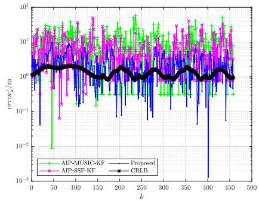  
(e)

Fig. 5. (a) Self-tracking performance of three methods. (b) Self-tracking error with different methods. (c) Self-tracking error in x-direction. (d) Self-tracking error in y-direction. (e) Self-tracking error in z-direction.  
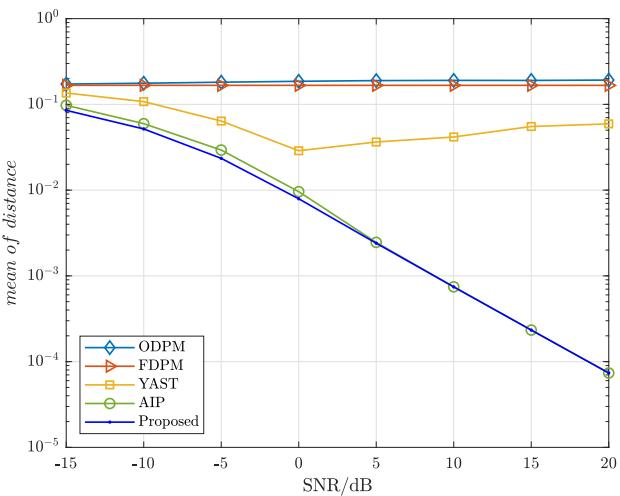  
Fig. 6. Mean of distance with different methods under different SNRs (one anchor).

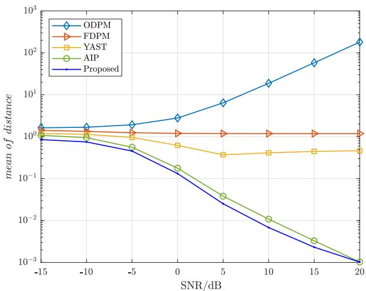  
Fig. 7. Mean of distance with different methods under different SNRs (multiple anchors).

Fig. 6 and Fig. 7 illustrates the tracking performance of five MS update methods under varying SNR conditions. To verify the subspace update performance of the proposed algorithm under scenarios with a single anchor and multiple anchors, Fig. 6 utilizes a anchor set at the coordinates [0m, 0m, 0m]T, while Fig. 7 employs four anchors shown in Fig. 3. The SNR ranges from −15dB to 20dB with 5dB intervals. The simulated parameters are set as T = 512, K = 458, M = 7, B = 3,

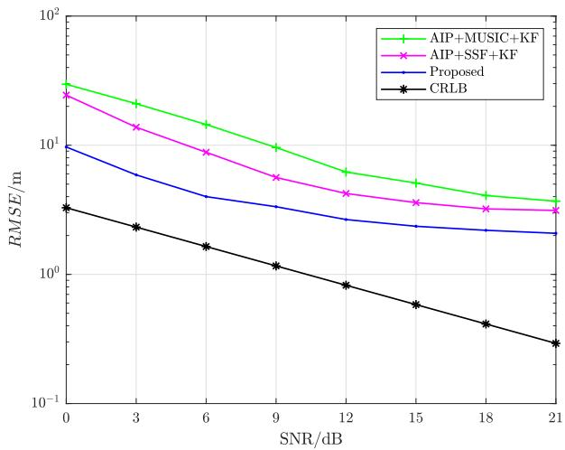  
Fig. 8. RMSE of different methods under different SNRs.

$$
c = 5 , \mu = 0 . 9 , I = 1 0 0 , { \bf Q } = \left[ \begin{array} { c } { { 0 . 1 } } \\ { { 0 . 1 } } \\ { { 0 . 1 } } \end{array} \right] \mathrm { a n d } { \bf R } =
$$

$\left[ { \begin{array} { c } { 0 . 1 } \\ { 0 . 1 } \\ { 0 . 2 } \end{array} } \right]$ . The experiments are carried out 100 times at each SNR. The error is calculated by

$$
m e a n \ o f \ d i s t a n c e = \frac { 1 } { J K } \sum _ { j = 1 } ^ { J } \sum _ { k = 1 } ^ { K } d i s t a n c e _ { k } ^ { j }\tag{88}
$$

where J denotes the experiment times and $\ d i s t a n c e _ { k } ^ { j }$ denotes the $d i s t a n c e _ { k }$ at the j-th experiment. In Fig. 6, the proposed algorithm achieves an average error of $- 1 6 . 6 8 2 7 \mathrm { d B } .$ which is 9.3489dB lower than ODPM, 8.9025dB lower than FDPM, 4.8840dB lower than YAST and 0.6525dB lower than AIP. In Fig. 7, the proposed algorithm achieves an average error of $- 5 . 5 5 6 4 \mathrm { d B }$ , which is 20.8661dB lower than ODPM, 6.5046dB lower than FDPM, 4.0124dB lower than YAST and 1.0293dB lower than AIP. In the scenario with one anchor, the proposed algorithm demonstrates significant performance advantages under the condition of a SNR below 5dB. In the scenario with multiple anchors, it can be observed that the proposed algorithm exhibits the smallest error below 20dB, but its error becomes similar to AIP at 20dB. This indicates that the proposed algorithm demonstrates superior tracking performance in low SNR conditions. However, as the MS tracking error increases under low SNR conditions, significant deviations occur in the positioning results, rendering them unreliable. Therefore, the comparative analysis of positioning algorithm performance is conducted only for SNR values above 0dB. Based on intuitive impression, the accuracy of MS updates appears unrelated to the SNR. However, in Fig. 6 and Fig. 7, the MS update errors of both the AIP algorithm and the proposed method gradually decrease as the SNR improves. This is primarily because a higher SNR enlarges the difference between $\left\{ \dot { \lambda } _ { 1 } ^ { k } , \lambda _ { 2 } ^ { k } , \dotsb , \lambda _ { L } ^ { k } \right\}$ and $\left\{ \lambda _ { L + 1 } ^ { k } , \lambda _ { L + 2 } ^ { k ^ { - } } , \cdot \cdot \cdot , \lambda _ { M } ^ { k } \right\}$ which facilitates the convergence of the power iteration algorithm.

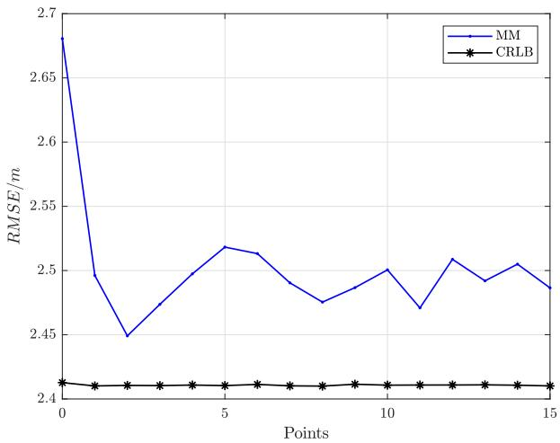  
Fig. 9. Performance comparison after inserting different numbers of uniform sampling points at adjacent positions under 0dB.

Fig. 8 compares the positioning errors under different SNR conditions. The SNR varies from 0dB to 21dB with an interval of 3dB. The simulated parameters are set as $T \ = \ 5 1 2 ,$ $K = 4 5 8 , \ M = 7 , \ B \ = \ 3 , \ c \ = \ 5 , \ \mu = 0 . 9 , \ I = 1 0 0$ $\mathbf { Q } = \left[ \begin{array} { c c c } { 0 . 1 } & { \hphantom { - } } \\ { 0 . 1 } & { \hphantom { - } } \\ { 0 . 1 } & { 0 . 1 } \end{array} \right] \mathrm { ~ a n d ~ } \mathbf { R } = \left[ \begin{array} { c c c } { 0 . 1 } & { \hphantom { - } } \\ { 0 . 1 } & { \hphantom { - } } \\ { 0 . 2 } \end{array} \right] .$ . The simulated experiments are conducted 5 times at each SNR. The root mean square error (RMSE) is defined as

$$
R M S E = \sqrt { \frac { 1 } { J K } \sum _ { j = 1 } ^ { J } \sum _ { k = 1 } ^ { K } \left[ e r r o r _ { k } ^ { j } \left( C R L B _ { k } ^ { j } \right) \right] ^ { 2 } }\tag{89}
$$

where $e r r o r _ { k } ^ { j }$ and $C R L B _ { k } ^ { j }$ denote $e r r o r _ { k }$ and $C R L B _ { k }$ at the j-th experiment. The proposed algorithm achieves an average RMSE of 4.027m, which is 7.693m lower than that of ‘AIP+MUSIC+KF’, 4.328m lower than $\mathsf { \Pi } ^ { \bullet } \mathrm { A I P } { + } \mathrm { S S F } { + } \mathrm { K F } ^ { \bullet }$ and 2.712m higher than the CRLB. Therefore, the proposed algorithm yields the smallest positioning error and enables more accurate localization.

Under low SNR conditions, the MM method is prone to being trapped in local optimal solutions [44]. This issue can be mitigated by reducing the distance between adjacent sampling positions of the UAV. For ease of analysis, a segment of uniformmotion trajectory from [500m, 152.2058m, 92.1325m]T to $[ 5 0 0 \mathrm { m } , 1 \dot { 8 } 2 . 5 0 5 8 \mathrm { m } , 9 2 . 1 3 2 \dot { 5 } \mathrm { m } ] ^ { \mathrm { T } }$ on the trajectory in Fig. 3 was selected. Fig. 9 presents a performance comparison chart showing the effects of inserting different numbers of uniform sampling positions between adjacent positions of the UAV trajectory segment under a 0dB SNR condition. The remaining parameters remain consistent with those mentioned above, and 100 Monte Carlo experiments were conducted. It can be observed that larger sampling intervals degrade the performance of the MM method, but reducing the intervals by inserting additional sampling positions does not continuously improve the method’s performance. After inserting an appropriate number of sampling positions, the position error gets closer to the CRLB. Therefore, identifying a reasonable sampling position interval through continuous testing can effectively alleviate the performance drawback of the MM method related to local optimal solutions and achieve better positioning performance. For scenarios with abrupt maneuvers, relatively small time intervals may be confronted with significantly large positional variations. Nevertheless, owing to the extremely high sampling rate of the array, which allows for data sampling at the 10ns scale, the method of reducing the sampling position intervals to improve system performance remains valid.

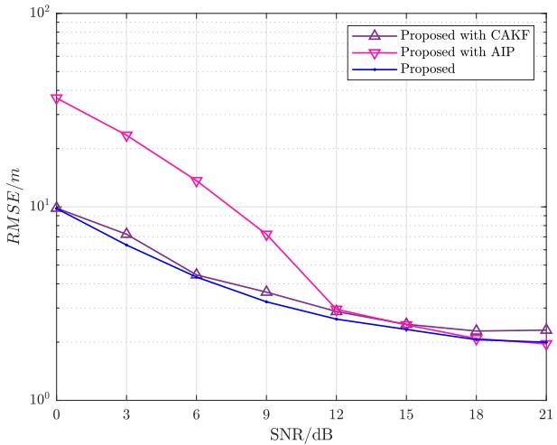  
Fig. 10. Performance of each component in the proposed system under different SNRs.

To verify the performance improvements brought by the proposed EAIP and difference value KF to the system, comparative experiments were conducted under different SNR conditions between the proposed method and the constantacceleration KF (CAKF) as well as AIP. The straight-line trajectory during the ascending phase of the UAV in Fig. 3 was selected for simulation comparison experiments. 10 Monte Carlo experiments were carried out using the same parameters as those mentioned above, with only the contrasting parts differing between the comparative algorithms and the proposed algorithm. The CAKF with the proposed EAIP and MM corresponds to ‘Proposed with CAKF’, with constant accelerations set as $a _ { x } = 0 . 1 \mathrm { m } / \mathrm { s } ^ { 2 } , a _ { y } = 0 \mathrm { m } / \mathrm { s } ^ { 2 }$ and $a _ { z } = 0 . 0 2 \mathrm { m } / \mathrm { s } ^ { 2 }$ . AIP with the proposed MM and difference value KF corresponds to ‘Proposed with AIP’. As can be seen from Fig. 10, the average error of the proposed method is 4.091m, which is 0.294m lower than that of ‘Proposed with CAKF’ and 7.199m lower than that of ‘Proposed with AIP’. Therefore, each component of the proposed method contributes to enhancing the overall system performance.

To evaluate the impact of minor variations in MA parameters on tracking results, Fig. 11 illustrates simulations conducted with three distinct parameter sets: $\mathbf { \sigma } ^ { \bullet } \mathbf { B } \ = \ 2 , \ \mathbf { c } \ =$ 4’, $\mathbf { \sigma } ^ { \bullet } \mathbf { B } \ = \ 4 , \ \mathrm { ~ c ~ = ~ } 6 \mathbf { \sigma } ^ { \bullet }$ , and $\mathbf { \delta B } = 3 , \textrm { c } = 5 ^ { , }$ . During these simulations, the trajectory of the UAV was kept identical to that depicted in Fig. 3, while all other parameters remained consistent with those employed in the preceding experiments. A total of 10 experimental trials were executed. The findings reveal that the mean errors for these three parameter sets are

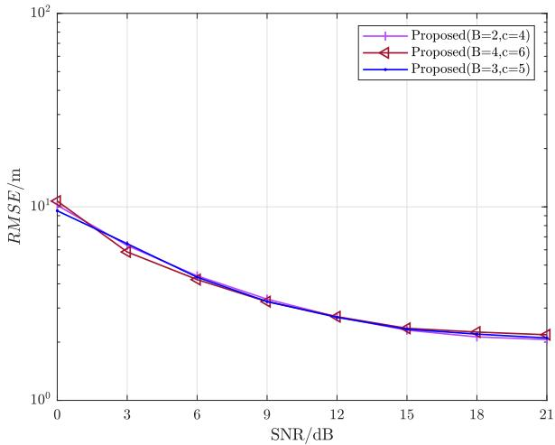  
Fig. 11. Sensitivity analysis of the proposed method under different SNRs.

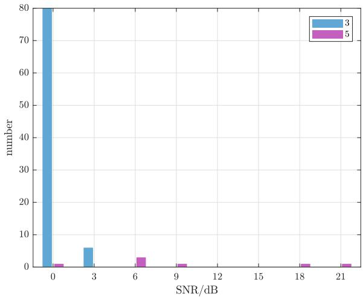  
Fig. 12. The source number error of the AIC under different SNRs.

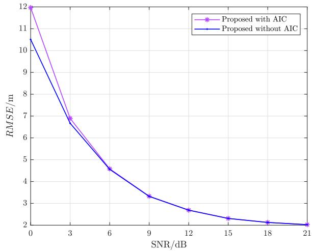  
Fig. 13. Tracking performance analysis with AIC under different SNRs.

4.179m, 4.188m and 4.11m, respectively. The discrepancies among these errors do not exceed 0.08m, suggesting that they can be regarded as approximately equal. Consequently, slight changes in parameters exert minimal influence on the positioning performance of the proposed method.

To analyze the impact of AIC-based source number estimation on tracking performance, 10 independent simulations were conducted on the tracking results derived from AIC estimation at different SNR conditions. The formula of AIC is defined as $\widehat { L }$

$$
= \arg \operatorname* { m i n } _ { l } \left\{ T ( M - l ) \ln \left[ \frac { \frac { 1 } { M - l } \sum _ { i = l + 1 } ^ { M } \lambda _ { i } ^ { k } } { \left( \prod _ { i = l + 1 } ^ { M } \lambda _ { i } ^ { k } \right) ^ { \frac { 1 } { M - l } } } \right] + 2 l ( 2 M - l ) \right\}\tag{90}
$$

The number of snapshots adopted for the covariance matrix in (8) is 512. This covariance matrix is applied to obtain the eigenvalues in (90). The simulation trajectories are identical to those in Fig. 3. All experimental parameters remain consistent with the preceding experiments, except that the number of sources is estimated using (90). To thoroughly evaluate the performance of the AIC, the number of sources was reestimated every 10 moments in the experiment, resulting in a total of 460 source number estimations. Fig. 12 illustrates the estimation accuracy of the AIC for the number of sources under different SNR conditions. The true number of sources in the experiment was 4, and the AIC tended to erroneously estimate it as 3 (blue bars) or 5 (purple bars), corresponding to an estimation error of 1. Under high SNR conditions, the error probability of the AIC was less than 0.22%, whereas this probability increased to 17.61% under low SNR conditions. Fig. 13 illustrates the tracking performance of the proposed algorithm using the AIC under different SNR conditions. When the SNR is 6dB or higher, the tracking error induced by the AIC increases by an average of 0.0061m. When the SNR is below 6dB, the average increase in tracking error reaches $0 . 8 3 9 9 \mathrm { m } .$ . Thus, the deviation in source number estimation caused by the AIC has a negligible impact on the tracking performance of the proposed algorithm.

## VII. CONCLUSION

This paper proposes one 3-D self-tracking method based on MS update and MM iteration. This method can track the UAV position accurately with non-cooperative anchors. Firstly, the MS is updated with EAIP instead of complex EVD. Secondly, the UAV position is tracked by MM iterative points in 3-D space. Finally, the tracking results are filtered with KF improved by acceleration MA for difference values. The complexity analysis indicates that the proposed method has low complexity. In addition, the simulated experiments demonstrate that the proposed method has less MS update error than ODPM, FDPM, YAST and AIP. The proposed method also performs more precise tracking than $\bf \dot { \tau } _ { A I P + M U S I C + K F } ,$ and $\mathsf { \Pi } ^ { \bullet } \mathrm { A I P } { + } \mathrm { S S F } { + } \mathrm { K F } ^ { \bullet }$

## APPENDIX

THE FUSION OF INFORMATION ACROSS FREQUENCIES

For different-frequency anchors, the EAIP operates independently at each frequency bin and generates the MS update values corresponding to each bin. The MM algorithm fuses the MS values from all frequency bins to yield iterative tracking results. The filtering algorithm then performs error suppression on the tracking results, and this step is consistent with Section III-C. Thus, we derive the MM-based tracking method fusing multi-frequency information in the following.

For signals with N different frequencies, the EAIP method can be employed to perform subspace updates at each frequency bin, thereby yielding $\mathbf { W } _ { k } ^ { n }$ , where $n = 1 , 2 , \cdots , N .$ At each frequency bin, (35) holds true and the anchor number is denoted as $L _ { n }$ . The anchor positions of the n-th frequency bin are denoted as $\mathbf { p } _ { l } ^ { n }$ $l = 1 , 2 , \cdots , L _ { n }$ . After fusing the information at each frequency bin, the NSF problem can be transformed into the minimization of

$$
\begin{array} { l } { f \left( \mathbf { u } _ { k } \right) = \displaystyle \sum _ { n = 1 } ^ { N } \| \left( { \mathbf W } _ { k } ^ { n } \right) ^ { \mathrm { H } } { \mathbf A } _ { k } ^ { n } \| _ { \mathrm F } ^ { 2 } } \\ { \displaystyle = \sum _ { n = 1 } ^ { N } \mathrm { t r } \left[ \left( { \mathbf A } _ { k } ^ { n } \right) ^ { \mathrm { H } } { \mathbf W } _ { k } ^ { n } \left( { \mathbf W } _ { k } ^ { n } \right) ^ { \mathrm { H } } { \mathbf A } _ { k } ^ { n } \right] } \end{array}\tag{91}
$$

Define that ${ \bf C } _ { k , n } ^ { \left( 1 \right) } = { \bf I } _ { M } - { \bf W } _ { k } ^ { n } \left( { \bf W } _ { k } ^ { n } \right) ^ { \mathrm { H } }$ . (91) can be derived as

$$
\begin{array} { r l } & { \displaystyle \sum _ { n = 1 } ^ { N } \mathrm { t r } \left[ \left( { \bf A } _ { k } ^ { n } \right) ^ { \mathrm { H } } { \bf W } _ { k } ^ { n } \left( { \bf W } _ { k } ^ { n } \right) ^ { \mathrm { H } } { \bf A } _ { k } ^ { n } \right] } \\ & { \displaystyle = \sum _ { n = 1 } ^ { N } \mathrm { t r } \left[ \left( { \bf A } _ { k } ^ { n } \right) ^ { \mathrm { H } } { \bf A } _ { k } ^ { n } \right] - \mathrm { t r } \left[ \left( { \bf A } _ { k } ^ { n } \right) ^ { \mathrm { H } } { \bf C } _ { k , n } ^ { ( 1 ) } { \bf A } _ { k } ^ { n } \right] } \\ & { \displaystyle = \sum _ { n = 1 } ^ { N } - \mathrm { t r } \left[ \left( { \bf A } _ { k } ^ { n } \right) ^ { \mathrm { H } } { \bf C } _ { k , n } ^ { ( 1 ) } { \bf A } _ { k } ^ { n } \right] + L M } \end{array}\tag{92}
$$

According to (39), we can obtain

$$
f \left( \mathbf { u } _ { k } \right) \leq \sum _ { n = 1 } ^ { N } \mathrm { R } \left\{ \mathrm { t r } \left[ \mathbf { C } _ { k , i , n } ^ { ( 2 ) } \mathbf { A } _ { k } ^ { n } \right] \right\} + \mathrm { c o n s t }\tag{93}
$$

where $\mathbf { C } _ { k , i , n } ^ { ( 2 ) } = - 2 \left( \mathbf { A } _ { k } ^ { i , n } \right) ^ { \mathrm { H } } \mathbf { C } _ { k , n } ^ { ( 1 ) }$ and $\mathbf { A } _ { k } ^ { i , n }$ is defined as $\mathbf { A } _ { k } ^ { i }$ at the n-th frequency bin.

According to (50), we define $u _ { l , m , n } = \left| \left[ \mathbf { C } _ { k , i , n } ^ { ( 2 ) } \right] _ { l , m } \right|$ and $v _ { l , m , n } ~ = ~ \mathrm { a r g } \left\{ \left[ \mathbf { C } _ { k , i , n } ^ { ( 2 ) } \right] _ { l , m } \right\}$ . Consequently, the right-hand side term of (93) can be reformulated as

$$
\begin{array} { l } { { \displaystyle \sum _ { n = 1 } ^ { N } \mathrm { R } \left\{ \mathrm { t r } \left[ \mathbf { C } _ { k , i , n } ^ { ( 2 ) } \mathbf { A } _ { k } ^ { n } \right] \right\} } \ ~ } \\ { { \displaystyle = \sum _ { n = 1 } ^ { N } \sum _ { l = 1 } ^ { L _ { n } } \sum _ { m = 1 } ^ { M } u _ { l , m , n } \cos \left[ \frac { 2 \pi } { \lambda _ { n } } \left( \overline { { \mathbf { u } } } _ { k } ^ { l } \right) ^ { \mathrm { T } } \mathbf { d } _ { m } - v _ { l , m , n } \right] } } \end{array}\tag{94}
$$

where $\lambda _ { n }$ is the signal wavelength of the n-th frequency bin. Let us define $\begin{array} { r } { g _ { l , m , n } ^ { i } = \frac { 2 \pi } { \lambda _ { n } } \left( \overline { { \mathbf { u } } } _ { k } ^ { l } \right) ^ { \mathrm { T } } \mathbf { d } _ { m } - v _ { l , m , n } } \end{array}$ . Applying Lemma 2, the following formula can be obtained.

$$
\begin{array} { r l } & { \displaystyle \sum _ { n = 1 } ^ { N } \mathrm { R } \left\{ \mathrm { t r } \left[ \mathbf { C } _ { k , i , n } ^ { \left( 2 \right) } \mathbf { A } _ { k } ^ { n } \right] \right\} } \\ & { \leq \displaystyle \sum _ { n = 1 } ^ { N } \sum _ { l = 1 } ^ { L _ { n } } \frac { \left( \overline { { \mathbf { u } } } _ { k } ^ { l } \right) ^ { \mathrm { T } } \mathbf { C } _ { k , i , l , n } ^ { \left( 3 \right) } \overline { { \mathbf { u } } } _ { k } ^ { l } } { \left( \overline { { \mathbf { u } } } _ { k } ^ { l } \right) ^ { \mathrm { T } } \overline { { \mathbf { u } } } _ { k } ^ { l } } + \frac { \left( \overline { { \mathbf { u } } } _ { k } ^ { l } \right) ^ { \mathrm { T } } \mathbf { C } _ { k , i , l , n } ^ { \left( 4 \right) } } { \| \overline { { \mathbf { u } } } _ { k } ^ { l } \| _ { 2 } } + \mathbf { C } _ { k , i , l , n } ^ { \left( 5 \right) } } \end{array}\tag{95}
$$

where $\begin{array} { r l r } { { \bf C } _ { k , i , l , n } ^ { ( 3 ) } } & { { } } & { = \mathrm { ~  ~ \sum ~ } _ { m = 1 } ^ { M } 0 . 5 \left( \frac { 2 \pi } { \lambda _ { n } } \right) ^ { 2 } u _ { l , m , n } { \bf d } _ { m } { \bf d } _ { m } ^ { \mathrm { T } } , } \end{array}$ $\begin{array} { r } { \mathbf { C } _ { k , i , l , n } ^ { ( 4 ) } ~ = ~ \sum _ { m = 1 } ^ { M } \frac { 2 \pi } { \lambda _ { n } } u _ { l , m , n } \left[ - v _ { l , m , n } + \dot { b } \left( g _ { l , m , n } ^ { i } \right) \right] \mathbf { d } _ { m } } \end{array}$ and $\begin{array} { r } { \mathbf { C } _ { k , i , l , n } ^ { ( 5 ) } = \sum _ { m = 1 } ^ { M } 0 . 5 u _ { l , m , n } v _ { l , m , n } ^ { 2 } - u _ { l , m , n } b \left( g _ { l , m , n } ^ { i } \right) v _ { l , m , n } + } \end{array}$ $u _ { l , m , n } c \left( g _ { l , m , n } ^ { i } \right)$

Employing Theorem 1, we can derive that

$$
\begin{array} { r l } & { f \left( \mathbf { u } _ { k } \right) } \\ & { \quad \leq \displaystyle \sum _ { n = 1 } ^ { N } \sum _ { l = 1 } ^ { L _ { n } } \mathbf { C } _ { k , i , l , n } ^ { \left( 6 \right) } \left( \overline { { \mathbf { u } } } _ { k } ^ { l } \right) ^ { \mathrm { T } } \overline { { \mathbf { u } } } _ { k } ^ { l } + \left( \mathbf { C } _ { k , i , l , n } ^ { \left( 7 \right) } \right) ^ { \mathrm { T } } \overline { { \mathbf { u } } } _ { k } ^ { l } + \mathbf { C } _ { k , i , l , n } ^ { \left( 8 \right) } } \end{array}\tag{96}
$$

$$
\begin{array} { r l } & { \mathrm { w h e r e } \quad \mathbf { C } _ { k , i , l , n } ^ { \left( 6 \right) } \quad \quad = \quad \quad a _ { 1 } \left[ \left( \overline { { \mathbf { u } } } _ { k } ^ { l } \right) ^ { i } , \mathbf { C } _ { k , i , l , n } ^ { \left( 3 \right) } , \mathbf { C } _ { k , i , l , n } ^ { \left( 4 \right) } \right] , } \\ & { \mathbf { C } _ { k , i , l , n } ^ { \left( 7 \right) } \quad \qquad = \quad \quad \mathbf { b } _ { 1 } \left[ \left( \overline { { \mathbf { u } } } _ { k } ^ { l } \right) ^ { i } , \mathbf { C } _ { k , i , l , n } ^ { \left( 3 \right) } , \mathbf { C } _ { k , i , l , n } ^ { \left( 4 \right) } \right] \quad \mathrm { a n d } } \\ & { \mathbf { C } _ { k , i , l , n } ^ { \left( 8 \right) } = c _ { 1 } \left[ \left( \overline { { \mathbf { u } } } _ { k } ^ { l } \right) ^ { i } , \mathbf { C } _ { k , i , l , n } ^ { \left( 3 \right) } , \mathbf { C } _ { k , i , l , n } ^ { \left( 4 \right) } \right] + \mathbf { C } _ { k , i , l , n } ^ { \left( 5 \right) } . } \end{array}
$$

Rearranging the term in (96) leads to the following formula

$$
g \left( \mathbf { u } _ { k } | \mathbf { u } _ { k } ^ { i } \right) = \mathbf { C } _ { k , i } ^ { ( 9 ) } \mathbf { u } _ { k } ^ { \mathrm { T } } \mathbf { u } _ { k } + \left( \mathbf { C } _ { k , i } ^ { ( 1 0 ) } \right) ^ { \mathrm { T } } \mathbf { u } _ { k } + \mathbf { C } _ { k , i } ^ { ( 1 1 ) }\tag{97}
$$

where $\begin{array} { r l r } { { \bf C } _ { k , i } ^ { ( 9 ) } } & { { } } & { = { \mathrm { ~  ~ \sum ~ } } _ { n = 1 } ^ { N } \sum _ { l = 1 } ^ { L _ { n } } { \bf C } _ { k , i , l , n } ^ { ( 6 ) } , \quad { \bf C } _ { k , i } ^ { ( 1 0 ) } } \end{array}$ $\begin{array} { r l } { \sum _ { n = 1 } ^ { N } \sum _ { l = 1 } ^ { L _ { n } } - 2 \mathbf { C } _ { k , i , l , n } ^ { ( 6 ) } \mathbf { p } _ { l } ^ { n } + } & { { } \Big [ \mathbf { C } _ { k , i , l , n } ^ { ( 7 ) } \Big ] _ { ( 1 : 3 ) } } \end{array}$ and $\begin{array} { r l } { \mathbf { C } _ { k , i } ^ { ( 1 1 ) } } & { { } = } \end{array}$ $\begin{array} { r } { \sum _ { n = 1 } ^ { N } \sum _ { l = 1 } ^ { L _ { n } } \mathbf { C } _ { k , i , l , n } ^ { ( 6 ) } \| \mathbf { p } _ { l } ^ { n } \| _ { 2 } ^ { 2 } + \mathbf { C } _ { k , i , l , n } ^ { ( 8 ) } - \tilde { \left( \mathbf { p } _ { l } ^ { n } \right) ^ { \mathrm { T } } } \left[ \mathbf { C } _ { k , i , l , n } ^ { ( 7 ) } \right] _ { ( 1 : 3 ) } . } \end{array}$ After calculating $\begin{array} { r } { \frac { \partial g \big ( { \mathbf { u } } _ { k } | { \mathbf { u } } _ { k } ^ { i } \big ) } { \partial { \mathbf { u } } _ { k } } = 0 , } \end{array}$ , we can get the tracking result for information fusion.

$$
\mathbf { u } _ { k } ^ { i + 1 } = - \frac { \mathbf { C } _ { k , i } ^ { ( 1 0 ) } } { 2 \mathbf { C } _ { k , i } ^ { ( 9 ) } }\tag{98}
$$

Furthermore, distinct weights $w _ { k } ^ { n }$ can be employed to perform weighted fusion on the information across different frequencies. So (91) can be transformed into

$$
\begin{array} { l } { f \left( \mathbf { u } _ { k } \right) = \displaystyle \sum _ { n = 1 } ^ { N } w _ { k } ^ { n } \| \left( \mathbf { W } _ { k } ^ { n } \right) ^ { \mathrm { H } } \mathbf { A } _ { k } ^ { n } \| _ { \mathrm { F } } ^ { 2 } } \\ { \displaystyle \quad = \sum _ { n = 1 } ^ { N } w _ { k } ^ { n } \mathrm { t r } \left[ \left( \mathbf { A } _ { k } ^ { n } \right) ^ { \mathrm { H } } \mathbf { W } _ { k } ^ { n } \left( \mathbf { W } _ { k } ^ { n } \right) ^ { \mathrm { H } } \mathbf { A } _ { k } ^ { n } \right] } \end{array}\tag{99}
$$

Similar to the derivation from (91) to (96), we can also get that

$$
\begin{array} { r l } & { f \left( \mathbf { u } _ { k } \right) } \\ & { \quad \leq \displaystyle \sum _ { n = 1 } ^ { N } w _ { k } ^ { n } \displaystyle \sum _ { l = 1 } ^ { L _ { n } } \mathbf { C } _ { k , i , l , n } ^ { \left( 6 \right) } \left( \overline { { \mathbf { u } } } _ { k } ^ { l } \right) ^ { \mathrm { T } } \overline { { \mathbf { u } } } _ { k } ^ { l } + \left( \mathbf { C } _ { k , i , l , n } ^ { \left( 7 \right) } \right) ^ { \mathrm { T } } \overline { { \mathbf { u } } } _ { k } ^ { l } + \mathbf { C } _ { k , i , l , n } ^ { \left( 8 \right) } } \end{array}\tag{100}
$$

Rearranging the term in (100) leads to the following formula $g \left( \mathbf { u } _ { k } | \mathbf { u } _ { k } ^ { i } \right) = \mathbf { C } _ { k , i , w } ^ { ( 9 ) } \mathbf { u } _ { k } ^ { \mathrm { T } } \mathbf { u } _ { k } + \left( \mathbf { C } _ { k , i , w } ^ { ( 1 0 ) } \right) ^ { \mathrm { T } } \mathbf { u } _ { k } + \mathbf { C } _ { k , i , w } ^ { ( 1 1 ) }$ (101) where $\begin{array} { r l r } { { \bf C } _ { k , i , w } ^ { ( 9 ) } } & { { } = } & { \sum _ { n = 1 } ^ { N } w _ { k } ^ { n } \sum _ { l = 1 } ^ { L _ { n } } \mathbf { C } _ { k , i , l , n } ^ { ( 6 ) } , ~ \mathbf { C } _ { k , i , w } ^ { ( 1 0 ) } ~ = } \end{array}$ $\begin{array} { r l r } { \sum _ { n = 1 } ^ { N } w _ { k } ^ { n } \sum _ { l = 1 } ^ { L _ { n } } - 2 \mathbf { C } _ { k , i , l , n } ^ { ( 6 ) } \mathbf { p } _ { l } ^ { n } } & { { } + } & { \left[ \mathbf { C } _ { k , i , l , n } ^ { ( 7 ) } \right] _ { ( 1 : 3 ) } } \end{array}$ and $\begin{array} { r l r } { \mathbf { C } _ { k , i , w _ { \mathrm { ~ - ~ } } } ^ { ( 1 1 ) } = } & { { } \sum _ { n = 1 } ^ { N } w _ { k } ^ { n } \sum _ { l = 1 } ^ { L _ { n } } \mathbf { C } _ { k , i , l , n } ^ { ( 6 ) } \| \mathbf { p } _ { l } ^ { n } \| _ { 2 } ^ { 2 } + \mathbf { \Delta } \mathbf { C } _ { k , i , l , n } ^ { ( 8 ) } } & { - } \end{array}$

After obtaining (101), we can get the tracking result for weighted information fusion.

$$
\mathbf { u } _ { k } ^ { i + 1 } = - \frac { \mathbf { C } _ { k , i , w } ^ { ( 1 0 ) } } { 2 \mathbf { C } _ { k , i , w } ^ { ( 9 ) } }\tag{102}
$$

The values of $w _ { k } ^ { n }$ can be selected based on signal power [18], CRLB [14], [48] and other such characteristics. For example, the weight of each frequency bin is inversely proportional to the noise power and the average distance between the UAV position and the beacons [49]. Therefore, $w _ { k } ^ { n }$ can be defined as

$$
w _ { k } ^ { n } = \frac { \widehat { L } _ { n } } { \left( \widehat { \sigma } _ { k } ^ { n } \right) ^ { 2 } \sum _ { l = 1 } ^ { \widehat { L } _ { n } } \| \widehat { \mathbf { u } } _ { k - 1 } ^ { \prime } - \mathbf { p } _ { l } ^ { n } \| _ { 2 } }\tag{103}
$$

where ${ \widehat { L } } _ { n }$ is the source number estimation of the n-th frequency bin with AIC and $\left( \widehat { \sigma } _ { k } ^ { n } \right) ^ { 2 }$ is the estimated noise power when update Wnk . The position $\widehat { \mathbf { u } } _ { k - 1 } ^ { \prime }$ at the previous moment is employed to approximate the $\widehat { \mathbf { u } } _ { k } ^ { \prime }$ at the current moment.

## REFERENCES

[1] X. Dai, M. Zhang, B. Teng, X. Yuan, and X. Wang, “Attitude estimation assisted short-range UAV localization and tracking based on extremely large antenna array,” IEEE Trans. Wireless Commun., vol. 24, no. 12, pp. 10391–10407, Dec. 2025, doi: 10.1109/TWC.2025.3579567.

[2] A. V. Savkin, W. Ni, and M. Eskandari, “Effective UAV navigation for cellular-assisted radio sensing, imaging, and tracking,” IEEE Trans. Veh. Technol., vol. 72, no. 10, pp. 13729–13733, Oct. 2023, doi: 10.1109/ TVT.2023.3277426.

[3] Z. Z. M. Kassas et al., “Assessment of cellular signals of opportunity for high-altitude aircraft navigation,” IEEE Aerosp. Electron. Syst. Mag., vol. 37, no. 10, pp. 4–19, Oct. 2022, doi: 10.1109/ MAES.2022.3187142.

[4] Z. M. Kassas, J. Khalife, A. A. Abdallah, and C. Lee, “I am not afraid of the GPS jammer: Resilient navigation via signals of opportunity in GPS-denied environments,” IEEE Aerosp. Electron. Syst. Mag., vol. 37, no. 7, pp. 4–19, Jul. 2022, doi: 10.1109/MAES.2022.3154110.

[5] Q. Liu, R. Liu, and C. Xu, “Prospective UAV-assisted positioning architecture and technologies for 6G network edge,” IEEE Netw., vol. 39, no. 2, pp. 61–68, Mar. 2025, doi: 10.1109/MNET.2024.3519722.

[6] Q. Liu et al., “Management of positioning functions in cellular networks for time-sensitive transportation applications,” IEEE Trans. Intell. Transp. Syst., vol. 24, no. 11, pp. 13260–13275, Nov. 2023, doi: 10.1109/TITS.2023.3234532.

[7] I. A. Meer, M. Ozger, and C. Cavdar, “On the localization of unmanned aerial vehicles with cellular networks,” in Proc. IEEE Wireless Commun. Netw. Conf. (WCNC), May 2020, pp. 1–6, doi: 10.1109/WCNC45663.2020.9120588.

[8] R. Amer, W. Saad, and N. Marchetti, “Toward a connected sky: Performance of beamforming with down-tilted antennas for ground and UAV user co-existence,” IEEE Commun. Lett., vol. 23, no. 10, pp. 1840–1844, Oct. 2019, doi: 10.1109/LCOMM.2019.2927452.

[9] J. A. del Peral-Rosado, R. Raulefs, J. A. Lopez-Salcedo, and G. Seco-´ Granados, “Survey of cellular mobile radio localization methods: From 1G to 5G,” IEEE Commun. Surveys Tuts., vol. 20, no. 2, pp. 1124–1148, 2nd Quart., 2018, doi: 10.1109/COMST.2017.2785181.

[10] G. Afifi and Y. Gadallah, “Autonomous 3-D UAV localization using cellular networks: Deep supervised learning versus reinforcement learning approaches,” IEEE Access, vol. 9, pp. 155234–155248, 2021, doi: 10.1109/ACCESS.2021.3126775.

[11] Y. Li, F. Shu, B. Shi, X. Cheng, Y. Song, and J. Wang, “Enhanced RSSbased UAV localization via trajectory and multi-base stations,” IEEE Commun. Lett., vol. 25, no. 6, pp. 1881–1885, Jun. 2021, doi: 10.1109/ LCOMM.2021.3061104.

[12] A. Coluccia, F. Ricciato, and G. Ricci, “Positioning based on signals of opportunity,” IEEE Commun. Lett., vol. 18, no. 2, pp. 356–359, Feb. 2014, doi: 10.1109/LCOMM.2013.123013.132297.

[13] D. Wang, H. Qin, and Z. Huang, “Doppler positioning of LEO satellites based on orbit error compensation and weighting,” IEEE Trans. Instrum. Meas., vol. 72, pp. 1–11, 2023, doi: 10.1109/TIM.2023.3286001.

[14] J. Li, P. Li, P. Li, L. Tang, X. Zhang, and Q. Wu, “Self-position awareness based on cascade direct localization over multiple source data,” IEEE Trans. Intell. Transp. Syst., vol. 25, no. 1, pp. 796–804, Jan. 2024, doi: 10.1109/TITS.2022.3170465.

[15] C. Ibars and Y. Bar-Ness, “Analysis of time-frequency duality of MC and DS CDMA for multiantenna systems on highly time-varying and wide-band channels,” IEEE Trans. Wireless Commun., vol. 4, no. 6, pp. 2661–2667, Nov. 2005, doi: 10.1109/TWC.2005.858355.

[16] K. E. Jeon, J. She, P. Soonsawad, and P. C. Ng, “BLE beacons for Internet of Things applications: Survey, challenges, and opportunities,” IEEE Internet Things J., vol. 5, no. 2, pp. 811–828, Apr. 2018, doi: 10.1109/JIOT.2017.2788449.

[17] K. Zhu, H. Jiang, J. Li, and F. Zhou, “A direct position determination method using distributed UAVs with synchronization error,” IEEE Sensors J., vol. 24, no. 1, pp. 780–787, Jan. 2024, doi: 10.1109/ JSEN.2023.3333950.

[18] J. Li, Y. He, X. Zhang, and Q. Wu, “Simultaneous localization of multiple unknown emitters based on UAV monitoring big data,” IEEE Trans. Ind. Informat., vol. 17, no. 9, pp. 6303–6313, Sep. 2021, doi: 10.1109/TII.2020.3048987.

[19] F. Pang, K. Doganc¸ay, N. H. Nguyen, and Q. Zhang, “AOA pseudolinear target motion analysis in the presence of sensor location errors,” IEEE Trans. Signal Process., vol. 68, pp. 3385–3399, 2020, doi: 10.1109/ TSP.2020.2998896.

[20] Z. Cao, J. Li, R. Xu, P. Li, X. Zhang, and Q. Wu, “Array selfposition determination based on orthogonal grid matching under multipath environments,” IEEE Trans. Intell. Transp. Syst., vol. 26, no. 4, pp. 5156–5166, Apr. 2025, doi: 10.1109/TITS.2025.3539634.

[21] A. J. Weiss, “Direct position determination of narrowband radio frequency transmitters,” IEEE Signal Process. Lett., vol. 11, no. 5, pp. 513–516, May 2004, doi: 10.1109/LSP.2004.826501.

[22] Z. Cao, P. Li, J. Li, X. Zhang, and Q. Wu, “Direct self-position awareness based on array-sensing multiple source data fitting,” in Proc. 4th Inf. Commun. Technol. Conf. (ICTC), Nanjing, China, May 2023, pp. 213–217, doi: 10.1109/ICTC57116.2023.10154740.

[23] D.-Z. Feng and W. X. Zheng, “An approximate inverse-power algorithm for adaptive extraction of minor subspace,” IEEE Trans. Signal Process., vol. 55, no. 7, pp. 3937–3942, Jul. 2007, doi: 10.1109/ TSP.2007.894381.

[24] X. G. Doukopoulos and G. V. Moustakides, “Fast and stable subspace tracking,” IEEE Trans. Signal Process., vol. 56, no. 4, pp. 1452–1465, Apr. 2008, doi: 10.1109/TSP.2007.909335.

[25] R. Badeau, G. Richard, and B. David, “Fast and stable YAST algorithm for principal and minor subspace tracking,” IEEE Trans. Signal Process., vol. 56, no. 8, pp. 3437–3446, Aug. 2008, doi: 10.1109/ TSP.2008.925924.

[26] R. Wang, M. Yao, D. Zhang, and H. Zou, “A novel orthonormalization matrix based fast and stable DPM algorithm for principal and minor subspace tracking,” IEEE Trans. Signal Process., vol. 60, no. 1, pp. 466–472, Jan. 2012, doi: 10.1109/TSP.2011.2169406.

[27] Z. Cao, J. Li, P. Li, and X. Zhang, “Direct self-trajectory determination based on array sensing and evolutionary particle filter,” Circuits, Syst., Signal Process., vol. 43, no. 6, pp. 3679–3696, Mar. 2024, doi: 10.1007/ s00034-024-02619-z.

[28] M. A. Maleki Sadr, M. Ahmadian-Attari, and R. Amiri, “Real-time cooperative adaptive robust relay beamforming based on Kalman filtering channel estimation,” IEEE Trans. Wireless Commun., vol. 18, no. 12, pp. 5600–5612, Dec. 2019, doi: 10.1109/TWC.2019.2937779.

[29] X. R. Li and V. P. Jilkov, “Survey of maneuvering targettracking. Part I: Dynamic models,” IEEE Trans. Aerosp. Electron. Syst., vol. 39, no. 4, pp. 1333–1364, Oct. 2003, doi: 10.1109/TAES.2003.1261132.

[30] C. Yardim, P. Gerstoft, and W. S. Hodgkiss, “Tracking refractivity from clutter using Kalman and particle filters,” IEEE Trans. Antennas Propag., vol. 56, no. 4, pp. 1058–1070, Apr. 2008, doi: 10.1109/ TAP.2008.919205.

[31] Z. Cao, J. Li, P. Li, W. Dai, X. Zhang, and Q. Wu, “Joint self-position and yaw angle tracking based on signal steering vector expansion,” IEEE Trans. Aerosp. Electron. Syst., vol. 61, no. 5, pp. 12442–12453, Oct. 2025, doi: 10.1109/TAES.2025.3572480.

[32] Y. Sun, P. Babu, and D. P. Palomar, “Majorization-minimization algorithms in signal processing, communications, and machine learning,” IEEE Trans. Signal Process., vol. 65, no. 3, pp. 794–816, Feb. 2017, doi: 10.1109/TSP.2016.2601299.

[33] P. Li, J. Li, W. Qin, and Q. Wu, “Computationally efficient maximum likelihood direct self-localization,” TechRxiv, Feb. 2026, doi: 10.36227/ techrxiv.177006505.51935118/v1.

[34] P. Li, J. Li, X. Zhang, and Q. Wu, “2-D unconditional maximum likelihood DOA estimation based on majorization-minimization,” IEEE Trans. Veh. Technol., vol. 74, no. 2, pp. 3550–3554, Feb. 2025, doi: 10.1109/TVT.2024.3467394.

[35] M. Wax and T. Kailath, “Detection of signals by information theoretic criteria,” IEEE Trans. Acoust., Speech, Signal Process., vol. ASSP-33, no. 2, pp. 387–392, Apr. 1985, doi: 10.1109/TASSP.1985.1164557.

[36] A. R. Ozdemir, M. Alkan, and M. Gulsen, “Time dependence of environmental electric field measurements and analysis of cellular base stations,” IEEE Electromagn. Compat. Mag., vol. 3, no. 3, pp. 43–48, Mar. 2014, doi: 10.1109/MEMC.2014.6924327.

[37] J. J. Morales and Z. M. Kassas, “Optimal collaborative mapping of terrestrial transmitters: Receiver placement and performance characterization,” IEEE Trans. Aerosp. Electron. Syst., vol. 54, no. 2, pp. 992–1007, Apr. 2018, doi: 10.1109/TAES.2017.2773238.

[38] J.-L. Yu, “A novel subspace tracking using correlation-based projection approximation,” Signal Process., vol. 80, no. 12, pp. 2517–2525, Dec. 2000, doi: 10.1016/s0165-1684(00)00138-9.

[39] Y. Hua, Y. Xiang, T. Chen, K. Abed-Meraim, and Y. Miao, “A new look at the power method for fast subspace tracking,” Digit. Signal Process., vol. 9, no. 4, pp. 297–314, Oct. 1999, doi: 10.1006/dspr.1999.0348.

[40] P. Li, J. Li, F. Zhou, X. Zhang, and Q. Wu, “Optimal linear array orientation design for 3D direct position determination via semi-definite relaxation,” Signal Process., vol. 212, Nov. 2023, Art. no. 109149, doi: 10.1016/j.sigpro.2023.109149.

[41] R. Badeau, B. David, and G. Richard, “Fast approximated power iteration subspace tracking,” IEEE Trans. Signal Process., vol. 53, no. 8, pp. 2931–2941, Aug. 2005, doi: 10.1109/TSP.2005.850378.

[42] P. Li, J. Li, X. Zhang, and Q. Wu, “Gridless maximum likelihood onebit direct position determination,” IEEE Signal Process. Lett., vol. 31, pp. 3099–3103, 2024, doi: 10.1109/LSP.2024.3491020.

[43] P. Tichavsky, C. H. Muravchik, and A. Nehorai, “Posterior cramerrao bounds for discrete-time nonlinear filtering,” IEEE Trans. Signal Process., vol. 46, no. 5, pp. 1386–1396, May 1998, doi: 10.1109/ 78.668800.

[44] P. Li, J. Li, X. Zhang, and Q. Wu, “3-D rigid body localization using 1-D AOA: Boundary condition analysis and generic majorization-minimization framework,” IEEE Trans. Signal Process., vol. 72, pp. 3502–3518, 2024, doi: 10.1109/TSP.2024.3421231.

[45] Y. Cheng and Q. Chang, “A carrier tracking loop using adaptive strong tracking Kalman filter in GNSS receivers,” IEEE Commun. Lett., vol. 24, no. 12, pp. 2903–2907, Dec. 2020, doi: 10.1109/ LCOMM.2020.3018742

[46] S. C. Douglas, S.-Y. Kong, and S. Amari, “A self-stabilized minor subspace rule,” IEEE Signal Process. Lett., vol. 5, no. 12, pp. 328–330, Dec. 1998, doi: 10.1109/97.735427.

[47] P. Strobach, “Square-root QR inverse iteration for tracking the minor subspace,” IEEE Trans. Signal Process., vol. 48, no. 11, pp. 2994–2999, Nov. 2000, doi: 10.1109/78.875456.

[48] P. Stoica and A. Nehorai, “MUSIC, maximum likelihood and cramer-rao bound,” in Proc. Int. Conf. Acoust., Speech, Signal Process., New York, NY, USA, 1988, pp. 2296–2299, doi: 10.1109/icassp.1988.197097.

[49] L. He, P. Gong, X. Zhang, and Z. Wang, “The bearing-only target localization via the single UAV: Asymptotically unbiased closed-form solution and path planning,” IEEE Access, vol. 7, pp. 153592–153604, 2019, doi: 10.1109/ACCESS.2019.2947455.

Zhongkang Cao (Graduate Student Member, IEEE) received the B.S. degree in electronic and information engineering from Nanjing University of Information Science and Technology, Nanjing, China, in 2022. He is currently pursuing the Ph.D. degree in information and communication engineering with Nanjing University of Aeronautics and Astronautics, Nanjing. His research interests include array signal processing, radio navigation, and source localization.

Jianfeng Li (Senior Member, IEEE) received the B.S. degree in electronic information science and technology and the Ph.D. degree in information and communication engineering from Nanjing University of Aeronautics and Astronautics, Nanjing, China, in 2010 and 2015, respectively. From 2015 to 2018, he was with the College of Computer and Information, Hohai University. Since 2018, he has been with the College of Electronic and Information Engineering, Nanjing University of Aeronautics and Astronautics, where he is currently a Professor. His research interests include array signal processing and source localization.

Jianghao Xiao received the M.S. degree in communication engineering from Nanjing University of Posts and Telecommunications, Nanjing, China, in 2009. He is currently the Vice President and a Senior Expert with China Telecom Corporation Ltd., Jiangsu Branch, Nanjing. He has long been dedicated to pioneering research in 5G-advanced and low-altitude communications.

Pan Li (Graduate Student Member, IEEE) received the B.S. degree in information engineering and the Ph.D. degree in information and communication engineering from Nanjing University of Aeronautics and Astronautics, Nanjing, China, in 2020 and 2026, respectively. His research interests include array signal processing, source localization, and convex optimization.

Qihui Wu (Fellow, IEEE) received the B.S. degree in communications engineering and the M.S. and Ph.D. degrees in communications and information systems from the Institute of Communications Engineering, Nanjing, China, in 1994, 1997, and 2000, respectively. From 2003 to 2005, he was a Post-Doctoral Research Associate with Southeast University, Nanjing. From 2005 to 2007, he was an Associate Professor with the College of Communications Engineering, PLA University of Science and Technology, Nanjing, where he was a Full Professor from 2008 to 2016. From March 2011 to September 2011, he was an Advanced Visiting Scholar with the Stevens Institute of Technology, Hoboken, NJ, USA. Since May 2016, he has been a Full Professor with the College of Electronic and Information Engineering, Nanjing University of Aeronautics and Astronautics, Nanjing. His current research interests include wireless communications and statistical signal processing, with emphasis on systems design of software-defined radio, cognitive radio, and smart radio.