# 3D Deployment of UAV-BSs in Semantic Communication Networks: Mean-Field Multi-Agent Reinforcement Learning Approach

Hui Li , Kun Zhu , Member, IEEE, Tianxu Li , Heng Zhu , and Jingfeng Zhang

Abstract—Large-Scale multi-UAV systems have significant advantages in enhancing the coverage and reliability of communication networks due to their flexible deployment capabilities. However, existing strategies in UAV-assisted communications primarily optimize bit-level throughput and energy efficiency, making it difficult to ensure effective information transmission under low SINR or complex channel conditions. To address issue, we introduce a new paradigm by incorporating semantic communication into UAV networks, and formulate the 3D UAV-BSs deployment problem with the goal of enhancing semantic fidelity. Furthermore, to tackle the challenges of large-scale multi-agent collaborative decision-making, this paper proposes a novel method which improves the traditional mean-field multiagent deep deterministic policy gradient (MF-MADDPG), by combining with kernel density estimation (KDE) to model the neighborhood action distribution, enhancing the stability of the policy in continuous action spaces. A semantic-aware reward function is designed based on a representative metric of semantic fidelity, which guides the UAVs toward regions of higher semantic significance. Simulation results show that the proposed method outperforms existing strategies in terms of semantic transmission quality and training stability, demonstrating its application potential in large-scale semantic communication environments.

Index Terms—Large-scale multi-UAV 3D deployment, semantic communication, mean-field reinforcement learning, kernel density estimation.

## I. INTRODUCTION

W ITH the rapid development of uncrewed aerial vehicle(UAV) communication technology, multi-UAV systems (UAV) communication technology, multi-UAV systems have demonstrated remarkable flexibility and rapid deployment capabilities in critical scenarios such as disaster response, emergency communication, and smart cities, especially with the assistance of ground downlink communication networks [1]. Compared to fixed base stations, UAV base stations (UAV-BS) can dynamically adjust their 3D positions and topological structures according to task requirements, thus improving network coverage, link reliability, and service response efficiency [2], [3]. In particular, in environments with limited ground infrastructure or complex channel conditions, UAVs as mobile communication nodes play a significant supplementary role.

Existing research on 3D deployment of multi-UAV systems focuses primarily on traditional communication paradigms, with optimization objectives centered mostly on physical layer performance metrics such as bit-level throughput, coverage, and energy efficiency [4]. However, in scenarios with low signal-to-noise ratios(SINR), severe obstructions, or frequent channel dynamics, traditional communication methods face issues such as unstable links and increased bit error rates, making it difficult to ensure reliable reception of information and effective transmission [5]. Semantic communication, as a novel communication paradigm oriented towards information meaning rather than bit accuracy, shows significant advantages in robustness and resource utilization [6]. Although semantic communication is widely recognized as an important direction for next-generation communication systems, research on semantic deployment strategies for multi-UAV systems remains insufficient, lacking modeling and optimization methods for semantic transmission performance [7]. On the other hand, with the increasing number of ground users and rising environmental complexity, a single or a small number of UAVs are unable to support large-scale, low-latency semantic communication tasks. This has driven the trend of deploying large-scale UAV clusters to collaboratively complete tasks. However, the resulting expansion of the state space and the complexity of agent interactions also pose challenges to traditional reinforcement learning methods, leading to the “curse of dimensionality” and training instability issues [8], [9].

To address these challenges, this paper studies the 3D deployment problem of large-scale multi-UAV systems in the context of semantic communication networks and proposes an efficient deployment method that integrates MF-MADDPG and KDE. This method utilizes the mean-field approximation to transform complex interaction relationships between multiple agents into a cooperative game with the mean strategy of the population, thus significantly reducing computational complexity and enhancing scalability. To address the issue of unstable modeling of neighborhood strategies in continuous action spaces with the mean-field method, KDE is further introduced to smooth model the distribution of neighborhood actions, thereby enhancing the stability and convergence efficiency of policy learning. At the same time, to align with the core goal of semantic communication, a reward function based solely on the Bilingual Evaluation Understudy(BLEU) score is designed to guide UAVs to aggregate in areas with higher semantic value, thus improving overall semantic transmission performance.

This paper aims to solve the 3D deployment optimization problem of multi-UAV systems in semantic communication networks, and proposes a new method that combines MF-MADDPG with KDE to improve the quality of semantic information transmission and the stability of strategies. The main contributions of this paper are as follows:

Innovative 3D Semantic-Aware UAV Deployment:For the first time, the 3D deployment problem of multi-UAV systems is systematically investigated under the semantic communication paradigm, with semantic fidelity as the core optimization objective—breaking through the limitations of traditional bit-level performance-driven methods.

• Scalable Mean-Field Reinforcement Learning Framework for Large-Scale Cooperative UAV Deployment:We propose a scalable and robust deployment framework based on MF-MADDPG, which enables efficient modeling of interactions among a large number of UAVs. By leveraging mean-field approximations, the framework effectively mitigates the curse of dimensionality and improves training stability in large-scale cooperative control scenarios.

Enhanced Mean-Field Policy Modeling in Continuous Action Spaces: Accurately estimating the distribution of neighboring agents’ actions is crucial for stable policy updates in multi-agent continuous control tasks. To the best of our knowledge, this is the first work to integrate KDE into mean-field policy modeling, incrementally estimating the influence of surrounding agents. This approach enables a more precise characterization of neighborhood behaviors, improving policy smoothness and convergence stability. Experimental results demonstrate that KDE-driven mean-field estimation significantly enhances learning performance compared to traditional methods.

The rest of this paper is organized as follows: Section I reviews the research progress in the related fields of multiagent deployment and semantic communication. Section II-D describes the system model and the semantic communication task setting. Section IV elaborates on the proposed MF-MADDPG-KDE algorithm, including the framework design and key implementation details. Section IV-C presents the experimental setup and performance evaluation results, and conducts a comparative analysis with existing methods. Section VI summarizes the work of this paper and discusses future research directions.

## II. RELATED WORK

## A. 3D Deployment Optimization of Multi-UAV Systems

In recent years, optimizing the 3D deployment of multi-UAV systems has attracted growing attention. The goal is to enhance coverage, communication quality, and overall system efficiency through strategic spatial positioning. Mozaffari et al.

[10] first introduced a 3D geometry-based UAV-BS placement method that maximizes user coverage by adjusting altitude and horizontal location, while incorporating an adaptive strategy to improve efficiency under energy constraints. Building on this, Alzenad et al. [11] further refined deployment by integrating path loss models with terrain features, significantly boosting network throughput. In terms of intelligent optimization, Chen et al. [12] proposed a 3D deployment scheme based on genetic algorithms that effectively searches for optimal configurations in complex terrains, significantly enhancing coverage and throughput. Dai et al. [13] jointly optimized UAV flight paths and altitudes using reinforcement learning to adapt strategies in real time, improving system adaptability. Huang et al. [14] further integrated reinforcement learning with environmental perception to address urban terrain complexity, proposing a dynamic deployment and path planning framework that better responds to user demands and environmental changes.

However, existing research mainly focuses on traditional communication performance metrics such as bit-level throughput, coverage, and energy efficiency, with less attention paid to the modeling and optimization of semantic communication quality, which forms a significant deficiency in task-oriented next-generation communication networks.

## B. Semantic Communication Research

Semantic communication, a novel paradigm surpassing the Shannon limit, has attracted widespread academic and industrial interest. Unlike traditional methods focused on bitlevel accuracy, it prioritizes semantic integrity and validity, demonstrating unique advantages in challenging conditions like low SINR and high interference. Peng et al. [15] pioneered DeepSC, applying deep learning to end-to-end semantic encoding and decoding, enhancing text robustness in noisy environments. Wen et al. [16] incorporated Transformers to improve contextual understanding and transmission fidelity in complex multi-agent settings. Xie et al. [17] proposed taskdriven semantic communication, prioritizing task accuracy over bit recovery, useful for control commands and image transmission in uncrewed systems. Lyu et al. [18] focused on image feature compression for stable visual semantic communication, while Liu et al. [19] used deep reinforcement learning to dynamically optimize transmission strategies, boosting efficiency and adaptability.

Despite progress in individual semantic tasks, the integration of semantic communication metrics with multi-UAV deployment strategies remains underexplored, particularly in large-scale, multi-task, and collaborative scenarios. This gap hinders the practical adoption of semantic communication in integrated air, ground, and space networks.

## C. Application of MARL in UAV Deployment

Multi-Agent Reinforcement Learning (MARL) is a learning framework that enables distributed decision-making and collaborative optimization. It has been widely applied in tasks such as path planning, spectrum allocation, and collaborative deployment in multi-UAV systems. Lowe et al. [20] proposed the Multi-Agent Deep Deterministic Policy

Gradient (MADDPG) algorithm, which models the policy dependencies among agents through a centralized training and distributed execution mechanism and has been widely used in UAV formation control and communication scheduling tasks. In terms of communication resource optimization, Cai et al. [21] applied MADDPG to the multi-UAV spectrum management scenario, improving frequency reuse efficiency and interference coordination capabilities, and verifying the effectiveness of MARL in dynamic communication environments. To enhance scalability in large-scale systems, Zhang et al. [22] proposed the MAAC (Multi-Agent Attention Critic) algorithm by introducing an attention mechanism, effectively reducing communication complexity and improving the efficiency and stability of policy learning. Meanwhile, Graph Neural Networks (GNN) [23] were used to model the dynamic topological structure among agents, enhancing local information fusion capabilities and improving the generalization of policies. However, GNN is prone to over-smoothing and response delay when dealing with high-dynamic continuous state spaces, limiting its application effect in large-scale deployment scenarios.

In conclusion, although MARL has demonstrated strong optimization capabilities in small and medium-scale systems, current methods still have issues such as unstable training, high computational resource consumption, and slow convergence when dealing with complex deployment requirements such as large-scale, continuous spaces, and coupled multi-tasking. There is an urgent need for more scalable and convergent multi-agent collaborative learning frameworks.

## D. Mean-Field Reinforcement Learning

To tackle the exponential growth of computational complexity in large-scale multi-agent systems, mean-field reinforcement learning (MF-RL) approximates each agent’s influence by the expected behavior of its neighbors, reducing state dimensionality and easing policy learning. Yang et al. [24] first applied mean-field theory to reinforcement learning via Taylor expansion to approximate the joint Q-function in discrete action spaces. Subsequent work extended MF-RL to partially observable and heterogeneous settings [25]. However, most methods focus on discrete actions, limiting continuous control applications. To address this, Carmona et al. [25] used projection operators for discretization; Guo et al. [26] applied -nets with limited granularity; and Gu et al. [27] proposed KNN-based modeling for more precise continuous action distributions, improving stability and convergence. Despite progress, challenges like high model overhead, local non-smoothness, and estimation bias persist in continuous large-scale settings. Efficient, fine-grained mean-field modeling remains an open problem.

In summary, although advances exist in multi-UAV 3D deployment and semantic communication, integrating semantic metrics into scalable, stable MF-RL frameworks with accurate continuous neighborhood modeling is still critical. This paper proposes MF-MADDPG-KDE, combining meanfield reinforcement learning and KDE to optimize large-scale multi-UAV 3D deployment for semantic communication performance.

## III. SYSTEM MODEL AND PROBLEM FORMULATION

## A. System Model

This study considers a large-scale UAV-assisted downlink semantic communication system, where N UAVs hover in 3D airspace to provide directional services to typical ground hotspots (e.g., schools, commercial areas, parks). Each UAV exclusively serves a predefined hotspot, forming a user cluster (cluster i) with K fixed terminal users, and does not participate in communication with other clusters.

At the physical layer, the system employs orthogonal frequency division multiple access (OFDMA) to allocate resources within each cluster, thereby avoiding intra-cluster interference. To enhance spectral efficiency, a frequency reuse factor of 1 is adopted, allowing all clusters to share the same spectrum. While this improves utilization, it also introduces severe inter-cluster interference, particularly when UAVs are deployed in close proximity, degrading overall communication performance. Given the fixed ground user distribution, UAVs must dynamically adjust their 3D positions based on clusterspecific spatial characteristics to ensure efficient semantic transmission. UAV positioning not only affects the communication quality of its own cluster but also impacts others via interference, resulting in a highly coupled multi-agent optimization problem. Furthermore, as UAVs operate in a continuous 3D space, the problem exhibits continuous action space properties, adding to the complexity of modeling and decision-making.

Fig. 1 shows the system model, depicting the mapping relationship between the UAV and its corresponding service cluster, as well as the potential inter-cluster interference paths. Based on this system structure, this paper will further establish channel modeling and optimization objective functions, and propose a reinforcement learning-driven deployment optimization method in the subsequent chapters to effectively improve the multi-UAV collaborative service performance in the semantic communication network.

## B. Channel Model

This paper adopts a general air-to-ground (A2G) channel model considering line-of-sight (LoS) and non-line-of-sight (NLoS) probabilities between UAV i and user $k _ { i }$ , depending on the environment. The LoS probability is given by:

$$
P _ { k _ { i } , i } ^ { \mathrm { L o s } } = \frac { 1 } { 1 + \alpha \exp \left( - \beta \left[ \frac { 1 8 0 } { \pi } \arcsin \left( \frac { q _ { i } ^ { z } } { \| q _ { i } - u _ { k _ { i } } \| } \right) - \alpha \right] \right) } ,\tag{1}
$$

Here, α and $\beta$ are environment-dependent parameters, and arcsin $\left( \frac { q _ { i } ^ { z } } { \lVert q _ { i } - u _ { k _ { i } } \rVert } \right)$ denotes the horizontal height difference between UAV i and user $k _ { i }$ , with $u _ { k _ { i } }$ being the position of user $k _ { i }$ in UAV i’s cluster. Accordingly, the NLoS probability is given by:

$$
\begin{array} { r } { P _ { k _ { i } , i } ^ { \mathrm { N L o S } } = 1 - P _ { k _ { i } , i } ^ { \mathrm { L o S } } , } \end{array}\tag{2}
$$

The path loss between the UAV i and the user $k _ { i }$ can be expressed as

$$
\ell _ { k _ { i } , i } = P _ { k _ { i } , i } ^ { \mathrm { L o S } } \times \eta ^ { \mathrm { L o S } } + P _ { k _ { i } , i } ^ { \mathrm { N L o S } } \times \eta ^ { \mathrm { N L o S } } + F L _ { k _ { i } , i } ,\tag{3}
$$

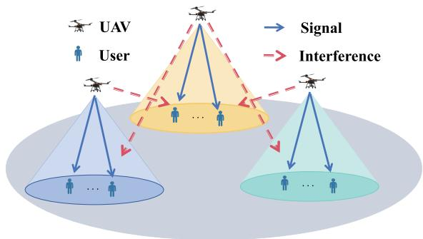  
Fig. 1. System model.

Here, $\eta ^ { \mathrm { L o S } }$ and $\eta ^ { \mathrm { N L o S } }$ , respectively, represent the mean additional path loss of the LoS link and the NLoS link. Additionally, $F L _ { k _ { i } , i }$ is the loss of the free space path, which can be expressed as:

$$
F L _ { k _ { i } , i } = 2 0 \log _ { 1 0 } { \| q _ { i } - u _ { k _ { i } } \| } + 2 0 \log _ { 1 0 } { \left( \frac { 4 \pi f _ { c } } { c } \right) } ,\tag{4}
$$

Here, $f _ { c }$ represents the carrier frequency and c represents the speed of light. The channel gain between the UAV i and the user $k _ { i }$ can be calculated as:

$$
\begin{array} { r } { \mathrm { g a i n } _ { i , k _ { i } } = 1 0 ^ { - \frac { F L _ { k _ { i } , i } } { 1 0 } } , } \end{array}\tag{5}
$$

The UAV i provides useful signals for user $k _ { i } \ \in \ K _ { i }$ , while other UAVs cause interference to it. Therefore, the SINR for user $k _ { i }$ can be calculated as

$$
\Upsilon _ { k _ { i } , i } = \frac { p _ { k _ { i } , i } g _ { k _ { i } , i } } { \displaystyle \sum _ { j = 1 \atop j \neq i } ^ { N } p _ { k _ { i } , j } g _ { k _ { i } , j } + \delta ^ { 2 } } .\tag{6}
$$

Here, $p _ { k _ { i } , i }$ represents the power allocated by the corresponding UAV i to user $k _ { i } , g _ { k _ { i } , i }$ is the channel gain of UAV i for user $k _ { i } , p _ { k _ { i } , j } g _ { k _ { i } , j }$ indicate the interference caused by other nearby UAVs to user $k _ { i } , \delta ^ { 2 }$ represents the received noise power.

## C. Semantic Communication Modeling

To enhance UAV communication robustness and efficiency under low SINR and dynamic channels, we propose a 3D deployment framework based on semantic communication. This framework leverages high-level semantic awareness to guide deployment beyond traditional bit-level metrics. As a representative example, DeepSC [42], an end-to-end neural model, is adopted to illustrate semantic encoding, transmission, and decoding, modeling how channel quality impacts semantic restoration; other semantic communication models can also be used.

Since semantic communication emphasizes meaning rather than form of information, traditional metrics such as bit error rate (BER) are inadequate. This paper adopts the BLEU score, commonly used in natural language processing, to measure semantic fidelity. BLEU evaluates the n-gram overlap between generated and reference sentences; a higher BLEU indicates better semantic restoration. Its calculation is as follows:

$$
\log \mathrm { { B L E U } } = \operatorname* { m i n } \left( 1 - \frac { l _ { \hat { s } } } { l _ { s } } , 0 \right) + \sum _ { n = 1 } ^ { N } u _ { n } \log p _ { n } ,\tag{7}
$$

Here, $\begin{array} { r } { p _ { n } = \frac { \displaystyle \sum _ { k } \operatorname* { m i n } \left( C _ { k } \left( \hat { s } \right) , C _ { k } \left( s \right) \right) } { \displaystyle \sum _ { k } \operatorname* { m i n } \left( C _ { k } \left( \hat { s } \right) \right) } } \end{array}$ represents the n-gram accuracy rate, $l _ { s }$ represents the length of the transmitted sentence, and $l _ { \hat { s } }$ is the length of the decoded sentence. $C _ { k } ( \cdot )$ is the frequency counting function of the element k in the n-gram, and $u _ { n }$ is the weight of the n-gram.

In practical communication, the BLEU score is strongly affected by wireless channel conditions, especially SINR. Offline training and DeepSC simulations reveal a nonlinear relationship: BLEU is low at poor SINR, rises sharply with improving SINR, then saturates at high SINR. To use BLEU as a continuous, differentiable metric in reinforcement learning, we apply least squares polynomial fitting on sample data $\mathcal { D } = \overline { { ( x _ { i } , y _ { i } ) _ { i = 1 } ^ { N } } }$ , where $x _ { i }$ is SINR and $y _ { i }$ the BLEU score, fitting an n-degree polynomial:

$$
f ( x ) = a _ { 0 } + a _ { 1 } x + a _ { 2 } x ^ { 2 } + \cdot \cdot \cdot + a _ { n } x ^ { n } .\tag{8}
$$

This yields a continuous and differentiable function that maps SINR to BLEU:

$$
\mathrm { \bf B L E U } = f ( \mathrm { \bf S I N R } ) .\tag{9}
$$

This modeling approach not only captures the quantitative relationship between semantic performance and physical-layer conditions, but also improves the interpretability and differentiability of the training process, providing a solid foundation for deployment optimization and integration into reinforcement learning frameworks.

## D. Modeling of System Semantic Transmission Performance

To improve service quality in large-scale UAV-assisted semantic communication networks, this paper optimizes system-level semantic transmission by designing a 3D collaborative deployment strategy aimed at maximizing the BLEU score. The goal is to intelligently position UAVs in 3D space to ensure users’ semantic understanding while enhancing overall communication efficiency and robustness.

Assuming N UAVs each serving $K _ { i }$ static users in their clusters, the 3D position of UAV i is $\mathbf { q } _ { i } = [ x _ { i } , y _ { i } , z _ { i } ]$ , and the semantic content received by user $k _ { i }$ has BLEU score BL $\mathbf { \mathrm { E U } } _ { i , k _ { i } }$ (see (7)). Focusing on downlink communication, the system’s maximum BLEU score is achieved by jointly optimizing UAVs’ power allocation and 3D deployment:

$$
\mathcal { P } 1 : \operatorname* { m a x } _ { \{ \mathbf { q } _ { i } \} _ { i = 1 } ^ { N } } \sum _ { i = 1 } ^ { N } \sum _ { k _ { i } = 1 } ^ { K } b _ { i , k _ { i } } ,\tag{10a}
$$

$$
\mathrm { s . t . ~ } \mathrm { S I N R } _ { i , k _ { i } } > \mathrm { S I N R } _ { \mathrm { t h } } , \quad \forall i , j ,\tag{10b}
$$

$$
\mathbf { q } _ { i } \in \mathcal { Q } , z _ { i } \in [ h _ { \operatorname* { m i n } } , h _ { \operatorname* { m a x } } ] ,\tag{10c}
$$

$$
\mathcal { T } _ { k _ { i } } = \sum _ { j \neq i } \mathbb { I } ( \mathbf { P } \mathbf { L } _ { j , k _ { i } } \leq \mathbf { P } \mathbf { L } _ { \mathrm { t h } } ) \cdot I _ { j  k _ { i } } .\tag{10d}
$$

Here, $b _ { i , k _ { i } }$ denotes the BLEU score between UAV i and user $k _ { i } ,$ , determined by the SINR-BLEU mapping in (9), reflecting the impact of the physical channel on semantic communication. $\mathrm { S I N R } _ { \mathrm { t h } }$ is the minimum SINR threshold; $q _ { i }$ is 3D position of UAV i within the deployable region Q; Altitude $z _ { i }$ is bounded by $h _ { \mathrm { m i n } }$ and $h _ { \operatorname* { m a x } } . \ \mathcal { T } _ { k _ { i } }$ denotes total interference at user $k _ { i } .$ . The restriction (10b) ensures that the SINR stays above the threshold to maintain semantic quality. The restriction (10c) limits the positions of the UAV within the allowed flight area. Constraint (10d) uses path loss filtering to restrict cross-cluster interference: only UAVs j with path loss $\mathrm { P L } _ { j , k _ { i } }$ contribute interference $I _ { j \to k _ { i } } ; \mathbb { I } ( \cdot )$ is an indicator function that equals 1 when the condition is satisfied, and 0 otherwise. This filtering ignores weak/distant interference, reducing complexity and improving accuracy and training stability. It can be integrated as a differentiable penalty into reinforcement learning.

In summary, this work uses BLEU as the core metric and SINR-BLEU mapping to bridge physical and semantic layers, guiding UAVs to efficient, coordinated 3D deployment under low SINR and interference, providing a solid foundation for reliable semantic-aware aerial networks.

## IV. ALGORITHM DESIGN

This section will provide a detailed introduction to the overall architecture of the proposed algorithm, including the MADDPG algorithm with Mean-Field approximation, the role of KDE in estimating the action distribution, the design of the neural network structure, and the training process of joint optimization. It should be noted that this paper implements and validates the MADDPG algorithm as the representative algorithm, but the proposed framework has good universality and can also be applied to other multi-agent reinforcement learning methods based on policy gradient.

## A. MADDPG With Mean-Field Approximation

To enable scalable coordination among a large number of agents in multi-agent systems, we adopt the MADDPG as a representative baseline and incorporate a mean-field mechanism to address the challenge of interaction complexity.

MADDPG is an extension of the single-agent DDPG algorithm, designed for multi-agent environments through centralized training and decentralized execution. Each agent maintains a local actor and a centralized critic that leverages the global state and joint actions to learn more accurate $\mathrm { Q } \mathrm { - }$ values. The objective for each agent i is to maximize its expected return:

$$
J _ { i } = \mathbb { E } \left[ \sum _ { t = 0 } ^ { \infty } \gamma ^ { t } r _ { i } ^ { t } \right] ,\tag{11}
$$

where the critic is updated using the Bellman target:

$$
\mathcal { L } _ { i } = \mathbb { E } \left[ \left( Q _ { i } ( s , \mathbf { a } ) - ( r _ { i } + \gamma Q _ { i } ^ { \prime } ( s ^ { \prime } , \mathbf { a } ^ { \prime } ) ) \right) ^ { 2 } \right] ,\tag{12}
$$

and the actor is optimized via the policy gradient:

$$
\nabla _ { \theta _ { i } } J _ { i } \approx \mathbb { E } \left[ \nabla _ { \theta _ { i } } \mu _ { i } ( s _ { i } ) \nabla _ { a _ { i } } Q _ { i } ( s , \mathbf { a } ) { \big | } _ { a _ { i } = \mu _ { i } ( s _ { i } ) } \right] .\tag{13}
$$

However, in large-scale systems, explicitly modeling joint actions leads to exponential complexity. To mitigate this, we introduce the mean-field approximation, replacing interactions among all agents with an interaction between each agent and the average behavior of its neighbors. The critic function is simplified as:

$$
Q _ { i } = Q _ { i } ( s _ { i } , a _ { i } , \bar { a } _ { i } ) ,\tag{14}
$$

where $\bar { a } _ { i }$ denotes the mean action of agents in $i \ ' _ { \mathrm { ~ S ~ } }$ neighborhood. This reduces complexity from $O ( N ^ { 2 } )$ to $O ( N )$ and enhances training efficiency. The corresponding TD target and loss become:

$$
y _ { i } = r _ { i } + \gamma Q _ { i } ^ { \prime } ( s _ { i } ^ { \prime } , a _ { i } ^ { \prime } , \bar { a } _ { i } ^ { \prime } ) ,
$$

$$
\mathcal { L } _ { i } = \mathbb { E } [ ( Q _ { i } ( s _ { i } , a _ { i } , \bar { a } _ { i } ) - y _ { i } ) ^ { 2 } ] ,\tag{15}
$$

$$
\phi _ { i }  \phi _ { i } - \alpha \nabla _ { \phi _ { i } } \mathcal { L } ( \phi _ { i } ) ,\tag{16}
$$

(17)

and the actor gradient is updated as:

$$
\nabla _ { \theta _ { i } } J _ { i } = \mathbb { E } \left[ \nabla _ { a _ { i } } Q _ { i } ( s _ { i } , a _ { i } , \bar { a } _ { i } ) \nabla \theta _ { i } \mu _ { i } ( s _ { i } ) \right] .
$$

$$
\begin{array} { r } { \theta _ { i }  \theta _ { i } + \alpha \nabla _ { \theta _ { i } } J . } \end{array}\tag{18}
$$

(19)

Finally, the target networks are updated using the soft update:

$$
\theta _ { i } ^ { \prime }  \tau \theta _ { i } + ( 1 - \tau ) \theta _ { i } ^ { \prime } ,\tag{20}
$$

$$
\phi _ { i } ^ { \prime }  \tau \phi _ { i } + ( 1 - \tau ) \phi _ { i } ^ { \prime } .\tag{21}
$$

where $\tau \ll 1$ is the update rate.

To further enhance the accuracy of $\bar { a } _ { i }$ estimation in continuous spaces, the next section introduces KDE to model the mean action distribution more effectively.

## B. Action Distribution Estimation via KDE

The traditional mean-field method converts discrete actions into one-hot encoding, and the influence of each agent can be represented by the mean action of other agents. This is given by:

$$
\bar { a _ { i } } = \frac { 1 } { N - 1 } \sum _ { j \neq i } { a _ { j } ^ { t } } ,\tag{22}
$$

This assumption is reasonable in the discrete action space, but in the continuous action space, due to the infinite granularity of action values, this representation becomes infeasible in the continuous action space. The mean may not effectively represent the distribution of the agent, so it is not applicable to the continuous action space. To address the challenges of the continuous action space, various approximation methods have been proposed. For example, by using a projection operator to project continuous actions onto a finite subset; or using an -net to approximate the mean-field actions and project them onto a finite grid; or using the K-Nearest Neighbor (KNN) method to approximate the mean-field actions. However, these methods inevitably approximate the mean-field actions within the grid structure, thus leading to the problem of insufficient granularity. To more accurately depict the influence of neighboring actions on the agent’s strategy, this paper introduces the KDE for non-parametric modeling of neighborhood actions. Specifically, if the neighborhood of agent i contains K other agents with actions, then the probability density function of its neighborhood actions can be given by KDE:

$$
p ( a ) = \frac { 1 } { K h ^ { d } } \sum _ { j \in K } K \left( \frac { a - a _ { j } } { h } \right) ,\tag{23}
$$

Here, d represents the dimension of the action space, which in this paper refers to the entire flight space. h is the bandwidth parameter that controls the degree of smoothness. In this paper, it is set to 0.2. K(·) is the kernel function, and the Gaussian kernel is usually chosen.

$$
K ( x ) = { \frac { 1 } { \sqrt { 2 \pi } } } \exp \left( - { \frac { x ^ { 2 } } { 2 } } \right) ,\tag{24}
$$

Based on this, the Critic function of the intelligent agent i can be extended as: ${ \bf \Phi } : Q _ { i } \left( s _ { i } , a _ { i } , p ( a ) \right)$

Specifically, the value assessment not only considers the mean of the neighborhood actions but also explicitly models the probability distribution of the neighborhood actions, thereby obtaining more accurate action-state value estimates. Then, the expectation is taken as the influence of the mean action of other agents. Since KDE is a smooth distribution, in practice, the expectation can be approximated using Monte Carlo sampling:

$$
\bar { a _ { i } } = \mathbb { E } _ { a _ { j } \sim p ( a ) } [ a _ { j } ] \approx \frac { 1 } { M } \sum _ { m = 1 } ^ { M } a _ { m } .\tag{25}
$$

Here, M represents the number of samples, and $a _ { m } \sim p ( a )$ indicates that M samples are sampled from the distribution estimated by KDE.

In semantic communication networks, UAVs are required not only to optimize physical-layer transmissions but also to capture the underlying semantic demands and user distribution patterns in the environment. Traditional mean-field approaches approximate neighborhood interactions by using the mean action, which fails to characterize the diversity and uncertainty of semantic information. By incorporating KDE, UAVs can instead obtain a probability distribution of neighboring actions and semantic requirements. This enables decisionmaking based on the full distribution rather than a single mean value, thereby enhancing the UAVs’ ability to achieve “contextual understanding” in semantic communication. Moreover, KDE naturally handles uncertain and unstructured environmental information without imposing rigid parametric assumptions, and its smoothing effect mitigates noise and discreteness in semantic quality metrics (e.g., BLEU, METEOR, BERTScore). As a result, KDE provides a more stable, differentiable reward signal and improves convergence robustness during training.

## C. MF-MADDPG-KDE for 3D UAV Deployment in Semantic Communication Networks

To tackle the challenges of collaborative learning in large-scale multi-agent systems, this paper proposes MF-MADDPG-KDE, an optimization algorithm that integrates MF-MADDPG with KDE. This method enables efficient policy learning in continuous action spaces, facilitates intelligent 3D UAV deployment, and enhances semantic communication performance. Each UAV acts as an independent agent and shares key information with others via a control channel, creating a collaborative learning environment. By applying the mean-field approximation, each agent considers the average behavior of its neighbors instead of modeling all other agents individually, effectively alleviating the curse of dimensionality. Furthermore, KDE improves the accuracy of neighborhood action distribution estimation and enhances policy convergence stability in continuous action spaces.

This deployment task is modeled as a multi-agent Markov Decision Process (MDP), defined as follows:

1) State Space: The state of each agent (UAV) at time step t is defined as its current position coordinates:

$$
s _ { i } ( t ) = \big [ x _ { i } ( t ) , y _ { i } ( t ) , z _ { i } ( t ) \big ] ,\tag{26}
$$

2) Action Space: The action of each agent at step t is defined as its 3D deployment position at the next moment:

$$
a _ { i } ( t ) = \bigl [ x _ { i } ( t + 1 ) , y _ { i } ( t + 1 ) , z _ { i } ( t + 1 ) \bigr ] ,\tag{27}
$$

3) Reward Function: Traditional bit-level metrics (e.g., throughput, BER) fail to capture semantic fidelity in communication. To address this, we design a reward function based on the BLEU score, which evaluates the quality of semantic information recovery and provides a more semantically-aware optimization objective.

To associate BLEU with physical-layer communication indicators, based on the DeepSC framework, a mapping relationship between BLEU and SINR is fitted through simulation experiments. After obtaining the data, a continuous relationship curve is derived using the least squares fitting method. Details of the fitting process can be found in III-C. To enhance the robustness and practicality of the reward function, the BLEU score is included in the reward calculation only when the SINR between UAV i and its associated user $k _ { i }$ exceeds a predefined threshold $\mathrm { S I N R } _ { \mathrm { t h } } .$ . Moreover, to reduce the computational complexity associated with modeling long-range interference, only those interference links whose path loss PL is below a threshold $\mathrm { P L } _ { \mathrm { t h } }$ are considered in the inter-cluster interference calculation.

Consequently, the final reward function integrates both semantic-level performance (BLEU) and physical-layer communication conditions (SINR and path loss), thereby providing stable and informative feedback for reinforcement learning. The final reward value is:

$$
R _ { i } = \underbrace { \mathbb { I } ( { \mathrm { S I N R } } _ { i , k _ { i } } > { \mathrm { S I N R } } _ { \mathrm { t i o n } } ) } _ { \mathrm { I n d i c t o r ~ f u n c t i o n } } \cdot f \left( \underbrace { \frac { p _ { k _ { i } , i } g _ { k _ { i } , i } } { \sum _ { i ^ { \prime } \neq i } ^ { \infty } { p _ { k _ { i } , i } g _ { k _ { i } , j } + \delta ^ { 2 } } } } _ { \mathrm { B a p j i c t i v i t u o r } } \right) .\tag{28}
$$

$$
R = \sum _ { i = 1 } ^ { N } R _ { i } .\tag{29}
$$

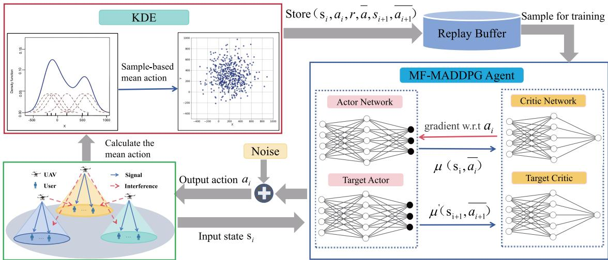  
Fig. 2. Algorithm framework of MF-MADDPG-KDE.

The meanings of the symbols in the formula can be referred to as III-B and III-D.

4) Strategy Update and Training Process: Fig. 2 shows the overall framework of the MF-MADDPG-KDE algorithm, including key modules such as state perception, neighborhood modeling, mean-field estimation, strategy update, and deployment execution.

MF-MADDPG-KDE introduces the mean-field mechanism on the basis of the MADDPG framework and combines KDE to improve the accuracy of mean-field modeling, enhancing the stability and scalability of the algorithm in the continuous action space. The key steps are as follows:

• Step 1: State perception and initialization. Each agent perceives its own state $s _ { i }$ from the environment at each time step, including position information, link status, and semantic load indicators, and also collects the states and historical actions of other agents in the neighborhood.

• Step 2: Neighborhood action modeling (KDE). For agent i, KDE is used to model the action set $a _ { j } ( j \in N _ { i } )$ of its neighborhood agents, obtaining the probability density function:

$$
\hat { f } _ { i } ( a ) = \frac { 1 } { | \mathcal { N } ( i ) | h } \sum _ { j \in \mathcal { N } ( i ) } \kappa \left( \frac { a - a _ { j } } { h } \right) ,\tag{30}
$$

where $\kappa ( \cdot )$ is the kernel function and h is the bandwidth.

• Step 3: Calculation of mean-field actions. Based on the estimated action distribution by KDE ${ \hat { f } } _ { i } ( a )$ , calculate the expected value of the neighboring actions as the meanfield response:

$$
\bar { a } _ { i } = \mathbb { E } _ { a \sim \hat { f } _ { i } ( a ) } [ a ] \approx \frac { 1 } { M } \sum _ { m = 1 } ^ { M } a ^ { ( m ) } .\tag{31}
$$

In this article, the mean value is calculated through Monte Carlo sampling.

• Step 4: Strategy Update and Action Execution. During the concentrated training phase, the Critic network receives $\left( { { s _ { i } } , { a _ { i } } , \overline { { { a _ { i } } } } } \right)$ to evaluate the Q value; the Actor network outputs the action $a _ { i } ~ = ~ \mu _ { \theta _ { i } } ( s _ { i } )$ , and updates the strategy through the deterministic policy gradient, as proposed in (15), (16), (18).

• Step 5: Reward Feedback and Semantic Optimization. In each interaction round, the agent computes semantic performance based on its deployment and communication quality with users. The BLEU score is used as the reward to guide policy learning toward regions enabling highquality semantic transmission. As a measure of semantic fidelity, BLEU quantifies how well the received message preserves the original meaning, capturing end-to-end performance in semantic communication. If the SINR exceeds the threshold $\gamma _ { - } m i n$ , the BLEU score derived from DeepSC decoding is used as the immediate reward, ensuring that the reward function aligns with semanticlevel performance.

• Step 6: Experience Replay and Soft Update. The interaction data $( s _ { i } , a _ { i } , r _ { i } , s _ { i } ^ { \prime } )$ is stored in the experience pool and sampled periodically for training. The soft update strategy is used to stabilize the parameters of the target network.

The proposed algorithm offers three main advantages. First, dimension reduction is achieved through the mean-field mechanism, which approximates the influence of other agents via their average behavior, improving scalability and reducing interaction complexity. Second, high-fidelity modeling is enabled by KDE, which accurately captures the distribution of neighboring actions in continuous spaces and overcomes the limitations of simple mean approximations. Third, semanticaware optimization is introduced by incorporating semantic metrics, such as the BLEU score, into the reward function, guiding UAV deployment toward improved semantic restoration quality. During each training iteration, the system collects the current state, BLEU score, and interference data to form experience tuples $( s _ { i } , a _ { i } , r _ { i } , s _ { i } ^ { \prime } )$ , which are stored in the replay buffer. KDE is then used to reconstruct the neighborhood action distribution, enhancing policy update accuracy in continuous action spaces. The resulting Actor network ultimately serves as the UAV deployment policy for any given state.

TABLE I  
SIMULATION SETTINGS
<table><tr><td rowspan=1 colspan=1>Parameter</td><td rowspan=1 colspan=1>Value</td><td rowspan=1 colspan=1>Parameter</td><td rowspan=1 colspan=1>Value</td></tr><tr><td rowspan=1 colspan=1>Environment parameter α</td><td rowspan=1 colspan=1>12.08</td><td rowspan=1 colspan=1>Minimum flight altitude</td><td rowspan=1 colspan=1>100m</td></tr><tr><td rowspan=1 colspan=1>Environment parameter $\beta$ </td><td rowspan=1 colspan=1>0.11</td><td rowspan=1 colspan=1>Maximum flight altitude</td><td rowspan=1 colspan=1>1000m</td></tr><tr><td rowspan=1 colspan=1>Environment paramenter $\overline { { \eta ^ { \mathrm { L o S } } } }$ </td><td rowspan=1 colspan=1>1.6</td><td rowspan=1 colspan=1>Path loss threshold $\mathrm { P L } _ { \mathrm { t h } }$ </td><td rowspan=1 colspan=1>105</td></tr><tr><td rowspan=1 colspan=1>Environment paramenter $\overline { { \eta ^ { \mathrm { N L o S } } } }$ </td><td rowspan=1 colspan=1>23</td><td rowspan=1 colspan=1>Number of KDE sampling samples M</td><td rowspan=1 colspan=1>500</td></tr><tr><td rowspan=1 colspan=1>Carrier frequency fc</td><td rowspan=1 colspan=1>700MHz</td><td rowspan=1 colspan=1>Maximum launch power Pmax</td><td rowspan=1 colspan=1>0.05w</td></tr><tr><td rowspan=1 colspan=1>System band B</td><td rowspan=1 colspan=1>100MHz</td><td rowspan=1 colspan=1>SINR threshold $\mathrm { S I N R } _ { \mathrm { t h } }$ </td><td rowspan=1 colspan=1>0</td></tr><tr><td rowspan=1 colspan=1>Noise power $\sigma ^ { 2 }$ </td><td rowspan=1 colspan=1>-154dBm/Hz × B/K</td><td rowspan=1 colspan=1>Total episodes</td><td rowspan=1 colspan=1>1000</td></tr><tr><td rowspan=1 colspan=1>Number of users K</td><td rowspan=1 colspan=1>80</td><td rowspan=1 colspan=1>Total timesteps</td><td rowspan=1 colspan=1>100</td></tr></table>

Algorithm 1 The MF-MADDPG-KDE Algorithm for Multi-  
UAV 3D Deployment With Semantic Communication   
Initialize: $Q _ { \phi _ { i } } , Q _ { \phi _ { i } } ^ { \prime } , \mu _ { \theta _ { i } } , \mu _ { \theta _ { i } } ^ { \prime }$ and $\overline { { a } } _ { i }$ for all agents   
$i \in \{ 1 , \ldots , N \}$ ; Replay buffer $\mathcal { D }  \emptyset ;$   
Learning rate $\alpha = 0 . 0 0 1 ;$ Target network   
update rate $\tau = 0 . 0 1 ;$   
for episode = 1 to max\_episodes do   
Initialize all UAVs positions $q _ { i }$ as states $s _ { i } ;$   
for t = 1 to max\_steps do   
for each agent $i \in \{ 1 , \ldots , N \}$ do   
Select action $a _ { i } = \mu _ { \theta _ { i } } ( s _ { i } )$ based on state $s _ { i } ;$   
Execute action, calculate reward $r _ { i }$   
according to (28) and transition from $s _ { i }$ to   
next state $s _ { i } ^ { \prime } { \mathrm { ; } }$   
Store transition $\left( { { s _ { i } } , { a _ { i } } , { \overline { { { a } } } _ { i } } , { r _ { i } } , { s _ { i } ^ { \prime } } } \right)$ in $\mathcal { D } ;$   
for each agent $i \in \{ 1 , \ldots , N \}$ do   
Estimate neighbors’ action distribution with   
KDE and compute the mean action $\overline { { a } } _ { i } ^ { \prime }$   
(23)(31);   
Update mean action $\overline { { a } } _ { i } \gets \overline { { a } } _ { i } ^ { \prime } ;$   
for each agent $i \in \{ 1 , \ldots , N \}$ do   
Sample minibatch $\{ ( s , a , \bar { \overline { { { a } } } } , r , s ^ { \prime } ) \}$ from $\mathcal { D } ;$   
Compute target Q-value $y _ { i }$ according to (15):   
Update critic by minimizing according to (16)   
(17);   
Update actor using policy gradient (18)(19);   
Update target networks using the soft update (20)   
(21);   
Return : Trained policies $\{ \mu _ { \theta _ { i } } \} _ { i = 1 } ^ { N } ;$   
$q = ( q _ { 1 } , \cdots , q _ { N } ) ;$

The detailed steps of the MF-MADDPG-KDE algorithm are presented in Algorithm 1.

## V. NUMERICAL RESULTS AND ANALYSIS

## A. Experimental Environment Setup

This experiment is conducted using Python 3.7 and PyTorch 1.13. Key simulation parameters are detailed in Table I. To emulate low-SINR environments, a high background noise level is configured. Each PoI, representing a user hotspot covering a 1km ×1km area, is surrounded by 80 users, including 60 densely distributed within 0.2km and 20 more sparsely within 0.5km, reflecting realistic user distribution. An equal number of UAV-BSs are assigned, with each UAV serving users in its respective PoI region. Urban channel parameters follow the settings in [28].

In MF-MADDPG-KDE, the actor network consists of two input layers, two hidden layers (with 200 and 100 neurons), and one output layer. The input size is $3 \times N$ (where 3 is the action dimension per agent), and the output is a 3D UAV position. A Tanh activation maps outputs to [−1, 1], followed by a custom scaling layer to cover the full action space. The target actor shares the same architecture. The critic network has the same structure, taking as input the agent’s own stateaction pair and the mean-field actions (dimensions 3 × N and 3), and outputs a scalar value without activation. ReLU is used in hidden layers, and all networks are optimized using Adam.

To construct a continuous and differentiable reward function, we simulate semantic communication using the DeepSC framework under various channel conditions with Gaussian white noise. To rigorously validate the mapping from SINR to semantic quality, we collect paired SINR and score data under multiple configurations, including BLEU scores from 1-gram to 4-gram, as well as alternative semantic metrics such as METEOR and BERTScore. The data are then fitted using least-squares polynomial regression to ensure smoothness and differentiability of the mapping. This approach not only smooths the inherently discrete semantic metrics to mitigate gradient fluctuations but also accurately captures the overall trend of semantic quality with respect to SINR. Across varying channel conditions and user distributions, the polynomial fitting exhibits low approximation error, providing a stable and reliable reward signal. Moreover, as a continuous and differentiable function, it facilitates gradient computation and policy optimization, enabling more stable convergence and improved policy performance. As shown in Fig. 3, the markers of different shapes and colors represent the original data for various configurations, while the corresponding solid curves indicate the fitted polynomial mappings, demonstrating that the fitted functions effectively approximate semantic communication performance across all tested metrics.

Moreover, Fig. 4 illustrates the training processes under various BLEU configurations as well as across multiple semantic metrics, clearly demonstrating that the proposed approach provides a generalizable mapping framework beyond BLEU. In addition to quantitative fitting, we further conduct qualitative evaluations using METEOR and BERTScore, observing trends consistent with BLEU. These results provide deeper insight into how different semantic metrics reflect the robustness and reliability of semantic communication under varying channel conditions. By examining multiple metrics, we ensure that the proposed mapping framework is not only accurate for BLEU but also broadly applicable to other measures of semantic quality. For the experiments presented in this paper, BLEU with 2-gram is adopted as a representative case, while the qualitative trends observed with METEOR and BERTScore corroborate the generalizability of our approach.

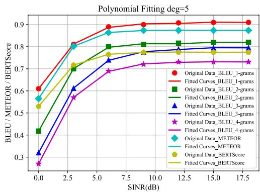

Fig. 3. Relationship between BLEU/ METEOR/ BERTScore and SINR.  
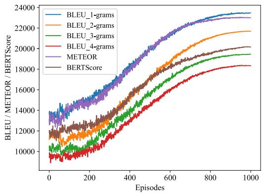  
Fig. 4. The training processes under different semantic quality metrics.

To assess the impact of learning rate on performance, we tested multiple values and tracked BLEU score trends during training, as shown in Fig. 5. A learning rate of 0.001 (green curve) yields the best result, achieving fast BLEU growth, stable convergence, and a final score around 22,000. A rate of 0.0015 (red curve) initially performs well but exhibits noticeable fluctuations. We also experimented with a dynamic learning rate strategy: the brown curve represents a schedule where the rate is 0.0015 for the first 500 episodes and then reduced to 0.001 for the remaining 500 episodes. Interestingly, this approach performs slightly worse than using a constant 0.001, likely because the initially higher rate causes overshooting in early exploration, which cannot be fully compensated in later stages. Similarly, a linearly decaying learning rate from 0.002 to 0.0001 (pink curve) was tested, but the final performance still falls short of the constant

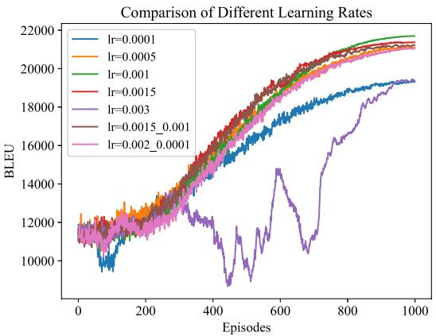  
Fig. 5. Stability of 4 UAVs using different learning rates: MF-MADDPG-KDE.

0.001 case, suggesting that excessive early updates or overly aggressive decay can destabilize policy learning. Too small a rate (0.0001, blue curve) leads to slow progress and poor outcome, while too large a rate (0.003, purple curve) causes instability and significant degradation. Therefore, 0.001 is selected as the default learning rate, balancing convergence speed, stability, and overall performance. To further balance exploration and convergence, an annealing exploration strategy is applied: UAVs start with high action noise in 3D space, gradually decreasing during training, encouraging early exploration while stabilizing policy learning in later stages.

## B. Comparative Analysis of Action Space Modeling: KDE vs. Discrete Mapping vs. -Net

To comprehensively analyze the performance differences between the KDE method and the discrete mapping method in modeling continuous action spaces, Fig. 6 presents a comparison of UAV action space modeling using the two approaches. Fig. 6a illustrates the UAV deployment positions in 3D space after training, where blue dots denote the final locations of the UAVs. Fig. 6b provides a 2D top-down view of Fig. 6a, offering a clearer visualization of the UAVs’ planar distribution characteristics. Fig. 6c shows the action distribution probability density map at a fixed altitude derived from the KDE method. The smooth and continuous heat zones span the entire deployment space, indicating robust spatial coverage. Notably, the lower-right region of the map still exhibits non-zero probability density, suggesting that the learned policy retains the potential to deploy UAVs in that area. This continuous distribution highlights one of KDE’s key strengths: its ability to non-parametrically model policy distributions over continuous spaces, thereby enhancing both the representational power and spatial adaptability of the deployment policy. In contrast, Fig. 6d illustrates the deployment heatmap generated by discretizing the action space into a finite set of predefined points. The resulting distribution displays fragmented and speckled hotspot patterns, with no smooth transitions between them. A prominent “blank region” in the lower right corner, which is completely devoid of coverage, demonstrates a critical limitation of this approach. Because there are no corresponding discrete action points in that area, the policy is unable to make deployment decisions there. This phenomenon reveals the inherent blind spot problem associated with discrete mapping in continuous spaces, which constrains both spatial generalization and deployment precision. Since the -net method can theoretically also be regarded as a form of discrete mapping, we do not list it separately here.

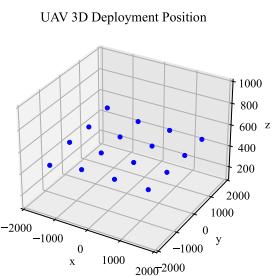  
(a)

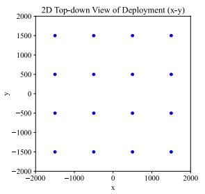  
(b)

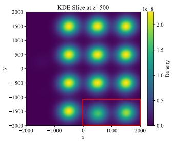  
(c)

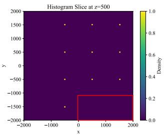  
(d)  
Fig. 6. Comparison of action space modeling for UAV: KDE vs Discrete mapping method. (a) UAV 3D deployment positions. (b) 2D Top-down view Of deployment. (c)KDE continuous action space probability density distribution. (d)Action space probability density distribution in discrete mapped space.

TABLE II  
TRAINING TIME AND FINAL REWARD VALUES
<table><tr><td rowspan=1 colspan=1></td><td rowspan=1 colspan=2>4 UAVs</td><td rowspan=1 colspan=2>6 UAVs</td><td rowspan=1 colspan=2>9 UAVs</td></tr><tr><td rowspan=1 colspan=1></td><td rowspan=1 colspan=1>training time(s)</td><td rowspan=1 colspan=1>final reward</td><td rowspan=1 colspan=1>training time(s)</td><td rowspan=1 colspan=1>final reward</td><td rowspan=1 colspan=1>training time(s)</td><td rowspan=1 colspan=1>final reward</td></tr><tr><td rowspan=1 colspan=1>MF-MADDPG-Map_interval1</td><td rowspan=1 colspan=1>5012.00</td><td rowspan=1 colspan=1>20747.16</td><td rowspan=1 colspan=1>9870.88</td><td rowspan=1 colspan=1>31235.238</td><td rowspan=1 colspan=1>14929.85</td><td rowspan=1 colspan=1>45505.63</td></tr><tr><td rowspan=1 colspan=1>MF-MADDPG-Map_500</td><td rowspan=1 colspan=1>2988.27</td><td rowspan=1 colspan=1>20099.06</td><td rowspan=1 colspan=1>5328.44</td><td rowspan=1 colspan=1>27933.590</td><td rowspan=1 colspan=1>6763.64</td><td rowspan=1 colspan=1>43371.77</td></tr><tr><td rowspan=1 colspan=1>MF-MADDPG-€_net</td><td rowspan=1 colspan=1>4533.16</td><td rowspan=1 colspan=1>21176.35</td><td rowspan=1 colspan=1>6895.23</td><td rowspan=1 colspan=1>31704.98</td><td rowspan=1 colspan=1>10133.47</td><td rowspan=1 colspan=1>45606.18</td></tr><tr><td rowspan=1 colspan=1>MF-MADDPG-KDE</td><td rowspan=1 colspan=1>2780.15</td><td rowspan=1 colspan=1>21696.76</td><td rowspan=1 colspan=1>3184.60</td><td rowspan=1 colspan=1>31839.374</td><td rowspan=1 colspan=1>5829.41</td><td rowspan=1 colspan=1>45839.70</td></tr></table>

These results demonstrate that, compared to the discrete mapping method, the KDE approach offers greater continuity and smoothness in action space modeling. It captures finegrained details of the continuous space, thereby improving policy expressiveness, deployment flexibility, and training stability. This facilitates smoother optimization and leads to more rational deployment patterns in multi-agent systems. In contrast, the discrete method is susceptible to policy oscillation or becoming trapped in suboptimal solutions, especially when the discretization granularity is insufficient or the point set distribution is uneven. This ultimately limits the potential for policy performance improvement.

To validate the advantages of KDE over other mean-field approximation methods in continuous action space tasks, we conduct comparative experiments on 3D UAV deployments with 4, 6, and 9 UAVs. Four methods are evaluated: MF-MADDPG-KDE, a finely discretized version with an interval of 1 (MF-MADDPG-Map interval1), a coarsely discretized version with 500 action points (MF-MADDPG-Map 500), and an -net based approximation (MF-MADDPG- net). Fig. 7a shows the training reward curves. Across all scenarios, MF-MADDPG KDE achieves the highest final rewards, demonstrating superior policy expressiveness and learning efficiency without significant computational overhead. In contrast, the performance of discrete mapping is fundamentally limited by discretization resolution: coarse mapping lacks representational precision, while fine discretization (MF-MADDPG-Map interval1) improves accuracy but still fails to fully capture the variability of continuous actions. Although an extremely fine discretization could theoreti cally approximate the performance of MF-MADDPG KDE, it leads to prohibitively high computational complexity, making it impractical for large-scale UAV systems. The MF-MADDPG- net method provides a better approximation than MF-MADDPG-Map interval1, yielding higher rewards than both coarse and finely discretized mapping. However, it remains slightly below KDE in terms of final reward, mainly because UAV actions span a large 3D flight space, forcing - net to generate a vast number of grid points. This substantially increases computational cost and slows convergence, whereas KDE adaptively models the action distribution with far fewer samples. As the number of UAVs increases, these drawbacks of discrete mapping and -net become more pronounced, while KDE consistently maintains stable convergence and scalability.

Table II provides quantitative comparisons of training time and final rewards, further confirming the overall superiority of the KDE-based approach. Since UAV actions span the entire flight space, the -net must generate a large number of uniform grid points across this space, resulting in longer computation times and making it unsuitable for large-scale multi-UAV scenarios. In the discretization approach, continuous actions are uniformly mapped to a fixed number of discrete points. For the MF-MADDPG-Map 500, each action dimension generates only 500 discrete points, resulting in low computational overhead and short training time, but limited action expressiveness leads to inferior final policy performance. In contrast, MF-MADDPG-Map interval1, with an interval of 1, produces a large number of discrete points per dimension due to the wide action range, significantly increasing computation and storage costs and prolonging training time. While its policy performance improves compared to coarse discretization, it still falls short of MF-MADDPG KDE and MF-MADDPG- net. This indicates that high-resolution discretization is inefficient in large action spaces, whereas low-resolution discretization compromises performance, making both approaches less suitable for large-scale multi-UAV scenarios.

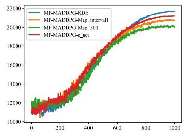

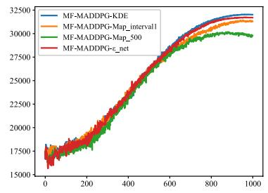  
(a)

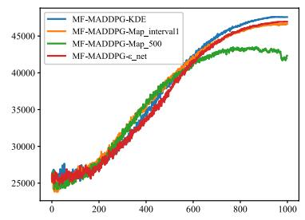

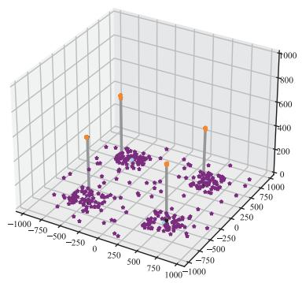

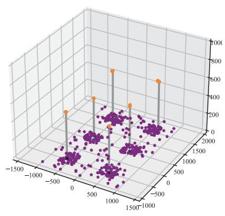  
(b)

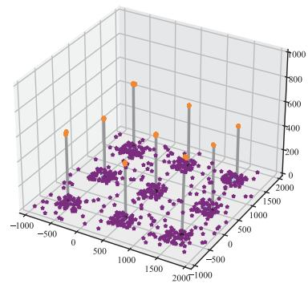

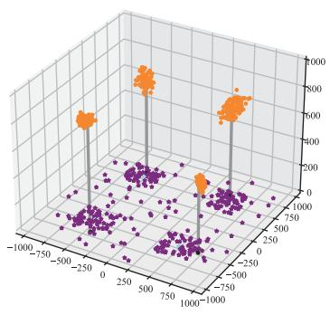

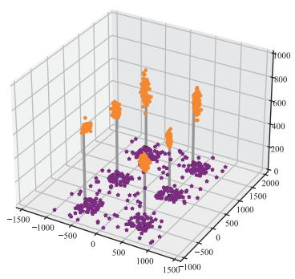

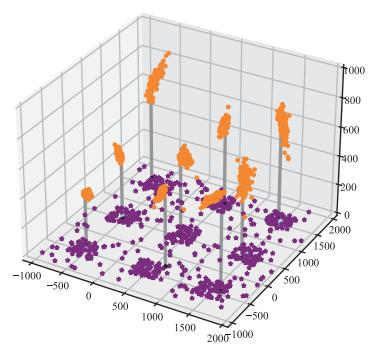

(c)  
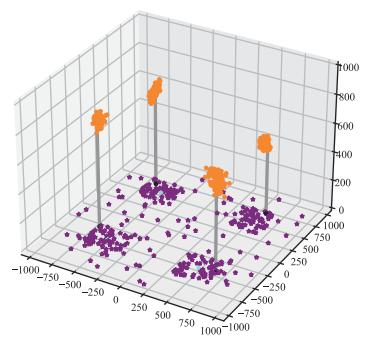

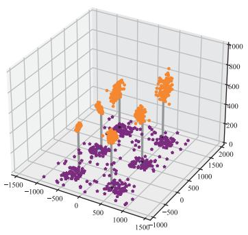  
(d)

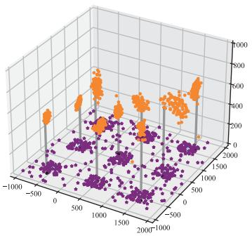  
Fig. 7. Performance comparison of different algorithms in 3D deployment of multiple uncrewed aerial vehicles and analysis of action space mapping effect. (From left to right, there are scenes of 4, 6, and 9 UAVs respectively.)(a) Comparison of training reward curves for three algorithms. (b) The 3D deployment effect of the MF-MADDPG-KDE algorithm. (c) Deployment effect of the MF-MADDPG-Map interval1 algorithm. (d) Deployment effect of th MF-MADDPG-Map 500 algorithm.

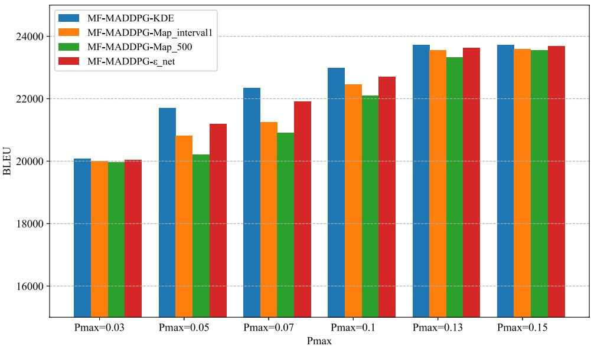  
Fig. 8. Different algorithms’ BLEU scores under different UAV power levels for 4 UAVs.

Fig. 7b, 7c, and 7d show the 3D spatial distributions of UAVs and ground users under MF-MADDPG-KDE, MF-MADDPG-Map interval1, and MF-MADDPG-Map 500 methods, respectively. Orange points mark UAV trajectories over multiple steps, while purple points indicate fixed ground user locations. These experiments evaluate how KDE and discrete mapping affect policy stability in continuous action space modeling within the MF-MARL framework. Under coarse discretization (MF-MADDPG-Map 500), UAV trajectories show evident jitter and randomness, frequently shifting between steps, which hinders convergence. This instability stems from discrete mapping’s core limitation: representing continuous actions with finite points breaks continuity, increases meanfield estimation errors, and causes discontinuous gradients that induce policy oscillations and degraded learning. In contrast, KDE models continuous action distributions with smooth, differentiable density functions, improving mean-field estimation accuracy and robustness. As shown in Fig. 7b, UAV trajectories under KDE are more stable and concentrated, with fewer abrupt or unnecessary moves, indicating smoother policy learning and more efficient final deployment.

In summary, the KDE method models action distributions as continuous probability densities, overcoming the granularity and dimensionality limitations of discrete mapping. It preserves mean-field advantages while greatly enhancing policy stability, flexibility, and accuracy, reducing instability and gradient oscillations to promote convergence and generalization. The MF-MADDPG-KDE algorithm thus offers superior scalability and robustness, making it ideal for largescale multi-agent 3D UAV deployment.

## C. Performance Comparison Under Power-Limited Semantic Communication Scenarios

Although MF-MADDPG-KDE shows clear advantages in convergence speed and final rewards across different numbers of UAVs, the performance of a wireless communication system depends not only on the deployment strategy but also on physical-layer constraints, such as transmission power. To further evaluate the adaptability and robustness of the algorithm under varying communication resource conditions, this study introduces the maximum transmission power $P _ { \mathrm { m a x } }$ as a control variable and analyzes the semantic communication performance of each algorithm at different power levels, as shown in Fig. 8. The figure presents the BLEU score comparison among the four algorithms (MF-MADDPG-KDE, MF-MADDPG-Map interval1 and MF-MADDPG-Map 500, MF-MADDPG- net) with 4 UAVs and different $P _ { \mathrm { m a x } }$ settings. As $P _ { \mathrm { m a x } }$ increases, BLEU scores generally improve, but tend to saturate beyond a certain power threshold. This is because when SINR exceeds a critical level, semantic decoding quality stabilizes, and further increases in power no longer yield noticeable improvements in BLEU scores. This indicates that under high SINR conditions, the differences between algorithms become less significant. However, under low SINR conditions, MF-MADDPG-KDE demonstrates more pronounced advantages by enhancing the robustness and expressiveness of the UAV deployment strategy through meanfield modeling and KDE-based smoothing of action outputs, thereby achieving superior semantic communication performance. It is also worth noting that when $P _ { \mathrm { m a x } }$ is too low, semantic information transmission becomes incomplete, limiting overall communication quality regardless of the algorithm used. In such cases, the performance gap between algorithms narrows. In this study, the maximum transmission power is set to $P _ { \mathrm { m a x } } ~ = ~ 0 . 0 5 w$ to enable a clearer comparison of the performance of different algorithms under low SINR conditions.

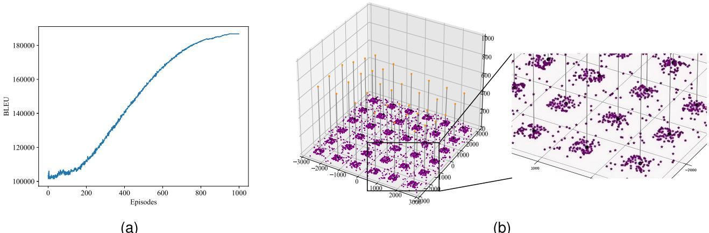  
Fig. 9. Deployment schematic diagram with 36 UAVs. (a) Reward curve. (b) 3D deployment diagram.

To assess the performance and scalability of MF-MADDPG-KDE in large-scale scenarios, experiments with 36 UAVs were conducted. Fig. 9 shows the training progress and 3D deployment results. As illustrated in Fig. 9a, the BLEUbased reward steadily increases during training and stabilizes around 185,000, indicating continuous improvement in semantic communication quality and convergence to an effective deployment strategy. Early training (before episode 200) shows slower reward growth due to high exploration, where UAVs randomly probe the 3D space and take inefficient actions. As exploration decreases, policies exploit learned experience, resulting in more stable and efficient behavior with sharper performance gains. Fig. 9b depicts the 3D deployment of 36 UAVs (orange dots) and ground users (purple dots), with a zoomed-in view on the right. Each UAV serves a fixed area (e.g., user hotspot), and the deployment places UAVs close to their users, covering dense regions uniformly with reasonable spacing. This demonstrates coordinated optimization of coverage, interference, and communication quality, meeting the demands of large-scale multi-agent deployment. The scale of 36 UAVs already constitutes a high-dimensional multi-agent environment, with an extremely large and complex joint state–action space. The experimental results show that even under such challenging conditions, our method consistently maintains stable convergence and coordination efficiency, demonstrating strong scalability and indicating the potential of this framework for even larger-scale cooperative communication scenarios in the future.

In the proposed MF-MADDPG-KDE framework, each UAV generates actions via its actor network while capturing environmental influence through the mean-field approximation of neighboring actions. When using KDE to compute expected actions, the complexity is $O ( K d _ { a } + S d _ { a } )$ , where K is the number of neighbors, $d _ { a }$ the action dimension, and S the number of KDE samples. For each time step, Critic and Actor updates incur complexity $O ( N \cdot B \cdot d _ { s } \cdot d _ { a } )$ , with N UAVs, batch size B, and state dimension $d _ { s } .$ The per-UAV cost of collecting its own state and action is $O ( d _ { s } + d _ { a } )$ . Since typically $K \ll N$ and S, B are moderate, the overall complexity grows roughly linearly with N , supporting scalability to large UAV networks. Meanwhile, KDE provides smooth and differentiable neighbor-action approximations, enhancing training stability and convergence speed. The complexity per step can be approximated as:

$$
\mathcal { C } _ { s t e p } = O \Big ( N ( d _ { s } + d _ { a } ) + N ( K d _ { a } + S d _ { a } ) + N \cdot B \cdot d _ { s } \cdot d _ { a } \Big )\tag{32}
$$

Notably, in the 36-UAV deployment scenario, the algorithm exhibits three key characteristics:

• Scalable coordination is achieved by maintaining efficiency even as the joint state-action space grows exponentially, owing to the mean-field approximation that reduces global interactions to tractable neighborhood distributions.

• Semantic transmission quality is preserved through distributed decision-making, where local interactions dominate and the complexity of coordination grows only linearly with the number of agents.

• High-density user scenarios are effectively addressed by fine-grained positional control of UAVs, with complexity bounded by localized interference modeling rather than full network-scale coupling.

These results collectively validate the framework’s suitability for real-world large-scale UAVs deployments, where both operational scalability and precise spatial coordination are paramount requirements. The demonstrated performance advantages position MF-MADDPG-KDE as a promising solution for complex multi-agent coordination challenges in practical applications.

## VI. CONCLUSION AND FUTURE WORK

This paper addresses the problem of 3D deployment of large-scale UAV systems in semantic communication networks, proposing a method that integrates MF-MADDPG and KDE. Unlike traditional deployment strategies that rely on bit-level communication performance indicators, this paper takes the quality of semantic information transmission as the core optimization objective and builds a deployment optimization model oriented towards the BLEU score, aiming to improve semantic fidelity in low SINR and complex channel environments. To address the high-dimensional collaborative modeling and training stability issues in large-scale multiagent systems, this paper introduces the MF-RL mechanism, effectively simplifying the strategy coupling between agents. At the same time, to overcome the limitations of the meanfield method in modeling accuracy in continuous action spaces, it further combines KDE technology to continuously model and smooth approximate the neighborhood action distribution, enhancing the stability and expressiveness of policy learning. Several experimental results have verified that the proposed method outperforms existing baseline methods in improving semantic fidelity, training convergence speed, and overall system performance. Especially in low SINR scenarios, the proposed method demonstrates stronger robustness and adaptability.

Future research will further expand to the modeling of heterogeneous UAV systems, prediction of dynamic user behavior, and multimodal transmission tasks of semantic information, to promote the deep integration and practical application of semantic communication technology in intelligent uncrewed systems.

## REFERENCES

[1] Y. Li et al., “Unmanned aerial vehicle assisted communication: Applications, challenges, and future outlook,” Cluster Comput., vol. 27, pp. 13187–13202, 2024, doi: 10.1007/s10586-024-04631-z.

[2] Q. Zheng and X. Chen, “Three-dimensional deployment and dynamic topology adjustment for UAV networks,” 2022, arXiv:2204.06413.

[3] Q. Zeng, J. Jia, C. Li, and L. Liu, “3-D deployment of UAV-BSs for effective communication coverage,” IEEE Internet Things J., vol. 11, no. 14, pp. 25162–25172, Jul. 2024, doi: 10.1109/JIOT.2024.3392950.

[4] M. Xiao, H. Cui, Z. Zhao, X. Cao, and D. O. Wu, “Joint 3D deployment and beamforming for RSMA-enabled UAV base station with geographic information,” IEEE Trans. Wireless Commun., vol. 23, no. 4, pp. 2547–2559, Apr. 2024, doi: 10.1109/TWC.2023.3299650.

[5] N. Zlobinsky, A. K. Mishra, and A. A. Lysko, “Spectrum sensing and SINR estimation in IEEE 802.11s cognitive radio Ad Hoc Networks with heterogeneous interference,” IEEE Trans. Wireless Commun., vol. 23, no. 9, pp. 11226–11239, Sep. 2024, doi: 10.1109/TWC.2024.3380242.

[6] W. Zhang et al., “DeepMA: End-to-end deep multiple access for wireless image transmission in semantic communication,” IEEE Trans. Cogn. Commun. Netw., vol. 10, no. 2, pp. 387–402, Apr. 2024, doi: 10.1109/ TCCN.2023.3326302.

[7] H. Hu et al., “Resource allocation for multi-modal semantic communication in UAV collaborative networks,” IEEE Trans. Commun., vol. 73, no. 9, pp. 7599–7616, Sep. 2025, doi: 10.1109/TCOMM.2025.3552303.

[8] X. Zhang and Y. Zhang, “Kernel density estimation in multi-agent reinforcement learning: Applications and challenges,” J. Mach. Learn. Res., vol. 24, no. 5, pp. 2493–2512, 2023. [Online]. Available: https:// www.jmlr.org/papers/volume24/22-1006/22-1006.pdf

[9] M. Xiao, H. Cui, Z. Zhao, X. Cao, and D. O. Wu, “Joint 3D deployment and beamforming for RSMA-enabled UAV base station with geographic information,” IEEE Trans. Wireless Commun., vol. 23, no. 4, pp. 2547–2559, Apr. 2024, doi: 10.1109/TWC.2023.3299650.

[10] M. Mozaffari, W. Saad, M. Bennis, and M. Debbah, “Efficient deployment of multiple unmanned aerial vehicles for optimal wireless coverage,” IEEE Commun. Lett., vol. 20, no. 8, pp. 1647–1650, Aug. 2016.

[11] M. Alzenad, A. El-Keyi, and H. Yanikomeroglu, “3-D placement of an unmanned aerial vehicle base station for maximum coverage of users with different QoS requirements,” IEEE Wireless Commun. Lett., vol. 7, no. 1, pp. 38–41, Feb. 2018.

[12] Y. Chen, N. Zhao, and F. R. Yu, “Optimizing UAV trajectory for wireless communications with proactive caching,” IEEE Trans. Veh. Technol., vol. 67, no. 8, pp. 7560–7570, Aug. 2018.

[13] H. Dai, Y. Zeng, and R. Zhang, “Joint trajectory and communication design for UAV-enabled multiple access,” IEEE Trans. Commun., vol. 66, no. 10, pp. 5008–5021, Oct. 2018.

[14] Y. Huang et al., “UAV path planning method in urban environments based on reinforcement learning,” J. Commun., vol. 41, no. 12, pp. 29–37, 2020.

[15] X. Peng, Z. Qin, X. Tao, J. Lu, and L. Hanzo, “A robust semantic text communication system,” IEEE Trans. Wireless Commun., vol. 23, no. 9, pp. 11372–11385, Sep. 2024, doi: 10.1109/TWC.2024.3381950.

[16] Y. Wen, Z. Xie, and Y. Liu, “Transformer-based semantic communication system,” IEEE Wireless Commun. Lett., vol. 11, no. 1, pp. 112–115, Jan. 2022.

[17] H. Xie, Z. Qin, G. Y. Li, and B. Zeng, “Task-oriented communication for edge inference,” IEEE J. Sel. Areas Commun., vol. 40, no. 1, pp. 9–25, Jan. 2022.

[18] Z. Lyu, G. Zhu, J. Xu, B. Ai, and S. Cui, “Semantic communications for image recovery and classification via deep joint source and channel coding,” in IEEE Trans. Wireless Commun., vol. 23, no. 8, pp. 8388–8404, Aug. 2024, doi: 10.1109/TWC.2023.3349330.

[19] Y. Liu, Z. Xie, Y. Wen, and H. V. Poor, “Semantic communications: A data-centric paradigm for future communication systems,” Sci. China Inf. Sci., vol. 65, no. 8, pp. 1–17, 2022.

[20] R. Lowe et al., “Multi-agent actor-critic for mixed cooperativecompetitive environments,” in Proc. NeurIPS, 2017, pp. 1–11.

[21] X. Cai, P. Lohan, and B. Kantarci, “Multi-agent deep reinforcement learning for optimized multi-UAV coverage and power-efficient UE connectivity,” Proc. IEEE 36th Int. Symp. Pers., Indoor Mobile Radio Commun. (PIMRC), Istanbul, Turkey, 2025, pp. 1–6, doi: 10.1109/ PIMRC62392.2025.11274644.

[22] K. Zhang, Z. Yang, and T. Basar, “Multi-agent reinforcement learning with networked agents: Recent advances,” IEEE Signal Process. Mag., vol. 37, no. 3, pp. 146–158, Mar. 2020.

[23] Y. Jiang et al., “Graph convolutional reinforcement learning,” in Proc. ICLR, 2020, pp. 1–9.

[24] Y. Yang, R. Luo, M. Li, M. Zhou, W. Zhang, and J. Wang, “Mean-field multi-agent reinforcement learning,” in Proc. ICML, 2018, pp. 1–12.

[25] R. Carmona and F. Delarue, Probabilistic Theory of Mean Field Games With Applications I: Mean Field FBSDEs, Control, and Games. Cham, Switzerland: Springer, 2018.

[26] X. Guo, A. Hu, R. Xu, and J. Zhang, “Learning mean-field games,” in Proc. Adv. Neural Inf. Process. Syst., vol. 32, 2019, pp. 1–8.

[27] Q. Gu, D. Zhan, W. Zhang, and Y. Yang, “Mean-field multi-agent reinforcement learning with -net approximation,” in Proc. AAAI, 2020, pp. 1–7.

[28] S. Fu, X. Feng, A. Sultana, and L. Zhao, “Joint power allocation and 3D deployment for UAV-BSs: A game theory based deep reinforcement learning approach,” IEEE Trans. Wireless Commun., vol. 23, no. 1, pp. 736–748, Jan. 2024.

[29] P. Yi et al., “3-D positioning and resource allocation for multi-UAV base stations under blockage-aware channel model,” IEEE Trans. Wireless Commun., vol. 23, no. 3, pp. 2453–2468, Mar. 2024, doi: 10.1109/ TWC.2023.3300332.

[30] A. Mahmood, T. X. Vu, S. Chatzinotas, and B. Ottersten, “Joint optimization of 3D placement and radio resource allocation for per-UAV sum rate maximization,” IEEE Trans. Veh. Technol., vol. 72, no. 10, pp. 13094–13105, Oct. 2023, doi: 10.1109/TVT.2023.3274815.

[31] W. Du, T. Wang, H. Zhang, Y. Dong, and Y. Li, “Joint resource allocation and trajectory optimization for completion time minimization for energyconstrained UAV communications,” IEEE Trans. Veh. Technol., vol. 72, no. 4, pp. 4568–4579, Apr. 2023, doi: 10.1109/TVT.2022.3222526.

[32] S. G. Subramanian, P. Poupart, M. E. Taylor, and N. Hegde, “Multi type mean-field reinforcement learning,” in Proc. 19th Int. Conf. Auton. Agents Multi-Agent Syst. (AAMAS), 2020, pp. 411–419.

[33] S. G. Subramanian, M. E. Taylor, M. Crowley, and P. Poupart, “Partially observable mean-field reinforcement learning,” in Proc. 20th Int. Conf. Auton. Agents Multi-Agent Syst. (AAMAS), 2021, pp. 537–545.

[34] C. Yu, “Hierarchical mean-field deep reinforcement learning for largescale multi-agent systems,” in Proc. AAAI Conf. Artif. Intell., 2023, vol. 37, no. 10, pp. 11744–11752, doi: 10.1609/aaai.v37i10.26387.

[35] Z. Zhou, G. Liu, and M. Zhou, “A robust mean-field actor-critic reinforcement learning against adversarial perturbations on agent states,” IEEE Trans. Neural Netw. Learn. Syst., vol. 35, no. 10, pp. 14370–14381, Oct. 2024, doi: 10.1109/TNNLS.2023.3278715.

[36] H. Tang, Y. Hu, F. Zhao, J. Yan, T. Dong, and W. Ding, “M3ARL: Moment-embedded mean-field multi-agent reinforcement learning for continuous action space,” in Proc. IEEE Int. Conf. Acoust., Speech Signal Process. (ICASSP), Apr. 2024, pp. 7250–7254, doi: 10.1109/ ICASSP48485.2024.10448058.

[37] L. Yan, Z. Qin, C. Li, R. Zhang, Y. Li, and X. Tao, “QoE-based semantic-aware resource allocation for multi-task networks,” 2023, arXiv:2305.06543.

[38] M. Zhang, R. Zhong, X. Mu, and Y. Liu, “Machine learning enabled heterogeneous semantic and bit communication,” IEEE Trans. Wireless Commun., vol. 23, no. 10, pp. 12949–12963, Oct. 2024, doi: 10.1109/ TWC.2024.3397635.

[39] L. Xia, Y. Sun, D. Niyato, L. Zhang, and M. A. Imran, “Wireless resource optimization in hybrid semantic/bit communication networks,” 2024, arXiv:2404.04162.

[40] X. Mu, Y. Liu, L. Guo, and N. Al-Dhahir, “Heterogeneous semantic and bit communications: A semi-NOMA scheme,” IEEE J. Sel. Areas Commun., vol. 41, no. 1, pp. 155–169, Jan. 2023, doi: 10.1109/ JSAC.2022.3222000.

[41] L. Wang, W. Wu, F. Zhou, Z. Yang, Z. Qin, and Q. Wu, “Adaptive resource allocation for semantic communication networks,” IEEE Trans. Commun., vol. 72, no. 11, pp. 6900–6916, Nov. 2024.

[42] H. Xie, Z. Qin, G. Y. Li, and B.-H. Juang, “Deep learning enabled semantic communication systems,” IEEE Trans. Signal Process., vol. 69, pp. 2663–2678, Apr. 2021, doi: 10.1109/TSP.2021.3071210.

  
Hui Li is currently pursuing the Ph.D. degree with the College of Computer Science and Technology, Nanjing University of Aeronautics and Astronautics, Nanjing, China. His research interests include wireless communications, mean-field, and deep reinforcement learning.

Tianxu Li received the M.E. degree from the College of Computer Science and Technology, China University of Mining and Technology, Xuzhou, China, in 2020. He is currently pursuing the Ph.D. degree with the College of Computer Science and Technology, Nanjing University of Aeronautics and Astronautics, Nanjing, China. His research interests include wireless communications and deep reinforcement learning.

Heng Zhu is currently pursuing the Ph.D. degree with Nanjing University of Aeronautics and Astronautics, China. His research interests include semantic communication, generative models, and reinforcement learning.

Kun Zhu (Member, IEEE) received the Ph.D. degree from the School of Computer Engineering, Nanyang Technological University, Singapore, in 2012. He was a Research Fellow with the Wireless Communications Networks and Services Research Group, University of Manitoba, Canada, from 2012 to 2015. He is currently a Professor with the College of Computer Science and Technology, Nanjing University of Aeronautics and Astronautics, China. He is also a Jiangsu specially appointed Professor. He has published more than 50 technical articles. His

research interests include resource allocation in 5G, wireless virtualization, and self-organizing networks. He has served as a TPC member for several conferences. He won several research awards, including the IEEE WCNC 2019 Best Paper Award and the ACM China Rising Star Chapter Award.

Jingfeng Zhang received the Ph.D. degree in computer science from the National University of Singapore in 2020. He is currently a tenured Lecturer and the Ph.D. Supervisor with the School of Computer Science, The University of Auckland. Before joining The University of Auckland, he was a Post-Doctoral Researcher at RIKEN AIP, Japan, from 2021 to 2022, and later as a Research Scientist in 2023. He has led and contributed to multiple international and government-funded research projects, supported by Japan Science and Technology Agency (JST), Japan Society for the Promotion of Science (JSPS), RIKEN, The University of Auckland, and New Zealand Ministry of Business, Innovation and Employment (MBIE). His long-term vision is to advance the development of safe, trustworthy, reliable, and scalable machine learning technologies. He serves as the Area Chair for leading conferences, such as NeurIPS, ICML, and ICLR. He is an Associate Editor of IEEE TRANSACTIONS ON ARTIFICIAL INTELLIGENCE and Neural Networks.