# 3D Trajectory and Pickup/Drop-Of Strategy for UAV-Enabled Delivery: Trade-Of Between Time and Energy Minimization

Kisong Lee , Senior Member, IEEE, and Sung Ho Chae , Member, IEEE

Abstract—In this paper, we explore the rigorous mathematical modeling of an unmanned aerial vehicle (UAV)-enabled parcel delivery to optimize a three-dimensional (3D) trajectory and pickup/drop-of strategy. Taking into account practical considerations including the avoidance of no-fly zones (NFZs) and the weight restrictions of the UAV, our goal is to jointly optimize the pickup and drop-of indicators, lengths of time slots, and horizontal and vertical trajectories, with the objective of minimizing the weighted-sum of completion time and energy consumption. To address the nonconvexity of the formulated problem, which involves mixed-integer nonlinear programming, we first apply a successive convex approximation to transform the nonconvex problem into a convex one for optimization variables. Moreover, we utilize a penalty convex-concave procedure to maintain the binary nature of integer variables. Finally, for the relaxed convex problem, we propose a low-complexity algorithm that derives the suboptimal UAV strategy iteratively. The simulation results demonstrate the efectiveness of the proposed strategy in establishing 3D trajectories for specific objectives and completely avoiding NFZs while maintaining the binary nature of the pickup and drop-of indicators. Furthermore, the comparative study provides insight into the trade-ofs between time-minimization and energy-minimization strategies, ofering the flexibility to choose the most suitable approach based on the specific service requirements and objectives.

Index Terms—Convex optimization, energy minimization, parcel pickup and drop-of, time minimization, 3D trajectory, unmanned aerial vehicle.

## I. INTRODUCTION

U NMANNED aerial vehicles (UAVs) are characterized by the ability to easily adjust their location, deployment, and maneuverability, making them flexible and cost-efective to operate in a variety of environments and applications. These advantages have led to recent research into the use of UAVs in various fields, including wireless communications [1], [2], [3], cargo transport [4], [5], [6], environmental mapping [7], and public safety [8]. In particular, autonomous delivery using UAVs has the advantage of requiring minimal manpower, being unconstrained by ground roads and trafic, and being able to move relatively freely in three-dimensional (3D) space. Therefore, UAV-assisted item delivery has attracted significant attention as it can greatly reduce distribution costs and improve operational eficiency [4], [5], [6]. Unlike UAV-enabled communications [9], [10], [11], [12], [13], [14], [15], [16], where the UAV acts as a flying base station that can transmit and receive RF signals to serve multiple users simultaneously, in UAV-enabled item delivery scenarios, payload limitations prevent the UAV from collecting and delivering all ground items at once, so each item must be delivered sequentially. Therefore, it is important to optimize the flight trajectory of the UAV, considering the delivery order or priority of each item. Furthermore, the UAV cannot fly indefinitely as it relies on internal batteries with limited capacity, so an energyeficient flight trajectory design that takes this limitation into account is necessary [13], [14]. Consequently, in UAV-enabled item delivery, optimizing flight trajectories along with pickup and drop-of operations is essential to improve operational eficiency, such as minimizing total completion time, or to improve energy eficiency. In addition, in real-world scenarios, there are no-fly zones (NFZs) where UAVs are prohibited from accessing due to military, security, or privacy regulations [17], [18], thus it is essential to further consider this factor when designing UAV flight trajectories.

In recent literature, there has been a growing focus on studying UAV trajectory design for parcel pickup and delivery [19], [20], [21], [22], [23], [24], [25], [26]. In particular, in [19], two UAV strategies were proposed, one aimed at minimizing cost subject to a delivery time limit and the other at minimizing delivery time subject to a budget constraint. In [20], UAV flight trajectories were also designed to minimize parcel delivery time while ensuring consistent coverage over a neighborhood area. In [21], a UAV trajectory was studied to minimize the energy consumption and handof rate of the UAV while considering the constraints imposed by its battery size and disconnection rate. In [22], the authors proposed a three-phase joint routing and charging strategy to complete multiple deliveries on a single mission. In addition, unlike the aforementioned studies [19], [20], [21], [22], the subsequent studies considered avoiding NFZs when designing UAV trajectories for parcel pickup and delivery [23], [24], [25], [26]. Under cylindrical NFZ constraints, an optimal collision-free path planning algorithm for UAV delivery was suggested in [23] and the UAV trajectory and pickup design were optimized in [24] and [25]. Furthermore, the authors in [26] proposed and mathematically validated a new constraint that can completely avoid NFZs in continuous UAV trajectories.

Existing literature has explored UAV delivery strategies to minimize completion time [19], [20] or energy consumption [21], [22], but no study has provided rigorous mathematical derivations for designing UAV strategies, relying instead on heuristic algorithms. Furthermore, no prior work has explicitly examined the trade-of between time minimization and energy minimization in UAV-enabled delivery. While previous studies in UAV-enabled communication systems have also explored the minimization of completion time and energy consumption through trajectory design and resource allocation [13], [14], [15], [16], these works difer fundamentally from our study in terms of application context. In those communication systems, UAVs serve as flying base stations providing wireless coverage to multiple users simultaneously. In contrast, our delivery scenario requires UAVs to physically transport individual items, with each pickup and drop-of constrained by payload limitations, and necessitating a sequential delivery process. As a result, communication-based strategies are not directly applicable to UAV-enabled delivery, highlighting the need for problem-specific mathematical formulations. Motivated by this gap, we conduct a comparative study of UAV delivery strategies that jointly consider both objectives, time and energy minimization, using a weighted-sum optimization approach. The contributions of our study can be summarized as follows:

• We provide a mathematical model of UAV-enabled parcel pickup and delivery, along with practical considerations such as avoiding NFZs and adhering to the weight limits of the UAV. Adopting an energy consumption model that takes into account the weight of the parcels being carried by the UAV, our objective is to jointly optimize the design of pickup and drop-of, lengths of time slots, and 3D trajectory to minimize the weighted-sum of completion time and energy consumption. To the best of our knowledge, there has been no prior study that jointly considers time and energy minimization while analyzing the tradeof between these two diferent objectives.

• To address the inherent nonconvexity of the mixedinteger nonlinear programming (MINLP) problem, we use a three-step approach. First, we utilize the successive convex approximation (SCA) to transform the original problem into a convex form. Second, we employ the penalty convex-concave procedure (PCCP) to maintain the binary characteristics of the integer variables. Subsequently, we solve the relaxed convex problem iteratively to derive the suboptimal UAV strategy for the objective. We further analyze the convergence and computational complexity of the proposed algorithm.

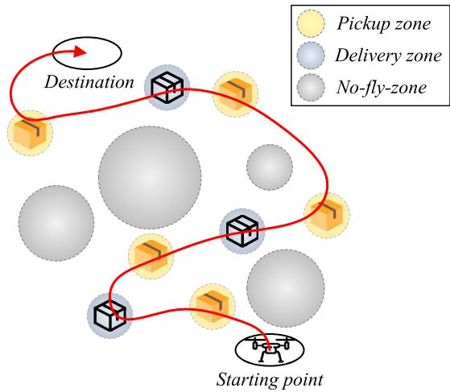  
Fig. 1. UAV-enabled parcel pickup and delivery.

Extensive simulations reveal the distinct characteristics of UAV trajectories and pickup/drop-of strategies under diferent optimization objectives, such as minimizing completion time, minimizing energy consumption, or jointly considering both metrics, thereby providing insight into the trade-ofs between them. In the energy-minimization algorithm, the UAV reduces energy consumption by over 20%, although it takes approximately 10% longer to complete the mission compared to the time-minimization algorithm. Furthermore, when both performance metrics are considered simultaneously in the UAV strategy optimization, the results demonstrate that a balanced trade-of between completion time and energy consumption can be achieved. These findings suggest that the proposed strategies can be complementarily applied depending on specific service requirements and operational objectives.

The remainder of this paper is organized as follows. In Section II, we present the mathematical model of UAV-enabled parcel pickup and delivery. In Section III, we propose the UAV strategy to minimize the weighted-sum of completion time and energy consumption. In Section IV, we evaluate the performance of the proposed scheme and conclude the paper in Section V.

## II. SYSTEM MODEL

As shown in Fig. 1, we consider a scenario involving a UAV-enabled parcel pickup and delivery, where a rotary-wing UAV is tasked with transporting a total of M parcels from an initial location to each delivery zone. Additionally, the UAV is required to pick up a total of K parcels from designated pickup zones before heading to the final destination. The total flight period of the UAV is divided into a total of N discrete time slots with diferent lengths, each indexed by $\delta [ n ] \geq 0$ for n ∈ $\mathcal { N } = \{ 1 , 2 , \cdots , N \}$ . It is important to note that the lengths of time slots are variables that need to be optimized [14].

## A. Constraints on Optimization Variables

The 3D coordinate of the UAV at time slot n can be denoted as ${ \bf c } [ n ] = ( { \bf q } [ n ] , z [ n ] )$ , where ${ \bf q } [ n ] = ( x [ n ] , y [ n ] )$ represents its horizontal coordinates and z[n] represents its vertical coordinate. We also define $V _ { \mathrm { m a x } }$ as the maximum flying speed of the UAV, which limits the maximum travel distance during time slot n to $V _ { \mathrm { m a x } } \delta [ n ]$ . Moreover, with the pre-determined starting point $\mathbf { c } ^ { \mathrm { { s t r } } }$ δand destination $\mathbf { c } ^ { \mathrm { { d s t } } }$ , the constraints on UAV mobility can be expressed as follows:

$$
\mathbf { c } [ 0 ] = \mathbf { c } ^ { \mathrm { s t r } } , ~ \mathbf { c } [ N ] = \mathbf { c } ^ { \mathrm { d s t } } ,\tag{1}
$$

$$
\| \mathbf { c } [ n ] - \mathbf { c } [ n - 1 ] \| \leq V _ { \operatorname* { m a x } } \delta [ n ] , \quad \forall n .\tag{2}
$$

We also consider geometric limitations, specifically the presence of nonoverlapping L NFZs of cylindrical shapes standing along the z-axis. Since the UAV is prohibited from entering these NFZs, we assume that all pickup and delivery zones are located outside of them. To ensure comprehensive avoidance of NFZs along a continuous trajectory, as proposed in [26], we introduce the following supplementary constraints on UAV mobility.

$$
\| \mathbf { q } [ j ] - \mathbf { q } _ { l } \| ^ { 2 } \geq \mathcal { R } _ { l } ^ { 2 } + \left( \frac { V _ { \operatorname* { m a x } } \delta [ n ] } { 2 } \right) ^ { 2 } , \quad \forall l , n , \ j \in \{ n - 1 , n \} ,\tag{3}
$$

where ${ \bf q } _ { l } = ( x _ { l } , y _ { l } )$ and $\mathcal { R } _ { l }$ are the center and radius of NFZ $l \in \mathcal { L } = \{ 1 , 2 , \cdots , L \}$ , respectively.

We denote the set of parcels for pickup as ${ \mathcal { K } } = \{ 1 , 2 , \cdots , K \}$ where each parcel $k \in \mathcal { K }$ has a weight of $w _ { k }$ . Similarly, the set of parcels for delivery is represented by $\mathcal { M } = \{ 1 , 2 , \cdots , M \}$ where each parcel $m \in \mathcal { M }$ weighs $\omega _ { m } .$ . Furthermore, let $\alpha _ { k } [ n ]$ be the binary pickup indicator for parcel k at time slot n. For example, $\alpha _ { k } [ n ] = 1$ means that parcel k has been successfully picked up by the UAV, and $\alpha _ { k } [ n ] = 0$ otherwise. Similarly, let $\beta _ { m } [ n ]$ be the binary drop-of indicator for parcel m at time slot $n , \ \mathrm { i . e . , } \ \beta _ { m } [ n ] = 1$ denotes the successful drop-of of parcel m by the UAV, and $\beta _ { m } [ n ] = 0$ otherwise. Because the UAV has a maximum carrying capacity of $W _ { \mathrm { m a x } }$ for parcel delivery, it is crucial to ensure that the total weight of parcels carried by the UAV at each time slot, denoted as W[n], does not exceed this maximum limit, i.e., $W [ n ] \leq W _ { \mathrm { m a x } }$ . Consequently, we can establish the following constraints on the pickup and drop-of of parcels.

$$
\alpha _ { k } [ n ] \in \{ 0 , 1 \} , \quad \forall k , n ,
$$

$$
\beta _ { m } [ n ] \in \{ 0 , 1 \} , \quad \forall m , n ,\tag{4}
$$

$$
\sum _ { n \in \mathcal { N } } \alpha _ { k } [ n ] \leq 1 , \quad \forall k ,\tag{5}
$$

(6)

$$
\sum _ { n \in \mathcal { N } } \beta _ { m } [ n ] \leq 1 , \quad \forall m ,\tag{7}
$$

$$
\sum _ { k \in \mathcal { K } } \alpha _ { k } [ n ] + \sum _ { m \in \mathcal { M } } \beta _ { m } [ n ] \leq 1 , \quad \forall n ,\tag{8}
$$

$$
\begin{array} { l } { \displaystyle { W [ n ] = \sum _ { k \in \mathcal K } w _ { k } \left( \sum _ { j = 1 } ^ { n } \alpha _ { k } [ j ] \right) + \sum _ { m \in \mathcal M } \omega _ { m } \left( 1 - \sum _ { j = 1 } ^ { n } \beta _ { m } [ j ] \right) } } \\ { \leq \displaystyle { W _ { \operatorname* { m a x } } , \quad \forall n . } } \end{array}\tag{9}
$$

Here, constraints (6) and (7) indicate that each parcel is either picked up or dropped of only once across all time slots, respectively, while constraint (8) implies that parcel pickup and drop-of cannot occur simultaneously.

The UAV is restricted to flying only within a defined altitude range, i.e., within the range between $H _ { \mathrm { m i n } }$ and $H _ { \mathrm { m a x } }$ Descending below this altitude range, i.e., below $H _ { \mathrm { m i n } } .$ is only allowed during parcel pickup or drop-of operations. This restriction can be expressed as follows:

$$
\left( 1 - \sum _ { k \in K } \alpha _ { k } [ n ] - \sum _ { m \in \mathcal { M } } \beta _ { m } [ n ] \right) H _ { \operatorname* { m i n } } \leq z [ n ] \leq H _ { \operatorname* { m a x } } , \quad \forall n .\tag{10}
$$

To pick up parcel k or drop of parcel $m ,$ the UAV must land within designated pickup or delivery zones characterized by circular areas with radii of $R _ { k }$ and $R _ { m } .$ , respectively, which serve as tolerances for picking up and dropping of parcels. Consequently, we need to establish the subsequent constraints.

$$
\alpha _ { k } [ n ] \| \mathbf { c } [ n ] - \mathbf { c } _ { k } \| ^ { 2 } \leq R _ { k } ^ { 2 } ,\tag{11a}
$$

$$
\begin{array} { r } { \alpha _ { k } [ n ] \| \mathbf { q } [ j ] - \mathbf { q } _ { k } \| ^ { 2 } \leq R _ { k } ^ { 2 } , \quad \forall k , n \neq N , j \in \{ n - 1 , n + 1 \} , } \end{array}\tag{11b}
$$

$$
z [ n ] \geq z _ { k } , \quad \forall k , n ,\tag{11c}
$$

$$
\beta _ { m } [ n ] \| \mathbf { c } [ n ] - \mathbf { c } _ { m } \| ^ { 2 } \leq R _ { m } ^ { 2 } ,\tag{12a}
$$

$$
\begin{array} { r } { \beta _ { m } [ n ] \| \mathbf { q } [ j ] - \mathbf { q } _ { m } \| ^ { 2 } { \le } { R _ { m } ^ { 2 } } , \quad \forall m , \ n \neq N , \ j \in \{ n - 1 , n + 1 \} , } \end{array}\tag{12b}
$$

$$
z [ n ] \geq z _ { m } , \forall m , n .\tag{12c}
$$

Here, ${ \bf c } _ { k } = ( { \bf q } _ { k } , z _ { k } )$ , where $\mathbf { q } _ { k } = ( x _ { k } , y _ { k } )$ represents the horizontal center coordinates and $z _ { k }$ denotes the vertical coordinate of pickup zone k. Similarly, $\mathbf { c } _ { m } = ( \mathbf { q } _ { m } , z _ { m } )$ , where $\mathbf { q } _ { m } = ( x _ { m } , y _ { m } )$ ,represents the horizontal center coordinates and $z _ { m }$ ,denotes the vertical coordinate of delivery zone $m .$ It is important to note that constraints (11b) and (12b) are required to ensure that the UAV does not violate (10) by landing and taking of within the designated circular area.

Finally, the constraints for specifying the pickup and delivery of all parcels, i.e., the mission completion, are as follows:

$$
\begin{array} { l } { { \displaystyle \sum _ { n \in \mathcal { N } } \sum _ { k \in \mathcal { K } } \alpha _ { k } [ n ] \ge K } , } \\ { { \displaystyle \sum _ { n \in \mathcal { N } } \sum _ { m \in \mathcal { M } } \beta _ { m } [ n ] \ge M . } } \end{array}\tag{13}
$$

(14)

## B. Energy Consumption Model

The UAV consumes propulsion energy to maintain flight and facilitate horizontal and vertical maneuvers. The weight of the parcels it carries also accelerates the energy consumption of the UAV.

To quantify this, we first provide the power consumption model [11], [12], [13], [27], as follows:

$$
\begin{array} { r l } { P [ n ] = \underbrace { P _ { 0 } \left( 1 + \frac { 3 \left( \nu ^ { \mathrm { h } } [ n ] \right) ^ { 2 } } { U _ { \mathrm { d p } } ^ { 2 } } \right) } _ { \mathrm { B l a d e ~ p r o i n t e } } + \underbrace { \frac { 1 } { 2 } d _ { 0 } \rho _ { 0 } s _ { 0 } A _ { 0 } ( \nu ^ { \mathrm { h } } [ n ] ) ^ { 3 } } _ { \mathrm { P u r a c k ~ c l e } } } & { } \\ { + \underbrace { P _ { 1 } G [ n ] ^ { 3 / 2 } \kappa \left( \sqrt { \kappa ^ { 2 } + \frac { \left( \nu ^ { \mathrm { h } } [ n ] \right) ^ { 4 } } { 4 \nu _ { 0 } ^ { 4 } } } - \frac { ( \nu ^ { \mathrm { h } } [ n ] ) ^ { 2 } } { 2 \nu _ { 0 } ^ { 2 } } \right) ^ { 1 / 2 } } _ { \mathrm { I n d u c e d } } } & { } \\ { + \underbrace { G [ n ] \nu ^ { \mathrm { v } } [ n ] } _ { \mathrm { V e t c l a d ~ I l i p h } } , } & { } \end{array}\tag{15}
$$

where $\nu ^ { \mathrm { h } } [ n ]$ and $\nu ^ { \mathrm { v } } [ n ]$ are the horizontal and vertical velocities of the UAV at time slot $n ,$ defined as $\begin{array} { r } { \nu ^ { \mathrm { h } } [ n ] = \frac { \| \mathbf { q } [ n ] - \mathbf { q } [ n - 1 ] \| } { \delta \lceil n \rceil } } \end{array}$ and $\begin{array} { r } { \nu ^ { \mathrm { v } } [ n ] = \frac { \| z [ n ] - z [ n - 1 ] \| } { \delta \lceil n \rceil } } \end{array}$ , while $\begin{array} { r } { P _ { 0 } = \frac { \delta _ { 0 } } { 8 } \rho _ { 0 } s _ { 0 } A _ { 0 } \Omega ^ { 3 } R _ { 0 } ^ { 3 } } \end{array}$ and $\dot { P _ { 1 } G } [ n ] ^ { 3 / 2 } =$ $\frac { 1 + k _ { 0 } } { \sqrt { 2 \rho _ { 0 } A _ { 0 } } } G [ n ] ^ { 3 / 2 }$ represent blade profile power and induced power ρin hovering status, respectively. Here, is the thrust-to-weight ratio $( \mathrm { T W R } ) , \delta _ { 0 }$ is a profile drag coeficient, $\rho _ { 0 }$ is an air density, $s _ { 0 }$ is a rotor solidity, $A _ { 0 }$ is a rotor disc area, Ω is a blade angular velocity, $R _ { 0 }$ is a rotor radius, $k _ { 0 }$ is an incremental correction factor to induced power, $U _ { \mathrm { t i p } }$ is the tip speed of the rotor blade, $\nu _ { 0 }$ is mean rotor induced velocity in hover, and $d _ { 0 }$ is fuselage drag ratio. Moreover, G[n] is the total weight at time slot n including the UAV and parcels it is carrying in Newton, such as $G [ n ] = ( m ^ { \mathrm { u a v } } + W [ n ] ) g$ , where $m ^ { \mathrm { u a v } }$ and $g$ denote the mass of UAV and the gravitational acceleration, respectively. Therefore, the total weight increases induced power in both horizontal and vertical flights. Furthermore, the TWR approaches approximately one, as the thrust efectively counteracts the aircraft’s weight across various acceleration levels in hovering status [10]. Consequently, in (15), the first three components are related to power consumption for horizontal flight, while the last component represents power consumption for vertical flight. Since G[n] is involved in the power consumption of both horizontal and vertical flight, this consideration has a significant impact on the pickup and dropof strategy of the UAV. Using (15), the energy consumed at time slot n can be defined as

$$
E [ n ] = P [ n ] \delta [ n ] , \quad \forall n .\tag{16}
$$

## C. Problem Formulation

In this study, we aim to minimize the weighted-sum of completion time and energy consumption while satisfying all aforementioned constraints by optimizing $\pmb { \alpha } \triangleq \{ \alpha _ { k } [ n ] , \forall k , n \}$ $\beta \triangleq \{ \beta _ { m } [ n ]$ ∀m n}, $\begin{array} { r c l } { \mathbf { Q } } & { \triangleq } & { \{ \mathbf { q } [ n ] , \forall n \} } \end{array}$ ${ \textbf { Z } } \triangleq \{ z [ n ] , \forall n \}$ ,, and $\pmb { \delta } \triangleq \{ \delta [ n ] , \forall n \}$ , as follows:

$$
\mathbf { ( P 1 ) } ! _ { \begin{array} { c } { \operatorname* { m i n } } \\ { \alpha , \beta , \textbf { Q } , \textbf { Z } , \delta } \end{array} } \nu \sum _ { n \in \mathcal { N } } \delta [ n ] + ( 1 - \nu ) \sum _ { n \in \mathcal { N } } E [ n ]
$$

where $0 ~ \leq ~ \nu ~ \leq ~ 1$ is a weight factor that determines the importance of minimizing time and energy consumption.

The problem (P1) is a nonconvex MINLP due to the inclusion of binary variables and $\pmb { \beta } ( \mathbf { e . g . , } ( 4 )$ and (5)) coupled with constraints encompassing (3), (11a), (11b), (12a), and (12b). Since these constraints do not form convex sets with respect to (w.r.t.) the associated optimization variables and the objective function is also nonconvex, finding a globally optimal solution becomes analytically intractable.

## III. PROPOSED ALGORITHM

In addressing the challenge posed by the nonconvexity of (P1), we employ SCA to transform the original problem into a convex form so that it can be optimized by an existing convex solver such as CVX [28]. Additionally, we adopt a strategy of relaxing the binary variables and $\beta$ to have continuous values, while applying PCCP to maintain their essential binary characteristics. Finally, we propose an iterative algorithm for the relaxed convex problem.

## A. Convexification of Nonconvex Constraints

We first address the nonconvexity of constraint (3). Given that the left-hand side (LHS) of (3) is convex w.r.t. ${ \bf q } [ j ] - { \bf q } _ { l }$ and that a convex function is lower-bounded by its first-order Taylor expansion at any arbitrary point [29], we apply the firstorder Taylor expansion to identify its lower bound, as follows:

$$
\begin{array} { r l r } & { } & { \| \mathbf { q } [ j ] - \mathbf { q } \| ^ { 2 } \geq \| \mathbf { q } ^ { ( r ) } [ j ] - \mathbf { q } \rvert \| ^ { 2 } + 2 ( \mathbf { q } ^ { ( r ) } [ j ] - \mathbf { q } \rvert ) ^ { T } } \\ & { } & { \times \left( \mathbf { q } [ j ] - \mathbf { q } ^ { ( r ) } [ j ] \right) \triangleq d ^ { \mathrm { L B } } [ j ] , \quad } \end{array}\tag{17}
$$

where $\mathbf { q } ^ { ( r ) } [ j ]$ represents the horizontal trajectory of the UAV at time slot j during the r-th iteration. By employing (17), we can transform constraint (3) into the corresponding convex set, as follows.

$$
d ^ { \mathrm { L B } } [ j ] \geq \mathcal { R } _ { l } ^ { 2 } + \left( \frac { V _ { \operatorname* { m a x } } \delta [ n ] } { 2 } \right) ^ { 2 } , \quad \forall l , n , j \in \{ n - 1 , n \} .\tag{18}
$$

We also convert the binary variables $\alpha _ { k } [ n ]$ and $\beta _ { m } [ n ]$ in (4) αand (5) into the following equivalent forms:

$$
\alpha _ { k } [ n ] \in [ 0 , 1 ] , \quad \forall k , n ,\tag{19}
$$

$$
\beta _ { m } [ n ] \in [ 0 , 1 ] , \quad \forall m , n ,\tag{20}
$$

$$
\alpha _ { k } [ n ] ( 1 - \alpha _ { k } [ n ] ) \leq 0 , \quad \forall k , n ,\tag{21}
$$

$$
\beta _ { m } [ n ] ( 1 - \beta _ { m } [ n ] ) \leq 0 , \quad \forall m , n .\tag{22}
$$

Although $\alpha _ { k } [ n ]$ and $\beta _ { m } [ n ]$ are relaxed to continuous variables α βin (19) and (20), their binary natures are preserved due to the additional constraints (21) and (22). However, it is dificult to handle (21) and (22) because they are not convex sets and have a tight search space for optimizing $\alpha _ { k } [ n ]$ and $\beta _ { m } [ n ]$

To address this problem, we leverage the fact that the LHS of (21) and (22) exhibits concavity w.r.t. $\alpha _ { k } [ n ]$ and $\beta _ { m } [ n ]$ , respectively, and that a concave function can be upperbounded by its first-order Taylor expansions at arbitrary points [29]. Moreover, we apply PCCP [30] with nonnegative slack variables $\lambda _ { k } [ n ] \ge 0$ and $\mu _ { m } [ n ] \geq 0$ to expand the search space for optimization, thereby facilitating the eficient update of $\alpha _ { k } [ n ]$ and $\beta _ { m } [ n ]$ . Consequently, constraints (21) and (22) can be modified into the following convex sets:

$$
( \alpha _ { k } ^ { ( r ) } [ n ] ) ^ { 2 } + \alpha _ { k } [ n ] ( 1 - 2 \alpha _ { k } ^ { ( r ) } [ n ] ) \le \lambda _ { k } [ n ] , \quad \forall k , n ,\tag{23}
$$

$$
( \beta _ { m } ^ { ( r ) } [ n ] ) ^ { 2 } + \beta _ { m } [ n ] ( 1 - 2 \beta _ { m } ^ { ( r ) } [ n ] ) \le \mu _ { m } [ n ] , \quad \forall m , n ,\tag{24}
$$

where $\alpha _ { k } ^ { ( r ) } [ n ]$ and $\beta _ { m } ^ { ( r ) } [ n ]$ are the pickup and drop-of indicators at time slot n during the r-th iteration, respectively.

To deal with the nonconvexity of (11a) and (11b), we first transform them into the following equivalent forms.

$$
\alpha _ { k } [ n ] \leq { \frac { R _ { k } ^ { 2 } + \varepsilon ^ { 2 } } { \| \mathbf { c } [ n ] - \mathbf { c } _ { k } \| ^ { 2 } + \varepsilon ^ { 2 } } } ,\tag{25a}
$$

$$
\alpha _ { k } [ n ] \leq { \frac { R _ { k } ^ { 2 } + \varepsilon ^ { 2 } } { \| \mathbf { q } [ j ] - \mathbf { q } _ { k } \| ^ { 2 } + \varepsilon ^ { 2 } } } ,\tag{25b}
$$

where  is a constant designed to prevent the denominators on εthe right-hand side (RHS) of (25a) and (25b) from approaching zero.

While (25a) and (25b) do not represent convex sets, their corresponding RHSs exhibit convexity concerning their denominators. This property enables us to establish their lower bounds through the utilization of the first-order Taylor expansion, as shown in (26a) and (26b), shown at the bottom of the page, where $\mathbf { c } ^ { ( r ) } [ n ]$ represents the 3D trajectory of the UAV at time slot n during the r-th iteration.

Using (26a) and (26b), constraints (11a) and (11b) can be converted to the following convex sets.

$$
\alpha _ { k } [ n ] \leq \rho _ { \alpha } ^ { \mathrm { L B } } [ n ] ,\tag{27a}
$$

$$
\alpha _ { k } [ n ] \leq \hat { \rho } _ { \alpha } ^ { \mathrm { L B } } [ j ] , \quad \forall k , \ n \neq N , \ j \in \{ n - 1 , n + 1 \} .\tag{27b}
$$

Using a similar approach, constraints (12a) and (12b) can be transformed to the following convex sets.

$$
\beta _ { m } [ n ] \leq \rho _ { \beta } ^ { \mathrm { L B } } [ n ] ,\tag{28a}
$$

$$
\beta _ { m } [ n ] \leq \hat { \rho } _ { \beta } ^ { \mathrm { L B } } [ j ] , \quad \forall m , n \neq N , j \in \{ n - 1 , n + 1 \} .\tag{28b}
$$

## B. Convexification of Nonconvex Objective Function

To make (P1) a convex problem, we should transform E[n] in the objective function into a convex form. To this end, we convert E[n] into the following equivalent form.

$$
\begin{array} { l } { { \displaystyle { \cal E } [ n ] = P _ { 0 } \left( \delta [ n ] + \frac { 3 ( \pi ^ { \mathrm { h } } [ n ] ) ^ { 2 } } { U _ { \mathrm { t i p } } ^ { 2 } \delta [ n ] } \right) + \frac { 1 } { 2 } d _ { 0 } \rho _ { 0 } s _ { 0 } A _ { 0 } \frac { ( \pi ^ { \mathrm { h } } [ n ] ) ^ { 3 } } { \delta [ n ] ^ { 2 } } } } \\ { { \displaystyle ~ + P _ { 1 } G [ n ] ^ { 3 / 2 } \left( \sqrt { \delta [ n ] ^ { 4 } + \frac { ( \pi ^ { \mathrm { h } } [ n ] ) ^ { 4 } } { 4 \nu _ { 0 } ^ { 4 } } } - \frac { ( \pi ^ { \mathrm { h } } [ n ] ) ^ { 2 } } { 2 \nu _ { 0 } ^ { 2 } } \right) ^ { 1 / 2 } } } \\ { { \displaystyle ~ + G [ n ] \pi ^ { \mathrm { v } } [ n ] , } } \end{array}\tag{29}
$$

where $\pi ^ { \mathrm { h } } [ n ] = \| \mathbf { q } [ n ] - \mathbf { q } [ n - 1 ] \|$ and $\pi ^ { \mathrm { v } } [ n ] = \| z [ n ] - z [ n - 1 ]$ ]k.

In (29), the first and second terms are convex functions concerning the related variables, such as q[n], z[n], and [n], but the third and fourth terms are not convex. To tackle the nonconvexity of the third term, we introduce a nonnegative slack variable $\tau [ n ] \geq 0$ such that

$$
\tau [ n ] ^ { 2 } = \sqrt { \delta [ n ] ^ { 4 } + \frac { ( \pi ^ { \mathrm { h } } [ n ] ) ^ { 4 } } { 4 \nu _ { 0 } ^ { 4 } } } - \frac { ( \pi ^ { \mathrm { h } } [ n ] ) ^ { 2 } } { 2 \nu _ { 0 } ^ { 2 } } , \quad \forall n ,\tag{30}
$$

which is equivalent to

$$
\frac { \delta [ n ] ^ { 4 } } { \tau [ n ] ^ { 2 } } \leq \tau [ n ] ^ { 2 } + \frac { ( \pi ^ { \mathrm { h } } [ n ] ) ^ { 2 } } { \nu _ { 0 } ^ { 2 } } , \quad \forall n .\tag{31}
$$

Using (30), E[n] can be reformulated as

$$
\begin{array} { l } { { \displaystyle { E [ n ] = P _ { 0 } \left( \delta [ n ] + \frac { 3 ( \pi ^ { \mathrm { h } } [ n ] ) ^ { 2 } } { U _ { \mathrm { t i p } } ^ { 2 } \delta [ n ] } \right) + \frac { 1 } { 2 } d _ { 0 } \rho _ { 0 } s _ { 0 } A _ { 0 } \frac { ( \pi ^ { \mathrm { h } } [ n ] ) ^ { 3 } } { \delta [ n ] ^ { 2 } } } \ ~ } } \\ { { \displaystyle ~ + P _ { 1 } G [ n ] ^ { 3 / 2 } \tau [ n ] + G [ n ] \pi ^ { \mathrm { v } } [ n ] . } } \end{array}\tag{32}
$$

Further, $G [ n ] ^ { 3 / 2 } \tau [ n ]$ in the third term of (32) can be expanded to the following equivalent form:

$$
G [ n ] ^ { 3 / 2 } \tau [ n ] = \frac { ( G [ n ] ^ { 3 / 2 } + \tau [ n ] ) ^ { 2 } - ( G [ n ] ^ { 3 } + \tau [ n ] ^ { 2 } ) } { 2 } .\tag{33}
$$

Since this is a convex – convex form, we can apply the firstorder Taylor expansion to $G [ n ] ^ { 3 }$ and $\tau [ n ] ^ { 2 }$ to derive their respective lower bounds as follows:

$$
G [ n ] ^ { 3 } \geq ( G ^ { ( r ) } [ n ] ) ^ { 3 } + 3 ( G ^ { ( r ) } [ n ] ) ^ { 2 } ( G [ n ] - G ^ { ( r ) } [ n ] ) \triangleq G ^ { \mathrm { L B } } [ n ] ,\tag{34}
$$

$$
\tau [ n ] ^ { 2 } \geq ( \tau ^ { ( r ) } [ n ] ) ^ { 2 } + 2 \tau ^ { ( r ) } [ n ] ( \tau [ n ] - \tau ^ { ( r ) } [ n ] ) \triangleq \tau ^ { \mathrm { L B } } [ n ] ,\tag{35}
$$

where $\tau ^ { ( r ) } [ n ]$ is the value of [n] during the r-th iteration and $G ^ { ( r ) } [ n ]$ is given by

$$
G ^ { ( r ) } [ n ] = \left( m ^ { \mathrm { u a v } } + \sum _ { k \in \mathcal { K } } w _ { k } \left( \sum _ { j = 1 } ^ { n } \alpha _ { k } ^ { ( r ) } [ j ] \right) \right)
$$

$$
+ \sum _ { m \in \mathcal { M } } \omega _ { m } \left( 1 - \sum _ { j = 1 } ^ { n } \beta _ { m } ^ { ( r ) } [ j ] \right) \Big ) g .\tag{36}
$$

Using (34) and (35), the upper bound of $G [ n ] ^ { 3 / 2 } \tau [ n ]$ that has a convex form can be derived as follows:

$$
\begin{array} { l } { { G [ n ] ^ { 3 / 2 } \tau [ n ] \le \frac { ( G [ n ] ^ { 3 / 2 } + \tau [ n ] ) ^ { 2 } - ( G ^ { \mathrm { L B } } [ n ] + \tau ^ { \mathrm { L B } } [ n ] ) } { 2 } } } \\ { { \qquad \triangleq ( G [ n ] ^ { 3 / 2 } \tau [ n ] ) ^ { \mathrm { U B } } . } } \end{array}\tag{37}
$$

Similarly, the upper bound of $G [ n ] \pi ^ { \mathrm { v } } [ n ]$ in the fourth term πof (32) can be derived as the following convex form.

$$
\begin{array} { l l } { { \displaystyle { G [ n ] \pi ^ { \mathrm { v } } [ n ] \le \frac { ( G [ n ] + \pi ^ { \mathrm { v } } [ n ] ) ^ { 2 } - ( \bar { G } ^ { \mathrm { L B } } [ n ] + ( \pi ^ { \mathrm { v } } [ n ] ) ^ { \mathrm { L B } } ) } { 2 } } } } \\ { { \displaystyle { \phantom { \displaystyle { G [ n ] \pi ^ { \mathrm { v } } [ n ] \le \pi ^ { \mathrm { v } } [ n ] } } } } } \\ { { \displaystyle { \phantom { \displaystyle { G [ n ] + \pi ^ { \mathrm { v } } [ n ] ) ^ { \mathrm { U B } } } } } } } \end{array}\tag{38}
$$

where $\bar { G } ^ { \mathrm { L B } } [ n ]$ and $( \pi ^ { \mathrm { v } } [ n ] ) ^ { \mathrm { L B } }$ are represented by

$$
\bar { G } ^ { \mathrm { L B } } [ n ] \triangleq ( G ^ { ( r ) } [ n ] ) ^ { 2 } + 2 G ^ { ( r ) } [ n ] ( G [ n ] - G ^ { ( r ) } [ n ] ) ,\tag{39}
$$

$$
\begin{array} { l } { ( { \pi ^ { \mathrm { v } } [ n ] } ) ^ { \mathrm { L B } } \triangleq - ( z ^ { ( r ) } [ n ] - z ^ { ( r ) } [ n - 1 ] ) ^ { 2 } } \\ { \qquad + 2 ( z ^ { ( r ) } [ n ] - z ^ { ( r ) } [ n - 1 ] ) ( z [ n ] - z [ n - 1 ] ) , } \end{array}\tag{40}
$$

where $z ^ { ( r ) } [ n ]$ represents the vertical trajectory of the UAV at time slot n during the r-th iteration.

Using the derived upper bounds, $( G [ n ] ^ { 3 / 2 } \tau [ n ] ) ^ { \mathrm { U B } }$ and $( G [ n ] \pi ^ { \mathrm { v } } [ n ] ) ^ { \mathrm { U B } }$ , we can finally obtain the upper bound of $E [ n ]$ that has a convex form, as follows:

$$
\begin{array} { l } { { \displaystyle { E [ n ] \leq P _ { 0 } \left( \delta [ n ] + \frac { 3 ( \pi ^ { \mathrm { h } } [ n ] ) ^ { 2 } } { U _ { \mathrm { t i p } } ^ { 2 } \delta [ n ] } \right) + \frac { 1 } { 2 } d _ { 0 } \rho _ { 0 } s _ { 0 } A _ { 0 } \frac { ( \pi ^ { \mathrm { h } } [ n ] ) ^ { 3 } } { \delta [ n ] ^ { 2 } } } } } \\ { { \displaystyle ~ + P _ { 1 } ( G [ n ] ^ { 3 / 2 } \tau [ n ] ) ^ { \mathrm { U B } } + ( G [ n ] \pi ^ { \mathrm { v } } [ n ] ) ^ { \mathrm { U B } } \triangleq E ^ { \mathrm { U B } } [ n ] } . } \end{array}\tag{41}
$$

We also need to ensure that the additional constraint imposed on the slack variable [n] in (31) forms a convex set. τGiven that the RHS of (31) is convex w.r.t. both ${ \bf q } [ n ] - { \bf q } [ n - 1 ]$ and [n], respectively, the following convex set can be obtained by deriving its lower bound.

$$
\frac { \delta [ n ] ^ { 4 } } { \tau [ n ] ^ { 2 } } \leq ( \tau ^ { ( r ) } [ n ] ) ^ { 2 } + 2 \tau ^ { ( r ) } [ n ] ( \tau [ n ] - \tau ^ { ( r ) } [ n ] )
$$

$$
{ \frac { R _ { k } ^ { 2 } + \varepsilon ^ { 2 } } { \| \mathbf { c } [ n ] - \mathbf { c } _ { k } \| ^ { 2 } + \varepsilon ^ { 2 } } } \geq { \frac { R _ { k } ^ { 2 } + \varepsilon ^ { 2 } } { \| \mathbf { c } ^ { ( t ) } [ n ] - \mathbf { c } _ { k } \| ^ { 2 } + \varepsilon ^ { 2 } } } - { \frac { R _ { k } ^ { 2 } + \varepsilon ^ { 2 } } { ( \| \mathbf { c } ^ { ( t ) } [ n ] - \mathbf { c } _ { k } \| ^ { 2 } + \varepsilon ^ { 2 } ) ^ { 2 } } } \left( \| \mathbf { c } [ n ] - \mathbf { c } _ { k } \| ^ { 2 } - \| \mathbf { c } ^ { ( t ) } [ n ] - \mathbf { c } _ { k } \| ^ { 2 } \right) \triangleq \rho _ { \alpha } ^ { \mathrm { L B } } [ n ] ,\tag{26a}
$$

$$
\frac { R _ { k } ^ { 2 } + \varepsilon ^ { 2 } } { \| \mathbf { q } [ j ] - \mathbf { q } _ { k } \| ^ { 2 } + \varepsilon ^ { 2 } } \geq \frac { R _ { k } ^ { 2 } + \varepsilon ^ { 2 } } { \| \mathbf { q } ^ { ( r ) } [ j ] - \mathbf { q } _ { k } \| ^ { 2 } + \varepsilon ^ { 2 } } - \frac { R _ { k } ^ { 2 } + \varepsilon ^ { 2 } } { ( \| \mathbf { q } ^ { ( r ) } [ j ] - \mathbf { q } _ { k } \| ^ { 2 } + \varepsilon ^ { 2 } ) ^ { 2 } } \left( \| \mathbf { q } [ j ] - \mathbf { q } _ { k } \| ^ { 2 } - \| \mathbf { q } ^ { ( r ) } [ j ] - \mathbf { q } _ { k } \| ^ { 2 } \right) \triangleq \hat { \rho } _ { \alpha } ^ { [ \mathrm { B } } [ j ] .\tag{26b}
$$

Algorithm 1 Proposed Algorithm   
1: Set $r = 0$   
2: Initialize ${ \pmb \alpha } ^ { ( r ) } , { \pmb \beta } ^ { ( r ) } , { \pmb \ Q } ^ { ( r ) } , { \pmb \ Z } ^ { ( r ) } , { \pmb \delta } ^ { ( r ) } , { \pmb \tau } ^ { ( r ) } , \gamma ^ { ( r ) } , \gamma _ { \mathrm { m a x } }$ , and   
$\sigma > 1$   
σ >3: Calculate $\begin{array} { r } { \eta ^ { ( r ) } = \nu \sum _ { n \in \mathcal { N } } \delta ^ { ( r ) } [ n ] + ( 1 - \nu ) \sum _ { n \in \mathcal { N } } E ^ { \mathrm { U B } , ( r ) } [ n ] + } \end{array}$   
$\gamma ^ { ( r ) } \mathcal { P } ( \pmb { \lambda } , \pmb { \mu } )$   
4: repeat   
5: Update $r \gets r + 1$   
6: $\eta ^ { \mathrm { o l d } }  \eta ^ { ( r - 1 ) }$   
7: ηFind $\{ { \pmb { \alpha } } ^ { ( r ) } , { \pmb { \beta } } ^ { ( r ) } , { \bf { Q } } ^ { ( r ) } , { \bf { Z } } ^ { ( r ) } , { \pmb { \delta } } ^ { ( r ) } , \pmb { \tau } ^ { ( r ) } , \pmb { \lambda } , { \pmb { \mu } } \}$ by solving (P2)   
for given $\{ \pmb { \alpha } ^ { ( r - 1 ) } , \pmb { \beta } ^ { ( r - 1 ) } , \pmb { Q } ^ { ( r - 1 ) } , \pmb { Z } ^ { ( r - 1 ) } , \pmb { \delta } ^ { ( r - 1 ) } , \pmb { \tau } ^ { ( r - 1 ) } \}$   
8: Update $\gamma ^ { ( r ) } = \operatorname* { m i n } \{ \sigma \gamma ^ { ( r - 1 ) } , \gamma _ { \operatorname* { m a x } } \}$   
9: $\begin{array} { r l r } { \mathrm { C a l c u l a t e } ~ \eta ^ { ( r ) } ~ } & { { } = ~ } & { \nu \sum _ { n \in \mathcal { N } } \delta ^ { ( r ) } [ n ] ~ + ~ ( 1 ~ - } \end{array}$   
) $\begin{array} { r l } { \sum _ { n \in \mathcal { N } } E ^ { \mathrm { U B } , ( r ) } [ n ] + \gamma ^ { ( r ) } \mathcal { P } ( \pmb { \lambda } , \pmb { \mu } ) } & { { } } \end{array}$   
10: until $\dot { | \eta ^ { ( r ) } - \eta ^ { \mathrm { o l d } } | } \le \epsilon .$

$$
\begin{array} { l } { { + \frac { 2 ( { \bf q } ^ { ( r ) } [ n ] - { \bf q } ^ { ( r ) } [ n - 1 ] ) ^ { T } ( { \bf q } [ n ] - { \bf q } [ n - 1 ] ) } { \nu _ { 0 } ^ { 2 } } } } \\ { { - \frac { \| { \bf q } ^ { ( r ) } [ n ] - { \bf q } ^ { ( r ) } [ n - 1 ] \| ^ { 2 } } { \nu _ { 0 } ^ { 2 } } , \forall n . } } \end{array}\tag{42}
$$

## C. Problem Reformulation

With $E ^ { \mathrm { U B } } [ n ]$ and the relaxed constraints that form convex sets, problem (P1) can be transformed into the subsequent convex optimization problem.

$$
\begin{array} { r l } { { \displaystyle ( { \bf P } { \bf 2 } ) } \colon \underset { \alpha , \textbf { \ \beta } , \textbf { \ \mu } , \textbf { \ } } { \mathrm { m i n } } } & { { \nu } \displaystyle \sum _ { n \in \mathcal { N } } \delta [ n ] + ( 1 - \nu ) \sum _ { n \in \mathcal { N } } E ^ { \mathrm { U B } } [ n ] + \gamma \mathcal { P } ( \lambda , \mu ) } \\ { { \displaystyle \phantom { \ { \mathrm {  ~ \alpha ~ } } } \delta , \tau , \lambda , \mu } \quad } & { { \boldsymbol { n } \in \mathcal { N } } } \\ { { \mathrm { s . t . } } } & { { ( 1 ) , ~ ( 2 ) , ~ ( 6 ) - \mathrm { \Lambda } ( 1 0 ) , ~ ( 1 1 \mathrm { c } ) , { \mathrm { \Lambda } } ( 1 2 \mathrm { c } ) , } } \\ { { \mathrm { \Lambda } } } & { { ( 1 3 ) , ~ ( 1 4 ) , ~ ( 1 8 ) - { \mathrm { \Lambda } } ( 2 0 ) , ~ ( 2 3 ) , { \mathrm { \Lambda } } ( 2 4 ) , } } \\ { { \mathrm { \Lambda } } } & { { ( 2 7 ) , ~ ( 2 8 ) , ~ ( 4 2 ) , } } \end{array}
$$

where $\pmb { \tau } \triangleq \{ \tau [ n ] \geq 0 , \forall n \}$ and $\begin{array} { r } { \mathcal { P } ( \pmb { \lambda } , \pmb { \mu } ) = \sum _ { k \in \mathcal { K } } \sum _ { n \in \mathcal { N } } \lambda _ { k } [ n ] + } \end{array}$ $\begin{array} { r } { \sum _ { m \in \mathcal { M } } \sum _ { n \in \mathcal { N } } \mu _ { m } [ n ] } \end{array}$ is a penalty function to retain the binary µnature of  and $\pmb { \beta }$ with $\pmb { \lambda } \triangleq \{ \lambda _ { k } [ n ] \geq 0 , \forall k , n \}$ and $\pmb { \mu } ^ { \mathrm { ~ \normalsize ~ \triangleq ~ } }$ $\{ \mu _ { m } [ n ] \geq 0 , \forall m , n \}$ . Furthermore, $\gamma > 0$ serves as a parameter that controls the impact of the penalty term $\mathcal { P } ( \pmb { \lambda } , \pmb { \mu } )$ on the objective function. When $\gamma$ is small, some nonzero value of ${ \mathcal { P } } ( \pmb { \lambda } , \pmb { \mu } )$ is acceptable because its efect on the increase of the objective function is negligible. However, as $\gamma$ increases, and  approach to zero to make the penalty term $\mathcal { P } ( \pmb { \lambda } , \pmb { \mu } )$ negligible, thereby minimizing the original objective function. This adjustment efectively regulates the feasible regions for and $\beta ,$ ensuring compliance with constraints (23) and (24). As a result, problem (P2) aims to minimize the weighted-sum of completion time and energy consumption while permitting nonzero values for $\pmb { \lambda }$ and $\pmb { \mu }$ at lower values of $\gamma .$ However, as $\gamma$ increases, the optimization is tuned towards driving both and $\pmb { \mu }$ to zero, thus minimizing the original objective function while simultaneously enforcing the binary nature of and $\pmb { \beta }$ [30]. The overall procedure of the proposed method is outlined in Algorithm 1.

Remark 1 (Convergence and Computational Complexity) Algorithm 1 begins with a feasible initial point $\{ { \dot { \pmb { \alpha } } } ^ { ( 0 ) } , { \pmb { \beta } } ^ { ( 0 ) } , { \bf Q } ^ { ( 0 ) } , { \bf Z } ^ { ( 0 ) } , { \pmb { \delta } } ^ { ( 0 ) } , { \pmb { \tau } } ^ { ( 0 ) } \}$ and an initial penalty parameter $\gamma ^ { ( 0 ) }$ . At each iteration, the penalty parameter is scaled by a constant factor $\sigma > 1$ until it reaches a predefined upper bound $\gamma _ { \mathrm { m a x } }$ . According to Theorem 1 of [31], there exists a finite value of $\gamma _ { \mathrm { m a x } }$ such that ${ \mathcal { P } } ( \pmb { \lambda } , \pmb { \mu } )  0 .$ Once γ λ, µthis condition is satisfied, the algorithm continues updating the solution in a direction that monotonically decreases the objective. As a result, the solution at the r-th iteration, denoted by $\{ { \pmb \alpha } ^ { ( r ) } , { \pmb \beta } ^ { ( r ) } , { \bf Q } ^ { ( r ) } , { \bf Z } ^ { ( r ) } , \pmb \delta ^ { ( r ) } , { \pmb \tau } ^ { ( r ) } \}$ , satisfies the following inequality:

$$
\begin{array} { r l } & { \eta ( \pmb { \alpha } ^ { ( r ) } , \pmb { \beta } ^ { ( r ) } , \mathbf { Q } ^ { ( r ) } , \mathbf { Z } ^ { ( r ) } , \pmb { \delta } ^ { ( r ) } , \pmb { \tau } ^ { ( r ) } ) } \\ & { \leq \eta ( \pmb { \alpha } ^ { ( r - 1 ) } , \pmb { \beta } ^ { ( r - 1 ) } , \mathbf { Q } ^ { ( r - 1 ) } , \mathbf { Z } ^ { ( r - 1 ) } , \pmb { \delta } ^ { ( r - 1 ) } , \pmb { \tau } ^ { ( r - 1 ) } ) . } \end{array}\tag{43}
$$

This ensures that the objective value of problem (P2) is nonincreasing over iterations after $\gamma ^ { ( r ) }$ reaches $\gamma _ { \mathrm { m a x } }$ and is γ γbounded below by a finite value [9], thereby guaranteeing convergence of the proposed algorithm.

By applying the methodology for evaluating the computational complexity of the worst-case interior point method [29], [32], we can derive the computational complexity of the proposed algorithm, which can be expressed as $O \left( ( \operatorname* { m a x } ( K , M ) \cdot N ) ^ { 3 . 5 } R _ { C } \log ( 1 / \epsilon ) \right)$ . Here, $R _ { C }$ denotes the number of iterations required for the loop to converge (Lines 4–10 in Algorithm 1). The proposed algorithm exhibits a polynomial time computational complexity of max(K M) · N, making it ,well-suited for real-time implementations [33].

Remark 2 (Practical Implementation and Real-Time Operation) Regarding real-time performance, once the delivery and pickup zones are specified, the $\mathrm { U A V } ^ { \ , } \mathbf { s }$ delivery strategy for one delivery period can be optimized ofline on a server using this information along with geographical data. The optimized strategy is then uploaded to the UAV, which executes the delivery accordingly. The proposed algorithm converges within approximately 2 minutes on a computer equipped with an AMD Ryzen 9 5950X 16-Core Processor (3.40 GHz) and 128 GB of memory. This demonstrates the potential for real-time onboard optimization of the next delivery period during operation, especially in the high-performance UAV equipped with suficient computational resources. However, considering the need for powerful onboard computing capabilities, a more practical approach in current deployments is to perform the optimization ofline on a ground server and upload the resulting plan to the UAV prior to mission execution.

## IV. RESULTS AND DISCUSSIONS

For performance evaluations, we use the system parameters given in Table I [11], [13], [24], [26]. The UAV specification parameters $( N , \ H _ { \operatorname* { m i n } } , \ H _ { \operatorname* { m a x } } , \ V _ { \operatorname* { m a x } } ,$ , and $W _ { \mathrm { m a x } } )$ are adopted from [11] and [26], while the environmental parameters $( K ,$ M, $L , \mathcal { R } _ { l } , \boldsymbol { R } _ { k } ,$ and $R _ { m } )$ are based on [24]. Additionally, the parameters used in the energy consumption model $( P _ { 0 } , \ k _ { 0 } ,$ $U _ { \mathrm { t i p } } , ~ d _ { 0 } , ~ \rho _ { 0 } , ~ s _ { 0 } , ~ A _ { 0 } , ~ \nu _ { 0 } , ~ m ^ { \mathrm { u a v } }$ , and $g )$ follow the settings in [13]. The parameters used for implementing Algorithm 1 are set as follows: $\gamma ^ { 0 } ~ = ~ 1 , ~ \gamma _ { \operatorname* { m a x } } ~ = ~ 1 0 ^ { 3 } , ~ \sigma ~ = ~ 1 . 2 , ~ \varepsilon ~ = ~ 3 5$ , and $\epsilon = 1 0 ^ { - 3 }$ . Moreover, the starting point and destination are fixed as $\mathbf { c } ^ { \mathrm { s t r } } = ( - 5 0 0 , - 5 0 0 , 2 0 )$ [m] and $\mathbf { c } ^ { \mathrm { d s t } } = ( 5 0 0 , 5 0 0 , 2 0 )$ [m], but pickup zones, delivery zones, and NFZs are randomly generated within a square area of size $1 0 0 0 \times 1 0 0 0 ~ [ \mathrm { m } ^ { 2 } ]$

TABLE I PARAMETER SETUP
<table><tr><td>Description</td><td>Value</td></tr><tr><td>Number of time slots</td><td> $\overline { { N \mathrm { ~ - ~ } 1 5 0 } }$ </td></tr><tr><td>Minimum altitude</td><td> $H _ { \mathrm { m i n } } = 2 0 \ [ \mathrm { m } ]$ </td></tr><tr><td>Maximum altitude</td><td> $H _ { \mathrm { m a x } } = 5 0 ~ [ \mathrm { m } ]$ </td></tr><tr><td>Maximum flight speed</td><td> $V _ { \mathrm { m a x } } = 2 0 ~ [ \mathrm { m / s } ]$ </td></tr><tr><td>Maximum load capacity</td><td> $W _ { \mathrm { m a x } } = 6 0 ~ [ \mathrm { k g } ]$ </td></tr><tr><td>Number of parcels for pickup</td><td> $K = 4$ </td></tr><tr><td>Number of parcels for delivery</td><td> $M = 6$ </td></tr><tr><td>Number of  $\mathrm { \Delta N F Z s }$ </td><td> $L = 3$ </td></tr><tr><td>Radius of NFZs</td><td> $\left[ \mathcal { R } _ { 1 } , \mathcal { R } _ { 2 } , \mathcal { R } _ { 3 } \right] = \left[ 1 2 0 , 6 0 , 9 0 \right] \left[ \mathrm { m } \right]$ </td></tr><tr><td>Radius of pickup/delivery zones</td><td> $\mathbf { \dot { } } R _ { k } = R _ { m } = \mathbf { \dot { 3 } } \ [ \mathbf { m } ]$ </td></tr><tr><td>Blade profile power</td><td> $P _ { 0 } = 7 9 . 8 5 ~ [ \mathrm { W } ]$ </td></tr><tr><td>Correction factor</td><td> $k _ { 0 } = 0 . 1$ </td></tr><tr><td>Tip speed of the rotor blade</td><td> $U _ { \mathrm { t i p } } = 1 2 0 ~ [ \mathrm { m / s } ]$ </td></tr><tr><td>Fuselage drag ratio</td><td> $d _ { \mathrm { 0 } } = 0 . 6$ </td></tr><tr><td>Air density</td><td> $\rho _ { 0 } = 1 . 2 2 5 ~ [ \mathrm { k g / m ^ { 3 } } ]$ </td></tr><tr><td>Rotor solidity</td><td> $s _ { 0 } = 0 . 0 5$ </td></tr><tr><td>Rotor disc area</td><td> $A _ { 0 } = 0 . 5 0 3 ~ [ \mathrm { m ^ { 2 } } ]$ </td></tr><tr><td>Mean rotor induced velocity</td><td> $v _ { 0 } = 4 . 0 3 ~ [ \mathrm { m / s } ]$ </td></tr><tr><td>Mass of UAV</td><td> $m ^ { \mathrm { u a v } } = 2 ~ [ \bf k g ]$ </td></tr><tr><td>Gravitational acceleration</td><td> $g = 9 . 8 ~ [ \mathrm { m / s ^ { 2 } } ]$ </td></tr><tr><td></td><td></td></tr></table>

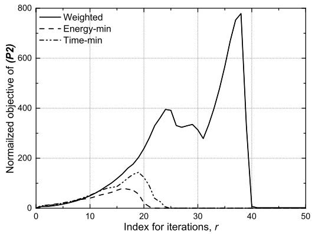  
Fig. 2. Convergence of considered schemes.

We also consider the following three schemes for performance comparisons.

1) Weighted scheme: The UAV strategy, including all optimization variables, is determined by Algorithm 1 to minimize the weighted-sum of completion time and energy consumption with $\nu = 0 . 5 ,$ , where both metrics are normalized to the same scale to account for the diferences in their scales.

2) Energy-min scheme: The UAV strategy, including all optimization variables, is determined by Algorithm 1 to minimize energy consumption with $\nu = 0 .$

ν3) Time-min scheme: The UAV strategy, including all optimization variables, is determined by Algorithm 1 to minimize completion time with $\nu = 1$

## A. Convergence

Fig. 2 depicts the convergence of the schemes under consideration. For the energy-min and time-min schemes, the objective value increases rapidly within the first 18 iterations because the penalty function increases due to the increasing value of $\gamma$ and the nonzero values of and $\pmb { \mu } .$ In this period, and $\beta$ are optimized over wider feasible regions, increasing the probability of converging to their respective optimal value over iterations. After a suficient number of iterations, $\begin{array} { r } { \mathrm { e . g . } , r \geq 2 5 . } \end{array}$ ,  and $\beta$ are optimized to have binary values, and the penalty function approaches zero so that the objective function decreases and remains unchanged. The weighted scheme exhibits a significantly higher peak objective and longer convergence time than the other schemes, mainly due to the added complexity of jointly considering both completion time and energy consumption in the optimization process. During the convergence of the weighted scheme, the objective value exhibits an initial increase followed by a decrease. This behavior arises from the wide feasible region of the binary variables, which allows for a broader range of parcel pickup and drop-of selections. As a result, the optimization process dynamically adjusts these selections in search of a better solution.

## B. Pattern of Optimized Variables

Fig. 3 shows the trajectory and resource allocation of the considered schemes: (a) 3D trajectory, (b) horizontal trajectory, (c) vertical trajectory and lengths of time slots, (d) pickup and drop-of indicators for energy-min scheme, (e) horizontal trajectory for time-min scheme, and (f) horizontal trajectory for weighted scheme.

In Fig. 3(a), the pickup and delivery zones are indicated by green and orange bars of varying heights, respectively. The UAV flies at the altitude of $H _ { \mathrm { m i n } }$ because vertical movement significantly increases energy consumption. Moreover, the UAV lands within an allowance of 3 [m] of the height of each pickup and delivery zone to perform parcel pickups and dropofs. To enhance understanding of the UAV trajectory in the energy-min scheme, the weight of each parcel is annotated in its respective zone, and arrows denote movement every 10 time slots in Fig. 3(b). The UAV navigates eficient and smooth paths to pass through NFZs without violating them and accurately stops at all pickup and delivery zones. Furthermore, it prioritizes dropping of parcels in transit over picking up parcels to reduce energy consumption. Fig. 3(c) shows that the UAV adaptively controls the length of the time slot [n] to travel its path efectively. For example, when landing in the pickup or delivery zone, the UAV shortens [n] to travel a limited vertical distance. Further, when avoiding the NFZ, such as during $2 8 \leq n \leq 5 5 .$ , it maintains [n] at a low value to reduce the distance traveled, resulting in a smooth circular trajectory. Fig. 3(d) confirms that owing to the PCCP method, the pickup and drop-of indicators are set to 1 when the UAV picks up or drops of each parcel, and zero otherwise, thus maintaining their binary nature.

For comparison, we show the horizontal trajectories of the time-min and weighted schemes in Fig. 3(e) and 3(f), respectively. We only present the results for the horizontal trajectory due to the similarity with the results of the energymin scheme, as flying at the minimum altitude $H _ { \mathrm { m i n } }$ is also optimal from the perspective of minimizing completion time. In the time-min scheme, the UAV can pick up all parcels at once without considering the energy consumption due to the weight of the parcels it carries. This allows it to form the most time-eficient route for picking up and delivering parcels to minimize completion time. In contrast, the weighted scheme aims to reduce energy consumption by first dropping of the heavier 7 [kg] parcel at the farther delivery zone 3, followed by the lighter 2 [kg] parcel at the nearer delivery zone 2. It subsequently constructs a time-eficient route to minimize the overall completion time. This result demonstrates that the weighted scheme optimizes the UAV’s strategy by jointly considering both energy consumption and completion time.

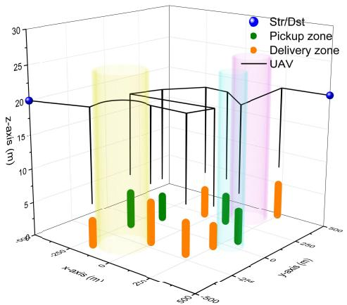  
(a) 3D trajectory for energy-min scheme.

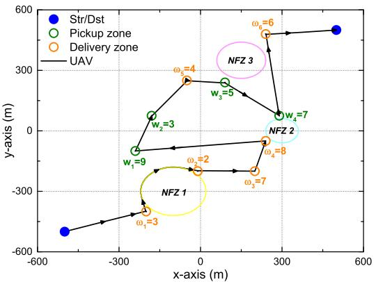  
(b) Horizontal trajectory for energy-min scheme

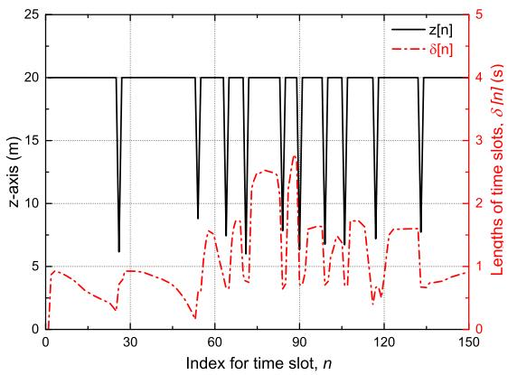  
(c) Vertical trajectory and lengths of time slots for energy-min scheme.

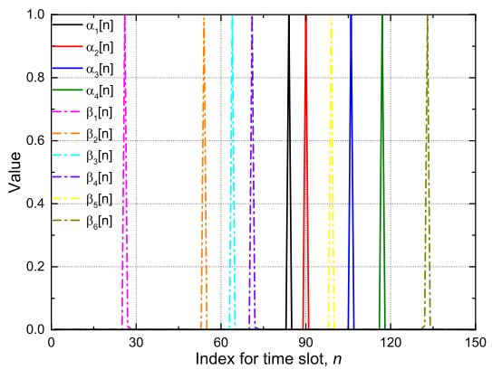  
(d) Pickup and drop-off indicators for energy-min scheme.

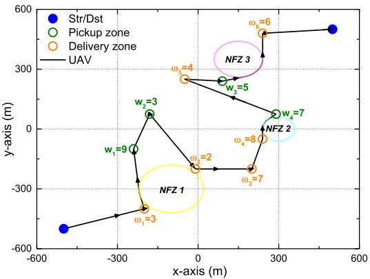  
(e) Horizontal trajectory for time-min scheme.

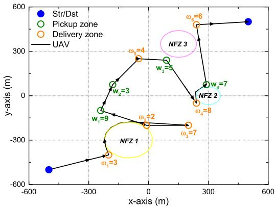  
(f) Horizontal trajectory for weighted scheme.  
Fig. 3. Trajectory and resource allocation of considered schemes.

## C. Performance Comparison

Fig. 4 illustrates the trade-of between completion time and consumed energy by presenting the achievable performance region for the two metrics. As the completion time decreases, the consumed energy tends to increase. In addition, the time-min and energy-min schemes achieve performance at opposite extremes, while the weighted scheme achieves a balanced performance between the two. The result demonstrates that by appropriately tuning the weight factor , it is possible to achieve performance tailored to system requirements from both completion time and energy consumption perspectives.

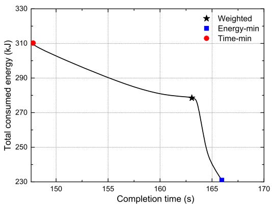  
Fig. 4. Completion time–consumed energy region.

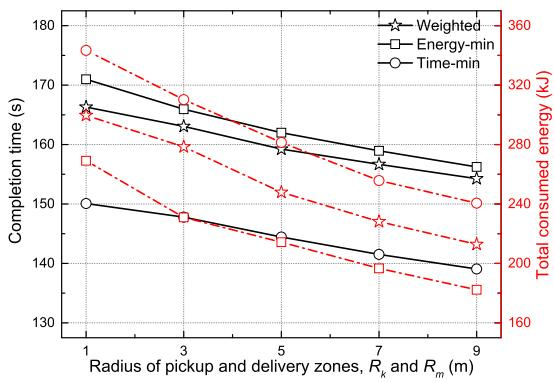  
Fig. 5. Completion time and consumed energy vs. $R _ { k }$ and $R _ { m } .$

Fig. 5 shows the completion time and consumed energy versus the radius of pickup and delivery zones $( R _ { k }$ and $R _ { m } )$ . As the allowance for picking up and dropping of parcels increases, the UAV does not need to visit the exact center of each zone, which reduces the distance it needs to travel to complete delivery. As a result, both completion time and consumed energy decrease in all schemes. In terms of completion time, the timemin, weighted, and energy-min schemes perform well in that order, but in terms of energy consumption, the opposite is true. For example, the time-min scheme forms the shortest path to achieve the fastest delivery, but it consumes the most energy because the UAV carries multiple parcels without dropping them of early. Moreover, the energy-min scheme has a longer completion time than the other schemes because the UAV often avoids flying at full speed to reduce energy consumption and forms energy-eficient routes that may not be optimal in terms of travel time. In contrast, the weighted scheme considers both completion time and energy consumption, resulting in a performance that lies between the two schemes in terms of both metrics.

Figs. 6 and 7 show the completion time and consumed energy versus the average weight of pickup parcels $( \hat { w } _ { k } )$ and delivery parcels $( \bar { \omega } _ { m } )$ , respectively. As $\bar { w } _ { k }$ and $\bar { \omega } _ { m }$ increase, the UAV needs to carry heavier parcels, leading to increased power consumption for all schemes. Moreover, by accounting for the increasing parcel weight, the UAV tends to form a relatively time-ineficient route for large values of $\bar { w } _ { k }$ and $\bar { \omega } _ { m }$ . Specifically, when the parcels are relatively light, e.g., $\bar { w } _ { k } ~ \leq ~ 4$ [kg] or $\bar { \omega } _ { m } ~ \leq ~ 3$ [kg], the weighted scheme tends to prioritize completion time, behaving similarly to the time-min scheme and achieving performance close to it. In contrast, when the parcels are heavier, it places more emphasis on minimizing energy consumption, acting more like the energy-min scheme and attaining performance close to that approach.

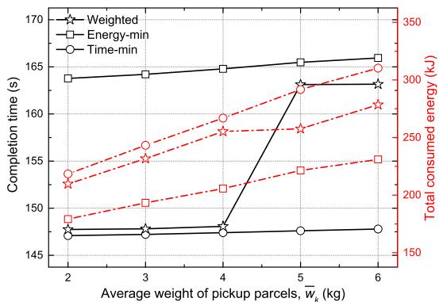  
Fig. 6. Completion time and consumed energy vs. $\bar { w } _ { k } .$

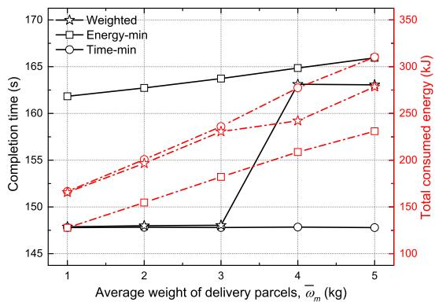  
Fig. 7. Completion time and consumed energy vs. $\bar { \omega } _ { m } .$

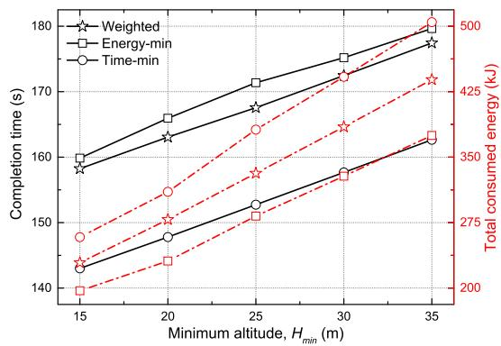  
Fig. 8. Completion time and consumed energy vs. $H _ { \mathrm { m i n } }$

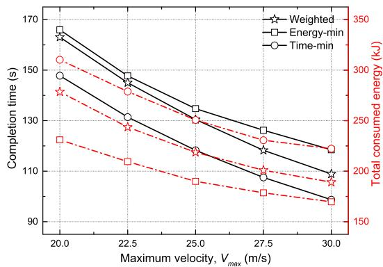  
Fig. 9. Completion time and consumed energy vs. $V _ { \mathrm { m a x } }$

Figs. 8 and 9 show the completion time and consumed energy versus the minimum altitude $( H _ { \operatorname* { m i n } } )$ and maximum velocity $\left( V _ { \mathrm { m a x } } \right)$ of the UAV, respectively. It is obvious that a lower altitude allows the UAV to land and take of quickly while consuming less energy, and a higher velocity enables the UAV to make fast delivery and reduce energy consumption. In consequence, the performances of all schemes improve as $H _ { \mathrm { m i n } }$ decreases or $V _ { \mathrm { m a x } }$ increases. The performance comparison under various parameters suggests that the UAV strategy can be appropriately selected depending on the objective of the scenario.

## V. CONCLUSION

In this paper, we considered a UAV-enabled parcel pickup and delivery under the constraints of weight restriction and NFZ avoidance. To minimize the weighted-sum of completion time and energy consumption, we jointly optimized pickup and drop-of indicators, lengths of time slots, and 3D trajectory. To handle the nonconvexity of the formulated MINLP, we employed the SCA method to transform the optimization problem into a convex form, while simultaneously applying the PCCP technique to preserve the binary nature of the pickup and drop-of indicators. Based on the relaxed convex problem, we proposed a low-complexity algorithm that derives the suboptimal UAV strategy iteratively. Simulation results showed that the characteristics of the UAV strategy depend on the objective, such as minimizing completion time, minimizing energy consumption, or simultaneously considering both metrics, and provided valuable insight into the performance trade-ofs between these strategies. The proposed algorithm reflects the real-world characteristics of parcel pickup and drop-of operations, making it highly applicable to various UAV-based delivery systems, such as last-mile delivery in urban logistics, postal transport in rural areas, and medical supply delivery between hospitals, depending on specific service requirements and objectives. For future research, we plan to extend the proposed framework by incorporating low-level dynamics, such as acceleration and steering angle, into the optimization process and further expanding it to multi-UAV environments, enabling the development of cooperative strategies for coordinated task allocation and trajectory planning.

## REFERENCES

[1] B. Li, Q. Li, Y. Zeng, Y. Rong, and R. Zhang, “3D trajectory optimization for energy-eficient UAV communication: A control design perspective,” IEEE Trans. Wireless Commun., vol. 21, no. 6, pp. 4579–4593, Jun. 2022.

[2] O. Ghdiri, W. Jaafar, S. Alfattani, J. B. Abderrazak, and H. Yanikomeroglu, “Ofline and online UAV-enabled data collection in time-constrained IoT networks,” IEEE Trans. Green Commun. Netw., vol. 5, no. 4, pp. 1918–1933, Dec. 2021.

[3] B. Li, Z. Fei, and Y. Zhang, “UAV communications for 5G and beyond: Recent advances and future trends,” IEEE Internet Things J., vol. 6, no. 2, pp. 2241–2263, Apr. 2019.

[4] N. Cherif, W. Jaafar, H. Yanikomeroglu, and A. Yongacoglu, “3D aerial highway: The key enabler of the retail industry transformation,” IEEE Commun. Mag., vol. 59, no. 9, pp. 65–71, Sep. 2021.

[5] N. Boysen, S. Fedtke, and S. Schwerdfeger, “Last-mile delivery concepts: A survey from an operational research perspective,” OR Spectr., vol. 43, no. 1, pp. 1–58, Mar. 2021.

[6] Z. Chen, Z. Hu, Z. Bao, and W. Xu, “UAV charging station planning and route optimization considering stochastic delivery demand,” IEEE Trans. Transport. Electrific., vol. 10, no. 4, pp. 9328–9341, Dec. 2024.

[7] A. Tahir, J. Boling, M.-H. Haghbayan, H. T. Toivonen, and J. Plosila, “Swarms of unmanned aerial vehicles—A survey,” J. Ind. Inf. Integr., vol. 16, Dec. 2019, Art. no. 100106.

[8] S. Shakoor, Z. Kaleem, M. I. Baig, O. Chughtai, T. Q. Duong, and L. D. Nguyen, “Role of UAVs in public safety communications: Energy eficiency perspective,” IEEE Access, vol. 7, pp. 140665–140679, 2019.

[9] Q. Wu, Y. Zeng, and R. Zhang, “Joint trajectory and communication design for multi-UAV enabled wireless networks,” IEEE Trans. Wireless Commun., vol. 17, no. 3, pp. 2109–2121, Mar. 2018.

[10] H. Yan, Y. Chen, and S.-H. Yang, “New energy consumption model for rotary-wing UAV propulsion,” IEEE Wireless Commun. Lett., vol. 10, no. 9, pp. 2009–2012, Sep. 2021.

[11] H. Mei, K. Yang, Q. Liu, and K. Wang, “Joint trajectory-resource optimization in UAV-enabled edge-cloud system with virtualized mobile clone,” IEEE Internet Things J., vol. 7, no. 7, pp. 5906–5921, Jul. 2020.

[12] Y. Cai, Z. Wei, S. Hu, C. Liu, D. W. K. Ng, and J. Yuan, “Resource allocation and 3D trajectory design for power-eficient IRS-assisted UAV-NOMA communications,” IEEE Trans. Wireless Commun., vol. 21, no. 12, pp. 10315–10334, Dec. 2022.

[13] Y. Zeng, J. Xu, and R. Zhang, “Energy minimization for wireless communication with rotary-wing UAV,” IEEE Trans. Wireless Commun., vol. 18, no. 4, pp. 2329–2345, Apr. 2019.

[14] J. Gu, H. Wang, G. Ding, Y. Xu, Z. Xue, and H. Zhou, “Energyconstrained completion time minimization in UAV-enabled Internet of Things,” IEEE Internet Things J., vol. 7, no. 6, pp. 5491–5503, Jun. 2020.

[15] Q. Song, S. Jin, and F.-C. Zheng, “Completion time and energy consumption minimization for UAV-enabled multicasting,” IEEE Wireless Commun. Lett., vol. 8, no. 3, pp. 821–824, Jun. 2019.

[16] C. Zhan, H. Hu, X. Sui, Z. Liu, and D. Niyato, “Completion time and energy optimization in the UAV-enabled mobile-edge computing system,” IEEE Internet Things J., vol. 7, no. 8, pp. 7808–7822, Aug. 2020.

[17] Y. Gao, H. Tang, B. Li, and X. Yuan, “Joint trajectory and power design for UAV-enabled secure communications with no-fly zone constraints,” IEEE Access, vol. 7, pp. 44459–44470, 2019.

[18] R. Li, Z. Wei, L. Yang, D. W. K. Ng, J. Yuan, and J. An, “Resource allocation for secure multi-UAV communication systems with multieavesdropper,” IEEE Trans. Commun., vol. 68, no. 7, pp. 4490–4506, Jul. 2020.

[19] K. Dorling, J. Heinrichs, G. G. Messier, and S. Magierowski, “Vehicle routing problems for drone delivery,” IEEE Trans. Syst., Man, Cybern., Syst., vol. 47, no. 1, pp. 70–85, Jan. 2017.

[20] M. Khosravi and H. Pishro-Nik, “Unmanned aerial vehicles for package delivery and network coverage,” in Proc. IEEE 91st Veh. Technol. Conf. (VTC-Spring), Antwerp, Belgium, May 2020, pp. 1–5.

[21] N. Cherif, W. Jaafar, H. Yanikomeroglu, and A. Yongacoglu, “Disconnectivity-aware energy-eficient cargo-UAV trajectory planning with minimum handofs,” in Proc. IEEE Int. Conf. Commun., Montreal, QC, Canada, Jun. 2021, pp. 1–6.

[22] M. Y. Arafat and S. Moh, “JRCS: Joint routing and charging strategy for logistics drones,” IEEE Internet Things J., vol. 9, no. 21, pp. 21751–21764, Nov. 2022.

[23] Z. Shi and W. K. Ng, “A collision-free path planning algorithm for unmanned aerial vehicle delivery,” in Proc. Int. Conf. Unmanned Aircr. Syst. (ICUAS), Jun. 2018, pp. 358–362.

[24] W. Wen, K. Luo, L. Liu, Y. Zhang, and Y. Jia, “Joint trajectory and pickup design for UAV-assisted item delivery under no-fly zone constraints,” IEEE Trans. Veh. Technol., vol. 72, no. 2, pp. 2587–2592, Feb. 2023.

[25] G. Park, W. Lee, and K. Lee, “3D multi-trajectory and pick-up optimization of UAV for minimizing delivery time with weight restriction,” IEEE Trans. Intell. Transp. Syst., vol. 25, no. 11, pp. 17562–17573, Nov. 2024.

[26] K. Heo, G. Park, and K. Lee, “Joint optimization of UAV trajectory and communication resources with complete avoidance of no-fly-zones,” IEEE Trans. Intell. Transp. Syst., vol. 25, no. 10, pp. 14259–14265, Oct. 2024.

[27] A. Filippone, Flight Performance of Fixed and Rotary Wing Aircraft. Amsterdam, The Netherlands: Elsevier, 2006.

[28] M. Grant and S. Boyd. (2017). CVX: MATLAB Software for Disciplined Convex Programming. [Online]. Available: http://cvxr.com/cvx

[29] S. Boyd and L. Vandenberghe, Convex Optimization. Cambridge, U.K.: Cambridge Univ. Press, 2004.

[30] T. Lipp and S. Boyd, “Variations and extension of the convex–concave procedure,” Optim. Eng., vol. 17, no. 2, pp. 263–287, Jun. 2016.

[31] Q.-D. Vu, K.-G. Nguyen, and M. Juntti, “Max-min fairness for multicast multigroup multicell transmission under backhaul constraints,” in Proc. IEEE Global Commun. Conf. (GLOBECOM), Dec. 2016, pp. 1–6.

[32] A. Ben-Tal and A. Nemirovski, Lectures on Modern Convex Optimization: Analysis, Algorithms, and Engineering Applications. Philadelphia, PA, USA: SIAM, 2001.

[33] C. E. Leiserson, R. L. Rivest, T. H. Cormen, and C. Stein, Introduction to Algorithms, vol. 6. Cambridge, MA, USA: MIT Press, 2001.

Kisong Lee (Senior Member, IEEE) received the B.S., M.S., and Ph.D. degrees in electrical engineering from Korea Advanced Institute of Science and Technology, Daejeon, South Korea, in 2007, 2009, and 2013, respectively. He was a Researcher with the Electronics and Telecommunications Research Institute from September 2013 to February 2015. From March 2015 to August 2017, he was an Assistant Professor with the Department of Information and Communication Engineering, Kunsan National University. From September 2017 to February 2020, he was an Assistant/Associate Professor with the School of Information and Communication Engineering, Chungbuk National University. He is currently a Professor with the Department of Information and Communication Engineering, Dongguk University, Seoul, South Korea. His research interests include network optimization, energy ICT, information security, satellite communications, deep learning, mobility optimization, and semantic communications.

Sung Ho Chae (Member, IEEE) received the B.S., M.S., and Ph.D. degrees in electrical engineering from Korea Advanced Institute of Science and Technology (KAIST), Daejeon, South Korea, in 2005, 2008, and 2013, respectively. From August 2013 to January 2018, he was with Samsung Electronics, Suwon, South Korea, as a Senior Engineer. From March 2018 to August 2019, he was an Assistant Professor with the Department of Electrical Engineering, Chosun University, Gwangju, South Korea. From September 2019 to August 2025, he was an

Assistant Professor and later as an Associate Professor with the Department of Electronic Engineering, Kwangwoon University, Seoul, South Korea. Since September 2025, he has been a Professor with the Department of Electronic Engineering. His research interests include network information theory, antenna theory, communication theory, and machine learning. He was a recipient of the Best Paper Award at the International Conference on ICT Convergence (ICTC) in 2022.