# 3D UAV Localization Optimization Under Jamming Attacks: A Mixture Gaussian Distribution Based Collaborative Reinforcement Learning

Yujiao Zhu , Member, IEEE, Mingzhe Chen , Senior Member, IEEE, Sihua Wang , Member, IEEE, Yuchen Liu , Member, IEEE, Changchuan Yin , Senior Member, IEEE, and Tony Q. S. Quek , Fellow, IEEE

Abstract—In this paper, the optimization of unmanned aerial vehicle (UAV) localization under jamming attacks is studied. In the considered network, a base station (BS) collaborates with an active UAV to localize a target UAV. During this positioning process, a jamming UAV transmits discontinuous signals to passive UAVs to interfere the distance information measurement. To localize the target UAV under jamming attacks, the BS jointly uses two localization methods: 1) generative adversarial network (GAN) based positioning method and 2) time difference of arrival (TDOA) based positioning method. Since GAN-based method cannot defend against a strong jamming signal while TDOA-based method may consume more energy and sacrifice localization accuracy, the BS must select an appropriate positioning method (GAN-based or TDOA-based methods) and four distance measurement information of passive UAVs to localize the target UAV. This problem is formulated as an optimization problem. The aim of this problem is to minimize the positioning error between the estimated and the ground truth positions of the target UAV while considering jamming attacks and the trajectory of passive UAVs. To solve this problem, we propose a mixture Gaussian distribution model based collaborative reinforcement learning (RL) method which enables the active UAV to optimize its transmit power and trajectory, and enables the BS to select the most appropriate subsets of distance measurement information and the optimal positioning method according to the UAVs movement and the unknown jamming attack pattern. Simulation results show the proposed method can reduce the positioning error of the target UAV by up to 36.5% compared

to the method that does not consider the GAN-based positioning method.

Index Terms—UAV localization, jamming attacks, GAN-based positioning method, TDOA-based positioning method.

## I. INTRODUCTION

OCALIZATION of unmanned aerial vehicles (UAVs) has [2], [3]. Radio frequency (RF) based passive localization methods can accurately localize unknown target UAVs in scenarios where the global navigation satellite systems (GNSSs) are not available [4], [5], [6]. However, using passive radio frequency localization methods to localize target UAVs faces many challenges [7]. First, the high-speed mobility of UAVs makes it difficult to estimate the real-time three-dimensional (3D) coordinates of UAVs [8]. Second, the interference of the dynamic wireless environments and attacks of jamming objects affect the transmission signals used for UAV localization.

## A. Related Works

Existing works such as [9], [10], [11], [12], [13], [14], [15], [16], [17], [18], [19], [20], [21], [22], [23] have studied several problems of UAV localization. In particular, the authors in [9] and [10] achieved UAV localization through microphone devices capturing the UAV acoustic characteristics. In [11], the authors employed WiGig devices for UAV localization based on the beam fingerprinting information. However, the implementation of these localization methods in [9], [10], [11] requires specific hardware, which limits their flexibility and scalability in different environments. In [12], [13], [14], [15], [16], [17], [18], [19], [20], [21], [22], [23], [24], [25], the authors localized UAVs by using radio-frequency signals. To be specific, the authors in [12] made use of the time-of-arrival (TOA) information acquired from multiple sensors to carry out the estimation of the target UAV’s position. In [13], the authors studied the deployment of sensors to improve the accuracy of TOA information and UAV localization. In [14], the authors considered using TOA information among UAVs to measure relative distance and achieve cooperative localization. However, the TOA-based localization method relies on strict time synchronization between the target and positioning sensors. The authors in [15], [16], [17], [18] studied to use time-difference-of-arrival (TDOA) information to localize UAVs. The authors in [15] split UAVs into multiple UAV clusters and localized the UAVs with unknown positions based on TDOA information in each cluster. In [16], the authors proposed a TDOA-based approach for UAV self-localizing and optimized the trajectory of the target UAV to improve localization accuracy. To track the highly dynamic UAVs, the authors in [17] and [18] used the Kalman filter to reduce the measurement error of TDOA information, thus reducing the UAV local ization error. In addition to time-based localization methods, the authors in [19], [20], [21] studied to localize UAVs based on the angle-of-arrival (AOA) information. In [19] and [20], the authors used multiple-input multiple-output (MIMO) radar to measure the angle information between the target UAV and radar to localize the UAV based on angle information. In [21], the authors considered the optimization of self-localization for the UAV swarm. In addition, the authors in [22] and [23] respectively used ground base stations (BSs) and WiFi access nodes to measure the distance based on received signals strength (RSS) to achieve UAV localization in outdoor and indoor scenarios. In [24], the authors obtained the distance information based on the signal strength for calculating UAV positions. Additionally, periodic communication signals transmitted by UAVs were investigated in [25] for UAV positions estimations and UAV tracking. However, the works in [12], [13], [14], [15], [16], [17], [18], [19], [20], [21], [22], [23], [24], [25] ignored the impacts of the positions of sensors on localization accuracy. The authors in [26] studied the relationship between the deployment of sensors and the UAV localization accuracy. The authors in [27] optimized the selection of sensors for real-time UAV localization. However, most of these works localized UAVs by using static stations, which may not be applied for UAVs with high-speed movement. Additionally, the authors in [28] studied trajectory optimization for controlled UAVs to improve the localization performance for the target UAV in a mobile wireless network without jamming attacks. The authors in [29] and [30] used the distance information between any two adjacent UAVs to achieve multi-UAV cooperative localization. In addition, the above works did not consider how dynamic jamming attacks affect the UAV localization performance. Some related works have considered different aspects of UAV networks performance. The authors in [31] studied the impact of mobility models on the secrecy performance of wireless networks, while those in [32] proposed a detection and channel estimation method in UAV-assisted wireless sensor networks by accounting for multipath delay and Doppler frequency shift.

Several works studied techniques for reducing jamming attacks on UAVs. The authors in [33] developed a framework to map a selected channel to the positions of UAVs. Based on the map relation, the approach in [33] can achieve jamming resilient communications by selecting the optimal channels for UAVs located at different positions. The authors in [34] designed a deep reinforcement learning method to optimize the channel access selection, as well as bandwidth and CPU resource allocation, thus improving the computing and communication performance under jamming attacks. To maximize the secrecy capacity in UAV assisted wireless networks, the authors in [35] developed a multi-agent reinforcement learning method to find the optimal

UAV trajectory design and jamming power allocation schemes. However, these works in [33], [34], [35] did not focus on optimizing localization performance. A number of existing works such as [36], [37], [38], [39], [40] have studied the problem of UAV localization while avoiding jamming attacks, including machine learning (ML) [41] based positioning methods and radio frequency based positioning methods. The authors in [36] proposed a novel deep neural network (DNN) model to generate an image of received signals amplitude and phase to improve the positioning accuracy of the UAV by using noise and interference in the environment. The authors in [37] used a convolutional neural network (CNN) to analyze the received RF signals to prevent interference and estimate the angle of arrival, thus decreasing the positioning error of the UAV. In [38], the authors used a DNN to recognize the visual information of UAVs under a scenario with high interference and improve the positioning accuracy of the UAV. However, these ML based jamming attack defense methods in [36], [37], [38] cannot defend strong jamming attacks. In [39], the authors proposed a UAV grouping scheme to reduce the influence of interference on UAV localization. The authors in [40] analyzed the relationship between the UAV localization performance and the number of participating BSs under different signal-to-interference-plus-noise ratio (SINR) conditions. However, these RF based positioning methods in [39], [40] require to frequently adjust the position of UAVs or the number of BSs, thus increasing energy consumption and affecting localization accuracy. Moreover, these works [36], [37], [38], [39], [40] did not consider to jointly use the ML based positioning method and traditional RF based positioning method to defend jamming attacks and improve the localization accuracy.

## B. Contributions

The primary contribution of this research lies in introducing a passive 3D UAV localization framework that jointly uses the BS and an active UAV to localize a target UAV under jamming attacks. Our key contributions are summarized as follows:

We consider a 3D passive UAV localization network under jamming attacks. In the considered network, an active UAV sends out signals to the target UAV. Subsequently, passive UAVs will receive the signals that have been reflected by the target UAV. Then, they calculate the sum of two distances: one is the distance from the active UAV to the target UAV, and the other is the distance from the target UAV to the passive UAV itself. This distance information will then be relayed to the BS so that the target UAV can be located. Compared to traditional 3D UAV localization work, our considered problem not only demands highly accurate position estimation but also requires the development of adaptive strategies to against jamming attacks in dynamic and adversarial environments.

During the localization process, the jamming UAV transmits interference signals to passive UAVs to interfere with the accuracy of measured distance information. To improve the localization accuracy under jamming attacks, the BS jointly uses the generative adversarial network (GAN)-based positioning method and time difference of arrival (TDOA)-based positioning method. This work is the first to combine GAN-based and TDOA-based methods for target UAV localization. The GAN-based method introduces noise during adversarial training, enabling accurate localization even with input errors. However, its accuracy decreases under significant input measurement errors. The TDOA-based method mitigates jamming effects by dynamically adjusting UAV trajectories to avoid interference but may increase flight energy consumption due to frequent trajectory adjustments. Hence, the BS must select the optimal positioning method and four distance information to localize the target UAV. We formulate the minimization of positioning error for the target UAV as an optimization problem, which involves jointly optimizing the transmit power and trajectory of the active UAV, as well as optimizing the selection positioning methods and the subset of distance measurement information at the BS.

To solve this problem, we propose a mixture Gaussian distribution model based collaborative reinforcement learning (RL) method which enables the BS to select the optimal positioning method and the optimal subset of distance information, and the active UAV to optimize its trajectory and transmit power under unknown jamming attack patterns. Compared to tradition RL methods that estimate the expected values of value functions directly, the proposed method approximates the probability distribution of value functions by mixture Gaussian distributions. Hence, the expected values of value functions estimated by the proposed method are more accurate than those output directly by traditional value-based RL methods, leading to enhanced decision-making performance and improved UAV localization accuracy. Moreover, the proposed method only requires to output the means, variances, and weights of independent Gaussian distributions. Hence, the proposed method can significantly reduce the number of neurons in DNNs, leading to lower training complexity.

\- To further reduce the effect of jamming attacks on the localization performance, we analyze how the jamming attacks from the jamming UAV affect the positioning localization. Meanwhile, we derive the expression of the target UAV’s positioning error in a scenario where the jamming UAV transmits signals in a fixed pattern.

The subsequent sections of this paper are structured as follows. Section II presents the system model and outlines problem formulation. The mixture Gaussian distribution based collaborative RL method proposed in this paper is introduced in Section III. In Sections IV and V, the target UAV localization performance and simulation results are analyzed, respectively. Section VI summarizes the conclusions.

## II. SYSTEM MODEL AND PROBLEM FORMULATION

Consider a wireless network in which one BS, one active UAV and a set U of U passive UAVs to cooperatively localize a target UAV under attacks from a jamming UAV, as shown in Fig. 1. In the considered network, an active UAV emits signals that are sent towards the target UAV. After being reflected by the target UAV, these signals are captured by passive UAVs. Utilizing the time of signal transmission, distances are calculated by passive UAVs and transmitted from passive UAVs to the BS. Subsequently, the BS calculates the target UAV’s position. The flowchart in Fig. 2 illustrates the entire localization process. To reduce the influence of the jamming UAV attacks and the mobility of UAVs, the active UAV requires to optimize its trajectory and transmit power. In addition, the BS requires to select the most appropriate subset of distance information and the optimal position estimation method to accurately localize the target UAV in real time. Next, we first introduce the mobility patterns of UAVs and the jamming pattern of the jamming UAV. Then, the signal transmission model and the positioning model which is used to estimate the position of the target UAV are introduced. Finally, we formulate the optimization problem.

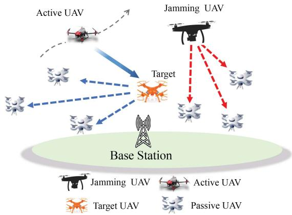  
Fig. 1. The studied UAV localization network.

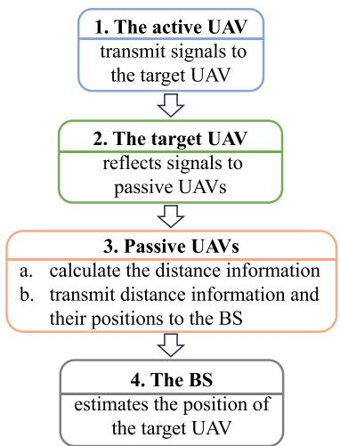  
Fig. 2. The flowchart of the considered localization process.

## A. UAV Aerodynamic Model

The mobility patterns and propulsion energy consumption of each UAV depend on its position, pitch angle, yaw angle, and flying speed. Next, we present the UAV movement model and UAV flight energy consumption model, respectively.

1) UAV Movement Model: We define the 3D coordinate of the active and passive UAVs at time slot t as $l _ { t } = \{ l _ { 0 , t } , \ldots , l _ { U , t } \}$ where $l _ { 0 , t } = [ x _ { 0 , t } , y _ { 0 , t } , z _ { 0 , t } ] ^ { T }$ is the coordinate of the active UAV and $l _ { u , t } = [ x _ { u , t } , y _ { u , t } , z _ { u , t } ] ^ { T } , u \in \{ 1 , \dots , U \}$ is the position of passive UAV u. Hereinafter, an index 0 indicates the active UAV and an index $u \in \{ 1 , \ldots , U \}$ represents passive UAV u. Given the active UAV yaw angle $\alpha _ { t } .$ , speed $v ,$ and pitch angle $\beta _ { t }$ , its coordinates $l _ { 0 , t + 1 }$ at time slot t + 1 is [28]

$$
l _ { 0 , t + 1 } \left( \alpha _ { t } , \beta _ { t } \right) = l _ { 0 , t } + v \Delta _ { t } \left[ \sin \alpha _ { t } \cos \beta _ { t } \right] ,\tag{1}
$$

where $\Delta _ { t }$ is the time duration of each time slot.

2) UAV Propulsion Energy Consumption Model: The aerodynamic power consumption $p _ { t } ^ { \mathrm { F } } ( \alpha _ { t } , \beta _ { t } )$ of the active UAV at time slot t is [42]

$$
\begin{array} { r l } & { p _ { t } ^ { \mathrm { F } } \left( \alpha _ { t } , \beta _ { t } \right) = \frac { C _ { 1 } } { \sqrt { \left( v _ { t } ^ { \mathrm { L } } \right) ^ { 2 } + \sqrt { \left( v _ { t } ^ { \mathrm { L } } \right) ^ { 4 } + 4 \left( v _ { t } ^ { \mathrm { H } } \right) ^ { 4 } } } } } \\ & { ~ + M g v _ { t } ^ { \mathrm { Z } } + C _ { 2 } \left( v _ { t } ^ { \mathrm { L } } \right) ^ { 3 } , } \end{array}\tag{2}
$$

where $C _ { 1 }$ and $C _ { 2 }$ are coefficients [42], $v _ { t } ^ { \mathrm { L } } = v \cos \beta _ { t }$ is the horizontal flight speed, $v _ { t } ^ { Z } = v \sin \beta _ { t }$ is the vertical flight speed, $g$ tis the acceleration of gravity, M is the weight of each UAV, and $v _ { t } ^ { \mathrm { H } }$ is the power required to hover [42]. Then, the required instantaneous propulsion energy at time slot t is

$$
E _ { t } ^ { \mathrm { F } } \left( \alpha _ { t } , \beta _ { t } \right) = p _ { t } ^ { \mathrm { F } } \left( \alpha _ { t } , \beta _ { t } \right) \Delta _ { t } .\tag{3}
$$

## B. Jamming Model

To interfere with the localization of the target UAV, the jamming UAV transmits discontinuous interference signals to active and passive UAVs. We use an indicator $j _ { t }$ to represent whether the jamming UAV transmits signals at time slot t. $j _ { t } = 1$ implies that the jamming UAV transmits signals and $j _ { t } = 0$ , otherwise. Let $f _ { \mathrm { J } }$ be the probability that the jamming UAV transmits jamming signals. The jamming power received by passive UAV u is given by

$$
I _ { u , t } ^ { \mathrm { J } } = j _ { t } P ^ { \mathrm { J } } | h _ { \mathrm { J } , u , t } | ^ { 2 } ,\tag{4}
$$

where $P ^ { \mathrm { J } }$ is the transmit power of the jamming UAV, $| h _ { \mathrm { J } , u , t } | ^ { 2 } =$ $\beta _ { 0 } \| l _ { t } ^ { \mathrm { J } } - l _ { u , t } \| ^ { - 2 }$ is the path loss from the jamming UAV to tpassive UAV u with $l _ { t } ^ { \mathrm { J } }$ being the position of the jamming UAV at time slot t and $\beta _ { 0 }$ tbeing the path loss at a reference distance.

## C. Transmission Model

In the studied model, the transmission links consist of a) links between UAVs that are used to transmit signals to calculate the distance information and b) links from passive UAVs to the BS that are used to transmit distance information measured by passive UAVs.

1) UAV Links: We assume that a link between any two UAVs is line-of-sight (LoS) [43], [44], [45], [46], [47] since less obstacles exist in the sky. Due to the interference introduced by channel noise and the jamming UAV, SINR of the signals received by passive UAV u at time slot t is [48]

$$
s _ { u , t } ^ { \mathrm { A } } \left( l _ { 0 , t } , p _ { t } ^ { \mathrm { T } } \right) = \frac { p _ { t } ^ { \mathrm { T } } | h _ { u , t } x _ { u , t } h _ { t } | ^ { 2 } } { \epsilon ^ { 2 } + I _ { u , t } ^ { \mathrm { J } } } ,\tag{5}
$$

where $p _ { t } ^ { \mathrm { T } }$ is the transmit power of the active $\mathrm { U A V } , \epsilon ^ { 2 }$ is the power tof the Gaussian noise, $I _ { u , t } ^ { \mathrm { J } }$ is the interference caused by the jamming UAV, and $x _ { u , t }$ u,tis the reflection coefficient of the target u,tUAV at time slot t [49]. Furthermore, $h _ { t } ^ { 2 } = \beta _ { 0 } \lVert l _ { 0 , t } - l _ { t } \rVert ^ { - 2 }$ and $h _ { u , t } ^ { 2 } = \beta _ { 0 } \| l _ { t } - l _ { u , t } \| ^ { - 2 }$ trepresent the path loss from the active u,tUAV to the target UAV and the path loss from the target UAV to passive UAV u with $\mathbf { \xi } _ { l _ { t } }$ being the position of the target UAV [50], respectively.

2) UAV-BS Links: Given the position $\boldsymbol { l } _ { u , t }$ of passive UAV u, $\boldsymbol { l } _ { 0 , t }$ of the active UAV and the position $\boldsymbol { l _ { \mathrm { B } } }$ of the BS, the probabilistic LoS and non-line-of-sight (NLoS) channel model is used to model the UAV-BS link [51], [52], [53], [54]. To be specific, the LoS path loss $g _ { u , t } ^ { \mathrm { L o S } }$ and NLoS path loss $g _ { u , t } ^ { \mathrm { N L o S } }$ from u,t u,tthe passive UAV u to the BS at time slot t can be given by [54]

$$
g _ { u , t } ^ { \mathrm { L o S } } = L _ { \mathrm { F S } } \left( l _ { 0 } \right) + 1 0 \mu _ { \mathrm { L o S } } \log \left( \Vert l _ { u , t } - l _ { \mathrm { B } } \Vert \right) + \varphi _ { \sigma _ { \mathrm { L o S } } } ,\tag{6}
$$

$$
g _ { u , t } ^ { \mathrm { N L o S } } = L _ { \mathrm { F S } } \left( l _ { 0 } \right) + 1 0 \mu _ { \mathrm { N L o S } } \log \left( \Vert l _ { u , t } - l _ { \mathrm { B } } \Vert \right) + \varphi _ { \sigma _ { \mathrm { N L o S } } } ,\tag{7}
$$

where $l _ { 0 }$ is the free-space reference distance, $L _ { \mathrm { F S } } ( l _ { 0 } ) =$ 20 $\log ( l _ { 0 } f _ { 0 } 4 \pi / c )$ is the path loss in a free space with $f _ { 0 }$ being the carrier frequency. $\varphi _ { \sigma _ { \mathrm { L o S } } }$ and $\varphi _ { \sigma _ { \mathrm { N L o S } } }$ are the shadowing random σvariables with zero mean and $\sigma _ { \mathrm { L o S } } ^ { 2 } , \sigma _ { \mathrm { N L o S } } ^ { 2 }$ dB variances. Given (6) and $( 7 )$ , at time slot, the path loss between passive UAV u and the BS is expressed as follows [55]

$$
\bar { g } _ { u , t } = \mathrm { P r } \left( g _ { u , t } ^ { \mathrm { L o S } } \right) \times g _ { u , t } ^ { \mathrm { L o S } } + \left( 1 - \mathrm { P r } \left( g _ { u , t } ^ { \mathrm { L o S } } \right) \right) \times g _ { u , t } ^ { \mathrm { N L o S } } ,\tag{8}
$$

where $\operatorname* { P r } ( g _ { u , t } ^ { \mathrm { L o S } } ) = ( 1 + \zeta \exp ( - \eta [ \chi _ { u , t } - \zeta ] ) ) ^ { - 1 }$ is the prob-u,t u,tability of LoS with ζ and η being constants which depend on the environment factors, and χ = arcsin $\frac { z _ { u , t } } { \| l _ { u , t } - l _ { \mathrm { B } } \| }$ being the elevation angle of passive UAV u. The LoS probability is determined by factors such as UAV altitude, distance, and environmental obstructions, while the NLoS component accounts for the impact of obstacles. Shadowing random variables are included to capture signal fluctuations. Specifically, LoS components include shadowing with smaller variance, while NLoS components use shadowing with larger variance to reflect the higher uncertainty and attenuation in obstructed paths.1

Given the transmit power $p _ { u , t }$ of passive UAV u, he signal-tonoise ratio (SNR) at the BS for the signals received from passive UAV can be calculated as follows

$$
s _ { u , t } ^ { \mathrm { G } } = \frac { p _ { u , t } } { \epsilon ^ { 2 } } 1 0 ^ { - \bar { g } _ { u , t } / 1 0 } .\tag{9}
$$

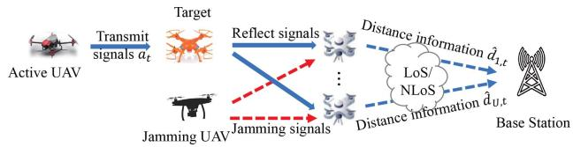  
Fig. 3. An illustration of the signals transmission scenario.

The delay required for transmitting distance information from passive UAV u to the BS at time slot t is [56]

$$
T _ { u , t } ^ { \mathrm { G } } = \frac { D _ { u , t } ^ { \mathrm { G } } } { W _ { 2 } \log _ { 2 } \left( 1 + s _ { u , t } ^ { \mathrm { G } } \right) } ,\tag{10}
$$

where $W _ { 2 }$ is the bandwidth of each passive UAV to transmit distance to the BS and $D _ { u , \mathrm { i } } ^ { \mathrm { G } }$ is the data size.

## D. Received Signals Model

Here, we introduce the model of received signals at passive UAVs. As shown in Fig. 3, the active UAV first transmits a signal $a _ { t }$ and the jamming UAV transmits a signal $b _ { t }$ . Then, the signal received by passive UAV u is given by

$$
\begin{array} { r } { y _ { u , t } = \sqrt { p _ { t } ^ { \mathrm { T } } } h _ { u , t } x _ { u , t } h _ { t } a _ { t - \tau _ { u , t } ^ { \mathrm { A } } } + \omega _ { u , t } + j _ { t } \sqrt { p ^ { \mathrm { J } } } h _ { \mathrm { J } , u , t } b _ { t - \tau _ { u , t } ^ { \mathrm { J } } } , } \end{array}\tag{11}
$$

where $p _ { t } ^ { \mathrm { T } }$ is the target UAV’s transmit power, $h _ { t }$ denotes the tpath loss occurring between the target UAV and the active UAV, $h _ { u , t }$ is the path loss between the target UAV and the passive u,tUAV $u , x _ { u , t }$ is the reflection coefficient of the target UAV to u,tpassive UAV $u ,$ and $\tau _ { u , t } ^ { \mathrm { A } }$ is the transmission time of the signal $a _ { t } . \omega _ { u , t }$ u,tis the Gaussian noise with variance $\epsilon ^ { 2 } , h _ { \mathrm { J } , u , t }$ is the path loss between the jamming UAV and passive UAV u, and $\tau _ { u , t } ^ { \mathrm { J } }$ is the transmission time of the signal $b _ { t } .$ u,t. From (11), we can see the signals received by passive UAVs include the signals transmitted from the active UAV and reflected by the target UAV, the channel noise, and the signals transmitted from the jamming UAV. Based on the received signals $y _ { u , t } ,$ passive UAV u estimates the transmission time $\tau _ { u , t } ^ { \mathrm { A } }$ and calculates the estimated distance information $\hat { d } _ { u , t }$ which pertains to the distance from the active UAV to the target UAV and subsequently from the target UAV to passive UAV u. After that, the passive UAVs relay the measured distance information to the BS through the probabilistic LoS and NLoS links for calculating the estimated position $\hat { l } _ { t }$ of the target UAV.

## E. Localization Model

After having received the signals dispatched by the active UAV, passive UAVs estimate the distance measurement information $\hat { \pmb { d } } _ { t } = \{ \hat { d } _ { 1 , t } , \dots , \hat { d } _ { U , t } \}$ based on the estimated signals transmission time. Then, the measured distances are transmitted to the BS. Due to the mobility of UAVs and the jamming attacks, the BS requires to select a subset of distance information for localizing the target UAV. Let $\pmb q _ { t } = \{ q _ { 1 , t } , \dots , q _ { U , t } \}$ be the select indicator vector, where $q _ { u , t } \in \{ 0 , 1 \}$ ,twith $q _ { u , t } = 1$ indicating that distance information measured by passive UAV u is selected to calculate the target UAV’s position, otherwise, we have $q _ { u , t } = 0$ . Based on distance information $\hat { \ b { d } } _ { t }$ , positions of passive u,tUAVs $l _ { t } ^ { \mathrm { P } } = \{ l _ { 1 , t } , \dots , l _ { U , t } \}$ , and the UAV selection scheme $\mathbf { \nabla } _ { \mathbf { \mathfrak { q } } _ { t } } .$ the BS can determine the position $\hat { l } _ { t }$ of the target UAV by using a) GAN-based position estimation method and b) a standard time difference of arrival (TDOA) method. Here, we consider GAN-based positioning method since GANs can eliminate the distance measurement error caused by interference signals via training with noisy samples and estimate the position of the target UAV accurately even in scenarios with input errors. We also consider the TDOA-based position estimation method since TDOA-based method can use the mobility of the active and passive UAVs to avoid jamming attacks. The BS will determine the method (i.e., GAN or TDOA) used for UAV positioning according to distance measurement information. Unlike conventional sensor fusion methods that integrate heterogeneous measurements such as RSSI, AOA, and TOA to improve localization accuracy, our framework only requires signal transmission time information, thus reducing system complexity and avoiding additional error accumulation. Moreover, instead of fusing the outputs of different techniques, we employ the RL method to adaptively select between a GAN-based method and a TDOA-based method according to the interference pattern and signal condition. This selective integration allows the framework to exploit the robustness of GAN against noisy inputs and the resilience of TDOA under strong jamming, achieving complementary performance gains.

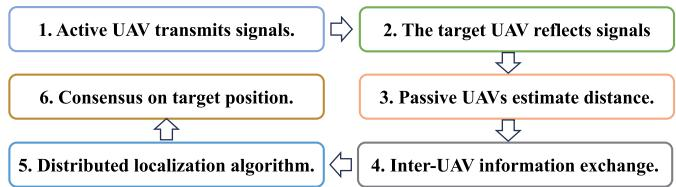  
Fig. 4. The workflow of the distributed localization framework.

Note that the proposed localization method can also be implemented in a distributed manner. As shown in Fig. 4, in the distributed manner, the active UAV first transmits signals, which are reflected by the target UAV and received by passive UAVs. Each passive UAV independently estimates the signal transmission distance while retaining its own position information. Instead of forwarding these measurements to a central BS, the passive UAVs exchange their local observations with neighbors through inter-UAV communication links. By applying a distributed fusion algorithm such as distributed least squares, passive UAVs iteratively refine their estimates. After several communication rounds, all passive UAVs converge to a common estimate of the target UAV’s position, without relying on a central coordinator.

## F. Jamming Attack Defense Methods

Next, we introduce the GAN-based position estimation method and traditional TDOA-based position estimation method as follows:

\- GAN-based position estimation method: The input of the GAN is the received distance measurement information and positions of passive UAVs i.e., $\{ \hat { { d } } _ { 1 , t } , . . . , \hat { { d } } _ { 4 , t } , l _ { 1 , t } , . . . , l _ { 4 , t } \}$ . The output of the GAN is the estimated position $\hat { l } _ { t } ^ { \mathrm { G } }$ of the target UAV. However, tGAN-based positioning method cannot defend a strong jamming signal. To this end, we introduce a TDOA-based positioning method to avoid strong jamming signals.

\- TDOA-based position estimation method: Here, we defend the jamming attacks by adjusting the trajectory of the active UAV. The calculated position of the target UAV, denoted as $\hat { l } _ { t } ^ { \mathrm { W } } ( l _ { 0 , t } , p _ { t } ^ { \mathrm { T } } , \pmb { q } _ { t } )$ , that is acquired using the TDOA-based method based on the distance information $\hat { \ b { d } } _ { t }$ and positions of passive UAVs $l _ { t } ^ { \mathrm { P } } = \{ l _ { 1 , t } , \dots , l _ { U , t } \}$ [57]. However, this tmethod requires to adjust the trajectory of the active UAV frequently, which will increase energy consumption of the active UAV and affect localization accuracy.

Having introduced the position estimation methods, We use $g _ { t } \in \{ 0 , 1 \}$ to represent the positioning method selection indicator with $g _ { t } = 1$ implying that the BS uses a GAN-based positioning method to localize the target UAV and $g _ { t } = 0$ implying that the BS uses the TDOA-based method. Then, $\hat { l } _ { t } ( l _ { 0 , t } , p _ { t } ^ { \mathrm { T } } , q _ { t } , g _ { t } )$ is

$$
\hat { l } _ { t } \left( l _ { 0 , t } , p _ { t } ^ { \mathrm { T } } , q _ { t } , g _ { t } \right) = g _ { t } \hat { l } _ { t } ^ { \mathrm { G } } + \left( 1 - g _ { t } \right) \hat { l } _ { t } ^ { \mathrm { W } } \left( l _ { 0 , t } , p _ { t } ^ { \mathrm { T } } , q _ { t } \right)\tag{12}
$$

The positioning error of the target UAV is the error between the estimated position $\hat { l } _ { t } ( l _ { 0 , t } , p _ { t } ^ { \mathrm { T } } , q _ { t } )$ and the ground truth position $\mathbf { \xi } _ { l _ { t } }$ tof the target UAV at time slot $t ,$ which is given by $e _ { t } ( l _ { 0 , t } , p _ { t } ^ { \mathrm { T } } , \pmb { q } _ { t } , \pmb { g } _ { t } ) = \sqrt { \| \hat { l } _ { t } ( l _ { 0 , t } , p _ { t } ^ { \mathrm { T } } , \pmb { q } _ { t } , q _ { t } ) - l _ { t } \| ^ { 2 } } .$

## G. Problem Formulation

After defining the system model, our objective is to accurately estimate the target UAV’s position under the influence of wireless channel noise and jamming UAV interference. To achieve this, we formulate an optimization problem aimed at minimizing the positioning error $e _ { t } ( l _ { 0 , t } , p _ { t } ^ { \mathrm { T } } , q _ { t } , g _ { t } )$ over $T$ time slots. This is accomplished by optimizing the trajectory $\alpha _ { t } , \beta _ { t }$ , the active UAV’s transmit power $p _ { t } ^ { \mathrm { T } }$ , the UAV selection scheme $\pmb { q } _ { t }$ , and tposition estimation method selection $g _ { t }$ . Then, the minimization problem is given by

$$
\operatorname* { m i n } _ { \alpha _ { t } , \beta _ { t } , p _ { t } ^ { \Gamma } , q _ { t } , g _ { t } } \quad \sum _ { t = 1 } ^ { T } e _ { t } \left( l _ { 0 , t } \left( \alpha _ { t } , \beta _ { t } \right) , p _ { t } ^ { \Gamma } , q _ { t } , g _ { t } \right) ,\tag{13}
$$

$$
\begin{array} { r } { \mathrm { s . t . } \quad E _ { t } ^ { \mathrm { F } } \leqslant E _ { \operatorname* { m a x } } ^ { \mathrm { F } } , } \end{array}\tag{13a}
$$

$$
q _ { u , t } T _ { u , t } ^ { \mathrm { G } } \leqslant T _ { \operatorname* { m a x } } , \forall u \in \mathcal { U } ,\tag{13b}
$$

$$
\| l _ { u , t } - l _ { 0 , t } \| \geqslant L _ { \operatorname* { m i n } } , \forall u \in \mathcal { U } ,\tag{13c}
$$

$$
\beta _ { \mathrm { m i n } } \leqslant \beta _ { t } \leqslant \beta _ { \mathrm { m a x } } ,\tag{13d}
$$

$$
\alpha _ { \mathrm { m i n } } \leqslant \alpha _ { t } \leqslant \alpha _ { \mathrm { m a x } } ,\tag{13e}
$$

$$
\sum _ { u = 0 } ^ { U } q _ { u , t } = 4 ,\tag{13f}
$$

where $\alpha _ { \mathrm { m a x } }$ and $\beta _ { \mathrm { m a x } }$ respectively stand for the maximum yaw angle and the maximum pitch angle of UAVs. Meanwhile, αmin and $\beta _ { \mathrm { m i n } }$ represent the minimum yaw angle and the minimum pitch angle, $E _ { \mathrm { m a x } } ^ { \mathrm { F } }$ denotes the maximum propulsion energy consumption of the active UAV, $T _ { \mathrm { m a x } }$ is the maximum transmission delay, and $L _ { \mathrm { m i n } }$ is the safe distance between any two UAVs. Constraints (13a) is the flight energy constraint of the active UAV. Constraint (13a) enforces the flight energy limitation of the active UAV. As for Constraint (13b), it guarantees that the time delay involved in the transmission of distance measurement from the passive UAVs to the BS is kept within the permitted range2. Constraint (13c) guarantees the minimum safe distance between UAVs. Constraints (13d) and (13e) impose movement limitations on the active UAV. Finally, constraint (13f) specifies that at least four UAVs are required to receive signals reflected by the target UAV for accurate 3D positioning.3

Problem (13) is difficult to solve by traditional convex algorithms due to the following reasons. First, the relationship between the estimated position of the target UAV obtained by the BS and the optimization variables in (13) cannot be accurately characterized due to the unknown jamming pattern and positions of the jamming UAV. Second, traditional optimization algorithms require the BS to calculate the positioning error $e _ { t } ( l _ { 0 , t } , p _ { t } ^ { \mathrm { T } } , q _ { t } , g _ { t } )$ based on the ground truth position $\mathbf { \xi } _ { l _ { t } }$ of the target UAV. However, $\mathbf { \xi } _ { l _ { t } }$ is unknown in practice. To this end, we investigate a collaborative RL method to jointly optimize the UAV selection scheme, the trajectory and transmit power of the active UAV, and the position estimation method selection method according to the observation of the active UAV and the BS.

## III. THE PROPOSED COLLABORATIVE RL METHOD

To solve (13), we introduce a collaborative RL method. This method enables the active UAV to adapt its flight trajectory and transmit power. Meanwhile, it enables the BS to choose the most suitable subset of distance measurement information and the positioning estimation method. By doing so, the proposed method can jointly maximize the target positioning accuracy. Compared to traditional RL methods that use the DNN to output the estimated expected value of future rewards directly (such as [58]), the proposed mixture Gaussian distribution based RL method can use mixed Gaussian distributions for approximating the distribution of the cumulative future rewards and use neural networks to predict the variance, means, and weights parameters of the Gaussian distributions thus reducing training complexity and improving convergence speed. Next, the components and training process of the proposed RL method are introduced first. Subsequently, we conduct an analysis of the convergence, implementation, and complexity of the proposed method.

## A. Components of the Collaborative RL Method

The proposed method consists of the following five components:

\- Agents: The agents are the BS and the active UAV. In particular, the BS requires to select an appropriate subset of the distance information and determine a positioning method (the GAN or the TDOA) for estimating the target UAV’s position. Meanwhile, the active UAV is required to adjust its transmit power and trajectory.

States: A state of the BS is $o _ { t } ^ { \mathrm { B } } = [ \hat { d } _ { t } , l _ { t } ^ { \mathrm { P } } , s _ { t } ]$ that captures t t t tthe distance measurement information, the deployment of active and passive UAVs, and the SINR at each passive UAV. A state of the active UAV is $o _ { t } ^ { \mathrm { A } } = [ l _ { 0 , t } ]$ that captures its position. Hereinafter, we use $\pmb { o } _ { t } = [ \pmb { o } _ { t } ^ { \mathrm { A } } , \pmb { o } _ { t } ^ { \mathrm { B } } ]$ to represent the global state.

\- Actions: An action of the active UAV is represented by $\pmb { a } _ { t } ^ { \mathrm { A } } = [ \alpha _ { t } , \beta _ { t } , p _ { t } ^ { \mathrm { T } } ]$ that optimize its trajectory and the trans-t tmit power. An action of the BS is $\pmb { a } _ { t } ^ { \mathrm { B } } = [ \pmb { q } _ { t } , \pmb { g } _ { t } ]$ , where $\pmb q _ { t }$ is tthe distance subset selection strategy and $g _ { t }$ is the position estimation method selection indicator. We define the global actions as $\pmb { a } _ { t } = [ \pmb { a } _ { t } ^ { \mathrm { A } } , \pmb { a } _ { t } ^ { \mathrm { B } } ]$

t t- Reward: The reward of agents can be represented by $\begin{array} { r } { r _ { t } ( \pmb { o } _ { t } , \pmb { a } _ { t } ) = - e _ { t } ( l _ { 0 , t } , p _ { t } ^ { \mathrm { T } } , \pmb { q } _ { t } , g _ { t } ) } \end{array}$ , where $e _ { t } ( l _ { 0 , t } , p _ { t } ^ { \mathrm { T } } , q _ { t } , g _ { t } )$ t tstands for the positioning error of the target UAV. Since the BS estimates the position $\hat { l } _ { t } ( l _ { 0 , t } , p _ { t } ^ { \mathrm { T } } , \mathbf { q } _ { t } )$ of the target UAV tafter obtaining all distance measurement information from passive UAVs, the BS and the active UAV share a reward $r _ { t } ( o _ { t } , a _ { t } )$

\- Value function: Under a given state $\mathbf { } _ { o _ { t } } .$ , a selected action ${ \mathbf { } } a _ { t } ,$ and a policy $\pi ,$ the value function of the active UAV is $\begin{array} { r } { v ( o _ { t } ^ { \mathrm { A } } , \boldsymbol { a } _ { t } ^ { \mathrm { A } } ) = \sum _ { t = 0 } ^ { \infty } \gamma ^ { t } r _ { t } ( o _ { t } , \boldsymbol { a } _ { t } ) } \end{array}$ with $\gamma$ t t tbeing the discount factor and the value function of the BS is $\begin{array} { r } { v ( o _ { t } ^ { \mathrm { B } } , \boldsymbol { a } _ { t } ^ { \mathrm { B } } ) = \sum _ { t = 0 } ^ { \infty } \gamma ^ { t } r _ { t } ( o _ { t } , \boldsymbol { a } _ { t } ) } \end{array}$ . Compared with t t ttraditional RL methods that estimate the expected values of value functions directly [59], the proposed method first approximates the probability distributions of $v ( o _ { t } ^ { \mathrm { A } } , a _ { t } ^ { \mathrm { A } } )$ and $v ( o _ { t } ^ { \mathrm { B } } , a _ { t } ^ { \mathrm { B } } )$ t tby using mixture Gaussian distributions t tand then estimate the expected values of value functions by sampling the mixture Gaussian distributions. Next, the process of approximating the probability distribution of the cumulative future rewards by mixture Gaussian distributions is introduced. Each mixture Gaussian distribution consists of several Gaussian distributions parameterized by variances and means. The active UAV and the BS approximate the probability distribution of their value functions $( \mathrm { i . e . , \ } v ( o _ { t } ^ { \mathrm { A } } , a _ { t } ^ { \mathrm { A } } )$ and $v ( o _ { t } ^ { \mathrm { B } } , a _ { t } ^ { \mathrm { B } } ) )$ by using DNNs parameterized by ${ \pmb w } _ { \mathrm { A } }$ tand ${ \pmb w } _ { \mathrm { B } }$ t t. The input of DNN at each agent is its state and action and the output is the variances $\pmb { \lambda } ^ { \mathrm { A } } = \left\{ \lambda _ { 1 } ^ { \mathrm { A } } , \ldots , \lambda _ { k } ^ { \mathrm { A } } , \ldots , \lambda _ { K } ^ { \mathrm { A } } \right\}$ , the means $\pmb { \xi } ^ { \mathrm { A } } = \{ \xi _ { 1 } ^ { \mathrm { A } } , \dots , \xi _ { k } ^ { \mathrm { A } } , \dots , \xi _ { K } ^ { \mathrm { A } } \}$ k Kof K Gaussian distributions, k Kand their weight parameters ${ \phi } ^ { \mathrm { A } } = \{ \phi _ { 1 } ^ { \mathrm { A } } , \ldots , \phi _ { k } ^ { \mathrm { A } } , \ldots , \phi _ { K } ^ { \mathrm { A } } \}$ Here, the weight parameters $\phi _ { k } ^ { \mathrm { A } }$ k Krepresent the importance kof Gaussian distribution k in the mixture Gaussian distribution. Given the mixture Gaussian distribution parameters, we sample $S$ samples from the mixture Gaussian distribution so as to calculate the expected values. Hence, the expected values of the approximated value functions of the active UAV and the BS can be written as

$$
\bar { v } \left( \pmb { o } _ { t } ^ { \mathrm { A } } , \pmb { a } _ { t } ^ { \mathrm { A } } \right) = \frac { 1 } { S } \sum _ { i = 1 } ^ { S } s _ { i } ^ { \mathrm { A } } ,\tag{14}
$$

$$
\bar { v } \left( \pmb { o } _ { t } ^ { \mathrm { B } } , \pmb { a } _ { t } ^ { \mathrm { B } } \right) = \frac { 1 } { S } \sum _ { i = 1 } ^ { S } s _ { i } ^ { \mathrm { B } } ,\tag{15}
$$

where $\bar { v } ( o _ { t } ^ { \mathrm { A } } , a _ { t } ^ { \mathrm { A } } )$ and $\bar { v } ( o _ { t } ^ { \mathrm { B } } , a _ { t } ^ { \mathrm { B } } )$ are the approximated t t t texpected values of value functions (i.e., $v ( o _ { t } ^ { \mathrm { A } } , a _ { t } ^ { \mathrm { A } } )$ and $v ( \mathbf { \bar { o } } _ { t } ^ { \mathrm { B } } , \mathbf { a } _ { t } ^ { \mathrm { B } } ) ) , \ s _ { i } ^ { \mathrm { A } }$ and $s _ { i } ^ { \mathrm { B } }$ t tare samples sampled from the t t i imixture Gaussian distribution of the active UAV and the BS, respectively.

## B. Training Process of the Collaborative RL Approach

This section will detail the collaborative realization of the method we proposed by the BS and the active UAV, aiming at minimizing the positioning error of the target UAV and mitigating jamming attacks. The whole architecture of the proposed method is shown in Fig. 5. We begin by presenting the loss function associated with the proposed method, followed by a comprehensive description of the entire training process.

The loss function of the proposed method is [60]

$$
\begin{array} { r l } & { \rho \left( w _ { \mathrm { A } } , w _ { \mathrm { B } } \right) = \mathbb { E } \left[ \left( r _ { t } \left( o _ { t } , \boldsymbol { a } _ { t } \right) + \gamma \underset { \boldsymbol { a } _ { t + 1 } } { \operatorname* { m a x } } \bar { v } \left( o _ { t + 1 } , \boldsymbol { a } _ { t + 1 } \right) \right. \right. } \\ & { \left. \left. - \mathrm { \Omega } \bar { v } \left( o _ { t } , \boldsymbol { a } _ { t } \right) \right) ^ { 2 } \right] , } \end{array}\tag{16}
$$

where $\bar { v } ( o _ { t } , \pmb { a } _ { t } ) = \bar { v } ( \pmb { o } _ { t } ^ { \mathrm { A } } , \pmb { a } _ { t } ^ { \mathrm { A } } ) + \bar { v } ( \pmb { o } _ { t } ^ { \mathrm { B } } , \pmb { a } _ { t } ^ { \mathrm { B } } )$ and $\gamma$ is the dis-tcounted factor.

Since the proposed method is collaboratively trained by the BS and the active UAV. The training process can be divided into the training process at the BS and the training process at the active UAV. Next, we will introduce these two training process in detail.

Training process at the BS: From (16), the total loss requires passive UAVs to transmit a) the distance information measured by passive UAVs and their current positions for calculating the reward $r _ { t } ( o _ { t } , a _ { t } )$ , and b) value function of the active UAV to the BS for calculating value functions $v _ { t } \big ( o _ { t + 1 } , a _ { t + 1 } \big )$ and $v _ { t } ( o _ { t } , \mathbf { a } _ { t } )$ . Based on the reward $r _ { t } ( o _ { t } , a _ { t } )$ , the values of value functions $v _ { t } \big ( o _ { t + 1 } , a _ { t + 1 } \big )$ , and $v _ { t } ( o _ { t } , a _ { t } )$ , the BS calculates the loss t tfunction $\rho ( w _ { 0 } , w _ { \mathrm { B } } )$ according to (16) and updates its DNN parameters as follows

$$
{ \pmb w } _ { \mathrm { B } } = { \pmb w } _ { \mathrm { B } } + \alpha \bigtriangledown _ { { \pmb w } _ { \mathrm { B } } } \rho \left( { \pmb w } _ { \mathrm { A } } , { \pmb w } _ { \mathrm { B } } \right) ,\tag{17}
$$

where α is the step size.

\- Training process at the active UAV: The active UAV requires to update its DNN based on the loss function $\rho ( w _ { k } , w _ { \mathrm { B } } )$ . The update of the active UAV is given by

$$
{ \pmb w } _ { \mathrm { A } } = { \pmb w } _ { \mathrm { A } } + \alpha \bigtriangledown { \pmb w } _ { \mathrm { A } } \rho \big ( { \pmb w } _ { \mathrm { A } } , { \pmb w } _ { \mathrm { B } } \big ) .\tag{18}
$$

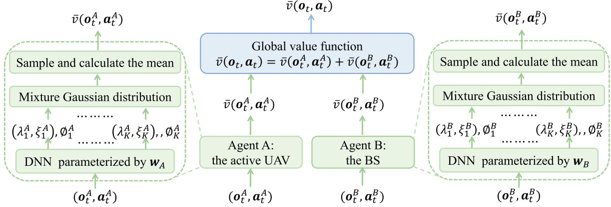  
Fig. 5. The architecture of the proposed method.

Algorithm 1 summarizes the training procedure of the proposed method.

## C. Convergence, Implementation, and Complexity Analysis

Here, we focus on the proof of convergence, the implementation process, and the analysis of training complexity of the proposed mixture Gaussian distribution based RL method.

1) Convergence: We first define the optimal expected value $M ^ { * } ( o _ { t } , \pmb { a } _ { t } )$ of the sum of future rewards. Then, the gap between ${ M } ^ { * } ( o _ { t } , { a } _ { t } )$ and $\bar { v } ( o _ { t } , a _ { t } )$ can be given by $e ( o _ { t } , \pmb { a } _ { t } ) =$ $M ^ { * } ( o _ { t } , \pmb { a } _ { t } ) - \bar { v } \big ( \pmb { o } _ { t } , \pmb { a } _ { t } \big )$ t t t t. To this end, to prove the convergence t t t tof the proposed collaborative RL method, we only need to prove that the gap $e ( o _ { t } , \mathbf { } a _ { t } )$ converges to zero.

Lemma 1: It is guaranteed that the proposed method will converge as the gap $e _ { t } ( o _ { t } , a _ { t } )$ satisfies the following conditions [61]:

1) The gap $e ( o _ { t } , \mathbf { } a _ { t } )$ satisfies

$$
e _ { k + 1 } \left( o _ { t } , a _ { t } \right) = \left( 1 - \alpha \right) e _ { k } \left( o _ { t } , a _ { t } \right) + \alpha F _ { k } \left( o _ { t } , a _ { t } \right) ,\tag{19}
$$

where F (o , a ) = r(o , a ) + γv¯ (o +1, a +1) − M ∗(o , a ).

$$
| | \mathbb { E } [ F _ { k } ( o _ { t } , a _ { t } ) ] | | _ { \infty } \leqslant \gamma | | e _ { k } ( o _ { t } , a _ { t } ) | | _ { \infty } , \forall \gamma \in ( 0 , 1 ) ,
$$

where $| | \cdot | | _ { \infty }$ represents the maximal absolute value of elements, $\mathbb { E } [ F _ { k } ( \pmb { o } _ { t } , \pmb { a } _ { t } ) ]$ is the expected value of $F _ { k } ( o _ { t } , \pmb { a } _ { t } )$ regarding the state transition probability.

3) $\mathrm { V a r } ( F _ { k } ( o _ { t } , \pmb { a } _ { t } ) ) \leqslant C _ { \mathrm { F } } ( 1 + | | e _ { k } ( o _ { t } , \pmb { a } _ { t } ) | | _ { \infty } ^ { 2 } ) ,$ where $\mathrm { V a r } ( F _ { k } ( o _ { t } , \pmb { a } _ { t } ) )$ is the variance of $F _ { k } ( \pmb { o } _ { t } , \pmb { a } _ { t } )$ , and $C _ { \mathrm { F } }$ is some constant.

Proof. See Appendix A, available online.



2) Implementation Analysis: The implementation of the proposed mixture Gaussian distribution based RL method includes 1) the off-policy training stage and 2) the on-policy decision making stage. In the off-policy stage, the BS first requires to collect the transmit power, distance measurement information, and the position of the active UAV as well as distance information measurement and positions of passive UAVs for calculating the positioning error of the target UAV. Moreover, the BS also needs to collect the expected values $\bar { v } ( o _ { t } ^ { \mathrm { A } } , a _ { t } ^ { \mathrm { A } } )$ of the sum of t tfuture rewards at the active UAV to calculate the expected values of the global value function $\bar { v } ( o _ { t } , \mathbf { \alpha } _ { a _ { t } } )$ . Then, in terms of the active UAV, it requires to collect the approximated expected values of the global value function and the value of reward to update parameters of DNN parameters according to (16) and $( 1 8 ) . ^ { 4 }$ The flowchart in Fig. 6 shows the offline training process of the proposed method. In the on-policy period, the expertly trained DNNs can be applied straightaway to work out the scheme for selecting distance measurement information, the scheme for choosing the positioning method, the transmission power of the active UAV, and the trajectory optimization for the active UAV.

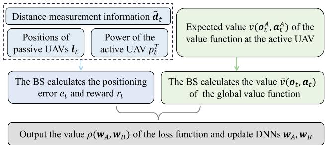  
Fig. 6. The training process of the proposed RL method.

3) Complexity Analysis: The complexity of training the proposed mixture Gaussian distribution based RL method consists of the complexity of training DNN parameters at the active UAV and the complexity of training DNN parameters of the BS at each iteration.

Regarding the complexity involved in training the DNN at the active UAV, the proposed RL method used the mixture Gaussian distribution to approximate the probability distribution of value functions. The mixture Gaussian distribution consists of K Gaussian distributions parameterized by variances, means, and weights. Consequently, the time complexity in the process of training the DNN at the active UAV is $\mathcal { O } ( | o _ { t } ^ { \mathrm { A } } | l _ { 1 } ^ { \mathrm { A } } +$ $\begin{array} { r } { \sum _ { i = 1 } ^ { L _ { \mathrm { A } } } l _ { i } ^ { \mathrm { A } } l _ { i + 1 } ^ { \mathrm { A } } + 3 K l _ { L _ { \mathrm { A } } } ^ { \mathrm { A } } + 3 | \pmb { a } _ { t } ^ { \mathrm { A } } | K ) } \end{array}$ , where $L _ { \mathrm { { A } } }$ is the number of hidden layers at the active UAV, $l _ { i } ^ { \mathrm { A } }$ is the number of neurons in the i-th hidden layer, $| a _ { t } ^ { \mathrm { A } } |$ iis the dimension of $\pmb { a } _ { t } ^ { \mathrm { A } }$ , and $| o _ { t } ^ { \mathrm { A } } |$ is the dimension of ${ \boldsymbol o } _ { t } ^ { \mathrm { A } }$

Algorithm 1: Mixture Gaussian Distribution Based RL   
Method.   
1: Initialize the DNN parameters ${ \pmb w } _ { \mathrm { A } }$ and ${ \pmb w } _ { \mathrm { B } }$   
2: for each iteration do   
3: for $t = 1 , \dots , T$ do   
4: Observe the environment $o _ { t } ^ { \mathrm { A } }$ and $o _ { t } ^ { \mathrm { B } } .$   
6: t t According to a -greedy scheme, agents select   
actions.   
7: Output mixture Gaussian distributions and sample   
to calculate the expected value function values   
$\bar { v } ( o _ { t } ^ { \mathrm { A } } , a _ { t } ^ { \mathrm { A } } )$ and $\bar { v } ( o _ { t } ^ { \bar { \mathrm { B } } } , a _ { t } ^ { \mathrm { B } } )$ at time slot t and t + 1.   
8: tend for   
9: The active UAV transmits $o _ { t } ^ { \mathrm { A } } , \bar { v } \big ( o _ { t } ^ { \mathrm { A } } , a _ { t } ^ { \mathrm { A } } \big )$ , and   
$\bar { v } ( o _ { t + 1 } ^ { \mathrm { A } } , \pmb { a } _ { t + 1 } ^ { \mathrm { A } } )$ to the BS.   
10: tend for   
11: The BS calculates the value of loss function and   
transmits it to the active UAV.   
12: for each agent u do   
13: Update ${ \pmb w } _ { \mathrm { A } }$ and ${ \pmb w } _ { \mathrm { B } }$ based on (17) and (18).   
14: end for   
15: end for

tSimilarly, the time-complexity of training the DNN at the BS is $\begin{array} { r } { \mathcal { O } ( \vert o _ { t } ^ { \mathrm { B } } \vert l _ { 1 } ^ { \mathrm { \bar { B } } } + \sum _ { i = 1 } ^ { L _ { \mathrm { B } } } l _ { i } ^ { \mathrm { B } } l _ { i + 1 } ^ { \mathrm { B } } + 3 \dot { K } l _ { L _ { \mathrm { B } } } + 3 \vert \bar { a } _ { t } ^ { \mathrm { B } } \vert K ) } \end{array}$ , where $L _ { \mathrm { B } }$ is t i i i tthe number of hidden layers of the DNN at the BS. Hence, the entire complexity of training the proposed RL by both BS and the active UAV is

$$
\begin{array} { r } { \mathcal { O } \left( \operatorname* { m a x } \left( \left| o _ { t } ^ { \mathrm { A } } \right| l _ { 1 } ^ { \mathrm { A } } + \displaystyle \sum _ { i = 1 } ^ { L _ { \mathrm { A } } } l _ { i } ^ { \mathrm { A } } l _ { i + 1 } ^ { \mathrm { A } } + 3 K l _ { L _ { \mathrm { A } } } + 3 \left| a _ { t } ^ { \mathrm { A } } \right| K , \right. \right. } \\ { \left. \left. \left| o _ { t } ^ { \mathrm { B } } \right| l _ { 1 } ^ { \mathrm { B } } + \displaystyle \sum _ { i = 1 } ^ { L _ { \mathrm { B } } } l _ { i } ^ { \mathrm { B } } l _ { i + 1 } ^ { \mathrm { B } } + 3 K l _ { L _ { \mathrm { B } } } + 3 \left| a _ { t } ^ { \mathrm { B } } \right| K \right) \right) . } \end{array}\tag{20}
$$

## IV. ANALYSIS ON THE LOCALIZATION PERFORMANCE FOR THE TARGET UAV

Here, we aim to analyze the impact of jamming attacks on the positioning errors of the target UAV. The distance measured by passive UAV u can be expressed as

$$
\hat { d } _ { u , t } = { r } _ { u , t } + { r } _ { 0 , t } + \Delta d _ { u , t } ,\tag{21}
$$

where $r _ { u , t } = \sqrt { \| l _ { u , t } - l _ { t } \| ^ { 2 } }$ represents the true distance between the target UAV and passive UAV u and $r _ { 0 , t } =$ $\sqrt { \| l _ { 0 , t } - l _ { t } \| ^ { 2 } }$ represents the true distance between the target UAV and the active UAV. $\Delta d _ { u , t }$ is the distance measurement error between the true distance information $r _ { u , t } + r _ { 0 , t }$ and the measured distance information $\hat { d } _ { u , t }$ and $\Delta d _ { u , t }$ follows the Gaussian distribution, where the mean of the Gaussian distribution is zero and the variance dependent on $s _ { u , t } ^ { \mathrm { A } } ( l _ { 0 , t } , p _ { t } ^ { \mathrm { T } } )$ . Take the u,tderivative of both sides of (21) with respect to $\mathbf { \xi } _ { l _ { t } . }$ t, we have

$$
\partial \hat { d } _ { u , t } = \left( \frac { x _ { t } - x _ { u , t } } { r _ { u , t } } + \frac { x _ { t } - x _ { 0 , t } } { r _ { 0 , t } } \right) \partial x _ { t }
$$

$$
\begin{array} { l } { \displaystyle + \left( \frac { y _ { t } - y _ { u , t } } { r _ { u , t } } + \frac { y _ { t } - y _ { 0 , t } } { r _ { 0 , t } } \right) \partial { y _ { t } } } \\ { \displaystyle + \left( \frac { z _ { t } - z _ { u , t } } { r _ { u , t } } + \frac { z _ { t } - z _ { 0 , t } } { r _ { 0 , t } } \right) \partial { z _ { t } } . } \end{array}\tag{22}
$$

Based on four distance measurement information selected by the BS, the position of the target UAV can be estimated. We denote the selected distance subset as $\hat { \pmb { d } } _ { t } ^ { \mathrm { S } } =$ $[ \hat { d } _ { m _ { 1 } , t } , \hat { d } _ { m _ { 2 } , t } , \hat { d } _ { m _ { 3 } , t } , \hat { d } _ { m _ { 4 } , t } ] ^ { T } \subset \hat { d } _ { t }$ , where $m _ { 1 } , m _ { 2 } , m _ { 3 } , m _ { 4 } \in$ $\{ 1 , \ldots , U \}$ are the passive UAVs. Based on (22), the relationship between the selected distance subset and the estimated target UAV position can be given by

$$
\begin{array} { r } { \partial \hat { d } _ { t } ^ { \mathrm { s } } = M \partial l _ { t } , } \end{array}\tag{24}
$$

where $\begin{array} { r } { \partial \hat { d } _ { t } ^ { \mathrm { S } } = [ \partial \hat { d } _ { m _ { 1 } , t } , \partial \hat { d } _ { m _ { 2 } , t } , \partial \hat { d } _ { m _ { 3 } , t } , \partial \hat { d } _ { m _ { 4 } , t } ] ^ { T } , \partial \hat { l } _ { t } = [ \partial x _ { t } , } \end{array}$ $\partial y _ { t } , \partial z _ { t } ] ^ { T }$ t m ,t m ,t m ,t m ,t t t, and M is given by (23) shown at the bottom of the next page.

From (24), we have

$$
\partial l _ { t } = \left( M ^ { T } M \right) ^ { - 1 } M ^ { T } \partial \hat { d } _ { t } ^ { \mathrm { S } } ,\tag{25}
$$

where $( M ^ { T } M ) ^ { - 1 }$ denotes the inverse matrix of $M ^ { T } M$ . And the positioning error of the target UAV can be written as

$$
e _ { t } = \sqrt { ( \partial { x } _ { t } ) ^ { 2 } + ( \partial { y } _ { t } ) ^ { 2 } + ( \partial { z } _ { t } ) ^ { 2 } } = \mathrm { t r } \left( \mathbb { E } \left[ \partial { l } _ { t } \left( \partial { l } _ { t } \right) ^ { T } \right] \right) ,\tag{26}
$$

here, $\operatorname { t r } ( \cdot )$ represents the matrix trace. Then, we analyze how the jamming attacks affect the positioning Proposition 1.

Proposition 1: The positioning error of the target UAV is

$$
e _ { t } = \mathrm { t r } \left( \left( M ^ { T } M \right) ^ { - 1 } M ^ { T } J M \left( M ^ { T } M \right) ^ { - 1 } \right) ,\tag{27}
$$

where $\begin{array} { r } { J = \mathrm { d i a g } ( \frac { k _ { 1 } } { \epsilon ^ { 2 } + j _ { t } P ^ { \rfloor } | h _ { { \cal I } , m _ { 1 } , t } | ^ { 2 } } , \dots , \frac { k _ { 4 } } { \epsilon ^ { 2 } + j _ { t } P ^ { \rfloor } | h _ { { \cal I } , m _ { 4 } , t } | ^ { 2 } } ) } \end{array}$ is the distance measurement variance matrix with $k _ { i }$ being a coefficient, $j _ { t }$ being the jamming indicator, and $P ^ { \mathrm { J } }$ being the jamming power.

Proof: See Appendix B, available online.

From Proposition 1, we see that the positioning error depends on the distance measurement variance matrix and the deployment of UAVs (the active and passive UAVs). In particular, when the jamming UAV transmits signals in real time at a fixed jamming power $P ^ { \mathrm { J } }$ and the distance $r _ { m _ { i } , t }$ satisfies $\begin{array} { r } { r _ { m _ { 1 } , t } = r _ { m _ { 2 } , t } = { r } _ { m _ { 3 } , t } = r _ { m _ { 4 } , t } , } \end{array}$ we have ${ \boldsymbol { J } } =$ mdi $\begin{array} { r } { \mathrm { l g } \bigl ( \frac { k } { \epsilon ^ { 2 } + P ^ { \mathrm { J } } | h _ { \mathrm { J } , m _ { 1 } , t } | ^ { 2 } } , \dots , \frac { k } { \epsilon ^ { 2 } + P ^ { \mathrm { J } } | h _ { \mathrm { J } , m _ { 1 } , t } | ^ { 2 } } \bigr ) = \frac { k } { \epsilon ^ { 2 } + P ^ { \mathrm { J } } | h _ { \mathrm { J } , m _ { 1 } , t } | ^ { 2 } } I } \end{array}$ with $k = k _ { i }$ . Then, $e _ { t }$ is

$$
e _ { t } = \mathrm { t r } \left( \left( M ^ { T } M \right) ^ { - 1 } M ^ { T } \frac { k } { \epsilon ^ { 2 } + P ^ { \mathrm { J } } \vert h _ { \mathrm { J } , m _ { 1 } , t } \vert ^ { 2 } } I M \left( M ^ { T } M \right) ^ { - 1 } \right)
$$

$$
= \frac { k } { \epsilon ^ { 2 } + P ^ { \mathrm { J } } | h _ { \mathrm { J } , m _ { 1 } , t } | ^ { 2 } } \mathrm { t r } \left( \left( M ^ { T } M \right) ^ { - 1 } M ^ { T } M \left( M ^ { T } M \right) ^ { - 1 } \right)
$$

$$
= \frac { k } { \epsilon ^ { 2 } + P ^ { \mathrm { J } } | h _ { \mathrm { J } , m _ { 1 } , t } | ^ { 2 } } \mathrm { t r } \left( \left( M ^ { T } M \right) ^ { - 1 } \right) .\tag{28}
$$

## V. SIMULATION RESULTS AND ANALYSIS

For simulations, we consider that the jamming UAV, the active UAV, and passive UAVs are randomly distributed in a 3D space. The list of notations is shown in Table I and the system parameters of the simulations are listed in Table II. Next, we first introduce the models of GAN and the proposed RL. Then, we analyze the simulation results.

TABLE I LIST OF NOTATIONS
<table><tr><td rowspan=1 colspan=1>Notation</td><td rowspan=1 colspan=1>Description</td><td rowspan=1 colspan=1>Notation</td><td rowspan=1 colspan=1>Description</td></tr><tr><td rowspan=1 colspan=1> $\overline { { U } }$ </td><td rowspan=1 colspan=1>Number of passive UAVs</td><td rowspan=1 colspan=1> $\overline { { l _ { 0 , t } } }$ </td><td rowspan=1 colspan=1>Position of the active UAV</td></tr><tr><td rowspan=1 colspan=1> $\overline { { l _ { u , t } } }$ </td><td rowspan=1 colspan=1>Position of passive UAV u</td><td rowspan=1 colspan=1>v</td><td rowspan=1 colspan=1>Flight speed of the active UAV</td></tr><tr><td rowspan=1 colspan=1> $\overline { { \Delta _ { t } } }$ </td><td rowspan=1 colspan=1>Duration of a time slot</td><td rowspan=1 colspan=1> $\overline { { \alpha _ { t } } }$ </td><td rowspan=1 colspan=1>Yaw angle of the active UAV</td></tr><tr><td rowspan=1 colspan=1> $\overline { { \beta _ { t } } }$ </td><td rowspan=1 colspan=1>Pitch angle of the active UAV</td><td rowspan=1 colspan=1> $\overline { { s _ { 0 , t } ^ { \mathrm { G } } } }$ </td><td rowspan=1 colspan=1>SNR from the active UAV to the BS</td></tr><tr><td rowspan=1 colspan=1> $\underline { { p _ { t } ^ { \mathrm { F } } } }$ </td><td rowspan=1 colspan=1>Aerodynamic power consumption of the active UAV</td><td rowspan=1 colspan=1> $\overline { { E _ { t } ^ { \mathrm { F } } } }$ </td><td rowspan=1 colspan=1>Aerodynamic energy consumption of the active UAV</td></tr><tr><td rowspan=1 colspan=1> $l _ { t } ^ { \mathrm { J } }$ </td><td rowspan=1 colspan=1>Position of the jamming UAV</td><td rowspan=1 colspan=1> $\xrightarrow [ { P ^ { \mathrm { J } } } ]$ </td><td rowspan=1 colspan=1>Transmit power of the jamming UAV</td></tr><tr><td rowspan=1 colspan=1> $\mathbf { \xi } _ { l _ { t } }$ </td><td rowspan=1 colspan=1>Position of the target UAV</td><td rowspan=1 colspan=1> $\hat { l } _ { t }$ </td><td rowspan=1 colspan=1>Estimated position of the target UAV</td></tr><tr><td rowspan=1 colspan=1> $\overline { { p _ { t } ^ { \mathrm { T } } } }$ </td><td rowspan=1 colspan=1>Transmit power of the active UAV</td><td rowspan=1 colspan=1> $f _ { \mathrm { J } }$ </td><td rowspan=1 colspan=1>Probability of the jamming attacks</td></tr><tr><td rowspan=1 colspan=1> $D _ { u , t } ^ { \mathrm { G } }$ </td><td rowspan=1 colspan=1>Data size of passive UAV u</td><td rowspan=1 colspan=1> $p _ { u , t }$ </td><td rowspan=1 colspan=1>Transmit power of passive UAV u</td></tr><tr><td rowspan=1 colspan=1> $\underline { { \boldsymbol { x } \boldsymbol { u } , t } }$ </td><td rowspan=1 colspan=1>Reflection coefficient from the active UAV to passive u</td><td rowspan=1 colspan=1> $\overline { { \beta _ { 0 } } }$ </td><td rowspan=1 colspan=1>Path loss of LoS links at a reference distance</td></tr><tr><td rowspan=1 colspan=1> $s _ { u , t } ^ { \mathrm { A } }$ </td><td rowspan=1 colspan=1>SINR of passive UAV u</td><td rowspan=1 colspan=1> $\overline { { s _ { u , t } ^ { \mathrm { G } } } }$ </td><td rowspan=1 colspan=1>SNR of the BS from passive UAV u</td></tr><tr><td rowspan=1 colspan=1> $\overline { { { \epsilon } ^ { 2 } } }$ </td><td rowspan=1 colspan=1>Power of Gaussian noise</td><td rowspan=1 colspan=1> $\overline { { { I } _ { u , t } ^ { \mathrm { J } } } }$ </td><td rowspan=1 colspan=1>Jamming signals received by passive UAV u</td></tr><tr><td rowspan=1 colspan=1> $\overline { { \boldsymbol { \imath } _ { \mathrm { B } } } }$ </td><td rowspan=1 colspan=1>Position of the BS</td><td rowspan=1 colspan=1> $\chi _ { u , t }$ </td><td rowspan=1 colspan=1>Elevation angle of passive UAV u</td></tr><tr><td rowspan=1 colspan=1> $L _ { \mathrm { F S } }$ </td><td rowspan=1 colspan=1>Path loss in a free space</td><td rowspan=1 colspan=1> $\mathrm { P r } \left( l _ { u , t } ^ { \mathrm { L o S } } \right)$ </td><td rowspan=1 colspan=1>Probability of LoS</td></tr><tr><td rowspan=1 colspan=1> $\overline { { W _ { 1 } } }$ </td><td rowspan=1 colspan=1>Bandwidth of UAV links</td><td rowspan=1 colspan=1> $\overline { { { \epsilon } ^ { 2 } } }$ </td><td rowspan=1 colspan=1>Variance of Gaussian noise</td></tr><tr><td rowspan=1 colspan=1> $\overline { { W _ { 2 } } }$ </td><td rowspan=1 colspan=1>Bandwidth of UAV-BS links</td><td rowspan=1 colspan=1> $\underline { { \boldsymbol { g } } } _ { t }$ </td><td rowspan=1 colspan=1>Jamming attack defense selection</td></tr><tr><td rowspan=1 colspan=1> $\dot { \mathbf { } d } _ { t }$ </td><td rowspan=1 colspan=1>Measured distance information</td><td rowspan=1 colspan=1> $g$ </td><td rowspan=1 colspan=1>Gravitational acceleration</td></tr><tr><td rowspan=1 colspan=1> $e _ { t }$ </td><td rowspan=1 colspan=1>Positioning error of the target UAV</td><td rowspan=1 colspan=1> $q _ { m , t }$ </td><td rowspan=1 colspan=1>Indicator for selecting distance m for localizing the target UAV</td></tr></table>

TABLE II PARAMETERS
<table><tr><td rowspan=1 colspan=1>Parameters</td><td rowspan=1 colspan=1>Values</td><td rowspan=1 colspan=1>Parameters</td><td rowspan=1 colspan=1>Values</td></tr><tr><td rowspan=1 colspan=1> $\overline { { { \epsilon } ^ { 2 } } }$ </td><td rowspan=1 colspan=1>-95 dBm</td><td rowspan=1 colspan=1> $\overline { { \Delta _ { t } } }$ </td><td rowspan=1 colspan=1>1 s</td></tr><tr><td rowspan=1 colspan=1> $\overline { { v _ { u , t } ^ { \mathrm { H } } } }$ </td><td rowspan=1 colspan=1>9.43 m/s</td><td rowspan=1 colspan=1> $p _ { u , t }$ </td><td rowspan=1 colspan=1>5W</td></tr><tr><td rowspan=1 colspan=1> $\overline { { C _ { 1 } } }$ </td><td rowspan=1 colspan=1>4929</td><td rowspan=1 colspan=1> $\overline { W }$ </td><td rowspan=1 colspan=1>1 MHz</td></tr><tr><td rowspan=1 colspan=1> $\overline { { C _ { 2 } } }$ </td><td rowspan=1 colspan=1>0.002</td><td rowspan=1 colspan=1> $\overline { { M } }$ </td><td rowspan=1 colspan=1>4kg</td></tr><tr><td rowspan=1 colspan=1> $\underline { { \sigma _ { \mathrm { L o S } } ^ { 2 } } }$ </td><td rowspan=1 colspan=1>8.41</td><td rowspan=1 colspan=1> $\underline { { \sigma _ { \mathrm { N L o S } } ^ { 2 } } }$ </td><td rowspan=1 colspan=1>33.78</td></tr><tr><td rowspan=1 colspan=1> $\underline { { E } } _ { \mathrm { m a x } } ^ { \mathrm { F } }$ </td><td rowspan=1 colspan=1>500J</td><td rowspan=1 colspan=1> $D _ { \mathrm { B } }$ </td><td rowspan=1 colspan=1>5 bit</td></tr><tr><td rowspan=1 colspan=1> $L _ { \mathrm { m i n } }$ </td><td rowspan=1 colspan=1>80 m</td><td rowspan=1 colspan=1> $\overline { { L _ { \mathrm { m a x } } } }$ </td><td rowspan=1 colspan=1>10 km</td></tr><tr><td rowspan=1 colspan=1> $\underline { { \beta _ { \mathrm { m i n } } } }$ </td><td rowspan=1 colspan=1>-15°</td><td rowspan=1 colspan=1> $\underline { { \beta _ { \mathrm { m a x } } } }$ </td><td rowspan=1 colspan=1>15°</td></tr><tr><td rowspan=1 colspan=1> $\underline { { \alpha _ { \mathrm { m i n } } } }$ </td><td rowspan=1 colspan=1>-15°</td><td rowspan=1 colspan=1> $\underline { { \alpha _ { \mathrm { m a x } } } }$ </td><td rowspan=1 colspan=1>15°</td></tr><tr><td rowspan=1 colspan=1> $X$ </td><td rowspan=1 colspan=1>11.9</td><td rowspan=1 colspan=1>Y</td><td rowspan=1 colspan=1>0.13</td></tr><tr><td rowspan=1 colspan=1> $\overline { { T } }$ </td><td rowspan=1 colspan=1>10</td><td rowspan=1 colspan=1> $\overline { { f _ { \mathrm { J } } } }$ </td><td rowspan=1 colspan=1>0.5</td></tr><tr><td rowspan=1 colspan=1> $\overline { { \mu _ { \mathrm { L o S } } ^ { B } } }$ </td><td rowspan=1 colspan=1>2</td><td rowspan=1 colspan=1> $\underline { { \mu _ { \mathrm { N L o S } } ^ { B } } }$ </td><td rowspan=1 colspan=1>2.4</td></tr></table>

The GAN consists of a generator network and a discriminator network. The generator network includes an input layer with 16 neurons representing the selected four distance information and 3D positions of 4 UAVs, an output layer with 3 neurons representing the estimated 3D position of the target UAV, and five fully connected hidden layers with 4096, 2048, 1024, 512, 256, and 64 neurons, respectively. The discriminator network consists of an input layer with 22 neurons representing the input and output of the generator network, an output layer with one

## A. Models of GAN and the Proposed RL Method

TABLE III HYPERPARAMETERS
<table><tr><td rowspan=1 colspan=1>Hyper – parameters</td><td rowspan=1 colspan=1>Values</td></tr><tr><td rowspan=1 colspan=1>Discount factor γ</td><td rowspan=1 colspan=1>0.9</td></tr><tr><td rowspan=1 colspan=1>Quantity of hidden layers of each agent</td><td rowspan=1 colspan=1>2</td></tr><tr><td rowspan=1 colspan=1>Size of each hidden layer</td><td rowspan=1 colspan=1>64</td></tr><tr><td rowspan=1 colspan=1>Quantity of Gaussian distributions K</td><td rowspan=1 colspan=1>5</td></tr><tr><td rowspan=1 colspan=1>The number of samples $\overline { S }$ </td><td rowspan=1 colspan=1>100</td></tr><tr><td rowspan=1 colspan=1>Learning rate for agents α</td><td rowspan=1 colspan=1>0.0005</td></tr><tr><td rowspan=1 colspan=1>The number of episodes for updating the target network</td><td rowspan=1 colspan=1>200</td></tr><tr><td rowspan=1 colspan=1>Buffer size</td><td rowspan=1 colspan=1>5000</td></tr></table>

neuron outputting 0 or 1, and four fully hidden layers with 1024, 512, 256, 128, and 64 neurons. In the proposed RL method, the DNN of each agent consists of one input layer, two hidden layers (a fully connected layer and a gated recurrent unit (GRU) recurrent layer), and an output layer. Each hidden layer has 64 neurons. Other hyper-parameters of the proposed collaborative RL method are list in Table III.

## B. Simulation Results

For the sake of comparison, we take into account three baseline methods: a) an algorithm that uses the proposed RL and uses only trajectory design of the active UAV to avoid jamming attacks but does not consider the GAN-based position estimation method, b) an algorithm that uses the proposed RL method and uses only the GAN-based position estimation method to avoid attacks without considering trajectory design of the active UAV to avoid jamming attacks, and c) VD-RL method that selects the

$$
M = \left[ \frac { \frac { x _ { t } - x _ { m _ { 1 } , t } } { r _ { m _ { 1 } , t } } + \frac { x _ { t } - x _ { 0 , t } } { r _ { 0 , t } } } { r _ { m _ { 1 } , t } } \quad \frac { y _ { t } - y _ { m _ { 1 } , t } } { r _ { m _ { 1 } , t } } + \frac { y _ { t } - y _ { 0 , t } } { r _ { 0 , t } } \quad \frac { z _ { t } - z _ { m _ { 1 } , t } } { r _ { m _ { 1 } , t } } + \frac { z _ { t } - z _ { 0 , t } } { r _ { 0 , t } } \right]\tag{23}
$$

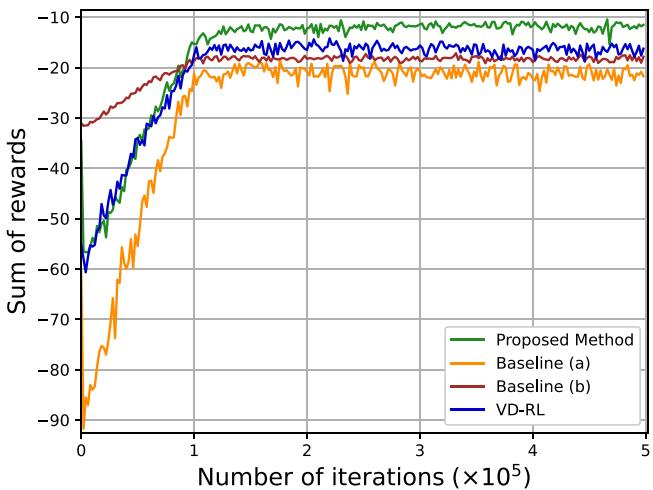  
Fig. 7. The convergence of the proposed method.

optimal position estimation method by using a value decomposition based deep Q network [59]. In baseline c) VD-RL, the BS and the active UAV employ a Value Decomposition Network (VDN)-based RL method to optimize their decision-making processes. Specifically, both the BS and the active UAV utilize individual deep Q-networks (DQNs) to estimate the expected values of their individual value functions. For each agent, the input of the DQN is its current state and action, the output is the expected value of its individual value function. Baseline c) employs linear superposition of the expected values at the BS and the UAV to approximate the expected value of the global value function.

In Fig. 7, we show the convergence of the proposed method and three baseline methods. From this figure, we see that the proposed method can achieve up to 36.5%, 27.4%, and 12.7% gains in terms of the sum of rewards compared to the baselines a), b), and c). The 36.5% and 27.4% gains stem from the fact that baselines a) and b) use only one position estimation method (GAN-based or TDOA-based method) but the proposed method can dynamically select the optimal position estimation method according to the positions of UAVs and jamming attack patterns. The 12.7% gain stems from the fact that the proposed mixture Gaussian distribution based collaborative RL method uses value function probability distribution to estimate the expected value thus approximating the value function accurately.

Fig. 8 shows the positioning errors under varying jamming power. In Fig. 8, the target UAV’s position error obtained by these methods increase as the transmit power of the jamming UAV increases. The reason is that as the jamming power increases, the SINR of received signals at passive UAVs decreases. Moreover, the reason that the growth rate of the positioning inaccuracy rises is that when the jamming power goes up, the distance measurement error increase and the impact of jamming power on positioning error becomes more significant, leading to a greater increase rate in positioning error of the target UAV. In addition, compared to baselines a), b), and c), the proposed method can achieve up to 37.4%, 24.8%, and 14.0% gains in terms of the positioning error of the target UAV with the jamming power to be 5 W. These gains stem from the fact that the proposed method can use mixture Gaussian distributions to approximate the distribution of value functions and estimate the expected values accurately. Based on the accurate expected values, the proposed method can optimally adjust the trajectory and transmit power of the active UAV and enable the BS to select the optimal position estimation method while baselines a) and b) use a fixed position estimation method.

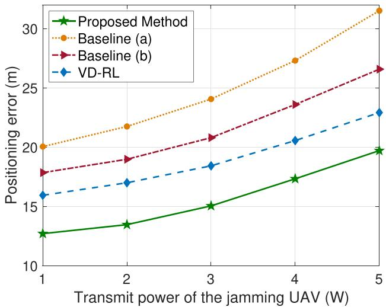  
Fig. 8. Positioning error varies with fluctuations in the jamming power of the jamming UAV.

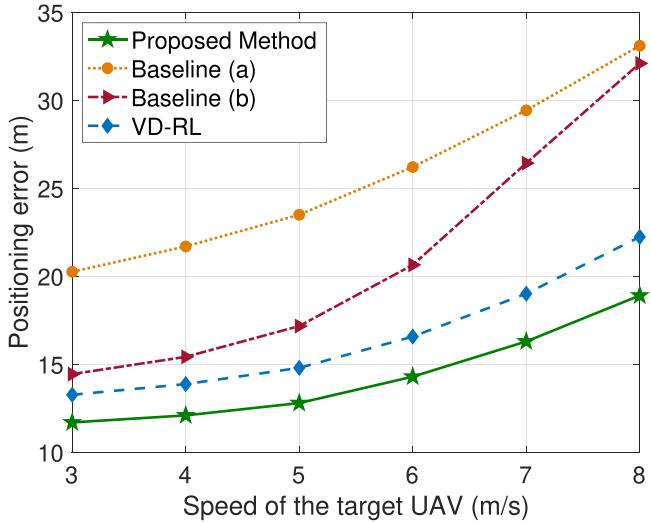  
Fig. 9. Positioning error varies with fluctuations in the target UAV’s flight speed.

Fig. 9 shows the positioning errors of the target UAV at different flying speeds. From Fig. 9, when the speed of the target UAV goes up, the location inaccuracies of the target UAV acquired by all approaches increase. This is because the active UAV cannot follow the target UAV with increasing speed in time, thus increasing the distance information error. In Fig. 9, we also shows when the speed of the target UAV is 6 m/s, compared to baselines (a), (b), and the VD-RL method, the presented method is capable of reducing the positioning inaccuracy of the target UAV by as much as 45.4%, 30.8%, and 13.7% respectively. From Fig. 9, we can also see that the increasing rate of the positioning error obtained by baseline (b) is the fastest. The reason is that baseline (b) only uses the GAN-based position estimation method to avoid attack. Since GAN-based positioning method depends on the training data samples. When the speed of target UAV increases, the limited number of data samples cannot cover the UAV moving range, thus the positioning error increases rapidly.

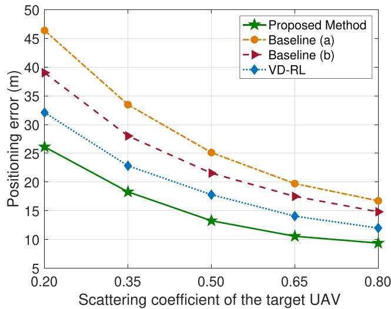  
Fig. 10. Positioning error as the scattering coefficient varies.

Fig. 10 shows the positioning errors under different scattering coefficients of the target UAV. In Fig. 10, it is observed that with the increase in the scattering coefficient of the target UAV, the positioning errors decrease. This trend occurs due to as the scattering coefficient increases, the signals strength received by passive UAVs increase and the SINR at passive UAVs increase, thus improving the accuracy of the distance measurement information. Additionally, Fig. 10 illustrates that the positioning error decreases first quickly and then becomes slowly. The reason is when the scattering coefficient of the target UAV is small, the signal strength received by passive UAVs are the main factor of limiting the localization performance. When the scattering coefficient is large enough, the scattering coefficient is no longer the main factor, and the localization performance is mainly affected by the other factors such as the jamming attacks and the deployment of UAVs. In addition, Fig. 10 demonstrates the capability of the proposed method that diminish the positioning inaccuracy of the target UAV by as much as 41.9%, 24.5%, and 18.8% compared to baselines (a), (b), and (c) when the scattering coefficient of the target UAV is 0.35. The 41.9% gain is because that baseline (a) only uses the TDOA-based position estimation method to avoid attacks. Since TDOA-based positioning method depends on the SINRs of received signals at passive UAVs. When the scattering coefficient is small, the SINRs of passive UAVs are small and the localization accuracy obtained by TDOA-based positioning method is worse than other methods.

Fig. 11 illustrates the variation in the average positioning error, denoted as $\begin{array} { r } { \bar { e } _ { t } = \frac { 1 } { T } \sum _ { t = 1 } ^ { T } e _ { t } , } \end{array}$ with respect to the number T tof time slots T . As depicted in Fig. 7, it is observed that as T increases, the average positioning errors of the target UAV obtained by all considered methods increase. This is because the increasing number of time slots leads to a larger movement range of the target UAV. The GAN-based positioning method cannot always localize the target UAV accurately due to the limitation of the training datasets. Fig. 11 also shows that the as the number of time slots in one positioning process increase, the increase of the average positioning error obtained by baseline (b) that only uses GAN-based positioning error is the fastest and the average positioning error obtained by the proposed mixture Gaussian distribution based RL method increases slower than other baseline methods, this is because as the number of time slots increase, the moving range of the target UAV becomes larger and GAN-based positioning error cannot estimate the target UAV’s position when the target UAV lies outside the coverage of the training data samples while the proposed RL method can adaptively select the optimal positioning method from GAN-based and TDOA-based positioning methods.

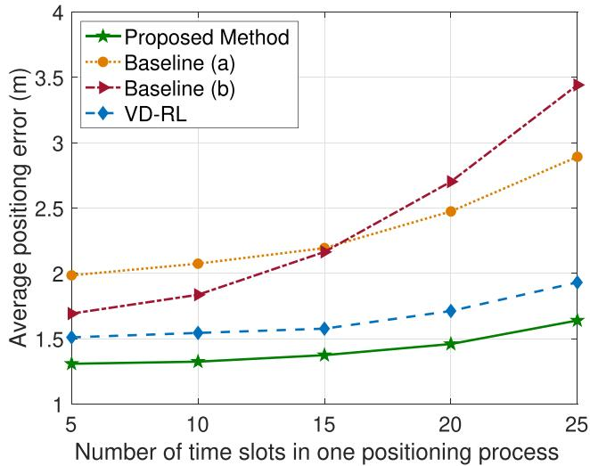  
Fig. 11. The positioning inaccuracy changes in response to the variations in the quantity of time slots.

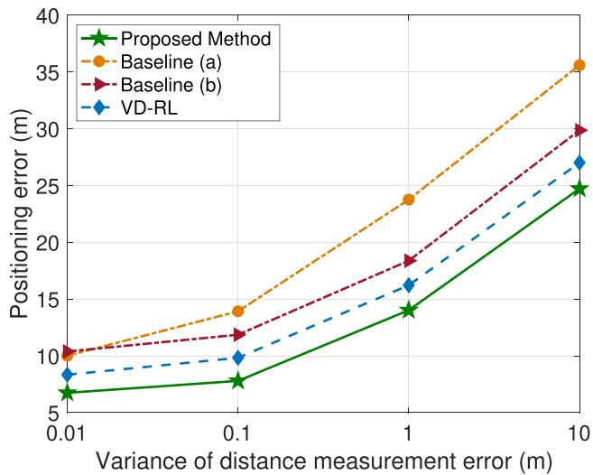  
Fig. 12. Positioning discrepancy varies as the changing variance in distance measurement error.

Fig. 12 shows the impact of the distance measurement error on the localization performance. In particular, we introduced a random error to the distance measurement information and the random error follows the Gaussian distribution with zero mean and variance $\psi = \{ 0 . 0 1 , 0 . 1 , 1 , 1 0 \}$ . We can see that as the variance ψ of the distance measurement error goes up, the positioning inaccuracy of the target UAV rises. The reason for this is larger measurement errors introduce greater uncertainty into the distance calculations, leading to reduced localization accuracy. Furthermore, the proposed method can consistently achieve the lowest positioning error under various measurement error variances. The cause lies in the fact that the presented method is capable of acquiring the probability distributions of value functions and estimate the expected values of value functions more accurately, enabling agents to select the optimal action.

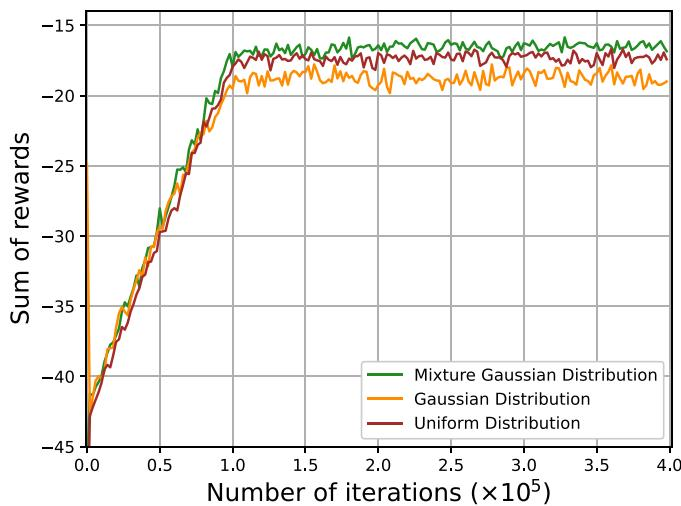  
Fig. 13. Positioning error under different distributions.

In Fig. 13, we show the convergence of the proposed RL method that uses uniform distribution, Gaussian distribution, and mixture Gaussian distribution to approximate the probability distribution of the cumulative future rewards when the velocity of the target UAV is 7 m/s, respectively. In particular, the uniform distribution can be represented by two parameters: the lower and upper bounds. The DNN at each agent outputs the values of the two bounds to approximate the probability distribution of value functions by a uniform distribution. In addition, each DNN can output the variance and the mean to approximate the probability distribution of value functions by a Gaussian distribution. Fig. 13 shows the localization performance of the proposed RL method with mixture Gaussian distribution is better than that of other distributions. This is because the mixture Gaussian distribution can adjust the parameters of each individual Gaussian components flexibly, thus providing a feasible and comprehensive representation of the distribution of value functions.

Fig. 14 shows the convergence performance of the proposed mixture Gaussian distribution based RL method as the number of Gaussian distributions used to approximate the probability distribution of value functions. From Fig. 14, we can see that the positioning error of the target UAV decreases as the number of Gaussian distributions used to approximate the distribution of the cumulative future rewards rises. This phenomenon occurs because when the number of Gaussian distributions increases, the mixture Gaussian distribution can represent the approximated distribution more accurately. Furthermore, Fig. 14 indicates when the number of Gaussian distributions increases, the proposed mixture Gaussian distribution based RL method requires more iterations to converge. This originates from the condition that with the growth of the number of Gaussian distributions, the number of neurons at the output layer of each DNN gets larger.

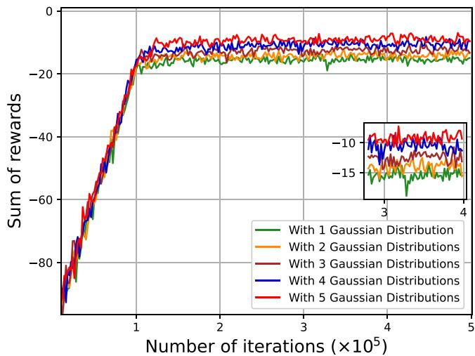  
Fig. 14. Positioning error varies with fluctuations in the number of Gaussian distributions.

Fig. 15 shows the convergence of the proposed mixture Gaussian distribution based RL method and the DDN method [62]. The input of each DNN in DDN method is a set of probability values and the output is the approximated distribution of the sum of future rewards. In Fig. 15(a), we see the proposed method has the similar localization accuracy as the DDN method when the number of Gaussian distributions in the proposed method is 3. Moreover, we have tested the execution time per iteration of the DDN method, which is 0.0186 s, and the proposed method with {1, 2, 3, 4, 5} Gaussian distributions, which are 0.0083s, 0.0094s, 0.0103s, 0.0167s. The number of iterations required by the DDN method to reach convergence is 10270 and the number of iterations required by the proposed method with {1, 2, 3, 4, 5} Gaussian distributions are 98800, 106500, 112600, 118100, and 125900. Hence, the execution time required for these methods to reach convergence is shown in Fig. 15(b). From Fig. 15(b), it can be observed that as the number of iterations rises, the execution time required by the proposed method to reach converge increase and it is smaller than that of the DDN method when the number of Gaussian distributions is smaller than 5. This is because the proposed RL method uses mixture Gaussian distribution to approximate the probability distribution of value functions. By adjusting the parameters of the mixture Gaussian distribution, the proposed method can capture the features of the distribution of value functions more accurately.

Fig. 16 represents the positioning error obtained by the proposed mixture Gaussian distribution-based RL method, VD-RL, QMIX [63], and QTRAN [64] methods. In particular, these results are simulated on a computer with a 3.4 GHz Intel Core i7-13700KF processor and 64 GB of RAM running Linux. Fig. 16 shows how the value of the sum of future rewards obtained by considered methods changes as the number of iterations varies. In Fig. 16, it can be observed that the presented method is capable of enhancing the sum of future rewards by as much as 12.7%, 10.6%, and 25.7% when compared with the VD - RL, QMIX, and QTRAN methods. The reason is that the proposed method can use a mixture Gaussian distribution to approximate the probability distribution of the individual value function at each agent. Based on the approximated distribution, the proposed method can capture more information about the individual value function and accurately estimate the expected values of individual value functions, thus enabling agents to select the optimal actions.

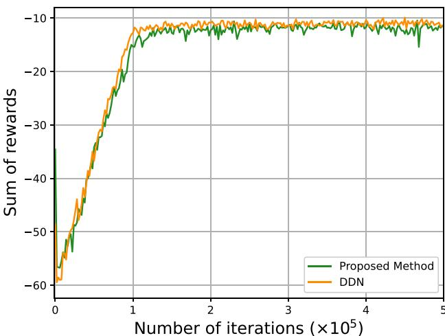  
(a) Convergence performance

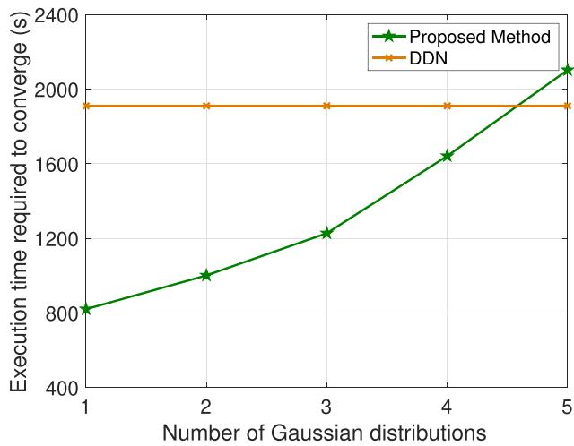  
(b) Execution time required to converge  
Fig. 15. Performance of the proposed method and the DDN method.

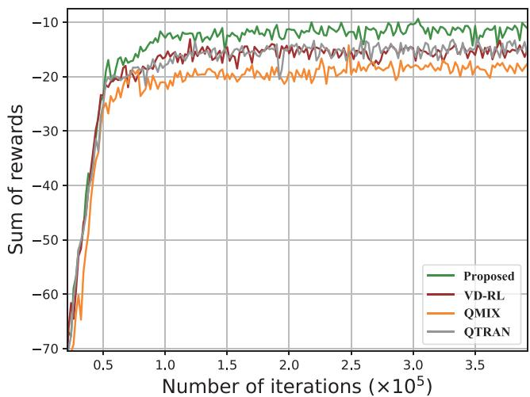  
Fig. 16. The cumulative rewards as the number of iterations fluctuates.

TABLE IV  
TRAINING COMPLEXITY
<table><tr><td rowspan=1 colspan=1>Methods</td><td rowspan=1 colspan=1>Time/iteration(ms)</td><td rowspan=1 colspan=1>Iterations</td><td rowspan=1 colspan=1>Total time(s)</td></tr><tr><td rowspan=1 colspan=1>Proposed</td><td rowspan=1 colspan=1>16.213</td><td rowspan=1 colspan=1>96200</td><td rowspan=1 colspan=1>1559.690</td></tr><tr><td rowspan=1 colspan=1>VD-RL</td><td rowspan=1 colspan=1>15.721</td><td rowspan=1 colspan=1>102300</td><td rowspan=1 colspan=1>1608.258</td></tr><tr><td rowspan=1 colspan=1>QMIX</td><td rowspan=1 colspan=1>15.979</td><td rowspan=1 colspan=1>112400</td><td rowspan=1 colspan=1>1796.039</td></tr><tr><td rowspan=1 colspan=1>QTRAN</td><td rowspan=1 colspan=1>15.492</td><td rowspan=1 colspan=1>107400</td><td rowspan=1 colspan=1>1663.840</td></tr></table>

The training complexity of the proposed method, VD-RL, QMIX, and QTRAN methods is shown in Table IV. The training complexity depends on the training time for each iteration and the number of iterations required to converge. From Table IV, we can see that the total training time of the proposed method, VD-RL, QMIX, and QTRAN methods to reach convergence is 1559.690 s, 1608.258 s, 1796.039 s, 1663.840 s. Consequently, compared to other methods, the proposed method can reduce the training complexity. The reason lies in that the proposed method requires to output the mean, variance, and weights of individual Gaussian distributions to approximate the probability distribution of value functions, which can capture a more comprehensive representation of value functions in each iteration. Therefore, the proposed method cuts down the number of iterations essential for convergence. As a result, there is a remarkable reduction in the overall time consumed during the training process.

Fig. 17 represents the localization performance of the proposed method in three scenarios, including Suburban, Urban, and Dense Urban scenarios. In these scenarios, the UAV-to-BS links are modeled as a probabilistic LoS and NLoS channel model and the pair $\left( \varphi _ { \sigma _ { \mathrm { L o S } } } , \varphi _ { \sigma _ { \mathrm { N L o S } } } \right)$ in these scenarios is set to be (0.1, 21) dB, (1.0, 20) dB, (1.6, 23) dB, respectively [65]. Then, the sum of rewards obtained under these scenarios is illustrated in Fig. 17. As can be observed from Fig. 17, in various scenarios, the proposed method outperforms the VD-RL method in terms of localization performance. The underlying reason is that, compared with the VD-RL method, the proposed method is capable of more precisely estimating the expected value of the sum of rewards corresponding to different states and actions. Moreover, it can optimally regulate the transmit power and trajectory of the active UAV, as well as the selection scheme of the position estimation method, across diverse environments.

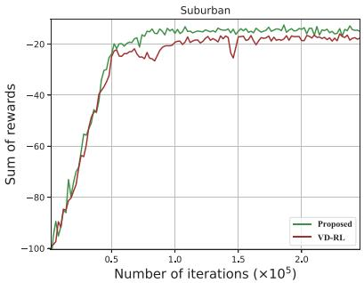  
(a)

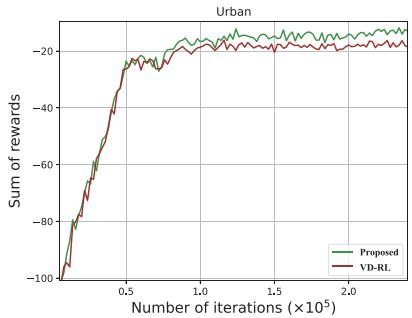  
(b)  
Fig. 17. The sum of rewards as the number of iterations varies in different scenarios.

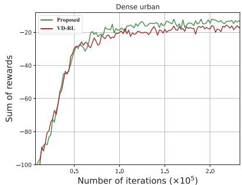  
(c)

## VI. CONCLUSION

In this paper, we have proposed a novel framework that enables an active UAV and a BS cooperatively localize the target UAV under jamming attacks. In the proposed framework, the BS can jointly use the GAN-based positioning method and TDOAbased positioning method to improve localization accuracy and avoide jamming attacks. An optimization problem has been formulated with the objective of minimizing the positioning error of the target UAV. In the process of formulating this problem, both the jamming attacks and the UAV trajectory are taken into account. To address this problem, a mixture Gaussian distribution model based collaborative RL method is proposed. This method empowers the active UAV to optimize its transmission power and trajectory and the BS to select an appropriate subset of distance information and the optimal positioning method. Simulation results demonstrate the significant reduction in the positioning error of the target UAV achieved by our proposed method compared to baselines methods.

## REFERENCES

[1] M. Mozaffari, W. Saad, M. Bennis, Y.-H. Nam, and M. Debbah, “A tutorial on UAVs for wireless networks: Applications, challenges, and open problems,” IEEE Commun. Surv. Tuts., vol. 21, no. 3, pp. 2334–2360, Third Quarter 2019.

[2] F. Wen et al., “Fast localizing for anonymous UAVs oriented toward polarized massive MIMO systems,” IEEE Internet Things J., vol. 10, no. 22, pp. 20094–20106, Nov. 2023.

[3] Z. Yang et al., “Joint altitude, beamwidth, location, and bandwidth optimization for UAV-enabled communications,” IEEE Commun. Lett., vol. 22, no. 8, pp. 1716–1719, Aug. 2018.

[4] J. Shen, A. F. Molisch, and J. Salmi, “Accurate passive location estimation using TOA measurements,” IEEE Trans. Wireless Commun., vol. 11, no. 6, pp. 2182–2192, Jun. 2012.

[5] Y.-E. Chen, H.-H. Liew, J.-C. Chao, and R.-B. Wu, “Decimeter-accuracy positioning for drones using two-stage trilateration in a GPS-denied environment,” IEEE Internet Things J., vol. 10, no. 9, pp. 8319–8326, May 2023.

[6] I. Guvenc and C.-C. Chong, “A survey on TOA based wireless localization and NLOS mitigation techniques,” IEEE Commun. Surv. Tuts., vol. 11, no. 3, pp. 107–124, Third Quarter 2009.

[7] P. Yang, X. Cao, T. Q. Quek, and D. O. Wu, “Networking of Internet of UAVs: Challenges and intelligent approaches,” IEEE Wireless Commun., vol. 31, no. 1, pp. 156–163, Feb. 2024.

[8] W. Yi, Y. Liu, Y. Deng, and A. Nallanathan, “Clustered UAV networks with millimeter wave communications: A stochastic geometry view,” IEEE Trans. Commun., vol. 68, no. 7, pp. 4342–4357, Jul. 2020.

[9] Y. Sun, W. Wang, L. Mottola, J. Zhang, R. Wang, and Y. He, “Indoor drone localization and tracking based on acoustic inertial measurement,” IEEE Trans. Mobile Comput., vol. 23, no. 6, pp. 7537–7551, Jun. 2024.

[10] Y. He et al., “Acoustic localization system for precise drone landing,” IEEE Trans. Mobile Comput., vol. 23, no. 5, pp. 4126–4144, May 2024.

[11] P.-Y. Hong, C.-Y. Li, H.-R. Chang, Y. Hsueh, and K. Wang, “WBF-PS: WiGig beam fingerprinting for UAV positioning system in GPS-denied environments,” in Proc. 2020 IEEE Conf. Comput. Commun., 2020, pp. 1778–1787.

[12] P. Sinha and I. Guvenc, “Impact of antenna pattern on TOA based 3D UAV localization using a terrestrial sensor network,” IEEE Trans. Veh. Technol, vol. 71, no. 7, pp. 7703–7718, Jul. 2022.

[13] R. M. Rao and D.-R. Emenonye, “Iterative RNDOP-optimal anchor placement for beyond convex hull ToA-based localization: Performance bounds and heuristic algorithms,” IEEE Trans. Veh. Technol, vol. 73, no. 5, pp. 7287–7303, May 2024.

[14] X. Gu, C. Zheng, Z. Li, G. Zhou, H. Zhou, and L. Zhao, “Cooperative localization for UAV systems from the perspective of physical clock synchronization,” IEEE J. Sel. Areas Commun., vol. 42, no. 1, pp. 21–33, Jan. 2024.

[15] Y. Liu, P. Chen, Z. Chen, and J. Xu, “Fang-based 3D TDOA localization method for large-scale UAV cluster,” IEEE Commun. Lett., vol. 28, no. 1, pp. 58–62, Jan. 2024.

[16] S. Motie, H. Zayyani, M. Salman, and M. Bekrani, “Self UAV localization using multiple base stations based on TDoA measurements,” IEEE Wireless Commun. Lett., vol. 13, no. 9, pp. 2432–2436, Sep. 2024.

[17] Z. Zhang and Z. Huang, “An algorithm fusing state estimation and TDOA filtering for UAV tracking enhancement,” IEEE Trans. Aerosp. Electron. Syst., vol. 60, no. 2, pp. 2251–2266, Apr. 2024.

[18] U. Bhattacherjee, E. Ozturk, O. Ozdemir, I. Guvenc, M. L. Sichitiu, and H. Dai, “Experimental study of outdoor UAV localization and tracking using passive RF sensing,” 2021. [Online]. Available: https://arxiv.org/ abs/2108.07857

[19] F. Wen, Z. Zhang, H. Sun, G. Gui, H. Sari, and F. Adachi, “2D-DOA estimation auxiliary localization of anonymous UAV using EMVS-MIMO radar,” IEEE Internet Things J., vol. 11, no. 9, pp. 16255–16266, May 2024.

[20] F. Wen, J. Shi, G. Gui, H. Gacanin, and O. A. Dobre, “3-D positioning method for anonymous UAV based on bistatic polarized MIMO radar,” IEEE Internet Things J., vol. 10, no. 1, pp. 815–827, Jan. 2023.

[21] D. Fan et al., “Channel estimation and self-positioning for UAV swarm,” IEEE Trans. Commun., vol. 67, no. 11, pp. 7994–8007, Nov. 2019.

[22] Y. Li, F. Shu, B. Shi, X. Cheng, Y. Song, and J. Wang, “Enhanced RSS-based UAV localization via trajectory and multi-base stations,” IEEE Commun. Lett., vol. 25, no. 6, pp. 1881–1885, Jun. 2021.

[23] A. Dawne, Y. Y. Nazaruddin, R. P. Wardana, A. Ikhtiarudin, I. Mardhatillah, and I. M. Fauzan, “Advancing autonomous UAV target localization in GPS-denied environments,” in Proc. 9th Int. Conf. Control Decis. Inf. Technol., 2023, pp. 1723–1728.

[24] B. R. Stojkoska, J. Palikrushev, K. Trivodaliev, and S. Kalajdziski, “Indoor localization of unmanned aerial vehicles based on RSSI,” in Proc. 17th Int. Conf. Smart Technol., 2017, pp. 120–125.

[25] F. Mason, M. Capuzzo, D. Magrin, F. Chiariotti, A. Zanella, and M. Zorzi, “Remote tracking of UAV swarms via 3D mobility models and LoRaWAN communications,” IEEE Trans. Wireless Commun., vol. 21, no. 5, pp. 2953–2968, May 2022.

[26] A. N. Bishop, B. Fidan, B. D. Anderson, K. Dogancay, and P. N. Pathirana, “Optimality analysis of sensor-target geometries in passive localization: Part 1 - Bearing-only localization,” in Proc. 3rd Int. Conf. Intell. Sensors Netw. Inf., 2007, pp. 7–12.

[27] Y. Zhao, Z. Li, B. Hao, P. Wan, and L. Wang, “How to select the best sensors for TDOA and TDOA/AOA localization?,” China Commun., vol. 16, no. 2, pp. 134–145, Feb. 2019.

[28] Y. Zhu, M. Chen, S. Wang, Y. Hu, Y. Liu, and C. Yin, “Collaborative reinforcement learning based unmanned aerial vehicle (UAV) trajectory design for 3D UAV tracking,” IEEE Trans. Mobile Comput., vol. 23, no. 12, pp. 10787–10802, Dec. 2024.

[29] A. Gaydamaka, A. Samuylov, D. Moltchanov, M. Ashraf, B. Tan, and Y. Koucheryavy, “Dynamic topology organization and maintenance algorithms for autonomous UAV swarms,” IEEE Trans. Mobile Comput., vol. 23, no. 5, pp. 4423–4439, May 2024.

[30] Q. Guo, Y. Zhang, J. Lloret, B. Kantarci, and W. K. G. Seah, “A localization method avoiding flip ambiguities for micro-UAVs with bounded distance measurement errors,” IEEE Trans. Mobile Comput., vol. 18, no. 8, pp. 1718–1730, Aug. 2019.

[31] J. Tang, M. Dabaghchian, K. Zeng, and H. Wen, “Impact of mobility on physical layer security over wireless fading channels,” IEEE Trans. Wireless Commun., vol. 17, no. 12, pp. 7849–7864, Dec. 2018.

[32] D. Darsena, G. Gelli, I. Iudice, and F. Verde, “Detection and blind channel estimation for UAV-aided wireless sensor networks in smart cities under mobile jamming attack,” IEEE Internet Things J., vol. 9, no. 14, pp. 11932–11950, Jul. 2022.

[33] G. Reus-Muns, M. Diddi, C. Singhal, H. Singh, and K. R. Chowdhury, “Flying among stars: Jamming-resilient channel selection for UAVs through aerial constellations,” IEEE Trans. Mobile Comput., vol. 22, no. 3, pp. 1246–1262, Mar. 2023.

[34] Z. Shao, H. Yang, L. Xiao, W. Su, Y. Chen, and Z. Xiong, “Deep reinforcement learning-based resource management for UAV-assisted mobile edge computing against jamming,” IEEE Trans. Mobile Comput., vol. 23, no. 12, pp. 13358–13374, Dec. 2024.

[35] Q. Wang et al., “Smart shield: Prevent aerial eavesdropping via cooperative intelligent jamming based on multi-agent reinforcement learning,” IEEE Trans. Mobile Comput., vol. 24, no. 4, pp. 2995–3011, Apr. 2025.

[36] K. Gao, H. Wang, H. Lv, and P. Gao, “A DL-based high-precision positioning method in challenging urban scenarios for B5G CCUAVs,” IEEE J. Sel. Areas Commun., vol. 41, no. 6, pp. 1670–1687, Jun. 2023.

[37] R. Akter, M. Golam, V.-S. Doan, J.-M. Lee, and D.-S. Kim, “IoMT-Net: Blockchain-integrated unauthorized UAV localization using lightweight convolution neural network for internet of military things,” IEEE Internet Things J., vol. 10, no. 8, pp. 6634–6651, Apr. 2023.

[38] H. Luo et al., “KeepEdge: A knowledge distillation empowered edge intelligence framework for visual assisted positioning in UAV delivery,” IEEE Trans. Mobile Comput., vol. 22, no. 8, pp. 4729–4741, Aug. 2023.

[39] R. Chen, B. Yang, and W. Zhang, “Distributed and collaborative localization for swarming UAVs,” IEEE Internet Things J., vol. 8, no. 6, pp. 5062–5074, Mar. 2021.

[40] I. A. Meer, M. Ozger, and C. Cavdar, “On the localization of unmanned aerial vehicles with cellular networks,” in Proc. IEEE Wireless Commun. Netw. Conf., 2020, pp. 1–6.

[41] X. Liu, Y. Liu, and Y. Chen, “Machine learning empowered trajectory and passive beamforming design in UAV-RIS wireless networks,” IEEE J. Sel. Areas Commun., vol. 39, no. 7, pp. 2042–2055, Jul. 2021.

[42] Y. Sun, D. Xu, D. W. K. Ng, L. Dai, and R. Schober, “Optimal 3D-trajectory design and resource allocation for solar-powered UAV communication systems,” IEEE Trans. Commun., vol. 67, no. 6, pp. 4281–4298, Jun. 2019.

[43] W. Huang, H. Guo, and J. Liu, “Task offloading in UAV swarm-based edge computing: Grouping and role division,” in Proc. IEEE Glob. Commun. Conf., 2021, pp. 1–6.

[44] J. Sabzehali, V. K. Shah, Q. Fan, B. Choudhury, L. Liu, and J. H. Reed, “Optimizing number, placement, and backhaul connectivity of multi-UAV networks,” IEEE Internet Things J., vol. 9, no. 21, pp. 21548–21560, Nov. 2022.

[45] M. M. Alam and S. Moh, “Joint trajectory control, frequency allocation, and routing for UAV swarm networks: A multi-agent deep reinforcement learning approach,” IEEE Trans. Mobile Comput., vol. 23, no. 12, pp. 11989–12005, Dec. 2024.

[46] J. Li, G. Sun, L. Duan, and Q. Wu, “Multi-objective optimization for UAV swarm-assisted IoT with virtual antenna arrays,” IEEE Trans. Mobile Comput., vol. 23, no. 5, pp. 4890–4907, May 2024.

[47] L. Zhou, S. Leng, Q. Wang, and Q. Liu, “Integrated sensing and communication in UAV swarms for cooperative multiple targets tracking,” IEEE Trans. Mobile Comput., vol. 22, no. 11, pp. 6526–6542, Nov. 2023.

[48] Y. Hu, M. Chen, W. Saad, H. V. Poor, and S. Cui, “Distributed multi-agent meta learning for trajectory design in wireless drone networks,” IEEE J. Sel. Areas Commun., vol. 39, no. 10, pp. 3177–3192, Oct. 2021.

[49] A. Albanese, P. Mursia, V. Sciancalepore, and X. Costa-Perez, “PAPIR: Practical RIS-aided localization via statistical user information,” in Proc. Int. Workshop Signal Process. Adv. Wireless Commun., 2021, pp. 531–535.

[50] Q. Wu, Y. Zeng, and R. Zhang, “Joint trajectory and communication design for multi-UAV enabled wireless networks,” IEEE Trans. Wireless Commun., vol. 17, no. 3, pp. 2109–2121, Mar. 2018.

[51] Y. Zeng, J. Xu, and R. Zhang, “Energy minimization for wireless communication with rotary-wing UAV,” IEEE Trans. Wireless Commun., vol. 18, no. 4, pp. 2329–2345, Apr. 2019.

[52] Y. Wang, M. Chen, Z. Yang, T. Luo, and W. Saad, “Deep learning for optimal deployment of UAVs with visible light communications,” IEEE Trans. Wireless Commun., vol. 19, no. 11, pp. 7049–7063, Nov. 2020.

[53] M. Chen, M. Mozaffari, W. Saad, C. Yin, M. Debbah, and C. S. Hong, “Caching in the sky: Proactive deployment of cache-enabled unmanned aerial vehicles for optimized quality-of-experience,” IEEE J. Sel. Areas Commun., vol. 35, no. 5, pp. 1046–1061, May 2017.

[54] M. Chen, W. Saad, and C. Yin, “Liquid state machine learning for resource and cache management in LTE-U unmanned aerial vehicle (UAV) networks,” IEEE Trans. Wireless Commun., vol. 18, no. 3, pp. 1504–1517, Mar. 2019.

[55] C.-W. Fu, M.-L. Ku, Y.-J. Chen, and T. Q. S. Quek, “UAV trajectory, user association, and power control for multi-UAV-enabled energy-harvesting communications: Offline design and online reinforcement learning,” IEEE Internet Things J., vol. 11, no. 6, pp. 9781–9800, Mar. 2024.

[56] M. Chen, Z. Yang, W. Saad, C. Yin, H. V. Poor, and S. Cui, “A joint learning and communications framework for federated learning over wireless networks,” IEEE Trans. Wireless Commun., vol. 20, no. 1, pp. 269–283, Jan. 2021.

[57] Y. Chan and K. Ho, “A simple and efficient estimator for hyperbolic location,” IEEE Trans. Signal Process., vol. 42, no. 8, pp. 1905–1915, Aug. 1994.

[58] P. Sunehag et al., “Value-decomposition networks for cooperative multiagent learning,” 2017. [Online]. Available: https://arxiv.org/abs/1706. 05296

[59] M. Chen, Y. Wang, and H. V. Poor, “Performance optimization for wireless semantic communications over energy harvesting networks,” in Proc. IEEE Int. Conf. Acoust. Speech Signal Process., 2022, pp. 8647–8651.

[60] S. Wang et al., “Distributed reinforcement learning for age of information minimization in real-time IoT systems,” IEEE J. Sel. Topics Signal Process., vol. 16, no. 3, pp. 501–515, Apr. 2022.

[61] T. Jaakkola, M. I. Jordan, and S. P. Singh, “On the convergence of stochastic iterative dynamic programming algorithms,” Neural Computation, vol. 6, no. 6, pp. 1185–1201, Nov. 1994.

[62] W.-F. Sun, C.-K. Lee, and C.-Y. Lee, “DFAC framework: Factorizing the value function via quantile mixture for multi-agent distributional Q-learning,” in Proc. Int. Conf. Mach. Learn., 2021, pp. 9945–9954.

[63] T. Rashid, M. Samvelyan, C. S. de Witt, G. Farquhar, J. Foerster, and S. Whiteson, “QMIX: Monotonic value function factorisation for deep multi-agent reinforcement learning,” 2018. [Online]. Available: https:// arxiv.org/pdf/1803.11485.pdf

[64] K. Son, D. Kim, W. J. Kang, D. E. Hostallero, and Y. Yi, “QTRAN: Learning to factorize with transformation for cooperative multi-agent reinforcement learning,” 2019. [Online]. Available: https://arxiv.org/abs/ 1905.05408

[65] A. Al-Hourani, S. Kandeepan, and S. Lardner, “Optimal LAP altitude for maximum coverage,” IEEE Wireless Commun. Lett., vol. 3, no. 6, pp. 569–572, Dec. 2014.

  
Yujiao Zhu (Member, IEEE) received the PhD degree from the Information and Communication Engineering Department, Beijing University of Posts and Telecommunications, Beijing, China. She is currently a lecturer with the School of Cyber Science and Engineering, University of International Relations. Her research interests include unmanned aerial vehicles, reinforcement learning, cybersecurity in space-airground integrated networks.

Mingzhe Chen (Senior Member, IEEE) is currently an assistant professor with the Department of Electrical and Computer Engineering and Institute of Data Science and Computing, University of Miami. His research interests include federated learning, reinforcement learning, virtual reality, unmanned aerial vehicles, and Internet of Things. He has received four IEEE Communication Society journal paper awards including the IEEE Marconi Prize Paper Award in Wireless Communications in 2023, the Young Author Best Paper Award in 2021 and 2023, and the Fred W.

Ellersick Prize Award in 2022, and four conference best paper awards at ICCCN in 2023, IEEE WCNC in 2021, IEEE ICC in 2020, and IEEE GLOBECOM in 2020. He currently serves as an associate editor of the IEEE Transactions on Mobile Computing, IEEE Wireless Communications Letters, IEEE Transactions on Green Communications and Networking, and IEEE Transactions on Machine Learning in Communications and Networking.

Sihua Wang (Member, IEEE) received the PhD degree from the Beijing University of Posts and Telecommunications, Beijing, China, in 2021. He is currently a Hong Kong scholar fellow with the Department of Electronic and Computer Engineering, Hong Kong University of Science and Technology, Hong Kong. He is also a post-doctoral researcher with the School of Computer Science (National Pilot Software Engineering School), Beijing University of Posts and Telecommunications, Beijing, P. R. China. His research interests include mobile edge computing, resource allocation, and machine learning in wireless networks.

Yuchen Liu (Member, IEEE) received the PhD degree from the Georgia Institute of Technology, USA. He is currently an assistant professor with the Department of Computer Science, North Carolina State University, USA. His research interests include wireless networking, generative AI, distributed learning, mobile computing, and software simulation. He has received several best paper awards at IEEE and ACM conferences. He serves as associate editors of the IEEE Transactions on Green Communications and Networking, Elsevier Computer Networks, and IEEE

Transactions on Machine Learning in Communications and Networking.

Changchuan Yin (Senior Member, IEEE) received the PhD degree in signal and information processing from the Beijing University of Posts and Telecommunications, Beijing, P. R. China, in 1998. In 2004, he was a visiting scholar with the Faculty of Science, University of Sydney, Sydney, NSW, Australia. From 2007 to 2008, he held a visiting position with the Department of Electrical and Computer Engineering, Texas A&M University, College Station, TX, USA. He is currently a professor with the School of Information and Communication Engineering, Beijing

University of Posts and Telecommunications. His research interests include wireless networks and statistical signal processing. He was the co-recipient of the IEEE Guglielmo Marconi Prize Paper Award in 2023 and the IEEE International Conference on Wireless Communications and Signal Processing Best Paper Award in 2009. He has served as the symposium co-chair and TPC member for numerous IEEE conferences.

Tony Q. S. Quek (Fellow, IEEE) received the BE and ME degrees in electrical and electronics engineering from the Tokyo Institute of Technology, in 1998 and 2000, respectively, and the PhD degree in electrical engineering and computer science from the Massachusetts Institute of Technology, in 2008. Currently, he is the associate provost (AI & Digital Innovation) and Cheng Tsang Man chair professor with the Singapore University of Technology and Design (SUTD). He also serves as the director of the Future Communications R&D Programme, and the ST engi-

neering distinguished professor. He is a co-founder of Silence Laboratories and NeuroRAN. His current research topics include wireless communications and networking, network intelligence, non-terrestrial networks, open radio access network, AI-RAN, and 6G. He was honored with the 2008 Philip Yeo Prize for Outstanding Achievement in Research, the 2012 IEEE William R. Bennett Prize, the 2015 SUTD Outstanding Education Awards – Excellence in Research, the 2016 IEEE Signal Processing Society Young Author Best Paper Award, the 2017 CTTC Early Achievement Award, the 2017 IEEE ComSoc AP Outstanding Paper Award, the 2020 IEEE Communications Society Young Author Best Paper Award, the 2020 IEEE Stephen O. Rice Prize, the 2020 Nokia Visiting Professor, the 2022 IEEE Signal Processing Society Best Paper Award, the 2024 IIT Bombay International Award For Excellence in Research in Engineering and Technology, the IEEE Communications Society WTC Recognition Award 2024, and the Public Administration Medal (Bronze). He is a fellow of the WWRF, AIAA, and the Academy of Engineering Singapore.