# A DRL-Based High-Altitude Platform Transmission and Energy Harvesting Scheduling Scheme for 6G NOMA SAGINs

Yi-Huai Hsu , Member, IEEE, Jiun-Ian Lee , Student Member, IEEE, and Chao-Hung Lee

Abstract— In space-air-ground integrated networks, highaltitude platforms (HAPs) are used as relays between satellites and ground user equipment (GUEs). This improves the link budget of GUEs, enabling the use of smaller antennas. However, the deployment of HAPs on a global scale faces some challenges, such as coexistence interference between satellites and HAPs and limited battery capacity. In this paper, we consider the scenario in which the HAP is admitted to the uplink transmission time slots of ground stations (GS) via non-orthogonal multiple access. During each time slot, the HAP performs two tasks: uplink transmission to the satellite and energy harvesting based on the signals received from the GS. We formulate the HAP uplink transmission and energy harvesting scheduling problem as a nonlinear programming problem, which aims to maximize the long-term average binary scale satisfaction (BSS) of an HAP. We propose a deep reinforcement learning-based HAP uplink transmission and energy harvesting scheduling scheme (DRL-HUES) which utilizes a DRL technique to handle the stochastic transmission demand of the HAP in each time slot. The simulation results show that the proposed DRL-HUES can significantly improve the long-term average BSS of an HAP as compared to No-Pain-No-Gain (the best available related work), random, and greedy scheduling schemes.

Index Terms— 6G, space-air-ground integrated network, energy harvesting, non-orthogonal multiple access, deep reinforcement learning.

# I. INTRODUCTION

HE space-air-ground integrated network (SAGIN), which includes satellites, high-altitude platforms (HAPs), and ground stations (GSs), is gaining significant interest as a vital technology for the upcoming sixth-generation (6G) wireless communication networks [1], [2]. SAGIN can enhance the reliability of 5G networks by ensuring service continuity and improving service ubiquity in unserved or underserved areas [1], [2], [3], [4], [5]. In SAGIN, HAPs are used as an intermediate node between the satellites and the ground user equipment (GUEs). This can improve the link budget of GUEs and further enable smaller antenna transmissions [1],

Received 5 November 2024; revised 26 April 2025, 7 August 2025, and 19 September 2025; accepted 28 October 2025. Date of publication 6 November 2025; date of current version 31 December 2025. This work was supported by the National Science and Technology Council of Taiwan under Grant NSTC 114-2221-E-155-035-MY3 and Grant NSTC 112-2221- E-155-012. The associate editor coordinating the review of this article and approving it for publication was Z. Xiao. (Corresponding author: Yi-Huai Hsu.)

The authors are with the Department of Computer Science and Engineering, Yuan Ze University, Taoyuan 320315, Taiwan (e-mail: yhhsu@saturn.yzu.edu.tw; s1126008@mail.yzu.edu.tw; s1106030@mail.yzu. edu.tw).

Digital Object Identifier 10.1109/TCCN.2025.3629973

[2], [3], [6], [7], [8]. However, the deployment of HAPs on a global scale is facing some challenges, such as coexistence interference between satellites and HAPs as well as limited battery life of HAPs [1], [3].

Non-orthogonal multiple access (NOMA) [1], [4], [9], [10] has been proposed to effectively solve the coexistence interference problem by allowing multiple terminals to access the same time-frequency resources simultaneously, thereby improving the efficiency of spectrum utilization. The receiver side can detect the desired signals by performing successive interference cancellation (SIC). In this way, HAP can access the GS’s uplink transmission time slots via NOMA. In addition, harvesting energy from the radio frequency environment helps prolong the battery life of wireless devices and improves the energy sustainability of wireless networks [3], [11]. Thus, the integration of NOMA and radio frequency energy harvesting is a promising solution for the global deployment of energy-constrained HAPs in 6G SAGIN.

# A. Related Work

The authors in [12], [13], [14], [15], [16], [17], and [18] consider NOMA to improve the spectrum utilization of SAGIN. Zhao et al. [12] proposed a dynamic clustering algorithm based on reinforcement learning to maximize the uplink data rate of the relay node in NOMA-based SAGIN through jointly determining relay nodes’ NOMA clustering and power allocation. Wang et al. [13] proposed an alternating direction method of multipliers to maximize the energy efficiency and system data rate of NOMA-based SAGIN by jointly determining NOMA GUE pairing, beamforming of satellite and base station (BS) to NOMA GUE pair, and power allocation of GUE. Wang et al. [14] proposed a beam hopping NOMA scheme to minimize the gap between required data rate demand and data rate that can be provided by satellite beams through jointly determining beam scheduling, as well as power and time slot allocation of GS in NOMA-based SAGIN. Li et al. [15] adopted a multi-agent deep deterministic policy gradient method to maximize the energy efficiency of NOMA-based SAGIN through jointly determining GUEs’ association with satellite and BS, as well as power allocation of GUE. Ge et al. [16] adopted a logarithmic approximation and Lagrangian dual method to maximize the uplink data rate of geostationary orbit (GEO) satellite’s GUE and low-Earth orbit (LEO) satellite’s GUE through jointly determining GUE pairing between GEO and LEO satellites, as well as power allocation of GUE in NOMA-based SAGIN. Wang et al. [17] proposed a Dinkelbach-method-based iterative algorithm to maximize the energy efficiency of the uncrewed aerial vehicle (UAV) through jointly determining trajectory of UAV, service schedule of GUE, power allocation of UAV, and the speed of UAV in NOMA-based SAGIN. Liu et al. [18] proposed a greedy heuristic algorithm to allocate the subchannels of GUEs and a successive convex approximation-based algorithm to allocate the transmit power of the HAP, maximizing the downlink data rate of the satellite and HAP. Qin et al. [19] jointly considered the UAV trajectory optimization, task offloading, task splitting, and computing resource allocation in NOMAbased SAGIN. Lyapunov optimization is applied to decompose the problem into three subproblems. These subproblems are then solved by a multi-agent twin delayed deep deterministic policy gradient-based method, a convex-based method, and a greedy-based method, respectively. Wang et al. [20] proposed a convex optimization-based method and a deep Q-networkbased method to determine the power allocation and the transmission mode (either NOMA or OMA), respectively.

The authors in [21], [22], and [23] jointly considered NOMA and energy harvesting to improve spectrum utilization and energy sustainability in wireless networks. Diamantoulakis et al. [21] proposed a linear programming and convex optimization approach to maximize the data rate of UEs while ensuring fairness among them, by jointly determining the transmission and energy harvesting time-sharing ratio in a NOMA-based wireless-powered uplink communication system. Ding et al. [22] employed the deep deterministic policy gradient (DDPG) algorithm with convex optimization to maximize the data rate of the secondary user by jointly determining the transmission and energy harvesting time-sharing ratio and power allocation of the secondary user (SU) for a NOMA-based primary and secondary users coexistence network system. Zhang et al. [23] adopted the DDPG algorithm to jointly determine the transmit power and the time-sharing ratio between transmission and energy harvesting of the SU, and used the Deep Q Network algorithm to determine the semantic compression ratio of the SU, aiming to maximize the quality of experience of the SU for NOMA-based taskoriented semantic communication.

# B. Motivation and Contribution

In this paper, we consider an HAP uplink transmission and energy harvesting scenario in NOMA-based SAGIN, as shown in Fig. 1. When a GS is transmitting data to the satellite, the HAP can transmit data to the satellite simultaneously with the GS by NOMA technology or utilize the signal from the GS to the satellite for wireless charging. Specifically, the GSs take turns performing uplink transmission using time division multiple access (TDMA). In each time slot, the HAP first transmits data to the satellite with the GS via NOMA, and the remaining portion of the time slot is for battery charging of the HAP from the signals sent by the GS. HAP’s primary task is to relay the data from the GUEs to the satellite. However, since the uplink data rate requirements of the HAP, which are influenced by the dynamic changes of the uplink data rate requirements of GUEs served by the HAP, may vary in different time slots and the limited energy capacity of the HAP’s battery, an efficient uplink transmission and energy harvesting scheduling scheme in each time slot should be carefully designed for the HAP. In this way, the HAP’s longterm average binary scale satisfaction (BSS), which is a binary indicator indicating whether the data rate requirement of the HAP is satisfied or not, can be maximized by optimizing its transmit power and the ratio for the transmission and energy harvesting in a time slot. Note that in this paper, the battery energy consumption of HAP is only related to uplink transmission and is unrelated to the operation of HAP. Specifically, if the HAP’s battery is out of power in a time slot, it will be unable to transmit in this time slot but will still be able to fly.

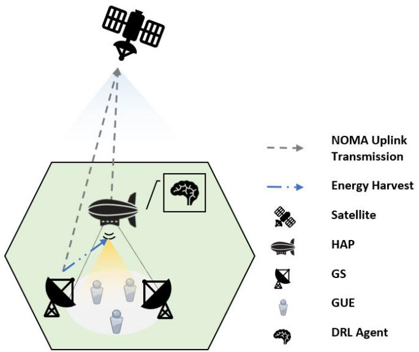

<details>
<summary>flowchart</summary>

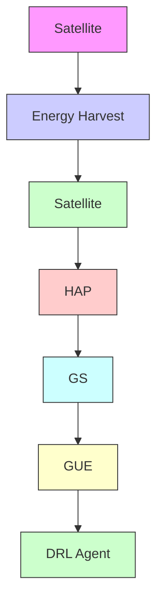
</details>

Fig. 1. HAP uplink transmission and energy harvesting scenario in NOMA-based SAGIN.

The related works [12], [13], [14], [15], [16], [17], [18], [19], [20] only adopted NOMA to improve the spectrum efficiency of the SAGIN. They did not address the energy harvesting issue for energy-constrained HAPs. Although the other related works [21], [22], [23] jointly consider NOMA and the energy harvesting issue for energy-constrained wireless network devices, these works did not focus on SAGIN. Furthermore, although several works, such as absorptive reconfigurable intelligent surfaces (RIS)-aided secure beamforming [24] for maximizing the secrecy rate of the earth station while satisfying the signal reception constraints, the harvested power threshold at the RIS, and the total transmit power budget in satellite-terrestrial integrated networks; refracting RIS-aided joint beamforming [25] for minimizing the total transmit power of both the satellite and base station while satisfying data rate requirements of cellular users in hybrid satellite-terrestrial relay networks; a multi-objective anti-collision algorithm [26] for optimizing concurrent access ranging in multi-frequency TDMA satellite IoT networks based on derived expressions of ranging time, collision probability, and channel usage; and a multi-functional RISassisted semantic anti-jamming communication and computing framework [27] for maximizing semantic computation rate in MEC-assisted integrated aerial-ground networks, have been gradually investigated to address the communication efficiency problem in SAGIN, as well as a low-complexity scheduling algorithm [28] for maximizing throughput and fairness in energy harvesting wireless sensor networks (WSNs); a fairness-aware scheduling algorithm [29] for maximizing fairness among energy harvesting sensor nodes by using Jain’s fairness index in a single-hop WSN; and a throughput-optimal scheduling policy [30] for maximizing throughput in a single-hop energy harvesting WSN based on a uniform random ordered policy, have been gradually investigated to address the energy harvesting issue in WSN, the joint consideration of NOMA and the energy harvesting issue for energy-constrained HAP still remains underexplored in SAGIN. To the best of our knowledge, we are the first to address this challenge in the context of SAGIN. Moreover, [22] focused on maximizing long-term average data rate instead of maximizing long-term average BSS of an energy-constrained wireless network device. These works may allocate the majority of the power resources of the energy-constrained wireless network device to specific time slots, resulting in insufficient power to provide service in other time slots. This makes it challenging for these works to meet the long-term data rate requirements of the energy-constrained wireless network device. Thus, in this paper, we aim to maximize the long-term average BSS of an HAP instead of its average data rate. Furthermore, it is also challenging to know the stochastic transmission demand of the HAP in each time slot in advance. This motivates us to adopt DRL for the HAP uplink transmission and energy harvesting scheduling problem in NOMA-based SAGIN. The leverage of DRL can efficiently handle the stochastic transmission demand of the HAP in each time slot to maximize the long-term average BSS of an HAP.

The main contributions of this paper are summarized as follows.

1) We formulate the HAP uplink transmission and energy harvesting scheduling problem in SAGIN into a nonlinear programming problem that aims to maximize the long-term average BSS of an HAP. We further prove that this problem is NP-hard.   
2) We propose a deep reinforcement learning based HAP uplink transmission and energy harvesting scheduling scheme (DRL-HUES) that utilizes a DRL technique, Proximal Policy Optimization (PPO), to handle the stochastic transmission demand of the HAP in each time slot so as to achieve long-term optimization of the network performance.   
3) Simulation results show that the long-term average BSS of an HAP of our proposed DRL-HUES significantly outperforms No-Pain-No-Gain (NPNG) [22], which is the best available related work, random, and greedy scheduling schemes.   
4) To the best of our knowledge, our work is the first to adopt DRL for the HAP uplink transmission and energy harvesting scheduling problem in NOMA-based SAGIN.

TABLE I SUMMARY OF NOTATIONS 

<table><tr><td>Notation</td><td>Definition</td></tr><tr><td> $\alpha(i)$ </td><td>Time-sharing ratio for uplink transmission in the  $i$ -th time slot.</td></tr><tr><td> $T$ </td><td>Length of a time slot.</td></tr><tr><td> $FSPL_{m}^{GS,HAP}(i)$ </td><td>The free space path loss between the GS  $m$  and the HAP.</td></tr><tr><td> $FSPL^{HAP,SAT}(i)$ </td><td>The free space path loss between the HAP and the satellite.</td></tr><tr><td> $FSPL_{m}^{GS,SAT}(i)$ </td><td>The free space path loss between the GS  $m$  and the satellite.</td></tr><tr><td> $c$ </td><td>The speed of light.</td></tr><tr><td> $d_{m}^{GS,HAP}(i)$ </td><td>The distance between the GS  $m$  and the HAP in the  $i$ -th time slot.</td></tr><tr><td> $d^{HAP,SAT}(i)$ </td><td>The distance between the HAP and the satellite in the  $i$ -th time slot.</td></tr><tr><td> $d_{m}^{GS,SAT}(i)$ </td><td>The distance between the GS  $m$  and the satellite in the  $i$ -th time slot.</td></tr><tr><td> $f_{c}$ </td><td>The center frequency.</td></tr><tr><td> $h_{m}^{GS,HAP}(i)$ </td><td>The channel gain from the GS  $m$  to the HAP in the  $i$ -th time slot.</td></tr><tr><td> $h^{HAP,SAT}(i)$ </td><td>The channel gain from the HAP to the satellite in the  $i$ -th time slot.</td></tr><tr><td> $h_{m}^{GS,SAT}(i)$ </td><td>The channel gain from the GS  $m$  to the satellite in the  $i$ -th time slot.</td></tr><tr><td> $TAd_{m}^{GS}$ </td><td>The transmit antenna gain of the GS  $m$ .</td></tr><tr><td> $TAd^{HAP}$ </td><td>The transmit antenna gain of the HAP.</td></tr><tr><td> $RAd^{HAP}$ </td><td>The receive antenna gain of the HAP.</td></tr><tr><td> $RAd^{SAT}$ </td><td>The receive antenna gain of the satellite.</td></tr><tr><td> $B$ </td><td>The total bandwidth.</td></tr><tr><td> $P^{HAP}(i)$ </td><td>The transmit power of the HAP in the  $i$ -th time slot.</td></tr><tr><td> $\beta(i)$ </td><td>The transmit power allocation ratio of the HAP in the  $i$ -th time slot.</td></tr><tr><td> $P_{max}^{HAP}$ </td><td>The maximum transmit power of the HAP.</td></tr><tr><td> $E(i)$ </td><td>The remaining energy in the HAP battery in the  $i$ -th time slot.</td></tr><tr><td> $\eta$ </td><td>The energy harvesting efficiency ratio.</td></tr><tr><td> $P_{m}^{GS}(i)$ </td><td>The transmit power of the GS  $m$  in the  $i$ -th time slot.</td></tr><tr><td> $E_{max}$ </td><td>The maximum HAP battery capacity.</td></tr><tr><td> $R^{HAP}(i)$ </td><td>The data rate of the HAP in the  $i$ -th time slot.</td></tr><tr><td> $n_{0}$ </td><td>The noise power spectral density.</td></tr><tr><td> $SDR(i)$ </td><td>The supply-demand ratio of the HAP in the  $i$ -th time.</td></tr><tr><td> $R_{req}^{HAP}(i)$ </td><td>The HAP data rate requirement in the  $i$ -th time slot.</td></tr><tr><td> $BSS(i)$ </td><td>The binary scale satisfaction of the HAP in the  $i$ -th time.</td></tr><tr><td> $\mathcal{I}$ </td><td>The set of  $I$  time slots in an episode.</td></tr></table>

The rest of the paper is organized as follows. In Sec. II, the system model is described. In Sec. III, the HAP uplink transmission and energy harvesting scheduling problem in SAGIN is formulated. In Sec. IV, the design details of the proposed DRL-HUES are described. In Sec. V, the simulation results are shown. Finally, the paper is concluded in Sec. VI.

# II. SYSTEM MODEL

We consider an HAP uplink transmission and energy harvesting scenario in NOMA-based SAGIN, which comprises a satellite, an HAP, and a set M of M GSs. The summary of notations used in this work is shown in Table I. The HAP performs uplink transmission and energy harvesting in each time slot $T ,$ as shown in Fig. 2. First, the HAP is admitted to a GS’s time slot via NOMA. That is, the HAP utilizes the $\alpha ( i ) T$ seconds for its uplink transmission, where α(i) is a time-sharing ratio in the i-th time slot, $0 \leq \alpha ( i ) \leq 1$ . Second, the remainder of the time slot, $( 1 - \alpha ( i ) ) T$ seconds, will be used for battery charging by harvesting energy from the signals sent by the GS. I is the set of I time slots in an episode. We define $F S P L _ { m } ^ { G S , H A P } ( i )$ , $F S P L ^ { H A P , S A T } ( i )$ , and $\mathsf { \bar { F } } S P L _ { m } ^ { G S , S A T } ( i )$ as the free space path loss between the GS m and the HAP, the HAP and the satellite, as well as the GS m and the satellite in the i-th time slot as given by (1), (2), and (3), respectively.

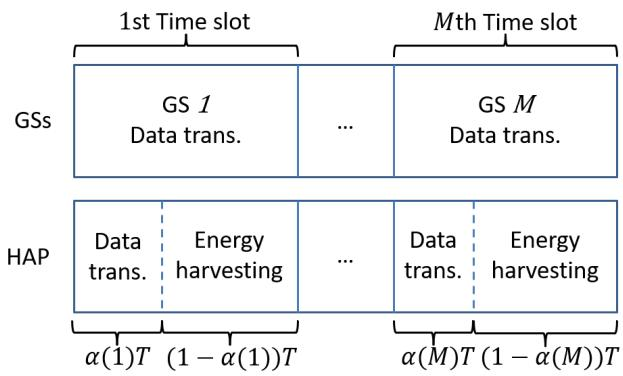

<details>
<summary>flowchart</summary>

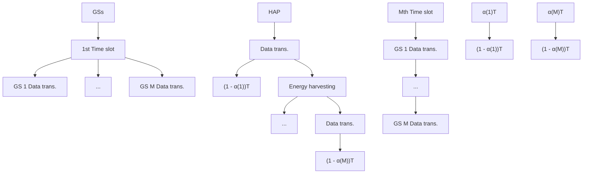
</details>

Fig. 2. NOMA uplink transmission where an HAP shares the spectrum with M GSs and harvests energy from the signals sent by the GSs.

$$
F S P L _ {m} ^ {G S, H A P} (i) = \left(\frac {c}{4 \pi d _ {m} ^ {G S , H A P} (i) f _ {c}}\right) ^ {2}, \tag {1}
$$

$$
F S P L ^ {H A P, S A T} (i) = \left(\frac {c}{4 \pi d ^ {H A P , S A T} (i) f _ {c}}\right) ^ {2}, \tag {2}
$$

$$
F S P L _ {m} ^ {G S, S A T} (i) = \left(\frac {c}{4 \pi d _ {m} ^ {G S , S A T} (i) f _ {c}}\right) ^ {2}, \tag {3}
$$

center frequency, represent the dis where c represents the speed of light, $d _ { m } ^ { G S , H A P } \dot { ( i ) } , d ^ { H A P , \breve { S A T } } ( \dot { i } )$ $f _ { c }$ , and nd t represents the $d _ { m } ^ { G S , S A T } ( i )$ HAP and the satellite, as well as the GS m and the satellite in the i-th time slot, respectively. We define $h _ { m } ^ { G S , H A P } ( i )$ $h ^ { H A P , S A T } ( i )$ , and $h _ { m } ^ { G S , S A T } ( i )$ as the channel gain from the from the GS m to the satellite in the i-th time slot as given by (4), (5), and (6), respectively.

$$
h _ {m} ^ {G S, H A P} (i) = T A d _ {m} ^ {G S} R A d ^ {H A P} F S P L _ {m} ^ {G S, H A P} (i), \tag {4}
$$

$$
h ^ {H A P, S A T} (i) = T A d ^ {H A P} R A d ^ {S A T} F S P L ^ {H A P, S A T} (i), \tag {5}
$$

$$
h _ {m} ^ {G S, S A T} (i) = T A d _ {m} ^ {G S} R A d ^ {S A T} F S P L _ {m} ^ {G S, S A T} (i), \tag {6}
$$

where $T A d _ { m } ^ { G S }$ and $T A d ^ { H A P }$ respectively represent the transmit antenna gains of the GS m and the HAP, and $R A d ^ { H A P }$ and $R A d ^ { S A \check { T } }$ respectively represent the receive antenna gains of the HAP and the satellite. We define the transmit power of the HAP in the i-th time slot as given by (7).

$$
P ^ {H A P} (i) = \beta (i) \times P _ {\max} ^ {H A P}, \tag {7}
$$

where $\beta ( i )$ denotes the HAP’s transmit power allocation ratio in the i-th time slot and $P _ { m a x } ^ { H A P }$ denotes the maximum transmit power of the HAP. The remaining energy in the HAP battery at the beginning of the $i + 1 \mathrm { - t h }$ time slot is calculated by (8).

$$
\begin{array}{l} E (i + 1) \\ = \min \{\underbrace {(1 - \alpha (i)) \times T \times \eta \times P _ {m} ^ {G S} (i) \times h _ {m} ^ {G S , H A P} (i)} _ {\text {Harvested energy}} \\ - \underbrace {\alpha (i) \times T \times P ^ {H A P} (i)} _ {\text { Used   energy }} + E (i), E _ {\max} \} \tag {8} \\ \end{array}
$$

where $P _ { m } ^ { G S } ( i )$ denotes the transmit power of the GS m in the i-th time slot, η denotes the energy harvesting efficiency ratio, and $E _ { m a x }$ denotes the battery capacity of the HAP. Since the amount of energy available for uplink transmission by the HAP in the i-th time slot is constrained by the remaining energy from the previous time slot, this constraint is given by (9).

$$
E (i) \geq \alpha (i) \times T \times P ^ {H A P} (i), \tag {9}
$$

In NOMA uplink transmission, the sender’s signal with the strongest channel gain, which is decoded during the first stage of SIC at the receiver side, experiences interference from other senders’ signals with weaker channel gain in its NOMA cluster, while the sender’s signal with the weakest channel gain encounters zero interference within its NOMA cluster as all the stronger signals have been removed [12], [13]. That is, the HAP’s signal is decoded first at the satellite and experiences interference from the relatively weaker GS’s signal, while the GS’s signal is decoded without interference as the HAP’s signal has been removed. Thus, the data rate of the HAP in the i-th time slot is given by (10).

$$
R ^ {H A P} (i) = \alpha (i) T B l o g _ {2} (1 + \frac {P ^ {H A P} (i) h ^ {H A P , S A T} (i)}{P _ {m} ^ {G S} (i) h _ {m} ^ {G S , S A T} (i) + B n _ {0}}), \tag {10}
$$

where B is the bandwidth and $n _ { 0 }$ is the noise power spectral density. Note that the data rate of the GS m is not affected by admitting the HAP into its time slot since the HAP’s signal has been removed when the GS’s signal is decoded. Also note that in the proposed DRL-HUES, M GSs take turns transmitting data to the satellite using TDMA. Additionally, in each time slot, the HAP uses NOMA technology to transmit data to the satellite simultaneously with a GS and receives signals from that GS for energy harvesting. Therefore, in the system model, we model the HAP as only suffering interference from a certain GS m and performing energy harvesting with the GS m. We define $S D R ( i )$ as the supply-demand ratio (SDR) of the HAP in the i-th time slot as given by (11).

$$
S D R (i) = \frac {R ^ {H A P} (i)}{R _ {r e q} ^ {H A P} (i)}, \tag {11}
$$

where $R _ { r e q } ^ { H A P } ( i )$ is the HAP data rate requirement in the i-thBSS(i) the i-th time slot as given by (12). BSS(i) is an indicator that is set to 1 if SDR(i) is greater than or equal to one. Otherwise, it is zero.

$$
B S S (i) = \left\{ \begin{array}{l l} 1, & \text { if   } S D R (i) \geq 1, \\ 0, & \text { otherwise. } \end{array} \right. \tag {12}
$$

# III. PROBLEM FORMULATION

We formulate the HAP uplink transmission and energy harvesting scheduling problem in SAGIN as a nonlinear programming problem. The objective of this problem is to maximize the long-term average BSS of an HAP. This problem is formulated as follows:

$$
\mathbf {Q}: \max _ {\boldsymbol {\alpha}, \boldsymbol {\beta}} \frac {\sum_ {i = 1} ^ {| \mathcal {I} |} B S S (i)}{| \mathcal {I} |}
$$

$$
\begin{array}{l} s. t. E (i + 1) = \min \{(1 - \alpha (i)) T \eta P _ {m} ^ {G S} (i) h _ {m} ^ {G S, H A P} (i) \\ - \alpha (i) T P ^ {H A P} (i), E _ {\max} \}, \quad \forall i \in \mathcal {I}, \tag {13} \\ \end{array}
$$

$$
\alpha (i) T P ^ {H A P} (i) \leq E (i), \quad \forall i \in \mathcal {I}, \tag {14}
$$

$$
0 \leq \alpha (i) \leq 1, \quad \forall i \in \mathcal {I}, \tag {15}
$$

$$
0 \leq \beta (i) \leq 1, \quad \forall i \in \mathcal {I}, \tag {16}
$$

$$
0 \leq P ^ {H A P} (i) \leq P _ {\max} ^ {H A P}, \quad \forall i \in \mathcal {I}. \tag {17}
$$

Constraint (13) ensures that the amount of harvested energy cannot exceed the battery capacity of the HAP. Constraint (14) ensures that the amount of energy available for uplink transmission by the HAP in a time slot is constrained by the remaining energy from the previous time slot. Constraint (15) specifies the range of the time-sharing ratio for uplink transmission and energy harvest of the HAP in a time slot. Constraint (16) specifies the range of the transmit power allocation ratio of the HAP in a time slot. Constraint (17) represents the range of the HAP’s transmit power in a time slot. Note that maximizing the average data rate without considering the HAP’s data requirement in each time slot can lead to uneven power distribution for the HAP in each time slot. For example, maximizing the average data rate might cause some time slots to receive excessive HAP power while others receive insufficient power. We believe that allocating HAP’s power based on the data requirement of each time slot can effectively utilize the limited HAP power. Thus, we set our objective as maximizing the long-term average BSS of an HAP instead of maximizing the average data rate.

In problem Q, α denotes the set of time-sharing ratios for uplink transmission and energy harvesting of the HAP and $\beta$ denotes the set of transmit power allocation ratios of the HAP. Q can be solved by finding the optimal time-sharing ratios for uplink transmission and energy harvest, as well as transmit power allocation ratios of the HAP. However, Q is a nonlinear programming problem and can be proved as NP-hard by the reduction from the knapsack problem as shown in Theorem1. The definition of the knapsack problem is described in Definition1. Moreover, it is also difficult to know the HAP’s uplink data rate requirements in each time slot in advance. Therefore, in our proposed DRL-HUES, we utilize the DRL technique for the HAP to efficiently solve problem Q.

Definition 1: The knapsack problem is defined as follows. In the knapsack problem, there is a set of elements characterized by different weights and corresponding values. The goal is to maximize the total value while the total weight is within a predefined upper bound.

Theorem 1: The problem Q is NP-hard.

Proof: Consider that the total energy of an HAP’s battery is treated as the knapsack, the HAP’s uplink transmission operation in a time slot is treated as an element, and the BSS of the HAP in this time slot represents the element’s value. Therefore, the objective of scheduling HAP uplink transmission and energy harvesting to maximize the long-term average BSS of an HAP in problem Q is equivalent to maximizing the total value of the knapsack in the knapsack problem. Thus, the knapsack problem can be reduced to the problem Q. As the knapsack problem is NP-hard, the problem Q is also NP-hard. □

# IV. DEEP REINFORCEMENT LEARNING BASED HAP UPLINK TRANSMISSION AND ENERGY HARVESTING SCHEDULING SCHEME (DRL-HUES)

In the proposed DRL-HUES, we first formulate the optimization problem Q as a Markov decision process (MDP) model, and then utilize a DRL algorithm, PPO, for the HAP to achieve long-term optimization of the network performance.

# A. MDP Model

The learning process of DRL is based on an MDP. In the MDP, the DRL agent continuously observes a stochastic dynamic system. Based on the state observed at each step, the DRL agent selects an action from the available action space and receives a reward based on this action. MDP is typically represented as a tuple with four elements $< s , { \mathcal { A } } , { \mathcal { P } } , { \mathcal { R } } > $ , where S represents the environment state space, A represents the action space, P represents the set of transition probabilities between all states, and R represents the immediate rewards. The goal of the DRL agent is to find the optimal decision policy, which can maximize the accumulated reward of all decisions for the MDP. The learning process of the DRL agent is described as follows: The DRL agent first observes the current environment state $s _ { i } \in S ,$ , and then selects an action $a _ { i } ~ \in ~ { \mathcal { A } }$ based on the current state $s _ { i } .$ . The environment is updated to the next state $s _ { i + 1 } ~ \in ~ S$ based on $a _ { i } ,$ and the DRL agent receives a reward $r _ { i } \in \mathcal { R }$ . Note that P will be learned by the DRL agent during the training process. The detailed tuple representation of the proposed MDP design for the uplink transmission and energy harvesting scheduling problem is defined as follows:

1) State: In our proposed DRL-HUES, the DRL agent needs to make an efficient decision about the time-sharing ratio for uplink transmission and energy harvesting scheduling, as well as the ratio of transmit power of the HAP based on the channel gain from the GS m to the HAP, the channel gain from the HAP to the satellite, the remaining energy of the

HAP’s battery, and the HAP’s data rate requirement in the i-th time slot. Therefore, the network state is given by (18).

$$
\begin{array}{l} s _ {i} = (h _ {m} ^ {G S, H A P} (i), h _ {m} ^ {G S, S A T} (i), h ^ {H A P, S A T} (i), \\ E (i), R _ {r e q} ^ {H A P} (i)). \tag {18} \\ \end{array}
$$

Weand te in this way because variablesaffect the HAP’s data rate, as sh $h _ { m } ^ { G S , S A T } ( i )$ $h ^ { H \check { A } P , S A T } ( i )$ We believe that in each time slot, the HAP only needs to transmit for a duration sufficient to meet its data rate requirement, and the remaining time can be used for energy harvesting. Therefore, the DRL agent must also be aware of the HAP’s data rate requirement $R _ { r e q } ^ { H A P } ( i )$ . Additionally, $h _ { m } ^ { G S , H A P } ( i )$ affects the amount of energy harvested by the HAP, as shown in (8), and the DRL agent should be informed of the HAP’s remaining energy $E ( i )$ to manage its energy effectively over the long term. In summary, $h _ { m } ^ { G S , S A T } ( i ) , \stackrel { \smile } { h } ^ { H A P , S A T } ( i )$ , and the HAP’s data rate requirement are directly related to the HAP’s data rate, while $h _ { m } ^ { \bar { G } S , H A P } ( i )$ and the remaining battery level are related to the HAP’s energy status. Hence, we include these five variables in the state.

2) Action: Based on $s _ { i } ,$ , the DRL agent decides the time-sharing ratio for uplink transmission and energy harvest scheduling, as well as transmit power allocation ratio of the HAP in the i-th time slot. The action to take for state $s _ { i }$ is given by (19).

$$
a _ {i} = (\alpha (i), \beta (i)). \tag {19}
$$

3) Reward: Since the objective of our proposed DRL-HUES is to maximize the long-term average BSS of an HAP, the reward is given by (20).

$$
r _ {i} = \left\{ \begin{array}{l l} \max (\psi - (S D R (i) - 1) ^ {2}, - 1), & \text { if   } S D R (i) \geq 1, \\ \max (- \psi * (S D R (i) - 1) ^ {2}, - 1), & \text { otherwise. } \end{array} \right. \tag {20}
$$

In (20), if the value of SDR(i) is greater than or equal to 1, the closer the value of SDR(i) is to 1, the higher the positive reward obtained by the DRL agent. However, if the value of SDR(i) exceeds $1 + { \sqrt { \psi } }$ , indicating excessive allocation of uplink transmission time and $\mathrm { H A P } ^ { \prime } \mathrm { s }$ transmit power in the i-th time slot, the DRL agent will receive a negative reward. The more the value of SDR(i) exceeds $1 + { \sqrt { \psi } } ,$ the greater the penalty obtained by the DRL agent. Conversely, if the value of SDR(i) is less than 1, the lower the value of $S D R ( i )$ , the higher the penalty obtained by the DRL agent. In this paper, we set $\psi$ to 1, so the upper bound of the reward $r _ { i }$ is 1. To avoid excessive reward value fluctuations that could affect the convergence efficiency of the DRL agent, we set the lower bound of the reward $r _ { i }$ to −1, as shown in Fig. 3.

# B. Foundation of PPO

We utilize a DRL technique, PPO, for the HAP. PPO [31] is one of the most representative actor-critic-based DRL algorithms, where the actor network determines the action for a given state, and the critic network evaluates the actor’s performance by providing the value function. PPO can be effectively applied to environments with either continuous or discrete action spaces [32], [33] and employs entropy to promote exploration [33]. It shares several advantages of trust region policy optimization (TRPO) [34], including stability and reliability [32]. In addition, PPO is more general and simpler to implement than TRPO because it utilizes first-order optimization techniques [32]. PPO is a state-ofthe-art algorithm that is less sensitive to hyperparameters and prevents excessively large policy updates through the use of a clipped surrogate objective function [32]. Consequently, it outperforms previous algorithms in terms of applicability and implementation efficiency [33]. Thus, we adopt PPO to make continuous action decisions for our optimization problem Q. The concept and training of PPO are explained as follows. PPO first observes the current state $s _ { i } ,$ and then selects an action $a _ { i }$ based on $s _ { i } .$ The environment is updated to the next state $s _ { i + 1 }$ , and PPO receives a reward $r _ { i }$ . This sample $\left( { { s _ { i } } , { a _ { i } } , { r _ { i } } , { s _ { i + 1 } } } \right)$ will be stored in a batch. Once the batch is filled with J samples, PPO updates both actor and critic gradients using the $J$ samples in the batch. After updating both gradients, the batch will be cleared. PPO updates the actor gradient by maximizing the advantage function $A _ { j }$ as the objective defined as follows.

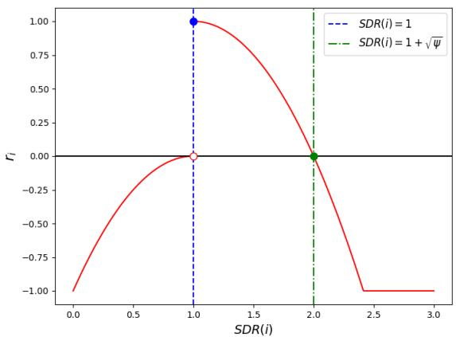

<details>
<summary>line</summary>

| SDR(i) | f_i     |
|--------|---------|
| 1.0    | 1.0     |
| 2.0    | 0.0     |
| 2.5    | -1.0    |
| 3.0    | -1.0    |
</details>

Fig. 3. The relationship between SDR(i) and reward $r _ { i } .$

$$
\hat {A} _ {j} = \sum_ {j ^ {\prime} > j} \gamma^ {j ^ {\prime} - j} r _ {j ^ {\prime}} - V _ {\theta^ {\prime}} (s _ {j}) \tag {21}
$$

where $V _ { \theta ^ { \prime } } ( s _ { j } )$ is the critic’s estimate of the expected cumulative reward from state $s _ { j }$ up to the last state $s _ { J }$ in the batch and γ is the reward discount factor. Positive value of the advantage function $\hat { A } _ { j }$ indicates that the corresponding action-state pair performs better than expected. On the other hand, the negative value of the advantage function shows the action is undesirable for the corresponding state. PPO defines a probability ratio between old and new policies as given by (22).

$$
r _ {j} (\theta) = \frac {\pi (s _ {j} ; \theta)}{\pi (s _ {j} ; \theta_ {o l d})} \tag {22}
$$

where $\pi ( s _ { i } ; \theta )$ is the action decided by the actor with the gradient θ based on the state $s _ { i }$ and $\theta _ { o l d }$ is the actor gradient before the update. However, high variance between the old policy and the new policy leads to an excessively large policy update. Thus, it affects the training stability and convergence of PPO. To improve the training efficiency, a clipping method is introduced in the PPO algorithm to control the distance between these two policies during training. The objective function of updating the actor gradient in PPO is given by (23).

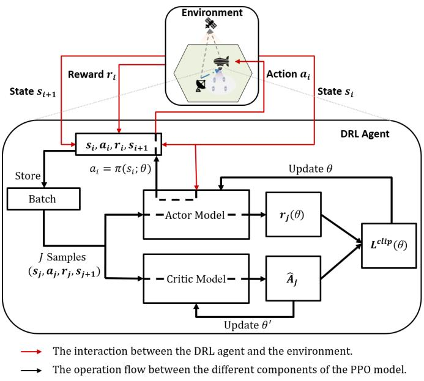

<details>
<summary>flowchart</summary>

```mermaid
graph TD
    A["Environment"] -->|State s_i| B["s_i, a_i, r_i, s_{i+1}"]
    B --> C["Action a_i"]
    C --> D["DRL Agent"]
    D -->|Update θ| E["r_j(θ)"]
    D --> F["r_j(θ)"]
    D --> G["L^clip(θ)"]
    E --> H["Critic Model"]
    F --> H
    G --> H
    H --> I["Operator Model"]
    I --> J["Batch"]
    J --> K["Store"]
    K --> B
    style A fill:#f9f,stroke:#333
    style D fill:#ccf,stroke:#333
    style E fill:#cfc,stroke:#333
    style F fill:#fcc,stroke:#333
    style G fill:#cff,stroke:#333
    style H fill:#ffc,stroke:#333
    style I fill:#fcf,stroke:#333
    style J fill:#cff,stroke:#333
    style K fill:#ffc,stroke:#333
    style L fill:#cfc,stroke:#333
    style M fill:#fcc,stroke:#333
    style N fill:#ffc,stroke:#333
    style O fill:#cfc,stroke:#333
    style P fill:#fcc,stroke:#333
    style Q fill:#ffc,stroke:#333
    style R fill:#cfc,stroke:#333
    style S fill:#fcc,stroke:#333
    style T fill:#ffc,stroke:#333
    style U fill:#cfc,stroke:#333
    style V fill:#fcc,stroke:#333
    style W fill:#ffc,stroke:#333
    style X fill:#cfc,stroke:#333
    style Y fill:#fcc,stroke:#333
    style Z fill:#ffc,stroke:#333
    style AA fill:#cfc,stroke:#333
    style AB fill:#fcc,stroke:#333
    style AC fill:#ffc,stroke:#333
    style AD fill:#cfc,stroke:#333
    style AE fill:#fcc,stroke:#333
    style AF fill:#ffc,stroke:#333
    style AG fill:#cfc,stroke:#333
    style AH fill:#fcc,stroke:#333
    style AI fill:#ffc,stroke:#333
    subgraph "The interaction between the DRL agent and the environment."
        direction LR
        B -->|a_i = π(s_i; θ)| B
        D -->|Update θ| E
        E --> F
        F --> G
        G --> H
        H --> I
        I --> J
        J --> K
        K --> L
        L --> M
        M --> N
        N --> O
        O --> P
        P --> Q
        Q --> R
        R --> S
        S --> T
        T --> U
        U --> V
        V --> W
        W --> X
        X --> Y
        Y --> Z
        Z --> AA
        AA --> AB
        AB --> AC
        AC --> AD
        AD --> AE
        AE --> AF
        AF --> AG
        AG --> AH
        AH --> AI
        AI --> AJ
        AJ --> AK
        AK --> AL
        AL --> AM
        AM --> AN
        AN --> AO
        AO --> AP
        AP --> AQ
        AQ --> AR
        AR --> AS
        AS --> AT
        AT --> AU
        AU --> AV
        AV --> AW
        AW --> AX
        AX --> AY
        AY --> AZ
        AZ --> BA
        BA --> BB
        BB --> BC
        BC --> BD
        BD --> BE
        BE --> BF
        BF --> BG
        BG --> BH
        BH --> BI
        BI --> BJ
        BJ --> BK
        BK --> BL
        BL --> BM
        BM --> BN
        BN --> BO
        BO --> BP
        BP --> BQ
        BQ --> BR
        BR --> BS
        BS --> BT
        BT --> BU
        BU --> BV
        BV --> BW
        BW --> BX
        BX --> BY
        BY --> BZ
        BZ --> CA
        CA --> CB
        CB --> CC
        CC --> CD
        CD --> CE
        CE --> CF
        CF --> CG
        CG --> CH
        CH --> CI
        CI --> CJ
        CJ --> CK
        CK --> CL
        CL --> CM
        CM --> CN
        CN --> CO
        CO --> CP
        CP --> CJ
    end

    %% Legend:
    direction LR arrow pointing right to DRL Agent
    
    note1["State s_{i+1}"]
    note2["State s_i"]
    
    %% Note: The operation flow between the different components of the PPO model.
    %% Note: The interaction between the DRL agent and the environment.
    %% Note: The operation flow between the different components of the PPO model.
```
</details>

Fig. 4. Workflow of the proposed DRL-HUES by utilizing PPO.

$$
L ^ {C L I P} (\theta) = \hat {E} [ \min (r _ {j} (\theta) \hat {A} _ {j}, c l i p (r _ {j} (\theta), 1 - \epsilon , 1 + \epsilon) \hat {A} _ {j}) ] \tag {23}
$$

where $c l i p ( \cdot )$ ensures the probability ratio remains between 1−ϵ and $1 + \epsilon ,$ with ϵ as the clipping parameter. Based on (23), if the value of $\hat { A } _ { j }$ is positive, the objective function can be expressed as (24).

$$
L ^ {C L I P} (\theta) = \hat {E} [ \min (r _ {j} (\theta) \hat {A} _ {j}, (1 + \epsilon) \hat {A} _ {j}) ] \tag {24}
$$

Conversely, if the value of $\hat { A } _ { j }$ is negative, the objective function can be expressed as (25).

$$
L ^ {C L I P} (\theta) = \hat {E} [ \min (r _ {j} (\theta) \hat {A} _ {j}, (1 - \epsilon) \hat {A} _ {j}) ] \tag {25}
$$

PPO updates the critic gradient by minimizing $( \hat { A } _ { j } ) ^ { 2 }$ . The structure of PPO is shown in Fig. 4.

# C. Workflow of the Proposed DRL-HUES

The workflow of the proposed DRL-HUES is shown in Fig. 4. In the i-th time slot, the DRL agent of the HAP will take action $a _ { i } .$ , which consists of the HAP transmission time-sharing ratio $\alpha ( i )$ , as well as the HAP transmission power ratio $\beta ( i )$ , according to the current state $s _ { i } .$ After the DRL agent takes this action, it receives the reward $r _ { i }$ according to (20), to update its neural network’s gradients. Then, the state of the SAGIN will be changed. Note that since the data rate requirement of the HAP in the (i + 1)-th time slot is only known for the next time slot, the sample $( s _ { i } , a _ { i } , r _ { i } , s _ { i + 1 } )$ has to wait until the next time slot to be stored in the batch. The operation of the proposed DRL-HUES by utilizing PPO for the HAP is described in Algorithm 1.

Please note that our proposed DRL-HUES is applicable regardless of the duration of the connection between the satellite and the HAP, whether it is long, as in the case of highly elliptical orbit, or short, as in the case of LEO. This is because our proposed DRL-HUES focuses on the uplink transmission and charging behavior of the HAP during the connection period and does not involve the handover behavior between the satellite and the HAP.

Algorithm 1 The Operation of the Proposed DRL-HUES by Utilizing PPO
Randomly initialize actor's gradient $\theta$ and critic's gradient $\theta'$ .
for episode = 1 to O do
    Receive initial observation state $s_1 = (h_m^{GS,HAP}(1), h_m^{GS,SAT}(1), h^{HAP,SAT}(1), E(1), R_{req}^{HAP}(1))$ .
    Initialize batch with $J$ samples.
    for $i = 1$ to $I$ do
    Select action $a_i = (\alpha(i), \beta(i)) = \pi(s_i; \theta)$ according to the current policy and execute action $a_i$ .
    Calculate $SDR(i)$ according to (5).
    if $SDR(i) >= 1$ then
    | Set reward $r_i = \psi - (SDR(i) - 1)^2$ .
    end
    else
    | Set reward $r_i = -\psi * (SDR(i) - 1)^2$ .
    end
    Observe new state $s_{i+1}$ .
    Store transition ( $s_i, a_i, r_i, s_{i+1}$ ) in batch.
    if $i$ mod $J == 0$ or $i == I$ then
    for $k = 1$ to $K$ do $L^{CLIP}(\theta) = \hat{E}[\min(r_j(\theta)\hat{A}_j, clip(r_j(\theta), 1 - \epsilon, 1 + \epsilon)\hat{A}_j)]$ ,
    where $\hat{A}_j = \sum_{j' > j} \gamma^{j' - j} r_{j'} - V_{\theta'}(s_j)$ .
    Update $\theta$ by a gradient method w.r.t. $L^{CLIP}(\theta)$ with learning rate $\eta_a$ .
    end
    for $k = 1$ to $B$ do $L(\theta') = -\sum_{j=1}^J (\hat{A}_j)^2$ .
    Update $\theta'$ by a gradient method w.r.t. $L(\theta')$ with learning rate $\eta_c$ .
    end
    end
end

# V. PERFORMANCE EVALUATION

We conducted a system-level simulation using Python [39] and TensorFlow [40]. In our simulation, we consider a NOMA-based HAP uplink transmission scenario in the SAGIN with twenty GSs. The GSs are randomly located between (−50, −50, 0) km and (50, 50, 0) km, and these GSs perform uplink transmission based on TDMA. We simulate the SAGIN architecture with a satellite and a HAP orbiting at 750 km and 20 km in height, respectively [41]. The orbital motion of the LEO satellite follows a Keplerian circular orbit. Specifically, it enters from the east along the x-axis at an elevation angle of 45 degrees as seen from the GS, passes directly overhead the GS at an altitude of 750 km, and exits to the west also at a 45-degree elevation angle. When a satellite moves out of the 45-degree elevation range, the next satellite immediately enters the range from the opposite side. As a result, there is always exactly one visible satellite at any given time. The HAP is located at (0, 0, 20) km. The NOMA uplink transmission between the GS and the satellite, and both the HAP and the satellite operate at S-band (2 GHz) [35]. The system bandwidth is set to 10 MHz. The data rate requirements of the HAP in each time slot are modeled by a normal distribution with a mean $\mu _ { R _ { r e q } ^ { H A P } }$ ranging from 0.1250 Mbps to 0.1625 Mbps and a standard deviation of 0.005 Mbps. In our simulation, we conduct 10000 episodes, each comprising 100 time slots, with each time slot corresponding to one second. At the beginning of each episode, the HAP’s battery is reset to its maximum capacity $E _ { m a x }$ . The complete set of simulation settings is shown in Table II and the one for PPO is shown in Table III.

TABLE II SIMULATION PARAMETERS FOR NETWORK ENVIRONMENT 

<table><tr><td>Parameter</td><td>Value</td></tr><tr><td>Number of GSs (M)</td><td>20</td></tr><tr><td>Carrier frequency (fc) [35]</td><td>2 GHz</td></tr><tr><td>Bandwidth (B)</td><td>10 MHz</td></tr><tr><td>Speed of light (c)</td><td>3 × 105 km/s</td></tr><tr><td>Location of the satellite [35]</td><td>(0,0,750) km</td></tr><tr><td>Location of the HAP [35]</td><td>(0,0,20) km</td></tr><tr><td>Location of the GSs</td><td>(x,y,0) km,x,y ~ U[-50,50]</td></tr><tr><td>Transmitting antenna gain of the HAP (TAdHAP) [36]</td><td>27 dBi</td></tr><tr><td>Receiving antenna gain of the HAP (RAdHAP) [36]</td><td>23 dBi</td></tr><tr><td>Transmitting antenna gain of the GS (TAdGSm) [35]</td><td>43.2 dBi</td></tr><tr><td>Receiving antenna gain of the satellite (RAdSAT) [37]</td><td>32.8 dBi</td></tr><tr><td>Noise power spectral density (n0)</td><td>-174 dBm/Hz</td></tr><tr><td>Initial energy in the HAP battery (E0)</td><td>10 J</td></tr><tr><td>Maximum energy in the HAP battery (Emax)</td><td>10 J</td></tr><tr><td>Energy harvesting efficiency ratio (η)</td><td>0.66</td></tr><tr><td>Time slot length (T)</td><td>1 s</td></tr><tr><td>Transmit power of the GS (PGSm) [35]</td><td>33 dBm</td></tr><tr><td>Maximum transmit power of the HAP (PHAPmax) [38]</td><td>40 dBm</td></tr></table>

We compare the proposed DRL-HUES with three other schemes, no pain no gain (NPNG) [22], random, and greedy. The concepts of these schemes are explained as follows.

1) NPNG [22]. The HAP allocates transmit power by convex optimization and utilizes DDPG to determine the time-sharing ratio for HAP uplink transmission and energy harvest in order to maximize the long-term average data rate.

TABLE III SIMULATION PARAMETERS FOR PPO 

<table><tr><td>Parameter</td><td>Value</td></tr><tr><td>Time slots in an episode (I)</td><td>100 steps</td></tr><tr><td>Total number of episodes (O)</td><td>10000 episode</td></tr><tr><td> $\psi$  in (20)</td><td>1</td></tr><tr><td>Number of hidden layers of actor</td><td>5</td></tr><tr><td>Number of neurons in each layer of actor</td><td>600, 300, 200, 100, 50</td></tr><tr><td>Number of hidden layers of critic</td><td>4</td></tr><tr><td>Number of neurons in each layer of critic</td><td>300, 200, 100, 50</td></tr><tr><td>Activation function of neuron</td><td>Rectified Linear Unit</td></tr><tr><td>Reward discount factor ( $\gamma$ )</td><td>0.9</td></tr><tr><td>Learning rate (hyperparameter) of actor ( $\eta_a$ )</td><td> $2 \times 10^{-8}$ </td></tr><tr><td>Learning rate (hyperparameter) of critic ( $\eta_c$ )</td><td> $4 \times 10^{-8}$ </td></tr><tr><td>Batch size (J)</td><td>32</td></tr><tr><td>Update steps for actor (K)</td><td>10</td></tr><tr><td>Update steps for critic (B)</td><td>10</td></tr></table>

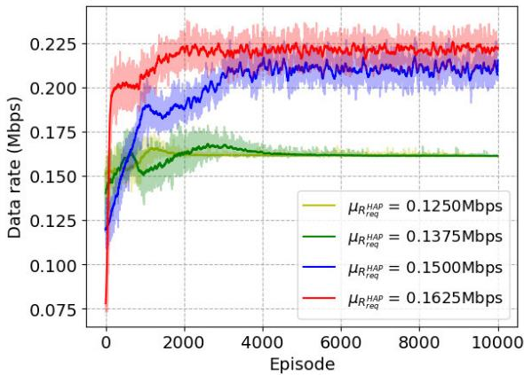

<details>
<summary>line</summary>

| Episode | μ_R^HAP = 0.1250Mbps | μ_R^HAP = 0.1375Mbps | μ_R^HAP = 0.1500Mbps | μ_R^HAP = 0.1625Mbps |
| ------- | --------------------- | --------------------- | --------------------- | --------------------- |
| 0       | 0.075                 | 0.075                 | 0.075                 | 0.075                 |
| 2000    | 0.16                  | 0.16                  | 0.18                  | 0.20                  |
| 4000    | 0.16                  | 0.16                  | 0.20                  | 0.22                  |
| 6000    | 0.16                  | 0.16                  | 0.21                  | 0.22                  |
| 8000    | 0.16                  | 0.16                  | 0.21                  | 0.22                  |
| 10000   | 0.16                  | 0.16                  | 0.21                  | 0.22                  |
</details>

Fig. 5. Learning curve of the average data rate of the HAP in each episode in our proposed DRL-HUES with different values of $\mu _ { R _ { r e q } ^ { H A P } }$ .

2) Random. In each time slot, the time-sharing ratio for HAP uplink transmission and energy harvest is randomly decided. The HAP’s transmit power is fixed at maximum HAP transmit power P HAPmax . $P _ { m a x } ^ { H A P }$   
3) Greedy. In each time slot, the HAP transmits data until its battery is out of power and then charges its battery for the rest of the time slot. The HAP’s transmit power is fixed at maximum HAP transmit power $P _ { m a x } ^ { H A P }$ .

In Fig. 5, we show the learning curve of the average data rate of the HAP in each episode in our proposed DRL-HUES with different values of $\mu _ { R _ { r e q } ^ { H A P } }$ eq . We can observe that as the value of $\mu _ { R _ { r e q } ^ { H A P } }$ increases, the converged average data rate of the HAP increases. This is because as the value of $\mu _ { R _ { r e a } ^ { H A P } }$ increases, in order to satisfy the increased demands of the HAP as much as possible, higher time-sharing ratio and transmit power for HAP uplink transmission are allocated. In Fig. 6, we present the learning curve of the average BSS of the HAP in each episode in our proposed DRL-HUES with different values of $\mu _ { R _ { r e q } ^ { H A P } }$ . We can observe that the converged average BSS decreases as the value of $\mu _ { R _ { r e q } ^ { H A P } }$ increases. This is because, despite allocating more time-sharing ratio and transmit power for the HAP uplink transmission in response to the increased data rate requirements of the HAP in each time slot, the limited total available energy for uplink transmission of the HAP still cannot meet such heavy demands of the HAP. From both Fig. 5 and Fig. 6, we observe two consistent trends. First, when $\mu _ { R _ { r e a } ^ { H A P } } = 0 . 1 2 5 0$ or $\mu _ { R _ { r e a } ^ { H A P } } = 0 . 1 3 7 5$ , the imposed load on the network environment appears to be relatively low, allowing the HAP’s BSS to approach 1 and its data rate performance under $\mu _ { R _ { r e a } ^ { H A P } } = 0 . 1 3 7 5$ to be only slightly higher than that under $\mu _ { R _ { r e a } ^ { H A P } } = 0 . 1 2 5 0$ . Second, the DRL agent successfully maximizes both BSS and data rate performances and achieves stable convergence under all $\mu _ { R _ { r e a } ^ { H A P } }$ settings. Note that in Fig. 5 and Fig. 6, the solid line in the middle is formed by the average of every 100 episodes from the original data. In Fig. 7 and Fig. 8, we compare the average converged data rate of the HAP and the average converged BSS of the HAP over the last 100 episodes among the proposed DRL-HUES, NPNG, random, and greedy. In Fig. 7, the proposed DRL-HUES outperforms both random and greedy schemes. Although NPNG achieves the highest data rate, we can observe that the average converged BSS of the HAP in the proposed DRL-HUES can significantly outperform NPNG, random, and greedy, as shown in Fig. 8. When the data rate requirements of the HAP are light (µRHAP is 0.1250), the BSS performances of our proposed DRL-HUES, random, and greedy are close to 1. However, as the value of $\mu _ { R _ { r e q } ^ { H A F } }$ increases, the BSS performance of NPNG, random, and greedy dramatically decreases, while our proposed DRL-HUES only slightly decreases. This is because NPNG and greedy schemes may allocate the majority of the energy resources of the HAP to specific time slots for uplink transmission, resulting in insufficient resources in other time slots. In contrast, our proposed DRL-HUES can effectively utilize HAP’s energy resources according to the data rate requirements in each time slot, thereby maximizing the long-term average BSS of the HAP.

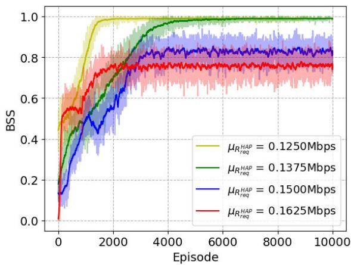

<details>
<summary>line</summary>

| Episode | μ_R_req^HAP = 0.1250Mbps | μ_R_req^HAP = 0.1375Mbps | μ_R_req^HAP = 0.1500Mbps | μ_R_req^HAP = 0.1625Mbps |
| ------- | ------------------------ | ------------------------ | ------------------------ | ------------------------ |
| 0       | 0.0                      | 0.0                      | 0.0                      | 0.0                      |
| 2000    | 0.95                     | 0.85                     | 0.75                     | 0.78                     |
| 4000    | 1.0                      | 0.95                     | 0.85                     | 0.82                     |
| 6000    | 1.0                      | 0.98                     | 0.88                     | 0.85                     |
| 8000    | 1.0                      | 0.99                     | 0.89                     | 0.86                     |
| 10000   | 1.0                      | 1.0                      | 0.9                      | 0.87                     |
</details>

Fig. 6. Learning curve of the average BSS of the HAP in each episode in our proposed DRL-HUES with different values of $\mu _ { R _ { r e q } ^ { H A P } }$ req .

In Fig. 9, we compare the average converged BSS of the HAP over the last 100 episodes using the proposed DRL-HUES under different numbers of GSs, with each time slot fixed at one second. We can observe that as the number of GSs increases, the converged average BSS slightly decreases. This is because a larger number of GSs introduces greater variability in channel conditions, which leads to higher environmental dynamics and slightly degrades the BSS performance. In Fig. 10, we compare the average converged BSS of the HAP over the last 100 episodes using the proposed DRL-HUES under different lengths of a time slot, with the number of GSs fixed at twenty. We can observe that the converged average BSS improves significantly as the length of a time slot increases. This is because, under the same traffic demand, a longer time slot provides more time for both data transmission and energy harvesting, thus enhancing the BSS performance.

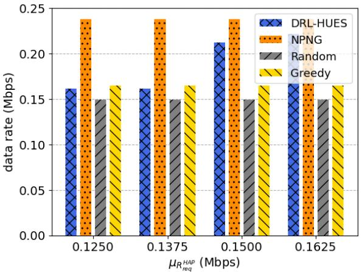

<details>
<summary>bar</summary>

| μR_req^HAP (Mbps) | DRL-HUES | NPNG | Random | Greedy |
|---|---|---|---|---|
| 0.1250 | 0.16 | 0.24 | 0.15 | 0.165 |
| 0.1375 | 0.16 | 0.24 | 0.15 | 0.165 |
| 0.1500 | 0.21 | 0.24 | 0.15 | 0.17 |
| 0.1625 | 0.17 | 0.24 | 0.15 | 0.165 |
</details>

Fig. 7. The average converged data rate of the HAP over the last 100 episodes comparison among the proposed DRL-HUES, NPNG, random, and greedy schemes.

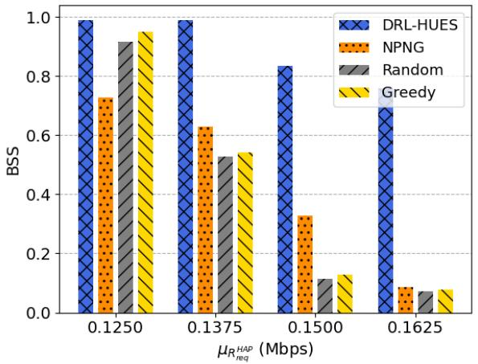

<details>
<summary>bar</summary>

| μ_R^HAP_req (Mbps) | DRL-HUES | NPNG | Random | Greedy |
|---|---|---|---|---|
| 0.1250 | 1.0 | 0.73 | 0.92 | 0.95 |
| 0.1375 | 1.0 | 0.63 | 0.53 | 0.54 |
| 0.1500 | 0.84 | 0.33 | 0.12 | 0.13 |
| 0.1625 | 0.71 | 0.08 | 0.07 | 0.08 |
</details>

Fig. 8. The average converged BSS of the HAP over the last 100 episodes comparison among the proposed DRL-HUES, NPNG, random, and greedy schemes.

# A. Discussion on Energy Harvesting Assumptions and Limitations

Since the energy conversion efficiency over such long-distance channels is very limited due to severe path loss, the harvested energy in this paper is assumed to support only the HAP’s uplink transmission to the LEO satellite.

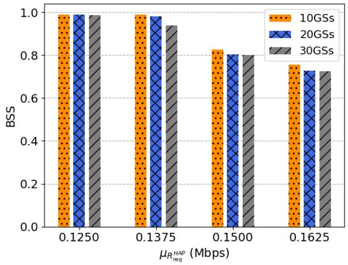

<details>
<summary>bar</summary>

| μ_R^HAP req (Mbps) | 10GSs | 20GSs | 30GSs |
|---|---|---|---|
| 0.1250 | 1.0 | 1.0 | 1.0 |
| 0.1375 | 1.0 | 1.0 | 0.94 |
| 0.1500 | 0.83 | 0.81 | 0.81 |
| 0.1625 | 0.76 | 0.73 | 0.73 |
</details>

Fig. 9. The average converged BSS of the HAP over the last 100 episodes using the proposed DRL-HUES under different numbers of GSs.

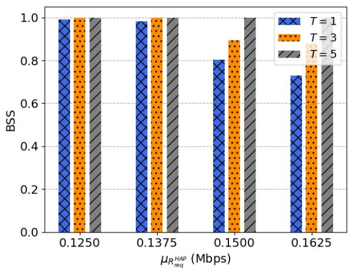

<details>
<summary>bar</summary>

| μ_R^HAP_req (Mbps) | T = 1 | T = 3 | T = 5 |
|---|---|---|---|
| 0.1250 | 1.0 | 1.0 | 1.0 |
| 0.1375 | 1.0 | 1.0 | 1.0 |
| 0.1500 | 0.8 | 0.9 | 1.0 |
| 0.1625 | 0.7 | 0.9 | 1.0 |
</details>

Fig. 10. The average converged BSS of the HAP over the last 100 episodes using the proposed DRL-HUES under different lengths of time slot.

Other power-intensive requirements (e.g., maintaining altitude or flight control) are assumed to be supplied by alternative energy sources such as solar panels or onboard batteries. In addition, practical radio frequency rectification circuits for energy harvesting are inherently nonlinear, exhibiting sensitivity thresholds at low input levels and saturation effects at high input levels. However, the thresholds vary significantly across different hardware implementations, and there is currently no universally accepted standard in the existing literature. If relatively loose thresholds are assumed, the performance is close to that of the linear model, while very strict thresholds may result in regions where energy harvesting becomes completely ineffective. Therefore, many prior works [21], [22] have adopted the linear energy harvesting model as a tractable approximation to enable higher-level system analysis and optimization. Following this mainstream approach, we also employ the linear model in this paper. These idealized assumptions allow us to focus on optimizing the HAP’s charging and transmission scheduling through intelligent decision-making. Moreover, our simulation results demonstrate that, despite the low harvesting efficiency, the proposed DRL-HUES still achieves significant improvements in BSS compared with NPNG [22], which is the best available related work, as well as random and greedy scheduling schemes.

# VI. CONCLUSION

In this paper, we have formulated the HAP uplink transmission and energy harvesting scheduling problem in 6G SAGIN as a non-linear programming problem and further proven that this problem is an NP-hard problem by the reduction to the knapsack problem. The objective of this problem is to maximize the long-term average binary scale satisfaction (BSS) of an HAP. In this paper, we have proposed a deep reinforcement learning-based HAP uplink transmission and energy harvesting scheduling scheme (DRL-HUES) leveraging a DRL, PPO, to handle the stochastic transmission demands of the HAP in each time slot. The proposed DRL-HUES scheme can effectively manage the $\mathrm { H A P } ^ { \prime } \mathrm { s }$ transmit power and the harvesting time-sharing ratio in each time slot, achieving long-term optimization of the network performance. Our simulation results have demonstrated that the proposed DRL-HUES scheme can significantly outperform NPNG, which is the best available related work, random, and greedy scheduling schemes in terms of the long-term average BSS of an HAP. To the best of our knowledge, our work is the first to adopt DRL for the HAP uplink transmission and energy harvesting scheduling problem in NOMA-based SAGIN. Future work includes extending the NOMA-based SAGIN to support multi-HAP collaboration, and focusing on efficient spectrum resource allocation and trajectory planning to accommodate the dynamic changes in GUEs’ data transmission demands across different regions.

# REFERENCES

[1] O. Kodheli et al., “Satellite communications in the new space era: A survey and future challenges,” IEEE Commun. Surveys Tuts., vol. 23, no. 1, pp. 70–109, 1st Quart., 2021.   
[2] J. Liu, Y. Shi, Z. M. Fadlullah, and N. Kato, “Space-air-ground integrated network: A survey,” IEEE Commun. Surveys Tuts., vol. 20, no. 4, pp. 2714–2741, 2018.   
[3] N.-N. Dao et al., “Survey on aerial radio access networks: Toward a comprehensive 6G access infrastructure,” IEEE Commun. Surveys Tuts., vol. 23, no. 2, pp. 1193–1225, 2nd Quart., 2021.   
[4] H. Al-Hraishawi, H. Chougrani, S. Kisseleff, E. Lagunas, and S. Chatzinotas, “A survey on nongeostationary satellite systems: The communication perspective,” IEEE Commun. Surveys Tuts., vol. 25, no. 1, pp. 101–132, 1st Quart., 2023.   
[5] Technical Specification Group Services and System Aspects, document 21.917 V17.0.1, 3rd Generation Partnership Project (3GPP), Jan. 2023.   
[6] F. Rinaldi et al., “Non-terrestrial networks in 5G & beyond: A survey,” IEEE Access, vol. 8, pp. 165178–165200, 2020.   
[7] M. S. Alam, G. K. Kurt, H. Yanikomeroglu, P. Zhu, and N. D. Ðào, “High altitude platform station based super macro base station constellations,” IEEE Commun. Mag., vol. 59, no. 1, pp. 103–109, Jan. 2021.   
[8] Y. Li, N. Deng, and W. Zhou, “A hierarchical approach to resource allocation in extensible multi-layer LEO-MSS,” IEEE Access, vol. 8, pp. 18522–18537, 2020.   
[9] S. M. R. Islam, N. Avazov, O. A. Dobre, and K.-S. Kwak, “Powerdomain non-orthogonal multiple access (NOMA) in 5G systems: Potentials and challenges,” IEEE Commun. Surveys Tuts., vol. 19, no. 2, pp. 721–742, 2nd Quart., 2017.   
[10] M. Bliss, F. J. Block, T. C. Royster, and D. J. Love, “Uplink NOMA for heterogeneous NTNs with LEO satellites and high-altitude platform relays,” in Proc. WCNC, Apr. 2022, pp. 172–177.   
[11] C. Guo, L. Zhao, C. Feng, Z. Ding, and H.-H. Chen, “Energy harvesting enabled NOMA systems with full-duplex relaying,” IEEE Trans. Veh. Technol., vol. 68, no. 7, pp. 7179–7183, Jul. 2019.

[12] B. Zhao, G. Ren, and X. Dong, “Joint NOMA clustering and power allocation in IoRT-oriented satellite terrestrial relay networks,” IEEE Trans. Veh. Technol., vol. 71, no. 10, pp. 11078–11088, Oct. 2022.   
[13] L. Wang, Y. Wu, H. Zhang, S. Choi, and V. C. M. Leung, “Resource allocation for NOMA based space-terrestrial satellite networks,” IEEE Trans. Wireless Commun., vol. 20, no. 2, pp. 1065–1075, Feb. 2021.   
[14] A. Wang, L. Lei, E. Lagunas, A. I. Pérez-Neira, S. Chatzinotas, and B. Ottersten, “Joint optimization of beam-hopping design and NOMAassisted transmission for flexible satellite systems,” IEEE Trans. Wireless Commun., vol. 21, no. 10, pp. 8846–8858, Oct. 2022.   
[15] X. Li, H. Zhang, W. Li, and K. Long, “Multi-agent DRL for user association and power control in terrestrial-satellite network,” in Proc. IEEE Global Commun. Conf. (GLOBECOM), Dec. 2021, pp. 1–5.   
[16] R. Ge, D. Bian, J. Cheng, K. An, J. Hu, and G. Li, “Joint user pairing and power allocation for NOMA-based GEO and LEO satellite network,” IEEE Access, vol. 9, pp. 93255–93266, 2021.   
[17] N. Wang, F. Li, D. Chen, L. Liu, and Z. Bao, “NOMA-based energy-efficiency optimization for UAV enabled space-air-ground integrated relay networks,” IEEE Trans. Veh. Technol., vol. 71, no. 4, pp. 4129–4141, Apr. 2022.   
[18] R. Liu, K. Guo, K. An, Y. Huang, F. Zhou, and S. Zhu, “Resource allocation for cognitive satellite-HAP-terrestrial networks with nonorthogonal multiple access,” IEEE Trans. Veh. Technol., vol. 72, no. 7, pp. 9659–9663, Jul. 2023.   
[19] P. Qin, H. Li, Y. Fu, J. Hu, X. Wu, and X. Zhang, “Learning-based NOMA-enabled queue-aware task offloading and UAV 3D trajectory planning for SAGIN,” IEEE Trans. Veh. Technol., vol. 74, no. 8, pp. 12364–12375, Aug. 2025.   
[20] X. Wang, H. Chen, and F. Tan, “Hybrid OMA/NOMA mode selection and resource allocation in space-air-ground integrated networks,” IEEE Trans. Veh. Technol., vol. 74, no. 1, pp. 699–713, Jan. 2025.   
[21] P. D. Diamantoulakis, K. N. Pappi, Z. Ding, and G. K. Karagiannidis, “Wireless-powered communications with non-orthogonal multiple access,” IEEE Trans. Wireless Commun., vol. 15, no. 12, pp. 8422–8436, Dec. 2016.   
[22] Z. Ding, R. Schober, and H. V. Poor, “No-pain no-gain: DRL assisted optimization in energy-constrained CR-NOMA networks,” IEEE Trans. Commun., vol. 69, no. 9, pp. 5917–5932, Sep. 2021.   
[23] H. Zhang, H. Wang, Y. Li, K. Long, and V. C. M. Leung, “Toward intelligent resource allocation on task-oriented semantic communication,” IEEE Wireless Commun., vol. 30, no. 3, pp. 70–77, Jun. 2023.   
[24] L. Zhi et al., “Self-powered absorptive reconfigurable intelligent surfaces for securing satellite-terrestrial integrated networks,” China Commun., vol. 21, no. 9, pp. 276–291, Sep. 2024.   
[25] Z. Lin et al., “Refracting RIS-aided hybrid satellite-terrestrial relay networks: Joint beamforming design and optimization,” IEEE Trans. Aerosp. Electron. Syst., vol. 58, no. 4, pp. 3717–3724, Aug. 2022.   
[26] Y. He, Y. Liu, C. Jiang, and X. Zhong, “Multiobjective anti-collision for massive access ranging in MF-TDMA satellite communication system,” IEEE Internet Things J., vol. 9, no. 16, pp. 14655–14666, Aug. 2022.   
[27] Y. Sun et al., “Multi-functional RIS-assisted semantic anti-jamming communication and computing in integrated aerial-ground networks,” IEEE J. Sel. Areas Commun., vol. 42, no. 12, pp. 3597–3617, Dec. 2024.   
[28] O. M. Gul, “Achieving asymptotically optimal throughput and fairness for energy harvesting sensors in IoT network systems,” in Proc. IEEE Int. Conf. Internet Things (iThings) IEEE Green Comput. Commun. (GreenCom) IEEE Cyber, Phys. Social Comput. (CPSCom) IEEE Smart Data (SmartData) IEEE Congr. Cybermatics, Aug. 2024, pp. 353–360.   
[29] O. M. Gul and M. Demirekler, “Asymptotically throughput optimal scheduling for energy harvesting wireless sensor networks,” IEEE Access, vol. 6, pp. 45004–45020, 2018.   
[30] Ö. M. Gül, “Achieving near-optimal fairness in energy harvesting wireless sensor networks,” in Proc. IEEE Sympos. Comput. Commun. (ISCC), Jun. 2019, pp. 1–6.   
[31] J. Schulman, F. Wolski, P. Dhariwal, A. Radford, and O. Klimov, “Proximal policy optimization algorithms,” 2017, arXiv:1707.06347.   
[32] G. H. Lee, H. Park, J. W. Jang, J. Han, and J. K. Choi, “PPO-based autonomous transmission period control system in IoT edge computing,” IEEE Internet Things J., vol. 10, no. 24, pp. 21705–21720, Dec. 2023.

[33] H. An and L. Wang, “Robust topology generation of Internet of Things based on PPO algorithm using discrete action space,” IEEE Trans. Ind. Informat., vol. 20, no. 4, pp. 5406–5414, Apr. 2024.   
[34] J. Schulman, S. Levine, P. Abbeel, M. Jordan, and P. Moritz, “Trust region policy optimization,” in Proc. 32nd Int. Conf. Mach. Learn., Jul. 2015, pp. 1889–1897.   
[35] Technical Specification Group Radio Access Network; Study on New Radio (NR) To Support Non-Terrestrial Networks; (Release 15), document 38.811 V15.4.0, 3rd Generation Partnership Project (3GPP), Sep. 2020.   
[36] Preferred Characteristics of Systems in the Fixed Service Using High Altitude Platform Stations in the Frequency Bands 47.2-47.5 GHz and 47.9-48.2 GHz. Accessed: Aug. 1, 2023. [Online]. Available: https://www.itu.int/rec/R-REC-F.1500/en/   
[37] H. Jiang, H. Wang, Y. Hu, and J. Wu, “Dynamic user association in scalable ultra-dense LEO satellite networks,” IEEE Trans. Veh. Technol., vol. 71, no. 8, pp. 8891–8905, Aug. 2022.   
[38] K. An et al., “Exploiting multi-layer refracting RIS-assisted receiver for HAP-SWIPT networks,” IEEE Trans. Wireless Commun., vol. 23, no. 10, pp. 12638–12657, Oct. 2024.   
[39] Python. Accessed: Aug. 1, 2023. [Online]. Available: https://www. python.org/   
[40] Tensorflow. Accessed: Aug. 1, 2023. [Online]. Available: https://www. tensorflow.org/   
[41] Technical Specification Group Services and System Aspects; Study on Using Satellite Access in 5G; Stage 1; (Release 16), document 22.822 V16.0.0, 3rd Generation Partnership Project (3GPP), Jun. 2018.


<details>
<summary>natural_image</summary>

Portrait photo of a man in a black shirt (no text or symbols visible)
</details>

Yi-Huai Hsu (Member, IEEE) received the Ph.D. degree in computer science and engineering from National Chiao Tung University, Hsinchu, Taiwan, in 2016. He was a Post-Doctoral Research Fellow with the IoT Research Center, National Taiwan University, Taipei, Taiwan, from 2019 to 2020. He was an Engineer with Information and Communications Research Laboratories, Industrial Technology Research Institute, Hsinchu, from 2016 to 2019. He is currently an Assistant Professor with the Department of Computer Science and Engineering,

Yuan Ze University, Taoyuan, Taiwan. His research interests include 5G/6G wireless networks, edge computing, and AI for networking.


<details>
<summary>natural_image</summary>

Portrait photo of a young man in a beige collared shirt (no text or symbols visible)
</details>

Jiun-Ian Lee (Student Member, IEEE) received the B.S. degree from the Department of Computer Science and Engineering, Yuan Ze University, Taoyuan, Taiwan, in 2023. He is currently pursuing the M.S. degree in computer science and engineering with Yuan Ze University. His research interests include 5G/6G wireless networks, AI for networking, and satellite network systems.


<details>
<summary>natural_image</summary>

Portrait photo of a young man with short black hair wearing a dark shirt (no text or symbols visible)
</details>

Chao-Hung Lee received the M.S. degree from the Department of Computer Science and Engineering, Yuan Ze University, Taoyuan, Taiwan, in 2024. His research interests include satellite network systems and wireless networks.