# A Lyapunov-Guided Diffusion-Based Reinforcement Learning Approach for UAV-Assisted Vehicular Networks With Delayed CSI Feedback

Zhang Liu , Member, IEEE, Lianfen Huang , Member, IEEE, Zhibin Gao , Member, IEEE, Xianbin Wang , Fellow, IEEE, Dusit Niyato , Fellow, IEEE, and Xuemin Shen , Fellow, IEEE

Abstract—Low altitude uncrewed aerial vehicles (UAVs) are expected to facilitate the development of aerial–ground integrated intelligent transportation systems and unlocking the potential of the emerging low-altitude economy. However, several critical challenges persist, including the dynamic optimization of network resources and UAV trajectories, limited UAV endurance, and imperfect channel state information (CSI). In this paper, we offer new insights into low-altitude economy networking by exploring intelligent UAV-assisted vehicle-to-everything communication strategies aligned with UAV energy efficiency. Particularly, we formulate an optimization problem of joint channel allocation, power control, and flight altitude adjustment in UAV-assisted vehicular networks. Taking CSI feedback delay into account, our objective is to maximize the vehicle-to-UAV communication sum rate while satisfying the UAV’s long-term energy constraint. To this end, we first leverage Lyapunov optimization to decompose the original long-term problem into a series of per-slot deterministic subproblems. We then propose a diffusion-based deep deterministic policy gradient (D3PG) algorithm, which innovatively integrates diffusion models to determine optimal channel allocation, power control, and flight altitude adjustment decisions. Through extensive simulations using real-world vehicle mobility traces, we demonstrate the superior performance of the proposed D3PG algorithm compared to existing benchmark solutions.

Zhibin Gao is with the Navigation Institute, Jimei University, Xiamen 361021, China (e-mail: gaozhibin@jmu.edu.cn).

Digital Object Identifier 10.1109/TWC.2026.3680987

Index Terms—Low-altitude economy networking, UAV-assisted vehicular networks, Lyapunov optimization, diffusion models, reinforcement learning, resource management, UAV trajectory planning.

## I. INTRODUCTION

## A. Background and Overview

W ITH the rapid advancement of sensing and wirelesstechnologies, vehicular networks have made signifi- technologies, vehicular networks have made significant strides, transforming traditional transportation systems into intelligent transportation systems (ITS) [1]. Nevertheless, effective ITS operation relies on dynamic vehicular communications with ubiquitous connectivity, low latency, and high reliability [2], [3]. By integrating various communication methods, such as vehicle-to-infrastructure (V2I) and vehicleto-vehicle (V2V), vehicle-to-everything (V2X) technologies provide tailored support to ITS by meeting diverse quality of service (QoS) requirements of different vehicular communications [4], [5]. Specifically, high-capacity V2I communications are used to deliver infotainment services (e.g., high-definition maps and augmented reality navigation), while high-reliability V2V communications ensure road safety services (e.g., cooperative driving and incident reporting).

However, guaranteeing seamless connectivity and providing uninterrupted services through integrated V2X communications present significant challenges. This difficulty is mainly due to the distinct technical challenges faced by V2I and V2V communications. On one hand, V2I infrastructures (e.g., base stations and roadside units) perform poorly in urban areas with high vehicle density [6], bringing excessive communication requests. As the number of vehicles increases, the V2I transmission rate decreases due to intense competition. Additionally, massive deployment of V2I infrastructures in rural areas and on cross-border highways is often economically unfeasible [7], [8]. On the other hand, due to high mobility and the Doppler effect, which lead to significant path loss and frequent blockages, V2V communications may experience degraded link quality and transmission interruptions [9].

Recently, due to their advantages in flexible deployment, efficient transmission, and cost-effectiveness [10], [11], uncrewed aerial vehicles (UAVs) have become promising platforms for many emerging applications, driving the growth of the low-altitude economy [12], [13]. For instance, Amazon Prime Air uses UAVs to deliver packages to customers, addressing the challenge of last-mile delivery [14]. More importantly, UAVs can serve as aerial base stations, making them an attractive complement to terrestrial infrastructure in V2X communications [15], [16].1 Specifically, in a favorable aerial-terrestrial propagation environment, UAVs have a high likelihood of establishing line-of-sight (LoS) communication links with vehicles. Additionally, with their controllable mobility, UAVs can adjust their positions to follow moving vehicles that need to establish connections.

## B. Motivation and Main Challenges

Despite the above advantages, UAV-assisted vehicular networks still face several critical challenges that need to be carefully addressed. First, balancing the trade-off between the different network operational intents or objectives, including system communication performance and the energy consumption of UAVs, is challenging. Since UAVs have limited endurance due to their finite battery life, it is crucial to ensure sustained operation in order to improve system performance [6]. In other words, if a UAV consumes too much energy (e.g., by frequently adjusting its altitude to establish LoS connections), the available energy may be insufficient for subsequent service provisioning. Existing studies [5], [9], [17], [18] either consider only the UAV’s communication-related energy consumption or completely overlook the propulsion energy required during service provisioning. In practice, longterm UAV flight energy is a critical factor, as excessive short-term energy usage may compromise the UAV’s ability to sustain continuous operation and severely degrade longterm network performance. However, considering the dynamic characteristic of UAV-assisted vehicular networks (e.g., vehicle mobility and time-varying channel conditions), making decisions on optimization variables across consecutive time slots without knowledge of future dynamics is a non-trivial challenge.

Second, dynamic network operation with low-latency knowledge of channel state information (CSI) from all communication links is challenging. When UAVs serve as aerial base stations, they can only estimate the CSI between vehicles and UAVs [5]. In this case, the CSI of V2V links is reported to the aerial base stations periodically, potentially causing additional CSI feedback delays. Existing studies such as [14] and [19] commonly overlook the impact of CSI feedback delay in dynamic vehicular networks, despite Doppler shift and multipath fading making CSI aging particularly severe in high-mobility environments. As a result, the solutions proposed in these works may experience substantial performance degradation when applied to practical UAV-assisted vehicular scenarios where timely and accurate CSI cannot be guaranteed. This happens due to severe mismatches between the actual channel state and the estimated CSI, leading to significantly reduced throughput and a higher probability of link interruptions.

Third, conventional optimization methods are unsuitable for dynamic vehicular networks. In practical scenarios, vehicle locations and wireless channel conditions change over time, meaning an optimal solution derived for one specific moment and situation may not remain optimal in the long run. Existing studies [5], [14], [20] primarily rely on analytical solutions, which are difficult to apply in highly dynamic UAV-assisted vehicular networks. In particular, the rapid variation in vehicular mobility makes such methods insufficiently flexible or robust, often resulting in significant performance loss when deployed for real-time decision-making. Recently, several studies have adopted deep reinforcement learning (DRL) [19], [21], [22], [23], which has emerged as a promising technique for real-time decision-making by learning the relationship between input states (e.g., vehicle mobility) and actions (e.g., channel allocation). However, DRL also faces challenges in balancing exploration and exploitation—excessive exploration may lead to suboptimal solutions [24], [25], while excessive exploitation can result in short-sighted decision-making.

## C. Summary of Contributions

Motivated by the above challenges, we formulate a joint optimization problem involving channel allocation, power control, and trajectory planning for UAV-assisted vehicular networks. The objective is to maximize the V2U communication sum rate while ensuring the UAV’s long-term energy constraint. Our main contributions are as follows:

• Framework: We formulate the joint channel allocation, power control, and flight altitude adjustment problem in UAV-assisted vehicular networks, explicitly incorporating CSI feedback delay and a long-term UAV energy constraint-two practical yet often overlooked challenges. The resulting formulation is a mixed-integer nonlinear programming (MINLP) problem, which is NP-hard. This makes the problem particularly challenging to solve, especially in the presence of vehicle mobility, timevarying channel conditions, and the UAV’s long-term energy constraint.

• Solution: To this end, we first employ the Lyapunov optimization technique to decouple the original problem into a series of per-slot deterministic subproblems, ensuring the UAV’s sustained operation under stochastic conditions. Building on this transformation, we propose a diffusion-based deep deterministic policy gradient (D3PG) algorithm to address the problem on a per-slot basis.

• Innovation: In the D3PG algorithm, we leverage diffusion models—originally developed for image generation—to optimize channel allocation, power control, and UAV flight altitude adjustment decisions. The denoising process in diffusion models effectively addresses the exploration–exploitation trade-off in DRL. Also, the proposed D3PG algorithm can reconstruct more accurate representation of the underlying channel conditions from delayed CSI, leading to more reliable resource allocation decisions.

• Validation: We design our simulation scenario based on a real-world road network extracted from OpenStreetMap [26] and use SUMO [27] to simulate vehicle mobility, thereby establishing a realistic UAV-assisted vehicular networks. We then evaluate the effectiveness of the proposed D3PG algorithm through experiments under various simulation settings, comparing its performance with three benchmark solutions.

## D. Paper Organization

The rest of the paper is structured as follows: Sec. II reviews related works. Sec. III describes the system model and formulates the joint optimization problem of channel allocation, power control, and flight altitude adjustment in UAV-assisted vehicular networks. Sec. IV proposes Lyapunov optimization technique to handle the original problem. Sec. V introduces the preliminaries of the diffusion model. Sec. VI presents our proposed D3PG algorithm. Sec. VII details the simulation results, followed by the conclusion and future work in Sec. VIII.

## II. RELATED WORK

Henceforth, we summarize the contributions of related works and highlight the aspects they have not addressed, which serve as the primary motivations for this work.

## A. UAV-Assisted Communications for Static Ground Users

UAVs have been extensively studied and utilized in the literature as flying base stations and relay nodes to enhance communication quality for ground users. The authors in [28] investigated the joint optimization of UAV trajectory and resource allocation, aiming to maximize system energy efficiency while ensuring the service quality of all ground users. The authors in [29] explored the joint optimization of the number and placement of UAVs to ensure wireless coverage for all ground users. The authors in [30] studied uplink transmission in a UAV-assisted cellular network, aiming to minimize the transmit power consumption of both users and UAVs. The authors in [31] proposed an online datadriven multi-UAV trajectory and transmission control scheme to optimize the quality-of-experience for ground users.

Although these works achieve satisfactory performance in their respective scenarios, they assume a deterministic and static user distribution. When considering highly dynamic vehicular networks with time-varying channel conditions and stochastic vehicle movements, the aforementioned schemes face various technical challenges in performance optimization, necessitating further exploration.

## B. UAV-Assisted Vehicular Networks

As a highly mobile and easily deployable facility, the UAV is well-suited for communications in dynamic vehicular networks. The authors in [14] addressed the power and data rate allocation problem in UAV-enabled vehicular ad-hoc networks, aiming to minimize communication delay while maximizing energy efficiency. The authors in [19] studied the UAV’s 3D position deployment problem to analyze system performance in terms of the vehicular users’ successful service probability. The authors in [17] introduced a UAV-aided relaying system for vehicular networks, aiming to reduce transmission time by jointly optimizing relay selection and transmission scheduling. The authors in [18] proposed a novel UAV-enabled scheduling protocol for vehicular networks to enhance the efficiency of V2X data dissemination.

However, these works either implicitly assume perfect CSI acquisition [14], [19], overlooking the CSI feedback delay in dynamic vehicular networks caused by Doppler shift and multipath fading, or neglect the UAV’s long-term energy constraint due to its finite battery life [17], [18], which can significantly impact its sustained operation for long-term service provisioning.

## C. Usage of Deep Reinforcement Learning in Optimization

Recently, learning-based algorithms, particularly DRL, have been widely applied to improve real-time decision-making and solution design for complex optimization problems. The authors in [23] proposed a DRL-based UAV path planning scheme that learns the historical locations of different cluster heads to determine optimal hover points for the UAV. The authors in [22] employed a double deep Q-network with a dueling architecture to assist the UAV in determining the optimal flying direction for each time slot. The authors in [32] introduced a deep Q-network framework combined with a difference-of-convex algorithm to jointly optimize UAV positioning and radio resource allocation. The authors in [33] explored a multi-agent two-timescale DRL algorithm for power allocation and content placement of content providers, aiming to enhance delivery success probability and content hit ratio.

Although DRL utilizes deep neural networks (DNNs) to learn the relationship between a problem’s state space (e.g., vehicle mobility) and its action space (e.g., channel allocation), making it well-suited for real-time decisionmaking in dynamic vehicular networks, the use of common multi-layer perceptron (a type of fully connected DNN) in DRL architectures is ineffective due to the explorationexploitation trade-off and the risk of converging to suboptimal policies [34].

## D. Discussion of Relevant Prior Studies

Several related works have addressed problems similar to those in this paper, but they still exhibit important limitations. The authors in [5] formulated the UAV coverage radius maximization problem while accounting for CSI feedback delay. However, the study does not consider UAV energy consumption, which is inherently constrained by its finite battery capacity. Besides, the proposed closed-form power control policies and graph-theoretic methods may face significant challenges in real-time decision-making within dynamic vehicular networks. The authors in [9] investigated the resource allocation problem in UAV-assisted vehicular networks with delayed CSI feedback. However, the study considered only the UAV’s transmission power, neglecting its flight power consumption. In addition, the proposed H-DDQN algorithm discretizes the optimization variables and therefore exhibits limited performance in continuous action spaces (as demonstrated in Sec. VII). The authors in [20] proposed a V2I–V2V collaboration framework to support emergency communications in air base station (ABS)-aided vehicular networks with delayed CSI feedback. However, the study ignored the energy consumption of the ABS, which has limited endurance in practice. Additionally, the proposed analytical solution leads to extensive computation, as any change in vehicle locations or wireless channel conditions necessitates rerunning the analytical solution.

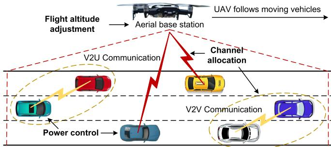  
Fig. 1. A schematic illustration of UAV-assisted vehicular networks incorporating both V2U and V2V communication links.

As a result, building on these relevant studies, the key contributions of this paper lie in: (i) explicitly accounting for the UAV’s long-term energy consumption to ensure sustained operation. To this end, we employ the Lyapunov optimization technique to decouple the original problem–with its long-term UAV energy consumption constraint–into a series of per-slot deterministic subproblems, thereby ensuring sustained UAV operation under stochastic conditions. (ii) addressing the inefficiency of conventional optimization methods when applied to dynamic vehicular networks. To this end, we propose a diffusion model-based DRL algorithm that not only enables real-time decision-making but also introduces a promising paradigm for tackling multi-modal decision-making problems in DRL through the reverse process (as detailed in Sec. V-B2).

## III. SYSTEM MODEL AND PROBLEM FORMULATION

In this section, we first provide an overview of the network, detailing the UAV-assisted vehicular networks considered in this paper. We then introduce the V2U and V2V collaborative communication models, followed by the UAV energy consumption model. Consequently, we formulate the joint optimization problem of channel allocation, power control, and flight altitude adjustment to maximize the V2U communication sum rate while ensuring the UAV’s long-term energy constraint.

## A. Network Outline

Fig. 1 illustrates the UAV-assisted vehicular network of interest, consisting of a single UAV acting as an aerial base station and several moving vehicles. Specifically, we consider a unidirectional highway scenario that lacks terrestrial infrastructure due to remoteness or post-disaster conditions. The network system operates over a time window divided into discrete time slots, denoted as $\begin{array} { r c l } { \mathcal { T } } & { = } & { \{ 1 , . . . , T \} } \end{array}$ A standalone UAV moves at a constant speed, following the vehicles to provide communication services.2 Leveraging cellular technology, vehicles can upload their sensing data to the UAV to enable collaborative sensing services via V2U communications, where the set of V2U communication links is denoted as $\mathcal { M } = \{ 1 , . . . , M \}$ . Additionally, leveraging deviceto-device communication technology, vehicles can establish V2V connections to exchange real-time local data for incident reporting. The set of V2V communication links is denoted as $\mathcal { K } = \{ 1 , . . . , K \}$ , where $K \leq M$

SUMMARY OF KEY NOTATIONS  
TABLE I
<table><tr><td rowspan=1 colspan=1>Notations</td><td rowspan=1 colspan=1>Description</td></tr><tr><td rowspan=1 colspan=1> $\widehat { g _ { k } ^ { \mathrm { V } } ( t ) }$ </td><td rowspan=1 colspan=1>Small-scale fading between V2V communication pairk at time slot t, prior to the feedback delay</td></tr><tr><td rowspan=1 colspan=1> $\widehat { g _ { m , k } ^ { \mathrm { V } } } ( t )$ </td><td rowspan=1 colspan=1>Small-scale fading from V2U transmitter m to V2Vreceiver k at time slot t, prior to the feedback delay</td></tr><tr><td rowspan=1 colspan=1> $\overline { { h _ { m } ^ { \mathrm { U } } ( t ) } }$ </td><td rowspan=1 colspan=1>Uplink channel gain from V2U transmitter m to theUAV at time slot t</td></tr><tr><td rowspan=1 colspan=1> $\overline { { h _ { k } ^ { \mathrm { U } } ( t ) } }$ </td><td rowspan=1 colspan=1>Uplink channel gain from V2V transmitter k to the UAVat time slot t</td></tr><tr><td rowspan=1 colspan=1> $\overline { { h _ { k } ^ { \vee } ( t ) } }$ </td><td rowspan=1 colspan=1>Uplink channel gain between V2V communication pairk at time slot t</td></tr><tr><td rowspan=1 colspan=1> $\overline { { h _ { m , k } ^ { \vee } ( t ) } }$ </td><td rowspan=1 colspan=1>Channel gain from V2U transmitter m to V2V receiverk at time slot t</td></tr><tr><td rowspan=1 colspan=1> $\overline { { \kappa } }$ </td><td rowspan=1 colspan=1>Index set of V2V communication links</td></tr><tr><td rowspan=1 colspan=1> $\overline { { \mathcal { M } } }$ </td><td rowspan=1 colspan=1>Index set of V2U communication links</td></tr><tr><td rowspan=1 colspan=1> $\overline { { P ( t ) } }$ </td><td rowspan=1 colspan=1>UAV flight power consumption at time slot t</td></tr><tr><td rowspan=1 colspan=1> $\overline { { Q ( t ) } }$ </td><td rowspan=1 colspan=1>Virtual queue for UAV flight energy consumption attime slot t</td></tr><tr><td rowspan=1 colspan=1> $\overline { { \tau } }$ </td><td rowspan=1 colspan=1>Index set of time slots</td></tr></table>

In this work, we adopt orthogonal frequency division multiplexing (OFDM) modulation, dividing the spectrum into M orthogonal channels, where M V2U communication links are pre-allocated to operate separately over these channels [5], [35]. To enhance spectrum utilization efficiency, the orthogonal channels allocated for V2U communications can be shared with V2V pairs. While spectrum sharing increases network flexibility and scalability, proper resource orchestration is essential to mitigate co-channel interference. To this end, we introduce a binary variable $x _ { k , m } ( t )$ to represent the channel allocation decision for V2V communications at time slot t, where $x _ { k , m } ( t ) = 1$ indicates that the k-th V2V link shares the same spectrum with the m-th V2U link at time slot t; otherwise $x _ { k , m } ( t ) = 0$ . Note that each V2V pair can occupy only a single channel for data transmission in any given time slot. For ease of reference, key notations used in the article are summarized in Table I.

## B. V2U Communication Model

To evaluate the uplink performance of V2U communications, we model the signal-to-interference-plus-noise ratio (SINR) of the m-th V2U link at time slot t as

$$
\gamma _ { m } ^ { \mathrm { U } } ( t ) = \frac { p _ { m } ( t ) h _ { m } ^ { \mathrm { U } } ( t ) } { \sum _ { k = 1 } ^ { K } \Big ( x _ { k , m } ( t ) p _ { k } ( t ) h _ { k } ^ { \mathrm { U } } ( t ) \Big ) + N _ { 0 } B } ,\tag{1}
$$

2In this work, we consider a single UAV for simplicity. However, our approach can be extended to a multi-UAV scenario by dividing the highway into several segments, each serviced by a separate UAV.

where $p _ { m } ( t )$ and $p _ { k } ( t )$ denote the transmit powers of V2U transmitter m and V2V transmitter k, respectively,3 $N _ { 0 }$ is the noise power spectral density, and B is the bandwidth of each channel. Additionally, the uplink channel gain $h _ { m } ^ { \mathrm { U } } ( t )$ from V2U transmitter m to the UAV at time slot t is given by

$$
h _ { m } ^ { \mathrm { U } } ( t ) = \frac { | g _ { m } ^ { \mathrm { U } } ( t ) | ^ { 2 } } { \mathrm { P L } _ { m } ^ { \mathrm { U } } ( t ) } ,\tag{2}
$$

where $g _ { m } ^ { \mathrm { U } } ( t ) \sim \mathcal { C N } ( 0 , 1 )$ represents the small-scale fading,4 and $\mathrm { P L } _ { m } ^ { \mathrm { U } } ( t )$ denotes the large-scale path loss from V2U transmitter m to the UAV at time slot t.

Then, the path loss $\mathrm { P L } _ { m } ^ { \mathrm { U } } ( t )$ considers both line-of-sight (LoS) and non-line-of-sight (NLoS) components. Specifically, it is expressed as a weighted sum:

$$
\begin{array} { r } { \mathbf { P } \mathbf { L } _ { m } ^ { \mathrm { U } } ( t ) = \underset { \mathrm { L o S } } { \underbrace { \mathrm { P r } } } \mathbf { P } \mathbf { L } _ { m } ^ { \mathrm { U , L o S } } ( t ) + ( 1 - \underset { \mathrm { L o S } } { \underbrace { \mathrm { P r } } } ) \mathbf { P } \mathbf { L } _ { m } ^ { \mathrm { U , N L o S } } ( t ) , } \end{array}\tag{3}
$$

where $\mathrm { P r } _ { \mathrm { L o S } }$ is the probability of a LoS connection, and $\mathrm { P L } _ { m } ^ { \mathrm { U } , \mathrm { L o S } } ( t )$ and $\mathrm { P L } _ { m } ^ { \mathrm { U , N L o S } } ( t )$ represent the path losses under LoS and NLoS conditions (expressed in dB), respectively, which can be given by

$$
\mathrm { P L } _ { m } ^ { \mathrm { U , L o S } } ( t ) = 2 0 \log _ { 1 0 } \frac { 4 \pi f _ { c } d _ { m } ^ { \mathrm { U } } ( t ) } { c } + \alpha _ { \mathrm { L o S } } ,\tag{4}
$$

$$
\mathrm { P L } _ { m } ^ { \mathrm { U , N L o S } } ( t ) = 2 0 \log _ { 1 0 } \frac { 4 \pi f _ { c } d _ { m } ^ { \mathrm { U } } ( t ) } { c } + \alpha _ { \mathrm { N L o S } } ,\tag{5}
$$

where $f _ { c }$ is the carrier frequency, c is the speed of light, and αLoS, αNLoS are the mean additional losses under LoS and NLoS conditions, respectively. Moreover, $\begin{array} { r l } { d _ { m } ( t ) } & { { } = } \end{array}$ $\sqrt { H ( t ) ^ { 2 } + | l _ { \mathrm { U } } ( t ) - l _ { m } ( t ) | ^ { 2 } }$ is the 3D distance between the UAV and V2U transmitter m, where H(t) denotes the flight altitude of the UAV at time slot t, and $ { l _ { \mathrm { U } } } ( t ) ,  { l _ { m } } ( t )$ represent the horizontal locations of the UAV and V2U transmitter m at time slot t, respectively.

Besides, the LoS probability is modeled as a function of the elevation angle [37]:

$$
\mathrm { P r } = \frac { 1 } { 1 + a \exp \left( - b \left[ \frac { 1 8 0 } { \pi } \theta - a \right] \right) } ,\tag{6}
$$

where a and b are environment-dependent constants, and $\theta =$ $\tan ^ { - 1 } \left( \frac { H ( t ) } { | | l _ { \mathrm { U } } ( t ) - l _ { m } ( t ) | | } \right)$ is the elevation angle. Similarly, the channel gain $h _ { k } ^ { \mathrm { U } } ( t )$ from V2V transmitter k to the UAV at time slot t can be modeled in the same way.

Finally, based on the SINR in (1), the uplink data rate of the m-th V2U link is calculated via the Shannon formula as:

$$
R _ { m } ^ { \mathrm { U } } ( t ) = B \log _ { 2 } \Big ( 1 + \gamma _ { m } ^ { \mathrm { U } } ( t ) \Big ) .\tag{7}
$$

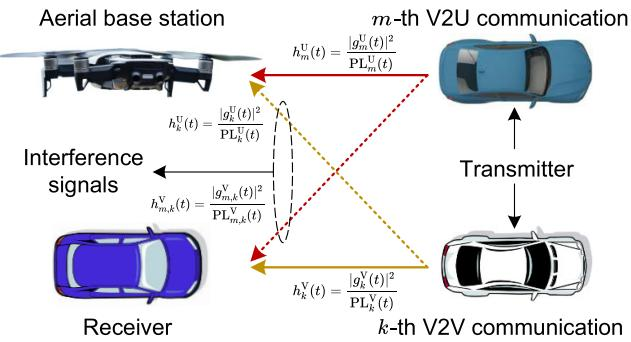  
Fig. 2. A schematic illustration of the V2U and V2V channel gains, along with their respective interference signals, in UAV-assisted V2X communications.

## C. V2V Communication Model

The SINR of the k-th V2V link at time slot t, denoted as $\gamma _ { k } ^ { \mathrm { V } } ( t )$ , is given by

$$
\gamma _ { k } ^ { \mathrm { V } } ( t ) = \frac { p _ { k } ( t ) h _ { k } ^ { \mathrm { V } } ( t ) } { \sum _ { m = 1 } ^ { M } \Big ( x _ { k , m } ( t ) p _ { m } ( t ) h _ { m , k } ^ { \mathrm { V } } ( t ) \Big ) + N _ { 0 } B } ,\tag{8}
$$

where the uplink channel gain $h _ { k } ^ { \mathrm { v } } ( t )$ between V2V communication pair k at time slot t is also modeled by combining large-scale path loss and Rayleigh small-scale fading as

$$
h _ { k } ^ { \mathrm { V } } ( t ) = \frac { | g _ { k } ^ { \mathrm { V } } ( t ) | ^ { 2 } } { \mathrm { P L } _ { k } ^ { \mathrm { V } } ( t ) } .\tag{9}
$$

Here, $g _ { k } ^ { \vee } ( t ) \sim \mathcal { C N } ( 0 , 1 )$ represents the small-scale fading, and P $- \spadesuit _ { k } ( t ) \sp { \prime } = 4 4 . 2 3 \substack { + 1 6 . 7 \log _ { 1 0 } | | l _ { k } ^ { \mathrm { T x } } ( t ) - l _ { k } ^ { \mathrm { R x } } ( t ) | | }$ [38] denotes the large-scale path-loss (expressed in dB) between V2V communication pair k at time slot $t ,$ where $l _ { k } ^ { \operatorname { T x } } ( t )$ and $l _ { k } ^ { \mathrm { R x } } ( t )$ represent the horizontal locations of the V2V transmitter and receiver $k ,$ respectively. Similarly, the channel gain $h _ { m , k } ^ { \vee } ( t )$ from V2U transmitter m to V2V receiver k at time slot t can be modeled in the same way.

However, given the rapidly time-varying channel characteristics in high-speed vehicular networks, obtaining accurate CSI is challenging. Specifically, as shown in Fig. 2, aside from $h _ { m } ^ { \mathrm { U } } ( t )$ and $h _ { k } ^ { \mathrm { U } } ( t )$ , which can be directly obtained by the UAV (i.e., aerial base station), the CSI of V2V communications–namely, $h _ { m , k } ^ { \vee } ( t )$ and $h _ { k } ^ { \mathrm { V } } ( t ) \cdot$ –is periodically reported to the UAV, requiring CSI estimation that accounts for additional feedback delays.5 Subsequently, we model the channel variation over a feedback delay $T _ { \mathrm { d e l a y } }$ , using the first order Gauss-Markov process, which can be given by [39]

$$
g ( t ) = J _ { 0 } \left( 2 \pi \frac { f _ { c } s _ { \mathrm { r e l } } } { c } T _ { \mathrm { d e l a y } } \right) \hat { g } ( t ) + \delta ,\tag{10}
$$

where $J _ { 0 } ( \cdot )$ denotes the zero-order Bessel function of the first kind, g(t) represents the estimated small-scale fading in the current time slot $t , ^ { 6 }$ and $\hat { g } ( t ) \ \sim \ \mathcal { C N } ( 0 , 1 )$ corresponds to the small-scale fading prior to the feedback delay. Additionally, $s _ { \mathrm { r e l } }$ represents the relative vehicle speed and $\begin{array} { r } { \delta \sim \mathcal { C N } \left( 0 , 1 - \left[ J _ { 0 } \left( 2 \pi \frac { f _ { c } s _ { \mathrm { r e l } } } { c } T _ { \mathrm { d e l a y } } \right) \right] ^ { 2 } \right) } \end{array}$ is the distribution of the channel discrepancy term.

Finally, based on $( 1 0 ) , g _ { m , k } ^ { \mathrm { V } } ( t )$ and $g _ { k } ^ { \mathrm { V } } ( t )$ can be rewritten as

$$
| g _ { m , k } ^ { \mathrm { v } } ( t ) | ^ { 2 } = \left[ J _ { 0 } \left( 2 \pi \frac { f _ { c } s _ { \mathrm { r e l } } } { c } T _ { \mathrm { d e l a y } } \right) \right] ^ { 2 } | \widehat { g _ { m , k } ^ { \mathrm { v } } } ( t ) | ^ { 2 } + ( \delta _ { m , k } ^ { \mathrm { v } } ) ^ { 2 } ,\tag{11}
$$

$$
| g _ { k } ^ { \mathrm { V } } ( t ) | ^ { 2 } = \left[ J _ { 0 } \left( 2 \pi \frac { f _ { c } s _ { \mathrm { r e l } } } { c } T _ { \mathrm { d e l a y } } \right) \right] ^ { 2 } | \widehat { g _ { k } ^ { \mathrm { V } } } ( t ) | ^ { 2 } + ( \delta _ { k } ^ { \mathrm { V } } ) ^ { 2 } .\tag{12}
$$

## D. UAV Energy Consumption Model

The UAV’s power consumption is crucial in UAV-assisted vehicular networks due to its limited battery capacity. In this paper, considering that the communication power of the UAV is negligible compared to its flight power [40], we focus solely on the UAV’s flight power consumption for simplicity, which can be expressed as [41]

$$
\begin{array} { r } { P ( t ) = \underbrace { P _ { 0 } \left( 1 + \frac { 3 \left( v _ { x } ( t ) ^ { 2 } + v _ { y } ( t ) ^ { 2 } \right) } { \Omega ^ { 2 } r ^ { 2 } } \right) } _ { \mathrm { B l a d e ~ p r o w e r } } + \underbrace { \frac { P _ { 1 } v _ { 0 } } { v _ { x } ( t ) ^ { 2 } + v _ { y } ( t ) ^ { 2 } } } _ { \mathrm { I n d u c e d ~ p o w e r } } } \\ { + \underbrace { \frac { 1 } { 2 } d _ { 0 } \rho s _ { r } A _ { r } \left( v _ { x } ( t ) ^ { 2 } + v _ { y } ( t ) ^ { 2 } \right) ^ { \frac { 3 } { 2 } } } _ { \mathrm { P a r a i t e ~ p o w e r } } + \underbrace { G v _ { z } ( t ) } _ { \mathrm { V e r i c a l ~ f l i g h t ~ p o w e r } } , } \end{array}\tag{13}
$$

where the UAV’s velocity in the 3D Cartesian coordinate system is represented as $\left\lceil v _ { x } ( t ) , v _ { y } ( t ) , v _ { z } ( t ) \right\rceil ^ { \prime } \ \in \ \mathbb { R } ^ { 3 \times 1 } .$ $P _ { o }$ denotes the blade profile power during hovering; Ω is the blade’s angular velocity; r is the rotor radius; $P _ { 1 }$ is the induced power during hovering; $v _ { 0 }$ is the induced velocity of the rotor during forward flight; $d _ { 0 }$ is the fuselage drag ratio; $\rho$ is the air density; $s _ { r }$ is the rotor solidity; $A _ { r }$ is the rotor disc area, and $G$ represents the UAV’s weight.

## E. Problem Formulation

We now formulate the joint channel allocation, power control, and flight altitude adjustment problem in UAV-assisted vehicular networks as a dynamic long-term optimization. Our objective is to maximize the V2U communication sum rate in (7) for all V2U communication links across all time slots. This problem is formally defined as P1 below:

$$
\begin{array} { r l } { \mathbf { P 1 } : } & { \displaystyle \operatorname* { m a x } _ { \{ x , p , \Delta H \} } \frac { 1 } { T M } \sum _ { t \in \mathcal { T } } \displaystyle \sum _ { m \in \mathcal { M } } R _ { m } ^ { \mathrm { U } } ( t ) } \\ & { \quad \mathrm { s . t . ~ } \mathcal { C 1 } : \ x _ { k , m } ( t ) \in \{ 0 , 1 \} , \ \forall k \in \mathcal { K } , m \in \mathcal { M } , t \in \mathcal { T } , } \\ & { \quad \quad \mathcal { C 2 } : \ p _ { m } ( t ) \in [ 0 , p _ { \operatorname* { m a x } } ] , \ \forall m \in \mathcal { M } , t \in \mathcal { T } , } \\ & { \quad \quad \mathcal { C 3 } : \ p _ { k } ( t ) \in [ 0 , p _ { \operatorname* { m a x } } ] , \ \forall k \in \mathcal { K } , t \in \mathcal { T } , } \end{array}
$$

$$
\mathcal { C } 4 : ~ H ( t ) \in [ H _ { \operatorname* { m i n } } , H _ { \operatorname* { m a x } } ] , \forall t \in \mathcal { T } ,
$$

$$
\mathcal { C } 5 : \ \sum _ { m = 1 } ^ { M } x _ { k , m } ( t ) \leq 1 , \ \forall k \in \mathcal { K } , t \in \mathcal { T } ,
$$

$$
\mathcal { C } 6 : \ \sum _ { k = 1 } ^ { K } { x _ { k , m } ( t ) \leq 1 } , \ \forall m \in \mathcal { M } , t \in \mathcal { T } ,
$$

$$
\mathcal { C } 7 : \mathrm { ~ P r } \left\{ \gamma _ { k } ^ { \mathrm { V } } ( t ) < \gamma _ { \mathrm { t h } } ^ { \mathrm { V } } \right\} \leq \underset { \mathrm { t h } } { \mathrm { P r } } , \forall k \in \mathcal { K } , t \in \mathcal { T } ,
$$

$$
\mathcal { C } 8 : \operatorname* { l i m } _ { T \to \infty } \frac { 1 } { T } \sum _ { t = 1 } ^ { T } \mathbb { E } \{ P ( t ) \Delta \} \le E _ { \mathrm { t h } } ^ { \mathrm { U } } ,\tag{14}
$$

where $\begin{array} { r l r } { { \textbf { \em x } } } & { { } = } & { \{ x _ { k , m } ( t ) \} _ { k \in { \mathcal { K } } , m \in { \mathcal { M } } , t \in { \mathcal { T } } } } \end{array}$ represents the channel allocation vector for V2V communications reusing the spectrum of V2U communications, $\begin{array} { r l r } { p } & { { } = } & { \{ p _ { m } ( t ) , p _ { k } ( t ) \} _ { k \in \mathcal { K } , m \in \mathcal { M } , t \in \mathcal { T } } } \end{array}$ denotes the power control vector for the transmitting vehicles of both V2U and V2V communications, and $\Delta H = \{ \Delta H ( t ) \} _ { t \in \mathcal { T } }$ denotes the UAV’s flight altitude adjustment vector.

In P1, constraint C1 ensures that the channel allocation decision is binary. Constraints C2 and C3 limit the maximum transmission power of V2U and V2V communications, respectively, with $p _ { \mathrm { m a x } }$ denoting the maximum vehicular transmission power. Constraint C4 defines the value range for the $\mathrm { U A V } ^ { \ , } \mathbf { s }$ flight altitude, where $H _ { \mathrm { m i n } }$ and $H _ { \mathrm { m a x } }$ represent the minimum and maximum UAV height limits, respectively. Constraint C5 enforces exclusive spectrum access, permitting each V2V pair to utilize only one V2U link’s spectrum. Complementarily, constraint C6 ensures that each V2U link’s spectrum can be shared with at most one V2V pair. Constraint $\scriptscriptstyle \mathcal { C } 7$ guarantees the reliability of V2V communications, where $\gamma _ { \mathrm { t h } } ^ { \mathrm { V } }$ represents the minimum SINR required for V2V communications, and $\mathrm { P r } _ { \mathrm { t h } } ^ { \mathrm { V } }$ is the tolerated outage probability. By enforcing a minimum SINR $\gamma _ { \mathrm { t h } } ^ { \mathrm { V } }$ and outage probabil ity $\mathrm { P r } _ { \mathrm { t h } } ^ { \mathrm { V } } .$ , constraint $\scriptscriptstyle { \mathcal { C } } 7$ compels the optimization to balance the needs of both V2U and V2V communications. Without this constraint, the UAV could allocate resources solely to maximize V2U performance at the cost of V2V reliability, tampering the purpose of collaboration. Finally, constraint C8 enforces a long-term UAV propulsion energy constraint to ensure the $\mathrm { U A V } \ ' _ { \mathrm { { s } } }$ operational endurance, where $\Delta$ represents the duration of each time slot, and $E _ { \mathrm { t h } } ^ { \mathrm { U } }$ denotes the maximum allowed operational power of the UAV. Any altitude change $\Delta H$ immediately increases the instantaneous power consumption $P ( t )$ , which in turn causes the virtual energy queue $Q ( t )$ (as detailed in Sec. IV) to grow, making it more difficult to satisfy the long-term energy constraint.

Remark 1: Due to the non-linearity and recursive nature of the long-term constraint C8, the channel allocation, power control, and UAV flight altitude adjustment decisions are interdependent over time. Specifically, a lower altitude reduces path loss due to a shorter distance but decreases the LoS probability and may lead to NLoS connections, whereas a higher altitude increases path loss but significantly improves the likelihood of establishing LoS links [5]. This altitude decision also interacts with power control and channel allocation, both of which must adapt to the interference and channel variations induced by changes in altitude. Additionally, due to the presence of both discrete and continuous variables as defined by constraints C1–C4, problem P1 is an MINLP, which is generally NP-hard. As a result, solving problem P1 efficiently is challenging.

## IV. LYAPUNOV-BASED DECOUPLING OF THE LONG-TERM MINLP

Since the decisions regarding channel allocation, power control, and UAV flight altitude adjustment are interdependent over time, it is challenging to satisfy the long-term constraint C8 without knowledge of future realizations of random vehicle positions and time-varying channel conditions. Therefore, in this section, we apply Lyapunov optimization to decouple the multi-stage MINLP problem into per-slot deterministic optimization problems, ensuring the satisfaction of the longterm constraint C8 under stochastic conditions.

Specifically, we introduce a virtual queue Q(t) for the UAV to track the accumulated UAV flight energy cost that exceeds the required threshold. By setting $Q ( 1 ) = 0$ , the virtual queue is updated as follows:

$$
Q ( t + 1 ) = \operatorname* { m a x } \Big \{ Q ( t ) + P ( t ) \Delta - E _ { \mathrm { t h } } ^ { \mathrm { U } } , 0 \Big \} .\tag{15}
$$

The virtual queue $Q ( t )$ is employed to enforce constraint C8 (see Appendix $\mathbf { A } ) .$ . To manage the queue length efficiently, we adopt the quadratic form of the Lyapunov function–a wellestablished tool for simplifying dynamic system analysis [34]. This function is defined as follows:

$$
L { \Bigl ( } Q ( t ) { \Bigr ) } = { \frac { 1 } { 2 } } { \Bigl ( } Q ( t ) { \Bigr ) } ^ { 2 } .\tag{16}
$$

Subsequently, we employ the conditional Lyapunov drift to quantify the change in the quadratic Lyapunov function between consecutive time slots, expressed as:

$$
\Delta L \Big ( Q ( t ) \Big ) = \mathbb { E } \Big \{ L \Big ( Q ( t + 1 ) \Big ) - L \Big ( Q ( t ) \Big ) \mid Q ( t ) \Big \} ,\tag{17}
$$

where the expectation accounts for randomness in energy consumption. A high conditional Lyapunov drift value indicates greater likelihood of violating constraint C8, and conversely, a low value suggests higher stability. Finally, to jointly optimize the objective function of problem P1 (defined in (14)) while satisfying the long-term constraint C8, we introduce the Lyapunov drift-plus-penalty function:

$$
D \Big ( Q ( t ) \Big ) = \Delta L \Big ( Q ( t ) \Big ) - V \mathbb { E } \left\{ \frac { 1 } { M } \sum _ { m \in \mathcal { M } } R _ { m } ^ { \mathrm { U } } ( t ) \mid Q ( t ) \right\} ,\tag{18}
$$

where $V > 0$ is an adjustable weight parameter that balances the relative importance between the V2U communication sum rate and long-term UAV energy consumption. We next derive an upper bound on the right-hand side of (18), expressed as (see Appendix B):

$$
\begin{array} { r l } & { D \Big ( Q ( t ) \Big ) } \\ & { \leq \mathbb { E } \Big \{ Q ( t ) \Big ( P ( t ) \Delta - E _ { \mathrm { t h } } ^ { \mathrm { U } } \Big ) \mid Q ( t ) \Big \} } \\ & { \quad - V \mathbb { E } \left\{ \cfrac { 1 } { M } \displaystyle \sum _ { m \in \mathcal { M } } R _ { m } ^ { \mathrm { U } } ( t ) \mid Q ( t ) \right\} + \frac { 1 } { 2 } \Big ( P ( t ) \Delta - E _ { \mathrm { t h } } ^ { \mathrm { U } } \Big ) ^ { 2 } . } \end{array}\tag{19}
$$

By omitting the constant which is independent of queue length, minimizing the upper bound in (19) allows us to reformulate the original problem P1 as a per-slot deterministic optimization problem P2. This problem can be solved in each time slot (the details are provided in Sec. VI) without requiring knowledge of future channel states or vehicle mobility patterns, while still satisfying the long-term constraint C8:

$$
\begin{array} { r l r } {  { \mathbf { P } 2 : \operatorname* { m i n } _ { \{ \substack { x ( t ) , p ( t ) , \Delta H ( t ) } \} } Q ( t ) ( P ( t ) \Delta - E _ { \mathrm { t h } } ^ { \mathrm { U } } ) - \frac { V } { M } \sum _ { m \in \mathcal { M } } R _ { m } ^ { \mathrm { U } } ( t ) } } \\ & { } & { \qquad \mathrm { ~ s . t . ~ } \ \mathcal { C } 1 - \mathcal { C } 7 , } \end{array}\tag{20}
$$

where $\mathbf { \boldsymbol { x } } ( t ) ~ = ~ \{ \boldsymbol { x } _ { k , m } ( t ) \} _ { k \in \mathcal { K } , m \in \mathcal { M } }$ represents the channel allocation vector for V2V communications reusing the spectrum of V2U communications at time slot $t , ~ p ( t ) ~ =$ $\{ p _ { m } ( t ) , p _ { k } ( t ) \} _ { k \in \mathcal { K } , m \in \mathcal { M } }$ denotes the power control vector for the transmitting vehicles of both V2U and V2V communications at time slot t, and $\Delta H ( t )$ denotes the UAV’s flight altitude adjustment at time slot t.

## V. BASIC IDEA OF DIFFUSION MODELS

Prior to introducing our D3PG algorithm, we first present the rationale for combining diffusion models with DRL (specifically, diffusion-based deep deterministic policy gradient). We then describe the adaptation of the diffusion model to generate decisions for channel allocation, power control, and UAV flight altitude adjustment.

## A. Motivation of Adopting Diffusion Model

Beyond the limitations of multi-layer perceptrons (MLPs) in conventional DRL approaches (discussed in Sec. II-C), our adoption of diffusion models is further motivated by their distinctive compatibility with DRL frameworks. Specifically, in a conventional diffusion model, a user can input a text prompt (e.g., “an apple on the table”) to guide the model in generating a corresponding image. In our scenario, we conceptualize optimal channel allocation, power control, and UAV flight altitude adjustment as the target image to be generated. Subsequently, each reverse denoising step explicitly conditions on the current state, allowing the model to iteratively align its output with the underlying environmental dynamics (as detailed in Sec. V-B).

Additionally, integrating diffusion models enables robust decision-making in dynamic environments with CSI feedback delay. Specifically, diffusion models possess inherent denoising capabilities, allowing them to iteratively refine noisy or delayed information through the reverse process (as detailed in Sec. V-B2). This makes them particularly suitable for our scenario, where CSI received at the UAV is inevitably outdated due to feedback latency. By incorporating diffusion models as the actor network, the proposed D3PG algorithm can reconstruct more accurate representation of the underlying channel conditions from delayed CSI, leading to more reliable resource allocation decisions. Once trained, the diffusion model can generate optimized decisions for any encountered environmental state,7 a dynamic solution-generation capability that is especially advantageous in vehicular networks [24].

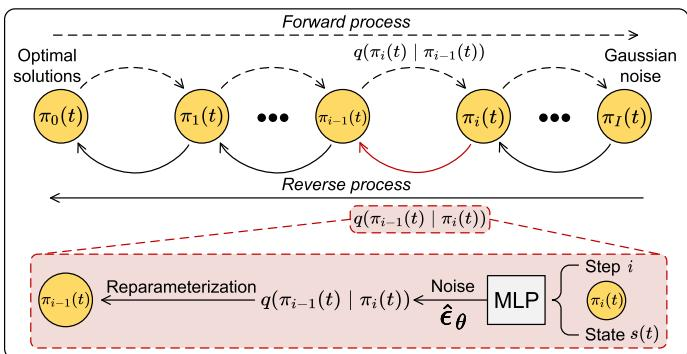  
Fig. 3. An illustration of the diffusion model tailored to generate optimal decisions for channel allocation, power control and UAV flight altitude adjustment in time slot t.

## B. Preliminaries of Diffusion Models

The denoising diffusion probabilistic model (DDPM) [42] was initially developed for image generation tasks. In standard DDPM implementation, the training consists of two key stages: the 1) forward process, which gradually adds noise sampled from a standard Gaussian distribution to an input image over multiple steps until it resembles isotropic Gaussian noise; and the 2) reverse process, where a neural network learns to systematically remove this noise step-by-step to reconstruct the original image.

We first combine the optimal channel allocation vector $\begin{array} { r c l } { \pmb { x } ^ { \ast } ( t ) } & { = } & { \{ \pmb { x } _ { k , m } ^ { \ast } ( t ) \} _ { k \in \mathcal { K } , m \in \mathcal { M } } , } \end{array}$ the power control vector $p ^ { * } ( t ) = \{ p _ { m } ^ { * } ( t ) , p _ { k } ^ { * } ( t ) \} _ { k \in \mathcal { K } , m \in \mathcal { M } }$ , and the UAV’s flight altitude adjustment $\Delta H ^ { * } ( t )$ at time slot t into a single vector $\pmb { \pi } _ { 0 } ( t ) = \{ \pmb { x } ^ { * } ( t ) , \pmb { p } ^ { * } ( t ) , \Delta H ^ { * } ( t ) \}$ . This combined vector serves as the optimal solution (i.e., the “original image”) for our DDPM framework. The forward and reverse processes of this policy are described below.

1) Forward Process: Fig. 3 illustrates our diffusion model framework for generating optimal channel allocation, power control, and UAV flight altitude adjustment decisions at time slot t. Specifically, the forward process follows an I-step Markov chain. Beginning with the optimal solution $\pi _ { 0 } ( t )$ each step i adds standard Gaussian noise to $\pi _ { i - 1 } ( t )$ , producing $\pi _ { i } ( t )$ . The transition is defined as a normal distribution with a mean of $\sqrt { 1 - \beta _ { i } } \pi _ { i - 1 } ( t )$ and a variance of $\beta _ { i } { \bf 1 }$ given by

$$
\begin{array} { r } { q \Bigl ( \pmb { \pi } _ { i } ( t ) | \pmb { \pi } _ { i - 1 } ( t ) \Bigr ) = \mathcal { N } \Bigl ( \pmb { \pi } _ { i } ( t ) ; \sqrt { 1 - \beta _ { i } } \pmb { \pi } _ { i - 1 } ( t ) , \beta _ { i } \pmb { 1 } \Bigr ) , } \end{array}\tag{21}
$$

where $\beta _ { i }$ is the step-specific diffusion rate [42], calculated as $\beta _ { i } = 1 - e ^ { - \frac { \beta _ { \operatorname* { m i n } } } { I } - \frac { 2 i - 1 } { 2 I ^ { 2 } } \left( \beta _ { \operatorname* { m a x } } - \beta _ { \operatorname* { m i n } } \right) }$ , with $\beta _ { \mathrm { m i n } }$ and $\beta _ { \mathrm { m a x } }$ being the preset minimum/maximum rates, respectively, and 1 denotes the identity matrix.

From (21), given that $\pmb { \pi } _ { i } ( t ) \sim \mathcal { N } ( \sqrt { 1 - \beta _ { i } } \pmb { \pi } _ { i - 1 } ( t ) , \beta _ { i } \pmb { 1 } )$ the connection between $\pi _ { i - 1 } ( t )$ and $\pi _ { i } ( t )$ can be expressed via reparameterization as follows [42]:

$$
\pmb { \pi } _ { i } ( t ) = \sqrt { 1 - \beta _ { i } } \pmb { \pi } _ { i - 1 } ( t ) + \sqrt { \beta _ { i } } \pmb { \epsilon } _ { i - 1 } ,\tag{22}
$$

where $\epsilon _ { i - 1 }$ is sampled from $\mathcal { N } ( 0 , \mathbf { 1 } )$ . Consequently, using (22), the relationship between $\pi _ { 0 } ( t )$ and $\pi _ { i } ( t )$ at any step i can be derived as:

$$
\pmb { \pi } _ { i } ( t ) = \sqrt { \bar { \varphi } _ { i } } \pmb { \pi } _ { 0 } ( t ) + \sqrt { 1 - \bar { \varphi } _ { i } } \tilde { \pmb { \epsilon } } _ { i } ,\tag{23}
$$

where $\begin{array} { r } { \bar { \varphi } _ { i } = \prod _ { j = 1 } ^ { i } \varphi _ { j } } \end{array}$ represents the cumulative product of $\varphi _ { j }$ over the preceding steps $i ,$ with $\varphi _ { j } = 1 - \beta _ { j }$ , and $\tilde { \epsilon } _ { i } \sim \mathcal { N } ( 0 , \mathbf { 1 } )$

Remark 2: Since P2 remains an MINLP problem, obtaining the optimal solution $\pi _ { 0 } ( t )$ –which serves as the original image for our DDPM framework–poses significant challenges. Consequently, the forward process is omitted in this work, as indicated by the dotted lines in Fig. 3. Instead, the forward process here primarily defines the mathematical relationship between $\pi _ { 0 } ( t )$ and $\pi _ { i } ( t )$ , a necessary foundation for the subsequent reverse process.

2) Reverse Process: From (23), we note that as I becomes sufficiently large, $\pi _ { I } ( t )$ converges to standard Gaussian noise. Therefore, in the reverse process, we initialize with $\pi _ { I } ( t )$ ∼ $\mathcal { N } ( 0 , \bf { 1 } )$ and employ an MLP-based denoiser $\eta _ { \pmb { \theta } }$ (parameterized by θ) that accepts three inputs: the current decision $\pi _ { i } ( t )$ the step index $i ,$ and the system state $\mathbf { } s ( t )$ (defined later in Sec. VI-A). Specifically, the denoiser predicts the noise component to be subtracted, thereby recovering $\pi _ { i - 1 } ( t )$ . This transition follows a Gaussian distribution [42]:

$$
\begin{array} { r } { q \Big ( \pmb { \pi } _ { i - 1 } ( t ) | \pmb { \pi } _ { i } ( t ) \Big ) = \mathcal { N } \Big ( \pmb { \pi } _ { i - 1 } ( t ) ; \pmb { \mu } _ { i } ( t ) , \bar { \beta } _ { i } \pmb { 1 } \Big ) , } \end{array}\tag{24}
$$

where $\begin{array} { r } { \bar { \beta } _ { i } ~ = ~ \frac { 1 - \bar { \varphi } _ { i - 1 } } { 1 - \bar { \varphi } _ { i } } \beta _ { i } } \end{array}$ . The mean $\pmb { \mu } _ { i } ( t )$ is derived through Bayesian inference:

$$
\pmb { \mu } _ { i } ( t ) = \frac { \sqrt { \varphi _ { i } } \big ( 1 - \bar { \varphi } _ { i - 1 } \big ) } { 1 - \bar { \varphi } _ { i } } \pmb { \pi } _ { i } ( t ) + \frac { \sqrt { \bar { \varphi } _ { i - 1 } } \beta _ { i } } { 1 - \bar { \varphi } _ { i } } \pmb { \pi } _ { 0 } ( t ) .\tag{25}
$$

Next, by substituting (23) into (25), we eliminate the dependence on $\pi _ { 0 } ( t )$ and reformulate the mean $\pmb { \mu } _ { i } ( t )$ as:

$$
\begin{array} { l } { \displaystyle \mu _ { \theta } ( \pi _ { i } ( t ) , i , s ( t ) ) } \\ { = \frac { 1 } { \sqrt { \varphi _ { i } } } \left[ \pi _ { i } ( t ) - \frac { 1 - \varphi _ { i } } { \sqrt { 1 - { \bar { \varphi } } _ { i } } } \hat { \epsilon } _ { \theta } ( \pi _ { i } ( t ) , i , s ( t ) ) \right] , } \end{array}\tag{26}
$$

where $\hat { \epsilon } _ { \pmb { \theta } } ( \pi _ { i } ( t ) , i , \pmb { s } ( t ) )$ denotes the noise estimate produced by the denoiser ηθ at step i.

Finally, from (24), we derive the transition between consecutive states via reparameterization:

$$
\pi _ { i - 1 } ( t ) = \mu _ { \theta } ( { \pi } _ { i } ( t ) , i , s ( t ) ) + \sqrt { \bar { \beta } } _ { i } \bar { \epsilon } _ { i } ,\tag{27}
$$

with $\begin{array} { r } { \bar { \epsilon } _ { i } ~ \sim ~ \mathcal { N } ( 0 , { \bf 1 } ) } \end{array}$ . In our framework, the denoiser η serves as the optimal policy network. Note that because each denoising step introduces noise through reparameterization, even for the same state $s ( t )$ , multiple runs of the reverse process generate diverse action trajectories, effectively sampling from a rich, multimodal action distribution. As a result, through iterative application of (27) over I steps (detailed in Algorithm 1), we recover the optimal decisions $\pmb { \pi } _ { 0 } ( t ) = \{ \pmb { x } ^ { * } ( t ) , \pmb { p } ^ { * } ( t ) , \Delta H ^ { * } ( t ) \}$ for channel allocation, power control, and UAV flight altitude adjustment.

Algorithm 1 D3PG Algorithm   
1 Input: Initialize the network parameters θ and $\phi ,$ and set all   
hyperparameters, including the number of learning episodes $S ,$   
discount factor $\omega ,$ penalty term $\Gamma ^ { \mathrm { p e n } } ,$ , learning rates $\boldsymbol { \sigma } ^ { \mathrm { { ^ { c r i t i c } } } }$ and $\sigma ^ { \mathrm { a c t o r } }$   
replay buffer $\varepsilon ,$ and target network update rate τ.   
2 Output: The optimal channel allocation, power control, and UAV   
flight altitude adjustment decisions.   
3 for episod $z = 1$ to $S$ do   
4 for $t = 1$ to T do   
5 Observe the environment to obtain $\mathbf { \boldsymbol { s } } ( t )$ according to (28)   
and initialize a distribution $\pi _ { I } ( t ) \sim \mathcal { N } ( 0 , \mathbf { 1 } )$   
6 for $i = I$ to 0 do   
7 Use a MLP-based denoiser ηθ (parameterized by θ) to   
infer the noise $\hat { \epsilon } _ { \pmb { \theta } } ( \pi _ { i } ( t ) , i , \pmb { s } ( \bar { t } ) )$   
8 Calculate the mean $\pmb { \mu } _ { \pmb { \theta } } ( \pmb { \pi } _ { i } ( t ) , i , \pmb { s } ( t ) )$ and the   
distribution $q ( \pmb { \pi } _ { i - 1 } ( t ) | \pmb { \pi } _ { i } ( t ) )$ by (26) and (24),   
respectively.   
9 Calculate the distribution $\pi _ { i - 1 } ( t )$ using the   
reparameterization technique (27),   
10 end   
11 Obtain the optimal channel allocation, power control, and   
UAV flight altitude adjustment decisions as   
$\pmb { \pi } _ { 0 } ( t ) = \{ \pmb { x } ^ { * } ( t ) , \pmb { p } ^ { * } ( \acute { t } ) , \Delta H ^ { * } ( t ) \}$   
12 Receive the reward r(t) according to (30) and transition to   
the next state ${ \pmb { s } } ( t + \mathrm { \ Y } )$   
13 Store $[ { \pmb s } ( t ) , { \pmb a } ( t ) , \dot { r } ( t ) , \dot { { \pmb s } } ( t + 1 ) ]$ into $\varepsilon .$   
14 Randomly sample a batch of $\dot { E } ^ { \dot { } }$ transitions   
$\{ [ \pmb { s } _ { e } ( t ) , \pmb { a } _ { e } ( { t } ) , r _ { e } ( t ) , \pmb { s } _ { e } ( t + 1 ) ] \} _ { e = 1 } ^ { E }$ from $\varepsilon .$   
15 Update the online networks' parameters φ and θ by (31)   
and (33), respectively.   
16 Update the target networks' parameters $\hat { \pmb { \theta } }$ and $\hat { \phi }$ by (35)   
and (36), respectively.   
17 end   
18 end

Remark 3: In standard DDPM implementations, the training objective involves minimizing the mean squared error between the forward process noise $\epsilon _ { i }$ (sample from $\mathcal { N } ( 0 , \mathbf { 1 } ) )$ and the denoiser’s predicted noise $\hat { \epsilon } _ { \pmb { \theta } }$ at each reverse step. However, our approach differs as we omit the explicit forward process. Instead of relying on the optimal solution $\pi _ { 0 } ( t )$ , which serves as the original image, we optimize the reverse process through an exploration-based learning strategy. As described in Sec. VI-B, this is done by directly minimizing the objective function in (20). Next, in Sec. VI, we replace the MLP-based actor with a diffusion model-based actor network in D3PG, where the diffusion mode serves as the core component of the D3PG actor. The reverse process begins with a sample drawn from a standard Gaussian distribution. After I denoising iterations, the diffusion model produces the optimal decisions for channel allocation, power control, and UAV flight altitude adjustment as the D3PG algorithm’s action for time slot t.

## VI. DIFFUSION-BASED DEEP DETERMINISTIC POLICY GRADIENT ALGORITHM

Henceforth, we first define of the Markov decision process (MDP) elements, followed by an overview of the D3PG algorithm’s architecture.8 Then, we conduct a comprehensive analysis of its computational complexity.

## A. MDP Elements in the D3PG Algorithm

The sequential decision-making nature of problem P2 can be captured via an MDP, which includes the state space, action space, and reward function, as described below.

• State Space: In time slot t, the DRL agent acting as the central controller (e.g., UAV) observes the state s(t) to gather environmental information. This state consists of $M K + 2 K + M + 1$ elements, defined as:

$$
\begin{array} { r } { \pmb { s } ( t ) = \Big \{ \pmb { h } ^ { \mathrm { U } } ( t ) , \pmb { h } ^ { \mathrm { V } } ( t ) , Q ( t ) \Big \} , } \end{array}\tag{28}
$$

where $\pmb { h } ^ { \mathrm { U } } ( t ) = \{ h _ { m } ^ { \mathrm { U } } ( t ) , h _ { k } ^ { \mathrm { U } } ( t ) \} _ { m \in \mathcal { M } , k \in \mathcal { K } }$ represents the channel gains of all V2U communications, including interference signals, in time slot t, while $\begin{array} { r l } { h ^ { \vee } ( t ) } & { { } = } \end{array}$ $\{ h _ { m , k } ^ { \vee } ( t ) , h _ { k } ^ { \vee } ( t ) \} _ { m \in { \mathscr M } , k \in { \mathscr K } }$ captures the channel gains of all V2V communications, also incorporating interference signals, in time slot t, and $Q ( t )$ indicates the current virtual queue status in time slot t.

• Action Space: In time slot t, the action space comprises decisions for channel allocation, power control and UAV flight altitude adjustment, containing $2 K + M + 1$ elements, expressed as

$$
\begin{array} { r } { \mathbf { \boldsymbol { a } } ( t ) = \Big \{ \mathbf { \boldsymbol { x } } ( t ) , \mathbf { \boldsymbol { p } } ( t ) , \Delta H ( t ) \Big \} , } \end{array}\tag{29}
$$

where $\pmb { x } ( t ) ~ = ~ \{ x _ { k , m } ( t ) \} _ { k \in \mathcal { K } , m \in \mathcal { M } }$ denotes the channel allocation vector for V2V communications, ${ \pmb p } ( t ) =$ $\{ p _ { m } ( t ) , p _ { k } ( t ) \} _ { k \in \mathcal { K } , m \in \mathcal { M } }$ represents the power control vector for transmitting vehicles in both V2U and V2V communications during time slot $t ,$ and $\Delta H ( t )$ indicates the UAV’s flight altitude adjustment at time slot t. Note that the initial actions produced by the D3PG algorithm are $\tilde { \mathbf { a } } ( t ) = \{ \tilde { \mathbf { x } } ( t ) , \tilde { p } ( t ) , \Delta \tilde { H } ( t ) \}$ , with elements normalized to the range [−1, 1]. We subsequently employ an action amender [43] to guarantee that that all actions $\pmb { a } ( t ) = \{ \pmb { x } ( t ) , \pmb { p } ( t ) , \Delta H ( t ) \}$ comply with the constraints specified in problem P2. Specifically, to satisfy constraints C1, C5, and C6, the channel allocation decision is represented by a $K \times M$ matrix, where the values in each row indicate the preference scores for assigning each channel to the corresponding link. For each V2V link, the channel with the highest score in its row is selected as the final channel assignment. Then, to satisfy constraints C2 and C3, the power control decisions are normalized as $\begin{array} { r } { p _ { m } ( t ) ~ = ~ \frac { \tilde { p } _ { m } ( t ) + 1 } { 2 } p _ { \mathrm { m a x } } } \end{array}$ and $\begin{array} { r } { p _ { k } ( t ) \ = \ \frac { \tilde { p } _ { k } ( t ) + 1 } { 2 } p } \end{array}$ max, respectively. Furthermore, to satisfy constraint C4, the UAV’s flight altitude adjustment decision is scaled to $\Delta H ( t ) = \Delta \tilde { H } ( t ) \times \Delta H _ { \mathrm { m a x } }$ , where $\Delta H _ { \mathrm { m a x } }$ denotes the maximum altitude the UAV can adjust in each time slot.

• Reward Function: After executing action $\mathbf { } \mathbf { } \mathbf { } \mathbf { } \mathbf { } \mathbf { } \mathbf { } \mathbf { } \mathbf { } \mathbf { } \mathbf { } \mathbf { } \mathbf { } \mathbf { } \mathbf { } \mathbf { } \mathbf { } \mathbf { } \mathbf { } \mathbf { } \mathbf { } \mathbf { } \mathbf { } \mathbf { } \mathbf { } \mathbf { } \mathbf { } \mathbf { } \mathbf { } \mathbf { } \mathbf { } \mathbf { } \mathbf { } \mathbf { } \mathbf { } \mathbf { } \mathbf { } \mathbf { } \mathbf { } \mathbf { } \mathbf { } \mathbf { } \mathbf { } \mathbf { } \mathbf { } \mathbf { } \mathbf { } \mathbf { } \mathbf { } \mathbf { } \mathbf { } \mathbf { } \mathbf { } \mathbf { } \mathbf { } \mathbf { } \mathbf { } \mathbf { } \mathbf { } \mathbf { } \mathbf { } \mathbf { } \mathbf { } \mathbf { } \mathbf { } \mathbf { } \mathbf { } \mathbf { } \mathbf { } \mathbf { } \mathbf { } \mathbf { } \mathbf { } \mathbf { } \mathbf { } \mathbf { } \mathbf { } \mathbf { } \mathbf { } \mathbf { } \mathbf { } \mathbf { } \mathbf { } \mathbf { } \mathbf { } \mathbf { } \mathbf { } \mathbf { } \mathbf { } \mathbf { } \mathbf { } \mathbf { } \mathbf { } \mathbf { } \mathbf { } \mathbf { } \mathbf { } \mathbf { } \mathbf { } \mathbf { } \mathbf { } \mathbf { } \mathbf { } \mathbf { } \mathbf { } \mathbf { } \mathbf { } \mathbf { } \mathbf { } \mathbf { } \mathbf { } \mathbf { } \mathbf { } \mathbf { } \mathbf { } \mathbf { } \mathbf { } \mathbf { } \mathbf { } \mathbf \Psi \mathbf { } \Psi \mathbf { } \mathbf { } \mathbf { } \mathbf { } \mathbf { } \mathbf { } \mathbf \Psi \Psi \mathbf { } \mathbf { } \mathbf { } \mathbf \Psi \Psi \mathbf { } \mathbf { } \mathbf \Psi \Psi \mathbf { } \mathbf \Psi \Psi \mathbf { } \mathbf \Psi \Psi \mathbf { } \mathbf \Psi \Psi \mathbf { } \mathbf \Psi \mathbf { } \mathbf \Psi \Psi \mathbf \Psi \Psi \Psi \mathbf \Psi \Psi \mathbf \Psi \Psi \mathbf \Psi \Psi \Psi \mathbf \Psi \Psi \mathbf \Psi \Psi \mathbf \Psi \Psi \mathbf \Psi \Psi \mathbf \Psi \mathbf \Psi \mathbf \Psi \Psi \mathbf \Psi \mathbf \Psi \mathbf \Psi \mathbf $ based on state $\mathbf { } s ( t )$ , the environment returns a reward $r ( t )$ as feedback. This reward is defined as the negative value of the objective function in (20), since the D3PG algorithm aims to maximize the reward during training, as follows:

$$
\begin{array} { c } { { \displaystyle r ( t ) = \frac { V } { M } \sum _ { m \in \mathcal { M } } R _ { m } ^ { \mathrm { U } } ( t ) - Q ( t ) \Big ( P ( t ) \Delta - E _ { \mathrm { t h } } ^ { \mathrm { U } } \Big ) } } \\ { { \displaystyle ~ - \mathbb { I } \Big \{ \operatorname* { P r } \{ \gamma _ { k } ^ { \mathrm { V } } ( t ) < \gamma _ { \mathrm { t h } } ^ { \mathrm { V } } \} > \operatorname* { P r } _ { \mathrm { t h } } \Big \} \Gamma ^ { \mathrm { p e n } } , } } \end{array}\tag{30}
$$

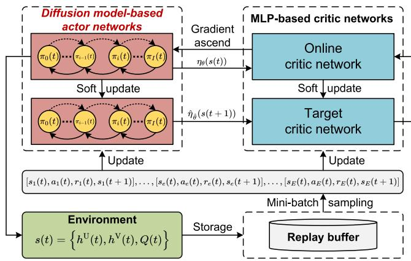  
Fig. 4. The overall architecture of the D3PG algorithm.

where $\mathbb { I } \{ \cdot \}$ denotes an indicator function that equals 1 when the condition is satisfied and 0 otherwise. Γpen represents a constant penalty term to prevent the agent from violating constraint C7.

## B. Architecture of the D3PG Algorithm

The architecture of D3PG is illustrated in Fig. 4, consisting of an online diffusion model-based actor network responsible for action generation and an online critic network for action evaluating. To mitigate training instability, two target networks are incorporated. Additionally, a replay buffer is used to reduce sample correlation through random sampling.

• Diffusion Model-Based Actor Network: Unlike the traditional DDPG algorithm, where the actor network is typically implemented as an MLP that generates actions through a single deterministic forward pass, in D3PG, the actor network ηθ, parameterized by $\theta ,$ is built around the denoiser from the diffusion model introduced in Sec. V. To enhance training stability, a target actor network $\hat { \eta } _ { \hat { \pmb { \theta } } } ,$ sharing the same architecture as $\eta _ { \theta }$ and parameterized by θˆ, is also employed.

Critic Network: The critic network $\mathbb { Q } _ { \phi } ,$ parameterized by $\phi ,$ is implemented as an MLP that takes the state $s ( t )$ and action a(t) as inputs and outputs the Q-value $\mathbb { Q } _ { \phi } ( \pmb { s } ( t ) , \pmb { a } ( t ) )$ . This Q-value quantifies the expected quality of the state-action pair, where a higher value suggests a greater likelihood of achieving a higher reward. To further improve training stability, a target critic network $\hat { \mathbb { Q } } _ { \hat { \phi } }$ , with parameters $\hat { \phi } ,$ and the same architecture, is also employed.

• Replay Buffer: During training, a replay buffer $\mathcal { E }$ is utilized to store transition tuples. At each time slot $t ,$ D3PG stores the tuple $[ s ( t ) , \mathbf { } a ( t ) , r ( t ) , s ( t + 1 ) ]$ in $\mathcal { E } ,$ where it is retained for future sampling to support policy learning.

• Policy Improvement: After a certain amount of exploration, a mini-batch of E samples $\{ [ \pmb { s } _ { e } ( t ) , \pmb { a } _ { e } ( t ) , r _ { e } ( t ) , \pmb { s } _ { e } ( t + 1 ) ] \} _ { e = 1 } ^ { E }$ is randomly drawn from the replay buffer E to update both the critic and actor networks. For the critic network $\mathbb { Q } _ { \phi }$ in particular, the update aims to minimize the temporal difference (TD) error between the target Q-value $y _ { e } ( t )$ and the predicted Q-value $\mathbb { Q } _ { \phi } ( s _ { e } ( t ) , \pmb { a } _ { e } ( t ) )$ , as defined by

$$
\mathrm { T D } ^ { \mathrm { e r r o r } } = \frac { 1 } { E } \sum _ { e = 1 } ^ { E } \Big [ ( y _ { e } ( t ) - \mathbb { Q } _ { \phi } ( \pmb { s } _ { e } ( t ) , \pmb { a } _ { e } ( t ) ) ^ { 2 } \Big ] ,\tag{31}
$$

where $y _ { e } ( t ) = r _ { e } ( t ) + \omega \hat { \mathbb { Q } } _ { \hat { \phi } } ( s _ { e } ( t + 1 ) , \hat { \eta } _ { \hat { \theta } } ( s _ { e } ( t + 1 ) ) )$ In this expression, e indexes the e-th transition tuple sampled from the replay buffer $\mathcal { E } ,$ , and ω is the discount factor that weights future rewards. Additionally, the target Q-value $y _ { e } ( t )$ is calculated using the target critic network $\hat { \mathbb { Q } } _ { \hat { \phi } }$ . Specifically, this network receives the next state $s _ { e } ( t + 1 )$ and the corresponding next action $\hat { \eta } _ { \hat { \pmb { \theta } } } ( \pmb { s } _ { e } ( t + 1 ) )$ , generated by the target actor network, as inputs and outputs the associated target Q-value. The estimation accuracy of $\mathbb { Q } _ { \phi }$ is then improved by iteratively minimizing the loss in (31) using a standard optimizer, such as Adam [44], as follows:

$$
\phi  \phi - \sigma ^ { \mathrm { c r i t i c } } \mathrm { T D } ^ { \mathrm { e r r o r } } ,\tag{32}
$$

where $\sigma ^ { \mathrm { c r i t i c } }$ denotes the learning rate of the critic network. In parallel, the actor network $\eta _ { \theta }$ is updated using the sample policy gradient:

$$
\begin{array} { l } { { \displaystyle \nabla _ { \theta } J } } \\ { { \displaystyle = \frac { 1 } { E } \sum _ { e = 1 } ^ { E } \Big \{ \nabla _ { a } \mathbb { Q } _ { \phi } ( s _ { e } ( t ) , { \pmb a } ) ~ | _ { { \pmb a } = \eta _ { \theta } ( s _ { e } ( t ) ) } ~ \nabla _ { \theta } \eta _ { \theta } ( { \pmb s } _ { e } ( t ) ) \Big \} } , } \end{array}\tag{33}
$$

where the actor network $\eta _ { \theta }$ is optimized via gradient ascent based on (33) to maximize the cumulative reward defined in (30). This is typically performed using a standard optimizer such as Adam [44], as follows:

$$
\pmb { \theta }  \pmb { \theta } + \sigma ^ { \mathrm { a c t o r } } \nabla _ { \theta } J ,\tag{34}
$$

where $\sigma ^ { \mathrm { a c t o r } }$ is the learning rate for the actor network. To ensure stable training, the parameters of the target networks are updated gradually, promoting smooth changes in the learned policy and Q-value estimates over time. This is achieved through soft updates as follows:

$$
\hat { \pmb { \theta } }  \tau \pmb { \theta } + ( 1 - \tau ) \hat { \pmb { \theta } } ,\tag{35}
$$

$$
\hat { \phi }  \tau \phi + ( 1 - \tau ) \hat { \phi } ,\tag{36}
$$

where $\tau \in \mathsf { \Gamma } ( 0 , 1 ]$ denotes the update rate of the target networks.

## C. D3PG Algorithm and Complexity Analysis

Algorithm 1 summarizes the pseudocode of the proposed D3PG algorithm. Its computational complexity can be analyzed from two perspectives, namely the training complexity and the inference complexity [34].

Training phase: Suppose that the training process consists of S episodes, each with T time steps. At each time step, the actor performs I denoising iterations to generate an action. If the actor network has $L _ { a }$ layers and $n _ { a }$ neurons per layer, the complexity of one forward pass is $\mathcal { O } ( L _ { a } n _ { a } ^ { 2 } )$ and thus the action generation complexity is $\mathcal { O } ( I L _ { a } n _ { a } ^ { 2 } )$

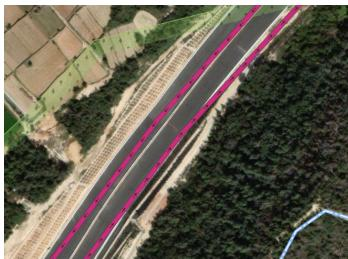  
(a): Real-world traffic region.

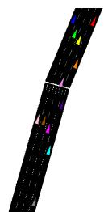  
(b): Import moving vehicles.  
Fig. 5. Vehicular network visualization.

In addition, a mini-batch of size E is sampled from the replay buffer to update the actor and critic networks. If the critic network has $L _ { c }$ layers and $n _ { c }$ neurons per layer, the corresponding update complexity is $\mathcal { O } ( E ( L _ { a } n _ { a } ^ { 2 } { + } L _ { c } n _ { c } ^ { 2 } ) )$ . Moreover, the soft updates of the target actor and target critic introduce an additional complexity of $\mathcal { O } ( L _ { a } n _ { a } ^ { 2 } +$ $L _ { c } n _ { c } ^ { 2 } )$ per step. Therefore, the overall training complexity is $\tilde { \mathcal { O } } \bar { ( } \tilde { S } T \left[ I \bar { L _ { a } } n _ { a } ^ { 2 } + ( E + 1 ) \left( L _ { a } n _ { a } ^ { 2 } + L _ { c } n _ { c } ^ { 2 } \right) \right] )$

• Inference phase: After training, the proposed algorithm only performs action generation according to the current state. Therefore, the inference complexity is dominated by the actor network with I denoising iterations, resulting in a per-decision complexity of $\mathcal { O } ( I L _ { a } n _ { a } ^ { 2 } )$

## VII. PERFORMANCE EVALUATION

In this section, we first present the simulation parameter settings and then evaluate the performance of the proposed D3PG by comparing it with three benchmark solutions.

## A. Simulation Settings

1) Network Layout: We consider a real-world, one-way highway in Xiamen, China, with a length of 2 km, as shown in Fig. 5(a), based on data obtained from OpenStreetMap [26]. The SUMO simulator [27] is then used to generate moving vehicles,9 resulting in a realistic vehicular network illustrated in Fig. 5(b). Additionally, a standalone UAV travels at a constant speed of 50 km/h, following the ground vehicles to serve as an aerial base station and provide communication services. The main simulation parameters are summarized in Table II.

2) Algorithm Layout: We implement D3PG using PyTorch 2.7.0 and Python 3.12.4 on a platform equipped with an Intel Core i7-7700 CPU. For the diffusion model, the denoiser is implemented using three fully connected (FC) hidden layers. The critic networks in D3PG are similarly constructed with three FC hidden layers. We use the Adam optimizer with learning rates of $\sigma ^ { \mathrm { c r i t i c } } = 1 0 ^ { - 5 }$ and $\sigma ^ { \mathrm { a c t o r } } = 3 \times 1 0 ^ { - 6 }$ for the critic and actor networks, respectively. The ReLU activation function is applied to each hidden layer, while a tanh activation function is used in the denoiser’s output layer to constrain the action range.

TABLE II  
PARAMETERS USED IN SIMULATIONS [5], [6], [19], [41], [45]
<table><tr><td rowspan=1 colspan=1>Parameter</td><td rowspan=1 colspan=1>Value</td></tr><tr><td rowspan=1 colspan=1>Number of time slots (T)</td><td rowspan=1 colspan=1>100 seconds</td></tr><tr><td rowspan=1 colspan=1>Duration of each time slot (∆)</td><td rowspan=1 colspan=1>1 second</td></tr><tr><td rowspan=1 colspan=1>Number of V2U communications (M)</td><td rowspan=1 colspan=1>10</td></tr><tr><td rowspan=1 colspan=1>Maximum transmission power (pmax)</td><td rowspan=1 colspan=1>23 dBm</td></tr><tr><td rowspan=1 colspan=1>Range of UAV altitude $\overline { { ( [ H _ { \operatorname* { m i n } } , H _ { \operatorname* { m a x } } ] ) } }$ </td><td rowspan=1 colspan=1>[50, 200] m</td></tr><tr><td rowspan=1 colspan=1>Maximum altitude the UAV can adjust $\overline { { ( \Delta H _ { \mathrm { m a x } } ) } }$ </td><td rowspan=1 colspan=1>5m</td></tr><tr><td rowspan=1 colspan=1>Bandwidth of each channel (B)</td><td rowspan=1 colspan=1>2MHz</td></tr><tr><td rowspan=1 colspan=1>Noise power spectral density (No)</td><td rowspan=1 colspan=1>-174 dBm/Hz</td></tr><tr><td rowspan=1 colspan=1>Carrier frequency (fc)</td><td rowspan=1 colspan=1>5.9 GHz</td></tr><tr><td rowspan=1 colspan=1>Additional losses under LoS (αLos)</td><td rowspan=1 colspan=1>1 dB</td></tr><tr><td rowspan=1 colspan=1>Additional losses under NLoS $\overline { { ( \alpha _ { \mathrm { N L o S } } ) } }$ </td><td rowspan=1 colspan=1>20 dB</td></tr><tr><td rowspan=1 colspan=1>SINR requirement of V2V links $( \gamma _ { \mathrm { t h } } ^ { \nabla } )$ </td><td rowspan=1 colspan=1>10 dB</td></tr><tr><td rowspan=1 colspan=1>Tolerable outage probability $\overline { { ( \mathrm { P r } _ { \mathrm { t h } } ^ { \mathrm { V } } ) } }$ </td><td rowspan=1 colspan=1>1.0 %</td></tr><tr><td rowspan=1 colspan=1>Maximum allowed operational power $\overline { { ( E _ { \mathrm { t h } } ^ { \mathrm { U } } ) } }$ </td><td rowspan=1 colspan=1>120 J</td></tr><tr><td rowspan=1 colspan=1>Number of episodes (S)</td><td rowspan=1 colspan=1>500</td></tr><tr><td rowspan=1 colspan=1>D3PG&#x27;s reward penalty $\overline { { ( \Gamma ^ { \mathrm { p e n } } ) } }$ </td><td rowspan=1 colspan=1>10</td></tr><tr><td rowspan=1 colspan=1>D3PG&#x27;s reward discount factor (ω)</td><td rowspan=1 colspan=1>0.99</td></tr><tr><td rowspan=1 colspan=1>D3PG&#x27;s target network update rate (τ)</td><td rowspan=1 colspan=1>0.005</td></tr><tr><td rowspan=1 colspan=1>Parameters for environment (a, b)</td><td rowspan=1 colspan=1>12.08, 0.11</td></tr><tr><td rowspan=1 colspan=1>Weight of UAV (G)</td><td rowspan=1 colspan=1>20 Newton</td></tr><tr><td rowspan=1 colspan=1>Blade angular velocity (Ω)</td><td rowspan=1 colspan=1>300 radians/second</td></tr><tr><td rowspan=1 colspan=1>Rotor radius (r)</td><td rowspan=1 colspan=1>0.4 meter</td></tr><tr><td rowspan=1 colspan=1>Air density (ρ)</td><td rowspan=1 colspan=1>1.225 kg/m³</td></tr><tr><td rowspan=1 colspan=1>Rotor solidity (sr)</td><td rowspan=1 colspan=1> $\overline { { 0 . 0 5 \mathrm { \ m } ^ { 3 } } }$ </td></tr><tr><td rowspan=1 colspan=1>Rotor disc area (Ar)</td><td rowspan=1 colspan=1>0.503 m2</td></tr><tr><td rowspan=1 colspan=1>Induced velocity for rotor (vo)</td><td rowspan=1 colspan=1>4.03 meter/second</td></tr><tr><td rowspan=1 colspan=1>Fuselage drag ratio (d0)</td><td rowspan=1 colspan=1>0.3</td></tr><tr><td rowspan=1 colspan=1>Blade profile power in hovering (P0)</td><td rowspan=1 colspan=1>79.86 W</td></tr><tr><td rowspan=1 colspan=1>Induced power in hovering $\overline { { ( P _ { 1 } ) } }$ </td><td rowspan=1 colspan=1>88.63 W</td></tr></table>

## B. Benchmark Solutions

To demonstrate the effectiveness of the proposed D3PG algorithm, we have relied on three benchmark solutions:

DDPG: Channel allocation, power control, and the UAV flight altitude adjustment are optimized by the DDPG algorithm [46]. Unlike our proposed D3PG, which incorporates a diffusion model, DDPG employs an MLP-based actor network to make decisions. This baseline is used to highlight the significant performance gains achieved by leveraging the diffusion model in our approach.

D3PG without considering CSI feedback delay (D3PG-WCSI): Channel allocation, power control, and UAV flight altitude adjustment are optimized using the same strategy as in D3PG; however, the corresponding V2V communication model formulation does not account for CSI feedback delay. This baseline is designed to highlight the Doppler effect caused by the high mobility in vehicular networks and to demonstrate the necessity of considering CSI feedback delay.

Hungarian and DDQN-based resource allocation algorithm (H-DDQN): [9] Channel allocation is optimized using the Hungarian algorithm, while power control and UAV flight altitude adjustment are optimized using the DDQN algorithm [47]. As DDQN is a value-based learning algorithm, power control levels and UAV flight altitudes are discretized into predefined values to fit its framework.

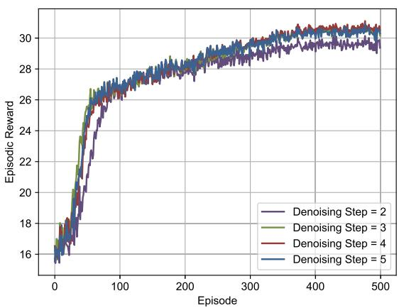

Fig. 6. Impact of denoising step on the reward in D3PG (the number of V2V links $\bar { K } = 1 0$ , Lyapunov weight $V = 1 0 0$ , and CSI feedback delay $T _ { \mathrm { d e l a y } } = 1 0 \mathrm { m s } )$  
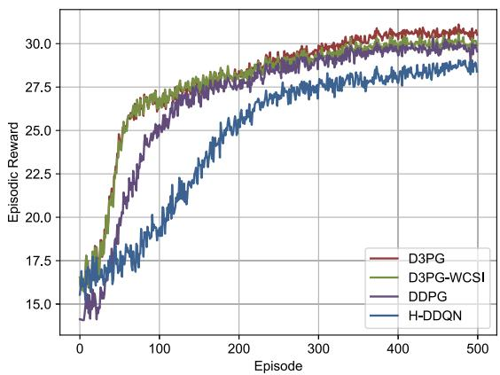  
Fig. 7. Comparison of reward curves among different algorithms (the number of V2V links $K = 1 0 ,$ , Lyapunov weight $\check { V } = 1 0 0$ , and CSI feedback dela $T _ { \mathrm { d e l a y } } = 1 0 \mathrm { m s } )$

## C. Simulation Results

To eliminate the influence of randomness and ensure a fair comparison, we run each algorithm five times under different environmental settings (i.e., using five different random seeds) and use the average results to generate the following figures.

1) Effect of the Value of Denoising Step I: In Fig. 6, we present the convergence behavior of the D3PG algorithm under varying numbers of denoising steps I in the diffusion model, which directly influences the action sampling process. The results show that the converged reward initially improves with an increasing number of denoising steps, but begins to decline beyond a certain point. This is because a moderate number of denoising steps stabilizes training and allows the diffusion model to capture more generalizable features. However, an excessive number of steps may over-smooth the output, removing useful signal components and ultimately degrading performance. Based on this observation, we set the number of denoising steps in D3PG to I = 4 for comparison with benchmark solutions in the subsequent experiments.

2) Convergence Performance: In Fig. 7, we depict the convergence behavior of four different algorithms as the number of training episodes increases. The results show that the proposed D3PG achieves the highest episodic reward among all methods. Specifically, this superiority stems from the use of a diffusion model in D3PG’s actor network, in contrast to the conventional MLP used in DDPG, which generates actions through a single forward pass and often suffers from limited exploration capability and susceptibility to local optima—particularly in complex, high-dimensional action spaces. In contrast, diffusion model-based actor networks generate actions through a step-wise denoising process, allowing for iterative refinement and stochastic exploration. This iterative nature enables policies to explore the solution space more effectively and avoid premature convergence. This underscores the effectiveness of diffusion-based policy representation in capturing optimal actions in complex environments.

In comparison, D3PG-WCSI performs worse than D3PG. The key difference lies in how CSI feedback delay is handled. D3PG-WCSI neglects the impact of delayed CSI in the agent’s state observations, leading the agent to learn policies based on outdated or inaccurate V2V communication states. However, during reward computation, the V2U communication sum rate is calculated using the true delayed CSI, resulting in a mismatch between the observed state and the actual environment dynamics. This discrepancy leads to suboptimal learning and degraded performance, highlighting the importance of explicitly modeling CSI feedback delay in the decision-making process.

Despite receiving only raw delayed observations, D3PG-WCSI still outperforms the DDPG algorithm. Although DDPG is given the more accurate true post-delay channel state, its conventional MLP-based actor struggles to learn a policy that is robust to inherent inaccuracies in the state space. In contrast, the diffusion-model of D3PG-WCSI exhibits inherent resilience to imperfect state information. Its iterative denoising reverse process acts as a powerful mechanism for generating robust actions even from noisy or incomplete inputs. This experiment demonstrates that the proposed diffusion-based framework provides a fundamental robustness that is essential in practical systems where decisions must rely solely on delayed and imperfect observations.

The H-DDQN algorithm exhibits the lowest performance, primarily due to its value-based nature, which necessitates discretizing both transmission power and UAV altitude into finite levels. This discretization reduces the granularity of the action space, limiting the agent’s ability to fine-tune its control decisions. In contrast, policy-based methods such as DDPG and D3PG operate in continuous action spaces, allowing them to learn more precise and adaptable strategies.

Additionally, D3PG demonstrates superior sample efficiency, as evidenced by the learning curves. Specifically, D3PG exhibits a much steeper increase in reward, reaching a reward of 25 at around episode 60. In contrast, H-DDQN improves much more slowly, reaching the same reward level at around episode 190, while DDPG also requires a longer exploration period, attaining a reward of 25 at approximately episode 100. These results indicate that D3PG can achieve strong performance with substantially fewer training samples. This advantage mainly stems from the iterative denoising mechanism in D3PG. Unlike conventional methods that generate an action in a single sampling step at each time step, D3PG refines the action through I denoising steps. Although this increases the per-step training cost, it allows each interaction sample to be utilized more effectively, thereby improving convergence speed and sample efficiency.

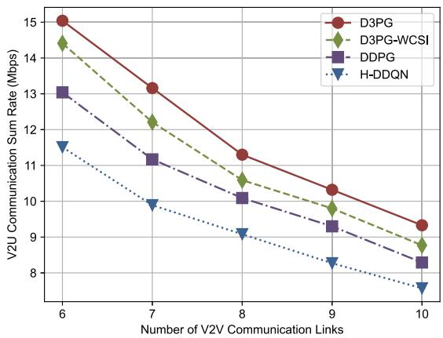  
Fig. 8. Impact of the number of V2V links on the V2U communication sum rate in (14) (Lyapunov weight $V ~ = ~ 1 0 0$ and CSI feedback delay $T _ { \mathrm { d e l a y } } = 1 0 \mathrm { m s } )$

3) Effect of the Number of V2V Communications: In Fig. 8, we illustrate the impact of incrementally increasing the number of V2V communication links on the V2U communication sum rate. The results show a clear downward trend in the V2U communication sum rate as the number of V2V communication links increases. This is because, as more V2V links are introduced into the network, a larger portion of them begin to reuse the spectrum resources originally allocated to the V2U links. This spectrum reuse introduces additional interference to V2U transmissions, thereby degrading overall V2U communication performance. Overall, the proposed D3PG outperforms the other algorithms, achieving performance improvements of 4.37% over D3PG-WCSI, 15.34% over DDPG, and 30.67% over H-DDQN when the number of V2V links is set to 6. Additionally, when the number of V2V links is 10, D3PG outperforms D3PG-WCSI by 6.39%, DDPG by 12.55%, and H-DDQN by 23.25%.

4) UAV Energy Consumption Analysis: In Fig. 9, we illustrate the moving average energy consumption of the UAV $\textstyle ( { \frac { 1 } { t } } \sum _ { \tilde { t } = 1 } ^ { t } P ( \tilde { t } ) \bar { \Delta } )$ within the considered flight duration. The results show that the long-term UAV propulsion energy consumption remains below the predefined threshold for all methods, thereby ensuring the UAV’s operational endurance. This demonstrates that, by decomposing the long-term optimization problem (14) into per-slot subproblems (20), the proposed Lyapunov optimization framework not only optimizes the V2U communication sum rate but also satisfies the long-term UAV energy consumption constraint in C8. Overall, the proposed D3PG reduces the moving average energy consumption by 2.15%, 4.58%, and 9.02% compared to D3PG-WCSI, DDPG, and H-DDQN, respectively.

5) Effect of the Value of CSI Feedback Delay: In Fig. 10, we jointly depict the value of the Bessel function $J _ { 0 }$ and the corresponding difference in V2U communication sum rate between D3PG and D3PG-WCSI under varying CSI feedback delays. The results show that as the delay increases from 2 ms to 10 ms, the value of $J _ { 0 }$ decreases monotonically, indicating that the outdated CSI becomes increasingly decorrelated from the true channel state. Simultaneously, the performance gap in V2U communication between D3PG and D3PG-WCSI gradually widens. This is because, when the delay is small (e.g., 2 ms), $J _ { 0 }$ remains close to 1, meaning the outdated CSI still closely approximates the actual channel state, resulting in negligible performance differences. However, as the delay grows, D3PG-WCSI suffers from poor decision-making due to delayed observations, while D3PG compensates for outdated CSI through a Gauss–Markov-based model. This analysis confirms that accounting for CSI aging is essential for robust decision-making and maintaining communication performance in high-mobility UAV-assisted vehicular networks.

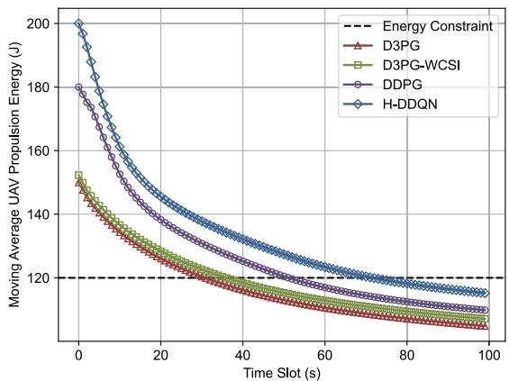  
Fig. 9. UAV propulsion energy consumption over time slots (the number of V2V links $K { \stackrel { - } { = } } 1 0 ,$ , Lyapunov weight $\stackrel { \bullet } { V } = 1 0 0$ , and CSI feedback delay $T _ { \mathrm { d e l a y } } = 1 0 \mathrm { m s } )$ .

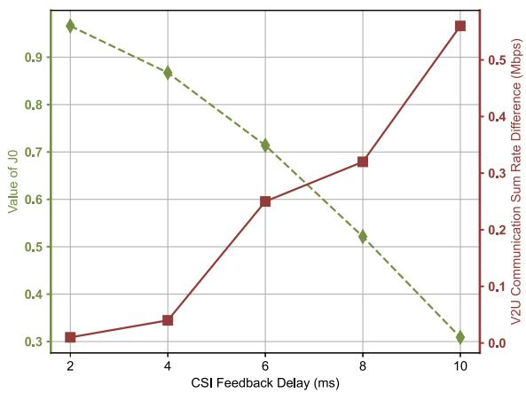  
Fig. 10. Impact of the value of CSI feedback delay on the V2U communication sum rate in (14) (the number of V2V links $K = 1 0$ and Lyapunov weight $V = 1 0 0 )$

6) Effect of the Value of the Lyapunov Weight V : In Fig. 11, we present the impact of the Lyapunov control parameter V on the tradeoff between the aggregate virtual energy queue length $\begin{array} { r } { ( \frac { 1 } { T } \sum _ { \tilde { t } = 1 } ^ { T } P ( \tilde { t } ) \Delta ) } \end{array}$ and the V2U communication sum rate. The results show that both the aggregate virtual energy queue length and the V2U communication sum rate increase with the Lyapunov weight V . This is because a larger V places greater emphasis on maximizing the V2U communication rate in the Lyapunov drift-plus-penalty function defined in (20). However, this improvement comes at a cost: the growing length of the virtual energy queue indicates a higher likelihood of energy constraint violations. This is because the system becomes more aggressive in pursuing communication performance as V increases. Notably, when V becomes sufficiently large (e.g., increasing from 100 to 1000), the V2U sum rate plateaus. This saturation effect occurs because the system reaches a performance ceiling beyond which further increases in V no longer yield additional V2U sum rate gains.

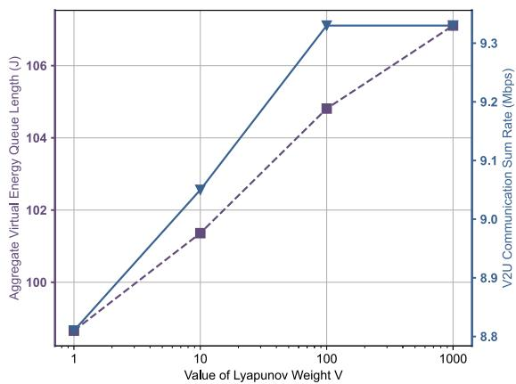  
Fig. 11. V2U communication sum rate in (14) and aggregate virtual energy queue length versus parameter V (the number of V2V links $K = 1 0$ and CSI feedback delay $\bar { T } _ { \mathrm { d e l a y } } = 1 0 \mathrm { m s } )$ .

TABLE III  
COMPARISON OF ALGORITHM RUNNING TIME PER TIME SLOT (MILLISECONDS)
<table><tr><td rowspan=1 colspan=1>Number of V2V Links</td><td rowspan=1 colspan=1>6</td><td rowspan=1 colspan=1>7</td><td rowspan=1 colspan=1>8</td><td rowspan=1 colspan=1>9</td><td rowspan=1 colspan=1>10</td></tr><tr><td rowspan=1 colspan=1>D3PG</td><td rowspan=1 colspan=1>2.64</td><td rowspan=1 colspan=1>2.76</td><td rowspan=1 colspan=1>3.18</td><td rowspan=1 colspan=1>3.32</td><td rowspan=1 colspan=1>3.34</td></tr><tr><td rowspan=1 colspan=1>DDPG</td><td rowspan=1 colspan=1>0.45</td><td rowspan=1 colspan=1>0.46</td><td rowspan=1 colspan=1>0.51</td><td rowspan=1 colspan=1>0.65</td><td rowspan=1 colspan=1>0.66</td></tr><tr><td rowspan=1 colspan=1>H-DDQN</td><td rowspan=1 colspan=1>0.51</td><td rowspan=1 colspan=1>0.63</td><td rowspan=1 colspan=1>0.74</td><td rowspan=1 colspan=1>0.82</td><td rowspan=1 colspan=1>0.96</td></tr></table>

7) Algorithm Running Time Performance: Table III presents the impact of the number of V2V links on the algorithm’s running time per time slot. D3PG-WCSI is excluded from the comparison, as it only differs in whether CSI feedback delay is considered, without modifying any algorithmic modules. The results show that the running time of H-DDQN is higher than that of DDPG, mainly due to the use of the Hungarian algorithm for channel allocation, which involves matrix operations with a computational complexity of $\mathcal { O } ( K ^ { 3 } )$ [9]. Additionally, D3PG incurs the highest running time, primarily due to the added reverse process, which generates actions through a step-wise denoising procedure. Although D3PG incurs roughly a 5× overhead, each time slot has a duration of 1 second, so the decision-making overhead accounts for only about 0.33% of the slot duration. This leaves ample time for sensing, communication, and onboard processing, confirming that D3PG is fully suitable for realtime control in the target UAV-assisted vehicular network scenario. In conclusion, given that D3PG achieves the highest

V2U communication sum rate, we conclude that it offers superior performance with only a modest increase in computational complexity.

## VIII. CONCLUSION AND FUTURE WORKS

In this paper, we have offered new insights into low-altitude economy networking by exploring intelligent UAV-assisted V2X communication strategies aligned with UAV energy efficiency. Specifically, we have addressed the problem of joint channel allocation, power control, and flight altitude adjustment in UAV-assisted vehicular networks with CSI feedback delay. We have integrated Lyapunov optimization with the proposed D3PG algorithm to ensure long-term energy efficiency while substantially enhancing V2U communication performance. We have proposed a D3PG algorithm that incorporates diffusion models into its actor network, effectively addressing the exploration–exploitation trade-off in conventional DRL while enhancing decision-making robustness in dynamic envi ronments with CSI feedback delay through conditioning on real-time environmental features.

For future research, the small-scale fading of V2U links can be modeled as either Rician or Rayleigh, depending on the UAV’s altitude and the surrounding environment, to yield a more robust and realistic channel model. We will also extend the proposed framework to multi-UAV scenarios, where inter-UAV coordination introduces additional challenges in distributed decision-making and energy management. Another promising direction is to integrate generative models with faster sampling mechanisms (e.g., flow matching) to further accelerate action generation while maintaining strong performance.

## APPENDIX A

Given the virtual energy queue definition:

$$
Q ( t + 1 ) = \operatorname* { m a x } \Big \{ Q ( t ) + P ( t ) \Delta - E _ { \mathrm { t h } } ^ { \mathrm { U } } , 0 \Big \} ,\tag{37}
$$

we derive the inequality:

$$
Q ( t + 1 ) \geq Q ( t ) + P ( t ) \Delta - E _ { \mathrm { t h } } ^ { \mathrm { U } } .\tag{38}
$$

Applying sample path analysis [48] and summing over $t =$ $1 , \cdots , T$ yields:

$$
Q ( T ) \geq Q ( 1 ) + \sum _ { t = 1 } ^ { T } P ( t ) \Delta - T E _ { \mathrm { t h } } ^ { \mathrm { U } } .\tag{39}
$$

For finite Q(T ) and $Q ( 1 )$ , taking $T \to \infty$ gives:

$$
\begin{array} { r l } & { \displaystyle \operatorname* { l i m } _ { T \to \infty } \frac { 1 } { T } \sum _ { t = 1 } ^ { T } P ( t ) \Delta } \\ & { \displaystyle \leq \operatorname* { l i m } _ { T \to \infty } \left( \frac { Q ( T ) - Q ( 1 ) } { T } + E _ { \mathrm { t h } } ^ { \mathrm { U } } \right) = E _ { \mathrm { t h } } ^ { \mathrm { U } } . } \end{array}\tag{40}
$$

## APPENDIX B

Beginning with the queue dynamics in (15) and applying the inequality $\left( \operatorname* { m a x } \{ a + b - c , 0 \} \right) ^ { 2 } \leq ( a + b - c ) ^ { 2 }$ , we obtain:

$$
\begin{array} { r } { \Big ( Q ( t + 1 ) \Big ) ^ { 2 } \leq \Big ( Q ( t ) + P ( t ) \Delta - E _ { \mathrm { t h } } ^ { \mathrm { U } } \Big ) ^ { 2 } , } \end{array}\tag{41}
$$

Expanding this relationship yields:

$$
\begin{array} { r } { \frac { \Big ( Q ( t + 1 ) \Big ) ^ { 2 } - \Big ( Q ( t ) \Big ) ^ { 2 } } { 2 } \leq Q ( t ) \Big ( P ( t ) \Delta - E _ { \mathrm { t h } } ^ { \mathrm { U } } \Big ) } \\ { + \displaystyle \frac { 1 } { 2 } \Big ( P ( t ) \Delta - E _ { \mathrm { t h } } ^ { \mathrm { U } } \Big ) ^ { 2 } . } \end{array}\tag{42}
$$

This leads to the Lyapunov drift bound:

$$
\begin{array} { r l } & { \Delta L \Big ( Q ( t ) \Big ) \leq \mathbb { E } \Big \{ Q ( t ) \Big ( P ( t ) \Delta - E _ { \mathrm { t h } } ^ { \mathrm { U } } \Big ) \mid Q ( t ) \Big \} } \\ & { \qquad + \frac { 1 } { 2 } \Big ( P ( t ) \Delta - E _ { \mathrm { t h } } ^ { \mathrm { U } } \Big ) ^ { 2 } . } \end{array}\tag{43}
$$

Consequently, we derive the complete Lyapunov drift-pluspenalty expression:

$$
\begin{array} { r l } & { D \Big ( Q ( t ) \Big ) } \\ & { \leq \mathbb { E } \Big \{ Q ( t ) \Big ( P ( t ) \Delta - E _ { \mathrm { t h } } ^ { \mathrm { U } } \Big ) \mid Q ( t ) \Big \} } \\ & { \quad - V \mathbb { E } \left\{ \cfrac { 1 } { M } \displaystyle \sum _ { m \in \mathcal { M } } R _ { m } ^ { \mathrm { U } } ( t ) \mid Q ( t ) \right\} + \frac { 1 } { 2 } \Big ( P ( t ) \Delta - E _ { \mathrm { t h } } ^ { \mathrm { U } } \Big ) ^ { 2 } . } \end{array}\tag{44}
$$

## REFERENCES

[1] X. Hou et al., “Reliable computation offloading for edge-computingenabled software-defined IoV,” IEEE Internet Things J., vol. 7, no. 8, pp. 7097–7111, Aug. 2020.

[2] N. Cheng et al., “A comprehensive simulation platform for space-airground integrated network,” IEEE Wireless Commun., vol. 27, no. 1, pp. 178–185, Feb. 2020.

[3] Z. Sun, G. Sun, Y. Liu, J. Wang, and D. Cao, “BARGAIN-MATCH: A game theoretical approach for resource allocation and task offloading in vehicular edge computing networks,” IEEE Trans. Mobile Comput., vol. 23, no. 2, pp. 1655–1673, Feb. 2024.

[4] H. Guo, J. Liu, J. Ren, and Y. Zhang, “Intelligent task offloading in vehicular edge computing networks,” IEEE Wireless Commun., vol. 27, no. 4, pp. 126–132, Aug. 2020.

[5] Y. He, D. Wang, F. Huang, R. Zhang, and L. Min, “Aerial-ground integrated vehicular networks: A UAV-vehicle collaboration perspective,” IEEE Trans. Intell. Transp. Syst., vol. 25, no. 6, pp. 5154–5169, Jun. 2024.

[6] X. Dai, Z. Xiao, H. Jiang, and J. C. S. Lui, “UAV-assisted task offloading in vehicular edge computing networks,” IEEE Trans. Mobile Comput., vol. 23, no. 4, pp. 2520–2534, Apr. 2024.

[7] M. Samir, D. Ebrahimi, C. Assi, S. Sharafeddine, and A. Ghrayeb, “Leveraging UAVs for coverage in cell-free vehicular networks: A deep reinforcement learning approach,” IEEE Trans. Mobile Comput., vol. 20, no. 9, pp. 2835–2847, Sep. 2021.

[8] Z. Liu, M. Liwang, S. Hosseinalipour, H. Dai, Z. Gao, and L. Huang, “RFID: Towards low latency and reliable DAG task scheduling over dynamic vehicular clouds,” IEEE Trans. Veh. Technol., vol. 72, no. 9, pp. 12139–12153, Sep. 2023.

[9] W. Qi, Q. Song, L. Guo, and A. Jamalipour, “Energy-efficient resource allocation for UAV-assisted vehicular networks with spectrum sharing,” IEEE Trans. Veh. Technol., vol. 71, no. 7, pp. 7691–7702, Jul. 2022.

[10] G. Sun et al., “Aerial reliable collaborative communications for terrestrial mobile users via evolutionary multi-objective deep reinforcement learning,” IEEE Trans. Mobile Comput., vol. 24, no. 7, pp. 5731–5748, Jul. 2025.

[11] W. Yuan et al., “From ground to sky: Architectures, applications, and challenges shaping low-altitude wireless networks,” 2025, arXiv:2506.12308.

[12] Z. Liu et al., “Generative AI for Lyapunov optimization theory in UAVbased low-altitude economy networking,” IEEE Netw., early access, Jan. 12, 2026, doi: 10.1109/MNET.2025.3648051.

[13] J. Li, G. Sun, L. Duan, and Q. Wu, “Multi-objective optimization for UAV swarm-assisted IoT with virtual antenna arrays,” IEEE Trans. Mobile Comput., vol. 23, no. 5, pp. 4890–4907, May 2024.

[14] S. Mokhtari, N. Nouri, J. Abouei, A. Avokh, and K. N. Plataniotis, “Relaying data with joint optimization of energy and delay in clusterbased UAV-assisted VANETs,” IEEE Internet Things J., vol. 9, no. 23, pp. 24541–24559, Dec. 2022.

[15] Y. Su, M. Liwang, Z. Chen, and X. Du, “Toward optimal deployment of UAV relays in UAV-assisted Internet of Vehicles,” IEEE Trans. Veh. Technol., vol. 72, no. 10, pp. 13392–13405, Oct. 2023.

[16] Z. Liao, Y. Ma, J. Huang, and J. Wang, “Energy-aware 3D-deployment of UAV for IoV with highway interchange,” IEEE Trans. Commun., vol. 71, no. 3, pp. 1536–1548, Mar. 2023.

[17] J. Li et al., “Joint optimization of relay selection and transmission scheduling for UAV-aided mmWave vehicular networks,” IEEE Trans. Veh. Technol., vol. 72, no. 5, pp. 6322–6334, May 2023.

[18] R. Zhang, R. Lu, X. Cheng, N. Wang, and L. Yang, “A UAV-enabled data dissemination protocol with proactive caching and file sharing in V2X networks,” IEEE Trans. Commun., vol. 69, no. 6, pp. 3930–3942, Jun. 2021.

[19] B. Zhang, Z. He, Y. Feng, and Z. Han, “Performance analysis and 3D position deployment for V2V-assisted UAV communications in vehicular networks,” IEEE Trans. Veh. Technol., vol. 73, no. 12, pp. 19361–19373, Dec. 2024.

[20] Y. He, D. Wang, F. Huang, R. Zhang, X. Gu, and J. Pan, “A V2I and V2V collaboration framework to support emergency communications in ABS-aided Internet of Vehicles,” IEEE Trans. Green Commun. Netw., vol. 7, no. 4, pp. 2038–2051, Dec. 2023.

[21] Z. Liu, L. Huang, Z. Gao, M. Luo, S. Hosseinalipour, and H. Dai, “GA-DRL: Graph neural network-augmented deep reinforcement learning for DAG task scheduling over dynamic vehicular clouds,” IEEE Trans. Netw. Service Manage., vol. 21, no. 4, pp. 4226–4242, Aug. 2024.

[22] Y. Li, A. H. Aghvami, and D. Dong, “Path planning for cellularconnected UAV: A DRL solution with quantum-inspired experience replay,” IEEE Trans. Wireless Commun., vol. 21, no. 10, pp. 7897–7912, Oct. 2022.

[23] R. Liu et al., “DRL-UTPS: DRL-based trajectory planning for unmanned aerial vehicles for data collection in dynamic IoT network,” IEEE Trans. Intell. Vehicles, vol. 8, no. 2, pp. 1204–1218, Feb. 2023.

[24] H. Du et al., “Enhancing deep reinforcement learning: A tutorial on generative diffusion models in network optimization,” IEEE Commun. Surveys Tuts., vol. 26, no. 4, pp. 2611–2646, 2024.

[25] Z. Liu et al., “Two-timescale model caching and resource allocation for edge-enabled AI-generated content services,” IEEE Trans. Mobile Comput., vol. 25, no. 4, pp. 4822–4838, Apr. 2026.

[26] M. Haklay and P. Weber, “OpenStreetMap: User-generated street maps,” IEEE Pervasive Comput., vol. 7, no. 4, pp. 12–18, Oct. 2008.

[27] P. A. Lopez et al., “Microscopic traffic simulation using SUMO,” in Proc. 21st Int. Conf. Intell. Transp. Syst. (ITSC), Nov. 2018, pp. 2575–2582.

[28] Z. Hu et al., “Joint resources allocation and 3D trajectory optimization for UAV-enabled space-air-ground integrated networks,” IEEE Trans. Veh. Technol., vol. 72, no. 11, pp. 14214–14229, Nov. 2023.

[29] J. Sabzehali, V. K. Shah, Q. Fan, B. Choudhury, L. Liu, and J. H. Reed, “Optimizing number, placement, and backhaul connectivity of multi-UAV networks,” IEEE Internet Things J., vol. 9, no. 21, pp. 21548–21560, Nov. 2022.

[30] L. Wang, H. Zhang, S. Guo, and D. Yuan, “Deployment and association of multiple UAVs in UAV-assisted cellular networks with the knowledge of statistical user position,” IEEE Trans. Wireless Commun., vol. 21, no. 8, pp. 6553–6567, Aug. 2022.

[31] S. Chai and V. K. N. Lau, “Multi-UAV trajectory and power optimization for cached UAV wireless networks with energy and content rechargingdemand driven deep learning approach,” IEEE J. Sel. Areas Commun., vol. 39, no. 10, pp. 3208–3224, Oct. 2021.

[32] P. Luong, F. Gagnon, L.-N. Tran, and F. Labeau, “Deep reinforcement learning-based resource allocation in cooperative UAV-assisted wireless networks,” IEEE Trans. Wireless Commun., vol. 20, no. 11, pp. 7610–7625, Nov. 2021.

[33] B. Tian et al., “UAV-assisted wireless cooperative communication and coded caching: A multiagent two-timescale DRL approach,” IEEE Trans. Mobile Comput., vol. 23, no. 5, pp. 4389–4404, May 2024.

[34] Z. Liu et al., “DNN partitioning, task offloading, and resource allocation in dynamic vehicular networks: A Lyapunov-guided diffusion-based reinforcement learning approach,” IEEE Trans. Mobile Comput., vol. 24, no. 3, pp. 1945–1962, Mar. 2025.

[35] J. Tian, Q. Liu, H. Zhang, and D. Wu, “Multiagent deep-reinforcementlearning-based resource allocation for heterogeneous QoS guarantees for vehicular networks,” IEEE Internet Things J., vol. 9, no. 3, pp. 1683–1695, Feb. 2022.

[36] G. Sun et al., “Joint task offloading and resource allocation in aerialterrestrial UAV networks with edge and fog computing for post-disaster rescue,” IEEE Trans. Mobile Comput., vol. 23, no. 9, pp. 8582–8600, Sep. 2024.

[37] C. Yan, L. Fu, J. Zhang, and J. Wang, “A comprehensive survey on UAV communication channel modeling,” IEEE Access, vol. 7, pp. 107769–107792, 2019.

[38] X. Zhang, M. Peng, S. Yan, and Y. Sun, “Deep-reinforcementlearning-based mode selection and resource allocation for cellular V2X communications,” IEEE Internet Things J., vol. 7, no. 7, pp. 6380–6391, Jul. 2020.

[39] L. Liang, J. Kim, S. C. Jha, K. Sivanesan, and G. Y. Li, “Spectrum and power allocation for vehicular communications with delayed CSI feedback,” IEEE Wireless Commun. Lett., vol. 6, no. 4, pp. 458–461, Aug. 2017.

[40] A. Al-Hilo, M. Samir, C. Assi, S. Sharafeddine, and D. Ebrahimi, “UAV-assisted content delivery in intelligent transportation systems-joint trajectory planning and cache management,” IEEE Trans. Intell. Transp. Syst., vol. 22, no. 8, pp. 5155–5167, Aug. 2021.

[41] Y. Cai, Z. Wei, S. Hu, C. Liu, D. W. K. Ng, and J. Yuan, “Resource allocation and 3D trajectory design for power-efficient IRS-assisted UAV-NOMA communications,” IEEE Trans. Wireless Commun., vol. 21, no. 12, pp. 10315–10334, Dec. 2022.

[42] J. Ho, A. Jain, and P. Abbeel, “Denoising diffusion probabilistic models,” in Proc. NIPS, vol. 33. Vancouver, BC, Canada: Curran Associates, 2020, pp. 6840–6851.

[43] Q. Liu, H. Zhang, X. Zhang, and D. Yuan, “Improved DDPG based two-timescale multi-dimensional resource allocation for multi-access edge computing networks,” IEEE Trans. Veh. Technol., vol. 73, no. 6, pp. 9153–9158, Jun. 2024.

[44] D. P. Kingma and J. Ba, “Adam: A method for stochastic optimization,” 2014, arXiv:1412.6980.

[45] Z. Yang, S. Bi, and Y.-J.-A. Zhang, “Online trajectory and resource optimization for stochastic UAV-enabled MEC systems,” IEEE Trans. Wireless Commun., vol. 21, no. 7, pp. 5629–5643, Jul. 2022.

[46] T. P. Lillicrap et al., “Continuous control with deep reinforcement learning,” 2015, arXiv:1509.02971.

[47] H. Van Hasselt, A. Guez, and D. Silver, “Deep reinforcement learning with double Q-learning,” in Proc. Conf. Artif. Intell., 2016, vol. 30, no. 1, pp. 2094–2100.

[48] X.-H. Lin, S. Bi, G. Su, and Y.-J.-A. Zhang, “A Lyapunov-based approach to joint optimization of resource allocation and 3-D trajectory for solar-powered UAV MEC systems,” IEEE Internet Things J., vol. 11, no. 11, pp. 20797–20815, Jun. 2024.

  
Zhang Liu (Member, IEEE) received the Ph.D. degree in informatics and communication engineering from Xiamen University, Xiamen, China, in 2025. From 2023 to 2024, he was a Visiting Ph.D. Student with the College of Computing and Data Science, Nanyang Technological University, Singapore. He is currently a Postdoctoral Researcher with the Department of Computer Science and Technology, Xiamen University. His research interests include wireless communications, edge intelligence, network optimization, and reinforcement learning.

Lianfen Huang (Member, IEEE) received the B.S. degree in radio physics and the Ph.D. degree in communication engineering from Xiamen University, Xiamen, China, in 1984 and 2008, respectively. She was a Visiting Scholar with Tsinghua University, Beijing, China, in 1997. In 2025, she joined the School of Information Science and Technology, Xiamen University Tan Kah Kee College. She is currently a Professor with the Department of Communication Engineering, Xiamen University. Her research interests include wireless communications,

wireless networks, and signal processing.

Zhibin Gao (Member, IEEE) received the B.S. degree in communication engineering, the M.S. degree in radio physics, and the Ph.D. degree in communication engineering from Xiamen University, Xiamen, China, in 2003, 2006, and 2011, respectively. He is currently a Professor with the Navigation Institute, Jimei University, Xiamen. Previously, he was a Senior Engineer of communication engineering with Xiamen University. From 2016 to 2017, he was a Visiting Scholar with the University of Washington. His research interests include the

Internet of Vehicles, marine communications, wireless network resource management, and intelligent signal processing.

Xianbin Wang (Fellow, IEEE) received the Ph.D. degree in electrical and computer engineering from the National University of Singapore in 2001.

From 2001 to 2002, he was a System Designer at STMicroelectronics. He has been with Western University, Canada, since 2008, where he is currently a Distinguished University Professor and the Tier-1 Canada Research Chair in Trusted Communications and Computing. Prior to joining Western University, he was with the Communications Research Centre Canada as a Research Scientist and later a Senior

Research Scientist from 2002 to 2007. He has more than 700 highly cited journals and conference papers, in addition to more than 30 granted and pending patents and several standard contributions. His current research interests include 5G/6G technologies, the Internet of Things, machine learning, communications security, digital twin, and intelligent communications. He is a fellow of the Canadian Academy of Engineering and a fellow of the Engineering Institute of Canada. He is a member of the Senate, Senate Committee on Academic Policy, and Senate Committee on University Planning at Western. He has received many prestigious awards and recognitions, including the IEEE Canada R. A. Fessenden Award, Canada Research Chair, the Engineering Research Excellence Award at Western University, Canadian Federal Government Public Service Award, Ontario Early Researcher Award, and 12 Best Paper Awards. He also serves on the NSERC Discovery Grant Review Panel for Computer Science. He has been involved in many flagship conferences, including GLOBECOM, ICC, VTC, PIMRC, WCNC, CCECE, and ICNC, in different roles, such as the General Chair, the TPC Chair, the Symposium Chair, a Tutorial Instructor, the Track Chair, the Session Chair, and a Keynote Speaker. He was the Chair of the IEEE ComSoc Signal Processing and Computing for Communications (SPCC) Technical Committee and the Central Area Chair of IEEE Canada. He serves/has served as the Editor-in-Chief, Associate Editor-in-Chief, and editor/associate editor for over ten journals. He was nominated as an IEEE Distinguished Lecturer multiple times by different societies, including BTS, ComSoc, and VTS.

Dusit Niyato (Fellow, IEEE) received the B.Eng. degree from the King Mongkut’s Institute of Technology Ladkrabang (KMITL), Thailand, and the Ph.D. degree in electrical and computer engineering from the University of Manitoba, Canada. He is currently a Professor with the College of Computing and Data Science, Nanyang Technological University, Singapore. His research interests include mobile generative AI, edge general intelligence, quantum computing and networking, and incentive mechanism design.

Xuemin (Sherman) Shen (Fellow, IEEE) received the Ph.D. degree in electrical engineering from Rutgers University, New Brunswick, NJ, USA, in 1990.

He is currently a University Professor with the Department of Electrical and Computer Engineering, University of Waterloo, Waterloo, ON, Canada. His research interests include network resource management, wireless network security, the Internet of Things, AI for networks, and vehicular networks. He is a Registered Professional Engineer of Ontario, Canada, an Engineering Institute of Canada Fellow, a

Canadian Academy of Engineering Fellow, a Royal Society of Canada Fellow, a Chinese Academy of Engineering Foreign Member, an International Fellow of the Engineering Academy of Japan, and a Distinguished Lecturer of the IEEE Vehicular Technology Society and Communications Society.