# A Privacy-Preserving Auction for Task Offloading and Resource Allocation in UAV-Assisted MEC

Jiajie Xu, Xiaolong Xu , Senior Member, IEEE, Guangming Cui , Muhammad Bilal , Senior Member, IEEE, Rong Gu , Wanchun Dou , and Arumugam Nallanathan , Fellow, IEEE

Abstract—As a complementary solution for Mobile Edge Computing (MEC), Uncrewed Aerial Vehicles (UAVs) can temporarily provide reliable and flexible offloading services when edge servers are damaged or unavailable. However, existing UAV-assisted MEC systems suffer from issues such as uneven resource allocation, low utilization efficiency, load imbalance, and poor dynamic adaptability, affecting service quality. Moreover, sensitive user equipment (UE) information faces leakage during the computational process of UAVs. How to jointly optimize the scheduling of servers and UAVs for task offloading and resource allocation without compromising UEs’ privacy remains a significant challenge. Thus, this paper proposed a privacy-preserving auction framework (namely Prizty) by considering the trajectory of UAVs, their constrained energy and computational capabilities, and the variability in UE distribution. Prizty employs a combinatorial obfuscation method to protect UEs’ privacy and links bidding prices to computational resources and energy characteristics. It calls the sub-algorithm WPA to determine the winners by balancing social costs and utility. Theoretical analysis demonstrates that Prizty satisfies truthfulness and individual rationality while maintaining scalability for large-scale resource allocation problems. Extensive experiments on real-world datasets

validate Prizty’s effectiveness in critical metrics, including offload rate, average service latency, energy consumption, and social cost.

Index Terms—Edge computing, service offloading, UAV trajectory, auction.

## I. INTRODUCTION

OBILE Edge Computing (MEC) is a computational resources, and network services at the edge of the network, close to mobile user equipment (UEs) [1]. Currently, MEC finds extensive applications in intelligent transportation, industrial IoT, smart cities, healthcare, AR/VR entertainment, and other domains, delivering more efficient, intelligent, and personalized service experiences to UEs [2]. Although MEC offers advantages such as low latency, bandwidth optimization, and reduced network congestion, the deployment of MEC infrastructure requires substantial financial investment in both initial construction and continuous maintenance [3]. In emergency scenarios, including natural disasters or system failures, edge servers (ESs) are prone to malfunctions or physical damage, leading to service quality degradation or even service disruption [4]. These failures cannot be promptly resolved, especially in geographically remote or environmentally hostile areas, severely compromising the reliability of MEC systems.

With the rapid advancements in artificial intelligence and wireless communication technologies, the emerging sixthgeneration (6 G) networks offer unprecedented opportunities to enhance the capabilities and deployment of Mobile Edge Computing (MEC) systems [5]. The air-ground integrated networks are anticipated to play a pivotal role in the forthcoming 6 G wireless communication systems, enabling uninterrupted communication services for a variety of application scenarios [6]. Uncrewed Aerial Vehicles (UAVs) constitute a critical component of these air-ground integrated networks and have been identified as one of the six key usage scenarios envisioned by the International Mobile Telecommunications-2030 (IMT-2030) framework [7]. With their high mobility and flexibility, UAVs provide an important complement to MEC when ESs are damaged or unavailable. Extensive research has focused on utilizing UAVs as edge computing platforms to enhance a broad spectrum of artificial intelligence (AI) applications. First, UAVs can be rapidly deployed to cover specific areas, particularly in remote or disaster-affected regions, providing temporary computational and communication support [8]. Second, equipped with advanced communication systems and autonomous operation capabilities, UAVs dynamically adjust mission strategies in response to environmental changes. Through adaptive altitude and trajectory control, they optimize service coverage to minimize transmission latency, ensuring high-quality service for latencysensitive applications. Moreover, multi-modal learning enables UAVs to fuse data from cameras, radar, and sensors, enhancing environmental perception for precise path planning and task allocation [9]. Concurrently, distributed computing techniques, such as federated learning and Over-the-Air Computation, allow multiple UAVs to collaboratively form a dynamic resource pool, sharing computational tasks and model updates efficiently while preserving data privacy [10].

However, UAV-assisted MEC still faces several challenges. First, the operational endurance of UAVs is constrained by their battery capacity. Second, the computational capabilities and coverage range of UAVs are inherently limited by their hardware constraints, requiring innovative approaches to task allocation and resource utilization. Moreover, due to the constantly changing positions of both UAVs and UEs, along with the interference encountered during communication, the network communication becomes unstable [11]. Furthermore, the development of efficient multi-UAV coordination mechanisms is critical to ensuring conflict-free task allocation, optimal resource utilization, and enhanced system performance [12]. In realworld applications, UAVs often process sensitive UE location information during task offloading and computational operations, exposing them to risks such as eavesdropping, unauthorized access, and cyberattacks [13]. Therefore, UAV-assisted MEC systems require comprehensive solutions encompassing optimal trajectory planning, intelligent resource allocation, robust network coordination, and effective privacy-preserving mechanisms. The primary contributions of this work are summarized as follows:

\- We formally investigate the privacy-preserving UAVassisted offloading problem and model it as a mixed-integer linear programming (MILP) problem. To solve this problem, we propose a privacy-preserving auction framework, Prizty.

\- Prizty considers UE protection, UAV trajectory optimization, and resource allocation while linking bidding prices to computational resources and energy consumption.

\- We employ ESs and UAVs as bidders in a reverse auction and design a trade-off algorithm, WPA, which selects winners by balancing social cost and utility across various scenarios.

\- The theoretical analysis and extensive experimental evaluations systematically validate the effectiveness of Prizty.

The structure of this paper is organized as follows. Section II reviews the relevant literature. Section III presents the system model, followed by the auction mechanism design in Section IV. In Section V, we present the auction framework Prizty. Section VI provides a comprehensive theoretical analysis of Prizty’s properties. The performance evaluation of Prizty is discussed in Section VII. Section VIII summarizes the contributions and outlines potential directions for future work.

## II. RELATED WORK

UAV-assisted MEC: UAVs have emerged as a promising enabler for MEC due to their dynamic adaptability, flexibility, and capacity for rapid deployment over large geographic areas. Modern UAVs are typically equipped with heterogeneous sensors—including cameras, radar, and environmental monitors, which generate multimodal data streams and expand the scope of edge intelligence applications [14]. To address the computational demands of such data, recent works have focused on resource allocation and data processing strategies. For example, Hu et al. [15] proposed a semantic-aware resource allocation scheme to enhance the efficiency and accuracy of UAV-based image perception tasks, while McCoy et al. [16] developed a multimodal sensor fusion framework for robust UAV detection and classification. Given the inherent uncertainty in UAV computational resources, Apostolopoulos et al. [17] modeled user service offloading as a non-cooperative game, treating UAVs as a shared resource pool.

As UAV-enabled MEC applications grow in complexity, research has increasingly explored cooperative multi-UAV strategies. Hui et al. [18] jointly optimized UAV altitude and task offloading to maximize service coverage in UAV swarms, while Zhang et al. [19] introduced a federated learning framework that enables distributed model training among multiple UAVs without sharing raw data. Due to the inherent non-convexity of UAV cooperative offloading problems, researchers have combined various optimization techniques such as convex optimization, reinforcement learning, game theory, and evolutionary algorithms to develop tractable solutions. For instance, Zhao et al. [20] decomposed the quality-of-service maximization problem into subproblems and proposed a hybrid algorithm based on Gibbs sampling and matching games. Beyond resource allocation and efficiency optimization, security and privacy issues have also attracted attention in UAV-assisted edge computing. Approaches to enhancing privacy include the use of interference-based techniques, such as friendly jamming and base station jamming, which are employed to mitigate the risks of eavesdropping [21]. In addition, recent studies have proposed advanced security mechanisms—including blockchain technology, secure distribution of protected content [22], smart contract-based on-chain data exchange [23], and homomorphic encryption to further strengthen privacy guarantees in UAV-enabled MEC systems.

However, the aforementioned studies primarily focus on isolated dimensions of UAV-assisted computing, such as energy consumption optimization, computation offloading, or trajectory planning, without comprehensively considering the coupling relationships among the multi-dimensional characteristics of UAVs (e.g., onboard battery capacity) [24]. In addition, these works rarely consider incentive mechanisms aimed at encouraging UAV participation. Regarding privacy leakage, most research addresses privacy protection either in UAV-to-UE communications or for UAV local data. User-side privacy protection is largely overlooked. Furthermore, most existing approaches tend to increase the additional privacy protection costs borne by UAV service providers.

Auction Mechanisms for Task Offloading: The auction framework ensures truthful participation of servers in computational offloading through dominant-strategy incentive design. To investigate scheduling strategies under unknown pricing conditions, Pang et al. [25] propose an edge network scheduling framework that dynamically adjusts pricing based on real-time resource utilization. Wang et al. [23] formulate UAV task offloading under multiple constraints as a reverse auction problem while guarantee economic robustness through blockchain-based atomic settlement. Cheng et al. [26] model a multi-party federated learning service trading market involving UAVs, proposing auction mechanisms that ensure truthfulness and computational efficiency across multiple types of sellers. Building on this, Qi et al. [27] develop a group-buying coalition auction that enables sensors to collaboratively bid for UAV data collection services, thereby enhancing social welfare and reducing the age of information. Similarly, Liu et al. [28] design a QoE-aware online auction to incentivize UAV participation in crowd sensing tasks, optimizing task completion quality while adhering to budget constraints. Additionally, Khadem et al. [29] tackle the challenge of spectrum allocation fairness in UAV-assisted 6 G networks by introducing a weighted VCG auction integrated with reinforcement learning techniques. To address the challenge of resource allocation for mobile UEs across non-uniformly distributed ECNs, Gao et al. [30] introduce an auction-based virtual machine allocation framework and employ a greedy algorithm to determine winners. For latency-sensitive tasks, an online reward mechanism is introduced [31], which adapts to highly dynamic energy harvesting processes and the arrival of computational tasks.

However, the aforementioned research and other nonmentioned auction mechanisms [32] focus primarily on the taskoffloading process without addressing the internal resource allocation strategies within the auction mechanism. Furthermore, regarding the economic costs of task offloading, certain studies arbitrarily assign a price per unit of offloaded data without correlating these costs with the characteristics of computational resources and energy consumption. In addition, most studies fail to account for the cost overhead incurred by the auctioneer.

## III. SYSTEM MODEL

## A. UAV-Assisted MEC System

UAV-assisted MEC Scenario: As depicted in Fig. 1, the UAV-assisted MEC system consists of UEs indicated by $\mathbf K =$ $\{ 1 , 2 , \ldots , k \}$ , ESs indicated by $\mathbf { E } = \{ 1 , 2 , \ldots , e \}$ <sup>=</sup>, and UAVs indicated by $\mathbf { U } = \{ 1 , 2 , \dots , u \}$ <sup>= 1 2</sup>. The system operates in a timeslotted scheme with <sup>T</sup> discrete intervals. In each time slot <sup>t</sup>, there are $\mathbf { M } ^ { t } = \{ 1 , 2 , \dots , m \}$ active UEs (where $m < k )$ requesting to offload tasks and $d ( m )$ represents the service data volume of <sup>m</sup>th UE. The locations of UEs usually vary over time. Under network channel congestion or server failure conditions, the realtime computing workload may exceed the available processing capacity of the remaining ESs, leading to degraded quality of service. To address this challenge, the service provider (SP) deploys UAVs as an important complement to MEC services, thereby ensuring reliable service delivery to UEs. Table I lists some important notations for easy reference.

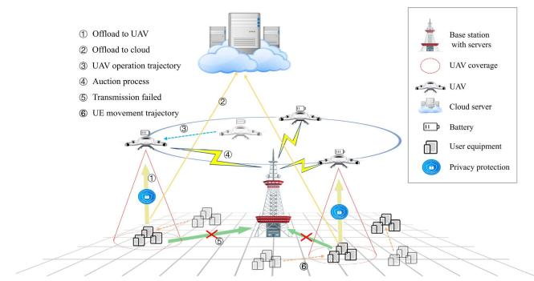  
Fig. 1. The architecture of the UAV-assisted MEC system.

TABLE I KEY NOTATIONS
<table><tr><td>Notation</td><td>Description</td></tr><tr><td>t</td><td>a time slot,  $t \in \mathbf { T }$ </td></tr><tr><td>m</td><td>an active UE in  $t , m \in \bf { M } ^ { t }$ </td></tr><tr><td> $u$ </td><td> $\mathbf { a } \ \mathbf { U A V } , \ u \in \mathbf { U }$ </td></tr><tr><td> $e$ </td><td>an  $\mathbf { E S } , e \in \mathbf { E }$ </td></tr><tr><td>n</td><td>an ECN,  $n \in \mathbf N$ </td></tr><tr><td> $d ( m )$ </td><td>the data size of m-th active UE</td></tr><tr><td> $\mathbf { S } _ { \alpha } ^ { t }$ </td><td>the set of services offloaded to u in t</td></tr><tr><td> $\mathbf { S } _ { \sigma } ^ { \vec { t } }$ </td><td>the set of services offloaded to e in t</td></tr><tr><td> $\mathbf { S } _ { n } ^ { t }$   $\mathsf { s } _ { n }$ </td><td>the set of services offloaded to n in t</td></tr><tr><td> $\mathbf { S } _ { c } ^ { t }$ </td><td>the set of services offloaded to remote cloud in t</td></tr><tr><td> $L _ { n } ^ { t }$ </td><td>the location of n in t</td></tr><tr><td> $\underline { { L } } _ { \eta } ^ { \nu }$ </td><td>the location of m in t</td></tr><tr><td> $D _ { n } ^ { t }$ </td><td>distance traveled between two slots for n</td></tr><tr><td> $D ^ { \mathrm { { m a x } } }$ </td><td>max distance between two slots for u</td></tr><tr><td> $D _ { n } ^ { \mathrm { { m a x } } }$ </td><td>max distance between two slots for n</td></tr><tr><td> $R _ { n } ^ { \mathrm { { m a x } } }$ </td><td>max coverage radius of n</td></tr><tr><td> $c ( m )$ </td><td>the total CPU cycles of the m-th UE&#x27;s task</td></tr><tr><td> $\dot { F } ^ { \mathrm { m a x } }$ </td><td>max computational throughput of n</td></tr><tr><td> $\stackrel { - } { \boldsymbol { F } _ { r } ^ { \mathit { t } } }$   $E _ { n , c } ^ { t }$ </td><td>computational energy consumption of n</td></tr><tr><td> $E ^ { \mathrm { i n a x } }$ </td><td>battery capacity of u</td></tr><tr><td> $E ^ { \stackrel { \ w } { \ = } }$ </td><td>current battery state of u in t</td></tr><tr><td> $E ^ { \stackrel { u } { t } }$   $\mathcal { L } _ { u , \mathrm { b a s e } } ^ { * }$ </td><td>a fixed energy consumption for u in t</td></tr><tr><td> $\underline { { { I } _ { p , m , n } ^ { * } } }$ </td><td>communication latency between m and n in t</td></tr><tr><td> $T _ { c } ^ { \tilde { t } }$   $^ { \varLambda } _ { _ { x } , m , n }$ </td><td>computation latency between m and n in t</td></tr><tr><td> $r _ { \mathrm { t o t a l } } ^ { \iota }$ </td><td>total computing resources that can be allocated in t</td></tr><tr><td> $\boldsymbol { r } _ { n } ^ { t }$ </td><td>computing resource allocated to n in t</td></tr><tr><td> $\boldsymbol { x } _ { n . . } ^ { t }$ </td><td>whether or not accept  $n \mathrm { { : } }$  s&#x27;th bid in t</td></tr><tr><td> $\bar { W } _ { \sim } ^ { \bar { t } ^ { \sigma } }$   ${ \cal W } _ { n } ^ { t }$ </td><td>the true valuation of  $n '$  service in t</td></tr><tr><td> $A _ { n , s } ^ { t }$ </td><td>the j&#x27;th bidding scheme of n in t</td></tr><tr><td> $P _ { n , s } ^ { \iota }$ </td><td>the bidding price of n&#x27;s s&#x27;th bid in t</td></tr><tr><td> $O _ { n , s } ^ { t }$ </td><td>the feasible service set of n&#x27;s s&#x27;th bid in t</td></tr></table>

Offloading Destination: UEs dynamically generate service demands that require real-time processing within individual time slots. Under emergency conditions, the ESs exhibit limited computational capacity and cannot process all of the data. Thus, the remaining data requires offloading to UAVs or the remote cloud for processing. $\mathbf { S } _ { u } ^ { t } , \mathbf { S } _ { e } ^ { t }$ and $\mathbf { S } _ { c } ^ { \bar { t } }$ are the set of services offloaded to $u , \ e$ and the remote cloud, respectively. Edge Computing Nodes (ECNs), indicated by $\mathbf { N } = \mathbf { U } \cup \mathbf { E }$ , represent the computational entities capable of delivering MEC services within the network. These service sets satisfy the following relations: $\begin{array} { r } { \mathbf { S } _ { u } ^ { t } , \mathbf { S } _ { u } ^ { t } \cap \mathbf { S } _ { e } ^ { t } = \varnothing , \mathbf { S } _ { c } ^ { t } = \mathbf { M } ^ { t } - \sum _ { n \in \mathbf { N } } \mathbf { S } _ { n } ^ { t } } \end{array}$

Communication Model: To enhance the accuracy of distance measurement, a three-dimensional coordinate system is established. The regional center is located at the origin, and the three-dimensional distances are computed using the euclidean metric. Let $L _ { n } ^ { t }$ and $L _ { m } ^ { t }$ represent the position of <sup>n</sup> and active <sup>m</sup> in each time slot, where <sup>n</sup> denotes either <sup>u</sup> or <sup>e</sup>. Due to the constraints of onboard battery capacity, aerodynamic efficiency, and other critical factors, the maximum mobility distance of the UAV is limited, while the ES is stationary. Let $D _ { n } ^ { \mathrm { m a x } }$ be the <sup>n</sup>’s maximum mobility distance. $D _ { n } ^ { \mathrm { m a x } } = D _ { u } ^ { \mathrm { m a x } }$ satisfies when $n = u$ . Otherwise, $D _ { n } ^ { \mathrm { m a x } } = 0$ holds. Consequently, the distance travelled $D _ { n } ^ { t }$ is described by ${ D _ { n } ^ { t } } = { \| L _ { n } ^ { t } - \bar { L } _ { n } ^ { t - 1 } \| }$

Due to signal attenuation limits, the <sup>n</sup>’s service coverage is bounded by its wireless range, and its service area is a circular region with a service radius $R _ { n } ^ { \mathrm { m a x } }$ . To mitigate bandwidth contention and inter-user interference in the multi-UE communication scenario, the Non-Orthogonal Multiple Access (NOMA) is employed [33]. In the considered NOMA framework, each UE accesses the channel simultaneously by leveraging power domain multiplexing. The signal transmitted from multiple UEs is superposed at the receiver, and the receiver employs Successive Interference Cancellation (SIC) to decode the signals. The decoding order is typically determined by the channel gain between each UE and the receiver, with UEs possessing weaker channel gains being decoded earlier. Assume that the UEs are indexed in ascending order according to their received power at <sup>n</sup>, such that $P _ { 1 } G _ { 1 , n } ^ { t } \leq P _ { 2 } G _ { 2 , n } ^ { t } \leq \cdot \cdot \cdot \leq P _ { | \mathcal { M } _ { n } ^ { t } | } G _ { | \mathcal { M } _ { n } ^ { t } | , n } ^ { t }$ , where $P _ { m }$ is the transmit power of <sup>m</sup>, $G _ { m , n } ^ { t }$ is the channel gain, which depends on the distance $D _ { m , n } ^ { t } = \| L _ { m } ^ { t } - L _ { n } ^ { t } \|$ , and $\mathcal { M } _ { n } ^ { t }$ denotes the set of UEs served by <sup>n</sup> in time slot <sup>t</sup>. Considering the path loss and the NOMA decoding order determined by the instantaneous received power, the Signal-to-Interference-plus-Noise Ratio (SINR) model is adopted to quantify each user’s signal quality in the presence of intra-cell interference introduced by concurrent multi-user transmissions [34], and the SINR for <sup>m</sup> at <sup>n</sup> under successive interference cancellation (SIC) decoding is given by

$$
\gamma _ { m , n } ^ { t } = \frac { P _ { m } G _ { m , n } ^ { t } } { \sum _ { j = m + 1 } ^ { | \mathcal { M } _ { n } ^ { t } | } P _ { j } G _ { j , n } ^ { t } + N _ { 0 } } ,\tag{1}
$$

where $N _ { 0 }$ is the noise power, $\begin{array} { r } { \sum _ { j = m + 1 } ^ { | { \mathcal { M } } _ { n } ^ { t } | } P _ { j } G _ { j , n } ^ { t } } \end{array}$ represents the interference from UEs with stronger received power. The achievable transmission rate for <sup>m</sup> is then expressed by

$$
R _ { m , n } ^ { t } = B _ { n } \log _ { 2 } ( 1 + \gamma _ { m , n } ^ { t } ) ,\tag{2}
$$

where $B _ { n }$ is the allocated bandwidth. Thus, the corresponding communication latency $T _ { p , m , n } ^ { t } = d ( m ) / R _ { m , n } ^ { t }$ is further expressed by

$$
T _ { p , m , n } ^ { t } = \frac { d ( m ) } { B _ { n } \log _ { 2 } \bigg ( 1 + \frac { P _ { m } G _ { m , n } ^ { t } } { \sum _ { j = m + 1 } ^ { | M _ { n } ^ { t } | } P _ { j } G _ { j , n } ^ { t } + N _ { 0 } } \bigg ) } .\tag{3}
$$

Computation Model: In the UAV-assisted MEC system, the ECN possesses limited computational resources $\boldsymbol { r } _ { n } ^ { t }$ in time slot <sup>t</sup> (the resources primarily refer to the allocated CPU frequency in the paper). In contrast, the remote cloud offers virtually unlimited computing capacity, albeit at a higher cost. To quantify the cost of cloud processing, we use <sup>ξ</sup> to denote the cost of offloading a unit of data to the remote cloud. Therefore, the total cloud offloading cost is computed as $\textstyle \sum _ { m \in \mathbf { S } _ { c } ^ { t } } \xi \cdot d ( m )$ . To characterize the computational demands, let $c ( m )$ represent the total number <sup>( )</sup>of CPU cycles required to process the computational task of the <sup>m</sup>th UE. Additionally, the computational capability of ECNs is bounded by both intrinsic hardware limitations (e.g., thermal design power) and extrinsic resource allocation constraints inherent to distributed system architectures. At the task level, let $F _ { n } ^ { \mathrm { m a x } }$ denote the <sup>n</sup>’s maximum computational throughput, representing its physical capacity to process CPU cycles per time slot. Consequently, the computing latency $T _ { c , m , n } ^ { t }$ between active <sup>m</sup> and <sup>n</sup> is obtained by

$$
T _ { c , m , n } ^ { t } = c ( m ) / r _ { n } ^ { t } .\tag{4}
$$

Note that task queuing latency has been extensively studied in the existing literature [35], [36]. Our method is a general framework, and due to space limitations, we do not further elaborate on queuing theory. Through the measurement method, the coefficient $\gamma _ { n }$ indicating the computational energy consumption per CPU cycle is determined [37]. Thus, the computational energy consumption $E _ { n , c } ^ { t }$ is computed by

$$
E _ { n , c } ^ { t } = \gamma _ { n } \sum _ { m \in { \bf S } _ { n } ^ { t } } c ( m ) .\tag{5}
$$

UAV Battery Capacity: Given that each UAV has a maximum onboard battery capacity $E _ { u , \mathrm { m a x } }$ , the operational endurance of a UAV is constrained by its onboard battery capacity. To ensure safe operation, the UAV needs to return for recharging when its remaining energy falls below a threshold $\beta E _ { u , \mathrm { { m a x } } }$ , where $\beta \in \{ 0 , 1 \}$ is a predefined safety factor.

During time slot <sup>t</sup>, the total energy consumption of <sup>u</sup> comprises three distinct components: 1) computational energy consumption $E _ { u , c } ^ { t }$ for onboard processing tasks, 2) propulsion energy consumption for mobility operations, and 3) a fixed base energy consumption $E _ { \mathrm { b a s e } }$ required to maintain hovering stability and power essential onboard systems. The battery state transition is acquired by

$$
E _ { u } ^ { t } = E _ { u } ^ { t - 1 } - E _ { u , \mathrm { b a s e } } ^ { t } - E _ { u , c } ^ { t } - \Theta D _ { n } ^ { t } ,\tag{6}
$$

where  represents the energy consumption per unit propulsion <sup>Θ</sup>distance.

The Total Social Cost: In the UAV-assisted MEC system, each <sup>n</sup> delivers MEC services and obtains corresponding payment $B _ { n } ^ { t }$ from the SP. To accurately quantify the actual utility of MEC services, the true service valuation of <sup>n</sup> is defined as $W _ { n } ^ { t } .$ The total system cost comprises two key components: the SP’s cost and the ECNs’ cost. The $\mathrm { S P ^ { \circ } s }$ cost consists of the payment paid to ECNs and the cost of offloading tasks to remote cloud processing, $\begin{array} { r } { \mathrm { i . e . , } \sum _ { n \in \mathbf { N } } B _ { n } ^ { t } + \sum _ { m \in \mathbf { S } _ { c } ^ { t } } \bar { \xi ^ { } } \cdot d ( m ) } \end{array}$ . The cost of <sup>n</sup> is <sup>+</sup> <sup>( )</sup>the true valuation of its MEC services minus the $\mathrm { { S P } ^ { \prime } { s } }$ payment it obtains, i.e., $W _ { n } ^ { t } - B _ { n } ^ { t }$ . Therefore, the total social cost is given

by

$$
\sum _ { t \in T } \left( \sum _ { n \in \mathbf { N } } W _ { n } ^ { t } + \sum _ { m \in \mathbf { S } _ { c } ^ { t } } \xi \cdot d ( m ) \right) .\tag{7}
$$

## IV. AUCTION MECHANISM DESIGN

To effectively incentivize ECNs for task offloading, this section formulates the service provisioning process between the SP and ECNs as a reverse auction, where ECNs act as bidders and the SP acts as an auctioneer.

## A. Bidding.

In our auction, each <sup>n</sup> submits a series of bids in time slot <sup>t</sup>, indicated by ${ \bf J } _ { n } ^ { t } = \{ 1 , 2 , \dots , s \}$ . The <sup>s</sup>’th bidding scheme is expressed as $\dot { A _ { n , s } ^ { t } } = \{ P _ { n , s } ^ { t } , O _ { n , s } ^ { t } , L _ { n , s } ^ { t } \}$ , where $P _ { n , s } ^ { t }$ is the bidding price, $O _ { n , s } ^ { t }$ <sup>=</sup>denotes the feasible service set, and $L _ { n , s } ^ { t }$ represents the target flight destination, respectively. If SP accepts the <sup>s</sup>th offloading solution of <sup>n</sup>, it is required to pay a payment $B _ { n } ^ { t }$ . A binary variable $x _ { n , s } ^ { t } \in \{ 0 , 1 \}$ is used to represent the acceptance status, which equals 1 when the <sup>s</sup>th bidding scheme of the <sup>n</sup> is accepted in time slot <sup>t</sup>. Otherwise, $x _ { n , s } ^ { t } = 0$ holds.

Due to onboard battery capacity constraints, UAVs adapt their bidding strategies based on residual energy levels. Specifically, UAVs with less remaining energy will increase their bidding price to mitigate service disruption risks due to enforced charging periods. This bidding price adjustment is formalized by $\begin{array} { r } { ( 1 + \delta \cdot \frac { E _ { u , \mathrm { { m a x } } } - E _ { u } ^ { t } } { E _ { u . \mathrm { { m a x } } } } ) } \end{array}$ , where <sup>δ</sup> is the impact coefficient. Additionally, latency and energy consumption are widely studied optimization objectives in MEC [38]. Since the bidding price is a user-defined variable, it can be mathematically expressed as a function of latency, energy consumption, or their weighted combination. Let <sup>κ</sup> be the price coefficient, and the bidding price is given by

$$
P _ { n , s } ^ { t } = \left\{ \begin{array} { l l } { \sum _ { m \in O _ { n , s } ^ { t } } \kappa ( T _ { 1 , m , n } ^ { t } + \iota T _ { 2 , m , n } ^ { t } ) \cdot \left( 1 + \delta \cdot \frac { E _ { u , \mathrm { m a x } } - E _ { u } ^ { t } } { E _ { u , \mathrm { m a x } } } \right) , } \\ { \mathrm { i f } n = u , } \\ { \sum _ { m \in O _ { n , s } ^ { t } } \kappa ( T _ { 1 , m , n } ^ { t } + T _ { 2 , m , n } ^ { t } ) , } \end{array} \right.\tag{8}
$$

## B. Design Rationales

A desired auction mechanism is expected to satisfy individual rationality, truthfulness, and computability. Here, we introduce the following definitions.

Definition 1 (Bidder’s Utility): A bidder’s utility is defined as its revenue minus expenditure. In our auction, <sup>n</sup>’s revenue is the payment $B _ { n , s } ^ { t }$ of the SP, while <sup>n</sup>’s expenditure is the true valuation of its services $w _ { n , s } ^ { t } .$ Thus, the utility of <sup>n</sup> is expressed as $B _ { n , s } ^ { t } - w _ { n , s } ^ { t }$ , which is non-negative.

Definition 2 (Individual Rationality): Individual rationality is satisfied if and only if every bidder’s utility is non-negative. In our auction, <sup>n</sup>’s utility is non-negative regardless of the bidding price, i.e., $B _ { n , s } ^ { t } - w _ { n , s } ^ { t } \geq 0 , \forall s \in \mathbf { J } _ { n } ^ { t } , \forall n \in \mathbf { N }$ , ∀t.

Definition 3 (Truthful Auction): Generally, ECNs exhibit rational yet self-interested characteristics. They tend to misreport their true costs strategically to maximize their own utility. A truthful auction ensures that no bidder can attain a higher utility by submitting a bid deviating from their true valuation. In our auction, the submission of a bidding price $P _ { n , s } ^ { t } { } ^ { \prime }$ that deviates from the true valuation does not increase the payment. Consequently, such a deviation does not enhance the utility, i.e., $\bar { B _ { n , s } ^ { t } } ( \bar { P _ { n , s } ^ { t } } ^ { \prime } ) - w _ { n , s } ^ { t } \leq B _ { n , s } ^ { t } ( \bar { P _ { n , s } ^ { t } } ) - w _ { n , s } ^ { t } , \forall \bar { P _ { n , s } ^ { t } } ^ { \prime } \neq$ $P _ { n , s } ^ { t } , \forall n \in \mathbf { N } , \forall s \in \mathbf { J } _ { n } ^ { t } .$ , ∀t.

Definition 4 (Computational Efficiency): The winner selection and payment rules of an auction should be completed in polynomial or pseudo-polynomial time complexity.

## C. Social Cost Minimizing Problem

In the design of real-world auction mechanisms, minimizing social cost is a natural and research-worthy problem [39]. Social cost minimization enhances the operational efficiency of the system and improves long-term satisfaction for all participants. Therefore, our objective is to minimize the total social cost, which requires the design of an incentive mechanism to ensure truthful bidding from ECNs.

In our auction, ECNs are truthful and do not misreport the true valuation of their services (as proven in Section VI), we have $\begin{array} { r } { w _ { n } ^ { t } = \sum _ { s \in \mathbf { J } _ { n } ^ { t } } x _ { n , s } ^ { t } P _ { n , s } ^ { t } } \end{array}$ . The total social cost in (7) is further expressed as $\begin{array} { r } { \sum _ { t \in T } \sum _ { n \in \mathbf { N } } \sum _ { s \in \mathbf { J } _ { n } ^ { t } } ( x _ { n , s } ^ { t } P _ { n , s } ^ { t } + \sum _ { m \in \mathbf { S } _ { c } ^ { t } } \xi \cdot d ( m ) ) } \end{array}$ As a result, the problem of minimizing social cost is formally described by

$$
\operatorname* { m i n } \quad \sum _ { t \in T } \sum _ { n \in \mathbf { N } } \sum _ { s \in \mathbf { J } _ { n } ^ { t } } \left( x _ { n , s } ^ { t } P _ { n , s } ^ { t } + \sum _ { m \in \mathbf { S } _ { c } ^ { t } } \xi \cdot d ( m ) \right) .\tag{9}
$$

$$
\mathrm { s . t . } \quad \sum _ { n \in \mathbf { N } } \sum _ { s \in \mathbf { J } _ { n } ^ { t } } \sum _ { m \in \mathbf { S } _ { n } ^ { t } } x _ { n , s } ^ { t } \geq 1 , \forall m \in \mathbf { M } ^ { t } - \mathbf { S } _ { c } ^ { t } , \forall t ,\tag{9a}
$$

$$
\sum _ { s \in \mathbf { J } _ { n } ^ { t } } x _ { n , s } ^ { t } \leq 1 , \forall n \in \mathbf { N } , \forall t ,\tag{9b}
$$

$$
\sum _ { n \in \mathbf { N } } r _ { n } ^ { t } \leq { r } _ { \mathrm { t o t a l } } ^ { t } , \ \forall n \in \mathbf { N } , \ \forall t ,\tag{9c}
$$

$$
x _ { n , s } ^ { t } \in \{ 0 , 1 \} , \forall n \in \mathbf { N } , \forall s \in \mathbf { J } _ { n } ^ { t } , \forall t ,\tag{9d}
$$

$$
\beta E _ { u , \mathrm { { m a x } } } \leq E _ { u } ^ { t } \leq E _ { u , \mathrm { { m a x } } } , \quad \forall n \in \mathbf { N } , \ \forall t ,\tag{9e}
$$

$$
D _ { m , n } ^ { t } \leq D _ { n } ^ { \operatorname* { m a x } } + R _ { n } ^ { \operatorname* { m a x } } , ~ \forall m \in \mathbf { S } _ { n } ^ { t } , \forall n \in \mathbf { N } , \forall t ,\tag{9f}
$$

$$
\sum _ { m \in { \bf S } _ { n } ^ { t } } c ( m ) \leq F _ { n } ^ { \operatorname* { m a x } } , \quad \forall n \in { \bf N } , \ \forall t .\tag{9g}
$$

Constraint (9a) ensures all UEs’ requests can be accommodated. Constraint (9b) enforces an Exclusive OR (XOR) strategy, guaranteeing that the ECN wins no more than one bid per auction round. Constraint (9c) guarantees that the computing resources $\boldsymbol { r } _ { n } ^ { t }$ allocated to <sup>n</sup> do not exceed the total available computational resources. Constraint (9d) is a 0-1 variable constraint, where the binary variable $x _ { n , s } ^ { t } \in \{ 0 , 1 \}$ indicates the acceptance status. Constraint (9e) guarantees that the UAV maintains a battery level above $\beta E _ { u , \mathrm { { m a x } } }$ while handling tasks. Constraint (9f) ensures service feasibility by restricting the distance $D _ { n } ^ { \mathrm { m a x } } + R _ { n } ^ { \mathrm { m a x } }$ between <sup>n</sup> and its served UE. Constraint (9g) ensures that the aggregate CPU cycle demand of all tasks assigned to <sup>n</sup> does not exceed its maximum computational throughput.

Algorithm 1: Auction Framework Prizty.   
Input: $n , m , d ( m ) , L _ { m } ^ { t } , \forall m , \forall s \in \mathbf { J } _ { n } ^ { t } , \forall t$   
Output: $\tilde { D P } [ \tilde { N } ] [ \tilde { r } _ { \mathrm { t o t a l } } ^ { t } ] ^ { \bar { t } } , \mathbf { Q } ^ { t } , \mathbf { S } _ { c } ^ { t } , \forall t$   
1: Initialize $\bar { \mathbf { C } } ^ { t } \gets \bar { \boldsymbol { \varnothing } } , \bar { \boldsymbol { \Phi } } ^ { t } \gets \boldsymbol { \varnothing } , \bar { x } _ { n , s } ^ { t } = 0 , b [ 0 ] [ r _ { n } ^ { t } ] ^ { t } =$   
$b [ n ] [ 0 ] ^ { t } = 0 , \tilde { D P } [ 0 ] [ \tilde { r } _ { n } ^ { t } ] ^ { t } = \tilde { D P } [ n ] [ 0 ] ^ { t }$   
$\begin{array} { r } { \sum _ { m \in \mathbf { M } ^ { t } } \xi \cdot d ( m ) , \bar { \forall } \bar { n } \in \mathbf { N } , \forall \bar { r } _ { n } ^ { t } , \forall \bar { s } \in \mathbf { J } _ { n } ^ { t } , \forall t } \end{array}$   
2: for $\bar { 1 } \leq t \leq T$ <sup>)</sup>do   
3: <sup>1</sup>for each $\boldsymbol { m } \in \mathbf { M } ^ { t }$ do   
4: Randomly move the UE’s position   
$L _ { m } ^ { t } \gets L _ { m } ^ { t - 1 } , \forall m$   
5: $( x _ { m } ^ { t } , y _ { m } ^ { t } ^ { \prime } )$ is obtained by Algorithm 2   
6: <sup>(</sup>end for   
7: for each $n \in \mathbf N$ do   
8: if $n = u$ and $E _ { u } ^ { t } \le \beta E _ { u , \operatorname* { m a x } }$ then   
9: ${ \bf N } = { \bf N } \backslash n$ {Exclude <sup>n</sup> from the bid   
candidate set}   
10: end if   
11: $( O _ { n } ^ { t } , L _ { n } ^ { t } )$ is obtained by Algorithm 3   
12: <sup>(</sup>end for   
13: $( \tilde { D P } [ N ] [ \tilde { r } _ { \mathrm { t o t a l } } ^ { t } ] ^ { t } , \mathbf { Q } ^ { t } , \mathbf { S } _ { c } ^ { t } )$ is obtained by Algorithm 4   
14: end for   
15: return

## V. ALGORITHM DESIGN

## A. Auction Framework

In the section, we propose Prizty, a privacy-preserving auction framework to facilitate efficient task offloading while protecting UE privacy. The main workflow of Prizty is presented in Algorithm 1. To mitigate the risk of UE location privacy leakage, Algorithm 2 utilizes a combinatorial obfuscation method to perturb UE locations. The resulting locations are verified through analysis to satisfy Geo-Indistinguishability (Geo-I). Under the limitations of onboard battery capacity, maximum flight distance, and maximum computational capability, Algorithm 3 generates the feasible service set for each ECN. Additionally, it records the target flight destinations of UAVs. Confronted with the difficulty of uncertain resource allocation and payment rules, Algorithm 4 links bidding prices to computational resources and energy characteristics, and incorporates a payment mechanism based on the second-price rule to ensure bidding truthfulness. Then, it selects winners by balancing social costs and utility. Algorithm 2, 3, 4 are discussed in Sections V-B, V-C, and V-D, respectively.

## B. UE Location Protection

During task offloading, ECNs extensively utilize massive UE location information, making the MEC system susceptible to inference attacks and potentially leading to privacy leakage. Thus, we introduce privacy-preserving techniques in the auction framework. Even if an attacker obtains the UE location information stored in ECNs, it remains difficult to infer the specific location details of individual UEs. Due to the inherent uncertainty in location data and the intentional randomization required by privacy-preserving mechanisms, probabilistic modeling is essential to quantify uncertainty about a UE’s true location and the adversary’s inferences. Several key concepts will be presented as follows.

Prior Probability Density Function (PDF): Formally, the PDF characterizes the probability distribution of a continuous random variable by specifying the relative likelihood of its possible values. Based on this concept, the prior PDF $f _ { p } ( p )$ describes an adversary’s prior knowledge about the true location $p$ before observing any obfuscated outputs ${ \hat { p } } .$ . Here, prior knowledge refers to all data and contextual understanding that the adversary may possess.

Likelihood Function: The likelihood function $f _ { \hat { p } } ( \hat { p } \mid P = p )$ is the obfuscation strategy, representing the probability of reporting <sup>p</sup> given the true location $p .$ . This is determined by our privacy-preserving algorithm.

Posterior PDF: The posterior PDF $f _ { P } ( p \mid p )$ represents the conditional distribution of the true location <sup>p</sup> given an observed obfuscated location ${ \hat { p } } .$ The posterior PDF is the adversarial inference objective, which is formally derived through Bayes theorem [40]:

$$
f _ { P } ( p \mid \hat { p } ) = \frac { f _ { \hat { p } } ( \hat { p } \mid P = p ) \cdot f _ { P } ( p ) } { \int _ { G } f _ { \hat { p } } ( \hat { p } \mid P = p ^ { \prime } ) \cdot f _ { P } ( p ^ { \prime } ) d p ^ { \prime } } .\tag{10}
$$

The term $\begin{array} { r } { \int _ { G } f _ { \hat { p } } ( \hat { p } \mid P = p ^ { \prime } ) \cdot f _ { P } ( p ^ { \prime } ) d p ^ { \prime } } \end{array}$ serves as a normalization factor, guaranteeing that the integral of $f _ { P } ( p \mid \hat { p } )$ over the entire location space <sup>G</sup> equals unity.

Sensitivity: Sensitivity $\Delta f$ quantifies the maximum impact of a single UE’s participation on the query result or output, which is defined as

$$
\Delta f = \operatorname* { m a x } _ { D , D ^ { \prime } } \left| f ( D ) - f ( D ^ { \prime } ) \right| .\tag{11}
$$

Given the inherent limitations in sensor accuracy, the exact position of a UE is typically represented as a small region rather than a discrete point [41]. The UE is located in a circular center measurement area with radius <sup>r</sup>. To quantitatively assess the effectiveness of location inference attacks, we introduce the inference attack success rate (IASR). Specifically, IASR is defined as the proportion of UEs for which the adversary’s estimated location $\tilde { p }$ falls within a radius <sup>r</sup> of the actual position $p .$ Namely

$$
\mathrm { I A S R } = \frac { 1 } { d ( m ) } \sum _ { j = 1 } ^ { d ( m ) } { \bf 1 } ( d ( \tilde { p } _ { j } , p _ { j } ) \leq r ) ,\tag{12}
$$

where $d ( \cdot , \cdot )$ denotes the euclidean distance. To protect UE location privacy, the original UE’s position $p = ( x , y )$ is perturbed by adding independent Laplace noise terms $\eta _ { x }$ and $\eta _ { y }$ . Thus, the new coordinate $( x ^ { \prime } , y ^ { \prime } )$ is computed by

$$
x ^ { \prime } = x + \eta _ { x } , y ^ { \prime } = y + \eta _ { y } .\tag{13}
$$

The term $\eta _ { x }$ and $\eta _ { y }$ follow a zero-mean Laplace distribution with scale parameter $\begin{array} { r } { b = \frac { \Delta f } { \epsilon _ { m } } , \mathrm { i . e . , } \eta _ { x } , \eta _ { y } \sim \mathrm { L a p l a c e } ( 0 , b ) } \end{array}$ , where $\epsilon _ { m }$ is the privacy budget. The PDF of Laplace noise is

given by

$$
P ( \eta _ { x } ) = \frac { 1 } { 2 b } \exp \left( - \frac { | \eta _ { x } | } { b } \right) , P ( \eta _ { y } ) = \frac { 1 } { 2 b } \exp \left( - \frac { | \eta _ { \parallel } } { b } \right) .\tag{14}
$$

Then, the perturbed PDF $f _ { \hat { P } ^ { \prime } }$ is the product of the original PDF $f _ { P } ( p )$ and the two Laplace noise distributions. Namely

$$
f _ { \hat { P } ^ { \prime } } ( \hat { p } ) = f _ { P } ( p ) \cdot \frac { 1 } { 4 b ^ { 2 } } \exp \left( - \frac { | x ^ { \prime } - x | + | y ^ { \prime } - y | } { b } \right) .\tag{15}
$$

To further enhance privacy preservation, the original measured area returned by sensors is post-processed before being transmitted to ECNs. Specifically, the radius of the measurement area is expanded to $r ^ { \prime } { . }$ , degrading the reported location’s spatial precision. Consequently, the prior PDF observed by an adversary is reduced. The new PDF $f _ { \hat { P } } ( \hat { p } )$ is calibrated from the original distribution $f _ { \hat { P } ^ { \prime } } ( \hat { p } )$ based on the ratio of the expanded radius, which is acquired by

$$
f _ { \hat { P } } ( \hat { p } ) = f _ { P } ( p ) \frac { r ^ { 2 } } { 4 r ^ { \prime 2 } b ^ { 2 } } \cdot \exp \left( - \frac { | x ^ { \prime } - x | + | y ^ { \prime } - y | } { b } \right) ,\tag{16}
$$

where $\frac { r ^ { 2 } } { r ^ { \prime 2 } }$ represents the density adjustment ratio due to the increased measurement area.

In addition, we use Geo-I to verify the privacy protection level between neighboring locations [42]. Geo-I ensures that the query results for neighboring locations $p _ { i }$ and $p _ { l }$ become statistically indistinguishable after the obfuscated location $\hat { p }$ is reported. Even if an attacker obtains the obfuscated location $\hat { p } ,$ they cannot reliably determine whether the true location of the UE is $p _ { i }$ or $p _ { l }$ . Geo-I is formally expressed by

$$
\frac { f ( P = p _ { l } \mid \hat { P } = \hat { p } ) } { f ( P = p _ { i } \mid \hat { P } = \hat { p } ) } \leq e ^ { \epsilon _ { m } . d ( p _ { i } , p _ { l } ) } \cdot \frac { f ( P = p _ { l } ) } { f ( P = p _ { i } ) } ,\tag{17}
$$

where $\begin{array} { r } { f ( P = p _ { i } \mid \hat { P } = \hat { p } ) } \end{array}$ and $f ( P = p _ { l } \mid \hat { P } = \hat { p } )$ denote the posterior probabilities of the true locations being $p _ { i }$ and $p _ { l }$ and $d ( p _ { i } , p _ { l } )$ represents the euclidean distance. Assuming the adversary has full knowledge of both the UE’s obfuscation strategy and the prior PDF $f _ { P } ( p )$ , we can simplify the ratio in (17) by directly evaluating the likelihood ratio between neighboring locations. Namely

$$
\frac { f _ { \hat { p } } ( \hat { p } \mid P = p _ { l } ) } { f _ { \hat { p } } ( \hat { p } \mid P = p _ { i } ) } \leq e ^ { \epsilon _ { m } \cdot d ( p _ { i } , p _ { l } ) } .\tag{18}
$$

Algorithm 2 demonstrates the process of protecting UE location information. In Lines 1-2, PPA generates independent Laplace noise to perturb the location of UEs. In Line 3, the radius of the measurement area is expanded. In Line 4, PPA adjusts the PDF to ensure that the perturbed results align with the new measurement area. In Line 5, Geo-I is verified. Line 6 returns the relevant computation results.

## C. Solution Space Exploration Algorithm

Due to distance limitations $\| L _ { n } ^ { t } - L _ { m } ^ { t } \| \leq D _ { n } ^ { \operatorname* { m a x } } + R _ { n } ^ { \operatorname* { m a x } }$ some UEs cannot be accessed by <sup>n</sup>. The SP computes the feasible service sets $O _ { n , s } ^ { t }$ and service location $L _ { n , s } ^ { t }$ for <sup>n</sup> in each time slot. To maximize the feasible service set, i.e., $\{ O _ { n } ^ { t } \}$ , a reverse matching is designed for each ECN to select active

```latex
Algorithm 2: Privacy Protection Algorithm PPA.
Input: $n , m , L _ { . m } ^ { t } , \forall m \in \mathbf { M } ^ { t } , \forall s \in \mathbf { J } _ { n } ^ { t } , \forall t$
Output: $( { x _ { m } ^ { t } } ^ { \prime } , { y _ { m } ^ { t } } ^ { \prime } ) , \forall m \in \mathbf { M } ^ { t } , \forall t$
1: Generate Laplace noise $\eta _ { x } \sim \mathrm { I }$ aplace <sup>,</sup> <sup>b</sup> and
$\eta _ { y } \sim \mathrm { L a p l a c e } ( 0 , b )$
<sup>(0</sup>2: Update location: $( x _ { m } ^ { t } + \eta _ { x } , y _ { m } ^ { t } + \eta _ { y } )$
3: expanded radius: $r ^ { \prime } \gets r$
4: $\begin{array} { r } { \overline { { f _ { \hat { P } } ( \hat { p } ) } } = f _ { P } ( p ) \frac { r ^ { 2 } } { 4 r ^ { \prime 2 } b ^ { 2 } } \cdot \exp ( - \frac { | x ^ { \prime } - x | + | y ^ { \prime } - y | } { b } ) } \end{array}$ {Calculate
new PDF}
5: verify Geo-I $\begin{array} { r } { \frac { f _ { \hat { p } } ( \hat { p } | P = p _ { l } ) } { f _ { \hat { p } } ( \hat { p } | P = p _ { i } ) } \le e ^ { \epsilon _ { m } \cdot d ( p _ { i } , p _ { l } ) } } \end{array}$
6: return perturbed location $\hat { p } = ( { x _ { m } ^ { t } } ^ { \prime } , { y _ { m } ^ { t } } ^ { \prime } ) , \forall m \in \mathbf { M } ^ { t } , \forall t$
```

Algorithm 3: Solution Space Exploration Algorithm SSEA.   
Input: $n , m , L _ { m } ^ { t } , \forall m \in \mathbf { M } ^ { t } , \forall s \in \mathbf { J } _ { n } ^ { t } , \forall t$   
Output: $\mathbf { S } _ { n } ^ { t } , L _ { n , s } ^ { t } , \forall s \in \mathbf { J } _ { n } ^ { t } , \forall t$   
1: Initialize $\mathbf { C } ^ { t } \gets \emptyset , \forall t$   
2: for each $\boldsymbol { m } \in \mathbf { M } ^ { t }$ do   
3: if $\| L _ { n } ^ { t } - L _ { m } ^ { t } \| \leq D _ { n } ^ { \operatorname* { m a x } } + R _ { n } ^ { \operatorname* { m a x } }$ and $c ( m ) \leq F _ { n } ^ { \operatorname* { m a x } }$   
then   
4: if $n = e$ or   
$E _ { u } ^ { t } - E _ { u , \mathrm { b a s e } } ^ { t } - \gamma c ( m ) - \Theta D _ { n } ^ { t } \geq \beta E _ { u , \mathrm { m a x } }$ then   
5: $c _ { m n } ^ { t } = \mathrm { c i r c l e } ( L _ { m } ^ { t } , R _ { n } ^ { \operatorname* { m a x } } )$ and $\mathbf { C } \gets c _ { m n } ^ { t }$   
6: end if   
7: end if   
8: end for   
9: for each $c _ { m n } ^ { t } \in \mathbf { C } ^ { t }$ do   
10: for each $\mathbf { \boldsymbol { c } } _ { j n } ^ { t } \in \mathbf { \boldsymbol { C } } ^ { t }$ where each $j \in \mathbf { M } ^ { t } , j \neq$ <sup>m</sup> do   
11: if $c _ { m n } ^ { t } \cap c _ { j n } ^ { t } \neq \emptyset$ and $c ( m ) + c ( j ) \leq F _ { n } ^ { \mathrm { m a x } }$ then   
12: if $n = u$ <sup>=</sup>and   
$E _ { u } ^ { t } - E _ { u , \mathrm { b a s e } } ^ { t } - \gamma ( c ( m ) + c ( j ) ) - \Theta D _ { n } ^ { t } \geq$   
$\beta E _ { u , \mathrm { { m a x } } }$ then   
13: $L _ { n } ^ { t } \gets c e n t e r ( c _ { m n } ^ { t } \cap c _ { j n } ^ { t } )$   
14: $\mathbf { i f } \parallel L _ { n } ^ { t } - L _ { n } ^ { t - 1 } \parallel \leq D _ { n } ^ { \operatorname* { m a x } }$ then   
15: $O _ { n } ^ { t } \gets c _ { m n } ^ { t } \cap c _ { j n } ^ { t }$ and label the served   
UEs   
16: end if   
17: end if   
18: end if   
19: end for   
20: end for   
21: Merge regions with the same symbol as $c ^ { \prime }$   
22: $O _ { n } ^ { t }  c ^ { \prime }$ and $L _ { n } ^ { t } \gets c e n t e r ( c ^ { \prime } )$   
23: return $O _ { n } ^ { t } , L _ { n } ^ { t } , \forall s \in { \bf J } _ { n } ^ { t } , \forall t$

UEs. The Solution Space Exploration Algorithm is presented in Algorithm 3.

In Line 1, all necessary variables are initialized. In Lines 2-8, SSEA identifies all UEs within the ECNs’ processing distance $D _ { n } ^ { \mathrm { m a x } } + R _ { n } ^ { \mathrm { m a x } }$ and a circular region $c _ { m n } ^ { t }$ with a radius equal to $R _ { n } ^ { \mathrm { m a x } }$ <sup>+</sup>is drawn around each $m .$ . Then $c _ { m n } ^ { t }$ is added to the set $\mathbf { C } ^ { t }$ In Lines 9-21, each candidate region undergoes rigorous feasibility verification to exclude regions exceeding computational capacity constraints. Subsequently, all intersecting regions are systematically explored. Furthermore, when $n = u$ , SSEA also excludes energy-overloaded regions while incorporating the geometric center of the area intersection as the target flight destination. Line 22 computes the feasible service set for <sup>n</sup>. Line 23 returns the relevant computation results.

## D. Winner and Payment Algorithm

Notably, the unit data processing cost in the remote cloud substantially exceeds that of the ECN. To reduce the overall social cost, the system is designed to maximize the offloading rate to ECNs and minimize the amount of computational tasks processed by the remote cloud. Let $\Phi ^ { t }$ denote the service set that has already been processed by ECNs at time slot <sup>t</sup>. If a UE cannot be served by any ECN, its computational task will be offloaded to the cloud. Assuming that all tasks are initially assigned to the cloud, $\Phi ^ { t }$ is initialized as an empty set. Since the bidding service set of a given ECN may partially overlap with services already processed by other ECNs, the effective service set of bidding scheme $A _ { n , s } ^ { t }$ newly processed by <sup>n</sup> is expressed as $\Psi _ { n , s } ^ { t } = O _ { n , s } ^ { t } - O _ { n , s } ^ { t }$ ∩ . To identify the optimal bidding scheme, the utility ${ \cal U } ( A _ { n , s } ^ { t ^ { \prime } } )$ of the bidding scheme is introduced, which quantifies the reduction in social cost achieved by selecting the bidding scheme $A _ { n , s } ^ { t }$ . Namely

$$
U ( A _ { n , s } ^ { t } , r _ { n } ^ { t } ) = \xi \sum _ { m \in \Psi _ { n , s } ^ { t } } d ( m ) - P _ { n , s } ^ { t } ( r _ { n } ^ { t } ) .\tag{19}
$$

In large-scale resource allocation scenarios, directly optimizing continuous resource allocation variables often leads to high computational complexity due to high-dimensional search spaces. To mitigate this computational burden, a scaling factor $\begin{array} { r } { \zeta = \frac { \epsilon \cdot r _ { \mathrm { t o t a l } } ^ { t } } { N } } \end{array}$ is introduced, where <sup>	</sup> is a positive small constant used to control the discretization accuracy of resource allocation. Then, the total allocatable resources $r _ { \mathrm { t o t a l } } ^ { t }$ are scaled to $\tilde { r } _ { \mathrm { t o t a l } } ^ { t } =$ $\Big \lfloor \frac { r _ { \mathrm { \ t o t a l } } ^ { t } } { \zeta } \Big \rfloor$ , and $\tilde { r } _ { n } ^ { t }$ represents the computational resources allocated to <sup>n</sup> after the scaling operation, where $\tilde { r } _ { n } ^ { t } \in \{ 1 , 2 , \dots , \tilde { r } _ { \mathrm { t o t a l } } ^ { t } \}$ After allocating computational resources $\tilde { r } _ { n } ^ { \prime t }$ to <sup>n</sup>, all $n \mathrm { { : } }$ bidding utilities are evaluated by (19). Then, we select the bidding scheme with the highest utility from all available schemes $\mathbf { J } _ { n } ^ { t }$ under the current state. A recursive equation illustrates the entire process, which is calculated by

$$
\begin{array} { r l } & { \tilde { D P } [ n ] [ \tilde { r } _ { n } ^ { t } ] ^ { t } = \underset { 0 < \tilde { r } _ { n } ^ { \prime } < \tilde { r } _ { n } ^ { t } } { \mathrm { m i n } } \left( \tilde { D P } [ n - 1 ] [ \tilde { r } _ { n } ^ { t } - r _ { n } ^ { \prime t } ] ^ { t } \right. } \\ & { ~ \left. - \underset { s \in { \bf J } _ { n } ^ { t } } { \mathrm { m a x } } U ( A _ { n , s } ^ { t } , r _ { n } ^ { \prime t } ) \right) . } \end{array}\tag{20}
$$

Additionally, the variable $b [ n ] [ \tilde { r } _ { n } ^ { t } ] ^ { t }$ stores the computational resources $\dot { \tilde { r } _ { n } ^ { t } }$ allocated to <sup>n</sup>’s <sup>s</sup>th bidding scheme under the current state, which is updated by

$$
b [ n ] [ \tilde { r } _ { n } ^ { t } ] ^ { t }  b [ n - 1 ] [ \tilde { r } _ { n } ^ { t } - \tilde { r } _ { n } ^ { t t } ] ^ { t } + ( n , s , \tilde { r } _ { n } ^ { t t } ) .\tag{21}
$$

Since each bidding scheme has a distinct bidding price and a different feasible service set, directly comparing bidding prices alone is insufficient to accurately reflect cost-effectiveness. Therefore, we introduce the concept of the incremental cost, defined as the bidding price divided by the volume of the actual computational tasks processed under that bidding scheme. Mathematically, the incremental cost of each bidding scheme $A _ { n , s } ^ { t }$ is expressed by $\frac { P _ { n , s } ^ { t } } { \sum _ { m \in \Psi _ { n , s } ^ { t } } d ( m ) }$ and the winner bidding scheme naturally exhibits the lowest incremental cost in each round. To facilitate clear identification, the winning bidding scheme is designated as $( n * , s * )$

Ensuring truthful bidding is essential to achieve the minimization of social cost. Our payment mechanism is designed based on the critical bid. The winner’s payment is not determined by their own bidding price, but rather by the second-smallest incremental unit cost. After excluding the winning bids $( n * , s * )$ stored in $b [ N ] [ \tilde { r } _ { \mathrm { t o t a l } } ^ { t } ] ^ { t }$ , the bidding scheme $( n ^ { \prime } , s ^ { \prime } )$ with the smallest incremental cost is selected by

$$
( n ^ { \prime } , s ^ { \prime } ) \in \underset { ( n \in \mathbf { N } , s \in \mathbf { J _ { n } ^ { t } } ) \backslash b [ N ] [ \tilde { r } _ { \mathrm { t o t a l } } ^ { t } ] ^ { t } } { \arg \operatorname* { m i n } } \frac { P _ { n , s } ^ { t } } { \sum _ { m \in \Psi _ { n , s } ^ { t } } d ( m ) } .\tag{22}
$$

Consequently, the winner’s payment $B _ { n * , s * } ^ { t }$ equals the incremental cost of the bidding scheme $( n ^ { \prime } , s ^ { \prime } )$ multiplied by the service data volume of the winning bidding scheme $( n * , s * )$ which is calculated by

$$
B _ { n * , s * } ^ { t } = \frac { P _ { n ^ { \prime } , s ^ { \prime } } ^ { t } } { \sum _ { m \in \Psi _ { n ^ { \prime } , s ^ { \prime } } ^ { t } } d ( m ) } \cdot \sum _ { m \in O _ { n * , s * } ^ { t } } d ( m ) .\tag{23}
$$

The Winner and Payment Algorithm WPA is presented in Algorithm 4. Lines 1-2 construct a scaling factor and initialize related variables. When ECNs are not available or allocable computational resources are exhausted, all tasks will be offloaded to the cloud. Therefore, $\tilde { D P [ 0 ] } [ \tilde { r } _ { n } ^ { t } ] ^ { t }$ and $\tilde { D P [ n ] [ 0 ] } ^ { t }$ are initialized as $\textstyle \sum _ { m \in \mathbf { M } ^ { t } } { \boldsymbol { \xi } } \cdot d ( m )$ , which represents the current total social <sup>( )</sup>cost. The iteration in Lines 3-10 selects the bidding scheme that minimizes the social cost. The winner’s payment is calculated in Lines 11-19. If the computational resources allocated to the bidding scheme $A _ { n , s } ^ { t }$ satisfy $\tilde { r } _ { n * } ^ { t } > 0$ , the bidding scheme is selected, i.e., $x _ { n * , s * } ^ { t } = 1$ . Line 20 excludes service set $\Phi ^ { t }$ processed by ECNs and offloads the residual services to the remote cloud. Line 21 returns the relevant computation results.

## VI. THEORETICAL ANALYSIS

This section provides theoretical analysis and formal proofs of Prizty’s essential properties, including its correctness, time complexity, truthfulness, individual rationality, and approximation ratio.

Theorem 1: Our proposed auction, Prizty, provides a feasible solution to the original problem (8).

Proof: We first show that the feasible service set $O _ { n } ^ { t }$ of each ECN is obtained by Algorithm 3. Lines 3 and 14 select feasible UEs for each ECN, satisfying constraint (9f). Line 11 guarantees that the aggregate CPU cycle demand of all tasks assigned to <sup>n</sup> does not exceed $n \mathrm { { : } }$ maximum computational throughput $F _ { n } ^ { \mathrm { m a x } }$ which satisfies constraint $( 9 \mathrm { g } )$ . Based on the feasible service set generated by Algorithm 3, Lines 3-9in Algorithm 4 calculate the utility of each bidding scheme by (19). Then, the winning bids and allocated computing resources are determined by (20) and (21), respectively. Finally, $\tilde { D P } [ N ] [ \tilde { r } _ { \mathrm { t o t a l } } ^ { t } ] ^ { t }$ obtains the minimal social cost.

Then, we prove that Prizty satisfies all the constraints. In Algorithm 4, Line 8 ensures that at most one bidding scheme from each ECN is stored by (21), which satisfies constraint (9b).

Algorithm 4: Winner and Payment Algorithm WPA.   
Input: $n , m , \forall m \in \mathbf { M } ^ { t } , \forall n \in \mathbf { N } , \forall s \in \mathbf { J } _ { n } ^ { t } , \forall t$   
Output: $\tilde { D P } [ N ] [ r _ { \mathrm { t o t a l } } ^ { t } ] ^ { t } , b [ N ] [ r _ { \mathrm { t o t a l } } ^ { t } ] ^ { t } , \mathbf { Q } ^ { t } , \mathbf { \tilde { S } } _ { c } ^ { t } , \forall t$   
1: Construct $\begin{array} { r } { \zeta = \frac { \epsilon \cdot r _ { \mathrm { t o t a l } } ^ { t } } { N } } \end{array}$ and scale resources $\begin{array} { r } { \tilde { r } _ { \mathrm { t o t a l } } ^ { t } = \lfloor \frac { r _ { \mathrm { t o t a l } } ^ { t } } { \zeta } \rfloor } \end{array}$   
2: Initialize $\Phi ^ { t }  \bar { \varnothing } , x _ { n , s } ^ { t } = 0 , b [ 0 ] [ r _ { n } ^ { t } ] ^ { t } = b [ n ] [ 0 ] ^ { t } =$   
$\begin{array} { r } { 0 , \tilde { D P } [ 0 ] [ \tilde { r } _ { n } ^ { t } ] ^ { t } = \tilde { D P } [ n ] [ 0 ] ^ { t } = \sum _ { m \in \mathbf { M } ^ { t } } \xi \cdot d ( m ) , \forall n \in \mathbf { \Omega } } \end{array}$   
$\mathbf { N } , \forall \tilde { r } _ { n } ^ { t } , \forall s \in \mathbf { J } _ { n } ^ { t } , \forall t$   
<sup>˜</sup>3: for each $n \in \mathbf N$ do   
4: for $\tilde { r } _ { n } ^ { t } = 0 \mathrm { t o } \tilde { r } _ { \mathrm { t o t a l } } ^ { t }$ do   
5: $\bar { \Psi } _ { n , s } ^ { t }  O _ { n , s } ^ { t } - O _ { n , s } ^ { t } \cap \Phi ^ { t }$   
6: $\begin{array} { r } { \tilde { U ( A _ { n , s } ^ { t } , \tilde { r } _ { n } ^ { t } ) } = \xi \sum _ { m ^ { t } \in \Psi _ { n , s } ^ { t } } ^ { \cdots } d ( m ^ { t } ) - P _ { n , s } ^ { t } ( \zeta \tilde { r } _ { n } ^ { \prime t } ) } \end{array}$   
7: $\tilde { D P } [ n ] [ \tilde { r } _ { n } ^ { t } ] ^ { t } = \operatorname* { m i n } _ { 0 < \tilde { r } _ { \hphantom { 0 } } ^ { \prime t } < \tilde { r } _ { \hphantom { 0 } \ast } ^ { t } } ( \tilde { D P } [ n - 1 ] [ \tilde { r } _ { n } ^ { t } - r _ { n } ^ { \prime t } ] ^ { t } -$   
$\operatorname* { m a x } _ { s \in \mathbf { J } _ { - } ^ { t } } U ( A _ { n , s } ^ { t } , \tilde { r } _ { n } ^ { \prime t } ) )$   
8: $b [ n ] [ \tilde { r } _ { n } ^ { t } ] ^ { t }  b [ n - 1 ] [ \tilde { r } _ { n } ^ { t } - \tilde { r } _ { n } ^ { \prime t } ] ^ { t } + ( n , s , \tilde { r } _ { n } ^ { \prime t } )$   
<sup>[ ]</sup>9: end for   
10: end for   
11: for each $( n * , s * , \tilde { r } _ { n * } ^ { t } ) \in b [ N ] [ \tilde { r } _ { \mathrm { t o t a l } } ^ { t } ] ^ { t }$ do   
12: if $\tilde { r } _ { n * } ^ { t } > 0$ <sup>˜</sup>then   
13: $x _ { n * , s * } ^ { t } = 1$   
14: end if   
15: $r _ { n * } ^ { t } = \tilde { r } _ { n * } ^ { t } \cdot \zeta$   
16: $( n ^ { \prime } , s ^ { \prime } ) \in$   
P t   
arg $\begin{array} { r } { \operatorname* { m i n } _ { ( n \in { \bf N } , s \in { \bf J } _ { \bf n } ^ { \bf t } ) \backslash b [ N ] [ \tilde { r } _ { \mathrm { t o t a l } } ^ { t } ] ^ { t } } \frac { { r _ { n , s } } } { \sum _ { m \in \Psi _ { n , s } ^ { t } } d ( m ) } } \end{array}$   
17: $\begin{array} { r } { B _ { n * , s * } ^ { t } = \frac { P _ { n ^ { \prime } , s ^ { \prime } } ^ { t } } { \sum _ { m \in \Psi _ { m ^ { \prime } , s ^ { \prime } } ^ { t } } d ( m ) } \cdot \sum _ { m \in O _ { n * , s * } ^ { t } } d ( m ) } \end{array}$   
18: $\mathbf { Q } ^ { t }  ( n * , s * , r _ { n * } ^ { t } , O _ { n , s } ^ { t } , B _ { n , s } ^ { t } )$   
19: end for   
20: $\mathbf { S } _ { c } ^ { t } = \mathbf { M } ^ { t } \mathbf { \backslash } \Phi ^ { t }$   
<sup>=</sup>21: return $\tilde { D P } [ N ] [ \tilde { r } _ { \mathrm { t o t a l } } ^ { t } ] ^ { t } , \mathbf { Q } ^ { t } , \mathbf { S } _ { c } ^ { t } , \forall t$

The traversal of computational resources $\boldsymbol { r } _ { n } ^ { t }$ in Lines 3–10 of Algorithm 4 satisfies constraint (9c). The variable $x _ { n , s } ^ { t }$ in Lines 12-13 is assigned a value of either 0 or 1, satisfying constraint (9d). Line 20 offloads the remaining service data volume to the remote cloud, which satisfies constraint (9a). In addition, Lines 8-10 of Algorithm 1 and Lines 4, 12 of Algorithm 3 evaluate the current battery level. If the current battery level is less than $\beta E _ { u , \mathrm { { m a x } } }$ , the UAV is removed from the candidate set N. As a result, constraint (9e) also holds. -

Theorem 2: Prizty exhibits a pseudo-polynomial time complexity of $O ( ( 1 + \frac { \bar { N } } { \epsilon ^ { 2 } } ) N ^ { 2 } m ^ { 2 } T )$

<sup>((1 + ) )</sup>Proof: We first evaluate the time complexity of Algorithm 3. For each region, SSEA checks its intersection with all subsequent areas, and the process of selecting the accessible combinations of regions for each <sup>n</sup> requires $O ( m ^ { 2 } )$ steps. The center of the intersection of the regions is determined based on geometry, which is solved in $O ( 1 )$ . Consequently, the overall time complexity of the Algorithm 3 is $O ( m ^ { 2 } )$ .

Then, we evaluate the time complexity of Algorithm 4. In Line 2, WPA initializes variables with $\dot { O ( N + \tilde { r } _ { \mathrm { t o t a l } } ^ { t } ) }$ steps. In Line 3, the iteration traverses the ECN with the time complexity being $O ( N )$ . In Lines 4-9, the $\tilde { D P [ n ] } [ \tilde { r } _ { n } ^ { t } ] ^ { t }$ array is updated by (20) with the time complexity being $\bar { O } ( ( \tilde { r } _ { \mathrm { t o t a l } } ^ { t } ) ^ { 2 } \dot { m } ^ { 2 } )$

Specifically, traversing <sup>n</sup>’s bidding schemes takes $O ( m ^ { 2 } )$ steps. <sup>( )</sup>Additionally, traversing unallocated computational resources $\tilde { r } _ { n } ^ { \prime }$ requires $\sum _ { \tilde { r } _ { n } = 1 } ^ { \tilde { r } _ { \mathrm { t o t a l } } } \tilde { r } _ { n }$ operations, bringing a time complexity of $O ( ( \tilde { r } _ { \mathrm { t o t a l } } ^ { t } ) ^ { 2 } )$ . Therefore, this nested $f o r$ loop in Lines 3–10 requires $\widehat { O } ( N ( \tilde { r } _ { \mathrm { t o t a l } } ^ { t } ) ^ { 2 } m ^ { 2 } )$ times at most. The iteration in Lines 11-19 computes the payment to the winning ECNs, requiring $O ( N ^ { 2 } m ^ { 2 } )$ times. Consequently, the overall time complexity of the Algorithm 4 is $O ( ( N \bar { + } ( \tilde { r } _ { \mathrm { t o t a l } } ^ { t } ) ^ { 2 } ) N m ^ { 2 } )$

In the auction framework, Prizty, traversing through time requires $O ( T )$ steps. Lines 3-6 obfuscate the location of each UE by Algorithm (2), with the time complexity being $O ( m ^ { 2 } )$ Lines 7-12 run the Algorithm 3 requiring $O ( \hat { N } m ^ { 2 } )$ times and Line 11 has a time complexity of $\bar { O } ( ( N ^ { \cdot } + ( \bar { r } _ { \mathrm { t o t a l } } ^ { t } ) ^ { 2 } ) N m ^ { 2 } )$ for executing the Algorithm 4. Therefore, the time complexity of Prizty is $\mathsf { \bar { \Lambda } } O ( ( N + \mathsf { \bar { \Lambda } } ( \tilde { r } _ { \mathrm { t o t a l } } ^ { t } ) ^ { 2 } ) N m ^ { 2 } T )$ . Since traversing the scaled resource allocation $\tilde { r } _ { n } ^ { t }$ requires a time complexity of $O ( \tilde { r } _ { \mathrm { t o t a l } } ^ { t } ) =$ $O ( \frac { N } { \epsilon } )$ , the time complexity of Prizty is further expressed as $O ( ( 1 + \frac { N } { \epsilon ^ { 2 } } ) N ^ { 2 } m ^ { 2 } T )$ , making it suitable for large-scale resource allocation problems. -

Theorem 3: Through a rational computing resource allocation mechanism, accurate battery reporting, and truthful bidding price, Prizty achieves truthfulness.

Proof: Truthfulness in the computing resource allocation: In fact, the SP allocates computing resources, and ECNs cannot independently determine the allocation of computing resources. First, we discuss that SP has no motivation to allocate more computing resources to a certain ECN. After submitting a series of bidding schemes, the SP allocates the optimal computing resources to each ECN by Algorithm 4. If an ECN is allocated more computing resources, i.e., $r _ { n } * > r _ { n }$ , the resources available to other ECNs $r _ { \mathrm { t o t a l } } - r _ { n } *$ will decrease due to the total computing resources are limited. The reduction in computing resources available to other ECNs causes their bid prices to increase, thereby raising the $\mathrm { { S P } ^ { \prime } { s } }$ payment cost. Due to the $\mathrm { S P ^ { \circ } s }$ self-interested cost considerations, it will not allocate more computing resources to any specific ECN. Thus, the overall resource allocation remains truthful.

Truthfulness in current battery state: Since ESs have nearly unlimited battery, we focus solely on the battery truthfulness of UAVs. We first prove that UAVs have no incentive to report a battery state higher than their actual level to reduce their bidding price. If a UAV reports a higher battery state than its current level, it may be assigned tasks that require higher energy consumption in subsequent rounds. However, due to insufficient energy, the UAV will fail to complete these tasks. Consequently, it will lose any potential payment for the uncompleted tasks, resulting in no actual utility improvement. Conversely, if the UAV reports a lower battery state, its bidding price will increase to mitigate service disruption risks due to enforced charging periods, thereby decreasing the possibility of being selected. Hence, the UAV has no incentive to misreport its energy consumption.

Truthfulness in the bidding price: To start with, we prove that the bidding price is bid-monotonic. The bidding scheme $( n * , s * )$ is selected with the highest utility from all available schemes $\mathbf { J } _ { n } ^ { t }$ under the current state. If the winner <sup>n</sup>∗ changes its bidding price to $P _ { n - , s - } ^ { t }$ satisfying $P _ { n - , s - } ^ { t } < P _ { n * , s * } ^ { t } ,$ , while the other remains the same, its bidding scheme <sup>n</sup>∗<sup>,</sup> <sup>s</sup>∗ yields higher utility by (19). Thus, the bidding scheme still wins.

Next, we prove that the payment $B _ { n } ^ { t }$ is critical. Recall that the payment of the winner $( n * , s * )$ is the smallest <sup>( )</sup>unit price in all the candidate bids after excluding winning bids, the payment is expressed as $\begin{array} { r } { B _ { n * , s * } ^ { t } = \frac { P _ { n ^ { \prime } , s ^ { \prime } } ^ { t } } { \sum _ { m \in \Psi _ { n ^ { \prime } , s ^ { \prime } } ^ { t } } d ( m ) } \cdot } \end{array}$ $\scriptstyle \sum _ { m \in O _ { n * , s * } ^ { t } } d ( m )$ . If the winner $( n * , s * )$ changes its bidding price to $P _ { n - , s - } ^ { t }$ satisfying $P _ { n - , s - } ^ { t } \leq B _ { n * , s * } ^ { t }$ , we obtain an inequality $\begin{array} { r } { \frac { P _ { n - , s - } ^ { t } } { \sum _ { m \in \Psi _ { n - , s - } ^ { t } } d ( m ) } \leq \frac { P _ { n ^ { \prime } , s ^ { \prime } } ^ { t } } { \sum _ { m \in \Psi _ { n ^ { \prime } , s ^ { \prime } } ^ { t } } d ( m ) } } \end{array}$ demonstrating that this bidding scheme $( n - , s - )$ still wins. If the winner $( n * , s * )$ <sup>(</sup>changes its bidding price to $P _ { n - , s - } ^ { t }$ satisfying $P _ { n - , s - } ^ { t } > B _ { n * , s * } ^ { t }$ we derive an inequality $\begin{array} { r } { \frac { P _ { n - , s - } ^ { t } } { \sum _ { m \in \Psi _ { n - , s - } ^ { t } } d ( m ) } \geq \frac { P _ { n ^ { \prime } , s ^ { \prime } } ^ { t } } { \sum _ { m \in \Psi _ { n ^ { \prime } , s ^ { \prime } } ^ { t } } d ( m ) } } \end{array}$ indicating that this bidding scheme $( n - , s - )$ will lose. Thus, the payment $B _ { n } ^ { t }$ is critical.

If and only if such two conditions are satisfied, a reverse auction achieves truthfulness in the bidding price based on Myerson’s theorem [43]. Hence, the proposed auction framework Prizty achieves truthfulness. -

Theorem 4: By applying the payment mechanism based on the critical bid, Prizty achieves individual rationality.

Proof: Recall that the bidding price is truthful by Theorem (3), the ECNs’ true service cost equals their bidding price, i.e., $\begin{array} { r } { \boldsymbol { w } _ { n } ^ { t } = \sum _ { s \in \mathbf { J } _ { n } ^ { t } } \boldsymbol { x } _ { n , s } ^ { t } \cdot \boldsymbol { P } _ { n , s } ^ { t } } \end{array}$ . Reviewing the payment rule in (22) and (23), the inequality $\begin{array} { r } { B _ { n * , s * } ^ { t } = \frac { P _ { n ^ { \prime } , s ^ { \prime } } ^ { t } } { \sum _ { m \in \Psi _ { n ^ { \prime } , s ^ { \prime } } ^ { t } } d ( m ) } . } \end{array}$ $\begin{array} { r } { \sum _ { m \in { \cal { O } } _ { n * , s * } ^ { t } } d ( m ) \geq \frac { P _ { n * , s * } ^ { t } } { \sum _ { m \in \Psi _ { n * , s * } ^ { t } } d ( m ) } \cdot \sum _ { m \in { \cal { O } } _ { n * , s * } ^ { t } } d ( m ) } \end{array}$ satisfies due to $P _ { n ^ { \prime } , s ^ { \prime } } ^ { t } \geq P _ { n * , s * } ^ { t }$ . Since $\frac { \sum _ { m \in O _ { n * , s * } ^ { t } } d ( m ) } { \sum _ { m \in \Psi _ { n ^ { \prime } , s ^ { \prime } } ^ { t } } d ( m ) } \geq 1$ , we obtain $B _ { n * , s * } ^ { t } \geq P _ { n * , s * } ^ { t } .$ . Thus, the winner’s utility is always nonnegative, and we finish the proof. -

Theorem 5: The approximation ratio denotes the maximum ratio of the objective value achieved by Prizty relative to the optimal solution. When $\begin{array} { r } { \epsilon \geq \frac { \sqrt { N \sum _ { n ^ { * } } C _ { n ^ { * } } } } { \sum _ { n ^ { * } } \sqrt { C _ { n ^ { * } } } } } \end{array}$ , Prizty achieves an approximation ratio of $1 + \epsilon$ for the original problem (8).

Proof: Let denote the optimal solution of the original problem (8) and  denote the solution obtained by Prizty.

Error Sources: The approximation error originates from two aspects: 1) resource quantization error, the original resource allocation $\boldsymbol { r } _ { n } ^ { t }$ is approximated by $\begin{array} { r } { \zeta \cdot \tilde { r } _ { n } ^ { t } , \mathrm { i . e . , } \tilde { r } _ { n } ^ { t } = \lfloor \frac { r _ { n } ^ { t } } { \zeta } \rfloor } \end{array}$ satisfying $0 \leq \zeta \cdot \tilde { r } _ { n } ^ { t } - r _ { n } ^ { t } < \zeta ; 2 )$ Utility function distortion, the nonlinear utility function $\begin{array} { r } { U ( A _ { n , s } ^ { t } , \dot { \boldsymbol { r _ { n } ^ { t } } } ) = \xi \sum _ { m \in \Psi _ { n , s } ^ { t } } d ( m ) - } \end{array}$ $P _ { n , s } ^ { t } ( r _ { n } ^ { t } )$ suffers approximation errors due to quantized resources.

Error Analysis: For each Winning <sup>n</sup>∗’ bidding scheme $A _ { n * , s * } ^ { t } ,$ the resource-dependent term $P _ { n * , s * } ^ { t } ( r _ { n * } ^ { t } )$ in the utility function is approximated by $P _ { n * , s * } ^ { t } \big ( \zeta \tilde { r } _ { n * } ^ { t } \big )$ . The structure of resourcedependent term $P _ { n * , s * } ^ { t } ( r _ { n * } ^ { t } )$ is simplified as $a _ { n } * + \frac { C _ { n } * } { r _ { n * } ^ { t } }$ where $a _ { n } * , C _ { n } *$ is a constant for each <sup>n</sup>∗ and $a _ { n } * , C _ { n } * > \ "$ . Moreover, $P _ { n * , s * } ^ { t } ( r _ { n * } ^ { t } )$ satisfies: 1) $P _ { n * , s * } ^ { t } ( r _ { n * } ^ { t } )$ is a monotonically decreasing function; 2) The absolute value of the derivative of $P _ { n * , s * } ^ { t } ( r _ { n * } ^ { t } )$ with respect to $r _ { n * } ^ { t }$ satisfies $| { P _ { n * , s * } ^ { t } } ^ { \prime } ( r _ { n * } ^ { t } ) | \leq$ $\frac { C _ { n } * } { r _ { n * } ^ { t } }$ for some $C _ { n ^ { * } } > 0$ . It is worth noting that the penalty term $\xi \sum _ { m \in \Psi _ { n * , s * } ^ { t } } d ( m )$ remains unscaled. The total error $\Delta$ is

calculated by

$$
\Delta = \sum _ { n * } \left| P _ { n * , s * } ^ { t } ( \zeta \tilde { r } _ { n * } ^ { t } ) - P _ { n * , s * } ^ { t } ( r _ { n * } ^ { t } ) \right| .\tag{24}
$$

To bound this error, the mean value theorem is used, which guarantees that for any continuously differentiable function, the finite difference between two functional values can be exactly characterized by the first-order derivative evaluated at an intermediate point within the interval. Mathematically:

$$
\big | P _ { n * , s * } ^ { t } ( \zeta \tilde { r } _ { n * } ^ { t } ) - P _ { n * , s * } ^ { t } ( r _ { n * } ^ { t } ) \big | \leq \frac { C _ { n } * } { \chi _ { n * } ^ { 2 } } \cdot | \zeta \tilde { r } _ { n * } ^ { t } - r _ { n * } ^ { t } | ,\tag{25}
$$

where $\chi _ { n * } \in [ \zeta \tilde { r } _ { n * } ^ { t } , r _ { n * } ^ { t } ]$ . Given $\zeta \tilde { r } _ { n * } ^ { t } \geq \zeta \mathrm { a n d } | \zeta \tilde { r } _ { n * } ^ { t } - r _ { n * } ^ { t } | < \zeta ,$ we have $\Delta \leq \sum _ { n * } { \frac { C _ { n } * } { ( \zeta ) ^ { 2 } } } \cdot \zeta = \sum _ { n * } { \frac { C _ { n } * } { \zeta } }$ . Substituting the expression for $\begin{array} { r } { \zeta = \frac { \epsilon r _ { \mathrm { t o t a l } } ^ { t } } { N } } \end{array}$ into the bound for $\Delta$ , we have

$$
\Delta \leq \sum _ { n * } \frac { C _ { n } * } { \epsilon r _ { \mathrm { t o t a l } } ^ { t } / N } = \sum _ { n * } \frac { N C _ { n } * } { \epsilon r _ { \mathrm { t o t a l } } ^ { t } } .\tag{26}
$$

For each winner <sup>n</sup>∗, the bidding price function satisfies $\begin{array} { r } { P _ { n , s } ^ { t } ( r _ { n * } ^ { t } ) \geq \frac { C _ { n } * } { r _ { n * } ^ { t } } } \end{array}$ . After summing up the bidding prices of all winning ECNs, we obtain $\sum _ { n * } P _ { n , s } ^ { t } ( r _ { n * } ^ { t } ) \geq \sum _ { n * } \frac { C _ { n } * } { r _ { n * } ^ { t } }$ . By applying the harmonic-arithmetic mean inequality to the payment functions, we derive that $\sum _ { n * } \frac { C _ { n } * } { r _ { n * } ^ { t } } \geq \frac { ( \sum _ { n * } \sqrt { C _ { n * } } ) ^ { 2 } } { \sum _ { n * } r _ { n * } ^ { t } }$ . Incorporating the computational resource constraints $\sum _ { n * } r _ { n * } ^ { t } \leq r _ { \mathrm { t o t a l } } ^ { t }$ , we further derive that $\sum _ { n * } \frac { C _ { n } * } { r _ { n * } ^ { t } } \geq \frac { ( \sum _ { n * } \sqrt { C _ { n * } } ) ^ { 2 } } { r _ { \mathrm { t o t a l } } ^ { t } }$ . The original optimal solution includes at least the payments to winning ECNs. To rigorously bound this solution from below, we derive the following chain of inequalities:

$$
\Gamma \geq \sum _ { n * } P _ { n , s } ^ { t } ( r _ { n * } ^ { t } ) \geq \sum _ { n * } \frac { C _ { n } * } { r _ { n * } ^ { t } } \geq \frac { \left( \sum _ { n * } \sqrt { C _ { n * } } \right) ^ { 2 } } { r _ { \mathrm { t o t a l } } ^ { t } } .\tag{27}
$$

Considering that the upper bound of $\Delta$ in (26), and the lower bound of in $( 2 7 ) , \Delta \leq \epsilon \Gamma$ satisfies when $\begin{array} { r } { \epsilon \geq \frac { \sqrt { N \sum _ { n ^ { * } } C _ { n ^ { * } } } } { \sum _ { n ^ { * } } \sqrt { C _ { n ^ { * } } } } } \end{array}$ Thus, $\Lambda \le \Gamma + \Delta \le \Gamma + \epsilon \Gamma = \Gamma ( 1 + \epsilon )$ holds. As a result, we complete the proof. -

## VII. PERFORMANCE EVALUATION

## A. Experimental Setup

Implementation: Prizty’s performance is evaluated using two experimental scenarios: a small-scale environment (Set #1) and a large-scale environment (Set #2). All experiments are executed on a Windows platform with an Intel Core i7-13620H processor (10 CPUs, 2.4 GHz base frequency) and 16 GB RAM.

Dataset: The experiments utilize the widely adopted realworld EUA dataset [44], focusing on the metropolitan area of Melbourne, Australia, which spans over 9,000 square kilometers. The dataset, comprising radio communications licenses published by the Australian Communications and Media Authority, encompasses all cellular BSs in Australia. These BSs serve as ESs, aligning with the common practice of deploying edge computing infrastructure at such locations. Furthermore, the Asia-Pacific Network Information Centre provides the IP addresses allocated to Australia. By employing the IP lookup service from http://ip-api.com/ , we transform the acquired IP addresses into geographical coordinates to emulate the spatial distribution of application UEs.

TABLE II  
EXPERIMENT SETTINGS
<table><tr><td></td><td>Set Subset</td><td>UEs</td><td>ESs</td><td>UAVs</td><td>T</td></tr><tr><td rowspan="4"></td><td>#1.1</td><td>50</td><td>5</td><td> $1 , \ldots , 8$ </td><td>100</td></tr><tr><td>Set #1.2</td><td>50</td><td> $1 , 2 , \ldots , 8$ </td><td>5</td><td>100</td></tr><tr><td></td><td>#1 #1.3 10, 20, . . . , 80</td><td>5</td><td>5</td><td>100</td></tr><tr><td>#1.4</td><td>50</td><td>5</td><td>5</td><td>1,2, . . . , 100</td></tr><tr><td rowspan="4"></td><td>#2.1</td><td>500</td><td>50</td><td>10, 20, . . . , 80</td><td>100</td></tr><tr><td>Set #2.2</td><td>500</td><td>10, 20, . . . , 80</td><td>50</td><td>100</td></tr><tr><td></td><td>#2 #2.3 100, 200, . . . , 800</td><td>50</td><td>50</td><td>100</td></tr><tr><td>#2.4</td><td>500</td><td>50</td><td>50</td><td> $1 , 2 , \ldots , 1 0 0$ </td></tr></table>

Performance Evaluation: The primary objective of Prizty is to achieve the minimization of social cost during the task processing of UEs. Its performance varies across different MEC scenarios. To comprehensively evaluate Prizty, we simulate various MEC scenarios by altering three experimental parameters: 1) the number of UAVs; 2) the number of ESs; 3) the number of UEs. The experimental configuration is outlined in Table II. Each experiment is repeated 100 times, and the results are summarized by the average value.

Each time slot is set to 10 seconds, and the entire system runs for over 100 time slots. In practical scenarios, the system parameters are configured as follows: the UEs are situated in a $1 5 0 0 \mathrm { m } \times 1 2 0 0 \mathrm { m }$ region and the percent of active UEs M is set to 90%. The radius of the measurement area <sup>r</sup> is fixed at 3m. The privacy budget $\epsilon _ { m }$ is assigned a value of 1.2. The impact coefficient <sup>δ</sup> and the price coefficient <sup>κ</sup> are set to 1.5 and 1.2, respectively. Additionally, the unit cost for offloading data to the cloud is set to 30. To simulate UAV-assisted MEC in 5G networks, the configuration of BSs follows the settings in [45], with a 50MHz channel bandwidth, -100dBm background noise, and 40W transmit power.

At the start of each time slot, each UE moves randomly and generates a service demand, with the service data volume set to [5, 10] MB. The total available computational resources are set to $[ 2 \times 1 0 ^ { 1 1 } , 3 \times 1 0 ^ { 1 1 } ]$ cycles. Based on empirical observations in literature [46], we set the CPU cycle requirement $c ( m ) =$ $2 0 0 \times d ( m )$ <sup>( ) =</sup>, modeling the computational workload as proportional to the service data volume. The UAV configuration, based on DJI Mavic 2 Pro specifications [47], provides a maximum computational throughput of $1 \times 1 0 ^ { 1 0 }$ CPU cycles/slot, while <sup>1 10</sup>operating at 50m altitude with 200 m service radius. Each UAV is equipped with a 60 Wh battery (216 kJ) with the safety factor $\beta = 0 . 2$ . It incurs 0.2 kJ/slot fixed energy consumption, 8 J/m for mobility, and $4 \times 1 0 ^ { - 8 }$ J/cycle for computational processing, achieving a maximum speed of 20 m/s and a maximum mobility distance of 80 m/slot. The ES delivers a maximum computational throughput of $3 \times 1 0 ^ { 1 0 }$ CPU cycles/slot with 300 m service radius, while consuming $8 \times 1 0 ^ { - 8 }$ J/cycle for computation.

Performance Metrics: The effectiveness of Prizty is measured through six performance metrics: 1) offload rate; 2) average service latency; 3) average energy consumption; 4) average social cost; 5) accuracy of system execution time; 6) accuracy of inference attacks.

Baselines: Prizty is compared with two baseline methods and two state-of-the-art methods.

\- Optimal. An exhaustive search is performed over all possible allocation schemes to identify the one that optimizes system performance.

Greedy. This scheme allocates tasks by selecting ECNs based on the lowest current bid pricing. This process operates as a greedy local optimization within each iteration, where all non-conforming bids are eliminated from consideration.

Truthful Online Combinatorial Auction-based Mechanism (TOCA) [48]. This approach simulates a resource trading market where each UE independently participates. The system dynamically adjusts its bidding pricing based on the resource scarcity level, thereby achieving a balance between UAV resource utilization and task revenue.

\- Privacy-preserving Auction Frameworks (Ptero) [49]. This scheme uses subset anonymity to protect UE location privacy. It considers the high mobility of UAVs, as well as their limited energy and computational capacities. Consequently, it selects the winning UAV through an auction based on weighted prices.

Experiment Set #1: Figs. 2–5 demonstrate the effectiveness of Prizty in Experiment Set #1, comparing it with the Optimal, Greedy, TOCA, and Ptero algorithms. Overall, the Optimal algorithm achieves the highest offloading rate, with the lowest average system energy consumption and the best balance between service latency and social cost. Second to Optimal, Prizty outperforms Greedy, TOCA, and Ptero. Fig. 2(a) shows that as the number of UAVs increases, the offloading rate of Prizty increases rapidly and then levels off when the number of UAVs exceeds 5. This indicates that the number of UAVs is sufficient at this point, and further increasing the UAV count does not significantly improve the offloading rate. As depicted in Fig. 2(b) and (d), the average service latency and social cost of Prizty exhibit a decreasing trend with an increase in the number of UAVs. An interesting phenomenon in Fig. 2(c) is that the average energy consumption exhibits an initial decrease followed by a monotonic increase with the growing UAV population. This occurs because additional UAVs beyond the optimal number increase hovering and propulsion energy more than they improve offloading efficiency. As shown in Fig. 2(e), Optimal incurs significantly higher system execution time compared to other algorithms due to its exhaustive search of all bidding schemes. Consequently, while Optimal demonstrates superior results in terms of offloading efficiency, the prolonged execution time limits its applicability in scenarios where rapid decision-making is essential.

Fig. 3(a), (b), and (e) in Experiment Set #1 show similar trends to those in Fig. 2, which are not comprehensive displayed due to space limitations. Nevertheless, of particular interest is the observation in Fig. 3(a), where Prizty achieves a 100% offloading rate when the number of ESs exceeds 7. This result highlights its effectiveness in resource allocation, eliminating the need for remote cloud offloading. As shown in Fig. 3(c), the initial high energy consumption occurs because fewer ESs force UAVs to handle most offloading tasks, incurring substantial hovering and propulsion energy consumption. As ESs increase, the system optimally allocates tasks between UAVs and ESs, reducing energy consumption. With the further deployment of ESs, the total energy consumption begins to stabilize, as the combined processing capacities of UAVs and ESs surpass the system’s task requirements, leading to a relatively steady overall energy consumption. Fig. 4(a) shows the offloading rate variations in scenarios with different UE numbers. When the number of UEs is fewer than 30, all five algorithms achieve nearly 100% offloading. Prizty maintains a lower offloading rate as the UE number increases than the Optimal algorithm. The trends in Fig. 4(b)–(d) consistently demonstrate that as the number of UEs increases, the average service latency, energy consumption, and social cost exhibit corresponding growth, aligning with theoretical expectations. Fig. 5 illustrates the effectiveness of all five algorithms across different time slots. Prizty consistently outperforms the other three algorithms in most time slots, ranking second only to the Optimal algorithm. In this experiment set #1, Prizty on average offloads 0.98% fewer UEs compared to the optimal algorithm, with an average service latency 2.78% higher, average energy consumption 3.16% higher, and social cost 12.88% higher. Additionally, Prizty shows an average advantage of 2.42%, 1.37%, and 0.86% compared to Greedy, TOCA, and Ptero algorithms, respectively, in terms of the offload rate, an average advantage of 1.44%, 1.77%, and 1.45% in terms of the average service latency, an average advantage of 3.81%, 2.22%, and 3.74% in terms of the average energy consumption, and an average advantage of 9.26%, 7.11%, and 7.48% in terms of the total system cost. Moreover, Prizty demonstrates relatively low and stable execution time. These results indicate that Prizty effectively explores the feasible service set for each ECN, then optimally schedules ECNs and allocates computational resources. The well-designed payment mechanisms ensure the truthfulness of the auction, maximizing the offloading rate while simultaneously minimizing energy consumption, latency, and social costs.

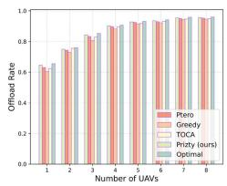  
(a) Offload rate

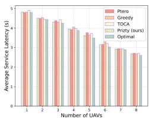  
(b) Latency

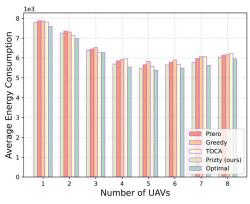  
(c) Energy consumption

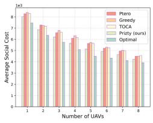  
(d) Social cost

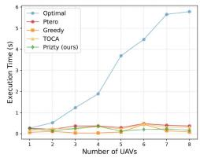  
(e) Execution time

Fig. 2. Effectiveness VS. number of UAVs (Set #1.1)  
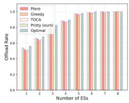  
(a) Offload rate

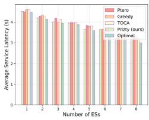  
(b) Latency

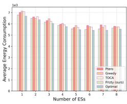  
(c) Energy consumption

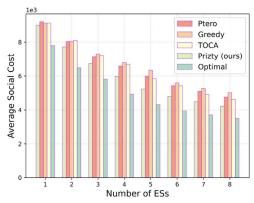  
(d) Social cost

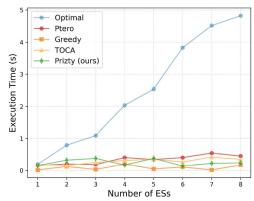  
(e) Execution time

Fig. 3. Effectiveness VS. number of ESs (Set #1.2).  
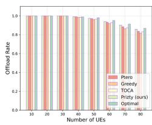  
(a) Offload rate

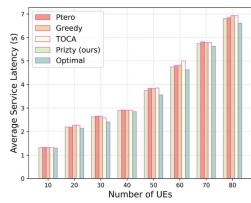  
(b) Latency

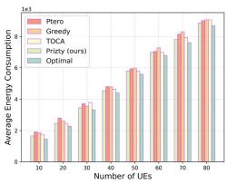  
(c) Energy consumption

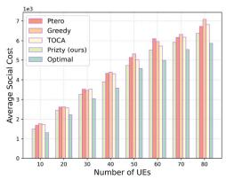  
(d) Social cost

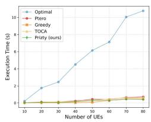  
(e) Execution time

Fig. 4. Effectiveness VS. number of UEs (Set #1.3).  
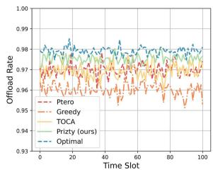  
(a) Offload rate VS. T

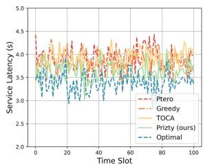  
(b) Latency VS. T

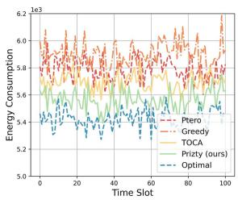  
(c) Energy consumption VS. T

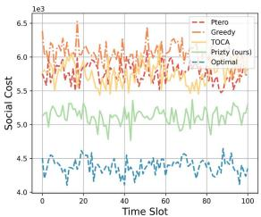  
(d) Social cost VS. T  
Fig. 5. Effectiveness VS. T (Set #1.4).

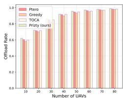  
(a) Offload rate

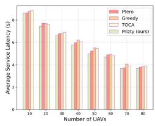  
(b) Latency

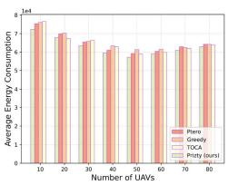  
(c) Energy consumption

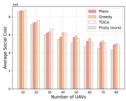  
(d) Social cost

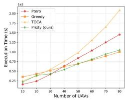  
(e) Execution time

Fig. 6. Effectiveness VS. number of UAVs (Set #2.1).  
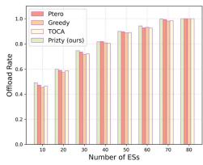  
(a) Offload rate

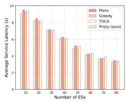  
(b) Latency

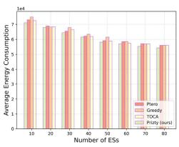  
(c) Energy consumption

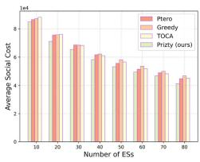  
(d) Social cost

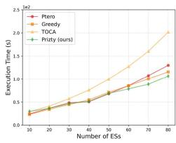  
(e) Execution time

Fig. 7. Effectiveness VS. number of ESs (Set #2.2).  
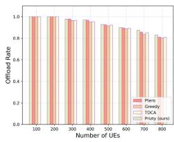  
(a) Offload rate

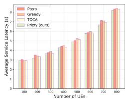  
(b) Latency

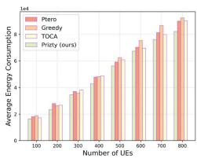  
(c) Energy consumption

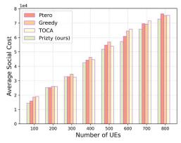  
(d) Social cost

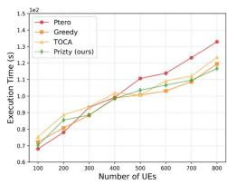  
(e) Execution time  
Fig. 8. Effectiveness VS. number of UEs (Set #2.3).

Experiment Set #2: Figs. 6–9 depict the results of Experiment Set #2, which involves large-scale experiments where the optimal algorithm cannot find a solution in an executable way. Overall, Prizty consistently outperforms Greedy, TOCA, and Ptero across all scenarios, with notable advantages in some cases and slight improvements in others. In this set, Prizty exhibits average improvements of 2.42%, 1.48%, and 0.91% over the Greedy, TOCA, and Ptero algorithms, respectively, in terms of the offload rate, an average advantage of 3.97%, 3.11%, and 3.56% in terms of the average service latency, an average advantage of 6.04%, 4.17%, and 4.52% in terms of the average energy consumption, and an average advantage of 8.30%, 6.92%, and 5.44 % in terms of the total system cost. The trends observed in Figs. 6 and 7 largely align with those depicted in Figs. 2 and 3. Due to space limitations, we will not discuss these in detail. Notably, as shown in Fig. 7(a), when the number of edge servers reaches 70, only Prizty achieves a 100% offloading rate among the four algorithms. Fig. 8(a) illustrates the variation in offloading rate under different numbers of UEs. When the number of UEs is less than 200, all four algorithms achieve a 100% offloading rate. As the number of UEs increases, Prizty consistently maintains the highest offloading rate, indicating that Prizty effectively schedules the ECNs and allocates the corresponding resources. The trends in Fig. 8(b), (c), and (d) are similar. As the number of UEs increases, the average service latency, average energy consumption, and average social cost all increase, which is consistent with expectations. In Fig. 8(b), Prizty exhibits a notably reduced average service latency compared to the other three algorithms. Fig. 8(e) demonstrates that Prizty achieves relatively robust execution time across varying user scales. The results in Fig. 8 indicate that Prizty delivers the best overall performance in large-scale user scenarios. Furthermore, Fig. 9 shows that the Prizty consistently outperforms the other three algorithms in most time slots and exhibits more stable fluctuations. Beyond the aforementioned analysis, several interesting phenomena are observable in Figs. 6(d) and 7(d). When the number of UAVs or ESs is small, Greedy achieves a lower total social cost compared to TOCA. However, as the

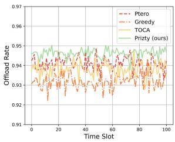  
(a) Offload rate VS. T

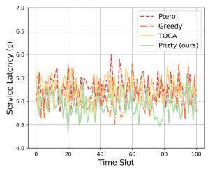  
(b) Latency VS. T  
(c) Energy consumption VS. T  
(d) Social cost VS. T

Fig. 9. Effectiveness VS. time slot (Set #2.4).  
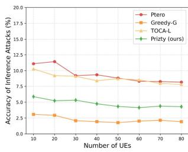

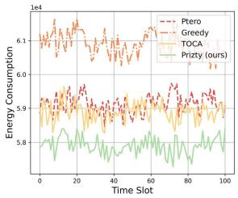  
(a) Accuracy VS. UEs (Set #1.3)

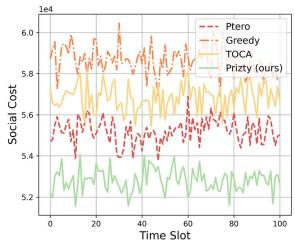

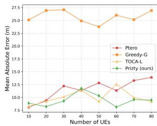  
(b) MEA VS. UEs (Set #1.3)

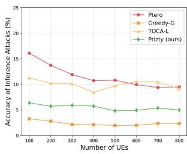  
(c) Accuracy VS. UEs (Set #2.3)  
Fig. 10. Accuracy of inference attacks VS. number of UEs.

(d) MEA VS. UEs (Set #2.3)  
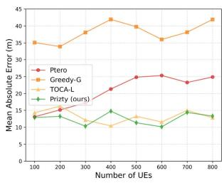

Due to the absence of inherent mechanisms for protecting UE location privacy in Greedy and TOCA, we incorporate differential privacy into these algorithms by introducing Gaussian noise to Greedy and Laplacian noise to TOCA, respectively. In the following analysis, we refer to these enhanced versions as Greedy-G and TOCA-L. The privacy parameters are set as $\epsilon _ { m } =$ <sup>.</sup> and $\delta = 1 0 ^ { - 3 }$ . Given that the location information received <sup>1 2 = 10</sup>by the ECNs has already been obfuscated, the efficacy of privacy preservation across the four methods depends solely on the UE count, with no observable dependence on the number of ECNs. Therefore, we only select scenarios with varying numbers of UEs to evaluate the accuracy of inference attacks across all four methods. Fig. 10 demonstrates the inference attack success rates and the mean absolute error (MAE) of user location data under four algorithms in both small-scale (Set #1.3) and large-scale (Set #2.3) UE configurations. In Figs. 10(a) and (c), Prizty exhibits an inference attack success rate that is only slightly higher than that of Greedy-G, while outperforming TOCA-L and Ptero. Specifically, Prizty shows an average advantage of 45.45% and 48.60% over the TOCA-L and Ptero algorithms in Fig. 10(c), respectively, in terms of the number of UEs ranging from 10 to 80, and an average advantage of 44.76% and 51.41% in Fig. 10(c) in terms of the number of UEs ranging from 100 to 800. Although Greedy-G achieves the lowest inference attack success rate, it consistently exhibits the highest MAE in user location data across various user scenarios, as shown in Fig. 10(b) and (d). In contrast, Prizty maintains the lowest MAE in the majority of user scenarios. Overall, these results demonstrate that Prizty effectively balances privacy protection and data utility, delivering robust privacy guarantees while preserving the practical usability of user location information number of UAVs or ESs increases, Greedy gradually surpasses TOCA and becomes the highest among the four algorithms. This indicates that Greedy is unsuitable for large-scale deployment.

across different user scenarios. Notably, while the adversary’s inference attack success rate shows a marginal increase as the number of UEs decreases, Prizty robustly maintains the attack success rate below 7% in all evaluated scenarios.

## VIII. CONCLUSION

This paper proposes a privacy-preserving auction framework that optimizes UAV scheduling, trajectory planning, and resource allocation under energy and computational constraints. The framework considers UE privacy protection, UAV trajectory optimization, and resource allocation while linking bidding prices to computational resources and energy consumption. The sub-algorithm WPA determines the winners by balancing social costs and utility. Finally, we evaluate the performance of Prizty theoretically and experimentally.

Future research needs to explore strategies to maximize the utilization of time slots. One promising direction is to allow tasks to continue running into subsequent time slots rather than discarding them at the end of each slot.

## REFERENCES

[1] X. Xu et al., “XRL-SHAP-Cache: An explainable reinforcement learning approach for intelligent edge service caching in content delivery networks,” Sci. China Inf. Sci., vol. 67, no. 7, 2024, Art. no. 170303.

[2] T. Li, Y. Liu, T. Ouyang, H. Zhang, K. Yang, and X. Zhang, “Multi-hop task offloading and relay selection for IoT devices in mobile edge computing,” IEEE Trans. Mobile Comput., vol. 24, no. 1, pp. 466–481, Jan. 2025.

[3] X. Gong, M. Chen, D. Li, and Y. Cao, “Delay-optimal distributed computation offloading in wireless edge networks,” IEEE/ACM Trans. Netw., vol. 32, no. 4, pp. 3376–3391, Aug. 2024.

[4] L. Zhao et al., “A digital twin-assisted intelligent partial offloading approach for vehicular edge computing,” IEEE J. Sel. Areas Commun., vol. 41, no. 11, pp. 3386–3400, Nov. 2023.

[5] Y. Xiao et al., “Space-air-ground integrated wireless networks for 6G: Basics, key technologies and future trends,” IEEE J. Sel. Areas Commun., vol. 42, no. 12, pp. 3327–3354, Dec. 2024.

[6] X. Zheng, Y. Wu, L. Fan, X. Lei, R. Q. Hu, and G. K. Karagiannidis, “Dual-functional UAV-empowered space-air-ground networks: Joint communication and sensing,” IEEE J. Sel. Areas Commun., vol. 42, no. 12, pp. 3412–3427, Dec. 2024.

[7] International Telecommunication Union (ITU), “(2030) Itu advances the development of IMT-2030 for 6G mobile technologies,” ITU. [Online]. Available: https://www.itu.int/en/mediacentre/Pages/PR-2023-12- 01-IMT-2030-for6G-mobile-technologies.aspx

[8] C. Lei, W. Feng, P. Wei, Y. Chen, N. Ge, and S. Mao, “Edge information hub: Orchestrating satellites, UAVs, MEC, sensing and communications for 6G closed-loop controls,” IEEE J. Sel. Areas Commun., vol. 43, no. 1, pp. 5–20, Jan. 2025.

[9] M. Dai, C. Dou, Y. Wu, L. Qian, R. Lu, and T. Q. Quek, “Multi-UAV aided multi-access edge computing in marine communication networks: A joint system-welfare and energy-efficient design,” IEEE Trans. Commun., vol. 72, no. 9, pp. 5517–5531, Sep. 2024.

[10] X. Dong, S. Zhao, X. Liu, Z. Di, Y. Zhang, and Y. Shen, “Joint trajectory planning and task offloading for MIMO UAV-aided mobile edge computing,” IEEE Trans. Mobile Comput., vol. 24, no. 4, pp. 3196–3210, Apr. 2025, doi: 10.1109/TMC.2024.3510272.

[11] P. Wang, Z. Li, B. Guo, S. Long, S. Guo, and J. Cao, “A UAV-assisted truth discovery approach with incentive mechanism design in mobile crowd sensing,” IEEE/ACM Trans. Netw., vol. 32, no. 2, pp. 1738–1752, Apr. 2024.

[12] J. Hu et al., “Shield against gradient leakage attacks: Adaptive privacypreserving federated learning,” IEEE/ACM Trans. Netw., vol. 32, no. 2, pp. 1407–1422, Apr. 2024.

[13] F. Tong, Y. Zhou, K. Wang, G. Cheng, J. Niu, and S. He, “A privacypreserving incentive mechanism for mobile crowdsensing based on blockchain,” IEEE Trans. Dependable Secure Comput., vol. 21, no. 6, pp. 5071–5085, Nov./Dec. 2024.

[14] J. Du, T. Lin, C. Jiang, Q. Yang, C. F. Bader, and Z. Han, “Distributed foundation models for multi-modal learning in 6G wireless networks,” IEEE Wireless Commun., vol. 31, no. 3, pp. 20–30, Jun. 2024.

[15] H. Hu, X. Zhu, F. Zhou, W. Wu, R. Q. Hu, and H. Zhu, “Resource allocation for multi-modal semantic communication in UAV collaborative networks,” IEEE Trans. Commun., to be published, doi: 10.1109/TCOMM.2025.3552303.

[16] J. McCoy, A. Rawal, D. B. Rawat, and B. M. Sadler, “Ensemble deep learning for sustainable multimodal UAV classification,” IEEE Trans. Intell. Transp. Syst., vol. 24, no. 12, pp. 15425–15434, Dec. 2023.

[17] P. A. Apostolopoulos, G. Fragkos, E. E. Tsiropoulou, and S. Papavassiliou, “Data offloading in UAV-assisted multi-access edge computing systems under resource uncertainty,” IEEE Trans. Mobile Comput., vol. 22, no. 1, pp. 175–190, Jan. 2023.

[18] M. Hui, J. Chen, L. Yang, L. Lv, H. Jiang, and N. Al-Dhahir, “UAVassisted mobile edge computing: Optimal design of UAV altitude and task offloading,” IEEE Trans. Wireless Commun., vol. 23, no. 10, pp. 13633–13647, Oct. 2024.

[19] H. Zhang and L. Hanzo, “Federated learning assisted multi-UAV networks,” IEEE Trans. Veh. Technol., vol. 69, no. 11, pp. 14104–14109, Nov. 2020.

[20] Y. Zhao et al., “Joint content caching, service placement and task offloading in UAV-enabled mobile edge computing networks,” IEEE J. Sel. Areas Commun., vol. 43, no. 1, pp. 51–63, Jan. 2025.

[21] Y. Zhang, Z. Kuang, Y. Feng, and F. Hou, “Task offloading and trajectory optimization for secure communications in dynamic user multi-UAV mec systems,” IEEE Trans. Mobile Comput., vol. 23, no. 12, pp. 14427–14440, Dec. 2024.

[22] M. Bilal and S. Pack, “Secure distribution of protected content in information-centric networking,” IEEE Syst. J., vol. 14, no. 2, pp. 1921–1932, Jun. 2020.

[23] Y. Wang, Z. Su, T. H. Luan, J. Li, Q. Xu, and R. Li, “SEAL: A strategy-proof and privacy-preserving UAV computation offloading framework,” IEEE Trans. Inf. Forensics Security, vol. 18, pp. 5213–5228, 2023.

[24] Z. Zhang et al., “Movement-based reliable mobility management for beyond 5G cellular networks,” IEEE/ACM Trans. Netw., vol. 31, no. 1, pp. 192–207, Feb. 2023.

[25] J. Pang, Z. Han, R. Zhou, R. Zhang, J. C. Lui, and H. Chen, “ERIS: An online auction for scheduling unbiased distributed learning over edge networks,” IEEE Trans. Mobile Comput., vol. 23, no. 6, pp. 7196–7209, Jun. 2024.

[26] Z. Cheng, M. Liwang, X. Xia, M. Min, X. Wang, and X. Du, “Auctionpromoted trading for multiple federated learning services in UAV-aided networks,” IEEE Trans. Veh. Technol., vol. 71, no. 10, pp. 10960–10974, Oct. 2022.

[27] N. Qi, Z. Huang, W. Sun, S. Jin, and X. Su, “Coalitional formationbased group-buying for UAV-enabled data collection: An auction game approach,” IEEE Trans. Mobile Comput., vol. 22, no. 12, pp. 7420–7437, Dec. 2023.

[28] Y. Liu, B. Cai, J. Zhi, G. Wu, and X. Xia, “QoE-aware online auction mechanism for UAV-enabled crowd-sensing,” in Proc. 2024 IEEE Int. Conf. Web Serv., 2024, pp. 654–664.

[29] M. Khadem, M. Ansarifard, N. Mokari, M. R. Javan, H. Saeedi, and E. A. Jorswieck, “Dynamic fairness-aware spectrum auction for enhanced licensed shared access in UAV-based networks,” IEEE Trans. Commun., vol. 73, no. 5, pp. 3076–3092, May 2025.

[30] G. Gao, M. Xiao, J. Wu, H. Huang, S. Wang, and G. Chen, “Auctionbased VM allocation for deadline-sensitive tasks in distributed edge cloud,” IEEE Trans. Services Comput., vol. 14, no. 6, pp. 1702–1716, Nov./Dec. 2021.

[31] D. Zhang et al., “Near-optimal and truthful online auction for computation offloading in green edge-computing systems,” IEEE Trans. Mobile Comput., vol. 19, no. 4, pp. 880–893, Apr. 2020.

[32] J. Pang, J. Yu, R. Zhou, and J. C. Lui, “An incentive auction for heterogeneous client selection in federated learning,” IEEE Trans. Mobile Comput., vol. 22, no. 10, pp. 5733–5750, Oct. 2023.

[33] D. Xu, “Device scheduling and computation offloading in mobile edge computing networks: A novel NOMA scheme,” IEEE Trans. Veh. Technol., vol. 73, no. 6, pp. 9071–9076, Jun. 2024.

[34] X. Fu, G. Wen, M. Niu, and W. X. Zheng, “Distributed secure filtering against eavesdropping attacks in SINR-based sensor networks,” IEEE Trans. Inf. Forensics Security, vol. 19, pp. 3483–3494, 2024.

[35] G. Wu, Z. Xu, H. Zhang, S. Shen, and S. Yu, “Multi-agent DRL for joint completion delay and energy consumption with queuing theory in mec-based IIoT,” J. Parallel Distrib. Comput., vol. 176, pp. 80–94, 2023.

[36] B. Han, V. Sciancalepore, Y. Xu, D. Feng, and H. D. Schotten, “Impatient queuing for intelligent task offloading in multiaccess edge computing,” IEEE Trans. Wireless Commun., vol. 22, no. 1, pp. 59–72, Jan. 2023.

[37] Y. Wen, W. Zhang, and H. Luo, “Energy-optimal mobile application execution: Taming resource-poor mobile devices with cloud clones,” in Proc. IEEE INFOCOM, 2012, pp. 2716–2720.

[38] Z. Chen, Y. Yang, J. Xu, Y. Chen, and J. Huang, “Task offloading and resource pricing based on game theory in UAV-assisted edge computing,” IEEE Trans. Services Comput., vol. 18, no. 1, pp. 440–452, Jan./Feb. 2025.

[39] X. Ren et al., “Dual-level resource provisioning and heterogeneous auction for mobile metaverse,” IEEE Trans. Mobile Comput., vol. 23, no. 11, pp. 10329–10343, Nov. 2024.

[40] Z. Yang and R. N. Wright, “Privacy-preserving computation of Bayesian networks on vertically partitioned data,” IEEE Trans. Knowl. Data Eng., vol. 18, no. 9, pp. 1253–1264, Sep. 2006.

[41] P. Delgado-Santos, G. Stragapede, R. Tolosana, R. Guest, F. Deravi, and R. Vera-Rodriguez, “A survey of privacy vulnerabilities of mobile device sensors,” ACM Comput. Surv., vol. 54, no. 11s, pp. 1–30, 2022.

[42] M. E. Andrés, N. E. Bordenabe, K. Chatzikokolakis, and C. Palamidessi, “GEO-indistinguishability: Differential privacy for location-based systems,” in Proc. ACM SIGSAC Conf. Comput. Commun. Secur., 2013, pp. 901–914.

[43] R. B. Myerson, “Optimal auction design,” Math. Operations Res., vol. 6, no. 1, pp. 58–73, 1981.

[44] Y. C. Hu, M. Patel, D. Sabella, N. Sprecher, and V. Young, “Mobile edge computing—a key technology towards 5G,” ETSI White Paper, vol. 11, no. 11, pp. 1–16, 2015.

[45] X. Chen, “Decentralized computation offloading game for mobile cloud computing,” IEEE Trans. Parallel Distrib. Syst., vol. 26, no. 4, pp. 974–983, Apr. 2015.

[46] X. Chen, L. Jiao, W. Li, and X. Fu, “Efficient multi-user computation offloading for mobile-edge cloud computing,” IEEE/ACM Trans. Netw., vol. 24, no. 5, pp. 2795–2808, Oct. 2016.

[47] DJI, available at, “Enterprise advanced,” 2022. [Online]. Available: https: //www.dji.com/br/mavic-2-enterprise-advanced,2

[48] X. Wang et al., “Truthful online combinatorial auction-based mechanisms for task offloading in mobile edge computing,” IEEE Trans. Mobile Comput., vol. 24, no. 7, pp. 6488–6502, Jul. 2025.

[49] R. Zhang, R. Zhou, Y. Wang, H. Tan, and K. He, “Incentive mechanisms for online task offloading with privacy-preserving in UAV-assisted mobile edge computing,” IEEE/ACM Trans. Netw., vol. 32, no. 3, pp. 2646–2661, Jun. 2024.


Jiajie Xu received the BEng degree in software engineering from the Nanjing University of Information Science & Technology, China, in Jun. 2025. He is currently working toward the postgraduate degree with the School of Software Engineering, Nanjing University of Information Science & Technology. His research interests include edge computing and collaborative inference.


Xiaolong Xu (Senior Member, IEEE) received the PhD degree in computer science and technology from Nanjing University, China, in 2016. He is currently a full professor with the School of Software, Nanjing University of Information Science and Technology. He has published more than 100 peer-review articles in international journals and conferences, including IEEE Transactions on Mobile Computing, IEEE Transactions on Knowledge and Data Engineering, IEEE Transactions on Parallel and Distributed Systems, IEEE Journal on Selected Areas in Communications, IEEE Transactions on Services Computing, IEEE Transactions on Fuzzy Systems, IEEE Transactions on Intelligent Transportation Systems, IJCAI, ICDM, ICWS, ICSOC, etc. He was selected as the Highly Cited Researcher of Clarivate (2021-2024). He received best paper awards from Tsinghua Science and Technology at 2023, Journal of Network and Computer Applications at 2022, and several conferences, including IEEE HPCC 2023, IEEE ISPA 2022, IEEE CyberSciTech 2021, IEEE CPSCom2020, etc. His research interests include edge computing, the Internet of Things (IoT), cloud computing, and Big Data.


Guangming Cui received the master’s degree from Anhui University, China, in 2018 and the PhD degree from the Swinburne University of Technology, Australia, in 2022, in computer science. Currently, he is an associate professor with the Nanjing University of Information Science & Technology, China. He has published more than 30 peer-reviewed articles in international journals and conferences, including IEEE Transactions on Mobile Computing, IEEE Transactions on Parallel and Distributed Systems, IEEE Transactions on Services Computing, IEEE

Transactions on Cloud Computing, ICWS, ICSOC, etc. His research interests include edge computing, service computing, mobile computing and software engineering.


Muhammad Bilal (Senior Member, IEEE) received the the PhD degree in information and communication network engineering from the School of Electronics and Telecommunications Research Institute (ETRI), Korea University of Science and Technology. He is a senior lecturer (associate professor) in the School of Computing and Communications with Lancaster University, U.K.. His research includes network optimisation, cybersecurity, the Internet of Things, vehicular networks, information-centric networking, artificial intelligence, and cloud/fog computing. Dr. Bilal is a prolific author; he published 200+ articles in top-tier journals and conferences. His pioneering work has also led to the successful acquisition of multiple US and Korean patents. He was previously an associate professor in the Division of Computer and Electronic Systems Engineering with the Hankuk University of Foreign Studies, South Korea, and a postdoctoral research fellow with Korea University’s Smart Quantum Communication Center. He is a member of the editorial boards for IEEE Transactions on Systems, Man, and Cybernetics, IEEE Transactions on Intelligent Transportation Systems, IEEE Internet of Things Journal, Alexandria Engineering Journal (Elsevier), and Physical Communication (Elsevier), and is co-editor-in-chief of the International Journal of Smart Vehicles and Smart Transportation. He serves regularly on the technical programme committees of major international conferences, including IEEE VTC, IEEE ICC, ACM SIGCOMM, and IEEE CCNC.

Rong Gu received the PhD degree from Nanjing University, China, in 2016. He is an associate research professor with Nanjing University. His research papers have been published in many conferences and journals, including IEEE Transactions on Parallel and Distributed Systems, IEEE ICDE, WWW, IEEE IPDPS, IEEE ICPP, JSA, Parallel Computing, and JPDC. His research interests include parallel and distributed computing and Big Data systems.


Wanchun Dou received the PhD degree in mechanical and electronic engineering from the Nanjing University of Science and Technology, China, in 2001. He is currently a full professor with the State Key Laboratory for Novel Software Technology, Nanjing University. From April 2005 to June 2005 and from 2008 to 2009, he visited the Departments of Computer Science and Engineering, Hong Kong University of Science and Technology, Hong Kong, respectively, as a visiting scholar. He has published more than 100 research papers in international journals and international conferences. His research interests include workflow, cloud computing, and service computing.


Arumugam Nallanathan (Fellow, IEEE) is professor of Wireless Communications and the Founding Head of the Communication Systems Research (CSR) group in the School of Electronic Engineering and Computer Science with the Queen Mary University of London since September 2017. He was with the Department of Informatics with King’s College London from 2007 to 2017, where he was professor of Wireless Communications from 2013 to 2017 and a visiting professor from 2017 till 2020. He was an assistant professor in the Department of Electrical and

Computer Engineering, National University of Singapore from August 2000 to December 2007. His research interests include Artificial Intelligence for Wireless Systems, Beyond 5G Wireless Networks and Internet of Things (IoT). He published nearly 800 technical papers in scientific journals and international conferences. He is a co-recipient of the Best Paper Awards presented with the IEEE International Conference on Communications 2016 (ICC’2016), IEEE Global Communications Conference 2017 (GLOBECOM’2017) and IEEE Vehicular Technology Conference 2018 (VTC’2018). He is also a co-recipient of IEEE Communications Society Leonard G. Abraham Prize in 2022. He is an IEEE Distinguished Lecturer. He has been selected as a Web of Science Highly Cited Researcher in 2016, and 2022-2024. He was a senior editor for IEEE Wireless Communications Letters, an editor for IEEE Transactions on Wireless Communications, IEEE Transactions on Communications, IEEE Transactions on Vehicular Technology, and IEEE Signal Processing Letters. He served as a guest editor for numerous special issues of IEEE Journal on Selected Areas in Communications (JSAC). He served as the Chair for the Signal Processing and Communication Electronics (SPCE) Technical Committee of IEEE Communications Society and Technical Program Chair and member of Technical Program Committees in numerous IEEE conferences. He received the IEEE Communications Society SPCE outstanding service award 2012 and IEEE Communications Society RCC outstanding service award 2014.