# AAV-Assisted Joint Mobile Edge Computing and Data Collection via Matching-Enabled Deep Reinforcement Learning

Boxiong Wang , Hui Kang , Jiahui Li , Member, IEEE, Geng Sun , Senior Member, IEEE, Zemin Sun , Member, IEEE, Jiacheng Wang , and Dusit Niyato , Fellow, IEEE

Abstract—Autonomous aerial vehicle (AAV)-assisted mobile edge computing (MEC) and data collection (DC) have been popular research issues. Different from existing works that consider MEC and DC scenarios separately, this article investigates a multi-AAV-assisted joint MEC-DC system. Specifically, we formulate a joint optimization problem to minimize the MEC latency and maximize the collected data volume. This problem can be classified as a nonconvex mixed integer programming problem that exhibits long-term optimization and dynamics. Thus, we propose a deep reinforcement learning-based approach that jointly optimizes the AAV movement, user transmit power, and user association in real time to solve the problem efficiently. Specifically, we reformulate the optimization problem into an action space-reduced Markov decision process (MDP) and optimize the user association by using a two-phase matchingbased association (TMA) strategy. Subsequently, we propose a soft actor–critic (SAC)-based approach that integrates the proposed TMA strategy (SAC-TMA) to solve the formulated joint optimization problem collaboratively. Simulation results

Received 9 January 2025; accepted 10 February 2025. Date of publication 14 February 2025; date of current version 9 June 2025. This work was supported in part by the National Natural Science Foundation of China under Grant 62172186, Grant 62272194, and Grant 62471200; in part by the Science and Technology Development Plan Project of Jilin Province under Grant 20240302079GX; in part by the National Research Foundation, Singapore; in part by the Infocomm Media Development Authority under its Future Communications Research and Development Programme under Grant FCP-NTU-RG-2022-010 and Grant FCP-ASTAR-TG-2022-003; in part by the Singapore Ministry of Education (MOE) Tier 1 under Grant RG87/22 and Grant RG24/24; in part by the NTU Centre for Computational Technologies in Finance (NTU-CCTF); in part by the RIE2025 Industry Alignment Fund— Industry Collaboration Projects (IAF-ICP) administered by A\*STAR under Award I2301E0026; in part by the Alibaba Group and NTU Singapore through Alibaba-NTU Global e-Sustainability CorpLab (ANGEL); in part by the Postdoctoral Fellowship Program of China Postdoctoral Science Foundation under Grant GZC20240592; in part by the China Postdoctoral Science Foundation General Fund under Grant 2024M761123; and in part by the Scientific Research Project of Jilin Provincial Department of Education under Grant JJKH20250117KJ. (Corresponding authors: Jiahui Li; Geng Sun.)

Boxiong Wang, Jiahui Li, and Zemin Sun are with the College of Computer Science and Technology, Jilin University, Changchun 130012, China (e-mail: wangbx0320@163.com; lijiahui@jlu.edu.cn; sunzemin@jlu.edu.cn).

Hui Kang is with the College of Computer Science and Technology and the Key Laboratory of Symbolic Computation and Knowledge Engineering of Ministry of Education, Jilin University, Changchun 130012, China (e-mail: kanghui@jlu.edu.cn).

Geng Sun is with the College of Computer Science and Technology and the Key Laboratory of Symbolic Computation and Knowledge Engineering of Ministry of Education, Jilin University, Changchun 130012, China, and also with the College of Computing and Data Science, Nanyang Technological University, Singapore 639798 (e-mail: sungeng@jlu.edu.cn).

Jiacheng Wang and Dusit Niyato are with the College of Computing and Data Science, Nanyang Technological University, Singapore (e-mail: jiacheng.wang@ntu.edu.sg; dniyato@ntu.edu.sg).

Digital Object Identifier 10.1109/JIOT.2025.3542025

demonstrate that the proposed SAC-TMA is able to coordinate the two subsystems and can effectively reduce the system latency and improve the DC volume compared with other benchmark algorithms.

Index Terms—Autonomous aerial vehicle (AAV) communications, data collection (DC), deep reinforcement learning (DRL), mobile edge computing (MEC), resource allocation.

# I. INTRODUCTION

HE ADVANCEMENT of wireless networks and the development of Internet of Things (IoT) manufacturing technology have facilitated the exponential growth of IoT applications, which are now ubiquitous in a multitude of domains, including industry, transportation, environmental monitoring, modern smart city applications, and agriculture [1], [2]. For example, IoT devices, such as wireless sensors, are often deployed on the ground and are able to detect and sense the environment to assist in tasks, such as factory inspection, traffic management, and environmental monitoring. Nevertheless, IoT devices typically have limited computing capability as well as storage resources, hence they need to transmit data through wireless networks to nearby base stations or data centers for processing. In traditional wireless networks, IoT devices rely on static nodes to provide services and usually transmit sensed data through multihop relays [3]. However, in some remote scenarios, such as factory safety inspections and livestock monitoring in farmlands, IoT devices are usually deployed in hard-to-reach places. Consequently, these IoT devices encounter significant challenges in uploading their data to remote access points or data centers [4].

In this case, unmanned aerial vehicles (UAVs) can play a crucial role in IoT due to their mobility, low cost, and rapid deployment. Specifically, UAVs can assist in wireless networks, which means that they can fly to the hard-to-reach places to provide services as the aerial base station [5], [6], [7]. Furthermore, UAVs can hover over IoT devices to establish Line-of-Sight (LoS) links, thereby significantly improving the quality of communication for IoT devices [8], [9]. Therefore, UAVs can assist wireless networks and are a promising technology in IoT. Generally, AAV technology is widely applied in two scenarios in IoT, which are AAV-assisted mobile edge computing (MEC) and AAVassisted data collection (DC), respectively. In these two scenarios, UAVs can provide edge computing services with high-LoS probability that improve coverage and Quality of Service (QoS) of wireless networks and can act as mobile data sink nodes to collect data directly from IoT devices, thereby reducing transmit power requirements of IoT devices and preventing data overflow. Moreover, in some scenarios, such as agricultural management [10], [11], traffic management [12], [13], and post-disaster relief [14], [15], there are both computation-intensive tasks and DC requirements, requiring multiple UAVs to perform MEC and DC simultaneously. For example, UAVs collect data and then perform edge computing or offload the data to a nearby data center.

However, due to the energy constraints of UAVs and priority differences of tasks, the AAV-assisted MEC and AAV-assisted DC need to be performed in different UAVs, and they are usually studied separately (e.g., [16], [17], [18], [19], [20], and [21]). Specifically, some MEC tasks with hard deadlines usually require real-time and continuous computing support. If an MEC-AAV performs DC simultaneously, it may lead to a decline in the real-time performance of the MEC tasks and higher energy consumption. Moreover, UAVs from different operators might carry out different tasks in the same area, such as edge computing within a factory and environmental monitoring around the factory, or post-disaster rescue and post-disaster DC for evaluation. Furthermore, although there has been some research on data sharing security and privacy protection in edge computing systems, such as the privacyaware and secure matching encryption (PS-ME) method and the privacy-preserving fine-grained data sharing scheme with dynamic service (PF2DS) proposed by Sun et al. [22] and [23], isolating MEC and DC data onto different UAVs remains one of the effective means to protect data privacy and security.

Constructing such an abovementioned joint MEC-DC system has several major challenges. First, the shortage of spectrum resources is a growing problem in current and future networks, which means that the spectrum-sharing techniques become particularly important. In this context, the issue of cochannel interference needs to be addressed, while the existing AAV-assisted communication works usually assume that the interference is ignored (e.g., [24], [25], [26], [27], and [28]). Conversely, when considering interference, the uplink communication of AAV-assisted MEC and AAV-assisted DC will be simultaneously affected. Second, due to the limited energy constraints, UAVs require proper trajectory optimization to ensure the continuous operation of the network. Moreover, given the limited transmit power of IoT devices, i.e., ground users (GUs) and the limited computing and storage resources carried by UAVs, it is necessary to prioritize the most suitable users for service to enhance the efficiency of the system. Therefore, careful consideration of the abovementioned issues is required to improve the quality of both MEC and DC.

However, finding an appropriate solution during MEC and DC while jointly considering the interference, energy constraints, user association, AAV trajectories, and user transmit power is a challenging task. For example, it is possible to maximize the performance of the MEC subsystem by covering as many GUs as possible or adjusting the user transmit power of MEC, while this can cause significant interference not only among the MEC-UAVs, but also with the DC-UAVs. Conversely, when DC-users adjust the association and user transmit power, they may cause serious interference to MEC-UAVs. To mitigate this issue, UAVs can fly to better positions to reduce the impact of interference. However, this could lead to excessive energy consumption, potentially exceeding energy constraints. Therefore, the goals of MEC and DC are conflicting and interdependent within the same scenario and are difficult to balance. Different from previous works that only considering the optimization of separate MEC or DC systems, this article proposes a joint optimization approach to improve the performance of MEC and DC systems simultaneously. The main contributions of this article are summarized as follows.

1) Joint MEC and DC System: We consider a multi-AAVassisted joint MEC-DC system to coordinate the UAVs to perform MEC and DC simultaneously. Specifically, this system combining multiple UAVs for processing computation-intensive MEC tasks and a single AAV for freshness-insensitive DC, which considers the cochannel interference among UAVs. To the best of our knowledge, such a joint MEC-DC system with mutual effect has not yet been investigated in the literature.

2) Joint Optimization Problem Formulation: Regarding the two objectives of the total system latency of MEC and the data volume of DC, we find they are conflicting with each other. Accordingly, we formulate a joint optimization problem that aims to minimize the total system latency of MEC while maximizing the total volume of collected data simultaneously by adjusting the movement of UAVs, user association, and transmit power of the users. Moreover, this optimization appears to be a mixed-integer nonconvex problem with dynamic and long-term optimization properties.

3) Deep Reinforcement Learning (DRL)-Based Approach Design: We propose a DRL-based approach to solve the optimization problem effectively. Specifically, we reformulate the problem into an action space-reduced Markov decision process (MDP) by modeling the user association as a one-to-many matching game with externalities. Based on this, we propose an SAC-based algorithm integrated with a two-phase matching-based association (TMA) strategy to optimize the AAV movement, user association, and user transmit power in real time to jointly enhance the system performance of both MEC and DC.

4) Performance Evaluation and Analysis: Simulation results demonstrate that the proposed SAC-TMA algorithm outperforms the other four benchmark algorithms under different numbers of MEC-users, which can learn effective policies to jointly enhance the latency, collected data volume, and coverage performance of MEC and DC. Besides, our proposed TMA strategy outperforms traditional matching-based algorithms and random strategies, and it is feasible in terms of algorithm running time.

The remainder of this article is arranged as follows. Section II reviews the related work. In Section III, the system models are presented. The joint optimization problem and formulation are presented in Section IV. Section V proposes the SAC-TMA and Section VI provides the simulation results and analysis. Finally, the overall article is concluded in Section VII.

# II. RELATED WORKS

In this section, we review research on AAV-assisted hybrid MEC-DC architecture, joint optimization for MEC and DC, and optimization approaches. Moreover, Table I illustrates the differences between the state-of-the-art works and this work.

# A. AAV-Assisted Hybrid MEC-DC Architecture

UAVs have been widely applied to assist MEC services in some scenarios. For example, Yu et al. [29] studied the optimization problem of collaborative services on AAV and edge clouds, and they proposed a system to control a AAV to provide MEC service in areas where existing edge clouds are inaccessible to IoT devices. Moreover, Zhan et al. [30] developed a framework for a multi-AAVassisted MEC system, where multiple UAVs with edge servers offer flexible computing support to IoT devices with timesensitive requirements. Due to their flexibility and mobility, UAVs can directly collect data from GUs by flying close to them and have drawn significant attention from researchers. For instance, Dandapat et al. [26] studied a multi-AAVassisted DC network, optimizing the 3-D trajectory of the UAVs as well as resource allocation for DC from mobile nodes. Moreover, Zhao et al. [37] investigated the trajectory optimization problem of a AAV performing DC tasks in an area containing multiple monitoring regions and multiple base stations in a AAV-assisted DC system.

Previous works on AAV-assisted MEC or AAV-assisted DC primarily focused on separate studies while ignoring the requirements for the scenarios containing both MEC and DC users. Specifically, in real-world scenarios, there may not only compute-intensive tasks to perform, but also large amounts of stored data that require AAV to perform additional DC tasks. For example, in a smart city environment, UAVs may be required to assist with real-time video analysis for traffic management while simultaneously gathering sensor data from distributed IoT devices, such as air quality sensors, temperature monitors, or noise detectors. Therefore, the AAV assisted hybrid MEC-DC scenarios need further exploration.

There have been some studies involving both MEC and DC. For example, Zeng and Tang [38] investigated the AAV-assisted DC and MEC scenario, constructed a new theoretical model for DC rate, and defined the Quality of Requirement (QoR) for real-time processing. By optimizing the AAV trajectory, resource allocation and task duration, while meeting QoS and AAV mobility constraints, they were able to reduce the energy consumption of the AAV and task completion time. However, in this work, the AAV only supports data acquisition and relies on nearby MEC servers to fulfill computational requirements. Liu et al. [39] investigated a space-air-ground power IoT system and proposed a AAV-enabled wireless power transfer (WPT) framework, where UAVs transfer energy to devices for DC via WPT, utilize MEC for data processing, and eventually forward the data to low-Earth orbit satellites. Subsequently, they aimed to minimize the average Age of Information (AoI) of devices by optimizing the number of AAV hovering positions, hovering locations, AAV-device connections, energy transmission, DC time, AAV computational resources, flight speed, and trajectory. However, in [39], both DC and MEC are completed on the same AAV, and the collected data is actually the data needed for task offloading, which did not consider the conflict between separate MEC and DC systems. Moreover, neither Zeng and Tang [38] nor Liu et al. [39] considered the co-channel interference among UAVs.

In summary, existing works mainly focused on separate MEC or DC, or collecting data from the same device for MEC, few studies investigated the case where different GUs need to perform MEC and DC separately in the same scenario, which can coordinate the resource allocation of different vendors and achieve privacy protection of data. In this case, the main challenges are the interaction of the MEC and DC subsystems in hybrid scenarios and the AAV trajectory control in the presence of interference among multiple subsystems. This motivates us to investigate these effects and propose an effective approach.

# B. Joint Optimization for MEC and DC

Due to the limited computing and storage resources carried by UAVs, resource allocation has been extensively studied to improve the system performance of wireless networks. For example, Wang et al. [34] investigated the most efficient placement of AAV, resource allocation, and computation offloading to minimize the total delay. Du et al. [4] studied a AAV-assisted WPT and DC network and optimized the trajectories of two UAVs, the flight speed, the safe distance of the UAVs, and the energy constraints of each IoT device to increase the minimum DC throughput of the IoT devices. Moreover, Liu et al. [35] investigated a two-layer AAVassisted maritime communication network. They proposed a DRL-based approach to reduce the communication and computation latency. However, these studies only considered separate optimization objectives, such as MEC latency or DC throughput.

There are other works that studied joint optimization of multiple objectives. For instance, Yu et al. [36] investigated the potential of AAV-assisted wireless-powered IoT network and proposed an extended deep deterministic policy gradient (DDPG) algorithm. Their aim was to achieve a joint optimization objective that maximizes the total energy and data transmission rate while reducing the energy consumption of the AAV. Chen et al. [25] studied a multi-AAV-aided MEC network and optimized the AAV movement, user association, and user transmit power to jointly minimize the energy consumption and system latency.

However, the optimization goals in these works are not suitable for the considered scenario since they did not study the joint optimization objectives of MEC and DC. Thus, they are not capable of solving the challenge of the tradeoff between MEC and DC caused by the interference. This motivates us to jointly minimize the MEC latency and maximize the data volume of DC.

TABLE IDIFFERENCES BETWEEN THIS WORK AND EXISTING WORKS

<table><tr><td></td><td>Reference</td><td>Multi-UAV system</td><td>Single-UAV system</td><td>Real-time tasks</td><td>Consider Interference</td><td>Long-term optimization</td><td>Online algorithm</td></tr><tr><td rowspan="9">UAV-Assisted MEC Systems</td><td>[29]</td><td>×</td><td>√</td><td>×</td><td>×</td><td>×</td><td>×</td></tr><tr><td>[30]</td><td>√</td><td>×</td><td>×</td><td>√</td><td>×</td><td>×</td></tr><tr><td>[31]</td><td>×</td><td>√</td><td>×</td><td>×</td><td>×</td><td>×</td></tr><tr><td>[25]</td><td>√</td><td>×</td><td>√</td><td>×</td><td>√</td><td>√</td></tr><tr><td>[24]</td><td>√</td><td>×</td><td>√</td><td>×</td><td>√</td><td>√</td></tr><tr><td>[32]</td><td>√</td><td>×</td><td>√</td><td>×</td><td>√</td><td>√</td></tr><tr><td>[33]</td><td>√</td><td>×</td><td>×</td><td>×</td><td>×</td><td>×</td></tr><tr><td>[34]</td><td>×</td><td>√</td><td>√</td><td>×</td><td>√</td><td>√</td></tr><tr><td>[35]</td><td>√</td><td>×</td><td>√</td><td>×</td><td>√</td><td>√</td></tr><tr><td rowspan="5">UAV-Assisted DC Systems</td><td>[36]</td><td>×</td><td>√</td><td>√</td><td>×</td><td>√</td><td>√</td></tr><tr><td>[26]</td><td>√</td><td>×</td><td>×</td><td>×</td><td>×</td><td>×</td></tr><tr><td>[3]</td><td>×</td><td>√</td><td>√</td><td>×</td><td>√</td><td>√</td></tr><tr><td>[4]</td><td>√</td><td>×</td><td>×</td><td>√</td><td>×</td><td>×</td></tr><tr><td>[37]</td><td>×</td><td>√</td><td>×</td><td>√</td><td>×</td><td>×</td></tr><tr><td rowspan="3">UAV-Assisted Hybrid Systems</td><td>[38]</td><td>×</td><td>√</td><td>√</td><td>×</td><td>×</td><td>×</td></tr><tr><td>[39]</td><td>√</td><td>×</td><td>√</td><td>×</td><td>√</td><td>√</td></tr><tr><td>This work</td><td>√</td><td>√</td><td>√</td><td>√</td><td>√</td><td>√</td></tr></table>

# C. Optimization Approaches

To solve complex optimization problems, researchers have been dedicated to the design of effective algorithms. For instance, Pervez et al. [33] investigated the joint optimization of energy and delay in a AAV-assisted MEC network and proposed a novel three-tier segment-by-segment optimization scheme based on block descent method, simplistic geometric waterfilling, and gradient descent method to solve the problem. However, traditional optimization and heuristic approaches usually require high-computational complexity and are difficult to adapt to large-scale and real-time application scenarios, especially when the communication environment changes significantly with the environmental dynamics.

To mitigate this issue, DRL-based methods have been extensively studied as an alternative. For instance, Lee and Kim [32] considered a multi-AAV-MEC network and proposed an independent proximal policy optimization (IPPO) model for learning task offloading and trajectory control of UAVs. Zhou et al. [31] proposed a SAC-based algorithm that maximizes the computation amount and fairness of terminals in a AAV-assisted WPT and MEC system. Li et al. [24] investigated a three-tier multi-AAV-assisted MEC system with random task arrivals, and they proposed a new heterogeneous federated multiagent reinforcement learning framework, which jointly optimizes task offloading, AAV trajectories, and resource allocation to minimize the AoI. However, the existing DRL-based approaches above did not consider interference among UAVs, which can lead to significant differences in the channel environment. To investigate this effect, Seid et al. [40] considered the intercell interference among UAVs and proposed an approach based on multiagent DRL (MADRL) to ensure the QoS requirements of IoT devices or users while reducing the total computing cost of their considered network. However, this work assumes that AAV clusters provide MEC services to users at fixed positions and does not optimize AAV trajectories.

To sum up, while these works can deal with resource allocation and AAV trajectory optimization in MEC or DC systems, they are not suitable for the considered scenario. The main challenges is the hybrid solution space introduced by the discrete multisubsystem user association variables and continuous variables and the coupling of decision variables caused by co-channel interference, making it difficult to jointly optimize these variables, especially when optimizing the AAV trajectory. Therefore, this prompts us to propose an effective online optimization approach with low-computational complexity to address the considered joint optimization problem.

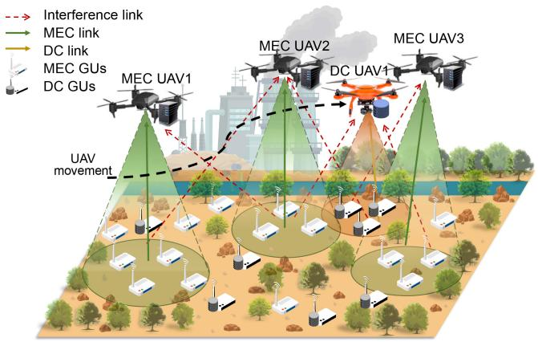

flowchart

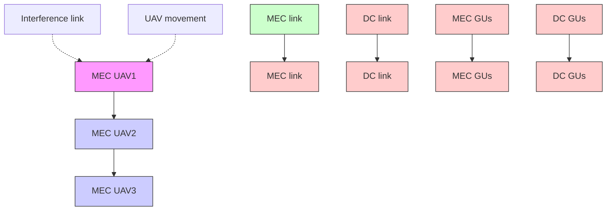

Fig. 1. AAV-assisted joint MEC-DC system.

# III. SYSTEM MODEL

In this section, we present the adopted models in the considered AAV-assisted joint MEC-DC network, and the main notations are listed in Table II.

# A. Network Model

The AAV-assisted joint MEC-DC system under consideration is shown in Fig. 1. In this system, there are massive GUs distributed in a monitored area, and these GUs focus on different functions. For example, some users may need to perform delay-sensitive computation-intensive tasks, such as face recognition, image processing, and augmented reality, while another part of users need to perform time-insensitive DC tasks, such as data backup, environmental monitoring, and log maintenance. Therefore, due to the different types of tasks performed, these users are divided into MEC-users denoted as $m \in \mathcal { G } ^ { \mathrm { M E C } } = \{ 1 , \dots , M \}$ , and DC-users denoted as n ∈ DC $n ~ \in ~ { \mathcal { G } } ^ { \mathrm { D C } } ~ = ~ \{ 1 , \dots , N \}$ . These MEC-users and DCusers intermittently produce random computation-intensive tasks and time-insensitive DC tasks, respectively, and they are uniformly represented as $g \in \mathcal { G } = \mathring { \mathcal { G } } ^ { \mathrm { M E C } } \cup \mathring { \mathcal { G } } ^ { \mathrm { D C } }$ . Since the area is remote, there is no base station can directly provide services for GUs. Moreover, due to the restricted computing and storage capabilities of GUs, processing of tasks need to be transferred to a nearby edge server or data center. Therefore, there are several UAVs provide computing or data collecting service for GUs. However, MEC requires a nearby server for stable service to meet task delay requirements, reducing the need for UAVs to move in a large area, while DC needs longer AAV flights for comprehensive DC coverage. Thus, UAVs are divided into the $\mathbf { M E C - U A V s }$ denoted as $i \in$ $\mathcal { U } ^ { \mathrm { M E C } } = \{ 1 , \dots , N _ { U } \}$ and a DC-AAV $u _ { d }$ to enhance the overall efficiency of the system. Following the completion of task offloading and edge computing, the data is returned to the GU, and the stored data collected by the DC-AAV is transmitted to a nearby base station or data center. All the UAVs are represented by a set which is $u \in \mathcal { U } = \{ 1 , . . . , N _ { U } , u _ { d } \}$ , where $u _ { d } = N _ { U } + 1$ and $\mathcal { U } = \mathcal { U } ^ { \mathrm { M E C } } \cup \{ u _ { d } \}$ .

TABLE II LIST OF MAIN NOTATIONS 

<table><tr><td>Notation</td><td>Description</td></tr><tr><td colspan="2">System model</td></tr><tr><td> $g, N_g, \mathcal{G}$ </td><td>The index, number, and set of GUs</td></tr><tr><td> $m, M, \mathcal{G}^{MEC}$ </td><td>The index, number, and set of MEC-GUs</td></tr><tr><td> $n, N, \mathcal{G}^{DC}$ </td><td>The index, number, and set of DC-GUs</td></tr><tr><td> $f_m(t), f_g(t), F, \mathcal{F}$ </td><td>The task generated by MEC-GU  $m$ , GU  $g$ , the number, and set of tasks</td></tr><tr><td> $u, N_U + 1, \mathcal{U}$ </td><td>The index, number, and set of UAVs</td></tr><tr><td> $i, N_U, \mathcal{U}^{MEC}$ </td><td>The index, number, and set of MEC-UAVs</td></tr><tr><td> $u_{dc}$ </td><td>The index of the DC-UAV</td></tr><tr><td> $b_{m,f}, l_{m,f}, t_{m,f}^{max}$ </td><td>The task completion status, number of data bits, and maximum tolerance time limit of the MEC task  $f_m(t)$ </td></tr><tr><td> $D_{m,f}$ </td><td>The length of deadline for task  $f_m(t)$ </td></tr><tr><td> $\tau, t, T, \mathcal{T}$ </td><td>The length, index, number, and set of time step</td></tr><tr><td> $m(t), \alpha(t)$ </td><td>The distance of movement and the angle of deviation</td></tr><tr><td> $V_u(t), V_g(t)$ </td><td>The coordinates of the UAV  $u$  and the GU  $g$ </td></tr><tr><td> $P_{u,g}^{LoS}(t), P_{u,g}^{NLoS}(t)$ </td><td>The connection probability of LoS and NLoS</td></tr><tr><td> $h_{u,g}(t)$ </td><td>The channel gain between the UAV  $u$  and the GU  $g$  at time step  $t$ </td></tr><tr><td> $p_g(t), p_u^c, p_g^{max}$ </td><td>The transmit power of the GU  $g$  at time step  $t$ , the computation power of UAV  $u$ , the maximum power of GU  $g$ </td></tr><tr><td> $W$ </td><td>Total bandwidth of each UAV</td></tr><tr><td> $C_i, \omega_i, \kappa_i$ </td><td>The computation intensity, the CPU operating frequency, and the effective switching capacitance on MEC-UAV  $i$ </td></tr><tr><td> $\delta_g$ </td><td>Task density coefficient</td></tr><tr><td> $X_{u,g}(t)$ </td><td>The association indicator variable to represent whether GU  $g$  is associated with UAV  $u$  at time step  $t$ </td></tr><tr><td> $R_{u,g}(t)$ </td><td>The data transmission rate of GU  $g$  associated with UAV  $u$ </td></tr><tr><td> $T_{i,m}^f(t), T_{i,m,f}^c(t), T_i(t)$ </td><td>The transmission and computation delay of the task  $f_m(t)$  of MEC-user  $m$  with MEC-UAV  $i$ , the total delay of MEC-UAV  $i$  at time step  $t$ </td></tr><tr><td> $\mathcal{C}^{MEC}, \mathcal{C}^{DC}$ </td><td>The MEC task completion rate and the DC rate</td></tr><tr><td colspan="2">Problem formulation, algorithm, and simulation</td></tr><tr><td> $N_u^{max}$ </td><td>The maximum number of GUs that UAV  $u$  can serve</td></tr><tr><td> $D(t), D_{min}, D_{m,f}(t), L_n^{max}$ </td><td>The amount of collected data at time step  $t$ , minimum amount of data to start collecting, remaining processing time of the earliest unfinished task  $f_m(t)$  of MEC-GU  $m$  at time step  $t$ , data storage limit of the GU  $n$ </td></tr><tr><td> $R_{M_{th}}, R_{D_{th}}$ </td><td>Threshold rates for MEC and DC</td></tr><tr><td> $\sigma, \rho, \delta_p$ </td><td>The coefficient in the DC reward function, and the penalty reward for UAVs out of bounds and exceeding power consumption limits</td></tr><tr><td> $\varrho, \varsigma$ </td><td>The penalty reward variable of collision and the soft update constant</td></tr><tr><td> $r_l(t), r_d, r_p$ </td><td>The latency reward, DC reward, and penalty reward</td></tr><tr><td> $N_i^f, N_m^f$ </td><td>The number of total tasks completed by the MEC-UAV  $i$ , the number of total tasks generated by the MEC-user  $m$ </td></tr><tr><td> $L_n(t), l_n(t)$ </td><td>The amount of data storage for the DC-user  $n$ , the data volume generated by the DC-user  $n$  at time step  $t$ </td></tr></table>

The aforementioned system operates over a continuous time period, where the time horizon is divided into T segments with the same duration τ , which is indexed as a set $t \_ \in$ $\mathcal { T } = \{ 1 , \ldots , T \}$ . At each time step, the MEC-UAVs search GUs with computation requirements and provide services, while the DC-AAV approaches GUs to collect data. It is worth noting that it is generally difficult to facilitate one-tomany communication protocols due to the limited transmit power and computing capabilities of GUs. Meanwhile, to avoid further interference, we consider that a GU can only be served by one AAV while a AAV can serve multiple GUs at the same time step [25]. Moreover, in the process of AAV service, since the considered UAVs use the same frequency band to communicate with the GUs, there exists cochannel interference during the communication. In addition, each AAV is equipped with an omni-directional antenna for communication with GUs and uses orthogonal frequency division multiple access (OFDMA) protocol to avoid interference among the GUs it serves [41]. In this case, the uplink interference of GUs to other UAVs is not negligible and significant.

Without loss of generality, a 3-D Cartesian coordinate system is adopted in this work, and we consider that the UAVs have a fixed altitude H. Therefore, the coordinates of the AAV u and the GU $g$ are denoted as $V _ { u } ( t ) = ( x _ { u } ( t ) , y _ { u } ( t ) , H )$ and $V _ { g } ( t ) = ( x _ { g } ( t ) , y _ { g } ( t ) , 0 )$ , respectively. Furthermore, we denote the distance of movement as m(t) and the angle of deviation as $\alpha ( t )$ . Moreover, the location $V _ { u } ( t )$ can be update by $x _ { u } ( t + 1 ) =$ $x _ { u } ( t ) + m _ { u } ( t ) \cos \alpha _ { u } ( t )$ and $y _ { u } ( t + 1 ) = y _ { u } ( t ) + m _ { u } ( t )$ sin $\alpha _ { u } ( t )$ .

In the following sections, the specific AAV communication, energy consumption, MEC, and DC models are presented.

# B. AAV Communication Model

Prior to the MEC and DC, it is imperative to establish communication links. Since the UAVs are usually maintained at a relatively high altitude, they can establish LoS channels with the GUs. Thus, the probabilistic LoS model is adopted in this work, which is given by $P _ { u , g } ^ { \mathrm { L o S } } ( t ) = 1 / ( 1 + \lambda _ { 1 } \exp \{ - \lambda _ { 2 } ( \theta _ { u , g } ( t ) -$ $\lambda _ { 1 } ) \}$ , where $\theta _ { u , g } ( t ) = ( 1 8 0 / \pi )$ arctan $( H / d _ { u , g } ( t ) )$ corresponds to the elevation angle between AAV u and GU $^ { g , }$ and the distance between AAV u and GU g is denoted as $d _ { u , g } ( t ) =$ $\| V _ { u } ( t ) - V _ { g } ( t ) \|$ , and $\lambda _ { 1 }$ as well as $\lambda _ { 2 }$ are constant values associated with the environment [42]. Moreover, the probability of non-LoS (NLoS) link between AAV u and GU g at the time step t is given by $P _ { u , g } ^ { \mathrm { N L o S } } ( t ) = 1 - P _ { u , g } ^ { \mathrm { L o S } } ( t )$ .

Therefore, denote the free space path loss between GU g and AAV u as $L _ { u , g } ( t ) = 2 0 \log d _ { u , g } ( t ) + 2 0 \log f _ { c } + 2 0 \log ( [ 4 \pi / c ] )$ , the average path loss between AAV u and the GU g at time step t can be expressed as follows:

$$
\mathrm{PL} _ {u, g} (t) = L _ {u, g} (t) + P _ {u, g} ^ {\mathrm{LoS}} (t) \eta_ {\mathrm{LoS}} + P _ {u, g} ^ {\mathrm{NLoS}} (t) \eta_ {\mathrm{NLoS}} \tag {1}
$$

where $f _ { c }$ and c denote the carrier frequency and the velocity of light, respectively. Moreover, $\eta _ { \mathrm { L o S } }$ and $\eta _ { \mathrm { N L o S } }$ correspond to the excessive path losses for LoS and NLoS links, respectively.

At each time step, each AAV moves a relatively short distance with respect to the size of the considered area. Therefore, the channel gain between the UAVs and the GUs during the movement of the AAV is a quasi-constant and is calculated based on the updated position of the AAV at each time step. Specifically, the channel gain is given by

$$
\begin{array}{l} h _ {u, g} (t) = 1 0 ^ {- \frac {\mathrm{PL} _ {u , g} (t)}{1 0}} \\ = \frac 1 0 ^ {- \frac {\left(\eta_ {\mathrm{LoS}} - \eta_ {\mathrm{NLoS}}\right) P _ {u , g} ^ {\mathrm{LoS}} (t) + \eta_ {\mathrm{NLoS}}}{1 0}}{\left(\left\| V _ {u} (t) - V _ {g} (t) \right\|\right) ^ {2} \left(\frac {4 \pi f _ {c}}{c}\right) ^ {2}}. \tag {2} \\ \end{array}
$$

Denote $p _ { g } ( t )$ as the transmit power used by GU g at time step t. Then, we define an indicator variable $X _ { u , g } ( t )$ related to user association to indicate whether GU g is associated with AAV u at time step t. Specifically, if GU g associates with AAV $u , X _ { u , g } ( t ) = 1 ; $ otherwise, $X _ { u , g } ( t ) = 0$ Thus, the data transmission rate of GU g associated with AAV u is given by

$$
R _ {u, g} (t) = \frac {W}{s _ {u} (t)} \log_ {2} \left(1 + \frac {p _ {g} (t) h _ {u , g} (t)}{I _ {m} + n _ {0} \frac {W}{s _ {u} (t)}}\right) \tag {3}
$$

where $\begin{array} { r } { I _ { m } ~ = ~ \sum _ { i = 1 , i \neq u } ^ { N _ { U } } \sum _ { l = 1 , l \neq g } ^ { N _ { g } } X _ { j , l } ( t ) p _ { j , l } ( t ) h _ { j , l } ( t ) } \end{array}$ is the cochannel interference from all other GUs associated with other UAVs at time step t and $N _ { g }$ represents the total number of GUs, $\begin{array} { r } { s _ { u } ( t ) = \sum _ { g \in \mathcal { G } } X _ { u , g } ( t ) } \end{array}$ is the total number of GUs that are associated with AAV u at time step t, n0 is the noise power spectral density and W is the total bandwidth of each AAV.

# C. AAV Energy Consumption Model

The management of the energy consumption of UAVs is necessary to ensure continuous communication and computing. Specifically, this work considers the energy consumption during AAV movement and the computation energy consumption associated with the MEC on UAVs.

For a rotary-wing AAV, we denote $E _ { u } ^ { \mathrm { m o v e } } ( t )$ as the propulsion power consumption of AAV u hovering and flying in a 2-D plane at time step $t ,$ and the detailed propulsion power consumption model can refer to [36].

For the energy of computation, the MEC-UAVs receive tasks from multiple GUs and perform computation during the time step t, and the energy consumption of computing on MEC-AAV i is given by [43]

$$
E _ {i} ^ {c} (t) = \kappa_ {i} \omega_ {i} ^ {2} C _ {i} l _ {m, f} (t) \tag {4}
$$

where $\kappa _ { i }$ represents the effective switched capacitance coefficient with respect to the CPU architecture on MEC-AAV $i , \ C _ { i }$ represents the computation intensity on MEC-AAV i (cycles/bit), ωi is the CPU operating frequency on MEC-AAV i, and $l _ { m , f } ( t )$ is the data size of task $f _ { m } ( t )$ of MEC-GU m at time step t.

To sum up, the energy consumption of the UAVs in each part discussed above is independent of each other. Therefore, the overall energy consumption of AAV u at time step t is defined as follows:

$$
E _ {u} ^ {\text { total }} (t) = \left\{ \begin{array}{l l} E _ {u} ^ {\text { move }} (t) + E _ {u} ^ {c} (t), & u \in \mathcal {U} ^ {\mathrm{MEC}} \\ E _ {u} ^ {\text { move }} (t), & u = u _ {\mathrm{dc}}. \end{array} \right. \tag {5}
$$

# D. MEC Model

Generally, GUs, such as IoT devices, have limited computing resources. Thus, we consider offloading all GU tasks to UAVs and returning the results to GUs after processing on UAVs. Since the task (e.g., face recognition and image processing) output is much smaller than the size of the offloaded task data, the process of returning result data to the GUs is ignored here, as in [25] and [40]. Moreover, denote all the tasks as $f _ { g } ( t ) \in \mathcal { F } = \{ 1 , \ldots , F \}$ , we consider a deadline mechanism and the maximum tolerance time limit $t _ { m , f } ^ { \operatorname* { m a x } }$ t m,f to ensure the completion rate and the completion quality of MEC, respectively. Specifically, each MEC task $f _ { m } ( t )$ has a deadline, denoted as $D _ { m , f } ,$ and the $t _ { m , f } ^ { \operatorname* { m a x } }$ is the maximum tolerance time for task $f _ { m } ( t )$ to be timed from the start of transmission. If the duration that task $f _ { m } ( t )$ exists after its generation exceeds $D _ { m , f } ,$ , the task becomes invalid, and task $f _ { m } ( t )$ is marked as incomplete. As such, a tuple $\{ b _ { m , f } , l _ { m , f } , t _ { m , f } ^ { \mathrm { m a x } } , D _ { m , f } \}$ is used to characterize the MEC task $f _ { m } ( t )$ , where $b _ { m , f } ^ { ^ { \vee } } , \ l _ { m , f } , \ t _ { m , f } ^ { ^ { \tiny { \mathrm { m a x } } } }$ , and $D _ { m , f }$ correspond to the completion status, the number of data bits, the maximum tolerable time limit, and the deadline of the task $f _ { m } ( t )$ , respectively. Subsequently, the task generation model, transmission latency, and computation latency are as follows:

1) Task Generation Model: In real-world scenarios, the task and data generation of IoT devices within a period is usually unpredictable. Therefore, we consider an intermittent task generation model to simulate this dynamic process. Specifically, task $f _ { g } ( t )$ is definitely generated within a fixed number of time steps while the exact time step at which it is generated is random. In other words, the probability of task generation will increase according to the time variation. Since in the real world, the task requirements are dynamic rather than static, this intermittent task generation can simulate the stochastic and dynamic nature of task generation by modeling the dynamic update of real-world MEC tasks or data generation of IoT devices [44]. By using this method, the probability of task $f _ { g } ( t )$ generated by GU g at time step t can be given by

$$
P _ {g, f} = \delta_ {g} (t - \eta_ {g}) \tag {6}
$$

where $\eta _ { g }$ is the last time step of task generation of GU g and the $\delta _ { g }$ is the task density coefficient with the value interval of (0, 1), which reflects the speed of task generation.

2) Transmission Latency From GUs to UAVs: As aforementioned, the MEC-users need to offload computationally intensive tasks to the MEC-UAVs before performing edge computing. Thus, the data transmission latency is given by

$$
T _ {i, m} ^ {f} (t) = \frac {X _ {i , m} (t) b _ {m , f} (t) l _ {m , f} (t)}{R _ {i , m} (t)} \tag {7}
$$

where $b _ { m , f } ( t )$ denotes the task completion status by using 0 or 1 to indicate whether the task is completed or not, $l _ { m , f } ( t )$ represents the number of data bits of task $f _ { m } ( t )$ at time step t. Specifically, if the transmission of task $f _ { m } ( t )$ can be completed in this time slot, $l _ { m , f }$ will remain unchanged, otherwise $l _ { m , f }$ will be updated to the remaining data amount of task $f _ { g } ( t )$ in the next time step. Moreover, $R _ { i , m } ( t )$ represents the data transmission rate from MEC-GU m to MEC-AAV i at time step t.

3) Computation Latency on UAVs: We consider that each GU has limited computational capabilities, and thus it is unable to perform local computing tasks. As a result, computation tasks of the GUs can be offloaded to the MEC-UAVs for edge computing. The computing latency of task $f _ { m } ( t )$ for MEC-GU m on MEC-AAV i is given by

$$
T _ {i, m, f} ^ {c} (t) = \frac {C _ {i} X _ {i , m} (t) b _ {m , f} (t) l _ {m , f} (t)}{\omega_ {u}}. \tag {8}
$$

Thereafter, the total latency of MEC-AAV i at time step t is given by

$$
T _ {i} (t) = \sum_ {g \in \mathcal {G} ^ {\mathrm{MEC}}} \sum_ {f \in \mathcal {F}} T _ {i, m} ^ {f} (t) + \sum_ {g \in \mathcal {G} ^ {\mathrm{MEC}}} \sum_ {f \in \mathcal {F}} T _ {i, m, f} ^ {c} (t). \tag {9}
$$

Since the computation latency is related to the number of data bits of the tasks as well as the computing capacity of UAVs, only the MEC transmission latency is considered to be optimized, which will be analyzed in Section IV.

4) MEC Task Completion Rate: In the joint system, some tasks may not be completed in time due to severe interference and the limitation of computing and communication capabilities of UAVs. Therefore, task completion status is an important indicator in the MEC subsystem, and the MEC task completion rate ${ \mathcal { C } } ^ { \mathrm { M E C } }$ is defined as follows:

$$
\mathcal {C} ^ {\mathrm{MEC}} = \frac {\sum_ {i \in \mathcal {U} ^ {\mathrm{MEC}}} N _ {i} ^ {f}}{\sum_ {m \in \mathcal {G} ^ {\mathrm{MEC}}} N _ {m} ^ {f}} \times 100 \% \tag{10}
$$

where $N _ { i } ^ { f }$ denotes the total number of tasks completed by the AAV $i , N _ { m } ^ { f }$ is the number of total tasks generated by the MECuser m.

# E. DC Model

As aforementioned, a AAV collects data generated intermittently by the GUs and then transmits it to a nearby base station. For simplicity, the transmission to a nearby base station is ignored, like [4] and [26]. Denote $u _ { d c }$ is the DC-AAV, and the amount of collected data at time step t is given by

$$
D (t) = \sum_ {n \in \mathcal {G} ^ {\mathrm{DC}}} \tau X _ {u _ {d c}, n} R _ {u _ {d c}, n} (t). \tag {11}
$$

Similar to the MEC subsystem, we define the DC rate as the ratio of the amount of data collected by UAVs to the total amount of data generated by all DC-users over a period of time, which is given by

$$
\mathcal {C} ^ {\mathrm{DC}} = \frac {\sum_ {t = 0} ^ {T} D (t)}{\sum_ {n \in \mathcal {G} ^ {\mathrm{DC}}} \sum_ {t = 0} ^ {T} l _ {n} (t)} \times 100 \% \tag{12}
$$

where $l _ { n } ( t )$ is the data volume generated by the DC-GU n at the time step t.

During the DC process, the DC-AAV needs to approach DC-users for higher transmission rates, while this may cause greater interference with the communication of other MEC-UAVs. According to (3), it can be analyzed that the communication rates from GUs to UAVs are affected by the transmit power of the GUs and the location of UAVs and GUs. Since the GUs are stationary, the decision variables for DC include transmit power of the GUs and the movement of the UAVs. Additionally, since the amount of data stored by DC-GUs is different at the same time step and is subject to different levels of interference from the nearby MEC-GUs, user association is also a key decision variable for DC. Ultimately, the primary goal of DC is to collect as much data as possible. This goal is a long-term optimization problem, which is affected by various factors, and these characteristics will be discussed in detail in the following section.

# IV. PROBLEM FORMULATION

In the considered AAV-assisted joint MEC-DC system, GUs intermittently generate computation-intensive tasks and freshness-insensitive data, and the MEC-UAVs and the DC-AAV perform MEC and DC, respectively. The main goal of the system is to reduce the system latency of MEC while maximizing the volume of collected data.

However, the communication between the UAVs and the GUs can cause co-channel interference, affecting the QoS of other GUs. Specifically, the MEC delay and the amount of collected data are both determined by the transmission rate, which is mainly affected by user transmit power, AAV movement, and user association according to (2)–(7). Although optimizing these variables can improve the transmission rates of some GUs, this will also increase the interference, resulting in additional total system delay and a reduction in the amount of collected data. Therefore, the user transmit power, AAV movement, and user association are interdependent and coupled decision variables. Moreover, due to the interaction among these decision variables, the system needs to consider these decision variables comprehensively.

The decision variables consist of three parts of variables, which are the movement of UAVs, user transmit power, and user association, respectively. We define these decision variables as follows.

1) The positions of UAVs are represented by the matrix $V = \{ V _ { u } ( t ) | u \in \mathcal { U } , t \in \mathcal { T } \}$ and it is continuous.   
2) The transmit power value of each GU is represented by a continuous variable, and the transmit power of all GUs is represented by the vector $p = \{ p _ { g } ( t ) | g \in \mathcal { G } , t \in \mathcal { T } \}$ .   
3) The association relationship between the UAVs and the GUs is represented by a discrete matrix $X = \{ X _ { u , g } ( t ) | u \in$ $\mathcal { U } , g \in \mathcal { G } , t \in \mathcal { T } \}$ . Consequently, the formulation of optimization objectives are as follows.

Optimization Objective 1: The first objective is to reduce the total system latency of MEC because the considered MEC subsystem has high-latency requirements. Thus, the first objective function is given by

$$
f _ {1} (\boldsymbol {V}, \boldsymbol {p}, \boldsymbol {X}) = \sum_ {t = 1} ^ {T} \sum_ {i \in \mathcal {U} ^ {\mathrm{MEC}}} T _ {i} (t). \tag {13}
$$

Optimization Objective 2: The second objective is to increase the amount of collected data by the DC-AAV as it determines the maximum DC capability of the considered DC subsystem, i.e.,

$$
f _ {2} (\boldsymbol {V}, \boldsymbol {p}, \boldsymbol {X}) = \sum_ {t = 1} ^ {T} D (t). \tag {14}
$$

According to the two objectives above, the considered problem is formulated as follows:

$$
\mathcal {P}: \min _ {\{V, p, X \}} Q = \left\{f _ {1}, - f _ {2} \right\} \tag {15a}
$$

$$
\text { s.t. } \quad T _ {i, m} ^ {f} (t) \leq T _ {m, f} ^ {\max} \forall i \in \mathcal {U} ^ {\mathrm{MEC}} \forall m \in \mathcal {G} ^ {\mathrm{MEC}}
$$

$$
\forall t \in \mathcal {T} \tag {15b}
$$

$$
p _ {g} (t) \leq p _ {g} ^ {\max} \quad \forall g \in \mathcal {G} \quad \forall t \in \mathcal {T} \tag {15c}
$$

$$
\sum_ {t \in \mathcal {T}} E _ {u} ^ {\text { total }} (t) \leq E _ {u} ^ {\max} \quad \forall u \in \mathcal {U} \quad \forall t \in \mathcal {T} \tag {15d}
$$

$$
X _ {u, g} (t) \in \{0, 1 \} \forall u \in \mathcal {U} \forall g \in \mathcal {G} \forall t \in \mathcal {T} (1 5 e)
$$

$$
\sum_ {u \in \mathcal {U}} X _ {u, g} (t) = 1 \quad \forall g \in \mathcal {G} \quad \forall t \in \mathcal {T} \tag {15f}
$$

$$
\sum_ {g \in \mathcal {G}} X _ {u, g} (t) \leq N _ {u} ^ {\max} \quad \forall u \in \mathcal {U} \quad \forall t \in \mathcal {T} \tag {15g}
$$

$$
x _ {\min} \leq x _ {u} (t) \leq x _ {\max} \quad \forall u \in \mathcal {U} \quad \forall t \in \mathcal {T} \tag {15h}
$$

$$
y _ {\min} \leq y _ {u} (t) \leq y _ {\max} \quad \forall u \in \mathcal {U} \quad \forall t \in \mathcal {T} \tag {15i}
$$

$$
0 \leq m _ {u} (t) \leq m _ {u} ^ {\max} \quad \forall u \in \mathcal {U} \quad \forall t \in \mathcal {T} \tag {15j}
$$

$$
\left\| V _ {a} (t) - V _ {b} (t) \right\| \geq d _ {\min} \quad \forall a, b \in \mathcal {U}, a \neq b
$$

$$
\forall t \in \mathcal {T} \tag {15k}
$$

where (15b)–(15d) provide constraints on latency, transmit power of GUs, and AAV energy consumption, respectively. Moreover, (15e)–(15g) provide value ranges of associated indicator variables and constraints on GU associations, respectively. In addition, (15h) and (15i) limit the moving range of UAVs in X and Y directions, respectively, (15j) restrict the maximum moving distance of AAV within a time step, and (15k) is to avoid collisions among UAVs.

The problem P has the following properties that make it challenging to solve. First, it is a mixed-integer nonconvex programming problem. Specifically, the problem  has one integer decision variable X and two continuous decision variables V and p. Moreover, the problem exhibits nonconvex properties since (15b) and (15c) are nonconvex [25]. Second, the problem P is a long-term optimization problem that aims to maximize the amount of collected data and minimize the total MEC latency over a period. This long-term issue is affected by the dynamics of stochastic generation of tasks and the current task status of users, and whenever the location of a AAV changes, the communication rates between all other UAVs and GUs are altered due to interference. Finally, the two optimization objectives are contradictive that are difficult to balance. For example, when MEC-UAVs are associated with a high density of GUs or when the transmit power of MEC-users is high, the transmission rate of the DC-AAV will be affected because of the strong interference from the MEC subsystem. Conversely, when the DC-AAV chooses an optimal DC route, it can severely interfere with the communication of MEC-UAVs. Furthermore, as mentioned above, the three parts of decision variables are also interdependent and coupled with each other.

In this case, DRL can be a viable online algorithm to the problem  with dynamic adaptability, which is suitable for dynamic decision-making in long-term optimization problems [45]. In the following section, the proposed solution is detailed.

# V. PROPOSED DRL-BASED APPROACH

In this section, we propose the SAC-TMA to solve the formulated optimization problem, and the schematic of the SAC-TMA is shown in Fig. 2.

# A. MDP Simplification and Formulation

At each time step, we aim to optimize the movement of the UAVs, the transmit power of the GUs, and the user association to minimize the MEC system sum latency while maximizing the amount of collected data. This process can be modeled as an MDP, which consists of a five-element tuple < , , , P, γ >, where , , , P, and γ correspond to state space, action space, reward, probability of state transition, and discount factor, respectively.

In general, the action space should contain all decision variables (such as V, p, and X) in an optimization problem when this problem is represented as an MDP. However, the optimization of the aforementioned decision variables usually results in a large action space, and there are both discrete and continuous variables. Specifically, the user association is a discrete variable with a dimension of M × N. Moreover, the solution space of user association will increase exponentially in number as the number of GUs and UAVs rises, which will difficult for DRL to train and converge [46]. In this case, we aim to divide the decision variables into two parts, one part is user association, which is optimized by using a separate strategy as a substitute for action, and the other part is AAV movement and user transmit power, which is optimized as the actions of the MDP. The key challenge of this task is maintaining the synergy between the optimization of user association and other decision variables, while ensuring that the optimization process for user association is feasible in computational complexity and stable.

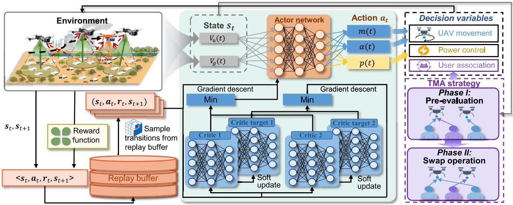

flowchart

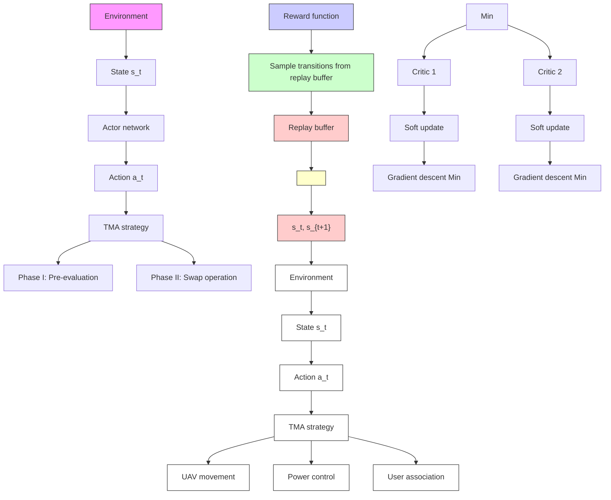

Fig. 2. Schematic of the proposed SAC-TMA algorithm.

1) Action Reduction: To ensure collaborative optimization with DRL algorithms, a low-complexity strategy is required. Compared with traditional solutions, such as exhaustive search and random methods, the matching method usually has both low complexity and effectiveness in user association problems [47]. This prompts us to propose a matching-based association strategy to optimize user association decision variables. As aforementioned, each GU can be associated with a AAV, while each AAV has the capacity to serve multiple GUs. This process can be formulated as a one-to-many matching problem and can be modeled by using a two-sided matching game as follows.

Definition 1: The one-to-many matching game under consideration is comprised of two groups of players,  and $u ,$ and a set of association pairs is a matching denoted by X when it satisfies the following: 1) $X ( i ) \in \mathcal { G } ^ { \mathrm { M E C } } , X ( u _ { d c } ) \in \dot { \mathcal { G } } ^ { \mathrm { D C } }$ , X(m) ∈ $\mathcal { U } ^ { \mathrm { M E C } }$ , and $X ( n ) = u _ { d c } ; 2 ) \ | X ( g ) | = 1$ and $| X ( u ) | \le N _ { u } ^ { \mathrm { m a x } }$ ; and $3 ) \ g \in X ( u ) \Leftrightarrow X ( g ) = u$ where condition 1) indicate that MEC-users are exclusively associated with MEC-UAVs, while DC-users are confined to be associated with the DC-AAV. Condition 2) further represent the constraints on the association of GUs and UAVs, specifying that each GU $g$ is restricted to associate with a single AAV, and conversely, each AAV is limited to be associated with a maximum of $N _ { u } ^ { \mathrm { m a x } }$ GUs. The mutual association between a GU g and a AAV u is defined in condition 3), asserting that if GU g is associated with AAV $u ,$ then AAV u is correspondingly associated with GU g.

Therefore, the indicator of user association at time step t can be specified as $X _ { u , g } ( t )$ from matching X, which uses 1 and 0 to denote GU g is associated with AAV u or not.

Since both MEC latency and amount of collected data depend on the communication rate from GUs to UAVs, we select the system sum rate as the utility of the aforementioned matching model, with all players pursuing a common goal to maximize the system sum rate, the utility is defined by

$$
U (X) = \sum_ {u \in \mathcal {U}} \sum_ {g \in \mathcal {G}} X _ {u, g} (t) R _ {u, g} (t) \tag {16a}
$$

$\mathrm { s . t . } \qquad R _ { u , g } \geq R _ { M _ { t h } } \quad \forall u \in \mathcal { U } ^ { M E C } \quad \forall g \in \mathcal { G } ^ { \mathrm { M E C } }$ (16b)

$$
R _ {u, g} \geq R _ {D _ {t h}} \quad \forall u = u _ {d c} \quad \forall g \in \mathcal {G} ^ {\mathrm{DC}} \tag {16c}
$$

where $R _ { M _ { t h } }$ and $R _ { D _ { t h } }$ denote the threshold rates for MEC and DC, respectively.

Due to the fact that the communication rate from each GU to UAVs is affected by the interference of other GUs, when the association of one GU changes, the association preferences of other GUs will also change accordingly. This interdependency among GUs is known as externality [48], [49] and the one-tomany matching problem with externalities can be solved by swap matching [50]. However, the random initialization in the conventional swap method may lead to a slow convergence of the swap process and a tendency to be stuck in the local optimum. Therefore, we propose a two-phase swap-based association strategy that enhances the initial matching. In what follows, the two phases of the proposed strategy are given in detail.

Phase I—Gale-Sharpley (GS)-Based Preevaluation: Since the swap algorithm can continue to optimize at any time, the initial matching can be obtained by using the method based on GS, which is widely used in matching problems [51]. Specifically, to maximize the utility, an evaluation method based on the communication rates can be used to obtain an initial matching. However, the calculation of communication rates requires the association between other GUs. Therefore, we consider two preevaluation methods to determine the initial matching in two steps, which are distance-based evaluation and rate-based evaluation, respectively.

1) For distance-based evaluation, GUs first choose the nearest AAV to make requests. If the AAV has more GUs than its service capacity, it will sort all served GUs in ascending order of distance and reject those GUs that are beyond capacity. The rejected GUs will then turn to the next nearest AAV to send requests. The distancebased evaluation algorithm is shown in Algorithm 1.

Algorithm 1: Distance-Based Evaluation   
1 Initialize: Create an available AAV list $\mathcal{I}_m$ and set variable $\mathrm{CONS}_m \leftarrow$ False for $m \in \mathcal{G}^{MEC}$ ;

2 // MEC-user association

3 while $\exists m$ , $\mathrm{CONS}_m =$ False and $\mathcal{I}_m \neq \emptyset$ do

4 Choose the nearest MEC-AAV $i \in \mathcal{I}_m$ ;

5 $X_{i,m}(t) \leftarrow 1$ ;

6 $\mathrm{CONS}_m \leftarrow$ True;

7 if $\sum_{m \in \mathcal{G}^{MEC}} X_{i,m}(t) > N_u^{\max}$ then

8 Find the farthest GU $m_f$ ;

9 $X_{i,m_f}(t) \leftarrow 0$ ;

10 $\mathcal{I}_{m_f} \leftarrow \mathcal{I}_{m_f} \backslash \{i\}$ ;

11 $\mathrm{CONS}_{m_f} \leftarrow$ False;

12 // DC-user association

13 forall the $n \in \mathcal{G}^{DC}$ do

14 if $L_n(t) < D_{\min}$ then

15 $X_{u_{dc},n}(t) \leftarrow 0$ ;

16 else

17 $X_{u_{dc},n}(t) \leftarrow 1$ ;

18 if $\sum_{n \in \mathcal{G}^{PC}} X_{u_{dc},n}(t) > N_u^{\max}$ then

19 Find the farthest GU $n_f$ ;

20 $X_{u_{dc},n_f}(t) \leftarrow 0$ 21 Return $X(t)$ ;

2) For rate-based evaluation, the initial matching is first obtained base on the distance-based evaluation method. Subsequently, for each GU, it calculates the communication rate with each AAV, and selects the AAV with the highest rate to send a request. If the AAV has more GUs than its service capacity, it will sort all served GUs in ascending order of rate and reject those GUs that are beyond capacity. The rejected GUs will then turn to the AAV that has the next highest rate and make requests. In addition, to ensure the communication quality of MEC and DC, the association is only allowed when the achievable communication rate between the GU and the AAV is not less than the preset threshold rate. The ratebased evaluation algorithm is shown in Algorithm 2.

Phase II—Swap-Based Matching: After the initial matching is achieved in the first phase, the swap method is used to optimize utility by switching matching pairs between GUs and UAVs to reach an optimal state, and the definition of swap matching is as follows.

Definition 2: Given a one-to-many matching X with $g \in$ X(u), $g ^ { \prime } \in X ( u ^ { \prime } )$ , the swap matching of GU g and GU $g ^ { \prime }$ is defined by $X _ { g } ^ { g ^ { \prime } } = \{ X \backslash \{ ( u , g ) , ( u ^ { \prime } , g ^ { \prime } ) \} \cup \{ ( u , g ^ { \prime } ) , ( u ^ { \prime } , g ) \} \}$ .

Swap matching enables the exchange of associated UAVs between two different GUs without affecting the association of other GUs with UAVs. Note that the single-AAV DC scenario is a special one-to-many matching, where there exists a user pair $( n , n ^ { \prime } )$ with $n ~ \in ~ X ( u _ { d c } )$ and $| X ( n ^ { \prime } ) | ~ =$ 0. Thus, we define the swap matching in this case as $X _ { n } ^ { n ^ { \prime } } = \{ X \backslash \{ ( u _ { d c } , n ) , ( \mathrm { e m p } , n ^ { \prime } ) \} \cup \{ ( u _ { d c } , n ^ { \prime } ) , ( \mathrm { e m p } , n ) \} \}$ , where emp denotes a state of not being associated with any AAV. Subsequently, the stable matching is given below.

Definition 3: A matching X is considered stable if and only if no swap pairs exist that could improve the matching.

Definition 3 points out that, when a matching reaches the stable state, there exists no user pairs $( g , g ^ { \prime } )$ with $g \in X ( u )$ and

Algorithm 2: Rate-Based Evaluation   
1 Initialize: Obtain an association $X^{\circ}$ by Algorithm 1, create an available AAV list $\mathcal{I}_m$ and set variable $\mathrm{CONS}_m \leftarrow$ False for $m \in \mathcal{G}^{MEC}$ ;

2 // MEC-user association

3 while $\exists m$ , $\mathrm{CONS}_m = \text{False and } \mathcal{I}_m \neq \emptyset$ do

4 Calculate $R_{i,m}(t)$ by using Eq. (3) and $X^{\circ}$ ;

5 Choose $i_h \in \mathcal{I}_m$ with the highest $R_{i_h,m}(t)$ ;

6 if $R_{i_h,m}(t) \geq R_{M_{th}}$ then

7 $X_{i_h,m}(t) \leftarrow 1$ ;

8 if $\sum_{m \in \mathcal{G}^{MEC}} X_{i_h,m}(t) > N_{i_h}^{\max}$ then

9 Find $m_l$ with the lowest $R_{i_h,m_l}$ ;

10 $X_{i_h,m_l}(t) \leftarrow 0$ ;

11 $\mathcal{I}_{m_l} \leftarrow \mathcal{I}_{m_l} \backslash \{i_h\}$ ;

12 $\mathrm{CONS}_{m_l} = \text{False}$ ;

13 else

14 $X_{i_h,m}(t) \leftarrow 0$ ;

15 $\mathrm{CONS}_m \leftarrow \text{True}$ ;

16 // DC-user association

17 forall the $n \in \mathcal{G}^{DC}$ do

18 if $l_n(t) < D_{\min}$ then

19 $X_{u_{dc},n}(t) \leftarrow 0$ ;

20 else

21 if $R_{u_{dc},n}(t) \geq R_{D_{th}}$ then

22 $X_{u_{dc},n}(t) \leftarrow 1$ ;

23 if $\sum_{n \in \mathcal{G}^{DC}} X_{u_{dc},n}(t) > N_u^{\max}$ then

24 Find $n_l$ with the lowest $R_{u_{dc},n_l}$ ;

25 $X_{u_{dc},n_l}(t) \leftarrow 0$ ;

26 else

27 $X_{u_{dc},n}(t) \leftarrow 0$ ;

28 Return $X(t)$ ;

$g ^ { \prime } \in X ( u ^ { \prime } )$ such that $U ( X _ { g } ^ { g ^ { \prime } } ) > U ( X )$ , where $( g , g ^ { \prime } )$ is referred to as a swap-blocking pair.

The main steps of the two-phase swap-based association strategy is outlined in Algorithm 3. In Phase I, a preliminary stable matching is obtained based on the positions of the GUs and UAVs. Subsequently, the communication rates from GUs to UAVs are calculated according to the established matching. Finally, by assessing the utility, a new stable matching is derived. In Phase II, the swap algorithm is utilized to iteratively optimize the matching from the previous phase. It is worth noting that during the iterative process, each swap operation of user pairs ensures a strict improvement in the matching effect. Moreover, since the number of GUs and UAVs is finite and usually small, this ensures that the proposed TMA strategy can complete the iterations within a finite number of steps and converge to a stable matching [46], [51]. As a result, the stable matching, that is, ultimately obtained represents the optimized user association after the optimization process.

As such, after the GS-based preevaluation, the swap approach starts the iterative search for swap-blocking pairs, updates the association, and calculates the utility, until a stable matching is reached, thus determining the final matching, which is the optimized user association. In this case, we can use the final stable matching as the instantaneous user association, which can replace the user association action in the MDP by integrating the matching result into the MDP as part of the output action, which reduces the training difficulty of DRL algorithms and ensures stability.

Algorithm 3: TMA   
1 Initialization: Obtain the location of GUs and UAVs. Calculate the distance matrix of GUs and UAVs;
2 Phase I: GS-based pre-evaluation
3 Obtain an initial association X by using Algorithm 2;
4 Calculate Eq. (16);
5 Phase II: Swap-based matching
6 // MEC-user association
7 while Swap-blocking pairs exists do
8 Choose m, $m' \in \mathcal{G}^{MEC}$ , i = X(m), and $i' = X(m')$ ;
9 Calculate Eq. (16);
10 if The user pair (m, $m'$ ) is a swap-blocking pair then
11 | $X \leftarrow X_{m}'$ ;
12 // DC-user association
13 while Swap-blocking pairs exists do
14 Choose n, $n' \in \mathcal{G}^{DC}$ , j = X(n), $|X(n')| = 0$ ;
15 Calculate Eq. (16);
16 if The user pair (n, $n'$ ) is a swap-blocking pair then
17 | $X \leftarrow X_{n}'$ ;
18 return The stable matching-based association X.

2) MDP Formulation: Leveraging the above simplification, the aforementioned optimization problem can be reformulated as an action space-reduced MDP. Given the user association, we optimize the movement of the UAVs and the transmit power of the GUs to minimize the MEC system sum latency while maximizing the amount of collected data at each time step. This process can be modeled as an MDP, which consists of a five-element tuple $< S , { \mathcal { A } } , { \mathcal { R } } , { \mathcal { P } } , \gamma >$ , where , , , ${ \mathcal { P } } _ { : }$ and $\gamma$ correspond to the state space, action space, reward, probability of state transition, and discount factor, respectively. The detailed key definitions of MDP for the considered problem are given as follows.

State: The state at time step t is denoted by $s _ { t }$ and it consists of six parts.

1) The position coordinate of AAV u at time step t $( x _ { u } ( t ) , y _ { u } ( t ) )$ : Since UAVs are assumed at fixed height, the coordinates of UAVs are only consist of (x, y) in the horizontal plane.   
2) The position coordinate of GU g at time step t $( x _ { g } ( t ) , y _ { g } ( t ) )$ .   
3) The total data length of all the unfinished tasks of MEC-GU m at time step $t l _ { m } ( t ) ;$ : If MEC-GU m has no tasks to compute at time step t, the $l _ { m } ( t )$ equals 0.   
4) The remaining processing time of the earliest unfinished task of MEC-GU m at time step $t \ D _ { m , f } ( t ) \colon \mathrm { I f } \ D _ { m , f } ( t )$ equals 0, the task $f _ { g } ( t )$ is marked as incomplete.   
5) The amount of data storage for the DC-GU n at time step $t ~ L _ { n } ( t )$ .   
6) The number of remaining time steps $T ^ { \circ }$ .

Therefore, state $s_t$ can be written as $s_t = [x_1(t), y_1(t), \ldots, x_u(t), y_u(t), \ldots, x_{N_U + 1}(t), y_{N_U + 1}(t), x_1(t), y_1(t), \ldots, x_g(t), y_g(t), \ldots, x_{N_g}(t), y_{N_g}(t), l_1(t), \ldots, l_m(t), D_{1,f}(t), \ldots, D_{m,f}(t), L_1(t), \ldots, L_n(t), T^\circ]$ , the cardinality of $s_t$ is $2 \times (N_U + 1) + 2 \times N_g + m + m + n + 1$ , where $N_U$ and $N_g$ are the numbers of UAVs and GUs, respectively.

Action: As aforementioned, the AAV movement and the user transmit power are optimized as another part to minimize the MEC system sum latency while increasing the amount of collected data. Therefore, the action $a _ { t }$ consists of two parts: 1) AAV movement and 2) user transmit power control, where the AAV movement is determined by the moving distance and direction of flight (i.e., yaw angle).

1) $m _ { u } ( t ) .$ : The moving distance of AAV u at time step t.   
2) $\alpha _ { u } ( t ) .$ The flying direction of AAV u at time step t.   
3) $p _ { g } ( t )            .$ Transmit power value of GU g at time step t.

Formally, action $a _ { t }$ can be written as $\begin{array} { r l } { a _ { t } } & { { } = } \end{array}$ $[ m _ { 1 } ( t ) , \ldots , m _ { u } ( t ) , \ldots , m _ { N _ { U } + 1 } ( t ) , \qquad \quad \alpha _ { 1 } ( t ) , \ldots , \alpha _ { u } ( t ) , \ldots , \nonumber$ $\alpha _ { N _ { U } + 1 } ( t ) , _ { } { p } _ { 1 } ( t ) , \hdots , { p } _ { g } ( t ) , \hdots , { p } _ { N _ { g } } ( t ) ]$ . The cardinality of $a _ { t }$ is $2 \times ( N _ { U } + 1 ) + N _ { g } ,$ , where ${ \dot { N } } _ { U }$ and $N _ { g }$ are the number of UAVs and GUs, respectively. Since both the distance and direction of AAV movement and the power value of GUs are continuous, the $a _ { t }$ is also continuous.

Reward: The primary goal of the considered optimization problem is to minimize the MEC system sum latency and maximize the amount of collected data. Thus, the reward is defined as the sum of the latency reward, the DC reward, and the penalty reward, which are defined as follows.

Latency Reward: The latency reward at time step t is related to the MEC task offloading time and its maximum latency limit, which is given by

$$
r _ {l} (t) = \sum_ {u \in \mathcal {U} ^ {\mathrm{MEC}}} \left(t _ {m, f} ^ {\max} - T _ {i} ^ {f} (t)\right) \tag {17}
$$

where $T _ { i } ^ { f } ( t )$ is the latency of MEC task offloading and executing at this time step. The latency reward rl(t) means that when the MEC latency exceeds the latency limit, the agent receives a negative reward.

DC Reward: The reward of DC at time step t is related to the size of the data stored in the GU associated with the DC-AAV. Due to the limited storage of GUs, once the generated data reaches the upper limit, the older data will be discarded. To avoid data loss, we apply a reward decay mechanism. The DC reward is defined as follows:

$$
r _ {d} = \sum_ {n \in \mathcal {G} ^ {\mathrm{DC}}} \sigma X _ {u _ {d c}, n} (t) L _ {n} (t) \tag {18}
$$

where $L _ { n } ( t )$ is the amount of stored data for GU n at time step $t , L _ { n } ^ { \mathrm { m a x } }$ is the data storage limit of the GU n, and $\sigma$ is a discount coefficient, which is equal to 0.5 if $L _ { n } ( t )$ reaches the data storage limit $L _ { n } ^ { \mathrm { m a x } }$ , and equal to 1 otherwise.

Penalty Reward: We define some rewards related to punishment to address situations where the constraints are not satisfied, which is defined as follows.

1) UAVs Collision: To avoid the collision between UAVs, we give a negative reward when there are two UAVs fly too close to each other. The penalty reward is given by

$$
r _ {p} = - \varrho \tag {19}
$$

where $\varrho$ is a positive constant number.

2) UAVs $F l y$ Outside the Area Boundary: Due to the interference effect in the considered network, some UAVs may attempt to move to a farther position to avoid this effect, which leads to additional energy consumption and lower MEC efficiency, as all GUs are within area. To mitigate this issue, we set a penalty reward as the ratio of the out-of-bounds distance of AAV u to the maximum moving distance of AAV u, which can punish the agent when UAVs go out of bounds while avoiding the accumulated penalty reward value to be too large leading to unstable training. The penalty reward is designed as follows:

$$
r _ {p} = r _ {p} + \frac {\sqrt {\left(B _ {u} ^ {x} (t)\right) ^ {2} + \left(B _ {u} ^ {y} (t)\right) ^ {2}}}{\rho \cdot m _ {u} ^ {\max}} \tag {20}
$$

where ρ represents the penalty factor when UAVs move beyond the border, and $B _ { u } ^ { x } ( t )$ and $B _ { u } ^ { x } ( t )$ denote the distances that AAV u cross the X-axis and Y-axis boundaries at time step t, respectively. Specifically, the $B _ { u } ^ { x } ( t )$ and $B _ { u } ^ { y } ( t )$ are given by $B _ { u } ^ { x } ( t ) = \operatorname* { m a x } \{ | x _ { u } ( t ) | , ( x _ { \operatorname* { m a x } } -$ $x _ { \mathrm { m i n } } ) / 2 \} - ( x _ { \mathrm { m a x } } - x _ { \mathrm { m i n } } ) / 2 , B _ { u } ^ { y } ( t ) = \operatorname* { m a x } \{ | y _ { u } ( t ) | , ( y _ { \mathrm { m a x } } -$ $y _ { \operatorname* { m i n } } ) / 2 \} - ( y _ { \operatorname* { m a x } } - y _ { \operatorname* { m i n } } ) / 2 .$ , respectively. Additionally, the center of the considered area is set as the origin of the coordinates (0, 0) and when the AAV u is inside the boundary, $B _ { u } ^ { x } ( t )$ and $B _ { u } ^ { y } ( t )$ are equal to 0.

3) Excessive Energy Consumption by UAVs: Due to limited energy carried by a AAV, onboard energy should be utilized properly. In the considered scenario, multiple UAVs provide service for GUs simultaneously and thus each AAV does not need to move long distance frequently to ensure service coverage. Therefore, we impose an energy constraint to restrict energy consumption at each time step, so that the total energy consumption of UAVs does not exceed the total energy carried by them. The penalty reward is designed as follows:

$$
r _ {p} = r _ {p} + \delta_ {p} \sum_ {u \in \mathcal {U}} \left(E _ {u} ^ {\text { total }} (t) - \frac {E ^ {\max}}{T}\right) \tag {21}
$$

where $\delta _ { p }$ denotes the penalty coefficient that UAVs energy consumption exceeding the limit, $E ^ { \mathrm { m a x } }$ denotes the total energy limit for each AAV.

As a result, the reward can be written as follows:

$$
r (t) = r _ {l} (t) + r _ {d} (t) + r _ {p} (t). \tag {22}
$$

# B. Proposed SAC-TMA Algorithm

Since this article investigates the problems of continuous AAV movement and user transmit power control, and the state transfer probability is unknown, we employ model-free DRL with continuous action space to address the optimization problem related to AAV movement and user transmit power.

SAC is a model-free, off-policy DRL method [52]. Since it adopts the principle of maximum entropy DRL, which not only aims to maximize the cumulative reward but also encourages exploration of the policy space, it is beneficial for accelerating policy learning and avoiding being stuck in the local optimal points. Therefore, we employ the SAC algorithm to address the optimization of AAV movement and user transmit power.

The employed SAC consists of a policy network $\pi _ { \phi } ( a _ { t } | s _ { t } )$ , two critic networks $Q _ { \theta _ { 1 } } ( s _ { t } , a _ { t } ) , ~ Q _ { \theta _ { 2 } } ( s _ { t } , a _ { t } )$ , and two target critic networks $Q _ { \overline { { \theta } } _ { 1 } } ( s _ { t } , a _ { t } ) , Q _ { \overline { { \theta } } _ { 2 } } ( s _ { t } , a _ { t } )$ . In addition, the policy entropy in SAC is defined as the level of randomness of the policy, which is given by $\mathbb { E } _ { a _ { t } \sim \pi } [ - \log ( \pi ( a _ { t } | s _ { t } ) ) ]$ , and the aim of SAC is to increase both the cumulative reward and the expected entropy of the policy, which is defined as follows:

$$
J (\pi) = \sum_ {t = 1} ^ {T} \mathbb {E} _ {(s _ {t}, a _ {t}) \sim \rho_ {\pi}} \left[ r (s _ {t}, a _ {t}) - \alpha \log (\pi (\cdot | s _ {t})) \right] \tag {23}
$$

where α is the temperature parameter used to adjust the importance of entropy and control the stochasticity of policy. This mechanism of maximum entropy encourages UAVs to explore a greater variety of potential trajectories in real-time changing environments, while the structure of two critics and two target critics helps reduce estimation bias, thereby guiding the actor for more effective exploration and exploitation, enhancing the stability of learning.

At every regular interval during the training process, the SAC performs gradient descent to the critic networks and the policy network. Consequently, the loss function of each critic network is defined as

$$
L _ {Q} (\theta) = \mathbb {E} _ {(s _ {t}, a _ {t}) \sim \mathcal {R} ^ {\circ}} \left[ \frac {1}{2} \left(Q _ {\theta} (s _ {t}, a _ {t}) - \right. \right.
$$

$$
\left. \left(r _ {t} + \gamma \left(\min _ {j = 1, 2} Q _ {\bar {\beta} _ {j}} \left(s _ {t + 1}, a _ {t + 1}\right) - \alpha \log \pi_ {\phi} \left(a _ {t + 1} \mid s _ {t + 1}\right)\right)\right)\right) ^ {2} \bigg ] \tag {24}
$$

where $\mathcal { R } ^ { \circ }$ is the distribution of sampled transitions. This offline sampling mechanism allows the algorithm to reuse historical data for learning, which is very useful for scenarios with high-DC costs, such as user transmit power control. The parameters of critic networks $\theta _ { i } , i \ = \ 1 , 2$ , are updated by minimizing the $L _ { Q } ( \theta _ { i } )$ . The parameter of the policy network $\phi$ is updated by

$$
\begin{array}{l} L _ {\pi} (\phi) = \mathbb {E} _ {s \sim \mathcal {R} ^ {\circ}, \epsilon_ {t} \in \mathcal {N} _ {g}} \left[ \alpha \log \pi_ {\phi} \left(f _ {\phi} \left(\epsilon_ {t}; s _ {t}\right) \mid s _ {t}\right) \right. \\ \left. - \min _ {j = 1, 2} Q _ {\theta_ {j}} \left(s _ {t}, f _ {\phi} \left(\epsilon_ {t}; s _ {t}\right)\right) \right]. \tag {25} \\ \end{array}
$$

In (25), the reparameterization trick is used to obtain a solution of policy gradient in continuous action space, in which the policy is reformulated as $a _ { t } = f _ { \phi } ( \epsilon _ { t } ; s _ { t } )$ , with $\epsilon _ { t }$ being an independent random noise variable.

The SAC-based method mainly involves the generation of transitions and the updating of all neural networks, as shown in Algorithm 4. In the initial phase of the training process, the parameters of the policy network and the critic networks are randomly initialized. Following this, an experience replay buffer is constructed. For a certain number of initial steps, the agent obtains the state information $s _ { t }$ and samples a random action $a _ { t }$ from the action space . After a sufficient number of transitions have been obtained, they are stored in the buffer. Subsequently, the neural networks begin to train, with the policy network outputting actions.

During the training period, the agent is required to observe the state information $s _ { t }$ from the environment and to execute the action $a _ { t }$ output by the policy network at each time step t, updating the position of UAVs and the transmit power of GUs. Subsequently, the agent receives a instantaneous reward $r _ { t }$ and observes the new environment state $s _ { t + 1 }$ , followed by the new transition $( s _ { t } , a _ { t } , r _ { t } , s _ { t + 1 } )$ which is stored in the buffer. At each time step, the parameters of neural networks are updated through the sampling of a batch of transitions from the replay buffer. At the same time, the critic networks are updated through the minimization of the loss function in (24), and the policy network is updated through the minimization of (25). Eventually, the target networks are updated.

Algorithm 4: SAC-Based Deep-Reinforcement-Learning With TMA Strategy   
1 Initialize: The replay buffer R, parameters of the policy network and critic networks: $\phi$ and $\theta_{i}, i = 1, 2;$ 2 for episode=1,2,...,E do
3 Initialize the environment, obtain initial state $s_{0}$ ;
4 for $t = 1, 2, \ldots, T$ do
5 Select action from the distribution of policy $a_{t} \sim \pi_{\phi}(a_{t}|s_{t})$ ;
6 Calculate the user association matrix $X(t)$ by using Algorithm 3;
7 Execute action $a_{t}$ , obtain reward $r_{t}$ , observe next state $s_{t+1}$ ;
8 Push transition ( $s_{t}, a_{t}, r_{t}, s_{t+1}$ ) into the replay buffer R;
9 Sample a random batch of transitions from R;
10 Update critic network parameters by minimize the Eq. (24): $\theta_{i} \leftarrow \nabla_{\theta_{i}} J_{Q}(\theta_{i}), i \in \{1, 2\}$ ;
11 Update policy network parameters by minimize the Eq. (25): $\phi \leftarrow \nabla_{\phi} J_{\pi}(\phi)$ ;
12 Update target network parameters: $\overline{\theta}_{i} \leftarrow \varsigma \theta_{i} + (1 - \varsigma) \overline{\theta}_{i}, i \in \{1, 2\}$ , where $\varsigma$ is the soft update parameter.

Based on the SAC approach and the formulated MDP, appropriate actions can be output in real-time to optimize the decision variables correspond to the AAV movement and user transmit power. Based on this, and combined with TMA strategy, it is possible to simultaneously optimize user association, AAV movement, and user transmit power to minimize MEC system sum latency and increase the amount of collected data.

The main step of SAC-TMA is summarized in Algorithm 4. It can be seen that in SAC-TMA, the user association strategy mainly works by being embedded in the SAC-based method. Specifically, at each time step, the policy network outputs the actions about the movement of UAVs and the transmit power of GUs. Algorithm 3 is then used to calculate the user association through the updated positions of UAVs and transmit power of GUs, and the instantaneous reward is subsequently calculated. The advantage of this embedding strategy is that it utilizes only part of the environment information of the state in the MDP, which can be regarded as one of the actions output by the policy network, without the need for additional training of the neural network as well as additional information, thus reducing the complexity of training. In addition, since the matching-based algorithm can calculate a stable solution through iteration, the stability of this part of the policies is guaranteed, greatly reducing the training process.

For problem , the SAC-TMA algorithm can be trained by the abovementioned process to be deployed in various computing centers. Specifically, the SAC-TMA algorithm can be iteratively trained for a certain number of episodes until the cumulative rewards stabilizes around a constant value. Afterward, the well-trained algorithm is deployed in a central processing station, such as satellite server, airship, or local server. Moreover, the SAC-TMA algorithm can also be trained online if needed.

# C. Complexity Analysis

In this section, the computational complexity of the proposed TMA strategy and the SAC-TMA algorithm is analyzed.

Complexity of TMA Strategy: In Phase I, considering the worst case in Algorithm 1, each GU needs to send a request to all UAVs, and the complexity is $\mathcal { O } ( M N _ { U } )$ . Subsequently, the MEC-AAV needs to compare the quality of $N _ { u } ^ { \mathrm { m a x } }$ GUs, and the complexity is $\mathcal { O } ( N _ { U } N _ { u } ^ { \mathrm { m a x } } )$ . In the meantime, DC-AAV needs to compare the distance of $N _ { u } ^ { \mathrm { m a x } }$ GUs, and the complexity is $\mathcal { O } ( N _ { u } ^ { \mathrm { m a x } } )$ . As such, the total complexity of Algorithm 1 is $\mathcal { O } ( N _ { U } \times ( M + N _ { u } ^ { \mathrm { m a x } } ) + N _ { u } ^ { \mathrm { m a x } } )$ , which can be approximated as $\mathcal { O } ( M N _ { U } )$ . Similarly, the complexity of Algorithm 2 is $\mathcal { O } ( M N _ { U } )$ . In Phase II, considering the worst case, each iteration requires traversing all swap pairs, that is, at most $( N _ { U } - 1 ) N _ { u } ^ { \operatorname* { m a x } 2 } N _ { U } + ( N - N _ { u } ^ { \operatorname* { m a x } } ) N _ { u } ^ { \operatorname* { m a x } }$ swap pairs need to be checked, and the complexity is $\mathcal { O } ( N _ { U } ^ { 2 } + N )$ . Given the iteration number $I _ { L } ,$ the complexity is $\mathcal { O } ( I _ { L } N _ { U } ^ { 2 } )$ . Eventually, the total complexity of Algorithm 3 is $\mathcal { O } ( I _ { L } N _ { U } ^ { 2 } + M N _ { U } )$ .

Complexity of SAC-TMA: Define $L _ { a }$ and $L _ { c }$ as the number of hidden layers within the actor and critic networks, respectively. Correspondingly, $A _ { n }$ and $A _ { c }$ indicate the neuron count per layer for the actor and critic networks, respectively, and B denotes the batch size. Therefore, the complexity of the process of updating the actor and the critics is $\mathcal { O } ( B L _ { a } A _ { n } ^ { 2 } )$ and $\mathcal { O } ( B L _ { c } A _ { c } ^ { 2 } )$ , respectively. Thus, the complexity of the training process of the SAC-TMA is $\mathcal { O } ( \mathrm { B E T } ( L _ { a } + L _ { c } ) ( A _ { n } ^ { 2 } + A _ { c } ^ { 2 } ) )$ , where E and T represent the number of episodes and the time steps count per episode, respectively.

# VI. SIMULATION RESULTS AND ANALYSIS

In this section, we evaluate the performance of the proposed SAC-TMA in addressing the formulated optimization problem.

# A. Simulation Configuration

In this section, the system parameter settings and the baseline algorithms are provided.

1) System Parameter Settings: In the simulation, a square area is considered, with the size of $1 5 0 0 \times 1 5 0 0 \mathrm { ~ m } ^ { 2 } .$ , and $( x _ { \mathrm { m i n } } , y _ { \mathrm { m i n } } ) \ : = \ : ( - 7 5 0 , - 7 5 0 ) , \ : ( x _ { \mathrm { m a x } } , y _ { \mathrm { m a x } } ) \ : = \ : ( 7 5 0 , 7 5 0 )$ . In addition, due to the significant influence of interference in the joint network, we set the initial positions of UAVs as (−500, 500), (−500, −500), (500, 500), and (500, −500) to avoid strong initial interference. The number of UAVs is $M =$ 4, with 3 MEC-UAVs and 1 DC-AAV. Moreover, the number of GUs is set to 35, including 25 MEC-users and ten DCusers, and the GUs are stationary and randomly distributed over the region under consideration. In addition, the altitude of UAVs is maintained at a fixed level of $H ~ = ~ 1 0 0$ m, the safety distance between UAVs is 3 m and the maximum flight speed is 50 m/s [30]. For the MEC subsystem, there are three types of tasks, each GU randomly selects one type to generate from the task set $\{ F _ { 1 } , F _ { 2 } , F _ { 3 } \}$ , where $F _ { 1 } = 5 1 2$ Kbits, F2 = 256 Kbits, $F _ { 3 } = 1 2 8$ Kbits, and the corresponding probability set is $\{ P _ { 1 } , P _ { 2 } , P _ { 3 } \}$ , where $P _ { 1 } = 0 . 2 , P _ { 2 } = 0 . 3 .$ $P _ { 3 } = 0 . 5 .$ Accordingly, the latency limit set of the tasks is $\{ T _ { 1 } , T _ { 2 } , T _ { 3 } \}$ , where $T _ { 1 } = 1 \ \mathrm { s } , \ T _ { 2 } = 0 . 5 \ \mathrm { s } , \ T _ { 3 } = 0 . 2 5 \ \mathrm { s }$ . For the DC subsystem, the storage limit of each DC-user n is $L _ { n } ^ { \mathrm { m a x } } = 6 0$ Mbits, and for simplicity, the data generation of the DC subsystem uses the same set as the MEC task set. Besides, the remaining system parameters are presented in Table III, in which the parameters are configured according to [25], [36], and [53]. Moreover, the network structure and parameters of SAC-TMA and other benchmark algorithms are given in Table IV. Furthermore, to reflect the performance after convergence, all simulation results are averages of data after 1000 episodes.

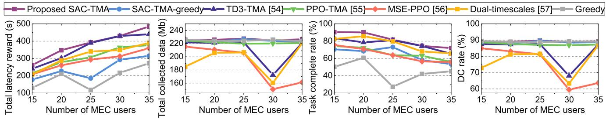

line

| Number of MEC users | Proposed SAC-TMA | SAC-TMA-greedy | TD3-TMA [54] | PPO-TMA [55] | MSE-PPO [56] | Dual-timescales [57] | Greedy |
| ------------------- | ---------------- | -------------- | ------------ | ------------ | ------------ | -------------------- | ------ |
| 15                  | 250              | 200            | 220          | 230          | 210          | 240                  | 180    |
| 20                  | 300              | 250            | 280          | 290          | 240          | 270                  | 200    |
| 25                  | 350              | 300            | 320          | 330          | 260          | 290                  | 220    |
| 30                  | 400              | 350            | 380          | 390          | 280          | 310                  | 240    |
| 35                  | 450              | 400            | 420          | 430          | 300          | 330                  | 260    |

Fig. 3. Effect of MEC users number on latency and DC performance (the performance of latency is measured by the latency reward defined in (17)).

TABLE III SIMULATION PARAMETERS 

<table><tr><td>Parameters</td><td>Value</td></tr><tr><td>Maximum number of served users of UAVs  $N_{u}^{max}$ </td><td>4</td></tr><tr><td>Task density coefficient  $\delta_{g}$ </td><td>0.2</td></tr><tr><td>Length of deadline for each task  $D_{m,f}$ </td><td>20 s</td></tr><tr><td>Noise power spectrum density  $n_{0}$ </td><td>-140 dBm/Hz</td></tr><tr><td>Excessive propagation losses  $\eta_{LoS}, \eta_{NloS}$ </td><td>0.1, 21</td></tr><tr><td>Maximum user transmit power  $p_{max}$ </td><td>0.5 W</td></tr><tr><td>MEC and DC transmission rate threshold</td><td>1.6 Mbps, 1 Mbps</td></tr><tr><td> $R_{Mth}, R_{Dth}$ </td><td></td></tr><tr><td>Bandwidth  $W$ </td><td>3 MHz</td></tr><tr><td>Required CPU cycles per bit data  $C$ </td><td>1000 cycles/bit</td></tr><tr><td>Effective switching capacitance of MEC-UAVs  $\kappa$ </td><td> $10^{-27}$ </td></tr><tr><td>CPU running frequency  $\omega$ </td><td> $6 \times 10^{9}$  cycles/s</td></tr><tr><td>Maximum energy limit for each UAV  $E^{max}$ </td><td>30 KJ</td></tr></table>

TABLE IV NETWORK CONFIGURATIONS 

<table><tr><td>Parameters</td><td>Value</td></tr><tr><td>Network structure for actor</td><td>[256, 128]</td></tr><tr><td>Network structure for critic</td><td>[256, 128]</td></tr><tr><td>Total episodes E</td><td>5000</td></tr><tr><td>Time step in each episode T</td><td>300</td></tr><tr><td>Discount factor γ</td><td>0.9</td></tr><tr><td>Target soft update coefficient τ</td><td>0.005</td></tr><tr><td>Learning rate for actor</td><td> $3 \times 10^{-4}$ </td></tr><tr><td>Learning rate for critic</td><td> $10^{-4}$ </td></tr><tr><td>Replay buffer size</td><td> $10^{6}$ </td></tr><tr><td>Entropy regularization coefficient</td><td>0.2</td></tr><tr><td>Batch size</td><td>256</td></tr></table>

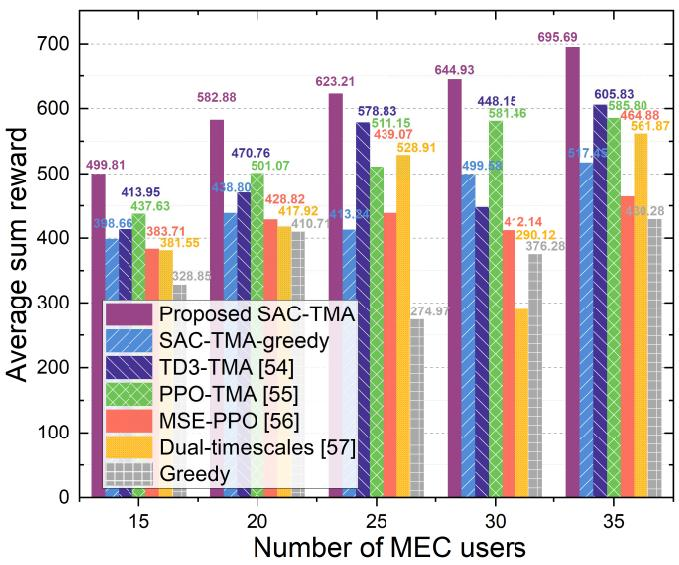

bar

| Number of MEC users | Proposed SAC-TMA | SAC-TMA-greedy | TD3-TMA [54] | PPO-TMA [55] | MSE-PPO [56] | Dual-timescales [57] | Greedy |
| ------------------- | ---------------- | -------------- | ------------ | ------------ | ------------ | -------------------- | ------ |
| 15                  | 499.81           | 398.66         | 413.95       | 437.63       | 383.71       | 381.55               | 328.85 |
| 20                  | 582.88           | 448.80         | 470.76       | 501.07       | 428.82       | 417.92               | 410.71 |
| 25                  | 623.21           | 413.36         | 578.83       | 511.15       | 439.07       | 528.91               | 274.97 |
| 30                  | 644.93           | 499.15         | 449.15       | 581.16       | 42.14        | 290.12               | 376.28 |
| 35                  | 695.69           | 517.95         | 605.83       | 585.89       | 464.88       | 561.87               | 434.28 |

Fig. 4. Sum reward under different numbers of MEC users with N = 10.

2) Baseline Algorithms: In this work, the proposed DRLbased approach is compared with four other benchmark algorithms which are SAC-TMA-greedy, twin delayed DDPG (TD3)-based algorithm [54], proximal policy optimization (PPO)-based algorithm [55], maximize service efficiency PPO (MSE-PPO) algorithm [56], dual-timescales optimization scheme [57], and distance-based greedy algorithm, and the details of benchmark algorithms are as follows.

1) Distance-Greedy Algorithm: The greedy approach preferentially selects the closest GU to perform task offloading as well as DC and uses Algorithm 1 for user association. In addition, the power of each GU is assigned by random generation.   
2) SAC-TMA-Greedy: A variant of the SAC algorithm and greedy algorithm, where the SAC algorithm integrates the proposed TMA strategy to control the power allocation and trajectory planning for MEC-UAVs and user association for all UAVs to perform task offloading and DC, and the greedy algorithm only controls the trajectory of the DC-AAV.   
3) TD3-TMA [54]: A variant of the TD3 algorithm integrates the proposed TMA strategy and centrally controls the AAV trajectory, power allocation, and user association for task offloading of MEC-UAVs and DC of the DC-y.

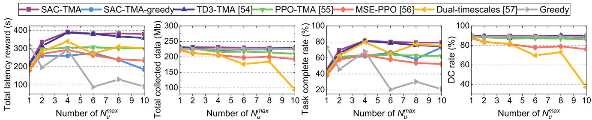

line

| Number of N_u^max | SAC-TMA | SAC-TMA-greedy | TD3-TMA [54] | PPO-TMA [55] | MSE-PPO [56] | Dual-timescales [57] | Greedy |
| ----------------- | ------- | -------------- | ------------ | ------------ | ------------ | -------------------- | ------ |
| 1                 | 200     | 200            | 200          | 200          | 200          | 200                  | 200    |
| 2                 | 300     | 250            | 300          | 250          | 250          | 250                  | 250    |
| 3                 | 350     | 280            | 350          | 280          | 280          | 280                  | 280    |
| 4                 | 400     | 300            | 400          | 300          | 300          | 300                  | 300    |
| 5                 | 400     | 300            | 400          | 300          | 300          | 300                  | 300    |
| 6                 | 400     | 300            | 400          | 300          | 300          | 300                  | 300    |
| 7                 | 400     | 300            | 400          | 300          | 300          | 300                  | 300    |
| 8                 | 400     | 300            | 400          | 300          | 300          | 300                  | 300    |
| 9                 | 400     | 300            | 400          | 300          | 300          | 300                  | 300    |
| 10                | 400     | 300            | 400          | 300          | 300          | 300                  | 300    |

Fig. 5. Effect of $N _ { u } ^ { \mathrm { m a x } }$ on latency reward, DC reward, task complete rate, and DC rate.

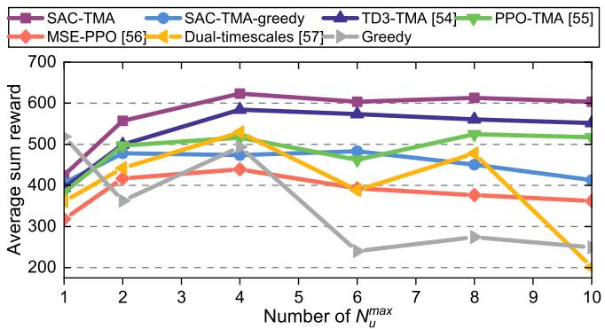

line

| Number of N_max | SAC-TMA | SAC-TMA-greedy | TD3-TMA [54] | PPO-TMA [55] | MSE-PPO [56] | Dual-timescales [57] | Greedy |
| --------------- | ------- | -------------- | ------------ | ------------ | ------------ | -------------------- | ------ |
| 1               | 400     | 400            | 400          | 400          | 300          | 300                  | 500    |
| 2               | 550     | 450            | 500          | 500          | 400          | 450                  | 350    |
| 4               | 620     | 480            | 580          | 520          | 430          | 520                  | 480    |
| 6               | 600     | 480            | 570          | 460          | 390          | 390                  | 230    |
| 8               | 610     | 450            | 560          | 520          | 370          | 470                  | 270    |
| 10              | 600     | 410            | 550          | 520          | 360          | 200                  | 240    |

Fig. 6. Sum reward under different numbers of maximum service capacity of one AAV $N _ { u } ^ { \mathrm { m a x } }$ .

4) PPO-TMA [55]: A variant of the PPO algorithm integrates the proposed TMA strategy and centrally controls the AAV trajectory, power allocation, and user association for task offloading of MEC-UAVs and DC of the DC-AAV.   
5) MSE-PPO [56]: This article proposes a parametrized, parallel actor structure-based method named MSE-PPO algorithm to update task offloading and flight hybrid policy parameters separately. In the simulations, the subactor with discrete action space controls the user association and subactors with continuous action spaces control the AAV trajectory and power allocation.   
6) Dual-Timescales [57]: This article proposes a dualtimescales optimization scheme for joint resource slicing and task scheduling. On small timescales, a selfattention mechanism-based TD3 algorithm improves the negative impact of extreme actions. On large timescales, a heuristic-based artificial electric field (AEF) approach obtains a resource slicing policy. Since the iterative process of the AEF approach is quite time consuming in our considered optimization problem, we replace the AEF method with Algorithm 1 in large timescales to control the user association and use self-attention mechanism-based TD3 algorithm in small timescales to control the AAV trajectory and power allocation.

# B. Simulation Results

In this section, the performance of the proposed SAC-TMA as well as the benchmark algorithms are evaluated and analyzed in terms of comparison results, convergence results, and trajectory results, respectively. Moreover, we perform an effectiveness analysis of the proposed TMA strategy.

1) Comparison Results: In this part, the performance of the SAC-TMA algorithm and baseline algorithms is evaluated in terms of system latency, collected data, MEC task completion rate, DC rate, and average cumulative rewards under different numbers of MEC-users and $N _ { u } ^ { \mathrm { m a x } }$ . Moreover, the average energy consumption of the UAVs when executing different algorithms is given.

Figs. 3 and 4 illustrate the MEC, DC, and overall performance obtained by our proposed SAC-TMA algorithm and other benchmark approaches with different numbers of MEC users. It can be observed from Fig. 3 that as the number of MEC users increases, the total latency rewards rise while the task complete rates fall. This may be due to more MEC tasks allowing for higher rewards but also causing more severe interference and AAV scheduling problems, resulting in a decrease in the task complete rate. Moreover, when the number of MEC users reaches 30, the DC performance of TD3-TMA, MSE-PPO, and Dual-timescales methods decreases significantly, while the SAC-TMA algorithm outperforms in terms of all key metrics of MEC and DC and sum rewards. Additionally, it can be observed from Fig. 4 that our proposed SAC-TMA algorithm exhibits highaverage cumulative rewards for all MEC user numbers, which reflects its better stability and adaptability on the considered optimization problem.

Figs. 5 and 6 illustrate the total latency reward, the volume of collected data, the MEC task completion rate, the DC rate, and the sum rewards under different numbers of $N _ { u } ^ { \mathrm { m a x } }$ . It can be observed that the proposed SAC-TMA algorithm outperforms other learning-based and greedy algorithms in all cases, demonstrating the stability of SAC-TMA. Moreover, all learning-based baseline algorithms integrated with TMA present superior performance in terms of sum rewards and DC performance compared to other algorithms. This may be because the TMA strategy can output stable matching policies to mitigate interference, allowing the agent to achieve high-MEC rewards while maintaining a better DC performance. Particularly, we observe that when $N _ { u } ^ { \mathrm { m a x } } = 4 ,$ , all algorithms can reach their peak performance in various aspects. Therefore, we set $N _ { u } ^ { \mathrm { m a x } }$ to 4 in the simulation parameter settings.

In addition, Fig. 7 presents the average energy consumed by each AAV at each time step under different algorithms. As can be seen, the average energy consumption of SAC-TMA is lower than that of the other five algorithms except for MSE-PPO, which are 92.44%, 90.01%, 97.21%, 86.83%, and 37.35% of the SAC-TMA-greedy, TD3-TMA, PPO-TMA, Dual-timescales, and greedy algorithms, respectively. This may be because MSE-PPO learns policies that favor less movement or fewer associations during the training process, thereby consuming less energy, while resulting in fewer sum rewards. Moreover, the average energy consumption using learning-based algorithms is significantly lower than that of the traditional algorithm using greedy, which indicates that thanks to the energy penalty in (21), UAVs will consider energy saving while ensuring system performance.

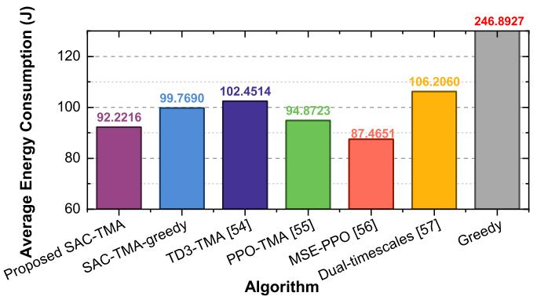

bar

| Algorithm | Average Energy Consumption (J) |
| :--- | :--- |
| Proposed SAC-TMA | 92.2216 |
| SAC-TMA-greedy | 99.7690 |
| TD3-TMA [54] | 102.4514 |
| PPO-TMA [55] | 94.8723 |
| MSE-PPO [56] | 87.4651 |
| Dual-timescales [57] | 106.2060 |
| Greedy | 246.8927 |

Fig. 7. Average energy consumption of one AAV during a step.

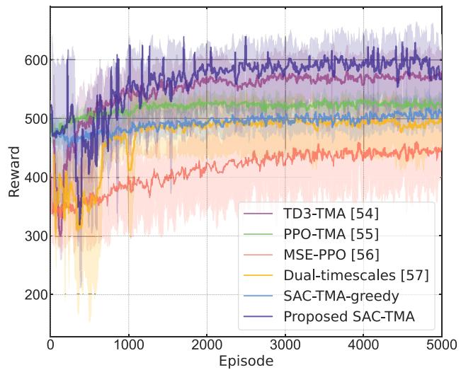

line

| Episode | TD3-TMA [54] | PPO-TMA [55] | MSE-PPO [56] | Dual-timescales [57] | SAC-TMA-greedy | Proposed SAC-TMA |
| ------- | ------------ | ------------ | ------------ | -------------------- | -------------- | ---------------- |
| 0       | ~480         | ~480         | ~480         | ~480                 | ~480           | ~480             |
| 1000    | ~550         | ~520         | ~420         | ~480                 | ~490           | ~600             |
| 2000    | ~560         | ~530         | ~430         | ~490                 | ~500           | ~610             |
| 3000    | ~570         | ~540         | ~440         | ~500                 | ~510           | ~620             |
| 4000    | ~575         | ~545         | ~445         | ~505                 | ~515           | ~625             |
| 5000    | ~580         | ~550         | ~450         | ~510                 | ~520           | ~630             |

Fig. 8. Training reward using random seeds 0, 1, and 2 (the curves represent the mean level and the shaded areas represent the range of standard deviation).

2) Convergence Results: In this part, the convergence performance of the learning-based algorithms is investigated.

Fig. 8 illustrates the cumulative reward curves of different learning-based algorithms. As illustrated in Fig. 8, after approximately 1000 episodes of training, the SAC-TMA algorithm tends to converge, and it exhibits a gradual upward trend in the later stages, with an overall reward superior to other algorithms, demonstrating the advantage of long-term performance. This may be due to the fact that the SAC-TMA algorithm adopts a strategy that maximizes the cumulative reward and policy entropy, which enables the agent to enhance exploration and continuously learn new policies. At the same time, the structure of double critic can prevent the problem of excessive Q-value. Specifically, to reduce the bias caused by overestimation, SAC-TMA does not directly use the estimated value of a single Q-network but selects the minimum value derived from the estimations of two Q-networks for calculating the target Q-value. This effectively avoids the strategy failure caused by high estimates from a single Q-network, thereby enhancing the stability of SAC-TMA. Moreover, it can be observed that learning-based algorithms with the TMA strategy exhibit better performance compared with other methods, even though they may originate from the same baseline algorithm. This may be primarily attributed to the effectiveness of the proposed TMA strategy in handling user association, which can allow the agent to achieve high-MEC rewards while maintaining better DC performance.

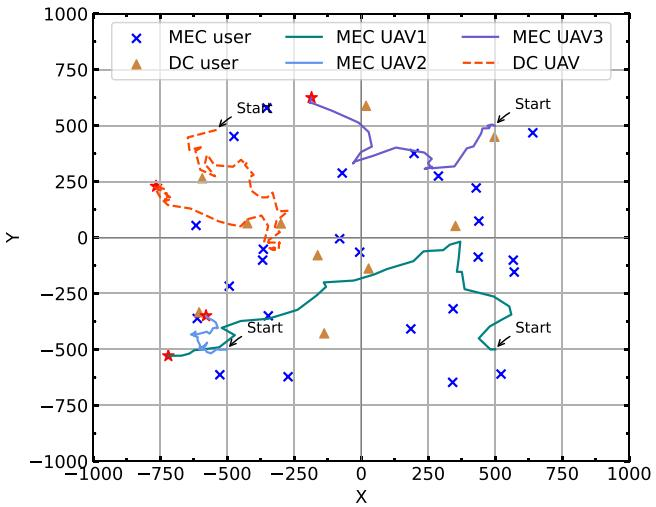

scatter

| User Type | Start X | Start Y | User Type |
|-----------|---------|---------|-----------|
| MEC user  | -750    | 250     | DC user   |
| MEC user  | -500    | 500     | MEC user  |
| MEC user  | -250    | 750     | MEC user  |
| MEC user  | 0       | 500     | MEC user  |
| MEC user  | 250     | 250     | MEC user  |
| MEC user  | 500     | 0       | MEC user  |
| MEC user  | 750     | -250    | MEC user  |
| MEC UAV1  | -750    | -500    | Start      |
| MEC UAV1  | -500    | -250    | Start      |
| MEC UAV1  | -250    | -125    | Start      |
| MEC UAV1  | 0       | -75     | Start      |
| MEC UAV1  | 250     | -50     | Start      |
| MEC UAV1  | 500     | -25     | Start      |
| MEC UAV1  | 750     | 0       | Start      |
| MEC UAV2  | -750    | -500    | Start      |
| MEC UAV2  | -500    | -250    | Start      |
| MEC UAV2  | -250    | -125    | Start      |
| MEC UAV2  | 0       | -75     | Start      |
| MEC UAV2  | 250     | -50     | Start      |
| MEC UAV2  | 500     | -25     | Start      |
| MEC UAV2  | 750     | 0       | Start      |
| MEC UAV3  | -750    | 250     | Start      |
| MEC UAV3  | -500    | 500     | Start      |
| MEC UAV3  | -250    | 750     | Start      |
| MEC UAV3  | 0       | 500     | Start      |
| MEC UAV3  | 250     | 250     | Start      |
| MEC UAV3  | 500     | 0       | Start      |
| MEC UAV3  | 750     | -250    | Start      |
| DC UAV    | -750    | 250     | Start      |
| DC UAV    | -500    | 500     | Start      |
| DC UAV    | -250    | 750     | Start      |
| DC UAV    | 0       | 500     | Start      |
| DC UAV    | 250     | 250     | Start      |
| DC UAV    | 500     | 0       | Start      |
| DC UAV    | 750     | -250    | Start      |
| DC UAV    | -750    | -500    | Start      |
| DC UAV    | -500    | -250    | Start      |
| DC UAV    | -250    | -125    | Start      |
| DC UAV    | 0       | -75     | Start      |
| DC UAV    | 250     | -50     | Start      |
| DC UAV    | 500     | -25     | Start      |
| DC UAV    | 750     | 0       | Start      |
| DC UAV    | -750    | -500    | Start      |
| DC UAV    | -500    | -250    | Start      |
| DC UAV    | -250    | -125    | Start      |
| DC UAV    | 0       | -75     | Start      |
| DC UAV    | 250     | -50     | Start      |

Fig. 9. AAV movement trajectory with $M = 2 5 , N = 1 0$ (the start and end points are marked with text and red stars, respectively).

3) Trajectory Results: This part presents an evaluation of the effectiveness of the SAC-TMA algorithm based on an analysis of the movement trajectories of the UAVs. Fig. 9 shows the movement trajectories of four UAVs within 300 time steps. It can be observed that the trajectories of UAVs are able to cover most of the GUs, and all the UAVs tend to move toward the locations where GUs gather, and there is no collision. This may be due to the algorithm learning strategies that keep UAVs at a distance to mitigate mutual interference. Moreover, the DC-AAV tends to move away from the MEC-UAVs. This may be because the agent adopts a strategy that sacrifices smaller DC rewards to avoid severe interference with MEC users, thereby balancing the income of rewards.

4) Effectiveness Analysis: In this part, we compare the proposed TMA strategy with five other strategies base on the utility in (16), which is related to the system sum rate. Moreover, the running times of each strategy are compared to analyze the feasibility in terms of computational complexity, and the details are as follows.

1) Random Generated Matching Strategy (Random): The strategy for randomly generating matching.   
2) Distance-Based Stable Matching Strategy (Distance-Based): The GS-based strategy using distance-based evaluation, which is shown in Algorithm 1.   
3) Distance-Rate-Based Two-Step Stable Matching Strategy (Distance-Rate-Based): The GS-based strategy using rate-based evaluation, which is shown in Algorithm 2.

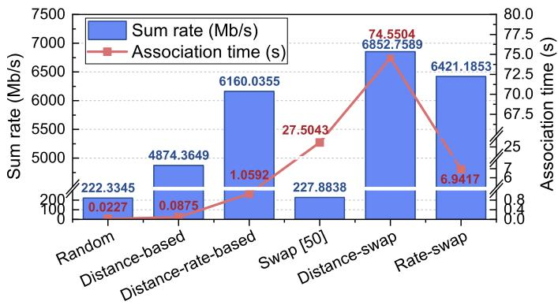

bar_line

| Category | Sum rate (Mb/s) | Association time (s) |
| :--- | :--- | :--- |
| Random | 222.3345 | 0.0227 |
| Distance-based | 4874.3649 | 0.0875 |
| Distance-rate-based | 6160.0355 | 1.0592 |
| Swap [50] | 227.8838 | 27.5043 |
| Distance-swap | 6852.7589 | 74.5504 |
| Rate-swap | 6421.1853 | 6.9417 |

Fig. 10. Comparison of system sum rate and total association time for 300 runs of different association algorithms (breakpoints processed).

4) Random Initialization Swap Strategy (Swap): The conventional swap strategy which is initialized with randomly generated matching.   
5) Distance-Based Initialization Swap Strategy (Distance-Swap): The enhanced swap strategy initialized by using distance-based preevaluation.

At each time step, the movement direction and distance for all UAVs are randomly generated, focusing solely on user association to calculate the system sum rate and the execution time of the association algorithms. Moreover, to reduce the deviation of randomness, we use three different random seeds, 0, 1, and 2, and take the average values under the three random seeds as the final results.

Fig. 10 illustrates the comparison results of the system sum rate and running times of different strategies. As can be seen, the performance of conventional algorithms using random and GS concepts is inferior to their swap version. This is due to the incremental principle of the swap operation, which means that the swap operation is only performed when the performance of the solution will improve. Therefore, the solution obtained by the swap algorithm will not be inferior to any of the previous solutions. Moreover, the swap algorithm using the preevaluation method significantly outperforms the swap method with random initialization. This is because the preevaluation scheme utilizes environmental information, making the initial solution superior to the random solution.

It is found that the original version of the swap algorithm has the relative worst overall performance (only 2.5% improvement over random association, while the running time increased by 1200 more times), which may be due to the poor initial quality and large solution search space. Among the two-phase swap algorithms, the distance-swap algorithm has the best association effect. Nevertheless, the running time of the distance-based algorithm is intolerable. Note that the performance of the rate-swap algorithm is the best except for the distance-swap algorithm, and the average running time of each slot is about $2 \times 1 0 ^ { - 2 }$ s, which is significantly shorter than the duration of a slot, such as 1 s. Hence, it is practical in terms of the running time. Therefore, we choose the rateswap algorithm, namely, the TMA strategy, as the association algorithm in this work.

# VII. CONCLUSION

This article has investigated a multi-AAV-assisted joint MEC-DC uplink communication system. Specifically, we have considered a joint MEC-DC scenario consisting of a multi-AAV-assisted MEC subsystem and a single-AAV-assisted DC subsystem, and formulated a joint optimization problem to minimize the MEC system sum latency and maximize the volume of collected data. Based on this, the problem has been reformulated as an MDP, and a one-to-many matching game has been modeled to simplify the optimization of decision variables, thus improving the training efficiency of the DRL algorithm. Then, we have proposed the SAC-TMA to obtain real-time feasible policies. Simulation results have demonstrated that the proposed SAC-TMA algorithm is effective in reducing the MEC latency while improving the volume of collected data compared with other benchmark algorithms.

# REFERENCES

[1] M. H. Adnan, Z. A. Zukarnain, and O. A. Amodu, “Fundamental design aspects of UAV-enabled MEC systems: A review on models, challenges, and future opportunities,” Comput. Sci. Rev., vol. 51, Feb. 2024, Art. no. 100615.   
[2] Z. Wang et al., “A tutorial on extremely large-scale MIMO for 6G: Fundamentals, signal processing, and applications,” IEEE Commun. Surveys Tuts., vol. 26, no. 3, pp. 1560–1605, 3rd Quart., 2024.   
[3] Y. Zhu, B. Yang, M. Liu, and Z. Li, “UAV trajectory optimization for large-scale and low-power data collection: An attention-reinforced learning scheme,” IEEE Trans. Wireless Commun., vol. 23, no. 4, pp. 3009–3024, Apr. 2024.   
[4] P. Du, Y. Shi, H. Cao, S. Garg, G. Kaddoum, and M. Alrashoud, “3-D trajectory optimization and communication resources allocation in UAV-assisted IoT networks for sustainable industry 5.0,” IEEE Trans. Consumer Electron., vol. 70, no. 1, pp. 1423–1433, Feb. 2024.   
[5] J. Huang et al., “Dual UAV cluster-assisted maritime physical layer secure communications via collaborative beamforming,” IEEE Internet Things J., early access, Dec. 23, 2024, doi: 10.1109/JIOT.2024.3521977.   
[6] C. Zhang et al., “UAV swarm-enabled collaborative secure relay communications with time-domain colluding eavesdropper,” IEEE Trans. Mob. Comput., vol. 23, no. 9, pp. 8601–8619, Sep. 2024.   
[7] C. Zhang et al., “Multi-objective aerial collaborative secure communication optimization via generative diffusion model-enabled deep reinforcement learning,” IEEE Trans. Mob. Comput., early access, Nov. 20, 2024, doi: 10.1109/TMC.2024.3502685.   
[8] Q. Wu et al., “A comprehensive overview on 5G-and-beyond networks with UAVs: From communications to sensing and intelligence,” IEEE J. Sel. Areas Commun., vol. 39, no. 10, pp. 2912–2945, Oct. 2021.   
[9] X. Jiang, M. Sheng, N. Zhao, J. Liu, D. Niyato, and F. R. Yu, “Outage analysis of UAV-aided networks with underlaid ambient backscatter communications,” IEEE Trans. Wireless Commun., vol. 22, no. 11, pp. 7492–7505, Nov. 2023.   
[10] J. Pei, H. Chen, and L. Shu, “UAV-assisted connectivity enhancement algorithms for multiple isolated sensor networks in agricultural Internet of Things,” Comput. Netw., vol. 207, Apr. 2022, Art. no. 108854.   
[11] M. Zhou, H. Chen, L. Shu, and Y. Liu, “UAV-assisted sleep scheduling algorithm for energy-efficient data collection in agricultural Internet of Things,” IEEE Internet Things J., vol. 9, no. 13, pp. 11043–11056, Jul. 2022.   
[12] M. Masuduzzaman, A. Islam, K. Sadia, and S. Y. Shin, “UAV-based MEC-assisted automated traffic management scheme using blockchain,” Future Gener. Comput. Syst., vol. 134, pp. 256–270, Sep. 2022.   
[13] M. Elloumi, R. Dhaou, B. Escrig, H. Idoudi, and L. A. Saidane, “Monitoring road traffic with a UAV-based system,” in Proc. IEEE WCNC, 2018, pp. 1–6.   
[14] G. Sun et al., “Joint task offloading and resource allocation in aerialterrestrial UAV networks with edge and fog computing for post-disaster rescue,” IEEE Trans. Mob. Comput., vol. 23, no. 9, pp. 8582–8600, Sep. 2024.   
[15] J. Dong, K. Ota, and M. Dong, “UAV-based real-time survivor detection system in post-disaster search and rescue operations,” IEEE J. Miniaturization Air Space Syst., vol. 2, no. 4, pp. 209–219, Dec. 2021.

[16] X. Zheng et al., “Reliable and energy-efficient communications via collaborative beamforming for UAV networks,” IEEE Trans. Wireless Commun., vol. 23, no. 10, pp. 13235–13251, Oct. 2024.   
[17] G. Sun et al., “Multi-objective optimization for multi-UAV-assisted mobile edge computing,” IEEE Trans. Mob. Comput., vol. 23, no. 12, pp. 14803–14820, Dec. 2024.   
[18] Z. Sun et al., “TJCCT: A two-timescale approach for UAV-assisted mobile edge computing,” IEEE Trans. Mob. Comput., early access, Nov. 22, 2024, doi: 10.1109/TMC.2024.3505155.   
[19] B. Li, R. Yang, L. Liu, J. Wang, N. Zhang, and M. Dong, “Robust computation offloading and trajectory optimization for multi-UAVassisted MEC: A multiagent DRL approach,” IEEE Internet Things J., vol. 11, no. 3, pp. 4775–4786, Feb. 2024.   
[20] L. Liu, A. Wang, G. Sun, J. Li, H. Pan, and T. Q. S. Quek, “Multi-objective optimization for data collection in UAV-assisted agricultural IoT,” IEEE Trans. Veh. Technol., early access, Dec. 11, 2024, doi: 10.1109/TVT.2024.3514664.   
[21] C. Sun, X. Xiong, Z. Zhai, W. Ni, T. Ohtsuki, and X. Wang, “Max–min fair 3-D trajectory design and transmission scheduling for solar-powered fixed-wing UAV-assisted data collection,” IEEE Trans. Wireless Commun., vol. 22, no. 12, pp. 8650–8665, Dec. 2023.   
[22] J. Sun, G. Xu, T. Zhang, X. Yang, M. Alazab, and R. H. Deng, “Privacyaware and security-enhanced efficient matchmaking encryption,” IEEE Trans. Inf. Forensics Security, vol. 18, pp. 4345–4360, 2023.   
[23] J. Sun et al., “Privacy-preserving fine-grained data sharing with dynamic service for the cloud-edge IoT,” IEEE Trans. Depend. Secure Comput., early access, Jul. 23, 2024, doi: 10.1109/TDSC.2024.3432650.   
[24] H. Li, J. Zhang, H. Zhao, Y. Ni, J. Xiong, and J. Wei, “Joint optimization on trajectory, computation and communication resources in information freshness sensitive MEC system,” IEEE Trans. Veh. Technol., vol. 73, no. 3, pp. 4162–4177, Mar. 2024.   
[25] J. Chen et al., “Deep reinforcement learning based resource allocation in multi-UAV-aided MEC networks,” IEEE Trans. Commun., vol. 71, no. 1, pp. 296–309, Jan. 2023.   
[26] J. Dandapat, N. Gupta, S. Agarwal, and B. Kumbhani, “Service time maximization for data collection in multi-UAV-aided networks,” IEEE Trans. Intell. Veh., vol. 9, no. 1, pp. 328–337, Jan. 2024.   
[27] T. Zhao, F. Li, and L. He, “Secure video offloading in multi-UAVenabled MEC networks: A deep reinforcement learning approach,” IEEE Internet Things J., vol. 11, no. 2, pp. 2950–2963, Jan. 2024.   
[28] L. Yang, H. Yao, J. Wang, C. Jiang, A. Benslimane, and Y. Liu, “Multi-UAV-enabled load-balance mobile-edge computing for IoT networks,” IEEE Internet Things J., vol. 7, no. 8, pp. 6898–6908, Aug. 2020.   
[29] Z. Yu, Y. Gong, S. Gong, and Y. Guo, “Joint task offloading and resource allocation in UAV-enabled mobile edge computing,” IEEE Internet Things J., vol. 7, no. 4, pp. 3147–3159, Apr. 2020.   
[30] C. Zhan, H. Hu, Z. Liu, Z. Wang, and S. Mao, “Multi-UAV-enabled mobile-edge computing for time-constrained IoT applications,” IEEE Internet Things J., vol. 8, no. 20, pp. 15553–15567, Oct. 2021.   
[31] X. Zhou, L. Huang, T. Ye, and W. Sun, “Computation bits maximization in UAV-assisted MEC networks with fairness constraint,” IEEE Internet Things J., vol. 9, no. 21, pp. 20997–21009, Nov. 2022.   
[32] W. Lee and T. Kim, “Multiagent reinforcement learning in controlling offloading ratio and trajectory for multi-UAV mobile-edge computing,” IEEE Internet Things J., vol. 11, no. 2, pp. 3417–3429, Jan. 2024.   
[33] F. Pervez, A. Sultana, C. Yang, and L. Zhao, “Energy and latency efficient joint communication and computation optimization in a multi-UAV-assisted MEC network,” IEEE Trans. Wireless Commun., vol. 23, no. 3, pp. 1728–1741, Mar. 2024.   
[34] H. Wang, H. Zhang, X. Liu, K. Long, and A. Nallanathan, “Joint UAV placement optimization, resource allocation, and computation offloading for THz band: A DRL approach,” IEEE Trans. Wireless Commun., vol. 22, no. 7, pp. 4890–4900, Jul. 2023.   
[35] Y. Liu, J. Yan, and X. Zhao, “Deep reinforcement learning based latency minimization for mobile edge computing with virtualization in maritime UAV communication network,” IEEE Trans. Veh. Technol., vol. 71, no. 4, pp. 4225–4236, Apr. 2022.   
[36] Y. Yu, J. Tang, J. Huang, X. Zhang, D. K. C. So, and K. Wong, “Multiobjective optimization for UAV-assisted wireless powered IoT networks based on extended DDPG algorithm,” IEEE Trans. Commun., vol. 69, no. 9, pp. 6361–6374, Sep. 2021.   
[37] K. Liu and J. Zheng, “UAV trajectory planning with interference awareness in UAV-enabled time-constrained data collection systems,” IEEE Trans. Veh. Technol., vol. 73, no. 2, pp. 2799–2815, Feb. 2024.   
[38] Y. Zeng and J. Tang, “MEC-assisted real-time data acquisition and processing for UAV with general missions,” IEEE Trans. Veh. Technol., vol. 72, no. 1, pp. 1058–1072, Jan. 2023.

[39] J. Liu, X. Zhao, P. Qin, S. Geng, Z. Chen, and H. Zhou, “Learning-based multi-UAV assisted data acquisition and computation for information freshness in WPT enabled space-air-ground PIoT,” IEEE Trans. Netw. Sci. Eng., vol. 11, no. 1, pp. 48–63, Jan./Feb. 2024.   
[40] A. M. Seid, G. O. Boateng, B. Mareri, G. Sun, and W. Jiang, “Multiagent DRL for task offloading and resource allocation in multi-UAV enabled IoT edge network,” IEEE Trans. Netw. Serv. Manag., vol. 18, no. 4, pp. 4531–4547, Dec. 2021.   
[41] G. Zheng, C. Xu, M. Wen, and X. Zhao, “Service caching based aerial cooperative computing and resource allocation in multi-UAV enabled MEC systems,” IEEE Trans. Veh. Technol., vol. 71, no. 10, pp. 10934–10947, Oct. 2022.   
[42] M. Chen, M. Mozaffari, W. Saad, C. Yin, M. Debbah, and C. S. Hong, “Caching in the sky: Proactive deployment of cache-enabled unmanned aerial vehicles for optimized quality-of-experience,” IEEE J. Sel. Areas Commun., vol. 35, no. 5, pp. 1046–1061, May 2017.   
[43] Y. Wang, M. Sheng, X. Wang, L. Wang, and J. Li, “Mobile-edge computing: Partial computation offloading using dynamic voltage scaling,” IEEE Trans. Commun., vol. 64, no. 10, pp. 4268–4282, Oct. 2016.   
[44] Y. Gu, Y. Yao, C. Li, B. Xia, D. Xu, and C. Zhang, “Modeling and analysis of stochastic mobile-edge computing wireless networks,” IEEE Internet Things J., vol. 8, no. 18, pp. 14051–14065, Sep. 2021.   
[45] N. Zhao, Y. Pei, Y.-C. Liang, and D. Niyato, “Deep-reinforcementlearning-based contract incentive mechanism for joint sensing and computation in mobile crowdsourcing networks,” IEEE Internet Things J., vol. 11, no. 7, pp. 12755–12767, Apr. 2024.   
[46] Z. Wang, Y. Wei, Z. Feng, F. R. Yu, and Z. Han, “Resource management and reflection optimization for intelligent reflecting surface assisted multi-access edge computing using deep reinforcement learning,” IEEE Trans. Wireless Commun., vol. 22, no. 2, pp. 1175–1186, Feb. 2023.   
[47] Y. Deng, Z. Chen, X. Chen, and Y. Fang, “Throughput maximization for multiedge multiuser edge computing systems,” IEEE Internet Things J., vol. 9, no. 1, pp. 68–79, Jan. 2022.   
[48] K. Bando, “Many-to-one matching markets with externalities among firms,” J. Math. Econ., vol. 48, no. 1, pp. 14–20, 2012.   
[49] J. Zhao, Y. Liu, K. K. Chai, Y. Chen, and M. Elkashlan, “Many-to-many matching with externalities for device-to-device communications,” IEEE Wireless Commun. Lett., vol. 6, no. 1, pp. 138–141, Feb. 2017.   
[50] E. Bodine-Baron, C. Lee, A. Chong, B. Hassibi, and A. Wierman, “Peer effects and stability in matching markets,” in Proc. SAGT, 2011, pp. 117–129.   
[51] X. Huo, H. Zhang, Z. Wang, H. Yan, and C. Liu, “An efficient matching game approach to association formation in UAV-enabled hierarchical distributed learning,” IEEE Trans. Cybern., vol. 54, no. 10, pp. 5696–5707, Oct. 2024.   
[52] T. Haarnoja et al., “Soft actor–critic algorithms and applications,” 2018, arXiv:1812.05905.   
[53] X. Mu, Y. Liu, L. Guo, J. Lin, and Z. Ding, “Energy-constrained UAV data collection systems: NOMA and OMA,” IEEE Trans. Veh. Technol., vol. 70, no. 7, pp. 6898–6912, Jul. 2021.   
[54] S. Fujimoto, H. van Hoof, and D. Meger, “Addressing function approximation error in actor–critic methods,” 2018, arXiv:1802.09477.   
[55] J. Schulman, F. Wolski, P. Dhariwal, A. Radford, and O. Klimov, “Proximal policy optimization algorithms,” 2017, arXiv:1707.06347.   
[56] W. Li, S. Li, H. Shi, W. Yan, and Y. Zhou, “UAV-enabled fair offloading for MEC networks: A DRL approach based on actor–critic parallel architecture,” Appl. Intell., vol. 54, no. 4, pp. 3529–3546, 2024.   
[57] T. Huang, Z. Fang, Q. Tang, R. Xie, T. Chen, and F. R. Yu, “Dual-timescales optimization of task scheduling and resource slicing in satellite-terrestrial edge computing networks,” IEEE Trans. Mob. Comput., vol. 23, no. 12, pp. 14111–14126, Dec. 2024.

natural_image

Portrait photo of a young man in formal attire (no text or symbols visible)

Boxiong Wang received the B.S. and M.S. degrees in software engineering from Jilin University, Changchun, China, in 2021 and 2024, respectively, where he is currently pursuing the Ph.D. degree in computer science.

His current research focuses on UAV networks, mobile edge computing, and optimization.

natural_image

Portrait photo of a woman wearing glasses and a red top against a blue background (no text or symbols visible)

Hui Kang received the M.E. and Ph.D. degrees from Jilin University, Changchun, China, in 1996 and 2007, respectively.

She is currently a Professor with the College of Computer Science and Technology, Jilin University. Her research interests include grid computing, information integration, and distributed computing.

natural_image

Portrait photo of a woman in formal attire against a blue background (no text or symbols visible)

Zemin Sun (Member, IEEE) received the B.S. degree in software engineering, and the M.S. and Ph.D. degrees in computer science and technology from Jilin University, Changchun, China, in 2015, 2018, and 2022, respectively.

Her research interests include vehicular networks, edge computing, and game theory.

natural_image

Portrait photo of a young man in a light blue shirt (no text or symbols visible)

Jiahui Li (Member, IEEE) received the B.S. degree in software engineering, and the M.S. and Ph.D. degrees in computer science and technology from Jilin University, Changchun, China, in 2018, 2021, and 2024, respectively.

He was a visiting Ph.D. student with The Singapore University of Technology and Design, Singapore. He currently serves as an Assistant Researcher with the College of Computer Science and Technology, Jilin University. His current research focuses on integrated air–ground networks,

UAV networks, wireless energy transfer, and optimization.

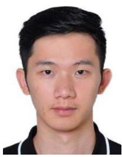

natural_image

Portrait photo of a young man with short dark hair wearing a black shirt (no text or symbols visible)

communications.

Jiacheng Wang received a bachelor’s degree from the Department of Science, Kunming University of Science and Technology in 2015, and the M.E. and Ph.D. degrees from the Department of Communication and Information Technology, Chongqing University of Posts and Telecommunications in 2018 and 2022, respectively.

He is currently a Research Associate of Computer Science and Engineering with Nanyang Technological University, Singapore. His research interests include wireless sensing and semantic

natural_image

Portrait photo of a man in formal attire against a blue background (no text or symbols visible)

Geng Sun (Senior Member, IEEE) received the B.S. degree in communication engineering from Dalian Polytechnic University, Dalian, China, in 2011, and the Ph.D. degree in computer science and technology from Jilin University, Changchun, China, in 2018.

He was a Visiting Researcher with the School of Electrical and Computer Engineering, Georgia Institute of Technology, Atlanta, GA, USA. He is a Professor with the College of Computer Science and Technology, Jilin University. His research interests include wireless networks, UAV communications,

collaborative beamforming, and optimizations.

natural_image

Portrait of a person wearing glasses and a dark jacket (no visible text or symbols)

Dusit Niyato (Fellow, IEEE) received the B.Eng. degree from King Mongkuts Institute of Technology Ladkrabang, Bangkok, Thailand, in 1999, and the Ph.D. degree in electrical and computer engineering from the University of Manitoba, Winnipeg, MB, Canada, in 2008.

He is currently a Professor with the School of Computer Science and Engineering, Nanyang Technological University, Singapore. His research interests include the Internet of Things, machine learning, and incentive mechanism design.