# ACBFT: Adaptive Chained Byzantine Fault-Tolerant Consensus Protocol for UAV Ad Hoc Networks

Jingjing Wang , Senior Member, IEEE, Jiaxing Wang, Ziheng Tong , ，

Zihan Jiao , Graduate Student Member, IEEE, Mengyuan Zhang , and Chunxiao Jiang , Fellow, IEEE

Abstract—The integration of blockchain technology with uncrewed aerial vehicles (UAVs) presents significant potential, offering prospects for enhanced cybersecurity and fostering innovation within the UAV industry. As the foundation of blockchain technology, the consensus protocol determines system performance and security. However, the high mobility and limited resources of UAVs render traditional consensus protocols, which require substantial resources, unsuitable for UAV networks. The dynamic nature of UAVs results in topology changes, further exacerbating the network environment’s complexity. Therefore, we propose an adaptive chained byzantine fault tolerance (ACBFT) protocol tailored specifically for UAV network environments. This protocol utilizes the particle swarm optimization (PSO) algorithm to optimize the chain consensus process, enhancing robustness and reducing communication overhead. In addition, we propose several sub-protocols to assist ACBFT in handling unexpected situations, including the rechaining protocol for managing malicious nodes, joining and exiting protocols for dynamic nodes, and strategies for handling accident situations such as UAV loss. Our security analysis and performance evaluations demonstrate that ACBFT not only increases throughput and reduces communication overhead, but also ensures security and efficiency.

Index Terms—UAV networks, blockchain, Byzantine faulttolerant, consensus protocol.

# I. INTRODUCTION

HE utilization of uncrewed aerial vehicles (UAVs) as aerial platforms is experiencing substantial devel, driven by the rapid evolution of the Internet of Things (IoT) and communication technologies [1]. UAVs offer significant advantages such as cost-effectiveness, low operational risk, and versatile mobility,

Received 1 November 2024; revised 24 January 2025; accepted 2 March 2025. Date of publication 25 March 2025; date of current version 18 July 2025. This work was supported in part by the National Natural Science Foundation of China under Grant 62222101, Grant U24A20213, Grant 62325108, Grant 62341131, and Grant 62401029, in part by the Beijing Natural Science Foundation under Grant L232043 and Grant L222039, and in part by the Fundamental Research Funds for the Central Universities. The review of this article was coordinated by Prof. Hongzi Zhu. (Corresponding author: Jingjing Wang.)

Jingjing Wang and Ziheng Tong are with the School of Cyber Science and Technology, Beihang University, Beijing 100191, China, and also with the Hangzhou Innovation Institute, Beihang University, Hangzhou 310051, China (e-mail: drwangjj@buaa.edu.cn; ziheng0628@buaa.edu.cn).

Jiaxing Wang, Zihan Jiao, and Mengyuan Zhang are with the School of Cyber Science and Technology, Beihang University, Beijing 100191, China (e-mail: jxwang@buaa.edu.cn; jiaozihan@buaa.edu.cn; myzhang18@buaa.edu.cn).

Chunxiao Jiang is with the Beijing National Research Center for Information Science and Technology (BNRist), Tsinghua University, Beijing 100084, China (e-mail: jchx@tsinghua.edu.cn).

Digital Object Identifier 10.1109/TVT.2025.3548281

making them highly beneficial for IoT applications. The versatility of UAV clusters also enables them to serve a broad spectrum of IoT applications, including traffic management [2], military operations [3], and wireless communication facilitation [4].

Blockchain, a distributed ledger technology, not only supports UAVs in accomplishing the aforementioned tasks but also enhances the security and performance of UAV networks [5], [6], [7]. Operating within a consensus-driven and zero-trust model, blockchain provides a highly decentralized, tamper-resistant, and traceable mechanism for record-keeping. In recent years, blockchain has been actively applied in the UAV domain to strengthen key distribution [8], key management [9], network authentication [5], cross-domain authentication [10], and more.

UAV networks, as a typical IoT application scenario, can utilize distributed ledger technology to enhance various functions such as data exchange and access control. Some tasks of the UAVs may require data from other UAV devices. For example, some UAVs may sometimes require control information from other UAVs when they automatically adjust their heading for more accurate trajectory planning. Data transmitted between UAVs is vulnerable to tampering. Furthermore, malicious UAVs may transmit incorrect information to interfere with the missions of other UAVs. Therefore, the transmitted data must be immutable and transferred securely and audibly. UAV networks generally operate as mobile ad hoc networks without a centralized authority, relying on inter-UAV cooperation to complete missions. Traditional centralized information exchange architectures are not suitable for decentralized UAV networks. Blockchain offers a solution by safeguarding shared data through distributed consensus and incentive mechanisms, ensuring secure collaboration within UAV networks [11]. Consequently, blockchain is particularly well-suited for UAV applications.

The consensus mechanism plays a vital role in the blockchain system, determining how participating nodes agree on specific data. However, due to the resource constraints of UAV devices, existing consensus protocols are not directly applicable to UAV environments because of their substantial resource consumption. In a flight environment, UAVs are unable to transfer computational processes to resource-rich devices that can maintain stable connections, as seen with fixed IoT devices [12]. Consequently, UAVs typically operate the entire consensus protocol as full nodes within the blockchain network. Some lightweight protocols have been proposed for vehicular networks [13], but the high mobility of UAVs and the resulting increased network complexity, with nodes dynamically joining, dropping out, or being lost within a UAV cluster, and thus render these protocols unsuitable for UAV networks. To address these challenges and meet the security needs of UAV clusters, we propose the adaptive chained byzantine fault tolerance (ACBFT) consensus protocol, enabling the further integration of blockchain technology into UAV networks. The main contributions of this study can be summarized as follows:

- We propose a blockchain consensus protocol, ACBFT, specifically designed for UAV ad hoc networks, which extends the chain-based byzantine fault tolerance (BFT) protocol. By utilizing the Particle Swarm Optimization (PSO) algorithm to compute the chain order based on the UAV network topology, the protocol significantly enhances robustness and reduces communication overhead.   
We propose several sub-protocols to enhance the ACBFT protocol’s ability to address unexpected scenarios in UAV networks. To accurately detect and handle malicious nodes, we introduce the rechaining protocol. Given the dynamic nature of UAVs, we have also developed joining and exiting protocols, along with response strategies to handle changes in physical location or accidental UAV loss that may affect network topology.   
- We conduct a security analysis of the proposed protocol and propose a reconfiguration-free scheme. We evaluate and compare the performance of ACBFT with other BFT protocols for different numbers of nodes. Then, we test the joining and exiting protocols. The experimental results show that ACBFT achieves an increase in throughput of up to 96.2%, while simultaneously reducing communication overhead compared to existing chaining protocols.

The rest of the paper is organized as follows. In Section II, we provide an overview of the background and related work. Section III introduces the UAV ad hoc network model and outlines the blockchain structure. Section IV details the process of the consensus protocol and introduces the PSO-based chain ordering algorithm. Section V describes several subprotocols for handling abnormal situations and node changes. Section VI gives the security performance analysis and proposes a reconfiguration-free scheme. Section VII presents and analyzes the results of the simulation experiments. Finally, Section VIII concludes this article.

# II. BACKGROUND AND RELATED WORK

In this section, we delineate the categories of blockchains. We then present chain-based BFT consensus mechanisms. Finally, we introduce research on existing blockchain consensus protocols specifically designed for UAV networks.

# A. Categories of Blockchain

Blockchains can be categorized into public blockchains, private blockchains, and consortium blockchains based on member access and management rights [14].

Public blockchains are distinguished by their open accessibility, enabling anyone to participate in the network’s maintenance. This openness renders public blockchains open-source and anonymous, among other characteristics, making them particularly well-suited for cryptocurrency applications.

In contrast to public blockchains, private blockchains resemble a private ledger owned by an individual or organization and exhibit minimal decentralization. While private blockchains may not fully resolve trust issues, they do enhance auditability. Byzantine concerns are often mitigated due to authentication mechanisms. However, given the reduced number of participants in data processing, private blockchains can exhibit significantly higher efficiency compared to public blockchains.

The consortium blockchain bridges the gap between public and private blockchains. It is tailored for collaborative entities, ensuring high security and privacy through authorized access. Participants form a consortium, governing blockchain rules, consensus, and privacy policies [15]. It maintains openness among members, enabling secure exchanges. By harmonizing privacy and accessibility, consortium blockchains foster collaboration, trust, and value creation among participants. Essentially, it serves as a platform for trusted participants, balancing decentralization, security, and efficiency through controlled access and collaboration. Consortium blockchains offer a moderate level of decentralization, capable of tolerating a certain number of byzantine nodes (i.e., malicious nodes). In terms of efficiency, they rank between public and private blockchains, demonstrating greater robustness than public blockchains while being better decentralized than private ones.

Due to the inherent openness of wireless networks, UAV nodes are susceptible to cyber-attacks, making secure authentication during the joining process of UAV nodes essential. However, authentication schemes may be known to adversaries. UAVs remain vulnerable to compromise, which will lead to the emergence of byzantine nodes in the network with seemingly legitimate identities [16]. Given its inherently distributed nature, authentication requirements, and the potential presence of malicious nodes, the UAV ad hoc network exhibits significant similarities to consortium blockchains in terms of trust establishment, management methodologies, and network flexibility. Therefore, it can be regarded as a special application of consortium blockchain.

# B. Chain-Based BFT Protocols

Castro and Liskov [17] introduced the PBFT protocol, which relies on replication techniques, enabling the implementation of highly available distributed fault-tolerant systems for the first time. A variety of consensus protocols employed within consortium blockchains are derived from or built upon PBFT [14]. Upon the consensus is achieved, the resulting consistent state of these protocols remains immutable. The majority of such protocols [18], [19], [20] are broadcast-based, wherein each stage entails disseminating information to other nodes to achieve consensus.

In UAV networks, simultaneous data transmission by two UAVs within the signal coverage area can result in signal collisions [21]. IEEE 802.11 controls access to the wireless medium through the CSMA/CA (carrier-sense multiple access with collision avoidance) protocol to mitigate such collisions [22]. However, in UAV networks, the multi-phase broadcasting inherent in broadcast-based consensus consumes significant communication resources and exacerbates signal collisions. Additionally, while the backoff mechanism in wireless networks helps reduce signal collisions, it also introduces further communication delays.

Therefore, we consider the chain-based BFT protocol for UAV ad hoc networks, which reduces communication complexity by using chain propagation instead of broadcasting during typical operations. The chain replication protocol was initially introduced by Renesse [23], albeit without achieving byzantine fault tolerance. To address adversarial scenarios, Aliph [24] employed a blend of multi-seed protocols and devised a protocol-switching mechanism to strike a balance between fault tolerance and performance. However, the performance of this protocol significantly deteriorates in the presence of faults. Hence, Duan et al. [25] proposed the BChain protocol, which exhibits faster error recovery and demonstrates more stable overall performance.

In the chain propagation process, each node sends a signal only after receiving one from the preceding node in the chain [26]. While this process can increase latency in typical network conditions, it offers higher throughput. With an increase in concurrent client requests, protocols utilizing chained structures can achieve lower latency compared to those relying on broadcast mechanisms [25]. Additionally, chain-based protocols have been shown to outperform traditional broadcast protocols in efficiency. In UAV networks, chain propagation facilitates time-ordered signaling, which mitigates signaling conflicts and reduces the frequency of broadcasts. Consequently, the chain-based BFT protocol not only conserves communication resources in UAV networks but also minimizes delays arising from signal conflicts among UAVs.

# C. Blockchain-Assisted UAV Networks

Blockchain-based UAV solutions exhibit higher security compared to other location-based methods [27]. While numerous efforts are underway to integrate blockchain technology with UAVs, there remains a lack of consensus protocols specifically tailored for UAV networks. Some lightweight consensus protocols [12], [28], [29], [30], [31] have been proposed to accommodate IoT scenarios with limited node resources. Nevertheless, the characteristics of UAVs, such as high mobility and dynamic network topology changes, render these protocols unsuitable for UAV networks.

Ge et al. [32] proposed a novel lightweight blockchain architecture and developed a reputation-based consensus protocol that reduces computational and storage overhead while preserving privacy and security advantages. However, it does not account for the complex and dynamic network environment of UAVs during flight. Kong et al. [16] proposed LAP-BFT, a lightweight provable BFT consensus mechanism designed for UAV networks, which enhances communication, computation, and storage efficiency, thereby ensuring the longevity and overall performance of UAV operations. However, the LAP-BFT stores only the reputation value of the UAVs in the blockchain, which indicates the trustworthiness of the UAVs. Consequently, LAP-BFT is insufficient for addressing the requirements of data exchange and authentication scenarios. For uncrewed vehicles, Regnath and Steinhorst [33] proposed CUBA, a new validated and verifiable consensus protocol, specifically tailored to platoons and adapted only to the particular communication topology of vehicular ad hoc networks.

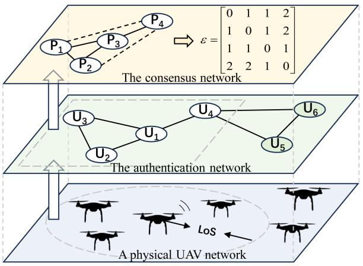

<details>
<summary>flowchart</summary>

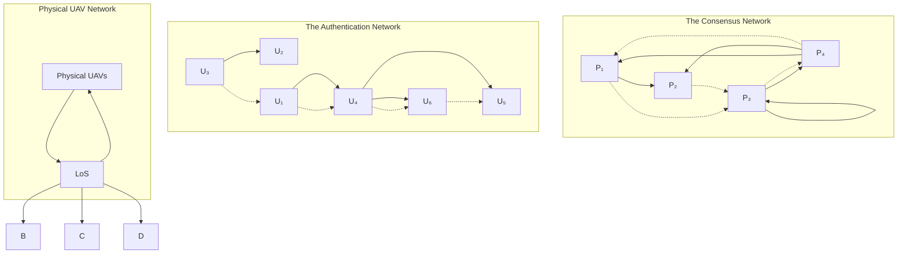
</details>

Fig. 1. A physical UAV network corresponds to the authentication network and the consensus network. The consensus node distance matrix is obtained based on the consensus network topology.

Therefore, it is necessary to design a blockchain consensus protocol suitable for the UAV ad hoc network environment.

# III. SYSTEM MODEL

# A. Network Model

UAV ad hoc networks facilitate the transmission of information over extended distances by using one or more relays to reach intended destinations. These networks form a multi-hop wireless infrastructure, where UAVs serve dual roles as both mobile wireless terminals and routers. Consequently, every UAV within the network is interconnected, allowing the entire UAV cluster to be conceptualized as a peer-to-peer (P2P) virtual network, based on the principles of mobile ad hoc networks. We assume the UAV ad hoc network to be a partial-synchronous network [34].

The UAV set U consists of UAVs in the network, where each UAV is denoted as $U _ { i }$ and $i \in [ 1 , 2 , . . . , M ]$ . In our proposed U i , , . . ., Mparadigm of dividing the consensus network from the authentication network, not every UAV is required to participate in the blockchain consensus process. Only after successfully passing the authentication of the UAV network can a UAV initiate a request to join the consensus network. UAVs that participate in the consensus process are designated as consensus nodes. The  nodes in U participate in the consensus, constituting the consensus node set $\mathcal { P } = \{ P _ { 1 } , P _ { 2 } , . . . , P _ { N } \}$ , where $P _ { i }$ denotes the -th consensus node. Clearly, P is a subset of U .

iLet $G = ( \mathcal { U } , E )$ denote the network topology comprising all G , EUAVs, where  represents the set of edges in the network. Fig. 1 illustrates a cluster of six UAVs whose network topology can be abstracted based on their line-of-sight (LoS). $U _ { 5 } \notin \mathcal { P }$ and $U _ { 6 } \notin \mathcal { P }$ U /indicate that they do not participate in the consensus process. The consensus network topology can be obtained by integrating the network topology with the positions of the consensus nodes, where the weight between any two nodes represents the communication distance, i.e., the shortest hop count between the two nodes. Hence, the consensus node distance matrix  is

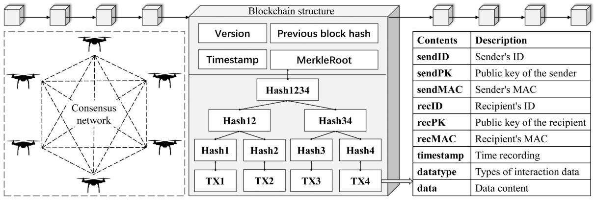

<details>
<summary>flowchart</summary>

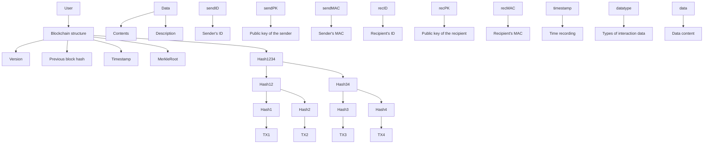
</details>

Fig. 2. UAV blockchain structure and transaction structure.

$$
\varepsilon = \left[ \begin{array}{c c c c} 0 & x _ {1, 2} & \dots & x _ {1, n} \\ x _ {2, 1} & 0 & \dots & x _ {2, n} \\ \vdots & \vdots & \ddots & \vdots \\ x _ {n, 1} & x _ {n, 2} & \dots & 0 \end{array} \right], \tag {1}
$$

where $x _ { i , j }$ represents the shortest routing distance between xconsensus nodes $P _ { i }$ and $P _ { j }$ . In Fig. 1, the distance matrix for a consensus network consisting of four nodes is provided.

By dividing the authentication network and consensus network, we gain the flexibility to select UAVs—either partially or fully—to participate in the consensus process. This approach enables UAVs to join ad hoc networks through various authentication methods and reduces resource utilization for those with limited storage capacity and energy resources.

Since not all UAVs in the UAV network participate in the consensus process, the atomic operation of UAVs within the network can be categorized as follows:

- A new UAV joins the U , but not the P.   
- A UAV in the U joins the P .   
- A UAV exits the P but remains within U .   
- A UAV exits both the P and the U.   
- A UAV not in the P exits the U .   
- A UAV in the P gets lost.   
- A UAV not in the P gets lost.   
- Topological reconstruction due to changes in the physical location of the UAV in U.

All of the aforementioned operations influence the network topology, potentially leading to modifications in the consensus node distance matrix .

# B. Blockchain Structure

The structure of a blockchain is conceptualized as a sequence of data blocks, each interconnected by hash values to form a chain-like arrangement. As illustrated in Fig. 2, the blockchain architecture consists of two primary components: the block header and the block body. In UAV consensus networks, ensuring the security and validity of messages is crucial. We employ various cryptographic techniques, including public key signatures, message authentication codes $( \mathrm { M A C s } )$ , and message digests generated from hash functions. For node $P _ { i }$ , the message P digest is typically signed (rather than the full message) and appended to the plaintext of the message, denoted as $\langle M \rangle _ { \sigma _ { i } }$ . An authenticated UAV knows the public keys of all other UAVs in the network and can use them to verify the signature.

The block header contains metadata related to the current block, including the version number, hash value of the preceding block, timestamp, Merkle root, etc. The version number specifies the protocol that the block follows. The previous block hash is used to establish a cryptographic linkage with preceding blocks. The timestamp indicates the exact moment the block was created, accurate to the second. The Merkle root, derived from the Merkle tree, provides a compact representation of all the transaction data within the block, ensuring efficient verification and integrity of the data.

The block body contains transaction data, typically comprising token transaction details in cryptocurrencies. However, in our system, the transaction consists of non-human interaction data from UAVs. The hashes of the UAV transaction within a block form the Merkle tree. The hash value of each block is generated based on the block header information, which includes the previous block’s hash value and the Merkle root composed of the transaction hashes. This chaining of hash values ensures that any alteration in the transaction affects not only the current block but also all subsequent blocks, thereby protecting against tampering. The fundamental components of a transaction (TX) are illustrated in Fig. 2.

# IV. ADAPTIVE CHAINED BYZANTINE FAULT-TOLERANT CONSENSUS IN NORMAL EXECUTION

In this section, we demonstrate the operation of the ACBFT consensus protocol within the UAV ad hoc network.

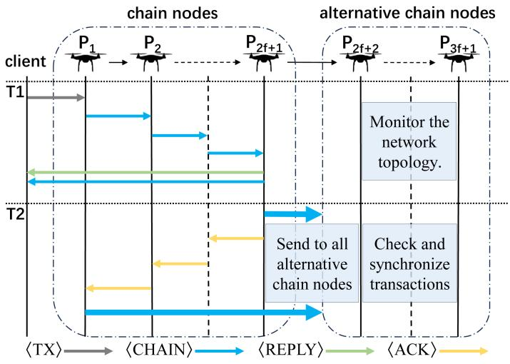

<details>
<summary>flowchart</summary>

```mermaid
graph TD
    subgraph "client"
        P1["P₁"] --> P2["P₂"]
        P2 -.-> P2f+1["P₂f+1"]
        P2f+1 --> P2f2["P₂f+2"]
        P2f2 --> P3f1["P₃f+1"]
    end

    subgraph "T1"
        T1["T1"] --> P1
        T1 --> P2
        T1 --> P2f+1
        T1 --> P2f2
        T1 --> P3f1
        T1 --> P3f2
    end

    subgraph "T2"
        T2["T2"] --> P1
        T2 --> P2
        T2 --> P2f+1
        T2 --> P2f2
        T2 --> P3f1
        T2 --> P3f2
    end

    subgraph " Alternative chain nodes"
        P1 -->|Monitor the network topology.| P2
        P2 -->|Send to all alternative chain nodes.| P3f1
        P2f+1 -->|Check and synchronize transactions.| P3f2
    end

    style client fill:#f9f,stroke:#333
    style alternative chain nodes fill:#bbf,stroke:#333
```
</details>

Fig. 3. ACBFT normal case operation.

# A. Consensus Process Without Malicious Nodes

In ACBFT, we partition the participating consensus UAVs into two sets: the chain node set Ω and the alternative chain node set -. The set Ω comprises 2 + 1 UAVs that are actively engaged fin the chain consensus process, while the set - comprises $f$ UAVs that maintain synchronization information.

In an elegant execution, as depicted in Fig. 3, the $2 f + 1$ fUAVs within Ω achieve consensus, while the UAVs in - update their states based on the synchronization information from both the head and tail nodes in Ω. Subsequently, we describe the consensus process of the ACBFT protocol in the absence of failures, which is divided into two phases.

1) Chain Node Consensus: Typically, the UAV that receives interaction information acts as a client and forwards the information, packaged into a transaction, to the head node. After verifying the correctness of the transaction, the head node assigns a sequence number and forms a message in the format CHAIN VN SN RV TX C HH HR COσ , which is then , , , , , , , ,forwarded along the chain. Here, CHAIN represents the message type, VN is the view number, SN is the assigned serial number, RV is the number of rechaining that occurred during view VN, TX is the transaction, HH is the hash of its execution history, HR is the hash of the client reply containing the execution result, C is the client, and CO is the current chain order, including the sorted Ω and - sets. For convenience, the entire CHAIN message is denoted as CHAIN, and the same notation is used for the following message types.

After node $P _ { i - 1 }$ sends a valid CHAIN message to its successor node $P _ { i }$ P, a timer is set by $P _ { i - 1 }$ . This timer is designed to man-P Page failures and ensure continued liveness, as will be explained in Section V-A. When the tail node $P _ { 2 f + 1 }$ receives a CHAIN Pmessage, it computes its signature and sends a REPLY message to the client, along with the received CHAIN message. When the client receives a REPLY message from $P _ { 2 f + 1 }$ in the Pchain, which includes signatures from all nodes involved, the client concludes the transaction. If not, the client retransmits the transaction to all nodes in $\mathcal { P } .$

2) Cancel the Timer: The tail node $P _ { 2 f + 1 }$ sends the PCHAIN message to all nodes in -. Additionally, it sends a ACK VN SN CO HT Cσ2f+1 message to its predecessor node $P _ { 2 f }$ , , , ,, where HT is the hash of the transaction. Upon receiv-Ping this message, $P _ { 2 f }$ cancels the ongoing timer and forwards the PACK message to its predecessor node, continuing this process until the ACK message reaches the head node $P _ { 1 }$ . When $P _ { 1 }$ P Preceives an ACK message, it also sends the corresponding CHAIN message to the nodes in -.

Meanwhile, the nodes in - receive the CHAIN messages sent by both the head and tail nodes and take the necessary actions to synchronize the consensus based on this information. Finally, the transaction is processed and completed by every correct node in -.

# B. PSO-Based Chain Ordering Algorithm

Clearly, different chain orders can significantly impact the efficiency of the consensus process. For instance, as shown in Fig. 1, the chain order $\{ P _ { 1 } { : } U _ { 1 } , P _ { 2 } { : } U _ { 2 } , P _ { 3 } { : } U _ { 3 } , P _ { 4 } { : } U _ { 4 } \}$ is expected to take more time to complete compared to $\left\{ P _ { 1 } { : } U _ { 3 } , \ P _ { 2 } { : } U _ { 2 } \right.$ , $P _ { 3 } { : } U _ { 1 } , P _ { 4 } { : } U _ { 4 }  \}$ . An increase in the number of hops inherently raises latency and complicates communication within the network. Therefore, it is crucial to optimize the chain order to ensure efficient consensus in the UAV network.

PSO is a well-known optimization technique within the realm of evolutionary algorithms. Notable features of the PSO algorithm include rapid convergence, minimal parameter requirements, and straightforward implementation. Compared to traditional graph theory algorithms, the PSO algorithm offers lower complexity and stronger global search capabilities. Its parallel computing power further enhances efficiency in handling largescale problems. Moreover, PSO’s independence from gradient information makes it well-suited for addressing nonlinear and non-differentiable challenges. Therefore, PSO is employed to determine the chain order, taking into account the computational capabilities of the UAVs.

The PSO-based chain ordering algorithm is detailed in Algorithm 1. Each particle position essentially represents a chain order. Initializing a particle’s position involves generating a random chain order. The fitness value $\mathcal { F }$ is defined as the total number of communication hops required throughout the consensus process, which is given by

$$
\mathcal {F} = \sum_ {1} ^ {2 f} x _ {i, i + 1} + \sum_ {2 f + 1} ^ {3 f} x _ {2 f + 1, i + 1} + \sum_ {2 f + 1} ^ {3 f} x _ {1, i + 1}. \tag {2}
$$

To increase communication efficiency, we aim to minimize the communication distance, wherein a decreased $\mathcal { F }$ signifies an improvement in the quality of the chain order. Calculate and compare $\mathcal { F }$ to assess whether the experiences of individual particles require updating. If an update is warranted, the current chain order is stored in the particle’s local best position variable $p _ { b e s t }$ . By comparing all $p _ { b e s t }$ pvalues within the swarm, the optimal pchain order is identified and stored in the global best position variable $g _ { b e s t }$ . The updated equation for particle velocity, which gprimarily controls the changes in the particle’s chain order, can

Algorithm 1: PSO-Based Chain Ordering Algorithm.   
Input: UAV network topology G, The consensus node set P
Output: Ordered set of chain nodes Ω
1: Initialize Z = 0, set the maximum number of iterations MAX, the number of particles N, get Ω from P
2: for i = 1 to N do
3: Randomize the particle chain order
4: end for
5: while Z ≤MAX do
6: for i = 1 to N do
7: get ε from G and calculate the F of the particle's selected chain order X_i based on Eq. (2)
8: if X_i.p_best.F > X_i.F then
9: X_i.p_best = X_i
10: if g_best.F > X_i.p_best.F then
11: g_best = X_i.p_best
12: end if
13: end if
14: Update V based on Eq. (3)
15: Update X based on Eq. (4)
16: end for
17: Z = Z + 1
18: end while
19: return Ω = g_best

be expressed as

$$
\begin{array}{l} V _ {i} ^ {k + 1} = W _ {p s o} V _ {i} ^ {k} + C _ {1} \cdot R _ {1} \left(p _ {\text { best } (i)} ^ {k} - X _ {i} ^ {k}\right) \\ + C _ {2} \cdot R _ {2} \left(g _ {\text { best } (i)} ^ {k} - X _ {i} ^ {k}\right). \tag {3} \\ \end{array}
$$

The difference between the positions indicates the change in serial numbers of the same UAV across different chain orders. The equation for updating particle positions, which determines the chain order based on the variations among the obtained sequences, can be expressed as

$$
X _ {i} ^ {k + 1} = X _ {i} ^ {k} + V _ {i} ^ {k + 1}, \tag {4}
$$

where $X _ { i } ^ { k }$ and $V _ { i } ^ { k }$ represent the position and velocity of particle X V at the -th iteration, respectively, while $W _ { p s o }$ is the inertia weight. are ran $C _ { 1 }$ and  nu $C _ { 2 }$ are the constant leaers between 0 and 1. $p _ { \mathrm { b e s t } ( i ) } ^ { k }$ ctors, is the $R _ { 1 }$ and R2dividual best position of particle  at the -th iteration and $g _ { \mathrm { b e s t } } ^ { k }$ is the global best position of the particle group at the -th iteration.

kAs a population-based stochastic optimization technique, the PSO algorithm may fall into local optimal solutions. However, this characteristic also contributes to the unpredictability of the obtained chain order, making it impossible for an adversary to obtain the chain orders in advance for an attack. The time complexity of the algorithm is $O ( M \cdot N )$ , where  represents O M N Mthe number of iterations and  denotes the number of particles.

# V. SUB-PROTOCOLS FOR HANDLING UNEXPECTED SITUATIONS

In this section, we describe several sub-protocols of ACBFT, including the rechaining, checkpoint, view-change, joining, exiting, and losing protocols. These sub-protocols support ACBFT by handling various operational challenges in dynamic UAV networks.

# A. Rechaining Protocol

The rechaining protocol is introduced to maintain the liveness of ACBFT in the presence of malicious nodes within the consensus network. Malicious nodes can be distributed arbitrarily within the chain. The protocol ensures that all problematic UAVs (whether malicious or disconnected) are eventually identified and addressed appropriately. Essentially, the rechaining algorithm transfers suspicious nodes from the consensus network to - and, when necessary, allows for their reintegration into Ω.

When node $P _ { i }$ sends a CHAIN message, it sets a timer, denoted as $\Pi _ { i }$ P. If the node receives an ACK for the message before the timer expires, the timer is canceled. To ensure accurate fault detection and minimize consensus delays, we set the timer for each node in the chain based on its position. Specifically, for node $P _ { i } ,$ the timer $\Pi _ { i }$ is defined as $\Pi _ { i } = ( N - f - i ) \delta$ , where $\delta$ P N f i δis a baseline time that can be adjusted according to the UAV network’s state.

If the $\Pi _ { i }$ times out, $P _ { i }$ sends an ACCUSE AA RV VNσ P , , ,message to the head node and its predecessor nodes. AA is a tuple consisting of the accuser $P _ { i }$ and the accused $P _ { i + 1 }$ . To P Pprevent malicious nodes from making false ACCUSE claims, we assume that node $P _ { i }$ can only accuse its direct successor $P _ { i + 1 }$ P. Upon receiving the ACCUSE message, both the head Pnode and any other nodes along the chain are notified that there exists at least a potentially malicious node within the system. Either $P _ { i + 1 }$ has a malicious timeout or $P _ { i }$ has a false accusation against $P _ { i + 1 }$ .

PConsequently, the receipt of the ACCUSE message triggers corrective action against the suspected malicious node. When a non-head node receives a ACCUSE  message forwarded from its successor node, it forwards the message along the chain to its predecessor nodes until it reaches the head node. This propagation along the chain serves to cancel the timer as a way to reduce the number of unnecessary ACCUSE messages. The head node initiates Algorithm 2 to get a new CO once it receives the ACCUSE message. Subsequently, the head node sends a new CHAIN message to resume the consensus process. If the head node receives more than one ACCUSE message, only the message closest to the tail node is processed.

The rechaining algorithm operates as follows: whenever the head node receives an ACCUSE message, both the accuser and the accused are moved to the end of the -. If the accuser is the head node, move the accused to the end of the -. After the reallocation, no malicious node is prioritized. All suspicious nodes are managed according to reconfiguration assumptions.

Reconfiguration [35] is a general technique that involves halting the current state machine and restarting it with a new set of replicas, often incorporating fault-free old replicas. In ACBFT, this function can be accomplished using redundant

Algorithm 2: Rechaining Algorithm.   
1: UPON $\langle$ ACCUSE $\rangle$ 2: Get the accuser $P_{x}$ and the accused $P_{x+1}$ .
3: if $P_{x} \neq P_{1}$ then
4: $P_{AR} = P_{x}, P_{AD} = P_{x+1}$ 5: for i = x to N - 2 do
6: $P_{i} = P_{i+2}$ 7: end for
8: $P_{N-1} = P_{AR}, P_{N} = P_{AD}$ 9: else
10: $P_{AD} = P_{x+1}$ 11: for i = N - f + 1 to N - 1 do
12: $P_{i} = P_{i+1}$ 13: end for
14: $P_{N} = P_{AD}$ 15: end if
16: Calling Algorithm 1

UAVs or ground base stations. By combining reconfiguration with rechaining, we aim to efficiently repair problematic nodes. This reconfiguration operation occurs the -, minimizing its impact on the Ω during client request processing.

# B. Checkpoint and View Changes

In the chain-based protocol, chain nodes maintain consistent information, which eliminates the need for a separate checkpoint protocol, thus reducing the overhead of the consensus protocol. However, considering the limited storage capacity of the UAVs, it is necessary to offload some packed data blocks to the ground base station to alleviate the storage pressure. Consequently, it is indispensable to execute the checkpoint protocol before the offloading of data blocks, thereby guaranteeing the coherence and consistency of the offloaded information. The checkpointing protocol operates in a chained manner, consistent with the transaction consensus process. Alternative chain nodes synchronize their information after receiving the CHAIN messages from both the head and tail nodes. However, if transmission issues arise and the transaction information from the head and tail nodes is inconsistent, it can severely impact the synchronization of nodes in -. To address this issue, nodes in - are allowed to periodically query other chain nodes (excluding the head and tail nodes) to synchronize consensus transaction information.

If the current head node is deemed malicious, the consensus network will select a new head node using the view change protocol. Typically, a malicious head node either fails to initiate transaction consensus or sends erroneous messages, which are relatively evident to detect. However, in chain-based protocols, a malicious head node might introduce intolerable delays by setting up a chain order with excessively high latency. This not only renders the chain order algorithm ineffective but also significantly impairs the speed of consensus. To detect such malicious head node and prevent high latency in the chain order, each node in ACBFT sets a timer, denoted as $\Pi _ { i } ^ { v }$ , based on its chain order. The timer Πvi is maintained for the current view while the node waits for a transaction to ensure timely processing and detect any abnormal delays.

When a correct node i suspects the head node failure(e.g., $\Pi _ { i } ^ { v }$ Pis expired), it initiates a view change by voting and sending a VIEWCHANGE  message to all nodes. Nodes that do not initially detect the head node failure will also vote upon receiving + 1 VIEWCHANGE messages. For the next view, the head fnode is typically selected based on the ascending order of UAV numbers in $\mathcal { P }$ (although these numbers might not always be consecutive).

When a node sends a VIEWCHANGE message, it ceases to accept any messages other than CHECKPOINT, NEWVIEW or VIEWCHANGE messages. Once the new head node receives the 2 VIEWCHANGE messages, it broadfcasts a NEWVIEW message to all UAVs in the network and begins generating a new CHAIN message.

Whenever a node votes in favor of a view change, it cancels timer Πvi . Upon collecting 2 VIEWCHANGE messages, the node sets the timer $\Pi ^ { n }$ fto wait for the NEWVIEW message. If the node does not receive the NEWVIEW message before Πn expires, it initiates a new VIEWCHANGE and updates Π . When the node eventually receives the NEWVIEW message, it resets both $\Pi _ { i }$ and $\Pi _ { i } ^ { v }$ .

# C. Consensus Nodes Change Protocol

We designed joining and exiting protocols for the consensus network to handle node change requests within the UAV network. These requests are generated when a low-power UAV needs to be replaced or the ground base station sends recall commands based on the task [36]. Both joining and exiting requests are handled similarly to transactions, except that they are prioritized when encountered. The effect of consensus node changes on the chain node set, alternative chain node set, and fault tolerance  is comprehensively handled by the head node fusing Algorithm 3.

1) Request to join the consensus network: Before a UAV can join the consensus network, it must first be authenticated and integrated into the UAV ad hoc network. This authentication process is crucial for mitigating risks. Once a UAV is authenticated, its identity information and an assigned number $j$ (the UAV is noted as $U _ { j } )$ j are shared with all UAVs in the ad hoc network. UFollowing this, either the ground base station or $U _ { j }$ can send a joining request message $\langle \mathrm { J O I N } , j , D , P K \rangle _ { \sigma _ { D } }$ to the head node, , j, D, P Kwhere  represents the identity of the requestor (either $U _ { j }$ or Dthe ground base station), and  is the public key of $U _ { j }$ .

P K UUpon receiving a JOIN, the head node temporarily halts the consensus process for the current transaction message. It then verifies the signature of the JOIN message and forwards it along the chain. If the consensus on the JOIN message is successfully achieved, the head node broadcasts the inclusion of $U _ { j }$ in the consensus network to all UAVs after receiving the UACK message. During this process, the head node changes the chain order according to lines 1-14 of Algorithm 3. We cautiously place the newly joined UAVs at appropriate locations in the chain, and minimize the overhead by calling Algorithm 1 as little as possible while maintaining safety. Finally, the head node packs the JOIN message into a transaction.

Algorithm 3: Node Change Algorithm.   
1: UPON $\langle$ JOIN $\rangle$ 2: Get the $U_{j}$ that applied to join the consensus network
3: Get the current number of consensus nodes N and fault tolerance f
4: $N = N + 1$ 5: if N mod 3 == 1 then
6: $P_{N} = U_{j}$ ▷ No effect on $\Omega$ 7: $f = f + 1$ ▷ The addition of $U_{j}$ changes f
8: else
9: for x = N to N - f do
10: $P_{x} = P_{x-1}$ 11: end for
12: $P_{N-f-1} = U_{j}$ ▷ Set $U_{j}$ to be the last node in $\Omega$ 13: Calling Algorithm 1 ▷ Recalculate chain order
14: end if
15: UPON $\langle$ EXIT $\rangle$ or $\langle$ LOSS $\rangle$ 16: Get the $P_{i}$ that applied to exit the consensus network
17: Get the current number of consensus nodes N and fault tolerance f
18: for x = i to N - 1 do
19: $P_{x} = P_{x+1}$ 20: end for
21: if $i \leq N - f$ or N mod $3 \neq 1$ then
22: N = N - 1, Calling Algorithm 1 ▷ $\Omega$ changed
23: else
24: N = N - 1, f = f - 1
25: end if

2) Request to exit the consensus network: If the $U _ { j }$ corresponding to the consensus node $P _ { i }$ needs to exit the consensus network, the base station or $U _ { j }$ sends a signature message EXIT $i , j , D , P K \rangle _ { \sigma _ { D } }$ Uto the head node.

, i, j, D, P KSimilar to handling a joining request, when the head node receives an exiting request, it first verifies the EXIT signature and then forwards the EXIT message along the chain. After completing the EXIT consensus, the head node broadcasts to the entire network that $U _ { j }$ has exited the consensus network. UDuring this process, the head node changes the chain order according to lines 15-25 of Algorithm 3. Finally, the head node packs the EXIT message into a transaction.

It is evident that $\begin{array} { r } { f = \left[ \frac { N - 1 } { 3 } \right] } \end{array}$ when the number of consensus fnodes does not satisfy $N = 3 f + 1$ .

# D. UAV Network Topology Changes

UAV clusters may alter their topology during flight, which changes the consensus node distance matrix. For instance, if a UAV loses contact suddenly (due to being shot down or other reasons), it can significantly impact the overall network environment. This dynamic behavior is a notable difference from traditional blockchain networks.

When the UAV network state changes or non-consensus network nodes lose connectivity, the head node updates the consensus node distance matrix in real-time based on the observed topology. The variation of the consensus node distance matrix is calculated by $\varepsilon ^ { \prime } = \varepsilon _ { n e w } - \varepsilon _ { o l d }$ . After obtaining $\varepsilon ^ { \prime } { \mathrm { . } }$ , we compute $\boldsymbol { \mathcal { Q } } = \mathbf { 1 } ^ { T } \boldsymbol { \mathcal { E } } ^ { \prime } \mathbf { 1 }$ ε ε ε ε, where 1 is a full 1-column vector of dimension . $\operatorname { I f } \mathcal { Q } \geq N ,$ , the chain order is recalculated.

NWhen a UAV in P loses contact with the UAV network due to an in-flight incident: 1) if the UAV is in Ω, it will be accused and moved to -; 2) if the UAV is already in -, its loss of connection will have a minimal impact on the consensus. As a result, the lost node will remain in -. Nodes in - periodically check each other’s connectivity status. If a node is determined to be offline, the detecting node sends a LOSS message to the head node. The LOSS message has the same structure and function as the EXIT message. Each node verifies the LOSS message by checking the updated topology. Once consensus on the LOSS message is reached, the head node broadcasts the notification of the lost node’s exit from the consensus network and packages the LOSS message into a transaction for consensus.

# VI. SECURITY PERFORMANCE ANALYSIS

# A. Rechaining Protocol Analysis

Even in the presence of malicious accusations, the rechaining algorithm can progress through a limited number of failures, ensuring that all malicious nodes are eventually identified and appropriately dealt with. To better analyze the rechaining protocol, we present a simple example, as shown in Fig. 4. In this example, no assumptions are made about the distribution of malicious nodes within the chain.

As illustrated in Fig. 4, the rechaining algorithm moves both the accusing and accused nodes to the end of the chain (except when the accusing node is the head node) and initiates the reconfiguration process as necessary. The example illustrates another important designing rationale that a malicious node cannot constantly accuse correct nodes. When malicious nodes are present and the head node is correct: 1) if $2 t \leq f ,$ , the malicious t fnodes will be moved to - after rechainings; 2) if $2 t > f ,$ t trechainings will still be necessary, and $2 t - f$ t > f tnodes will require t freconfiguration. We assume that each node can be reconfigured within $\lfloor f / 2 \rfloor$ rechainings. The number of rechainings required is f/proportional to the number of existing malicious nodes $t ,$ rather than to the maximum number of faults $f .$

Note that when $f = 1 ,$ f, we similarly move the accusing and faccused nodes to the end of the chain. At this point, there are only accused nodes in -. Specifically, when $f = 1$ , we designate the last node in Ω as the accusing node. This ensures that if the node is malicious, it can only behave passively without being able to falsely accuse other nodes, as it has no successor. However, if it fails to reply to the ACK message, it will be accused by its predecessor node.

Considering the complexity of the UAV network situation, an alternative approach for implementing reconfiguration is provided. By monitoring the number of reorderings in view VN, once it exceeds $\lfloor f / 2 \rfloor$ , all UAVs in - are uniformly reconfigured.

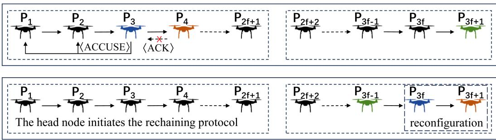

<details>
<summary>flowchart</summary>

```mermaid
graph LR
    subgraph_Top_1["P₁"] --> P2["P₂"] --> P3["P₃"] --> P4["P₄"] --> P2f+1["P₂f+1"]
    end
    
    subgraph_Bottom_1["P₁"] --> P2["P₂"] --> P3["P₃"] --> P4["P₄"] --> P2f+1["P₂f+1"]
    end
    
    P2 -->|ACCUSE| P3
    P3 -->|ACK| P4
    P4 -.-> P2f+1
    P2f+1 -.-> P3f-1["P₃f-1"] --> P3f["P₃f"] --> P3f+1["P₃f+1"]
    P2f+2["P₂f+2"] --> P3f-1["P₃f-1"] --> P3f["P₃f"] --> P3f+1["P₃f+1"]
    P2f+2 -.-> P3f-1
    P3f-1 -.-> P3f["P₃f"] --> P3f["reconfiguration"]
```
</details>

Fig. 4. Rechaining protocol example.

In the worst case, with $f$ malicious nodes, once half of the malifcious nodes are reconfigured, the remaining malicious nodes are moved into - without adversely affecting the consensus process.

# B. Preventing Timer-Based Attacks

In the ACBFT protocol, to ensure reliable message delivery and accurate fault detection, the system maintains specialized timers for critical messages such as ACK and CHAIN. These timers not only differentiate between message types but also assign distinct timeout values for each node in the chain. This approach enables the system to accurately capture and manage various delay or failure scenarios.

To further enhance robustness, ACBFT introduces a performance threshold timer $\Pi _ { i } ^ { t }$ that customizes a unique performance criterion for each $P _ { i }$ . This mechanism is designed to identify and discourage misbehaving nodes that consistently increase the overall system latency by delaying request processing close to the upper limit of the timeout value. By comparing i actual average processing delay with $\Pi _ { i } ^ { t }$ P, the system can quickly identify node exhibiting poor performance or unusual behavior.

Specifically, the system triggers the suspicion mechanism when a node’s average processing delay consistently exceeds its threshold Πti. This requires the node to self-reflect and potentially adjust its operations, and may also prompt it to question the performance of its successor. This mechanism of mutual monitoring and self-adjustment effectively thwarts performance attacks aimed at message delays, ensuring that only those nodes that truly impact the system’s efficiency are held accountable.

In summary, ACBFT enhances fault detection accuracy and bolsters defense against potential performance attacks through the use of diverse timers and performance threshold timers. This design allows ACBFT to maintain efficient, reliable, and secure operations in distributed systems.

# C. ACBFT Without Reconfiguration

In some special cases, the UAV network may be unable to use the reconfiguration scheme. Therefore, we propose an alternative scheme that operates without reconfiguration.

Currently, we focus on ACBFT5, a new version of ACBFT that eliminates the need for reconfiguration. Similar to BChain-5 [25] and Zyzzyva5 [24], ACBFT5 is designed to tolerant up to byzantine failures in a system with $N = 5 f + 1$ nodes. The f N fkey feature of this design is its ability to deploy an efficient rechaining protocol that accurately identifies and isolates malicious nodes without requiring reconfiguration, ensuring continuous and stable operation even in complex network environments.

TABLE I PARAMETERS OF SIMULATION 

<table><tr><td>Parameter</td><td>Default value</td></tr><tr><td>TX requests per second</td><td>1000</td></tr><tr><td>TX size</td><td>2 Kb</td></tr><tr><td>Network bandwidths</td><td>100 Mbps</td></tr><tr><td>Inertia weight  $W_{pso}$ </td><td>0.5</td></tr><tr><td>learning factors  $C_1$  and  $C_2$ </td><td>2</td></tr><tr><td>Baseline time  $\delta$ </td><td> $M * N/(M - N + 1)$  ms</td></tr></table>

The core concept of ACBFT5 is derived from the byzantine quorum protocols, which divide the node population into two main sets: Ω, serving as the core of the BFT and consisting of a carefully selected group of $3 f + 1$ nodes to maintain system stability and security, and ${ . } \mho ,$ f comprising the remaining 2 nodes, fwhich work in tandem with the Ω nodes to defend against potentially malicious behavior.

It is worth noting that ACBFT5 maintains a high degree of consistency with the original ACBFT in terms of messaging and processing flow. The core difference between the two schemes is primarily in the composition of the set Ω, which is enlarged to $3 f + 1$ nodes in ACBFT5. The rechaining protocol integrated finto ACBFT5 is identical to that of ACBFT, wherein it moves both the accusing and accused nodes to the end of the chain. The distinction is that ACBFT5 relocates them to $P _ { 5 f }$ and $P _ { 5 f + 1 }$ . Assuming accurate timer configuration and a fault-free header, it takes at most $f$ rechainings to move $f$ fault nodes to the set -. f fThis rechaining protocol ensures that ACBFT5 demonstrates superior stability and reliability despite the complexity and variability of the UAV network.

# VII. SIMULATION EXPERIMENTS

We conducted experimental evaluations using a laptop equipped with an Intel (R) Core (TM) i5-13500H CPU, 16 GB RAM, and running a 64-bit Windows operating system. The experiments were implemented in the simulation environment based on GOlang. The parameter settings in the simulation are shown in Table I, referring to our previous study [37], [38], [39]. We compare and evaluate the performance of ACBFT and ACBFT5 with protocols such as the classical PBFT protocol and the well-established chained BFT protocol BChain. The

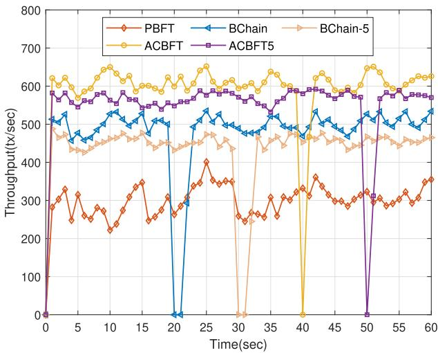

<details>
<summary>line</summary>

| Time(sec) | PBFT  | BChain | BChain-5 | ACBFT | ACBFT5 |
| --------- | ----- | ------ | -------- | ----- | ------ |
| 0         | 0     | 0      | 0        | 0     | 0      |
| 5         | 330   | 510    | 480      | 620   | 580    |
| 10        | 220   | 540    | 460      | 650   | 590    |
| 15        | 350   | 520    | 470      | 610   | 570    |
| 20        | 270   | 0      | 450      | 630   | 560    |
| 25        | 400   | 530    | 480      | 660   | 580    |
| 30        | 260   | 490    | 440      | 640   | 570    |
| 35        | 320   | 510    | 470      | 650   | 590    |
| 40        | 360   | 530    | 480      | 660   | 600    |
| 45        | 310   | 520    | 470      | 640   | 580    |
| 50        | 330   | 510    | 460      | 650   | 590    |
| 55        | 320   | 530    | 470      | 620   | 570    |
| 60        | 360   | 540    | 480      | 630   | 580    |
</details>

Fig. 5. Throughput with runtime for different protocols.

UAV network starts the mission without any malicious nodes, and byzantine nodes are introduced progressively as the mission progresses [40], [41].

Fig. 5 shows the throughput of the PBFT, BChain, and ACBFT protocols with 10 UAVs ( = 3), and the BChain-5 fand ACBFT5 protocols with 11 UAVs ( = 2), over a period fof 60 seconds. The results indicate that our proposed protocol achieves the highest throughput under normal operating conditions. The PBFT protocol has the lowest throughput because of its multiple rounds of broadcasting which consumes a lot of communication resources. Although BChain and BChain-5 reduce the communication complexity, their randomized chain order does not take into account the communication of UAV networks. ACBFT and ACBFT5 utilize the real-time topology of the UAV network to optimize the chain continuation, which reduces signal collisions and therefore achieves the highest throughput.

To further validate the effectiveness of the proposed protocol, we conducted performance tests under a simple crash scenario. Different failure injection times are used for each protocol to avoid confusion in the Fig. 5: PBFT experiences a crash failure at 10 seconds, BChain at 20 seconds, BChain-5 at 30 seconds, ACBFT at 40 seconds, and ACBFT5 at 50 seconds. PBFT shows no noticeable change in throughput, indicating stability in failure scenarios. In the chain-based protocol system, once a fault is encountered and successfully detected and recognized, the rechaining protocol is instantly initiated, which also directly leads to a temporary zero throughput. However, the chain-based protocols swiftly recover to a stable throughput level after reordering and optimizing the chain. The duration of the throughput drop is primarily affected by the fault detection timeout mechanism rather than the rechaining algorithm itself. In contrast, the ACBFT protocol, which considers the UAV network topology during chain renewal scheduling and employs a more optimized timing mechanism, achieves faster crash failure processing and minimizes throughput interruption.

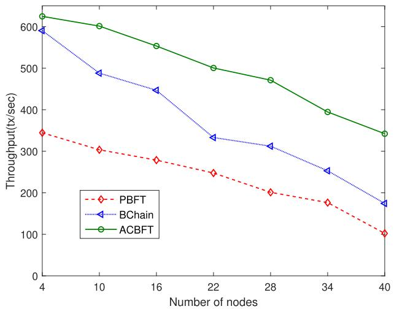

<details>
<summary>line</summary>

| Number of nodes | PBFT  | BChain | ACBFT |
| --------------- | ----- | ------ | ----- |
| 4               | 350   | 600    | 620   |
| 10              | 310   | 490    | 600   |
| 16              | 280   | 450    | 550   |
| 22              | 250   | 330    | 500   |
| 28              | 210   | 310    | 470   |
| 34              | 180   | 250    | 400   |
| 40              | 110   | 180    | 350   |
</details>

Fig. 6. Throughput for the different number of nodes.

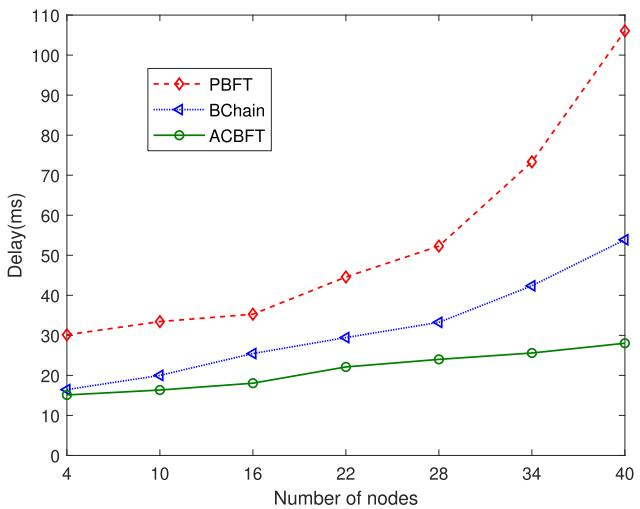

<details>
<summary>line</summary>

| Number of nodes | PBFT  | BChain | ACBFT |
| --------------- | ----- | ------ | ----- |
| 4               | 30    | 17     | 16    |
| 10              | 34    | 20     | 17    |
| 16              | 35    | 25     | 18    |
| 22              | 45    | 30     | 22    |
| 28              | 53    | 33     | 24    |
| 34              | 73    | 42     | 26    |
| 40              | 107   | 54     | 29    |
</details>

Fig. 7. Latency for the different number of nodes.

Fig. 6 illustrates the impact of the number of UAVs participating in the consensus on the throughput of each protocol. Considering different fault tolerances, we focus on protocols with $N = 3 f + 1$ . BChain exhibits throughput similar to ACBFT N fwhen the number of UAVs is low. With fewer nodes participating in the consensus, the performance difference between the PSObased chain ordering algorithm and the randomly generated chain order by BChain is not significant. As the number of nodes participating in the consensus increases, BChain’s randomized chain order leads to unstable performance, highlighting the superiority of the ACBFT protocol. When 40 nodes participate in the consensus, the throughput of ACBFT is nearly double that of BChain.

Fig. 7 shows the latency of each protocol with different numbers of UAVs participating in the consensus. It can be observed that the latency of chain-based protocols is lower than broadcast-based protocols (e,g, PBFT) in UAV networks. The primary reason is that the complexity of chain-based protocols during normal operation is lower than that of broadcast protocols: the complexity of PBFT is $O ( 2 n ^ { 2 } + 3 n ) = O ( n ^ { 2 } )$ , the complexity of BChain is $O ( \textstyle { \frac { 2 } { 9 } } n ^ { 2 } + \textstyle { \frac { 1 1 } { 9 } } n - \textstyle { \frac { 1 3 } { 9 } } ) = O ( n ^ { 2 } )$ , and the Ocomplexity of ACBFT is $O ( \frac { 4 } { 3 } n + \frac { 1 3 } { 3 } ) = O ( n )$ O n. Compared to O n O nBChain, ACBFT only requires chain synchronization messages to be passed between the head and tail nodes to the alternative chain nodes, resulting in lower complexity. However, this reduction in complexity slightly compromises the protocol’s security. We have also introduced a periodical query mechanism to handle this situation.

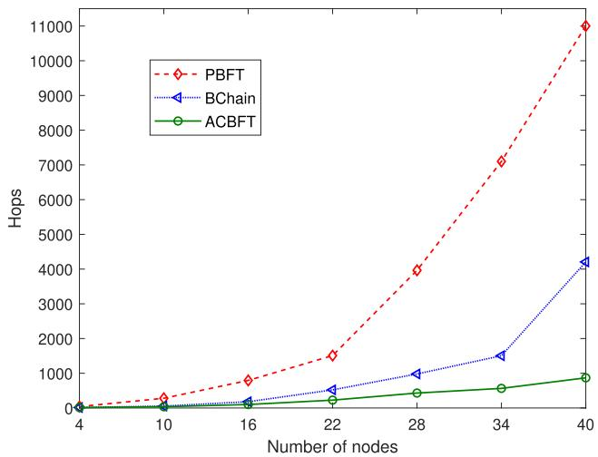

<details>
<summary>line</summary>

| Number of nodes | PBFT  | BChain | ACBFT |
| --------------- | ----- | ------ | ----- |
| 4               | 0     | 0      | 0     |
| 10              | 300   | 0      | 0     |
| 16              | 800   | 200    | 0     |
| 22              | 1500  | 500    | 200   |
| 28              | 4000  | 1000   | 400   |
| 34              | 7000  | 1500   | 600   |
| 40              | 11000 | 4200   | 900   |
</details>

Fig. 8. Hops for the different numbers of nodes.

Fig. 8 shows the number of hops required in one round of consensus formulation for each protocol as the number of UAVs involved in the consensus increases. One round of consensus hops counts the number of routing hops that all messages of the consensus protocol have passed through, mathematically expressed as the fitness value F, which visually reflects the status of the communication. The number of hops directly impacts latency and throughput [42]. Notably, the number of hops in ACBFT increases linearly and demonstrates better stability compared to other protocols. This linear increase helps ACBFT maintain consistent performance as the network scales, while other protocols may experience greater variability in hop count, leading to less stable performance.

Considering node changes, we conducted experiments with the node joining and exiting protocols. Fig. 9 shows the operation of the 4-node ACBFT protocol with a new node joining every 1.5 seconds. When the head node receives a JOIN message, it prioritizes it, temporarily halting the consensus process for transaction messages. As observed in Fig. 9, the processing time for a JOIN message is approximately 0.1 seconds, which is significantly faster than the processing time for a crash fault. This discrepancy arises because handling crash faults necessitates waiting for the timer to expire, whereas processing a JOIN message requires only that the chain nodes verify the message. This verification process is essentially equivalent to a round of consensus, leading to faster processing times. Fig. 10 illustrates the operation of the 10-node ACBFT protocol with a node exiting every 1.5 seconds. Similar to the handling of JOIN messages, when the head node receives an EXIT message, it prioritizes it, ensuring the immediacy of node joining and exiting. This approach ensures timely processing of the dynamically changing state of the UAV network, which aligns effectively with the characteristics of UAV ad hoc networks.

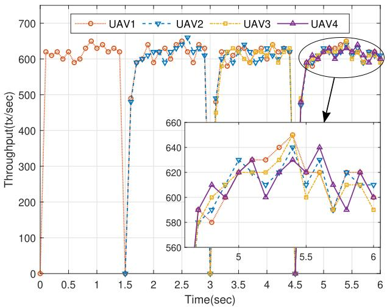

<details>
<summary>line</summary>

| Time(sec) | UAV1 | UAV2 | UAV3 | UAV4 |
| --------- | ---- | ---- | ---- | ---- |
| 0.0       | 620  | 0    | 0    | 0    |
| 0.5       | 610  | 0    | 0    | 0    |
| 1.0       | 630  | 0    | 0    | 0    |
| 1.5       | 620  | 0    | 0    | 0    |
| 2.0       | 610  | 600  | 600  | 600  |
| 2.5       | 620  | 650  | 620  | 620  |
| 3.0       | 610  | 580  | 580  | 580  |
| 3.5       | 620  | 630  | 630  | 630  |
| 4.0       | 610  | 620  | 620  | 620  |
| 4.5       | 620  | 590  | 590  | 590  |
| 5.0       | 630  | 640  | 640  | 640  |
| 5.5       | 620  | 630  | 630  | 630  |
| 6.0       | 610  | 620  | 620  | 620  |
</details>

Fig. 9. Throughput of nodes joining the consensus network.

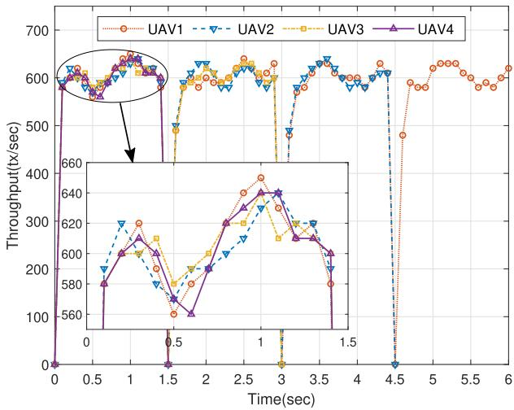

<details>
<summary>line</summary>

| Time(sec) | UAV1 | UAV2 | UAV3 | UAV4 |
| --------- | ---- | ---- | ---- | ---- |
| 0.0       | 600  | 600  | 600  | 600  |
| 0.5       | 600  | 600  | 600  | 600  |
| 1.0       | 650  | 650  | 650  | 650  |
| 1.5       | 600  | 600  | 600  | 600  |
| 2.0       | 600  | 600  | 600  | 600  |
| 2.5       | 650  | 650  | 650  | 650  |
| 3.0       | 600  | 600  | 600  | 600  |
| 3.5       | 650  | 650  | 650  | 650  |
| 4.0       | 600  | 600  | 600  | 600  |
| 4.5       | 480  | 480  | 480  | 480  |
| 5.0       | 650  | 650  | 650  | 650  |
| 5.5       | 650  | 650  | 650  | 650  |
| 6.0       | 650  | 650  | 650  | 650  |
</details>

Fig. 10. Throughput of nodes exiting the consensus network.

# VIII. CONCLUSION

Blockchain technology can effectively ensure the security of UAV networks. However, existing blockchain consensus protocols cannot be applied to UAV networks because of the resource-constrained and dynamically mobile characteristics of UAVs. In order to promote the further integration of blockchain technology and UAV networks, we propose the ACBFT protocol, which can operate in the complex and dynamic UAV network. The protocol leverages the PSO algorithm to optimize the chain consensus process based on the real-time state of the UAV network, thereby reducing communication overhead. In addition, we have designed the sub-protocol rechaining to identify and handle malicious nodes. Given the dynamic nature of UAV networks, the ACBFT protocol incorporates specialized sub-protocols designed to effectively manage the joining, exiting, and loss of nodes. We conducted a security and performance analysis of the ACBFT protocol, particularly focusing on its rechaining and timing mechanisms. Experimental results confirm that the ACBFT protocol enhances the system’s throughput and robustness. In future work, we will conduct extensive research on large-scale UAV networks and consider augmenting the ACBFT protocol with an integrated machine learning-based trust management system.

# REFERENCES

[1] G. Geraci et al., “What will the future of UAV cellular communications be? A flight from 5G to 6G,” IEEE Commun. Surveys Tuts., vol. 24, no. 3, pp. 1304–1335, Thirdquarter 2022.   
[2] M. Masuduzzaman, A. Islam, K. Sadia, and S. Y. Shin, “UAV-based MECassisted automated traffic management scheme using blockchain,” Future Gener. Comput. Syst., vol. 134, pp. 256–270, Sep. 2022.   
[3] R. Akter, M. Golam, V.-S. Doan, J.-M. Lee, and D.-S. Kim, “IoMT-Net: Blockchain-integrated unauthorized UAV localization using lightweight convolution neural network for Internet of Military Things,” IEEE Internet Things J., vol. 10, no. 8, pp. 6634–6651, Apr. 2023.   
[4] G. Li, B. He, Z. Wang, X. Cheng, and J. Chen, “Blockchain-enhanced spatiotemporal data aggregation for UAV-assisted wireless sensor networks,” IEEE Trans. Ind. Informat., vol. 18, no. 7, pp. 4520–4530, Jul. 2022.   
[5] Y. Tan, J. Liu, and N. Kato, “Blockchain-based lightweight authentication for resilient UAV communications: Architecture, scheme, and future directions,” IEEE Wireless Commun., vol. 29, no. 3, pp. 24–31, Jun. 2022.   
[6] Q. Tang, Z. Fei, J. Zheng, B. Li, L. Guo, and J. Wang, “Secure aerial computing: Convergence of mobile edge computing and blockchain for UAV networks,” IEEE Trans. Veh. Technol., vol. 71, no. 11, pp. 12073–12087, Nov. 2022.   
[7] D. Wang, Y. Jia, M. Dong, K. Ota, and L. Liang, “Blockchain-integrated UAV-assisted mobile edge computing: Trajectory planning and resource allocation,” IEEE Trans. Veh. Technol., vol. 73, no. 1, pp. 1263–1275, Jan. 2024.   
[8] X. Li, Y. Wang, P. Vijayakumar, D. He, N. Kumar, and J. Ma, “Blockchainbased mutual-healing group key distribution scheme in unmanned aerial vehicles ad-hoc network,” IEEE Trans. Veh. Technol., vol. 68, no. 11, pp. 11309–11322, Nov. 2019.   
[9] Y. Tan, J. Liu, and N. Kato, “Blockchain-based key management for heterogeneous flying ad hoc network,” IEEE Trans. Ind. Informat., vol. 17, no. 11, pp. 7629–7638, Nov. 2021.   
[10] C. Feng, B. Liu, Z. Guo, K. Yu, Z. Qin, and K.-K. R. Choo, “Blockchainbased cross-domain authentication for Intelligent 5G-enabled Internet of Drones,” IEEE Internet Things J., vol. 9, no. 8, pp. 6224–6238, Apr. 2022.   
[11] A. Tejasvi, C. Vinay, S. Nishad, and G. Mohsen, “Applications of blockchain in unmanned aerial vehicles: A review,” Veh. Commun., vol. 23, Jun. 2020, Art. no. 100249.   
[12] S. Biswas, K. Sharif, F. Li, S. Maharjan, S. P. Mohanty, and Y. Wang, “PoBT: A lightweight consensus algorithm for scalable IoT business blockchain,” IEEE Internet Things J., vol. 7, no. 3, pp. 2343–2355, Mar. 2020.   
[13] A. I. Ameur, O. S. Oubbati, A. Lakas, A. Rachedi, and M. B. Yagoubi, “Efficient vehicular data sharing using aerial P2P backbone,” IEEE Trans. Intell. Veh., early access, Jun. 13, 2024, doi: 10.1109/TIV.2024.3414140.   
[14] X. Wang, S. Duan, J. Clavin, and H. Zhang, “BFT in blockchains: From protocols to use cases,” ACM Comput. Surv., vol. 54, no. 10, pp. 1–37, Sep. 2022.   
[15] S. Aggarwal and N. Kumar, “A consortium blockchain-based energy trading for demand response management in Vehicle-to-Grid,” IEEE Trans. Veh. Technol., vol. 70, no. 9, pp. 9480–9494, Sep. 2021.   
[16] L. Kong, B. Chen, and F. Hu, “LAP-BFT: Lightweight asynchronous provable Byzantine fault-tolerant consensus mechanism for UAV network,” Drones, vol. 6, pp. 187–212, Jul. 2022.   
[17] M. Castro and B. Liskov, “Practical Byzantine fault tolerance,” in Proc. 3rd USENIX Symp. Operating Syst. Des. Implementation, New Orleans, LO, USA, Feb. 1999, pp. 173–186.

[18] M. Yin, D. Malkhi, M. K. Reiter, G. Golan-Gueta, and I. Abraham, “Hotstuff: BFT consensus with linearity and responsiveness,” in Proc. ACM Symp. Princ. Distrib. Comput., Toronto, ON, Canada, Jul. 2019, pp. 347–356.   
[19] B. Guo, Z. Lu, Q. Tang, J. Xu, and Z. Zhang, “Dumbo: Faster asynchronous BFT protocols,” in Proc. ACM SIGSAC Conf. Comput. Commun. Secur., New York, NY, USA, Nov. 2020, pp. 803–818.   
[20] S. Duan and H. Zhang, “Foundations of dynamic BFT,” in Proc. IEEE Symp. Secur. Privacy, San Francisco, CA, USA, May 2022, pp. 1317–1334.   
[21] M. Takai, J. Martin, and R. Bagrodia, “Effects of wireless physical layer modeling in mobile ad hoc networks,” in Proc. 2nd ACM Int. Symp. Mobile Ad Hoc Netw. Comput., New York, NY, USA, Nov. 2001, pp. 87–94.   
[22] M. Takai, J. Martin, R. Bagrodia, and A. Ren, “Directional virtual carrier sensing for directional antennas in mobile ad hoc networks,” in Proc. 3rd ACM Int. Symp. Mobile Ad Hoc Netw. Comput., New York, NY, USA, Jun. 2002, pp. 183–193.   
[23] R. van Renesse and F. B. Schneider, “Chain replication for supporting high throughput and availability,” in Proc. 6th Symp. Operating Syst. Des. Implementation, San Francisco, CA, USA, Dec. 2004, pp. 91–104.   
[24] R. Guerraoui, N. Knezevic, V. Quéma, and M. Vukolic, “The next 700 BFT protocols,” in Proc. Eur. Conf. Comput. Syst., Paris, France, Apr. 2010, pp. 363–376.   
[25] S. Duan, H. Meling, S. Peisert, and H. Zhang, “Bchain: Byzantine replication with high throughput and embedded reconfiguration,” in Proc. Int. Conf. Princ. Distrib. Syst., Cortina d’Ampezzo, Italy, Dec. 2014, pp. 91–106.   
[26] R. van Renesse, C. Ho, and N. Schiper, “Byzantine chain replication,” in Proc. Int. Conf. Princ. Distrib. Syst., Rome, Italy, Dec. 2012, pp. 345–359.   
[27] C. F. E. de Melo et al., “UAVouch: A secure identity and location validation scheme for UAV-networks,” IEEE Access, vol. 9, pp. 82930–82946, 2021.   
[28] C. Li, J. Zhang, X. Yang, and L. Youlong, “Lightweight blockchain consensus mechanism and storage optimization for resource-constrained IoT devices,” Inf. Process. Manage., vol. 58, no. 4, Jul. 2021, Art. no. 102602.   
[29] J. Fu, L. Zhang, L. Wang, and F. Li, “BCT: An efficient and fault tolerance blockchain consensus transform mechanism for IoT,” IEEE Internet Things J., vol. 10, no. 14, pp. 12055–12065, Jul. 2023 .   
[30] H. Guo, W. Li, and M. Nejad, “A hierarchical and location-aware consensus protocol for IoT-blockchain applications,” IEEE Trans. Netw. Service Manag., vol. 19, no. 3, pp. 2972–2986, Sep. 2022.   
[31] Z. Liao and S. Cheng, “RVC: A reputation and voting based blockchain consensus mechanism for edge computing-enabled IoT systems,” J. Netw. Comput. Appl., vol. 209, Jan. 2023, Art. no. 103510.   
[32] C. Ge, X. Ma, and Z. Liu, “A semi-autonomous distributed blockchainbased framework for UAVs system,” J. Syst. Archit., vol. 107, 2020, Art. no. 101728.   
[33] E. Regnath and S. Steinhorst, “CUBA: Chained unanimous byzantine agreement for decentralized platoon management,” in Proc. Des., Automat. Test Eur. Conf. Exhib., Florence, Italy, 2019, pp. 426–431.   
[34] C. Dwork, N. A. Lynch, and L. J. Stockmeyer, “Consensus in the presence of partial synchrony,” J. ACM, vol. 35, pp. 288–323, 1988.   
[35] L. Lamport, D. Malkhi, and L. Zhou, “Reconfiguring a state machine,” SIGACT News, vol. 41, no. 1, pp. 63–73, Mar. 2010.   
[36] K. Messaoudi, A. Baz, O. S. Oubbati, A. Rachedi, T. Bendouma, and M. Atiquzzaman, “UGV charging stations for UAV-assisted AoI-aware data collection,” IEEE Trans. Cogn. Commun. Netw., vol. 10, no. 6, pp. 2325–2343, Dec. 2024.   
[37] J. Wang, Z. Jiao, J. Chen, X. Hou, T. Yang, and D. Lan, “Blockchain-aided secure access control for UAV computing networks,” IEEE Trans. Netw. Sci. Eng., vol. 11, no. 6, pp. 5267–5279, Nov./Dec. 2024.   
[38] P. Ren, J. Wang, Z. Tong, J. Chen, P. Pan, and C. Jiang, “Federated learning via nonorthogonal multiple access for UAV-assisted Internet of Things,” IEEE Internet Things J., vol. 11, no. 17, pp. 27994–28006, Sep. 2024.   
[39] J. Chen, J. Wang, J. Wang, and L. Bai, “Joint fairness and efficiency optimization for CSMA/CA-based multi-user MIMO UAV ad hoc networks,” IEEE J. Sel. Topics Signal Process., vol. 18, no. 7, pp. 1311–1323, Oct. 2024.   
[40] N. Zhao et al., “UAV-assisted emergency networks in disasters,” IEEE Wireless Commun., vol. 26, no. 1, pp. 45–51, Feb. 2019.   
[41] X. Pang, M. Sheng, N. Zhao, J. Tang, D. Niyato, and K.-K. Wong, “When UAV meets IRS: Expanding air-ground networks via passive reflection,” IEEE Wireless Commun., vol. 28, no. 5, pp. 164–170, Oct. 2021.   
[42] T. Bouzid, N. Chaib, M. L. Bensaad, and O. S. Oubbati, “5 G network slicing with unmanned aerial vehicles: Taxonomy, survey, and future directions,” Trans. Emerg. Telecommun. Technol., vol. 34, no. 3, Dec. 2022, Art. no. e4721.


<details>
<summary>natural_image</summary>

Portrait of a man wearing glasses and formal attire against a blue background (no text or symbols visible)
</details>

Jingjing Wang ( Senior Member, IEEE) received the B.Sc. (Hons.) degree in electronic information engineering from the Dalian University of Technology, Liaoning, China, in 2014, and the Ph.D. (Hons.) degree in information and communication engineering from Tsinghua University, Beijing, China, in 2019. From 2017 to 2018, he visited the next generation wireless group chaired by Prof. Lajos Hanzo with the University of Southampton, Southampton, U.K. He is currently a Professor with the School of Cyber Science and Technology, Beihang University, Beijing, and also a Researcher with Hangzhou Innovation Institute, Beihang University, Hangzhou, China. He has authored or coauthored more than 100 IEEE Journal/Conference papers. His research interests include AI enhanced next-generation wireless networks, UAV networking, and swarm intelligence. He is the Editor of IEEE TRANSACTIONS ON VEHICULAR TECHNOLOGY, IEEE INTERNET OF THINGS JOURNAL, and IEEE WIRELESS COMMUNICATIONS LET-TER. Dr. Wang was the recipient of the Best Journal Paper Award of IEEE ComSoc Technical Committee on Green Communications & Computing, Best Paper Award of the IEEE ICC and the IEEE IWCMC.


<details>
<summary>natural_image</summary>

Portrait photo of a woman with long dark hair wearing a light blue collared shirt and white top against a solid blue background (no text or symbols visible)
</details>

Zihan Jiao (Graduate Student Member, IEEE) received the B.S. degree in information security from Beihang University, Beijing, China, in 2023, where she is currently working toward the M.S. degree with the School of Cyber Science and Technology. Her research interests include uncrewed aerial vehicle network security and blockchain technology.


<details>
<summary>natural_image</summary>

Portrait photo of a man in formal attire (no text or symbols visible)
</details>

Mengyuan Zhang received the B.Eng. degree in information engineering from Zhejiang University, Hangzhou, China, in 2011, the M.S. degree from the School of Photovoltaic and Renewable Energy Engineering, University of New South Wales, Sydney, NSW, Australia, in 2012, and the Ph.D. degree in control science and engineering from Zhejiang University, in 2020. From 2012 to 2016, he was a Research Assistant with Arizona State University, Tempe, AZ, USA. From 2020 to 2023, he was a Senior Algorithm Engineer with the DAMO Academy of Alibaba Group, Hangzhou. His current research focuses on AI empowered protocol design and privacy protection in space-air-ground-integrated networks and 6G Networks. He was the recipient of the Best Paper Award at IEEE ICCC 2024. He was the Symposium Co-Chair for the IEEE WCSP 2024.


<details>
<summary>natural_image</summary>

Portrait of a young man wearing glasses against a blue background (no text or symbols visible)
</details>

Jiaxing Wang received the B.S. and M.E. degrees from Zhengzhou University, Henan, China, in 2023. He is currently working toward the Ph.D. degree with the School of Cyber Science and Technology, Beihang University, Beijing, China. His research interests include blockchain, consensus algorithm, and UAV networking.


<details>
<summary>natural_image</summary>

Portrait of a man wearing glasses and a suit (no text or symbols visible)
</details>

Chunxiao Jiang (Fellow, IEEE) received the B.S. (Hons.) degree in information engineering from Beihang University, Beijing, China, in 2008, and the Ph.D. (Hons.) degree in electronic engineering from Tsinghua University, Beijing, in 2013 . From 2011 to 2012 (as a Joint Ph.D) and 2013 to 2016 (as a Postdoc), he was with the Department of Electrical and Computer Engineering, University of Maryland College Park, College Park, MD, USA, under the supervision of Prof. K. J. Ray Liu. He is currently an Associate Professor with the School of Information

Science and Technology, Tsinghua University. His research interests include application of game theory, optimization, and statistical theories to communication, networking, and resource allocation problems, in particular space networks and heterogeneous networks. Dr. Jiang was the Editor of IEEE TRANSACTIONS ON COMMUNICATIONS, IEEE INTERNET OF THINGS JOURNAL, IEEE WIRELESS COMMUNICATIONS, IEEE TRANSACTIONS ON NETWORK SCIENCE AND ENGI-NEERING, IEEE NETWORK, IEEE COMMUNICATIONS LETTERS, and the Guest Editor of IEEE Communications Magazine, IEEE TRANSACTIONS ON NETWORK SCIENCE AND ENGINEERING and IEEE TRANSACTIONS ON COGNITIVE COM-MUNICATIONS AND NETWORKING. He was a member of the technical program committee and the Symposium Chair for a number of international conferences. He was the recipient of the Best Paper Award from IEEE GLOBECOM in 2013, IEEE Communications Society Young Author Best Paper Award in 2017, Best Paper Award from ICC 2019, IEEE VTS Early Career Award 2020, IEEE ComSoc Asia-Pacific Best Young Researcher Award 2020, IEEE VTS Distinguished Lecturer 2021, and IEEE ComSoc Best Young Professional Award in Academia 2021.


<details>
<summary>natural_image</summary>

Portrait photo of a young man with short black hair wearing a dark shirt (no text or symbols visible)
</details>

Ziheng Tong received the B.S. degree in telecommunication engineering from Xidian University, Xi’an, China, in 2021. He is currently working toward the Ph.D. degree from the School of Cyber Science and Technology, Beihang University, Beijing, China. He is also with Hangzhou Innovation Institute, Beihang University, Hangzhou, Zhejiang, China. His research interests include cyberspace security, edge AI, and blockchain.