# AIM: Angle-of-Radiation-Based Deployment of UAV Relays for Connectivity in 3D Environments

Kuang-Hui Huang , Graduate Student Member, IEEE, Fang-Jing Wu , Member, IEEE, Yu-Yu Chen , and Ai-Chun Pang , Fellow, IEEE

Abstract—With mobility and flexibility in non-terrestrial environments, unmanned aerial vehicles (UAVs) have shown the potential for emerging applications, such as remote surveillance and mobile base stations. This work raises the emerging need to chain UAV relays in support of on-demand connectivity to faraway users. However, the ideal isotropic antennas are too simplified to ensure connectivity among UAVs. Since antennas used in realistic communication systems including UAVs are non-isotropic, and the angle of radiations (AoR) between a pair of transmitter and receiver significantly influences received signal strengths (RSSs). Therefore, this work takes the AoR into account to deploy UAV relays in a 3D environment. Not only positions but also the headings of UAVs are modeled in the AoR-based deployment problem to minimize the number of UAVs in the relay chain, while the end-to-end RSSs are guaranteed. We prove the NP-hardness of the AoRbased deployment problem. Then, the Angle-of- Radiation-based Deployment (AIM) algorithm is proposed to solve the problem. The extensive simulation results show that the AIM algorithm reduces the number of UAVs used in the relay chain by 59.6% compared to the baselines when the heading of each UAV is well-adjusted. Also, the proposed AIM algorithm outperforms the baselines by 61.2% in terms of the average number of UAVs and demonstrates adaptability to various terrains.

Index Terms—Unmanned aerial vehicle (UAV), UAV-to-UAV communications, relay chain, angle of radiation.

Received 20 November 2024; revised 29 September 2025; accepted 30 October 2025. Date of publication 10 November 2025; date of current version 6 March 2026. The work of Ai-Chun Pang was supported in part by the National Science and Technology Council (NSTC) under Grant NSTC 114-2221-E-001- 012-MY3, in part by National Taiwan University under Grant 114L900903, and in part by Hon Hai Research Institute (HHRI) under Grant 32X-1140611-1C. The work of Fang-Jing Wu was supported in part by the National Science and Technology Council (NSTC), Taiwan under Grant NSTC 113-2222-E-002- 001-MY3, Grant NSTC 113-2221-E-002-202-, and Grant NSTC 113-2634- F-002-001-MBK, in part by the Ministry of Education (MOE) in Taiwan under the Yushan Fellow Program under Grant NTU-112V1030-1, Grant NTU-113V1030-2, and Grant 114V1030-3, in part by the NTU Core Consortiums and Competitiveness Programs under Grant NTU-CC-114L894703, in part by MOE under Grant 114M7036, and in part by Deutsche Forschungsgemeinschaft (DFG, German Research Foundation) under Grant 511568981. Recommended for acceptance by M. Ozger. (Corresponding author: Ai-Chun Pang.)

Digital Object Identifier 10.1109/TMC.2025.3630751

## I. INTRODUCTION

ECENTLY, unmanned aerial vehicles (UAVs) have shown non-terrestrial networks. UAVs can act as aerial relays [1] to extend communication coverage over wide and hard-to-reach areas, providing reliable line-of-sight (LoS) connectivity at different altitudes [2]. UAV-based platforms to maintain network connectivity in challenging environments have been demonstrated by several mobile operators, e.g., Nokia [3], Virgin [4], and AT&T [5]. Therefore, emerging applications, e.g., searchand-rescue (SAR) missions for post-disaster recovery, to enhance public safety are widely considered, where UAVs are deployed to relay real-time information in case of no connectivity offered by the terrestrial networks. Although a single UAV can carry information between two positions [6], this approach is insufficient for conveying real-time data, e.g., live video or voice streaming. Hence, deploying a UAV relay chain is more efficient to convey real-time data through the UAV-to-UAV (U2U) communications.

However, there are some unique challenges to deploy a UAV relay chain. First, end-to-end and on-demand connectivity guarantee is critical to fulfill requirements of application types. Although the received signal strength (RSS) for a wireless link is a well-recognized performance indicator in 3GPP [7] and IEEE Standard 802.11-2020 [8], ensuring the RSS between each pair of UAVs to meet the application requirement is necessary. For example, the minimum RSS on each UAV link for VoIP/Video applications [9] must be achieved in order to provide seamless communications requested by long-distance clients in emergencies. Second, adaptation to practical antenna models is an important key to form a well-connected relay chain. Practically, RSSs are highly relevant to the radiation patterns depending on the types of antennas. Although an isotropic antenna, an ideal antenna radiating evenly in all directions, is theoretically assumed in many communication systems, antennas practically used in communication systems including UAVs are non-isotropic antennas, e.g., half-wavelength dipole antennas. Therefore, the radiation pattern is not perfectly omnidirectional, resulting in unequal received signal strength (RSS) values depending on the angle of radiation (AoR) between the transmitter and the receiver. Given the positions of the transmitter and the receiver, the AoR between them can be determined. Furthermore, when deploying two UAVs as a communication pair, the their headings influence the AoR. In this context, the term “heading” refers to the direction in which the front of a UAV faces [10]. Since UAVs possess the capability to hover at a fixed position with varying headings, one can adjust the optimal heading to establish a connection between two UAVs. Aligning the angles of radiation between the chained UAVs as much as possible is a critical issue for ensuring acceptable RSS. In other words, AoR must be taken into account to minimize the number of UAVs in the relay chain, while the RSSs among UAVs are ensured. Third, a deployment to rapidly establish on-demand connectivity is challenging. The clients locating at any two positions in a 3D environment may request for connectivity in real-time applications. The time complexity of deployment algorithms must be bounded in support of such dynamic and real-time demands.

To address the aforementioned challenges, this work formulates the AoR-based deployment problem. Given the positions and headings of two client devices (e.g., UAVs or mobile platforms), the goal of the work is to minimize the number of in-between UAVs in the relay chain, while the RSS of each link is not smaller than a predefined threshold. Assume that not only the positions but also the headings of the source and destination are known in advance due to the communication limitations on the ground arising from some obstacles. We prove that the AoR-based deployment problem is NP-hard. To find the positions and headings for the intermediate UAVs in the relay chain, the Angle-of- Radiation-based Deployment (AIM) algorithm is designed to solve the AoR-based deployment problem. The key idea of the AIM algorithm is to recursively refine the reachability for each candidate pair of position and heading, so-called an operational state of a UAV. Based on the reachability of candidate operational states, a solution is found reversely from the destination to the source clients. The costs in time complexity and space complexity of the AIM algorithm are analyzed. This work makes the following unique contributions.

\- On-demand connectivity to faraway users are raised in the work beyond the traditional usages of UAVs in terrestrial networks. In contrast to UAV swarms, data mules, and backhaul networks, this work points out the emerging need to chain UAV relays in support of real-time demands.

\- AoR-based design to deploy UAVs is pointed out. In this work, the importance of AoR in end-to-end communication pairs is identified. Not only the RSSs in communication links but also the end-to-end RSSs over the entire chained UAVs are critical for real-time demands. To ensure the quality of end-to-end connectivity, AoR must be taken into account. This work exploits UAVs’ adjustable headings to optimize the alignment of radiation patterns between communication pairs, reducing weak RSS caused by AoR misalignment.

Theoretical foundations of AoR-based deployment are studied. Not only positions but also heading alignments of UAVs are formulated to study how the angles of radiation affect the U2U connectivity over the UAV relay chain. Furthermore, the NP-hardness of the AoR-based deployment problem is proven.

\- The AIM algorithm is proposed to deploy UAV relays in the 3D environment. The novelty of the AIM algorithm lies in efficiently incorporating both position and heading selection on a graph-based search. So, the positions and headings of UAVs in the relay chain are simultaneously optimized. Note that performing a local link search to guarantee end-to-end connectivity, rather than a global search over the entire graph, ensures the efficiency of the algorithm. Extensive simulation results indicate that the AIM algorithm effectively reduces the number of UAVs used in the relay chain by 59.6% compared to the baseline approaches.

The rest of this work is organized as follows. Section II reviews the related work. In Section III, the system model and the AoR-based deployment problem are formulated. The NPhardness of the AoR-based deployment problem in Section IV. Then, the proposed AIM algorithm is explained in Section V. In Section VI, comprehensive simulation results are presented. Finally, Section VII concludes the work.

## II. RELATED WORK

Using UAV relays to enhance the end-to-end communication performance generally focuses on two research issues: UAV deployment and connectivity enhancement between UAVs. The former is to find the positions to place UAVs for relaying information, and the latter is to improve the quality of communication links between UAVs.

The UAV deployment issue is addressed to enhance communication performance from different perspectives, e.g., link establishment, throughput, power consumption, and selfconfiguration. The work in [11] proposed a geometry-based placement method to establish line-of-sight (LoS) link between the UAV and ground users. The work in [12] maximized endto-end throughput by optimizing the trajectory and power allocation of relays. To establish the connectivity for ground users in disaster area, the authors in [13] tried to maximize the throughput of UAV networks with limited service capability of UAVs, and the hardware heterogeneity of UAVs was further considered in [14]. When deploying a multi-UAV backhaul network for ground users, [15] minimized the number of UAVs used. The trade-off between the network throughput and the energy expense when deploying a swarm of UAVs is discussed in [16]. The concept of virtual force is used in [17], [18] to guide movements of UAVs for forming a network. However, the aforementioned research efforts simplify connectivity model to distances between UAVs, which cannot precisely reflect the quality of communication links. Although an isotropic antenna is assumed in theoretical models [19], it is not realizable in practice. Practically, when non-isotropic antennas, e.g., halfwavelength dipole antennas, are adopted, it is necessary to carefully consider the angles of radiation between the transmitter and the receiver to model the connectivity.

To investigate the quality of connectivity links between UAVs, [20], [21] conducted experiments on commercial UAVs equipped with dipole antennas to analyze the link performance affected by the antenna orientation, placement, and multi-path fading. Based on the observed radiation patterns of antennas, the impact of antenna patterns on air-to-air [22] or air-to-ground [23] connectivity is analyzed. On the other hand, [24] proposed a scheme to mitigate the interference according to the radiation patterns. The characteristics of dipole antennas are considered in [25] to decide the optimal wake-up timings for UAVs to collect data based on the deep reinforcement learning. Both the signal propagation and antenna patterns are taken into account to minimize the number of relays in a UAV swarm, while the air-to-ground connectivity is ensured. However, the existing work does not take the angle-of-radiation-based communication model to deploy a UAV relay chain. Alongside positions of UAVs, link quality between UAVs is crucial to improve the end-to-end communication performance in the relay chain. While [26] designed a reinforcement-learning-based approach to address beam misalignment caused by wind disturbances, how radiation angles influence the required number of UAVs in a relay chain remains an open research question. Hence, the key technical breakthrough of this work lies in optimizing the number of UAVs in a relay chain through the optimization of radiation angles.

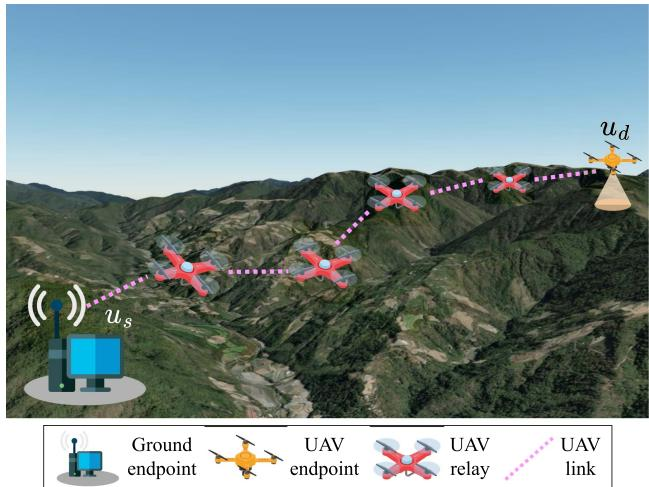  
Fig. 1. The system overview.

## III. AOR-BASED DEPLOYMENT PROBLEM

## A. The Model of Operational Environment

We consider a given 3D operational area. The 3D operational area is divided into fixed-size grids, denoted by $\Omega =$ $\{ g _ { 1 } , g _ { 2 } , \ldots \}$ , where $g _ { i } = ( x _ { i } , y _ { i } , z _ { i } )$ is the 3D coordinate of the ith grid’s center. Each grid has a size of δ, which is larger than the minimal distance between UAVs for safety concern. Each grid is assigned a binary value to indicate if a grid is allowed to deploy a UAV. If there is no obstacle (e.g., terrains or buildings) on $g _ { i } ,$ $O ( g _ { i } ) = 1$ is assigned, where $g _ { i }$ is called “feasible position” for a ( ) = 1UAV. Otherwise, $O ( g _ { i } ) = 0$ indicates that it is not feasible to deploy a UAV at this position due to obstacles. So, the set of feasible positions for deploying UAVs is defined by $\mathcal { P } = \{ p _ { i } | O ( p _ { i } ) =$ $1 , p _ { i } \in \Omega \}$ . Let $\mathcal { H } = \{ h _ { 1 } , h _ { 2 } , . . . \}$ = ( ) =denote the set of optional headings for a UAV. Therefore, a set of AoR-based options for deploying UAVs is defined by $\mathcal { U } = \{ ( p _ { i } , h _ { j } ) | p _ { i } \in \mathcal { P } , h _ { j } \in \mathcal { H } \}$ where each pair $( p _ { i } , h _ { j } )$ specifically indicates the “operational state” of a UAV at $p _ { i }$ heading to $h _ { j }$ . When UAV k is deployed, let $u _ { k } = ( l _ { k } , r _ { k } ) \in \mathcal { U }$ denote its operational state, where $l _ { k } \in \mathcal { P }$ is its position and $r _ { k } \in \mathcal { H }$ is its operational heading. Fig. 1 shows an overview of the system. Given the operational states of the source and destination UAVs, denoted by $u _ { s } = ( l _ { s } , r _ { s } )$ and $u _ { d } = ( l _ { d } , r _ { d } ) , u _ { s } , u _ { d } \notin \mathcal { U }$ = ( ), the goal of AoR-based deployment problem is to find a sequence of operational states from U for UAVs that forms a relay chain to convey data from the source to destination such that the number of chained UAVs is minimized. For the readers’ convenience, the variables are listed in Table I.

TABLE I NOTATION TABLE
<table><tr><td>Notation</td><td>Definition</td></tr><tr><td> $\underline { { \Omega = \{ g _ { 1 } , g _ { 2 } , \ldots , g _ { i } \} } }$ </td><td>The set of grids that forms the 3D area.</td></tr><tr><td> $\mathcal { P } = \{ p _ { 1 } , p _ { 2 } , . . . , p _ { i } \}$ </td><td>The set of feasible positions.</td></tr><tr><td> $\overline { { \mathcal { H } = \{ h _ { 1 } , h _ { 2 } , \dots , h _ { j } \} } }$ </td><td>The set of optional headings.</td></tr><tr><td>U</td><td>The set of AoR-based deployment op- tions.</td></tr><tr><td> $\overline { { u _ { k } = ( l _ { k } , r _ { k } ) } }$ </td><td>The operational state of UAV k.</td></tr><tr><td> $u _ { s } , u _ { d }$ </td><td>The operational states of the source and the destination.</td></tr><tr><td> $A ( \Theta )$ </td><td>The gain of antenna with a given angle  $\Theta = \bar { ( } \psi , \phi )$ </td></tr><tr><td> $\overline { { \psi , \phi } }$ </td><td>The vertical and horizontal angle.</td></tr><tr><td> $\overline { { \Upsilon ( \boldsymbol { u } _ { k } , \boldsymbol { u } _ { k ^ { \prime } } ) } }$ </td><td>The RSS between uk and uk′ .</td></tr><tr><td>γ</td><td>The threshold of RSSs.</td></tr><tr><td> $\overline { { G ( V , E ) } }$ </td><td>The AoR-based graph.</td></tr><tr><td> $\overline { { M ( \overline { { v } } _ { i } ) } }$ </td><td>The reachability of operational sate vi.</td></tr><tr><td> $\overline { { \pi ( \overline { { v } } _ { i } ) } }$ </td><td>The predecessor of vi.</td></tr><tr><td> $\overline { { N _ { \mathrm { A o R } } ( \overline { { v } } _ { i } ) } }$ </td><td>The set of AoR-based local connectivity.</td></tr><tr><td> $\eta _ { \mathrm { m i n } } ( \overline { { v } } _ { i } )$ </td><td>The minimal value of reachability in  $N _ { \mathrm { A o R } } ( \overline { { v } } _ { i } )$ </td></tr><tr><td> $\mu _ { \mathrm { m i n } } ( v ^ { \prime } )$ </td><td>The bottleneck link with mininum RSS</td></tr><tr><td>R</td><td>from us to v′. The resultant relay chain.</td></tr></table>

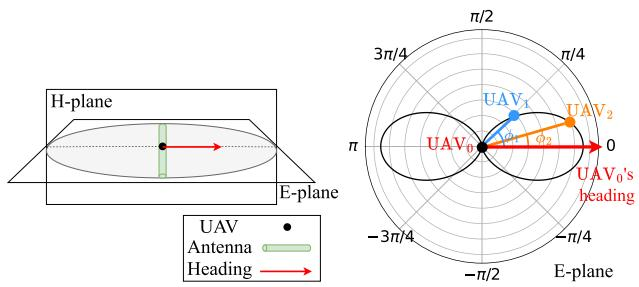  
Fig. 2. (a) Antenna deployment of a UAV; (b) Antenna gain from different angle of radiation.

## B. Communication Model

1) Antennas and Angle of Radiation: In this work, each UAV is equipped with the same kind of antenna. Generally, the radiation model of an antenna can be known from its technical specifications. Given a radiation model, the antenna gain between a communication pair takes the gains of transmitting antenna and receiving antenna into account based on the Friis transmission equation [27]. Among the transmitter and receiver pairs, each operational state $( p _ { i } , h _ { j } )$ of them creates a particular angle of radiation (AOR). For instance, Fig. 2 depicts a dipole antenna and its radiation pattern when the antenna is mounted on a UAV horizontally. The E-plane of the antenna is parallel to the ground, and the H-plane is perpendicular to the E-plane, as illustrated in Fig. 2(a). Let the heading of $\mathrm { U A V _ { \mathrm { 0 } } }$ be in the same direction of the line intersected by the E-plane and H-plane. When receiving signals from $\mathrm { U A V _ { 0 } }$ at the same horizontal plane, $\mathrm { U A V _ { 2 } }$ with $\phi _ { 2 }$ will receive a higher gain than $\mathrm { U A V _ { 1 } }$ with $\phi _ { 1 }$ due to the non-isotropic radiation of a dipole antenna, as shown in Fig. 2(b). Nest, let us consider a more general deployment in a 3D space. The deployed altitude of UAVs can vary due to terrain or obstacles. Therefore, the AoR along the vertical direction should also be considered as well. Taking into account the angles in the 3D environment, the antenna gain of an antenna can be described as follows. The gain of transmitting antenna, denoted by $A ( \Theta _ { \mathrm { t x } } )$ depends on the transmitting angle, where $\Theta _ { \mathrm { t x } } = \left( \psi _ { \mathrm { t x } } , \phi _ { \mathrm { t x } } \right)$ (Θ ). Here, $\psi _ { \mathrm { t x } }$ Θ = ( )is the angle between the vector from the transmitter to the receiver and the projection of the vector itself, and $\phi _ { \mathrm { r x } }$ is the angle between the transmitting antenna and the projection of the vector on xy-plane. The $\psi _ { \mathrm { r x } }$ is arising from the difference in their heights, whereas the $\phi _ { \mathrm { t x } }$ is arising from the orientation of transmitting antenna. Similarly, the gain of receiving antenna $A ( \Theta _ { \mathrm { r x } } )$ is computed based on the 3D coordinate system of the receiver. Non-zero values of $\Theta _ { \mathrm { t x } }$ and $\Theta _ { \mathrm { r x } }$ lead to out of alignment between their AoRs in their heading directions. Fig. 3 shows an example of three UAVs at different operational states with different positions and headings, where $\mathrm { U A V _ { 0 } }$ is the transmitter and both $\mathrm { U A V _ { 1 } }$ and $\mathrm { U A V _ { 2 } }$ are receivers. Since $\mathrm { U A V _ { 2 } }$ has a different height from $\mathrm { U A V _ { 0 } }$ , the antenna gain are affected by both $\psi _ { \mathrm { t x } }$ in vertical and $\phi _ { \mathrm { t x } }$ in horizontal. The receiving angles for $\mathrm { U A V _ { 2 } }$ are now shown here. Since $\mathrm { U A V _ { 0 } }$ and $\mathrm { U A V _ { 1 } }$ are on the same plane, i.e., the xy-plane, the gain of the transmitting antenna is $\Theta _ { \mathrm { t x } } ^ { \prime } = ( 0 , \phi _ { \mathrm { t x } } ^ { \prime } )$ and the gain of receiving antenna is $\Theta _ { \mathrm { r x } } ^ { \prime } = ( 0 , \phi _ { \mathrm { r x } } ^ { \prime } )$

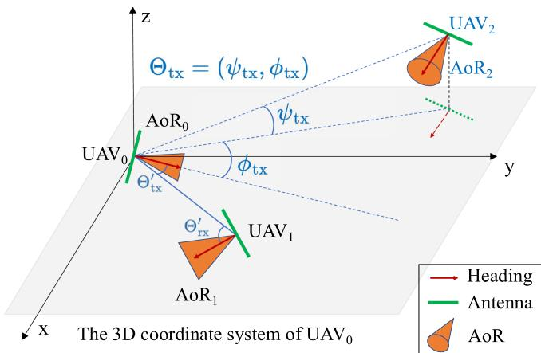  
Fig. 3. The coordinate system of the transmitter UAV0.

2) Connectivity Model: For a given communication pair of UAVs, the received signal strength (RSS) depends not only on the distance between them but also on the alignment of their antennas’ AoR. If the AoR of the transmitter perfectly aligns with the AoR of the receiver, the RSSs are higher. Therefore, we model the connectivity between a communication pair according to their AoR-based RSSs. Let $u _ { k } = ( l _ { k } , r _ { k } ) \in \mathcal { U }$ and $u _ { k ^ { \prime } } =$ $( l _ { k ^ { \prime } } , r _ { k ^ { \prime } } ) \in \mathcal { U }$ denote the operational states of a communication pair of UAVs, where ${ \mathit { l } } _ { k } \neq { \mathit { l } } _ { k ^ { \prime } }$ . So, the AoR for transmission arising from $u _ { k }$ and the AoR for reception arising from $u _ { k ^ { \prime } }$ are different. The connectivity between them is defined by the RSS

of the communication pair,

$$
\Upsilon ( u _ { k } , u _ { k ^ { \prime } } ) = \lambda + A ( \Theta _ { \mathrm { t x } } ) + A ( \Theta _ { \mathrm { r x } } ) - L ( D ( l _ { k } , l _ { k ^ { \prime } } ) , f ) ,\tag{1}
$$

where λ is the transmission power of all UAVs and $L ( D ( l _ { k } , l _ { k ^ { \prime } } ) , f )$ is the path loss over the carrier frequency f (in GHz). Here, the antenna gains of transmission and reception, i.e., $A ( \Theta _ { \mathrm { t x } } )$ and $A ( \Theta _ { \mathrm { r x } } )$ , are both taken into account. Note that not only the receiving angle but also the transmitting angle affects the RSS among them. Practically, since RSS is influenced by multiple factors, such as line-of-sight (LoS)/non-line-of-sight (NLoS), headings, and distances, it can serve as an important indicator for evaluating connectivity. The path loss is computed based on a free-space path loss (in decibels) for signal propagation [21], [28], [29], as follows.

$$
L ( D ( l _ { k } , l _ { k ^ { \prime } } ) , f ) = 2 0 \log _ { 1 0 } D ( l _ { k } , l _ { k ^ { \prime } } ) + 2 0 \log _ { 1 0 } f + 9 2 . 4 5\tag{2}
$$

where $D ( l _ { k } , l _ { k ^ { \prime } } )$ is the 3D euclidean distance (in kilometers) between the corresponding positions $l _ { k }$ and ${ { l } _ { k ^ { \prime } } }$ . Since the map is known, practically, we can check the link between the two positions $l _ { k }$ and ${ { l } _ { k ^ { \prime } } }$ to differentiate LoS links in free space from NLoS links. If the link is NLoS, the NLoS model [29] can be applied instead for precise estimation. All deployed UAVs are assumed to hover at fixed operational states, and thus the Doppler effect resulting from mobility is negligible in this context. Note that the signal-to-interference-plus-noise ratio (SINR) can be used as an alternative indicator when interference and noise are considered.

## C. Problem Statement

Given the set of operational states U for UAVs and the pair of operational states $u _ { s }$ and $u _ { d }$ for the source and the destination, we can model a graph, denoted by $G = ( V , E )$ , for deploying UAVs, where $V = \{ v _ { 1 } , v _ { 2 } , \ldots , v _ { | \mathcal { U } | } \} \cup \{ u _ { s } , u _ { d } \}$ is the set of =vertices, and E is the set of edges. In addition to $u _ { s }$ and $u _ { d } .$ each operational state in U defines a vertex in V . Specifically, each $v _ { i } = \left( q _ { i } , a _ { i } \right)$ is defined if $( q _ { i } , a _ { i } ) \in \mathcal { U }$ . The weighted edge between any pair of $v _ { i }$ and $v _ { j }$ in $V - \{ u _ { s } , u _ { d } \}$ is defined by

$$
e ( v _ { i } , v _ { j } ) = \Upsilon ( v _ { i } , v _ { j } ) , \mathrm { i f } q _ { i } \neq q _ { j } \mathrm { a n d } \Upsilon ( v _ { i } , v _ { j } ) \geq \gamma .\tag{3}
$$

Here, if UAV i and UAV j are deployed at two different positions, $q _ { i }$ and $q _ { j }$ , and the RSS between them is not smaller than a predefined threshold of $\gamma .$ , their connectivity is defined based on (1). Otherwise, there is no edge between them since neither operating at the same position nor directly connecting with each other is possible. Similarly, E contains the weighted edges $e ( u _ { s } , v _ { i } )$ and $e ( v _ { i } , u _ { d } ) , v _ { i } \in V - \{ u _ { s } , u _ { d } \}$ , based on (3). The AoR-based deployment problem is to find an optimal sequence of $R = ( u _ { s } , v _ { 1 } ^ { * } , v _ { 2 } ^ { * } , \ldots , u _ { d } ) , v _ { i } ^ { * } \in V - \{ u _ { s } , u _ { d } \}$ such that $| R |$ is minimized subject to constraints on AoR-based connectivity. Note that the number of operational states for UAVs in $R ,$ including $u _ { s }$ and $u _ { d } , \mathrm { i } . \mathrm { e } . , | R |$ , implies the number of UAVs in the relay chain. Practically, the devices operating at $u _ { s }$ and $u _ { d }$ could be either mobile platforms or UAVs for interaction with users. The optimization problem is formally formulated as follows.

Definition 1: Given a connected graph $G = ( V , E )$ $u _ { s } .$ $u _ { d } .$ and a predefined threshold of $\gamma$ for connectivity, the AoR-based deployment problem is to find a sequence of $R =$ $( u _ { s } , v _ { 1 } ^ { * } , v _ { 2 } ^ { * } , \ldots , u _ { d } ) , v _ { i } ^ { * } \in V - \{ u _ { s } , u _ { d } \}$ such that

$$
R = \underset { \widetilde { R } = ( u _ { s } , \widetilde { v } _ { 1 } , \widetilde { v } _ { 2 } , \ldots , u _ { d } ) } { \mathrm { a r g m i n } } | \widetilde { R } | ,\tag{4}
$$

subject to:

$$
\widetilde { q } _ { i } \neq \widetilde { q } _ { j } , \widetilde { v } _ { i } , \widetilde { v } _ { j } \in \widetilde { R } ,\tag{5a}
$$

$$
e ( \widetilde v _ { i } , \widetilde v _ { i + 1 } ) \geq \gamma , 1 \leq i < | \widetilde R | - 2 ,\tag{5b}
$$

$$
e ( u _ { s } , \widetilde { v } _ { 1 } ) \geq \gamma ,\tag{5c}
$$

$$
e ( \widetilde { v } _ { | \widetilde { R } | - 2 } , u _ { d } ) \geq \gamma .\tag{5d}
$$

Here, $\widetilde { R } = ( u _ { s } , \widetilde { v } _ { 1 } , \widetilde { v } _ { 2 } , \ldots , u _ { d } )$ is an variable input sequence to the objective function in (4). We use $\widetilde { R }$ to differentiate it from the optimal sequence R. Similarly, v indicates that- the operational state when a UAV is deployed at position $\widetilde { q } _ { 1 }$ heading to $\widetilde { a } _ { 1 }$ specified by the first vertex connecting to $u _ { s }$ in the sequence, and $\widetilde { v } _ { | \widetilde { R } | - 2 }$ is the operational state specified by the last vertex connecting to $u _ { d }$ in the sequence. Equation (5a) ensure no operational collision between any two UAVs. Equation (5b), (5c), and (5d) ensure the RSS between any two consecutive UAVs along the relay chain of UAVs not smaller than the predefined threshold of $\cdot _ { \gamma }$ in the sense that the end-to-end connectivity is guaranteed.

## IV. ANALYSIS OF THE AOR-BASED DEPLOYMENT PROBLEM

To prove that the formulated problem is NP-hard, we first define its corresponding decision version and prove that a known NP-hard problem can be reduced to its decision problem in polynomial time. In computational complexity theory [30], [31], a decision problem is NP-hard if there exists a polynomial-time reduction from a known NP-hard problem to the decision problem. The corresponding decision problem is defined as follows.

Definition 2: Given a connected graph $G = ( V , E ) , u _ { s } , u _ { d } ,$ a predefined threshold of $\gamma$ for connectivity, and a positive number $K$ , the decision problem of AoR-based deployment is to determine whether there is a sequence of $R = ( u _ { s } , v _ { 1 } ^ { * } , v _ { 2 } ^ { * } , \ldots , u _ { d } )$ $v _ { i } ^ { * } \in V - \{ u _ { s } , u _ { d } \}$ such that

$$
| R | \leq K ,\tag{6}
$$

subject to:

$$
\widetilde { q } _ { i } \neq \widetilde { q } _ { j } , \widetilde { v } _ { i } , \widetilde { v } _ { j } \in \widetilde { R } ,\tag{7a}
$$

$$
e ( \widetilde v _ { i } , \widetilde v _ { i + 1 } ) \geq \gamma , 1 \leq i < | \widetilde R | - 2 ,\tag{7b}
$$

$$
e ( u _ { s } , \widetilde { v } _ { 1 } ) \ge \gamma ,\tag{7c}
$$

$$
e ( \widetilde { v } _ { | \widetilde { R } | - 2 } , u _ { d } ) \geq \gamma .\tag{7d}
$$

The decision problem is to answer if there is a sequence of operational states for UAVs that form a relay chain with the number of UAVs not greater than K. We will reduce a known NP-hard problem, called the rainbow vertex-connected

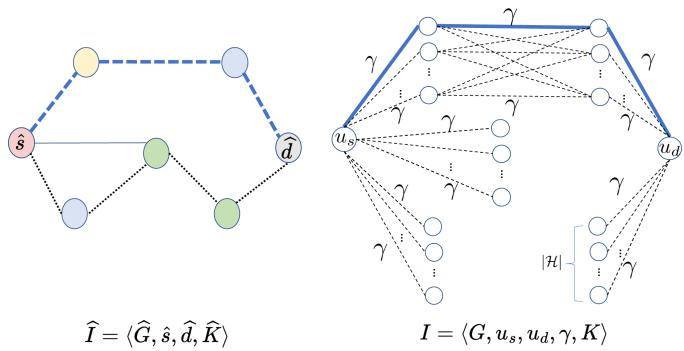

$$
\left. \overbrace { \underbrace { \mathrm {  ~ \cdots ~ } \mathrm {  ~ \ E d g e s \ i n \ a n \ R V C P \ p r o b l e m } } } ^ { -- } \right| _ { \displaystyle \mathrm {  ~ \ E d g e s \ i n \ } } \hat { \cal E }
$$

$$
\left| { \frac { \mathrm { E d g e s ~ i n ~ t h e ~ o p t i m a l ~ r e l a y ~ c h a i n } } { \mathrm { E d g e s ~ i n ~ } E } } \right|
$$

Fig. 4. An illustration of reduction from the RVCP problem to the decision of AoR-based deployment.

path (RVCP) problem [32], to the decision problem of AoRbased deployment in Definition 2 to prove Theorem 3. Given a vertex-colored graph ${ \widehat { G } } ( { \widehat { V } } , { \widehat { E } } )$ and a pair of vertices ${ \widehat { s } } \in { \widehat { V } }$ and $\widehat { d } \in \widehat { V }$ , the RVCP problem is to determine whether there is a path from s to $\widehat { d }$ with internal vertices in distinct colors, so-called “rainbow vertex-connected $p a t h ^ { \ast }$ . Here, we use ${ \widehat { G } } ( { \widehat { V } } , { \widehat { E } } )$ to differentiate the vertex-colored graph in the RVCP problem from the graph in our problem. The same principle is applied to the notations for the two problems. Given $\widehat { I } = \langle \widehat { G } , \widehat { s } , \widehat { d } , \widehat { K } \rangle$ the RVCP decision problem is to determine whether there is a rainbow vertex-connected path $\widehat { R }$ with $C ( \widehat { R } ) \leq \widehat { K }$ , where $C ( { \widehat { R } } )$ is the number of colors used in the internal vertices on the path ${ \widehat { R } } .$

Theorem 3: The decision problem of AoR-based deployment is NP-Hard.

Proof: First, the RVCP problem is reduced to the decision problem of AoR-based deployment to prove its NPhardness. For each instance of RVCP problem, denoted by $\widehat { I } =$ $\langle \widehat { G } , \widehat { s } , \widehat { d } , \widehat { K } \rangle$ , we can construct an instance $I = \langle G , u _ { s } , u _ { d } , \gamma , K \rangle$ of our decision problem in the following way, as shown in Fig. 4.

1) Two vertices, $u _ { s }$ and $u _ { d } ,$ are added to I. This is to construct the operational states for source and destination.

2) Constructing vertices: For each $\widehat { v } _ { i } \in \widehat { V } - \{ \widehat { s } , \widehat { d } \}$ , we add |H| vertices in V since |H| headings are possible for a UAV at each position. Here, |H| is the total number of colors on vertices in $\widehat { V }$

3) Constructing edges to connect to $u _ { s } .$ : For each $\widehat { e } ( \widehat { s } , \widehat { v } _ { i } ) \in$ ${ \widehat { E } } ,$ , we add edges from $u _ { s }$ to the corresponding $| \mathcal { H } |$ vertices in V .

4) Constructing edges to connect to $u _ { d } \colon$ Similarly, for each $\widehat { e } ( \widehat { v } _ { i } , \widehat { d } ) \in \widehat { E }$ , we add edges from the corresponding |H| vertices in V to $u _ { d } .$

5) Constructing edges: For each edge $\widehat { e } ( \widehat { v } _ { i } , \widehat { v } _ { j } ) \in \widehat { E } , \widehat { v } _ { i } , \widehat { v } _ { j } \in$ $\widehat { V } - \{ \widehat { s } , \widehat { d } \}$ , if $\widehat { v _ { i } }$ and $\widehat { v } _ { j }$ are in the different color, $| { \mathcal { H } } | \times$ |H| edges are added in E among all-pair vertices in $V$ derived from $\widehat { v _ { i } }$ and $\widehat { v } _ { j } . \mathrm { H } \widehat { v } _ { i }$ and $\widehat { v } _ { j }$ are in the same color, there are no edges among their corresponding vertices in V .

6) Generating weights of edges: For edges in E derived from ${ \widehat { e } } ( { \widehat { v } } _ { i } , { \widehat { v } } _ { j } ) \in { \widehat { E } } , { \widehat { v } } _ { i } , { \widehat { v } } _ { j } \in { \widehat { V } } - \{ { \widehat { s } } , { \widehat { d } } \}$ , each of them is assigned a weight of $\gamma .$ Similarly, for edges in E derived from $\widehat { e } ( \widehat { s } , \widehat { v } _ { i } ) \in \widehat { E }$ and $\widehat { e } ( \widehat { v } _ { i } , \widehat { d } ) \in \widehat { E }$ , the same principle is applied to assign weights.

7) Generating the upper bound to the number of relays: We assign $K = { \widehat { K } }$

Clearly, this reduction can be performed in polynomial time. Then, we prove that $\widehat { I }$ has a solution to the RVCP decision problem if and only if I has a solution to the decision problem of AoR-based deployment.

To prove the if part, suppose that I has a solution sequence R with $| R | \leq K$ to the decision problem of AoR-based deployment. There is a corresponding vertices in $\widehat { V }$ that forms a path, say ${ \widehat { R } } .$ Assume that $\widehat { R }$ is not a solution to $\widehat { I } .$ Some edges on $\widehat { R }$ connect to internal vertices with the same color. It will make a contradiction since such edges do not construct the corresponding edges in the $I , \mathrm { i . e . , } R$ is not a solution to I. Therefore, internal vertices $\widehat { R }$ should be in the different color. It implies that $\widehat { R }$ is the solution to the I. Moreover, the number of color used in the internal vertices on $\widehat { R }$ is exactly |R|, i.e., $C ( { \widehat { R } } ) = | R | . \operatorname { S o } , C ( { \widehat { R } } ) \leq { \widehat { K } }$ holds.

( ) = ( )Conversely, to prove the only if part, suppose that there is a solution $\widehat { R }$ with $\overset { } { C } ( \widehat { R } ) \leq \widehat { K }$ to the RVCP decision problem. There is a corresponding sequence R in V connecting from $u _ { s }$ to $u _ { d }$ along all the edges with a weight of γ. Therefore, R forms a relay chain from $u _ { s }$ to $u _ { d } .$ , where the connectivity constrains on the edges are all satisfied. Moreover, the number of relays, $\mathrm { i . e . , } | R |$ , is the number of the colors on the internal vertices on ${ \widehat { R } } .$ Since $C ( \widehat { R } ) \leq \widehat { K } , | R | \leq K$ is satisfied.

## V. AIM ALGORITHM

Given $G = ( V , E ) , u _ { s } ,$ , and $u _ { d } .$ , we design the Angle-of-Radiation-based Deployment (AIM) algorithm, to find the sequence of operational states $R .$ The key idea is to create an AoR-based reachability table for $u _ { s } ,$ , where each operational state maintains the number of relays to reach itself and the predecessor to connect to $u _ { s }$ . Once the table is created, it serves as a look-up table for any $u _ { d }$ . When any operational state $u _ { d }$ requests for connecting from $u _ { s }$ , a sequence from $u _ { s }$ to $u _ { d }$ is immediately available on the table to deploy UAV relays. The AIM algorithm consists of two phases to find R. Phase 1 starts with $u _ { s }$ to update each operational state’s reachability on the table according to its AoR-based local connectivity. Phase 2 starts with $u _ { d }$ to reversely look the predecessors up in the table until $u _ { s } ,$ where the sequence of those predecessors is the solution sequence R. Algorithm 1 shows the pseudocode of the AIM algorithm.

## A. Creation of the AoR-Based Reachability Table

The AIM algorithm updates the reachability and the corresponding predecessors of operational states. To do so, each vertex $v \in V$ maintains three attributes on the AoR-based reachability table: (1) its reachability $M ( v )$ , which is the minimal number of relays from $u _ { s }$ to reach $v , ( 2 ) ~ \pi ( v )$ , which is the predecessor leading to $M ( v )$ , and $( 3 ) \ \mu _ { \mathrm { m i n } } ( v )$ , which is the minimal RSS among the deployed UAV pairs leading to $M ( v )$

Algorithm 1: AIM Algorithm.   
Require: $G = ( V , E ) , u _ { s } ,$ and $u _ { d } .$   
= ( )Ensure: A sequence R.   
1: // Initialization.   
2: for all $v \in V$ do   
3: $M ( v )  \infty , \pi ( v )  \mathrm { N U L L } , \mu _ { \mathrm { m i n } } ( v )  \infty$   
4: $N _ { \mathrm { A o R } } ( v ) = \{ v ^ { \prime } \in V | e ( v , v ^ { \prime } ) \in E \}$   
5: $\overline { { V } } = ( u _ { s } , \overline { { v } } _ { 1 } , \overline { { v } } _ { 2 } , \ldots )  S o r t - P o s i t i o n ( V )$   
6: $M ( u _ { s } ) \gets 0$   
7: $R \gets ( )$   
()8: // Phase $ { \boldsymbol { l } } :$ update the reachability table.   
9: for all $\overline { { v } } _ { i } \in \overline { { V } } - u _ { s }$ do   
10: $\eta _ { \mathrm { m i n } } ( \overline { { v } } _ { i } )  \infty$   
11: (for all $v ^ { \prime } \in N _ { \mathrm { A o R } } ( \overline { { v } } _ { i } )$ do   
12: if $M ( v ^ { \prime } ) < \eta _ { \mathrm { m i n } } ( \overline { { v } } _ { i } )$ then   
13: $\pi ( \overline { { v } } _ { i } )  v ^ { \prime }$   
14: $\eta _ { \mathrm { m i n } } ( \overline { { v } } _ { i } )  M ( v ^ { \prime } )$   
15: $M ( \overline { { v } } _ { i } )  \eta _ { \operatorname* { m i n } } ( \overline { { v } } _ { i } ) + 1$   
16: $\mu _ { \mathrm { m i n } } ( \overline { { v } } _ { i } )  \mathrm { m i n } \{ \mu _ { \mathrm { m i n } } ( v ^ { \prime } ) , \Upsilon ( v ^ { \prime } , \overline { { v } } _ { i } ) \}$   
17: else if $M ( v ^ { \prime } ) = \eta _ { \mathrm { m i n } } ( \overline { { v } } _ { i } )$ ( )then   
18: (if $\{ \mu _ { \mathrm { m i n } } ( v ^ { \prime } ) , \Upsilon ( v ^ { \prime } , \overline { { v } } _ { i } ) \} > \mu _ { \mathrm { m i n } } ( \overline { { v } } _ { i } )$ then   
19: $\pi ( \overline { { v } } _ { i } )  v ^ { \prime }$   
20: $\eta _ { \mathrm { m i n } } ( \overline { { v } } _ { i } )  M ( v ^ { \prime } )$   
21: $M ( \overline { { v } } _ { i } )  \eta _ { \operatorname* { m i n } } ( \overline { { v } } _ { i } ) + 1$   
22: $\mu _ { \mathrm { m i n } } ( \overline { { v } } _ { i } )  \operatorname* { m i n } \{ \mu _ { \mathrm { m i n } } ( v ^ { \prime } ) , \Upsilon ( v ^ { \prime } , \overline { { v } } _ { i } ) \}$   
23: ( ) min ( )// Phase 2: reversal reachability look-up.   
24: $P u s h ( u _ { d } , R )$   
25: $t _ { o } \gets u _ { d }$   
26: while $\pi ( t _ { o } ) \neq u _ { s }$ do   
27: $P u s h ( \pi ( t _ { o } ) , R )$   
28: $t _ { o } \gets \pi ( t _ { o } )$   
29: $P u s h ( u _ { s } , R )$   
(30: return R

Initially, $M ( v )$ is set to infinity, $\pi ( v )$ has no value, and $\mu _ { \mathrm { m i n } } ( v )$ is set to infinity. To update $M ( v ) , \pi ( v )$ , and $\mu _ { \mathrm { m i n } } ( v )$ ( ), each $v \in V$ ( ) ( ) ( )maintains its AoR-based local connectivity, defined by $N _ { \mathrm { A o R } } ( v ) = \{ v ^ { \prime } \in V | e ( v , v ^ { \prime } ) \in E \}$ , which contains the adjacent vertices on G. First, all vertices in $V$ are sorted by their distances to the source’s position. We will update the three attributes of vertices according to the sorted order. This process avoids selecting the same position with different headings, leading to an infeasible solution, which may occur in traditional DFSor BFS-based algorithms. Let $\overline { { V } } = ( u _ { s } , \overline { { v } } _ { 1 } , \overline { { v } } _ { 2 } , \ldots )$ denote the sorted list, where V is used to differentiate from the unsorted set of vertices V . Initially, $M ( u _ { s } )$ is 0, and R is an empty sequence.

For each $\overline { { v } } _ { i } \in \overline { { V } } - u _ { s } .$ , we search for the operational state with the minimal value of reachability in its set of AoR-based local connectivity, denoted by $\eta _ { \mathrm { m i n } } ( \overline { { v } } _ { i } )$ in Algorithm 1. If there exists a reachable operational state $v ^ { \prime } \in N _ { \mathrm { A o R } } ( \overline { { v } } _ { i } ) \mathrm { ~ } ( \mathrm { i . e . , ~ } \eta _ { \mathrm { m i n } } ( \overline { { v } } _ { i } ) \neq$ ∞), $\overline { { v } } _ { i }$ is reachable via $v ^ { \prime }$ . In this case, we select the one with smallest value of $M ( v ^ { \prime } )$ to be its predecessor, and $\eta _ { \mathrm { m i n } } ( \overline { { v } } _ { i } )$ is updated accordingly. $\mathrm { S o } .$ , the reachability $\overline { { v } } _ { i }$ is updated by

$$
M ( \overline { { \boldsymbol { v } } } _ { i } ) = \left\{ \begin{array} { l l } { \eta _ { \mathrm { m i n } } ( \overline { { \boldsymbol { v } } } _ { i } ) + 1 , } & { \mathrm { i f } \ \eta _ { \mathrm { m i n } } ( \overline { { \boldsymbol { v } } } _ { i } ) \neq \infty ; } \\ { \infty , } & { \mathrm { o t h e r w i s e } . } \end{array} \right.\tag{8}
$$

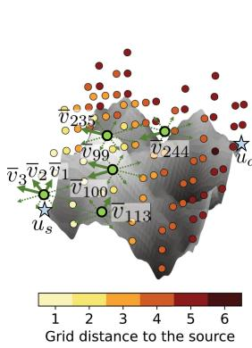

<table><tr><td rowspan=1 colspan=1>Operationalstate vi</td><td rowspan=1 colspan=1>Number ofintermediaterelays M(vi)</td><td rowspan=1 colspan=1>Min. RSSµmin (vi)</td><td rowspan=1 colspan=1>Predecessorπ(vi)</td></tr><tr><td rowspan=1 colspan=1>νv1</td><td rowspan=1 colspan=1>1</td><td rowspan=1 colspan=1>-53.86</td><td rowspan=1 colspan=1>us</td></tr><tr><td rowspan=1 colspan=1>v2</td><td rowspan=1 colspan=1>1</td><td rowspan=1 colspan=1>-53.86</td><td rowspan=1 colspan=1>us</td></tr><tr><td rowspan=1 colspan=1>ν3</td><td rowspan=1 colspan=1>1</td><td rowspan=1 colspan=1>-53.86</td><td rowspan=1 colspan=1>us</td></tr><tr><td rowspan=1 colspan=1>…</td><td rowspan=1 colspan=1>…</td><td rowspan=1 colspan=1></td><td rowspan=1 colspan=1>…</td></tr><tr><td rowspan=1 colspan=1>v99</td><td rowspan=1 colspan=1>2</td><td rowspan=1 colspan=1>-63.74</td><td rowspan=1 colspan=1>v3</td></tr><tr><td rowspan=1 colspan=1>:</td><td rowspan=1 colspan=1>1</td><td rowspan=1 colspan=1>:</td><td rowspan=1 colspan=1>:</td></tr><tr><td rowspan=1 colspan=1>v113</td><td rowspan=1 colspan=1>2</td><td rowspan=1 colspan=1>-66.54</td><td rowspan=1 colspan=1>V43</td></tr><tr><td rowspan=1 colspan=1>…</td><td rowspan=1 colspan=1>…*</td><td rowspan=1 colspan=1>** *</td><td rowspan=1 colspan=1>:</td></tr><tr><td rowspan=1 colspan=1>V244</td><td rowspan=1 colspan=1>3</td><td rowspan=1 colspan=1>-63.74</td><td rowspan=1 colspan=1>V_99</td></tr><tr><td rowspan=1 colspan=1></td><td rowspan=1 colspan=1>…</td><td rowspan=1 colspan=1></td><td rowspan=1 colspan=1></td></tr></table>

(a) The AoR-based reachability table of Us
<table><tr><td>¯vj ∈ NAoR(v244)</td><td>Pos.</td><td>Hdg.</td><td></td><td>M(¯vj)Y(v244, vj)</td><td>Min. RSS µmin(vj)</td></tr><tr><td>V99</td><td>q13</td><td>90°</td><td>2</td><td>-61.80</td><td>-63.74</td></tr><tr><td>v100</td><td>913</td><td>135°</td><td>2</td><td>-65.88</td><td>-66.04</td></tr><tr><td></td><td></td><td></td><td></td><td></td><td></td></tr><tr><td>Vv113</td><td>915</td><td>0°</td><td>2</td><td>-66.54</td><td>-66.54</td></tr><tr><td>1</td><td></td><td></td><td></td><td>1</td><td>1</td></tr><tr><td>Vv235</td><td>930</td><td>90°</td><td>3</td><td>-57.71</td><td>-63.74</td></tr></table>

(b) The local connectivity of $\overline { { v } } _ { 2 4 4 }$

Furthermore, the minimal RSS for UAVs deployed from $u _ { s }$ to $\overline { { v } } _ { i }$ via $v ^ { \prime }$ is updated by $\mu _ { \mathrm { m i n } } ( \overline { { v } } _ { i } ) = \operatorname* { m i n } \{ \mu _ { \mathrm { m i n } } ( v ^ { \prime } ) , \Upsilon ( v ^ { \prime } , \overline { { v } } _ { i } ) \}$ accordingly. Note that if there are several operational states with the same reachability value, the one leading to a larger $\mu _ { \mathrm { m i n } } ( \overline { { v } } _ { i } )$ over the deployed relay chain breaks the tie. Otherwise, $\overline { { v } } _ { i }$ remains unreachable. In this way, we can always find a relay chain with a higher minimum RSS. Once all operational states in $\overline { V }$ have been traversed, the AoR-based reachability table is created.

Fig. 5 shows an example of the AoR-based reachability table for given $u _ { s }$ . When filling out the reachability of $\overline { { v } } _ { 2 4 4 }$ in $\mathrm { F i g . } 5 ( \mathrm { a } ) , M ( \overline { { { v } } } _ { 2 4 4 } ) = 3$ is updated with Min. RSS $\mu _ { \operatorname* { m i n } } ( \overline { { v } } _ { 2 4 4 } ) =$ − . dBm and v as the predecessor of $\overline { { v } } _ { 2 4 4 } .$ . The details behind the choice are demonstrated in Fig. 5(b). Among those connectable neighbor states of $\overline { { v } } _ { 2 4 4 }$ , the AIM algorithm chooses those with fewer number of relays required. Since $\overline { { v } } _ { 9 9 }$ can be reachable from $u _ { s }$ via two relays, i.e., $M ( \overline { { { v } } } _ { 9 9 } ) = 2 ( u _ { s }  \overline { { { v } } } _ { 3 } $ v99), operational states which require more than two relays (e.g., v ) are not preferable. In addition, among those operational states using two relays, v99 can achieve the largest minimum RSS of -63.74 dBm. In contrast, another state at the same position but with different heading, say $\overline { { v } } _ { 1 0 0 }$ , has a smaller Min. RSS of -66.04dBm, which is not preferable. On the other hand, despite $M ( \overline { { v } } _ { 1 1 3 } ) = 2$ and $\Upsilon ( \overline { { v } } _ { 2 4 4 } , \overline { { v } } _ { 1 1 3 } ) = - 5 7 . 7 1$ dBm, it is not chosen because the Min. RSS is weaker than that of $\overline { { v } } _ { 9 9 }$

## B. Reversal Reachability Look-Up

We starts with $u _ { d }$ to reversely find predecessors of intermediate operational states until $u _ { s }$ . To do so, the sequence R is maintained by a stack structure with a pointer to the top operational state, denoted by $t _ { o }$ in Algorithm 1. We iteratively push the predecessor of each intermediate operational state to the top of R until reaching $u _ { s }$ . The resultant sequence R is the solution to chained UAVs.

In summary, the local search in the AIM, enabled by distancebased sorting and backtracking, strategically narrows the search space to avoid exhaustive examination. By looking up the reachability table, we can utilize the recorded information without repeated computation, thereby achieving the practical efficiency necessary for UAV deployment and applications.

Fig. 5. An example of AoR-based reachability table for a given case.  
TABLE II  
DEFAULT PARAMETERS IN PARAMETERS
<table><tr><td>Parameter</td><td>Value</td></tr><tr><td>The map size</td><td> $\overline { { 6 0 0 \times 6 0 0 ( \mathrm { m } ^ { 2 } ) } }$ </td></tr><tr><td>The range of UAV operational altitudes</td><td>[10, 120] (m) AGL</td></tr><tr><td>Grid size δ</td><td>30 (m)</td></tr><tr><td>The number of optional headings [H</td><td>8</td></tr><tr><td>Transmission power λ</td><td>20 (dBm)</td></tr><tr><td>Carrier frequency f</td><td>5 (GHz)</td></tr><tr><td>The threshold of  $\overline { { \mathrm { R S S } \gamma } }$ </td><td>−67 (dBm)</td></tr></table>

## C. Complexity Analysis

The time and space complexity of AIM are further analyzed.   
Theorem 4: The time complexity of AIM is $O ( | V | ^ { 2 } )$ .

Proof: The initialization takes $O ( | V | )$ time. The sorted positions V can be done by the breadth-first search algorithm, which takes $O ( | V | + | E | )$ . In the first phase, it takes $O ( | V | ^ { 2 } )$ time to update the AoR-based reachability table. Practically, for each $v \in V$ , when the local connectivity table is examined, the complexity is bounded by the by the limited communication range because of $| N _ { \mathrm { A o R } } ( v ) | \ll | V |$ . As for the second phase, $O ( | V | )$ is taken to generate the solution sequence R. Thus, the total time complexity is $O ( | V | + | E | + | V | ^ { 2 } + | V | )$ . Since $| E | \leq | V | ^ { 2 }$ , the time complexity of AIM is $O ( | V | ^ { 2 } )$ - (Theorem 5: The space complexity of AIM is $O ( | V | ^ { 2 } )$

( )Proof: To store the AoR-based reachability table, it takes $O ( | V | )$ space complexity. The sorted position $\overline { V }$ takes $O ( | V | )$ space. For each vertex, it needs $O ( | V | )$ to store the adjacent vertices on G. So, it takes $O ( | V | ^ { 2 } )$ to keep the local connectivity of all vertices. The resultant sequence R takes $O ( | V | )$ space. Hence, the total space complexity is $O ( 2 | V | + | V | ^ { 2 } + | V | ) =$ $O ( | V | ^ { 2 } )$ =-

## VI. PERFORMANCE EVALUATION

## A. Simulation Setup

Comprehensive simulations are conducted to evaluate the performance of AIM algorithm. The simulations are developed by Python on a workstation equipped with Intel(R) Xeon(R) Platinum 8352 V CPU and 768 GB ram. Table II shows the default values of parameters, if not specified. We consider a 3D operational space with the map size of $6 0 0 \times 6 0 0 ~ \mathrm { { m ^ { 2 } } }$ and the height range of [10,120] meters above ground level (AGL) for UAV operations to prevent collisions from ground obstacles by complying with the Federal Aviation Administration (FAA) regulations [33]. The ground obstacles on the 3D terrain is generated by Fractal Noise [34]. The grid size is $\delta = 3 0$ meters by default to comply with the requirement of minimum safety distance between obstacles [35]. Eight options of headings are

$$
\mathcal { H } = \left\{ h _ { i } \Big | h _ { i } = \frac { i \pi } { 4 } , 0 \leq i < 8 \right\} .\tag{9}
$$

A half-wavelength dipole antenna is adopted in the simulations since it is commonly used in commercial wireless devices including UAVs. The antenna is horizontal equipped with the UAV leading to the following radiation model [27] derived from the angles specified in (1).

$$
A ( \psi , \phi ) = 1 . 6 4 \left[ \frac { \cos \left( \frac { \pi } { 2 } \sin ( \pi / 2 - \psi ) \cos ( \pi / 2 + \phi ) \right) } { \sin ( \operatorname { a r c c o s } ( \sin ( \pi / 2 - \psi ) \cos ( \pi / 2 + \phi ) ) ) } \right] ^ { 2 } .
$$

Here, the pair of angles $( \psi , \phi )$ stands for either transmitting angles $\Theta _ { \mathrm { t x } } = \left( \psi _ { \mathrm { t x } } , \phi _ { \mathrm { t x } } \right)$ or receiving angles $\Theta _ { \mathrm { r x } } = \left( \psi _ { \mathrm { r x } } , \phi _ { \mathrm { r x } } \right)$ defined in Section III-B1. Note that, practically, the AIM algorithm is not limited to the half-wavelength dipole radiation model and can be applied to other radiation models arising from other types of antennas. The transmission power is $\lambda = 2 0 ~ \mathrm { d B m }$ , and the carrier frequency $f = 5$ GHz in in (1). The predefined threshold of RSS in (3) is $\gamma = - 6 7$ dBm. Practically, a threshold of $- 6 7$ dBm is recommended for VoIP and video streaming [9] and a threshold of − dBm is recommended for web page browsing. Therefore, the two recommended thresholds are respectively used to evaluate the performance arising from the two types of applications (i.e., VoIP/video streaming and web browsing traffic) in our following performance comparison with baselines.

We compare our AIM algorithm against the three baselines below.

The two-stage algorithm determines the positions of UAVs and their headings in two separate steps. First, the positions of UAV relays are determined by a modification of the approach in [15], which forms connected UAVs at the same height (i.e., considering positions for UAVs on a 2D plane) to cover all clients on the ground. To have much freedom to select headings at the second stage, we ensure that the output power of UAV pairs at any two candidate positions must achieve at least half of maximal power. In this case, the two UAVs will not lose connection even if they communicate with each other using their half-power points $( \mathrm { i } . \mathrm { e } . , - 3$ dB points). Second, given the selected positions, we apply the dynamic programming technique to select the best headings for deploying UAVs at those positions.

The greedy algorithm simultaneously determines positions and communication angles for UAVs. It starts with $u _ { s }$ to recursively find the farthest position and the best heading until it connects to $u _ { d }$ . For each iteration, a binary search is iteratively performed to find the farthest 2D plane, where there exists at least one operational state can be connected to the chained UAV so far. If there are multiple options, the farthest position and the best heading leading to the strongest RSS is selected. The process is repeated until the chained UAVs can connect to the destination with operational state $u _ { d }$

The MADRL approach adopts multi-agent deep reinforcement learning (MADRL) to determine the positions and headings of UAVs at the same time. The key insight of the MADRL approach is to deploy the UAVs along the straight line between the source and the destination as much as possible. To comply with constraints, such as terrain and safety distance, the MADRL approach interacts with the environment and adjusts the positions of UAVs. We modify the original MADRL-based approach in [26] to further support the decision on headings. The solution with a minimal number of UAVs is derived by iterating the MADRL approach on different $| R |$ until the time limitation is exceeded.

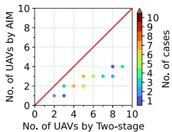  
(a) The Two-stage approach

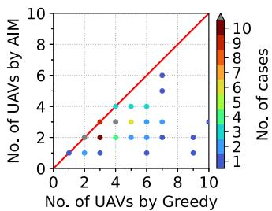  
(b) The greedy approach

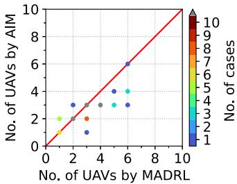  
(c) The MADRL approach  
Fig. 6. The number of UAVs arising from AIM versus the number of UAVs arising from baselines.

In the following discussions, the number of chained UAVs is studied to evaluate the performance of the AIM and the two baseline algorithms. This evaluates the length of UAV relays specified in (4). At the same time, we study AoRs and structures of resultant UAV relay chains. The success rate under different applications is also evaluated to validate existence of solutions fulfilling the constraints specified in the (5a) to (5d). We randomly generate 100 source-destination pairs of $u _ { s }$ and $u _ { d }$ to in the simulations. The results of the 100 source-destination pairs are presented.

## B. Effectiveness of AIM Algorithm

1) The Number of Chained UAVs: We conduct statistical analysis to show the cases with solution among the 100 sourcedestination pairs. Fig. 6(a) shows the statistical comparison between the AIM algorithm and the two-stage algorithm. For a generated source-destination pair, we add a dot, where its x coordinate stands for the number of UAVs arising from the twostage algorithm, and its y coordinate stands for the number of UAVs arising from our AIM. The color on each dot represents the number of source-destination pairs added to the same coordinate in the statistical figure. An auxiliary line, which is $x = y$ shown in red color, is added to conduct the statistical analysis. We can observe that all of the dots lie below the auxiliary line. These results show that AIM always finds solutions with the smaller number of UAV relays compared to the solutions found by two-stage algorithm. Fig. 6(b) shows the statistical comparison between the AIM algorithm and the greedy algorithm. Although

π/2

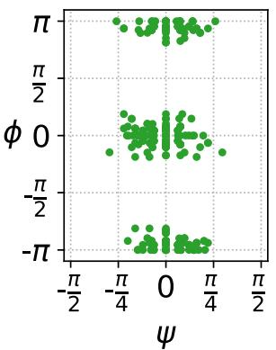  
(a) AIM

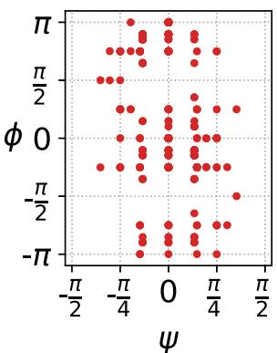

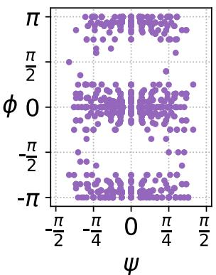

(b) Two-stage  
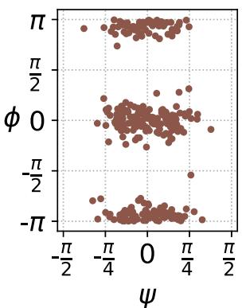  
(c) Greedy  
(d) MADRL  
Fig. 7. Resultant AoR $( \psi , \phi )$ pairs of deployed UAVs.

the greedy algorithm gets an equal number of UAVs as that of AIM in some cases, there are also some extreme cases in which the greedy algorithm requires much more UAVs than AIM. In Fig. 6(c), we can observe that AIM and MADRL use similar amounts of UAVs, and the difference in terms of the number of UAVs is less than two in most cases. In summary, compared to the two-stage, greedy and MADRL algorithms, our AIM decreases the number of used UAVs by 52.1%, 61.2%, and 14.6%, respectively. Our AIM algorithm is more efficient since it uses fewer UAVs to form the relay chain.

2) Analysis of Angles of Radiation: We further analyze the angles of radiation found by different algorithms. Fig. 7 shows the 2D scatter plots of AoR ψ, φ pairs in the chained UAV relays by applying AIM, two-stage, greedy, and MADRL algorithms, where the angle $\psi$ ranges between $[ - \frac { \pi } { 2 } , \frac { \pi } { 2 } ]$ , and the angle φ ranges between $[ - \pi , \pi ]$ . In fact, ±π should be circularly attached with each other due to a complete angle. Here, to be simplified, we visualize the two angles in 2D scatter plots. As can be seen in Fig. 7, the four algorithms tend to select $\psi \approx 0 .$ 0The detailed distribution of ψ is shown in Fig. 8. This is because, ideally, UAVs deployed at the same height can achieve strongest RSSs. However, the ideal angle cannot be always achieved due to the obstacles on the terrain. So, our AIM tends to select ψ angles bounded within $[ - \frac { \pi } { 4 } , \frac { \pi } { 4 } ]$ to ensure strong enough RSSs. In contrast, the greedy algorithm and MADRL algorithm use larger angles of ψ to cope with obstacles on the terrain. Although the two-stage algorithm also tends to select the smaller ψ angeles, its $\phi$ angles related to their horizontal orientations are scattered over a wide range of angles. The detailed distribution of $\phi$ is shown in Fig. 9. By contrast, our AIM tends to select $\phi \approx 0$ and $\phi \approx \pm \pi$ since the headings between communications pairs can perfectly aim to each other in terms of their orientations to achieve strongest RSSs.

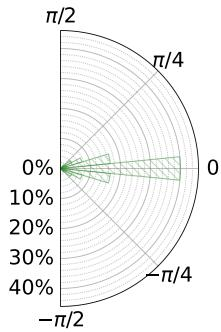  
(a) AIM

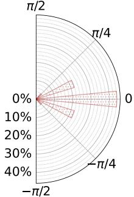  
(b) Two-stage

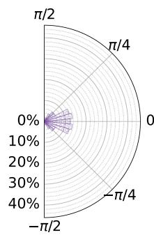  
(c) Greedy

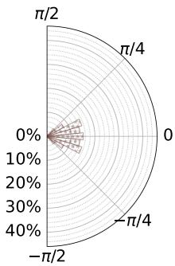  
(d) MADRL

Fig. 8. Resultant distribution for ψ.  
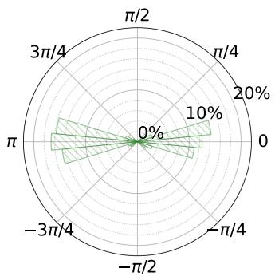  
(a) AIM

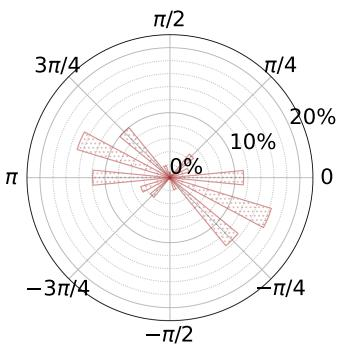  
(b) Two-stage

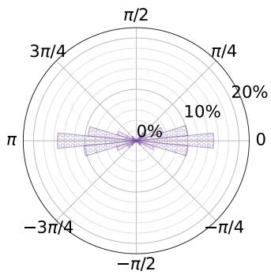

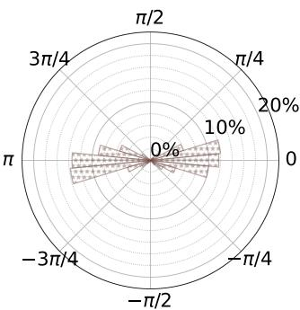  
(c) Greedy  
(d) MADRL  
Fig. 9. Resultant distribution for $\phi .$

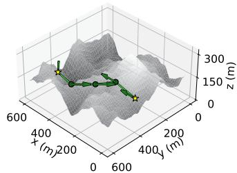  
(a) The AIM solution

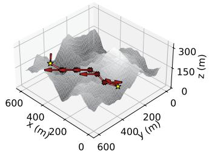  
(b) The two-stage solution

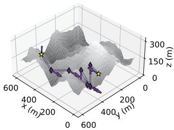  
(c) The greedy solution

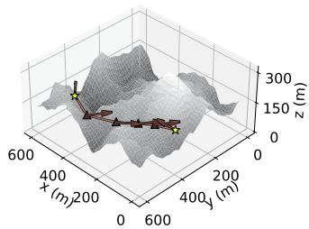  
(d) The MADRL solution

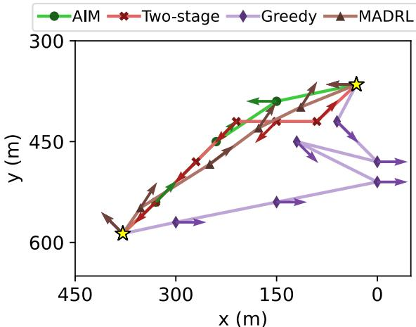  
(e) The projections of (a)-(d)  
Fig. 10. The UAV relays found by different algorithms.

3) Structural Analysis of UAV Relay Chains: We further study the structure of UAV relay chains formed by different algorithms. Fig. 10 presents the results by applying the AIM and the three baseline algorithms to one of the test cases. The yellow stars represent the source and destination, and the arrow on each position represents the heading of the UAV. For the AIM and two-stage algorithms, although the positions of the first five UAVs are identical, the two-stage algorithm needs one more UAVs than AIM to connect to the destination. This is because the two-stage algorithm locally removes redundant positions to ensure connectivity instead of globally optimizing the number of selected positions. On the other hand, although the greedy algorithm can efficiently find the farthest position and the best heading for the next UAV, it results in a zigzag relay chain, shown in Fig. 10(c). A zigzag UAV chain may increase the number of chained UAVs, which is undesired due to the higher deployment cost and potential end-to-end transmission failures in a long relay chain. As for the MADRL approach, with the original design concept of its reward function, the MADRL approach tends to retrieve a near straight deployment along the terrain between source and the destination. However, deploying with varied altitudes requires additional UAVs to overcome the extra vertical distance. In contrast, our AIM forms a smoother structure of a relay chain with the fewest number of UAVs.

TABLE III  
SUCCESS RATES FOR DIFFERENT RSS REQUIREMENTS BY APPLICATIONS
<table><tr><td>Applications</td><td>AIM</td><td>Two-stage</td><td>Greedy</td><td>MADRL</td></tr><tr><td>VoIP/Video  $( \gamma = - 6 7 \ \mathbf { d B m } )$ </td><td>100%</td><td>40%</td><td>100%</td><td>77%</td></tr><tr><td>Web browsing  $( \gamma = - 7 0 ~ \mathrm { d B m } )$ </td><td>100%</td><td>35%</td><td>100%</td><td>96%</td></tr></table>

TABLE IV

NUMBER OF CHAINED UAVS FOR DIFFERENT APPLICATION REQUIREMENTS
<table><tr><td>Applications</td><td>AIM</td><td>Two-stage</td><td>Greedy</td><td>MADRL</td></tr><tr><td>VoIP/Video  $( \gamma = - 6 7 ~ \mathbf { d B m } )$ </td><td>2.68</td><td>5.53</td><td>6.9</td><td>2.88</td></tr><tr><td> $\mathbf { W e b \ b r o w s i n g }$   $( \gamma = - 7 0 ~ \mathrm { d B m } )$ </td><td>1.91</td><td>3.54</td><td>5.13</td><td>2.08</td></tr></table>

4) Performance Under Different Application Requirements: We simulate two types of applications with different RSS requirements (i.e., VoIP/video streaming and web browsing), which are commonly used in the proposed scenario, to study the success rates and number of UAVs used resulting from different algorithms. VoIP/Video streaming applications require a strict threshold of -67 dBm, whereas Web browsing applications require a less restrictive threshold of -70 dBm. The success rate of an algorithm is the ratio between the number of source-destination pairs with a solution found by the algorithm to fulfill the constraints and the total number of generated sourcedestination pairs. The success rates of the four approaches are shown in Table III. In VoIP/video streaming applications, both the greedy and AIM algorithms can reach a success rate of 100%. The MADRL approach achieves a success rate of 77%. The reason is that it is not possible for the MADRL approach to find a feasible solution within the time limitation. If we relax the threshold to -70 dBm, the success rate of the MADRL approach increased since it is easier to find statuses for UAVs to build up a relay chain. The two-stage algorithm has the lowest success rate of 40%. This is because no suitable heading for UAVs at the selected positions can be found to comply with the connectivity constraints at the second stage even though the positions are carefully selected at the first stage. When web browsing applications are considered, the success rate arising from the two-stage algorithm is even worse. The reason is that in such cases, the two-stage algorithm finds the longest distance that could meet the −70 dBm requirement. However, the connections fail when considering the radiation angles between the previous and the next UAVs. The results imply that simultaneously determining the positions and headings of chained UAVs leads to larger success rates. In addition, among those successful cases, we study the number of required UAVs arising from the two RSS thresholds. As shown in Table IV, a higher threshold could cause more UAVs chained to achieve the desirable RSS. The proposed AIM algorithm uses the least number of UAVs in both RSS thresholds. In contrast, the two-stage and the greedy approaches inevitably use more UAVs to form a relay chain due to less consideration of the heading selection. Although the number of UAVs by the MADRL approach is comparable to the proposed AIM algorithm, the long convergence time and the fine-tuning process of the learning-based algorithm restrict the practicality of the MADRL approach.

TABLE V  
DETAILS OF THE REAL-WORLD DEMS
<table><tr><td rowspan=2 colspan=1>(Latitude, Longitude)of upper-left corner</td><td></td></tr><tr><td rowspan=1 colspan=1>Toponym</td></tr><tr><td rowspan=1 colspan=1>(24.557120°N, 121.343997°E)</td><td rowspan=1 colspan=1>Jianshi Township,  HsinchuCounty, Taiwan</td></tr><tr><td rowspan=1 colspan=1>(24.056497°N, 121.102297°E)</td><td rowspan=1 colspan=1>Ren&#x27;ai   Township,   NantouCounty, Taiwan</td></tr><tr><td rowspan=1 colspan=1>(36.394756°N, 137.098390°E)</td><td rowspan=1 colspan=1>Hida, Gifu, Japan</td></tr><tr><td rowspan=1 colspan=1>(2.515059°N, 103.282470°E)</td><td rowspan=1 colspan=1>Kampung Peta, Johor, Malaysia</td></tr><tr><td rowspan=1 colspan=1>(40.747255°N, 123.914796°W)</td><td rowspan=1 colspan=1>Kneeland, California, USA</td></tr></table>

TABLE VI

SUCCESS RATE FOR CASES UNDER DIFFERENT MAP SIZES
<table><tr><td>Algorithm</td><td>300</td><td>Map length and width (m) 600</td><td>900</td></tr><tr><td>AIM</td><td>100%</td><td>100%</td><td>100%</td></tr><tr><td>Two-stage</td><td>62.5%</td><td>50%</td><td>50%</td></tr><tr><td>Greedy</td><td>100%</td><td>100%</td><td>100%</td></tr><tr><td>MADRL</td><td>100%</td><td>31.25%</td><td>6.25%</td></tr></table>

5) Robustness on Different Terrains: We study the robustness of AIM algorithm on three operational areas of $3 0 0 \times 3 0 0$ $6 0 0 \times 6 0 0$ , and $9 0 0 \times 9 0 0 ~ \mathrm { m ^ { 2 } }$ , where 16 different terrains are simulated for each of them. For each operational area, we generate one flat terrain, five terrains by the Perlin noise [34], five terrains by the Fractal noise, and five digital elevation models (DEM) by the Terrain Tiles [36]. The five DEMs are generated from the real-world terrain elevation data in the five cities shown in Table V. The source is located at , for each terrain, and the destinations are located at (300,300), (600,600), and (900,900) for the three operational areas, respectively. The headings of us and $u _ { d }$ are set to 0 ◦. Table VI and Fig. 11 show the success rate and statistics of the number of UAVs required in different sizes of terrains.

Although a larger map requires more UAVs to connect the source and destination, the proposed AIM outperforms the baselines and maintains 100% success rate. As can be seen, the AIM uses the least number of UAV relays compared to the baseline algorithms. For each terrain size, the AIM results in a smaller variation in the number of required UAVs, whereas the baselines yield higher variations. Moreover, as the map dimension increases, the increase in the use of UAVs arising from the AIM algorithm is much less than the two-stage and greedy algorithms. On the other hand, despite both the proposed AIM and the MADRL approaches use a similar number of UAVs, the MADRL approach requires more time to interact with the environment. As shown in Table VI, the success rate of the MADRL approach shrinks significantly. The reason is that the long exploration process of the MADRL approach makes it difficult to find a solution within the given time limit. These findings indicate that our AIM algorithm exhibits superior adaptability across various terrains, enhancing its practicality for real-world applications.

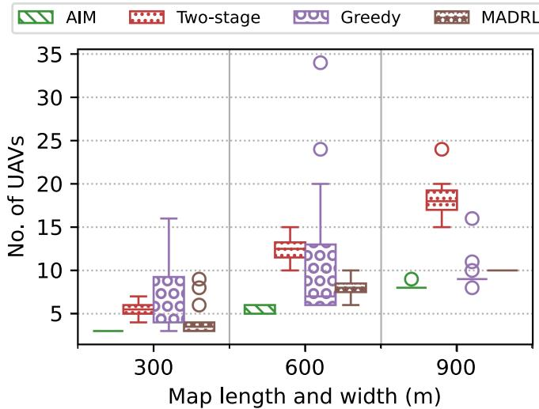  
Fig. 11. Number of UAV relays used for different map sizes.

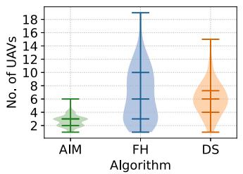  
(a)

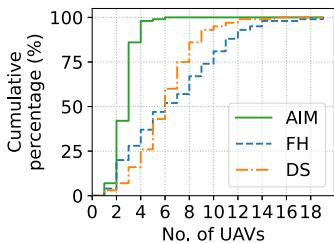  
(b)  
Fig. 12. The results of different heading-selection approaches: (a) The distribution of results for all test cases; (b) The cumulative distribution of results.

## C. Effectiveness of Heading Adjustments

We further study how the heading selection affects the number of UAV relays and the structure of chained UAVs. We compare our AIM algorithm against the two approaches of heading selection below.

\- A fixed heading (FH): Each UAV always head to a fixed direction. In the simulations, all UAVs head to the west.

\- Deviating from the source (DS): The heading of each UAV deviates from the source and has the same direction from the source’s position to its position.

For the FH and DS, we first find the minimal number of positions to deploy UAVs based on the shortest path algorithm such that the selected positions form a path to connect the source and the destination positions. Once the positions are selected, the above approaches are applied to decide the headings of UAVs. VoIP applications are simulated to evaluate the performance. Fig. 12 shows the distribution of number of relays resulting from different approaches of heading selection. Compared to the FH and DS, AIM results in fewer UAVs. Since our AIM simultaneously takes not only position selection but also heading selection into account, at most six UAV relays are needed to connect the source and the destination. Fig. 13 illustrates structures of deployed UAVs when the three approaches are applied to one of the test cases. The yellow stars represent the source and destination positions, and the arrow on each position represents the heading of the UAV. We can see that our AIM can avoid a zigzag formation while ensuring the connectivity. In summary, heading selection considered in AIM efficiently enhances the performance.

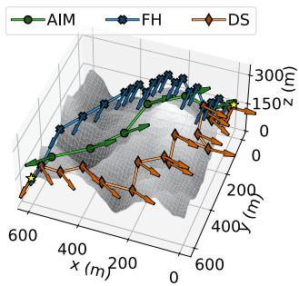  
(a)

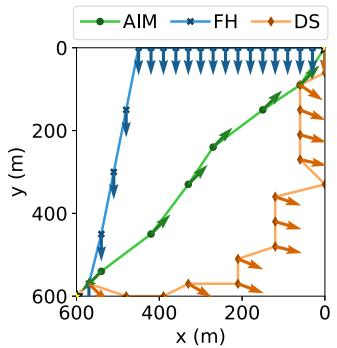  
(b)

Fig. 13. The resultant UAV chains using different heading-selection methods: (a) The 3D view; (b) The projection of (a).  
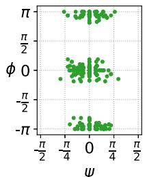  
ψ

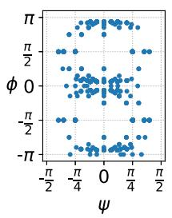

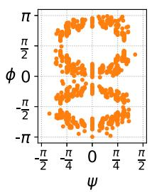

Fig. 14. Resultant AoR (ψ, φ) pairs of deployed UAVs.  
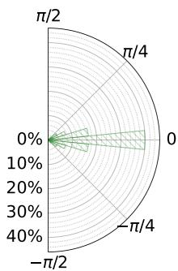  
(a) AIM

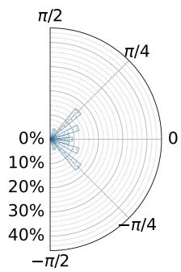  
(b) FH

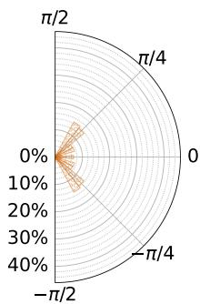  
(c) DS  
Fig. 15. Resultant distribution for ψ.

Furthermore, Fig. 14 shows the scatter plots of AoR $( \psi , \phi )$ pairs in the chained UAV relays when the different headingselection approaches are applied. As shown in Figs. 15 and $^ { 1 6 , }$ the AoR found by our AIM approximates to $\psi \approx 0$ and $\phi$ ≈ $0 , \pm \pi$ , whereas the AoR found by the FH and DS scatters over a wide range of angles due to the fixed heading. In summary, the AIM minimizes the number of required UAVs while connectivity among communication pairs is still guaranteed by the excellent AoR selection.

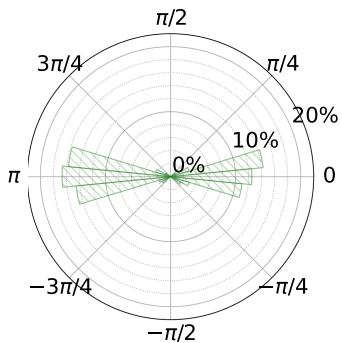  
(a) AIM

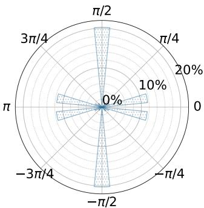  
(b) FH

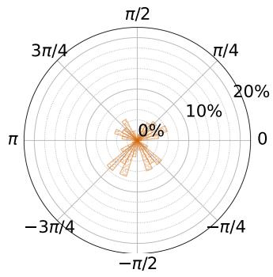  
(c) DS

Fig. 16. Resultant distribution for φ.  
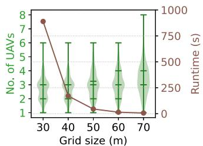

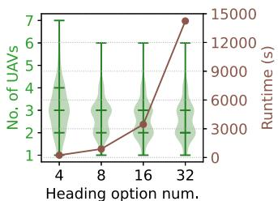  
Fig. 17. Number of UAVs required and runtime in different configurations: (a) Grid sizes; (b) Numbers of headings.

## D. Configuration Tips

Next, we study the impact of grid sizes and the number of optional headings, giving guides when adopting our approach in considering the trade-off between computational cost and performance for practical use.

1) The Effect of Grid Sizes: We study the performance by varying the grid size from 30 to 70 meters. Fig. 17(a) shows the distribution of UAVs required and corresponding runtime under different grid sizes. As the grid size increases, the number of required UAVs slightly increases since fewer optional positions result in more UAVs required to maintain the connectivity among them. Even in a grid size of 70 m, only two more UAVs are required in this case. On the other hand, the runtime shrinks greatly when the grid size increases from 30 m to 40 m. However, the performance (i.e., the number of required UAVs) is not improved further even if fine-grained grids with a grid size of 30 m are considered. Fine-grained grids leading to a large graph are not necessarily in terms of performance improvement. Therefore, a recommended configuration in a wide operational area is to consider a larger grid size for reducing computation time, while the performance (i.e., the number of required UAVs) remains.

2) Number of Optional Headings: Furthermore, we study how the number of optional headings affects the performance and runtime by varying it from 4 to 32. Fig. 17(b) shows the distribution of results when different numbers of optional headings are considered. As the number of optional headings increases, the performance improvement (i.e., the number of required UAVs) is limited, whereas the runtime rapidly increases. Even if finer-grained heading options are considered (e.g., either 16 or 32 headings), the performance cannot be further improved. This is because there is no significant difference in antenna gains when the angles are slightly different. On the other hand, a smaller number of optional headings is preferable since it results in low runtime and only a small increase in the number of required UAVs. In summary, four to eight optional headings are sufficient, which strike a balance between the precise AoR and acceptable computational cost at the same time.

## VII. CONCLUSION

The work takes the AoR into account to deploy UAV relays in a 3D environment in support of on-demand connectivity to faraway users. We prove that the AoR-based deployment problem is NP-hard. Then, the AIM algorithm is proposed to solve the problem. The AIM algorithm is not limited to dipole antennas. Our approach is a radiation-based design. Although the antenna models of the UAVs are not dipole antennas, our approach still optimizes the “angles of radiation” between communication pairs based on the mounted antenna’s radiation pattern, resulting in the strongest RSS. Extensive simulation results indicate that the AIM algorithm is capable of adapting to various terrains and achieving strong RSSs with the fewest number of UAVs used. Some research problems remain open, particularly in scenarios involving dynamic environmental conditions, heterogeneous antenna patterns, and advanced antennas (e.g., beamforming, directional, and phased-array antennas). First, if environmental conditions dynamically change (e.g., dynamic no-fly zones or obstacles), on-demand exploring and predicting in unknown environments would be necessary. Second, UAVs with heterogeneous antenna patterns introduce additional challenges in determining optimal ombinations of antenna types and operational states. Third, precise synchronization and alignment of antenna elements in both phase and amplitude to form accurate beams need to be addressed in advanced antennas. Our future work will address these challenges in more complex scenarios.

## REFERENCES

[1] A. Fotouhi et al., “Survey on UAV cellular communications: Practical aspects, standardization advancements, regulation, and security challenges,” IEEE Commun. Surv. Tut., vol. 21, no. 4, pp. 3417–3442, Fourth Quarter, 2019.

[2] G. Geraci et al., “What will the future of UAV cellular communications be? a flight from 5G to 6G,” IEEE Commun. Surv. Tut., vol. 24, no. 3, pp. 1304–1335, Third Quarter, 2022.

[3] “Nokia’s turnkey 5G-connected drone platform selected by Belgium’s citymesh for world’s first nationwide drone network,” Nokia, May 2024. [Online]. Available: https://www.nokia.com/about-us/news/releases/ 2023/05/17/nokias-turnkey-5g-connected-drone-platform-selected-bybelgiums-citymesh-for-worlds-first-nationwide-drone-network/

[4] “Signal from the sky: Virgin media O2 to help warwickshire search and rescue team save lives with 5G connected drone,” Virgin Media O2, May 2024. [Online]. Available: https://news.virginmediao2.co.uk/signalfrom-the-sky-virgin-media-o2-to-help-warwickshire-search-andrescue-team-save-lives-with-5g-connected-drone/

[5] “AT&T is taking 5G to new heights,” AT&T, May 2024. [Online]. Available: https://about.att.com/story/2022/5G-drone-program.html

[6] S. Hayat, E. Yanmaz, and R. Muzaffar, “Survey on unmanned aerial vehicle networks for civil applications: A communications viewpoint,” IEEE Commun. Surv. Tut., vol. 18, no. 4, pp. 2624–2661, Fourth Quarter, 2016.

[7] Evolved universal terrestrial radio access (E-UTRA); user equipment (UE) radio transmission and reception (release 18), Mar. 2024. [Online]. Available: http://www.3gpp.org

[8] IEEE Standard for Information Technology-Telecommunications and Information Exchange Between - Systems Local and Metropolitan Area Networks-Specific Requirements-Part 11: Wireless LAN Medium Access Control (MAC) and Physical Layer (PHY) Specifications, IEEE Std 802.11-2020 Revision of IEEE Std 802.11-2016, pp. 1–4379, 2021, doi: 10.1109/IEEESTD.2021.9363693.

[9] Understand site survey guidelines for WLAN deployment, 2023. [Online]. Available: https://www.cisco.com/c/en/us/support/docs/wireless/5500- series-wireless-controllers/116057-site-survey-guidelines-wlan-00.html

[10] Doc 8168 Procedures for Air Navigation Services–Aircraft Operations Volume II, International civil aviation organization, 2020. [Online]. Available: https://www.icao.int/APAC/APAC-FPP/PansOps\%20Procedure\ %20Design\%20Initial\%20Course/Courseware/8168\_v2\_cons\_en.pdf

[11] Y. Zheng and J. Chen, “Geography-aware optimal UAV 3D placement for LOS relaying: A geometry approach,” IEEE Trans. Wireless Commun., vol. 23, no. 8, pp. 9301–9314, Aug. 2024.

[12] Y. Zeng, R. Zhang, and T. J. Lim, “Throughput maximization for UAVenabled mobile relaying systems,” IEEE Trans. Commun., vol. 64, no. 12, pp. 4983–4996, Dec. 2016.

[13] W. Xu et al., “Throughput maximization of UAV networks,” IEEE/ACM Trans. Netw., vol. 30, no. 2, pp. 881–895, Apr. 2022.

[14] S. Li et al., “Maximizing network throughput in heterogeneous UAV networks,” IEEE/ACM Trans. Netw., vol. 32, no. 3, pp. 2128–2142, Jun. 2024.

[15] J. Sabzehali, V. K. Shah, Q. Fan, B. Choudhury, L. Liu, and J. H. Reed, “Optimizing number, placement, and backhaul connectivity of multi-UAV networks,” IEEE Internet Things J., vol. 9, no. 21, pp. 21548–21560, Nov. 2022.

[16] S.-F. Chou, A.-C. Pang, and Y.-J. Yu, “Energy-aware 3D unmanned aerial vehicle deployment for network throughput optimization,” IEEE Trans. Wireless Commun., vol. 19, no. 1, pp. 563–578, Jan. 2020.

[17] S. Yang, D. Shi, Y. Peng, S. Yang, B. Zhang, and W. Yang, “Placement optimization for UAV-enabled wireless networks with multi-hop backhauls in urban environments,” in Proc. ACM/IEEE Int. Conf. Inf. Process. Sensor Netw., 2022, pp. 54–66.

[18] Y. Liu, J. Xie, C. Xing, S. Xie, and X. Luo, “Self-organization of UAV networks for maximizing minimum throughput of ground users,” IEEE Trans. Veh. Technol., vol. 73, no. 8, pp. 11743–11755, Aug. 2024.

[19] C. A. Balanis, “Antenna theory: A review,” in Proc. IEEE, vol. 80, no. 1, pp. 7–23, Jan. 1992.

[20] N. Ahmed, S. S. Kanhere, and S. Jha, “On the importance of link characterization for aerial wireless sensor networks,” IEEE Commun. Mag., vol. 54, no. 5, pp. 52–57, May 2016.

[21] M. Badi, J. Wensowitch, D. Rajan, and J. Camp, “Experimentally analyzing diverse antenna placements and orientations for UAV communications,” IEEE Trans. Veh. Technol., vol. 69, no. 12, pp. 14989–15004, Dec. 2020.

[22] N. C. Matson, S. M. Hashir, S. Song, D. Rajan, and J. Camp, “Effect of antenna orientation on the air-to-air channel in arbitrary 3D space,” in Proc. IEEE Int. Symp. World Wireless, Mobile Multimedia Netw., 2021, pp. 298–303.

[23] J. Chen, D. Raye, W. Khawaja, P. Sinha, and I. Guvenc, “Impact of 3D UWB antenna radiation pattern on air-to-ground drone connectivity,” in Proc. IEEE 88th Veh. Technol. Conf., 2018, pp. 1–5.

[24] S. J. Maeng, M. A. Deshmukh, ˙I. Güvenç, A. Bhuyan, and H. Dai, “Interference analysis and mitigation for aerial IoT considering 3D antenna patterns,” IEEE Trans. Veh. Technol., vol. 70, no. 1, pp. 490–503, Jan. 2021.

[25] S.-Y. Wang and C.-D. Lin, “Using deep reinforcement learning to train and periodically re-train a data-collecting drone based on real-life measurements,” J. Netw. Comput. Appl., vol. 221, 2024, Art. no. 103789.

[26] J. Liu, H. Luo, H. Tao, J. Liu, and J. Zhou, “JLOS: A cooperative UAV-based optical wireless communication with multi-agent reinforcement learning,” IEEE Trans. Netw. Service Manag., vol. 22, no. 2, pp. 1345–1356, Apr. 2025.

[27] C. A. Balanis, Antenna Theory: Analysis and Design, 4th ed. Hoboken, NJ, USA: Wiley, 2016.

[28] T. S. Rappaport, Wireless Communications: Principles and Practice, 2nd ed. Upper Saddle River, NJ, USA: Prentice-Hall, 2002.

[29] U. Challita and W. Saad, “Network formation in the sky: Unmanned aerial vehicles for multi-hop wireless backhauling,” in Proc. IEEE Glob. Commun. Conf., 2017, pp. 1–6.

[30] T. H. Cormen, C. E. Leiserson, R. L. Rivest, and C. Stein, Introduction to Algorithms, 3rd ed. Cambridge, MA, USA: MIT Press, 2009.

[31] C. H. Papadimitriou, Computational Complexity. Reading, MA, USA: Addison-Wesley, 1994.

[32] L. Chen, X. Li, and Y. Shi, “The complexity of determining the rainbow vertex-connection of a graph,” Theor. Comput. Sci., vol. 412, no. 35, pp. 4531–4535, Aug. 2011.

[33] 14 CFR Part 107 — Small Unmanned Aircraft Systems. Code of Federal Regulations, 2025. [Online]. Available: https://www.ecfr.gov/current/ title-14

[34] Pvigier, perlin-numpy: A fast and simple perlin noise generator using numpy, 2018. [Online]. Available: https://github.com/pvigier/perlinnumpy

[35] Easy Access Rules for Unmanned Aircraft Systems. Europeann Union Aviation Safety Agency, 2024. [Online]. Available: https: //www.easa.europa.eu/en/document-library/easy-access-rules/onlinepublications/easy-access-rules-unmanned-aircraft-systems

[36] Terrain Tiles, Accessed: May 19, 2024. [Online]. Available: https:// registry.opendata.aws/terrain-tiles/

  
Kuang-Hui Huang (Graduate Student Member, IEEE) received the BS degree in computer science and information engineering from National Central University, Taoyuan, Taiwan, in 2020. He is currently working toward the PhD degree in computer science and information engineering with National Taiwan University, Taipei, Taiwan. He is also the assistant to the editor-in-chief of the IEEE Wireless Communications Letters. His research interests include nonterrestrial networks, wireless communications and networks, mobile edge computing, and performance modeling and analysis.

Fang-Jing Wu (Member, IEEE) is currently an associate professor with National Taiwan University. Her research interests include pervasive computing, wireless communications and networks, and Internet of Things.

Yu-Yu Chen received the BS and MS degrees in computer science and information engineering from National Taiwan University, Taipei, Taiwan, in 2022 and 2024, respectively. She is currently a software engineer with Google, Taipei, Taiwan. Her research interests include wireless networks and UAV-based communication systems.

Ai-Chun Pang (Fellow, IEEE) received the BS, MS, and PhD degrees in computer science and information engineering from National Chiao Tung University, Taiwan, in 1996, 1998, and 2002, respectively. She is now the director and a distinguished research fellow with the Research Center for Information Technology Innovation, Academia Sinica, Taiwan. She joined the Department of Computer Science and Information Engineering, National Taiwan University (NTU), Taiwan, in 2002 and holds a joint position as a distinguished professor with NTU. Her research

interests include wireless and mobile networking, Internet-of-Things (IoT), and edge intelligence. She is currently the editor-in-chief of the IEEE Wireless Communications Letters, the editor of the ACM Computing Survey, IEEE Wireless Communications, IEEE Transactions on Vehicular Technology, and ACM Transactions on Cyber-Physical Systems. She received the Outstanding Research Award (a prestigious award in Taiwan) from the Ministry of Science and Technology (MOST) in 2019 and 2022. She was an IEEE Vehicular Technology Society (VTS) distinguished lecturer in 2018–2022 and an IEEE Communications Society distinguished lecturer in 2022–2023. She received the VTS Women’s Distinguished Career Award in 2020.