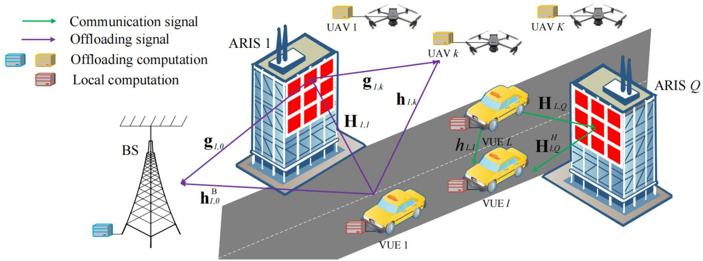
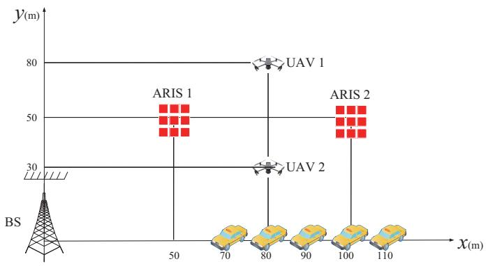
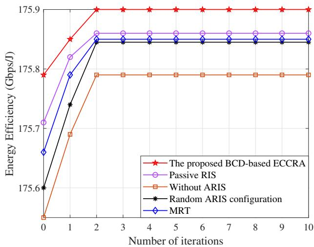
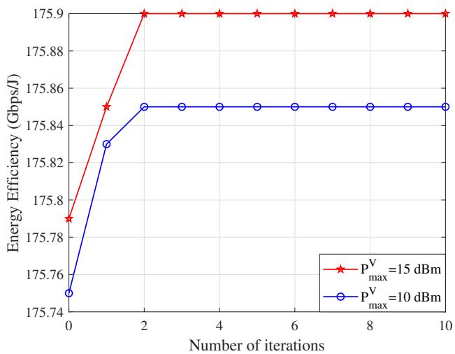
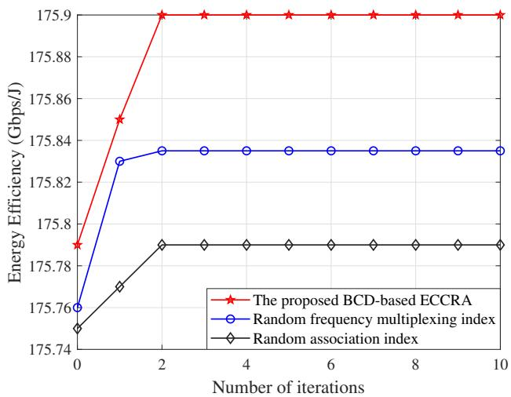
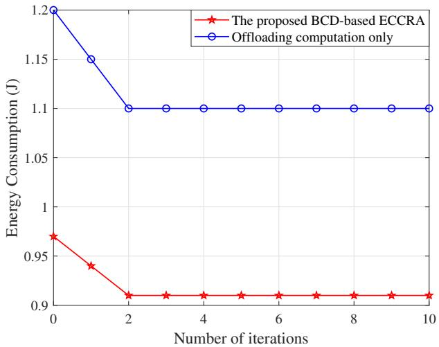
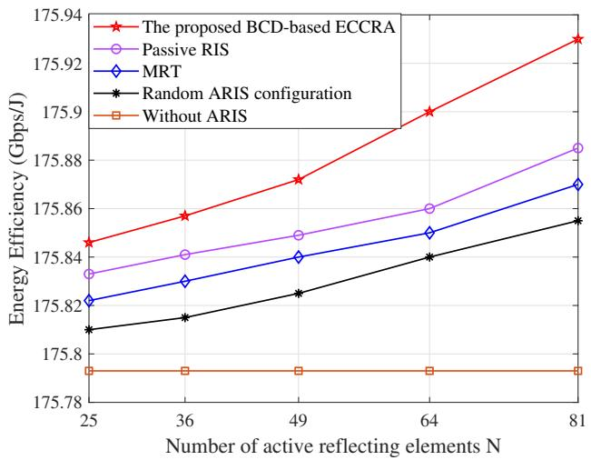
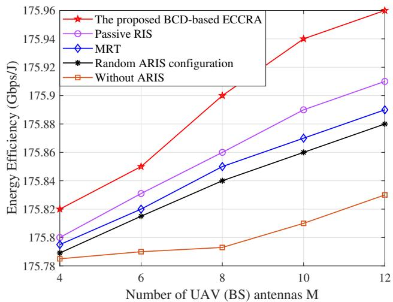
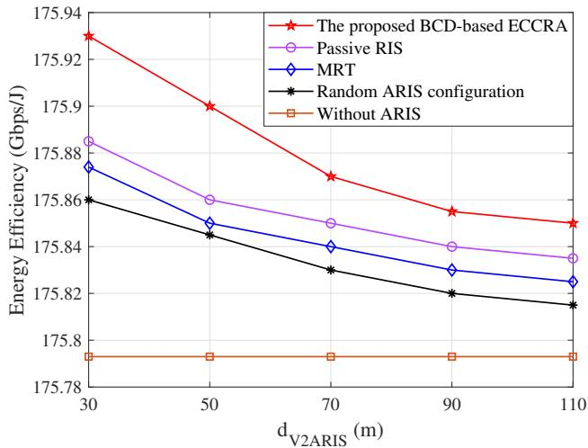
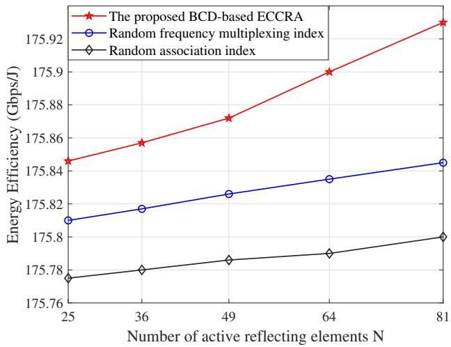

# ARIS-Aided Multi-UAV-Enabled V2X Communication and Computation: Resource Allocation and Performance Optimization

Jun Cui, Student Member, IEEE, Shubin Wang, Member, IEEE, Gerile Ge, Student Member, IEEE, Xiaolong Wu, Student Member, IEEE, Xueyan Cao, Member, IEEE

Abstract—Vehicle-to-everything (V2X) communication and computation are confronted with substantial transmission latency and energy consumption. This paper presents an energy-efficient, active, reconfigurable intelligent surface-aided V2X integrated communication and computation system utilizing unmanned aerial vehicles to enhance vehicular communication and computation. A new performance metric, termed “effective energy efficiency”, is introduced to capture the trade-offs between network energy costs, communication, and computation utilities. An optimization problem that maximizes effective energy efficiency by optimizing communication and computational resources is proposed and solved using Dinkelbach’s algorithm and fractional decomposition. The multiple association optimization sub-problem is solved using convex optimization and integer programming methods. The joint beamforming design and computation resource allocation sub-problems are reformulated as convex optimization problems through a first-order Taylor series approximation and solved using a convex optimization method. Finally, an efficient communication and computation resource allocation (ECCRA) scheme is ultimately achieved based on the block coordinate descent (BCD) framework. Simulations confirm that the proposed BCD-based ECCRA scheme significantly enhances system energy efficiency compared to benchmark testing schemes, thereby promoting the development of intelligent and sustainable transportation ecosystems.

Index Terms—Vehicle-to-everything, active reconfigurable intelligent surfaces, integrated communication and computation.

## I. INTRODUCTION

## A. Background

Vehicle-to-everything (V2X) systems, integral to intelligent transportation and autonomous driving, have advanced rapidly but face substantial implementation challenges [1]. Real-time communication between autonomous vehicles requires ultra-low latency for timely data transmission [2], [3]. Many advanced applications require real-time data processing; however, the constrained computational resources in vehicles hinder practical data analysis. Since computation on vehicles consumes significant energy, edge offloading reduces vehicle energy consumption by leveraging external computational resources [4]. Traditionally, communication and computation offloading are decoupled, leading to suboptimal resource utilization. Integrated communication and computation (ICAC) enhances data transmission rates and reduces latency by integrating communication functions with computational capabilities [5]. This integrated approach accelerates information flow between devices and services, fostering the development of technologies such as cloud and edge computing. Additionally, ICAC enhances network flexibility and scalability, allowing for dynamic resource allocation to meet evolving demands and deliver more intelligent services. However, in urban environments with tall buildings or heavy traffic, ICAC performance can be degraded by line-of-sight (LoS) obstructions [6], making it challenging to achieve efficient V2X ICAC.

To overcome Line-of-Sight (LoS) limitations, unmanned aerial vehicles (UAVs) offer a promising approach to improving edge-computation offloading. Compared to traditional base stations (BS) [7], UAVs provide three key advantages: greater coverage flexibility and dynamic adaptability for rapid deployment; lower deployment costs, enabling efficient ondemand services; and proximity to data sources, which enhances real-time processing and reduces transmission latency [8]. These capabilities make UAVs pivotal in strengthening the performance of V2X ICAC systems.

Although UAV-assisted V2X ICAC enables real-time data transmission, the long propagation distance of aerial links results in significant signal attenuation, degrading transmission quality. Active reconfigurable intelligent surfaces (ARIS), a technology that enhances the signal propagation environment and improves wireless communication performance, can effectively address this problem. ARIS combines the principles of reconfigurable intelligent surfaces (RIS) with dynamic amplification and adjustability to boost signal strength, mitigate attenuation, and optimize the performance of wireless communication networks [9]. Therefore, ARIS effectively mitigates signal fading and LoS obstructions, ensuring the stability of the UAV-assisted V2X ICAC system.

## B. Related Works

1) Studies for V2X ICAC systems: ICAC integrates wireless communication and edge computation into the same hardware devices and software resources to optimize data transmission rate and reduce latency. Massive research has been done on introducing ICAC into V2X systems [10]– [13]. Due to the huge demand for computational resources in V2X services, [14] aimed to minimize system latency in task processing while meeting resource requirements. To address non-convexity and variable coupling, the original problem was decomposed into a resource allocation subproblem and an unloading strategy sub-problem, both of which are solved efficiently compared with other baseline schemes. Moreover, [15] analyzed computation efficiency in a vehicle edge computing scenario, where each vehicle offloads its tasks to maximize computation efficiency as a tradeoff between computation time and energy consumption. A computation efficiency optimization problem was formulated by jointly designing task offloading and resource allocation. To address this issue, a mobility-aware computational-efficiency-based task offloading and resource allocation scheme was proposed, employing a distributed algorithm that yields near-optimal solutions. Also, [16] investigated the joint relay and server selection problem for a novel vehicle-assisted multi-access edge computing (MEC) system, where vehicles on the road relayed data from an end device to appropriate MEC servers for computing in a store-carry-forward manner. To exploit the stochastic nature of task arrivals, vehicle availability, and resource availability at MEC servers, a relaying scheme was designed to minimize average task latency using a Markov decision process. Accordingly, to meet the task requirements in V2X networks, communication and computing resources were allocated effectively. Thus, [17] proposed a multi-objective reinforcement learning ICAC strategy, which combined communication and computing resource allocation to reduce the total system cost consisting of latency and reliability. Specifically, this strategy can be decomposed into three algorithms to identify the target vehicle for collaborative computing. However, in realistic V2X environments with frequent LoS blockages and dynamic topology, ensuring reliable, low-latency signal transmission for integrated communication and computation remains challenging, especially when jointly optimizing UAV trajectory, ARIS configuration, and multi-dimensional resource allocation.

2) Studies for RIS-aided ICAC systems: A virtual LoS link can be established by appropriately deploying RISs between the vehicle and target, where the weaknesses of distance attenuation and traditional wireless signals are reduced by providing additional spatial degrees of freedom [18], [19]. By dynamically adjusting the RIS phase shift, the performance of vehicle edge computing systems can be substantially improved. [20] considered an RIS-assisted vehicle edge computing system and designed an optimal scheme for local execution power, offloading power, and RIS phase-shift, where random task arrivals and channel variations were taken into account. Simulation results demonstrated that the proposed scheme significantly enhanced system performance. In addition, compared with passive RIS, the ARIS, equipped with an active reflective amplifier, can effectively improve the performance of communication and computation systems. [21] investigated an ARIS-aided MEC system. A joint computing and communication design was proposed to minimize the maximum computational latency, subject to phase-shift constraints and edge-computing capability constraints. Specifically, the original problem was decomposed into four sub-problems, and the block coordinate descent (BCD) and successive convex approximation (SCA) methods were applied to optimize these sub-problems in an alternating manner. Simulation results showed that the performance gain achieved by the ARIS was substantially greater than that of the passive RIS. Also, [22] considered an ARIS-assisted uplink MEC system and proposed an ARIS-assisted non-orthogonal multiple access scheme. A total computation bit maximization problem was formulated to improve computational capability by jointly optimizing the BS’s receive beamforming, ARIS’s reflection coefficients, the local computing frequency, and the transmit power for each user. Numerical results validated the advantages of the proposed ARIS-assisted non-orthogonal multiple access scheme over conventional benchmarks. Additionally, because BS coverage was insufficient, offloading vehicle tasks was a problem that needed to be addressed.

3) Studies for UAV-aided ICAC systems: ICAC networks suffer from limited coverage and harsh wireless transmission conditions, severely constraining the computing capacity of vehicle-to-infrastructure (V2I) devices. To overcome this issue, [23] proposed a novel MEC framework empowered by a UAV relay and an RIS. To fully exploit the potential for computational enhancement afforded by the joint UAV and RIS design, a max-min computation-capacity problem was formulated. This problem involves determining the UAV’s uplink signal detection, active beamforming, passive beamforming of the RIS, time-slot partition, computation bits of the UAV, and the UAV’s trajectory. Additionally, [24] investigated UAV-assisted MEC for a platoon of wireless power transmission-enabled vehicles, aiming to maximize the system-wide computational capacity subject to both communication and computational resource constraints. To tackle the resulting optimization problem, [24] proposed a successive convex programming method based on a second-order convex approximation. Moreover, simulation results were provided to validate the effectiveness of our proposed method and to demonstrate its superior performance compared with conventional schemes. Multi-UAVs offer greater flexibility than single UAVs and can quickly adjust their operating modes in response to environmental and task changes. This adaptability was critical in dynami cally changing environments. [25] considered deploying multi-UAVs to provide integrated sensing, communication, and computation services. While serving communication users, each UAV also detects targets and collaborates with the edge server to run a deep neural network model, processing the obtained sensing data for target classification. Simulation results demonstrated that using multiple UAVs improved the system’s overall performance. Additionally, given the dynamic mode transformation of multiple UAVs and vehicles, the issue of algorithmic complexity must be addressed. To overcome this issue, we propose a high-rate, low-energy-consumption ARISaided, multi-UAV-enabled V2X ICAC scheme that effectively improves system performance while reducing complexity.

## C. Motivation and Contributions

Motivated by these observations, this paper proposes an ARIS-aided, multi-UAV-enabled V2X ICAC system to achieve high data transfer rates and low energy consumption, thereby enhancing joint communication and computation performance. Given the mutual coupling between communication and computation variables, we propose an adaptive optimization scheme. The main contributions are summarized as follows:

• Integrated ARIS-UAV Architecture for V2X Communication and Computation: We introduce a novel system architecture that jointly deploys ARIS and multiple UAVs to establish resilient and low-latency links in dynamic V2X environments. This architecture overcomes lineof-sight blockages through adaptive ARIS beamforming and leverages UAV mobility to provide on-demand edge computing and communication relaying, thereby fundamentally enhancing the availability and reliability of integrated V2X services.

• Joint Communication-Computation Optimization with a Novel Metric: We formulate a comprehensive joint optimization problem based on a newly proposed system-level metric, termed “effective energy efficiency” , which holistically captures the interplay among communication rate, computation delay, and energy expenditure in ARIS-aided multi-UAV V2X systems. To solve this high-dimensional non-convex problem, we develop a decompositionbased optimization framework that leverages BCD, Dinkelbach’s transformation, and successive convex approximation, thereby effectively coordinating ARIS reflection, multi-antenna beamforming, task offloading, and computation resource allocation under practical constraints.

• Efficient and Scalable Algorithm Design with Performance Guarantees: We design a provably convergent iterative efficient communication and computation resource allocation (ECCRA) algorithm that transforms the original non-convex problem into a sequence of tractable convex subproblems via semidefinite relaxation and first-order Taylor expansion. The proposed algorithm achieves near-optimal performance with polynomial-time complexity, making it scalable for real-time V2X resource management. Extensive simulation results under realistic vehicular scenarios validate that our approach significantly outperforms existing passive RIS, random configuration, and conventional beamforming schemes in terms of energy efficiency, latency, and coverage reliability.

## D. Organization and Notations

The remainder of this paper is organized as follows. Section II describes the ARIS-aided multi-UAV-enabled V2X ICAC system model. Section III describes problem formulation. Section IV proposes the BCD-based ECCRA scheme. Simulation results are presented in Section V, and the paper concludes with Section VI.

Notations: Boldface letters are used for vectors and matrices. Transpose, conjugate-transpose, and matrix inverse are denoted by $( \cdot ) ^ { T } , \ ( \cdot ) ^ { H }$ , and $( \cdot ) ^ { - 1 }$ , respectively. Also, $| | \cdot | | ,$ $| \cdot | .$ , and ⊗ stand for the Euclidean norm, absolute value, and Kronecker product, respectively. diag(·) and $\operatorname { t r } ( \cdot )$ represent the diagonal matrix and the trace. In addition, $\mathbb { C } ^ { N \times 1 }$ denotes the space of $N \times 1$ complex-valued matrices.

TABLE I SYMBOL DEFINITION
<table><tr><td>Symbol</td><td>Description</td></tr><tr><td> $\overline { { M } }$ </td><td>The number of antennas of the UAV (BS)</td></tr><tr><td> $N$ </td><td>The number of elements of each ARIS</td></tr><tr><td> $L$ </td><td>The number of vehicles</td></tr><tr><td> $Q$ </td><td>The number of ARISs</td></tr><tr><td> $\dot { K }$ </td><td>The number of UAVs</td></tr><tr><td> $\mu _ { l }$ </td><td>The vehicle mode index</td></tr><tr><td> $\beta _ { i , j ( k ) }$ </td><td>The vehicle association index</td></tr><tr><td> $\gamma _ { i , q }$ </td><td>The ARIS association index</td></tr><tr><td> $\alpha _ { i , l }$ </td><td>The frequency multiplexing index</td></tr><tr><td> $\mathbf { H } _ { i , q }$ </td><td>The channel from vehicle i to ARIS q</td></tr><tr><td> $h _ { i , j }$ </td><td>The direct channel between vehicles  $i - j$ </td></tr><tr><td> $\mathbf { h } _ { i , k }$ </td><td>The direct channel from vehicle ¿ to UAV (BS) k</td></tr><tr><td> $\mathbf { g } _ { q , k }$ </td><td>The channel from ARIS q to UAV (BS) k</td></tr><tr><td> $\Theta _ { q }$ </td><td>The reflecting matrix of ARIS q</td></tr><tr><td> $\omega _ { i , k }$ </td><td>The combining beamforming vector at the UAV (BS)</td></tr><tr><td> $r _ { i }$ </td><td>The ratio of offloading tasks of vehicle i</td></tr><tr><td> $\dot { f } _ { \cdot } ^ { \mathrm { v } }$ </td><td>The local computation capability of vehicle i</td></tr><tr><td> $\mathbf { \chi } _ { f } ^ { \mathrm { 3 } } \mathbf { \chi } _ { \mathrm { 4 } ( \mathbf { B } ) }$   $\underline { f } _ { k }$ </td><td>The computation capability of UAV (BS) k</td></tr><tr><td> $\stackrel { \triangledown } { P _ { i } }$ </td><td>The transmit power of vehicle ¿</td></tr></table>

## II. SYSTEM MODEL

This section describes system settings, channel model, communication model, and offloading computation model of the ARIS-aided multi-UAV-enabled V2X ICAC system.

## A. System Settings

In Fig. 1, we present an ARIS-aided multi-UAV-enabled V2X ICAC system, comprising an M-antenna BS, K UAVs each equipped with M antennas, L single-antenna vehicles, and Q ARISs each with N active reflecting elements1. In this work, we adopt a quasi-static mobility model for vehicles, in which each vehicle maintains a fixed position within a single coherent transmission block and may change its location across different blocks. This modeling approach is commonly used in resource allocation studies for ICAC systems, as it allows us to focus on the core optimization problem, i.e., joint ARIS configuration, UAV beamforming, and task offloading, under given channel realizations, without introducing additional complexity from continuous mobility dynamics2. The vehicle is divided into communication functions for intervehicle communication and offloading computation functions responsible for task offloading. This system’s frequency band for vehicle-to-UAV (V2U) or vehicle-to-BS (V2B) offloading is multiplexed with the V2V communication band. Orthogonal frequency-division multiplexing is used to separate the different V2I offloading links. Additionally, multiple UAVs enable vehicle computation offloading, leveraging UAV features, such as short-range LoS links, high flexibility, and mobility, thereby significantly enhancing network performance. Furthermore, multiple ARISs are deployed to assist in computation and communication by actively controlling the phase and amplitude of each element.

  
Fig. 1. Model of the ARIS-aided multi-UAV-enabled V2X ICAC system.

All symbols are defined in Table I. Denote the set of receivers (including UAVs and the BS), the set of ARISs, and the set of vehicles are $\mathcal { K } = \{ 0 , 1 , \ldots , K \} , \mathcal { Q } = \{ 1 , \ldots , Q \}$ $\mathcal { L } = \{ 1 , \ldots , L \}$ , respectively. Herein, k = 0 represents the BS.

## B. Channel Model

The number of available channels increases due to the introduction of ARISs. The phase shift matrix of ARIS q is $\Theta _ { q } ~ = ~ \mathrm { d i a g } \left( \xi _ { q } \right) ~ \in ~ \mathbb { C } ^ { N \times \bar { N } }$ with reflecting beam $\xi _ { q } \ = \quad$ $\left[ a _ { 1 } e ^ { j \bar { \theta } _ { 1 } } , \dots , a _ { N } e ^ { j \bar { \theta } _ { N } } \right] ^ { T } \ \in \ \mathbb { C } ^ { N \times 1 }$ . Herein, $a _ { n } \geq 1$ and $\bar { \theta } _ { n } \in [ 0 , 2 \pi ]$ are the amplitude and phase shift coefficients, respectively [27].

As such, the effective channels of V2V communication and V2I offloading can be expressed as [28]

$$
A _ { i , j } = \sum _ { q = 1 } ^ { Q } \gamma _ { i , q } { \bf H } _ { j , q } ^ { H } \Theta _ { q } { \bf H } _ { i , q } + h _ { i , j } ,\tag{1}
$$

$$
\mathbf { B } _ { i , k } = \sum _ { q = 1 } ^ { Q } \gamma _ { i , q } \mathbf { g } _ { q , k } \Theta _ { q } \mathbf { H } _ { i , q } + \mathbf { h } _ { i , k } ,\tag{2}
$$

where $\gamma _ { i , q }$ is the association index of vehicle i−ARIS q and $h _ { i , j } ^ { \mathrm { V } } \in \mathbb { C } ^ { \mathrm { i } \times 1 }$ is the direct channel of vehicles $i - j$ . The channel from vehicle i to ARIS $q$ is modeled as

$$
\begin{array} { r } { \mathbf { H } _ { i , q } = c _ { i , q } \mathbf { b } _ { q } \left( u _ { i , q } ^ { \mathrm { A } } , v _ { i , q } ^ { \mathrm { A } } \right) , } \end{array}\tag{3}
$$

where $c _ { i , q }$ and $\mathbf { b } _ { q } \in \mathbb { C } ^ { N \times 1 }$ are the complex channel gain of vehicle i−ARIS q and the array response vector of ARIS q. The array response vector is given by

$$
\begin{array} { r } { \mathbf { b } _ { q } \left( u _ { i , q } ^ { \mathrm { A } } , v _ { i , q } ^ { \mathrm { A } } \right) = \left[ 1 , \ldots , e ^ { j \pi n _ { x } u _ { i , q } ^ { \mathrm { A } } } , \ldots , e ^ { j \pi \left( N _ { x } - 1 \right) u _ { i , q } ^ { \mathrm { A } } } \right] ^ { T } } \\ { \otimes \left[ 1 , \ldots , e ^ { j \pi n _ { z } v _ { i , q } ^ { \mathrm { A } } } , \ldots , e ^ { j \pi \left( N _ { z } - 1 \right) v _ { i , q } ^ { \mathrm { A } } } \right] ^ { T } , } \end{array}\tag{4}
$$

where $N _ { x }$ and $N _ { z }$ are the number of elements in the x/z axis. $u _ { i , q } ^ { \mathrm { A } }$ and $v _ { i , q } ^ { \mathrm { A } }$ are two effective angles of arrival (AoAs) of vehicle i−ARIS q, which are defined as

$$
\begin{array} { l } { { \displaystyle u _ { i , q } ^ { \mathrm { A } } = \frac { 2 d _ { \mathrm { R } } } { \lambda } \cos \left( \vartheta _ { i , q } ^ { \mathrm { A } } \right) \sin \left( \varphi _ { i , q } ^ { \mathrm { A } } \right) , } } \\ { { \displaystyle v _ { i , q } ^ { \mathrm { A } } = \frac { 2 d _ { \mathrm { R } } } { \lambda } \sin \left( \vartheta _ { i , q } ^ { \mathrm { A } } \right) . } } \end{array}\tag{5}
$$

$d _ { \mathrm { R } }$ represents the distance between two adjacent elements of each ARIS, λ is the carrier wavelength, $\vartheta _ { i , q } ^ { \mathrm { A } }$ and $\varphi _ { i , q } ^ { \mathrm { A } }$ are elevation and azimuth AoAs of vehicle i−ARIS q, respectively. Similarly, the channel from vehicle i to UAV (BS) k is modeled as

$$
{ \bf h } _ { i , k } = \hat { c } _ { i , k } { \bf b } _ { k } \left( \hat { v } _ { i , k } ^ { \mathrm { A } } \right) ,\tag{6}
$$

where $\hat { c } _ { i , k }$ and $\mathbf { b } _ { k } \in \mathbb { C } ^ { M \times 1 }$ are the complex channel gain of vehicle i−UAV (BS) k and the array response vector of UAV (BS) k. The array response vector is given by

$$
\mathbf { b } _ { k } \left( \hat { v } _ { i , k } ^ { \mathrm { A } } \right) = \left[ 1 , \ldots , e ^ { j \pi m \hat { \vartheta } _ { i , k } ^ { \mathrm { A } } } , \ldots , e ^ { j \pi ( M - 1 ) \hat { \vartheta } _ { i , k } ^ { \mathrm { A } } } \right] ^ { T } .\tag{7}
$$

$\hat { v } _ { i , k } ^ { \mathrm { A } }$ is effective AoA of vehicle i−UAV (BS) k, which is defined as

$$
\hat { v } _ { i , k } ^ { \mathrm { A } } = \frac { 2 d _ { \mathrm { U ( B ) } } } { \lambda } \sin \left( \hat { \vartheta } _ { i , k } ^ { \mathrm { A } } \right) ,\tag{8}
$$

with the similar definitions of $d _ { \mathrm { U ( B ) } } , \hat { \vartheta } _ { i , k } ^ { \mathrm { A } }$ . Assuming that $d _ { \mathrm { R } } =$ $d _ { \mathrm { U ( B ) } } = \lambda / 2$ . Furthermore, the channel from ARIS q to UAV (BS) k is modeled as

$$
\begin{array} { r } { \mathbf { g } _ { \boldsymbol { q } , \boldsymbol { k } } = \tilde { c } _ { \boldsymbol { q } , \boldsymbol { k } } \mathbf { b } _ { \boldsymbol { k } } \left( \tilde { v } _ { \boldsymbol { q } , \boldsymbol { k } } ^ { \mathrm { A } } \right) \mathbf { b } _ { \boldsymbol { q } } ^ { H } \left( \tilde { u } _ { \boldsymbol { q } , \boldsymbol { k } } ^ { \mathrm { D } } , \tilde { v } _ { \boldsymbol { q } , \boldsymbol { k } } ^ { \mathrm { D } } \right) , } \end{array}\tag{9}
$$

$$
R _ { j } ^ { \mathrm { c o m } } = \log _ { 2 } \left( 1 + \frac { \sum _ { i = 1 } ^ { L } \beta _ { i , j } \bigg | \sqrt { P _ { i } } A _ { i , j } \bigg | ^ { 2 } }  \sum _ { i = 1 } ^ { L } \beta _ { i , j } \left\{ \underset { l \neq i , j } { L } \right\} \left[ \mu _ { l } \alpha _ { i , l } \sqrt { P _ { l } } A _ { l , j } + ( 1 - \mu _ { l } ) \alpha _ { l , l } \sqrt { P _ { l } } A _ { l , j } \right] \bigg | ^ { 2 } + \sum _ { q = 1 } ^ { Q } \bigg \| \gamma _ { i , q } \mathbf { H } _ { j , q } ^ { H } \Theta _ { q } \mathbf { v } _ { i } \bigg \| ^ { 2 } + \sigma _ { j } ^ { 2 } \bigg \} \right)\tag{12}
$$

where $\tilde { c } _ { q , k }$ is the complex channel gain of ARIS $q { \mathrm { - } } \mathrm { U A V }$ (BS) k. $\tilde { v } _ { q , k } ^ { \mathrm { A } }$ is effective AoA as

$$
\tilde { v } _ { q , k } ^ { \mathrm { A } } = \frac { 2 d _ { \mathrm { U ( B ) } } } { \lambda } \sin \left( \tilde { \vartheta } _ { q , k } ^ { \mathrm { A } } \right) ,\tag{10}
$$

with the similar definitions of $\tilde { \vartheta } _ { q , k } ^ { \mathrm { A } } .$ The two effective angles of departure (AoDs) at UAV (BS) k are defined as

$$
\begin{array} { r l } & { \tilde { u } _ { { q } , { k } } ^ { \mathrm { D } } = \displaystyle \frac { 2 d _ { \mathrm { R } } } { \lambda } \cos \left( \tilde { \vartheta } _ { { q } , { k } } ^ { \mathrm { D } } \right) \sin \left( \tilde { \varphi } _ { { q } , { k } } ^ { \mathrm { D } } \right) , } \\ & { \tilde { v } _ { { q } , { k } } ^ { \mathrm { D } } = \displaystyle \frac { 2 d _ { \mathrm { R } } } { \lambda } \sin \left( \tilde { \vartheta } _ { { q } , { k } } ^ { \mathrm { D } } \right) , } \end{array}\tag{11}
$$

with the similar definitions of $\tilde { \vartheta } _ { q , k } ^ { \mathrm { D } } , \tilde { \varphi } _ { q , k } ^ { \mathrm { D } }$

## C. Communication Model

Each vehicle j receives the communication signals via the direct link from vehicle i and the reflected link from ARIS $q ,$ and the communication rate of vehicle j is shown in Eq. (12), where $P _ { i }$ is transmit power of vehicle i. In addition, $\mu _ { l } \in \{ 0 , 1 \} , \beta _ { i , j } \in \{ 0 , 1 \} , \gamma _ { i , q } \in \{ 0 , 1 \}$ and $\alpha _ { i , l } \in \{ 0 , 1 \}$ are the vehicle mode index, the vehicle association index of vehicle $i - j$ , the ARIS association index of vehicle i−ARIS $q ,$ and the frequency multiplexing index of vehicle $i \mathrm { ~ - ~ } l ,$ respectively. Herein, $i , j , l \in \mathcal { L } , \mu _ { l } = 1 ( 0 )$ means that vehicle l transmits the offloading (communication) signal, $\beta _ { i , j } = 1$ means that vehicle i is associated with vehicle $j , \ \gamma _ { i , q } \ = \ 1$ means that vehicle i is associated with ARIS $q , \ \alpha _ { i , l } \ = \ 1$ means that communication vehicle l multiplexes the frequency occupied by offloading vehicle $i ,$ and $\bar { i } = \arg _ { i } \{ \beta _ { i , j } = 1 \}$ $\bar { l } =$ argl $\left\{ \alpha _ { i , l } ^ { - } = 1 \right\}$ . Additionally, $\mathbf { v } _ { i }$ is related to the input noise and the inherent device noise of the ARIS elements that will be amplified and $\mathbf v _ { i } \sim { \mathcal { C N } } \left( 0 , \sigma _ { v } ^ { 2 } \mathbf I _ { N } \right) . n _ { j }$ is the i.i.d. complex Gaussian random process of vehicle i with $( 0 , \sigma _ { j } ^ { 2 } )$

## D. Offloading and Computation Model

1) Offloading and edge computation: UAV (BS) k receives the offloading signals via the direct link from vehicle i and the reflected link from ARIS q, and the offloading rate at UAV (BS) k is shown in Eq. (13), where $\beta _ { i , k } \in \{ 0 , 1 \}$ is the vehicle i association index from vehicle to UAV (BS) $k , \omega _ { i , k } ^ { H } \in \mathbb { C } ^ { 1 \times M }$ is the combining beamforming vector at UAV (BS) k, ${ \bf g } _ { q , k } \in$ $\mathbb { C } ^ { M \times N }$ is the channel from ARIS q to UAV (BS) k and $\mathbf { h } _ { i , k } \in$ $\mathbb { C } ^ { M \times 1 }$ is the direct channel from vehicle i to UAV (BS) k, and $n _ { k }$ is the i.i.d. complex Gaussian random process of receiver k with zero mean and variance $\sigma _ { k } ^ { 2 } .$

2) Local computation: A partial offloading strategy for the vehicle’s computation task is considered. $D _ { i }$ denotes the computation task sizes of vehicle i, $D _ { i } ^ { \mathrm { c o m } }$ denotes the communication sizes of vehicle $i , r _ { i } \in [ 0 , 1 ]$ denotes the ratio of tasks offloaded to the UAV (BS), and $1 - r _ { i }$ denotes the ratio of local computation tasks.

## III. PROBLEM FORMULATION

An ICAC resource allocation and performance optimization scheme has been proposed for the ARIS-aided multi-UAVenabled V2X ICAC system to minimize spectrum waste and enhance communication and computational performance.

## A. Latency and Energy Consumption

The transmission latency for offloading tasks from vehicle i to UAV (BS) k, the communication latency between vehicle i and vehicle $j ,$ the local computation latency at vehicle $i ,$ and the computation latency at UAV (BS) k for processing tasks offloaded from vehicle i are defined as

$$
\begin{array} { l } { { t _ { i , k } ^ { \mathrm { o f f } } = \displaystyle \frac { r _ { i } D _ { i } } { R _ { k } ^ { \mathrm { o f f } } } , t _ { i , j } ^ { \mathrm { c o m } } = \displaystyle \frac { D _ { i } ^ { \mathrm { c o m } } } { R _ { j } ^ { \mathrm { c o m } } } , } } \\ { { t _ { i } ^ { \mathrm { l o c , V } } = \displaystyle \frac { \left( 1 - r _ { i } \right) D _ { i } S _ { i } ^ { \mathrm { V } } } { f _ { i } ^ { \mathrm { V } } } , t _ { i , k } ^ { \mathrm { c o m , U ( B ) } } = \displaystyle \frac { r _ { i } D _ { i } S _ { k } ^ { \mathrm { U ( B ) } } } { f _ { i , k } ^ { \mathrm { U ( B ) } } } , } } \end{array}\tag{14}
$$

where $S _ { i } ^ { \mathrm { V } } , S _ { k } ^ { \mathrm { U } } , S _ { 0 } ^ { \mathrm { B } } , f _ { i } ^ { \mathrm { V } } , f _ { i , k } ^ { \mathrm { U } }$ , and $f _ { i , 0 } ^ { \mathrm { B } }$ are the central processing unit (CPU) cycles of the local computation at vehicle i, the CPU cycles of UAV k computation, the CPU cycles of the BS computation, the local’s computation capability of vehicle i, the UAV $k ' \mathrm { s }$ computation capability, and the BS’s computation capability [29]. In the meantime, the energy consumption by vehicle i for task offloading, the energy consumption by vehicle i for communication, and the energy consumption by vehicle i for local computation, and the energy consumption by UAV (BS) k for computing offloading tasks are given as:

$$
\begin{array} { l } { { \displaystyle E _ { i } ^ { \mathrm { o f f } } = \sum _ { k = 0 } ^ { K } \beta _ { i , k } P _ { i } t _ { i , k } ^ { \mathrm { o f f } } , E _ { i } ^ { \mathrm { c o m } } = \sum _ { j = 1 } ^ { L } \beta _ { i , j } P _ { i } t _ { i , j } ^ { \mathrm { c o m } } , } } \\ { { \displaystyle E _ { i } ^ { \mathrm { l o c } , \mathrm { V } } = \kappa _ { 1 } \left( f _ { i } ^ { \mathrm { V } } \right) ^ { 2 } \left( 1 - r _ { i } \right) D _ { i } S _ { i } ^ { \mathrm { V } } , } } \\ { { \displaystyle E _ { k } ^ { \mathrm { c o m } , \mathrm { U ( B ) } } = \sum _ { i = 1 } ^ { L } \beta _ { i , k } \kappa _ { 2 } \left( f _ { i , k } ^ { \mathrm { U ( B ) } } \right) ^ { 2 } r _ { i } D _ { i } S _ { k } ^ { \mathrm { U ( B ) } } , } } \end{array}\tag{15}
$$

where $\kappa _ { 1 } , \kappa _ { 2 }$ is the power-efficiency coefficient of the CPU. Additionally, the energy consumption of ARISs cannot be ignored [30], which is expressed as

$$
E ^ { \mathrm { R I S } } = P ^ { \mathrm { R I S } } t ^ { \mathrm { R I S } } ,\tag{16}
$$

where $t ^ { \mathrm { R I S } } = \operatorname* { m a x } \{ t _ { i } ^ { \mathrm { l o c , V } } , t _ { i , k } ^ { \mathrm { o f f } } + t _ { i , k } ^ { \mathrm { c o m , U ( B ) } } , t _ { i , j } ^ { \mathrm { c o m } } \}$ is the ARIS running time,

$$
{ \cal P } ^ { \mathrm { R I S } } = \sum _ { q , i = 1 } ^ { Q , L } \left( P _ { i } \big | \big | \gamma _ { i , q } \Theta _ { q } \mathbf { H } _ { i , q } \big | \big | ^ { 2 } + \big | \big | \gamma _ { i , q } \Theta _ { q } \big | \big | ^ { 2 } \sigma _ { v } ^ { 2 } \right) ,\tag{17}
$$

which is the total power consumption of all ARISs. The first item is the power consumption associated with amplifying the incident signal, and the second is the energy consumption due to amplified noise.

$$
R _ { k } ^ { \mathrm { o f f } } = \log _ { 2 } ( 1 + \frac { \sum _ { i = 1 } ^ { L } \beta _ { i , k } \Big | \sqrt { P _ { i } } \omega _ { i , k } ^ { H } \mathbf { B } _ { i , k } \Big | ^ { 2 } } { \sum _ { i = 1 } ^ { L } \beta _ { i , k } [ \underset { \lfloor \neq \neq _ { i , j } \rfloor } { L } [ ( 1 - \mu _ { l } ) \alpha _ { l , \bar { i } } \sqrt { P _ { l } } \omega _ { i , k } ^ { H } \mathbf { B } _ { l , k } ] ^ { 2 } + \underset {  \neq = 1 } { Q } \| \omega _ { i , k } ^ { H } \gamma _ { i , q } \mathbf { g } _ { q , k } \Theta _ { q } \mathbf { v } _ { i } \| ^ { 2 } + \| \omega _ { i , k } ^ { H } \| ^ { 2 } \sigma _ { k } ^ { 2 } ] } )\tag{13}
$$

$$
\mathbf { P } \mathrm { : } \operatorname* { m a x } _ { \{ \omega , \Theta , \mathbf { P } , \alpha , \beta , \gamma , \mathbf { f } \} } \frac { \displaystyle \sum _ { L } ^ { L } R _ { j } ^ { \mathrm { c o m } } + \sum _ { k = 0 } ^ { K } R _ { k } ^ { \mathrm { o f f } } } { \displaystyle \sum _ { i = 1 } ^ { L } \Big [ \mu _ { i } \left( E _ { i } ^ { \mathrm { l o c , V } } + E _ { i } ^ { \mathrm { o f f } } \right) + \left( 1 - \mu _ { i } \right) E _ { i } ^ { \mathrm { c o m } } \Big ] + \sum _ { k = 0 } ^ { K } E _ { k } ^ { \mathrm { c o m , U ( B ) } } + E ^ { \mathrm { R I S } } }
$$

$$
\mathrm { s . t . } \mathrm { C 1 } : \sum _ { i = 1 } ^ { L } \left\| \omega _ { i , k } ^ { H } \right\| ^ { 2 } \leq P _ { \operatorname* { m a x } } ^ { \mathrm { U } } , \sum _ { i = 1 } ^ { L } \left\| \omega _ { i , 0 } ^ { H } \right\| ^ { 2 } \leq P _ { \operatorname* { m a x } } ^ { \mathrm { B } } ,
$$

$$
\mathbf { C } 2 : \sum _ { i = 1 } ^ { L } \sum _ { q = 1 } ^ { Q } \left( P _ { i } \big \| \gamma _ { i , q } \Theta _ { q } \mathbf { H } _ { i , q } \big \| ^ { 2 } + \big \| \gamma _ { i , q } \Theta _ { q } \big \| ^ { 2 } \sigma _ { v } ^ { 2 } \right) \leq P _ { \operatorname* { m a x } } ^ { \mathrm { R I S } } , \theta _ { n } \in \left[ 0 , 2 \pi \right] , a _ { n } \geq 1 ,
$$

$$
{ \bf C } 3 : \sum _ { l = 1 } ^ { L } \alpha _ { i , l } = 1 , 0 \le \sum _ { i = 1 } ^ { L } \alpha _ { i , l } \le L , \alpha _ { i , l } \in \{ 0 , 1 \} ,
$$

$$
{ \bf C } 4 : \sum _ { i = 1 } ^ { L } \beta _ { i , j } = 1 , \sum _ { k = 1 } ^ { K } \beta _ { i , k } = 1 , 0 \le \sum _ { i = 1 } ^ { L } \beta _ { i , k } \le L , \beta _ { i , j ( k ) } \in \left\{ 0 , 1 \right\} ,\tag{18}
$$

$$
{ \bf C 5 } : \sum _ { q = 1 } ^ { Q } \gamma _ { i , q } = 1 , 0 \leq \sum _ { i = 1 } ^ { L } \gamma _ { i , q } \leq L , \gamma _ { i , q } \in \{ 0 , 1 \} ,
$$

C6 : $0 \leq r _ { i } \leq 1 ,$

$$
{ \bf C } 7 : \operatorname* { m a x } \left\{ t _ { i } ^ { \mathrm { l o c } , \mathrm { V } } , \sum _ { k = 1 } ^ { K } \beta _ { i , k } \left( t _ { i , k } ^ { \mathrm { o f f } } + t _ { i , k } ^ { \mathrm { c o m , U ( B ) } } \right) , \sum _ { j = 1 } ^ { L } \beta _ { i , j } t _ { i , j } ^ { \mathrm { c o m } } \right\} \leq t _ { \operatorname* { m a x } } ,
$$

$$
\mathbf { C 8 } : 0 \leq { f } _ { i , k } ^ { \mathrm { U ( B ) } } , \sum _ { i = 1 } ^ { L } \beta _ { i , k } { f } _ { i , k } ^ { \mathrm { U ( B ) } } \leq { f } _ { \operatorname* { m a x } } ^ { \mathrm { U ( B ) } } ,
$$

$$
{ \mathrm { C } } 9 : 0 \leq P _ { i } \leq P _ { \operatorname* { m a x } } ^ { \mathrm { V } } ,
$$

## B. Optimization Problem

To comprehensively characterize the coupled performances, we introduce a new system performance index, named “effective energy efficiency”, to capture the interplay between network energy cost, communication utility, and computation utility. Accordingly, the performance optimization problem can be formulated as Eq. (18), where $\omega = \left[ \omega _ { 1 , 1 } , . . . , \omega _ { L , K } \right] , \Theta =$ $\left[ \Theta _ { 1 } , . . . , \Theta _ { Q } \right] , \mathbf { P } ~ = ~ \left[ P _ { 1 } , . . . , P _ { L } \right] , \alpha ~ = ~ \left[ \alpha _ { 1 , 1 } , . . . , \alpha _ { L , L } \right] , \beta ~ = ~ \left[ \alpha _ { 1 , 2 } , . . . , \alpha _ { L , L } \right] ,$ $[ \beta _ { 1 , 1 } , . . . , \beta _ { L , L ( K ) } ] , \gamma = [ \gamma _ { 1 , 1 } , . . . , \gamma _ { L , Q } ] , \mathbf { r } = [ r _ { 1 } , . . . , r _ { L } ] , \mathbf { f } =$ $[ f _ { 1 , 1 } ^ { \mathrm { U ( B ) } } , . . . , f _ { L , K } ^ { \mathrm { U ( B ) } } ]$ . C1 and C2 constrain the power budgets of the UAV (BS) and ARIS, C3 guarantees that only one communication vehicle can be multiplexed with an offloading vehicle, C4 guarantees that the vehicle is scheduled for offloading computation or communication, C5 guarantees that only one ARIS is scheduled for offloading computation or communication, C6 limits the ratio of tasks offloading, C7 expresses maximum transmission latency $t _ { \mathrm { m a x } } ,$ C8 demonstrates the computation capability, and C9 is the power budget of vehicle i.

The original problem is an optimization problem with the goal of “effective energy efficiency”, which requires joint optimization of multiple variables, including communication resources, computation resources, and association relationships. There is a strong coupling between these variables, rendering the original problem non-convex and highly complex. There is no efficient analytical or numerical method to solve it directly. To cope with its high complexity, variableproperty differences, and strong coupling, the BCD framework is employed to reduce the computational difficulty, adapt to different variable-solving methods, and control computational complexity, ultimately achieving efficient resource-allocation optimization and algorithmic convergence.

## IV. A BLOCK COORDINATE DESCENT-BASED EFFICIENT COMMUNICATION AND COMPUTATION RESOURCE ALLOCATION SCHEME

In this section, a BCD-based ECCRA scheme is proposed to improve the new performance index by decomposing problem P, where three sub-problems are formulated: 1) Multiple association optimization sub-problem for $\{ \alpha , \beta , \gamma \} . ~ 2 )$ Joint beamforming design sub-problem for $\{ \omega , \Theta , \mathbf { P } \} . \ 3 )$ Computation resource allocation sub-problem for $\{ \mathbf { r } , \mathbf { f } \}$ . The three sub-problems are transformed into convex problems via firstorder Taylor expansions and solved using convex optimization and integer programming methods. The detailed procedure for solving the three sub-problems is shown below.

## A. Problem Transformation

First, a preprocessing step is applied to the objective function because of its intractable fractional form. Specifically, by introducing auxiliary variable λ, we utilize the classic Dinkelbach algorithm, and the original problem (18) can be reformulated equivalently as

$$
\begin{array} { c } { { \displaystyle \operatorname* { m a x } _ { \{ \omega , \Theta , \mathbf { P } , \alpha , \beta , \gamma , \mathbf { r } , \mathbf { f } \} } R - \lambda E } } \\ { { \mathrm { s . t . } ~ \mathbf { P - C } 1 \sim \mathbf { P - C } 9 , } } \end{array}\tag{19}
$$

where $\begin{array} { r c l } { E } & { = } & { \sum _ { i = 1 } ^ { L } \left\lceil \mu _ { i } \left( E _ { i } ^ { \mathrm { l o c , V } } + E _ { i } ^ { \mathrm { o f f } } \right) + \left( 1 - \mu _ { i } \right) E _ { i } ^ { \mathrm { c o m } } \right\rceil + } \end{array}$ $\begin{array} { r l } { \sum _ { k = 0 } ^ { K } E _ { k } ^ { \mathrm { c o m , U ( B ) } } + E ^ { \mathrm { R I S } } , \dot { R } = \sum _ { j = 1 } ^ { L } R _ { j } ^ { \mathrm { c o m } } + \sum _ { k = 0 } ^ { K } R _ { k } ^ { \mathrm { o f f } } , \dot { \lambda ^ { \ast } } = } & { { } } \end{array}$ $R / E$ . Subsequently, the problem is decomposed into three subproblems and optimized iteratively.

## B. Multiple Association Optimization Sub-Problem

Given the variables $\{ \omega , \Theta , \mathbf { P } , \mathbf { r } , \mathbf { f } \}$ , the optimization problem for association index $\{ \alpha , \beta , \gamma \}$ can be reformulated as

$$
\begin{array} { r l r } {  { \mathbf { P 1 } \colon \operatorname* { m a x } _ { \{ \alpha , \beta , \gamma \} } R - \lambda E } } \\ & { } & { \mathrm { s . t . } ~ \mathbf { P } \mathrm { - C } 2 \sim \mathrm { C } 5 , \mathbf { P } \mathrm { - C } 7 , \mathbf { P } \mathrm { - C } 8 . } \end{array}\tag{20}
$$

It is obvious that this is a convex-convex function and cannot be solved directly by convex optimization. Therefore, we can define discrete variables $\{ \alpha , \beta , \gamma \}$ and solve them by the firstorder Taylor expansion and the MOSEK optimization toolbox [31], [32].

For the variable $\gamma ,$ , the optimization problem (20) can be reformulated as

$$
\begin{array} { r l } { \mathbf { P 1 . 1 : } } & { \underset { \gamma } { \operatorname* { m a x } } R - \lambda E } \\ & { \mathrm { s . t . } \mathrm { P - C } 2 , \mathrm { P - C } 5 . } \end{array}\tag{21}
$$

Regarding the variable $\gamma$ present in $\begin{array} { r } { \sum _ { j = 1 } ^ { L } R _ { j } ^ { \mathrm { c o m } } ( \gamma ) } \end{array}$ and $\textstyle \sum _ { k = 0 } ^ { K } R _ { k } ^ { \mathrm { o f f } } ( \gamma )$ , we use first-order Taylor expansion to transform the objective function into a more easily solvable form for convex optimization method. For example, the $R _ { j } ^ { \mathrm { { c o m } } } ( \gamma )$ can be reformulated as

$$
R _ { j } ^ { \mathrm { c o m } } \left( \gamma \right) = \log _ { 2 } \left( A \left( \gamma \right) + B \left( \gamma \right) \right) - \log _ { 2 } \left( B \left( \gamma \right) \right) ,\tag{22}
$$

where

$$
\begin{array} { l } { { \displaystyle { \cal A } \left( \gamma \right) = \sum _ { i = 1 } ^ { L } \beta _ { i , j } \Biggl \vert \sqrt { P _ { i } } { \cal A } _ { i , j } \Biggr \vert ^ { 2 } , } } \\ { { \displaystyle { \cal B } \left( \gamma \right) = } } \\ { { \displaystyle \sum _ { i = 1 } ^ { L } \beta _ { i , j } \sum _ { l \neq i , j } ^ { L } \Biggl \vert \left[ \mu _ { l } \alpha _ { i , l } \sqrt { P _ { l } } { \cal A } _ { l , j } + \left( 1 - \mu _ { l } \right) \alpha _ { l , \bar { l } } \sqrt { P _ { l } } { \cal A } _ { l , j } \right] \Biggr \vert ^ { 2 } } } \\ { { + \sum _ { i = 1 } ^ { L } \beta _ { i , j } \underbrace { Q } _ { q = 1 } \left. \gamma _ { i , q } { \bf H } _ { j , q } ^ { H } \Theta _ { q } { \bf v } _ { i } \right. ^ { 2 } + \sigma _ { j } ^ { 2 } . } } \end{array}\tag{23}
$$

Due to the convex-convex form of $R _ { j } ^ { \mathrm { { c o m } } } \left( \gamma \right)$ , we need to perform a first-order Taylor expansion on $\log _ { 2 } { ( B \left( \gamma \right) ) }$ as

$$
\begin{array} { r l } & { \log _ { 2 } \left( B \left( \gamma \right) \right) } \\ & { \approx \log _ { 2 } \left( B \left( \gamma ^ { \left( \iota \right) } \right) \right) + \log _ { 2 } \left( B \left( \gamma ^ { \left( \iota \right) } \right) \right) ^ { \prime } \left( \gamma - \gamma ^ { \left( \iota \right) } \right) , } \end{array}\tag{24}
$$

where $\gamma ^ { ( \iota ) }$ is the result of the previous iteration solution. Here, since discrete variables cannot be expanded directly via Taylor series, we use the finite difference method instead of function derivation to perform Taylor expansions on discrete variables. Similarly, for variables α and $\beta$ are solved using the same method. The solution procedure of the multiple association optimization sub-problem corresponds to step 4 in Algorithm 1.

## C. Joint Beamforming Design Sub-Problem

Given the variables $\{ \alpha , \beta , \gamma , \mathbf { r } , \mathbf { f } \}$ , the optimization problem for $\{ \omega , \Theta , \mathbf { P } \}$ can be reformulated as

$$
\begin{array} { r l } & { \mathbf { P 2 } \colon \underset { \{ \omega , \Theta , \mathbf { P } \} } { \operatorname* { m a x } } R - \lambda E } \\ & { \qquad \mathrm { s . t . } ~ \mathbf { P } \mathbf { \mathrm { - } } \mathbf { C } 1 , \mathbf { P } \mathbf { \mathrm { - } } \mathbf { C } 2 , \mathbf { P } \mathbf { \mathrm { - } } \mathbf { C } 7 , \mathbf { P } \mathbf { \mathrm { - } } \mathbf { C } 9 . } \end{array}\tag{25}
$$

Due to the complex and coupled variables in problem P2, an alternating optimization scheme by designing $\{ \omega , \Theta , \mathbf { P } \}$ alternatively is proposed. Specifically, the original problem is divided into the following three sub-problems: optimization of ω, optimization of Θ, and optimization of P. In the meantime, the non-convex problem after transformation is reduced to a semidefinite program (SDP) via a linear transformation and can thus be solved using convex optimization methods.

1) Optimization $o f \omega { : }$ With given {Θ, P}, the optimization problem P2 becomes3

$$
\begin{array} { r } { \begin{array} { r } { \mathbf { P 2 - 1 } \colon \operatorname* { m a x } _ { \omega } R - \lambda E } \\ { \mathrm { s . t . } \mathbf { P - C 1 } , \mathbf { P - C } 7 . } \end{array} } \end{array}\tag{26}
$$

Since maximizing $- 1 / \sum _ { k = 0 } ^ { K } R _ { k } ^ { \mathrm { o f f } }$ is equivalent to maximizing $\textstyle \sum _ { k = 0 } ^ { K } R _ { k } ^ { \mathrm { o f f } }$ . For the solution of variable $\omega ,$ we only need to solve for $\textstyle \sum _ { k = 0 } ^ { K } R _ { k } ^ { \mathrm { o f f } }$ in the objective function. Thus, problem P2-1 can be reformulated as

$$
\operatorname* { m a x } _ { \omega } \sum _ { k = 0 } ^ { K } R _ { k } ^ { \mathrm { o f f } }\tag{27}
$$

First, defining $\begin{array} { r l r } { { \bf G } _ { i , k } } & { { } = } & { { \bf B } _ { i , k } { \bf B } _ { i , k } ^ { H } \left( \sigma _ { k } ^ { 2 } \right) ^ { ( - 1 ) } , { \bf G } _ { i , q , k } \quad = } \end{array}$ $\left( \gamma _ { i , q } \mathbf { g } _ { q , k } \pmb { \Theta } _ { q } \right) \left( \gamma _ { i , q } \mathbf { g } _ { q , k } \pmb { \Theta } _ { q } \right) ^ { H } , \mathbf { W } _ { i , k } = \omega _ { i , k } \omega _ { i , k } ^ { H } , \mathbf { X } _ { i , k } = \rho \mathbf { W } _ { i , k } ,$ the problem P2-1 becomes to (28) and (29)

$$
\begin{array} { r l } &  \underset { \mathbf { w } _ { i , k } } { \mathop { \operatorname* { m a x } } } \overset { K } { \underset { k = 0 } { \sum } } \mathrm { l o } \mathrm { g } _ { 2 } \left( 1 + \frac { \underset { i = 1 } { \overset { L } { \sum } } \beta _ { i , k } P _ { i } \mathrm { t r } \left( \mathbf { G } _ { i , k } \mathbf { W } _ { i , k } \right) } { \underset { i = 1 } { \overset { L } { \sum } } \beta _ { i , k } \left[ \underset { l \neq i , j } { \overset { L } { \sum } } \right] \left( 1 - \mu _ { l } \right) \alpha _ { l , l } \mathrm { \ " } \sqrt { P _ { l } } \left| ^ { 2 } \mathrm { \mathbf { t r } } \left( \mathbf { G } _ { l , k } \mathbf { W } _ { i , k } \right) + \underset { q = 1 } { \overset { Q } { \sum } } \mathrm { t r } \left( \mathbf { G } _ { i , q , k } \mathbf { W } _ { i , k } \right) + \mathrm { t r } \left( \mathbf { W } _ { i , k } \right) \right] \right) } \\ & { \mathrm { s . t . } \mathrm { C 1 } : \underset { i = 1 } { \overset { L } { \sum } } \mathrm { t r } \left( \mathbf { W } _ { i , k } \right) \leq P _ { \mathrm { m a x } } ^ { \mathrm { U } } , \underset { i = 1 } { \overset { L } { \sum } } \mathrm { t r } \left( \mathbf { W } _ { i , 0 } \right) \leq P _ { \mathrm { m a x } } ^ { \mathrm { B } } , \mathbf { P } \cdot \mathsf { C 7 } } \end{array}\tag{28}
$$

$$
\begin{array} { c } { { { \displaystyle \operatorname* { m a x } _ { \{ { \bf { X } } _ { i , k } , p \} } } \displaystyle \sum _ { k = 0 } ^ { K } \log _ { 2 } \left( 1 + \displaystyle \sum _ { i = 1 } ^ { K } \beta _ { i , k } P _ { i } \mathbb { r } \left( { \bf { G } } _ { i , k } { \bf { X } } _ { i , k } \right) \right) } } \\ { { \mathrm { s . t . } \mathrm { C . } \sum _ { i = 1 } ^ { L } { { \bf { r } } ( { \bf { X } } _ { i , k } ) } \le \rho P _ { \operatorname* { m a x } _ { i - 1 } } ^ { \mathrm { U U } } \sum _ { i = 1 } ^ { L } { { \bf { r } } ( { \bf { X } } _ { i , 0 } ) } \le \rho P _ { \operatorname* { m a x } _ { i } } ^ { \mathrm { B } } , } } \\ { { \mathrm { C 2 } : \displaystyle \sum _ { i = 1 } ^ { L } \beta _ { i , k } \left[ \displaystyle \sum _ { i \notin \mathcal { A } _ { i } } ^ { L } \left| \left( 1 - \mu _ { i } \right) \alpha _ { i , i } \sqrt { P _ { i } } \right| ^ { 2 } \mathrm { { { \bf { f } } } } ( { \bf { G } } _ { i , k } { \bf { X } } _ { i , k } ) \right] + } } \\ { { \displaystyle \sum _ { i = 1 } ^ { L } \beta _ { i , k } \left[ \displaystyle \sum _ { q = 1 } ^ { Q } { { \bf { r } } ( { \bf { G } } _ { i , q , k } { \bf { X } } _ { i , k } ) } + \mathrm { { \bf { t r } } } ( { \bf { X } } _ { i , k } ) \right] = 1 } , } \\ { { \mathrm { C 3 } : \rho \mathrm { { S } } \rho { \mathrm { ~ o } } _ { \bf { { P } } } \mathrm { { - } } \mathrm { { C } } 7 } } \end{array}\tag{29}
$$

with

$$
\begin{array} { l } { { \displaystyle { \boldsymbol \rho } ^ { - 1 } = \sum _ { i = 1 } ^ { L } \beta _ { i , k } \left[ \sum _ { l \neq \bar { i } , j } ^ { L } \Big \vert \left( 1 - \mu _ { l } \right) \alpha _ { l , \bar { i } } \Big \vert ^ { 2 } P _ { l } \mathrm { t r } \left( \mathbf { G } _ { l , k } \mathbf { W } _ { i , k } \right) \right] } \ ~ } \\ { { \displaystyle ~ + \sum _ { i = 1 } ^ { L } \beta _ { i , k } \left[ \sum _ { q = 1 } ^ { Q } \mathrm { t r } \left( \mathbf { G } _ { i , q , k } \mathbf { W } _ { i , k } \right) + \mathrm { t r } \left( \mathbf { W } _ { i , k } \right) \right] . } \ ~ } \end{array}\tag{30}
$$

Problem (29) is a semi-definite programming (SDP) problem and thus can be solved by using the convex optimization method. Here, to address the omitted constraint rank $( { \bf W } _ { i , k } ) =$ 1, the eigenvalue decomposition method is applied to obtain an approximate solution to problem (29).

2) Optimization of Θ: With given $\{ \omega , \mathbf { P } \}$ , the optimization problem P2 becomes

$$
\begin{array} { r } { \mathbf { P } 2 { \cdot } 2 { : } \underset { \mathbf { \Theta } } { \operatorname* { m a x } } R - { \lambda } E \mathbf { \Theta } } \\ { \mathrm { s . t . } \mathbf { P } { \cdot } \mathbf { C } 2 , \mathbf { P } { \cdot } \mathbf { C } 7 . } \end{array}\tag{31}
$$

By invoking

$$
\begin{array} { r l } & { \mathbf { H } _ { j , q } ^ { H } \boldsymbol { \Theta } _ { q } \mathbf { H } _ { i , q } = \mathbf { H } _ { j , q } ^ { H } \mathrm { d i a g } \left( \mathbf { H } _ { i , q } \right) \boldsymbol { \xi } _ { q } , } \\ & { \qquad \mathbf { H } _ { j , q } ^ { H } \boldsymbol { \Theta } _ { q } = \boldsymbol { \xi } _ { q } \mathrm { d i a g } \left( \mathbf { H } _ { i , q } ^ { H } \right) , } \\ & { \mathbf { g } _ { q , k } \boldsymbol { \Theta } _ { q } \mathbf { H } _ { i , q } = \mathbf { g } _ { q , k } \mathrm { d i a g } \left( \mathbf { H } _ { i , q } \right) \boldsymbol { \xi } _ { q } , } \\ & { \omega _ { i , k } ^ { H } \mathbf { g } _ { q , k } \boldsymbol { \Theta } _ { q } = \boldsymbol { \xi } _ { q } \mathrm { d i a g } \left( \omega _ { i , k } ^ { H } \mathbf { g } _ { q , k } \right) , } \end{array}\tag{32}
$$

and define (33). The following equalities hold

$$
\begin{array} { r l } & { \quad \sigma _ { j } ^ { - 2 } \Big | \mathbf { H } _ { j , q } ^ { H } \boldsymbol { \Theta } _ { q } \mathbf { H } _ { i , q } + h _ { i , j } \Big | ^ { 2 } = \mathbf { s } _ { q } ^ { H } \mathbf { T } _ { i , q , j } \mathbf { s } _ { q } + h _ { i , j } ^ { \vee } , } \\ & { \qquad \Big \| \mathbf { H } _ { j , q } ^ { H } \boldsymbol { \Theta } _ { q } \Big \| ^ { 2 } = \mathbf { s } _ { q } ^ { H } \mathbf { T } _ { i , q } \mathbf { s } _ { q } , } \\ & { \qquad \sigma _ { k } ^ { - 2 } \Big | \omega _ { i , k } ^ { H } \left( \mathbf { g } _ { q , k } \boldsymbol { \Theta } _ { q } \mathbf { H } _ { i , q } + \mathbf { h } _ { i , k } \right) \Big | ^ { 2 } = \mathbf { s } _ { q } ^ { H } \mathbf { F } _ { i , q , k } \mathbf { s } _ { q } + h _ { i , k } ^ { \mathrm { U ( B ) } } } \\ & { \qquad \Big \| \omega _ { i , k } ^ { H } \mathbf { g } _ { q , k } \boldsymbol { \Theta } _ { q } \Big \| ^ { 2 } = \mathbf { s } _ { q } ^ { H } \mathbf { F } _ { q , k } \mathbf { s } _ { q } , } \end{array}\tag{34}
$$

where $\mathbf { s } _ { q } = [ \pmb { \xi } _ { q } , 1 ] ^ { T }$ and $h _ { i , j } ^ { \mathrm { V } } = ( h _ { i , j } ) ^ { H } h _ { i , j } \left( \sigma _ { j } ^ { 2 } \right) ^ { ( - 1 ) } , h _ { i , k } ^ { \mathrm { U ( B ) } } =$ $\left( \mathbf { h } _ { i , k } \right) ^ { H } \mathbf { W } _ { i , k } \mathbf { h } _ { i , k } \left( \sigma _ { k } ^ { 2 } \right) ^ { ( - 1 ) }$ . By substituting (34) into P2-2, and ${ \bf S } _ { q } = { \bf s } _ { q } { \bf s } _ { q } ^ { H } , R _ { j } ^ { \mathrm { c o m } }$ and $R _ { k } ^ { \mathrm { o f f } }$ can be expressed by dropping the constraint of rank $( \mathbf { S } _ { q } ) = 1$ as (35), where

$$
\begin{array} { r l } & { \mathrm { t r } \left( \mathbf T _ { i , q , j } \mathbf S _ { q } \right) + h _ { i , j } ^ { \mathrm { V } } = Z _ { i , q , j } , \mathrm { t r } \left( \mathbf T _ { i , q } \mathbf S _ { q } \right) = Z _ { i , q } , } \\ & { \mathrm { t r } \left( \mathbf F _ { i , q , k } \mathbf S _ { q } \right) + h _ { i , k } ^ { \mathrm { U ( B ) } } = K _ { i , q , k } , \mathrm { t r } \left( \mathbf F _ { q , k } \mathbf S _ { q } \right) = K _ { q , k } . } \end{array}\tag{36}
$$

Similarly, problem P2-2 is an SDP and can thus be solved using a first-order Taylor expansion and convex optimization. Here, to address the omitted constraint rank $( \mathbf { S } _ { q } ) ~ = ~ 1$ , the eigenvalue decomposition method is applied to obtain an approximate solution to problem P2-2.

3) Optimization of P: With given $\{ \Theta , \omega \}$ , the optimization problem P2 becomes

$$
\begin{array} { r l } {  { \mathbf { P } 2 \cdot 3 \colon \operatorname* { m a x } _ { \mathbf { P } } R - \lambda E } } \\ { \qquad } & { { } } \\ { \mathrm { s . t . } \mathbf { P } \mathbf { - } \mathbf { C } 2 , \mathbf { P } \mathbf { - } \mathbf { C } 7 , \mathbf { P } \mathbf { - } \mathbf { C } 9 . } \end{array}\tag{37}
$$

For $\begin{array} { r c l } { E _ { i . } ^ { \mathrm { o f f } } } & { = } & { \sum _ { k = 0 } ^ { K } \beta _ { i , k } P _ { i } r _ { i } D _ { i } / R _ { k } ^ { \mathrm { o f f } } } \end{array}$ , we transform it into $\begin{array} { r } { \sum _ { k = 0 } ^ { K } \left( \beta _ { i , k } P _ { i } r _ { i } D _ { i } - \hat { \lambda } _ { i , k } R _ { k } ^ { \mathrm { o f f } } \right) } \end{array}$ by introducing auxiliary variable $\hat { \lambda } _ { i , k }$ and the optimal value of $\hat { \lambda } _ { i , k } ^ { * }$ is $\begin{array} { r l } { \hat { \lambda } _ { i , k } ^ { * } } & { { } = } \end{array}$ $\beta _ { i , k } P _ { i } r _ { i } D _ { i } / R _ { k } ^ { \mathrm { o f f } }$ . For $P ^ { \mathrm { R I S } } r _ { i } D _ { i } / R _ { k } ^ { \mathrm { o f f } }$ in $E ^ { \mathrm { R I S } }$ , we transform it into $P ^ { \mathrm { R I S } } r _ { i } \ddot { D } _ { i } - \tilde { \lambda } _ { i , k } R _ { k } ^ { \mathrm { o f f } }$ by introducing auxiliary variable $\tilde { \lambda } _ { i , k }$ and the optimal value of $\tilde { \lambda } _ { i , k } ^ { * }$ is $\tilde { \lambda } _ { i , k } ^ { * } = P ^ { \mathrm { R I S } } \dot { r _ { i } } D _ { i } / R _ { k } ^ { \mathrm { o f f } }$ Similarly, after converting the problem using the Dinkelbach algorithm, we transform the convex-convex problem into a convex problem through a Taylor expansion and then solve it using a convex optimization method. The solution procedure of the joint beamforming design sub-problem corresponds to steps 5 to 9 in Algorithm 1.

## D. Computation Resource Allocation Sub-Problem

Given the variables $\{ \omega , \Theta , \mathbf { P } , \alpha , \beta , \gamma \}$ , since only the denominator part of the variables $\{ \mathbf { r } , \mathbf { f } \}$ exists, the optimization problem for {r, f} can be reformulated as

$$
\begin{array} { r l r } {  { \mathbf { P 3 } \colon \operatorname* { m i n } _ { \{ \mathbf { r } , \mathbf { f } \} } \sum _ { i = 1 } ^ { L } [ \mu _ { i } ( E _ { i } ^ { \mathrm { l o c } , \mathrm { V } } + E _ { i } ^ { \mathrm { o f f } } ) + ( 1 - \mu _ { i } ) E _ { i } ^ { \mathrm { c o m } } ] } } \\ & { } & { \qquad + \displaystyle \sum _ { k = 0 } ^ { K } E _ { k } ^ { \mathrm { c o m , U ( B ) } } + E ^ { \mathrm { R I S } } } \\ & { } & { \qquad \mathrm { s . t . } ~ \mathbf { P } \mathrm { - } \mathbb { C } 6 \sim \mathbf { P } \mathrm { - } \mathbb { C } 8 . } \end{array}\tag{38}
$$

It is a convex optimization problem that can be solved using the convex optimization method. The solution procedure of the computation resource allocation sub-problem corresponds to steps 10 to 13 in Algorithm 1.

$$
\begin{array} { r l } & { \mathbf { T } _ { i , q , j } = \frac { 1 } { \sigma _ { j } ^ { 2 } } [ ( \mathbf { H } _ { j , q } ^ { H } \mathrm { d i a g } ( \mathbf { H } _ { i , q } ) ) ^ { H } \mathbf { H } _ { j , q } ^ { H } \mathrm { d i a g } ( \mathbf { H } _ { i , q } )    ( \mathbf { H } _ { j , q } ^ { H } \mathrm { d i a g } ( \mathbf { H } _ { i , q } ) ) ^ { H } ( h _ { i , j } ) ^ { H } ] , } \\ & { \mathbf { T } _ { i , q } = [ ( \mathrm { d i a g } ( \mathbf { H } _ { i , q } ^ { H } ) ) ^ { H } \mathrm { d i a g } ( \mathbf { H } _ { i , q } ^ { H } ) \quad \mathbf { 0 } _ { N \times 1 } ] , } \\ & { \mathbf { 0 } _ { 1 \times N } } \\ & { \mathbf { F } _ { i , q , k } = \frac { 1 } { \sigma _ { k } ^ { 2 } } [ ( \mathbf { g } _ { q , k } \mathrm { d i a g } ( \mathbf { H } _ { i , q } ) ) ^ { H } \mathbf { W } _ { i , k } \mathbf { g } _ { q , k } \mathrm { d i a g } ( \mathbf { H } _ { i , q } ) \quad  ( \mathbf { g } _ { q , k } \mathrm { d i a g } ( \mathbf { H } _ { i , q } ) ) ^ { H } ( \mathbf { h } _ { i , k } ) ^ { H } ] , } \\ & { \mathbf { F } _ { q , k } = [ ( \mathrm { d i a g } ( \omega _ { i , k } ^ { H } \mathbf { g } _ { q , k } ) ) ^ { H } \mathrm { d i a g } ( \mathbf { H } _ { i , q } ) \quad \mathbf { 0 } _ { N \times 1 } ] } \\ & { \mathbf { 0 } _ { 1 \times N } } \end{array}\tag{33}
$$

$$
\begin{array} { l }  { \displaystyle { \cal R } _ { j } ^ { \mathrm { s o m } } = \log _ { 2 } ( 1 + \frac { L } { \displaystyle { \sum _ { i = 1 } ^ { L } \beta _ { i , j } \{ \sum _ { i \neq i , j } ^ { L } [ \mu \alpha _ { i , i } \sqrt { \cal { P } _ { i } \gamma _ { i } } , q ] ^ { 2 } Z _ { i , q , i } + \sum _ { l \neq i } ^ { L } [ ( 1 - \mu _ { i } ) \alpha _ { l , l } \sqrt { \cal { P } _ { i } \gamma _ { i } } , q ] ^ { 2 } Z _ { i , q , i } + \sum _ { q = 1 } ^ { Q } | \gamma _ { i , q , i } | ^ { 2 } Z _ { i , q , i } + 1 \} } ) , } } \\   \displaystyle { \cal R } _ { k } ^ { \mathrm { o f f } } = \log _ { 2 } ( 1 + \frac { L } { \displaystyle { \sum _ { i = 1 } ^ { L } \beta _ { i , k } [ \displaystyle { \sum _ { i \neq i , j } ^ { L } \sum _ { q = 1 } ^ { Q } | \mu \alpha _ { i , i } \sqrt { \cal { P } _ { i } \gamma _ { i , j } } | ^ { 2 } X _ { i , q } + \sum _ { l \neq i } ^ { L } \sum _ { q = 1 } ^ { Q } | ( 1 - \mu _ { i } ) \alpha _ { l , l } \sqrt { \cal { P } _ { i } \gamma _ { i } } , q | ^ { 2 } X _ { i , q , i } + \sum _ { q = 1 } ^ { Q } | \gamma _ { i , j } | ^ { 2 } Z _ { i , q , i } + 1 \} } ) } } \\   \displaystyle { \cal R } _ { k } ^ { \mathrm { o f f } } = \log _ { 2 } ( 1 + \frac { L }  \displaystyle  \sum _ { i = 1 } ^ { L } \beta _ { i , k } [ \displaystyle  \sum _ { i \neq i , j } ^ { L } \sum _ { q = 1 } ^ { Q } | ( 1 - \mu _ { i } ) \alpha _ { i , i } \sqrt { \cal { P } _ { i } \gamma _ { i , q } }  \end{array}\tag{35}
$$

Algorithm 1 The Proposed BCD-Based ECCRA Algorithm   
1: Input: Initial $\left\{ \omega ^ { ( 0 ) } , \Theta ^ { ( 0 ) } , { \bf P } ^ { ( 0 ) } , \alpha ^ { ( 0 ) } , \beta ^ { ( 0 ) } , \gamma ^ { ( 0 ) } , { \bf r } ^ { ( 0 ) } , { \bf f } ^ { ( 0 ) } \right\}$   
$\Big \{ \lambda ^ { ( 0 ) } , \hat { \lambda } _ { i , k } ^ { ( 0 ) } , \tilde { \lambda } _ { i , k } ^ { ( \mathrm { 0 } ) } \Big \} , \jmath = 1 ;$   
2: repeat   
3: Obtain auxiliary variable $\lambda ^ { * } = R ^ { ( \jmath - 1 ) } / E ^ { ( \jmath - 1 ) }$ by the   
Dinkelbach algorithm;   
4: Obtain $\left\{ \gamma ^ { ( \ j ) } \right\} , \left\{ \alpha ^ { ( \ j ) } \right\} , \left\{ \beta ^ { ( \ j ) } \right\}$ by solving Problem P1;   
5: repeat   
6: Obtain $\left\{ \omega ^ { ( j ) } \right\}$ by solving Problem P2-1;   
7: Obtain $\left\{ \Theta ^ { ( j ) } \right\}$ by solving Problem P2-2;   
8: Obtain $\left\{ \mathbf { P } ^ { ( \mathcal { I } ) } \right\}$ by solving Problem P2-3;   
9: until converged   
10: repeat   
11: Obtain $\left\{ \mathbf { f } ^ { \left( \ j \right) } \right\}$ by solving Problem P3;   
12: Obtain $\left\{ \mathbf { r } ^ { \left( \ j \right) } \right\}$ by solving Problem P3;   
13: until converged   
14: $\ j = j + 1 ;$   
15: until converged   
16: Output: $\left\{ \omega ^ { * } , \Theta ^ { * } , \mathrm { P } ^ { * } , \alpha ^ { * } , \beta ^ { * } , \gamma ^ { * } , \mathbf { r } ^ { * } , \mathbf { f } ^ { * } \right\}$

## E. The Proposed BCD-Based ECCRA Algorithm

Encompassing the three sub-problems, we propose an adaptive BCD-based ECCRA algorithm [33]. This approach optimizes one set of variables while keeping the others fixed, alternating until convergence is achieved. The proposed BCDbased ECCRA algorithm is shown in Algorithm 1.

1) Convergence analysis: The convergence of the proposed BCD-based ECCRA algorithm can be analyzed. The original problem P is decomposed into three sub-problems that are optimized alternately: 1) P1: Multiple association optimization (discrete variables $\alpha , \beta , \gamma ) ; 2 )$ P2: Joint beamforming design (continuous variables $\omega , \Theta , \mathbf { P } ) ; 3 )$ P3: Computation resource allocation (continuous variables $\mathbf { r } , \mathbf { f } )$ . Under the BCD framework, each sub-problem is transformed into a convex optimization problem or solved via first-order Taylor expansion and integer programming methods when the other variables are fixed, ensuring that each iteration yields the optimal solution for the current sub-problem. In our work, P2 and P3 are strictly convex when other variables are given, guaranteeing a unique global optimum. P1 contains discrete variables but is solved by approximating Taylor expansions with finite differences and using the MOSEK toolbox, thereby ensuring feasibility and stability. Practical system limits constrain all variables. The feasible set is bounded and closed.

Consequently, the objective function value (effective energy efficiency) satisfies the following monotonicity condition in each alternating step:

$$
\Phi ^ { ( t ) } \leq \Phi ^ { ( t + 1 ) } ,\tag{39}
$$

where Φ denotes the effective energy efficiency, and t is the iteration index. Because the objective function is upper-bounded (by system resource limits), the monotone convergence theorem ensures that the algorithm converges to a stationary point. In the meantime, we set the convergence threshold as $\epsilon = 1 0 ^ { - 4 }$ . The iteration stops when the objective values of two consecutive iterations satisfy:

$$
\Phi ^ { ( t + 1 ) } - \Phi ^ { ( t ) } \leq \epsilon .\tag{40}
$$

2) Complexity analysis: The computational complexity of the algorithms is critical for complex V2X scenarios. Compared with high-complexity reinforcement learning algorithms [34], the proposed BCD-based ECCRA algorithm does not require additional training data, thereby reducing complexity and overhead. Specifically, the complexity of the multipleassociation optimization subproblem is $\mathcal { O } \left( \dot { L } ^ { 2 } \right)$ . The complexity of the joint beamforming design sub-problem is $\mathcal { O } ( L ^ { 2 } +$ $\bar { \sqrt { M L } } ( L ^ { 3 ^ { \circ } } + L ^ { 3 } M ^ { 2 } + L ^ { 2 } \bar { M } ^ { 3 ^ { \circ } } ) + \sqrt { \bar { N } Q } ( Q ^ { 2 } \ \bar { + } { Q } ^ { 3 } N ^ { 2 } + { Q } ^ { 2 } \bar { N } ^ { 3 } ) )$ The complexity of the computation resource allocation subproblem is $\mathcal { O } \left( 2 L ^ { 2 } ( L ^ { 2 } + 1 6 L ^ { 2 } + 6 4 ) \right)$ . Thus, the complexity of the proposed BCD-based ECCRA algorithm is $\mathcal { O } ( \ j ^ { 4 } ( \ j ^ { 1 } L ^ { 2 } +$ $\jmath ^ { 2 } ( L ^ { 2 } \stackrel { . } { + } \sqrt { M L } ( L ^ { 3 } + L ^ { 3 } M ^ { 2 } + L ^ { 2 } M ^ { 3 } ) \stackrel { . } { + } \sqrt { N Q } ( Q ^ { 2 } \stackrel { . } { + } Q ^ { 3 } N ^ { 2 } +$ $\dot { Q ^ { 2 } } N ^ { 3 } ) ) + \jmath ^ { 3 } ( \dot { 2 } L ^ { 2 } ( L ^ { 2 } + 1 6 L ^ { 2 } + 6 4 \acute { ) } ) ) )$ , where $\jmath ^ { i = 1 , 2 , 3 , 4 }$ are the number of iterations for different sub-problems and overall algorithm.

The computational complexity of exhaustive search algorithms increases exponentially with the dimension of the solution space. If all discrete associated indices and continuous resource variables are traversed globally, the complexity will reach the order of

$$
\mathcal { O } ( [ L Q ( L + K ) ] ^ { L } ( 1 / \varepsilon ) ^ { 2 L K M + 2 Q N + L K + 2 L } ) .\tag{41}
$$

Here, ε denotes the discretization precision for the continuous variables. Even small-scale system scenarios will expand the solution space to a scale that is difficult to traverse, leading to an exponential increase in solution time and an inability to meet the real-time resource allocation requirements of V2X systems. Compared with exhaustive algorithms, the proposed BCD-based ECCRA algorithm offers significant advantages in terms of computational efficiency, computational complexity, applicability, and performance.

## V. SIMULATION RESULTS

In this section, the effectiveness of the proposed BCD-based ECCRA scheme is evaluated against benchmark schemes through simulation results, and the influence of key parameters on system performance is investigated. The proposed algorithm was implemented and tested on a high-performance computing platform comprising an Intel Core i9-14900K CPU (24 cores @ 3.0 GHz), 128 GB of DDR5 RAM, and an NVIDIA GeForce RTX 4090 GPU for accelerated matrix computations. The software environment included MATLAB R2023a with the MOSEK Optimization Toolbox, all running on Windows 11.

## A. Parameter Settings

A three-dimensional coordinate system with the reference (center) antennas at the BS and two ARISs located at (50, 50, 0) and (100, 50, 0), respectively, is constructed, as shown in Fig. 2. In addition, two UAVs and five vehicles are considered. All the involved channels are assumed to follow the Rician model, which accounts for small-scale fading. The simulation focuses on urban communication scenarios rather than on freespace conditions, with slight building occlusion. Setting the path-loss exponent to 2.2 precisely matches the signal attenuation characteristics of this hybrid propagation environment and accurately reflects the system’s actual channel conditions.

  
Fig. 2. Top view.

TABLE II PARAMETERS AND VALUES
<table><tr><td>Parameter</td><td>Value</td></tr><tr><td>The variance of noise variance  $\overline { { \sigma _ { j ( k ) } ^ { 2 } } }$ </td><td>-80 dBm</td></tr><tr><td>Path loss exponents</td><td>2.2</td></tr><tr><td>Path loss at a reference distance of 1m</td><td>30 dB</td></tr><tr><td>Rician factor</td><td>10 dB</td></tr><tr><td>The channel bandwidth B</td><td>100 kHz</td></tr><tr><td>The power-efficiency coefficient of CPU</td><td>10⁻26</td></tr><tr><td>Maximum transmission latency tmax</td><td>0.1 s</td></tr><tr><td>Maximum transmit power  $P _ { \mathrm { m a x } } ^ { \mathrm { v } } , P _ { \mathrm { m a x } } ^ { \mathrm { U } } , P _ { \mathrm { m a x } } ^ { \mathrm { B } }$  4</td><td>15, 15, 20 (dBm)</td></tr><tr><td> $\mathrm { U A V \ ( B S ) \ } f _ { \mathrm { m a x } } ^ { \mathrm { U ( B ) } }$  The computation capability of the</td><td>8GHz</td></tr><tr><td>The CPU cycles of the UAV (BS)</td><td>1000 cycles/bit</td></tr></table>

Unless stated otherwise, simulation parameters are detailed in Table II.

Furthermore, some schemes are applied to demonstrate the effectiveness and advantages of the proposed BCD-based ECCRA scheme.

• Passive RIS: The optimization problem can be reformulated as P1 while the constraints becomes $\left| e ^ { j \theta _ { n } } \right| ^ { 2 } =$ $1 , \forall n \ = \ 1 , . . . , N .$ and ${ \bf P } \mathrm { - C 1 , P \mathrm { - } C 3 \ \sim \ { \bf P } \mathrm { - } C 9 }$ where the amplification factor is 1.

• Random ARIS configuration: The phase shift matrix of ARISs is randomly assigned.

• Without ARIS: No ARIS is introduced, and the additional reflecting channels disappear.

• Maximum ratio transmission (MRT): The MRT-based beamforming is used towards the ARIS at the UAV (BS).

• Offloading computation only: Each VUE offloads all the computation tasks to the UAV (BS).

• Random frequency multiplexing index: The frequency multiplexing index $\{ \alpha _ { i , j } \}$ is randomly assigned.

• Random association index: The vehicle association index $\big \{ \beta _ { i , j ( k ) } \big \}$ is randomly assigned.

B. Convergence Performance of the Proposed BCD-Based ECCRA Scheme

Fig. 3 presents the convergence performance of the proposed BCD-based ECCRA scheme and other benchmark schemes when $M = 8 , N = 6 4$ , and $P _ { \mathrm { m a x } } ^ { \mathrm { V } } = 1 5$ dBm. The optimal energy efficiency obtained under each scheme can converge to a specific value within a finite number of iterations, with the proposed BCD-based ECCRA scheme achieving the highest convergence value and the scheme without ARIS the lowest. Compared with the passive RIS scheme, ARIS can amplify the signal strength, improve the system rate, and achieve higher energy efficiency, albeit at the cost of additional energy consumption. Regarding the random ARIS configuration scheme and the scheme without ARIS, the optimal ARIS phaseshift configuration yields a high-reflecting beamforming gain, underscoring the significant role of RIS deployment, especially with amplification. Compared with the MRT scheme, the proposed BCD-based ECCRA scheme yields improved BS beamforming performance.

  
Fig. 3. Convergence performance versus the number of iterations.

Fig. 4 presents the convergence performance of the proposed BCD-based ECCRA scheme when $P _ { \mathrm { m a x } } ^ { \mathrm { V } } ~ = ~ 1 5$ dBm and $P _ { \mathrm { m a x } } ^ { \mathrm { V } } = 1 0 $ dBm. For both power budgets, energy efficiency increases and becomes stable after several iterations. Moreover, the scheme with a large power budget offers higher energy efficiency, as vehicles can allocate ample transmission power to achieve a high transmission rate, thereby offsetting the increased energy consumption. In addition, a large power budget $( P _ { \mathrm { m a x } } ^ { \mathrm { V } } = 1 5 $ dBm) yields higher final efficiency during the iteration process, indicating that energy utilization is more efficient under high-transmitting-power conditions. This comparison highlights the importance of setting appropriate maximum power budgets to enhance the system’s energy efficiency.

Fig. 5 presents the convergence performance of the proposed BCD-based ECCRA scheme under random frequency multiplexing index $\{ \alpha _ { i , j } \}$ and random vehicle association index $\left\{ \beta _ { i , j ( k ) } \right\}$ . Obviously, variable $\{ \alpha _ { i , j } \}$ plays a key role in resource utilization by selecting different vehicles for multiplexing the occupied spectrum resource, and $\big \{ \beta _ { i , j ( k ) } \big \}$ significantly influences the system performance by selecting the optimal association target. The proposed BCD-based ECCRA scheme exhibits a clear upward trend with increasing iteration count. It tends to stabilize after about the fourth iteration, ultimately reaching the energy efficiency of 175.9.

Fig. 6 presents the convergence performance of the proposed BCD-based ECCRA scheme and the offloading computationonly scheme. It demonstrates that energy consumption stabilizes as the number of iterations increases. Meanwhile, the energy consumption of the proposed BCD-based ECCRA scheme is significantly lower than that of the offloadingcomputation-only scheme, due to the trade-off between offloading computation and local computation.

  
Fig. 4. Convergence performance versus the number of iterations when $P _ { \mathrm { m a x } } ^ { \mathrm { \Delta V } } = 1 0$ dBm and $P _ { \mathrm { m a x } } ^ { \mathrm { v } } = 1 5$ dBm.

  
Fig. 5. Convergence performance when the proposed BCD-based ECCRA scheme, random frequency multiplexing index, and random association index.

## C. Performance of the Proposed BCD-Based ECCRA Scheme Compared to the Benchmark Schemes

Fig. 7 presents the energy efficiency of all schemes versus the number of active reflecting elements N when $M = 8$ and $P _ { \mathrm { m a x } } ^ { \mathrm { V } } = 1 5 ~ \mathrm { d B m }$ . It is observed that the system’s energy efficiency achieved by all included ARIS-aided schemes increases with N, while the scheme without ARIS remains unchanged. This is expected because more reflective elements can provide greater beamforming gain. In addition, as N increases, the energy efficiency performance of the four schemes improves, and the performance gaps among the five schemes gradually widen due to the enhanced active beamforming gain of the ARIS. In the meantime, the proposed BCD-based ECCRA scheme significantly outperforms other schemes, highlighting the importance of optimizing the ARIS reflection coefficients.

  
Fig. 6. Convergence performance versus the number of iterations when the proposed BCD-based ECCRA scheme and offloading computation only.

  
Fig. 7. Energy efficiency versus the number of active reflecting elements N.

Fig. 8 presents the energy efficiency of all schemes versus the number of UAV (BS) antennas M when $N \ : = \ : 6 4$ and $P _ { \mathrm { m a x } } ^ { \mathrm { V } } ~ = ~ 1 5$ dBm. It is observed that the system’s energy efficiency increases with the number of UAV (BS) antennas M. As the number of UAV (BS) antennas, M, increases, the system offloading rate increases, thereby improving overall system energy efficiency. In addition, as M increases, the energy efficiency of the five schemes improves due to the UAV (BS) ’s enhanced active beamforming gain. In the meantime, the proposed BCD-based ECCRA scheme significantly outperforms other schemes, underscoring the importance of optimizing the UAV (BS) active beamforming.

Fig. 9 presents the energy efficiency performance of the proposed BCD-based ECCRA scheme and the benchmark schemes versus different distances $d _ { \mathrm { V 2 A R I S } }$ between the ARISs and vehicle center when $M \ = \ 8 , N \ = \ 6 4$ , and $P _ { \mathrm { m a x } } ^ { \mathrm { V } } ~ =$ 15 dBm. It is observed that with the increasing $d _ { \mathrm { V 2 A R I S } } .$ , the two ARISs move away from the vehicle, resulting in a decrease in signal transmission quality, system communication, and offload rates. Therefore, the system’s energy efficiency decreases. We need to consider providing vehicles with higher transmission power and more active reflecting elements to compensate for the performance loss incurred by the increased transmission distance.

  
Fig. 8. Energy consumption versus the number of UAV (BS) antennas M.

  
Fig. 9. Energy efficiency versus different distance $d _ { \mathrm { V 2 A R I S } }$ between ARIS and vehicle.

Fig. 10 presents the energy efficiency performance of the proposed BCD-based ECCRA scheme, the random frequency multiplexing index scheme, and the random association index scheme versus the number of active reflecting elements N when M = 8 and $P _ { \mathrm { m a x } } ^ { \mathrm { V } } = 1 5$ dBm. As N increases, the energy efficiency of the three schemes improves, and the performance gaps among them widen due to the enhanced active beamforming gain of the ARIS. In addition, the proposed BCDbased ECCRA scheme significantly outperforms the other two schemes, which highlights the importance of the ARIS reflection coefficients optimization, frequency multiplexing index $\{ \alpha _ { i , j } \}$ and association index $\big \{ \beta _ { i , j ( k ) } \big \}$ again.

  
Fig. 10. Energy efficiency versus the number of active reflecting elements N under the proposed BCD-based ECCRA scheme, random frequency multiplexing index, and random association index.

## VI. CONCLUSION

In this study, we propose an energy-efficient ARIS-aided multi-UAV-enabled V2X ICAC system to enhance vehicular communication and computational offloading capabilities. To address the complexity of the initial optimization problem, we use Dinkelbach’s algorithm to partition it into three subproblems. Convex optimization, integer programming, and firstorder Taylor series approximations are used to solve them, and the solutions are subsequently combined via our resilient adaptive BCD-based ECCRA scheme. Simulations demonstrate that our optimization framework significantly enhances the system’s energy efficiency compared to conventional benchmarks. Furthermore, quantitative analyses reveal a reduction in systemic energy expenditure, thereby underpinning the development of intelligent and eco-conscious transportation infrastructure.

## REFERENCES

[1] Y. He, B. Wu, Z. Dong, J. Wan, and W. Shi, “Towards C-V2X enabled collaborative autonomous driving,” IEEE Trans. Veh. Technol., vol. 72, no. 12, pp. 15450-15462, Dec. 2023.

[2] Fondo-Ferreiro et al., “Efficient anchor point deployment for low latency connectivity in MEC-assisted C-V2X scenarios,” IEEE Trans. Veh. Technol., vol. 72, no. 12, pp. 16637-16649, Dec. 2023.

[3] T. Zhang, K. -Y. Lam, J. Zhao, and J. Feng, “Joint device scheduling and bandwidth allocation for federated learning over wireless networks,” IEEE Trans. Wireless Commun., vol. 24, no. 1, pp. 3-18, Jan. 2025.

[4] X. Duan, Y. Zhou, D. Tian, J. Zhou, Z. Sheng, and X. Shen, “Weighted energy-efficiency maximization for a UAV-assisted multiplatoon mobileedge computing system,” IEEE Internet Things J., vol. 9, no. 19, pp. 18208-18220, Oct. 2022.

[5] X. Cao, S. Wang, and X. Ren, “IRS-enhanced V2X communication and computation systems: Resource allocation and performance optimization,” IEEE Internet Things J., vol. 12, no. 7, pp. 9180-9194, Apr. 2025.

[6] Y. Liu et al., “Reconfigurable intelligent surfaces: Principles and opportunities,” IEEE Commun. Surv. Tutorials, vol. 23, no. 3, pp. 1546-1577, thirdquarter 2021.

[7] X. Cao, S. Wang, and X. Wu, “Resource management for differentiated computation capability in IRS-aided wireless powered mobile edge computing systems,” IEEE Trans. Veh. Technol., vol. 74, no. 1, pp. 641- 656, Jan. 2025.

[8] B. Liu, Y. Wan, F. Zhou, Q. Wu, and R. Q. Hu, “Resource allocation and trajectory design for MISO UAV-assisted MEC networks,” IEEE Trans. Veh. Technol., vol. 71, no. 5, pp. 4933-4948, May 2022.

[9] X. Gu, G. Zhang, W. Duan, L. Zhang, M. Wen, and P.-H. Ho, “ARIS: Adaptive beamforming design under dynamic environments,” IEEE Trans. Wireless Commun., vol. 24, no. 2, pp. 1371-1386, Feb. 2025.

[10] W. Xu, J. Yu, Y. Wu, and D. H. K. Tsang, “Energy-latency aware intelligent reflecting surface aided multi-cell mobile edge computing,” IEEE Trans. Green Commun. Netw., vol. 8, no. 1, pp. 362-374, Mar. 2024.

[11] J. Wang, K. Zhu, and E. Hossain, “Green internet of vehicles (IoV) in the 6G era: Toward sustainable vehicular communications and networking,” IEEE Trans. Green Commun. Netw., vol. 6, no. 1, pp. 391-423, Mar. 2022.

[12] Q. Liu, H. Liang, R. Luo, and Q. Liu, “Energy-efficiency computation offloading strategy in UAV aided V2X network with integrated sensing and communication,” IEEE Open J. Commun. Society, vol. 3, pp. 1337- 1346, 2022.

[13] X. Cao, K. Sun, and S. Wang, “Collaborative transmission and resource management in IRS-aided wireless-powered mobile edge computing systems,” IEEE Internet Things J., vol. 11, no. 23, pp. 37693-37707, Dec. 2024.

[14] W. Feng, S. Lin, N. Zhang, G. Wang, B. Ai, and L. Cai, “Joint C-V2X based offloading and resource allocation in multi-tier vehicular edge computing system,” IEEE J. Sel. Areas Commun., vol. 41, no. 2, pp. 432-445, Feb. 2023.

[15] S. Raza, S. Wang, M. Ahmed, M. R. Anwar, M. A. Mirza, and W. U. Khan, “Task offloading and resource allocation for IoV using 5G NR-V2X communication,” IEEE Internet Things J., vol. 9, no. 13, pp. 10397-10410, Jul. 2022.

[16] Y. Deng, Z. Chen, X. Chen, X. Deng, and Y. Fang, “How to leverage mobile vehicles to balance the workload in multi-access edge computing systems,” IEEE Trans. Veh. Technol., vol. 70, no. 11, pp. 12283-12286, Nov. 2021.

[17] Y. Cui, L. Du, H. Wang, D. Wu, and R. Wang, “Reinforcement learning for joint optimization of communication and computation in vehicular networks,” IEEE Trans. Veh. Technol., vol. 70, no. 12, pp. 13062-13072, Dec. 2021.

[18] Q. Wu, S. Zhang, B. Zheng, C. You, and R. Zhang, “Intelligent reflecting surface-aided wireless communications: A tutorial,” IEEE Trans. Commun., vol. 69, no. 5, pp. 3313-3351, May 2021.

[19] X. Cao, X. Hu, and M. Peng, “Feedback-based beam training for intelligent reflecting surface aided mmWave integrated sensing and communication,” IEEE Trans. Veh. Technol., vol. 72, no. 6, pp. 7584- 7596, Jun. 2023.

[20] K. Qi, Q. Wu, P. Fan, N. Cheng, W. Chen, and K. B. Letaief, “Reconfigurable-intelligent-surface-aided vehicular edge computing: Joint phase-shift optimization and multiuser power allocation,” IEEE Internet Things J., vol. 12, no. 1, pp. 764-777, Jan. 2025.

[21] Z. Peng, R. Weng, Z. Zhang, C. Pan, and J. Wang, “Active reconfigurable intelligent surface for mobile edge computing,” IEEE Wireless Commun. Lett., vol. 11, no. 12, pp. 2482-2486, Dec. 2022.

[22] Y. Li, Y. Zou, H. Hui, J. Zhu, and B. Ning, “Improving computing capability for active RIS-assisted NOMA-MEC networks,” IEEE Wireless Commun. Lett., vol. 13, no. 4, pp. 939-943, Apr. 2024.

[23] Y. Xu, T. Zhang, Y. Liu, D. Yang, L. Xiao, and M. Tao, “Computation capacity enhancement by joint UAV and RIS design in IoT,” IEEE Internet Things J., vol. 9, no. 20, pp. 20590-20603, Oct. 2022.

[24] Y. Liu et al., “Joint communication and computation resource scheduling of a UAV-assisted mobile edge computing system for platooning vehicles,” IEEE Trans. Intell. Transp. Syst., vol. 23, no. 7, pp. 8435-8450, Jul. 2022.

[25] C. Deng, X. Fang, and X. Wang, “Integrated sensing, communication, and computation with adaptive DNN splitting in multi-UAV networks,” IEEE Trans. Wireless Commun., vol. 23, no. 11, pp. 17429- 17445, Nov. 2024.

[26] W. Mao, K. Xiong, Y. Lu, P. Fan, and Z. Ding, “Energy consumption minimization in secure multi-antenna UAV-assisted MEC networks with channel uncertainty,” IEEE Trans. Wireless Commun., vol. 22, no. 11, pp. 7185-7200, Nov. 2023.

[27] Z. Zhang et al., “Active RIS vs. passive RIS: Which will prevail in 6G? ” IEEE Trans. Commun., vol. 71, no. 3, pp. 1707-1725, Mar. 2023.

[28] X. Hu, C. Liu, M. Peng, and C. Zhong, “IRS-based integrated location sensing and communication for mmWave SIMO systems,” IEEE Trans Wireless Commun., vol. 22, no. 6, pp. 4132-4145, Jun. 2023.

[29] Y. Xia, H. Zhang, X. Zhou, and D. Yuan, “Location-aware and delay-minimizing task offloading in vehicular edge computing networks,” IEEE Trans. Veh. Technol., vol. 72, no. 12, pp. 16266-16279, Dec. 2023.

[30] R. K. Fotock, A. Zappone, and M. D. Renzo, “Energy efficiency optimization in RIS-aided wireless networks: Active versus nearlypassive RIS with global reflection constraints,” IEEE Trans. Commun., vol. 72, no. 1, pp. 257-272, Jan. 2024.

[31] S. Boyd, L. Vandenberghe, and L. Faybusovich, “Convex optimization,” IEEE Trans. Autom. Control, vol. 51, no. 11, pp. 1859-1859, Nov. 2006.

[32] Mosek Optimization Toolbox for MATLAB, Release 9.2.29, User’s Guide Reference Manual, MOSEK ApS, Copenhagen, Denmark, Oct. 2020, vol. 4.

[33] J. Kim, J. Choi, J. Joung, and Y. -C. Liang, “Modified block coordinate descent method for intelligent reflecting surface-aided space-time line coded systems,” IEEE Wireless Commun. Lett., vol. 11, no. 9, pp. 1820- 1824, Sept. 2022.

[34] L. Yang, Y. Wei, Z. Feng, Q. Zhang, and Z. Han, “Deep reinforcement learning-based resource allocation for integrated sensing, communication, and computation in vehicular network,” IEEE Trans. Wireless Commun., vol. 23, no. 12, pp. 18608-18622, Dec. 2024.