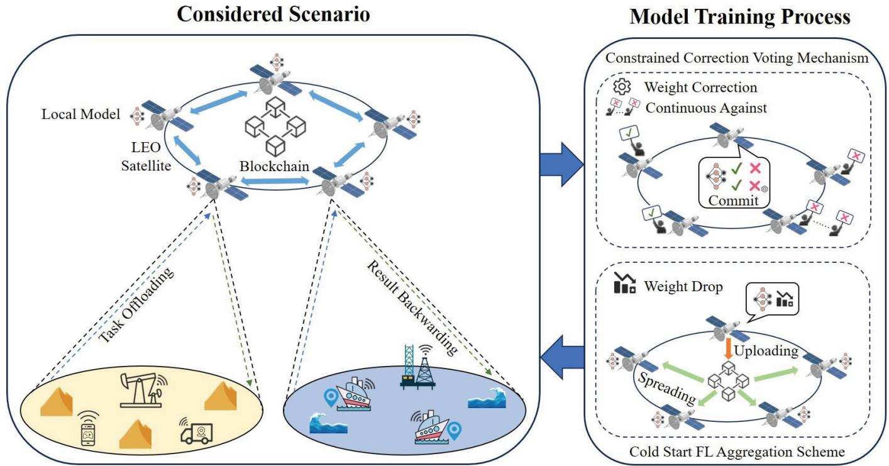
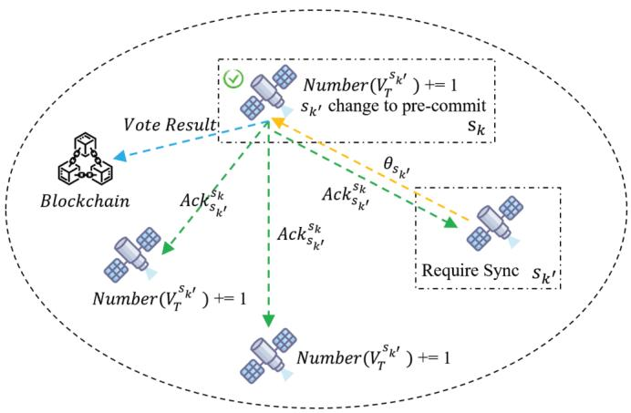
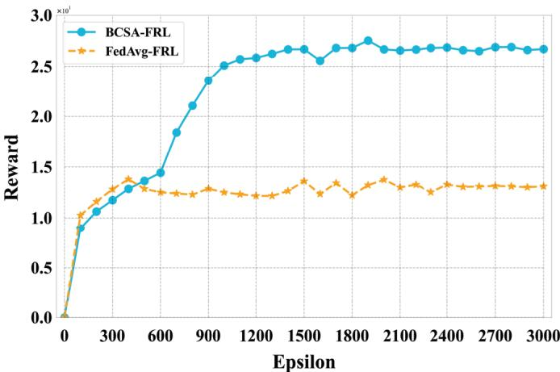
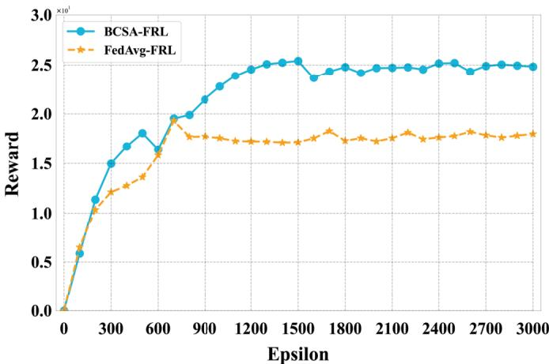
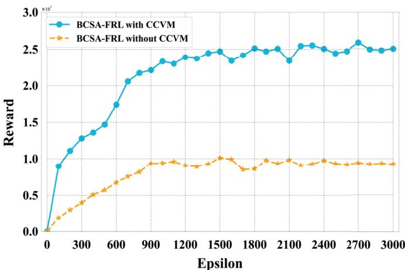
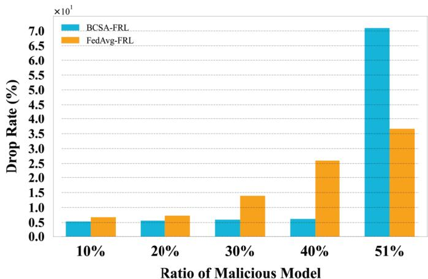
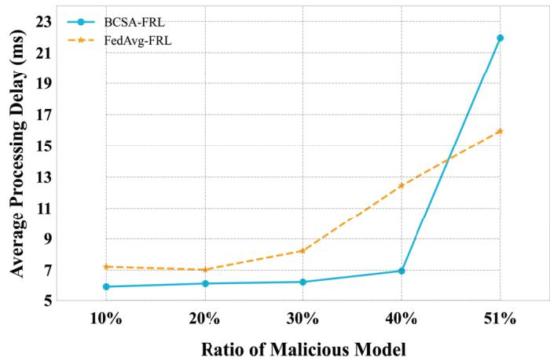
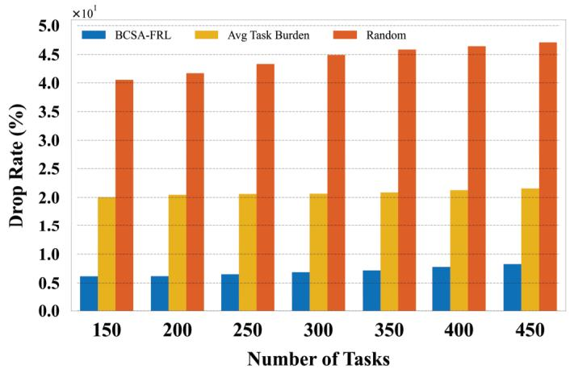
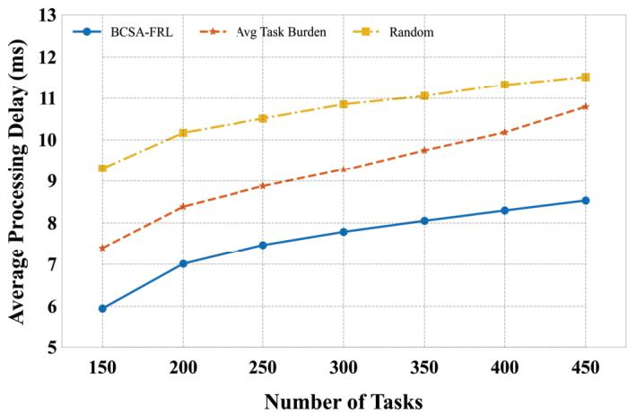

# A Blockchain-Enabled Cold Start Aggregation Scheme for Federated Reinforcement Learning-Based Task Offloading in Zero Trust LEO Satellite Networks

Bomin Mao , Senior Member, IEEE, Yangbo Liu , Graduate Student Member, IEEE, Zixiang Wei , ， Hongzhi Guo , Member, IEEE, Yijie Xun , Member, IEEE, Jiadai Wang , Member, IEEE, Jiajia Liu , Fellow, IEEE, and Nei Kato , Fellow, IEEE 

Abstract—The development of 6G enable users in remote and harsh areas to enjoy computation-intensive services including metaverse entertainment, intelligent transportation, and immersive communications. Low Earth Orbit (LEO) satellite constellations widely constructed in recent years have been recognized as an efficient solution to complement the terrestrial infrastructure with seamless coverage and decreasing expenses for both communication and computation services. However, the widely studied Federated Reinforcement Learning (FRL) based task offloading strategies neglect the potential trust concerns like malicious satellites and buffer pollution, while 6G service providers may rent the LEO satellites belonging to different companies to minimize the expense. To address these issues, blockchain has been considered in the Zero Trust (ZT) scenario, with the group consensus mechanism through the smart contract. Moreover, we propose a Constrained Correction Voting Mechanism (CCVM) to give punishing correction to the aggregation weight of malicious voting satellites. Furthermore, a Cold Start Reputation Aggregation (CSRA) scheme is adopted to first severely degrade and then gradually recover the weight of Federated Learning (FL) sub-models trained by malicious satellites. Thus, the Blockchain-enabled Cold Start Aggregation FRL (BCSA-FRL) scheme is proposed to make effective and secure offloading decisions in the ZT LEO satellite Networks. The numerical results illustrate the advantages of our proposal. 

Received 1 June 2024; revised 16 November 2024; accepted 18 February 2025. Date of publication 11 April 2025; date of current version 30 May 2025. This work was supported in part by the National Natural Science Foundation of China under Grant 62202386 and Grant 62402389; in part by Guangdong Basic and Applied Basic Research Foundation under Grant 2024A1515011198, Grant 2024A1515010209, and Grant 2023A1515110079; in part by Xi’an Science and Technology Plan under Grant 23KGDW0004- 2023; and in part by the 2022 Suzhou Innovation and Entrepreneurship Leading Talents Program (Young Innovative Leading Talents) under Grant ZXL2022458. (Corresponding author: Hongzhi Guo.) 

Bomin Mao, Yangbo Liu, Zixiang Wei, Hongzhi Guo, Yijie Xun, Jiadai Wang, and Jiajia Liu are with the School of Cybersecurity, Northwestern Polytechnical University, Xi’an 710129, China, also with the Research and Development Institute, Northwestern Polytechnical University, Shenzhen 518057, China, and also with the Yangtze River Delta Research Institute, Northwestern Polytechnical University, Taicang 215400, China (e-mail: maobomin@nwpu.edu.cn; liuyangbo@mail.nwpu.edu.cn; weizixiang0@ mail.nwpu.edu.cn; hongzhi.guo@nwpu.edu.cn; xunyijie@nwpu.edu.cn; wangjiadai@nwpu.edu.cn; liujiajia@nwpu.edu.cn). 

Nei Kato is with the Graduate School of Information Sciences, Tohoku University, Sendai 980-8579, Japan (e-mail: nei.kato.d3@tohoku.ac.jp). 

Digital Object Identifier 10.1109/JSAC.2025.3560003 

Index Terms—LEO satellite networks, task offloading, federated reinforcement learning, blockchain, zero trust. 

# I. INTRODUCTION

N THE upcoming 6G era, diversified computation-I aggressive services including metaverse entertainment, intelligent transportation, and immersive communications will come to peoples’ routine life [1]. However, it is challenging to provide such services in remote and harsh areas since the potential revenue cannot match the cost to deploy and maintain terrestrial infrastructure like Base Station (BS) and servers in such places [2], [3]. On the other hand, Low Earth Orbit (LEO) satellite constellations have obtained wide recognition to complement the terrestrial infrastructure for seamless coverage and qualified throughput as well as the decreasing construction cost [4], [5]. Besides the qualified communication service, the development of hardware computation capacity enables the LEO satellites to locally process the computation tasks rather than transfer to remote cloud platforms, which can significantly alleviate the transmission latency [6]. Considering the future computation-aggressive 6G services with diverse latency thresholds, LEO satellite constellations can be adopted as the offload destinations [7]. 

Considering the heterogeneous LEO satellites deployed in different altitudes and the diversified Quality of Service (QoS) requirements, making adaptable and appropriate offloading decisions in such a dynamic space environment is important and complex, for which Reinforcement Learning (RL) and Deep RL (DRL) techniques have been widely studied [8]. To protect the used private data and alleviate the spectrum occupation during the AI model training process, Federated Learning (FL) has been further combined with DRL, term Federated RL (FRL) to merely exchange model parameters instead of the raw dataset, which also increases the models’ robustness since FRL summarizes the situations of LEO satellites in different regions [9], [10]. On the other hand, the accuracy rate of the trained global Artificial Intelligence (AI) model depends on all the participants in the community. However, for LEO satellite-enabled edge computing scenarios, the service 

providers may choose the satellites belonging to different companies to minimize the cost, resulting in the potential trust concern among the chosen satellite community [11]. Moreover, the cyber attacks targeting FL like data poisoning and malicious models further deteriorate the trustworthiness among distributed satellites [12], which is a typical Zero Trust (ZT) architecture. In the ZT LEO satellite networks, the high dynamics mean that the traditional cybersecurity perimeter which assumes inherent trust among devices in the pre-defined network border no longer makes sense [13]. In contrast, featuring continuous and robust authentication, authorization, and attack detection, “never trust and always authentication” becomes the main solution [14], [15]. Thus, it is critical to propose an efficient and robust scheme to verify the trustworthiness of highly distributed LEO satellites, protect the security of the shared FL models, and finally exploit the computation resources in such a redundant LEO satellite system to provide satisfying 6G services. 

To bring trust to the ZT scenario, blockchain has been one of the most powerful and prospective tools in a highly distributed system. Specifically, blockchain leverages distributed ledgers to ensure the transparency and traceability of historical behavior, utilize the smart contract for voting consensus, and then discard the malicious commissions [16], [17], [18]. On the one hand, the smart contract used in blockchain can only distinguish malicious models from normal ones, which is not enough for FL model aggregation since the committed models just recovering from attacks contribute less than the other continuously trusted models and need extra time to make regular contributions. The metric of model reputation indicating the recent trustworthiness of sub-models has been commonly used to guide the central server to aggregate submodels with weights [19], [20], which is not compatible with the ZT scenario due to the lack of a central reputation evaluation system. It is difficult to reach a consensus to rely on each agent to evaluate the reputation in a distributed manner, while the attacks of model weight bias may also occur. Moreover, the commonly used smart contract cannot defend itself from malicious voting. Thus, a malicious satellite can keep voting against the commission of generated block [21], causing failures in block commission and FL convergence. How to quarantine those malicious satellites while aggregating the committed sub-models with reasonable weights is critical to realize effective and secure FL aggregation. 

To address the above issues, we propose a Blockchainenabled Cold Start Aggregation FRL (BCSA-FRL) scheme to achieve effective and secure FL-based task offloading. As shown in Fig. 1, a Constrained Correction Voting Mechanism (CCVM) is first proposed to weigh the voting of blockchain participants, giving correction to satellites that always vote against the commission. Next, we propose a Cold Start Reputation Aggregation (CSRA) scheme which severely degrades the participant’s reputation when an attack is detected and gradually recovers it to normal considering the cleaning time of the memory replay buffer. Finally, the proposed BCSA-FRL scheme cooperatively uses CCVM and CSRA to make secure and effective task-offloading decisions. Our main contributions can be summarized as follows: 

• We exploit the CCVM to not only correct the influence of the malicious voting satellites but also evaluate the trustworthiness of uploaded sub-models. 

• A blockchain-enabled cold start aggregation scheme is proposed to dynamically adjust the weight of FL submodels and ensure the consistency of the global model. 

• The BCSA-FRL scheme is proposed to cooperatively use CCVM and CSRA to improve the security and efficiency of the task offloading strategy. 

The remaining paper consists of six sections. In Section II, we systematically analyze the recent works on trust management in ZT networks and task offloading in LEO satellite networks. In Sections III and IV, we introduce our system model and formulate the optimization problem of process delay minimizing. Next, we introduce our proposed BCSA-FRL in Section V, while Section VI evaluates the proposal. Finally, Section VII summarizes the whole work. 

# II. RELATED WORKS

Researchers worldwide have conducted extensive work in the areas of trust management in ZT networks and task offloading in LEO satellite networks. In this section, we analyze the most recent works. 

# A. Trust Management in ZT Networks

As illustrated in the previous, ZT participants do not trust any other satellites except themselves, thus how to bring trust to the ZT system becomes one of the key issues in ZT scenarios. To secure the 6G edge computing, authors in [22] propose an FL-based hybrid attack detection scheme in which local edge models first filter traffic with the pre-defined attack signature. Then, these edge models are evaluated by the cloud through false positive and false negative rates. Considering the current ZT architectures are mostly static, authors in [23] propose a continuous authentication scheme in satellite networks, which comprehensively considers the objects, environment, and behavior instead of commonly used passwords and biometrics. 

From another point of view, blockchain is naturally compatible with ZT, resulting in their combined research. To address the identification issues in ZT, authors in [24] transfer the function of public key infrastructure to the blockchain, namely, the pre-registered users can verify each other through the identifier on the blockchain bidirectionally. Similarly, authors in [25] use the hashed combination of hashed public key and time stamp to not only realize identification but also the recording of historical behaviors. Also, [26] designs an intrusion detection and prevention system against advanced persistent threats, where blockchain is responsible for tracing the long-term accessing data and instant attack recognition. Furthermore, authors in [27] cooperatively use FL and blockchain in the ZT system to ensure the committed models pass the pre-defined accuracy boundary, which can verify the models’ consistency and integrity. 

# B. Task Offloading in LEO Satellite Networks

Computation resource allocation and offloading policy design are both important to meet the QoS requirement for 

Fig. 1. The considered scenario and mechanisms.

ground terminals. FL and blockchain have been widely studied for the task offloading in highly dynamic LEO networks. To enhance the energy efficiency and QoS, authors of [28] exploit the Deep FRL (DFRL) scheme to adaptively offload tasks to edge devices including LEO satellites and Autonomous Aerial Vehicles (AAVs) that are battery-constrained and capacityheterogeneous. To decrease the FL computation overhead and task processing delay, authors in [29] propose a collaborative data-parallel FL scheme that dispenses the datasets to training participants, while [30] transmit the semantic information extracted from the offloaded content rather than transfer the raw data. Meanwhile, given the high dynamics of the LEO constellation, authors in [31] consider the coverage time of LEO satellites and transmit the collected data to the LEO satellites that have left to keep the training process of FLbased offloading model unstopped, and authors in [32] design a decentralized FL framework that enables efficient model aggregation without a central server, freeing the FL community from suspecting the global model’s trustworthiness. 

To further enhance the FL trustworthiness and system security, [33] proposes a DRL-based reputation model to optimally measure the reliability and trustworthiness of FL workers with the defined sub-model efficiency. To protect the aggregation process from attacks, blockchain has become one prevailing tools. Authors in [34] use blockchain to protect the integrity of FL models and record the topology information. Since block generation and commission require extra computation and transmission resources, [35] propose a semi-distributed learning strategy to allocate the resources for computing tasks and blockchain processing to balance the security and QoS. Meanwhile, by estimating the expected energy consumption 

and comparing it with the real energy consumption, authors in [36] succeed in adaptively allocating the satellite’s computing resources using double Deep Q Network (DQN) for tasks from validated models, avoiding unnecessary computing resources occupation for fault tasks caused by channel impairments, satellite handover, and blockchain forking. 

Although extensive works have been conducted in blockchain-based trust management and reputation evaluation in ZT scenarios but also secured FL-based computation resources in LEO satellite networks. The vulnerability of blockchain, namely, malicious models tend to vote against the model commission, in ZT LEO satellite networks has not been widely covered. Also, an adaptive mechanism for adjusting the aggregation weight of malicious and recovered FL participants is needed to accelerate the convergence under attacks toward FL. Thus, our BCSA-FRL is proposed to defend against several typical attacks in the ZT LEO satellites network, realizing high reliability and security task offloading. 

# III. SYSTEM MODEL

In this section, we systematically introduce our considered LEO satellite networks, including the scenario model, communication model, latency model, and attack model. 

# A. Scenario Model

As shown in Fig. 1, there are multiple regions on the ground, each containing numerous terminals serving as task initiators. LEO satellites act as task receivers and processors and are denoted by $s _ { k } \in S$ , where the LEO satellites set is represented as $S = \left\{ s _ { 1 } , \ldots , s _ { k } , \ldots , s _ { K } \right\}$ . The computation 

capacity of $s _ { k }$ can be denoted as $\mathcal { C } _ { s _ { k } }$ . Once the task is requested, the LEO satellite can decide whether to forward the task to another LEO satellite or to process it locally. Once a task is completed, the results are sent back to the designated satellites on the ground. It should be noted the number of task processing requests generated by the ground terminals satisfies the Poisson distribution with the probability of $m$ tasks at time intersection $t$ and can be denoted by Equation 1. 

$$
P ^ {t} (X = m) = \frac {e ^ {- \vartheta} \vartheta^ {m}}{m !}, \tag {1}
$$

where $\vartheta$ is the Poisson distribution parameter and $t \in$ $\{ 1 , \ldots , t , \ldots , T \}$ is the system time intersection. The generated tasks can be expressed as $c _ { i }$ and the entire task set can be denoted as $C = \{ c _ { 1 } , \ldots , c _ { i } , \ldots , c _ { I } \}$ . Additionally, $D _ { c _ { i } }$ represents the delay threshold and $R _ { c _ { i } }$ denotes the required computational resources of $c _ { i }$ , respectively. If $\bar { D } _ { c _ { i } }$ , the actual delay of $c _ { i }$ exceeds $D _ { c _ { i } }$ , the task is considered timed out and removed from the LEO satellite’s task queue $\mathcal { Q } _ { s _ { k } }$ . 

# B. LEO Satellite Communication Model

LEO satellites typically operate at altitudes ranging from a few hundred kilometers to 2,000 kilometers above the Earth’s surface. In this environment, the communication links among satellites can be approximated as propagating in free space. As shown in Equation 2, the free space path loss coefficient $P L _ { F } ( \mathrm { d B } )$ can be derived from: 

$$
P L _ {F} (d) [ \mathrm {d B} ] = - 1 0 \log_ {1 0} \left(\frac {G _ {\mathbb {T}} G _ {\mathbb {R}} \lambda^ {2}}{L (4 \pi) ^ {2} d _ {s _ {k} , s _ {k ^ {\prime}}} ^ {2}}\right), \tag {2}
$$

where $G _ { \mathbb { T } }$ and $G _ { \mathbb { R } }$ represent the transmitting and receiving antenna gains of LEO satellites. $\lambda$ represents the wavelength of the signal. $d _ { s _ { k } , s _ { k ^ { \prime } } }$ is the distance between the transmitter $s _ { k }$ and receiver $s _ { k ^ { \prime } } \in S$ . L is the system loss coefficient. 

In all other practical environments, the average received signal power decreases logarithmically with distance. As shown in Equation 3, the free space path loss model can be modified by a path loss exponent that varies with the environment. 

$$
P L _ {L D} (d) [ \mathrm {d B} ] = P L _ {F} \left(d _ {0}\right) + 1 0 n \log_ {1 0} \left(\frac {d _ {s _ {k} , s _ {k ^ {\prime}}}}{d _ {0}}\right), \tag {3}
$$

where $d _ { 0 }$ is the reference distance and $n$ is the environmentdependent exponent. 

Besides the distance, the path loss also depends on the surrounding environment between the transmitter and receiver. To model the path loss in the practical communication environment, a shadowing variable $X _ { \sigma }$ is added to Equation 3 as shown in Equation 4. $X _ { \sigma }$ represents a Gaussian random variable with a mean of 0 and a standard deviation of $\sigma _ { c }$ . 

$$
P L _ {N O R} \left(d _ {s _ {k}, s _ {k ^ {\prime}}}\right) [ \mathrm {d B} ] = P L _ {L D} \left(d _ {s _ {k}, s _ {k ^ {\prime}}}\right) + X _ {\sigma}. \tag {4}
$$

Based on Equations 4, we can obtain the satellite link transmission rate as shown in Equation 5, 

$$
\mathcal {R} _ {s _ {k} \rightarrow s _ {k ^ {\prime}}} = B _ {s _ {k}} \log_ {2} \left(1 + \frac {P _ {s _ {k}} \cdot P L _ {N O R} \left(d _ {s _ {k} , s _ {k ^ {\prime}}}\right)}{\sigma_ {c} ^ {2}}\right), \tag {5}
$$

where $B _ { s _ { k } }$ denotes the channel bandwidth, $P _ { s _ { k } }$ is the signal transmission power of $s _ { k }$ , respectively. In addition, $\sigma _ { c } ^ { 2 }$ is the power of space noise. 

# C. Latency Model

In this paper, we study the strategy of task offloading in the LEO satellite networks. The actual delay $\bar { D } _ { c _ { i } }$ generally consists of three parts, the transmission delay, the waiting delay, and the computing delay as shown in Equation 6. 

$$
\bar {D} _ {c _ {i}} = \alpha \cdot \frac {S _ {c _ {i}}}{\mathcal {R} _ {s _ {k} \rightarrow s _ {k ^ {\prime}}}} + W _ {c _ {i}} + \frac {R _ {c _ {i}}}{\mathcal {C} _ {s _ {k}}}. \tag {6}
$$

where $S _ { c _ { i } }$ is the size of the ci, α is a binary factor with 1 and 0 denoting whether the task is forwarded to other LEO satellites or processed locally. $W _ { c _ { i } }$ indicates the delay of the task waiting in the queue. Suppose that $c _ { i }$ enters the $\mathcal { Q } _ { s _ { k } }$ when there are other tasks $c _ { i ^ { \prime } } , i ^ { \prime } < i$ in $\mathcal { Q } _ { s _ { k } }$ . Then the queuing delay of $c _ { i }$ is calculated as shown in Equation 7, where $\beta _ { i ^ { \prime } }$ indicates whether $c _ { i ^ { \prime } }$ has timed out. If it has timed out, then $\beta _ { i ^ { \prime } }$ is equal to 0. 

$$
W _ {c _ {i}} = \sum_ {i = 0} ^ {i ^ {\prime}} \beta_ {i ^ {\prime}} \cdot \frac {R _ {c _ {i}}}{\mathcal {C} _ {s _ {k}}} \quad \left(\beta_ {i ^ {\prime}} \in \{0, 1 \}\right). \tag {7}
$$

# D. Attack Model

To simulate the potential attacks in practical scenarios, we consider three attacker models and use them to verify the performance of the BCSA-FRL in Section VI. 

1) Malicious Voting: This attack consistently casts negative votes $( V _ { F } )$ when validating other models’ parameters and only casts positive votes $( V _ { T } )$ for their model. This aims to disrupt the consensus process and even influence the consensus outcome of the system. Generally, the consensus mechanism requires more than half of the satellites to vote T to set the verified model status to pre-commit. If the attacker consistently casts negative votes for models uploaded by legitimate satellites to prevent them from being selected, once the models from malicious satellites are selected for reception, the global model can be severely disturbed, resulting in the failed convergence of the entire FRL process. 

2) Replay Buffer Poisoning: Replay buffer poisoning refers to the situation where a satellite is not intentionally malicious but suffers from poisoned training data, namely, the replay buffer of RL. This causes the local model to be trained with incorrect data, indirectly affecting the performance of the entire system during FRL parameter aggregation. Common data poisoning attacks include using the same data to continuously deepen the model’s bias and training the model with extremely unreasonable data, etc. 

3) Model Parameter Poisoning: Model parameter poisoning is one type of poisoning attack. Unlike replay buffer poisoning, model parameter poisoning is an active behavior of malicious satellites. During global model parameter aggregation, malicious satellites upload invalid or illegal model parameters, directly affecting the performance of FRL’s final convergence. Common model parameter poisoning attacks include uploading random data, biased data, etc. 

# IV. PROBLEM FORMULATION

In this paper, we study the strategy of task offloading in the LEO satellite networks. Specifically, task computing requests are sent to $s _ { k }$ , and $s _ { k }$ decides whether to process them locally 

or forward them to other satellites. Therefore, our task is to optimize the average processing delay for all offloaded tasks, the problem formulation is as follows in Equation 8, where C1 represents the $s _ { k }$ in the LEO satellites set S. C2 represents the time interval. C3 denotes the binary indicator representing whether satellite $s _ { k }$ can forward the task or process it locally. C4 represents the total process delay of each task should not exceed its delay threshold. 

$$
\begin{array}{l} (\mathbf {P 1}) \min  \sum_ {i = 0} ^ {I} \bar {D} _ {c _ {i}}, \\ s. t. \quad C 1: s _ {k} \in S, \\ C 2: t \in T, \\ C 3: \alpha \in \{0, 1 \}, \\ C 4: \bar {D} _ {c _ {i}} \leq D _ {c _ {i}}. \tag {8} \\ \end{array}
$$

In our considered problem, the computation offloading strategy can be decided with the current system state and has no relationship with the previous state. Thus, the offloading decision-making process can be regarded as a Markov Decision Process (MDP), where the LEO satellites make offloading decisions based on environmental observation to maximize the grant rewards. Thus, we describe problem P1 as an MDP problem as follows: 

# A. State Space

$$
S _ {s _ {k}} ^ {t} = \left\{D, L \left(t, s _ {k}\right), \mathcal {R} _ {s _ {k} \rightarrow s _ {k ^ {\prime}}}, R _ {c _ {i}}, D _ {c _ {i}} \right\}. \tag {9}
$$

As shown in Equation 9, the state space $S _ { s _ { k } } ^ { t }$ of $s _ { k }$ at t includes five parts: the distance set $D$ containing the distance $d _ { s _ { k } \to s _ { k ^ { \prime } } }$ of each twice satellite; $L ( t , s _ { k } )$ , which indicates the computing load of $s _ { k }$ at $t$ ; The transmission rate to other LEO satellites $\mathcal { R } _ { { s _ { k } }  { s _ { k ^ { \prime } } } }$ ; The computing resources needed $R _ { c _ { i } }$ and finally $D _ { c _ { i } }$ , the delay threshold of $c _ { i }$ . D, $L ( t , s _ { k } )$ , and $\mathcal { R } _ { s _ { k } }$ offer the basic information about the current computing and transmission conditions of the LEO satellite, while $R _ { c _ { i } }$ and $D _ { c _ { i } }$ provide the information about the tasks that need to be offloaded and processed at this time. Generally, considering the satellite computing state and task state, the LEO satellites can make reasonable task allocation strategies for arrived tasks. 

# B. Action Space

Since our goal is to find a suitable offloading satellite, the action space is the set of reachable offloading destinations in two hops of the accessing LEO satellites, which is represented by Equation 10. 

$$
a _ {s _ {k}} ^ {t} = \left\{s _ {1}, \dots , s _ {k}, \dots , s _ {K} \right\}. \tag {10}
$$

# C. Reward Function

Consider the number of tasks successfully processed by $s _ { k }$ in a time interval $\Delta T$ to be $C _ { s _ { k } } ^ { \Delta T , + }$ , and the number of failed tasks to be $C _ { s _ { k } } ^ { \Delta T , - }$ sk . As Equation 11 show, our reward function sk r ts k $r _ { s _ { k } } ^ { t }$ consists two parts. 

$$
r _ {s _ {k}} ^ {t} = r ^ {t, +} - r ^ {t, -},
$$

$$
r ^ {t, +} = \exp \left(C _ {s _ {k}} ^ {\Delta T, +} / C _ {s _ {k}} ^ {\Delta T, -}\right) (C _ {s _ {k}} ^ {\Delta T, -} \neq 0),
$$

$$
r ^ {t, -} = \exp \left(C _ {s _ {k}} ^ {\Delta T, -} / C _ {s _ {k}} ^ {\Delta T, +}\right) \quad \left(C _ {s _ {k}} ^ {\Delta T, +} \neq 0\right). \tag {11}
$$

where $r ^ { t , + }$ represents the active reward for completing tasks within $\Delta T$ , motivating the model to maximize $C _ { s _ { k } } ^ { \Delta T , + }$ as much sk as possible. On the other hand, $r ^ { t , - }$ represents a penalty for having too many tasks time out within model to avoid erroneous strategies. The $\Delta T$ , promptial reward is $r _ { s _ { k } } ^ { t }$ the sum of the two terms. If $C _ { s _ { k } } ^ { \Delta T , - }$ Csk or $C _ { s _ { k } } ^ { \Delta T , + }$ sk kis 0, then the corresponding $r ^ { t , + }$ and $r ^ { t , - }$ are also 0. Additionally, $E X P ( X )$ is the natural exponential function, the reason for using $E X P ( x )$ instead of ordinary scores is that the $E X P ( x )$ function has a better promotion or punishment effect. When $x$ increases, the value of $E X P ( x )$ increases exponentially. 

# V. BCSA-FRL-BASED TASK OFFLOADING STRATEGY

In this section, we explain the series of optimization mechanisms we have proposed. To address potential attacks on the semantic validity of models, such as replay buffer poisoning and model parameter poisoning, we combine the consensus mechanism with FRL model parameter aggregation to adjust aggregation weights using correction factors to counteract such threats. Specifically, for attacks at the consensus mechanism level, such as malicious voting, we propose CCVM to mitigate this threat. Furthermore, to address persistent and continuous satellite attacks, we design a CSRA scheme that adjusts the current model aggregation weights based on the cumulative reputation of satellite history. 

# A. Blockchain-Based Semi-Distributed FRL Framework

In this paper, we employ an FRL framework based on DDQN containing an online network and a target network, where the online network is used for action decisions, and the target network is used for evaluating the value of actions. In FRL aggregation, the online network model parameters of all satellites are aggregated, and then each satellite synchronizes the aggregated global model parameters from the central satellite. 

In FRL, the synchronization of global model parameters typically requires a central satellite. Each local satellite uploads its local model to the central satellite for aggregation and then retrieves the synchronized model from the central satellite. However, this approach contradicts the principles of ZT. To address this issue, we propose a novel approach that utilizes a consensus mechanism and blockchain system to replace the centralized and unconditional trust-based global parameter synchronization process in the traditional FRL framework. 

As Fig. 2 shows, once model parameter verifications are complete, each satellite broadcasts its vote information after verifying the model. The voting results for this round are then packaged into a block and uploaded to the blockchain. Each satellite can obtain the voting information $V _ { s _ { k ^ { \prime } } , s _ { k } }$ of other satellites to verify the model, which represents the voting result of satellite $s _ { k }$ verifying the model parameters of satellite $s _ { k ^ { \prime } }$ . Upon verification, the verified model enters the “trust” stage which only means that the verified model has passed the verification merely on the current satellite. Next, the model 

Fig. 2. Verification process for a synchronization request initiated by satellite $s _ { k }$ .

that has passed the local verification enters a pre-submission state. After the $s _ { k }$ satellite verifies the model of the $s _ { k ^ { \prime } }$ satellite, it broadcasts a $V _ { T }$ or $V _ { F }$ vote to the current network. $V _ { T }$ represents that in this round of synchronization, the $s _ { k }$ satellite’s verification of the validity of the $s _ { k ^ { \prime } }$ satellite’s model parameters is passed, and $V _ { F }$ represents that it is not passed. When the $s _ { k }$ satellite receives the proportion of votes from other satellites for the $s _ { k ^ { \prime } }$ satellite, $\boldsymbol { R a t e } _ { s _ { k } }$ exceeds $50 \%$ , it changes the $s _ { k ^ { \prime } }$ model state to pre-commit, which means that the $s _ { k ^ { \prime } }$ satellite model has passed global verification in this round, and the model parameters are valid and can participate in the subsequent global synchronization process. 

The calculation method for $\boldsymbol { R a t e } _ { s _ { k } }$ is shown in Equation 12. At the same time, the voting result in $R a t e _ { s _ { k } }$ serves as the base weight for FRL global model aggregation. After this process, the LEO satellite network selects a group of valid models that have passed global verification and the final judgment can be made. If the number of valid models participating in global synchronization does not exceed half of the total number of satellites, it means that there is insufficient trust in this round of global synchronization, and the models of all satellites should roll back to the model parameters of the last global synchronization. Otherwise, the reputation weight of each valid model should be calculated, and the corresponding correction factor can be multiplied by the reputation weight to guide the FRL parameter aggregation process. Finally, each local satellite synchronizes the aggregated global model and starts the next round of the training-synchronization process. 

$$
\operatorname {R a t e} _ {s _ {k}} = \frac {\operatorname {N u m b e r} \left(V _ {T}\right)}{\operatorname {N u m b e r} \left(V _ {T}\right) + \operatorname {N u m b e r} \left(V _ {F}\right)}. \tag {12}
$$

In summary, two blockchains are utilized in our system for two purposes: (1) Storing the synchronized global models and ensuring the consistency of the FL community. (2) Storing the voting results of each global synchronization round, providing historical information for the proposed CCVM to make weight corrections. Whenever a round of voting is completed, the votes cast by each satellite and the votes received by each satellite’s model are counted, packaged into a block, and uploaded to the blockchain for subsequent model parameter 

aggregation and correction. Whenever a round of global model parameter synchronization is completed, the aggregated model parameters are packaged into a block and uploaded to the blockchain for global rollback in case of aggregation failures. Therefore, blockchain can be regarded as a reliable channel in our system for parameter exchange, with its consensus process inherently transitioning from one state of consistency to another, which has minimal impact on the convergence of the training process. 

# B. Constrained Correction Voting Mechanism

In our proposed approach, during a global synchronization process, each model receives copies of the model parameters from all other satellites and performs local verification. Subsequently, each satellite casts a vote $V _ { T }$ (agree) or $V _ { F }$ (disagree). If a malicious voting attacker exists, it can continuously cast dissenting votes for other satellites. While this inconsequential opposition cannot directly disrupt the consensus mechanism, it can introduce interference into the consensus process and further the model convergence. To mitigate the impact of malicious satellites on the global model, we integrate the voting behavior of blockchain consensus mechanisms into the FRL global model aggregation process, which effectively limits the influence of malicious satellites on the global model. 

Under such circumstances, the voting result should be $V _ { s _ { k } , s _ { n } } ~ = ~ \{ F | k ~ \neq ~ n \}$ if attackers exist. $s _ { n }$ represents the attacker. To limit this behavior, we have designed CCVM to correct the FRL model aggregation weight as shown in Equation 13. 

$$
V _ {s _ {k}} ^ {w} = \frac {1 - \operatorname {s i g m o i d} (- K / 2 + \operatorname {N u m b e r} _ {s _ {k}} \left(V _ {F}\right))}{\sum_ {k ^ {\prime} = 0} ^ {K} \left(1 - \operatorname {s i g m o i d} (- K / 2 + \operatorname {N u m b e r} _ {s _ {k ^ {\prime}}} \left(V _ {F}\right))\right)}. \tag {13}
$$

In the Equation 13, $N u m b e r _ { s _ { k } } ( F )$ represents the total number of $V _ { F }$ (disagree) cast by satellite $s _ { k }$ . The expression $- K / 2 + N u m b e r _ { s _ { k } } ( F )$ is used to measure the relationship between the number of dissenting votes cast by a satellite and the total number of satellites. The sigmoid function shown in Equation 14 maps the relationship to the range [0, 1]. $V _ { s _ { k } } ^ { w }$ reflects the constrained correction voting factor of satellite $s _ { k }$ in the voting process of the consensus mechanism. $K / 2$ represents half of the total summary points, meaning that when a satellite casts $V _ { F }$ to more than half of the satellites, we consider this satellite abnormal. 

$$
\operatorname {s i g m o i d} (x) = \frac {1}{1 + e ^ {- x}}. \tag {14}
$$

Finally, the constrained correction voting factor $V _ { s _ { k } } ^ { w }$ sk is multiplied by the model weight $\theta _ { s _ { k } } ^ { w }$ sk of the corresponding FRL satellite $s _ { k }$ to obtain the constrained correction voting model weight, as shown in Equation 15. 

$$
\theta_ {s _ {k}} ^ {w} = \theta_ {s _ {k}} ^ {w} \cdot V _ {s _ {k}} ^ {w}. \tag {15}
$$

# C. Cold Start Reputation Aggregation Scheme

As we know, FRL is particularly sensitive during the initial stages of training. Even minor perturbations can cause the model’s loss to fluctuate wildly, and if the perturbations are 

significant enough, the model may even fail to converge. While we have employed blockchain, consensus mechanisms, and CCVM to address the ZT concerns regarding LEO satellites, there are still some flaws existing in the current system. 

Consider the following scenario: A malicious satellite adopts a gradual increase in aggressiveness strategy to slowly poison the CCVM-FRL system. Initially, the toxicity is low enough that other satellites’ validation of the model does not reach the threshold to cast a $V _ { F }$ vote. However, as the toxicity increases, the CCVM-FRL system eventually expels the malicious satellite. By the next round of global model parameter synchronization, the attacker can reduce the toxicity and rejoin the global model aggregation for that round. Therefore, we can conclude that in the CCVM-FRL system, the penalty for satellites that cannot pass the validation process is to stop them from participating in the current round of global model aggregation. Since the attacked LEO satellites may recover in the future, to avoid the long-term effects in the future, it is necessary to adaptively normalize the aggregation weight according to the recovering process. 

To address the issues, we introduce a novel scheme called the CSRA Scheme, which centers on establishing a reputation system for satellites. As shown in Equation 16, $H _ { s _ { k } }$ represents the cumulative historical reputation of satellite $s _ { k }$ , indicating the number of consecutive rounds of global model aggregation in which satellite $s _ { k }$ has successfully participated. Once satellite $s _ { k }$ is expelled from the system, its cumulative historical reputation $H _ { s _ { k } }$ is reset to zero. Thus, malicious and useless commitment will have minimal impact on the consistent model or even be excluded from the aggregation process, thus the convergence of FL can be ensured. $H _ { R e p }$ represents the reputation threshold parameter. A higher value of $H _ { R e p }$ implies that satellites require a longer cumulative reputation to play a significant role in global model aggregation. Finally, the historical cumulative reputation factor $R e p _ { s _ { k } } ^ { w }$ is calculated and multiplied by the satellite $s _ { k }$ model parameters $\theta _ { s _ { k } } ^ { w }$ to obtain the old start reputation aggregation weight as shown in Equation 17. 

$$
R e p _ {s _ {k}} ^ {w} = \frac {\operatorname {s i g m o i d} \left(- H _ {R e p} + H _ {s _ {k}}\right)}{\sum_ {s _ {k ^ {\prime}} = 0} ^ {K} \left(\operatorname {s i g m o i d} \left(- H _ {R e p} + H _ {s _ {k ^ {\prime}}}\right)\right)}, \tag {16}
$$

$$
\theta_ {s _ {k}} ^ {w} = \theta_ {s _ {k}} ^ {w} \cdot \operatorname {R e p} _ {s _ {k}} ^ {w}. \tag {17}
$$

# D. BCSA-FRL Framework

In this subsection, we combine DDQN, FRL, CCVM, and CSRA to construct the BCSA-FRL-based LEO satellite computation offloading framework. 

ALGORITHM 1 presents our BCSA-FRL global aggregation process. First, each model verifies the models of all other satellites and votes $V _ { T / F }$ . Then, the satellite’s $R a t e _ { s _ { k } }$ is calculated. If the number of satellites with $R a t e _ { s _ { k } } > 0 . 5$ exceeds half of the total number of satellites $N .$ , the global model parameter aggregation phase starts. Each satellite calculates the CCVM correction V wsk and CSRA correction Repwsk, $V _ { s _ { k } } ^ { w }$ $R e p _ { s _ { k } } ^ { w }$ respectively, according to the synchronization information recorded on the blockchain. Finally, the basic weight $R a t e _ { s _ { k } }$ should be calculated to get the final aggregation weight. Last, 

Algorithm 1 CCVM and CSRA-Based Consensus Mechanisms

Require: All consensus-participating agents  
1 Initialize $V = \{V_{s_k,s_{k'}} = 0\}$ 2 for $s_k \in K$ do  
3 for $s_{k'} \in K$ do  
4 $s_k$ verifies $s_{k'}$ 's model  
5 Records the vote to $V$ 6 end for  
7 end for  
8 Get base factor Rate  
9 if $Number(Rate_{s_k} > 0.5) > K/2$ then  
10 Validate model using $X$ , and get $V^w$ by CCVM  
11 Get $Rep^w$ by CSRA  
12 Model aggregation weight using as follows:  
13 $\theta_K = \sum_{k=0}^{K} Normalize(\theta_{s_k}^- \cdot V_{s_k}^w \cdot Rep_{s_k}^w)$ 14 else  
15 All satellites rollback the last global model $\theta_{s_K}$ 16 end if  
17 return: global model $\theta_{s_K}$ 

the aggregated model is recorded in the parameter synchronization blockchain. Since the information obtained by the satellites comes entirely from the information blockchain and model parameter blockchain, it can be guaranteed true and reliable. 

Consider a consensus process where satellite $s _ { k }$ verifies the parameters of the model from satellite $s _ { k ^ { \prime } }$ . First, a batch of validation data $\left( s _ { s _ { k } } ^ { t } , a _ { s _ { k } } ^ { t } , r _ { s _ { k } } ^ { t } , s _ { s _ { k } } ^ { t + 1 } \right)$ s ts k , atsk , nt is obtained from the validation experience buffer $X _ { s _ { k } }$ . Second, as shown in Equation 18, the Time Difference (TD) of the Arrival Target of the local model can be calculated using the local model of $s _ { k }$ as the evaluation metric for this validation. 

$$
y _ {s _ {k}} ^ {t} = r _ {s _ {k}} ^ {t} + \gamma \cdot \max  _ {a} Q ^ {s _ {k}} \left(s _ {s _ {k}} ^ {t + 1}, a; \theta_ {s _ {k}} ^ {t}\right). \tag {18}
$$

Then, the same data is input into the model of satellite $s _ { k ^ { \prime } }$ , and the Q-values of all actions under s ts k $s _ { s _ { k } } ^ { t }$ are output, denoted as $Q _ { t } ^ { s _ { k ^ { \prime } } | s _ { k } }$ . Finally, the loss of the local model of satellite $s _ { k ^ { \prime } }$ is calculated and compared to the loss of the model of satellite $s _ { k }$ . An error tolerance threshold $E$ is also set. As shown in Equation 19, if the loss ratio exceeds the threshold, the model of satellite $s _ { k ^ { \prime } }$ successes the validation. In this case, satellite $s _ { k }$ votes $V _ { T }$ for satellite $s _ { k ^ { \prime } }$ . Otherwise, it votes $V _ { F }$ . 

$$
\left. \operatorname {R a t i o} _ {s _ {k}, s _ {k ^ {\prime}}} = \frac {\left\| y _ {s _ {k}} ^ {t} - Q ^ {s _ {k}} \left(s _ {s _ {k}} ^ {t} , a _ {s _ {k}} ^ {t} ; \theta_ {s _ {k}} ^ {t}\right) \right\|}{\left\| y _ {s _ {k}} ^ {t} - Q ^ {s _ {k ^ {\prime}} \mid s _ {k}} \left(s _ {s _ {k}} ^ {t} , a _ {s _ {k}} ^ {t} ; \theta_ {s _ {k ^ {\prime}}} ^ {t}\right) \right\|}. \right. \tag {19}
$$

# VI. PERFORMANCE EVALUATION

In this section, we analyze the performance of BCSA-FRL under the attacks described in Section III-D. We also analyze the execution process of the consensus mechanism to further demonstrate the role of CCVM. In addition, the relationship between BCSA-FRL performance and the number of malicious satellites is discussed. Finally, we compare BCSA-FRL 

(a) Replay buffer poisoning

(b） Model parameter poisoning

Fig. 3. Performance of BCSA-FRL and FedAvg-FRL under poisoning attacks.

with other traditional offloading algorithms to highlight the superior performance of BCSA-FRL. 

The simulation environment contains 6 orbits and each of them consists of 15 LEO satellites at the altitude of $8 0 0 \mathrm { k m }$ . The computational capacities Compi of the satellites are [1, 4] GHz. 

The transmission power and channel bandwidth follow the research [34]. The neural network contains a three-layer perception with the activation function GeLU and we use AdamW as the optimizer. The learning rate is $1 e ^ { - 3 }$ and the exploration decay rate $\epsilon$ is 0.95. Additionally, we use AdamW as the optimizer and set the batch size of the experience replay pool to 32 and the batch size of the validation experience pool to 512. 

To simulate poisoning attacks, we set $20 \%$ of the satellites to be malicious. Fig. 3 shows the performance of FedAvg-FRL [37] and BCSA-FRL against different poisoning attacks (Replay Buffer Poisoning, Model Parameter Poisoning). It can be found that BCSA-FRL performs well against poisoning attacks at the semantic level of the model with the reward converging to the optimal value of 26 under both replay buffer poisoning and model parameter poisoning. Moreover, the reward of the standard FedAvg-FRL converges to 13 under Data-Poisoning attacks and 17 under Model-Poisoning attacks. We can also find that replay buffer poisoning has a greater impact on model performance than model parameter poisoning. This is because replay buffer poisoning uses extremely unreasonable data to cause the model to have strong bias and noise, while model poisoning is implemented by setting unreasonable model parameters. We can understand that model poisoning attacks reset a model’s capabilities to zero, while data poisoning attacks train a model to develop “bad habits”. Although both two kinds of attacks can achieve the same effect of destroying the performance of FRL model aggregation, the harm caused by replay buffer poisoning is more purposeful and harmful, for which BCSA-FRL converges faster under model poisoning attacks compared with data poisoning attacks. Data poisoning introduces more significant disturbances to the system, requiring the system to correct its initial biases before 

Fig. 4. Reward with malicious voting attacker.

converging to the correct region. On the other hand, model poisoning does not involve a step to correct biases. 

In addition, to verify the CCVM’s defense capability against malicious voting attacks, we give malicious satellites the ability to vote maliciously, which is to vote $V _ { F }$ for all other satellites except themselves. At the same time, the comparison algorithm is the performance of BCSA-FRL with and without CCVM. Fig. 4 shows the simulation results of the combined malicious voting and data poisoning attack. We can find that when there is a malicious voting attack, the impact on BCSA-FRL without CCVM is obvious with the reward converging to only less than 10. In contrast, the reward of BCSA-FRL with the CCVM mechanism successfully converges to 25. This is because the interaction between satellites is completely dependent on the consensus mechanism. If the voting behavior of the consensus mechanism is interfered with, the security and performance of the entire system significantly deteriorate. In addition, it can be seen from the figure that after adding CCVM, BCSA-FRL can impose a penalty on malicious satellites that vote too many times of $V _ { F }$ by reducing their weights in the global aggregation process to alleviate the impacts. 

TABLE I SATELLITE VOTING DURING A SINGLE TRAINING PROCESS

<table><tr><td>Epsilon</td><td>1</td><td>2</td><td>3</td><td>4</td><td>5</td><td>6</td><td>7</td><td>8</td><td>9</td><td>10</td><td>11</td><td>12</td><td>13</td><td>14</td><td>15</td></tr><tr><td>satellite 0</td><td>✓</td><td>✓</td><td>×</td><td>×</td><td>✓</td><td>✓</td><td>✓</td><td>✓</td><td>✓</td><td>✓</td><td>✓</td><td>✓</td><td>✓</td><td>✓</td><td>✓</td></tr><tr><td>satellite 1</td><td>✓</td><td>✓</td><td>✓</td><td>✓</td><td>✓</td><td>×</td><td>✓</td><td>✓</td><td>✓</td><td>✓</td><td>×</td><td>✓</td><td>✓</td><td>✓</td><td>✓</td></tr><tr><td>satellite 2</td><td>✓</td><td>✓</td><td>✓</td><td>✓</td><td>✓</td><td>×</td><td>✓</td><td>×</td><td>✓</td><td>✓</td><td>✓</td><td>✓</td><td>✓</td><td>✓</td><td>✓</td></tr><tr><td>satellite 3</td><td>✓</td><td>✓</td><td>✓</td><td>✓</td><td>✓</td><td>✓</td><td>✓</td><td>✓</td><td>✓</td><td>✓</td><td>✓</td><td>✓</td><td>✓</td><td>✓</td><td>✓</td></tr><tr><td>satellite 4</td><td>✓</td><td>✓</td><td>✓</td><td>✓</td><td>✓</td><td>✓</td><td>✓</td><td>✓</td><td>✓</td><td>✓</td><td>×</td><td>✓</td><td>×</td><td>✓</td><td>×</td></tr><tr><td>satellite 5</td><td>✓</td><td>✓</td><td>✓</td><td>✓</td><td>✓</td><td>✓</td><td>✓</td><td>✓</td><td>✓</td><td>✓</td><td>✓</td><td>✓</td><td>×</td><td>✓</td><td>✓</td></tr><tr><td>satellite 6</td><td>✓</td><td>✓</td><td>✓</td><td>✓</td><td>✓</td><td>×</td><td>✓</td><td>✓</td><td>✓</td><td>✓</td><td>✓</td><td>✓</td><td>✓</td><td>✓</td><td>✓</td></tr><tr><td>satellite 7 (Malicious)</td><td>×</td><td>×</td><td>×</td><td>×</td><td>×</td><td>×</td><td>×</td><td>✓</td><td>✓</td><td>×</td><td>×</td><td>×</td><td>×</td><td>×</td><td>×</td></tr><tr><td>satellite 8 (Malicious)</td><td>×</td><td>×</td><td>×</td><td>×</td><td>×</td><td>×</td><td>×</td><td>×</td><td>✓</td><td>×</td><td>✓</td><td>×</td><td>×</td><td>×</td><td>×</td></tr><tr><td>Sync</td><td>✓</td><td>✓</td><td>✓</td><td>✓</td><td>✓</td><td>×</td><td>✓</td><td>✓</td><td>✓</td><td>✓</td><td>✓</td><td>✓</td><td>✓</td><td>✓</td><td>✓</td></tr></table>

(a) Comparison of the drop rate

(b) Comparison of the average processing delay

Fig. 5. Tolerance of BCSA-FRL and FedAvg-FRL to the different proportions of malicious satellites in the system.

To further illustrate our proposed BCSA-FRL algorithm, we analyze the consensus status of each round during a single training process. TABLE I shows the log table of global parameter aggregation for the first 15 rounds of the simulation in Fig. 4, where the entire simulation process has 30 rounds of global parameter aggregation with satellite $s _ { 7 }$ and satellite $s _ { 8 }$ as the attackers. We can find that throughout the training process, BCSA-FRL can vote out malicious satellites with the consensus mechanism. It should be noted that occasional misjudgments (round 6) which include malicious satellites in the parameter aggregation still exist. However, due to the existence of mechanisms such as CSRA and CCVM, the negative effects of the attack behavior on the entire system can be neglected. 

Fig. 5 shows the robustness of our proposed BCSA-FRL algorithm and FedAvg-FRL considering different numbers of attacking satellites. In the simulation, we consider five scenarios where the proportion of malicious satellites increases from $10 \%$ to over $50 \%$ . It can be found that when the number of malicious satellites does not exceed $50 \%$ , BCSA-FRL can effectively isolate the impact of malicious satellites by its mechanism. The packet loss rate and the average task processing delay are around $5 \%$ and 6ms, respectively. On the other hand, the performance of FedAvg-FRL drops 

significantly due to the lack of similar mechanisms. Moreover, when the number of malicious satellites exceeds $51 \%$ , the majority of satellites in the system are malicious, resulting in the failure of the consensus mechanism. Thus, the BCSA-FRL framework continuously falls into synchronization failure and rollback operations. Eventually, the system cannot train the neural network normally. It should be noted that situations with more than half of the malicious objects are rarely in practical environments. Therefore, BCSA-FRL is far more tolerant of the number of malicious satellites than FedAvg-FRL. 

Finally, we explore the performance of BCSA-FRL compared to traditional task-offloading algorithms. As shown in Fig. 6, when the task load is 150, the packet loss rate of BCSA-FRL is $6 . 1 6 \%$ , and the average task processing delay is 5.95ms. The packet loss rate and average task processing delay of the Average Task Burden algorithm are $2 0 . 0 5 \%$ and 7.40ms, respectively. The packet loss rate and average task processing delay of the random algorithm are $4 0 . 5 4 \%$ and 9.31ms, respectively. As the task load increases, the packet loss rate and average task processing delay of BCSA-FRL do not increase much. When the task load is 450, the packet loss rate of BCSA-FRL is $8 . 2 9 \%$ , and the average task processing delay is $6 . 0 8 \mathrm { m s }$ . At this time, the packet loss rate and average task processing delay of the Avg Task Burden algorithm are 

(a) Comparison of the drop rate

(b) Comparison of the average processing delay

Fig. 6. Performance comparisons of BCSA-FRL and traditional offloading algorithms (Avg Task Burden, Random).

$2 1 . 5 8 \%$ and $8 . 3 5 \mathrm { m s }$ , respectively, and the packet loss rate and average task processing delay of the random algorithm are $4 7 . 1 0 \%$ and 9.96ms, respectively. Therefore, our proposed BCSA-FRL can make more efficient task offloading decisions compared to traditional algorithms. 

# VII. CONCLUSION & FUTURE PERSPECTIVE

In this article, to bring trust to the task offloading in the ZT LEO satellites, we first propose a CCVM scheme to give punishing correction to satellites that keep voting against the block commissions and defend against the malicious voting attack. The CSRA scheme is proposed to dynamically adjust the weights of sub-models considering poisoning attacks and the model recovery process. Finally, the BCSA-FRL is exploited to make effective and secure task offloading decisions. Extensive simulations have been conducted and the results illustrate that the proposal can significantly improve the QoS and security. Meanwhile, since any user can register as a worker in the FRL system, the LEO satellites-based offloading system can be easily scaled to the entire space satellites system including medium and geosynchronous orbit satellites, sharing their data and computation resources with others. Also, in the future, we would like to study and evaluate the validity of committed models further to improve the stability, efficiency, and security of the training process. 

# REFERENCES

[1] B. Mao, Y. Liu, J. Liu, and N. Kato, “AI-assisted edge caching for metaverse of connected and automated vehicles: Proposal, challenges, and future perspectives,” IEEE Veh. Technol. Mag., vol. 18, no. 4, pp. 66–74, Dec. 2023. 

[2] Y. Liu, B. Mao, H. Guo, and J. Liu, “An intelligent hierarchical caching and asynchronous updating scheme for 6G non-terrestrial networks,” in Proc. IEEE Wireless Commun. Netw. Conf. (WCNC), Apr. 2024, pp. 1–6. 

[3] B. Mao et al., “On a hierarchical content caching and asynchronous updating scheme for non-terrestrial network-assisted connected automated vehicles,” IEEE J. Sel. Areas Commun., vol. 43, no. 1, pp. 64–74, Jan. 2025. 

[4] B. Mao, X. Zhou, J. Liu, and N. Kato, “On an intelligent hierarchical routing strategy for ultra-dense free space optical low Earth orbit satellite networks,” IEEE J. Sel. Areas Commun., vol. 42, no. 5, pp. 1219–1230, May 2024. 

[5] B. Mao, X. Zhou, J. Liu, and N. Kato, “Digital twin satellite networks toward 6G: Motivations, challenges, and future perspectives,” IEEE Netw., vol. 38, no. 1, pp. 54–60, Jan. 2024. 

[6] P. Cassara, A. Gotta, M. Marchese, and F. Patrone, “Orbital edge ´ offloading on mega-LEO satellite constellations for equal access to computing,” IEEE Commun. Mag., vol. 60, no. 4, pp. 32–36, Apr. 2022. 

[7] B. Mao, J. Qiu, and N. Kato, “On an intelligent task offloading model to jointly optimize latency and energy for electric connected vehicles,” IEEE Trans. Veh. Technol., vol. 73, no. 4, pp. 6024–6028, Apr. 2024. 

[8] Y. Liu, D. Wang, B. Song, and X. Du, “Green heterogeneous computing powers allocation using reinforcement learning in SDN-IoV,” IEEE Trans. Green Commun. Netw., vol. 7, no. 2, pp. 983–995, Jun. 2023. 

[9] B. Mao, X. Zhou, J. Liu, and N. Kato, “On a cooperative deep reinforcement learning-based multi-objective routing strategy for diversified 6G metaverse services,” IEEE Trans. Veh. Technol., vol. 73, no. 9, pp. 14092–14096, Sep. 2024. 

[10] B. Mao, Y. Kawamoto, and N. Kato, “AI-based joint optimization of QoS and security for 6G energy harvesting Internet of Things,” IEEE Internet Things J., vol. 7, no. 8, pp. 7032–7042, Aug. 2020. 

[11] H. Chen, M. Xiao, and Z. Pang, “Satellite-based computing networks with federated learning,” IEEE Wireless Commun., vol. 29, no. 1, pp. 78–84, Feb. 2022. 

[12] T. Wu, H. M. N. Dilum Bandara, P. Lep Yeoh, and K. Thilakarathna, “VHFL: A cloud-edge model verification technique for hierarchical federated learning,” in Proc. IEEE Int. Conf. Commun. Workshops (ICC Workshops), Jun. 2024, pp. 1304–1309. 

[13] I. Al Ridhawi and M. Aloqaily, “Zero-trust UAV-enabled and DTsupported 6G networks,” in Proc. IEEE Global Commun. Conf., Kuala Lumpur, Malaysia, Dec. 2023, pp. 6171–6176. 

[14] H. Sedjelmaci, K. Tourki, and N. Ansari, “Enabling 6G security: The synergy of zero trust architecture and artificial intelligence,” IEEE Netw., vol. 38, no. 3, pp. 171–177, May 2024. 

[15] P. Phiayura and S. Teerakanok, “A comprehensive framework for migrating to zero trust architecture,” IEEE Access, vol. 11, pp. 19487–19511, 2023. 

[16] M. Zhou, Z. Yang, H. Yu, and S. Yu, “VDFChain: Secure and verifiable decentralized federated learning via committee-based blockchain,” J. Netw. Comput. Appl., vol. 223, Mar. 2024, Art. no. 103814. 

[17] B. Mao, J. Liu, Y. Wu, and N. Kato, “Security and privacy on 6G network edge: A survey,” IEEE Commun. Surveys Tuts., vol. 25, no. 2, pp. 1095–1127, 2nd Quart., 2023. 

[18] P. Kumar, R. Kumar, M. Aloqaily, and A. K. M. N. Islam, “Explainable AI and blockchain for metaverse: A security and privacy perspective,” IEEE Consum. Electron. Mag., vol. 13, no. 3, pp. 90–97, May 2024. 

[19] B. Mao, Y. Wu, J. Liu, H. Guo, J. Wang, and N. Kato, “Optimizing secrecy rate for federated learning model aggregation with intelligent reflecting surface toward 6G ubiquitous intelligence,” IEEE Trans. Cognit. Commun. Netw., vol. 11, no. 2, pp. 1258–1267, Apr. 2025, doi: 10.1109/tccn.2024.3454256. 

[20] X. Yang, Y. Zhao, Q. Chen, Y. Yu, X. Du, and M. Guizani, “Accountable and verifiable secure aggregation for federated learning in IoT networks,” IEEE Netw., vol. 36, no. 5, pp. 173–179, Sep./Oct. 2022. 

[21] G. Liu et al., “E-chain: Lightweight and secure BIoT voting mechanism on variable bandwidth networks,” IEEE Internet Things J., vol. 11, no. 6, pp. 9230–9243, Mar. 2024. 

[22] H. Sedjelmaci and N. Ansari, “Zero trust architecture empowered attack detection framework to secure 6G edge computing,” IEEE Netw., vol. 38, no. 1, pp. 196–202, Jan. 2024. 

[23] P. Fu, J. Wu, X. Lin, and A. Shen, “ZTEI: Zero-trust and edge intelligence empowered continuous authentication for satellite networks,” in Proc. IEEE Global Commun. Conf. (GLOBECOM), Rio de Janeiro, Brazi, Dec. 2022, pp. 2376–2381. 

[24] T. Cheng, C. Chi, Y. Zhang, and Z. Yin, “The appliance of decentralized identifiers in zero trust network,” in Proc. IEEE Int. Conf. Blockchain, Danzhou, China, Dec. 2023, pp. 198–202. 

[25] Y. Liu et al., “A blockchain-based decentralized, fair and authenticated information sharing scheme in zero trust Internet-of-Things,” IEEE Trans. Comput., vol. 72, no. 2, pp. 501–512, Feb. 2023. 

[26] L. Alevizos, M. H. Eiza, V. T. Ta, Q. Shi, and J. Read, “Blockchainenabled intrusion detection and prevention system of APTs within zero trust architecture,” IEEE Access, vol. 10, pp. 89270–89288, 2022. 

[27] E. Bandara, X. Liang, S. Shetty, R. Mukkamala, A. Rahman, and N. W. Keong, “Skunk—A blockchain and zero trust security enabled federated learning platform for 5G/6G network slicing,” in Proc. 19th Annu. IEEE Int. Conf. Sens., Commun., Netw. (SECON), Stockholm, Sweden, Sep. 2022, pp. 109–117. 

[28] S. Yu, X. Chen, Z. Zhou, X. Gong, and D. Wu, “When deep reinforcement learning meets federated learning: Intelligent multitimescale resource management for multiaccess edge computing in 5G ultradense network,” IEEE Internet Things J., vol. 8, no. 4, pp. 2238–2251, Feb. 2021. 

[29] P. Qin, D. Xu, K. Yu, A. Al-Dulaimi, and S. Mumtaz, “Latencyaware data allocation optimization for LEO satellite IoT networks with federated learning,” in Proc. IEEE Global Commun. Conf., Kuala Lumpur, Malaysia, Dec. 2023, pp. 1884–1889. 

[30] G. Zheng, Q. Ni, K. Navaie, and H. Pervaiz, “Semantic communication in satellite-borne edge cloud network for computation offloading,” IEEE J. Sel. Areas Commun., vol. 42, no. 5, pp. 1145–1158, May 2024. 

[31] D.-J. Han, S. Hosseinalipour, D. J. Love, M. Chiang, and C. G. Brinton, “Cooperative federated learning over ground-to-satellite integrated networks: Joint local computation and data offloading,” IEEE J. Sel. Areas Commun., vol. 42, no. 5, pp. 1080–1096, May 2024. 

[32] Z. Zhai, Q. Wu, S. Yu, R. Li, F. Zhang, and X. Chen, “FedLEO: An offloading-assisted decentralized federated learning framework for low Earth orbit satellite networks,” IEEE Trans. Mobile Comput., vol. 23, no. 5, pp. 5260–5279, May 2024. 

[33] N. M. Al-Maslamani, M. Abdallah, and B. S. Ciftler, “Reputation-aware multi-agent DRL for secure hierarchical federated learning in IoT,” IEEE Open J. Commun. Soc., vol. 4, pp. 1274–1284, 2023. 

[34] F. Tang, C. Wen, L. Luo, M. Zhao, and N. Kato, “Blockchainbased trusted traffic offloading in space-air-ground integrated networks (SAGIN): A federated reinforcement learning approach,” IEEE J. Sel. Areas Commun., vol. 40, no. 12, pp. 3501–3516, Dec. 2022. 

[35] H. Liao et al., “Blockchain and semi-distributed learning-based secure and low-latency computation offloading in space-air-ground-integrated power IoT,” IEEE J. Sel. Topics Signal Process., vol. 16, no. 3, pp. 381–394, Apr. 2022. 

[36] S. R. Pokhrel, “Blockchain brings trust to collaborative drones and LEO satellites: An intelligent decentralized learning in the space,” IEEE Sensors J., vol. 21, no. 22, pp. 25331–25339, Nov. 2021. 

[37] B. McMahan, E. Moore, D. Ramage, S. Hampson, and B. A. Y. Arcas, “Communication-efficient learning of deep networks from decentralized data,” in Proc. 20th Int. Conf. Artif. Intell. Statist., Fort Lauderdale, FL, USA, 2017, pp. 1273–1282. 

