# A Collaborative Relay Tracking Method Incorporating Larger-Scale Spatial Context for UAVs

Yongxiang He , Zhao Zhang, Jianjun Ma , Member, IEEE, Peng Leng, and Hongwu Guo

Abstract—The problem of uncrewed aerial vehicles (UAVs) collaborative relay tracking is extremely challenging in the case of dense target distribution. This paper proposes a relay tracking method incorporating larger-scale spatial context (LSCR). The target handover problem is converted into a graph similarity computation problem. Specifically, in order to overcome the efect of perspective diference, this paper determines the topological relationship between targets based on the Delaunay triangulation theory, and the target graph structure is constructed. Besides, a target graph representation (TGR) feature is proposed by constructing a graph representation convolutional network (GRCN) that can automatically extract the spatial context information. In addition, this paper proposes a lightweight graph similarity matching model to measure the probability that two targets in diferent viewpoints are the same source. The experimental results show that the proposed method can accurately accomplish target handover in the case of dense target distribution, and adapt to the efects of diferences in UAV viewpoints. Compared with the existing methods, the proposed method does not rely on target localization data and is able to distinguish targets with close positions or the same appearances. It can also meet the real-time requirements on the CPU with a smaller model size and less information transmission.

Index Terms—UAVs relay tracking, target handover, spatial context, target representation, graph similarity matching.

## I. INTRODUCTION

U NMANNED aerial vehicles (UAVs) find extensive appli- cation in various domains, due to their unique advantages such as cost-efectiveness, exceptional maneuverability, and extensive reconnaissance capabilities. Nonetheless, owing to inherent limitations in payload capacity and operational performance, it often proves arduous for a single UAV to autonomously undertake protracted tracking, surveillance, or target strike missions. In contrast, a collaborative reconnaissance system composed of multiple UAVs can accomplish tasks that cannot be completed by a single UAV through coordination and complementary capabilities [1].

Multi-UAV cooperative relay tracking is a new mode. The area reconnaissance range can be increased and the inspection efectiveness can be improved by merging a lot of UAVs into a mixed formation. If an unexpected situation occurs in a UAV, the others in the swarm will quickly support it, achieving dynamic energy gathering and complementary advantages. The necessity of developing collaborative relay tracking for multi-UAV is mainly reflected in the following aspects: (i) UAVs in the swarm may be heterogeneous and not be able to meet the demands of diverse missions simultaneously. For example, if a reconnaissance UAV finds a target and is unable to destroy it, then the relay mission is transferred to another UAV. (ii) If a UAV encounters an unexpected situation, such as running out of power or being shot down, other UAVs in the swarm can quickly take over the tracking task. (iii) The monitoring range and combat capability of a single UAV are limited. When multiple targets are detected and dispersed to escape, other UAVs must be summoned to perform relay tracking missions. Given the above, the research of multi-UAV collaborative relay tracking is of great significance for the decentralization and global coordination of UAV swarms.

In recent years, research on UAV swarms mainly focused on communication and collaborative control [2], [3], [4], trajectory planning [5], [6], [7], cooperative detection and search [8], [9], and cooperative localization [10], [11]. A series of progress has been made. In addition, the research on pedestrian relay tracking [12], [13], [14], [15], [16] in the civil field is also adequate. However, there has limited research on the collaborative relay tracking of UAVs to ground targets so far.

In the previous research of this paper [17], a solution was provided for the UAVs-to-ground target problem in nonoverlapping regions. In this paper, we focus on solving the relay tracking problem in overlapping regions. This problem is essentially similar to the problem of target association in the field of radar data processing. The purpose is to confirm whether the targets discovered by diferent observation platforms are the same. However, compared with the problem of sea surface target association in the radar field, the challenges for UAVs relay tracking in the context of urban combat are more severe, which are mainly reflected in the following aspects. Firstly, vehicle targets tracked by UAVs are more densely distributed. The target’s displacement in the optical image changes rapidly, which requires high real-time performance of the algorithm. Next, the information acquired by diferent UAVs has obvious diferences in detection viewpoints and data scales. Furthermore, the communication bandwidth and computational resources are limited, which requires smaller algorithmic memory consumption as well as information transfer.

At present, UAV-to-ground target association basically follows the relevant methods in the field of radar data processing. Existing target association methods mainly include target position-based association and topology feature-based association methods, etc. Target position-based association is the most common method. The classical algorithms are Nearest Neighbor (NN) [18], joint probabilistic data association (JPDA) [19], and so on. This type of method has low computational complexity and is easy to implement in hardware. However, they are only suitable for scenarios with fewer targets and sparse distribution. Target position-based association method requires high accuracy of target localization when applied to UAVs relay tracking. In the case of rapid movement and dense distribution of targets, the dificulty of extracting multi-targets positions by a single UAV significantly increases [20]. At this point, it is dificult to associate based on targets’ position features. More importantly, micro UAVs have limited payloads and usually do not carry target localization sensors. When it performs a mission in an unknown area, the target position in the geodetic coordinate system cannot be acquired directly. In this case, it is not possible to associate based on the target position features. Some researchers use image registration to make up for the defect of no target actual positioning coordinates. However, the image registration algorithms require real-time transmission of images. The information transmission requires larger bandwidth while the computing speed exhibits a relatively slow pace. In addition, the image registration algorithms require high imaging quality, and the application scene is limited. Especially in the ocean, desert, and other scenes with a single background, image registration cannot be performed. When UAVs carry heterogeneous sensors, the dificulty of heterogenous image registration increases significantly.

A particular target reference topology feature (RET) [21] was pioneered by Yue Shi et al. from Tsinghua University, as a basis for association. Unlike pure position information, reference topological features take into account the relative positional relationships between targets. On this basis, a series of topology feature-based association methods have been proposed [22], [23], [24]. Topology features reflect the structural relationships of spatial entities from a holistic perspective. Nevertheless, the choice of thresholds for the design of such algorithms is empirically dependent. As the topological radius increases, the more target information is utilized, and the computational complexity increases accordingly. Moreover, the accuracy of topology feature-based methods may be afected in target-dense environments. In addition, some literature attempt to fuse multiple manual features for target matching [25], [26].

Since 2016, deep learning methods represented by Siamese convolutional neural networks (Siamese CNNs) have been used in the field of person re-identification [27], [28], [29], [30], which outperforms traditional methods in terms of performance and subsequently attracts widespread attention. This method utilizes a deep CNN to extract the target appearance depth features for matching. Some researchers have applied this approach to appearance matching for multi-UAV cooperative target tracking [31], [32], which improves the accuracy of target association. However, the target appearance matching based on Siamese CNNs is susceptible to the interference of factors such as illumination and scale changes.

In addition, as the layers of CNN deepen, the parameters are also increasing. Such algorithms are generally implemented on high-performance GPU due to the high complexity of convolutional operation in the networks [33]. However, the onboard computation of UAVs is limited. To ensure real-time performance, the requirements of model size and data transmission are more stringent. Most critically, the target matching method based on Siamese CNNs is unable to distinguish targets with similar or identical appearances.

To summarize, most of the target feature extraction at this stage focuses on the intrinsic target information. It mainly includes a variety of manual features such as location features, visual features, attribute features, etc., as well as deep features of the target appearance extracted by CNNs. Nevertheless, the larger-scale spatial contextual information beyond the target has not been researched in-depth. Typically, a large number of correlations between the target and other instances exist in the environment [34]. This information is instructive for target matching during UAVs relay tracking. However, research on deep features that can incorporate larger-scale spatial contextual information of targets for UAVs relay tracking remains relatively limited and underexplored in the published literature as of yet. Therefore, how to efectively integrate larger-scale spatial contextual information to enhance the algorithm’s robustness and scene adaptation capability, and apply it to UAV cooperative relay tracking remains a subject requiring in-depth research. Addressing this gap constitutes the primary significance and contribution of our work.

Graph Neural Network (GNN) is a framework that has emerged in recent years. It utilizes deep learning directly on graph-structured data. Its excellent performance has attracted high attention and exploration from scholars. In 2017, the graph convolutional network (GCN) [35] was first proposed. It is widely used in natural language processing, social network analysis, recommendation systems and other fields. Deep CNNs achieve better performance by stacking layers, while a GNN model usually has only 2 ∼ 3 layers. It has a smaller model size and parameters, rendering it more suitable for processors with limited computation. Compared with the CNN-based method, GCN has unique advantages in processing non-Euclidean structure data, which provides a new idea for this paper to solve the target handover problem of UAVs cooperative relay tracking.

Considering the above, this paper proposes a target handover method that integrates larger-scale spatial context (LSCR) information. The target spatial context feature is extracted by constructing a graph structure, and the target handover problem is transformed into a graph similarity calculation problem. The unique contributions of this paper are as follows: (i) This paper proposes a graph construction method based on the Delaunay triangulation (DT) theory. The structure formed by each target and its adjacent targets is taken as the graph. (ii) A TGR feature incorporating larger-scale spatial context is proposed in this paper, and the GRCN model is constructed to automatically extract the depth features of the target. (iii) The Twin-GRCN model is proposed to measure the graph similarity, and obtain the probability of two targets from diferent perspectives being the same source. The advantages of the proposed method are: (i) It does not rely on target localization data under the geodetic coordinate system and target appearance images. (ii) The algorithm is able to cope with the target dense distribution scenario, and adaptive to the efects of deviation in UAV viewpoints. (iii) The algorithm can distinguish targets with near positions or the same appearance. (iv) The algorithm has small information transmission and real-time performance.

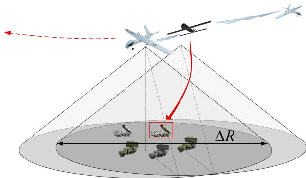  
Fig. 1. The schematic diagram of UAVs cooperative relay tracking.

The remaining parts of this paper are arranged as follows. Section II provides a detailed description of the UAVs cooperative relay tracking problem. Section III introduces the scheme for target handover and provides corresponding solutions for three problems: graph construction, feature extraction, and similarity measurement. Experiments and results are presented in Section IV to verify the feasibility of the proposed methods. At last, Section V concludes this paper.

## II. PROBLEM DESCRIPTION

As shown in Fig. 1, multiple UAVs are conducting area reconnaissance missions. The designated target A is located in a dense area with many interference targets $\left\{ { \cal A } _ { i } | i \in \mathbb { N } ^ { + } \right\}$ . UAV1 first detects target $A _ { 0 } ,$ , and sends its position $P o s _ { 1 } ( X , \dot { Y } , Z )$ and information about target $A _ { 0 }$ to UAV2. Then, UAV2 flies to the target handover area immediately after receiving the target information. Within the field of view, UAV2 detects multiple targets $\left\{ B _ { j } | j \in \{ 0 , 1 , \ldots , N \} \right\}$ , and $j$ is the target identifier. , , . . . ,Among them, the designated target $A _ { 0 }$ resides within the overlapping range of both UAV1 and UAV2. Leveraging the acquired data, UAV2 promptly locks onto the precise position of target $A _ { 0 }$

The target handover problem of multi-UAV cooperative   
relay tracking can be summarized as follows: given the   
observation value $O _ { 1 } ^ { A _ { 0 } }$ of UAV1 on target $A _ { 0 }$ , UAV2 observed   
multiple targets $\left\{ B _ { j } | \right\} \in \left\{ 0 , 1 , \ldots , N \right\} $ in the area to be handed   
over. The observation value is $\left\{ O _ { 2 } ^ { B _ { j } } | j \in \{ 0 , 1 , \ldots , N \} \right\}$ . The   
probability that $O _ { 1 } ^ { A _ { 0 } }$ and $O _ { 2 } ^ { B _ { j } }$ originate from the same source   
is $P _ { j } \left( A _ { 0 } = B _ { j } \mid O _ { 1 } ^ { A _ { 0 } } , O _ { 2 } ^ { B _ { j } } \right)$ If

$$
P _ { j } \left( A _ { 0 } = B _ { j } \mid O _ { 1 } ^ { A _ { 0 } } , O _ { 2 } ^ { B _ { j } } \right) > \delta ,\tag{1}
$$

i.e., the probability is greater than the given threshold namely, then the target $B _ { j }$ δis considered to have a high probability of being the same target as $A _ { 0 } .$ . We set the rule to determine whether a target is handed over successfully as follows: among the targets whose handover probability $P _ { j }$ exceeds , the target with the highest probability is selected.

Take

$$
B ^ { * } = \underset { B _ { j } \in \mathcal { C } } { \arg \operatorname* { m a x } } P _ { j } ,\tag{2}
$$

where $\mathcal { C }$ is a candidate target set.

Then target $B ^ { * }$ is considered to be the same as target $A _ { 0 }$ We set $\delta = 0 . 5$ in this paper.

The target handover in the overlapping region is a direct method. In this approach, UAV1 shares the measurement data of the target with UAV2. The flight trajectories and relative motion of the UAVs directly determine the available “time window” for handover, thereby forming a key constraint for this process.

In general, a direct handover can only be used when two UAV platforms are in close proximity to each other and a suficient overlapping coverage area exists. The depth $\Delta R$ of this overlap area must meet the following conditions:

$$
\Delta R > \nu \cdot t _ { h } ,\tag{3}
$$

where v is the flight speed of the UAV, and $t _ { h }$ is the time required to complete the target handover.

By introducing this criterion, the flight velocity (v) of the UAV is incorporated into the model along with the spatial relationship (∆R) between the platforms. These two dynamic parameters jointly determine the critical time window for successful target handover.

## III. TARGET HANDOVER INCORPORATING LARGER-SCALE SPATIAL CONTEXT

Given the dificulties of acquiring target positions in the geodesic coordinate system, as well as the dense distribution and small size of targets in the image, this study proposes a target handover approach. It involves constructing a GCN-based feature that leverages the target’s pixel coordinates and spatial contextual information as the foundation for target handover. The key distinctions between our proposed method and existing approaches lie in both the fundamental research paradigm and specific structural innovations The primary and most fundamental distinction lies in the modeling paradigm itself. Existing neural network-based target matching methods predominantly rely on Siamese convolutional neural networks, which essentially perform feature matching at the image level. In contrast, this paper abstracts each target as a node and transforms the target matching problem into a graph-to-graph matching task. Consequently, we employ graph convolutional networks rather than traditional CNNs. This represents a fundamental conceptual diference between our study and existing approaches.

The three key technical problems to be solved are: (i) The 2D images captured by airborne cameras are typical Euclidean structured data, while the targets within these images are densely distributed scatter points. The primary concern is how to extract meaningful information from such data and transform it into non-Euclidean structured data. (ii) How to extract deep features that can efectively integrate larger-scale spatial contextual information beyond the target, and design the initial features accordingly? (iii) How to determine the similarity between targets based on the reconstructed features while also factoring in the algorithm’s real-time eficiency?

The scheme of target relay tracking incorporating largerscale spatial context (LSCR) proposed in this paper is shown in Fig. 2. Initially, UAV1 constructs a graph encapsulating the designated target. The pixel coordinates of each node in the graph are subsequently transmitted to UAV2. Subsequently, UAV2 utilizes a GNN to encode the designated target relayed by UAV1. Following this, UAV2 constructs graphs for the targets within its field of view separately and encodes them. Ultimately, the reconstructed graph encodes are sequentially compared with the reconstructed graph encode of the designated target for similarity measure. The information passed from UAV1 to UAV2 is the pixel coordinates of the designated target and its neighboring targets.

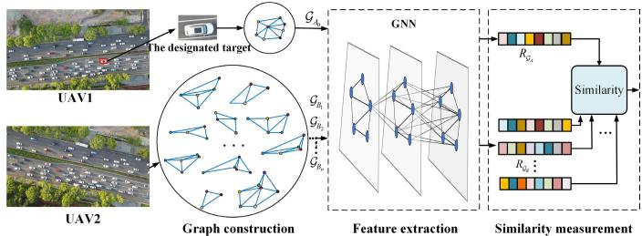  
Fig. 2. The scheme of target relay tracking incorporating larger-scale spatial context (LSCR).

In addition, the two images used for target handover in the algorithmic framework are aligned. However, the sensors on diferent UAVs are not synchronous, which leads to a mismatch in the time series of the image data acquired by diferent UAVs and cannot be directly used for target handover. Assuming the time series of UAV1 is $\mathcal { T } _ { 1 } ~ = ~ \{ t _ { 1 } ( n ) | n ~ \in ~ \mathbb { Z } \}$ and the corresponding observation space of the sensor is $S _ { 1 } [ \mathcal { T } _ { 1 } ] ~ = ~ \{ S _ { 1 } [ t _ { 1 } ( n ) ] | n \in \mathbb { Z } \}$ . The time series of UAV2 is $\mathcal { T } _ { 2 } = \{ t _ { 2 } ( m ) | m \in \mathbb { Z } \}$ , and the corresponding observation space of the sensor is $S _ { 2 } [ \mathcal { T } _ { 2 } ] = \{ S _ { 2 } [ t _ { 2 } ( m ) ] | m \in \mathbb { Z } \}$ . Since the time scale is the same on diferent UAVs. Therefore, this paper adopts the following steps to overcome the impact of sensor asynchrony on the algorithm:

Firstly, time-align diferent UAVs to ensure the clocks are consistent. Calculate the baseline time ofset:

$$
\Delta t = t _ { 2 } ( m _ { 0 } ) - t _ { 1 } ( n _ { 0 } ) ,\tag{4}
$$

where $n _ { 0 }$ and $m _ { 0 }$ are the index in the time series $\mathcal { T } _ { 1 }$ , $\mathcal { T } _ { 2 }$ respectively.

Using UAV2’s time as the baseline, the calibrated time series for UAV1 is obtained as follows:

$$
\tilde { \mathcal { T } } _ { 1 } = \mathcal { T } _ { 1 } + \Delta t .\tag{5}
$$

Give the data timestamps of each frame. Since the data is updated at the same frequency, it is only necessary to compare the timestamps of the two sets of data and select the closest pair for target handover. i.e.,

$$
m ^ { * } = \arg \operatorname* { m i n } _ { m } \left| \tilde { t } _ { 1 } ( n ) - t _ { 2 } ( m ) \right| .\tag{6}
$$

Further, the spatial alignment relation is uniquely determined by the temporal alignment mapping:

$$
S _ { 1 } [ \tilde { t } _ { 1 } ( n ) ]  S _ { 2 } [ t _ { 2 } ( m ^ { * } ) ] .\tag{7}
$$

The diference between the timestamps of UAV1 and UAV2 is:

$$
\Delta \tilde { t } = t _ { 2 } ( m ^ { * } ) - \tilde { t } _ { 1 } ( n ) ,\tag{8}
$$

where $\left| \Delta \tilde { t } \right| \leq \frac { 1 } { 2 f }$ , and $f$ is the frame rate of the sensor.

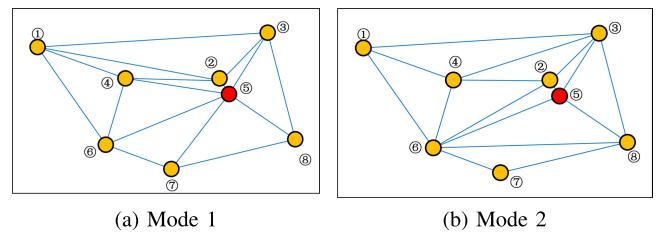  
Fig. 3. The topological adjacency modes between targets.

In this Section, Section III-A details the graph construction of targets. Section III-B proposes a TGR feature for fusing larger-scale spatial contextual information through graph-level encoding, and the initial features of the target are designed. Section III-C proposes the Twin-GRCN model to calculate the similarity between the two targets.

## A. Graph Construction Based on Delaunay Triangulation (DT) Theory

From the perspective of the UAV, targets appear as a multitude of dispersed points. In order to minimize the impact of the viewpoint deviation on the target handover, the expected target handover position $P o s _ { 2 } ^ { \prime }$ of UAV2 should converge to $P o s _ { 1 }$ so that arg min $| | P o s _ { 1 } - P o s _ { 2 } ^ { \prime } | | _ { 2 }$ . However, in the actual execution of the mission, in order to prevent UAV1 and UAV2 from colliding, there is still a certain deviation between $P o s _ { 2 } ^ { \prime }$ and $P o s _ { 1 }$ . When utilizing the graph formation composed of a target and its adjacent targets for target handover, the initial challenge lies in determining which targets are neighboring and the nature of their adjacency. Typically, researchers establish a specific threshold as the topological radius, encompassing all targets within this range as neighboring targets [22]. Nevertheless, the value of topological radius is related to the flight height. Defining the extent of the topological radius becomes a complex task. Even slight deviations can lead to distinct neighboring targets for the same target when observed from diferent viewpoints.

Triangulation is the most fundamental research method in algebraic topology. It divides the set of plane points into a series of disjoint triangles according to certain rules. These triangles form triangular networks that can be used for various calculations and analyses. However, the adjacency between targets in the triangle networks is not uniquely determined. Fig. 3(a)(b) shows the diferent neighboring ways of the same group of targets. Take target ⑤ as an illustration, in Fig. 3(a), there are six 1-order neighboring targets, specifically $\textcircled { 2 } \sim \textcircled { 4 }$ and ⑥ ∼ ⑧. The 2-order neighboring target is ①. However, in Fig. 3(b), there are four 1-order neighboring targets of target ⑤, namely ② ∼ ③, ⑥, and ⑧. The 2-order neighboring target is ④ and ⑦, while the 3-order neighboring target is ①.

To ensure consistent topological relationships among targets from diferent viewpoints, this paper introduces the Delaunay triangulation theory.

Remark 1: Delaunay edges: Let V be a finite set of points on a two-dimensional real number field. Edge $e _ { i }$ is a line segment comprising nodes a and b from the set as breakpoints. $\mathcal { E } = \{ e _ { i } | i = 1 , 2 , . . . \}$ . Edge $e _ { i }$ is considered a Delaunay edge if it satisfies the following condition: there exists a circle that encompasses the nodes a and $^ { b , }$ and this circle does not encompass any other point within the set V.

(b) The perspective of UAV2  
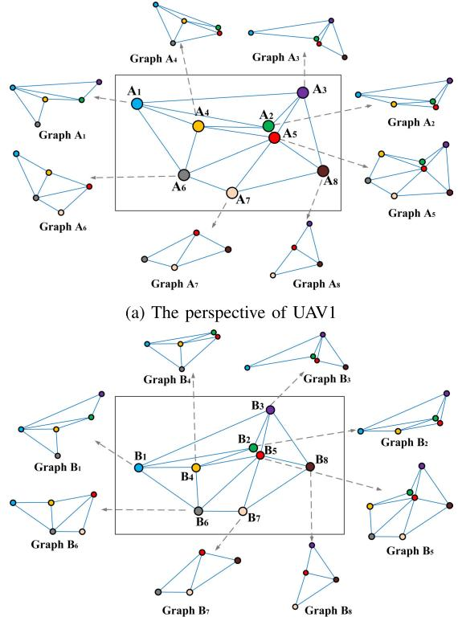  
Fig. 4. Graph construction of each target from diferent UAV perspectives.

Remark 2: Delaunay triangulation: If the triangulation T of a point set V solely contains Delaunay edges, then it is called Delaunay triangulation.

Delaunay triangulation must satisfy the following two important criteria: (i) Vacuous circumcircle criterion. The Delaunay triangulation network is unique. No other point exists within the outer circle of any triangle. (ii) Maximizing the minimum angle property. The minimum angle of the triangle formed by the Delaunay triangulation is the largest among the possible triangulations formed by the scatter set.

After determining the topological adjacencies between all targets within the UAV’s field of view, this paper utilizes the spatial structure formed by each target and its neighboring targets as the preliminary graph representation for extracting its spatial context features.

Formally, the graph $\mathcal { G } _ { A _ { i } }$ of the target $A _ { i }$ consists of a set of nodes $\nu _ { g }$ and a series of undirected edges $\mathcal { E } _ { \mathcal G }$ connecting pairs of nodes [36], which can be expressed as:

$$
\mathcal { G } _ { A _ { i } } = \{ \mathcal { V } _ { \mathcal { G } } , \mathcal { E } _ { \mathcal { G } } \} ,\tag{9}
$$

where $\mathcal { V } _ { \mathcal { G } } = \{ A _ { i } , \mathcal { N } ( A _ { i } ) \}$ consists of node $A _ { i }$ and its k-order ,neighboring node $\mathcal { N } ( A _ { i } ) . \mathcal { N } ( A _ { i } ) = \{ A _ { j } | \exists e _ { i j } \in \mathcal { E } _ { \mathcal { G } } \mathrm { o r } e _ { j i } \in \mathcal { E } _ { \mathcal { G } } \}$ $\mathcal { E } _ { \mathcal { G } } ~ \subseteq ~ \{ \{ A _ { i } , A _ { j } \} | A _ { i } , A _ { j } ~ \in ~ \mathcal { V } _ { \mathcal { G } } \}$ specifies how the nodes are ,interconnected.

Fig. 4 shows the graphs constructed by the two UAVs at diferent viewpoints. It can be found that the structure of the graphs constructed for the same target and its neighboring targets are consistent under diferent viewpoints. For example, Graph $A _ { i }$ in Fig. 4(a) and Graph $B _ { j }$ in Fig. 4(b) exhibit the same structure. In addition, in scenarios where targets are densely distributed, it is evident that the graph structures of two closely located targets difer significantly. For example, the targets $A _ { 2 }$ and $A _ { 5 }$ in Fig. 4(a), despite their close proximity, exhibit completely distinct Graph $A _ { 2 }$ and Graph $A _ { 5 }$ respectively.

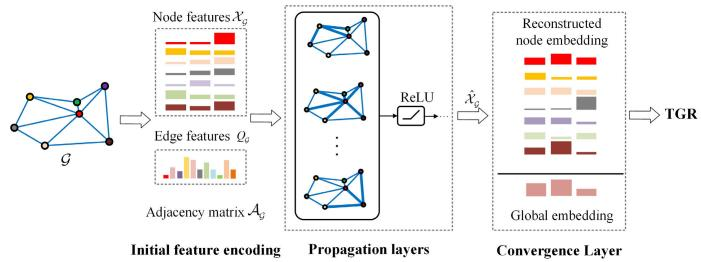  
Fig. 5. The GRCN model for extracting TGR features incorporating largerscale spatial context.

## B. Target Graph Representation (TGR) Features Extraction Based on Graph Neural Networks

Currently, the commonly used features for target handover primarily consist of several manual features and target appearance depth feature extracted by CNN. Manual features are usually designed based on experience, with high interpretability and low computational complexity. In scenarios with complex scenes and dynamic changes, manual features may not accurately capture the semantic information of the target. Deep features are automatically extracted by deep learning models, which have stronger representational capability and adaptability compared to manual features. However, existing depth features extracted by CNN focus only on the appearance of the target and ignore the correlation between the target and other instances in the surrounding environment. Therefore, this section proposes a depth TGR feature based on graph neural networks, aiming to fuse larger-scale spatial context beyond the target.

Graph convolutional networks (GCN) are currently the most popular and efective graph neural networks for various tasks. It aggregates the information of each node and neighboring nodes in the graph to generate a new embedding. However, GCN only considers node features and their connection relationships, and does not make use of the edges’ properties. In addition, the reconstructed node embedding generated by GCN lacks a description of the whole graph. Therefore, this paper proposed the graph representation convolutional network (GRCN), featuring a redefined propagation rule for its graph convolutional layers. The distance information between nodes is innovatively transformed into edge weights and explicitly incorporated into the propagation layers of the GCN. It aims to aggregate both node features and edge features to create a comprehensive encoding for graph-level embedding. For the specific task of “UAVs cooperative relay tracking”, the initial node features $\chi _ { \mathcal { G } }$ and edge features $q _ { \mathcal { G } }$ are specially designed in conjunction with the requirements of the target relay tracking task.

As shown in Fig. 5, the proposed graph representation model for extracting TGR features contains several propagation layers and an aggregation layer. Suppose the graph representation of target $A _ { 0 }$ is $\mathcal { G } _ { A _ { 0 } } = \{ \mathcal { V } _ { \mathcal { G } _ { A _ { 0 } } } , \mathcal { E } _ { \mathcal { G } _ { A _ { 0 } } } \} .$ , consisting ,of n nodes and m edges. The node feature matrix of the l-th layer is $\mathcal { X } _ { \mathcal { G } } { } ^ { l } \in \mathbb { R } ^ { n \times d }$ , the edge feature vector is $q _ { \mathcal { G } } \in \mathbb { R } ^ { 1 \times m }$ and the adjacency matrix is $\mathcal { A } _ { \mathcal { G } } \in \mathbb { R } ^ { n \times n }$

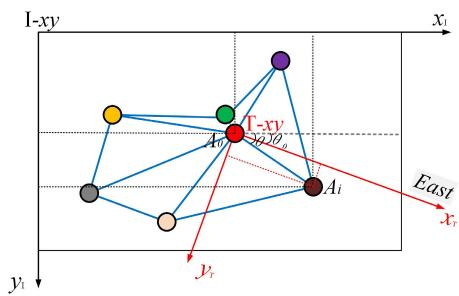  
Fig. 6. Coordinate systems.

Define the edge weight matrix $\mathcal { Q } _ { \mathcal { G } } \in \mathbb { R } ^ { n \times n }$ . The value of its i-th row and j-th column is:

$$
Q _ { \mathcal { G } } ^ { i , j } = \left\{ \begin{array} { l l } { q _ { \mathcal { G } } ( k ) , \quad i f \quad e _ { i j } \in \mathcal { E } _ { \mathcal { G } } } \\ { 0 , \quad \mathrm { o t h e r w i s e } } \end{array} \right. \mathrm { ~ , ~ }\tag{10}
$$

where k is the index of $e _ { i j }$

Define the propagation rules for each layer of node representations as follows:

$$
\begin{array} { r l } & { \mathcal { X } _ { \mathcal { G } } ^ { l + 1 } = f ( \mathcal { X } _ { \mathcal { G } } ^ { l } , \mathcal { A } _ { \mathcal { G } } , \mathcal { Q } _ { \mathcal { G } } ) } \\ & { \qquad = \sigma \left( \tilde { D } ^ { - \frac 1 2 } \left( ( \mathcal { A } _ { \mathcal { G } } \odot \mathcal { Q } _ { \mathcal { G } } ) + I \right) \tilde { D } ^ { - \frac 1 2 } \mathcal { X } _ { \mathcal { G } } ^ { \phantom { - 1 } } W ^ { l } \right) , } \end{array}\tag{11}
$$

where ${ \tilde { D } } = D + I ,$ D is the degree matrix of $\mathbf { \mathcal { A } } _ { \mathcal { G } } , \mathbf { \mathcal { W } } ^ { l }$ is the trainable weight parameters, is the activation function, and denotes the Hadamard (element-wise) product.

Eq.(5) is based on neighborhood information to perform nonlinear transformations on node features and edge features. By iteratively propagating, it gradually obtains higher-level node representations.

Define $\hat { \mathcal { A } } _ { \mathcal { G } } = \tilde { D } ^ { - \frac { 1 } { 2 } } \left( \left( \mathcal { A } _ { \mathcal { G } } \odot Q _ { \mathcal { G } } \right) + I \right) \tilde { D } ^ { - \frac { 1 } { 2 } }$ . The reconstructed node embedding $\hat { \mathcal { X } } _ { \mathcal G }$ is obtained through a two-layer GRCN:

$$
\begin{array} { r l } & { \hat { \mathcal { X } } _ { \mathcal { G } } = f ( \mathcal { X } _ { \mathcal { G } } , \mathcal { A } _ { \mathcal { G } } , \mathcal { Q } _ { \mathcal { G } } ) } \\ & { \quad \quad = \operatorname { R e L U } \left( \hat { \mathcal { A } } _ { \mathcal { G } } \left( \operatorname { R e L U } ( \hat { \mathcal { A } } _ { \mathcal { G } } \mathcal { X } _ { \mathcal { G } } \mathcal { W } ^ { 0 } ) \right) \mathcal { W } ^ { 1 } \right) , } \end{array}\tag{12}
$$

The aggregation layer takes the reconstruction vector of each node as input and outputs a target graph representation:

$$
R _ { \mathcal { G } } = \sum _ { i = 1 } ^ { | \mathcal { V } _ { \mathcal { G } } | } \hat { \mathcal { X } } _ { \mathcal { G } } ^ { i } ,\tag{13}
$$

where $\hat { \mathcal { X } } _ { \mathcal G } ^ { i }$ is the reconstructed embedding of node $i . \left| \mathcal { V } _ { \mathcal { G } } \right|$ is the quantity of nodes in $\mathcal { G } _ { A _ { 0 } }$ . Then, the TGR features are obtained accordingly.

In designing the initial node features $\chi _ { \mathcal { G } }$ and edge features $q _ { \mathcal { G } }$ , this paper establishes a relative coordinate system T − xTyT to adapt the perspectives and altitude diferences between UAVs.

Fig. 6 shows the designated target $A _ { 0 }$ and its graph representation $\mathcal { G } _ { A _ { 0 } } . \ \mathrm { I } - x _ { \mathrm { I } } y _ { \mathrm { I } }$ is the image coordinate system. The coordinates of target $A _ { 0 }$ in I are $( x _ { \mathrm { I } } ^ { \mathrm { \Delta } _ { 0 } } , y _ { \mathrm { I } } ^ { \mathrm { \Delta } _ { 0 } } )$ . The coordinates of the neighboring node $A _ { i }$ in I are $( x _ { \mathrm { I } } ^ { A _ { i } } , y _ { \mathrm { I } } ^ { A _ { i } } )$ ). Define the target relative coordinate system $\mathrm { T } - x _ { \mathrm { T } } y _ { \mathrm { T } }$ ,with the origin as the designated target. x points towards east. The coordinates of target $A _ { i }$ in $\mathrm { T } - x _ { \mathrm { T } } y _ { \mathrm { T } }$ are $( x _ { \mathrm { T } } ^ { A _ { i } } , y _ { \mathrm { T } } ^ { A _ { i } } )$ .

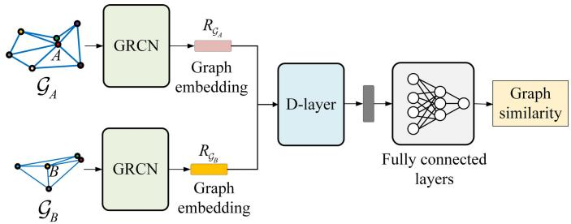  
Fig. 7. The structure of the Twin-GRCN.

The transformation relationship between I−xIyI and T−xTyT is shown in Eq.(8):

$$
\left[ \begin{array} { c } { x _ { \mathrm { T } } ^ { A _ { i } } } \\ { y _ { \mathrm { T } } ^ { A _ { i } } } \end{array} \right] = \left[ \begin{array} { c c } { \cos \theta _ { 0 } - \sin \theta _ { 0 } } \\ { \sin \theta _ { 0 } \cos \theta _ { 0 } } \end{array} \right] \left[ \begin{array} { c } { x _ { \mathrm { I } } ^ { A _ { i } } - t _ { x } } \\ { y _ { \mathrm { I } } ^ { A _ { i } } - t _ { y } } \end{array} \right] ,\tag{14}
$$

where $\theta _ { 0 }$ is the angle between $x _ { \mathrm { I } }$ and $\boldsymbol { x } _ { \mathrm { T } } . ~ [ t _ { x } , t _ { y } ] ^ { \mathrm { T } }$ is the θ ,component of the relative coordinate system origin in the image coordinate system.

In order to overcome the efects of viewpoint diferences, the initial node feature matrix $\chi _ { \mathcal { G } }$ of $\mathcal { G } _ { A _ { 0 } }$ is designed as:

$$
\mathcal { X } _ { \mathcal { G } } = \left[ \begin{array} { c c c } { \tilde { x } _ { \mathrm { T } } ^ { A _ { 0 } } } & { \tilde { y } _ { \mathrm { T } } ^ { A _ { 0 } } } & { \tilde { \theta } _ { A _ { 0 } } ^ { \prime } } \\ { \tilde { x } _ { \mathrm { T } } ^ { A _ { 1 } } } & { \tilde { y } _ { \mathrm { T } } ^ { A _ { 1 } } } & { \tilde { \theta } _ { A _ { 1 } } ^ { \prime } } \\ { \vdots } & { \vdots } & { \vdots } \\ { \tilde { x } _ { \mathrm { T } } ^ { A _ { n } } } & { \tilde { y } _ { \mathrm { T } } ^ { A _ { n } } } & { \tilde { \theta } _ { A _ { n } } ^ { \prime } } \end{array} \right] ,\tag{15}
$$

where $\tilde { x } _ { \mathrm { T } } ^ { A _ { i } } , \tilde { y } _ { \mathrm { T } } ^ { A _ { i } } , \tilde { \theta } _ { A _ { i } } ^ { \prime }$ denote the normalized $x _ { \mathrm { T } } ^ { A _ { i } } , y _ { \mathrm { T } } ^ { A _ { i } } , \theta _ { A _ { i } } ^ { \prime }$ , respectively. $\theta _ { A _ { i } } ^ { \prime } = \theta _ { A _ { i } } - \theta _ { 0 }$ , , θis the angular deviation between the line θ θ θconnecting the target $A _ { 0 }$ and $A _ { i }$ and the east direction. Set $\theta _ { A _ { 0 } } ^ { \prime } = 3 6 0 ^ { \circ }$ , so that its normalized value $\tilde { \theta } _ { A _ { 0 } } ^ { \prime }$ becomes 1. When $i \neq 0 ,$ the normalized values of $\tilde { \theta } _ { A _ { i } } ^ { \prime }$ fall between 0 and 1.

θIn this paper, the edge features $q _ { \mathcal { G } }$ of $\mathcal { G } _ { A _ { 0 } }$ is designed as:

$$
\left\{ \begin{array} { l l } { q _ { \mathcal { G } } = [ \tilde { q } _ { 1 } , \tilde { q } _ { 2 } , \cdots , \tilde { q } _ { k } , \cdots , \tilde { q } _ { m } ] ^ { \mathrm { T } } } \\ { q _ { k } ( e _ { i j } ) = \biggl ( ( x _ { \mathrm { T } } ^ { A _ { i } } - x _ { \mathrm { T } } ^ { A _ { j } } ) ^ { 2 } + ( y _ { \mathrm { T } } ^ { A _ { i } } - y _ { \mathrm { T } } ^ { A _ { j } } ) ^ { 2 } \biggr ) ^ { \frac { 1 } { 2 } } , } \end{array} \right.\tag{16}
$$

where $q _ { k } ( e _ { i j } )$ is the weight of the k-th edge $e _ { i j }$ , whose value represents the Euclidean distance in the image between targets $A _ { i }$ and $A _ { j }$ connecting the edge $\boldsymbol { e } _ { i j } . \tilde { \boldsymbol { q } } _ { k }$ is the normalized $q _ { k } ( e _ { i j } )$

## C. Target Similarity Matching Based on Twin-GRCN

To measure the targets’ similarity detected by diferent UAVs, this paper proposes the Twin-GRCN model, which is an end-to-end neural network-based approach. It attempts to learn a function that maps two input graphs into a shared space, such that graph pairs of the same target have a smaller spatial distance, while pairs of diferent targets have a larger distance.

As shown in Fig. 7, the Twin-GRCN model mainly consists of two GRCN, a D-layer layer and a fully connected layer. The two GRCN modules are used to extract the larger-scale spatial contextual features of the designated target and the target to be handed over, respectively. D-layer layer is used to measure the distance between two graph embeddings. Finally, a multilayer fully connected neural network is applied to reduce the dimensionality of the input vectors and predict the final similarity score.

Specifically, the graph representation $\mathcal { G } _ { A _ { i } }$ of the designated target $A _ { i }$ tracked by UAV1 and the graph representation $\mathcal { G } _ { B _ { j } }$ of the target $B _ { j }$ found by UAV2 are passed into GRCN to generate a reconstructed one-dimensional graph embedding vector $R _ { { \mathcal G } _ { A } }$ and $R _ { { \mathcal G } _ { B } }$ , respectively.

Define a D-layer as Eq.(11), which is a distance metric function that measures the distance between two graph embedding vectors:

$$
d ( R _ { \mathcal { G } _ { A } } , R _ { \mathcal { G } _ { B } } ) = ( R _ { \mathcal { G } _ { A } } - R _ { \mathcal { G } _ { B } } ) \odot ( R _ { \mathcal { G } _ { A } } - R _ { \mathcal { G } _ { B } } ) ,\tag{17}
$$

where $R _ { { \mathcal G } _ { A } }$ and $R _ { { \mathcal G } _ { B } }$ are graph embedding vectors reconstructed by GRCN. Subtract these two vectors and then calculate the Hamada product. $d ( R _ { { \mathcal { G } } _ { A } } , R _ { { \mathcal { G } } _ { B } } )$ represents the distance between $R _ { { \mathcal G } _ { A } }$ and $R _ { { \mathcal G } _ { B } }$ ,, which is used as an input to the fully connected neural network.

To prevent overfitting, a Dropout layer is connected after the D-Layer in this paper. Finally, the final network output ˆy, i.e., the target similarity, is obtained after fully connected layers and the Sigmoid activation function:

$$
\left\{ \begin{array} { l l } { \displaystyle \hat { y } ( \mathcal G _ { A _ { i } } , \mathcal G _ { B _ { j } } ) = \sigma ( \mathrm { F N N } ( d ( R _ { \mathcal G _ { A } } , R _ { \mathcal G _ { B } } ) ) ) } & { } \\ { \displaystyle \sigma ( x ) = \frac { 1 } { 1 + e ^ { - x } } } & { , } \end{array} \right.\tag{18}
$$

where $\sigma ( x )$ is the Sigmoid function, and x is the input of $\sigma .$ FNN is a fully connected neural network. In the Twin-GRCN network proposed in this paper, the input of $\sigma ( x )$ is the output of the fully connected neural network $\mathrm { F N N } ( d ( R _ { { \mathcal G } _ { A } } , R _ { { \mathcal G } _ { B } } ) )$ .

Let

$$
P \left( A _ { i } = B _ { j } \mid O _ { 1 } ^ { A _ { i } } , O _ { 2 } ^ { B _ { j } } \right) = \hat { y } ( \mathcal { G } _ { A _ { i } } , \mathcal { G } _ { B _ { j } } ) ,\tag{19}
$$

then, the probability that target $A _ { i }$ and target $B _ { j }$ are from the same source can be obtained.

In this paper, the mean squared loss function (Eq.(13)) is used to find an optimal mapping by minimizing the metric loss:

$$
L o s s = - \frac { 1 } { | \mathcal { D } | } \sum _ { ( i , j ) \in \mathcal { D } } ( \hat { y } ( \mathcal { G } _ { A _ { i } } , \mathcal { G } _ { B _ { j } } ) , y ( \mathcal { G } _ { A _ { i } } , \mathcal { G } _ { B _ { j } } ) ) ^ { 2 } ,\tag{20}
$$

where D is the set of training graph pairs, $y ( \mathcal { G } _ { A _ { i } } , \mathcal { G } _ { B _ { i } } )$ is the labeled similarity between ${ \mathcal { G } } _ { A _ { i } }$ and $\mathcal { G } _ { B _ { i } }$ . If $A _ { i }$ ,and $B _ { j }$ are the same target, $y ( \mathcal { G } _ { A _ { i } } , \mathcal { G } _ { B _ { j } } ) = 1$ , otherwise, $y ( \mathcal { G } _ { A _ { i } } , \mathcal { G } _ { B _ { i } } ) = 0$ . Such , ,that the distances between the same target are as small as possible and the distances between diferent targets are as large as possible.

The trained Twin-GRCN can be used to calculate the similarity between the graphs of two targets. Its time complexity consists of two main parts:

(i) The computational stage of graph-level embedding. The graph-level embedding of the designated target needs to be computed once. UAV2 needs to compute the graph of each target within the field of view. Its time complexity can be approximated as $\mathcal { O } ( L \cdot n \cdot d ^ { 2 } )$ . L is the number of convolutional layers of GRCN, n is the number of nodes, and d is the dimensionality of the node features.

(ii) Similarity measurement stage. UAV2 needs to calculate once for each pair of graphs. The time complexity of the D-Layer is $\mathcal { O } ( d ^ { \prime } )$ , where d0 is the dimensionality of $\hat { \mathcal { X } } _ { \mathcal { G } } ^ { i }$ The time complexity of the fully connected layer neural network is $\mathcal { O } \left( H _ { 0 } \cdot H _ { 1 } + \sum _ { i = 2 } ^ { L ^ { \prime } - 1 } H _ { i - 1 } \cdot H _ { i } + H _ { L ^ { \prime } - 1 } \cdot H _ { L ^ { \prime } } \right)$

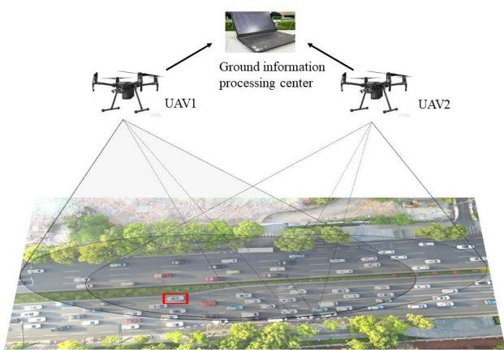  
Fig. 8. Comprehensive experiments.

where $H _ { i }$ is the number of neurons in the i-th layer. As fully connected neural networks deepen, the computation time will also increase. The time complexity of D-Layer can be ignored compared with the fully connected layers. Due to the adoption of a three-layer fully connected neural network in this paper, the computational complexity of the similarity measurement stage can be approximated as $\mathcal { O } ( d ^ { \prime } \cdot H + H )$ .

## IV. EXPERIMENTS AND RESULTS

## A. Experimental Platform and Environment

To validate the performance of our proposed method in real-world scenarios, we conducted comprehensive physical experiments. The field tests were performed in a main urban artery, incorporating key challenges such as densely distributed targets, interference from visually similar objects, and significant variations in UAV viewpoints and altitudes. A schematic overview of the experimental setup is illustrated in Fig. 8.

The system is primarily composed of the following three parts: a multi-UAV system, ground vehicles, and a ground station. The multi-UAV system consists of two UAVs. Each UAV is equipped with an optical camera for visual observation and a Real-Time Kinematic (RTK) global satellite navigation system for the UAV’s localization. The attitude data of the UAV is obtained by the onboard IMU. Images of targets and environments are acquired by an onboard image acquisition system. Ground vehicles constituted the dynamic targets within the testing area. The ground station functioned as the central hub, which received status information (e.g., location, attitude) and observation data (e.g., captured images) from multiple UAVs via dedicated data links and performed the core algorithmic computations, including target detection and the proposed target handover process.

Section IV-B evaluates the performance of the proposed algorithm under varying UAV viewpoints and altitudes. Section IV-C presents the comparison of feature extraction results, which validates the enhanced distinctiveness of our algorithm in handling similar and proximate targets. Section IV-D shows the comprehensive performance comparison of diferent target matching algorithms.

TABLE I  
TIMESTAMP MATCHING AND IMAGE PAIRING RESULTS AFTER ALIGNMENT
<table><tr><td rowspan=1 colspan=1>Frame</td><td rowspan=1 colspan=1>Frame 24</td><td rowspan=1 colspan=1>Frame 83</td><td rowspan=1 colspan=2>Frame 142</td></tr><tr><td rowspan=1 colspan=1> $\overline { { \mathcal { T } _ { 1 } } }$ </td><td rowspan=1 colspan=1>17:25:25.566.355</td><td rowspan=1 colspan=1>17:25:27.534.880</td><td rowspan=1 colspan=2>17:25:29.503.404</td></tr><tr><td rowspan=1 colspan=1> $S _ { 1 }$ </td><td rowspan=1 colspan=1>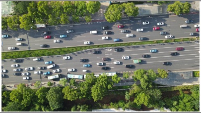</td><td rowspan=1 colspan=1>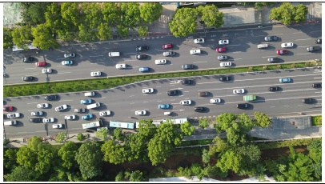</td><td rowspan=1 colspan=1>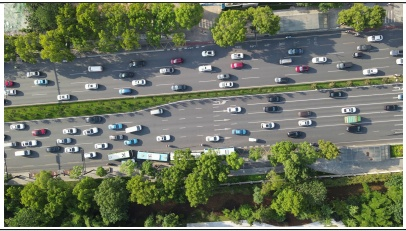</td><td rowspan=1 colspan=1></td></tr><tr><td rowspan=1 colspan=1>Frame</td><td rowspan=1 colspan=1>Frame 1</td><td rowspan=1 colspan=1>Frame 60</td><td rowspan=1 colspan=2>Frame 119</td></tr><tr><td rowspan=1 colspan=1> $\overline { { \mathcal { T } _ { 2 } } }$ </td><td rowspan=1 colspan=1>17:25:25.578.966</td><td rowspan=1 colspan=1>17:25:27.547.488</td><td rowspan=1 colspan=2>17:25:29.516.012</td></tr><tr><td rowspan=1 colspan=1> $S _ { 2 }$ </td><td rowspan=1 colspan=1>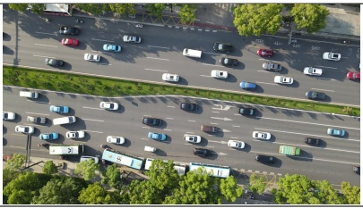</td><td rowspan=1 colspan=1>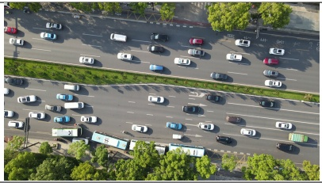</td><td rowspan=1 colspan=1>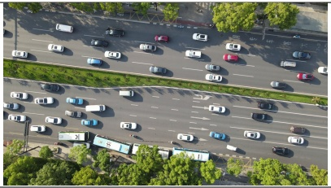</td><td rowspan=1 colspan=1></td></tr><tr><td rowspan=1 colspan=1>∆t</td><td rowspan=1 colspan=4>0.0127 s</td></tr></table>

## B. Performance Testing of the Proposed Algorithm

This paper time-aligned the two UAVs and matched the timestamps of the images captured by the sensors. According to the image transmission rate (30 FPS) during target handover, the maximum time diference after timestamp matching between UAV1 and UAV2 can be calculated to be 0.0167 s. In the case of densely distributed targets, the vehicle’s speed is relatively slow. Assuming a speed of 40 km/h, the maximum displacement within the time diference range of timestamp matching is 0.19 m. The results of timestamp and image matching after alignment are shown in Table I. It can be seen that Frames 24, 83 and 142 of UAV1 correspond to Frames 1, 60 and 119 of UAV2, respectively. The diference in timestamps after alignment is 0.0127 s.

In order to verify the efectiveness of the proposed LSCR algorithm to solve the target handover problem, this paper uses two UAVs to collect images in a main artery at diferent viewpoints, respectively. 8448 pairs of graph data dedicated to the multi-UAV relay tracking are made. The number of nodes totaled 112242 and the number of edges totaled 190172, averaging about 13 nodes and 23 edges per pair of graphs. The algorithm is implemented in the Pytorch framework. To reduce the computational complexity, set the step size k between $A _ { i }$ and $\mathcal { N } ( A _ { i } )$ as 1. The number of filters in the convolutional layer is set to 32 and 16 respectively. Accuracy and loss for the training stage are shown in Fig. 9.

The following metrics are used to evaluate the Twin-GRCN model: (i) Acc. The target handover accuracy. (ii) Mean Squared Error (MSE). The MSE between the probability of two targets predicted by Twin-GRCN being the same source and the actual probability. (iii) Computing times. The time taken to compute the similarity score of a pair of graphs. (iv) Frames Per Second (FPS). The number of graph pairs computed per second. (v) Model size. Memory usage size of Twin-GRCN. The performance evaluation of the proposed algorithm on the testing set are shown in Table II.

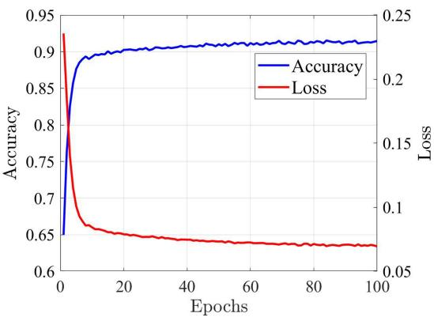  
Fig. 9. Accuracy and loss for the training stage.

TABLE II  
PERFORMANCE EVALUATION OF THE PROPOSED ALGORITHM ON THE TESTING SET
<table><tr><td>Evaluation Metrics</td><td>Acc</td><td>MSE</td><td>Time</td><td>FPS</td><td>Model size</td></tr><tr><td>Results</td><td>0.921</td><td>0.063</td><td>0.0010 s</td><td>966</td><td>20 KB</td></tr></table>

In order to verify the impact of variations in UAVs’ flight altitude on the algorithm, this paper tests the accuracy of target handover under diferent UAV flight altitudes. The flight altitude $H _ { 1 }$ of UAV1 is kept at 100m, and the flight altitude $H _ { 2 }$ of UAV2 is successively set to 100 m, 90 m, 80 m, and 70 m. The test results are shown in Fig. 10.

It can be seen that as the diference in flight altitude between the two UAVs increases, the accuracy of target handover is not afected. It is consistently maintained at about 92%.

(c) Appearance depth features of $B _ { 2 4 }$  
(d) Appearance depth features of B61  
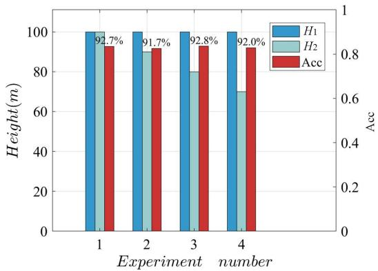  
Fig. 10. Accuracy of target handover under diferent flight altitudes.

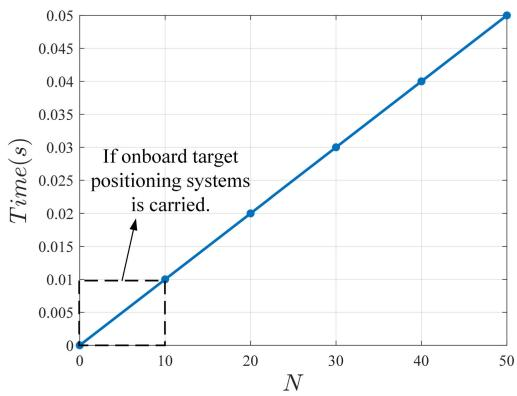  
Fig. 11. Target handover time.

In this paper, the impact of the quantities N of interfering targets within the field of view on the target handover time is examined. The results are shown in Fig. 11. It can be found that the computation time grows exponentially with the increase of the target quantities. Typically, the maximum quantity of targets observed within the central region, which constitutes 80% of the UAV’s field of view, is considered to be 50. Consequently, the maximum computation time required is 0.05 s which meets the real-time requirements. If the UAV carries an onboard target localization system and the localization error is within 10 m, the quantities of suspected targets will be further reduced to less than 10. At this time, the target handover time will be reduced to within 0.01 s.

## C. Comparison of Feature Extraction Results of Diferent Algorithms

Currently, the commonly used features in object handover tasks mainly include features based on target location and features based on target appearance. Among them, NN is a representative method for object matching using absolute location information, RET is a typical algorithm for matching based on relative location information, and appearance matching is usually implemented using a Siamese convolutional neural network. Therefore, the aforementioned methods are chosen as baselines in the experimental section to comprehensively evaluate the performance of the proposed approach.

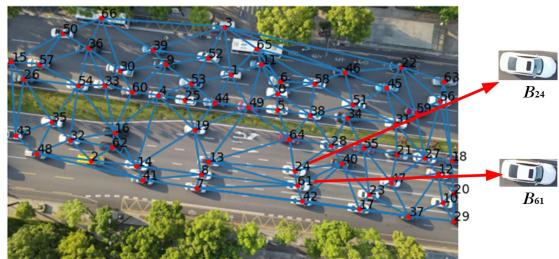

Fig. 12. The example image.  
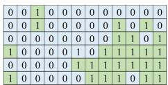  
(a) RET of $B _ { 2 4 }$

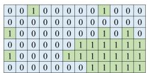  
(b) RET of target $B _ { 6 1 }$

Fig. 13. Reference topology features (RET).  
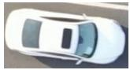  
(a) Appearance of B24

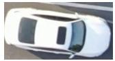  
(b) Appearance of B61

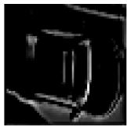

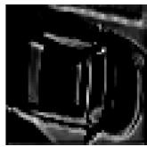  
Fig. 14. Target appearance features extracted by Siamese CNN.

TABLE III  
FEATURES EXTRACTED BY TARGET POSITION-BASED ASSOCIATION METHODS
<table><tr><td>Target number</td><td>Position features in the pixel coordinate system</td><td>Position features in the world coordinate system</td></tr><tr><td> $B _ { 2 4 }$ </td><td>(2443.5,1399.5)</td><td>(-10.72 m,-22.09 m)</td></tr><tr><td> $B _ { 6 1 }$ </td><td>(2467.5,1527.5)</td><td>(-9.65 m,-26.30 m)</td></tr></table>

In this section, the proposed target relay tracking method incorporating larger-scale spatial context (LSCR) is compared with three baseline algorithms in terms of feature extraction, specifically to validate the discriminative capability and efectiveness of the proposed TGR features in handling challenging scenarios involving densely distributed targets that are closely spaced and visually similar.

Take target $B _ { 2 4 }$ and $B _ { 6 1 }$ in $\mathrm { F i g . }$ . 12 as an example. These two targets are very close in spatial location and have a similar appearance. Table III, Fig. 13 ∼ Fig. 15 show the target features extracted by diferent methods, respectively.

Table III shows the position features extracted by the location-based target association method. Since the target $B _ { 2 4 }$ and $B _ { 6 1 }$ are very close to each other, the position features are numerically very close whether in pixel or world coordinate systems. It is dificult to distinguish these two targets by relying only on the position features within the artificially

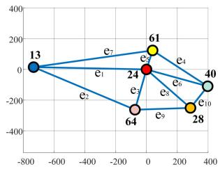

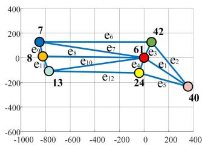

(a) Graph of $B _ { 2 4 }$  
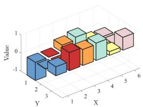  
(c) Node features of $B _ { 2 4 }$

(b) Graph of $B _ { 6 1 }$  
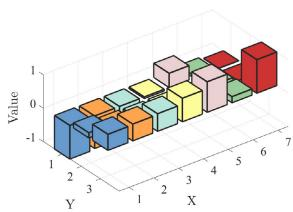  
(d) Node features of $B _ { 6 1 }$

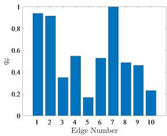

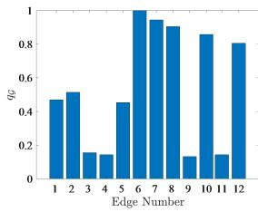  
(e) Edge features of $B _ { 2 4 }$  
(f) Edge features of $B _ { 6 1 }$  
Fig. 15. The proposed TGR features incorporating larger-scale spatial context.

## TABLE IV

SIMILARITY OF TARGET $B _ { 2 4 }$ AND TARGET $B _ { 6 1 }$ MEASURED BY DIFFERENT METHODS
<table><tr><td>Algorithms</td><td> $P _ { j } \left( B _ { 2 4 } = B _ { 6 1 } \mid O _ { 1 } ^ { B _ { 2 4 } } , O _ { 2 } ^ { B _ { 6 1 } } \right)$ </td></tr><tr><td>NN</td><td>1</td></tr><tr><td>RET</td><td>0</td></tr><tr><td>Siamese CNN</td><td>0.819</td></tr><tr><td>LSCR (Proposed)</td><td>0.0044</td></tr></table>

prescribed threshold range. Fig. 13 shows the depth feature of the target appearance extracted by the Siamese CNN. Since target $B _ { 2 4 }$ and $B _ { 6 1 }$ have a very similar appearance, this feature is also dificult to distinguish between these two targets. Only the RET features (Fig. 13) and TGR features (Fig. 15) have obvious diferences. It is easy to distinguish these two targets, which are close in location and similar in appearance.

Table IV shows the similarity of target $B _ { 2 4 }$ and target $B _ { 6 1 }$ calculated by diferent methods. The nearest neighbor(NN) algorithm and the Siamese CNN both misclassify the two targets as the same target when the threshold is set to 0.5. RET gives a binary result of either 0 or 1 to represent the association relationship between the targets, while the proposed method gives a specific value of the association probability.

## D. Comprehensive Comparison of Performance and Advantages of Diferent Algorithms

In this section, the proposed method is compared with several representative target matching methods in terms of accuracy, information transmission, model size, and computing time, respectively. The statistical results are shown in Table V.

Since this paper studies a target-dense distribution scenario, the distance between targets is usually $0 . 5 \mathrm { ~ \sim ~ } 1 0 \mathrm { ~ m ~ }$ . However, the passive positioning accuracy of a single small UAV for multiple targets on the ground in unknown areas is usually above 10 m, which is larger than the distance between targets. Therefore, efective target association cannot be carried out through the position under the world coordinate system. For this reason, only the amount of information transfer and computation time of the target positioning with NN algorithm are counted in this paper.

As can be seen from Table V, the accuracy of LSCR in this paper reaches 92.1%, which is ranked second after Siam-ResNet50. It has a significant improvement in accuracy compared to the topology feature-based method and target position-based association methods. The information transfer of the proposed algorithm is only 0.063 KB, which is less than the topology method and the appearance matching algorithm based on Siamese CNNs. The NN and RET algorithms are not model-based methods, and their computational complexities are relatively low, measured as $\mathcal { O } \left( M \times N \right)$ and $\mathcal { O } \left( N _ { r } \cdot N _ { a } \cdot \log N _ { a } \right)$ , respectively. Among all model-based matching methods, the model size of the Siamese CNNs is in the megabyte range. Its computational complexity is a function of the convolutional depth L and feature dimensionality D, given by $\mathcal { O } _ { \mathrm { S i a m e s e } } = 2 \times \sum _ { l = 1 } ^ { L } \left[ H _ { l } ^ { \mathrm { o u t } } \times W _ { l } ^ { \mathrm { o u t } } \times C _ { l } ^ { \mathrm { i n } } \times K _ { l } ^ { 2 } \times C _ { l } ^ { \mathrm { o u t } } \right] +$ $\mathcal { O } ( D )$ . Even with the lightweight Siam-MobileNet, the model size is still 20.23 MB. While the model size of the proposed method is only 20 KB. In contrast to Siamese CNNs, the model size is reduced by a unit magnitude, and the computation time is correspondingly reduced to $0 . 0 0 1 \mathrm { ~ s ~ } \ \times N$ on CPU. Under the premise of ensuring the accuracy of target matching, the matching speed is greatly improved, which meets the real-time requirement of the UAV.

It can be concluded that, since the method proposed in this paper considers the depth feature that incorporates the spatial context information as the basis for target handover, it makes the algorithm have significant advantages over the prevalent trio of target matching methods. The performance comparison of diferent methods is shown in Table VI.

Compared with position-based association methods, the advantages of the proposed method are: (i) LSCR does not require target localization data, meaning that even when the UAV is not equipped with a target localization system, it can still achieve accurate target handover. Therefore, this method reduces the demand for UAVs’ ground target localization capabilities. (ii) position-based association methods struggle to distinguish between closely located targets. In contrast, the method proposed in this paper achieves target matching by integrating larger-scale spatial contextual information, thus enabling the distinction of closely located targets.

Compared with the topology feature-based method, the algorithm in this paper needs to convey less target information, and has higher accuracy in coping with the dense distribution of targets. In addition, the topological method relies on manual experience to determine the threshold value, while the algorithm in this paper is more adaptable in coping with diferences in UAV viewpoints.

TABLE V  
PERFORMANCE COMPARISON OF DIFFERENT METHODS
<table><tr><td>Categories</td><td>Algorithms</td><td>Acc</td><td>Information transmission</td><td>Model size</td><td>Computing time</td></tr><tr><td>Target position-based method</td><td>Target positioning + NN</td><td></td><td>0.016 KB</td><td>1</td><td> $0 . 0 1 5 \sim 0 . 0 6 1 \mathrm { ~ s ~ } ( \mathrm { C P U } )$ </td></tr><tr><td>Topology feature-based method</td><td>RET</td><td>0.874</td><td>0.250 KB</td><td></td><td> $0 . 0 3 7 \sim 0 . 0 9 2 \mathrm { ~ s ~ } ( \mathrm { C P U } )$ </td></tr><tr><td rowspan="2">Appearance matching based on Siamese CNN</td><td>Siam-ResNet50</td><td>0.926</td><td>2~5KB</td><td>97.8 MB</td><td>0.0068 s × N (GPU)</td></tr><tr><td>Siam-MobileNet(Lightweight)</td><td>0.849</td><td>2~5KB</td><td>20.23 MB</td><td>0.0039 s × N (GPU)</td></tr><tr><td>TGR feature-based method (proposed)</td><td>LSCR</td><td>0.921</td><td>0.063 KB</td><td>20 KB</td><td>0.0010 s × N (CPU)</td></tr></table>

TABLE VI

ADVANTAGES COMPARISON OF DIFFERENT TARGET ASSOCIATION METHODS
<table><tr><td>Advantages Categories</td><td colspan="5"> $1 ^ { * } \ 2 ^ { * } \ 3 ^ { * } \ 4 ^ { * } 5 ^ { * }$ </td></tr><tr><td>Target position-based method</td><td></td><td>X √</td><td>X </td><td>V</td><td></td></tr><tr><td>Topology feature-based method</td><td>√</td><td>√</td><td>√</td><td>√</td><td>V</td></tr><tr><td>Appearance matching based on Siamese CNN</td><td>√</td><td></td><td>x √</td><td></td><td>X X</td></tr><tr><td>LSCR (proposed)</td><td></td><td>V</td><td>V</td><td>V</td><td>√</td></tr></table>

1\* No need to target positioning in the geodetic coordinate system.  
2\* No need to transfer images.  
$3 ^ { * }$ Ability to distinguish targets close in distance.  
$4 ^ { * }$ Ability to distinguish targets similar in appearance.  
$5 ^ { * }$ High performance can be realized on CPU, which is able to be supported onboard UAV.

Compared to the vision-based siamese convolutional neural network method, the advantages of the proposed method are: (i) Siamese CNN performs target matching based on the targets’ appearance images. The process needs to transmit the image information of the target. However, in the application context of UAV collaborative relay tracking, limited communication bandwidth restricts the amount of information that can be transmitted. In contrast, the method proposed in this paper only needs to transmit the pixel coordinates of the targets, without needing to transmit the target’s image or background image information. Consequently, LSCR requires less information transmission. (ii) The size of Siamese convolutional neural network models is usually at the MB level, while the method in this paper is actually a two-layer graph convolutional network with a model size of only 20 KB. Therefore, the method proposed in this paper has a smaller model memory footprint and real-time performance. (iii) Finally, and most importantly, the Siamese CNN method relies on the target’s appearance image to determine its identity. Consequently, it is inefective for targets with similar or identical appearances. In contrast, the method proposed in this paper can distinguish targets with similar or even identical appearance.

To summarize, the proposed method does not rely on target localization data or target appearance image information. The algorithm has high accuracy, small information transfer and small model memory footprint. It ensures computational eficiency with CPU only. In addition, since the method proposed in this paper considers the target as a mass point, it is also applicable to target relay tracking of heterogeneous UAVs carrying visible and infrared cameras in the future.

## V. CONCLUSION

A target handover method incorporating larger-scale spatial context information (LSCR) is proposed for multi-UAV cooperative relay tracking. The method performs target representation by constructing a graph structure. Then, the GRCN model was proposed to profoundly explore the spatial context information for target graph representation, and initial features are designed based on the spatial relationship between targets. Finally, the Twin-GRCN model is proposed to measure the probability of two targets being the same source. The experimental results show that the method proposed in this paper is able to cope with the case of dense target distribution. The accuracy of target handover reaches 92.1% in the presence of perspective and altitude deviations of the UAVs. In addition, the information transmission of the proposed method is only 0.063 KB. The proposed graph similarity measurement model has a size of only 20 KB and a calculation speed of 966 FPS, which requires lower computation resources and can meet real-time requirements. The research of this paper shows that the target handover method incorporating larger-scale spatial context provides a novel direction for future research on multi-UAV relay tracking.

## REFERENCES

[1] J. Li et al., “Missing data reconstruction in attitude for quadrotor unmanned aerial vehicle based on deep regression model with diferent sensor failures,” Inf. Fusion, vol. 93, pp. 243–257, May 2023.

[2] Y. Ziquan, Y. Zhang, B. Jiang, F. Jun, and J. Ying, “A review on faulttolerant cooperative control of multiple unmanned aerial vehicles,” Chin J. Aeronaut., vol. 35, no. 1, pp. 1–18, Jan. 2022.

[3] J. Wang, L. Han, X. Dong, Q. Li, and Z. Ren, “Distributed sliding mode control for time-varying formation tracking of multi-UAV system with a dynamic leader,” Aerosp. Sci. Technol., vol. 111, Apr. 2021, Art. no. 106549.

[4] S. Javaid et al., “Communication and control in collaborative UAVs: Recent advances and future trends,” IEEE Trans. Intell. Transp. Syst., vol. 24, no. 6, pp. 5719–5739, Jun. 2023.

[5] M. M. U. Chowdhury, S. J. Maeng, E. Bulut, and I. Guvenc, “3D trajectory optimization in UAV-assisted cellular networks considering antenna radiation pattern and backhaul constraint,” IEEE Trans. Aerosp. Electron. Syst., vol. 56, no. 5, pp. 3735–3750, Oct. 2023.

[6] Y. Chen, Q. Dong, X. Shang, Z. Wu, and J. Wang, “Multi-UAV autonomous path planning in reconnaissance missions considering incomplete information: A reinforcement learning method,” Drones, vol. 7, no. 1, p. 10, Dec. 2022.

[7] J. Xie and J. Chen, “Multiregional coverage path planning for multiple energy constrained UAVs,” IEEE Trans. Intell. Transp. Syst., vol. 23, no. 10, pp. 17366–17381, Oct. 2022.

[8] R. S. de Moraes and E. P. de Freitas, “Multi-UAV based crowd monitoring system,” IEEE Trans. Aerosp. Electron. Syst., vol. 56, no. 2, pp. 1332–1345, Apr. 2020.

[9] V. Shaferman and T. Shima, “Tracking multiple ground targets in urban environments using cooperating unmanned aerial vehicles,” J. Dyn. Syst., Meas., Control, vol. 137, no. 5, May 2015, Art. no. 051010.

[10] B. Lin, L. Wu, and Y. Niu, “End-to-end vision-based cooperative target geo-localization for multiple micro UAVs,” J. Intell. Robotic Syst., vol. 106, no. 1, p. 13, Sep. 2022.

[11] Z. Li, C. Jiang, X. Gu, Y. Xu, F. Zhou, and J. Cui, “Collaborative positioning for swarms: A brief survey of vision, LiDAR and wireless sensors based methods,” Defence Technol., vol. 33, pp. 475–493, Mar. 2024.

[12] K.-W. Chen, C.-C. Lai, Y.-P. Hung, and C.-S. Chen, “An adaptive learning method for target tracking across multiple cameras,” in Proc. IEEE Conf. Comput. Vis. Pattern Recognit., Jun. 2008, pp. 1–8.

[13] X. P. Li et al., “The research on fast and eficient algorithm in multi-cameras-relay target tracking,” Appl. Mech. Mater., vols. 190–191, pp. 1198–1204, Jul. 2012.

[14] X. Sun, F. Chang, and J. Li, “Memory-based multi-camera handover with non-overlapping fields of view,” in Foundations of Intelligent Systems. Cham, Switzerland: Springer, 2011, pp. 697–703.

[15] M. Yan, Y. Zhao, M. Liu, L. Kong, and L. Dong, “High-speed moving target tracking of multi-camera system with overlapped field of view,” Signal, Image Video Process., vol. 15, no. 7, pp. 1369–1377, Oct. 2021.

[16] P.-T. Wang, J.-S. Sheu, and J.-H. Lai, “Camera handof for multicamera multiobject tracking,” Sensors Mater., vol. 34, no. 2, pp. 563–574, 2022.

[17] Y. He, H. Guo, X. Li, Z. Lu, and X. Li, “A collaborative relay tracking method based on information fusion for UAVs,” IEEE Trans. Aerosp. Electron. Syst., vol. 59, no. 5, pp. 6894–6906, Oct. 2023.

[18] R. Singer and R. Sea, “A new filter for optimal tracking in dense multitarget environments,” in Annual Allerton Erence on Circuit and System Theory, 9th ed. Monticello, IL, USA: Univ. of Illinois Press, 1972, pp. 201–211.

[19] Y. Bar-Shalom and E. Tse, “Tracking in a cluttered environment with probabilistic data association,” Automatica, vol. 11, no. 5, pp. 451–460, Sep. 1975.

[20] D. Liu, W. Bao, X. Zhu, B. Fei, Z. Xiao, and T. Men, “Vision-aware air-ground cooperative target localization for UAV and UGV,” Aerosp. Sci. Technol., vol. 124, May 2022, Art. no. 107525.

[21] S. Yue, W. Yue, and X. Shan, “A novel fuzzy pattern recognition data association method for biased sensor data,” in Proc. Int. Conf. Inf. Fusion, S. Yue, W. Yue, and X. Shan, Eds., Apr. 2007, pp. 1–5.

[22] W. Tian, Y. Wang, X. Shan, and J. Yang, “Track-to-track association for biased data based on the reference topology feature,” IEEE Signal Process. Lett., vol. 21, no. 4, pp. 449–453, Apr. 2014.

[23] X. Li, L. Wu, Y. Niu, and A. Ma, “Multi-target association for UAVs based on triangular topological sequence,” Drones, vol. 6, no. 5, p. 119, May 2022.

[24] Y. Wang and W. Yue, “Target data association in communication constrained environment using CART: Compressed adaptive reference topology,” in Proc. 8th IEEE Int. Conf. Commun. Softw. Netw. (ICCSN), Jun. 2016, pp. 333–338.

[25] T. J. F. Kun and M. A. Yichao, “Target association from diferent perspectives based on multi-feature fusion,” CAAI Trans. Intell. Syst., vol. 15, no. 5, pp. 847–855, Jul. 2020.

[26] H. Li, X. Xie, P. Du, and J. Xi, “Cooperative object recognition method of multi-UAVs based on decision fusion,” in Proc. 33rd Chin. Control Decis. Conf. (CCDC), May 2021, pp. 5424–5429.

[27] N. McLaughlin, J. M. Del Rincon, and P. Miller, “Recurrent convolutional network for video-based person re-identification,” in Proc. IEEE Conf. Comput. Vis. Pattern Recognit., Jun. 2016, pp. 1325–1334.

[28] L. Wu, C. Shen, and A. van den Hengel, “Deep recurrent convolutional networks for video-based person re-identification: An end-to-end approach,” 2016, arXiv:1606.01609.

[29] L. Zheng, Y. Yang, and A. G. Hauptmann, “Person re-identification: Past, present and future,” 2016, arXiv:1610.02984.

[30] W. Wei, W. Yang, E. Zuo, Y. Qian, and L. Wang, “Person reidentification based on deep learning-An overview,” J. Vis. Commun. Image Represent., vol. 82, Apr. 2022, Art. no. 103418.

[31] Z. Zhou et al., “GAN-siamese network for cross-domain vehicle reidentification in intelligent transport systems,” IEEE Trans. Netw. Sci. Eng., vol. 10, no. 5, pp. 2779–2790, Sep. 2023.

[32] H. Zhang, C. Song, J. Zheng, and M. Hao, “Multi-view and multitarget association algorithm for unmanned aerial vehicle clusters based on Siamese network,” in Proc. Int. Conf. Guid., Navigat. Control. Cham, Switzerland: Springer, 2022, pp. 7134–7141.

[33] C. Fu, B. Li, F. Ding, F. Lin, and G. Lu, “Correlation filters for unmanned aerial vehicle-based aerial tracking: A review and experimental evaluation,” 2020, arXiv:2010.06255.

[34] L. Wu, Y. Niu, and L. Shen, “Contextual hierarchical part-driven conditional random field model for object category detection,” Math. Problems Eng., vol. 2012, no. 1, pp. 60–66, Jan. 2012.

[35] T. N. Kipf and M. Welling, “Semi-supervised classification with graph convolutional networks,” 2016, arXiv:1609.02907.

[36] D. Bacciu, F. Errica, A. Micheli, and M. Podda, “A gentle introduction to deep learning for graphs,” Neural Netw., vol. 129, pp. 203–221, Sep. 2020.

  
Yongxiang He received the M.S. degree from the National University of Defense Technology, China, in 2020, where she is currently pursuing the Ph.D. degree in control science and engineering. Her research interests include data-driven modeling and multi-UAVs collaborative reconnaissance.

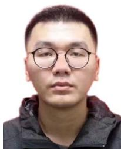

Zhao Zhang received the M.S. degree in control science and engineering (major) from the College of Intelligent Science, National University of Defense Technology, Changsha, China, in 2024, where he is currently pursuing the Ph.D. degree. His current research interests include target tracking and multi UAV collaborative target positioning.

Jianjun Ma (Member, IEEE) received the B.S. degree from the National University of Defense Technology, and the M.S. and Ph.D. degrees in control science and engineering, in 2004 and 2010, respectively. He is currently a Professor with the Navigation, Guidance and Control Laboratory, National University of Defense Technology. His research interests include precision guidance and control and learning-based control theory.

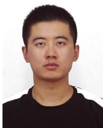

Peng Leng received the B.S. degree in mechanical engineering from Beihang University, Beijing, China, in 2017, and the M.S. degree in automation from the National University of Defense Technology, Changsha, China, in 2019, where he is currently pursuing the Ph.D. degree with the College of Intelligence Science and Technology. His research interests include autonomous decision-making and motor control.

Hongwu Guo received the B.S. degree from the National University of Defense Technology in 1994, and the M.S. and Ph.D. degrees in control science and engineering, in 1997 and 2001, respectively. He is currently a Professor with the Navigation, Guidance and Control Laboratory, National University of Defense Technology. His research interests include precision guidance and control.