# A Comparison of Stateless Position-based Packet Routing Algorithms for FANETs

Armir Bujari , Member, IEEE, Claudio E. Palazzi, Member, IEEE, and Daniele Ronzani

Abstract—Scalable routing for wireless communication systems is a compelling and challenging task. To this aim, routing algorithms exploiting geographic information have been proposed. These algorithms refer to nodes by their location, rather than their address, and use those coordinates to route greedily towards a destination. With the advent of unmanned airborne vehicle (UAV) technology, a lot of research effort has been devoted to extend position-based packet routing proposals to three dimensional environments. In this context, Flying Ad-hoc Networks (FANETs), comprised of autonomous flying vehicles, pose several issues. This work focuses on the state-of-the-art, stateless geographic packet routing protocols conceived or adapted for three-dimensional network scenarios. Proposals are evaluated over a common scenario through a comprehensive comparative analysis.

Index Terms—Mobile communications, position-based routing, MANET, FANET, UAV

## 1 INTRODUCTION

of mobile wireless nodes [1], [2]. This type of networks can potentially operate without a fixed infrastructure or centralized administration and this flexibility makes them suitable to a wide range of operational scenarios such as rescue, disaster or hard to reach environments, military, underwater networks etc. The main characteristic of the MANET paradigm, differentiating it from traditional wired networks, is the potential of nodes to move around by following (un) planned trajectories. This makes route discovery and maintenance a very challenging task.

Evolution of MANETs have considered vehicles (VANETs - Vehicular Ad-hoc Networks) [3], [4] and sensors (WSN - Wireless Sensor Networks) [5], [6]. More recently, the growing capability in the production chain to miniaturize complex electronic systems has produced a wide range of gadgets capable to move and fly autonomously. These devices are commonly referred to as unmanned airborne vehicles (UAVs, or even micro-aerial vehicles, quadcopters, swinglets, drones, etc.) [7], [8], [9]. The use of UAVs has paved the way to new and innovative application scenarios, introducing a new kind of networking paradigm, named Flying Ad-hoc Network (FANET) [10], [11], [12]. These networks differ from traditional MANETs in terms of degree of mobility, connectivity, applications areas etc. In this respect, a FANET generalizes the topology from a 2D topology to a 3D one with a free movement scheme, due to the capability of drones to move autonomously in a 3D space. This trend is attracting researchers and practitioners, as well as becoming increasingly present in real life applications. This is a very interesting and challenging scenario, especially when considering the packet routing process (from here on simply referred to as routing).

In a generic MANET, due to nodes’ movements, topological information is dynamic and transient in time. Furthermore, mobile nodes are often equipped with batteries which have a limited energy supply, hence networking primitives should contemplate for energy consumption. Traditional topology-based protocols may not always be suitable in these settings. On the other side, position-based routing protocols (or geographic-based protocols) try to address the issues by employing a different mechanism for path discovery. This class of protocols leverages on the geographic positions of nodes to perform the forwarding decision, thanks to the recent availability of small, inexpensive, low-power Global Position System (GPS) receivers. In this context, each node determines its own geographic position, and makes the forwarding decision relying solely on the destination’s position and those of neighbors’ nodes. This local decision making, makes position-based routing protocols suitable in scenarios of large and highly mobile networks; nodes do not have to explore the status of the whole network, store routing tables or exchange control messages in the entire network.

A lot of research effort has been devoted into geographic routing for two-dimensional networks, for which some scalable and robust solutions have been proposed. The proposals differ based on the forwarding strategy being employed, that is based on the decision process involved in choosing the suitable next hop. In this context, the forwarding strategy relies on current and local knowledge about the network; in particular, each node bases its next node choice on the up-todate positional information of its neighborhood. One of the first and rather trivial strategies proposed is the greedy [13] approach, where the suitable next hop is the node closest to the destination. Other, more sophisticated strategies worth mentioning are based on triangulation techniques [14], [15], face algorithm [16], randomization strategies [17] etc., which are discussed in detail through Section 4.2.

However, the transition from 2D to 3D topologies is not well explored and brings new difficulties. For instance, geographic routing following a greedy approach in 3D topologies is intrinsically harder than the same approach employed in 2D topologies since, generally, the number of local minima in 3D topologies is higher than the number of local minima in 2D ones under similar network scenarios (in terms of network density and network field size). Furthermore, the heterogeneity of the methodology used to assess the various proposals has led to the absence of a coherent performance benchmark. Indeed, many proposals have been assessed through numerical simulations and each proposed protocol was tested with its own simulation scenario(s) and settings.

A particular and interesting subclass of 3D packet routing consists of the stateless protocols. A stateless routing protocol handles each forwarding decision as an independent transaction, unrelated to any previous one. Therefore, the stateless design does not need any memory, which would be used to store past decision/forwarding actions. This is a promising class of protocols, especially when considering mobile ad-hoc networks such as FANETs.

In this work, we focus on the analysis and performance comparison of state-of-the-art 3D, stateless, position-based routing protocols. We undertake a thorough analysis of this class of algorithms outlining their salient features, contrasting them whenever possible. Pursuing our goal, we then assess the different proposals evaluating network related metrics under a common simulation scenario, expanding the performance analysis into a more complete knowledge of the real strengths of the protocols.

The rest of the paper is organized as follows: in Section 2 we present an overview of FANETs, discussing their salient features and potential application scenarios. Section 3 provides a concise overview of the issues that arise in the routing process in ad-hoc networks. We then proceed by providing a complete taxonomy of the proposed protocols, with emphasis on the position-based ones. Along with the routing taxonomy, the section outlines the metrics of relevance used to assess the various protocols. Section 4 discusses the state-ofthe-art of stateless, position-based routing protocols, providing some insights for each of the considered protocols. Section 5 discusses the simulation assessment strategy and the outcome of the performance evaluation. Finally, Section 6 concludes the paper.

## 2 FLYING AD-HOC NETWORKS (FANETS)

Through this section we discuss some relevant application scenarios where FANETs are seen as a perfect match. Next, we outline key differences between the MANETs and FANETs motivating the necessity for the position-based protocols.

## 2.1 FANET Application Scenarios

In this section, we explore different application scenarios in which a potential FANET could be deployed in order to provide communication support.

Disaster scenario. During or after a catastrophic event (earthquake, hurricane, tsunami, etc.), the traditional network infrastructure may suffer damages. A FANET could be deployed in order to restore or provide a self-sufficient communication network in isolated areas [18]. UAVs could be equipped with cameras and a variety of sensors, providing a bird’s eye view for the ground rescue teams in that region(s) [12].

Civilian scenario. A typical application of FANETs in the urban environment is urban monitoring and surveillance. Traditionally, these operations are achieved through the use of fixed cameras or specialized mobile vehicles. However, UAVs seem to be a perfect match for the context, enabling information exchange amongst UAVs from/to infrastructure in order to have an accurate picture about the e.g., traffic conditions in a specific area by integrating data from multiple UAVs. Another popular application in a civilian context is the search and rescue of victims in dangerous or difficult to reach areas. A FANET could deployed in order to speed up the search operations providing, amongst other things, an autonomous and distributed coordination system. In this context, the area of interest could be divided into regions, and the system adopts a divide et impera approach speeding up the operations. This distributed UAV platform is capable of autonomous coordination through information exchange. Furthermore, a FANET could become an effective asset for the Internet of Things (IoT) [19].

Tactical and military scenario. As in the urban scenario, there is also an increasing demand for UAVs systems in the tactical context. Differently from the urban or civilian scenario, UAV usage in this context has strict requirements with respect to communication and coordination delay. This affects also the complexity needed for FANETs, like Tactical Edge Networks [20], [21].

In the following we provide an overview of salient features exhibited by FANETs differentiating them from traditional MANETs.

## 2.2 Differences between MANET and FANET

A FANET can be seen as a specialized form of MANET comprised of UAVs, differing from traditional MANETs in several key aspects [12].

Mobility. UAVs are relatively faster than a typical MANET node. Mobility causes network partitioning, which causes links outages and changes in link quality. The movement in MANETs is generally constrained by ground artifacts while in FANETs nodes can potentially move freely in the sky. This additional degree of freedom in FANETs demands for efficient routing algorithms capable of counteracting mobility effects while preserving resources. An important consequence of mobility is the inter-UAV collision, which could prove to be very critical in some context specific missions considering self-driving UAVs. The problem could be tackled with appropriate cooperative protocols that, for example, allow the UAVs to communicate their position, speed and direction to avoid collisions.

Radio propagation. Radio signals are affected by the vicinity to the terrain. MANET nodes are very close to the ground, reducing radio propagation reliability, as in many cases there might be no line-of-sight between a source and a destination. Instead, UAVs can reach certain altitudes, reducing or even eliminating the presence of terrain artifacts, thus ensuring the line-of-sight.

However, it has been evidenced that 802.11n performs poorly in aerial scenarios [22]. This is partially caused by the characteristic of the network dynamics of UAV-to-UAV links, which leads to restrictions on network connectivity. In fact, the radiation pattern of antennas is not a sphere, but a torus-shape, with difficult communication among UAVs placed one above the other.

Power consumption. The nodes comprising the system are battery-powered devices, hence energy management is a key issue impacting network lifetime. Furthermore, differently from classic MANETs, nodes in a FANET have an additional power consumption, due to the actuating propellers/rotors. Hence, there is a demand for proficient protocols, increasing the network lifetime while guaranteeing system operations.

Localization. Localization of devices in an ad-hoc network is achieved by several existing localization methods, such as Global Positioning System (GPS), beaconing with anchor nodes and proximity-based techniques. Typically, MANETs use GPS to detect coordinate devices, obtaining an accuracy of 10-15 m, but the signal strength of GPS satellites could be not sufficient in some MANET scenarios (indoor, underwater, urban, etc.). However, in FANETs because of their nature, we can rely on a good GPS signal.

While preserving the general aspects of our study and without loss of generality, we focus the comparative analysis on the measurement of network related metrics, providing some insights into the real strengths of the different protocols. To this end, in the following we discuss the features of two broad categories of protocols subject of our evaluation.

## 3 THE ROUTING PROBLEM

Generally, MANET’s characteristics such as frequent topology changes, energy constraints and limited bandwidth, pose various challenges to the routing process. To this end, various MANET routing protocols have been proposed during the years [23], [24]. Mauve et al. [25], Stojmenovic [26] and Iche et al. [27] classify these protocols into two main categories: topology and position-based. Topology-based routing protocols exploit link information to route the packets, while position-based ones use location information of nodes to make the forwarding decision.

## 3.1 Topology-Based Routing Protocols

Topology-based protocols consider the network topology and maintain up-to-date routing tables, specifying the path or the next-hop where to route a packet from a source to a destination. In this context, there are three strategies that exploit topology information: proactive, reactive and hybrid. A protocol is considered proactive when each node keeps an up-todate information reflecting the state of the network and this information is used when a message should be sent. An example of proactive protocol is DSDV (Destination-Sequenced Distance-Vector) [28], based on the Bellman-Ford algorithm using an active and costly information update mechanism between nodes to discover and maintain the correct paths towards the destinations. A protocol is considered reactive when the routing path is created only when necessary; reactive protocols are generally preferred. A significant example of reactive protocol is AODV (Ad-hoc On Demand Authorized licensed use limited to: Guangxi University. Downloaded o

Distance Vector) [29], which uses a route request procedure that sends a Route Request Packet to discover the correct path towards the destination. Hybrid schemes combine the advantages of proactive and reactive protocols.

## 3.2 Position-Based Routing Protocols

Position-based (or geographic) routing protocols use the position of the nodes in the network to make the forwarding decision. The first proposed protocols using geographic information were intended to be adopted in support to the topology-based protocols, limiting the propagation of route request packets into a determined area. As a representative example, Location Aided Routing (LAR) is one of the early proposed protocols in this context. LAR limits the propagation area of packets into a rectangle containing source node and destination node positions. Position-based routing protocols exploit local knowledge; a node makes the forwarding decision replying on its position information, the position of the destination and the position of its neighbors. To obtain location information, nodes use a location service such as GPS, or other types of location services. To acquire the position of the neighbors, nodes make use of a beaconing mechanism in which each node sends a beacon to its neighbor nodes, containing its position [30]. In general, position-based protocols have the following characteristics:

each node can determine its position (longitude, latitude and altitude), the position of its neighbors (usually 1 hop);

the destinations location information is assumed known a-priori (e.g., acquired through external means);

nodes store the information about their neighbors (e.g., position, speed, direction) in a neighbor table;

the next-hop decision can be made based on the location of the current node (the node holding the packet), its neighboring nodes and the destination node.

## 3.3 Routing in FANETs

In 2D networks, a lot of research effort has been devoted to devise efficient and reliable routing protocols; however, in the FANET case, nodes may be distributed in a 3D space and the extension of 2D routing protocols into 3D protocols is not trivial. Topology-based routing protocols are not generally compatible with the addition of the third dimension because they rely on a link-state system knowledge. Instead, position-based protocols are based on the spatial position of nodes and geometric characteristics which need to be adopted for the 3D case.

In a 3D space, some assumptions made in the 2D context, such as the ability to extract planar subgraphs, break down. Durocher et al. [31] shows the impossibility of routing protocols to guarantee delivery in three-dimensional ad-hoc networks, when nodes are constrained to have information only about their k-hop neighborhood, in contrast to the twodimensional case where a protocol that uses local information, such as face routing, guarantees delivery. This leads to the problem of finding other solutions that can guarantee the delivery of packets, with the least use of resources.

Yet, due to mobility related changes in the topology, network routing maintenance imposes additional overhead which may hinder the performance. Furthermore, in large scale networks this situation is worsened and routing tables size may become a burden. All these characteristics are July 05,2026 at 12:43:37 UTC from IEEE Xplore. Restrictions apply.

exacerbated in FANETs. In particular, due to the high mobility of UAVs and the rapid change of link quality, routing table maintenance could result superfluous in terms of reliability and overhead [12].

As a consequence, most of the existing topology-based routing protocols might become almost useless in dynamic, large networks and hence not ideal for FANETs. Stateless, position-based approaches have been proposed in order to address some of these limitations as they do not need to establish and maintain routes, thereby eliminating the overhead due to frequent updates. This makes position-based protocols more scalable than the topology-based ones [32] and more suitable to satisfy the requirements of a FANET.

## 3.4 Notation and Model

In the following we provide a list of the conventions and notations needed to better comprehend the analysis of the discussed protocols. A MANET model is represented, in $\mathrm { R } ^ { 2 }$ (2D MANET) and $\mathbb { R } ^ { 3 }$ (3D MANET) spaces, by a geometric graph $G = ( V , E )$ , consisting of a finite set $V = n _ { 1 } , n _ { 2 } , . . . , n _ { N }$ ¼ ð Þ ¼of nodes and a subset E of the Cartesian product $V \times V ,$ rep-resenting the edges (links from one node to another). All nodes have the same communication range $r ,$ which is represented as a sphere in the 3D space. The resulting graph is called a Unit Ball Graph, $U B G ( V , r )$ . In addition, we define $d i s t ( n _ { u } , n _ { v } )$ ð Þas the distance between two nodes $n _ { u }$ and $n _ { v } ,$ ð Þgiven by the formula of the Euclidean distance:

$$
d i s t ( n _ { u } , n _ { v } ) = { \sqrt { \left( n _ { u . x } - n _ { v . x } \right) ^ { 2 } + \left( n _ { u . y } - n _ { v . y } \right) ^ { 2 } + \left( n _ { u . z } - n _ { v . z } \right) ^ { 2 } } } .
$$

Two nodes are said to be neighboring and connected by a link if the Euclidean distance is at most $r _ { * }$ For a node $n _ { u } ,$ we define the set of its neighbors as $N E ( n _ { u } ) . \mathrm { ~ A ~ }$ path from a node $n _ { u }$ to a node $n _ { v }$ ð Þis a sequence of nodes $n _ { u } =$ $n _ { 1 } , n _ { 2 } , . . . , n _ { k } = n _ { v } ,$ , such that $n _ { i }$ and $n _ { i + 1 } , \ 1 \leq k - 1$ , are neighbors.

In order to provide a uniform and fair treatment of all algorithms, a common terminology for concepts is introduced.

The source node is the node sending the packet, whereas the destination node is the node, or more generally a geographic location, that is receiving the packet. These are denoted respectively $n _ { s }$ and $n _ { d } .$

The current node is the node holding the packet that needs to be forwarded and is denoted $n _ { c } .$

The previous node is the node that sent the packet to $n _ { c }$ in the previous step, and is denoted $n _ { p }$

The neighborhood of a node $n _ { c }$ is the set of nodes in the range of $n _ { c } ,$ called $N E ( n _ { c } )$ . The cardinality of $N E ( n _ { c } )$ is denoted $N _ { c }$

ð ÞThe sphere centered at node $n _ { u }$ with radius $r$ is called $\bar { b } a l l ( n _ { u } , r )$ and covers the transmission area of $n _ { u }$ ð Þin the 3D space.

The line that passes through two nodes $n _ { u }$ and $n _ { v }$ is denoted $( n _ { u } n _ { v } )$

The segment between two nodes $n _ { u }$ and $n _ { v }$ is denoted $[ n _ { u } n _ { v } ]$

## 3.5 Performance Metrics

In this section, we introduce the metrics of interest to evaluate the performance of the routing protocols described in this work.

1) Delivery Rate is the ratio of the number of packets received by the destination(s) to the number of packets sent by the source(s). The primary objective of a routing algorithm is to guarantee the delivery of all the packets.

2) Path Dilation or Stretch factor is the ratio of the number of hops traversed by the packet to the number of hops of the minimum path.

Our work evaluates state-of-the-art proposals from these categories in a fits-all testbed considering static network topologies. While we do not measure power consumption directly, the path dilation metric provides us some insights into the benefits of the different schemes under similar delivery rate profiles.

## 4 STATE OF THE ART OF 3D POSITION-BASEDROUTING ALGORITHMS

In this section, we discuss the state-of-the-art of the position-based routing protocols in 3D MANETs. In particular, we describe the forwarding algorithms employed by the routing protocols.

## 4.1 Taxonomy

Several taxonomies have been proposed for MANETs routing protocols [23], [33]. Our focus is on position-based approaches proposed for i) 3D topologies or ii) 2D topologies but applicable even to the 3D ones. To this end, we propose a taxonomy differentiating the proposals along the path and forwarding strategy axes (see Fig. 1 and the following explanation).

1) The path strategy represents how a packet traverses a network. The packet can use either a single path to reach the destination or multiple paths. A single path strategy requires that each node forwards the packet to only one of its neighbors. So, there is only one copy of a packet in the whole network. Algorithms that employ a single path strategy generate less communication overhead. On the other side, the multipath strategy allows a node to forward multiple copies of the same packet to several neighbors, following specific forwarding strategy, or even to split traffic and distribute it along multiple disjoint paths [34].

2) The forwarding strategy describes the forwarding criteria used to elect the candidate next node. In Fig. 1, a taxonomy differentiating the main approaches is presented. Every strategy exploits different methods and geometric models.

Considering the single-path subclass, the three main approaches are categorized as deterministic progress-based, randomized progress-based and face-based. In deterministic progress-based routing algorithms, the current node holding the packet forwards the packet at every step to one of its neighbors that makes more progress towards a destination. Randomized progress-based strategy is similar to deterministic progress-based method but in this case the next node is chosen randomly or according to a probability distribution, from the set of candidate nodes. Face-based strategy uses an algorithm, called Face, that advances the packet between the faces by considering the right-hand rule, always guaranteeing the packet delivery to the destination, in the context of planar (2D) networks. Position information is used to extract a planar subgraph containing the faces whose vertices are the nodes. A typical planar subgraph is called a Gabriel Graph (GG), a graph that does not contain any crossing edge, and in [35] it is proven that if we apply the algorithm to each vertex of $G ,$ then the resulting graph is connected. July 05,2026 at 12:43:37 UTC from IEEE Xplore. Restrictions apply.

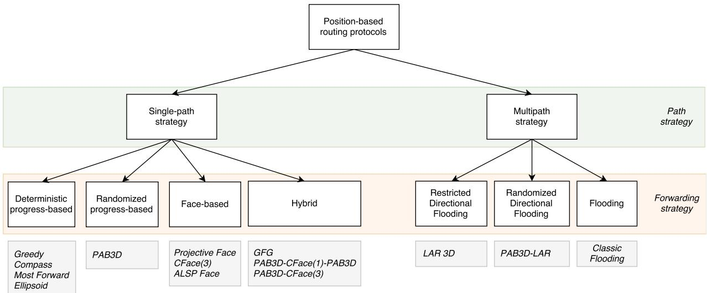  
Fig. 1. Taxonomy of stateless 3D position-based packet routing algorithms for FANETs.

Face-1, proposed in [16], was the first geometric routing algorithm that guaranteed message delivery without flooding in 2D topologies. Then, in [14], a second version of the algorithm, Face-2, was proposed. Face-2 outperforms Face-1 in terms of path dilation. In this work, just Face-2 is considered and from here it is simply referred to as Face. In the three-dimensional space, however, the concept of face cannot be directly applied, but some approaches have been proposed mainly based on projection techniques on a plane.

Considering the multipath subclass, the first variant is Flooding, in which a node sends a copy of the same packet to all its neighbors. Flooding introduces an overhead, as packets get duplicated in the network consuming network’s available resources. Limited or controlled-flooding, by which a node sends copies of the packet to a subset of its neighbors, tries to restrict the propagation of the duplicate packets within a defined area; examples of limited flooding protocols are proposed in [36], [37]. Limited flooding techniques are shown in Fig. 1 as restricted directional flooding (deterministic decision) and randomized directional flooding (randomized decision).

Table 1 summarizes all the routing characteristics about the considered protocols. In the following, we describe the meaning of the columns.

Loop Freedom. A data packet repeatedly traversing the same data path. This endless process is stopped by employing a threshold value, necessary to terminate the packet traversal in the network.

Forwarding Method. It indicates the forwarding strategy exploited to elect the next forwarder(s). There are four main schemes: progress, randomized, face and hybrid-based, the latter employing a combinations of the first three ones.

Simulator. Every proposal considered in this work has performed a simulation of their protocol(s). This column reports the adopted simulator name or whether an custom one was considered.

Compared with. This column indicates the other protocols with which the proposed protocol was compared in the original paper.

The first four algorithms are simply an extension of their 2D counterparts, as we need only the definition of Euclidean distance between two points $n _ { u }$ and $n _ { v }$ in three dimensions and the definition of the of the sphere with center $n _ { c }$ and radius r.

## 4.2 Description of 3D Routing Algorithms 4.2.1 Greedy

Greedy is a simple progress-based forwarding strategy. A node forwards the packet to the neighbor node that minimizes the distance to the destination node. In general, if there is no neighbor node closer to the destination $( \mathrm { i . e . , }$ there is a void), the algorithm fails and the node storing the packet is called local minimum. With Greedy, the distance between the current node $n _ { c }$ and the destination node $n _ { d }$ can be compared against the distances between current node’s neighbors $N \breve { E } ( n _ { c } )$ and ${ \boldsymbol { n } } _ { d } ,$ and it is used to select the forward ð Þnodes and the backward nodes. More precisely, there are two classes of forwarding algorithms that adopt a greedy strategy, which differ from one another based upon the nodes considered as part of the neighboring set:

Greedy [13]: $n _ { c }$ forwards the packet to one of its neighbors that is closer to $n _ { d }$ than $n _ { c }$ and any other neighbor.

GEDIR [48]: $n _ { c }$ forwards the packet to one of its neighbors that is closer to $n _ { d }$ than any other neighbor, but not necessarily closer to $n _ { d }$ than node $n _ { c }$ itself.

In GEDIR, all neighbors are considered. So, even the nodes that are in backward direction can be chosen and the only kind of loop that may be formed using this algorithm is the local loop between $n _ { c }$ and the node $n _ { p }$ that sent the message to $n _ { c }$ in the previous step [48], but this case is avoided by the following assumption: if the next node forwarding the packet is the node that sent it to $n _ { c } ,$ then the packet has reached a local minimum $n _ { c }$ and the algorithm fails. Instead, in Greedy, only the neighbors that are closer to $n _ { d }$ than $n _ { c }$ are considered. If no one is closer to ${ \boldsymbol { n } } _ { d } ,$ the algorithm fails. Fig. 2 shows a step’s example of the progress-based algorithms. $n _ { c }$ is chosen among five possible candidates $( n _ { 3 } , n _ { 4 } , n _ { 5 } , n _ { 6 } , n _ { 7 } )$ which are in the direction of $n _ { d } .$ . With Greedy the choice falls to candidate node $n _ { 5 }$ (the closest toward $n _ { d } )$ . From here on, unless otherwise stated, by greedy approach is meant the use of the classical Greedy algorithm.

## 4.2.2 Compass

The Compass (or Directional, DIR) algorithm [16] uses the direction of nodes to select the best forwarding node. $n _ { c }$ uses July 05,2026 at 12:43:37 UTC from IEEE Xplore. Restrictions apply.

TABLE 1  
Summary of the Considered Protocols/Works
<table><tr><td>Routing Protocol</td><td>Loop Freedom</td><td>Forw. Method</td><td>Simulator</td><td>Compared with</td></tr><tr><td>Greedy [13]</td><td>Yes</td><td>Prog-based</td><td>Custom</td><td>Compass, Ellipsoid, Most Forward, Projective Face</td></tr><tr><td>Compass [16]</td><td>No</td><td>Prog-based</td><td>Custom</td><td>Greedy, Ellipsoid, Most Forward,</td></tr><tr><td>Most Forward [38]</td><td>Yes</td><td>Prog-based</td><td>Custom</td><td>Projective Face Greedy, Compass, Ellipsoid, Projective Face</td></tr><tr><td>Ellipsoid [39]</td><td>Yes</td><td>Prog-based</td><td>Custom</td><td>Greedy, Compass, Most Forward, Projective Face</td></tr><tr><td>PAB3D [40]</td><td>Yes</td><td>Rand-based</td><td>Custom</td><td>Greedy, Compass, Most Forward,</td></tr><tr><td>G-PAB3D-G [41]</td><td>Yes</td><td>Hybrid-based</td><td>Sinalgo</td><td>PAB3D, PAB3D-LAR, LAR, Projective Face Flooding</td></tr><tr><td>Projective Face [42]</td><td>No</td><td>Face-based</td><td>Custom</td><td>Greedy, Compass, Ellipsoid, Most Forward</td></tr><tr><td>CFace(3) [40]</td><td>No</td><td>Face-based</td><td>Custom</td><td>Greedy, Compasss, PAB3D, PAB3D-CFace(3), PAB3D-CFace(1)-PAB3D</td></tr><tr><td>ALSP face [43]</td><td>No</td><td>Face-based</td><td>Custom</td><td>Projective Face</td></tr><tr><td>GFG [44], [45]</td><td>No</td><td>Hybrid-based</td><td>Custom</td><td>Greedy, ALSP Face</td></tr><tr><td>PAB3D-CFace(1)-PAB3D [40]</td><td>No</td><td>Hybrid-based</td><td>Custom</td><td>Greedy, Compasss, PAB3D, PAB3D-CFace(3)</td></tr><tr><td>PAB3D-CFace(3) [40]</td><td>No</td><td>Hybrid-based</td><td>Custom</td><td>Greedy, Compasss, PAB3D, PAB3D-CFace(1)-PAB3D</td></tr><tr><td>LAR [46],</td><td>No</td><td>Prog-based</td><td>Custom</td><td>Compass, PAB3D-LAR</td></tr><tr><td>PAB3D-LAR [46], [47]</td><td>No</td><td>Prog/Rand-based</td><td>Custom</td><td>Compass, LAR</td></tr></table>

the location information of $n _ { d }$ to calculate its direction. Then, it forwards the packet to the neighbor node $n _ { u }$ such that the direction $n _ { c } n _ { u }$ is closest to the direction $n _ { c } n _ { d } ,$ that is the neighbor node $n _ { u }$ that minimizes the angle between $n _ { c }$ and $n _ { d } .$ . In Fig. 2 node $n _ { 0 }$ chooses node $n _ { 4 }$ as the next node, since the angle $\angle n _ { 4 } n _ { 0 } d$ is the smallest among all. Compass is not a loop-ffree algorithm. This fact is proven by an example of a loop that consists of four nodes, as shown in Fig. 3. In this example are shown four nodes, $n _ { 1 } , n _ { 2 } , n _ { 3 } , n _ { 4 } ,$ and nodes $n _ { 1 }$ and $n _ { 4 }$ are not connected (because they are outside their own transmission range). Node $n _ { 2 }$ receives a packet from node $n _ { c }$ and selects node $n _ { 1 }$ to forward the message because the direction of $n _ { 3 }$ is closer to $n _ { d }$ than the direction of its other neighbor $n _ { 4 } .$ Similarly, node $n _ { 1 }$ selects $n _ { 3 }$ (the source node $n _ { 2 }$ is not considered), node $n _ { 3 }$ selects $n _ { \mathrm { 4 } } ,$ and node $n _ { 4 }$ selects $n _ { 2 }$ . The travel continues with this loop. If a loop occurred, the nodes in the loop are not able to recognize the loop unless the packet id is memorized (for each forwarded packet).

## 4.2.3 Most Forward

Most Forward, (MFR - Most Forward Routing) algorithm [38] is very similar to Greedy, but, in this case, $n _ { c }$ forwards the packet to the neighbor node $n _ { u }$ whose projection on the line $( n _ { c } n _ { d } )$ is closer to $n _ { d } .$ If the packet reaches a local minimum (there is no neighbor projection that makes progress from $n _ { c }$ towards $n _ { d } ) _ { \cdot }$ the algorithm fails. In most cases MFR chooses the same path as Greedy. In Fig. $2 n _ { c }$ selects $n _ { 7 }$ as the next node, since the latter has the smallest projected distance to $n _ { d }$ on the line $( n _ { c } n _ { d } )$ MFR is a loop-free algorithm, for the same reason as Greedy.

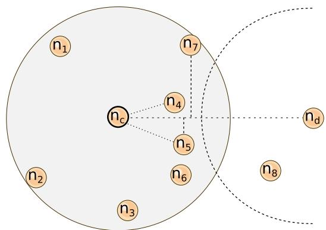  
Fig. 2. Illustration of several next nodes chosen by $n _ { c }$ using the progress-

## 4.2.4 Ellipsoid

In the Ellipsoid algorithm [39], $n _ { c }$ forwards the packet to the neighbor node $n _ { u }$ that minimizes the sum of the distance from $n _ { c }$ to $n _ { u }$ and the distance from $n _ { u }$ and $n _ { d } .$ . Unfortunately, if the packet reaches a local minimum, the algorithm fails. Referring to the example in Fig. 2, the algorithm will choose $n _ { 4 }$ as the next node to handle the packet.

## 4.2.5 PAB3D

PAB3D is a randomized algorithm that tries to solve the local minimum problem described previously, by randomly choosing the next node from a subset of the current neighboring nodes to make progress toward a destination. Already since 1984, some authors proposed the idea of randomized algorithms in order to avoid the emergence of loops by exploiting a random walk approach [14], [17], [49]. Typically, randomization is performed as follows: let $n _ { c w }$ be the neighbor node in $N E ( n _ { c } )$ , over the line $( n _ { c } n _ { d } )$ , that minimizes ð Þone of the progress values defined in previous progressbased algorithms (distance, angle, etc.) and let $n _ { c c w }$ be the neighbor node in $N E ( n _ { c } )$ , under the line $( n _ { c } n _ { d } )$ , that mini-ð Þmizes the same one; then, the randomized algorithms move the packet to one of $\{ n _ { c w } , n _ { c c w } \}$ with equal probability or with a probability weighted according to the progress values. Routing algorithms that use randomization are usually considered to be failed when the number of hops in the path computed so far exceeds a threshold value, here called TTLR (Time To Live Random).

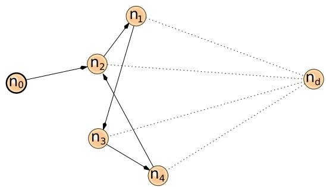  
Fig. 3. A loop with compass.  
Authorized licensed use limited to: Guangxi University. Downloaded on July 05,2026 at 12:43:37 UTC from IEEE Xplore. Restrictions apply.

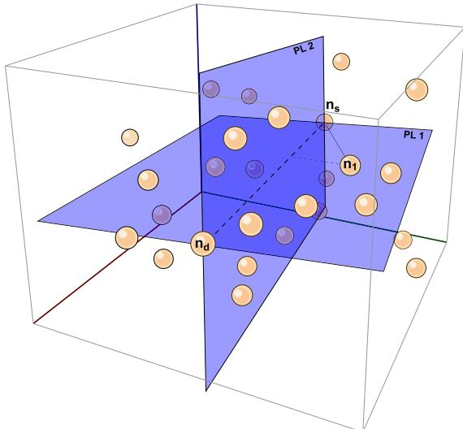  
Fig. 4. In AB3D, plane $P L _ { 1 }$ passes through $n _ { s } , n _ { d } .$ , and $n _ { 1 }$ , plane $P L _ { 2 }$ orthogonal to $P L _ { 1 } .$ . Both planes contain the line $( n _ { s } n _ { d } )$

The extension of randomized algorithms in 3D environments is not trivial, as it is not obvious how to best determine the candidate neighbor nodes. The reason is that in a 3D graph there is no concept of above and below a line passing from source to destination. Therefore, in [40] authors propose an extension for the randomization-based algorithm from 2D to 3D that uses the concept of planes in 3D space. This new algorithm is called AB3D (Above/Below 3D) and, instead of a line, it uses a plane to divide the 3D space in two regions. The concept of randomization-based algorithm can be generalized by defining a parametric algorithm, named PAB3D (Parametric AB3D), that has four attributes:

M is the number of possible candidate neighbors to choose from $N E ( n _ { c } )$

ð ÞR is the name of the progress-based strategy used to choose the M candidates, and it is one of Random, Compass, Greedy or MostForward, as in AB3D.

$S$ is used to represent the probability weighting when randomly choosing, and it is one among Uniform, Distance, Angle, ProjectedDistance. Probability weightings are defined as in AB3D.

$P$ is a boolean flag indicating whether to define the candidates over and below the plane $P L _ { 1 }$ (or even over and below the plane $P L _ { 2 } ,$ if $M = 5 )$ , or select ¼candidates without considering the planes.

The main difference from AB3D is the addition of parameter $P ,$ that denotes if we have to use the plane or not. With reference to Fig. 4, the steps of the algorithm are the following. $n _ { c }$ selects a node $n _ { 1 }$ from its neighborhood, chosen according to the method defined in R. With $P = Y E S$ , if M is $3 ,$ we define the plane $P L _ { 1 }$ identified by ¼the three nodes $n _ { s } , n _ { d }$ and $n _ { 1 }$ . If M is $5 ,$ we define also the plane $P L _ { 2 }$ that is perpendicular to $P L _ { 1 }$ and passes through $n _ { c }$ and ${ \boldsymbol { n } } _ { d } ,$ such that the intersection line between the two planes is $( n _ { c } n _ { d } )$ . Fig. 4 shows an example of network graph and its subdivision with the two planes. Then, if the parameter M is 3, PAB3D selects another two nodes, in addition to $n _ { 1 }$ . One neighbor $n _ { 2 }$ is chosen from the above of the plane $P L _ { 1 }$ according to R and one neighbor $n _ { 3 }$ is chosen from the below of the plane $P L _ { 1 }$ according to $R .$ If M was $5 ,$ in addition to $n _ { 1 } ,$ the algorithm choose from $N E ( n _ { c } )$ four neighbors $n _ { 2 } , n _ { 3 } , n _ { 4 } , n _ { 5 }$ each one in one side of ð Þthe four regions that result from the intersection between $P L _ { 1 }$ and ${ \dot { P } } { \dot { L } } _ { 2 } .$ . Once these candidates are determined, $n _ { c }$ selects one of these nodes randomly, according to the probability weighting determined by $n _ { s } ,$ and forwards the packet to the chosen node. Instead, with $P = N O ,$ , the M ¼candidates are chosen without a plane subdivision. The code in Algorithm 1 illustrates a single step of PAB3D when $P = \Breve { Y } E S$ and $M = 3 ,$

Algorithm 1. Single Iteration of PAB3D (P=YES, M=3)   
1: procedure $\mathrm { P A B 3 D } n _ { s } , n _ { c } , n _ { d } , R , S$   
2: $n _ { 1 } $ choose from $N E ( n _ { c } )$ according to R   
3: Define $P L _ { 1 } ( n _ { s } , n _ { d } , n _ { 1 } )$   
4: $n _ { 2 }$ ðchoose from $N E ( n _ { c } )$ above $P L _ { 1 }$ according to R   
5: $n _ { 3 }$ choose from $N E ( n _ { c } )$ below $P L _ { 1 }$ according to R   
6: next choose from $\{ n _ { 1 } , n _ { 2 } , n _ { 3 } \}$ according to $\mathsf { S }$   
7: return next   
8: end procedure

## 4.2.6 Greedy-Random-Greedy

The Greedy-Random-Greedy (GRG) [41] algorithm belongs to the progress/randomization-based class and uses Greedy as the primary stage and a randomized algorithm as a recovery strategy. Referring to PAB3D as the randomized algorithm, obtaining Greedy-PAB3D-Greedy (G-PAB3D-G), its general algorithm starts with a greedy approach until it finds a local minimum $n _ { c } .$ . At this point, G-PAB3D-G stores the distance $d i s t ( n _ { c } , n _ { d } )$ , and switches to the random phase, as ð Þrecovery strategy, where $n _ { c }$ randomly selects one $n _ { u }$ of its neighboring nodes, using the steps defined in PAB3D. If $d i s t ( n _ { u } , n _ { d } ) < d i s t ( n _ { c } , n _ { d } )$ , the algorithm resumes the greedy ð Þ ð Þforwarding, otherwise it continues with PAB3D. In the rest of the paper we refer to this algorithm as G-PAB3D-G.

## 4.2.7 Projective Face

The Face algorithm works on the connected planar sub-graph of UBG, called Gabriel Graph (GG), which contains only noncrossing edges. In [44], Face1 and Face2 are discussed, with the latter being more optimized than the former and hence considered here. With Face2, the packet is routed over the faces of a GG that are intersected by the line $( n _ { s } n _ { d } )$ . Each face is tra-ð Þversed using the right-hand rule, unless the current edge crosses $( n _ { s } n _ { d } )$ at an intersection point p. At this point, ð Þthe algorithm switches to the next face sharing the edge. This process is repeated until the packet arrives to $n _ { d } .$ . In Algorihtm 2 an illustration of Face2 is reported.

Since the face strategy cannot be performed directly on a 3D graph, a proposed solution is to project the nodes onto a plane, as seen in Fig. 5, to perform the face algorithm.

The first extension of face-based strategy in 3D space uses two orthogonal planes intersecting at the line connecting source and destination. In [42] the authors propose Projective July 05,2026 at 12:43:37 UTC from IÉEE Xplore. Restrictions âpply.

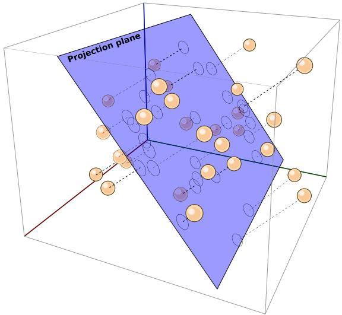  
Fig. 5. Nodes’ projection onto a plane.

Face, in which the nodes of the network are projected onto one plane that contains the segment $[ n _ { s } n _ { d } ]$ and a third point chosen randomly. Then, Face is performed on this projected graph. If the routing fails, the nodes are then projected onto a second plane, orthogonal to the first one which contains the segment $[ n _ { s } n _ { d } ]$ . Then, Face is again performed. Fig. 6 shows an example of planes configuration in Projective Face. Note that, in this case (and in all the following algorithms), since the delivery rate is not guaranteed, the algorithm makes use of a local threshold value, TTLF (Time To Live Face), in order to terminate the algorithm in case it does not reach the destination within TTLF hops. This is necessary because the algorithm can get stuck in a loop. More precisely, in this version of the algorithm the TTLF counter is started twice, once for the first plane and then for the orthogonal plane, obtaining a global threshold value, $T T L = 2 \times T \Breve { T } L F .$

Algorithm 2. Face2   
1: $p  n _ { s }$   
2: while $p \neq n _ { d }$ do   
6¼3: let f be the face of GG with p on its boundary that   
intersects $( p , n _ { d } )$   
4: traverse f until reaching an edge (u; v) that intersects   
$( p , n _ { d } )$ at some point $\boldsymbol { p ^ { \prime } } \neq \boldsymbol { p }$   
5: $p \gets p ^ { \prime }$   
6: end while

## 4.2.8 CFace(3)

CoordinateFace(3) (CFace(3)), proposed in [40], uses another set of projection planes, which is composed by the planes xy, xz and yz for the projection of the nodes. With CFace(3) all the nodes are projected on the first xy plane (node:z 0) ¼and then the face routing is started on the projected graph. If the packet does not arrive at the destination (TTLF has expired), the original coordinates of all nodes are projected on the xz plane (node:y 0) and face routing is performed ¼again. If the packet does not reach the destination, the original coordinates of all nodes are projected on the yz plane (node:x 0) and face routing is performed again. If ¼the packet does not arrive even through this last plane, the algorithm fails. Fig. 7 shows all the three projections on the coordinate planes. Note that, in this algorithm, TTL is at most 3 TTLF . As we will see, the delivery rate is typically greater than that of Projective face, but at the cost of a greater path dilation. In Algorithm 3, an illustration of CFace(3) process is given.

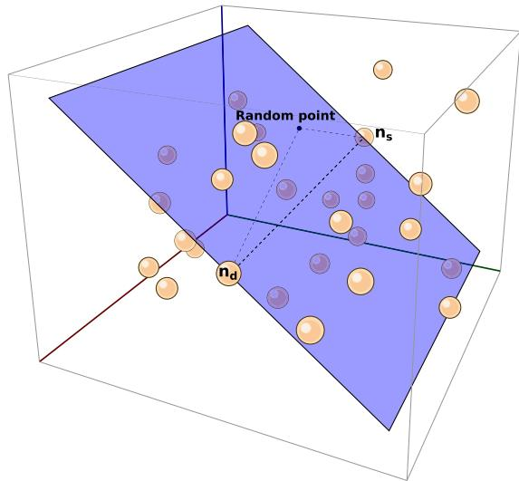  
Fig. 6. Computing a plane with projective face.

Algorithm 3. CFace(3)   
1: for i 1 to 3 do   
¼2: switch i do   
3: case 1: Project the graph on xy plane (z 0)   
4: ¼case 2: Project the graph on xz plane (y 0)   
5: ¼case 3: Project the graph on yz plane (x 0)   
6: while TTLF is reached do   
7: Perform Face until arrive to $n _ { d }$   
8: end while   
9: end for   
10: return fail

## 4.2.9 Adaptive Least-Square Projective Face

Authors of [43] proposed three heuristics to modify and improve the Projective Face algorithm. The new obtained algorithm is called Adaptive Least-Squares Projective Face, (ALSP Face). The three heuristics are:

Least-Squares Projection (LSP) Plane;

 Adaptive Behavior Scale (ABS);

Multi-Projection-Plane Strategy.

In Projective Face, a third point is chosen randomly, together with the source and the destination points, to compute the first projection plane. Instead, $A L S \dot { P }$ Face chooses the third point adopting a mathematical optimization technique (first heuristic) for finding the best fitting plane to the set of neighbor nodes. Using the set composed by $n _ { c } ,$ its $N E ( n _ { c } )$ up to one (two) hop(s) away, and ${ \boldsymbol { n } } _ { d } ,$ the initial pro-ð Þjection plane is determined by using the least-squares error minimization on the perpendicular distance of these nodes to the plane, called least-squares projection plane (LSP plane). Fig. 8 represents a 2D view of a LSP plane definition. To July 05,2026 at 12:43:37 UTC from IEEE Xplore. Restrictions apply.

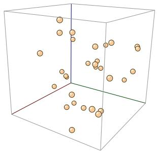  
(a)

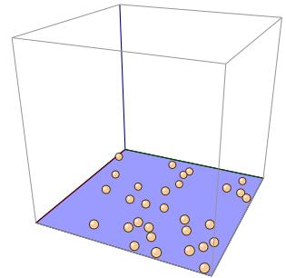

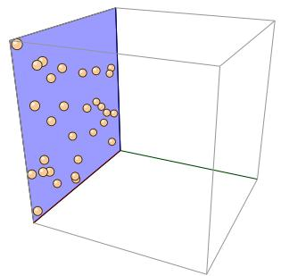  
(c)

(b)  
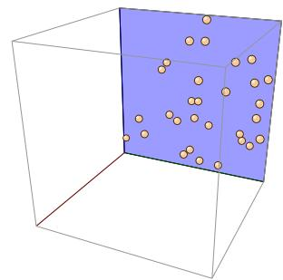  
(d)  
Fig. 7. Projection of graph nodes (a) on the three planes $x y$ (b), xz (c), and yz (d) in CFace(3).

maintain the local characteristic of the routing algorithm, authors propose that only $n _ { c } , ~ n _ { d }$ and $N E ( n _ { c } )$ within the ð Þ1(2)-hops scope are selected as the set of nodes for computing the least projection plane. Then, nodes are projected on this plane and Face routing is performed. This LSP plane aims to have a less distorted projected graph so that the number of crossing edges can potentially be reduced. The second heuristic defines a parameter called Adaptive Behavior Scale (ABS) that is used to determine when recalculate the LSP plane, in order to ensure that the plan is always appropriate for $n _ { c } .$ . The third heuristic uses a set of projection planes arranged in a fixed order around an axis. The algorithm switches between these planes, following the order, to disrupt any looping that may occur during routing. In [43] it is said that performing the face routing on the additional projection plane, significantly increases the delivery rate. Therefore, the third heuristic tries to increase the number of projection planes. But this is true only up to a certain point; even if it is true that the delivery rate is slightly increased, it is also true that the path followed by the packet becomes enormously long, because, for each projection plane, the threshold value (here, TTLF ) is reset to its pre-set value. These a high path dilation values might not be acceptable in a real deployment. In this work we consider the third heuristic using only two additional planes, chosen as in Projective Face, and is summarized in Algorithm 4.

## 4.2.10 Greedy-Face-Greedy

The Greedy-Face-Greedy algorithm (GFG) [44], also referred to as Greedy Perimeter Stateless Routing (GPSR) [45] for 2D networks, uses a combination of greedy and face methods. With $G F G ,$ a flag is stored in each data packet. This flag can be set into greedy-mode and face-mode (or face-mode), indicating whether the packet is forwarded with either a Greedy or a Face approach. The algorithm starts from $n _ { s }$ with Greedy, setting the packet into greedy-mode and forwarding it. Each node that receives a greedy-mode packet searches among its neighbors the node that is closest to $n _ { d } .$ If this node exists, the packet is forwarded to it, otherwise it is marked to face-mode. GFG forwards the face-mode packets performing the same planar graph as Face2. Moreover, when a packet enters in face-mode at node $n _ { x } ,$ GFG sets the segment $[ n _ { x } n _ { d } ]$ as a reference segment to the crossing with the faces, and records in the packet the location of $n _ { x }$ as the node when greedy forwarding mode failed. This information is used at next hops to determine whether and when the packet can be returned to greedy-mode: upon receiving a face-mode packet, the current node $n _ { c }$ first compares its location with the location of $n _ { x } .$ . The packet returns in greedy-mode if the distance from $n _ { c }$ to $n _ { d }$ is less than the distance from $n _ { x }$ to $n _ { d } .$ In this case, the algorithm continues the greedy progress towards $n _ { d } .$ Otherwise, GFG continues with the face-mode forwarding. Fig. 9 shows an example where the packet starts from $n _ { s }$ and travels $n _ { 2 }$ and $n _ { 3 }$ in greedy-mode, stopping at $n _ { \mathrm { { 3 } } } ,$ that is the local minimum. Then, from $n _ { 3 } ,$ the face-mode is started, and forwards the packet on progressively closer faces of the planar graph, each of which is crossed by the segment $[ n _ { c } n _ { d } ]$ . So, the packet reaches $n _ { \mathrm { 4 } } ,$ n and $n _ { \mathrm { 6 } }$ in face-mode. $n _ { \mathrm { 6 } }$ is closer to $n _ { d }$ than $n _ { 3 } ,$ so the packet can be returned to greedy-mode, and reaches $n _ { d } .$

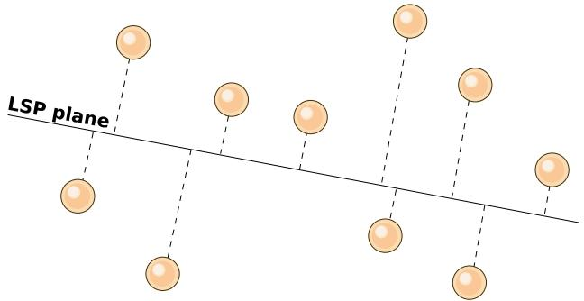  
Fig. 8. A 2D graphic representation of the least-squares projection (LSP) plane, as the first projection plane.

Algorithm 4. ALSP Face (with Two Orthogonal Planes)   
1: $n _ { c }  n _ { s }$   
2: Project the graph on the LSP plane (with $n _ { c } , n _ { d } , N E ( n _ { c } ) )$   
3: while ABS is reached or TTLF is reached do   
4: Perform Face until arrive to $n _ { d }$   
5: if ABS is reached then   
6: go to step 2   
7: end if   
8: if TTLF is reached then   
9: Project the graph on the plane orthogonal to LSP one   
10: while TTLF is reached do   
11: Perform Face until arrive to $n _ { d }$   
12: end while   
13: end if   
14: end while   
15: return fail

In a 3D context, GFG uses ALSP Face as face-mode [50], which offers the best performance in terms of delivery rate.

## 4.2.11 PAB3D-CFace(1)-PAB3D

This algorithm, initially conceived in [40] as AB3D-CFace(1)- AB3D, starts with PAB3D. Once the local threshold TTLR is reached and the algorithm reaches a local minimum, it July 05,2026 at 12:43:37 UTC from IEEE Xplore. Restrictions apply.

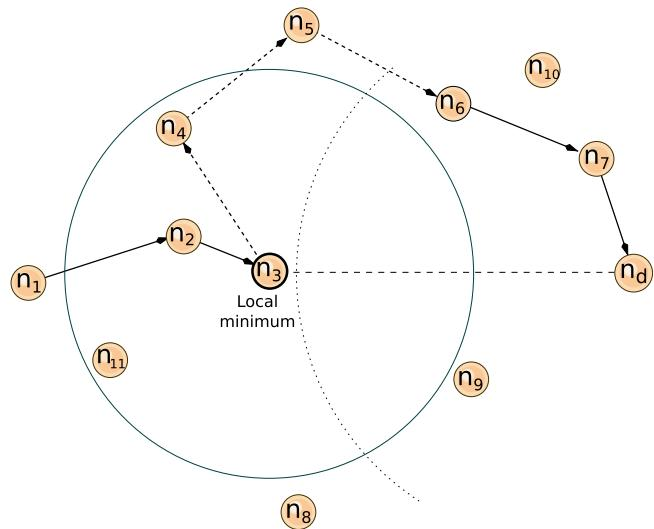  
Fig. 9. Performing of GFG on a 2D graph. Solid arrows represent greedymode forwarding, dashes arrows represent face-mode forwarding.

switches to CFace(1). CFace(1) traverses one projective plane, which is chosen randomly from the xy, yz, or xz planes, starting from the node in which the algorithm is switched. At this point, TTLF is initialized to 0 and CFace(1) restarts. If the destination is not reached during this phase and TTLF is passed (a looping occurs), the algorithm goes back to PAB3D and TTLR restarts at 0.

## 4.2.12 PAB3D-CFace(3)

This algorithm [40] starts as PAB3D-CFace(1)-PAB3D, but instead of going back to PAB3D if the phase in a projective plane fails, PAB3D-CFace(3) tries the other two projective planes, defined as in CFace(3). This algorithm starts with the PAB3D stage and if the destination is not reached and the TTLR is passed, the algorithm switches to CFace(3) using the first xy plane. Again, if a loop occurred (TTLF is reached), it switches to yz plane, and finally the same process is repeated for xz plane.

## 4.2.13 LAR 3D

In the extension of LAR in 3D space [46], $n _ { s }$ computes the expected zone for ${ \boldsymbol { n } } _ { d } ,$ , which is a sphere around $n _ { d }$ of radius equal to $v _ { m a x } \times ( t _ { 1 } - t _ { 0 } )$ where $t _ { 1 }$ is the current time, $t _ { 0 }$ is the  ð  Þtime stamp of the position information that $n _ { s }$ has about ${ \boldsymbol { n } } _ { d } ,$ and $v _ { m a x }$ is the maximum speed of the node in the network. This zone is used to define the 3D flooding area, which is the minimum size rectangular box with $b a l l ( n _ { s } , r )$ in one ð Þcorner and the expected zone in the opposite corner. In our case, since we consider a static scenarios $( v _ { m a x } = 0 )$ , the expected zone is $b a l l ( n _ { d } , r )$

## 4.2.14 PAB3D-LAR

PAB3D-LAR was proposed in [46], [47] and it is a hybrid variant combining PAB3D with LAR. This algorithm tries to reduce the high path dilation of LAR. All the combinations in PAB3D-LAR use the same partitions as in PAB3D. The difference is that, while PAB3D selects only one of the M candidates chosen from the neighborhood, PAB3D-LAR sends the packet to all those selected candidates which are within the rectangular box defined as in LAR.

TABLE 2  
Simulation Parameters
<table><tr><td>Parameter</td><td>Value</td></tr><tr><td>NS-2 version</td><td>2.35</td></tr><tr><td>MAC type</td><td>IEEE 802.11g, FreeSpace model</td></tr><tr><td>Simulation area</td><td>1000 x 1000 x 1000</td></tr><tr><td>Transmission range</td><td>200</td></tr><tr><td>Traffic type</td><td>CBR</td></tr><tr><td>Data packet size</td><td>512 bytes</td></tr><tr><td>Queue type</td><td>Drop Tail</td></tr><tr><td>Number of nodes</td><td>50, 100, 150, 200</td></tr><tr><td>Node mobility</td><td>Static</td></tr></table>

## 5 PERFORMANCE EVALUATION

All the algorithms presented in this work are taken from different proposals and have been assessed on different simulators, under different assumptions, conditions and settings, hence their performance is not comparable.

In this section we discuss the performance trend of the above considered routing protocols. To this end, we devise a common set of network configurations used to asses the different metrics under consideration. The simulation is undertaken in the Network Simulator 2 [51], widely known as NS-2, an object-oriented, discrete event-driven simulator tool useful in studying the dynamic communication networks. We have implemented the discussed forwarding algorithms adding a new routing module (geo) into the NS-2’s code. Our code can be downloaded from [52], in order to let the reader reproduce the same simulations.

## 5.1 Simulation Environment

Inspired by the related works, our simulation scenario consists of N nodes placed in random positions in a 3D cubic space. The cube, in our case, has 1000 units of side length (e.g., meters). For each scenario instance, the nodes are placed randomly inside the 3D cube. Then, the topology is checked and the placed nodes are moved in order to reach a complete connected network, which means that each node can reach any other node in the network through multi-hop communication. The node transmission range is set to 200 units. To simplify the simulation, we assume that the nodes are not moving, obtaining a static ad-hoc network. The motivation of this choice is twofold: (a) the need to consider initial essential parameters for the comparison (i.e., the minimum path) that would change if the nodes move, and (b) the assumption that the time employed to route a packet from source to destination is irrelevant compared to the physical node movement and therefore the nodes of the networks are essentially still. A summary of the simulation parameters is shown in Table 2.

In order to gather several analysis results, we have performed three different comparisons:

The first comparison looks into the behavior of the forwarding algorithms under varying network density, ranging in {50, 100, 150, 200} nodes.

The second comparison analyzes the effect of varying the threshold values TTLR and TTLF of the randomization-based and the face-based forwarding algorithms, respectively.

The third comparison applies to all of the forwarding algorithms when varying the length of the shortest path from source to destination, ranging in {1-3, 4-6, $7 { \cdot } 9 \ \mathrm { a n d } \ 1 0 { + } \} \ \mathrm { h o p s } .$

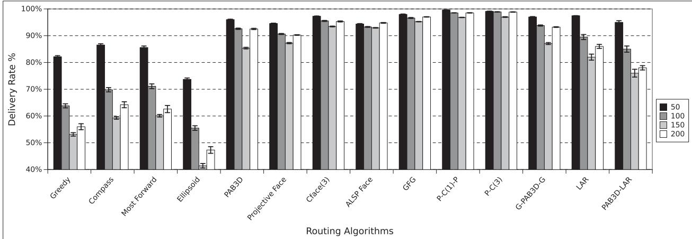  
(a)

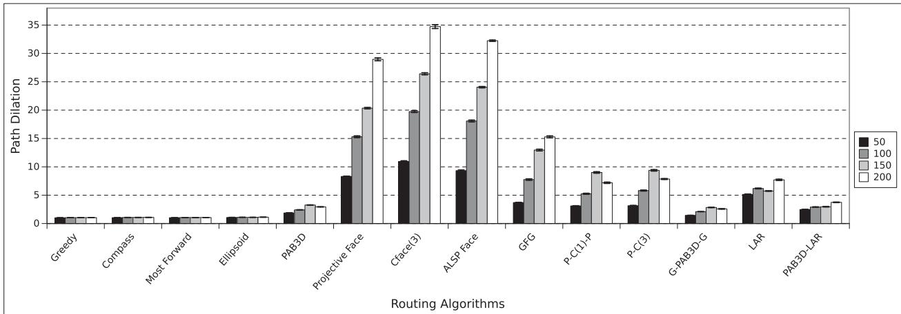  
(b)  
Fig. 10. Delivery rate (a) and path dilation (b) of all algorithms, for different network sizes, and with TTLR N, TTLF 2N, and TTL 6N.

For every comparison and parameter combination, we have performed 500 runs. Each run was combined with a different network topology randomly generated. In order to analyze the inherent performance of each routing algorithm, and inspired by previous work in the field (e.g., [23], [33]), during each run a packet is sent from a random source to a random destination. In all the charts, the error bars are determined considering a 95 percent confidence interval.

## 5.2 Comparison with Dynamic Number of Nodes

We discuss here the outcome of the experimentation and analyze the protocols’ performance under different settings. PAB3D-CFace(1)-PAB3D and PAB3D-CFace(3) are abbreviated to P-C(1)-P and P-C(3) respectively in the charts. The first comparison considers the routing protocols in a set of network instances consisting of 50, 100, 150, 200 nodes. The results are shown in Fig. 10. At first glance, from the results shown in Fig. 10a, there is a common behavior in the algorithms’ delivery rate, which decreases as the size of graph increases until 150 nodes, and regrows in the transition from 150 to 200 nodes. The deterministic progress-based forwarding algorithms have the lowest delivery rate, less than 60 percent in the case of 150 nodes. This means that in this scenario (150 nodes) there is more chance of getting stuck in a local minimum. However, they show the lowest path dilation (close to 1), as seen in Fig. 10b. PAB3D and G-PAB3D-G obtain better results in delivery rate, with a peak in the case of 50 nodes (90 percent), increasing their path dilation respect to the deterministic solution. G-PAB3D-G reduces the number of hops thanks to the hybridization with Greedy. Projective Face, CFace(3), and ALSP Face) generally achieve better results than the previous ones, but the worst results in term of path dilation. This difference depends on the fact that these algorithms have more possibility to find the destination node, since TTLF resetting. CFace(3) can be defined as Projective Face, only choosing two plans that are xy plane and xz plane, and with the addition of the xz plane. Therefore, since the algorithm has three possible attemps to finding the destination instead of two as in Projective Face, the delivery rate is a little higher. GFG achieves better results compared to ALSP Face, regarding delivery rate and is able to reduce the number of traversed hops. This is probably caused by the greedy method phase that, at first, carries the packet towards the destination and then, if a local minimum is found, the face method phase starts, but with less search space. LAR is affected by a relevant traffic and does not show a very high delivery rate. Not even PAB3D-LAR presents a good delivery rate, yet it has almost half of the path dilation when compared to LAR. From what we can see, the transition from 150 nodes to 200 nodes in the network increases the delivery rate, due to the increment of the node density. Focusing on path dilation, LAR and PAB3D-LAR present very good values, at the cost of high traffic, due to the nature of the flooding technique.

## 5.3 Comparison with Dynamic Threshold Values

This assessment has the goal to evaluate the effect of the threshold values for the randomization-based and face-July 05,2026 at 12:43:37 UTC from IEEE Xplore. Restrictions apply.

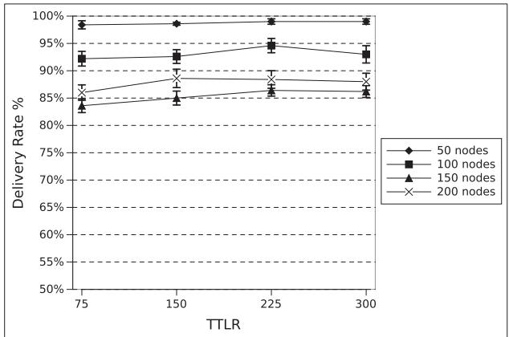  
(a)

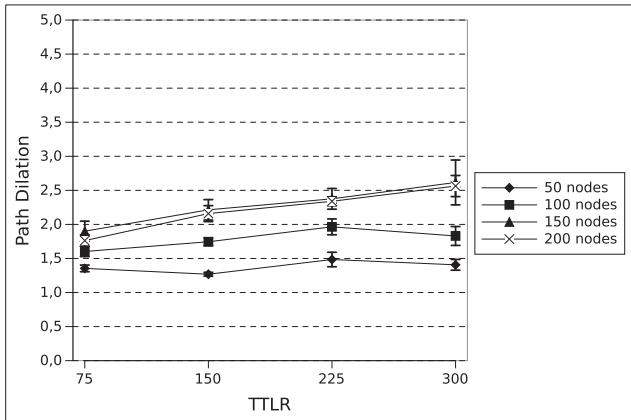  
(b)

Fig. 11. Delivery rate (a) and path dilation (b) of PAB3D in a graph of 50, 100, 150, and 200 nodes, with TTLR 75; 150; 225; 300 and TTL 2 TTLR.  
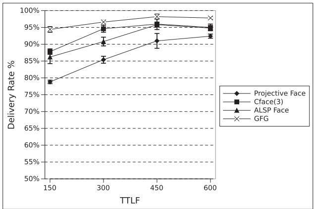  
(a)

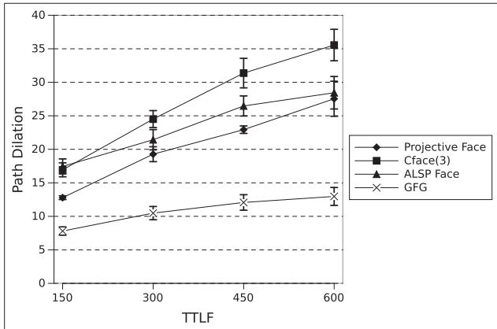  
(b)  
Fig. 12. Delivery rate (a) and path dilation (b) of Projective Face, CFace(3), ALSP Face, and GFG, in a grapf of 150 nodes, with TTLF 150; 300; 450; 600, TTL 3 TTLF, and ABS 100.

based algorithms, respectively. Our aim is to study the relationship between the TTLR and TTLF values to that of the delivery rate and path dilation. In this experimentation the TTLR and TTLF are dynamic, while the number of nodes N is not. Therefore, to get a fair treatment of the various experimental instances and to allow each algorithm to reach all their thresholds values (i.e., CFace (3) fails after three times TTLF), the TTL value is computed as 2 TTLR for the randomized case and as ${ \bar { 3 } } \times T T L F$ for the face case. For randomization-based analysis, PAB3D is assessed with four different network sizes, whereas the face-based one are assessed with a network size of 150 nodes.

In Fig. 11 we can see the effect of varying the TTLR threshold value on the average delivery rate and the average of path dilation of PAB3D in different graph sizes. Remember that the parameter combination chosen for the algorithm in this test is M 3, R Greedy, S Angle, $\boldsymbol { P } ^ { \prime } = \boldsymbol { Y } \boldsymbol { E } \boldsymbol { S }$ ¼ ¼ ¼. As shown in Fig. 11a, the delivery rate is gener-¼ally stable for each TTLR and for each graph size. This means that, in this scenario, the increase of TTLR is useless and this aspect does not change with a different number of nodes. Since a little increase in the delivery rate means more delivered packets added to the average path dilation calculation, there is a little growth of the path dilation value, due to the increase of the number of traversable hops allowed by TTLR, as seen in Fig. 11b.

Fig. 12 shows the effect of varying the TTLF threshold value on the average delivery and average path dilation of the four algorithms that use face strategy, Projective Face, CFace(3), ALSP Face and GFG. Remember that GFG uses ALSP Face as a recovery phase. The increase of the delivery rate, in Fig. 12a, is very significant for all the algorithms until a threshold value of 300 (2N). Fig. 12b shows the corresponding path dilation which continues to increase even though the delivery rates stops increasing noticeably. This indicates that a lot of looping occurs during the routing process, thus significantly slowing down the progress of the packet towards its destination. ALSP Face, CFace(3) and GFG perform well in terms of delivery rate, than progress-based and randomization-based strategies, but CFace(3) has a path dilation that grows more compared to the other. GFG performs well in delivery rate, and has the least path dilation with a steady value below 10.

## 5.4 Comparison with Dynamic Min Path Length

This section shows the results related to the application of all the routing algorithms considered in classes of graphs in which the length of the shortest path between source and destination is respectively 1-3, 4-6, 7-9, and >10 hops. These results are shown in Fig. 13. Note that for the first class (1-3 hops), all the algorithms have a high delivery rate (see Fig. 13a) and a small path dilation (see Fig. 13b). This happens because the closer the source and destination are, the less chance to find local minima there is. Augmenting the shortest path, deterministic progress-based strategies are the first to worsen their performance; the destination is more distant and there is a greater probability to get stuck in a local minimum. Progress-based algorithms reach about 10 percent of delivery rate in the case of 10+ hops of the minimum path. PAB3D and G-PAB3D-G perform well up to 4-6 minimum path length, but from this point the delivery rate decreases. This is due to the increase of the number of links from source to destination which reduces the probability of choosing the righ path. However, the path length of the delivered packets remains short (Fig. 13a, PAB3D and G-PAB3D-G histogram).

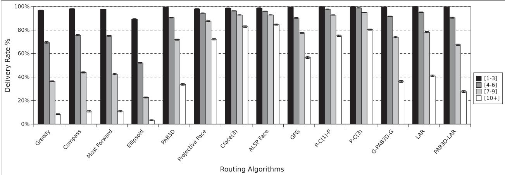  
(a)

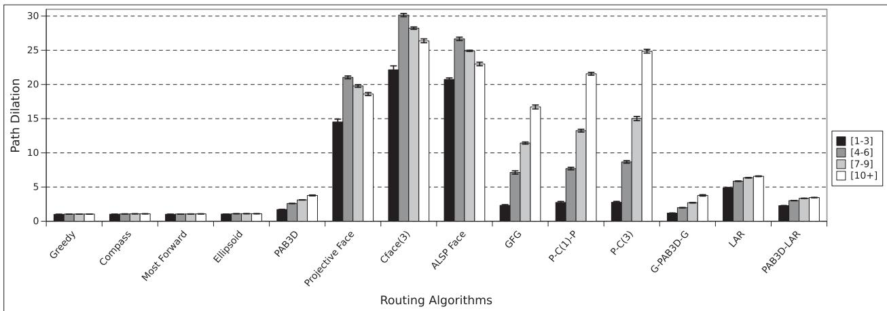  
(b)  
Fig. 13. Delivery rate (a) and path dilation (b) of all algorithms, in a graph of 150 nodes, for different minimum source-destination path lengths, and with TTLR N, TTLF 2N, and TTL 6N.

The performance of face-based and hybridized algorithms are also good for long paths, due to the fact that they succeed in reaching the destination within TTLF or TTL, despite the increasing of the distance from source to destination. However, the traversed path is too long, due to an increment in the number of crossing links during the travel.

## 5.5 Discussion

A comparison of the studied position-based algorithms is provided in Table 3. It summarizes the main characteristics of each proposal, reporting the results in terms of performance and their salient features. The features highlighted are as follows:

Delivery Rate. The ratio between the number of packets delivered to the destination(s) and the total number of packets sent by the source(s).

Path Dilation. The average ratio between the number of hops performed by the packets during the algorithm’s execution and the number of hops of the minimum path.

Scalability. The ability of a routing protocol to support network expansion in terms of number of nodes and network size, while preserving the performance trend. A routing protocol is scalable when performs well also in large size networks. In this paper, scalability is evaluated based on the path dilation.

TABLE 3  
Performance Summary
<table><tr><td>Routing Protocol</td><td>Delivery Rate</td><td>Path Dil.</td><td>Scalability</td></tr><tr><td>Greedy</td><td>Low</td><td>Very Low</td><td>High</td></tr><tr><td>Compass</td><td>Low</td><td>Very Low</td><td>High</td></tr><tr><td>Most Forward</td><td>Low</td><td>Very Low</td><td>High</td></tr><tr><td>Ellipsoid</td><td>Low</td><td>Very Low</td><td>High</td></tr><tr><td>PAB3D</td><td>Medium</td><td>Low</td><td>High</td></tr><tr><td>G-PAB3D-G</td><td>Medium</td><td>Medium</td><td>High</td></tr><tr><td>Projective Face</td><td>Medium</td><td>High</td><td>Medium</td></tr><tr><td>CFace(3)</td><td>High</td><td>High</td><td>Medium</td></tr><tr><td>ALSP face</td><td>High</td><td>High</td><td>Medium</td></tr><tr><td>GFG</td><td>High</td><td>Medium</td><td>High</td></tr><tr><td>PAB3D-CFace(1)-PAB3D</td><td>High</td><td>Medium</td><td>High</td></tr><tr><td>PAB3D-CFace(3)</td><td>High</td><td>Medium</td><td>High</td></tr><tr><td>LAR</td><td>Medium</td><td>High</td><td>Medium</td></tr><tr><td>PAB3D-LAR</td><td>Medium</td><td>Medium</td><td>Medium</td></tr></table>

Authorized licensed use limited to: Guangxi University. Downloaded on July 05,2026 at 12:43:37 UTC from IEEE Xplore. Restrictions apply.

From Table 3 we can draw further considerations. Progress-based forwarding algorithms are highly scalable, but have a low delivery rate. These algorithms are suitable for dense and uniform networks, which do not have local minima. Furthermore, these can be used in combination with other algorithms to reduce the path to reach the destination. Randomized forwarding strategies have one of the best performances in terms of scalability and delivery rates. They can outperform the progress-based strategy in sparse networks.

Face-based forwarding algorithms have significant path dilation; thus, they are not appropriate for dense networks, because there are many crossed links. Furthermore, in a continuous data flow scenarios we have a significant number of subsequent packets that travel around the network, and the long path followed by each packet can result in a large number of collisions and tailbacks. However, they perform well in sparse networks, where there are few nodes, hence few crossed links. Partial flooding algorithms can be used in small/medium networks, where multi path strategy does not greatly reduces the performances. Hybrid-based algorithms can perform well in a large range of network types, since they combine some advantages from base algorithms: delivery rate is high, path dilation is not high and scalability is high; this depends on the progress/randomized strategy combined with face-based methods.

## 6 CONCLUSION AND FUTURE WORK

This comparison has deepened, in many ways, the study of position-based routing applied on 3D networks. First, we have started by reviewing the underlying techniques describing the forwarding criteria, discussing the problems and limitations that emerge.

Deterministic progress-based strategies can perform well in very dense networks, but not in a sparse networks, due to the problem of local minima. Algorithms that use this strategies, for instance Greedy, may be used in combination with other algorithms, in order to reduce effectively the number of nodes traveled.

The random component in a forwarding decision offers a better chance to reach the destination. In this work, we have recovered all the randomization-based algorithms and unified them into a single algorithm called PAB3D, with different input parameters. With a better combination of possible parameters, PAB3D reaches a delivery rate of 80 percent in one of the worst case (150 nodes), with a path length of at most three times the minimum path length in the considered scenarios. Hybrid solutions seem to achieve better performance; for example, combining Greedy with PAB3D (getting G-PAB3D-G), a slight improvement of packet delivery and path dilation can be observed.

Algorithms based on planarization (face-based strategies) are able to reach very high values of performance in packet delivery, with the cost of a very high path length. The attempt to hybridize ALSP Face with Greedy (getting GFG) has in part raised from the heavy traffic. However, the application of algorithms that use 2D concepts, as the planarization of a graph, does not seem to be a very efficient idea applied in 3D environments. The number of crossing links is significant when the graph is projected, and the followed path is not always towards the target node, unlike the 2D case, generating unnecessary traffic.

Extending the current analysis, we plan to compare the various protocols considering network density and network size which vary independently so as to show how modifying only one of them could affect the performance [53]. An additional next step would be that of studying the impact of mobility in network performance under varying network conditions [54]. Moving towards a more realistic UAV-to-UAV communication model, we need to consider an antenna radiation pattern reflecting a toroid shape rather than a sphere currently employed in the simulation study. Another interesting research direction would be the study of a targeted position modification scheme (e.g., using operations research analysis) whereby nodes autonomously adjust their position in order to augment the chances of packet delivery.

## REFERENCES

[1] S. Basagni, M. Conti, S. Giordano, and I. Stojmenovic, Mobile Ad Hoc Networking, Hoboken, NJ, USA: Wiley, 2004.

[2] F. M. Adbuljalil and S. K. Bodhe, “A survey of integrating IP mobility protocols and mobile Ad-Hoc networks,” IEEE Commun. Surveys Tutorials

[3] J. Harri, F. Filali, and C. Bonnet, “Mobility models for vehicular Ad-hoc networks: A survey and taxonomy,” IEEE Commun. Surveys Tutorials, vol. 11, no. 4, pp. 19–41, Oct.-Dec. 2009.

[4] G. Karagiannis, O. Altintas, E. Ekici, and G. Heijenk, “Vehicular networking: A survey and tutorial on requirements, architectures, challenges, standards and solutions,” IEEE Commun. Surveys Tutorials, vol. 13, no. 4, pp. 584–616, Oct.-Dec. 2011.

[5] I. Akyildiz, W. Su, Y. Sankarasubramaniam, and E. Cayirci, “Wireless sensor networks: A survey,” Comput. Netw., vol. 38, no. 4, pp. 393–422, 2001.

[6] I. F. Akyildiz and I. H. Kasimoglu, “Wireless sensor and actor networks: Research challenges,” Ad Hoc Netw., vol. 2, no. 4, pp. 351–367, Oct. 2004.

[7] A. Purohit, P. Zhang, B. Sadler, and S. Carpin, “Deployment of swarms of micro-aerial vehicles: From theory to practice,” in Proc. IEEE Int. Conf. Robotics Autom., 2014, pp. 5408–5413.

[8] J. Scherer, S. Yahyanejad, and S. Hayat, “An autonomous multi-UAV system for search and rescue,” in Proc. 1st Workshop Micro Aerial Vehicle Netw. Syst. Appl. Civilian Use, 2015, pp. 33–38.

[9] D. Floreano and R. J. Wood, “Science, technology and the future of small autonomous drones,” Nature, vol. 521, no. 7553, pp. 460–466, May 2015.

[10] M. Asapdour, B. Van den Bergh, D. Giustiniano, K. A. Hummel, S. Pollin, and B. Plattner, “Micro aerial vehicle networks: an experimental analysis of challenges and opportunities,” IEEE Commun. Magazine, vol. 52, no. 7, pp. 141–149, Jul. 2014.

[11] J. Xie, Y. Wan, J. H. Kim, S. Fu, and K. Namuduri, “A survey and analysis of mobility models for airborne networks,” IEEE Commun. Surveys Tut., vol. 16, no. 3, pp. 1221–1238, Dec. 2013.

[12] I. Bekmezci, O. Sahingoz, and S. Temel, “Flying Ad-Hoc networks¸ (FANETs): A survey,” Ad Hoc Netw., vol. 11, no. 3, pp. 1254–1270, 2013.

[13] G. G. Finn, “Routing and addressing problems in large metropolitan-scale internetworks,” USC Information Sciences Institute (ISI), CA, USA, Tech. Rep. ISU/RR-87-180, 1987.

[14] P. Bose and P. Morin, “Online routing in triangulations,” in Proc. Int. Symp. Algorithms Computation, 1999, pp. 113–122.

[15] C. Liu and J. Wu, “Efficient geometric routing in three dimensional Ad hoc networks,” in Proc. IEEE INFOCOM, 2009, pp. 2751–2755.

[16] E. Kranakis, H. Singh, and J. Urrutia, “Compass routing on geometric networks,” in Proc. 11th Canadian Conf. Comput. Geometry, 1999, pp. 51–54.

[17] R. Nelson and L. Kleinrock, “The spatial capacity of a slotted ALOHA multihop packet radio network with capture,” IEEE Trans. Commun., vol. COM-32, pp. 684–694, Jun. 1984.

[18] Swarming Micro Air Vehicle Network (SMAVNET II), (2013). [Online]. Available: http://smavnet.epfl.ch/

[19] A. Bujari, M. Furini, F. Mandreoli, R. Martoglia, M. Montangero, and D. Ronzani, “Standards, security and business models: Key challenges for the iot scenario,” Mobile Netw. Appl., vol. 23, no. 1, pp. 147–154, Feb. 2018.

[20] M. Tortonesi, C. Stefanelli, E. Benvegnu, K. Ford, N. Suri, and M. Linderman, “Multiple-UAV coordination and communications in tactical edge networks,” IEEE Commun. Mag., vol. 50, no. 10, pp. 48–55, Oct. 2012.

[21] T. Samad, J. S. Bay, and D. Godbole, “Network-centric systems for military operations in urban terrain: The role of UAVs,” Proc. IEEE, vol. 95, no. 1, pp. 92–107, Jan. 2007.

[22] E. Yanmaz, R. Kuschnig, and C. Bettstetter, “Achieving air-ground communications in 802.11 networks with three-dimensional aerial mobility,” in Proc. IEEE INFOCOM, 2013, pp. 120–124.

[23] A. Boukerche, B. Turgut, N. Aydin, M. Z. Ahmad, L. Bol€ oni, and€ D. Turgut, “Routing protocols in Ad hoc networks: A survey,” Comput. Netw., vol. 55, no. 13, pp. 3032–3080, 2011.

[24] R. Karthikeyan, K. Sasikala, and R. Reka, “A survey on positionbased routing in mobile Ad Hoc networks,” Int. J. P2P Netw. Trends Technol., vol. 31, 2013.

[25] M. Mauve, J. Widmer, and H. Hartenstein, “A survey of positionbased routing in mobile Ad hoc networks,” IEEE Netw. Mag., vol. 15, no. 6, pp. 30–39, Nov./Dec. 2001.

[26] I. Stojmenovic, “Position-based routing in Ad Hoc networks,” IEEE Commun. Mag., vol. 40, no. 7, pp. 128–134, Jul. 2002.

[27] A. H. Iche and M. R. Dhage, “Location-based routing protocols: A survey,” Int. J. Comput. Appl., vol. 109, Jan. 2015.

[28] C. Perkins and P. Bhagwat, “Highly dynamic destination-sequenced distance-vector (DSDV) routing for mobile computers,” in Proc. Conf. Commun. Architectures Protocols Appl., pp. 234–244, 1994.

[29] C. Perkins, E. Royer, and S. R. Das, "Ad hoc on-demand distance vector (AODV) routing,” in Proc. IEEE HotMobile, pp. 90–11, 1999.

[30] M. Heissenbuttel and T. Braun, “Optimizing neighbor table accuracy of position-based routing algorithms,” in Proc. IEEE INFOCOM’2005, Miami, USA, Mar. 2005.

[31] S. Durocher, D. Kirkpatrick, and L. Narayanan, “On routing with guaranteed delivery in three-dimensional Ad hoc wireless networks,” in Proc. Int. Conf. Distrib. Comput. Netw., pp. 546–557, 2008.

[32] J. Li, J. Jannotti, D. S. J. D. Couto, D. R. Karger, and R. Morris, “A scalable location service for geographic Ad hoc routing,” in Proc. 6th Annu. Int. Conf. Mobile Comput. Netw., pp. 120–130, 2000.

[33] A. Maghsoudlou, M. St-Hilaire, and T. Kun, “A survey on geographic routing protocols for mobile Ad hoc networks,” Carleton Univ., Ottawa, ON, Tech. Rep. SCE-11–03, 2011.

[34] A. Nasipuri, R. Castaneda, and S. R. Das, “Performance of multi-\~ path routing for on-demand protocols in mobile Ad Hoc networks,” Mobile Netw. Appl., vol. 6, no. 4, pp. 339–349, 2001.

[35] K. R. Gabriel and R. R. Sokal, “A new statistical approach to geographic variation analysis,” Systematic Zoology, vol. 18, no. 3, pp. 259–270, 1969.

[36] S. Basagni, I. Chlamtac, and V. Syrotiuk, “A distance routing effect algorithm for mobility (DREAM),” in Proc. 4th Annu. ACM/IEEE Int. Conf. Mobile Comput. Netw., pp. 76–84, Oct. 1998.

[37] Y. B. Ko and N. H. Vaidya, “Location-aided routing (LAR) in mobile Ad hoc networks,” ACM/Baltzer Wireless Netw., vol. 6, no. 4, pp. 307–321, 2000.

[38] H. Takagi and L. Kleinrock, “Optimal transmission ranges for randomly distributed packet radio terminals,” IEEE Trans. Commun., vol. 32, no. 3, pp. 246–257, Mar. 1984.

[39] K. Yamazaki and K. Sezaki, “The proposal of geographical routing protocols for location-aware services,” Electron. Commun. Japan, vol. 87, no. 4, 2004.

[40] A. E. Abdallah, T. Fevens, and J. Opatrny, “Randomized 3D position-based routing algorithms for Ad hoc networks,” in Proc. 3rd Annu. Int. Conf. Mobile Ubiquitous Syst. - Workshops, 2006, pp. 1–8.

[41] R. W. R. Flury, R. Wattenhofer, “Randomized 3D geographic routing,” in Proc. IEEE INFOCOM 2008 - The 27th Conf. Comput. Commun., Phoenix, AZ, 2008.

[42] G. Kao, T. Fevens, and J. Opatrny, “Position-based routing on 3D geometric graphs in mobile Ad hoc networks,” in Proc. CCCG, 2005, pp. 88–91.

[43] G. Kao, T. Fevens, and J. Opatrny, “3D Localized position-based routing with nearly certain delivery in mobile Ad hoc networks,” in Proc. 2nd Int. Symp. Wireless Pervasive Comput., 2007.

[44] P. Bose, P. Morin, I. Stojmenovic, and J. Urrutia, “Routing with guaranteed delivery in Ad hoc wireless networks,” in Proc. 3rd int. Workshop Discr. Algorithm Methods Mobile Comput. Commun. (DIALM ’99). ACM, New York, NY, USA, 1999, pp. 48–55.

[45] B. Karp and H. Kung, “GPSR: Greedy perimeter stateless routing for Wireless networks,” in Proc. 6th Ann. Int. Conf. Mobile Comput. Netw., 2000, pp. 243–254.

[46] A. Abdallah, T. Fevens, and J. Opatrny, “Hybrid position-based 3D routing algorithms with partial flooding,” in Proc. Canadian Conf. Elect. Comput. Eng., 2006, pp. 1135–1138.

[47] A. E. Abdallah, T. Fevens, and J. Opatrny, “High delivery rate position-based routing algorithms for 3D Ad hoc networks,” Comput. Commun., vol. 31, no. 4, pp. 807–817, 2007.

[48] I. Stojmenovic and X. Lin, “Loop-free hybrid single-path/flooding routing algorithms with guaranteed delivery for wireless networks,” IEEE Trans. Parallel Distrib. Syst., vol. 12, no. 10, pp. 1023–1032, Oct. 2001.

[49] T. Fevens, A. E. Abdallah, and B. N. Bennani, “Randomized ABface-AB routing algorithms in mobile Ad hoc networks,” in Proc. Int. Conf. Ad-Hoc Netw. Wireless, 2005. pp. 43–56.

[50] S. Liu, T. Fevens, and A. E. Abdallah, “Hybrid position-based routing algorithms for 3D mobile Ad hoc networks,” in Proc. 4th Int. Conf. Mobile Ad-hoc Sensor Networks, 2008, pp. 177–186.

[51] Network Simulator 2, (1995). [Online]. Available: http://www.isi. edu/nsnam/ns/

[52] Position-based protocol implementation on ns-2, (2017). [Online]. Available: http://www.math.unipd.it/ cpalazzi/FANET-routing. html

[53] I. Stojmenovic, “Simulations in wireless sensor and Ad hoc networks: Matching and advancing models, metrics, and solutions,” IEEE Commun. Mag., vol. 46, no. 12, pp. 102–107, Dec. 2008.

[54] A. Bujari, C. T. Calafate, J.-C. Cano, P. Manzoni, C. E. Palazzi, and D. Ronzani, “Flying Ad-hoc network application scenarios and mobility models,” Int. J. Distrib. Sensor Netw., vol. 13, no. 10, pp. 1–17, 2017.

Armir Bujari received the MS degree in computer science, summa cum laude, at the University of Padua, Italy, and PhD degree in computer science from the University of Bologna, Italy, in 2014. He is an assistant professor in computer science with the University of Padua. His research interests include protocol design and analysis for wireless networks and delay-tolerant communication in mobile networks. On these topics, he is active in several technical program committees in international conferences and is co-author of more than 50 papers,

which have been published in international conferences proceedings, books, and journals. He is a member of the IEEE.

Claudio E. Palazzi is an associate professor in computer science with the University of Padua. He has been a visiting professor with the University of Paris XIII and with the University of California, Los Angeles. His research interests include primarily focused on the design and analysis of communication protocols for wired/wireless networks, Internet architectures, and mobile users, with an emphasis on distributed sensing, mobile applications, and multimedia entertainment. He is active in various technical program committees of the most prominent international conferences and is author of more than 150 papers, which have been published in international conference proceedings, books, and journals. He was general chair for the IFIP/IEEE Wireless Days 2010 conference, he was TPC chair of IEEE CCNC 2016, he is general chair of MobiSys/DroNet and MobiCom/SMARTOBJECTS, and associate editor of the Elsevier Computer Networks journal.

Daniele Ronzani received the master’s degree in computer science, in Sep. 2015. He is currently working toward the PhD degree in brain mind and computer science at the University of Padua, Italy, under the supervision of professor Claudio Enrico Palazzi. His research interests include wireless network protocol design and analysis, with particular interest on mobile ad-hoc networks. He is a member of the IEEE.

" For more information on this or any other computing topic, please visit our Digital Library at www.computer.org/publications/dlib.