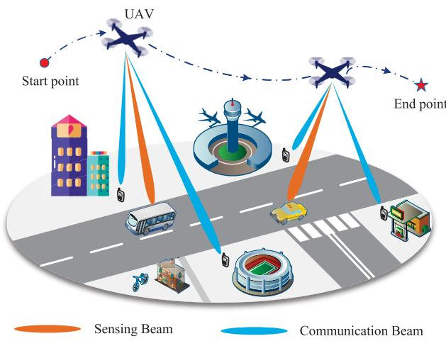
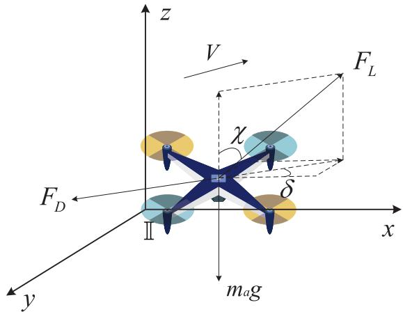
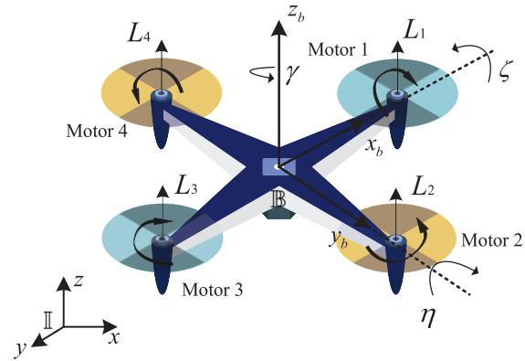
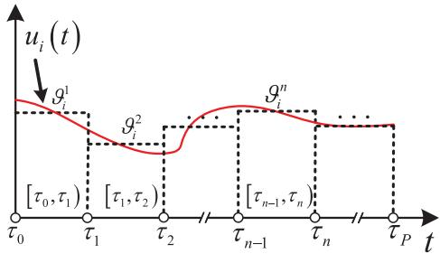
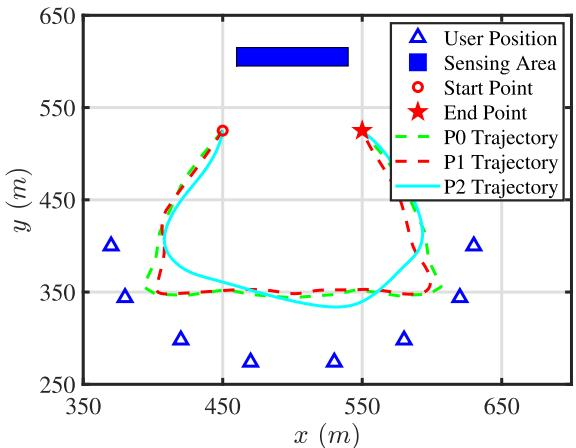
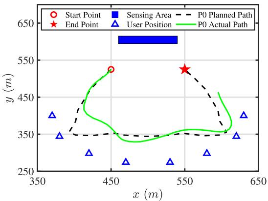
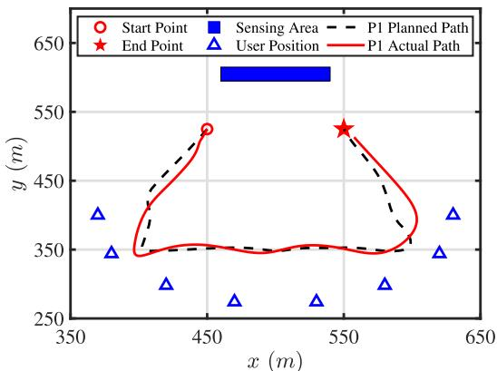
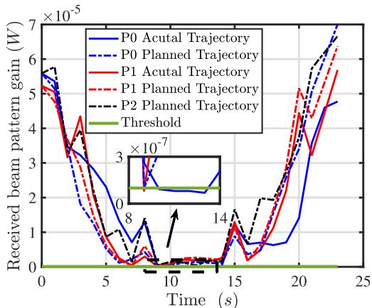
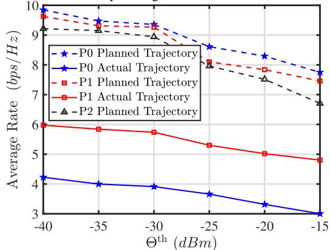

# A Control-Based Design of Beamforming and Trajectory for UAV-Enabled ISAC System

Bin Li , Senior Member, IEEE, Hongyun Zhang , Yue Rong , Senior Member, IEEE, and Zhu Han , Fellow, IEEE

Abstract—We study a control-based design of beamforming and trajectory that incorporates the dynamic model, focusing on a scenario where a multi-antenna unmanned aerial vehicle (UAV) simultaneously performs radar sensing of multiple targets in a specific region and communication with multiple ground users. Two optimization problems are formulated for the threedegree-of-freedom (3-DoF) and six-degree-of-freedom (6-DoF) dynamic models of UAV, which are often overlooked in existing designs. These problems aim to maximize the average weighted communication rate while maintaining the dynamic constraints and the sensing service requirements by designing the UAV trajectory and the communication and sensing beamforming vectors. To deal with the challenges posed by the UAV dynamic constraints, we decompose the original problem into two subproblems: the communication and sensing beamforming design subproblem, and the UAV trajectory optimization subproblem. Given the UAV trajectory, we employ the sequential convex approximation (SCA) and semi-definite relaxation (SDR) methods to transform the beamforming design subproblem into a convex problem. Given the communication and sensing beamforming vectors, we propose a control-based approach with piecewise parameterization and exact penalty function strategies to transform the UAV trajectory optimization subproblem into a static nonlinear program, which can be efficiently solved by sequential quadratic programming (SQP). Numerical simulations indicate that the proposed scheme is more feasible in terms of the UAV control than the existing scheme in practical systems, with less performance loss or even no performance degradation.

Index Terms—UAV-enabled ISAC system, trajectory optimization, beamforming design, alternating optimization, control parametrization.

## I. INTRODUCTION

towards the era of intelligent connection of everything,

Received 18 December 2024; revised 28 April 2025; accepted 22 August 2025. Date of publication 8 September 2025; date of current version 22 December 2025. This work was supported in part by the National Natural Science Foundation of China under Grant U24B20156; in part by the National Defense Basic Scientific Research Program of China under Grant JCKY2021204B051; in part by NSF under Grant ECCS-2302469 and Grant CMMI-2222810; and in part by Toyota, Amazon, and Japan Science and Technology Agency (JST) Adopting Sustainable Partnerships for Innovative Research Ecosystem (ASPIRE) under Grant JPMJAP2326. The associate editor coordinating the review of this article and approving it for publication was Z. Fadlullah. (Corresponding author: Hongyun Zhang.)

Bin Li and Hongyun Zhang are with the School of Aeronautics and Astronautics, Sichuan University, Chengdu, Sichuan 610065, China (e-mail: bin.li@scu.edu.cn; zhanghongyun1@stu.scu.edu.cn).

Zhu Han is with the Department of Electrical and Computer Engineering, University of Houston, Houston, TX 77004 USA, and also with the Department of Computer Science and Engineering, Kyung Hee University, Seoul 446-701, South Korea (e-mail: zhan2@uh.edu).

the future mobile communication system should not only achieve high communication performance such as ultra-fast speed, ultra-low latency, and ultra-high dependability, but also have the sensing ability of millimeter-level accuracy [1] to support various intelligent applications, such as automatic driving [2], [3], traffic monitoring [4], human activity recognition, and smart home [5]. Toward this end, integrated sensing and communication (ISAC) has garnered tremendous attention from both academia and industry [6], [7], [8], [9], [10], [11], [12], [13], [14], [15], [16], [17], [18], and is one of the six international telecommunication union (ITU) use scenarios for 6G. In contrast to conventional fully separated independent systems, ISAC has significant potential to reduce both hardware and signaling costs, while enhancing spectral and energy utilization efficiencies by sharing wireless devices and spectrum resources.

Due to the additional spatial information provided by multiple-input-multiple-output (MIMO) systems, they can significantly enhance sensing performance and effectively increase system throughput compared to the information embedding method [19] and the waveform combination scheme [20]. The high-quality service of multiple users and high-precision sensing of multiple targets can be ensured through beamforming techniques by focusing signals simultaneously in multiple specific directions. However, the MIMO ISAC with transmit beamforming in terrestrial networks suffers from severe performance degradation due to non-lineof-sight (NLoS) signal paths or clutter caused by obstacles and scatterers in the surrounding environment, especially for sensing.

Digital Object Identifier 10.1109/TWC.2025.3604344

Given the altitude advantage of unmanned aerial vehicles (UAVs), they are expected to serve as a promising new type of aerial ISAC platform to overcome existing limitations. Hence, the UAV-enabled ISAC with transmit beamforming has attracted significant attention from both industry and academia. For instance, [15] investigates UAV performing sensing tasks in target areas while simultaneously serving multiple users for communication tasks, for the purpose of maximizing the weighted average communication rate under sensing performance requirements. To achieve this, the optimization of UAVs’ two-dimensional (2D) trajectory and transmit beamforming vectors is conducted. A novel adaptable ISAC mechanism in UAV-assisted systems is designed in [16] to avoid excessive sensing, where the duration of sensing does not need to align with the duration of communication and can be flexibly configured based on application requirements. In [17], two joint optimization schemes under different UAV states are discussed. On the one hand, a joint design approach for communication precoding and UAV flight trajectory is proposed to address the minimum user rate maximization problem. On the other hand, a joint optimization method for UAV sensing position, communication, and sensing precoding is proposed to tackle the minimum target detection probability maximization problem. Paper [18] studies a multi-UAV assisted ISAC scenario where the UAVs detect a target and simultaneously transmit the corresponding data to users. A joint design scheme for the UAVs trajectory, user association, and beamforming is proposed to maximize the sum weighted bit rate of all ground users while ensuring the minimum service requirement of radar sensing.

The authors in [15], [16], [17], and [18] address the trajectory optimization problem of UAVs under discrete speed constraints by modeling the UAV as a mass point in the ISAC scenarios with transmit beamforming. They obtain a series of segmented trajectories using time discretization techniques. However, this model only focuses on the position and speed of the UAV while neglecting its rotational motion, internal forces, and torques. This means the complex dynamic characteristics of the UAV as a rigid body are ignored, which can lead to inaccuracies in both trajectory optimization and control strategies. In other words, the UAV controller might struggle to accurately follow the planned trajectory in practical applications. Any mismatch between the planned and actual trajectories can result in increased communication link delays, acquisition errors, and a decrease in the environmental modeling and target recognition capabilities of the sensing system, ultimately degrading communication and sensing performance.

Motivated by the aforementioned discussions, we propose a joint design of beamforming and trajectory control to maximize the average weighted communication rate while guaranteeing the service requirement for radar sensing. In particular, we consider the three-degree-of-freedom (3-DoF) model with translational UAV motion and the six-degreeof-freedom (6-DoF) dynamic model with both translational and rotational UAV motion. These two UAV models provide performance-complexity tradeoffs. We investigate the scenario where a multi-antenna UAV senses targets within a specific region while simultaneously providing communication services to multiple users, with potential applications in border surveillance and environmental monitoring. To address the challenges posed by the dynamic constraints on the UAV, we decompose the original optimization problem into two distinct subproblems: one that focuses on beamforming optimization, and the other on designing the UAV’s trajectory, solving them iteratively in an alternating manner. Different from the trajectory discretization in existing methods [15], [16], [17], [18], the proposed approach parameterizes control variables based on a state-space model and describes the UAV state variables (such as position and velocity) as functions of control parameters to achieve a continuous and smooth flight path. Additionally, this method effectively reduces vibrations and abrupt changes during flight, enhancing stability and trackability.

The primary contributions of this paper can be summarized below.

We propose a control-based joint design of beamforming and trajectory that incorporates either the 3-DoF model or the 6-DoF model. Compared with the segmented piecewise trajectories commonly obtained in [15], [16], [17], and [18], the proposed scheme achieves continuous and smooth flight trajectories.

We leverage an iterative method to solve the joint beamforming and trajectory optimization problem, combining the UAV dynamics model. The original problem is decomposed into two subproblems: communication and sensing beamforming optimization, and UAV trajectory optimization. Given the UAV trajectory, the communication and sensing beamforming optimization subproblem is reformulated as a convex problem adopting sequential convex approximation (SCA) and semi-definite relaxation (SDR) methods, which can be addressed with the CVX toolbox. Based on the obtained communication and sensing beamforming vectors, we apply a piecewise-based parameterization method and an exact penalty function method to transform the UAV trajectory optimization subproblem into a static nonlinear program which can be solvable via sequential quadratic programming (SQP).

• We evaluate the performance of the proposed schemes and verify the effectiveness of the proposed algorithms through numerical simulations. The results indicate that the two proposed schemes are more feasible in terms of the UAV control than the benchmark scheme [15] in practical UAV-enabled ISAC systems, with less performance loss or even no performance degradation. Furthermore, the proposed scheme with the 3-DoF model strikes an effective compromise between computational complexity and performance compared to both the benchmark modelfree scheme and the proposed scheme with the 6-DoF model.

The rest of the paper is structured as follows. In Section II, the UAV dynamic models and the communication and sensing channel models are described. The joint problem of beamforming design and UAV flight trajectory planning is solved in Section III. In Section IV, the assessment of the proposed methods is conducted. Finally, we conclude the paper in Section V.

## II. SYSTEM MODEL AND PROBLEM FORMULATION

We study a downlink UAV-enabled ISAC system designed to perform radar sensing on potential targets while providing downlink communication services for multiple single-antenna users,1 as shown in Fig. 1. The quad-rotor UAV travels from a predetermined initial location to a final location within a finite time horizon, i.e., ${ \boldsymbol { \mathcal { T } } } \triangleq [ 0 , T ]$ . Let $\pmb { p } ( t ) = [ x ( t ) , y ( t ) , z ( t ) ] ^ { \top }$ represent the position vector of the UAV, where $[ \cdot ] ^ { \top }$ stands for the matrix transpose. For simplicity, it is assumed that the UAV operates at a fixed altitude denoted by $z _ { u } . ^ { 2 } \mathrm { ~ A ~ }$ uniform linear array (ULA) with N antennas and $d = \lambda / 2$ adjacent-element spacing is installed at the UAV, where λ represents the carrier wavelength. Similarly to [21], the ULA is placed vertically to the horizontal plane at the UAV to facilitate the technical derivation. The set of sensing targets in the area of interest is represented by ${ \mathcal { I } } \triangleq \{ 1 , \ldots , J \}$ , with each target’s location given by $\pmb { o } _ { j } = [ o _ { x , j } , o _ { y , j } , 0 ] ^ { \top } , j \in \mathcal { I }$ . The position of targets is assumed to be known by the UAV. We also assume there are M users, with each user m $\in { \mathcal { M } } \triangleq \{ 1 , \dots , M \}$ having a position denoted by $\pmb { p } _ { m } = [ p _ { x , m } , p _ { y , m } , 0 ] ^ { \top }$ . The position of users can be acquired either through the global positioning system (GPS) or estimated from uplink signals [22]. For ease of reading, the notations for the primary variables are provided in Table I.

  
Fig. 1. Description of the UAV-aided downlink ISAC scenario.

## A. Communication and Sensing Model

We consider that the UAV sends the information signal $c _ { m } ( t )$ to user $m \in \mathcal { M }$ with transmit beamforming at time $t \in \tau .$ 3 Although it is feasible to reuse communication signals for sensing, the DoF of sensing may be limited [25]. Thus, we design a dedicated radar signal $\pmb { c } _ { 0 } \in \mathbb { C } ^ { N \times 1 }$ to further enhance communication and sensing performance [12], [15], [26]. We assume that the information signals $\{ c _ { m } \} _ { m = 1 } ^ { M }$ are independent, i.e. $, c _ { m } ( t ) \sim \mathcal { C N } ( 0 , 1 )$ , while the dedicated radar signal $c _ { 0 }$ has zero mean and covariance matrix $\begin{array} { r } { \pmb { G } _ { d } = \mathbb { E } \left[ \pmb { c } _ { 0 } \pmb { c } _ { 0 } ^ { \mathrm { H } } \right] \succeq \mathbf { 0 } _ { N \times N } , } \end{array}$ where $( \cdot ) ^ { \mathrm { H } }$ stands for the matrix conjugate transpose and  denotes positive semi-definite. Moreover, the information signals are uncorrelated with the dedicated radar signal, i.e., $\mathbb { E } ( \pmb { c } _ { 0 } \pmb { c } _ { m } ) = \mathbf { 0 } _ { N \times 1 } , \forall m \in \mathcal { M } .$ . Let ${ \pmb w } _ { m } \in \mathbb { C } ^ { N \times 1 }$ represent the transmit beamforming vector for m-th user. Therefore, the transmitted signal by the UAV is given by

TABLE I SYMBOL NOTATIONS
<table><tr><td>Notation</td><td>Physical Meaning</td></tr><tr><td> $m _ { a }$ </td><td>Aircraft mass (kg)</td></tr><tr><td> $g$ </td><td>Acceleration of gravity  $\mathrm { ( m / s ^ { 2 } ) }$ </td></tr><tr><td> $l$ </td><td>Rigid cross-frame size (m)</td></tr><tr><td> $\xi _ { i }$ </td><td>Speed of motor i (rad/s)</td></tr><tr><td> $K _ { p }$ </td><td>Lift force coefficient  $( \dot { \mathrm { N } } / ( \mathrm { r a d } / \mathrm { s } ) ^ { 2 } )$ </td></tr><tr><td> $K _ { m }$ </td><td>Torque coefficient  $( \mathrm { N } \cdot \mathrm { m } / ( \mathrm { r a d } / \mathrm { s } ) ^ { 2 } )$ </td></tr><tr><td> $K _ { d }$ </td><td>Fuselage drag coefficient  $( \mathrm { { \dot { N } } } / ( \mathrm { { m } } / \mathrm { { s } } ) ^ { 2 } )$ </td></tr><tr><td> $I _ { m }$ </td><td>Motor propeller inertia  $( \mathrm { k g \cdot m ^ { 2 } } )$ </td></tr><tr><td> $\chi$ </td><td>Attack angle (rad)</td></tr><tr><td> $\delta$ </td><td>Heading angle (rad)</td></tr><tr><td> $\zeta$ </td><td>Roll angle (rad)</td></tr><tr><td> $\eta$ </td><td>Pitch angle (rad)</td></tr><tr><td> $\gamma$ </td><td>Yaw angle (rad)</td></tr><tr><td> $z _ { u }$ </td><td>Flying height (m)</td></tr><tr><td> $\beta _ { 0 }$ </td><td>Channel power gain at the distance 1 m (dB)</td></tr><tr><td> $P _ { \mathrm { m a x } }$ </td><td>Maximum communication power (W)</td></tr><tr><td> $V _ { \mathrm { m a x } }$ </td><td>Maximum flying velocity (m/s)</td></tr><tr><td> $_ \alpha$ </td><td>Path loss exponent</td></tr><tr><td> $K _ { d x }$ </td><td>Drag coefficient of x-axis  $\mathrm { ( N / ( m / s ) ^ { 2 } ) }$ </td></tr><tr><td> $K _ { d y }$ </td><td>Drag coefficient of y-axis  $( \mathrm { N } / ( \mathrm { m } / \mathrm { s } ) ^ { 2 } )$ </td></tr><tr><td> $K _ { d z }$ </td><td>Drag coefficient of z-axis  $\mathrm { \dot { ( N / ( m / s ) ^ { 2 } ) } }$ </td></tr><tr><td> $K _ { d m x }$ </td><td>Damping torque coefficient of x-axis  $( \mathrm { N } \cdot \mathrm { m } / ( \mathrm { r a d } / \mathrm { s } ) ^ { 2 } )$ </td></tr><tr><td> $K _ { d m y }$ </td><td>Damping torque coefficient of  $y -$  axis  $( \mathrm { N } \cdot \mathrm { m } / ( \mathrm { r a d } / \mathrm { s } ) ^ { 2 } )$ </td></tr><tr><td> $K _ { d m z }$ </td><td>Damping torque coefficient of z-axis  $( \mathrm { N } \cdot \mathrm { m } / ( \mathrm { r a d } / \mathrm { s } ) ^ { 2 } )$ </td></tr><tr><td> $I _ { x x }$ </td><td>Rotational inertia of x-axis  $\mathrm { ( k g \cdot m ^ { 2 } ) }$ </td></tr><tr><td> $I _ { y y }$ </td><td>Rotational inertia of y-axis  $( \mathrm { k g \cdot m ^ { 2 } } )$ </td></tr><tr><td> $I _ { z z }$ </td><td>Rotational inertia of z-axis  $( \mathrm { k g \cdot m ^ { 2 } } )$ </td></tr></table>

$$
\pmb { c } ( t ) = \sum _ { m = 1 } ^ { M } \pmb { w } _ { m } ( t ) c _ { m } ( t ) + \pmb { c } _ { 0 } ( t ) , \forall t \in \mathcal { T } .\tag{1}
$$

Hence, the sum transmit power of UAV is expressed as

$$
\begin{array} { r l r } {  { \mathbb { E } ( \| \boldsymbol { c } ( t ) \| ^ { 2 } ) = \mathbb { E } ( \| \sum _ { m = 1 } ^ { M } \boldsymbol { w } _ { m } ( t ) \boldsymbol { c } _ { m } ( t ) + \boldsymbol { c } _ { 0 } ( t ) \| ^ { 2 } ) } } \\ & { } & { = \displaystyle \sum _ { m = 1 } ^ { M } \| \boldsymbol { w } _ { m } ( t ) \| ^ { 2 } + \mathrm { t r } ( \boldsymbol { G } _ { d } ( t ) ) , \quad \quad } \end{array}\tag{2}
$$

where $\| \cdot \|$ stands for the vector Frobenius norm and $\operatorname { t r } ( \cdot )$ denotes matrix trace. Then the power constraint is expressed as

$$
\sum _ { m = 1 } ^ { M } \| \pmb { w } _ { m } ( t ) \| ^ { 2 } + \operatorname { t r } ( \pmb { G } _ { d } ( t ) ) \leq P _ { \operatorname* { m a x } } , \forall t \in \mathcal { T } ,\tag{3}
$$

where $P _ { \mathrm { m a x } }$ is shown on Table I.

To quantitatively characterize the propagation channel, many studies [27], [28], [29], [30] have conducted a series of air-to-ground channel measurements in various typical environments, including near-urban, suburban, and hilly/mountainous areas. The air-to-ground channel model is consistent with the LoS channel model when the UAV altitude is above 50 meters [27], [28]. Therefore, the LoS channel link between the UAV and ground users has also been widely adopted in previous works [31], [32], [33], [34] for gaining essential insights on the placement/trajectory design. Furthermore, the Doppler effect resulting from UAV mobility is assumed to be adequately compensated at both users [35], [36] and targets [37]. Hence, the air-to-ground channel is considered to follow the free-space path loss model. The channel power gain from the UAV to the m-th user is specified as

$$
\beta _ { m } ( { \pmb p } ( t ) , { \pmb p } _ { m } ) = \frac { \beta _ { 0 } } { d ( { \pmb p } ( t ) , { \pmb p } _ { m } ) ^ { \alpha } } ,\tag{4}
$$

where $\beta _ { 0 }$ and α are shown on Table I, with α characterizing the rate at which the signal strength diminishes with distance. $\begin{array} { r l r } { d ( p ( t ) , p _ { m } ) } & { { } = } & { \sqrt { ( x ( t ) - p _ { x , m } ) ^ { 2 } + ( y ( t ) - p _ { y , m } ) ^ { 2 } + z _ { u } ^ { 2 } } } \end{array}$ denotes the Euclidean distance between the UAV’s position ${ \pmb p } ( t )$ and the m-th user’s position ${ \pmb p } _ { m }$ . The transmit array response vector of the UAV in the direction of the m-th user is written as

$$
\begin{array} { r l } & { b ( \pmb { p } ( t ) , \pmb { p } _ { m } ) } \\ & { \quad = \left[ 1 , \mathrm { e } ^ { \mathrm { i } 2 \pi \frac { d } { \lambda } \cos \phi ( \pmb { p } ( t ) , \pmb { p } _ { m } ) } , \dots , \mathrm { e } ^ { \mathrm { i } 2 \pi \frac { d } { \lambda } ( N - 1 ) \cos \phi ( \pmb { p } ( t ) , \pmb { p } _ { m } ) } \right] ^ { \top } , } \end{array}\tag{5}
$$

where $\phi ( \pmb { p } ( t ) , \pmb { p } _ { m } )$ is the angle of departure (AoD) of the signal from the UAV to the m-th user with

$$
\phi ( \pmb { p } ( t ) , \pmb { p } _ { m } ) = \operatorname { a r c c o s } \frac { z _ { u } } { d ( \pmb { p } ( t ) , \pmb { p } _ { m } ) } .\tag{6}
$$

Therefore, the channel vector from the UAV to the m-th user is expressed as

$$
g _ { m } ( { \pmb p } ( t ) ) = \sqrt { \beta _ { m } ( { \pmb p } ( t ) , { \pmb p } _ { m } ) } b ( { \pmb p } ( t ) , { \pmb p } _ { m } ) .\tag{7}
$$

Then, the received signal at the m-th user is written as

$$
\begin{array} { l } { { \displaystyle s _ { m } ( t ) = { \bf g } _ { m } ^ { \mathrm { H } } ( { \bf p } ( t - t _ { d } ) ) c ( t - t _ { d } ) + n _ { m } ( t ) } } \\ { ~ = \displaystyle \sum _ { i = 1 } ^ { M } { \bf g } _ { m } ^ { \mathrm { H } } ( { \bf p } ( t - t _ { d } ) ) { \bf w } _ { i } ( t - t _ { d } ) c _ { i } ( t - t _ { d } ) } \\ { ~ + \displaystyle { \bf g } _ { m } ^ { \mathrm { H } } ( { \bf p } ( t - t _ { d } ) ) { \bf c } _ { 0 } ( t - t _ { d } ) + n _ { m } ( t ) , } \end{array}\tag{8}
$$

where $t _ { d }$ is the time delay from when a signal is transmitted by the UAV until it is received by the user, and $n _ { m } ( t ) \sim \mathcal { C N } ( 0 , \sigma _ { m } ^ { 2 } )$ represents the additive white Gaussian noise (AWGN) at the m-th user. The received signal power of the m-th user is given by

$$
\begin{array} { r l } & { \quad \mathbb { E } \left( \left| \pmb { g } _ { m } ^ { \mathrm { H } } ( \pmb { p } ( t - t _ { d } ) ) \pmb { w } _ { m } ( t - t _ { d } ) c _ { m } ( t - t _ { d } ) \right| ^ { 2 } \right) } \\ & { = \left| \pmb { g } _ { m } ^ { \mathrm { H } } ( \pmb { p } ( t - t _ { d } ) ) \pmb { w } _ { m } ( t - t _ { d } ) \right| ^ { 2 } . } \end{array}
$$

Since the transmission of the communication signals and the dedicated radar signal share the same frequency spectrum, the received signal of one user is interfered by the communication signals of other users and the dedicated radar signal.4 Specifically, for the m-th user, the average power of the interference caused by other users’ transmissions can be computed as

$$
\begin{array} { r l } & { \mathbb { E } \left( \left| \displaystyle \sum _ { i = 1 , 2 } ^ { M } g _ { m } ^ { \mathrm { H } } ( p ( t - t _ { d } ) ) w _ { i } ( t - t _ { d } ) c _ { i } ( t - t _ { d } ) \right| ^ { 2 } \right) } \\ & { = \displaystyle \sum _ { i = 1 , \ n } ^ { M } \left| g _ { m } ^ { \mathrm { H } } ( p ( t - t _ { d } ) ) w _ { i } ( t - t _ { d } ) \right| ^ { 2 } . } \end{array}
$$

The average power of the interference at the m-th user caused by the dedicated radar signal is given by

$$
\begin{array} { r l } & { \mathbb { E } \left( \left| \pmb { g } _ { m } ^ { \mathrm { H } } ( \pmb { p } ( t - t _ { d } ) ) \pmb { c } _ { 0 } ( t - t _ { d } ) \right| ^ { 2 } \right) } \\ & { = \pmb { g } _ { m } ^ { \mathrm { H } } ( \pmb { p } ( t - t _ { d } ) ) \pmb { G } _ { d } ( t - t _ { d } ) \pmb { g } _ { m } ( \pmb { p } ( t - t _ { d } ) ) . } \end{array}
$$

The signal-to-interference-plus-noise ratio (SINR) of the m-th user is expressed as in (9), shown at the bottom of the page. Since the time delay $t _ { d }$ is only a few microseconds, which is sufficiently short that it does not cause significant changes, the term $\mathbb { E } \left( \left| g _ { m } ^ { \mathrm { H } } ( \pmb { p } ( t - t _ { d } ) ) \pmb { w } _ { m } ( t - t _ { d } ) c _ { m } ( t - t _ { d } ) \right| ^ { 2 } \right)$ can be approximated as E $\Bigl ( \bigl | g _ { m } ^ { \mathrm { H } } ( \pmb { p } ( t ) ) \pmb { w } _ { m } ( t ) c _ { m } ( t ) \bigr | ^ { 2 } \Bigr )$ , and similarly for other terms. Therefore, $\phi _ { m } ( \pmb { p } ( t - t _ { d } ) , \{ \pmb { w } _ { i } ( t - t _ { d } ) \}$ 2 $\mathbf { G } _ { d } ( t - t _ { d } ) )$ is approximated by $\phi _ { m } ( \pmb { p } ( t ) , \{ \pmb { w } _ { i } ( t ) \} , \pmb { G } _ { d } ( t ) )$ , which is written as (10), as shown at the bottom of the page.

As a result, the achievable spectral efficiency (data rate per unit bandwidth) of the m-th user in bits-per-second-per-Hertz (bps/Hz) is written as

$$
R _ { m } ( t ) = \log _ { 2 } ( 1 + \phi _ { m } ( \pmb { p } ( t ) , \{ \pmb { w } _ { i } ( t ) \} _ { i = 1 } ^ { M } , \pmb { G } _ { d } ( t ) ) ) .\tag{11}
$$

Next, we consider the radar sensing services provided by UAV. To enhance the sensing performance, communication signals for the users can also be exploited for estimating target parameter [12], [34]. Generally, the power of the sensing signal

$$
\phi _ { m } ( p ( l - l _ { d } ) , \left\{ w _ { i } ( l - l _ { d } ) \right\} , G _ { d } ( l - l _ { d } ) ) = \frac { \left| g _ { m } ^ { \tt H } ( p ( l - l _ { d } ) ) w _ { m } ( t - t _ { d } ) \right| ^ { 2 } } { \underset { i \neq j _ { m } } { \sum } | g _ { m } ^ { \tt H } ( p ( l - t _ { d } ) ) w _ { i } ( t - t _ { d } ) | ^ { 2 } + g _ { m } ^ { \tt H } ( p ( l - t _ { d } ) ) G _ { d } ( t - t _ { d } ) g _ { m } ( p ( l - t _ { d } ) ) + \sigma _ { m } ^ { 2 } } .\tag{9}
$$

$$
\phi _ { m } ( \pmb { p } ( t ) , \{ w _ { i } ( t ) \} , G _ { d } ( t ) ) = \frac { \big | g _ { m } ^ { \mathrm { H } } ( \pmb { p } ( t ) ) \pmb { w } _ { m } ( t ) \big | ^ { 2 } } { \displaystyle \sum _ { \substack { i = 1 , \atop i \neq m } } ^ { M } \big | g _ { m } ^ { \mathrm { H } } ( \pmb { p } ( t ) ) \pmb { w } _ { i } ( t ) \big | ^ { 2 } + g _ { m } ^ { \mathrm { H } } ( \pmb { p } ( t ) ) G _ { d } ( t ) g _ { m } ( \pmb { p } ( t ) ) + \sigma _ { m } ^ { 2 } } .\tag{10}
$$

  
Fig. 2. Force analysis of quad-rotor UAV.

directed towards target $j \in \mathcal { I }$ is referred to as the transmit beam pattern gain [12], [34], [42], which is written as

$$
\begin{array} { r l } & { \Theta _ { t , j } ( p ( t ) , \{ \pmb { w } _ { m } ( t ) \} , \pmb { G } _ { d } ( t ) ) } \\ & { = \mathbb { E } \left( \Big | b ^ { \mathrm { H } } ( p ( t ) , \pmb { \sigma } _ { j } ) \pmb { c } ( t ) \Big | ^ { 2 } \right) } \\ & { = b ^ { \mathrm { H } } ( \pmb { p } ( t ) , \pmb { \sigma } _ { j } ) \left( \displaystyle \sum _ { m = 1 } ^ { M } \pmb { w } _ { m } ( t ) \pmb { w } _ { m } ^ { \mathrm { H } } ( t ) + \pmb { G } _ { d } ( t ) \right) b ( \pmb { p } ( t ) , \pmb { \sigma } _ { j } ) , } \end{array}
$$

where ${ \pmb b } ( { \pmb p } ( t ) , { \pmb o } _ { j } )$ is defined in (5). Due to path loss, the received beam pattern gain at the UAV depends on $d ( \pmb { p } ( t ) , \pmb { o } _ { j } )$ which is adopted as the sensing performance evaluation and is indicated by

$$
\Theta _ { r , j } ( p ( t ) , \{ \pmb { \mathscr { w } } _ { m } ( t ) \} , \mathbf { \mathscr { G } } _ { d } ( t ) ) = \frac { \Theta _ { t , j } \left( p ( t ) , \{ \pmb { \mathscr { w } } _ { m } ( t ) \} , \mathbf { \mathscr { G } } _ { d } ( t ) \right) } { d \left( p ( t ) , \pmb { \mathscr { o } } _ { j } \right) ^ { \alpha } } .\tag{12}
$$

## B. Dynamic Model of Quad-Rotor UAV

1) The 3-DoF Dynamic Model: In this model, the UAV is treated as a mass point and is characterized by the earth frame $\mathbb { I } \{ x , y , z \}$ as depicted in Fig. 2. We consider that the gravity force $m _ { a } g _ { \mathrm { : } }$ , the drag force $F _ { D }$ , and the lift force $F _ { L }$ are applied to the UAV in the earth frame I. Since the UAV maintains a constant altitude during flight, the lift force can be derived as $F _ { L } = m _ { a } g / \cos \chi ( t )$ , where $\chi ( t )$ is the angle between the direction of $F _ { L }$ and the z-axis as shown in Fig. 2.

According to the definition of the drag force $F _ { D } ( t ) \ =$ $K _ { d } V ^ { 2 } ( t )$ [43], [44], where $K _ { d }$ is shown on Table I and $V ( t )$ is the velocity of the UAV, the 3-DoF model in horizontal flight is expressed as [45]

$$
\begin{array} { r l r } {  { [ { m _ { a } \ddot { x } ( t ) } ] = [ { F _ { L x } ( t ) - F _ { D x } ( t ) } ] } } \\ & { } & { = [ { F _ { L y } ( t ) - F _ { D y } ( t ) } ] } \\ & { } & { = [ { m _ { a } g \tan \chi ( t ) \cos \delta ( t ) - K _ { d } | \dot { x } ( t ) | \dot { x } ( t ) } ] } \\ & { } & { = [ { m _ { a } g \tan \chi ( t ) \sin \delta ( t ) - K _ { d } | \dot { y } ( t ) | \dot { y } ( t ) } ] } \end{array}\tag{13}
$$

where ${ \dot { x } } ( t ) , \ { \dot { y } } ( t ) , \ { \ddot { x } } ( t ) , \ { \ddot { y } } ( t ) , \ F _ { L x } ( t ) , \ F _ { L y } ( t ) , \ F _ { D x } ( t )$ and $F _ { D y } ( t )$ are the velocities, accelerations, lift forces, and drag forces along the x and y axis, respectively.

2) The 6-DoF Dynamic Model: In this model, the UAV is considered as a rigid body and is characterized by the fixed-body frame $\mathbb { B } \{ x _ { b } , y _ { b } , z _ { b } \}$ and the earth frame $\mathbb { I } \{ x , y , z \}$ For simplicity, Fig. 3 illustrates a UAV equipped with four rotors.5 The UAV is operated by controlling the speed of its propellers. For example, the vertical motion is achieved by concurrently increasing or decreasing the speed of four propellers. The orientation vector of the UAV can be represented by $\Phi ( t ) = [ \zeta ( t ) , \eta ( t ) , \gamma ( t ) ] ^ { \top }$

  
Fig. 3. Schematic view of quad-rotor UAV.

The translational dynamics based on the Lagrange-Euler equation and the rotational dynamics based on the Newton-Euler equation together form a 6-DoF model [43], [45], [46], thus the dynamic equations of a quad-rotor UAV are written as

$$
\left\{ \begin{array} { l l } { m _ { a } \ddot { p } ( t ) = { f } _ { L } ( t ) - { f } _ { D } ( t ) - { f } _ { g } ( t ) , } \\ { J \dot { \omega } ( t ) = - { \omega } ( t ) \times J { \omega } ( t ) + { \varphi } _ { f } ( t ) + { \varphi } _ { g } ( t ) - { \varphi } _ { a } ( t ) , } \end{array} \right.\tag{14}
$$

where ${ f } _ { L } ( t )$ and $f _ { D } ( t )$ denote respectively the lift forces produced via four propellers and the drag force along $x , y ,$ and z axis [43], as shown below,

$$
\pmb { f } _ { L } ( t ) = \left[ \begin{array} { c } { \cos \zeta ( t ) \cos \gamma ( t ) \sin \eta ( t ) + \sin \zeta ( t ) \sin \gamma ( t ) } \\ { \cos \zeta ( t ) \sin \eta ( t ) \sin \gamma ( t ) - \sin \zeta ( t ) \cos \gamma ( t ) } \\ { \cos \zeta ( t ) \cos \eta ( t ) } \end{array} \right]
$$

$$
\cdot \sum _ { i = 1 } ^ { 4 } L _ { i } ( t ) ,\tag{15}
$$

$$
{ \pmb f } _ { D } ( t ) = \left[ \begin{array} { c c c } { K _ { d x } } & { 0 } & { 0 } \\ { 0 } & { K _ { d y } } & { 0 } \\ { 0 } & { 0 } & { K _ { d z } } \end{array} \right] \dot { \pmb p } ( t ) ,\tag{16}
$$

and $\mathbf { \phi } _ { { \mathbf { \mathcal { f } } _ { g } } } ( t ) \ = \ \smash { [ 0 , 0 , m _ { a } g ] ^ { \top } }$ . In (15), $L _ { i } ( t )$ denotes the lift force generated by the i-th propeller. Since the lift force is proportional to the square of the propeller speed [44], it is expressed as $L _ { i } ( t ) = K _ { p } \xi _ { i } ^ { 2 } ( t )$ , where $K _ { p }$ is shown on Table I and $\xi _ { i } ( t )$ denotes the speed of the i-th propeller. In (16), $K _ { d x } .$ $K _ { d y }$ and $K _ { d z }$ are shown on Table I.

In the second equation of (14), symbol $\cdot _ { \times } ,$ denotes the cross-product of vectors. $\boldsymbol { J } \in \mathbb { R } ^ { 3 \times 3 }$ is the inertia matrix, which

is expressed as

$$
\begin{array} { r } { J = \left[ \begin{array} { c c c } { I _ { x x } } & { 0 } & { 0 } \\ { 0 } & { I _ { y y } } & { 0 } \\ { 0 } & { 0 } & { I _ { z z } } \end{array} \right] . } \end{array}
$$

$\omega ( t )$ represents the rotational angular velocity of the quadrotor UAV. Under small disturbances, the rate of change of the Euler angles is approximately equal to the body’s rotational angular velocity, i.e., $\boldsymbol { \omega } ( t ) = [ \dot { \zeta } ( \dot { t } ) , \dot { \eta } ( t ) , \dot { \gamma } ( t ) ] ^ { \intercal }$ . Additionally, $\varphi _ { f } ( t ) , \ \varphi _ { g } ( t )$ , and $\varphi _ { a } ( t )$ indicate the torque generated by the propellers, the gyroscopic torques, and the aerodynamic friction torques, respectively [43], as shown below,

$$
\varphi _ { f } ( t ) = \left[ \begin{array} { c } { l ( L _ { 2 } ( t ) - L _ { 4 } ( t ) ) } \\ { l ( L _ { 3 } ( t ) - L _ { 1 } ( t ) ) } \\ { K _ { m } ( \xi _ { 1 } ^ { 2 } ( t ) + \xi _ { 3 } ^ { 2 } ( t ) - \xi _ { 2 } ^ { 2 } ( t ) - \xi _ { 4 } ^ { 2 } ( t ) ) } \end{array} \right] ,\tag{17}
$$

$$
\begin{array} { r } { \varphi _ { g } ( t ) = [ I _ { m } \Lambda ( t ) \dot { \eta } ( t ) , - I _ { m } \Lambda ( t ) \dot { \zeta } ( t ) , 0 ] ^ { \top } , } \end{array}\tag{18}
$$

$$
\varphi _ { a } ( t ) = [ K _ { d m x } \dot { \zeta } ^ { 2 } ( t ) , K _ { d m y } \dot { \eta } ^ { 2 } ( t ) , K _ { d m z } \dot { \gamma } ^ { 2 } ( t ) ] ^ { \top } ,\tag{19}
$$

where $l , ~ K _ { m } , ~ I _ { m } , ~ K _ { d m x } , ~ K _ { d m y } ~ { \mathrm { a n d } } ~ K _ { d m z }$ are shown on Table I, $\Lambda ( t ) = - \xi _ { 1 } ( t ) + \xi _ { 2 } ( t ) - \xi _ { 3 } ( t ) + \xi _ { 4 } ( t )$

Since the UAV flies horizontally, we can deduce the total lift force acting upon it to be [45]

$$
\sum _ { i = 1 } ^ { 4 } L _ { i } ( t ) = K _ { p } \sum _ { i = 1 } ^ { 4 } \xi _ { i } ^ { 2 } ( t ) = \frac { m _ { a } g } { \cos \zeta ( t ) \cos \eta ( t ) } .\tag{20}
$$

As a result, the 6-DoF model for horizontal flight can be described as in (21), shown at the bottom of the page, located at the top of this page, where sign(b) denotes the sign of $b .$

## C. Problem Formulation

In this paper, the average weighted sum-rate (per Hz) of communication is maximized by optimizing the UAV trajectory, the transmit information and sensing beamforming vectors, subjecting to the UAV dynamics model, the sensing requirements, and the transmit power constraints. We consider problems with the 3-DoF model and the 6-DoF model, respectively.

First, we consider the problem with the 3-DoF model (13), which is formulated as

$$
\mathbf { ( P 1 ) } : \operatorname* { m a x } _ { \left\{ { w _ { m } } ( t ) \right\} , \atop { G _ { d } ( t ) \succeq \mathbf { 0 } , p ( t ) } } R _ { \mathrm { a v e } } ( p ( t ) , \left\{ { w _ { m } } ( t ) \right\} , { G _ { d } ( t ) } )
$$

$$
\begin{array} { r l } { \mathrm { s . t . } } & { { } \Theta _ { r , j } ( \pmb { p } ( t ) , \{ \pmb { w } _ { m } ( t ) \} , \pmb { G } _ { d } ( t ) ) \geq \Theta _ { j } ^ { \mathrm { t h } } , } \end{array}\tag{22a}
$$

$$
\begin{array} { r } { \sqrt { \dot { x } ( t ) ^ { 2 } + \dot { y } ( t ) ^ { 2 } } \leq V _ { \operatorname* { m a x } } , \forall t \in \mathcal T , } \end{array}\tag{22b}
$$

$$
\begin{array} { r } { \pmb { p } ( 0 ) = \pmb { p } _ { \mathrm { I } } , } \end{array}
$$

$$
\begin{array} { r } { \pmb { p } ( T ) = \pmb { p } _ { \mathrm { F } } , } \end{array}\tag{22c}
$$

$$
( 3 ) , \ ( 1 3 ) .\tag{22d}
$$

In problem (P1), our objective is to maximize the average weighted sum-rate $\begin{array} { r l } { R _ { \mathrm { a v e } } ( \pmb { p } ( t ) , \{ \pmb { w } _ { m } ( t ) \} , \pmb { G } _ { d } ( t ) ) } & { { } = } \end{array}$ $\begin{array} { r } { \frac { 1 } { T } \int _ { 0 } ^ { T } \displaystyle \sum _ { m = 1 } ^ { M } \rho _ { m } R _ { m } ( t ) \mathrm { d } t } \end{array}$ , where $\rho _ { m }$ denotes the weight of the m-th user and $R _ { m } ( t )$ is given in (11). The received beam pattern gain constraint of UAV is shown by (22a), where $\Theta _ { j } ^ { \mathrm { t h } }$ represents the beam pattern gain threshold of j-th target. The maximum flight speed constraint is given by (22b), where $V _ { \mathrm { m a x } }$ is shown on Table I. In addition, (22c) and (22d) denote the initial and final location constraints with $\pmb { p } _ { \mathrm { I } } = [ x _ { \mathrm { I } } , y _ { \mathrm { I } } , z _ { u } ] ^ { \top }$ and $\pmb { p } _ { \mathrm { F } } = [ x _ { \mathrm { F } } , y _ { \mathrm { F } } , z _ { u } ] ^ { \top }$

Next, we consider the joint design problem with the 6- DoF model (21). This optimization problem is formulated as

$$
\begin{array} { r l } { ( \mathbf { P 2 } ) : \underset { \{ \boldsymbol { w } _ { m } ( t ) \} , \atop \boldsymbol { G } _ { d } ( t ) \succeq \mathbf { 0 } , \boldsymbol { p } ( t ) } { \operatorname* { m a x } } } & { { } R _ { \mathrm { a v e } } ( \boldsymbol { p } ( t ) , \left\{ \boldsymbol { w } _ { m } ( t ) \right\} , \boldsymbol { G } _ { d } ( t ) ) } \\ { \boldsymbol { G } _ { d } ( t ) { \succeq } \mathbf { 0 } , \boldsymbol { p } ( t ) } & { { } } \end{array}
$$

$$
\begin{array} { r l } { \mathrm { s . t . } \quad } & { { } ( 3 ) , ( 2 1 ) , ( 2 2 { \mathrm { a } } ) , ( 2 2 { \mathrm { b } } ) , ( 2 2 { \mathrm { c } } ) , ( 2 2 { \mathrm { d } } ) . } \end{array}
$$

Notice that the main difference between problem (P1) and problem (P2) is the dynamic models (13) and (21).

Solving the problems of (P1) and (P2) is highly challenging due to their nature of infinite-dimensional optimization problems. Additionally, the UAV trajectories are embedded in the exponential part of the transmit array response vector in an extremely complex manner, as described in (5). Moreover, the strong coupling between the optimization variables, as indicated in (10), and (12), further increases the difficulty of computation. Problem (P2) with the 6-DoF model is particularly more complicated to handle compared to problem (P1) with the 3-DoF model, due to its involvement of more complex dynamic characteristics, higher control complexity, and greater computational burden. As such, we will deal with problem (P2) in Section III, problem (P1) can be solved in a similar manner.

## III. PROPOSED OPTIMIZATION METHOD

We address problem (P2) by adopting the alternating optimization strategy in this section, due to the strong coupling relationship between the UAV trajectory point and beamforming vectors. Specifically, we first fix the UAV trajectory ${ \pmb p } ( t )$ and design $\{ w _ { m } ( t ) \}$ and $G _ { d } ( t )$ based on the convex optimization technique in Section III-A. Subsequently, we optimize the UAV trajectory ${ \pmb p } ( t )$ with updated $\{ w _ { m } ( t ) \}$ and $G _ { d } ( t )$ by solving a dynamic optimization problem in Section III-B.

## A. Communication and Sensing Beamforming Optimization

For given UAV trajectory ${ \pmb p } ( t )$ , the optimization subproblem of communication beamforming vectors $\{ w _ { m } ( t ) \}$ and sensing

$$
[ { \begin{array} { c } { m _ { a } \ddot { x } ( t ) } \\ { m _ { a } \ddot { y } ( t ) } \\ { I _ { x z } \ddot { \zeta } ( t ) } \\ { I _ { y y } \ddot { y } ( t ) } \end{array} } ] = [ { \begin{array} { c } { m _ { a } g [ \tan \eta ( t ) \cos \gamma ( t ) + \csc \eta ( t ) \tan \zeta ( t ) \sin \gamma ( t ) ] - \operatorname { s i g n } ( \dot { x } ( t ) ) K _ { d x } \dot { x } ^ { 2 } ( t ) } \\ { m _ { a } g [ \tan \eta ( t ) \sin \gamma ( t ) - \csc \gamma ( t ) ] \tan \zeta ( t ) \cos \gamma ( t ) ] - \operatorname { s i g n } ( \dot { y } ( t ) ) K _ { d y } \dot { y } ^ { 2 } ( t ) } \\ { l K _ { p } [ \xi _ { 2 } ^ { 2 } ( t ) - \xi _ { 4 } ^ { 2 } ( t ) ] + ( I _ { y y } - I _ { z z } ) \dot { \eta } ( t ) \dot { \gamma } ( t ) + I _ { m } \Lambda ( t ) \dot { \eta } ( t ) - \operatorname { s i g n } ( \dot { \zeta } ( t ) ) K _ { d m x } \dot { \zeta } ^ { 2 } ( t ) } \\ { l K _ { p } [ \xi _ { 3 } ^ { 2 } ( t ) - \xi _ { 1 } ^ { 2 } ( t ) ] + ( I _ { z z } - I _ { x x } ) \dot { \zeta } ( t ) \dot { \gamma } ( t ) - I _ { m } \Lambda ( t ) \dot { \zeta } ( t ) - \operatorname { s i g n } ( \dot { \eta } ( t ) ) K _ { d m y } \dot { \eta } ^ { 2 } ( t ) } \\ { K _ { m } [ \xi _ { 1 } ^ { 2 } ( t ) + \xi _ { 3 } ^ { 2 } ( t ) - \xi _ { 2 } ^ { 2 } ( t ) - \xi _ { 4 } ^ { 2 } ( t ) ] + ( I _ { x x } - I _ { y y } ) \dot { \zeta } ( t ) \dot { \eta } ( t ) - \operatorname { s i g n } ( \dot { \gamma } ( t ) ) K _ { d m z } \dot { \gamma } ^ { 2 } ( t ) } \end{array} }\tag{21}
$$

covariance matrix $G _ { d } ( t )$ is expressed as

$$
\begin{array} { r l } { ( { \bf P 2 . 1 } ) : \displaystyle \operatorname* { m a x } _ { \{ { \boldsymbol w _ { m } } ( t ) \} , \atop { \bf G } _ { d } ( t ) \succeq { \bf 0 } } } & { \displaystyle \frac { 1 } { T } \int _ { 0 } ^ { T } \sum _ { m = 1 } ^ { M } \rho _ { m } R _ { m } ( \{ { \boldsymbol w _ { m } } ( t ) \} , G _ { d } ( t ) ) \mathrm { d } t } \\ { \mathrm { s . t . } \quad } & { ( 3 ) , ( 2 2 { \bf a } ) . } \end{array}
$$

To transform the above subproblem into a tractable form, we discretize the time interval T into P equal subintervals and $P + 1$ time slots, indexed by $\{ \tau _ { n } , \ n = 0 , 1 , . . . , P \}$ , and

$$
0 = \tau _ { 0 } < \tau _ { 1 } < \tau _ { 2 } < . . . < \tau _ { P - 1 } < \tau _ { P } = T .
$$

Therefore, we obtain the following discrete optimization problem

$$
\begin{array} { r l } { { 2 } \displaystyle { \operatorname* { m a x } _ { \left\{ { \boldsymbol w } _ { m } \left[ \tau _ { n } \right] \right\} } } \displaystyle { \frac { 1 } { { \boldsymbol { P } } } \sum _ { n = 1 } ^ { { \boldsymbol { P } } } \sum _ { m = 1 } ^ { M } \rho _ { m } R _ { m } ( \{ { \boldsymbol w } _ { m } [ \tau _ { n } ] \} , { \boldsymbol G } _ { d } [ \tau _ { n } ] ) } \quad } & { } \\ { { \mathrm { ~ } } } & { { \mathrm { ~ } } } \\ { { \mathrm { ~ s . t . ~ } } \displaystyle { \sum _ { m = 1 } ^ { M } \| { \boldsymbol w } _ { m } [ \tau _ { n } ] \| ^ { 2 } + \mathrm { t r } ( { \boldsymbol G } _ { d } [ \tau _ { n } ] ) \leq P _ { \operatorname* { m a x } } , \forall n , } } \\ { { \mathrm { ~ } } } & { { \mathrm { ~ } } } \\ { { \mathrm { ~ } } } & { { \mathrm { ~ } \Theta _ { r , j } ( \{ { \boldsymbol w } _ { m } [ \tau _ { n } ] \} , { \boldsymbol G } _ { d } [ \tau _ { n } ] ) \geq \Theta _ { j } ^ { \mathrm { t h } } , \forall n , \forall j . ~ \mathrm { { ~ } } \mathrm { { ~ } } \mathrm { { ~ } } \mathrm { { ~ } } } } \end{array}\tag{23a}
$$

23b)

Since the optimization variables $\{ w _ { m } [ \tau _ { n } ] \}$ and $G _ { d } [ \tau _ { n } ]$ at different time slots are independent, as indicated in (23a) and (23b), we can decouple them over different time slots. This means that problem (P2.2) can be equivalently decomposed into P subproblems. We refer to problem (P2.2) at time slot $\tau _ { n }$ as problem (P2.2n). As a result, the values of $\{ w _ { m } [ \tau _ { n } ] \}$ and $G _ { d } [ \tau _ { n } ]$ at time slot $\tau _ { n }$ can be obtained by solving (P2.2n). In particular, the optimization problem at time slot $\tau _ { n }$ is written as

$$
\begin{array} { r l } {  { ( \mathbf { P 2 . 2 } n ) \operatorname* { m a x } _ { \{ \substack { w _ { m } [ \tau _ { n } ] } \} } \sum _ { n = 1 } ^ { M } \rho _ { m } R _ { m } ( \{ \pmb { w _ { m } [ \tau _ { n } ] } \} , \pmb { G } _ { d } [ \tau _ { n } ] ) } } \\ & { \quad \quad \quad \quad \quad \frac { G _ { d } [ \tau _ { n } ] \succeq 0 ^ { m } } { \mathrm { s . t . } } \sum _ { m = 1 } ^ { M } \| \pmb { w _ { m } [ \tau _ { n } ] } \| ^ { 2 } + \mathrm { t r } ( \pmb { G _ { d } [ \tau _ { n } ] } ) \leq P _ { \operatorname* { m a x } } , } \\ & { \quad \quad \quad \quad \quad \Theta _ { r , j } ( \{ \pmb { w _ { m } [ \tau _ { n } ] } \} , \pmb { G _ { d } [ \tau _ { n } ] } ) \geq \Theta _ { j } ^ { \mathrm { t h } } , \forall j . } \end{array}\tag{24a}
$$

(24b)

By utilizing the SCA and SDR techniques, we can obtain a high-quality solution to problem (P2.2n). We first define

$W _ { m } [ \tau _ { n } ] = { w _ { m } [ \tau _ { n } ] } { w _ { m } ^ { \mathrm { H } } [ \tau _ { n } ] }$ , then rank $( W _ { m } [ \tau _ { n } ] ) \ \leq \ 1$ and $W _ { m } [ \tau _ { n } ] \succeq 0$ . Further, (P2.2n) is reformulated as

$$
\begin{array} { r l } { \displaystyle } & { \displaystyle ( { \bf P 2 . 3 } ) \operatorname* { m a x } _ { \{ W _ { m } [ \tau _ { n } ] \succeq { \bf 0 } \} } \sum _ { m = 1 } ^ { M } \rho _ { m } R _ { m } ( \{ W _ { m } [ \tau _ { n } ] \} , G _ { d } [ \tau _ { n } ] ) } \\ & { \quad \quad \quad \quad \quad \quad G _ { d } [ \tau _ { n } ] { \succeq \bf 0 } } \\ & { \quad \quad \quad \quad \quad \quad \quad \quad \quad \quad \quad \quad \quad \quad \quad \quad \quad \quad \quad } \\ & { \quad \quad \quad \quad \quad \mathrm { s . t . } \quad \displaystyle \sum _ { m = 1 } ^ { M } \mathrm { t r } ( W _ { m } [ \tau _ { n } ] ) + \mathrm { t r } ( G _ { d } [ \tau _ { n } ] ) \leq P _ { \operatorname* { m a x } } , } \end{array}\tag{25a}
$$

$$
\Theta _ { r , j } ( \{ W _ { m } [ \tau _ { n } ] \} , G _ { d } [ \tau _ { n } ] ) \ge \Theta _ { j } ^ { \mathrm { t h } } , \ \forall j ,
$$

$$
\mathrm { r a n k } ( W _ { m } [ \tau _ { n } ] ) \leq 1 ,\tag{25b}
$$

(25c)

where ${ \cal R } _ { m } ( \{ W _ { m } [ \tau _ { n } ] \} , G _ { d } [ \tau _ { n } ] )$ is represented as in (26), shown at the bottom of the page, according to the properties of trace functions. Note that solving problem (P2.3) is non-trivial due to the non-concavity of the objective function and the highly non-convexity of the rank constraint given in (25c).

In the sequel, based on the facts that the first-order Taylor expansion of a convex function is its global under-estimator and that of a concave function is its global over-estimator, we approximate the objective function in (26) as a concave function via the SCA technique in an iterative manner. Here, we rewrite ${ \cal R } _ { m } ( \{ W _ { m } [ \tau _ { n } ] \} , G _ { d } [ \tau _ { n } ] )$ as in (27), shown at the bottom of the page, based on the properties of the log function. In particular, the second term in (27) is converted into a linear function by adopting the first-order Taylor expansion, (28) as shown at the bottom of the next page, where $\begin{array} { r } { C _ { m } ^ { ( k ) } = \log _ { 2 } ( E _ { m } ^ { ( k ) } ) , { \bf D } _ { m } ^ { ( k ) } = \frac { g _ { m } ( { \bf p } [ \tau _ { n } ] ) g _ { m } ^ { \mathrm { H } } ( { \bf p } [ \tau _ { n } ] ) } { \ln 2 ( E _ { m } ^ { ( k ) } ) } } \end{array}$ , and $E _ { m } ^ { ( k ) }$ is given by

$$
\begin{array} { r l r } {  { E _ { m } ^ { ( k ) } = \sum _ { i = 1 , \atop i \neq m } ^ { M } \mathrm { t r } \big ( { \pmb g } _ { m } ( { \pmb p } [ \tau _ { n } ] ) { \pmb g } _ { m } ^ { \mathrm { H } } ( { \pmb p } [ \tau _ { n } ] ) { \pmb W } _ { i } ^ { ( k ) } [ \tau _ { n } ] \big ) } } \\ & { } & { + \mathrm { t r } \big ( { \pmb g } _ { m } ( { \pmb p } [ \tau _ { n } ] ) { \pmb g } _ { m } ^ { \mathrm { H } } ( { \pmb p } [ \tau _ { n } ] ) { \pmb G } _ { d } ^ { ( k ) } [ \tau _ { n } ] \big ) + \sigma _ { m } ^ { 2 } . } \end{array}\tag{29}
$$

In fact, $\{ W _ { m } ^ { ( k ) } [ \tau _ { n } ] \}$ and $G _ { d } ^ { ( k ) } [ \tau _ { n } ]$ denote the local points of $\{ W _ { m } [ \tau _ { n } ] \}$ and $G _ { d } [ \tau _ { n } ]$ at the k-th iteration. Consequently, by

$$
R _ { m } ( \{ W _ { m } [ \tau _ { n } ] \} , G _ { d } [ \tau _ { n } ] ) = \log _ { 2 } \left( 1 + \frac { \mathrm { t r } \big ( g _ { m } ( p [ \tau _ { n } ] ) g _ { m } ^ { \mathbb { H } } ( p [ \tau _ { n } ] ) W _ { m } [ \tau _ { n } ] \big ) } { \underset { i \neq m } { M } \mathrm { t r } \big ( g _ { m } ( p [ \tau _ { n } ] ) g _ { m } ^ { \mathbb { H } } ( p [ \tau _ { n } ] ) W _ { i } [ \tau _ { n } ] \big ) + \mathrm { t r } \big ( g _ { m } ( p [ \tau _ { n } ] ) g _ { m } ^ { \mathbb { H } } ( p [ \tau _ { n } ] ) G _ { d } [ \tau _ { n } ] \big ) + \sigma _ { m } ^ { 2 } } \right) .\tag{26}
$$

$$
\begin{array} { l } { { \displaystyle \log _ { 2 } \left( \displaystyle \sum _ { i = 1 } ^ { M } \mathrm { t r } \big ( g _ { m } ( p [ \tau _ { n } ] ) g _ { m } ^ { \mathrm { H } } ( p [ \tau _ { n } ] ) W _ { i } [ \tau _ { n } ] \big ) + \mathrm { t r } \big ( g _ { m } ( p [ \tau _ { n } ] ) g _ { m } ^ { \mathrm { H } } ( p [ \tau _ { n } ] ) G _ { d } [ \tau _ { n } ] \big ) + \sigma _ { m } ^ { 2 } \right) } } \\ { { \displaystyle - \log _ { 2 } \left( \displaystyle \sum _ { i = 1 , 1 } ^ { M } \mathrm { t r } \big ( g _ { m } ( p [ \tau _ { n } ] ) g _ { m } ^ { \mathrm { H } } ( p [ \tau _ { n } ] ) W _ { i } [ \tau _ { n } ] \big ) + \mathrm { t r } \big ( g _ { m } ( p [ \tau _ { n } ] ) g _ { m } ^ { \mathrm { H } } ( p [ \tau _ { n } ] ) G _ { d } [ \tau _ { n } ] \big ) + \sigma _ { m } ^ { 2 } \right) } } \\ { { \displaystyle i \neq m } } \end{array}\tag{27}
$$

replacing the objective function in problem (P2.3) with (28), the problem at the k-th iteration is represented as

$$
\begin{array} { r l } {  { \bigl ( \mathbf { P 2 . 4 } \bigr ) ^ { ( k ) } : \operatorname* { m a x } _ { \{ W _ { m } [ \tau _ { n } ] \succeq 0 \} , \atop \mathbf { 0 } _ { d } [ \tau _ { n } ] \succeq \mathbf { 0 } } \sum _ { m = 1 } ^ { M } \rho _ { m } \tilde { R } _ { m } ^ { ( k ) } \bigl ( \{ W _ { m } [ \tau _ { n } ] \} , \pmb { G } _ { d } [ \tau _ { n } ] \bigr ) } \quad } & { } \\ & { \quad \quad \mathrm { s . t . ~ } ( 2 5 \mathbf { a } ) , ( 2 5 \mathbf { b } ) , ( 2 5 \mathbf { c } ) . } \end{array}
$$

Next, we adopt the SDR method to tackle the non-convex rank constraint (25c). The rank constraint can be relaxed, and the new problem is formulated as

$$
\begin{array} { r l } { \displaystyle } & { \bigl ( { \bf P 2 . 5 } \bigr ) ^ { ( k ) } : \underset { \{ W _ { m } [ \tau _ { n } ] \succeq 0 \} } { \operatorname* { m a x } } \sum _ { m = 1 } ^ { M } \rho _ { m } \tilde { R } _ { m } ^ { ( k ) } \bigl ( \left\{ W _ { m } [ \tau _ { n } ] \right\} , { \bf G } _ { d } [ \tau _ { n } ] \bigr ) } \\ & { \quad \quad \quad \quad \quad \quad \quad \quad \quad \quad \quad \quad \quad \quad \quad \quad \quad \quad \quad \quad \quad } \\ & { \quad \quad \quad \quad \quad \quad \quad \quad \mathrm { s . t . ~ } \left( 2 5 \mathrm { a } \right) , ( 2 5 \mathrm { b } ) . } \end{array}
$$

It is obvious that problem $( \mathrm { P 2 . 5 } ) ^ { ( k ) }$ is convex and can be efficiently tackled by CVX. However, the feasible solution of problem $( \mathrm { P 2 . 5 } ) ^ { ( k ) }$ may not satisfy the rank constraint (25c). To address this issue, we can leverage Gaussian randomization to construct the solution that meets the rank constraint. Fortunately, we can provide the following proposition to guarantee that a rank-one solution to problem $( \mathrm { \bar { P } 2 . 4 } ) ^ { ( k ) }$ always exists.

Proposition 1: Let $\{ \bar { W _ { m } ^ { * } } [ \tau _ { n } ] \} _ { m = 1 } ^ { M }$ and $G _ { d } ^ { * } [ \tau _ { n } ]$ be the optimal solution of problem $( \mathrm { P 2 . 5 } ) ^ { ( k ) }$ . We can reconstruct equivalent solutions to problem $( \mathrm { P 2 } . 4 ) ^ { ( k ) }$ as $\tilde { W } _ { m } ^ { * } [ \tau _ { n } ]$ and $\tilde { G } _ { d } ^ { * } [ \tau _ { n } ]$ , given by

$$
\tilde { \pmb { w } } _ { m } ^ { * } [ \tau _ { n } ] = \left( \pmb { g } _ { m } ^ { \mathrm { H } } ( \pmb { p } [ \tau _ { n } ] ) \pmb { W } _ { m } ^ { * } [ \tau _ { n } ] \pmb { g } _ { m } ( \pmb { p } [ \tau _ { n } ] ) \right) ^ { - 1 / 2 }
$$

$$
\begin{array} { r } { { \bf \nabla } \cdot { \bf W } _ { m } ^ { * } [ \tau _ { n } ] { \bf g } _ { m } ( { \pmb p } [ \tau _ { n } ] ) , } \end{array}\tag{30}
$$

$$
\begin{array} { r } { \tilde { \mathbf { W } } _ { m } ^ { * } [ \tau _ { n } ] = \tilde { \pmb { w } } _ { m } ^ { * } [ \tau _ { n } ] ( \tilde { \pmb { w } } _ { m } ^ { * } [ \tau _ { n } ] ) ^ { \mathrm { H } } , } \end{array}\tag{31}
$$

$$
\tilde { \pmb { G } } _ { d } ^ { * } [ \tau _ { n } ] = \sum _ { m = 1 } ^ { M } \pmb { W } _ { m } ^ { * } [ \tau _ { n } ] + \pmb { G } _ { d } ^ { * } [ \tau _ { n } ] - \sum _ { m = 1 } ^ { M } \tilde { \pmb { W } } _ { m } ^ { * } [ \tau _ { n } ] ,\tag{32}
$$

which satisfy the rank constraints and are feasible for problem $( \mathrm { P 2 . 4 } ) ^ { ( k ) }$ . The equivalent solutions $\left( \{ \tilde { \boldsymbol { W } } _ { m } ^ { * } [ \tau _ { n } ] \} _ { m = 1 } ^ { M } , \tilde { \boldsymbol { G } } _ { d } ^ { * } [ \tau _ { n } ] \right)$ achieve the same objective value for $( \mathrm { P 2 . 4 } ) ^ { ( k ) }$ as the optimal value achieved by $\left( \{ W _ { m } ^ { * } [ \tau _ { n } ] \} _ { m = 1 } ^ { M } , G _ { d } ^ { * } [ \tau _ { n } ] \right)$ . Therefore, $\{ \tilde { W } _ { m } ^ { * } [ \tau _ { n } ] \} _ { m = 1 } ^ { M }$ and ${ \tilde { G } } _ { d } ^ { * } [ \tau _ { n } ]$ are optimal for $( \mathrm { P 2 } . 4 ) ^ { ( k ) }$

Proof: See Appendix A.

The above proposition allows us to obtain the optimal solution of problem $( \mathrm { P 2 } . 4 ) ^ { ( k ) }$ by solving problem $( \mathrm { P 2 . 5 } ) ^ { ( k ) }$ . As a result, the reconstructed solution $\left( \{ \tilde { \hat { W } } _ { m } ^ { * } [ \tau _ { n } ] \} _ { m = 1 } ^ { \hat { M } } , \tilde { \hat { G } } _ { d } ^ { * } [ \tau _ { n } ] \right)$ is guaranteed to be a feasible solution of problem (P2.3). We can provide the following proposition to guarantee the convergence for the solution to problem (P2.3) [47].

Proposition 2: If the approximate function $\tilde { R } _ { m } ^ { ( k ) } ( \{ W _ { m } [ \tau _ { n } ] \} , G _ { d } [ \tau _ { n } ] )$ satisfies the conditions $( A 1 ) \ - \ ( A 4 )$ , as shown at the bottom of the next page, where symbol $\mathbf { \epsilon } ^ { 6 } \nabla \mathbf { \epsilon }$ denotes the differential operation. Then each limit point of the iterations generated by the problem $( \mathrm { P 2 } . 4 ) ^ { ( k ) }$ is a stationary point of the original problem (P2.3). Proof: See Appendix B Proof: See Appendix B

Consequently, we can achieve the optimal $\{ W _ { m } [ \tau _ { n } ] \}$ and $G _ { d } [ \tau _ { n } ]$ of problem (P2.3) by iteratively solving problem $( \mathrm { P 2 } . 4 ) ^ { ( k ) }$ . Specifically, in the k-th iteration, we get the optimal $\{ W _ { m } ^ { ( k , * ) } [ \tau _ { n } ] \}$ and $G _ { d } ^ { ( k , * ) } [ \tau _ { n } ]$ by solving problem $( \mathrm { P 2 . 4 } ) ^ { ( k ) }$ . Then, in the $( k + 1 )$ -th iteration, we use $\{ W _ { m } ^ { ( k , * ) } [ \tau _ { n } ] \}$ and $G _ { d } ^ { ( k , * ) } [ \tau _ { n } ]$ as the local points for computing $\tilde { \tilde { R } } _ { m } ^ { ( k + 1 ) } ( \{ W _ { m } [ \tau _ { n } ] \} , G _ { d } [ \tau _ { n } ] )$ . This process continues until convergence.

## B. UAV Trajectory Optimization

For given communication beamforming vectors $\{ w _ { m } ( t ) \}$ and the sensing covariance matrix $G _ { d } ( t )$ , the optimization subproblem of the UAV trajectory ${ \pmb p } ( t )$ is represented as

$$
\begin{array} { r l } { ( { \bf P 2 . 6 } ) : ~ \displaystyle \operatorname* { m a x } _ { { \bf { \nabla } } p ( t ) } } & { \displaystyle \frac { 1 } { T } \int _ { 0 } ^ { T } \sum _ { m = 1 } ^ { M } { \rho _ { m } R _ { m } ( \bf { \nabla } } p ( t ) ) \mathrm { { d } } t } \\ { \mathrm { { s . t . } } ~ } & { ( 2 1 ) , ( 2 2 { \bf { a } } ) , ( 2 2 { \bf { b } } ) , ( 2 2 { \bf { c } } ) , ( 2 2 { \bf { d } } ) . } \end{array}
$$

To obtain a suboptimal but high-quality solution, we first reformulate the problem (P2.6) as an optimal control problem based on the state-space model. Then, the introduced continuous-time control vector is discretized using a control parameterization approach. Furthermore, an exact penalty function method is adopted to address the continuous state inequality constraints. Based on the above techniques, we design an efficient gradient-based algorithm to optimize the UAV trajectory.

1) State-Space Based Problem Transformation: By considering the meaning of variables in the 6-DoF model (21), the state vector is defined as [48]

$$
\begin{array} { l } { { { \pmb x } ( t ) = \left[ x _ { 1 } ( t ) , x _ { 2 } ( t ) , \ldots , x _ { 1 0 } ( t ) \right] ^ { \top } } } \\ { { = \left[ x ( t ) , y ( t ) , \dot { x } ( t ) , \dot { y } ( t ) , \zeta ( t ) , \eta ( t ) , \gamma ( t ) , \dot { \zeta } ( t ) , \dot { \eta } ( t ) , \dot { \gamma } ( t ) \right] ^ { \top } . } } \end{array}\tag{33}
$$

The control variables are defined as [43], [46], [49]

$$
\begin{array} { r l } & { u _ { 1 } ( t ) = \xi _ { 2 } ^ { 2 } ( t ) - \xi _ { 4 } ^ { 2 } ( t ) , } \\ & { u _ { 2 } ( t ) = \xi _ { 3 } ^ { 2 } ( t ) - \xi _ { 1 } ^ { 2 } ( t ) , } \\ & { u _ { 3 } ( t ) = \xi _ { 1 } ^ { 2 } ( t ) + \xi _ { 3 } ^ { 2 } ( t ) - \xi _ { 2 } ^ { 2 } ( t ) - \xi _ { 4 } ^ { 2 } ( t ) , } \end{array}\tag{34}
$$

$$
\begin{array} { r l } & { \geq \log _ { 2 } \Bigg ( \displaystyle \sum _ { i = 1 } ^ { M } \mathrm { t r } \big ( g _ { m } ( p [ \tau _ { n } ] ) g _ { m } ^ { \mathrm { H } } ( p [ \tau _ { n } ] ) W _ { i } [ \tau _ { n } ] \big ) + \mathrm { t r } \big ( g _ { m } ( p [ \tau _ { n } ] ) g _ { m } ^ { \mathrm { H } } ( p [ \tau _ { n } ] ) G _ { d } [ \tau _ { n } ] \big ) + \sigma _ { m } ^ { 2 } \Bigg ) } \\ & { \quad - \left( C _ { m } ^ { ( k ) } [ \tau _ { n } ] + \displaystyle \sum _ { i = 1 } ^ { M } \mathrm { t r } \left( \mathbf { D } _ { m } ^ { ( k ) } ( W _ { i } [ \tau _ { n } ] - W _ { i } ^ { ( k ) } [ \tau _ { n } ] \big ) \right) + \mathrm { t r } \left( \mathbf { D } _ { m } ^ { ( k ) } ( G _ { d } [ \tau _ { n } ] - G _ { d } ^ { ( k ) } [ \tau _ { n } ] ) \right) \right) \triangleq \tilde { R } _ { m } ^ { ( k ) } ( \{ W _ { m } [ \tau _ { n } ] \} , G _ { d } [ \tau _ { n } ] ) . } \end{array}\tag{28}
$$

(A1)

thus the control vector is described as

$$
{ \pmb u } ( t ) = \left[ u _ { 1 } ( t ) , u _ { 2 } ( t ) , u _ { 3 } ( t ) \right] ^ { \top } .\tag{35}
$$

Based on (33) and (35), the state-space model of (21) is written as in (36), shown at the bottom of the page. We obtain from (36) that the UAV trajectory can be optimized by adjusting the control variables $u _ { 1 } ( t ) , u _ { 2 } ( t )$ , and $u _ { 3 } ( t )$ , where $l K _ { p } u _ { 1 } ( t )$ $l K _ { p } u _ { 2 } ( t )$ , and $K _ { m } u _ { 3 } ( t )$ denote the torques produced along the $x , y ,$ and z axis, respectively.

For brevity, (36) can be abbreviated as

$$
{ \dot { \pmb x } } ( t ) = { \pmb h } ( { \pmb x } ( t ) , { \pmb u } ( t ) ) .\tag{37}
$$

Thus, the problem (P2.6) is written as the optimal control problem in the following form

$$
\left( \mathbf { P 2 . 7 } \right) : \operatorname* { m a x } _ { \mathbf { x } ( t ) , \mathbf { u } ( t ) } \ \frac { 1 } { T } \int _ { 0 } ^ { T } \sum _ { m = 1 } ^ { M } \rho _ { m } R _ { m } \left( \mathbf { x } ( t \mid \mathbf { u } ) \right) \mathrm { d } t
$$

$$
| u _ { i } ( t ) | \leq U _ { i } ^ { \operatorname* { m a x } } , i = 1 , 2 , 3 , \ \forall t ,\tag{38a}
$$

$$
\begin{array} { r } { \Theta _ { r , j } \left( { \pmb x } ( t | { \pmb u } ) , { \pmb o } _ { j } \right) \ge \Theta _ { j } ^ { \mathrm { t h } } , \ \forall j , \ \forall t , } \end{array}\tag{38b}
$$

$$
\sqrt { x _ { 3 } ( t ) ^ { 2 } + x _ { 4 } ( t ) ^ { 2 } } \leq V _ { \mathrm { m a x } } , \ \forall t ,\tag{38c}
$$

$$
\begin{array} { r } { { \pmb x } ( 0 ) = \hat { \pmb x } _ { 0 } , } \end{array}\tag{38d}
$$

$$
x _ { 1 } ( T ) = x _ { \mathrm { F } } , x _ { 2 } ( T ) = y _ { \mathrm { F } } ,\tag{38e}
$$

where $\begin{array} { r } { \hat { \mathbf { x } } _ { 0 } = \left[ x _ { 0 } , y _ { 0 } , \dot { x } _ { 0 } , \dot { y } _ { 0 } , \zeta _ { 0 } , \eta _ { 0 } , \gamma _ { 0 } , \dot { \zeta } _ { 0 } , \dot { \eta } _ { 0 } , \dot { \gamma } _ { 0 } \right] ^ { \intercal } } \end{array}$ . For practical reasons, (38a) is introduced to constrain the maneuvering capability of the UAV. Additionally, (38d) provides the initial state vector essential for solving the differential equations in (37). The remaining constraints are derived by reformulating the constraints from problem (P2) in terms of ${ \mathbf { } } x ( t )$ and ${ \mathbf { } } { \mathbf { } } { \mathbf { } } { \mathbf { } } { \mathbf { } } { \mathbf { } } { \mathbf { } } { \mathbf { } } { \mathbf { } } { \mathbf { } } { \mathbf { } } \mathbf { } { \mathbf { } } \mathbf { } { \mathbf { } } \mathbf { } { \mathbf { } } \mathbf { } \mathbf { } \mathbf { } \mathbf { } \mathbf { } \mathbf { } \mathbf { } \mathbf { } \mathbf { } \mathbf { } \mathbf { } \mathbf { } \mathbf { } \mathbf { } \mathbf { } \mathbf { } \mathbf { } \mathbf { } \mathbf { } \mathbf { } \mathbf { } \mathbf { } \mathbf { } \mathbf { } \mathbf { } \mathbf { } \mathbf { } \mathbf { } \mathbf { } \mathbf { } \mathbf { } \mathbf { } \mathbf { } \mathbf { } \mathbf { } \mathbf { } \mathbf { } \mathbf { } \mathbf { } \mathbf { } \mathbf { } \mathbf { } \mathbf { } \mathbf { } \mathbf { } \mathbf { } \mathbf { } \mathbf { } \mathbf { } \mathbf { } \mathbf { } \mathbf { } \mathbf { } \mathbf { } \mathbf { } \mathbf { } \mathbf { } \mathbf { } \mathbf { } \mathbf { } \mathbf { } \mathbf { } \mathbf { } \mathbf { } \mathbf { } \mathbf { } \mathbf { } \mathbf { } \mathbf { } \mathbf { } \mathbf { } \mathbf { } \mathbf { } \mathbf { } \mathbf { } \mathbf { } \mathbf { } \mathbf { } \mathbf { } \mathbf { } \mathbf { } \mathbf { } \mathbf { } \mathbf { } \mathbf { } \mathbf { } \mathbf { } \mathbf { } \mathbf { } \mathbf { } \mathbf { } \mathbf { } \mathbf { } \mathbf { } \mathbf \Psi \mathbf { } \Psi \mathbf { } \mathbf { } \mathbf { } \mathbf { } \mathbf { } \mathbf \Psi { } \mathbf \Psi \mathbf { } \mathbf { } \mathbf \Psi \Psi \mathbf { } \mathbf { } \mathbf \Psi \mathbf { } \mathbf \Psi \mathbf { } \mathbf \Psi \Psi \mathbf { } \mathbf \mathbf { } \mathbf \Psi \mathbf { } \mathbf \mathbf { } \mathbf \mathbf \Psi \Psi \mathbf { } \mathbf \mathbf \Psi \Psi \mathbf { } \mathbf \mathbf \Psi \mathbf { } \mathbf \mathbf \Psi \mathbf \Psi \Psi \mathbf \Psi \mathbf { \mathbf } \mathbf \mathbf \Psi \mathbf \Psi \mathbf \Psi \mathbf \mathbf  \mathbf \Psi \mathbf \Psi \mathbf \Psi \mathbf $

Remark 1: The optimal control problem (P2.7) is extremely difficult to solve optimally due to the fact that the control variables are multi-dimensional continuous-time function (38a) as well as there are infinite state constraints in (38b) and (38c). To address these issues, a control parametrization technique and an exact penalty function method are adopted to transform problem (P2.7) into a solvable form.

  
Fig. 4. The process of control parametrization.

2) Control Parametrization: In this paper, we adopt a piecewise constant function to parameterize the control variables [50]. As shown in Fig. 4, the parametrization function of control variable $u _ { i } ( t ) , i = 1 , 2 , 3$ is expressed as

$$
u _ { i } ( t ) = \sum _ { n = 1 } ^ { P } \vartheta _ { i } ^ { n } \varpi _ { [ \tau _ { n - 1 } , \tau _ { n } ) } ( t ) , \forall t \in \mathcal { T } ,\tag{39}
$$

where $\varpi _ { [ \tau _ { n - 1 } , \tau _ { n } ) }$ is defined as follows

$$
\begin{array} { r } { \varpi _ { [ \tau _ { n - 1 } , \tau _ { n } ) } ( t ) = \left\{ \begin{array} { l l } { 1 , } & { t \in [ \tau _ { n - 1 } , \tau _ { n } ) } \\ { 0 , } & { t \notin [ \tau _ { n - 1 } , \tau _ { n } ) , } \end{array} \right. } \end{array}
$$

and $\tau _ { n } , n = 1 , 2 , . . . , P$ are fixed times that remain the same as those in subproblem 1.

By letting $\begin{array} { l } { { \bar { \pmb { \vartheta } } ^ { n } = \left[ \vartheta _ { 1 } ^ { n } , \vartheta _ { 2 } ^ { n } , \vartheta _ { 3 } ^ { n } \right] ^ { \top } , n = 1 , 2 , \ldots , P } } \end{array}$ , and $\pmb { \vartheta } = \left\lceil ( \pmb { \vartheta } ^ { 1 } ) ^ { \top } , ( \pmb { \vartheta } ^ { 2 } ) ^ { \top } , \dots , ( \pmb { \vartheta } ^ { P } ) ^ { \top } \right\rceil$ , we rewrite the dynamic system (37) as

$$
\begin{array} { r } { \dot { { \pmb x } } ( t ) = { \pmb h } ( { \pmb x } ( t ) , { \pmb \vartheta } ^ { n } ) , \ \forall t \in \mathcal { P } _ { n } , \ n = 1 , 2 , \ldots , P , } \end{array}\tag{40}
$$

where $\begin{array} { r } { \mathcal { P } _ { n } = \frac { T } { P } \times [ n - 1 , n ) } \end{array}$ . By replacing u(t) with ϑ, the constraints (38a) and (38b) are rewritten as

$$
| \vartheta _ { i } ^ { n } | \leq U _ { i } ^ { \mathrm { m a x } } , ~ i = 1 , 2 , 3 , ~ \forall n ,
$$

$$
\begin{array} { r l } { } & { \Theta _ { r , j } \left( \pmb { x } ( t | \pmb { \vartheta } ^ { n } ) , \pmb { \sigma } _ { j } \right) \geq \Theta _ { j } ^ { \mathrm { t h } } , \ \forall t \in \mathcal { P } _ { n } , \ \forall j . } \end{array}\tag{41}
$$

(42)

3) Exact Penalty Function Method: To deal with the countless state inequality constraints given in (38b) and (38c), we employ an exact penalty function method to incorporate these

$$
\tilde { R } _ { m } ^ { ( k ) } \left( \left\{ W _ { m } ^ { ( k ) } [ \tau _ { n } ] \right\} , { \mathbf { } G } _ { d } ^ { ( k ) } [ \tau _ { n } ] \right) = R _ { m } \left( \left\{ W _ { m } ^ { ( k ) } [ \tau _ { n } ] \right\} , { \mathbf { } G } _ { d } ^ { ( k ) } [ \tau _ { n } ] \right) .
$$

$$
( A 2 ) \ \tilde { R } _ { m } ^ { ( k ) } ( \left\{ W _ { m } [ \tau _ { n } ] \right\} , G _ { d } [ \tau _ { n } ] ) \leq R _ { m } ( \left\{ W _ { m } [ \tau _ { n } ] \right\} , G _ { d } [ \tau _ { n } ] ) .
$$

$$
\begin{array} { r } { ( A 3 ) \nabla \tilde { R } _ { m } ^ { ( k ) } \left| \left( \left\{ W _ { m } ^ { ( k ) } [ \tau _ { n } ] \right\} , \boldsymbol { G } _ { d } ^ { ( k ) } [ \tau _ { n } ] \right) \right. = \nabla R _ { m } \left| \left( \left\{ W _ { m } ^ { ( k ) } [ \tau _ { n } ] \right\} , \boldsymbol { G } _ { d } ^ { ( k ) } [ \tau _ { n } ] \right) \right. } \end{array} .
$$

$$
( A 4 ) \ \tilde { R } _ { m } ^ { ( k ) } \left( \left\{ W _ { m } [ \tau _ { n } ] \right\} , G _ { d } [ \tau _ { n } ] \right) \ \mathrm { i s \ c o n t i n u o u s \ i n } \ \left( \left\{ W _ { m } [ \tau _ { n } ] \right\} , G _ { d } [ \tau _ { n } ] \right) .
$$

$$
\left( { \dot { x } } _ { 1 } ( t ) = x _ { 3 } ( t ) , { \dot { x } } _ { 2 } ( t ) = x _ { 4 } ( t ) , \right.
$$

$$
\boxed { \dot { x } _ { 3 } ( t ) = g \left( \tan x _ { 6 } ( t ) \cos x _ { 7 } ( t ) + \csc x _ { 6 } ( t ) \tan x _ { 5 } ( t ) \sin x _ { 7 } ( t ) \right) - \mathrm { s i g n } \left( x _ { 3 } ( t ) \right) K _ { d x } x _ { 3 } ^ { 2 } ( t ) / m _ { a } , }
$$

$$
\begin{array} { r } { \dot { x } _ { 4 } ( t ) = g \left( \tan x _ { 6 } ( t ) \sin x _ { 7 } ( t ) - \csc x _ { 6 } ( t ) \tan x _ { 5 } ( t ) \cos x _ { 7 } ( t ) \right) - \mathrm { s i g n } \left( x _ { 4 } ( t ) \right) K _ { d y } x _ { 4 } ^ { 2 } ( t ) / m _ { a } , } \end{array}
$$

$$
{ \bf \psi } _ { 1 } ^ { \prime } \dot { x } _ { 5 } ( t ) = x _ { 8 } ( t ) , \dot { x } _ { 6 } ( t ) = x _ { 9 } ( t ) , \dot { x } _ { 7 } ( t ) = x _ { 1 0 } ( t ) ,
$$

$$
\begin{array} { r } { \dot { x } _ { 8 } ( t ) = \left[ l K _ { p } u _ { 1 } ( t ) + ( I _ { y y } - I _ { z z } ) x _ { 9 } ( t ) x _ { 1 0 } ( t ) + I _ { m } \Lambda ( t ) x _ { 9 } ( t ) - \mathrm { s i g n } \left( x _ { 8 } ( t ) \right) K _ { d m x } x _ { 8 } ^ { 2 } ( t ) \right] / I _ { x x } , } \end{array}\tag{36}
$$

$$
| \dot { x } _ { 9 } ( t ) = \left[ l K _ { p } u _ { 2 } ( t ) + ( I _ { z z } - I _ { x x } ) x _ { 8 } ( t ) x _ { 1 0 } ( t ) - I _ { m } \Lambda ( t ) x _ { 8 } ( t ) - \mathrm { s i g n } \left( x _ { 9 } ( t ) \right) K _ { d m y } x _ { 9 } ^ { 2 } ( t ) \right] / I _ { y y } ,
$$

$$
\lfloor \dot { x } _ { 1 0 } ( t ) = [ K _ { m } u _ { 3 } ( t ) + ( I _ { x x } - I _ { y y } ) x _ { 8 } ( t ) x _ { 9 } ( t ) - \mathrm { s i g n } ( x _ { 1 0 } ( t ) ) K _ { d m z } x _ { 1 0 } ^ { 2 } ( t ) ] / I _ { z z } .
$$

constraints into the objective function, thereby transforming the constrained nonlinear programming problem into an unconstrained optimization problem. We redefine the objective function by utilizing the exact penalty function method, as in (43), shown at the bottom of the page [48], where $Q ( { \pmb x } ( t | { \pmb v } ) )$ is the original objective function and is represented by

$$
\begin{array} { c } { { \displaystyle Q ( { \pmb x } ( t \vert \pmb \vartheta ) ) { = } - \frac { 1 } { T } \displaystyle \sum _ { n = 1 } ^ { P } \int _ { \mathcal { P } _ { n } } \displaystyle \sum _ { m = 1 } ^ { M } \rho _ { m } \log _ { 2 } ( 1 + \phi _ { m } ( { \pmb x } ( t \vert \pmb \vartheta ^ { n } ) ) ) \mathrm { d } t , \nonumber } } \\ { { \displaystyle \phi _ { m } ( { \pmb x } ( t \vert \pmb \vartheta ^ { n } ) ) = \frac { \left. g _ { m } ^ { \mathrm { H } } ( { \pmb x } ( t \vert \pmb \vartheta ^ { n } ) ) { \pmb w } _ { m } [ \tau _ { n } ] \right. ^ { 2 } } { \displaystyle \sum _ { i = 1 , } ^ { M } \left. g _ { m } ^ { \mathrm { H } } { \pmb w } _ { i } [ \tau _ { n } ] \right. ^ { 2 } + g _ { m } ^ { \mathrm { H } } G _ { d } \left[ \tau _ { n } \right] g _ { m } + \sigma _ { m } ^ { 2 } } . } } \end{array}
$$

$\Gamma \left( \pmb { x } ( t | \pmb { \vartheta } ) , \varsigma \right)$ in (43) is the constraint violation term, which is expressed as

$$
\begin{array} { r l } {  { \Gamma ( { \pmb x } ( t | \pmb \vartheta ) , \varsigma ) } } \\ & { = \displaystyle \sum _ { n = 1 } ^ { P } \int _ { \mathcal P _ { n } } [ \sum _ { j = 1 } ^ { J } \operatorname* { m a x }  0 , \Theta _ { j } ^ { \mathrm { t h } } - \Theta _ { r , j } ( { \pmb x } ( t | \pmb \vartheta ^ { n } ) , { \pmb \sigma } _ { j } ) - \varsigma ^ { \epsilon } O  ^ { 2 }  } \\ & { +  \operatorname* { m a x }  0 , \sqrt { x _ { 3 } ( t ) ^ { 2 } + x _ { 4 } ( t ) ^ { 2 } } - V _ { \operatorname* { m a x } } - \varsigma ^ { \epsilon } O  ^ { 2 } ] \mathrm { d } t . \qquad ( 4 \pi ^ { 2 } ) } \end{array}\tag{4}
$$

$\Omega ( { \pmb x } ( T | { \pmb \vartheta } ) )$ in (43) is the terminal state constraint violation function, which is given as follows

$$
\Omega ( { \boldsymbol { x } } ( T | \vartheta ) ) = \left( x _ { 1 } ( T ) - x _ { \mathrm { F } } \right) ^ { 2 } + \left( x _ { 2 } ( T ) - y _ { \mathrm { F } } \right) ^ { 2 } .\tag{45}
$$

In (43), $\mu > 0$ denotes the penalty parameter, and $\kappa , \theta , \epsilon , O$ are given constants satisfying $\kappa > 0 , \bar { \theta > 2 } , \epsilon > 0 , O \in ( 0 , 1 )$

Based on the above discussion, problem (P2.7) can be translated into the following form

$$
\begin{array} { r } { ( \mathbf { P 2 . 7 } ) _ { \vartheta , \varsigma } : \displaystyle \operatorname* { m i n } _ { \vartheta , \varsigma } Q _ { \mu } ( \pmb { x } ( t | \pmb { \vartheta } ) , \varsigma ) \qquad } \\ { \mathrm { s . t . ~ } \varsigma \in [ 0 , \varsigma _ { \mathrm { m a x } } ] , \qquad } \\ { ( 3 8 \mathrm { d } ) , ~ ( 4 0 ) , ~ ( 4 1 ) , } \end{array}\tag{46}
$$

where

$$
Q _ { \mu } ( \pmb { x } ( t | \pmb { \vartheta } ) , \varsigma ) = \mathcal { F } ( \pmb { x } ( T | \pmb { \vartheta } ) , \varsigma ) + \sum _ { n = 1 } ^ { P } \int _ { \mathcal { P } _ { n } } \mathcal { H } ( t , \pmb { x } ( t | \pmb { \vartheta } ^ { n } ) , \varsigma ) \mathrm { d } t ,\tag{47}
$$

$$
\mathcal { F } ( \pmb { x } ( T | \pmb { \vartheta } ) , \varsigma ) = \mu \varsigma ^ { \theta } + \varsigma ^ { - \kappa } \Omega ( \pmb { x } ( T | \pmb { \vartheta } ) ) ,\tag{48}
$$

and

$$
\begin{array} { l } { \displaystyle \mathcal { H } ( t , \boldsymbol { x } ( t | \boldsymbol { \vartheta } ^ { n } ) , \boldsymbol { \varsigma } ) } \\ { \displaystyle = - \frac { 1 } { T } \sum _ { m = 1 } ^ { M } \rho _ { m } \mathrm { l o g } _ { 2 } ( 1 + \phi _ { m } ( \boldsymbol { x } ( t | \boldsymbol { \vartheta } ^ { n } ) ) ) } \\ { \displaystyle \quad + \boldsymbol { \varsigma } ^ { - \kappa } \left[ \sum _ { j = 1 } ^ { J } \operatorname* { m a x } \Big \{ 0 , \Theta _ { j } ^ { \mathrm { t h } } - \Theta _ { r , j } ( \boldsymbol { x } ( t | \boldsymbol { \vartheta } ^ { n } ) , \boldsymbol { \sigma } _ { j } ) - \boldsymbol { \varsigma } ^ { \epsilon } O \Big \} ^ { 2 } \right. } \\ { \displaystyle \left. + \operatorname* { m a x } \Big \{ 0 , \sqrt { x _ { 3 } ( t ) ^ { 2 } + x _ { 4 } ( t ) ^ { 2 } } - V _ { \mathrm { m a x } } - \boldsymbol { \varsigma } ^ { \epsilon } O \Big \} ^ { 2 } \right] . \qquad ( } \end{array}\tag{49}
$$

Note that given the system (38d) and (40), problem $( \mathrm { P 2 } . 7 ) _ { \vartheta , \varsigma }$ is a static nonlinear programming problem, subjecting to only box constraints (41) and (46). Once the gradients of the objective function $Q _ { \mu } ( { \pmb x } ( t | { \pmb \vartheta } ) , { \varsigma } )$ with respect to ϑ and ς are obtained, the problem $( \mathrm { P 2 } . 7 ) _ { \vartheta , \varsigma }$ can be solved. As such, the calculation of gradients is crucial to the solution of the problem. The steps of calculating the gradients are shown in Appendix C. Note that Theorems 9.3.2, 9.3.3, and 9.3.4 in [48] show that the solution of problem (P2.7) converges to a local optimum by solving a series of problems $( \mathrm { P 2 } . 7 ) \vartheta , \varsigma$

Algorithm 1 Solving Problem (P2)   
Input: $\{ w _ { m } \} , G _ { d } , p , \vartheta .$   
Output: $\{ { \pmb w } _ { m } ^ { * } \} , G _ { d } ^ { * } , { \pmb p } ^ { * } , { \pmb \vartheta } ^ { * }$   
Initialization: $\overline { { \upsilon } } ~ = ~ 1 , ~ \Gamma ^ { \mathrm { t h } } ~ = ~ 0 . 5 , ~ \{ w _ { m } ^ { ( \upsilon ) } \} ~ = ~ \{ w _ { m } \}$   
$\pmb { G } _ { d } ^ { ( v ) } = \pmb { G } _ { d } , \pmb { p } ^ { ( v ) } = \pmb { p } , \pmb { \vartheta } ^ { ( v ) } = \pmb { \vartheta } , R _ { \mathrm { a v e } } ^ { ( 1 ) } = 1 , R _ { \mathrm { a v e } } ^ { ( 0 ) } = 0 .$   
1: While $R _ { \mathrm { a v e } } ^ { ( v ) } - R _ { \mathrm { a v e } } ^ { ( v - 1 ) } \geq \Gamma ^ { \mathrm { t h } }$ do   
2: Solve problem (P2.2) under $\{ \pmb { w } _ { m } ^ { ( v ) } \} , \pmb { G } _ { d } ^ { ( v ) } , \pmb { p } ^ { ( v ) }$ to obtain   
$\{ \pmb { w } _ { m } ^ { ( v , * ) } \} , \pmb { G } _ { d } ^ { ( v , * ) }$   
3: Solve problem (P2.7) under $\{ { \pmb w } _ { m } ^ { ( v , * ) } \} , { \pmb G } _ { d } ^ { ( v , * ) } , { \pmb \vartheta } ^ { ( v ) }$ to   
obtain $\bar { \pmb { p } } ^ { ( v , * ) } , \pmb { \vartheta } ^ { ( v , * ) }$ , as shown in Algorithm 2.   
4: Let $v \stackrel { \bullet } { = } v + 1 , \{ w _ { m } ^ { ( \upsilon ) } \} = \{ w _ { m } ^ { ( \upsilon - 1 , \ast ) } \} , G _ { d } ^ { ( \upsilon ) } = G _ { d } ^ { ( \upsilon - 1 , \ast ) }$   
$\pmb { p } ^ { ( v ) } = \pmb { p } ^ { ( v - 1 , * ) } , \pmb { \vartheta } ^ { ( v ) } = \pmb { \vartheta } ^ { ( v - 1 , * ) } .$   
5: End while.   
6: Output $\{ { \pmb w } _ { m } ^ { * } \} = \{ { \pmb w } _ { m } ^ { ( v ) } \} , \ : { \pmb G } _ { d } ^ { * } = { \pmb G } _ { d } ^ { ( v ) } , \ : { \pmb p } ^ { * } = { \pmb p } ^ { ( v ) } , \ : { \pmb \vartheta } ^ { * } =$   
$\vartheta ^ { ( v ) }$

## C. The Overall Algorithm

Based on the analysis in the previous two subsections, the design of beamforming vectors in Section III-A and the optimization of the UAV trajectory in Section III-B, we propose an efficient iterative algorithm for solving problem (P2) via the alternating optimization strategy, as presented in Algorithm 1. Specifically, we partition all optimization variables into two blocks. Given the other block of variables, we alternately optimize the beamforming vectors by solving problem (P2.2) and the UAV trajectory by solving problem (P2.7), respectively. Furthermore, the obtained solution in each outer iteration $v \geq 1$ is used as the input of the next iteration. Finally, we obtain an efficient solution until the increase of the average weighted sum-rate $R _ { \mathrm { a v e } }$ is below a fixed threshold $\Gamma ^ { \mathrm { t h } }$

In Algorithm 1, the main computational complexity arises from Steps 2 and 3. In Step 2, the beamforming $\{ w _ { m } [ \tau _ { n } ] \}$ and $G _ { d } [ \tau _ { n } ]$ are obtained by the semidenite programming method. Thus, the number of iterations required to reduce the duality gap to a threshold is bounded above by $\mathcal { O } \left( \sqrt { \sum _ { n = 1 } ^ { N _ { c } } D _ { n } } \right)$ where $N _ { c }$ and $D _ { n }$ denote the number of constraints and the dimension of the n-th constraint, respectively. In problem $( \mathrm { P 2 . 5 } ) ^ { ( k ) } , \sum _ { n = 1 } ^ { N _ { c } } D _ { n } = \left( M N + N + J + 1 \right)$ . According to [51], the computational complexity of solving problem $( { \mathrm { P 2 } } . 5 ) ^ { ( k ) }$ is expressed as $\mathcal { O } ( \sqrt { M N + N + J + 1 } ( M N ^ { 2 } \ + \ N ^ { 2 } ) ^ { 2 }$

$$
\begin{array} { r } { Q _ { \mu } \left( x ( t | \vartheta ) , \varsigma \right) = \left\{ \begin{array} { l l } { Q \left( x ( t | \vartheta ) \right) } & { \varsigma = 0 , \Gamma \left( x ( t | \vartheta ) , \varsigma \right) = 0 , } \\ { Q ( x ( t | \vartheta ) ) + \varsigma ^ { - \kappa } \left( \Gamma \left( x ( t | \vartheta ) , \varsigma \right) + \Omega ( x ( T | \vartheta ) ) \right) + \mu \varsigma ^ { \theta } } & { \varsigma > 0 , } \\ { \infty } & { \mathrm { o t h e r w i s e } . } \end{array} \right. } \end{array}\tag{43}
$$

Algorithm 3 Solving Problem $( \mathrm { P 2 } . 7 ) _ { \vartheta , \varsigma }$   
Input: $\vartheta ^ { ( o ) }$ and $\varsigma ^ { ( o ) } .$   
Output: $\vartheta ^ { ( o + 1 ) }$ and $\varsigma ^ { ( o + 1 ) }$   
1: The control vector ${ \pmb u } ^ { ( o ) } ( t )$ is calculated by $\vartheta ^ { ( o ) }$ according   
to (39).   
2: The state vector x $^ { ( o ) } ( t )$ is obtained by solving the differ  
ential equations (40) with ${ \pmb u } ^ { ( o ) } ( t )$   
3: The gradients of the objective function $Q _ { \mu }$ concerning   
$\vartheta ^ { ( o ) }$ and $\varsigma ^ { ( o ) }$ are calculated.   
4: Input the values obtained in the first three steps into the   
nonlinear program solver.   
5: Output $\vartheta ^ { ( o + 1 ) }$ and $\varsigma ^ { ( o + 1 ) }$

$( M ^ { 2 } N ^ { 2 } + N ^ { 2 } + J + 1 ) )$ , where $( M N ^ { 2 } + N ^ { 2 } )$ is the number of variables. In Step 3, we adopt the SQP approach to compute the UAV trajectory ${ \pmb p } ( t )$ , resulting in a computational complexity of $\mathcal { O } ( ( N _ { u } P { + } 1 ) ^ { 2 } )$ [45], [52] where $N _ { u }$ denotes the number of control variables. Therefore, the total complexity of Algorithm 1 is expressed as in (50), shown at the bottom of the page, where $I _ { b }$ and $I _ { u }$ are the iterations required for solving (P2.2) and (P2.7), respectively.

We would like to note that problem (P1) can be solved similar to problem (P2) by executing the steps in Algorithm 1 and replacing the 6-DoF model (21) with the 3-DoF model (13). Since the number of control variables in (P1) is less than that of the control variables in (P2), the computational complexity of (P1) is less than that of (P2). However, the planned trajectories of (P1) cannot be accurately followed which results in performance degradation in contrast to (P2). Therefore, problem (P1) with the 3-DoF model achieves a balance between computational complexity and performance.

Algorithm 2 Solving Problem (P2.7)   
Input: $\vartheta _ { 0 } .$   
Output: $\vartheta ^ { \ast }$   
Initialization: $o = 0 , \mu ^ { ( 0 ) } = 1 0 , \varsigma ^ { ( 0 ) } = 0 . 1 , \vartheta ^ { ( 0 ) } = \vartheta _ { 0 } ,$   
$\varsigma _ { \mathrm { m i n } } = 1 0 ^ { - 9 } , \mu _ { \mathrm { m a x } } = 1 0 ^ { 8 } , \theta > 2 .$   
1: Problem $( \mathrm { P 2 } . 7 ) _ { \vartheta , \varsigma }$ under $( \vartheta ^ { ( o ) } , \varsigma ^ { ( o ) } )$ is solved as shown   
in Algorithm 3, and $( \vartheta ^ { ( o , * ) } , \varsigma ^ { ( o , * ) } )$ is the optimal solution   
obtained. Then, $\pmb { x } ^ { ( o , * ) }$ is calculated by (40).   
2: While $\varsigma ^ { ( o , * ) } > \varsigma _ { \mathrm { m i n } } , \mu ^ { ( o ) } < \mu _ { \mathrm { m a x } }$ do   
3: Let $\mu ^ { ( o + 1 ) } = 1 0 \mu ^ { ( o ) } , \varsigma ^ { ( o + 1 ) } = \varsigma ^ { ( o , * ) } , \vartheta ^ { ( o + 1 ) } = \vartheta ^ { ( o , * ) }$   
$o = o + 1$ , then go to Step 1.   
4: End while   
5: $\operatorname { L e t } \varsigma ^ { ( o , * ) } = \varsigma _ { \mathrm { m i n } } .$   
6: If $\boldsymbol { x } ^ { ( o ) , * }$ is feasible do   
7: Exit.   
8: Else   
9: Adjust the parameters $\kappa , \theta ,$ and $\epsilon .$ Let $\mu ^ { ( o + 1 ) } = 1 0 \mu ^ { ( o ) }$   
$\varsigma ^ { ( o + 1 ) } = 0 . \bar { 1 } \varsigma ^ { ( o ) } , o = o + 1$ , then go to Step 1.   
10: End if   
11: Output $\vartheta ^ { \ast } = \vartheta ^ { ( o , \ast ) }$

PARAMETERS FOR SIMULATIONS  
TABLE II
<table><tr><td> $m _ { a }$   $g$ </td><td> $\overline { { 3 \mathrm { ~ k g ~ } } }$ </td><td> $K _ { d x }$   $\overline { { 0 . 1 1 \mathrm { ~ N } / ( \mathrm { m } / \mathrm { s } ) ^ { 2 } } }$   $0 . 1 1 ~ \mathrm { N } / ( \mathrm { m } ^ { ' } \mathrm { s } ) ^ { 2 }$ </td></tr><tr><td> $9 . 8 ~ \mathrm { \overline { { m } } / s ^ { 2 } }$ </td><td> $K _ { d y }$ </td><td></td></tr><tr><td> $z _ { u }$ </td><td> $1 0 0 \mathrm { ~ m ~ }$ </td><td> $K _ { d z }$   $0 . 2 ~ \mathrm { N } / ( \mathrm { \dot { m } } / \mathrm { \dot { s } } ) ^ { \dot { 2 } }$ </td></tr><tr><td> $l$ </td><td> $0 . 3 \mathrm { ~ m ~ }$ </td><td> $K _ { p }$   $4 . 8 4 8 \dot { 8 } \times 1 0 ^ { - 5 } ~ \mathrm { N } / ( \mathrm { r a d } / \mathrm { s } ) ^ { 2 }$ </td></tr><tr><td> $V _ { m a x }$ </td><td> $3 0 ~ \mathrm { m / s }$ </td><td> $K _ { m }$   $8 . 8 9 1 \times 1 0 ^ { - 7 } ~ \mathrm { N } \cdot \mathrm { m } / ( \mathrm { r a d } / \mathrm { s } ) ^ { 2 }$ </td></tr><tr><td> $P _ { m a x }$ </td><td> $0 . 5 ~ \mathrm { W }$ </td><td> $K _ { d m x }$   $\mathrm { 1 . 6 \times 1 0 ^ { - 2 } ~ N \cdot m / ( \dot { r a d } / s ) ^ { 2 } }$ </td></tr><tr><td> $\beta _ { 0 }$   $\mathbf { \sigma } _ { \alpha ^ { 2 } }$ </td><td> $- 6 0 ~ \mathrm { d B }$ </td><td> $K _ { d m y }$   $1 . 6 \times 1 0 ^ { - 2 } ~ \mathrm { N \cdot m ^ { ' } / ( r a d / s ) ^ { 2 } }$ </td></tr><tr><td> $\sigma _ { m } ^ { \omega }$ </td><td> $- 1 1 0 ~ \mathrm { d B m }$ </td><td> $K _ { d m z }$   $0 . 1 ~ \mathrm { N \cdot m / ( r a d / s ) ^ { 2 } }$ </td></tr><tr><td> $_ \alpha$ </td><td>2</td><td> $I _ { m }$   $8 . 0 2 \times 1 0 ^ { - 4 } ~ \mathrm { k g } \cdot \mathrm { m } ^ { 2 }$ </td></tr><tr><td> $\rho _ { m }$  1  $N$ </td><td></td><td> $I _ { x x }$   $4 . 2 9 \times 1 0 ^ { - 2 } \ \mathrm { k g \cdot m ^ { 2 } }$ </td></tr><tr><td>12</td><td></td><td> $I _ { y y }$   $4 . 2 9 \times 1 0 ^ { - 2 } \ \mathrm { k g \cdot m ^ { 2 } }$ </td></tr><tr><td> $K _ { d }$  0.11</td><td> $\mathrm { N } / ( \mathrm { m } / \mathrm { s } ) ^ { 2 }$ </td><td> $I _ { z z }$   $7 . 7 0 3 \times 1 0 ^ { - 2 } \ \mathrm { \tilde { k g } \cdot m ^ { 2 } }$ </td></tr></table>

Remark 2: In Step 3 and Step 9 of Algorithm 2, the penalty parameter $\mu$ is increased. This is because with the increase of $\mu , \varsigma ^ { \theta }$ will be reduced to minimize $Q _ { \mu } \left( \pmb { x } ( t | \pmb { \vartheta } ) , \varsigma \right)$ given in (43). Since $\theta$ is constant, ς will be reduced which leads to an increase of $\varsigma ^ { - \kappa }$ . Hence, the value of $\Gamma \left( \pmb { x } ( t \vert \pmb { \vartheta } ) , \varsigma \right)$ and $\Omega ( { \pmb x } ( T | { \pmb \vartheta } ) )$ must diminish to meet the sensing requirement (38b), the velocity constraint (38c) and the terminal constraint (38e).

## IV. NUMERICAL EXAMPLE

To validate the effectiveness of our proposed schemes, we compare our proposed schemes to the benchmark scheme with the model-free approach [15] (which is referred to as P0). Unless specified differently, the system parameters can be found in Table II [53]. In the simulation, we consider that the UAV starts at ${ \pmb p } _ { \mathrm { I } } \ = \ [ 4 5 0 \mathrm { m } , \ 5 2 5 \mathrm { m } ] ^ { \top }$ and ends at $p _ { \mathrm { F } } ~ = ~ [ 5 5 0 \mathrm { m }$ , 525m]>. Meanwhile, $M \ = \ 8$ ground users are located at $p _ { 1 } ~ = ~ [ 3 7 0 \mathrm { m }$ 400m], ${ \pmb p } _ { 2 } = [ 3 8 0 \mathrm { m } , \ 3 4 5 \mathrm { m } ]$ $\begin{array} { r l r } { p _ { 3 } } & { { } = } & { [ 4 2 0 \mathrm { m } . } \end{array}$ 300m], $\begin{array} { r l r } { p _ { 4 } } & { { } = } & { [ 4 7 0 \mathrm { m } } \end{array}$ 275m], $\begin{array} { r l } { p _ { 5 } } & { { } = } \end{array}$ [530m, 275m], $p _ { 6 } = [ 5 8 0 \mathrm { m }$ 300m], $p _ { 7 } = [ 6 2 0 \mathrm { m }$ 345m], $p _ { 8 } = [ 6 3 0 \mathrm { m }$ 400m]. Furthermore, a matrix sensing region is considered, with a midpoint at [500m, 600m], a length of 80 meters and a width of 20 meters, with a total of $\ J \ = \ 1 8$ sensing points. The beam pattern gain threshold $\Theta _ { j } ^ { \mathrm { t h } } ~ = ~ 1 \mathrm { e } ^ { - 7 }$ W (−40 dBm), $\forall j \in { \mathcal { I } } .$ . The UAV initial conditions for P1 and P2 are set as $[ { \pmb p } _ { \mathrm { I } } ^ { \top } , - 1 2 , - 2 7 . 4 9 5 5 ] ^ { \top }$ and $[ p _ { \mathrm { I } } ^ { \top } , - 1 , - 1 5 , ~ 0 . 6 7 6 3 8 , - 0 . 0 0 1 , - \bar { 0 . 2 6 } 2 9 5 , ~ 0 , ~ 0 , ~ 0 ] ^ { \top }$ respectively.

The planned trajectories of P0, P1 and P2 are plotted in Fig. 5. As depicted in Fig. 5, the planned trajectories of the three schemes look similar. During the flight, the UAV continually strives to approach users for more communication throughput. However, the UAV cannot reach the user position, as it needs to maintain a suitable sensing distance from the sensing area to satisfy the requirement of sensing beam pattern gain.

The actual trajectories of P0 and P1 are plotted in Fig. 6, which are obtained by designing the proportional-integralderivative (PID) controller with (21) to track the planned trajectories. The process of obtaining the actual trajectory is shown in Fig. 7. It is evident from Fig. 6 that the actual

$$
\mathcal { O } \left( I _ { b } P \sqrt { M N + N + J + 1 } ( M N ^ { 2 } + N ^ { 2 } ) ^ { 2 } ( M ^ { 2 } N ^ { 2 } + N ^ { 2 } + J + 1 ) + I _ { u } ( N _ { u } P + 1 ) ^ { 2 } \right) .\tag{50}
$$

  
Fig. 5. The planned trajectories of P0, P1 and P2.

trajectory of P0 cannot reach the destination, while that of P1 can. This phenomenon occurs because the planned trajectory of P0 does not take into account the UAV dynamics, giving rise to the control inputs required for the planned trajectory beyond the execution capabilities of the UAV system. Therefore, the UAV fails to track the planned trajectory of P0. Although the actual trajectory of P1 can complete the main task as required, it cannot exactly follow the planned trajectory due to the absence of the 6-DoF model. This underscores the importance of incorporating the 6-DoF model in the trajectory planning process, while also exposing the fact that the planned trajectory of P2 is the actual flight trajectory of the UAV.

The received beam pattern gain of UAV versus time at sensing point [500m, 600m] is plotted in Fig. 8. As depicted in Fig. 8, the received beam pattern gain of the UAV first decreases and then increases for all trajectories. This trend arises because as the UAV approaches the users, the sensing distance between the UAV and the sensing position gradually increases, leading to a gradual decline in sensing performance. Subsequently, as the UAV flies away towards its destination, the sensing distance gradually decreases, resulting in an improvement in sensing performance. Additionally, we can observe that although the beam pattern gain of the planned trajectory of P0, P1 and P2 is always greater than the predetermined threshold $\Theta ^ { \mathrm { t h } }$ , there are moments where that of the actual trajectory of P0 and P1 is less than $\Theta ^ { \mathrm { t h } }$ . This indicates that the sensing performance constraint is violated at these moments. The violation occurs because the actual trajectory of the UAV deviates from the pre-planned trajectory, and the actual trajectory points fail to meet the sensing performance constraints. Compared with the proposed scheme P1, there is a longer duration of constraint violation in the actual trajectory of P0 due to the larger deviation between its actual and planned trajectories.

The average rate versus the received beam pattern gain threshold $\Theta ^ { \mathrm { t h } }$ under different trajectories is plotted in Fig. 9. As depicted in Fig. 9, with the increase of $\mathbf { \bar { \Theta } } ^ { \mathrm { { t h } } }$ , the average rate of each scheme decreases. This is attributed to the fact that the UAV needs to spend more transmit power to meet higher sensing requirements, thereby leaving less transmit power for communication. Additionally, it is observed that the communication performance of the planned trajectory of P0 and P1 outperforms that of the planned trajectory of P2. However, the communication performance of the actual trajectories for P0 and P1 is not only inferior to their respective planned trajectories, but also falls below that of the planned trajectory for P2. The performance degradation of P0 and P1 occurs primarily due to the absence of the UAV complex 6-DoF dynamics. Although the proposed scheme P2 achieves a significant performance improvement in real-flight, the P2 scheme has a higher complexity than the P1 and P0 schemes. Consequently, the proposed scheme provides useful complexity-performance trade-offs which can be exploited in practical UAV-enabled ISAC system design.

## V. CONCLUSION

This paper considers a control-based novel UAV-enabled ISAC system with dynamic model, where a UAV equipped with multiple antennas provides users with downlink communication service while simultaneously sensing areas of interest. A control-based alternating optimization algorithm for jointly designing communication and sensing beamforming vectors as well as UAV trajectories is developed. The methods from SCA and SDR are adopted to transform the beamforming optimization subproblem into a convex problem. The techniques of control parametrization and exact penalty function are utilized to convert the dynamic trajectory optimization subproblem into a form that can be efficiently tackled as a nonlinear program. Simulation results demonstrate that, in comparison to the existing scheme, the proposed scheme can markedly reduce the degradation of communication performance and the violation of sensing constraints. Moreover, the design scheme incorporating the 3-DoF model achieves a good tradeoff between the complexity and performance.

## APPENDIX A PROOF OF PROPOSITION 1

For the simplicity of notation, we omit the notations (k) and $\left[ \tau _ { n } \right]$ in the following. We show that $\{ \tilde { W } _ { m } ^ { * } \} _ { m = 1 } ^ { M }$ and $\tilde { G } _ { d } ^ { * }$ are the optimal solution of problem $( \mathrm { P 2 } . { \overset { . } { 4 } } ) ^ { ( k ) }$ . In view of (30) and (31), it is not difficult to see that $\{ \tilde { W } _ { m } ^ { * } \} _ { m = 1 } ^ { M }$ are positive semi-definite and meet the rank constraint in (25c). Likewise, substituting (31) and (32) into (25a) and (25b), it can be shown that the sensing requirements in (25b) and the transmit power constraints in (25a) are satisfied.

Then, we need to show that $\tilde { G } _ { d } ^ { * }$ is positive semi-definite. For any $\pmb { y } \in \mathbb { C } ^ { N \times 1 }$ , m $\in \mathcal { M }$ , it follows that

$$
\begin{array} { r l } & { \quad y ^ { \mathrm { H } } ( W _ { m } ^ { * } - \tilde { W } _ { m } ^ { * } ) y } \\ & { = y ^ { \mathrm { H } } W _ { m } ^ { * } y - y ^ { \mathrm { H } } \tilde { w } _ { m } ^ { * } ( \tilde { w } _ { m } ^ { * } ) ^ { \mathrm { H } } y } \\ & { = y ^ { \mathrm { H } } W _ { m } ^ { * } y - \left( g _ { m } ^ { \mathrm { H } } ( p ) W _ { m } ^ { * } g _ { m } ( p ) \right) ^ { - 1 } \left| y ^ { \mathrm { H } } W _ { m } ^ { * } g _ { m } ( p ) \right| ^ { 2 } . } \end{array}
$$

Using the Cauchy-Schwarz inequality, it is evident that

$$
\begin{array} { r l } & { \left| y ^ { \mathrm { H } } W _ { m } ^ { * } { \pmb { g } } _ { m } ( { \pmb { p } } ) \right| ^ { 2 } = \left| y ^ { \mathrm { H } } { \pmb { w } } _ { m } ^ { * } ( { \pmb { w } } _ { m } ^ { * } ) ^ { \mathrm { H } } { \pmb { g } } _ { m } ( { \pmb { p } } ) \right| ^ { 2 } } \\ & { \qquad \leq \left| y ^ { \mathrm { H } } { \pmb { w } } _ { m } ^ { * } \right| ^ { 2 } \left| { \pmb { g } } _ { m } ^ { \mathrm { H } } ( { \pmb { p } } ) { \pmb { w } } _ { m } ^ { * } \right| ^ { 2 } } \\ & { \qquad = ( { \pmb { y } } ^ { \mathrm { H } } W _ { m } ^ { * } { \pmb { y } } ) \left( { \pmb { g } } _ { m } ^ { \mathrm { H } } ( { \pmb { p } } ) W _ { m } ^ { * } { \pmb { g } } _ { m } ( { \pmb { p } } ) \right) . } \end{array}\tag{51}
$$

  
(a) The planned and actual trajectories of PO.

  
(b) The planned and actual trajectories of P1.

Fig. 6. A comparison between the existing scheme and the proposed scheme.
<table><tr><td rowspan=2 colspan=1>PlannedTrajectory</td><td rowspan=1 colspan=1> $x ( t ) , y ( t )$ 4</td><td rowspan=2 colspan=1>PIDController</td><td rowspan=1 colspan=1>Control Input</td><td rowspan=1 colspan=1>UAV Execution</td><td></td><td rowspan=2 colspan=1>ActualTrajectory</td></tr><tr><td rowspan=1 colspan=1></td><td rowspan=1 colspan=1></td><td rowspan=1 colspan=1>System</td><td rowspan=1 colspan=1></td></tr></table>

Fig. 7. The process of obtaining the actual trajectory.  

Fig. 8. The received beam pattern gain versus time.  
  
Fig. 9. The average sum rate versus $\Theta ^ { \mathrm { t h } }$

Therefore, we can obtain

$$
\begin{array} { r } { \pmb { y } ^ { \mathrm { H } } ( \pmb { W } _ { m } ^ { * } - \tilde { \pmb { W } } _ { m } ^ { * } ) \pmb { y } \geq 0 , } \end{array}\tag{52}
$$

which means that $W _ { m } ^ { * } - \tilde { W } _ { m } ^ { * } \succeq \mathbf { 0 }$ . Due to $G _ { d } ^ { * } \succeq 0$ , this further implies that $\tilde { \pmb { G } } _ { d } ^ { * } \succeq \mathbf { 0 }$ based on (32).

Following that, we also need to show that the value of the objective function (28) with the new

solution $\left( \{ \tilde { \boldsymbol { W } } _ { m } ^ { * } \} _ { m = 1 } ^ { M } , \tilde { \boldsymbol { G } } _ { d } ^ { * } \right)$ is consistent with that of $\left( \{ W _ { m } ^ { * } \} _ { m = 1 } ^ { M } , G _ { d } ^ { * } \right)$ . According to (31), we can get that

$$
g _ { m } ^ { \mathrm { H } } ( \pmb { p } ) \tilde { W } _ { m } ^ { * } \pmb { g } _ { m } ( \pmb { p } ) = \pmb { g } _ { m } ^ { \mathrm { H } } ( \pmb { p } ) \pmb { W } _ { m } ^ { * } \pmb { g } _ { m } ( \pmb { p } ) .\tag{53}
$$

Substituting (32) and (53) into (28), for $\forall m \in { \mathcal { M } }$ , we can obtain that

$$
\begin{array} { r l } & { \displaystyle \sum _ { i = 1 } ^ { M } \mathrm { t r } \big ( g _ { m } ( p ) g _ { m } ^ { \mathrm { H } } ( p ) \bar { W } _ { i } ^ { * } \big ) + \mathrm { t r } \big ( g _ { m } ( p ) g _ { m } ^ { \mathrm { H } } ( p ) \bar { G } _ { d } ^ { * } \big ) } \\ & { \displaystyle = \sum _ { i = 1 } ^ { M } \mathrm { t r } \big ( g _ { m } ( p ) g _ { m } ^ { \mathrm { H } } ( p ) W _ { i } ^ { * } \big ) + \mathrm { t r } \big ( g _ { m } ( p ) g _ { m } ^ { \mathrm { H } } ( p ) G _ { d } ^ { * } \big ) , \quad ( 5 ; d ) } \\ & { \displaystyle C _ { m } + \sum _ { i = 1 } ^ { M } \mathrm { t r } \bigg ( D _ { m } ( \bar { W } _ { i } ^ { * } - W _ { i } ^ { * } ) \bigg ) + \mathrm { t r } \bigg ( D _ { m } ( \bar { G } _ { d } ^ { * } - G _ { d } ) \bigg ) } \\ & { \displaystyle = C _ { m } + \sum _ { i = 1 } ^ { M } \mathrm { t r } \big ( D _ { m } ( W _ { i } ^ { * } - W _ { i } ) \big ) + \mathrm { t r } \big ( D _ { m } ( G _ { d } ^ { * } - G _ { d } ) \big ) . } \end{array}\tag{55}
$$

Thus, it follows from (54) and (55) that the objective value achieved by $\left( \{ \tilde { W } _ { m } ^ { * } \} _ { m = 1 } ^ { M } , \tilde { G } _ { d } ^ { * } \right)$ is identical to that of $\left( \{ W _ { m } ^ { * } \} _ { m = 1 } ^ { M } , G _ { d } ^ { * } \right)$ . Based on the above discussion, we show that $\left( \{ \tilde { W } _ { m } ^ { * } \} _ { m = 1 } ^ { M } , \tilde { G } _ { d } ^ { * } \right)$ is the optimal solution of problem $( \mathrm { P 2 . 5 } ) ^ { ( k ) }$ , and $\{ \tilde { W } _ { m } ^ { * } \} _ { m = 1 } ^ { M }$ also meet the rank constraint in (25c). Thus, $\left( \{ \tilde { \boldsymbol { W } } _ { m } ^ { * } \} _ { m = 1 } ^ { M } , \tilde { \boldsymbol { G } } _ { d } ^ { * } \right)$ is also the optimal solution of $( \mathrm { P 2 } . 4 ) ^ { ( k ) }$

## APPENDIX B PROOF OF PROPOSITION 2

For the simplicity of notation, we omit the notation $\left[ \tau _ { n } \right]$ in the following. Since the nonconvex function $R _ { m } ( \{ W _ { m } \} , G _ { d } )$ is approximated as the concave function $\tilde { R } _ { m } ^ { ( k ) } ( \{ \bar { W _ { m } } \} , \bar { G } _ { d } )$ by adopting the first-order Taylor expansion, as shown in (28), it is not difficult to see that conditions (A1)-(A4) are satisfied.

Furthermore, the first-order Taylor expansion of log2 PM trgm(p)gHm(p)W i+trgm(p)gHm(p)Gd+σ2m i=1,i6=m

is its global over-estimator. As such, problem $( \mathrm { P 2 } . 4 ) ^ { ( i ) }$ maximizes a lower bound of the objective function $R _ { m } ( \{ W _ { m } \} , G _ { d } )$ of problem (P2.3), and the lower bound and the objective function of (P2.3) are equal only at the local point $\left( \{ W _ { m } ^ { ( k ) } \} , G _ { d } ^ { ( k ) } \right)$ ; thus, the objective value of problem (P2.3) with the solution obtained by solving problem $( \mathrm { P 2 . 4 } ) ^ { ( k ) }$ is no smaller than that with the local point $\left( \{ W _ { m } ^ { ( k ) } \} , G _ { d } ^ { ( k ) } \right)$ . This means that the sequence of objective function values is not decreasing. Moreover, the objective function has an upper bound since the channel capacity is limited. Combining with the monotone bounded theorem [54], we can obtain that the sequence of objective function values obtained by solving a series of problems $( \mathrm { P 2 . 4 } ) ^ { ( k ) }$ converges.

Assume that there exists a subsequence $\left( \{ W _ { m } ^ { ( k _ { j } ) } \} , G _ { d } ^ { ( k _ { j } ) } \right)$ converging to a limit point $\left( \left\{ W _ { m } ^ { * } \right\} , G _ { d } ^ { * } \right)$ . According to (A4), the gradient of the approximation function is consistent with that of the original function at the local point $\left( \left\{ W _ { m } ^ { * } \right\} , G _ { d } ^ { * } \right)$ Combined with the fact that each iteration solution is the extreme point of the approximation problem, this implies that $\left( \left\{ W _ { m } ^ { * } \right\} , G _ { d } ^ { * } \right)$ is a stationary point of the original problem (P2.3).

## APPENDIX C THE DERIVATION OF GRADIENT

According to the derivative rule, the gradient of the objective function $Q _ { \mu } ( { \pmb x } ( t | { \pmb \vartheta } ) , { \varsigma } )$ with respect to $\vartheta _ { i } ^ { n } , ~ i = 1 , 2 , 3 , ~ n =$ $1 , 2 , \ldots , P$ is denoted as follows

$$
\begin{array} { r l r } {  { \frac { \partial Q _ { \mu } ( { \boldsymbol x } ( { \boldsymbol \varepsilon } \mid { \boldsymbol \vartheta } ) , \varsigma ) } { \partial \vartheta _ { i } ^ { n } } } } \\ & { = \frac { \partial \mathcal { F } ( { \boldsymbol x } ( T \mid { \boldsymbol \vartheta } ) , \varsigma ) } { \partial \vartheta _ { i } ^ { n } } } \\ & { } & { + \int _ { 0 } ^ { T } [ \frac { \partial \mathcal { H } ( t , { \boldsymbol x } ( t \mid { \boldsymbol \vartheta } ) , \varsigma ) } { \partial \vartheta _ { i } ^ { n } } + \frac { \partial \mathcal { H } ( t , { \boldsymbol x } ( t \mid { \boldsymbol \vartheta } ) , \varsigma ) } { \partial { \boldsymbol x } } \frac { \partial { \boldsymbol x } ( t ) } { \partial \vartheta _ { i } ^ { n } } ] \mathrm { d } t } \\ & { } & { + \frac { \partial \mathcal { F } ( { \boldsymbol x } ( T \mid { \boldsymbol \vartheta } ) , \varsigma ) } { \partial { \boldsymbol x } } \frac { \partial { \boldsymbol x } ( T \mid { \boldsymbol \vartheta } ) } { \partial \vartheta _ { i } ^ { n } } . \qquad ( 5 6 ) } \end{array}
$$

There is implicit relationship between ${ \pmb x } ( t | { \pmb v } )$ and $\vartheta _ { i } ^ { n }$ , thus $\underline { { \partial { \pmb x } ( t | { \pmb v } ) } }$ $\frac { 1 } { \partial \vartheta _ { i } ^ { n } }$ needs to be computed with certain skills. For ∀t $\in \mathcal { T }$ $\pmb { x } ( t | \overset { \cdot } { \pmb { \vartheta } } )$ can be represented by

$$
\pmb { x } ( t | \pmb { \vartheta } ) = \pmb { x } ( 0 ) + \int _ { 0 } ^ { t } \pmb { h } ( \pmb { x } ( \tau | \pmb { \vartheta } ) , \pmb { \vartheta } ) \mathrm { d } \tau .\tag{57}
$$

Hence, the gradient of ${ \pmb x } ( t | { \pmb v } )$ with respect to $\vartheta _ { i } ^ { n }$ is denoted as

$$
\begin{array} { l } { \displaystyle \frac { \partial \pmb { x } ( t | \pmb { \vartheta } ) } { \partial \vartheta _ { i } ^ { n } } = \frac { \partial \pmb { x } ( 0 ) } { \partial \vartheta _ { i } ^ { n } } } \\ { \displaystyle \ + \int _ { 0 } ^ { t } \left[ \frac { \partial \pmb { h } ( \pmb { x } ( \tau | \pmb { \vartheta } ) , \pmb { \vartheta } ) } { \partial \pmb { x } } \frac { \partial \pmb { x } ( \tau | \pmb { \vartheta } ) } { \partial \vartheta _ { i } ^ { n } } + \frac { \partial \pmb { h } ( \pmb { x } ( \tau | \pmb { \vartheta } ) , \pmb { \vartheta } ) } { \partial \vartheta _ { i } ^ { n } } \right] \mathrm { d } \tau . } \end{array}\tag{58}
$$

With $t ~ = ~ 0$ , (58) is equivalent to $\begin{array} { r c l } { \frac { \partial \pmb { x } ( 0 | \pmb { \vartheta } ) } { \partial \vartheta _ { \dot { \alpha } } ^ { n } } } & { = } & { \frac { \partial \pmb { x } ( 0 ) } { \partial \vartheta _ { \dot { \alpha } } ^ { n } } } \end{array}$ . By considering the derivative of both sides of $( 5 8 )$ concerning t, we can get

$$
\begin{array} { l } { \displaystyle \frac { \mathrm { d } } { \mathrm { d } t } \left( \frac { \partial \pmb { x } ( t | \pmb { \vartheta } ) } { \partial \vartheta _ { i } ^ { n } } \right) = \frac { \partial \pmb { h } ( \pmb { x } ( \tau | \pmb { \vartheta } ) , \pmb { \vartheta } ) } { \partial \pmb { x } } \frac { \partial \pmb { x } ( t | \pmb { \vartheta } ) } { \partial \vartheta _ { i } ^ { n } } } \\ { \displaystyle + \frac { \partial \pmb { h } ( \pmb { x } ( \tau | \pmb { \vartheta } ) , \pmb { \vartheta } ) } { \partial \vartheta _ { i } ^ { n } } . } \end{array}\tag{59}
$$

Define

$$
\frac { \partial \pmb { x } ( t | \pmb { \vartheta } ) } { \partial \vartheta _ { i } ^ { n } } = \pmb { \rho } _ { i } ^ { n } ( t ) , \forall t \in \mathcal { T } ,\tag{60}
$$

hence $\rho _ { i } ^ { n } ( t )$ satisfies the following auxiliary dynamic system

$$
\left\{ \begin{array} { l l } { \displaystyle \rho _ { i } ^ { n } ( 0 ) = \frac { \partial \pmb { x } ( 0 ) } { \partial \vartheta _ { i } ^ { n } } , } \\ { \displaystyle \frac { \mathrm { d } \pmb { \rho } _ { i } ^ { n } ( t ) } { \mathrm { d } t } = \frac { \partial \pmb { h } ( \pmb { x } ( t | \pmb { \vartheta } ) , \pmb { \vartheta } ) } { \partial \pmb { x } } \rho _ { i } ^ { n } ( t ) + \frac { \partial \pmb { h } ( \pmb { x } ( t | \pmb { \vartheta } ) , \pmb { \vartheta } ) } { \partial \vartheta _ { i } ^ { n } } . } \end{array} \right.\tag{61}
$$

It follows from $\pmb { x } ( 0 )$ is independent of $\vartheta _ { i } ^ { n }$ that $\pmb { \rho } _ { i } ^ { n } ( 0 ) = \mathbf { 0 } _ { 1 0 \times 1 }$ In addition, define

$$
\frac { \partial \mathcal { F } ( \pmb { x } ( T | \pmb { \vartheta } ) , \varsigma ) } { \partial \pmb { \vartheta } _ { i } ^ { n } } = \iota _ { i } ^ { n } , \frac { \partial \mathcal { F } ( \pmb { x } ( T | \pmb { \vartheta } ) , \varsigma ) } { \partial \pmb { x } } = \dot { \Psi } ,\tag{62}
$$

$$
\frac { \partial \mathcal { H } ( t , \pmb { x } ( t | \pmb { \vartheta } ) , \varsigma ) } { \partial \vartheta _ { i } ^ { n } } = \varepsilon _ { i } ^ { n } , \frac { \partial \mathcal { H } ( t , \pmb { x } ( t | \pmb { \vartheta } ) , \varsigma ) } { \partial \pmb { x } } = \tilde { \pmb { \Psi } } .\tag{63}
$$

Thus, by substituting (60), (62), and (63) into (56), we can get

$$
\begin{array} { r l } & { \frac { \partial Q _ { \mu } ( \pmb { x } ( t | \pmb { \mathscr { \vartheta } } ) , \pmb { \vartheta } , \varsigma ) } { \partial \vartheta _ { i } ^ { n } } } \\ & { = \iota _ { i } ^ { n } + \dot { \Psi } ^ { \top } \pmb { \rho } _ { i } ^ { n } ( T | \pmb { \vartheta } ) + \displaystyle \int _ { 0 } ^ { T } \Big ( \varepsilon _ { i } ^ { n } + \tilde { \Psi } ^ { \top } \pmb { \rho } _ { i } ^ { n } ( t | \pmb { \vartheta } ) \Big ) \mathrm { d } t . } \end{array}\tag{64}
$$

Similarly, the gradient of the objective function $Q _ { \mu } ( { \pmb x } ( t | { \pmb \vartheta } ) , { \varsigma } )$ with respect to ς is expressed as follows,

$$
\begin{array} { r l } & { \frac { \partial Q _ { \mu } ( { \pmb x } ( t \vert \pmb \vartheta ) , \varsigma ) } { \partial \varsigma } } \\ & { = \frac { \partial \mathcal { F } ( { \pmb x } ( T \vert \pmb \vartheta ) , \varsigma ) } { \partial \varsigma } + \displaystyle \int _ { 0 } ^ { T } \frac { \partial \mathcal { H } ( t , { \pmb x } ( t \vert \pmb \vartheta ) , \varsigma ) } { \partial \varsigma } \mathrm { d } t , } \end{array}\tag{65}
$$

where

$$
\begin{array} { r l } & { \frac { \partial \mathcal { F } ( \pmb { x } ( T | \pmb { \vartheta } ) , \varsigma ) } { \partial \varsigma } = \mu \theta \varsigma ^ { \theta - 1 } + ( - \kappa ) \varsigma ^ { - \kappa - 1 } \Omega ( \pmb { x } ( T | \pmb { \vartheta } ) ) , } \\ & { \partial \mathcal { H } ( t , \pmb { x } ( t | \pmb { \vartheta } ) , \varsigma ) } \end{array}\tag{66}
$$

$$
\begin{array} { c l } { { } } & { { \displaystyle \partial _ { \zeta } } } \\ { { } } & { { = f _ { 1 } [ \displaystyle \sum _ { j = 1 } ^ { J } \operatorname* { m a x } \{ 0 , \Theta _ { j } ^ { \mathrm { t h } } - \Theta _ { r } ( x ( t | \vartheta ) , p _ { j } ) - \varsigma ^ { \epsilon } O \} ^ { 2 }  } } \\ { { } } & { { \displaystyle +  \operatorname* { m a x } \{ 0 , \sqrt { x _ { 3 } ( t ) ^ { 2 } + x _ { 4 } ( t ) ^ { 2 } } - V _ { \mathrm { m a x } } - \varsigma ^ { \epsilon } O \} ^ { 2 } ] } } \\ { { } } & { { \displaystyle +  f _ { 2 } [ \displaystyle \sum _ { j = 1 } ^ { J } \operatorname* { m a x } \{ 0 , \Theta _ { j } ^ { \mathrm { t h } } - \Theta _ { r } ( x ( t | \vartheta ) , p _ { j } ) - \varsigma ^ { \epsilon } O \}   } } \\ { { } } & { { \displaystyle   +  \operatorname* { m a x } \{ 0 , \sqrt { x _ { 3 } ( t ) ^ { 2 } + x _ { 4 } ( t ) ^ { 2 } } - V _ { \mathrm { m a x } } - \varsigma ^ { \epsilon } O \} ] . } } \end{array}\tag{67}
$$

In (67), $f _ { 1 } = - \kappa \varsigma ^ { - \kappa - 1 } , f _ { 2 } = - 2 O \epsilon \varsigma ^ { \epsilon - \kappa - 1 }$ . We substitute (66) and (67) into (65), this thus completes the gradient calculation.

## REFERENCES

[1] J. A. Zhang et al., “Enabling joint communication and radar sensing in mobile networks—A survey,” IEEE Commun. Surveys Tuts., vol. 24, no. 1, pp. 306–345, 1st Quart., 2022.

[2] V. Petrov et al., “On unified vehicular communications and radar sensing in millimeter-wave and low terahertz bands,” IEEE Wireless Commun., vol. 26, no. 3, pp. 146–153, Jun. 2019.

[3] J. A. Zhang, X. Huang, Y. J. Guo, J. Yuan, and R. W. Heath Jr., “Multibeam for joint communication and radar sensing using steerable analog antenna arrays,” IEEE Trans. Veh. Technol., vol. 68, no. 1, pp. 671–685, Jan. 2019.

[4] J. Liu, H. Liu, Y. Chen, Y. Wang, and C. Wang, “Wireless sensing for human activity: A survey,” IEEE Commun. Surveys Tuts., vol. 22, no. 3, pp. 1629–1645, 3rd Quart., 2020.

[5] F. Liu, C. Masouros, A. P. Petropulu, H. Griffiths, and L. Hanzo, “Joint radar and communication design: Applications, state-of-the-art, and the road ahead,” IEEE Trans. Commun., vol. 68, no. 6, pp. 3834–3862, Jun. 2020.

[6] Z. Xiao, S. Chen, and Y. Zeng, “Simultaneous multi-beam sweeping for mmWave massive MIMO integrated sensing and communication,” IEEE Trans. Veh. Technol., vol. 73, no. 6, pp. 8141–8152, Jun. 2024.

[7] W. Yuan, Z. Wei, S. Li, J. Yuan, and D. W. K. Ng, “Integrated sensing and communication-assisted orthogonal time frequency space transmission for vehicular networks,” IEEE J. Sel. Topics Signal Process., vol. 15, no. 6, pp. 1515–1528, Nov. 2021.

[8] J. A. Zhang et al., “An overview of signal processing techniques for joint communication and radar sensing,” IEEE J. Sel. Topics Signal Process., vol. 15, no. 6, pp. 1295–1315, Nov. 2021.

[9] F. Liu et al., “Integrated sensing and communications: Toward dualfunctional wireless networks for 6G and beyond,” IEEE J. Sel. Areas Commun., vol. 40, no. 6, pp. 1728–1767, Jun. 2022.

[10] X. Zhao, H. Liu, S. Gong, X. Ju, C. Xing, and N. Zhao, “Dual-functional MIMO beamforming optimization for RIS-aided integrated sensing and communication,” IEEE Trans. Commun., vol. 72, no. 9, pp. 5411–5427, Sep. 2024.

[11] X. Zhao and Y.-J. A. Zhang, “Joint beamforming and scheduling for integrated sensing and communication systems in URLLC: A POMDP approach,” IEEE Trans. Commun., vol. 72, no. 10, pp. 6145–6161, Oct. 2024.

[12] H. Hua, J. Xu, and T. X. Han, “Optimal transmit beamforming for integrated sensing and communication,” IEEE Trans. Veh. Technol., vol. 72, no. 8, pp. 10588–10603, Aug. 2023.

[13] G. Cheng, Y. Fang, J. Xu, and D. W. K. Ng, “Optimal coordinated transmit beamforming for networked integrated sensing and communications,” IEEE Trans. Wireless Commun., vol. 23, no. 8, pp. 8200–8214, Aug. 2024.

[14] R. Li, Z. Xiao, and Y. Zeng, “Toward seamless sensing coverage for cellular multi-static integrated sensing and communication,” IEEE Trans. Wireless Commun., vol. 23, no. 6, pp. 5363–5376, Jun. 2024.

[15] Z. Lyu, G. Zhu, and J. Xu, “Joint maneuver and beamforming design for UAV-enabled integrated sensing and communication,” IEEE Trans. Wireless Commun., vol. 22, no. 4, pp. 2424–2440, Apr. 2023.

[16] C. Deng, X. Fang, and X. Wang, “Beamforming design and trajectory optimization for UAV-empowered adaptable integrated sensing and communication,” IEEE Trans. Wireless Commun., vol. 22, no. 11, pp. 8512–8526, Nov. 2023.

[17] R. Chai, X. Cui, R. Sun, D. Zhao, and Q. Chen, “Precoding and trajectory design for UAV-assisted integrated communication and sensing systems,” IEEE Trans. Veh. Technol., vol. 73, no. 9, pp. 13151–13163, Sep. 2024.

[18] R. Zhang, Y. Zhang, R. Tang, H. Zhao, Q. Xiao, and C. Wang, “A joint UAV trajectory, user association, and beamforming design strategy for multi-UAV-assisted ISAC systems,” IEEE Internet Things J., vol. 11, no. 18, pp. 29360–29374, Sep. 2024.

[19] A. Hassanien, M. G. Amin, Y. D. Zhang, and F. Ahmad, “Dual-function radar-communications: Information embedding using sidelobe control and waveform diversity,” IEEE Trans. Signal Process., vol. 64, no. 8, pp. 2168–2181, Apr. 2016.

[20] Q. Li, K. Dai, Y. Zhang, and H. Zhang, “Integrated waveform for a joint radar-communication system with high-speed transmission,” IEEE Wireless Commun. Lett., vol. 8, no. 4, pp. 1208–1211, Aug. 2019.

[21] X. Yuan, Y. Hu, and A. Schmeink, “Joint design of UAV trajectory and directional antenna orientation in UAV-enabled wireless power transfer networks,” IEEE J. Sel. Areas Commun., vol. 39, no. 10, pp. 3081–3096, Oct. 2021.

[22] N. Garcia, H. Wymeersch, E. G. Larsson, A. M. Haimovich, and M. Coulon, “Direct localization for massive MIMO,” IEEE Trans. Signal Process., vol. 65, no. 10, pp. 2475–2487, May 2017.

[23] NR; Physical Channels and Modulation, Standard 38.211, 3rd Generation Partnership Project (3GPP), Nov. 2017. [Online]. Available: https://www.etsi.org/deliver/ etsi ts/138200 138299/138211/15.02.00 60/ts 138211v150200p.pdf

[24] C. Johnson, 5G New Radio in Bullets. Farnham, U.K.: Independently published, 2019.

[25] F. Liu, C. Masouros, A. Li, H. Sun, and L. Hanzo, “MU-MIMO communications with MIMO radar: From co-existence to joint transmission,” IEEE Trans. Wireless Commun., vol. 17, no. 4, pp. 2755–2770, Apr. 2018.

[26] X. Liu, T. Huang, N. Shlezinger, Y. Liu, J. Zhou, and Y. C. Eldar, “Joint transmit beamforming for multiuser MIMO communications and MIMO radar,” IEEE Trans. Signal Process., vol. 68, pp. 3929–3944, 2020.

[27] R. Amorim, H. Nguyen, P. Mogensen, I. Z. Kovacs, J. Wigard, and´ T. B. Sørensen, “Radio channel modeling for UAV communication over cellular networks,” IEEE Wireless Commun. Lett., vol. 6, no. 4, pp. 514–517, Aug. 2017.

[28] S. D. Muruganathan et al., “An overview of 3GPP release-15 study on enhanced LTE support for connected drones,” IEEE Commun Standards Mag., vol. 5, no. 4, pp. 140–146, Dec. 2021.

[29] D. W. Matolak and R. Sun, “Air–ground channel characterization for unmanned aircraft systems—Part III: The suburban and nearurban environments,” IEEE Trans. Veh. Technol., vol. 66, no. 8, pp. 6607–6618, Aug. 2017.

[30] K. Mao et al., “A survey on channel sounding technologies and measurements for UAV-assisted communications,” IEEE Trans. Instrum. Meas., vol. 73, pp. 1–24, 2024.

[31] Q. Wu, Y. Zeng, and R. Zhang, “Joint trajectory and communication design for multi-UAV enabled wireless networks,” IEEE Trans. Wireless Commun., vol. 17, no. 3, pp. 2109–2121, Mar. 2018.

[32] Y. Zeng, J. Xu, and R. Zhang, “Energy minimization for wireless communication with rotary-wing UAV,” IEEE Trans. Wireless Commun., vol. 18, no. 4, pp. 2329–2345, Apr. 2019.

[33] Q. Wu, J. Xu, and R. Zhang, “Capacity characterization of UAV-enabled two-user broadcast channel,” IEEE J. Sel. Areas Commun., vol. 36, no. 9, pp. 1955–1971, Sep. 2018.

[34] K. Meng, Q. Wu, S. Ma, W. Chen, K. Wang, and J. Li, “Throughput maximization for UAV-enabled integrated periodic sensing and communication,” IEEE Trans. Wireless Commun., vol. 22, no. 1, pp. 671–687, Jan. 2023.

[35] Q. Wu, L. Liu, and R. Zhang, “Fundamental trade-offs in communication and trajectory design for UAV-enabled wireless network,” IEEE Wireless Commun., vol. 26, no. 1, pp. 36–44, Feb. 2019.

[36] E. S. Kang, H. Hwang, and D. S. Han, “A fine carrier recovery algorithm robustto Doppler shift for OFDM systems,” IEEE Trans. Consum. Electron., vol. 56, no. 3, pp. 1218–1222, Aug. 2010.

[37] M. Xing, X. Jiang, R. Wu, F. Zhou, and Z. Bao, “Motion compensation for UAV SAR based on raw radar data,” IEEE Trans. Geosci. Remote Sens., vol. 47, no. 8, pp. 2870–2883, Aug. 2009.

[38] L. Liu, S. Zhang, and R. Zhang, “Multi-beam UAV communication in cellular uplink: Cooperative interference cancellation and sum-rate maximization,” IEEE Trans. Wireless Commun., vol. 18, no. 10, pp. 4679–4691, Oct. 2019.

[39] W. Miao, C. Luo, G. Min, Y. Mi, and Z. Yu, “Location-based robust beamforming design for cellular-enabled UAV communications,” IEEE Internet Things J., vol. 8, no. 12, pp. 9934–9944, Jun. 2021.

[40] Y. Kawamoto et al., “HAPS-based interference suppression through null broadening with directivity control in space-air-ground integrated networks,” IEEE Trans. Veh. Technol., vol. 72, no. 12, pp. 16098–16107, Dec. 2023.

[41] Y. Kawamoto et al., “Interference suppression in HAPS-based space-airground integrated networks using a codebook-based approach,” IEEE Trans. Veh. Technol., vol. 73, no. 12, pp. 19252–19262, Dec. 2024.

[42] P. Stoica, J. Li, and Y. Xie, “On probing signal design for MIMO radar,” IEEE Trans. Signal Process., vol. 55, no. 8, pp. 4151–4161, Aug. 2007.

[43] O. Mofid and S. Mobayen, “Adaptive sliding mode control for finitetime stability of quad-rotor UAVs with parametric uncertainties,” ISA Trans., vol. 72, pp. 1–14, Jan. 2018.

[44] R. Mahony, V. Kumar, and P. Corke, “Multirotor aerial vehicles: Modeling, estimation, and control of quadrotor,” IEEE Robot. Autom. Mag., vol. 19, no. 3, pp. 20–32, Sep. 2012.

[45] B. Li, Q. Li, Y. Zeng, Y. Rong, and R. Zhang, “3D trajectory optimization for energy-efficient UAV communication: A control design perspective,” IEEE Trans. Wireless Commun., vol. 21, no. 6, pp. 4579–4593, Jun. 2022.

[46] M. Labbadi and M. Cherkaoui, “Robust adaptive nonsingular fast terminal sliding-mode tracking control for an uncertain quadrotor UAV subjected to disturbances,” ISA Trans., vol. 99, pp. 290–304, Apr. 2020.

Authorized licensed use limited to: LNM Institute of Information Technology. Downloaded on July 05,2026 at 10:14:06 UTC from IEEE Xplore. Restrictions apply.

[47] M. Razaviyayn, M. Hong, and Z.-Q. Luo, “A unified convergence analysis of block successive minimization methods for nonsmooth optimization,” SIAM J. Optim., vol. 23, no. 2, pp. 1126–1153, Jan. 2013.

[48] K. Teo, B. Li, C. Yu, and V. Rehbock, Applied and Computational Optimal Control: A Control Parametrization Approach. Cham, Switzerland: Springer, 2021.

[49] O. Mofid, S. Mobayen, C. Zhang, and B. Esakki, “Desired tracking of delayed quadrotor UAV under model uncertainty and wind disturbance using adaptive super-twisting terminal sliding mode control,” ISA Trans., vol. 123, no. 7, pp. 455–471, Apr. 2022.

[50] C. Liu, Z. Gong, K. L. Teo, J. Sun, and L. Caccetta, “Robust multiobjective optimal switching control arising in 1,3-propanediol microbial fed-batch process,” Nonlinear Anal., Hybrid Syst., vol. 25, pp. 1–20, Aug. 2017.

[51] M. S. Lobo, L. Vandenberghe, S. Boyd, and H. Lebret, “Applications of second-order cone programming,” Linear Algebra Appl., vol. 284, no. 1, pp. 193–228, Nov. 1998.

[52] Q. Li, B. Li, Z.-Q. He, Y. Rong, and Z. Han, “Joint design of communication sensing and control with a UAV platform,” IEEE Trans. Wireless Commun., vol. 23, no. 12, pp. 19231–19244, Dec. 2024.

[53] Data of the UAV. Accessed: 2021. [Online]. Available: https:// flyeval.com/

[54] W. Rudin, Principles of Mathematical Analysis, 3rd ed., New York, NY, USA: McGraw-Hill, 1976.

Bin Li (Senior Member, IEEE) received the bachelor’s degree in automation and the master’s degree in control science and engineering from Harbin Institute of Technology, China, in 2005 and 2008, respectively, and the Ph.D. degree in mathematics and statistics from Curtin University, Australia, in 2011. From 2012 to 2014, he was a Research Associate with the School of Electrical, Electronic and Computer Engineering, University of Western Australia, Australia. From 2014 to 2017, he was a Research Fellow with the Department of

Mathematics and Statistics, Curtin University. Currently, he is a Professor with the School of Aeronautics and Astronautics, Sichuan University, China. His research interests include stochastic model predictive control, optimal control, optimization, signal processing, and wireless communications.

Hongyun Zhang received the Master of Science degree in operations research and cybernetics from Dalian University of Technology, China, in 2022. She is currently pursuing the Ph.D. degree in information and communication engineering with Sichuan University, China. Her research interests include sensing, communication and control codesign, and trajectory optimization.

Yue Rong (Senior Member, IEEE) received the Ph.D. degree (summa cum laude) in electrical engineering from Darmstadt University of Technology, Darmstadt, Germany, in 2005.

He was a Post-Doctoral Researcher with the Department of Electrical Engineering, University of California at Riverside, Riverside, CA, USA, from February 2006 to November 2007. Since December 2007, he has been with Curtin University, Bentley, WA, Australia, where he is currently a Professor. His research interests include signal processing for

communications, underwater acoustic communications, underwater optical wireless communications, machine learning, speech recognition, and biomedical engineering. He has published over 200 journal and conference papers in these areas.

Prof. Rong was a Senior Area Editor of IEEE TRANSACTIONS ON SIGNAL PROCESSING from 2020 to 2024. He was an Editor of IEEE WIRELESS COMMUNICATIONS LETTERS from 2012 to 2014 and a Guest Editor of IEEE JOURNAL ON SELECTED AREAS IN COMMUNICATIONS Special Issue on Theories and Methods for Advanced Wireless Relays. He was an Associate Editor of IEEE TRANSACTIONS ON SIGNAL PROCESSING from 2014 to 2018.

Zhu Han (Fellow, IEEE) received the B.S. degree in electronic engineering from Tsinghua University in 1997 and the M.S. and Ph.D. degrees in electrical and computer engineering from the University of Maryland, College Park, MD, USA, in 1999 and 2003, respectively.

From 2000 to 2002, he was a Research and Development Engineer with JDSU, Germantown, MD. From 2003 to 2006, he was a Research Associate at the University of Maryland. From 2006 to 2008, he was an Assistant Professor at Boise State University,

ID, USA. Currently, he is a John and Rebecca Moores Professor with the Electrical and Computer Engineering Department as well as the Computer Science Department, University of Houston, TX, USA. His main research targets on the novel game-theory related concepts critical to enabling efficient and distributive use of wireless networks with limited resources. His other research interests include wireless resource allocation and management, wireless communications and networking, quantum computing, data science, smart grid, carbon neutralization, and security and privacy. He has been an AAAS Fellow since 2019 and an ACM Fellow since 2024. He has been a 1% Highly Cited Researcher according to Web of Science since 2017. He is the winner of the 2021 IEEE Kiyo Tomiyasu Award (an IEEE Field Award), for outstanding early to mid-career contributions to technologies holding the promise of innovative applications, with the following citation: “for contributions to game theory and distributed management of autonomous communication networks.” He received the NSF Career Award in 2010, the Fred W. Ellersick Prize of the IEEE Communication Society in 2011, the EURASIP Best Paper Award for EURASIP Journal on Advances in Signal Processing in 2015, the IEEE Leonard G. Abraham Prize in the field of communications systems (Best Paper Award in IEEE JOURNAL ON SELECTED AREAS IN COMMUNICATIONS) in 2016, the IEEE Vehicular Technology Society 2022 Best Land Transportation Paper Award, and several best paper awards in IEEE conferences. He was an IEEE Communications Society Distinguished Lecturer from 2015 to 2018 and an ACM Distinguished Speaker from 2022 to 2025.