# A Correlated Data-Driven Collaborative Beamforming Approach for Energy-Efficient IoT Data Transmission

Yangning Li, Hui Kang , Jiahui Li , Member, IEEE, Geng Sun , Senior Member, IEEE, Zemin Sun , Member, IEEE, Jiacheng Wang , Changyuan Zhao , and Dusit Niyato , Fellow, IEEE

Abstract—An expansion of Internet of Things (IoT) has led to significant challenges in wireless data harvesting, dissemination, and energy management due to the massive volumes of data generated by IoT devices. These challenges are exacerbated by data redundancy arising from spatial and temporal correlations. To address these issues, this article proposes a novel data-driven collaborative beamforming (CB)-based communication framework for IoT networks. Specifically, the framework integrates CB with an overlap-based multihop routing protocol (OMRP) to enhance data transmission efficiency while mitigating energy consumption and addressing hot spot issues in remotely deployed IoT networks. Based on the data aggregation to a specific node by OMRP, we formulate a node selection problem for the CB stage, with the objective of optimizing uplink transmission energy consumption. Given the complexity of the problem, we introduce a softmax-based proximal policy optimization with long-shortterm memory (SoftPPO-LSTM) algorithm to intelligently select CB nodes for improving transmission efficiency. Simulation results show that the proposed OMRP improves network lifetime

Received 24 November 2024; revised 24 February 2025; accepted 13 March 2025. Date of publication 20 March 2025; date of current version 9 June 2025. This work was supported in part by the National Natural Science Foundation of China under Grant 62172186, Grant 62272194, and Grant 62471200; in part by the Science and Technology Development Plan Project of Jilin Province under Grant 20240302079GX; in part by the National Research Foundation, Singapore; in part by the Infocomm Media Development Authority under its Future Communications Research and Development Programme under Grant FCP-NTU-RG-2022-010 and Grant FCP-ASTAR-TG-2022-003; in part by the Singapore Ministry of Education (MOE) Tier 1 under Grant RG87/22 and Grant RG24/24; in part by the NTU Centre for Computational Technologies in Finance (NTU-CCTF); in part by the RIE2025 Industry Alignment Fund-Industry Collaboration Projects (IAF-ICP) under Award I2301E0026, administered by A\*STAR; in part by Alibaba Group and NTU Singapore through Alibaba-NTU Global e-Sustainability CorpLab (ANGEL); in part by the Postdoctoral Fellowship Program of China Postdoctoral Science Foundation under Grant GZC20240592; in part by the China Postdoctoral Science Foundation General Fund under Grant 2024M761123; and in part by the Scientific Research Project of Jilin Provincial Department of Education under Grant JJKH20250117KJ. (Corresponding authors: Jiahui Li; Geng Sun.)

Yangning Li, Hui Kang, Jiahui Li, and Zemin Sun are with the College of Computer Science and Technology and the Key Laboratory of Symbolic Computation and Knowledge Engineering of Ministry of Education, Jilin University, Changchun 130012, China (e-mail: ynli23@jlu.edu.cn; kanghui@jlu.edu.cn; lijiahui@jlu.edu.cn; sunzemin@jlu.edu.cn).

Geng Sun is with the College of Computer Science and Technology and the Key Laboratory of Symbolic Computation and Knowledge Engineering of Ministry of Education, Jilin University, Changchun 130012, China, and also with the College of Computing and Data Science, Nanyang Technological University, Singapore 639798 (e-mail: sungeng@jlu.edu.cn).

Jiacheng Wang, Changyuan Zhao, and Dusit Niyato are with the College of Computing and Data Science, Nanyang Technological University, Singapore (e-mail: jiacheng.wang@ntu.edu.sg; zhao0441@e.ntu.edu.sg; dniyato@ntu.edu.sg).

Digital Object Identifier 10.1109/JIOT.2025.3553288

by 17% compared to benchmark routing protocols, while the SoftPPO-LSTM method for CB node selection achieves an 8.3% increase in throughput over benchmark algorithms. The results also reveal that the combined OMRP with the SoftPPO-LSTM method effectively mitigates hot spot problems and offers superior performance compared to traditional strategies.

Index Terms—Collaborative beamforming (CB), data fusion, deep reinforcement learning (DRL), Internet of Things (IoT), routing protocols.

# I. INTRODUCTION

HE Internet of Things (IoT) has been widely adopted in various monitoring and control applications, such as environmental monitoring [1], energy sensing [2], and industrial automation [3]. However, as the scale of IoT networks expands, these IoT devices generate massive data volumes, leading to challenges in wireless data harvesting and dissemination as well as energy management [4]. In particular, there is significant data redundancy among the massive data packets due to spatial and temporal correlations, especially in homogeneous IoT networks [5], [6]. Thus, it is important to manage these vast amounts of data in IoT networks to keep energy efficient and eliminate data redundancy.

Generally, the existing deployment approaches usually place the base station (BS) or sink centrally within the IoT network, and employ the routing protocols to ensure orderly data routing from extensive networks to the BS. However, this scheme may be unsuitable in the remotely deployed IoT networks which are far from the BS or sink. In such cases, the IoT nodes that are closer to the BS often bear a heavier load of relay tasks. Thus, using traditional routing protocols results in excessive energy consumption for the last hop due to geographic distance and data accumulation, which exacerbates hot spot issues [7]. Moreover, the excessive long-distance links also increase the energy consumption of the IoT devices for data transmission.

In this case, collaborative beamforming (CB) can enhance transmission gain for long-distance links between IoT devices and a remote BS. Specifically, multiple IoT devices can form a virtual antenna array (VAA) and synchronize their transmissions, thereby achieving constructive interference at the location of the remote BS. In this case, an ideal CB setup with N collaborating nodes can achieve an $N ^ { 2 }$ fold increase in power received at the destination. Conversely, for a given threshold of received power, the required transmit power can be decreased by a factor of $1 / N ^ { 2 }$ [8]. Thus, CB can compensate for the insufficient transmission gains of IoT devices. Meanwhile, the sufficient transmission gain allows the selection of collaborating nodes to be independent of their geographic distribution, which can significantly mitigate the hot spot issue.

However, existing research on CB in IoT networks has not fully integrated the characteristics of the IoT networks. Specifically, most studies focus on optimizing beam patterns to improve transmission performance (e.g., [9], [10], [11], and [12]), while some also address the network lifetime through multislot CB optimization (e.g., [13], [14], [15], and [16]). Nevertheless, few studies consider the data characteristics and routing challenges within IoT networks. For instance, in some homogeneous CB-based IoT systems, there is data redundancy among devices, which should ideally be eliminated before uploading the data to the BS. Besides, expecting each node to use CB after data is generated to communicate with a remote BS is impractical due to the potential for collisions and interference. Thus, managing the efficient and organized upload of data is crucial. Furthermore, the optimization of CB should account for the long-term data and energy management of the IoT network, which has received little attention. Accordingly, we propose a novel, data-driven CB-based approach for data harvesting and dissemination. This approach reduces energy consumption in data transmission by controlling the routing of data sharing among IoT nodes and selecting CB nodes for uplink communication over a timeline. We summarize the key novelty and main contributions of this article as follows.

1) CB-Based Data-Driven Long-Term Data Harvesting and Dissemination System for IoT: We introduce CB into a data-driven system for long-term data harvesting and dissemination in IoT networks. In this system, the IoT network aggregates data through routing, eliminates redundancy via data fusion during routing, and then forms a VAA to upload the data to the remote BS. This process is repeated until the IoT nodes deplete their energy. The system is designed from a data-driven perspective, considering the data generation, fusion, and output to the BS. To the best of our knowledge, this is the first exploration of CB-based IoT optimization from a data-driven perspective.   
2) Energy-Efficient Routing Protocol Based on Data Redundancy Estimation: We propose an overlap-based multihop routing protocol (OMRP) as the routing strategy for the system. Specifically, OMRP adjusts cluster head (CH) selection, fusion order, and relay strategy based on data redundancy estimation, thereby optimizing the data aggregation process of the network. As such, a single execution of OMRP aggregates the data from the entire IoT network to a designated node, thereby enhancing energy efficiency and reducing redundancy.   
3) Deep Reinforcement Learning (DRL)-Based Node Selection Method Adapted to OMRP: proximal policy optimization (PPO) with long short-term memory (SoftPPO-LSTM) method is used to optimize node selection in the CB stage. After the OMRP routing

protocol is executed, the SoftPPO-LSTM method intelligently selects CB nodes to form a VAA. Following the synchronization of data and strategies among CB nodes, the network data is uploaded to the remote BS using CB, ensuring efficient and coordinated transmission.

4) Simulation and Performance Evaluation: Simulation results show that the proposed OMRP improves network lifetime by 17% compared to benchmark routing protocols, while the SoftPPO-LSTM method for CB node selection achieves an 8.3% increase in throughput over benchmark algorithms. Furthermore, the combined OMRP with the SoftPPO-LSTM method effectively mitigates the hot spot problem, offering superior performance compared to traditional strategies, such as those based on distance or energy.

The remainder of this article is organized as follows. Section II reviews the previous work on routing protocols and CB. Section III introduces the system models. Section IV presents the problem description and analysis. Section V presents the proposed OMRP. Section VI presents the proposed SoftPPO-LSTM node selection method. Section VII gives the simulations of our proposed methods. Section VIII presents the discussion and we conclude this article in Section IX.

# II. RELATED WORK

In this work, we aim to establish a data-driven, long-term, and energy-efficient communication scheme between IoT and the remote BS through the use of CB and routing protocols. However, these approaches and factors are often considered separately in the literature. To illustrate the novelty of our work, we briefly review some key existing studies.

# A. Hierarchical Routing in IoT

In IoT, hierarchical routing is an effective network management strategy for handling data transmission issues in complex networks consisting of a large number of nodes. There are several strategies to enhance the efficiency and performance of hierarchical routing protocols. First, some studies improved the performance of IoT by considering cluster strategy. Heinzelman [17] first introduced the concept of clustering and CH selection, the proposed LEACH protocol randomly selected CHs in a round-robin approach and balanced the network energy consumption through IoT nodes taking turns being CHs. Behera et al. [18] proposed the R-LEACH protocol, which considered the energy level of nodes and the number of CHs in the CH selection process, and reduced broadcast energy consumption by using the headset mechanism. Second, some studies considered multihop transmission, which reduces the transmission power of a single node by reducing the communication distance for each node, thereby reducing energy consumption and extending the service life of the node. Chen et al. [19] introduced D2CRP, leveraging two-hop neighbor information for cluster formation to enhance energy efficiency. Lin et al. [20] proposed CMSTR, a multichain routing scheme, which studied the shortest Hamiltonian path problem to establish intracluster routing and adopted the multihop mode to establish intercluster routing. Third, research on data within IoT hierarchical routing often centered on perception maintenance and eliminating redundancy. Wang et al. [21] studied the energy-redundantly covered metric on CH selection for the cluster-based routing protocols, and attempted to simulate the most efficient area coverage tessellation, network coverage lifetime to improve network coverage lifespan. Tao et al. [22] and Song et al. [23] studied the coverage overlap factor to improve both power efficiency and coverage preservation. However, existing works may not fully consider routing protocols from the perspective of data redundancy, which can lead to unnecessary energy consumption and reduced network efficiency.

# B. Data-Driven and Data Fusion in IoT

In IoT, data-driven is a core methodology that focuses on leveraging large amounts of data collected from numerous IoT nodes to guide decision-making and optimize operations [24]. For example, Snigdh et al. [25] proposed a multiple-tree architecture to enhance energy efficiency and extend the lifespan by optimizing query-driven data transmissions. Biswas and Samanta [26] developed an event-driven, fault-tolerant routing algorithm, addressing real event detection and erroneous measurements through distributed event detection and multiobjective routing optimization, enhancing both the efficiency and accuracy of data transmission. Jan et al. [5] proposed a data-driven aggregation mechanism that effectively addresses spatial correlations in resource-constrained networks, reducing data redundancy and enhancing accuracy through a dual-layer processing architecture at the node and CH levels.

Data fusion technology refers to the process of integrating multiple sets of data originating from different sources in order to produce more consistent, accurate, and useful information [6]. For example, Saeidi et al. [27] employed the Dempster–Shafer theory to fuse airborne LiDAR data with multispectral imagery, enhancing land cover feature extraction. Their work demonstrated the efficiency and accuracy of the methodology in integrating multisensor data without prior knowledge. Wang et al. [28] introduced a data fusion algorithm based on hesitant fuzzy entropy, leveraging hesitant fuzzy entropy to enhance decision accuracy by effectively reducing data redundancy and optimizing energy consumption. This approach improved the quality of fused data, ensuring robust and efficient network performance. Yu et al. [29] developed a clustering-based data fusion algorithm that incorporated fuzzy logic to enhance data accuracy and reduce redundancy. Their method optimized network energy consumption and extended network lifetime by efficiently clustering nodes using a butterfly-optimized fuzzy algorithm and selectively fusing data through a fuzzy logic controller.

In our study, we consider spatial correlation in a homogeneous IoT network, where geographically closer nodes tend to collect more redundant data. Data fusion technology is used in the routing process to eliminate redundancy. In this case, a data-driven perspective can be applied to the data collection and harvesting process of the IoT network. A detailed description of the modeling process is provided in Section III.

# C. CB in IoT for Energy and Performance

Some existing work considers the use of CB in IoT. For example, Haro et al. [30] designed a virtual beamformer via convex optimization, offering both centralized and distributed solutions to extend network lifetime and meet the quality of service requirements by using a random energy consumption model. Sun et al. [14] mitigated the maximum sidelobe level by employing hybrid discrete and continuous optimization strategies, alongside both centralized and distributed methodologies, thereby improving transmission range and energy efficiency. Furthermore, Sun et al. [9] developed a multiobjective optimization framework for mobile networks, effectively optimizing the maximum side-lobe level, transmission power, and motion energy consumption for distributed CB, achieving enhanced transmission distance and energy efficiency with minimized motion energy expenditure. Bao et al. [13] introduced a software-defined energy harvesting architecture for CB communications, leveraging a reinforcement learning algorithm to optimize beamforming performance while ensuring long-term operation and energy efficiency. However, existing methods primarily focus on the short-term optimization of data transmission through CB, without considering the routing, data fusion, and network management processes prior to transmission. This oversight may lead to interference and conflicts with other nodes during the CB process, especially in large IoT networks with a limited number of BSs.

# D. Comparison With Existing Studies

In traditional hierarchical routing methods, such as LEACH and PEGASIS, the focus is mainly on balancing energy consumption through CH selection and multihop communication. However, these approaches do not address data redundancy caused by spatial or temporal correlations. Similarly, CB studies optimize beam patterns without considering networklevel factors, such as routing efficiency and long-term energy consumption. Moreover, studies for IoT networks often treat routing and CB as independent processes, missing the opportunity to jointly optimize the entire communication process.

Different from the existing works, our framework uniquely combines routing protocols and CB techniques, thereby enabling a holistic optimization of the communication process from data generation to uplink transmission. Additionally, our approach dynamically adjusts strategies based on data redundancy estimation. Furthermore, we address the entire sequence of events, from the initial data generation by IoT nodes to the final upload to the remote BS, thus allowing our DRL-based method to achieve long-term network optimization from a data-driven perspective.

# III. SYSTEM MODEL

In this section, we first present the overview of the considered data-driven IoT data harvesting and dissemination system. Then, we present the system models, including the CB-based communication model, energy consumption model, and data correlation and fusion model. Note that a comprehensive list of the main mathematical notations used in this article is shown in Table I.

# A. System Overview

As shown in Fig. 1, a CB-based data harvesting and dissemination system is considered to serve a large homogeneous IoT cluster, in which the monitor area contains massive IoT nodes. The assumptions of the system are as follows.

1) The IoT nodes are static and energy-limited. Once deployed, there is no external energy supply.   
2) Each node supports basic data processing and fusion capabilities, and is equipped with a single omnidirectional antenna operating at a specific frequency for CB.   
3) The network handles homogeneous data, which is common in environmental monitoring scenarios that involve images, temperature maps, or point-cloud data [31], [32], [33].   
4) Each IoT node has its own location and monitoring area. The precise locations of the IoT nodes can be obtained through positioning systems or innate settings, and there may be overlapping areas among nodes.   
5) There are spatial correlations among the IoT nodes with overlapped monitoring areas. Data redundancy can be eliminated by IoT nodes through data fusion [34].

Based on these assumptions, we denote the set of IoT nodes as $\mathcal { N } = \{ 1 , 2 , . . . , N _ { I o T } \}$ , and the monitoring area of node i with a radius of r is $A _ { i }$ . The neighbor list of node i is the node whose monitoring areas overlap with node i, and their set is defined as $\mathcal { F } _ { i } = \{ j | d _ { i , j } ~ < ~ 2 r , j ~ \in ~ \mathcal { N } \}$ , where $d _ { i , j }$ is the Euclidean distance of node i and node j. Due to the insufficient transmit power of the IoT nodes and complex terrestrial network environments, it is difficult for a single node to transmit data to a remote BS directly. Therefore, these IoT nodes will gather the data packets through routing policy and communicate with the remote BS by performing CB.

As such, in a certain mission round, the data sensed by the IoT nodes needs to be aggregated and transmitted to the remote BS for the purposes of data backup and perception maintenance. Due to the long-range transmission distance between the IoT cluster and the BS, the minimum receive power threshold at the remote BS is difficult to meet by the transmit power of a single IoT node. Alternately, multiple IoT nodes are expected to form a VAA and perform CB for uplink data transmission. In this work, we define the sink nodes for intro-cluster data aggregation. Accordingly, all IoT nodes need to first use a certain hierarchical routing protocol to transmit data to the sink node, and then the sink node selects candidate nodes and initiates CB to transmit the data to the remote BS.

Fig. 2 shows the designed operation mechanism for the considered CB-based data harvesting and dissemination system. Based on the above analysis, we divide a mission round into six steps, which are listed as follows.

1) Step 1: The remote BS broadcasts a message to the network to request the collection of monitor data. The message specifies the sink node of the network for this round.   
2) Step 2: After receiving the message, each IoT node rebroadcasts it in order to search for neighbors.   
3) Step 3: The IoT nodes execute a specific hierarchical routing protocol to determine the network topology and time-division multiple access (TDMA) schedule.

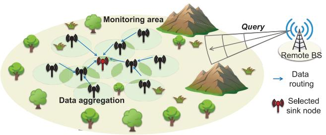

<details>
<summary>flowchart</summary>

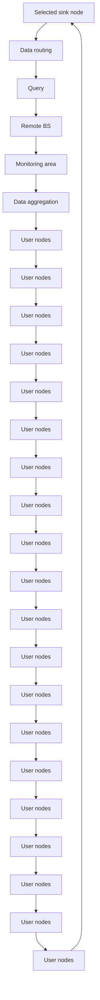
</details>

(a)   
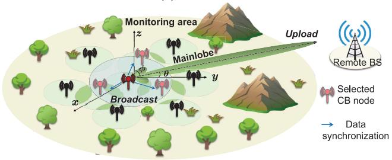

<details>
<summary>flowchart</summary>

```mermaid
graph TD
    A["Broadcast"] --> B["Mainlobe"]
    B --> C["Monitoring area"]
    C --> D["Upload"]
    D --> E["Remote BS"]
    style A fill:#f9f,stroke:#333
    style B fill:#ccf,stroke:#333
    style C fill:#cfc,stroke:#333
    style D fill:#fcc,stroke:#333
    style E fill:#ffc,stroke:#333
    note right of D
        Selected CB node
        Data synchronization
    end
```
</details>

(b)   
Fig. 1. CB-based data harvesting and dissemination system overview. (a) Routing process is activated by a query from the BS. (b) Sketch map and geometrical configuration of CB process after aggregating the data to the sink node.

4) Step 4: The IoT nodes perform data routing and fusion according to the established network topology and TDMA schedule. Note that data fusion is performed at the receiver, and the fused data of the network is finally collected at the sink node.   
5) Step 5: The sink node executes the node selection strategy based on the collected network information, and the selected nodes are regarded as beamforming nodes. The sink node broadcasts data and strategies to the beamforming nodes for CB preparation.   
6) Step 6: The beamforming nodes perform CB and send the fused data to the remote BS.

In such operation mechanisms, the sink node retries the node selection strategy if the beamforming nodes fail during step 5. Likewise, the BS reselects a new sink node if CB data is not received for an extended period. Additionally, the BS can identify fault nodes from the received data and broadcast fault information to the network for updates.

Without loss of generality, we consider a 3-D Cartesian coordinate system, and the positions of the antenna of ith IoT nodand te BS are represented as , respectively. Subsequent $( x _ { i } ^ { \mathrm { I o T } } , y _ { i } ^ { \mathrm { I o T } } , h ^ { \mathrm { I o T } } )$ $( x ^ { \mathrm { B S } } , y ^ { \mathrm { B S } } , h ^ { \mathrm { B S } } )$ key models with respect to data transmission and fusion, including the CB-based communication model, energy model, and data correlation and fusion model.

# B. CB-Based Communication Model

In the CB-based communication model, the positions, transmission power, and initial phase of beamforming nodes determine the performance of communication. Specifically, we let $\left( \phi , \ \theta \right)$ denote any direction centered on the VAA, where $\phi \in [ 0 , \pi ]$ and $\theta \in [ - \pi , \pi ]$ are the elevation and azimuth angles, respectively. According to the electromagnetic wave superposition principle, the array factor (AF) of $N _ { \mathrm { C B } }$ nodes can be approximated as follows [35]:

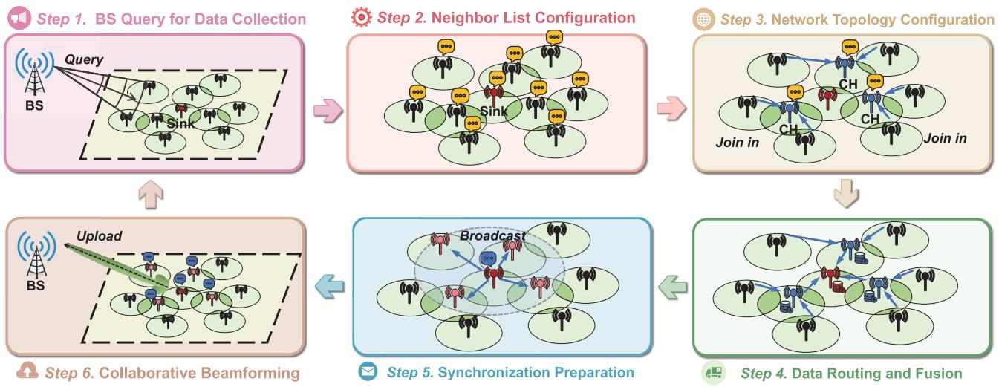

Fig. 2. Network model and operating mechanisms. Each round of data harvesting consists of six steps. Routing and fusion are configured and performed in steps 3 and 4, while synchronization and CB are performed in steps 5 and 6.   
TABLE I NOTATIONS OF THE MAIN CONCEPTIONS 

<table><tr><td></td><td>Symbols</td><td>Definition</td></tr><tr><td rowspan="23">System Model</td><td> $A_i$ </td><td>The monitoring area of IoT node  $i$ </td></tr><tr><td> $h^{IoT}, h^{BS}$ </td><td>Altitudes of the IoT nodes and the remote BS</td></tr><tr><td> $\mathcal{N}$ </td><td>The set of the IoT nodes</td></tr><tr><td> $N_{IoT}, N_{CB}$ </td><td>The total number of IoT nodes and that of nodes performing CB</td></tr><tr><td> $d_{i,j}$ </td><td>The Euclidean distance between nodes  $i$  and  $j$ </td></tr><tr><td> $\mathcal{F}_i$ </td><td>The neighbor list of node  $i$ </td></tr><tr><td> $\text{AF}(\phi, \theta, I)$ </td><td>Array factor</td></tr><tr><td> $G_r, G_t$ </td><td>Receiving gain at the BS and transmitting gain of CB</td></tr><tr><td> $P_r, P_t$ </td><td>Received power at the BS and transmitting power of CB</td></tr><tr><td> $M_i, m_{ij}$ </td><td>The fusion sequence of node  $i$  and its  $j$ th node</td></tr><tr><td> $q_0$ </td><td>Energy dissipation-data fusion</td></tr><tr><td> $r$ </td><td>The monitoring radius of IoT nodes</td></tr><tr><td> $E_{elec}$ </td><td>Energy dissipation-electronic circuit</td></tr><tr><td> $\varepsilon_{fs}, \varepsilon_{mp}$ </td><td>Energy dissipation of free space and multipath amplifiers</td></tr><tr><td> $C_i^j$ </td><td>Data packet size after the fusion with the  $j$ th node in  $M_i$ </td></tr><tr><td> $\alpha_{i,j}$ </td><td>The fusion rate between two autonomous nodes  $i$  and  $j$ </td></tr><tr><td> $\beta_{i,j}$ </td><td>Distance factor for node  $i$  selecting node  $j$  as a relay node</td></tr><tr><td> $E_0$ </td><td>Initial energy of each IoT node</td></tr><tr><td> $\rho_i$ </td><td>Ratio of the overlapping area between node  $i$  and its neighbors</td></tr><tr><td> $\mathcal{G}_t$ </td><td>The topology of the network in the  $t$ th round</td></tr><tr><td> $\mathcal{N}_t, \mathcal{E}_t$ </td><td>The set of alive nodes and directed links in the  $t$ th round</td></tr><tr><td> $T_i$ </td><td>The survival time of node  $i$ </td></tr><tr><td> $T_{(i)}$ </td><td>The  $i$ th element in the sorted survival times of the nodes</td></tr><tr><td rowspan="13">Algorithm</td><td> $P$ </td><td>The lower bound ratio of CH nodes to all nodes in OMRP</td></tr><tr><td> $K$ </td><td>The amplification factor in OMRP</td></tr><tr><td> $\mathcal{S}, s$ </td><td>State space and state vector of environment</td></tr><tr><td> $\mathcal{A}, a$ </td><td>Action space and action vector of agent</td></tr><tr><td> $\mathcal{R}, r$ </td><td>Reward space and reward</td></tr><tr><td> $\mathcal{P}$ </td><td>State transition probability of environment</td></tr><tr><td> $\gamma$ </td><td>Discount factor</td></tr><tr><td> $e_i(t)$ </td><td>The residual energy of node  $i$  in the  $t$ th round</td></tr><tr><td> $v_i(t)$ </td><td>The score of node  $i$  as a beamforming node in the  $t$ th round</td></tr><tr><td> $\zeta_1, \zeta_2$ </td><td>The weights assigned to the throughput and the energy cost</td></tr><tr><td> $\theta_{Q_{new}}, \theta_{Q_{old}}$ </td><td>The parameters of the new and old actor networks</td></tr><tr><td> $\theta_c, \theta_f$ </td><td>The parameters of the critic network and the feature network</td></tr><tr><td> $lr$ </td><td>Learning rate of the training process</td></tr></table>

$$
\mathrm{AF} (\phi , \theta , I) = \sum_ {k = 1} ^ {N _ {\mathrm{CB}}} I _ {k} e ^ {j \Psi_ {k}} e ^ {j \frac {2 \pi}{\lambda} d _ {k} (\phi , \theta)} \tag {1}
$$

where λ is the wavelength, and $I _ { k }$ and $\Psi _ { k }$ are the excitation current weight and initial phase of the kth node, respectively. Furthermore, $\Psi _ { k }$ is defined as follows:

$$
\Psi_ {k} = - \frac {2 \pi}{\lambda} d _ {k} (\phi , \theta) \tag {2}
$$

where $d _ { k } ( \phi , \theta )$ is the Euclidean metric between the kth IoT node and the target BS, and it is expressed as follows:

$$
d _ {k} (\phi , \theta) = \sqrt {L ^ {2} + r _ {k} ^ {2} - 2 r _ {k} L \sin (\theta) \cos (\phi - \delta_ {k})} \tag {3}
$$

where $r _ { k }$ and $\delta _ { k }$ collectively define the polar coordinates of the kth node.

Considering the long distance between the sensing area and the remote BS, the two-ray multipath fading model is used, and the received power at the remote BS is given as follows:

$$
P _ {r} = \frac {P _ {t} G _ {t} G _ {r} h _ {t} ^ {2} h _ {r} ^ {2}}{d ^ {4}} \tag {4}
$$

where $P _ { t } , \ G _ { r } .$ and $G _ { t }$ represent total transmitting power, receiving gain of BS, and transmitting gain of CB, respectively. Moreover, $h _ { t }$ and $h _ { r }$ are the heights of the IoT nodes and BS, and d is the distance between BS and the center of collaborating nodes.

Therefore, the transmission rate from beamforming nodes to BS is as follows:

$$
R _ {B S} = B \log_ {2} \left(1 + \frac {P _ {r}}{\sigma^ {2}}\right) \tag {5}
$$

where B is the bandwidth, and $\sigma ^ { 2 }$ is the noise power.

Based on the above analyses, more beamforming nodes and higher excitation current weight lead to higher received power and transmission rate. However, this will result in more energy consumption during the transmission process.

# C. Energy Model in the Transmission Process of IoT

The energy consumption during the transmission process mainly consists of two parts, which are short-distance communication between nodes and long-distance CB communication between the nodes and the BS. Specifically, the typical firstorder radio model [36] is used for internode communication. Short-distance communication between the nodes considers the free space model and long-distance transmission follows the multipath fading model. The energy required to send and receive b-bit packets over a distance d is given as follows:

$$
E _ {T} (b, d) = \left\{ \begin{array}{l} b \cdot E _ {\mathrm{elec}} + b \cdot \varepsilon_ {f s} \cdot d ^ {2}, \quad d <   d _ {0} \\ b \cdot E _ {\mathrm{elec}} + b \cdot \varepsilon_ {\mathrm{amp}} \cdot d ^ {4}, d \geq d _ {0} \end{array} \right. \tag {6}
$$

$$
E _ {R} (b) = b \cdot E _ {\mathrm{elec}} \tag {7}
$$

where $E _ { \mathrm { e l e c } }$ denotes the per bit energy dissipation that is used for running the transmitter and receiver electronic circuits. Moreover, $\varepsilon _ { f s }$ and $\varepsilon _ { \mathrm { a m p } }$ represent the energy of amplifier for free-space fading and multipath fading, respectively. Finally, $d _ { 0 }$ is the distance threshold to determine the two fading models.

Besides, the total energy consumption of the beamforming nodes during the CB process is as follows:

$$
E _ {\mathrm{CB}} = \sum_ {k = 1} ^ {N _ {\mathrm{CB}}} I _ {k} ^ {2} P _ {0} \cdot \frac {C}{R _ {B S}} \tag {8}
$$

where $P _ { 0 }$ is the maximum transmission power with an excitation current of 1, and C is the size of the data packet after data fusion at the sink node and is also the final packet size to be sent in the CB process.

In general, a larger data volume in transmission leads to more energy consumption. Therefore, it is crucial to eliminate redundancy and fuse data efficiently.

# D. Data Correlation and Fusion Model of IoT

In this model, data collected by individual nodes in each round exhibit spatial correlation, and these nodes can eliminate the redundancy through data fusion [34]. Generally, a proximity of two independent nodes leads to a bigger overlapping monitoring area and tends to increase the redundancy of the data they collect. Without loss of generality, we use spatial monitoring areas to define the correlation model. Specifically, the data redundancy rate between two nodes is zero if there is no overlapping monitoring area. On the contrary, as illustrated in Fig. 3, overlapping areas within their sensing ranges become evident. The magnitude of the overlapping area serves as an indicator of the data redundancy of these nodes. In this case, the fusion rate $\alpha _ { i , j }$ between two autonomous nodes i and j is defined as follows:

$$
\alpha_ {i, j} = \frac {1}{A _ {i}} | A _ {i} \cap A _ {j} |. \tag {9}
$$

Moreover, the fused data packet can be further fused with another packet, the fusion rate is determined by the spatial distribution represented by the data packets. For example, let $M _ { i } = \langle m _ { i 0 } , m _ { i 1 } , \dots , m _ { i | M _ { i } | } \rangle$ denote the fusion sequence of node i, where $m _ { i j }$ denotes the jth node in the fusion sequence for node i, and then the fusion rate between node i and node $m _ { i j }$ is as follows:

$$
\alpha_ {i, j} = \frac {1}{A _ {m _ {i j}}} \bigcup_ {k = 0} ^ {j - 1} A _ {m _ {i k}} \cap A _ {m _ {i j}} \tag {10}
$$

where $A _ { m _ { i j } }$ is the monitoring area of node $m _ { i j } .$ Following this, the size of the fused data packet at node i in this process changes as follows:

$$
C _ {i} ^ {j} = C _ {i} ^ {j - 1} + \big (1 - \alpha_ {i, j} \big) | A _ {j} | \tag {11}
$$

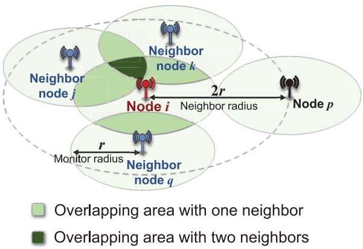

<details>
<summary>flowchart</summary>

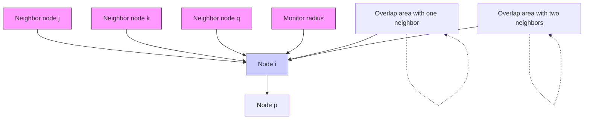
</details>

Fig. 3. Overlapping area of node i with its neighbors j, k, and $q .$ . Note that each node has a monitor radius of r.

where $C _ { i } ^ { j }$ represents the size of the data packet after data fusion between node i and the jth node in $M _ { i } .$ . Note that the data redundancy eliminated in the data fusion process essentially arises from the overlap of spatial sensing data. In this scenario, regardless of the routing methods used, the size of the data packets collected by the IoT nodes, which have the same spatial distribution, remains constant after efficient data fusion. The fused data will have a smaller data size, thereby saving energy during the next hop transmission process.

In the fusion process, downstream nodes (i.e., the nodes that receive the data packets) can scan two packets separately, eliminate redundancy, and generate the fused packet. In this process, the fusion energy cost is calculated as follows:

$$
E _ {\text { fusion }} = q _ {0} (C _ {1} + C _ {2}) \tag {12}
$$

where $q _ { 0 }$ is the standard fusion cost [37], and $C _ { 1 }$ and $C _ { 2 }$ are the sizes of two packets to be fused, respectively.

# IV. PROBLEM DESCRIPTION AND ANALYSIS

In this section, we provide a comprehensive description and analysis of the problem, focusing on the challenges associated with maximizing the network lifetime and total throughput to the remote BS. We describe the roles of nodes, formulate the network topology and node selection mathematically, and introduce our motivation for using routing and beamforming methods to jointly optimize network performance.

# A. Problem Description

The main goal of the considered system is to maximize the network transmission efficiency to the remote BS. This efficiency is determined by two key factors, namely, network lifetime and throughput. In each round of tasks, the system needs to assign different working roles to nodes based on their residual energy and locations within the network as efficiently as possible.

Nodes in the considered system can perform multiple roles. On the one hand, nodes can function as both senders and receivers of data. Upon receiving data from upstream nodes (i.e., the nodes that send the data packets), these nodes might either forward it directly as relay nodes or send it to the downstream nodes after fusing the data. These varying roles shape the topology of the network and routing process, and influence the energy consumption in data fusion and transmission. On the other hand, nodes may be required to act as beamforming nodes during the CB phase to enhance signal gain and energy efficiency, or just to remain idle to save energy. The assignment of beamforming roles impacts both the quality of communication and the residual energy of the nodes.

# B. Problem Analysis

To address these varying roles and their impacts effectively, it is essential to make informed decisions about network topology and node selection at different stages of the network lifetime, as decisions may need to adapt over time to ensure optimal performance.

Mathematically, let a directed graph $\mathcal { G } _ { t } = ( \mathcal { N } _ { t } , \mathcal { E } _ { t } )$ denote the topology of the network in the tth round, where t is the set of alive nodes, and $\mathcal { E } _ { t } = \{ x _ { j i } | x _ { j i } \in \{ 0 , 1 , 2 \} , j \in \mathcal { N } _ { t } , i \in \mathcal { N } _ { t } \}$ is the state set of directed links. In particular, the state variable $x _ { j i }$ indicates whether to select node j to send data to node i and perform data fusion, and $x _ { j i }$ is defined as follows:

$$
x _ {j i} = \left\{ \begin{array}{l l} 0, & j \text {   has   no   directed   links   to   } i \\ 1, & j \text {   forwards   data   to   } i, i \text {   forwards   it } \\ 2, & j \in M _ {i}, i \text {   fuses   the   data   and   forwards   it } \end{array} \right. \tag {13}
$$

where the difference between state $x _ { j i } = 2$ and state $x _ { j i } = 1$ is whether the node i fuses the data from the upstream node j or not.

In summary, (6)–(8), (12), and (13) provide the energy consumption of the IoT nodes in the considered system. Specifically, the network topology and role assignment jointly affect the transmission, reception, and fusion energy consumption in the routing phase. In addition, the final packet size and the selection of beamforming nodes affect the transmission and reception energy consumption for data synchronization (see step 5 of Fig. 2). Finally, the excitation current weight of the beamforming node and the final packet size determine the beamforming energy consumption in the CB process. Considering the six energy consumption components mentioned above, the normalized total power consumption of node i, denoted as $W _ { i } ,$ is calculated as follows:

$$
\begin{array}{l} W _ {i} = \frac {1}{E _ {0}} \left[ E _ {T} \left(C _ {i} ^ {| M _ {i} |}, d _ {i, h}\right) + \sum_ {j \in M _ {i}} E _ {R} \left(C _ {j} ^ {| M _ {j} |}\right) \right. \\ + \sum_ {j \in M _ {i}} q _ {0} \left(C _ {i} ^ {j - 1} + C _ {j} ^ {| M _ {j} |}\right) + I _ {i} ^ {2} P _ {0} \cdot \frac {C _ {s} ^ {| M _ {s} |}}{R _ {B S}} \\ \left. + \overline {{E}} _ {R} \left(C _ {s} ^ {| M _ {s} |}\right) + \overline {{E}} _ {T} \left(C _ {i = s} ^ {| M _ {s} |}, d _ {i, m}\right) \right] \tag {14} \\ \end{array}
$$

where $s , h ,$ and $C _ { s } ^ { | M _ { s } | }$ denote the sink node, the next hop of d the, and e, respectively. Additionally, are the amount of initial ene $E _ { 0 }$ $\overline { { E } } _ { R } ( C _ { s } ^ { | \dot { M } _ { s } | } )$ $\overline { { E } } _ { T } ( \dot { C } _ { i = s } ^ { \vert M _ { s } \vert } , d _ { i , m } )$ 1 the average received, and broadcast energy consumption when node i acts as a beamforming node or a sink node, respectively.

Based on the above analysis, this problem involves longterm network topology management and role assignment, making it difficult to solve with a single method. In addition, existing studies usually consider routing and CB strategies of IoT networks separately. This motivates the joint design of two methods for solving the routing and CB problems.

Next, we introduce the routing and data fusion method based on OMRP, which manages network topology and aggregates fused data at the sink node. Then, we present the CB method based on SoftPPO-LSTM, which selects beamforming nodes based on node distribution and residual energy. The two methods jointly optimize the network lifetime and total throughput to the remote BS.

# V. PROPOSED OVERLAP-BASED MULTIHOP ROUTINGPROTOCOL FOR ROUTING AND DATA FUSION

In this section, we introduce the proposed OMRP routing method, which is based on the location and residual energy of nodes. The OMRP method is performed during steps 3 and 4 in Fig. 2. During these steps, OMRP organizes the network into clusters according to the distribution of CHs. These CHs are responsible for gathering and fusing data packets from the cluster nodes before transmitting the data to the sink node via direct or multihop communication. The protocol leverages spatial data correlation to direct CH selection, data fusion sequence, and relay schemes within the IoT network. Similar to other classic protocols, such as the LEACH protocol and its latest variants [1], [17], [19], OMRP is designed with three stages, which are the setup stage, the formation stage, and the data routing stage, and we detail them as follows.

# A. Setup Stage

In the setup stage, the proposed OMRP aims to update the neighbor list $\mathcal { F }$ and overlapping degree $\rho$ of each node, thereby determining the CHs of the network. To this end, each node is configured with an initial neighbor list $\mathcal { F } _ { i }$ when the network is first deployed. Then, if a node approaches energy depletion, this node will broadcast the SLP\_notify message to its neighbors, prompting them to update their neighbor lists. Based on the updated neighbor lists, the overlapping degree of these nodes can be determined. Let $\rho _ { i }$ represent the ratio of the overlapping area with its neighbors to the total sensing area of node i. This ratio is given by

$$
\rho_ {i} = \frac {1}{A _ {i}} \bigcup_ {j \in \mathcal {F} _ {i}} A _ {i} \cap A _ {j} \tag {15}
$$

where $A _ { i }$ and $\mathcal { F } _ { i }$ are the sensing area and neighbor list of node $i ,$ and $A _ { i } \cap A _ { j }$ denotes the area where node i overlaps with its neighbor j. Fig. 3 illustrates an example of the overlapping area between a node and its three neighbors. Evidently, we have $0 \leq \rho _ { i } \leq 1$ , and when $\rho _ { i } = 1$ , it means that the sensing area of node i is completely covered by its neighbors.

Furthermore, a node with a higher overlapping degree indicates that its sensing area is more extensively covered by neighboring nodes, resulting in increased redundancy in the sensed data during the fusion process. In other words, nodes with a larger overlapping degree add fewer unique data elements to the final packet set after fusion, due to the higher redundancy in their sensed data. Additionally, since a higher overlapping degree suggests the presence of more neighboring nodes, it is likely located at the center of a cluster, making it a more suitable candidate to be selected as a CH.

Therefore, we introduce the overlapping degree ρ in the CH election process. Similar to the CH election mechanism in the LEACH protocol, we design a threshold function to determine the probability of a node being selected as a CH. This threshold function is defined as follows:

$$
T (i) = \left\{ \begin{array}{l l} \frac {P}{1 - P \times \left(r \bmod \frac {1}{P}\right)} K ^ {\rho_ {i}} & i \in G \\ 0, & \text { otherwise } \end{array} \right. \tag {16}
$$

where P and K are two constants representing the lower bound ratio of CH nodes to all nodes and an amplification factor with a minimum value of 1, respectively. Moreover, r is the number of rounds since the last election of the cluster head, and the elements in the set G are the nodes that have not successfully campaigned for CH nodes in the latest r mod (1/P) round.

As such, in the CH election process, each node generates a random number between 0 and 1, determining the CH election result by comparing it with T(i). Specifically, if the random number is less than the threshold value T(i), the node is automatically elected as a CH and notifies other nodes by broadcasting the CH\_notify message within the network. Note that $1 \le K ^ { \rho _ { i } } \le K$ is satisfied in (16), where Kρi serves as the amplification factor to increase the likelihood of nodes with larger overlapping degrees being elected as CHs. Based on the above analysis, this approach increases the possibility of nodes with geographical advantages being elected as CHs, thereby improving the network energy efficiency.

# B. Network Formation Stage

This stage primarily establishes the communication topology and timing schedule within clusters and between clusters.

On the one hand, the communication topology and timing schedule within the cluster are determined by the CHs. Specifically, the CHs broadcast CH\_notify messages within the network, following which the member nodes assess the signal strength of the broadcast and determine which cluster to join. Then, each member node transmits JOIN\_IN message to its CH, following which the CH will extract the overlapping degrees from the received JOIN\_IN messages and sort them in descending order. Finally, the CHs calculate and broadcast the TDMA schedule according to this order, allowing member nodes to transmit data in separate time slots to avoid data collision. In this scenario, node data packets with a higher overlapping degree undergo an earlier fusion, leading to more energy savings in the subsequent fusion process due to the reduced fused packet size.

On the other hand, the communication topology and timing schedule between clusters are determined by the communication scheme between CHs and the sink node. Typically, CHs may forward data packets to the sink node via singlehop or multihop methods. Although relay communication can significantly reduce transmission energy consumption by reducing the distance, incompletely fused data will cause additional receiving energy consumption according to (7). Consequently, the selection of the next hop for the CHs in OMRP is based on the specific network cluster distribution. Accordingly, we will clarify the principles and mechanisms of next-hop selection in OMRP by analyzing a typical scenario shown in Fig. 4. Specifically, CH i has two methods to communicate with the sink node (or next hop), either treating CH j as a relay node or direct communication. Assume that the distance between all nodes is less than the threshold $d _ { 0 }$ and the transmission energy dissipation follows the free-space fading model. According to (6), (7), and (12), the energy consumption of the relay scheme is given by

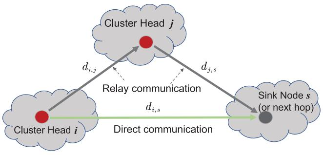

<details>
<summary>flowchart</summary>

```mermaid
graph TD
    A["Cluster Head i"] -->|d_{i,j}| B["Cluster Head j"]
    B -->|d_{j,s}| C["Sink Node s (or next hop)"]
    C -->|d_{i,s}| A
    style A fill:#ccc,stroke:#333
    style B fill:#fff,stroke:#333
    style C fill:#ccc,stroke:#333
```
</details>

Fig. 4. Direct or relay communication method in intercluster routing.

$$
\underbrace {2 b E _ {\text { elec }}} _ {j, s \text {   recieve }} + \underbrace {2 b E _ {\text { elec }} + b \varepsilon_ {f s} \left\{d _ {i , j} ^ {2} + d _ {j , s} ^ {2} \right\}} _ {i - j - s \text {   trans }} + b E _ {\text { fusion }} \tag {17}
$$

where $d _ { i , j }$ is the distance between node i and node j. While the energy consumption for direct communication is given by

$$
\underbrace {b E _ {\text { elec }}} _ {s \text {   recieve }} + \underbrace {b E _ {\text { elec }} + b \varepsilon_ {f s} d _ {i , s} ^ {2}} _ {i \text {   trans }} + b E _ {\text { fusion }}. \tag {18}
$$

As can be seen, the energy difference between the two methods is defined as Δ, which is given by

$$
\Delta = 2 b E _ {\mathrm{elec}} + b \varepsilon_ {f s} \left\{d _ {i, j} ^ {2} + d _ {j, s} ^ {2} - d _ {i, s} ^ {2} \right\}. \tag {19}
$$

This difference determines which method is more energyefficient. To facilitate the choice of an optimal relay node, we define the distance factor for node i selecting node j as a relay node as $\beta _ { i , j } = d _ { i , s } ^ { 2 } - \{ d _ { i , j } ^ { 2 } + d _ { j , s } ^ { 2 } \}$ , and the candidate relay node is determined by βmax = max $\{ \beta _ { i , 1 } , \beta _ { i , 2 } , \ldots , \beta _ { i , j } \}$ . According to (19), the relay scheme remains more energy-efficient than the direct communication scheme when $\beta _ { \mathrm { m a x } } > ( 2 E _ { \mathrm { e l e c } } / \varepsilon _ { f s } )$ . In this case, the proposed OMRP utilizes the energy-saving relay scheme. We summarize the designed setup and network formation stages in Algorithm 1.

# C. Data Routing Stage

In this stage, each node will act as a sender or receiver at a specific time according to the topology and timing schedule determined in the network formation stage, and eventually all the data packets in the network will be collected and forwarded to the sink node. On the one hand, during the allocated time slot for each member node in the cluster, the sensed data is transmitted to its CH while only the transmitting node remains active, and other member nodes in the cluster turn off their transceivers to save energy. Upon receiving a new data packet, the CH performs data fusion and stores the fused data. On the other hand, after collecting all the packets of their cluster or if the time exceeds the timing schedule, the CHs employ carrier-sense multiple access (CSMA) for the subsequent hop transmission and forward the packets to the sink node. Finally, the sink node fuses the received packets and generates the final packets of this round. We summarize the data routing stage in Algorithm 2.

Algorithm 1: Setup and Network Formation of OMRP   
1 Initialization:
Receive query message from the BS calculate $\rho_{i}$ according to Eq. (15). $CH \leftarrow \emptyset, SN \leftarrow \emptyset$ .
2 // Set-up Stage
3 if IoT node i runs out of energy then
4    i broadcasts SLP_notify message;
5 if IoT node j receives SLP_notify message from neighbor k then
6    Recalculate $\rho_{j}$ without considering neighbor k according to Eq. (15);
7 if i is in G then
8 $T(i) \leftarrow K^{\rho_{i}} * p/(1 - p(r \mod 1/p))$ ;
9 else
10 $T(i) \leftarrow 0$ ;
11 // Network Formation Stage
12 IoT node i listens to CH_notify message;
13 if i's random number < T(i) then
14    i broadcasts CH_notify message;
15    Remove i from G;
16    Add i to CH;
17 else
18    Add i to G;
19    Add i to SN;
20 if $i \in CH$ then
21    for each $c_{j} \in CH$ do
22    Add $(\beta_{j}, c_{j})$ to $D_{i}$ ;
23    Find $\beta_{max}$ in $D_{i}$ and get $c_{max}$ ;
24    if $\beta_{max} > 2E_{elec}/\varepsilon_{fs}$ then
25    i sends a RELAY message to $c_{max}$ ;
26    Form relay agreement between i and $c_{max}$ ;
27 else if $i \in SN$ then
28    i joins the closest cluster;
29 Start data transmission;
30 $r \leftarrow r + 1$ ;

After executing OMRP during the third and fourth steps of the system (see Fig. 2), the data packets of the network are gathered and fused at the sink node. The next section will introduce the proposed SoftPPO-LSTM-based CB method, which is designed for data transmission to the remote BS.

# VI. PROPOSED SOFTPPO-LSTM FOR CB

In this section, we present the proposed SoftPPO-LSTM, which is adapted to the routing method. The SoftPPO-LSTM method is applied at the beginning of step 5 to generate a node selection scheme, which is then executed during steps 5 and 6 in Fig. 2. Specifically, the sink node collects

Algorithm 2: Intracluster and Intercluster Routing of OMRP   
1 for $c_{j} \in CH$ do
2    Listen JOIN_IN messages from SN;
3    Get $R = \{\rho_{1}, \rho_{2}, ..., \rho_{m}\}$ from JOIN_IN messages;
4    Sort R in descending order;
5    Broadcast timing schedule according R;
6 if $i \in SN$ then
7    Transmit data to i's CH by schedule;
8 if $i \in CH$ then
9    while time < timing schedule do
10    i listens and receives data;
11    if i receives data from cluster member then
12    Fuse data;
13    Transmit data to next hop using CSMA;

and aggregates the data, selects enough adjacent nodes as beamforming nodes, synchronizes the data and CB strategy with them, and collaboratively transmits the data to the remote BS using CB. During this stage, the selection and excitation current weights of the nodes need to be optimized. In this article, we utilize the DRL method to obtain an optimal CB policy. The motivations for using DRL, the node selection problem formulation, the Markov decision process (MDP) formulation, and our proposed SoftPPO-LSTM algorithm are as follows.

# A. Motivations for Using DRL

For the CB scheme, there are several factors, including distance, residual energy, and node location, that need to be considered. For example, the nodes far away from the sink node will cause excessive transmission energy consumption in the data synchronization process. Moreover, the nodes with low residual energy participating in CB may accelerate their energy depletion. In addition, the nodes located at the network edge are typically not near the sink node. Note that the sink nodes of different rounds may change, and the residual energy of the nodes may also decrease at different rates. The dynamic nature of the above factors requires an online method to determine the CB strategy. Similarly, since the considered optimization objective is on a long-term time scale of multiple rounds, the CB strategy needs to balance both the long-term and short-term benefits.

Considering the aforementioned reasons, DRL is a suitable method for CB because it excels at intuitively learning node strategies for different geographic contexts, thereby overcoming the limitations of traditional methods.

# B. CB Node Selection Problem Formulation

The DRL algorithm optimizes the network lifetime and throughput by configuring beamforming nodes during the CB process. According to (14), the survival time of node i can be expressed as $T _ { i } = 1 / W _ { i } .$ We sort the survival times in ascending order as $\langle T _ { ( 1 ) } , T _ { ( 2 ) } , \ldots , T _ { ( n ) } \rangle$ , and define network lifetime as the time when the number of nodes that have run out of energy exceeds the proportion p of the total network nodes. The network lifetime should be maximized, which can be expressed as follows:

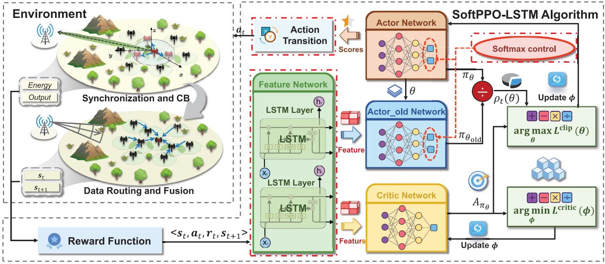

<details>
<summary>flowchart</summary>

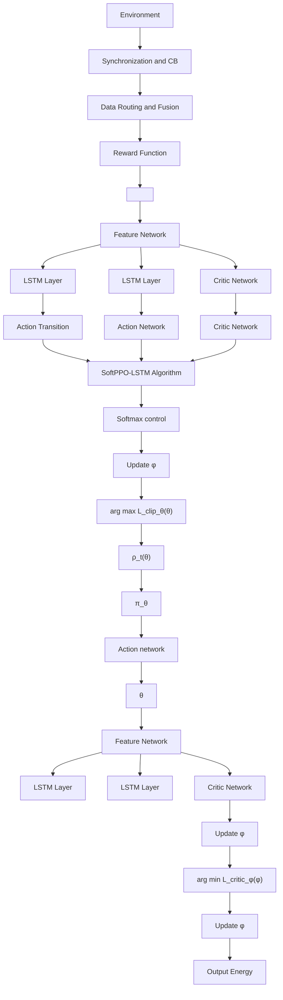
</details>

Fig. 5. Framework of the SoftPPO-LSTM model in the training phase.

$$
f _ {1} (\mathbb {I}) = T _ {(\lceil p (n - 1) \rceil + 1)} \tag {20}
$$

where $\mathbb { I } = \{ I _ { t , k } | 0 < t \leq T _ { ( \lceil p ( n - 1 ) \rceil + 1 ) } , k \in \mathcal { N } _ { t } \}$ denotes excitation current weight sequence during the network lifetime.

Accordingly, let $\overline { { C } } _ { \mathrm { s i n k } }$ be the average fused data packet size at the sink node, the network total throughput to the remote BS can be expressed as follows:

$$
f _ {2} (\mathbb {I}) = \overline {{{C}}} _ {\text { sink }} T _ {(\lceil p (n - 1) \rceil + 1)}. \tag {21}
$$

As can be seen, the two objectives are controlled by the same decision variable I. The multiobjective-problem based on the aforementioned two objectives is formulated as follows:

$$
\max _ {\mathbb {I}} F = (f _ {1}, f _ {2}) \tag {22a}
$$

$$
\text { s.t. } 0 \leq I _ {t, k} \leq 1, t \leq f _ {1} \forall k \in \mathcal {N} \tag {22b}
$$

$$
x _ {j i} \in \{0, 1, 2 \} \forall i, j \in \mathcal {N} \tag {22c}
$$

$$
0 \leq \alpha_ {i, j} \leq 1 \forall i, j \in \mathcal {N} \tag {22d}
$$

$$
d _ {i j} \leq d _ {\max} \forall x _ {j i} \in \{0, 1, 2 \}, i, j \in \mathcal {N} \tag {22e}
$$

$$
0 <   p \leq 1. \tag {22f}
$$

Based on the aforementioned analyses, we transform the problem of optimizing the decision variable I into an MDP in the following.

# C. MDP Formulation

Mathematically, an MDP can be denoted as a tuple $( S , \mathcal { A } , \mathcal { P } , \mathcal { R } , \gamma )$ , in which $s , { \mathcal { A } } , { \mathcal { P } } , { \mathcal { R } }$ , and $\gamma$ denote the state set, action set, state transition probability, reward function and discount factor, respectively. Here, we detail the design of state space, action space, and reward in our model.

1) State Space: The state space includes residual energy and distance to the sink node, as these factors directly influence action decisions, further affecting the lifespan of the nodes, and the energy cost of the CB process. Moreover, the location information of the node is included in the state space, as nodes in different locations have varying degrees of location advantage. As such, the state $s _ { t }$ is as follows:

$$
\mathbf {s} _ {t} = \{e _ {i} (t), d _ {i, s} (t) | i \in \mathcal {N} \}, \tag {23}
$$

where $e _ { i } ( t )$ denotes the residual energy of node i, and $d _ { i , s } ( t )$ is the distance between node i and the sink node. These values can be derived or computed from the upstream packets of the nodes.

2) Action Space: After obtaining the state, the sink agent selects beamforming nodes. To ensure the received signal power at the remote BS is above the threshold for stable communication, the total power of beamforming nodes must be sufficient. Assuming all nodes participating in CB use rated power and perform perfect beamforming, only the selection of IoT nodes needs to be optimized. With the discrete action space, each node can be selected or unselected, resulting in an enormous action space size of $2 ^ { N }$ . In this case, DRL methods face challenges in solving the problem, particularly when the number of IoT nodes N is large. Therefore, we convert the subset selection action into an N-dimensional continuous scoring vector for each node, substantially simplifying the problem-solving process. As such, the action of the sink agent $a _ { t }$ is as follows:

$$
\boldsymbol {a} _ {t} = \left\{\upsilon_ {i} (t) \mid i \in \mathcal {N} \right\} \tag {24}
$$

where $0 \leq \upsilon _ { i } ( t ) \leq 1$ is the score of node i for acting as a beamforming node. In this case, the subset selection solution is generated from $\pmb { a } _ { t }$ by sampling from the N-dimensional score vector, and the sampling satisfies (22b).

3) Reward Function: To extend the network lifetime and increase total throughput, the reward function considers the network energy consumption and the throughput delivered to the remote BS in each round, which is given as follows:

$$
\boldsymbol {r} _ {t} = \zeta_ {1} C _ {t} - \zeta_ {2} \sum_ {i = 1} ^ {N} (e _ {i} (t) - e _ {i} (t + 1)) \tag {25}
$$

where $C _ { t }$ is the throughput of the tth round, and $e _ { i } ( t )$ denotes the residual energy of node i in the tth round. The parameters $\zeta _ { 1 }$ and $\zeta _ { 2 }$ are the weights assigned to the throughput and the energy cost, respectively.

As can be seen, the MDP captures the essential aspects of the considered system by incorporating a comprehensive state space, a practical action space, and a carefully designed reward function. Note that the OMRP will influence the new state of the next round. This enables the DRL agent, which operates at the sink node, to adapt to the OMRP during training and improve the selection of decision variables I. In the following, we will introduce the SoftPPO-LSTM Algorithm, which is tailored to leverage this MDP framework for enhanced network lifetime and throughput.

# D. SoftPPO-LSTM Algorithm

In this section, we adopt PPO as the solving framework and present an enhanced version of the PPO algorithm, namely, SoftPPO-LSTM. SoftPPO-LSTM integrates two key features which are softmax control and LSTM layers to simplify the solution space and facilitate continuous and stable learning over long rounds.

1) PPO Algorithm: PPO is a state-of-the-art reinforcement learning algorithm based on policy. The objective of PPO is to improve the policy parameters for achieving high state values, which is expressed as follows:

$$
\max _ {\theta} J (\theta) = \mathbb {E} _ {\pi_ {\theta}} \left[ \sum_ {t = 1} ^ {T} \gamma^ {t} r _ {t} \right]. \tag {26}
$$

Moreover, PPO enforces a clip on the ratio of the new policy probability to the old policy probability, thereby ensuring that policy updates are within a safe and bounded range. To this end, PPO improves the policy using a surrogate objective that constrains policy updates. Let $A _ { \pi _ { \theta } }$ be the advantage function, then the constraint is expressed as follows:

$$
L ^ {\text { clip }} (\theta) = \mathbb {E} _ {t} \left[ \min \left(\rho_ {t} (\theta) A _ {\pi_ {\theta}} (s _ {t}, a _ {t}), \rho_ {t} ^ {\text { clip }} (\theta) A _ {\pi_ {\theta}} (s _ {t}, a _ {t})\right) \right] \tag {27}
$$

where $\theta$ and $\rho _ { t } ( \theta )$ are the policy parameters and the ratio of new and old policy probabilities, respectively. Moreover, $\rho _ { t } ^ { \mathrm { c l i p } } ( \theta ) = \mathrm { c l i p } ( \rho _ { t } ( \theta ) , \bar { 1 } - \epsilon , 1 + \epsilon )$ ρclipt (θ ) = clip(ρt(θ ), 1 − , 1 + ) is a clipped value of ρt(θ ), $\rho _ { t } ( \theta )$ where  is a hyperparameter that controls the size of the policy update. As such, PPO combines this surrogate objective with multiple epochs of data to iteratively update the policy while avoiding large policy deviations, resulting in stable learning.

However, in solving the considered MDP, one episode contains hundreds of timesteps, which lead to credit assignment issues [38]. At the same time, the packet routing in the environment is heuristic, and the long-term adaptability of the agent to the routing strategy is also a challenge. Furthermore, our system contains hundreds of IoT nodes, leading to a vast state and action space within the MDP framework. In particular, it is challenging for the PPO agent to produce continuous action space variables with hundreds of dimensions during hundreds of timesteps. In this case, we improve the PPO algorithm to make it suitable for our MDP in the following.

2) Softmax Control-Based Enhancement: We introduce softmax control to enhance learning stability for our largescale discrete action spaces. On the one hand, softmax operations excel in handling classification selections and reducing the volatility of neuron signals, making them well suited for our optimization problem. The softmax function is defined as follows:

$$
\operatorname{Softmax} (x) = \frac {e ^ {x _ {i}}}{\sum_ {i = 1} ^ {N} e ^ {x _ {i}}} \tag {28}
$$

where the input vector x is converted to a probability distribution. In this case, softmax facilitates a nuanced understanding of the relative importance of the original action and guides the training process toward a more systematic exploration of these actions. On the other hand, it ensures stable policy updates by smoothing backpropagation gradients, which is well suited for our optimization problem with sharp gradients due to the discrete action spaces.

3) LSTM-Based Network Structure: We introduce LSTM layers into the feature network of our SoftPPO-LSTM algorithm to enhance the temporal processing and inference capabilities. On the one hand, LSTMs excel in guiding training over long episodes with time-series data, making them well suited for our environments that unfold over extended timesteps. Specifically, the LSTM unit consists of a cell, an input gate, an output gate, and a forget gate. The cell remembers values over arbitrary time intervals, while the gates regulate the flow of information into and out of the cell. This structure enables the LSTM to manage temporal dependencies by selectively filtering information at each time step. The operations of an LSTM cell at time step t can be described as follows:

$$
f _ {t} = \sigma \left(W _ {f} \cdot \left[ h _ {t - 1}, x _ {t} \right] + b _ {f}\right) \tag {29}
$$

$$
i _ {t} = \sigma \left(W _ {i} \cdot \left[ h _ {t - 1}, x _ {t} \right] + b _ {i}\right) \tag {30}
$$

$$
\tilde {C} _ {t} = \tanh \left(W _ {C} \cdot \left[ h _ {t - 1}, x _ {t} \right] + b _ {C}\right) \tag {31}
$$

$$
C _ {t} = f _ {t} * C _ {t - 1} + i _ {t} * \tilde {C} _ {t} \tag {32}
$$

$$
o _ {t} = \sigma \left(W _ {o} \cdot \left[ h _ {t - 1}, x _ {t} \right] + b _ {o}\right) \tag {33}
$$

$$
h _ {t} = o _ {t} * \tanh (C _ {t}) \tag {34}
$$

where σ denotes the sigmoid function, and ∗ denotes an element-wise multiplication. The variables $f _ { t } , \ i _ { t } ,$ and $o _ { t }$ are the forget, input, and output gates, respectively. The variables $\tilde { C } _ { t } , C _ { t } ,$ and $h _ { t }$ are the candidate cell state, the cell state, and the hidden state, respectively. On the other hand, LSTMs are well suited for environments with partial observability because they can infer hidden states from sequences of observations. In our scenario, the environment first executes a heuristic-based routing policy to determine the current state, which is then provided to the DRL agent as an observation. In this case, the ability of LSTM to infer hidden states from sequences of partial observations fits well with this heuristic routing method, as it enables the DRL model to capture underlying patterns and dynamics and helps the agent better predict future states and make informed decisions. Consequently, this approach not only strengthens the strategic depth of the agent but also improves adaptability and overall performance in dynamically changing and partially observable environments.

4) Main Steps of SoftPPO-LSTM Algorithm for the CB Process: As shown in Fig. 5, SoftPPO-LSTM employs two neural networks, i.e., an actor neural network which is responsible for policy learning and a critic neural network that estimates the state value function and the advantage function. To ensure stable policy updates, SoftPPO-LSTM maintains an actor old network with identical parameters to calculate the clipping ratio. The current state $s _ { t }$ is fed into the feature network to produce features, which are then input into the actor network and critic network to generate the action $a _ { t }$ and the critic value, respectively. Following the execution of this action, the environment generates the corresponding reward $r _ { t }$ and the next state $s _ { t + 1 }$ . This process forms a fundamental transition within the framework of reinforcement learning.

The main steps of the proposed CB policy based on the SoftPPO-LSTM algorithm are shown in Algorithm $3 .$ Specifically, the algorithm begins by initializing the neural network parameters. Then, SoftPPO-LSTM proceeds to execute episodes of interactions with the environment. Within each episode, the environment and state are reset. For each time slot, the algorithm generates actions, interacts with the environment, and receives the reward and new state observations. Moreover, the algorithm periodically updates the actor and critic neural network parameters. This process repeats until all specified episodes are completed, and the algorithm continuously refines its policy for reinforcement learning tasks.

5) Complexity Analysis of SoftPPO-LSTM: The computational and space complexity of SoftPPO-LSTM during training and execution phases are analyzed.

The computational complexity of SoftPPO-LSTM during the training phase is $\mathcal { O } ( ( 1 + 2 M T ) ( | \theta _ { Q _ { \mathrm { n e w } } } | + | \theta _ { c } | + | \theta _ { f } | ) + ( 1 +$ $2 M T / d ) | \theta _ { Q _ { 0 } | \mathrm { d } } | + N M T ( V + 2 ) )$ , which can be summarized as follows.

1) Network Initialization: This phase involves the initialization of network parameters. Specifically, the computational complexity is expressed as $\mathcal { O } ( | \pmb { \theta } _ { Q _ { \mathrm { n e w } } } | +$ $| \pmb { \theta } _ { c } | + | \pmb { \theta } _ { f } | + | \pmb { \theta } _ { Q _ { 0 1 \mathbf { d } } } | )$ , where the | · | operation represents the number of parameters in the networks.   
2) Action Transition: This phase entails transforming actions according to the output scores of the actor network, and its complexity is (NMT). Here, M denotes the number of training episodes, T is the number of steps per episode, and N is the number of IoT nodes.   
3) Reward Calculation and State Transitions: The computational complexity of reward calculation and state transitions is $\mathcal { O } ( N M T ( V + 1 ) )$ , where V represents the complexity of interacting with the environment.   
4) Network Update: The updating phase is divided into three main parts that are frequent updates of the feature network and critic network, as well as less frequent updates of the actor network. Thus, the complexity of this phase is calculated as $\mathcal { O } ( M T ( 2 \vert \pmb { \theta } _ { Q _ { \mathrm { n e w } } } \vert ) + M T ( 2 \vert \pmb { \theta } _ { c } \vert ) +$

Algorithm 3: CB Policy Based on SoftPPO-LSTM   
1 Initialize actor network $Q_{new}$ with parameters $\theta_{Q_{new}}$ , and then copy it to $Q_{old}$ ;
2 Initialize the feature network denoted as $\varepsilon_{f}$ with parameter $\theta_{f}$ , and the critic network denoted as $\varepsilon_{c}$ with $\theta_{c}$ ;
3 step $\leftarrow$ 0;
4 for training episode = 1 to M do
5 Reset the environment and execute Algorithms. 1 and 2 to get the initial state $s_{0}$ ;
6 for round t = 1 to T do
7 Select action $a_{t} = \{v_{i}(t) | i \in N\}$ 8 Transform $a_{t}$ into a node selection set by softmax and action sampling;
9 Execute CB strategy in the environment and generate the reward $r_{t}$ by using (25);
10 Execute routing Algorithm. 1 and 2 to generate the next state $s_{t+1}$ ;
11 Update the critic network parameters $\theta_{c}$ ;
12 Update the feature network parameters $\theta_{f}$ ;
13 Update the new actor network parameters $\theta_{Q_{new}}$ ;
14 if step mod d then
15 Update the old actor network parameters $\theta_{Q_{old}}$ according to (27);
16 end
17 step $\leftarrow$ step + 1
18 end
19 end

$M T ( 2 | \pmb { \theta } _ { f } | ) + M T / d ( 2 | \pmb { \theta } _ { Q _ { o l d } } | ) )$ , where d is the updating interval of the old actor network.

Besides, the space complexity of SoftPPO-LSTM during the training phase is $\mathcal { O } ( | \pmb { \theta } _ { Q _ { \mathrm { n e w } } } | + | \pmb { \theta } _ { Q _ { o l d } } | + | \pmb { \theta } _ { f } | + | \pmb { \theta } _ { c } | + 2 | \pmb { s } | + | \pmb { a } | ) )$ , where |s| and |a| denote the dimensions of the state and action spaces, respectively.

During the execution phase, the computational complexity of SoftPPO-LSTM is $\mathcal { O } ( M T ( | \theta _ { Q _ { 0 1 \mathbf { d } } } | + | \theta _ { f } | ) + N M T )$ , which can be contributed by action selection and transition according to the current state using the feature and actor network. Moreover, the space complexity during the execution phase is $\mathcal { O } ( | \pmb { \theta } _ { Q _ { 0 1 \mathbf { d } } } | + | \pmb { \theta } _ { f } | + | \pmb { s } | )$ since the feature and actor network parameters need to be stored in memory for action selection.

# E. Practical Implementation of SoftPPO-LSTM Algorithm

In this section, we provide an edge computing paradigm for applying our method in practical scenarios, particularly regarding the distinction between the training and deployment phases of our algorithm.

1) Training Phase: Similar to many advanced machine learning techniques, the SoftPPO-LSTM model requires extensive training to reach convergence before being deployed in practical settings. Therefore, we recommend edge computing paradigms, where training occurs on a central controller with sufficient computing power. In this case, the proposed method interacts with a simulation environment constructed by using precollected real-world data, such as location and energy.

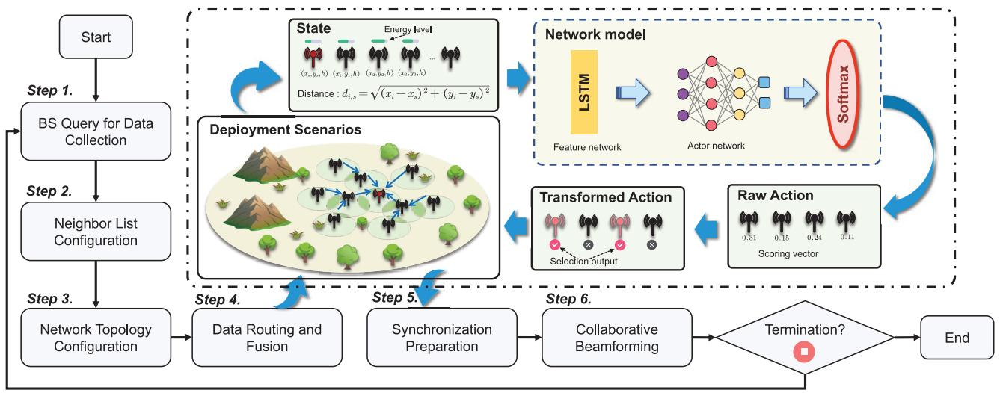

<details>
<summary>flowchart</summary>

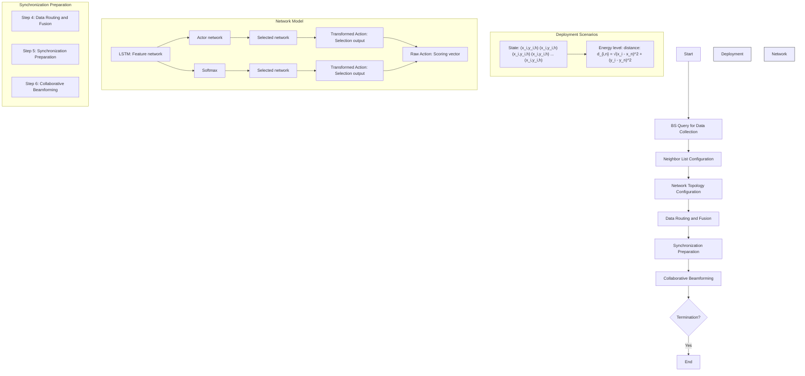
</details>

Fig. 6. Flowchart of our system in the deployment phase. The OMRP method is performed during steps 3 and 4. The SoftPPO-LSTM method is performed at the start of step 5, and the generated action is then executed during steps 5 and 6.   
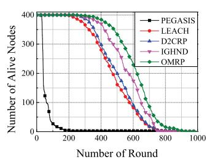

<details>
<summary>line</summary>

| Number of Round | PEGASIS | LEACH | D2CRP | IGHND | OMRP |
| --------------- | ------- | ----- | ----- | ----- | ---- |
| 0               | 400     | 400   | 400   | 400   | 400  |
| 200             | 10      | 380   | 370   | 390   | 395  |
| 400             | 0       | 250   | 260   | 300   | 320  |
| 600             | 0       | 150   | 160   | 200   | 220  |
| 800             | 0       | 50    | 60    | 100   | 120  |
| 1000            | 0       | 0     | 0     | 0     | 0    |
</details>

(a)

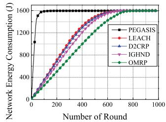

<details>
<summary>line</summary>

| Number of Round | PEGASIS | LEACH | D2CRP | IGHND | OMRP |
| --------------- | ------- | ----- | ----- | ----- | ---- |
| 0               | 0       | 0     | 0     | 0     | 0    |
| 100             | 1600    | 400   | 350   | 300   | 250  |
| 200             | 1600    | 800   | 750   | 700   | 650  |
| 300             | 1600    | 1200  | 1150  | 1100  | 1050 |
| 400             | 1600    | 1450  | 1400  | 1350  | 1300 |
| 500             | 1600    | 1600  | 1550  | 1500  | 1450 |
| 600             | 1600    | 1600  | 1600  | 1550  | 1550 |
| 700             | 1600    | 1600  | 1600  | 1600  | 1600 |
| 800             | 1600    | 1600  | 1600  | 1600  | 1600 |
| 900             | 1600    | 1600  | 1600  | 1600  | 1600 |
| 1000            | 1600    | 1600  | 1600  | 1600  | 1600 |
</details>

(b)

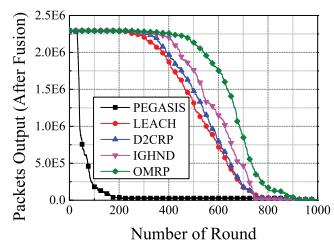

<details>
<summary>line</summary>

| Number of Round | PEGASIS | LEACH | D2CRP | IGHD | OMRP |
| --------------- | ------- | ----- | ----- | ---- | ---- |
| 0               | 2.5E6   | 2.5E6 | 2.5E6 | 2.5E6 | 2.5E6 |
| 200             | 1.0E5   | 2.3E6 | 2.3E6 | 2.3E6 | 2.3E6 |
| 400             | 5.0E4   | 2.0E6 | 2.0E6 | 2.0E6 | 2.0E6 |
| 600             | 2.0E4   | 1.5E6 | 1.5E6 | 1.5E6 | 1.5E6 |
| 800             | 1.0E4   | 5.0E5 | 5.0E5 | 5.0E5 | 5.0E5 |
| 1000            | 5.0E3   | 2.5E5 | 2.5E5 | 2.5E5 | 2.5E5 |
</details>

(c)

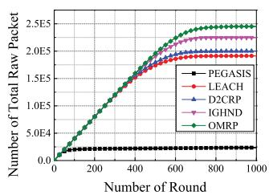

<details>
<summary>line</summary>

| Number of Round | PEGASIS | LEACH | D2CRP | IGHND | OMRP |
| --------------- | ------- | ----- | ----- | ----- | ---- |
| 0               | 0       | 0     | 0     | 0     | 0    |
| 200             | 0       | 0     | 0     | 0     | 0    |
| 400             | 0       | 0     | 0     | 0     | 0    |
| 600             | 0       | 0     | 0     | 0     | 0    |
| 800             | 0       | 0     | 0     | 0     | 0    |
| 1000            | 0       | 0     | 0     | 0     | 0    |
</details>

(d)   
Fig. 7. Performance of different routing protocols. (a) Comparison of network lifetime. (b) Comparison of network energy consumption. (c) Comparison of packet size output to BS. (d) Comparison of the number of raw packets to BS.

2) Deployment Phase: During the deployment phase, the well-trained model receives the state information from the real environment to make decisions. Fig. 6 shows the flow chart of our system in the deployment phase. In this case, the output decisions guide the synchronization preparation and CB in steps 5 and 6. Note that these DRL models are executed by the IoT nodes and the deployment experiment is provided in Section VIII.   
3) Environment Changes: In real-world deployment scenarios, environmental changes, such as electromagnetic interference and hardware failures, can potentially cause beamforming nodes to fail to perform CB accurately [39], [40]. As such, the deployed model may need to be frequently updated to address these events. In this case, the BS can act as an intermediate, forwarding real-time network data to a centralized cloud server where the SoftPPO-LSTM model can be periodically retrained with the latest information. Then, the updated model can be efficiently distributed to the IoT nodes through the network.

# VII. SIMULATION AND ANALYSIS

In this section, we present the simulation results and analyses for our IoT communication system, focusing on both routing methods and CB methods. We first introduce the simulation setting and benchmarks, and then provide the simulation results and analyses of the OMRP-based routing method and SoftPPO-LSTM-based CB method.

# A. Simulation Setups

1) Simulation Platform: Our experiments are conducted using a computing setup that includes an NVIDIA GeForce RTX 4090 GPU with 24 GB of memory and a 13th Gen Intel Core i9-13900K 32-core processor with 128 GB of RAM. The operating system on the workstation is Ubuntu 22.04.3 LTS. For our deep learning computations, we use PyTorch 2.0.1, along with CUDA 11.8.   
2) Environmental Details: This study considers an IoT network consisting of 400 homogeneous IoT nodes, each equipped with a transmit power of 0.1 W. The IoT nodes are randomly deployed in a 200 m × 200 m square region, with the remote BS located 1000 m outside the region at coordinates (100 m, 1200 m). Each IoT node operates at a bandwidth of 100 kHz, and the background noise level is set at −174 dBm/Hz. To ensure a balance between energy consumption for routing and CB processes while maintaining the quality of uplink communication, the minimum received power at the remote BS is set to −52 dBm [17].

In our scenario, since considerations of radiation interference and sidelobe levels are not necessary for the scenario, the excitation current weight for the nodes participating in CB is set to the maximum value of 1. Based on the above configurations, (4) shows that the involvement of ten nodes in CB are sufficient to maintain normal communication quality, achieving a signal-to-noise ratio of approximately 24 dB. In addition, we consider the energy dissipation of the CB process as zero and the initial energy of each node $E _ { 0 }$ as 4.0 J for the comparative analysis of the routing policies. Furthermore, the routing policy of the environment in the simulation of CB policies is configured to the proposed OMRP. Since synchronization and transmission energy dissipation in the CB process are considered, we set the initial energy of each node $E _ { 0 }$ to 6.0 J. Table II provides other details about the radio model and the network.

TABLE II SIMULATION PARAMETERS 

<table><tr><td>Parameter</td><td>Value</td></tr><tr><td>Network size</td><td>200 m × 200 m</td></tr><tr><td>Position of the BS</td><td>(100 m, 1200 m)</td></tr><tr><td>Number of nodes: N</td><td>400</td></tr><tr><td>The monitor radius of IoT nodes</td><td>6.0 m</td></tr><tr><td>Initial energy of each node:  $E_0$ </td><td>4.0 J / 6.0 J</td></tr><tr><td>Altitudes of the IoT nodes:  $h_t$ </td><td>1.5 m</td></tr><tr><td>Altitudes of the BS:  $h_r$ </td><td>20 m</td></tr><tr><td>Energy dissipation-electronic circuit:  $E_{elec}$ </td><td>50 nJ/bit</td></tr><tr><td>Energy dissipation-free space amplifier:  $\varepsilon_{fs}$ </td><td>10 pJ/bit/m2</td></tr><tr><td>Energy dissipation-multipath amplifier:  $\varepsilon_{mp}$ </td><td>0.0013 pJ/bit/m4</td></tr><tr><td>Energy dissipation-data fusion:  $q_0$ </td><td>20 nJ/bit</td></tr><tr><td>Length of data packet</td><td>10000 bits</td></tr><tr><td>Length of control packet</td><td>200 bits</td></tr></table>

# B. Simulation and Analysis of OMRP

To demonstrate the superiority of our proposed OMRP, we compare OMRP with four well-known hierarchical routing protocols: 1) PEGASIS [41]; 2) LEACH [17]; 3) D2CRP [19]; and 4) IGHND [42]. The experimental results are then analyzed with a focus on network lifetime, packet throughput, and the number of raw packets to the BS.

1) Comparisons of Network Lifetime: To demonstrate that the OMRP protocol can effectively slow down the death rate of nodes and extend the network lifetime, we show the relationship between the number of alive nodes and the number of running rounds of the five protocols in Fig. 7(a). Additionally, the simulation results of the round of first node death (FND), half node death (HND), and all node death (AND) are presented in Table III.

We can see from Fig. 7(a) that PEGASIS is the first protocol to experience node deaths, followed by LEACH, D2CRP, IGHND, and the proposed OMRP. As the rounds increase, the PEGASIS curve shows a steep decline, which can be attributed to the formation of long chains in PEGASIS, leading to higher energy dissipation during data fusion. As shown in Table III, the overall network lifetime (measured by the round of AND) under OMRP is approximately 19% longer than LEACH and 17% longer than both D2CRP and IGHND. It is clear that OMRP achieves the best performance in these three metrics due to its lower node death rate and longer network lifetime.

We attribute the slower node death rate of OMRP is mainly due to the introduction of the overlapping degree in the CH competition process. Nodes exhibiting higher overlapping degrees tend to be positioned closer to geographical center of the cluster, making their election as CHs conducive to reducing the transmission energy required by cluster members. By linking the likelihood of the election of a node as a CH to its overlapping degree, energy dissipation in the initial phases of the network is made more efficient.

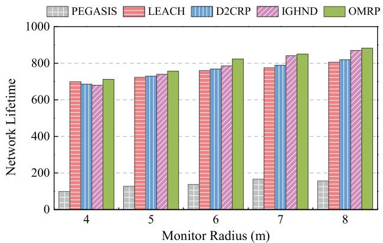

<details>
<summary>bar</summary>

| Monitor Radius (m) | PEGASIS | LEACH | D2CRP | IGHND | OMRP |
|---|---|---|---|---|---|
| 4 | 100 | 700 | 680 | 670 | 710 |
| 5 | 120 | 720 | 730 | 740 | 750 |
| 6 | 130 | 750 | 770 | 780 | 820 |
| 7 | 160 | 770 | 790 | 840 | 850 |
| 8 | 150 | 800 | 810 | 860 | 880 |
</details>

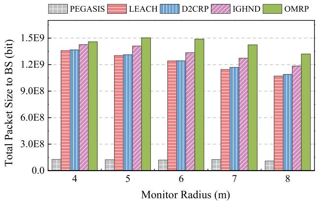

<details>
<summary>bar</summary>

| Monitor Radius (m) | PEGASIS | LEACH | D2CRP | IGHND | OMRP |
| ------------------ | ------- | ----- | ----- | ----- | ---- |
| 4                  | 1.5E8   | 1.35E8 | 1.35E8 | 1.45E8 | 1.45E8 |
| 5                  | 1.5E8   | 1.35E8 | 1.35E8 | 1.45E8 | 1.5E8 |
| 6                  | 1.5E8   | 1.25E8 | 1.25E8 | 1.35E8 | 1.5E8 |
| 7                  | 1.5E8   | 1.25E8 | 1.25E8 | 1.35E8 | 1.45E8 |
| 8                  | 1.5E8   | 1.25E8 | 1.25E8 | 1.35E8 | 1.35E8 |
</details>

Fig. 8. Comparison of routing protocols under different monitoring radii. (a) Network lifetime. (b) Throughput.

TABLE III COMPARISON OF FND, HND, AND AND 

<table><tr><td>Protocol</td><td>FND</td><td>HND</td><td>AND</td></tr><tr><td>PEGASIS</td><td>21</td><td>41</td><td>155</td></tr><tr><td>LEACH</td><td>187</td><td>473</td><td>733</td></tr><tr><td>D2CRP</td><td>236</td><td>499</td><td>743</td></tr><tr><td>IGHND</td><td>229</td><td>573</td><td>742</td></tr><tr><td>OMRP</td><td>271</td><td>624</td><td>870</td></tr></table>

TABLE IV COMPARISONS OF FND-HND, HND-AND, AND 1-AND AVERAGE NETWORK ENERGY CONSUMPTION RATE 

<table><tr><td>Protocol</td><td>FND-HND</td><td>HND-AND</td><td>1-AND</td></tr><tr><td>PEGASIS</td><td>30.501 J/round</td><td>1.263 J/round</td><td>5.634 J/round</td></tr><tr><td>LEACH</td><td>2.762 J/round</td><td>0.547 J/round</td><td>1.707 J/round</td></tr><tr><td>D2CRP</td><td>2.509 J/round</td><td>0.539 J/round</td><td>1.561 J/round</td></tr><tr><td>IGHND</td><td>2.346 J/round</td><td>0.463 J/round</td><td>1.728 J/round</td></tr><tr><td>OMRP</td><td>2.215 J/round</td><td>0.571 J/round</td><td>1.540 J/round</td></tr></table>

2) Comparisons of Network Energy Consumption: The network energy consumption is used to measure the performance of the routing protocols. With no external energy supply, the protocol performs better if less energy is consumed in the network after the same rounds. The network energy consumption comparison of the five protocols is shown in Fig. 7(b) and Table IV. Specifically, the energy consumption rate of PEGASIS is very high during the period from the HND to half of the dead node (FND-HND), which is almost six times the average energy consumption of the overall lifetime of the network (1-AND). In contrast, IGHND and OMRP display much smoother energy consumption rates. In particular, during the FND-HND phase, the energy consumption rate of OMRP is approximately 6%, 12%, 20%, and 92% lower than that of the IGHND, D2CRP, LEACH, and PEGASIS, respectively.

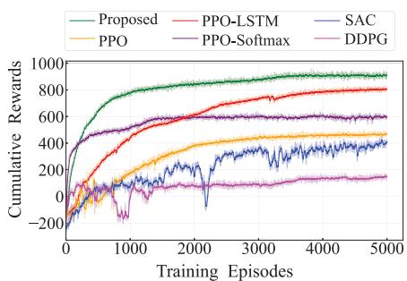

<details>
<summary>line</summary>

| Training Episodes | Proposed | PPO-LSTM | SAC | PPO | PPO-Softmax | DDPG |
| ----------------- | -------- | -------- | --- | --- | ----------- | ---- |
| 0                 | 0        | 0        | 0   | 0   | 0           | 0    |
| 1000              | 800      | 600      | 400 | 300 | 500         | 100  |
| 2000              | 900      | 700      | 500 | 400 | 600         | 150  |
| 3000              | 950      | 750      | 550 | 450 | 650         | 200  |
| 4000              | 980      | 800      | 600 | 500 | 700         | 250  |
| 5000              | 1000     | 850      | 650 | 550 | 750         | 300  |
</details>

(a)

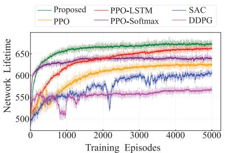

<details>
<summary>line</summary>

| Training Episodes | Proposed | PPO-LSTM | SAC | PPO | PPO-Softmax | DDPG |
| ----------------- | -------- | -------- | --- | --- | ----------- | ---- |
| 0                 | 500      | 500      | 500 | 500 | 500         | 500  |
| 1000              | 650      | 640      | 630 | 620 | 610         | 580  |
| 2000              | 660      | 650      | 640 | 630 | 620         | 590  |
| 3000              | 665      | 655      | 645 | 635 | 625         | 595  |
| 4000              | 670      | 660      | 650 | 640 | 630         | 600  |
| 5000              | 675      | 665      | 655 | 645 | 635         | 605  |
</details>

(b)

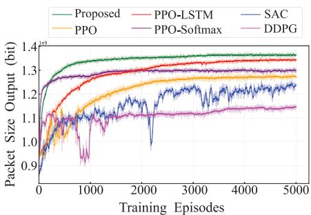

<details>
<summary>line</summary>

| Training Episodes | Proposed | PPO-LSTM | SAC | PPO | PPO-Softmax | DDPG |
| ----------------- | -------- | -------- | --- | --- | ----------- | ---- |
| 0                 | 0.9      | 0.9      | 0.9 | 0.9 | 0.9         | 0.9  |
| 1000              | 1.35     | 1.3      | 1.2 | 1.2 | 1.2         | 1.1  |
| 2000              | 1.38     | 1.32     | 1.25| 1.25| 1.25        | 1.1  |
| 3000              | 1.39     | 1.33     | 1.28| 1.28| 1.28        | 1.1  |
| 4000              | 1.4      | 1.34     | 1.3 | 1.3 | 1.3         | 1.1  |
| 5000              | 1.4      | 1.34     | 1.3 | 1.3 | 1.3         | 1.1  |
</details>

(c)

Fig. 9. Performance of different DRL algorithms. (a) Comparison of cumulative rewards. (b) Comparison of network life time. (c) Comparison of throughput to BS.   
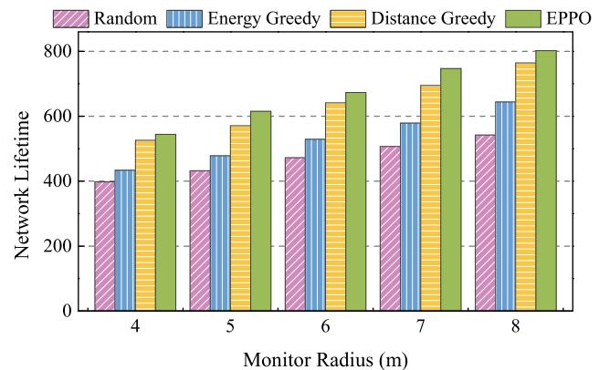

<details>
<summary>bar</summary>

| Monitor Radius (m) | Random | Energy Greedy | Distance Greedy | EPPO |
| ------------------ | ------ | ------------- | --------------- | ---- |
| 4                  | 400    | 430           | 520             | 540  |
| 5                  | 430    | 470           | 570             | 610  |
| 6                  | 470    | 530           | 640             | 670  |
| 7                  | 510    | 580           | 690             | 740  |
| 8                  | 540    | 640           | 760             | 800  |
</details>

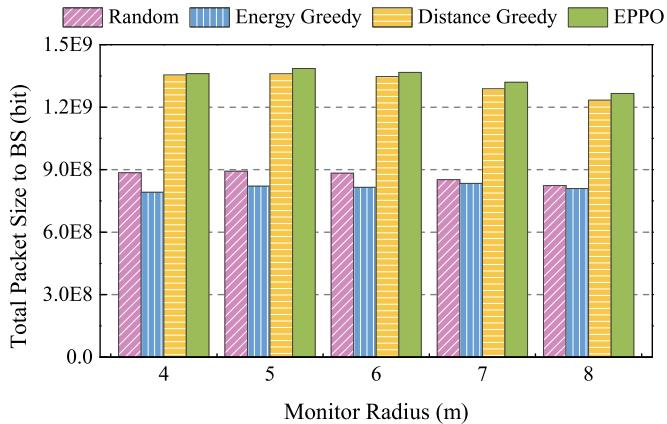

<details>
<summary>bar</summary>

| Monitor Radius (m) | Random | Energy Greedy | Distance Greedy | EPPO |
|---|---|---|---|---|
| 4 | 9.0E8 | 7.5E8 | 1.35E9 | 1.35E9 |
| 5 | 9.0E8 | 7.7E8 | 1.35E9 | 1.37E9 |
| 6 | 9.0E8 | 7.7E8 | 1.32E9 | 1.34E9 |
| 7 | 8.8E8 | 8.0E8 | 1.27E9 | 1.29E9 |
| 8 | 8.0E8 | 7.7E8 | 1.22E9 | 1.24E9 |
</details>

(b)   
Fig. 10. Comparison of traditional CB strategies under different monitoring radii. (a) Network lifetime. (b) Throughput.

TABLE V COMPARISONS ON DATA PERCEPTION MAINTENANCE ABILITY 

<table><tr><td>Protocol</td><td>75%</td><td>50%</td><td>25%</td></tr><tr><td>PEGASIS</td><td>36</td><td>40</td><td>70</td></tr><tr><td>LEACH</td><td>427</td><td>524</td><td>627</td></tr><tr><td>D2CRP</td><td>453</td><td>554</td><td>641</td></tr><tr><td>IGHND</td><td>508</td><td>601</td><td>672</td></tr><tr><td>OMRP</td><td>608</td><td>674</td><td>723</td></tr></table>

Simulation results show that OMRP has the lowest energy consumption rate throughout the network lifetime.

Beyond CH election, the lower energy consumption of OMRP is attributed to the use of a multihop strategy and a communication sequence. Specifically, CHs adopt the available multihop mode to communicate with the sink node, establishing an optimized communication path within the cluster, which reduces transmission distance and energy consumption for intercluster communications. Additionally, based on the overlapping degree, the TDMA communication sequence within the cluster allows data with more redundancy to be compressed earlier, thereby reducing the energy consumption of CHs.

3) Comparisons of Throughput to BS: We evaluate network throughput by comparing the size of fused data packets and the count of raw packets sent to the BS across different routing protocols. The packet size reflects how well a protocol maintains data perception, while the raw packet count indicates its transmission efficiency. Fig. 7(c) and (d) shows these comparisons, highlighting the performance of each protocol in terms of data perception and transmission efficiency, respectively.

Table V shows the maximum number of rounds various routing protocols can sustain at different throughput ratios. Specifically, OMRP shows an improvement in data perception maintenance ability by approximately 20%, 34%, and 42% at the 75% throughput ratio; 12%, 22%, and 29% at the 50% throughput ratio; and 8%, 13%, and 15% at the 25% throughput ratio compared to IGHND, D2CRP, and LEACH, respectively. Furthermore, the total number of raw packets for OMRP increases by 9%, 22%, and 28% compared to IGHND, D2CRP, and LEACH, respectively.

4) Analysis of the Spatial Correlation: With the fixed node distribution and data packet size, the monitor radius r of the

IoT nodes affects the degree of data spatial correlation. A larger r leads to more redundant data within the network. Fig. 8 shows the network lifetime and total throughput of the routing protocol under different values of $r .$ It can be seen that OMRP performs best in network lifetime and total throughput in different scenarios.

# C. Simulation of CB Method of SoftPPO-LSTM

For DRL comparative analysis, we employ benchmark methods, including deep deterministic policy gradient (DDPG) [43], soft actor–critic (SAC) [44], and PPO [45] as reference models. We also compared the SoftPPO-LSTMbased CB method with the traditional greedy algorithm.

1) Comparisons With DRL Policies: Fig. 9(a) illustrates the cumulative rewards for each episode of SoftPPO-LSTM compared to other benchmark algorithms. Notably, the algorithms do not converge to the same solutions, which is due to the long episode lengths, the complexity of the MDP, and the high dimension of the action space, highlighting the challenge of the problem.

For the benchmark algorithms, DDPG employs Gaussian noise to diversify strategic actions but struggles to fully explore the high-dimensional action space. It quickly converges to the local optimal strategy and shows less stable learning of superior strategies. Although the SAC algorithm can identify relatively advantageous strategies, its learning trajectory exhibits significant fluctuations in our environment. Similarly, the learning trajectory of PPO exhibits fluctuations in the early training stages. However, PPO ultimately stands out for its robust performance in our environment with intricate action spaces.

The proposed SoftPPO-LSTM algorithm demonstrates the most stable learning ability and the highest reward scores, as shown in Fig. 9(a). Specifically, SoftPPO-LSTM algorithm outperforms existing DRL methods in cumulative rewards, reflecting its superior training efficiency and learning stability. Additionally, as evidenced in Fig. 9(b) and (c), the trends of network lifetime and throughput are consistent with that of cumulative rewards. Specifically, SoftPPO-LSTM achieves a throughput of $1 . 3 7 \times \mathrm { { \bar { 1 0 } } ^ { 9 } }$ bit, representing an 8.3% increase over PPO, a 10.9% increase over SAC, and a 19.5% increase over DDPG. Furthermore, LSTM contributes a 6.5% improvement, and Softmax provides a 2.6% improvement compared to the PPO algorithm.

The superior performance of SoftPPO-LSTM can be attributed to three aspects. First, in our MDP analysis, we simplify the complex subset selection problem into a continuous scoring problem of dimension $N ,$ where the top $N _ { \mathrm { C B } }$ nodes with the highest scores are selected as the final beamforming nodes. This scoring-based action output introduces challenges to the stability of gradient updates, but the clipped mechanism of PPO ensures that the magnitude of gradient changes remains controlled during updates, providing greater stability compared to other algorithms. Second, based on PPO, we integrate softmax control, which further compresses score differences, reduces gradient fluctuations, and highlights higher scores. This enhancement helps the agent better understand the complexity of the problem. Finally, the inclusion of LSTM enables the agent to process time-series data and adapt to longterm training, effectively handling the dynamic nature of our problem. It also allows the agent to better adapt to heuristic routing strategies, further enhancing overall performance.

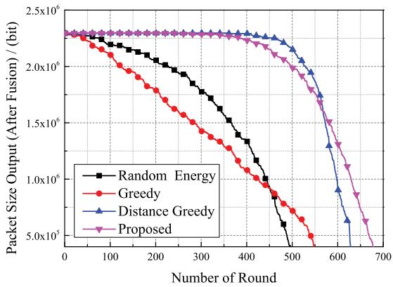

<details>
<summary>line</summary>

| Number of Round | Random Energy | Greedy | Distance Greedy | Proposed |
| --------------- | ------------- | ------ | --------------- | -------- |
| 0               | 2.3e6         | 2.3e6  | 2.3e6           | 2.3e6    |
| 100             | 2.2e6         | 2.1e6  | 2.3e6           | 2.3e6    |
| 200             | 2.0e6         | 1.8e6  | 2.3e6           | 2.3e6    |
| 300             | 1.7e6         | 1.5e6  | 2.3e6           | 2.3e6    |
| 400             | 1.3e6         | 1.1e6  | 2.3e6           | 2.3e6    |
| 500             | 0.8e6         | 0.7e6  | 1.5e6           | 1.8e6    |
| 600             | 0.5e6         | 0.5e6  | 0.7e6           | 1.0e6    |
| 700             | 0.5e6         | 0.5e6  | 0.5e6           | 0.5e6    |
</details>

Fig. 11. Comparison of packet size output to BS in each round.

2) Comparisons With Traditional Policies: We evaluate three traditional strategies, including random strategy, energybased greedy strategy, and distance-based greedy strategy. The energy-based greedy strategy selects the nodes with the highest residual energy for CB, while the distance-based greedy strategy selects the nodes nearest to the sink node. In addition, Fig. 11 compares the network lifetime and throughput of these traditional strategies with SoftPPO-LSTM under different values of r. The simulation results show that SoftPPO-LSTM consistently achieves the highest throughput and the longest network lifetime.

Additionally, we evaluate the perception ability of SoftPPO-LSTM alongside these traditional strategies and analyze the performance. As shown in Fig. 11, the random and energybased greedy strategies exhibit a rapid decline in the early stages due to their failure to consider distance in broadcasting, leading to a large broadcast radius and high energy consumption. In contrast, the distance-based greedy strategy slows node death in the early stages but falls quickly in the later stages. We recorded the simulation process of the distancebased greedy strategy and found that the surviving nodes in the later stages are often found at the edge of the network, which increased the routing distance and accelerated node death. Although SoftPPO-LSTM does not outperform the distancebased greedy strategy initially, its comprehensive consideration of both locations and residual energy levels can ease the hot spot issue that the distance-based greedy strategy has. As a result, SoftPPO-LSTM maintains slower node death rates in the later stages, ultimately achieving the longest network lifetime and highest throughput.

# VIII. DISCUSSION

In this section, we discuss the scalability, robustness, and validation of the proposed methods as well as the adaptability of our optimization framework, and the details are shown as follows.

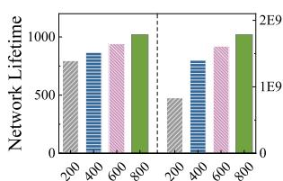

<details>
<summary>bar</summary>

| Input Size | Network Lifetime |
| ---------- | ---------------- |
| 200        | 750              |
| 400        | 850              |
| 600        | 950              |
| 800        | 1050             |
</details>

(a)

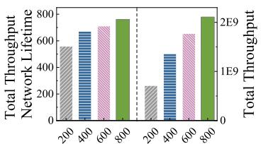

<details>
<summary>bar</summary>

| Network Lifetime | Total Throughput |
| ---------------- | ---------------- |
| 200              | 500E-11          |
| 400              | 700E-10          |
| 600              | 750E-10          |
| 800              | 800E-10          |
</details>

Fig. 12. Simulation results in different scales of IoT nodes. (a) OMRP method without energy consumption of CB. (b) SoftPPO-LSTM method with OMRP-based routing policy.   
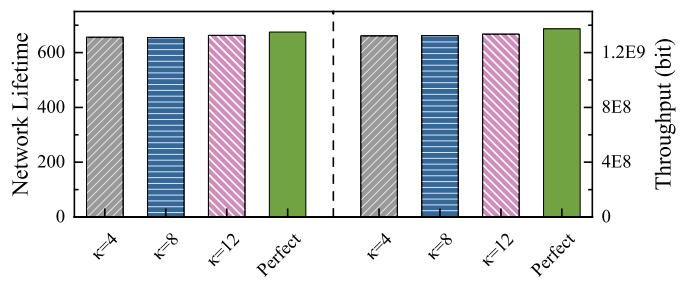

<details>
<summary>bar</summary>

| Category   | Network Lifetime | Throughput (bit) |
| ---------- | ---------------- | ---------------- |
| κ=4        | 650              | 1.2E9            |
| κ=8        | 650              | 1.2E9            |
| κ=12       | 650              | 1.2E9            |
| Perfect    | 675              | 1.2E9            |
</details>

Fig. 13. Performance analysis influenced by imperfect phase synchronization.

# A. Scalability of OMRP and SoftPPO-LSTM Methods

We evaluate simulations with 200, 400, 600, and 800 IoT nodes to evaluate scalability. Specifically, we simulate both the OMRP method without energy consumption of the CB and the SoftPPO-LSTM method with the OMRP routing policy. Fig. 12 shows that the two methods perform well in terms of lifetime and throughput, indicating that our system can scale effectively to support a larger number of IoT devices.

# B. Imperfect Phase Synchronization for Robustness

In real-world CB implementations, imperfect phase synchronization arises from time and frequency offsets, initial phase errors, and channel estimation inaccuracies [11]. To evaluate the impact of phase errors on CB, the AF of the beamforming nodes is redefined as follows [46]:

$$
\mathrm{AF} (\phi , \theta , I) = \sum_ {k = 1} ^ {N _ {\mathrm{CB}}} I _ {k} e ^ {j \Psi_ {k}} e ^ {j \left[ \frac {2 \pi}{\lambda} d _ {k} (\phi , \theta) + \zeta_ {i} \right]} \tag {35}
$$

where $\zeta _ { i }$ represents the phase error of the ith IoT node and it is assumed to obey the Tikhonov distribution with parameter κ which determines the error size [47].

Fig. 13 shows the system performance of network lifetime and throughput considering the phase errors under different values of κ, the result demonstrates that our solution exhibits negligible performance loss under phase synchronization errors.

# C. Validation of OMRP and SoftPPO-LSTM Methods

In this part, the validation of hardware integration, realworld IoT distribution, and method parameters are discussed as follows.

1) Validation of Hardware Integration: Integration tests are critical to ensure the operation of the software on hardware platforms like the IoT [48]. To validate the hardware

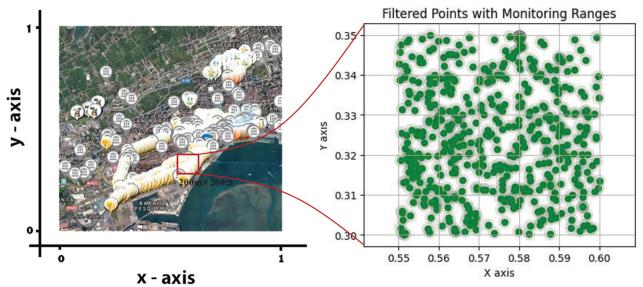

<details>
<summary>scatter</summary>

| x-axis | y-axis | Filtered Points with Monitoring Ranges |
|--------|--------|----------------------------------------|
| 0.55   | 0.35   | Green (Point)                          |
| 0.56   | 0.34   | Green (Point)                          |
| 0.57   | 0.33   | Green (Point)                          |
| 0.58   | 0.32   | Green (Point)                          |
| 0.59   | 0.31   | Green (Point)                          |
| 0.60   | 0.30   | Green (Point)                          |
</details>

Fig. 14. Location map of real-world deployment of IoT devices in the city of Santander. The dataset is provided at https://github.com/Net4uCA/SIoT-IoT-Dataset.

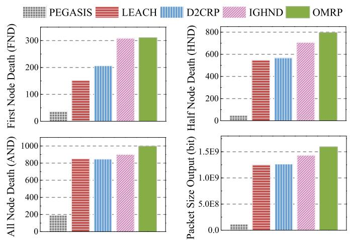

<details>
<summary>bar</summary>

| Method   | First Node Death (FND) | Half Node Death (HND) | All Node Death (AND) | Packet Size Output (bit) |
| -------- | ---------------------- | --------------------- | -------------------- | ------------------------ |
| PEGASIS  | 30                     | 40                    | 180                  | 10000000                 |
| LEACH    | 150                    | 550                   | 850                  | 12000000                 |
| D2CRP    | 200                    | 570                   | 850                  | 12000000                 |
| IGHND    | 310                    | 700                   | 900                  | 14000000                 |
| OMRP     | 310                    | 800                   | 1000                 | 16000000                 |
</details>

Fig. 15. Comparison of FND, HND, AND, and throughput performance of different routing strategies based on real-world IoT distribution.

integration of our proposed method, we conduct a deployment experiment using a Raspberry Pi, which is widely recognized as a reliable IoT validation platform in existing works (e.g., [49], [50], and [51]). Specifically, we deploy the SoftPPO-LSTM model on a Raspberry Pi 4B, featuring an ARM Cortex-A72 1.5-GHz CPU and 8 GB of memory. The SoftPPO-LSTM network parameters occupy 16 MB of disk space, while the entire computing environment requires 835 MB. In this case, the device takes 10.9 s to execute the program and generate inference results, with a maximum memory usage of 324 MB. Notably, the inference time can be reduced to 2.2 s by preloading the Python program and further minimized to 0.02 s by preloading the model into memory. These results show that the SoftPPO-LSTM model can efficiently operate on resource-constrained IoT devices, which highlights the feasibility of deploying our method in practice environments.

2) Validation of Real-World IoT Nodes Distribution: As shown in Fig. 14, we extract a 200 m × 200 m area containing 588 IoT nodes from a data set that illustrates the distribution of IoT devices in the city of Santander [52]. As such, we adjust the simulation settings as well as the network sizes to simulate the proposed OMRP routing strategy and the SoftPPO-LSTM algorithm.

We initialize the IoT distribution based on the dataset, and other settings remain the same as in Section VII. In this case, the comparison of FND, HND, AND, and throughput performance in Fig. 15 shows that our proposed OMRP outperforms other routing policies in all of the above indicators. Moreover, Fig. 16 shows the comparison of cumulative rewards, network lifetime, and throughput of different DRL algorithms based on the real-world IoT distribution. The result shows that our proposed SoftPPO-LSTM achieves the highest cumulative rewards, extends the longest network lifetime, and delivers the highest number of data packets.

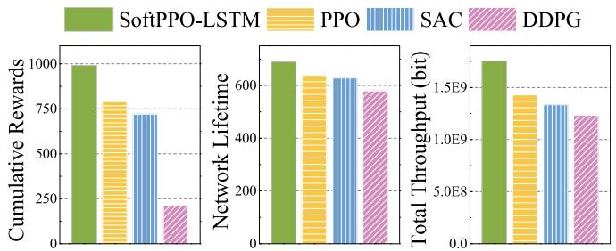

<details>
<summary>bar</summary>

| Method       | Cumulative Rewards | Network Lifetime | Total Throughput (bit) |
| ------------ | ------------------ | ---------------- | ---------------------- |
| SoftPPO-LSTM | 1000               | 650              | 1.5E9                  |
| PPO          | 750                | 620              | 1.4E9                  |
| SAC          | 700                | 610              | 1.3E9                  |
| DDPG         | 250                | 580              | 1.2E9                  |
</details>

Fig. 16. Comparison of cumulative rewards, network lifetime, and throughput of different DRL algorithms based on real-world IoT distribution.

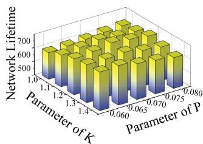

<details>
<summary>bar</summary>

| Parameter of K | Parameter of P | Network Lifetime |
| -------------- | -------------- | ---------------- |
| 1.0            | 0.060          | 600              |
| 1.1            | 0.065          | 600              |
| 1.2            | 0.070          | 600              |
| 1.3            | 0.075          | 600              |
| 1.4            | 0.080          | 600              |
</details>

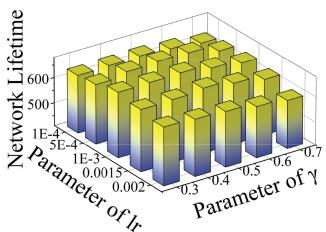

<details>
<summary>bar_stacked</summary>

| Parameter of lr | 0.001 | 0.002 | 0.3 | 0.4 | 0.5 | 0.6 | 0.7 |
|---|---|---|---|---|---|---|---|
| 1E-4 | 600 | 500 | 400 | 300 | 200 | 100 | 50 |
| 5E-4 | 600 | 500 | 400 | 300 | 200 | 100 | 50 |
| 1E-3 | 600 | 500 | 400 | 300 | 200 | 100 | 50 |
| 1.5E-3 | 600 | 500 | 400 | 300 | 200 | 100 | 50 |
| 5E-3 | 600 | 500 | 400 | 300 | 200 | 100 | 50 |
| 1.5E-2 | 600 | 500 | 400 | 300 | 200 | 100 | 50 |
| 2E-2 | 600 | 500 | 400 | 300 | 200 | 100 | 50 |
| 2.5E-2 | 600 | 500 | 400 | 300 | 200 | 100 | 50 |
| 3E-2 | 600 | 500 | 400 | 300 | 200 | 100 | 50 |
| 3.5E-2 | 600 | 500 | 400 | 300 | 200 | 100 | 50 |
| 4E-2 | 600 | 500 | 400 | 300 | 200 | 100 | 50 |
| 4.5E-2 | 600 | 500 | 400 | 300 | 200 | 100 | 50 |
| 5E-2 | 600 | 500 | 400 | 300 | 200 | 100 | 50 |
| ... (additional bars) are not explicitly labeled in the image. The y-axis label is 'Network Lifetime'. The x-axis label is 'Parameter of lr'. The legend is 'Color' but no explicit label provided in the image.
</details>

(b)   
Fig. 17. Optimization performance of network lifetime under different simulation parameters. (a) Validation of amplification factor K and the lower bound ratio P of OMRP. (b) Validation of the discounted factor and the learning rate of SoftPPO-LSTM.

3) Validation of Method Parameters: We validate the amplification factor K and the lower bound ratio P in the OMRP. Specifically, the value of K ranges from 1.0 to 1.4, and the value of P ranges from 0.06 to 0.08. Similarly, we validate the discount factor γ and the learning rate lr in the training of the SoftPPO-LSTM algorithm. The value of γ ranges from 0.30 to 0.70, and the value of lr ranges from 1e − 4 to 2e − 3. Fig. 17 shows the validation results, which indicate that γ = 0.50, lr = 1e − 3, K = 1.2, and P = 0.07 achieve the longest network lifetime of system performance.

# D. Discussion of Key Assumptions

In this work, we carefully make some assumptions and settings to strike a balance between model tractability and practical relevance. In fact, some of them can be relaxed or replaced with more general ones. For instance, the optimization framework can accommodate dynamic node scenarios by incorporating mobility models, or adjust initial settings to account for differences in node power and energy levels, and even handle heterogeneous data by refining the data correlation modeling for data fusion. These potential adjustments provide flexibility to the optimization framework, allowing it to remain adaptable to varying network conditions and device differences.

# IX. CONCLUSION

In this article, we have studied a novel data-driven communication scheme for homogeneous IoT networks by integrating CB with routing protocols. Specifically, we have first utilized the ${ \mathrm { O M R P } }$ to aggregate the network data at a specific node. Based on this aggregation, we have formulated a node selection problem for the CB stage aimed at optimizing uplink communication. Given the complexity of this problem, we have introduced the SoftPPO-LSTM algorithm, which intelligently selects CB nodes to enhance transmission efficiency. Simulation results indicate that the proposed OMRP demonstrated superior performance in extending network lifetime, minimizing energy consumption, and optimizing data throughput compared to existing protocols, such as PEGASIS, LEACH, D2CRP, and IGHND. The introduction of the overlap degree in the CH election and the dynamic multihop strategies significantly contributed to these improvements. Moreover, the SoftPPO-LSTM-based CB policy employs the softmax control and LSTM layers to simplify the solution space and facilitate stable learning over long rounds. These adjustments enable the IoT networks to reduce the energy consumption of the CB process while avoiding possible hot spot problems.

While the proposed method demonstrates promising results, certain limitations should be acknowledged. The fault-tolerance mechanisms of the system require further consideration to handle the unpredictable challenges of realworld deployments, such as electromagnetic interference and hardware failures [39]. Moreover, the training process of the advanced DRL techniques relies on simulated data, which may not fully capture the complexity and variability of real-world IoT environments [53]. These factors may impact the stability and performance of the DRL algorithm in practical scenarios.

Future works will focus on addressing these limitations by collecting more realistic deployment data, enhancing system fault tolerance, and improving adaptability through transfer learning and real-time feedback. Extending the model to heterogeneous IoT nodes and dynamic environments will also be explored to further strengthen its applicability. In addition, we plan to conduct more validation experiments to evaluate the scalability and robustness of our system under varying network conditions and hardware configurations.

# REFERENCES

[1] F. Yang et al., “Environment fusion routing protocol for wireless sensor networks,” IEEE Sensors J., vol. 24, no. 8, pp. 13418–13430, Apr. 2024.   
[2] H. Qin, N. Li, T. Wang, G. Yang, and Y. Peng, “CDT: Cross-interface data transfer scheme for bandwidth-efficient LoRa communications in energy harvesting multi-hop wireless networks,” J. Netw. Comput. Appl., vol. 229, Sep. 2024, Art. no. 103935.   
[3] L. Yang, B. Ma, L. Yuan, and B. Wu, “Effective application of IoT power electronics technology and power system optimization control,” Tsinghua Sci. Technol., vol. 29, no. 6, pp. 1763–1775, Dec. 2024.   
[4] S. Verma, Y. Kawamoto, Z. M. Fadlullah, H. Nishiyama, and N. Kato, “A survey on network methodologies for real-time analytics of massive IoT data and open research issues,” J. Ambient Intell. Humaniz. Comput., vol. 19, no. 3, pp. 1457–1477, 2017.   
[5] S. R. Jan et al., “Marginal and average weight-enabled data aggregation mechanism for the resource-constrained networks,” Comput. Commun., vol. 174, pp. 101–108, Jun. 2021.   
[6] B. A. Begum and S. V. Nandury, “Data aggregation protocols for WSN and IoT applications—A comprehensive survey,” J. King Saud Univ. Comput. Inf. Sci., vol. 35, no. 2, pp. 651–681, 2023.

[7] P. Rawat and S. Chauhan, “A survey on clustering protocols in wireless sensor network: Taxonomy, comparison, and future scope,” J. Ambient Intell. Humaniz. Comput., vol. 14, no. 3, pp. 1543–1589, 2023.   
[8] H. Ochiai, P. Mitran, H. V. Poor, and V. Tarokh, “Collaborative beamforming for distributed wireless Ad Hoc sensor networks,” IEEE Trans. Signal Process., vol. 53, no. 11, pp. 4110–4124, Nov. 2005.   
[9] G. Sun et al., “Improving performance of distributed collaborative beamforming in mobile wireless sensor networks: A multiobjective optimization method,” IEEE Internet Things J., vol. 7, no. 8, pp. 6787–6801, Aug. 2020.   
[10] O. B. Smida and S. Affes, “Dual-hop robust distributed collaborative beamforming over nominally rectangular WSNs in slightly to moderately scattered environments,” in Proc. IWCMC, 2023, pp. 1015–1021.   
[11] H. Jung and I.-H. Lee, “Secrecy performance analysis of analog cooperative beamforming in three-dimensional Gaussian distributed wireless sensor networks,” IEEE Trans. Wireless Commun., vol. 18, no. 3, pp. 1860–1873, Mar. 2019.   
[12] A. Wang, Y. Wang, G. Sun, J. Li, S. Liang, and Y. Liu, “Uplink data transmission based on collaborative beamforming in UAV-assisted MWSNs,” in Proc. IEEE GLOBECOM, 2021, pp. 1–6.   
[13] X. Bao, H. Liang, Y. Liu, and F. Zhang, “A stochastic game approach for collaborative beamforming in SDN-based energy harvesting wireless sensor networks,” IEEE Internet Things J., vol. 6, no. 6, pp. 9583–9595, Dec. 2019.   
[14] G. Sun et al., “Energy efficient collaborative beamforming for reducing sidelobe in wireless sensor networks,” IEEE Trans. Mobile Comput., vol. 20, no. 3, pp. 965–982, Mar. 2021.   
[15] T. Liu, X. Qu, W. Tan, R. Wen, and L. Yang, “Energy-efficient joint collaborative and passive beamforming for intelligent-reflecting-surfaceassisted wireless sensor networks,” IEEE Internet Things J., vol. 10, no. 19, pp. 17193–17205, Oct. 2023.   
[16] M. Z. Hasan, S. A. Alabady, and M. F. M. Salleh, “Power control for collaborative sensors in Internet of Things environments using K-means approach,” in Proc. ACN, 2023, pp. 209–224.   
[17] W. B. Heinzelman, “Application-specific protocol architectures for wireless networks,” Ph.D. dissertation, Dept. Electr. Eng. Comput. Sci., Massachusetts Inst. Technol., Cambridge, MA, USA, 2000.   
[18] T. M. Behera, S. K. Mohapatra, U. C. Samal, M. S. Khan, M. Daneshmand, and A. H. Gandomi, “Residual energy-based clusterhead selection in WSNs for IoT application,” IEEE Internet Things J., vol. 6, no. 3, pp. 5132–5139, Jun. 2019.   
[19] C. Chen, L.-C. Wang, and C.-M. Yu, “D2CRP: A novel distributed 2-hop cluster routing protocol for wireless sensor networks,” IEEE Internet Things J., vol. 9, no. 20, pp. 19575–19588, Oct. 2022.   
[20] D. Lin, Z. Lin, L. Kong, and Y. L. Guan, “CMSTR: A constrained minimum spanning tree based routing protocol for wireless sensor networks,” Ad Hoc Netw., vol. 146, Jul. 2023, Art. no. 103160.   
[21] B. Wang, H. B. Lim, and D. Ma, “A coverage-aware clustering protocol for wireless sensor networks,” Comput. Netw., vol. 56, no. 5, pp. 1599–1611, 2012.   
[22] Y. Tao, Y. Zhang, and Y. Ji, “Flow-balanced routing for multi-hop clustered wireless sensor networks,” Ad Hoc Netw., vol. 11, no. 1, pp. 541–554, 2013.   
[23] X. Song, T. Wen, W. Sun, D. Zhang, Q. Guo, and Q. Zhang, “A coverageaware unequal clustering protocol with load separation for ambient assisted living based on wireless sensor networks,” China Commun., vol. 13, no. 5, pp. 47–55, May 2016.   
[24] D. Kavitha and A. Chinnasamy, “AI integration in data driven decision making for resource management in Internet of Things(IoT): A survey,” in Proc. IEMECON, 2021, pp. 1–5.   
[25] I. Snigdh, S. S. Surani, and N. K. Sahu, “Energy conservation in query driven wireless sensor networks,” Microsyst. Technol., vol. 27, no. 3, pp. 843–851, 2021.   
[26] P. Biswas and T. Samanta, “True event-driven and fault-tolerant routing in wireless sensor network,” Wireless Pers. Commun., vol. 112, no. 1, pp. 439–461, 2020.   
[27] V. Saeidi, B. Pradhan, M. O. Idrees, and Z. Abd Latif, “Fusion of airborne LiDAR with multispectral SPOT 5 image for enhancement of feature extraction using Dempster–Shafer theory,” IEEE Trans. Geosci. Remote Sens., vol. 52, no. 10, pp. 6017–6025, Oct. 2014.   
[28] J. Wang, O. T. Tawose, L. Jiang, and D. Zhao, “A new data fusion algorithm for wireless sensor networks inspired by hesitant fuzzy entropy,” Sensors, vol. 19, no. 4, p. 784, 2019.   
[29] X. Yu, W. Peng, K. Zhang, Z. Zhou, and Y. Liu, “Data fusion algorithm of wireless sensor network based on clustering and fuzzy logic,” Telecommun. Syst., vol. 86, pp. 617–626, Apr. 2024.

[30] B. B. Haro, S. Zazo, and D. P. Palomar, “Energy efficient collaborative beamforming in wireless sensor networks,” IEEE Trans. Signal Process., vol. 62, no. 2, pp. 496–510, Jan. 2014.   
[31] J. Fei, X. Zhang, C. Li, F. Hao, Y. Guo, and Y. Fu, “A deep data fusionbased reconstruction of water index time series for intermittent rivers and ephemeral streams monitoring,” ISPRS J. Photogramm. Remote Sens., vol. 220, pp. 339–353, Feb. 2025.   
[32] A. John, A. Padinjarathala, E. Doheny, B. Cardiff, and D. John, “An evaluation of ECG data fusion algorithms for wearable IoT sensors,” Inf. Fusion, vol. 96, pp. 237–251, Aug. 2023.   
[33] S. Y.-S. S. Adade et al., “Advanced food contaminant detection through multi-source data fusion: Strategies, applications, and future perspectives,” Trends Food Sci. Technol., vol. 156, Feb. 2025, Art. no. 104851.   
[34] C. Hua and T.-S. P. Yum, “Optimal routing and data aggregation for maximizing lifetime of wireless sensor networks,” IEEE ACM Trans. Netw., vol. 16, no. 4, pp. 892–903, Aug. 2008.   
[35] S. Jayaprakasam, S. K. A. Rahim, and C. Y. Leow, “PSOGSA-explore: A new hybrid metaheuristic approach for beampattern optimization in collaborative beamforming,” Appl. Soft Comput., vol. 30, pp. 229–237, May 2015.   
[36] W. B. Heinzelman, A. P. Chandrakasan, and H. Balakrishnan, “An application-specific protocol architecture for wireless microsensor networks,” IEEE Trans Wireless Commun., vol. 1, no. 4, pp. 660–670, Oct. 2002.   
[37] H. Luo, J. Luo, Y. Liu, and S. K. Das, “Adaptive data fusion for energy efficient routing in wireless sensor networks,” IEEE Trans. Comput., vol. 55, no. 10, pp. 1286–1299, Oct. 2006.   
[38] Q. Chen, Q. Zhang, and Y. Liu, “Balancing exploration and exploitation in episodic reinforcement learning,” Expert Syst. Appl, vol. 231, Nov. 2023, Art. no. 120801.   
[39] H. He et al., “Deep reinforcement learning based energy management strategies for electrified vehicles: Recent advances and perspectives,” Renew. Sustain. Energy Rev., vol. 192, Mar. 2024, Art. no. 114248.   
[40] N. Shinohara, “Beam control technologies with a high-efficiency phased array for microwave power transmission in Japan,” Proc. IEEE, vol. 101, no. 6, pp. 1448–1463, Jun. 2013.   
[41] S. Lindsey and C. S. Raghavendra, “PEGASIS: Power-efficient gathering in sensor information systems,” in Proc. IEEE Aerosp. Conf., vol. 3, 2002, p. 3.   
[42] H. Farman et al., “Multi-criteria based zone head selection in Internet of Things based wireless sensor networks,” Future Gener. Comput. Syst., vol. 87, pp. 364–371, Oct. 2018.   
[43] T. P. Lillicrap et al., “Continuous control with deep reinforcement learning,” 2015, arXiv:1509.02971.   
[44] T. Haarnoja et al., “Soft actor-critic algorithms and applications,” 2018, arXiv:1812.05905.   
[45] J. Schulman, F. Wolski, P. Dhariwal, A. Radford, and O. Klimov, “Proximal policy optimization algorithms,” 2017, arXiv:1707.06347.   
[46] A. Minturn, D. Vernekar, Y. L. Yang, and H. Sharif, “Distributed beamforming with imperfect phase synchronization for cognitive radio networks,” in Proc. IEEE Int. Conf. Commun. (ICC), 2013, pp. 4936–4940.   
[47] H. Jung, S.-W. Ko, and I.-H. Lee, “Secure transmission using linearly distributed virtual antenna array with element position perturbations,” IEEE Trans. Veh. Technol., vol. 70, no. 1, pp. 474–489, Jan. 2021.   
[48] S. S. Shetiya, V. Vyas, and S. Renukuntla, “Verification and validation of autonomous systems,” 2024, arXiv:2411.13614.   
[49] R. B. Ponnuru, S. A. Kumar, M. Azab, and G. R. Alavalapati, “BAAP-FIoT: Blockchain assisted authentication protocol for fogenabled Internet of Things environment,” IEEE Internet Things J., early access, Jan. 13, 2025, doi: 10.1109/JIOT.2025.3528746.   
[50] X. Chai et al., “IoT-FAR: A multi-sensor fusion approach for IoTbased firefighting activity recognition,” Inf. Fusion, vol. 113, Jan. 2025, Art. no. 102650.   
[51] P. Ni et al., “A novel wireless IoT sensing system for cable force identification and monitoring,” Eng. Struct., vol. 314, Sep. 2024, Art. no. 118318.   
[52] C. Marche, L. Atzori, V. Pilloni, and M. Nitti, “How to exploit the social Internet of Things: Query generation model and device profiles’ dataset,” Comput. Netw., vol. 174, Jun. 2020, Art. no. 107248.   
[53] A. Silvestri et al., “Real building implementation of a deep reinforcement learning controller to enhance energy efficiency and indoor temperature control,” Appl. Energy, vol. 368, Aug. 2024, Art. no. 123447.


<details>
<summary>natural_image</summary>

Portrait photo of a young man in formal attire (no text or symbols visible)
</details>

Yangning Li received the B.S. degree in software engineering from Jilin University, Changchun, China, in 2023, where he is currently pursuing the M.S. degree in computer science and technology.

His research interests include wireless networks and collaborative beamforming.


<details>
<summary>natural_image</summary>

Portrait photo of a woman in formal attire (no text or symbols visible)
</details>

Zemin Sun (Member, IEEE) received the B.S. degree in software engineering and the M.S. and Ph.D. degrees in computer science and technology from Jilin University, Changchun, China, in 2015, 2018, and 2022, respectively.

Her research interests include vehicular networks, edge computing, and game theory.


<details>
<summary>natural_image</summary>

Portrait photo of a woman wearing glasses and a red shirt against a blue background (no text or symbols visible)
</details>

Hui Kang received the M.E. and Ph.D. degrees from Jilin University, Changchun, China, in 1996 and 2007, respectively.

She is currently a Professor with the College of Computer Science and Technology, Jilin University. Her research interests include information integration and distributed computing.


<details>
<summary>natural_image</summary>

Portrait photo of a young man with short dark hair wearing a black shirt (no text or symbols visible)
</details>

Jiacheng Wang received the bachelor’s degree from the Department of Science, Kunming University of Science and Technology, Kunming, China, in 2015, and the M.E. and Ph.D. degrees from the Department of Communication and Information Technology, Chongqing University of Posts and Telecommunications, Chongqing, China, in 2018 and 2022, respectively.

He is a Research Associate of Computer Science and Engineering with Nanyang Technological University, Singapore. His research interests include

wireless sensing and semantic communications.


<details>
<summary>natural_image</summary>

Portrait photo of a young man in a collared shirt (no text or symbols visible)
</details>

Jiahui Li (Member, IEEE) received the B.S. degree in software engineering and the M.S. and Ph.D. degrees in computer science and technology from Jilin University, Changchun, China, in 2018, 2021, and 2024, respectively.

He was a visiting Ph.D. student with Singapore University of Technology and Design, Singapore. He currently serves as an Assistant Researcher with the College of Computer Science and Technology, Jilin University. His current research focuses on integrated air–ground networks, UAV networks, wireless

energy transfer, and optimization.


<details>
<summary>natural_image</summary>

Portrait photo of a man in formal attire (no text or symbols visible)
</details>

Changyuan Zhao received the B.Sc. degree in computing and information science from the University of Science and Technology of China, Hefei, China, in 2020, and the MA.Eng. degree in computer science from the Institute of Software, Chinese Academy of Sciences, Beijing, China, in 2023. He is currently pursuing the Ph.D. degree with the College of Computing and Data Science, Nanyang Technological University, Singapore.

His research interests include generative AI, communication security, and resource allocation.


<details>
<summary>natural_image</summary>

Portrait photo of a man in formal attire against a blue background (no text or symbols visible)
</details>

Geng Sun (Senior Member, IEEE) received the B.S. degree in communication engineering from Dalian Polytechnic University, Dalian, China, in 2011, and the Ph.D. degree in computer science and technology from Jilin University, Changchun, China, in 2018.

He was a Visiting Researcher with the School of Electrical and Computer Engineering, Georgia Institute of Technology, Atlanta, GA, USA. He is a Professor with the College of Computer Science and Technology, Jilin University, and also a senior visiting scholar with the College of Computing and

Data Science, Nanyang Technological University, Singapore. His research interests include wireless networks, UAV communications, collaborative beamforming, and optimizations.


<details>
<summary>natural_image</summary>

Portrait of a person wearing glasses and a dark jacket (no visible text or symbols)
</details>

Dusit Niyato (Fellow, IEEE) received the B.Eng. degree from King Mongkuts Institute of Technology Ladkrabang, Bangkok, Thailand, in 1999, and the master’s and Ph.D. degrees from the University of Manitoba, Winnipeg, MB, Canada, in 2005 and 2008, respectively.

He is currently a Professor with the College of Computing and Data Science, Nanyang Technological University, Singapore. His research interests are in the areas of sustainability, edge intelligence, decentralized machine learning, and

incentive mechanism design.