# A Fast UAV Trajectory Planning Framework in RIS-Assisted Communication Systems With Accelerated Learning via Multithreading and Federating

Jun Huang , Senior Member, IEEE, Beining Wu , Student Member, IEEE, Qiang Duan , Senior Member, IEEE, Liang Dong , Senior Member, IEEE, and Shui Yu , Fellow, IEEE

Abstract—Reconfigurable Intelligent Surface (RIS)-assisted uncrewed Aerial Vehicle (UAV) communications have been realized as essential to space-air-group system integration in the 6 G technology landscape. Trajectory planning plays a crucial role in RIS-assisted UAV communications to face the challenges of UAV’s limited power capacities and dynamic wireless channels. Existing solutions assume complete channel state information, focus on single-rotor UAVs, and rely heavily on time-consuming training processes for machine learning; thus, they lack applicability to deal with highly dynamic real-world scenarios. To fill these research gaps, we aim to characterize RIS-assisted UAV communications and design responsive and accurate UAV trajectory planning algorithms in this paper. We first develop a communication model with incomplete information and an energy consumption model for quadrotor UAVs. We then formulate UAV trajectory planning as an optimization problem to minimize UAV’s energy consumption while maintaining communication throughput. To solve this problem, we design an acceleration framework, FedX, for reinforcement learning (RL) solvers and present two fast trajectory planning algorithms, FedSAC and FedPPO, as instantiations of the FedX framework. Our evaluation results indicate that the proposed framework is effective and efficient–more than 3 times faster with 5 agents and 7 times faster with 10 agents than standard RL algorithms, making it suitable for using RL solvers within wireless networks and mobile computing environments. We also discuss and identify the pros and cons of our proposed framework.

Index Terms—UAV, RIS, trajectory planning, reinforcement learning, training acceleration, federating.

## I. INTRODUCTION

U NCREWED aerial vehicles (UAV), also known as drones,are aircraft without a human pilot onboard that are ei- are aircraft without a human pilot onboard that are either controlled remotely by an operator or programmed to fly autonomously [1]. The surge in drone popularity spans diverse sectors such as Infrastructure, Agriculture, Transport, Entertainment, Security, and Insurance [2]. Recent research shows that combining Reconfigurable Intelligent Surfaces (RIS) with UAV communications has become essential for connecting space and terrestrial networks. It involves relaying data between UAVs and ground terminals (GTs) using RIS. GTs, which are fixed or mobile stations on the ground, serve as communication points with UAVs. RIS are engineered surfaces that can manipulate electromagnetic waves by reflecting, absorbing, or focusing them in specific directions. When integrated with UAV communications, RIS can greatly enhance signal strength, coverage, and reliability by adjusting the propagation environment dynamically. In urban areas, RIS is particularly useful for overcoming obstacles, reducing signal interference, and extending the range of UAV communications. This new technology facilitates the implementation of space-air-ground integrated systems within the 6 G technology landscape [3], [4].

While RIS-assisted UAV communications bring opportunities to new networking paradigms, they also impose challenges for the system design [5]. Although traditional designs for terrestrial systems could potentially be modified for UAV communications, the distinct nature of UAV systems requires a more customized approach. The limited power capacity of UAVs and the highly dynamic wireless channel states are two special features that make RIS-assisted UAV communications particularly challenging. UAV trajectory planning plays a crucial role in facing this challenge by optimally planning the UAV trajectory and scheduling the ground terminal connection in order to minimize the UAV energy consumption while maintaining the required data transmission rate. However, prior research on UAV trajectory planning has limitations in the following aspects.

First, most current works assumed that the channel state information is completely available [6], [7], [8], [9], [10], [11]. Although there has been a significant amount of studies in channel measurements and modeling for UAV communications [12], [13], [14], the presumption of perfect channel information is too idealistic in real-world scenarios. Second, prior research in UAV communications primarily considered single-rotor UAVs, which leads to concerns about the applicability of the existing methods to the quadrotor UAV scenarios [15], [16], [17], [18], [19], [20], which are becoming more common in various applications. Also, existing studies typically only consider the vertical ascension of UAVs, which does not reflect the settings of real-world operations. Third, although reinforcement learning (RL) techniques have been employed for UAV trajectory planning and yielded promising results [6], [7], [8], [9], [10], [11], [15], [16], [17], [18], [21], [22], [23], [24], [25], [26], previous solutions lack sufficient consideration of the time performance thus leading to less responsive control of the UAV trajectory, which might not able to face the highly dynamic environment of UAV communications, as illustrated in our recent investigation [27].

In a nutshell, prior studies on this research topic present the following significant research gaps.

1) Current research assumes that the channel state information of the UAV-RIS-GT system is completely known by the UAV trajectory planner, which is too idealistic and impractical in real-world scenarios.

2) Existing trajectory planning algorithms are dedicated to the cases of single-rotor UAVs, leaving the quadrotor UAV scenarios grossly uninvestigated. In addition, they consider UAV’s vertical ascent only, which does not reflect practical settings.

3) Previous RL-based solutions, have not sufficiently considered the time performance despite their potential for promising results. The current lack of a fast UAV trajectory planning framework is a significant issue that needs to be addressed to face the challenge of highly dynamic UAV communications.

To fill in the above research gaps, this work aims to characterize RIS-assisted UAV communications and design responsive and accurate UAV trajectory planning algorithms leveraging computing acceleration techniques for machine learning. Specifically, we make the following contributions.

We develop a new channel model for UAV-RIS-GT communications in urban areas. To define how signals fade over a wireless link between two entities, the new model is established to characterize the wireless channel under the incomplete information assumption.

We design a quadrotor UAV energy consumption model based on the single-rotor case to precisely describe the UAV’s movement in any direction, and we formulate an optimization problem for UAV trajectory planning under multiple constraints.

We devise a fast UAV trajectory framework by integrating multithreading and federated learning techniques for training acceleration. Based on this framework, we present two fast yet accurate RL algorithms. Evaluations are conducted to reveal the performance of the algorithms.

The remainder of this paper is organized as follows. Section II briefly summarizes the related studies. Section III describes the system model and formulates the problem. In Section IV, we present our proposed approach for the defined problem. We discuss the simulation results in Section V and draw the conclusion in Section VI.

## II. RELATED WORK

Recent studies have shown that UAV trajectory planning is formulated with other system parameters, such as rate/capacity [6], [8], [15], [22], [26], phase shift [10], [17], [23], energy [11], [24], [28], and beamforming [7], [9], [18], [25]. Together with the trajectory design, these system parameters lead to the defined optimization problems NP-hard.

Traditional optimization methods, such as convex [29] and multi-objective optimization [30], have been effective in solving NP-hard problems for UAV path planning while ensuring service quality but barely adapting to dynamic and complex environments due to high computational overhead. Heuristic algorithms like Ant Colony Optimization [31], A\* Search [32], and Particle Swarm Optimization [33] offer efficiency but rely on predefined system models, limiting their adaptability to partial or localized information and often getting trapped in local optima. Also, machine learning approaches, such as hybrid neural networks [34], demonstrate high adaptability for UAV trajectory planning but demand significant computational resources and hyperparameter tuning, making them challenging to deploy in real-world scenarios.

To address these limitations, various RL algorithms have been proposed. Among these studies, DQN (Deep Q-Network) is considered the most straightforward and effective approach. In the paper [6], the authors proposed a DQN to solve the problem of maximizing broadcast secrecy rate in UAV-Empowered IRS (Intelligent Reflecting Surfaces) backscatter communications. Another work by Sun et al. [21] considered the age of information and designed a DQN for aerial IRS-assisted IoT networks. In a recent study [26], the authors designed a DQN to enhance the security performance of UAV-RIS reflection systems. Several other forms of DQN have also been proposed, such as centralized-declined DQN [24] and Decaying DQN [9].

Although DQN-based algorithms can produce acceptable results for UAV trajectory planning, the Double DQN (DDQN) and deep deterministic policy gradient (DDPG) algorithms can provide even more precise results. Mei et al. [17] proposed a DDQN and a DDPG algorithm to solve 3D trajectory and phase shift design for RIS-assisted UAV systems. In Zhang et al. [15], a DDQN-based approach was presented for the same purpose with capacity maximization. Truong et al. [10] recently used a DDPG algorithm for joint flying IRS trajectory and phase shift design. In [11], Nguyen et al. developed a DDPG algorithm for RIS-assisted UAV communications with wireless power transfer in IoT scenarios. To address the multi-objective optimization issue, a multi-objective DDPG solver was proposed in [7] for trajectory optimization and beamforming design.

As DDPG employs the actor-critic learning framework to improve the accuracy of the solution, contemporary studies tend to utilize this framework to design more effective RL algorithms. In [8], a soft actor-critic reinforcement learning algorithm called DRRL (distributionally-robust RL) is developed.

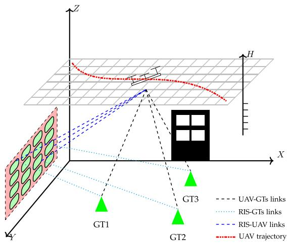  
Fig. 1. System model of RIS-assisted UAV communications.

Qin et al. [35] proposed both centralized and decentralized SAC algorithms, effectively addressing the joint problem of UAV path planning and power allocation. Iacovelli et al. designed an actor-critic-inspired proximal policy optimization (PPO) for multi-UAV IRS-assisted communications [22]. In [11], a PPO was also developed. Dong et al. [36] optimized the UAV trajectory while considering channel state information based on the PPO algorithm. The authors of [23] presented a twin delayed deep deterministic policy gradient (TD3) algorithm for radio surveillance with a fixed-wing UAV to address the overestimate of Q-value by DDPG in the critic network. More recently, a multi-agent RL has been developed in [20] to optimize the energy consumption of the single-rotor UAV.

Our work differs from the studies mentioned above in three ways. First, we consider the communication model with the assumption of incomplete information, which is more general and applicable in real-world scenarios. Second, we develop a quadrotor UAV energy consumption model that is more commonly used and is expected to be more widespread in $^ \textrm { \scriptsize 6 G }$ communications. Third, we design a training acceleration framework for the RL solvers, which speeds up the training process, addressing a significant issue that current studies neglect.

## III. SYSTEM MODEL AND PROBLEM FORMULATION

## A. Network Model

We consider a communication system that includes a UAV and a RIS connecting with K GTs (ground terminals) in an urban area, as shown in Fig. 1. The UAV acts as an aerial base station, while the RIS is positioned at the boundary of the service area to provide a line-of-sight connection to all GTs. Both the UAV and the ground user are equipped with a single antenna.

The RIS is made up of $M _ { c } \times M _ { r }$ passive reflection units (PRUs) arranged in a uniform planar array (UPA). The array consists of $M _ { c }$ PRUs spaced evenly at a distance of $d _ { c }$ meters, and $M _ { r }$ PRUs in each row also spaced evenly at a distance of $d _ { r }$ meters. To adjust the phase shift, each PRU applies an independent reflection coefficient that scatters the incoming signal with an amplitude $a \in [ 0 , 1 ]$ ] and a phase shift $\phi _ { m _ { r } , m _ { c } } \in [ - \pi , \pi )$ This means that the reflection coefficient $r _ { m _ { r } , m _ { c } } = a e ^ { j \phi _ { m _ { r } , m _ { c } } }$ where $m _ { \eta }$ r belongs to the set of integers $1 , 2 , \ldots , M _ { r }$ , and $m _ { c }$ belongs to the set of integers $1 , 2 , \ldots , M _ { c }$ . The fixed reflection loss of the RIS is represented by a, while $\phi _ { m _ { r } , m _ { c } }$ indicates the phase shift applied at the PRU $( m _ { r } , m _ { c } )$

Following the same convention of [28], we denote the length of a particular time slot as $\delta _ { t } [ n ]$ , and thus the overall flight time $T$ is the sum of $\delta _ { t } [ n ]$ for all n from 1 to N. The $\mathrm { U A V } \mathbf { \epsilon } _ { \mathrm { S } } 3 \mathrm { D }$ path is represented by a sequence $\{ \mathbf { q } [ n ] = [ x [ n ] , y [ n ] , z [ n ] ] ^ { \mathrm { T } } \} _ { n = 1 } ^ { \tilde { N } } ,$ where ${ \bf q } [ n ] = [ \dot { x ( n ] } , y [ \bar { n } ] , z [ n ] ] ^ { \mathrm { \tilde { T } } }$ denotes the 3D coordinates of the UAV at time slot $n .$ The altitude that the UAV can fly at, denoted by H, must satisfy the safety regulations and is within the range $H _ { U } ^ { \operatorname* { m i n } } \leq z [ n ] \leq H _ { U } ^ { \operatorname* { m a x } }$ . The locations of the ground terminals are fixed and denoted by $\mathbf L _ { k } = [ x _ { k } , y _ { k } , 0 ] ^ { \mathrm { T } }$ , where $\mathbf { L } _ { k }$ represents the coordinates of ground terminal k. The RIS is situated on a building wall at a certain altitude $H _ { I } , \mathrm { i . e . , } \mathbf { L } _ { I } =$ $[ x _ { I } , 0 , H _ { I } ] ^ { \mathrm { T } }$

Let UG be the link between UAV and ground terminal k, UI be the link between UAV and RIS, IG be the link between RIS and ground terminal k, so we calculate the distance between the UAV and ground user k during time slot n as $d _ { k } ^ { \mathrm { U G } } [ n ] = | | \mathbf { q } [ n ] - \mathbf { L } _ { k } | |$ the distance between the UAV and the RIS as $d ^ { \mathrm { U I } } [ n ] = \lvert | \mathbf { q } [ n ] -$ $\mathbf { L } _ { I } | |$ and the distance between the RIS and ground terminal k as $d _ { k } ^ { \mathrm { I G } } [ n ] = \lvert \lvert \mathbf { L } _ { I } - \mathbf { L } _ { k } \rvert \rvert$ . The distances $d _ { k } ^ { \mathrm { U G } } [ \bar { n } ]$ and $d ^ { \mathrm { U I } } [ n ]$ remain constant within each time slot $\delta _ { t }$ since the $\mathrm { U A V } _ { \mathrm { \Delta } }$ movement during $\delta _ { t }$ is ignorable compared to these distances.

Due to the substantial path loss and reflection loss, we neglect the power of signals that undergo multiple reflections by the RIS [14].

## B. Channel Model

We assume that the system utilizes orthogonal frequency division multiple access (OFDMA) and the total system bandwidth B is divided into $N _ { f }$ sub-carriers with sub-carriers spacing $\begin{array} { r } { \Delta f = \frac { B } { N _ { f } } } \end{array}$ . In time slot n, the channel vector between the UAV and the RIS on sub-carrier i can be given by [16]:

$$
\mathbf { h } _ { i } ^ { \mathrm { U R } } [ n ] = \sqrt { \frac { \beta _ { 0 } } { ( d ^ { \mathrm { U R } } [ n ] ) ^ { 2 } } } e ^ { - j 2 \pi i \Delta f \frac { d ^ { \mathrm { U R } } [ n ] } { c } } \mathbf { h } _ { \mathrm { L o S } } ^ { \mathrm { U R } } [ n ] ,\tag{1}
$$

where

$$
\begin{array} { r l } & { \mathbf { h } _ { \mathrm { L o S } } ^ { \mathrm { U R } } [ n ] = \Bigg [ 1 , e ^ { - j 2 \pi f _ { c } \frac { d _ { \mathrm { r } } \sin \theta ^ { \mathrm { U R } } [ n ] \sin \theta ^ { \mathrm { U R } } [ n ] } { c } } , \hdots , } \\ & { \quad \quad \quad e ^ { - j 2 \pi f _ { c } ( M _ { r } - 1 ) \frac { d _ { \mathrm { r } } \sin \theta ^ { \mathrm { U R } } [ n ] \sin \theta ^ { \mathrm { U R } } [ n ] } { c } } \Bigg ] ^ { \mathrm { T } } } \\ & { \quad \quad \quad \otimes \Bigg [ 1 , e ^ { - j 2 \pi f _ { c } \frac { d _ { \mathrm { c } } \sin \theta ^ { \mathrm { U R } } [ n ] \sin \theta ^ { \mathrm { U R } } [ n ] } { c } } , \hdots , } \\ & { \quad \quad \quad \quad e ^ { - j 2 \pi f _ { c } ( M _ { c } - 1 ) \frac { d _ { \mathrm { c } } \sin \theta ^ { \mathrm { U R } } [ n ] \sin \theta ^ { \mathrm { U R } } [ n ] } { c } } \Bigg ] ^ { \mathrm { T } } \ , } \end{array}\tag{2}
$$

$\beta _ { 0 }$ is the channel power gain at the reference distance $1 \ \mathrm { ~ m ~ } , \ c$ denotes the speed of light, and $f _ { c }$ is the carrier frequency. Variables $ { \dot { \theta } } ^ { \mathrm { U R } } [ n ]$ and $\xi ^ { \mathrm { U R } } [ n ]$ are the horizontal and vertical angles-of-arrival (AoAs) at the RIS with sin $\begin{array} { r } { \theta ^ { \mathrm { U R } } [ n ] = \frac { | z [ n ] - \bigtriangledown _ { R } | } { d ^ { \mathrm { U R } } [ n ] } } \end{array}$ , sin $\begin{array} { r } { \xi ^ { \mathrm { U R } } [ n ] = \frac { | x _ { R } - x [ n ] | } { \sqrt { ( x _ { R } - x [ n ] ) ^ { 2 } + ( y _ { R } - y [ n ] ) ^ { 2 } } } , } \end{array}$ and cos $\begin{array} { r } { \xi ^ { \mathrm { U R } } [ n ] = \frac { | y _ { R } - y [ n ] | } { \sqrt { ( x _ { R } - x [ n ] ) ^ { 2 } + ( y _ { R } - y [ n ] ) ^ { 2 } } } . } \end{array}$

We introduce the Rician fading model to characterize the links from the UAV to users and from the RIS to users. In time slot $n ,$ the channel vector between the RIS and user k on sub-carrier i can be written as

$$
\begin{array} { r } { \mathbf { h } _ { k , i } ^ { \mathrm { R G } } [ n ] = \sqrt { \frac { \beta _ { 0 } } { ( d _ { k } ^ { \mathrm { R G } } [ n ] ) ^ { \alpha _ { k } ^ { \mathrm { R G } } } } } \left( \sqrt { \frac { \kappa _ { k } ^ { \mathrm { R G } } } { 1 + \kappa _ { k } ^ { \mathrm { R G } } } } e ^ { - j 2 \pi i \Delta f \frac { d _ { k } ^ { \mathrm { R G } } } { c } } \mathbf { h } _ { k , \mathrm { L o S } } ^ { \mathrm { R G } } \right. } \\ { \left. + \sqrt { \frac { 1 } { 1 + \kappa _ { k } ^ { \mathrm { R G } } } } \tilde { \mathbf { h } } _ { k , i } ^ { \mathrm { R G } } [ n ] \right) , \quad \quad \left. ( 3 ) \right. } \end{array}
$$

where $\alpha _ { k } ^ { \mathrm { R G } }$ is the path loss exponent of the RIS-to-user link for user $k , \kappa _ { k } ^ { \mathrm { R G } }$ is the Rician factor, $\tilde { \mathbf { h } } _ { k , i } ^ { \mathrm { R G } } [ n ] \sim \mathcal { C N } ( \mathbf { 0 } , \mathbf { I } _ { M _ { r } M _ { c } } )$ $\mathbf { h } _ { k , \mathrm { L o S } } ^ { \mathrm { R G } }$ is given by

$$
\begin{array} { r l r } {  { { \bf h } _ { k , \mathrm { L o S } } ^ { \mathrm { R G } } } = [ 1 , e ^ { - j 2 \pi f _ { C } } \frac { d r \sin \theta _ { k } ^ { \mathrm { R G } } \sin \theta _ { k } ^ { \mathrm { R G } } } { c } , \dots ,  } & { } & \\ & { } & {  e ^ { - j 2 \pi f _ { C } ( M _ { r } - 1 ) \frac { d r \sin \theta _ { k } ^ { \mathrm { R G } } \sin \theta _ { k } ^ { \mathrm { R G } } } { c } } ] ^ { \mathrm { T F } } } \\ & { } & { \otimes [ 1 , e ^ { - j 2 \pi f _ { C } } \frac { d r \sin \theta _ { k } ^ { \mathrm { R G } } \sin \theta _ { k } ^ { \mathrm { R G } } } { c } , \dots ,  } \\ & { } & \\ & { } & {  e ^ { - j 2 \pi f _ { C } ( M _ { c } - 1 ) \frac { d \cos \theta _ { k } ^ { \mathrm { R G } } \sin \theta _ { k } ^ { \mathrm { R G } } } { c } } ] ^ { \mathrm { T F } } , } \end{array}\tag{4}
$$

with $\theta _ { k } ^ { \mathrm { R G } }$ and $\xi _ { k } ^ { \mathrm { R G } }$ are the horizontal and vertical angles-ofdeparture (AoDs) from the RIS to ground users. Note that we have sin $\begin{array} { r } { \theta _ { k } ^ { \mathrm { R G } } = \frac { H _ { R } } { d _ { k } ^ { \mathrm { R G } } } } \end{array}$ , sin $\begin{array} { r } { \xi _ { k } ^ { \mathrm { R G } } = \frac { \left| x _ { k } - x _ { R } \right| } { \sqrt { ( x _ { R } - x _ { k } ) ^ { 2 } + ( y _ { R } - y _ { k } ) ^ { 2 } } } } \end{array}$ , and cos $\begin{array} { r } { \xi _ { k } ^ { \mathrm { R G } } = \frac { \left| y _ { k } - y _ { R } \right| } { \sqrt { ( x _ { R } - x _ { k } ) ^ { 2 } + ( y _ { R } - y _ { k } ) ^ { 2 } } } } \end{array}$

In time slot n, the channel between the UAV and the ground user k on sub-carrier i is:

$$
\begin{array} { r l } & { h _ { \boldsymbol { k } , i } ^ { \mathrm { U G } } [ n ] = \sqrt { \frac { \beta _ { 0 } } { ( d _ { \boldsymbol { k } } ^ { \mathrm { U G } } [ n ] ) ^ { \alpha _ { \boldsymbol { k } } ^ { \mathrm { U G } } } } } \left( \sqrt { \frac { \kappa _ { \boldsymbol { k } } ^ { \mathrm { U G } } } { 1 + \kappa _ { \boldsymbol { k } } ^ { \mathrm { U G } } } } e ^ { - j 2 \pi i \Delta f \frac { d _ { \boldsymbol { k } } ^ { \mathrm { U G } } [ n ] } { c } } \right. } \\ & { ~ + \left. \sqrt { \frac { 1 } { 1 + \kappa _ { \boldsymbol { k } } ^ { \mathrm { U G } } } } \tilde { h } _ { \boldsymbol { k } , i } ^ { \mathrm { U G } } [ n ] \right) , } \end{array}\tag{5}
$$

where $\alpha _ { k } ^ { \mathrm { U G } }$ denotes the path loss exponent of the UAV-to-user link for user $k , \kappa _ { k } ^ { \mathrm { U G } }$ is the corresponding Rician factor, and $\tilde { h } _ { k , i } ^ { \mathrm { U G } } [ n ] \sim \mathcal { C N } ( 0 , 1 )$ is the scattering component of user k on sub-carrier i in time slot n.

The RIS reflection coefficient matrix in time slot n can be represented by

$$
\Phi [ n ] = \mathrm { d i a g } ( \phi [ n ] ) \in \mathbb { C } ^ { M _ { r } M _ { c } \times M _ { r } M _ { c } } ,\tag{6}
$$

where $\phi [ n ] = [ e ^ { j , \phi _ { 1 , 1 } [ n ] } , \ldots , e ^ { j , \phi _ { m _ { r } , m _ { c } } [ n ] } , \ldots , e ^ { j , \phi _ { M _ { r } , M _ { c } } [ n ] } ] \in$ $\mathbb { C } ^ { M _ { r } M _ { c } \times \dot { 1 } }$ . Hence, the channel gain of link UAV-RIS-user k on sub-carrier i in time slot n can be given as

$$
h _ { k , i } ^ { \mathrm { U R G } } [ n ] = a \left( \mathbf { h } _ { k , i } ^ { \mathrm { R G } } \right) ^ { \mathrm { T } } \Phi [ n ] \mathbf { h } _ { i } ^ { \mathrm { U R } } [ n ] .\tag{7}
$$

Note that measuring accurate channel state information (CSI) by each transceiver in practical settings is not trivial. We employ minimum mean square error (MMSE) estimation to address the imperfect CSI acquisition [37]. As such, the composite channel

gain can be expressed as

$$
g _ { k , i } ^ { \mathrm { U G } } = \sqrt { 1 - \mathsf { P } } h ^ { \prime } + \sqrt { \mathsf { P } } \tilde { h } ,\tag{8}
$$

where $h ^ { \prime }$ is the estimation of $h _ { k , i } ^ { \mathrm { U G } } [ n ] + h _ { k , i } ^ { \mathrm { U R G } } [ n ] , \tilde { h }$ is the estimation error that is independent of $h ^ { \prime }$ , and parameter P represents the estimation error variance, taking a constant value from 0 to 1.

The data rate of UAV is

$$
R _ { k , i } [ n ] = c _ { k , i } [ n ] B \log _ { 2 } \left( 1 + \frac { p ^ { \mathrm { T X } } g _ { k , i } ^ { \mathrm { U G } } } { \sigma ^ { 2 } } \right) ,\tag{9}
$$

where $p ^ { \mathrm { T X } }$ is the fixed transmit power of the UAV, B is the bandwidth, σ is the noise variance, and $c _ { k , i } [ n ] = \{ 0 , 1 \}$ is used to indicate terminal k being served or not.

## C. UAV Energy Consumption Model

While the UAV consumes energy for communications and task computations, the propulsion plays a dominant role in UAV energy consumption as a whole. To facilitate a tangible analysis, we assume that the estimation of energy consumption for communications and computations is constant, and we ignore the variation in energy consumption due to UAV acceleration/deceleration as long as the time slot for communications is short. Our model is primarily extended from [28], [38], and [39].

To extend the single-rotor UAV’s power consumption model in [38] to a quadrotor UAV one, we make the following assumption [40]: 1) Every rotor is identical, and it is symmetrically distributed; 2) The weight assigned to each rotor is $\textstyle { \frac { W } { 4 } }$ and 3) The thrust of each rotor is $\textstyle { \frac { T } { 4 } }$ in hovering status. Thus, the total hovering power is

$$
\begin{array} { r l r } {  { P _ { h } ^ { \mathrm { q u a d } } = 4 ( \frac { \delta _ { 0 } } { 8 } \rho s _ { 0 } A _ { 0 } \Omega _ { 0 } ^ { 3 } R _ { 0 } ^ { 3 } + ( 1 + k ) \frac { ( \frac { W } { 4 } ) ^ { 3 / 2 } } { \sqrt { 2 \rho A _ { 0 } } } ) } } \\ & { } & { = \underbrace { \frac { \delta _ { 0 } } { 2 } \rho s _ { 0 } A _ { 0 } \Omega _ { 0 } ^ { 3 } R _ { 0 } ^ { 3 } } _ { \triangleq P _ { B _ { 0 } } } + \underbrace { ( 1 + k ) \frac { W ^ { 3 / 2 } } { 2 \sqrt { 2 \rho A _ { 0 } } } } _ { \triangleq P _ { I _ { 0 } } } , } \end{array}\tag{10}
$$

where $\delta _ { 0 }$ denotes the profile drag coefficient, $\rho$ accounts for air density (in $\mathrm { k g / m ^ { 3 } } ) , s _ { 0 }$ represents rotor solidity, $A _ { 0 }$ is the rotor disc area $( \mathrm { i n } \mathrm { m } ^ { 2 } ) , \Omega _ { 0 }$ is the blade angular velocity (in radians/s), $R _ { 0 }$ is the rotor radius (in m), k is the incremental correction factor to induced power, W is the UAV’s total weight (in Newton).

According to the horizontal power expression for single-rotor UAV in [38] and (10), we have the total power consumption for quadrotor UAV in horizontal flight is

$$
\begin{array} { l } { { \displaystyle \bar { P } ( \bar { V } ) = 4 P _ { B _ { 0 } } \left( 1 + \frac { 3 \bar { V } ^ { 2 } } { \Omega _ { 0 } ^ { 2 } R _ { 0 } ^ { 2 } } \right) } } \\ { { \displaystyle ~ + 4 P _ { I _ { 0 } } \left( \sqrt { 1 + \frac { \bar { V } ^ { 4 } } { 4 v _ { 0 } ^ { 4 } } - \frac { \bar { V } ^ { 2 } } { 2 v _ { 0 } ^ { 2 } } } \right) ^ { \frac { 1 } { 2 } } + 2 d _ { 0 } \rho s _ { 0 } A _ { 0 } \bar { V } ^ { 3 } . } } \end{array}\tag{11}
$$

Fig. 2 displays our preliminary results using the same parameter configuration as [40] for this model. An interesting fact is that as the UAV flies at a relatively low speed (less than $I 5 m / s ) ,$ the total required power decreases with the increase in speed.

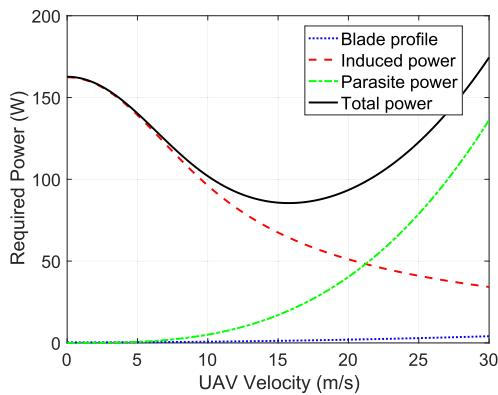  
Fig. 2. Required power for quadrotor UAV in horizontal flight.

Now, we consider the power consumption in vertical flight. We assume that $\hat { T } ~ ( \check { T } )$ and $\hat { D } _ { } ^ { } ( \check { D } )$ are the thrust and fuselage drag of the quadrotor UAV in vertical ascend (descend). When the UAV ascends or descends at a constant speed, we have

$$
\hat { T } - W = \hat { D }\tag{12}
$$

in ascending and

$$
W - \check { T } = \check { D }\tag{13}
$$

in descending.

Let us look into the case of ascending first. According to the above force analysis, the following equation must be satisfied for each rotor on UAV

$$
\hat { T } _ { 0 } = \frac { W } { 4 } + \frac { 1 } { 2 } S _ { \mathrm { F P \perp } } \rho \hat { V } ^ { 2 } ,\tag{14}
$$

where $S _ { \mathrm { F P \perp } }$ is the fuselage equivalent flat plate area in the vertical movement.

In line with [39], we have

$$
\hat { P } _ { 0 } ( \hat { V } , \hat { T } _ { 0 } ) = \frac { P _ { h } ^ { \mathrm { q u a d } } } { 4 } + \frac { 1 } { 2 } \hat { T } _ { 0 } \hat { V } + \frac { \hat { T } _ { 0 } } { 2 } \sqrt { \hat { V } ^ { 2 } + \frac { 2 \hat { T } _ { 0 } } { \rho A _ { 0 } } } .\tag{15}
$$

So, the total power consumption of the quadrotor UAV is

$$
\begin{array} { r l r } { \hat { P } ( \hat { V } ) = 4 \hat { P } _ { 0 } ( \hat { V } , \hat { T } _ { 0 } ) } & { } & \\ { = P _ { h } ^ { \mathrm { q u a d } } + \cfrac { 1 } { 2 } W \hat { V } + S _ { \mathrm { F P } \perp } \rho \hat { V } ^ { 3 } } & { } & \\ { + \left( \cfrac { W } { 2 } + S _ { \mathrm { F P } \perp } \rho \hat { V } ^ { 2 } \right) \sqrt { \left( 1 + \cfrac { S _ { \mathrm { F P } \perp } } { A _ { 0 } } \right) \hat { V } ^ { 2 } + \cfrac { W } { 2 \rho A _ { 0 } } } . } & { } & \end{array}\tag{16}
$$

Similarly, the total power consumption of quadrotor UAV in descending is

$$
\begin{array} { l } { \displaystyle \check { P } ( \check { V } ) = P _ { h } ^ { \mathrm { q u a d } } + \frac 1 2 W \check { V } - S _ { \mathrm { F P } \perp } \rho \check { V } ^ { 3 } } \\ { \displaystyle \qquad + \left( \frac { W } { 2 } - S _ { \mathrm { F P } \perp } \rho \check { V } ^ { 2 } \right) \sqrt { \left( 1 - \frac { S _ { \mathrm { F P } \perp } } { A _ { 0 } } \right) \check { V } ^ { 2 } + \frac { W } { 2 \rho A _ { 0 } } } . } \end{array}\tag{17}
$$

## D. Problem Formulation

By (11), (16), and (17), we have the UAV’s energy consumption model in time slot n as shown in

$$
\begin{array} { l } { { \displaystyle E [ n ] = \delta _ { t } [ n ] ( 4 P _ { B _ { 0 } } ( 1 + \frac { 3 { \bar { V } } ^ { 2 } } { \Omega _ { 0 } ^ { 2 } R _ { 0 } ^ { 2 } } )  } } \\ { { \displaystyle  + 4 P _ { I _ { 0 } } ( \sqrt { 1 + \frac { { \bar { V } } ^ { 4 } } { 4 v _ { 0 } ^ { 4 } } } - \frac { { \bar { V } } ^ { 2 } } { 2 v _ { 0 } ^ { 2 } } ) ^ { 1 / 2 } + 2 d _ { 0 } \rho s _ { 0 } A _ { 0 } { \bar { V } } ^ { 3 } \ ~ } } \\ { { \displaystyle  + P _ { h } ^ { \mathrm { q u a d } } + \frac { 1 } { 2 } W { \hat { V } } + S _ { \mathrm { F P } , \perp } \rho { \hat { V } } ^ { 3 }  } } \\ { { \displaystyle  + ( \frac { W } { 2 } + S _ { \mathrm { F P } , \perp } \rho { \hat { V } } ^ { 2 } ) \sqrt { ( 1 + \frac { S _ { \mathrm { F P } , \perp } } { A _ { 0 } } ) { \hat { V } } ^ { 2 } + \frac { W } { 2 \rho A _ { 0 } } } ) } , }  \end{array}\tag{18}
$$

if UAV ascends in time slot n, and

$$
\begin{array} { l } { { \displaystyle { \cal E } [ n ] = \delta _ { t } [ n ] \left( 4 P _ { B _ { 0 } } \left( 1 + \frac { 3 { \bar { \cal V } } ^ { 2 } } { \Omega _ { 0 } ^ { 2 } R _ { 0 } ^ { 2 } } \right) \right. } } \\ { { \displaystyle \left. ~ + 4 P _ { I _ { 0 } } \left( { \sqrt { 1 + \frac { { \bar { \cal V } } ^ { 4 } } { 4 v _ { 0 } ^ { 4 } } } } - \frac { { \bar { \cal V } } ^ { 2 } } { 2 v _ { 0 } ^ { 2 } } \right) ^ { 1 / 2 } + 2 d _ { 0 } \rho s _ { 0 } A _ { 0 } { \bar { \cal V } } ^ { 3 } } } \\ { { \displaystyle ~ + P _ { h } ^ { \mathrm { q u a d } } + \frac { 1 } { 2 } W { \bar { \cal V } } - S _ { \mathrm { F P \perp } } \rho { \bar { \cal V } } ^ { 3 } } } \\ { { \displaystyle ~ + \left( \frac { W } { 2 } - S _ { \mathrm { F P \perp } } \rho { \bar { \cal V } } ^ { 2 } \right) \sqrt { \left( 1 - \frac { S _ { \mathrm { F P \perp } } } { A _ { 0 } } \right) { \bar { \cal V } } ^ { 2 } + \frac { W } { 2 \rho A _ { 0 } } } \right) , } } \end{array}\tag{19}
$$

if UAV descends in time time slot n. Here, $\bar { V } =$ $\begin{array} { r } { \frac { \sqrt { ( x [ n + 1 ] - x [ n ] ) ^ { 2 } + ( y [ n + 1 ] - y [ n ] ) ^ { 2 } } } { \delta _ { t } [ n ] } \mathrm { ~ a n d ~ } \hat { V } = \check { V } = \frac { \sqrt { ( z [ n + 1 ] - z [ n ] ) ^ { 2 } } } { \delta _ { t } [ n ] } } \end{array}$

Our goal is to minimize the energy consumption of the UAV in all time slots, which is formulated as

$$
\begin{array} { r l } { \underset { \mathrm { e } = 1 } { \overset { \mathrm { N i } } { \sum } } } & { \underset { n = 1 } { \overset { N } { \sum } } E [ n ] } \\ & { \mathrm { s . t . } } \\ { \mathrm { s . t . } } & { \underset { k = 1 } { \overset { K } { \sum } } c _ { k , \mathrm { i } } [ n ] \leq 1 } \\ & { \underset { n = 1 } { \overset { N } { \sum } } \delta _ { \mathrm { i } } [ n ] R _ { k , \mathrm { i } } [ n ] \geq L _ { k } } \\ & { \underset { n = 1 } { \overset { N } { \sum } } \tilde { V } \underset { \mathrm { i } \leq 1 } { \overset { N } { \sum } } \tilde { V } _ { \mathrm { m a x } } } \\ & { \tilde { V } \underset { \mathrm { e } = 1 } { \overset { N } { \sum } } \tilde { V } _ { \mathrm { m a x } } } \\ & { \underset { H _ { n = 1 } ^ { \mathrm { m i n } } \leq \tilde { Z } [ n ] \leq L _ { n } } { \overset { N } { \sum } } } \end{array}\tag{20}
$$

where the first constraint in (20) indicates that at most one terminal is served in each time slot, the second constraint ensures that the data transmission of each task with length $L _ { k }$ can be completed within the mission time of the UAV.

Note that the above optimization problem is non-convex and intractable due to the binary variable $c _ { k , i } [ n ]$ . This motivates us to seek RL techniques to solve it.

## IV. PROPOSED APPROACH

## A. Markov Decision Process

We begin by modeling the UAV trajectory planning as an MDP.

1) State: In our implementation, the state space $s [ n ]$ includes not only the UAV position but also task-related information:

$$
s [ n ] = [ x [ n ] , y [ n ] , z [ n ] , d _ { \mathrm { g o a l } } [ n ] , R _ { \mathrm { r e m a i n } } [ n ] ] ,\tag{21}
$$

where:

$[ x [ n ] , y [ n ] , z [ n ] ]$ represents the UAV’s current position

$d _ { \mathrm { g o a l } } [ n ]$ denotes the distance to the charging station

$$
\begin{array} { r } { R _ { \mathrm { r e m a i n } } [ n ] = \sum _ { k = 1 } ^ { K } D _ { k } - \sum _ { k = 1 } ^ { K } \sum _ { n ^ { \prime } = 1 } ^ { n } \delta _ { t } R _ { k , i } [ n ^ { \prime } ] } \end{array}
$$

sents the remaining data transmission tasks

2) Action: We define A as the action space of the RISassisted UAV system, which includes the horizontal and vertical movements of the UAV, the selection and scheduling of ground terminals (GTs), and the selection of time slot length. Specifically, it is defined as $a [ n ] = ( l [ n ] , h [ n ] , c _ { k , i } [ n ] , \delta _ { t } \bar { [ n ] } ) \bar { \in } \mathcal { A } =$ $\mathcal { L } \times \mathcal { H } \times \mathcal { C } \times \mathcal { T }$ , where $l [ n ]$ and $h [ n ]$ being the UAV flying actions in horizontal and vertical dimensions in nth time slot. $\mathcal { T } =$ $[ t _ { \mathrm { m i n } } : 0 . 1$ ms $\colon t _ { \mathrm { m a x } } ]$ is the space of the discrete flight times, from where $\delta _ { t } [ n ]$ will be chosen as the discrete value between $t _ { \mathrm { m i n } }$ and $t _ { \mathrm { m i n } }$ with 0.1ms as the step size. $\mathcal { C } = \{ c _ { k , i } [ n ] , \forall k , i , n \}$ is the action space of GT scheduling.

Considering the flying actions of the UAV, assume that the UAV can only move to one of the adjacent cells from its current cell during a single time slot in the horizontal dimension or to an adjacent height level in the vertical dimension. Thus, the UAV’s horizontal location $L [ n + 1 ] = [ x [ n + 1 ] , y [ n + 1 ] ] ^ { \mathrm { T } }$ in the next time slot is:

$$
L [ n + 1 ] = L [ n ] + l [ n ] ,\tag{22}
$$

where $l [ n ] \in { \mathcal { L } } .$ , and the horizontal action space $\mathcal { L }$ consists of 17 discrete choices: one option to remain stationary and 16 directions spaced evenly around a 360-degree circle, each separated by 15 degrees. This configuration allows the UAV to select from a full range of movement options in each time slot. Considering vertical flying, the UAV’s vertical location $H _ { n + 1 }$ in next time slot can be defined as:

$$
z [ n + 1 ] = z [ n ] + h [ n ] ,\tag{23}
$$

where $h [ n ] \in \mathcal { H } \triangleq \{ h _ { s } , - h _ { s } , 0 \}$ , with H being the vertical action space of the UAV including ascending, descending or remaining at its current height respectively.

3) Reward: In our model, the reward function $r ( s [ n ] , a [ n ] )$ comprises two components, defined as follows:

$$
r ( s [ n ] , a [ n ] ) = \sum _ { k = 1 } ^ { K } \sum _ { n ^ { \prime } = 1 } ^ { n + 1 } \frac { \omega \cdot \delta _ { t } R _ { k , i } [ n ^ { \prime } ] } { E [ n ^ { \prime } ] } - \mathrm { p } _ { 0 } .\tag{24}
$$

The first component: $\begin{array} { r } { \sum _ { k = 1 } ^ { K } \sum _ { n ^ { \prime } = 1 } ^ { n + 1 } \frac { \omega \cdot \delta _ { t } R _ { k , i } \left[ n ^ { \prime } \right] } { E \left[ n ^ { \prime } \right] } } \end{array}$ represents the ratio of the cumulative data throughput from all ground terminals (GTs) up to time slot $n + 1$ to the UAV’s propulsion energy consumption. Here:

$\delta _ { t } R _ { k , i } [ n ^ { \prime } ]$ denotes the amount of data transmitted by the kth GT during time slot n,

Algorithm 1: FedX.   
1: Initialize the number of agents M, the number of   
federated learning rounds $E ,$ the initial global   
parameters $w _ { G } ^ { 0 }$ , and the learning rate η;   
2: Fork M threads as M agents for parallel training;   
3: for $e \in \{ 1 , 2 , \ldots , E \}$ do   
4: for $m \in \{ 1 , 2 , \ldots , M \}$ do   
5: $w _ { m } ^ { e } = w _ { G } ^ { e } ;$   
6: end for   
7: for $m \in \{ 1 , 2 , \ldots , M \}$ do   
8: Agent m computes its local update by calling a RL   
algorithm $X ;$   
9: Set $\boldsymbol { w } _ { m } ^ { e + 1 } = \boldsymbol { w } _ { m } ^ { e } - \eta \nabla L _ { m } ( \boldsymbol { w } _ { m } ^ { e } ) ;$   
10: Send $w _ { m } ^ { e + 1 }$ to Aggregation process;   
11: end for   
12: Aggregation process receives $w _ { m } ^ { e + 1 }$ from each agent   
m;   
13: Update global model using $\begin{array} { r } { w _ { G } ^ { e + 1 } = \frac { \sum _ { m = 1 } ^ { M } D _ { m } w _ { m } ^ { e + 1 } } { \mathcal { D } } ; } \end{array}$   
14: end for

$E [ n ^ { \prime } ]$ represents the UAV’s propulsion energy at time slot $n ^ { \prime } { . }$ , and

\- ω is a weighting factor balancing throughput and energy consumption.

This component encourages maximizing the cumulative data throughput relative to energy consumption, promoting resourceefficient and effective UAV trajectory planning.

The second component penalty term $p _ { 0 }$ is designed as a function of the state rather than a constant:

$$
p _ { 0 } = \lambda _ { A } \cdot \psi _ { \mathrm { D a t a } } ( R _ { \mathrm { r e m a i n } } [ n ] ) + \lambda _ { B } \cdot \psi _ { \mathrm { B d } } ( d _ { \mathrm { g o a l } } [ n ] ) ,\tag{25}
$$

where:

$\begin{array} { r } { \psi _ { \mathrm { D a t a } } ( R _ { \mathrm { r e m a i n } } [ n ] ) = \frac { \sum _ { k = 1 } ^ { K } D _ { k } - \sum _ { k = 1 } ^ { K } \sum _ { n ^ { \prime } = 1 } ^ { n } \delta _ { t } R _ { k , i } [ n ^ { \prime } ] } { \sum _ { k = 1 } ^ { K } D _ { k } } } \end{array}$ , representing the normalized remaining data transmission ratio

$\begin{array} { r } { \psi _ { \mathrm { B d } } ( d _ { \mathrm { g o a l } } [ n ] ) = \frac { d _ { \mathrm { g o a l } } [ n ] } { d _ { \mathrm { m a x } } } } \end{array}$ , representing the normalized distance to the charging station

\- $\lambda _ { A }$ and $\lambda _ { B }$ are scaling weights

This design ensures that both penalty components are normalized to [0,1] and connected to the state space. By using state-dependent penalties, the agent can optimize its trajectory by balancing remaining tasks and destination distance, providing smooth feedback to guide the learning process.

With the above MDP formulation, the design of RL solvers is straightforward. For example, a well-thought-out DDQN-based algorithm for UAV trajectory planning is given in [17]. However, its training process is extremely slow, although it may produce a satisfactory solution. Our prior investigation in [27] also highlights the challenge of slow training for deep reinforcement learning algorithms in wireless communication systems.

## B. FedX: A Fast UAV Trajectory Planning Framework

To resolve this issue, we leverage the techniques of multithreading and federated learning and propose a framework, called FedX, as shown in Algorithm 1. The idea underlying this algorithm is to fork multiple threads and treat each thread as an agent of federated learning to enable parallel training [41]. $" X '$ in Algorithm 1 can be any RL solver, including but not limited to DQN, DDQN, DDPG [42], TD3 [43], PPO [44], SAC [45] and other algorithms of the same kind.

Note that the proposed framework is different from conventional federated RL, where multiple agents independently interact with distinct parts of the environment. Instead, it features threads acting as agents interacting with the environment. FedX folks multiple threads and runs them in parallel for model training. These threads collaborate by aggregating their models, similar to the process in federated learning. FedX allows for centralized control and unified decision-making while benefiting from the parallelization and collaborative learning aspects of federated techniques. In addition, samples are distributed to each thread through an individual replay buffer, which stores experiences collected by the agent. Each thread independently accesses this replay buffer and extracts mini-batches of samples for training. This allows multiple threads to concurrently process different subsets of data. By operating on independent minibatches, the threads can perform gradient updates in parallel, leveraging the diverse experiences stored in the replay buffer. The parallel processing not only speeds up the training process but also ensures that the model benefits from a wide variety of experiences. As a result, the proposed FedX can enhance the efficiency and effectiveness of model training and deployment.

## C. FedSAC and FedPPO

To implement FedX as the optimizer for Problem (20), we instantiate $^ { 6 6 } X ^ { 5 }$ in Algorithm 1 as Soft Actor-Critic (SAC) and Proximal Policy Optimization (PPO).

SAC is an off-policy RL algorithm that offers significant advantages over other off-policy algorithms like TD3 and DDPG. It balances exploration and exploitation through entropy regularization [45]. In UAV trajectory planning, SAC ensures comprehensive exploration of different paths in complex environments, thus avoiding local optima. Furthermore, SAC boasts higher sample efficiency and a more stable training process, leading to faster convergence towards the optimal trajectory planning solution.

The framework of SAC is depicted in Algorithm 2. The complexity of the SAC algorithm is primarily determined by the update processes of the Q-network and the policy network. Suppose these networks have $n$ layers, each with m neurons. The complexity of initialization (lines 1 to 5) is constant. The forward propagation for an action selection (lines 6 to 12) takes $O ( n \cdot m ^ { \bar { 2 } } )$ time. From line 13 to line 18, Sampling a mini-batch of transitions spends $O ( B )$ , and computing the target value $y ,$ which includes the forward propagation through two Q-networks and the policy network, is $O ( B \cdot 3 n \cdot m ^ { 2 } )$ . In lines 19 and 20, the complexity of computing the losses $L _ { Q } .$ and $L _ { Q _ { 2 } }$ is $O ( B \cdot m ^ { 2 } )$ , and that of updating the parameters $\phi _ { 1 }$ and φ2 via gradient descent is $O ( 2 \cdot n \cdot m ^ { 2 } )$ . Computing the policy loss $L _ { \pi _ { \theta } }$ costs $O ( B \cdot m ^ { 2 } )$ time, and updating the policy network parameters θ via gradient descent takes $O ( n \cdot m ^ { 2 } )$ in lines 21 to 22. If the temperature parameter α is not fixed, the complexity of computing the temperature loss $L _ { \alpha }$ and updating the parameter α is constant time (lines 23 and 26). In line 27, the time for the soft update of the target networks is $O ( 2 \cdot n \cdot m )$ . Therefore, the overall complexity of the SAC algorithm for E episodes with N steps each is $O ( E \cdot N \cdot n \cdot m ^ { 2 } )$ , assuming the value of B is small.

Algorithm 2: SAC.   
1: Initialize the replay memory $O ;$   
2: Initialize actor network $\pi _ { \theta }$ with parameters $\theta ;$   
3: Initialize critic networks $Q _ { \phi _ { 1 } } , Q _ { \phi _ { 2 } }$ with parameters   
$\phi _ { 1 } , \phi _ { 2 } ;$   
4: Initialize target networks $Q _ { \phi _ { 1 } ^ { \prime } } , Q _ { \phi _ { 2 } ^ { \prime } }$ with parameters   
$\phi _ { 1 } ^ { \prime } , \phi _ { 2 } ^ { \prime }$ (with ${ \phi } _ { 1 } ^ { \prime }  \phi _ { 1 } , { \phi } _ { 2 } ^ { \prime }  \phi _ { 2 } ) ;$   
5: Initialize temperature parameter $\alpha ;$   
6: for episode $= 1 , \ldots , E$ do   
7: Set $n = 1 .$ , initialize the initial state $s ( 1 ) ;$   
8: while $n = 1 , \ldots , N$ and task $D _ { k }$ is not finished do   
9: Select action $a \sim \pi _ { \theta } ( a | s )$   
10: if (UAV out of desired region) and (UAV   
exceeding horizontal/vertical velocity) then   
11: Cancel the action and apply the penalty;   
12: end if   
13: Execute action $^ { a , }$ observe reward $r$ and next state $s ^ { \prime }$   
14: Store transition $( s , a , r , s ^ { \prime } )$ in replay buffer O   
15: end while   
16: Sample a random mini-batch of transitions   
$( s , a , r , s ^ { \prime } )$ from O   
17: Compute target value $y \colon$   
$y = r + \gamma \sum _ { a ^ { \prime } } \pi _ { \theta } ( a ^ { \prime } | s ^ { \prime } ) \big [ \operatorname* { m i n } \big ( Q _ { \phi _ { 1 } ^ { \prime } } ( s ^ { \prime } , a ^ { \prime } ) , Q _ { \phi _ { 2 } ^ { \prime } } ( s ^ { \prime } , a ^ { \prime } ) \big )$   
$- \alpha \log \pi _ { \theta } ( a ^ { \prime } | s ^ { \prime } ) ] ;$ ;   
18: where $a ^ { \prime } \sim \pi _ { \theta } ( a ^ { \prime } | s ^ { \prime } )$   
19: Update critic networks by minimizing the loss:   
$L _ { Q _ { 1 } } = \frac { 1 } { N } \sum \left( Q _ { \phi _ { 1 } } ( s , a ) - y \right) ^ { 2 }$   
$L _ { Q _ { 2 } } = \frac { 1 } { N } \sum \left( Q _ { \phi _ { 2 } } ( s , a ) - y \right) ^ { 2 }$   
20: Update parameters $\phi _ { 1 }$ and $\phi _ { 2 } \colon$   
$\phi _ { 1 }  \phi _ { 1 } - \eta \nabla _ { \phi _ { 1 } } L _ { Q _ { 1 } }$   
$\phi _ { 2 }  \phi _ { 2 } - \eta \nabla _ { \phi _ { 2 } } L _ { Q _ { 2 } }$   
21: Update actor network by minimizing the loss:   
$L _ { \pi _ { \theta } } = \frac { 1 } { N } \sum _ { s , a } \pi _ { \theta } ( a | s ) \left[ \alpha \log \pi _ { \theta } ( a | s ) - Q _ { \phi _ { 1 } } ( s , a ) \right]$   
22: Update parameters:   
$\theta  \theta - \eta \nabla _ { \theta } L _ { \pi }$   
23: if temperature parameter $\alpha$ is not fixed then   
24: Update temperature parameter α by minimizing   
the loss:   
$L _ { \alpha } = - \alpha \sum _ { a } \pi _ { \theta } ( a | s ) \left[ \log \pi _ { \theta } ( a | s ) + \mathcal { H } _ { \mathrm { t a r g e t } } \right]$   
25: Update parameter:   
$\alpha  \alpha - \eta \nabla _ { \alpha } L _ { \alpha }$

26: end if   
27: Soft update target networks:   
$\phi _ { 1 } ^ { \prime }  \tau \phi _ { 1 } + ( 1 - \tau ) \phi _ { 1 } ^ { \prime }$   
$\phi _ { 2 } ^ { \prime }  \tau \phi _ { 2 } + ( 1 - \tau ) \phi _ { 2 } ^ { \prime }$   
28: $s \gets s ^ { \prime }$   
29: if done then   
30: break   
31: end if   
32: end for

PPO is an on-policy RL algorithm with significant advantages over other on-policy algorithms, such as Trust Region Policy Optimization (TRPO) [46] and Advantage Actor-Critic (A2C) [47]. Using a clipping mechanism, PPO maintains stability and enhances performance during policy updates [44]. In UAV trajectory planning, PPO ensures that the UAV can efficiently learn optimal paths while reducing stability issues during training. The framework of PPO is illustrated in Algorithm 3.

The complexity of the PPO algorithm is dominated by the update processes of the actor and critic networks. Assuming these networks have n layers, each with m neurons, the complexity of initialization (lines 1 to 4) remains constant. The forward propagation for action selection (lines 5 to 11) takes $O ( n \cdot m ^ { 2 } )$ time. Starting from line 19, computing the advantage estimates $\hat { A } _ { t }$ using the critic network costs $O ( N \cdot n \cdot m ^ { 2 } )$ . In lines 12 to 22, sampling a mini-batch of size B takes $O ( B )$ time, and computing the ratio $r _ { t } ( \theta )$ , which involves forward propagation through the actor network, is $O ( B \cdot n \cdot m ^ { 2 } )$ . The complexity of computing the clipped objective $L ^ { \mathrm { C L I P } } ( \theta )$ (line 23) is $O ( B )$ Updating the actor network parameters via gradient ascent takes $O ( n \cdot m ^ { 2 } )$ (line 24). Computing the critic loss $L ^ { V } ( \phi )$ is $O ( B \cdot m ^ { 2 } )$ , and updating the critic network parameters through gradient descent costs $O ( n \cdot m ^ { 2 } )$ (lines 25 to 26). Therefore, the overall complexity of the PPO algorithm for E episodes with N steps each is $O ( E \cdot ( N + K \cdot B ) \cdot n \cdot m ^ { 2 } )$ , which simplifies to $O ( E \cdot N \cdot n \cdot m ^ { 2 } )$ assuming B is small.

## D. FedSAC versus FedPPO

FedSAC excels in adaptability through its entropy maximization mechanism, which promotes broad exploration in high-dimensional spaces. However, its dependence on target networks and delayed updates can lead to parameter mismatches between local and global models in the asynchronous FedX setup, resulting in possibly lower update stability. In contrast, FedPPO ensures stability through its clipping mechanism and synchronization of actor and critic networks alongside their previous versions, avoiding the instability caused by delayed updates. While FedSAC offers superior exploration capabilities, FedPPO achieves more stable updates and faster convergence, making it reliable for tasks requiring scalability and consistent performance.

Algorithm 3: PPO.   
1: Initialize actor network $\pi _ { \theta }$ with parameters $\theta ;$   
2: Initialize critic network $V _ { \phi }$ with parameters $\phi ;$   
3: Initialize replay buffer $\mathcal { D } ;$   
4: Set learning rate $\eta ,$ clipping parameter $\epsilon ;$   
5: for $\mathrm { e p i s o d e } = 1 , \ldots , E$ do   
6: Initialize state $s _ { 0 } ;$   
7: while $n = 1 , \ldots , N$ and task $D _ { k }$ is not finished do   
8: Select action $a _ { t } \sim \pi _ { \theta } ( a _ { t } | s _ { t } ) ;$   
9: if (UAV out of desired region) and (UAV   
exceeding horizontal/vertical velocity) then   
10: Cancel the action and apply the penalty;   
11: end if   
12: Execute action $a _ { t } ,$ observe reward $r _ { t }$ and next state   
$s _ { t + 1 } ;$   
13: Store transition $\left( { { s _ { t } } , { a _ { t } } , { r _ { t } } , { s _ { t + 1 } } } \right)$ in replay buffer   
$\mathcal { D } ;$   
14: $s _ { t } \gets s _ { t + 1 } ;$   
15: $\textbf { i f } s _ { t }$ is terminal then   
16: break;   
17: end if   
18: end while   
19: Compute advantage estimates ${ \hat { A } } _ { t } ;$   
20: for $k = 1 , \ldots , K$ do   
21: Sample a random mini-batch of transitions   
$( s _ { t } , a _ { t } , \hat { A } _ { t } , \pi _ { \theta } ( a _ { t } | s _ { t } ) )$ from $\mathcal { D } ;$   
22: Compute the ratio:   
$r _ { t } ( \theta ) = { \frac { \pi _ { \theta } ( a _ { t } | s _ { t } ) } { \pi _ { \theta _ { \mathrm { o l d } } } ( a _ { t } | s _ { t } ) } }$   
23: Compute the clipped objective:   
$L ^ { \mathrm { C L I P } } ( \boldsymbol { \theta } ) = \mathbb { E } _ { t } \Big [ \operatorname* { m i n } \Big ( r _ { t } ( \boldsymbol { \theta } ) \hat { A } _ { t } , \mathrm { c l i p } ( r _ { t } ( \boldsymbol { \theta } ) , 1$   
$- \left. \epsilon , 1 + \epsilon ) \hat { A } _ { t } \right) \biggr ]$   
24: Update actor network parameters:   
$\theta  \theta + \eta \nabla _ { \theta } L ^ { \mathrm { C L I P } } ( \theta )$   
25: Update critic network by minimizing the loss:   
$L ^ { V } ( \phi ) = { \frac { 1 } { N } } \sum \left( V _ { \phi } ( s _ { t } ) - V _ { t } ^ { \mathrm { t a r g e t } } \right) ^ { 2 }$   
26: Update critic network parameters:   
$\phi  \phi - \eta \nabla _ { \phi } L ^ { V } ( \phi )$   
27: end for   
28: end for

## V. PERFORMANCE EVALUATION

In this section, we validate the effectiveness of FedSAC and FedPPO in an RIS-assisted UAV system through simulations.

TABLE I PARAMETER SETTINGS FOR SIMULATIONS
<table><tr><td>Parameter</td><td>Value</td></tr><tr><td>Bandwidth  $B ,$ </td><td>2MHz</td></tr><tr><td>GTs: K, Task:  $D _ { k }$ </td><td> $4 , 1 0 2 4 \sim 2 0 4 8 \mathrm { K b }$ </td></tr><tr><td> $\bar { V } _ { \mathrm { m a x } } , \tilde { V } _ { \mathrm { m a x } }$ </td><td> $1 0 \mathrm { m / s } , 1 0 \mathrm { m / s }$ </td></tr><tr><td> $t _ { m i n } , t _ { m a x }$ </td><td>1s, 2s</td></tr><tr><td> $\mathrm { F l y i n g ~ h e i g h t : } \ h _ { m i n } , \ h _ { m a x }$ </td><td>60m, 200m</td></tr><tr><td>Time slots and episodes</td><td>1000,60</td></tr><tr><td>Area size (width × depth × height)</td><td>500m × 500m × 300m</td></tr><tr><td>Channel power gain  $( { \hat { \boldsymbol { \beta } } } _ { 0 } )$ </td><td>1</td></tr><tr><td>Speed of light (c)</td><td> $3 \times 1 0 ^ { 8 } \mathrm { m / s }$ </td></tr><tr><td>Carrier frequency  $( f _ { c } )$ </td><td> $2 \times 1 0 ^ { 9 } \mathrm { H z } \left( 2 \mathrm { G H z } \right)$ </td></tr><tr><td>Noise power spectral density  $( N _ { 0 } )$ </td><td> $1 \times 1 0 ^ { - 9 }$ </td></tr><tr><td>Number of reflecting elements  $( M _ { r } , M _ { c } )$ </td><td> $1 0 , 1 0$ </td></tr><tr><td>Path loss exponent for RIS-to-user link  $( \alpha _ { k } ^ { R G } )$ </td><td>2</td></tr><tr><td>Rician factor for RIS-to-user link  $( \kappa _ { k } ^ { R G } )$  Path loss exponent for UAV-to-user link</td><td>10 2</td></tr><tr><td> $( \alpha _ { k } ^ { U G } )$   $( \kappa _ { k } ^ { U G } )$ </td><td></td></tr><tr><td>Rician factor for UAV-to-user link</td><td>10</td></tr><tr><td>Transmission power  $( p ^ { \mathrm { T X } } )$ </td><td>1W 1,1</td></tr><tr><td>Path loss factor  $( A , C )$ </td><td></td></tr><tr><td>Noise power  $( \sigma )$ </td><td> $\sqrt { 3 . 9 8 \times 1 0 ^ { - 1 2 } }$ </td></tr><tr><td>Number of sub-carriers  $( N _ { f } )$ </td><td>64</td></tr><tr><td>Estimation error variance  $( \check { P } )$ </td><td>0.3</td></tr><tr><td>The positions of the GTs</td><td> $[ 1 0 0 \mathrm { m } , 1 0 0 \mathrm { m } ] _ { - } ^ { \mathrm { T } } ,$ </td></tr><tr><td></td><td> $\mathrm { \bar { [ 1 0 0 m , 4 0 0 m ] } ^ { T } } ,$ </td></tr><tr><td></td><td> $[ 4 0 0 \mathrm { m } , 1 0 0 \mathrm { m } ] _ { \ldots } ^ { \mathrm { T } } ,$   $[ 4 0 0 \mathrm { m } , 4 0 0 \mathrm { m } ] ^ { \mathrm { T } }$ </td></tr><tr><td>The position of RIS</td><td> $\begin{array} { r c l } { \dot { w } _ { R } } & { = } & { [ 2 5 \dot { 0 } \mathrm { m } , 2 5 0 \mathrm { m } ] ^ { \mathrm { T } } } \end{array}$ </td></tr><tr><td></td><td>with a height of 60m.</td></tr></table>

We compare the trajectory optimization of different algorithms and their acceleration performance. To ensure the fidelity of the results, we collect data by averaging the results from 100 simulations.

## A. Parameter Settings

The simulation settings for the RIS-assisted UAV system are shown in Table I.

Note that according to [48], the impact of the Doppler effect on the system can be safely ignored when the Doppler shift $f _ { D }$ is significantly smaller than the sub-carrier spacing $\Delta f .$ as its influence becomes minimal and can reasonably be disregarded under these conditions.

With the above parameter settings, the sub-carrier spacing $\Delta f$ and maximum Doppler shift $f _ { D } ^ { \mathrm { m a x } }$ are calculated as:

$$
\Delta f = \frac { B } { N _ { f } } = \frac { 2 \times 1 0 ^ { 6 } \mathrm { { H z } } } { 6 4 } = 3 1 . 2 5 \mathrm { { k H z } }
$$

and

$$
f _ { D } ^ { \operatorname* { m a x } } = \frac { v } { c } f _ { c } = \frac { 1 0 } { 3 \times 1 0 ^ { 8 } } \times 2 \times 1 0 ^ { 9 } = 6 6 . 6 7 \mathrm { H z } .
$$

Since $f _ { D } ^ { \operatorname* { m a x } } \ll \Delta f ,$ it is reasonable to assume that the Doppler effect has a negligible impact under these system parameters.

We set up the air-to-ground communication scenario based on the discussion in [16] and configure the propulsion model of the rotor UAV as described in [28], [38], and [39]. The initial position of the UAV is set to be [0, 0, 200]. To minimize energy consumption during exploration while encouraging the UAV to establish communication channels with ground terminals for data transmission, we introduce a scaling coefficient $\omega = 1 0$ in the reward function. The simulations were conducted in Python 3.10 to implement the Deep Neural Network (DNN) in the SAC and PPO algorithms.

In the SAC algorithm, the original network consists of a 3-layer structure with 64 neurons in each layer. The Rectified Linear Unit (ReLU) activation function is used in the hidden layers, and the Tangent Hyperbolic (Tanh) function is applied in the output layer. The Adam optimizer [49] is used to train the DNN, with its parameters randomly initialized following a zero-mean normal distribution.

For the PPO algorithm, both the original and target networks of the policy network consist of 2-layer DNNs. The first and second layers each have 128 neurons and utilize Tanh as the activation function, while the output layer uses Softmax. The Adam optimizer is applied to train the DNNs of the policy network.

## B. Performance Metrics

1) Rewards: We examine the fluctuations of the reward functions throughout the training process. The reward function is critical to RL algorithms as it directly influences the agent’s behavior and learning process. Observing the variations in the reward function offers insights into the convergence of the algorithms being evaluated.

2) Training Time: We evaluate the training times for FedSAC and FedPPO to explore their computational efficiency and practicality. This metric is crucial as accelerated training processes can significantly reduce time costs in practical scenarios. By comparing the time taken for training with and without the accelerated frameworks, we can highlight the advantages of our developed framework in terms of time performance.

3) UAV’s Trajactory: We assess the effectiveness of the proposed algorithms through a qualitative analysis of UAV trajectories. The flight paths of the UAV in simulated scenarios visually demonstrate the performance of the algorithms in practical applications. This enables us to compare the variations in UAV trajectories planned by different algorithms and demonstrates the effectiveness of the FedX framework in UAV path planning.

4) System Performance: We also investigate the system performance in terms of throughput and energy consumption of the UAV. These two metrics reflect the quality of solutions obtained by our proposed algorithms, facilitating a direct comparison between the original algorithms (SAC and PPO) and their accelerated versions (FedSAC and FedPPO).

## C. Results

Fig. 3 demonstrates the convergence of the SAC algorithm and its accelerated versions, FedSAC with 5 agents and FedSAC with 10 agents, across 10,000 training episodes. It is evident that all three configurations ultimately converge. Notably, the convergence rate of FedSAC with 5 agents is slower, gradually stabilizing around the 6000th episode. This slower convergence is attributed to the use of asynchronous updates. With fewer threads initiated (such as FedSAC with 5 agents), each thread’s weight update exerts a more significant impact on the global model yet occurs less frequently. This may result in infrequent updates to the global model, thereby affecting the speed and efficiency of the learning process.1

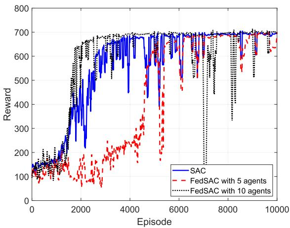

Fig. 3. Rewards of SAC and FedSAC.  
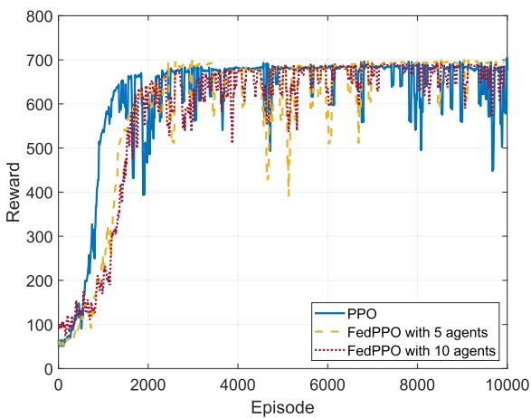  
Fig. 4. Rewards of PPO and FedPPO.

In contrast, increasing the number of threads to 10 (as in FedSAC with 10 agents) results in more frequent updates of the global model, even with asynchronous updates, which aids in faster convergence. However, in asynchronous updates, the completion times of local updates across different agents can vary significantly. As the number of agents increases, these temporal discrepancies become more pronounced, exacerbating parameter inconsistencies during global model aggregation. In addition, FedSAC aggregates four distinct networks: actor, critic, target actor, and target critic, causing instability, particularly under the asynchronous participation of a larger number of agents. Furthermore, SAC’s entropy maximization mechanism, designed to enhance exploration, introduces greater update variability. This increased variability further impedes the convergence rate as the number of participating agents continues to grow.

Fig. 4 illustrates the convergence over 10,000 training episodes for the PPO algorithm and its accelerated versions, FedPPO with 5 agents and FedPPO with 10 agents. It is evident that all configurations converge quickly, with convergence occurring around 2000 episodes. Despite the varying numbers of threads initiated, the PPO algorithm maintains update stability by constraining the difference between new and old policies, thereby reducing the risk of significant performance degradation during updates. In comparison to the SAC algorithm and its associated accelerated algorithms, PPO can uphold update stability even in asynchronous environments [50], thus mitigating global model fluctuations caused by inconsistent learning processes among agents.

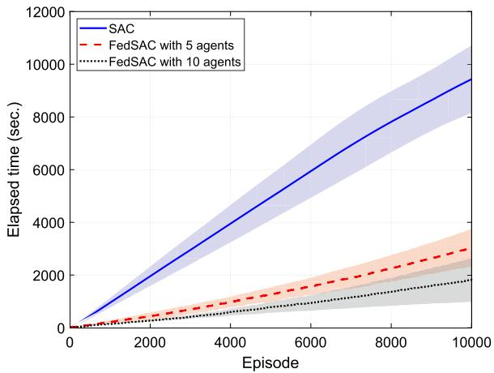

Fig. 5. Time comparison between SAC and FedSAC.  
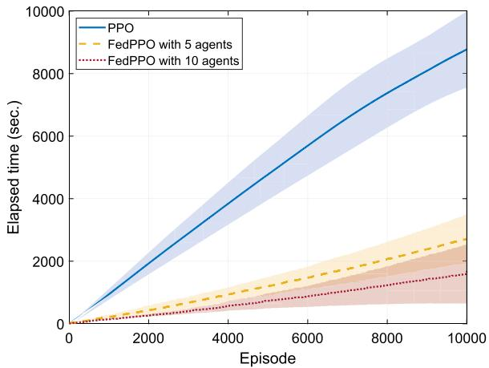  
Fig. 6. Time comparison between PPO and FedPPO.

Figs. 5 and 6 show the average time required to complete 10,000 training episodes by SAC, FedSAC, PPO, and FedPPO algorithms. For each curve, the shaded areas represent the standard deviations. The results in these two figures faithfully demonstrate that the utilization of FedX, notably FedSAC, significantly reduced training durations. Such an enhancement highlights the efficiency of FedX in expediting the training process, making it a powerful framework for scenarios requiring rapid model updates.

Fig. 7 further confirms the effectiveness of FedX in terms of Speedup.2 In the figure, the Speedup for FedSAC is approximately 3.72 and 7.43 for configurations with 5 and 10 agents, respectively, whereas for FedPPO, these ratios are about 4.53 and 7.44, respectively. In addition, the Speedup exhibits a trend of initially increasing and then decreasing as the number of training episodes grows. This can be attributed to the parallel operation of multiple agents in the initial training phases, especially when each agent starts with a relatively high initial communication or synchronization overhead. However, as training progresses into the middle and later stages, with the increase in data volume and the model nearing convergence, the update rate slows while overhead remains, resulting in a decline in Speedup [51].

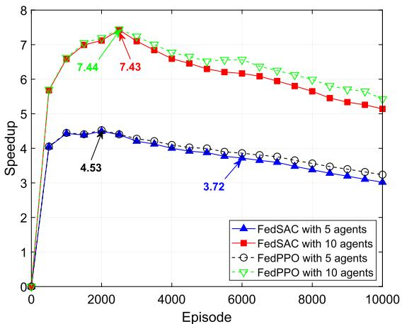  
Fig. 7. Speedup performance.

Figs. 8 and 10 show a comparison of the 2D and 3D trajectories produced by the SAC and PPO algorithms along with their accelerated ones, FedSAC and FedPPO. It is clear to see that all the algorithms are capable of generating high-quality solutions. Specifically, we can observe that in order to establish stable communication links with GTs, UAVs typically fly close to each GT and may descend to lower altitudes and hover as needed. This behavior primarily aims to optimize signal reception quality and enhance communication reliability, especially in complex practical settings.

Figs. 9 and 11 display the Cumulative Distribution Functions (CDF) of UAV energy consumption and throughput under different algorithms and their accelerated versions. The results demonstrate that the performance of both algorithms and their accelerated versions are almost the same. This observation further validates that our proposed framework significantly reduces training time while not compromising solution accuracy.

## D. Discussion and Lesson Learned

1) Summary of Evaluation Results: We investigated the convergence properties, training duration, acceleration effects, trajectory quality, and comparative system performance of FedX and its implementations, FedSAC and FedPPO. The training results indicate that while all algorithms eventually converge, Fed-SAC and FedPPO exhibit significant advantages in accelerating the training process without compromising solution accuracy. Additionally, FedSAC and FedPPO demonstrate exceptional performance in planning UAV flight trajectories. The results show that these algorithms achieve similar system performance in terms of energy consumption and throughput, which indicates that UAVs can effectively approach each ground terminal and adjust their altitude to establish stable communication links, optimize signal reception quality, and enhance communication reliability.

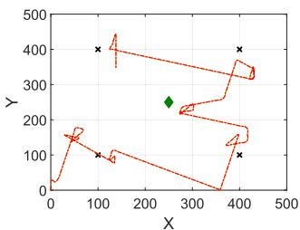  
(a) 2D-SAC

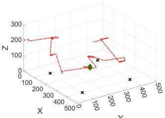  
(b) 3D-SAC

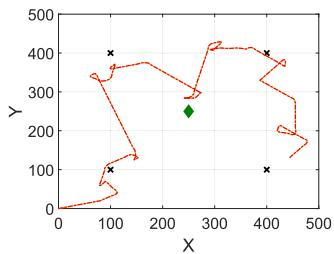

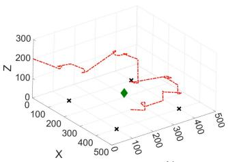  
(d) 3D-FedSAC-5

(c) 2D-FedSAC-5  
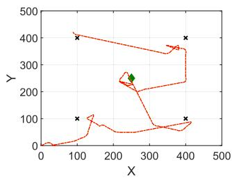  
(e) 2D-FedSAC-10

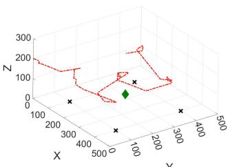  
(f) 3D-FedSAC-10

Fig. 8. Trajectory comparison between SAC and FedSAC.  
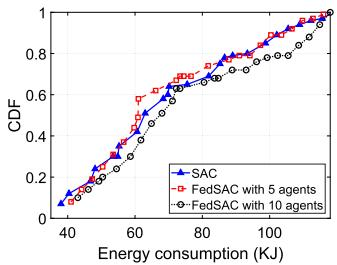  
(a)

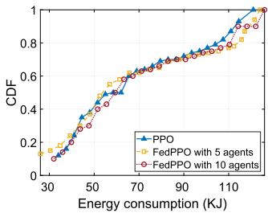  
(b)  
Fig. 9. Comparison of the cumulative distribution function (CDF) of energy consumption. (a) SAC vs FedSAC. (b) PPO vs FedPPO.

Although the acceleration effects may lessen in the later stages of training, likely due to the slowdown in model update rates while the potential high communication and synchronization overheads remain, the accelerated training frameworks still effectively shorten the overall training time and significantly improve training efficiency.

2) Pros and Cons of FedX: The FedX framework proposed in this study has achieved remarkable results in UAV trajectory planning. The basic idea behind FedX is trading-space-for-time.

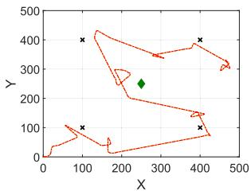  
(a) 2D-PPO

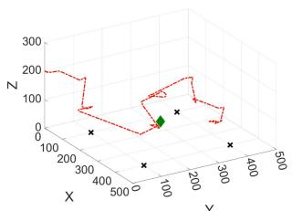  
(b) 3D-PPO

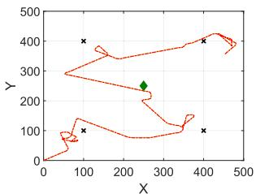

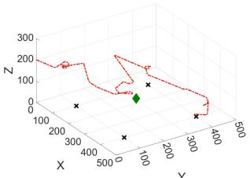  
(d) 3D-FedPPO-5

(c) 2D-FedPPO-5  
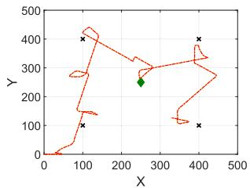  
(e) 2D-FedPPO-10

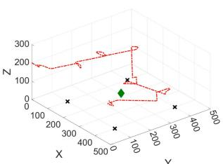  
(f) 3D-FedPPO-10

Fig. 10. Trajectory comparison between PPO and FedPPO.  
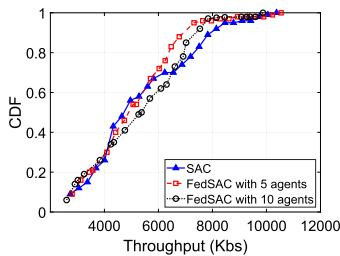  
(a)

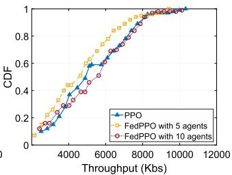  
(b)  
Fig. 11. Comparison of the cumulative distribution function (CDF) of throughput. (a) SAC vs FedSAC. (b) PPO vs FedPPO.

It efficiently utilizes computational resources by forking multiple threads for parallel training and significantly accelerates the training process, enabling the model to converge in a shorter time. This is particularly suitable for wireless networks and mobile computing environments.

On the other hand, the assumption underlying FedX for training acceleration is that the dataset for training must be homogeneous. For those heterogeneous datasets, FedX needs to be redesigned, which is our future work. Moreover, in an asynchronous update environment, coordinating the updates from multiple agents becomes more complex, potentially making it challenging to ensure the stability of the global model.

3) Comparison With Non-RL Solution: We employed a model-based $\mathbf { A } ^ { * }$ algorithm [32] for performance comparison, with results presented in Fig. 12 (including 2D and 3D trajectory plots) and Table II, where we analyze UAV throughput and energy consumption. The pseudocode framework of the $\mathbf { A } ^ { * }$ algorithm is shown in Algorithm 4.

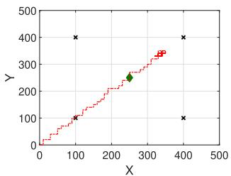  
(a) 2D-A\*.

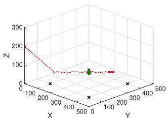  
(b) $3 0 \mathtt { - A } ^ { \star }$

Fig. 12. Trajectory of $\mathbf { A } ^ { * }$  
TABLE II  
SYSTEM PERFORMANCE COMPARISON
<table><tr><td>Algorithm</td><td>Energy (KJ)</td><td>Throughput (Kbs)</td><td>Energy efficiency (bits/J)</td></tr><tr><td> $\mathrm { A } ^ { * }$ </td><td>53.38</td><td>3230.09</td><td>60.51</td></tr><tr><td>SAC</td><td>72.32</td><td>6580.25</td><td>90.98</td></tr><tr><td>SAC with 5 agents</td><td>76.54</td><td>6636.58</td><td>86.71</td></tr><tr><td>SAC with 10 agents</td><td>79.02</td><td>6592.88</td><td>83.02</td></tr><tr><td>PPO</td><td>76.12</td><td>6607.22</td><td>86.80</td></tr><tr><td>PPO with 5 agents</td><td>78.23</td><td>6742.74</td><td>86.19</td></tr><tr><td>PPO with 10 agents</td><td>79.53</td><td>6883.10</td><td>86.55</td></tr></table>

The $\mathbf { A } ^ { * }$ algorithm utilizes three key cost components to evaluate the efficiency of UAV trajectory planning:

$f _ { \mathrm { c o s t } }$ (Total Cost): It is the sum of the actual cost incurred from the start node to the current node $( g _ { \mathrm { c o s t } } [ n ] )$ and the estimated cost to reach the goal $( h _ { \mathrm { c o s t } } [ n ] )$ . The algorithm selects the node with the lowest $f _ { \mathrm { c o s t } } [ n ]$ at each step to explore:

$$
f _ { \mathrm { c o s t } } [ n ] = g _ { \mathrm { c o s t } } [ n ] + h _ { \mathrm { c o s t } } [ n ] .
$$

$g _ { \mathrm { c o s t } }$ (Accumulated Cost): Representing the actual cumulative cost from the start node to the current node:

$$
g _ { \mathrm { c o s t } } [ n ] = E [ n ] + p _ { B d } ,
$$

where $E [ n ]$ denotes the energy consumption of the UAV in the current time slot, and $p _ { B d }$ is the penalty for the UAV crossing the boundary. This setup allows $g _ { \mathrm { c o s t } } [ n ]$ to comprehensively reflect the actual operational cost of the UAV, taking into account both energy consumption and penalties for non-compliant flight behaviors, such as exceeding boundaries. It helps improve the efficiency and reliability of the path-planning process.

$h _ { \mathrm { c o s t } }$ (Heuristic Cost): The heuristic estimate of the remaining effort from the current node to the goal:

$$
h _ { \mathrm { c o s t } } [ n ] = \sum _ { k = 1 } ^ { K } D _ { k } - \sum _ { k = 1 } ^ { K } \sum _ { n ^ { \prime } = 1 } ^ { n + 1 } \delta _ { t } R _ { k , i } [ n ^ { \prime } ] ,
$$

where $\sum _ { k = 1 } ^ { K } D _ { k }$ represents the total data demand of all ground terminals, and $\begin{array} { r } { \sum _ { k = 1 } ^ { K } \sum _ { n ^ { \prime } = 1 } ^ { n + 1 } \delta _ { t } R _ { k , i } [ n ^ { \prime } ] } \end{array}$ represents the total amount of data transmitted by the UAV to each ground terminal up to the current time slot. As shown, the heuristic function $h _ { \mathrm { c o s t } } [ n ]$ is expressed as the remaining data to be transmitted. This setup allows $h _ { \mathrm { c o s t } } [ n ]$ to reasonably estimate the remaining transmission tasks, helping the UAV plan its path more efficiently and prioritize routes that maximize data transmission.

Algorithm 4: A\* Algorithm for UAV Trajectory Planning.   
1: Initialize environment parameters and UAV initial   
state (position, data served as zero, energy consumed   
as zero);   
2: Initialize the open list with the start node and closed   
set as empty;   
3: while $n < N$ do   
4: if open list is empty then returnNo feasible path   
found;   
5: end if   
6: Pop node with lowest $f _ { \mathrm { c o s t } } [ n ]$ from open list as   
current\_node;   
7: if $\begin{array} { r } { \cdot \sum _ { k = 1 } ^ { K } \sum _ { n ^ { \prime } = 1 } ^ { n + 1 } \delta _ { t } R _ { k , i } [ n ^ { \prime } ] > \sum _ { k = 1 } ^ { K } D _ { k } } \end{array}$ then   
8: Retrieve and return path from the start node to   
current\_node;   
9: end if   
10: for all possible actions in $\mathcal { A } ^ { \prime }$ do   
11: Simulate the action to obtain the next state   
(position, data served, energy consumed);   
12: Calculate $g _ { \mathrm { c o s t } } [ n ]$ as cumulative cost from start to   
next state, including energy and penalties;   
13: Calculate $h _ { \mathrm { c o s t } } [ n ]$ as heuristic estimate to fulfill   
GT requirements from next state;   
14: Calculate $f _ { \mathrm { c o s t } } [ n ]$ as $g _ { \mathrm { c o s t } } [ n ] + h _ { \mathrm { c o s t } } [ n ] ;$   
15: if next state is not in closed set then   
16: Create neighbor\_node with next state, $f _ { \mathrm { c o s t } } [ n ]$   
and action leading to it;   
17: Add neighbor\_node to open list;   
18: end if   
19: end for   
20: Add current\_node to closed set;   
21: returnNo feasible path found if max\_iterations   
reached;

The $\mathbf { A } ^ { * }$ algorithm finds the optimal UAV trajectory through heuristic search. The idea is to select the node to expand at each step based on the cost function $f _ { \mathrm { c o s t } } [ n ]$ , giving priority to expanding the node with the smallest cost. Each node state contains the current position of the UAV and the accumulated total energy consumption. At each step, the $\mathrm { U A V } { \ : } \mathfrak { s }$ s action space $\mathcal { A } ^ { \prime }$ is traversed, and its definition is consistent with the action space in reinforcement learning, specifically:

$$
\begin{array} { r } { a ^ { \prime } ( n ) = ( l _ { n } , h _ { n } , c _ { k , n } , t _ { n } ^ { u } ) \in \mathcal { A } = \mathcal { L } _ { u } \times \mathcal { H } _ { u } \times \mathcal { C } \times \mathcal { T } , } \end{array}
$$

where $l _ { n }$ and $h _ { n }$ represent the UAV’s movement directions in the horizontal and vertical dimensions, respectively. $\mathcal { T } =$ $[ t _ { \mathrm { m i n } } : 0 . 5$ ms $\colon t _ { \mathrm { m a x } } ]$ denotes the duration of the flight time slot, and $t _ { n } ^ { u }$ is a discrete value chosen between $t _ { \mathrm { m i n } }$ and $t _ { \mathrm { m a x } } . \mathcal { C } =$ $\{ c _ { k , n } , \forall k , n \}$ represents the scheduling actions for the ground terminals.

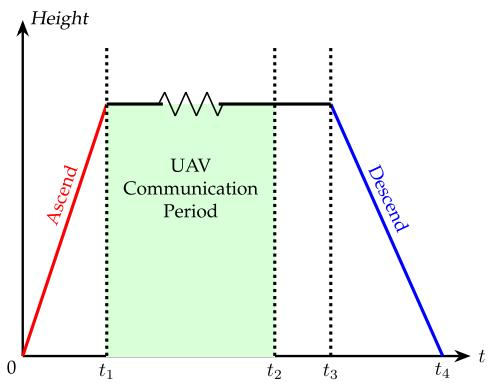  
Fig. 13. A general UAV flight pattern.

We simplified the action space in the designed $\mathbf { A } ^ { * }$ algorithm to improve search efficiency during heuristic search. In the horizontal dimension, the action space is restricted to five directions (forward, backward, left, right, and hover), and the time slot interval is adjusted to 0.5. The reduction in the search space guarantees that the $\mathbf { A } ^ { * }$ algorithm can efficiently find optimal paths even in large-scale problems.

Fig. 12 shows the 2D and 3D trajectories of the UAV obtained by the $\mathbf { A } ^ { * }$ algorithm. As shown in the figure, given the known system model, the $\mathbf { A } ^ { * }$ algorithm selects the action with the lowest total cost $( f _ { \mathrm { c o s t } } )$ at each step (e.g., hovering and circling at the lowest altitude) while ensuring the completion of data transmission tasks. However, the UAV demonstrates limited exploration, as it does not attempt to cover a wider spatial range. For example, the UAV does not choose to fly closer to the ground terminals to maximize data transmission rates; instead, it prioritizes energy saving. To some extent, such a behavior limits the overall optimization potential of its performance.

Table II compares the system performance between the A\* algorithm and our proposed RL-based algorithms, including metrics such as energy consumption, throughput, and energy efficiency. It can be observed that the $\mathbf { A } ^ { * }$ algorithm demonstrates significant optimization in terms of energy consumption, achieving lower energy usage compared to the RL methods. However, since the $\mathbf { A } ^ { * }$ algorithm chooses the direction with the lowest cost function at each step, It does not sufficiently explore the global state, limiting action choices. This lack of exploration prevents the $\mathbf { A } ^ { * }$ algorithm from fully utilizing the available space and resources to maximize data transmission rates, leading to lower overall energy efficiency compared to RL methods. While the $\mathbf { A } ^ { * }$ algorithm excels in local optimization, it is less effective at finding globally optimal solutions in complex and dynamic environments compared to RL algorithms.

4) Impact of Flight Pattern: Fig. 13 illustrates a typical flight pattern comprising four phases: Ascend (from 0 to t1), Communication $( t _ { 1 } \ t _ { 0 } t _ { 2 } )$ , Return $( t _ { 2 } \ t _ { 0 } t _ { 3 } )$ , and Descend $( t _ { 3 } \ t _ { 0 } t _ { 4 } )$ . Our work in this study only considers the flight and communication phases of the UAV trajectory (green area in Fig. 13) without accounting for the takeoff (Ascend), return $( ( t _ { 2 } ~ \ t _ { 0 } ~ t _ { 3 } ) )$ , and landing (Descend) phases. Recall that Fig. 2 provides a useful insight into the power consumption of UAVs under different speeds and conditions, offering critical data support for our subsequent research. In the next stage, we will incorporate the takeoff, landing, and return phases. By comprehensively analyzing the energy consumption and communication requirements of UAVs during these various flight phases, we aim to further optimize UAV path planning and energy management. This will contribute to the development of a more comprehensive and efficient UAV flight model.

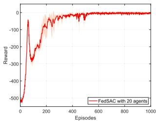  
(a) FedSAC rewards

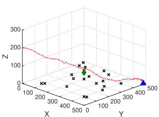  
(b) FedSAC 3D trajectory

Fig. 14. FedSAC performance with 20 agents and 20 ground terminals.  
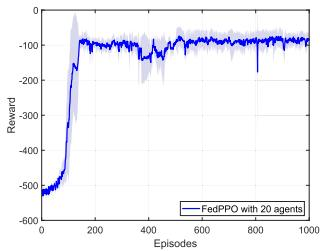  
(a) FedPPO rewards

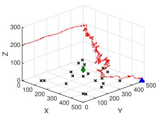  
(b) FedPPO 3D trajectory  
Fig. 15. FedPPO performance with 20 agents and 20 ground terminals.

To validate the above idea, we deployed a charging station at coordinates (500, 500, 0) as a navigation target. The reinforcement learning framework was accordingly modified with:

\- Reduced action space to five horizontal directions (stay, forward, backward, left, right) for improved training efficiency;

\- Enhanced reward function incorporating target distance: $r ( s [ n ] , a [ n ] ) ^ { \prime } = r ( s [ n ] , a [ n ] ) + \Delta d ;$

\- Modified termination condition requiring the UAV to reach the charging station.

We conducted experiments with 20 agents and 20 ground terminals to test the scalability of our method. The results demonstrate stable convergence and robust performance in this larger-scale scenario, as shown in Figs. 14 and 15.

## VI. CONCLUSION

In this paper, we have investigated UAV trajectory planning in RIS-assisted UAV communications in urban areas. We have developed an incomplete information communication model and a quadrotor UAV energy consumption model and formulated the UAV’s energy consumption problem toward an optimized UAV trajectory. To solve the problem, we have designed an acceleration framework, FedX, for reinforcement learning solvers.

Two responsive and accurate trajectory planning algorithms, FedSAC and FedPPO, are developed. Our evaluation results show that the proposed framework is effective and efficient and, thus, is applicable to RL solvers in wireless network and mobile computing scenarios. We believe that our work stands out from previous studies by creating an impact on the field of UAV communications. By developing novel models and new algorithms, researchers and practitioners can gain not only in-depth insight into the complex nature of UAV communications but also design fast machine learning algorithms by following our outcomes, paving the way for networking innovations in 6 G.

## REFERENCES

[1] Unmanned aircraft systems: Considerations for law enforcement action, 2024, Accessed: Jun. 25, 2024. [Online]. Available: https://www.cisa.gov/ topics/physical-security/unmanned-aircraft-systems/law-enforcement

[2] Science & tech spotlight: Drone swarm technologies, 2023, Accessed: Jun. 25, 2024. [Online]. Available: https://www.gao.gov/products/gao-23- 106930

[3] D. Zhou, M. Sheng, J. Li, and Z. Han, “Aerospace integrated networks innovation for empowering 6G: A survey and future challenges,” IEEE Commun. Surv. Tut., vol. 25, no. 2, pp. 975–1019, Second Quarter 2023.

[4] G. Geraci et al., “What will the future of UAV cellular communications be? A flight from 5G to 6G,” IEEE Commun. Surv. Tut., vol. 24, no. 3, pp. 1304–1335, Third Quarter 2022.

[5] X. Cao et al., “Reconfigurable intelligent surface-assisted aerial-terrestrial communications via multi-task learning,” IEEE J. Sel. Areas Commun., vol. 39, no. 10, pp. 3035–3050, Oct. 2021.

[6] S. Han, J. Wang, L. Xiao, and C. Li, “Broadcast secrecy rate maximization in UAV-Empowered IRS backscatter communications,” IEEE Trans. Wireless Commun., vol. 22, no. 10, pp. 6445–6458, Oct. 2023.

[7] K. Guo, M. Wu, X. Li, H. Song, and N. Kumar, “Deep reinforcement learning and NOMA-Based multi-objective RIS-Assisted IS-UAV-TNs: Trajectory optimization and beamforming design,” IEEE Trans. Intell. Transp. Syst., vol. 24, no. 9, pp. 10197–10210, Sep. 2023.

[8] J. Zhao, Y. Zhu, X. Mu, K. Cai, Y. Liu, and L. Hanzo, “Simultaneously transmitting and reflecting reconfigurable intelligent surface (STAR-RIS) assisted UAV communications,” IEEE J. Sel. Areas Commun., vol. 40, no. 10, pp. 3041–3056, Oct. 2022.

[9] X. Liu, Y. Liu, and Y. Chen, “Machine learning empowered trajectory and passive beamforming design in UAV-RIS wireless networks,” IEEE J. Sel. Areas Commun., vol. 39, no. 7, pp. 2042–2055, Jul. 2021.

[10] T. P. Truong, V. D. Tuong, N.-N. Dao, and S. Cho, “FlyReflect: Joint flying IRS trajectory and phase shift design using deep reinforcement learning,” IEEE Internet Things J., vol. 10, no. 5, pp. 4605–4620, Mar. 2023.

[11] K. K. Nguyen, A. Masaracchia, V. Sharma, H. V. Poor, and T. Q. Duong, “RIS-Assisted UAV communications for IoT with wireless power transfer using deep reinforcement learning,” IEEE J. Sel. Topics Signal Process., vol. 16, no. 5, pp. 1086–1096, Aug. 2022.

[12] W. Khawaja, I. Guvenc, D. W. Matolak, U.-C. Fiebig, and N. Schneckenburger, “A survey of air-to-ground propagation channel modeling for unmanned aerial vehicles,” IEEE Commun. Surv. Tut., vol. 21, no. 3, pp. 2361–2391, Third Quarter 2019.

[13] X. Cheng, Z. Huang, and L. Bai, “Channel nonstationarity and consistency for beyond 5G and 6G: A survey,” IEEE Commun. Surv. Tut., vol. 24, no. 3, pp. 1634–1669, Third Quarter 2022.

[14] Y. Zeng, Q. Wu, and R. Zhang, “Accessing from the sky: A tutorial on UAV communications for 5G and beyond,” Proc. IEEE, vol. 107, no. 12, pp. 2327–2375, Dec. 2019.

[15] H. Zhang, M. Huang, H. Zhou, X. Wang, N. Wang, and K. Long, “Capacity maximization in RIS-UAV networks: A DDQN-Based trajectory and phase shift optimization approach,” IEEE Trans. Wireless Commun., vol. 22, no. 4, pp. 2583–2591, Apr. 2023.

[16] Z. Wei et al., “Sum-rate maximization for IRS-Assisted UAV OFDMA communication systems,” IEEE Trans. Wireless Commun., vol. 20, no. 4, pp. 2530–2550, Apr. 2021.

[17] H. Mei, K. Yang, Q. Liu, and K. Wang, “3D-Trajectory and phase-shift design for RIS-Assisted UAV systems using deep reinforcement learning,” IEEE Trans. Veh. Technol., vol. 71, no. 3, pp. 3020–3029, Mar. 2022.

[18] L. Wang, K. Wang, C. Pan, and N. Aslam, “Joint trajectory and passive beamforming design for intelligent reflecting surface-aided UAV communications: A deep reinforcement learning approach,” IEEE Trans. Mobile Comput., vol. 22, no. 11, pp. 6543–6553, Nov. 2023.

[19] M.-L. Tham, Y. J. Wong, A. Iqbal, N. B. Ramli, Y. Zhu, and T. Dagiuklas, “Deep reinforcement learning for secrecy energy-efficient UAV communication with reconfigurable intelligent surface,” in Proc. IEEE Wireless Commun. Netw. Conf., 2023, pp. 1–6.

[20] S. Liu et al., “UAV-enabled collaborative beamforming via multi-agent deep reinforcement learning,” IEEE Trans. Mobile Comput., vol. 23, no. 12, pp. 13015–13032, Dec. 2024.

[21] Q. Sun, J. Niu, X. Zhou, T. Jin, and Y. Li, “AoI and data rate optimization in aerial IRS-Assisted IoT networks,” IEEE Internet Things J., vol. 11, no. 4, pp. 6481–6493, Feb. 2024.

[22] G. Iacovelli, A. Coluccia, and L. A. Grieco, “Multi-UAV IRS-Assisted communications: Multi-node channel modeling and fair sum-rate optimization via deep reinforcement learning,” IEEE Internet Things J., vol. 11, no. 3, pp. 4470–4482, Feb. 2024.

[23] X. Yuan, S. Hu, W. Ni, X. Wang, and A. Jamalipour, “Deep reinforcement learning-driven reconfigurable intelligent surface-assisted radio surveillance with a fixed-wing UAV,” IEEE Trans. Inf. Forensics Secur., vol. 18, pp. 4546–4560, 2023.

[24] V. Vishnoi, P. Consul, I. Budhiraja, S. Gupta, and N. Kumar, “Deep reinforcement learning based energy consumption minimization for intelligent reflecting surfaces assisted D2D users underlaying UAV network,” in Proc. IEEE Conf. Comput. Commun. Workshops, 2023, pp. 1–6.

[25] Y. Qi, Z. Su, Q. Xu, and D. Fang, “Joint beamforming and trajectory optimization for UAV-Assisted double IRS secure transmission system: A deep reinforcement learning approach,” in Proc. IEEE Int. Conf. Metaverse Comput. Netw. Appl., 2023, pp. 504–509.

[26] J. Sun et al., “Leveraging UAV-RIS reflects to improve the security performance of wireless network systems,” IEEE Netw. Lett., vol. 5, no. 2, pp. 81–85, Jun. 2023.

[27] J. Huang, C.-C. Xing, S. Gu, and E. Baker, “Drop Maslow’s Hammer or not: Machine learning for resource management in D2D communications,” ACM SIGAPP Appl. Comput. Rev., vol. 22, no. 1, pp. 5–14, Apr. 2022.

[28] Y. Zeng, J. Xu, and R. Zhang, “Energy minimization for wireless communication with rotary-wing UAV,” IEEE Trans. Wireless Commun., vol. 18, no. 4, pp. 2329–2345, Apr. 2019.

[29] M. Eskandari and A. Savkin, “Trajectory planning for UAVs equipped with RISs to provide aerial LoS service for mobile nodes in 5G/Optical wireless communication networks,” IEEE Trans. Veh. Technol., vol. 72, no. 6, pp. 8216–8221, Jun. 2023.

[30] M. Abdel-Basset, R. Mohamed, K. M. Sallam, I. M. Hezam, K. Munasinghe, and A. Jamalipour, “A multiobjective optimization algorithm for safety and optimality of 3-D route planning in UAV,” IEEE Trans. Aerosp. Electron. Syst., vol. 60, no. 3, pp. 3067–3080, Jun. 2024.

[31] X. Yu, W.-N. Chen, T. Gu, H. Yuan, H. Zhang, and J. Zhang, “ACO-A\*: Ant colony optimization plus A\* for 3-D traveling in environments with dense obstacles,” IEEE Trans. Evol. Comput., vol. 23, no. 4, pp. 617–631, Aug. 2019.

[32] V. Roberge, M. Tarbouchi, and G. Labonté, “Fast genetic algorithm path planner for fixed-wing military UAV using GPU,” IEEE Trans. Aerosp. Electron. Syst., vol. 54, no. 5, pp. 2105–2117, Oct. 2018.

[33] Z. Yu, Z. Si, X. Li, D. Wang, and H. Song, “A novel hybrid particle swarm optimization algorithm for path planning of UAVs,” IEEE Internet Things J., vol. 9, no. 22, pp. 22547–22558, Nov. 2022.

[34] A. B. M. Adam et al., “Intelligent and robust UAV-Aided multiuser RIS communication technique with jittering UAV and imperfect hardware constraints,” IEEE Trans. Veh. Technol., vol. 72, no. 8, pp. 10737–10753, Aug. 2023.

[35] Y. Qin, Z. Zhang, X. Li, W. Huangfu, and H. Zhang, “Deep reinforcement learning based resource allocation and trajectory planning in integrated sensing and communications UAV network,” IEEE Trans. Wireless Commun., vol. 22, no. 11, pp. 8158–8169, Nov. 2023.

[36] R. Dong, B. Wang, K. Cao, J. Tian, and T. Cheng, “Secure transmission design of RIS enabled UAV communication networks exploiting deep reinforcement learning,” IEEE Trans. Veh. Technol., vol. 73, no. 6, pp. 8404–8419, Jun. 2024.

[37] M. Tuchler, A. Singer, and R. Koetter, “Minimum mean squared error equalization using a priori information,” IEEE Trans. Signal Process., vol. 50, no. 3, pp. 673–683, Mar. 2002.

[38] A. R. S. Bramwell, G. Done, and D. Balmford, Bramwell’s Helicopter Dynamics, 2nd ed. Washington, DC, USA: Butterworth-Heinemann, 2001.

[39] A. Filippone, Flight Performance of Fixed and Rotary Wing Aircraft. Washington, DC, USA: Butterworth-Heinemann, 2006.

[40] H. Gong, B. Huang, B. Jia, and H. Dai, “Modeling power consumptions for multirotor UAVs,” IEEE Trans. Aerosp. Electron. Syst., vol. 59, no. 6, pp. 7409–7422, Dec. 2023.

[41] Q. Duan, J. Huang, S. Hu, R. Deng, Z. Lu, and S. Yu, “Combining federated learning and edge computing toward ubiquitous intelligence in 6G network: Challenges, recent advances, and future directions,” IEEE Commun. Surv. Tut., vol. 25, no. 4, pp. 2892–2950, Fourth Quarter 2023.

[42] T. P. Lillicrap et al., “Continuous control with deep reinforcement learning,” in Proc. 4th Int. Conf. Learn. Representations, San Juan, Puerto Rico, 2016, pp 1–14. [Online]. Available: http://arxiv.org/abs/1509.02971

[43] S. Fujimoto, H. van Hoof, and D. Meger, “Addressing function approximation error in actor-critic methods,” 2018, arXiv: 1802.09477. [Online]. Available: http://arxiv.org/abs/1802.09477

[44] J. Schulman, F. Wolski, P. Dhariwal, A. Radford, and O. Klimov, “Proximal policy optimization algorithms,” 2017, arXiv: 1707.06347. [Online]. Available: http://arxiv.org/abs/1707.06347

[45] T. Haarnoja, A. Zhou, P. Abbeel, and S. Levine, “Soft actor-critic: Offpolicy maximum entropy deep reinforcement learning with a stochastic actor,” in Proc. 35th Int. Conf. Mach. Learn., Stockholm, Sweden, 2018, pp. 1861–1870.

[46] J. Schulman, S. Levine, P. Abbeel, M. Jordan, and P. Moritz, “Trust region policy optimization,” in Proc. 32nd Int. Conf. Mach. Learn., Lille, France, 2015, pp. 1889–1897.

[47] V. Mnih et al., “Asynchronous methods for deep reinforcement learning,” in Proc. 33rd Int. Conf. Mach. Learn., New York, NY, 2016, pp. 1928–1937.

[48] A. Goldsmith, Wireless Communications. Cambridge, U.K.: Cambridge Univ. Press, 2005.

[49] D. P. Kingma and J. Ba, “Adam: A method for stochastic optimization,” 2014, arXiv:1412.6980.

[50] R. Grande, T. Walsh, and J. How, “Sample efficient reinforcement learning with Gaussian processes,” in Proc. Int. Conf. Mach. Learn., Bejing, Peoples R. China, 2014, pp. 1332–1340.

[51] W. Liu, L. Chen, Y. Chen, and W. Zhang, “Accelerating federated learning via momentum gradient descent,” IEEE Trans. Parallel Distrib. Syst., vol. 31, no. 8, pp. 1754–1766, Aug. 2020.

Jun Huang (Senior Member, IEEE) received the PhD degree (with honors) from the Institute of Network Technology, Beijing University of Posts and Telecommunications, China, in 2012. He is now an assistant professor with the Department of Electrical Engineering and Computer Science (EECS), South Dakota State University. Before that, he was a nontenure track faculty member with Baylor University. He held a full professor appointment with Northwestern Polytechnical University and Chongqing University of Posts and Telecommunications in China from

2015 to 2021. He was a visiting scholar with the University of British Columbia, a research fellow with the South Dakota School of Mines & Technology and the University of Texas at Dallas, and a guest professor with the National Institute of Standards and Technology. He was the recipient of the Outstanding Research Award (Tier I) from CQUPT, in 2019, the Best Paper Award from EAI Mobimedia, in 2019, Outstanding Service Award from ACM RACS, in 2017, 2018, and 2019, Best Paper Nomination from ACM SAC in 2014, and Best Paper Award from AsiaFI 2011. He is the technical editor of ACM SIGAPP Applied Computing Review and an associate editor of Elsevier Digital Communications and Networks and ICT Express. He guest-edited several special issues in IEEE/ACM journals. He also chaired and co-chaired multiple conferences in the communications and networking areas and organized numerous workshops at major IEEE and ACM events.

Beining Wu (Student Member, IEEE) received the BS degree in mathematics and applied mathematics from Anhui Normal University, Wuhu, China, in 2024. He is currently working toward the PhD degree in computer science with South Dakota State University (SDSU), Brookings. His research interests include wireless communications, UAV networks, and reinforcement learning.

Qiang Duan (Senior Member, IEEE) received the PhD degree in electrical engineering from the University of Mississippi, in 2003. He is a professor of information sciences and technology with Pennsylvania State University Abington College. His general research interests include computer networking, distributed systems, and artificial intelligence, with recent research focusing on network virtualization and softwarization, network-edge-cloud convergence, federated and split learning, and ubiquitous intelligence in future Internet. He has published four

monographs, six book chapters, and more than 120 refereed journal articles and conference papers. He has served on the editorial boards as an editor/associate editor for multiple research journals and has been involved in organizing numerous international conferences as a TPC member and track/session chair.

Liang (Leon) Dong (Senior Member, IEEE) received the BS degree in applied physics with a minor in computer engineering from Shanghai Jiao Tong University, China, in 1996, and the MS and PhD degrees in electrical and computer engineering from the University of Texas at Austin, in 1998 and 2002, respectively. Since 2011, he has been with Baylor University, where he is currently an associate professor of Electrical and Computer Engineering. His research interests include digital signal processing, wireless communications and networking, cyber-physical systems and

security, and AI/ML applications in signal processing and communications. His work has been supported by NSF, DoD, NASA, and industry partners such as L3Harris, Intel, and ExxonMobil. He has extensive industry experience in smart antenna communications systems and wireless networking technologies. Previously, he held academic positions with Western Michigan University and was a visiting researcher with Stanford University. He is a member of the American Physical Society (APS).

Shui Yu (Fellow, IEEE) received the PhD degree from Deakin University, Australia, in 2004. He is a professor of the School of Computer Science, deputy chair of the University Research Committee, University of Technology Sydney, Australia. His research interest includes cybersecurity, network science, Big Data, and mathematical modeling. He has published five monographs and edited two books, more than 500 technical papers with different venues, such as IEEE Transactions on Dependable and Secure Computing, IEEE Transactions on Parallel and Distributed Sys-

tems, IEEE Transactions on Computers, IEEE Transactions on Information Forensics and Security, IEEE Transactions on Mobile Computing, IEEE Transactions on Knowledge and Data Engineering, IEEE Transactions on Emerging Topics in Computing, IEEE/ACM Transactions on Networking, and INFOCOM. His current h-index is 76. He promoted the research field of networking for Big Data since 2013, and his research outputs have been widely adopted by industrial systems such as Amazon cloud security. He is currently serving the editorial boards of IEEE Communications Surveys and Tutorials (area editor) and IEEE Internet of Things Journal (editor). He served as a distinguished lecturer of IEEE Communications Society (2018–2021). He is a distinguished visitor of IEEE Computer Society, and an elected member of Board of Governors of IEEE VTS and ComSoc, respectively. He is a member of ACM and AAAS.