# A Game-Theoretical Approach for User Allocation in Edge Computing Environment

Qiang He , Member, IEEE, Guangming Cui , Xuyun Zhang , Feifei Chen , Shuiguang Deng , Senior Member, IEEE, Hai Jin , Fellow, IEEE, Yanhui Li , Member, IEEE, and Yun Yang , Senior Member, IEEE

Abstract—Edge Computing provides mobile and Internet-of-Things (IoT) app vendors with a new distributed computing paradigm which allows an app vendor to deploy its app at hired edge servers distributed near app users at the edge of the cloud. This way, app users can be allocated to hired edge servers nearby to minimize network latency and energy consumption. A cost-effective edge user allocation (EUA) requires maximum app users to be served with minimum overall system cost. Finding a centralized optimal solution to this EUA problem is NP-hard. Thus, we propose EUAGame, a game-theoretic approach that formulates the EUA problem as a potential game. We analyze the game and show that it admits a Nash equilibrium. Then, we design a novel decentralized algorithm for finding a Nash equilibrium in the game as a solution to the EUA problem. The performance of this algorithm is theoretically analyzed and experimentally evaluated. The results show that the EUA problem can be solved effectively and efficiently.

Index Terms—Edge user allocation, edge server, cost-effectiveness, pay-as-you-go, game theory, Nash equilibrium, multi-tenancy, edge computing

# 1 INTRODUCTION

OVER the past decade, mobile and Internet-of-Things (IoT) devices, including mobile phones, wearable devices, tablets, etc., have become increasingly popular. According to Ericsson’s report [1], it is predicted that there will be about 20 billion mobile and IoT devices by 2023. The rapid growth and advances of mobile and IoT devices have fueled the variety and sophistication of mobile and IoT apps (together referred to as apps hereafter). Many apps are resource-hungry, computation-intensive and high energy consumption. It has become increasingly difficult and impractical for mobile and IoT devices to run such apps due to their limited computing capacity and battery power. To tackle this problem, mobile and IoT devices can offload

Q. He, G. Cui, and Y. Yang are with the School of Software and Electrical Engineering, Swinburne University of Technology, Melbourne, VIC 3122, Australia. E-mail: {qhe, gcui, yyang}@swin.edu.au.   
X. Zhang is with the University of Auckland, Auckland 1010, New Zealand. E-mail: xuyun.zhang@auckland.ac.nz.   
F. Chen is with the School of Information Technology, Deakin University, Geelong, VIC 3220, Australia. E-mail: feifei.chen@deakin.edu.au.   
S. Deng is with the College of Computer Science and Technology, Zhejiang University, Hangzhou 310027, China. E-mail: dengsg@zju.edu.cn.   
H. Jin is with the Services Computing Technology and System Lab, Big Data Technology and System Lab, Cluster and Grid Computing Lab, School of Computer Science and Technolgoy, HuaZhong University of Science and Technology, Wuhan Shi, Hubei Sheng 430074, China. E-mail: hjin@hust.edu.cn.   
Y. Li is with the State Key Laboratory for Novel Software Technology, Department of Computer Science and Technology, Nanjing University, Nanjing Shi, Jiangsu Sheng 210008, China. E-mail: yanhuili@nju.edu.cn.

Manuscript received 6 Dec. 2018; revised 21 July 2019; accepted 19 Aug. 2019. Date of publication 3 Sept. 2019; date of current version 10 Jan. 2020. (Corresponding author: Yanhui Li.) Recommended for acceptance by M. Kandemir. Digital Object Identifier no. 10.1109/TPDS.2019.2938944

computation tasks to the cloud to utilize its configurable and powerful computing capacity [2], [3], [4], [5].

In recent years, apps have emerged that require low latency, e.g., face recognition [6], natural language processing [7], interactive gaming [5], etc. The cloud often cannot fulfill the stringent requirements of such latency-sensitive apps due to the often unpredictable network latency and expensive bandwidth [8]. It is an evident weakness of the cloud computing paradigm because humans are acutely sensitive to delay which is very difficult to reduce at the wide area network scale [9]. Edge computing, as a key technology that facilitates the 5G mobile network, allows computation tasks to be offloaded from mobile and IoT devices to edge servers endowed with cloud-like computing capacities. These edge servers, each powered by one or many physical machines, are deployed at base stations that are geographically close to app users. App users can offload computation tasks to nearby edge servers instead of the cloud. The edge computing paradigm paves the way for apps that require low latency [10]. Extensive research has been conducted in the past few years on computation offloading in the edge computing environment [9], [10], [11], [12], [13], [14], [15], [16], [17], [18].

While existing research focuses on the latency reduction and/or energy saving from the edge infrastructure providers’ or mobile and IoT devices’ perspectives, this paper studies a critical problem from mobile and IoT app vendors’ perspective. The edge computing paradigm allows mobile and IoT app vendors (referred to as app vendors) to hire computing capacities, e.g., CPU, memory, bandwidth, on edge servers from the edge infrastructure provider, e.g., AT&T, Telstra, etc. Their services can then be deployed on those edge servers to serve nearby app users with low latency. Usually, an edge server covers a specific geographical area so that the app users within its coverage can connect to it via wireless access [19]. Thus, edge servers are deployed in a distributed fashion - usually near cellular base stations [19], [20] - so that they can cover different geographical areas. The coverage areas of adjacent edge servers usually intersect to avoid blank areas that are not covered by any edge servers. An app user located in the intersection area can connect to one of the nearby edge servers (proximity constraint) that has sufficient computing capacity (capacity constraint) such as CPU, memory and bandwidth. Given a number of app users in a particular area, there are many ways to allocate them to the edge servers that cover that area. An inappropriate allocation might result in a large number of app users that are not allocated to any of the edge servers. Thus, from the app vendor’s perspective, a straightforward and important objective is to maximize the number of its users allocated to edge servers. Following the pay-as-you-go pricing model, the app vendor pays for the computing capacities of the edge servers hired from the edge infrastructure provider. Thus, the app vendor’s other important objective is to minimize the overall system cost for serving the app users. This problem is referred to as the Edge User Allocation (EUA) problem.

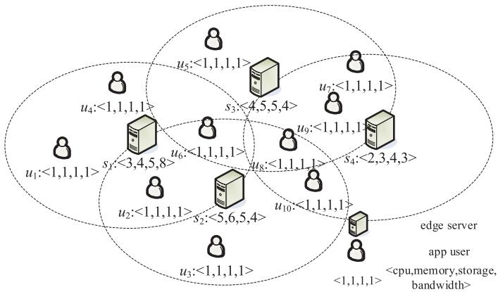

<details>
<summary>flowchart</summary>

```mermaid
graph TD
    subgraph_Edge_Server["Edge Server"]
        A["u1: <1,1,1,1>"] --> B["s1: <3,4,5,8>"]
        C["u2: <1,1,1,1>"] --> D["s2: <5,6,5,4>"]
    end
    subgraph_App_User["App User"]
        E["u3: <1,1,1,1>"] --> F["s3: <4,5,5,4>"]
        G["u4: <1,1,1,1>"] --> H["s4: <2,3,4,3>"]
    end
    subgraph_Bandwidth[" Bandwidth> "]
        I["u5: <1,1,1,1>"] --> J["s5: <4,5,5,4>"]
        K["u6: <1,1,1,1>"] --> L["s6: <1,1,1,1>"]
        M["u7: <1,1,1,1>"] --> N["s7: <2,3,4,3>"]
    end
    A --> C --> D --> E --> F --> G --> H --> I --> J --> K --> L --> M --> N --> O["edge server"]
    style Edge_Server fill:#f9f9f9,stroke:#333
    style App_User fill:#e0e0e0,stroke:#333
    style Bandwidth fill:#fff,stroke:#333
```
</details>

Fig. 1. An example EUA scenario.

The cloud computing paradigm enables multi-tenancy, the ability to serve multiple tenants simultaneously based on a single application instance [21]. It allows computing resources to be shared by multiple tenants more efficiently than single-tenancy, i.e., running one application instance for each tenant [22], [23]. For example, a multi-tenant web application achieves higher throughput than a single-tenant under the same workload [24] because the consolidation of user workloads enables high server utilization in general [25]. Edge computing inherits multi-tenancy from the cloud computing paradigm and thus allows an app vendor to achieve a cost-effective solution to its EUA problem in the edge computing environment. The key is to fully leverage multi-tenancy, i.e., to allocate a maximum number of its app users to a minimum number of edge servers.

In this paper, we introduce EUAGame, a game-theoretic approach for finding a solution to the EUA problem. Game theory has been widely used in the field of distributed computing [5], [9], [26]. It is a powerful tool for the design of decentralized mechanisms [27]. In the edge computing environment, an app vendor often needs to accommodate a very large number of app users in a particular area. Thus, finding a centralized optimal solution will suffer from high complexity, due to the aforementioned proximity and capacity

constraints of the EUA problem. EUAGame eases the burden of centralized optimization by making allocation decisions for app users individually while achieving a collectively satisfactory allocation solution. In addition, EUAGame allows app users to specify their individual (and often differentiated) interests in different computing capacity dimensions. EUAGame models an app vendor’s EUA problem as an EUA game. In this game, each app user is simulated as a player in the game that finds a nearby edge server to offload its computation tasks. EUAGame then employs a decentralized algorithm to make allocation decisions for the app users that achieve the Nash equilibrium of the game. The main contributions of this paper are as follows:

We first model the EUA problem as a constraint optimization problem and prove that it is NP-hard to find the centralized optimal solution.   
To solve the EUA problem in a distributed manner, we formulate it as a game which takes into account app users’ benefits, the multi-tenancy benefit and the overall system cost. The aim of the game is to maximize the number of allocated app users and minimize the overall system cost while fulfilling all proximity constraints and capacity constraints.   
We analyze the EUA game and prove that it is a potential game which admits a Nash equilibrium.   
We propose a decentralized algorithm for finding the Nash equilibrium in the EUA game.   
We analyze the performance of the algorithm theoretically and experimentally.

The remainder of the paper is organized as follows. Section 2 motivates this research with an example. Section 3 presents the system model. Section 4 formulates the EUA game. Section 5 presents the decentralized algorithm for finding the Nash equilibrium in the EUA game. Section 6 evaluates the proposed algorithm theoretically and experimentally. Section 7 reviews related work. Finally, Section 8 concludes this paper and points out future work.

# 2 MOTIVATING EXAMPLE

A representative example latency-sensitive application in the edge computing environment is mobile gaming [28]. Most mobile games are resource-hungry. By offloading computation to remote cloud servers, cloud gaming platforms, e.g., Sony PlayStation Now1 and Nvidia Shield,2 offers an energyefficient gaming solution to thin-client devices like mobile phones and tablets [29]. However, the often unpredictable network latency between the remote cloud servers and players’ devices limit the popularity of cloud gaming. Edge computing tackles this limitation by allowing computation to be offloaded from players’ devices to nearby edge servers.

Fig. 1 shows an example, where four edge servers, i.e., s ;  ; s , are available for a game app vendor to choose 1 . . . 4from to allocate its 10 app users, i.e., u ; ; u . Each edge 1 . . . 10server covers a particular geographical area. App users that are outside the coverage area of an edge server cannot be allocated to that edge server due to the proximity constraint.

1. https://www.playstation.com/en-gb/explore/playstation-now/

2. https://www.nvidia.com/en-us/shield/

TABLE 1 Key Notations 

<table><tr><td>Notation</td><td>Description</td></tr><tr><td> $a_{i}$ </td><td>the allocation decision for app user  $u_{i}$ </td></tr><tr><td> $\mathbf{a} = (a_{1},\ldots ,a_{n})$ </td><td>the allocation strategy profile</td></tr><tr><td> $\mathbf{a}_{-i} = (a_{1},\ldots ,a_{i-1},a_{i+1},\ldots ,a_{n})$ </td><td>the allocation strategy profile except for app user  $u_{i}$ </td></tr><tr><td> $B_{\mathbf{a}}(a_{i})$ </td><td>the benefit of allocation decision  $a_{i}$ </td></tr><tr><td> $c_{j}^{k}$ </td><td>the kth available capacity resource of  $s_{j}$ </td></tr><tr><td> $c_{j} = (c_{j}^{k}), k \in D$ </td><td>the available capacity of edge server  $s_{j}$ </td></tr><tr><td> $cov(s_{j})$ </td><td>the coverage of edge server  $s_{j}, \forall s_{j} \in S$ </td></tr><tr><td> $D = \{ \text{cpu, memory, storage, bandwidth, ...} \}$ </td><td>the set of computing capacity dimensions</td></tr><tr><td> $f^{k}(s_{j})$ </td><td>the multi-tenancy benefit of  $s_{j}$ </td></tr><tr><td> $I_{\{condition\}}$ </td><td>the indicator function</td></tr><tr><td> $m$ </td><td>the number of edge servers</td></tr><tr><td> $n$ </td><td>the number of app users</td></tr><tr><td> $num_{s_{j}}(\mathbf{a})$ </td><td>the number of app users allocated with a</td></tr><tr><td> $u_{i}$ </td><td>app user  $u_{i}$ </td></tr><tr><td> $U = \{u_{1}, u_{2}, \ldots , u_{n}\}$ </td><td>the set of app users</td></tr><tr><td> $s_{j}$ </td><td>edge server  $s_{j}$ </td></tr><tr><td> $S = \{s_{1}, s_{2}, \ldots , s_{m}\}$ </td><td>the set of edge servers</td></tr><tr><td> $Z_{\mathbf{a}}(a_{i})$ </td><td>the cost incurred by  $a_{i}$  for app user  $u_{i}$ </td></tr><tr><td> $\lambda_{i}^{k}$ </td><td>the weight that indicates  $u_{i}$ &#x27;s priority for the kth computing capacity</td></tr><tr><td> $\omega_{i}^{k}$ </td><td>the kth resource of app user  $u_{i}$ </td></tr><tr><td> $\omega_{i} = (\omega_{i}^{k}), k \in D$ </td><td>the resource of app user  $u_{i}$ </td></tr></table>

For example, $u _ { 3 }$ can be allocated to $s _ { 2 }$ , but not to $s _ { 1 } ,$ s or $s _ { 4 } .$ . 3 2 1 3 4Furthermore, the game app vendor must consider the capacity constraints, e.g., CPU, memory, bandwidth, etc. Compared with cloud servers powered by mega-scale data centers, edge servers are limited in their computing capacities, which are usually shared by multiple app vendors. Thus, an edge server must have adequate computing capacities available to accommodate the app users allocated to that edge server. In Fig. 1, the available computing capacities of an edge server and app users’ capacity needs, both unitized for simplicity, are represented by vectors CPU, hmemory, storage, bandwidth . Under the capacity constraints, u ; u ; u and $u _ { 1 0 }$ icannot be all allocated to $s _ { 4 }$ 7 8 9 10 4because their aggregate capacity needs, i.e., 4, 4, 4, 4 , h iexceed the available computing capacities of s , i.e., 2, 3, 4, 3 . For example, if $u _ { 1 }$ 4; u and u are allocated to $s _ { 1 } ,$ h, u cannot ibe allocated to $s _ { 1 }$ 1 2because $s _ { 1 }$ 6 1 4does not have adequate CPUs 1 1to accommodate all the four app users. In fact, $u _ { 4 }$ cannot be 4allocated to any other edge servers either because it is not covered by any other edge servers. In this case, $u _ { 4 }$ will have 4to perform the computation tasks locally or offload it to the remote cloud server. Considering both the proximity and capacity constraints, a possible allocation solution is to allocate $u _ { 1 } , u _ { 2 }$ and $u _ { 4 }$ to $s _ { 1 } , u _ { 3 } , u _ { 6 } , u _ { 8 }$ and $u _ { 1 0 }$ to $s _ { 2 } ,$ u and $u _ { 7 }$ to $s _ { 3 } ,$ 1and $u _ { 9 }$ to $s _ { 4 } .$ 4 1 3 6 8 10 2 5 7. This way, no constraints are violated. How-3 9 4ever, although all the app users are allocated, it might not be the optimal allocation solution because the system cost might not be the lowest. For example, $u _ { 9 }$ can be allocated to $s _ { 3 }$ rather than $s _ { 4 }$ 9so that the app vendor does not need to 3hire $s _ { 4 }$ 4. This can lower the overall system cost. In fact, there 4are many solutions that fulfill all the proximity and capacity constraints. Finding the optimal one that allocates the most app users to the least edge servers is not trivial. Multitenancy further complicates this allocation problem because it impacts the server utilization and consequently the overall system cost under the pay-as-you-go pricing model.

In real-world applications in the edge computing environment, the scales of most EUA problems can be much larger than the example discussed. Thus, finding an optimal solution to a large-scale EUA problem is very challenging. App vendors are in urgent needs of an approach that can help them allocate their app users effectively and efficiently.

# 3 SYSTEM MODEL

For an app vendor, EUA aims to allocate its n app users $U = \{ u _ { 1 } , \ldots , u _ { n } \}$ , to m edge servers $S = \{ s _ { 1 } , \ldots , \bar { s _ { m } } \}$ in a ¼ f 1 . . . g ¼ f 1 . . .particular area. The capacity need of an app user $u _ { i } , i =$ $1 , \ldots , n ,$ , is denoted by $\omega _ { i } = \left( \omega _ { i } ^ { k } \right)$ , where $k \in D = \{ \mathrm { c p u } ,$ 1 . . . ¼ ð Þ 2 ¼ fmemory, storage, bandwidth, ... . The available capacity of an edge server $s _ { j } , j = 1 , \ldots , m$ gis denoted by $c _ { j } = ( c _ { j } ^ { k } )$ , where $k \in D$ ¼ 1 . . . ¼ ð Þ. Similar to many studies of edge computing [5], [9], 2[10], [11], [12], [13], [14], [15], [16], [17], [18], we investigate the EUA problem in quasi-static scenarios where the app users remain unchanged during the allocation, e.g., their capacity needs and locations. More dynamic scenarios will be investigated in our future work. In this section, we introduce the user benefit model, the multi-tenancy model, the system cost model and the optimization model. The notations adopted in the paper are summarized in Table 1.

# 3.1 Multi-Tenancy Benefit Model

Compared with single-tenancy, multi-tenancy enables higher utilization of the computing resources on cloud servers [25] as well as edge servers. According to the experimental results presented in [30], the CPU utilization of a server $s _ { j }$ can be approximated with

$$
f _ {\mathrm{cpu}} (s _ {j}) = - \log_ {x} (y), \tag {1}
$$

where x $( 0 . 9 < x < 1 . 0 )$ is determined by the computation task size, $y \left( y > 1 \right)$ 1 0is the number of app users allocated to the server.

In general, the CPU utilization of a server increases with the increase in y because multi-tenancy enables a higher degree of resource sharing on the server. As y continues to increase, which incurs a higher overhead for resource sharing, e.g., handling scheduling conflicts, the increase in CPU utilization slows down and converges. At some point, the multi-tenant server is outperformed in overall CPU utilization by multiple single-tenant servers combined. This is also confirmed by [25]. The storage utilization of a multi-tenant server follows a similar pattern—improved by sharing and impacted by oversharing [25]. In this study, we assume that the sharing of other computing capacities of a multi-tenant server, e.g., memory and bandwidth, follows similar patterns as CPU and storage. Thus, the multi-tenancy benefits of an edge server s are calculated with

$$
f ^ {k} (s _ {j}) = - \log_ {x _ {k}} (y), \tag {2}
$$

where $k \in D$ and $x _ { k }$ is determined by the computation task 2size. The computation task size impacts the sharing of different computing capacities in different ways. Thus, a $x _ { k }$ is specific to a computing capacity. An EUA problem is solved from the app vendor’s perspective for a particular app. App users are allocated to edge servers to offload their computation tasks of the same size. Thus, $x _ { k }$ is app-specific and does not vary during the allocation process.

# 3.2 User Benefit Model

An app user $u _ { i }$ can be allocated to an edge server $s _ { j }$ only if it is covered by sj

$$
u _ {i} \in c o v (s _ {j}), \forall u _ {i} \in U, \forall s _ {j} \in S. \tag {3}
$$

Such an edger server $s _ { j }$ is referred to as $u _ { i } ^ { \prime } \mathbf { s }$ neighbor edge server. The set of $u _ { i } ^ { \prime } \mathbf { s }$ neighbor edge servers is indicated by $N ( u _ { i } )$ .

Definition 1 (Allocation Decision). Given a user $u _ { i }$ and $S = \{ s _ { 1 } , \ldots , s _ { m } \}$ , an allocation decision indicates to which ¼ f 1 . . .edge server $u _ { i } ( 1 < i <$ n) is allocated to. It is denoted by $a _ { i } ( 0 < a _ { i } < m )$ , where $a _ { i } = 0$ indicates that $u _ { i }$ is not alloð0 Þcated to any edge server.

Definition 2 (Allocation Strategy Profile). Given $U =$ $\{ u _ { 1 } , \ldots , u _ { n } \}$ and $S = \{ s _ { 1 } , \ldots , s _ { m } \}$ ¼, an allocation strategy prof 1 . . . g ¼ f 1 . . . gfile is a set of all app users’ allocation decisions indicated by $\mathbf { a } = ( a _ { 1 } , \ldots , a _ { n } )$ .

From an app user’s perspective, its direct interests, savings in computing capacities and energy consumption on their mobile or IoT devices, reduction in network latency, etc., will be ensured by the edge infrastructure provider as long as it is allocated to an edge server. However, from the app vendor’s perspective, the allocation decision made for an app user, i.e., which edge server it is allocated to, impacts the corresponding multi-tenancy benefit produced. Based on the multi-tenancy benefit model, given an allocation strategy profile $\mathbf { a } = ( a _ { 1 } , a _ { 2 } , \ldots , a _ { n } )$ , the overall benefit of an ¼ ð 1 2 . . .individual allocation decision $a _ { i }$ Þis calculated by aggregating its savings in those dimensions

$$
B _ {\mathbf {a}} (a _ {i}) = \left\{ \begin{array}{l l} \sum_ {k \in D} \lambda_ {i} ^ {k} \cdot f ^ {k} (s _ {a _ {i}}) \cdot \omega_ {i} ^ {k}, & a _ {i} \neq 0 \\ 0, & a _ {i} = 0 \end{array} , \right. \tag {4}
$$

where ${ \boldsymbol { \lambda } } _ { i } ^ { k }$ is the weight assigned by the app vendor that indicates the priority for the kth computing capacity for $u _ { i }$ since app users might have different needs for those computing capacity dimensions. For example, an app user with a lowmemory mobile or IoT device requires a higher weight on memory over other computing capacities. For some apps, it is possible that app users have different capacity needs. For example, a game app user that demands higher resolution and frame rate in the game requires more CPUs, memory and bandwidth. However, it is not the case for most apps, $\mathrm { e . g . }$ , face recognition and natural language processing. The users of such an app usually have the same capacity needs. Thus, for those apps, there is $\omega _ { i } ^ { k } = \omega _ { i } ^ { k } , \forall u _ { i } , u _ { i } \in U$ .

# 3.3 System Cost Model

In the edge computing environment, app vendors hire computing capacities on edge servers from the edge infrastructure provider to serve their app users. App vendors need to pay for the hired computing capacities based on the payas-you-go model. This incurs cost. Hiring more computing capacities, e.g., CPU, memory, storage and bandwidth, incurs higher cost.

Given an allocation decision $a _ { i }$ for user $u _ { i } ( 1 < i < n )$ , an allocation strategy profile $\mathbf { a } = ( a _ { 1 } , a _ { 2 } , \ldots , a _ { n } )$ 1 Þ, based on the ¼ ð 1 2 . . . Þmulti-tenancy benefit model, the cost incurred by $a _ { i }$ is defined as

$$
Z _ {\mathbf {a}} (a _ {i}) = \left\{ \begin{array}{l l} \sum_ {k \in D} \lambda_ {i} ^ {k} \cdot (1 - f ^ {k} (s _ {a _ {i}})) \cdot \omega_ {i} ^ {k}, & a _ {i} \neq 0 \\ \sum_ {k \in D} \lambda_ {i} ^ {k} \cdot \omega_ {i} ^ {k}, & a _ {i} = 0. \end{array} \right. \tag {5}
$$

When $a _ { i } \neq 0 ,$ , i.e., $u _ { i }$ is allocated to an edge server. The 6¼ 0cost incurred by $a _ { i }$ is the computing capacities originally needed minus the the multi-tenancy benefits produced by $a _ { i } .$ . One of the app vendor’s optimization objectives is to maximize the number of app users allocated to hired edge servers. Any app users that are not allocated to any edge servers, i.e., $a _ { i } = 0 ,$ , will have to perform the computation ¼ 0tasks locally. This incurs a loss of benefit from the app vendor’s perspective and thus is included as part of the system cost. Without this part of the system cost, minimizing the overall system cost will be equivalent to minimizing only the cost for hiring the computing capacities. The app vendor will be driven to allocate none of its app users to any of the edge servers. Minimizing this part of the system cost serves the app vendor’s other objective to maximize the number of allocated app users, which will increase the cost for hiring computing capacities because more computing capacities are required to serve more app users. Therefore, given an allocation strategy profile, the app vendor’s objective to minimize the overall system cost is represented as follows:

$$
Z _ {\mathbf {a}} = \min \sum_ {u _ {i} \in U} Z _ {\mathbf {a}} (a _ {i}). \tag {6}
$$

# 3.4 Optimization Model

The EUA problem can be modeled as a constrained optimization problem (COP) that consists of a finite set of variable $X = \{ x _ { 1 } , \ldots , x _ { n } \}$ , with a domain $D _ { i } \ ( i = 1 , \ldots , n )$ listing the ¼ f 1 . . . gpossible values for each variable $x _ { i }$ ð ¼ 1 . . . Þin X, and a set of constraints C over X. A solution to a COP is an assignment of a value to each variable $x _ { i }$ in X from $D _ { i }$ such that all constraints in C are fulfilled. Given a set of users $U =$ $\{ u _ { 1 } , \ldots , u _ { n } \}$ and a set of edge servers $S = \{ s _ { 1 } , \ldots , s _ { m } \}$ ¼, the f 1 . . . g ¼ f 1 . . . gCOP model for an EUA problem is formally expressed as follows:

$$
\max I _ {\{a _ {i} > 0 \}} \tag {7}
$$

$$
\min \sum_ {u _ {i} \in U} Z _ {\mathbf {a}} (a _ {i}), \tag {8}
$$

subject to

$$
a _ {i} \in \{0 \} \cup \{j | u _ {i} \in c o v (s _ {j}) \}, \forall u _ {i} \in U \tag {9}
$$

$$
\sum_ {u _ {i} \in U: a _ {i} = j} (1 - f ^ {k} (s _ {j})) \cdot \omega_ {i} ^ {k} \leq c _ {j} ^ {k}, \forall k \in D. \tag {10}
$$

Objective (7) maximizes the number of allocated app users. There is $I _ { \{ a _ { i } > 0 \} } = 1 \mathrm { i f } a _ { i } > 0$ or 0 otherwise. It calcuf 0g ¼ 1 0lates the number of edge servers hired. Objective (8) minimizes the overall system cost. Constraint family (9) is the coverage constraints that ensure every user $u _ { i } \in U$ can be allocated to an edge server $s _ { j } \in S$ 2only when it is covered by $s _ { j } .$ 2. Constraint family (10) is the capacity constraints where $c _ { j } ^ { k }$ is the kth available computing capacity of edge server $s _ { j } .$ . It ensures that the computing capacity needs of the users allocated to an edge server must not exceed that edge server’s available computing capacities.

The solution to this COP is an allocation strategy $\mathbf { a } = ( a _ { 1 } , a _ { 2 } , \ldots , a _ { n } )$ that achieves objectives (7) and (8), and ¼ ð 1 2 . . . Þin the meantime fulfills constraints (9) and (10). How to achieve both optimization objectives is specific to app vendors. An app vendor with a low budget might prioritize objective (8). For such an app vendor, the Lexicographic Goal Programming (LGP) technique can be employed to prioritize objective (8) over objective (7).

The EUA problem is in fact the generalization of the classic bin packing problem. In a classic bin packing problem, we are given an infinite supply of bins $S = \{ s _ { 1 } , \ldots , s _ { m } \}$ with a capacity $C \in \mathbb { N } ,$ , a set of n items $U = \{ u _ { 1 } , \ldots , u _ { n } \}$ sized w $( 0 < w _ { i } \le C )$ ¼ f 1 . . . g. The objective is to pack all the items 0 in U into the fewest bins possible such that the total item size in each bin must not exceed the bin capacity: $\begin{array} { r } { \sum _ { u _ { i } \in U ( s _ { i } ) } \omega _ { i } \le C , \forall s _ { j } \in S , } \end{array}$ , where $U ( s _ { j } )$ is the set of items in $s _ { j } \in S$ ð Þ. In the EUA problem, each edge server is a bin with a certain capacity. This is because edge servers might have different hardware specifications and host different apps for different numbers of app users. Each app user with computing capacity needs is regarded as an item with a size. Edge servers’ available computing capacities and app users’ computing capacity needs are usually multi-dimensional, e.g., CPU, memory, storage and bandwidth, which can be represented as a d-dimensional vector. Thus, the EUA problem can be modeled as a variable size vector bin packing problem. It is an NP-hard problem because the classical bin packing problem, which is NP-hard [31], is a special case of the variable size vector bin pack problem with $d = 1$ and the ¼ 1same size for all the bins. In the edge computing environment, the number of app users that an app vendor needs to accommodate can be very large, especially in areas with high user density, e.g., CBD areas, university campuses, etc. Thus, app vendors need a tractable approach for finding the solutions to their EUA problems.

# 4 EDGE USER ALLOCATION GAME

This section presents EUAGame, our game-theoretic approach for solving the EUA problem. The reasons for the adoption of a game-theoretic approach are threefold. First, app users may have differentiated needs and pursue different interests. Game theory has been successfully employed in many fields as a powerful tool for analyzing the interactions among multiple players who act in their own interests. In the edge computing environment, it can be employed to devise incentive compatible EUA mechanisms for finding collectively satisfactory EUA solutions such that no app users have the incentive to deviate unilaterally. Second, by leveraging the intelligence of each individual app user,

EUAGame attempts to solve the EUA problem in a distributed manner. It can ease the heavy burden of finding the centralized optimal solution. It will also scale with the size of the EUA problem, e.g., the number app users to allocate and the number of available edge servers. Finally, compared with a centralized approach, a decentralized gametheoretic approach can find EUA solutions quickly. This fulfills app users as well as app vendors’ needs for low latency in the edge computing environment.

# 4.1 Game Formulation

The EUA game is built to find a decision profile for the app vendor that allocates app users to edge servers in a costeffective manner. The decision profile contains one decision for each app user. Those decisions are made for the app users, following the rules of the game, to achieve the app vendors objectives. Similar to [5], [9], in the game, the app users are simulated as players that make the decisions on which edge servers they are allocated to, i.e., $a _ { i } = j ~ ( j \in \{ 0 \} \cup \{ j | u _ { i } \in$ $c o v ( s _ { j } ) \} ) )$ for each $u _ { i } \in U .$ ¼. Let us use a $\mathbf { \Psi } _ { - i } = \mathbf { \Psi } ( a _ { 1 } , \dots , a _ { i - 1 } ,$ $a _ { i + 1 } , \ldots , a _ { n } )$ 2  ¼ ð 1 . . . 1to represent all app users’ allocation decisions þ1 . . .except user $u _ { i }$ . Given other app users’ decisions $\mathbf { a } _ { - i } ,$ app user $u _ { i }$ would like to make a proper decision $a _ { i }$ to maximize its benefit in terms of savings on computing capacities

$$
\max _ {a _ {i} \in \{0 \} \cup \{j | s _ {j} \in N (u _ {i}) \}} B _ {\mathbf {a}} (a _ {i}), \tag {11}
$$

where $N ( u _ { i } )$ is the set of $u _ { i } ^ { \prime } \mathbf { s }$ neighbor edge servers, i.e., ð Þedge servers that cover $u _ { i } .$ .

Base on (11), the EUA problem can be formulated as a game $\chi = ( U , \{ \mathcal { A } _ { i } \} _ { u _ { i } \in U } , \{ \mathcal { B } _ { i } \} _ { u _ { i } \in U } )$ , where U is the set of app users, $\mathbf { \mathcal { A } } _ { i }$ ¼is $u _ { i } ^ { \prime } \mathbf { s }$ A g 2 fB g 2 Þfinite set of user allocation decisions and $B _ { i }$ is Athe benefit function that calculates the benefit of $u _ { i } ^ { \prime } \mathbf { s }$ B allocation decision $a _ { i } \in \mathcal A _ { i }$ . In this game, there might be conflicts 2 Aamong app users. For example, the allocation of some app users to a particular edge server might prevent some other app users from being allocated to the same edge server or any edge server. In Fig. 1, if $u _ { 2 }$ and $u _ { 6 }$ are allocated to $s _ { 1 } , \mathrm { i . e . } $ , $a _ { 2 } = a _ { 6 } = 2 ,$ , either $u _ { 1 }$ or $u _ { 4 }$ 2 6 1cannot be allocated to any edge 2 ¼ 6 ¼ 2server. If u or $u _ { \mathrm { 6 } }$ 1 4is willing to select $s _ { 2 } , \mathrm { i . e . , } a _ { 2 } = 2$ or $a _ { 6 } = 2 ,$ , both $u _ { 1 }$ 2and $u _ { 4 }$ 6can be allocated to $s _ { 1 }$ 2 ¼ 2. However, $a _ { 2 } = 2$ 2or $a _ { 6 } = 2$ 1 4 1 2 ¼ 2might result in conflicts with other app users. To 6 ¼ 2study how the conflicts among the app users can be mitigated, we investigate whether the game admits at least one Nash equilibrium [32]:

Definition 3 (Nash Equilibrium). An allocation decision profile $\mathbf { a } ^ { * } = ( a _ { 1 } ^ { * } , a _ { 2 } ^ { * } , \ldots , a _ { n } ^ { * } )$ is a Nash equilibrium if no app ¼ ð 1 2 . . . Þuser can further increase its benefit by unilaterally changing its allocation decision, $i . e . ,$

$$
B _ {\mathbf {a} _ {- i} ^ {*}} (a _ {i} ^ {*}) \geq B _ {\mathbf {a} _ {- i} ^ {*}} (a _ {i}), \forall a _ {i} \in \mathcal {A} _ {i}, u _ {i} \in U. \tag {12}
$$

Whether the EUA game admits at least one Nash equilibrium is of significant importance of this research. The Nash equilibrium has the property that each app user’s allocation decision is its best response to the choices of the n other app users.

Lemma 1. In the Nash equilibrium a of the EUA game, the allocation decision $a _ { i } ^ { * }$ of each user ui $( u _ { i } \in U )$ must be the best choice in in response to a .

The proof of Lemma 1 can be found in Appendix A. Lemma 1 ensures that, if a Nash equilibrium can be found, EUAGame can use it as a self-enforcing EUA solution. A self-enforcing solution, once agreed upon by the app users, does not need centralized means of enforcement, because it is in each app user’s self-interest to follow the agreement if the others do [33]. This alleviates the need for a centralized approach for finding a solution to the EUA problem. It also allows app users to quickly find EUA solutions to largescale EUA problems.

# 4.2 Game Property

In this section, we investigate the existence of a Nash equilibrium in the EUA game. The key is to prove that the EUA game is a potential game [34], which is defined as follows:

Definition 4 (Potential Game). A game is a potential game if, for a potential function f a , there is

$$
B _ {\mathbf {a} _ {- i}} (a _ {i}) <   B _ {\mathbf {a} _ {- i}} (a _ {i} ^ {\prime}) \Rightarrow \phi_ {\mathbf {a} _ {- i}} (a _ {i}) <   \phi_ {\mathbf {a} _ {- i}} (a _ {i} ^ {\prime}), \tag {13}
$$

$\begin{array} { r } { f o r a n y u _ { i } \in U , a _ { i } , a _ { i } ^ { \prime } \in \mathcal A _ { i } a n d \mathbf a _ { - i } \in \prod _ { l \neq i } \mathcal A _ { l } . } \end{array}$

Based on Definition 3, the Nash equilibrium in an EUA game can be interpreted in a different way [35]. A decision profile $\mathbf { a } ^ { * }$ is a Nash equilibrium if, for all app users $u _ { i } \in U ,$ there is $B _ { \mathbf { a } _ { - i } ^ { * } } ( a _ { i } ^ { * } ) = \operatorname* { m a x } _ { a _ { i } \in \mathcal { A } _ { i } } B _ { \mathbf { a } _ { - i } ^ { * } } ( a _ { i } )$ 2. Thus, in a potential i ð Þ ¼ max 2A i ð Þgame, there is always at least one Nash equilibrium which can be found by locating the local optima of the potential function, as proven by Marden et al. [36]. This property has also be leveraged by Chen et al. in [5], [9].

To prove that the EUA game is a potential game, we first introduce and prove a property of the EUA game.

Lemma 2 (Individual Capacity Constraint). Given an allocation decision profile $\mathbf { a } = ( a _ { 1 } , \ldots , a _ { n } )$ , app user $u _ { i } ^ { \prime } s$ required computing capacity $\omega _ { i } = ( \omega _ { i } ^ { k } ) , k \in D ,$ Þ and the available com-¼ ð Þputing capacity of edge server $s _ { j } , c _ { j } = \{ c _ { j } ^ { k } \} , k \in D ,$ ui can be allocated to $s _ { j }$ ¼ f g 2if, for all other app users who have been allocated on the same edge server $s _ { j } ,$ there is

$$
\zeta_ {i} ^ {k} (\mathbf {a}) \triangleq \sum_ {u _ {l} \in U \backslash \{i \}: a _ {l} = j} \omega_ {l} ^ {k} \leq T _ {i} ^ {k}, \tag {14}
$$

where

$$
T _ {i} ^ {k} = c _ {j} ^ {k} + \sum_ {u _ {l} \in U: a _ {l} = j} f ^ {k} (s _ {j}) \cdot \omega_ {l} ^ {k} - \omega_ {i} ^ {k}. \tag {15}
$$

The proof of Lemma 2 can be found in Appendix B. Armed with Lemma 2 that constrains the kth $( k \in D )$ computing capacity, for all $k \in D ,$ , we define

$$
T _ {i} = \sum_ {k \in D} \lambda_ {i} ^ {k} \cdot \left(c _ {j} ^ {k} + \sum_ {u _ {l} \in U: a _ {l} = s _ {j}} f ^ {k} (s _ {j}) \cdot \omega_ {l} ^ {k} - \omega_ {i} ^ {k}\right). \tag {16}
$$

According to Eq. (15), more app users allocated to an edge server $s _ { j }$ will produce more multi-tenancy benefits, which indicates higher utilization of the computing capacities hired on $s _ { j } .$ . Based on Lemma 2, we define a function

$$
\begin{array}{l} \phi_ {\mathbf {a} - i} (a _ {i}) = - \sum_ {i = 1} ^ {n} \sum_ {k = 1} ^ {d} \lambda_ {i} ^ {k} \cdot f ^ {k} (s _ {a _ {i}}) \omega_ {i} ^ {k} \cdot T _ {i} \cdot I _ {\{a _ {i} = 0 \}} \\ + \frac {1}{2} \sum_ {u _ {i} \in U} \sum_ {u _ {j} \neq u _ {i}} \sum_ {k \in D} \lambda_ {i} ^ {k} f ^ {k} (s _ {a _ {i}}) \omega_ {i} ^ {k} \lambda_ {j} ^ {k} f ^ {k} (s _ {a _ {j}}) \omega_ {j} ^ {k} I _ {\{a _ {i} = a _ {j} \}} I _ {\{a _ {i} > 0 \}}, \tag {17} \\ \end{array}
$$

where $I _ { \{ c o n d i t i o n \} }$ is an indicator function that returns 1 if f gcondition is true, and 0 otherwise.

Now, we prove that the EUA game formulated in Section 4 is a potential game with function $\phi _ { \mathbf { a } - i } ( a _ { i } )$ defined in (17).

Theorem 1 (EUA Potential Game). The EUA game is a potential game with the potential function $\phi _ { \mathbf { a } - i } ( a _ { i } )$ .

The proof of Theorem 1 can be found in Appendix C.

# 5 DECENTRALIZED ALLOCATION MECHANISM

A potential game admits at least one Nash equilibrium [36]. An important property of potential games is the Finite Improvement Property, which indicates that a Nash equilibrium of a potential game can be reached via a process that goes through a finite number of iterations [34]. The finite improvement property ensures that this process will eventually end and find a Nash equilibrium. This motivates the design and development of our decentralized allocation mechanism for finding the Nash equilibrium in the formulated EUA game, which will be presented and analyzed in this section.

# 5.1 Mechanism Design

Given $U = \{ u _ { 1 } , . , , , u _ { n } \}$ and $S = \{ s _ { 1 } , \ldots , s _ { m } \}$ , EUAGame ¼ f 1 g ¼ f 1 . . . gemploys an iterative process for app users to reach the Nash equilibrium. The pseudo code is presented in Algorithm 1. This process starts with an initial allocation strategy profile (Lines 1-3). Then, based on Eq. (5), the system cost for each edge server $s _ { j } \in S$ incurred by decision profile a in the current iteration $\textit { t } \left( t = 1 , 2 \ldots \right)$ , denoted by ${ \bf a } ( t )$ , is calculated ð ¼with Eq. (18) (Line 5)

$$
\rho_ {\mathbf {a} (t)} (s _ {j}) \triangleq \sum_ {k = 1} ^ {d} \sum_ {u _ {i} \in U: a _ {i} = j} \lambda_ {i} ^ {k} (1 - f ^ {k} (s _ {j})) \omega_ {i} ^ {k}. \tag {18}
$$

Next, leveraging the Finite Improvement Property, we let an app user $u _ { i }$ that can improve its benefit update its current allocation decision $a _ { i }$ to a better one $a _ { i } ^ { \prime }$ in each iteration t. Specifically, each user $u _ { i } \in U$ first calculates the updated system cost for each $s _ { j } \in N ( u _ { i } )$ incurred by ${ \bf a } ^ { \prime } ( t )$ updated from ${ \bf a } ( t )$ 2 ðwith the change from $a _ { i }$ to $a _ { i } ^ { \prime }$ ð Þ(Lines 7-9). There are ð Þthree cases, as indicated

$$
\begin{array}{l} \rho_ {\mathbf {a} ^ {\prime} (t)} (s _ {j}) = \\ \left\{ \begin{array}{l l} \rho_ {\mathbf {a} (t)} (s _ {j}) - \sum_ {k \in D} \lambda_ {i} ^ {k} (1 - f ^ {k} (s _ {j})) \omega_ {i} ^ {k}, & \text { for   } s _ {j} = s _ {a _ {i}} \\ \rho_ {\mathbf {a} (t)} (s _ {j}) + \sum_ {k \in D} \lambda_ {i} ^ {k} (1 - f ^ {k} (s _ {j})) \omega_ {i} ^ {k}, & \text { for   } s _ {j} = s _ {a _ {i} ^ {\prime}}. \\ \rho_ {\mathbf {a} (t)} (s _ {j}), & \text { otherwise } \end{array} \right. \tag {19} \\ \end{array}
$$

Next, $u _ { i }$ finds its optimal allocation decision $a _ { i } ^ { \prime }$ that incurs the lowest total system cost across $N ( u _ { i } )$ . If $a _ { i } ^ { \prime } \neq a _ { i } ,$ , it sends $a _ { i } ^ { \prime }$ to the other app users requesting to contend for the decision update opportunity (Line 10). If there are multiple such allocation decisions, it randomly selects one to be sent. In each iteration of the allocation process, only one app user wins the contest for the decision update opportunity and can update its allocation decision. The winner in each iteration can be selected in a centralized or decentralized manner. The former requires centralized control [9] and the latter requires messaging synchronizing [5]. Either way, the calculation in each iteration of the allocation process (Lines 5-17) is performed by individual app users in parallel. The app users who did not win the opportunity for decision update do not update their allocation decisions in the current iteration. This process iterates until no app users would like to update their allocation decisions. Their individual allocation decisions constitute the final decision profile as the solution to the EUA problem.

Algorithm 1. Decentralized EUA Allocation   
1: Initialization:
2: each $u_{i}$ chooses the edge server decision $a_{i}=0$ 3: End of initialization
4: repeat
5: compute the system cost on $s_{j}\in S$ incurred by $\mathbf{a}(t)$ : $\rho_{\mathbf{a}(t)}(s_{j})$ 6: for each $u_{i}\in U$ do
7: for each server $s_{j}\in N(u_{i})$ do
8: calculate the system cost $\rho_{\mathbf{a}'(t)}(s_{j})$ under $\mathbf{a}'(t)$ updated from $\mathbf{a}(t)$ with $a_{i}^{\prime}=j$ 9: end for
10: find the decision $a_{i}^{\prime}$ that incurs the lowest total system cost across $N(u_{i})$ 11: if $a_{i}^{\prime}\neq a_{i}$ then
12: send $a_{i}^{\prime}$ to contend for decision update opportunity
13: if wins the opportunity then
14: update its allocation decision with $a_{i}^{\prime}$ 15: end if
16: end if
17: end for
18: until no more decision updates needed

# 5.2 Convergence Analysis

The Finite Improvement Property of the potential game ensures that the allocation process will complete and reach a Nash equilibrium after a finite number of iterations. Let R be the total number of iterations, $\begin{array} { r } { Q _ { i } \triangleq \sum _ { k \in D } \lambda _ { a _ { i } } ^ { k } f ^ { k } ( a _ { i } ) \omega _ { i } ^ { k } , } \end{array}$ , $Q _ { m i n } \ \triangleq \operatorname* { m i n } ( Q _ { i } )$ , $Q _ { m a x } \triangleq$ 2  ð ÞQi , Tmin , Ti and $T _ { m a x } \triangleq \operatorname* { m a x } ( T _ { i } ) ( i = 1 , \dots , n )$ xð Þ minð Þ, Theorem 2 holds for the maxð Þquantification of R.

Theorem 2 (Upper Bound for Convergence Time). When T and $Q _ { i }$ are non-negative integers for any $u _ { i } \in U .$ , the maxi-2mum convergence time of EUAGame, measured by the maximum number of decision iterations, is $n Q _ { m a x } T _ { m a x } / Q _ { m i n } -$ $n ^ { 2 } Q _ { m i n } / 2 , i . e . , \dot { R } \leq n Q _ { m a x } T _ { m a x } / Q _ { m i n } - n ^ { 2 } Q _ { m i n } / 2 .$ .

The proof of Theorem 2 can be found in Appendix D. Theorem 2 shows that EUAGame converges within a quadratic time. Here, we consider the case where $Q _ { i }$ and $T _ { i }$ are non-negative integers for ease of exposition. For a more general case where $Q _ { i }$ and $T _ { i }$ can be real numbers, the

experimental results demonstrated in Section 6.2 show that EUAGame converges rapidly with a convergence time that scales with the number of app users (n) and the number of edge servers (m).

# 6 PERFORMANCE EVALUATION

This section theoretically and experimentally evaluates the performance of EUAGame in achieving app vendors’ two optimization objectives as discussed in Section 3.4: 1) maximize the number of allocated app users; and 2) minimize the overall system cost.

# 6.1 Theoretical Analysis

As discussed in Section 5.1, the app users make their allocation decisions in parallel in every iteration of the allocation process. The winner of the contest for the decision update opportunity in each iteration may be determined in a nondeterministic manner, $\mathrm { e . g . }$ , via random selection. Therefore, there might be multiple Nash equilibria in an EUA game. Thus, the performance of EUAGame is largely dependent of the Price of Anarchy (PoA) of the decentralized EUA allocation mechanism, which measures the ratio between utility of the worst Nash equilibrium and the centralized optimal solution [37]. In the EUA game, the utility of a Nash equilibrium is measured by the number of allocated app users and the overall system cost.

# 6.1.1 PoA in Number of Allocated App Users

Let us use $\chi$ to denote the set of decision profiles that reach different Nash equilibrium in the EUA game and $\mathbf { a } ^ { * } = ( a _ { 1 } ^ { * }$ ; $a _ { 2 } ^ { * } , \ldots , a _ { n } ^ { * } )$ ¼ ð 1to denote the centralized optimal decision profile. 2 . . . ÞGiven a decision profile $\mathbf { a } \in \chi ,$ , let $p o a _ { u s e r } ( \mathbf { a } )$ be the PoA mea-2 ð Þsured by the ratio between the numbers of app users allocated with a and ${ \bf { a } } ^ { * } , p o a _ { u s e r } ( { \bf { a } } )$ can be calculated as follows:

$$
p o a _ {u s e r} (\mathbf {a}) = \frac {\min _ {\mathbf {a} \in \chi} \sum_ {s _ {j} \in S} n u m _ {s _ {j}} (\mathbf {a})}{\sum_ {s _ {j} \in S} n u m _ {s _ {j}} \left(\mathbf {a} ^ {*}\right)} = \frac {\min _ {\mathbf {a} \in \chi} \sum_ {u _ {i} \in U} I _ {\{a _ {i} > 0 \}}}{\sum_ {u _ {i} \in U} I _ {\{a _ {i} ^ {*} > 0 \}}}, \tag {20}
$$

where $n u m _ { s _ { j } } ( \mathbf { a } )$ and $n u m _ { s _ { j } } ( \mathbf { a } ^ { * } )$ are the numbers of app ð Þusers allocated with a and $\mathbf { a } ^ { * }$ ð Þrespectively.

Theorem 3 (PoA in the Number of Allocated App Users). Given any decision profile $\mathbf { a } \in \chi$ that achieves a Nash 2equilibrium in the EUA game and the centralized optimal decision profile $\mathbf { a } ^ { * } ,$ , the PoA of EUAGame $p o a _ { u s e r } ( \mathbf { a } )$ , measured by ð Þthe ratio between the numbers of app users allocated with a and a, fulfills

$$
1 \geq p o a _ {u s e r} (\mathbf {a}) \geq (\lfloor T _ {\min} / Q _ {\max} \rfloor) / (\lfloor T _ {\max} / Q _ {\min} \rfloor + 1) \tag {21}
$$

The proof of Theorem 3 can be found in Appendix E.

# 6.1.2 PoA in Overall System Cost

The other optimization objective of an EUA game is to minimize the overall system cost. Thus, we also need to analyze the PoA of EUAGame in the overall system cost. Let us again use x to denote the set of decision profiles that reach different Nash equilibria in the EUA game and $\mathbf { a } ^ { * } =$ $( a _ { 1 } ^ { * } , a _ { 2 } ^ { * } , \ldots , a _ { n } ^ { * } )$ ¼to denote the centralized optimal decision ð 1 2 . . . Þprofile. Given a decision profile $\mathbf { a } \in \chi ,$ let $p o a _ { c o s t } ( \mathbf { a } )$ be the 2 ð ÞPoA measured by the ratio between the overall system costs incurred by a and $\mathbf { a } ^ { * } , p o a _ { c o s t } ( \mathbf { a } )$ is calculated as follows:

TABLE 2 Experiment Settings 

<table><tr><td colspan="2"></td><td>App Users</td><td>Edge Servers</td><td>Available Capacities</td></tr><tr><td rowspan="3">Small</td><td>Set #1.1</td><td>4,8,...,32</td><td>5</td><td>6</td></tr><tr><td>Set #1.2</td><td>24</td><td>1,...,8</td><td>6</td></tr><tr><td>Set #1.3</td><td>24</td><td>5</td><td>1,...,10</td></tr><tr><td rowspan="3">Large</td><td>Set #2.1</td><td> $2^{7},\ldots,2^{14}$ </td><td> $2^{8}$ </td><td>90</td></tr><tr><td>Set #2.2</td><td> $2^{12}$ </td><td> $2^{3},\ldots,2^{10}$ </td><td>90</td></tr><tr><td>Set #2.3</td><td> $2^{12}$ </td><td> $2^{8}$ </td><td>10,20,...,100</td></tr></table>

$$
p o a _ {c o s t} (\mathbf {a}) = \left(\min _ {\mathbf {a} \in \chi} \sum_ {u _ {i} \in U} Z _ {i} (\mathbf {a})\right) / \sum_ {u _ {i} \in U} Z _ {i} (\mathbf {a} ^ {*}). \tag {22}
$$

As discussed in Section 3.3, there are two components in the overall system cost $Z _ { \mathbf { a } } ,$ incurred by hiring computing capacities on edge servers and failures to allocate app users to any edge servers. Let us use $Z _ { i } ^ { e d g e } ( \mathbf { a } ) ~ Z _ { i } ^ { l o c a l } ( \mathbf { a } )$ to represent ð Þ ð Þthe former and the latter components of the overall system cost respectively. Given $Q _ { i } , \ Q _ { m a x }$ and $Q _ { m i n }$ defined in Section 5.2, let us define

$$
Z _ {i} ^ {\text { edge }} (\mathbf {a}) \triangleq \sum_ {k \in D} \lambda_ {i} ^ {k} \cdot \omega_ {i} ^ {k} - Q _ {i} \tag {23}
$$

$$
Z _ {i, \min} ^ {\text { edge }} (\mathbf {a}) \triangleq \sum_ {k \in D} \lambda_ {i} ^ {k} \cdot \omega_ {i} ^ {k} - Q _ {\max} \tag {24}
$$

$$
Z _ {i, \max} ^ {\text { edge }} (\mathbf {a}) \triangleq \sum_ {k \in D} \lambda_ {i} ^ {k} \cdot \omega_ {i} ^ {k} - Q _ {\min}, \tag {25}
$$

where $Q _ { m i n } \leq Q _ { i } \leq Q _ { m a x } ,$ and $\begin{array} { r } { Z _ { i } ^ { l o c a l } ( { \bf a } ) \triangleq \sum _ { k \in D } \lambda _ { i } ^ { k } \cdot \omega _ { i } ^ { k } . } \end{array}$ .

  ð Þ 2 Based on the above definitions, we have Theorem 4.

Theorem 4 (PoA in Overall System Cost). Given a decision profile $\mathbf { a } \in \chi$ that achieves a Nash equilibrium in the EUA 2game and the centralized optimal decision profile $\mathbf { a } ^ { * }$ , the PoA of EUAGame $p o a _ { c o s t } ( \mathbf { a } )$ , measured by the ratio between the overð Þall system costs achieved with a and a, fulfills

$$
\begin{array}{l} 1 \leq p o a _ {c o s t} (\mathbf {a}) \\ \leq \frac {\sum_ {u _ {i} \in U} (Z _ {i} ^ {l o c a l} (\mathbf {a}) \cdot I _ {\{a _ {i} = 0 \}} + Z _ {i , m a x} ^ {e d g e} (\mathbf {a}) \cdot I _ {\{a _ {i} > 0 \}})}{\sum_ {u _ {i} \in U} (Z _ {i} ^ {l o c a l} (\mathbf {a} ^ {*}) \cdot I _ {\{a _ {i} = 0 \}} + Z _ {i , m i n} ^ {e d g e} (\mathbf {a} ^ {*}) \cdot I _ {\{a _ {i} > 0 \}})}. \tag {26} \\ \end{array}
$$

The proof of Theorem 4 can be found in Appendix F.

# 6.2 Experimental Evaluation

We have conducted a set of small-scale experiments and a set of large-scale experiments. In the first set of experiments (set #1), we compare the effectiveness of EUAGame, measured by the percentage of allocated app users $( I _ { \{ a _ { i } > 0 \} } / n )$

and the overall system cost $Z _ { \mathbf { a } } ,$ i.e., app vendors’ two optimization objectives (7) and (8), against the Optimal optimization approach and two baseline approaches, which are originated from [38], i.e., Random and Greedy. Given a set of app users and a set of edge servers, Optimal solves the EUA problem based on the COP model presented in Section 3.4, Random allocates each app user to one of its neighbor edge servers that has adequate available computing capacities and Greedy allocates an app user to its neighbor edge server with the most available computing capacities. In the second set of experiments (set #2), we compare EUAGame against only Random and Greedy because the scales of the EUA problems have become too large for Optimal to find a solution within a reasonable amount of time. To evaluate the efficiency of EUAGame, we also present and discuss the convergence time measured by the average number of iterations taken for EUAGame to reach a Nash equilibrium, which is an important metric for evaluating the efficiency of game-theoretical approaches [5], [9], [26]. All the experiments are conducted on a Windows machine equipped with Intel Core i5 processor (4 CPUs, 2.4 GHz) and 8 GB RAM.

Experiment Data. The experiments are conducted on the locations of real-world base stations and end-users within Metropolitan Melbourne in Australia, which has a total area of over 9,000 km . Australian Communications and Media Authority (ACMA) publishes the radio-comms license dataset that contains the geographical location of all cellular base stations in Australia, which we use as the locations of edge servers because edge servers are usually deployed at base stations [19]. The Asia Pacific Network Information Centre (APNIC) provides all IP address blocks allocated to Australia. We use the IP lookup service at http://ip-api. com/ to convert the obtained IP addresses into geographical locations to simulate app users’ locations. Since IP addresses in the last octet are likely to have identical geographical addresses returned by the IP lookup service, app users are uniformly distributed around each of the obtained geographical locations. Then, the coverage of each edge server is randomly set based on the density of app users within its coverage areas. In high-density areas, such as the central business distinct, the coverage radius of an edge server is set between 450 and 750 meters. In medium-density areas, the coverage radius is randomly set between 2,000 and 3,000 meters. Finally, as for the low-density area, the radius is from 7,000 to 8,000 meters. The raw experiment data are publicly available3 for the reproduction and validation of our experimental results.

Experiment Settings. To comprehensively evaluate EUA-Game, we have simulated various EUA scenarios by changing three experiment parameters: 1) the number of app users; 2) the number of edge servers; and 3) the available computing capacities on edge servers. The available computing capacities on each edge server are randomly generated following normal distributions. The details are shown in Table 2, where the last column indicates the average computing capacity in each capacity dimension on each edge server. Each experiment is repeated for 100 times and the results are averaged.

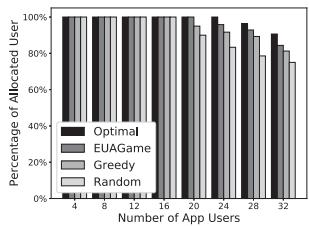

<details>
<summary>bar</summary>

| Number of App Users | Optimal | EUAGame | Greedy | Random |
| ------------------- | ------- | ------- | ------ | ------ |
| 4                   | 100%    | 100%    | 100%   | 100%   |
| 8                   | 100%    | 100%    | 100%   | 100%   |
| 12                  | 100%    | 100%    | 100%   | 100%   |
| 16                  | 100%    | 100%    | 100%   | 100%   |
| 20                  | 100%    | 100%    | 100%   | 100%   |
| 24                  | 100%    | 100%    | 100%   | 100%   |
| 28                  | 100%    | 100%    | 100%   | 100%   |
| 32                  | 100%    | 100%    | 100%   | 100%   |
</details>

(a)I{ai>0}/n vs.n

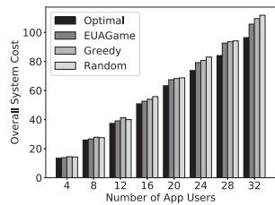

<details>
<summary>bar</summary>

| Number of App Users | Optimal | EUAGame | Greedy | Random |
|---|---|---|---|---|
| 4 | 15 | 16 | 17 | 18 |
| 8 | 25 | 26 | 27 | 28 |
| 12 | 35 | 36 | 37 | 38 |
| 16 | 50 | 51 | 52 | 53 |
| 20 | 65 | 66 | 67 | 68 |
| 24 | 80 | 81 | 82 | 83 |
| 28 | 95 | 96 | 97 | 98 |
| 32 | 105 | 106 | 107 | 108 |
</details>

(b) Za vs.n   
Fig. 2. Effectiveness versus number of app users (Set #1.1).

Experiment Set #1. Through comparison with Optimal, Random and Greedy, Figs. 2, 3, and 4 demonstrate the effectiveness of EUAGame in experiment set #1 and the impacts of the three parameters, i.e., the number of app users (n), the number of edge servers (m) and the available computing capacities of the edge servers (c). Overall, Optimal allocates the most app users with the lowest overall system cost. Second to Optimal, EUAGame outperforms Random and Greedy significantly. Compared to Optimal, the performance loss of EUAGame in both the percentage of allocated app users and the overall system cost is less than 15 percent in all cases. On average across all cases in this experiment set, EUAGame only allocates 3.38 percent fewer app users with 4.76 percent more overall system cost than Optimal. This demonstrates the high performance of EUAGame in maximizing the percentage of allocated users and minimizing the overall system cost. Fig. 2a shows that when n exceeds a certain number, 16 for Random, 20 for Greedy and EUA-Game, 24 for Optimal, the percentage of allocated app users starts to decrease. This is due to the more fierce competition among app users caused by the increase in n. As n becomes overly large, the edge servers will not be able to accommodate all the app users. In the meantime, the increase in n results in higher overall system cost, as demonstrated by Fig. 2b. This is because more computing capacities are needed and more app users are not allocated. Fig. 3a shows that, when m increases, more edge servers with more available computing capacities are able to accommodate more app users. This increases in the cost for hiring the computing capacities. However, it decreases the cost caused by failures to allocate apps users more significantly. Thus, the overall system cost decreases overall as m increases, as illustrated in Fig. 3b. In experiment set 1.3, we increased the available computing capacities on edge servers. This impacted the effectiveness of the comparing approaches in a way similar to the increase in m. As a result, Fig. 4 shows increasing trends for the percentage of allocated users and decreasing trends for overall system cost very similar to Fig. 3.

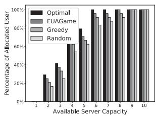

<details>
<summary>bar</summary>

| Available Server Capacity | Optimal | EUAGame | Greedy | Random |
| ------------------------- | ------- | ------- | ------ | ------ |
| 1                         | 30%     | 25%     | 20%    | 15%    |
| 2                         | 40%     | 35%     | 30%    | 25%    |
| 3                         | 60%     | 55%     | 50%    | 45%    |
| 4                         | 75%     | 70%     | 65%    | 60%    |
| 5                         | 90%     | 85%     | 80%    | 75%    |
| 6                         | 100%    | 95%     | 90%    | 85%    |
| 7                         | 100%    | 95%     | 90%    | 85%    |
| 8                         | 100%    | 95%     | 90%    | 85%    |
| 9                         | 100%    | 95%     | 90%    | 85%    |
| 10                        | 100%    | 95%     | 90%    | 85%    |
</details>

(a) $I _ { \{ a _ { i } > 0 \} } / n { \mathrm { ~ v s . ~ } } c$

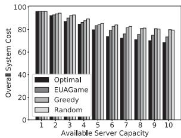

<details>
<summary>bar</summary>

| Available Server Capacity | Optimal | EUAGame | Greedy | Random |
| ------------------------- | ------- | ------- | ------ | ------ |
| 1                         | 95      | 95      | 95     | 95     |
| 2                         | 90      | 90      | 90     | 90     |
| 3                         | 85      | 85      | 85     | 85     |
| 4                         | 80      | 80      | 80     | 80     |
| 5                         | 75      | 75      | 75     | 75     |
| 6                         | 70      | 70      | 70     | 70     |
| 7                         | 65      | 65      | 65     | 65     |
| 8                         | 60      | 60      | 60     | 60     |
| 9                         | 55      | 55      | 55     | 55     |
| 10                        | 50      | 50      | 50     | 50     |
</details>

(b) $Z _ { \mathrm { a } } ~ \mathrm { v s } . ~ c$   
Fig. 4. Effectiveness versus server computing capacities (Set #1.3).

Experiment Set #2. Figs. 5, 6, and 7 show the results in experiment set #2, i.e., large-scale experiments where Optimal cannot find solutions in a tractable manner. In general, EUAGame outperforms Greedy and Random in both allocated app users and overall system cost in all cases, significantly in some and marginally in the others. In this experiment set, the average advantages of EUAGame over Greedy and Random are 4.73 and 6.98 percent in terms of allocated app users, and 14.3 and 12.64 percent in terms of overall system cost. Most phenomena presented in Figs. 5, 6, and 7 are similar to Figs. 2, 3, and 4. Some interesting ones can be seen in Figs. 6b and 7b. In Fig. 6b, as m increases, the overall system costs achieved by Greedy and Random first decrease and then increase. The increase is caused by the increase in the number of allocated app users which is illustrated in Fig. 6. As m increases, Greedy and Random allocate the app users to more edge servers. This lowers the multi-tenancy benefit. In experiment set #2.2, when m exceeds 128, the decrease in multitenancy benefit starts to impact the overall system cost more significantly than the increase in the number of allocated app users. As a result, the overall system cost starts to increase. EUAGame, taking into account the multi-tenancy benefit, is capable of accommodating the same number of or more app users with a much lower overall system cost, 13.71 and 11.92 percent less than Greedy and Optimal respectively. Fig. 7b shows that c impacts the overall system costs in a similar way but much less significantly. Considering the multitenancy benefit, EUAGame again outperforms Greedy and Random significantly, by 14.86 and 13.35 percent respectively. Fig. 8 shows the convergence time of EUAGame measured by the average number of iterations taken by EUAGame to reach a Nash equilibrium in each subset of experiments in experiment set #2. The results in experiment set #1 exhibit trends similar to Fig. 8 and thus are not presented due to space limit. Fig. 8a shows that the convergence time of EUA-Game increases linearly with the number of app users. Please note that base-10 scales are used for the X axis of Fig. 8a, same as Figs. 8b and 8c. Fig. 8b shows that the convergence time of EUAGame increases mildly with m. As m increases, each app user has more edge servers to select from, which increases the possibility of its decision updates. Fig. 8b also shows that the impact of m on the convergence time of EUAGame is less significant than that of n. Fig. 8c shows that as c increases, the convergence time of EUAGame first increases and then decreases slightly when c exceeds 60. At the beginning of the increase in c, more edge servers offer app vendors more possibilities for decision updates. The convergence time increases accordingly. As c continues to increase, EUAGame is capable to accommodate all the app users, as demonstrated in Fig. 7. It becomes less necessary for app users to update their decisions. Thus, the convergence time decreases. The results demonstrated in Fig. 8 show that EUAGame scales well with all three parameters, which indicates its high efficiency. This is critical to largescale real-world applications in the edge computing environment because finding the centralized optimal solutions to the EUA problems in such scenarios is NP-hard as discussed and proved in Section 3.4.

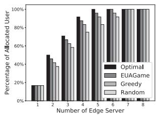

<details>
<summary>bar</summary>

| Number of Edge Server | Optimal | EUGame | Greedy | Random |
| --------------------- | ------- | ------ | ------ | ------ |
| 1                     | 15%     | 15%    | 15%    | 15%    |
| 2                     | 50%     | 40%    | 35%    | 30%    |
| 3                     | 70%     | 60%    | 55%    | 50%    |
| 4                     | 90%     | 80%    | 75%    | 70%    |
| 5                     | 100%    | 95%    | 90%    | 85%    |
| 6                     | 100%    | 100%   | 100%   | 100%   |
| 7                     | 100%    | 100%   | 100%   | 100%   |
| 8                     | 100%    | 100%   | 100%   | 100%   |
</details>

(a)I{ai>0}/n vs.m

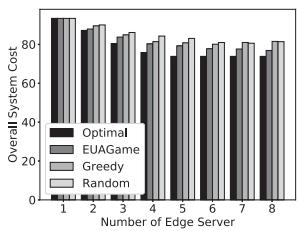

<details>
<summary>bar</summary>

| Number of Edge Server | Optimal | EUAGame | Greedy | Random |
| --------------------- | ------- | ------- | ------ | ------ |
| 1                     | 90      | 90      | 90     | 90     |
| 2                     | 85      | 85      | 85     | 85     |
| 3                     | 80      | 80      | 80     | 80     |
| 4                     | 75      | 75      | 75     | 75     |
| 5                     | 70      | 70      | 70     | 70     |
| 6                     | 65      | 65      | 65     | 65     |
| 7                     | 60      | 60      | 60     | 60     |
| 8                     | 55      | 55      | 55     | 55     |
</details>

(b) $Z _ { \mathrm { a } } ~ \mathrm { v s } . ~ m$

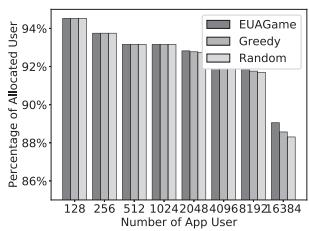

<details>
<summary>bar</summary>

| Number of App User | EUAGame | Greedy | Random |
| ------------------ | ------- | ------ | ------ |
| 128                | 94%     | 94%    | 94%    |
| 256                | 93%     | 93%    | 93%    |
| 512                | 93%     | 93%    | 93%    |
| 1024               | 93%     | 93%    | 93%    |
| 2048               | 92%     | 92%    | 92%    |
| 4096               | 92%     | 92%    | 92%    |
| 1921               | 92%     | 92%    | 92%    |
| 16384              | 89%     | 88%    | 88%    |
</details>

(a) $I _ { \{ a _ { i } > 0 \} } / n { \mathrm { ~ v s . ~ } } n$

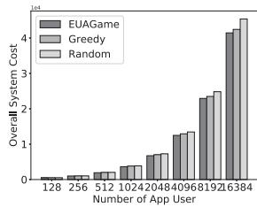

<details>
<summary>bar</summary>

| Number of App User | EUAGame | Greedy | Random |
| ------------------ | ------- | ------ | ------ |
| 128                | 0.0     | 0.0    | 0.0    |
| 256                | 0.0     | 0.0    | 0.0    |
| 512                | 0.0     | 0.0    | 0.0    |
| 1024               | 0.0     | 0.0    | 0.0    |
| 2048               | 0.0     | 0.0    | 0.0    |
| 4096               | 0.0     | 0.0    | 0.0    |
| 6819               | 0.0     | 0.0    | 0.0    |
| 9126               | 0.0     | 0.0    | 0.0    |
| 16384              | 4.0     | 4.5    | 4.5    |
</details>

(b) Za vs. n   
Fig. 3. Effectiveness versus number of edge servers (Set #1.2).   
Authorized licensed use limited to: Guangxi University. Downloaded on May 29,2026 at 12:17:10 UTC from IEEE Xplore. Restrictions apply.   
Fig. 5. Effectiveness versus number of app users (Set #2.1).

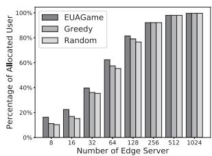

<details>
<summary>bar</summary>

| Number of Edge Server | EUAGame | Greedy | Random |
| --------------------- | ------- | ------ | ------ |
| 8                     | 15%     | 10%    | 10%    |
| 16                    | 20%     | 15%    | 15%    |
| 32                    | 40%     | 35%    | 35%    |
| 64                    | 60%     | 55%    | 55%    |
| 128                   | 80%     | 75%    | 75%    |
| 256                   | 90%     | 85%    | 85%    |
| 512                   | 95%     | 90%    | 90%    |
| 1024                  | 100%    | 95%    | 95%    |
</details>

(a) I{ai>0}/n vs.m

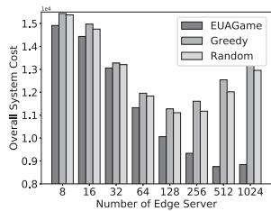

<details>
<summary>bar</summary>

| Number of Edge Server | EUAGame | Greedy | Random |
| --------------------- | ------- | ------ | ------ |
| 8                     | 1.5     | 1.5    | 1.5    |
| 16                    | 1.4     | 1.5    | 1.5    |
| 32                    | 1.3     | 1.3    | 1.3    |
| 64                    | 1.2     | 1.2    | 1.2    |
| 128                   | 1.1     | 1.1    | 1.1    |
| 256                   | 0.9     | 1.2    | 1.2    |
| 512                   | 0.9     | 1.3    | 1.3    |
| 1024                  | 0.9     | 1.3    | 1.3    |
</details>

(b) Za vs.m   
Fig. 6. Effectiveness versus number of edge servers (#2.2).

# 7 RELATED WORK

One of the critical limitations of mobile and IoT devices is their limited computing capacities and energy capacities. This is also one of the key drivers that promote the advances in distributed computing paradigm in recent years, including cloud computing and edge computing. Both cloud computing and edge computing allow computation tasks to be offloaded from mobile and IoT devices to external servers deployed in the cloud or at the edge of the cloud. This way, the limitation of mobile and IoT devices’ computing capacities can be tackled. The research problem of how to effectively and efficiently offload computation tasks is referred to as computation offloading. It is one of the most active research problems in the fields of cloud computing and edge computing.

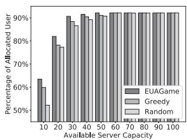

<details>
<summary>bar</summary>

| Available Server Capacity | EUAGame | Greedy | Random |
| ------------------------- | ------- | ------ | ------ |
| 10                        | 65      | 55     | 50     |
| 20                        | 80      | 75     | 70     |
| 30                        | 90      | 85     | 80     |
| 40                        | 90      | 90     | 85     |
| 50                        | 90      | 90     | 90     |
| 60                        | 90      | 90     | 90     |
| 70                        | 90      | 90     | 90     |
| 80                        | 90      | 90     | 90     |
| 90                        | 90      | 90     | 90     |
| 100                       | 90      | 90     | 90     |
</details>

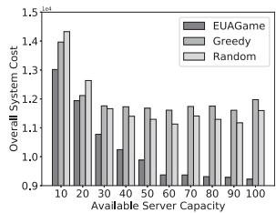

<details>
<summary>bar</summary>

| Available Server Capacity | EUAGame | Greedy | Random |
| ------------------------- | ------- | ------ | ------ |
| 10                        | 1.3     | 1.4    | 1.4    |
| 20                        | 1.2     | 1.2    | 1.3    |
| 30                        | 1.1     | 1.2    | 1.2    |
| 40                        | 1.0     | 1.2    | 1.2    |
| 50                        | 0.9     | 1.2    | 1.2    |
| 60                        | 0.9     | 1.2    | 1.2    |
| 70                        | 0.9     | 1.2    | 1.2    |
| 80                        | 0.9     | 1.2    | 1.2    |
| 90                        | 0.9     | 1.2    | 1.2    |
| 100                       | 0.9     | 1.2    | 1.2    |
</details>

(b) Za vs. c   
Fig. 7. Effectiveness versus available server capacities (#2.3).

# 7.1 Computation Offloading in Cloud Computing

Computation offloading in cloud computing has been extensively investigated in the last decade from a variety of perspectives, e.g., load balancing [39], virtual machine placement [40], task dependencies [41], etc. Most research work in this field is focused on the performance of cloud computing systems. To name a few representative pieces of work, Yu et al. [3] study the topology configuration and rate allocation problem in cloud radio access networks. A theoretical approach is employed to tackle the delayed channel state information problem of rate allocation problem with the objective to optimize the end-to-end performance of cloud computing systems. Also aiming to improve the endto-end performance of cloud computing systems, Yin et al. [4] take into account the cloud pricing information and the spectrum efficiency in wireless networks in their study of power allocation and interference management. Multiple problems encountered in the cloud computing environment, including cloud service price determination, resource allocation, and interference management are modeled as a Stackelberg game. Chen et al. [5] propose a game-theoretical approach for solving the computation offloading problem. This approach allows app users to make their own decisions on computation offloading while considering the network latency and the energy consumption on their devices. This way, the computation offloading problem can be solved in a distributed manner.

# 7.2 Computation Offloading in Edge Computing

Cloud computing is capable of alleviating the computation burden on mobile and IoT devices. However, the often unpredictable network latency between mobile and IoT devices and remote servers in the cloud has become a major obstacle to latency-sensitive mobile applications [8]. In 2010, Cisco [42] proposed a new computing paradigm, often referred to as edge computing or fog computing. As a natural extension of cloud computing, the edge computing paradigm pushes the cloud resources closer to app users by distributing edge servers across locations geographically close to app users, e.g., base stations. A lot of researchers have shifted their attention from cloud computing to edge computing in the last few years.

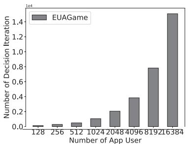

<details>
<summary>bar</summary>

| Number of App User | Number of Decision Iteration |
| ------------------ | ---------------------------- |
| 128                | 0.0                          |
| 256                | 0.0                          |
| 512                | 0.0                          |
| 1024               | 0.0                          |
| 2048               | 0.0                          |
| 4096               | 0.0                          |
| 8192               | 0.0                          |
| 16384              | 0.0                          |
</details>

(a) Efficiency vs.n (Set #2.1)

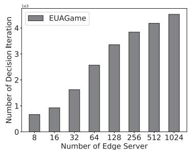

<details>
<summary>bar</summary>

| Number of Edge Server | Number of Decision Iteration |
| --------------------- | ---------------------------- |
| 8                     | 0.7e3                        |
| 16                    | 1.0e3                        |
| 32                    | 1.7e3                        |
| 64                    | 2.6e3                        |
| 128                   | 3.4e3                        |
| 256                   | 3.9e3                        |
| 512                   | 4.2e3                        |
| 1024                  | 4.5e3                        |
</details>

(b) Efficiency vs. m (Set #2.2)

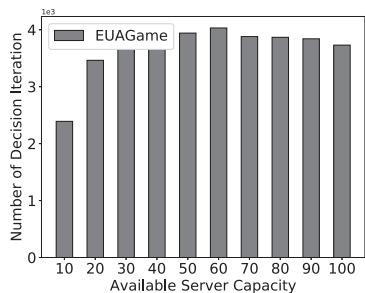

<details>
<summary>bar</summary>

| Available Server Capacity | Number of Decision Iteration |
| ------------------------- | ---------------------------- |
| 10                        | 2.4                          |
| 20                        | 3.5                          |
| 30                        | 3.7                          |
| 40                        | 3.7                          |
| 50                        | 4.0                          |
| 60                        | 4.1                          |
| 70                        | 3.9                          |
| 80                        | 3.9                          |
| 90                        | 3.9                          |
| 100                       | 3.8                          |
</details>

(c) Efficiency vs. c (Set #2.3)   
Fig. 8. Efficiency of EUAGame.   
Authorized licensed use limited to: Guangxi University. Downloaded on May 29,2026 at 12:17:10 UTC from IEEE Xplore. Restrictions apply.

You et al. [14] propose a suite of optimal and near-optimal approaches for solving the network resource allocation problem in the edge computing environment based on two wireless access protocols, i.e., TDMA and OFDMA. To minimize mobile and IoT devices’ energy consumption and network latency in the multi-channel cloud computing environment, Chen et al. [9] propose a game-theoretic approach—similar to their approach in [5] - that allocates the wireless channels of an edge server across multiple mobile and IoT devices. Neto et al. [18] attempts to improve the energy efficiency for mobile and IoT devices during computation loading through profiling and predicting users‘ task execution times and energy consumption.

Instead of mobile and IoT devices’ energy efficiency, some researchers investigate the energy efficiency of the edge servers from the edge infrastructure provider’s perspective. Wang et al. [15] study the computation offloading problem to minimize an individual edge server’s energy consumption subject to users’ constraints for computation latency. Chen et al. [10] also devote their efforts to ensuring the energy efficiency for edge servers by proposing an online peer computation offloading framework where edge servers can offload computation tasks to each other. Cost is also an active research topic. Yao et al. [43] adopt the integer linear programming technique to help edge infrastructure providers deploy edge servers in a cost-effective manner. Yin et al. [20] tackle a similar edge server deployment problem, also with the objective to optimize the performance of the edge computing systems and server deployment costs. Wang et al. [12] model the computation offloading problem as a convex problem and then decompose it so that it can be solved in a distributed manner.

Some researchers appeal to physical equipment to improve the performance of the edge computing system. Guo et al. [11] propose a new network architecture named hybrid fiberwireless (FiWi) network that connects edge servers and cloud servers with fibers. To tackle mobile and IoT devices’ energy constraint, Bi et al. [13] leverage the new wireless power transfer technology during computation offloading. Chen et al. [16] assume that users’ devices in the edge computing environment can harvest energy from various resources, such as solar radiation, wind and in-door light. Then, the conventional computation offloading problem is transformed into a green computation offloading problem.

Edge computing inherits the pay-as-you-go pricing model from cloud computing, which allows mobile and IoT app vendors to hire computing capacities on edge servers from edge infrastructure providers to host their apps and to server their app users. Thus, the cost incurred for app vendors is critical to the success of edge computing because, after all, app vendors are the main customers in the edge computing environment. Unfortunately, all the above existing work tackles the computation offloading problem from either the devices’ or the edge infrastructure providers’ perspectives, none from the app vendors’ perspective as to how to cost-effectively serve their users in the edge computing environment. This paper makes the first attempt to model and solve this important and challenging new problem in the edge computing environment from app vendors’ perspective. This new problem is referred to as Edge User Allocation (EUA), which aims to maximize the number of app user served with minimum overall system cost for an app vendor.

# 8 CONCLUSION

In this paper, we proposed EUAGame, a novel game-theoretical approach for solving the Edge User Allocation (EUA) problem from app vendors’ perspective in the edge computing environment. We show that the EUA problem is NPhard and model it as a potential game in which app users make their own allocation decisions. This way, the EUA problem can be solved in a distributed manner. We prove that the EUA game admits at least one Nash equilibrium and propose a decentralized allocation mechanism to achieve it. Its performance is evaluated both theoretically and experimentally.

This research has established the basic foundation for the EUA problem and opened up many research directions. In our future work, we will first investigate the impacts of app users’ mobility and trajectories on EUAGame. Then, we will consider app users’ dynamic participation in the EUA game, including the arrivals of new app users and the departures of existing app users. We will also improve EUAGame to accommodate app users’ diverse capacities needs and investigate the impact on user experience.

# APPENDIX A

# PROOF OF LEMMA 1

Proof. If decision $a _ { i } ^ { * }$ is not the best choice in for $u _ { i } ,$ , there must be another allocation decision $a _ { i } \in A _ { i } ,$ which can increase $u _ { i } ^ { \prime } \mathbf { s }$ benefit, i.e., $( B _ { \mathbf { a } _ { - i } ^ { * } } ( a _ { i } ^ { * } ) < B _ { \mathbf { a } _ { - i } ^ { * } } ( a _ { i } ) )$ ). Thus, by switching from $a _ { i } ^ { * }$ to $a _ { i } , u _ { i }$ i ð Þ i ð Þobtains a higher benefit. This contradicts with (12), that is, in a Nash equilibrium no app user can improve their benefit unilaterally. □

# APPENDIX B

# PROOF OF LEMMA 2

Proof. If ui is allocated to $s _ { j } ,$ , there is $a _ { i } = j > 0 ,$ , subject to constraint family (10). For $k \in D = \{ \mathrm { C P U }$ 0, memory, storage, bandwidt $\mathbb { 1 } , . . . , \mathbb { 3 }$ , there is

$$
\sum_ {u _ {l} \in U} \omega_ {l} ^ {k} = \sum_ {u _ {l} \in U \backslash \{i \}: a _ {l} = s _ {j}} \omega_ {l} ^ {k} + \omega_ {i} ^ {k}. \tag {27}
$$

Therefore, for $u _ { i } ,$ , there is

$$
\begin{array}{l} \sum_ {u _ {l} \in U: a _ {l} = j} (1 - f ^ {k} (s _ {j})) \cdot \omega_ {l} ^ {k} \\ = \sum_ {u _ {l} \in U \backslash \{i \}: a _ {l} = j} (1 - f ^ {k} (s _ {j})) \cdot \omega_ {l} ^ {k} + (1 - f ^ {k} (s _ {j})) \cdot \omega_ {i} ^ {k} \\ = \sum_ {u _ {l} \in U \backslash \{i \}: a _ {l} = j} \omega_ {l} ^ {k} + \omega_ {i} ^ {k} - \sum_ {u _ {l} \in U: a _ {l} = j} f ^ {k} (s _ {j}) \cdot \omega_ {l} ^ {k} \leq c _ {j} ^ {k}. \\ \end{array}
$$

Thus

$$
\sum_ {u _ {l} \in U \backslash \{i \}: a _ {l} = j} \omega_ {l} ^ {k} \leq c _ {j} ^ {k} - \omega_ {i} ^ {k} + \sum_ {u _ {l} \in U: a _ {l} = s _ {j}} f ^ {k} (s _ {j}) \cdot \omega_ {l} ^ {k},
$$

$\begin{array} { r } { \mathrm { i . e . , } T _ { i } ^ { k } = c _ { i } ^ { k } + \sum _ { l \in N : a _ { l } = j } f ^ { k } ( s _ { j } ) \cdot \omega _ { l } ^ { k } - \omega _ { i } ^ { k } } \end{array}$


# APPENDIX C PROOF OF THEOREM 1

Proof. For $u _ { i } ,$ let us suppose its two allocation decisions, $a _ { i }$ and $a _ { i } ^ { \prime } ,$ that fulfill $\mathsf { \bar { B } } _ { \mathbf { a } _ { - i } } ( a _ { i } ) \ < \ B _ { \mathbf { a } _ { - i } } ( a _ { i } ^ { \prime } )$ . According to $\operatorname { E q . } \ ( 4 ) .$  ð Þ  ð Þ, Theorem 1 needs to be proven in two cases: 1) $a _ { i } > 0$ and $a _ { i } ^ { \prime } > 0 ;$ and $2 ) a _ { i } = 0$ and $a _ { i } ^ { \prime } > 0 .$ .

0Case 1: $a _ { i } > 0$ 0and $a _ { i } ^ { \prime } > 0$ 0. Given $B _ { { \bf a } _ { - i } } ( a _ { i } ) < B _ { { \bf a } _ { - i } } ( a _ { i } ^ { \prime } )$ , 0based on (4), there is

$$
\sum_ {k \in D} \lambda_ {i} ^ {k} \cdot f ^ {k} (s _ {a _ {i}}) \cdot \omega_ {i} ^ {k} <   \sum_ {k \in D} \lambda_ {i} ^ {k} \cdot f ^ {k} (s _ {a _ {i} ^ {\prime}}) \cdot \omega_ {i} ^ {k}.
$$

According to Eqs. (1) and $( 2 ) _ { , }$ , more app users have been allocated to $a _ { i }$ than to $a _ { i \cdot } ^ { \prime }$ . Thus, edge server $s _ { a _ { i } }$ can obtain more multi-tenancy benefits than $s _ { a _ { i } ^ { \prime } }$

$$
\sum_ {l \neq i} \sum_ {k \in D} \lambda_ {l} ^ {k} f ^ {k} (s _ {a _ {i}}) \omega_ {l} ^ {k} I _ {\{a _ {l} = a _ {i} \}} <   \sum_ {l \neq i} \sum_ {k \in D} \lambda_ {l} ^ {k} f ^ {k} (s _ {a _ {i} ^ {\prime}}) \omega_ {l} ^ {k} I _ {\{a _ {l} = a _ {i} ^ {\prime} \}}.
$$

Thus

$$
\phi_ {\mathbf {a} _ {- i}} (a _ {i}) - \phi_ {\mathbf {a} _ {- i}} (a _ {i} ^ {\prime})
$$

$$
= \sum_ {k \in D} \lambda_ {i} ^ {k} \cdot f ^ {k} (s _ {a _ {i}}) \cdot \omega_ {i} ^ {k} \sum_ {l \neq i} \sum_ {k \in D} \lambda_ {l} ^ {k} \cdot f ^ {k} (s _ {a _ {i}}) \cdot \omega_ {l} ^ {k} I _ {\{a _ {l} = a _ {i} \}}
$$

$$
- \sum_ {k \in D} \lambda_ {i} ^ {k} \cdot f ^ {k} (s _ {a _ {i}}) \cdot \omega_ {i} ^ {k} \sum_ {l \neq i} \sum_ {k \in D} \lambda_ {l} ^ {k} \cdot f ^ {k} (s _ {a _ {i} ^ {\prime}}) \cdot \omega_ {l} ^ {k} I _ {\{a _ {l} = a _ {i} ^ {\prime} \}} <   0.
$$

Case 2: $a _ { i } = 0$ and $a _ { i } ^ { \prime } > 0 .$ . Given $a _ { i } = 0$ and $a _ { i } ^ { \prime } > 0 ,$ , there is

$$
\phi_ {\mathbf {a} _ {- i}} (a _ {i}) - \phi_ {\mathbf {a} _ {- i}} (a _ {i} ^ {\prime}) = - \sum_ {k \in D} \lambda_ {i} ^ {k} \cdot f ^ {k} (s _ {a _ {i}}) \cdot \omega_ {i} ^ {k} T _ {i}
$$

$$
- \sum_ {k \in D} \lambda_ {i} ^ {k} \cdot f ^ {k} (s _ {a _ {i}}) \cdot \omega_ {i} ^ {k} \sum_ {l \neq i} \sum_ {k \in D} \lambda_ {l} ^ {k} \cdot f ^ {k} (s _ {a _ {i} ^ {\prime}}) \cdot \omega_ {l} ^ {k} I _ {\{a _ {l} = a _ {i} ^ {\prime} \}}.
$$

Eq. (16) implies that

$$
T _ {i} = \sum_ {k \in D} (\lambda_ {i} ^ {k} \cdot c _ {j} ^ {k} + \sum_ {u _ {l} \in U: a _ {l} = a _ {i}} \lambda_ {l} ^ {k} \cdot f ^ {k} (s _ {a _ {i}}) \cdot \omega_ {l} ^ {k} - \lambda_ {i} ^ {k} \cdot \omega_ {i} ^ {k}),
$$

and $\begin{array} { r } { \sum _ { k \in D } \lambda _ { i } ^ { k } \cdot c _ { j } ^ { k } > \sum _ { k \in D } \lambda _ { i } ^ { k } \cdot \omega _ { i } ^ { k } } \end{array}$

2Thus, there is $\begin{array} { r } { T _ { i } > \sum _ { u _ { l } \in U : a _ { l } = a _ { i } } \sum _ { k \in D } \lambda _ { l } ^ { k } \cdot f ^ { k } ( s _ { a _ { i } } ) \cdot \omega _ { l } ^ { k } . } \end{array}$ Because

$$
\sum_ {u _ {l} \in U: a _ {n} = a _ {i}} \sum_ {k \in D} \lambda_ {l} ^ {k} \cdot f ^ {k} (s _ {a _ {i}}) \cdot \omega_ {l} ^ {k}
$$

$$
= \sum_ {u _ {l} \in U \backslash \{i \}: a _ {l} = a _ {i}} \sum_ {k \in D} \lambda_ {l} ^ {k} \cdot f ^ {k} (s _ {a _ {i}}) \cdot \omega_ {l} ^ {k} + \sum_ {k \in D} \lambda_ {i} ^ {k} \cdot f ^ {k} (s _ {a _ {i}}) \cdot \omega_ {i} ^ {k},
$$

there is

$$
T _ {i} > \sum_ {u _ {l} \in U \backslash \{i \}: a _ {l} = a _ {i}} \sum_ {k \in D} \lambda_ {l} ^ {k} \cdot f ^ {k} (s _ {a _ {i}}) \cdot \omega_ {l} ^ {k} > 0. \tag {28}
$$

Now, there is

$$
\phi_ {\mathbf {a} _ {- i}} (a _ {i}) - \phi_ {\mathbf {a} _ {- i}} (a _ {i} ^ {\prime}) = - \sum_ {k \in D} \lambda_ {i} ^ {k} \cdot f ^ {k} (s _ {a _ {i}}) \cdot \omega_ {i} ^ {k} T _ {i}
$$

$$
- \sum_ {k \in D} \lambda_ {i} ^ {k} \cdot f ^ {k} (s _ {a _ {i}}) \cdot \omega_ {i} ^ {k} \sum_ {l \neq i} \sum_ {k \in D} \lambda_ {l} ^ {k} \cdot f ^ {k} (s _ {a _ {i} ^ {\prime}}) \cdot \omega_ {l} ^ {k} I _ {\{a _ {l} = a _ {i} ^ {\prime} \}} <   0.
$$

Therefore, Theorem 1 holds.


# APPENDIX D PROOF OF THEOREM 2

Proof. According to (17), there is

$$
0 \geq \phi_ {\mathbf {a} _ {- i}} (a _ {i}) \geq \frac {1}{2} \sum_ {u _ {i} \in U} \sum_ {u _ {j} \in U} Q _ {\min} ^ {2} - \sum_ {u _ {i} \in U} Q _ {\max} T _ {\max}
$$

$$
= \frac {1}{2} n ^ {2} Q _ {\text { min }} ^ {2} - n Q _ {\text { max }} T _ {\text { max }}. \tag {29}
$$

If app user $u _ { i }$ changes its decision from $a _ { i }$ to $a _ { i } ^ { \prime } ,$ , it leads to an increase in its benefits, i.e., $B _ { { \bf a } _ { - i } } ( a _ { i } ) < B _ { { \bf a } _ { - i } } ( a _ { i } ^ { \prime } )$ .  ð Þ  ð ÞAccording to Definition (4) of potential game, it also leads to an increase in the potential calculated with $\phi ,$ denoted by $\delta _ { i } ,$ i.e.,

$$
\phi (a _ {i}, \mathbf {a} _ {- i}) + \delta_ {i} \leq \phi (a _ {i} ^ {\prime}, \mathbf {a} _ {- i}). \tag {30}
$$

Now we attempt to prove that $\delta _ { i } = Q _ { i }$ so that there is min $u _ { i } \in U ^ { \left( \delta _ { i } \right) } = Q _ { m i n . }$ , where $\mathbf { \delta } _ { u _ { i } \in U } ( \delta _ { i } )$ is the minimum min 2 ð Þ ¼ min 2 ð Þincrease in the potential caused by a decision update.

According to the proof of Theorem 1, there are only two cases in which an app user changes its decision: 1) $a _ { i } > 0$ and $a _ { i } ^ { \prime } > 0 ;$ and $2 ) \bar { a } _ { i } = 0$ and $\begin{array} { r } { \bar { a _ { i } ^ { \prime } } > 0 . } \end{array}$ .

0Case 1: $a _ { i } > 0$ 0and $a _ { i } ^ { \prime } > 0$ ¼ 0 0. According to the proof of 0Case 1 in Theorem 1, there is

$$
\begin{array}{l} \phi_ {\mathbf {a} _ {- i}} (a _ {i} ^ {\prime}) - \phi_ {\mathbf {a} _ {- i}} (a _ {i}) \\ = Q _ {i} \cdot \left(\sum_ {l \neq i} Q _ {l} \cdot I _ {\{a _ {l} = a _ {i} \}} - \sum_ {l \neq i} Q _ {l} \cdot I _ {\{a _ {l} = a _ {i} ^ {\prime} \}}\right) > 0. \tag {31} \\ \end{array}
$$

Since $Q _ { i } > 0$ is an integer for any $u _ { i } \in U .$ , there is

$$
\sum_ {l \neq i} Q _ {l} \cdot I _ {\{a _ {l} = a _ {i} \}} - \sum_ {l \neq i} Q _ {l} \cdot I _ {\{a _ {l} = a _ {i} ^ {\prime} \}} \geq 1.
$$

Thus, according to Eq. (31), there is

$$
\phi_ {\mathbf {a} _ {- i}} (a _ {i} ^ {\prime}) \geq \phi_ {\mathbf {a} _ {- i}} (a _ {i}) + Q _ {i} \geq \phi_ {\mathbf {a} _ {- i}} (a _ {i}) + Q _ {m i n}.
$$

Case 2: $a _ { i } = 0$ and $a _ { i } ^ { \prime } > 0 .$ . According to the proof of ¼ 0 0Case 2 in Theorem 1, there is

$$
\phi_ {\mathbf {a} _ {- i}} (a _ {i} ^ {\prime}) - \phi_ {\mathbf {a} _ {- i}} (a _ {i}) = Q _ {i} \cdot \left(T _ {i} - \sum_ {l \neq i} Q _ {l} \cdot I _ {\{a _ {l} = a _ {i} ^ {\prime} \}}\right) > 0.
$$

Similar to the proof in Case 1, there is

$$
\phi_ {\mathbf {a} _ {- i}} (a _ {i} ^ {\prime}) \geq \phi_ {\mathbf {a} _ {- i}} (a _ {i}) + Q _ {i} \geq \phi_ {\mathbf {a} _ {- i}} (a _ {i}) + Q _ {m i n}.
$$

Therefore, according to (29) and (30), there is

$$
R \leq \left(n Q _ {m a x} \cdot T _ {m a x} - \frac {1}{2} n ^ {2} Q _ {m i n} ^ {2}\right) / Q _ {m i n}.
$$

That is, $R \leq n Q _ { m a x } \cdot T _ { m a x } / Q _ { m i n } - n ^ { 2 } Q _ { m i n } / 2$ Therefore, Theorem 2 holds. □

# APPENDIX E

# PROOF OF THEOREM 3

Proof. Case 1: As for $1 \geq p o a _ { u s e r } ( \mathbf { a } )$ , because $\mathbf { a } ^ { * } = ( a _ { 1 } ^ { * }$ ; $a _ { 2 } ^ { * } , \ldots , a _ { n } ^ { * } )$ 1  ð Þ ¼ ð 1is the centralized optimal decision profile, it is 2 . . . Þclear that $n u m _ { s _ { j } } ( \mathbf { a } ) \leq n u m _ { s _ { j } } ( \mathbf { a } ^ { * } )$ . Thus, there is $1 \geq$ $P ( U s e r )$ ð Þ . In addition, if

$$
\sum_ {s _ {j} \in S} n u m _ {s _ {j}} (\mathbf {a}) = n,
$$

it can be easily found that

$$
\sum_ {s _ {j} \in S} n u m _ {s _ {j}} (\mathbf {a} ^ {*}) = n.
$$

Thus, there is $p o a _ { u s e r } ( \mathbf { a } ) = 1 , \mathrm { i . e . , 1 } \geq p o a _ { u s e r } ( \mathbf { a } )$ .

Case 2: Since $\begin{array} { r } { \sum _ { s _ { j } \in S } n u m _ { s _ { j } } ( \mathbf { a } ) = n } \end{array}$  ð Þhas been proved above, 2we now discuss the situation where $\begin{array} { r } { \sum _ { s _ { j } \in S } n u m _ { s _ { j } } ( \mathbf { a } ) < n } \end{array}$ for

$$
p o a _ {u s e r} (\mathbf {a}) \geq \frac {\left\lfloor T _ {m i n} / Q _ {m a x} \right\rfloor}{\left\lfloor T _ {m a x} / Q _ {m i n} \right\rfloor + 1}.
$$

According to Eq. (16), we can find that

$$
\begin{array}{l} T _ {i} > \sum_ {u _ {l} \in U \setminus \{u _ {i} \}: a _ {l} ^ {*} = a _ {i} ^ {*}} \sum_ {k \in D} \lambda_ {a _ {l} ^ {*}} ^ {k} \cdot f ^ {k} (s _ {a _ {l} ^ {*}}) \cdot \omega_ {l} ^ {k} \\ = \sum_ {u _ {l} \in U \backslash \{u _ {i} \}: a _ {l} ^ {*} = a _ {i} ^ {*}} Q _ {l}. \\ \end{array}
$$

It follows $Q _ { i } \geq Q _ { m i n }$ . Thus, for edge server $s _ { j } ,$ , there is

$$
(n u m _ {s _ {j}} (\mathbf {a} ^ {*}) - 1) \cdot Q _ {m i n} \leq \sum_ {u _ {l} \in U \setminus \{u _ {i} \}: a _ {l} ^ {*} = a _ {i} ^ {*}} Q _ {l} \leq T _ {i} \leq T _ {m a x}.
$$

It implies

$$
\operatorname{num} _ {s _ {j}} \left(\mathbf {a} ^ {*}\right) \leq \left\lfloor T _ {\max} / Q _ {\min} \right\rfloor + 1.
$$

That is

$$
\sum_ {u _ {i} \in U} I _ {\left\{a _ {i} ^ {*} > 0 \right\}} \leq m \cdot \left(\left\lfloor T _ {\max} / Q _ {\min} \right\rfloor + 1\right).
$$

For any other $\mathbf { a } \in \chi ,$ it follows $\begin{array} { r } { \sum _ { s _ { i } \in S } n u m _ { s _ { j } } ( \mathbf { a } ) < n . } \end{array}$ 2 j2  ð ÞThere is at least one app user u that cannot be allocated,

i.e., $a _ { i } = 0$ . In other words, given user $u _ { i } \in U$ and any ¼ 0other edge server $s _ { j } \in S _ { \cdot }$ , it can be found that

$$
\begin{array}{l} T _ {i} \leq \sum_ {u _ {l} \in U \backslash \{u _ {i} \}: a _ {l} = s _ {j}} \sum_ {k \in D} \lambda_ {a _ {l}} ^ {k} \cdot f ^ {k} (s _ {j}) \cdot \omega_ {l} ^ {k} \\ = \sum_ {u _ {l} \in U \setminus \{u _ {i} \}: a _ {l} = s _ {j}} Q _ {l}, \\ \end{array}
$$

i.e.,

$$
n u m _ {s _ {j}} (\mathbf {a}) \cdot Q _ {m a x} \geq \sum_ {u _ {l} \in U \backslash \{u _ {i} \}: a _ {l} = s _ {j}} Q _ {l} \geq T _ {i} \geq T _ {m i n}.
$$

Thus, there is nu $m _ { s _ { j } } ( \mathbf { a } ) \geq \lfloor T _ { m i n } / Q _ { m a x } \rfloor$ and $\sum { } _ { u _ { i } \in U }$ $I _ { \{ a _ { i } > 0 \} } \geq m \cdot \lfloor T _ { m i n } / Q _ { m a x } \rfloor$ . Finally, we obtain

$$
p o a _ {u s e r} (\mathbf {a}) = \frac {\sum_ {s _ {j} \in S} n u m _ {s _ {j}} (\mathbf {a})}{\sum_ {s _ {j} \in S} n u m _ {s _ {j}} (\mathbf {a} ^ {*})} \geq \frac {\lfloor T _ {m i n} / Q _ {m a x} \rfloor}{\lfloor T _ {m a x} / Q _ {m i n} \rfloor + 1}.
$$

Combining Case 1 and Case 2, there is

$$
1 \geq p o a _ {u s e r} (\mathbf {a}) \geq \frac {\left\lfloor T _ {m i n} / Q _ {m a x} \right\rfloor}{\left\lfloor T _ {m a x} / Q _ {m i n} \right\rfloor + 1}.
$$

Therefore, Theorem 3 holds.


# APPENDIX F

# PROOF OF THEOREM 4

Proof. Case 1: For any allocation decision profile know that $Z _ { i , m a x } ^ { e d g e } \geq { \bf \bar { \Psi } } Z _ { i , m i n } ^ { e d g e } .$ 2Zedge . Thus, there is   poauser a . i;min $1 \geq p o a _ { u s e r } ( \mathbf { a } )$ $\mathbf { a } \in \chi ,$ , we

Case 2: For any decision profile $\mathbf { a } \in \boldsymbol { \chi } \ ( \mathbf { a } \neq \mathbf { a } ^ { * } )$ ð Þ, compared with $\mathbf { a } ^ { * } ,$ 2 6¼, there is at least one app user that is not allocated to the most suitable edge server or is not allocated to any edge server. The maximum cost incurred by this app user is $\overset { \smile } { \boldsymbol { Z } } _ { i , m a x } ^ { e d g e } \left( \mathbf { a } \right)$ . Thus, it can be implied that

$$
\sum_ {u _ {i} \in U} Z _ {i} (\mathbf {a}) \leq \sum_ {u _ {i} \in U} \Big (Z _ {i} ^ {\text {local}} (\mathbf {a}) \cdot I _ {\{a _ {i} = 0 \}} + Z _ {i, \max} ^ {\text {edge}} (\mathbf {a}) \cdot I _ {\{a _ {i} > 0 \}} \Big).
$$

Given the centralized optimal decision profile $\mathbf { a } ^ { * } ,$ , every allocated app user is allocated to the most suitable edge server. The total cost incurred by these app users is $Z _ { i , m i n } ^ { e d g e } ( \mathbf { a } )$ . Thus, including app users that are not allocated ð Þto any edge server, the overall system cost can be calculated as follows:

$$
\sum_ {u _ {i} \in U} Z _ {i} (\mathbf {a} ^ {*}) = \sum_ {u _ {i} \in U} \left(Z _ {i} ^ {\text {local}} (\mathbf {a} ^ {*}) \cdot I _ {\{a _ {i} = 0 \}} + Z _ {i, \min} ^ {\text {edge}} (\mathbf {a} ^ {*}) \cdot I _ {\{a _ {i} > 0 \}}\right).
$$

Combining Case 1 and Case 2, it can be concluded that $p o a _ { c o s t } ( \mathbf { a } )$ follows:

$$
\begin{array}{l} 1 \leq p o a _ {c o s t} (\mathbf {a}) \\ \leq \frac {\sum_ {u _ {i} \in U} (Z _ {i} ^ {l o c a l} (\mathbf {a}) \cdot I _ {\{a _ {i} = 0 \}} + Z _ {i , m a x} ^ {e d g e} (\mathbf {a}) \cdot I _ {\{a _ {i} > 0 \}})}{\sum_ {u _ {i} \in U} (Z _ {i} ^ {l o c a l} (\mathbf {a} ^ {*}) \cdot I _ {\{a _ {i} = 0 \}} + Z _ {i , m i n} ^ {e d g e} (\mathbf {a} ^ {*}) \cdot I _ {\{a _ {i} > 0 \}})}. \\ \end{array}
$$


# ACKNOWLEDGMENTS

This research is funded by Australian Research Council Discovery Projects (DP170101932 and DP180100212), National Science Foundation of China (No. 61772461), Natural Science Foundation of Zhejiang Province (No. LR18F020003). Yanhui Li is the corresponding author of this paper.

# REFERENCES

[1] N. Heuveldop, “Ericsson mobility report,” Ericsson, Stockholm, 2017. [Online]. Available: https://www.ericsson.com/49de7e/assets/ local/mobility-report/documents/2017/ericsson-mobility-reportnovember-2017.pdf   
[2] M. Armbrust, A. Fox, R. Griffith, A. D. Joseph, R. Katz, A. Konwinski, G. Lee, D. Patterson, A. Rabkin, I. Stoica, et al., “A view of cloud computing,” Commun. ACM, vol. 53, no. 4, pp. 50–58, 2010.   
[3] Y. Cai, F. R. Yu, and S. Bu, “Cloud computing meets mobile wireless communications in next generation cellular networks,” IEEE Netw., vol. 28, no. 6, pp. 54–59, Nov./Dec. 2014.   
[4] Z. Yin, F. R. Yu, S. Bu, and Z. Han, “Joint cloud and wireless networks operations in mobile cloud computing environments with telecom operator cloud,” IEEE Trans. Wireless Commun., vol. 14, no. 7, pp. 4020–4033, Jul. 2015.   
[5] X. Chen, “Decentralized computation offloading game for mobile cloud computing,” IEEE Trans. Parallel Distrib. Syst., vol. 26, no. 4, pp. 974–983, Apr. 2015.   
[6] T. Soyata, R. Muraleedharan, C. Funai, M. Kwon, and W. Heinzelman, “Cloud-vision: Real-time face recognition using a mobile-cloudlet-cloud acceleration architecture,” in Proc. IEEE Symp. Comput. Commun., 2012, pp. 59–66.   
[7] J. Cohen, “Embedded speech recognition applications in mobile phones: Status, trends, and challenges,” in Proc. IEEE Int. Conf. Acoust. Speech Signal Process., 2008, pp. 5352–5355.   
[8] W. Shi, J. Cao, Q. Zhang, Y. Li, and L. Xu, “Edge computing: Vision and challenges,” IEEE Internet Things J., vol. 3, no. 5, pp. 637–646, Oct. 2016.   
[9] X. Chen, L. Jiao, W. Li, and X. Fu, “Efficient multi-user computation offloading for mobile-edge cloud computing,” IEEE/ACM Trans. Netw., vol. 24, no. 5, pp. 2795–2808, Oct. 2016.   
[10] L. Chen, S. Zhou, and J. Xu, “Computation peer offloading for energy-constrained mobile edge computing in small-cell networks,” IEEE/ACM Trans. Netw., vol. 26, no. 4, pp. 1619–1632, Aug. 2018.   
[11] H. Guo and J. Liu, “Collaborative computation offloading for multi-access edge computing over fiber-wireless networks,” IEEE Trans. Veh. Technol., vol. 67, no. 5, pp. 4514–4526, May 2018.   
[12] C. Wang, C. Liang, F. R. Yu, Q. Chen, and L. Tang, “Computation offloading and resource allocation in wireless cellular networks with mobile edge computing,” IEEE Trans. Wireless Commun., vol. 16, no. 8, pp. 4924–4938, Aug. 2017.   
[13] S. Bi and Y. J. Zhang, “Computation rate maximization for wireless powered mobile-edge computing with binary computation offloading,” IEEE Trans. Wireless Commun., vol. 17, no. 6, pp. 4177–4190, Jun. 2018.   
[14] C. You, K. Huang, H. Chae, and B.-H. Kim, “Energy-efficient resource allocation for mobile-edge computation offloading,” IEEE Trans. Wireless Commun., vol. 16, no. 3, pp. 1397–1411, Mar. 2017.   
[15] F. Wang, J. Xu, X. Wang, and S. Cui, “Joint offloading and computing optimization in wireless powered mobile-edge computing systems,” IEEE Trans. Wireless Commun., vol. 17, no. 3, pp. 1784–1797, Mar. 2018.   
[16] W. Chen, D. Wang, and K. Li, “Multi-user multi-task computation offloading in green mobile edge cloud computing,” IEEE Trans. Serv. Comput., 2018. doi: 10.1109/TSC.2018.2826544.   
[17] T. Q. Dinh, J. Tang, Q. D. La, and T. Q. Quek, “Offloading in mobile edge computing: Task allocation and computational frequency scaling,” IEEE Trans. Commun., vol. 65, no. 8, pp. 3571–3584, Aug. 2017.   
[18] J. L. D. Neto, S.-Y. Yu, D. F. Macedo, J. M. S. Nogueira, R. Langar, and S. Secci, “ULOOF: A user level online offloading framework for mobile edge computing,” IEEE Trans. Mobile Comput., vol. 17, no. 11, pp. 2660–2674, Nov. 2018.   
[19] Y. C. Hu, M. Patel, D. Sabella, N. Sprecher, and V. Young, “Mobile edge computing—A key technology towards 5G,” ETSI White Paper, vol. 11, no. 11, pp. 1–16, 2015.

[20] H. Yin, X. Zhang, H. H. Liu, Y. Luo, C. Tian, S. Zhao, and F. Li, “Edge provisioning with flexible server placement,” IEEE Trans. Parallel Distrib. Syst., vol. 28, no. 4, pp. 1031–1045, Apr. 2017.   
[21] F. Chong and G. Carraro, “Architecture strategies for catching the long tail,” MSDN Library, Microsoft Corporation, pp. 9–10, 2006.   
[22] B. P. Rimal and M. Maier, “Workflow scheduling in multi-tenant cloud computing environments,” IEEE Trans. Parallel Distrib. Syst., vol. 28, no. 1, pp. 290–304, Jan. 2017.   
[23] D. Shue, M. J. Freedman, and A. Shaikh, “Performance isolation and fairness for multi-tenant cloud storage,” in Proc. USENIX Conf. Operating Syst. Des. Implementation, 2012, pp. 349–362.   
[24] R. Krebs, A. Wert, and S. Kounev, “Multi-tenancy performance benchmark for web application platforms,” in Proc. Int. Conf. Web Eng., 2013, pp. 424–438.   
[25] S. Srikantaiah, A. Kansal, and F. Zhao, “Energy aware consolidation for cloud computing,” in Proc. HotPower Workshop Power Aware Comput. Syst., 2008, pp. 10–15.   
[26] B. Yang, Z. Li, S. Chen, T. Wang, and K. Li, “Stackelberg game approach for energy-aware resource allocation in data centers,” IEEE Trans. Parallel Distrib. Syst., vol. 27, no. 12, pp. 3646–3658, Dec. 2016.   
[27] R. B. Myerson, Game Theory. Cambridge, MA, USA: Harvard Univ. Press, 2013.   
[28] Y. Lin and H. Shen, “CloudFog: Leveraging fog to extend cloud gaming for thin-client MMOG with high quality of service,” IEEE Trans. Parallel Distrib. Syst., vol. 28, no. 2, pp. 431–445, Feb. 2017.   
[29] E. Cuervo, A. Wolman, L. P. Cox, K. Lebeck, A. Razeen, S. Saroiu, and M. Musuvathi, “Kahawai: High-quality mobile gaming using GPU offload,” in Proc. 13th Annu. Int. Conf. Mobile Syst. Appl. Serv., 2015, pp. 121–135.   
[30] G. Velkoski, M. Simjanoska, S. Ristov, and M. Gusev, “CPU utilization in a multitenant cloud,” in Proc. IEEE Eurocon, 2013, pp. 242–249.   
[31] M. R. Garey and D. S. Johnson, Computers and Intractability: A Guide to the Theory of NP-Completeness, W. H. Freeman & Co.: New York, NY, USA, 1979.   
[32] M. J. Osborne and A. Rubinstein, A Course in Game Theory. Cambridge, MA, USA: MIT Press, 1994.   
[33] C. A. Holt and A. E. Roth, “The nash equilibrium: A perspective,” Proc. Nat. Academy Sci. United States America, vol. 101, no. 12, pp. 3999–4002, 2004.   
[34] D. Monderer and L. S. Shapley, “Potential games,” Games Econ. Behavior, vol. 14, no. 1, pp. 124–143, 1996.   
[35] J. R. Marden, G. Arslan, and J. S. Shamma, “Cooperative control and potential games,” IEEE Trans. Syst. Man Cybern. Part B (Cybern.), vol. 39, no. 6, pp. 1393–1407, Dec. 2009.   
[36] J. R. Marden, G. Arslan, and J. S. Shamma, “Joint strategy fictitious play with inertia for potential games,” IEEE Trans. Autom. Control, vol. 54, no. 2, pp. 208–220, Feb. 2009.   
[37] T. Roughgarden, Selfish Routing and the Price of Anarchy, vol. 174. Cambridge, MA, USA: MIT Press, 2005.   
[38] P. Lai, Q. He, M. Abdelrazek, F. Chen, J. Hosking, J. Grundy, and Y. Yang, “Optimal edge user allocation in edge computing with variable sized vector bin packing,” in Proc. Int. Conf. Service-Oriented Comput., 2018, pp. 230–245.   
[39] T. Chen, A. G. Marques, and G. B. Giannakis, “DGLB: Distributed stochastic geographical load balancing over cloud networks,” IEEE Trans. Parallel Distrib. Syst., vol. 28, no. 7, pp. 1866–1880, Jul. 2017.   
[40] A. Wolke, B. Tsend-Ayush , C. Pfeiffer, and M. Bichler, “More than bin packing: Dynamic resource allocation strategies in cloud data centers,” Inf. Syst., vol. 52, pp. 83–95, 2015.   
[41] S. Deng, L. Huang, J. Taheri, and A. Y. Zomaya, “Computation offloading for service workflow in mobile cloud computing,” IEEE Trans. Parallel Distrib. Syst., vol. 26, no. 12, pp. 3317–3329, Dec. 2015.   
[42] F. Bonomi, R. Milito, J. Zhu, and S. Addepalli, “Fog computing and its role in the internet of things,” in Proc. MCC Workshop Mobile Cloud Comput., 2012, pp. 13–16.   
[43] H. Yao, C. Bai, M. Xiong, D. Zeng, and Z. Fu, “Heterogeneous cloudlet deployment and user-cloudlet association toward cost effective fog computing,” Concurrency Comput.: Practice Experience, vol. 29, no. 16, 2017, Art. no. e3975.


<details>
<summary>natural_image</summary>

Portrait of a man in a collared shirt against a cloudy sky background (no text or symbols visible)
</details>

Qiang He received the first PhD degree from the Swinburne University of Technology, Australia, in 2009, and the second PhD degree in computer science and engineering from the Huazhong University of Science and Technology, China, in 2010. He is a senior lecturer with Swinburne. His research interests include edge computing, cloud computing, software engineering, and service computing. He is a member of the IEEE. More details about his research can be found at https:// sites.google.com/site/heqiang/.


<details>
<summary>natural_image</summary>

Portrait of a man wearing glasses and a suit (no text or symbols visible)
</details>

Shuiguang Deng received the BS and PhD degrees in computer science from Zhejiang University, in 2002 and 2007, respectively. He is a full professor with the College of Computer Science and Technology, Zhejiang University. His research interests include service computing, mobile computing, and business process. He is a senior member of the IEEE.


<details>
<summary>natural_image</summary>

Portrait photo of a man in formal attire (no text or symbols visible)
</details>

Guangming Cui received the master’s degree from Anhui University, China, in 2018. He is working toward the PhD degree at the Swinburne University of Technology. His research interests include software engineering, edge computing, and service computing.


<details>
<summary>natural_image</summary>

Portrait of a man in formal attire (no visible text or symbols)
</details>

Hai Jin received the PhD degree in computer engineering from the Huazhong University of Science and Technology (HUST), in 1994. He is a Cheung Kung Scholars chair professor of computer science and engineering with the Huazhong University of Science and Technology (HUST) in China. His research interests include computer architecture, virtualization technology, cluster computing and cloud computing, peer-to-peer computing, network storage, and network security. He is a fellow of the IEEE.


<details>
<summary>natural_image</summary>

Portrait of a young man wearing a striped polo shirt (no text or symbols visible)
</details>

Xuyun Zhang received the BSc and MSc degrees in computer science from Nanjing University, China, and the PhD degree from the University of Technology Sydney. He is currently a lecturer with the University of Auckland, New Zealand. His research interests include scalable machine learning and data mining, big data, cloud computing, web service technology, privacy, and security.


<details>
<summary>natural_image</summary>

Portrait of a man wearing glasses and a jacket (no visible text or symbols)
</details>

Yanhui Li received the BS, MS, and PhD degrees in computer science from Southeast University. He is currently an assistant professor with the Department of Computer Science and Technology, Nanjing University. His main research interests include empirical software engineering, software analysis, knowledge engineering, and formal methods. He is a member of the IEEE.


<details>
<summary>natural_image</summary>

Portrait of a smiling woman with glasses and long hair (no text or symbols visible)
</details>

Feifei Chen received the PhD degree from the Swinburne University of Technology, Australia, in 2015. She is a lecturer with Deakin University. Her research interests include software engineering, edge computing, cloud computing, and green computing.


<details>
<summary>natural_image</summary>

Portrait of a man in formal attire (no visible text or symbols)
</details>

Yun Yang received the PhD degree in computer science from the University of Queensland, Australia, in 1992. He is currently a full professor with the School of Software and Electrical Engineering, Swinburne University of Technology, Melbourne, Australia. His research interests include software technologies, cloud computing, workflow systems, and service computing. He is a senior member of the IEEE.

" For more information on this or any other computing topic, please visit our Digital Library at www.computer.org/csdl.