# A Hierarchical MAFDRL-Based Resource Allocation and Incentive Mechanism for TN-NTN in 6G Networks

Abegaz Mohammed Seid , Member, IEEE, Aiman Erbad, Senior Member, IEEE,

Hayla Nahom Abishu , Member, IEEE, Gordon Owusu Boateng , Member, IEEE,

Latif U. Khan , Member, IEEE, Carla Fabiana Chiasserini , Fellow, IEEE, and Mohsen Guizani , Fellow, IEEE

Abstract—To address the limitations of existing wireless networks for demanding applications like brain-computer interfaces and intelligent transportation systems, we propose an advanced framework for joint resource allocation and task offloading across integrated terrestrial and non-terrestrial networks (TN-NTN). This framework utilizes multiple layers, including ground users, UAVs, HAPs, and satellites, to improve service quality and immersive experiences, particularly in scenarios like Metaverse applications. Ground users request resources, while UAVs and HAPs serve as resource providers, and satellites ensure reliable communication during emergencies. A double auction-based incentive scheme is employed in which operators control UAV and HAP resources to maximize utility, and users aim to minimize computation costs and protect data privacy. To handle the complexity of the operator-user interaction, which results in an NP-hard optimization problem, we applied a hierarchical multi-agent federated deep reinforcement learning (FeDRL) approach. Our simulation results demonstrate that the FeDRL algorithm significantly improves social welfare by 6.38%, 17.43%, and 28.73% over modified MADDPG, FRL, and DDPG algorithms, respectively.

Index Terms—Deep reinforcement learning, federated learning, incentive mechanisms, social welfare, TN-NTN.

## I. INTRODUCTION

service across many end devices (EDs) is significant. This requirement can be efficiently met by establishing integrated terrestrial and non-terrestrial networks (TN-NTNs), also called space-air-ground integrated networks (SAGINs) [1], [2]. Unlike traditional terrestrial networks (TNs), TN-NTNs offer enhanced coverage, reliability, and computation capacity, ensuring seamless connectivity in remote areas. Furthermore, TN-NTNs increase network resilience using satellites, reduce congestion, support low-latency communication, and enable innovative applications [3], [4]. Additionally, TN-NTNs can offer seamless connectivity in disaster-affected areas and difficult terrains where traditional TNs have been disrupted, a critical capability for maintaining communication among emergency responders and affected communities [5], [6], [7]. However, TN-NTNs also encounter several challenges, as highlighted below.

The vision of TN-NTNs requires the collaboration of multiple entities with different characteristics, conflicting goals, and limited resources, which makes orchestrating the operations of TN-NTNs a challenging task. First, TN-NTNs should ensure effective interaction between nodes with very different characteristics, such as EDs, unmanned aerial vehicles (UAVs), high altitude platforms (HAPs), and satellites. Second, the EDs have limited computational resources (e.g., CPU-cycles) compared to UAVs, HAPs, and satellites, so they may need to offload their intensive tasks to more resourceful nodes. Third, the optimal allocation of resources across multiple domains in the TN-NTN infrastructure poses technical hurdles. Incorporating incentive mechanisms can effectively regulate user prices, energy usage, and latency, but can also increase the level of complexity of the TN-NTN system. Fourth, providing quality of service (QoS) to terrestrial EDs in TN-NTN requires addressing numerous challenges related to network coordination and latency management.

In this regard, HAPs and UAVs are the ideal infrastructure components to deal with the aforementioned TN problems in the case of a natural or man-made disaster or in the event of ground network disruption [8], [9]. NTN technologies such as low earth-orbit (LEO) satellites, HAPs, and UAVs are indeed envisioned to support ultra-reliable low-latency communication (uRLLC), mobility scenarios, and public safety communication, as well as provide resources for mobile edge computing (MEC) and remote ground networks [10], [11], [12], [13]. HAPs, in particular, can serve UAVs and ground EDs as stable macro-base stations in the air with more than 50 km of coverage radius and placed at an altitude of 20 Km for several months [8], [14], [15], [16]. Many recent studies aim to design efficient and optimal resource allocation and computation offloading methods in various scenarios of a hierarchical TN-NTN, due to its integral role in the 6 G paradigm [3], [10], [17], [18], [19], [20], [21], [22], [23]. Several studies have aimed to solve these issues using machine learning (ML) approaches such as reinforcement learning (RL), deep RL (DRL), and deep neural networks [24], [25]. Traditional ML approaches have limitations, such as high energy consumption, latency, and privacy leakage when training datasets are uploaded to the computational server. Federated learning (FL) allows heterogeneous edge nodes to train data models locally and aggregates the shared models centrally; this decentralized approach preserves sensitive information on local devices, reducing the risk of data exposure and communication overhead.

Despite these advancements, most studies have neglected the optimization of ED association and resource allocation in hierarchical TN-NTN infrastructures. They have also overlooked the design of incentive mechanisms to motivate participation from aerial MEC servers and EDs, aiming to maximize service providers’ revenue, minimize operational latency, and improve QoS satisfaction. Furthermore, most recent studies primarily depend on conventional machine learning techniques with centralized model training, increasing communication latency and energy consumption, and potentially causing privacy breaches. With conventional ML approaches, handling multi-objective optimization in TN-NTN scenarios characterized by unstable connectivity and spatiotemporal channel variations is highly complex.

## A. Motivation and Contributions

Motivated by the above-mentioned limitations, we propose a distributed TN-NTN architecture for joint resource allocation and computational offloading with incentives. Integrating TN-NTN (HAPs, UAVs, and ground networks) creates a more robust and resilient communication infrastructure, offering global connectivity and supporting various uRLLC applications. Furthermore, the proposed architecture supports distributed and dynamic computational offloading and efficient incentive-based resource allocation, enhances system robustness, accommodates ultra-dense EDs, and protects EDs’ data privacy. Due to the problem’s complexity and multi-objective nature, a system utility maximization approach is adopted by formulating the joint computation offloading and resource allocation with an incentive (CORI) problem. The problem’s dynamic nature and binary variable constraints render it NP-hard, necessitating transformation into a stochastic game and proposing a hierarchical multi-agent federated DRL (FeDRL) scheme for solution. To strengthen data privacy, our proposed FeDRL scheme leverages secure multi-party computation (MPC) during aggregation, ensuring that the server processes updates without accessing or inferring individual contributions. This cutting-edge cryptographic technique preserves data confidentiality and integrity, effectively eliminating privacy risks while enabling efficient and secure model training. Specifically, the EDs and base stations (BSs) train local models and share the model parameters with higher layers in the hierarchy. Distributed learning agents cooperate to make optimal computational offloading and resource allocation decisions. The FeDRL algorithm supports centralized training and decentralized execution, shares policies, and makes a decision cooperatively. Our main contributions can thus be summarized as follows:

1) We propose a FeDRL-based TN-NTN framework for joint resource allocation and task offloading with incentives in a wireless network, where HAPs and UAVs provide resources to EDs with optimal prices, and the EDs make payment for a fraction of the resources allocated from the resource providers. LEO satellites play a crucial role in enhancing the connection and communication capabilities of HAPS, UAVs, and TN, thereby facilitating improved data transfer, extended remote coverage, and communication across diverse domains and applications. The EDs and ABS/BS act as agents and train the model locally. The agents collaborate and share policies to achieve high accuracy in the model training process, and the model can be aggregated at a higher layer.

2) To control the pricing between aerial MEC servers and EDs, we utilize a hierarchical double auction game model, where each seller asks for prices with fractional resources, and the buyer also bids prices per fractional resource to the auctioneer. We utilize a DRL-based auctioneer to determine the winners and match sellers and buyers.

3) We formulate the joint computation offloading and resource allocation with incentive (CORI) problem as a stochastic optimization problem to maximize system utility and social welfare while ensuring data privacy and minimizing the computation costs of EDs and UAVs.

4) We propose the FeDRL algorithm to solve the formulated problem and obtain an optimal decision cooperatively. The objective of the ED agent is to attain efficient resources with optimal prices and to reduce computational costs in terms of latency and energy consumption. Resource providers (i.e., HAPs and UAVs) serve the EDs fairly and receive the appropriate incentives that compensate for the resources they allocate to the EDs. The SDN controller aggregates the models of the EDs globally and assigns a reward to each agent.

5) We evaluated the performance through simulations, which showed that our framework maximized utility and social welfare, reduced ED computation costs, and achieved higher convergence rates than modified MADDPG, FRL, and DDPG.

The rest of the paper is organized as follows. We discuss some relevant related work in Section II. Section III presents the system model and the optimization problem we pose. The hierarchical double auction is then discussed in Section IV, while Section V introduces the proposed algorithmic solution. Section VI shows the obtained performance and compares our solution against state-of-the-art alternatives. Finally, Section VII concludes the paper.

## II. RELATED WORK

The TN-NTN framework extends the capabilities of traditional terrestrial networks by integrating satellites, UAVs, and HAPS to extend coverage, improve reliability, and ensure seamless connectivity. This hybrid approach is crucial for next-generation networks, meeting the demand for ubiquitous and high-performance communication [26]. Several works have addressed resource allocation and computation offloading in the TN-NTN/SAGIN infrastructure, adopting various optimization approaches [27], [28], [29]. Specifically, [19] addresses contentoriented and user-oriented resource allocation in a distributed manner to maximize the revenue of resource providers and minimize system costs in SAGINs. [27] proposed a service function chain mapping based on delay predictions to improve performance. In [28], the authors introduced the civil aircraft augmented SAGIN architecture for multi-platform mobile user access. This work aims to ensure fairness through strategies such as service-oriented fair resource allocation and auction schemes. The authors in [30] proposed a task offloading and resource allocation scheme for UAV-aided uRLLC computational offloading in future IoT networks. The scheme maximizes the rate of incoming tasks offloaded by IoT devices while ensuring the required latency and reliability of tasks, accounting for UAV energy availability and enabling uRLLC services for mission-critical applications in IoT networks. Sun et al. [31] proposed a UAV-enabled MEC system for industrial IoT networks, where sensors collect data from the EDs and send it directly to the UAVs for processing. Zhao et al. [32] studied the cooperative multi-agent DRL (MADRL) framework for multi-UAV-assisted MEC systems to minimize system cost. The user equipment (UE) offloads tasks cooperatively to multi-UAVs and multi-edge clouds while considering the UAVs’ trajectories, computation task allocation, and communication resources. In [33], the authors proposed a MADRL-enabled resource allo cation and task offloading framework in the SAGIN-Internet of remote IoTs to enhance resource allocation revenue, user request acceptance rates, and flexibility. In [34], the authors investigated a HAPs/UAV-assisted vehicular network to compute the extensive tasks of vehicles to minimize processing latency. Liu et al. [35] presented AI-based user scheduling for satellite-HAPs and ground users integration. To minimize system delay, [36] proposed a HAPs-assisted intelligent transportation system that optimizes computational offloading and data caching while accounting for the consumption of bandwidth and computing resources. Waqar et al. [23] proposed a DRL-based computation offloading and resource allocation framework for a MEC-enabled HAPs-assisted vehicle-to-vehicle (V2V) network to minimize computational and communication overhead and computational costs. Further, [37] studied a MARL-based partial offloading and resource allocation framework in aerial access network-enabled IoT networks to minimize total energy consumption.

Most existing studies have utilized traditional optimization techniques to handle the multi-objective problems of hierarchical multi-tier computing in TN-NTNs, struggling to meet the diverse QoS demands of EDs, maximize social welfare, and reduce computation costs [19], [27], [28]. To tackle these challenges, recent studies have applied FL in AMEC networks to enhance data processing capabilities and decision-making efficiency. In [38], the authors proposed the integration of multitier hierarchical FL (MT-HFL) within vertical heterogeneous networks (VHetNets) to enhance Internet of Things (IoT) services. The MT-HFL approach enables decentralized, collaborative learning across different network tiers, effectively managing the non-IID nature of IoT data and reducing communication overhead. The proposed framework enhances data privacy by processing data locally at IoT devices, sharing model updates rather than raw data, thereby addressing significant concerns related to extended network coverage, data heterogeneity, and privacy within IoT networks. A two-tier hierarchical FL system uses UAV swarms as relays to enhance communication, optimize resource allocation, and reduce latency [39].

Other studies have introduced incentive mechanisms in FLbased frameworks to encourage edge devices to share resources and data, ensuring optimal behavior and improved performance while addressing privacy, fairness, and resource utilization challenges in TN-NTN environments. Mai et al. [41] introduced a distributed RL-based double auction framework for the FL service market to maximize the utilities of intelligent IoT participants and social welfare. In [42], an auction game is also used to design effective incentive mechanisms to encourage participants and promote fairness while improving the overall efficiency and effectiveness of the system.

Several existing resource allocation frameworks in TN-NTN struggle to ensure intelligent coordination, ultra-low latency, and seamless cross-tier collaboration. In addition, some of them often overlook the design of optimal ED-server association, efficient resource allocation, and fair, trust-driven incentive mechanisms, limiting their potential to maximize revenue and enhance QoS. This challenge is further exacerbated by their reliance on centralized ML, which introduces additional latency, energy inefficiency, and privacy risks. To the best of our knowledge, these works inadequately investigate the use of distributed ML techniques integrated with multi-tier computing both in terrestrial and TN-NTN environments to provide high-performance services and privacy preservation. In contrast, our proposed FeDRL-based approach offers a fully distributed, privacy-preserving, and incentive-aware solution, ensuring optimized resource management, enhanced participation, and superior energy efficiency for a high-performance TN-NTN environment. A summary comparing our proposed approaches with existing methods is provided in Table I.

## III. SYSTEM MODEL

The proposed TN-NTN architecture (i.e., shown in Fig. 1) consists of EDs, UAVs, HAPs, and LEO satellites. EDs have computing tasks to support various applications (e.g., multimedia tasks). To accomplish these intensive tasks, EDs offload tasks to edge servers deployed at the ground base station (GBS). However, communication between the EDs and edge servers may be limited or disrupted in rural locations and during or after disasters. In our proposed TN-NTN scenario, UAVs and

TABLE I  
SUMMARY OF RELATED WORK AND OUR INNOVATIONS
<table><tr><td rowspan=1 colspan=1>Ref.</td><td rowspan=1 colspan=1>Network</td><td rowspan=1 colspan=1>Problem</td><td rowspan=1 colspan=1>Objective</td><td rowspan=1 colspan=1>Proposed solution</td></tr><tr><td rowspan=1 colspan=1>[18]</td><td rowspan=1 colspan=1>SAGIN 6G</td><td rowspan=1 colspan=1>Service-orientedresource allocation</td><td rowspan=1 colspan=1>Max. the content providers revenue,minimize system cost</td><td rowspan=1 colspan=1>CO2RA and UO2RA</td></tr><tr><td rowspan=1 colspan=1>[23]</td><td rowspan=1 colspan=1>SAGIN</td><td rowspan=1 colspan=1>Sharing resources in TN-NTN links</td><td rowspan=1 colspan=1>Max. resource utilization efficiency,min. latency</td><td rowspan=1 colspan=1>SFC mapping method</td></tr><tr><td rowspan=1 colspan=1>[24]</td><td rowspan=1 colspan=1>CAA-SAGIN</td><td rowspan=1 colspan=1>Service-orientedresource allocation</td><td rowspan=1 colspan=1>Min. the difference between the allo--cated and required data rate of users</td><td rowspan=1 colspan=1>Subchannel allocation and SOFalgorithms</td></tr><tr><td rowspan=1 colspan=1>[29]</td><td rowspan=1 colspan=1>SAGIN-SupportingIoRT</td><td rowspan=1 colspan=1>Cooperative       taskoffloading</td><td rowspan=1 colspan=1>Maximize number of offloading tasks</td><td rowspan=1 colspan=1>MADRL</td></tr><tr><td rowspan=1 colspan=1>[31]</td><td rowspan=1 colspan=1>TN-NTN</td><td rowspan=1 colspan=1>User scheduling</td><td rowspan=1 colspan=1>Maximize the TN user throughput</td><td rowspan=1 colspan=1>Ensembling DNN</td></tr><tr><td rowspan=1 colspan=1>[32]</td><td rowspan=1 colspan=1>HAPS-assisted ITS</td><td rowspan=1 colspan=1>Radio resourcealloca-tion</td><td rowspan=1 colspan=1>Minimize overall latency</td><td rowspan=1 colspan=1>MADRL</td></tr><tr><td rowspan=1 colspan=1>[37]</td><td rowspan=1 colspan=1>LEO   satellite-UAV-RIoT</td><td rowspan=1 colspan=1>Energy Consumption</td><td rowspan=1 colspan=1>Minimize EC during data collection</td><td rowspan=1 colspan=1>Column generation algorithm</td></tr><tr><td rowspan=1 colspan=1>Ourwork</td><td rowspan=1 colspan=1>TN-NTN/SAGIN</td><td rowspan=1 colspan=1>Resource allocation andoffloading with Incen-tives</td><td rowspan=1 colspan=1>Maximize utility and social welfarewhile ensuring data privacy</td><td rowspan=1 colspan=1>FeDRL, Double auction-basedincentive</td></tr></table>

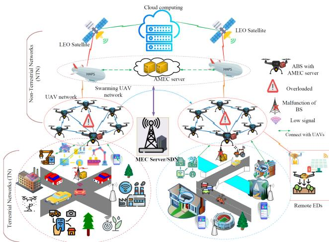  
Fig. 1. Proposed FeDRL-supported TN-NTN architecture.

HAPs function as aerial base stations (ABS) to enhance coverage and connectivity, support disaster management, facilitate monitoring, and ensure communication and emergency response when TN infrastructure fails or is disrupted by disasters such as earthquakes and landslides. Additionally, the computing resources might not be sufficient to serve the massive number of devices [43], [44]. To address this challenge, our framework considers the hierarchical deployment of computing nodes involving UAVs, HAPs, and LEO satellites.

We assume that the GBS is out of service due to a disaster or is overloaded with many ED requests. Since the EDs are mobile, some of them may be far from network coverage. In addition to the limited resources of EDs, these issues become another bottleneck that must be addressed to ensure a diversified QoS and fulfill the reliable operation requirements of EDs. Therefore, we deploy a TN-NTN environment, where LEO satellites are used to extend coverage and provide reliable services, and HAPs assist the UAV network in handling these issues, as UAVs alone may not provide long-term and efficient resources to the EDs. The HAPs can provide more stable aerial computing and support UAV-based computing at high altitudes and with extended geographical coverage when both UAVs and TNs are not available or have resource limitations. Moreover, the LEO satellite network provides reliable communication channels during disasters, when terrestrial and aerial communication infrastructure may be damaged or overloaded. The EDs directly transmit their demands and offload intensive tasks to the appropriate edge server, such as HAPs or UAVs, with line-of-sight (LoS) communication.

The distributed ML agents select resource-rich edge servers, allowing the EDs to associate with them to minimize processing delay, conserve energy, and reduce strain on the backhaul networks. A single UAV cluster head (UCH) manages each UAV network and communicates with HAPs and terrestrial EDs.

Generally, EDs request resources and offload tasks to computing servers using the following three options. -1 They request resources from and offload to GBS under normal circumstances. -2 When the GBS cannot serve the EDs for different reasons, the EDs can access and associate with the UAVs. -3 Lastly, when UAVs have limited resources and coverage, EDs can directly associate with HAPs to access resources and offload tasks. To minimize the complexity of the multi-objective optimization problems, we omit the LEO satellite in the problem formulation.

We consider a TN-NTN environment that consists of LEO satellites connected to H HAPs deployed above UAVs and the TN at an altitude of $H _ { h }$ , and $J \ \mathrm { U A V s }$ are deployed over the service area within a fixed altitude $H _ { j }$ . In addition, G GBS and I EDs are randomly distributed within the coverage area of the aerial network, which is defined as $h \in { \mathcal { H } } = \{ 1 , \dots , H \} , j \in$ $\mathcal { I } = \{ 1 , \ldots , J \} , g \in \mathcal { G } = \{ 1 , \ldots , G \} , \mathrm { a n d } i \in \mathcal { I } = \{ 1 , \ldots , I \}$ respectively.

## A. Communication Model

The UAVs and HAPs include multiple antennas for transmitting and receiving data from multiple EDs and other network devices. We consider the line-of-sight (LoS) communication links between UAVs and HAPs (U2H), EDs and HAPs (E2H), and EDs and UAVs (E2U) that operate on orthogonal channels [45], [46]. Without loss of generality, we also assume that the backhaul connection between the HAPs and the satellite/cloud is faultless, with no delays in communication, resource allocation, or computation [47].

The horizontal positions of HAP h, UAV j, and ED i at time slot t are denoted as $q _ { h } [ t ] = ( x _ { h } [ t ] , y _ { h } [ t ] , H _ { h } [ t ] )$ $q _ { j } [ t ] = ( x _ { j } [ t ] , y _ { j } [ t ] , H _ { j } [ t ] )$ and $q _ { i } [ t ] = ( x _ { i } [ t ] , y _ { i } [ t ] )$ respectively. Based on these positions, the distance between UAV j and HAP h at time t is calculated as $d _ { j h } [ t ] =$ $\sqrt { ( x _ { h } [ t ] - x _ { j } [ t ] ) ^ { 2 } + ( y _ { h } [ t ] - y _ { j } [ t ] ) ^ { 2 } + ( H _ { h } [ t ] - H _ { j } [ t ] ) ^ { 2 } } .$ Similarly, the distance between ED i and HAP h is given by $\dot { \bar { d } } _ { i h } [ t ] = \sqrt { ( x _ { h } [ t ] - x _ { i } [ t ] ) ^ { 2 } + ( y _ { h } [ t ] - y _ { i } [ t ] ) ^ { 2 } + H _ { h } [ t ] ^ { 2 } }$ and the distance between ED i and UAV j is given by $\hat { d } _ { i j } [ t ] = \sqrt { ( x _ { j } [ t ] - x _ { i } [ t ] ) ^ { 2 } + ( y _ { j } [ t ] - y _ { i } [ t ] ) ^ { 2 } + H _ { j } [ t ] ^ { 2 } }$

In our framework, we assume that each aerial edge server, whether a UAV or HAP, is equipped with multiple antennas and operates as an aerial base station (ABS) [48]. These nodes employ orthogonal frequency division multiple access (OFDMA) with W sub-channels to enable efficient multi-ED communication and dynamic bandwidth allocation across the hierarchical network. There are W subchannels, denoted as $\mathcal { W } = \{ 1 , 2 , \dots , W \}$ . Let the binary variable $\xi _ { i w } [ t ] \in \{ 0 , 1 \}$ indicate the connection status/channel strength between the ABS (UAV j or HAP h) and ED i. $\operatorname { I f } \xi _ { i w } [ t ] = 1$ , ED i connects with ABS (UAV j/HAP h; otherwise, $\xi _ { i w } [ t ] = 0$

1) ED-UAV (E2U) Channel Model: In this model, we define the association variable $\xi _ { i w } ^ { i  j } \in \{ 0 , 1 \}$ , which indicates that ED i is associated with UAV j at time slot t if the connection status/channel strength $\xi _ { i w } ^ { i  j } [ t ] = 1 ;$ ; otherwise $\xi _ { i w } ^ { i  j } [ t ] { = } 0$ . Thus, ED i accesses resource blocks (RBs) from UCH j at time slot t, which is expressed as;

$$
\xi _ { i w } ^ { i  j } [ t ] = \{ \begin{array} { l l } { { 1 , } } & { { \mathrm { i f } \mathrm { E D } i \mathrm { i s } \mathrm { a s s o c i a t e d } U A V j } } \\ { { } } & { { \mathrm { t h e } \mathrm { E } 2 \mathrm { U } \mathrm { l i n k } \mathrm { s t r e n g t h i s } \mathrm { s t r o n g } } } \\ { { 0 , } } & { { \mathrm { O t h e r w i s e } , \mathrm { t h e } \mathrm { E } 2 \mathrm { U } \mathrm { l i n k } \mathrm { i s } \mathrm { o v e r l o a d e d } / \mathrm { f a i l e d } . } } \end{array}\tag{1}
$$

According to [14], [40], the channel gain between ED i and UAV j is expressed as $\begin{array} { r } { g _ { i j } [ t ] = \frac { G _ { 0 } ^ { \bf { \breve { \alpha } } } } { ( \hat { d } _ { i j } [ t ] ) ^ { 2 } } , } \end{array}$ where $G _ { 0 }$ denotes the reference of the channel gain of the E2U link at distance $( \hat { d } _ { i j } [ t ] ) { = } 1 \mathrm { m }$ . Then, the data rate from the ED i to UAV j’s channel is expressed as; $\begin{array} { r } { R _ { i j } [ t ] = b _ { i j } [ t ] B l o g _ { 2 } \bigg ( 1 + \frac { P _ { i j } ^ { t r } g _ { i j } [ t ] } { \delta ^ { 2 } } \bigg ) = } \end{array}$ $\begin{array} { r } { b _ { i j } [ t ] B l o g _ { 2 } \bigg ( 1 + \frac { P _ { i j } ^ { t r } \sigma _ { 0 } } { ( | | q _ { j } - q _ { i } | | ^ { 2 } + H _ { j } ^ { 2 } ) } \bigg ) } \end{array}$ , where $b _ { i j } [ t ]$ represents the allocated ratio of bandwidth of E2U communication link, and $\begin{array} { r } { \sum _ { i \in \mathcal { T } } b _ { i j } [ t ] \leq 1 } \end{array}$ . Here, $\begin{array} { r } { \sigma _ { 0 } = \frac { G _ { 0 } } { \delta ^ { 2 } } } \end{array}$ denotes the reference signalto-noise ratio (SNR), δ2 represents the noise power is defined as $\delta ^ { 2 } = N _ { 0 } b _ { i j } [ t ] B , N _ { 0 }$ is the noise power spectral density (W/Hz), $b _ { i j } [ t ]$ is the allocated bandwidth ratio and $P _ { i j } ^ { t r }$ is the transmission power between ED i and UAV j. B denotes the available bandwidth in the system.

2) ED-HAP (E2H) Channel Model: We assume that the UAV network may not cover all remote areas or is overloaded by ED requests. Therefore, the EDs can be associated directly with HAPs through the allocated subchannel w at time slot t,and the channel status decision between ED i and HAP h is expressed

as;

$$
\xi _ { i w } ^ { i  h } [ t ] = \{ \begin{array} { l l } { { 1 , } } & { { \mathrm { i f ~ E D ~  { ~ { \it ~ i ~ \delta ~ i s ~ \ a s s o c i a t e d ~ w i t h ~ H A P } } } } } \\ { { } } & { { h \quad \mathrm { t h e ~ E 2 H ~ l i n k ~ s t r e n g t h ~ i s ~ s t r o n g } } } \\ { { 0 , } } & { { \mathrm { O t h e r w i s e . } } } \end{array}\tag{2}
$$

The data rate between ED i and HAP h is denoted as;

$$
\begin{array} { l } { { R _ { i h } [ t ] = b _ { i h } [ t ] B l o g _ { 2 } \bigg ( 1 + \frac { P _ { i h } ^ { t r } g _ { i h } [ t ] } { \delta ^ { 2 } } \bigg ) } } \\ { { \qquad = b _ { i h } [ t ] B l o g _ { 2 } \bigg ( 1 + \frac { P _ { i h } ^ { t r } \sigma _ { 0 } } { ( \vert \vert q _ { h } - q _ { i } \vert \vert ^ { 2 } + H _ { h } ^ { 2 } ) } \bigg ) , } } \end{array}\tag{3}
$$

where $P _ { i h } ^ { t r } , \delta ^ { 2 } , b _ { i h } [ t ]$ , and $g _ { i h }$ denote the transmission power, the noise power, the bandwidth allocated by HAP h to ED i, and channel gain between ED i and HAP h, respectively.

3) UAV-HAP (U2H) Channel Model: The UAVs’ network might not serve all EDs in time slot t due to factors such as coverage limitations, an increasing number of EDs, and the limited resource capacity of UAVs. Hence, the UAVs relay the EDs’ tasks to HAPs and release the resources to EDs if they are within the coverage range. To achieve this, UAVs can be associated directly with HAPs through the allocated subchannel w at time slot t. The channel status decision between UAV j and HAP h is expressed as;

$$
\xi _ { j w } ^ { j  h } [ t ] = \{ { \begin{array} { l l } { { { 1 , } } } & { { { \mathrm { i f } } U A V j { \mathrm { i s } } \mathrm { a s s o c i a t e d w i t h H A P } h } } \\ { { } } & { { { \mathrm { t h e U 2 H ~ l i n k ~ s t r e n g t h ~ i s ~ s t r o n g } } } } \\ { { { 0 , } } } & { { { \mathrm { O t h e r w i s e . } } } } \end{array} }\tag{4}
$$

The data rate between UAV j and HAP h is given as; $\begin{array} { r } { R _ { j w } [ t ] = b _ { j h } [ t ] B l o g _ { 2 } \bigg ( 1 + \frac { P _ { j h } ^ { t r } g _ { j h } [ t ] } { \delta ^ { 2 } } \bigg ) = b _ { j h } [ t ] B l o g _ { 2 } \bigg ( 1 + } \end{array}$ $\frac { P _ { j h } ^ { t r } \sigma _ { 0 } } { ( | | q _ { h } - q _ { j } | | ^ { 2 } + ( H _ { h } - H _ { j } ) ^ { 2 } ) } \Bigg )$ , where $b _ { j h } [ t ]$ is the bandwidth allocated to UAV j by HAP h. Also, $g _ { j h }$ and $P _ { j h } ^ { t r }$ represent channel gain and transmission power between UAV j and HAP h, respectively. The LEO satellite can empower HAPs by providing resources and extending TN’s coverage.

## B. Computation Model

We assume that every ED i generates time-sensitive computation tasks with three parameters, $\Gamma _ { i } = \{ d _ { i } , \bar { f } _ { i } , \tau _ { i } ^ { \operatorname * { m a x } } \}$ , where $d _ { i } , { \bar { f } } _ { i }$ , and $\tau _ { i } ^ { \mathrm { m a x } }$ denote the number of inputs, the required CPU cycle, and the maximum latency of task $\Gamma _ { i } ,$ respectively. Let $f _ { i j h } [ t ] \in [ 0 , F _ { j h } ^ { \operatorname* { m a x } } ]$ represent the fraction of computation resources allocated to ED i, where $F _ { j h } ^ { \mathrm { m a x } }$ represents the maximum computation resource block (CRB) of UAV j or HAP h in time slot t.

To manage the utilization of computational resources, we define a binary decision variable as $\alpha _ { i j h } [ t ] \in \{ 0 , 1 \}$ and ${ \pmb { \alpha } } _ { i j h } [ t ] = \{ { \alpha } _ { i } ^ { i } [ t ] , { \alpha } _ { i j } ^ { i  j } [ t ] , { \alpha } _ { i h } ^ { i  h } [ t ] , { \alpha } _ { i j h } ^ { i  j  h } [ t ] \}$ , where $\alpha _ { i } ^ { i } [ t ]$ $\alpha _ { i j } ^ { i  j } [ t ] , \alpha _ { i h } ^ { i  h } [ t ]$ , and $\alpha _ { j h } ^ { j  h } [ t ]$ represent the ED i locally compute its intensive computation task, offloaded to $\mathrm { U A V } ~ j ,$ , offloaded to HAP h, and UAV j relay tasks to HAP h, respectively, at a time slot t and which meets $\dot { \alpha } _ { i } ^ { i } [ t ] + \alpha _ { i j } ^ { i  j } [ t ] + \alpha _ { i h } ^ { i  h } [ t ] + \dot { \alpha } _ { j h } ^ { j  h } [ t ] =$ 1. At each time slot t, the ED i is associated with only one computational node to offload its intensive computational tasks, and the constraints are expressed as follows:

$$
\sum _ { j = 1 } ^ { J } \sum _ { h = 1 } ^ { H } \alpha _ { i j h } [ t ] \leq 1 , \forall i , j , h\tag{5}
$$

$$
\sum _ { i = 1 } ^ { I } \alpha _ { i j h } [ t ] \leq 1 , \forall i , j , h ,\tag{6}
$$

Equ. (8) ensures that each UAV or HAP serves at most one ED per time slot to prevent resource overload. The computational offloading decision variable (α) is hierarchically dependent on the availability of a communication channel (ξ). This relationship is enforced through the following constraint: $\begin{array} { r } { \alpha _ { i j } ^ { i  j } [ t ] \leq \sum _ { w \in W } \xi _ { i w } ^ { i  j } [ t ] } \end{array}$ $\forall i , j ,$ t. This constraint ensures that computational tasks can only be offloaded to nodes with which the device has established communication links. However, these constraints ensure single-node offloading but overlook fairness and dynamic resource competition. To address this, we adopt a fairness-aware resource allocation mechanism that balances coverage and task distribution among UAVs, HAPs, and EDs [49].

## C. Local Computing on ED

When the offloading decision variable $\alpha _ { i } ^ { i } [ t ] = 1$ , the intensive computation task of ED i will be computed locally, and the execution latency can be calculated as:

$$
T _ { i } [ t ] = \frac { d _ { i } \bar { f } _ { i } } { f _ { i } [ t ] } ,\tag{7}
$$

where $f _ { i } [ t ]$ denotes the computation capacity of ED i. The energy consumption of ED i during the local execution of tasks is calculated as:

$$
E _ { i } [ t ] = \kappa _ { i } ( f _ { i } [ t ] ) ^ { 2 } T _ { i } [ t ] ,\tag{8}
$$

where $\kappa _ { i }$ represents the effective capacitance of CPU chips. Therefore, we can calculate the overhead of the local computation cost function as follows:

$$
\Theta _ { i } [ t ] = \gamma _ { i } ^ { t } T _ { i } [ t ] + \gamma _ { i } ^ { e } E _ { i } [ t ] ,\tag{9}
$$

where $\gamma _ { i } ^ { t }$ and $\gamma _ { i } ^ { e }$ represent the weight of execution latency and energy consumption of ED i, respectively. Here, the weighted parameter of latency and energy is determined by the sensitivity of the intense task delay and energy constraints, where $\gamma _ { i } ^ { t } +$ $\gamma _ { i } ^ { e } = 1$

## D. Intensive Computation Task Offloading

1) Task Offloading to UAV: UAVs are the first option for the ED to offload its intensive computational tasks, extend connectivity, and obtain resources in time slot t. The computational capacity constraint of UAVs is expressed as: $F _ { j } ^ { \operatorname* { m a x } } \geq$ $\textstyle \sum _ { i = 1 } ^ { I } f _ { i j } [ t ]$ . We use the directional notation (→) to represent the flow of computational task offloading between hierarchical network layers. Therefore, when the offloading decision variable is set $\alpha _ { i j } ^ { i  j } [ t ] = 1$ , the ED offloads its tasks to UAV j and will participate in FL training. To compute the tasks of the EDs and train the FL dataset, the UAVs can allocate a fraction of computational resources defined as $f _ { i j } [ t ]$ , and the UAV j charges the ED i with a reasonable price for the allocated resource.

The transmission latency of the intensive computation task of ED i in the time interval t is expressed as $\begin{array} { r l } { T _ { i j } ^ { t r } [ t ] { = } \alpha _ { i j } ^ { i \to j } \frac { d _ { i } } { R _ { i j } [ t ] } } \end{array}$ where $R _ { i j } [ t ]$ denotes the transmission rate between ED i and node j at time t. The computation latency of ED $i \gamma _ { \mathrm { s } }$ task on UAV j depends on the allocated computation resource $f _ { i j } [ t ]$ which is expressed as:

$$
T _ { i j } ^ { e x e } [ t ] = \frac { \alpha _ { i j } ^ { i  j } [ t ] d _ { i } \bar { f } _ { i } } { f _ { i j } [ t ] } ,\tag{10}
$$

where $f _ { i j } [ t ]$ is allocated computational resource from UAV j to ED i. The overall latency cost to compute the offloaded task of ED i at UAV j is calculated as:

$$
\begin{array} { r } { T _ { i j } ^ { t o t } [ t ] = T _ { i j } ^ { t r } [ t ] + T _ { i j } ^ { e x e } [ t ] . } \end{array}\tag{11}
$$

The local ED i also pays a unit price for the allocated computational resource $f _ { i j } [ t ]$ . Thus, the utility of UAV j obtained from the allocated computational resources is calculated as $\begin{array} { r } { U _ { j } [ t ] = \sum _ { i = 1 } ^ { I } \varphi _ { i j } f _ { i j } [ t ] , } \end{array}$

2) Task Offloading From UAV to HAP: When the UAV network is overloaded with too many mission-critical ED tasks, resources will be depleted, especially energy and computing resources. Then, the UAVs will relay ED tasks to HAPs. As a result, the transmission latency of computation-intensive tasks from ED i to UAV j and HAP h is calculated as:

$$
T _ { i j h } ^ { t r , i  j  h } [ t ] = \alpha _ { i j } ^ { i  j } [ t ] T _ { i j } ^ { t r } [ t ] + \alpha _ { i j h } ^ { i  j  h } [ t ] T _ { j h } ^ { t r } [ t ] ,\tag{12}
$$

where $\begin{array} { r } { T _ { j h } ^ { t r } [ t ] = \alpha _ { i j h } ^ { i  j  h } [ t ] \frac { d _ { i } } { R _ { j h } [ t ] } } \end{array}$ is the transmission latency from UAV j to HAP h at time slot t, and $( \alpha _ { i , j , h } ^ { i  j  h } [ t ] )$ denotes a multi-hop offloading decision, indicating whether end device (ED) i delegates its computational task to UAV j, which subsequently relays it to HAP h at time slot t. Such a relay is necessary when UAV j lacks sufficient computational or energy resources to execute the task locally, thus leveraging the superior processing capabilities and energy reserves of HAP h to ensure reliable and timely task execution. The computation latency of ED i’s task on HAP h depends on the allocated computation $f _ { i h } ( t )$ of the computation capacity and is expressed as;

$$
T _ { j h } ^ { e x e } [ t ] = \frac { \alpha _ { i j h } ^ { i  j  h } [ t ] d _ { i } \bar { f } _ { i } } { f _ { j h } [ t ] } .\tag{13}
$$

The overall latency cost to compute the offloaded task of ED i when UAV j relays the task to HAP h is calculated as;

$$
\begin{array} { r } { T _ { i j h } ^ { t o t } [ t ] = T _ { i j h } ^ { t r , i  j  h } [ t ] + T _ { j h } ^ { e x e } [ t ] . } \end{array}\tag{14}
$$

3) ED Task Offloading to HAP: In this case, EDs are directly associated with HAPs due to reasons such as UAVs not being able to cover all EDs, malfunctioning due to natural or man-made disasters, or UAVs being overloaded with ED tasks and unable to meet ED requirements. The transmission latency of computation-intensive tasks from ED i to HAP h through the allocated communication resources is expressed as: $\begin{array} { r } { T _ { i h } ^ { t r } [ t ] = \alpha _ { i h } ^ { i  h } [ t ] \frac { d _ { i } } { R _ { i h } [ t ] } } \end{array}$ . After the computation-intensive tasks are offloaded from EDs to HAPs, the aerial MEC server on the

HAPs starts to execute the offloaded task, and the computation latency to accomplish the offloaded task is calculated as:

$$
T _ { i h } ^ { e x e } [ t ] = \frac { \alpha _ { i h } ^ { i  h } d _ { i } \bar { f } _ { i } } { f _ { i h } [ t ] } ,\tag{15}
$$

where $f _ { i h } [ t ]$ (in CPU cycles/s) is the computation resource allocated to ED i by HAP $h ,$ and the computation resource constraint $\begin{array} { r } { \sum _ { i = 1 } ^ { I } \sum _ { j = 1 } ^ { \tilde { J } } \alpha _ { i h } ^ { i \to h } f _ { i h } \le F _ { h } ^ { \operatorname* { m a x } } } \end{array}$ . Then, the total task latency, which includes both transmission and execution latency, is defined as follows:

$$
\begin{array} { r } { T _ { i h } ^ { t o t } [ t ] = T _ { i h } ^ { t r , i  h } [ t ] + T _ { i h } ^ { e x e } [ t ] . } \end{array}\tag{16}
$$

The overall latency of the system is given as;

$$
T ^ { t o t } [ t ] = \left\{ \begin{array} { l l } { T _ { i j } ^ { t o t } [ t ] , \mathrm { i f ~ E D } \textit { \ i } \mathrm { ~ o f f o a d e d ~ t o ~ } U A V \textit { \ j } , } \\ { T _ { i h } ^ { t o t } [ t ] , \mathrm { i f ~ E D } \textit { \ i } \mathrm { ~ o f f o a d e d ~ t o ~ } H A P \textit { \ h } , } \\ { T _ { i j h } ^ { t o t } [ t ] , \mathrm { i f } \textit { \ U A V \textit { \ j } } \mathrm { ~ r e l a y ~ t o ~ } H A P \textit { \ h } . } \end{array} \right.\tag{17}
$$

## E. Energy Consumption Model

This subsection discusses energy consumption (EC) associated with offloading tasks and models, as well as executing tasks on edge aerial nodes. -1 The EC of ED i includes the basic operational EC, i.e., local computing and training $E _ { i } ^ { o p r } [ t ]$ and transmission energy $E _ { i } ^ { t r } [ t ]$ , and is expressed as follows:

$$
\begin{array} { r l } & { E _ { i } [ t ] = E _ { i } ^ { o p r } [ t ] + E _ { i } ^ { t r } [ t ] } \\ & { ~ = E _ { i } ^ { o p r } [ t ] + \{ \sum _ { j \in \mathcal { I } } \alpha _ { i j } ^ { i  j } [ t ] \frac { P _ { i j } ^ { t r } d _ { i } } { R _ { i j } [ t ] } , \forall j \in \mathcal { I }  } \\ & { ~ = { E } _ { i } ^ { o p r } [ t ] + \{ \sum _ { h \in \mathcal { H } } \alpha _ { i h } ^ { i  h } [ t ] \frac { P _ { i h } ^ { t r } d _ { i } } { R _ { i h } [ t ] } , \forall h \in \mathcal { H } ,  } \end{array}\tag{18}
$$

where $P _ { i j } ^ { t r }$ and $P _ { i h } ^ { t r }$ denote the transmission power that is allocated from the aerial nodes j and h, respectively, to ED i at time slot t.

Managing the EC of the aerial network is critical to ensure the availability and reliability of different services, especially UAVs, due to their limited energy resources and battery size. Our work focuses on aerial networks’ computation and transmission EC. The EC of UAVs includes operational energy usage such as hovering of UAVs and model aggregation or training $E _ { j } ^ { o p r }$ energy used to execute the offloaded task $E _ { j } ^ { e x e }$ , and transmission power $E _ { j } ^ { t r }$ . The EC of UAVs is expressed as $E _ { j } [ t ] = E _ { j } ^ { o p r } +$ $E _ { j } ^ { t r } [ t ] + \mathbf { \bar { { E } } } _ { j } ^ { e x e } [ t ]$ . -3 When EDs are connected to HAPs and UAVs relay ED tasks to HAPs, we evaluate the EC of the HAPs, which includes operational energy $E _ { h } ^ { o p r }$ , transmission power $E _ { h } ^ { t r }$ , and computing energy of offloaded tasks. Thus, the EC of HAP h is calculated as:

$$
\begin{array} { r l } & { E _ { h } [ t ] = E _ { h } ^ { o p r } + E _ { h } ^ { t r } [ t ] + E _ { h } ^ { e x e } [ t ] } \\ & { \qquad = E _ { h } ^ { o p r } + \{ \sum _ { i \in \mathcal { I } } \alpha _ { i h } ^ { i  h } [ t ] \frac { P _ { i h } ^ { t r } d _ { i } } { R _ { i h } [ t ] } , \forall i \in \mathcal { I }  } \\ & { \qquad + \alpha _ { i j h } [ t ] \sum _ { j \in \mathcal { I } } \alpha _ { i j h } ^ { i  j  h } [ t ] \frac { P _ { j h } ^ { t r } d _ { i } } { R _ { j h } [ t ] } , \forall j \in \mathcal { I }  } \\ & { \qquad + \alpha _ { i j h } [ t ] \sum _ { j \in \mathcal { I } } \kappa _ { h } ( f _ { h } ) ^ { 2 } \frac { d _ { i } \bar { f } _ { i } } { f _ { h } [ t ] } .  } \end{array}\tag{19}
$$

The overall EC of the system is given as $E ^ { t o t } = E _ { i } [ t ] + E _ { j } [ t ] +$ $E _ { h } [ t ]$ . In the considered TN-NTN framework, task processing, local model training latency, and EC cost are expressed as $\begin{array} { r } { \Theta _ { i j h } [ t ] = \sum _ { i \in \mathcal { T } } \alpha _ { i j h } \hat { [ } t ] ( \gamma ^ { t } \hat { T ^ { t o t } } + \gamma ^ { e } E ^ { t o t } ) } \end{array}$

## F. Hierarchical Federated Learning Model

As shown in Fig. 1, the TN-NTN architecture is hierarchical, and the ED i has a local dataset $\mathcal { D } _ { i }$ with the data sample $| \mathcal { D } _ { i } |$ We consider a hierarchical FL (HFL) model comprising ABS $( \mathrm { i . e . , } \ \mathscr { H ,  I } )$ and I set of EDs. In our proposed framework, each HFL iteration has three steps, during which each ED learns a local model based on training data. The ABS servers compile and update the local model parameters and gradients with each communication round and then upload their parameters to the upper layer (aerial MEC (AMEC) servers) to aggregate the parameters. 1) ED Layer: This layer contains resource-constrained intelligent devices distributed geographically across a network. Each ED trains its local dataset $D _ { i }$ . For each dataset $\mathcal { D } _ { i } =$ $\{ x _ { i d } , y _ { i d } \} _ { d = 1 } ^ { | D _ { i } | }$ , the d-th input data vector of ED i is represented by $x _ { i d } .$ and the corresponding output is represented by $y _ { i d } .$ Each ED communicates with its corresponding ABS in a single round of communication throughout $\beta$ local iterations, defined as $\beta = \gamma l n \frac { 1 } { \theta }$ , where $\theta = ( 0 , 1 )$ and $\gamma$ denote local accuracy and constant depending on the loss function, respectively. The loss function of ED i is calculated as:

$$
F _ { i } ( \omega ) = \frac { 1 } { D _ { i } } \sum _ { d = 1 } ^ { D _ { i } } f ( \omega , x _ { i d } , y _ { i d } ) ,\tag{20}
$$

where ω is a global FL model parameter either from $\mathrm { U A V } ~ j$ or HAP h. 2) Aerial-edge layer (low altitude): Each UAV clustered network has an AMEC server aggregating aerial edge model parameters in each FL iteration or epoch. An aerial controller is deployed to control network resources and coordinate FL within the aerial coverage of UAV networks. A central SDN controller also manages the network resources and TN-NTN infrastructure. When ABS (AMEC server) j receives the model parameters transmitted from the associated ED i, it obtains the average parameters $\omega _ { j }$ as: $\begin{array} { r } { \omega _ { j } = \sum _ { i \in \mathcal { I } _ { j } } \frac { D _ { i } \omega _ { i } } { \sum _ { i \in \mathcal { I } _ { j } } D _ { i } } } \end{array}$ . The number of iterations on UAV j is defined as $\begin{array} { r } { \bar { \beta } _ { j } = \frac { \bar { \gamma } l n ( \frac { 1 } { \bar { \theta } } ) } { 1 - \bar { \theta } } } \end{array}$ , where $\bar { \theta } \in ( 0 , 1 )$ is the accuracy level of UAV j. Accordingly, the ABS loss function at AMEC server j is

$$
F _ { j } ( \omega _ { j } ) = \frac { 1 } { D _ { j } } \sum _ { i = 1 } ^ { \mathcal { I } } D _ { i } F _ { i } ( \omega ) .\tag{21}
$$

3) High-altitude layer (HAPs): In this layer, multiple HAPs equipped with powerful aerial MEC servers perform the global aggregation of FL parameters received from aerial edge servers. The FL parameters at the HAPs are updated FL parameters aggregated by UAVs in the aerial edge layer. To incorporate multiple HAPs, we modify the global aggregation function as follows: $\begin{array} { r } { \omega _ { h } = \frac { \sum _ { j \in \mathcal { I } _ { h } } D _ { \mathcal { T } _ { j } } \omega _ { j } } { \sum _ { j \in \mathcal { I } _ { h } } D _ { \mathcal { T } _ { j } } } } \end{array}$ 2 $\forall h \in { \mathcal { H } }$ . Each HAP h aggregates the received UAV models, and then multiple HAPs further synchronize their models through inter-HAP collaboration: $\begin{array} { r } { \dot { \omega } _ { \mathrm { g l o b a l } } = \frac { \sum _ { h \in \mathcal { H } } D _ { \mathcal { I } _ { h } } \omega _ { h } } { \sum _ { h \in \mathcal { H } } D _ { \mathcal { I } _ { h } } } } \end{array}$ . The training process aims to minimize the global loss function $F ( \omega )$ , which is now updated to reflect multiple HAPs:

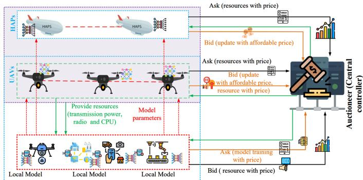  
Fig. 2. Hierarchical auction for resource allocation.

$$
F ( \omega ) = \frac { 1 } { D } \sum _ { h = 1 } ^ { H } \sum _ { j = 1 } ^ { J _ { h } } D _ { j } F _ { j } ( \omega ) .\tag{22}
$$

## IV. HIERARCHICAL DOUBLE AUCTION-BASED RESOURCE ALLOCATION AND INCENTIVE MECHANISM

In our proposed TN-NTN infrastructure-based resource allocation, HAPs and UAVs act as ABS, which allocate aerial resources to EDs with optimal incentives. To motivate both the ABSs and EDs, we propose a hierarchical double auction-based incentive (DAI) mechanism, where the ABSs and EDs interact to maximize their benefits. The ABSs allocate resources to the EDs, and the EDs pay for the fractional resources allocated to them. In the auction game, the ABSs announce their available resources, along with corresponding prices, to the market balancer, i.e., a central SDN controller, while the EDs submit their resource demands along with their buying prices. Meanwhile, ABSs incentivize EDs to participate in the FL system and accurately train local FL models. The ABSs aim to achieve high accuracy in global FL mode while maximizing their utility through efficient resource allocation. This can be achieved by motivating EDs to accurately train the FL models and actively participate in the resource allocation process. On the other hand, the EDs maximize their utility by providing quality data (the local FL model) to ABS while minimizing computational costs in terms of energy and latency used for training the data, transmitting the local FL model, and offloading the tasks. Furthermore, the hierarchical DAI mechanism ensures sustained provider engagement under fluctuating demand by dynamically adjusting clearing prices and resource allocations. UAVs and HAPs adapt their asking prices based on current network conditions and participate in multiple resource markets. Combined with FeDRL-based policy refinement and the TN-NTN’s hierarchical load balancing, the framework maintains stable utility for providers.

The proposed DAI mechanism, as illustrated in Fig. 2, enables UAVs, HAPs, and EDs to design optimal strategies to maximize their utility. The ABSs (UAVs and HAPs) establish optimal resource allocation strategies that help them maximize utilities, while EDs develop strategies that allow them to obtain resources at reasonable costs while meeting their latency and QoS requirements.

In this auction game, the EDs interact with UAVs to obtain resources to offload their demanding tasks or train FL models. UAVs allocate resources to EDs with optimal prices and incentivize EDs for the FL models they trained and submitted to them. If UAVs cannot provide the required services due to a lack of resources, EDs can be associated with HAPs to obtain these services. The HAPs can also provide resources to UAVs when they have limited resources. In addition, HAPs perform global model aggregation by collecting FL models from EDs or low-level aggregated models from UAVs. Therefore, we utilize a hierarchical auction game to address the interactions between hierarchical multi-resource providers and requesters, thereby indirectly facilitating resource allocation in trading activities with FeDRL. The hierarchical DAI technique possesses various desirable economic properties [50], [51], which are outlined in the following cases: -1 Case 1: EDs buy resources from ABS to accomplish intensive tasks and ensure the QoS. In this case, the ABSs (UAVs or HAPs) submit their ask prices to the auctioneer. The ask price of UAV j is $\boldsymbol { \Lambda _ { j } } = \{ \zeta _ { j } , \psi _ { j } \}$ , where $\zeta _ { j }$ and $\psi _ { j }$ denote available resources and selling prices of UAV $j ,$ and the ask price of HAP h is $\boldsymbol { \Lambda } _ { h } = \{ \zeta _ { h } , \psi _ { h } \}$ , where $\zeta _ { h }$ and $\psi _ { h }$ represent the available resources and selling prices of HAP $h ,$ respectively. The EDs, on the other hand, submit their bids, i.e., $\beta _ { i } = \{ \Pi _ { i } , \phi _ { i } \}$ (the bids include their resource demands $\boldsymbol { \Pi } _ { i } = \{ f _ { i } , P _ { i } , b _ { i } \}$ and corresponding set of prices $\phi _ { i } )$ to the auctioneer/market balancer. In the same way, the UAVs can request resources from HAPs when they do not have sufficient resources to serve EDs by submitting bids, i.e., $\beta _ { j } = \{ \Pi _ { j } , \phi _ { j } \}$ to the market balancer, where $\Pi _ { j }$ and $\phi _ { j }$ denote the resource demand and prices strategies of UAV $j . \textcircled { 2 }$ Case 2: The ABS (HAPs and UAVs) can request model training service to be handled by the EDs. The ABSs submit model training service bids (the bids include their FL model training task and costs to pay) to the auctioneer. The bid of HAP h is $\beta _ { h } = \{ \bar { \zeta } _ { h } , \bar { \psi } _ { h } \}$ , where $\bar { \zeta } _ { h }$ and $\bar { \psi } _ { h }$ denote the FL model training task and its pricing strategy. Similarly, the bid of UAV j is $\beta _ { j } ^ { f \bar { l } } = \{ \bar { \zeta } _ { j } , \bar { \psi } _ { j } \}$ , where $\bar { \zeta } _ { j }$ and $\bar { \psi } _ { j }$ describes the FL training task and its corresponding pricing strategy, respectively. The EDs, on the other hand, submit their ask profiles, i.e., $\boldsymbol { \Lambda } _ { i } = \{ \bar { \Pi } _ { i } , \bar { \phi } _ { i } \}$ , to the auctioneer to provide FL model training service. The ask of ED i includes its model training demand $\bar { \Pi } _ { i }$ and the service pricing strategy $\bar { \phi } _ { i }$ . -3 Auctioneer: In our model, the smart contract-enabled market balancer selects a price $\rho = \{ \rho _ { i } ^ { b } , \rho _ { j } ^ { b } , \rho _ { j } ^ { s } , \rho _ { h } ^ { s } \}$ that clears the resource trading market, where $\rho _ { i } ^ { b } , \rho _ { j } ^ { b } , \rho _ { j } ^ { s } ,$ and $\rho _ { h } ^ { s }$ are the clearing price for resource buyers ED i and $\mathrm { U A V } j _ { : }$ , and resource sellers UAV $j$ and HAP $h ,$ respectively. Then, all sellers with an ask price less than or equal to the auctioneer’s price can sell their resources at a price $\rho ,$ and all the buyers who bid with a bid price greater than or equal to the auctioneer’s price $\rho$ can buy the resource. Similarly, the auctioneer determines a clearing price, $\bar { \rho } = \{ \bar { \rho } _ { j } ^ { b } , \bar { \rho } _ { h } ^ { b } , \bar { \rho } _ { i } ^ { s } \}$ , for the FL service market so that both FL service requesters and providers receive/provide the FL service at the auctioneer’s price. ED i provides FL service with clearing price $\bar { \rho } _ { j } ^ { b }$ while HAP h and UAV $j$ can buy FL service with $\bar { \rho } _ { h } ^ { b }$ and $\bar { \rho } _ { i } ^ { s }$ clearing prices, respectively.

Let φΠ $\mathbf { \Phi } _ { , i } = \{ \phi _ { 1 , i } , \phi _ { 2 , i } , . . . , \phi _ { \Pi , i } \}$ represent the true valuation vector of buyer ED i. This is the maximum price ED i will pay for the required resources. For resource requester $\mathrm { U A V } j ,$ , the true valuation vector is defined as $\phi _ { \Pi , j } = \{ \phi _ { 1 , j } , \phi _ { 2 , j } , . . . , \phi _ { \Pi , j } \}$ where Π denotes the set of required resources (computation, bandwidth and transmission power) to compute tasks and train local models. The true price vectors of seller HAP h and UAV j are defined as $\psi _ { \zeta , h } = \{ \psi _ { 1 , h } , \psi _ { 2 , h } , . . . , \psi _ { \zeta , h } \}$ and $\psi _ { \zeta , j } = $ $\{ \psi _ { 1 , j } , \psi _ { 2 , j } , . . . , \psi _ { \zeta , j } \}$ , respectively. Besides, the EDs can receive incentives from UAVs and HAPs by participating in FL model training. The true valuation price vector of ED i for FL model training can be defined as $\bar { \phi } _ { \bar { \Pi } , i } = \{ \bar { \phi } _ { 1 , i } , \bar { \phi } _ { 2 , i } , . . . , \bar { \phi } _ { \bar { \Pi } , i } \}$ Also, the true cost valuation vector of the FL training task requesting HAP h and UAV j respectively are defined as $\psi _ { \bar { \zeta } , h } =$ $\{ \bar { \psi } _ { 1 , h } , \bar { \psi } _ { 2 , h } , . . . , \bar { \psi } _ { \bar { \zeta } , h } \}$ and $\bar { \psi } _ { \bar { \zeta } , j } = \{ \bar { \psi } _ { 1 , j } , \bar { \psi } _ { 2 , j } , . . . , \bar { \psi } _ { \bar { \zeta } , j } \}$ . The winner buyer-seller matching decision variable is defined as $\lambda \in \{ 0 , 1 \}$ and $\pmb { \lambda } = \left\{ \lambda _ { i j h } , \lambda _ { i j } , \lambda _ { i h } , \lambda _ { j h } \right\}$ . The utility $U _ { i }$ for each ED i, which is fundamental to our auction-based resource allocation model. The utility is calculated as the difference between the revenue an ED receives from selling resources and the cost of purchasing resources. Therefore, the utility of ED i is expressed as:

$$
U _ { i } = \sum _ { j \in \mathcal { I } } \sum _ { h \in \mathcal { H } } \lambda _ { i j h } \left( ( \phi _ { \Pi , i } - \rho _ { i } ^ { b } ) + ( \bar { \rho } _ { i } ^ { s } - \bar { \phi } _ { \bar { \Pi } , i } ) \right) ,\tag{23}
$$

where $\lambda _ { i j h } \in \{ 0 , 1 \}$ denotes the state of ED i in the auction, $\lambda _ { i j h } = 1$ means ED i wins the Π resources to buy from UAVs/HAPs and the Π¯ FL task to train a model for UAVs/HAPs; $\lambda _ { i j h } = 0$ otherwise. In our scenario, UAVs play a dual role, both as provider and requester of resources. The utility of UAV j is expressed as:

$$
U _ { j } = \sum _ { i \in \mathcal { I } } \lambda _ { i j } \ \big ( \big ( \rho _ { j } ^ { s } - \psi _ { \zeta , j } \big ) + \big ( \bar { \psi } _ { \bar { \zeta } , j } - \bar { \rho } _ { j } ^ { b } \big ) \big ) + \sum _ { h \in \mathcal { H } } \lambda _ { j h } \big ( \phi _ { \Pi , j } - \rho _ { j } ^ { b } \big ) ,\tag{24}
$$

where $\lambda _ { i j } , \lambda _ { j h } \in \{ 0 , 1 \}$ and $\lambda _ { i j } = 1$ means UAV j wins to sell its resource ζ to EDs and purchase ¯ζ FL training service from EDs; $\lambda _ { i j } = 0$ otherwise. Also, $\lambda _ { j h } = 1$ means UAV j wins to buy Π resource from HAPs; $\lambda _ { j h } = 0$ otherwise. HAPs play a crucial role in our network architecture, serving as central nodes that enable large-scale resource transactions. Likewise, the utility function of HAP h can be calculated as

$$
U _ { h } = \sum _ { i \in \mathcal { I } } \sum _ { j \in \mathcal { I } } \lambda _ { i j h } ( \rho _ { h } ^ { s } - \psi _ { \zeta , h } ) + \sum _ { i \in \mathcal { I } } \lambda _ { i h } ( \bar { \psi } _ { \bar { \zeta } , h } - \bar { \rho } _ { h } ^ { b } ) ,\tag{25}
$$

where $\lambda _ { i h } , \lambda _ { i j h } \in \{ 0 , 1 \}$ and $\lambda _ { i h } = 1$ denotes that HAP h wins to purchase FL service ¯ζ from EDs; $\lambda _ { i h } = 0 .$ , otherwise. Likewise, $\lambda _ { i j h } = 1$ means HAP h wins to sell its ζ resources to EDs and $\mathrm { U A V s } ; \lambda _ { i j h } = 0$ , otherwise. These utility functions are designed to ensure that all parties are not only motivated to maximize their individual gains but also contribute positively to the overall network dynamics. This design aligns individual incentives with the goal of social welfare optimization, promoting a cooperative environment that supports the sustainable operation and efficiency of the TN-NTN system. The utility function of the auctioneer is calculated as;

$$
\begin{array} { l } { \displaystyle { U ^ { a c } = \left( ( \sum _ { i \in \mathcal { I } } \rho _ { i } ^ { b } + \sum _ { j \in \mathcal { I } } \rho _ { j } ^ { b } ) - ( \sum _ { j \in \mathcal { I } } \rho _ { j } ^ { s } + \sum _ { h \in \mathcal { H } } \rho _ { h } ^ { s } ) \right) + } } \\ { \displaystyle { \left( \left( \sum _ { h \in \mathcal { H } } { \bar { \rho } } _ { h } ^ { b } + \sum _ { j \in \mathcal { I } } { \bar { \rho } } _ { j } ^ { b } \right) - \sum _ { i \in \mathcal { I } } { \bar { \rho } } _ { i } ^ { s } \right) . } } \end{array}\tag{26}
$$

To establish the economic validity of the proposed hierarchical double auction-based incentive mechanism, we present formal proofs demonstrating that it satisfies four fundamental properties of auction theory: budget balance, truthfulness (incentive compatibility), economic efficiency, and individual rationality [50], [51].

To ensure budget balance, we prove that the total payment collected from buyers is always greater than or equal to the total payment made to sellers is established by defining the auctioneer’s utility $U ^ { a c }$ . Assuming the clearing price is determined at the break-even index $k ,$ where the buyer’s marginal valuation $\phi _ { ( k ) }$ is greater than or equal to the seller’s marginal cost $\psi _ { ( k ) }$ the payments up to index $k - 1$ satisfy:

$$
\sum _ { i = 1 } ^ { k - 1 } \rho _ { i } ^ { b } = ( k - 1 ) \phi _ { ( k ) } \geq ( k - 1 ) \psi _ { ( k ) } = \sum _ { j = 1 } ^ { k - 1 } \rho _ { j } ^ { s } ,\tag{27}
$$

thus ensuring that the auctioneer’s net utility remains nonnegative. The property of truthfulness is achieved by designing the mechanism such that the clearing price is independent of any single participant’s bid. This discourages strategic manipulation, as deviating from truthful reporting either results in negative utility (in the case of overbidding) or a lost opportunity (in the case of underbidding). Therefore, reporting true valuations becomes a dominant strategy for all participants. Regarding economic efficiency, we analyze the total social welfare:

$$
U [ t ] = \sum _ { i \in \mathbb { Z } } U _ { i } + \sum _ { j \in \mathcal { I } } U _ { j } + \sum _ { h \in \mathcal { H } } U _ { h } + U _ { \mathrm { a c } } .\tag{28}
$$

While full efficiency is unattainable due to the Myerson-Satterthwaite impossibility theorem in double-sided markets, our mechanism maximizes welfare by excluding only the marginal trade, thereby preserving at least $\textstyle { \frac { k - 1 } { k } }$ of the optimal social welfare. Finally, individual rationality is guaranteed by ensuring that all winning participants receive non-negative utility, i.e., buyers pay no more than their valuations and sellers are compensated no less than their costs: $U _ { i } = \phi _ { i } -$ $\rho _ { i } ^ { b } \geq 0$ (for buyers), $U _ { j } = \rho _ { j } ^ { s } - \psi _ { j } \ge 0$ (for sellers). Collectively, these properties ensure that the mechanism is stable, strategy-proof, efficient, and practically deployable in dynamic TN-NTN environments.

In our scenario, the main objective of the hierarchical double auction technique is to maximize the utility of buyers and sellers while controlling the selfishness of resource providers, requests, and computational costs of EDs. Depending on the above equations, to maximize total social welfare $U [ t ] = U _ { i }$ + $U _ { j } + U _ { h } + U ^ { a c }$ , the optimization function is given as;

$$
P _ { 1 } \underset { \substack { \lambda , \lambda , \beta , \mathcal { F } , \mathcal { P } } } { \operatorname* { m a x } } U [ t ]\tag{29a}
$$

$$
\begin{array} { r l } { s . t } & { { } C _ { 1 } : \lambda _ { i j } , \lambda _ { i j h } , \lambda _ { j h } , \lambda _ { i h } , \alpha _ { i j h } [ t ] \in \{ 0 , 1 \} } \end{array}\tag{29b}
$$

$$
C _ { 2 } : \alpha _ { i j h } [ t ] \lambda \sum _ { i \in \mathbb { Z } } b _ { i j h } [ t ] \le B ^ { \operatorname* { m a x } } , \forall j\tag{29c}
$$

$$
C _ { 3 } : \alpha _ { i j h } [ t ] \lambda \sum _ { i \in \mathbb { Z } } f _ { i j h } [ t ] \leq F ^ { \operatorname* { m a x } } , \forall j\tag{29d}
$$

$$
C _ { 4 } : \alpha _ { i j h } [ t ] \lambda \sum _ { i \in \mathbb { Z } } P _ { i j w } [ t ] \leq P ^ { \operatorname* { m a x } } , \forall j\tag{29e}
$$

$$
C _ { 5 } : \sum _ { i \in \mathcal { I } } \lambda \le 1 , \forall i , j , h\tag{29f}
$$

$$
C _ { 6 } : \sum _ { j = 1 } ^ { J } \sum _ { h = 1 } ^ { H } \pmb { \alpha } _ { i j h } [ t ] \le 1 , \forall i , j , h ,\tag{29g}
$$

where $\lambda , A , B , { \mathcal { F } }$ and $\mathcal { P }$ denote the winner buyer-seller matching decision variables, the association between ED-ABS, bandwidth, computation, and transmission power resources, respectively. Constraint $C _ { 1 }$ denotes the buyer and seller decision indicators and the association decision variables. Constraints $C _ { 2 } , C _ { 3 } ,$ , and $C _ { 4 }$ represent the resource constraints of the seller, with the sum of allocated resources being less than or equal to the maximum resource capacity. Constraints $C _ { 5 }$ and $C _ { 6 }$ state that the buyer can only win with one bid and can only be part of one ABS. The optimization problem P1 in Equ. (34) is NPhard due to several factors that contribute to its computational intractability. The presence of binary decision variables $( \lambda _ { i j }$ $\lambda _ { i j h } , \lambda _ { j h } , \lambda _ { i h } , \alpha _ { i j h } [ t ] )$ leads to a combinatorial explosion in the solution space. The multi-dimensional resource constraints C2– C4 (bandwidth, computation, power) further restrict feasibility. The hierarchical three-tier structure introduces interdependent decisions across RSUs, UAVs, and HAPs, as enforced by C5 and C6. These coupling constraints link variables across time and network layers, further reducing tractability. Additionally, the objective and constraints are non-convex due to the product of binary and continuous variables (e.g., B, F , P ). The time index [t] introduces temporal dependencies, and the double auction mechanism adds game-theoretic complexity. Therefore, P1 is a Mixed Integer Non-Linear Programming (MINLP) problem, motivating the use of our FeDRL approach, which provides a scalable, learning-based solution beyond the reach of conventional optimization techniques.

## V. MAFDRL FOR RESOURCE ALLOCATION AND INCENTIVE MAXIMIZATION

In this section, we discuss the proposed hierarchical learning framework by exploiting the hierarchical structure of the TN-NTN scenario and hierarchical resource allocation to maximize utility optimization (social welfare) given in (29). In this framework, resource-limited EDs can request resources from UAVs/HAPs, train the local dataset, and upload the trained model parameters to the hierarchical network. The network behavior is to make decisions in a distributed manner, using the HAPs, UCH, and EDs instead of a single centralized decision-making agent in the centralized controller. Furthermore, the traditional MADRL may have difficulties converging in achieving local optima due to its low state observability and decentralized training. To address this, the proposed hierarchical FeDRL framework adopts centralized training with decentralized execution (CTDE), where global information is aggregated across multiple tiers via hierarchical federated learning. This enables agents to explore a more complete global state-action space during training, improving coordination and reducing the probability of local optimality. The auctioneer first determines the winner based on the buyer’s demand and the seller’s price, depending on their ask and bid information. Then, each ED trains the datasets and is considered a single DRL agent. In particular, the EDs upload the local model to the hierarchical server and receive the global model. To process this FL operation, the DRL solves the system’s resource allocation and incentive maximization problems.

To handle the hierarchical and NP-hard problem $( P _ { 1 } )$ , the lower layer (ED) minimizes the cost (training cost) while maximizing its utilities in the trading process, and the upper layers maximize their utilities. This can be regarded as sequential decision-making and reformulated as an MDP. The MDP model contains five tuples: $\{ S , { \mathcal { A } } , P , { \mathcal { R } } , \gamma \}$ . The set of state spaces of the environment is denoted by $s ,$ and the local observation $o _ { i }$ contains partial information about $s . .$ represents the set of action spaces, and P represents the state transition, which is the probability distribution of the next state over the set S. The agent’s reward $\mathcal { R }$ is an immediate reward function defined as $\boldsymbol { r } _ { t } = \left( \boldsymbol { s } _ { t } , \boldsymbol { a } _ { t } \right)$ . The reward indicates the quality of the agent’s action $a _ { t } \in \mathcal A$ in each state $s _ { t } \in S$ at each time step t. This can motivate the decision-maker to modify their behavior to maximize the accumulated and discounted future reward.

In our proposed framework, each layer/network can be conceptualized as an agent with its own separate state space. Each HAP, UAV (UCH), and ED acts as an agent in different network layers and interacts in the same environment simultaneously. In particular, at time t, the current environment state is $S [ t ]$ . Each agent n receives observation $s _ { n } [ t ] = O ( S [ t ] , n )$ , and then takes action $a _ { n } [ t ]$ , the action is formed by the joint action of each agent in each layer as $a _ { l } [ t ] = a _ { 1 } [ t ] , \dots , a _ { N } ^ { l } [ t ]$ of all agents in layer $l ,$ and the overall joint action is $\boldsymbol { \mathfrak { a } } [ t ] = { \dot { a } } _ { 1 } ^ { \dot { l } } { \dot { [ t ] } } , \dots , { a } _ { N } ^ { l } [ t ]$ . Depending on this formation, the agent receives immediate reward $R _ { n } [ t ]$ based on a joint action $a [ t ]$ , and the state of the environment can change to the next state $S [ t + 1 ]$ . The new agent observation $s _ { n } [ t + 1 ]$ is then received by the agents in each layer with the transition probability of $p ( s _ { n } [ t + 1 ] | s _ { n } [ t ] , a _ { 1 } [ t ] , . . . , a _ { N } [ t ] )$ . In our scenario, we define the state space, action space, and reward function as follows:

State space (Observation): The environment state space $S [ t ]$ may include the overall network association, resource demands, prices from the bidder and asker perspectives, and the behaviors of all agents. The state observed by agent n (i.e., HAP, UCH, and ED) at time t to characterize the environment comprises the local resource demands, the local accuracy level, the association, the price determined by the auctioneer, the availability of resources, the status of the connection, the task profile of EDs, and the amount of reward that the global model gives. Accordingly, the local observation of agent n can be summarized as:

$$
S _ { n } [ t ] = \{ S _ { x } [ t ] , H _ { n } [ t ] , U _ { n } [ t ] , I _ { n } [ t ] \} ,\tag{30}
$$

where; -1 The auctioneer is an agent hosted by HAPs or UCH (Aerial-SDN). The upper agent handles the main trading activities. The auctioneer’s state is expressed as $S _ { x } [ t ] =$ $\{ \Lambda , \beta \}$ , where $\Lambda = \{ \Lambda _ { i } , \Lambda _ { j } , \Lambda _ { h } \}$ denotes the ask information of EDs, UAVs, and HAPs agents whereas $\beta = \{ \beta _ { i } , \beta _ { j } , \beta _ { h } \}$ denotes the bid information of the agents. -2 $H _ { n } [ t ] =$ $\{ \Gamma _ { i } [ t ] , \Lambda _ { i } , \beta _ { i } , \beta _ { j } , \Upsilon [ t ] \}$ represents the state observed by HAPs, which includes the task profile of EDs, the bid information of EDs and UAVs to buy resources, the ask information of EDs for the requested FL task, and the level of FL accuracy of the local agent, respectively. -3 $U _ { n } [ t ] = \{ \Gamma _ { i } [ t ] , \Lambda _ { i } , \Lambda _ { h } , \beta _ { i } , \zeta _ { h } , \Upsilon [ t ] \} \}$ represents the state that is observed by UAV j at time slot t, which includes the task profile of EDs, the asks for FL task requested by UAV j, the asks of HAPs to sell their resources to the UAV $j ,$ the bids of EDs to buy resources, available resources of the HAPs, and the level of FL accuracy of UAVs, respectively. -4 ${ \cal I } _ { n } [ t ] = \{ \xi , \Lambda _ { j } , \Lambda _ { h } , \beta _ { j } , \beta _ { h } , \zeta _ { j } , \zeta _ { h } \}$ represents the state observed by ED i in time interval t, which includes the status of the connection, the ask of UAVs to sell their resources, the ask of HAPs, the bids of UAVs for their requested FL tasks, the bids from HAPs for their requested FL tasks, as well as the resources that are available for UAVs and HAPs, respectively. Action Space: Depending on the individual states of the environment $s _ { n } [ t ]$ observed, the agent n in each layer chooses action $a _ { n } [ t ]$ depending on the decision policy. The auctioneer then determines the bid winner and matches buyers and sellers through a smart contract. Agents’ actions include association, allocating tasks, selecting resources, adjusting their demands, selling and buying prices, and providing local model training services, and can be expressed as;

$$
\begin{array} { r l r } & { } & { A [ t ] = \{ a _ { 1 } [ t ] , \dots , a _ { x } [ t ] , a _ { 1 } [ t ] , \dots , a _ { h } [ t ] , a _ { 1 } [ t ] , \dots , a _ { h } [ t ] , } \\ & { } & { a _ { j } [ t ] , a _ { 1 } [ t ] , \dots , a _ { i } [ t ] \} , } \end{array}\tag{31}
$$

where $a _ { x } [ t ] , a _ { h } [ t ] , a _ { j } [ t ]$ and $a _ { i } [ t ]$ are the actions of an auctioneer, HAPs, UCH, and ED, respectively. The action of the auctioneer can be defined as $a _ { x } [ t ] = \{ \rho , W _ { s } , W _ { b } , W _ { s b } \}$ , where $\rho , W _ { s } , W _ { b } ,$ and $W _ { s b }$ denote that the auctioneer sets the clearing price, determines the winner sellers, determines the winner buyers, and makes seller-buyer matching, respectively. The actions of the HAP h can be defined as $\mathsf { a } _ { h } [ t ] \stackrel { - } { = } \{ \psi _ { h } [ t ] , \zeta _ { h } [ t ] , \bar { \zeta } _ { h } , \bar { \psi } _ { h } [ t ] \}$ where $\psi _ { h } [ t ] , \zeta _ { h } [ t ] , \bar { \zeta } _ { h } [ t ]$ , and ψ¯h[t] represent that HAP h adjusts resource selling price/ask, the number of fractional resources, FL task request, and the level of incentive for FL task workers, respectively. Likewise, the action of UAV j can be defined as $\bar { a _ { j } } [ t ] = \{ \bar { \psi } _ { j } [ t ] , \zeta _ { j } [ t ] , \Pi _ { j } [ t ] , \phi _ { j } [ t ] , \bar { \zeta } _ { j } [ t ] , \bar { \psi } _ { j } [ t ] \}$ , where $\psi _ { j } [ t ] , \zeta _ { j } [ t ] , \bar { \Pi } _ { j } [ t ] , \phi _ { j } [ \bar { t } ] , \bar { \zeta } _ { j } [ \bar { t } ]$ and $\bar { \psi } _ { j } [ t ]$ mean that UAV j adjusts selling price/ask, fraction of selling resource, fraction of buying resource, resource bid price, FL task demand, and FL task bid price, respectively. Moreover, the action of ED i can be defined as $a _ { i } = \{ \alpha [ t ] , \Pi _ { i } [ t ] , \phi _ { i } [ t ] , \bar { \Pi } _ { i } [ t ] , \bar { \phi } _ { i } [ t ] \}$ , where $\alpha [ t ] , \Pi _ { i } [ t ] , \phi _ { i } [ t ] , \bar { \Pi } _ { i } [ t ]$ , and $\bar { \phi } _ { i } [ t ]$ denote that ED i decides to associate with UAVs/HAPs, adjusts resource demand, the buying price, FL task demand, and FL task price, respectively.

Reward function: Agents receive immediate rewards when they take action. The reward function is defined in the hierarchical structure, and the system reward is the aggregate value of the rewards. We first define each player’s reward in the hierarchy. As a result, the reward function of the market balancer is defined as:

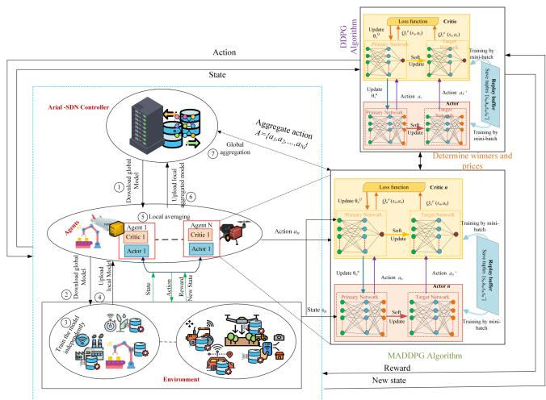  
Fig. 3. The FeDRL framework.

$$
r _ { x } [ t ] = \operatorname* { m a x } \left\{ \begin{array} { l l } { \Big ( ( \sum _ { i \in \mathcal { T } } \rho _ { i } ^ { b } + \sum _ { j \in \mathcal { T } } \rho _ { j } ^ { b } ) - ( \sum _ { j \in \mathcal { T } } \rho _ { j } ^ { s } + } \\ { \sum _ { h \in \mathcal { H } } \rho _ { h } ^ { s } ) \Big ) + } \\ { \Big ( ( \sum _ { h \in \mathcal { H } } \bar { \rho } _ { h } ^ { b } + \sum _ { j \in \mathcal { T } } \bar { \rho } _ { j } ^ { b } ) - \sum _ { i \in \mathcal { T } } \bar { \rho } _ { i } ^ { s } \Big ) . } \end{array} \right.
$$

The reward function of HAP h is given as:

$$
r _ { h } [ t ] = \operatorname* { m a x } \left\{ \sum _ { i \in \mathcal { T } } \sum _ { j \in \mathcal { J } } \lambda _ { i j h } \big ( \rho _ { h } ^ { s } - \psi _ { \zeta , h } \big ) \right. \qquad \\  \left. \sum _ { i \in \mathcal { T } } \lambda _ { i h } \big ( \bar { \psi } _ { \bar { \zeta } , h } - \bar { \rho } _ { h } ^ { b } \big ) . \right.
$$

The reward function of UAV j is expressed as:

$$
r _ { j } [ t ] = \operatorname* { m a x } \left\{ \begin{array} { l l } { \sum _ { i \in \mathbb { Z } } \lambda _ { i j } \left( \big ( \rho _ { j } ^ { s } - \psi _ { \zeta , j } \big ) + \big ( \bar { \psi } _ { \bar { \zeta } , j } - \bar { \rho } _ { j } ^ { b } \big ) \right) } \\ { + } \\ { \sum _ { h \in \mathbb { H } } \lambda _ { j h } \big ( \phi _ { \Pi , j } - \rho _ { j } ^ { b } \big ) . } \end{array} \right.
$$

The reward function of ED i at time slot t is expressed as:

$$
r _ { i } [ t ] = \operatorname* { m a x } \sum _ { j \in \mathcal { I } } \sum _ { h \in \mathcal { H } } \lambda _ { i j h } \left( \left( \phi _ { \Pi , i } - \rho _ { i } ^ { b } \right) + \left( \bar { \rho } _ { i } ^ { s } - \bar { \phi } _ { \bar { \Pi } , i } \right) \right) .
$$

Then, based on each player’s reward, we define the system reward function, which is expressed as:

$$
R [ t ] = \sum _ { h \in \mathcal { H } } r _ { h } [ t ] + \sum _ { j \in \mathcal { I } } r _ { j } [ t ] + \sum _ { i \in \mathcal { I } } r _ { i } [ t ] + \sum _ { x \in X } r _ { x } [ t ] .\tag{32}
$$

As shown in equ. (32), social welfare is the aggregation of rewards or utilities from all agents, which evaluates the overall efficiency or benefit of the system.

## A. FeDRL-Based Solution

Fig. 3 shows the proposed FeDRL-based resource allocation and incentive mechanism in the TN-NTN environment. The upper agent, i.e., the auctioneer, is hosted on HAPs or UCH. We first consider an aerial SDN controller to decide on clearing price, winners, and buyers-sellers matching using the deep deterministic policy gradient (DDPG) algorithm. Each agent (such as HAP, UCH, and ED) uses the multi-agent deep deterministic policy gradient (MADDPG) algorithm to make decisions depending on the environment’s current state, particularly the availability of resources and the asks and bids values of various players in the auction game. The interactions of the lower-layer agents determine the state space for the upper-layer agents, and these agents can update their strategies in each decision epoch. Moreover, the hierarchical multi-agent structure of FeDRL enables real-time adaptation to changes in UAV and HAP availability through autonomous, locally informed decision-making. Dynamic task reassignment via auction-based offloading and multi-hop relays ensures efficient workload distribution across heterogeneous nodes. Centralized training with decentralized execution supports continuous policy refinement, maintaining robust performance despite varying computational capacities and network dynamics in the TN-NTN architecture.

The proposed HFL-enabled DRL framework reduces the computational load on DRL agents by enabling distributed training, localized aggregation, and reduced state-action exploration. Moreover, HFL ensures strong privacy preservation by keeping raw data on end devices and sharing only model updates with higher-tier nodes (e.g., RSUs, UAVs, HAPS), effectively minimizing data exposure risks. The hierarchical structure further limits model propagation to localized groups, enhancing resistance to inference and reconstruction attacks. Therefore, our proposed FeDRL algorithm synergizes FL in the DRL algorithm to reduce the search space of agents and improve learning efficiency. The goal of FeDRL is to maximize the cumulative rewards of both agents to maximize the social welfare of the system in both resource allocation and incentive mechanisms.

The HAPs, UAV, and EDs can update their action policies using the MADDPG algorithm. These agents observe their own system states and other agents’ actions and experiences to improve the learning process. In this work, we apply the MADRL algorithm to obtain the optimal actions of agents. To control the continuous action space, we utilize a MADDPG algorithm composed of an actor-network and a critic-network [52]. The actor-network of an agent is used to choose actions from a set of actions, and the critic-network is used to evaluate the actions chosen by the actor-network. The MADDPG algorithm supports centralized training with decentralized execution. The actor-networks policy and critic-networks Q-function of all agents are denoted by $\pi = \{ \pi _ { 1 } , . . . , \pi _ { N } \}$ and $\pmb { Q } = \{ Q _ { 1 } , \dots , Q _ { N } \}$ parameterized by $\theta ^ { \pi } = \{ \theta _ { 1 } ^ { \pi } , \ldots , \theta _ { N } ^ { \pi } \}$ and $\pmb { \theta } ^ { Q } = \{ \theta _ { 1 } ^ { Q } , \dots , \theta _ { N } ^ { Q } \}$ , respectively. Therefore, the gradient of the expected reward of the n-th agent is expressed as $\nabla _ { \theta _ { n } } J _ { ( \theta _ { n } ) } =$ $\mathbf { E } _ { s \sim \mathcal { D } _ { n } ( s ) , a _ { n } \sim \mathcal { D } _ { j } ( \pi _ { n } ) } [ \nabla _ { \theta _ { n } } \pi _ { n } ( a _ { n } | s _ { n } ) \nabla _ { a _ { n } } Q _ { n } ^ { \pi } ( S , a _ { n } , \ldots , a _ { N } )$ $\left| \boldsymbol { a } _ { n } = \pi _ { n } ( \boldsymbol { s } _ { n } ) \right]$ , where $\mathcal { D } _ { n }$ is the replay buffer of the experience that stores $( s [ t ] , a [ t ] , r [ t ] , s ( t + 1 ) )$ ) and $Q _ { n } ^ { \pi } ( S , a _ { n } , \ldots , a _ { N } )$ is a Q-value function. The critic-network is updated by minimizing the loss function $L _ { j } ( \theta _ { n } ^ { Q } )$ and is defined as;

$$
L _ { j } ( \theta _ { n } ^ { Q } ) = \frac { 1 } { \mathcal { D } _ { n } } \sum _ { j = 1 } ^ { \mathcal { D } _ { n } } \left( y _ { n } ^ { j } - Q _ { n } ^ { \pi } ( s _ { n } ^ { j } , a _ { n } ^ { j } ) \right) ^ { 2 } ,\tag{33}
$$

Algorithm 1: DDPG-based auction decision algorithm.   
1: Input: Buyers and sellers profile with fractional   
resources and prices   
2: Output: Winner of the auction with a list of prices and   
matched sellers-buyers list   
3: Randomly initialize critic’s-network $Q ( s , a | \theta ^ { Q } )$ and   
actor’s-network $\mu ( s _ { t } | \theta ^ { \mu } )$ with weights $\dot { \theta } ^ { Q }$ and $\theta ^ { \mu }$   
4: Initialize actor’s and critic’s target networks $Q ^ { \prime } ( . )$ and   
$\mu ^ { \prime } ( . )$ , with weights $\theta ^ { Q ^ { \prime } }  \theta ^ { Q }$ and $\theta ^ { \mu \prime }  \theta ^ { \mu }$   
5: Initialize the memory replay $\boldsymbol { B }$   
6: forepisode $= [ 1 , 2 , \ldots , 2 0 0 0 ]$   
7: Initialize TN-NTN environment   
8: Set seller $1 \leq S$ and buyer $1 \le B$   
9: Receive an initial state $s ( 0 )$   
10: for time step : $[ t = 1 , 2 , . . . , \mathrm { T } ]$   
11: Based on the policy $\mu ,$ select action   
$a [ t ] = \mu ( s [ t ] ) + \varsigma , \varsigma$ is exploration noise   
12: Execute action a[t] and obtain the immediate reward   
$r [ t ] .$   
13: Sort buyers in descending order   
14: Sort sellers in ascending order   
15: Observe the next state $s ( t + 1 )$   
16: Collect and store transition tuples   
$( s [ t ] , a [ t ] , r [ t ] , s ( t + 1 ) )$ into memory replay $\boldsymbol { B }$   
17: Randomly sample mini-batch H of transition tuples   
from B   
18: Update the critic main-network $Q ( s , a | \theta ^ { Q } )$ and   
Update the actor main-network $\mu ( s [ t ] | \theta ^ { \mu } )$ by   
policy gradient and loss function   
19: Update actor’s and critic’s target networks by   
$\theta ^ { \dot { Q } ^ { \prime } }  \tau \theta ^ { Q } + ( 1 - \tau ) \theta ^ { Q ^ { \prime } } , \theta ^ { \mu ^ { \prime } }  \tau \theta ^ { \mu } + ( 1 - \dot { \tau _ { } } ) \theta ^ { \mu ^ { \prime } }$   
20: end for   
21: end for

where $y _ { n } ^ { j } = r _ { n } + \gamma Q _ { n } ^ { \pi ^ { \prime } } ( s _ { n } ^ { ' j } , a _ { n } ^ { ' j } ) \vert _ { a _ { n } ^ { ' j } = \pi _ { n } ^ { \prime } ( s _ { n } ^ { ' j } ) }$ is the target value. The actor-network is updated by minimizing the policy gradient of agent n and is defined as;

$$
\nabla _ { \theta _ { n } ^ { \pi } } J _ { j } ( \theta _ { n } ^ { \pi } ) = \frac { 1 } { \mathcal { D } _ { n } } \sum _ { j = 1 } ^ { \mathcal { D } _ { n } } \nabla _ { \theta _ { n } ^ { \pi } } \pi _ { n } ( s _ { n } ^ { j } ) \nabla _ { a _ { n } } Q _ { n } ^ { \pi } ( s _ { n } ^ { j } , a _ { n } ^ { j } ) | _ { a _ { n } ^ { j } = \pi _ { j } ( s _ { n } ^ { j } ) } .\tag{34}
$$

Then $\theta _ { n } ^ { Q }$ and $\theta _ { n } ^ { \pi }$ are updated by $\theta _ { j } ^ { Q }  \theta _ { j } ^ { Q } - \eta \nabla _ { \theta _ { n } ^ { Q } } L _ { n } ( \dot { \theta } _ { n } ^ { Q } )$ and $\theta _ { j } ^ { \pi }  \theta _ { j } ^ { \pi } - \eta \nabla _ { \theta _ { n } ^ { \pi } } L _ { n } ( \theta _ { n } ^ { \pi } )$ , respectively, where η denotes the learning rate. The target actor and target critic networks of agent n can be updated by soft updating strategy as;

$$
\begin{array} { r l } & { \theta _ { n } ^ { \pi ^ { \prime } }  \tau \theta _ { n } ^ { \pi } + ( 1 - \tau ) \theta _ { n } ^ { \pi ^ { \prime } } } \\ & { } \\ & { \theta _ { n } ^ { Q ^ { \prime } }  \tau \theta _ { n } ^ { Q } + ( 1 - \tau ) \theta _ { n } ^ { Q ^ { \prime } } , } \end{array}\tag{35}
$$

where τ is the soft updating rate.

The detailed description of the proposed FeDRL-driven task allocation and incentive framework is presented in Algorithms 1, 2, and 3. Algorithm 1 demonstrates the auction-based trading activities. Agents observe the environment, mainly the bids and ask information to make decisions according to their strategies.

Algorithm 2: MADRL algorithm. Algorithm 3: FeDRL algorithm.   
1: Initialize: Global replay buffer D at the controller layer, 1: Input: Number of iterations and associated ED I, FL   
$\mathcal { D } ^ { H A P s }$ at the HAPs, and $\mathcal { D } ^ { u c h }$ at UCH; learning rate $\eta , { \bar { \eta } } .$   
2: Initialize: The parameters of actor and critic network 2: Output: Allocate efficient resource and final globa   
with random weights θ; model at HAPs   
3: for episode = 1 to 2000 HAPs executes: /\* Aerial-MEC processes the overall   
4: Reset the environment activities\*/   
5: Update the winner, selling and buying prices action $a _ { x }$ 3: Run Algorithm (2)   
by DDPG Algorithm $( 1 ) / { ^ { * } }$ Auctioneer execute the 4: Initialize: Global model parameters $\omega ( 0 )$ at HAPs   
trading activity\*/ 5: for each iteration $t = 1 , \stackrel { . } { 2 } , . . . , T ^ { H A L }$   
6: All agents observe initial state ${ \cal S } = \{ s _ { 1 } , s _ { 2 } , . . . , s _ { N } \}$ 6: UCH executes: // run on UCH   
7: for t=1 to 200 7: for each UCH $j \in \mathcal { I }$   
8: Each agent n selects a random action $a _ { n }$ based on 8: Initial $\omega _ { j } [ t ] = \omega [ t ]$   
the probability ε, else select action $a _ { n } = \pi _ { \theta _ { l } } ( s _ { n } ) ;$ 9: for each iteration $t = 1 , 2 , \dots , T ^ { L A L }$   
9: All agents execute action 10: ED execute FL training: /\*Run on ED; works   
$a [ t ] \overset { = } { = } \{ a _ { 1 } [ t ] , a _ { 2 } [ t ] , . . . , a _ { N } [ t ] \}$ and observe reward and participates in FL depending on the level   
$r [ t ] = \{ r _ { n } [ t ] , r _ { 2 } [ t ] , . . . , r _ { n } [ t ] \}$ , and the new state of accuracy\*/   
$s _ { n } ( t + 1 ) \sim s _ { n } ^ { \prime }$ 11: for each associated MID $i \in \mathcal { T }$ in parallel   
10: Store tuples $\{ s _ { n } [ t ] , a _ { n } [ t ] , r _ { n } [ t ] , s _ { n } ^ { \prime } ( t + 1 ) \}$ in $\mathcal { D } _ { n }$ 12: Initialize $\omega _ { i } [ t ] = \omega _ { j } [ t ]$   
11: $s _ { n } \gets s _ { n } ^ { \prime } ;$ 13: for $t = 0$ to $\bar { T } ^ { E D }$   
12: for agent $n = 1$ to N 14: Sample $d _ { i } \in { \mathcal { D } } _ { i }$ and update local   
13: Randomly select mini-batch of H samples tuples $\omega _ { i } [ t ] = \omega _ { j } ( t - 1 ) - \bar { \eta } \nabla F _ { i } ( \omega _ { j } ( t - 1 ) )$   
from ${ \mathcal { D } } ^ { n } ;$ 15: end for   
14: Update the critic-network by minimizing the loss 16: Sample $d _ { j } \in { \mathcal { D } } _ { j }$ and update local   
(33); $\omega _ { j } [ t ] = Q ( t - 1 ) - \eta \hat { \nabla } F _ { j } ( \omega ( t - 1 ) )$   
15: Update actor-network using the sample policy 17: end for   
gradient (34); 18: end for   
16: end for 19: UCH j collects the ED parameters and update   
17: Update the target network parameters for each agent parameters $\begin{array} { r } { \omega _ { j } ( { \dot { t } } + 1 ) = \sum _ { i \in \mathcal { T } } \frac { \tilde { D _ { i } } \tilde { \omega } _ { i } [ t ] } { \tilde { D _ { j } } } } \end{array}$   
n (35): 20: end for   
18: end for 21: Aerial-MEC on HAPs collects the UCH parameters   
19: end for and update   
parameters $\begin{array} { r } { \dot { \mathbf { \sigma } } _ { \mathcal { I } } ( t + 1 ) = \sum _ { j \in \mathcal { I } } \frac { \mathcal { D } _ { j } \omega _ { j } [ t ] } { \mathcal { D } } } \end{array}$   
22: end for

The auctioneer agent executes the decision and identifies the winner. Then, the list of winners, buyers, and sellers is used as the state of the lower agent in Algorithm 2. The detailed resource allocation process and the incentive mechanism in the lower layer are described in Algorithm 2. The execution of this algorithm depends on Algorithm 1. After the auctioneer makes a decision, the agents of Algorithm 2 are used as input to adjust their demand, make the optimal association, select resources, and determine the true valuation price (for the seller and buyer). In lines 1-2, the replay buffer of agents and the critic and actornetwork parameters are initialized with weights. In lines 3-10, agents receive the auctioneer’s decision, receive the initial state, select random actions, and all agents execute actions. Then, the agent gets the immediate reward, and the state changes to the next state. On line 10, the experience is stored in the replay buffer. In lines 10–17, the agent’s experience is saved in the replay buffer as the agent chooses the sample tuples from the replay buffer. The critic and actor networks are updated using a loss function and a policy gradient. Lastly, the agent updates the target network. Algorithm 3 also explains FL model training and aggregation in TN-NTN. This algorithm mainly executes when the HAPs select the high accuracy level of EDs and provide the incentive for the EDs in time slot t.

## VI. PERFORMANCE EVALUATION

## A. Simulation Configuration

In this section, we demonstrate the effectiveness of the proposed FeDRL-based resource allocation and incentive mechanism for the deployed TN-NTN through simulations. In our simulations, we used a core i7 server with a 2.4 GHz Intel Xeon CPU and 32 GB RAM to evaluate the performance of our proposed FeDRL framework in the TN-NTN system. he simulation framework was implemented using Python 3.10, with both PyTorch 2.0 and TensorFlow 2.13. We consider an area of 1 km× 1 km with two randomly deployed GBSs where the cell radius is 350 m, 50 EDs are randomly placed in each cell, some EDs are far from the cell, and 6 ABSs, i.e., 4 UCHs and 2 HAPs equipped with AMEC servers are hovering in the air at an altitude of 100 m and 20 km [15], respectively. UCHs and HAPs cover a 100 m and 1km radius, respectively [37]. The computational capabilities of the EDs, UCHs, and HAPs are set as 1GHz, 30GHz, and 60GHz in the CPU cycle/s, respectively. The training data for each ED i ranges [3, 10] Mbits, maximum time delay $\tau _ { i } ^ { \mathrm { m a x } } = [ 1 0 s , 2 0 s ]$ , and the computation capacity of the EDs is 1 GHz to 2 GHz. The transmission power of the ED, UAV, and HAP are set at 10 dBm, 25 dBm, and 33 dBm [36], [45], respectively. The available bandwidths of GBS, UCH, and HAP are set to 20MHz, 20MHz, and 100MHz, respectively. The parameters of the probabilistic model are set as in [45]. We consider the asks of the sellers, including prices per fractional resource of radio, transmission power, and computing resources chosen randomly from a range of [0.01, 1] units/J, [1, 2] units/MHz, and [1.5, 4] units/Mbps, respectively. whereas the buyers’ bids for these resources are [0.5,1.5] units/J, [1.5,2.5] units/MHZ, and [2,6] units/Mbps, respectively.

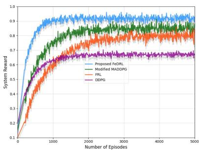  
(a) Convergence results.

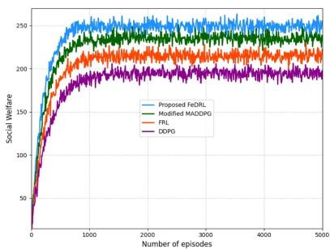  
(b) No. episodes vs social welfare

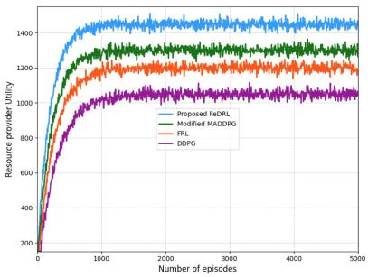  
(c) No. episodes vs utility  
Fig. 4. Effect of training episodes on social welfare and utility.

In our framework, we employ a fully connected neural network (NN) with critic and actor networks, which has three fully connected hidden layers with 128, 64, and 32 neurons (resp.), and all learning algorithms have a 0.001 learning rate. We set the mini-batch size to 256 and the replay memory buffer size to $1 0 ^ { 5 }$ [53]. We employ the ReLU and Sigmoid activation functions for the hidden and output layers, respectively. For the loss function of $\mathrm { R L }$ , we use Adam Optimizer. The learning framework involves HAPs, UCHs, EDs, and an SDN. In the simulation, we compare the performance of FeDRL to state-of-the-art benchmarks, nanmely, the modified MADDPG [54], FRL [55], and DDPG [56] algorithms. We selected these banchmark algorithms based on their relevance to distributed resource allocation in multi-tier networks. The modified MADDPG algorithm is incorporated for its effectiveness in handling multi-agent interactions in continuous action spaces, which closely corresponds with our hierarchical TN-NTN network architecture. FRL is chosen to emphasize the incremental benefits of incorporating reinforcement learning into federated frameworks. Meanwhile, DDPG functions as a critical benchmark, demonstrating our multi-agent strategy’s enhanced efficiency relative to singleagent approaches in complex TN-NTN scenarios.

## B. Convergence Analysis

As shown in Fig. 4(a), for all algorithms, the system’s reward increases as the number of episodes increases. Notably, the proposed FeDRL algorithm demonstrates superior performance, achieving convergence within approximately 300 episodes while consistently attaining higher reward values than the benchmark methods. Specifically, FeDRL delivers significant improvements of 9.83%, 15.13%, and 44.07% over the modified MADDPG, FRL, and DDPG algorithms, respectively. Although the modified MADDPG shows faster convergence and higher rewards compared to FRL and DDPG, FeDRL clearly emerges as the optimal solution. It is thus evident that FeDRL enhances scalability, communication efficiency, high-level agent coordination, and generalization capabilities in distributed environments. As it also allows for increased flexibility and privacy preservation, it emerges as a powerful method for distributing and optimizing resource allocation in TN-NTNs.

## C. Impact of Training Episodes on Social Welfare and Utility

The impact of training episodes on social welfare and utilities is depicted in Fig. 4. Increasing the number of training episodes allows agents to improve their utility functions, converge to optimal policies, and potentially improve individual social welfare. As highlighted by Fig. 4(b), all four algorithms demonstrate significant performance improvements in social welfare as training episodes increase. The proposed FeDRL algorithm clearly establishes dominance from early training stages, achieving and maintaining the highest social welfare values of approximately 250 units after convergence. FeDRL and modified MADDPG have better social welfare than FRL and DDPG. It implies that a multi-agent approach can enable agents to acquire more experience, refine their policies, and learn better strategies, leading to improved coordination. Notably, FeDRL outperforms its alternatives because it lets agents learn independently while periodically sharing experiences, which improves resource utilization. The obtained gain is remarkable: our algorithm increases social welfare by 6.38%, 17. 43%, and 28. 73% compared to the modified MADDPG, FRL, and DDPG algorithms, respectively. FeDRL’s rapid convergence to optimal performance within 1000 episodes and subsequent stability demonstrate its robustness for complex TN-NTN environments. This efficiency makes it ideal for integrated terrestrial-aerial-satellite networks in 6 G systems, where it effectively balances performance requirements with data privacy and reduced communication overhead.

Fig. 4(c) also illustrates the effect of training episodes on resource provider/seller utility across all evaluated algorithms.

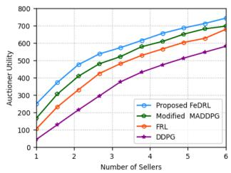  
(a) Impact of sellers

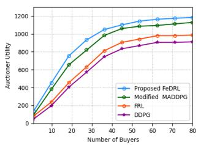  
(b) Impact of buyers  
Fig. 5. Effect of sellers and buyers on auctioneers’ utility.

All approaches demonstrate an initial rapid increase in utility during the first 1000 episodes, followed by convergence to relatively stable values. The proposed FeDRL algorithm consistently outperforms all benchmarks, achieving approximately 1450 utility units after convergence. FeDRL quantitatively provides substantial utility improvements of 9.722%, 18.93%, and 26.20% compared to modified MADDPG, FRL, and DDPG algorithms, respectively. These significant performance gains can be attributed to FeDRL’s hierarchical learning structure, which facilitates more efficient coordination among resource providers and enables strategic knowledge sharing while preserving data privacy—critical advantages in heterogeneous TN-NTN environments where optimal resource pricing and allocation decisions directly impact system-wide utility.

## D. Effect of Sellers and Buyers on Auctioneer Utility

The effect of the sellers’ and buyers’ behavior on the auctioneer’s utility is presented depicted in Fig. 5. As the number of sellers and buyers increases, the auctioneer’s utility increases for all algorithms. The DRL enables the auctioneer to adapt to the behavior of the sellers and buyers, adjusts to market dynamics, while optimizing the auction parameters to maximize utility. This clearly benefits the auctioneer’s decision-making and increases the auctioneer’s utility.

Fig. 5(a) underlines that FeDRL outperforms all considered benchmarks. It enables effective resource allocation and cooperation between the seller and the auctioneer, potentially improving the utility of both parties. Its hierarchical structure and FL approach allow agents to acquire experiences independently while periodically exchanging the acquired knowledge, thus enhancing their decision-making abilities and preserving privacy. Generally, we observe that, as more sellers join the system, the quantity and diversity of available resources substantially increase. This may encourage potential buyers to join the auction, increasing competition and decreasing prices. The increased number of sellers in an auction game frequently results in potential advantages and increased utility for the auctioneer by collecting more fees from sellers.

Fig. 5(b) demonstrates the effect of increasing the number of buyers on the utility of the auctioneer. Buyer bidding strategies, participation levels, and demand directly impact the auctioneer’s utility. FeDRL again outperforms its alternatives, as it allows the auctioneer to learn and adapt to the buyer’s behavior, optimize auction parameters, and attract competitive bids to maximize utility. High demand by buyers actively contributes to increasing auctioneer revenue. The ability of FeDRL to adjust to market dynamics allows the auctioneer to respond to changing buyer behaviors, align auction processes with their preferences, and optimize utility. Cooperative learning among buyers and the auctioneer improves decision-making and the utility of the auctioneer. Therefore, the proposed algorithm has better utility for the auctioneer than the considered alternative schemes.

## E. Effect of EDs and ABSs on Social Welfare

Fig. 6 depicts how the number of EDs and ABS affects social welfare. Fig. 6(a) shows that increasing the number of EDs in both FeDRL algorithm and its alternmtives increases social welfare. As the ED increases, so do resource demands, enhancing resource utilization and allocation. Larger EDs may benefit from economies of scale, resulting in more effective resource allocation and lower expenses per ED. FeDRL also enables collaboration and knowledge sharing among EDs, further boosting social welfare.

Next, Fig. 6(b) underlines that increasing the number of ABSs in both FeDRL and its alternatives leads to increased social welfare. As the number of ABSs increases, the coverage area becomes larger, allowing for better resource allocation and QoS. Additional BSs increase the network capacity, allowing for better resource distribution among EDs. This, in its turn, increases ED satisfaction and social welfare. More ABSs also allow for better load balancing and congestion reduction, enhancing network performance.

Furthermore, as shown in Fig. 6(c), social welfare gradually increases as the number of episodes increases. The fact that the social welfare rate first increases and then, after 350 episodes, decreases indicates that the more EDs and ABSs participate in the auction system, the higher the utility and the system’s complexity, while the lower the market equilibrium.

## F. Effect of Resource Prices on Social Welfare

Fig. 7 highlight that increasing computing, communication, and power resource pricing increases social welfare under all of the considered schemes. EDs are incentivized to use these resources more efficiently when their prices rise, resulting in better resource utilization. This encourages resource conservation and optimization, leading to better overall system performance. All schemes adaptively allocate resources depending on the resource prices, ensuring that consumers obtain resources at the lowest possible cost. As a result of the more effective use of resources and reduced wasteful consumption, social welfare increases.

Fig. 7(a) focuses on the effect of increased computation prices on the social welfare. The resource optimization strategies of all schemes help mitigate the impact of higher computing prices on social welfare. The agents modify their learning and decisionmaking processes to use computing resources better, increasing overall system performance and social welfare. The increase in computational prices can thus reduce resource utilization. In particular, FeDRL exhibits the highest social welfare under increasing computation prices, thanks to its hierarchical nature, which allows for effective resource allocation and coordination between different levels of the hierarchy. The modified

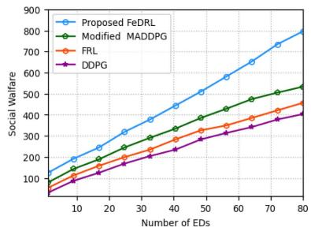  
(a) Impact of EDs

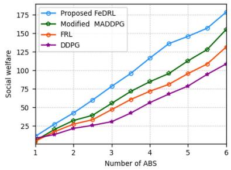  
(b) Impact of ABSs

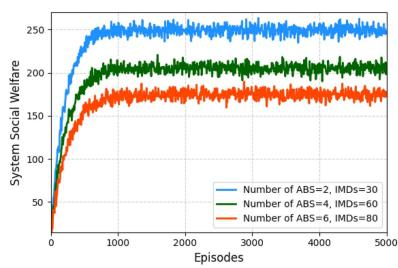  
(c) Social welfare from ABS and EDs

Fig. 6. The effect of EDs and ABSs on social welfare.  
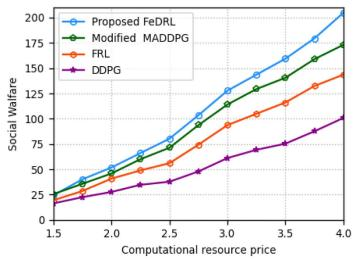  
(a) Comp. price vs social welfare

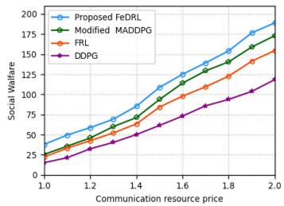  
(b) Comm. price vs social welfare

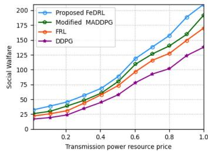  
(c) Power price vs social welfare  
Fig. 7. The effect of resource prices.

MADDPG, FRL, and DDPG algorithms also enhance social welfare, albeit to a lesser extent.

When instead communication prices rise, agents become more aware of their communication patterns and prioritize essential information exchanges, as shown in Fig. 7(b). This encourages more efficient communication strategies, such as compressing and transmitting only crucial data, reducing unnecessary communication overhead. In addition, the increased communication prices drive agents to explore decentralized and distributed learning approaches, enabling more independent decision-making and reducing the reliance on excessive communication. This fosters scalability and efficiency in resource utilization, ultimately benefiting social welfare.

As for the impact of the transmission power prices, Fig. 7(c) indicates that, when transmission power prices rise, agents become more conscious of their power usage and modify their behavior accordingly. Furthermore, increased power pricing encourages agents to explore energy-efficient strategies, resulting in more effective power management. Importantly, FeDRL incentivizes agents to make intelligent decisions that save power and improve system efficiency more efficiently than the modified MADDPG, FRL, and DDPG algorithms in the hierarchical dynamic environment.

## VII. CONCLUSION

We proposed addressed the integration of TN-NTN and proposed a framework for computation offloading and resource allocation with incentives that aims to minimize computational costs while maximizing social welfare. Specifically, we formulated a hierarchical joint computation offloading and resource allocation optimization problem and utilized a hierarchical double auction-based dynamic pricing scheme to motivate aerial MEC servers and EDs to actively participate in the offloading and resource allocation process. To efficiently handle the dynamics and complexity of the optimization problem, we transformed it into a stochastic game model and defined an effective algorithm to solve it. Our results demonstrated that the proposed solution outperforms its alternatives in terms of both social welfare and computational costs. In future work, we will enhance the TN-NTN framework with EDs, UAVs, HAPS, and LEO satellites by integrating multi-modal language models, O-RAN, and digital twins for real-time disaster response. We will use HFL with MADRL for decentralized intelligence and apply group local differential privacy to ensure secure, scalable, and adaptive emergency management in the Metaverse.

## REFERENCES

[1] N. Kato et al., “Optimizing space-air-ground integrated networks by artificial intelligence,” IEEE Wireless Commun., vol. 26, no. 4, pp. 140–147, Aug. 2019.

[2] C. Chen, Z. Liao, Y. Ju, C. He, K. Yu, and S. Wan, “Hierarchical domainbased multicontroller deployment strategy in SDN-enabled space–air– ground integrated network,” IEEE Trans. Aerosp. Electron. Syst., vol. 58, no. 6, pp. 4864–4879, Dec. 2022.

[3] Z. Jia, M. Sheng, J. Li, and Z. Han, “Toward data collection and transmission in 6G space–Air–Ground integrated networks: Cooperative HAP and LEO satellite schemes,” IEEE Internet Things J., vol. 9, no. 13, pp. 10516–10528, Jul. 2022.

[4] H. Cui et al., “Space-air-ground integrated network (SAGIN) for 6G: Requirements, architecture and challenges,” China Commun., vol. 19, no. 2, pp. 90–108, Feb. 2022.

[5] F. Tang, C. Wen, X. Chen, and N. Kato, “Federated learning for intelligent transmission with space-air-ground integrated network toward 6G,” IEEE Netw., vol. 37, no. 2, pp. 198–204, Mar./Apr. 2023.

[6] M. M. Azari et al., “Evolution of non-terrestrial networks from 5G to 6G: A survey,” IEEE Commun. Surveys Tuts., vol. 24, no. 4, pp. 2633–2672, Fourthquarter 2022.

[7] Q. Wei, Y. Chen, Z. Jia, W. Bai, T. Pei, and Q. Wu, “Energy-efficient caching and user selection for resource-limited sagins in emergency communications,” IEEE Trans. Wireless Commun., vol. 73, no. 6, pp. 4121–4136, Jun. 2025.

[8] M. S. Alam, G. K. Kurt, H. Yanikomeroglu, P. Zhu, and N. D. Dào, “High altitude platform station based super macro base station constellations,” IEEE Commun. Mag., vol. 59, no. 1, pp. 103–109, Jan. 2021.

[9] X. You et al., “Towards 6G wireless communication networks: Vision, enabling technologies, and new paradigm shifts,” Sci. China Inf. Sci., vol. 64, no. 1, pp. 1–74, 2021.

[10] M. Giordani and M. Zorzi, “Non-terrestrial networks in the 6G era: Challenges and opportunities,” IEEE Netw., vol. 35, no. 2, pp. 244–251, Mar./Apr. 2021.

[11] X. Wang et al., “QoS and privacy-aware routing for 5G-enabled industrial Internet of Things: A federated reinforcement learning approach,” IEEE Trans. Ind. Informat., vol. 18, no. 6, pp. 4189–4197, Jun. 2022.

[12] Y. Cao, S.-Y. Lien, Y.-C. Liang, D. Niyato, and X. Shen, “Collaborative computing in non-terrestrial networks: A multi-time-scale deep reinforcement learning approach,” IEEE Trans. Wireless Commun., vol. 23, no. 5, pp. 4932–4949, May 2024.

[13] Z. Jia et al., “Distributionally robust optimization for aerial multi-access edge computing via cooperation of UAVs and HAPs,” IEEE Trans. Mobile Comput., vol. 24, no. 10, pp. 10853–10867, Oct. 2025.

[14] Z. Jia, Q. Wu, C. Dong, C. Yuen, and Z. Han, “Hierarchical aerial computing for Internet of Things via cooperation of HAPs and UAVs,” IEEE Internet Things J., vol. 10, no. 7, pp. 5676–5688, Apr. 2023.

[15] O. Abbasi, A. Yadav, H. Yanikomeroglu, N.-D. Dào, G. Senarath, and P. Zhu, “HAPs for 6G networks: Potential use cases, open challenges, and possible solutions,” IEEE Wireless Commun., vol. 31, no. 3, pp. 324–331, Jun. 2024.

[16] M. Harounabadi and T. Heyn, “Toward integration of 6G-NTN to terrestrial mobile networks: Research and standardization aspects,” IEEE Wireless Commun., vol. 30, no. 6, pp. 20–26, Dec. 2023.

[17] X. Sui, Z. Jiang, Y. Lyu, R. Fan, H. Hu, and Z. Liu, “Integrating convex optimization and deep learning for downlink resource allocation in leo satellites networks,” IEEE Trans. Cogn. Commun. Netw., vol. 10, no. 3, pp. 1104–1118, Jun. 2024.

[18] P. K. Sharma, B. Yogesh, D. Gupta, and D. I. Kim, “Performance analysis of IoT-based overlay satellite-terrestrial networks under interference,” IEEE Trans. Cogn. Commun. Netw., vol. 7, no. 3, pp. 985–1001, Sep. 2021.

[19] P. Qin, M. Wang, X. Zhao, and S. Geng, “Content service oriented resource allocation for space–air–ground integrated 6G networks: A three-sided cyclic matching approach,” IEEE Internet Things J., vol. 10, no. 1, pp. 828–839, Jan. 2023.

[20] Y. K. Tun, K. T. Kim, L. Zou, Z. Han, G. Dán, and C. S. Hong, “Collaborative computing services at ground, air, and space: An optimization approach,” IEEE Trans. Veh. Technol., vol. 73, no. 1, pp. 1491–1496, Jan. 2024.

[21] P. Zhang, Y. Zhang, N. Kumar, and M. Guizani, “Dynamic SFC embedding algorithm assisted by federated learning in space–air–ground-integrated network resource allocation scenario,” IEEE Internet Things J., vol. 10, no. 11, pp. 9308–9318, Jun. 2023.

[22] H. Ahmadinejad and A. Falahati, “Forming a two-tier heterogeneous airnetwork via combination of high and low altitude platforms,” IEEE Trans. Veh. Technol., vol. 71, no. 2, pp. 1989–2001, Feb. 2022.

[23] N. Waqar, S. A. Hassan, A. Mahmood, K. Dev, D.-T. Do, and M. Gidlund, “Computation offloading and resource allocation in MECenabled integrated aerial-terrestrial vehicular networks: A reinforcement learning approach,” IEEE Trans. Intell. Transp. Syst., vol. 23, no. 11, pp. 21478–21491, Nov. 2022.

[24] X. S. Shen et al., “Data management for future wireless networks: Architecture, privacy preservation, and regulation,” IEEE Netw., vol. 35, no. 1, pp. 8–15, Jan./Feb. 2021.

[25] E. Baccour et al., “Pervasive AI for IoT applications: A survey on resourceefficient distributed artificial intelligence,” IEEE Commun. Surveys Tuts., vol. 24, no. 4, pp. 2366–2418, Fourthquarter 2022.

[26] A. Masaracchia et al., “UAV-enabled ultra-reliable low-latency communications for 6G: A comprehensive survey,” IEEE Access, vol. 9, pp. 137338–137352, 2021.

[27] P. Zhang, P. Yang, N. Kumar, and M. Guizani, “Space-air-ground integrated network resource allocation based on service function chain,” IEEE Trans. Veh. Technol., vol. 71, no. 7, pp. 7730–7738, Jul. 2022.

[28] Q. Chen, W. Meng, S. Han, and C. Li, “Service-oriented fair resource allocation and auction for civil aircrafts augmented space-airground integrated networks,” IEEE Trans. Veh. Technol., vol. 69, no. 11, pp. 13658–13672, Nov. 2020.

[29] Z. Jia et al., “Service function chain dynamic scheduling in space-airground integrated networks,” IEEE Trans. Veh. Technol., vol. 74, no. 7, pp. 11235–11248, Jul. 2025.

[30] E. E. Haber, H. A. Alameddine, C. Assi, and S. Sharafeddine, “UAVaided ultra-reliable low-latency computation offloading in future IoT networks,” IEEE Trans. Commun., vol. 69, no. 10, pp. 6838–6851, Oct. 2021.

[31] L. Sun, L. Wan, and X. Wang, “Learning-based resource allocation strategy for industrial IoT in UAV-enabled MEC systems,” IEEE Trans. Ind. Informat., vol. 17, no. 7, pp. 5031–5040, Jul. 2021.

[32] N. Zhao, Z. Ye, Y. Pei, Y.-C. Liang, and D. Niyato, “Multi-agent deep reinforcement learning for task offloading in UAV-assisted mobile edge computing,” IEEE Trans. Wireless Commun., vol. 21, no. 9, pp. 6949–6960, Sep. 2022.

[33] S. Zhang, A. Liu, C. Han, X. Liang, X. Xu, and G. Wang, “Multi-agent reinforcement learning-based orbital edge offloading in SAGIN supporting Internet of Remote Things,” IEEE Internet Things J., vol. 10, no. 23, pp. 20472–20483, Dec. 2023.

[34] A. Traspadini, M. Giordani, and M. Zorzi, “UAV/HAP-assisted vehicular edge computing in 6G: Where and what to offload,” in Proc. 2022 Joint Eur. Conf. Netw. Commun. & 6G Summit (EuCNC/6G Summit), 2022, pp 178–183, doi: 10.1109/EuCNC/6GSummit54941.2022.9815734.

[35] H. Dahrouj, S. Liu, and M.-S. Alouini, “Machine learning-based user scheduling in integrated satellite-HAPs-ground networks,” IEEE Netw., vol. 37, no. 2, pp. 102–109, Mar./Apr. 2023.

[36] Q. Ren, O. Abbasi, G. K. Kurt, H. Yanikomeroglu, and J. Chen, “Caching and computation offloading in high altitude platform station (HAPS) assisted intelligent transportation systems,” IEEE Trans. Wireless Commun., vol. 21, no. 11, pp. 9010–9024, Nov. 2022.

[37] D. S. Lakew, A.-T. Tran, N.-N. Dao, and S. Cho, “Intelligent offloading and resource allocation in heterogeneous aerial access IoT networks,” IEEE Internet Things J., vol. 10, no. 7, pp. 5704–5718, Apr. 2023.

[38] A. Farajzadeh, A. Yadav, and H. Yanikomeroglu, “Multi-tier hierarchical federated learning-assisted NTN for intelligent IoT services,” 2023. [Online]. Available: https://arxiv.org/abs/2305.05463

[39] T. Wang, X. Huang, Y. Wu, L. Qian, B. Lin, and Z. Su, “UAV swarmassisted two-tier hierarchical federated learning,” IEEE Trans. Netw. Sci. Eng., vol. 11, no. 1, pp. 943–956, Jan./Feb. 2024.

[40] Z. Jia, M. Sheng, J. Li, D. Niyato, and Z. Han, “Leo-satellite-assisted UAV: Joint trajectory and data collection for internet of remote things in 6G aerial access networks,” IEEE Internet Things J., vol. 8, no. 12, pp. 9814–9826, Jun. 2021.

[41] T. Mai, H. Yao, J. Xu, N. Zhang, Q. Liu, and S. Guo, “Automatic doubleauction mechanism for federated learning service market in Internet of Things,” IEEE Trans. Netw. Sci. Eng., vol. 9, no. 5, pp. 3123–3135, Sep./Oct. 2022.

[42] X. Tu, K. Zhu, N. C. Luong, D. Niyato, Y. Zhang, and J. Li, “Incentive mechanisms for federated learning: From economic and game theoretic perspective,” IEEE Trans. Cogn. Commun. Netw., vol. 8, no. 3, pp. 1566–1593, Sep. 2022.

[43] L. U. Khan, M. Guizani, I. Yaqoob, A. Al-Fuqaha, A. Erbad, and Z. Han, “Network virtualization empowered metaverse: A hierarchical matching approach,” IEEE Trans. Netw. Sci. Eng., early access, Jul. 25, 2023, doi: 10.1109/TNSE.2025.3588451.

[44] C. Singhal and S. De, Eds., Resource Allocation in Next-Generation Broadband Wireless Access Networks. Hershey, PA, USA: IGI Glob. Sci. Publishing, 2017.

[45] A. M. Seid, G. O. Boateng, B. Mareri, G. Sun, and W. Jiang, “Multi-agent DRL for task offloading and resource allocation in multi-UAV enabled IoT edge network,” IEEE Trans. Netw. Service Manag., vol. 18, no. 4, pp. 4531–4547, Dec. 2021.

[46] Y. Yu, X. Bu, K. Yang, H. Yang, X. Gao, and Z. Han, “UAV-aided low latency multi-access edge computing,” IEEE Trans. Veh. Technol., vol. 70, no. 5, pp. 4955–4967, May 2021.

[47] Z. Jia, M. Sheng, J. Li, D. Zhou, and Z. Han, “Joint HAP access and LEO satellite backhaul in 6G: Matching game-based approaches,” IEEE J. Sel. Areas Commun., vol. 39, no. 4, pp. 1147–1159, Apr. 2021.

[48] A. Albaseer, A. M. Seid, M. Abdallah, A. Al-Fuqaha, and A. Erbad, “Novel approach for curbing unfair energy consumption and biased model in federated edge learning,” IEEE Trans. Green Commun. Netw., vol. 8, no. 2, pp. 865–877, Jun. 2024.

[49] A. Mohammed Seid, A. Erbad, H. N. Abishu, A. Albaseer, M. Abdallah, and M. Guizani, “Blockchain-empowered resource allocation in multi-UAV-enabled 5G-RAN: A multi-agent deep reinforcement learning approach,” IEEE Trans. Cogn. Commun. Netw., vol. 9, no. 4, pp. 991–1011, Aug. 2023.

[50] W. Sun, J. Liu, Y. Yue, and H. Zhang, “Double auction-based resource allocation for mobile edge computing in industrial Internet of Things,” IEEE Trans. Ind. Informat., vol. 14, no. 10, pp. 4692–4701, Oct. 2018.

[51] Q. Wang, S. Guo, J. Liu, C. Pan, and L. Yang, “Profit maximization incentive mechanism for resource providers in mobile edge computing,” IEEE Trans. Serv. Comput., vol. 15, no. 1, pp. 138–149, Jan./Feb. 2022.

[52] R. Lowe, Y. I. Wu, A. Tamar, J. Harb, O. Pieter Abbeel, and I. Mordatch, “Multi-agent actor-critic for mixed cooperative-competitive environments,” in Proc. 31st Int. Conf. Neural Inf. Process. Syst., 2017, vol. 30, pp. 6382–6393.

[53] A. M. Seid, H. N. Abishu, R. S. Rathore, A. Erbad, R. H. Jhaveri, and J. Lu, “Blockchain-empowered multi-domain resource trading in tn-ntn 6G networks: A hierarchical multi-agent DRL approach,” IEEE Trans. Consum. Electron., vol. 71, no. 2, pp. 3874–3889, May 2025.

[54] M. Parvini, M. R. Javan, N. Mokari, B. Abbasi, and E. A. Jorswieck, “AoI-aware resource allocation for platoon-based C-V2X networks via multi-agent multi-task reinforcement learning,” IEEE Trans. Veh. Technol., vol. 72, no. 8, pp. 9880–9896, Aug. 2023.

[55] A. Mohammed, H. N. Abishu, A. Albaseer, A. Erbad, M. Abdallah, and M. Guizani, “FDRL approach for association and resource allocation in multi-UAV air-to-ground IoMT network,” in Proc. IEEE Glob. Commun. Conf., 2022, pp. 1417–1422.

[56] A. M. Seid, G. O. Boateng, S. Anokye, T. Kwantwi, G. Sun, and G. Liu, “Collaborative computation offloading and resource allocation in multi-UAV-assisted IoT networks: A deep reinforcement learning approach,” IEEE Internet Things J., vol. 8, no. 15, pp. 12203–12218, Aug. 2021.

Abegaz Mohammed Seid (Member, IEEE) received the BSc degree in computer science from Ambo University, in 2010, the MSc degree in computer science from Addis Ababa University, Ethiopia, in 2015, and the PhD degree in computer science and technology from the University of Electronic Science and Technology of China, in 2021. From 2010 to 2016, he was a graduate assistant, lecturer, academic committee member, and associate registrar with Dilla University, Ethiopia. He is currently a postdoctoral fellow with Hamad Bin Khalifa University, Doha,

Qatar. He has authored 45 refereed publications. His research interests include wireless networks, mobile edge computing, blockchain, generative AI, vehicular networks, IoT, UAV networks, and 5G/6G systems.

Aiman Erbad (Senior Member, IEEE) received the MSc degree from the University of Essex, in 2005, and the PhD degree from The University of British Columbia, in 2012. He is currently a full professor and VP with Research and Graduate Studies, Qatar University. His research interests include cloud and edge computing, IoT, distributed AI, secure networks, and multimedia systems. He was the recipient of the Platinum Award from H.H. Emir Sheikh Tamim bin Hamad Al Thani at the 2013 Education Excellence Day (PhD category) and Best Paper Awards from

Computer Communications (2020), IWCMC (2019, 2024), and IEEE CCWC (2017). He is also an editor of IJSNet and KSII Transactions on Internet and Information Systems and guest editor of IEEE Network.

Hayla Nahom Abishu (Member, IEEE) received the BSc degree in computer science and information technology from Haramaya University, in 2007, the MSc degree in computer science and networking from Dilla University, Ethiopia, in 2017, and the PhD degree in computer science and technology from the University of Electronic Science and Technology of China, in 2024. His research interests include mobile computing, wireless networks, blockchain, UAV networks, IoT, network security, and machine learning.

Gordon Owusu Boateng (Member, IEEE) received the BSc degree in telecommunications engineering from KNUST, Ghana, in 2014, and the MEng and PhD degrees in computer science and technology from UESTC, China, in 2019 and 2023, respectively. He was a postdoctoral researcher with UESTC’s Hybrid Positioning Research Group from 2023 to 2024 and postdoctoral fellow with KU 6G Research Center, Khalifa University, UAE from 2024 to 2025. He is currently an assistant professor with the Department of Communications and Networking, Xi’an Jiaotong-

Liverpool University, China. His research interests include 5G/6G networks, reinforcement learning, vehicular networks, large language models, and automated valet parking.

Latif U. Khan (Member, IEEE) received the PhD degree in computer engineering from UET Peshawar, Pakistan, in 2017, and the MS (with distinction) degree in electrical engineering from Kyung Hee University (KHU), South Korea, in 2021. He was a faculty member and research associate with UET Peshawar. He was the recipient of KHU Best Thesis Award in 2021 and Best Paper Award at the 15th IEEE International Conference on Advanced Communications Technology in 2013. He has authored or coauthored extensively in reputable journals and conferences, in his research interests which include federated learning, optimization and game theory, edge computing, and network slicing.

Carla Fabiana Chiasserini (Fellow, IEEE) is currently a professor with Politecnico di Torino, Italy. She was a visiting scholar and researcher with UCSD from 1998 to 2003. She was also a visiting professor with Monash University, Australia, in 2012 and 2016, respectively and Technical University, Berlin, Germany, in 2021 and 2022, respectively. She is an EiC of Computer Communications and Aassociate EiC of IEEE Transactions on Network Science and Engineering.

Mohsen Guizani (Fellow, IEEE) received the BS (with distinction), MS, and PhD degrees in electrical and computer engineering from Syracuse University, Syracuse, NY, USA, in 1985, 1987, and 1990, respectively. He was with several U.S. institutions. He is currently a professor of machine learning with the Mohamed Bin Zayed University of Artificial Intelligence, Abu Dhabi, UAE. He has authored 11 books, more than 1000 publications, and several U.S. patents. His research interests include applied machine learning and AI, smart cities, IoT, intelligent autonomous systems, and cybersecurity. He was the recipient of numerous awards, including 2015 IEEE ComSoc Best Survey Paper Award, 2021 ComSoc Best Journal Paper Award, five ICC and Globecom Best Paper Awards, and multiple IEEE Technical Recognition Awards. He was listed as a Clarivate Highly Cited researcher of computer science from 2019 to 2022. He was the editor-in-chief of IEEE Network, editorial boards of several IEEE Transactions and Magazines, and chair of multiple IEEE ComSoc Technical Committees. He is a former IEEE Computer Society distinguished speaker and IEEE ComSoc distinguished lecturer.