# A Novel Expert-Assisted Anomaly-Aware Embodied Learning Framework for UAV Active Target Tracking

Jiahao Li , Fuhui Zhou , Senior Member, IEEE, and Qihui Wu , Fellow, IEEE

Abstract—Active object tracking (AOT) in complex and dynamic environments remains a significant challenge for autonomous unmanned aerial vehicle (UAV) tracking systems, especially in anomalous situation such as prolonged occlusion and intense interference. In this paper, we propose a novel embodied learning framework, called the learning to ask for help (LA4H) framework, which integrates cross-modal anomaly cognition and adaptive expert assistance mechanisms to enhance the robustness and generalization of UAV active target tracking. The LA4H framework enables the agent to autonomously recognize and classify anomalous states through a cross-modal anomaly cognition module, and to adaptively request expert intervention when necessary via an assistance decision network. A teacher-student policy learning paradigm is further employed to distill the temporal-semantic knowledge, improving tracking efficiency and real-time performance. Extensive experiments in both simulated and real-world scenarios demonstrate that the LA4H significantly outperforms the state-of-the-art baselines in terms of tracking success rate, path efficiency, and generalization to unseen scenarios, while substantially reducing reliance on expert intervention. The results demonstrate the effectiveness of integrating expert knowledge and anomaly cognition for robust embodied AI in practical UAV applications.

Index Terms—UAV active object tracking, embodied AI, expertin-the-loop assistance, anomaly cognition.

## I. INTRODUCTION

O VER the past few years, unmanned aerial vehicle (UAV)technology has witnessed rapid advancements and at- technology has witnessed rapid advancements and attracted extensive attention. Benefiting from the unique advantages of high mobility, flexible deployment, cost-effectiveness, and real-time data acquisition, UAVs have been widely applied in diverse fields such as precision agriculture, logistics and delivery, infrastructure inspection, and disaster response [1], [2], [3], [4]. Among these, UAV-based aerial visual target tracking has emerged as a critical research topic [5], [6], playing an important role in scenarios including real-time security surveillance, search and rescue operations, and intelligent transportation monitoring [7], [8], [9]. The ability to robustly and efficiently track dynamic targets from aerial onboard platforms is fundamental for ensuring the effectiveness of these UAV applications. Consequently, developing reliable UAV tracking systems remains a key and highly active research challenge.

Current research on UAV aerial visual target tracking primarily follows two major paradigms. The first focuses on developing sophisticated passive trackers that aim to accurately locate the target within each frame. This branch of study, largely built upon the Siamese network architecture, has made substantial progress through the integration of attention mechanisms [10], tempora context modeling [11], hierarchical feature transformers [12], and anchor-free proposal networks [13] to enhance feature rep resentation and tracking robustness, becoming a mainstream solution due to the excellent balance of accuracy and speed. Moreover, investigations have also explored domain adaptation techniques to handle challenging visual conditions, such as nighttime tracking [14]. The second active tracking paradigm, leverages deep reinforcement learning (DRL) to enable the UAV to autonomously control its motion and actively maintain optimal visibility of the target. These DRL-based methods learn intelligent control policies to handle specific challenges such as navigating cluttered urban environments [15], mitigating distractors [16], adapting to target scale variations [17], and op timizing control stability through hierarchical frameworks [18], often trained within realistic virtual simulations [19]. Despite these significant advancements, existing methods still struggle to address severe anomalous states frequently encountered in practical UAV tracking tasks. Due to the inherent dynamic property of the target and complex environment factors, tracking processes are susceptible to severe anomalies, including prolonged occlusion [20], [21], [22], [23] caused by large building structures or intentional target evasion, and intense interference [24], [25], [26], [27] where the target deliberately adopts an appearance closely resembling surrounding distractors and background objects. Such states often lead to catastrophic tracking failure. Specifically, passive trackers rely on local template matching within a restricted search region, which prevents them from proactively re-acquiring the task target after prolonged occlusion and distinguishing it from distractors without local features. Meanwhile, standard end-to-end active trackers suffer from partial observability in these scenarios, where the policy network encounters out-of-distribution states and maps visual noise to irrational actions, lacking the cognitive capability to recognize failures and execute complex recovery maneuvers. While some emerging cognitive frameworks attempt to address such exceptions through predefined rules and heuristics, they typically lack the flexibility required to adapt to the unstructured and dynamic anomalies encountered in real-world tracking.

To tackle the aforementioned issue, we propose a novel expert-assisted anomaly-aware active target tracking framework for UAVs, called the learning to ask for help (LA4H) framework. The LA4H integrates expert knowledge to guide the tracker in addressing severe anomalies, replacing the inefficient trial-anderror exploration with explicit anomaly cognition and adaptive assistance requesting mechanisms. In particular, the cross-modal anomaly cognition module enables the agent to recognize the current anomaly type in real time, while the assistance decision policy learns the optimal timing to request expert intervention before tracking drift occurs. This design achieves significant improvements in effectiveness against intense interference and prolonged occlusion. As shown in Fig. 1, the LA4H enables the UAV to proactively request the expert assistance when encountering anomalous states. The system immediately transmits anomaly alerts and task context to a remote expert, which can intervene through various modes, such as direct control, path planning, target re-location, or bounding box re-drawing. This flexible expert intervention helps the UAV quickly recover from failures and resume normal tracking, enhancing the robustness and practical applicability of the tracking system. The main contributions of this paper can be summarized as follows.

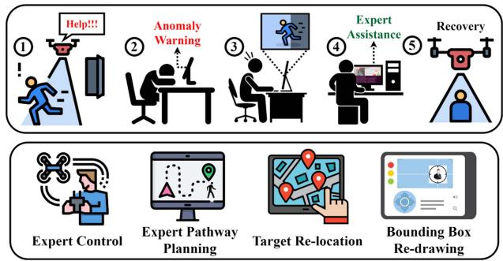  
Fig. 1. Illustration of the expert-in-the-loop assistance pipeline and diverse modes of expert intervention in UAV anomaly active target tracking tasks.

We propose a novel LA4H framework for UAV anomaly active target tracking tasks. This framework uniquely integrates agent-driven policy with expert assistance decision mechanism, enabling the agent to learn when to request help. Distinct from rule-based cognitive frameworks, the LA4H is data-driven that enables the agent to adaptively switch between autonomous control and expert intervention, thereby effectively handling complex anomalous states, such as prolonged occlusion and intense interference, which are challenging for traditional end-to-end systems.

We introduce two key components, a cross-modal anomaly cognition module and a teacher-student policy learning paradigm, to enhance the agent cognitive and learning capabilities. The anomaly cognition module aligns spatiotemporal visual features with semantic textual prompts to achieve fine-grained recognition of diverse anomalies, providing the necessary context for assistance requests. Concurrently, the teacher-student framework distills knowledge from a complex, temporally-aware teacher network into a lightweight student-tracker, enabling the agent to maintain high tracking accuracy with substantially reduced computational complexity.

We conduct extensive UAV anomaly target tracking experiments in both simulated and real-world scenarios to validate the effectiveness of the LA4H in resolving severe anomalies during tracking processes. Compared with stateof-the-art methods, the LA4H achieves superior tracking performance, with a 361.4% increase in success rate, a 54.4% improvement in task completion efficiency, and a 40.3% reduction in expert intervention.

The reminder of this paper is organized as follows. Section II discusses the related work. Section III presents the problem formulation. Section IV demonstrates the proposed framework. Section V exhibits the experiment results. Section VI concludes the paper.

## II. RELATED WORK

This section reviews the key research domains that form the foundation for our proposed framework. We discuss recent advances in active object tracking, embodied AI, and the emerging field of expert assistance, all of which provides the necessary context for the development of the expert-assisted tracking framework.

## A. Active Object Tracking

Active Object Tracking (AOT) aims to enable an embodied agent, such as a camera, robot, or drone, to autonomously follow a moving target by actively controlling its motion based on visual observations. Unlike passive tracking, which only estimates the target position in each frame with static sensors, AOT requires the tracker to execute sequential decisions and adaptively adjust its viewpoint or posture to maintain optimal visibility of the target, making it essential for applications in robotics, autonomous vehicles, and security surveillance [16]. Early works primarily rely on manually designed features and traditional control methods. With the development of DRL, end-to-end frameworks become the mainstream and demonstrate superior performance, enabling direct policy learning from raw visual input to control actions. For example, Luo et al. [28] proposes a ConvNet-LSTM-based tracker trained in simulation and deployed in practice, while Zhong et al. [24] introduces an asymmetric dueling mechanism to enhance robustness by modeling both the tracker and the target as agents in a competitive setting. These paradigms not only eliminate the need for hand-crafted camera controllers but also exhibit strong generalization to unseen target trajectories and backgrounds. Moreover, hierarchical RL-based approaches are explored, which employs hierarchical controllers to integrate perception and decision-making in complex environments. Zhao et al. [18] proposes a hierarchical framework that enhances stability by separating high-level policy decisions from the low-level PID flight controller, achieving robust UAV active tracking in GPS-denied scenarios.

Recent advances focus on several key challenges in AOT, such as sample efficiency, generalization capability, real-world applicability, and robustness in extremely adverse conditions. Li et al. [29] proposes a meta-reinforcement learning method for UAV maneuvering target tracking tasks in uncertain environments, enabling rapid adaptation to new target motion patterns with limited training data. Structure-aware motion representations and trajectory prediction methods further improve generalization across diverse environments by explicitly reconstructing the 3D scene geometry and predicting the target motion [27]. The pursuit-evasion setting and multi-agent interaction are also explored to learn strategic behaviors in real-world scenarios [26]. In addition, multi-agent and collaborative tracking frameworks are proposed to enable multiple cameras or robots to coordinate for robust tracking under occlusions and limited visibility [20], [30]. Attention-based modules and adversarial training strategies are introduced to improve the tracker ability to distinguish targets from distractors and adapt to against occlusion scenarios [16], [24], [25].

Beyond the tracking tasks, the core principle of AOT, moving to improve perception, has been extended to related tasks such as active object detection, where the agent actively moves to obtain more informative viewpoints and adapts its detection model online through environment interactions. Integrating perception and control in an interactive loop has been shown to significantly improve performance and generalization, as demonstrated in recent works on embodied adaptive object detection and decisiontransformer-based active perception [21], [22], [23], [31]. These related advances collectively provide valuable insights into learning motion policies for embodied agents, pushing AOT towards more reliable deployment in practical applications.

## B. Embodied AI

Embodied artificial intelligence (EAI) is a representative paradigm of behaviorism, emphasizing the critical role of physical interaction in the development of intelligent behavior [32], [33], [34]. Traditional AI primarily relies on predefined models and disembodied data for computation and learning, often operating independently of physical environment and real-world perception inputs. The core characteristics of EAI include physical embodiment, real-time perception-action feedback, and adaptive learning, which enable agents to develop more flexible and context-aware policies [35], [36]. Notably, EAI and AOT share the same principle in multiple aspects. Regarding the target tracking tasks, EAI introduces a novel perspective to optimize tracking policies through embodied actions and interaction experiences. For example, embodied tracking agent can dynamically adjust its positions and viewpoints based on environment feedbacks, leading to more robust tracking performance [21], [22], [23], [31]. The integration of physical constraints and environment understanding through EAI helps prevent unrealistic tracking maneuvers and enhances tracking reliability in complex unstructured scenarios [37].

Current research in EAI can be broadly categorized into several key directions. A primary branch is embodied navigation, which includes tasks such as PointGoal navigation (navigating to specific coordinates) and ObjectGoal navigation (finding an object of a certain category) [38], [39], [40], [41]. A more complex extension is vision-language navigation (VLN), where an agent must follow natural language instructions to navigate through an environment [42], [43]. Another significant area is embodied question answering (EQA), requiring an agent to explore its surroundings to find the relevant visual information for answering the given question [44], [45]. Moreover, embodied manipulation focuses on tasks that demand fine-grained interactions with objects, such as pick-and-place, opening drawers, and object rearrangement [46]. Most relevant to our work is the domain of active perception and exploration, where the agent goal is not merely to reach a destination but to actively move to maximize visual information gain, for tasks such as 3D scene reconstruction [47], [48] and active object detection. Recent advances also include the development of large-scale realistic simulation platforms and benchmarks, such as AI2-THOR [46], Habitat [38], and Gibson [49], which facilitate the training and evaluation of embodied agents in diverse scenarios.

## C. Expert Assistance

Expert assistance refers to the mechanism that integrates external knowledge sources (e.g., human experts, oracles, and large language models) into autonomous agent systems to overcome their limitations in different aspects such as perception, reasoning, and decision-making, especially in unfamiliar or uncertainty environments. This assistance takes various forms, including direct instruction, interactive question-answering, preference demonstration and feedback, and multimodal communication, which can be either proactively initiated by the agent or reactively provided by the expert. Recent research has developed multiple paradigms for leveraging expert assistance in embodied AI. Specifically, some works focus on enabling agents to adaptively request rich, contextually relevant information from humans to improve their task execution abilities [50]. Others investigate learning policies that balance autonomous operation with selective expert queries to optimize performance and minimize help cost [51], [52]. Moreover, there is also significant progress in using large language models as experts, allowing agents to gather information and resolve uncertainties through natural language interactions [53], [54], [55]. Rather than relying on explicit instructions, Hwang et al. [56] explores the learning from more implicit forms of human guidance, such as inferring reward functions and personalizing agent behavior from human preferences. Crucially, the practical implementation of these ideas is advanced by the development of interactive instructionfollowing frameworks [57], [58] and the design of user-centric simulation platforms that facilitate large-scale human-agent collaboration and data collection [59], [60]. However, different from approaches that typically rely on predefined rules or simple uncertainty heuristics to trigger assistance, our work focuses on developing optimal strategies driven by explicit anomaly cognition for agents to determine when and how to actively request and effectively utilize expert assistance, thereby enhancing their robustness and adaptability in complex practical scenarios.

## III. PROBLEM FORMULATION

We formulate the task of UAV active target tracking in anomalous scenarios as a Partially Observable Markov Decision Process (POMDP). A POMDP is defined by the tuple (S, A, T , R, Ω, O, γ), where S is the set of environment states, A is the action space, T is the state transition function, R is the reward function, Ω is the set of observations, O is the observation function, and $\gamma \in [ 0 , 1 )$ is the discount factor. The agent goal is to learn a policy $\pi ( a _ { t } | s _ { t } )$ that maximizes the expected cumulative discounted reward $\begin{array} { r } { \dot { J ( \pi ) } = \mathbb { E } _ { \pi } [ \sum _ { t = 0 } ^ { \infty } \gamma ^ { t } r _ { t } ] } \end{array}$ . In our proposed tframework, this involves training an agent that not only learns a tracking policy through interaction experiences but also learns when to request the expert assistance. The key components are defined as follows.

## A. Observation State Representation

The agent can not have access to the full environment state. Instead, it constructs a state representation $s _ { t }$ from the history of its observations. The current state $s _ { t }$ is defined as a concate-tnation of current and historical information to capture temporal dynamics:

$$
s _ { t } = [ s _ { t } ^ { o } , s _ { t } ^ { h } , p _ { t } , p ^ { h } , m _ { t } , m ^ { h } ] ,\tag{1}
$$

where $\boldsymbol { s } _ { t } ^ { o }$ and $s _ { t } ^ { h }$ denote the current and historical observation t tstate, respectively, while $p _ { t }$ and $p ^ { h }$ represent the current and historical position states, and $m _ { t }$ and $m ^ { h }$ indicate the current and historical information about the semantic similarity maps.

\- Position State $( p _ { t } ) .$ : This is defined as $p _ { t } = [ x _ { t } , y _ { t } , z _ { t } , \theta _ { t } ]$ where $x _ { t } , y _ { t } .$ , and $z _ { t }$ are the Cartesian coordinates of the agent current position, and $\theta _ { t }$ represents the rotation angle of its view field.

\- Semantic Map State $\left( m _ { t } \right) :$ This captures high-level understanding of the visual scene and is defined as $m _ { t } =$ $\left[ n , v _ { t } ^ { 1 } , x _ { t } ^ { 1 } , y _ { t } ^ { 1 } , . . . , v _ { t } ^ { n } , x _ { t } ^ { n } , y _ { t } ^ { n } \right]$ t. Here, n indicates the num-t t t t t tber of confidence peaks in the semantic similarity map. For each peak i, vi denotes its similarity value, and $( x _ { t } ^ { i } , y _ { t } ^ { i } )$ trepresents its 2D coordinates in the map.

\- Historical Information: All historical states, such as $s _ { t } ^ { h }$ $p ^ { h }$ , and $m ^ { h }$ t, contain the information from the last ten consecutive time steps. This provides the agent with a short-term memory to make decisions.

Specifically, to ensure stability and effective cross-modal fusion, all coordinate-based features in $m _ { t }$ and bounding box centers are normalized to the range $[ - 1 , 1 ]$ using the image dimensions. Similarly, the physical position state $p _ { t }$ is transformed into egocentric relative coordinates and normalized by the maximum sensor range to prevent scale disparity between position data and visual embeddings.

## B. Sensors and Controls for UAV

The UAV is equipped with an onboard optoelectronic pod to capture visual observations $( s _ { t } ^ { o }$ and $m _ { t } )$ and a localization tsystem (e.g., IMU and GPS) to obtain its pose $\left( { p _ { t } } \right)$ . The agent tcontrol is manifested through a discrete action space ${ \mathcal { A } } ,$ represented by a 12-dimensional vector. This allows for fine-grained 3D flight control, including moving up and down, left and right, front and back, upper left and right, lower left and right, and rotating left and right.

## C. Categorical Objective Function

Our framework employs a dual-policy approach, where the agent learns both how to act and when to request assistance.

Consequently, the agent objective is not a single function but a categorical objective function (COF), which provides a unified formulation for different scenarios.

1) Objective in Normal States: In normal states $( s _ { t } = s _ { n } )$ the agent uses a tracking policy $\pi _ { \lambda } ( \boldsymbol a _ { t } | \boldsymbol s _ { t } )$ to maximize the longterm cumulative discounted reward. The objective function $J _ { n }$ follows the standard formulation, given as

$$
J _ { n } ( s _ { t } , a _ { t } ) = \mathbb { E } _ { \boldsymbol { \pi } } \left[ \sum _ { t = 0 } ^ { T } \gamma ^ { t } r _ { t } ( s _ { t } , a _ { t } ) \right] ,\tag{2}
$$

where $r _ { t }$ is the composite reward for tracking, defined as $r _ { t } = r _ { t } ^ { g } + r _ { t } ^ { l } + r _ { t } ^ { b } + r _ { t } ^ { r }$ , while $r _ { t } ^ { g }$ is the reward for tracking the ttask target, $r _ { t } ^ { l }$ t t tis the penalty for losing the task target, $r _ { t } ^ { b }$ is tthe penalty for reaching the boundary and $\boldsymbol { r } _ { t } ^ { r }$ tis the penalty tfor requesting the expert assistance. If the agent completes the tracking task, $r _ { t } ^ { g } = 1 0 0$ , otherwise $r _ { t } ^ { g } = 0$ . If the agent loses the target, $r _ { t } ^ { l } = - 1 0$ , otherwise, $r _ { t } ^ { l } = 0$ . If the agent crosses the boundary, $r _ { t } ^ { b } = - 1 0$ , otherwise $r _ { t } ^ { b } = 0$ . If the agent requests tthe expert assistance, $r _ { t } ^ { r } = - 1$ t, otherwise $r _ { t } ^ { r } = 0$ . Although the magnitude of $| r _ { t } ^ { r } |$ t tis small compared to the success reward $r _ { t } ^ { g }$ t, it serves as a critical cumulative regularizer. It ensures the agent only requires the expert intervention when the expected long-term penalty of potential tracking failure (i.e., incurring $r _ { t } ^ { l } )$ toutweighs the immediate cost of assistance, effectively preventing the formation of a “lazy” policy that excessively relies on the expert. This objective guides the agent to learn an efficient tracking policy through interactions.

2) Objective in Anomalous States: In anomalous states $( s _ { t } =$ $s _ { a } )$ , the agent activates the expert assistance mechanism to execute a recovery sequence $A _ { r }$ . The objective transforms into minimizing recovery costs while maximizing recovery effectiveness. The general objective function is formulated as

$$
J _ { a } ( s _ { t } , a _ { t } , A _ { r } ) = - \eta _ { a } \cdot C ( s _ { t } , a _ { t } , A _ { r } ) + \gamma _ { a } \cdot R ( s _ { t } , a _ { t } , A _ { r } ) ,\tag{3}
$$

where $C ( \cdot )$ and $R ( \cdot )$ denote the computable recovery cost and reward functions, respectively. We provide the specific computable formulations for the two primary anomalies, intense interference $( J _ { i n t } )$ and prolonged occlusion $( J _ { o c l } )$

\- Intense Interference $( J _ { i n t } ) .$ oclThe objective $J _ { i n t }$ aims to minimize incorrect interactions with distractors. The cost function $C _ { i n t }$ is a weighted sum of resource consumption, time delay, and estimation error:

$$
C _ { i n t } = \mu _ { i n t } ^ { ( 1 ) } C _ { r e s } + \mu _ { i n t } ^ { ( 2 ) } C _ { t } + \mu _ { i n t } ^ { ( 3 ) } C _ { e } ,\tag{4}
$$

where $C _ { r e s } = i ( s _ { t } , a _ { t } ) + l ( s _ { t } )$ penalizes both distractor interactions (i) and target loss events (l), $C _ { t } = t _ { r } - t _ { l o s }$ measures the time delay until target reacquisition, and $C _ { e }$ represents the root mean square error (RMSE) between the predicted and ground truth positions. Correspondingly, the reward function $R _ { i n t }$ encourages rapid correction:

$$
R _ { i n t } = R _ { r } + \lambda _ { i n t } ^ { ( 1 ) } R _ { i n t } ^ { c } + \lambda _ { i n t } ^ { ( 2 ) } R _ { i n t } ^ { s } ,\tag{5}
$$

where $R _ { r }$ is a base recovery reward. $R _ { i n t } ^ { c }$ rewards im-intmediate similarity improvements after expert intervention, defined as $\delta ( s ^ { n e w } , s ) = s ^ { n e w } - s .$ . This function rewards the agent only if the new similarity score $s ^ { n e w }$ after the expert action improves upon the old score s by more than a threshold θ. $R _ { i n t } ^ { s }$ rewards post-recovery stability, intcalculated based on the duration of successful tracking t and the normalized tracking quality.

\- Prolonged Occlusion $( J _ { o c l } ) .$ For occlusion states, the objective $J _ { o c l }$ shares a similar structure but focuses on refinding the lost target. The cost $C _ { o c l }$ excludes the distractor interaction penalty $( i ( s _ { t } , a _ { t } ) )$ from $C _ { r e s } ,$ , as confusion is not the primary issue. Similarly, the reward $R _ { o c l }$ emphasizes post-recovery stability $( R _ { o c l } ^ { s } )$ over immediate similarity correction.

\- Adaptive Calibration of Weighting Factors: The weighting factors $\eta _ { a }$ and $\gamma _ { a }$ are critical for balancing the trade-off between the penalties associated with expert intervention costs and the incentives for rapid and stable tracking recovery. We employ a two-stage calibration process. First, an initial calibration is performed through grid search. We discretize the normalized parameter space $( \eta _ { a } , \gamma _ { a } \in [ 0 , 1 ] )$ with a step size of 0.1 and select the combination that maximizes the overall tracking efficiency over 100 evaluation episodes. Optimal initial values are identified as $\eta _ { i n t } ^ { * } = 0 . 6 , \gamma _ { i n t } ^ { * } = 0 . 7$ and $\eta _ { o c l } ^ { * } = 0 . 5 , \gamma _ { o c l } ^ { * } = 0 . 8$ . Second, int int ocl oclan adaptive learning mechanism adjusts these factors online using gradient ascent:

$$
\eta _ { a } ^ { ( t + 1 ) } = \eta _ { a } ^ { ( t ) } + \alpha _ { \eta } \nabla _ { \eta _ { a } } J _ { a } ,\tag{6}
$$

$$
\gamma _ { a } ^ { ( t + 1 ) } = \gamma _ { a } ^ { ( t ) } + \alpha _ { \gamma } \nabla _ { \gamma _ { a } } J _ { a } ,\tag{7}
$$

where $\nabla _ { \eta _ { a } } J _ { a } = - C$ and $\nabla _ { \gamma _ { a } } J _ { a } = R$ . This adaptation is triggered only when the anomaly detection confidence exceeds a predefined threshold $( p ^ { A } > 0 . 8 )$ , allowing the agent to dynamically switch focus between cost minimization and reward maximization based on real-time feedback.

3) Unified Form: The overall behavior of the agent is guided by optimizing the COF, which adaptively switches based on the current state. The unified objective function $J ( s _ { t } , a _ { t } )$ can be concisely represented as

$$
J ( s _ { t } , a _ { t } ) = \left\{ \begin{array} { l l } { J _ { n } ( s _ { t } , a _ { t } ) , } & { \mathrm { i f ~ } s _ { t } = s _ { n } , } \\ { J _ { i n t } ( s _ { t } , a _ { t } , A _ { r } ) , } & { \mathrm { i f ~ } s _ { t } = s _ { i n t } , } \\ { J _ { o c l } ( s _ { t } , a _ { t } , A _ { r } ) , } & { \mathrm { i f ~ } s _ { t } = s _ { o c l } . } \end{array} \right.\tag{8}
$$

The core of our LA4H framework is the assistance decision policy $\pi _ { \mu } ( h _ { t } | s _ { t } )$ , which enables the agent to learn when to request assistance $( h _ { t } = 1 )$ or act autonomously $( h _ { t } = 0 )$ . This decision is informed by the anomaly cognition module, which assesses the current state and recognizes the anomaly type. When the agent requests assistance, control is temporarily transferred to an expert. The expert, which can be a human operator or a powerful algorithm, provides a corrective action $a _ { t } ^ { E }$ . The agent executes this action $a _ { t } ^ { E }$ tinstead of the action from its own policy $\pi _ { \lambda }$ . This expert-in-the-loop mechanism allows the agent to overcome situations that are beyond its own capabilities, significantly enhancing the robustness. The objective of learning $\pi _ { \mu }$ is to optimize the trade-off between the task effectiveness and the cost of expert intervention, ultimately maximizing the overall performance.

## IV. LEARNING TO ASK FOR HELP FRAMEWORK FOR ANOMALY ACTIVE TARGET TRACKING

In this section, we present the detailed design of our proposed LA4H framework. We first provide an overview of the framework architecture, followed by the introduction of its key components, including the cross-modal anomaly cognition module and the teacher-student tracking policy learning paradigm. The following subsections elaborate on each module and their integration within the LA4H framework.

## A. Overview of the LA4H Framework

Fig. 2 illustrates the LA4H framework for active visual target tracking, which integrates anomaly cognition and expert assistance decision mechanisms to achieve robust visual tracking of task targets under anomalous states in practical complex scenarios. The left panel demonstrates the online training process of the LA4H framework. First, the agent obtains raw image observations from the environment, which are processed through a visual encoder to extract high-dimensional features embeddings. Specifically, the visual encoder processes the raw image frames through a frozen, pretrained ResNet-18 backbone followed by a fully connected layer, outputting a flattened feature embedding vector at each time step. This vector serves as a compact semantic representation of the current observation. Then, these features are aggregated by a sequence encoder to capture temporal dependencies across time series, forming the encoded observation state $s _ { t } .$ . The observation state is input into a policy network, which generates action decisions $a _ { t } ^ { A }$ based on the current policy $\pi _ { \lambda } ( a _ { t } ^ { A } | s _ { t } )$ t. Meanwhile, the raw observation is fed into a pre-trained target detector $\varPsi _ { \delta }$ , which outputs target positions and calculates the tracking reward $r _ { t } ^ { t r a c k }$ to evaluate the agent tracking performance. Finally, all state transition samples $\left( s _ { t } , a _ { t } ^ { A } , r _ { t } ^ { t r a c k } , s _ { t + 1 } \right)$ are stored in the agent experience replay buffer for the policy update.

To enable the agent to learn when to request the expert assistance, the LA4H framework incorporates the anomaly cognition module and the assistance decision network. The anomaly cognition module is designed to recognize and classify different anomalous states in practical scenarios (See the next subsection for details), and its outputs are combined with the hidden states from the sequence encoder to generate the assistance features. The assistance features are semantic representations used to determine whether the expert assistance is requested. These features are subsequently fed into the assistance decision network, which outputs expert assistance requests. When the assistance decision network outputs a request for assistance, the agent enters the expert assistance mode and transfers the action decision authority to the expert policy. The expert assistance action, provided by either human or algorithmic experts based on the current anomaly type, combines with $s _ { t }$ to form the expert experiences, which are stored in the expert experience replay buffer. The training process of the assistance decision network is supervised by the assistance reward, which are generated by the anomaly cognition module. The assistance decision policy $\pi _ { \mu }$ is updated to optimize this reward, encouraging the agent to request the expert assistance when necessary and maximizing the overall tracking performance. Through the training, the assistance decision network can adaptively decide when to request the expert assistance.

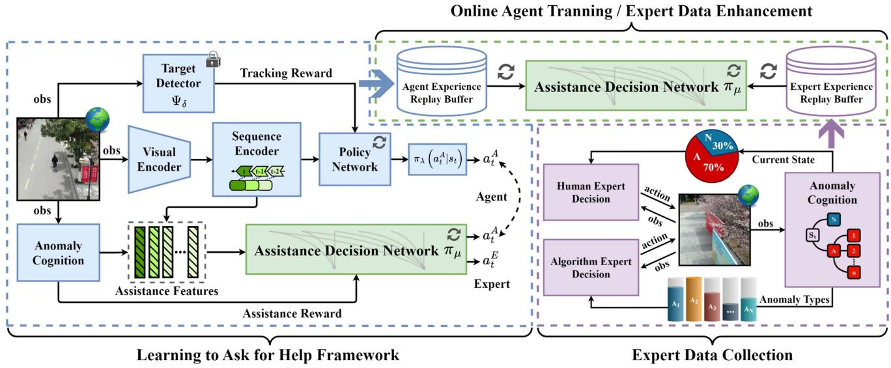  
Fig. 2. Overview of the proposed LA4H framework. The framework is composed of three key components: 1) the backbone of the LA4H (blue), where an agent learns both a tracking policy (πλ) and an assistance decision policy $( \pi _ { \mu } )$ to determine when to request help; 2) the expert data collection pipeline (purple), which gathers expert demonstrations based on recognized anomaly types; and 3) the agent training loop (green), which enhances the assistance policy by distilling knowledge from both agent and expert experience replay buffers.

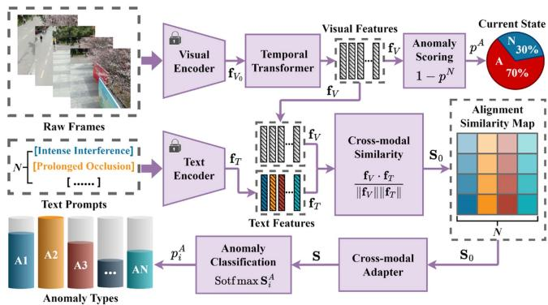  
Fig. 3. Architecture of the anomaly cognition module, which performs crossmodal alignment of spatio-temporal visual features and semantic text prompts for fine-grained anomaly recognition.

The right panel illustrates the process of the expert data collection. When encountering an anomalous state, the anomaly cognition module first recognizes its occurrence and classifies its type, and then inputs the current observation and the related anomaly information into both the human and the algorithmic expert decision modules. In this process, the human expert module provides assistance actions through remote expert instructions, while the algorithm expert module generates demonstrations by employing mature tracking algorithms or heuristic policies. Both modules independently provide high-quality expert assistance actions for the agent. Meanwhile, all expert decision actions and their corresponding observations $( s _ { t } , \bar { a } _ { t } ^ { E } )$ obtained through queries, after being labeled with anomaly types, are collectively stored in the expert experience replay buffer to support the subsequent optimization of the assistance decision network. To train the assistance decision policy $\pi _ { \mu } ,$ we maintain two separate replay buffers, an agent experience replay buffer for autonomous transitions and a expert experience replay buffer for intervention transitions. To address the data imbalance caused by the scarcity of anomalous states, we employ a balanced sampling strategy where training batches are constructed with a fixed 1 : 1 ratio of samples drawn from the agent and expert buffers, respectively. This ensures the agent effectively learns the boundary for requesting assistance without being biased toward the majority of normal states. Overall, the LA4H framework operates under the processes of the online agent training and the expert data enhancement, achieving continuous policy optimization through the adaptive switching of the autonomous agent decision-making and the expert assistance.

## B. Cross-Modal Anomaly Cognition Module

Fig. 3 illustrates the overview of the proposed cross-modal anomaly cognition module. The module integrates information from visual and textual modalities to achieve coarse-tofine-grained anomaly recognition and classification in complex surveillance scenarios. The complete pipeline consists of four main processes including information encoding, feature alignment, anomaly detection and anomaly classification. First, raw frames are input into a frozen visual encoder, which acquires dynamic image sequences and extracts the initial visual features $f _ { V _ { 0 } }$ . Then, the visual features are fed into a temporal transformer, which models temporal dependencies and captures temporal correlations, generating the enhanced spatio-temporal visual features representation $\bar { f } _ { V } \in \mathbb { R } ^ { D \times C }$ , where D denotes the length of the temporal observation sequence and C represents the common feature dimension shared by both modalities. Meanwhile, a set of predefined text prompts, each corresponding to a specific anomaly type (e.g., intense interference, prolonged occlusion), is input into a frozen text encoder, extracting the textual features representation $f _ { T } \in \mathbb { R } ^ { N \times C }$ , where N indicates the number of predefined anomaly categories. Subsequently, the cross-modal similarity module computes the normalized cosine similarity between the visual and textual features through matrix multiplication, forming the alignment similarity map $S _ { 0 } \in \mathbb { R } ^ { N \times D }$ given as

$$
S _ { 0 } = \frac { f _ { V } \cdot f _ { T } } { \vert \vert f _ { V } \vert \vert \vert \vert f _ { T } \vert \vert } ,\tag{9}
$$

where N represents the number of anomaly types, and D denotes the length of the image sequences. In our implementation, D is set to a fixed temporal window of 10 frames, utilizing a sliding window mechanism to capture the temporal dynamics of the most recent observations. The matrix indicates the degree of semantic alignment between current scene observations and textual descriptions of different potential anomalous events. The generated visual features $f _ { V }$ are also fed into the anomaly scoring module to compute the anomaly probability score $p ^ { A }$ for the current scene, with the corresponding normal state probability $p ^ { N }$ , given as

$$
p ^ { N } = 1 - p ^ { A } .\tag{10}
$$

To further achieve fine-grained anomaly classification, the crossmodal adapter maps the similarity matrix $S _ { 0 }$ to an anomaly decision features space, compensating for the cross-modal differences. This process outputs a refined feature matrix $S ,$ which is subsequently fed into the anomaly classification module. This module normalizes the prediction scores for all N anomaly types $( A _ { 1 } , A _ { 2 } , . . . , A _ { N } )$ through the Softmax function, outputting each anomaly type probability $p _ { i } ^ { A }$

iThrough the cross-modal features alignment mechanism, the anomaly cognition module effectively integrates temporal visual information with high-level semantic textual prior knowledge for inference. Unlike purely vision-based methods that heavily rely on learning statistical pixel patterns and require extensive labeled data for specific anomaly classes, our design employs text prompts as high-level semantic anchors. This provides two primary advantages. First, it bridges the semantic gap between low-level visual features and abstract anomaly concepts, enhancing generalization capabilities for rare and unseen anomalous events by leveraging pre-trained vision-language knowledge. Second, instead of simple binary detection, it enables finegrained classification of anomalies (e.g., distinguishing between “intense interference” and “prolonged occlusion”), which provides the assistance decision network with precise context to request the correct type of assistance.

## C. Teacher-Student Tracking Policy Learning

Fig. 4 illustrates the teacher-student framework for tracking policy learning, which integrates semantic modeling and policy distillation mechanism. The framework consists of a teacher-tracker network and a student-tracker network. The teacher-tracker network utilizes the Temporal AlexNet with temporal modeling capabilities as the backbone network $\varPhi _ { \varphi }$ for temporal features extraction. It processes both the current frame images and multi-scale multi-view template image sequences of the task target, generating sequential semantic embedding representations $\varphi ( { \pmb x } )$ and $\varphi ( z )$ . Then, the semantic similarity module calculates the cosine similarity between the task target features and the candidate features, given as

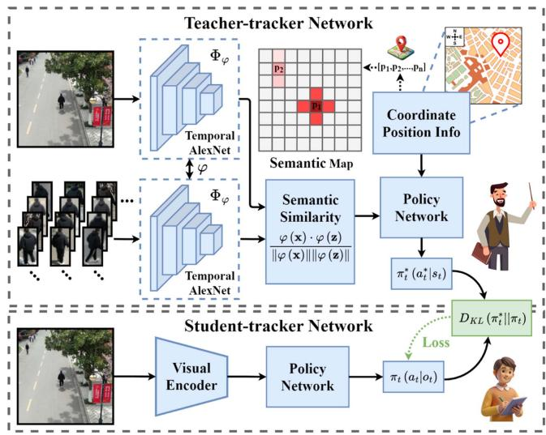  
Fig. 4. Overview of the teacher-student tracker network, illustrating semantic similarity-based tracking policy distillation.

$$
S ( X , Z ) = \frac { \varphi \left( \pmb { x } \right) \cdot \varphi \left( \pmb { z } \right) } { \left\| \varphi \left( \pmb { x } \right) \right\| \left\| \varphi \left( \pmb { z } \right) \right\| } .\tag{11}
$$

Specifically, similar to the dense correlation operation in Siamese networks, we treat the template feature $\varphi ( z )$ as a convolution kernel and perform a dense cosine similarity calculation across the spatial dimensions of the search region feature map $\varphi ( { \pmb x } )$ . This process generates a grid of similarity scores, which are embedded into a two-dimensional semantic map to represent the target spatial distribution. The map is combined with multiple candidate position coordinates $\left[ p _ { 1 } , p _ { 2 } , . . . , p _ { n } \right]$ to integrate semantic features with spatial position information, constraining the target spatial distribution and enhancing the spatial context representation. To incorporate spatial context, the 2D coordinate $( x _ { i } , y _ { i } )$ of each candidate position on the semantic map is first normalized and encoded through a lightweight positional embedding network. Each grid point in the semantic map corresponds to a candidate position $p _ { i }$ , serving to enhance the environment understanding of the policy network. This positional feature is then concatenated with the corresponding semantic similarity vector to form a spatial-semantic representation. The enriched fused features are used as input to the policy network, which enable the network to perform spatially informed action selection, generating the teacher policy $\pi _ { t } ^ { * } { \left( { a } _ { t } ^ { * } | { s } _ { t } \right) }$ and t tproviding teacher supervision signals to guide the student policy. Structurally, the policy network is implemented as a multilayer perceptron (MLP) consisting of two fully connected hidden layers with 512 and 256 neurons, respectively, and employs ReLU activation functions. The output layer contains 12 neurons corresponding to the discrete action space and is normalized through a Softmax function. Moreover, to address the scale discrepancy between continuous position coordinates and the discrete semantic map, we perform a spatial grid mapping. The normalized candidate coordinates are discretized to match the spatial resolution of the semantic feature map, ensuring that the position-informed semantic embeddings are spatially aligned for effective feature interaction. The student network only processes current frame images through a lightweight visual encoder, replacing the temporal network in the teacher network, and directly feeds the perceptual features to its policy network to generate the student policy $\pi _ { t } ( o _ { t } | s _ { t } )$ . The student network is trained by imitating the teacher policy, achieving knowledge distillation by minimizing the KL divergence between the teacher and student policy distributions:

$$
\mathcal { L } _ { \mathrm { d i s t i l l } } = D _ { \mathrm { K L } } \left( \pi _ { t } ^ { * } | | \pi _ { t } \right) ,\tag{12}
$$

which enables the student network to approach the performance of the teacher policy in the absence of temporal information.

This teacher-student paradigm transfers rich temporalsemantic knowledge from the teacher to a more lightweight student network, which enables the student tracker to maintain high tracking accuracy while significantly reducing computational complexity and enhancing real-time tracking performance and robustness.

## D. Anomaly State Determination Criteria

To establish a explicit criterion for distinguishing between normal and anomalous states, we integrate semantic similarity map analysis, temporal tracking consistency, and cross-modal anomaly cognition scoring to determine the current tracking state.

1) Normal State Criteria: A tracking state at time t is recognized as normal $( s _ { t } = s _ { n } )$ when the following conditions are simultaneously satisfied.

\- Tracking Confidence: The maximum similarity value in the semantic similarity map exceeds a predefined threshold

$$
\operatorname* { m a x } _ { i \in \{ 1 , 2 , . . . , n \} } v _ { t } ^ { i } \geq \tau _ { \operatorname { t r a c k } } ,\tag{13}
$$

where $v _ { t } ^ { i }$ represents the similarity value of the i-th peak tin the semantic map state $m _ { t }$ , and $\tau _ { \mathrm { t r a c k } }$ is the tracking confidence threshold, which is empirically set to 0.6 in our experiments.

\- Temporal Consistency: The task target is continuously tracked without interruption

$$
\begin{array} { r } { \mathbb { I } _ { \mathrm { t r a c k } } ^ { t - \Delta t : t } = 1 , } \end{array}\tag{14}
$$

where $\mathbb { I } _ { \mathrm { t r a c k } } ^ { t - \Delta t : t }$ is a binary indicator function that equals 1 if the target has been successfully tracked in all frames within the temporal window $[ t - \Delta t , t ]$ , and $\Delta t$ represents the temporal consistency window, which is set to 5 frames (approximately 1.0 second).

\- Anomaly Probability: The anomaly probability score remains below a threshold

$$
p _ { t } ^ { A } < \tau _ { \mathrm { a } } ,\tag{15}
$$

where $p _ { t } ^ { A }$ is the anomaly probability score output by the tanomaly cognition module, and $\tau _ { \mathrm { a } }$ is the anomaly cognition threshold, which is set to 0.5.

2) Prolonged Occlusion Criteria: A prolonged occlusion state $( s _ { t } = s _ { o c l } )$ is recognized when

\- Consecutive Tracking Failure: The task target tracking fails for a consecutive number of frames exceeding a threshold

$$
\sum _ { k = t - T _ { \mathrm { o c l } } } ^ { t } \left( 1 - \mathbb { I } _ { \mathrm { t r a c k } } ^ { k } \right) \geq \tau _ { \mathrm { f r a m e } }\tag{16}
$$

where $\mathbb { I } _ { \mathrm { t r a c k } } ^ { k }$ is a binary indicator of successful tracking at time k $( \mathbb { I } _ { \mathrm { t r a c k } } ^ { k } = 1$ if max $v _ { k } ^ { i } \geq \tau _ { \mathrm { t r a c k } }$ , otherwise 0), $T _ { \mathrm { o c l } }$ is i kthe observation window, which is set to 10 frames, and $\tau _ { \mathrm { f r a m e } }$ is the threshold for consecutive failure frames, which is set to 7 frames (approximately 1.4 seconds of continuous occlusion).

\- Semantic Map Degradation: The number of confidence peaks in the semantic similarity map drops significantly

$$
n _ { t } < \tau _ { \mathrm { p e a k } } \mathrm { ~  ~ \vee ~ } \operatorname* { m a x } _ { i } v _ { t } ^ { i } < \tau _ { \mathrm { m i n } }\tag{17}
$$

where $n _ { t }$ is the number of peaks in $m _ { t } , \tau _ { \mathrm { p e a k } }$ is the minimum number of valid peaks, which is set to 1, and $\tau _ { \mathrm { m i n } }$ is the minimum acceptable similarity value, which is set to 0.4.

\- Anomaly Scoring: The cross-modal alignment score for prolonged occlusion textual prompt exceeds a threshold

$$
p _ { \mathrm { o c l } , t } ^ { A } \geq \tau _ { \mathrm { o c l , c l s } }\tag{18}
$$

where $p _ { \mathrm { o c l } , t } ^ { A }$ represents the probability score for the pro-,tlonged occlusion anomaly class output by the anomaly classification module, and $\tau _ { \mathrm { o c l , c l s } }$ is set to 0.5.

3) Intense Interference Criteria: An intense interference state $( s _ { t } = s _ { i n t } )$ is recognized when

\- Multiple High-confidence Peaks: The semantic similarity map contains multiple peaks with similar high confidence values, indicating the presence of distractors.

$$
| \{ i : v _ { t } ^ { i } \geq \tau _ { \mathrm { c o n f } } \} | \geq \tau _ { \mathrm { m u l t i } } \land \sigma ( \{ v _ { t } ^ { i } : v _ { t } ^ { i } \geq \tau _ { \mathrm { c o n f } } \} ) \leq \tau _ { \mathrm { v a r } }\tag{19}
$$

where | · | denotes the cardinality of the set, $\tau _ { \mathrm { c o n f } }$ is the high-confidence threshold, which is set to $0 . 6 , \tau _ { \mathrm { m u l t i } }$ is the threshold for multiple candidate targets, which is set to $2 , \sigma ( \cdot )$ represents the standard deviation, and $\tau _ { \mathrm { v a r } }$ is the variance threshold, which is set to 0.15. The low variance indicates similar confidence levels among multiple candidates, reflecting semantic confusion in task target recognition.

\- Spatial Proximity of Peaks: Multiple high-confidence peaks are spatially close, making it difficult to recognize the task target

$$
\exists i \neq j , \| ( x _ { t } ^ { i } , y _ { t } ^ { i } ) - ( x _ { t } ^ { j } , y _ { t } ^ { j } ) \| _ { 2 } \leq \tau _ { \mathrm { d i s t } } \quad \land | v _ { t } ^ { i } - v _ { t } ^ { j } | \leq \tau _ { \mathrm { s i m } }\tag{20}
$$

where $( x _ { t } ^ { i } , y _ { t } ^ { i } )$ denotes the 2D coordinates of the i-th peak in $m _ { t } , \tau _ { \mathrm { d i s t } }$ is the spatial proximity threshold, which is set to 80 pixels in our 640 × 480 image resolution, and $\tau _ { \mathrm { s i m } }$ is the similarity difference threshold, which is set to 0.1.

\- Anomaly Scoring: The cross-modal alignment score for intense interference textual prompt exceeds a threshold

$$
p _ { \mathrm { i n t } , t } ^ { A } \geq \tau _ { \mathrm { i n t , c l s } }\tag{21}
$$

where $p _ { \mathrm { i n t } , t } ^ { A }$ is the probability score for the intense inter-,tference anomaly class output by the anomaly cognition module, and $\tau _ { \mathrm { i n t , c l s } }$ is set to 0.5.

All threshold values remain fixed throughout all experiments. These quantitative criteria ensure consistent and reproducible anomaly determination across different experimental scenarios.

## V. EXPERIMENT

In this section, we conduct a series of comprehensive experiments to validate the effectiveness of our proposed LA4H framework. We first detail the experiment setup, baseline methods, and evaluation metrics, followed by a thorough analysis of the results in both simulated and real-world scenarios.

## A. Experiment Setting

All training and part of the testing are conducted within the Gazebo simulation environment [61], a high-fidelity 3D robotics simulator integrated with the robot orperating system (ROS). We employ the Hector quadrotor model1 as our UAV agent, which operates at an initial height of 3.5 m. The UAV motion is governed by a discrete action space of 12 distinct commands that adjust its forward and rotational velocities, with maximum linear and angular speeds set to 1 m/s and 1 rad/s, respectively. This design simplifies the policy optimization process and supports robust sim-to-real deployment by aligning high-level agent decisions with low-level discrete motion commands, which ensures training stability and compatibility with real-world UAV control primitives. The agent perceives its environment through an onboard forward-facing optoelectronic pod with a $1 2 0 ^ { \circ }$ horizontal and 90◦ vertical field of view, receiving a new observation approximately every 0.2 seconds. Leveraging Gazebo realistic sensor simulation and flexible customization, we design complex scenarios that replicate the core challenges of anomaly active target tracking. In simulation, the task target does not follow a static trajectory. Instead, it moves based on parameterized and randomized motion patterns to reflect realistic and dynamic behaviors. These include straight-line motion, zigzag paths, circular navigation, and random waypoint following. To increase unpredictability, the target is programmed to occasionally perform abrupt direction changes, pauses, and acceleration, which simulate evasive behaviors. Additionally, in some scenarios, the target exhibits interaction-aware motion by blending with dynamic distractors or deliberately walking into occluded areas, such as behind buildings and tree shadows. This procedural trajectory generation ensures diverse and complex motion without being strictly deterministic, thereby testing the policy robustness to trajectory uncertainty and environment interaction. In real-world deployments, the target (human subject) follows loosely scripted but naturalistic motion patterns in urban outdoor environments. These include smooth or abrupt turns, entering and exiting occluded regions, temporary stops, as well as visual confusion with surrounding pedestrians. This setup ensures realistic evaluation of the LA4H framework under natural human motion patterns.

1) Baselines: To rigorously evaluate the performance of our LA4H framework, we compare it with a range of baseline methods. These include a state-of-the-art embodied agent without an assistance mechanism, as well as agents equipped with simpler, non-learned strategies for requesting expert assistance.

EmbCLIP: The EmbCLIP is a state-of-the-art embodied AI baseline that leverages large-scale pre-trained visionlanguage models for perception and decision-making. In our experiments, EmbCLIP serves as a strong reference for end-to-end active target tracking without explicit expert-in-the-loop assistance. The agent processes visual observations using a CLIP-based encoder and directly outputs actions through a learned policy. While Emb-CLIP demonstrates strong generalization in many embodied tasks, it does not incorporate any explicit mechanism for anomaly detection or expert intervention, making it a suitable baseline for evaluating the benefits of integrating expert assistance in challenging UAV anomaly tracking scenarios.

\- Probability Helper: The Probability Helper baseline employs a simple strategy to request expert assistance. Specifically, at every decision step, the agent samples from a Bernoulli distribution, with probability ${ \mathrm { ~ ~ p , ~ } }$ it takes the expert action, and with probability 1 − p, it follows its own policy. By varying $p ,$ we can control the overall level of expert intervention and analyze the trade-off between autonomy and expert reliance. This baseline does not require access to the internal model parameters and serves as a simple effective way to benchmark the impact of random expert assistance.

Heuristic Helper: The Heuristic Helper baseline requests expert assistance based on the agent action confidence. At each time step, the agent computes the difference between the highest and second-highest action probabilities. If this difference is below a predefined threshold $\epsilon ,$ indicating that the agent is not sufficiently confident in its decision (i.e., it is “confused”), the agent requests the expert assistance; otherwise, it acts autonomously. Specifically, the assistance is requested at time step t if the difference between the probabilities of its top two predicted actions, $p _ { \mathrm { s o r t e d } } ^ { t } [ 0 ]$ and $p _ { \mathrm { s o r t e d } } ^ { t } [ 1 ]$ , is less than a small threshold :

$$
p _ { \mathrm { s o r t e d } } ^ { t } [ 0 ] - p _ { \mathrm { s o r t e d } } ^ { t } [ 1 ] < \epsilon .\tag{22}
$$

This approach provides an interpretable rule-based heuristic mechanism for invoking expert intervention, especially in ambiguous or uncertain situations.

CEL (Rules): This baseline is our implementation of the cognitive embodied learning framework [62], a method inspired by the dual decision-making system of the human brain. The CEL enables an agent to dynamically switch between a standard embodied learning policy for normal tracking and a rule-based reasoning mode for handling severe anomalies. This approach is designed to overcome the training divergence and test failures that typically affect end-to-end learning methods in extreme conditions.

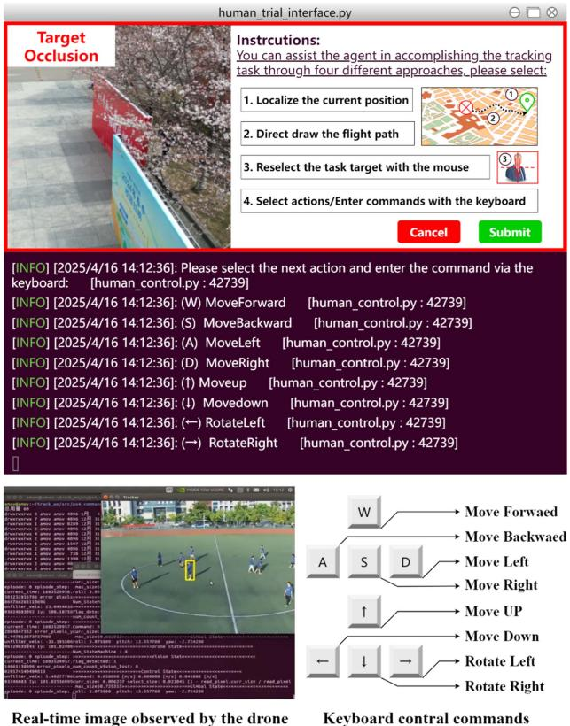  
Fig. 5. Expert assistance interactive interface. The above picture illustrates the interactive interface for expert-in-the-loop assistance, which supports multiple intervention modes and real-time commands feedback. The below picture shows the schematic diagram of the UAV real-time observation interface and expert keyboard control commands mapping.

\- Human: We include performance from human experts as a practical upper bound. The human operator controls the UAV using the interactive interface shown in Fig. 5 to provide an estimate of optimal performance.

2) Evaluation Metrics: To provide a comprehensive and quantitative performance evaluation of our agent and baseline methods, we employ three key metrics: success rate (SR), relative path length (RPL), and success relative path length (SRPL).

\- Success Rate (SR) quantifies the agent effectiveness in completing the tracking task. It is defined as the fraction of episodes that are successfully completed over the total number of evaluation episodes. The formula is:

$$
\mathrm { S R } = \frac { 1 } { N _ { \mathrm { t o t a l } } } \sum _ { i = 1 } ^ { N _ { \mathrm { t o t a l } } } S _ { i } ,\tag{23}
$$

where $N _ { \mathrm { t o t a l } }$ is the total number of trials, and $S _ { i }$ is a binary indicator of success for the i-th trial $( S _ { i } = 1$ if successful, 0 otherwise).

\- Relative Path Length (RPL) measures the path efficiency exclusively for the successful trials. It is the ratio of the agent actual path length $L _ { \mathrm { a c t } }$ to the shortest possible path length $L _ { \mathrm { o p t } }$ from the start to the task target final location.

It is calculated as:

$$
\mathrm { R P L } = \frac { 1 } { N _ { \mathrm { s } } } \sum _ { i \in \mathrm { S } } \frac { L _ { \mathrm { a c t } } ^ { ( i ) } } { L _ { \mathrm { o p t } } ^ { ( i ) } } ,\tag{24}
$$

where $N _ { \mathrm { s } }$ is the number of successful trials. An ideal RPL is 1.0, with values greater than 1 indicating a less efficient, longer path.

\- Success Relative Path Length (SRPL) jointly considers both the success rate and path efficiency in a single score. An agent is rewarded only if it succeeds, and this reward is scaled by its path efficiency. The formula is:

$$
\mathrm { S R P L } = \frac { 1 } { N _ { \mathrm { t o t a l } } } \sum _ { i = 1 } ^ { N _ { \mathrm { t o t a l } } } S _ { i } \frac { L _ { \mathrm { o p t } } ^ { ( i ) } } { \operatorname* { m a x } ( L _ { \mathrm { a c t } } ^ { ( i ) } , L _ { \mathrm { o p t } } ^ { ( i ) } ) } .\tag{25}
$$

The SRPL penalizes both failures (where $S _ { i } = 0 )$ and inefficient paths (where $L _ { \mathrm { a c t } } ^ { ( i ) } > L _ { \mathrm { o p t } } ^ { ( i ) } )$ , making it an excellent measure of overall agent quality.

By employing these metrics, we rigorously assess both the effectiveness and efficiency of the agents in the anomaly active target tracking task.

3) Expert Implementation Details: We detail the implementation of both expert types to ensure reproducibility.

\- Human Experts: We recruit five PhD students specializing in the field of UAVs. All human experts have prior experience in ROS/Gazebo-based UAV operation and are trained to use our interactive expert-assistance interface (Fig. 5). They execute specific interventions (e.g., path drawing, keyboard control) to recover the agent from anomalies. A unified protocol ensures consistent recovery behavior across participants.

\- Algorithmic Experts: The algorithmic expert is implemented as an oracle policy that leverages privileged information (ground-truth states) from the Gazebo engine. It applies global path planning (e.g., A∗, RRT∗) for occlusion recovery and uses ground-truth bounding boxes and ID verification information to resolve target-distractor confusion. Expert actions $( s _ { t } , a _ { t } ^ { E } )$ are collected as near-optimal t tdemonstrations for the assistance policy training.

## B. Expert Assistance Interactive Interface

Fig. 5 illustrates the expert assistance interactive interface and corresponding operation modes for UAV active target tracking tasks. The above figure shows an example of the expert assistance interface when the UAV encounters prolonged occlusion and loses the task target. The interface provides states information through visual and textual prompts. When the anomaly cognition module recognizes anomalous states, such as prolonged occlusion and intense interference, the expert operation panel automatically displays on the interface. The right side of the interface panel provides four available expert assistance options in detail, including: (1) Target relocation, achieve visual re-identification and localization through map clicking, applicable when the task target is lost; (2) Path drawing, directly draw the UAV flight path, applicable for obstacle avoidance; (3) Target reselection, reselect the task target through the mouse, suitable for misidentification and ID reversal issues; (4) Command input, control UAV movements by entering commands through the keyboard, suitable for precise motion control. The terminal window at the bottom of the interface displays real-time expert command inputs and corresponding action feedback information. The execution logs are preserved, enabling experts to flexibly select the most appropriate intervention method to assist the UAV in completing the tracking task.

The below figure further demonstrates the specific operations of expert control over the UAV through keyboard commands. The left panel displays the real-time images observed by the UAV and corresponding system states information (e.g., position information, pixel errors, tracking states), providing contextual information to support operational decision-making. The right panel shows the mapping relationship between various standard keyboard control commands and UAV maneuvers, including basic operations such as moving forward, backward, left, right, ascending, descending, and yaw rotation. This enables precise multi-degree-of-freedom remote control of the UAV, facilitating rapid adjustments of flight attitude and perspective in anomalous states.

In summary, Fig. 5 demonstrates the interaction process and operation details of the expert assistance interactive interface. This design provides a concise, efficient and intuitive expert intervention approach for UAV in complex anomalous scenarios, enabling experts to quickly engage in system control, which significantly enhancing the system operability and human-machine collaboration efficiency.

## C. Training Results

In the training scenario involving anomalies, we train five different agents, namely, LA4H, CEL (Rules), Probability Helper, Heuristic Helper, and EmbCLIP. The results are shown in Fig. 6. Specifically, in each training episode with limited steps, the agent initiates the task from a randomly assigned starting position. Once the task target is identified, the agent continuously tracks it until the episode terminates, either upon reaching the maximum number of episode steps or losing sight of the task target. Subsequently, the agent restarts the task with a new random initial position. During the training process, we track the training evaluation metrics for each agent. The training evaluation metrics, including the average episodes reward and the task success rate, are defined as the mean of the accumulated episodes rewards and the proportion of successful task completions over the past 1000 episodes (from episode n − 1000 to episode n). A higher training evaluation metric indicates that the agent successfully tracks the task target in more episodes, maintains a longer tracking duration, and learns a more efficient tracking policy. The solid line represents the average performance over five training results for each method, while the shaded area indicates the 95% confidence interval derived from the rolling standard deviation across these experiments.

As shown in Fig. 6(a), the average episodic rewards of all methods increase as training progresses, indicating that each method successfully acquires corresponding policies during the learning process. The proposed LA4H maintains a superior average episodes reward throughout the entire training process and achieves a value close to 40 after approximately 56 K training episodes, significantly outperforming all other baselines. This advantage is attributed to its efficient anomaly cognition and expert consultation mechanism, indicating a stronger policy learning capability and a higher performance upper bound. Moreover, the LA4H demonstrates substantial performance improvement in the early training phase (around 12 K episodes), rapidly diverging from other methods. This suggests that the LA4H can efficiently extract relevant information from the data and adapt to the anomaly tracking task, reflecting its superior sample efficiency. Notably, from the standard deviation observed during the training process, the LA4H exhibits a good stability in the later training phase. Its reward curve shows small fluctuations with a narrow shadow region, indicating a desirable convergence and a low policy uncertainty. Consistent with the reward trends, the LA4H achieves the highest average task success rate among all methods, rapidly surpassing 80% after about 40 K episodes and eventually stabilizing close to 95%. This demonstrates not only its learning efficiency but also its robust task execution capability. The low variance further suggests its excellent policy reliability throughout the training process.

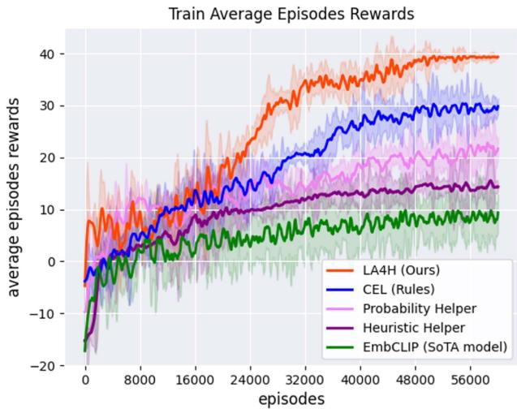  
(a)

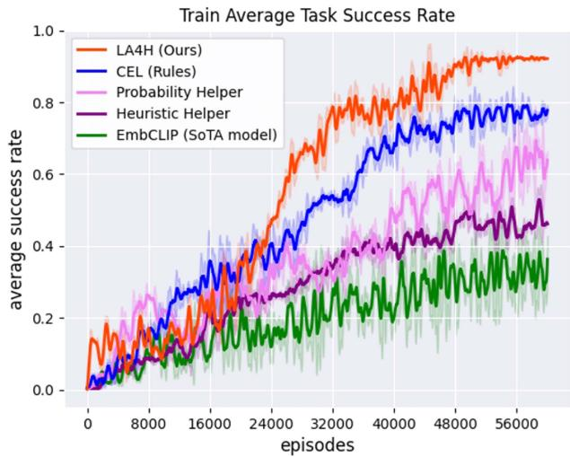  
(b)  
Fig. 6. Training performance of different methods, showing a) average episodes rewards and b) average task success rates across training episodes.

The rule-based CEL exhibits suboptimal performance, achieving a lower final average episodes reward (approximately 30) compared to the LA4H. Nevertheless, the CEL demonstrates a relatively rapid convergence at the beginning of training, particularly showing a significant reward increase between 16 K and 32 K episodes, indicating its initial policy learning efficiency. However, the performance improvement of the CEL gradually diminishes with further training, indicating its limited capability in handling more complex anomalies. This limitation is attributed to its rule-based policy framework, which relies on manually crafted rules. These predefined rules are tailored to particular anomaly scenarios, which are insufficient to comprehensively cover the different anomalous states encountered in complex task environments. Although the CEL exhibits certain advantages on anomaly tracking tasks characterized by relatively clear structures, its performance is significantly inferior to the LA4H in more challenging scenarios with unstructured anomalies. When the rules defined in the CEL cannot accurately capture the intrinsic characteristics of the specific anomalous states encountered in tracking tasks, its generalization ability is consequently constrained. In terms of the task success rate, the final performance of the CEL is slightly below 80%, which is lower than that of the LA4H. Its success rate curve shows a steady increase and stabilizes in the later training phase, reflecting its effectiveness and reliability in accomplishing the tracking task within structured environments. However, the relatively limited upper bound after convergence suggests its insufficient adaptability to increasingly complex anomaly scenarios.

The Probability Helper and the Heuristic Helper demonstrate promising effectiveness in the initial training phase. However, their performance improvement is limited in subsequent episodes, ultimately underperforming compared to the LA4H and the CEL. Specifically, the Probability Helper exhibits moderate performance, achieving a final average episodes reward of approximately 22. Meanwhile, significant fluctuations are observed during the training process, indicating that the method is sensitive to anomalies in the environment and lacks sufficient policy stability. Moreover, the probability-based expert assistance mechanism of the Probability Helper shows insufficiency in determining the appropriate timing for expert intervention, leading to its inability to effectively converge to the optimal policy and impacting the overall learning performance. Correspondingly, the Probability Helper achieves a final task success rate of around 65%. Its success rate curve exhibits noticeable fluctuations, consistent with the instability observed in the reward curve. This suggests a degree of policy uncertainty, especially in complex anomaly scenarios. Its early convergence before 50 K episodes indicates limited potential for further improvement in the later stage of learning. In contrast, the Heuristic Helper solely outperforms the EmbCLIP, with a final average episodes reward of around 14. Its performance increase is slow but relatively stable. However, since the Heuristic Helper leverages expert assistance based on the heuristic method, it adopts a relatively conservative policy, which limits the exploration and constrains potential performance improvements. Similarly, the Heuristic Helper reaches a final task success rate of around 45%. While the learning curve is less noisy compared to other methods, the low ceiling and slow growth indicate that its conservative expert assistance hinders effective policy evolution in the presence of complex anomalies.

The EmbCLIP, as the current state-of-the-art (SoTA) model, exhibits a relatively slower learning speed and a lower final reward. Specifically, compared to other methods, the learning curve of the EmbCLIP exhibits a notably slow increase, consistently remains at a low level. It ultimately converges to an average episodes reward around 10, and even negative reward is observed during the initial phase. This indicates its insufficient generalization in the anomaly tracking task and the limited transferability of the pre-trained features. Moreover, the training process of the EmbCLIP demonstrates a high standard deviation, indicating significant performance fluctuations, particularly in the early phase where the model exhibits poor stability. These results suggest that although the EmbCLIP achieves superior performance in other embodied tasks, it is not the optimal choice for the current tracking task. This is further exemplified by its task success rate, which lags behind all other methods and converges around just 35%. The slow and noisy growth trend, coupled with high variance in the early phase, reflects its limited effectiveness and poor stability, mirroring its shortcomings in adapting pretrained features for anomaly handling.

## D. Test Results

We conduct extensive UAV anomaly active target tracking experiments in both simulated and real-world scenarios to validate the superior performance of our proposed LA4H framework in leveraging expert assistance to handle anomalous states. Fig. 7(a) to (c) systematically demonstrates the comparative performance of different methods across multiple key metrics in test scenarios with varying numbers of distractors. The evaluation metrics include the success rate (SR%), the expert proportion (EP%), the relative path length (RPL), and the success relative path length (SRPL).

As shown in Fig. 7(a), the LA4H achieves the highest success rate in all interference conditions, maintaining superior performance from 94.5% SR with 3 distractors to 88.9% SR with 9 distractors, significantly outperforming the other methods. Meanwhile, the EP of the LA4H consistently remains at a low level, increasing only from 43.5% to 47.1%. This indicates its minimal reliance on expert assistance while successfully completing the tracking tasks. In contrast, the CEL shows lower SR, with its SR dropping from 91.1% to 77.5%. Its EP are higher than that of the LA4H, with notable increases in complex scenarios with higher interference levels, indicating more expert interventions. Moreover, the Probability Helper and the Heuristic Helper exhibit substantial performance degradation with increasing number of distractors. Their SR decreases from 87.6% and 84.3% to 69.3% and 61.2%, respectively. Their expert assistance dependence also increases significantly, particularly for the Heuristic Helper, with its EP rapidly increasing from approximately 75.0% to nearly 89.0%. The heavy reliance on expert assistance limits their applicability in practical target tracking tasks with the intense interference anomalous state.

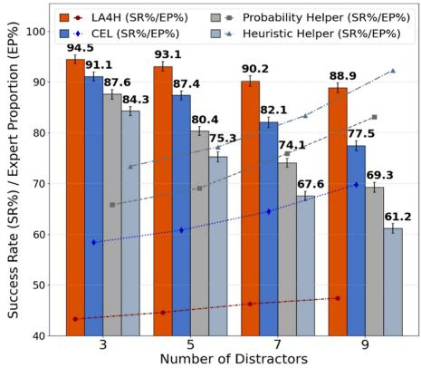  
(a)

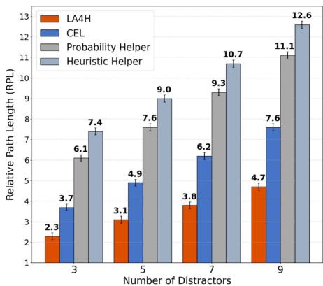  
(b)

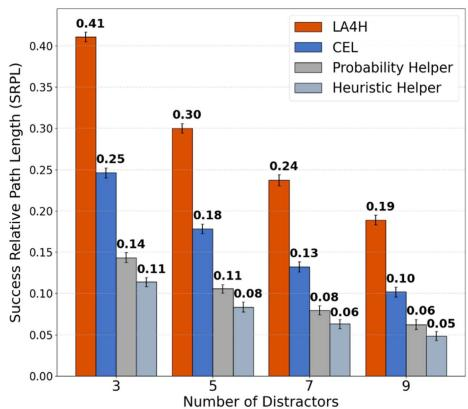  
(c)  
Fig. 7. Test performance evaluation of different methods under varying numbers of distractors: a) success rate (%) and expert proportion (%), b) relative pat length, and c) success relative path length.

Fig. 7(b) further evaluates the path efficiency with the performance metric RPL. The results indicate that the LA4H achieves optimal path efficiency compared to other methods. Specifically, when the number of distractors is 3, 5, 7, and 9, the RPL of the LA4H is 2.3, 3.1, 3.8, and 4.7, respectively. The RPL increases from 2.3 to 4.7, with a minimal and gradual increment, demonstrating strong stability and adaptability, and reflecting its superior task completion efficiency. In comparison, the CEL shows inferior performance, with the RPL of 3.7, 4.9, 6.2, and 7.6 in corresponding interference conditions, significantly higher than that of the LA4H. Its path efficiency exhibits a notable decrease as the task complexity increases. The RPL of the Probability Helper and the Heuristic Helper grows rapidly with increasing number of distractors. When encountering 9 distractors, the Heuristic Helper achieves a RPL of 12.6, and the Probability Helper reaches 11.1, indicating significant path redundancy in intense interference scenarios. This substantial deviation from optimal trajectories severely impacts the task execution efficiency. Overall, the LA4H demonstrates superior task completion efficiency. Its low and stable RPL indicates the ability to complete the tracking tasks with minimal path deviation, maintaining high path efficiency with multiple distractors. While other methods show adequate performance in relatively simple scenarios, their task completion efficiency degrades rapidly as the level of interference increases.

Fig. 7(c) displays the SRPL of each method to evaluate the comprehensive performance of the task effectiveness and the path efficiency. While the SRPL of all methods decreases with the increasing number of distractors, the LA4H continues to maintain its superior performance. When the number of distractors is 3, 5, 7, and 9, the SRPL of the LA4H is 0.41, 0.30, 0.24, and 0.19, respectively. Although there is a slight decrease with more distractors, its overall performance remains at a high level, significantly surpassing that of the other methods. The CEL shows lower performance compared to the LA4H, with its SRPL dropping from 0.25 to 0.10. The Probability Helper and the Heuristic Helper exhibit the poorest SRPL, with their performance decreasing most dramatically in complex scenarios with severe distractors interference. When the number of distractors increases to 9, their SRPL drops to 0.06 and 0.05, respectively, reaching only 30% of the LA4H performance. In conclusion, in test scenarios with the intense interference anomaly, the LA4H demonstrates superior overall performance across all evaluation metrics, leading other methods in task success rate while maintaining high task completion efficiency with minimal expert dependence.

Fig. 8(a) to (c) further compare the performance of different methods under varying occlusion ratios. Regarding the SR, the LA4H maintains the best performance. As the occlusion ratio increases, its SR decreases from 91.3% (40% occlusion) to 84.1% (70% occlusion), remaining at a high level. Meanwhile, it consistently shows the lowest EP, increasing only from approximately 46.0% to 52.0%, demonstrating its ability to effectively utilize the expert assistance for handling the prolonged occlusion anomaly. The CEL shows inferior performance, with its SR decreasing from 86.6% to 72.9%, while its EP increases from 62.5% to 77.4%, demonstrating higher reliance on the expert assistance compared to the LA4H. The Probability Helper and the Heuristic Helper exhibit severe performance degradation under high occlusion ratios, with their SR dropping from 81.4% and 77.8% to 55.5% and 49.4%, respectively. Moreover, they show more significant increases in EP, especially for the Heuristic Helper, with its EP reaching nearly 100% at an occlusion ratio of 70%, indicating that the decision-making in high occlusion scenarios almost completely relies on the expert assistance.

For the path efficiency, the RPL of the LA4H is the lowest. As the occlusion ratio increases from 40% to 70%, its RPL only rises from 2.8 to 5.2, while that of the CEL increases from 4.1 to 8.0. The Probability Helper and the Heuristic Helper perform the poorest. When the occlusion ratio is 70%, their RPL reaches 12.4 and 13.9, respectively, indicating that they generate a lot of redundant paths and ineffective operations. The trend of the SRPL is consistent with the above metrics. The SRPL of the LA4H decreases from 0.33 to 0.16, while that of the CEL drops from 0.21 to 0.09, with the Probability Helper and the Heuristic Helper both falling to extremely low levels (around 0.04). In summary, in complex perception scenarios with high occlusion, the LA4H continues to demonstrate the outstanding performance exhibited in the intense interference scenarios, showing its comprehensive advantages of high task success rate, low dependence on the expert assistance, and excellent task efficiency, which further validates its potential for practical applications.

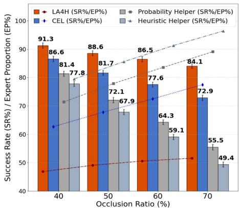  
(a)

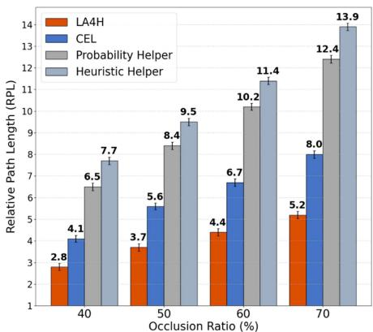  
(b)

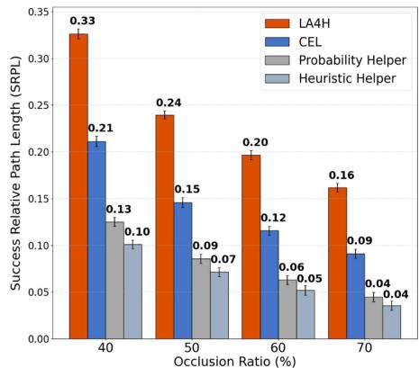  
(c)

Fig. 8. Test performance evaluation of different methods under varying occlusion ratios: a) success rate (%) and expert proportion (%), b) relative path length, and c) success relative path length.  
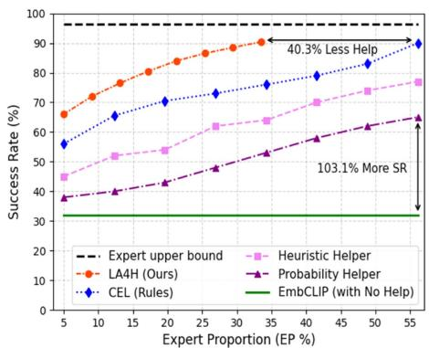  
(a)

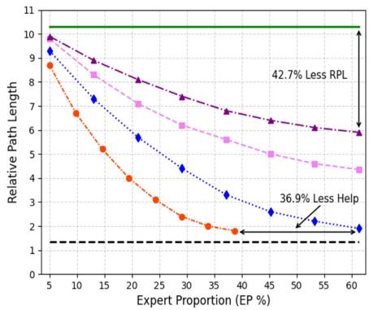  
(b)

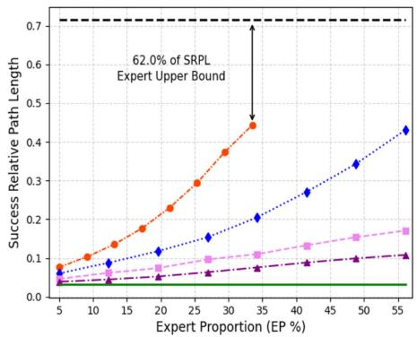  
(c)  
Fig. 9. Performance analysis of different methods under varying expert proportions: a) success rate (%), b) relative path length, and c) Success Relative Path Length. The LA4H consistently outperforms all other compared methods and approaches the expert upper bound with less assistance, achieving a superior trade-off between tracking performance and the requested level of expert intervention.

## E. Test Performance Analysis

Fig. 9 illustrates the performance of the LA4H compared to the baselines under different EP constraints, which is measured by three metrics: SR, RPL, and SRPL.

As shown in Fig. 9(a), the LA4H outperforms all baselines in SR by effectively leveraging limited expert assistance. Notably, when the EP is only 5.0%, its SR reaches 66.0%. As the EP increases, the LA4H exhibits significant performance gains. Specifically, when the EP reaches 33.5%, its SR exceeds 90.0%, approaching the upper bound of expert performance. The expert performance upper bound is 96.5%, represented by the black dashed line. The value is less than 100.0% due to the presence of environment noise. In contrast, the CEL(Rules) requests a significantly higher EP of approximately 56.1% to achieve a comparable SR of 90.0%, while the LA4H achieves the same performance with a 40.3% reduction in the requested expert participation. Moreover, it is noteworthy that when the EP is 56.1%, the expert-assisted baseline Probability Helper achieves a SR of 65.0%, while the EmbCLIP without any expert assistance achieves only 32.0%. The Probability Helper outperformed the EmbCLIP by 103.1%, indicating the effectiveness of expert assistance in improving task performance. The aforementioned experiment results demonstrate that the LA4H can effectively leverage expert assistance to maximize task success rate while minimizing expert intervention.

Regarding the task completion efficiency, the LA4H maintains its superior performance over all baselines. As shown in Fig. 9(b), when the proportion of expert assistance is relatively low, the LA4H achieves a comparable RPL to the three other baselines that leverage expert assistance. Specifically, when the EP is 5%, the RPL of LA4H, CEL(Rules), Heuristic Helper, and Probability Helper are 8.7, 9.3, 9.8, and 9.9, respectively. These are all close to the performance of the unassisted EmbCLIP, which achieves a RPL of 10.3. As the EP increases, the RPL of all methods except EmbCLIP decrease to varying degrees, with the LA4H showing the most significant decline. When the EP increases to 38.7%, the RPL of LA4H decreases to 1.8, approaching the lower bound of expert performance $( R P L = 1 . 3 5 )$ . Remarkably, in order for CEL(Rules) to achieve a comparable RPL, it must increase its EP to 61.3%, approximately twice the proportion of expert assistance used by the LA4H. Moreover, when the EP is 61.3%, the RPL of Probability Helper is 5.9, a 42.7% reduction compared to the EmbCLIP, validating the efficacy of expert assistance in improving task completion efficiency. The above results demonstrate that the LA4H significantly improves task completion efficiency and reduces reliance on expert assistance while maintaining a high task completion performance.

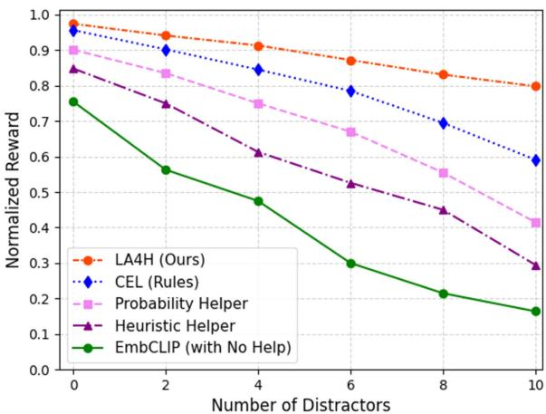  
(a)

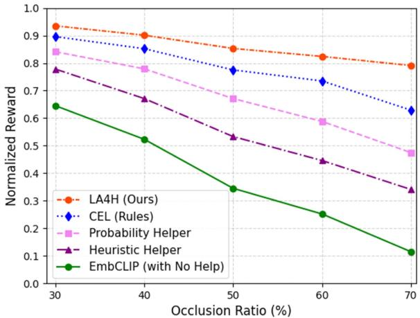  
(b)  
Fig. 10. Normalized reward varying with number of distractors and occlusion ratios.

As introduced in previous section, the SRPL is a comprehensive evaluation metric that considers both task completion performance and efficiency. Fig. 9(c) compares the SRPL performance of all methods under different EP constraints. Similar to the initial phase observed in Fig. 9(b), when the EP is low, the SRPL of all considered methods, including the LA4F, is relatively poor, approaching the performance of the EmbCLIP without expert participation $( S R P L = 0 . 0 3 )$ . This indicates that the methods cannot handle anomalous states independently of expert assistance. As the EP increases, all methods show improvement in SRPL. Compared to other methods, the Probability Helper and the Heuristic Helper demonstrate limited improvement. When the EP reaches 56.1%, their SRPL are only 0.17 and 0.11, respectively. The improvement of the CEL (Rules) is relatively noticeable, with its SRPL reaching 0.43 when the EP reaches 56.1%. The LA4F continues to exhibit the best performance, significantly outperforming other baselines. Its SRPL increases substantially with the increasing EP. The LA4F achieves a SRPL of around 0.45 at the EP of 33.5%, approximately 62.0% of the expert upper bound (SRP L = 0.71). From the figures and the SRPL calculation formula, it can be observed that the SR has a significant influence on the SRPL. Consequently, the variation trends of SRPL for different methods in Fig. 9(c) resemble the corresponding SR trends in Fig. 9(a), but the magnitude of the changes is greater in Fig. 9(c). The above results demonstrate that the increasing EP has a significant impact on the SRPL, but different methods exhibit varying sensitivities to the EP changes, and certain methods can approach the expert performance upper bound under the specific EP conditions. By effectively leveraging expert assistance, the LA4F achieves optimal performance through balancing the task performance, task completion efficiency, and the level of expert intervention. Moreover, the interplay between the assistance penalty and the teacher-student learning acts as an implicit curriculum. As the student-tracker capability improve through the distillation during the training process, the need to pay the penalty $( r _ { t } ^ { r } )$ for expert intervention is reduced. Consequently, tthe agent gradually evolves from frequent assistance requesting to autonomous tracking, avoiding the “lazy” policy trap often observed in heuristics-based baselines and fixed-penalty scheduling strategies.

## F. Normalized Reward Performance

Fig. 10 illustrates the normalized reward performance of different methods in two typical anomaly test scenarios, which evaluates the influence of increasing number of distractors and occlusion ratios, respectively. The compared methods include the proposed LA4H, the rule-based CEL, two expert-assisted frameworks (Probability Helper and Heuristic Helper), and the EmbCLIP (without expert assistance) serving as the baseline.

Fig. 10(a) shows the trend of the normalized reward variations for each method as the number of distractors increases from 0 to 10. The LA4H achieves the highest normalized reward in all distraction conditions and exhibits minimal performance degradation as the number of distractors increases. When the number of distractors reaches 10, the LA4H maintains a normalized reward above 0.80, demonstrating its perception robustness and decision stability against visual distractions. In contrast, the CEL exhibits inferior performance compared to the LA4H, with its reward decreasing substantially from 0.95 to 0.59. The Probability Helper and the Heuristic Helper show rapid performance degradation when the number of distractors exceeds 6, with their normalized rewards dropping from 0.90 to 0.41 and from 0.85 to 0.29, respectively. Moreover, the EmbCLIP almost completely failed in more complex interference scenarios, with its reward dropping below 0.2 when 10 distractors are present.

TABLE I  
GENERALIZATION PERFORMANCE EVALUATION IN NEW TEST SCENARIOS WITH VARYING NUMBERS OF DISTRACTORS
<table><tr><td rowspan=2 colspan=1>Method</td><td rowspan=1 colspan=3>3 distractors</td><td rowspan=1 colspan=3>5 distractors</td><td rowspan=1 colspan=3>7 distractors</td><td rowspan=1 colspan=3>9 distractors</td></tr><tr><td rowspan=1 colspan=1>SR(%)</td><td rowspan=1 colspan=1>RPL</td><td rowspan=1 colspan=1>SRPL</td><td rowspan=1 colspan=1>SR(%)</td><td rowspan=1 colspan=1>RPL</td><td rowspan=1 colspan=1>SRPL</td><td rowspan=1 colspan=1>SR(%)</td><td rowspan=1 colspan=1>RPL</td><td rowspan=1 colspan=1>SRPL</td><td rowspan=1 colspan=1>SR(%)</td><td rowspan=1 colspan=1>RPL</td><td rowspan=1 colspan=1>SRPL</td></tr><tr><td rowspan=1 colspan=1>EmbCLIP (SoTA)</td><td rowspan=1 colspan=1>46.5</td><td rowspan=1 colspan=1>20.9</td><td rowspan=1 colspan=1>0.022</td><td rowspan=1 colspan=1>24.9</td><td rowspan=1 colspan=1>38.4</td><td rowspan=1 colspan=1>0.006</td><td rowspan=1 colspan=1>-</td><td rowspan=1 colspan=1>-</td><td rowspan=1 colspan=1></td><td rowspan=1 colspan=1>-</td><td rowspan=1 colspan=1>-</td><td rowspan=1 colspan=1>–</td></tr><tr><td rowspan=2 colspan=1>Heuristic HelperProbability Helper</td><td rowspan=1 colspan=1>78.9</td><td rowspan=1 colspan=1>8.2</td><td rowspan=1 colspan=1>0.096</td><td rowspan=1 colspan=1>70.1</td><td rowspan=1 colspan=1>9.9</td><td rowspan=1 colspan=1>0.071</td><td rowspan=1 colspan=1>61.4</td><td rowspan=1 colspan=1>11.7</td><td rowspan=1 colspan=1>0.052</td><td rowspan=1 colspan=1>54.4</td><td rowspan=1 colspan=1>13.6</td><td rowspan=2 colspan=1>0.0400.052</td></tr><tr><td rowspan=1 colspan=1>81.7</td><td rowspan=1 colspan=1>7.0</td><td rowspan=1 colspan=1>0.117</td><td rowspan=1 colspan=1>73.7</td><td rowspan=1 colspan=1>8.6</td><td rowspan=1 colspan=1>0.086</td><td rowspan=1 colspan=1>66.8</td><td rowspan=1 colspan=1>10.1</td><td rowspan=1 colspan=1>0.066</td><td rowspan=1 colspan=1>61.6</td><td rowspan=1 colspan=1>11.8</td></tr><tr><td rowspan=3 colspan=1>CEL (Rules)LA4H (Ours)Human</td><td rowspan=1 colspan=1>86.5</td><td rowspan=1 colspan=1>4.3</td><td rowspan=1 colspan=1>0.201</td><td rowspan=1 colspan=1>82.3</td><td rowspan=1 colspan=1>5.6</td><td rowspan=1 colspan=1>0.147</td><td rowspan=1 colspan=1>75.9</td><td rowspan=1 colspan=1>6.8</td><td rowspan=1 colspan=1>0.112</td><td rowspan=1 colspan=1>71.1</td><td rowspan=1 colspan=1>8.2</td><td rowspan=1 colspan=1>0.087</td></tr><tr><td rowspan=1 colspan=1>92.3</td><td rowspan=1 colspan=1>2.7</td><td rowspan=1 colspan=1>0.342</td><td rowspan=1 colspan=1>90.2</td><td rowspan=1 colspan=1>3.4</td><td rowspan=1 colspan=1>0.265</td><td rowspan=1 colspan=1>86.7</td><td rowspan=1 colspan=1>4.2</td><td rowspan=1 colspan=1>0.206</td><td rowspan=1 colspan=1>84.8</td><td rowspan=1 colspan=1>5.1</td><td rowspan=1 colspan=1>0.166</td></tr><tr><td rowspan=1 colspan=1>100.0</td><td rowspan=1 colspan=1>1.1</td><td rowspan=1 colspan=1>0.909</td><td rowspan=1 colspan=1>100.0</td><td rowspan=1 colspan=1>1.3</td><td rowspan=1 colspan=1>0.769</td><td rowspan=1 colspan=1>98.3</td><td rowspan=1 colspan=1>1.4</td><td rowspan=1 colspan=1>0.702</td><td rowspan=1 colspan=1>96.9</td><td rowspan=1 colspan=1>1.6</td><td rowspan=1 colspan=1>0.606</td></tr></table>

TABLE II

GENERALIZATION PERFORMANCE EVALUATION IN NEW TEST SCENARIOS WITH VARYING OCCLUSION RATIOS
<table><tr><td rowspan=2 colspan=1>Method</td><td rowspan=1 colspan=3>40% occlusion</td><td rowspan=1 colspan=3>50% occlusion</td><td rowspan=1 colspan=3>60% occlusion</td><td rowspan=1 colspan=3>70% occlusion</td></tr><tr><td rowspan=1 colspan=1>SR(%)</td><td rowspan=1 colspan=1>RPL</td><td rowspan=1 colspan=1>SRPL</td><td rowspan=1 colspan=1>SR(%)</td><td rowspan=1 colspan=1>RPL</td><td rowspan=1 colspan=1>SRPL</td><td rowspan=1 colspan=1>SR(%)</td><td rowspan=1 colspan=1>RPL</td><td rowspan=1 colspan=1>SRPL</td><td rowspan=1 colspan=1>SR(%)</td><td rowspan=1 colspan=1>RPL</td><td rowspan=1 colspan=1>SRPL</td></tr><tr><td rowspan=1 colspan=1>EmbCLIP (SoTA)</td><td rowspan=1 colspan=1>23.7</td><td rowspan=1 colspan=1>43.6</td><td rowspan=1 colspan=1>0.005</td><td rowspan=1 colspan=1>–</td><td rowspan=1 colspan=1>=</td><td rowspan=1 colspan=1></td><td rowspan=1 colspan=1>–</td><td rowspan=1 colspan=1>=</td><td rowspan=1 colspan=1></td><td rowspan=1 colspan=1>–</td><td rowspan=1 colspan=1>–</td><td rowspan=1 colspan=1></td></tr><tr><td rowspan=2 colspan=1>Heuristic HelperProbability Helper</td><td rowspan=2 colspan=1>71.375.4</td><td rowspan=1 colspan=1>8.6</td><td rowspan=1 colspan=1>0.083</td><td rowspan=1 colspan=1>61.8</td><td rowspan=1 colspan=1>10.8</td><td rowspan=1 colspan=1>0.057</td><td rowspan=1 colspan=1>52.0</td><td rowspan=1 colspan=1>12.9</td><td rowspan=1 colspan=1>0.040</td><td rowspan=1 colspan=1>42.1</td><td rowspan=1 colspan=1>15.2</td><td rowspan=1 colspan=1>0.028</td></tr><tr><td rowspan=1 colspan=1>7.5</td><td rowspan=1 colspan=1>0.101</td><td rowspan=1 colspan=1>65.9</td><td rowspan=1 colspan=1>9.7</td><td rowspan=1 colspan=1>0.068</td><td rowspan=1 colspan=1>57.8</td><td rowspan=1 colspan=1>11.6</td><td rowspan=1 colspan=1>0.050</td><td rowspan=1 colspan=1>48.9</td><td rowspan=1 colspan=1>13.7</td><td rowspan=1 colspan=1>0.036</td></tr><tr><td rowspan=2 colspan=1>CEL (Rules)LA4H (Ours)</td><td rowspan=1 colspan=1>81.6</td><td rowspan=1 colspan=1>4.9</td><td rowspan=1 colspan=1>0.167</td><td rowspan=1 colspan=1>76.5</td><td rowspan=1 colspan=1>6.3</td><td rowspan=1 colspan=1>0.121</td><td rowspan=1 colspan=1>72.1</td><td rowspan=1 colspan=1>7.6</td><td rowspan=1 colspan=1>0.095</td><td rowspan=1 colspan=1>67.5</td><td rowspan=1 colspan=1>9.1</td><td rowspan=1 colspan=1>0.074</td></tr><tr><td rowspan=1 colspan=1>88.9</td><td rowspan=1 colspan=1>3.5</td><td rowspan=1 colspan=1>0.254</td><td rowspan=1 colspan=1>85.8</td><td rowspan=1 colspan=1>4.2</td><td rowspan=1 colspan=1>0.204</td><td rowspan=1 colspan=1>83.2</td><td rowspan=1 colspan=1>5.0</td><td rowspan=1 colspan=1>0.166</td><td rowspan=1 colspan=1>80.3</td><td rowspan=1 colspan=1>5.9</td><td rowspan=1 colspan=1>0.136</td></tr><tr><td rowspan=1 colspan=1>Human</td><td rowspan=1 colspan=1>100.0</td><td rowspan=1 colspan=1>1.3</td><td rowspan=1 colspan=1>0.769</td><td rowspan=1 colspan=1>98.7</td><td rowspan=1 colspan=1>1.5</td><td rowspan=1 colspan=1>0.658</td><td rowspan=1 colspan=1>97.6</td><td rowspan=1 colspan=1>1.8</td><td rowspan=1 colspan=1>0.542</td><td rowspan=1 colspan=1>96.2</td><td rowspan=1 colspan=1>2.1</td><td rowspan=1 colspan=1>0.458</td></tr></table>

Fig. 10(b) further analyzes the normalized reward performance of each method in different occlusion ratios. The results demonstrate that the LA4H maintains its advantage in all occlusion conditions. As the occlusion ratio increases from 30% to 70%, its normalized reward gradually decreases from 0.94 to 0.79. This limited performance degradation indicates that the LA4H can achieve effective environment perception and task execution capabilities in high occlusion ratio scenarios. The CEL exhibits moderate performance decrease as the occlusion ratio increases, while the Probability Helper and the Heuristic Helper show significant reduction when the occlusion ratio exceeds 50%, with the reward of the Heuristic Helper dropping below 0.4 at 70% occlusion ratio. When the occlusion ratio exceeds 60%, the normalized reward of the EmbCLIP is less than 0.15. This indicates that the methods without expert policy assistance and knowledge support can not make effective decisions in low-perception anomaly scenarios with high occlusion ratio.

In conclusion, the LA4H demonstrates superior effectiveness and robustness in above challenging test scenarios, achieving higher normalized rewards with more stable performance trends. This indicates its capability to maintain optimal policy under complex anomalous states, such as visual distractions and target occlusions. Consequently, it significantly outperforms other baseline methods, validating its potential and advantages for practical applications.

## G. Generalization Performance Evaluation

To assess the generalization performance of different methods, we further design new test scenarios including unseen task targets, spatial layouts, interference types and occlusion distributions. Specifically, the test scenarios introduce new task targets with different 3D meshes, aspect ratios and visual appearances, along with new distractors that actively mimic the target appearances and motion patterns. Moreover, the spatial layouts are fundamentally changed from regular urban blocks to randomized topologies, featuring more complex occlusion distributions, such as narrow corridors and dense vegetation zones, which are not present in the training phase. We evaluate all methods under zero-shot settings and the results are presented in Table I (varying number of distractors) and Table II (varying occlusion ratios).

As shown in Table I, the LA4H consistently outperforms other methods as the number of distractors increased. Notably, it achieves a SR of 92.3% with 3 distractors present. In the most challenging scenario with 9 distractors, the LA4H maintains a SR of 84.8%, significantly surpassing both the Heuristic Helper $( S R = 5 4 . 4 \% )$ and the Probability Helper $( S R = 6 1 . 6 \% )$ . Moreover, the LA4H demonstrates superior path efficiency, with its RPL persistently remaining below 5.1. In contrast, other methods such as the EmbCLIP shows inferior performance, achieving a SR of less than 50% $( S R = 4 6 . 5 \% )$ with only 3 distractors, while exhibiting poor path efficiency with a RPL of 20.9. In terms of SRPL, a comprehensive metric reflecting both task completion effectiveness and path efficiency, the LA4H shows the most optimal overall performance. In the scenario with 9 distractors, the LA4H achieves a SRPL of 0.166, substantially exceeding the CEL $( S R P L = 0 . 0 8 7 )$ and other methods $( S R P L < 0 . 0 6 )$ . Notably, the EmbCLIP exhibits insufficient generalization in all new test scenarios. Even with a minimal number of 3 distractors, its SRPL reaches only 0.022, indicating severe performance degradation and lack of practical robustness.

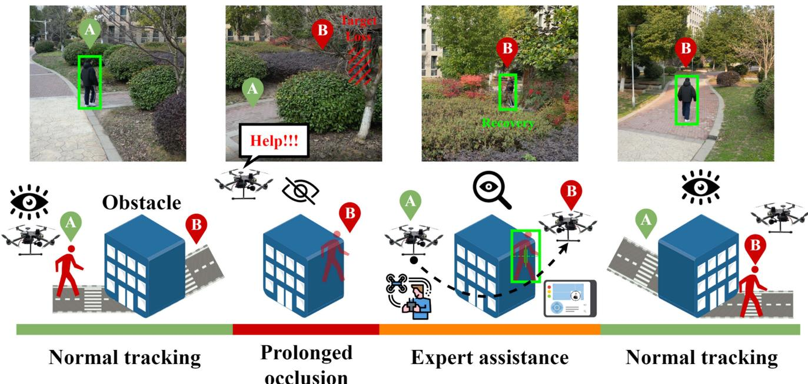  
Fig. 11. Active target tracking process of the UAV in real-world prolonged occlusion anomaly scenarios.

Table II further evaluates the generalization capability of each method under different occlusion ratios. The results demonstrate that the LA4H continues to perform optimally, achieving a SR of 80.3% at a maximum occlusion ratio of 70%, with a RPL of only 5.9. The path deviation growth is controlled within a reasonable range, corresponding to a SRPL of 0.136, which is the highest among all methods. While the CEL ranks second best, its performance decreases rapidly as occlusion ratios increase, with the SRPL dropping from 0.167 to 0.074. The Probability Helper and the Heuristic Helper show moderate performance at low occlusion levels, but they encounter significant task failures when the occlusion ratio exceeds 60%. Their RPL approaches 14 and 16 respectively, with notable path drift and severe SR decline, resulting in the SRPL below 0.04. In contrast, the EmbCLIP exhibits the weakest generalization performance. At the occlusion ratio of 40%, its SR is only 23.7%, while the RPL reaches 43.6 and the SRPL drops to 0.005, indicating extremely low path efficiency and task effectiveness. In higher occlusion states, it fails completely and unable to complete the tracking task.

Human expert experiment, serving as the upper bound benchmark, maintains near-optimal performance in all generalization test scenarios. Its SR remains above 96.2%, with RPL not exceeding 2.1 and SRPL no lower than 0.458. In optimal conditions, the SRPL reaches a maximum of 0.909.

In conclusion, the LA4H demonstrates superior performance over other baseline methods and achieves comparable results to human expert. It maintains high task effectiveness and efficiency across different scenarios settings (increasing number of distractors / higher occlusion ratios), exhibiting strong generalization capability and environment adaptability. Moreover, as the complexity of anomalies in task scenarios increases, other baselines show notable performance decrease in generalization tests, highlighting the advantages of the LA4H in handling real-world anomalous scenarios.

## H. Ablation Study

We further design specific variants of our framework to isolate and quantify the impact of three key components, the expert assistance (EA) mechanism, the cross-modal anomaly cognition (AC) module, and the teacher-student (TS) policy learning paradigm. We evaluate the following variants in a challenging simulation environment (setting with 7 distractors and 50% occlusion probability) to rigorously test the robustness of our framework. The quantitative results are presented in Table III.

\- Baseline (No-EA): the agent operates autonomously using only the student tracking policy without any expert assistance mechanism.

\- LA4H w/o AC (Heuristic): the agent has access to expert assistance but lacks the cross-modal anomaly cognition module. Instead, it uses the heuristic strategy (confidence threshold) to trigger assistance.

LA4H w/o TS: the agent utilizes the full assistance framework but replaces the distilled teacher-student tracker with a standard visual encoder (without temporal-semantic knowledge distillation) as the backbone.

\- LA4H (Full): our proposed complete framework incorporating all modules.

Comparing the Baseline (No-EA) with the LA4H (Full), the SR drops drastically from 85.3% to 36.1%. Without the expertin-the-loop mechanism, the agent suffers catastrophic failure when encountering severe anomalies (e.g., prolonged occlusion, intense interference) that are beyond its autonomous capabilities. This result demonstrates that the EA serves as a fundamental guarantee for the robustness of our framework. Comparing the

TABLE III  
ABLATION EXPERIMENT RESULTS OF KEY COMPONENTS (7 DISTRACTORS, 50% OCCLUSION)
<table><tr><td>Model Variants</td><td>Modules</td><td>SR (%)</td><td>RPL</td><td>SRPL</td><td>EP (%)</td></tr><tr><td>Baseline (No-EA)</td><td>TS</td><td>36.1</td><td>18.4</td><td>0.019</td><td>0.0</td></tr><tr><td>LA4H w/o AC</td><td> $\mathrm { T S } + \mathrm { E A }$ </td><td>65.7</td><td>10.8</td><td>0.061</td><td>83.4</td></tr><tr><td>LA4H w/o TS</td><td> $\mathrm { A C } + \mathrm { E A }$ </td><td>74.8</td><td>7.6</td><td>0.098</td><td>56.7</td></tr><tr><td>LA4H (Full)</td><td> $\mathrm { A C } + \mathrm { E A } + \mathrm { T S }$ </td><td>85.3</td><td>4.5</td><td>0.190</td><td>48.2</td></tr></table>

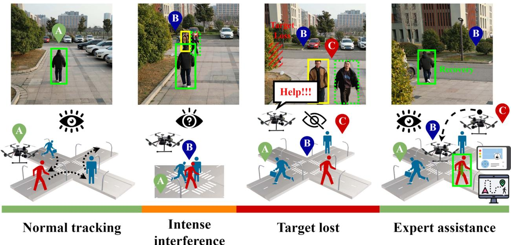  
Fig. 12. Active target tracking process of the UAV in real-world intense interference anomaly scenarios.

LA4H w/o AC with the LA4H (Full), we observe that replacing our cognition module with the heuristic strategy (confidence threshold) leads to a significant increase in EP (from 48.2% to 83.4%) and a decrease in SR (from 85.3% to 65.7%). Without the fine-grained anomaly classification provided by the anomaly cognition module, the agent cannot accurately recognize specific anomalous states. It tends to “over-ask” due to uncertainty (low confidence) or “under-ask” when certain anomalies are overlooked. The anomaly cognition module effectively aligns visual features with semantic text prompts, enabling the agent to request assistance when necessary, optimizing the the trade-off between autonomy and expert reliance. Comparing the LA4H w/o TS with the LA4H (Full), the removal of the distilled policy results in a performance drop in SR (from 85.3% to 74.8%) and RPL (from 4.5 to 7.6). The teacher-student paradigm distills rich temporal-semantic knowledge into the lightweight student tracker, which is important to the agent fundamental tracking capability. While the expert assistance is available, a weaker base tracker requires more frequent corrections (EP rises to 56.7%) and takes less efficient paths to recover the target. This result demonstrates that the TS ensures the agent basic competency and real-time responsiveness.

The ablation study demonstrates that all three components are important and complementary. The EA provides the recovery capability, the AC optimizes the decision timing to minimize costs, and the TS ensures the execution of the fundamental tracking policy. The integration of these components in the LA4H framework achieves the best overall performance.

## I. Real-World Scenarios Deployment

Figs. 11 and 12 illustrate the complete process of active target tracking tasks performed by the UAV in two typical real-world scenarios. The distinct colored timelines at the bottom of each row intuitively display the transitions between different tracking states, including normal tracking, prolonged occlusion, intense interference, target lost, expert assistance request, and tracking recovery. These processes not only validate the adaptability and robustness of the LA4H in extreme anomaly scenarios but also demonstrate the complementary role of anomaly cognition and expert assistance mechanisms at critical moments.

Fig. 11 illustrates the response process of the UAV under prolonged target occlusion anomaly. This scenario involves outdoor architectural structures with vegetation occlusion. The UAV initially operates in a normal tracking state, with the task target clearly visible, enabling stable detection and tracking. When the target moves into occluded area, prolonged visual occlusion prevents the UAV from maintaining effective observation, resulting in target loss and tracking failure. In this case, the UAV autonomously recognizes the current anomalous state and initiates an expert assistance request. Through the remote interaction interface, the human expert provides assistance to the UAV based on video streams and contextual information, facilitating target re-identification and localization. Subsequently, the UAV resumes control and successfully recovers target tracking, returning to the normal tracking state. This process demonstrates the effectiveness of the LA4H in complex occlusion scenarios with limited perception, illustrating the complete closed-loop operational response of the UAV, from visual loss of the task target through expert-assisted intervention to tracking recovery.

TABLE IV  
COMPUTATIONAL EFFICIENCY EVALUATION IN REAL-WORLD UAV DEPLOYMENTS
<table><tr><td>Method</td><td>Params (M)</td><td>FLOPs (G)</td><td>Time (ms)</td><td>FPS (Hz)</td><td>Power (W)</td><td>Energy (mJ)</td></tr><tr><td>EmbCLIP</td><td>86.3</td><td>40.81</td><td>158.7</td><td>6.3</td><td>14.8</td><td>2348.8</td></tr><tr><td>SiamAPN++</td><td>28.4</td><td>11.68</td><td>61.8</td><td>16.2</td><td>12.2</td><td>754.0</td></tr><tr><td>TCTrack</td><td>25.6</td><td>10.72</td><td>56.4</td><td>17.7</td><td>11.9</td><td>671.2</td></tr><tr><td>Teacher-Tracker</td><td>40.8</td><td>18.42</td><td>104.3</td><td>9.6</td><td>14.1</td><td>1470.6</td></tr><tr><td>Student-Tracker</td><td>6.7</td><td>2.28</td><td>25.9</td><td>38.6</td><td>9.4</td><td>243.5</td></tr><tr><td>LA4H (Ours)</td><td>9.1</td><td>2.94</td><td>30.6</td><td>32.7</td><td>10.2</td><td>312.1</td></tr></table>

Fig. 12 further illustrates the performance of the LA4H in the intense interference anomaly scenario. This scenario exhibits increased complexity, including urban street scenes with multiple concurrent targets. Initially, the UAV maintains accurate target tracking, operating in the normal tracking state. However, as multiple pedestrians with similar appearances simultaneously enter the field of view, the UAV encounters the intense interference caused by multi-target interactions and visual similarity, resulting in target confusion and uncertain tracking outcomes. Eventually, the task target is completely lost under the interference of distractors. At this point, the UAV recognizes the anomaly and triggers the expert assistance mechanism, actively requesting human expert intervention. Through the remote expert assistance, the task target and its position information are manually corrected, enabling the UAV to rapidly resume tracking and back to the steady normal state. This process simulates perception challenges arising from increased target similarities in densely populated scenarios, validating the adaptability and processing efficiency of the LA4H in handling the intense interference anomaly.

Moreover, to address the sim-to-real transfer challenge, we employ several practical techniques. In particular, we train the agent in a high-fidelity Gazebo simulation with realistic UAV dynamics and sensor models. Meanwhile, we incorporate domain randomization strategies, including variations in lighting, texture, background complexity, and sensor noise to improve agent generalization. Notably, no fine-tuning is performed on real-world data. The successful transfer and deployment of the proposed LA4H framework to real-world scenarios is attributed to its modular design, knowledge distillation-based lightweight policy learning, and robust anomaly handling through the expert assistance mechanism.

In summary, above two groups of figures demonstrate the operation mechanism and significant advantages of the LA4H in complex real-world anomalous scenarios. In practical active target tracking tasks, due to the high unpredictability of occlusions, interference factors, and the dynamic behavior of the task target, traditional end-to-end visual target tracking frameworks often struggle with severe anomalies. In contrast, the LA4H, through incorporating anomaly cognition and expert assistance mechanisms, achieves efficient human-machine collaborative decision-making and enables effective handling of various anomalous states. This significantly enhances the effectiveness and robustness of the UAV in performing active target tracking tasks, providing a reliable guarantee for stable target tracking and practical application deployment.

## J. Computational Efficiency Evaluation

To further validate the lightweight design and real-time performance of the proposed LA4H framework, we conduct a comprehensive computational efficiency evaluation. The experiments are performed on the Prometheus600 (P600) mediumsized UAV development platform, which is equipped with a Jetson Xavier NX onboard computer. The Jetson Xavier NX boasts a computing power of 21 TOPS, featuring a 6-cores NVIDIA Carmel ARM v8.2 64-bit CPU, NVIDIA Volta architecture for the GPU, 384 NVIDIA CUDA cores with 48 Tensor cores, and a core storage space of 64 GB, 8 GB DDR4 RAM. In our tests, it operates in the 21 W power mode, which represents a typical resource-constrained condition encountered in real-world UAV deployments. We measure several key performance indicators, including model parameters count (Params), per-frame compu tational complexity (FLOPs), average inference latency (Time), real-time frame rate (FPS), average onboard power consumption (Power), and per-frame energy consumption (Energy/frame). All data are collected under the steady hovering flight state, with results averaged over 10000 consecutive frames. We compare the distilled student-tracker, the teacher-tracker, and the complete LA4H framework with the EmbCLIP baseline and two other state-of-the-art onboard trackers, SiamAPN++ [10] and TCTrack [11]. The quantitative comparison results are presented in Table III.

As shown in in Table IV, the teacher-tracker based on Temporal AlexNet has 40.8 M parameters and 18.42 G FLOPs per frame, leading to an inference latency of 104.3 ms and 9.6 FPS with 14.1 W average power consumption on the Jetson Xavier NX, which cannot meet the real-time requirements. Through the distillation mechanism, the student-tracker reduces the parameter count by 83.6% to 6.7 M and FLOPs by 84.0% to 2.28 G, achieving 38.6 FPS with 9.4 W average power and 243.5 mJ per frame. Notably, the complete LA4H framework, integrating both the cross-modal anomaly cognition module and the assistance decision network, maintains 9.1 M parameters and 2.94 G FLOPs, achieving 32.7 FPS with 10.2 W average power consumption (312.1 mJ per frame), which satisfies the practical requirements for real-time active tracking control (≥ 25 FPS at a decision frequency of 5-8 Hz). For the current state-of-the-art onboard trackers, the TCTrack achieves 17.7 FPS at an average power consumption of 11.9 W (671.2 mJ per frame), while SiamAPN++ achieves 16.2 FPS at 12.2 W (754.0 mJ per frame). In contrast, the LA4H improves real-time performance by 84.7% and 101.9%, while reducing per-frame energy consumption by 53.5% and 58.6%, respectively. Compared with the EmbCLIP baseline, the LA4H achieves a 5.19x increase in FPS and an 86.7% reduction in energy consumption. These results demonstrate the superior advantages of the LA4H in computational efficiency, real-time performance and energy consumption, making it suitable for real-world UAV deployments with long endurance and limited resources.

## VI. CONCLUSION

In this study, a novel embodied learning framework that can effectively leverage expert assistance to handle complex anomalies in UAV active target tracking tasks was proposed. The LA4H significantly reduced the reliance on expert intervention while maintaining high task performance, as demonstrated by its ability to achieve the expert-level upper bound with less expert involvement. Notably, the LA4H maintained robust policy learning capabilities with superior sample efficiency and convergence stability. By integrating efficient anomaly cognition mechanism with model-agnostic expert consultation policy, the LA4H enabled agents to make informed decisions, which accelerated the convergence to high performance policies and enhanced generalization across different anomalous scenarios. This highlighted the effectiveness and importance of expert knowledge in handling complex anomalous states. Moreover, extensive experiments in both simulated and real-world scenarios demonstrated that the LA4H consistently outperformed existing stateof-the-art baselines across multiple evaluation metrics including the tracking success rate, the task completion efficiency, and comprehensive performance under various expert participation constraints. The LA4H provides a practical and scalable solution for real-world UAV anomaly tracking applications, particularly in scenarios where expert or human intervention is costly and limited, thereby advancing the development of more generic and robust UAV systems.

## REFERENCES

[1] H. Huang et al., “Object-based attention mechanism for color calibration of UAV remote sensing images in precision agriculture,” IEEE Trans. Geosci. Remote Sens., vol. 60, 2022, Art. no. 4416013.

[2] H. Luo et al., “KeepEdge: A knowledge distillation empowered edge intelligence framework for visual assisted positioning in UAV delivery,” IEEE Trans. Mobile Comput., vol. 22, no. 8, pp. 4729–4741, Aug. 2023.

[3] H. Liu, Y. P. Tsang, C. K. Lee, and C. H. Wu, “UAV trajectory planning via viewpoint resampling for autonomous remote inspection of industrial facilities,” IEEE Trans. Ind. Informat., vol. 20, no. 5, pp. 7492–7501, May 2024.

[4] N. Zhao et al., “UAV-assisted emergency networks in disasters,” IEEE Wireless Commun., vol. 26, no. 1, pp. 45–51, Feb. 2019.

[5] D. Sun, L. Cheng, S. Chen, C. Li, Y. Xiao, and B. Luo, “UAV-ground visual tracking: A unified dataset and collaborative learning approach,” IEEE Trans. Circuits Syst. Video Technol., vol. 34, no. 5, pp. 3619–3632, May 2024.

[6] N. Sun, J. Zhao, Q. Shi, C. Liu, and P. Liu, “Moving target tracking by unmanned aerial vehicle: A survey and taxonomy,” IEEE Trans. Ind. Informat., vol. 20, no. 5, pp. 7056–7068, May 2024.

[7] H. Fang, Z. Liao, X. Wang, Y. Chang, and L. Yan, “Differentiated attention guided network over hierarchical and aggregated features for intelligent UAV surveillance,” IEEE Trans. Ind. Informat., vol. 19, no. 9, pp. 9909–9920, Sep. 2023.

[8] D. C. Schedl, I. Kurmi, and O. Bimber, “Search and rescue with airborne optical sectioning,” Nature Mach. Intell., vol. 2, pp. 783–790, 2020.

[9] J. Qu, R. W. Liu, Y. Gao, Y. Guo, F. Zhu, and F.-Y. Wang, “Double domain guided real-time low-light image enhancement for ultra-high-definition transportation surveillance,” IEEE Trans. Intell. Transp. Syst., vol. 25, no. 8, pp. 9550–9562, Aug. 2024.

[10] Z. Cao, C. Fu, J. Ye, B. Li, and Y. Li, “SiamAPN++: Siamese attentional aggregation network for real-time UAV tracking,” in Proc. IEEE/RSJ Int. Conf. Intell. Robots Syst., 2021, pp. 3086–3092.

[11] Z. Cao, Z. Huang, L. Pan, S. Zhang, Z. Liu, and C. Fu, “TCTrack: Temporal contexts for aerial tracking,” in Proc. IEEE/CVF Conf. Comput. Vis. Pattern Recognit., 2022, pp. 14778–14788.

[12] Z. Cao, C. Fu, J. Ye, B. Li, and Y. Li, “HiFT: Hierarchical feature transformer for aerial tracking,” in Proc. IEEE/CVF Int. Conf. Comput. Vis., 2021, pp. 15457–15466.

[13] C. Fu, Z. Cao, Y. Li, J. Ye, and C. Feng, “Onboard real-time aerial tracking with efficient siamese anchor proposal network,” IEEE Trans. Geosci. Remote Sens., vol. 60, 2022, Art. no. 5606913.

[14] J. Ye, C. Fu, G. Zheng, D. P. Paudel, and G. Chen, “Unsupervised domain adaptation for nighttime aerial tracking,” in Proc. IEEE/CVF Conf. Comput. Vis. Pattern Recognit., 2022, pp. 8896–8905.

[15] S. Bhagat and P. Sujit, “UAV target tracking in urban environments using deep reinforcement learning,” in Proc. Int. Conf. Unmanned Aircr. Syst., 2020, pp. 694–701.

[16] M. Xi, Y. Zhou, Z. Chen, W. Zhou, and H. Li, “Anti-distractor active object tracking in 3D environments,” IEEE Trans. Circuits Syst. Video Technol., vol. 32, no. 6, pp. 3697–3707, Jun. 2022.

[17] W. Zhang, K. Song, X. Rong, and Y. Li, “Coarse-to-fine UAV target tracking with deep reinforcement learning,” IEEE Trans. Automat. Sci. Eng., vol. 16, no. 4, pp. 1522–1530, Oct. 2019.

[18] W. Zhao, Z. Meng, K. Wang, J. Zhang, and S. Lu, “Hierarchical active tracking control for UAVs via deep reinforcement learning,” Appl. Sci., vol. 11, no. 22, 2021, Art. no. 10595.

[19] J.-H. Park, K. Farkhodov, S.-H. Lee, and K.-R. Kwon, “Deep reinforcement learning-based DQN agent algorithm for visual object tracking in a virtual environmental simulation,” Appl. Sci., vol. 12, no. 7, 2022, Art. no. 3220.

[20] J. Li et al., “Pose-assisted multi-camera collaboration for active object tracking,” in Proc. AAAI Conf. Artif. Intell., 2020, pp. 759–766.

[21] Z. Fang, A. Jain, G. Sarch, A. W. Harley, and K. Fragkiadaki, “Move to see better: Self-improving embodied object detection,” 2020, arXiv:2012.00057. [Online]. Available: https://arxiv.org/abs/2012.00057

[22] K. Kotar and R. Mottaghi, “Interactron: Embodied adaptive object detection,” in Proc. IEEE/CVF Conf. Comput. Vis. Pattern Recognit., 2022, pp. 14860–14869.

[23] W. Ding et al., “Learning to view: Decision transformers for active object detection,” in Proc. Int. Conf. Robot. Automat., 2023, pp. 7140–7146.

[24] F. Zhong, P. Sun, W. Luo, T. Yan, and Y. Wang, “AD-VAT: An asymmetric dueling mechanism for learning visual active tracking,” in Proc. Int. Conf. Learn. Representations, 2019.

[25] F. Zhong et al., “Towards distraction-robust active visual tracking,” in Proc. Int. Conf. Mach. Learn., 2021, pp. 12782–12792.

[26] A. Bajcsy, A. Loquercio, A. Kumar, and J. Malik, “Learning vision-based pursuit-evasion robot policies,” in Proc. Int. Conf. Robot. Automat., 2024, pp. 9197–9204.

[27] F. Zhong, X. Bi, Y. Zhang, W. Zhang, and Y. Wang, “RSPT: Reconstruct surroundings and predict trajectory for generalizable active object tracking,” in Proc. AAAI Conf. Artif. Intell., 2023, pp. 3705–3714.

[28] W. Luo et al., “End-to-end active object tracking via reinforcement learning,” in Proc. Int. Conf. Mach. Learn., 2018, pp. 3286–3295.

[29] B. Li, Z. Gan, D. Chen, and D. Sergey Aleksandrovich, “UAV maneuvering target tracking in uncertain environments based on deep reinforcement learning and meta-learning,” Remote Sens., vol. 12, 2020, Art. no. 3789.

[30] H. Ci, M. Liu, X. Pan, and Y. Wang, “Proactive multi-camera collaboration for 3D human pose estimation,” in Proc. Int. Conf. Learn. Representations, 2023.

[31] L. Shen, C. Huo, N. Xu, C. Han, and Z. Wang, “Learn how to see: Collaborative embodied learning for object detection and camera adjusting,” in Proc. AAAI Conf. Artif. Intell., 2024, pp. 4793–4801.

[32] M. Wilson, “Six views of embodied cognition,” Psychon. Bull. Rev., vol. 9, pp. 625–636, 2002.

[33] M. L. Anderson, “Embodied cognition: A field guide,” Artif. Intell., vol. 149, pp. 91–130, 2003.

[34] A. Gupta, S. Savarese, S. Ganguli, and L. Fei-Fei, “Embodied intelligence via learning and evolution,” Nature Commun., vol. 12, 2021, Art. no. 5721.

[35] D. Howard et al., “Evolving embodied intelligence from materials to machines,” Nature Mach. Intell., vol. 1, pp. 12–19, 2019.

[36] T. F. Nygaard, C. P. Martin, J. Torresen, K. Glette, and D. Howard, “Realworld embodied AI through a morphologically adaptive quadruped robot,” Nature Mach. Intell., vol. 3, pp. 410–419, 2021.

[37] A. Kadambi, C. de Melo, C. J. Hsieh, M. Srivastava, and S. Soatto, “Incorporating physics into data-driven computer vision,” Nature Mach. Intell., vol. 5, pp. 572–580, 2023.

[38] M. Savva et al., “Habitat: A platform for embodied AI research,” in Proc. IEEE/CVF Int. Conf. Comput. Vis., 2019, pp. 9339–9347.

[39] E. Wijmans et al., “DD-PPO: Learning near-perfect pointgoal navigators from 2.5 billion frames,” 2019, arXiv:1911.00357.

[40] D. S. Chaplot, D. P. Gandhi, A. Gupta, and R. R. Salakhutdinov, “Object goal navigation using goal-oriented semantic exploration,” in Proc. Int. Conf. Neural Inf. Process. Syst., 2020, pp. 4247–4258.

[41] P. Anderson et al., “On evaluation of embodied navigation agents,” 2018, arXiv:1807.06757.

[42] P. Anderson et al., “Vision-and-language navigation: Interpreting visuallygrounded navigation instructions in real environments,” in Proc. IEEE Conf. Comput. Vis. Pattern Recognit., 2018, pp. 3674–3683.

[43] F. Zhu, Y. Zhu, X. Chang, and X. Liang, “Vision-language navigation with self-supervised auxiliary reasoning tasks,” in Proc. IEEE/CVF Conf. Comput. Vis. Pattern Recognit., 2020, pp. 10012–10022.

[44] A. Das, S. Datta, G. Gkioxari, S. Lee, D. Parikh, and D. Batra, “Embodied question answering,” in Proc. IEEE/CVF Conf. Comput. Vis. Pattern Recognit., 2018, pp. 1–10.

[45] D. Gordon, A. Kembhavi, M. Rastegari, J. Redmon, D. Fox, and A. Farhadi, “IQA: Visual question answering in interactive environments,” in Proc. IEEE/CVF Conf. Comput. Vis. Pattern Recognit., 2018, pp. 4089–4098.

[46] E. Kolve et al., “AI2-THOR: An interactive 3D environment for visual AI,” 2017, arXiv:1712.05474.

[47] D. S. Chaplot, D. Gandhi, S. Gupta, A. Gupta, and R. Salakhutdinov, “Learning to explore using active neural SLAM,” 2020, arXiv:2004.05155.

[48] V. Cartillier, Z. Ren, N. Jain, S. Lee, I. Essa, and D. Batra, “Semantic MapNet: Building allocentric semantic maps and representations from egocentric views,” in Proc. AAAI Conf. Artif. Intell., 2021, pp. 964–972.

[49] F. Xia, A. R. Zamir, Z. He, A. Sax, J. Malik, and S. Savarese, “Gibson env: Real-world perception for embodied agents,” in Proc. IEEE Conf. Comput. Vis. Pattern Recognit., 2018, pp. 9068–9079.

[50] K. X. Nguyen, Y. Bisk, and H. D. Iii, “A framework for learning to request rich and contextually useful information from humans,” in Proc. Int. Conf. Mach. Learn., 2022, pp. 16553–16568.

[51] K. P. Singh, L. Weihs, A. Herrasti, J. Choi, A. Kembhavi, and R. Mottaghi, “Ask4Help: Learning to leverage an expert for embodied tasks,” in Proc. Int. Conf. Neural Inf. Process. Syst., 2022, pp. 16221–16232.

[52] K. Nguyen and H. Daumé III, “Help, Anna! Visual navigation with natural multimodal assistance via retrospective curiosity-encouraging imitation learning,” 2019, arXiv:1909.01871.

[53] X. Chen, S. Zhang, P. Zhang, L. Zhao, and J. Chen, “Asking before acting: Gather information in embodied decision making with language models,” 2023, arXiv:2305.15695.

[54] Y. Shen and I. Lourentzou, “Learning by asking for embodied visual navigation and task completion,” 2023, arXiv:2302.04865.

[55] G. Zhou, Y. Hong, Z. Wang, C. Zhao, M. Bansal, and Q. Wu, “SAME: Learning generic language-guided visual navigation with state-adaptive mixture of experts,” 2024, arXiv:2412.05552.

[56] M. Hwang, L. Weihs, C. Park, K. Lee, A. Kembhavi, and K. Ehsani, “Promptable behaviors: Personalizing multi-objective rewards from human preferences,” in Proc. IEEE/CVF Conf. Comput. Vis. Pattern Recognit., 2024, pp. 16216–16226.

[57] K. P. Singh, S. Bhambri, B. Kim, R. Mottaghi, and J. Choi, “Factorizing perception and policy for interactive instruction following,” in Proc. IEEE/CVF Int. Conf. Comput. Vis., 2021, pp. 1888–1897.

[58] V.-Q. Nguyen, M. Suganuma, and T. Okatani, “Look wide and interpret twice: Improving performance on interactive instruction-following tasks,” 2021, arXiv:2106.00596.

[59] S. Mohanty et al., “Transforming human-centered AI collaboration: Redefining embodied agents capabilities through interactive grounded language instructions,” 2023, arXiv:2305.10783.

[60] Q. Gao et al., “Alexa arena: A user-centric interactive platform for embodied AI,” in Proc. Int. Conf. Neural Inf. Process. Syst., 2023, pp. 19170–19194.

[61] N. Koenig and A. Howard, “Design and use paradigms for Gazebo, an open-source multi-robot simulator,” in Proc. IEEE/RSJ Int. Conf. Intell. Robots Syst., 2004, pp. 2149–2154.

[62] Q. Wu et al., “Cognitive embodied learning for anomaly active target tracking,” Commun. Eng., vol. 4, 2025, Art. no. 224.

Jiahao Lireceived the BS degree in aircraft airworthiness technology, in 2021 from the Nanjing University of Aeronautics and Astronautics, Nanjing, China, where he is currently working toward the PhD degree in information and communication engineering. His research interests include embodied artificial intelligence, active object tracking, deep reinforcement learning, and unmanned aerial vehicles.

Fuhui Zhou (Senior Member, IEEE) is currently a full professor with the Nanjing University of Aeronautics and Astronautics, Nanjing, China, where he is also with the Key Laboratory of Dynamic Cognitive System of Electromagnetic Spectrum Space. He has authored or coauthored more than 300 papers in internationally renowned journals and conferences in the field of communications. He has been selected for two ESI hot article and 15 ESI highly cited articles. His research interests include cognitive radio, cognitive intelligence, knowledge graph, edge computing, and resource allocation. Prof. Zhou was the recipient of five Best Paper Awards at international conferences, such as IEEE GLOBECOM and IEEE ICC. He was awarded the 2024 Most Cited Chinese Researchers by Elsevier, Stanford World’s Top 2% Scientists, IEEE ComSoc Asia-Pacific Outstanding Young Researcher, and Young Elite Scientist Award of China and URSI GASS Young Scientist. He serves as the Editor of IEEE Transactions on Communications, IEEE Systems Journal, IEEE Wireless Communications Letters, IEEE Access, and Physical Communications.

Qihui Wu (Fellow, IEEE) received the BS degree in communications engineering, and the MS and PhD degrees in communications and information systems from the Institute of Communications Engineering, Nanjing, China, in 1994, 1997, and 2000, respectively. From March 2011 to September 2011, he was an advanced visiting scholar with the Stevens Institute of Technology, Hoboken, NJ, USA. Since 2016, he has been a full professor with the College of Electronic and Information Engineering, Nanjing University of Aeronautics and Astronautics, Nanjing. His research interests include wireless communications and statistical signal processing, with emphasis on system design of software defined radio, cognitive radio, and smart radio.