# A Novel Integrated Sensing and Communication Scheme in UAVs-Enabled Vehicular Networks With MARL-Driven Adaptive Control

Ziyuan Wang , Graduate Student Member, IEEE, Xiao-Ping Zhang , Fellow, IEEE, Wenbo Ding , Member, IEEE, Yuhan Dong , Senior Member, IEEE, and Xinlei Chen , Member, IEEE

Abstract—In this paper, we propose a novel integrated sensing and communication (ISAC) scheme tailored for UAVs-enabled vehicular networks, which leverages the information coverage capabilities of multiple UAVs and addresses critical challenges posed by multiple moving users. Unlike many traditional scheme, our scheme efficiently leverages ISAC signal echoes and real-time data uploads to provide communication services while achieving accurate sensing, thereby overcoming issues of resource waste and low operational efficiency. In the scheme, we aim to optimize both communication and sensing indicators, taking into account practical issues such as energy saving and collision avoidance for UAVs. However, the inherent complexity of multi-objective stochastic optimization in dynamic environments and limited communication resources render centralized UAV control inconvenient. To address the above challenges, we propose a novel multi-agent reinforcement learning (MARL) algorithm based on local information to realize the distributed adaptive control of motion decision, power selection, and channel allocation for UAVs. The algorithm combines random network distillation (RND) and dynamic data augmentation with multi-agent deep deterministic policy gradient (MADDPG) to encourage agents to explore effectively under sparse rewards and improve MADDPG’s policy learning ability in finite data, thus approaching the global optimal solution. Experimental results demonstrate that the proposed algorithm can improve communication and sensing performance by more than 16.71% and 68.26% compared with other baselines and satisfy the set constraints. Furthermore, by adjusting hyperparameters, we can optimize the ISAC performance while achieving different energy savings levels for UAVs, proving that the designed scheme can reduce the waste of resources and improve the ISAC operation efficiency.

Index Terms—Unmanned aerial vehicles (UAVs), integrated sensing and communication (ISAC), vehicular networks, multiobjective stochastic optimization, multi-agent reinforcement learning (MARL).

## I. INTRODUCTION

nologies and the growing demand for high-precision sensing have driven the integration of sensing and communication (ISAC) as a promising paradigm for future wireless systems [1]. This integration addresses the spectrum scarcity challenge and unlocks new opportunities in diverse applications, such as low altitude economy [2], smart cities [3], and vehicle-to-everything (V2X) networks [4]. Specifically, V2X is the core of future intelligent transportation system [5], and ISAC technology can be widely used in such vehicular networks to achieve efficient data transmission and accurate environment perception in traffic systems through the dual use of hardware or signals [6], thereby improving safety and resource utilization efficiency. Recent studies have started to explore the integration of unmanned aerial vehicles (UAVs) into ISAC systems, shedding light on the potential and challenges of this promising technology [7]. For instance, UAVs-enabled ISAC schemes offer flexible deployment and dynamic coverage, which are well-suited for rapidly changing environments such as vehicular networks [8]. Based on the flexible and fast response characteristics [9], UAVs equipped with ISAC devices can be reorganized to ensure ISAC performance and serve a variety of applications in vehicular networks, such as information collection [10], target tracking and sensing [11], and communication services [12].

However, UAVs-enabled ISAC schemes also raise several technical challenges, including efficient joint waveform design, interference management, mobility-induced Doppler effects, and trade-offs between energy efficiency and sensing accuracy [3]. Besides, current UAV-enabled ISAC schemes often need to cooperate with the base station (BS) to assist in the management and data upload of UAVs. For example, Liu et al. proposes a classic UAV-ISAC model, in which the UAV senses ground users and uploads sensed data to the BS in [13]. In [10], Zhang et al. adopt an iterative algorithm to jointly optimize the sensing time, transmission time, and trajectory of the UAV to minimize the age of information (AoI) of the data obtained by BS. Many traditional UAV-enabled ISAC schemes need strict transmission time planning to avoid interference between sensing and communication signals. For instance, Meng et al. use multi-UAV collaboration to provide transmission and sensing services and transmit the collected data to BS, where sensing and communication transmissions are divided into specific moments [14]. In [15], Deng et al. optimize the communication and sensing beamforming to maximize the throughput of the UAV system and satisfy the quality-of-service (QoS) requirements of communication and sensing, with a time division multiple access (TDMA) mode.

However, the above schemes share some common defects with the current UAVs-enabled ISAC systems, like the joint optimization of communication and sensing indicators is often ignored [8], [11], [16]. Schemes in [13] and [10] only consider hardware reuse and ignore signal reuse, so they can only sense targets but cannot provide more communication services, resulting in reduced efficiency [12]. Besides, schemes that use a TDMA mechanism to avoid interference or store data in UAVs can not realize real-time data upload to BS [14], [15], and are not friendly to some time-sensitive applications such as traffic accidents [6]. Furthermore, the above schemes and many other current schemes employ only one UAV for the ISAC task [17] or only consider serving fixed targets [18]. Using only one UAV loses the cooperative advantage of a UAV cluster, making it difficult to obtain complete information about the region. Considering only fixed targets is inconsistent with many practical scenarios and limits the schemes’ application scope [19]. As a result, there is a lack of schemes for using multiple UAVs to perform ISAC tasks against multi-mobile users such as vehicles. In addition, using the UAV cluster for tasks requires considering practical issues such as energy saving and collision avoidance for flight safety, which is ignored by many ISAC schemes [14].

In a word, many existing works either focus solely on static scenarios or rely on centralized coordination, limiting their scalability and adaptability in dynamic, multi-user environments [20], [21]. We should design a novel scheme to address this gap for vehicular networks with multiple moving targets and real-time requirements. In terms of optimization objectives, the scheme should realize the joint optimization of communication and sensing indicators and consider practical problems such as energy saving and collision avoidance [22]. However, solving the above problem is challenging. First, the random movement of targets and the flight of UAVs make the problem a stochastic dynamic problem. Hence, optimization schemes such as convex optimization and dynamic programming are challenging to implement [23]. Second, excessive information exchange will bring an enormous communication burden to ISAC systems. Centralized schemes such as [15] and [17] for fixed path planning of UAVs based on overall information are challenging to apply in many scenarios. Hence, UAVs often need to adopt a distributed mode to make autonomous decisions based on local observation information [24]. Third, optimizing sensing and communication indicators [25], considering the need for energy saving and collision avoidance of UAVs, is bound to bring the challenge of multi-objective optimization. Fortunately, reinforcement learning (RL) offers a promising solution to the above problem, which uses trial-and-error interactions between agents and dynamic environments to learn optimal policies [26]. RL can be effectively used for simultaneous decision-making of different types of actions and has shown excellent adaptability and performance in many control problems of UAVs [27].

In [28], Qin et al. introduce the centralized soft actor-critic (SAC) algorithm to make decisions about UAV trajectory, power allocation, and user association to maximize spectral efficiency. Yu et al. combine deep deterministic policy gradient (DDPG) algorithm with weighted rewards to learn control policies of UAV over multi-conflict objectives [29], which can be refered in this work. However, only one centralized RL network controls multiple action decisions of multiple UAVs in these algorithms, which may cause a dimensional disaster with the increase of UAVs, making the the policy of some actions difficult to learn [6]. Multi-agent RL (MARL) can somewhat alleviate the above problems and further improve the performance of traditional RL [30]. MARL allows multiple agents to adjust and autonomously optimize policies in complex dynamic systems independently and has been gradually applied to UAVenabled ISAC schemes [31], [32]. Specifically, Peng et al. introduce multi-agent DDPG (MADDPG) into UAVs-assisted vehicular networks and ensure the overall performance of the system by designing practical local observation information for MARL [33]. Nonetheless, ensuring that the MARL algorithm can gradually learn the optimal policy from the basic policy in complex optimization problems is still a challenge [34]. Given the above problems, the main contributions are as follows:

We propose an ISAC scheme that uses distributed UAVs to serve vehicular networks. This scheme supports realtime data upload of UAVs and references superimposed signals to achieve communication and sensing functions simultaneously.

We formulate a multi-objective stochastic non-convex optimization problem to maximize the effective mutual information (MI) of UAVs and the number of served users while considering UAVs’ energy saving and collision avoidance. To solve this dynamic stochastic problem, we transform the original multi-objective problem to the RL solvable form by weighted rewards and develop the MARL algorithm to realize distributed adaptive control of UAVs based on local observations.

To enhance MARL’s policy learning ability in complex problems, we develop a novel algorithm called random network distillation (RND)-based MADDPG with dynamic data argumentation assistance (RMADDPG-DDA) algorithm. RND network is introduced to encourage MARL to explore unknown states in the case of sparse rewards, and data argumentation is added to enhance the learning of policies and approach optimal solution.

The experimental results show that the proposed algorithm is significantly superior to other baselines in sensing and communication optimization indicators and satisfies the set constraints. By adjusting hyperparameters, we can optimize the ISAC performance while achieving different levels of energy savings for UAVs.

The rest of the paper is organized as follows. Section II introduces the ISAC models and formulates the optimization problem. In Section III, the RMADDPG-DDA-based solutions are detailed. Simulation results are presented in Section III. Finally, we give the conclusions in Section IV.

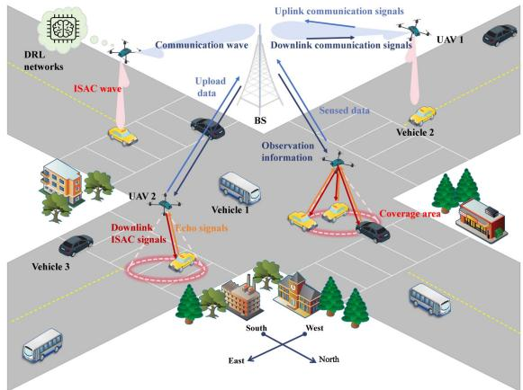  
Fig. 1. System of UAVs-enabled vehicular networks.

## II. MODELING FOR NOVEL ISAC SCHEME IN UAVS-ENABLED VEHICULAR NETWORKS

In this section, we present the modeling process and related index design of ISAC tasks based on the collaboration of multi-UAV and the BS. Since the current ISAC schemes are widely used in V2X, the sensing targets and communication service users in this paper are considered as moving vehicles. Based on the analysis of several indicators for the designed ISAC scheme, we formulate the optimization problem.

## A. Overall Characteristics of the Designed ISAC Scheme

Traditional ISAC approaches, built on fixed infrastructure or a single UAV under centralized control, cannot keep up with the rapid, unpredictable motion of vehicles, resulting in coverage gaps, outdated information, and wasted resources. Instead, our scheme leverages cooperative UAVs driven by distributed, learning-based decision making to adjust sensing and communication tasks dynamically. The proposed scheme reduces service gaps, improves data upload, and balances multiple ISAC performance metrics. By unifying these core ISAC advantages into an adaptable and scalable framework without the need for a central execution controller, the proposed scheme has the potential to offer responsiveness and resource efficiency that previous static or single-agent solutions could not achieve.

Specifically, we consider using UAVs as ISAC platforms to provide communication services to passing moving vehicles in an urban environment [35], constructing the system as shown in Fig. 1. It is considered that the UAVs use the communication echo signal to detect the target, obtain sensing data for parameter estimation, and upload the sensed data to the BS simultaneously. We use N dual-functional UAVs to form the cluster $\mathcal { N } = \{ 1 , . . . , N \}$ , and each UAV is configured with two antennas = 1to perform ISAC tasks. Specifically, the ISAC task is divided into two aspects. One directional antenna transmits ISAC signals to provide communication services for vehicles and receives sensor echoes for sensing. While sensing, another omnidirectional antenna communicates with BS to upload sensed data. Besides, we assume that there is a relatively stable traffic flow in the study area, so it is considered that there are M vehicles in the area traveling at random speeds in the direction of the road. The users of vehicular networks in the study area can be denoted as $\mathcal { M } ( t ) = \{ 1 , . . . , M \}$ at time slot t. Each ISAC task period is a time interval Δt, which is short and therefore considered as a quasi-stationary state after the moving of UAVs and users.

The ISAC scheme in UAVs-enabled vehicular networks is based on the design of each sub-model. In Section II-B, we give the dynamic model of vehicle users and UAVs and model the energy consumption of UAVs. Then, in Section II-C, the mode of communication between the UAV cluster and BS is modeled to support data upload. In Section II-D, the communication and sensing model based on ISAC signals is presented, and the ISAC indicators of this work are introduced.

## B. Dynamic Model and Energy Consumption Model

In this part, we describe traffic flow in an urban environment by designing a dynamic model for the random motion of vehicles on lanes in different directions. Then, a motion control model is proposed to explain the UAV’s dynamics. Finally, the energy consumption model of UAVs is introduced.

To describe the spatial position of vehicle users and UAVs, we first adopt the definition of the east-north-up (ENU) coordinate system $O - x y z$ for the environment. The position of the vehicle $m \in \mathcal { M }$ at t can be denoted as $\mathbf { X } _ { m } ( t ) = [ \bar { x _ { m } } ( t ) , y _ { m } ( t ) ] ^ { \intercal }$ , where the vehicle is in the horizontal plane causing $z _ { m } ( t ) = 0$ always holds, so the vertical coordinate is not considered. The study area $\mathcal { D } = \{ 0 \leq x \leq L _ { x } , 0 \leq y \leq L _ { y } \}$ is a common crossroads scene in research on vehicular networks [33], but two-way lanes are considered to be close to the actual urban environment. Concerning the one-way random walk model and absorption boundary, the dynamic model of the vehicle m is

$$
\begin{array} { r } { \mathbf { X } _ { m } ( t + 1 ) = \left\{ \begin{array} { l l } { \mathbf { X } _ { m } ( t ) + \mathbf { V } _ { m } ( t ) \mathbf { e } _ { m } , \quad } & { \mathbf { X } _ { m } ( t + 1 ) \in \mathcal { D } ; } \\ { \mathbf { B } _ { m } ^ { w , s } ( t ) \mathbf { e } _ { m } \mathcal { L } _ { \left\{ \forall \mathbf { e } _ { m } \left[ i \right] \geq 0 \right\} } } & { } \\ { \quad + \mathbf { B } _ { m } ^ { e , n } ( t ) \mathbf { e } _ { m } \mathcal { L } _ { \left\{ \forall \mathbf { e } _ { m } \left[ i \right] \leq 0 \right\} } , \quad \mathbf { X } _ { m } ( t + 1 ) \not \in \mathcal { D } , } \end{array} \right. } \end{array}\tag{1}
$$

where $\mathbf { V } _ { m } ( t )$ is the velocity matrix of vehicle $m .$ . Since we use $\mathbf { e } _ { m }$ ( )represent the driving direction vector of vehicle m, when $\mathbf { e } _ { m } \overset { \mathbf { \bar { \mathbf { \Lambda } } } } { = } [ 1 , 0 ] ^ { \top }$ vehicle m runs along the west-east lane. Similarly, $\mathbf { e } _ { m } ^ { \bar { \mathbf { \alpha } } } = [ - 1 , 0 ] ^ { \top }$ denotes the direction of east-west lane, $\mathbf { e } _ { m } = [ 0 , 1 ] ^ { \top }$ 1 0]denotes the direction of south-north lane, and $\mathbf { e } _ { m } = [ 0 , - 1 ] ^ { \top }$ denotes the direction of north-south lane. Furthermore, we define the matrices as follows:

$$
{ \bf V } _ { m } ( t ) = \left[ \begin{array} { c c } { v _ { m } ( t ) \varDelta t } & { 0 } \\ { 0 } & { v _ { m } ( t ) \varDelta t } \end{array} \right] ,\tag{2a}
$$

$$
{ \bf B } _ { m } ^ { w , s } ( t ) = \left[ \begin{array} { c c } { 0 } & { \hat { x } _ { m } ( t ) } \\ { \hat { y } _ { m } ( t ) } & { 0 } \end{array} \right] ,\tag{2b}
$$

$$
\mathbf { B } _ { m } ^ { e , n } ( t ) = \left[ \left( \hat { y } _ { m } ( t ) - \frac { l _ { w } } { 2 } \right) \mathbf { e } _ { m } [ 1 ] \begin{array} { c c } { \left( \hat { x } _ { m } ( t ) - \frac { l _ { w } } { 2 } \right) \mathbf { e } _ { m } [ 2 ] } \\ { \left( \hat { y } _ { m } ( t ) - \frac { l _ { w } } { 2 } \right) \mathbf { e } _ { m } [ 1 ] } \end{array} \right) ,\tag{2c}
$$

where $v _ { m } ( t ) \in \mathsf { U } ( 0 , V ^ { \mathrm { m a x } } )$ is the random moving velocity of vehicle m, and $V ^ { \mathrm { { m a x } } }$ is the maximum velocity of vehicles. Besides, $\mathbf { B } _ { m } ^ { w , s } ( t )$ is the boundary matrix for vehicles moving from west to east or south to north, and ${ \bf B } _ { m } ^ { e , n } ( t )$ is the boundary matrix for vehicles moving from east to west or north to south. To ensure the stability of the flow, we consider that when m exceeds $\mathcal { D } ,$ it is immediately absorbed by the boundary and appears randomly in the starting boundary of the corresponding lane. If the width of each lane is $l _ { w } / 2 , \hat { y } _ { m } ( t ) \in \mathsf { U } ( L _ { w  e } + \textstyle \frac { l _ { w } } { 2 } , L _ { w  e } + l _ { w } )$ and $\begin{array} { r } { \hat { x } _ { m } ( t ) \in \mathsf { U } ( L _ { s  n } + \frac { l _ { w } } { 2 } , L _ { s  n } + l _ { w } ) } \end{array}$ , where $L _ { w  e }$ and $L _ { s \to n }$ are the start boundaries of the west-east and south-north lanes, respectively.

We consider to deploy the UAV cluster N at a constant height $z _ { n } ( t ) = H ~ [ 1 3 ]$ , so the dynamic model of UAV n at position $\tilde { \mathbf { X } } _ { n } ^ { t } = [ x _ { n } ( t ) , y _ { n } ( t ) , z _ { n } ( t ) ] ^ { \top }$ can be derived as

$$
\tilde { \mathbf { X } } _ { n } ^ { t + 1 } = \left\{ \begin{array} { l l } { \left[ x _ { n } ( t ) \right] } \\ { \boldsymbol { y } _ { n } ( t ) } \\ { \qquad \boldsymbol { H } } \\ { \left[ \mathrm { c l i p } _ { 0 } ^ { L _ { x } } ( x _ { n } ( t + 1 ) ) \right] } \\ { \mathrm { c l i p } _ { 0 } ^ { L _ { y } } ( \boldsymbol { y } _ { n } ( t + 1 ) ) } \\ { \qquad \boldsymbol { H } } \end{array} \right. , \quad \mathbf { X } _ { n } ^ { t + 1 } \in \mathcal { D } ;\tag{3a}
$$

$$
{ \bf A } _ { n } ( t ) = \left[ \begin{array} { c c c } { \cos ( \varphi _ { n } ( t ) ) } & { - \sin ( \varphi _ { n } ( t ) ) } & { 0 } \\ { \sin ( \varphi _ { n } ( t ) ) } & { \cos ( \varphi _ { n } ( t ) ) } & { 0 } \\ { 0 } & { 0 } & { 1 } \end{array} \right] ,\tag{3b}
$$

where $\mathbf { X } _ { n } ^ { t } = [ x _ { n } ( t ) , y _ { n } ( t ) ] ^ { \mathsf { T } } = \mathbf { X } _ { n } ( t )$ is the two-dimensional position information of UAV $n , \ \mathbf { A } _ { n } ( t )$ denotes the rotation matrix around the z-axis of the UAV body, $\mathrm { c l i p } _ { x _ { 1 } } ^ { x _ { 2 } } ( x )$ is the intercept function that intercepts x to $[ x _ { 1 } , x _ { 2 } ] , \varphi _ { n } ( t ) \in [ - \pi , \pi ]$ is the yaw angle between the UAV’s moving direction and the east direction (x-axis), and $v _ { n } ( t )$ represents the forward velocity ( )of UAV n. It should be noted that the dynamic model of the UAV does not take into account the attitude adjustment of pitch and roll, which is to ensure the antenna orientation for sensing ground targets [36].

Moreover, the energy consumption of UAV n mainly comes from communication with BS, transmitting ISAC signals to vehicles, and propulsion energy consumption for flight. The energy consumption of the first two parts is expressed as $E _ { n } ^ { c } ( t ) = P _ { n } ^ { c } ( t ) \varDelta t$ and $E _ { n } ^ { s } ( t ) = P _ { n } ^ { s } ( t )$ Δt at $t ,$ where $P _ { n } ^ { c } ( t )$ is communication power of UAV n and $P _ { n } ^ { s } ( t )$ is the transmitting power of UAV n for ISAC signals. The propulsion energy consumption of each UAV is determined by parasite power, blade profile power, and induced power [37], corresponding to three items in the following formulas, respectively:

$$
\begin{array} { c l } { { E _ { n } ^ { p } ( t ) = \displaystyle { \frac { d _ { f } \rho \varsigma \alpha { v _ { n } } ( t ) ^ { 3 } \varDelta t } { 2 } } + P _ { h } \varDelta t \left( 1 + \frac { 3 { v _ { n } } ( t ) ^ { 2 } } { V _ { t i p } ^ { 2 } } \right) } } \\ { { + P _ { i } \varDelta t \sqrt { \sqrt { 1 + \frac { { v _ { n } } ( t ) ^ { 4 } } { 4 V _ { i n d } ^ { 4 } } } - \frac { { v _ { n } } ( t ) ^ { 2 } } { 2 V _ { i n d } ^ { 2 } } } , } } \end{array}\tag{4}
$$

where $d _ { f } , \rho , \varsigma ,$ α are the fuselage drag ratio, air density, rotor solidity, and disc area, respectively. Besides, $V _ { t i p }$ is the tip speed of the rotor blade, $P _ { h }$ is blade profile power in hovering, $P _ { i }$ is the induced power, and $V _ { i n d }$ denotes the mean rotor induced velocity. In (4), the minimum propulsion energy consumption of each UAV is obtained not at the hover state but when it takes the maximum-endurance (ME) speed $v _ { M E }$ [29], which can be obtained based on the Newton-Raphson method [37]. Thus, the minimum energy consumption of UAV n is $E _ { \mathrm { m i n } } =$ $\{ E _ { n } ^ { p } ( t ) | v _ { n } ( t ) = v _ { M E } \}$ and the maximum energy consumption is $\ddot { E } _ { \mathrm { m a x } } = \{ E _ { n } ^ { p } ( t ) | \dot { v _ { n } } ( t ) = V _ { u } ^ { \mathrm { m a x } } \} + ( P _ { m } ^ { c } + \ddot { P _ { m } ^ { s } } ) \varDelta t$ at time slot t, where $V _ { u } ^ { \mathrm { m a x } }$ is the maximum speed of each UAV, $P _ { m } ^ { c }$ and $P _ { m } ^ { s }$ are the maximum power of the communication signal and ISAC signal, respectively. Besides, the total energy consumption of UAV n at t is derived as $E _ { n } ( t ) = E _ { n } ^ { c } ( t ) + E _ { n } ^ { s } ( t ) + E _ { n } ^ { p } ( t )$ and the total energy consumption of UAVs is $\begin{array} { r } { E ( t ) = \sum _ { n = 1 } ^ { N } E _ { n } ( t ) } \end{array}$

## C. Multi-UAV and BS Communication Model

To realize real-time data upload between UAVs and BS, we design a communication mechanism to reduce the internal interference of the UAV cluster and model the channel characteristics in this part.

As each UAV uses its waves to perform dual functionalities, the omnidirectional antenna is used to communicate with BS. To avoid interference between the sensing signals transmitted by UAVs and the communication signals of BS, the bandwidth $B _ { c }$ used for communication does not overlap with the bandwidth $B _ { s }$ of the ISAC signals. Similarly, to reduce the interference of UAVs when uploading data to BS, we refer to the frequency division multiple access (FDMA) modes [31]. Specifically, we divide $B _ { c }$ into $K = N$ non-overlapping channels, where each sub-bandwidth is $\begin{array} { r } { \hat { B } = \frac { B _ { c } } { K } } \end{array}$ . An integer variable $\delta _ { n } ( t ) \in [ 1 , K ]$ = ( ) [1 ]is introduced to characterize the communication channel allocation of the UAV cluster, as $\delta _ { n } ( t ) = k$ if the channel k is allocated to the UAV $n .$ Using an omnidirectional antenna, communication between UAVs and BS is described as a probabilistic path loss model. Specifically, if the position of BS is $\mathbf { X } _ { o } ( t ) \bar { = } [ x _ { o } ( t ) , y _ { o } ( t ) ] ^ { \top }$ , the line-of-sight (LoS) occurrence probability between the UAV n and BS is modeled as

$$
\begin{array} { r } { P _ { n } ^ { L o S } ( t ) = \left( 1 + a e ^ { b \left( a - \frac { 1 8 0 } { \pi } \arcsin ( \frac { H - H _ { o } } { d n , o } ) \right) } \right) ^ { - 1 } , } \end{array}\tag{5}
$$

where a and b are constants depending on the propagation environment [15], $H _ { o } < H$ is the height of BS, and $d _ { n , o } ( t ) =$ $\sqrt { \| \mathbf { X } _ { n } ( t ) - \mathbf { X } _ { o } ( t ) \| _ { 2 } ^ { 2 } + ( H - H _ { o } ) ^ { 2 } }$ . Then the non-LoS (NLoS) probability is $P _ { n } ^ { \dot { N } \dot { L } o \bar { S } } ( t ) = 1 - P _ { n } ^ { \dot { L } o S } ( t )$ . Furthermore, the average communication channel power gain between BS and UAV n is derived as

$$
G _ { n } ^ { c } ( t ) = \frac { G _ { t } ^ { c } G _ { r } ^ { c } \lambda _ { n } ( t ) ^ { 2 } } { d _ { n , o } ( t ) ^ { 2 } ( 4 \pi ) ^ { 2 } } \left( P _ { n } ^ { L o S } ( t ) + \kappa P _ { n } ^ { N L o S } ( t ) \right) ,\tag{6}
$$

where $G _ { t } ^ { c }$ and $G _ { r } ^ { c }$ are the omnidirectional antenna gains of each UAV’s transmitter and BS’s receiver, respectively. Besides, $\kappa <$ denotes the NLoS condition caused additional attenuation and $\begin{array} { r } { \lambda _ { n } ( t ) = \frac { c } { f _ { n } ^ { c } ( t ) } } \end{array}$ is communication wavelength of UAV n [29]. c is the speed of light and $f _ { n } ^ { c } ( t ) \approx f _ { c } + ( \delta _ { k } ( t ) - 1 ) \hat { B }$ is the communication frequency, where $f _ { c }$ is the carrier frequency. Based on the Shannon capacity formula [38], the maximum communication rate of UAV n and BS is

$$
R _ { n } ^ { c } ( t ) = \hat { B } \log _ { 2 } \left( 1 + \frac { P _ { n } ^ { c } ( t ) G _ { n } ^ { c } ( t ) } { \hat { B } N _ { 0 } } \right) ,\tag{7}
$$

where $N _ { 0 }$ is power spectral density of additive white Gaussian noise (AWGN).

## D. ISAC-Signal Based Communication and Sensing Model

In this part, we model the communication services for vehicle users and sensing detection by UAVs based on ISAC signals. Specifically, each UAV is configured with a directional antenna of the exact specification to send ISAC signals to the vehicles, where the antenna points to the ground and the detection angle range is θ based on the half power beamwidth (HPB) [39]. If the coverage area of the antenna’s main lobe is approximated by a cone, its mapping on the ground is approximately circular. Then, the sign indicating whether vehicle m and UAV n can establish ISAC signal link is expressed as

$$
\eta _ { n , m } ( t ) = \left\{ \begin{array} { l l } { 1 , } & { d _ { n , m } ( t ) \leq \frac { H } { \cos \left( \frac { \theta } { 2 } \right) } ; } \\ { 0 , } & { d _ { n , m } ( t ) > \frac { H } { \cos \left( \frac { \theta } { 2 } \right) } , } \end{array} \right.\tag{8}
$$

where $d _ { n , m } ( t ) = \sqrt { \| \mathbf { X } _ { n } ( t ) - \mathbf { X } _ { m } ( t ) \| _ { 2 } ^ { 2 } + ( H ) ^ { 2 } }$ is the distance between the UAV n and vehicle m. As θ of the directional antenna is small, the elevation angle $\begin{array} { r } { \psi _ { n , m } = \frac { 1 8 0 } { \pi } } \end{array}$ arcsin $\left( \frac { H } { d _ { n , m } ( t ) } \right)$ of the user m in the coverage area is large, so it can be seen that $P _ { n , m } ^ { N L o S } ( t )$ is small according to (5). Therefore, it is assumed ( )that the ISAC link is the LoS link, which is the assumption in many works [36]. On ISAC links, we transmit superimposed signals for both downlink communication and sensing simultaneously [7]. For example, the OFDM-based ISAC waveform as in [12] can be adopted to improve the spectral efficiency. Without loss of generality, assuming that users within the coverage area jointly occupy $B _ { s } ,$ , the communication signal-to-noise ratio (SNR) between UAV n and vehicle m can be derived as

$$
\epsilon _ { n , m } ^ { c } ( t ) = \frac { \frac { \eta _ { n , m } ( t ) P _ { n } ^ { s } ( t ) G _ { t } ^ { s } \lambda ^ { 2 } } { ( 4 \pi d _ { n , m } ( t ) ) ^ { 2 } } } { N _ { 0 } B _ { s } + \displaystyle \sum _ { i = 1 } ^ { N } \frac { \eta _ { i , m } ( t ) \eta _ { n , m } ( t ) P _ { i } ^ { s } ( t ) G _ { t } ^ { s } \lambda ^ { 2 } } { ( 4 \pi d _ { i , m } ( t ) ) ^ { 2 } } } ,\tag{9}
$$

where $G _ { t } ^ { s }$ is the transmitting antenna gain of UAV’s directional antenna and $\begin{array} { r } { \lambda \approx \frac { c } { f _ { c } + B _ { c } } } \end{array}$ is the wavelength of the ISAC signal. The second item in the denominator of (9) describes interference from other UAVs in ${ \mathcal { N } } ,$ as shown in Fig. 4.

Then, ISAC signals transmitted are reflected from vehicles and received by the UAV for target parameter estimation [36]. To evaluate the quality of sense based on the echo signal, we introduce the Cramér-Rao lower bound (CRLB), which is the variance lower bound of an unbiased estimate [40]. Assuming that frequency $\hat { f }$ is used as the radar estimation parameter, whose CLRB is derived as [31]:

$$
C L R B ( \hat { f } ) = 3 c ^ { 2 } \left( ( 2 \pi ) ^ { 2 } n _ { s } B _ { s } ^ { 2 } \epsilon _ { n , m } ^ { s } ( t ) \right) ^ { - 1 } ,\tag{10}
$$

where $n _ { s }$ is the samping number and $\epsilon _ { n , m } ^ { s } ( t )$ denotes the echo signals between the UAV n and vehicle m. Besides, we make a few assumptions about the echo signals.

Assumption 1: The Doppler shift in echo signals caused by the movement of vehicles and UAVs is relatively constant in a time slot [41]. Besides, the movement speeds of vehicles are mostly different, which will produce significantly different

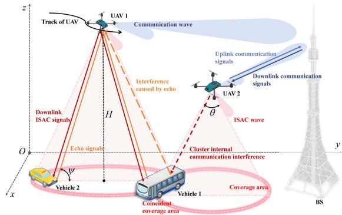  
Fig. 2. ISAC mode of the UAV cluster and BS.

Doppler frequency shifts and can be used as a reliable means of differentiation [42].

Assumption 2: Based on information processing technologies such as matching filtering, the receiving end of UAVs can distinguish echo signals generated by different vehicles within the coverage range, considering angle of arrival (AoA), time of flight (ToF) [43], and Doppler frequency shift [44].

The above assumptions are based on relevant technologies for modeling [45], [46]. Then, echo signals consider interference from other UAVs and ignore echo interference from other vehicles within the coverage area [29], as shown in Fig. 2. The SNR of the echo signal is approximated as

$$
\epsilon _ { n , m } ^ { s } ( t ) = \frac { \frac { \eta _ { n , m } ( t ) P _ { n } ^ { s } ( t ) G _ { t } ^ { s } G _ { r } ^ { s } \lambda ^ { 2 } \sigma } { ( 4 \pi ) ^ { 3 } ( d _ { n , m } ( t ) ) ^ { 4 } } } { N _ { 0 } B _ { s } + \displaystyle \sum _ { \substack { i = 1 } } ^ { N } \frac { \eta _ { i , m } ( t ) \eta _ { n , m } ( t ) P _ { i } ^ { s } ( t ) G _ { t } ^ { s } G _ { r } ^ { s } \lambda ^ { 2 } \sigma } { ( 4 \pi ) ^ { 3 } ( d _ { n , m } ( t ) ) ^ { 2 } ( d _ { i , m } ( t ) ) ^ { 2 } } } ,\tag{11}
$$

where $\sigma$ is the radar cross-section (RCS) of vehicles and $G _ { r } ^ { s }$ is the receiving antenna gain of the directional antenna. CLRB and SNR are inversely proportional, so we can replace the CLRB with the echo SNR to measure the sensing quality. Furthermore, we can derive the radar MI based on SNR [13], which quantifies both quality and data volume of sensing:

$$
M _ { n , m } ( t ) = B _ { s } \log _ { 2 } ( 1 + \epsilon _ { n , m } ^ { s } ( t ) ) .\tag{12}
$$

However, UAVs may have repeated detection of identical vehicles due to overlapping sensing coverage [14], which is detrimental to the diversity of the sensed data. We propose an index to measure the number of UAVs serving vehicle m at t:

$$
\vartheta _ { m } ( t ) = \sum _ { n = 1 } ^ { N } \mathcal { T } _ { \{ \eta _ { n , m } ( t ) > 0 \} } ,\tag{13}
$$

where ${ \mathcal { T } } _ { \{ { \mathcal { F } } ( x ) \} }$ is the indicative function, $\mathcal { T } = 1$ if the condition $\mathcal { F } ( x )$ is true, otherwise $\mathcal { T } = 0 .$ . According to [28], we derive an improved Jain’s fairness index to measure the sensing fairness:

$$
\varrho ( t ) = \frac { \left( \sum _ { m = 1 } ^ { M } \vartheta _ { m } ( t ) \right) ^ { 2 } } { \iota + M \sum _ { m = 1 } ^ { M } \left( \vartheta _ { m } ( t ) \right) ^ { 2 } } ,\tag{14}
$$

where $\iota = 0 . 0 1$ is a minimum number used to avoid denominators of zero and $\varrho ( t ) \in [ 0 , 1 )$ according to the Cauchy’s inequality. Furthermore, we propose a new indicator called effective

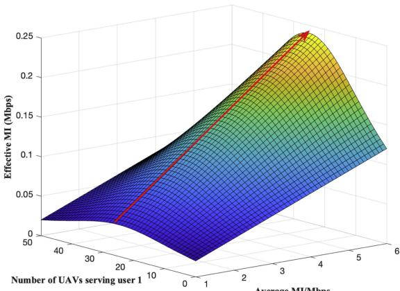  
Fig. 3. The changing trend of effective MI.

MI:

$$
\hat { M } ( t ) = \varrho ( t ) \sum _ { n = 1 } ^ { N } \sum _ { m = 1 } ^ { M } M _ { n , m } ( t ) ,\tag{15}
$$

which can quantify sensing fairness, data volume, and quality. We will use an ideal and extreme example to better illustrate the nature of this new indicator. Consider 50 UAVs serving two users far enough apart (so each UAV can only serve one user at a time) and assume that their MI is the same as the average MI. The changing trend of $\hat { M } ( t )$ can be seen in Fig. 3, based on ( )which we can derive the following remarks.

Remark 1: To improve $\hat { M } ( t )$ , it is necessary to improve the quality or total amount of sensing data and ensure the fairness of sensing.

Remark 2: As the overall sensing level increases, fairness becomes more and more important for the influence of $\hat { M } ( t )$

## E. Optimization Problem Formulation

We aim to improve the system’s overall ISAC performance based on the modeling and indicator design above. Specifically, the main optimization objectives in this system are to maximize the average effective MI of UAVs and the average total number of users served. Based on these two main objectives, we also try to reduce the total energy consumption of the UAV cluster as much as possible. Thus, the idealized optimization problem can be formulated as

$$
\operatorname* { m a x } _ { \delta , \mathbf { v } , \varphi , } \sum _ { t = 0 } ^ { T } \hat { M } ( t ) ; \operatorname* { m a x } _ { \mathbf { v } , \varphi } \sum _ { t = 0 } ^ { T } \sum _ { m = 1 } ^ { M } \mathcal { T } _ { \{ \vartheta _ { m } ( t ) > 0 \} } ; \operatorname* { m i n } _ { \mathbf { v } , \mathbf { P } ^ { \mathbf { c } } , \mathbf { P } ^ { \mathbf { s } } } \sum _ { t = 0 } ^ { T } E ( t )\tag{16a}
$$

$$
\begin{array} { r l } { \mathrm { s . t . } } & { \left( \operatorname* { m a x } \left\{ \epsilon _ { n , m } ^ { c } ( t ) , \forall n \in \mathcal { N } \right\} - \varGamma _ { c } \right) \mathcal { T } _ { \left\{ \vartheta _ { m } ( t ) > 0 \right\} } \geq 0 , } \end{array}\tag{16b}
$$

$$
0 \leq P _ { n } ^ { c } ( t ) \leq P _ { m } ^ { c } , 0 \leq P _ { n } ^ { s } ( t ) \leq P _ { m } ^ { s } , \forall n \in \mathcal { N } ,\tag{16c}
$$

$$
\delta _ { n } ( t ) \neq \delta _ { i } ( t ) , \delta _ { n } ( t ) \in \{ 1 , . . . , N \} , \forall n \neq i \in \mathcal { N } ,\tag{16d}
$$

$$
0 \leq v _ { n } ( t ) \leq V _ { u } ^ { \operatorname* { m a x } } , \varphi _ { n } ( t ) \in [ - \pi , \pi ] , \forall n \in \mathcal { N } ,\tag{16e}
$$

$$
\sum _ { m = 1 } ^ { M } M _ { n , m } ( t ) \leq R _ { n } ^ { c } ( t ) , \forall n \in \mathcal { N } ,\tag{16f}
$$

$$
d _ { i , j } ( t ) \leq d _ { s } , i \neq j , \forall i , j \in \mathcal { N } ,\tag{16g}
$$

where T is the total time and the optimization variables $\{ \delta , \mathbf { v } , \varphi , \mathbf { P ^ { c } } , \mathbf { P ^ { s } } \}$ represent the choice at each time slot and thus take the form of vectors. Specifically, δ is the communication channel allocation for all UAVs, v is the UAVs’ velocity choice, $\varphi$ denotes the bearing angle information of UAVs, $\mathbf { P } ^ { \mathbf { c } }$ and Ps denote the communication power and transmitting power for ISAC signals of UAVs, respectively. Constraint (16b) requires the served user to have at least one ISAC signal emitted by any UAV that reaches the required communication SNR threshold $\varGamma _ { c } ,$ so that ensure the QoS to the vehicle user [40]. Constraint (16c) denotes that the transmitting power of communication and ISAC signals cannot exceed the rated power $P _ { m } ^ { c }$ and $P _ { m } ^ { s }$ respectively. Constraint (16d) indicates that each UAV has only one allocated channel. Constraint (16e) shows the maximum flying speed related to the equipment conditions. Constraint (16f) is the fundamental inequality of ISAC that the amount of sensed data should not be higher than the channel capacity to avoid data loss [13]. Constraint (16g) denotes the distance $d _ { i , j } ( t ) = \Vert \mathbf { X } _ { i } ( t ) - \mathbf { X } _ { j } ( t ) \Vert _ { 2 }$ between any two UAV i and j shall not be less than the minimum safe distance $d _ { s } ,$ , to avoid collision and ensure flight safety.

## III. MADDPG-BASED ADAPTIVE CONTROL SCHEME

In this section, we transform the problem to simplify it and then design a solution based on the MADDPG algorithm, as it is challenging to solve (16a) using traditional methods such as convex optimization and dynamic programming (DP). Specifically, the environment is partially observed, and (16a) becomes a dynamic stochastic problem due to UAVs’ and vehicles’ random movement. Second, due to the introduction of δ and the unique form of $\hat { M } ( t )$ , (16a) becomes a mixed integer non-linear and non-convex problem. Third, (16a) is an idealized multi-objective optimization problem with conflicting objectives, as improving the sensing performance often needs to increase the energy cost. Thus, we choose the RL-based algorithm to optimize policies through interactive learning between agents and environments, enabling real-time decisions in dynamic environments.

Since there are many decision variables, we can first perform approximate simplification to reduce the RL algorithm’s learning difficulty. By analyzing (16a), it can be found that $\mathbf { P } ^ { \mathbf { c } }$ only appears in minimized $\textstyle \sum _ { t = 0 } ^ { T } E ( t )$ and (16f). The minimization of $\textstyle \sum _ { t = 0 } ^ { T } E ( t )$ should be completed on the basis of satisfying ( )constraint (16f), so we can draw a basic relationship between $\mathbf { P } ^ { \mathbf { c } }$ and $\mathbf { P ^ { s } }$ based on (16f):

$$
\begin{array} { r } { P _ { n } ^ { c } ( t ) = \left\{ \begin{array} { l l } { \left( 2 ^ { \frac { M _ { n } ( t ) } { \hat { B } } } - 1 \right) \frac { \hat { B } N _ { 0 } } { G _ { n } ^ { c } ( t ) } , } & { M _ { n } ( t ) < R _ { n } ^ { \operatorname* { m a x } } ( t ) ; } \\ { P _ { m } ^ { c } , } & { e l s e , } \end{array} \right. } \end{array}\tag{17}
$$

where $\begin{array} { r } { M _ { n } ( t ) = \sum _ { m = 1 } ^ { M } M _ { n , m } ( t ) } \end{array}$ and $\begin{array} { r } { R _ { n } ^ { \operatorname* { m a x } } ( t ) = \hat { B } \log _ { 2 } ( 1 + } \end{array}$ $\frac { P _ { m } ^ { c } G _ { n } ^ { c } ( t ) } { \hat { B } N _ { 0 } } )$ is maximum data rate that UAV n can achieve at t. The adaptive decision method of $\mathbf { P } ^ { \mathbf { c } }$ in (17) satisfies (16f) as much as possible and reduces one variable that needs to be decided. In other words, we can adjust the $\mathbf { P } ^ { \mathbf { c } }$ according to $\mathbf { P ^ { s } }$ to save energy. This approximate substitution is valuable because the first two optimization variables in (16a) are prioritized over energy savings.

## A. Problem Transformation and Reward Design

In order to analyze the original dynamic optimization problem, each UAV is regarded as an agent, and its interaction process with the environment can be described by MDP, that is, based on a four-tuple representation:

$$
\mathcal { M } = \left\{ \boldsymbol { S } , \mathcal { A } , \pi , \mathcal { R } \right\} ,\tag{18}
$$

where $\boldsymbol { s }$ is the state space, $\mathcal { A } = \{ \mathcal { A } _ { 1 } , . . . , \mathcal { A } _ { N } \}$ is the action space of all $\operatorname { U A V s } , \pi = \left\{ \pi _ { 1 } , . . . , \pi _ { N } \right\}$ is the policy set, and R is =the reward vector. We explain the parameters in detail.

The state space is used to describe the entire system and agents, and it should contain all the supporting information to measure the objective optimization problem, then

$$
\begin{array} { r l } { S \triangleq \{ s ( t ) \} = \{ \hdots , x _ { n } ( t ) , y _ { n } ( t ) , \hat { G } _ { n } ^ { c } ( t ) , \hdots , x _ { N } ( t ) , y _ { N } ( t ) , } & { } \\ { \quad } & { } \\ { \hat { G } _ { N } ^ { c } ( t ) , x _ { o } ( t ) , y _ { o } ( t ) , \hdots x _ { m } ( t ) , y _ { m } ( t ) , \hdots , } & { } \\ { \quad } & { } \\ { x _ { M } ( t ) , y _ { M } ( t ) , \hdots , \varepsilon _ { m } ( t ) , \hdots , \varepsilon _ { M } ( t ) , \varrho ( t ) \} , } \end{array}\tag{19}
$$

where $\begin{array} { r } { \hat { G } _ { n } ^ { c } ( t ) = \frac { G _ { t } ^ { c } G _ { r } ^ { c } ( P _ { n } ^ { L o S } ( t ) + \kappa P _ { n } ^ { N L o S } ( t ) ) } { d _ { n . o } ( t ) ^ { 2 } ( 4 \pi ) ^ { 2 } } } \end{array}$ is the communication channel gain per unit wavelength and $\varepsilon _ { m } ( t ) =$ $( \operatorname* { m a x } \{ \epsilon _ { n , m } ^ { c } ( t ) , \forall n \in \mathcal { N } \} - \varGamma _ { c } ) \mathbb { Z } _ { \{ \vartheta _ { m } ( t ) > 0 \} }$ is the difference between the communication SNR of the user receiving the service and the threshold $\varGamma _ { c } .$ . In this way, the state $s ( t )$ contains the location information of UAVs and vehicles, communication indicators, service performance, and other data required for problem evaluation.

We transform the optimization variables in the original optimization problem into the action decisions of each UAV, thus having an impact on the environment to generate state transition $s ( t ) \to s ( t + 1 )$ . The action space of UAV n is

$$
\begin{array} { r } { \mathcal { A } _ { n } \triangleq \{ a _ { n } ( t ) \} = \{ v _ { n } ( t ) , \varphi _ { n } ( t ) , P _ { n } ^ { s } ( t ) , \tilde { \delta } _ { n } ( t ) \} , } \end{array}\tag{20}
$$

where we relax the integer variable ${ \delta _ { n } } ( t ) \in \{ 1 , . . . , K \}$ into the continuous variable $\tilde { \delta } _ { n } ( t ) \in [ 1 , K ]$ to address the problem of mixed integers. According to the current channel preference $\tilde { \delta } _ { n } ( t )$ , the preferred channel $\begin{array} { r } { c _ { n } ^ { 1 } ( t ) = \lfloor \tilde { \delta } _ { n } ( t ) + \frac { 1 } { 2 } \rfloor } \end{array}$ of UAV n ( ) ( ) = ( ) +can be obtained. To avoid collisions, it is necessary to select potential secondary channels for UAV n based on the current decision. Sort based on the absolute value of the difference from $\tilde { \delta } _ { n } ( t )$ to form the channel candidate list ${ \bf C } _ { n } ( t ) =$ $\{ c _ { n } ^ { 1 } ( t ) , c _ { n } ^ { 2 } ( t ) , . . . , c _ { n } ^ { K } ( t ) \}$ sorted in descending order of preference. During the implementation, to achieve channel allocation within the distributed UAVs, we inherit the methods such as carrier sensing and random backoff in the traditional CSMA/CA [43], and further reduce the conflict probability through priority backoff. Before the communication transmission begins in each time slot, each UAV selects a small random backoff time $T _ { n } ^ { b f } ( t )$ and performs timing. Specifically, $T _ { n } ^ { b f } ( t )$ is related to $\delta _ { n } ( t )$ . The closer $\tilde { \delta } _ { n } ( t )$ is to $c _ { n } ^ { 1 } ( t )$ , the shorter ( )the selected random delay $T _ { n } ^ { b f } ( t )$ is. This design is similar to opportunistic CSMA [47], but we implement decision-making to ensure that the users with the strongest demands have priority in occupying the expected channels. After the timing ends, UAV n will quickly perform carrier sensing on $c _ { n } ^ { 1 } ( t )$ . If the channel is busy, it will quickly scan the secondary channels in $\mathbf { C } _ { n } ( t )$ ( )based on priority, thereby quickly occupying the suboptimal idle channel. Through the above mechanism, we achieve distributed channel allocation under the requirement of low communication overhead: ${ \tilde { \delta } } _ { n } ( t ) \to \delta _ { n } ( t ) \in \mathbf { C } _ { n } ( t )$

Then, the policy for each agent to make action decisions based on the current state is the solution we need to obtain: $\pi _ { n } : { \cal S } $ $A _ { n }$ . In most cases, it is difficult for each UAV to obtain the complete information $s ( t )$ of the environment, which requires more heavy communication interactions, resulting in a large consumption of energy and communication resources. Therefore, some local information in $s ( t )$ is selected as the UAV’s ( )observation for decision-making, and reducing the dimension of information reduces the neural network’s learning difficulty. Then, the policy of UAV n is denoted as $\pi _ { n } ( a _ { n } ( t ) | o _ { n } ( t ) )$ and the observation is

$$
\begin{array} { r l r } & { } & { \mathcal { O } _ { n } \triangleq \{ o _ { n } ( t ) \} = \{ x _ { n } ( t ) , y _ { n } ( t ) , \{ d _ { n , m } ( t ) , m \in \mathcal { U } _ { n } ( t ) \} , } \\ & { } & { \quad x _ { o } ( t ) , y _ { o } ( t ) , \{ \varDelta x _ { n , i } ( t ) , \varDelta y _ { n , i } ( t ) , i \neq n , i \in \mathcal { N } \} , n \} , } \end{array}\tag{21}
$$

where ${ { \mathscr U } _ { n } } ( t )$ is the set of spacing between UAV n and $N _ { O } =$ $\textstyle { \frac { N } { 4 } }$ nearest vehicles. Besides, $\varDelta x _ { n , i } ( t ) = x _ { i } ( t ) - x _ { n } ( t )$ and $\dot { \Delta } y _ { n , i } ( t ) = y _ { i } ( t ) - y _ { n } ( t )$ ( ) = ( ) ( ). To distinguish the observation between UAVs with similar locations, we refer to the idea of mutual deep Q-network (MDQN) to input the status of UAV n itself first and disrupt the order in ${ { \mathcal { U } } _ { n } } ( t )$ , instead of adding only the identifying number (ID) n of the UAV [48].

When the agents change the environment based on observation, they will get the instant reward $\mathcal { R } ( t )$ . We hope to optimize the original objective by seeking the optimal decision to maximize the cumulative reward, which turns (16a) into

$$
\operatorname* { m a x } _ { \tilde { \delta } , \mathbf { v } , \varphi , \mathbf { P } ^ { \mathrm { s } } } \sum _ { t = 0 } ^ { T } \omega ^ { \mathsf { T } } \mathcal { R } ( t ) = \sum _ { t = 0 } ^ { T } \left[ \omega _ { 1 } , \omega _ { 2 } , \omega _ { 3 } \right] \left[ r _ { 1 } ( t ) , r _ { 2 } ( t ) , r _ { 3 } ( t ) \right] ^ { \mathsf { T } }
$$

$$
= \sum _ { t = 0 } ^ { T } \omega ^ { \top } \left[ \frac { \hat { M } ( t ) } { C _ { 1 } } , \frac { \displaystyle \sum _ { m = 1 } ^ { M } \mathcal { T } _ { \{ \vartheta _ { m } ( t ) > 0 \} } } { C _ { 2 } } , \frac { \varDelta E ( t ) } { C _ { 3 } N } \right] ^ { \top }\tag{22a}
$$

s.t. (16b), (16c), (16e), (16f), (16g),

$$
\tilde { \delta } _ { n } ( t ) \in [ 1 , N ] , \forall n \in \mathcal { N } ,\tag{22b}
$$

where $r _ { 1 } ( t ) , r _ { 2 } ( t )$ , and $r _ { 3 } ( t )$ are subrewards derived from the normalization of the three optimization objectives in (16a) based on the normalized parameters $C _ { 1 } , \ C _ { 2 }$ , and $C _ { 3 }$ . Besides, ω is the weight vector for multiple optimization objectives to achieve tradeoff and $\varDelta E ( t ) = N E _ { m } - E ( t )$ . As $E ( t ) \triangleq$ max $\varDelta E ( t )$ , the set constant $E _ { m } \in ( E _ { m i n } , E _ { m a x } )$ is adopted to avoid the situation that agents hard to learn policies when only positive or negative rewards are obtained during the optimization of energy consumption.

Denote $\omega ^ { \top } \mathcal { R } ( t )$ as $r ( t )$ . On the one hand, the future reward usually has significant uncertainty, so the discount rate $\gamma \in [ 0 , 1 ]$ is introduced to avoid the future reward having too much influence on the current decision. On the other hand, we hope to further simplify (22a) by transforming some of the rigid constraints into negative rewards as soft constraints and adding an inducible reward $r ^ { i d } ( t )$ based on prior knowledge to guide the agents’ initial learning. We further transform (22a) to maximize the cumulative discount reward to optimize (16a), thus approaching the optimal solution:

$$
\operatorname* { m a x } _ { \mathbf { a } \sim \pi } \mathbb { E } \left[ \sum _ { t = 0 } ^ { \infty } \gamma ^ { t } \left( r ( t ) + r _ { p } ( t ) + r ^ { i d } ( t ) \right) | \pi \right]
$$

$$
\mathrm { s . t . } \qquad ( 1 6 \mathrm { c } ) , ( 1 6 \mathrm { e } ) , ( 2 2 \mathrm { b } ) ,\tag{23}
$$

where $r _ { p } ( t ) = r _ { p _ { 1 } } ( t ) + r _ { p _ { 2 } } ( t ) + r _ { p _ { 3 } } ( t )$ and $\mathbf { a } = \{ \tilde { \delta } , \mathbf { v } , \varphi , \mathbf { P ^ { s } } \}$ is the decision of actions. $r _ { p _ { 1 } } ( t ) , r _ { p _ { 2 } } ( t )$ ), and $r _ { p _ { 3 } } ( t )$ are the negative penalty rewards corresponding to constraints (16b), (16f), and (16g) respectively. Let $\Delta _ { m } ( t ) = \mathrm { m a x } \{ \epsilon _ { n \in \mathcal { N } , m } ^ { c } ( t ) \} - { \cal T } _ { c }$ and $\begin{array} { r } { \begin{array} { r } { \boldsymbol { \Upsilon _ { n } } ( t ) = \boldsymbol { R _ { n } ^ { c } } ( t ) - \sum _ { m = 1 } ^ { M } M _ { n , m } ( t ) } \end{array} } \end{array}$ , then

$$
r _ { p _ { 1 } } ( t ) = \sum _ { m = 1 } ^ { M } \frac { ( \Delta _ { m } ( t ) ) } { M C _ { p _ { 1 } } } \mathcal { T } _ { \{ \Delta _ { m } ( t ) < 0 \} } \mathcal { T } _ { \{ \vartheta _ { m } ( t ) > 0 \} } ,\tag{24a}
$$

$$
r _ { p _ { 2 } } ( t ) = \sum _ { n = 1 } ^ { N } \frac { \Big ( R _ { n } ^ { c } ( t ) - \sum _ { m = 1 } ^ { M } M _ { n , m } ( t ) \Big ) } { N C _ { p _ { 2 } } } \mathcal { T } _ { \{ \mathcal { T } _ { n } ( t ) < 0 \} } ,\tag{24b}
$$

$$
r _ { p _ { 3 } } ( t ) = \frac { \displaystyle \sum _ { n = 1 } ^ { N } \sum _ { i \in \mathcal { N } } ^ { N } \left( - \frac { 1 } { d _ { m } } \mathcal { T } _ { \left\{ d _ { n , i } ( t ) < \left( H / 2 \cos \left( \frac { \theta } { 2 } \right) \right) \right\} } \right) } { N C _ { p _ { 3 } } } ,\tag{24c}
$$

which give correlated negative rewards based on how much of the original constraint is exceeded and are normalized according to $C _ { p _ { 1 } } , C _ { p _ { 2 } }$ , and $C _ { p _ { 3 } }$ . Besides, $\begin{array} { r } { \frac { 1 } { d _ { m } } = \operatorname* { m i n } \{ \frac { 1 } { d _ { n , i } ( t ) } , \frac { 1 } { d _ { s } } \} } \end{array}$ . Due to the small $d _ { s } , \mathrm { a }$ gradually increasing negative reward is given as the process approaches the boundary.

However, the above rewards are relatively discrete, and sparse rewards will make agent learning difficult. So, we need to design incentive rewards to help agents learn basic policies. Based on prior knowledge, vehicle users will only appear in the lanes coverage interval $\mathcal { D } _ { R }$ , and the probability of vehicles appearing at the road intersection is high. Let $\begin{array} { r } { \hat { { \bf X } } = [ \frac { L _ { x } } { 2 } , \frac { L _ { x } } { 2 } ] ^ { \top } } \end{array}$ be the central location of roads, we innovatively give induced continuous rewards to those UAVs that have no sensing objects based on their state changes, $\mathrm { e . g . , ~ } \varpi _ { n } ( t ) = \| \mathbf { X } _ { n } ( t - 1 ) - \hat { \mathbf { X } } \| _ { 2 } - \| \mathbf { X } _ { n } ( t ) -$ ${ \hat { \mathbf { X } } } \Vert _ { 2 }$ . Then

$$
\begin{array} { r } { r _ { n } ^ { i d } ( t ) = \left\{ \begin{array} { l l } { \frac { { \varpi _ { n } } ( t ) { \mathbb { Z } } _ { \{ \varpi _ { n } ( t ) \geq 0 \} } } { { 2 C _ { i d } } } , } & { { \mathbf { X } } _ { n } ( t ) \in \mathcal { D } _ { R } , } \\ { \frac { { \varpi _ { n } } ( t ) \left( 1 + { \mathbb { Z } } _ { \{ \varpi _ { n } ( t ) < 0 \} } \right) } { { 2 C _ { i d } } } , } & { { \mathbf { X } } _ { n } ( t ) \notin \mathcal { D } _ { R } , } \\ { - { \mathbb { Z } } _ { \{ \varpi _ { n } ( t ) = 0 \} } , } & { { \mathbf { X } } _ { n } ( t ) \notin \mathcal { D } _ { R } , } \end{array} \right. } \end{array}\tag{25}
$$

where $\begin{array} { r } { r ^ { i d } ( t ) = \sum _ { n = 1 } ^ { N } \frac { r _ { n } ^ { i d } ( t ) } { N } \mathcal { T } _ { \left\{ d _ { n , m } ( t ) > \frac { H } { \cos ( \theta / 2 ) } , \forall m \in \mathcal { M } \right\} } } \end{array}$ and $C _ { i d }$ is for normalization. That is, we encourage UAVs that do not have a sensing object to approach $\hat { \bf X }$ and punish them if they do not stay within $\mathcal { D } _ { R }$ . Besides, punish lazy decision-making of UAVs outside $\mathcal { D } _ { R }$ that have not changed to a better place.

## B. Algorithm of RND Based MADDPG

We have converted the original optimization objective into a standard optimization form of RL in (23), which can be written recursively based on the Bellman equation [29]. Let $r ( t ) + r _ { p _ { 1 } } ( t ) + r _ { p _ { 2 } } ( t ) + r _ { p _ { 3 } } ( t ) + r ^ { i d } ( t ) = R ( t )$ , then we have

$$
Q ^ { \pi } ( s ( t ) , a ( t ) ) = \mathbb { E } \left[ R ( t ) + \gamma Q ^ { \pi } ( s ( t + 1 ) , a ( t + 1 ) ) \right]\tag{26}
$$

where $a ( t ) = \{ a _ { 1 } ( t ) , . . . , a _ { N } ( t ) \}$ is the set of actions and $Q ^ { \pi } ( s ( t ) , a ( t ) )$ is the state-action value function. Then the optimization objective is equivalent to find $\pi ^ { * } =$ arg max $\pi Q ^ { \pi } ( s ( t ) , a ( t ) )$ . For convenience, denote $s ( t ) = s ,$ $s ( t + 1 ) = s ^ { \prime } , \ a ( t ) = a , \ a ( t + 1 ) = a ^ { \prime } , \ a _ { n } ( t ) = a _ { n } , \ a _ { n } ( t +$ $1 ) = a _ { n } ^ { \prime } , o _ { n } ( t ) = o _ { n }$ =, and $o _ { n } ( t + 1 ) = o _ { n } ^ { \prime } .$

We use MADDPG, a practical framework in RL, to find the optimal policy. First, MADDPG uses a deterministic policy instead of the probabilistic policy π. For UAV $n ,$ we have

$$
\pi _ { n } ( a _ { n } ( t ) | o _ { n } ( t ) ) \to a _ { n } ( t ) = \mu _ { n } ( o _ { n } ( t ) ) ,\tag{27}
$$

which does not take the form of conditional sampling. Second, to approximate Bellman’s equation, MADDPG must build four kinds of neural networks. A central critic network that evaluates the $Q$ value of current s and a to guide policy optimization, with the network parameter theta $\xi .$ A central target critic network assists in calculating $Q$ value and smooth updates, with the network parameter $\hat { \xi } .$ For any UAV n contains an actor network $\mu _ { n }$ and target actor network $\mu _ { n } ^ { \prime }$ for generating actions and smooth updates, parameterized to $\zeta _ { n }$ and $\hat { \zeta } _ { n } ,$ , respectively. Then, the Bellman equation can be fitted using the critic network:

$$
Q ( s , a ; \xi ) \approx R ( t ) + \gamma Q ^ { \prime } ( s ^ { \prime } , \mu ^ { \prime } ; \hat { \xi } ) ,\tag{28}
$$

where $Q ^ { \prime } ( s ^ { \prime } , \mu ^ { \prime } ; \hat { \xi } )$ is the $Q$ value given by the target critic network and $\mu ^ { \prime } = \{ \mu _ { n } ^ { \prime } ( o _ { n } ^ { \prime } ; \hat { \zeta } _ { n } ) , n = 1 \sim N \}$ is the set of action outputs. The goal of the critic network is to minimize the temporal difference (TD) error so that its predicted value approximates the target value of the Bellman equation:

$$
L ( \xi ) = \mathbb { E } _ { ( s , a , R ( t ) , s ^ { \prime } ) \sim B } \left[ ( y _ { t } - Q ( s , a ; \xi ) ) \right] ,\tag{29}
$$

where $y _ { t } = R ( t ) + \gamma Q ^ { \prime } ( s ^ { \prime } , \mu ^ { \prime } ; \hat { \xi } )$ is the target value and $\boldsymbol { B }$ is the = ( ) + ( ; )batch data set. Based on (29), critic network updates parameters through

$$
\nabla _ { \xi } L ( \xi ) = \mathbb { E } _ { ( s , a , R ( t ) , s ^ { \prime } ) \sim \mathcal { B } } \left[ \left( Q ( s , a ; \xi ) - y _ { t } \right) \nabla _ { \xi } Q ( s , a ; \xi ) \right] .\tag{30}
$$

The objective function of each actor network is to optimize its policy by maximizing the Q value:

$$
L ( \zeta _ { n } ) = \mathbb { E } _ { s \sim \mathcal { B } } \left[ \left( Q ( s , \{ a _ { 1 } , \dots \mu _ { n } ( o _ { n } ; \zeta _ { n } ) , \dots a _ { N } \} ; \xi ) \right) \right] ,\tag{31}
$$

where $o _ { n } \in s .$ . Then, the gradient of the actor network is calculated by the chain rule:

$$
\nabla _ { \zeta _ { n } } L ( \zeta _ { n } ) = \mathbb { E } _ { s \sim { \cal B } } \left[ \nabla _ { \mu _ { n } } Q ( s , \{ a _ { 1 } , . . . \mu _ { n } , . . . a _ { N } \} ; \xi ) \nabla _ { \zeta _ { n } } \mu _ { n } \right] .\tag{32}
$$

where $\mu _ { n } = \mu _ { n } ( o _ { n } ; \zeta _ { n } )$ . To achieve smooth updates, soft updates are applied to each actor target network and the target

critic network [48]:

$$
\hat { \xi } = ( 1 - \tau ) \hat { \xi } + \tau \xi ,\tag{33a}
$$

$$
\begin{array} { r } { \hat { \zeta } _ { n } = ( 1 - \tau ) \hat { \zeta } _ { n } + \tau \zeta _ { n } , n \in \mathcal { N } , } \end{array}\tag{33b}
$$

where $\tau \in ( 0 , 1 )$ is the soft update rate.

To solve the problem that DDPG may not explore enough in continuous space and avoid agents staying in the same state at the early stage of training, we propose a new incentive mechanism inspired by RND logic [49], enhancing exploration ability in a sparse reward environment. Specifically, we construct a centralized target RND network and a predict RND network, parameterized by υ and $v ,$ respectively. In order to depict the causal effect of the action at $s  s ^ { \prime }$ and guide agents to try the unknown state of high value, we input $s ^ { \prime }$ into the target network to calculate the target feature $f ^ { \prime } ( s ^ { \prime } ; \hat { \nu } )$ . Input s into the prediction network to get $f ( s ; \nu )$ , which is used to predict $f ^ { \prime } ( s ^ { \prime } ; \hat { \nu } )$ . Thus, the optimization objective of predict the RND network is to minimize RND loss:

$$
L ( \nu ) = \mathbb { E } _ { ( s , s ^ { \prime } ) \sim B } \left[ \frac { 1 } { 2 } \left. f ( s ; \nu ) - f ^ { \prime } ( s ^ { \prime } ; \hat { \nu } ) \right. _ { 2 } ^ { 2 } \right] ,\tag{34}
$$

based on which, we have the gradient for update:

$$
\nabla _ { \boldsymbol { \nu } } L ( \boldsymbol { \nu } ) = \mathbb { E } _ { ( s , s ^ { \prime } ) \sim \mathcal { B } } \left[ \big ( f ( s ; \boldsymbol { \nu } ) - f ^ { \prime } ( s ^ { \prime } ; \boldsymbol { \hat { \nu } } ) \big ) \nabla _ { \boldsymbol { \nu } } f ( s ; \boldsymbol { \nu } ) \right] .\tag{35}
$$

Similarly, in order to adapt to target changes in dynamic environments, we apply soft updates to target RND networks:

$$
\begin{array} { r } { \hat { \nu } = ( 1 - \tau ) \hat { \nu } + \tau \nu , } \end{array}\tag{36}
$$

based on which, we gradually reduce RND loss in two cases through updates, with the help of (35). Specifically, the first case is when s and $s ^ { \prime }$ are familiar to the network, and the other is when s and $s ^ { \prime }$ are very close. Thus, we define RND loss as a novelty measure $n _ { t } = \| f ( s ; \nu ) - f ^ { \prime } ( s ^ { \prime } ; \hat { \nu } ) \| _ { 2 }$ , and raise $n _ { t }$ to encourage agents to explore unknown states at the beginning of training to avoid falling into local optimality. Then, the optimization goal in (29) is changed to

$$
\hat { L } ( \xi ) = \mathbb { E } _ { ( s , a , R ( t ) , s ^ { \prime } ) \sim B } \left[ \Big ( y _ { t } + \chi ^ { ( k ) } n _ { t } - Q ( s , a ; \xi ) \Big ) \right]\tag{37}
$$

where $\chi ^ { ( k ) }$ is a decay factor that gradually decreases with the number of training episodes k, as stability rather than exploration is required in the later stages of training.

Centralized training and decentralized execution (CTDE) are adopted to fully utilize global information in the training stage and optimize the agent’s strategy. All agents run independently in the execution stage, reducing interaction costs and improving flexibility. After initializing the six kinds of networks, we set up a shared experience playback pool C. In the training stage, we draw on the idea of deep Q-network (DQN)’s  − greedy method to realize the agent’s policy exploration in action selection [48]:

$$
a _ { n } ( t ) = \left\{ \begin{array} { l l } { \mu _ { n } ( o _ { n } ( t ) ) , } & { \mathrm { \Lambda } _ { l } ^ { ( k ) } ; } \\ { r a n d o m a c t i o n s , } & { 1 - \mathrm { \Lambda } ^ { ( k ) } , } \end{array} \right.\tag{38}
$$

where $\mathbf { \Lambda } _ { \mathcal { l } } ( k )$ is the randomization probability that decays with $k .$ Put the acquired experience data sets $\mathcal { E } _ { t } = ( s , a , R ( t ) , s ^ { \prime } )$ into C. Afterward, batch data B is sampled from the $\mathcal { C }$ to update the critic network and predict the RND network centrally. Each actor network can be updated independently to maximize the shared $Q$ value. Since each UAV is non-heterogeneous and performs the same task, in order to ensure the unity of the strategy and reduce the complexity of training, we can adopt the policy of parameter sharing, that is, $\zeta _ { 1 } = . . . = \zeta _ { N } = \zeta$ . Finally, the parameters of the actor, critic, and RND networks are updated to the corresponding target networks using soft updates. In the execution phase, each UAV only needs to deploy the trained actor network and make distributed decisions based on local observations without accessing global information. The proposed scheme can be seen in the framework in Fig. 4. If centralized training is carried out in a real environment, 5G enhanced mobile broadband (eMBB) can be introduced to aggregate the status and behavior data of all UAVs and users to the central training node in the BS [50]. After iterating the RL algorithm, the trained network parameters are sent to the local computing unit of each UAV [8]. However, to reduce risks, we suggest training the model in the high-fidelity simulation platform built by ROS/Gazebo to obtain high-performance policies [51]. In distributed execution, UAVs achieve broadcasting with other UAVs and nearby vehicles based on the proximity services sidelink interface 5 (PC5) in 3GPP [6], obtain observation information, and rely on the local network for decision-making.

## C. MADDPG With Dynamic Data Augmentation

RND improves MADDPG’s ability to obtain high-quality data, but MADDPG is still limited by the speed of data collection. Relying solely on the agent’s interaction with the environment is often expensive and time-consuming, delaying the agent’s early strategy learning and even limiting the upper limit of the final training effect. Therefore, we design a data enhancement technique suitable for MARL.

We first define a symmetric mapping operation for the current IDs of UAVs ${ \bf I } _ { N } = \{ i _ { 1 } , . . . , i _ { n } , . . . , i _ { N } \}$ . One result of the symmetric mapping can be obtained by permutation $\hbar : { \bf I } _ { N } $ $\mathbf { I } _ { N } ^ { ( \hbar ) } = \{ \hbar _ { ( i _ { 1 } ) } , . . . , \hbar _ { ( i _ { n } ) } , . . . , \hbar _ { ( i _ { N } ) } \}$ , which has N equivalent = ¯ ¯ ¯ !mappings. We take the channel allocation results of UAVs as an example. Based on the channel selection results $\{ \delta _ { n } ( t ) | n \in \mathcal { N } \}$ of UAVs, the following allocation results can be obtained:

$$
{ \bf U } ( t ) = \left[ \begin{array} { c c c c } { u _ { 1 , 1 } ( t ) } & { u _ { 1 , 2 } ( t ) } & { \ldots } & { u _ { 1 , N } ( t ) } \\ { u _ { 2 , 1 } ( t ) } & { u _ { 2 , 2 } ( t ) } & { \ldots } & { u _ { 2 , N } ( t ) } \\ { \vdots } & { \vdots } & { \ddots } & { \vdots } \\ { u _ { N , 1 } ( t ) } & { u _ { N , 2 } ( t ) } & { \ldots } & { u _ { N , N } ( t ) } \end{array} \right] ,\tag{39}
$$

where $u _ { n , i } ( t ) = 1$ if $\delta _ { n } ( t ) = i ,$ otherwise $u _ { n , i } ( t ) = 0$ . Then, U t can be mapped based on h to

$$
{ \bf U } ^ { ( \hbar ) } ( t ) = \left[ \begin{array} { c c c c } { u _ { \hbar ( 1 ) , 1 } ( t ) } & { u _ { \hbar ( 1 ) , 2 } ( t ) } & { \ldots } & { u _ { \hbar ( 1 ) , N } ( t ) } \\ { u _ { \hbar ( 2 ) , 1 } ( t ) } & { u _ { \hbar ( 2 ) , 2 } ( t ) } & { \ldots } & { u _ { \hbar ( 2 ) , N } ( t ) } \\ { \vdots } & { \vdots } & { \ddots } & { \vdots } \\ { u _ { \hbar ( N ) , 1 } ( t ) } & { u _ { \hbar ( N ) , 2 } ( t ) } & { \ldots } & { u _ { \hbar ( N ) , N } ( t ) } \end{array} \right] ,\tag{40}
$$

which can be likened to the relationship matrix $[ \eta _ { n , m } ( t ) ] _ { N \times M }$ of whether ISAC links can be established between UAVs and vehicles. Precisely, the ID of vehicle users can be mapped by a similar permutation $\ell ,$ and there are M equivalent mappings. If we take h and  simultaneously, we can have a total of N M kinds of different mappings.

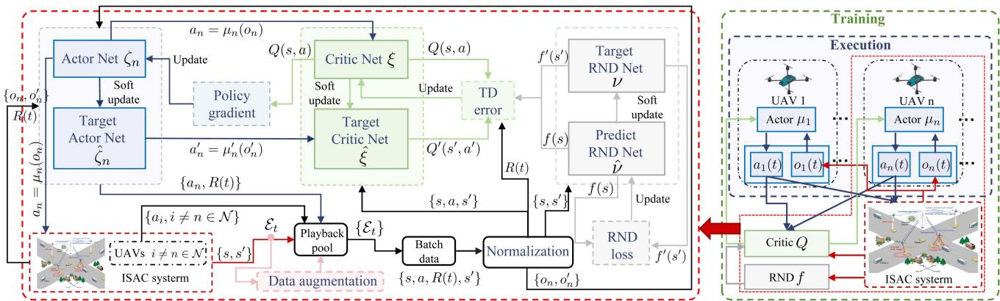  
Fig. 4. The RMADDPG-DDA framework for the multi-UAV ISAC system.

It is worth noting that the IDs of UAVs and vehicle users are artificially given, and changing the ID will not change the objective state of the current system environment. For example, the optimization objective $\hat { M } ( t )$ can be rewritten based on h and as

$$
\hat { M } ^ { ( \hbar , \ell ) } ( t ) = \frac { \left( \sum _ { m = 1 } ^ { M } \vartheta _ { \ell ( m ) } ^ { ( \hbar ) } ( t ) \right) ^ { 2 } } { \iota + M \sum _ { m = 1 } ^ { M } \left( \vartheta _ { \ell ( m ) } ^ { ( \hbar ) } ( t ) \right) ^ { 2 } } M ^ { ( \hbar , \ell ) } ( t ) ,\tag{41a}
$$

$$
M ^ { ( \hbar , \ell ) } ( t ) = \sum _ { n = 1 } ^ { N } \sum _ { m = 1 } ^ { M } M _ { \hbar ( n ) , \ell ( m ) } ( t ) ,\tag{41b}
$$

where $\begin{array} { r } { \vartheta _ { \ell ( m ) } ^ { ( \hbar ) } ( t ) = \sum _ { n = 1 } ^ { N } \mathcal { T } _ { \{ \eta _ { \hbar ( n ) , \ell ( m ) } ( t ) > 0 \} } } \end{array}$ . From the sum of N and M, we know that $\hat { M } ^ { ( \hbar , \ell ) } ( t ) = \hat { M } ( t )$ . Similarly, we have $\begin{array} { r } { \sum _ { m = 1 } ^ { M } \mathcal { T } _ { \{ \vartheta _ { \ell ( m ) } ^ { ( \hbar ) } ( t ) > 0 \} } \ = \ \Gamma ^ { ( \hbar , \ell ) } ( t ) \ = \ \sum _ { m = 1 } ^ { M } \mathcal { T } _ { \{ \vartheta _ { m } ( t ) > 0 \} } } \end{array}$ and $\begin{array} { r } { \frac { E ^ { ( \hbar ) } ( t ) } { N } = \frac { \sum _ { n = 1 } ^ { N } E _ { \hbar ( n ) } ( t ) } { N } = \frac { E ( t ) } { N } } \end{array}$ . Furthermore, the equivalent conversion of (16a) can be realized based on h and :

$$
\operatorname* { m a x } _ { \delta ^ { ( \hbar ) } , { \bf m } ^ { ( \hbar ) } , } \sum _ { t = 0 } ^ { T } \hat { M } ^ { ( \hbar , \ell ) } ( t ) ; \operatorname* { m a x } _ { { \bf m } ^ { ( \hbar ) } } \sum _ { t = 0 } ^ { T } { \cal T } ^ { ( \hbar , \ell ) } ( t ) ; \operatorname* { m i n } _ { { \bf v } ^ { ( \hbar ) } } \sum _ { t = 0 } ^ { T } { \cal E } ^ { ( \hbar ) } ( t )\tag{42a}
$$

$$
\begin{array} { r l } { \mathrm { s . t . } } & { { } \left( \Delta _ { \ell ( m ) } ( t ) \right) \mathcal { T } _ { \left\{ \vartheta _ { \ell ( m ) } ^ { ( \hbar ) } ( t ) > 0 \right\} } \geq 0 , } \end{array}\tag{42b}
$$

$$
0 \leq P _ { \hbar ( n ) } ^ { c } ( t ) + P _ { \hbar ( n ) } ^ { s } ( t ) \leq P _ { m } , \forall n \in \mathcal { N } ,\tag{42c}
$$

$$
\delta _ { \hbar ( n ) } ( t ) \neq \delta _ { \hbar ( i ) } ( t ) , \forall \hbar ( n ) \neq \hbar ( i ) \in \mathcal { N } ,\tag{42d}
$$

$$
0 \leq v _ { \hbar ( n ) } ( t ) \leq V _ { m } , \varphi _ { \hbar ( n ) } ( t ) \in [ - \pi , \pi ] , \forall n \in \mathcal { N } ,\tag{42e}
$$

$$
\sum _ { m = 1 } ^ { M } M _ { \hbar ( n ) , \ell ( m ) } ( t ) \leq R _ { \hbar ( n ) } ^ { c } ( t ) , \forall n \in \mathcal { N } ,\tag{42f}
$$

$$
\begin{array} { r } { d _ { \hbar ( i ) , \hbar ( j ) } ( t ) \leq d _ { s } , \hbar ( i ) \neq \hbar ( j ) , \forall i , j \in \mathcal { N } , } \end{array}\tag{42g}
$$

where $\begin{array} { r } { \Delta _ { \ell ( m ) } ( t ) = \operatorname* { m a x } \{ \epsilon _ { \hbar ( n ) , \ell ( m ) } ^ { c } ( t ) , \forall n \in N \} - { \cal { I } } _ { c } , } \end{array}$ $\mathbf { m } ^ { ( \hbar ) }$ $\mathbf { \Psi } = \{ \mathbf { v } ^ { ( \hbar ) } , \varphi ^ { ( \hbar ) } \}$ and $\mathbf { P } ^ { ( \hbar ) } = \{ \mathbf { P } ^ { \mathbf { c } ( \hbar ) } , \mathbf { P } ^ { \mathbf { s } ( \hbar ) } \}$ . Moreover, we do not need to go through the above problem transformation. Based on the equivalence of the current problem (42a), as long as experience set $\mathcal { E } _ { t }$ can be equitably mapped based on h and $\ell ,$ the data in C can be quickly enriched with low complexity, thus achieving data augmentation.

Specifically, each state s can the mapped as

$$
\begin{array} { r } { s ^ { ( \hbar , \ell ) } ( t ) = \{ . . . , x _ { \hbar ( n ) } ( t ) , y _ { \hbar ( n ) } ( t ) , \hat { G } _ { \hbar ( n ) } ^ { c } ( t ) , . . . , x _ { \hbar ( N ) } ( t ) , } \\ { y _ { \hbar ( N ) } ( t ) , \hat { G } _ { \hbar ( N ) } ^ { c } ( t ) , x _ { o } ( t ) , y _ { o } ( t ) , . . . x _ { \ell ( m ) } ( t ) , } \\ { y _ { \ell ( m ) } ( t ) , . . . , x _ { \ell ( M ) } ( t ) , y _ { \ell ( M ) } ( t ) , . . . , \varepsilon _ { \ell ( m ) } ( t ) , } \\ { . . . , \varepsilon _ { \ell ( M ) } ( t ) , \varrho ( t ) \} , ~ \quad ~ ( 4 ; } \end{array}\tag{3}
$$

where $\varrho ( t )$ does not change because of the mapping. It should be noted that since we use MARL, s and $s ^ { \prime }$ in the same set $\mathcal { E } _ { t }$ need to adopt the same mapping mode h and , and a needs to adopt the mapping mode h of s to ensure consistency. Then,

$$
a ^ { ( \hbar ) } ( t ) = \left\{ a _ { \hbar ( 1 ) } ( t ) , . . . , a _ { \hbar ( n ) } ( t ) , . . . , a _ { \hbar ( N ) } ( t ) \right\} ,\tag{44a}
$$

$$
a _ { \hbar ( n ) } ( t ) = \left\{ v _ { \hbar ( n ) } ( t ) , \varphi _ { \hbar ( n ) } ( t ) , P _ { \hbar ( n ) } ^ { s } ( t ) , \tilde { \delta } _ { \hbar ( n ) } ( t ) \right\} .\tag{44b}
$$

Since $r ( t ) , r _ { p _ { 1 } } ( t ) , r _ { p _ { 2 } } ( t ) , r _ { p _ { 3 } } ( t )$ , and $r ^ { i d } ( t )$ are all in the form of ergodic summation, the equivalence relation $R ( t ) =$ $R ^ { ( \hbar , \ell ) } ( t )$ can be obtained by similar derivation above. Thus, we can augment one piece of data to a maximum of N M :

$$
\mathcal { E } _ { t }  \{ \mathcal { E } _ { t } ^ { ( \hbar , \ell ) } \} = \{ ( s ^ { ( \hbar , \ell ) } , a ^ { ( \hbar ) } , R ^ { ( \hbar , \ell ) } ( t ) , s ^ { \prime ( \hbar , \ell ) } ) \} .\tag{45}
$$

Generally, the knowledge contained in the augmented data is not as valuable as the data derived from the new interaction, so the augmented data is only used for early training to help the agent quickly establish the basic policy. Therefore, we dynamically adjust the amount of data augmented for each $\mathcal { E } _ { t }$ at each training episode k:

$$
\mathcal { C } \gets \mathcal { C } \cup \left\{ \mathcal { E } _ { t } ^ { ( \hbar , \ell ) } ( 1 ) \right\} \cup \ldots \cup \left\{ \mathcal { E } _ { t } ^ { ( \hbar , \ell ) } \left( \mathfrak { I } ^ { ( k ) } \right) \right\} ,\tag{46}
$$

where $\mathfrak { I } ^ { ( k ) } = \operatorname* { m i n } \{ \lfloor \ j ^ { \lfloor \frac { k } { 5 } \rfloor } N _ { \mathcal { B } } \rfloor , N ! M ! \}$ is the dynamic augmentation number decreasing with the training episodes to ensure stability and protect interactive data in the later training period [29]. $N _ { B }$ is the amount of data in the batch data set B, and $\jmath \in ( 0 , 1 )$ is the attenuation factor. Combining the mechanism (0 1)in Section III-B, the details of the proposed RMADDPG-DDA algorithm can be seen in Algorithm 1. The complexity of Algorithm 1 can be approximately expressed as

Algorithm 1: RMADDPG-DDA Based Solution.   
1 Input: the desired weight ${ \boldsymbol { \omega } } ^ { \mathsf { T } } = [ \omega _ { 1 } , \omega _ { 2 } , \omega _ { 3 } ] ;$   
2 Initialization: parameters $\xi$ for critic network, $\hat { \xi }$ for   
target critic network, ν for predict RND network, $\hat { \nu }$   
for target RND network, $\zeta _ { n }$ for each actor network,   
$\hat { \zeta } _ { n }$ for each target actor network, and ${ \mathcal { C } } = \{ \}$   
3 for training episodes $k = 1$ to Λ do   
4 Initialization: randomize $s ( 0 )$ and $R ( 0 ) = 0 ;$   
5 for $t = 1$ to $T$ do   
6 for UAV $n = 1$ to $N$ do   
7 Observe $o _ { n } ( t )$ from $s ( t ) ;$   
8 Obtain $a _ { n } ( t )$ according to (38);   
9 end   
10 Execute all actions $a ( t )$ , receive rewards $R ( t )$   
for ${ \mathrm { U A V s } } ,$ , and obtain the next state $s ( t + 1 )$   
11 Store $\mathcal { E } _ { t }$ into ${ \mathcal { C } } ;$   
12 Augment $\mathcal { E } _ { t }$ according to (46) and update ${ \mathcal { C } } ;$   
13 if $C$ is full then   
14 Randomly take a mini-batch B from ${ \mathcal { C } } ;$   
15 Obtain $n _ { t }$ by predict RND network and   
target RND network;   
16 Update $\xi$ of critic network according to   
(30) by minimize TD error;   
17 Update $\zeta$ for each actor network according   
to (32) by maximize $Q$ value;   
18 for UAV n = 1 to N do   
19 Share network parameters $\zeta _ { n } = \zeta ;$   
20 end   
21 Update ν of predic RND network according   
to (35) by minimize RND loss;   
22 Soft update $\hat { \xi }$ for target critic network, $\hat { \zeta } _ { n }$   
for target actor networks, î for target RND   
network according to (33a), (33b), (36);   
23 end   
24 end   
25 Update $\chi ^ { ( k ) } , \imath ^ { ( k ) }$ and $\Im ^ { ( k ) }$   
26 end

$$
O \left( \cal { A T } \left( N L _ { a } | \zeta | + N _ { B } \left( L _ { c } | \xi | + L _ { a } | \zeta | + L _ { r } | \nu | \right) + \mathbb { S } ^ { m } d _ { a u g } \right) \right) ,
$$

where $\mathfrak { I } ^ { m } = \mathrm { m a x } _ { k \in 1 \in \varLambda } \mathfrak { I } ^ { ( k ) } , d _ { \mathrm { a u g } }$ is the augmented data dimension, $L _ { c } , L _ { a } ,$ and $L _ { r }$ are the input dimensions of the critic, actor, and RND networks respectively, and $| \xi | , \zeta |$ and |ν| are the number of hidden layer neurons in the critic, actor, and RND networks respectively.

## IV. SIMULATION RESULTS

The study area of the simulation is $L _ { x } \times L _ { y } = 4 0 0 m \times$ m, and $M = 4 0$ vehicles are evenly distributed on four lanes and randomly initialized. To ensure traffic safety, vehicles will not be too close to each other. The BS is located at ${ \bf X } _ { o } ( t ) = { \bf \Lambda }$ $[ x _ { o } ( t ) , y _ { o } ( t ) ] ^ { \mathsf { T } } = [ 1 4 0 m , 1 4 0 m ] ^ { \mathsf { T } }$ , time interval is $\varDelta t = 1$ s and the speed of light is $c = 3 \times 1 0 ^ { 8 } { m } / { s }$ . At the beginning of the

TABLE I SIMULATION PARAMETERS
<table><tr><td>Parameters</td><td>Value</td></tr><tr><td>Start boundary of west-east lane  $L _ { w \to e }$ </td><td>150m</td></tr><tr><td>Start boundary of north-south lane  $L _ { s \to n }$ </td><td>150m</td></tr><tr><td>Lane width  $l _ { w } / 2$ </td><td>50m</td></tr><tr><td>Fuselage drag ratio  $d _ { f }$ </td><td>0.6</td></tr><tr><td>Air density  $\rho$ </td><td> $1 . 2 2 5 k g / m ^ { 3 }$ </td></tr><tr><td>Rotor solidity  $\varsigma ,$ </td><td>0.05</td></tr><tr><td>Disc area α</td><td> $0 . 5 0 3 m ^ { 2 }$ </td></tr><tr><td>Tip speed of rotor blade  $V _ { t i p }$ </td><td> $1 2 0 m / s$ </td></tr><tr><td>Blade profile power  $P _ { h }$ </td><td> $7 9 . 8 6 \dot { W }$ </td></tr><tr><td>Induced power  $P _ { i }$ </td><td>88.63W</td></tr><tr><td>Mean rotor induced velocity  $V _ { i n d }$ </td><td> $4 . 0 3 m / s$ </td></tr><tr><td>Total communication bandwidth  $B _ { c }$ </td><td> $5 M H z$ </td></tr><tr><td>Bandwidth for ISAC signals  $B _ { s }$ </td><td>0.1MHz</td></tr><tr><td>Height of UAVs H</td><td>80m</td></tr><tr><td>Height of the BS  $H _ { o }$ </td><td>50m</td></tr><tr><td>Propagation constants a and b</td><td>10, 0.6</td></tr><tr><td>NLoS caused additional attenuation κ</td><td>0.8</td></tr><tr><td>Carrier frequency  $f _ { c }$ </td><td>3GHz</td></tr><tr><td>Omnidirectional antenna gains of UAV&#x27;s</td><td>10dBi, 10dBi</td></tr><tr><td>transmitter  $G _ { t } ^ { c }$  and BS&#x27;s receiver  $G _ { r } ^ { c }$  Power spectral density of AWGN  $N _ { 0 }$ </td><td> $- 1 1 0 d B m$ </td></tr><tr><td>Detection angle range θ</td><td> $6 0 ^ { \mathbf { 0 } }$ </td></tr><tr><td>Transmitting and receiving antenna gains</td><td>30dBi, 30dBi</td></tr><tr><td> $G _ { t } ^ { s }$  and  $G _ { r } ^ { s }$  of UAV&#x27;s directional antennas RCS of users σ</td><td> $1 m ^ { 2 }$ </td></tr><tr><td>Communication SNR threshold  $\varGamma _ { c }$ </td><td>0dB</td></tr><tr><td>Rated power of communication signals  $P _ { m } ^ { c }$ </td><td>5w</td></tr><tr><td>Rated power of ISAC signals  $P _ { m } ^ { s }$ </td><td>0.1w</td></tr><tr><td>Maximum flying speed  $V _ { u } ^ { \mathrm { m a x } }$  of each UAV</td><td>20m/s</td></tr><tr><td>Maximum velocity of vehicles Vmax</td><td> $8 m / s$ </td></tr><tr><td>Minimum safe distance  $d _ { s }$ </td><td>1m</td></tr></table>

TABLE II

PARAMETERS OF RMADDPG-DDA ALGORITHM
<table><tr><td>Parameters</td><td>Value</td></tr><tr><td>Soft update rate τ</td><td>0.01</td></tr><tr><td>Initial decay factor  $\chi ^ { ( 0 ) }$ </td><td>1</td></tr><tr><td>Initial randomization probability  $\boldsymbol { \mathbf { \rho } } _ { \boldsymbol { \lambda } } ( 0 )$ </td><td>0.5</td></tr><tr><td>Dynamic data augmentation factor J</td><td>0.8</td></tr><tr><td>Discount rate γ</td><td>0.9</td></tr><tr><td>Amount of data in batch data set  $N _ { B }$ </td><td>100</td></tr><tr><td>Size of experience playback pool C</td><td>6000</td></tr><tr><td>Number of training episodes A</td><td>400</td></tr><tr><td>Learning rates of each actor network, critic network, and RND network</td><td> $1 0 ^ { - 4 } , 1 0 ^ { - 3 } , 1 0 ^ { - 4 }$ </td></tr></table>

ISAC task, UAVs take off from different random initial positions in D, and the total task time in simulation is $T = 1 5 0 \mathrm { s }$ . The parameters of the simulation environment and ISAC mechanism are selected according to [14], [15], [31], [43], [52], and Table I shows other parameter settings for simulation. Besides, the deep learning framework is exploited based on TensorFlow. The deep neural network (DNN) layers are built on a multi-layer perceptron (MLP), while the activation function of hidden layers is Leaky ReLU [53]. In addition, since there are multiple action outputs, the actor network output layer connects a multi-head neural network to share the hidden layer and is activated by Sigmoid or Tanh [54]. The parameter settings related to RL algorithms refer to [28], [29], [48] and can be seen in Table II.

As shown in Fig. 1, it can be seen that lanes roughly divide D into four areas, so we first use $N = 4 ~ \mathrm { U A V s }$ to perform the

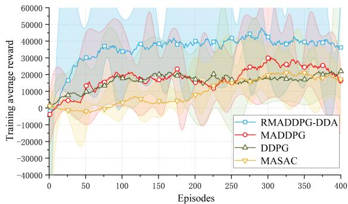

Fig. 5. Average rewards varies with the training episodes.  
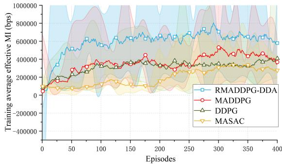

Fig. 6. Average effective MI varies with the training episodes.  
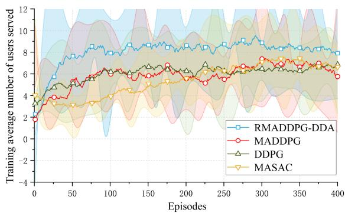  
Fig. 7. Average number of users served varies with the training episodes.

ISAC task. Since there is no primary and secondary distinction between the first two optimization objectives in (16a), Moreover, it can be estimated that they have similar optimization directions based on the structure of (9) and (11), without loss of generality, we adopted $\omega _ { 1 } = 1 , \omega _ { 2 } = 1 , \omega _ { 3 } = 0$ to first verify the performance of the proposed scheme to optimize the main two objectives with enough energy storage of UAVs. To compare the optimization performance of the RMADDPG-DDA algorithm proposed in this work, we adopted several classic RL algorithms as baselines, such as MADDPG, DDPG, and multi-agent SAC (MASAC). Figs 5, 6, and 7 show the change of average total rewards and the other two main optimization objectives with training episodes, respectively. Due to the introduction of RND and DDA, the proposed scheme can discover more effective states and draw inferences by analogy based on high-value data, that is, conduct more thorough training under the same time scale, thereby ensuring that our scheme is more likely to learn universal strategies in a highly dynamic environment. Therefore, the final training results of RMADDPG-DDA are much better than those of other RL-based baselines. Besides, training results show that effective MI and the number of served users have a similar optimization trend, which verifies our conjecture.

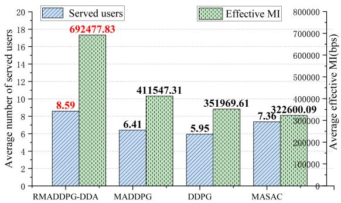  
Fig. 8. Test results of effective MI and number of users served.

We further provide the test results based on the training results. When the trained actor networks are deployed in the UAVs, the UAVs can make decisions based on local observations. We performed 10 parallel tests. The average results of the test are shown in Fig. 8, and it can be seen that the proposed scheme is still optimal. Specifically, in terms of the average number of served users, RMADDPG-DDA increased by 34.01% compared with MADDPG, by 44.37% compared with DDPG, and by 16.71% compared with MASAC. In terms of average effective MI, RMADDPG-DDA increased by 68.26% compared to MADDPG, by 96.74% compared to DDPG, and by 114.66% compared to MASAC. Since some rigid constraints in (16a) are converted to soft constraints expressed by negative rewards, we give several test results to verify whether the schemes can meet the constraints. According to (16b), we use $\begin{array} { r } { B _ { 1 } = \operatorname* { m i n } _ { t , m } \{ { \operatorname* { m a x } _ { n } \{ \epsilon _ { n , m } ^ { c } ( t ) \} } - \varGamma _ { c } \} \mathscr { T } _ { \{ \vartheta _ { m } ( t ) > 0 \} } } \end{array}$ to measure the minimum difference between communication SNR and $\varGamma _ { c }$ over $t = 0 \sim T$ . As shown in Fig. 9(a), the minimum differences are not lower than the given boundary, thus ensuring the communication QoS limit. Furthermore, the test samples of RMADDPG-DDG are further away from the lower bound, reflecting the robustness of the proposed scheme. Besides, we give $\begin{array} { r } { B _ { 2 } = \operatorname* { m i n } _ { t , n } \{ R _ { n } ^ { c } ( t ) - \sum _ { m = 1 } ^ { M } M _ { n , m } ( t ) \} } \end{array}$ to determine whether the lower bounds satisfy the boundary in constraint (16f). It can be seen from Fig. 9(a) that the lower bound $B _ { 2 }$ is just the required boundary. That is, tight constraints are realized to ensure that the total amount of data uploaded in ISAC tasks equals the channel capacity, owing to the adaptive decision method in (17). As for (16g), we choose $B _ { 3 } = \operatorname* { m i n } _ { t } \{ d _ { i , j } ( t ) \leq d _ { s } | i \neq j , \forall i , j \in \mathcal { N } \}$ to describe the minimum distance between any two UAVs in the cluster over $t = 0 \sim T$ . As shown from Fig. 9(b), $B _ { 3 }$ obtained by the proposed scheme is significantly higher than $d _ { s } .$ , thus ensuring the flight safety of UAVs.

Furthermore, we train RMADDPG-DDA models with different numbers of UAVs and test them to verify the proposed scheme’s adaptability to different numbers of agents. As shown in Fig. 10, the average number of users served and the effective MI at each time slot t are increasing rapidly with the number of UAVs. Furthermore, the proportion of effective MI in the total MI is increasing, which reflects the proposed scheme’s adaptability to different numbers of UAVs. It is worth noting that considering the average number of users served by each UAV at t, we can find that $N = 4$ is the most efficient, as vehicle users are not evenly distributed and sometimes only concentrated in a few hot spots with moving. With the increase in the number of UAVs, the same users will inevitably be sensed, and 4 UAVs could be an economical option for some specific needs. Besides, the test results related to the constraints affected by the number of different UAVs are shown in Fig. 11. Similar to the above analysis, RMADDPG-DDA can still satisfy the constraints in (16b), (16f), and (16g). However, as N increases, lower boundaries gradually approach the given boundaries, caused by the gradual shortage of space and communication resources. The limited hot spots make the gradually increasing UAVs crowded, bringing collision risks. Even though the proposed scheme can still adaptively learn policies to meet the constraints, the training difficulty will increase with N, according to (47). Besides, the growth of network scale brought about by the increase of N will pose computing power challenges to distributed UAVs with limited computing capabilities. Thus, the number of small and medium-sized UAVs is more suitable in the current environment. In the future, frameworks such as average field (MF) approximation can be introduced to the current scheme to reduce complexity, thereby expanding its adaptability to large-scale UAVs [6].

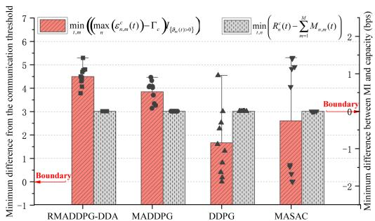  
(a) Test results of $B _ { 1 }$ and $B _ { 2 }$

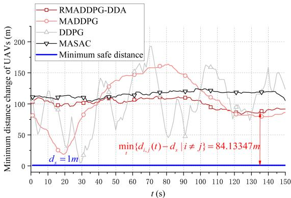  
(b) Minimum distance between UAVs varies with t.

Fig. 9. Tests of constraints for different schemes.  
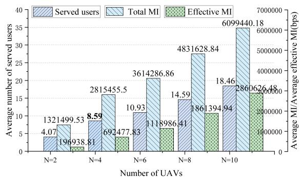  
Fig. 10. Test results of the number of users served, effective MI, total MI for different number of UAVs.

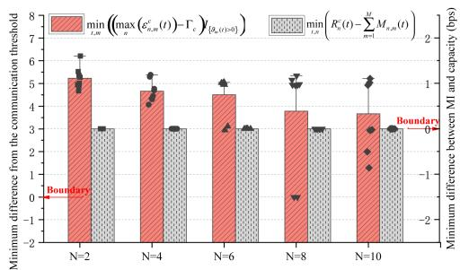  
(a) Test results of $B _ { 1 }$ and $B _ { 2 }$ for different number of UAVs.

(b) Minimum distance between UAVs varies with t for different number of UAVs.  
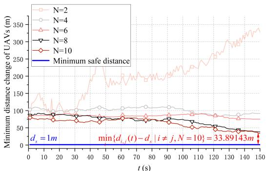

Fig. 11. Tests of constraints for different number of UAVs.  
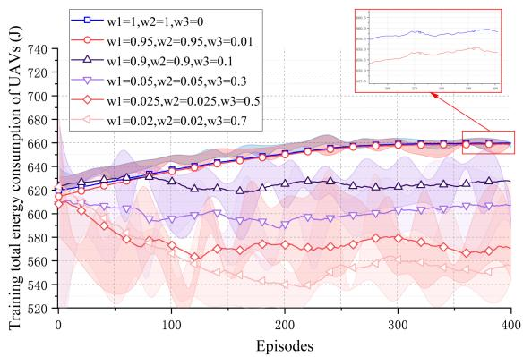  
Fig. 12. Average total energy consumption of UAVs varies with the training episodes under different weights.

We further train the RMADDPG-DDA model considering energy consumption and Fig. 12 shows the average total energy consumption training results under different weights, which can be seen as hyperparameters. It can be seen that the energy consumption of UAVs can be gradually reduced by increasing $\omega _ { 3 }$ and appropriately reducing $\omega _ { 1 }$ and $\omega _ { 2 }$ , achieving different levels of energy saving needs. The test results of the model with different weight training on the three optimization objectives can be seen in Fig. 13, based on 10 tests. With the increase of $\omega _ { 3 }$ , while the energy consumption decreases, the number of served users and effective MI show a trend of first decreasing, then increasing, and then decreasing. Therefore, we can estimate the optimization degree of the other two optimization objectives according to different energy-saving needs. It should be noted that the introduction of $\omega _ { 3 }$ interferes with the other two optimization objectives, consistent with conflicting multiple objectives. When $\omega _ { 3 } = 0 . 0 1$ , while the number of served users is almost the same as that when $\omega _ { 3 } = 0 ;$ , effective MI declines significantly. As motion decisions significantly influence energy consumption, RMADDPG-DDA prioritizes reducing the transmit powers to ensure motion decisions, achieving a slight energy-saving requirement. Therefore, the model under these weights can be used in cases where there is a slight need for energy saving but no need for effective MI. Furthermore, it can be found that there is a local optimal solution for the other two main optimization objectives near $\omega _ { 3 } = 0 . 5$ . With the gradual increase in the demand for energy conservation, the model gradually gives up actively looking for sensing targets based on high-frequency movement and turns to low-frequency adjustment in hot areas to wait for vehicle users to appear. The emergence of this efficient policy is related to the moving characteristics of vehicle users on lanes and the downward convex characteristics of (4). In conclusion, we can approach the optimal solution of the main optimization objectives in conditions of sufficient energy storage and improve the main optimization objectives near $\omega _ { 3 } = 0 . 5$ while saving energy as much as possible. That is, we realize the adaptive control of ISAC in UAVs-enabled vehicular networks. This work paves the way for future research into adaptive control schemes that can enhance the efficiency of UAVs-enabled ISAC, moving us closer to the realization of intelligent and resource-efficient wireless ecosystems for 6G and beyond [55]. Given the sensing limitations of the single antenna, the future research direction is to combine multiple-input multiple-output (MIMO) technology with the UAV network to improve the current scheme.

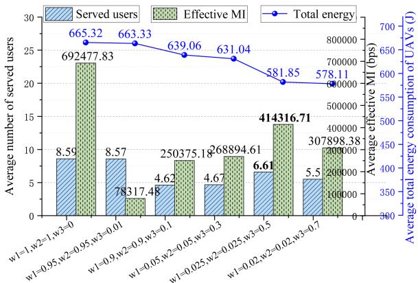  
Fig. 13. Test results of number of users served, effective MI, total energy consumption of UAVs under different weights.

## V. CONCLUSION

In this paper, we propose a novel ISAC scheme designed for UAVs-enabled vehicular networks, which efficiently leverages ISAC signal echoes and real-time data uploads to provide communication services while achieving accurate sensing. By utilizing multiple UAVs and considering multiple mobile users, the scheme enhances information coverage capabilities and aligns closely with practical scenarios, tackling critical challenges in dynamic and resource-constrained environments. Specifically, the proposed scheme focuses on maximizing sensing and communication efficiency, reducing energy consumption while ensuring flight safety of UAVs, thereby enhancing ISAC’s practical utility and scalability in future intelligent networks.

To improve the overall ISAC performance according to the optimization objectives in the scheme mentioned above, we formulate a multi-objective stochastic non-convex optimization problem. For this problem, we develop a novel MARL algorithm to realize distributed adaptive control of UAVs based on local information. By integrating random network distillation (RND) and dynamic data augmentation into MADDPG, the algorithm effectively addresses key tasks such as motion control, power selection, and channel allocation for UAVs. This approach enhances exploration under sparse rewards and improves policy learning with limited data of the MARL algorithm, achieving near-global optimal solutions. Extensive experimental results demonstrate that the proposed algorithm significantly outperformed traditional baselines in sensing and communication performance metrics, validating its effectiveness and reliability. Moreover, tuning hyperparameters allows us to balance energy efficiency and performance optimization, showcasing the scheme’s adaptability to reduce resource waste and improve operation efficiency.

## REFERENCES

[1] F. Liu et al., “Integrated sensing and communications: Toward dualfunctional wireless networks for 6G and beyond,” IEEE J. Sel. Areas Commun., vol. 40, no. 6, pp. 1728–1767, Jun. 2022.

[2] Z. Zhao et al., “Joint beamforming for multi-target detection and multiuser communication in ISAC systems,” IEEE Trans. Veh. Technol., to be published, doi: 10.1109/TVT.2025.3565412.

[3] A. Liu et al., “A survey on fundamental limits of integrated sensing and communication,” IEEE Commun. Surv. Tut., vol. 24, no. 2, pp. 994–1034, Second Quarter 2022.

[4] C. Liu et al., “Learning-based predictive beamforming for integrated sensing and communication in vehicular networks,” IEEE J. Sel. Areas Commun., vol. 40, no. 8, pp. 2317–2334, Aug. 2022.

[5] X. Chen et al., “PAS: Prediction-based actuation system for city-scale ridesharing vehicular mobile crowdsensing,” IEEE Internet Things J., vol. 7, no. 5, pp. 3719–3734, May 2020.

[6] X. Zhang et al., “A scalable mean-field MARL framework for multiobjective V2X resource allocation,” IEEE Trans. Intell. Veh., to be published, doi: 10.1109/TIV.2024.3422506.

[7] Z. Wang, Y. Liu, X. Mu, Z. Ding, and O. A. Dobre, “NOMA empowered integrated sensing and communication,” IEEE Commun. Lett., vol. 26, no. 3, pp. 677–681, Mar. 2022.

[8] L. Zhou, S. Leng, Q. Wang, and Q. Liu, “Integrated sensing and communication in UAV swarms for cooperative multiple targets tracking,” IEEE Trans. Mobile Comput., vol. 22, no. 11, pp. 6526–6542, Nov. 2023.

[9] X. Chen et al., “Design experiences in minimalistic flying sensor node platform through sensorfly,” ACM Trans. Sensor Netw., vol. 13, no. 4, pp. 1–37, Nov. 2017.

[10] S. Zhang, H. Zhang, Z. Han, H. V. Poor, and L. Song, “Age of information in a cellular internet of UAVs: Sensing and communication trade-off design,” IEEE Trans. Wireless Commun., vol. 19, no. 10, pp. 6578–6592, Oct. 2020.

[11] J. Wu, W. Yuan, F. Liu, Y. Cui, X. Meng, and H. Huang, “UAVbased target tracking: Integrating sensing into communication signals,” in Proc. IEEE/CIC Int. Conf. Commun. China, Foshan, China, 2022, pp. 309–313.

[12] Y. Liao, V. Friderikos, and H. Yanikomeroglu, “Robust deployment and resource allocation for robotic aerial base station enabled OFDM integrated sensing and communication,” IEEE Wireless Commun. Lett., vol. 12, no. 10, pp. 1766–1770, Oct. 2023.

[13] Y. Liu, S. Liu, X. Liu, Z. Liu, and T. S. Durrani, “Sensing fairness based energy efficiency optimization for UAV enabled integrated sensing and communication,” IEEE Wireless Commun. Lett., vol. 12, no. 10, pp. 1702–1706, Oct. 2023.

[14] K. Meng, X. He, Q. Wu, and D. Li, “Multi-UAV collaborative sensing and communication: Joint task allocation and power optimization,” IEEE Trans. Wireless Commun., vol. 22, no. 6, pp. 4232–4246, Jun. 2023.

[15] C. Deng, X. Fang, and X. Wang, “Beamforming design and trajectory optimization for UAV-empowered adaptable integrated sensing and communication,” IEEE Trans. Wireless Commun., vol. 22, no. 11, pp. 8512–8526, Nov. 2023.

[16] D. K. P. Tan et al., “Integrated sensing and communication in 6G: Motivations, use cases, requirements, challenges and future directions,” in Proc. IEEE Int. Online Symp. Joint Commun. Sens., Dresden, Germany, 2021, pp. 1–6.

[17] S. Hu, X. Yuan, W. Ni, and X. Wang, “Trajectory planning of cellularconnected UAV for communication-assisted radar sensing,” IEEE Trans. Commun., vol. 70, no. 9, pp. 6385–6396, Sep. 2022.

[18] M. Mei, M. Yao, Q. Yang, J. Wang, Z. Jing, and T. Q. S. Quek, “Networklayer delay provisioning for integrated sensing and communication UAV networks under transient antenna misalignment,” IEEE Trans. Wireless Commun., vol. 23, no. 10, pp. 12964–12979, Oct. 2024.

[19] Y. Liang, H. Tang, H. Wu, Y. Wang, and P. Jiao, “Lyapunov-guided offloading optimization based on soft actor-critic for ISAC-aided internet of vehicles,” IEEE Trans. Mobile Comput., vol. 23, no. 12, pp. 14708–14721, Dec. 2024.

[20] Z. Wei et al., “Integrated sensing and communication enabled cooperative passive sensing using mobile communication system,” IEEE Trans. Mobile Comput., to be published, doi: 10.1109/TMC.2024.3514113.

[21] M. U. F. Qaisar et al., “Poised: Probabilistic on-demand charging scheduling for ISAC-assisted WRSNs with multiple mobile charging vehicles,” IEEE Trans. Mobile Comput., vol. 23, no. 12, pp. 10818–10834, Dec. 2024.

[22] F. Liu, W. Yuan, C. Masouros, and J. Yuan, “Radar-assisted predictive beamforming for vehicular links: Communication served by sensing,” IEEE Trans. Wireless Commun., vol. 19, no. 11, pp. 7704–7719, Nov. 2020.

[23] W. Mao, Y. Lu, G. Pan, and B. Ai, “UAV-assisted communications in SAGIN-ISAC: Mobile user tracking and robust beamforming,” IEEE J. Sel. Areas Commun., vol. 43, no. 1, pp. 186–200, Jan. 2025.

[24] Z. Wang et al., “Toward communication optimization for future underwater networking: A survey of reinforcement learning-based approaches,” IEEE Commun. Surv. Tut., to be published, doi: 10.1109/AC-CESS.2022.3165046.

[25] X. Chen et al., “SOScheduler: Toward proactive and adaptive wildfire suppression via multi-UAV collaborative scheduling,” IEEE Internet Things J., vol. 11, no. 14, pp. 24858–24871, Jul. 2024.

[26] F. Song et al., “Evolutionary multi-objective reinforcement learning based trajectory control and task offloading in UAV-assisted mobile edge computing,” IEEE Trans. Mobile Comput., vol. 22, no. 12, pp. 7387–7405, Dec. 2023.

[27] Y. Bai, H. Zhao, X. Zhang, Z. Chang, R. Jäntti, and K. Yang, “Toward autonomous multi-UAV wireless network: A survey of reinforcement learning-based approaches,” IEEE Commun. Surv. Tut., vol. 25, no. 4, pp. 3038–3067, Fourth Quarter 2023.

[28] Y. Qin, Z. Zhang, X. Li, W. Huangfu, and H. Zhang, “Deep reinforcement learning based resource allocation and trajectory planning in integrated sensing and communications UAV network,” IEEE Trans. Wireless Commun., vol. 22, no. 11, pp. 8158–8169, Nov. 2023.

[29] Y. Yu, J. Tang, J. Huang, X. Zhang, D. K. C. So, and K.-K. Wong, “Multiobjective optimization for UAV-assisted wireless powered IoT networks based on extended DDPG algorithm,” IEEE Trans. Commun., vol. 69, no. 9, pp. 6361–6374, Sep. 2021.

[30] Z. Feng, M. Huang, D. Wu, E. Q. Wu, and C. Yuen, “Multi-agent reinforcement learning with policy clipping and average evaluation for UAV-assisted communication markov game,” IEEE Trans. Intell. Transp. Syst., vol. 24, no. 12, pp. 14281–14293, Dec. 2023.

[31] T. Zhang, K. Zhu, S. Zheng, D. Niyato, and N. C. Luong, “Trajectory design and power control for joint radar and communication enabled multi-UAV cooperative detection systems,” IEEE Trans. Commun., vol. 71, no. 1, pp. 158–172, Jan. 2023.

[32] Q. Zhu, R. Liu, Q. Liu, and C. Chen, “Resource allocation for UAV swarmassisted green ISAC networks via multi-agent RL,” IEEE Trans. Green Commun. Netw., to be published, doi: 10.1109/TGCN.2024.3487995.

[33] H. Peng and X. Shen, “Multi-agent reinforcement learning based resource management in MEC- and UAV-assisted vehicular networks,” IEEE J. Sel. Areas Commun., vol. 39, no. 1, pp. 131–141, Jan. 2021.

[34] Z. Xie, Z. Wang, Z. Zhang, J. Wang, Z. Jiang, and Z. Han, “Distributed UAV swarm for device-free integrated sensing and communication relying on multi-agent reinforcement learning,” IEEE Trans. Veh. Technol., vol. 73, no. 12, pp. 19925–19930, Dec. 2024.

[35] Z. Du et al., “Integrated sensing and communications for V2I networks: Dynamic predictive beamforming for extended vehicle targets,” IEEE Trans. Wireless Commun., vol. 22, no. 6, pp. 3612–3627, Jun. 2023.

[36] K. Meng, Q. Wu, S. Ma, W. Chen, K. Wang, and J. Li, “Throughput maximization for UAV-enabled integrated periodic sensing and communication,” IEEE Trans. Wireless Commun., vol. 22, no. 1, pp. 671–687, Jan. 2023.

[37] Z. Xia et al., “Multi-agent reinforcement learning aided intelligent UAV swarm for target tracking,” IEEE Trans. Veh. Technol., vol. 71, no. 1, pp. 931–945, Jan. 2022.

[38] B. Chang, W. Tang, X. Yan, X. Tong, and Z. Chen, “Integrated scheduling of sensing, communication, and control for mmWave/THz communications in cellular connected UAV networks,” IEEE J. Sel. Areas Commun., vol. 40, no. 7, pp. 2103–2113, Jul. 2022.

[39] T. Li, S. Leng, Z. Wang, K. Zhang, and L. Zhou, “Intelligent resource allocation schemes for UAV-swarm-based cooperative sensing,” IEEE Internet Things J., vol. 9, no. 21, pp. 21570–21582, Nov. 2022.

[40] F. Dong, F. Liu, Y. Cui, S. Lu, and Y. Li, “Sensing as a service in 6G perceptive mobile networks: Architecture, advances, and the road ahead,” IEEE Netw., vol. 38, no. 2, pp. 87–96, Mar. 2024.

[41] F. Liu, C. Masouros, A. Li, T. Ratnarajah, and J. Zhou, “MIMO radar and cellular coexistence: A power-efficient approach enabled by interference exploitation,” IEEE Trans. Signal Process., vol. 66, no. 14, pp. 3681–3695, Jul. 2018.

[42] S. M. Patole, M. Torlak, D. Wang, and M. Ali, “Automotive radars: A review of signal processing techniques,” IEEE Signal Process. Mag., vol. 34, no. 2, pp. 22–35, Mar. 2017.

[43] J. Chen, J. Wang, J. Wang, and L. Bai, “Joint fairness and efficiency optimization for CSMA/CA-based multi-user MIMO UAV ad hoc networks,” IEEE J. Sel. Topics Signal Process., vol. 18, no. 7, pp. 1311–1323, Oct. 2024.

[44] B.-S. Kim, Y. Jin, J. Lee, and S. Kim, “FMCW radar estimation algorithm with high resolution and low complexity based on reduced search area,” Sensors, vol. 22, no. 3, Feb. 2022, Art. no. 1202.

[45] J. Hasch, E. Topak, R. Schnabel, T. Zwick, R. Weigel, and C. Waldschmidt, “Millimeter-wave technology for automotive radar sensors in the 77GHz frequency band,” IEEE Trans. Microw. Theory Techn., vol. 60, no. 3, pp. 845–860, Mar. 2012.

[46] A. Fascista, A. Coluccia, H. Wymeersch, and G. Seco-Granados, “Lowcomplexity accurate mmwave positioning for single-antenna users based on angle-of-departure and adaptive beamforming,” in Proc. IEEE Int. Conf. Acoust., Speech, Signal Process., Barcelona, Spain, 2020, pp. 4866–4870.

[47] A. Leshem, E. Zehavi, and Y. Yaffe, “Multichannel opportunistic carrier sensing for stable channel access control in cognitive radio systems,” IEEE J. Sel. Areas Commun., vol. 30, no. 1, pp. 82–95, Jan. 2012.

[48] R. Zhong, X. Liu, Y. Liu, and Y. Chen, “Multi-agent reinforcement learning in NOMA-aided UAV networks for cellular offloading,” IEEE Trans. Wireless Commun., vol. 21, no. 3, pp. 1498–1512, Mar. 2022.

[49] J. Bodaragama and U. S. Rajapaksha, “Path planning for moving robots in an unknown dynamic area using RND-based deep reinforcement learning,” in Proc. Int. Conf. Adv. Res. Comput., Belihuloya, Sri Lanka, 2023, pp. 13–18.

[50] J. Li and X. Zhang, “Deep reinforcement learning-based joint scheduling of eMBB and URLLC in 5G networks,” IEEE Wireless Commun. Lett., vol. 9, no. 9, pp. 1543–1546, Sep. 2020.

[51] S. Moon, J. J. Bird, S. Borenstein, and E. W. Frew, “A Gazebo/ROSbased communication-realistic simulator for networked sUAS,” in Proc. Int. Conf. Unmanned Aircr. Syst., Athens, Greece, 2020, pp. 1819–1827.

[52] J. Zhang, M. Bao, X.-P. Zhang, Z. Chen, and J. Yang, “DOA estimation for heterogeneous wideband sources based on adaptive space-frequency joint processing,” IEEE Trans. Signal Process., vol. 70, pp. 1657–1672, 2022.

[53] A. Bortoletti, C. Di Fiore, S. Fanelli, and P. Zellini, “A new class of quasinewtonian methods for optimal learning in MLP-networks,” IEEE Trans. Neural Netw., vol. 14, no. 2, pp. 263–273, Mar. 2003.

[54] R. K. Vuddagiri, T. Mandava, H. K. Vydana, and A. K. Vuppala, “Multihead self-attention networks for language identification,” in Proc. 12th Int. Conf. Contemporary Comput., Noida, India, 2019, pp. 1–5.

[55] J. Zhang, X. Xu, Z. Chen, M. Bao, X.-P. Zhang, and J. Yang, “Highresolution DOA estimation algorithm for a single acoustic vector sensor at low SNR,” IEEE Trans. Signal Process., vol. 68, pp. 6142–6158, 2020.

Ziyuan Wang (Graduate Student Member, IEEE) received the BS degree in electronic engineering from Xidian University, Xi’an, Shaanxi, China, in 2021, and the ME degree in electronic and communication engineering the department of electronic engineering, Tsinghua University, Beijing, China, in 2024. He is currently working toward the PhD degree with Tsinghua Shenzhen International Graduate School, Tsinghua University, Shenzhen, China. His current research interests include multi-agent reinforcement learning, integrated sensing and communication of

UAVs, low-altitude economy and smart city, and applications of machine learning in Internet of Things.

Xiao-Ping Zhang (Fellow, IEEE) received the BS and PhD degrees from Tsinghua University, in 1992 and 1996, respectively, both in electronic engineering. He holds an MBA in Finance, Economics and Entrepreneurship with Honors from the University of Chicago Booth School of Business, Chicago, IL. He is Penrui chair professor with Tsinghua Shenzhen International Graduate School (SIGS), Tsinghua University. He was the founding dean of Institute of Data and Information (iDI) with Tsinghua SIGS and chair professor with Tsinghua-Berkeley Shenzhen

Institute (TBSI). He had been with the Department of Electrical, Computer and Biomedical Engineering, Toronto Metropolitan University (Formerly Ryerson University), Toronto, ON, Canada, as a Professor and the Director of the Communication and Signal Processing Applications Laboratory (CASPAL), and has served as the program director of Graduate Studies. His research interests include sensor networks and IoT, machine learning/AI/robotics, statistical signal processing, image and multimedia content analysis, and applications in Big Data, finance, and marketing. Dr. Zhang is Fellow of the Canadian Academy of Engineering, Fellow of the Engineering Institute of Canada, a registered Professional Engineer in Ontario, Canada, and a member of Beta Gamma Sigma Honor Society. He is the general co-chair for the IEEE International Conference on Acoustics, Speech, and Signal Processing, 2021. He is the general co-chair for 2017 GlobalSIP Symposium on Signal and Information Processing for Finance and Business, and the general co-chair for 2019 GlobalSIP Symposium on Signal, Information Processing and AI for Finance and Business. He was an elected Member of the ICME steering committee. He is the general chair for ICME2024 and BioCAS2023. He is editor-in-chief for the IEEE Journal of Selected Topics in Signal Processing. He was senior area editor for IEEE Transactions on Image Processing and IEEE Transactions on Signal Processing. He was associate editor for IEEE Transactions on Image Processing, IEEE Transactions on Multimedia, IEEE Transactions on Circuits and Systems for Video Technology, IEEE Transactions on Signal Processing, and the IEEE Signal Processing Letters. He was selected as IEEE Distinguished Lecturer by the IEEE Signal Processing Society and by the IEEE Circuits and Systems Society.

Wenbo Ding (Member, IEEE) received the BS and PhD degrees (Hons.) from Tsinghua University, in 2011 and 2016, respectively. He worked as a postdoctoral research fellow with Georgia Tech under the supervision of professor Z. L. Wang from 2016 to 2019. He is now an associate professor and PhD supervisor with Tsinghua Shenzhen International Graduate School, Tsinghua University, where he leads the Smart Sensing and Robotics (SSR) group. His research interests include mechanosensing, tactile sensing and robotics with the help of signal processing and

machine learning. He has received many prestigious awards, including the Gold Medal of the 47th International Exhibition of Inventions Geneva and the IEEE Scott Helt Memorial Award.

Yuhan Dong (Senior Member, IEEE) received the BS and MS degrees in electronic engineering from Tsinghua University, Beijing, China, in 2002 and 2005, respectively, and the PhD degree in electrical engineering from North Carolina State University, Raleigh, NC, USA, in 2009. Since 2010, he has been with the Shenzhen International Graduate School, Tsinghua University, where he is currently an associate professor and a member of the Modern Communication Laboratory. His research interests include wireless communications and networking, machine learning and optimization, and optical wireless communications. He was a recipient of the 2008 IEEE GLOBECOM Best Paper Award.

Xinlei Chen (Member, IEEE) received the BE and MS degrees in electronic engineering from Tsinghua University, China, in 2009 and 2012, respectively, and the PhD degrees in electrical engineering from Carnegie Mellon University, Pittsburgh, Pennsylvania, in 2018. He was a postdoctoral research associate in Electrical Engineering Department, Carnegie Mellon University, Pittsburgh, Pennsylvania. He is currently an associate professor with the Tsinghua Shenzhen International Graduate School, Tsinghua University, Shenzhen, Guangdong, China. His re-

search interests include AIoT, artificial intelligence, pervasive computing, cyber physical system, robotics, urban sensing, brain computer interface and human computer interface.