# A Predictive UAV Framework for Tracking Fast-Moving Vehicles in Dynamic Environments

Ananya Hazarika , Graduate Student Member, IEEE, and Mehdi Rahmati , Senior Member, IEEE

Abstract—In the near future, Uncrewed Aerial Vehicles (UAVs) are expected to evolve from simple data collectors to intelligent data gatekeepers capable of processing and analyzing information directly on board. In this paper, a decentralized UAV framework is proposed to address potential challenges in communication and coordination among fast-moving vehicles due to dificulties in maintaining seamless information exchange and synchronized operation across the network. While Integrated Sensing and Communications (ISAC) provides significant advantages, it still faces considerable challenges when dealing with such scenarios. This paper proposes DynaMo, a decentralized UAV framework addressing the challenges of tracking fast-moving vehicles in dynamic environments. DynaMo prioritizes spatiotemporal relevance and adapts to diverse vehicle behaviors with a novel freshness metric. Integrated with a Partially Observable Markov Decision Process (POMDP), the framework enables UAVs to make informed, real-time decisions under uncertainty. Simulation results highlight the superior tracking precision and adaptability of our proposed approach, ofering a robust solution for ISAC systems in high-mobility scenarios.

Index Terms—Age of information (AoI), integrated sensing and communication (ISAC), reinforcement learning (RL), uncrewed aerial vehicles (UAVs), UAV-assisted transportation.

## I. INTRODUCTION

dented capabilities in logistics and delivery, surveillance, search and rescue, communications, and data collection. UAVs are poised to transform future intelligent transportation systems by enabling real-time tracking and coordination of fast-moving vehicles with abrupt maneuvers and uncertain motion phases. However, traditional motion tracking approaches prove insuficient as they lack mechanisms to adapt to state-dependent uncertainties or incorporate communication feedback. This limitation becomes particularly critical in futuristic UAV applications such as intelligent transportation systems, emergency response, and public safety operations [1]. Dense urban environments present significant challenges through complex terrains, dynamic obstacles, and partial observability due to occlusions and signal interference [2]. These conditions require robust tracking capabilities that can maintain precision even in the face of uncertainty, ensuring reliable UAV operations.

Moreover, modern urban deployments demand more than basic sensing, i.e., UAVs must exchange critical information with each other and vehicles in real-time, often under limited bandwidth and power constraints. This requirement has sparked interest in Integrated Sensing and Communication (ISAC) [3] approaches, which can simultaneously support sensing data gathering and communications using the same spectral and hardware resources. However, implementing ISAC introduces new trade-ofs, particularly when tracking fast-moving vehicles, where slight delays can lead to significant deviations in position estimation [4]. Moreover, tracking fast-moving vehicles with a swarm of UAVs necessitates synchronization within the network. This network continuously monitors positions while balancing stable connections, adapting to dynamic motion, and managing sensing-communication tradeofs [5]. In high-speed vehicle movement scenarios, the rapid evolution of states means that sensed data quickly becomes stale, compromising the accuracy of UAV decision-making and coordination. Therefore, lowlatency communications and sensing are crucial for ensuring timely data updates in such dynamic settings. However, freshness metrics such as Age of Information (AoI) [6], while useful for temporal staleness, fall short in capturing the multidimensional nature of information quality in dynamic environments. Considering these limitations, we propose a comprehensive framework for decentralized UAV swarms that leverages collaborative intelligence for high-precision tracking of fast-moving vehicles in urban environments and transportation scenarios. The key contributions of this work include,

• A hybrid kinematic-stochastic motion model capturing complex mobile targets such as vehicle dynamics for robust trajectory prediction

• A novel multi-dimensional information-theoretic freshness metric that prioritizes targets based on spatiotemporal relevance and motion uncertainty

• A precision-driven optimization framework that integrates theoretical bounds with target prioritization

• A learning-based multi-agent coordination scheme enabling real-time adaptive decision-making

Notation: For a matrix M, M>, $\mathbf { M } ^ { H } .$ , and ${ { \bf { M } } ^ { - 1 } }$ denote its transpose, Hermitian, and inverse with trace Tr(M). For a vector x, kxk represents its Euclidean norm. Bold uppercase letters, e.g., W, denote matrices, bold lowercase letters, e.g., s, denote vectors, and regular letters denote scalars, and the time derivative of x is ˙x. The sets of real and complex numbers are R and C, respectively. Expectation and probability are denoted by E[·] and P(·), respectively.

## II. RELATED WORKS

Recent UAV-enabled ISAC research has focused on dynamic tracking and real-time data sharing in complex environments through multi-agent coordination [1]. Architectures are often distributed or centralized, with cyber-twin models enabling swarm coordination while reducing communication overhead [7]. To mitigate occlusion and motion blur, [8] combines consensus tracking with GIS databases and adaptive model updates, while [9] notes persistent challenges in latency and accuracy under high mobility. Exploration-oriented approaches such as [10] use freshness-driven probabilistic difusion to guide UAV swarms, whereas energy–AoI tradeofs are optimized via DQN-based navigation in 5G IoT systems [11]. Reinforcement learning has further been shown to improve trajectory planning, resource allocation, and collaboration in UAV networks [12]. Recent networking eforts [13] show RIS/HAP-assisted links and edge ofloading can boost timeliness and reliability. In contrast, we introduce an estimation-aware spatiotemporal freshness metric that combines temporal staleness, motion deviation, prediction uncertainty, and link quality into an information-centric score for multi-UAV scheduling. Multi-agent aerial–ground systems for dynamic monitoring have largely emphasized patrol scheduling and energy/bandwidth-aware communication. In [14], a Reconfigurable Intelligent Surface (RIS)-assisted UAV–UGV system is proposed, where UAV flight paths and recharging are optimized via deep reinforcement learning, UGV patrol routes are planned using genetic algorithms, the RIS is configured to enhance data rate, and UAV-to-UGV wireless energy beamforming sustains urban monitoring. In contrast, our proposed DynaMo framework operates at the estimation layer, performing multi-UAV, track-level fusion with maneuver-aware state propagation and measurement modeling. It is designed to remain robust under occlusions and clutter, utilizing a hybrid kinematic–stochastic model with Gaussian-process residuals within an ISAC framework. While DRL-based UAV cooperation, such as [15], incurs high training cost due to joint state–action scaling, DynaMo achieves comparable robustness with lightweight estimation where perframe complexity grows only linearly with the number of UAVs and targets, thereby avoiding centralized multi-agent training overhead.

## III. SYSTEM MODEL

## A. Sensing Model

The sensing model leverages a multistatic radar configuration to improve target tracking through multiple observation angles. Each UAV can operate as a radar transmitter or receiver, enabling robust target visibility even in complex environments where line-of-sight may be limited. The transmitted signal from the k-th UAV at time t integrates radar and communication functions as

$$
\mathbf { s } _ { k } ( t ) = \mathbf { W } _ { k } ( t ) \mathbf { a } _ { k } ( \theta _ { m , k } ( t ) ) \mathbf { r } _ { \mathrm { d f r c } , k } ( t ) ,\tag{1}
$$

where $\mathbf { W } _ { k } \in \mathbb { C } ^ { N _ { t } \times N _ { t } }$ is the beamforming matrix with $N _ { t }$ representing the number of transmit antennas, and $\mathbf { r } _ { \mathrm { d f r c } , k } ( t )$ is the combined radar and communication signal, $\mathbf { a } _ { k } ( \theta _ { m , k } ( t ) ) \in \mathbb { C } ^ { N _ { t } \times 1 }$ is the transmit steering vector directs the beam towards the target at angle $\theta _ { m , k } ( t )$ . The echo signal ${ \bf e } _ { m , \nu , k } ( t )$ is then received by the v-th UAV from the m-th target, initially transmitted by the k-th UAV, is modeled as

$$
\alpha _ { m , \nu , k } \mathbf { H } _ { m , \nu , k } \mathbf { s } _ { k } ( t - \tau _ { m , \nu , k } ) e ^ { j 2 \pi f _ { d , m , k , \nu } t } + \pmb { \eta } _ { m , \nu , k } ( t ) ,\tag{2}
$$

where $\alpha _ { m , \nu , k }$ denotes the bistatic reflectivity coeficient, $\mathbf { H } _ { m , \nu , k }$ is the efective channel matrix between UAV k and UAV v via target m, $\pmb { \eta } _ { m , \nu , k } ( t )$ is the additive white Gaussian noise, fd m k v is the Doppler, and $\tau _ { m , \nu , k }$ is the time delay.

## B. Communications Model

The communication model operates over a multi-hop wireless mesh configuration, allowing each UAV to relay data, sensor information, and tracking commands eficiently across the UAV network. We use Signal-to-Interference-plus-Noise Ratio (SINR) between UAVs k and v to assess the communication quality, capturing the efect of interference and noise as given below,

$$
\mathrm { S I N R } _ { k , \nu } = \frac { P _ { k } ( t ) | h _ { k , \nu } | ^ { 2 } } { \displaystyle \sum _ { j = 1 } ^ { K } P _ { j } ( t ) | h _ { k , \nu } | ^ { 2 } + N _ { 0 } B _ { k , \nu } } ,\tag{3}
$$

where $P _ { k } ( t )$ is the transmit power, $h _ { k , \nu }$ is the communication channel gain between UAV k and UAV v, modeled as, $h _ { k , \nu } ( t )$ , which represents small-scale Rician fading denoted by $\begin{array} { r } { h _ { k , \nu } = \ \sqrt { \frac { K _ { k , \nu } } { K _ { k , \nu } + 1 } } h _ { L O S } + \ \sqrt { \frac { 1 } { K _ { k , \nu } + 1 } } h _ { \mathrm { N L O S } } } \end{array}$ with $K _ { k , \mathbb { 1 } }$ as the Rician , ,K-factor, capturing a dominant line-of-sight (LOS) path and multipath efects typical in UAV-to-UAV communications. $N _ { 0 }$ is the noise power spectral density, and $B _ { k , \nu }$ is the bandwidth and the communication rate is expressed as

$$
R _ { k , \nu } ( t ) = B _ { k , \nu } \log _ { 2 } \left( 1 + \mathrm { S I N R } _ { k , \nu } \right) ,\tag{4}
$$

capturing the maximum achievable data throughput under current channel conditions.

## IV. PROPOSED SOLUTION

A. DynaMo: A Dynamic Nonlinear Motion Model for Fast-Moving Vehicles

We introduce DynaMo, a hybrid kinematic-stochastic framework for UAV-based tracking of fast-moving vehicles in dynamic environments requiring high adaptability and precision. Unlike traditional linear models, DynaMo integrates state-dependent stochastic dynamics with Gaussian Process Regression (GPR) to account for abrupt maneuvers and nonlinear motion patterns. The augmented state vector s(t) for a target m at time t captures kinematic and dynamic attributes to enable comprehensive tracking by UAVs given by,

$$
\mathbf { s } ( t ) = \left[ \mathbf { s } _ { m } ( t ) , \mathbf { p } _ { k } ( t ) \right] ^ { \top } = \left[ x _ { m } , y _ { m } , \nu _ { m } , \theta _ { m } , a _ { m } , \omega _ { m } , x _ { k } , y _ { k } , h \right] ^ { \top }
$$

where ${ \bf s } _ { m } ( t )$ represents the target’s kinematic and dynamic states, and ${ \bf p } _ { k } ( t )$ denotes UAV $k \mathrm { { s } }$ position at constant altitude h. The target’s motion usually follows standard kinematic equations, updating position based on velocity and heading during maneuvers as shown below,

$$
\begin{array} { r l } & { \dot { x } _ { m } ( t ) = \nu _ { m } ( t ) \cos ( \theta _ { m } ( t ) ) , \dot { y } _ { m } ( t ) = \nu _ { m } ( t ) \sin ( \theta _ { m } ( t ) ) , } \\ & { \dot { \nu } _ { m } ( t ) , ~ \dot { \theta } _ { m } ( t ) = \left\{ \begin{array} { l l } { ( a _ { m } , \omega _ { \mathrm { d e s i r e d } } ) } & { \mathrm { i f ~ m a n e u v e r ~ p r e s e n t } , } \\ { ( 0 , 0 ) } & { \mathrm { o t h e r w i s e } . } \end{array} \right. } \end{array}\tag{5}
$$

These equations describe the target’s standard motion behavior, where $x _ { m } ( t )$ and $y _ { m } ( t )$ are the position coordinates, $\nu _ { m } ( t )$ is the velocity, and $\theta _ { m } ( t )$ is the heading angle. Under normal θconditions, the target moves at constant velocity and heading. When a maneuver is present, the velocity increases by a constant acceleration $a _ { m }$ and the heading angle changes at a rate $\omega _ { \mathrm { d e s i r e d } } .$ , otherwise, both remain unchanged.

ω1) Stochastic Dynamics and Stability Conditions: The target’s actual motion often deviates from purely deterministic behavior due to various factors such as environmental conditions, intentional maneuvers, and measurement uncertainties inherent in the radar system. DynaMo employs a Stochastic Diferential Equation (SDE) to address these challenges, augmented with GPR for state-dependent noise refinement and is described by

$$
d \mathbf { s } ( t ) = f ( \mathbf { s } ( t ) , \mathbf { u } ( t ) ) d t + \big [ \mathbf { G } ( \mathbf { s } ( t ) ) + \pmb { \eta } ( \mathbf { s } ( t ) ) \big ] d \mathbf { W } ( t ) ,\tag{6}
$$

where $\mathbf { s } ( t ) \in \mathbb { R } ^ { n }$ represents the target state, ${ \bf u } ( t ) \in \mathbb { R } ^ { m }$ is the control input, $f : \bar { \mathbb { R } } ^ { 9 } \times \mathbb { R } ^ { m } \to \mathbb { R } ^ { \bar { 9 } }$ is the deterministic drift function, $\mathbf { \bar { G } } : \mathbf { \bar { \mathbb { R } } } ^ { 9 } \to \mathbb { R } ^ { 9 \times d }$ is the nominal difusion matrix, and W(t) is a d-dimensional Wiener process representing intrinsic noise [16]. The term $\pmb { \eta } ( \mathbf { s } _ { m } ( t ) ) \sim \mathcal { G P } ( 0 , K ( \mathbf { s } _ { m } ( t ) , \mathbf { s } _ { m } ( t ^ { \prime } ) ) )$ represents the state-dependent stochastic refinement. Rather than estimating $\pmb { \eta } ( \mathbf { s } _ { m } ( t ) )$ independently, GPR integrates it into the state prediction process by training on radar measurements ${ \bf z } _ { k } ( t )$ , efectively modeling the combined efect of deterministic dynamics and stochastic noise. The $\mathrm { G P ^ { \bullet } s }$ covariance kernel $K ( \mathbf { s } _ { m } ( t ) , \mathbf { s } _ { m } ( t ^ { \prime } ) )$ includes hyperparameters such as the variance $\sigma ^ { 2 } ( \mathsf { s } _ { m } ( t ) )$ , length-scales $l _ { \nu }$ and $l _ { \theta }$ for velocity and heading, and a scaling function $\kappa ( \mathsf { s } _ { m } ( t ) )$ ). These hyperparameters are determined ofline via maximum likelihood estimation using a training dataset of observed state transitions and radar echoes. The stochastic terms $\left[ \mathbf { G } ( \mathbf { s } _ { m } ( t ) ) + \pmb { \eta } ( \mathbf { s } _ { m } ( t ) ) \right] d \mathbf { W } ( t )$ require spe-ηcific conditions to ensure mathematical well-posedness and system stability. To prevent unbounded growth of the drift and difusion terms as the state norm kxk increases, the following linear growth conditions must hold for some constants $M _ { f } , M _ { g } > 0$ as shown below,

$$
\| f ( \mathbf { x } , \mathbf { u } ) \| \leq M _ { f } ( 1 + \| \mathbf { x } \| ) , \| \mathbf { G } ( \mathbf { x } ) \| \leq M _ { g } ( 1 + \| \mathbf { x } \| ) .\tag{7}
$$

These bounds ensure system stability by preventing uncontrolled noise escalation, regardless of target velocity or challenging UAV conditions [17]. For a formal guarantee of stability under these conditions, refer to the Appendix section’s

Theorem 1 where its proof demonstrates that the DynaMo model prevents pathological blowup, ensuring the solution s(t) remains bounded for all $t \geq 0 .$

2) Composite Kernel for State-Dependent Noise: DynaMo employs a novel composite kernel [18] in the GPR to accommodate diverse motion patterns designed to adjust according to the target’s movement characteristics, and the kernel structure $K ( \mathbf { s } _ { m } ( t ) , \mathbf { s } _ { m } ( t ^ { \prime } ) )$ is defined as

$$
\begin{array} { r l } & { \sigma ^ { 2 } ( \mathbf { s } _ { m } ( t ) ) \mathrm { S I N R } _ { k , m } \exp \left( - \frac { \| \mathbf { s } _ { m } ( t ) - \mathbf { s } _ { m } ( t ^ { \prime } ) \| _ { \mathbf { M } ( \mathbf { s } _ { m } ( t ) ) } ^ { 2 } } { 2 } \right) } \\ & { \quad + \kappa ( \mathbf { s } _ { m } ( t ) ) \Phi ( \mathbf { s } _ { m } ( t ) , \mathbf { s } _ { m } ( t ^ { \prime } ) ) , } \end{array}\tag{8}
$$

where $\sigma ^ { 2 } ( \mathsf { s } _ { m } ( t ) )$ is the variance function that adapts to statedependent dynamics, modulating the amplitude of the GP based on the current state $\mathbf { s } _ { m } ( t )$ and $\mathrm { S I N R } _ { k , m }$ represents the SINR between UAV k and target m at time t, incorporating communication quality into the kernel to enhance the influence of high-quality observations. $| | \mathbf { s } _ { m } ( t ) - \mathbf { s } _ { m } ( t ^ { \prime } ) | | _ { \mathbf { M } ( s _ { m } ( t ) ) } ^ { 2 }$ denotes the Mahalanobis distance between states $\mathbf { s } _ { m } ( t )$ and ${ \bf s } _ { m } ( t ^ { \prime } )$ , with $\mathbf { M } ( \mathbf { s } _ { m } ( t ) )$ being a positive-definite metric matrix capturing the scaling and correlations among diferent state dimensions, $\kappa ( \mathbf { s } _ { m } ( t ) )$ is a scaling function that adjusts the influence of maneuver-specific correlations, while maneuverspecific correlations $\Phi (  { \mathbf { s } } _ { m } ( t ) ,  { \mathbf { s } } _ { m } ( t ^ { \prime } ) )$ capture speed and heading variations, given by

$$
\exp \left( - \frac { | \nu _ { m } ( t ) - \nu _ { m } ( t ^ { \prime } ) | ^ { 2 } } { l _ { \nu } ^ { 2 } } \right) \exp \left( - \frac { | \theta _ { m } ( t ) - \theta _ { m } ( t ^ { \prime } ) | ^ { 2 } } { l _ { \theta } ^ { 2 } } \right)\tag{9}
$$

where length-scale parameters $l _ { \nu }$ and $l _ { \theta }$ control the smoothness of variations in velocity and heading, respectively. Such a dual emphasis on communication quality and nonlinear motion dynamics sets our approach apart from conventional GP kernels.

3) Predictive State Estimation: Radar echo signals ${ \bf z } _ { k } ( t ) =$ $h _ { k } ( \mathbf { e } _ { k } ( t ) ) ~ + ~ \pmb { \eta } _ { k } ( t )$ are incorporated to capture interactions ηbetween UAVs and targets, where $h _ { k } ( \cdot )$ is the measurement function processing the radar echo signal ${ \bf e } _ { k } ( t )$ to produce expected measurements, and $\pmb { \eta } _ { k } ( t )$ represents measurement noise. The measurement function $h _ { k } ( \cdot ) : \mathbb { C } ^ { N _ { r } \times 1 } \to \mathbb { R } ^ { 6 }$ maps radar echoes to state estimates $\mathbf { z } _ { k } ( t ) = [ \hat { x } _ { m } , \hat { y } _ { m } , \hat { \nu } _ { m } , \hat { \theta } _ { m } , \hat { a } _ { m } , \hat { \omega } _ { m } ] ^ { \top }$ using $\hat { x } _ { m } = x _ { k } + c \tau _ { m , \nu , k } \cos ( \theta _ { m , k } )$ and $\hat { y } _ { m } = y _ { k } + c \tau _ { m , \nu , k }$ ,sin $( \theta _ { m , k } ) .$ and the velocity is computed as $\hat { \nu } _ { m } = f _ { d , m , \nu , k } \cdot c / f _ { c }$ where c is light speed, $f _ { c }$ is carrier frequency, and m k is the estimated angle. The function is reversible $( h _ { k } ^ { - 1 }$ exists), ensuring accurate trajectory construction. Measurement noise $\pmb { \eta } _ { k } ( t ) \sim \mathcal { N } ( 0 , \pmb { \Sigma } _ { N } )$ accounts for uncertainties. The Gaussian Process (GP) posterior is computed based on these measurements. Once the GP posterior is obtained, predictive distributions for future states can be calculated using training inputs X, observations ${ \bf Z } = [ { \bf z } _ { 1 } ( t ) , { \bf z } _ { 2 } ( t ) , \ldots , { \bf z } _ { K } ( t ) ] ^ { \intercal }$ , and a test input $\mathbf { s } ( t + \tau )$ . The GP posterior mean $\mu _ { x } ( t + \tau )$ and variance $\sigma _ { x } ^ { 2 } ( t + \tau )$ at $\mathbf { s } ( t + \tau )$ are given by,

$$
\mu _ { x } ( t + \tau ) = \mathbf { k } _ { * } ^ { \top } [ \mathbf { K } + \boldsymbol { \Sigma } _ { N } ] ^ { - 1 } \mathbf { Z } ,\tag{10}
$$

$$
\sigma _ { x } ^ { 2 } ( t + \tau ) = \mathbf { k } _ { * * } - \mathbf { k } _ { * } ^ { \top } [ \mathbf { K } + \boldsymbol { \Sigma } _ { N } ] ^ { - 1 } \mathbf { k } _ { * } .\tag{11}
$$

where K is the kernel matrix for the training data, $\Sigma _ { N }$ is the noise covariance matrix, k is the cross-covariance vector between the test input $\mathbf { s } ( t + \tau )$ and training inputs X, and $\begin{array} { r c l } { \mathbf { k } _ { * * } } & { = } & { \mathbf { K } ( \mathbf { s } ( t + \tau ) , \mathbf { s } ( t + \tau ) ) } \end{array}$ is the covariance at the test point $\mathbf { s } ( t + \tau )$ . By integrating these results into the DynaMo framework, predictive distributions [19] for the future state component $\hat { \bf s } _ { m } ( t + \tau )$ are derived as follows,

$$
\hat { \mathbf { s } } _ { m } ( t + \tau ) \sim \mathcal { N } \left( \mu _ { x } ( t + \tau ) , \sigma _ { x } ^ { 2 } ( t + \tau ) \right) .\tag{12}
$$

This predictive distribution quantifies the expected future state and its associated uncertainty, enabling UAVs to make informed and adaptive tracking decisions.

4) Handling Missing Data and Visibility Loss: DynaMo efectively handles partial or incomplete data, high noise, and temporary visibility loss due to occlusions or link outages using its hybrid kinematic-stochastic model. When a measurement z(t) is unavailable, the framework employs the SDE from Eq. (6) by advancing the state $\hat { s } ( t | t - 1 )$ with the drift $f ( s ( t ) , u ( t ) )$ and using the GPR covariance $K ( s _ { m } ( t ) , s _ { m } ( t ^ { \prime } ) )$ , ,to estimate uncertainty. Process noise (s(t)) is adaptively increased with $\lambda \Delta t / \Delta t _ { 0 }$ to reflect growing uncertainty over time. For noisy measurements, the adaptive model in Eq. (8) adjusts covariance with SINR-based weighting to down-weight low-quality data. Multi-UAV fusion, as detailed in Sec. VI, recovers lost tracks within 2-3 timesteps by sharing belief states when any UAV detects the target, hence ensuring robust tracking in dynamic environments.

## B. A Novel Spatiotemporal Freshness Metric for Dynamic Target Prioritization

Eficient UAV resource allocation in multistatic radar is critical, but existing metrics overlook real-time dynamics and uncertainties of fast-moving targets. To address this challenge, we propose the Dynamic Target Prioritization Metric (DTPM) that leverages the predictive capabilities of DynaMo to optimize UAV resource allocation by prioritizing targets based on spatiotemporal relevance, motion uncertainties, and trajectory deviations. For a target m at time t, DTPM is defined as

$$
\mathrm { D T P M } _ { m } ( t ) = \Delta t _ { m } \exp { ( \Psi _ { T } ( t ) + \Psi _ { U } ( t ) ) } \ : Q _ { m } ( t )\tag{13}
$$

where $\Delta t _ { m } = t - t _ { m } ^ { \mathrm { l a s t } }$ quantifies temporal freshness, prioritizing targets with a longer elapsed time since the last successful update and $Q _ { m }$ denotes the quality factor that normalizes measurement reliability by combining SINR with distancedependent signal quality, ensuring closer targets with better signal strength receive appropriate prioritization,

$$
Q _ { m } ( t ) = \frac { \sum _ { k = 1 } ^ { K } \mathrm { S I N R } _ { k , m } ( t ) e ^ { - d _ { m , k } ( t ) / d _ { 0 } } } { \operatorname* { m a x } _ { j \in \{ 1 , \ldots , M \} } \sum _ { k = 1 } ^ { K } \mathrm { S I N R } _ { k , j } ( t ) }\tag{14}
$$

where $d _ { m , k } ( t )$ is the distance between target m and UAV k, and $d _ { 0 }$ is a reference distance for normalization. The exponential decay $e ^ { - d _ { m , k } / d _ { 0 } }$ ensures that $Q _ { m } ( t )$ decreases with increasing distance, where closer targets with stronger SINR contribute more to prioritization.

In a linear Gaussian dynamic system, the expected estimation error covariance trace of target m is upper-bounded by a linear function of its DTPM. Specifically, there exist positive constants k and $k _ { 0 }$ such that

$$
\mathbb { E } \left[ \mathrm { T r } \left( \mathbf { P } _ { m } ( t ) \right) \right] \leq k \mathrm { D T P M } _ { m } ( t ) + k _ { 0 }\tag{15}
$$

where $\mathbf { P } _ { m } ( t )$ denotes the state-estimation error covariance for target m at time t. This result establishes that higher DTPM values correspond to potentially larger estimation errors, reinforcing the metric’s role in guiding UAV resource allocation toward the most critical targets (See Theorem 2 in Appendix).

1) Trajectory Adherence $( \Psi _ { T } ) .$ The trajectory adherence term $\Psi _ { T } ( t )$ evaluates the alignment between the target’s observed path and $\mathrm { D y n a M o ^ { \prime } s }$ predicted trajectory using the Frechet distance $d _ { F }$ . This measure captures both spatial and temporal deviations, providing robust adherence tracking for non-linear motion patterns, and is represented as

$$
\Psi _ { T } ( t ) = \gamma _ { T } ( t ) d _ { F } \left( \mathcal { T } _ { m } ( t ) , \mathcal { T } _ { m } ^ { \mathrm { p r e d } } ( t ) \right)\tag{16}
$$

where $\gamma _ { T } ( t )$ scales the impact based on deviation magnitude and the observed trajectory $\mathcal { T } _ { m } ( t )$ is constructed from DynaMo’s measurement model over an observation window $W$ as shown below,

$$
\begin{array} { r } { \mathcal { T } _ { m } ( t ) = \big \{ \mathbf { s } _ { m } ( t _ { i } ) \mid \mathbf { s } _ { m } ( t _ { i } ) = h _ { k } ^ { - 1 } \left( z _ { k } ( t _ { i } ) \right) , \ t _ { i } \in [ t - W , t ] \big \} } \end{array}\tag{17}
$$

where $h _ { k } ^ { - 1 } ( \cdot ) : \mathbb { R } ^ { n _ { z } } \to \mathbb { R } ^ { 6 }$ is the inverse measurement function mapping radar observations $z _ { k } ( t _ { i } )$ back to target state space $\mathbf { s } _ { m } ( t _ { i } )$ . The predicted trajectory $\mathcal { T } _ { m } ^ { \mathrm { p r e d } } ( t )$ is derived from DynaMo’s predictive distributions such that

$$
\begin{array} { r l } & { \mathcal { T } _ { m } ^ { \mathrm { p r e d } } ( t ) } \\ & { = \{ \hat { \mathbf { s } } _ { m } ( t + \tau ) \mid \hat { \mathbf { s } } _ { m } ( t + \tau ) \sim \mathcal { N } ( \mu _ { x } ( t + \tau ) , \sigma _ { x } ^ { 2 } ( t + \tau ) ) \} } \end{array}\tag{18}
$$

where the mean $\mu _ { x } ( t + \tau )$ and variance $\sigma _ { x } ^ { 2 } ( t + \tau )$ are obtained from DynaMo’s GPR predictions.

2) Prediction Uncertainty $( \Psi _ { U } ) .$ Prediction uncertainty $\Psi _ { U } ( t )$ quantifies the variance in DynaMo’s state predictions, highlighting targets with high uncertainty in their motion predictions such that $\begin{array} { r } { \Psi _ { U } ( t ) = \sum _ { x \in \{ \nu , \theta , a , \omega \} } \gamma _ { x } ( t ) \sigma _ { x } ^ { 2 } ( t + \tau ) . \ \sigma _ { x } ^ { 2 } ( t + \tau ) } \end{array}$ ,θ, ,ωrepresents the prediction variance for each motion state variable x (speed $\nu ,$ heading , acceleration $^ { a , }$ and angular velocity ), as obtained from DynaMo’s predictive distributions in Equation (18) and $\gamma _ { x } ( t )$ is the weighting factor for each critical variable, allowing selective emphasis based on operational priorities.

Hence, this DTPM metric ofers a unified, adaptive prioritization framework that enables UAVs to allocate resources dynamically to critical targets.

## V. OPTIMIZATION FOR ESTIMATION ACCURACY

We propose a precision-driven framework that leverages the Cramer–Rao Lower Bound (CRLB) and DTPM to adapt sensing and power allocation, minimizing estimation errors for critical targets. For target m at time t, the CRLB is expressed as CRL $\mathbf { \delta B } _ { m } ( t ) = ( \mathbf { J } _ { m } ( t ) ) ^ { - 1 }$ , where $\mathbf { J } _ { m } ( t )$ is the Fisher Information Matrix (FIM), dynamically scaled by DTPM to emphasize high-priority targets and modulate estimation precision according to target criticality, such that

$$
\mathbf { J } _ { m } ( t ) = \mathrm { D T P M } _ { m } ( t ) \sum _ { \nu = 1 } ^ { K } w _ { \nu } ( t ) \mathbf { H } _ { \nu , m } ^ { \top } ( t ) \mathbf { N } _ { m , \nu } ^ { - 1 } ( t ) \mathbf { H } _ { \nu , m } ( t )\tag{19}
$$

where $w _ { \nu } ( t )$ weights the contribution of each UAV, favoring UAVs with strong SINR and proximity to the target, $\mathbf { H } _ { \nu , m } ( t )$ is

the Jacobian of the observation model for target m, representing the sensitivity of measurements to target states and $w _ { \nu } ( t )$ weights UAV contributions based on predicted states,

$$
w _ { \nu } ( t ) = \exp { \left( - \frac { \| { \bf p } _ { \nu } ( t ) - \hat { \bf s } _ { m } ( t ) \| ^ { 2 } } { \sigma ^ { 2 } } \right) }\tag{20}
$$

where $\hat { \bf s } _ { m } ( t )$ is obtained from DynaMo’s predictive distribution with ${ \bf p } _ { \nu } ( t )$ representing the position vector of UAV v at time $t .$ This structure prioritizes UAVs with optimal signal quality and proximity to the target, ensuring their influence in tracking is proportionately improved. We formulate an optimization problem that minimizes the trace of the DTPM-weighted CRLB across all targets, expressed as

$$
\begin{array} { l } { \displaystyle \underset { \{ \mathbf { W } _ { k } ( t ) , P _ { k } ( t ) \} } { \mathrm { m i n i m i z e } } \ \sum _ { m = 1 } ^ { M } \mathrm { T r } \big ( \mathrm { C R L B } _ { m } ^ { \mathrm { D T P M } } ( t ) \big ) } \\ { \displaystyle \mathrm { s u b j e c t ~ t o } \ \lVert \mathbf { W } _ { k } ( t ) \rVert _ { F } ^ { 2 } \le P _ { k } ^ { \mathrm { m a x } } , \quad \forall k } \\ { \displaystyle R _ { k , m } ( t ) \ge R _ { \mathrm { m i n } } , \quad \forall k , m } \\ { \displaystyle \mathrm { S I N R } _ { k , m } ( t ) \ge \delta _ { \mathrm { U R L L C } } , \quad \forall k , m } \\ { \displaystyle \mathbf { W } _ { k } ( t ) = \mathbf { a } _ { k } \big ( \hat { \theta } _ { m , k } ( t ) \big ) \mathbf { w } _ { k } ^ { \mathrm { H } } ( t ) , \quad \forall k , m } \end{array}\tag{21}
$$

where the power constraint $\| \mathbf { W } _ { k } ( t ) \| _ { F } ^ { 2 } \leq P _ { k } ^ { \operatorname* { m a x } }$ keeps each UAV within its transmit-power budget, while $R _ { k , m } ( t ) \geq R _ { \operatorname* { m i n } }$ guarantees a minimum data-rate threshold for reliable exchange. The SINR requirement $\mathrm { S I N R } _ { k , m } ( t ) \ \geq \ \delta _ { \mathrm { U R L L C } }$ enforces ultrareliable low-latency communication, and the rank-1 structure $\mathbf { W } _ { k } ( t ) = \mathbf { a } _ { k } ( \hat { \theta } _ { m , k } ( t ) ) \mathbf { w } _ { k } ^ { \mathrm { H } } ( t )$ aligns the beamformer towards the predicted direction of target m. Rather, it is weighted by the DTPM $Q _ { m } ( t )$ , which incorporates SINR and distance-aware factors, and is further reinforced by CRLB-based estimation bounds and the MARL coordination layer(Sec. VI). Together, these mechanisms dynamically suppress conflicts when multiple UAVs cover the same target, producing conflict-free allocation and maintaining robust tracking performance in dense coverage environments.

## A. Solving the Optimization Problem

We address the non-convexity due to FIM inverse through Successive Convex Approximation (SCA) [20] based linearization around the current estimate, enabling iterative optimization of UAV parameters. To address this, we apply by linearizing the trace of the inverse around the current estimate $\mathbf { J } _ { m } ^ { ( n ) } ( t )$ at iteration n,

$$
\mathrm { T r } ( \mathbf { J } _ { m } ^ { - 1 } ( t ) ) \approx \mathrm { T r } \left( \mathbf { J } _ { m } ^ { ( n ) } ( t ) ^ { - 1 } \right) - \mathrm { T r } \left( \mathbf { J } _ { m } ^ { ( n ) } ( t ) ^ { - 1 } \Delta \mathbf { J } _ { m } ( t ) \mathbf { J } _ { m } ^ { ( n ) } ( t ) ^ { - 1 } \right)\tag{22}
$$

where $\Delta \mathbf { J } _ { m } ( t ) = \mathbf { J } _ { m } ( t ) - \mathbf { J } _ { m } ^ { ( n ) } ( t )$ . At each iteration, we update the beamforming vectors $\mathbf { W } _ { k }$ and powers $P _ { k }$ by optimizing this linearized objective, with DynaMo utilizing the predicted target state $\hat { \bf s } _ { m } ( t )$ to refine beam alignment and tracking.

## VI. MULTI-UAV COOPERATIVE CONTROL VIA POMDP

Coordinated control of multiple UAVs is essential for tracking fast-moving targets in dynamic environments. We model the control problem as a Partially Observable Markov Decision Process (POMDP) [21] to handle noisy radar measurements, enabling each UAV to make informed decisions as an intelligent agent. The POMDP for our ISAC-enabled UAV network is defined by the tuple $\langle S , { \mathcal { A } } , { \mathcal { T } } , { \mathcal { R } } , \Omega , { \mathcal { O } } \rangle$

, , , , ,State Space (S) encapsulates the comprehensive system state, denoted by

$$
\begin{array} { r } { S = \left\{ s ( t ) , \{ \mathrm { D T P M } _ { m } ( t ) \} _ { m = 1 } ^ { M } , \{ \mathrm { C R L B } _ { m } ( t ) \} _ { m = 1 } ^ { M } \right\} , } \end{array}\tag{23}
$$

incorporating target states, UAV positions, DynaMo predictions, tracking metrics, and communication parameters.

Action Space (A) comprises CRLB-optimized control commands for each UAV, including waveform design and is defined as

$$
a _ { k } ( t ) = \left\{ \mathbf { W } _ { k } ^ { * } ( t ) , P _ { k } ^ { * } ( t ) , \mathbf { r } _ { \mathrm { d f r c } , k } ( t ) \right\} ,\tag{24}
$$

where $\mathbf { W } _ { k } ^ { * } ( t )$ represents the optimized beamforming matrix and $P _ { k } ^ { * } ( t )$ denotes the optimized transmit power level.

Transition Function (T ) models the evolution of the system state based on the current state and actions, leveraging DynaMo’s predictive power. The transition probability from state s(t) to s(t + 1) given action $a ( t )$ is expressed as

$$
\begin{array} { r } { \mathcal { T } ( s ( t + 1 ) | s ( t ) , a ( t ) ) = p ( s ( t + 1 ) | s ( t ) , a ( t ) ) . } \end{array}\tag{25}
$$

This robust transition function allows UAVs to anticipate target movements accurately, enhancing decision-making under uncertainty.

Observation Space (Ω) maps the true state to the observed measurements, that simultaneously perform sensing and communication tasks. The observation space Ω comprises all possible ISAC observations,

$$
\Omega = \{ \mathbf { z } _ { k } ^ { \mathrm { { I S A C } } } ( t ) \mid \forall k , t \}\tag{26}
$$

where $\mathbf { z } _ { k } ^ { \mathrm { I S A C } } ( t )$ is the integrated observation vector received by UAV k at time $t ,$ encapsulating both sensing and communication metrics. The ISAC observation vector ${ \bf z } _ { k } ^ { \mathrm { I S A C } } ( t )$ is defined as

$$
\begin{array} { r } { \mathbf { z } _ { k } ^ { \mathrm { I S A C } } ( t ) = \left[ \begin{array} { l } { \mathbf { e } _ { m , \nu , k } ( t ) } \\ { \mathrm { S I N R } _ { k , \nu } ( t ) } \\ { R _ { k , \nu } ( t ) } \end{array} \right] = h _ { \mathrm { I S A C } } ( s ( t ) , a _ { k } ( t ) ) + \boldsymbol { \eta } _ { k } ( t ) , } \end{array}\tag{27}
$$

where ${ \bf e } _ { m , \nu , k } ( t )$ is the radar echo signal received by UAV k from target m, $\mathrm { S I N R } _ { k , \nu } ( t )$ represents the link quality between UAV k and node v, $R _ { k , \nu } ( t )$ is the data rate, $h _ { \mathrm { I S A C } } ( s ( t ) , a _ { k } ( t ) )$ is the ISAC observation function, mapping the true system state $s ( t )$ and UAV action $a _ { k } ( t )$ to expected measurements in the observation space, as detailed in Section III, while $\pmb { \eta } _ { k } ( t )$ accounts for uncertainties in the sensing and communication processes.

Observation Function (O): The observation function O defines the probability of receiving a specific ISAC observation as shown below,

$$
\begin{array} { r l } & { \mathcal { O } \left( \mathbf { z } _ { k } ^ { \mathrm { I S A C } } ( t ) \mid s ( t + 1 ) , a _ { k } ( t ) \right) } \\ & { = p \left( \mathbf { z } _ { k } ^ { \mathrm { I S A C } } ( t ) \mid s ( t + 1 ) , a _ { k } ( t ) \right) . } \end{array}\tag{28}
$$

This function captures the probabilistic relationship between the system state and the observations, accounting for noise and communication impairments.

Reward Function R is designed to balance tracking and communication objectives by penalizing high DTPM values,

high CRLB, low communication rates, and significant estimation errors and is R defined as

$$
\begin{array} { r l r } {  { = - \sum _ { m = 1 } ^ { M } \Big ( \lambda _ { 1 } \mathrm { D T P M } _ { m } ( t ) + \lambda _ { 2 } \mathrm { T r } ( \mathbf { C R L B } _ { m } ( t ) ) + \lambda _ { 3 } \sum _ { k = 1 } ^ { K } \operatorname* { m a x } } } \\ & { ( 0 , R _ { \operatorname* { m i n } } - R _ { k , \nu } ( t ) ) + \lambda _ { 4 } \| \hat { s } _ { m } ( t ) - s _ { m } ( t ) \| ^ { 2 } \Big ) }  & { ( 2 } \end{array}\tag{9}
$$

where $\lambda _ { 1 } , \lambda _ { 2 } , \lambda _ { 3 }$ , and $\lambda _ { 4 }$ are weighting factors. The function penalizes high DTPM values, large CRLB, communication rates $R _ { k , \nu } ( t )$ below the threshold $R ^ { \mathrm { m i n } }$ , and estimation errors $\| \hat { s } _ { m } ( t ) - s _ { m } ( t ) \| ^ { 2 }$ , subject to constraints on beamforming power $( \Vert \mathbf { W } _ { k } ( t ) \Vert _ { F } ^ { 2 } \leq P _ { k } ^ { \operatorname* { m a x } } )$ , communication rates $( R _ { k , \nu } ( t ) \geq R _ { \operatorname* { m i n } } )$ , and SINR thresholds $( \mathrm { S I N R } _ { k , \nu } ( t ) \geq \delta _ { \mathrm { U R L L C } } )$

## A. Belief State Update $( b _ { k } ( t ) )$

Each UAV k maintains a belief state $b _ { k } ( t )$ , representing a probabilistic estimate of the system state based on prior observations and actions. The belief state is updated using Bayesian filtering, consisting of a prediction step and an update step. The belief state update consists of two steps, the prediction step and the update step, following the standard Bayesian filtering approach and integrating DynaMo’s predictions.

1) Prediction Step: In the prediction step, each UAV propagates its belief state forward in time using the DynaMo motion model. The predicted belief state $b _ { k } ^ { - } ( s ( t { + } 1 ) )$ is computed using the state transition model,

$$
b _ { k } ^ { - } ( s ( t + 1 ) ) = \int \mathcal { T } ( s ( t + 1 ) \mid s ( t ) , a _ { k } ( t ) ) b _ { k } ( s ( t ) ) d s ( t ) ,\tag{30}
$$

where $\mathcal { T } ( s ( t + 1 ) \mid s ( t ) , a _ { k } ( t ) )$ is the state transition probability, and $b _ { k } ( s ( t ) )$ , is the belief state at time t. Given the complexity of exact computation, we approximate the belief state $b _ { k } ( s ( t ) )$ as a Gaussian distribution $\mathcal { N } ( \hat { s } _ { k } ( t ) , E _ { k } ( t ) )$ , where ${ \hat { s } } _ { k } ( t )$ is the estimated state mean and $E _ { k } ( t )$ is the estimated state covariance. Using this Gaussian approximation, the predicted mean and covariance are computed as,

$$
\hat { s } _ { k } ^ { - } ( t + 1 ) = f \left( \hat { s } _ { k } ( t ) \right) ,\tag{31}
$$

$$
E _ { k } ^ { - } ( t + 1 ) = F _ { k } ( t ) E _ { k } ( t ) F _ { k } ^ { \top } ( t ) + Q _ { k } ( t ) ,\tag{32}
$$

where $f ( \cdot )$ represents the state transition function defined by the DynaMo motion model, integrating both deterministic dynamics and Gaussian Process Regression (GPR)-based stochastic components, $F _ { k } ( t ) = \left. \frac { \partial f } { \partial s } \right| _ { s = \hat { s } _ { k } ( t ) }$ is the Jacobian of ∂the motion model concerning the state, evaluated at ${ \hat { s } } _ { k } ( t )$ and $Q _ { k } ( t )$ is the process noise covariance matrix, capturing the uncertainties introduced by the stochastic components of the DynaMo model. Hence, DynaMo’s ability to capture nonlinear motion patterns and uncertainties enhances the accuracy of the predicted belief state, directly improving decisionmaking under uncertainty.

2) Update Step: Upon receiving the ISAC observation $\mathbf { z } _ { k } ^ { \mathrm { { I S A C } } } ( t + 1 )$ , UAV k updates its belief state by incorporating the measurement information. The observation model $h _ { k } ( \cdot )$ relates the predicted state to the expected observation,

$$
\begin{array} { r } { \mathbf { z } _ { k } ^ { \mathrm { I S A C } } ( t + 1 ) = h _ { k } \left( \hat { s } _ { k } ^ { - } ( t + 1 ) \right) + \mathbf { v } _ { k } ( t + 1 ) , } \end{array}\tag{33}
$$

where $\mathbf { v } _ { k } ( t + 1 )$ is the measurement noise, assumed to be zeromean Gaussian with covariance $R _ { k } ( t + 1 )$ . The innovation (or measurement residual) is

$$
{ \bf y } _ { k } ( t + 1 ) = { \bf z } _ { k } ( t + 1 ) - h _ { k } \left( \hat { s } _ { k } ^ { - } ( t + 1 ) \right) .\tag{34}
$$

The observation matrix (Jacobian of the observation model) is

$$
H _ { k } ( t + 1 ) = \left. \frac { \partial h _ { k } } { \partial s } \right| _ { s = \hat { s } _ { k } ^ { - } ( t + 1 ) } .\tag{35}
$$

The measurement noise covariance $R _ { k } ( t \mathrm { ~ + ~ } 1 )$ is adjusted based on the Dynamic Target Prioritization Metric (DTPM) to prioritize updates for high-priority targets

$$
R _ { k } ( t + 1 ) = R _ { \mathrm { b a s e } } \left( 1 + \gamma \exp { \left( - \beta \mathrm { D T P M } _ { m } ( t + 1 ) \right) } \right) ,\tag{36}
$$

where $R _ { \mathrm { b a s e } }$ is the baseline measurement noise covariance, $\gamma , \beta$ are tuning parameters controlling the influence of the DTPM on the measurement noise covariance and D $\Gamma { \mathrm { P M } _ { m } } ( t + 1 )$ is the DTPM value for target m at time $t + 1$ . By adjusting $R _ { k } ( t + 1 )$ based on DTPM, we efectively prioritize the update of high-priority targets, leading to more accurate and timely state estimates for those targets. The Kalman gain is computed as

$$
\begin{array} { r l } & { K _ { k } ( t + 1 ) = E _ { k } ^ { - } ( t + 1 ) H _ { k } ^ { \top } ( t + 1 ) \left( H _ { k } ( t + 1 ) E _ { k } ^ { - } ( t + 1 ) \right. } \\ & { ~ \quad \quad \left. H _ { k } ^ { \top } ( t + 1 ) + R _ { k } ( t + 1 ) \right) ^ { - 1 } . } \end{array}\tag{37}
$$

The updated state estimate and covariance are

$$
\hat { s } _ { k } ( t + 1 ) = \hat { s } _ { k } ^ { - } ( t + 1 ) + K _ { k } ( t + 1 ) \mathbf { y } _ { k } ( t + 1 ) ,\tag{38}
$$

$$
E _ { k } ( t + 1 ) = ( I - K _ { k } ( t + 1 ) H _ { k } ( t + 1 ) ) E _ { k } ^ { - } ( t + 1 ) .\tag{39}
$$

Hence, the updated belief state $b _ { k } ( t + 1 ) \ = \ N ( \hat { s } _ { k } ( t + 1 )$ $E _ { k } ( t + 1 ) )$ incorporates both the DynaMo motion model predictions and the latest observations adjusted for target priority via the DTPM and is used by the UAV’s policy $\pi _ { k }$ to select the optimal action $a _ { k } ( t + 1 )$

$$
a _ { k } ( t + 1 ) = \pi _ { k } \left( b _ { k } ( t + 1 ) \right) .\tag{40}
$$

In the multi-agent framework, each UAV uses its belief state to make decisions that optimize the cumulative reward.

Policy Learning is achieved using a Multi-Agent Deep Deterministic Policy Gradient (MADDPG) framework, which facilitates decentralized decision-making while allowing centralized training. During centralized training, global state information is used to optimize policies, resembling an MDP due to full state access. However, decentralized execution relies on local belief states derived from noisy observations, aligning with a POMDP, as UAVs act based on noisy radar measurements and dynamic environmental conditions. Each UAV’s policy $\pi _ { k }$ maps its belief state to an optimal action such that

$$
\pi _ { k } : b _ { k } ( t )  \{ \mathbf { W } _ { k } ^ { * } ( t ) , P _ { k } ^ { * } ( t ) \} .\tag{41}
$$

The objective is to maximize the cumulative reward over a finite horizon T, given by

$$
\operatorname* { m a x } _ { \pi _ { k } } \mathbb { E } \left[ \sum _ { t = 0 } ^ { T } \mathcal { R } ( s ( t ) , a ( t ) ) \right]\tag{42}
$$

Algorithm 1 MADDPG-Based Multi-UAV Tracking   
1: Initialize actor networks $\pi _ { \theta _ { k } }$ , critic networks $Q _ { \phi _ { k } }$ , target   
networks $\theta _ { k } ^ { \prime }  \theta _ { k } , \phi _ { k } ^ { \prime }  \phi _ { k }$ , and replay bufer $\mathcal { D }$   
θ θ2: for each episode $e = 1$ φ to E do   
3: Initialize random process $\mathcal { N }$ for exploration, initial   
state $s _ { m } ( 0 )$ , and belief states $\{ b _ { k } ( 0 ) \}$   
4: for each time step $t = 1$ to T do   
5: for each UAV agent k do   
6: Predict target state $\hat { s } _ { m } ( t + 1 )$ using DynaMo   
7: Compute $\mathrm { D T P M } _ { m } ( t )$ for target prioritization   
8: Select action $a _ { k } ( t ) = \pi _ { \theta _ { k } } ( b _ { k } ( t ) ) + \mathcal { N } _ { t }$   
9: end for   
10: Execute actions $\{ a _ { k } ( t ) \}$ , observe reward $r _ { k } ( t )$ , next   
state $s ( t + 1 )$ , and observations $\{ z _ { k } ( t + 1 ) \}$   
11: for each UAV agent k do   
12: Update belief state $b _ { k } ( t + 1 )$ using Bayesian   
filtering with DynaMo predictions   
13: end for   
14: Store $( b _ { k } ( t ) , a _ { k } ( t ) , r _ { k } ( t ) , b _ { k } ( t + 1 ) )$ in replay bufer D   
15: if $| \mathcal D | >$ batch size then   
16: >for each UAV agent k do   
17: Sample minibatch of transitions $( b , a , r , b ^ { \prime } )$   
from D   
18: Update critic by minimizing loss:   
$L ( \phi _ { k } ) = \mathbb { E } _ { \mathcal { D } } \left[ \left( Q _ { \phi _ { k } } ( b , a ) - y \right) ^ { 2 } \right]$   
where $y = r + \gamma Q _ { \phi _ { k } ^ { \prime } } ( b ^ { \prime } , \pi _ { \theta _ { k } ^ { \prime } } ( b ^ { \prime } ) )$   
19: γ φ , πθUpdate actor using policy gradient:   
$\nabla _ { \theta _ { k } } J \approx \mathbb { E } _ { \mathcal { D } } \left[ \nabla _ { \theta _ { k } } \pi _ { \theta _ { k } } ( b ) \nabla _ { a } Q _ { \phi _ { k } } ( b , a ) \Big | _ { a = \pi _ { \theta _ { k } } ( b ) } \right]$   
20: end for   
21: Update target networks:   
$\theta _ { k } ^ { \prime }  \tau \theta _ { k } + ( 1 - \tau ) \theta _ { k } ^ { \prime } , \quad \phi _ { k } ^ { \prime }  \tau \phi _ { k } + ( 1 - \tau ) \phi _ { k } ^ { \prime }$   
22: end if   
23: Set $b _ { k } ( t ) \gets b _ { k } ( t + 1 )$   
24: end for   
25: end for

The policy gradient for UAV k is computed as

$$
\nabla _ { \theta _ { k } } J ( \theta _ { k } ) = \mathbb { E } _ { b , a } \left[ \nabla _ { \theta _ { k } } \log \pi _ { k } ( a _ { k } | b _ { k } ; \theta _ { k } ) Q _ { k } ( b , a ) \right]\tag{43}
$$

where $Q _ { k } ( b , a )$ is updated by temporal diference learning,

$$
\begin{array} { r l } & { \mathrm { ~ } Q _ { k } ( b , a ) \gets Q _ { k } ( b , a ) + \alpha \Big ( \mathcal { R } ( s ( t ) , a ( t ) ) } \\ & { \mathrm { ~ } + \gamma \operatorname* { m a x } _ { a ^ { \prime } } Q _ { k } ( b ^ { \prime } , a ^ { \prime } ) - Q _ { k } ( b , a ) \Big ) } \end{array}\tag{44}
$$

Each UAV in the MADDPG framework (See Algorithm 1) trains with centralized information but executes using decentralized local observations.

## B. Eficiency of RL Architecture

The actor-critic networks in DynaMo, which employ two hidden layers with 64 neurons each, achieve strong performance despite their compact size by leveraging key framework components. The DTPM reduces the complexity of the state space by prioritizing targets based on spatiotemporal relevance and motion uncertainty, focusing the policy on critical states. The CRLB provides theoretical precision limits that guide eficient policy updates by minimizing overparameterization, while belief states in the POMDP formulation incorporate partial observability, enabling robust decisions under uncertainty.

Hence, this POMDP architecture ensures scalable multi-UAV coordination while maintaining synchronized tracking with ISAC.

## VII. SIMULATION RESULTS

## A. Simulation Scenario

We evaluate the Constant Velocity (CV), Constant Acceleration (CA), Extended Kalman Filter (EKF), Interacting Multiple Model (IMM), and the proposed Dynamic Nonlinear Motion Model (DynaMo) trackers in a 15-second simulation with 0.1-second intervals. The target initiates from the origin and executes four distinct maneuvers: acceleration (3–4 s), sharp turn (6–7 s), deceleration (9–10 s), and a complex maneuver (12–13 s), with Gaussian noise (0.1 m) added for measurement realism. The UAV network comprises $K = 5 \ \mathrm { U A V s }$ operating at a fixed altitude of 30 meters, distributed to optimize coverage over a $5 0 0 ~ \mathrm { m } ^ { 2 }$ area. Our POMDP-MADDPG framework utilizes actor-critic networks with two 64-neuron hidden layers (ReLU activation, learning rates $1 0 ^ { - 3 }$ and $1 0 ^ { - 4 }$ , respectively), and trains over 100 episodes with a replay bufer of 10,000 samples.

## B. Environmental Adaptability

DynaMo addresses clutter, occlusions, interference, and moving obstacles via a state-dependent stochastic residual (s(t)) modeled as a Gaussian Process with kernel $K ( s _ { m } ( t ) , s _ { m } ( t ^ { \prime } ) )$ . The GP kernel uses $\mathrm { S I N R } _ { k , m } .$ -modulated variance to inflate uncertainty under low link quality, yielding conservative updates. Ofline training on mixed simulated and real traces with occlusions and multipath captures nonlinear deviations, while online residuals $\begin{array} { r } { r _ { k } ( t ) = z _ { k } ( t ) - \hat { z } _ { k } ( t ) } \end{array}$ dynamically adjust drift and difusion gains, ensuring meter-accurate tracking and stable adaptation in dense urban conditions without ad-hoc tuning.

## C. Simulation Discussion

We evaluate the proposed framework through a series of simulations capturing both the tracking accuracy of fast-moving targets and the adaptive decision-making of multi-UAV networks. The figures below highlight the benefits of (i) our DynaMo motion model for high-dynamic maneuvers, (ii) the DTPM metric for freshness-aware resource scheduling, and (iii) the POMDP-MADDPG controller for decentralized UAV cooperation.

Figure 2 (left) illustrates the tracking accuracy by plotting the position error versus time for five tracking algorithms such as Constant Velocity (CV), Constant Acceleration (CA), Interacting Multiple Model (IMM), and the proposed DynaMo. As shown in Table I, the proposed DynaMo maintains consistently low position errors (RMSE 1.5070m, maximum

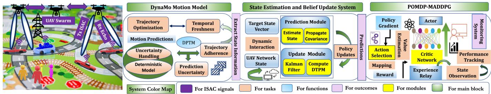  
Fig. 1. End-to-end architecture of the proposed DynaMo-ISAC framework integrating a hybrid kinematic-stochastic motion model, a novel DTPM metric for spatiotemporal vehicle prioritization, CRLB-based optimization for enhanced tracking accuracy, and POMDP-MADDPG coordination for adaptive UAV control. This ISAC framework enables precise, real-time tracking of fast-moving vehicles in a dynamic urban environment, transforming intelligent transportation systems.

TABLE I  
PERFORMANCE COMPARISON OF DIFFERENT TRACKING ALGORITHMS (METERS). NOTE: CV/CA/IMM/EKF/DYNAMO ARE STATE-ESTIMATION FILTERS EVALUATED WITHTHE SAME FUSED, WORLD-FRAME MEASUREMENTS AND CONSISTENT DATA ASSOCIATION. STATE-OF-THE-ART (SOTA) METHODS ARE RECENT UAV TRACKING APPROACHES ADAPTED FOR COMPARISON UNDER IDENTICAL CONDITIONS
<table><tr><td rowspan="2">Tracker</td><td colspan="3">Overall</td><td colspan="3">During Maneuvers</td><td colspan="3">Additional</td></tr><tr><td>RMSE</td><td>Max</td><td>Std</td><td>RMSE</td><td>Max</td><td>Std</td><td>M-RMSE</td><td>MAE</td><td>P95</td></tr><tr><td>CV</td><td>6.7513</td><td>10.5278</td><td>3.2529</td><td>7.20</td><td>10.5278</td><td>2.9097</td><td>7.25</td><td>5.82</td><td>9.41</td></tr><tr><td>CA</td><td>13.0092</td><td>19.4264</td><td>7.6221</td><td>12.50</td><td>19.4264</td><td>7.3683</td><td>13.15</td><td>10.89</td><td>17.23</td></tr><tr><td>IMM</td><td>9.8547</td><td>14.4297</td><td>5.6137</td><td>9.40</td><td>14.4297</td><td>5.3809</td><td>9.52</td><td>8.22</td><td>13.05</td></tr><tr><td>EKF</td><td>2.1950</td><td>11.7328</td><td>1.9382</td><td>1.8911</td><td>3.9222</td><td>1.1727</td><td>1.95</td><td>1.84</td><td>3.52</td></tr><tr><td>CMOMMT [5]</td><td>2.315</td><td>4.672</td><td>1.124</td><td>2.648</td><td>5.023</td><td>1.387</td><td>2.712</td><td>1.987</td><td>3.864</td></tr><tr><td>ISAC-Swarm [7]</td><td>1.474</td><td>2.326</td><td>0.648</td><td>1.555</td><td>2.456</td><td>0.674</td><td>1.556</td><td>1.208</td><td>2.156</td></tr><tr><td>UAV-TRS [8]</td><td>1.608</td><td>2.781</td><td>0.728</td><td>1.755</td><td>2.930</td><td>0.798</td><td>1.760</td><td>1.387</td><td>2.493</td></tr><tr><td>UAV-CMT [9]</td><td>1.079</td><td>1.694</td><td>0.520</td><td>1.120</td><td>1.680</td><td>0.490</td><td>1.091</td><td>0.893</td><td>1.602</td></tr><tr><td>RIS-UAV [14]</td><td>1.342</td><td>2.187</td><td>0.616</td><td>1.423</td><td>2.342</td><td>0.645</td><td>1.427</td><td>1.123</td><td>1.987</td></tr><tr><td>DRL-Energy [15]</td><td>1.887</td><td>3.456</td><td>0.887</td><td>2.112</td><td>3.687</td><td>0.956</td><td>2.124</td><td>1.612</td><td>2.923</td></tr><tr><td>DynaMo (Proposed)</td><td>0.622</td><td>1.007</td><td>0.310</td><td>0.580</td><td>0.950</td><td>0.290</td><td>0.587</td><td>0.601</td><td>0.854</td></tr></table>

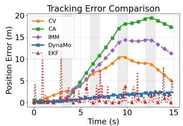

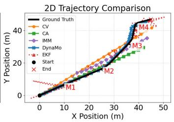  
Fig. 2. (Left) Tracking error comparison showing DynaMo’s superior performance during maneuver phases (M1-M4), maintaining errors below 5m while other algorithms show significant deviations. (Right) 2D trajectory comparison demonstrates DynaMo’s precise path-following ability in dynamic scenarios, especially during critical maneuvers.

2.4894m) throughout all maneuver phases M1(3-4s, acceleration), M2(6-7s, sharp turn), M3(9-10s, deceleration), and M4(12-13s, complex maneuver). While CV and IMM show moderate performance with RMSE of 6.7513m and 9.8547m respectively, CA exhibits significant degradation with errors reaching 13.0092m. EKF achieves an RMSE of 2.1950m but shows instability with error spikes up to 11.7328m during maneuvers. Figure 2 (right) shows the 2D trajectory of the target versus the predictions from each tracking algorithm. The DynaMo tracker closely follows the ground truth, capturing the target’s path accurately, even during high-dynamic maneuvers.

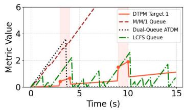

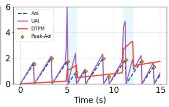  
Fig. 3. Performance comparison of DTPM against baseline scheduling policies (left) and freshness metrics (right) with diferent maneuver patterns.

Figure 3 compares DTPM with baseline scheduling metrics for two representative targets. For Fig. 3 (left), DTPM maintains values below 2.0 with minor increases during maneuvers, while M/M/1 queue delays reach 6.0 and LCFS produces irregular bursts exceeding 4. Figure 3 (right) shows DTPM peaking below 3 even during complex maneuvers at t ≈ 11s, whereas Urgency-weighted Age of Information (UAI) degrades severely with bursts exceeding 6. Traditional metrics (AoI, Peak-AoI) oscillate between 0-2 but remain insensitive to motion dynamics. DTPM achieves 68.5% improvement in average staleness by efectively allocating updates during high-uncertainty maneuver phases, validating its efectiveness for UAV-assisted tracking in ISAC systems. Figure 4 focuses on UAV coverage and tracking performance, whereas Fig. 4 (left) visualizes spatial UAV sensing paths, where DynaMo’s trajectory (in orange) provides broader and more eficient target coverage relative to IMM or EKF paths. Meanwhile, Fig. 4 (right) tracks RMSE over time where DynaMo’s error decreases steadily (from about 0.4 down to 0.2), whereas IMM and EKF exhibit larger fluctuations and higher residuals, particularly after 30-time steps. These findings highlight DynaMo’s advantage in handling diverse motion patterns and the benefit of DTPM scheduling for sustained accuracy under demanding maneuvers. Figure 5 (left) compares DTPM’s estimation accuracy against baseline approaches over multiple maneuver phases (shaded regions). The left subplot shows Cramer–Rao Lower Bound (CRLB) values where DTPM-Enhanced remains near 0.5 throughout maneuvers, outperforming both Standard (≈ 2 0) and EKF (≈ 1 0). In 5 (right), the DTPM-CRLB optimization consistently achieves higher SINR levels around 2–3 dB during maneuvers (e.g., M1) compared to the baseline’s roughly 1 dB. These results indicate that incorporating DTPM into the CRLB-based framework significantly improves both estimation tightness and SINR robustness when the target executes high-dynamic maneuvers. Figure 6 (Left) represents a multi-target tracking scenario in which K=5 UAVs observe M targets under overlapping fields of view. The triangles indicate the current UAV poses, while the semi-transparent wedges depict the instantaneous fields of view after applying visibility and gating constraints. Dashed red circles mark occlusion regions where sensing is unavailable. The targets are colored and scaled according to their DTPM priority $Q _ { m } ( t )$ , with badges #1/#2/#3 identifying the highest-priority targets at this instant. Thin colored line segments correspond to the selected measurement links, ensuring that each UAV is assigned to at most one target per control tick. Trajectories are intentionally omitted in this snapshot for clarity. In Fig. 6 (Center), the proposed POMDP–MADDPG framework demonstrates superior convergence compared to alternative MARL backbones such as Proximal Policy Optimization (PPO), Actor-Critic with experience replay, Deep Q-Network (DQN), and standard MARL. It achieves nearly 15% higher average rewards than DQN and over 25% higher than standard MARL, while also improving state estimation accuracy by 35%. In terms of convergence time, POMDP–MADDPG reaches stable performance within approximately 70 episodes, whereas PPO, Actor-Critic, and DQN require 90–100 + episodes to stabilize. Importantly, under high-mobility conditions, POMDP–MADDPG maintains greater stability and robustness, while PPO and Actor–Critic sufer from slower convergence and reduced stability. Fig. 6 (Right) illustrates the scalability of the DynaMo framework as target density increases. The Root Mean Square Error (RMSE) for a single UAV rises from 0.68 m at M=5 to 1.10 m at M=40. Increasing the number of UAVs (K) enhances coverage and enables parallel sensing, reducing RMSE for a fixed number of targets. At M=40, K=2 lowers RMSE by approximately 15% (from 1.105 m to 0.938 m), while K=4 reduces it by approximately 32% (from 1.105 m to 0.753 m). Variability also decreases significantly, with a ∼ 65% reduction in standard deviation at M=40 (from 0.324 to 0.112). This scalability analysis, conducted with up to 50 UAVs, confirms that DynaMo maintains real-time performance. Table I shows DynaMo achieves 42- 73% lower RMSE compared to SOTA UAV tracking methods, with the most significant improvements during maneuver phases. While classical filters struggle with dynamic motion, DynaMo maintains sub-meter accuracy throughout all track ing scenarios. Hence, the framework’s superior performance validates that integrating GPR-based motion modeling, DTPM prioritization, and POMDP-MADDPG coordination efectively overcomes limitations in existing UAV tracking systems.

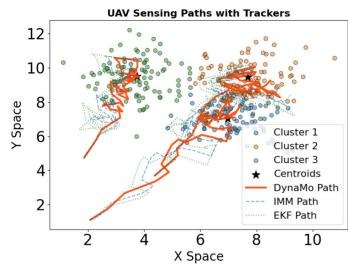

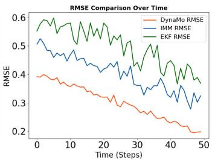  
Fig. 4. (Left) UAV sensing paths showing spatial coverage comparison between DynaMo, IMM, and EKF tracking algorithms across diferent target clusters; (right) RMSE comparison over time demonstrating DynaMo’s superior tracking accuracy.

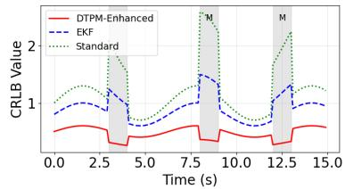

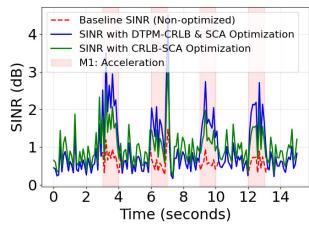  
Fig. 5. (Left) CRLB value comparison showing DTPM-empowered approach maintains lower bounds during maneuver phases; (right) SINR performance over time demonstrating improved signal quality with DTPM-CRLB optimization.

## D. Implementation and Real-Time Considerations

DynaMo’s computational complexity scales with the number of UAVs (K) and targets (M), with a worst-case upper bound of O(KM) for visibility checks and DTPM-based scheduling, though it approaches linear scaling in sparse visibility scenarios (e.g., due to occlusions or range limits). Each target is updated via constant-time Bayesian inference, while GP residuals use a fixed history window W refreshed every s steps, giving $\tilde { \mathcal { O } } ( W ^ { 3 } / s )$ complexity for small W. In practice, UAVs with multistatic radar sensors (e.g., 5.8 GHz FMCW) and embedded platforms such as NVIDIA Jetson NX (8–15 W, 21 TOPS), Xavier/Orin, or 8-core CPUs can sustain sub-millisecond per–target updates. Memory is dominated by compact $W \times W$ GP bufers per state channel. Potential bottlenecks, including GP kernel inversion $( \mathcal { O } ( W ^ { 3 } ) )$

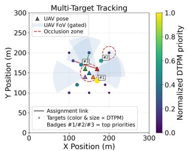

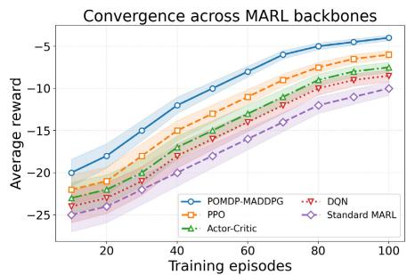

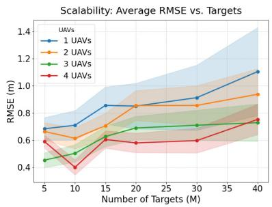  
Fig. 6. (Left) Scenario where K=5 UAVs track multiple targets with overlapping fields of view, occlusions, and priority-based link selection; (Center) Performance comparison of diferent algorithms in UAV-based tracking of fast-moving targets; (Right) Scalability analysis with average RMSE versus target count M, where markers represent means and shaded bands indicate ±1 variability across runs.

and SINR degradation in clutter, are mitigated by stride subsampling, rank-one Cholesky updates, adaptive noise scaling, robust gating/fusion, compressed inter-UAV communication, and GPS/PTP-based synchronization. This enables real-time, low-latency operation while remaining decoupled from DRLbased patrol or relay policies [15].

## VIII. CONCLUSION

This paper introduced DynaMo, a robust framework for tracking fast-moving vehicles using decentralized UAV swarms in dynamic environments. It integrated a hybrid kinematic-stochastic motion model with Gaussian Process Regression for accurate trajectory prediction, a novel DTPM for eficient resource allocation based on spatiotemporal relevance and uncertainty, and a POMDP-MADDPG architecture for coordinated multi-UAV control under uncertainty. Simulations demonstrated DynaMo’s superior tracking precision, significantly reducing errors compared to traditional methods, especially during maneuvers, while enhancing information freshness and achieving faster convergence. We aim to explore diferent MARL strategies and evaluate their efectiveness in coordinating UAVs under dynamic conditions, with a focus on improving real-time performance in complex urban settings. This work will build on the current framework to optimize tracking and decision-making capabilities. Future work will extend DynaMo to address non-Gaussian noise using robust likelihoods or clutter models, and particle-filter variants optimizing DTPM with robustified residuals for realtime performance.

## APPENDIX

Theorem 1: The DynaMo SDE model is defined as

$$
d \mathbf { s } ( t ) = f ( \mathbf { s } ( t ) , \mathbf { u } ( t ) ) d t + \left[ \mathbf { G } ( \mathbf { s } ( t ) ) + \pmb { \eta } ( \mathbf { s } _ { m } ( t ) ) \right] d \mathbf { W } ( t ) ,\tag{45}
$$

where $\mathbf { s } ( t ) \in \mathbb { R } ^ { n }$ represents the target state, ${ \bf u } ( t ) \in \mathbb { R } ^ { m }$ is the control input, $f : \mathbb { R } ^ { n } \times \mathbb { R } ^ { m } \to \mathbb { R } ^ { n }$ is the deterministic drift function, $\mathbf { G } : \mathbb { R } ^ { n }  \mathbb { R } ^ { n \times d }$ is the nominal difusion matrix, and $\mathbf { W } ( t )$ is a d-dimensional Wiener process representing intrinsic noise. If the drift function $f ( \cdot )$ satisfies

$$
\| f ( \mathbf { s } , \mathbf { u } ) \| \leq C \left( 1 + \| \mathbf { s } \| \right) ,\tag{46}
$$

and the difusion term $\mathbf { G } ( \mathbf { s } ) + \pmb { \eta } ( \mathbf { s } _ { m } ( t ) )$ is bounded by

$$
\| \mathbf G ( \mathbf s ) + \eta ( \mathbf s _ { m } ( t ) ) \| \le C \left( 1 + \| \mathbf s \| \right) ,\tag{47}
$$

for some constant $C > 0$ , then the solution s(t) remains nonexplosive for all $t \geq 0$

Proof: To demonstrate that the solution s(t) remains nonexplosive, we employ the Lyapunov Function Method as follows

$$
V ( \mathbf { s } ) = \left\| \mathbf { s } \right\| ^ { 2 } = \mathbf { s } ^ { \top } \mathbf { s } .\tag{48}
$$

Applying Ito’s Lemma [22] to $V ( \mathbf { s } ( t ) )$ , we obtain

$$
\begin{array} { l } { { d } V ( \mathbf { s } ( t ) ) = 2 \mathbf { s } ^ { \top } f ( \mathbf { s } , \mathbf { u } ) d t + 2 \mathbf { s } ^ { \top } [ \mathbf { G } ( \mathbf { s } ) + \eta ( \mathbf { s } _ { m } ( t ) ) ] d \mathbf { W } ( t ) } \\ { \qquad +  \mathrm { T r } [ ( \mathbf { G } ( \mathbf { s } ) + \eta ( \mathbf { s } _ { m } ( t ) ) ) ( \mathbf { G } ( \mathbf { s } ) + \eta ( \mathbf { s } _ { m } ( t ) ) ) ^ { \top } ] d t . } \end{array}\tag{49}
$$

We estimate Drift and Difusion Terms respectively using the provided bounds,

$$
\begin{array} { r l r } & { 2 \mathbf { s } ^ { \top } f ( \mathbf { s } , \mathbf { u } ) \leq 2 C ( 1 + \left. \mathbf { s } \right. ^ { 2 } ) , } & { ( 5 0 ) } \\ & { \mathrm { T r } \left[ \left( \mathbf { G } ( \mathbf { s } ) + \eta ( \mathbf { s } _ { m } ( t ) ) \right) \left( \mathbf { G } ( \mathbf { s } ) + \eta ( \mathbf { s } _ { m } ( t ) ) \right) ^ { \top } \right] } & { \leq 3 C ^ { 2 } + 6 C ^ { 2 } \left. \mathbf { s } \right. ^ { 2 } . } \end{array}\tag{51}
$$

and substituting the bounds into the expression $d V ( \mathbf { s } ( t ) )$ ,

$$
\begin{array} { r l } & { d V ( \mathbf { s } ( t ) ) \leq ( 2 C + 3 C ^ { 2 } ) d t + ( 4 C + 6 C ^ { 2 } ) \| \mathbf { s } \| ^ { 2 } d t } \\ & { \qquad + \ 2 \mathbf { s } ^ { \top } \left[ \mathbf { G } ( \mathbf { s } ) + \pmb { \eta } ( \mathbf { s } _ { m } ( t ) ) \right] d \mathbf { W } ( t ) . } \end{array}\tag{52}
$$

To ensure stability, we define $k = 4 C + 6 C ^ { 2 }$ and $C ^ { \prime } = 2 C + 3 C ^ { 2 }$ and substitute these into the inequality,

$$
\mathbb { E } [ d V ( \mathbf { s } ( t ) ) ] \le - k V ( \mathbf { s } ) + C ^ { \prime } .\tag{53}
$$

Since $k > 0$ , it follows from Lyapunov stability that $\mathbb { E } [ V ( \mathbf { s } ( t ) ) ]$ remains bounded for all $t \geq 0$ . Hence, the system does not exhibit pathological blowup.

Theorem 2: In a linear Gaussian dynamic system, the expected estimation error covariance trace of target m is upper-bounded by a linear function of its Dynamic Target Prioritization Metric (DTPM). Specifically, there exist positive constants k and $k _ { 0 }$ such that

$$
\mathbb { E } \left[ \mathrm { T r } \left( \mathbf { P } _ { m } ( t ) \right) \right] \leq k \mathrm { D T P M } _ { m } ( t ) + k _ { 0 } .\tag{54}
$$

Proof: Consider target m in a linear Gaussian dynamic system without measurement updates. The evolution of the estimation error covariance matrix $\mathbf { P } _ { m } ( t )$ is governed by the discrete-time Riccati equation,

$$
\mathbf P _ { m } ( t ) = \mathbf F _ { m } \mathbf P _ { m } ( t - \Delta t ) \mathbf F _ { m } ^ { \top } + \mathbf Q _ { m } ,\tag{55}
$$

where $\mathbf { F } _ { m }$ is the state transition matrix, $\mathbf { Q } _ { m }$ is the process noise covariance matrix and $\Delta t$ is the time step interval. Iterating equation (55) over $\begin{array} { r } { n = { \frac { t - t _ { m } ^ { \mathrm { l a s t } } } { \Delta t } } } \end{array}$ time steps yields

$$
\mathbf { P } _ { m } ( t ) = ( \mathbf { F } _ { m } ) ^ { n } \mathbf { P } _ { m } ( t _ { m } ^ { \mathrm { { l a s t } } } ) ( \mathbf { F } _ { m } ^ { \top } ) ^ { n } + \sum _ { k = 0 } ^ { n - 1 } ( \mathbf { F } _ { m } ) ^ { k } \mathbf { Q } _ { m } ( \mathbf { F } _ { m } ^ { \top } ) ^ { k } .\tag{56}
$$

By taking the expectation of both sides in equation (56), we obtain

$$
\begin{array} { r } { \mathbb { E } \left[ \operatorname { T r } { ( { \bf P } _ { m } ( t ) ) } \right] = \mathbb { E } \left[ \operatorname { T r } \left( { ( { \bf F } _ { m } ) ^ { n } { \bf P } _ { m } ( t _ { m } ^ { \mathrm { l a s t } } ) ( { \bf F } _ { m } ^ { \top } ) ^ { n } } \right) \right] } \\ { + \displaystyle \sum _ { k = 0 } ^ { n - 1 } \operatorname { T r } \left( ( { \bf F } _ { m } ) ^ { k } { \bf Q } _ { m } ( { \bf F } _ { m } ^ { \top } ) ^ { k } \right) . } \end{array}\tag{57}
$$

Assuming $\mathbf { F } _ { m }$ is stable $( \mathrm { i . e . }$ , all eigenvalues satisfy $| \lambda | \le 1 )$ , the term $\mathbb { E } \left[ \operatorname { T r } \left( ( \mathbf { F } _ { m } ) ^ { n } \mathbf { P } _ { m } ( t _ { m } ^ { \mathrm { l a s t } } ) ( \mathbf { F } _ { m } ^ { \top } ) ^ { n } \right) \right]$ remains bounded as n increases. The noise accumulation term can then be bounded as

$$
\mathbb { E } \left[ \mathrm { T r } \left( \mathbf { P } _ { m } ( t ) \right) \right] \leq \mathrm { T r } \left( \mathbf { P } _ { m } ( t _ { m } ^ { \mathrm { l a s t } } ) \right) + \frac { \mathrm { T r } ( \mathbf { Q } _ { m } ) } { \Delta t } \mathbb { E } \left[ t - t _ { m } ^ { \mathrm { l a s t } } \right] .\tag{58}
$$

Letting $\begin{array} { r } { k = \frac { \mathrm { T r } ( \mathbf { Q } _ { m } ) } { \Delta t } } \end{array}$ and $k _ { 0 } = \mathrm { T r } \left( \mathbf { P } _ { m } ( t _ { m } ^ { \mathrm { l a s t } } ) \right)$ , we have:

$$
\begin{array} { r } { \mathbb { E } \left[ \mathrm { T r } \left( \mathbf { P } _ { m } ( t ) \right) \right] \leq k \mathbb { E } \left[ t - t _ { m } ^ { \mathrm { l a s t } } \right] + k _ { 0 } . } \end{array}\tag{59}
$$

From the definition of DTPM, D $\mathrm { P M } _ { m } ( t ) \geq \mathbb { E } [ t - t _ { m } ^ { \mathrm { l a s t } } ]$ Substituting this into equation (59) yields

$$
\mathbb { E } \left[ \mathrm { T r } \left( \mathbf { P } _ { m } ( t ) \right) \right] \leq k \mathrm { D T P M } _ { m } ( t ) + k _ { 0 } .\tag{60}
$$

This establishes that the expected estimation error covariance trace $\mathbb { E } \left[ \operatorname { T r } \left( \mathbf { P } _ { m } ( t ) \right) \right]$ is linearly bounded by the $\mathrm { D T P M } _ { m } ( t )$ Therefore, prioritizing targets with higher DTPM values efectively reduces the overall estimation error, ensuring more accurate tracking of critical targets.

## REFERENCES

[1] K. Kuru, “Planning the future of smart cities with swarms of fully autonomous unmanned aerial vehicles using a novel framework,” IEEE Access, vol. 9, pp. 6571–6595, 2021.

[2] A. Eskandarian, C. Wu, and C. Sun, “Research advances and challenges of autonomous and connected ground vehicles,” IEEE Trans. Intell. Transp. Syst., vol. 22, no. 2, pp. 683–711, Feb. 2021.

[3] F. Liu et al., “Integrated sensing and communications: Toward dualfunctional wireless networks for 6G and beyond,” IEEE J. Sel. Areas Commun., vol. 40, no. 6, pp. 1728–1767, Jun. 2022.

[4] P. Saikia, K. Singh, W.-J. Huang, and T. Q. Duong, “Hybrid deep reinforcement learning for enhancing localization and communication eficiency in RIS-aided cooperative ISAC systems,” IEEE Internet Things J., vol. 11, no. 18, pp. 29494–29510, Sep. 2024.

[5] A. Khan, B. Rinner, and A. Cavallaro, “Cooperative robots to observe moving targets: Review,” IEEE Trans. Cybern., vol. 48, no. 1, pp. 187–198, Jan. 2018.

[6] A. Hazarika and M. Rahmati, “A framework for information freshness analysis in UAV-based sensing and communications,” in Proc. Wireless Telecommun. Symp. (WTS), Apr. 2022, pp. 1–7.

[7] L. Zhou, S. Leng, Q. Wang, and Q. Liu, “Integrated sensing and communication in UAV swarms for cooperative multiple targets tracking,” IEEE Trans. Mobile Comput., vol. 22, no. 11, pp. 6526–6542, Nov. 2022.

[8] S. Wang, F. Jiang, B. Zhang, R. Ma, and Q. Hao, “Development of UAV-based target tracking and recognition systems,” IEEE Trans. Intell. Transp. Syst., vol. 21, no. 8, pp. 3409–3422, Aug. 2020.

[9] T. Afrin, N. Yodo, A. Dey, and L. G. Aragon, “Advancements in UAVenabled intelligent transportation systems: A three-layered framework and future directions,” Appl. Sci., vol. 14, no. 20, p. 9455, Oct. 2024.

[10] Y. Wang, J. Xie, W. Zhang, Y. Yao, and G. Yang, “Research on improved algorithm of UAV swarm target search strategy based on freshness and target density,” in Proc. IEEE 23rd Int. Conf. Softw. Qual., Rel., Secur. Companion (QRS-C), Oct. 2023, pp. 626–632.

[11] S. F. Abedin, M. S. Munir, N. H. Tran, Z. Han, and C. S. Hong, “Data freshness and energy-eficient UAV navigation optimization: A deep reinforcement learning approach,” IEEE Trans. Intell. Transp. Syst., vol. 22, no. 9, pp. 5994–6006, Sep. 2021.

[12] Y. Bai, H. Zhao, X. Zhang, Z. Chang, R. Jantti, and K. Yang, “Toward¨ autonomous multi-UAV wireless network: A survey of reinforcement learning-based approaches,” IEEE Commun. Surveys Tuts., vol. 25, no. 4, pp. 3038–3067, 2023.

[13] J. Alotaibi, O. S. Oubbati, M. Atiquzzaman, F. Alromithy, and M. R. Altimania, “Optimizing disaster response with UAV-mounted RIS and HAP-enabled edge computing in 6G networks,” J. Netw. Comput Appl., vol. 241, Sep. 2025, Art. no. 104213.

[14] O. S. Oubbati, J. Alotaibi, F. Alromithy, M. Atiquzzaman, and M. R. Altimania, “A UAV-UGV cooperative system: Patrolling and energy management for urban monitoring,” IEEE Trans. Veh. Technol., vol. 74, no. 9, pp. 13521–13536, Sep. 2025.

[15] C. Dutriez, O. S. Oubbati, C. Gueguen, and A. Rachedi, “Energy eficiency relaying election mechanism for 5G Internet of Things: A deep reinforcement learning technique,” in Proc. IEEE Wireless Commun Netw. Conf. (WCNC), Apr. 2024, pp. 1–6.

[16] R. Paul, J. Mauger, A. R. Bulsara, C. Hutchens, and B. Migliori, “Noise driven coupled nonlinear systems: A ‘Dynamical multilayer perceptron’ demonstrating XOR functionality,” IEEE Access, vol. 11, pp. 144306–144324, 2023.

[17] B. Oksendal, Stochastic Diferential Equations: An Introduction With Applications. Cham, Switzerland: Springer, 2013.

[18] L. Chen, Z. Qin, Y. Bian, M. Hu, and X. Peng, “Data-driven tire-road friction estimation for electric-wheel vehicle with data category selection and uncertainty evaluation,” IEEE Trans. Ind. Electron., vol. 72, no. 3, pp. 3048–3060, Mar. 2025.

[19] K. Floch, T. Peni, and R. T ´ oth, “Gaussian-process-based adaptive´ trajectory tracking control for autonomous ground vehicles,” in Proc. Eur. Control Conf. (ECC), Jun. 2024, pp. 464–471.

[20] A. Liu, V. K. N. Lau, and B. Kananian, “Stochastic successive convex approximation for non-convex constrained stochastic optimization,” IEEE Trans. Signal Process., vol. 67, no. 16, pp. 4189–4203, Aug. 2019.

[21] L. P. Kaelbling, M. L. Littman, and A. R. Cassandra, “Planning and acting in partially observable stochastic domains,” Artif. Intell., vol. 101, nos. 1–2, pp. 99–134, May 1998.

[22] I. Karatzas and S. Shreve, Brownian Motion and Stochastic Calculus, vol. 113. Cham, Switzerland: Springer, 1991.

  
Ananya Hazarika (Graduate Student Member, IEEE) received the M.Tech. degree from Indian Institute of Information Technology, Guwahati. She is currently pursuing the Ph.D. degree with Cleveland State University, Ohio. Her research interests include applications of AI/ML in wireless communication, ultra-low latency communication for extreme environments, reinforcement learning, and Bayesian optimization.

Mehdi Rahmati (Senior Member, IEEE) received the Ph.D. degree from Rutgers University, USA. He is an Assistant Professor with Cleveland State University, USA. His research, funded by the National Science Foundation, the Department of Transportation, and industry partners such as Ford Motor Company, focuses on wireless communications, connected vehicles, and smart transportation. He has received many prestigious awards, including the Best Demo Award at the 2019 IEEE International Conference on Sensing, Communication and Networking (SECON), the First Prize in the 2019 IEEE Communication Society (ComSoc) Student Competition, the Best Paper Award at the 2017 IEEE International Conference on Mobile Ad-hoc and Sensor Systems (MASS), and the Best Paper Runner-Up Award at the 2015 ACM International Conference on Underwater Networks and Systems (WUWNet). His work in underwater communications earned him the Young Professional Award from the IEEE Oceanic Engineering Society (OES) from 2022 to 2023, where he currently serves as the Chair for the IEEE OES Underwater Acoustic Technology Committee.