# A Robust Link Maintenance Algorithm for Directional UAV Networks Based on Breakage Probability Prediction

Yifei Song , Shuai Wang , Senior Member, IEEE, Zhe Song , Xuanhe Yang , Gaofeng Pan , Senior Member, IEEE, Dusit Niyato , Fellow, IEEE, and George K. Karagiannidis , Fellow, IEEE

Abstract—Millimeter-wave (mmWave) communications, coupled with directional antenna-based Flying Ad-Hoc Networks (FANETs), have received considerable attention for their potential to provide high-speed, low-latency communications for a variety of applications. However, the high mobility of Uncrewed Aerial Vehicles (UAVs) in FANETs leads to dynamic changes in relative positions, resulting in frequent link failures. Effective link maintenance in such networks has become a critical challenge. This paper addresses this issue by developing mathematical models of link disconnections in directional antenna-based FANETs. Specifically, we derive the probability density functions for link disconnections due to distance and angular misalignment in closed-form expressions. Based on these prediction models, we propose the Adaptive Link Breakage Prediction with Directionality (ALBP-D) method, which exploits the high directional gain of directional antennas to extend link lifetime and improve network performance. We compare ALBP-D with two baseline methods, the Periodic Link Maintenance (PLM) method and the Residual Path Lifetime (RPL) method, through extensive simulations. The results show that ALBP-D achieves superior performance, with approximately a 10-fold improvement in both link lifetime and network connectivity duration compared to the baseline methods. In addition, ALBP-D exhibits significant improvements in maintenance overhead efficiency, especially at higher max range adjustment count, achieving a 5 to 7-fold improvement over baseline methods. These results highlight the effectiveness of ALBP-D in directional antenna-based FANETs. We also implemented a prototype system consisting of a directional antenna node and an omnidirectional antenna node using realistic UAV trajectory data. Experimental results show that the prediction models agree well with the real link disconnection data, confirming the practical feasibility and accuracy of the proposed method.

Index Terms—MmWave, FANETs, directional antenna, mobil ity model, link breakage, link lifetime, link maintenance.

## I. INTRODUCTION

ILLIMETER-WAVE (mmWave) communication has speed wireless communication due to its inherent advantages, including large bandwidth availability, high data rates, and spatial multiplexing capabilities. However, mmWave communication also presents unique challenges, such as high susceptibility to attenuation, limited propagation distance, and sensitivity to blockage [1].

Flying Ad Hoc Networks (FANETs), which consist of uncrewed aerial vehicles (UAVs) operating in a self-organized manner, are increasingly deployed in various scenarios, such as disaster recovery, military reconnaissance [2], and real-time monitoring [3], [4]. FANETs offer advantages such as flexibility, rapid deployment, and dynamic topology adaptation [5]. However, the characteristics of UAVs, including high mobility, frequent topology changes, and limited energy resources [6], pose significant challenges to reliable and efficient communication.

To address these unique challenges, directional antennas have emerged as a critical solution for mmWave-based FANETs. The high gain and focused beam of directional antennas enable longer communication distances and reduced interference. While the use of directional antennas in ad hoc networks has been a well-established research topic for over a decade, the integration of these antennas in UAV networks requires a reevaluation of traditional approaches. The dynamic nature of UAVs leads to frequent changes in relative positions, which can cause rapid link disruptions and complicate link maintenance strategies [7]. Unlike traditional ad hoc networks, where node positions may be relatively stable, UAVs operate in unpredictable environments where both the distance and orientation between antennas must be continuously adjusted to maintain communication. To simplify this complexity, we focus on abstracting the UAV network as a 2D model, where the challenges of maintaining reliable communication links due to distance and angular alignment can be effectively addressed in a simplified plane. This abstraction allows us to capture the essential dynamics of UAV motion while avoiding the computational complexity of full 3D modeling.

In this context, this paper proposes an Adaptive Link Breakage Prediction with Directionality (ALBP-D) method. The ALBP-D method predicts link breakage times based on probabilistic models that consider both distance and angular misalignment. Unlike traditional periodic link maintenance methods, ALBP-D uses these predictions to perform dynamic adaptive link maintenance, reducing overhead and improving network performance. It also exploits the high gain characteristics of directional antennas by dynamically adjusting the beamwidth to balance communication range and reliability. This approach improves link duration and extends overall network lifetime, making it well suited for the dynamic and demanding environment of FANETs.

The main contributions of this paper are summarized as follows:

1) Comprehensive Analysis of Link Breakage: This work analyzes the causes of link breakage in directional FANETs, identifying the impacts of distance and angular misalignment. We derive closed-form probability density functions for link breakage times due to these factors and validate the functions through simulations, providing a solid theoretical basis for predictive maintenance.

2) Proposal of the ALBP-D Algorithm: The ALBP-D method predicts link breakage times and adaptively schedules link maintenance, avoiding fixed-interval maintenance and reducing overhead. The approach maximizes the benefits of directional antennas by dynamically adjusting beamwidth to extend the communication range and improve the reliability of the network.

3) Performance Evaluation: Comprehensive simulations compare ALBP-D with Periodic Link Maintenance (PLM) method and Residual Path Lifetime (RPL) method. The results show that ALBP-D achieves superior performance in terms of link duration, active node count, and maintenance efficiency, demonstrating its effectiveness in addressing the challenges of directional FANETs.

Therefore, in this work, we propose an adaptive algorithm for predicting and mitigating link breakage. We aim to develop a robust link maintenance algorithm that enhances the survivability of directional UAV networks by maintaining a larger number of reliable links under dynamic mobility conditions.

## II. RELATED WORKS

As a foundation for robust UAV networking, recent advances in directional mmWave communication technologies, such as beamforming and predictive alignment, have enabled high-throughput, low-latency links under mobility. Building on this physical-layer capability, the challenges of maintaining stable communication links in mobile ad hoc networks (MANETs), and particularly in FANETs, have been widely studied. Two critical and interrelated aspects of this problem are link lifetime prediction and link maintenance methods. Link lifetime prediction provides insights into when a link is likely to break, enabling proactive measures, while link maintenance methods utilize such predictions to ensure connectivity through efficient resource allocation.

## A. Directional mmWave Communication in UAV Networks

Recent advancements in mmWave directional communications for UAV networks focus on antenna optimization, intelligent beam management, and network integration. Yang et al. [8] demonstrated joint elevation/azimuth beamforming at base stations to enhance sum-rate and fairness in UAV swarm networks. IRS-aided systems overcome blockage limitations through passive beamforming [9], while conformal antenna arrays enable full-space coverage under mobility [10]. NOMA-beamforming integration [11] and predictive beam tracking [12] further address spectral efficiency and mobility challenges in directional links.

## B. Link Lifetime Prediction

Link lifetime prediction is a fundamental aspect of maintaining reliable communications in FANETs. Accurate prediction enables proactive link maintenance and reduces communication disruptions caused by link failures. Existing link lifetime prediction approaches can be broadly classified into two classes: motion model-based prediction and channel quality-based prediction. Motion model-based methods use the mobility characteristics of nodes to estimate the duration of a communication link, while channel quality-based methods rely on metrics such as signal strength and link quality to determine the likelihood of link stability.

Motion model-based link lifetime prediction has been extensively studied, particularly in the context of highly mobile networks such as FANETs. For example, [13] proposed a method that uses node velocity and relative position to estimate link lifetime, incorporating probabilistic models to account for mobility uncertainty. Another study [14] introduced a Gaussian-Markov mobility model to predict link stability, which was shown to improve accuracy in dynamic scenarios. In [15], a geometric approach was adopted to evaluate link lifetime by analyzing the spatial trajectory of nodes.

On the other hand, channel quality-based prediction methods have also received considerable attention. These methods use signal-to-noise ratio (SNR), received signal strength indicator (RSSI), or bit error rate (BER) as key parameters to estimate link stability. In [16], the LLQLR algorithm for wireless mesh networks improves routing by predicting link quality based on future ship locations using a Kalman filter. In [17], the Link Quality Estimator based on an improved Weighted Extreme Learning Machine (LQE-IWELM) was introduced, which optimizes the selection of communication links by predicting link quality parameters. In [18], the authors present a method for predicting the lower bound of link quality confidence intervals based on channel quality for smart grid applications. Using Long-Short-Term Memory (LSTM) networks, they first apply wavelet denoising to decompose the signal-to-noise ratio time series into deterministic and stochastic components.

The integration of motion model-based and channel qualitybased prediction methods holds great potential for achieving robust and accurate link lifetime estimation, especially in the challenging environment of FANETs. Such hybrid approaches can leverage the strengths of both mobility and channel metrics to address the complexities of dynamic and resourceconstrained networks.

TABLE I  
SUMMARY OF LINK MAINTENANCE APPROACHES CONSIDERING DIS-TANCE AND ANGULAR FACTORS
<table><tr><td rowspan=1 colspan=1>Reference</td><td rowspan=1 colspan=1>Distance Factor</td><td rowspan=1 colspan=1>Angular Factor</td></tr><tr><td rowspan=1 colspan=1>[13]</td><td rowspan=1 colspan=1> $\overline { { \checkmark } }$ </td><td rowspan=1 colspan=1></td></tr><tr><td rowspan=1 colspan=1>[14]</td><td rowspan=1 colspan=1>√</td><td rowspan=1 colspan=1></td></tr><tr><td rowspan=1 colspan=1>[15]</td><td rowspan=1 colspan=1>√</td><td rowspan=1 colspan=1></td></tr><tr><td rowspan=1 colspan=1>[16]</td><td rowspan=1 colspan=1>√</td><td rowspan=1 colspan=1></td></tr><tr><td rowspan=1 colspan=1>[19]</td><td rowspan=1 colspan=1></td><td rowspan=1 colspan=1> $\overline { { \checkmark } }$ </td></tr><tr><td rowspan=1 colspan=1>[20]</td><td rowspan=1 colspan=1></td><td rowspan=1 colspan=1> $\overline { { \checkmark } }$ </td></tr><tr><td rowspan=1 colspan=1>This Paper (ALBP-D)</td><td rowspan=1 colspan=1> $\overline { { \checkmark } }$ </td><td rowspan=1 colspan=1> $\overline { { \checkmark } }$ </td></tr></table>

## C. Link Maintenance Methods

Various link maintenance strategies have been proposed to address the challenges of sustaining connectivity in mobile networks. For omnidirectional communication, traditional methods rely on periodic hello messages or heartbeat packets to update neighbor tables and identify broken links. Although effective in static or low-mobility scenarios, these methods often incur a high overhead in dynamic networks like FANETs.

In directional communication, link maintenance becomes more complex due to the need for precise beam alignment. Several studies have proposed proactive methods, such as beam scanning and adaptive beam alignment adjustment, to enhance link stability [19], [20].

However, most existing methods overlook the high mobility and energy constraints inherent in FANETs. While periodic maintenance methods such as [21] are simple to implement, they often fail to adapt to dynamic mobility patterns, resulting in either excessive overhead or insufficient link updates. Conversely, advanced methods designed for MANETs are rarely optimized for the directional characteristics of FANETs, leaving a gap in the literature.

In analyzing these two aspects, it is important to note that most prior studies tend to focus exclusively on either distance or angular factors, rather than combining the two in a unified framework. Table I summarizes existing work based on whether they consider distance or angular factors for link maintenance. As shown, only a few studies incorporate both factors, leaving a significant research gap. This paper proposes a novel link maintenance algorithm, ALBP-D, which addresses this gap by proposing a novel algorithm that jointly considers both distance and angular link breakage probabilities. ALBP-D leverages the unique characteristics of directional antennas and incorporates a joint probability model for distance and angular breakage. By dynamically adjusting communication parameters, ALBP-D achieves superior link stability while maintaining low overhead, as demonstrated in our simulation results.

## III. SYSTEM MODEL AND PROBLEM STATEMENT

We consider a single-layer distributed FANET consisting of a set of nodes denoted $\dot { \mathcal { N } } = \{ N _ { 1 } , N _ { 2 } , . . . , N _ { M } \}$ , where M is the total number of nodes. The network operates under the following conditions:

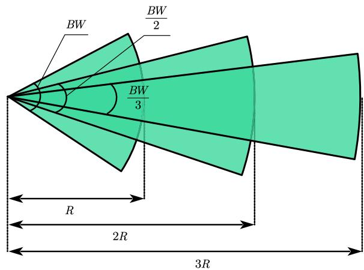  
Fig. 1. Antenna model. When the beam width is BW, the communication distance is R. Reducing the beam width to $\textstyle \mathbf { \frac { B W } { 2 } }$ results in a communication distance of 2R, and further decreasing the beam width to $\frac { \mathrm { B W } } { 3 }$ increases the communication distance to 3R. This demonstrates how narrowing the beam width increases the communication range, reflecting the inverse relationship between beam width and distance.

• Node Identification and Communication Mode: Each node has a unique identifier (ID) and operates in halfduplex mode, meaning a node can either transmit or receive data at any given time but not simultaneously.

• Hardware Uniformity: All nodes share identical hardware platforms, battery capacities, and computational resources. By assuming a homogeneous platoon, we isolate the core effects of link breakage and maintenance, which are crucial for understanding the performance of directional antennas in FANETs.

• Position Awareness: Nodes are equipped with mechanisms such as GPS or equivalent technologies, enabling them to accurately determine their current positions. The positions can also be provided through AOA and TOA algorithm [22] in GPS system denied environments.

Directional Communication: Communication occurs within a limited range determined by the transmission power and antenna design. The use of highly directional antennas minimizes interference between concurrent transmissions, allowing interference to be ignored.

## A. Antenna Model

In this study, we employ a beamforming antenna with adjustable beamwidths to support flexible directional communication. The beamwidth, denoted as BW, can vary from $0 ^ { \circ }$ (highly directional) to $3 6 0 ^ { \circ }$ (omnidirectional). In directional communication, the typical beamwidth is $B W ~ < ~ 1 2 0 ^ { \circ }$ allowing for a focused transmission pattern and enhanced communication efficiency. Nodes operate in a dual-mode configuration. For transmission, the nodes use a directional mode, focusing their energy within a specified beamwidth. This configuration increases the antenna gain and extends the communication range. For reception, the nodes adopt an omnidirectional mode, enabling the reception of signals from any direction. This design ensures efficient use of resources while maintaining broad connectivity.

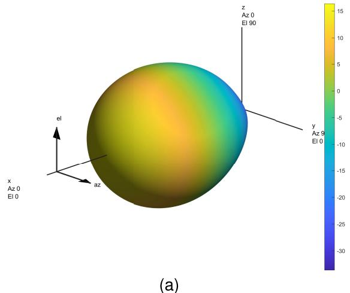

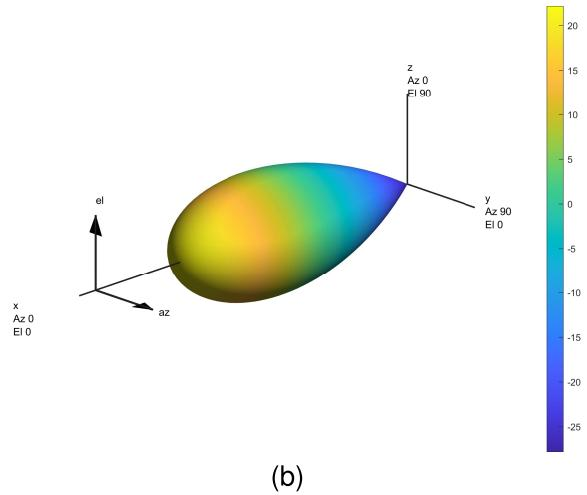  
Fig. 2. 3D radiation patterns for array antennas with different beamwidths. (a) Beamwidth is $3 0 ^ { \circ }$ and the max directivity is 16.37dBi. (b) Beamwidth is $1 5 ^ { \circ }$ and the max directivity is 22.17dBi.

According to [23], The gain G of a directional antenna is determined by the ratio of the spherical area to the area of the antenna pattern. Mathematically, this relationship can be expressed as $\begin{array} { r } { G = \frac { \mathrm { A r e a ~ o f ~ { \cal ~ S p h e r e } } } { \mathrm { A r e a ~ o f ~ { \cal ~ A n t e n n a ~ P a t t e r n } } } . } \end{array}$ . For a directional antenna, the spherical surface area is 4πr2, while the area covered by the antenna pattern is approximately proportional to sin θ · sin φ, where θ and $\phi$ represent the beamwidth in the azimuth and elevation planes, respectively. Substituting these values, the gain becomes $\begin{array} { r } { G = \frac { 1 6 } { \sin \theta \sin \phi } . } \end{array}$

In practical scenarios where $\theta = \phi$ and the beamwidth is expressed in degrees, the gain is further approximated as $G =$ $\frac { \hat { C } } { B W _ { \phi } ^ { 2 } }$ , where $B W _ { \phi }$ is the beamwidth in degrees and $C$ is a parameter related to antenna design. This formula indicates that the gain is inversely proportional to the square of the beamwidth. Narrower beams result in higher gains as a result of more concentrated energy.

The communication range R is influenced by the antenna gain. Using the Friis transmission equation, which can be written as

$$
P _ { r } = \frac { P _ { t } G _ { t } G _ { r } \lambda ^ { 2 } } { ( 4 \pi d ) ^ { 2 } } ,\tag{1}
$$

where $P _ { t }$ is the transmission power, $G _ { t }$ and $G _ { r }$ are the gains of the transmitting and receiving antennas, respectively, λ is the wavelength, and d is the distance. Therefore, for a directional antenna, since $\begin{array} { r } { G _ { t } \propto \frac { 1 } { B W _ { \phi } ^ { 2 } } } \end{array}$ , the communication range can be approximated as

$$
R \propto \frac { 1 } { B W _ { \phi } } .\tag{2}
$$

In practical scenarios, the beamwidth of a directional antenna cannot be reduced indefinitely due to physical and technical limitations. Specifically, there exists a minimum beamwidth, denoted as $B W _ { \mathrm { m i n } } .$ , which restricts the degree to which the beam can be narrowed. Consequently, the communication distance $R ,$ which is inversely proportional to the beamwidth derived earlier, also has an upper bound.

This constraint reflects the trade-off between beamwidth and communication range, where achieving a longer communication distance requires narrower beams, but practical limitations prevent the beamwidth from being arbitrarily small. As a result, the maximum achievable communication distance $R _ { \mathrm { m a x } }$ is inherently constrained by $B W _ { \mathrm { m i n } } .$ , ensuring realistic applicability of the antenna model in real-world FANET deployments.

To further illustrate the characteristics of the antenna model, MATLAB’s Antenna Toolbox was used to generate the 3D radiation patterns of array antennas with beamwidths of $3 0 ^ { \circ }$ and $1 5 ^ { \circ }$ . The corresponding radiation patterns are shown in Fig. 2a and Fig. 2b, respectively. It can be observed that the directional gain of the $1 5 ^ { \circ }$ beamwidth antenna is approximately 6 dB higher than that of the $3 0 ^ { \circ }$ beamwidth antenna. According to (1), this increase in directional gain doubles the communication range under otherwise identical conditions. This result is consistent with the theoretical model proposed in this paper, further validating its accuracy in describing the relationship between beamwidth and communication range.

This analysis shows that reducing the beamwidth linearly extends the communication range while increasing the beamwidth reduces the range due to energy dispersion.

For two nodes to successfully establish communication, the following conditions must be met:

1) Distance Constraint: The distance between the nodes must be within the communication range, i.e., $d \_ \leq$ $R ( B W )$

2) Angular Constraint: The line connecting the two nodes must fall within the active beam of the transmitting node. This requires the angular deviation $\phi$ from the normal direction of the beam to satisfy $| \phi | \leq { \frac { B W } { 2 } }$

3) Mode Coordination: One node must operate in transmission mode, while the other operates in reception mode to ensure proper data exchange.

This refined antenna model highlights the trade-off between beamwidth and communication range while ensuring efficient communication in FANETs. The integration of beamwidth control and directional transmission mechanisms provides a foundation for designing robust link maintenance strategies.

## B. Mobility Model

In this study, we adopt a Gaussian mobility model to characterize the movement of nodes in the network. This model provides a probabilistic framework for describing node mobility, with velocity components modeled as independent Gaussian random variables. The key aspects of the model are described below.

The motion of a node is described in terms of its velocity components along the x- and y-axes, denoted as $v _ { x }$ and $v _ { y } ,$ respectively. These components are independent and follow Gaussian distributions expressed as $v _ { x } \sim \mathcal { N } ( \mu _ { x } , \sigma _ { x } ^ { 2 } )$ and $v _ { y } \sim$ $\mathcal { N } ( \mu _ { y } , \sigma _ { y } ^ { 2 } )$ , where $\mu _ { x }$ and $\mu _ { y }$ are the mean velocities and $\sigma _ { x } ^ { 2 }$ and $\sigma _ { y } ^ { 2 }$ are the variances of the velocities in the directions x and y, respectively. The initial position of the node is denoted as $( x _ { 0 } , y _ { 0 } )$

To facilitate analysis, the node’s continuous motion is discretized into a sequence of steps. The time is divided into equal intervals of $\Delta t .$ , such that $t = n \Delta t .$ , where n is the number of discrete time steps. At each step, the position of the node is updated based on its velocity during the interval.

The displacement of the node along each axis over one time step is given by $\Delta x = v _ { x } \Delta t$ and $\Delta y = v _ { y } \Delta t .$ , respectively.

Thus, the position of the node at step n can be expressed as $\begin{array} { r } { x ( n ) = x _ { 0 } + \sum _ { i = 1 } ^ { n } v _ { x } ( i ) \Delta t } \end{array}$ and $\begin{array} { r } { y ( n ) = y _ { 0 } + \sum _ { i = 1 } ^ { n } v _ { y } ( i ) \Delta t , } \end{array}$ respectively, where $v _ { x } ( i )$ and $v _ { y } ( i )$ represent the velocity components at the i-th step. The expressions of $x ( n )$ and $y ( n )$ represent the cumulative displacement of the node along the $x \mathrm { - }$ and y-axes after n steps.

Taking into account the properties of the Gaussian distribution, the position of the node after the n steps, denoted as $( x ( n ) , y ( n ) )$ , remains stochastic. By substituting the Gaussian velocities into the above equations, the positions are expressed as $\boldsymbol { x } ( n ) \sim \mathcal { N } \left( \boldsymbol { x } _ { 0 } + n \mu _ { x } \Delta t , n \sigma _ { x } ^ { 2 } \Delta t ^ { 2 } \right)$ and $y ( n ) \sim$ $\mathcal { N } \left( y _ { 0 } + n \mu _ { y } \Delta t , n \sigma _ { y } ^ { 2 } \Delta t ^ { 2 } \right)$

## C. Problem Formulation

The flat-top antenna model is adopted to enable tractable analysis and aligns with practical implementations where directional beams are controlled using discrete beamwidth sectors with approximately uniform gain within each sector [19]. We assume that the antenna pointing direction remains stable during link maintenance, which is a common condition in practical systems where gimbal or servo-based stabilization is employed to mitigate platform jitter [24]. In directional antenna networks, the connectivity conditions are stringent and can be expressed as $d ( i , j ) \leq R ( \theta )$ and $\begin{array} { r } { | \phi _ { i j } - \alpha _ { i } | \le \frac { \theta } { 2 } . } \end{array}$ , where $\theta$ is the beamwidth of the directional antenna, $R ( \theta )$ is the communication range as a function of $\theta , \phi _ { i j }$ is the relative angular position of $N _ { j }$ with respect to $N _ { i }$ , and $\alpha _ { i }$ is the central axis (boresight) of the transmitting beam. The first condition ensures that the nodes are within communication range, while the second ensures that $N _ { j }$ lies within the transmitting $N _ { i } { ' } \mathrm { s }$ active beam sector.

The mobility of the nodes further complicates the maintenance of the link. The relative position $\Delta { \bf p } _ { i j } ( t ) = { \bf p } _ { j } ( t ) -$ $\mathbf { p } _ { i } ( t )$ evolves over time based on their velocities

$$
\Delta \mathbf { p } _ { i j } ( t + \Delta t ) = \Delta \mathbf { p } _ { i j } ( t ) + \Delta \mathbf { v } _ { i j } \cdot \Delta t ,\tag{3}
$$

where $\Delta \mathbf { v } _ { i j } = \mathbf { v } _ { j } - \mathbf { v } _ { i }$ is the relative velocity.

A common solution is periodic link maintenance, where nodes exchange information (e.g., position and velocity) at intervals $T _ { m }$ . However, this approach faces two major limitations:

1) When $N _ { i }$ and $N _ { j }$ move with similar velocities $( \| \Delta \mathbf { v } _ { i j } \| \approx \mathrm { ~ 0 ) }$ , their relative positions remain stable $( \| \Delta \mathbf { p } _ { i j } \|$ ≈ constant), making frequent updates unnecessary.

2) When nodes have divergent velocities $( \Vert \Delta \mathbf { v } _ { i j } \Vert$ is large), their relative positions change rapidly, requiring shorter maintenance intervals to prevent link breakage.

To address these limitations, an adaptive maintenance strategy is required, where the maintenance interval $T _ { m }$ is determined based on the relative velocity $\| \Delta \mathbf { v } _ { i j } \|$ , relative position $\Delta { \bf p } _ { i j }$ and angular alignment $\Delta \phi _ { i j }$ , which can be presented as

$$
T _ { m } = f \left( \Delta \mathbf { v } _ { i j } , \Delta \mathbf { p } _ { i j } , \Delta \phi _ { i j } \right) ,\tag{4}
$$

where $f ( \cdot )$ is a function designed to balance communication overhead and link stability. This adaptive mechanism ensures efficient resource utilization while maintaining reliable connectivity in directional antenna networks.

To better illustrate the impact of node mobility on link breakage in directional antenna FANETs, Fig. 3 shows the beam coverage of node $N _ { 1 }$ and the mobility patterns of its neighboring nodes $N _ { 2 }$ to $N _ { 7 }$ . Initially, all nodes are within the beam coverage of $N _ { 1 }$ , but their movements cause link breakage under different conditions.

The nodes $N _ { 2 }$ and $N _ { 3 }$ move in the rightward direction, which aligns with the beam orientation. However, $N _ { 2 } .$ , being further from $N _ { 1 }$ compared to $N _ { 3 } ,$ , reaches the communication distance threshold sooner, causing distance link breakage. This highlights that nodes farther away from the source node are more prone to distance-based link breakage, even when their movement direction aligns with the beam.

Nodes $N _ { 4 }$ and $N _ { 5 } ,$ , on the other hand, move in the upward direction. Due to its closer proximity to $N _ { 1 } , \ N _ { 4 }$ reaches the angular deviation threshold earlier than $N _ { 5 } .$ , leading to a faster angular breakage. This demonstrates that nodes closer to the beam’s axis are more sensitive to angular deviations.

Nodes $N _ { 6 }$ and $N _ { 7 }$ move out of the beam coverage area, resulting in link breakage. In this case, the link breakage is caused by both distance and angular factors. Specifically, node $N _ { 6 }$ and node $N _ { 7 }$ move outward and exceed the communication range, while the relative direction of their movement causes the misalignment of the beam to exceed the beamwidth threshold. This shows that link breakage in practical scenarios may occur from the combined effects of distance and angular deviations, highlighting the need for a comprehensive analysis of both factors.

This figure clearly shows that both angular deviations and communication distances have a significant impact on the link maintenance process. It is important to note that traditional methods developed for ad hoc networks, which often assume static or less dynamic environments, cannot be directly applied in the context of UAV networks. The high mobility of UAVs introduces unique challenges, such as rapid changes in relative positions and the need for precise angular alignment, which are not adequately addressed by classical approaches. Therefore, an adaptive approach that dynamically adjusts communication parameters based on these factors is essential to improve link reliability and network performance.

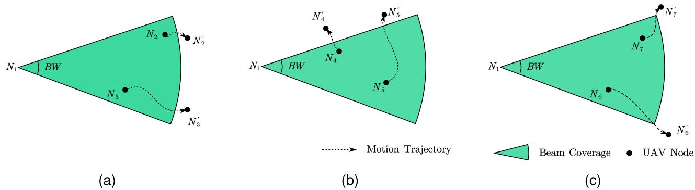  
Fig. 3. Problem formulation. (a) Case 1: The links are broken due to the distance exceeding the communication range. (b) Case 2: The links are broken and disrupted because the angle between the node connection and the beam’s central axis exceeds half of the beamwidth. (c) Case 3: The links are broken due to the combined effects of distance and angle.

In FANETs, the mobility of nodes leads to dynamic changes in their relative positions, which in turn affects the link state between them. This phenomenon is particularly critical in networks using directional antennas due to the more stringent link requirements.

## IV. ALGORITHMS AND THEORETICAL ANALYSIS

In directional antenna-based FANETs, communication can be divided into two main phases: the neighbor discovery phase and the data transmission phase. During the neighbor discovery phase, various methods, such as those discussed in [25], can be used to identify and establish connections with neighbors. In this work, we assume that each node has already discovered and confirmed its neighbors during this phase. Once the nodes enter the data transmission phase, maintaining reliable links becomes critical to ensure successful communication. This requires periodic updates of the neighbor table to reflect changes in link states caused by node mobility.

To address the challenges of link maintenance in directional antenna FANETs, we propose an adaptive algorithm called ALBP-D. The core concept of ALBP-D is to maintain each link with a frequency that adapts to the specific mobility characteristics of the nodes and the directional constraints of the antennas. For each link, the algorithm calculates the probability of link failure due to angular misalignment and excessive distance, taking into account the relative position, velocity, and beamwidth of the directional antennas. These probabilities are then used to dynamically adjust the maintenance interval for each link, ensuring efficient resource utilization and reliable connectivity. Specifically, the probability of angular breakage depends on whether the relative angular position of a neighbor falls within the beamwidth of the transmitting node, while the probability of distance breakage depends on whether the distance between nodes exceeds the communication range. By combining these probabilities, the algorithm determines the optimal time for the next link maintenance operation. This approach not only minimizes unnecessary maintenance for stable links, but also increases the frequency of updates for links at higher risk of disconnection, thereby achieving a balance between communication overhead and link reliability.

In this section, we analyze the probability of link breakage for directional antennas caused by both distance and angle constraints. To predict when a link is at risk of breaking, we define $n _ { \mathrm { b r e a k } }$ as the smallest discrete time step at which the link breakage probability $P _ { \mathrm { b r e a k } }$ becomes non-zero, i.e.,

$$
n _ { \mathrm { b r e a k } } = \operatorname* { m i n } \{ n \mid P _ { \mathrm { b r e a k } } ( n ) > 0 \} .\tag{5}
$$

The probability of link breakage $P _ { \mathrm { b r e a k } }$ consists of three components: $P _ { \mathrm { d i s } }$ , the probability of link breakage due to distance constraints, $P _ { \mathrm { a n g } } ,$ the probability of link breakage due to angle constraints, and $P _ { \mathrm { j o i n t } } = P _ { \mathrm { d i s } } \times P _ { \mathrm { a n g } }$ , the joint probability that both the distance and angle constraints are simultaneously violated. Mathematically, we express the total breakage probability as: $P _ { \mathrm { b r e a k } } = P _ { \mathrm { d i s } } + P _ { \mathrm { a n g } } - P _ { \mathrm { j o i n t } }$

However, it is important to note that the joint probability $P _ { \mathrm { j o i n t } }$ is always smaller than or equal to the minimum of the two individual probabilities $P _ { \mathrm { d i s } }$ and $P _ { \mathrm { a n g } } ,$ , i.e., $P _ { \mathrm { j o i n t } } ~ \leq$ min $( P _ { \mathrm { d i s } } , P _ { \mathrm { a n g } } )$ .

This implies that $P _ { \mathrm { j o i n t } }$ is non-zero only when both $P _ { \mathrm { d i s } } > 0$ and $P _ { \mathrm { a n g } } ~ > ~ 0$ . However, in practical scenarios, we observe that $P _ { \mathrm { j o i n t } }$ exists only theoretically, because the link will always break due to either the distance constraint or the angle constraint first. Based on this, the probabilities $P _ { \mathrm { d i s } } > 0$ and $P _ { \mathrm { a n g } } > 0$ almost never occur simultaneously. Therefore, for computational simplicity and efficiency, we approximate the total breakage probability as $P _ { \mathrm { b r e a k } } \approx P _ { \mathrm { d i s } } + P _ { \mathrm { a n g } } .$

This approximation simplifies the calculation of $n _ { \mathrm { b r e a k } }$ since the contribution of $P _ { \mathrm { j o i n t } }$ can be safely ignored without introducing significant error. In the subsequent analysis, we decompose the overall probability of link breakage into two components: the probability of distance breakage $P _ { \mathrm { d i s } }$ and the probability of angular link breakage $P _ { \mathrm { a n g } }$ . We derive the respective probability distributions for each component, which form the basis for predicting $n _ { \mathrm { b r e a k } }$ and implementing the ALBP-D algorithm.

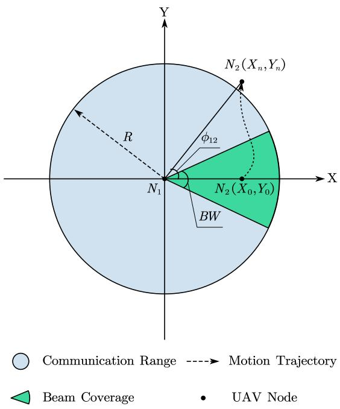  
Fig. 4. Analysis model for link breakage. $N _ { 1 }$ directs its beam towards $N _ { 2 } ' _ { \mathbf { s } }$ starting position. After n steps, Node $N _ { 2 }$ moves to position $( X _ { n } , Y _ { n } )$ , at which point the link is broken due to either distance or angular misalignment.

## A. Probability of Distance Breakage

In order to analyze the probability of link breakage caused by the distance between two nodes exceeding the communication range, we consider two mobile nodes $N _ { 1 }$ and $N _ { 2 }$ as shown in Fig. 4.

Let the initial position of $N _ { 1 }$ be $( x _ { 1 , 0 } , y _ { 1 , 0 } )$ , and its velocity components, i.e., in x-axis and $\mathbf { y } \mathbf { - } \mathbf { a x i s }$ , follow the Gaussian distribution [15] as $v _ { 1 , x } \sim \mathcal { N } ( \mu _ { 1 , x } \sigma _ { 1 , x } ^ { 2 } )$ and $v _ { 1 , y } \sim$ $\mathcal { N } ( \mu _ { 1 , y } , \sigma _ { 1 , y } ^ { 2 } )$

Similarly, the initial position of $N _ { 2 }$ is $\left( { { x } _ { 2 , 0 } } , { { y } _ { 2 , 0 } } \right)$ , with velocity components $\begin{array} { r l r } { v _ { 2 , x } } & { { } \sim } & { N ( \mu _ { 2 , x } \sigma _ { 2 , x } ^ { 2 } ) } \end{array}$ and $\begin{array} { r l } { v _ { 2 , y } } & { { } \sim } \end{array}$ $\mathcal { N } ( \mu _ { 2 , y } , \sigma _ { 2 , y } ^ { 2 } )$ . To simplify the analysis, we transform the coordinate system so that $N _ { 1 }$ is placed at the origin $( 0 , 0 )$ and the direction from $N _ { 1 }$ to $N _ { 2 }$ becomes the positive x axis in the new coordinate system. In this new coordinate system, the initial position of $N _ { 2 }$ is $( X _ { 0 } , Y _ { 0 } )$ , where $X _ { 0 } =$ $\sqrt { ( x _ { 2 , 0 } - x _ { 1 , 0 } ) ^ { 2 } + ( y _ { 2 , 0 } - y _ { 1 , 0 } ) ^ { 2 } }$ and $Y _ { 0 } = 0 .$

The velocity components of $N _ { 2 }$ in the new coordinate system, denoted $V _ { x }$ and $V _ { y } ,$ , are derived by applying a rotation transformation to the original velocity components $( v _ { 2 , x } , v _ { 2 , y } )$ relative to $( v _ { 1 , x } , v _ { 1 , y } )$ . Let the angle of rotation α be the angle between the vector $\textbf { r } = \ ( x _ { 2 , 0 } - x _ { 1 , 0 } , y _ { 2 , 0 } - y _ { 1 , 0 } )$ and the positive x-axis, calculated as α = arctan $\left( { \frac { y _ { 2 , 0 } - y _ { 1 , 0 } } { x _ { 2 , 0 } - x _ { 1 , 0 } } } \right)$ .

The velocity components of $N _ { 2 }$ in the new coordinate system are given by

$$
\left[ V _ { x } \right] = \left[ \begin{array} { l l } { \cos \alpha } & { \sin \alpha } \\ { - \sin \alpha } & { \cos \alpha } \end{array} \right] \left[ v _ { 2 , x } - v _ { 1 , x } \right] ,\tag{6}
$$

where $( V _ { x } , V _ { y } )$ represents the velocity components of $N _ { 2 }$ relative to $N _ { 1 }$ in the new coordinate system, where $N _ { 1 }$ is stationary at the origin. $V _ { x }$ and $V _ { y }$ are linear combinations of independent Gaussian random variables, they themselves follow Gaussian distributions. Thus, the velocity components $V _ { x }$ and $V _ { y }$ in the new coordinate system are Gaussian distributed as $V _ { x } \sim \mathcal { N } ( \mu _ { x } , \sigma _ { x } ^ { 2 } )$ and $V _ { y } \sim \mathcal N ( \mu _ { y } , \sigma _ { y } ^ { 2 } )$ , where $\mu _ { x } =$ $( \mu _ { 2 , x } - \mu _ { 1 , x } )$ cos $\alpha + ( \mu _ { 2 , y } - \mu _ { 1 , y } )$ sin α, $\begin{array} { r } { \bar { \sigma _ { x } ^ { 2 } } = \cos ^ { 2 } \alpha ( \sigma _ { 2 , x } ^ { 2 } + } \end{array}$ $\sigma _ { 1 , x } ^ { 2 } ) + \sin ^ { 2 } \alpha ( \sigma _ { 2 , y } ^ { 2 } + \sigma _ { 1 , y } ^ { 2 } ) , \mu _ { y } = - ( \mu _ { 2 , x } - \mu _ { 1 , x } ) \sin \alpha + ( \mu _ { 2 , y } - \mu _ { 1 , x } ) \sin \beta$ $\mu _ { 1 , y } ) \cos { \alpha } , \mathrm { a n d } \ \sigma _ { y } ^ { 2 } = \sin ^ { 2 } { \alpha } ( \sigma _ { 2 , x } ^ { 2 } + \sigma _ { 1 , x } ^ { 2 } ) + \cos ^ { 2 } { \alpha } ( \sigma _ { 2 , y } ^ { 2 } + \sigma _ { 1 , y } ^ { 2 } )$ At any given time $t = n \Delta t$ , the position of $N _ { 2 }$ in the transformed coordinate system can be expressed as

$$
X _ { n } = X _ { 0 } + \sum _ { i = 0 } ^ { n } V _ { x } ( i ) \Delta t\tag{7}
$$

and

$$
Y _ { n } = Y _ { 0 } + \sum _ { i = 0 } ^ { n } V _ { y } ( i ) \Delta t .\tag{8}
$$

Since $V _ { x }$ and $V _ { y }$ are Gaussian random variables, $X _ { n }$ and $Y _ { n }$ follow normal distributions as $X _ { n } \sim \mathcal N ( \mu _ { X } , \sigma _ { X } ^ { 2 } )$ and $Y _ { n } \sim$ $\mathcal { N } ( \mu _ { Y } , \sigma _ { Y } ^ { 2 } )$ , respectively, where $\mu _ { X } = n \Delta t \mu _ { x } + X _ { 0 } , \sigma _ { X } ^ { 2 } =$ $n \Delta t ^ { 2 } \sigma _ { x } ^ { 2 } , \dot { \mu } _ { Y } = n \Delta t \mu _ { y } + Y _ { 0 }$ , and $\sigma _ { X } ^ { 2 } = n \Delta \dot { t } ^ { 2 } \sigma _ { y } ^ { 2 } .$

The link between $N _ { 1 }$ and $N _ { 2 }$ breaks if the Euclidean distance exceeds the communication range R, i.e., when $\sqrt { X _ { n } ^ { 2 } + Y _ { n } ^ { 2 } } > R$ . This condition is equivalent to $X _ { n } ^ { 2 } + Y _ { n } ^ { 2 } >$ ${ \dot { R } } ^ { 2 }$

According to the analysis in Appendix, $X _ { n } ^ { 2 }$ follows a scaled non-central chi-squared distribution, namely,

$$
X _ { n } ^ { 2 } \sim n \triangle t ^ { 2 } \sigma _ { x } ^ { 2 } \cdot \chi _ { 1 } ^ { 2 } \left( \lambda = \frac { ( n \triangle t \mu _ { x } + X _ { 0 } ) ^ { 2 } } { n \triangle t ^ { 2 } \sigma _ { x } ^ { 2 } } \right) .\tag{9}
$$

Similarly, the distribution of $Y _ { n } ^ { 2 }$ is given as

$$
Y _ { n } ^ { 2 } \sim n \triangle t ^ { 2 } \sigma _ { y } ^ { 2 } \cdot \chi _ { 1 } ^ { 2 } \left( \lambda = \frac { ( n \triangle t \mu _ { y } + Y _ { 0 } ) ^ { 2 } } { n \triangle t ^ { 2 } \sigma _ { y } ^ { 2 } } \right) ,\tag{10}
$$

where $\chi _ { 1 } ^ { 2 } ( \lambda )$ represents a non-central chi-squared distribution with one degree of freedom and non-centrality parameter C $\lambda .$

Let $S = X _ { n } ^ { 2 } + Y _ { n } ^ { 2 }$ . Their distributions are given as $X _ { n } ^ { 2 } \sim$ $a \cdot \chi _ { 1 } ^ { 2 } \left( \lambda _ { x } \right)$ and $Y _ { n } ^ { 2 } \sim \boldsymbol { b } \cdot \chi _ { 1 } ^ { 2 } \left( \lambda _ { y } \right)$ , respectively, where $a =$ $n \triangle t ^ { \bar { 2 } } \sigma _ { x } ^ { 2 } , \dot { b } = n \triangle t ^ { \bar { 2 } } \sigma _ { y } ^ { 2 } ,$ and the non-centrality parameters are $\begin{array} { r } { \lambda _ { x } = \frac { ( n \triangle t \mu _ { x } + X _ { 0 } ) ^ { 2 } } { a } } \end{array}$ and $\begin{array} { r } { \lambda _ { y } = \frac { ( n \triangle t \mu _ { y } + Y _ { 0 } ) ^ { 2 } } { b } } \end{array}$

For a random variable $\overset { \vartriangle } { \boldsymbol { X } } \sim \chi _ { \nu } ^ { 2 } ( \lambda ) ^ { \circ }$ , its PDF is

$$
f _ { X } ( x ; \nu , \lambda ) = \frac { 1 } { 2 } e ^ { - \frac { x + \lambda } { 2 } } \left( \frac { x } { \lambda } \right) ^ { \frac { \nu } { 4 } - \frac { 1 } { 2 } } I _ { \frac { \nu } { 2 } - 1 } \left( \sqrt { \lambda x } \right) , \quad x \geq 0 ,\tag{11}
$$

where $I _ { k } ( s )$ is the modified Bessel function of the first kind, namely,

$$
I _ { k } ( s ) = \sum _ { m = 0 } ^ { \infty } \frac { 1 } { m ! \Gamma ( m + k + 1 ) } \left( \frac { s } { 2 } \right) ^ { 2 m + k } .\tag{12}
$$

For $X _ { n } ^ { 2 } \sim a \cdot \chi _ { 1 } ^ { 2 } ( \lambda _ { x } )$ , the scaled PDF becomes

$$
f _ { X _ { n } ^ { 2 } } ( x ) = \frac { 1 } { 2 a } e ^ { - \frac { x + \lambda _ { x } } { 2 a } } \left( \frac { x } { \lambda _ { x } } \right) ^ { - \frac { 1 } { 2 } } I _ { - \frac { 1 } { 2 } } \left( \sqrt { \frac { \lambda _ { x } x } { a } } \right) , \quad x \ge 0 .\tag{13}
$$

Similarly, for $Y _ { n } ^ { 2 } \sim b \cdot \chi _ { 1 } ^ { 2 } ( \lambda _ { y } )$ , its PDF is

$$
f _ { Y _ { n } ^ { 2 } } ( y ) = \frac { 1 } { 2 b } e ^ { - \frac { y + \lambda _ { y } } { 2 b } } \left( \frac { y } { \lambda _ { y } } \right) ^ { - \frac { 1 } { 2 } } I _ { - \frac { 1 } { 2 } } \left( \sqrt { \frac { \lambda _ { y } y } { b } } \right) , \quad y \geq 0 .\tag{14}
$$

The random variable $S _ { x y } = X _ { n } ^ { 2 } + Y _ { n } ^ { 2 }$ is the sum of two independent random variables. Its PDF is obtained by the convolution of $f _ { X _ { n } ^ { 2 } } ( x )$ and $f _ { Y _ { n } ^ { 2 } } ( y )$

$$
f _ { S _ { x y } } ( s ) = \int _ { 0 } ^ { s } f _ { X _ { n } ^ { 2 } } ( x ) f _ { Y _ { n } ^ { 2 } } ( s - x ) d x .\tag{15}
$$

Therefore, after substituting $f _ { X _ { n } ^ { 2 } } ( x )$ and $f _ { Y _ { n } ^ { 2 } } ( y )$ , we obtain (16), shown at the bottom of the page.

The CDF of $S _ { x y }$ is

$$
F _ { S _ { x y } } ( s ) = \int _ { 0 } ^ { s } f _ { S _ { x y } } ( u ) d u .\tag{17}
$$

Further, by substituting the expression for $f _ { S _ { x y } } ( s )$ , we get

$$
F _ { S _ { x y } } ( s ) = \int _ { 0 } ^ { s } \int _ { 0 } ^ { u } f _ { X _ { n } ^ { 2 } } ( x ) f _ { Y _ { n } ^ { 2 } } ( u - x ) d x ~ d u .\tag{18}
$$

When considering n as a variable, the probability that the link breaks under a communication range R at the n-th discrete time step can be expressed as

$$
F _ { L L } ^ { S _ { x y } } ( n ; R ) = 1 - F _ { S _ { x y } } ( s < R ^ { 2 } ; n ) ,\tag{19}
$$

where $F _ { S _ { x y } } ( s \ < \ R ^ { 2 } ; n )$ is CDF of $S _ { x y }$ evaluated at $R ^ { 2 }$ for a given n. The CDF $F _ { S _ { x y } } ( s < R ^ { 2 } ; \bar { n ) }$ accounts for the probability that the squared distance $S _ { x y }$ between the two nodes remains within the threshold $R ^ { 2 }$ at the time step n.

Using the definition of the PMF, the probability of the link breaking exactly at the n-th discrete time step is given by the difference of the CDF at two consecutive time steps

$$
f _ { L L } ^ { S _ { x y } } ( n ; R ) = F _ { L L } ^ { S _ { x y } } ( n ; R ) - F _ { L L } ^ { S _ { x y } } ( n - 1 ; R ) .\tag{20}
$$

Substituting $F _ { L L } ^ { S _ { x y } } ( n ; R )$ , the PMF becomes

$$
\begin{array} { r l } & { f _ { L L } ^ { S _ { x y } } ( n ; R ) = \left[ 1 - F _ { S _ { x y } } ( s < R ^ { 2 } ; n ) \right] } \\ & { \phantom { \frac { 1 } { 1 } } - \left[ 1 - F _ { S _ { x y } } ( s < R ^ { 2 } ; n - 1 ) \right] . } \end{array}\tag{21}
$$

By substituting the expressions of the CDFs in (21) with the integral forms defined in (17) and (18), and simplifying the resulting expression, we obtain

$$
f _ { L L } ^ { S _ { x y } } ( n ; R ) = \int _ { 0 } ^ { R ^ { 2 } } \left[ f _ { S _ { x y } } ( u ; n - 1 ) - f _ { S _ { x y } } ( u ; n ) \right] d u ,\tag{22}
$$

where $f _ { S _ { x y } } ( u ; n )$ is the PDF of $S _ { x y }$ at time step n.

TABLE II  
SIMULATION PARAMETERS
<table><tr><td rowspan=1 colspan=2>Parameter</td><td rowspan=1 colspan=1>Case (a)</td><td rowspan=1 colspan=1>Case (b)</td><td rowspan=1 colspan=1>Case (c)</td><td rowspan=1 colspan=1>Case (d)</td></tr><tr><td rowspan=8 colspan=2>µx $\mu _ { y }$  $\sigma _ { x }$  $\sigma _ { y }$  $X _ { 0 }$ ∆tBeamwidth (BW)Comm Range (R)</td><td rowspan=1 colspan=1>6.0 mps</td><td rowspan=1 colspan=1>6.0 mps</td><td rowspan=1 colspan=1>-4.0 mps</td><td rowspan=1 colspan=1>-4.0 mps</td></tr><tr><td rowspan=1 colspan=1>8.0 mps</td><td rowspan=1 colspan=1>8.0 mps</td><td rowspan=1 colspan=1>8.0 mps</td><td rowspan=6 colspan=1>8.0 mps2.0 mps3.0 mps150 m0.1 s60°</td></tr><tr><td rowspan=1 colspan=1>4.0 mps</td><td rowspan=1 colspan=1>4.0 mps</td><td rowspan=1 colspan=1>2.0 mps</td></tr><tr><td rowspan=2 colspan=1>3.0 mps50 m</td><td rowspan=1 colspan=1>3.0 mps</td><td rowspan=1 colspan=1>3.0 mps</td></tr><tr><td rowspan=1 colspan=1>150 m</td><td rowspan=1 colspan=1>50 m</td></tr><tr><td rowspan=1 colspan=1>0.1 s</td><td rowspan=1 colspan=1>0.1 s</td><td rowspan=1 colspan=1>0.1 s</td></tr><tr><td rowspan=1 colspan=1>idth (BW)</td><td rowspan=1 colspan=1>60°</td><td rowspan=1 colspan=1>60°</td><td rowspan=1 colspan=1>60°</td></tr><tr><td rowspan=1 colspan=1>200 m</td><td rowspan=1 colspan=1>200 m</td><td rowspan=1 colspan=1>200 m</td><td rowspan=1 colspan=1>200 m</td></tr></table>

## B. Probability of Angular Breakage

To analyze the probability of link breakage caused by angular misalignment, the condition for angular breakage is defined as $\begin{array} { r } { \left| \tan ^ { - 1 } \left( \frac { Y _ { n } } { X _ { n } } \right) \right| > \frac { B W } { 2 } } \end{array}$ . Using the monotonicity of the function $\tan ^ { - 1 }$ , we remove the arctangent by transforming the condition into $\begin{array} { r } { \left| \frac { Y _ { n } } { X _ { n } } \right| > \tan { \left( \frac { B W } { 2 } \right) } } \end{array}$ . Define a new random variable $\begin{array} { r } { \Omega \ = \ \frac { Y _ { n } } { X _ { - } } } \end{array}$ . The angular breakage condition becomes $| \Omega | >$ tan $\left( \frac { B \dot { W } } { 2 } \right)$ , or equivalently $\Omega \ { \stackrel { \cdot } { < } } \ \tan \left( - { \frac { B W } { 2 } } \right) \mathrm { o r } \Omega \ >$ tan $\scriptstyle \left( { \frac { B W } { 2 } } \right)$

The ratio $\Omega = Y _ { n } / X _ { n }$ has a PDF [26] given by (23), shown at the bottom of the page, where $\begin{array} { r } { q = \frac { - 1 + \beta \rho ^ { 2 } \bar { \omega } } { \delta _ { x } \sqrt { 1 + \rho ^ { 2 } \omega ^ { 2 } } } , \beta = \frac { \mu _ { Y } } { \mu _ { X } } } \end{array}$ $\begin{array} { r } { \rho = \frac { \sigma _ { X } } { \sigma _ { Y } } } \end{array}$ , and $\begin{array} { r } { \delta _ { x } = \frac { \sigma _ { X } } { \mu _ { X } } } \end{array}$

The CDF of Ω can be obtained by integrating its PDF as

$$
F _ { \Omega } ( \omega ) = \int _ { - \infty } ^ { \omega } f _ { \Omega } ( \omega ^ { \prime } ) d \omega ^ { \prime } .\tag{24}
$$

When considering n as a variable, the probability that the link breaks under an angular breakage condition $\frac { \Breve { B W } } { 2 }$ at the n-th discrete time step can be expressed as

$$
\begin{array} { l } { { \displaystyle F _ { L L } ^ { \Omega } \left( n ; \frac { B W } { 2 } \right) = F _ { \Omega } \left( \tan \left( - \frac { B W } { 2 } \right) \right) } } \\ { { \displaystyle \qquad + 1 - F _ { \Omega } \left( \tan \left( \frac { B W } { 2 } \right) \right) . } } \end{array}\tag{25}
$$

The PMF corresponding to n is given by the difference in CDF at two consecutive time steps, i.e., the difference between the CDFs at n and $n - 1$ , which can be shown as

$$
f _ { L L } ^ { \Omega } \left( n ; \frac { B W } { 2 } \right) = F _ { L L } ^ { \Omega } \left( n ; \frac { B W } { 2 } \right) - F _ { L L } ^ { \Omega } \left( n - 1 ; \frac { B W } { 2 } \right) .\tag{26}
$$

## C. Verification for Theoretical Analysis

In order to validate the theoretical analysis of distance breakage and angular breakage presented in the previous sections, simulations were implemented in Python to compare

$$
f _ { S _ { x y } } ( s ) = \int _ { 0 } ^ { s } { \frac { 1 } { 2 a } } e ^ { - { \frac { x + \lambda x } { 2 a } } } \left( { \frac { x } { \lambda _ { x } } } \right) ^ { - { \frac { 1 } { 2 } } } I _ { - { \frac { 1 } { 2 } } } \left( { \sqrt { \frac { \lambda _ { x } x } { a } } } \right) \cdot { \frac { 1 } { 2 b } } e ^ { - { \frac { s - x + \lambda y } { 2 b } } } \left( { \frac { s - x } { \lambda _ { y } } } \right) ^ { - { \frac { 1 } { 2 } } } I _ { - { \frac { 1 } { 2 } } } \left( { \sqrt { \frac { \lambda _ { y } ( s - x ) } { b } } } \right) d x .\tag{16}
$$

$$
f _ { \Omega } ( \omega ) = \frac { \rho } { \pi ( 1 + \rho ^ { 2 } \omega ^ { 2 } ) } \exp \left[ - \frac { \left( \rho ^ { 2 } \beta ^ { 2 } + 1 \right) } { 2 \delta _ { x } ^ { 2 } } \right] \times \left\{ 1 + \sqrt { \frac { \pi } { 2 } } q \mathrm { e r f } \left( \frac { q } { \sqrt { 2 } } \right) \exp \left( \frac { q ^ { 2 } } { 2 } \right) \right\}\tag{23}
$$

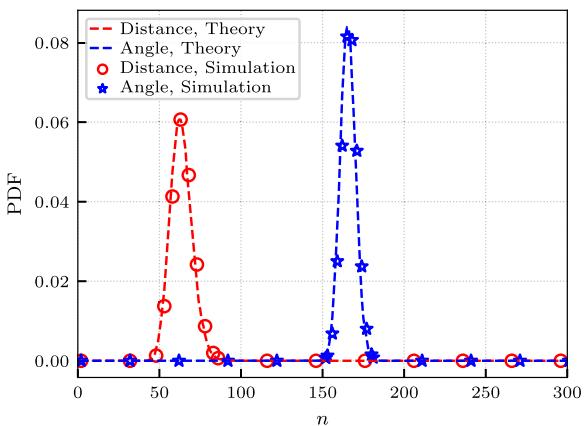  
(a)

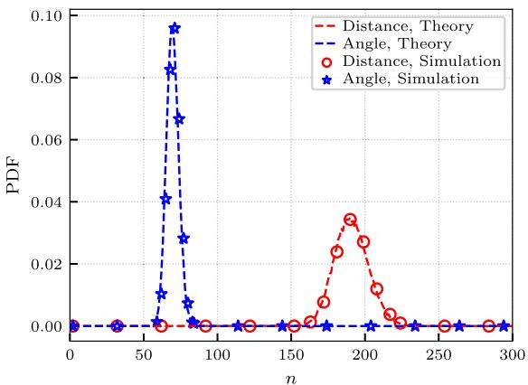  
(b)

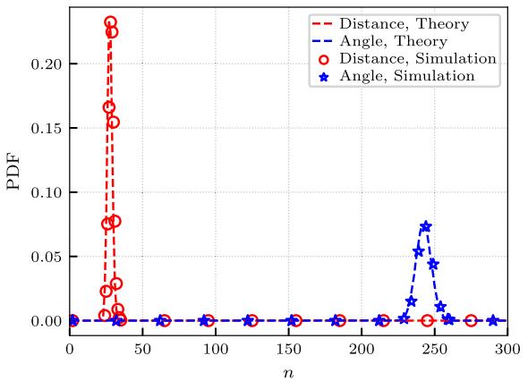  
(c)

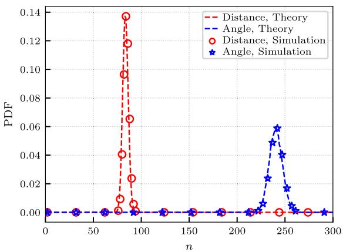  
(d)  
Fig. 5. Link breakage probability distributions demonstrating the impact of initial position $( X _ { 0 } )$ and movement direction $( \mu _ { x } )$ . (a): Near position $( X _ { 0 } = 5 0 \mathrm { m } )$ with rightward movement $( \mu _ { x } > 0 )$ experiences dominant angular breakage due to rapid beam misalignment. (b): Far position $( X _ { 0 } = 1 5 0 \mathrm { m } )$ with rightward movement shows predominant distance breakage as nodes quickly exit communication range. (c): Near position with leftward movement $( \mu _ { x } < 0 )$ exhibits combined failure modes from both angular deviation and range limitation. (d): Far position with leftward movement highlights enhanced distance sensitivity while maintaining angular stability. Red markers represent the distance link breakage and blue markers represent the angular link breakage.

the theoretical results with actual outcomes. The goal is to verify the accuracy of the proposed models under realistic conditions. The parameters used for both theoretical analysis and simulations are summarized in Table II. The same set of parameters is used for both the theoretical and simulated models to ensure consistency in the comparison. The simulations were repeated 10,000 times, using different random seeds for each repetition, and the results were averaged to minimize the effect of randomness and ensure robust outcomes.

The simulation results are shown in Fig. 5, comparing the theoretical and simulated probabilities of link breakage due to distance and angular deviation, under the parameters listed in Table II. The red circles and dashed lines represent the simulation and theoretical results for distance-based breakage, respectively, while the blue stars and dashed lines correspond to angular breakage. The results demonstrate strong consistency between theory and simulation. For example, in case (a), the angular breakage is more likely to occur within steps 40-86, while distance-based breakage dominates in the range of steps 150-183. This reflects the asymmetric influence of initial position and movement direction on link stability. Nodes moving rightward tend to lose links due to angular misalignment early on, while leftward movement results in mixed or distance-dominant failures.

To validate the proposed link breakage models, a chi-square $( \chi ^ { 2 } )$ goodness-of-fit test was conducted to assess the consistency between the simulated and theoretical distributions. The null hypothesis $H _ { 0 }$ assumes that the observed simulation data conforms to the expected probability density derived from (16) and (23). With a $p \cdot$ -value of 0.99, the test confirms strong agreement between theory and simulation. This test is a standard method for evaluating distributional similarity [27].

These validated models provide not only theoretical insights but also practical value. The predicted breakage probabilities can be integrated into routing protocols or power control mechanisms to adaptively adjust UAV behavior, thus enhancing link reliability and energy efficiency in real-time UAV network operations.

## D. Extension to 3D Link Breakage Analysis

While the 2D model captures horizontal dynamics, we extend the analysis to 3D space to address scenarios with significant vertical mobility (e.g., urban canyons or mountainous

terrain). The extension introduces a Z-axis component to the relative velocity vector

$$
\mathbf { V } = [ V _ { x } , V _ { y } , V _ { z } ] ^ { T }\tag{27}
$$

where $V _ { z } \sim \mathcal { N } ( \mu _ { z } , \sigma _ { z } ^ { 2 } )$ characterizes vertical mobility patterns. The vertical displacement after n steps follows

$$
Z _ { n } = Z _ { 0 } + \sum _ { i = 1 } ^ { n } V _ { z } ( i ) \Delta t \sim \mathcal { N } ( Z _ { 0 } + n \mu _ { z } \Delta t , n \sigma _ { z } ^ { 2 } \Delta t ^ { 2 } )\tag{28}
$$

According to the analysis in Appendix, $Z _ { n } ^ { 2 }$ follows a scaled non-central chi-squared distribution as $\begin{array} { r } { \ddot { Z } _ { n } ^ { 2 } \ \sim \ c \cdot \chi _ { 1 } ^ { 2 } \left( \lambda _ { z } \right) } \end{array}$ where $c ~ = ~ n \triangle t ^ { 2 } \sigma _ { z } ^ { 2 }$ , and the non-centrality parameter is $\begin{array} { r } { \lambda _ { z } = \frac { ( n \triangle t \mu _ { z } + Z _ { 0 } ) ^ { 2 } } { \neg } } \end{array}$

In the 3D context, a communication link is considered broken if any of the following three conditions are satisfied:

1) Distance Constraint: The Euclidean distance between two nodes exceeds the communication range R

$$
S = X _ { n } ^ { 2 } + Y _ { n } ^ { 2 } + Z _ { n } ^ { 2 } > R ^ { 2 } .\tag{29}
$$

2) Azimuth Angle Constraint: The relative azimuth angle between the nodes exceeds half of the azimuth beamwidth BW

$$
\vert \phi _ { n } \vert = \left. \tan ^ { - 1 } \left( \frac { Y _ { n } } { X _ { n } } \right) \right. > \frac { B W } { 2 } .\tag{30}
$$

3) Elevation Angle Constraint: The relative elevation angle between the nodes exceeds half of the elevation beamwidth BW

$$
\left| \theta _ { n } \right| = \left| \tan ^ { - 1 } \left( \frac { Z _ { n } } { \sqrt { X _ { n } ^ { 2 } + Y _ { n } ^ { 2 } } } \right) \right| > \frac { B W } { 2 } .\tag{31}
$$

The random variable $S = X _ { n } ^ { 2 } + Y _ { n } ^ { 2 } + Z _ { n } ^ { 2 }$ is the sum of three independent random variabl now. The PDF of $S$ is computed by a triple convolution of the individual PDFs

$$
f _ { S } ( s ) = \iiint _ { x + y + z = s } f _ { X _ { n } ^ { 2 } } ( x ) \cdot f _ { Y _ { n } ^ { 2 } } ( y ) \cdot f _ { Z _ { n } ^ { 2 } } ( z ) d x d y d z .\tag{32}
$$

Accordingly, the 3D distance-based breakage probability at time step n can be evaluated using the same integral form as in the 2D case presented in (22), with $f _ { S } ( s )$ now reflecting the full 3D distance distribution.

The analysis for azimuth angle misalignment remains identical to that presented in Section IV-B, since it is solely determined by the horizontal coordinates $( X _ { n } , Y _ { n } )$ . Therefore, we now turn our focus to the elevation angle constraint introduced in the 3D setting.

Since $\tan ^ { - 1 } ( \cdot )$ is a strictly increasing function for positive inputs, and symmetric about zero, the condition above is equivalent to

$$
\left| { \frac { Z _ { n } } { \sqrt { X _ { n } ^ { 2 } + Y _ { n } ^ { 2 } } } } \right| > \tan \left( { \frac { B W } { 2 } } \right) .\tag{33}
$$

Define the derived random variable

$$
\Omega _ { \theta } = \frac { Z _ { n } } { \sqrt { X _ { n } ^ { 2 } + Y _ { n } ^ { 2 } } } = \frac { Z _ { n } } { \sqrt { S _ { x y } } } ,\tag{34}
$$

then the elevation misalignment condition becomes

$$
\Omega _ { \theta } < - \tan \left( \frac { B W } { 2 } \right) \quad \mathrm { o r } \quad \Omega _ { \theta } > \tan \left( \frac { B W } { 2 } \right) .\tag{35}
$$

Let us denote $R _ { n } = \sqrt { S _ { x y } }$ so that

$$
\Omega _ { \theta } = { \frac { Z _ { n } } { R _ { n } } } ,\tag{36}
$$

The PDF of Ωθ can then be expressed using the following integral form (conditional PDF convolution)

$$
f _ { \Omega _ { \theta } } ( \omega ) = \int _ { 0 } ^ { \infty } f _ { Z _ { n } } ( \omega r ) \cdot r \cdot f _ { R _ { n } } ( r ) d r ,\tag{37}
$$

where $f _ { Z _ { n } } ( \cdot )$ is the PDF of $Z _ { n } ,$ and $f _ { R _ { n } } ( r )$ is the PDF of $R _ { n } = \sqrt { S _ { x y } } .$ . Although $f _ { R _ { n } } ( r )$ lacks a closed-form expression, it can be computed numerically by transforming the known PDF of $S _ { x y }$

$$
f _ { R _ { n } } ( r ) = 2 r \cdot f _ { S _ { x y } } ( r ^ { 2 } ) , \quad r > 0 .\tag{38}
$$

Using the PDF of $\Omega _ { \theta }$ , the elevation angle breakage probability is given by

$$
P _ { \mathrm { a n g } , \theta } ( n ) = \int _ { | \omega | > \mathrm { t a n } ( B W / 2 ) } f _ { \Omega _ { \theta } } ( \omega ) d \omega .\tag{39}
$$

This integral has no closed-form solution and is computed numerically using either quadrature or Monte Carlo sampling techniques.

## E. ALBP-D Method

The ALBP-D method is designed to dynamically optimize communication parameters in directional networks by exploiting the gain of the directional antenna while maintaining reliable links. This approach predicts link break time based on both distance and angular break probabilities. The method operates in two key stages: position acquisition and link break prediction with multiple adjustments.

In the first stage, following the neighbor discovery process, each node sends a link maintenance frame to its neighbors and requests them to respond with acknowledgement (ACK) frames. These ACK frames contain the position coordinates of the responding nodes. Upon receiving the ACK, the node updates its neighbor table with the most recent position information. The neighbor table contains entries such as neighbor IDs, directional vectors from the last communication, and the communication distance and beamwidth used during the previous interaction.

In the second stage, the node uses the updated neighbor table to predict the link breakage time through a process of adjustment. This process begins with an initial configuration of communication distance $( R _ { \mathrm { i n i t } } )$ , beamwidth $( B W _ { \mathrm { i n i t } } )$ , distance increment $( \Delta R ) .$ , and maximum range adjustment count (L). The value of parameter L is constrained by $R _ { \mathrm { m a x } }$ as

$$
L = \left\lceil \frac { R _ { \mathrm { m a x } } - R _ { \mathrm { i n i t } } } { \Delta R } \right\rceil .\tag{40}
$$

The L defines the upper limit on how many times the communication range can be incrementally extended during the link maintenance process. It is determined by the ratio between the maximum achievable communication range $R _ { \mathrm { m a x } }$ and the step size of each range adjustment $\Delta R ,$ ensuring that the beamwidth never falls below the practical minimum.

For each adjustment, the communication distance is increased by $i \cdot \Delta R ,$ , where i represents the current adjustment. The beamwidth is updated proportionally based on the communication distance as $B W = \frac { B W _ { \mathrm { i n i t } } } { R / R _ { \mathrm { i n i t } } }$ according to (2). Using the updated distance and beamwidth, the node calculates the predicted times for distance breakage $( n _ { \mathrm { d i s B r e a k } } )$ and angular breakage $( n _ { \mathrm { a n g B r e a k } } )$

Algorithm 1 ALBP-D Method   
Input: Neighbor Table, $\overline { { R _ { \mathrm { i n i t } } , B W _ { \mathrm { i n i t } } , \Delta R , L } }$   
Output: nbreak   
1 foreach Neighbor in Neighbor Table do   
2 Send link maintenance frame;   
3 Receive ACK frame and update neighbor's   
position;   
4 Initialize $i = 0 ;$   
5 while $i < L$ do   
6 Compute $R = R _ { \mathrm { i n i t } } + i \cdot \Delta R ;$   
7 Update $\begin{array} { r } { B W = \frac { B W _ { \mathrm { i n i t } } } { R / R _ { \mathrm { i n i t } } } ; } \end{array}$   
8 Calculate $n _ { \mathrm { d i s B r e a k } }$ based on distance   
distribution according to (16);   
9 Calculate $n _ { \mathrm { a n g B r e a k } }$ based on angular   
distribution according to (23);   
10 if $n _ { d i s B r e a k } > n _ { a n g B r e a k }$ then   
11 break;   
12 Increment i;   
13 Select $n _ { \mathrm { b r e a k } } = \operatorname* { m i n } ( n _ { \mathrm { d i s B r e a k } } , n _ { \mathrm { a n g B r e a k } } ) ;$   
14 return $n _ { b r e a k } ;$

The process of adjustment continues until one of the two conditions is met. The predicted distance breakage time exceeds the angular breakage time $( n _ { \mathrm { d i s B r e a k } } > n _ { \mathrm { a n g B r e a k } } )$ or the adjustment step is reached $( i ~ \geq ~ L )$ . At the end of the process, the next prediction interval is determined by $n _ { \mathrm { b r e a k } } =$ min $( n _ { \mathrm { d i s B r e a k } } , n _ { \mathrm { a n g B r e a k } } )$ . The purpose of gradually increasing the communication range by reducing the beamwidth is to avoid link breakage caused by distance constraints. However, once the predicted distance breakage time $n _ { \mathrm { d i s B r e a k } }$ becomes greater than the angular breakage time $n _ { \mathrm { a n g B r e a k } } .$ , further range adjustment is no longer beneficial. This is because excessively narrowing the beamwidth will significantly increase the risk of angular breakage. Therefore, the principle is to select the widest possible beamwidth that ensures the link is not broken due to distance, thereby maintaining angular robustness while maximizing link stability. Algorithm 1 summarizes the ALBP-D method

The computational complexity of the ALBP-D algorithm is primarily determined by the link breakage prediction procedure, which involves numerically evaluating the distance and angular breakage probabilities in each iteration. These two probability evaluations share similar computational characteristics, both relying on numerical integration of their respective probability density functions. Assuming K sampling points are used in the integration, the complexity per iteration is $\mathcal O ( K )$

Since each link undergoes at most L adjustment iterations, the overall complexity per link is $\mathcal { O } ( L \cdot K )$ . If a node maintains m neighbors, the total per-node complexity is $\mathcal { O } ( m \cdot L \cdot K )$ . In practice, L and K are small constants (e.g., $L \leq 9 , K \leq 1 0 0 )$ making the ALBP-D algorithm lightweight and suitable for deployment on resource-constrained UAV platforms.

## F. Energy-Aware Design

Although energy-aware operation is not the main focus of this work, the proposed ALBP-D method can be extended to incorporate energy-efficient strategies. In particular, the predicted link breakage times can be used to inform adaptive duty-cycling, where nodes switch to low-power listening or sleep modes during periods of predicted link stability. This mechanism reduces unnecessary transmissions and receptions, thereby conserving energy without compromising link reliability. Such a design is particularly suitable for UAVs with constrained battery capacity.

## V. NUMERICAL SIMULATIONS

In this section, numerical simulations are presented to evaluate the performance of the proposed ALBP-D method and compare it with 2 baseline methods. One is a conventional PLM method that combines the link maintenance methods of [19] and [21]. The other is called the RPL method, which is a link lifetime prediction algorithm from [14]. The only difference between RPL and ALBP-D lies in their different methods for predicting the lifetime of the link.

Four performance metrics are considered in the evaluation. The simulations also examine the performance of the ALBP-D method under different conditions, including different beamwidths and adjustments parameters.

In the PLM approach, a fixed maintenance period, denoted as $T _ { M }$ , is used to periodically transmit maintenance frames. Upon receipt of an acknowledgement (ACK) frame, the directional vector in the neighbor table is updated to reflect the updated beam direction. If no ACK is received, the link is considered broken.

Four performance metrics used for evaluation are defined as follows

• Number of Existing Links $( N _ { L } )$ : This metric represents the total number of communication links maintained by all nodes, as determined from the directional vectors in their neighbor tables.

• Number of Active Nodes $( N _ { A } ) { \mathrm { : } }$ The number of nodes with at least one active neighbor in their neighbor tables.

• Average Overhead $( O _ { A } ) { \mathrm { : } }$ The average number of link maintenance frames transmitted by all nodes during the simulation.

• Link Maintenance Efficiency Index (LMEI): Defined as

$$
\mathrm { L M E I } = \frac { \int _ { 0 } ^ { T } N _ { L } ( t ) d t } { O _ { A } } ,\tag{41}
$$

The LMEI measures the cost-effectiveness of maintaining links, with lower values indicating higher efficiency. This metric penalizes scenarios where both $N _ { L }$ and $O _ { A }$ are low, thus offering a more comprehensive evaluation.

TABLE III  
SIMULATION PARAMETERS
<table><tr><td rowspan=1 colspan=1>Parameter</td><td rowspan=1 colspan=1>Value</td></tr><tr><td rowspan=1 colspan=1>Simulation Area</td><td rowspan=1 colspan=1>500 × 500 m</td></tr><tr><td rowspan=1 colspan=1>Number of UAVs</td><td rowspan=1 colspan=1>30</td></tr><tr><td rowspan=1 colspan=1>Node Speeds</td><td rowspan=1 colspan=1>Uniform: −2 to 22 m/s</td></tr><tr><td rowspan=1 colspan=1>Beamwidths</td><td rowspan=1 colspan=1> $\overline { { { 3 0 ^ { \circ } , 3 6 ^ { \circ } , 4 5 ^ { \circ } } } }$ </td></tr><tr><td rowspan=1 colspan=1>Maintenance Period $\overline { { ( T _ { M } ) } }$ </td><td rowspan=1 colspan=1>1s to 3s (step 1s)</td></tr><tr><td rowspan=1 colspan=1>ALBP-D Iteration Number (L)</td><td rowspan=1 colspan=1>1 to 9 (step 4)</td></tr><tr><td rowspan=1 colspan=1>Power Settings</td><td rowspan=1 colspan=1>See text</td></tr></table>

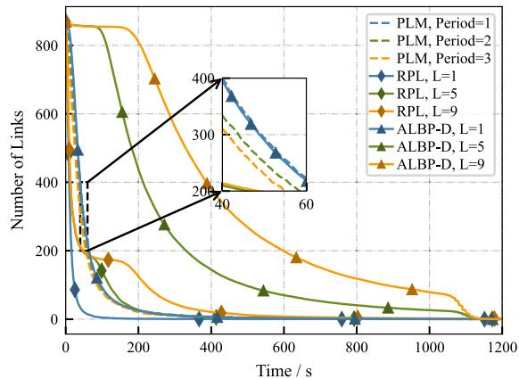  
Fig. 6. The $N _ { L }$ versus time for different methods.

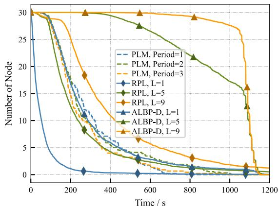  
Fig. 7. The $N _ { A }$ versus time for different methods.

Similarly to the metric in [28], the physical meaning of the LMEI is the duration of the presence of the link maintained per unit of overhead cost. Specifically, it quantifies how efficiently maintenance cost is utilized to maintain the existence of the link. A larger LMEI value indicates that more link presence time is achieved for each unit of maintenance overhead, reflecting a higher maintenance efficiency. LMEI provides a straightforward and practical evaluation of the trade-off between resource consumption and link availability.

The simulation parameters are detailed in Table III. The nodes are distributed over an area of 500 × 500 m, with initial one-hop connectivity between all nodes. The node speeds follow a uniform distribution with a mean of −2 to 22 m/s and a standard deviation of 5 m/s. The number of UAVs is set to 30, with beamwidths of 30◦, 36◦, and 45◦, corresponding to

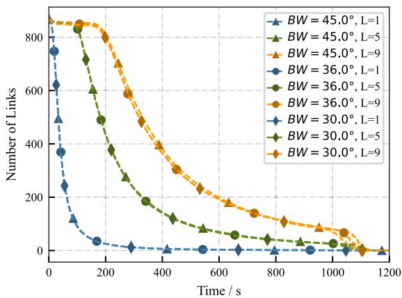

Fig. 8. The $N _ { L }$ versus time for ALBP-D under different beamwidths and L.  
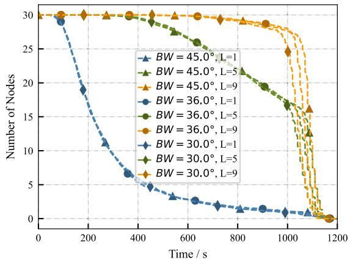

Fig. 9. The $N _ { A }$ versus time for ALBP-D under different beamwidths and L  
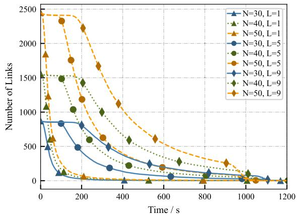  
Fig. 10. Effect of different numbers of nodes $( N = 3 0 , 4 0 , 5 0 )$ on the number of maintained links over time under varying adjustment levels.

12, 10, and 8 sectors, respectively. For the PLM method, the $T _ { M }$ varies from 1 to 5 with a step size of 1. For the ALBP-D method, the L ranges from 1 to 9 with a step size of 4. The power parameters of the $\mathrm { U A V ^ { 1 } }$ include a rating voltage of 7.2 V, a maintenance frame length of 100 ms, a battery capacity of 1000 mAh, a base power of 20 W, transmission power of 3 W, reception power of 2 W, and listening power of 0.5 W, allowing for approximately 20 minutes of operation.

Fig. 6 the $N _ { L }$ between the baseline methods and ALBP-D under different $T _ { M }$ and L. For PLM, increasing $T _ { M }$ reduces the number of links maintained, while for ALBP-D, increasing L increases the communication range and significantly improves $N _ { L } .$ . In the PLM method, as $T _ { M }$ increases, $N _ { L }$ experiences a slight decrease. This is due to the fact that the PLM method can only change the direction of the beam, which solves problems related to angular cuts. However, PLM does not extend the communication range to maintain links that are at risk of disconnection due to distance. The extended maintenance interval results in some fast-moving nodes not receiving timely maintenance, resulting in link failures. The RPL method predicts link lifetime based on distance alone. Therefore, although its performance is slightly better than PLM under large $L ,$ it is still inferior to ALBP-D. This is because the prediction method does not take angle into account. In the ALBP-D method, when $L = 1$ , the adjustment of the neighbor table involves only the modification of the direction vector, which is almost identical to the PLM approach. Consequently, the $N _ { L }$ for both methods is quite similar. However, as $L$ increases, ALBP-D increases the communication range by sacrificing beamwidth, thus maintaining links that are on the verge of distance disconnection. Although the beamwidth is reduced, accurate angle prediction ensures that links do not fail due to angle breaks. The $N _ { L }$ of ALBP-D is approximately 10 times better than the PLM method.

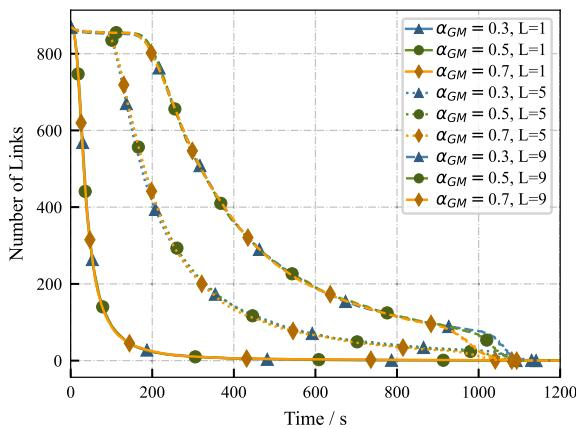  
Fig. 11. Impact of different Gauss-Markov memory factors on the number of maintained links under varying adjustment steps. The Gauss-Markov mobility model introduces temporal correlation into node motion, allowing the evaluation of ALBP-D robustness under varying mobility patterns.

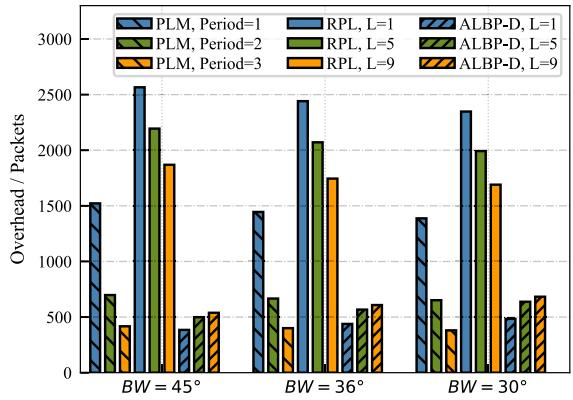  
Fig. 12. The $O _ { A }$ for different methods under different beamwidths and L.

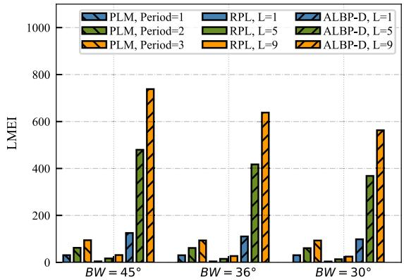  
Fig. 13. The LMEI for different methods under different beamwidths and L.

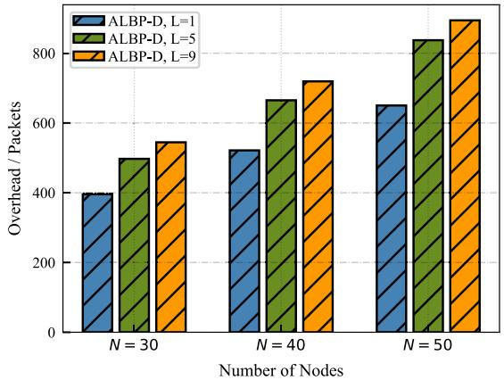  
Fig. 14. $O _ { A }$ under different node counts $( N = 3 0 , 4 0 , 5 0 )$ and adjustment steps $( L = 1 , 5 , 9 )$ for the proposed ALBP-D method.

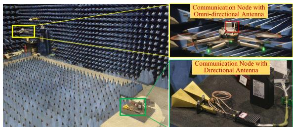  
Fig. 15. Prototype experimental scenario.

Fig. 7 shows the comparison of $N _ { A }$ for baseline methods and ALBP-D method under different $T _ { M }$ and L. The $N _ { A }$ exhibits a trend similar to $N _ { L }$ . Similarly, when $L \ = \ 1$ the performance of ALBP-D is comparable to that of PLM and better than RPL method. However, $N _ { A }$ reflects a deeper significance, namely the lifetime of the network. As long as a node has at least one link to other nodes, it can communicate through routing, even if there is no direct communication link. It is evident that ALBP-D, when $L$ is large, can maintain a majority of nodes within the network for an extended $T _ { M } .$ preventing node departures due to link failures. The advantages in $N _ { L }$ are magnified, with ALBP-D maintaining network connectivity for 90% of nodes at higher L values until energy depletion.

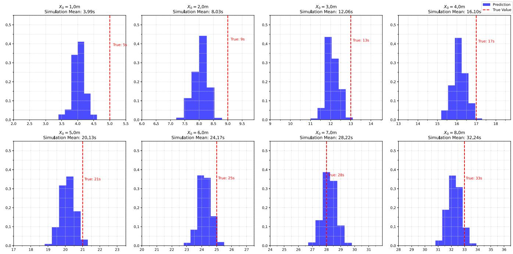  
Fig. 16. Comparison for predicted and measured link breakage times.

Fig. 8 and Fig. 9 analyze ALBP-D on $N _ { L }$ and $N _ { A }$ under different beamwidths and L. The results show that the beamwidth has minimal effect on $N _ { L }$ and $N _ { A } .$ , which are primarily affected by $L .$ It can be seen that the initial beamwidth has little effect on the performance of ALBP-D, especially when L is small. However, when L is large, such as $L \ = \ 9$ , a small initial beamwidth can result in slight decreases in $N _ { L }$ and $N _ { A }$ . This is due to the multiple reductions in beamwidth caused by a large L. After several adjustments, the beamwidth becomes so small that angle breaks occur. From the figures, it can be seen that this situation results in only about a 5% degradation in link duration, and the performance of ALBP-D still significantly exceeds that of PLM, especially when L is large.

Fig. 10 illustrates the influence of node density on link maintenance performance. As the number of nodes increases from 30 to 50, the number of maintained links grows significantly, especially under larger L values. This indicates that ALBP-D effectively scales with network density, maintaining a high number of links while adapting to the increased complexity of directional communications in denser topologies.

Fig. 11 investigates the impact of different Gauss-Markov memory factors $( \alpha _ { G M } )$ on the performance of ALBP-D. The memory factor reflects the temporal correlation in node mobility. When the memory factor is low (e.g., 0.3), the mobility is more random, while a higher factor (e.g., 0.7) implies smoother trajectories. The results show that ALBP-D maintains robust performance across all memory settings, with higher L values consistently improving link maintenance regardless of the memory factor. This demonstrates the adaptability of ALBP-D to diverse mobility environments.

Fig. 12 shows the comparison on $O _ { A }$ of for baseline Methods and ALBP-D method under different $T _ { M }$ and L. For

PLM, as the maintenance interval increases, $O _ { A }$ decreases, which is reasonable. However, the reduction in $O _ { A }$ has another reason that a longer maintenance interval can lead to excessive link disconnections due to inadequate maintenance. For links that have already been disconnected, PLM no longer sends maintenance requests. The RPL prediction method does not consider the angle, so the prediction results are inaccurate, leading to frequent predictions, which means the maintenance overhead is very high. The $O _ { A }$ of ALBP-D remains at a relatively low level. As L increases, $O _ { A }$ experiences a slight increase due to the longer maintenance time for links, which increases the overhead. Similarly, as the BW decreases, $O _ { A }$ also shows a slight increase. This is because to ensure that links do not disconnect under a smaller beamwidth, the calculated maintenance interval becomes shorter, leading to more frequent maintenance.

Fig. 13 compares the PLM and ALBP-D methods on LMEI with different $T _ { M }$ and values of L. It can be observed that while PLM achieves low overhead at large $T _ { M }$ , insufficient link maintenance leads to a shorter cumulative link existence duration, resulting in a low LMEI value. Due to the low performance of RPL on $N _ { L }$ , but its high maintenance overhead, it results in the lowest LMEI efficiency. In contrast, ALBP-D consistently maintains a higher LMEI by balancing effective link maintenance with reasonable overhead costs. This indicates that ALBP-D can sustain longer link presence durations per unit of overhead, demonstrating its superior maintenance efficiency compared to PLM. The link maintenance efficiency of ALBP-D is 5 to 7 times that of PLM.

Fig. 14 examines the maintenance overhead incurred by ALBP-D under different network scales. Although overhead increases with node count and adjustment level $L ,$ the growth remains manageable. The results indicate that ALBP-D retains its lightweight characteristics even in larger-scale UAV networks, making it suitable for deployment in practical scenarios where both scalability and efficiency are required.

## VI. EXPERIMENTS WITH PROTOTYPE

To validate the accuracy of our proposed link breakage model, we developed a prototype system to measure the link lifetime under directional antenna communication in a realworld scenario shown in Fig. 15. Although the experiments were conducted in a smaller area within the anechoic chamber, it provided an ideal controlled environment to evaluate system performance without external interference. This setup allowed us to focus on key factors like link stability due to angular and distance misalignment, which are critical for outdoor deployments. Additionally, the trajectory data used were based on realistic UAV flight patterns, ensuring that the experiments closely mirrored practical UAV operations.

The experiment involved two nodes. One equipped with a directional antenna, referred to as the Directional Communication Node (DCN), with a beamwidth of approximately $6 0 ^ { \circ }$ , and the other mounted on a UAV and equipped with an omnidirectional antenna, referred to as the Omnidirectional Node (ON). To replicate realistic motion patterns, the trajectory data was sourced from TrajAir [29], a dataset providing UAV flight trajectories, and preloaded into the $\mathrm { U A V } ^ { \ , } \mathbf { s }$ control system to emulate realistic flight paths. We place the ON node along the central axis of the DCN node’s antenna, with a distance of $X _ { 0 }$ from the DCN node. We vary $X _ { 0 }$ to carry out multiple experiments. The DCN transmitted request frames at a frequency of one frame per second, and the ON responded immediately upon receiving each request. The DCN continuously monitored the ON’s response and recorded the link duration until responses ceased, at which point the link was considered broken. Furthermore, the starting position of the ON was systematically adjusted to observe variations in link lifetime in different scenarios.

The experimental results and the predictions made by our ALBP-D algorithm are shown in Fig. 16. The bar graph in the figure illustrates the PDF predicted by ALBP-D, with the mean value annotated. The red dashed line represents the link break times recorded from the prototype experiments. The predicted results are not in perfect agreement with the experimental results, mainly because the motion patterns of the trajectory data do not fully conform to the Gaussian distribution assumed in the theoretical model. The averages of the predicted and measured results show a high degree of agreement. This close agreement confirms the effectiveness and practical feasibility of the ALBP-D algorithm in real directional antenna applications.

## VII. CONCLUSION

In this paper, we address the challenges of link maintenance in directional antenna-based FANETs by proposing the ALBP-D method, which predicts link breakage and adapts maintenance intervals to improve network performance. Moreover, the link breakage prediction mechanism can be used to enable adaptive duty-cycling, offering a potential pathway for further energy-aware optimization in UAV networks. Simulations show that ALBP-D significantly outperforms baseline methods in terms of link duration and maintenance efficiency. Experimental validation in a controlled environment demonstrates the practical feasibility of the approach. Future work will extend the model to heterogeneous networks and 3D scenarios, while incorporating blockage effects to better reflect practical constraints in urban or cluttered environments.

## APPENDIX

DERIVATION OF THE DISTRIBUTION FOR THE SQUARE OF A NON-STANDARD GAUSSIAN RANDOM VARIABLE

This Appendix provides the detailed derivation of the distribution for $W = X ^ { 2 }$ , where $X \sim { \mathcal { N } } ( \mu , \sigma ^ { 2 } )$

Step 1: Standardization of the Gaussian Random Variable

Let $X \sim { \mathcal { N } } ( \mu , \sigma ^ { 2 } )$ . To simplify the analysis, we standardize $X$ as follows $\begin{array} { r } { \ddot { Y } = \frac { X - \mu } { \sigma } } \end{array}$ and $Y \sim { \mathcal { N } } ( 0 , 1 )$ , where Y follows a standard normal distribution with zero mean and unit variance. Using this transformation, X can be expressed as $X = \sigma Y + \mu$

## Step 2: Expression for $W = X ^ { 2 }$

Substituting $X = \sigma Y + \mu$ into $W = X ^ { 2 }$ , we obtain $W =$ $( \sigma Y + \mu ) ^ { 2 }$

Expanding the square gives $W = \sigma ^ { 2 } Y ^ { 2 } + 2 \sigma \mu Y + \mu ^ { 2 }$

## Step 3: Distribution of Each Term

To derive the distribution of W , we analyze each term on the right-hand side. For $Y \sim { \mathcal { N } } ( 0 , 1 )$ , the square $Y ^ { 2 }$ follows a central chi-squared distribution with 1 degree of freedom, namely,

$$
Y ^ { 2 } \sim \chi _ { 1 } ^ { 2 } .\tag{42}
$$

Therefore, the term $\sigma ^ { 2 } Y ^ { 2 }$ is a random variable with chi-square scale. The term 2σµY represents a linear transformation of ${ \mathit { Y } } ,$ which is a standard Gaussian random variable. Thus, 2σµY is a Gaussian random variable with mean 0 and variance $( 2 \sigma \mu ) ^ { 2 } = 4 \sigma ^ { 2 } \mu ^ { 2 }$ . The term $\mu ^ { 2 }$ is a constant and does not affect the randomness of the distribution.

## Step 4: Non-Central Chi-square Distribution

The combination of $\sigma ^ { 2 } Y ^ { 2 } + 2 \sigma \mu Y + \mu ^ { 2 }$ can be analyzed as the square of a Gaussian random variable shifted. According to the relationship between the square of a Gaussian random variable and the non-central chi-squared distribution, W follows a non-central chi-squared distribution, namely,

$$
W \sim \sigma ^ { 2 } \cdot \chi _ { 1 } ^ { 2 } \left( \lambda = \frac { \mu ^ { 2 } } { \sigma ^ { 2 } } \right) ,\tag{43}
$$

where $\textstyle \lambda = { \frac { \mu ^ { 2 } } { \sigma ^ { 2 } } }$ is the non-centrality parameter.

## ACKNOWLEDGMENT

The authors would like to thank the Anechoic Chamber of Beijing Institute of Technology for providing the experimental facilities.

## REFERENCES

[1] J. Tan et al., “Beam alignment in mmWave V2X communications: A survey,” IEEE Commun. Surveys Tuts., vol. 26, no. 3, pp. 1676–1709, 3rd Quart., 2024.

[2] H. Lei, D. Meng, H. Ran, K.-H. Park, G. Pan, and M.-S. Alouini, “Multi-UAV trajectory design for fair and secure communication,” IEEE Trans. Cognit. Commun. Netw., vol. 11, no. 3, pp. 1966–1980, Jun. 2025.

[3] M. Mozaffari, W. Saad, M. Bennis, Y.-H. Nam, and M. Debbah, “A tutorial on UAVs for wireless networks: Applications, challenges, and open problems,” IEEE Commun. Surveys Tuts., vol. 21, no. 3, pp. 2334–2360, 3rd Quart., 2019.

[4] X. Jin, J. An, C. Du, G. Pan, S. Wang, and D. Niyato, “Frequency-offset information aided self time synchronization scheme for high-dynamic multi-UAV networks,” IEEE Trans. Wireless Commun., vol. 23, no. 1, pp. 607–620, Jan. 2024.

[5] X. Jin, S. Ke, J. An, S. Wang, G. Pan, and D. Niyato, “A novel consensus-based distributed time synchronization algorithm in highdynamic multi-UAV networks,” IEEE Trans. Wireless Commun., vol. 23, no. 12, pp. 18916–18928, Dec. 2024.

[6] H. Lei, X. Wu, K.-H. Park, and G. Pan, “3D trajectory design for energy-constrained aerial CRNs under probabilistic LoS channel,” IEEE Trans. Cognit. Commun. Netw., vol. 11, no. 3, pp. 1522–1534, Jun. 2025.

[7] J. Peng, W. Tang, and H. Zhang, “Directional antennas modeling and coverage analysis of UAV-assisted networks,” IEEE Wireless Commun. Lett., vol. 11, no. 10, pp. 2175–2179, Oct. 2022.

[8] B. Yang, T. Taleb, Y. Shen, X. Jiang, and W. Yang, “Performance, fairness, and tradeoff in UAV swarm underlaid mmWave cellular networks with directional antennas,” IEEE Trans. Wireless Commun., vol. 20, no. 4, pp. 2383–2397, Apr. 2021.

[9] Z. Xiao et al., “A survey on millimeter-wave beamforming enabled UAV communications and networking,” IEEE Commun. Surveys Tuts., vol. 24, no. 1, pp. 557–610, 1st Quart., 2022.

[10] H. Lee, C. Eom, H. Noh, M.-S. Lee, and C. Lee, “A subarray selection scheme for cellular-connected UAV with conformal phased array antenna,” IEEE Internet Things J., vol. 11, no. 8, pp. 13540–13550, Apr. 2024.

[11] A. A. Zaid, B. E. Y. Belmekki, and M.-S. Alouini, “Aerial-aided mmWave VANETs using NOMA: Performance analysis, comparison, and insights,” IEEE Trans. Veh. Technol., vol. 73, no. 4, pp. 4742–4758, Apr. 2024.

[12] L. Chen, S. Zhou, and W. Wang, “mmWave beam tracking with spatial information based on extended Kalman filter,” IEEE Wireless Commun. Lett., vol. 12, no. 4, pp. 615–619, Apr. 2023.

[13] E. Y. Hua and Z. J. Haas, “Mobile-projected trajectory algorithm with velocity-change detection for predicting residual link lifetime in MANET,” IEEE Trans. Veh. Technol., vol. 64, no. 3, pp. 1065–1078, Mar. 2015.

[14] Z. Li and Z. J. Haas, “On residual path lifetime in mobile networks,” IEEE Commun. Lett., vol. 20, no. 3, pp. 582–585, Mar. 2016.

[15] H. Peng, A. Razi, F. Afghah, and J. Ashdown, “A unified framework for joint mobility prediction and object profiling of drones in UAV networks,” J. Commun. Netw., vol. 20, no. 5, pp. 434–442, Oct. 2018.

[16] J. Zhu, R. He, C. Yu, and B. Lin, “Link lifetime and quality-based location routing for maritime wireless mesh networks,” in Communications, Signal Processing, and Systems. Singapore: Springer, 2019, pp. 428–436.

[17] L. Liu, H. Lv, J. Xu, and J. Shu, “A link quality estimation method based on improved weighted extreme learning machine,” IEEE Access, vol. 9, pp. 11378–11392, 2021.

[18] W. Sun et al., “LSTM based link quality confidence interval boundary prediction for wireless communication in smart grid,” Computing, vol. 103, no. 2, pp. 251–269, Feb. 2021.

[19] Z. Khan, J. J. Lehtomaki, V. Selis, H. Ahmadi, and A. Marshall,¨ “Intelligent autonomous user discovery and link maintenance for mmWave and teraHertz devices with directional antennas,” IEEE Trans. Cognit. Commun. Netw., vol. 7, no. 4, pp. 1200–1215, Dec. 2021.

[20] Z. Zheng, A. K. Sangaiah, and T. Wang, “Adaptive communication protocols in flying ad hoc network,” IEEE Commun. Mag., vol. 56, no. 1, pp. 136–142, Jan. 2018.

[21] S. Y. Han and D. Lee, “An adaptive hello messaging scheme for neighbor discovery in on-demand MANET routing protocols,” IEEE Commun. Lett., vol. 17, no. 5, pp. 1040–1043, May 2013.

[22] Y. Liu, Y. Wang, Y. Shen, and X. Shi, “Hybrid TOA-AOA WLS estimator for aircraft network decentralized cooperative localization,” IEEE Trans. Veh. Technol., vol. 72, no. 7, pp. 9670–9675, Jul. 2023.

[23] G. Astudillo and M. Kadoch, “Neighbor discovery and routing schemes for mobile ad-hoc networks with beamwidth adaptive smart antennas,” Telecommun. Syst., vol. 66, no. 1, pp. 17–27, Sep. 2017.

[24] M. ˙Is¸can, A. I. Tas, B. Vural, A. B. Ozden, and C. Yılmaz, “Antenna tracker design with a discrete Lyapunov stability based controller for mini unmanned aerial vehicles,” Int. J. Multidisciplinary Stud. Innov. Technol., vol. 6, no. 1, pp. 77–85, 2022.

[25] Y. Song, S. Wang, G. Pan, and Z. Song, “A multi-token-based directional neighbor discovery algorithm for FANETs,” IEEE Trans. Commun., vol. 73, no. 4, pp. 2786–2800, Apr. 2025.

[26] E. D´ıaz-Frances and F. J. Rubio, “On the existence of a normal´ approximation to the distribution of the ratio of two independent normal random variables,” Stat. Papers, vol. 54, no. 2, pp. 309–323, May 2013.

[27] M. G. Bulmer, Principles of Statistics. New York, NY, USA: Dover, 1979.

[28] B. G. Assefa and O.¨ Ozkasap, “RESDN: A novel metric and method¨ for energy efficient routing in software defined networks,” IEEE Trans. Netw. Service Manage., vol. 17, no. 2, pp. 736–749, Jun. 2020.

[29] J. Patrikar, B. Moon, J. Oh, and S. Scherer, “Predicting like a pilot: Dataset and method to predict socially-aware aircraft trajectories in nontowered terminal airspace,” in Proc. Int. Conf. Robot. Autom. (ICRA), May 2022, pp. 2525–2531.

  
Yifei Song received the bachelor’s degree from the School of Information and Electronics, Beijing Institute of Technology, in 2019, where he is currently pursuing the Ph.D. degree. His current research interests include neighbor discovery, trajectory prediction, and multi-UAV networks.

Shuai Wang (Senior Member, IEEE) received the Ph.D. degree in communications systems from Beijing Institute of Technology (BIT), China, in 2012. Upon his graduation, he joined as a Faculty Member with the School of Information and Electronics, BIT. In 2021, he transferred to the newly founded School of Cyberspace Science and Technology, where he was appointed as the Chair Professor of the Department for Information Security and Countermeasures. He has contributed more than 40 peer-reviewed papers, mainly in leading IEEE journals or conferences, and holds more than 60 patents. His research interests include satellite communications, anti-interference communications, and datalink technologies for space platforms. He was a co-recipient of the Second Class National Technical Invention Award of China in 2019. He served as an Editor for IEEE WIRELESS COMMUNICATIONS LETTERS. He is serving as an Editor for China Communications.

Zhe Song received the bachelor’s and master’s degrees from the School of Information and Electronics, Beijing Institute of Technology, Beijing, China, in 2009 and 2012, respectively, where she is currently pursuing the Ph.D. degree. Her research interests include satellite communications and UAV communications and networking.

Xuanhe Yang received the Ph.D. degree in information and communication systems from Beijing Institute of Technology (BIT), Beijing, China, in 2023. His current research interests include spreadspectrum signal processing, satellite communication, the IoT technology, and physical-layer security.

Dusit Niyato (Fellow, IEEE) received the B.Eng. degree from the King Mongkut’s Institute of Technology Ladkrabang, Bangkok, Thailand, in 1999, and the Ph.D. degree in electrical and computer engineering from the University of Manitoba, Winnipeg, MB, Canada, in 2008. He is currently a Professor with the College of Computing and Data Science, Nanyang Technological University, Singapore. His research interests include mobile generative AI, edge generative intelligence, quantum computing and networking, and incentive mechanism design.

Gaofeng Pan (Senior Member, IEEE) received the B.Sc. degree in communication engineering from Zhengzhou University, Zhengzhou, China, in 2005, and the Ph.D. degree in communication and information systems from Southwest Jiaotong University, Chengdu, China, in 2011. He is currently with the School of Cyberspace Science and Technology, Beijing Institute of Technology, China, as a Professor. His research interests include communications theory, signal processing, and protocol design. He is serving as an Editor for several journals, such as

IEEE TRANSACTIONS ON COMMUNICATIONS and IEEE TRANSACTIONS ON GREEN COMMUNICATIONS AND NETWORKING.

George K. Karagiannidis (Fellow, IEEE) received the Ph.D. degree in telecommunications engineering from the Electrical Engineering Department, University of Patras, Patras, Greece, in 1998. He is currently a Professor with the Electrical and Computer Engineering Department, Aristotle University of Thessaloniki, Thessaloniki, Greece, where he is also the Head of Wireless Communications and Information Processing Group. His research interests include wireless communications systems and networks, signal processing, optical wireless

communications, wireless power transfer, and signal processing for biomedical engineering. He received three prestigious awards, the 2021 IEEE ComSoc RCC Technical Recognition Award, the 2018 IEEE ComSoc SPCE Technical Recognition Award, and the 2022 Humboldt Research Award from Alexander von Humboldt Foundation. He is one of the Highly Cited Authors across all areas of electrical engineering, recognized from Clarivate Analytics as the Web-of-Science Highly Cited Researcher in ten consecutive years 2015–2024. He was the Editor-in-Chief of IEEE COMMUNICATIONS LETTERS. He is currently the Editor-in-Chief of IEEE TRANSACTIONS ON COMMUNICATIONS.