# A Robust Multi-Domain Adaptive Anti-Jamming Communication System for a UAV Swarm in Urban ITS Traffic Monitoring via Multi-Agent Deep Deterministic Policy Gradient

Mu Chen, Yong Li, Zaojian Dai, Tao Zhang , Yu Zhou, and Hui Wang

Abstract— Intelligent Transportation Systems (ITS) hold a central position in urban traffic strategies. Reliable and timely communication is crucial for the effective operation of ITS, because it requires uninterrupted real-time data to ensure safe and efficient traffic flow. As an indispensable component of ITS, Uncrewed Aerial Vehicles (UAVs) offer the agility, rapid deployment, and wide area vantage required for cityscale monitoring and prompt incident response. However, the crowded urban spectrum—characterized by co-channel interference, malicious jamming, and stringent spectrum and energy constraints—compromises the reliability and timeliness of UAV communications. This study investigates the anti-jamming communication problem for a UAV swarm applied to urban traffic monitoring and models this task as a decentralized, partially observable Markov decision process (Dec-POMDP). Based on this model, we develop a multi-domain adaptive scheme based on the multi-agent deep deterministic policy gradient (MADDPG) framework. The combination of centralized training and decentralized execution enables each UAV to optimize channel selection and power control policies based on local observations, while a shared global reward encourages swarmlevel cooperation. Extensive simulations show that, compared with baseline methods, the proposed method significantly improves link reliability, reduces power consumption, and lowers the overhead associated with frequent channel switching. Simulation results show that the proposed robust, energyefficient communication strategy effectively improves the overall performance of the ITS urban traffic monitoring UAV swarm system.

Index Terms— Intelligent transportation systems, uncrewed aerial vehicle (UAV) swarm, anti-jamming, partially observable

environment, multi-agent deep deterministic policy gradient (MADDPG), multi-domain coordination.

## I. INTRODUCTION

W<sup>ITH</sup> <sup>the</sup> <sup>acceleration</sup> <sup>of</sup> <sup>urbanization</sup> <sup>and</sup> <sup>the</sup> <sup>increasing</sup>demand for transportation, Intelligent Transportation Systems (ITS) have become a core driving force for enhancing traffic efficiency, ensuring travel safety, and promoting sustainable development [1]. Within ITS, uncrewed aerial vehicles (UAVs) form an increasingly important branch because they maneuver quickly, view traffic from above, and can be deployed at modest cost. These capabilities let drones perform city-scale traffic monitoring, provide first-look assessment after accidents or natural disasters, and handle time-critical deliveries in both dense and remote areas [2].

Reliable communication is fundamental to the efficiency and safety of ITS [3]. UAVs have become a key component of ITS: they must (i) maintain centimeter-level positioning accuracy; (ii) adjust their flight paths in real time according to mission objectives and traffic conditions; and (iii) continuously respond to control commands while streaming high-definition video and multi-sensor data to support traffic management decisions [4]. However, urban airspace is electromagnetically congested and unpredictable: ambient noise, dense civilian and other wireless services, and intentional jamming are ubiquitous, any of which can degrade link throughput or sever control channels [5], [6], [7]. Once links between UAVs and ground stations or within the swarm are interrupted, the timely and reliable delivery of critical traffic information is severely impeded [8], [9], [10]. In ITS deployments, UAVs are typically deployed in cooperative swarms to enable large-scale monitoring and rapid response. The very traits that extend a swarm’s reach—continuous motion, rapidly changing topology, and large node counts—also magnify its vulnerability: maintaining stable links in such conditions is considerably harder than for a single platform [11], [12]. Especially in urban areas with complex electromagnetic environments and increasingly scarce spectrum resources, providing robust anti-jamming communication for large UAV swarms remains a core challenge for next-generation ITS.

Traditional UAV anti-jamming techniques are commonly classified into four domains: frequency hopping, spread spectrum, power control, and beamforming [13]. These methods are popular due to their simplicity. Frequency hopping and direct-sequence spread spectrum (DSSS) are widely used as they can counter sweeping, pulse, and wideband interference to some extent [14]. However, when applied to ITS, which require dynamic and responsive communication networks for efficient traffic management, these methods reveal several limitations. For UAVs in ITS, where communication environments are complex and interference is persistent, frequency hopping faces challenges in allocation and management, especially with UAV limitations such as battery life and limited spectrum. This often results in significant performance degradation [15]. Additionally, both frequency hopping and DSSS rely on predefined patterns or pseudorandom codes, which lack the adaptive capabilities needed to handle the time-varying interference typically seen in UAV swarm communications within complex urban environments. In multi-user scenarios, limited spectrum resources increase competition among users, further worsening interference and complicating the anti-jamming efforts. In terms of power control, the rapidly changing conditions of UAV networks in urban environments present challenges for accurate channel modeling. Simply increasing transmission power does not ensure effective communication, and it also leads to higher energy consumption and makes UAVs more susceptible to detection by interference sources [14].

With the advancement of artificial intelligence and softwaredefined radio technologies, interference sources are becoming more dynamic and intelligent, raising the demands on antijamming strategies for UAV communication. In recent years, reinforcement learning (RL)-based methods have gained popularity in UAV networks [16]. Q-learning, a traditional model-free RL approach, learns optimal strategies through trial and error. However, it struggles with high-dimensional state spaces, and as these spaces expand, the need to store Qvalue tables grows rapidly, hindering algorithm efficiency and scalability [16].Deep reinforcement learning (DRL), which uses deep neural networks (DNNs) to approximate the Q-value function, improves performance in complex, high-dimensional environments and significantly enhances RL’s applicability to large-scale problems [17]. In the spectrum domain, Wang et al. [18] proposed a deep Q-network (DQN)-based anti-jamming framework, enabling agents to learn and adapt in dynamic wireless environments, improving channel efficiency. Jia et al. [12] addressed the power control challenge by modeling it as a Stackelberg game, using single-agent Q-learning to determine optimal power settings. However, these methods are limited to single-domain optimization.

As real-world application scenarios become increasingly complex, research has shifted toward multi-agent, multidomain joint anti-jamming strategies. These approaches optimize system performance in competitive resource and interference conditions by coordinating multiple agents and utilizing information from different domains (e.g., frequency, power, and time). Yao et al. [19] proposed a decision-making method for matching transmission demands, leveraging partially overlapping channels for resource reuse and using multi-user collaborative reinforcement learning to optimize power with a Stackelberg game. While the study explored multi-domain and multi-agent scenarios, it did not fully account for the limited observation capabilities in real-world UAV applications.

In summary, current research on intelligent anti-jamming communication for UAVs mainly focuses on single-domain strategies under fully observable environmental conditions. Several challenges persist: (1) Power Control and Energy Consumption: UAVs have limited battery life, and power control strategies put significant pressure on energy resources. Although adjusting power in dynamic environments can improve communication reliability, frequent adjustments lead to faster battery depletion, reduced endurance, and increased vulnerability to interference sources. This is particularly critical for long-term urban traffic monitoring. (2) Overhead of Frequency Hopping: Frequency hopping can help mitigate interference by switching frequencies, but frequent hopping increases computational and synchronization complexity. Each hop requires real-time frequency selection and maintaining synchronization, which adds to the computational load and can cause temporary communication interruptions, disrupting the real-time performance of tasks within ITS. (3) Decision-Making in Partially Observable Environments: In UAV swarm communications, agents often have limited access to environmental information, leading to uncertainty in decision-making. This partial observability complicates anti-jamming decisions, presenting a common challenge in real-world urban traffic monitoring scenarios.

Therefore, providing effective anti-jamming communication in UAV swarm networks with constrained spectrum resources, low energy consumption, and minimal frequency hopping overhead remains a critical issue for the deployment of UAVs in intelligent transportation systems for urban traffic monitoring. This paper aims to address these challenges by optimizing long-term energy consumption and reducing frequency hopping overhead by utilizing local observations of available channel information and interference states. We propose a multi-agent, collaborative, multi-domain, energy-efficient anti-jamming communication scheme that adapts to dynamic, unknown interference environments, improving the utility of UAV swarms for urban traffic monitoring in ITS. The main contributions of this paper are as follows:

(1) We propose a joint channel and power allocation strategy to minimize long-term transmission energy consumption and frequency hopping overhead. Given the limitations of UAV observations in complex environments, we model the anti-jamming problem as a distributed, partially observable Markov decision process to optimize decision-making for UAVs in dynamic environments, which is highly relevant to the practical challenges of urban traffic monitoring.

(2) We propose a joint anti-jamming strategy based on a multi-agent deep deterministic policy gradient algorithm to enhance anti-jamming capabilities in multidomain scenarios. By utilizing locally observed channel information and interference states, we design an antijamming strategy that jointly optimizes the spectrum and power domains, crucial for reliable data acquisition in ITS. A unified reward function was designed for all agents to enhance cooperation among agents, transforming the multi-agent game problem into a fully cooperative one. A multi-agent collaborative multidomain energy-efficient anti-jamming communication scheme was developed to adapt to unknown dynamic interference environments, directly addressing the communication challenges faced by UAV swarms in urban traffic monitoring.

(3) To evaluate the proposed anti-jamming scheme, we developed a simulation platform for UAV swarm communication within an ITS urban traffic monitoring scenario, modeling the interactions among UAVs, interference sources, and communication channels. A deep neural network was developed on the TensorFlow platform to implement the proposed antijamming algorithm. Experimental findings indicate that the algorithm demonstrates excellent convergence and robustness. In comparison to benchmark methods, it significantly enhances the total capacity of U2G links and improves the transmission success rate of U2U links, demonstrating its potential for improving data delivery in ITS. The algorithm effectively fosters cooperation between agents, thereby optimizing the overall system performance for tasks like urban traffic monitoring.

The structure of the remaining sections in this paper is as follows. Section II surveys the related literature. Section III outlines the system model. In Section IV, we formulate the joint channel and power optimization problem as a distributed, partially observable Markov decision process. Section V introduces the proposed multi-domain anti-jamming algorithm, which is based on a multi-agent deep deterministic policy gradient approach. Finally, Section VI presents the simulation results, and Section VII concludes the paper.

## II. RELATED WORK

Q-learning is a model-free reinforcement learning method that can learn the optimal strategy through an end-to-end approach based on long-term cumulative rewards. The antijamming decision problem in a single-user scenario was studied in [20], [21], and [22]. Subsequently, the authors of [23], [24], and [25] extended this research to multiuser scenarios by utilizing the Markov Game Framework (MGF), an extension of the Markov Decision Process (MDP) that models interactions between multiple users. They designed multi-user reinforcement learning-based antijamming algorithms. However, in [23], [24], and [25] each user employed the standard Q-learning method without considering user coordination. Moreover, the Q-learning algorithm may fail to converge due to the high-dimensional action-state space.

In traditional RL algorithms, agents continuously learn and optimize their strategies through environmental interactions to maximize long-term rewards. However, when faced with complex environments, the amount of information the agent needs to process and the complexity of decision-making logic increases sharply. This challenge is further amplified in multiagent environments because multiple agents must interact, compete, or cooperate in the same environment. Each agent’s decision depends not only on the state of the environment but also on the actions of other agents. This interaction among agents adds complexity to the strategy derivation process. Deep learning (DL) has been introduced into RL to address this challenge. DL, through DNNs, handles highdimensional and complex input data, extracts critical features, and maps the relationship between environmental rewards and decisions [26]. This combination allows agents to learn effective strategies in complex environments, overcoming the limitations of traditional RL in handling high-dimensional and nonlinear problems. It significantly enhances the ability of agents to analyze and make decisions in complex environments, successfully addressing real-world complexity and uncertainty issues. DRL exhibits strong generalization ability in dealing with complex and dynamic environments and effectively addresses interference problems in UAV communications.

Google’s DeepMind team developed the DQN, which combines Q-learning with convolutional neural networks (CNN) to learn optimal strategies in complex environments [27]. Liu et al. [28] proposed an anti-jamming communication strategy called “Spectrum Waterfall,” which uses DRL models to dynamically select spectrum resources and minimize the impact of interference on communications. This study demonstrated the potential of DRL to effectively counter intelligent interference in complex wireless communication environments. Yao et al. [29] further developed this concept by proposing a multi-agent federated deep Q-learningbased anti-jamming scheme. Utilizing the distributed learning characteristics of federated reinforcement learning (FRL) enables collaborative learning between nodes without sharing raw data, thereby optimizing frequency hopping decisions. Xu et al. [30] leveraged DRL’s decision-making capabilities in dynamic spectrum access (DSA) to design a cognitive radio (CR) anti-jamming system capable of recognizing and adapting to different interference patterns. This system dynamically adjusts its spectrum selection strategy by learning historical spectrum usage patterns and real-time environmental information, significantly improving CR network anti-jamming performance. Although DQN has demonstrated strong strategy-learning capabilities in complex and uncertain environments, outperforming traditional random access or fixed strategies, it still faces the issue of overestimating Q-values, which can slow convergence and distort value estimates. In the power domain, Yang et al. [31] introduced an anti-jamming approach that leverages intelligent reflecting surfaces (IRS). They utilized a single-agent win-or-learn fast policy hill-climbing algorithm to optimize the power settings and configure the reflective beamforming matrices. Yin et al. [32] present a novel anti-jamming framework for UAV networks, modeled as a Stackelberg game with the jammer as the leader. It uses a federated learning-assisted DQN algorithm to optimize anti-jamming strategies collaboratively, addressing intelligent jamming and co-channel interference, and significantly improving performance.

As the diversity and intelligence of UAV communication interference increase, scholars at home and abroad have gradually turned their attention to multi-domain joint antijamming solutions. Li et al. [33] considered both the power and spectrum domains, using a Stackelberg game to assess interference in the power domain and applying a Multi-Armed Bandit (MAB) algorithm for channel selection in the spectrum domain. Cheng et al. [34] propose a deep reinforcement learning-based anti-jamming approach for fast frequency hopping (FFH) systems, addressing the challenge of decision-making within the short intervals between hops. They introduce the concept of the available frequency set (AFS) and develop an improved multi-action deep recurrent Q-network (MA-DRQN) algorithm to dynamically generate hopping sequences. This approach enhances adaptability to dynamic environments and outperforms both traditional FFH systems and advanced intelligent FH systems in combating blind and active jammers. Zhou et al. [35] propose a multi-domain cognitive anti-jamming engine for multi-UAV communications, utilizing deep learning (DL) and case-based reasoning (CBR). The engine operates in two stages: offline training using convolutional neural networks (CNN) with jamming feature maps, and online real-time decision-making based on the trained model and case base. This approach enables dynamic adaptation to varying jamming patterns, enhancing the reliability of UAV communication in complex electromagnetic environments. Yin et al. [36] proposed an optimization problem to maximize the Quality of Experience (QoE) by jointly designing channel and power allocation strategies. They developed an anti-jamming communication algorithm based on a Multi-Agent Layered Q-learning (MALQL) approach. This algorithm reduces the action dimensionality for each agent, accelerating the convergence speed of the algorithm. Zhang et al. [37] introduced a joint spectrum and time-domain collaborative anti-jamming algorithm based on Multi-Agent Deep Q-Learning (MADQN), which maximizes data transmission by optimizing channel selection and time slot transmission.

However, all of the work mentioned above mainly focuses on single-domain anti-jamming strategies under fully observable environmental information, without fully considering the observation limitations of UAVs in practical application scenarios such as ITS and urban traffic monitoring. Furthermore, there is still a lack of comprehensive consideration for multi-domain joint anti-jamming strategies in existing research, which is the key focus of this paper. Especially when UAV swarms are applied to urban traffic monitoring, higher demands are placed on energy consumption, frequency switching overhead, and decisionmaking in partially observable environments, aspects that are often not sufficiently emphasized in the existing literature. Therefore, this paper aims to address these issues by proposing an anti-jamming communication scheme for a UAV swarm applicable to ITS and urban traffic monitoring.

## III. SYSTEM MODEL

This section provides a detailed description of the System for UAV Swarm Anti-Jamming Communication in ITS Urban Traffic Monitoring, which comprises three parts: the network

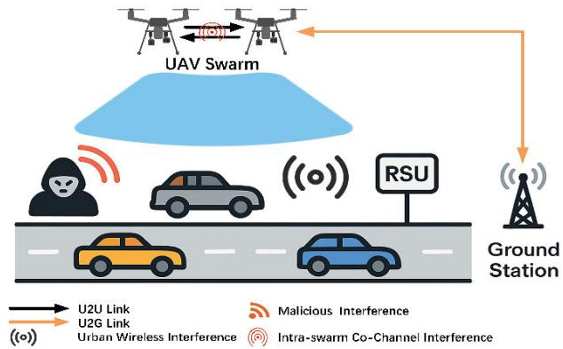  
Fig. 1. System for UAV swarm anti-jamming communication in ITS urban traffic monitoring.

model, the mobility model, and the wireless transmission model.

## A. Network Model

Fig. 1 illustrates the overall framework of our proposed UAV Swarm anti-jamming communication system for ITS urban traffic monitoring. The key components are: (1) Road Network & Traffic Flow: A segment of urban roadway populated by moving vehicles, whose speed, density and queue-length measurements must be collected in real time. (2) Roadside Units (RSUs): Fixed infrastructure nodes along the road that support V2X communications but also act as unintentional co-channel interferers. (3) UAV Swarm: A set $\mathrm {  ~ N } = \langle I , \ \dots ,$ n, . . . , N} of N UAVs equipped with cameras and sensors to measure traffic parameters. The swarm cooperates via peerto-peer links to fuse observations and maintain coverage. (4) Ground Station (GS): Collects uplinked traffic data from the swarm and issues downlink control commands (e.g., power or channel adjustments). (5) Interference sources: A set J = {1, $\dots , \mathbf { j } , \dots , \mathbf { J } \}$ of transmitters—including roadside units (RSUs), vehicle V2X devices, and malicious nodes—that emit highpower signals on selected sub-bands, resulting in co-channel interference and degradation of the UAV communication links.

We assume a pool of L orthogonal frequency channels $L = \langle l , \ . . . , \ l , \ . . . , \ L \rangle ,$ , each non-overlapping under ideal conditions. UAV operation in each time slot comprises four sequential stages: (1) Spectrum Sensing: UAVs use broadband spectrum sensing technology to perceive the current spectrum environment and acquire relevant channel information. (2) Decision Making: Based on the sensed channel quality and traffic sensing requirements, UAV n selects a transmission channel and a transmit power. (3) Data Transmission: The UAV uses the chosen to upload traffic measurements (e.g., vehicle counts, average speed, queue lengths) to peer UAVs (U2U) and/or the GS (U2G). (4) Policy Update: Feedback on packet success rates, measured traffic-data completeness, and interference levels is used to refine the UAV’s local antijamming policy for the next slot.

Within this network, two primary communication modes are defined: (1) UAV-to-UAV (U2U) link: Enables intra-swarm coordination, data fusion, and distributed control. (2) UAVto-Ground Station (U2G) link: Facilitates reliable delivery of traffic metrics to the GS and reception of centralized control directives.

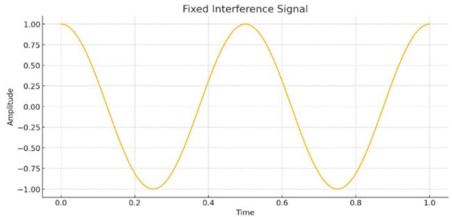  
Fig. 2. Fixed jamming signal.

In the urban traffic monitoring scenario of the ITS UAV swarm system, the UAV swarm must contend not only with deliberate interference sources but also with unintentional co-channel noise generated by roadside units, vehicle V2X devices, and dense micro-cell deployments, as well as intra-UAV swarm co-channel interference. The combined presence of adversarial and environmental interferers (including intraswarm interference), alongside the need to continuously track dynamic traffic conditions, leads us to the following three canonical spectrum-interference models—fixed jamming, swept jamming, and random jamming—that capture the key challenges affecting UAV communication performance.

1) Fixed Jamming is a standard wireless communication interference technique, primarily disrupting or blocking the regular operation of a target communication system by continuously transmitting solid signals on a fixed frequency, making it highly effective against systems operating at specific frequencies. A stationary interference signal is presented in Fig. 2.

A constant interference signal frequency and unchanging power characterize fixed jamming in UAV communication interference signal can be represented as a sine wave in the time domain. Its mathematical formula is:

$$
J \left( t \right) = A \cdot \cos { \left( 2 \pi f _ { j } t + \phi \right) }\tag{1}
$$

where A represents the amplitude of the jamming signal, $f _ { j }$ Represents the frequency of the jamming signal, and $\phi$ is the initial phase of the jamming signal.

2) Swept Jamming: This type of jamming changes its frequency over a period of time, typically sweeping from one frequency band to another at a specific rate. The purpose is to cover a broad spectrum, making it difficult for the target communication system to find an interference-free frequency for communication. A typical interference signal in swept jamming is the linear frequency sweep signal, which has a characteristic linear relationship with time. Swept jamming ensures an equal probability of interfering with each channel during its frequency modulation. However, this also means the adequate interference time for each channel is shortened. The characteristic of swept jamming is that its frequency continuously changes within a specific range over time. This jamming signal can be represented mathematically as:

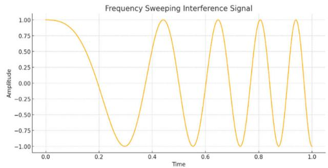  
Fig. 3. Swept jamming signal.

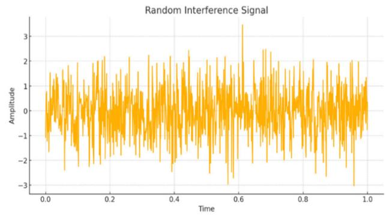  
Fig. 4. Random Jamming Signal.

$$
J \left( t \right) = A \cdot \cos \left( 2 \pi \left( f _ { 0 } + \frac { B } { T } t \right) t + \phi \right)\tag{2}
$$

where A is the amplitude of the jamming signal, $f _ { 0 }$ is the initial frequency, B is the sweep bandwidth, T is the sweep period, and $\phi$ is the initial phase of the jamming signal. This equation describes a sine wave whose frequency changes linearly over time. As shown in Fig. 3, an example of a swept jamming signal is presented.

3) Random Jamming: Random jamming varies unpredictably in frequency, time, and power without any fixed pattern. The purpose is to disrupt the target communication system unpredictably, making it difficult for the system to avoid interference using techniques like frequency hopping. As shown in Fig. 4, an example of a random jamming signal is presented.

The characteristic of random jamming is that its frequency and amplitude change randomly over time, making it unpredictable and difficult to control. This jamming signal can be represented as a stochastic process, often approximated as white noise, where its power spectral density is uniformly distributed over a specific frequency band. The mathematical representation of a random jamming signal is:

$$
J \left( t \right) = A \cdot n \left( t \right)\tag{3}
$$

A signifies the amplitude of the jamming signal, while n(t) is a Gaussian white noise process with an average of zero and a variance of $\sigma ^ { 2 }$

Fig. 5 illustrates the transmission time slots for both a UAV and a jammer, each operating on its own distinct time base. The UAV network adopts a time-slot-based system. At the start of every time slot, each UAV communication link refreshes its geographical coordinates, followed by the UAV conducting broadband spectrum sensing on its assigned channel. Utilizing data from the preceding time slot and the latest spectrum sensing results, the UAV then determines its channel access and power control strategies. Subsequently, the UAV carries out data transmission on the chosen channel. Once the data transmission is complete, the UAV sends the selected channel and the associated channel conditions for the current time slot to the ground station. Meanwhile, the jammer network also functions in time slots, though its timing may not align precisely with that of the UAV network.

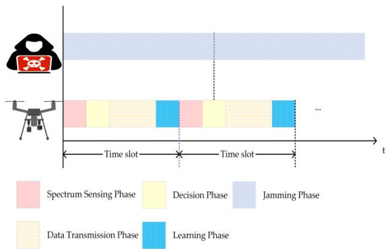  
Fig. 5. Transmission time slot structure.

## B. Mobility Model

It is assumed that the UAV swarm moves within a predefined environment, and for simplicity in this model, the locations of the interference sources (such as those from other radio frequency sources prevalent in the urban environment) are considered fixed. The movement pattern of each UAV n follows the Gaussian Markov Moving Model (GMMM) [38], with position updates synchronized at the start of each time slot. In urban traffic monitoring scenarios, UAVs often need to cover specific roads, intersections, or areas. The GMMM model can be used to simulate this type of movement behavior, capturing the inherent randomness in their trajectories. The flight speed $v _ { n } \left( t \right)$ and direction $\theta _ { n } \left( t \right)$ of UAV n in time slot t are given by the following equations:

$$
v _ { n } \left( t \right) = k _ { 1 } v _ { n } \left( t - 1 \right) + \left( 1 - k _ { 1 } \right) \bar { v } _ { n } + \sqrt { 1 - k _ { 1 } ^ { 2 } } \varphi _ { n }\tag{4}
$$

$$
\theta _ { n } \left( t \right) = k _ { 2 } \theta _ { n } \left( t - 1 \right) + \left( 1 - k _ { 2 } \right) \bar { \theta } _ { n } + \sqrt { 1 - k _ { 2 } ^ { 2 } } \psi _ { n }\tag{5}
$$

where $0 { \le } \mathbf { k } _ { 1 }$ and k<sub>2</sub> ≤1 represent the memory coefficients for speed and direction, respectively. $\bar { v } _ { n }$ and $\varphi _ { n }$ Represent the average speed and the randomness in speed for UAV n. Similarly, ${ \bar { \theta } } _ { n }$ and $\psi _ { n }$ represent the average direction and the randomness in direction. Additionally, $\varphi _ { n }$ and $\psi _ { n }$ follow a Gaussian distribution.

## C. Wireless Transmission Model

It is assumed that each UAV communication link can only select a single channel for transmission during each time slot, and different UAVs can reuse the same transmission channel. However, UAVs cannot predict the transmission environment of other UAVs in advance, but they can accurately acquire the channel gain on their communication link. In the demanding context of urban environments characteristic of traffic monitoring scenarios, wireless signal propagation is subject to significant and complex impairments. The power gain is considered to be composed of slow fading and fast fading. Fast fading, mainly caused by multipath effects, refers to rapid signal strength variation due to the signal traveling through multiple propagation paths. In UAV communication environments, fast fading is typically modeled using the Rayleigh or Rician fading models. The Rayleigh fading model applies to non-line-of-sight conditions. In this context, fast fading is modeled as Rayleigh fading, following a complex Gaussian distribution with zero mean and unit variance. Slow fading is primarily considered as a combination of path loss and shadow fading, describing the long-term impact on signal strength due to environmental obstacles such as buildings and terrain. Let $h _ { n } ^ { t , l }$ represent the Rayleigh fading for UAV n on channel l during time slot t. Let $\dot { H } _ { n } ^ { t , l }$ represent the slow fading during communication transmission by UAV n in time slot t. Therefore, the channel power gain for UAV n on channel l during time slot t is given by ${ \breve { g _ { n } ^ { t , l } } } = h _ { n } ^ { t , l } H _ { n } ^ { t , l }$

In time slot t, UAVs communicate while facing interference, which includes co-channel interference from other U2U link and U2G link communication, as well as significant interference from other radio frequency sources prevalent in the urban environment. Aggregated interference in complex urban electromagnetic environments severely threatens the reliable transmission of critical traffic monitoring data crucial for effective Intelligent Transportation System (ITS) operations. Let $\hat { L } ^ { t } \triangleq \left[ \hat { l } _ { 1 } ^ { t } , \hat { l } _ { 2 } ^ { t } , \dots , \hat { l } _ { J } ^ { t } \right]$ and $L _ { n } ^ { t } \triangleq \big [ l _ { 1 } ^ { \acute { t } } , l _ { 2 } ^ { t } , \ldots , l _ { N } ^ { t } \big ]$ represent the interference channel selections of all sources and the transmission channel selections of all UAVs in time slot t, respectively. The interference experienced by UAV n on channel l when communicating with other UAVs or the ground station during time slot t can be expressed as:

$$
\begin{array} { r l } & { V _ { n } ^ { t , l } = \displaystyle \sum _ { k = 1 , k \neq n } \sum _ { i = 1 , i \neq k } f \left( l _ { k , i } ^ { t } , l _ { n } ^ { t } \right) p _ { k , i } ^ { t } g _ { k , i } ^ { t , l } } \\ & { + \displaystyle \sum _ { k = 1 , k \neq n } ^ { N } f \left( l _ { k , G } ^ { t } , l _ { n } ^ { t } \right) p _ { k , G } ^ { t } g _ { k , G } ^ { t , l } + \sum _ { j = 1 } ^ { J } f \left( \bar { l } _ { j } ^ { t } , l _ { n } ^ { t } \right) \bar { p } _ { j } ^ { t } \bar { g } _ { j } ^ { t , l } } \end{array}\tag{6}
$$

Here, the first term represents the co-channel interference caused by UAV k communicating with UAV i on channel l during time slot t. The second term represents the co-channel interference caused by UAV k communicating with the ground station G on channel l during time slot t. The third term represents the external malicious interference from jammer j on channel l during time slot t. In this case, $\bar { p } _ { j } ^ { t }$ and $\bar { g } _ { j } ^ { t }$ represent the transmission power and interference channel gain of jammer j in time slot t, respectively. The function $f \left( x , y \right)$ is an indicator function that describes whether nodes x and y are on the same channel, defined as:

$$
f ( x , y ) = { \left\{ \begin{array} { l l } { 1 , { \mathrm { i f ~ } } x = y } \\ { 0 , { \mathrm { i f ~ } } x \neq y } \end{array} \right. }\tag{7}
$$

$p _ { n } ^ { t }$ represents the transmission power of UAV n when communicating with other UAVs or the ground station in time slot t. The signal-to-interference-plus-noise ratio (SINR) is then given by the expression:

$$
\gamma _ { n } ^ { t , l } = \frac { p _ { n } ^ { t } g _ { n } ^ { t , l } } { \sigma ^ { 2 } + V _ { n } ^ { t , l } }\tag{8}
$$

where $\sigma ^ { 2 }$ represents the Gaussian additive white noise power, and B is the bandwidth of each channel. According to Shannon’s formula, the data transmission rate of UAV n on channel l with other UAVs or the ground station in time slot t is:

$$
R _ { n } ^ { t , l } = B { \log _ { 2 } } \left( 1 + \gamma _ { n } ^ { t , l } \right)\tag{9}
$$

## IV. PROBLEM MODELING

To simultaneously reduce the energy consumption and frequency hopping overhead of UAV swarm anti-jamming communication for ITS urban traffic monitoring, this section first introduces the optimization problem of spectrum allocation and power control. To solve this optimization problem, it is then structured as a Decentralized Partially Observable Markov Decision Process (Dec-POMDP), providing specific definitions for the local observation space, action space, and reward function.

## A. Optimization Problem

The optimization problem considered in this section is to improve the anti-jamming performance of the system through the joint design of channel selection in the spectrum domain and power control in the power domain while minimizing the long-term energy consumption and frequency hopping overhead of the UAV swarm. To achieve this, the following definitions for transmission energy consumption and frequency hopping overhead are provided:

1) Transmission Energy Consumption: The transmission energy consumption of UAV n on the selected channel $l _ { n } ^ { t }$ during time slot t with other UAVs or the ground station can be expressed as:

$$
E _ { n } ^ { t } = p _ { n } ^ { t } t\tag{10}
$$

where $p _ { n } ^ { t }$ is the transmission power of UAV n, and t is the duration of the time slot.

2) Frequency Hopping Overhead: Each UAV must dynamically select its transmission channel to mitigate the impact of varying external and co-channel interference. When a UAV changes its transmission channel, certain frequency hopping overheads are incurred, such as channel searching costs and bandwidth consumption. To quantify the frequency hopping overhead, we define the unit hopping overhead W , which represents the system cost incurred when a UAV changes its transmission channel. Thus, the total frequency hopping overhead incurred by UAV n during time slot t when its transmission channel changes can be expressed as:

$$
\boldsymbol { F } _ { n } ^ { t } = g \left( l _ { n } ^ { t } , l _ { n } ^ { t - 1 } \right) \boldsymbol { W }\tag{11}
$$

The function g (x, y) is an indicator function describing the event that nodes x and y are on different channels, specifically:

$$
g ( x , y ) = { \left\{ \begin{array} { l l } { 1 , { \mathrm { i f ~ } } x \neq y } \\ { 0 , { \mathrm { i f ~ } } x = y } \end{array} \right. }\tag{12}
$$

In the UAV swarm communication system for ITS urban traffic monitoring, the U2G link is typically used to support high transmission rates for transferring critical traffic monitoring data, such as real-time video feeds, congestion levels, and incident reports. Therefore, an appropriate design objective is to maximize the transmission capacity of these links, denoted as $R _ { n , G } ^ { t , l }$ , that real-time traffic monitoring data, video streams, etc., are reliably and efficiently delivered to the ground station. The U2U link, on the other hand, is primarily used for real-time sharing of sensitive information and collaborative operations between UAVs, where UAVs periodically generate and exchange data at different frequencies. Let K represent the size of the regularly generated U2U payload. In this context, the design objective is to optimize the reliability of the link and the timeliness of data transmission, ensuring successful transmission of the U2U link’s payload within each time slot.

This paper considers an optimization problem with the objective of simultaneously minimizing the long-term transmission energy consumption and frequency hopping overhead of the UAV swarm. The optimization problem is defined as follows:

$$
\operatorname* { m i n } _ { \left( L ^ { t } , P ^ { t } \right) } \mathbb { E } \left\{ \sum _ { t = 0 } ^ { T - 1 } \sum _ { n = 1 } ^ { N } \sum _ { i = 1 } ^ { I } \left[ \beta E _ { n } ^ { t } + ( 1 - \beta ) F _ { n } ^ { t } \right] \right\}\tag{13a}
$$

$$
\mathrm { s . t . } \ R _ { n } ^ { t , l } \mathrm { t } \geqslant K , \forall n , \forall i , \forall l , \forall t\tag{13b}
$$

where $L ^ { t } \triangleq [ L _ { 1 } ^ { t } , \dots , L _ { I } ^ { t } ]$ and $P ^ { t } \triangleq [ P _ { 1 } ^ { t } , \dots , P _ { I } ^ { t } ]$ represent the transmission channels and transmission powers selected by each UAV at time slot t, respectively. The parameters $\beta$ and 1− $\beta$ are weighting factors for transmission energy consumption and frequency hopping overhead. The constraint condition represents the data packet size each UAV must successfully transmit to other UAVs during any time slot, which ensures that UAVs can promptly share crucial information for collaborative work.

In the context of the UAV anti-jamming communication system for ITS urban traffic monitoring, the multi-agent antijamming problem for the UAV swarm can be described as follows: In time slot t, UAV n communicates with an agent on the selected transmission channel $l _ { n } ^ { t }$ with a transmission power of $p _ { n } ^ { t }$ , aiming to maximize the SINR and data transmission rate $R _ { n } ^ { t , l }$ while also considering the UAV swarm’s long-term transmission energy consumption and frequency hopping overhead. However, due to the limited observation in the UAV communication environment, it is not feasible for UAVs to collect accurate global channel state information, making distributed resource allocation a more suitable solution. Furthermore, a key challenge is coordinating actions across multiple communication links so that agents do not act solely in their interest at the expense of the overall system performance. The complexity of this problem poses challenges for traditional optimization methods. To address this issue, a game theory framework is introduced to model and analyze the anti-jamming defense problem.

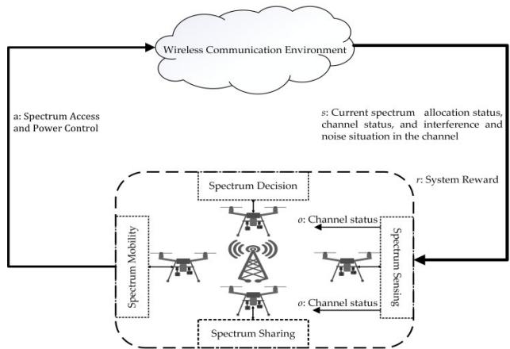  
Fig. 6. Dynamic spectrum allocation and power control modeling based on dec-POMDP.

## B. Dec-POMDP Modeling

In the multi-agent context addressed in this paper, every action performed by an agent influences the state of the environment and affects the rewards that other agents may receive. This scenario constitutes a game involving multiple agents and multiple states. The problem can be considered as a Markov Decision Process (MDP), suitable for modeling multi-agent reinforcement learning. However, in practical UAV swarm environments, individual UAVs are constrained by limited local observation capabilities, making it challenging to obtain comprehensive state information. To address this, we model the optimization problem as a Decentralized Partially Observable Markov Decision Process (Dec-POMDP) and formalize it using the tuple $\Gamma \triangleq ( \mathbf { N } , \mathbf { S } , \mathbf { A } , \mathbf { T } , \mathbf { O } , \mathbf { Z } , \mathbf { R } , \gamma )$ where $\mathbf { N } = \{ 1 , \dots , \mathrm { n } , \dots , \mathrm { N } \}$ is the set of agents, S is the global state space, A is the joint action space, T is the state transition probability function, O is the joint observation space, Z is the observation transition probability, R is the reward function, and γ is the discount factor. The global state space $S ^ { t }$ Represents the set of all possible system states at time slot t, including the positions of all agents, power allocation, channel conditions, and interference levels. These factors collectively determine the communication quality and task execution capability of the UAV swarm in urban traffic monitoring scenarios. However, in the distributed partially observable environment, while the global state S<sup>t</sup> Exists, each agent only obtains a partial observation $o _ { n } ^ { t }$ based on the actual communication scenario, making it difficult to grasp the entirety of fully $S ^ { t }$ . Additionally, due to the dynamic nature of agent communication, T and Z are challenging to obtain. Therefore, model-free reinforcement learning methods are adopted, where agents can learn from experience and interaction with the environment to derive optimal or near-optimal strategies. The dynamic spectrum allocation and power control modeling based on Dec-POMDP is shown in Fig. 6.

The following sections will provide detailed definitions for observations, actions, policies, and the reward function within this process.

1) Observation $( O ) { \mathrm { { z } } }$ In a distributed partially observable environment, due to the limitations of an agent’s local observation capabilities, each agent cannot obtain the global state of the system and can only observe local information. These local observations form the observation set O . The joint observation set $\mathcal { O } ^ { t }$ represents the combination of all agents’ observations of their respective communication links and surrounding environments in the current time slot t, that is, $\mathcal { O } ^ { t } = \{ o _ { 1 } ^ { t } , o _ { 2 } ^ { t } , \ldots , o _ { N } ^ { t } \}$ , where $o _ { n } ^ { t }$ denotes the observation of agent n in time slot t. Each $o _ { n } ^ { t }$ is an element of a finite observation set and includes the local channel information observed by agent n, such as the channel gain $g _ { n } ^ { t , l }$ for transmission on channel $l _ { \eta } ^ { t }$ in the current time slot, and the interference level $V _ { n } ^ { t , l }$ on that channel. These local observations are crucial for UAVs to make informed decisions about channel selection and power control to cope with interference in urban environments. Thus, $o _ { n } ^ { t } \triangleq \left\lceil g _ { n } ^ { t , l } , V _ { n } ^ { t , l } \right\rceil$ and the state observed by agent n reflects the environmental information the agent can perceive based on its sensors and communication capabilities. Therefore, the joint observation space for time slot t is represented as ${ \mathbf O } ^ { t } \triangleq o _ { 1 } ^ { t } \times \cdots \times o _ { N } ^ { t }$

2) Action (A): The joint action set $A ^ { t }$ represents the set of actions taken by all agents in time slot t. Each agent n, in a given time slot t, selects an action $\boldsymbol { a } _ { n } ^ { t } \triangleq \left[ L _ { n } ^ { t } , P _ { n } ^ { t } , \boldsymbol { \bar { d } } _ { n } ^ { t } \right]$ based on its observation $o _ { n } ^ { t }$ . The action $a _ { n } ^ { t }$ represents the action of agent n, which includes decision-related behaviors such as selecting the transmission channel and power for the communication link with other agents and location movement. Thus, the joint action set and joint action space in time slot t are represented as $a ^ { t } \triangleq [ a _ { 1 } ^ { t } , \dots , a _ { N } ^ { t } ]$ and $\mathcal { A } ^ { t } a _ { 1 } ^ { t } \times \cdots \times a _ { N } ^ { t }$ , respectively.

3) Policy (µ): The policy is defined as the probability distribution over actions an agent can take in various states, representing the mapping from environmental states to actions. The policy for agent n in time slot t under the local observation $o _ { n } ^ { t } \ = \ o ^ { t }$ when selecting action $a _ { n } ^ { t } \ = \ a ^ { t }$ is represented as $\ddot { \mu _ { n } } \left( a ^ { t } \left| o ^ { t } \right. \right) \triangleq P \left( a _ { n } ^ { t } = a ^ { \bar { t } } \left| o _ { n } ^ { t } = o ^ { t } \right. \right)$ . Thus, the joint policy of all agents in time slot t can be represented as $\mu \left( a ^ { t } \left| o ^ { t } \right. \right) \triangleq$ $[ \mu _ { 1 } , \ldots , \mu _ { N } ]$

4) Reward (R): Building on the power control and channel selection optimization problem for agent communication links proposed earlier, the goal of this paper is twofold: agent n, under observation ${ o _ { n } ^ { t } } .$ , receives a local reward $r _ { n } ^ { t }$ by executing action $a _ { n } ^ { t }$ . To minimize transmission energy consumption and frequency hopping overhead, the reward is defined as a combination of transmission energy consumption, frequency hopping overhead, the transmission rate of the U2G link, and the transmission success rate of the U2U link. These metrics are directly related to the efficiency and reliability of UAVs in urban traffic monitoring tasks. Define the agent transport energy loss for $E _ { n } ^ { t }$ and frequency hopping overhead $F _ { n } ^ { t }$ . To ensure successful data transmission on the U2U link in time slot t, i.e., to meet the constraint $R _ { n } ^ { t , l } \mathfrak { t } \geqslant K$ , a data transmission success reward $\delta > 0$ is set, and an auxiliary variable is introduced to represent the number of successful transmissions for agent n in time slot t:

$$
Z _ { n } ^ { t } \triangleq \sum _ { i = 1 } ^ { I } \rho \left( R _ { n } ^ { t , l } \mathrm { T } \geqslant K \right)\tag{14}
$$

where $\rho \left( x \right)$ is an indicator function defined as:

$$
\rho ( x ) = { \left\{ \begin{array} { l l } { 1 , { \mathrm { i f ~ } } x = { \mathrm { T r u e } } } \\ { 0 , { \mathrm { i f ~ } } x = { \mathrm { F l a s e } } } \end{array} \right. }\tag{15}
$$

$R _ { n , G } ^ { t }$ represents the transmission capacity to the ground station in time slot t. Consequently, the local reward for agent n in time slot t, based on observation $o _ { n } ^ { t }$ and action $a _ { n } ^ { t } .$ , is defined as:

$$
r _ { n } ^ { t } = r \left( o _ { n } ^ { t } , a _ { n } ^ { t } \right) \lambda R _ { n , G } ^ { t } + \delta Z _ { n } ^ { t } - \left[ \beta E _ { n } ^ { t } + \left( 1 - \beta \right) F _ { n } ^ { t } \right]\tag{16}
$$

Based on the constructed Dec-POMDP, let $\begin{array} { r } { r ^ { t } \ = \ \sum _ { n = 1 } ^ { N } r _ { n } ^ { t } } \end{array}$ represent the system reward obtained by the environment based on the feedback from each agent. The discount factor $\gamma ^ { t }$ is a parameter between 0 and 1, employed to weigh the significance of short-term and long-term rewards. The closer the discount factor is to 1, the greater the importance of future rewards. Conversely, the system focuses more on immediate rewards when the discount factor is closer to 0. The optimization objective of this paper is to find the optimal policy $\mu ^ { * }$ that maximizes the long-term cumulative discounted system reward:

$$
\mu ^ { * } \in \underset { \mu } { \mathrm { a r g m a x } } \mathbb { E } \left[ \sum _ { t = 0 } ^ { T - 1 } \gamma ^ { t } r ^ { t } \right]\tag{17}
$$

## V. MULTI-DOMAIN ANTI-JAMMING ALGORITHM BASED ON MULTI-AGENT DEEP DETERMINISTIC POLICY GRADIENT

Leveraging recent advancements in artificial intelligence, reinforcement learning (RL) has shown significant promise for managing complex multi-agent systems. In ITS, UAV swarms exemplify such systems, where the interdependent decisions of multiple UAVs introduce a level of complexity that challenges conventional RL approaches. To address this, this paper introduces a multi-domain anti-jamming algorithm based on Multi-Agent Deep Deterministic Policy Gradient (MADDPG). Focusing on optimizing power control and channel selection for UAV swarm communication in ITS, the proposed algorithm aims to enhance overall communication system stability and efficiency, thereby improving the performance of UAVs in tasks such as urban traffic monitoring.

## A. Policy Gradient Algorithm

Traditional RL algorithms, such as Q-learning and DQN, rely on value functions to guide the agent’s decisionmaking and are particularly suitable for discrete action spaces. However, when faced with high-dimensional or continuous action spaces, these value-function-based methods often underperform, and the policy update process tends to be unstable. To address these issues, the policy gradient algorithm emerged. This algorithm solves RL problems by directly optimizing the policy, enabling it to remain efficient in complex environments. Unlike traditional valuefunction-based methods, policy gradient methods optimize a parameterized policy function to maximize cumulative rewards. In the policy gradient method, the policy $\mu _ { \boldsymbol { \theta } } ( a | s )$ denotes the likelihood of selecting action a when in state s, where θ represents the parameter to be optimized. The goal is to determine the optimal parameter θ that maximizes the cumulative reward J (θ ). The expected cumulative reward is defined as

Traditional reinforcement learning (RL) algorithms, such as Q-learning and Deep Q-Networks (DQN), rely on value functions to guide the agent’s decision-making process, making them well-suited for discrete action spaces. However, these value-function-based approaches often struggle with high-dimensional or continuous action spaces, resulting in suboptimal performance and instability during the policy update process. To overcome these challenges, the policy gradient method was introduced. This approach directly optimizes the policy, making it more efficient in complex environments. Unlike traditional value-function-based methods, policy gradient methods focus on optimizing a parameterized policy function to maximize the cumulative rewards. In the policy gradient framework, the policy $\mu _ { \boldsymbol { \theta } } ( a | s )$ represents the probability of selecting action a given state $s ,$ with θ denoting the parameters to be optimized. The objective is to determine the optimal parameter θ that maximizes the cumulative reward J (θ ). The expected cumulative reward is defined as follows:

$$
J \left( \theta \right) = \mathbb { E } _ { \tau \sim \mu _ { \theta } } \left[ R \left( \tau \right) \right]\tag{18}
$$

Here, $\tau { = } ( s _ { 0 } , a _ { 0 } , s _ { 1 } , a _ { 1 } , . . . )$ represents the state-action sequence (trajectory), and $\begin{array} { r l r } { R ( \tau ) } & { { } = } & { \sum _ { t = 0 } ^ { T } \gamma ^ { t } r ^ { t } } \end{array}$ is the cumulative reward for trajectory τ , where $\gamma$ is the discount factor.

To optimize the parameter $\theta ,$ we compute the gradient of the expected cumulative reward $\nabla _ { \boldsymbol { \theta } } J \left( \boldsymbol { \theta } \right)$ . Using the policy gradient theorem, this gradient can be expressed as:

$$
\nabla _ { \theta } J \left( \theta \right) = \mathbb { E } _ { \tau \sim \mu \theta } \left[ \sum _ { t = 0 } ^ { T } \nabla _ { \theta } \log \mu _ { \theta } \left( a _ { t } \mid s _ { t } \right) R _ { t } \right]\tag{19}
$$

This equation shows that by calculating the gradient of the policy parameters and using the gradient ascent method to adjust $\theta ,$ the policy can be progressively optimized to achieve higher cumulative rewards.

Policy gradient methods directly optimize the agent’s policy, avoiding the indirect approach of value-function-based methods. This allows it to maintain strong decision-making capabilities in high-dimensional and continuous action spaces. By optimizing the parameterized policy function, policy gradient methods maximize cumulative rewards, enabling agents to make more effective decisions in complex environments.

## B. Deep Deterministic Policy Gradient Algorithm

Although the policy gradient method can effectively handle high-dimensional action spaces, it may exhibit high variance during training, affecting the convergence speed and policy stability. The Deep Deterministic Policy Gradient (DDPG)

algorithm combines policy gradient and DQN strengths and is specifically designed to address RL problems in continuous action spaces. The DDPG algorithm employs an Actor-Critic architecture, comprising a policy-oriented Actor network and a value-oriented Critic network. By employing deep neural networks to approximate both the policy and the actionvalue function, DDPG is capable of efficiently optimizing policies within high-dimensional continuous spaces. The Actor network processes the current state of the environment and selects appropriate actions based on the policy $\mu _ { n }$ Concurrently, the Critic network assesses the effectiveness of the actions chosen by the Actor network by utilizing the state-action value function defined by the policy $Q _ { n } \left( \cdot \right)$ . The state-action value function in the DDPG algorithm can be expressed as:

$$
\begin{array} { r } { \boldsymbol { Q _ { n } } \left( S _ { n } , A _ { n } \right) = E \left[ R _ { n } + \gamma Q \left( S _ { n } ^ { \prime } , A _ { n } ^ { \prime } \right) \right] } \end{array}\tag{20}
$$

where $S _ { n }$ is the input state of agent n, γ is the discount factor, and $Q ( S _ { n } ^ { \prime } , A _ { n } ^ { \prime } )$ is the expected action-value function in the next state.

Being a policy gradient method, the core concept of DDPG is to derive an optimal policy $\mu _ { n } ^ { * }$ and, throughout the training process, achieve convergence to the optimal state-action value function associated with this policy. DDPG utilizes a dualnetwork architecture within its Actor-Critic framework. One is the evaluation network (with parameters $\theta _ { n } ^ { \mu }$ for the Actor evaluation network and $\theta _ { n } ^ { \mathcal { Q } }$ for the Critic network), and the other is the target network (with parameters $\theta _ { n } ^ { \mu ^ { \prime } }$ for the Actor target network and $\theta _ { n } ^ { \boldsymbol { Q } ^ { \prime } }$ for the Critic target network). The parameters $\theta _ { n } ^ { \mu }$ and $\theta _ { n } ^ { \mathcal { Q } }$ of the evaluation network are updated in real-time. During training, a small batch of samples is randomly drawn from the experience replay buffer and input to the agent. The Actor and Critic networks update the evaluation network’s parameters using these samples. The Critic network refines its evaluation network parameters by minimizing the subsequent loss function:

$$
\begin{array} { r } { L \left( \theta _ { n } ^ { \mathcal { Q } } \right) = E \left[ ( R _ { n } ^ { t } + \gamma Q _ { n } ^ { \prime } ( S _ { n } ^ { t } , A _ { n } ^ { t } | \theta _ { n } ^ { \mathcal { Q } ^ { \prime } } ) \right] - Q _ { n } ( S _ { n } ^ { t } , A _ { n } ^ { t } | \theta _ { n } ^ { \mathcal { Q } } ) ) ^ { 2 } ] } \end{array}\tag{21}
$$

In the equation, $Q _ { n } ^ { \prime } ( \cdot )$ denotes the action-state value function of the target network. Provided that $L \left( \theta _ { n } ^ { \mathcal { Q } } \right)$ is continuously differentiable, $\theta _ { n } ^ { \mathcal { Q } }$ can be updated based on the gradient of the loss function. The Actor network modifies its evaluation network parameters by maximizing the policy objective function, ensuring that each agent can achieve maximum cumulative returns during decision-making. The objective function is:

$$
J \left( \theta _ { n } ^ { \mu } \right) = E \left[ { \cal Q } _ { n } ( S _ { n } ^ { t } , A _ { n } ) | A _ { n } = \mu ( S _ { n } ^ { t } ) \right]\tag{22}
$$

The deterministic policy $\mu _ { n } ( \cdot )$ of the Actor evaluation network maps states to actions according to policy $\mu _ { n }$ . Since the action space is continuous, the objective function $J ( \cdot )$ is continuously differentiable, enabling the use of gradient ascent to adjust the gradient direction $\nabla _ { \theta _ { n } ^ { \mu } } J \left( \theta _ { n } ^ { \mu } \right)$ . As the evaluation network parameters $\theta _ { n } ^ { \mu }$ and $\theta _ { n } ^ { \mathcal { Q } }$ are refined, the target network parameters $\theta _ { n } ^ { \mu ^ { \prime } }$ and $\theta _ { n } ^ { Q ^ { \prime } }$ are updated via a soft update method. The soft update equations are:

$$
\theta _ { n } ^ { \mu ^ { \prime } } = \tau \theta _ { n } ^ { \mu } + ( 1 - \tau ) \theta _ { n } ^ { \mu ^ { \prime } }\tag{23}
$$

$$
\theta _ { n } ^ { Q ^ { \prime } } = \tau \theta _ { n } ^ { Q } + ( 1 - \tau ) \theta _ { n } ^ { Q ^ { \prime } }\tag{24}
$$

where τ is a positive constant close to zero (typically $\tau = 1 )$ ).

However, the DDPG algorithm has some significant drawbacks in a multi-agent environment. Due to interactions between multiple agents, the policy updates of a single agent may affect the policies of other agents, leading to instability in the overall system. Additionally, each agent learns its policy independently, lacking a coordination mechanism, which makes it difficult to achieve a globally optimal policy. The lack of information sharing and coordination among agents may also result in low learning efficiency and suboptimal policy quality.

## C. Multi-Agent Deep Deterministic Policy Gradient Algorithm

The MADDPG algorithm is an extension of the DDPG algorithm [39]. The framework of the MADDPG algorithm is illustrated in Fig. 7, designed to solve decision-making problems in multi-agent environments. While DDPG was initially designed for single-agent environments, MADDPG is designed to optimize scenarios involving multiple agents, where each agent’s actions are influenced not only by the environment’s state but also by the policies of other agents. To manage these intricate interactions, MADDPG employs a centralized training with decentralized execution framework. Under this mechanism, each agent has independent Actor and Critic networks. However, during training, the Critic network can access global information, including the actions and states of other agents, to enable joint training and optimize overall performance while coordinating the strategies of multiple agents. The combination of centralized training and decentralized execution ensures that each agent can make decisions independently within its local environment, while simultaneously optimizing the overall strategy through global coordination. As the number of agents increases, this mechanism allows the system to scale effectively. The state and action spaces of the system do not grow exponentially with the increase in global information, thereby effectively alleviating the “curse of dimensionality” and reducing the computational complexity associated with global state information. This approach effectively addresses challenges for ITS urban traffic monitoring UAV swarms in realworld deployments, including those posed by complex urban electromagnetic environments and limited local observability.

The main features are as follows:

1) Actor-Critic Architecture: Each agent has an Actor network responsible for outputting actions and a Critic network accountable for evaluating the quality of the current policy. Specifically, the Actor network learns a deterministic policy $\mu _ { \theta _ { n } } \left( o _ { n } \right)$ , where $\theta _ { n }$ is the policy parameter for agent n, while the Critic network estimates the Q-value $Q _ { \theta _ { n } } \left( s _ { n } , a _ { n } \right)$ of state-action pairs to guide the

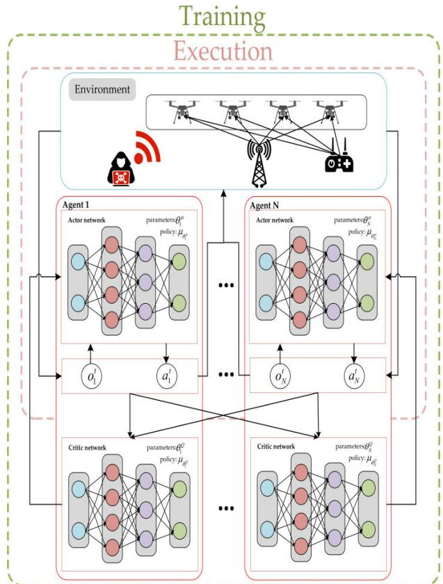  
Fig. 7. Schematic diagram of the MADDPG anti-jamming algorithm.

Actor network’s updates. The loss function of the Critic network is optimized through the following equation:

$$
L \left( \theta _ { n } ^ { \cal Q } \right) = \frac { 1 } { D _ { b } } \sum _ { j } \left( y ^ { j } - { \cal Q } _ { \theta _ { i } } \left( O ^ { j } , a _ { 1 } ^ { j } , a _ { 2 } ^ { j } , \dots , a _ { N } ^ { j } \right) \right) ^ { 2 }\tag{25}
$$

where $\begin{array} { r l r } { y ^ { j } } & { { } = } & { r ^ { j } + \gamma Q _ { \theta _ { i } ^ { \prime } } \left( O ^ { ' j + 1 } , \mu _ { \theta _ { 1 } ^ { \prime } } \left( o _ { 1 } ^ { ' j } \right) , \dots , \right. } \end{array}$ $\mu _ { \theta _ { N } ^ { \prime } } \left( o _ { N } ^ { ' j } \right) \Biggr )$ is the target Q-value, and γ is the discount factor.

2) Centralized Training, Decentralized Execution: During the training phase, the Critic network can access information from all agents, including their states and actions, allowing for an accurate assessment of the expected returns for each action. However, during the execution phase, each agent’s Actor network makes decisions based solely on its local observations $o _ { n } .$ , enabling decentralized execution. This mechanism ensures that each agent can make decisions independently within its local environment while simultaneously optimizing the overall strategy through global coordination. This is particularly important for UAV swarms in ITS, as each UAV needs to make real-time communication decisions based on its locally sensed traffic conditions and interference, while the entire swarm needs to collaborate to achieve efficient traffic monitoring goals. This allows agents to operate independently in a multiagent environment while achieving global coordination during training through the Critic network.

3) Experience Replay: To improve the stability and efficiency of training, MADDPG uses an experience replay mechanism. Each interaction by the agent is stored in a replay buffer, and during training, a batch of experience samples is randomly drawn from this buffer to update the network parameters.

4) Target Networks: MADDPG maintains a target network for each Actor and Critic network further stabilizes the training process. These target networks gradually follow the parameters of the evaluation networks to generate consistent targets for expected returns, thereby reducing fluctuations during training. The target networks are updated using the soft update method as follows:

$$
\theta _ { n } ^ { \prime }  \tau \theta _ { n } + ( 1 - \tau ) \theta _ { n } ^ { \prime }\tag{26}
$$

5) Rewards and Penalties: MADDPG allows for designing complex reward mechanisms, crucial for guiding multiagent learning towards desired collective behaviors and optimal decision-making in interactive environments. For multi-agent systems like ITS urban traffic monitoring UAV swarms, careful reward design is essential. It enables agents to learn policies that effectively balance competing objectives, such as minimizing energy consumption and frequency hopping overhead while maximizing communication reliability, by incorporating incentives for cooperation or penalties for detrimental actions aligned with overall system goals.

In summary, leveraging the centralized training and decentralized execution of the MADDPG framework, the developed anti-jamming algorithm demonstrates significant capability for achieving efficient and reliable communication in the context of the System for UAV Swarm Anti-Jamming Communication in ITS Urban Traffic Monitoring. Centralized training allows the Critic network’s access to global information, enabling agents to learn coordinated strategies essential for collaborative tasks like wide-area surveillance and incident detection, while also enhancing their ability to manage system complexity and counter interference. Conversely, decentralized execution empowers each agent to make real-time decisions based solely on local observations, facilitating adaptive handling of environmental uncertainties and interference, and maintaining communication link stability for continuous data flow despite challenging urban conditions. Consequently, this methodology provides strong adaptability and anti-jamming capability against dynamic environments and multiple interference sources, significantly enhancing communication reliability within the swarm and with the ground station. This is critical for ensuring the timely and accurate transmission of critical urban traffic monitoring data (e.g., traffic flow, congestion, incident details), vital for effective traffic management and rapid response. Based on this analysis, the multi-domain anti-jamming algorithm for UAV communication links based on multi-agent reinforcement learning and the MADDPG framework is detailed as follows:

```latex
Algorithm 1 The Collaborative Multi-Domain Anti-Jamming
Algorithm is Based on the MADDPG Framework
Input: UAV network parameters, maximum number of training
episodes E, maximum number of steps per episode T.
Output: Policy $\mu .$
1 Initialize the evaluation and target network parameters
$\theta _ { n } ^ { \mu } , \theta _ { n } ^ { Q } , \theta _ { n } ^ { \mu } , \theta _ { n } ^ { Q }$ for both the Actor and Critic networks for
each agent $\begin{array} { r } { \mathrm { { n } } \stackrel { \cdot \cdot } { = } 1 , 2 , . . . , \mathrm { { N } } . } \end{array}$
2 Initialize the experience replay buffer size $D _ { n }$ for each agent. 3 for
e=0 to E-1 do
4 Reset the UAVs communication environment.
5 Update each UAV’s position and the slow fading of the
channels.
6 for t=0 to T-1 do
7 for n=0 to N-1 do
8 Agent n observes the local observation $o _ { n } ^ { t } .$
9 Agent n selects an action $a _ { n } ^ { t }$ to execute based on the current
local observation $o _ { n } ^ { t }$ and the noise generated by the ε−greedy policy
$\varepsilon _ { e }$ using the following formula:
$\mathbf { \bar { } } { a } _ { n } ^ { t } = \mu _ { \theta _ { n } } \left( o _ { n } ^ { t } \right) \mathbf { \bar { + } } \varepsilon _ { e }$
10 After executing the action, agent n updates its local observation
for the next time slot $o _ { n } ^ { t + 1 }$
11 end for
12 All agents execute their actions and obtain the shared global
reward $R ^ { t }$
13 Update the fast fading of the channels.
14 for n=0 to N-1 do
15 if the number of stored experiences in the replay buffer is less
than $D _ { n }$ do
16 Store $\overleftarrow { o ^ { t } } , a _ { 1 } ^ { t } , a _ { 2 } ^ { t } , \ldots , a _ { N } ^ { t } , R ^ { t } , o ^ { t + 1 }$ in the experience buffer of agent
n.
1 7 else
18 Replace the earliest stored experience with
$\left\{ o ^ { t } , a _ { 1 } ^ { t } , a _ { 2 } ^ { t } , \ldots , a _ { N } ^ { t } , R ^ { t } , o ^ { t + 1 } \right\}$
20 Randomly select a small batch of experience samples of size
$D _ { d }$ Compute the target Q-value for the Critic network: for each
experience sample j, calculate the target Q-value $y ^ { j } \colon$
$y ^ { j } = R ^ { j } + \gamma Q _ { \theta _ { n } ^ { Q ^ { \prime } } } ( o ^ { j + 1 } , a _ { 1 } ^ { j + 1 } , a _ { 2 } ^ { j + 1 } , \ldots , a _ { N } ^ { j + 1 } | a _ { N } ^ { j + 1 } = \mu _ { \theta _ { n } ^ { \mu ^ { \prime } } } ( o _ { n } ^ { j + 1 } ) )$
21 Update the Critic evaluation network parameters $\theta _ { n } ^ { \mathcal { Q } }$ by
minimizing the loss function:
${ \cal L } \left( \theta _ { n } ^ { \cup } \right) = \frac { 1 } { D _ { d } } \sum _ { j \in D _ { d } } \left( y ^ { j } - { \cal Q } _ { \theta _ { n } ^ { \cup } } \left( o ^ { j } , a _ { 1 } ^ { j } , a _ { 2 } ^ { j } , \ldots , a _ { N } ^ { j } \right) \right) ^ { 2 }$
22 Generate actions using the current policy network $a _ { n } ^ { j } = \mu _ { \theta _ { n } } \left( o _ { n } ^ { j } \right)$
and update the Actor evaluation network parameters by maximizing
the policy objective function:
$\begin{array} { r } { J ( \bar { \theta _ { n } ^ { \mu } } ) \stackrel {  } { = } \frac { 1 } { D _ { d } } \displaystyle \sum _ { j \in D _ { d } } Q _ { \theta _ { n } ^ { \mathcal { Q } } } ( o ^ { j } , \mu _ { \theta _ { n } } ( o _ { n } ^ { j } ) , a _ { - n } ^ { j } ) } \end{array}$
Where $a _ { - { \underline { { n } } } } ^ { j }$ represents the actions of the other agents, which remain
unchanged, and only the action of agent n is updated through its
policy network.
23 Soft update the Actor target network:
$\theta _ { n } ^ { \mu ^ { \prime } } \overset { \cdot } { = } \tau \theta _ { n } ^ { \mu } + \left( 1 - \tau \right) \theta _ { n } ^ { \mu ^ { \prime } }$
24 Soft update the Critic target network:
$\theta _ { n } ^ { Q ^ { \prime } } \overset { \cdot } { = } \tau \theta _ { n } ^ { Q } + \left( 1 - \tau \right) \theta _ { n } ^ { \overline { { Q } } ^ { \prime } }$
25 end if
26 end for
27 end for 28 end for
```

## VI. EXPERIMENTAL RESULTS AND ANALYSIS

In this study, a Python-based simulation system was built to model the ITS urban traffic monitoring UAV swarm antijamming communication system, simulating the behavior of its components (UAVs, jamming sources, and communication channels) and evaluating the performance of the proposed anti-jamming algorithm within this system. The system implemented deep neural network models on the TensorFlow platform to execute the anti-jamming algorithm. Experimental results demonstrate that the proposed MADDPG algorithm excels in terms of convergence and robustness. Compared to baseline algorithms, the proposed approach significantly improves the U2G link capacity and the transmission success rate of the U2U link. Furthermore, the algorithm effectively enhances collaboration among agents, thereby improving the overall system performance for tasks such as traffic monitoring with UAV swarms in urban environments.

## A. Simulation Environment

In the system and training parameter settings, each agent’s Actor network is divided into two branches: a channel selection branch and a power control branch. The input to the channel selection branch consists of state data, which passes through three fully connected layers containing 512, 256, and 64 neurons, respectively, and is activated using the Rectified Linear Unit (ReLU). Finally, a normalized exponential function (Softmax) in the output layer generates a probability distribution for channel selection. The power control branch is similar to the channel selection branch, with the input also passing through three fully connected layers, and the output layer using ReLU to generate power control outputs. The Critic network also uses three fully connected layers with 512, 256, and 64 neurons, each activated by the ReLU function, and a single neuron in the output layer to estimate the Q-value. To improve sample efficiency and stability, prioritized experience replay was applied. This method ensures that more informative or high-priority experiences are sampled more frequently, allowing the agents to focus on crucial transitions that significantly impact learning.

During training, the Adam optimizer (Adaptive Moment Estimation) was employed to iteratively update the neural network weights for stable and efficient training. The entire training process consists of 2000 episodes. To balance exploration and exploitation, the epsilon-greedy strategy was adopted. In the early stages of training, a high exploration rate ε allows agents to explore the environment broadly, helping collect diverse data and avoid local optima. As training progresses, the exploration rate gradually decreases. Once a preset decay threshold is reached, the exploration rate stabilizes, and the agents rely more on the current policy for optimization, promoting stable policy convergence. The environmental parameters were designed based on practical modeling scenarios, ensuring reliable system performance in dynamic environments by incorporating real-world constraints. The training parameters were repeatedly adjusted to balance exploration and exploitation while maintaining stable convergence. The weighting coefficients in the reward function were optimized through empirical testing and iterative tuning, achieving an effective compromise between power control, channel selection, and transmission success rate. The system parameters are presented in Table I, while the training parameters are detailed in Table II.

TABLE I  
SYSTEM PARAMETERS
<table><tr><td>System Parameters</td><td>Values</td></tr><tr><td>Number of UAVs</td><td>4</td></tr><tr><td>Number of interference devices</td><td>4</td></tr><tr><td>Number of links</td><td>4</td></tr><tr><td>U2G link transmitter power (W)</td><td>2</td></tr><tr><td>U2U link transmitter power (W)</td><td>[0.2]</td></tr><tr><td>U2U link data packet size per time-slot (MB)</td><td>1</td></tr><tr><td>Carrier frequency (GHz)</td><td>2.4</td></tr><tr><td>Bandwidth (MHz)</td><td>40</td></tr><tr><td>Ground station antenna height (m)</td><td>300</td></tr><tr><td>Ground station antenna gain (dBi)</td><td>8</td></tr><tr><td>Ground station receiver noise figure (dB)</td><td>1</td></tr><tr><td>UAV antenna gain (dBi)</td><td>3</td></tr><tr><td>UAV receiver noise figure (dB)</td><td>5</td></tr><tr><td>UAV speed (m/s)</td><td></td></tr><tr><td>Gaussian white noise σ² (dBm)</td><td>5</td></tr><tr><td>Time limit T (ms)</td><td>-114 100</td></tr></table>

TABLE II

TRAINING PARAMETERS
<table><tr><td>Training Parameters</td><td>Values</td></tr><tr><td>Number of episodes</td><td>2000</td></tr><tr><td>Maximum steps per episode</td><td>100</td></tr><tr><td>Experience pool capacity</td><td>50000</td></tr><tr><td>Batch sample size</td><td>64</td></tr><tr><td>Actor&#x27;s learning rate</td><td>0.0001</td></tr><tr><td>Critic&#x27;s learning rate</td><td>0.0001</td></tr><tr><td>Discount factor γ</td><td>0.99</td></tr><tr><td>Weighting factor λ</td><td>0.2</td></tr><tr><td>U2U link transmission success reward δ</td><td>1</td></tr><tr><td>Weighting factor β</td><td>0.5</td></tr><tr><td>Activation function</td><td>ReLU</td></tr><tr><td>Optimizer</td><td>Adam</td></tr></table>

To assess the algorithm’s performance, it was benchmarked against standard baseline algorithms. Additional evaluations were performed to test the algorithm’s resilience under various interference patterns in both Random and Swept jamming environments.

## B. Baseline Algorithms

1) Anti-Jamming Algorithm Based on Multi-Agent Deep Q-Networks (MADQN) for Discrete Action Spaces: This algorithm extends the traditional DQN to a multiagent environment specifically designed for handling discrete action spaces. It also uses an experience replay buffer and a dual-network structure consisting of a main network and a target network. The hyperparameters, such as the learning rate and discount factor, are consistent with the MADDPG algorithm.

2) Anti-Jamming Algorithm Based on the single-agent DDPG for Continuous Action Spaces: This method is suitable for handling continuous action spaces. A single agent is trained using a dual-network structure, including an evaluation network and a target network. The agent relies solely on local observation information and the rewards it receives to adjust its policy and optimize communication performance.

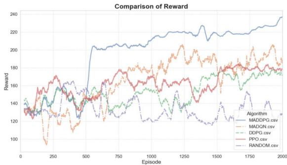  
Fig. 8. Convergence comparison.

3) Anti-Jamming Algorithm Based on the single-agent PPO for Continuous Action Spaces: Vanilla Proximal Policy Optimization is employed for continuous antijamming action spaces as a baseline. Operating in a partially observable environment, a stochastic Gaussian policy network samples actions at each step, while an accompanying critic network estimates state-value returns and advantages. PPO’s clippedsurrogate objective constrains policy updates, delivering stable on-policy learning amid noisy electromagnetic conditions. The anti-jamming performance achieved by this PPO implementation serves as a rigorous quantitative benchmark for comparison.

4) Random Optimization Algorithm (Random): In this method, at each time step, the UAV randomly selects channels and power control parameters in the communication link, with the selection following a uniform distribution.

## C. Experimental Results

1) Performance Evaluation of Baseline Algorithms in the ITS UAV Swarm Context under Fixed Interference

In Fig. 8, a comparative assessment of the proposed MADDPG algorithm alongside four baseline algorithms is presented under fixed interference conditions. The horizontal axis denotes the number of training episodes, while the vertical axis displays the average reward, illustrating the progression of reward values throughout the training period for each algorithm within this specific interference environment. The results indicate that as training advances, the MADDPG algorithm’s average reward consistently increases and stabilizes after approximately 500 episodes. Although there are slight fluctuations in reward values following convergence due to the UAVs’ high mobility and exploration strategies, the overall performance remains highly stable.

In contrast, the performance of the other four baseline algorithms shows significant limitations. First, although the MADQN algorithm can operate in a multi-agent environment, it is prone to substantial estimation errors in high-dimensional state spaces, leading to an unstable learning process and large reward fluctuations. Second, while the single-agent DDPG algorithm is suited for continuous action spaces, it focuses only on the learning of a single agent, lacking the global coordination ability required for a multi-agent system. Third, the PPO algorithm demonstrates better stability than DDPG in single-agent scenarios due to its clipped objective mechanism, but still fails to achieve effective inter-agent coordination, resulting in suboptimal global rewards. Finally, the random selection algorithm, which completely relies on random action choices, fails to learn the characteristics of the environment effectively and thus performs the worst in a dynamic network environment, with its reward values remaining at consistently low levels throughout the training process.

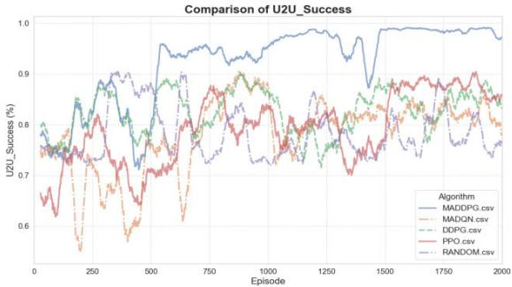  
Fig. 9. U2U link transmission success rate comparison.

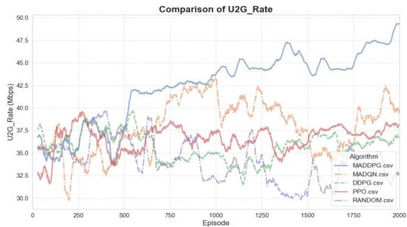  
Fig. 10. U2G link total capacity comparison.

Figs. 9 and 10 present comparative performance results for U2U link transmission success rate and U2G link capacity, respectively. For the U2U link (Fig. 9), the MADDPG algorithm demonstrates significantly superior performance compared to baselines, effectively adapting to dynamic network environments and optimizing resource allocation strategies to ensure a consistently high transmission success rate and stability. In the U2G link (Fig. 10), MADDPG shows continuous improvement in transmission rate during training, stabilizing at approximately 45 Mbps, which is vital for the timely transmission of critical traffic monitoring data. In contrast, baseline algorithms exhibit notable limitations across both link types; MADQN struggles with instability, random selection yields consistently poor results, and singleagent methods like DDPG and PPO fail to achieve effective coordination and high performance in the multi-agent urban environment. The robust U2U and U2G performance achieved by MADDPG is crucial for enabling collaborative UAV tasks and ensuring reliable data reporting in ITS urban traffic monitoring.

Power consumption and frequency hopping costs are essential metrics for evaluating algorithm performance in the

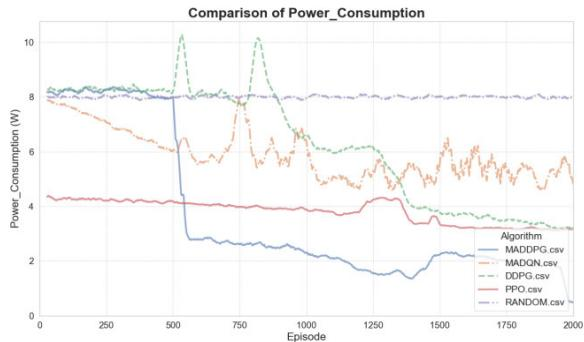  
Fig. 11. Power consumption comparison.

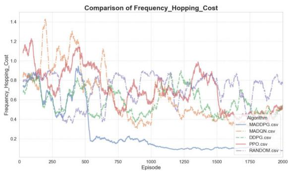  
Fig. 12. Frequency hopping cost comparison.

UAV swarm communication system for ITS urban traffic monitoring. Fig. 11 and Fig. 12 present comparisons of both energy consumption and frequency hopping costs in the U2U link for different algorithms. The results show that the MADDPG algorithm demonstrates significant advantages in both aspects. First, the MADDPG algorithm optimizes the power allocation strategy, resulting in a significant reduction in the energy consumed by the UAV swarm during communication, thereby effectively reducing the overall power consumption. This is crucial for extending the flight time of UAVs in urban traffic monitoring tasks. Second, the MADDPG algorithm, through intelligent decision-making, can select the optimal frequency bands in complex interference environments, thereby reducing the number of frequency hops and the associated costs, significantly lowering frequency hopping overhead. Lower frequency hopping overhead can reduce the computational burden on UAVs and improve communication stability.

In summary, under the fixed interference environment, the MADDPG algorithm demonstrates a significant advantage in reducing power consumption and frequency hopping costs while ensuring communication reliability and efficiency in both U2U and U2G links through more efficient power management and frequency band selection strategies. This indicates that the MADDPG algorithm is very suitable for application in ITS that require efficient and reliable communication.

2) Performance Evaluation of the ITS UAV Swarm Anti-Jamming System (MADDPG) under Various Interference

Different jamming environments significantly affect transmission efficiency. Through experimental analysis under random and swept jamming environments, it was found that the MADDPG algorithm performs well in handling two types of jamming environments. Specifically, the MADDPG algorithm can effectively identify and adapt to environmental interference characteristics, optimizing its communication strategies. As a result, even when facing complex interference patterns such as swept jamming and random jamming, it maintains a high transmission efficiency, demonstrating excellent adaptability and robustness. This is particularly evident in key performance metrics such as reward value, U2U link success rate, U2G link transmission rate, power consumption, and frequency hopping cost.

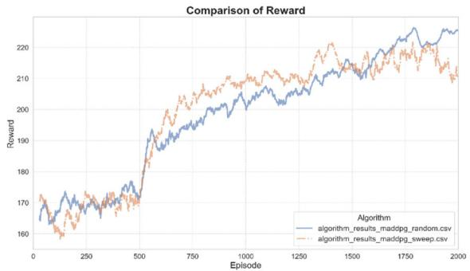  
Fig. 13. Convergence of MADDPG Under different types of interference.

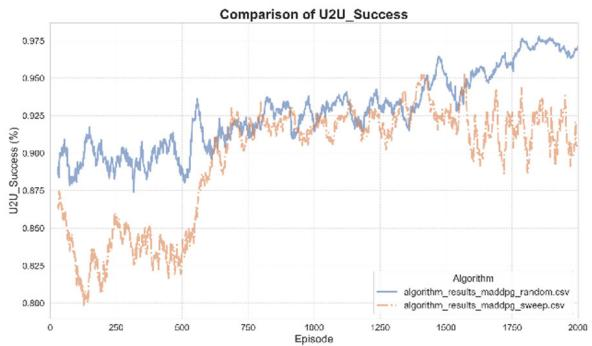  
Fig. 14. U2U link transmission success rate.

As shown in Fig. 13, when faced with swept and random jamming, the MADDPG algorithm quickly converges and stabilizes at a high reward level through its intelligent learning mechanism. This indicates that the algorithm can effectively cope with multiple interference scenarios, continuously optimizing decision-making strategies to achieve superior communication performance in dynamic and complex environments.

As shown in Fig. 14 and Fig. 15, the MADDPG algorithm significantly improves both the transmission success rate of U2U links and the total capacity of U2G links under various interference conditions. In the U2U link, its intelligent decision-making capability allows each UAV to maintain stable communication connections even in highly interfered environments, ensuring the reliability and stability of data transmission. This is crucial for the collaborative perception and information fusion among UAVs, which can enhance the overall traffic monitoring capabilities. Meanwhile, in the U2G link, the MADDPG algorithm can sustain high transmission rates despite complex interference. Through effective resource allocation and frequency band selection, the algorithm significantly enhances data transmission efficiency, ensuring high-speed communication under different interference conditions. This is essential for quickly transmitting critical monitoring data back to the ground control center for analysis and decision-making.

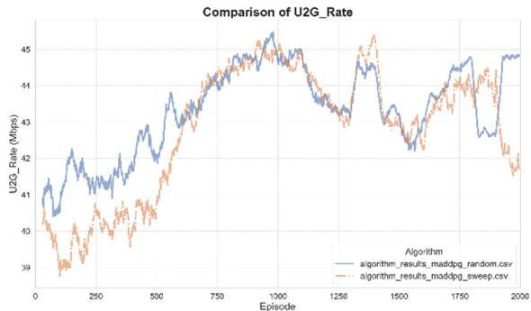  
Fig. 15. U2G link total capacity.

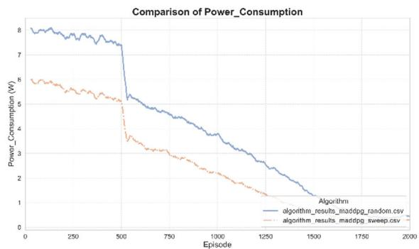  
Fig. 16. Power consumption of MADDPG.

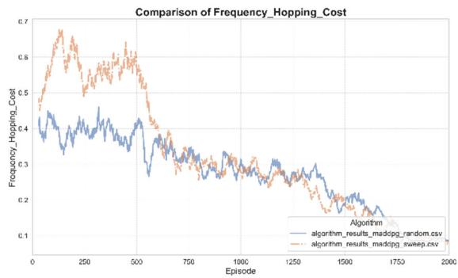  
Fig. 17. Frequency hopping cost of MADDPG.

As shown in Fig. 16 and Fig. 17, the MADDPG algorithm demonstrates exceptional energy management capabilities under various types of interference. By optimizing the power allocation strategy, UAVs can minimize energy consumption while maintaining communication performance, thereby avoiding unnecessary power waste. This energy-saving effect is significant for extending the flight time of UAVs and expanding the monitoring range in urban traffic monitoring tasks. Additionally, the figure illustrates that when dealing with swept and random jamming, the MADDPG algorithm effectively reduces the number of frequency hops through intelligent frequency band selection, significantly lowering frequency hopping costs. This helps to achieve a better balance between communication demands and frequency band stability.

The simulation results demonstrate that the ITS urban traffic monitoring UAV swarm anti-jamming communication system utilizing the MADDPG algorithm excels across several key performance metrics, even when facing swept and random jamming, showcasing its stability and superiority in complex interference environments.

## VII. CONCLUSION

This study presents an adaptive, multi-domain anti-jamming approach for the ITS urban traffic monitoring UAV swarm anti-jamming communication system, utilizing the MADDPG algorithm to optimize channel selection and power control within this system. Given the inherent observation limitations of UAVs and the need for effective coordination in the system’s dynamic wireless environment, we model this challenge as a Dec-POMDP. Leveraging this model, the MADDPG algorithm optimizes UAV decision-making through RL to minimize interference impact and ensure efficient operation, which is crucial for reliable urban traffic monitoring in ITS.

In experiments, MADDPG was compared with several baselines (MADQN, single-agent DDPG, PPO, and random strategies) under fixed interference conditions. Results show MADDPG significantly enhances transmission success rates, reduces power consumption, and minimizes frequency hopping costs, demonstrating superior coordination and optimization crucial for efficient data acquisition on resource-constrained platforms in this system. Further tests under swept and random jamming confirmed the system’s exceptional adaptability and robustness. The algorithm intelligently adjusts strategies, optimizing energy usage, maintaining high transmission success rates, and ensuring robust performance. Baselines underperformed in these challenging environments, validating MADDPG’s effectiveness and the system’s potential in complex urban traffic monitoring scenarios.

In summary, the MADDPG algorithm demonstrates strong adaptability and optimization in various interference environments. Future work will enhance the ITS urban traffic monitoring UAV swarm anti-jamming communication system’s performance for real-time, large-scale deployments by addressing computational resource management and scalability. Real-world testing will evaluate the system’s adaptability and dynamic interference handling in practical ITS urban environments. Additionally, combining MADDPG with transfer learning may accelerate training, while federated learning could improve coordination/performance in distributed urban deployments. These efforts aim to boost the system’s real-world applicability and scalability for wider deployment.

## REFERENCES

[1] M. Veres and M. Moussa, “Deep learning for intelligent transportation systems: A survey of emerging trends,” IEEE Trans. Intell. Transp. Syst., vol. 21, no. 8, pp. 3152–3168, Aug. 2020.

[2] M. Hossain, Md. A. Hossain, and F. A. Sunny, “A UAV-based traffic monitoring system for smart cities,” in Proc. Int. Conf. Sustain. Technol. Ind. 4.0 (STI), Dhaka, Bangladesh, Dec. 2019, pp. 1–6.

[3] S. Sheela, K. B. Naveen, N. M. Basavaraju, D. M. Kumar, M. Krishnaiah, and S. Mallikarjunaswamy, “An efficient vehicle to vehicle communication system using intelligent transportation system,” in Proc. Int. Conf. Recent Adv. Sci. Eng. Technol. (ICRASET), Nov. 2023, pp. 1–6.

[4] D. J. He, X. Du, Y. R. Qiao, Y. K. Zhu, Q. Fan, and W. Luo, “A survey of information security research on unmanned aerial vehicles,” J. Comput. Res. Dev., vol. 42, no. 5, pp. 1–10, 2019.

[5] Y. Wu, W. Fan, W. Yang, X. Sun, and X. Guan, “Robust trajectory and communication design for multi-UAV enabled wireless networks in the presence of jammers,” IEEE Access, vol. 8, pp. 2893–2905, 2020.

[6] Y. Wu, W. Yang, and X. Guan, “UAV-UAV communication under malicious jamming: Trajectory optimization with turning angle constraint,” in Proc. Int. Conf. Wireless Commun. Signal Process. (WCSP), Oct. 2020, pp. 26–31.

[7] Z. Li and C. Guo, “Multi-agent deep reinforcement learning based spectrum allocation for D2D underlay communications,” IEEE Trans. Veh. Technol., vol. 69, no. 2, pp. 1828–1840, Feb. 2020.

[8] J. Ji, K. Zhu, D. Niyato, and R. Wang, “Joint trajectory design and resource allocation for secure transmission in cache-enabled UAVrelaying networks with D2D communications,” IEEE Internet Things J., vol. 8, no. 3, pp. 1557–1571, Feb. 2021.

[9] D. Wang, H. Qin, B. Song, K. Xu, X. Du, and M. Guizani, “Joint resource allocation and power control for D2D communication with deep reinforcement learning in MCC,” Phys. Commun., vol. 45, Apr. 2021, Art. no. 101262.

[10] Y. Wu, W. Yang, X. Guan, and Q. Wu, “Energy-efficient trajectory design for UAV-enabled communication under malicious jamming,” IEEE Wireless Commun. Lett., vol. 10, no. 2, pp. 206–210, Feb. 2021.

[11] S. Xuan, H. Zhou, and L. Ke, “A review on UAV swarm confrontation game,” Command Inf. Syst. Technol., vol. 12, no. 2, pp. 27–31, 2021.

[12] L. Jia, F. Yao, Y. Sun, Y. Xu, S. Feng, and A. Anpalagan, “A hierarchical learning solution for anti-jamming Stackelberg game with discrete power strategies,” IEEE Wireless Commun. Lett., vol. 6, no. 6, pp. 818–821, Dec. 2017.

[13] Z. Wu, Y. Lin, Y. Zhang, F. Shu, and J. Li, “Multi-agent collaboration based UAV clusters multi-domain energy-saving anti-jamming communication,” Sci. Sinica Inf., vol. 53, no. 12, pp. 2511–2526, Dec. 2023.

[14] F. Du, J. Li, Y. Lin, Z. Wang, and Y. Qian, “Mean-field multi-agent reinforcement learning for adaptive anti-jamming channel selection in UAV communications,” in Proc. 14th Int. Conf. Wireless Commun. Signal Process. (WCSP), Nanjing, China, Nov. 2022, pp. 910–915.

[15] L. Zhang, L. Ma, F. Tian, and T. Liang, “An anti-jamming intelligent decision-making method for multi-user communication based on deep reinforcement learning,” in Proc. IEEE 22nd Int. Conf. Commun. Technol. (ICCT), Nanjing, China, Nov. 2022, pp. 1335–1339.

[16] N. C. Luong et al., “Applications of deep reinforcement learning in communications and networking: A survey,” IEEE Commun. Surveys Tuts., vol. 21, no. 4, pp. 3133–3174, 4th Quart., 2019.

[17] Q. Liu et al., “A survey on deep reinforcement learning,” Chinese J. Comput., vol. 41, no. 1, pp. 1–27, Jan. 2018.

[18] S. Wang, H. Liu, P. H. Gomes, and B. Krishnamachari, “Deep reinforcement learning for dynamic multichannel access in wireless networks,” IEEE Trans. Cognit. Commun. Netw., vol. 4, no. 2, pp. 257–265, Jun. 2018.

[19] C. Yao et al., “Collaborative anti-jamming decision-making method for multi-UAV communication aimed at heterogeneous transmission requirements,” Telecommun. Technol., vol. 64, no. 7, pp. 1015–1024, 2024.

[20] F. Slimeni, B. Scheers, Z. Chtourou, and V. Le Nir, “Jamming mitigation in cognitive radio networks using a modified Q-learning algorithm,” in Proc. Int. Conf. Mil. Commun. Inf. Syst. (ICMCIS), May 2015, pp. 1–7.

[21] F. Slimeni, Z. Chtourou, B. Scheers, V. L. Nir, and R. Attia, “Cooperative Q-learning based channel selection for cognitive radio networks,” Wireless Netw., vol. 25, no. 7, pp. 4161–4171, Oct. 2019.

[22] S. Machuzak and S. K. Jayaweera, “Reinforcement learning based anti-jamming with wideband autonomous cognitive radios,” in Proc. IEEE/CIC Int. Conf. Commun. China (ICCC), Jul. 2016, pp. 1–5.

[23] M. A. Aref, S. K. Jayaweera, and S. Machuzak, “Multi-agent reinforcement learning based cognitive anti-jamming,” in Proc. IEEE Wireless Commun. Netw. Conf. (WCNC), Mar. 2017, pp. 1–6.

[24] M. A. Aref and S. K. Jayaweera, “A novel cognitive anti-jamming stochastic game,” in Proc. Cognit. Commun. Aerosp. Appl. Workshop (CCAA), Jun. 2017, pp. 1–4.

[25] M. A. Aref and S. K. Jayaweera, “A cognitive anti-jamming and interference-avoidance stochastic game,” in Proc. IEEE 16th Int. Conf. Cognit. Informat. Cognit. Comput. (ICCI\*CC), Jul. 2017, pp. 520–527.

[26] L. Wan, X. Lan, H. Zhang, and N. Zheng, “A review of deep reinforcement learning theory and its applications,” Pattern Recognit. Artif. Intell., vol. 32, no. 1, pp. 67–81, Jan. 2019.

[27] V. Mnih, “Human-level control through deep reinforcement learning,” Nature, vol. 518, pp. 529–533, Feb. 2015.

[28] X. Liu, Y. Xu, L. Jia, Q. Wu, and A. Anpalagan, “Anti-jamming communications using spectrum waterfall: A deep reinforcement learning approach,” IEEE Commun. Lett., vol. 22, no. 5, pp. 998–1001, Mar. 2018.

[29] Y. Ye, M. Lei, and M. Zhao, “A new frequency hopping strategy based on federated reinforcement learning for FANET,” in Proc. 94th Veh. Technol. Conf. (VTC-Fall), Sep. 2021, pp. 1–5.

[30] J. Xu, H. Lou, W. Zhang, and G. Sang, “An intelligent anti-jamming scheme for cognitive radio based on deep reinforcement learning,” IEEE Access, vol. 8, pp. 202563–202572, 2020.

[31] H. Yang et al., “Intelligent reflecting surface assisted anti-jamming communications: A fast reinforcement learning approach,” IEEE Trans. Wireless Commun., vol. 20, no. 3, pp. 1963–1974, Mar. 2021.

[32] Z. Yin et al., “UAV communication against intelligent jamming: A Stackelberg game approach with federated reinforcement learning,” IEEE Trans. Green Commun. Netw., vol. 8, no. 4, pp. 1796–1808, Dec. 2024, doi: 10.1109/TGCN.2024.3373886.

[33] M. Li, Q. Ren, and J. Wu, “Exploring UAV’s multi-domain joint antijamming intelligent decision algorithm,” J. Northwestern Polytech. Univ., vol. 39, no. 2, pp. 367–374, Apr. 2021.

[34] S. Cheng, X. Ling, and L. Zhu, “Deep reinforcement learning-based antijamming approach for fast frequency hopping systems,” IEEE Open J. Commun. Soc., vol. 6, pp. 961–971, 2025.

[35] X. Zhou, W. Xie, B. Yan, and X. Wang, “Multi-domain cognitive antijamming engine based on DL and CBR for multi-UAV communications,” in Proc. IEEE Int. Conf. Unmanned Syst. (ICUS), Oct. 2024, pp. 921–927.

[36] Z. Yin, Y. Lin, Y. Zhang, Y. Qian, F. Shu, and J. Y. Li, “Collaborative multiagent reinforcement learning aided resource allocation for UAV anti-jamming communication,” IEEE Internet Things J., vol. 9, no. 23, pp. 23995–24008, Dec. 2022.

[37] B. Zhang et al., “Multi-domain collaborative anti-jamming based on multi-agent deep reinforcement learning,” Chin. J. Internet Things, vol. 6, pp. 104–116, Jun. 2022.

[38] S. Batabyal and P. Bhaumik, “Mobility models, traces and impact of mobility on opportunistic routing algorithms: A survey,” IEEE Commun. Surveys Tuts., vol. 17, no. 3, pp. 1679–1707, 3rd Quart., 2015.

[39] R. Lowe, Y. Wu, A. Tamar, J. Harb, P. Abbeel, and I. Mordatch, “Multiagent actor-critic for mixed cooperative-competitive environments,” in Proc. Conf. Neural Inf. Process. Syst., Jan. 2017, pp. 6379–6390.


Yong Li was born in Hefei, Anhui, China. He received the master’s degree. He is a Senior Engineer. He is with China Electric Power Research Institute Ltd., mainly engaged in research in the fields of power network security, uncrewed aerial vehicle, and communication systems.


Zaojian Dai received the M.Sc. degree in computer science from Harbin University of Commerce in 2009. He is currently a Senior Engineer with China Electric Power Research Institute (CEPRI). His research interests include cybersecurity in smart grids and mobile application security, focusing on electrical infrastructure protection and secure data transmission.


Tao Zhang is a Doctoral Supervisor and the Deputy Director of the Institute of Information and Communication Technology, China Electric Power Research Institute Ltd.; a Project Leader of the National Key Research and Development Program for Cyberspace Security; and a leading talent in the field of information and communication with State Grid Corporation of China. In the past five years, as the first author, he has won multiple provincial and ministerial level awards, such as the First Prize for Scientific and Technological Progress from China Electronics Society and China Electrical Engineering Society.


Yu Zhou is the Deputy Chief Engineer of State Grid Jiangxi Electric Power Company Ltd., a Professor level Senior Engineer, a Visiting Professor with Jiangxi University of Water Resources and Electric Power, a Reviewer of National Natural Science Foundation, an Expert in Science and Technology Guide Project Review of State Grid Corporation of China, and the Chair of Intelligent Inspection Sub Committee of IEE PES Substation Technical Committee. He has presided over multiple State Grid Corporation of China technology projects, has deep expertise in digital technology and artificial intelligence technology fields.

  
Mu Chen received the master’s degree in power system automation from the State Grid Electric Power Research Institute in 2011. He is currently pursuing the Doctor of Engineering degree in network and information security with Xiamen University. He is also a Senior Engineer with State Grid Intelligent Grid Research Institute Company Ltd. His research interests include power informatization, network security, and IoT security.


Hui Wang is a Senior Engineer and the General Manager of State Grid Yingtan Power Supply Company, has led or mainly participated in multiple provincial-level and above scientific and technological projects, achieving significant results in power grid planning and construction, and power system operation optimization and other fields.