# A Survey of Graph-Based Resource Management in Wireless Networks—Part I: Optimization Approaches

Yanpeng Dai , Member, IEEE, Ling Lyu , Member, IEEE, Nan Cheng Senior Member, IEEE, Min Sheng , Senior Member, IEEE, Junyu Liu , Member, IEEE, Xiucheng Wang , Graduate Student Member, IEEE, Shuguang Cui , Fellow, IEEE, Lin Cai , Fellow, IEEE, and Xuemin Shen , Fellow, IEEE

Abstract—The evolution of wireless communications and networking technologies has led significantly expansion of the dimensionality of network resources, which compels innovations in resource management. Graphs, a classic discrete mathematical tool, have long been widely used for resource management thanks to their capabilities to model complex relationships and interactions among elements in wireless networks. Recently, resource management over graphs embraces various advanced approaches of graph optimization and graph learning, aligned with evolving demands in future wireless networks. To better learn recent research landscape and explore important trends, this two-part survey provides a comprehensive overview for resource management via graph optimization and learning. Part I presents the fundamentals of graph optimization and provides a recent literature review of graph optimization for resource management in various wireless communication scenarios, including cellular networks, device-to-device communications, multi-hop networks, multi-antenna systems, edge caching and computing, and non-terrestrial networks. Part II gives the basics of graph

Received 12 July 2024; revised 21 October 2024; accepted 20 November 2024. Date of publication 3 December 2024; date of current version 8 August 2025. This paper was supported in part by the National Natural Science Foundation of China under Grant 62101089, in part by China Postdoctoral Science Foundation under Grant 2021M700655, in part by Doctoral Research Startup Funds of Liaoning Province under Grant 2023-BS-068, in part by the Shenzhen Outstanding Talents Training Fund 202002, in part by the Guangdong Research Projects under Grants No. 2017ZT07X152 and No. 2019CX01X104, in part by the Guangdong Provincial Key Laboratory of Future Networks of Intelligence under Grant No. 2022B1212010001, and in part by the Shenzhen Key Laboratory of Big Data and Artificial Intelligence under Grant No. ZDSYS201707251409055. The associate editor coordinating the review of this article and approving it for publication was D. Niyato. (Corresponding author: Nan Cheng.)

Yanpeng Dai and Ling Lyu are with the School of Information Science and Technology, Dalian Maritime University, Dalian 116026, China (e-mail: yanpengdai@dlmu.edu.cn; linglyu@dlmu.edu.cn).

Nan Cheng, Min Sheng, Junyu Liu, and Xiucheng Wang are with the State Key Laboratory of ISN, and the School of Telecommunications Engineering, Xidian University, Xi’an 710071, China (e-mail: dr.nan.cheng@ ieee.org; msheng@mail.xidian.edu.cn; junyuliu@xidian.edu.cn; xcwang\_1@ stu.xidian.edu.cn).

Shuguang Cui is with the School of Science and Engineering, the Shenzhen Future Network of Intelligence Institute, and the Guangdong Provincial Key Laboratory of Future Networks of Intelligence, The Chinese University of Hong Kong, Shenzhen 518066, China (e-mail: shuguangcui@cuhk.edu.cn).

Lin Cai is with the Department of Electrical and Computer Engineering, University of Victoria, Victoria, BC V8P 5C2, Canada (e-mail: cai@ ece.uvic.ca).

Xuemin Shen is with the Department of Electrical and Computer Engineering, University of Waterloo, Waterloo, ON N2L 3G1, Canada (e-mail: sshen@uwaterloo.ca).

Digital Object Identifier 10.1109/TCCN.2024.3508783

learning and provides a state-of-the-art literature review of graph learning in wireless networks for addressing various resource management issues, covering power control, spectrum management, beamforming design, task scheduling, and aerial coverage planning. A discussion of technical challenges and future research directions is covered in Part II.

Index Terms—Wireless networks, resource management, graph.

# I. INTRODUCTION

W IRELESS communication and networking technologieshave undergone rapid advancements in the past few have undergone rapid advancements in the past few decades, which substantially augments available dimensions of network resources [1]. Developments in radio transmission techniques facilitate the adequate exploitation and unified scheduling of multi-dimensional resources in spatial, time, frequency, code, and power domains, which greatly enhances network capacity and connectivity. Furthermore, advancements in wireless networking techniques enable hybrid usage and planning of communication and computation resources, terrestrial and aerial resources, etc., which effectively improves network coverage and service provisioning. While all these technical innovations promote various performance indicators of wireless networks, they increase the difficulty and complexity of resource management [2]. Consequently, designing effective and efficient resource management schemes to adapt to the rapid technical transformation of wireless networks has attracted intensive research interest in both academia and industry.

Numerous theories have been applied to resource management in wireless network, such as optimization theory, queue theory, game theory, etc. Among them, graph theory has been used extensively over a long period to define and handle many different kinds of operation problems in wireless networks. Wireless nodes, such as devices and infrastructures, and their relationships, such as connection and interference, can be represented by vertices and edges in a graph, respectively. In this light, resource management problems can be modeled as different optimization problems over graphs, such as graph coloring, maximum flow, shortest path, etc. As a major branch of combinatorial optimization and discrete mathematics, graph optimization has developed many practical algorithms directly applicable for resource management. Recently, graph learning, also known as graph representation learning, has emerged as an effective approach in machine learning and has been applied to resource management in wireless networks. It is capable of capturing the structure and features of graph data to generate representation vectors to support resource management. Particularly, the graph neural network (GNN) is the latest research outcome in graph learning, which has been utilized to devise many resource management methods [3]. Compared to traditional graph optimization and learning methods [4], [5], GNN-based methods offer superior scalability, generalization, and computational efficiency. Therefore, graph-based resource management remains a promising and attractive research field.

# A. Background: From Graph Optimization to Graph Learning

Graph optimization has been widely employed in resource management of wireless networks, thanks to its adaptability and efficiency. As early as 1999, Chawla and Qiu adopted graph coloring to address beam switching issue in cellular networks for interference avoidance [6]. Since 2000, a large amount of research literature has applied various graph optimization approaches to resource management in wireless networks. Helmy proposed small world graphs for wireless networks to analyze and improve network connectivity [7]. Jain et al. [8] and Kodialam and Nandagopal [9] innovatively introduced the interference graph which is regarded as a foundational graph model for many optimization algorithms, such as graph coloring and maximum independent set, in wireless link scheduling and resource allocation. After 2010, advanced graph theoretical models and methods, such as hypergraphs [10], [11], [12], are utilized to model and depict wireless network for emerging network architecture and radio access technologies (RATs). Graph optimization for resource management features the following advantages.

1) Adaptability: The topology of wireless networks as well as relationships between network elements can be directly or indirectly represented as graph models to facilitate the implementation of graph optimization algorithms.   
2) Theoretical foundation: Graph optimization has developed a lot of achievable algorithms which can balance the optimality and efficiency when dealing with various resource management problems.

However, graph optimization still faces challenges in managing multi-dimensional resources. First, as network scale increases, the size of graph model grows as well, which aggravates the burden of graph data storage and processing. Second, most of graph optimization problems are combinatorial optimization problems that usually cannot be solved in polynomial time. Hence, the overhead of graph optimization algorithms may not favor the timeliness of scheduling, especially for low-latency requirements of future wireless communications.

Recently, graph learning has been applied to resource management in wireless networks to enhance computational efficiency while maintaining optimality, where GNN is a prominent technique. Due to graph-in-graph-out architecture and message passing mechanism, GNN can extract useful information from topological structure and features of graph model to facilitate problem solution. Eisen and Ribeiro first employed GNN in wireless networks to solve link scheduling problems in multi-hop networks and multiple access scheduling problems in cellular networks [13], [14]. Shen et al. demonstrated that GNNs converge faster and exhibit superior generalization in large-scale wireless networks compared to traditional deep neural networks, such as multi-layer perceptron [15], [16], [17], [18]. Chowdhury et al. [19] and Yang et al. [20] integrated GNNs with existing iterative algorithms for power control, which leverages the efficiency of GNNs and the accuracy of iterative algorithms at the same time. In recent years, many studies have combined GNNs with advanced learning frameworks, such as reinforcement learning (RL), aiming to adapt to dynamic changes and randomness in wireless networks [21], [22]. Apart from GNNs, deep learning-powered graph embedding techniques are used for access control and link scheduling in wireless networks to improve model generalization and training efficiency [23], [24]. Graph learning for resource management has the following advantages.

1) Scalability: Graph learning, particularly GNNs, can be applied to large-scale wireless networks because the number of parameters in GNN models is independent of network size.   
2) Efficiency: GNNs have high training efficiency and can achieve the expected performance with a less number of network samples.   
3) Generalization: GNNs offer good generalization ability for different network statuses and configurations, such as quality of service (QoS) settings, the number of users or channels, etc., due to their permutation-invariant and permutation-equivariant properties.   
4) Compatibility: Graph learning methods can be easily implemented and fine-tuned on graph models constructed for resource management issues.

Graph learning-based resource management is still an emerging research direction, whose optimality and efficiency have substantial potential to be improved. Therefore, many related research topics have emerged, e.g., integrating domain knowledge from wireless communications and networking with GNN design.

# B. Motivation and Contributions

There have been several outstanding surveys on graph optimization and learning for wireless communications and networking, which are summarized in Table I. First category of these surveys focused on the application of graph optimization for wireless networks. Cardieri comprehensively reviewed graph optimization approaches for interference modeling in wireless ad hoc networks and emphasized its application domains [25]. Pathak and Dutta thoroughly investigated graph optimization for cross-layer designs in wireless mesh networks [26]. Majeed and Rauf surveyed the application of graph theory to model various issues in computer networks including Internet of Things (IoT), Web page ranking, network topology generation, and encryption [27]. Second category of the literature is dedicated to investigating graph learning approaches for wireless communications and networking. He et al. presented several applications of GNNs to resource allocation in wireless networks as well as other emerging problems such as channel estimation and traffic prediction [28]. Jiang comprehensively reviewed diverse GNN models applied to operation management and optimization of communication networks involving both wired and wireless scenarios [29]. Tam et al. mainly reviewed the application of GNNs to network management of core systems and networks, especially for software defined networking (SDN) control and network function virtualization (NFV) orchestration [30]. Li et al. surveyed graph learning methods for network security and management in IoT scenarios [31]. Dong et al. presented a comprehensive overview of GNN applications in various IoT sensing environments with a list of public data and source codes [32]. In addition to the above two categories, Ivanov et al. reviewed resource allocation methods based on the graph optimization and learning from perspective current wireless networks and future non-terrestrial networks (NTNs) [33].

TABLE I COMPARISON WITH SELECTED SURVEYS 

<table><tr><td rowspan="2">References</td><td colspan="2">Methodology†</td><td rowspan="2">Networks</td><td rowspan="2">Subjects</td><td rowspan="2">Contributions</td></tr><tr><td>GO</td><td>GL</td></tr><tr><td>[25]</td><td>√</td><td></td><td>Wireless ad hoc networks</td><td>Interference modeling</td><td>This paper surveyed graph optimization for interference modeling in wireless ad hoc networks, emphasizing its application domains and illustrated with examples.</td></tr><tr><td>[26]</td><td>√</td><td></td><td>Wireless mesh networks</td><td>Cross-layer designs</td><td>This paper surveyed fundamental design problems in wireless mesh networks and their joint designs, where graph optimization is a crucial methodology.</td></tr><tr><td>[27]</td><td>√</td><td></td><td>Computer networks</td><td>Network modeling</td><td>This survey reviewed the application of graph theory for computer networks including IoT, web page ranking, network topology generation, and encryption.</td></tr><tr><td>[28]</td><td></td><td>√</td><td>Various wireless networks</td><td>Resource management</td><td>This work reviewed the application of GNNs to resource allocation in various wireless networks, i.e., mesh/ad hoc networks, cellular networks and WLAN, as well as several other issues, such as channel estimation and traffic prediction.</td></tr><tr><td>[29]</td><td></td><td>√</td><td>Wired and wireless networks</td><td>Network management</td><td>This paper surveyed different GNN models applied to network operation management and optimization in wired and wireless networks as well as SDN.</td></tr><tr><td>[30]</td><td></td><td>√</td><td>Core networks</td><td>SDN and NFV optimization</td><td>This work reviewed GNN for intelligent network management and orchestration to optimize control policies in SDN and NFV enabled core networks for wired and wireless communications.</td></tr><tr><td>[31]</td><td></td><td>√</td><td>IoT</td><td>Network security and management</td><td>This survey reviewed related research and summarized the progress of using graph learning to network anomaly detection, malware detection, IoT device and service management, etc.</td></tr><tr><td>[32]</td><td></td><td>√</td><td>IoT</td><td>Sensing application</td><td>This survey presented a deep dive analysis of GNN designs in various IoT sensing scenarios and an overarching list of public data and source codes.</td></tr><tr><td>[33]</td><td>√</td><td>√</td><td>NTN</td><td>Resource management</td><td>This paper reviewed resource allocation methods based on both graph optimization and graph learning, and proposed a graph-based resource management framework for NTN and its integration with terrestrial networks.</td></tr><tr><td>Ours</td><td>√</td><td>√</td><td>Various wireless networks</td><td>Resource management</td><td>A survey comprehensively and systematically reviewed resource management issues and solutions from the perspectives of both graph optimization and graph learning in various advanced wireless networks.</td></tr></table>

+GO: Graph optimization.GL: Graph learning.

In summary, the majority of existing surveys have focused exclusively on either graph optimization or graph learning for wireless communications and networking. Although some literature provides an overview of both graph optimization and graph learning, the discussed wireless communication scenarios and network types are often incomplete, particularly for emerging cellular and cell-free networks, edge caching and edge computing, etc. Furthermore, few surveys specifically address resource management issues using graph optimization and learning. These gaps motivate us to conduct a comprehensive and systematic literature review of the latest resource management techniques over graphs, considering both perspectives of graph optimization and graph learning. We summarize the contributions of this two-part survey as follows.

• We introduce key fundamentals of graph theory and graph optimization problems with typical algorithms in Part I as well as basics of graph learning and several modern GNN models in Part II. This demonstrates how knowledge of graph optimization lays the foundation for implementing graph learning.   
We categorize and discuss graph optimization approaches for resource management across different scenarios of

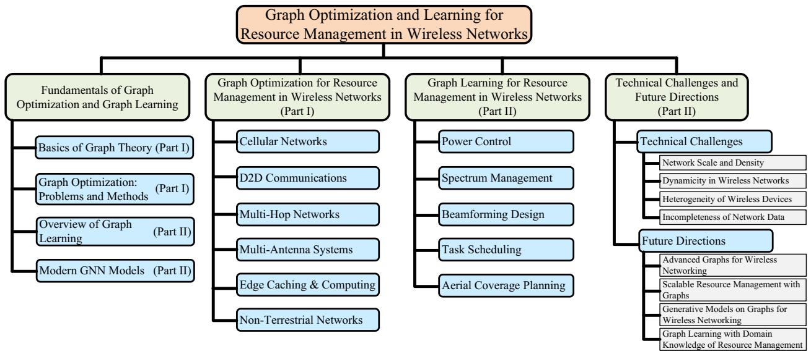

<details>
<summary>flowchart</summary>

```mermaid
graph TD
    A["Graph Optimization and Learning for Resource Management in Wireless Networks"] --> B["Fundamentals of Graph Optimization and Graph Learning"]
    A --> C["Graph Optimization for Resource Management in Wireless Networks (Part I)"]
    A --> D["Graph Learning for Resource Management in Wireless Networks (Part II)"]
    A --> E["Technical Challenges and Future Directions (Part II)"]
    
    B --> B1["Basics of Graph Theory (Part I)"]
    B --> B2["Graph Optimization: Problems and Methods (Part I)"]
    B --> B3["Overview of Graph Learning (Part II)"]
    B --> B4["Modern GNN Models (Part II)"]
    
    C --> C1["Cellular Networks"]
    C --> C2["D2D Communications"]
    C --> C3["Multi-Hop Networks"]
    C --> C4["Multi-Antenna Systems"]
    C --> C5["Edge Caching & Computing"]
    C --> C6["Non-Terrestrial Networks"]
    
    D --> D1["Power Control"]
    D --> D2["Spectrum Management"]
    D --> D3["Beamforming Design"]
    D --> D4["Task Scheduling"]
    D --> D5["Aerial Coverage Planning"]
    
    E --> E1["Technical Challenges"]
    E1 --> E1a["Network Scale and Density"]
    E1 --> E1b["Dynamicity in Wireless Networks"]
    E1 --> E1c["Heterogeneity of Wireless Devices"]
    E1 --> E1d["Incompleteness of Network Data"]
    
    F["Future Directions"] --> F1["Advanced Graphs for Wireless Networking"]
    F --> F2["Scalable Resource Management with Graphs"]
    F --> F3["Generative Models on Graphs for Wireless Networking"]
    F --> F4["Graph Learning with Domain Knowledge of Resource Management"]
```
</details>

Fig. 1. Organization of this paper and an overview of major topics.

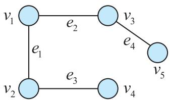

<details>
<summary>flowchart</summary>

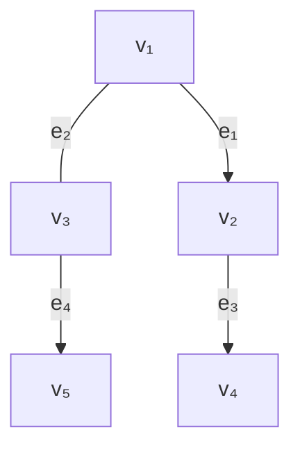
</details>

(a) Undirected graph.

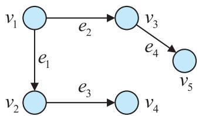

<details>
<summary>flowchart</summary>

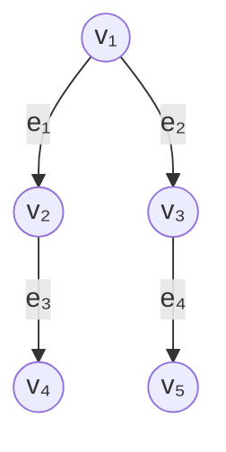
</details>

(b) Directed graph.

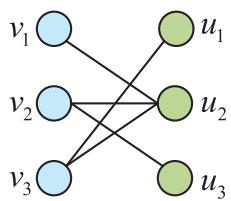

<details>
<summary>flowchart</summary>

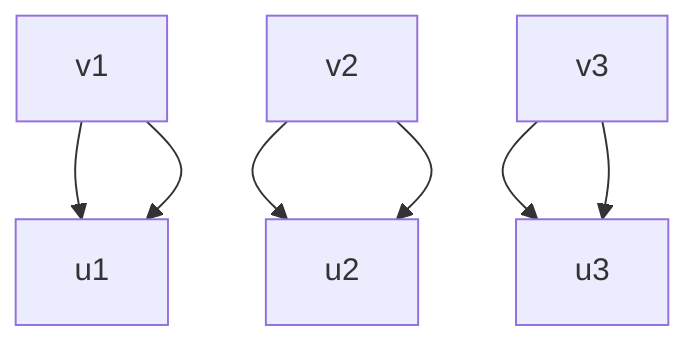
</details>

(c) Bipartite graph.

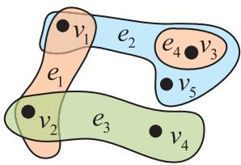

<details>
<summary>text_image</summary>

v₁
e₂
e₄ v₃
e₁
v₂
e₃
v₄
v₅
</details>

(d) Hypergraph.   
Fig. 2. Examples of graphs.

wireless communications in Part I. In each scenario, typical resource management issues are distinctly presented, meanwhile the literature of practical graph optimization algorithms for each issue is systematically reviewed.

• We classify and review the application of graph learning methods according to different resource management issues in Part II. In this way, the characteristics and components of each issue is demonstrated and the applicable graph learning approaches in the literature are comprehensively reviewed.   
We summarize technical challenges and future directions of graph optimization and learning methods for resource management in Part II. These challenges are primarily centered around new features brought by the evolution of wireless networks. Future directions align with the development of advanced graph optimization and learning techniques.

# C. Paper Organization

Fig. 1 shows the organization of the remainder of this survey which comes in two parts. In Part I, Section II first presents the basics of graph theory and various graph optimization problems along with their relevant algorithms. Section III then provides a recent literature review of graph optimization for resource management in wireless networks, categorized by different scenarios including cellular networks, device-to-device (D2D) communications, multi-hop networks, multi-antenna systems, edge caching and computing, and NTNs. Part II introduces the fundamentals of graph learning and provides a state-of-the-art literature review of graph learning approaches for resource management in wireless networks. Furthermore, a discussion of technical challenges and future directions in this field is presented in Part II.

# II. FUNDAMENTALS OF GRAPH OPTIMIZATION AND GRAPH LEARNING

In this section, we first provide the basic knowledge of graph theory. Then, several graph optimization problems and their methods are presented.

# A. Basics of Graph

In mathematics, a graph is defined by a pair $G = ( \nu , \mathcal { E } )$ $[ 3 4 ] . \mathcal { V } = \mathcal { V } ( G ) = \{ v _ { 1 } , v _ { 2 } , . . . , v _ { m } , . . . \}$ is a vertex set where the elements are called vertices representing objects in a graph. ${ \mathcal { E } } = { \mathcal { E } } ( G ) = \{ e _ { 1 } , e _ { 2 } , \ldots , e _ { n } , \ldots \}$ is an edge set where the elements are called edges representing relationships between vertices. Fig. 2(a) illustrates an example of a graph. If $v _ { i }$ and $v _ { j }$ are the endpoints of an edge $e _ { n } , \ e _ { n }$ is incident on $v _ { i }$ and on $v _ { j }$ meanwhile $v _ { i }$ and $v _ { j }$ are adjacent. The loop is a special edge whose two endpoints are one vertex. All the vertices adjacent to vi are called its neighbors $\mathcal { N } _ { G } ( v _ { i } )$ . If graphs G and H meet $\mathcal { V } ( H ) \subseteq \mathcal { V } ( G )$ and $\mathcal { E } ( H ) \subseteq \mathcal { E } ( G )$ , H is a subgraph of G, i.e., $H \subseteq G$ . In particular, $H = G \operatorname { i f } \mathcal V ( H ) = \mathcal V ( G )$ and $\mathcal { E } ( H ) = \mathcal { E } ( G )$ .

1) Numeric: There are two fundamentally numerical values in a graph, i.e., the degree and the weight. The degree of a vertex $d _ { G } ( v _ { m } )$ denotes the number of edges connecting this vertex. As per Fig. 2(a), $d _ { G } ( v _ { 1 } ) = 2$ because there are 2 edges connecting v1 to $v _ { 2 }$ and to $v _ { 3 } ,$ , respectively. The weight can be associated with either a vertex or an edge. In this case, the graph is called a weighted graph. The weight of an edge $w _ { G } ( e _ { n } )$ is often referred to as the cost of the edge, such as the distance of a path, the length of a link, the capacity of a channel, etc. The weight of a vertex $w _ { G } ( v _ { m } )$ is used to measure a cost of the vertex, such as the priority of a user, the data stored by a device, the transmit power of a node, etc.   
2) Direction: In a graph $G ,$ the edge set $\mathcal { E }$ consists of either undirected edges or directed edges. If all the elements in $\mathcal { E }$ are undirected edges, the graph is called undirected graph. If all the elements in $\mathcal { E }$ are directed edges, the graph is called directed graph. Figs. 2(a) and 2(b) illustrate examples of undirected graph and directed graph, respectively.

In an undirected graph, an edge $e _ { n }$ connects the unordered pair of vertices, $\mathrm { e . g . , ~ } v _ { i }$ and $v _ { j }$ , which is be expressed as $e _ { n } = v _ { i } v _ { j }$ . Hence, the relationship of vertices connected by one edge is symmetric. The bipartite graph is a special type of undirected graph which consists of two disjoint vertex subsets and there is not any edge connecting vertices in the same vertex subset. Fig. 2(c) shows an example of bipartite graph. In a directed graph, each edge, also called the arc, has a direction with an arrow. A directed edge $e _ { n }$ is expressed as $e _ { n } = ( v _ { i } , v _ { j } )$ from $v _ { i } \ \mathrm { t o } \ v _ { j } , \mathrm { e . g . } , \ e _ { 1 } = ( v _ { 1 } , v _ { 2 } )$ in Fig. 2(b). Thereby, $e _ { n }$ is the out-arc of $v _ { i }$ and the in-arc of vj . vi is called in-neighbor of $\boldsymbol { v } _ { j } . ~ \boldsymbol { v } _ { j }$ is called out-neighbor of $\overset { \cdot } { v _ { i } } . \overset { \mathcal { N } ^ { + } } { G } ( v _ { m } )$ and $\mathcal { N } _ { G } ^ { - } ( v _ { m } )$ are out-neighbor set and in-neighbor set of $\nu ,$ respectively.

3) Representations: There are several approaches to represent a graph. The most straightforward representation approach is the diagram form, as per Fig. 2. In order to facilitate mathematical operations and storage, the matrix has become an efficient and common form for graph representation.

• Incidence matrix: $\mathbf { I } ( G ) = [ i _ { n , m } ] , v _ { m } \in \mathcal { V } , e _ { n } \in \mathcal { E } .$ , is a $| \mathcal { E } | \times | \mathcal { V } |$ matrix which encodes the relations of vertices and edges in $G = ( \nu , \mathcal { E } )$ without loops. | · | expresses the cardinality of a set, i.e., the number of elements in the set. For an undirected graph, $i _ { n , m } = 1$ if vertex $v _ { m }$ is incident with edge $e _ { n }$ , otherwise $i _ { n , m } = 0$ . For a directed graph, $i _ { n , m } = 1$ if vertex $v _ { m }$ is the head of edge $e _ { n } .$ . $i _ { n , m } = - 1$ if vertex $v _ { m }$ is the tail of edge $e _ { n }$ . Otherwise, $i _ { n , m } = 0 .$ .   
• Adjacency matrix: $\mathbf { A } ( G ) = [ a _ { i , j } ]$ for $G = ( \nu , \mathcal { E } )$ is a square matrix of order |V| where each element indicates the adjacency relation between a pair of vertices. For an undirected graph, $a _ { i , j }$ is equal to the number of edges between vertices $v _ { i }$ and $v _ { j }$ . For a directed graph, $a _ { i , j }$ is equal to the number of edges directed from $v _ { i }$ to $v _ { j }$ . Besides, the weight matrix is an extension of the adjacency matrix to represent the edge-weighted graph without multiple arcs and edges.   
• Weight matrix: $\mathbf { W } ( G ) = [ w _ { i , j } ]$ is an extension of the adjacency matrix and represents the edge-weighted graph without multiple arcs and edges. In a weight matrix, $w _ { i , j } ~ = ~ w _ { G } ( e _ { n } )$ where $e _ { n }$ is an existing edge or arc

between vertices $v _ { i }$ and $v _ { j } . \operatorname { I f } i = j , w _ { i , j } = L$ . Otherwise, $w _ { i , j } = K$ . L and K are definable values and equal to ∞, $- \infty , 0 ,$ , etc., according to the actual requirements.

4) Hypergraph: Hypergraphs are a generalization of a graph where an edge joins any number of vertices instead of at most two vertices in the ordinary graph. The edge in hypergraphs is called hyperedge. Each hyperedge is a nonempty subset of vertices. The number of vertices is called the order of the hypergraph. The number of hyperedges is called the size of the hypergraph. An undirected hypergraph H is expressed as $H = ( \mathcal { X } , \mathcal { E } )$ , where $\mathcal { X }$ is a set of vertices and $\mathcal { E }$ is a set of hyperedge. Fig. 2(d) shows an example of an undirected hypergraph. A directed hypergraph contains the hyperedge set $\mathcal { E }$ where each hyperedge is an ordered pair of subsets of X . Incidence matrix and adjacency matrix are common representation matrices for hypergraphs.

# B. Graph Optimization: Problems and Methods

Graph optimization, as a primary branch of combinatorial optimization, uses the graph to model optimization problems and utilizes the characteristics of constructed graph to design corresponding solutions and algorithms. In this subsection, we introduce several graph optimization problems and methods applicable in wireless communications and networking.

1) Graph Coloring: It is essentially a generalization of assignment problem. It aims to assign colors to vertices or edges in an undirected graph so that no two adjacent vertices or edges are of the same color. For example, Fig. 2(c) is stained with two colors. Colors can be used to represent resources in wireless networks. Taking vertex coloring as examples, three graph coloring problems are introduced as follows.

K-coloring judgment: It is to judge whether one undirected graph G can be completely painted by given at most k colors. k is an integer. G is k-colorable, also called a k-coloring, if it can be painted by k colors. Existing k-coloring algorithms include Grover’s algorithm [35], DSatur algorithm [36], etc.   
• Chromatic number: As one of NP-complete problems, it is to find the minimum chromatic number of an undirected graph. Various algorithms based on backtracking and recurrence are developed with exponential computational complexity. Moreover, many greedy and heuristic algorithms are proposed, such as Welsh–Powell algorithm [37], Bre´laz’s heuristic algorithm [38].   
• Greedy coloring: It considers vertices in a given order and in order assign each vertex with the smallest available color not used by its neighbours, appending a new color if required [39]. Different from k-coloring algorithms, the greedy coloring is not given the number of available colors.   
2) Shortest Path: This problem aims to find a path between two vertices which has the minimum sum of edge weights. The shortest path problem can be defined over an undirected graph or a directed graph. A path in an undirected graph is a sequence of vertices, e.g., $v _ { 1 } \ : - \ : v _ { 2 } \ : - \ : v _ { 4 }$ in Fig. 2(a). A path in a directed graph is a lineup of consecutive vertices connected by corresponding directed edges, $\mathrm { e . g . , } \ v _ { 1 } \to v _ { 3 } \to$

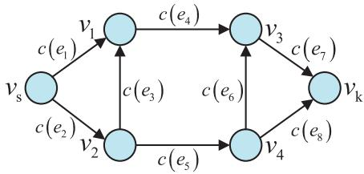

<details>
<summary>flowchart</summary>

```mermaid
graph TD
    vs -->|c(e₁)| v1
    vs -->|c(e₂)| v2
    v1 -->|c(e₄)| v3
    v2 -->|c(e₅)| v4
    v3 -->|c(e₇)| vk
    v4 -->|c(e₈)| vk
    v3 -->|c(e₆)| v4
    v2 -->|c(e₃)| v3
```
</details>

Fig. 3. An example of flow network.

v5 in Fig. 2(b). There are three classic shortest path algorithms, i.e., Dijkstra’s algorithm, Bellmen-Ford algorithm, and Floyd–Warshall algorithm. Based on these three algorithms, many advanced algorithms are proposed, such as goal-directed algorithm and contraction hierarchies algorithm [40].

3) Flow Network: A flow network is a directed graph $D =$ $( \nu , \mathcal { E } )$ where there exist two special vertices of the source and the sink. Each arc $e _ { n }$ in a flow network has a capacity $c ( e _ { n } )$ and a flow $f ( e _ { n } )$ which are non-negative reals. The source only has the outgoing flow. The sink only has the incoming flow. Except for the source and the sink, the amount of a flow into each vertex must equals that out of it. A flow network can be defined by a tuple $N = ( D , \mathbf { c } , v _ { \mathrm { s } } , v _ { \mathrm { k } } )$ where $v _ { \mathrm { s } }$ and $v _ { \mathrm { k } }$ represents the source and the sink, respectively. c is a vector including the capacity of each edge. In general, a flow network does not include multiple arcs. Most of flow networks can be formulated by the integral linear programming problem. Fig. 3 illustrates an example of flow network. There are two typical problems for flow network.

• Maximum flow: It aims at finding the maximum acceptable flow from the source to the sink. The max-flow min-cut theorem, a well-known theorem in the flow network, states the maximum amount of flow passing through the source to the sink is equivalent to the sum weight of edges in a minimum cut. The minimum cut is defined as the smallest sum weight of edges which can disconnect the source and the sink if removed. Based on the max-flow min-cut theorem, many efficient optimization algorithms are proposed such as Ford-Fulkerson algorithm, Edmonds-Karp algorithm, Dinic’s algorithm [41].   
• Minimum-cost flow: It aims at finding the lowest possible price to send a certain amount of flow from the source to the sink. Besides $c ( e _ { n } )$ and $f ( e _ { n } )$ , each arc has a specific weight $u ( e _ { n } )$ representing the cost per unit of flow. The cost of a flow along $e _ { n }$ equals $f ( e _ { n } ) \cdot u ( e _ { n } )$ . There are many efficient algorithms based integral linear programming for solving this problem [42].

In addition, there are derivative problems in the flow network, i.e., double-capacity flow problem, multi-source (or sink) flow problem, etc., some of which are still open problems.

4) Bipartite Matching: In a bipartite graph, the bipartite matching, also called two-sided matching, is to find a subset of edges where any two of edges do not have the same vertex. Obtained edge subset is called a matching. If a matching covers all the vertices, it is a perfect matching. Maximal matching, maximum-weight matching and stable matching are representative bipartite matching problems.

• Maximal matching: The maximal matching is to find a matching including edges as many as possible. If the matching contains the largest number of edges, it is a maximum matching. The Hopcroft-Karp algorithm is an efficient solution for this problem [43].

• Maximum-weight matching: In a weighted bipartite graph, it aims to find a matching in which the sum weight of edges is maximized. The Hungarian algorithm, also known as the Kuhn-Munkres algorithm, is the best-known algorithm for solving this problem [43].

Stable matching: In this problem, each vertex has an ordering of preference for vertices in the opposite side. A matching is stable if there is not any pair of vertices that both prefer each other to their current partner under the matching. The Gale-Shapley algorithm is well-known to find the one-to-one stable matching [43]. Matching game theory is efficient to find a stable result in many-to-one matching and many-to-many matching where each vertex is allowed to have two or more partners [44].

5) Independent Set and Clique: The independent set and the clique are complementary. An independent set is a vertex subset in an undirected graph, any two of which are not adjacent. In contrast, a clique is a vertex set where any two vertices are adjacent. Actually, the graph coloring is to partition vertices into different independent sets. Taking independent set as example, there are two typical problems as follows.

• Maximal independent set: It aims to find an independent set including vertices as many as possible. If the independent set includes the largest number of vertices, it is a maximum independent set. For example, $\{ v _ { 1 } , v _ { 4 } , v _ { 5 } \}$ is a maximum independent set in Fig. 2(a). As a NPhard problem, its optimal solution can be achieved by the brute force algorithm. There are greedy solutions such as Luby’s algorithm and Blelloch’s algorithm [45].   
• Maximum-weight independent set (MWIS): It aims to find an independent set in which the sum weight of vertices is maximized. There are customized branch-and-bound (BnB) approaches and greedy algorithms proposed for solving this problem [46].

Due to the complementarity, the maximal clique and the maximum-weight clique are defined to find a clique as large as possible and a clique with maximum sum weight, respectively. If a clique contains the largest number of vertices, it is a maximum clique. The problem solutions about cliques are compatible with corresponding problems for independent sets.

# III. GRAPH OPTIMIZATION FOR RESOURCE MANAGEMENT IN WIRELESS NETWORKS

Many aspects of wireless networks can be modeled by graphs due to their powerful representation ability. For instance, the network topology can be represented as an undirected graph. In this graph, each vertex represents a network node or a communication link, while each edge represents the connection or interference between vertices [47]. On this basis, different colors can be used to represent available wireless channels to be assigned to different vertices [6]. Consequently, different graphs can be constructed to serve different motivations and objectives. Suitable graph optimization methods are then employed to solve corresponding problems on these constructed graphs. This section provides a review of the application of graph optimization for resource management in the following scenarios of wireless networking.

Cellular networks: The base station (BS) is a vital network infrastructure in cellular communications to provide a cell with the network coverage. Each user needs to associate with at least one BS to access the network. A variety of graph optimization approaches are used to formulate and solve resource management issues in cellular networks.   
• D2D Communication: The proximity service enables two or more users to communicate with each other without the assist of BSs, which is called D2D communication technique. Graph optimization can be used as an effective tool to schedule D2D communications.   
• Multi-hop networks: A multi-hop network comprises a group of nodes able to communicate with or relay for each other. Multi-hop networks serve as a crucial foundation for implementing graph optimization methods in resource management.   
Multi-antenna systems: In multi-antenna systems, the transmitter and/or the receiver is equipped with the multiantenna array to form new transmission dimensions for increasing link capacity. Graph optimization is applied to channel and pilot allocation in multi-antenna systems.   
• Edge caching and computing: The computation and storage resources at the edge of wireless networks are as important as the communication resources, which motivates emerging applications and use cases. Recently, various graph optimization approaches are employed to tackle resource management issues in edge caching and computing.   
• NTNs: Satellites and aerial infrastructures play primary roles in NTNs. There are many novel resource management issues in NTNs and their integration with terrestrial networks. Graph optimization is mainly used to link scheduling and resource allocation in NTNs.

All the above six scenarios cover almost all primary use cases in current and future wireless networks. Meanwhile, graph optimization has been widely and effectively applied to resource management in these six scenarios.

# A. Cellular Networks

Cellular networks are currently the most dominant wireless networking technology. Graph optimization has been applied to resource management in cellular networks for a long time. In the early works, a max k-cut based resource allocation algorithm is designed for a multi-cell downlink orthogonal frequency division multiple access (OFDMA) network [48]. The maximal matching over random bipartite graph is used for subcarrier assignment in a single-cell OFDMA network [49], [50]. The minimum-cost flow is applied to resource allocation for a frame-based OFDMA network with the consideration of QoS [51]. This subsection focuses on research efforts over the past decade and review recent literature on resource management in single-cell networks and multi-cell networks, respectively, with different RATs.

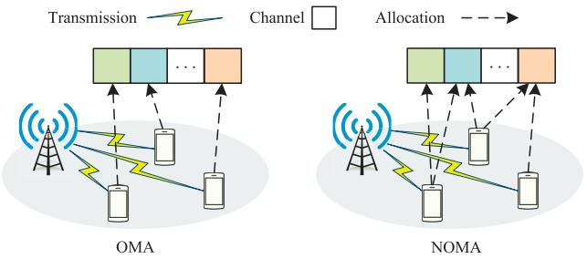

<details>
<summary>flowchart</summary>

```mermaid
graph TD
    subgraph OMA
        A1["Transmission"] --> B1["Channel"]
        A2["Transmission"] --> B2["Channel"]
        A3["Transmission"] --> B3["Channel"]
        A4["Transmission"] --> B4["Channel"]
        A5["Transmission"] --> B5["Channel"]
        A6["Transmission"] --> B6["Channel"]
        A7["Transmission"] --> B7["Channel"]
        A8["Transmission"] --> B8["Channel"]
        A9["Transmission"] --> B9["Channel"]
        A10["Transmission"] --> B10["Channel"]
        A11["Transmission"] --> B11["Channel"]
        A12["Transmission"] --> B12["Channel"]
        A13["Transmission"] --> B13["Channel"]
        A14["Transmission"] --> B14["Channel"]
        A15["Transmission"] --> B15["Channel"]
        A16["Transmission"] --> B16["Channel"]
        A17["Transmission"] --> B17["Channel"]
        A18["Transmission"] --> B18["Channel"]
        A19["Transmission"] --> B19["Channel"]
        A20["Transmission"] --> B20["Channel"]
        A21["Transmission"] --> B21["Channel"]
        A22["Transmission"] --> B22["Channel"]
        A23["Transmission"] --> B23["Channel"]
        A24["Transmission"] --> B24["Channel"]
        A25["Transmission"] --> B25["Channel"]
        A26["Transmission"] --> B26["Channel"]
        A27["Transmission"] --> B27["Channel"]
        A28["Transmission"] --> B28["Channel"]
        A29["Transmission"] --> B29["Channel"]
        A30["Transmission"] --> B30["Channel"]
        A31["Transmission"] --> B31["Channel"]
        A32["Transmission"] --> B32["Channel"]
        A33["Transmission"] --> B33["Channel"]
        A34["Transmission"] --> B34["Channel"]
        A35["Transmission"] --> B35["Channel"]
        A36["Transmission"] --> B36["Channel"]
        A37["Transmission"] --> B37["Channel"]
        A38["Transmission"] --> B38["Channel"]
        A39["Transmission"] --> B39["Channel"]
        A40["Transmission"] --> B40["Channel"]
        A41["Transmission"] --> B41["Channel"]
        A42["Transmission"] --> B42["Channel"]
        A43["Transmission"] --> B43["Channel"]
        A44["Transmission"] --> B44["Channel"]
        A45["Transmission"] --> B45["Channel"]
        A46["Transmission"] --> B46["Channel"]
        A47["Transmission"] --> B47["Channel"]
        A48["Transmission"] --> B48["Channel"]
        A49["Transmission"] --> B49["Channel"]
        A50["Transmission"] --> B50["Channel"]
        A51["Transmission"] --> B51["Channel"]
        A52["Transmission"] --> B52["Channel"]
        A53["Transmission"] --> B53["Channel"]
        A54["Transmission"] --> B54["Channel"]
        A55["Transmission"] --> B55["Channel"]
        A56["Transmission"] --> B56["Channel"]
        A57["Transmission"] --> B57["Channel"]
        A58["Transmission"] --> B58["Channel"]
        A59["Transmission"] --> B59["Channel"]
        A60["Transmission"] --> B60["Channel"]
        A61["Transmission"] --> B61["Channel"]
        A62["Transmission"] --> B62["Channel"]
        A63["Transmission"] --> B63["Channel"]
        A64["Transmission"] --> B64["Channel"]
        A65["Transmission"] --> B65["Channel"]
        A66["Transmission"] --> B66["Channel"]
        A67["Transmission"] --> B67["Channel"]
        A68["Transmission"] --> B68["Channel"]
        A69["Transmission"] --> B69["Channel"]
        A70["Transmission"] --> B70["Channel"]
        A71["Transmission"] --> B71["Channel"]
        A72["Transmission"] --> B72["Channel"]
        A73["Transmission"] --> B73["Channel"]
        A74["Transmission"] --> B74["Channel"]
        A75["Transmission"] --> B75["Channel"]
        A76["Transmission"] --> B76["Channel"]
        A77["Transmission"] --> B77["Channel"]
        A78["Transmission"] --> B78["Channel"]
        A79["Transmission"] --> B79["Channel"]
        A80["Transmission"] --> B80["Channel"]
        A81["Transmission"] --> B81["Channel"]
        A82["Transmission"] --> B82["Channel"]
        A83["Transmission"] --> B83["Channel"]
        A84["Transmission"] --> B84["Channel"]
        A85["Transmission"] --> B85["Channel"]
        A86["Transmission"] --> B86["Channel"]
        A87["Transmission"] --> B87["Channel"]
        A88["Transmission"] --> B88["Channel"]
        A89["Transmission"] --> B89["Channel"]
        A90["Transmission"] --> B90["Channel"]
        A91["Transmission"] --> B91["Channel"]
        A92["Transmission"] --> B92["Channel"]
        A93["Transmission"] --> B93["Channel"]
        A94["Transmission"] --> B94["Channel"]
        A95["Transmission"] --> B95["Channel"]
        A96["Transmission"] --> B96["Channel"]
        A97["Transmission"] --> B97["Channel"]
        A98["Transmission"] --> B98["Channel"]
        A99["Transmission"] --> B99["Channel"]
```
</details>

Fig. 4. Channel allocation in the single-cell network.

1) Single-Cell Networks: Graph optimization is mainly used for channel allocation to enhance spectrum efficiency of single-cell networks that typically consist of one BS and multiple users, as per Fig. 4.

For orthogonal multiple access (OMA) networks where each channel is only assigned by at most one user, a graph labeling algorithm is designed for consecutive-block channel allocation in an uplink single-carrier frequency division multiple access (SC-FDMA) system, in the graph underlying which each vertex represents a user and each edge represents a channel block associated with multiple weights to specify the performance metric, i.e., utility, power, or the number of channels. This algorithm is a variant of graph coloring and can achieve the near-optimal solution [52]. A maximal matching algorithm is applied to channel allocation in a downlink OFDMA system that is modeled as a multi-queue system with as many servers as the number of frequency channels. A random bipartite graph is exploited to formulate queue lengths, traffic arrival, and other external randomness of users as well as matching relationship between user vertices and channel vertices [53]. Moreover, bipartite matching algorithms are also performed to tackle channel allocation in single-cell networks with other specific OMA techniques and applied scenarios [54], [55], [56].

For non-orthogonal multiple access (NOMA), matching game theory is usually used for channel allocation. Since each channel is allowed to be reused by multiple users, channel allocation problems in NOMA systems can be formulated as many-to-one matching or many-to-many matching over bipartite graphs. A many-to-many matching algorithm is proposed for channel allocation in a downlink single-cell NOMA network, which can achieve the maximum network capacity with sufficiently large iterations [57]. In the same scenario, the quality of service for users is further considered in the process of many-to-many matching [58]. A many-toone matching algorithm is designed for channel allocation in uplink single-cell NOMA network, which can converge to stable matching with limited iterations [59]. Besides matching game theory, an MWIS based algorithm is proposed for channel allocation in an uplink single-cell NOMA network to maximize network capacity. In its graph, each vertex represents a combination of two users and one channel and each edge connects two vertices including the same user or channel [60]. Based on this work, a maximum independent set based algorithm is further designed to jointly optimize access control and channel allocation [61].

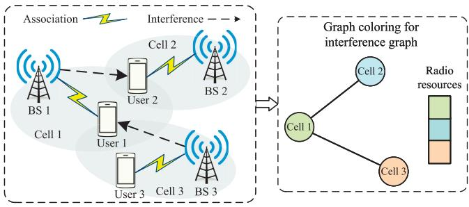

<details>
<summary>flowchart</summary>

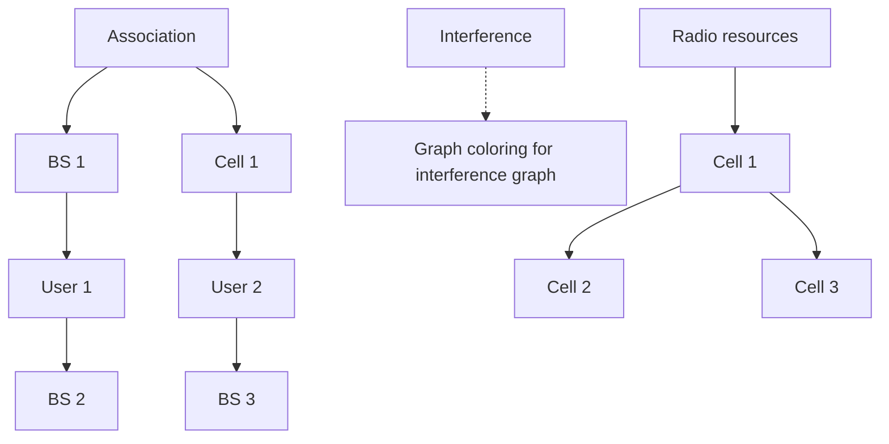
</details>

Fig. 5. Inter-cell interference coordination by graph coloring.

Recently, graph optimization is applied to channel allocation in emerging mobile use cases and technologies. The maximum-weight matching is exploited to propose channel allocation and sharing scheme for ultra-reliable low latency communications (uRLLC) in a single-cell IoT network to increase spectrum efficiency [62], [63]. Greedy coloring is utilized for channel allocation and user scheduling in singlecell networks with in-band full-duplex (IBFD) technology to maximize spectrum efficiency and promote frequency sharing [64], [65].

2) Multi-Cell Networks: Different from single-cell networks, inter-cell interference is a dominating challenge for resource management of multi-cell networks that include multiple BSs and multiple users. The interference graph is an explicit tool to characterize interference among users or cells, in which each vertex represents a user or a BS and each edge connects two vertices strongly interfering with each other.

By means of interference graph, several low-complexity heuristic algorithms are proposed to allocate frequency channels for inter-cell interference mitigation [66], [67]. Game-theoretic approaches are also proposed to operate on interference graph for user scheduling and channel allocation to restrain interference multi-cell networks [68], [69]. To accelerate the implementation of interference graph, a machine learning-based graph construction method is proposed to improve the accuracy and practicability [70]. It is worth noting that due to good compatibility, greedy coloring is popularly applied on interference graph to interference mitigation in wireless networks [71], as per Fig. 5. A partially-distributed resource allocation algorithm is proposed to apply greedy coloring for spectrum channel allocation among small cells [72]. For moving small-cell networks, the time interval dependent interference graph is exploited to design a greedy coloring based resource block (RB) allocation algorithm for alleviating time-varying interference [73]. To further mitigate inter-cell interference, a modified k-coloring algorithm is designed for channel allocation in interference alignment (IA) enabled OFDMA multi-cell networks [74]. A joint IA and subchannel allocation scheme is further proposed which utilizes a greedy k-coloring algorithm to find the smallest number of subchannels required [75].

Various graph optimization methods have been applied for resource management in multi-cell networks except for interference graph. A minimum-cost flow algorithm is developed to switch on/off BSs dynamically in multi-cell networks for energy saving [76]. The maximum independent set is exploited to formulate link scheduling problem and propose a computationally efficient algorithm for a two-tone spectrum-sharing heterogeneous cellular network (HetNet) [77]. A maximum-weight clique-based algorithm is proposed for joint link scheduling and power control in a cloud-radio access network (C-RAN), which can find optimal solution with low complexity [78]. The bipartite matching is as well utilized to manage spectrum resource in multicell networks [79], [80], [81]. A bipartite stable matching based network selection algorithm is designed to optimize overall quality of experience of users under fairness assurance in an ultra-dense HetNet [82]. A maximum matching-based subchannel allocation algorithm is proposed for non-coherent joint transmission to restrain multi-cell interference [83]. Furthermore, hypergraph is utilized to design resource allocation algorithms for multi-cell networks with advanced RATs and application scenarios. An interference hypergraph is established to design a greedy spectrum resource allocation algorithm in a NOMA-enabled dense HetNet, where each vertex represents the usage of a subchannel by an user pair and each hyperedge contains vertices corresponding to the same user pair [84]. A hypergraph-based maximum-weight clique method is proposed for channel allocation to improve spectrum efficiency in a NOMA-based industrial IoT network [85].

Lessons learned 1: Graph optimization is an effective and long-standing theoretical tool for resource management in cellular networks. In single-cell networks, graph optimization approaches are mainly used for channel allocation to enhance spectrum efficiency. Among them, graph coloring and bipartite matching are two common methods. Results in literature show that a graph coloring-based algorithm can achieve a near-optimal solution in an uplink OMA single-cell network. For NOMA single-cell networks, matching game theory and independent set-based algorithms are effective for channel reuse to promote resource utilization. In multi-cell networks, interference coordination is the primary challenge of resource management. To tackle this challenge, various interference graph-based algorithms are proposed. Greedy coloring is successfully applied spectrum channel allocation among small cells. Furthermore, minimum-cost flow, independent set and clique-based algorithms, bipartite matching, and hypergraph are utilized for different resource management problems to mitigate interference and improve resource utilization. Table II summarizes the reviewed resource management approaches using graph optimization in cellular networks along with references. From the literature review, we can see that graph optimization is promised to be applied to resource management in future cellular networks, such as cell-free networks, dense heterogeneous cellular networks, etc.

# B. D2D Communication

As a complementary technique, D2D communication enables direct communication between two mobile users in close proximity without going through cellular BS or core network [86], [87]. There are two typical working modes that are underlay mode and overlay mode, as per Fig. 6. In underlay mode, D2D communication reuses cellular frequency resource to improve spectrum efficiency yet causing cross-tier interference between cellular links and D2D pairs. In overlay mode, D2D communication is not allowed to use cellular frequency resource and only uses a dedicated frequency band. Note that resource management of D2D communication is controlled by cellular networks regardless of working modes. Therefore, cross-tier interference and spectrum competition become more severe in D2D and cellular hybrid networks compared to cellular networks. This subsection reviews the research literature on the application of graph optimization to D2D communications in different working modes.

TABLE IIA SUMMARY OF RESOURCE MANAGEMENT APPROACHES USING GRAPH OPTIMIZATION IN CELLULAR NETWORKS

<table><tr><td>Networks</td><td>References</td><td>Methods</td><td>Graph Types</td><td>Issues</td><td>RATs</td></tr><tr><td rowspan="10">Single-Cell Networks</td><td>[52]</td><td>Labeling</td><td>Conflict graph</td><td>Channel allocation</td><td>SC-FDMA</td></tr><tr><td>[53]</td><td>Maximal matching</td><td>Bipartite graph</td><td>Channel allocation</td><td>OFDMA</td></tr><tr><td>[54]</td><td>Maximum-weight matching</td><td>Bipartite graph</td><td>Channel allocation</td><td>OFDM-IDMA</td></tr><tr><td>[55], [56]</td><td>Maximum-weight matching</td><td>Bipartite graph</td><td>Channel allocation</td><td>OFDMA</td></tr><tr><td>[57], [58]</td><td>Many-to-many matching</td><td>Bipartite graph</td><td>Channel allocation</td><td>NOMA</td></tr><tr><td>[59]</td><td>Many-to-one matching</td><td>Bipartite graph</td><td>Channel allocation</td><td>NOMA</td></tr><tr><td>[60]</td><td>MWIS</td><td>Conflict graph</td><td>Channel allocation</td><td>NOMA</td></tr><tr><td>[61]</td><td>Maximum independent set</td><td>Conflict graph</td><td>Access control and channel allocation</td><td>NOMA</td></tr><tr><td>[62], [63]</td><td>Maximum-weight matching</td><td>Bipartite graph</td><td>Channel allocation and sharing</td><td>OFDMA for uRLLC</td></tr><tr><td>[64], [65]</td><td>Greedy coloring</td><td>Conflict graph</td><td>User scheduling and channel allocation</td><td>OMA with IBFD</td></tr><tr><td rowspan="17">Multi-Cell Networks</td><td>[66]</td><td>Heuristic</td><td>Interference graph</td><td>Channel allocation</td><td>OFDMA</td></tr><tr><td>[67]</td><td>Heuristic</td><td>Interference graph</td><td>Channel allocation</td><td>TDMA</td></tr><tr><td>[71]</td><td>Greedy coloring</td><td>Interference graph</td><td>Channel allocation</td><td>OMA</td></tr><tr><td>[72]</td><td>Greedy coloring</td><td>Interference graph</td><td>Channel allocation</td><td>OFDMA</td></tr><tr><td>[73]</td><td>Greedy coloring</td><td>Time interval dependent interference graph</td><td>RB allocation</td><td>OFDMA</td></tr><tr><td>[74]</td><td>k-coloring</td><td>Interference graph</td><td>Channel allocation</td><td>OFDMA with IA</td></tr><tr><td>[75]</td><td>k-coloring</td><td>Interference graph</td><td>IA and channel allocation</td><td>OFDMA</td></tr><tr><td>[76]</td><td>Minimum-cost flow</td><td>Flow network</td><td>BS on/off switching</td><td>OFDMA</td></tr><tr><td>[77]</td><td>Maximum independent set</td><td>Conflict graph</td><td>Link scheduling</td><td>FDMA</td></tr><tr><td>[78]</td><td>Maximum-weight clique</td><td>Conflict graph</td><td>Link scheduling and power control</td><td>OFDMA</td></tr><tr><td>[79]</td><td>Maximum-weight matching</td><td>Bipartite graph</td><td>Channel and power allocation</td><td>Spectrum aggregation</td></tr><tr><td>[80]</td><td>Stable matching</td><td>Bipartite graph</td><td>Spectrum allocation</td><td>OMA</td></tr><tr><td>[81]</td><td>Maximum-weight matching</td><td>Bipartite graph</td><td>User scheduling</td><td>FDMA</td></tr><tr><td>[82]</td><td>Stable matching</td><td>Bipartite graph</td><td>Network selection</td><td>Hybrid access</td></tr><tr><td>[83]</td><td>Maximum matching</td><td>Bipartite graph</td><td>Channel allocation</td><td>Non-coherent joint transmission</td></tr><tr><td>[84]</td><td>Heuristic</td><td>Interference hypergraph</td><td>Spectrum channel allocation</td><td>NOMA</td></tr><tr><td>[85]</td><td>Maximum-weight clique</td><td>Hypergraph</td><td>Channel allocation</td><td>NOMA</td></tr></table>

1) Underlay D2D Communication: Graph optimization focuses on spectrum reuse among underlay D2D pairs and cellular links. The spectrum reuse between one cellular user and one D2D pair is first studied. Supposing that each cellular user has been assigned to orthogonal spectrum channel, a maximum-weight bipartite matching based scheme is proposed to select a suitable cellular user as an optimal reuse partner for each admissible D2D pair to maximize network capacity [88], as per Fig. 7. The conflict graph is used to propose a heuristic algorithm to match each cellular user’s codebook to one

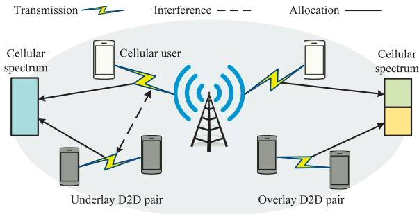

<details>
<summary>flowchart</summary>

```mermaid
graph TD
    A["Cellular spectrum"] --> B["Cellular user"]
    B --> C["Cellular spectrum"]
    C --> D["Cellular user"]
    D --> E["Underlay D2D pair"]
    E --> F["Cellular spectrum"]
    F --> G["Overlay D2D pair"]
    G --> H["Cellular spectrum"]
    H --> I["Cellular user"]
    I --> J["Cellular spectrum"]
    J --> K["Cellular user"]
    K --> L["Cellular spectrum"]
    L --> M["Cellular user"]
    M --> N["Cellular spectrum"]
    N --> O["Cellular user"]
    O --> P["Cellular spectrum"]
    P --> Q["Cellular user"]
    Q --> R["Cellular spectrum"]
    R --> S["Cellular user"]
    S --> T["Cellular spectrum"]
    T --> U["Cellular user"]
    U --> V["Cellular spectrum"]
    V --> W["Cellular user"]
    W --> X["Cellular spectrum"]
    X --> Y["Cellular user"]
    Y --> Z["Cellular spectrum"]
    Z --> AA["Cellular user"]
    AA --> AB["Cellular spectrum"]
    AB --> AC["Cellular user"]
    AC --> AD["Cellular spectrum"]
    AD --> AE["Cellular user"]
    AE --> AF["Cellular spectrum"]
    AF --> AG["Cellular user"]
    AG --> AH["Cellular spectrum"]
    AH --> AI["Cellular user"]
    AI --> AJ["Cellular spectrum"]
    AJ --> AK["Cellular user"]
    AK --> AL["Cellular spectrum"]
    AL --> AM["Cellular user"]
    AM --> AN["Cellular spectrum"]
    AN --> AO["Cellular user"]
    AO --> AP["Cellular spectrum"]
    AP --> AQ["Cellular user"]
    AQ --> AR["Cellular spectrum"]
    AR --> AS["Cellular user"]
    AS --> AT["Cellular spectrum"]
    AT --> AU["Cellular user"]
    AU --> AV["Cellular spectrum"]
    AV --> AW["Cellular user"]
    AW --> AX["Cellular spectrum"]
    AX --> AY["Cellular user"]
    AY --> AZ["Cellular spectrum"]
    AZ --> BA["Cellular user"]
    BA --> BB["Cellular spectrum"]
    BB --> BC["Cellular user"]
    BC --> BD["Cellular spectrum"]
    BD --> BE["Cellular user"]
    BE --> BF["Cellular spectrum"]
    BF --> BG["Cellular user"]
    BG --> BH["Cellular spectrum"]
    BH --> BI["Cellular user"]
    BI --> BJ["Cellular spectrum"]
    BJ --> BK["Cellular user"]
    BK --> BL["Cellular spectrum"]
    BL --> BM["Cellular user"]
    BM --> BN["Cellular spectrum"]
    BN --> BO["Cellular user"]
    BO --> BP["Cellular spectrum"]
    BP --> BQ["Cellular user"]
    BQ --> BR["Cellular spectrum"]
    BR --> BS["Cellular user"]
    BS --> BT["Cellular spectrum"]
    BT --> BU["Cellular user"]
    BU --> BV["Cellular spectrum"]
    BV --> BW["Cellular user"]
    BW --> BX["Cellular spectrum"]
    BX --> BY["Cellular user"]
    BY --> BZ["Cellular spectrum"]
    BZ --> CA["Cellular user"]
    CA --> CB["Cellular spectrum"]
    CB --> CC["Cellular user"]
    CC --> CD["Cellular spectrum"]
    CD --> CE["Cellular user"]
    CE --> CF["Cellular spectrum"]
    CF --> CG["Cellular user"]
    CG --> CH["Cellular spectrum"]
    CH --> CI["Cellular user"]
    CI --> CJ["Cellular spectrum"]
    CJ --> CK["Cellular user"]
```
</details>

Fig. 6. D2D communications in underlay and overlay mode.

D2D pair in a D2D underlaying cellular network with sparse code multiple access (SCMA) that is an emerging NOMA technique [89]. In a NOMA-based D2D underlaying multi-cell network, a hypergraph greedy coloring based channel reuse algorithm is designed where the colors correspond to available channels and each hyperedge consists of cellular links and D2D pairs with a certain level of mutual interference [90]. Supposing that spectrum channels have not been assigned yet, a hypergraph based BnB algorithm is developed to obtain the optimal channel allocation and reuse in a D2D underlaying cellular network [91].

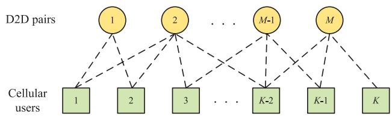

<details>
<summary>flowchart</summary>

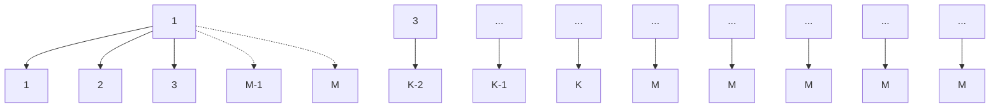
</details>

Fig. 7. Bipartite matching between underlay D2D pairs and cellular users.

Second, one-to-many spectrum reuse between cellular links and D2D pairs is studied. A min-cut based transmissiondirection optimization scheme over interference graph is developed to minimize total interference strength in a single-channel D2D underlaying cellular network [92]. A minimum-weight k-cut based spectrum reuse algorithm is proposed to assign exactly one cellular link to each cluster of D2D pairs to alleviate cross-tier interference [93]. A hypergraph greedy coloring based channel allocation algorithm is developed for both D2D pairs and cellular links to maximize network capacity with low complexity, which is shown to achieve a near-optimal performance [94]. Considering social ties among users, a social-aware resource allocation scheme is proposed which uses many-to-one matching to assign D2D pairs of each community with cellular spectrum resources of one other community [95].

Finally, many-to-many spectrum reuse between cellular links and D2D pairs is studied. To balance the effectiveness and the complexity, a k-coloring based spectrum resource sharing algorithm is proposed over interference graph for a D2D underlaying full-duplex cellular network to maximize network capacity [96].

2) Overlay D2D Communication: Graph optimization is usually applied to deal with resource allocation issues in overlay D2D communications. Due to dedicated spectrum resources, there is not any conflict between D2D pairs and cellular links. Hence, a system consisting of multiple overlay D2D pairs is also referred as a D2D network. A bipartite stable matching based spectrum reuse algorithm is proposed to match each secondary D2D pair to one primary D2D pair for spectrum utilization enhancement in a cognitive radio (CR)- assisted D2D network [97]. The bipartite stable matching is further used to group several cooperative users with social ties for data dissemination via D2D communications [98]. A graph based heuristic frequency assignment and duplex mode selection scheme is designed in a full-duplex D2D network to improve spectrum efficiency [99]. A completion time minimization algorithm is proposed for a D2D-aided caching fog radio access network (F-RAN), which uses the maximum-weight clique to minimize the possible completion time in downlink transmission and uses the maximum independent set to maximize the number of active users in D2D pairs [100].

3) Mix-Mode D2D Communication: When several working modes coexist and are optional for D2D pairs, the mode selection becomes a required optimization dimension. A greedy coloring based group partitioning algorithm over conflict graph is proposed to maximize network capacity for both overlay and underlay D2D communications in cellular networks [101]. The

bipartite stable matching is combined with the coalition formation game to design a joint mode selection and spectrum access scheme in a D2D and cellular coexisting network where D2D pairs have four specific working modes to select [102]. The maximum-weight bipartite matching is exploited to propose a joint mode selection and user association scheme in a D2D enabled multi-cell network, where each user can associate one BS by cellular mode or its own receiver by D2D mode [103]. A mode selection and resource allocation scheme is designed for energy saving in a D2D and cellular coexisting network with hybrid multiple access techniques, which applies the minimum-cost flow to resource allocation among overlay D2D pairs and uses the interference graph to design a heuristic resource allocation method for underlay D2D pairs [104]. A joint mode selection and resource allocation scheme is proposed for a D2D-enabled NOMA cellular network, where the interlay mode is developed as a special D2D working mode in NOMA systems and coexists with the underlay mode. This scheme utilizes a maximum-weight clique based BnB approach to obtain the optimal solution [105]. The minimumcost flow is further applied to mode selection and power control for D2D-enabled NOMA cellular networks to improve network connectivity [106].

Lessons learned 2: Graph optimization is suitable for D2D communications in all kinds of working modes to significantly enhance spectrum efficiency. For underlay D2D communications, spectrum reuse is the primary resource management issue addressed by graph optimization methods. The maximum-weight bipartite matching can find the optimal solution for channel reuse between one D2D pair and one cellular user to maximize network capacity, if cellular users are assigned to spectrum channels. If spectrum channels are not assigned, a hypergraph-based BnB algorithm can achieve the optimal channel allocation and reuse solution. Moreover, min-cut based algorithms, matching game theory, and graph coloring are applied to one-to-many spectrum reuse and manyto-many spectrum reuse between cellular users and D2D pairs. For overlay D2D communications, bipartite stable matching, maximum-weight clique, and maximum independent set are efficient for channel allocation among D2D pairs to promote spectrum utilization. For mixed-mode D2D communications, graph coloring, bipartite matching, and minimum-cost flow are effective methods to design joint mode selection and resource allocation algorithms in OMA-based systems. In NOMA-based systems, the maximum-weight clique and minimum-cost flow are applicable. Table III summarizes the reviewed resource management approaches using graph optimization in D2D communications along with references. We can observe from the literature review that resource coordination for social-aware and multi-hop D2D communications remains a worthy issue for future investigation using graph optimization.

# C. Multi-Hop Networks

Multi-hop networks leverage the cooperation among transmission links to ensure network connectivity, which improves networking flexibility and robustness. The development of multi-hop networks facilitates the emergence of cooperative cellular networks and multi-hop D2D communications. Traditionally, graph optimization methods focus on addressing link scheduling and routing design in multi-hop networks in forms of ad hoc networks, mesh networks, or sensor networks [9], [47], [107], [108]. In recent research literature, graph optimization concentrates on three specific scenarios of multi-hop networks: self-organizing networks (SONs), relay networks, and vehicular networks. Cooperative scheduling among multiple links is primary feature as well as main challenge for resource management in multi-hop networks. In this subsection, we present an overview of the application of graph optimization methods in multi-hop networks over the past decade.

TABLE III A SUMMARY OF RESOURCE MANAGEMENT APPROACHES USING GRAPH OPTIMIZATION IN D2D COMMUNICATIONS 

<table><tr><td>D2D Modes</td><td>References</td><td>Methods</td><td>Graph Types</td><td>Issues</td><td>RATs</td></tr><tr><td rowspan="9">Underlay D2D</td><td>[88]</td><td>Maximum-weight matching</td><td>Bipartite graph</td><td>Channel reuse and power allocation</td><td>FDMA</td></tr><tr><td>[89]</td><td>Heuristic</td><td>Conflict graph</td><td>Channel reuse</td><td>SCMA</td></tr><tr><td>[90]</td><td>Greedy coloring</td><td>Hypergraph</td><td>Channel reuse</td><td>NOMA</td></tr><tr><td>[91]</td><td>BnB</td><td>Hypergraph</td><td>Channel allocation and reuse</td><td>FDMA</td></tr><tr><td>[92]</td><td>Min-cut</td><td>Interference graph</td><td>Transmission direction</td><td>TDD</td></tr><tr><td>[93]</td><td>Minimum-weight k-cut</td><td>Undirected graph</td><td>Spectrum reuse</td><td>FDMA</td></tr><tr><td>[94]</td><td>Greedy coloring</td><td>Hypergraph</td><td>Channel allocation</td><td>OFDMA</td></tr><tr><td>[95]</td><td>Many-to-one matching</td><td>Social bipartite graph</td><td>Channel allocation and reuse</td><td>FDMA</td></tr><tr><td>[96]</td><td>k-coloring</td><td>Interference graph</td><td>RB assignment and power allocation</td><td>OFDMA with full duplex</td></tr><tr><td rowspan="4">Overlay D2D</td><td>[97]</td><td>Stable matching</td><td>Bipartite graph</td><td>Spectrum reuse</td><td>FDMA with CR</td></tr><tr><td>[98]</td><td>Stable matching</td><td>Social-physical graph</td><td>Data dissemination</td><td>OMA</td></tr><tr><td>[99]</td><td>Heuristic</td><td>Directed weighted graph</td><td>Duplex mode selection</td><td>FDMA with full duplex</td></tr><tr><td>[100]</td><td>Maximum-weight clique/Maximum independent set</td><td>Conflict graph</td><td>Access control, power allocation, and network coding scheduling</td><td>Network coding</td></tr><tr><td rowspan="6">Mix-Mode D2D</td><td>[101]</td><td>Greedy coloring</td><td>Conflict graph</td><td>Group partitioning</td><td>OFDMA</td></tr><tr><td>[102]</td><td>Stable matching with coalition formation game</td><td>Bipartite graph</td><td>Mode selection and spectrum access</td><td>FDMA</td></tr><tr><td>[103]</td><td>Maximum-weight matching</td><td>Bipartite graph</td><td>Mode selection and user association</td><td>OMA</td></tr><tr><td>[104]</td><td>Minimum-cost flow/Heurisitc</td><td>Flow network/Interference graph</td><td>Mode selection and resource allocation</td><td>SCMA and OFDMA</td></tr><tr><td>[105]</td><td>Maximum-weight clique</td><td>Conflict graph</td><td>Mode selection and resource allocation</td><td>NOMA</td></tr><tr><td>[106]</td><td>Minimum-cost flow</td><td>Flow network</td><td>Mode selection and resource allocation</td><td>NOMA</td></tr></table>

1) SONs: The SON is a representative of multi-hop networks, where the nodes establish wireless connection with each other in a distributed or decentralized manner. Graph optimization is mainly used to design algorithms for link scheduling and resource allocation in SONs. Over the conflict graph, the MWIS is used to formulate the link scheduling problem for SONs with deterministic channel models and then exploited to study the cross-layer optimization in a distributed way [109]. The maximum clique is used to describe and analyze a decentralized link activation strategy in a Rayleigh fading environment by means of random graph theory. In this work, the existence of an edge between any two vertices is set by a probability related to exponential distribution [110]. A k-coloring based distributed resource allocation algorithm is further proposed to improve the efficiency of resource reuse [111]. Given a topology graph, a greedy link scheduler is designed for SONs with Gaussian multiple access and broadcast channels [112], [113]. For an integrated sensing and communications (ISAC)-aided SON, a shortest path based resource allocation scheme is proposed over a random topology graph to reduce transmission delay, where the weight of each edge follows the exponential distribution [114]. Over the bipartite graph, A many-to-one matching based spectrum allocation scheme is proposed for a SON based on IEEE 802.15.4m to lower spectrum congestion and packet-dropping probability [115]. A maximum matching policy is designed for decentralized medium access control in wireless sensor networks [116], which is further incorporated with double auction game for spectrum allocation to increase the user capacity [117]. In addition, time expanded graph (TEG) is used to study the cooperative link scheduling in a multi-hop network with multiple channels and multiple slots [118].

2) Relay Networks: The relay is a specific infrastructure in wireless networks to interconnect the source node and the destination node by receiving information from the former and deliver it to the latter. It has numerous advantages on coverage extension, link improvement and energy efficiency. Decode-and-forward (DF) and amplify-and-forward (AF) are two most common relaying strategies. A DF relay decodes, remodulates, and retransmits the received signal, while an AF relay just amplifies and retransmits the received signal without decoding. Graph optimization methods are usually utilized to relay selection and channel assignment for relay networks.

The max-flow min-cut theorem is utilized to devise a directed acyclic graph (DAG) based analytical method, demonstrating how DF relaying substantially enhances energy efficiency in wireless multicasting networks, particularly focusing on a single-source node scenario [119]. An optimal channel and relay assignment scheme is proposed which utilizes maximum-weight matching to allocate each source-destination pair one available relay for the sumrate maximization in a two-way AF relaying OFDMA network [120]. For a multi-hop relaying network, a shortest path based DF cooperative strategy is proposed to find a path with low bit error rate from the source node to the destination node [121], as shown in Fig. 8(a). In Fig. 8(a), each intermediate vertex represents a relay node and each edge represents an existing transmission link, whose weight represents the link quality. The bipartite matching is utilized to further design a path selection algorithm for a multi-hop relaying network with multiple source and destination nodes to increase relaying link throughput [122].

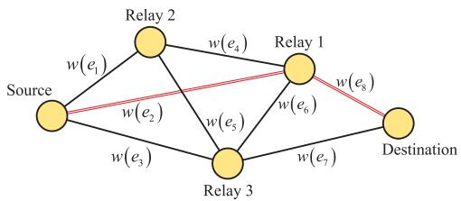

<details>
<summary>flowchart</summary>

```mermaid
graph TD
    Source -->|w(e₁)| Relay2
    Source -->|w(e₂)| Relay3
    Source -->|w(e₃)| Relay3
    Relay2 -->|w(e₄)| Relay1
    Relay2 -->|w(e₅)| Relay3
    Relay3 -->|w(e₆)| Relay1
    Relay3 -->|w(e₇)| Destination
    Relay1 -->|w(e₈)| Destination
```
</details>

(a) Shortest path for multi-hop DF relaying networks.

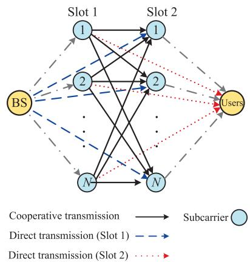

<details>
<summary>flowchart</summary>

```mermaid
graph TD
    BS["BS"] -->|Cooperative transmission| Slot1["1"]
    BS -->|Direct transmission (Slot 1)| Slot2["1"]
    BS -->|Direct transmission (Slot 2)| Users["Users"]
    Slot1 --> N1["N"]
    Slot2 --> N2["N"]
    N1 --> N3["N"]
    N2 --> N3
    N3 --> Users
    Slot1 -.-> N2
    Slot2 -.-> N3
    N1 -.-> N4["N"]
    N2 -.-> N4
    N3 -.-> N4
    N4 -.-> Users
    style BS fill:#f9f,stroke:#333
    style Users fill:#bbf,stroke:#333
    style N1 fill:#bfb,stroke:#333
    style N2 fill:#bfb,stroke:#333
    style N3 fill:#bfb,stroke:#333
    style N4 fill:#bfb,stroke:#333
```
</details>

(b) Minimum-cost flow for cooperative cellular networks.   
Fig. 8. Examples of graph optimization for relay networks.

Cooperative cellular networks are a cost-effective network architecture to enhance cell coverage and link robustness by deploying relay stations around the BS. To improve network capacity, a maximum-weight clique based spectrum allocation and relay selection scheme is proposed in a relay-assisted bidirectional OFDMA cellular network [123]. Furthermore, the minimum-cost flow based scheme is designed to asymptotically optimize relay selection and resource allocation in a cooperative downlink OFDMA network [124], as per Fig. 8(b). In Fig. 8(b), each vertex represents a subcarrier in different slots and there are three types of edges, i.e., black solid, blue dotted, and red dotted edges, which correspond to different subcarrier and slot assignments for the relay node. For federated learning in a NOMA relay-assisted IoT network, a greedy MWIS algorithm is employed to efficiently allocate spectrum resources and relay stations to each IoT device, thereby reducing energy consumption during the upload of local model parameters [125].

3) Vehicular Networks: Vehicular networks have been one of the most advanced application of IoT, which are currently built on vehicular ad hoc network and vehicle-road cooperation. The mobility of vehicles leads to temporal and spatial changes of network topology, which presents new challenges for resource management [126], [127]. Vehicleto-vehicle (V2V) and vehicle-to-infrastructure (V2I) are two primary categories of communication links in vehicular networks.

For V2V communications, the bipartite matching is widely applied to resource allocation and sharing. A joint secure relay selection and spectrum allocation algorithm is proposed which exploits the maximum matching over a random bipartite graph to assign each V2V pair with one subcarrier to reduce the outage probability [128]. The maximum-weight bipartite matching is further used to radio resource allocation for vehicle platooning control [129] and spectrum sharing between cellular uplinks and V2V communications [130]. In addition to bipartite matching, the minimum-cost flow is utilized to realize a decentralized link scheduling for data dissemination via V2V links [131]. For V2V and V2I hybrid communications, the interference graph is used to model the network through a similar way for modeling cellular and D2D hybrid networks. Based on constructed interference graph, a heuristic spectrum sharing scheme is proposed between V2V and V2I links [132]. The maximum-weight bipartite matching is also utilized to formulate spectrum sharing problem between V2V and V2I communications for increasing spectrum efficiency [133]. The k-coloring is applied to channel allocation for computation offloading of V2I and V2V links in edge computing assisted vehicular networks [134].

Lessons learned 3: Multi-hop networks are crucial for the application of graph optimization in resource management. In SONs, graph optimization approaches focus on link scheduling and resource allocation. For link scheduling, MWIS, maximum clique, and TEG-based algorithms are exploited to maximize network connectivity. For resource allocation, graph coloring, the shortest path, and bipartite matching are utilized for improving transmission efficiency and resource utilization. In relay networks, relay selection and channel assignment are two main problems addressed by graph optimization methods. Bipartite matching and the shortest path are two popular algorithmic approaches in AF and DF relaying networks. For cooperative cellular networks, minimum-cost flow is used to asymptotically optimize relay selection and resource allocation. Moreover, the maximum-weight clique and MWIS are efficient graph optimization tools in cooperative cellular networks. In vehicular networks, different graph optimization methods are exploited for V2V and V2I communications. For V2V communications, bipartite matching is widely used for resource allocation and sharing. For V2V and V2I communications, interference graph-based algorithm and the maximum-weight bipartite matching are utilized for spectrum sharing to increase spectrum efficiency. Table IV summarizes the reviewed resource management approaches using graph optimization in multi-hop networks along with references. From the literature review, we can see how to deal with resource management problems in future multi-hop networks to meet the requirements of high-mobility, high-reliability, and low-latency applications is a crucial challenge for graph optimization approaches.

TABLE IV A SUMMARY OF RESOURCE MANAGEMENT APPROACHES USING GRAPH OPTIMIZATION IN MULTI-HOP NETWORKS 

<table><tr><td>Networks</td><td>References</td><td>Methods</td><td>Graph Types</td><td>Issues</td><td>RATs</td></tr><tr><td rowspan="9">SONs</td><td>[109]</td><td>MWIS</td><td>Conflict graph</td><td>Distributed link scheduling</td><td>Deterministic channel model</td></tr><tr><td>[110]</td><td>Maximum clique</td><td>Random graph</td><td>Decentralized link activation</td><td>Interference channel access</td></tr><tr><td>[111]</td><td>k-coloring</td><td>Topology graph</td><td>Distributed resource allocation</td><td>Distributed access</td></tr><tr><td>[112], [113]</td><td>Heuristic</td><td>Topology graph</td><td>Link scheduling</td><td>Gaussian multiple access</td></tr><tr><td>[114]</td><td>Shortest path</td><td>Topology graph</td><td>Resource allocation</td><td>ISAC</td></tr><tr><td>[115]</td><td>Many-to-one matching</td><td>Bipartite graph</td><td>Spectrum allocation</td><td>CSMA/CA</td></tr><tr><td>[116]</td><td>Maximum matching</td><td>Bipartite graph</td><td>Decentralized medium access control</td><td>Slotted random access</td></tr><tr><td>[117]</td><td>Maximum matching with double auction game</td><td>Bipartite graph</td><td>Spectrum allocation</td><td>CR</td></tr><tr><td>[118]</td><td>Max-flow min-cut</td><td>TEG</td><td>Cooperative link scheduling</td><td>Network coding</td></tr><tr><td rowspan="6">Relay Networks</td><td>[120]</td><td>Maximum-weight matching</td><td>Flow network</td><td>Channel and relay assignment</td><td>AF</td></tr><tr><td>[121]</td><td>Shortest path</td><td>Directed graph</td><td>Path selection and power allocation</td><td>Ultra-wideband DF</td></tr><tr><td>[122]</td><td>Maximum-weight matching</td><td>Bipartite graph</td><td>Path selection and power allocation</td><td>DF</td></tr><tr><td>[123]</td><td>Maximum-weight clique</td><td>Conflict graph</td><td>Spectrum allocation</td><td>Cooperative bidirectional OFDMA</td></tr><tr><td>[124]</td><td>Minimum-cost flow</td><td>Flow network</td><td>Spectrum allocation, relay selection, and transmission mode</td><td>Cooperative OFDMA</td></tr><tr><td>[125]</td><td>MWIS</td><td>Conflict graph</td><td>Spectrum and relay allocation</td><td>Cooperative NOMA</td></tr><tr><td rowspan="7">Vehicular Networks</td><td>[128]</td><td>Maximum matching</td><td>Random bipartite graph</td><td>Secure relay selection and spectrum allocation</td><td>V2V with DF</td></tr><tr><td>[129]</td><td>Maximum-weight matching</td><td>Bipartite graph</td><td>Radio resource allocation for vehicle platooning control</td><td>LTE-V2V</td></tr><tr><td>[130]</td><td>Maximum-weight matching</td><td>Bipartite graph</td><td>Spectrum sharing</td><td>Underlay vehicular D2D with OFDMA</td></tr><tr><td>[131]</td><td>Minimum-cost flow</td><td>Bipartite graph</td><td>Decentralized link scheduling</td><td>DSRC-V2V</td></tr><tr><td>[132]</td><td>Heuristic</td><td>Interference graph</td><td>Spectrum sharing</td><td>V2V and V2I</td></tr><tr><td>[133]</td><td>Maximum-weight matching</td><td>Interference graph</td><td>Spectrum sharing</td><td>V2V and V2I</td></tr><tr><td>[134]</td><td>k-coloring</td><td>Interference graph</td><td>Channel allocation</td><td>V2V and V2I</td></tr></table>

# D. Multi-Antenna Systems

Multi-antenna systems are known as multiple-inputmultiple-output (MIMO) systems as well, in which multi-antenna array can smoothly be set up at the transmitter and/or the receiver in diverse wireless networks to increase transmission rate. Graph optimization approaches have been applied to channel allocation and pilot placement in multiantenna systems.

For channel allocation in multi-antenna systems, the k-clique is used to formulate the multi-channel sharing in a single-cell multi-user MIMO (MU-MIMO) system, revealing the non-deterministic polynomial-time hardness of this class of problems [135]. To avoid high computational complexity, a k-coloring based greedy spectrum sharing is proposed to find near-optimal sum-rate of secondary users in a CR MIMO network [136]. Furthermore, many-to-many matching over bipartite graph is exploited to formulate the user-beam association in a massive MIMO system for the sum-rate maximization [137].

Pilot and other training resources are essential for channel estimation in multi-antenna systems. To mitigate pilot contamination due to pilot reuse in multi-cells massive MIMO systems, the k-coloring is exploited to allocate orthogonal pilots uplink users in different cells [138], as per Fig. 9. A chromatic number based training resource allocation is proposed to find the minimum number of colors required for multi-cell MIMO systems to decrease the overall training overhead [139]. To resolve pilot collision in a singlecell massive MIMO system, the bipartite graph is used to propose a pilot random access protocol with successive interference cancellation for maximizing the number of active users [140].

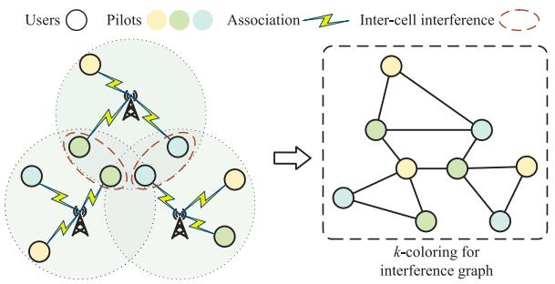

<details>
<summary>flowchart</summary>

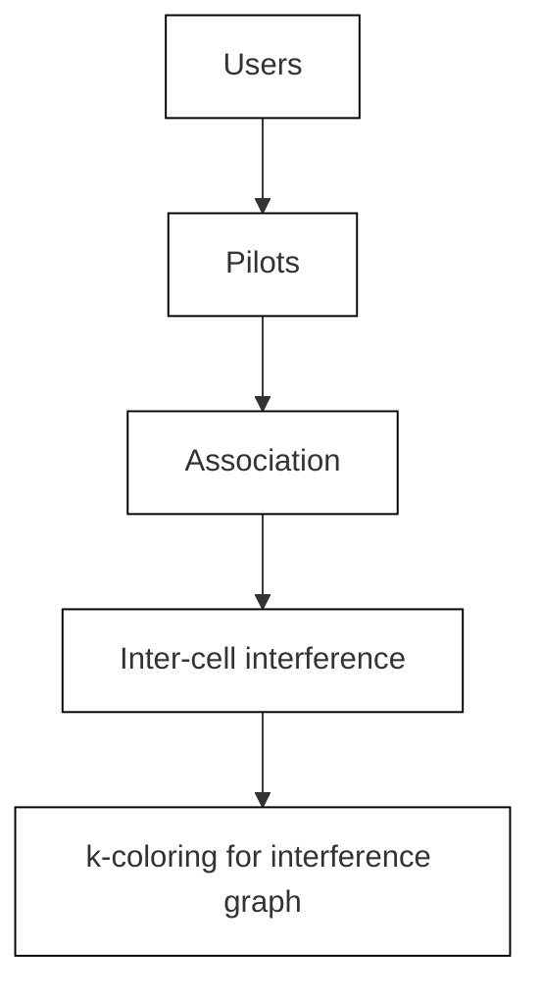
</details>

Fig. 9. Pilot assignment via k-coloring in uplink massive MIMO networks.

Lessons learned 4: Channel allocation and pilot placement are two main concerns for graph optimization in multi-antenna systems. For channel allocation, clique-based algorithms, graph coloring, and bipartite matching are utilized to maximize the sum-rate of single-cell and multi-cell MIMO systems. For pilots and other training resources, graph coloring is the most popular approach to improve resource utilization and decrease training overhead. The literature review demonstrates that graph optimization is expected to handle resource management in future massive MIMO systems and multi-antenna systems at mmWave and THz bands.

# E. Edge Caching and Computing

Computation and storage resources at the edge of various wireless networks have been increasingly important for resource management in line with communication resources. On the one hand, utilizing the storage resource of edge devices to cache popular contents is an effective approach to overcome backhaul link congestion and reduce content delivery latency. This facilitates the development of edge caching. On the other hand, deploying computing resources close to end users is able to accelerate the execution of compute-intensive tasks from end users via offloading. This prompts the emergence of edge computing. This subsection reviews the research literature on the application of graph optimization to resource management in edge caching and computing.

1) Edge Caching: Graph optimization approaches are mainly applied to content placement/delivery scheduling in edge caching. The interference graph is used to model the content delivery in small-cell networks in which each vertex represents one association between a user and a small BS with one channel and an edge connects two vertices with strong interference when delivering requested contents. Based on the constructed interference graph, the maximal independent set is used to propose joint user association and channel assignment algorithm to maximize the system throughput on content delivery [141]. The maximal independent set over interference graph is further employed to optimize user association and BS muting to maximize the number of users simultaneously served by content delivery [142]. In a downlink F-RAN, the MWIS is exploited to design a joint user association and power control scheme for enhanced remote radio heads, i.e., small cells, meanwhile a greedy coloring solution is devised for channel allocation in the central cloud BS, i.e., the macro cell [143]. Moreover, the hypergraph is used to formulate a three-dimensional matching in a cache-enabled D2D underlaying cellular network. In this work, there are three types of vertices representing content holders, content requesters, and cellular spectrum resources, respectively. A hyperedge consists of a cellular spectrum resource, a content holder and a content requester, which represents a feasible matching of them [144], as per Fig. 10. The one-to-one stable matching is utilized to spectrum allocation in cache-enabled vehicular networks for maximizing the content delivery efficiency and transmission rate [145].

For content placement, a hypergraph model is proposed to describe the presence of social communities of users and then used to develop a content placement framework in an overly D2D network [146]. A chromatic number based algorithm is proposed for content placement in HetNets for the hit rate maximization, which aims to cache popular contents

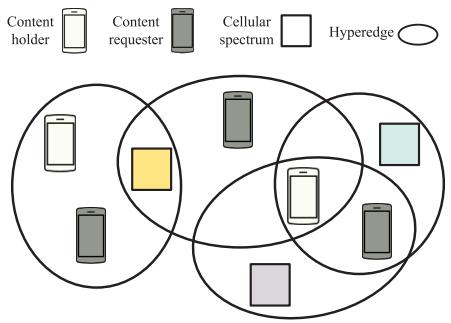

<details>
<summary>text_image</summary>

Content
holder
Content
requester
Cellular
spectrum
Hyperedge
</details>

Fig. 10. An example of hypergraph model for edge caching.

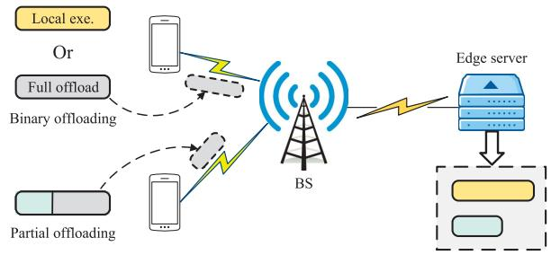

<details>
<summary>flowchart</summary>

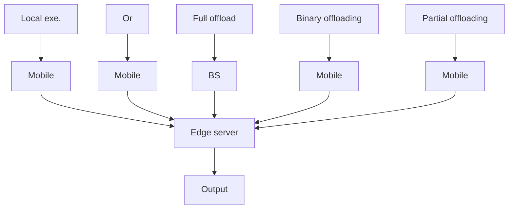
</details>

Fig. 11. Binary offloading and partial offloading.

using smallest memory of small BSs [147]. The minimumweight clique is utilized to a joint user scheduling and content placement scheme in HetNets to optimize the endto-end throughput, in which a coded multicasting is used to reduce the backhaul traffic load [148]. The maximumweight perfect matching is used to design a joint content placement and delivery strategy in a cache-enabled NOMA cellular network, aiming at minimizing the average system latency including backhaul-link transmission delay and content delivery delay [149].

2) Edge Computing: Graph optimization focuses on two categories of computation resource managements at the edge of wireless networks, i.e., baseband computing scheduling and computation offloading. First, the baseband computing scheduling aims to take full advantage of computation resources at the baseband unit to support users’ access requirements. The maximum-weight bipartite matching is utilized to assign each user or its task with available virtual machines (VMs), where baseband computation resources are modeled as different VMs [150], [151]. Second, computation offloading enables users to offload their compute-intensive tasks to nearby BS equipped with edge computing server. Then, BS can execute the compute-intensive task for users. Generally, there are two offloading policies that are the binary offloading and the partial offloading, as per Fig. 11.

For the binary offloading, each user executes the task in local or entirely offload the task to BS. The many-to-one matching is exploited to optimize binary offloading decision and channel assignment in a single-cell mobile edge computing (MEC) network [59]. The MWIS is further used to optimize user clustering and access control for task offloading in single-cell and multi-cell MEC networks [152], [153]. Considering the dependency among computation tasks, the

TABLE V A SUMMARY OF RESOURCE MANAGEMENT APPROACHES USING GRAPH OPTIMIZATION FOR EDGE CACHING AND COMPUTING 

<table><tr><td>Use Cases</td><td>References</td><td>Methods</td><td>Graph Types</td><td>Issues</td><td>Networks</td></tr><tr><td rowspan="9">Edge Caching</td><td>[141]</td><td>Maximal independent set</td><td>Interference graph</td><td>User association and channel assignment</td><td>Small-cell network</td></tr><tr><td>[142]</td><td>Maximal independent set</td><td>Interference graph</td><td>User association and BS muting</td><td>Small-cell network</td></tr><tr><td>[143]</td><td>MWIS</td><td>Interference graph</td><td>User association and power control</td><td>F-RAN</td></tr><tr><td>[144]</td><td>Three-dimensional matching</td><td>Hypergraph</td><td>D2D pairing and resource allocation</td><td>D2D underlaying cellular network</td></tr><tr><td>[145]</td><td>Stable matching</td><td>Bipartite graph</td><td>Spectrum allocation</td><td>Vehicular content delivery</td></tr><tr><td>[146]</td><td>Cooperative game</td><td>Hypergraph</td><td>Content placement</td><td>Overlay D2D</td></tr><tr><td>[147]</td><td>Chromatic number</td><td>Conflict graph</td><td>Content placement</td><td>HetNet</td></tr><tr><td>[148]</td><td>Minimum-weight clique</td><td>Conflict graph</td><td>User scheduling and content placement</td><td>HetNet with coded multicasing</td></tr><tr><td>[149]</td><td>Maximum-weight perfect matching</td><td>Undirected graph</td><td>Joint content placement and delivery</td><td>NOMA</td></tr><tr><td rowspan="8">Edge Computing</td><td>[150], [151]</td><td>Maximum-weight matching</td><td>Bipartite graph</td><td>VM assignment</td><td>C-RAN</td></tr><tr><td>[59]</td><td>Many-to-one matching</td><td>Bipartite graph</td><td>Binary offloading decision</td><td>Single-cell MEC</td></tr><tr><td>[152], [153]</td><td>MWIS</td><td>Conflict graph</td><td>User clustering and access control</td><td>Multi-cell MEC</td></tr><tr><td>[154]</td><td>Extreme value theory</td><td>DAG</td><td>Dependent task offloading</td><td>Time-slotted MEC</td></tr><tr><td>[155]</td><td>Minimum-cost flow</td><td>Flow network</td><td>Binary and partial offloading</td><td>Multi-cell MEC</td></tr><tr><td>[156]</td><td>Shortest path</td><td>Directed graph</td><td>Transmission scheduling</td><td>IoVT</td></tr><tr><td>[157]</td><td>Shortest path</td><td>Directed graph</td><td>Partial offloading and data routing</td><td>Trackside MEC</td></tr><tr><td>[158]</td><td>Heuristic</td><td>Bipartite graph</td><td>Computation resource allocation</td><td>Three-tier MEC</td></tr></table>

DAG is utilized to describe the execution order and relationship between tasks and propose the corresponding computation offloading scheme [154]. A minimum-cost flow based algorithm is developed to optimize the task offloading in multi-cell MEC networks, which is shown to be applicable to both binary and partial offloading policies [155]. The shortest path is utilized to optimize transmission scheduling in NOMA assisted Internet of video things (IoVT) [156].

For the partial offloading, each user can offload a part of its compute-intensive task by partitioning the entire task into subtasks and then execute the remainder in local. The shortest path is exploited to find a proper data routing path for delivering each offloaded subtask and each processing result for maximizing the network throughput in a trackside MEC network [157]. A bipartite matching based heuristic algorithm is proposed to allocate each subtask one of computation resources in a cloud-edge-end three tier networks for transmit energy minimization [158].

Lessons learned 5: With the development of edge caching and computing, storage and computation resources at the edge of wireless networks have become indispensable for resource management, along with communication resources. For edge caching, graph optimization approaches focus on content placement and delivery scheduling. Independent setbased algorithms over interference graphs are efficient for content delivery to maximize system throughput and user capacity. Hypergraph and bipartite matching are also used for content delivery optimization. Furthermore, various graph optimization methods, such as hypergraph, graph coloring, bipartite matching, and clique-based algorithms, are proposed for content placement to make full use of storage resources to promote the hit rate. For edge computing, graph optimization methods are applied to baseband computing scheduling and computation offloading. For baseband computing scheduling, bipartite matching is the efficient and popular approach to assign virtualized computing resources. For computation offloading, bipartite matching, independent set-based algorithms, DAG-based algorithms, and the minimum-cost flow are utilized for binary offloading decision and channel assignment. The shortest path and bipartite matching are usually exploited for designing partial offloading schemes. Table V summarizes the reviewed resource management approaches using graph optimization for edge caching and edge computing along with references. From the literature review, we can see that graph optimization can be utilized for resource management in future edge AI and data center network.

# F. Non-Terrestrial Networks

Tremendous developments of aerospace technologies and the cost reduction of manufacturing and launching facilitate new use cases and applications of NTNs and their integration with all kinds of terrestrial wireless networks. This brings new challenges and problems on resource management in NTNs. There is recent literature exploiting graph optimization approaches to tackle relevant issues in satellite networks and aerial networks.

1) Satellite Networks: Link scheduling, user association, and handoff are typical issues of resource management in satellite networks [159], [160]. TEG is the most popular graph model for resource management in satellite networks. TEGs can characterize the potential available communication links, i.e., contacts, at different time slots among different nodes in a given satellite constellation. Generally speaking, a TEG consists of T layers if the scheduling period has T time slots. Each layer includes all the network nodes, e.g., onorbit satellites, ground stations, etc., represented by vertices, and contacts in current time slot represented by horizontal edges. There are vertical edges between two adjacent layers representing the carrying of flow forward. Fig. 12 shows an illustration of the TEG for satellite networks. Over the TEG, the maximum-weight bipartite matching is used for contact planning, i.e., link scheduling, to maximize the network throughput [161] or the transmission success ratio [162]. The maximum flow is utilized to design a transceiver resource allocation scheme to maximize the resource utilization for inter-satellite communication links [163]. Furthermore, the RL is exploited over the TEG to propose a long-term resource allocation scheme with low computational complexity to maximize the network capacity in a heterogeneous satellite network [164]. The hypergraph is combined with TEGs to model multi-domain resource allocation problems in heterogeneous satellite networks and accomplish the scheduling with low computational complexity [165].

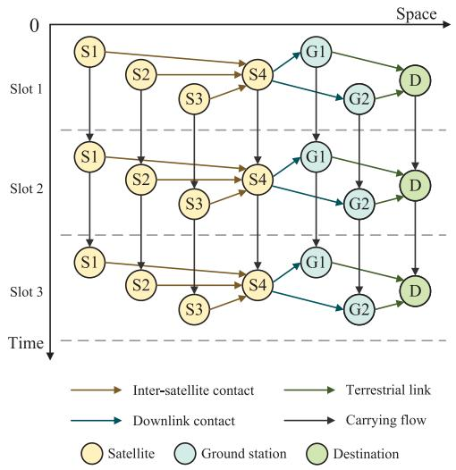

<details>
<summary>flowchart</summary>

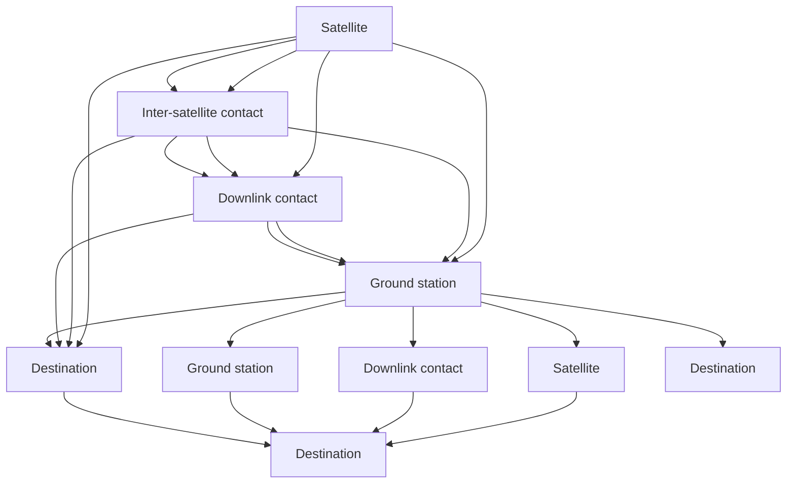
</details>

Fig. 12. An example of TEG for satellite networks.

There are several variants of TEG proposed to depict the resource management procedure in satellite networks [166], [167], [168], [169], [170], [171]. To be specific, a timeevolving resource graph (TERG) is proposed to describe the evolution of multi-dimensional resources in broadband satellite networks [166]. A time-expanded resource relationship graph (TERRG) is further developed to model evolving service capabilities of multi-dimensional resources by a unified measurement standard, which is used to proposed an optimal resource mobility utilization strategy [168]. An enhanced TEG (ETEG) is devised which can jointly depicts different resources and combines the transmission and observation phases in satellite networks [170]. Besides the TEG and its variants, the conflict graph is applied to characterize the conflict of resource utilization between different communication links in satellite networks [172], [173].

2) Aerial Networks: Due to the characteristics of high maneuverability and low cost, autonomous aerial vehicles (AAVs) have participated in wireless communications and networking to build various aerial networks, as per Fig. 13. In aerial cellular networks, the k-coloring is employed to assign AAV-BSs with limited channels to maximize downlink sum-rate over a dynamic interference graph, where the edge between any two vertices is dynamically changing due to the mobility of AAV-BSs [174]. The MWIS is utilized to optimize spectrum resource allocation to improve spectrum efficiency of aerial cellular communications [175], [176]. In AAV-assisted

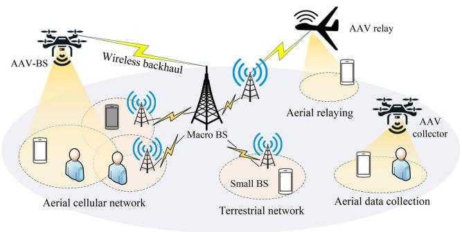

<details>
<summary>flowchart</summary>

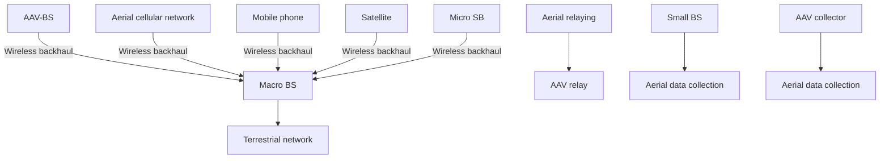
</details>

Fig. 13. An illustration of aerial networks.

data collection systems, a hypergraph based greedy coloring algorithm is proposed to divide users into several NOMA groups and allocate each group one uplink spectrum channel for the sum-rate maximization [177]. The maximum bipartite matching is exploited for channel allocation to promote energy saving during data collection from sensors to the AAV [178]. For an aerial edge computing network, the bipartite stable matching is used to match users with edge server-mounted AAV-BSs to meet high delay sensitivity requirement for computation offloading [179]. In a AAV-assisted wireless body area networks (WBAN), stable matching and k-coloring are used to optimize RB allocation to mitigate interference [180].

Besides the above issues, the mobility of AAVs bring new optimization dimension in flexible network deployment. The shortest path is used to obtain the optimal AAV trajectory to minimize the completion time of information uploading from the AAV to ground BSs, where the mobility of AAV follows the fly-hover-fly structure [181]. For a large-scale aerial cellular network, DAG is exploited to describe the trajectory of each AAV-BS and propose a cooperative trajectory planning algorithm over user locations and charging stations [182]. The maximum flow is utilized to model the trajectory planning problem in a AAV-assisted relay network, which is solved by the spectral graph theory to maximize the data flow of the network [183].

Lessons learned 6: Graph optimization has recently been applied to resource management in NTNs, including satellite networks and aerial networks, to enhance network capacity and the coverage performance. In satellite networks, the TEG is the most common graph model for resource management. Over TEGs, bipartite matching, the maximum flow, hypergraph, and RL-based algorithms are utilized for contact planning and resource allocation with different objectives. Furthermore, many TEG variants have been proposed to describe the process of resource management and model the evolution of multi-dimensional resources. In aerial networks, graph coloring, independent set-based algorithms, hypergraph, and bipartite matching are used for channel allocation and the association between AAVs and other network elements, e.g., terrestrial BSs and users, to promote resource utilization. More importantly, graph optimization methods including the shortest path, DAG-based algorithms, and the maximum flow are utilized for solving and modeling AAV trajectory planning problems to improve the coverage performance in diverse aerial networks. Table VI summarizes the reviewed resource management approaches using graph optimization in NTNs along with references. The literature review demonstrates that graph optimization is promising to manage multi-dimensional resources in future multi-tier space-air-ground integrated networks.

TABLE VI A SUMMARY OF RESOURCE MANAGEMENT APPROACHES USING GRAPH OPTIMIZATION IN NTNS 

<table><tr><td>Networks</td><td>References</td><td>Methods</td><td>Graph Types</td><td>Issues</td><td>Use Cases</td></tr><tr><td rowspan="12">Satellite Networks</td><td>[161], [162]</td><td>Maximum-weight matching</td><td>Bipartite graph</td><td>Contact planning</td><td>Satellite relaying</td></tr><tr><td>[163]</td><td>Maximum flow</td><td>Flow network</td><td>Transceiver resource allocation</td><td>Inter-satellite communications</td></tr><tr><td>[164]</td><td>RL</td><td>TEG</td><td>Long-term resource allocation</td><td>Inter-satellite communications</td></tr><tr><td>[165]</td><td>Shortest path</td><td>Hypergraph</td><td>Multi-domain resource allocation</td><td>Inter-satellite communications</td></tr><tr><td>[166]</td><td>Maximum flow</td><td>TERG</td><td>Multi-dimensional resource scheduling</td><td>Satellite relaying</td></tr><tr><td>[167]</td><td>Maximum flow</td><td>Event-driven TEG</td><td>Multi-resource coordinate scheduling</td><td>Earth observation</td></tr><tr><td>[168]</td><td>Maximum flow</td><td>TERRG</td><td>Resource mobility utilization</td><td>Earth observation</td></tr><tr><td>[169]</td><td>Maximum flow</td><td>TEG</td><td>Contact planning</td><td>Remote sensing</td></tr><tr><td>[170]</td><td>Maximum flow</td><td>ETEG</td><td>Multi-resource coordinate scheduling</td><td>Earth observation</td></tr><tr><td>[171]</td><td>Maximum flow</td><td>Resource TEG</td><td>Energy-efficient resource scheduling</td><td>Remote sensing</td></tr><tr><td>[172]</td><td>Q-learning</td><td>Conflict graph</td><td>Data forward and backward induction</td><td>Remote sensing by small satellites</td></tr><tr><td>[173]</td><td>Maximum independent set</td><td>Conflict graph</td><td>Task scheduling</td><td>Satellite relaying</td></tr><tr><td rowspan="9">Aerial Networks</td><td>[174]</td><td>k-coloring</td><td>Conflict graph</td><td>Channel allocation</td><td>Aerial cellular communications</td></tr><tr><td>[175], [176]</td><td>MWIS</td><td>Conflict graph</td><td>Spectrum allocation</td><td>Aerial cellular communications</td></tr><tr><td>[177]</td><td>Greedy coloring</td><td>Hypergraph</td><td>User grouping and channel allocation</td><td>Data collection</td></tr><tr><td>[178]</td><td>Maximum matching</td><td>Bipartite graph</td><td>Channel allocation</td><td>Data collection</td></tr><tr><td>[179]</td><td>Stable matching</td><td>Bipartite graph</td><td>User association</td><td>Aerial edge computing</td></tr><tr><td>[180]</td><td>Stable matching and k-coloring</td><td>Topology graph</td><td>RB allocation</td><td>WBAN</td></tr><tr><td>[181]</td><td>Shortest path</td><td>Topology graph</td><td>UAV trajectory planning</td><td>Data uploading with NOMA</td></tr><tr><td>[182]</td><td>Dynamic programming</td><td>DAG</td><td>Cooperative trajectory planning</td><td>Aerial cellular communications</td></tr><tr><td>[183]</td><td>Maximum flow</td><td>Flow network</td><td>UAV trajectory planning</td><td>UAV relaying</td></tr></table>

# G. Summary and Discussion

This section investigates the application of graph optimization for resource management in wireless networks. We review the literature from five scenarios: cellular networks, D2D communications, multi-hop networks, multi-antenna systems, edge computing and caching, and NTNs. We first focus on the graph optimization approaches for resource management in cellular networks. Various graph optimization methods are applied in single-cell networks and multi-cell networks to coordinate interference and improve resource utilization. Second, we elaborate on graph optimization methods in D2D communications with different working modes for spectrum reuse and mode selection to increase spectrum efficiency. Then, we investigate graph optimizationbased link scheduling and resource allocation algorithms in multi-hop networks, including SONs, relay networks, and vehicular networks. Afterwards, we concentrate on graph optimization methods in multi-antenna systems, which are applied to channel allocation and pilot placement to increase resource utilization and reduce training overhead. Furthermore, we investigate how graph optimization facilitates the development of computation and storage resource management at the edge of wireless networks from the perspectives of edge caching and edge computing. Finally, we review the literature of graph optimization applied in NTNs, including satellite networks and aerial networks. TEGbased algorithms are highly effective for contact planning and resource allocation in satellite networks, while diverse graph optimization approaches are used for AAV trajectory planning and resource allocation in aerial networks. In the future, advanced graph optimization methods will continue to leverage their advantages in combinatorial optimization and integrate with emerging wireless communication technologies to enhance overall performance in resource management.

# IV. CONCLUSION

In this part, we have presented a comprehensive survey on resource management via graph optimization. First, we have started with the basics of graph theory to introduce graph optimization problems and methods. Then, the literature on graph optimization approaches for resource management has been systematically reviewed according to different scenarios, i.e., cellular networks, D2D communications, multi-hop networks, multi-antenna systems, edge caching and computing, and NTNs. In Part II of this survey, we will focus on graph learning for resource management in wireless networks and then discuss current technical challenges and future research directions in this field.

# REFERENCES

[1] Y. Sun, J. Chen, Z. Wang, M. Peng, and S. Mao, “Enabling mobile virtual reality with open 5G, fog computing and reinforcement learning,” IEEE Netw., vol. 36, no. 6, pp. 142–149, Nov./Dec. 2022.   
[2] Y. Qiao et al., “Joint optimization of resource allocation and user association in multi-frequency cellular networks assisted by RIS,” IEEE Trans. Veh. Technol., vol. 73, no. 1, pp. 826–842, Jan. 2024.   
[3] Y. Peng, J. Guo, and C. Yang, “Learning resource allocation policy: Vertex-GNN or edge-GNN?” IEEE Trans. Mach. Learn. Commun. Netw., vol. 2, pp. 190–209, Jan. 2024.   
[4] X. Ren, H. Mosavat-Jahromi, L. Cai, and D. Kidston, “Spatiotemporal spectrum load prediction using convolutional neural network and ResNet,” IEEE Trans. Cogn. Commun. Netw., vol. 8, no. 2, pp. 502–513, Jun. 2022.   
[5] T. Zhang and S. Mao, “Energy-efficient power control in wireless networks with spatial deep neural networks,” IEEE Trans. Cogn. Commun. Netw., vol. 6, no. 1, pp. 111–124, Mar. 2020.   
[6] K. Chawla and X. Qiu, “Quasi-static resource allocation with interference avoidance for fixed wireless systems,” IEEE J. Sel. Areas Commun., vol. 17, no. 3, pp. 493–504, Mar. 1999.   
[7] A. Helmy, “Small worlds in wireless networks,” IEEE Commun. Lett., vol. 7, no. 10, pp. 490–492, Oct. 2003.   
[8] K. Jain, J. Padhye, V. N. Padmanabhan, and L. Qiu, “Impact of interference on multi-hop wireless network performance,” in Proc. ACM MobiCom, San Diego, CA, USA, Sep. 2003, pp. 66–80.   
[9] M. Kodialam and T. Nandagopal, “Characterizing the capacity region in multi-radio multi-channel wireless mesh networks,” in Proc. ACM MobiCom, Cologne, Germany, Aug. 2005, pp. 73–87.   
[10] S. Zhang, Z. Ding, and S. Cui, “Introducing hypergraph signal processing: Theoretical foundation and practical applications,” IEEE Internet Things J., vol. 7, no. 1, pp. 639–660, Jan. 2020.   
[11] S. Zhang, S. Cui, and Z. Ding, “Hypergraph spectral clustering for point cloud segmentation,” IEEE Signal Process. Lett., vol. 27, pp. 1655–1659, Sep. 2020.   
[12] S. Zhang, S. Cui, and Z. Ding, “Hypergraph spectral analysis and processing in 3D point cloud,” IEEE Trans. Image Process., vol. 30, pp. 1193–1206, 2020.   
[13] M. Eisen and A. Ribeiro, “Large scale wireless power allocation with graph neural networks,” in Proc. IEEE SPAWC, Jul. 2019, pp. 1–5.   
[14] M. Eisen and A. Ribeiro, “Optimal wireless resource allocation with random edge graph neural networks,” IEEE Trans. Signal Process., vol. 68, pp. 2977–2991, Apr. 2020.   
[15] Y. Shen, Y. Shi, J. Zhang, and K. B. Letaief, “A graph neural network approach for scalable wireless power control,” in Proc. IEEE GC Wkshps, Dec. 2019, pp. 1–6.   
[16] Y. Shen, Y. Shi, J. Zhang, and K. B. Letaief, “Graph neural networks for scalable radio resource management: Architecture design and theoretical analysis,” IEEE J. Sel. Areas Commun., vol. 39, no. 1, pp. 101–115, Jan. 2021.   
[17] Y. Shen, J. Zhang, S. Song, and K. B. Letaief, “Graph neural networks for wireless communications: From theory to practice,” IEEE Trans. Wireless Commun., vol. 22, no. 5, pp. 3554–3569, May 2023.   
[18] Y. Shen, J. Zhang, and K. B. Letaief, “How neural architectures affect deep learning for communication networks?” in Proc. IEEE ICC, May 2022, pp. 389–394.   
[19] A. Chowdhury, G. Verma, C. Rao, A. Swami, and S. Segarra, “Unfolding WMMSE using graph neural networks for efficient power allocation,” IEEE Trans. Wireless Commun., vol. 20, no. 9, pp. 6004–6017, Sep. 2021.   
[20] H. Yang et al., “Knowledge-driven resource allocation for wireless networks: A WMMSE unrolled graph neural network approach,” IEEE Internet Things J., vol. 11, no. 10, pp. 18902–18916, May 2024.   
[21] V. Lima, M. Eisen, K. Gatsis, and A. Ribeiro, “Large-scale graph reinforcement learning in wireless control systems,” Apr. 2022, arXiv:2201.09859.   
[22] Z. Zhao, G. Verma, C. Rao, A. Swami, and S. Segarra, “Link scheduling using graph neural networks,” IEEE Trans. Wireless Commun., vol. 22, no. 6, pp. 3997–4012, Jun. 2023.

[23] M. Lee, G. Yu, and G. Y. Li, “Wireless link scheduling for D2D communications with graph embedding technique,” in Proc. IEEE ICC, Jun. 2020, pp. 1–6.   
[24] M. Lee, G. Yu, and G. Y. Li, “Graph embedding-based wireless link scheduling with few training samples,” IEEE Trans. Wireless Commun., vol. 20, no. 4, pp. 2282–2294, Apr. 2021.   
[25] P. Cardieri, “Modeling interference in wireless ad hoc networks,” IEEE Commun. Surveys Tuts., vol. 12, no. 4, pp. 551–572, 4th Quart., 2010.   
[26] P. H. Pathak and R. Dutta, “A survey of network design problems and joint design approaches in wireless mesh networks,” IEEE Commun. Surveys Tuts., vol. 13, no. 3, pp. 396–428, 3rd Quart., 2010.   
[27] A. Majeed and I. Rauf, “Graph theory: A comprehensive survey about graph theory applications in computer science and social networks,” Inventions, vol. 5, no. 1, p. 10, Feb. 2020.   
[28] S. He et al., “An overview on the application of graph neural networks in wireless networks,” IEEE Open J. Commun. Soc., vol. 2, pp. 2547–2565, 2021.   
[29] W. Jiang, “Graph-based deep learning for communication networks: A survey,” Comput. Commun., vol. 185, pp. 40–54, Mar. 2022.   
[30] P. Tam, I. Song, S. Kang, S. Ros, and S. Kim, “Graph neural networks for intelligent Modelling in network management and orchestration: A survey on communications,” Electronics, vol. 11, no. 20, p. 3371, Oct. 2022.   
[31] Y. Li, S. Xie, Z. Wan, H. Lv, H. Song, and Z. Lv, “Graph-powered learning methods in the Internet of Things: A survey,” Mach. Learn. Appl., vol. 11, Mar. 2023, Art. no. 100441.   
[32] G. Dong et al., “Graph neural networks in IoT: A survey,” ACM Trans. Sens. Netw., vol. 19, no. 2, pp. 1–50, May 2023.   
[33] A. Ivanov, K. Tonchev, V. Poulkov, A. Manolova, and N. N. Neshov, “Graph-based resource allocation for integrated space and terrestrial communications,” Sensors, vol. 22, no. 15, p. 5778, Aug. 2022.   
[34] B. Bollobás, Modern Graph Theory, vol. 184. New York, NY, USA: Springer, 2013.   
[35] A. Saha, A. Chongder, S. B. Mandal, and A. Chakrabarti, “Synthesis of vertex Coloring problem using grover’s algorithm,” in Proc. IEEE Int. Symp. Nanoelectron. Inf. Syst., Dec. 2015, pp. 101–106.   
[36] F. Furini, V. Gabrel, and I. Ternier, “An improved DSATURbased branch-and-bound algorithm for the vertex coloring problem,” Networks, vol. 69, no. 1, pp. 124–141, Nov. 2016.   
[37] D. D. Zaini, H. Vincensius, K. A. N. U. Widjaja, Nurhasanah, and A. T. Handoyo, “Implementing Welsh-Powell algorithm on coloring the map of west java,” in Proc. ACM SIET, Oct. 2023, pp. 679–684.   
[38] D. Brelaz, “New methods to color the vertices of a graph,” Commun. ACM, vol. 22, no. 4, pp. 251–256, Apr. 1979.   
[39] M. Osama, M. Truong, C. Yang, A. Buluç, and J. Owens, “Graph coloring on the GPU,” in Proc. IEEE IPDPSW, May 2019, pp. 231–240.   
[40] A. Madkour, W. G. Aref, F. U. Rehman, M. A. Rahman, and S. Basalamah, “A survey of shortest-path algorithms,” May 2017, arXiv:1705.02044.   
[41] A. V. Goldberg and R. E. Tarjan, “Efficient maximum flow algorithms,” Commun. ACM, vol. 57, no. 8, pp. 82–89, Aug. 2014.   
[42] P. Kovacs, “Minimum-cost flow algorithms: An experimental evaluation,” Optim. Methods Softw., vol. 30, no. 1, pp. 94–127, Jan. 2015.   
[43] L. Wang and G. L. Stuber, “Pairing for resource sharing in cellular device-to-device underlays,” IEEE Netw., vol. 30, no. 2, pp. 122–128, Mar./Apr. 2016.   
[44] Z. Han, Y. Gu, and W. Saad, “Fundamentals of matching theory,” in Matching Theory for Wireless Networks. Cham, Switzerland: Springer Int. Publ., 2017, pp. 9–15.   
[45] G. E. Blelloch, J. T. Fineman, and J. Shun, “Greedy sequential maximal independent set and matching are parallel on average,” in Proc. ACM SPAA, Pittsburgh, PA, USA, Jun. 2012, pp. 308–317.   
[46] S. Shimizu, K. Yamaguchi, T. Saitoh, and S. Masuda, “Fast maximum weight clique extraction algorithm: Optimal tables for branch-andbound,” Discrete Appl. Math., vol. 223, pp. 120–134, May 2017.   
[47] H. T. Cheng and W. Zhuang, “Pareto optimal resource management for wireless mesh networks with QoS assurance: Joint node clustering and subcarrier allocation,” IEEE Trans. Wireless Commun., vol. 8, no. 3, pp. 1573–1583, Mar. 2009.   
[48] R. Y. Chang, Z. Tao, J. Zhang, and C.-C. J. Kuo, “Multicell OFDMA downlink resource allocation using a graphic framework,” IEEE Trans. Veh. Technol., vol. 58, no. 7, pp. 3494–3507, Sep. 2009.   
[49] B. Bai, W. Chen, Z. Cao, and K. Letaief, “Max-matching diversity in OFDMA systems,” IEEE Trans. Commun., vol. 58, no. 4, pp. 1161–1171, Apr. 2010.

[50] B. B. Bai, W. Chen, K. B. Letaief, and Z. Cao, “Diversity-multiplexing tradeoff in OFDMA systems: An H-matching approach,” IEEE Trans. Wireless Commun., vol. 10, no. 11, pp. 3675–3687, Nov. 2011.   
[51] A. N. Zaki and A. O. Fapojuwo, “Optimal and efficient graph-based resource allocation algorithms for multiservice frame-based OFDMA networks,” IEEE Trans. Mobile Comput., vol. 10, no. 8, pp. 1175–1186, Aug. 2011.   
[52] L. Lei, D. Yuan, C. K. Ho, and S. Sun, “A unified graph Labeling algorithm for consecutive-block channel allocation in SC-FDMA,” IEEE Trans. Wireless Commun., vol. 12, no. 11, pp. 5767–5779, Nov. 2013.   
[53] S. Bodas, S. Shakkottai, L. Ying, and R. Srikant, “Scheduling in multi-channel wireless networks: Rate function optimality in the smallbuffer regime,” IEEE Trans. Inf. Theory, vol. 60, no. 2, pp. 1101–1125, Feb. 2014.   
[54] X. Zhou, L. Yang, and D. Yuan, “Bipartite matching based user grouping for grouped OFDM-IDMA,” IEEE Trans. Wireless Commun., vol. 12, no. 10, pp. 5248–5257, Oct. 2013.   
[55] M. O. Ojo, S. Giordano, D. Adami, and M. Pagano, “Throughput Maximizing and fair scheduling algorithms in Industrial Internet of Things networks,” IEEE Trans. Ind. Informat., vol. 15, no. 6, pp. 3400–3410, Jun. 2019.   
[56] Z. Chen, W. Yi, Y. Liu, and A. Nallanathan, “Robust federated learning for unreliable and resource-limited wireless networks,” IEEE Trans. Wireless Commun., vol. 23, no. 8, pp. 9793–9809, Aug. 2024.   
[57] B. Di, L. Song, and Y. Li, “Sub-channel assignment, power allocation, and user scheduling for non-orthogonal multiple access networks,” IEEE Trans. Wireless Commun., vol. 15, no. 11, pp. 7686–7698, Nov. 2016.   
[58] J. Zhu, J. Wang, Y. Huang, S. He, X. You, and L. Yang, “On optimal power allocation for downlink non-orthogonal multiple access systems,” IEEE J. Sel. Areas Commun., vol. 35, no. 12, pp. 2744–2757, Dec. 2017.   
[59] M. Sheng, Y. Dai, J. Liu, N. Cheng, X. Shen, and Q. Yang, “Delayaware computation offloading in NOMA MEC under differentiated uploading delay,” IEEE Trans. Wireless Commun., vol. 19, no. 4, pp. 2813–2826, Apr. 2020.   
[60] D. Zhai and J. Du, “Spectrum efficient resource management for multicarrier-based NOMA networks: A graph-based method,” IEEE Wireless Commun. Lett., vol. 7, no. 3, pp. 388–391, Jun. 2018.   
[61] D. Zhai and R. Zhang, “Joint admission control and resource allocation for multi-carrier uplink NOMA networks,” IEEE Wireless Commun. Lett., vol. 7, no. 6, pp. 922–925, Dec. 2018.   
[62] F. Librino and P. Santi, “Resource allocation and sharing in URLLC for IoT applications using shareability graphs,” IEEE Internet Things J., vol. 7, no. 10, pp. 10511–10526, Oct. 2020.   
[63] F. Librino and P. Santi, “The complexity-performance tradeoff in resource allocation for URLLC exploiting dynamic CSI,” IEEE Internet Things J., vol. 8, no. 17, pp. 13266–13277, Sep. 2021.   
[64] P. Annamalai, J. Bapat, and D. Das, “Resource allocation algorithm for hybrid IBFD cellular networks for 5G and beyond,” IEEE Trans. Wireless Commun., vol. 21, no. 4, pp. 2414–2429, Apr. 2022.   
[65] P. Annamalai, J. Bapat, and D. Das, “UE grouping algorithms to maximize frequency sharing in hybrid IBFD networks,” IEEE Trans. Wireless Commun., vol. 21, no. 11, pp. 9668–9683, Nov. 2022.   
[66] Y. Yu, E. Dutkiewicz, X. Huang, and M. Mueck, “Downlink resource allocation for next generation wireless networks with intercell interference,” IEEE Trans. Wireless Commun., vol. 12, no. 4, pp. 1783–1793, Apr. 2013.   
[67] J. Chen, Z. Wang, and R. Jiang, “Downlink interference management in cell-free VLC network,” IEEE Trans. Veh. Technol., vol. 68, no. 9, pp. 9007–9017, Sep. 2019.   
[68] J. Zheng, Y. Cai, Y. Liu, Y. Xu, B. Duan, and X. Shen, “Optimal power allocation and user scheduling in multicell networks: Base station cooperation using a game-theoretic approach,” IEEE Trans. Wireless Commun., vol. 13, no. 12, pp. 6928–6942, Dec. 2014.   
[69] J. Cao, T. Peng, Z. Qi, R. Duan, Y. Yuan, and W. Wang, “Interference management in ultradense networks: A user-centric coalition formation game approach,” IEEE Trans. Veh. Technol., vol. 67, no. 6, pp. 5188–5202, Jun. 2018.   
[70] J. Cao et al., “Resource allocation for ultradense networks with machine-learning-based interference graph construction,” IEEE Internet Things J., vol. 7, no. 3, pp. 2137–2151, Mar. 2020.   
[71] K. Khalil, G. Farhadi, and A. Ito, “Iterative fair channel assignment for wireless networks,” IEEE Wireless Commun. Lett., vol. 3, no. 2, pp. 145–148, Apr. 2014.

[72] S. Sadr and R. S. Adve, “Partially-distributed resource allocation in small-cell networks,” IEEE Trans. Wireless Commun., vol. 13, no. 12, pp. 6851–6862, Dec. 2014.   
[73] S. Jangsher and V. O. K. Li, “Resource allocation in moving small cell network,” IEEE Trans. Wireless Commun., vol. 15, no. 7, pp. 4559–4570, Jul. 2016.   
[74] Y. Meng, J. Li, H. Li, and M. Pan, “A transformed conflict graphbased resource-allocation scheme combining interference alignment in OFDMA femtocell networks,” IEEE Trans. Veh. Technol., vol. 64, no. 10, pp. 4728–4737, Oct. 2015.   
[75] W. Liu, K. Liu, L. Tian, C. Zhang, and Y. Yang, “Joint interference alignment and subchannel allocation in ultra-dense networks,” IEEE Trans. Veh. Technol., vol. 71, no. 7, pp. 7287–7296, Jul. 2022.   
[76] N. Yu, Y. Miao, L. Mu, H. Du, H. Huang, and X. Jia, “Minimizing energy cost by dynamic switching ON/OFF base stations in cellular networks,” IEEE Trans. Wireless Commun., vol. 15, no. 11, pp. 7457–7469, Nov. 2016.   
[77] C. Guo, B. Liao, L. Huang, P. Zhang, M. Huang, and J. Zhang, “On proportional fairness in power allocation for two-tone spectrumsharing networks,” IEEE Trans. Veh. Technol., vol. 65, no. 12, pp. 10090–10096, Dec. 2016.   
[78] A. Douik, H. Dahrouj, T. Y. Al-Naffouri, and M.-S. Alouini, “Low-complexity scheduling and power adaptation for coordinated cloud-radio access networks,” IEEE Commun. Lett., vol. 21, no. 10, pp. 2298–2301, Oct. 2017.   
[79] Y. Wang, W. Wang, V. K. N. Lau, L. Chen, and Z. Zhang, “Heterogeneous spectrum aggregation: Coexistence from a queue stability perspective,” IEEE Trans. Wireless Commun., vol. 17, no. 4, pp. 2471–2485, Apr. 2018.   
[80] A. Sultana, I. Woungang, L. Zhao, and A. Anpalagan, “Two-tier architecture for spectrum auction in SDN-enabled cloud radio access network,” IEEE Trans. Veh. Technol., vol. 68, no. 9, pp. 9191–9204, Sep. 2019.   
[81] K. Mawatwal, R. Roy, and D. Sen, “A state based resource allocation game for distributed optimization in 5G small-cell networks,” IEEE Trans. Veh. Technol., vol. 70, no. 11, pp. 12072–12087, Nov. 2021.   
[82] A. Zhu, M. Ma, S. Guo, S. Yu, and L. Yi, “Adaptive multi-access algorithm for multi-service edge users in 5G ultra-dense heterogeneous networks,” IEEE Trans. Veh. Technol., vol. 70, no. 3, pp. 2807–2821, Mar. 2021.   
[83] H. Shao, H. Zhang, L. Sun, and Y. Qian, “Resource allocation and hybrid OMA/NOMA mode selection for non-coherent joint transmission,” IEEE Trans. Wireless Commun., vol. 21, no. 4, pp. 2695–2709, Apr. 2022.   
[84] L. Chen, L. Ma, Y. Xu, and V. C. M. Leung, “Hypergraph spectral clustering based spectrum resource allocation for dense NOMA-HetNet,” IEEE Wireless Commun. Lett., vol. 8, no. 1, pp. 305–308, Feb. 2019.   
[85] C. Zhuansun, K. Yan, G. Zhang, Z. Xiong, and C. Huang, “Hypergraphbased resource allocation for ultra-dense wireless network in Industrial IoT,” IEEE Commun. Lett., vol. 26, no. 9, pp. 2106–2110, Sep. 2022.   
[86] R. Sun et al., “Delay-oriented caching strategies in D2D mobile networks,” IEEE Trans. Veh. Technol., vol. 69, no. 8, pp. 8529–8541, Aug. 2020.   
[87] S. Hashima et al., “Energy-aware hybrid RF-VLC multiband selection in D2D communication: A stochastic multiarmed bandit approach,” IEEE Internet Things J., vol. 9, no. 18, pp. 18002–18014, Sep. 2022.   
[88] D. Feng, L. Lu, Y. Yuan-Wu, G. Y. Li, G. Feng, and S. Li, “Deviceto-device communications underlaying cellular networks,” IEEE Trans. Commun., vol. 61, no. 8, pp. 3541–3551, Aug. 2013.   
[89] A. Sultana, I. Woungang, A. Anpalagan, L. Zhao, and L. Ferdouse, “Efficient resource allocation in SCMA-enabled device-to-device communication for 5G networks,” IEEE Trans. Veh. Technol., vol. 69, no. 5, pp. 5343–5354, May 2020.   
[90] C. Zhuansun, K. Yan, G. Zhang, C. Huang, and S. Xiao, “Hypergraphbased joint channel and power resource allocation for cross-cell M2M communication in IIoT,” IEEE Internet Things J., vol. 10, no. 17, pp. 15350–15361, Sep. 2023.   
[91] T. D. Hoang, L. B. Le, and T. Le-Ngoc, “Resource allocation for D2D communication underlaid cellular networks using graphbased approach,” IEEE Trans. Wireless Commun., vol. 15, no. 10, pp. 7099–7113, Oct. 2016.   
[92] Z. Uykan and R. Jantti, “Transmission-order optimization for bidirectional device-to-device (D2D) communications underlaying cellular TDD networks—A graph theoretic approach,” IEEE J. Sel. Areas Commun., vol. 34, no. 1, pp. 1–14, Jan. 2016.

[93] S. Maghsudi and S. Stanczak, “Hybrid centralized–distributed resource allocation for device-to-device communication underlaying cellular networks,” IEEE Trans. Veh. Technol., vol. 65, no. 4, pp. 2481–2495, Apr. 2016.   
[94] H. Zhang, L. Song, and Z. Han, “Radio resource allocation for deviceto-device underlay communication using hypergraph theory,” IEEE Trans. Wireless Commun., vol. 15, no. 7, pp. 4852–4861, Jul. 2016.   
[95] Z. Feng, Z. Feng, and T. A. Gulliver, “Effective small social community aware D2D resource allocation underlaying cellular networks,” IEEE Wireless Commun. Lett., vol. 6, no. 6, pp. 822–825, Dec. 2017.   
[96] T. Yang, R. Zhang, X. Cheng, and L. Yang, “Graph coloring based resource sharing (GCRS) scheme for D2D communications underlaying full-duplex cellular networks,” IEEE Trans. Veh. Technol., vol. 66, no. 8, pp. 7506–7517, Aug. 2017.   
[97] L. Lu, D. He, G. Y. Li, and X. Yu, “Graph-based robust resource allocation for cognitive radio networks,” IEEE Trans. Signal Process., vol. 63, no. 14, pp. 3825–3836, Jul. 2015.   
[98] Y. Zhao, W. Song, and Z. Han, “Social-aware data dissemination via device-to-device communications: Fusing social and mobile networks with incentive constraints,” IEEE Trans. Services Comput., vol. 12, no. 3, pp. 489–502, May/Jun. 2019.   
[99] H.-B. Jeon, B.-H. Koo, S.-H. Park, J. Park, and C.-B. Chae, “Graph-theory-based resource allocation and mode selection in D2D communication systems: The role of full-duplex,” IEEE Wireless Commun. Lett., vol. 10, no. 2, pp. 236–240, Feb. 2021.   
[100] M. S. Al-Abiad and M. J. Hossain, “Completion time minimization in fog-RANs using D2D communications and rate-aware network coding,” IEEE Trans. Wireless Commun., vol. 20, no. 6, pp. 3831–3846, Jun. 2021.   
[101] Y.-S. Liou, R.-H. Gau, and C.-J. Chang, “Group partition and dynamic rate adaptation for scalable capacity-region-aware device-to-device communications,” IEEE Trans. Wireless Commun., vol. 14, no. 2, pp. 921–934, Feb. 2015.   
[102] Y. Xiao, K.-C. Chen, C. Yuen, Z. Han, and L. A. DaSilva, “A Bayesian overlapping coalition formation game for device-to-device spectrum sharing in cellular networks,” IEEE Trans. Wireless Commun., vol. 14, no. 7, pp. 4034–4051, Jul. 2015.   
[103] Y. Liu, “Optimal mode selection in D2D-enabled multibase station systems,” IEEE Commun. Lett., vol. 20, no. 3, pp. 470–473, Mar. 2016.   
[104] D. Zhai, M. Sheng, X. Wang, Z. Sun, C. Xu, and J. Li, “Energysaving resource management for D2D and cellular coexisting networks enhanced by hybrid multiple access technologies,” IEEE Trans. Wireless Commun., vol. 16, no. 4, pp. 2678–2692, Apr. 2017.   
[105] Y. Dai, M. Sheng, J. Liu, N. Cheng, X. Shen, and Q. Yang, “Joint mode selection and resource allocation for D2D-enabled NOMA cellular networks,” IEEE Trans. Veh. Technol., vol. 68, no. 7, pp. 6721–6733, Jul. 2019.   
[106] D. Zhai, R. Zhang, Y. Wang, H. Sun, L. Cai, and Z. Ding, “Joint user pairing, mode selection, and power control for D2D-capable cellular networks enhanced by nonorthogonal multiple access,” IEEE Internet Things J., vol. 6, no. 5, pp. 8919–8932, Oct. 2019.   
[107] J. Barros and S. Servetto, “Network information flow with correlated sources,” IEEE Trans. Inf. Theory, vol. 52, no. 1, pp. 155–170, Jan. 2006.   
[108] S. Guo and V. C. M. Leung, “A distributed algorithm for min-max tree and max-min cut problems in communication networks,” IEEE/ACM Trans. Netw., vol. 18, no. 4, pp. 1067–1076, Aug. 2010.   
[109] Z. Shao, M. Chen, A. S. Avestimehr, and S.-Y. R. Li, “Cross-layer optimization for wireless networks with deterministic channel models,” IEEE Trans. Inf. Theory, vol. 57, no. 9, pp. 5840–5862, Sep. 2011.   
[110] M. Ebrahimi and A. K. Khandani, “Rate-constrained wireless networks with fading channels: Interference-limited and noise-limited regimes,” IEEE Trans. Inf. Theory, vol. 57, no. 12, pp. 7714–7732, Dec. 2011.   
[111] M. Miri, Y. Darmani, K. Mohamedpour, M. Yaghoubi, and M. Sarkar, “DRAGON: A dynamic distributed resource allocation algorithm for wireless networks,” IEEE Commun. Lett., vol. 24, no. 8, pp. 1780–1783, Aug. 2020.   
[112] A. Sridharan, C. E. Koksal, and E. Uysal-Biyikoglu, “A greedy link scheduler for wireless networks with Gaussian multiple access and broadcast channels,” in Proc. IEEE INFOCOM, San Diego, CA, USA, Mar. 2010, pp. 1–9.   
[113] A. Sridharan, C. E. Koksal, and E. Uysal-Biyikoglu, “A greedy link scheduler for wireless networks with Gaussian multiple-access and broadcast channels,” IEEE/ACM Trans. Netw., vol. 20, no. 1, pp. 100–113, Feb. 2012.

[114] J. Wang, L. Bai, J. Chen, and J. Wang, “Starling flocks-inspired resource allocation for ISAC-aided green ad hoc networks,” IEEE Trans. Green Commun. Netw., vol. 7, no. 1, pp. 444–454, Mar. 2023.   
[115] G. Bartoli, F. Chiti, R. Fantacci, and B. Picano, “An efficient resource allocation scheme for applications in LR-WPANs based on a stable matching with externalities approach,” IEEE Trans. Veh. Technol., vol. 68, no. 6, pp. 5893–5903, Jun. 2019.   
[116] A. Mohan, A. Gopalan, and A. Kumar, “Reduced-state, optimal scheduling for decentralized medium access control of a class of wireless networks,” IEEE/ACM Trans. Netw., vol. 28, no. 3, pp. 1017–1032, Jun. 2020.   
[117] Y. Cui, L. Yang, R. Li, and X. Xu, “Online double auction for wireless spectrum allocation with general conflict graph,” IEEE Trans. Veh. Technol., vol. 71, no. 11, pp. 12222–12234, Nov. 2022.   
[118] G. Luo, Z. Liu, J. Li, and F. Yang, “Understanding cooperative data exchange problem in multi-hop wireless network,” IEEE Wireless Commun. Lett., vol. 9, no. 12, pp. 2054–2058, Dec. 2020.   
[119] A. Jain, S. R. Kulkarni, and S. Verdu, “Energy efficiency of decodeand-forward for wideband wireless multicasting,” IEEE Trans. Inf. Theory, vol. 57, no. 12, pp. 7695–7713, Dec. 2011.   
[120] Y. Liu and M. Tao, “Optimal channel and relay assignment in OFDMbased multi-relay multi-pair two-way communication networks,” IEEE Trans. Commun., vol. 60, no. 2, pp. 317–321, Feb. 2012.   
[121] M. Mondelli, Q. Zhou, V. Lottici, and X. Ma, “Joint power allocation and path selection for multi-hop noncoherent decode and forward UWB communications,” IEEE Trans. Wireless Commun, vol. 13, no. 3, pp. 1397–1409, Mar. 2014.   
[122] L. Lu, D. He, Q. Xie, G. Y. Li, and X. Yu, “Graph-based path selection and power allocation for DF relay-aided transmission,” IEEE Wireless Commun. Lett., vol. 7, no. 1, pp. 138–141, Feb. 2018.   
[123] Y. Liu, M. Tao, B. Li, and H. Shen, “Optimization framework and graph-based approach for relay-assisted bidirectional OFDMA cellular networks,” IEEE Trans. Wireless Commun., vol. 9, no. 11, pp. 3490–3500, Nov. 2010.   
[124] M. Tao and Y. Liu, “A network flow approach to throughput maximization in cooperative OFDMA networks,” IEEE Trans. Wireless Commun., vol. 12, no. 3, pp. 1138–1148, Mar. 2013.   
[125] M. S. Al-Abiad, M. Z. Hassan, and M. J. Hossain, “Energy-efficient resource allocation for federated learning in NOMA-enabled and relayassisted Internet of Things networks,” IEEE Internet Things J., vol. 9, no. 24, pp. 24736–24753, Dec. 2022.   
[126] H. Wu, F. Lyu, C. Zhou, J. Chen, L. Wang, and X. Shen, “Optimal UAV caching and trajectory in aerial-assisted vehicular networks: A learning-based approach,” IEEE J. Sel. Areas Commun., vol. 38, no. 12, pp. 2783–2797, Dec. 2020.   
[127] Y. Liu et al., “Secrecy rate maximization via radio resource allocation in cellular underlaying V2V communications,” IEEE Trans. Veh. Technol., vol. 69, no. 7, pp. 7281–7294, Jul. 2020.   
[128] D. Han, B. Bai, and W. Chen, “Secure V2V communications via relays: Resource allocation and performance analysis,” IEEE Wireless Commun. Lett., vol. 6, no. 3, pp. 342–345, Jun. 2017.   
[129] J. Mei, K. Zheng, L. Zhao, L. Lei, and X. Wang, “Joint radio resource allocation and control for vehicle platooning in LTE-V2V network,” IEEE Trans. Veh. Technol., vol. 67, no. 12, pp. 12218–12230, Dec. 2018.   
[130] X. Peng, H. Zhou, B. Qian, K. Yu, F. Lyu, and W. Xu, “Enabling security-aware D2D spectrum resource sharing for connected autonomous vehicles,” IEEE Internet Things J., vol. 7, no. 5, pp. 3799–3811, May 2020.   
[131] X. Lyu, C. Zhang, C. Ren, and Y. Hou, “Distributed graph-based optimization of multicast data dissemination for Internet of Vehicles,” IEEE Trans. Intell. Transp. Syst., vol. 24, no. 3, pp. 3117–3128, Mar. 2023.   
[132] R. Zhang, X. Cheng, Q. Yao, C.-X. Wang, Y. Yang, and B. Jiao, “Interference graph-based resource-sharing schemes for vehicular networks,” IEEE Trans. Veh. Technol., vol. 62, no. 8, pp. 4028–4039, Oct. 2013.   
[133] C. Guo, L. Liang, and G. Y. Li, “Resource allocation for vehicular communications with low latency and high reliability,” IEEE Trans. Wireless Commun., vol. 18, no. 8, pp. 3887–3902, Aug. 2019.   
[134] H. Zhang, X. Liu, Y. Xu, D. Li, C. Yuen, and Q. Xue, “Partial offloading and resource allocation for MEC-assisted vehicular networks,” IEEE Trans. Veh. Technol., vol. 73, no. 1, pp. 1276–1288, Jan. 2024.   
[135] Y.-j. Choi, J. Kim, and S. Bahk, “QoS-aware selective feedback and optimal channel allocation in multiple shared channel environments,” IEEE Trans. Wireless Commun., vol. 5, no. 10, pp. 3278–3286, Nov. 2006.

[136] E. Driouch and W. Ajib, “Downlink scheduling and resource allocation for cognitive radio MIMO networks,” IEEE Trans. Veh. Technol., vol. 62, no. 8, pp. 3875–3885, Oct. 2013.   
[137] H. Yu, X. Yi, and G. Caire, “Downlink precoding for DP-UPA FDD massive MIMO via multi-dimensional active channel sparsification,” IEEE Trans. Wireless Commun., vol. 21, no. 8, pp. 6698–6713, Aug. 2022.   
[138] X. Zhu, L. Dai, and Z. Wang, “Graph Coloring based pilot allocation to mitigate pilot contamination for multi-cell massive MIMO systems,” IEEE Commun. Lett., vol. 19, no. 10, pp. 1842–1845, Oct. 2015.   
[139] Z. Chen, X. Hou, and C. Yang, “Training resource allocation for usercentric base station cooperation networks,” IEEE Trans. Veh. Technol., vol. 65, no. 4, pp. 2729–2735, Apr. 2016.   
[140] H. Han, Y. Li, and X. Guo, “A graph-based random access protocol for crowded massive MIMO systems,” IEEE Trans. Wireless Commun., vol. 16, no. 11, pp. 7348–7361, Nov. 2017.   
[141] A. Khreishah, J. Chakareski, and A. Gharaibeh, “Joint caching, routing, and channel assignment for collaborative small-cell cellular networks,” IEEE J. Sel. Areas Commun., vol. 34, no. 8, pp. 2275–2284, Aug. 2016.   
[142] K. Guo, C. Yang, T. Liu, and Z. Xiong, “Jointly optimizing user association and BS muting for cache-enabled networks with networkcoded multicast and reconstructed interference cancelation,” IEEE Trans. Commun., vol. 66, no. 11, pp. 5539–5553, Nov. 2018.   
[143] M. S. Al-Abiad, M. J. Hossain, and S. Sorour, “Cross-layer cloud offloading with quality of service guarantees in fog-RANs,” IEEE Trans. Commun., vol. 67, no. 12, pp. 8435–8449, Dec. 2019.   
[144] L. Wang, H. Wu, Y. Ding, W. Chen, and H. V. Poor, “Hypergraph-based wireless distributed storage optimization for cellular D2D underlays,” IEEE J. Sel. Areas Commun., vol. 34, no. 10, pp. 2650–2666, Oct. 2016.   
[145] Y. Zhang and Y. Zhou, “Resource allocation strategy based on tripartite graph in vehicular social networks,” IEEE Trans. Netw. Sci. Eng., vol. 10, no. 5, pp. 3017–3031, Sep./Oct. 2023.   
[146] M. N. Soorki, W. Saad, M. H. Manshaei, and H. Saidi, “Social community-aware content placement in wireless device-to-device communication networks,” IEEE Trans. Mobile Comput., vol. 18, no. 8, pp. 1938–1950, Aug. 2019.   
[147] M. Javedankherad, Z. Zeinalpour-Yazdi, and F. Ashtiani, “Mobilityaware content caching using graph-coloring,” IEEE Trans. Veh. Technol., vol. 71, no. 5, pp. 5666–5670, May 2022.   
[148] X. Huang and N. Ansari, “Content caching and distribution at wireless mobile edge,” IEEE Trans. Cloud Comput., vol. 10, no. 3, pp. 1688–1700, Jul./Sep. 2022.   
[149] Y. Fu, Y. Zhang, Q. Zhu, M. Chen, and T. Q. S. Quek, “Joint content caching, recommendation, and transmission optimization for next generation multiple access networks,” IEEE J. Sel. Areas Commun., vol. 40, no. 5, pp. 1600–1614, May 2022.   
[150] K. Guo, M. Sheng, J. Tang, T. Q. S. Quek, and Z. Qiu, “Exploiting hybrid clustering and computation provisioning for green C-RAN,” IEEE J. Sel. Areas Commun., vol. 34, no. 12, pp. 4063–4076, Dec. 2016.   
[151] W. Xia, T. Q. S. Quek, J. Zhang, S. Jin, and H. Zhu, “Programmable hierarchical C-RAN: From task scheduling to resource allocation,” IEEE Trans. Wireless Commun., vol. 18, no. 3, pp. 2003–2016, Mar. 2019.   
[152] J. Du et al., “When mobile-edge computing (MEC) meets nonorthogonal multiple access (NOMA) for the Internet of Things (IoT): System design and optimization,” IEEE Internet Things J., vol. 8, no. 10, pp. 7849–7862, May 2021.   
[153] M. S. Al-Abiad, M. Z. Hassan, and M. J. Hossain, “Task offloading optimization in NOMA-enabled dual-hop mobile edge computing system using conflict graph,” IEEE Trans. Wireless Commun., vol. 22, no. 2, pp. 761–777, Feb. 2023.   
[154] T. Ji et al., “Energy-efficient computation offloading in mobile edge computing systems with uncertainties,” IEEE Trans. Wireless Commun., vol. 21, no. 8, pp. 5717–5729, Aug. 2022.   
[155] M. Song, Y. Lee, and K. Kim, “Reward-oriented task offloading under limited edge server power for multiaccess edge computing,” IEEE Internet Things J., vol. 8, no. 17, pp. 13425–13438, Sep. 2021.   
[156] L. Qin, H. Lu, Y. Chen, B. Chong, and F. Guo, “Joint transmission and resource optimization in NOMA-assisted IoVT with mobile edge computing,” IEEE Trans. Veh. Technol., vol. 73, no. 7, pp. 9984–9999, Jul. 2024.   
[157] J. Xu, Z. Wei, Z. Lyu, L. Shi, and J. Han, “Throughput maximization of offloading tasks in multi-access edge computing networks for high-speed railways,” IEEE Trans. Veh. Technol., vol. 70, no. 9, pp. 9525–9539, Sep. 2021.

[158] M. Bolourian and H. Shah-Mansouri, “Energy-efficient task offloading for three-tier wireless-powered mobile-edge computing,” IEEE Internet Things J., vol. 10, no. 12, pp. 10400–10412, Jun. 2023.   
[159] H. Wu, M. He, X. Shen, W. Zhuang, N.-D. Dao, and W. Shi, “Network performance analysis of satellite–terrestrial vehicular network,” IEEE Internet Things J., vol. 11, no. 9, pp. 16829–16844, May 2024.   
[160] X. Zhang et al., “Cybertwin-assisted mode selection in ultra-dense LEO integrated satellite-terrestrial network,” J. Comm. Inform. Netw., vol. 7, no. 4, pp. 360–374, Dec. 2022.   
[161] Y. Wang, M. Sheng, J. Li, X. Wang, R. Liu, and D. Zhou, “Dynamic contact plan design in broadband satellite networks with varying contact capacity,” IEEE Commun. Lett., vol. 20, no. 12, pp. 2410–2413, Dec. 2016.   
[162] D. Zhou, M. Sheng, R. Liu, Y. Wang, and J. Li, “Channel-aware mission scheduling in broadband data relay satellite networks,” IEEE J. Sel. Areas Commun., vol. 36, no. 5, pp. 1052–1064, May 2018.   
[163] P. Wang, X. Zhang, S. Zhang, H. Li, and T. Zhang, “Time-expanded graph-based resource allocation over the satellite networks,” IEEE Wireless Commun. Lett., vol. 8, no. 2, pp. 360–363, Apr. 2019.   
[164] C. Jiang and X. Zhu, “Reinforcement learning based capacity management in multi-layer satellite networks,” IEEE Trans. Wireless Commun., vol. 19, no. 7, pp. 4685–4699, Jul. 2020.   
[165] Q. Hao, M. Sheng, D. Zhou, and Y. Shi, “A multi-aspect expanded hypergraph enabled cross-domain resource management in satellite networks,” IEEE Trans. Commun., vol. 70, no. 7, pp. 4687–4701, Jul. 2022.   
[166] M. Sheng, Y. Wang, J. Li, R. Liu, D. Zhou, and L. He, “Toward a flexible and reconfigurable broadband satellite network: Resource management architecture and strategies,” IEEE Wireless Commun., vol. 24, no. 4, pp. 127–133, Aug. 2017.   
[167] Y. Wang et al., “Multi-resource coordinate scheduling for Earth observation in space information networks,” IEEE J. Sel. Areas Commun., vol. 36, no. 2, pp. 268–279, Feb. 2018.   
[168] M. Sheng, D. Zhou, R. Liu, Y. Wang, and J. Li, “Resource mobility in space information networks: Opportunities, challenges, and approaches,” IEEE Netw., vol. 33, no. 1, pp. 128–135, Jan./Feb. 2019.   
[169] D. Zhou, M. Sheng, B. Li, J. Li, and Z. Han, “Distributionally robust planning for data delivery in distributed satellite cluster network,” IEEE Trans. Wireless Commun., vol. 18, no. 7, pp. 3642–3657, Jul. 2019.   
[170] J. Li, P. Wang, H. Li, and K. Shi, “Enhanced time-expanded graph for space information network modeling,” Sci. China Inf. Sci., vol. 65, no. 9, Sep. 2022, Art. no. 192301.   
[171] J. Shuai, Y. Liu, and Y. Wang, “Energy efficient maximal throughput resource scheduling strategy in satellite networks,” IEEE Wireless Commun. Lett., vol. 12, no. 2, pp. 312–316, Feb. 2023.   
[172] D. Zhou, M. Sheng, J. Luo, R. Liu, J. Li, and Z. Han, “Collaborative data scheduling with joint forward and backward induction in small satellite networks,” IEEE Trans. Commun., vol. 67, no. 5, pp. 3443–3456, May 2019.   
[173] L. He, J. Li, M. Sheng, R. Liu, K. Guo, and D. Zhou, “Dynamic scheduling of hybrid tasks with time windows in data relay satellite networks,” IEEE Trans. Veh. Technol., vol. 68, no. 5, pp. 4989–5004, May 2019.   
[174] B. Wang, Y. Sun, N. Zhao, and G. Gui, “Learn to coloring: Fast response to perturbation in UAV-assisted disaster relief networks,” IEEE Trans. Veh. Technol., vol. 69, no. 3, pp. 3505–3509, Mar. 2020.   
[175] M. S. Al-Abiad and M. J. Hossain, “Coordinated scheduling and decentralized federated learning using conflict clustering graphs in fogassisted IoD networks,” IEEE Trans. Veh. Technol., vol. 72, no. 3, pp. 3455–3472, Mar. 2023.   
[176] D. Zhai, Y. Jiang, Q. Shi, R. Zhang, H. Cao, and F. R. Yu, “Joint resource management and deployment optimization for heterogeneous aerial networks with backhaul constraints,” IEEE Trans. Commun., vol. 72, no. 1, pp. 348–360, Jan. 2024.   
[177] W. Chen, S. Zhao, R. Zhang, Y. Chen, and L. Yang, “UAV-assisted data collection with nonorthogonal multiple access,” IEEE Internet Things J., vol. 8, no. 1, pp. 501–511, Jan. 2021.   
[178] R. Ma, R. Wang, G. Liu, W. Meng, and X. Liu, “UAV-aided cooperative data collection scheme for ocean monitoring networks,” IEEE Internet Things J., vol. 8, no. 17, pp. 13222–13236, Sep. 2021.   
[179] B. Wang, Y. Sun, H. Jung, L. D. Nguyen, N.-S. Vo, and T. Q. Duong, “Digital twin-enabled computation offloading in UAV-assisted MEC emergency networks,” IEEE Wireless Commun. Lett., vol. 12, no. 9, pp. 1588–1592, Sep. 2023.   
[180] M. B. Singh, H. Singh, and A. Pratap, “Stable matching based revenue maximization for federated learning in UAV-assisted WBANs,” IEEE Trans. Services Comput., vol. 17, no. 4, pp. 1835–1846, Jan. 2024.

[181] X. Mu, Y. Liu, L. Guo, and J. Lin, “Non-orthogonal multiple access for air-to-ground communication,” IEEE Trans. Commun., vol. 68, no. 5, pp. 2934–2949, May 2020.   
[182] K. Wang, X. Zhang, L. Duan, and J. Tie, “Multi-UAV cooperative trajectory for servicing dynamic demands and charging battery,” IEEE Trans. Mobile Comput., vol. 22, no. 3, pp. 1599–1614, Mar. 2023.   
[183] A. Rahmati et al., “Dynamic interference management for UAV-assisted wireless networks,” IEEE Trans. Wireless Commun., vol. 21, no. 4, pp. 2637–2653, Apr. 2022.


<details>
<summary>natural_image</summary>

Portrait of a woman with short dark hair wearing a light blue blazer (no text or symbols visible)
</details>

Min Sheng (Senior Member, IEEE) received the M.S. and Ph.D. degrees in communication and information systems from Xidian University, Shaanxi, China, in 2000 and 2004, respectively, where she is currently a Full Professor and the Director with the State Key Laboratory of Integrated Service Networks. Her general research interests include mobile ad hoc networks, 5G mobile communication systems, and satellite communications networks. She is Fellow of China Institute of Electronics and China Institute of Communications.


<details>
<summary>natural_image</summary>

Portrait photo of a young man in formal attire (no text or symbols visible)
</details>

Yanpeng Dai (Member, IEEE) received the B.Eng. degree in telecommunication engineering from Shandong Normal University, Jinan, China, in 2014, and the Ph.D. degree in communication and information systems from Xidian University, Xi’an, China, in 2020. He is currently an Associate Professor with the School of Information Science and Technology, Dalian Maritime University, Dalian, China. He was a Visiting Student with the University of Waterloo, Waterloo, ON, Canada. His research interests include resource management and interference coordination for heterogeneous wireless networks and maritime communication systems.


<details>
<summary>natural_image</summary>

Portrait of a man in business attire (no text or symbols visible)
</details>

Junyu Liu (Member, IEEE) received the B.Eng. and Ph.D. degrees in communication and information systems from Xidian University, Shaanxi, China, in 2007 and 2016, respectively, where he is currently a Full Professor with the State Key Laboratory of Integrated Service Networks. His research interests include wireless coverage and networking technology in heterogeneous networks.


<details>
<summary>natural_image</summary>

Portrait photo of a young man in formal attire (no text or symbols visible)
</details>

Xiucheng Wang (Graduate Student Member, IEEE) is currently pursuing the Ph.D. degree with Xidian University. His research area of interest is machine learning of the wireless network.


<details>
<summary>natural_image</summary>

Portrait of a woman wearing a white collared shirt with a black bow tie against a blue background (no text or symbols visible)
</details>

Ling Lyu (Member, IEEE) received the B.S. degree in telecommunication engineering from Jinlin University, Changchun, China, in 2013, and the Ph.D. degree in control theory and control engineering from Shanghai Jiao Tong University, Shanghai, China, in 2019. She joined the Dalian Maritime University, China, in 2019, where she is currently an Associate Professor with the School of Information Science and Technology. She was a Visiting Student with the University of Waterloo, Canada, from September 2017 to September 2018. Her current research interests include wireless sensor and actuator network and application in industrial automation, the joint design of communication and control in industrial cyber-physical systems, estimation and control over lossy wireless networks, machine type communication enabled reliable transmission in the fifth generation network, resource allocation, and energy efficiency.


<details>
<summary>natural_image</summary>

Portrait of a man wearing glasses and formal attire (no text or symbols visible)
</details>

Shuguang Cui (Fellow, IEEE) received the Ph.D. degree in electrical engineering from Stanford University, CA, USA, in 2005. Afterwards, he has been working as an Assistant Professor in electrical and computer engineering with the University of Arizona, an Associate Professor in electrical and computer engineering with Texas A&M University, the Full Professor in electrical and computer engineering with UC Davis, and the Chair Professor in electrical and computer engineering with the Chinese University of Hong Kong, Shenzhen, where


<details>
<summary>natural_image</summary>

Portrait photo of a man in formal attire (no text or symbols visible)
</details>

Nan Cheng (Senior Member, IEEE) received the B.E. and M.S. degrees in information and telecommunications engineering from Tongji University in 2009 and 2012, respectively, and the Ph.D. degree in electrical and computer engineering from the University of Waterloo in 2016. He worked as a Postdoctoral Fellow with the Department of Electrical and Computer Engineering, University of Toronto, from 2017 to 2019. He is currently a Professor with the State Key Laboratory of Integrated Service Networks, School of Telecommunications Engineering, Xidian University, Shaanxi, China. He has published over 90 journal papers in IEEE Transactions and other top journals. His current research focuses on B5G/6G, AI-driven future networks, and space-air-ground integrated network. He serves as an Associate Editors for IEEE INTERNET OF THINGS JOURNAL, the IEEE TRANSACTIONS ON VEHICULAR TECHNOLOGY, IEEE OPEN JOURNAL OF THE COMMUNICATIONS SOCIETY, and Peer-to-Peer Networking and Applications, and serves/served as the Guest Editors for several journals.

he has also served as an Executive Dean with the School of Science and Engineering, an Executive Vice Director with the Shenzhen Research Institute of Big Data, and the Director for Future Network of Intelligence Institute. His current research interests focus on the merging between AI and communication networks. He was the recipient of the IEEE Signal Processing Society 2012 Best Paper Award. In 2020, he won the IEEE ICC Best Paper Award, the ICIP Best Paper Finalist, the IEEE Globecom Best Paper Award. In 2021, he won the IEEE WCNC Best Paper Award. In 2023, he won the IEEE Marconi Best Paper Award. He was selected as the Thomson Reuters Highly Cited Researcher and listed in the Worlds’ Most Influential Scientific Minds by ScienceWatch in 2014. He has served as the General Co-Chair and the TPC Co-Chairs for many IEEE conferences. He has also been serving as an Area Editor for IEEE SIGNAL PROCESSING MAGAZINE, and an Associate Editors for the IEEE TRANSACTIONS ON BIG DATA, the IEEE TRANSACTIONS ON SIGNAL PROCESSING, IEEE JSAC Series on Green Communications and Networking, and the IEEE TRANSACTIONS ON WIRELESS COMMUNICATIONS. He has been an Elected Member for IEEE Signal Processing Society SPCOM Technical Committee from 2009 to 2014 and an Elected Chair for IEEE ComSoc Wireless Technical Committee from 2017 to 2018. He is a member of the Steering Committee of the IEEE TRANSACTIONS ON BIG DATA and the Chair of the Steering Committee of the IEEE TRANSACTIONS ON COGNITIVE COMMUNICATIONS AND NETWORKING. He is also the Vice Chair of the IEEE VT Fellow Evaluation Committee and a member of the IEEE ComSoc Award Committee. He was elected as an IEEE ComSoc Distinguished Lecturer in 2014, and IEEE VT Society Distinguished Lecturer in 2019. He elected as a Fellow of Canadian Academy of Engineering and the Royal Society of Canada, and started to serve as an Editor-in-Chief for the IEEE TRANSACTIONS ON MOBILE COMPUTING.


<details>
<summary>natural_image</summary>

Portrait of a woman wearing glasses and a patterned cardigan (no visible text or symbols)
</details>

Lin Cai (Fellow, IEEE) has been with the Department of Electrical and Computer Engineering, University of Victoria since 2005, and she is currently a Professor. Her research interests span several areas in communications and networking, with a focus on network protocol and architecture design supporting emerging multimedia traffic, and the Internet of Things. She has been elected to serve the Board for IEEE VEHICULAR TECHNOLOGY SOCIETY from 2019 to 2024, and as its VP in Mobile Radio. She has been a Board Member of IEEE WOMEN IN ENGINEERING from 2022 to 2024 and IEEE COMMUNICATIONS SOCIETY from 2024 to 2026. She has served as an Associate Editor-in-Chief for the IEEE TRANSACTIONS ON VEHICULAR TECHNOLOGY, and as a Distinguished Lecturer for IEEE VEHICULAR TECHNOLOGY SOCIETY and IEEE COMMUNICATIONS SOCIETY. She is a NSERC E.W.R. Steacie Memorial Fellow, an Engineering Institute of Canada Fellow, a Canadian Academy of Engineering Fellow, and a Royal Society of Canada Fellow.


<details>
<summary>natural_image</summary>

Portrait photo of a man in a light blue shirt (no text or symbols visible)
</details>

Xuemin (Sherman) Shen (Fellow, IEEE) received the Ph.D. degree in electrical engineering from Rutgers University, New Brunswick, NJ, USA, in 1990.

He is an University Professor with the Department of Electrical and Computer Engineering, University of Waterloo, Canada. His research focuses on network resource management, wireless network security, the Internet of Things, 5G and beyond, and vehicular networks. He received the “West Lake Friendship Award” from Zhejiang Province in 2023,

the President’s Excellence in Research from the University of Waterloo in 2022, the Canadian Award for Telecommunications Research from the Canadian Society of Information Theory in 2021, the R.A. Fessenden Award in 2019 from IEEE, Canada, the Award of Merit from the Federation of Chinese Canadian Professionals, ON, Canada, in 2019, the James Evans Avant Garde Award in 2018 from the IEEE Vehicular Technology Society, the Joseph LoCicero Award in 2015, the Education Award in 2017 from the IEEE Communications Society, the Technical Recognition Award from Wireless Communications Technical Committee in 2019, the AHSN Technical Committee in 2013, the Excellent Graduate Supervision Award in 2006 from the University of Waterloo, and the Premier’s Research Excellence Award (PREA) from the Province of ON, Canada, in 2003. He serves/served as the General Chair for the 6G Global Conference in 2023, and ACM Mobihoc in 2015, Technical Program Committee Chair/Co-Chair for IEEE Globecom 2007, 2016, and 2024, respectively, IEEE Infocom in 2014, IEEE VTC in 2010, and the Chair for the IEEE ComSoc Technical Committee on Wireless Communications. He is the Past President of the IEEE ComSoc, the Vice President for Technical & Educational Activities, the Vice President for Publications, the Member-at-Large on the Board of Governors, the Chair of the Distinguished Lecturer Selection Committee, and the Member of IEEE Fellow Selection Committee of the IEEE ComSoc. He served as an Editorin-Chief for IEEE INTERNET OF THINGS JOURNAL, IEEE NETWORK, and Peer-to-Peer Networking and Applications. He is a Registered Professional Engineer of Ontario, Canada, an Engineering Institute of Canada Fellow, a Canadian Academy of Engineering Fellow, a Royal Society of Canada Fellow, a Chinese Academy of Engineering Foreign Member, and an International Fellow of the Engineering Academy of Japan.