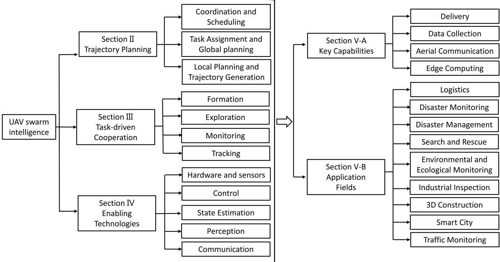
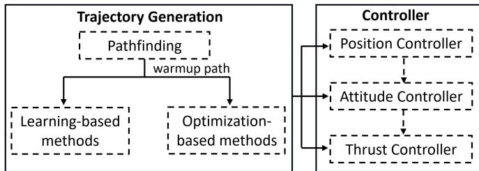
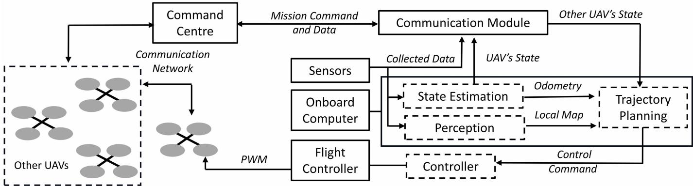
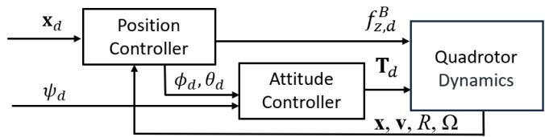

# A Survey on Autonomous and Intelligent Swarms of Uncrewed Aerial Vehicles (UAVs)

Zhenpeng Du , Chunbo Luo , Senior Member, IEEE, Geyong Min , Member, IEEE, Jia Wu , Cai Luo , Senior Member, IEEE, Jian Pu , Member, IEEE, and Shuai Li , Senior Member, IEEE

Abstract— UAV swarms have attracted much attention due to their high potential to execute complex missions more robustly and effectively. Essential technologies for swarms are the family of algorithms that allow the individual agents to undertake tasks intelligently, localize their relative positions, perceive surroundings, and plan and track collision-free and low-cost trajectories cooperatively so that the swarm’s overall objectives are efficiently achieved. There is still a lack of corresponding surveys that provide a systematic summary covering the control layer to task allocation and guide application-driven researchers in leveraging these capabilities for diverse UAV swarm applications. This survey debates the essential technologies of UAV swarms, including swarm trajectory planning, task assignment, control approaches, localization, perception, and communications. Stateof-the-art algorithms and recent technical advancements have been investigated to expose the potential for developing highly autonomous and intelligent swarm systems. It further explores the use cases of UAV swarms in civil applications and critically analyzes existing technologies. The paper concludes by emphasizing the challenges for autonomous and intelligent UAV swarms and outlining potential future research directions. Overall, this paper provides a contemporary and comprehensive review of UAV swarm technologies and investigates their potential to transform civil application fields and support future technology advancement.

Index Terms— UAV swarms, trajectory planning, coordination, cooperation.

## I. INTRODUCTION

copters, have emerged as a focal point of interest in academic and industrial fields due to their versatility and economic efficiency [1], [2], [3], [4], [5]. These autonomous UAVs flexibly maneuver through three-dimensional (3-D)

airspace, often equipped for vertical launch, stable hover, and precise landings. UAV Swarms are revolutionizing technology by enabling dynamic, on-demand, dispersed, and intelligent autonomous tasking, which profoundly affects diverse science and societal fields like logistics [4], [6], search-and-rescue [7], [8], disaster management [9], [10], environmental and ecological monitoring [11], [12], industrial inspection [13], [14], [15], etc. For instance, multiple autonomous UAVs have been deployed to carry heavy payloads collaboratively. This approach is particularly promising for last-mile delivery [16] and emergency supply chains [4], where speed and accuracy are critical. The collective capability of autonomous aerial swarms is expected to exceed that of individual large UAVs and feature superior adaptability, operational efficiency, and system robustness, supported by enabling technologies to realise coordination and real-time decision-making.

As a multi-disciplinary complex system, UAV swarms require tight integration across different subsystems, such as task assignments, optimal planning, control, localization, perception, and communication. Various surveys in Table I have reviewed relevant aspects of UAV swarms such as task allocation, path planning, formation control, or part of enabling technologies. However, the surveys [4], [17], [18], [19], [20] focus on individual components but overlook their integration challenges and the dynamic constraints for trajectory planning. Similarly, the surveys [3], [21], [22], [23] do not encompass recent advancements and cutting-edge technologies in the field. Furthermore, the surveys [24], [25], [26], [27] do not establish connections between enabling technologies and their real-world applications. To address these gaps, this survey provides a detailed description that integrates trajec tory planning, task-driven cooperation, enabling technologies, and applications, serving as a guide for application-driven researchers to leverage these capabilities for diverse UAV swarm applications.

This survey mainly reviews research articles published over the past decade, with a primary focus on recent breakthroughs. It critically summarizes state-of-the-art technologies for UAV swarms and subsystem-specific advancements, analyzes their computational demands, flexibility, robustness, and efficiency, and reviews hardware and software innovations. It further debates application-driven insights in leveraging these capabilities to link technologies for diverse UAV swarm applications. Additionally, it analyses the key challenges related to UAV swarms and discusses the future research direction.

Fig.1 outlines the structure of this paper. The subsequent organization of this paper is as follows: Section II provides a detailed discussion of trajectory planning, specifically focusing on scheduling and coordination, task assignment and global planning, and local planning and trajectory generation. Section III discusses four task-oriented cooperation: formation, exploration, tracking, and monitoring. Section IV reviews essential component technologies for swarms, such as hardware and sensors, control approaches, pose and state estimation, sensing and perception, and communications. Section V discusses the key capabilities and application fields of UAV swarms. Finally, Section VI concludes this paper by summarizing key findings, analyzing the limitations of existing technologies, and discussing potential future research directions for UAV swarms.

  
Fig. 1. Key topics of UAVs swarm and the organization of this paper.

## II. TRAJECTORY PLANNING

Trajectory planning is a critical component that generates commands for the control module to execute, based on environmental information and mission requirements. A crucial technology of UAV swarms is the coordination and scheduling among the agents, which significantly influences the efficiency, robustness, portability, scalability, and adaptability of the swarm. Swarms can be classified as synchronous and asynchronous based on scheduling or centralized and distributed based on coordination. To complete tasks efficiently, swarms must be capable of planning task-oriented global paths and controller-based local trajectories for every agent to reach their destinations safely.

## A. Coordination and Scheduling

1) Synchronous and Centralized Swarm: In synchronous swarm systems [29], [30], [31], [32], [33], [34], [35], [36], the motions of multiple agents are planned at discrete times, ensuring that the agents can take corresponding actions simultaneously. So, it depends on centralized coordination, with a central unit managing real-time communication and swarm control. Conventional algorithms use search-based [30] or sampling-based [32] approaches to find feasible paths in the discrete joint configuration space of the swarm with safety, optimality and completeness guarantees. However, the computational complexity grows exponentially as the number of agents increases. Several alternative algorithms have been proposed to enhance computational efficiency while preserving the guarantees. Wagner and Choset [31] proposed a variant algorithm in which agents search individual paths in sub-dimensional configuration spaces and a joint space when necessary. Yu and LaValle [33] designed a general graph-based swarm framework with effective heuristics for optimizing over multi-minimization objectives. Yu and Rus [34] formulated swarm planning into a mixed integer program solved by optimization techniques. In addition to computational efficiency, adaptability in complex environments is crucial for swarm planning. A large-scale synchronous and centralized swarm approach proposed by [35] generates trajectories in discrete time and space using sparse roadmaps annotated with potential interrobot collisions in known, obstacle-rich environments. Mcbeth et al. [36] proposed a topology-guided multi-robot motion planning method to plan paths in complex environments with many narrow passages.

In low-speed and stationary environments, synchronized approaches offer strong portability and scalability. The central control unit is responsible for scheduling, while other member UAVs are only equipped with necessary external positioning, closed-loop control, and communication subsystems. This

TABLE I  
SUMMARY OF MOST RECENT SURVEY PAPERS
<table><tr><td rowspan=2 colspan=3>Ref.</td><td rowspan=2 colspan=1>Year</td><td rowspan=1 colspan=1>Trajectory</td><td rowspan=1 colspan=2>Generation</td><td rowspan=1 colspan=2>Task-oriented</td><td rowspan=1 colspan=2>Cooperation</td><td rowspan=1 colspan=2>Enabling</td><td rowspan=1 colspan=3>Technologies</td><td rowspan=1 colspan=1></td></tr><tr><td rowspan=1 colspan=1>Coord.&amp;Sched.</td><td rowspan=1 colspan=1>GlobalPlanning</td><td rowspan=1 colspan=1>LocalPlanning</td><td rowspan=1 colspan=1>Forma-tion</td><td rowspan=1 colspan=1>Explo-ration</td><td rowspan=1 colspan=1>Track-ing</td><td rowspan=1 colspan=1>Monitor-ing</td><td rowspan=1 colspan=1>Hard-ware</td><td rowspan=1 colspan=1>Control</td><td rowspan=1 colspan=1>Locali-zation</td><td rowspan=1 colspan=1>Perce-ption</td><td rowspan=1 colspan=1>Commu-nication</td><td rowspan=1 colspan=1>Appli-cations</td></tr><tr><td rowspan=1 colspan=1></td><td rowspan=1 colspan=1>[17]</td><td rowspan=1 colspan=1></td><td rowspan=1 colspan=1>2023</td><td rowspan=1 colspan=1>√</td><td rowspan=1 colspan=1>√</td><td rowspan=1 colspan=1></td><td rowspan=1 colspan=1>√</td><td rowspan=1 colspan=1></td><td rowspan=1 colspan=1></td><td rowspan=1 colspan=1></td><td rowspan=1 colspan=1></td><td rowspan=1 colspan=1>√</td><td rowspan=1 colspan=1></td><td rowspan=1 colspan=1></td><td rowspan=1 colspan=1>√</td><td rowspan=1 colspan=1></td></tr><tr><td rowspan=1 colspan=1></td><td rowspan=1 colspan=1>[18]</td><td rowspan=1 colspan=1></td><td rowspan=1 colspan=1>2023</td><td rowspan=1 colspan=1>√</td><td rowspan=1 colspan=1>√</td><td rowspan=1 colspan=1></td><td rowspan=1 colspan=1>√</td><td rowspan=1 colspan=1></td><td rowspan=1 colspan=1></td><td rowspan=1 colspan=1>√</td><td rowspan=1 colspan=1></td><td rowspan=1 colspan=1>√</td><td rowspan=1 colspan=1></td><td rowspan=1 colspan=1></td><td rowspan=1 colspan=1>√</td><td rowspan=1 colspan=1>√</td></tr><tr><td rowspan=1 colspan=1></td><td rowspan=1 colspan=1>[23]</td><td rowspan=1 colspan=1></td><td rowspan=1 colspan=1>2023</td><td rowspan=1 colspan=1></td><td rowspan=1 colspan=1></td><td rowspan=1 colspan=1></td><td rowspan=1 colspan=1>√</td><td rowspan=1 colspan=1></td><td rowspan=1 colspan=1></td><td rowspan=1 colspan=1></td><td rowspan=1 colspan=1></td><td rowspan=1 colspan=1>√</td><td rowspan=1 colspan=1></td><td rowspan=1 colspan=1></td><td rowspan=1 colspan=1>√</td><td rowspan=1 colspan=1>√</td></tr><tr><td rowspan=1 colspan=1></td><td rowspan=1 colspan=1>[24]</td><td rowspan=1 colspan=1></td><td rowspan=1 colspan=1>2022</td><td rowspan=1 colspan=1>√</td><td rowspan=1 colspan=1>√</td><td rowspan=1 colspan=1></td><td rowspan=1 colspan=1>√</td><td rowspan=1 colspan=1></td><td rowspan=1 colspan=1></td><td rowspan=1 colspan=1></td><td rowspan=1 colspan=1></td><td rowspan=1 colspan=1>√</td><td rowspan=1 colspan=1></td><td rowspan=1 colspan=1></td><td rowspan=1 colspan=1></td><td rowspan=1 colspan=1>√</td></tr><tr><td rowspan=1 colspan=1></td><td rowspan=1 colspan=1>[25]</td><td rowspan=1 colspan=1></td><td rowspan=1 colspan=1>2024</td><td rowspan=1 colspan=1>√</td><td rowspan=1 colspan=1>√</td><td rowspan=1 colspan=1></td><td rowspan=1 colspan=1></td><td rowspan=1 colspan=1></td><td rowspan=1 colspan=1></td><td rowspan=1 colspan=1></td><td rowspan=1 colspan=1></td><td rowspan=1 colspan=1></td><td rowspan=1 colspan=1></td><td rowspan=1 colspan=1></td><td rowspan=1 colspan=1></td><td rowspan=1 colspan=1></td></tr><tr><td rowspan=1 colspan=2>[26]</td><td rowspan=1 colspan=1></td><td rowspan=1 colspan=1>2022</td><td rowspan=1 colspan=1></td><td rowspan=1 colspan=1>√</td><td rowspan=1 colspan=1>√</td><td rowspan=1 colspan=1>√</td><td rowspan=1 colspan=1></td><td rowspan=1 colspan=1></td><td rowspan=1 colspan=1></td><td rowspan=1 colspan=1></td><td rowspan=1 colspan=1></td><td rowspan=1 colspan=1>√</td><td rowspan=1 colspan=1></td><td rowspan=1 colspan=1>√</td><td rowspan=1 colspan=1>√</td></tr><tr><td rowspan=1 colspan=1></td><td rowspan=1 colspan=1>[27]</td><td rowspan=1 colspan=1></td><td rowspan=1 colspan=1>2023</td><td rowspan=1 colspan=1></td><td rowspan=1 colspan=1></td><td rowspan=1 colspan=1></td><td rowspan=1 colspan=1>√</td><td rowspan=1 colspan=1></td><td rowspan=1 colspan=1></td><td rowspan=1 colspan=1></td><td rowspan=1 colspan=1></td><td rowspan=1 colspan=1>√</td><td rowspan=1 colspan=1>√</td><td rowspan=1 colspan=1>√</td><td rowspan=1 colspan=1>√</td><td rowspan=1 colspan=1>√</td></tr><tr><td rowspan=1 colspan=1></td><td rowspan=1 colspan=1>[22]</td><td rowspan=1 colspan=1></td><td rowspan=1 colspan=1>2020</td><td rowspan=1 colspan=1> $\checkmark$ </td><td rowspan=1 colspan=1>√</td><td rowspan=1 colspan=1></td><td rowspan=1 colspan=1>√</td><td rowspan=1 colspan=1></td><td rowspan=1 colspan=1></td><td rowspan=1 colspan=1></td><td rowspan=1 colspan=1></td><td rowspan=1 colspan=1>√</td><td rowspan=1 colspan=1>√</td><td rowspan=1 colspan=1></td><td rowspan=1 colspan=1></td><td rowspan=1 colspan=1>√</td></tr><tr><td rowspan=1 colspan=2>[21]</td><td rowspan=1 colspan=1></td><td rowspan=1 colspan=1>2020</td><td rowspan=1 colspan=1></td><td rowspan=1 colspan=1>√</td><td rowspan=1 colspan=1></td><td rowspan=1 colspan=1></td><td rowspan=1 colspan=1></td><td rowspan=1 colspan=1></td><td rowspan=1 colspan=1></td><td rowspan=1 colspan=1></td><td rowspan=1 colspan=1>√</td><td rowspan=1 colspan=1></td><td rowspan=1 colspan=1></td><td rowspan=1 colspan=1>√</td><td rowspan=1 colspan=1>√</td></tr><tr><td rowspan=1 colspan=1></td><td rowspan=1 colspan=2>[19]</td><td rowspan=1 colspan=1>2020</td><td rowspan=1 colspan=1>√</td><td rowspan=1 colspan=1>√</td><td rowspan=1 colspan=1></td><td rowspan=1 colspan=1></td><td rowspan=1 colspan=1></td><td rowspan=1 colspan=1></td><td rowspan=1 colspan=1></td><td rowspan=1 colspan=1></td><td rowspan=1 colspan=1></td><td rowspan=1 colspan=1></td><td rowspan=1 colspan=1></td><td rowspan=1 colspan=1>√</td><td rowspan=1 colspan=1></td></tr><tr><td rowspan=1 colspan=1></td><td rowspan=1 colspan=1>[28]</td><td rowspan=1 colspan=1></td><td rowspan=1 colspan=1>2022</td><td rowspan=1 colspan=1> $\checkmark$ </td><td rowspan=1 colspan=1>√</td><td rowspan=1 colspan=1></td><td rowspan=1 colspan=1></td><td rowspan=1 colspan=1></td><td rowspan=1 colspan=1></td><td rowspan=1 colspan=1></td><td rowspan=1 colspan=1></td><td rowspan=1 colspan=1></td><td rowspan=1 colspan=1></td><td rowspan=1 colspan=1></td><td rowspan=1 colspan=1></td><td rowspan=1 colspan=1></td></tr><tr><td rowspan=1 colspan=1></td><td rowspan=1 colspan=1>[20]</td><td rowspan=1 colspan=1></td><td rowspan=1 colspan=1>2022</td><td rowspan=1 colspan=1></td><td rowspan=1 colspan=1>√</td><td rowspan=1 colspan=1>√</td><td rowspan=1 colspan=1></td><td rowspan=1 colspan=1></td><td rowspan=1 colspan=1></td><td rowspan=1 colspan=1></td><td rowspan=1 colspan=1></td><td rowspan=1 colspan=1></td><td rowspan=1 colspan=1></td><td rowspan=1 colspan=1></td><td rowspan=1 colspan=1></td><td rowspan=1 colspan=1></td></tr><tr><td rowspan=1 colspan=3>[3]</td><td rowspan=1 colspan=1>2018</td><td rowspan=1 colspan=1>√</td><td rowspan=1 colspan=1>√</td><td rowspan=1 colspan=1>√</td><td rowspan=1 colspan=1>√</td><td rowspan=1 colspan=1>√</td><td rowspan=1 colspan=1>√</td><td rowspan=1 colspan=1></td><td rowspan=1 colspan=1>√</td><td rowspan=1 colspan=1>√</td><td rowspan=1 colspan=1>√</td><td rowspan=1 colspan=1>√</td><td rowspan=1 colspan=1>√</td><td rowspan=1 colspan=1></td></tr><tr><td rowspan=1 colspan=3>[4]</td><td rowspan=1 colspan=1>2024</td><td rowspan=1 colspan=1>√</td><td rowspan=1 colspan=1>√</td><td rowspan=1 colspan=1></td><td rowspan=1 colspan=1>√</td><td rowspan=1 colspan=1></td><td rowspan=1 colspan=1></td><td rowspan=1 colspan=1></td><td rowspan=1 colspan=1></td><td rowspan=1 colspan=1>√</td><td rowspan=1 colspan=1></td><td rowspan=1 colspan=1></td><td rowspan=1 colspan=1>√</td><td rowspan=1 colspan=1>√</td></tr><tr><td rowspan=1 colspan=3>This</td><td rowspan=1 colspan=1>survey</td><td rowspan=1 colspan=1> $\overline { { \checkmark } }$ </td><td rowspan=1 colspan=1> $\checkmark$ </td><td rowspan=1 colspan=1>V</td><td rowspan=1 colspan=1>√</td><td rowspan=1 colspan=1>V</td><td rowspan=1 colspan=1>V</td><td rowspan=1 colspan=1>√</td><td rowspan=1 colspan=1>√</td><td rowspan=1 colspan=1>√</td><td rowspan=1 colspan=1>V</td><td rowspan=1 colspan=1>V</td><td rowspan=1 colspan=1>V</td><td rowspan=1 colspan=1>√</td></tr></table>

The advantages of an asynchronized swarm include improved efficiency and greater robustness. Agents have more flexibility in allocating time for their trajectories without being restricted to uniform time steps. Time allocation aims

2) Asynchronous and Centralized Swarm: The most significant feature of the asynchronous swarm is that each agent is no longer restricted by a fixed time interval. It allows them to plan continuous spatial-temporal trajectories and designate the position of the UAVs and their high derivatives. Compared to synchronous methods, asynchronous swarm planning has an extremely large solution space, making it an NP-hard problem to find the global optimal trajectories of multiple UAVs. Therefore, most practical algorithms involve a tradeoff between solution optimality and computational speed. Tang et al. [38] introduced the circular holding pattern (CHOP) method to solve the timing problem of multiple UAVs passing through collision-prone regions. It identifies intermediate points in the joint space where the agents’ geometric spaces overlap and optimizes the timing of the agent passing through these points. Due to limited communication capabilities, there is little research on asynchronous and centralized swarm methods. The next section of this article will focus on asynchronous and distributed swarm.

One significant drawback of synchronized approaches is their limited efficiency and robustness. Synchronous movement requires that the time interval of each command is based on the latest arriving agent. The hovering and discontinuous movement of other agents wastes energy, reducing the efficiency of the swarm system in executing tasks. These approaches plan paths as a sequence of coordinated movements. The generated paths with fixed time intervals contain certain movements that may be dynamically suboptimal or even infeasible, which influences the robustness of the swarm system. Another drawback is the lack of adaptability. The algorithm must plan the paths of all UAVs simultaneously. Coupled with communication delays, there is a lack of rapid local obstacle avoidance capabilities for an individual UAV.

setup enables large-scale deployment and has been successfully tested in laboratories [35] and practical scenarios such as light shows [37].

to optimize the higher-order derivatives of the trajectory to minimize the total time while adhering to dynamic constraints.

The primary challenge with centralized coordination is long-distance, large-bandwidth and low-latency communication. Centralized coordination requires all UAVs to maintain communication with the server. This becomes challenging in large-range environments, as UAVs may move far away from the server while performing tasks. The control commands needed for asynchronized scheduling generally involve trajectories with high-order derivatives, resulting in a large amount of data transmitted through communication. In dynamic environments, rapid local obstacle avoidance requires the central server to respond to changes caused by dynamic obstacles or disturbances quickly. Centralized communication significantly limits the scalability of the asynchronous swarm. Collaboration efficacy refers to the ability of UAVs to effectively share information, coordinate actions, and adapt to dynamic environments to achieve collective objectives. The comparison of centralized and distributed coordination manners in terms of collaboration efficacy is shown in Table II.

3) Asynchronous and Distributed Swarm: Each UAV has a certain computational capability in distributed systems and can make partial decisions and plan trajectories autonomously. The UAVs coordinate with each other through local communication to accomplish the swarm’s tasks. This means that trajectory planning algorithms run independently on each UAV, sharing only necessary information. As a result, without a central control unit, reciprocal collision avoidance cannot be achieved using methods in centralized coordination. Velocity obstacle (VO) methods [39], [40] and space separation methods [41], [42] have been proposed to achieve reciprocal avoidance. Tordesillas and How [43] designed a collision check–recheck scheme to improve its efficiency through local communication. As discussed previously, centralized swarms often struggle in dynamic and complex environments. In contrast, distributed methods, such as MADER [43] and DLSC [44], are capable of predicting the motion of obstacles and generating feasible trajectories through optimization.

The mentioned methods have prerequisites and assumptions, including the need for an initial collision-free global path, prior knowledge of the environment, and instantaneous communication without delay. Developing an online, real-time, asynchronous, and distributed swarm based on limited information from onboard sensors is extremely challenging. The state-of-the-art distributed and asynchronous swarm method is designed by Zhou et al. [5], which achieves fully autonomous swarm flight in cluttered wild environments with algorithms running on palm-sized quadrotor platforms.

Asynchronous and distributed swarms offer numerous advantages versus centralized or synchronous frameworks, including efficiency, robustness, scalability, and adaptability.

• Efficiency: Parallel planning in distributed coordination allows agents to generate trajectories concurrently. This parallelism drastically reduces the total computational time. Agents do not need to wait for synchronization with others, allowing resources such as computational power and battery life to be used more efficiently.

• Robustness: The failure of individual agents has minimal impact on the overall system performance. The system remains operational even if some agents fail, which enhances its reliability. In contrast, in a centralized swarm, the failure of the controlling nodes or loss of communication can lead to a complete breakdown of coordination and severely compromise mission success.

• Scalability: Distributed communication protocols enable efficient coordination, even as the number of agents increases, avoiding bottlenecks typical of centralized systems.

• Adaptability: When facing obstacles, UAVs can locally adapt their trajectories to avoid collision, even in complex environments with dynamic obstacles.

The challenge of asynchronous and distributed swarms is the complexity of planning algorithms and the difficulty of implementation. Each UAV requires essential components, such as planning, control, localization, perception, and communication modules.

## B. Task Assignment and Global Planning

Task assignment refers to the process of optimally allocating tasks to individual UAVs, ensuring efficient resource use and coordination within the swarm. Global path planning involves designing an optimal trajectory from the starting point to the target position in geometric space, considering factors such as obstacles, power efficiency, and mission objectives.

1) Task Assigenment: Task assignment for UAV swarms involves cooperative decision-making to address a series of tasks and allocate available UAVs. Task assignment can be formulated as an optimization problem to minimize a predefined objective by assigning agents to multiple tasks. The general objective is to minimize both task completion time and energy consumption of the aerial system while considering essential constraints. The fundamental task assignment can be treated as a traveling salesman problem (TSP) [45], while tackling more intricate scenarios may require the application of auction mechanism [46], [47], [48], bio-inspired algorithms [49], [50], [51] or reinforcement learning (RL) [52], [53], [54]. The purpose of the auction mechanism [46], [47], [48] is to mimic an auction process, enabling UAVs to bid on various tasks based on their location and remaining power. When the problem scale is large, the auction mechanism becomes less efficient. In contrast, bio-inspired algorithms [55], such as genetic algorithms (GA), particle swarm optimization (PSO), and ant colony optimization (ACO), can handle more UAVs and tasks without significantly increasing computational complexity. Regarding convergence speed and solution accuracy, the wolf pack algorithm (WPA) [51] has a greater advantage than GA, PSO, and ACO. RL-based methods [52], [53], [54] allow UAVs to learn optimal task allocation strategies through trial and error, which is especially useful for complex tasks where explicitly programming optimal strategies is difficult. However, the significant computational cost associated with pretraining poses a major challenge for implementing these methods directly on UAVs. To address this, Tang et al. [56] proposed a digital-twin-assisted approach for task assignment, which enhances the utilization and efficiency of RL in multi-UAV systems with resource-intensive requirements.

TABLE II  
COMPARISON OF CENTRALIZED AND DISTRIBUTED COORDINATION MANNER IN TERMS OF COLLABORATION EFFICACY
<table><tr><td rowspan=1 colspan=1>CoordinationManner</td><td rowspan=1 colspan=1>Centralized</td><td rowspan=1 colspan=1>Distributed</td></tr><tr><td rowspan=1 colspan=1>Decision Effi-ciency</td><td rowspan=1 colspan=1>High: A central con-troller optimizes globaltasks and trajectories.</td><td rowspan=1 colspan=1>Moderate:   Decisionsrely on local onboardcomputers.</td></tr><tr><td rowspan=1 colspan=1>CommunicationOverhead</td><td rowspan=1 colspan=1>High: Requires contin-uous data transmissionbetween central nodes.</td><td rowspan=1 colspan=1>Low: Only local com-munication is necessary.</td></tr><tr><td rowspan=1 colspan=1>Robustness</td><td rowspan=1 colspan=1>Low: A single-point fail-ure in the central con-troller can compromisethe entire swarm.</td><td rowspan=1 colspan=1>High: theswarm cancontinue   functioningeven if individual unitsfail.</td></tr><tr><td rowspan=1 colspan=1>ComputationalLoad</td><td rowspan=1 colspan=1>High: The central con-troller must process alldata.</td><td rowspan=1 colspan=1>Moderate:Computational   tasksare shared across UAVs.</td></tr><tr><td rowspan=1 colspan=1>Adaptability</td><td rowspan=1 colspan=1>Low: Requires real-timeupdates from all UAVs,which may introduce de-lays.</td><td rowspan=1 colspan=1>High: UAVs can reactautonomously to localchanges without com-munication delay.</td></tr></table>

Task assignment for UAV swarms needs to consider multiple objectives simultaneously in specific applications, such as mission completion time, communication stability, and energy management. In logistics applications, UAV swarm task assignments must ensure efficient workload allocation, timely delivery, and adaptive coordination to meet dynamic demands. Methods such as auction-based algorithms [46] and RL [54] are commonly used to achieve these objectives. The primary objectives in post-disaster wireless network recovery include maximizing communication coverage, ensuring timely data collection, and optimizing UAV deployment efficiency. To address these challenges, Zhang and Liu [57] developed a stochastic geometry-based mathematical framework that balanced the deployment of aerial base stations with spatial distribution and communication coverage to optimize wireless network performance. Wan et al. [9] balanced the timely collection of disaster data with system performance by using an attention-based RL method to optimize UAV scheduling. In smart cities, UAV swarm task assignments must balance energy efficiency, computation offloading, task scheduling, and communication reliability to optimize performance. Given the critical importance of energy efficiency, a strategy [58] is proposed in which UAVs serve as data collectors and wireless energy transmitters to ensure timely power replenishment for Internet of Things (IoT) devices. Other methods like game theory [59], Mixed-Integer Programming (MILP) [60], and RL [61] are used to optimize UAV scheduling and energy management. Efficient computation offloading requires UAVs to balance local processing with cloud offloading, considering task needs, network conditions, and energy consumption. Liu et al. [62] proposed a method combining computation offloading and multi-hop routing to reduce energy costs and communication latency.

2) Global Path Planning: Global path planning often considers UAVs as low-fidelity point models and finds an optimal path based on various factors such as path length, collision avoidance, energy consumption, and other user-defined constraints.

Traditional algorithms are mainly derived from sampling-based and search-based methods, both of which demonstrate advantages in practical applications. Samplingbased algorithms, such as probability road map (PRM) [63], rapidly exploring random tree (RRT) [64], RRT\* [65] and their variants [66], [67], [68], [69], possess probabilistic completeness. This means that as the number of samples approaches infinity, the probability of not finding a feasible solution diminishes exponentially to zero. These algorithms are designed to tackle challenges related to the high complexity of the environment. However, due to the stochastic nature of sampling, sampling-based algorithms only provide relatively weak guarantees regarding optimality. On the contrary, search-based algorithms such as $\mathbf { A } ^ { * } \left[ 7 0 \right]$ and its variants [71], [72] prioritize the shortest distance as the optimal path. These methods often have theoretical guarantees to find the optimal solution if one exists, as long as the search space and heuristics are well-defined. Search-based methods can use heuristics to intelligently guide the search process. Heuristics help prioritize the exploration of promising areas within the search space, potentially reducing search time. Aine et al. [72] developed multi-heuristic A\* (MHA\*), which utilizes multiple inadmissible heuristic functions simultaneously to search for the optimal path while ensuring completeness and establishing bounds on sub-optimality.

Bio-inspired algorithms offer significant advantages in terms of diversity, exploration, and convergence quality compared to traditional methods. However, the classic ACO algorithm converges slowly and prematurely in complex environments, failing to meet the requirements for online planning. Yang et al. [73] proposed a double-layer ACO method for parallel computation of the optimal global path and to avoid premature convergence. The ability of bio-inspired methods to mimic natural processes provides a robust and flexible approach to large-scale global path planning. However, they need to balance exploration (searching new areas of the search space) and exploitation (refining known good solutions). Tan et al. [74] proposed an improved PSO method, which leverages Nash equilibrium to strike a balance between exploitation and exploration. Learning-based methods excel at utilizing large datasets to identify complex patterns and quickly plan optimal global paths, enhancing efficiency and adaptability in dynamic environments. Neural RRT\* (NRRT\*) [75] uses a convolutional neural network (CNN) to predict the nonuniform sampling distribution for RRT\*. Wang et al. [76] proposed a dueling double deep Q-network (D3QN) for multi-UAV path planning in cooperation-limited scenarios. This method determines collision-free paths while collecting data from distributed sensors simultaneously without any prior knowledge.

## C. Local Planning and Trajectory Generation

Local planning focuses on local obstacle avoidance and is often coupled with trajectory generation to create spatiotemporal trajectories that meet safety, feasibility, and optimality requirements. Trajectory generation involves creating collision-free, feasible, and optimal paths that align with the desired control commands. For each agent, this process can be formulated as the following optimization problem:

$$
\begin{array} { r l r } {  { \operatorname* { m i n } _ { \mathbf { x } ( t ) , t _ { f } } \int _ { t _ { 0 } } ^ { t _ { f } } } } & { L ( \mathbf { x } ( t ) , \psi ( t ) , \mathbf { u } ( t ) , \alpha ( t ) , t ) d t + h ( t _ { f } , x ( t _ { f } ) ) }  \\ & { \mathrm { s . t . } } & { \mathbf { x } ( t ) = f ( \mathbf { u } ( t ) ) \quad \forall t \in [ 0 , t _ { f } ] } \\ & { \mathcal { G } ( \mathbf { x } ( t ) , \ldots , \mathbf { x } ^ { ( s ) } ( t ) ) \preceq \mathbf { 0 } \quad \forall t \in [ 0 , t _ { f } ] } \\ & { \mathbf { x } ( t ) \in \mathcal { F } \cap \mathcal { Z } } & { \forall t \in [ 0 , t _ { f } ] } \\ & { \widetilde { \mathbf { x } } ( t _ { 0 } ) = \widetilde { \mathbf { x } } _ { o } , \widetilde { \mathbf { x } } ( t _ { f } ) = \widetilde { \mathbf { x } } _ { f } } & { ( } \end{array}\tag{1}
$$

where $L ( \cdot )$ represents the cost function, with x(t) and ψ(t) indicating the 3-D position and yaw of UAV, and u(t) is control input. α(t) and $h ( \cdot )$ denote the task-related factors and the terminal cost of time $t _ { f } .$ . The notation $\mathbf { x } ^ { ( s ) } ( t )$ denotes the sth derivatives, and $f ( \cdot )$ is the state transition function. G describes the dynamic constraints inherent to the UAV. $\mathcal { F }$ and I define the obstacle and inter-agent collision-free domain. $\widetilde { \mathbf { x } } ( t ) = [ \mathbf { x } ( t ) ^ { \top } , \ldots , \mathbf { x } ^ { ( s - 1 ) } ( t ) ^ { \top } ] ^ { \top }$ is the augment of $\mathbf { x } ( t ) . \widetilde { \mathbf { x } } _ { o }$ and $\widetilde { \mathbf { X } } _ { f }$ represent the initial condition and the terminal condition respectively.

The classification of trajectory generation and the partial coupling with the controller are shown in Fig. 2. According to different trajectory representations, it can be divided into three categories: continuous-time trajectory, discrete-time state, and motor thrust commands, which essentially correspond to the desired value of controllers at different levels.

Solving this optimization problem directly regarding time parameters presents numerous challenges: complex multiobjectives, nonlinear dynamic systems, spatial-temporal continuity constraints, non-convex configuration spaces, and reciprocal avoidance. These challenges make it difficult to optimize online. Model-based methods often use a hierarchical framework [5], [43], [44], [77] to ease computation burden. The pathfinding phase generates an intermediate warm-up path, and the optimization phase further refines the warm-up path into a smooth, collision-free, and dynamically feasible trajectory based on the specified objectives. Because some pathfinding methods based on discrete-time states directly send desired states to the controller and some optimization-based methods do not strictly rely on warm-up paths, we will discuss them separately later. Learning-based methods are frequently utilized to address challenging problems within hierarchical frameworks. Currently, the issue of generating trajectories in asynchronized and distributed swarms cannot be efficiently resolved using an end-to-end learning-based approach. Therefore, we intend to employ a hierarchical framework to present trajectory generation.

  
Fig. 2. Trajectory generation for each agent.

1) Dynamic and Kinematic Model for Quadcopter: Quadcopters are equipped with four identical rotors and propellers, placed at each corner of a square. These components are specifically designed to generate thrust and torque in a direction that is perpendicular to the plane of the square. The quadcopter model, as detailed in [78], is established on the 6 degrees of freedom (DoF) rigid body nonlinear kinematics and dynamics equations:

$$
\begin{array} { r l } & { \dot { \mathbf { x } } = \mathbf { v } , } \\ & { \dot { \mathbf { v } } = f _ { z } ^ { B } / m + g , } \\ & { \dot { R } = R \hat { \Omega } , } \\ & { \mathbf { T } = J \dot { \Omega } + \Omega \times J \boldsymbol { \Omega } , } \end{array}\tag{2}
$$

where x˙ is the derivative of the position vector x, v is the velocity vector, m is the mass of the quadrotor, g is the acceleration due to gravity, $f _ { z } ^ { B }$ is the total thrust force, R is the rotation matrix that transforms vectors from the body frame to the world frame, ˆ is the skew-symmetric matrix of angular velocity , J is the inertia matrix,  is the angular velocity, ˙ is the derivative of the angular velocity, × represents the cross product, and T is the moment vector.

To reduce the computational complexity, most trajectory planning algorithms [79], [80], [81] tend to use simplified linear kinematics models rather than complex nonlinear models for calculating motion primitives:

$$
\dot {  { \widetilde { \mathbf { x } } } } ( t ) = \mathbf { A }  { \widetilde { \mathbf { x } } } ( t ) + \mathbf { B }  { \mathbf { u } } ( t )\tag{3}
$$

where $\mathbf { A } \in \mathbb { R } ^ { s \times s }$ $\mathbf { B } \in \mathbb { R } ^ { s \times 3 }$ are constant.

2) Spatial-Temporal Trajectory Representation: Discretetime state and motor thrust commands generally cannot maintain smooth motion, while spatial-temporal trajectory representation is more suitable for producing continuous smooth trajectories with inherent smoothness. As shown in Fig. 2, the trajectory planning module can send time-parameterized trajectories to the position controller. Practical trajectories typically take the following forms: polynomials [82], Bézier curves [83], B-spline curves [84], MINVO (Minimum Volume) [85], MINCO (Minimum Cost) [86].

The inherent continuity and higher-order differentiability of polynomials align well with the differential flatness of quadcopter dynamics, so the trajectory of a quadcopter can be represented by a polynomial function with a flat output in time t. Mellinger and Kumar [82] formulate the trajectory generation into a quadratic problem (QP) based on fixed-duration piecewise polynomials. However, the standard polynomial basis makes it difficult to handle obstacle avoidance and dynamics constraints. Leveraging the convex hull property and hodograph properties, Bézier curves can effectively handle these constraints. Park and Kim [42] utilized the relative Bernstein basis (basis used by Bézier curves) to formulate the reciprocal avoidance constraints in swarm planning efficiently. Because of its local control property and convenient closed-form evaluations, the B-spline curve is well-suited for gradient-based optimization methods. Many trajectory planning methods based on B-spline curves [81], [87] have been proposed for fast UAV flights under a gradient-based local planning framework and have also been applied in swarm planning [77]. However, the convex hull polyhedron yielded from the control points of the above basis cannot tightly enclose the curve, leading to conservative results. Tordesillas and How [43], [85] developed the MINVO basis to address this issue and improve the efficiency of asynchronized and distributed swarms.

Although the above representations demonstrate good properties, the computational burden for real-world and large-scale swarms remains excessively high. Wang et al. [86] proposed an innovative trajectory representation named MINCO to ease the computation burden. MINCO is built upon transformed optimality conditions for unconstrained control effort minimization. It decouples dense constraint evaluation from sparse parameterization and backward differentiation of flatness maps to support general collision and dynamics constraints. The key advantage of MINCO is its ability to efficiently handle the spatial-temporal deformation needed for various planning requirements through linear complexity operations. Based on the MINCO basis, the autonomous distributed swarm system [5] can generate collision-free trajectory merely in milliseconds.

3) Pathfinding Methods: Pathfinding algorithms incrementally generate discrete paths in low-dimensional state spaces, making them more adept at finding collision-free paths. Popu lar pathfinding algorithms are similar to global path planning. However, these approaches find collision-free paths in geometric space without considering the objectives in the optimization phase and kinodynamic constraints of the UAV systems. The obtained path often fails to provide a good prior [80] for the optimization phase and may be topologically distinct from the theoretical optimal path [88], leading to poor results in optimization. To overcome this shortcoming, the state space is extended from three dimensions to high dimensions (velocity, acceleration, jerk, attitude, etc.). Kinodynamic RRT\* [79] and Hybrid A\* [89] extend RRT\* and A\* to find a collision-free optimal path considering the dynamics in high-dimensional state space. These methods are typically applied to simplified linear kinematic systems (3) but can also be used to nonlinear dynamic systems (2) through first-order Taylor approximations. These methods balance the trade-off between the integral of the cost of control inputs and travel time to form a total cost function. Liu et al. [80] apply a search-based method in SE (3) to generate the flight attitude along trajectories and exploit the quadrotor’s manoeuvrability to pass through narrow gaps more aggressively. Based on the framework of Hybrid A\*, Zhou et al. [81] leverage Pontryagin’s Minimum Principle to design a novel heuristic to reduce calculation time to milliseconds. These algorithms based on discrete-time states can directly send the desired position and its derivative or desired attitude to the controllers. However, the absence of optimization in these methods leads to poor trajectory continuity and low energy efficiency.

4) Optimization-Based Methods: Trajectory optimization poses a complex multi-objective challenge. While some studies focus on generating smooth, collision-free trajectories that satisfy kinodynamic constraints [83], [86], others prioritize minimizing flight time [2] or seek to balance multiple competing objectives [81].

Optimization with waypoint constraints is a fundamental problem in trajectory optimization, commonly encountered in drone racing [2] and data collection [90]. For differentially flat multicopters, Mellinger and Kumar [82] proposed a Minimum-snap framework to formulate the trajectory optimization to a quadratic programming (QP). Bry et al. [91] derived a closed-form solution for Minimum-snap. The property of differential flatness [92] is particularly crucial for optimizing UAV trajectories as it significantly simplifies both the trajectory planning and control processes. It means that the entire state of the system and the control inputs can be expressed in terms of flat outputs and a finite number of their derivatives, eliminating the need to integrate the dynamic system’s differential equations (3). Many research studies [82], [86], [93] have been proposed to validate that the flatness applies to a wide range of multi-copters. However, the spatial-temporal continuous trajectory limited by inherent smoothness cannot exploit the full actuator potential. Foehn et al. [2] proposed an end-to-end method to achieve the fastest flight of a UAV without relying on prior time allocation. This method introduces a complementary progress constraint (CPC) for offline optimization. For real-time application, Romero et al. [94], [95] use model predictive contouring control (MPCC) to solve the planning and time allocation problem concurrently, enhancing robustness when encountering unknown disturbances.

Obstacle avoidance in UAV planning is crucial for ensuring safety and broadening applications. Optimization-based methods are often classified into hard-constrained and softconstrained methods due to how they handle constraints within the optimization process. In a hard-constrained optimizationbased framework, the formulation of feasible regions signif icantly influences solution quality and solving speed. Safe flight corridors (SFC) provide a practical and effective way to approximate the feasible space and allocate time. This is achieved by expanding discrete paths into a sequence of convex sets, such as spheres [86], [96], [97], hexahedra [96], ellipsoids [98], [99], or convex polytopes [97]. Many soft-constrained frameworks improve smoothness and reduce collision costs using gradient descent methods [77], [88]. Zhou et al. [81] proposed a method that uses the gradients of an Euclidean distance field (ESDF) to steer trajectories away from obstacles. They developed a path-guided method [88] to address infeasible local minima issues. To address the redundancy issue of ESDF-based planning, Ego-planner [87] introduced an ESDF-free gradient-based planning framework to reduce computation time.

Reciprocal avoidance ensures that each UAV dynamically adjusts its trajectory to avoid collisions with others, thus maintaining coordinated and efficient group movement. The concept of the velocity obstacle (VO) [39], [100], [101] represents an effective method for reciprocal avoidance in UAV swarms. It considers other UAVs as dynamic obstacles with known or predictable motion patterns. Van Den Berg et al. extended VO to the acceleration-velocity obstacles [40] and Linear Quadratic Regulator (LQR) obstacles [102] to achieve optimal reciprocal collision avoidance (ORCA) for multiple robots. To prevent the sidewalk shuffle dilemma of VO, Alonso-Mora et al. [101] proposed a pairwise collision avoidance method, which specifies the priority of their respective paths to avoid each other. Space separation is another useful remarkable avoidance approach, such as buffered Voronoi cell (BVC) [41] and SFC [42], [43], [103], which can simultaneously avoid reciprocal collision and obstacle collision. Luis et al. [104] proposed an on-demand collision avoidance approach for partitioning the free space, leading to less conservative motions than BVC. Unlike general obstacles, reciprocal avoidance of multi-copters needs to consider downwash [35]. Downwash refers to the large volume of fast-moving air generated under the multi-copter rotors, which can cause catastrophic instability to other multi-copters passing under its influence. Axis-aligned ellipsoid model [35] and cylinders model [105] were introduced to formulate the inter-agent downwash constraints. Arul and Manocha [106] further improved the ellipsoid model by combining a sphere and an oriented ellipsoid to adapt to axis rotation and improve efficiency. Some gradient-based methods [5], [77] accomplish reciprocal avoidance by formulating the collision risk, the distance of different trajectories at each moment, as a penalty within a gradient-based optimization.

Collision avoidance with dynamic obstacles presents a significant challenge in real-time planning. The receding horizon idea [81], [107], [108] allows agents to handle unknown and dynamic environments by continuously planning, executing, and replanning their trajectories based on the latest available information. Although typical approaches using the current state as the initial condition of the input in each planning cycle will cause input discontinuities, an event-triggered strategy [104] can mitigate them by resetting the initial state only when necessary. Furthermore, receding horizon control is a key feature of model predictive control (MPC), where the control strategy optimizes over a shifting time horizon in a repetitive manner. Soria et al. [109] proposed a nonlinear model predictive control method (NMPC) that enhances the speed, accuracy, and safety of the swarm while being independent of the environment layout. However, the NMPC model imposes a huge computational burden that makes it impossible to solve it online in real time, and its scalability deteriorates as the swarm size grows. Arul and Manocha [106] feedforward linearize the non-linear flatness-based dynamic model, reducing the computational burden and enabling an online distributed swarm in dynamic environments. Some swarm systems can predict the motion pattern of obstacles, and the trajectories of the obstacles are used as constraints in the optimization problem [44], [106]. These methods [44], [106] assume that the motion pattern is consistently linear over a prediction horizon, and only the initial position and velocity are needed. A topology-driven method [110] was proposed to solve the dilemma of planned trajectory frequently switching caused by dynamic obstacles changing the environment topology.

When facing estimation errors of dynamic obstacles or other real-world uncertainties such as aerodynamic resistance and sensor errors, probabilistic collision avoidance methods such as Boltzmann probability distribution [111] or Gaussian probability distribution [112], [113] are proposed to address these issues. Arul and Manocha [106] used the Kalman filter to improve the accuracy of estimating the states of dynamic obstacles and other agents. Lu et al. [108] proposed a stochastic optimal framework to handle the uncertainties caused by noise, which utilizes KL-divergence to formulate cost functions by comparing distances between probability distributions.

5) Learning-Based Methods: Optimization-based methods with probability distributions cannot fully address uncertainty problems, and some optimization problems are challenging to model, adversely affecting real-time performance. In contrast, learning-based approaches utilize large amounts of data from real-world scenarios or simulations and avoid solving complex mathematical problems in real time.

For the problems with intermediate waypoint constraints, optimization-based methods are less efficient in optimizing time allocation through iteration, and the flight speed is still inferior to that of human pilots. De Almeida et al. [114] leverage supervised neural networks to reduce the computational time to generate minimum snap trajectories with optimal time allocation by two orders of magnitude. Kaufmann et al. [115] proposed an RL-based elite autonomous drone racing frame that competes head-to-head against three human champions. Song and Scaramuzza [116] improved MPC methods with policy searching for high-level decisions, which can be used to handle variable intermediate waypoint constraints.

For optimization-based methods, the computational burden of the convex representation of the collision-free space is the bottleneck that limits the calculation speed of the planning algorithm. Additionally, sensor perception errors in the real environment are an important factor that adversely affects the algorithm’s efficacy. Loquercio et al. [117] used the perceptual awareness of CNNs to detect obstacles and targets to achieve an advanced vision-based planning and control system. They further [1] developed an RL-based end-to-end methodology that maps noisy sensory observations directly to collision-free trajectories in a receding-horizon fashion. Penicka et al. [118] proposed an RL-based method to generate time-optimal collision-free trajectory in cluttered environments by combining progress maximization along the topological guiding path with obstacle avoidance. Traversing through a tilted, narrow gap is very challenging research. Although optimization-based methods [80] and search-based methods [86] can complete this challenge under ideal conditions, RL-based methods [119], [120], [121] are more efficient and robust. Methods in [119] and [120] respectively address the sparse reward scenario using curriculum learning and curiosity-driven techniques, respectively, and employ randomization and BSE strategies to mitigate the Sim2Real gap. To overcome the limitations of external positioning and perception, Xie et al. [121] developed an advanced learning framework for variable-tilted narrow gap traversing tasks with the onboard camera.

Learning-based methods offer distinct advantages when applied to reciprocal avoidance, addressing complex prediction and planning issues that conventional methods struggle with. Predicting the states and trajectories of other agents is essential for achieving efficient reciprocal avoidance. Optimizationbased methods [5], [43], [44], [106] obtain these motion predictions via centralized or distributed communication, where agents share their future planned trajectories. However, due to power limitations and interference, communication may be unavailable or unreliable in practice. Zhu et al. [122] proposed a method based on recurrent neural networks (RRN) to predict the trajectories by learning multi-UAV motion behaviors from demonstrated trajectories. Vinod et al. [123] have developed a safety filter based on QP to enforce safety as hard constraints in planning while leveraging prior data.

Song et al. [124] investigated the fundamental factors that contribute to the superior performance of RL-based methods over model-based methods. Firstly, the hierarchical framework in the latter restricts the range of behaviors expressible by the controller, due to inherent decomposition. RL-based methods focus on optimizing task-level objectives, which do not need to be convex or continuous. This means that the policy can exhibit a wider range of control responses without constraints imposed by intermediate representations. Secondly, the performance of model-based methods is sensitive to unmodeled dynamics, such as system delay, large battery voltage fluctuations, and aerodynamic drag, as well as different initial states. On the other hand, RL-based methods utilize domain randomization techniques to address model uncertainty and bridge the gap between simulation and the real world, making them more robust than model-based optimization methods.

## III. TASK-DRIVEN COOPERATION

## A. Formation

In numerous UAV swarm applications discussed in Section V, UAVs are often required to adopt specific formations to facilitate cooperation. For example, carrying an object by coordinated multiple UAVs has been explored [125], [126]. Given that the ability to fly in formation has become a fundamental requirement for autonomous swarms to execute coordinated aerial maneuvers, it is inevitable to impose formation constraints. A general form [126], [127], [128], [129], [130], [131] of UAVs formation (shape) s is defined as follows:

$$
\begin{array} { r l } & { s : = \left\{ d _ { i j } ^ { * } \right\} \quad i , j = 1 , \ldots , n \quad i \neq j } \\ & { d _ { i j } ^ { * } = \left\| { \pmb x } _ { i } - { \pmb x } _ { j } \right\| _ { 2 } } \end{array}\tag{4}
$$

where xi represents the position of ith UAV and $d _ { i j } ^ { * }$ is the relative distance between UAVs. Generally, approaches for UAV formation flight can be categorized into three types.

The first category involves planning the trajectory for each UAV individually while adhering to formation constraints and avoiding obstacles. These methods [127], [128], [129], [132] may use a leader-follower approach, virtual and behavioral structures, potential fields, or their combinations to achieve autonomous collision avoidance and maintain formation. Learning-based methods [133] are effectively utilized as an execution layer for obstacle avoidance and local target assignment. To enhance formation safety, Peng et al. [134] introduced a perception-shared framework using a Gaussian mixture model (GMM) to process the point cloud data received by each UAV. In addition to generating collision-free trajectories through spatial-temporal optimization for formation, the method introduced by Quan et al. [135] is utilized to recover from unfavorable conditions using swarm reorganization. This method can generate high-quality local objectives to help the swarm quickly reform into the desired shape. Consequently, in scenarios where the formation shape allows for some flexibility and formation transformation can occur as long as it quickly recovers, the swarm system can efficiently navigate through obstacle-dense environments. However, when attempting obstacle avoidance, the formation deformation becomes unpredictable. Therefore, when the shape of the formation is strictly constrained, the previously mentioned methods are rendered ineffective.

The second category considers the formation as a unified entity, planning paths that strictly separate them from obstacles and meet the collective geometric requirements of the entire formation. The typical approach involves using shapes such as rectangles [136], [137], triangles [138], or other polygons to outline the formation. Dynamic properties of the entire system are then analyzed, and trajectory generation methods discussed in Section II are used to avoid obstacles. However, this method is highly effective for collaborative transportation but unsuitable for other applications, especially in cluttered environments.

The third category uses a hybrid hierarchical planning approach. It initially designs configurations that meet the connectivity requirements defined by the generalized connectivity maintenance (GCM) [139]. Subsequently, it computes the optimal trajectories under collision-free constraints [140]. Quan et al. [135] introduced a sample-based approach to discover an optimal global-level path by integrating the formation scale into the sampling space, considering its impact on communication and inter-collision. Numerous distributed swarm algorithms [39], [141], [142] have traditionally relied on aligned frames, leading to computationally expensive and communication-intensive consensus steps for frame alignment. The dependence on alignment for localization and pose estimation reduces resilience to inherent noise and unobservable errors that cannot be corrected. Lusk et al. [143] proposed a formation control and task assignment strategy that is robust to misaligned frames and scales to many vehicles.

Communication delay is a critical challenge in UAV swarm formation control, particularly in centralized control architectures, as it may lead to information desynchronization, control lag, and even formation instability. In real-world applications, communication delays mainly stem from wireless channel congestion, severe signal attenuation, and clock asynchrony among nodes. Existing studies indicate that different formation control strategies exhibit varying levels of robustness to communication delays. MPC is one of the most widely studied methods due to its ability to explicitly account for system dynamics and constraints while optimizing control inputs over a finite prediction horizon [144], [145], [146]. Additionally, event-triggered control [130], [131], [147] reduces unnecessary information exchange because it updates control commands only when necessary. This approach helps alleviate communication burdens and mitigate the impact of delays. Moreover, edge computing and local decisionmaking [5], [132], [135] can reduce reliance on centralized communication. By enabling individual UAVs to adjust their trajectories autonomously, these methods help accommodate varying delays.

Ensuring formation resilience presents another significant challenge in multi-UAV formations, as the failure of individual UAVs can disrupt coordinated manoeuvres and compromise overall mission effectiveness. One widely adopted strategy is redundant UAV deployment [148], [149], where additional UAVs act as backup units that can replace malfunctioning ones without compromising formation integrity. This can be achieved through dynamic formation reconfiguration, where the remaining UAVs adapt their relative positions to compensate for the lost agent while preserving the overall structure. Another key approach is fault-tolerant formation control [150], [151], [152], which enables real-time adjustment of control laws when a UAV failure is detected. Methods such as virtual leader replacement [153], [154], [155] allow the formation to autonomously assign a new leader if the designated one fails, ensuring continuity in trajectory tracking. Additionally, adaptive topology adjustment [130], [156], [157] enables the formation to reorganize its structure by modifying inter-agent distances and connectivity patterns. Beyond structural adaptations, predictive failure detection [158], [159] can enhance resilience by identifying potential UAV malfunctions before they affect the formation.

## B. Exploration and Mapping

Autonomous exploration in UAV swarms involves multiple UAVs intelligently cooperating to explore and map unknown environments with high space exploration efficiency and reconstruction accuracy. The classic autonomous exploration methods can be classified into two fundamental approaches: frontier-based and sampling-based approaches.

The frontier-based approaches were comprehensively evaluated in [160]. These approaches achieve region coverage by detecting and exploring the boundaries of open and unexplored space. To extend the frontier detection in 3-D space, Shen et al. [161] proposed a strategy based on stochastic differential equations with a particle-based representation of free space to alleviate the computational burden. Cieslewski et al. [162] improved frontier-based methods to minimize velocity change within the field of view (FoV), which maintains the high speed of quadrotors and enhances exploration efficiency. Zhou et al. [163] designed a new frontier information structure and a hierarchical planner to efficiently find global coverage paths and refine local viewpoint sets for rapid exploration. Based on this hierarchical planner, they [84] introduced the RACER approach to maximize the potential of UAV swarms for exploration. This approach utilizes a pairwise interaction based on an online hgrid decomposition of the unexplored space and a capacitated vehicle routing problem (CVRP) formulation to enhance the efficiency of collaborative exploration. However, this strategy assumes a homogeneous distribution of obstacles and requires maintaining and updating a list of active frontiers. Such coordination and bookkeeping are prohibitive in extremely complicated environments like dense forests. Bartolomei et al. [164] proposed a switching execution mode, called Explorer-Collector, to explore cluttered and frequently occluded forests. The mode strikes a balance between cautious exploration in unexplored areas and aggressive exploration in large, continuous unknown regions.

For sampling-based approaches, candidate viewpoints are randomly generated within the explored space, and their information gain is evaluated to explore the space further. The concept of the next best view (NBV) [165] is commonly used in sampling-based approaches. It calculates the best viewpoint for obtaining the most new information and selects subsequent viewpoints iteratively to progressively explore the space. Bircher et al. [166] introduced NBV in an RRT framework, executing only the most informative edge in a receding horizon fashion. This framework is further adapted to visual attention [167] and uncertainty of localization [168]. To improve the convergence and efficiency of the exploration algorithm in complex scenarios, Witting et al. [169] proposed a history-aware approach that utilizes the history of visited nodes to obtain high-quality samples. Wang et al. [170] developed a topological semantic road map to facilitate intelligent highlevel decision-making. For many scenarios, reconstruction accuracy is equally crucial for exploration. Zhang et al. [171] proposed an informative sampling strategy involving reconstruction gain and volume gain to balance them.

Frontier-based approaches are efficient for exploration but struggle with reconstruction accuracy. In contrast, samplingbased methods offer more flexibility for various tasks. However, sampling-based methods are prone to being trapped in local optima in large-scale environments, hindering exploration of all areas. Selin et al. [172] proposed a hybrid method with a frontier-based approach for global exploration and an NBV method for local exploration. Detecting and clustering frontiers in frontier-based approaches is computationally demanding, which limits the ability to respond to environmental changes. To tackle this problem, Zhang et al. [173] adopted UFOMap [174] to represent the environment and introduced a rapid Euclidean clustering technique for processing frontier clustering.

## C. Target Search and Tracking

As a canonical task for distributed visual sensing, target search and tracking for UAV swarms demonstrates high adaptability, enabling them to perform various tasks in hazardous environments. Compared to static targets, tracking dynamic targets is more challenging and has a wider range of applications, such as law enforcement [4]. Due to different task requirements, the focus of visual tracking is different. Based on the taxonomy and classification of [175], this paper mainly discusses target tracking coupled with UAV motion planning. The key technologies involved are detection tracking, following tracking, and cooperative tracking.

Regarding detection tracking with a predefined target, the focus is solely on changes in the target’s appearance. One of the most effective methods is the CF-based (correlation filter) approach, capable of delivering real-time performance, resilience to environmental changes, and efficient utilization of computational resources. Many variants of CF-based methods, such as KCF (kernelized correlation filter) [176] and BACF (background-aware correlation filter), have been developed to address interference problems, including target partial occlusion [177], target loss [175], and background noise [178]. Some CF-based methods [179], [180] integrate spatial-temporal considerations to improve tracking accuracy and efficiency. However, CF-based methods may struggle with complex and highly variable targets and have limitations in handling scale changes and background clutter. Conversely, learning-based methods can address this issue facilitated by advances in onboard mobile computing capabilities. Cao et al. [181] proposed a dual feature-based anchor proposal network (SiamAPN++) with an attention mechanism to improve the robustness against severe scale variation. They [182] further proposed a double-layer adaptive time transformer (TCTrack) to fully exploit temporal contexts and improve the stability of tracking. Li et al. [183] introduced a residue-aware correlation filter and a scale refinement strategy to improve convergence properties and scale estimation.

Following tracking involves continuously and adaptively observing a moving target, estimating its movement, and adjusting the position of the UAV-vision system to ensure uninterrupted visibility. This synergy between estimating the target state and planning motion (discussed in Section II) is crucial for effective tracking. Some typical estimation methods or their variants, such as the Kalman filter [184], [185], particle filter [186], and constant velocity model [5], are used to estimate the state of the target.

The extraordinary benefit of cooperative UAV swarm tracking is the capability to simultaneously observe areas of interest from different perspectives and view various separate regions. This allows the tracking system to be more robust in the face of uncertainty and sensor errors, and to expeditiously locate the target. Price et al. [185] use a DNN to identify the most informative regions of the joint-view images and achieve real-time visual tracking. Zhou et al. [5] enhanced the robustness and resilience of occlusions by integrating a tracking penalty into the swarm optimization problem. Mayya et al. [187] developed a risk-aware framework to balance the tracking quality and the risk of sensing failure. Moon et al. [188] integrate DRL with Cramér–Rao lower bound (CRLB) to enhance cooperative tracking performance in obstructed and occluded environments. Xia et al. [189] introduced an end-to-end multi-agent

RL framework that incorporates spatial information entropy to enhance information collection efficiency.

## D. Surveillance and Monitoring

Target tracking takes a target-centric approach, while surveillance and monitoring are region-centric. Surveillance typically aims to provide continuous coverage of areas of interest, maintaining an ongoing watch over specific regions or subjects. On the other hand, monitoring often involves systematically observing a wide area at regular intervals, focusing on collecting data over time to identify changes or trends. The general model for multi-agent surveillance or monitoring tasks was pioneered in [190].

Early monitoring methods [191] primarily utilized heuristic approaches, enabling efficient and systematic coverage of the area. Mavrommati et al. [192] introduced a receding-horizon ergodic control method, offering a theoretical framework for distributed global stability assurances. To minimize the need for extensive prior knowledge of the environment and targets, Liu et al. [193] developed an artificial neural network (ANN) to improve UAV swarms with cohesive monitoring capabilities. Hu et al. [194] developed a fault-tolerant networked UAV swarm framework. It utilizes switching interaction topologies to form a circular formation and a task reassignment algorithm to handle absent agent problems, improving the robustness for persistent monitoring.

Surveillance implies continuous or near-continuous observation, often intending to maximize information and spatio-temporal fields. John et al. [195] introduced an information-driven search combined with a divide-andconquer mitigation control approach to enhance the efficiency of detection and surveillance. Lan and Schwager [196] proposed two new sampling-based path-planning algorithms for surveillance using Kalman filters to optimize spatio-temporal field estimates, demonstrating superior performance in ocean surface temperature detection. Energy constraints and recharge strategies are crucial for long-term surveillance. Washington and Schwager [197] formulated the surveillance and recharge problem as discrete state MDPs (Markov Decision Processes) and introduced a reduced state value iteration algorithm to generate the optimal policy. Lin et al. [198] proposed a scalable and robust approximate algorithm for planning energy-constrained UAVs with mobile charging stations in surveillance missions. In multi-agent surveillance systems, it is vital to ensure that information acquisition remains robust against attacks or failures. Schlotfeldt et al. [199] introduced a resilient, active information acquisition method (RAIN) to maximize information under adverse attacks. RAIN is a generalized framework for information acquisition, which demonstrates excellent robustness in exploration (Section III-B), tracking (Section III-C), and surveillance scenarios.

## IV. ENABLING TECHNOLOGIES

In real-world autonomous UAV swarms, the complexity of their operation extends beyond task and trajectory planning, etc. Several essential hardware and key enabling technologies must be integrated to ensure these systems can function effectively and autonomously. Control mechanisms are essential for maintaining stability and coordinating the movements of multiple UAVs. Accurate localization is crucial for each UAV to understand its position relative to others and the environment. Perception technologies enable UAVs to interpret and respond to their surroundings, using sensors to detect obstacles and other pertinent environmental features. Communication systems facilitate information exchange between UAVs, ensuring coordinated efforts and adaptive responses to dynamic conditions. Together, these technologies form the backbone of autonomous UAV swarm operations, enabling sophisticated, real-time collaboration and decision-making in diverse applications.

## A. Hardware and Sensors

The hardware of UAV swarms includes a variety of components designed for flight control, sensing, communication, and data processing. Flight controllers (FCs) use processing chips like STM32, along with sensors such as IMU, barometers and GPS for stable flight. PX4 [200] is a popular open-source flight control software known for its flexibility and wide range of supported UAVs. RGB-D cameras (such as the Intel RealSense series) and LiDARs (such as the Velodyne series) offer improved perception and high-precision localization capabilities. Edge computing platforms like Raspberry Pi or NVIDIA Jetson provide powerful onboard computing, enabling real-time data processing, machine learning, and advanced vision-based tasks like object detection and autonomous navigation. The onboard communication system of UAVs consists of multiple hardware components, including wireless communication modules, data link devices, antenna systems, as well as encryption and anti-jamming modules.

Crazyflie [201] is a small, lightweight, open-source drone, designed as an educational tool and experimental platform for swarm behavior research. Although it is well-suited for large-scale indoor swarm operations, it lacks sufficient onboard computational resources and sensing capabilities for effective state estimation. Zhou et al. [5] designed a swarm platform for implementing large-scale planning outside of laboratories. With the computational support of edge computing platforms, these UAVs are capable of performing coordinated tasks such as exploration, environmental monitoring, and object tracking.

Fig. 3 illustrates the hardware and software roadmap for intelligent UAV swarms. The specific configuration may vary depending on the application scenario; for example, in some centralized swarm systems, there might be no communication network between the UAVs. This roadmap highlights the key hardware components required for each UAV, including the flight controller, onboard computer, sensors, and communication module. Typically, task assignment and global planning are performed either offline or computed in real-time on a centralized server, while the low-level controller operates on the flight controller for high-frequency, real-time execution. In addition, most software processes, such as state estimation, perception, and trajectory planning, are handled by the onboard computer.

  
Fig. 3. Hardware and software system diagram for real-world applications.

  
Fig. 4. A generic control framework of quadcopter.

## B. Control Approaches for UAVs

The diversity in UAV structures leads to varied dynamics and kinematic models, while quadrotors have gained widespread attention in commercial and research domains with their versatile design. Therefore, this paper mainly focuses on the modelling and control of quadrotors. Accurate position and attitude control (stabilization) are critically important in autonomous quadcopter navigation. Quadcopters are exceptionally complex and challenging to control due to their intrinsic nonlinear dynamics, underactuated configuration, multi-variable nature, and fundamental instability. A generic control framework of a quadcopter, as shown in Fig. 4, typically includes the position controller, attitude controller, and the input and output.

The attitude controller is a critical component of a quadcopter, functioning as the inner loop to maintain the desired orientation and attitude by adjusting the roll, pitch, and yaw angles. This controller plays a direct role in the stability and responsiveness of the quadcopter, translating high-level navigation commands into precise adjustments of the rotor speeds to achieve balanced and controlled flight dynamics. The common methods for attitude loop control in quadcopters include PID (Proportional-Integral-Derivative) [200] and LQR [202]. The PID control method, known for its simplicity and effectiveness, works by calculating proportional, integral, and derivative responses to minimize the error between the desired and actual attitude. In contrast, LQR is a more advanced method that optimizes control inputs by minimizing a cost function. This function helps balance control effort and deviation from the desired state.

The position controller, also known as the trajectory tracking controller in UAV swarm, typically sets the position and its higher-order derivatives (such as velocity and acceleration) as the desired values. It calculates the error based on the actual values to provide feedback and then dictates the desired thrust and attitude angles for the quadrotor. The trajectory tracking controller is crucial for autonomous quadrotor navigation as it enables the quadrotor to precisely follow a predefined spatialtemporal trajectory, rather than simply moving between fixed points. Accurate trajectory tracking is essential for realizing the full potential of motion planning, allowing the quadrotor to avoid obstacles and achieve safe and efficient flight. Linear controllers, such as PID and LQR, are simple and effective methods that work well when the system is mostly linear and the maneuvering angles are limited [203]. However, for highly nonlinear systems, these linear methods cannot provide optimal performance across a wide range of operating conditions.

Mellinger and Kumar [82] studied the differential flatness of quadrotors and developed a nonlinear differential-flatnessbased controller (DFBC) that allows the UAV to perform complex maneuvers within tight spatial constraints and achieve rapid movement. Geometric control [78], [204] takes into account for the complete nonlinear dynamics of UAVs, using the geometric relationships in the state space to design control laws. By utilizing the geometric properties of UAV states, geometric controllers make use of Lie groups and Lie algebras to represent and calculate the translation and rotation for quadrotors. This method allows for more accurate prediction and adjustment of UAV behavior, leading to more precise and stable flight control. Liu et al. [205] introduced a robust compensatory loop to counter various uncertainties and enhance the robustness of controllers.

The DFBC trajectory tracking controller lacks predictive capability regarding the trajectory, while the core feature of MPC is its ability to forecast the desired value over a future time horizon. This allows MPC to anticipate upcoming trajectory changes in advance, making more rational control decisions. NMPC is more suited to the nonlinear dynamical systems of a quadrotor, taking into account the diverse physical and safety constraints of the quadrotor. It enables the simultaneous consideration of multiple objectives in the control problem, such as minimizing energy consumption and achieving the shortest possible travel time. By using optimization algorithms, NMPC seeks the optimal balance among these objectives, often coupling MPC with trajectory optimization, as detailed in II. This section mainly focuses on comparing the performance between MPC and DFBC for trajectory tracking.

In the study by [206], a practical assessment is performed on two leading-edge control frameworks, NMPC and DFBC, by following a range of agile trajectories at velocities reaching 20 m/s, which methodically evaluated their precision in tracking, resilience, and efficiency in computation. When following trajectories that are dynamically unattainable due to exceeding the rotor thrust limits, NMPC surpasses DFBC in performance by 48% and 62% in terms of positional and directional precision, respectively. The primary drawback of NMPC is its considerable demand for computational resources. On their hardware (NVIDIA Jetson TX2), the mean resolution time for the nonlinear NMPC was approximately 2.7 ms, whereas DFBC required merely 0.020 ms. Despite this, both methods are capable of operating at sufficiently high frequencies (>100 Hz), facilitating precise tracking of agile trajectories. Another limitation of NMPC is its vulnerability to issues of numerical convergence. Contrary to DFBC, which possesses verified stability or convergence for each submodule, the NMPC in this study depends on the convergence of numerical solutions within the nonlinear optimization algorithm.

## C. State Estimation

Because most UAVs have inherently unstable dynamics, robust state estimation is crucial for stability control and trajectory tracking. State estimation approaches are categorized as either based on external sensors or relying on onboard sensors.

1) Pose Estimation Using External Sensors: Global navigation satellite system (GNSS) provides absolute longitude and latitude information, making it well-suited for large outdoor areas. GNSS RTK (Real-Time Kinematic) technology improves its accuracy to centimeter-level precision by using additional base stations, making it ideal for high-altitude UAV operations in open areas. However, it can still be affected by systematic inaccuracies such as multi-path effects and obstacles blocking the signals. In indoor settings where GNSS is unavailable, optical motion capture systems employ numerous infrared cameras to facilitate high-speed, millimeterlevel position tracking, making them extensively adopted in experimental settings [2], [94]. The primary drawback is the necessity for fixed infrastructure installation, which confines the operation of the cluster to a predetermined airspace.

2) Pose Estimation Using Onboard Sensors: To expand the operational environments for UAV swarms, there is a significant drive to minimize reliance on external sensors for state estimation and instead utilize onboard sensors such as inertial measurement units (IMUs), cameras, and lidars.

IMU is an essential sensor for providing feedback control in UAVs’ attitude loops, making visual-inertial odometry (VIO) highly suitable for UAV positioning [207], [208], [209]. VINS [208] and ORB-SLAM3 [209] are highly sought after in both research and commercial applications due to their high precision, real-time capabilities, and open-source availability, enabling state estimation at the same frequency as IMUs (200Hz). Existing research [210], [211], [212] has also developed robust methods to address the challenges posed by dynamic environments on VIO.

Applying VIO technologies designed for individual agents to decentralized UAV swarms still presents some challenges. A critical challenge is creating a method for achieving relative state estimation in a decentralized manner. Utilizing a stereo camera to detect other drones within the swarm system and then estimating their relative states is a straightforward approach, known as visual object detection-based methods [213], [214], [215]. Zhou et al. [77] proposed a simplified and lightweight method for relative drift estimation that integrates visual object detection-based methods with the predicted positions from received agent trajectories to complement VIO systems. The disadvantage of such methods is that the relative state can only be observed when other UAVs are within the field of view of the observing UAV. This means that observability can impact the effectiveness of localization. Ultra-Wideband (UWB) can measure the relative distances between agents. Combining it with VIO, as well as estimating relative states from common environmental features captured by UAVs, represents another feasible approach [213], [214], [216]. However, this method also faced challenges such as complex initialization, inadequate accuracy, and a lack of global consistency. The method in [217] effectively addresses multiple challenges simultaneously and demonstrates exceptional performance. It achieves centimeter-level accuracy in relative state estimation and ensures global consistency across the UAV swarm.

Cameras are widely used due to their lightweight, costeffectiveness, and ability to capture abundant optical data. However, they are sensitive to poor lighting conditions and do not provide immediate depth information, leading to increased computational demands for deriving 3D metrics. In contrast, lidar systems are excellent at producing precise depth measurements that are unaffected by lighting variations. For individual UAVs, accurate self-localization based on lidar [218], [219], [220] has shown practical effectiveness. Zheng et al. [221] developed FAST-LIVO2, a state-of-theart system that enhances accuracy, robustness, and efficiency by integrating IMU, LiDAR, and optical data through an optimized error-state iterative Kalman filter. However, similar challenges to those faced by vision-based systems still exist within swarm contexts. Certain methods [222], [223] used lidar-based place recognition constraints to improve the accuracy of state estimation. However, these approaches are marked by high computational burdens and significant data transmission requirements, making them best suited for centralized swarm configurations. By using the scan context descriptor, lidar-based recognition can improve data-efficient exchange among agents, enabling more efficient communication and coordination within a swarm [224]. Zhu et al. [225] introduced a cutting-edge method that uses reflective tapes and lidar for UAV identification. This method includes a new calibration technique improved by the error state iterated Kalman filter, which does not rely on initial assumptions. Unlike centralized frameworks, this decentralized approach reduces single-point failures and simplifies communication to essential ego-state and observational data.

In multi-UAV cooperative tasks, accurate localization is essential for reducing mission errors and improving trajectory tracking performance. Traditional GPS-based methods often suffer from signal occlusion and low update rates, which can introduce delays and reduce tracking accuracy. Alternative localization approaches, such as SLAM, VIO, and UWB systems, offer higher update frequencies, which enables more responsive and precise positioning. These onboard pose estimation methods iteratively refine UAV positions in real time, thereby improving their effectiveness in unknown or dynamic environments by reducing cumulative drift and enhancing trajectory adherence. By utilizing high-frequency localization techniques, UAV swarms achieve more precise and adaptive trajectory execution, which ultimately enhances overall mission performance.

## D. Perception

In the context of autonomous navigation for UAV swarms, sensing and perception play crucial roles in achieving advanced autonomy. Sensing refers to the UAV’s capability to gather environmental data using various sensors such as cameras, lidar, infrared, ultrasonic, hyperspectral, and temperature-barometric sensors. Through these sensors, UAVs can gather detailed data about their surroundings, including distance, speed, direction, temperature, and humidity. Perception involves the ability to process and interpret environmental data and understand the structure and dynamics of the surroundings. This includes complex tasks such as data fusion, image recognition, object detection, scene understanding, and navigation. This section focuses on the role of sensing and perception in trajectory planning.

Depth cameras and lidar can provide information on the distance to surrounding obstacles, but specific algorithms are still required to model the environment effectively. The occupied map is an effective method for environmental modeling in trajectory planning. It typically involves representing the environment by dividing space into multiple grids (in 2D) or voxels (in 3D). Each area is labeled as “occupied” (with obstacles), “free” (without obstacles), or “unknown” (not yet detected). This type of map provides detailed information about the UAV’s surroundings, enabling precise trajectory planning. Probabilistic occupancy grids [226] assign a value representing the likelihood of occupancy to each grid or voxel. They provide a more accurate representation of the environment. Despite the computational complexity introduced by probabilistic computations, these grids maintain high realtime performance.

The ESDF [227], [228] is based on probabilistic occupancy grids, but it includes distance and gradient information of obstacles. Unlike methods such as occupancy grids, which use discrete representations, ESDF provides a continuous spatial representation. This is especially useful for trajectory planning using gradient-based optimization methods. The preconstruction of the required ESDF requires a certain level of computational power and time, but it can significantly speed up the convergence of optimization programs. Han et al. [228] introduced a rapid, incremental method for constructing ESDFs, and based on this, Zhou et al. [84], [107] developed high-performance, real-time onboard planners for agile fight and swarm exploration.

## E. Communications

The communication subsystem is a critical component for effectively deploying aerial swarm systems to share information on current states, ongoing trajectories, sophisticated swarm actions, and data collected.

Radio communication offers low latency, making it ideal for tasks that demand high real-time performance but involve smaller data volumes [229]. However, its relatively lower bandwidth and latency (typically several hundred milliseconds) make it less suited for high-demand Ultra-Reliable Low-Latency Communication (URLLC) applications. In UAV systems, the telemetry module serves as the core communication component, tasked with transmitting essential flight data, including GPS status, attitude information, and battery level. To support these functions, MAVLink [230], a widely adopted lightweight communication protocol, is commonly employed.

In locally distributed swarms, onboard communication module, such as Wi-Fi, provides short-range connectivity while consuming less power. It offers low latency, particularly in local area network (LAN) environments, supporting low-latency communication (typically ranging from a few milliseconds to tens of milliseconds). Zhou et al. [5] were the first to develop a distributed swarm of drones with the ability to autonomously position and navigate by using a Wi-Fi local area network for communication. However, latency and performance are influenced by factors such as distance, signal strength, and environmental interference, limiting Wi-Fi’s effectiveness in certain scenarios. It is not suitable for UAV swarm applications, such as disaster management and smart city, where larger coverage and more reliable communication are required. Therefore, relying on infrastructure networks, such as cellular modules (4G/5G), becomes essential for maintaining robust communication in these critical applications.

The cellular network module (4G/5G) enables UAV swarms to closely integrate with human society and daily life, driving the widespread application of UAV technology in practical scenarios [231], [232], [233]. It provides wide coverage, high bandwidth, and low-latency communication through base stations, supporting the collaborative operation, remote control, and real-time data transmission of UAV swarms. It is particularly suitable for beyond visual line of sight (BVLOS) flights and multi-UAV collaborative operation scenarios. The 5G network specifically optimizes URLLC, ensuring that the reliability and latency of communication meet stringent requirements, such as latency below 1 ms and 99.999% reliability [232]. It also supports network slicing technology, which can provide dedicated communication bandwidth for UAVs, reducing network congestion and improving communication quality [233].

For specific requirements, UAV swarms can choose different communication systems. LoRa (Long Range) is a low-power wide-area network technology designed for low-data-rate, long-range communication. It is particularly suitable for tasks that require long operational durations, such as agricultural and environmental monitoring [234]. Due to its low bandwidth and relatively high latency, LoRa is unsuitable for meeting strict URLLC requirements. It is more suitable for low-speed, low-power data backhaul. COFDM (Coded Orthogonal Frequency Division Multiplexing) provides a possible choice for high-definition video transmission, particularly suited for tasks that require real-time video streaming, such as inspection and surveillance [235].

## V. APPLICATIONS

The exceptional manoeuvrability, coordination, and sophisticated sensor functionalities of UAV swarms make them highly adaptable for various applications. They possess four key capabilities: delivery, data collection, aerial communication stations, and edge computing. These capabilities enable them to perform complex tasks collaboratively, enhancing efficiency and effectiveness across domains. UAV swarms can transport goods over long distances, gather critical data from hard-to-reach areas, serve as communication relays in remote environments, and support real-time data processing at the edge. In the following section, we will introduce the key capabilities of UAV swarms and explore their significant application fields.

## A. Key Capabilities

1) Delivery: UAVs can follow optimized routes through the air to avoid obstacles that hinder ground transportation. In contrast, traffic congestion, terrain limitations, and infrastructure dependencies often constrain traditional delivery systems. Additionally, multiple autonomous drones can collaborate to carry heavy payloads by distributing the weight dynamically and adjusting their formation for stability and efficiency. This capability extends the applicability of UAV delivery to larger cargoes. As a result, it becomes suitable for logistics operations in remote areas [4], emergency supply distribution, and smart urban logistics [236], [237], [238].

2) Data Collection: UAV swarms enhance data collection capabilities by leveraging their ability to carry a wide range of sensors, such as RGB cameras [239], hyperspectral cameras [240], [241], LiDAR [221], [240], environmental sensors (e.g., temperature, humidity, and pressure sensors) [242], and gas sensors (e.g., CO , O , methane) [11]. Traditional data collection methods often rely on terrestrial sensors or satellite-based systems, which can have coverage and data resolution limitations. In contrast, UAVs can move dynamically through both horizontal and vertical spaces, collecting data across different scales and providing a more comprehensive understanding of the environment. Additionally, UAV swarms allow for simultaneous data collection from multiple locations, increasing the efficiency and speed of data collection. This capability is particularly valuable for large-scale environmental monitoring, disaster management, and agricultural applications, where comprehensive, real-time data is crucial.

3) Aerial Communications: UAV swarms serve as dynamic aerial communication stations or relays that enhance communication networks. They can adjust network topology in real time to ensure optimal coverage and adapt to fluctuating demands. UAVs also provide temporary communication infrastructure in remote or disaster-stricken areas, rapidly establishing connectivity when traditional systems are unavailable. Furthermore, due to their higher probabilities of

LoS links, UAV swarms reduce signal transmission delays. This capability results in lower latency compared to groundbased systems, which is particularly beneficial in high-density urban environments and emergencies where low-latency communication is critical for real-time data transmission and coordination.

4) Edge Computing: UAV swarms are transforming mobile edge computing (MEC) by serving as dynamic, adaptive computing nodes that extend processing capabilities beyond fixed infrastructure. Traditional MEC deploys computing platforms at the network edge to support applications with high computational demands and low latency tolerance. However, it struggles with scalability in dense user environments and lacks coverage in regions with sparse infrastructure [243]. Advances in high-performance computational chips have significantly enhanced the onboard processing capabilities of UAVs. As a result, UAVs can function as edge computing devices, deploy lightweight AI, and perform real-time data processing in challenging environments [26].

## B. Application Fields

1) Logistics: Due to the key delivery capability of the UAVs, UAV swarms provide an efficient logistics solution [244], [245], [246], [247]. They can enhance intercity transportation, support disaster response, and contribute to smart city operations. In intercity logistics [246], [247], UAV swarms can rapidly transport goods over long distances, bypass traffic congestion, and reduce delivery time. They are particularly valuable in remote or hard-to-reach areas, where traditional delivery methods may be slow or inefficient. During disaster response [247], UAV swarms can quickly deliver promising supplies to affected regions, assess damage, and support rescue operations by providing real-time aerial views. In smart cities [244], [247], UAV swarms contribute to efficient urban logistics by optimizing the delivery of goods within the city, which supports e-commerce, and ensures that products are delivered promptly to urban residents. These applications demonstrate the flexibility and efficiency of UAV swarms in modern logistics systems.

2) Disaster Monitoring: Natural and human-made disasters profoundly impact societies by causing significant human, economic, and environmental losses, disrupting normal life, and necessitating substantial recovery efforts. Effective disaster monitoring is essential for tracking the dynamic evolution of hazards such as wildfires and floods, as it enables accurate mapping and prediction of their spread. Wildfire suppression is both dangerous and time-sensitive, and many accidents result from insufficient information about the fire’s progression. To address this challenge, Pham et al. [248] developed a distributed multi-UAV framework capable of actively tracking fire-spreading boundaries. Other approaches [194], [195] further enhance the speed and accuracy of wildfire detection and mitigation. Similarly, UAV-based monitoring plays a critical role in flood management. Iqbal et al. [249] conducted a comprehensive bibliometric analysis of UAV applications in flood detection, mapping, and monitoring, which demonstrates their effectiveness in assessing and responding to flood events.

3) Search and Rescure: In the aftermath of a disaster, UAV swarms facilitate search and rescue efforts and help reestablish communication networks. They locate survivors and restore connectivity when infrastructure fails. Unlike human rescue teams, UAVs can access areas blocked by debris, hazards, or geographical barriers, improving effectiveness in critical situations. Researchers have developed UAV-based approaches for victim search [250], [251] and emergency communication [9], [10], [252], [253], which have proven their unique capabilities to enhance disaster response and coordination.

4) Environmental and Ecological Monitoring: Environmental and ecological monitoring is crucial for assessing the health of ecosystems and addressing environmental challenges. UAV swarms, equipped with embedded sensors, are particularly effective in collecting data from difficult-to-reach areas and altitudes. The data collected can then be transmitted to the cloud for further analysis. These capabilities make UAVs widely used in environmental monitoring. For instance, multiple UAVs have been employed for ocean cleanup operations [14] and temperature monitoring [196]. UAV swarms have also played a significant role in air pollution monitoring [11], helping to identify pollution sources and assess the spread and impact of contaminants.

Moreover, UAVs can collect data from different locations simultaneously without disrupting the environment or ecosystem. An example of this is the use of multiple UAVs for multi-view aerial photography surveys of penguin colonies in Antarctica [12]. With multi-sensor integration, UAV swarms can achieve more precise terrain mapping, vegetation health assessment, and pollution detection. The fusion of diverse data sources, such as LiDAR, hyperspectral, and thermal imaging, enables more accurate and comprehensive environmental monitoring [11], [240], [241].

5) Industrial Inspection: The use of multiple UAVs in industrial inspection has significantly transformed the methods employed by industries to monitor, maintain, and ensure the safety of their infrastructure and operations. In the petroleum and gas industries, multiple UAVs can monitor extensive sections of pipelines and offshore oil rigs for leaks, structural integrity, and other anomalies [254]. Using multiple UAVs allows for simultaneous inspection of different sections, which speeds up the process. UAVs equipped with various sensors have shown high efficiency in infrastructure inspection, such as power line networks [15], facilities [13], [239], [255] and tunnels [256]. They detect issues such as corrosion, overheating, or physical damage and transmit real-time data to operators. The inspection of underground mines presents a significant challenge for UAVs. Specially equipped UAVs with lidar technology can maneuver through underground mine shafts to assess structural integrity and identify potential hazards, thereby minimizing the need for human presence in perilous environments [257].

6) 3D Construction and Mapping: UAV swarms provide an efficient method for 3D reconstruction. In the restoration of historical buildings, UAV swarms quickly capture detailed spatial data and generate precise 3D models [258], which are crucial for analysis and preservation. In urban planning, UAV swarms create accurate 3D models of city landscapes [259].

These models help optimize infrastructure development and land use while promoting environmentally friendly urban growth.

7) Smart City: UAV swarms play a crucial role in smart cities by enhancing urban logistics, strengthening communication networks, and supporting IoT infrastructure. They function as aerial relay stations to extend wireless coverage, alleviate network congestion, and ensure connectivity in densely populated or infrastructure-limited areas. Additionally, they facilitate real-time traffic monitoring to optimize urban mobility and support large-scale IoT deployments by enabling seamless data collection and transmission across distributed sensors.

Many studies have utilized UAV swarms to improve the performance of urban mobile communication networks and IoT systems by enhancing energy efficiency, optimizing resource allocation, and improving network performance [59], [60], [61], [90], [260], [261], [262], [263]. For example, Zhan et al. [60] developed an MEC system deployed on multiple UAVs to provide flexible and time-sensitive computational support for IoT devices. Ameur et al. [263] designed a UAV-aided communication system that leverages an aerial backbone to enhance Vehicular Ad-Hoc Networks (VANETs) communication by ensuring reliable and efficient data distribution. These approaches have contributed to optimizing scheduling and resource management, which ultimately boost the efficiency and security of urban networks.

8) Traffic Monitoring: UAV swarms offer an efficient solution for traffic monitoring and guidance in smart cities [264], [265], [266], [267]. They can monitor traffic flows in real time and provide valuable data for optimizing traffic signals, reducing congestion, and enhancing safety. UAV swarms can cover large urban areas quickly and capture aerial footage that helps detect accidents, traffic jams, or other disruptions. Additionally, they play a key role in guiding vehicles by delivering real-time updates to drivers through integrated communication systems. This ensures smoother traffic patterns and prevents bottlenecks. Through seamless coordination, UAV swarms contribute to more dynamic, responsive, and efficient urban transportation systems.

## VI. DISCUSSION AND CONCLUSION

## A. Research Gaps and Future Directions

1) Swarm Trajectory Planning: One major challenge in swarm trajectory planning is balancing centralized coordination with distributed decision-making to optimize efficiency, robustness, and scalability. The trajectory planning covered in this survey includes the hierarchical integration of UAV swarms in different coordination and scheduling manners (synchronous and asynchronous, centralized, and distributed) with a focus on efficient task assignment, collision-free global planning, as well as robust local planning and trajectory generation. A key area for further research involves hybrid swarm architectures, which integrate centralized coordination with distributed on-device decisions. A fully centralized approach faces challenges related to communication constraints, including latency, bandwidth limitations, and vulnerability to single points of failure. Conversely, a purely distributed approach may struggle with global coordination, leading to suboptimal resource allocation and inefficient task execution. To address these challenges, future research should focus on hybrid coordination mechanisms that leverage the strengths of both paradigms.

Another significant challenge is developing a flexible coordination and scheduling framework that dynamically balances central control and distributed autonomy. Centralized systems can effectively schedule agents based on overall mission objectives, whereas distributed systems utilize the computing power of agents to reduce reliance on central control and enhance system efficiency and robustness. Future work should focus on task-oriented coordination and scheduling that allows distributed agents to autonomously form teams and execute tasks in a “subswarm” manner.

A fundamental limitation in UAV swarm planning is the tradeoff between computational efficiency, robustness, and global optimality. Creating planning architectures based on semantics and learning would provide new perspectives to improve the development of UAV swarm systems further. Semantic traffic maps, like Google Maps, are essential for navigation in car driving. By developing global planning and decision-making based on semantic maps, we can significantly enhance the intelligence of UAV swarm systems and facilitate their transition from laboratory settings to civilian use.

Furthermore, an inherent challenge in UAV swarm intelligence is the tradeoff between computational speed and trajectory quality. To effectively address this challenge, integrating model-based approaches from autonomous swarms with learning-based decision architectures is essential. Modelbased methods provide strong interpretability, do not require prior training, and exhibit greater adaptability across diverse environments. However, their reliance on predefined models can limit their scalability in highly dynamic scenarios. In contrast, learning-based methods, particularly RL, fully exploit UAV maneuverability and typically employ an end-to-end framework, where model-based components can serve as a feedforward mechanism to enhance stability and guidance. Given these advantages, RL-based approaches demonstrate significant potential to drive future technological breakthroughs in UAV swarm intelligence by efficiently learning optimal control policies and leveraging fast computational speeds.

2) Task-Driven Cooperation: Task-driven cooperation in UAV swarms faces two primary challenges: adaptive formation and exploration in dynamic environments and efficient planning with robust perception.

UAV swarms must dynamically adjust their formations and exploration strategies to meet mission requirements in complex 3D environments. A key research direction is the self-adaptive formation shapes under environmental constraints, which enhances swarm intelligence and cooperation. Additionally, ensuring global consistency in 3D mapping while maintaining real-time adaptability is crucial for multi-agent exploration. Future advancements should improve mapping reliability and adaptability to enhance situational awareness and decision-making in UAV swarm operations.

Effective planning and robust perception are critical for UAV swarm operations, particularly in cluttered or adversarial environments. Despite advancements in deep learning, visionbased planning strategies require further refinement to improve operational resilience. Multi-modal perception and adaptive planning are essential for enhancing UAV swarm robustness in uncertain scenarios. Additionally, persistent monitoring demands efficient multi-sensor fusion and real-time processing while minimizing redundancy. Future research should focus on edge computing, decentralized data fusion, and resilient communication networks to improve UAV swarm adaptability and efficiency in dynamic monitoring tasks.

3) Enabling Technologies: The advancement of UAV swarm systems is hindered by several technological limitations, including computational constraints, localization accuracy, and communication reliability. UAV performance is constrained by onboard computational capabilities and energy limitations. While edge computing and specialized AI accelerators can improve real-time decision-making, power efficiency remains a challenge. Battery advancements, such as higher energy-density lithium-air and solid-state batteries, are crucial for extending flight endurance and supporting computationally intensive tasks.

Another critical challenge is ensuring robustness in dynamic environments, where UAVs must withstand disturbances, communication delays, and sensor noise. Future research should focus on developing adaptive control strategies to improve resilience against external interference while maintaining stability and precision in UAV swarm operations. Accurate and high-frequency localization remains a major challenge in coordinated UAV operations. Current SLAM methods face issues with robustness and computational efficiency, particularly in real-time applications. Future advancements should prioritize lightweight, high-precision localization algorithms optimized for execution on UAV platforms to enhance their operational accuracy and efficiency. Traditional mapping methods also lack semantic understanding, which limits UAVs ability to make high-level decisions. The integration of deep learning into semantic mapping will enable UAV swarms to perceive and interpret complex environments more effectively. Future research should explore scalable multi-agent semantic mapping techniques that allow UAVs to collaboratively build and update structured environment representations. Reliable and low-latency communication is another major limitation that affects real-time swarm coordination. Existing wireless networks struggle to meet the stringent latency and reliability demands of large-scale UAV swarms. Advancing URLLC through 6G networks, intelligent multi-hop relays, and interference-aware networking strategies will be key to enabling robust swarm operations in dynamic and contested environments.

## B. Summary and Future Work

This paper critically reviews state-of-the-art methods for UAV swarms, including trajectory planning, task-driven cooperation, and enabling technologies. An analysis of their computational demands, flexibility, robustness, and efficiency is provided. Furthermore, a general hardware and software roadmap is also provided, which serves as a guide for application-driven researchers in leveraging these capabilities for diverse UAV swarm applications. Additionally, this paper identifies four key capabilities essential for real-world UAV swarm applications. These capabilities are analyzed in the context of their roles across diverse application fields. The findings of this study contribute to a broader understanding of UAV swarm technologies, as they not only summarize the latest advancements but also present a structured perspective on the essential technologies and their interdependencies. This work serves as a valuable resource for researchers and engineers, as it clarifies the complexities of UAV swarm development and outlines potential directions for future innovations in both theoretical research and real-world applications. Future surveys could benefit from unified experimental evaluations and interdisciplinary perspectives, particularly from AI, would offer deeper insights into the practical implications of UAV swarm technologies.

## ACKNOWLEDGMENT

This article reflects only the authors’ view. The European Union Commission is not responsible for any use that may be made of the information it contains.

## REFERENCES

[1] A. Loquercio, E. Kaufmann, R. Ranftl, M. Müller, V. Koltun, and D. Scaramuzza, “Learning high-speed flight in the wild,” Sci. Robot., vol. 6, no. 59, p. 5810, Oct. 2021.

[2] P. Foehn, A. Romero, and D. Scaramuzza, “Time-optimal planning for quadrotor waypoint flight,” Sci. Robot., vol. 6, no. 56, p. 1221, Jul. 2021.

[3] S.-J. Chung, A. A. Paranjape, P. Dames, S. Shen, and V. Kumar, “A survey on aerial swarm robotics,” IEEE Trans. Robot., vol. 34, no. 4, pp. 837–855, Aug. 2018.

[4] S. Javed et al., “State-of-the-Art and future research challenges in UAV swarms,” IEEE Internet Things J., vol. 11, no. 11, pp. 19023–19045, Jun. 2024.

[5] X. Zhou et al., “Swarm of micro flying robots in the wild,” Sci. Robot., vol. 7, no. 66, p. 5954, May 2022.

[6] K. Kuru, D. Ansell, W. Khan, and H. Yetgin, “Analysis and optimization of unmanned aerial vehicle swarms in logistics: An intelligent delivery platform,” IEEE Access, vol. 7, pp. 15804–15831, 2019.

[7] L. Ruetten, P. A. Regis, D. Feil-Seifer, and S. Sengupta, “Areaoptimized UAV swarm network for search and rescue operations,” in Proc. 10th Annu. Comput. Commun. Workshop Conf. (CCWC), 2020, pp. 0613–0618.

[8] H. Khalil et al., “A UAV-swarm-communication model using a machine-learning approach for search-and-rescue applications,” Drones, vol. 6, no. 12, p. 372, Nov. 2022.

[9] P. Wan, G. Xu, J. Chen, and Y. Zhou, “Deep reinforcement learning enabled multi-UAV scheduling for disaster data collection with timevarying value,” IEEE Trans. Intell. Transp. Syst., vol. 25, no. 7, pp. 6691–6702, Jul. 2024.

[10] H. Yang, R. Ruby, Q.-V. Pham, and K. Wu, “Aiding a disaster spot via multi-UAV-based IoT networks: Energy and mission completion time-aware trajectory optimization,” IEEE Internet Things J., vol. 9, no. 8, pp. 5853–5867, Apr. 2021.

[11] N. H. Motlagh et al., “Unmanned aerial vehicles for air pollution monitoring: A survey,” IEEE Internet Things J., vol. 10, no. 24, pp. 21687–21704, Dec. 2023.

[12] K. Shah, G. Ballard, A. Schmidt, and M. Schwager, “Multidrone aerial surveys of penguin colonies in Antarctica,” Sci. Robot., vol. 5, no. 47, p. 3000, Oct. 2020.

[13] H. Liu, Y. P. Tsang, C. K. M. Lee, and C. H. Wu, “UAV trajectory planning via viewpoint resampling for autonomous remote inspection of industrial facilities,” IEEE Trans. Ind. Informat., vol. 20, no. 5, pp. 7492–7501, May 2024.

[14] F. Nekováˇr, J. Faigl, and M. Saska, “Multi-vehicle dynamic water surface monitoring,” IEEE Robot. Autom. Lett., vol. 8, no. 10, pp. 6323–6330, Oct. 2023.

[15] Z. Zhou, C. Zhang, C. Xu, F. Xiong, Y. Zhang, and T. Umer, “Energyefficient industrial Internet of UAVs for power line inspection in smart grid,” IEEE Trans. Ind. Informat., vol. 14, no. 6, pp. 2705–2714, Jun. 2018.

[16] R. Mangiaracina, A. Perego, A. Seghezzi, and A. Tumino, “Innovative solutions to increase last-mile delivery efficiency in B2C e-commerce: A literature review,” Int. J. Phys. Distrib. Logistics Manage., vol. 49, no. 9, pp. 901–920, Nov. 2019.

[17] J. Tang, H. Duan, and S. Lao, “Swarm intelligence algorithms for multiple unmanned aerial vehicles collaboration: A comprehensive review,” Artif. Intell. Rev., vol. 56, no. 5, pp. 4295–4327, May 2023.

[18] S. Javaid et al., “Communication and control in collaborative UAVs: Recent advances and future trends,” IEEE Trans. Intell. Transp. Syst., vol. 24, no. 6, pp. 5719–5739, Mar. 2023.

[19] X. Chen, J. Tang, and S. Lao, “Review of unmanned aerial vehicle swarm communication architectures and routing protocols,” Appl. Sci., vol. 10, no. 10, p. 3661, May 2020.

[20] A. Sharma, S. Shoval, A. Sharma, and J. K. Pandey, “Path planning for multiple targets interception by the swarm of UAVs based on swarm intelligence algorithms: A review,” IETE Tech. Rev., vol. 39, no. 3, pp. 675–697, 2022.

[21] Y. Zhou, B. Rao, and W. Wang, “UAV swarm intelligence: Recent advances and future trends,” IEEE Access, vol. 8, pp. 183856–183878, 2020.

[22] M. Schranz, M. Umlauft, M. Sende, and W. Elmenreich, “Swarm robotic behaviors and current applications,” Front. Robot. AI, vol. 7, p. 36, Apr. 2020.

[23] Q. Ouyang, Z. Wu, Y. Cong, and Z. Wang, “Formation control of unmanned aerial vehicle swarms: A comprehensive review,” Asian J. Control, vol. 25, no. 1, pp. 570–593, Jan. 2023.

[24] Q. Li, H. Xiong, Y. Ding, J. Song, J. Liu, and Y. Chen, “A review of unmanned aerial vehicle swarm task assignment,” in Proc. Int. Conf. Guid., Navig. Control, 2023, pp. 6469–6479.

[25] M. Li, N. Li, X. Shao, J. Wang, and D. Xu, “Survey on collaborative task assignment for heterogeneous UAVs based on artificial intelligence methods,” CAAI Artif. Intell. Res., vol. 3, Dec. 2024, Art. no. 9150033.

[26] P. McEnroe, S. Wang, and M. Liyanage, “A survey on the convergence of edge computing and AI for UAVs: Opportunities and challenges,” IEEE Internet Things J., vol. 9, no. 17, pp. 15435–15459, Sep. 2022.

[27] S. A. H. Mohsan, N. Q. H. Othman, Y. Li, M. H. Alsharif, and M. A. Khan, “Unmanned aerial vehicles (UAVs): Practical aspects, applications, open challenges, security issues, and future trends,” Intell Service Robot., vol. 16, no. 1, pp. 109–137, Jan. 2023.

[28] L. Ma, B. Lin, W. Zhang, J. Tao, X. Zhu, and H. Chen, “A survey of research on the distributed cooperation method of the UAV swarm based on swarm intelligence,” in Proc. IEEE 13th Int. Conf. Softw. Eng Service Sci. (ICSESS), Oct. 2022, pp. 305–309.

[29] F. Augugliaro, A. P. Schoellig, and R. D’Andrea, “Generation of collision-free trajectories for a quadrocopter fleet: A sequential convex programming approach,” in Proc. IEEE/RSJ Int. Conf. Intell. Robots Syst., Oct. 2012, pp. 1917–1922.

[30] M. Goldenberg et al., “Enhanced partial expansion A,” J. Artif. Intell. Res., vol. 50, pp. 141–187, May 2014.

[31] G. Wagner and H. Choset, “Subdimensional expansion for multirobot path planning,” Artif. Intell., vol. 219, pp. 1–24, Feb. 2015.

[32] K. Solovey, O. Salzman, and D. Halperin, “Finding a needle in an exponential haystack: Discrete RRT for exploration of implicit roadmaps in multi-robot motion planning,” Int. J. Robot. Res., vol. 35, no. 5, pp. 501–513, Apr. 2016.

[33] J. Yu and S. M. LaValle, “Optimal multirobot path planning on graphs: Complete algorithms and effective heuristics,” IEEE Trans. Robot., vol. 32, no. 5, pp. 1163–1177, Oct. 2016.

[34] J. Yu and D. Rus, “An effective algorithmic framework for near optimal multi-robot path planning,” in Proc. Robot. Res., Jul. 2017, pp. 495–511.

[35] W. Hönig, J. A. Preiss, T. K. S. Kumar, G. S. Sukhatme, and N. Ayanian, “Trajectory planning for quadrotor swarms,” IEEE Trans. Robot., vol. 34, no. 4, pp. 856–869, Aug. 2018.

[36] C. McBeth, J. Motes, D. Uwacu, M. Morales, and N. M. Amato, “Scalable multi-robot motion planning for congested environments with topological guidance,” IEEE Robot. Autom. Lett., vol. 8, no. 11, pp. 6867–6874, Nov. 2023.

[37] J. Huang, G. Tian, J. Zhang, and Y. Chen, “On unmanned aerial vehicles light show systems: Algorithms, software and hardware,” Appl. Sci., vol. 11, no. 16, p. 7687, Aug. 2021.

[38] S. Tang, J. Thomas, and V. Kumar, “Hold or take optimal plan (HOOP): A quadratic programming approach to multi-robot trajectory generation,” Int. J. Robot. Res., vol. 37, no. 9, pp. 1062–1084, Aug. 2018.

[39] J. Van Den Berg, S. J. Guy, M. Lin, and D. Manocha, “Reciprocal nbody collision avoidance,” in Robotics Research. New York, NY, USA: Springer, 2011, pp. 3–19.

[40] J. Van Den Berg, J. Snape, S. J. Guy, and D. Manocha, “Reciprocal collision avoidance with acceleration-velocity obstacles,” in Proc. IEEE Int. Conf. Robot. Autom., May 2011, pp. 3475–3482.

[41] D. Zhou, Z. Wang, S. Bandyopadhyay, and M. Schwager, “Fast, online collision avoidance for dynamic vehicles using buffered Voronoi cells,” IEEE Robot. Autom. Lett., vol. 2, no. 2, pp. 1047–1054, Apr. 2017.

[42] J. Park and H. J. Kim, “Online trajectory planning for multiple quadrotors in dynamic environments using relative safe flight corridor,” IEEE Robot. Autom. Lett., vol. 6, no. 2, pp. 659–666, Apr. 2021.

[43] J. Tordesillas and J. P. How, “MADER: Trajectory planner in multiagent and dynamic environments,” IEEE Trans. Robot., vol. 38, no. 1, pp. 463–476, Feb. 2022.

[44] J. Park, Y. Lee, I. Jang, and H. J. Kim, “DLSC: Distributed multi-agent trajectory planning in maze-like dynamic environments using linear safe corridor,” IEEE Trans. Robot., vol. 39, no. 5, pp. 3739–3758, May 2023.

[45] K. Savla, E. Frazzoli, and F. Bullo, “Traveling salesperson problems for the Dubins vehicle,” IEEE Trans. Autom. Control, vol. 53, no. 6, pp. 1378–1391, Jul. 2008.

[46] Y. Luo, X. Huang, J. Yang, F. Wu, and S. Leng, “Auction mechanismbased multi-type task planning for heterogeneous UAVs swarm,” in Proc. IEEE 20th Int. Conf. Commun. Technol. (ICCT), Oct. 2020, pp. 698–702.

[47] X. Duan, H. Liu, H. Tang, Q. Cai, F. Zhang, and X. Han, “A novel hybrid auction algorithm for multi-UAVs dynamic task assignment,” IEEE Access, vol. 8, pp. 86207–86222, 2020.

[48] Y. Zhang, Z. Mou, F. Gao, L. Xing, J. Jiang, and Z. Han, “Hierarchical deep reinforcement learning for backscattering data collection with multiple UAVs,” IEEE Internet Things J., vol. 8, no. 5, pp. 3786–3800, Mar. 2021.

[49] M. Deng, Z. Yao, X. Li, H. Wang, A. Nallanathan, and Z. Zhang, “Dynamic multi-objective AWPSO in DT-assisted UAV cooperative task assignment,” IEEE J. Sel. Areas Commun., vol. 41, no. 11, pp. 3444–3460, Nov. 2023.

[50] Y. Wu, S. Wu, and X. Hu, “Cooperative path planning of UAVs & UGVs for a persistent surveillance task in urban environments,” IEEE Internet Things J., vol. 8, no. 6, pp. 4906–4919, Mar. 2021.

[51] Y. Lu, Y. Ma, J. Wang, and L. Han, “Task assignment of UAV swarm based on wolf pack algorithm,” Appl. Sci., vol. 10, no. 23, p. 8335, 2020.

[52] D. Ben Noureddine, A. Gharbi, and S. Ben Ahmed, “Multi-agent deep reinforcement learning for task allocation in dynamic environment,” in Proc. 12th Int. Conf. Softw. Technol., 2017, pp. 17–26.

[53] X. Zhao, Q. Zong, B. Tian, B. Zhang, and M. You, “Fast task allocation for heterogeneous unmanned aerial vehicles through reinforcement learning,” Aerosp. Sci. Technol., vol. 92, pp. 588–594, Sep. 2019.

[54] X. Mao, G. Wu, M. Fan, Z. Cao, and W. Pedrycz, “DL-DRL: A double-level deep reinforcement learning approach for large-scale task scheduling of multi-UAV,” IEEE Trans. Autom. Sci. Eng., vol. 22, pp. 1028–1044, 2025.

[55] D. Simon, Evolutionary Optimization Algorithms: Biologically-Inspired and Population-Based Approaches to Computer Intelligence. Hoboken, NJ, USA: Wiley, 2014.

[56] X. Tang, X. Li, R. Yu, Y. Wu, J. Ye, and F. Tang, “Digital twin assisted task assignment in multi-UAV systems: A deep reinforcement learning approach,” IEEE Internet Things J., vol. 10, no. 17, pp. 15362–15375, Sep. 2023.

[57] S. Zhang and J. Liu, “Analysis and optimization of multiple unmanned aerial vehicle-assisted communications in post-disaster areas,” IEEE Trans. Veh. Technol., vol. 67, no. 12, pp. 12049–12060, Dec. 2018.

[58] K. Messaoudi, A. Baz, O. Sami Oubbati, A. Rachedi, T. Bendouma, and M. Atiquzzaman, “UGV charging stations for UAV-assisted AoIaware data collection,” IEEE Trans. Cognit. Commun. Netw., vol. 10, no. 6, pp. 2325–2343, Dec. 2024.

[59] J. Zhang, Y. Wu, G. Min, F. Hao, and L. Cui, “Balancing energy consumption and reputation gain of UAV scheduling in edge computing,” IEEE Trans. Cogn. Commun. Netw., vol. 6, no. 4, pp. 1204–1217, Dec. 2020.

[60] C. Zhan, H. Hu, Z. Liu, Z. Wang, and S. Mao, “Multi-UAV-enabled mobile-edge computing for time-constrained IoT applications,” IEEE Internet Things J., vol. 8, no. 20, pp. 15553–15567, Oct. 2021.

[61] A. Asheralieva and D. Niyato, “Hierarchical game-theoretic and reinforcement learning framework for computational offloading in UAV-enabled mobile edge computing networks with multiple service providers,” IEEE Internet Things J., vol. 6, no. 5, pp. 8753–8769, Oct. 2019.

[62] B. Liu, W. Zhang, W. Chen, H. Huang, and S. Guo, “Online computation offloading and traffic routing for UAV swarms in edge-cloud computing,” IEEE Trans. Veh. Technol., vol. 69, no. 8, pp. 8777–8791, Aug. 2020.

[63] L. E. Kavraki, P. Svestka, J.-C. Latombe, and M. H. Overmars, “Probabilistic roadmaps for path planning in high-dimensional configuration spaces,” IEEE Trans. Robot. Autom., vol. 12, no. 4, pp. 566–580, Aug. 1996.

[64] S. LaValle, “Rapidly-exploring random trees: A new tool for path planning,” Dept. Comput. Sci., Iowa State Univ., Ames, IA, USA, Tech. Rep. TR 98-11, 1998.

[65] S. Karaman and E. Frazzoli, “Sampling-based algorithms for optimal motion planning,” Int. J. Robot. Res., vol. 30, no. 7, pp. 846–894, Jun. 2011.

[66] S. Karaman, M. R. Walter, A. Perez, E. Frazzoli, and S. Teller, “Anytime motion planning using the RRT,” in Proc. IEEE Int. Conf. Robot. Autom., May 2011, pp. 1478–1483.

[67] L. Janson, E. Schmerling, A. Clark, and M. Pavone, “Fast marching tree: A fast marching sampling-based method for optimal motion planning in many dimensions,” Int. J. Robot. Res., vol. 34, no. 7, pp. 883–921, Jun. 2015.

[68] R. Alterovitz, S. Patil, and A. Derbakova, “Rapidly-exploring roadmaps: Weighing exploration vs. Refinement in optimal motion planning,” in Proc. IEEE Int. Conf. Robot. Autom., May 2011, pp. 3706–3712.

[69] J. D. Gammell, T. D. Barfoot, and S. S. Srinivasa, “Informed sampling for asymptotically optimal path planning,” IEEE Trans. Robot., vol. 34, no. 4, pp. 966–984, Aug. 2018.

[70] P. E. Hart, N. J. Nilsson, and B. Raphael, “A formal basis for the heuristic determination of minimum cost paths,” IEEE Trans. Syst. Sci Cybern., vol. SCS-4, no. 2, pp. 100–107, Jul. 1968.

[71] M. Likhachev, G. J. Gordon, and S. Thrun, “ARA: Anytime A with provable bounds on sub-optimality,” in Proc. Adv. Neural Inf. Process Syst., vol. 16, Dec. 2003, pp. 767–774.

[72] S. Aine, S. Swaminathan, V. Narayanan, V. Hwang, and M. Likhachev, “Multi-heuristic A,” Int. J. Robot. Res., vol. 35, nos. 1–3, pp. 224–243, 2016.

[73] H. Yang, J. Qi, Y. Miao, H. Sun, and J. Li, “A new robot navigation algorithm based on a double-layer ant algorithm and trajectory optimization,” IEEE Trans. Ind. Electron., vol. 66, no. 11, pp. 8557–8566, Nov. 2019.

[74] L. Tan, H. Zhang, J. Shi, Y. Liu, and T. Yuan, “A robust multiple unmanned aerial vehicles 3D path planning strategy via improved particle swarm optimization,” Comput. Electr. Eng., vol. 111, Oct. 2023, Art. no. 108947.

[75] J. Wang, W. Chi, C. Li, C. Wang, and M. Q.-H. Meng, “Neural RRT\*: Learning-based optimal path planning,” IEEE Trans. Autom. Sci. Eng., vol. 17, no. 4, pp. 1748–1758, Oct. 2020.

[76] X. Wang, M. C. Gursoy, T. Erpek, and Y. E. Sagduyu, “Learningbased UAV path planning for data collection with integrated collision avoidance,” IEEE Internet Things J., vol. 9, no. 17, pp. 16663–16676, Sep. 2022.

[77] X. Zhou, J. Zhu, H. Zhou, C. Xu, and F. Gao, “EGO-swarm: A fully autonomous and decentralized quadrotor swarm system in cluttered environments,” in Proc. IEEE Int. Conf. Robot. Autom. (ICRA), May 2021, pp. 4101–4107.

[78] T. Lee, M. Leok, and N. H. McClamroch, “Geometric tracking control of a quadrotor UAV on SE(3),” in Proc. 49th IEEE Conf. Decis. Control (CDC), Dec. 2010, pp. 5420–5425.

[79] D. J. Webb and J. V. D. Berg, “Kinodynamic RRT: Optimal motion planning for systems with linear differential constraints,” in Proc. IEEE Int. Conf. Robot. Automat., Jan. 2012, pp. 5054–5061.

[80] S. Liu, K. Mohta, N. Atanasov, and V. Kumar, “Search-based motion planning for aggressive flight in SE(3),” IEEE Robot. Autom. Lett., vol. 3, no. 3, pp. 2439–2446, Jul. 2018.

[81] B. Zhou, F. Gao, L. Wang, C. Liu, and S. Shen, “Robust and efficient quadrotor trajectory generation for fast autonomous flight,” IEEE Robot. Autom. Lett., vol. 4, no. 4, pp. 3529–3536, Oct. 2019.

[82] D. Mellinger and V. Kumar, “Minimum snap trajectory generation and control for quadrotors,” in Proc. IEEE Int. Conf. Robot. Autom., Shanghai, China, May 2011, pp. 2520–2525.

[83] F. Gao, W. Wu, Y. Lin, and S. Shen, “Online safe trajectory generation for quadrotors using fast marching method and Bernstein basis polynomial,” in Proc. IEEE Int. Conf. Robot. Autom. (ICRA), May 2018, pp. 344–351.

[84] B. Zhou, H. Xu, and S. Shen, “Racer: Rapid collaborative exploration with a decentralized multi-UAV system,” IEEE Trans. Robot., vol. 39, no. 3, pp. 1816–1835, Jun. 2023.

[85] J. Tordesillas and J. P. How, “MINVO basis: Finding simplexes with minimum volume enclosing polynomial curves,” Comput.-Aided Design, vol. 151, Oct. 2022, Art. no. 103341.

[86] Z. Wang, X. Zhou, C. Xu, and F. Gao, “Geometrically constrained trajectory optimization for multicopters,” IEEE Trans. Robot., vol. 38, no. 5, pp. 3259–3278, Oct. 2022.

[87] X. Zhou, Z. Wang, H. Ye, C. Xu, and F. Gao, “EGO-planner: An ESDF-free gradient-based local planner for quadrotors,” IEEE Robot. Autom. Lett., vol. 6, no. 2, pp. 478–485, Apr. 2021.

[88] B. Zhou, F. Gao, J. Pan, and S. Shen, “Robust real-time UAV replanning using guided gradient-based optimization and topological paths,” in Proc. IEEE Intl. Conf. Robot. Autom., May 2020, pp. 1208–1214.

[89] D. Dolgov, S. Thrun, M. Montemerlo, and J. Diebel, “Practical search techniques in path planning for autonomous driving,” Ann Arbor, vol. 1001, no. 48105, pp. 18–80, 2008.

[90] J. Zhang et al., “Computation-efficient offloading and trajectory scheduling for multi-UAV assisted mobile edge computing,” IEEE Trans. Veh. Technol., vol. 69, no. 2, pp. 2114–2125, Feb. 2019.

[91] A. Bry, C. Richter, A. Bachrach, and N. Roy, “Aggressive flight of fixed-wing and quadrotor aircraft in dense indoor environments,” Int. J. Robot. Res., vol. 34, no. 7, pp. 969–1002, Jun. 2015.

[92] M. Fliess, J. Lévine, P. Martin, and P. Rouchon, “Flatness and defect of non-linear systems: Introductory theory and examples,” Int. J. Control, vol. 61, no. 6, pp. 1327–1361, 1995.

[93] M. Faessler, A. Franchi, and D. Scaramuzza, “Differential flatness of quadrotor dynamics subject to rotor drag for accurate tracking of high-speed trajectories,” IEEE Robot. Autom. Lett., vol. 3, no. 2, pp. 620–626, Apr. 2018.

[94] A. Romero, S. Sun, P. Foehn, and D. Scaramuzza, “Model predictive contouring control for time-optimal quadrotor flight,” IEEE Trans. Robot., vol. 38, no. 6, pp. 3340–3356, Dec. 2022.

[95] A. Romero, R. Penicka, and D. Scaramuzza, “Time-optimal online replanning for agile quadrotor flight,” IEEE Robot. Autom. Lett., vol. 7, no. 3, pp. 7730–7737, Jul. 2022.

[96] F. Gao, W. Wu, W. Gao, and S. Shen, “Flying on point clouds: Online trajectory generation and autonomous navigation for quadrotors in cluttered environments,” J. Field Robot., vol. 36, no. 4, pp. 710–733, 2019. [Online]. Available: https://onlinelibrary.wiley.com/doi/abs/10.1002/rob.21842

[97] F. Gao, L. Wang, B. Zhou, X. Zhou, J. Pan, and S. Shen, “Teach-repeatreplan: A complete and robust system for aggressive flight in complex environments,” IEEE Trans. Robot., vol. 36, no. 5, pp. 1526–1545, Oct. 2020.

[98] R. Deits and R. Tedrake, “Computing large convex regions of obstacle-free space through semidefinite programming,” in Proc. Int. Workshop Algorithmic Found. Robots, Jan. 2015, pp. 109–124.

[99] S. Liu et al., “Planning dynamically feasible trajectories for quadrotors using safe flight corridors in 3-D complex environments,” IEEE Robot. Autom. Lett., vol. 2, no. 3, pp. 1688–1695, Jul. 2017.

[100] J. Alonso-Mora, T. Naegeli, R. Siegwart, and P. Beardsley, “Collision avoidance for aerial vehicles in multi-agent scenarios,” Auto. Robots, vol. 39, no. 1, pp. 101–121, Jun. 2015.

[101] J. Alonso-Mora, P. Beardsley, and R. Siegwart, “Cooperative collision avoidance for nonholonomic robots,” IEEE Trans. Robot., vol. 34, no. 2, pp. 404–420, Apr. 2018.

[102] D. Bareiss and J. V. D. Berg, “Reciprocal collision avoidance for robots with linear dynamics using LQR-obstacles,” in Proc. IEEE Int. Conf. Robot. Automat., May 2013, pp. 3847–3853.

[103] J. Park, D. Kim, G. C. Kim, D. Oh, and H. J. Kim, “Online distributed trajectory planning for quadrotor swarm with feasibility guarantee using linear safe corridor,” IEEE Robot. Autom. Lett., vol. 7, no. 2, pp. 4869–4876, Feb. 2022.

[104] C. E. Luis, M. Vukosavljev, and A. P. Schoellig, “Online trajectory generation with distributed model predictive control for multi-robot motion planning,” IEEE Robot. Autom. Lett., vol. 5, no. 2, pp. 604–611, Apr. 2020.

[105] Y. Xu, S. Lai, J. Li, D. Luo, and Y. You, “Concurrent optimal trajectory planning for indoor quadrotor formation switching,” J. Intell. Robotic Syst., vol. 94, no. 2, pp. 503–520, May 2019.

[106] S. H. Arul and D. Manocha, “DCAD: Decentralized collision avoidance with dynamics constraints for agile quadrotor swarms,” IEEE Robot. Autom. Lett., vol. 5, no. 2, pp. 1191–1198, Apr. 2020.

[107] B. Zhou, J. Pan, F. Gao, and S. Shen, “RAPTOR: Robust and perception-aware trajectory replanning for quadrotor fast flight,” IEEE Trans. Robot., vol. 37, no. 6, pp. 1992–2009, Dec. 2021.

[108] H. Lu, Q. Zong, S. Lai, B. Tian, and L. Xie, “Flight with limited field of view: A parallel and gradient-free strategy for micro aerial vehicle,” IEEE Trans. Ind. Electron., vol. 69, no. 9, pp. 9258–9267, Sep. 2022.

[109] E. Soria, F. Schiano, and D. Floreano, “Predictive control of aerial swarms in cluttered environments,” Nat. Mach. Intell., vol. 3, no. 6, pp. 545–554, 2021.

[110] O. de Groot, L. Ferranti, D. M. Gavrila, and J. Alonso-Mora, “Topology-driven parallel trajectory optimization in dynamic environments,” IEEE Trans. Robot., vol. 41, pp. 110–126, 2025.

[111] A. Bajcsy et al., “A scalable framework for real-time multi-robot, multihuman collision avoidance,” in Proc. Int. Conf. Robot. Autom. (ICRA), May 2019, pp. 936–943.

[112] M. Kamel, J. Alonso-Mora, R. Siegwart, and J. Nieto, “Robust collision avoidance for multiple micro aerial vehicles using nonlinear model predictive control,” in Proc. IEEE/RSJ Int. Conf. Intell. Robots Syst. (IROS), Sep. 2017, pp. 236–243.

[113] H. Zhu and J. Alonso-Mora, “Chance-constrained collision avoidance for MAVs in dynamic environments,” IEEE Robot. Autom. Lett., vol. 4, no. 2, pp. 776–783, Apr. 2019.

[114] M. M. D. Almeida, R. Moghe, and M. Akella, “Real-time minimum snap trajectory generation for quadcopters: Algorithm speed-up through machine learning,” in Proc. Int. Conf. Robot. Autom. (ICRA), May 2019, pp. 683–689.

[115] E. Kaufmann, L. Bauersfeld, A. Loquercio, M. Müller, V. Koltun, and D. Scaramuzza, “Champion-level drone racing using deep reinforcement learning,” Nature, vol. 620, no. 7976, pp. 982–987, Aug. 2023.

[116] Y. Song and D. Scaramuzza, “Policy search for model predictive control with application to agile drone flight,” IEEE Trans. Robot., vol. 38, no. 4, pp. 2114–2130, Aug. 2022.

[117] A. Loquercio, E. Kaufmann, R. Ranftl, A. Dosovitskiy, V. Koltun, and D. Scaramuzza, “Deep drone racing: From simulation to reality with domain randomization,” IEEE Trans. Robot., vol. 36, no. 1, pp. 1–14, Feb. 2020.

[118] R. Penicka, Y. Song, E. Kaufmann, and D. Scaramuzza, “Learning minimum-time flight in cluttered environments,” IEEE Robot. Autom. Lett., vol. 7, no. 3, pp. 7209–7216, Jul. 2022.

[119] C. Xiao, P. Lu, and Q. He, “Flying through a narrow gap using end-toend deep reinforcement learning augmented with curriculum learning and sim2real,” IEEE Trans. Neural Netw. Learn. Syst., vol. 34, no. 5, pp. 2701–2708, May 2023.

[120] Q. Sun, J. Fang, W. X. Zheng, and Y. Tang, “Aggressive quadrotor flight using curiosity-driven reinforcement learning,” IEEE Trans. Ind. Electron., vol. 69, no. 12, pp. 13838–13848, Dec. 2022.

[121] Y. Xie, M. Lu, R. Peng, and P. Lu, “Learning agile flights through narrow gaps with varying angles using onboard sensing,” IEEE Robot. Autom. Lett., vol. 8, no. 9, pp. 5424–5431, Sep. 2023.

[122] H. Zhu, F. M. Claramunt, B. Brito, and J. Alonso-Mora, “Learning interaction-aware trajectory predictions for decentralized multi-robot motion planning in dynamic environments,” IEEE Robot. Autom. Lett., vol. 6, no. 2, pp. 2256–2263, Apr. 2021.

[123] A. P. Vinod, S. Safaoui, A. Chakrabarty, R. Quirynen, N. Yoshikawa, and S. Di Cairano, “Safe multi-agent motion planning via filtered reinforcement learning,” in Proc. Int. Conf. Robot. Autom. (ICRA), May 2022, pp. 7270–7276.

[124] Y. Song, A. Romero, M. Müller, V. Koltun, and D. Scaramuzza, “Reaching the limit in autonomous racing: Optimal control versus reinforcement learning,” Sci. Robot., vol. 8, no. 82, p. 1462, Sep. 2023.

[125] P. Culbertson, J.-J. Slotine, and M. Schwager, “Decentralized adaptive control for collaborative manipulation of rigid bodies,” IEEE Trans. Robot., vol. 37, no. 6, pp. 1906–1920, Dec. 2021.

[126] W. Liu, J. Hu, H. Zhang, M. Y. Wang, and Z. Xiong, “A novel graph-based motion planner of multi-mobile robot systems with formation and obstacle constraints,” IEEE Trans. Robot., vol. 40, pp. 714–728, 2024.

[127] G. Wen, C. L. P. Chen, and Y.-J. Liu, “Formation control with obstacle avoidance for a class of stochastic multiagent systems,” IEEE Trans. Ind. Electron., vol. 65, no. 7, pp. 5847–5855, Jul. 2018.

[128] H. Rezaee and F. Abdollahi, “A decentralized cooperative control scheme with obstacle avoidance for a team of mobile robots,” IEEE Trans. Ind. Electron., vol. 61, no. 1, pp. 347–354, Jan. 2014.

[129] D. Zhou, Z. Wang, and M. Schwager, “Agile coordination and assistive collision avoidance for quadrotor swarms using virtual structures,” IEEE Trans. Robot., vol. 34, no. 4, pp. 916–923, Aug. 2018.

[130] J. Wu, C. Luo, Y. Luo, and K. Li, “Distributed UAV swarm formation and collision avoidance strategies over fixed and switching topologies,” IEEE Trans. Cybern., vol. 52, no. 10, pp. 10969–10979, Oct. 2022.

[131] J. Wu, C. Luo, G. Min, and S. McClean, “Formation control algorithms for multi-UAV systems with unstable topologies and hybrid delays,” IEEE Trans. Veh. Technol., vol. 73, no. 9, pp. 12358–12369, Sep. 2024.

[132] L. Quan, L. Yin, C. Xu, and F. Gao, “Distributed swarm trajectory optimization for formation flight in dense environments,” in Proc. Int. Conf. Robot. Autom. (ICRA), May 2022, pp. 4979–4985.

[133] C. Bai, P. Yan, W. Pan, and J. Guo, “Learning-based multi-robot formation control with obstacle avoidance,” IEEE Trans. Intell. Transp. Syst., vol. 23, no. 8, pp. 11811–11822, Aug. 2022.

[134] P. Peng, W. Dong, G. Chen, and X. Zhu, “Obstacle avoidance of resilient UAV swarm formation with active sensing system in the dense environment,” in Proc. IEEE/RSJ Int. Conf. Intell. Robots Syst. (IROS), Oct. 2022, pp. 10529–10535.

[135] L. Quan et al., “Robust and efficient trajectory planning for formation flight in dense environments,” IEEE Trans. Robot., vol. 39, no. 6, pp. 4785–4804, Dec. 2023.

[136] J. Jiao, Z. Cao, N. Gu, S. Nahavandi, Y. Yang, and M. Tan, “Transportation by multiple mobile manipulators in unknown environments with obstacles,” IEEE Syst. J., vol. 11, no. 4, pp. 2894–2904, Dec. 2017.

[137] Q. Tang, Y. Zhang, F. Yu, and J. Zhang, “An obstacle avoidance approach based on system outlined rectangle for cooperative transportation of multiple mobile manipulators,” in Proc. IEEE Int. Conf. Intell. Saf. Robot. (ISR), Aug. 2018, pp. 533–538.

[138] J. Alonso-Mora, S. Baker, and D. Rus, “Multi-robot formation control and object transport in dynamic environments via constrained optimization,” Int. J. Robot. Res., vol. 36, no. 9, pp. 1000–1021, 2017.

[139] P. Robuffo Giordano, A. Franchi, C. Secchi, and H. H. Bülthoff, “A passivity-based decentralized strategy for generalized connectivity maintenance,” Int. J. Robot. Res., vol. 32, no. 3, pp. 299–323, Mar. 2013.

[140] Y. Solana, M. Furci, J. Cortés, and A. Franchi, “Multi-robot path planning with maintenance of generalized connectivity,” in Proc. Int. Symp. Multi-Robot Multi-Agent Syst. (MRS), Dec. 2017, pp. 63–70.

[141] M. Turpin, N. Michael, and V. Kumar, “Capt: Concurrent assignment and planning of trajectories for multiple robots,” Int. J. Robot. Res., vol. 33, no. 1, pp. 98–112, Jan. 2014.

[142] D. Morgan, G. P. Subramanian, S.-J. Chung, and F. Y. Hadaegh, “Swarm assignment and trajectory optimization using variable-swarm, distributed auction assignment and sequential convex programming,” Int. J. Robot. Res., vol. 35, no. 10, pp. 1261–1285, Sep. 2016.

[143] P. C. Lusk, X. Cai, S. Wadhwania, A. Paris, K. Fathian, and J. P. How, “A distributed pipeline for scalable, deconflicted formation flying,” IEEE Robot. Autom. Lett., vol. 5, no. 4, pp. 5213–5220, Oct. 2020.

[144] Y. Kang, D. Luo, B. Xin, J. Cheng, T. Yang, and S. Zhou, “Robust leaderless time-varying formation control for nonlinear unmanned aerial vehicle swarm system with communication delays,” IEEE Trans. Cybern., vol. 53, no. 9, pp. 5692–5705, Sep. 2022.

[145] Q. Yuan and X. Li, “Distributed model predictive formation control for a group of UAVs with spatial kinematics and unidirectional data transmissions,” IEEE Trans. Netw. Sci. Eng., vol. 10, no. 6, pp. 3209–3222, Jun. 2023.

[146] Z. Du, H. Zhang, Z. Wang, and H. Yan, “Model predictive formation tracking-containment control for multi-UAVs with obstacle avoidance,” IEEE Trans. Syst., Man, Cybern., Syst., vol. 54, no. 6, pp. 3404–3414, Jun. 2024.

[147] M. Abbasi and H. J. Marquez, “Dynamic event-triggered formation control of multi-agent systems with non-uniform time-varying communication delays,” IEEE Trans. Autom. Sci. Eng., vol. 22, pp. 8988–9000, 2025.

[148] Q. Feng et al., “Resilience measure and formation reconfiguration optimization for multi-UAV systems,” IEEE Internet Things J., vol. 11, no. 6, pp. 10616–10626, Mar. 2024.

[149] B. Li, J. Zhang, L. Dai, K. L. Teo, and S. Wang, “A hybrid offline optimization method for reconfiguration of multi-UAV formations,” IEEE Trans. Aerosp. Electron. Syst., vol. 57, no. 1, pp. 506–520, Feb. 2021.

[150] Y. Ma, B. Jiang, J. Wang, and J. Gong, “Adaptive fault-tolerant formation control for heterogeneous UAVs-UGVs systems with multiple actuator faults,” IEEE Trans. Aerosp. Electron. Syst., vol. 59, no. 5, pp. 6705–6716, May 2023.

[151] Q. Miao, K. Zhang, and B. Jiang, “Fixed-time collision-free faulttolerant formation control of multi-UAVs under actuator faults,” IEEE Trans. Cybern., vol. 54, no. 6, pp. 3679–3691, Jun. 2024.

[152] J. Gong, B. Jiang, Y. Ma, and Z. Mao, “Distributed adaptive fault-tolerant formation control for heterogeneous multiagent systems with communication link faults,” IEEE Trans. Aerosp. Electron. Syst., vol. 59, no. 2, pp. 784–795, Apr. 2023.

[153] A. Yang, X. Liang, Y. Hou, and M. Lv, “An autonomous cooperative interception method with angle constraints using a swarm of UAVs,” IEEE Trans. Veh. Technol., vol. 72, no. 12, pp. 15436–15449, Dec. 2023.

[154] Y. Yu, J. Guo, C. K. Ahn, and Z. Xiang, “Neural adaptive distributed formation control of nonlinear multi-UAVs with unmodeled dynamics,” IEEE Trans. Neural Netw. Learn. Syst., vol. 34, no. 11, pp. 9555–9561, Mar. 2022.

[155] Y. Ouyang, L. Xue, L. Dong, and C. Sun, “Neural network-based finitetime distributed formation-containment control of two-layer quadrotor UAVs,” IEEE Trans. Syst., Man, Cybern., Syst., vol. 52, no. 8, pp. 4836–4848, Aug. 2022.

[156] A. Gaydamaka, A. Samuylov, D. Moltchanov, M. Ashraf, B. Tan, and Y. Koucheryavy, “Dynamic topology organization and maintenance algorithms for autonomous UAV swarms,” IEEE Trans. Mobile Comput., vol. 23, no. 5, pp. 4423–4439, May 2023.

[157] L. Hong, H. Guo, J. Liu, and Y. Zhang, “Toward swarm coordination: Topology-aware inter-UAV routing optimization,” IEEE Trans. Veh. Technol., vol. 69, no. 9, pp. 10177–10187, Sep. 2020.

[158] K. Rudin, G. J. J. Ducard, and R. Y. Siegwart, “Active faulttolerant control with imperfect fault detection information: Applications to UAVs,” IEEE Trans. Aerosp. Electron. Syst., vol. 56, no. 4, pp. 2792–2805, Aug. 2020.

[159] L. Xing and B. W. Johnson, “Reliability theory and practice for unmanned aerial vehicles,” IEEE Internet Things J., vol. 10, no. 4, pp. 3548–3566, Feb. 2023.

[160] M. Juliá, A. Gil, and O. Reinoso, “A comparison of path planning strategies for autonomous exploration and mapping of unknown environments,” Auto. Robots, vol. 33, no. 4, pp. 427–444, Nov. 2012.

[161] S. Shen, N. Michael, and V. Kumar, “Stochastic differential equation-based exploration algorithm for autonomous indoor 3D exploration with a micro-aerial vehicle,” Int. J. Robot. Res., vol. 31, no. 12, pp. 1431–1444, Oct. 2012.

[162] T. Cieslewski, E. Kaufmann, and D. Scaramuzza, “Rapid exploration with multi-rotors: A frontier selection method for high speed flight,” in Proc. IEEE/RSJ Int. Conf. Intell. Robots Syst. (IROS), Sep. 2017, pp. 2135–2142.

[163] B. Zhou, Y. Zhang, X. Chen, and S. Shen, “FUEL: Fast UAV exploration using incremental frontier structure and hierarchical planning,” IEEE Robot. Autom. Lett., vol. 6, no. 2, pp. 779–786, Apr. 2021.

[164] L. Bartolomei, L. Teixeira, and M. Chli, “Fast multi-UAV decentralized exploration of forests,” IEEE Robot. Autom. Lett., vol. 8, no. 9, pp. 5576–5583, Sep. 2023.

[165] C. Connolly, “The determination of next best views,” in Proc. IEEE Int. Conf. Robot. Autom., Mar. 1985, pp. 432–435.

[166] A. Bircher, M. Kamel, K. Alexis, H. Oleynikova, and R. Siegwart, “Receding horizon ‘Next-Best-View’ planner for 3D exploration,” in Proc. IEEE Int. Conf. Robot. Autom. (ICRA), May 2016, pp. 1462–1468.

[167] T. Dang, C. Papachristos, and K. Alexis, “Visual saliency-aware receding horizon autonomous exploration with application to aerial robotics,” in Proc. IEEE Int. Conf. Robot. Autom. (ICRA), May 2018, pp. 2526–2533.

[168] C. Papachristos, S. Khattak, and K. Alexis, “Uncertainty-aware receding horizon exploration and mapping using aerial robots,” in Proc. IEEE Int. Conf. Robot. Autom. (ICRA), May 2017, pp. 4568–4575.

[169] C. Witting, M. Fehr, R. Bähnemann, H. Oleynikova, and R. Siegwart, “History-aware autonomous exploration in confined environments using MAVs,” in Proc. IEEE/RSJ Int. Conf. Intell. Robots Syst. (IROS), Oct. 2018, pp. 1–9.

[170] C. Wang, D. Zhu, T. Li, M. Q.-H. Meng, and C. W. de Silva, “Efficient autonomous robotic exploration with semantic road map in indoor environments,” IEEE Robot. Autom. Lett., vol. 4, no. 3, pp. 2989–2996, Jul. 2019.

[171] X. Zhang, Y. Chu, Y. Liu, X. Zhang, and Y. Zhuang, “A novel informative autonomous exploration strategy with uniform sampling for quadrotors,” IEEE Trans. Ind. Electron., vol. 69, no. 12, pp. 13131–13140, Dec. 2022.

[172] M. Selin, M. Tiger, D. Duberg, F. Heintz, and P. Jensfelt, “Efficient autonomous exploration planning of large-scale 3-D environments,” IEEE Robot. Autom. Lett., vol. 4, no. 2, pp. 1699–1706, Apr. 2019.

[173] H. Zhang, S. Wang, Y. Liu, P. Ji, R. Yu, and T. Chao, “EFP: Efficient frontier-based autonomous UAV exploration strategy for unknown environments,” IEEE Robot. Autom. Lett., vol. 9, no. 3, pp. 2941–2948, Mar. 2024.

[174] D. Duberg and P. Jensfelt, “UFOMap: An efficient probabilistic 3D mapping framework that embraces the unknown,” IEEE Robot. Autom. Lett., vol. 5, no. 4, pp. 6411–6418, Oct. 2020.

[175] N. Sun, J. Zhao, Q. Shi, C. Liu, and P. Liu, “Moving target tracking by unmanned aerial vehicle: A survey and taxonomy,” IEEE Trans. Ind. Informat., vol. 20, no. 5, pp. 7056–7068, May 2024.

[176] J. F. Henriques, R. Caseiro, P. Martins, and J. Batista, “High-speed tracking with kernelized correlation filters,” IEEE Trans. Pattern Anal. Mach. Intell., vol. 37, no. 3, pp. 583–596, Mar. 2015.

[177] Y. Liu, Q. Wang, H. Hu, and Y. He, “A novel real-time moving target tracking and path planning system for a quadrotor UAV in unknown unstructured outdoor scenes,” IEEE Trans. Syst., Man, Cybern., Syst., vol. 49, no. 11, pp. 2362–2372, Nov. 2019.

[178] Z. Huang, C. Fu, Y. Li, F. Lin, and P. Lu, “Learning aberrance repressed correlation filters for real-time UAV tracking,” in Proc. IEEE Conf. Comput. Vis. Pattern Recognit., Oct. 2019, pp. 2891–2900.

[179] F. Li, C. Tian, W. Zuo, L. Zhang, and M. Yang, “Learning spatial–temporal regularized correlation filters for visual tracking,” in Proc. IEEE/CVF Conf. Comput. Vis. Pattern Recognit., Jun. 2018, pp. 4904–4913.

[180] Y. Li, C. Fu, F. Ding, Z. Huang, and G. Lu, “AutoTrack: Towards high-performance visual tracking for UAV with automatic spatiotemporal regularization,” in Proc. IEEE/CVF Conf. Comput. Vis. Pattern Recognit. (CVPR), Jun. 2020, pp. 11923–11932.

[181] Z. Cao, C. Fu, J. Ye, B. Li, and Y. Li, “SiamAPN++: Siamese attentional aggregation network for real-time UAV tracking,” in Proc. IEEE/RSJ Int. Conf. Intell. Robots Syst. (IROS), Sep. 2021, pp. 3086–3092.

[182] Z. Cao, Z. Huang, L. Pan, S. Zhang, Z. Liu, and C. Fu, “TCTrack: Temporal contexts for aerial tracking,” in Proc. IEEE/CVF Conf. Comput. Vis. Pattern Recognit. (CVPR), Jun. 2022, pp. 14798–14808.

[183] S. Li, Y. Liu, Q. Zhao, and Z. Feng, “Learning residue-aware correlation filters and refining scale for real-time UAV tracking,” Pattern Recognit., vol. 127, Jul. 2022, Art. no. 108614.

[184] P. Yao, H. Wang, and Z. Su, “Real-time path planning of unmanned aerial vehicle for target tracking and obstacle avoidance in complex dynamic environment,” Aerosp. Sci. Technol., vol. 47, pp. 269–279, Dec. 2015.

[185] E. Price et al., “Deep neural network-based cooperative visual tracking through multiple micro aerial vehicles,” IEEE Robot. Autom. Lett., vol. 3, no. 4, pp. 3193–3200, Oct. 2018.

[186] M. Wan, G. Gu, W. Qian, K. Ren, X. Maldague, and Q. Chen, “Unmanned aerial vehicle video-based target tracking algorithm using sparse representation,” IEEE Internet Things J., vol. 6, no. 6, pp. 9689–9706, Dec. 2019.

[187] S. Mayya et al., “Adaptive and risk-aware target tracking for robot teams with heterogeneous sensors,” IEEE Robot. Autom. Lett., vol. 7, no. 2, pp. 5615–5622, Apr. 2022.

[188] J. Moon, S. Papaioannou, C. Laoudias, P. Kolios, and S. Kim, “Deep reinforcement learning multi-UAV trajectory control for target tracking,” IEEE Internet Things J., vol. 8, no. 20, pp. 15441–15455, Oct. 2021.

[189] Z. Xia et al., “Multi-agent reinforcement learning aided intelligent UAV swarm for target tracking,” IEEE Trans. Veh. Technol., vol. 71, no. 1, pp. 931–945, Jan. 2021.

[190] S. L. Smith, M. Schwager, and D. Rus, “Persistent robotic tasks: Monitoring and sweeping in changing environments,” IEEE Trans. Robot., vol. 28, no. 2, pp. 410–426, Apr. 2012.

[191] N. Nigam, S. Bieniawski, I. Kroo, and J. Vian, “Control of multiple UAVs for persistent surveillance: Algorithm and flight test results,” IEEE Trans. Control Syst. Technol., vol. 20, no. 5, pp. 1236–1251, Sep. 2012.

[192] A. Mavrommati, E. Tzorakoleftherakis, I. Abraham, and T. D. Murphey, “Real-time area coverage and target localization using receding-horizon ergodic exploration,” IEEE Trans. Robot., vol. 34, no. 1, pp. 62–80, Feb. 2018.

[193] Y. Liu, H. Liu, Y. Tian, and C. Sun, “Reinforcement learning based two-level control framework of UAV swarm for cooperative persistent surveillance in an unknown urban area,” Aerosp. Sci. Technol., vol. 98, Mar. 2020, Art. no. 105671.

[194] J. Hu, H. Niu, J. Carrasco, B. Lennox, and F. Arvin, “Fault-tolerant cooperative navigation of networked UAV swarms for forest fire monitoring,” Aerosp. Sci. Technol., vol. 123, Apr. 2022, Art. no. 107494.

[195] J. John, K. Harikumar, J. Senthilnath, and S. Sundaram, “An efficient approach with dynamic multiswarm of UAVs for forest firefighting,” IEEE Trans. Syst., Man, Cybern., Syst., vol. 54, no. 5, pp. 2860–2871, May 2024.

[196] X. Lan and M. Schwager, “Rapidly exploring random cycles: Persistent estimation of spatiotemporal fields with multiple sensing robots,” IEEE Trans. Robot., vol. 32, no. 5, pp. 1230–1244, Oct. 2016.

[197] P. H. Washington and M. Schwager, “Reduced state value iteration for multi-drone persistent surveillance with charging constraints,” in Proc. IEEE/RSJ Int. Conf. Intell. Robots Syst. (IROS), Sep. 2021, pp. 6390–6397.

[198] X. Lin, Y. Yazıcıoglu, and D. Aksaray, “Robust planning for persis-˘ tent surveillance with energy-constrained UAVs and mobile charging stations,” IEEE Robot. Autom. Lett., vol. 7, no. 2, pp. 4157–4164, Apr. 2022.

[199] B. Schlotfeldt, V. Tzoumas, and G. J. Pappas, “Resilient active information acquisition with teams of robots,” IEEE Trans. Robot., vol. 38, no. 1, pp. 244–261, Feb. 2022.

[200] L. Meier, D. Honegger, and M. Pollefeys, “PX4: A node-based multithreaded open source robotics framework for deeply embedded platforms,” in Proc. IEEE Int. Conf. Robot. Autom. (ICRA), May 2015, pp. 6235–6240.

[201] W. Giernacki, M. Skwierczynski, W. Witwicki, P. Wronski, and P. Kozierski, “Crazyflie 2.0 quadrotor as a platform for research and education in robotics and control engineering,” in Proc. 22nd Int. Conf. Methods Models Autom. Robot. (MMAR), Aug. 2017, pp. 37–42.

[202] M. Rinaldi, S. Primatesta, and G. Guglieri, “A comparative study for control of quadrotor UAVs,” Appl. Sci., vol. 13, no. 6, p. 3464, Mar. 2023.

[203] M. Hua, T. Hamel, P. Morin, and C. Samson, “Introduction to feedback control of underactuated VTOLvehicles: A review of basic control design ideas and principles,” IEEE Control Syst. Mag., vol. 33, no. 1, pp. 61–75, Feb. 2013.

[204] Y. Yu, S. Yang, M. Wang, C. Li, and Z. Li, “High performance full attitude control of a quadrotor on SO(3),” in Proc. IEEE Int. Conf. Robot. Autom. (ICRA), May 2015, pp. 1698–1703.

[205] H. Liu, D. Li, Z. Zuo, and Y. Zhong, “Robust three-loop trajectory tracking control for quadrotors with multiple uncertainties,” IEEE Trans. Ind. Electron., vol. 63, no. 4, pp. 2263–2274, Apr. 2016.

[206] S. Sun, A. Romero, P. Foehn, E. Kaufmann, and D. Scaramuzza, “A comparative study of nonlinear MPC and differential-flatness-based control for quadrotor agile flight,” IEEE Trans. Robot., vol. 38, no. 6, pp. 3357–3373, Dec. 2022.

[207] A. Weinstein, A. Cho, G. Loianno, and V. Kumar, “Visual inertial odometry swarm: An autonomous swarm of vision-based quadrotors,” IEEE Robot. Autom. Lett., vol. 3, no. 3, pp. 1801–1807, Jul. 2018.

[208] T. Qin, P. Li, and S. Shen, “VINS-mono: A robust and versatile monocular visual-inertial state estimator,” IEEE Trans. Robot., vol. 34, no. 4, pp. 1004–1020, Aug. 2018.

[209] C. Campos, R. Elvira, J. J. G. Rodríguez, J. M. M. Montiel, and J. D. Tardós, “ORB-SLAM3: An accurate open-source library for visual, visual–inertial, and multimap SLAM,” IEEE Trans. Robot., vol. 37, no. 6, pp. 1874–1890, Dec. 2021.

[210] H. Yin, S. Li, Y. Tao, J. Guo, and B. Huang, “Dynam-SLAM: An accurate, robust stereo visual-inertial SLAM method in dynamic environments,” IEEE Trans. Robot., vol. 39, no. 1, pp. 289–308, Feb. 2023.

[211] Z. Huai and G. Huang, “A consistent parallel estimation framework for visual-inertial SLAM,” IEEE Trans. Robot., vol. 40, pp. 3734–3755, 2024.

[212] A. Samadzadeh and A. Nickabadi, “SRVIO: Super robust visual inertial odometry for dynamic environments and challenging loopclosure conditions,” IEEE Trans. Robot., vol. 39, no. 4, pp. 2878–2891, Apr. 2023.

[213] H. Xu, L. Wang, Y. Zhang, K. Qiu, and S. Shen, “Decentralized visual-inertial-UWB fusion for relative state estimation of aerial swarm,” in Proc. IEEE Int. Conf. Robot. Autom. (ICRA), May 2020, pp. 8776–8782.

[214] K. Guo, X. Li, and L. Xie, “Ultra-wideband and odometry-based cooperative relative localization with application to multi-UAV formation control,” IEEE Trans. Cybern., vol. 50, no. 6, pp. 2590–2603, Jun. 2020.

[215] T. Ziegler, M. Karrer, P. Schmuck, and M. Chli, “Distributed formation estimation via pairwise distance measurements,” IEEE Robot. Autom. Lett., vol. 6, no. 2, pp. 3017–3024, Apr. 2021.

[216] T. Nguyen, K. Mohta, C. J. Taylor, and V. Kumar, “Vision-based multi-MAV localization with anonymous relative measurements using coupled probabilistic data association filter,” in Proc. IEEE Int. Conf. Robot. Autom. (ICRA), May 2020, pp. 3349–3355.

[217] H. Xu et al., “Omni-swarm: A decentralized omnidirectional visual– inertial–UWB state estimation system for aerial swarms,” IEEE Trans. Robot., vol. 38, no. 6, pp. 3374–3394, Dec. 2022.

[218] T. Shan, B. Englot, D. Meyers, W. Wang, C. Ratti, and D. Rus, “LIO-SAM: Tightly-coupled LiDAR inertial odometry via smoothing and mapping,” in Proc. IEEE/RSJ Int. Conf. Intell. Robots Syst. (IROS), Oct. 2020, pp. 5135–5142.

[219] W. Xu, Y. Cai, D. He, J. Lin, and F. Zhang, “FAST-LIO2: Fast direct LiDAR-inertial odometry,” IEEE Trans. Robot., vol. 38, no. 4, pp. 2053–2073, Aug. 2022.

[220] Q. Chen, G. Li, X. Xue, and J. Pu, “Multi-LIO: A lightweight multiple LiDAR-inertial odometry system,” in Proc. IEEE Int. Conf. Robot. Autom. (ICRA), May 2024, pp. 13748–13754.

[221] C. Zheng et al., “FAST-LIVO2: Fast, direct LiDAR–Inertial–Visual odometry,” IEEE Trans. Robot., vol. 41, pp. 326–346, 2025.

[222] R. Dubé, A. Gawel, H. Sommer, J. Nieto, R. Siegwart, and C. Cadena, “An online multi-robot SLAM system for 3D LiDARs,” in Proc. IEEE/RSJ Int. Conf. Intell. Robots Syst. (IROS), Sep. 2017, pp. 1004–1011.

[223] C. E. Denniston et al., “Loop closure prioritization for efficient and scalable multi-robot SLAM,” IEEE Robot. Autom. Lett., vol. 7, no. 4, pp. 9651–9658, Oct. 2022.

[224] Y. Huang, T. Shan, F. Chen, and B. Englot, “DiSCo-SLAM: Distributed scan context-enabled multi-robot LiDAR SLAM with two-stage globallocal graph optimization,” IEEE Robot. Autom. Lett., vol. 7, no. 2, pp. 1150–1157, Apr. 2022.

[225] F. Zhu et al., “Swarm-LIO: Decentralized swarm LiDAR-inertial odometry,” in Proc. IEEE Int. Conf. Robot. Automat. (ICRA), May 2023, pp. 3254–3260.

[226] I. Dryanovski, W. Morris, and J. Xiao, “Multi-volume occupancy grids: An efficient probabilistic 3D mapping model for micro aerial vehicles,” in Proc. IEEE/RSJ Int. Conf. Intell. Robots Syst., Oct. 2010, pp. 1553–1559.

[227] P. F. Felzenszwalb and D. P. Huttenlocher, “Distance transforms of sampled functions,” Theory Comput., vol. 8, no. 1, pp. 415–428, 2012.

[228] L. Han, F. Gao, B. Zhou, and S. Shen, “FIESTA: Fast incremental Euclidean distance fields for online motion planning of aerial robots,” in Proc. IEEE/RSJ Int. Conf. Intell. Robots Syst. (IROS), Nov. 2019, pp. 4423–4430.

[229] X. Yuan, Z. Feng, W. Ni, R. P. Liu, J. A. Zhang, and W. Xu, “Secrecy performance of terrestrial radio links under collaborative aerial eavesdropping,” IEEE Trans. Inf. Forensics Security, vol. 15, pp. 604–619, 2020.

[230] S. Atoev, K.-R. Kwon, S.-H. Lee, and K.-S. Moon, “Data analysis of the MAVLink communication protocol,” in Proc. Int. Conf. Inf. Sci. Commun. Technol. (ICISCT), Tashkent, Uzbekistan, Nov. 2017, pp. 1–3.

[231] Z. Ullah, F. Al-Turjman, and L. Mostarda, “Cognition in UAV-aided 5G and beyond communications: A survey,” IEEE Trans. Cogn. Commun. Netw., vol. 6, no. 3, pp. 872–891, Sep. 2020.

[232] M. Mahbub, “Unmanned aerial vehicle-collaborative 5G: A cooperative technology for enhancement of 5G NR,” Int. J. Inf. Technol., vol. 13, no. 2, pp. 793–799, Apr. 2021.

[233] J. Wang, Y. Liu, S. Niu, and H. Song, “Extensive throughput enhancement for 5G-enabled UAV swarm networking,” IEEE J. Miniaturization Air Space Syst., vol. 2, no. 4, pp. 199–208, Dec. 2021.

[234] M. Pan, C. Chen, X. Yin, and Z. Huang, “UAV-aided emergency environmental monitoring in infrastructure-less areas: LoRa mesh networking approach,” IEEE Internet Things J., vol. 9, no. 4, pp. 2918–2932, Feb. 2022.

[235] F. Fuschini et al., “An UAV-based experimental setup for propagation characterization in urban environment,” IEEE Trans. Instrum. Meas., vol. 70, pp. 1–11, 2021.

[236] Y. Liu, Z. Liu, J. Shi, G. Wu, and W. Pedrycz, “Two-echelon routing problem for parcel delivery by cooperated truck and drone,” IEEE Trans. Syst., Man, Cybern., Syst., vol. 51, no. 12, pp. 7450–7465, Dec. 2020.

[237] H. Fatemidokht, M. K. Rafsanjani, B. B. Gupta, and C.-H. Hsu, “Efficient and secure routing protocol based on artificial intelligence algorithms with UAV-assisted for vehicular ad hoc networks in intelligent transportation systems,” IEEE Trans. Intell. Transp. Syst., vol. 22, no. 7, pp. 4757–4769, Jul. 2021.

[238] Z. Pei, T. Fang, K. Weng, and W. Yi, “Urban on-demand delivery via autonomous aerial mobility: Formulation and exact algorithm,” IEEE Trans. Autom. Sci. Eng., vol. 20, no. 3, pp. 1675–1689, Mar. 2022.

[239] C. Luo et al., “Autonomous detection of damage to multiple steel surfaces from 360 panoramas using deep neural networks,” Comput.-Aided Civil Infrastruct. Eng., vol. 36, no. 12, pp. 1585–1599, Dec. 2021.

[240] F. Guo et al., “Instance-wise domain generalization for cross-scene wetland classification with hyperspectral and LiDAR data,” IEEE Trans. Geosci. Remote Sens., vol. 63, 2025, Art. no. 5501212.

[241] Z. Xin et al., “Feature disentanglement based domain adaptation network for cross-scene coastal wetland hyperspectral image classification,” Int. J. Appl. Earth Observ. Geoinf., vol. 129, May 2024, Art. no. 103850.

[242] X. Xu, H. Zhao, H. Yao, and S. Wang, “A blockchain-enabled energyefficient data collection system for UAV-assisted IoT,” IEEE Internet Things J., vol. 8, no. 4, pp. 2431–2443, Feb. 2021.

[243] Z. Yu, Y. Gong, S. Gong, and Y. Guo, “Joint task offloading and resource allocation in UAV-enabled mobile edge computing,” IEEE Internet Things J., vol. 7, no. 4, pp. 3147–3159, Apr. 2020.

[244] P. Du, Y. Shi, H. Cao, S. Garg, M. Alrashoud, and P. K. Shukla, “AIenabled trajectory optimization of logistics UAVs with wind impacts in smart cities,” IEEE Trans. Consum. Electron., vol. 70, no. 1, pp. 3885–3897, Feb. 2024.

[245] H.-W. Lee and C.-S. Lee, “Research on logistics of intelligent unmanned aerial vehicle integration system,” J. Ind. Inf. Integr., vol. 36, Dec. 2023, Art. no. 100534.

[246] M. Moshref-Javadi and M. Winkenbach, “Applications and research avenues for drone-based models in logistics: A classification and review,” Expert Syst. Appl., vol. 177, Sep. 2021, Art. no. 114854.

[247] S. Wandelt, S. Wang, C. Zheng, and X. Sun, “AERIAL: A meta review and discussion of challenges toward unmanned aerial vehicle operations in logistics, mobility, and monitoring,” IEEE Trans. Intell. Transp. Syst., vol. 25, no. 7, pp. 6276–6289, Jul. 2024.

[248] H. X. Pham, H. M. La, D. Feil-Seifer, and M. C. Deans, “A distributed control framework of multiple unmanned aerial vehicles for dynamic wildfire tracking,” IEEE Trans. Syst., Man, Cybern., Syst., vol. 50, no. 4, pp. 1537–1548, Apr. 2020.

[249] U. Iqbal, M. Z. B. Riaz, J. Zhao, J. Barthelemy, and P. Perez, “Drones for flood monitoring, mapping and detection: A bibliometric review,” Drones, vol. 7, no. 1, p. 32, Jan. 2023. [Online]. Available: https://www.mdpi.com/2504-446X/7/1/32

[250] M. Ashish, J. Vilela, G. Nejat, and B. Benhabib, “A multirobot path-planning strategy for autonomous wilderness search and rescue,” IEEE Trans. Cybern., vol. 45, no. 9, pp. 1784–1797, Sep. 2014.

[251] L. Xing et al., “Multi-UAV cooperative system for search and rescue based on YOLOv5,” Int. J. Disaster Risk Reduction, vol. 76, Jun. 2022, Art. no. 102972.

[252] J. Xu, K. Ota, and M. Dong, “Big data on the fly: UAV-mounted mobile edge computing for disaster management,” IEEE Trans. Netw. Sci. Eng., vol. 7, no. 4, pp. 2620–2630, Apr. 2020.

[253] O. S. Oubbati, H. Badis, A. Rachedi, A. Lakas, and P. Lorenz, “Multi-UAV assisted network coverage optimization for rescue operations using reinforcement learning,” in Proc. IEEE Consum. Commun. Netw. Conf. (CCNC), Jan. 2023, pp. 1003–1008.

[254] J. R. Bourne, M. N. Goodell, X. He, J. A. Steiner, and K. K. Leang, “Decentralized multi-agent information-theoretic control for target estimation and localization: Finding gas leaks,” Int. J. Robot. Res., vol. 39, no. 13, pp. 1525–1548, Nov. 2020.

[255] W. Jing, D. Deng, Y. Wu, and K. Shimada, “Multi-UAV coverage path planning for the inspection of large and complex structures,” in Proc. IEEE/RSJ Int. Conf. Intell. Robots Syst. (IROS), Oct. 2020, pp. 1480–1486.

[256] Z. Xu, B. Chen, X. Zhan, Y. Xiu, C. Suzuki, and K. Shimada, “A visionbased autonomous UAV inspection framework for unknown tunnel construction sites with dynamic obstacles,” IEEE Robot. Autom. Lett., vol. 8, no. 8, pp. 4983–4990, Aug. 2023.

[257] F. Cunha and K. Youcef-Toumi, “Ultra-wideband radar for robust inspection drone in underground coal mines,” in Proc. IEEE Int. Conf. Robot. Autom. (ICRA), May 2018, pp. 86–92.

[258] C. Feng, H. Li, F. Gao, B. Zhou, and S. Shen, “PredRecon: A prediction-boosted planning framework for fast and high-quality autonomous aerial reconstruction,” in Proc. IEEE Int. Conf. Robot. Autom. (ICRA), May 2023, pp. 1207–1213.

[259] M. Zhang et al., “SOAR: Simultaneous exploration and photographing with heterogeneous UAVs for fast autonomous reconstruction,” in Proc. IEEE/RSJ Int. Conf. Intell. Robots Syst. (IROS), Oct. 2024, pp. 10975–10982.

[260] Q. Luo, C. Li, T. Luan, and W. Shi, “Minimizing the delay and cost of computation offloading for vehicular edge computing,” IEEE Trans. Services Comput., vol. 15, no. 5, pp. 2897–2909, Sep./Oct. 2021.

[261] N. T. Hoa, D. V. Dai, L. H. Lan, N. C. Luong, D. V. Le, and D. Niyato, “Deep reinforcement learning for multi-hop offloading in UAV-assisted edge computing,” IEEE Trans. Veh. Technol., vol. 72, no. 12, pp. 16917–16922, Dec. 2023.

[262] X. Gu, G. Zhang, M. Wang, W. Duan, M. Wen, and P.-H. Ho, “UAVaided energy-efficient edge computing networks: Security offloading optimization,” IEEE Internet Things J., vol. 9, no. 6, pp. 4245–4258, Mar. 2022.

[263] A. I. Ameur, O. S. Oubbati, A. Lakas, A. Rachedi, and M. B. Yagoubi, “Efficient vehicular data sharing using aerial P2P backbone,” IEEE Trans. Intell. Vehicles, early access, Jun. 13, 2024, doi: 10.1109/TIV.2024.3414140.

[264] H. Huang, A. V. Savkin, and C. Huang, “Decentralized autonomous navigation of a UAV network for road traffic monitoring,” IEEE Trans Aerosp. Electron. Syst., vol. 57, no. 4, pp. 2558–2564, Aug. 2021.

[265] B. Yang, H. Shi, and X. Xia, “Federated imitation learning for UAV swarm coordination in urban traffic monitoring,” IEEE Trans. Ind. Informat., vol. 19, no. 4, pp. 6037–6046, Apr. 2023.

[266] F. Fu et al., “Live traffic video multicasting services in UAV-assisted intelligent transport systems: A multiactor attention critic approach,” IEEE Internet Things J., vol. 10, no. 22, pp. 19740–19752, Nov. 2023.

[267] L. Zhu, M. M. Karim, K. Sharif, C. Xu, and F. Li, “Traffic flow optimization for UAVs in multi-layer information-centric software-defined FANET,” IEEE Trans. Veh. Technol., vol. 72, no. 2, pp. 2453–2467, Feb. 2023.

  
Zhenpeng Du received the B.E. and M.E. degrees from China University of Petroleum (East China), Qingdao, China, in 2020 and 2023, respectively. He is currently pursuing the Ph.D. degree with the Department of Computer Science, College of Engineering, Mathematics and Physical Sciences, University of Exeter, Exeter, U.K. His research interests include distributed multi-agent systems, motion planning, and model predictive control.  
Chunbo Luo (Senior Member, IEEE) received the Ph.D. degree in high performance cooperative wireless networks from the University of Reading, Reading, U.K., in 2011. His research interests include developing model-based and machine learning algorithms to address Earth observation challenges, including high spatiotemporal resolution data acquisition and analysis.

Geyong Min (Member, IEEE) received the B.Sc. degree in computer science from the Huazhong University of Science and Technology, China, in 1995, and the Ph.D. degree in computing science from the University of Glasgow, U.K., in 2003. He is currently a Professor of high performance computing and networking at the Department of Computer Science, University of Exeter, U.K. His research interests include computer networks, wireless communications, parallel and distributed computing, ubiquitous computing, multimedia systems, and modeling and performance engineering.

Jia Wu received the B.E. degree from Southwest University, Chongqing, China, in 2018, and the M.E. degree from the University of Electronic Science and Technology of China, Chengdu, China, in 2021. She is currently pursuing the Ph.D. degree with the Department of Computer Science, Faculty of Environment, Science and Economy, University of Exeter, Exeter, U.K. Her research interests include distributed multiagent systems, UAVs control, and mobile edge computing.

Researcher with the Department of Automation, Tsinghua University, China. He is currently an Associate Professor at China University of Petroleum (East China). His current research interests include UAV biomimetic design and dynamic and control of robotic systems.

Cai Luo (Senior Member, IEEE) received the B.Eng. degree in electrical information engineering from Wuhan University, China, in 2006, the M.Sc. degree in electrical and electronic engineering from The University of Sheffield, U.K., in 2008, and the Ph.D. degree in electronic and computer engineering, robotics and telecommunication from the University of Genoa, Italy, in 2012. From 2012 to 2013, he was a Marie Curie Fellow at the Technical Research Centre of Finland (VTT), Finland. From 2013 to 2015, he was an Assistant

Jian Pu (Member, IEEE) received the Ph.D. degree from Fudan University, Shanghai, China, in 2014. From 2016 to 2019, he was an Associate Professor with the School of Computer Science and Software Engineering, East China Normal University, Shanghai, and a Post-Doctoral Researcher with the Institute of Neuroscience, Chinese Academy of Sciences, Beijing, China, from 2014 to 2016. He is currently a Young Principal Investigator with the Institute of Science and Technology for Brain-Inspired Intelligence, Fudan University. His current

research interests include machine learning and computer vision methods for autonomous driving.

Shuai Li (Senior Member, IEEE) received the B.E. degree in precision mechanical engineering from Hefei University of Technology, Hefei, China, in 2005, the M.E. degree in automatic control engineering from the University of Science and Technology of China, Hefei, in 2008, and the Ph.D. degree in electrical and computer engineering from the Stevens Institute of Technology, Hoboken, NJ, USA, in 2014. He is currently a Full Professor with the Faculty of Information Technology and Electrical Engineering, University of Oulu, Oulu,

Finland, and also with VTT Technical Research Centre of Finland Ltd., Oulu. His current research interests include dynamic neural networks, robotics, machine learning, and autonomous systems.