# A Tutorial on UAVs for Wireless Networks: Applications, Challenges, and Open Problems

Mohammad Mozaffari , Student Member, IEEE, Walid Saad , Fellow, IEEE, Mehdi Bennis, Senior Member, IEEE, Young-Han Nam, and Mérouane Debbah, Fellow, IEEE

Abstract—The use of flying platforms such as unmanned aerial vehicles (UAVs), popularly known as drones, is rapidly growing. In particular, with their inherent attributes such as mobility, flexibility, and adaptive altitude, UAVs admit several key potential applications in wireless systems. On the one hand, UAVs can be used as aerial base stations to enhance coverage, capacity, reliability, and energy efficiency of wireless networks. On the other hand, UAVs can operate as flying mobile terminals within a cellular network. Such cellular-connected UAVs can enable several applications ranging from real-time video streaming to item delivery. In this paper, a comprehensive tutorial on the potential benefits and applications of UAVs in wireless communications is presented. Moreover, the important challenges and the fundamental tradeoffs in UAV-enabled wireless networks are thoroughly investigated. In particular, the key UAV challenges such as 3D deployment, performance analysis, channel modeling, and energy efficiency are explored along with representative results. Then, open problems and potential research directions pertaining to UAV communications are introduced. Finally, various analytical frameworks and mathematical tools, such as optimization theory, machine learning, stochastic geometry, transport theory, and game theory are described. The use of such tools for addressing unique UAV problems is also presented. In a nutshell, this tutorial provides key guidelines on how to analyze, optimize, and design UAV-based wireless communication systems.

Index Terms—UAV, drone, wireless network, applications, open problems, aerial base station, cellular-connected UAV.

# I. INTRODUCTION AND OVERVIEW ON UAVS

NMANNED aerial vehicles (UAVs), commonly known as drones, have been the subject of concerted research

Manuscript received October 23, 2018; revised January 26, 2019; accepted February 25, 2019. Date of publication March 5, 2019; date of current version August 20, 2019. This work was supported in part by the Army Research Office under Grant W911NF-17-1-0593, and in part by the U.S. National Science Foundation under Grant IIS-1633363. (Corresponding author: Mohammad Mozaffari.)

M. Mozaffari and W. Saad are with Wireless@VT, Electrical and Computer Engineering Department, Virginia Tech, Blacksburg, VA 24061 USA (e-mail: mmozaff@vt.edu; walids@vt.edu).

M. Bennis is with the Centre for Wireless Communications, University of Oulu, 90014 Oulu, Finland (e-mail: bennis@ee.oulu.fi).

Y.-H. Nam is with the Standards and 5G Mobility Innovations Laboratory, Samsung Research America, Richardson, TX 75082 USA (e-mail: younghan.n@samsung.com).

M. Debbah is with the Mathematical and Algorithmic Sciences Laboratory, Huawei France Research and Development, 92100 Paris, France, and also with the CentraleSupelec, Universite Paris-Saclay, 91190 Gif-sur-Yvette, France (e-mail: merouane.debbah@huawei.com).

Digital Object Identifier 10.1109/COMST.2019.2902862

over the past few years [1]–[5], owing to their autonomy, flexibility, and broad range of application domains. Indeed, UAVs have been considered as enablers of various applications that include military, surveillance and monitoring, telecommunications, delivery of medical supplies, and rescue operations [1], [3], and [6]–[17]. However, such conventional UAV-centric research has typically focused on issues of navigation, control, and autonomy, as the motivating applications were typically robotics or military oriented. In contrast, the communication challenges of UAVs have typically been either neglected or considered as part of the control and autonomy components.

# A. Motivation

The unprecedented recent advances in drone technology make it possible to widely deploy UAVs, such as drones, small aircrafts, balloons, and airships for wireless communication purposes [9], [18]–[21]. In particular, if properly deployed and operated, UAVs can provide reliable and cost-effective wireless communication solutions for a variety of real-world scenarios. On the one hand, drones can be used as aerial base stations (BSs) that can deliver reliable, cost-effective, and on-demand wireless communications to desired areas. On the other hand, drones can function as aerial user equipments (UEs), known as cellular-connected UAVs, in coexistence with ground users (e.g., delivery or surveillance drones). This exciting new avenue for the use of UAVs warrants a rethinking of the research challenges with wireless communications and networking being the primary focus, as opposed to control and navigation.

In particular, when UAVs are used as flying, aerial base stations, they can support the connectivity of existing terrestrial wireless networks such as cellular and broadband networks. Compared to conventional, terrestrial base stations, the advantage of using UAVs as flying base stations is their ability to adjust their altitude, avoid obstacles, and enhance the likelihood of establishing line-of-sight (LoS) communication links to ground users (see Tables III and IV for a detailed comparison between UAVs and ground BSs). Indeed, owing to their inherent attributes such as mobility, flexibility, and adaptive altitude, UAV base stations can effectively complement existing cellular systems by providing additional capacity to hotspot areas and by delivering network coverage in hard to reach rural areas. Another important application of UAVs is in Internet of Things (IoT) scenarios [22]–[26] whose devices often have small transmit power and may not be able to communicate over a long range. UAVs can also serve as wireless relays for improving connectivity and coverage of ground wireless devices and can also be used for surveillance scenarios, a key use case for the IoT. Last, but not least, in regions or countries where building a complete cellular infrastructure is expensive, deploying UAVs becomes highly beneficial as it removes the need for expensive towers and infrastructure deployment.

From an industry perspective, key real-world example of recent projects that employ drones for wireless connectivity includes Google’s Loon project. Within the scope of these practical deployments, UAVs are being used to deliver Internet access to developing countries and provide airborne global Internet connectivity. Moreover, Qualcomm and AT&T are planning to deploy UAVs for enabling wide-scale wireless communications in the upcoming fifth generation (5G) wireless networks [27]. Meanwhile, Amazon Prime Air and Google’s Project Wing [28] initiatives are prominent examples of use cases for cellular-connected UAVs.

Despite such promising opportunities for drones, one must address a number of technical challenges in order to effectively use them for each specific networking application. For instance, while using drone-BS, the key design considerations include performance characterization, optimal 3D deployment of drones, wireless and computational resource allocation, flight time and trajectory optimization, and network planning. Meanwhile, in the drone-UE scenario, handover management, channel modeling, low-latency control, 3D localization, and interference management are among the main challenges.

# B. UAV Classification

Naturally, depending on the application and goals, one needs to use an appropriate type of UAV that can meet various requirements imposed by the desired quality-of-service (QoS), the nature of the environment, and federal regulations. In fact, to properly use UAVs for any specific wireless networking application, several factors such as the UAVs’ capabilities and their flying altitudes must be taken into account. In general, UAVs can be categorized, based on their altitudes, into high altitude platforms (HAPs) and low altitude platform (LAPs). HAPs have altitudes above 17 km and are typically quasistationary [14], [29]. LAPs, on the other hand, can fly at altitudes of tens of meters up to a few kilometers, can quickly move, and they are flexible [29].

We note that, according to U.S. Federal aviation regulations, the maximum allowable altitude of LAP-drones that can freely fly without any permit is 400 feet1 [30]. Compared to HAPs, the deployment of LAPs can be done more rapidly thus making them more appropriate for time-sensitive applications (e.g., emergency situations). Unlike HAPs, LAPs can be used for data collection from ground sensors. Moreover, LAPs can be readily recharged or replaced if needed. In contrast, HAPs have longer endurance and they are designed for long term (e.g., up to few months) operations. Furthermore, HAP systems are typically preferred for providing and wide-scale wireless coverage for large geographic areas [14]. However, HAPs are costly and their deployment time is significantly longer than LAPs.

TABLE I REGULATIONS FOR THE DEPLOYMENT OF UAVS WITHOUT ANY SPECIFIC PERMIT 

<table><tr><td>Country</td><td>Maximum altitude</td><td>Minimum distance to people</td><td>Minimum distance to airport</td></tr><tr><td>US</td><td>122 m</td><td>N/A</td><td>8 km</td></tr><tr><td>Australia</td><td>120 m</td><td>30 m</td><td>5.5 km</td></tr><tr><td>South Africa</td><td>46 m</td><td>50 m</td><td>10 km</td></tr><tr><td>UK</td><td>122 m</td><td>50 m</td><td>N/A</td></tr><tr><td>Chile</td><td>130 m</td><td>36 m</td><td>N/A</td></tr></table>

UAVs can also be categorized, based on type, into fixedwing and rotary-wing UAVs. Compared to rotary-wing UAVs, fixed-wing UAVs such as small aircrafts have more weights, higher speed, and they need to move forward in order to remain aloft. In contrast, rotary-wing UAVs such as quadrotor drones, can hover and remain stationary over a given area [14]. In Figure 1, we provide an overview on the different types of UAVs, their functions, and capabilities. We note that the flight time of a UAV depends on several factors such as energy source (e.g., battery, fuel, etc.,), type, weight, speed, and trajectory of the UAV.

# C. UAV Regulations

Regulatory issues are important limiting factors facing the deployment of UAV-based communication systems. Despite the promising applications of UAVs in wireless networks, there are several concerns regarding privacy, public safety, security, collision avoidance, and data protection. In this regard, UAV regulations are being continuously developed to control the operations of UAVs while considering various factors such as UAV type, spectrum, altitude, and speed of UAVs. In general, five main criteria are often considered when developing UAV regulations [31], [32]: 1) Applicability: pertains to determining the scope (considering type, weight, and role of UAVs) where UAV regulations are applied, 2) Operational limitations: related to restrictions on the locations of UAVs, 3) Administrative procedures: specific legal procedures could be needed to operate a UAV, 4) Technical requirements: includes communications, control, and mechanical capabilities of drones, 5) Implementation of ethical constraints: related to privacy protection.

UAV regulations vary between different countries and types of geographical areas (e.g., urban or rural). In the United States, regulations for UAV operations are issued by the federal aviation authority (FAA) and national aeronautics and space administration (NASA). NASA is planning to develop UAV control frameworks in collaboration with federal communications commission (FCC) and FAA. FCC is currently investigating if new spectrum policy needs to be established for drone operations.

In Table I, we list a number of UAV regulations for deployment of UAVs in various countries [31].

# D. Relevant Surveys on UAVs and Our Contributions

These exciting new opportunities for using various types of UAVs for wireless networking purposes have spawned numerous recent research activities in the area [7]–[15], [33]–[43]. These works also include a number of interesting surveys such as in [14], [15], [31], [33], and [44]–[55].

The work in [44] introduced decentralized communication architectures for a multi-layer UAV ad hoc network. Furthermore, various routing protocols in flying ad-hoc networks are proposed along with open research problems. Zafar and Khan [45] provided an overview of flying ad-hoc networks while considering technological and social implications. In particular, the work in [45] discussed the applications of flying ad-hoc networks, design considerations, communication protocols, and privacy aspects. In [46], a comprehensive review of UAV-based flying ad hoc networks (FANETs) and their challenges are provided. Moreover, several FANET design challenges in terms of mobility, node density, topology change, radio propagation model, and power consumption are investigated. The survey in [47] discussed the design challenges pertaining to the use of UAVs as relay nodes in flying ad-hoc networks. The work in [48] provided a comprehensive survey on the potential use of UAVs for supporting IoT services. In particular, key challenges and requirements for designing UAV-assisted IoT networks are discussed in [48]. Cao et al. [49] surveyed different mechanisms and protocols for developing airborne communication networks while considering low-altitude-platform communications, high-altitudeplatform communications, and integrated airborne communication systems. The survey in [50] studied the use of HAPs for broadband communications. Moreover, it described key advantages of HAPs compared to terrestrial and satellite networks, suitable HAP airships, frequency bands, and possible HAPbased network architectures. Sekander et al. [51] studied the challenges and advantages associated with a multi-tier drone network architecture. Moreover, this work investigated the performance of a multi-tier drone wireless system in terms of spectral efficiency. In [31] a survey on UAV-enabled cellular communications is provided with focus on relevant 3rd generation partnership project (3GPP) developments, standardization bodies for UAV users, vendor prototypes of UAV BSs, regulations, and cyber-security aspects of deploying UAVs in cellular networks. The survey in [52] presented the communications and networking requirements of UAVs for civil applications. Gupta et al. [53] conducted a survey on the key challenges in UAV-based wireless communication networks. In particular, the work in [53] investigated issues pertaining to routing strategies in flying UAV networks, energy efficiency of UAVs, and seamless handover in UAV-enabled wireless networks.

While these surveys address important UAV communication problems, as listed in Table II, they mainly limit their discussions to cases in which UAVs are used as relay stations in ad-hoc networks [14], [44]–[47], rather than fully fledged flying base stations or drone-UEs that can support complex ground networks, such as 5G cellular networks. Moreover, the surveys in [14], [15], [31], [33], and [48]–[54] remain restricted to isolated UAV topics and use cases in wireless networking. In addition, these surveys do not introduce

TABLE II RELEVANT SURVEYS AND MAGAZINES ON UAV COMMUNICATIONS 

<table><tr><td>References</td><td>Focus</td></tr><tr><td>[44]-[47]</td><td>Flying ad-hoc networks.</td></tr><tr><td>[48]</td><td>UAV in IoT networks.</td></tr><tr><td>[49]</td><td>Mechanisms for designing airborne communication networks.</td></tr><tr><td>[50]</td><td>Broadband communications with HAPs.</td></tr><tr><td>[51]</td><td>Network architecture for multi-tier drone.</td></tr><tr><td>[31]</td><td>3GPP developments, regulations, and cyber-security aspects of UAVs.</td></tr><tr><td>[52]</td><td>Networking requirements of UAVs for civil applications.</td></tr><tr><td>[14]</td><td>UAV relays for wireless communications.</td></tr><tr><td>[53]</td><td>Routing strategies, energy efficiency, and handover in UAV networks.</td></tr><tr><td>[55]</td><td>Channel modeling for UAVs.</td></tr><tr><td>[54]</td><td>Interference and path loss study for UAVs.</td></tr><tr><td>[15], [33]</td><td>UAV use cases.</td></tr><tr><td>This tutorial</td><td>Opportunities, challenges, open problems, and mathematical tools for UAV base stations and cellular-connected drone-UEs.</td></tr></table>

potential analytical frameworks that are essentially needed for designing and analyzing UAV-based communication systems. More recently, some surveys such as [55] looked at channel models for UAVs, while overlooking broader networking problems. Clearly, the existing literature on wireless networking using UAVs is largely fragmented and, given the rapid emergence of the topic, in academia, industry, and government, there is a clear need for a unified and comprehensive overview on how UAVs can be used as flying wireless base stations in emerging wireless, broadband, and beyond 5G scenarios.

The main contribution of this article is to provide the first holistic and comprehensive overview and tutorial on the use of UAVs for wireless communications and networking applications. To this end, the goal is to gather the state-ofthe-art research contributions, from the largely fragmented and sparse literature on UAV-based wireless communications. Moreover, this work presents the major opportunities and challenges in deploying UAVs as flying wireless base stations that complement emerging wireless communication systems, or as cellular-connected UAV-UEs that use existing wireless infrastructure, with emphasis on application scenarios, challenges, representative results, open problems, and analytical techniques that will enable the real-world deployment of UAVs as aerial communication platforms. With the incessant growth in research revolving around the use of UAVs for wireless purposes, this article constitutes one of the first comprehensives guides on how to fully exploit the potential of UAVs for wireless communications and networking. To achieve this goal, we treat the following key topics:

• In Section II, we provide a comprehensive overview on potential applications of UAVs in a plethora of wireless networking scenarios. These applications will provide motivating examples and future use cases of UAVs, particularly in their role as flying base stations.   
In Section III, we outline key research directions that will enable the applications identified in Section II. For each research direction, we provide an overview on the research challenges, the state of the art, and promising early results within these areas.

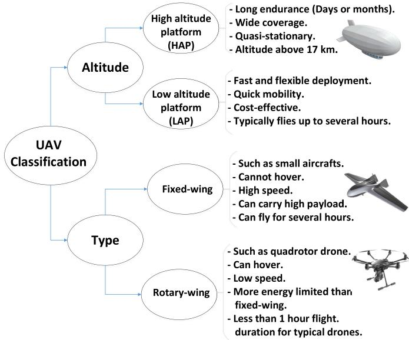

flowchart

```mermaid
graph TD
    A["UAV Classification"] --> B["Altitude"]
    A --> C["Type"]
    B --> D["High altitude platform (HAP)"]
    B --> E["Low altitude platform (LAP)"]
    C --> F["Fixed-wing"]
    C --> G["Rotary-wing"]
    D --> H["Long endurance (Days or months)."]
    D --> I["Wide coverage."]
    D --> J["Quasi-stationary."]
    D --> K["Altitude above 17 km."]
    E --> L["Fast and flexible deployment."]
    E --> M["Quick mobility."]
    E --> N["Cost-effective."]
    E --> O["Typically flies up to several hours."]
    F --> P["Such as small aircrafts."]
    F --> Q["Cannot hover."]
    F --> R["High speed."]
    F --> S["Can carry high payload."]
    F --> T["Can fly for several hours."]
    G --> U["Such as quadrotor drone."]
    G --> V["Can hover."]
    G --> W["Low speed."]
    G --> X["More energy limited than fixed-wing."]
    G --> Y["Less than 1 hour flight. duration for typical drones."]
```

Fig. 1. UAV Classification.

In Section IV, for each research direction identified in Section III, we provide an outline of challenging open problems that must be addressed, in order to fully exploit the potential of UAV-based wireless communications. This, in turn, will provide a roadmap for future research in this area.   
• In Section V, we then provide a summary on analytical frameworks that are expected to play an important role in the design of future UAV-based wireless networks that can enable network operators to leverage UAVs for various application scenarios.   
• The article is concluded in Section VI with additional insights on this fascinating area of research.

# II. WIRELESS NETWORKING WITH UAVS: MOTIVATING APPLICATION USE CASES

In order to paint a clear picture on how UAVs can indeed be used as flying wireless base stations, in this section, we overview a number of prospective applications for such a wireless-centric UAV deployment. The applications are drawn from a variety of scenarios, that include imminent use cases, such as for public safety scenarios or hotspot coverage, as well as more “futuristic” applications such as the use of UAVs as caching apparatus or IoT enablers. Naturally, in all such applications, the UEs of the system can include cellular-connected UAV-UEs which we will also discuss. Note that this section restricts its attention to the application scenarios, while the challenges are left for a deeper treatment in Section III.

# A. UAV Aerial Base Station in 5G and Beyond

Here, we discuss the key applications of UAV-mounted aerial base stations in 5G.

1) Coverage and Capacity Enhancement of Beyond 5G Wireless Cellular Networks: The need for high-speed wireless access has been incessantly growing, fueled by the rapid proliferation of highly capable mobile devices such as smartphones, tablets, and more recently drone-UEs and IoT-style gadgets [24]. As such, the capacity and coverage of existing wireless cellular networks have been extensively strained, which led to the emergence of a plethora of wireless technologies that seek to overcome this challenge. Such technologies, which include device-to-device (D2D) communications, ultra dense small cell networks, and millimeter wave (mmW) communications, are collectively viewed as the nexus of nextgeneration 5G cellular systems [56]–[60]. However, despite their invaluable benefits, those solutions have limitations of their own. For instance, D2D communication will undoubtedly require better frequency planning and resource usage in cellular networks. Meanwhile, ultra dense small cell networks face many challenges in terms of backhaul, interference, and overall network modeling. Similarly, mmW communication is limited by blockage and high reliance on LoS communication to effectively deliver the promise of high-speed, low latency communications. These challenges will be further exacerbated in UAV-UEs scenarios.

We envision UAV-carried flying base stations as an inevitable complement for such a heterogeneous 5G environment, which will allow overcoming some of the challenges of the existing technologies. Deploying LAP-UAVs can be a cost-effective approach for providing wireless connectivity to geographical areas with limited cellular infrastructure. Moreover, the use of UAV base stations becomes promising when deploying small cells for the sole purpose of servicing temporary events (e.g., sport events and festivals), is not economically viable, given the short period of time during which these events require wireless access. Meanwhile, HAP-UAVs can provide a more long-term sustainable solution for coverage in such rural environments. Mobile UAVs can provide on-demand connectivity, high data rate wireless service, and traffic offloading opportunity [9], [15], [61] in hotspots and during temporary events such as football games or Presidential inaugurations. In this regard, AT&T and Verizon have already announced several plans to use flying drones to provide temporarily boosted Internet coverage for college football national championship and Super Bowl [62]. Clearly, flying base stations can provide an important complement to ultra dense small cell networks.

In addition, UAV-enabled mmW communications is a porpoising application of UAVs that can establish LoS communication links to users. This, in turn, can be an attractive solution to provide high capacity wireless transmission, while leveraging the advantages of both UAVs and mmW links. Moreover, combining UAVs with mmW and potentially massive multiple input multiple output (MIMO) techniques can create a whole new sort of dynamic, flying cellular network for providing high capacity wireless services, if well planned and operated.

UAVs can also assist various terrestrial networks such as D2D and vehicular networks. For instance, owing to their mobility and LoS communications, drones can facilitate rapid information dissemination among ground devices. Furthermore, drones can potentially improve the reliability of wireless links in D2D and vehicle-to-vehicle (V2V) communications while exploiting transmit diversity. In particular, flying drones can help in broadcasting common information to ground devices thus reducing the interference in ground networks by decreasing the number of transmissions between devices. Moreover, UAV base stations can use air-to-air links to service other cellular-connected UAV-UEs, to alleviate the load on the terrestrial network.

TABLE III UAV BASE STATION VERSUS TERRESTRIAL BASE STATION 

<table><tr><td>UAV Base Stations</td><td>Terrestrial Base Stations</td></tr><tr><td>• Deployment is naturally three-dimensional.</td><td>• Deployment is typically two-dimensional.</td></tr><tr><td>• Short-term, frequently changing deployments.</td><td>• Mostly long-term, permanent deployments.</td></tr><tr><td>• Mostly unrestricted locations.</td><td>• Few, selected locations.</td></tr><tr><td>• Mobility dimension.</td><td>• Fixed and static.</td></tr></table>

TABLE IV UAV NETWORKS VERSUS TERRESTRIAL NETWORKS 

<table><tr><td>UAV Networks</td><td>Terrestrial Networks</td></tr><tr><td>● Spectrum is scarce.</td><td>● Spectrum is scarce.</td></tr><tr><td>● Elaborate and stringent energy constraints and models.</td><td>● Well-defined energy constraints and models.</td></tr><tr><td>● Varying cell association.</td><td>● Mainly static association.</td></tr><tr><td>● Hover and flight time constraints.</td><td>● No timing constraints, BS always there.</td></tr></table>

For the aforementioned cellular networking scenarios, it is clear that the use of UAVs is quite natural due to their key features given in Tables III and IV such as agility, mobility, flexibility, and adaptive altitude. In fact, by exploiting these unique features as well as establishing LoS communication links, UAVs can boost the performance of existing ground wireless networks in terms of coverage, capacity, delay, and overall quality-of-service. Such scenarios are clearly promising and one can see UAVs as being an integral part of beyond 5G cellular networks, as the technology matures further, and new operational scenarios emerge. Naturally, reaping these benefits will require overcoming numerous challenges, that we outline in Section III.

2) UAVs as Flying Base Stations for Public Safety Scenarios: Natural disasters such as floods, hurricanes, tornados, and severe snow storms often yield devastating consequences in many countries. During wide-scale natural disasters and unexpected events, the existing terrestrial communication networks can be damaged or even completely destroyed, thus becoming significantly overloaded, as evidenced by the recent aftermath of Hurricanes Gomez et al. [63]. In particular, cellular base stations and ground communications infrastructure can be often compromised during natural disasters. In such scenarios, there is a vital need for public safety communications between first responders and victims for search and rescue operations. Consequently, a robust, fast, and capable emergency communication system is needed to enable effective communications during public safety operations. In public safety scenarios, such a reliable communication system will not only contribute to improving connectivity, but also to saving lives.

In this regard, FirstNet in the United States was established to create a nationwide and high-speed broadband wireless network for public safety communications. The potential broadband wireless technologies for public safety scenarios include 4G long term evolution (LTE), WiFi, satellite communications, and dedicated public safety systems such as TETRA and APCO25 [64]. However, these technologies may not provide flexibility, low-latency services, and swift adaptation to the environment during natural disasters. In this regard, the use of UAV-based aerial networks [65], as shown in Figure 2, is a promising solution to enable fast, flexible, and reliable wireless communications in public safety scenarios. Since UAVs do not require highly constrained and expensive infrastructure (e.g., cables), they can easily fly and dynamically change their positions to provide on-demand communications to ground users in emergency situations. In fact, due the unique features of UAVs such as mobility, flexible deployment, and rapid reconfiguration, they can effectively establish on-demand public safety communication networks. For instance, UAVs can be deployed as mobile aerial base stations in order to deliver broadband connectivity to areas with damaged terrestrial wireless infrastructure. Moreover, flying UAVs can continuously move to provide full coverage to a given area within a minimum possible time. Therefore, the use of UAV-mounted base stations can be an appropriate solution for providing fast and ubiquitous connectivity in public safety scenarios.

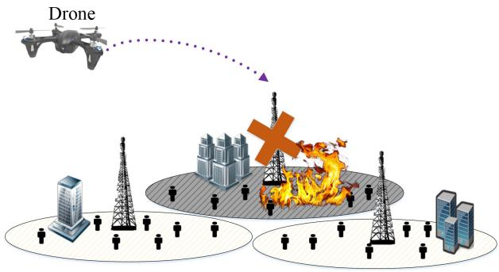

text_image

Drone

Fig. 2. Drone in public safety scenarios.

3) UAV-Assisted Terrestrial Networks for Information Dissemination: With their mobility and LoS opportunities, UAVs can support terrestrial networks for information dissemination and connectivity enhancement [14], [66]. For instance, as shown in Figure 3, UAVs can be used as flying base stations to assist a D2D network or a mobile ad-hoc network in information dissemination among ground devices. While D2D networks can provide an effective solution for offloading cellular data traffic and improving network capacity and coverage, their performance is limited due to the short communication range of devices as well as potentially increasing interference. In this case, flying UAVs can facilitate rapid information dissemination by intelligently broadcasting common files among ground devices. For example, UAV-assisted D2D networks allow the rapid spread of emergency or evacuation messages in public safety situations.

Likewise, drones can play a key role in vehicular networks (i.e., V2V communications) by spreading safety information across the vehicles. Drones can also enhance reliability and connectivity of D2D and V2V communication links. On the one hand, using drones can mitigate interference by reducing the number of required transmission links between ground devices. On the other hand, mobile drones can introduce transmit diversity opportunities thus boosting reliability and connectivity in D2D, ad-hoc, and V2V networks. One effective approach for employing such UAV-assisted terrestrial networks is to leverage clustering of ground users. Then, a UAV can directly communicate with the head of the clusters and the multi-hop communications are performed inside the clusters. In this case, the connectivity of terrestrial networks can be significantly improved by adopting efficient clustering approaches and exploiting UAVs’ mobility.

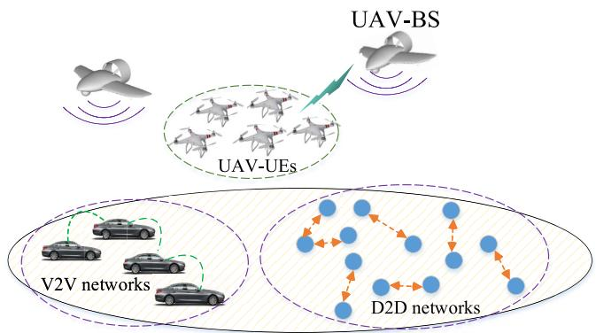

flowchart

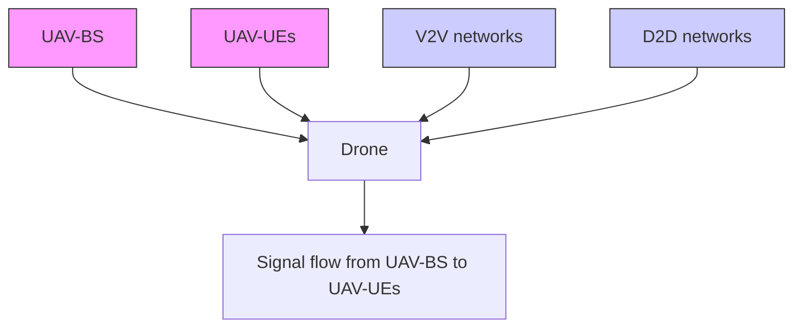

Fig. 3. UAV-assisted terrestrial networks.

4) 3D MIMO and Millimeter Wave Communications: Due to their aerial positions and their ability to deploy on demand at specific locations, UAVs can be viewed as flying antenna systems that can be exploited for performing massive MIMO, 3D network MIMO, and mmW communications. For instance, in recent years, there has been considerable interest in the use of 3D MIMO, also known as full dimension MIMO, by exploiting both the vertical and horizontal dimensions in terrestrial cellular networks [67]–[73]. In particular, as shown in Figure 4, 3D beamforming enables the creation of separate beams in the three-dimensional space at the same time, thus reducing inter-cell interference [74]. Compared to the conventional two-dimensional MIMO, 3D MIMO solutions can yield higher overall system throughput and can support a higher number of users. In general, 3D MIMO is more suitable for scenarios in which the number of users is high and they are distributed in three dimensions with different elevation angles with respect to their serving base station [14], [73]. Due to the high altitude of UAV-carried flying base stations, ground users can be easily distinguishable at different altitudes and elevation angles measured with respect to the UAV. Furthermore, LoS channel conditions in UAV-to-ground communications enable effective beamforming in both azimuth and elevation domains (i.e., in 3D). Therefore, UAV-BSs are suitable candidates for employing 3D MIMO.

Furthermore, the use of a drone-based wireless antenna array, that we introduced in [75], provides a unique opportunity for airborne beamforming. A drone antenna array whose elements are single-antenna drones can provide MIMO and beamforming opportunities to effectively service ground users in downlink and uplink scenarios. Compared to conventional antenna array systems, a drone-based antenna array has the following advantages: 1) The number of antenna elements (i.e., drones) is not limited by space constraints, 2) Beamforming gains can be increased by dynamically adjusting the array element spacing, and 3) The mobility and flexibility of drones allow effective mechanical beam-steering in any 3D direction. In addition, the use of a large number of small UAVs within an array formation can provide unique massive MIMO opportunists. Such UAV-based massive antenna array can form any arbitrary shape and effectively perform beamforming.

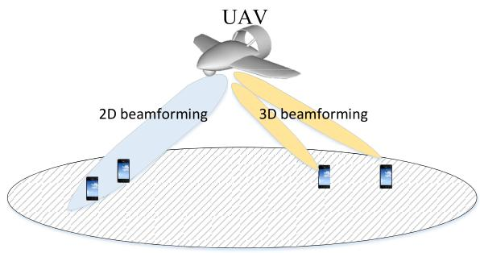

flowchart

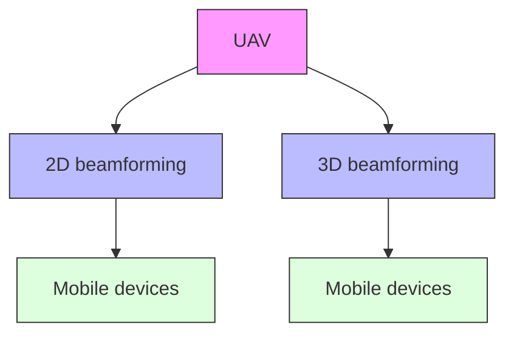

Fig. 4. 3D beamforming using a drone.

UAVs can also be a key enabler for mmW communications2 (see [14], [15], [76], [77], [78]). On the one hand, UAVs equipped with mmW capabilities can establish LoS connections to ground users thus reducing propagation loss while operating at high frequencies. On the other hand, with the use of small-size antennas (at mmW frequencies) on UAVs, one can exploit advanced MIMO techniques such as massive MIMO in order to operate mmW communications. Meanwhile, swarms of UAVs can create reconfigurable antenna arrays in the sky [75].

5) UAVs for IoT Communications: Wireless networking technologies are rapidly evolving into a massive IoT environment that must integrate a heterogeneous mix of devices ranging from conventional smartphones and tablets to vehicles, sensors, wearables, and naturally, drones. Realizing the much coveted applications of the IoT such as smart cities infrastructure management, healthcare, transportation, and energy management [24], [79]–[81] requires effective wireless connectivity among a massive number of IoT devices that must reliably deliver their data, typically at high data rates or ultra low latency. The massive nature of the IoT requires a major rethinking to the way in which conventional wireless networks (e.g., cellular systems) operate.

For instance, in an IoT environment, energy efficiency, ultra low latency, reliability, and high-speed uplink communications become major challenges that are not typically as critical in conventional cellular network use cases [80]. In particular, IoT devices are highly battery limited and are typically unable to transmit over a long distance due to their energy constraints. For instance, in areas which experience an intermittent or poor coverage by terrestrial wireless networks, battery-limited IoT devices may not be able to transmit their data to distant base stations due to their power constraints. Furthermore, due to the various applications of IoT devices, they might be deployed

2It is worth noting that mmW communications have been already adopted for satellite and HAPS communications [76].

in environments with no terrestrial wireless infrastructure such as mountains and desert areas.

In this regard, the use of mobile UAVs is a promising solution to a number of challenges associated with IoT networks. In IoT-centric scenarios, UAVs can be deployed as flying base stations to provide reliable and energy-efficient uplink IoT communications (see [7], [10], [82], [83]). In fact, due to the aerial nature of the UAVs and their high altitude, they can be effectively deployed to reduce the shadowing and blockage effects as the major cause of signal attenuation in wireless links. As a result of such efficient placement of UAVs, the communication channel between IoT devices and UAVs can be significantly improved. Subsequently, battery-limited IoT devices will need a significantly lower power to transmit their data to UAVs. In other words, UAVs can be placed based on the locations of IoT devices enabling those devices to successfully connect to the network using a minimum transmit power. Moreover, UAVs can also serve massive IoT systems by dynamically updating their locations based on the activation pattern of IoT devices. This is in contrast to using ground small cell base stations which may need to be substantially expanded to service the anticipated number of devices in the IoT. Hence, by exploiting unique features of UAVs, the connectivity and energy efficiency of IoT networks can be significantly improved.

6) Cache-Enabled UAVs: Caching at small base stations (SBSs) has emerged as a promising approach to improve users’ throughput and to reduce the transmission delay [84]–[88]. However, caching at static ground base stations may not be effective in serving mobile users in case of frequent handovers (e.g., as in ultra-dense networks with moving users). In this case, when a user moves to a new cell, its requested content may not be available at the new base station and, thus, the users cannot be served properly. To effectively service mobile users in such scenarios, each requested content needs to be cached at multiple base stations which is not efficient due to signaling overheads and additional storage usages. Hence, to enhance caching efficiency, there is a need to deploy flexible base stations that can track the users’ mobility and effectively deliver the required contents.

To this end, we envision futuristic scenarios in which UAVs, acting as flying base stations, can dynamically cache the popular contents, track the mobility pattern of the corresponding users and, then, effectively serve them [8], [89], [90]. In fact, the use of cache-enabled UAVs is a promising solution for traffic offloading in wireless networks. By leveraging user-centric information, such as content request distribution and mobility patterns, cache-enabled UAVs can be optimally moved and deployed to deliver desired services to users. Another advantage of deploying cache-enabled UAVs is that the caching complexity can be reduced compared to a conventional static SBSs case. For instance, whenever a mobile user moves to a new cell, its requested content needs to be stored at the new base station. However, cache-enabled drones can track the mobility pattern of users and, consequently, the content stored at the drones will no longer require such additional caching at SBSs. In practice, in a cache-enabled UAV system, a central cloud processor can utilize various user-centric information including users’ mobility patterns and their content request distribution to manage the UAV deployment. In fact, such userenteric information can be learned by a cloud center using any previous available users’ data. Then, the cloud center can effectively determine the locations and mobility paths of cache-enabled UAVs to serve ground users.3 This, in turn, can reduce the overall overhead of updating the cache content. While performing caching with SBSs, content requests of a mobile user may need to be dynamically stored at different SBSs. However, cache-enabled UAVs can track the mobility pattern of users and avoid frequently updating the content requests of mobile users. Therefore, ground users can be effectively served by exploiting mobile cache-enabled UAVs that predict mobility patterns and content request information of users.

# B. Cellular-Connected Drones as User Equipments

Naturally, drones can act as users of the wireless infrastructure. In particular, drone-users can be used for package delivery, surveillance, remote sensing, and virtual reality applications. Indeed, cellular-connected UAVs will be a key enabler of the IoT. For instance, for delivery purposes, drones are used for Amazon’s prime air drone delivery service, and autonomous delivery of emergency drugs [92]. The key advantage of drone-users is their ability to swiftly move and optimize their path to quickly complete their missions. To properly use drones as user equipments (i.e., cellularconnected drone-UEs [74]), there is a need for reliable and low-latency communication between drones and ground BSs. In fact, to support a large-scale deployment of drones, a reliable wireless communication infrastructure is needed to effectively control the drones’ operations while supporting the traffic stemming from their application services [93].

Beyond their need for ultra low latency and reliability, when used for surveillance purposes, drone-UEs will require high-speed uplink connectivity from the terrestrial network and from other UAV-BSs. In this regard, current cellular networks may not be able to fully support drone-UEs as they were designed for ground users whose operations, mobility, and traffic characteristics are substantially different from the drone-UEs. There are a number of key differences between drone-UEs and terrestrial users. First, drone-UEs typically experience different channel conditions due to nearly LoS communications between ground BSs and flying drones. In this case, one of the main challenges for supporting drone-UEs is significant LoS interference caused by ground BSs.4 Second, unlike terrestrial users, the on-board energy of drone-UEs is highly limited. Third, drone-UEs are in general more dynamic than ground users as they can continuously fly in any direction. Therefore, incorporating cellular-connected drone-UEs in wireless networks will introduce new technical challenges and design considerations.

3Caching with UAVs can also be an important use-case for future flying taxis [91].

4One approach for mitigating such LoS interference is to utilize fulldimensional MIMO in BS-to-drone communications [74].

# C. Flying Ad-Hoc Networks With UAVs

One of the key use cases of UAVs is in flying ad-hoc networks (FANETs) in which multiple UAVs communicate in an ad-hoc manner. With their mobility, lack of central control, and self-organizing nature, FANETs can expand the connectivity and communication range at geographical areas with limited cellular infrastructure [45]. Meanwhile, FANETs play important roles in various applications such as traffic monitoring, remote sensing, border surveillance, disaster management, agricultural management, wildfire management, and relay networks [45]–[47]. In particular, a relaying network of UAVs maintains reliable communication links between a remote transmitters and receivers that cannot directly communicate due to obstacles or their long separation distance.

Compared to a single UAV, a FANET with multiple small UAVs has the following advantages [46]:

Scalability: The operational coverage of FANETs can be easily increased by adding new UAVs and adopting efficient dynamic routing schemes.   
Cost: The deployment and maintenance cost of small UAVs is lower than the cost of a large UAV with complex hardware and heavy payload.   
• Survivability: In FANETs, if one UAV becomes inoperational (due to weather conditions or any failure in the UAV system), FANET missions can still proceed with rest of flying UAVs. Such flexibility does not exist in a single UAV system.

# D. Other Potential UAV Use Cases

1) UAVs as Flying Backhaul for Terrestrial Networks: Wired backhauling is a common approach for connecting base stations to a core network in terrestrial networks. However, wired connections can be expensive and infeasible due to geographical constraints, especially when dealing with ultra dense cellular networks [94]–[96]. While wireless backhauling is a viable and cost-effective solution, it suffers from blockage and interference that degrade the performance of the radio access network [97]. In this case, UAVs can play a key role in enabling cost-effective, reliable, and high speed wireless backhaul connectivity for ground networks [98]. In particular, UAVs can be optimally placed to avoid obstacles and establish LoS and reliable communication links. Moreover, the use of UAVs with mmW capabilities can establish high data rate wireless backhaul connections that are needed to cope with high traffic demands in congested areas. UAVs can also create a reconfigurable network in the sky and provide multi-hop LoS wireless backhauling opportunities. Clearly, such flexible UAV-based backhaul networks can significantly improve the reliability, capacity, and operation cost of backhauling in terrestrial networks.

2) Smart Cities: Realizing a global vision of smart and connected communities and cities is a daunting technological challenge. Smart cities will effectively have to integrate many of the previously mentioned technologies and services including an IoT environment (with its numerous services), a reliable wireless cellular network, resilience to calamities, and huge amounts of data [99]. To this end, UAVs can provide

several wireless application use cases in smart cities. On the one hand, they can be used as data collection devices that can gather vast amounts of data across various geographical areas within a city and deliver them to central cloud units for big data analytics purposes. On the other hand, UAV base stations can be used to simply enhance the coverage of the cellular network in a city or to respond to specific emergencies. UAVs can also be used to sense the radio environment maps [100] across a city, in order to assist network operators in their network and frequency planning efforts. Another key application of UAVs in smart cities is their ability to act as mobile cloud computing systems [40]. In this regards, a UAV-mounted cloudlet can provide fog computing and offloading opportunities for devices that are unable to perform computationally heavy tasks. We note that, within smart cities, drones may need to temporarily position themselves on buildings for specific purposes (e.g., recharge). In such case, there is a need for on-demand site renting management to accommodate drones’ operation. Overall, UAVs will be an integral part of smart cities, from both wireless and operational perspectives.

# E. Summary of Lessons Learned

The key lessons learned from Section II are listed as follows:

• Flying UAVs can play several roles in wireless networks. In particular, UAVs can be used as aerial base stations, user equipments in cellular networks, or mobile relay in flying ad-hoc networks. Moreover, they have promising applications in wireless backhauling and smart cities.   
• UAV base stations can significantly improve the coverage and capacity of wireless networks. Furthermore, they can be deployed to enable connectivity in public safety information dissemination scenarios. UAVs can also facilitate millimeter wave communications and reliable energy efficient IoT communications. Meanwhile, the deployment of cache-enabled UAV base stations is a promising solution for traffic offloading in wireless networks.   
• Drones can also act as flying users within a cellular network in various applications such as package delivery and virtual reality. Cellular-connected drones can freely move and optimize their route so as to quickly complete their missions and deliver their tasks. Such cellular-connected drones require reliable and low-latency communications with ground base stations.   
• Self-organizing and flexible flying ad-hoc networks of UAVs can provide coverage expansion for geographical areas with limited wireless infrastructure.

Clearly, the aforementioned applications are only a selected sample of potential use cases of UAVs as flying wireless platforms. If realized, such applications will have far reaching technological and societal impacts. However, in order to truly deploy such UAV-centric applications, one must overcome numerous technical challenges, as outlined in the next section.

# III. RESEARCH DIRECTIONS, CHALLENGES, AND STATE-OF-THE-ART

In this section, inspired by the aforementioned applications, we present a comprehensive overview on the key research directions that must be pursued for practically deploying UAVs as flying wireless platforms. For each research direction, we first outline the key challenges, and then we discuss the state of the art, while also providing an overview on recent results.

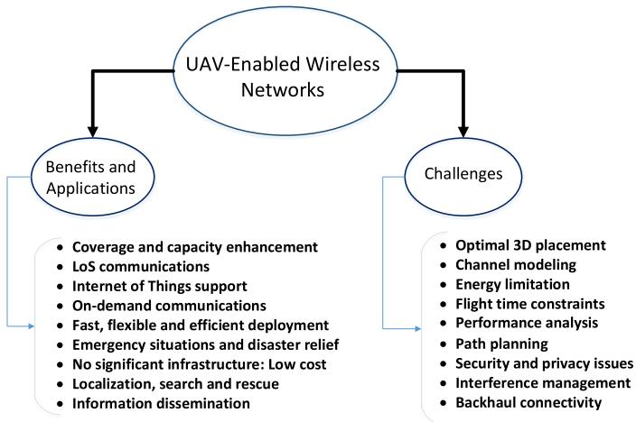

flowchart

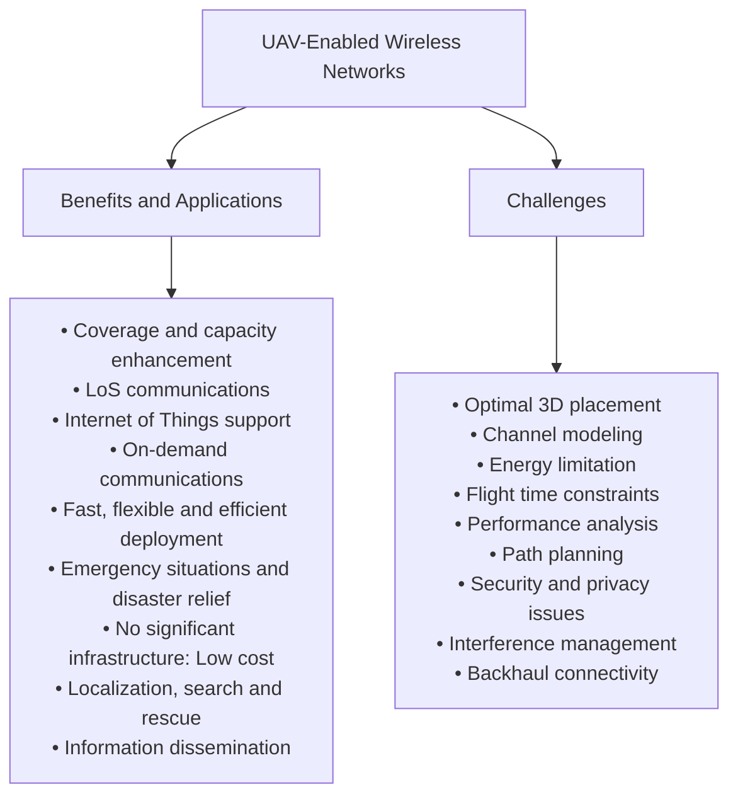

Fig. 5. Opportunities, applications, and challenges of UAV-enabled wireless networks.

# A. Air-to-Ground Channel Modeling

1) Challenges: Wireless signal propagation is affected by the medium between the transmitter and the receiver. The air-to-ground (A2G) channel characteristics significantly differ from classical ground communication channels which, in turn, can determine the performance of UAV-based wireless communications in terms of coverage and capacity [29], [101]–[103]. Also, compared to air-to-air communication links that experience dominant LoS, A2G channels are more susceptible to blockage. Clearly, the optimal design and deployment of drone-based communication systems require using an accurate A2G channel model. While the ray-tracing technique is a reasonable approach for channel modeling, it lacks sufficient accuracy, particularly at low frequency operations [104]. An accurate A2G channel modeling is important especially when using UAVs in applications such as coverage enhancement, cellular-connected UAV-UEs, and IoT communications.

The A2G channel characteristics significantly differ from ground communication channels [74]. In particular, any movement or vibration by the UAVs can affect the channel characteristics. Moreover, the A2G channel is highly dependent on the altitude and type of the UAV, elevation angle, and type of the propagation environment. Therefore, finding a generic channel model for UAV-to-ground communications needs comprehensive simulations and measurements in various environments. In addition, the effects of a UAV’s altitude, antennas’ movements, and shadowing caused by the UAV’s body must be captured in channel modeling. Clearly, capturing such factors is challenging in A2G channel modeling.

2) State of the Art: Now, we discuss a number of recent studies on A2G channel modeling. The work in [105] presented an overview of existing research related to A2G channel modeling. Matolak and Sun [106] provided both simulation and measurement results for path loss, delay spread,

and fading in A2G communications. Khawaja [55] provided a comprehensive survey on A2G propagation while describing large-scale and small-scale fading models. Zajic [101] ´ and Zheng et al. [102] performed thorough path loss modeling for high altitude A2G communications. As discussed in [14], [15], and [101], by efficiently deploying UAVs, their A2G communication links can experience a better channel quality (and a higher likelihood of LoS connections) compared to fixed terrestrial base stations. Holis and Pechac [103] presented a channel propagation model for high altitude platforms and ground users communications in an urban area. In [103], based on empirical results, the statistical characteristics of the channel are modeled as a function of the elevation angle. In particular, Holis and Pechac [103] considered LoS and NLoS links between the HAP and ground users and derived the probability of occurrence associated with each link. In [107], the likelihood of LoS links for A2G communication was derived as a function of elevation angle and average height of buildings in urban environments. In addition, there are some measurement-based studies on UAV-to-ground channel modeling such as [108]–[111] that identified some of the key channel characteristics. These works provide some insights on the A2G channel characteristics that can be used to find a more generic channel model.

3) Representative Result: One of the most widely adopted A2G path loss model for low altitude platforms is presented in [29] and, thus, we explain it in more detail. As shown in [29], the path loss between a UAV and a ground device depends on the locations of the UAV and the ground device as well as the type of propagation environment (e.g., rural, suburban, urban, high-rise urban). In this case, depending on the environment, A2G communication links can be either LoS or NLoS. Note that, without any additional information about the exact locations, heights, and number of the obstacles, one must consider the randomness associated with the LoS and NLoS links. As a result, many of the existing literature on UAV communication (e.g., [8], [15], [37], [63], [89], [98], and [112]–[116]) adopted the probabilistic path loss model given in [11] and [29]. As discussed in these works, the LoS and non-LoS (NLoS) links can be considered separately with different probabilities of occurrence. The probability of occurrence is a function of the environment, density and height of buildings, and elevation angle between UAV and ground device. The common probabilistic LoS model is based on the general geometrical statistics of various environments provided by the International Telecommunication Union (ITU-R) [117]. In particular, for various types of environments, the ITU-R provides some environmental-dependent parameters to determine the density, number, and hight of the buildings (or obstacles). For instance, according to [117], the buildings’ heights can be modeled using a Rayleigh distribution as:

$$
f (h _ {B}) = \frac {h _ {B}}{\gamma^ {2}} \exp \left(\frac {- h _ {B}}{2 \gamma^ {2}}\right), \tag {1}
$$

where $h _ { B }$ is the height of buildings in meters, and $\gamma$ is a environmental-dependent parameter [11]. Clearly, due to the randomness (uncertainty) associated with the height of buildings (from a UAV perspective), one must consider a probabilistic LoS model while designing UAV-based communication systems. Therefore, using the statistical parameters provided by ITU-R, other works such as [11] and [29] derived an expression for the LoS probability, which is given by [8], [29], [37], [63], and [112]–[116]:

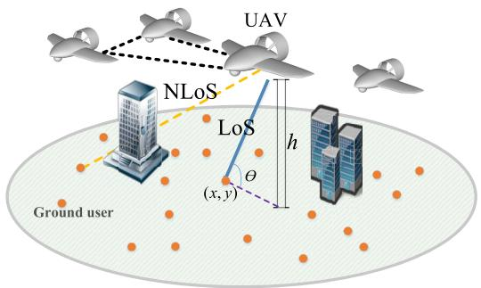

text_image

UAV
NLoS
LoS
h
θ
(x,y)
Ground user

Fig. 6. UAV communication.

$$
P _ {\mathrm{LoS}} = \frac {1}{1 + C \exp (- B [ \theta - C ])}, \tag {2}
$$

where C and B are constant values that depend on the environment (rural, urban, dense urban, or others) and θ is the elevation angle in degrees. Clearly, $\begin{array} { r } { \theta = \frac { 1 8 0 } { \pi } \times \sin ^ { - 1 } ( \frac { h } { d } ) } \end{array}$ , with h being the UAV’s altitude, and d is the distance between the UAV and a given ground user. In this case, the NLoS probability will be $P _ { \mathrm { N L o S } } = 1 - P _ { \mathrm { L o S } }$ . We note that the probabilistic path loss model in (2) is an example of existing A2G channel models such as the one proposed by the 3GPP [74].

Equation (2) captures the probability of having LoS connection between the aerial base station and ground users is an increasing function of elevation angle. According to this equation, by increasing the elevation angle between the receiver and the transmitter, the blockage effect decreases and the communication link becomes more LoS.

It is worth noting that the small-scale fading in A2G communications can be characterized by Rician fading channel model [106]. The Rician K-factor that represents the strength of LoS component is a function of elevation angle and the UAV’s altitude.

# B. Optimal Deployment of UAVs as Flying Base Stations

1) Challenges: The three dimensional deployment of UAVs is one of the key challenges in UAV-based communications. In fact, as mentioned in Tables III and IV, the adjustable height of UAVs and their potential mobility provide additional degrees of freedom for an efficient deployment. As a result, optimal deployment of UAVs has received significant attention [7], [8], [11]–[13], [34], [35], [37], [112], [118], [119]. In fact, deployment is a key design consideration while using UAVs for coverage and capacity maximization, public safety, smart cities, caching, and IoT applications. The optimal 3D placement of UAVs is a challenging task as it depends on many factors such as deployment environment (e.g., geographical area), locations of ground users, and UAV-to-ground channel characteristics which itself is a function of a UAV’s altitude. In addition, simultaneously deploying multiple UAVs becomes more challenging due to the impact of inter-cell interference on the system performance. In fact, the deployment of UAVs is significantly more challenging than that of ground base stations, as done in conventional cellular network planning. Unlike terrestrial base stations UAVs needs to be deployed in a continuous 3D space while considering the impact of altitude on the A2G channel characteristics. Moreover, while deploying UAVs, their flight time and energy constraints must be also taken into account, as they directly impact the network performance.

2) State of the Art: Recently, the deployment problem of UAVs in wireless networks has been extensively studied in the literature. For instance, in [7], the optimal deployment and mobility of multiple UAVs for energy-efficient data collection from IoT devices was investigated. Al-Hourani et al. [11] derived the optimal altitude enabling a single UAV to achieve a maximum coverage radius. In this work, the deterministic coverage range is determined by comparing the average path loss with a specified threshold. As shown in [11], for very low altitudes, due to the shadowing effect, the probability of LoS connections between transmitter and receiver decreases and, consequently, the coverage radius decreases. On the other hand, at very high altitudes, LoS links exist with a high probability. However, due to the large distance between transmitter and receiver, the path loss increases and consequently the coverage performance decreases. Therefore, to find the optimal UAV’s altitude, the impact of both distance and LoS probability should be considered simultaneously.

In [12], we extended the results of [11] to the case of two, interfering UAVs. In [13], we investigated the optimal 3D placement of multiple UAVs, that use directional antennas, to maximize total coverage area. The work in [37] analyzed the impact of a UAV’s altitude on the sum-rate maximization of a UAV-assisted terrestrial wireless network. Bor-Yaliniz and Yanikomeroglu [15] investigated the 3D placement of drones with the goal of maximizing the number of ground users which are covered by the drone. Kalantari et al. [112] studied the efficient deployment of aerial base stations to maximize the coverage performance. Furthermore, Kalantari et al. [112] determined the minimum number of drones needed for serving all the ground users within a given area. Koˇsmerl and Vilhar [118] used evolutionary algorithms to find the optimal placement of LAPs and portable base stations for disaster relief scenarios. In this work, by deploying the UAVs at the optimal locations, the number of base stations required to completely cover the desired area was minimized. The work in [120] proposed a framework for a cooperative deployment and task allocation of UAVs that service ground users. In [120], the problem of joint deployment and task allocation was addressed by exploiting the concepts of coalitional game theory and queueing theory.

Moreover, the deployment of UAVs for supplementing existing cellular infrastructure was discussed in [121]. In this work, a general view of the potential integration of UAVs with cellular networks was presented. Zhan et al. [122] investigated the optimal deployment of a UAV that acts as a wireless relay between the transmitter and the receiver. The optimal location of the UAV was determined by maximizing the average rate while ensuring that the bit error rate will not exceed a specified threshold. As shown in [122], a UAV should be placed closer to the ground device (transmitter or receiver) which has a poor link quality to the UAV. De Freitas et al. [123] studied the use of UAV relays to enhance the connectivity of a ground wireless network. In this work, flying UAVs are optimally deployed to guarantee the message delivery of sensors to destinations. The work in [124] investigated the deployment of multiple UAVs as wireless relays in order to provide service for ground sensors. In particular, this work addressed the tradeoff between connectivity among the UAVs and maximizing the area covered by the UAVs.

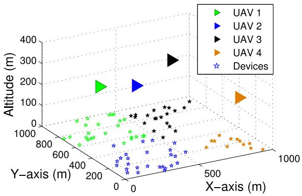

scatter

| Category   | X-axis (m) | Y-axis (m) | Altitude (m) |
| ---------- | ---------- | ---------- | ------------ |
| UAV 1      | ~200       | ~800       | ~200         |
| UAV 2      | ~200       | ~200       | ~200         |
| UAV 3      | ~500       | ~500       | ~300         |
| UAV 4      | ~700       | ~700       | ~150         |
| Devices    | ~100       | ~100       | ~100         |

Fig. 7. Optimal 3D locations of UAVs [7].

3) Representative Results: In [7], we proposed a framework for dynamic deployment and mobility of UAVs to enable reliable and energy-efficient IoT communications. In Figure 7, we show a representative result on the optimal 3D placement of UAVs, taken from [7]. In this case, four UAVs are deployed to collect data (in the uplink) from IoT devices which are uniformly distributed within a geographical area of size 1 km × 1 km. Here, using tools from optimization theory and facility location problems, we derived the optimal 3D positions of the UAVs as well as the device-UAV associations such that the total uplink transmit power of devices is minimized while ensuring reliable communications. As a result, the devices are able to send their data to the associated UAVs while using a minimum total transmit power. This result shows that UAVs can be optimally deployed to enable reliable and energy-efficient uplink communications in IoT networks.

Figure 8 shows the average transmit power of devices in the optimal deployment scenario with a case in which aerial base stations are pre-deployed (i.e., without optimizing the UAVs’ locations). As we can see, the average transmit power of devices can be reduced by 78% by optimally deploying the UAVs. Figure 8 also shows that the uplink transmit power decreases while increasing the number of UAVs. Clearly, the energy efficiency of the IoT network is significantly improved by exploiting the flexibility of drones and optimizing their locations.

Next, we discuss another key result on the deployment of multiple UAVs for maximizing wireless coverage. In our work in [13], we consider multiple UAV-BSs that must provide a downlink wireless service to a circular geographical area of radius 5 km. We assume that the UAVs are symmetric and have the same transmit power and altitude. In the considered model, each UAV uses a directional antenna with a certain beamwidth, and UAVs operate at the same frequency band. Our goal is to optimally deploy the UAVs in 3D space such that their total coverage area is maximized while avoiding mutual interference between the UAVs. To this end, we tackle our problem by exploiting circle packing theory [125]. Our results provide rigorous guidelines on how to optimally adjust the location and, in particular, the altitude of UAVs, based on the antenna beamwidth, size of the area, and the number of UAVs.

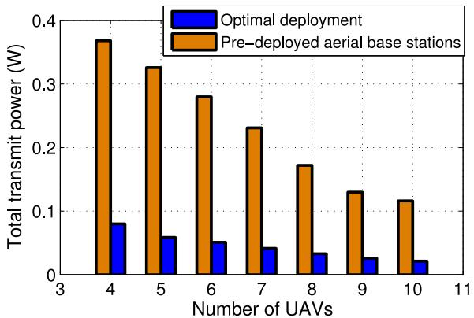

bar

| Number of UAVs | Optimal deployment (W) | Pre-deployed aerial base stations (W) |
| :--- | :--- | :--- |
| 4 | 0.08 | 0.37 |
| 5 | 0.06 | 0.33 |
| 6 | 0.05 | 0.28 |
| 7 | 0.04 | 0.23 |
| 8 | 0.03 | 0.17 |
| 9 | 0.025 | 0.13 |
| 10 | 0.02 | 0.115 |
The chart displays a single bar for each UAV count, with the y-axis representing total transmit power in watts and the x-axis representing the number of UAVs. The legend indicates that blue bars represent optimal deployment and orange bars represent pre-deployed aerial base stations. The data is presented in a grid format with 'Number of UAVs' as the index and 'Total transmit power (W)' as the value for each bar.

Fig. 8. Total transmit power of devices vs. number of UAVs (for 80 IoT devices).

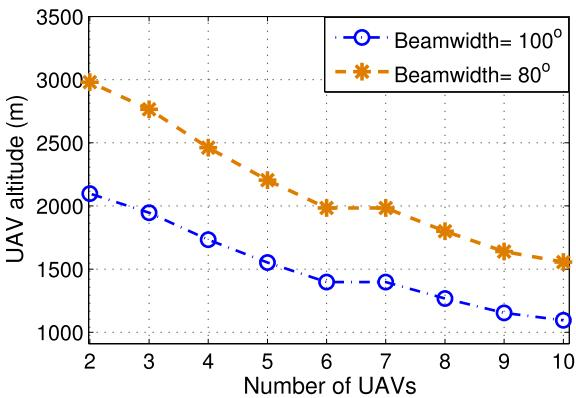

line

| Number of UAVs | Beamwidth=100° | Beamwidth=80° |
| -------------- | -------------- | ------------- |
| 2              | 2100           | 3000          |
| 3              | 1950           | 2750          |
| 4              | 1750           | 2500          |
| 5              | 1600           | 2250          |
| 6              | 1400           | 2000          |
| 7              | 1350           | 2000          |
| 8              | 1250           | 1850          |
| 9              | 1150           | 1650          |
| 10             | 1100           | 1550          |

Fig. 9. Each UAV’s altitude for various number of UAVs.

In Figure 9, we show a representative result from [13]. In particular, Figure 9 shows how the optimal UAVs’ altitude varies by changing the number of UAVs. Intuitively, to avoid interference, the height of UAVs must be decreased as the number of UAVs increases. In this case, for a higher number of UAVs, the coverage radius of each UAV must be decreased by reducing its altitude to avoid overlapping (or interference) between their coverage regions. For instance, by increasing the number of UAVs from 3 to 6, the optimal altitude decreases from 2000 m to 1300 m. This figure also shows that the UAVs must be placed at lower altitudes when they use directional antennas with higher antenna beamwidths.

# C. Trajectory Optimization

Optimal path planning for UAVs is another important challenge in UAV-based communication systems. In particular, optimizing the trajectory of UAVs is crucial while using them for smart cities, drone-UE, and caching scenarios. The trajectory of a UAV is significantly affected by different factors such as flight time, energy constraints, ground users’ demands, and collision avoidance.

Naturally, optimizing the flight path of UAVs is challenging as it requires considering many physical constraints and parameters. For instance, while finding the trajectories of UAVs for performance optimization, one needs to consider various key factors such as channel variation due to the mobility, UAV’s dynamics, energy consumption of UAVs, and flight constraints. Furthermore, solving a continuous UAV trajectory optimization problem is known to be analytically challenging as it involves finding an infinite number of optimization variables (i.e., UAV’s locations) [14]. In addition, trajectory optimization in UAV-enabled wireless networks requires capturing coupling between mobility and various QoS metrics in wireless communication.

1) State of the Art: Trajectory optimization for UAVs has been primarily studied from a robotics/control perspective [126]–[131]. More recently, there has been a number of works that study the interplay between the trajectory of a UAV and its wireless communication performance. The work in [36] jointly optimized user scheduling and UAV trajectory for maximizing the minimum average rate among ground users. Jiang and Swindlehurst [132] investigated the optimal trajectory of UAVs equipped with multiple antennas for maximizing sum-rate in uplink communications. The work in [133] maximized the throughput of a relay-based UAV system by jointly optimizing the UAV’s trajectory as well as the source/relay transmit power. In [134], a UAV path planning algorithm for photographic sensing of a given geographical area was proposed. The algorithm of [134] led to a minimum total energy consumption for the UAV while covering the entire survey area. To this end, Franco and Buttazzo [134] computed the optimal set of waypoints and the optimal speed of the UAV in the path between the waypoints. In [135], considering collision avoidance, no-fly zones, and altitude constraints, the optimal paths of UAVs that minimize the fuel consumption were computed using the mixed integer linear programming.

Moreover, Tisdale et al. [130] investigated the path planning problem for UAVs in the search and localization applications using camera measurements. In this work, path planning was analyzed by maximizing the likelihood of target detection. Han et al. [136] investigated how to optimally move UAVs for improving connectivity of ad-hoc networks assuming that the drones have complete information on the location of devices. The work in [36] studied the joint user scheduling and UAV trajectory design to maximize the minimum rate of ground users in a multi-UAV enabled wireless network. In addition, there are some works that studied the UAV trajectory optimization for localization purposes. For instance, the work in [126] investigated path planning for multiple UAVs for localization of a passive emitter. In this work, using the angle of arrival and time difference of arrival information, the set of waypoints which leads to a minimum localization error was determined. However, the work in [126] was limited to localization and did not directly address any wireless communication problem. Other works on UAV navigation and cooperative control are found in [127]–[131].

In fact, prior studies on UAV trajectory optimization focused on three aspects: control and navigation, localization [137], and wireless communications. In particular, in the existing works on UAV communications, trajectory optimization was performed with respect to energy consumption, rate, and reliability.

2) Representative Result: One representative result on trajectory optimization can be found in our work in [7]. In particular, we considered a drone-assisted IoT network scenario in which 5 drones are used to collect data from ground IoT devices. A set of 500 IoT devices are uniformly distributed within a geographical size of 1 km 1 km. We considered a time-varying IoT network in which the set of active IoT devices changes over time, based on a beta distribution [138]. Hence, to effectively serve the IoT devices, the drones must update their locations according to the locations of active devices. In this model, we consider some pre-defined time slots during which the drones collect data from active IoT devices. At the end of each time slot (i.e., update time), the drones’ update their locations based on the activation pattern of IoT devices. Given such a time-varying network, our goal is to find the optimal trajectory of drones such that they can update their locations with a minimum energy consumption. Therefore, while serving IoT devices, the drones move within optimal paths so as to minimize their mobility energy consumption.

Figure 10 shows the total energy consumption of drones as a function of the number of updates. As expected, a higher number of updates requires more mobility of the drones thus more energy consumption. We compare the performance of the optimal path planning with a case that drones update their locations following pre-defined paths. As we can see, by using optimal path planning, the average total energy consumption of drones decreases by 74% compared to the non-optimal case.

In fact, to effectively use UAVs in wireless networks, the trajectory of UAVs needs to be optimized with respect to wireless metrics such as throughput and coverage as well as energy constraints of UAVs. While jointly optimizing trajectory and communication is a challenging task, it can significantly improve the performance of UAV-enabled wireless networks.

# D. Performance Analysis of UAV-Enabled Wireless Networks

1) Challenges: A fundamental analysis of the performance of UAV-enabled wireless systems is required in order to evaluate the impact of each design parameter on the overall system performance [10], [139]. In particular, the performance of the UAV systems must analyzed in terms of the key QoS metrics such as coverage probability, throughput, delay, or reliability (e.g., for cellular-connected drones). Such performance evaluations can also reveal the inherent tradeoffs that one faces when designing UAV-based systems.

Clearly, while designing UAV-based communication systems, a fundamental performance analysis needs to be done in order to evaluate the impact of design parameters on the overall system performance. Naturally, devising a fundamental analysis of the wireless performance of a UAV-based wireless system will substantially differ from conventional ground networks due to the altitude and potential mobility of UAVs as well as their different channel characteristics. The stringent energy limitations of UAVs also introduce unique challenges. The limited available on-board energy of UAVs which leads to the short flight duration is a major factor impacting the performance of wireless communications using UAVs. Indeed, analyzing the performance of a complex heterogeneous aerial-terrestrial wireless network that is composed of flying and ground base stations is a challenging task. In fact, there is a need for a comprehensive performance analysis of UAV-enabled wireless networks while capturing various aspects of UAVs including mobility, and specific A2G channel characteristics in coexistence with terrestrial networks. Moreover, performance characterization of cellular-connected drone networks with flying users and base stations has its own complexity due to the mobile and highly dynamic nature of the network.

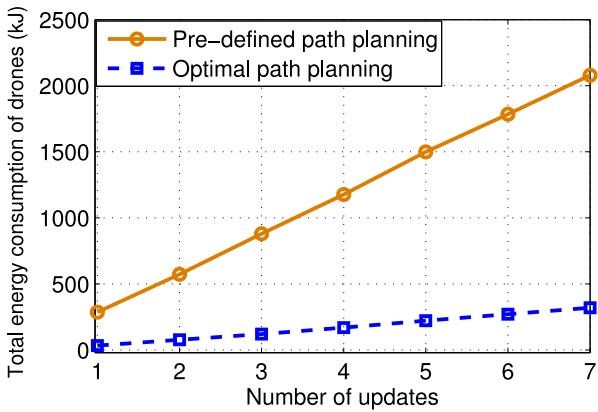

line

| Number of updates | Pre-defined path planning | Optimal path planning |
| ----------------- | ------------------------- | --------------------- |
| 1                 | 300                       | 50                    |
| 2                 | 600                       | 100                   |
| 3                 | 900                       | 150                   |
| 4                 | 1200                      | 200                   |
| 5                 | 1500                      | 250                   |
| 6                 | 1800                      | 300                   |
| 7                 | 2100                      | 350                   |

Fig. 10. Total energy consumption of drones on mobility vs. number of updates.

2) State of the Art: Prior to our seminal work in this area in [10], most of the existing works focused on performance analysis of UAVs acting as relays, or in ad-hoc networks [136], [140]–[142]. For instance, the work in [140] evaluated the performance of a UAV ad-hoc network in terms of achievable transmission rate and end-to-end delay. Guo et al. [141] studied the use of macro UAV relays to enhance the throughput of the cellular networks. The work in [136], derived the probability of successful connectivity among ground devices in a UAV-assisted ad-hoc network. Zhan et al. [142] analyzed the performance of UAVs acting as relays for ground devices in a wireless network. In particular, the authors derived closedform expressions for signal-to-noise-ratio (SNR) distribution and ergodic capacity of UAV-ground devices links. In contrast, in [10], we considered the use of UAVs as stand-alone aerial base stations. In particular, we investigated the downlink coverage and rate performance of a single UAV that co-exists with a device-to-device communication network.

Following our work in [10], Chetlur and Dhillon [143] derived an exact expression for downlink coverage probability for ground receivers which are served by multiple UAVs. In particular, using tools from stochastic geometry, the work in [143] provided the coverage analysis in a finite UAV network considering a Nakagami-m fading channel for UAVto-user communications. In [115], the performance of a single drone-based communication system in terms of outage probability, bit error rate, and outage capacity was investigated. The work in [144] analyzed the coverage and throughput for a network with UAVs and underlaid traditional cellular networks. In this work, using 3D and 2D Poisson point processes (PPP), the downlink coverage probability and rate expressions were derived. Mumtaz et al. [145] evaluated the performance of using UAVs for overload and outage compensation in cellular networks. Clearly, such fundamental performance analysis is needed to provide various key design insights for UAV communication systems.

3) Representative Result: As per our work in [10], we considered a circular area with in which a number of users are spatiality distributed according to a PPP [146], and a UAV-mounted aerial base station is used to serve a subset of those users. In the considered network, there are two types of users: downlink users and D2D users. Here, we consider the downlink scenario for the UAV while the D2D users operate in an underlay fashion. Moreover, we assume that a D2D receiver connects to its corresponding D2D transmitter located at a fixed distance away from it [147]. Hence, a D2D receiver receives its desired signal from the D2D transmitter pair, and interference from the UAV and other D2D transmitters. The received signals at a downlink user include the desired signal from the UAV and interference from all the D2D transmitters.

For this UAV-D2D network, we derived tractable analytical expressions for the coverage and rate analysis for both static and mobile UAV scenarios (see [10]). In Figure 11, we show the average sum-rate versus the UAV altitude for different values of the fixed distance, $d _ { 0 } ,$ between a D2D transmitter/receiver pair. As we can see from this figure, the average sum-rate is maximized when the UAV’s altitude are around 300 m for $d _ { 0 } = 2 0 \mathrm { m }$ . From Figure 11, we can see that for altitude above 1300 m, the average sum-rate starts increasing. This is due to the fact that, as the UAV’s altitude exceeds a certain value, downlink users cannot be served while the interference on D2D users decreases thus increasing the sumrate. Moreover, for altitudes within a range 300 m to 1300 m, the sum-rate performance decreases due to the impact of LoS interference from the UAV on the D2D users. Note that, the optimal UAV’s altitude depends on $d _ { 0 } ,$ as shown in Figure 11. For instance, the sum-rate is maximized at a 400 m altitude when $d _ { 0 } = 3 0 \mathrm { m }$ .

We note that, in the literature, there are also additional insightful results on the performance of UAV communication systems. For instance, the work in [143] showed the downlink coverage probability varies as a function of SIR threshold in a network of multiple UAV-BSs. Hayajneh et al. [37] presented the impact of the UAV’s altitude on the minimum required transmit power of UAV that ensures ground coverage. In [144], the network throughput of a UAV-assisted cellular network is determined as a function of the number of base stations.

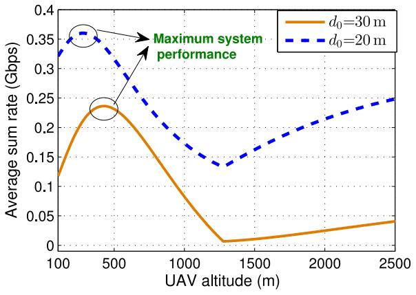

line

| UAV altitude (m) | d₀=30 m | d₀=20 m |
| ---------------- | ------- | ------- |
| 100              | 0.12    | 0.34    |
| 500              | 0.24    | 0.36    |
| 1000             | 0.10    | 0.28    |
| 1500             | 0.01    | 0.14    |
| 2000             | 0.02    | 0.22    |
| 2500             | 0.04    | 0.25    |

Fig. 11. Average sum-rate in a UAV-D2D network vs. UAVs altitude.

# E. Cellular Network Planning and Provisioning With UAVs

1) Challenges: Network planning involves addressing a number of key problems such as base station positioning, traffic estimation, frequency allocation, cell association, backhaul management, signaling, and interference mitigation. Network planning with UAVs is particularly important when UAVs are used for coverage and capacity enhancement. In a UAVassisted cellular network, network planning becomes more challenging due to the various properties of UAVs including mobility, LoS interference, energy constraints, and wireless backhaul connectivity. For example, joint radio and backhaul designs and deployment are needed during network planning with UAVs [148]. Furthermore, network planning in presence of flying drone-UEs requires new considerations. On the one hand, LoS interference stemming from a potentially massive number of drone-UEs in uplink significantly impacts network planning. On the other hand, ground base stations must be equipped with appropriate types of antennas (considering, e.g., radiation pattern and beam tilting) so as to serve drone-UEs in downlink. Another difference between network planning for traditional cellular networks and UAV systems is the amount of signaling and overhead. Unlike static terrestrial networks, in the UAV case, there is a need for dynamic signaling to continuously track the location and number of UAVs in the network. Such dynamic signaling may also be needed to register the various UAVs as users or base stations in the cellular system. Clearly, handling such signaling and overhead must be taken into account in cellular network planning with UAVs.

Backhaul connectivity for flying UAVs is another key challenge in designing UAV communication systems. Due to aerial nature of done base stations, wireless backhauling needs to be employed for connecting them to a core network. WiFi and satellite technologies are promising solutions for wireless backhauling [33]. Satellite links can provide wider backhaul coverage compared to WiFi. However, WiFi links have the advantages of lower cost and lower latency compared to the satellite backhauling. Other promising solutions for wireless backhauling are millimeter wave and free space optical communications (FSO) with ground stations [15], [149]–[151]. Aerial base stations can adjust their altitude, avoid obstacles, and establish LoS communication links to ground stations. Such LoS opportunity is a key requirement for millimeter wave and FSO communications that can provide high capacity wireless backhauling services. We note that wireless backhauling for UAVs is still a challenging problem in UAV communications and further studies need to be done to find an efficient backhauling solution.

2) State of the Art: Recent studies on UAV communications have addressed various problems pertaining to network planning. For example, Sharma et al. [152] investigated the optimal user-UAV assignment for capacity enhancement in UAV-assisted heterogeneous wireless networks. Kalantari et al. [112] jointly optimized the locations and number of UAVs for maximizing wireless coverage. The work in [153] optimized the deployment and cell association of UAVs for meeting the users’ rate requirements while using a minimum UAVs’ transmit power. In [154], a delay-optimal cell planning was proposed for a UAV-assisted cellular network. The work in [155] proposed a novel approach for strategic placement of multiple UAV-BSs in a large-scale network. Kalantari et al. [119] proposed a backhaul aware optimal drone-BS placement algorithm that maximizes the number of the served users as well as the sum-rate for the users. The work in [156] provided an analytical expression for the probability of backhaul connectivity for UAVs that can use either an LTE or a millimeter wave backhaul. In [98], a framework for the use of UAVs as an aerial backhaul network for ground base stations was proposed. In fact, the previous studies on UAV network planning primarily analyzed problems related to user association, 3D placement, backhaul connectivity, and optimizing the number of UAVs that must be deployed in the network. Also, there does not exist any concrete work focusing on the signaling challenges.

3) Representative Result: In terms of network planning, in [154], we studied the problem of optimal cell association for delay minimization in a UAV-assisted cellular network. In particular, we considered a geographical area of size 4 km × 4 km in which 4 UAVs (as aerial base stations) and 2 ground macro base stations are deployed according to a traditional grid-based deployment. Within this area, ground users are distributed according to a truncated Gaussian distribution with a standard deviation $\sigma ,$ , which is suitable to model a hotspot area. Here, our main performance metric is transmission delay, which is the time needed for transmitting a given number of bits to ground users. Our goal is to provide an optimal cell planning (e.g., cell association) for which the average network delay is minimized.

In Figure 12, we compare the delay performance of our proposed cell association with the classical SNR-based association. For users’ spatial distribution, we consider a truncated Gaussian distribution with a center (1300 m, 1300 m), and a standard deviation $\sigma _ { o }$ that varies from 200 m to 1200 m. Lower values of $\sigma _ { o }$ correspond to cases in which users are more congested around a hotspot center. This figure shows that the proposed cell association significantly outperforms the SNR-based association and yields up to a 72% lower average delay. This is due to the fact that, in the proposed approach, the impact of network congestion is taken into consideration. In fact, unlike the SNR-based cell association, the proposed approach avoid creating highly loaded cells that cause delay in the network. Hence, compared to the SNR-based association case, our approach is more robust against network congestion, and it significantly reduces the average network delay.

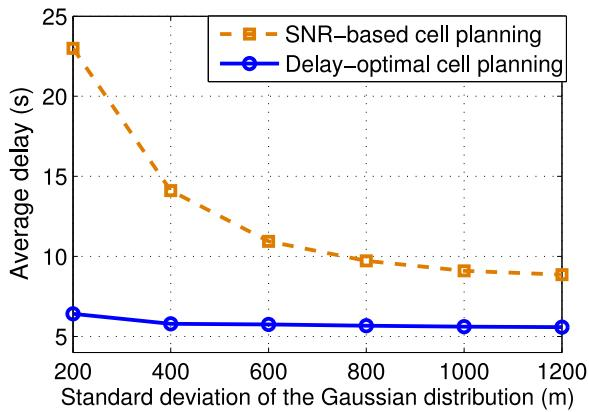

line

| Standard deviation of the Gaussian distribution (m) | SNR-based cell planning | Delay-optimal cell planning |
| -------------------------------------------------- | ------------------------ | --------------------------- |
| 200                                                | 23.0                     | 6.5                         |
| 400                                                | 14.0                     | 6.0                         |
| 600                                                | 11.0                     | 6.0                         |
| 800                                                | 9.5                      | 6.0                         |
| 1000                                               | 9.0                      | 6.0                         |
| 1200                                               | 8.5                      | 6.0                         |

Fig. 12. Average network delay per 1Mb data transmission.

Clearly, the performance of UAV-enabled wireless networks significantly depends on the network planning. In general, network planning impacts several key metrics of UAV networks such as throughput, delay (as also shown in Figure 12), operational cost, and energy consumption.

# F. Resource Management and Energy Efficiency

1) Challenges: Resource management and energy efficiency require significant attention when operating UAVs in key scenarios such as IoT, public safety, and UAV-assisted cellular wireless networks. While resource management is a major challenge for cellular networks [145], [157], [158], UAVs introduce unique challenges due to: 1) Interplay between the UAVs’ flight time, energy, path plan, and spectral efficiency, 2) Stringent energy and flight limitations for UAVs, 3) LoS interference stemming from A2G and air-toair links, and 4) Unique mobility of UAVs. Hence, there is a need for optimizing and managing resource allocation in complex UAV-assisted wireless networks operating over heterogeneous spectrum bands and co-existing with ground networks. In fact, resource management and spectrum sharing [159] processes must properly handle the inherent dynamics of wireless networks such as time-varying interference, varying traffic patterns, mobility, and energy constraints of the UAVs.

Naturally, flying drones have a limited amount of on-board energy which must be used for transmission, mobility, control, data processing, and payloads purposes [160]. Consequently, the flight duration of drones is typically short and insufficient for providing a long-term, continuous wireless coverage. The energy consumption of the UAV also depends on the role/mission of the UAV, weather conditions, and the navigation path. Such energy constraints, in turn, lead to limited flight and hover time durations. Hence, while designing UAV communication systems, the energy and flight constraints of UAVs need to be explicitly taken into account. Therefore, the energy efficiency of UAVs requires careful consideration as it significantly impact the performance of UAV-communication systems. In fact, the limited on-board energy of UAVs is a key constraint for deployment and mobility of UAVs in various applications.

TABLE V BATTERY LIFETIME OF UAVS 

<table><tr><td>Size</td><td>Weight</td><td>Example</td><td>Battery lifetime</td></tr><tr><td>Micro</td><td>&lt; 100 g</td><td>Kogan Nano Drone</td><td>6-8 min</td></tr><tr><td>Very small</td><td>100 g–2 kg</td><td>Parrot Disco</td><td>45 min</td></tr><tr><td>Small</td><td>2 kg–25 kg</td><td>DJI Spreading Wings</td><td>18 min</td></tr><tr><td>Medium</td><td>25 kg–150 kg</td><td>Scout B-330 UAV helicopter</td><td>180 min</td></tr><tr><td>Large</td><td>&gt; 150 kg</td><td>Predator B</td><td>1800 min</td></tr></table>

2) State of the Art: Energy efficiency and resource management in UAV-based wireless communication systems have been studied from various perspectives. For instance, the work in [161] provided an analytical framework for minimizing the energy consumption of a fixed-wing UAV by determining the optimal trajectory of the UAV. Tran et al. [162] proposed an energy-efficient scheduling framework for cooperative UAVs communications. Zorbas et al. [163] studied the energy efficiency of drones in target tracking scenarios by adjusting the number of active drones. Energy harvesting from vibrations and solar sources for small UAVs was investigated in [164]. The work in [165] proposed a framework for optimizing transmission times in user-UAV communications that maximizes the minimum throughput of the users. Sharawi et al. [166] studied the use of antenna array on UAVs for improving the SNR and consequently for reducing the required transmit power. The work in [167] investigated an optimal resource allocation scheme for an energy harvesting flying access point. In [41], the problem of bandwidth and flight time optimization of UAVs that service ground users was studied. The work in [168] proposed a resource allocation framework for enabling cache-enabled UAVs to effectively service users over licensed and unlicensed bands.

Clearly, the performance of UAV communication systems is significantly affected by battery lifetime of UAVs. The flight time (i.e., battery lifetime) of a UAV depends on several factors such as the energy source (e.g., battery, fuel, etc.,), type, weight, speed, and trajectory of the UAV. In Table V, we provide some examples for the battery lifetime of various types of UAVs [31].

In general, the total energy consumption of a UAV is composed of two main components [31], [161], [169]: 1) Communication related energy, and 2) Propulsion energy. The related energy. The communication related energy is used for various communication functions such as signal transmission, computations, and signal processing. The propulsion energy pertains to the mechanical energy consumption for movement and hovering of UAVs. Typically, the propulsion energy consumption is significantly more than the communication-related energy consumption. Next, we provide some baseline propulsion energy consumption models for fixed-wing and rotary-wing UAVs in a forward flight with speed V.

For a fixed-wing UAV, the propulsion energy consumption during a flight time T is given by [161]:

$$
E = T \left(a _ {1} V ^ {3} + \frac {a _ {2}}{V}\right), \tag {3}
$$

where $a _ { 1 }$ and $a _ { 2 }$ are constants that depend on several factors such as $\mathrm { U A V } _ { \mathrm { \Delta } }$ weight, wing area, and air density [161].

For a rotary-wing UAV, the propulsion energy consumption during a flight time T is given by [169]:

$$
\begin{array}{l} E = T \left[ c _ {1} \left(1 + \frac {3 V ^ {2}}{q ^ {2}}\right) + c _ {2} \left(\sqrt {1 + \frac {V ^ {4}}{4 v _ {o} ^ {4}}} - \frac {V ^ {2}}{2 v _ {o} ^ {2}}\right) ^ {1 / 2} \right. \\ \left. + \frac {1}{2} d _ {o} \rho s A V ^ {3} \right], \tag {4} \\ \end{array}
$$

where $c _ { 1 }$ and $c _ { 2 }$ are constants which depend on drone’s weight, rotor’s speed, rotor disc area, blade angular velocity, and air density. q is the tip speed of the rotor, $d _ { o }$ is the fuselage drag ratio, $v _ { o }$ is the mean rotor speed, $\rho$ is air density, s is the rotor solidity, and A is the rotor disc area.

3) Representative Result: In [41], we studied the resource management problem with a focus on optimal bandwidth allocation in UAV-enabled wireless networks. In particular, we considered a scenario in which 5 UAVs are deployed as aerial base stations over a rectangular area of size 1 km 1 km in order to provide service for 50 ground users. These UAVs must fly (or hover) over the area until all the users receive their desired service (in terms of number of bits) in the downlink. Our goal is to optimally share the total available bandwidth between the users such that the total flight time that the UAVs need to service the users is minimized. Note that the flight time is directly related to the energy consumption of UAVs. Hence, minimizing the flight time of UAVs will effectively improve their energy-efficiency.

Figure 13 shows the average total flight time of UAVs versus the transmission bandwidth. Here, the total flight time represents the time needed to provide service to all ground users, each of which requires a 100 Mb data. We consider two bandwidth allocation schemes, the optimal bandwidth allocation, and an equal bandwidth allocation. Clearly, by increasing the bandwidth, the total flight time that the UAVs require to service their users decreases. Naturally, a higher bandwidth can provide a higher transmission rate and, thus, users can be served within a shorter time duration. From Figure 13, we can observe that the optimal bandwidth allocation scheme can lead to a 51% shorter flight time compared to the equal bandwidth allocation case. This is because, by optimally allocating the bandwidth to each user based on its load and location, the total flight time of UAVs can be minimized.

In Figure 14, we show the total hovering energy consumption of the UAVs as a function of number of UAVs. This result corresponds to the interference-free scenario in which the UAVs operate on different frequency bands. Hence, the total bandwidth usage linearly increases by increasing the number of UAVs. Clearly, the total energy consumption decreases as the number of UAVs increases. A higher number of UAVs corresponds to a higher number of cell partitions. Therefore, the size of each cell partition decreases and the users will have a shorter distance to the UAVs. Increasing the number of UAVs leads to a higher transmission rate thus shorter hover time and energy consumption. For instance, Figure 14 shows that when the number of UAVs increases from 2 ot 6, the total energy consumption of UAVs decreases by 53%. Nevertheless, deploying more UAVs in interference-free scenario requires using more bandwidth. Hence, there is a fundamental tradeoff between the energy consumption of UAVs for hovering and bandwidth efficiency.

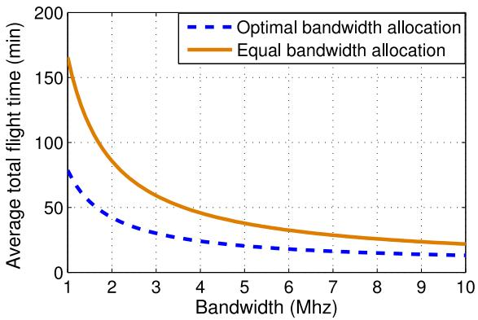

line

| Bandwidth (Mhz) | Optimal bandwidth allocation | Equal bandwidth allocation |
| --------------- | ---------------------------- | -------------------------- |
| 1               | 80                           | 170                        |
| 2               | 50                           | 100                        |
| 3               | 35                           | 60                         |
| 4               | 25                           | 45                         |
| 5               | 20                           | 35                         |
| 6               | 18                           | 30                         |
| 7               | 15                           | 25                         |
| 8               | 12                           | 22                         |
| 9               | 10                           | 20                         |
| 10              | 8                            | 18                         |

Fig. 13. Average flight time vs. bandwidth.

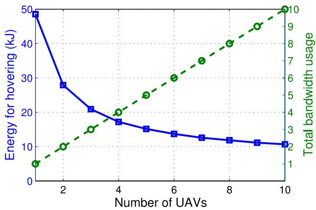

line

| Number of UAVs | Energy for hovering (kJ) | Total bandwidth usage |
| -------------- | ------------------------ | --------------------- |
| 1              | 50                       | 1                     |
| 2              | 28                       | 3                     |
| 3              | 21                       | 4                     |
| 4              | 17                       | 5                     |
| 5              | 15                       | 6                     |
| 6              | 13                       | 7                     |
| 7              | 12                       | 8                     |
| 8              | 11                       | 9                     |
| 9              | 10                       | 10                    |
| 10             | 9                        | 10                    |

Fig. 14. UAV energy consumption (due to hover time) and spectrum tradeoff.

In summary, to efficiently employ UAVs for wireless networking applications, one must efficiently manage the use of available resources such as energy, bandwidth, and time. In fact, the performance of UAV-communication systems is significantly affected by resource allocation strategies and energy constraints of UAVs.

# G. Drone-UEs in Wireless Networks

1) Challenges: Beyond the use of drones as aerial base stations, they can also act as flying users as part of cellular networks. In particular, drone-UEs play key roles in air delivery applications, such as Amazon prime air and in surveillance applications. Another important application of drone-UEs is virtual reality (VR) [170]–[172] where drones capture any desired information about a specific area and transmit it to remote VR users. However, current cellular networks have been primarily designed for supporting terrestrial devices whose characteristics are significantly different from drone-UEs. Naturally, classical wireless challenges such as performance analysis, interference management, mobility management, and energy and spectrum efficiency, will be further exacerbated by the use of drone-UEs due to their relatively high altitude, stringent on-board energy limitations, dynamic roles, potentially massive deployment, and their nearly unconstrained mobility. In particular, incorporating drone-UEs in cellular networks introduces unique challenges such as uplink interference management due to massive deployment of drone-UEs, ground-to-air channel modeling for BSs-to-drones communications, and designing suitable BS’s antennas that can support high altitude (i.e., high elevation angle) drones. In addition, drone-UEs will require ultra-reliable, low latency communications (URLLC) so as to swiftly control their operations, and ensure their safe and effective navigation. Clearly, such a need for URLLC also leads to new wireless networking challenges.

Furthermore, there is a need for effective handover management mechanisms to deploy an aerial network of flying drone-UEs and drone-BSs. Handover is a key process in wireless networks in which user association changes in order to maintain the connectivity of mobile users. Meanwhile, handover management will result in signaling overhead in wireless networks [173]. Such handover signaling depends on the size of the network, network mobility (user and BS movements), locations of users and base stations, and handover rate [173]–[175]. In UAV-based communication systems, handover management needs to be done in order to reduce the handover signaling and also to properly provide connectivity for flying UAVs in beyond visual LoS (BVLoS) scenarios. Handover management in UAV communications is significantly more challenging than traditional cellular networks due to the highly dynamic nature of drone-UEs and drone-BSs. In particular, efficient handover mechanisms must be designed to accommodate 3D movements of both drone-UEs a drone-BSs, while ensuring low-latency communications and control when serving drone-UEs. This handover design for flying devices must be done jointly with existing handover mechanisms for mobile ground users, such as vehicles.

Moreover, for drone-UEs, all of the aforementioned challenges must also take into account the fact that ground base stations will have their antennas downtilted to maximize coverage of ground users. As a result, it is imperative to understand the impact of antenna tilt on the performance of UAV-UEs, while also studying how one can overcome this limitation via adaptive beamforming or new UAV-UE aware design of ground base stations.

2) State of the Art: While the use case of UAV-BSs has been widely studied in the literature, there are only a handful of studies on drone-UEs scenarios. For example, the work in [176] analyzed the coexistence of aerial and ground users in cellular networks. In particular, Azari et al. [176] proposed a framework for characterizing the downlink coverage performance in a network that includes drone-UEs and terrestrial-UEs. Azari et al. [177] derived an exact expression for coverage probability of drone-UEs which are served by ground BSs. The work in [54] analyzed the impact of both drone-BSs and drone-UEs on uplink and downlink performance of an LTE network. Lin et al. [178] studied the feasibility of wireless connectivity for drone-UEs via LTE networks. Moreover, in [178], propagation characteristics

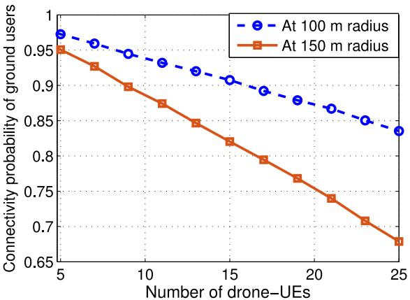

line

| Number of drone-UEs | At 100 m radius | At 150 m radius |
| ------------------- | --------------- | --------------- |
| 5                   | 0.97            | 0.95            |
| 7                   | 0.96            | 0.93            |
| 9                   | 0.95            | 0.90            |
| 11                  | 0.94            | 0.88            |
| 13                  | 0.93            | 0.85            |
| 15                  | 0.91            | 0.82            |
| 17                  | 0.89            | 0.80            |
| 19                  | 0.88            | 0.77            |
| 21                  | 0.87            | 0.74            |
| 23                  | 0.85            | 0.71            |
| 25                  | 0.84            | 0.68            |

Fig. 15. Impact of drone-UEs on connectivity of ground users.

of BSs-to-drones communications was studied using measurements and ray tracing simulations. The work in [179] developed an interference-aware path planning scheme for drone-UEs that yields a minimum communication latency of drones as well as their interference on ground users. Garcia-Rodriguez et al. [180] studied the potential use of massive MIMO for supporting drone-UEs with cellular networks. In particular, the work in [180] studied the uplink and downlink performance of drone-UEs in coexistence with ground users, while utilizing massive MIMO in cellular networks. Finally, in [91], we studied how various network parameters, such as downtilted antenna patterns and network structure, impact the performance of drone-UEs with caching capability.

3) Representative Result: Here, we show how uplink interference stemming from drone-UEs impact the connectivity of ground users. We consider a number of flying drone-UEs which are uniformly deployed on a disk of radius 1000 m at an altitude 100 m over a given geographical area. Meanwhile, ground users attempt to connect to a ground base station located at the center of the area. Figure 15 shows the uplink connectivity probability of ground users (at a given radius from the base station) as the number of drone-UEs varies. Clearly, the connectivity of ground users decreases as the number of drones increases. This is due to the dominant LoS interference caused by the drone-UEs. For instance, the connectivity probability at a 150 m radius decreases by 18% when the number of drone-UEs increases from 5 to 15. Our result in Figure 15 highlights the need for adopting effective interference management techniques in drone-UEs scenarios [7], [10], [181]–[183].

# H. Summary of Lessons Learned

In summary, the main lessons learned from this section include:

• Despite promising roles of UAVs in wireless networks, a number of design challenges need to be studied. In fact, each role has its own challenges and opportunities. For instance, for flying base stations, one prominent challenge is to maximize network performance under unique UAV features and constraints such as flight time, air-to-ground channel models, and mobility. The key challenges for cellular-connected UAV-UEs include co-existence with ground networks, mobility and handover management, and interference mitigation. Meanwhile, in flying ad-hoc networks, routing and path planning for UAVs are among important design challenges.

The design of UAV-enabled wireless networks is affected by channel models used for air-to-ground air-to-air communications. Channel modeling in UAV communications is an important research direction and can be done using various approaches such as ray-tracing technique, extensive measurements, and machine learning.

Optimizing the 3D locations of drones is a key design consideration as it significantly impacts the performance drone-enabled wireless networks. Drone deployment is particularly of important in use cases for coverage and capacity enhancement, public safety, IoT applications, and caching. While optimizing the drones’ positions, various factors such as A2G channel, users’ locations, transmit power, and obstacles must be taken into account.

In order to optimize the trajectory of UAVs, several constraints and parameters must be considered. The UAV’s trajectory is determined based on the users’ QoS requirements, the UAV’s energy consumption, type of the UAV, as well as shape and locations of obstacles in the environment.

Performance evaluation of a UAV-enabled wireless network is needed in order to capture key network design tradeoffs. The performance of UAV communication systems can be analyzed in terms of various metrics such as coverage probability, area spectral efficiency, reliability, and latency. These metrics can be linked to unique UAV parameters such as its altitude, trajectory, and hover time.

• Network planning in a UAV-assisted wireless networks requires addressing various problems pertaining to aerial and terrestrial base station deployment, frequency planning, interference management, and user association. Network planning must be efficiently done so as to maximize the overall UAV system performance in terms of coverage, capacity, and operational costs.

• Given the limited on-board energy of drones, the energy efficiency aspects of drone-based communication systems require careful consideration. In fact, the flight time and transmit power constraints of drones will significantly impact the performance of droneenabled wireless networks. A drone’s energy consumption can be minimized by developing energy-efficient deployment, path planning, and drone communication designs.

The use of flying UAV-UEs in a cellular-connected UAVs scenario introduces new challenges. For instance, traditional cellular networks with downtilted base station antennas that have been primary designed for serving ground users, may not be able to effectively support connectivity and low-latency requirements of UAV-UEs. In fact, there is need for designing an efficient cellularconnected UAV systems that can support ultra-reliable and low latency communications requirements, mobility

and handover management, and seamless connectivity for flying UAV-UEs.

# IV. OPEN PROBLEMS AND FUTURE OPPORTUNITIES FOR UAV-BASED WIRELESS COMMUNICATION AND NETWORKING

In the previous section, we have outlined the general research directions and challenges of wireless communications with UAVs. The next natural step is to discuss open research problems in each one of the covered areas, in order to shed light on future opportunities, as done in this section. Despite a considerable number of studies on UAV communications, there are still many key open problems that must be investigated.

# A. UAV Channel Modeling

For air-to-ground channel modeling, there are several key open problems. First and foremost, there is a need for more realistic channel models that stem from real-world measurements [55]. While efforts in this regard already started, most of them remain limited to a single UAV or to very specific environments. A broader campaign of channel measurements that can cut across urban and rural areas, as well as various operational environments (e.g., weather conditions) is needed. Such experimental work can complement the existing, mostly ray tracing simulation based results. Moreover, the simulation results can also be expanded to model small-scale fading A2G communications. In addition, as UAVs become more commonly used as flying base stations, drone-UEs, or even for backhaul support, one must have more insights on airto-air channel modeling. In particular, there is a need for an accurate UAV-to-UAV channel model that can capture timevariation of channel and Doppler effect due to mobility of UAVs. Furthermore, multipath fading in air-to-air communications needs to be characterized while considering UAVs’ altitude as well as antennas’ movement.

# B. UAV Deployment

In terms of open problems for UAV deployment, there is a need for new solutions to optimal 3D placement of UAVs while accounting for their unique features. For instance, one of the key open problems is the optimal 3D placement of UAVs in presence of terrestrial networks. For instance, there is a need to study how UAVs must be deployed in coexistence with cellular networks while considering mutual interference between such aerial and terrestrial systems. Other key open problems in deployment include:

1) Joint optimization of deployment and bandwidth allocation for low latency communications: In order to minimize the maximum transmission latency of users which are served by drone-BSs, one problem is to jointly optimize the 3D locations of drone-BSs and bandwidth allocation. In particular, given a number of drone-BSs, locations of users, and the total amount of bandwidth available for serving users, one important open problem is to find the optimal location of each drone-BS and its transmission bandwidth such that the maximum downlink transmission latency of the users is minimized.

TABLE VI CHALLENGES, OPEN PROBLEMS, AND TOOLS FOR DESIGNING UAV-ENABLED WIRELESS NETWORKS 

<table><tr><td>Research Direction</td><td>Key References</td><td>Challenges and Open Problems</td><td>Mathematical Tools and Techniques</td></tr><tr><td>Channel Modeling</td><td>[11], [29], [55], [103], [104], [106–111], [118], [186], [187]</td><td>Air-to-ground path loss.Air-to-air channel modeling.Small scale fading.</td><td>Ray-tracing techniques.Machine learning.Extensive measurements.</td></tr><tr><td>Deployment</td><td>[11–13], [15], [16], [34], [35], [113], [115], [119], [122–124]</td><td>Deployment in presence of terrestrial networks.Energy-aware deployment.Joint 3D deployment and resource allocation.</td><td>Centralized optimization theory.Facility location theory.</td></tr><tr><td>Performance Analysis</td><td>[10], [12], [116], [138], [143–147]</td><td>Analyzing heterogeneous aerial-terrestrial networks.Performance analysis under mobility considerations.Capturing spatial and temporal correlations.</td><td>Probability theory.Stochastic geometry.Information theory</td></tr><tr><td>Cellular Network Planning with UAVs</td><td>[113], [120], [154], [155], [158]</td><td>Backhaul-aware cell planning.Optimizing number of UAVs.Traffic-based cell association.Analysis of signaling and overhead.</td><td>Centralized optimization theory.Facility location theory.Optimal transport theory.</td></tr><tr><td>Resource Management and Energy Efficiency</td><td>[162–166], [168], [169], [188]</td><td>Bandwidth and flight time optimization.Joint trajectory and transmit power optimization.Spectrum sharing with cellular networks.Multi-dimensional resource management.</td><td>Centralized optimization theory.Optimal transport theory.Game theory and machine learning.</td></tr><tr><td>Trajectory Optimization</td><td>[36], [127–138], [189]</td><td>Energy-efficient trajectory optimization.Joint trajectory and delay optimization.Reliable communication with path planning.</td><td>Centralized optimization theory.Machine learning.</td></tr><tr><td>Cellular Connected UAV-UEs</td><td>[54], [178–181]</td><td>Effective connectivity with downtilted ground base stations.Interference management.Handover management.Ground-to-air channel modeling.Ultra reliable, low latency communication and control.</td><td>Centralized optimization theory.Machine learning.Optimal transport theory.Game theory.Stochastic geometry.</td></tr></table>

2) Joint optimal 3D placement and cell association for flight time minimization: The flight time of a drone-BS that provides wireless services to users depends on many factors such as the load and number of users connected to the drone-BS as well as the downlink transmission rate. In this problem, given the number of drone-BSs, the total flight time of drone-BSs needed for completely servicing users should be minimized by jointly optimizing the locations of drone-BSs and user-todrone associations.

3) Obstacle aware deployment of UAVs for maximizing wireless coverage: The coverage performance of drone-BSs that serve ground users is affected by obstacles. One key open problem here is to maximize the total coverage areas of drone-BSs by optimal placement of drone-BSs based on the locations of users and obstacles. In particular, given the locations of ground users and obstacles in the environment, the 3D positions of drone-BSs can be determined such that the maximum number of users are covered by drones. This is particularly useful if the drones operate at high frequency bands (e.g., at millimeter wave frequencies).

# C. UAV Trajectory Optimization

While the potential mobility of UAVs provides promising opportunities, it introduces new challenges and technical problems. In a UAV-assisted wireless network, the trajectory of UAVs needs to be optimized with respect to key performance metrics such as throughput, energy and spectral efficiency, and delay. Furthermore, trajectory optimization problems must account for the dynamic aspects and type of UAVs. While there has been a number of attractive studies on UAV trajectory optimization, there are still several open problems that include: 1) UAV trajectory optimization based on the mobility patterns of ground users for maximizing the coverage performance, 2) Obstacle aware trajectory optimization of UAVs considering users’ delay constraints and UAVs’ energy consumption,

3) Trajectory optimization for maximizing reliability and minimizing latency in UAV-enabled wireless networks, and 4) Joint control, communication, and trajectory optimization of UAVs for flight time minimization. Finally, for cellular-connected UAV-UEs, optimizing trajectory while minimizing interference to the ground users and being cognizant of the downtilt of the antennas of the ground base stations is yet another open problem.

# D. Performance Analysis

For performance analysis, there are numerous problems that can still be studied. For instance, one must completely characterize the performance of UAV-enabled wireless networks, that consist of both aerial and terrestrial users and base stations, in terms of coverage and capacity. In particular, there is a need for tractable expressions for coverage probability and spectral efficiency in heterogeneous aerial-terrestrial networks. Moreover, fundamental performance analysis needs to be done to capture inherent tradeoffs between spectral efficiency and energy efficiency in UAV networks. Another open problem is to evaluate the performance of UAV-enabled wireless networks while incorporating the mobility of UAVs. The fundamental analysis of such mobile wireless networks involves capturing the spatial and temporal variations of various performance metrics in the network. For instance, there is a need to study how the trajectory of UAVs impacts their performance in terms of throughput, latency, and energy efficiency. Finally, the effect of dynamic scheduling on the performance of UAV communication systems can be analyzed.

# E. Planning Cellular Networks With UAVs

An efficient network planning with UAVs requires addressing a number of key problems. For example, what is the minimum number of UAVs needed to provide a full coverage for given a geographical area that is partially covered by ground base stations. Solving such problems is particularity challenging when the geographical area of interest does not have a regular geometric shape (e.g., disk or square). Another design problem is the backhaul-aware deployment of UAVs while using them as aerial base stations. In this case, while deploying UAV-BSs, one must consider both the backhaul connectivity of UAVs and their users’ quality-of-service. Other important open problems include: 1) performing efficient frequency planning when both ground and aerial BSs and users exist, 2) developing new approaches to dynamically provision UAVs on the fly whenever they join network, and 3) designing robust and adaptive network planning techniques that can account for highly mobile drone-UEs. Last but not least, it is imperative to analyze the signaling overhead associated with the deployment of both UAV-BSs and UAV-UEs, while characterizing how that overhead can affect the performance.

# F. Resource Management in UAV Networks

Resource management is another key research problem in UAV-based communication systems. In particular, there is a need for a framework that can dynamically manage various resources including bandwidth, energy, transmit power, UAV’s flight time, and number of UAVs, among others. For instance, how to adaptively adjust the transmit power and trajectory of a flying UAV that serves ground users. In this case, a key problem is to provide optimal bandwidth allocation mechanisms that can capture the impact of UAVs’ locations, mobility, LoS interference, and traffic distribution of ground users. Also, there is a need for designing efficient scheduling techniques to mitigate interference between aerial and terrestrial base stations in a UAV-assisted cellular network. In addition, one must analyze dynamic spectrum sharing in a heterogeneous network of both flying and ground base stations. Finally, adopting suitable frequency bands (e.g., WiFi, LTE bands) for UAV operations is of important design problems.

# G. Drone-UEs Scenarios

Naturally, flying drones that act as users within cellular networks can introduce new design challenges. In particular, while using drone-UEs in wireless networks, one must account for mobility, LoS interference, handover, energy constraints, and low-latency control of drones. In this regard, key open problems in drone-UEs communications include: 1) developing robust interference mitigation techniques for massive drone-UEs deployment scenarios, 2) designing dynamic handover mechanisms to manage frequent handovers due to mobility, 3) providing accurate ground-to-air channel models for BSs-to-drone communications, 4) proposing new scheduling schemes while considering battery limitations of drones, 5) designing effective solutions that allow meeting URLLC requirements for drone-UEs, and 6) analyzing applicationspecific quality-of-service measures.

# H. Lessons Learned

Despite the notable number of works on UAV-based wireless communications, there are many fundamental open problems that needs be studied. Key open problems in UAV networks exist in various areas such as comprehensive channel model for UAV communications, energy-aware deployment, analysis of signaling and overhead, reliable communications with path planning, low latency control, interference and handover management.

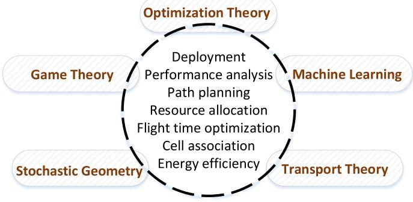

flowchart

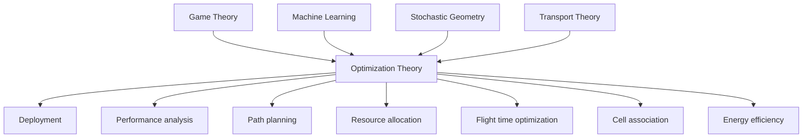

Fig. 16. Mathematical tools for designing UAV communication systems.

# V. ANALYTICAL FRAMEWORKS TO ENABLE UAV-BASED COMMUNICATIONS

Having identified the research directions and their associated challenges and open problems, next, we turn our attention to the analytical frameworks needed to design, analyze, and optimize the use of UAVs for wireless networking purposes. Indeed, this research area is highly interdisciplinary and it will require drawing on tools from conventional fields such as communication theory, optimization theory, and network design, as well as emerging fields such as stochastic geometry, machine learning, and game theory, as listed in Figure 16.

# A. Centralized Optimization Theory for UAV Communication

During the first phase of deployment of UAVs as flying base stations, despite their inherent autonomy, we envision that UAVs will initially rely on centralized control. This is particularly important for applications such as cellular network capacity enhancement, in which cellular operators may not be willing to relinquish control of their network during the early trials of a technology such as UAVs. In such scenarios, many of the identified research problems will very naturally involve the need to formulate and solve challenging centralized optimization problems. Such problems can be run at the level of a cloud (e.g., as is done in a cloud-assisted radio access network) [187] or at the level of a ground macrocell base station that is capable to control some of the UAVs.

It is worth noting that lessons learned from conventional terrestrial cellular network optimization problem can prove to be very handy in UAV communication. For example, classical approaches such as successive convex optimization [188] can be used for optimizing the 3D location and trajectory of UAVs. However, many of the problems identified here will require more advanced optimization techniques. For example, when analyzing user association problems, one will naturally end up with challenging mixed integer programming problems, that cannot be solved using traditional algorithms, such as those used for convex optimization. In this regard, advanced mathematical tools such as optimal transport theory [189] can provide tractable solutions for a wide range of cell association problems that seek to optimize UAV’s flight time, throughput, and energy-efficiency of UAV-enabled wireless networks.

# B. Optimal Transport Theory for UAV Networks

Optimal transport theory [189] can enable deriving tractable solutions for the notoriously difficult optimization problems that accompany the problems of user association, resource allocation, and flight time optimization in UAV-enabled wireless networks. By exploiting new ideas from probability theory and statistics, optimal transport theory enables capturing generic distributions of wireless devices, which, in turn, allows a much deeper fundamental analysis of network performance optimization than existing heuristic works. Optimal transport is a field in mathematics that studies scenarios in which goods are transported between various locations.

One popular example is the so-called ore mining problem. In this illustrative example, we are given a collection of mines mining iron ore, and a collection of factories which consume the iron ore that the mines produce. The goal is to find the optimal way to transport (move) the ore from the mines to the factories, to minimize a certain cost function that captures key factors such as the costs of transportation, the location of the mines, and the productivity of the factories. Optimal transport theory aims to find an optimal mapping between any two arbitrary probability measures. In particular, in a semi-discrete optimal transport problem, a continuous probability density function must be mapped to a discrete probability measure.

Remarkably, such mathematical framework can be used to solve a number of complex problems in UAV communications. For instance, in a semi-discrete optimal transport case, the optimal transport map will optimally partition the continuous distribution and assign each partition to one point in the discrete probability measure. Clearly, such optimal partitions can be considered as optimal cell association in UAV-to-user (in UAV base station scenarios) and BS-to-UAV (in drone-UE cases) communications. Therefore, within the framework of optimal transport theory, one can address cell association problems for any general spatial distribution of users. In fact, optimal transport theory enables the derivation of tractable solutions to variety of user association resource allocation, energy management, and flight optimization problems in UAVenabled wireless networks. In particular, given any spatial distribution of ground users (that can be estimated using UAVbased aerial imaging), one can exploit optimal transport theory to derive the optimal cell association and resource management schemes that lead to the maximum system performance in terms of energy efficiency, throughput, and delay under explicit flight time constraints of UAVs [41], [154].

# C. Performance Analysis Using Stochastic Geometry

Stochastic geometry techniques have emerged as powerful tools for performance analysis of ad-hoc and cellular networks [146]. The key principle is to endow the locations devices, e.g., users and base stations, as a point process, and then evaluate key performance metrics such as coverage, rate, throughput, or delay. While stochastic geometry has been utilized for the analysis of two-dimensional heterogeneous cellular networks, it can be potentially adopted to characterize the performance of 3D UAV networks [143]. Nevertheless, one must use tractable and realistic point processes to model the locations of UAVs. For instance, the Binomial and Poisson cluster processes [190] are more suitable when UAVs are deployed at user hotspots, and the goal is to serve a massive number of users in a specific area. The processes with repulsion between points, e.g., Matern hard core process [146], is more suitable for the a case in which UAVs are not allowed to be closer than a certain distance. Therefore, by exploiting tools from stochastic geometry and adopting a suitable point process model, the performance of UAV-enabled wireless networks can be characterized. This, in turn, can reveal the key design insights and inherent tradeoffs in UAV communications.

# D. Machine Learning

Machine learning enables systems to improve their performance by automatically learning from their environment and their past experience. Machine learning can be potentially leveraged to design and optimize UAV-based wireless communication systems [191], [192]. For instance, using reinforcement learning algorithms, drones can dynamically adjust their positions, flight directions, and motion control to service their ground users. In this case, drones are able to rapidly adapt to dynamic environments in a self-organizing way, and autonomously optimize their trajectory. In addition, by leveraging neural networks techniques and performing data analytics, one can predict the ground users’ behavior and effectively deploy and operate drones. For example, machine learning tools enable predicting users’ mobility and their load distribution that can be used to perform optimal deployment and path planning of drones. Such information about users’ mobility pattern and traffic distribution is particularity useful in designing cache-enabled drone systems. Machine learning can also be used to learn the radio environment maps and to build a 3D channel model using UAVs. Such radio environment maps can be subsequently used to optimally deploy and operate UAV communication systems.

# E. Game Theory

Distributed decision making will be an integral component of UAV networks. As such, along with the use of machine learning, game theory [193], [194] will provide important foundations for distributed decision making in UAV-based wireless networks. Game theory is a natural tool to analyze resource management and trajectory optimization problems in which the decision is done at the level of each UAV. In such cases, each UAV will have its own, individual objective function that captures its own QoS. Here, the inherent coupling of the UAVs objective functions due to factors such as interference or collisions, strongly motivate the use of gametheoretic analysis for resource management. In a UAV-enabled network, distributed resource management problems will now involve different types of players (UAVs, BSs, UEs), as well as multi-dimensional strategy spaces that include energy, spectrum, hover/flight times, and 3D locations. This, in turn, will motivate the use of advanced game-theoretic mechanisms, such as the emerging notion of a multi-game [195], that go beyond classical game-theoretic constructs that are used for conventional terrestrial resource management problems [196]. In particular, multi-games allow capturing the fact that, in a UAV network, multiple games may co-exist, such as a game among UAVs and a game among terrestrial BSs, and, as such, analysis of such multi-game scenarios is needed.

Moreover, when UAVs are supposed to operate autonomously, it is imperative to jointly optimize their communication and control systems. Such an optimization must be distributed and done at the level of each individual, autonomous UAV, thus again motivating the use of game theory. Here, stochastic differential games [197] will be an important tool since they can naturally integrate both communication and control, whereby communication objectives can be included in utility functions while the control system dynamics can be posed as differential equation constraints. Moreover, the sheer scale of ultra dense cellular networks with a massive number of UAVs will require tools to analyze the asymptotic performance of the system. To this end, tools from mean-field game theory [56], [198], [199] are useful to perform such large-system analysis and gain insights on how energy efficiency, spectrum efficiency, and the overall network QoS can scale with the number of users.

Moreover, cooperative behavior is another important aspect of UAV communications. For instance, how to dynamically form swarms of UAVs and enable their coordination is an important open problem. To address it, one can leverage tools from coalitional game theory, such as those developed in [200]–[202] for wireless networks, in general, and in [120] and [203], for UAV systems, in particular. Other relevant game-theoretic tools include contract theory [59], to design incentive mechanisms and matching theory [204] to study network planning problems. In addition, multiple synergies between machine learning, optimal transport theory, optimization theory, and game theory can be built and analyzed for a variety of problems in UAV communication systems.

# F. Lessons Learned and Summary

In Table VI, we summarize the key challenges, open problems, important references, and analytical tools to analyze, optimize, and design UAV-enabled wireless networks.

In summary, in order to address the fundamental challenges in UAV communication systems and efficiently use UAVs for wireless networking applications, we need to leverage various mathematical tools. In this regard, the following mathematical tools can be utilized: 1) Optimization theory can be used for addressing problems related to deployment and path planning, 2) Stochastic geometry for performance analysis, 3) Optimal transport theory for cell association and load balancing problems, 4) Machine learning for motion control and channel modeling, and 5) Game theory for resource management and trajectory optimization problems.

# VI. CONCLUDING REMARKS

In this tutorial, we have provided a comprehensive study on the use of UAVs in wireless networks. We have investigated two main use cases of UAVs, namely, aerial base stations and cellular-connected users, i.e., UAV-UEs. For each use case of UAVs, we have explored key challenges, applications, and fundamental open problems. Moreover, we have presented the major state of the art pertaining to challenges in UAV-enabled wireless networks, along with insightful representative results. Meanwhile, we have described mathematical tools and techniques needed for meeting UAV challenges as well as analyzing UAV-enabled wireless networks. Such an indepth study on UAV communication and networking provides unique guidelines for optimizing, designing, and operating UAV-based wireless communication systems.

# ACKNOWLEDGMENT

The views and conclusions contained in this document are those of the authors and should not be interpreted as representing the official policies, either expressed or implied, of ARO or the U.S. Government. The U.S. Government is authorized to reproduce and distribute reprints for Government purposes notwithstanding any copyright notation herein.

# REFERENCES

[1] K. P. Valavanis and G. J. Vachtsevanos, Handbook of Unmanned Aerial Vehicles. Amsterdam, The Netherlands: Springer, 2014.   
[2] R. Austin, Unmanned Aircraft Systems: UAVS Design, Development and Deployment, vol. 54. Somerset, U.K.: Wiley, 2011.   
[3] R. W. Beard and T. W. McLain, Small Unmanned Aircraft: Theory and Practice. Princeton, NJ, USA: Princeton Univ. Press, 2012.   
[4] M. Asadpour et al., “Micro aerial vehicle networks: An experimental analysis of challenges and opportunities,” IEEE Commun. Mag., vol. 52, no. 7, pp. 141–149, Jul. 2014.   
[5] R. S. Stansbury, M. A. Vyas, and T. A. Wilson, “A survey of UAS technologies for command, control, and communication (C3),” in Unmanned Aircraft Systems. Amsterdam, The Netherlands: Springer, 2008, pp. 61–78.   
[6] A. Puri, A Survey of Unmanned Aerial Vehicles (UAV) for Traffic Surveillance, Dept. Comput. Sci. Eng., Univ. South Florida, Tampa, FL, USA, 2005.   
[7] M. Mozaffari, W. Saad, M. Bennis, and M. Debbah, “Mobile unmanned aerial vehicles (UAVs) for energy-efficient Internet of Things communications,” IEEE Trans. Wireless Commun., vol. 16, no. 11, pp. 7574–7589, Nov. 2017.   
[8] R. I. Bor-Yaliniz, A. El-Keyi, and H. Yanikomeroglu, “Efficient 3-D placement of an aerial base station in next generation cellular networks,” in Proc. IEEE Int. Conf. Commun. (ICC), Kuala Lumpur, Malaysia, May 2016, pp. 1–5.   
[9] I. Bucaille et al., “Rapidly deployable network for tactical applications: Aerial base station with opportunistic links for unattended and temporary events ABSOLUTE example,” in Proc. IEEE Mil. Commun. Conf. (MILCOM), San Diego, CA, USA, Nov. 2013, pp. 1116–1120.   
[10] M. Mozaffari, W. Saad, M. Bennis, and M. Debbah, “Unmanned aerial vehicle with underlaid device-to-device communications: Performance and tradeoffs,” IEEE Trans. Wireless Commun., vol. 15, no. 6, pp. 3949–3963, Jun. 2016.   
[11] A. Al-Hourani, S. Kandeepan, and S. Lardner, “Optimal LAP altitude for maximum coverage,” IEEE Wireless Commun. Lett., vol. 3, no. 6, pp. 569–572, Dec. 2014.   
[12] M. Mozaffari, W. Saad, M. Bennis, and M. Debbah, “Drone small cells in the clouds: Design, deployment and performance analysis,” in Proc. IEEE Glob. Commun. Conf. (GLOBECOM), San Diego, CA, USA, Dec. 2015, pp. 1–6.

[13] M. Mozaffari, W. Saad, M. Bennis, and M. Debbah, “Efficient deployment of multiple unmanned aerial vehicles for optimal wireless coverage,” IEEE Commun. Lett., vol. 20, no. 8, pp. 1647–1650, Aug. 2016.   
[14] Y. Zeng, R. Zhang, and T. J. Lim, “Wireless communications with unmanned aerial vehicles: Opportunities and challenges,” IEEE Commun. Mag., vol. 54, no. 5, pp. 36–42, May 2016.   
[15] I. Bor-Yaliniz and H. Yanikomeroglu, “The new frontier in RAN heterogeneity: Multi-tier drone-cells,” IEEE Commun. Mag., vol. 54, no. 11, pp. 48–55, Nov. 2016.   
[16] S. Rohde and C. Wietfeld, “Interference aware positioning of aerial relays for cell overload and outage compensation,” in Proc. IEEE Veh. Technol. Conf. (VTC), Quebec, QC, Canada, Sep. 2012, pp. 1–5.   
[17] E. Yanmaz, S. Yahyanejad, B. Rinner, H. Hellwagner, and C. Bettstetter, “Drone networks: Communications, coordination, and sensing,” Ad Hoc Netw., vol. 68, pp. 1–15, Jan. 2018.   
[18] M. Zuckerberg. (2014). Connecting the World From the Sky. [Online]. Available: https://newsroom.fb.com/news/2014/03/connecting-theworld-from-the-sky/   
[19] K. Kamnani and C. Suratkar, “A review paper on Google Loon technique,” Int. J. Res. Sci. Eng., vol. 1, no. 1, pp. 167–171, 2015.   
[20] Q. Wu, J. Xu, and R. Zhang. (2018). UAV-Enabled Aerial Base Station (BS) III/III: Capacity Characterization of UAV-Enabled Two-User Broadcast Channel. [Online]. Available: https://arxiv.org/abs/1801.00443   
[21] Q. Wu and R. Zhang, “Common throughput maximization in UAVenabled OFDMA systems with delay consideration,” IEEE Trans. Commun., vol. 66, no. 12, pp. 6614–6627, Dec. 2018.   
[22] A. Al-Fuqaha, M. Guizani, M. Mohammadi, M. Aledhari, and M. Ayyash, “Internet of Things: A survey on enabling technologies, protocols, and applications,” IEEE Commun. Surveys Tuts., vol. 17, no. 4, pp. 2347–2376, 4th Quart., 2015.   
[23] T. Park, N. Abuzainab, and W. Saad, “Learning how to communicate in the Internet of Things: Finite resources and heterogeneity,” IEEE Access, vol. 4, pp. 7063–7073, 2016.   
[24] A. Zanella, N. Bui, A. Castellani, L. Vangelista, and M. Zorzi, “Internet of Things for smart cities,” IEEE Internet Things J., vol. 1, no. 1, pp. 22–32, Feb. 2014.   
[25] A. Ferdowsi and W. Saad, “Deep learning-based dynamic watermarking for secure signal authentication in the Internet of Things,” in Proc. IEEE Int. Conf. Commun. (ICC), Kansas City, MO, USA, May 2018, pp. 1–6.   
[26] G. Ding et al., “An amateur drone surveillance system based on the cognitive Internet of Things,” IEEE Commun. Mag., vol. 56, no. 1, pp. 29–35, Jan. 2018.   
[27] Paving the Path to 5G: Optimizing Commercial LTE Networks for Drone Communication. Accessed: Oct. 2018. [Online]. Available: https://www.qualcomm.com/news/onq/2016/09/06/paving-path-5goptimizing-commercial-lte-networks-drone-communication   
[28] J. Stewart, “Google tests drone deliveries in project wing trials,” BBC World Service Radio, London, U.K., 2014.   
[29] A. Al-Hourani, S. Kandeepan, and A. Jamalipour, “Modeling air-toground path loss for low altitude platforms in urban environments,” in Proc. IEEE Glob. Telecommun. Conf. (GLOBECOM), Austin, TX, USA, Dec. 2014, pp. 2898–2904.   
[30] D. Gettinger and A. H. Michel, Drone Sightings and Close Encounters: An Analysis, Center Study Drone, Bard College, Annandale-on-Hudson, NY, USA, 2015.   
[31] A. Fotouhi et al. (2018). Survey on UAV Cellular Communications: Practical Aspects, Standardization Advancements, Regulation, and Security Challenges. [Online]. Available: https://arxiv.org/abs/1809.01752   
[32] C. Stöcker, R. Bennett, F. Nex, M. Gerke, and J. Zevenbergen, “Review of the current state of UAV regulations,” Remote Sens., vol. 9, no. 5, p. 459, 2017.   
[33] S. Chandrasekharan et al., “Designing and implementing future aerial communication networks,” IEEE Commun. Mag., vol. 54, no. 5, pp. 26–34, May 2016.   
[34] M. Alzenad, A. El-Keyi, F. Lagum, and H. Yanikomeroglu, “3-D placement of an unmanned aerial vehicle base station (UAV-BS) for energy-efficient maximal coverage,” IEEE Wireless Commun. Lett., vol. 6, no. 4, pp. 434–437, Aug. 2017.   
[35] M. Alzenad, A. El-Keyi, and H. Yanikomeroglu, “3-D placement of an unmanned aerial vehicle base station for maximum coverage of users with different QoS requirements,” IEEE Wireless Commun. Lett., vol. 7, no. 1, pp. 38–41, Feb. 2018.

[36] Q. Wu, Y. Zeng, and R. Zhang, “Joint trajectory and communication design for multi-UAV enabled wireless networks,” IEEE Trans. Wireless Commun., vol. 17, no. 3, pp. 2109–2121, Mar. 2018.   
[37] A. M. Hayajneh, S. A. R. Zaidi, D. C. McLernon, and M. Ghogho, “Drone empowered small cellular disaster recovery networks for resilient smart cities,” in Proc. IEEE Int. Conf. Sens. Commun. Netw. (SECON Workshops), Jun. 2016, pp. 1–6.   
[38] V. Sharma, R. Sabatini, and S. Ramasamy, “UAVs assisted delay optimization in heterogeneous wireless networks,” IEEE Commun. Lett., vol. 20, no. 12, pp. 2526–2529, Dec. 2016.   
[39] J. Lyu, Y. Zeng, R. Zhang, and T. J. Lim, “Placement optimization of UAV-mounted mobile base stations,” IEEE Commun. Lett., vol. 21, no. 3, pp. 604–607, Mar. 2017.   
[40] S. Jeong, O. Simeone, and J. Kang, “Mobile edge computing via a UAV-mounted cloudlet: Optimal bit allocation and path planning,” IEEE Trans. Veh. Technol., vol. 67, no. 3, pp. 2049–2063, Mar. 2018.   
[41] M. Mozaffari, W. Saad, M. Bennis, and M. Debbah, “Wireless communication using unmanned aerial vehicles (UAVs): Optimal transport theory for hover time optimization,” IEEE Trans. Wireless Commun., vol. 16, no. 12, pp. 8052–8066, Dec. 2017.   
[42] Y. Zeng, X. Xu, and R. Zhang, “Trajectory optimization for completion time minimization in UAV-enabled multicasting,” IEEE Trans. Wireless Commun., vol. 17, no. 4, pp. 2233–2246, Apr. 2018.   
[43] P. Yang et al., “Proactive drone-cell deployment: Overload relief for a cellular network under flash crowd traffic,” IEEE Trans. Intell. Transp. Syst., vol. 18, no. 10, pp. 2877–2892, Oct. 2017.   
[44] M. A. Khan, A. Safi, I. M. Qureshi, and I. U. Khan, “Flying ad-hoc networks (FANETs): A review of communication architectures, and routing protocols,” in Proc. IEEE 1st Int. Conf. Latest Trends Elect. Eng. Comput. Technol. (INTELLECT), Karachi, Pakistan, Nov. 2017, pp. 1–9.   
[45] W. Zafar and B. M. Khan, “Flying ad-hoc networks: Technological and social implications,” IEEE Technol. Soc. Mag., vol. 35, no. 2, pp. 67–74, Jun. 2016.   
[46] I. Bekmezci, O. K. Sahingoz, and ¸S. Temel, “Flying ad-hoc networks (FANETs): A survey,” Ad Hoc Netw., vol. 11, no. 3, pp. 1254–1270, 2013.   
[47] O. K. Sahingoz, “Networking models in flying ad-hoc networks (FANETs): Concepts and challenges,” J. Intell. Robot. Syst., vol. 74, nos. 1–2, pp. 513–527, 2014.   
[48] N. H. Motlagh, T. Taleb, and O. Arouk, “Low-altitude unmanned aerial vehicles-based Internet of Things services: Comprehensive survey and future perspectives,” IEEE Internet Things J., vol. 3, no. 6, pp. 899–922, Dec. 2016.   
[49] X. Cao et al., “Airborne communication networks: A survey,” IEEE J. Sel. Areas Commun., vol. 36, no. 9, pp. 1907–1926, Sep. 2018.   
[50] S. Karapantazis and F. Pavlidou, “Broadband communications via highaltitude platforms: A survey,” IEEE Commun. Surveys Tuts., vol. 7, no. 1, pp. 2–31, 1st Quart., 2005.   
[51] S. Sekander, H. Tabassum, and E. Hossain, “Multi-tier drone architecture for 5G/B5G cellular networks: Challenges, trends, and prospects,” IEEE Commun. Mag., vol. 56, no. 3, pp. 96–103, Mar. 2018.   
[52] S. Hayat, E. Yanmaz, and R. Muzaffar, “Survey on unmanned aerial vehicle networks for civil applications: A communications viewpoint,” IEEE Commun. Surveys Tuts., vol. 18, no. 4, pp. 2624–2661, 4th Quart., 2016.   
[53] L. Gupta, R. Jain, and G. Vaszkun, “Survey of important issues in UAV communication networks,” IEEE Commun. Surveys Tuts., vol. 18, no. 2, pp. 1123–1152, 2nd Quart., 2016.   
[54] B. V. D. Bergh, A. Chiumento, and S. Pollin, “LTE in the sky: Trading off propagation benefits with interference costs for aerial nodes,” IEEE Commun. Mag., vol. 54, no. 5, pp. 44–50, May 2016.   
[55] W. Khawaja, I. Guvenc, D. Matolak, U.-C. Fiebig, and N. Schneckenberger. (2018). A Survey of Air-to-Ground Propagation Channel Modeling for Unmanned Aerial Vehicles. [Online]. Available: https://arxiv.org/abs/1801.01656   
[56] S. Samarakoon, M. Bennis, W. Saad, M. Debbah, and M. Latva-Aho, “Ultra dense small cell networks: Turning density into energy efficiency,” IEEE J. Sel. Areas Commun., vol. 34, no. 5, pp. 1267–1280, May 2016.   
[57] O. Semiari, W. Saad, M. Bennis, and Z. Dawy, “Inter-operator resource management for millimeter wave multi-hop backhaul networks,” IEEE Trans. Wireless Commun., vol. 16, no. 8, pp. 5258–5272, Aug. 2017.   
[58] O. Semiari, W. Saad, and M. Bennis, “Joint millimeter wave and microwave resources allocation in cellular networks with dual-mode base stations,” IEEE Trans. Wireless Commun., vol. 16, no. 7, pp. 4802–4816, Jul. 2017.

[59] Y. Zhang, L. Song, W. Saad, Z. Dawy, and Z. Han, “Contractbased incentive mechanisms for device-to-device communications in cellular networks,” IEEE J. Sel. Areas Commun., vol. 33, no. 10, pp. 2144–2155, Oct. 2015.   
[60] O. Semiari, W. Saad, S. Valentin, M. Bennis, and H. V. Poor, “Contextaware small cell networks: How social metrics improve wireless resource allocation,” IEEE Trans. Wireless Commun., vol. 14, no. 11, pp. 5927–5940, Nov. 2015.   
[61] J. Lyu, Y. Zeng, and R. Zhang, “UAV-aided offloading for cellular hotspot,” IEEE Trans. Wireless Commun., vol. 17, no. 6, pp. 3988–4001, Jun. 2018.   
[62] AT&T Detail Network Testing of Drones in Football Stadiums. Accessed: Aug. 2018. [Online]. Available: https:// www.androidheadlines.com/2016/09/att-detail-network-testing-of-dron es-in-football-stadiums.html   
[63] K. Gomez et al., “Capacity evaluation of aerial LTE base-stations for public safety communications,” in Proc. IEEE Eur. Conf. Netw. Commun. (EuCNC), Paris, France, Jun. 2015, pp. 133–138.   
[64] G. Baldini, S. Karanasios, D. Allen, and F. Vergari, “Survey of wireless communication technologies for public safety,” IEEE Commun. Surveys Tuts., vol. 16, no. 2, pp. 619–641, 2nd Quart., 2014.   
[65] A. Merwaday and I. Guvenc, “UAV assisted heterogeneous networks for public safety communications,” in Proc. IEEE Wireless Commun. Netw. Conf. Workshops (WCNCW), New Orleans, LA, USA, Mar. 2015, pp. 329–334.   
[66] A. Orsino et al., “Effects of heterogeneous mobility on D2D-and droneassisted mission-critical MTC in 5G,” IEEE Commun. Mag., vol. 55, no. 2, pp. 79–87, Feb. 2017.   
[67] Y.-H. Nam et al., “Full-dimension MIMO (FD-MIMO) for next generation cellular technology,” IEEE Commun. Mag., vol. 51, no. 6, pp. 172–179, Jun. 2013.   
[68] “Study on elevation beamforming/full-dimension (FD) MIMO for LTE,” 3GPP, Sophia Antipolis, France, Rep. TR 36.897, May 2017.   
[69] W. Lee, S.-R. Lee, H.-B. Kong, and I. Lee, “3D beamforming designs for single user MISO systems,” in Proc. IEEE Glob. Commun. Conf. (GLOBECOM), Atlanta, GA, USA, Dec. 2013, pp. 3914–3919.   
[70] Y.-H. Nam et al., “Full dimension MIMO for LTE-advanced and 5G,” in Proc. Inf. Theory Appl. Workshop (ITA), San Diego, CA, USA, Feb. 2015, pp. 143–148.   
[71] M. Shafi, M. Zhang, P. J. Smith, A. L. Moustakas, and A. F. Molisch, “The impact of elevation angle on MIMO capacity,” in Proc. IEEE Int. Conf. Commun., vol. 9. Istanbul, Turkey, Jun. 2006, pp. 4155–4160.   
[72] X. Cheng et al., “Communicating in the real world: 3D MIMO,” IEEE Wireless Commun., vol. 21, no. 4, pp. 136–144, Aug. 2014.   
[73] Y. Li, X. Ji, D. Liang, and Y. Li, “Dynamic beamforming for threedimensional MIMO technique in LTE-advanced networks,” Int J. Antennas Propag., vol. 2013, p. 8, Jul. 2013.   
[74] “Enhanced LTE support for aerial vehicles,” 3GPP, Sophia Antipolis, France, Rep. TR 36.777, May 2017.   
[75] M. Mozaffari, W. Saad, M. Bennis, and M. Debbah, “Communications and control for wireless drone-based antenna array,” IEEE Trans. Commun., vol. 67, no. 1, pp. 820–834, Jan. 2019.   
[76] “Study on NR to support non-terrestrial networks,” 3GPP, Sophia Antipolis, France, Rep. TR 38.811, Jan. 2018.   
[77] N. Rupasinghe, Y. Yapici, I. Guvenc, and Y. Kakishima, “Nonorthogonal multiple access for mmWave drones with multi-antenna transmission,” in Proc. IEEE Asilomar Conf. Signals Syst. Comput., Pacific Grove, CA, USA, Oct. 2017.   
[78] E. Torkildson, H. Zhang, and U. Madhow, “Channel modeling for millimeter wave MIMO,” in Proc. Inf. Theory Appl. Workshop (ITA), San Diego, CA, USA, 2010, pp. 1–8.   
[79] J. Gubbi, R. Buyya, S. Marusic, and M. Palaniswami, “Internet of Things (IoT): A vision, architectural elements, and future directions,” Future Gener. Comput. Syst., vol. 29, no. 7, pp. 1645–1660, 2013.   
[80] Z. Dawy, W. Saad, A. Ghosh, J. G. Andrews, and E. Yaacoub, “Toward massive machine type cellular communications,” IEEE Wireless Commun., vol. 24, no. 1, pp. 120–128, Feb. 2017.   
[81] S.-Y. Lien, K.-C. Chen, and Y. Lin, “Toward ubiquitous massive accesses in 3GPP machine-to-machine communications,” IEEE Commun. Mag., vol. 49, no. 4, pp. 66–74, Apr. 2011.   
[82] Y. Pang et al., “Efficient data collection for wireless rechargeable sensor clusters in harsh terrains using UAVs,” in Proc. IEEE Glob. Commun. Conf. (GLOBECOM), Austin, TX, USA, Dec. 2014, pp. 234–239.   
[83] M. N. Soorki, M. Mozaffari, W. Saad, M. H. Manshaei, and H. Saidi, “Resource allocation for machine-to-machine communications with unmanned aerial vehicles,” in Proc. IEEE Globecom Workshops (GC Wkshps), Washington, DC, USA, Dec. 2016, pp. 1–6.

[84] J. Qiao, Y. He, and S. Shen, “Proactive caching for mobile video streaming in millimeter wave 5G networks,” IEEE Trans. Wireless Commun., vol. 15, no. 10, pp. 7187–7198, Oct. 2016.   
[85] T. X. Tran and D. Pompili, “Octopus: A cooperative hierarchical caching strategy for cloud radio access networks,” in Proc. IEEE Int. Conf. Mobile Ad Hoc Sensor Syst. (MASS), Brasilia, Brazil, Oct. 2016, pp. 154–162.   
[86] Y. Guo, L. Duan, and R. Zhang, “Cooperative local caching under heterogeneous file preferences,” IEEE Trans. Commun., vol. 65, no. 1, pp. 444–457, Jan. 2017.   
[87] E. Bastug, M. Bennis, M. Kountouris, and M. Debbah, “Cache-enabled ˘ small cell networks: Modeling and tradeoffs,” EURASIP J. Wireless Commun. Netw., vol. 2015, no. 1, Feb. 2015.   
[88] Z. Ye, C. Pan, H. Zhu, and J. Wang, “Tradeoff caching strategy of outage probability and fronthaul usage in cloud-RAN,” IEEE Trans. Veh. Technol., vol. 67, no. 7, pp. 6383–6397, Jul. 2018.   
[89] M. Chen et al., “Caching in the sky: Proactive deployment of cacheenabled unmanned aerial vehicles for optimized quality-of-experience,” IEEE J. Sel. Areas Commun., vol. 35, no. 5, pp. 1046–1061, May 2017.   
[90] H. Wang et al., “Power control in UAV-supported ultra dense networks: Communications, caching, and energy transfer,” IEEE Commun. Mag., vol. 56, no. 6, pp. 28–34, Jun. 2018.   
[91] R. Amer, W. Saad, H. ElSawy, M. Butt, and N. Marchetti, “Caching to the sky: Performance analysis of cache-assisted CoMP for cellularconnected UAVs,” in Proc. IEEE Wireless Netw. Track Wireless Commun. Netw. Conf. (WCNC), Marrakech, Morocco, Apr. 2019.   
[92] D. Bamburry, “Drones: Designed for product delivery,” Design Manag. Rev., vol. 26, no. 1, pp. 40–48, 2015.   
[93] M. Mozaffari, A. T. Z. Kasgari, W. Saad, M. Bennis, and M. Debbah, “Beyond 5G with UAVs: Foundations of a 3D wireless cellular network,” IEEE Trans. Wireless Commun., vol. 18, no. 1, pp. 357–372, Jan. 2019.   
[94] N. Bhushan et al., “Network densification: The dominant theme for wireless evolution into 5G,” IEEE Commun. Mag., vol. 52, no. 2, pp. 82–89, Feb. 2014.   
[95] X. Ge, S. Tu, G. Mao, C.-X. Wang, and T. Han, “5G ultra-dense cellular networks,” IEEE Wireless Commun., vol. 23, no. 1, pp. 72–79, Feb. 2016.   
[96] Z. Gao et al., “MmWave massive-MIMO-based wireless backhaul for the 5G ultra-dense network,” IEEE Wireless Commun., vol. 22, no. 5, pp. 13–21, Oct. 2015.   
[97] U. Siddique, H. Tabassum, E. Hossain, and D. I. Kim, “Wireless backhauling of 5G small cells: Challenges and solution approaches,” IEEE Wireless Commun., vol. 22, no. 5, pp. 22–31, Oct. 2015.   
[98] U. Challita and W. Saad, “Network formation in the Sky: Unmanned aerial vehicles for multi-hop wireless backhauling,” in Proc. IEEE Glob. Telecommun. Conf. (GLOBECOM), Singapore, Dec. 2017, pp. 1–6.   
[99] A. Ferdowsi, W. Saad, and N. B. Mandayam. (2017). Colonel Blotto Game for Secure State Estimation in Interdependent Critical Infrastructure. [Online]. Available: https://arxiv.org/abs/1709.09768   
[100] J. Chen, U. Yatnalli, and D. Gesbert, “Learning radio maps for UAVaided wireless networks: A segmented regression approach,” in Proc. IEEE Int. Conf. Commun. (ICC), Paris, France, May 2017, pp. 1–6.   
[101] A. Zajic,´ Mobile-to-Mobile Wireless Channels. London, U.K.: Artech House, 2012.   
[102] Y. Zheng, Y. Wang, and F. Meng, “Modeling and simulation of pathloss and fading for air-ground link of HAPs within a network simulator,” in Proc. IEEE Int. Conf. Cyber Enabled Distrib. Comput. Knowl. Disc. (CyberC), Beijing, China, Oct. 2013, pp. 421–426.   
[103] J. Holis and P. Pechac, “Elevation dependent shadowing model for mobile communications via high altitude platforms in built-up areas,” IEEE Trans. Antennas Propag., vol. 56, no. 4, pp. 1078–1084, Apr. 2008.   
[104] Z. Yun and M. F. Iskander, “Ray tracing for radio propagation modeling: Principles and applications,” IEEE Access, vol. 3, pp. 1089–1100, 2015.   
[105] D. W. Matolak, “Air-ground channels & models: Comprehensive review and considerations for unmanned aircraft systems,” in Proc. IEEE Aerosp. Conf., Big Sky, MT, USA, Mar. 2012, pp. 1–17.   
[106] D. W. Matolak and R. Sun, “Air–ground channel characterization for unmanned aircraft systems—Part I: Methods, measurements, and models for over-water settings,” IEEE Trans. Veh. Technol., vol. 66, no. 1, pp. 26–44, Jan. 2017.

[107] Q. Feng, E. K. Tameh, A. R. Nix, and J. McGeehan, “WLCp2-06: Modelling the likelihood of line-of-sight for air-to-ground radio propagation in urban environments,” in Proc. IEEE Glob. Telecommun. Conf. (GLOBECOM), San Diego, CA, USA, Nov. 2006, pp. 1–5.   
[108] K. Daniel, M. Putzke, B. Dusza, and C. Wietfeld, “Three dimensional channel characterization for low altitude aerial vehicles,” in Proc. IEEE Int. Symp. Wireless Commun. Syst. (ISWCS), York, U.K., Sep. 2010, pp. 756–760.   
[109] E. Yanmaz, R. Kuschnig, and C. Bettstetter, “Channel measurements over 802.11a-based UAV-to-ground links,” in Proc. IEEE GLOBECOM Workshops (GC Wkshps), Houston, TX, USA, Dec. 2011, pp. 1280–1284.   
[110] K. Sasloglou et al., “Empirical channel models for optimized communications in a network of unmanned ground vehicles,” in Proc. IEEE Int. Symp. Signal Process. Inf. Technol., Dec. 2013, pp. 113–118.   
[111] E. Yanmaz, R. Kuschnig, and C. Bettstetter, “Achieving air-ground communications in 802.11 networks with three-dimensional aerial mobility,” in Proc. IEEE INFOCOM, Turin, Italy, Apr. 2013, pp. 120–124.   
[112] E. Kalantari, H. Yanikomeroglu, and A. Yongacoglu, “On the number and 3D placement of drone base stations in wireless cellular networks,” in Proc. IEEE Veh. Technol. Conf., 2016, pp. 1–6.   
[113] H. Shakhatreh, A. Khreishah, J. Chakareski, H. B. Salameh, and I. Khalil, “On the continuous coverage problem for a swarm of UAVs,” in Proc. IEEE 37th Sarnoff Symp., Sep. 2016, pp. 130–135.   
[114] M. M. Azari, F. Rosas, K.-C. Chen, and S. Pollin, “Joint sum-rate and power gain analysis of an aerial base station,” in Proc. IEEE GLOBECOM Workshops, Dec. 2016, pp. 1–6.   
[115] A. M. Hayajneh, S. A. R. Zaidi, D. C. McLernon, and M. Ghogho, “Optimal dimensioning and performance analysis of drone-based wireless communications,” in Proc. IEEE GLOBECOM Workshops, Dec. 2016, pp. 1–6.   
[116] S. Jia and Z. Lin, “Modeling unmanned aerial vehicles base station in ground-to-air cooperative networks,” IET Commun., vol. 11, no. 8, pp. 1187–1194, Jun. 2017.   
[117] “Propagation data and prediction methods for the design of terrestrial broadband millimetric radio access systems,” IETF, Fremont, CA, USA, ITU-Recommendation p.1410-2, 2003.   
[118] J. Košmerl and A. Vilhar, “Base stations placement optimization in wireless networks for emergency communications,” in Proc. IEEE Int. Conf. Commun. (ICC), Sydney, NSW, Australia, Jun. 2014, pp. 200–205.   
[119] E. Kalantari, M. Z. Shakir, H. Yanikomeroglu, and A. Yongacoglu, “Backhaul-aware robust 3D drone placement in 5G+ wireless networks,” in Proc. IEEE Int. Conf. Commun. Workshops (ICC Workshops), May 2017, pp. 109–114.   
[120] W. Saad, Z. Han, T. Ba¸sar, M. Debbah, and A. Hjørungnes, “A selfish approach to coalition formation among unmanned air vehicles in wireless networks,” in Proc. Int. Conf. Game Theory Netw. (GameNets), 2009, pp. 259–267.   
[121] K. Daniel and C. Wietfeld, “Using public network infrastructures for UAV remote sensing in civilian security operations,” in Proc. Homeland Security Affairs Best Papers IEEE Conf. Technol. Homeland Security, Jan. 2011.   
[122] P. Zhan, K. Yu, and A. L. Swindlehurst, “Wireless relay communications using an unmanned aerial vehicle,” in Proc. IEEE 7th Workshop Signal Process. Adv. Wireless Commun., Cannes, France, Jul. 2006, pp. 1–5.   
[123] E. P. De Freitas et al., “UAV relay network to support WSN connectivity,” in Proc. IEEE Int. Congr. Ultra Modern Telecommun. Control Syst. Workshops (ICUMT), 2010, pp. 309–314.   
[124] D. Orfanus, E. P. de Freitas, and F. Eliassen, “Self-organization as a supporting paradigm for military UAV relay networks,” IEEE Commun. Lett., vol. 20, no. 4, pp. 804–807, Apr. 2016.   
[125] Z. Gáspár and T. Tarnai, “Upper bound of density for packing of equal circles in special domains in the plane,” Periodica Polytechnica Civil Eng., vol. 44, no. 1, pp. 13–32, 2000.   
[126] K. Dogançay, “UAV path planning for passive emitter localization,” ˘ IEEE Trans. Aerosp. Electron. Syst., vol. 48, no. 2, pp. 1150–1166, Apr. 2012.   
[127] A. Rucco, A. P. Aguiar, and J. Hauser, “Trajectory optimization for constrained UAVs: A virtual target vehicle approach,” in Proc. IEEE Int. Conf. Unmanned Aircraft Syst. (ICUAS), Jun. 2015, pp. 236–245.   
[128] J. S. Bellingham, M. Tillerson, M. Alighanbari, and J. P. How, “Cooperative path planning for multiple UAVs in dynamic and uncertain environments,” in Proc. IEEE Conf. Decis. Control, Dec. 2002, pp. 2816–2822.

[129] J. How, Y. Kuwata, and E. King, “Flight demonstrations of cooperative control for UAV teams,” in Proc. AIAA 3rd Tech. Conf. Workshop Exhibit, 2004, p. 6490.   
[130] J. Tisdale, Z. Kim, and J. K. Hedrick, “Autonomous UAV path planning and estimation,” IEEE Robot. Autom. Mag., vol. 16, no. 2, pp. 35–42, Jun. 2009.   
[131] P. Chandler, S. Rasmussen, and M. Pachter, “UAV cooperative path planning,” in Proc. AIAA Guid. Navig. Control Conf. Exhibit, 2000, p. 4370.   
[132] F. Jiang and A. L. Swindlehurst, “Optimization of UAV heading for the ground-to-air uplink,” IEEE J. Sel. Areas Commun., vol. 30, no. 5, pp. 993–1005, Jun. 2012.   
[133] Y. Zeng, R. Zhang, and T. J. Lim, “Throughput maximization for UAV-enabled mobile relaying systems,” IEEE Trans. Commun., vol. 64, no. 12, pp. 4983–4996, Dec. 2016.   
[134] C. D. Franco and G. Buttazzo, “Energy-aware coverage path planning of UAVs,” in Proc. IEEE Int. Conf. Auton. Robot Syst. Competitions (ICARSC), Vila Real, Portugal, Apr. 2015, pp. 111–117.   
[135] E. I. Grøtli and T. A. Johansen, “Path planning for UAVs under communication constraints using SPLAT! and MILP,” J. Intell. Robot. Syst., vol. 65, nos. 1–4, pp. 265–282, 2012.   
[136] Z. Han, A. L. Swindlehurst, and K. J. R. Liu, “Optimization of MANET connectivity via smart deployment/movement of unmanned air vehicles,” IEEE Trans. Veh. Technol., vol. 58, no. 7, pp. 3533–3546, Dec. 2009.   
[137] M. Mozaffari, A. Broumandan, K. O’Keefe, and G. Lachapelle, “Weak GPS signal acquisition using antenna diversity,” Navigation, vol. 62, no. 3, pp. 205–218, 2015.   
[138] “Study on RAN improvements for machine type communication,” 3GPP, Sophia Antipolis, France, Rep. TR 37.868, Sep. 2011.   
[139] P. G. Sudheesh, M. Mozaffari, M. Magarini, W. Saad, and P. Muthuchidambaranathan, “Sum-rate analysis for high altitude platform (HAP) drones with tethered balloon relay,” IEEE Commun. Lett., vol. 22, no. 6, pp. 1240–1243, Jun. 2018.   
[140] A. I. Alshbatat and L. Dong, “Performance analysis of mobile ad hoc unmanned aerial vehicle communication networks with directional antennas,” Int. J. Aerosp. Eng., vol. 2010, Dec. 2010, Art. no. 874586.   
[141] W. Guo, C. Devine, and S. Wang, “Performance analysis of micro unmanned airborne communication relays for cellular networks,” in Proc. IEEE Int. Symp. Commun. Syst. Netw. Digit. Signal Process. (CSNDSP), Manchester, U.K., Jul. 2014, pp. 658–663.   
[142] P. Zhan, K. Yu, and A. L. Swindlehurst, “Wireless relay communications with unmanned aerial vehicles: Performance and optimization,” IEEE Trans. Aerosp. Electron. Syst., vol. 47, no. 3, pp. 2068–2085, Jul. 2011.   
[143] V. V. Chetlur and H. S. Dhillon, “Downlink coverage analysis for a finite 3-D wireless network of unmanned aerial vehicles,” IEEE Trans. Commun., vol. 65, no. 10, pp. 4543–4558, Oct. 2017.   
[144] C. Zhang and W. Zhang, “Spectrum sharing for drone networks,” IEEE J. Sel. Areas Commun., vol. 35, no. 1, pp. 136–144, Jan. 2017.   
[145] S. Mumtaz, K. M. S. Huq, A. Radwan, J. Rodriguez, and R. L. Aguiar, “Energy efficient interference-aware resource allocation in LTE-D2D communication,” in Proc. IEEE Int. Conf. Commun. (ICC), Sydney, NSW, Australia, June. 2014, pp. 282–287.   
[146] M. Haenggi, Stochastic Geometry for Wireless Networks. Cambridge, U.K.: Cambridge Univ. Press, 2012.   
[147] N. Lee, X. Lin, J. G. Andrews, and R. W. Heath, “Power control for D2D underlaid cellular networks: Modeling, algorithms, and analysis,” IEEE J. Sel. Areas Commun., vol. 33, no. 1, pp. 1–13, Feb. 2015.   
[148] X. Xu, W. Saad, X. Zhang, X. Xu, and S. Zhou, “Joint deployment of small cells and wireless backhaul links in next-generation networks,” IEEE Commun. Lett., vol. 19, no. 12, pp. 2250–2253, Dec. 2015.   
[149] J. Horwath, N. Perlot, M. Knapek, and F. Moll, “Experimental verification of optical backhaul links for high-altitude platform networks: Atmospheric turbulence and downlink availability,” Int. J. Satellite Commun. Netw., vol. 25, no. 5, pp. 501–528, 2007.   
[150] F. Fidler, M. Knapek, J. Horwath, and W. R. Leeb, “Optical communications for high-altitude platforms,” IEEE J. Sel. Topics Quantum Electron., vol. 16, no. 5, pp. 1058–1070, Sep./Oct. 2010.   
[151] M. Alzenad, M. Z. Shakir, H. Yanikomeroglu, and M.-S. Alouini, “FSO-based vertical backhaul/fronthaul framework for 5G+ wireless networks,” IEEE Commun. Mag., vol. 56, no. 1, pp. 218–224, Jan. 2018.   
[152] V. Sharma, M. Bennis, and R. Kumar, “UAV-assisted heterogeneous networks for capacity enhancement,” IEEE Commun. Lett., vol. 20, no. 6, pp. 1207–1210, Jun. 2016.

[153] M. Mozaffari, W. Saad, M. Bennis, and M. Debbah, “Optimal transport theory for power-efficient deployment of unmanned aerial vehicles,” in Proc. IEEE Int. Conf. Commun. (ICC), May 2016, pp. 1–6.   
[154] M. Mozaffari, W. Saad, M. Bennis, and M. Debbah, “Optimal transport theory for cell association in UAV-enabled cellular networks,” IEEE Commun. Lett., vol. 21, no. 9, pp. 2053–2056, Sep. 2017.   
[155] F. Lagum, I. Bor-Yaliniz, and H. Yanikomeroglu, “Strategic densification with UAV-BSs in cellular networks,” IEEE Wireless Commun. Lett., vol. 7, no. 3, pp. 384–387, Jun. 2018.   
[156] B. Galkin, J. Kibiłda, and L. A. DaSilva, “Backhaul for low-altitude UAVs in urban environments,” in Proc. IEEE Int. Conf. Commun. (ICC), Kansas City, MO, USA, May 2018.   
[157] A. T. Z. Kasgari, W. Saad, and M. Debbah, “Brain-aware wireless networks: Learning and resource management,” in Proc. IEEE Asilomar Conf. Signals Syst. Comput., Pacific Grove, CA, USA, Nov. 2017, pp. 1784–1788.   
[158] A. T. Z. Kasgari and W. Saad, “Stochastic optimization and control framework for 5G network slicing with effective isolation,” in Proc. Annu. Conf. Inf. Sci. Syst. (CISS), Princeton, NJ, USA, Mar. 2018, pp. 1–6.   
[159] F. Pantisano, M. Bennis, W. Saad, and M. Debbah, “Spectrum leasing as an incentive towards uplink macrocell and femtocell cooperation,” IEEE J. Sel. Areas Commun., vol. 30, no. 3, pp. 617–630, Apr. 2012.   
[160] B. Uragun, “Energy efficiency for unmanned aerial vehicles,” in Proc. IEEE 10th Int. Conf. Mach. Learn. Appl. Workshops (ICMLA), vol. 2. Honolulu, HI, USA, Dec. 2011, pp. 316–320.   
[161] Y. Zeng and R. Zhang, “Energy-efficient UAV communication with trajectory optimization,” IEEE Trans. Wireless Commun., vol. 16, no. 6, pp. 3747–3760, Jun. 2017.   
[162] T. X. Tran, A. Hajisami, and D. Pompili, “Cooperative hierarchical caching in 5G cloud radio access networks,” IEEE Netw., vol. 31, no. 4, pp. 35–41, Jul./Aug. 2017.   
[163] D. Zorbas, T. Razafindralambo, D. P. P. Luigi, and F. Guerriero, “Energy efficient mobile target tracking using flying drones,” Procedia Comput. Sci., vol. 19, pp. 80–87, Jun. 2013.   
[164] S. R. Anton and D. J. Inman, “Performance modeling of unmanned aerial vehicles with on-board energy harvesting,” in Proc. SPIE Smart Struct. Mater. Nondestructive Eval. Health Monitor., San Diego, CA, USA, 2011, Art. no. 79771H.   
[165] J. Lyu, Y. Zeng, and R. Zhang. (2016). Cyclical Multiple Access in UAV-Aided Communications: A Throughput-Delay Tradeoff. [Online]. Available: arxiv.org/abs/1608.03180   
[166] M. S. Sharawi, D. N. Aloi, O. A. Rawashdeh, “Design and implementation of embedded printed antenna arrays in small UAV wing structures,” IEEE Trans. Antennas Propag., vol. 58, no. 8, pp. 2531–2538, Aug. 2010.   
[167] E. T. Ceran, T. Erkilic, E. Uysal-Biyikoglu, T. Girici, and K. Leblebicioglu, “Optimal energy allocation policies for a high altitude flying wireless access point,” Trans. Emerg. Telecommun. Technol., vol. 28, no. 4, 2017, Art. no. e3034.   
[168] M. Chen, W. Saad, and C. Yin, “Liquid state machine learning for resource allocation in a network of cache-enabled LTE-U UAVs,” in Proc. Glob. Commun. Conf. (GLOBECOM), Singapore, Dec. 2017, pp. 1–6.   
[169] Y. Zeng, J. Xu, and R. Zhang. (2018). Energy Minimization for Wireless Communication With Rotary-Wing UAV. [Online]. Available: arxiv.org/abs/1804.02238   
[170] M. Chen, W. Saad, and C. Yin. (2017). Virtual Reality Over Wireless Networks: Quality-of-Service Model and Learning-Based Resource Management. [Online]. Available: arxiv.org/abs/1703.04209   
[171] J. Chakareski, “Aerial UAV-IoT sensing for ubiquitous immersive communication and virtual human teleportation,” in Proc. IEEE Conf. Comput. Commun. Workshops (INFOCOM WKSHPS), Atlanta, GA, USA, May 2017, pp. 718–723.   
[172] M. Chen, W. Saad, and C. Yin, “Echo state learning for wireless virtual reality resource allocation in UAV-enabled LTE-U networks,” in Proc. IEEE Int. Conf. Commun. (ICC), Kansas City, MO, USA, May 2018, pp. 1–6.   
[173] H. Zhang et al., “Signalling cost evaluation of handover management schemes in LTE-advanced femtocell,” in Proc. IEEE Veh. Technol. Conf. (VTC Spring), Yokohama, Japan, May 2011, pp. 1–5.   
[174] G. Gódor, Z. Jakó, Á. Knapp, and S. Imre, “A survey of handover management in LTE-based multi-tier femtocell networks: Requirements, challenges and solutions,” Comput. Netw., vol. 76, pp. 17–41, Jan. 2015.

[175] R. Arshad, H. Elsawy, S. Sorour, T. Y. Al-Naffouri, and M.-S. Alouini, “Handover management in 5G and beyond: A topology aware skipping approach,” IEEE Access, vol. 4, pp. 9073–9081, 2016.   
[176] M. M. Azari, F. Rosas, A. Chiumento, and S. Pollin, “Coexistence of terrestrial and aerial users in cellular networks,” in Proc. IEEE Glob. Telecommun. Conf. (GLOBECOM) Workshops, Singapore, Dec. 2017, pp. 1–6.   
[177] M. M. Azari, F. Rosas, and S. Pollin. (2017). Reshaping Cellular Networks for the Sky: The Major Factors and Feasibility. [Online]. Available: arxiv.org/abs/1710.11404   
[178] X. Lin et al., “The sky is not the limit: LTE for unmanned aerial vehicles,” IEEE Commun. Mag., vol. 56, no. 4, pp. 204–210, Apr. 2018.   
[179] U. Challita, W. Saad, and C. Bettstetter, “Cellular-connected UAVs over 5G: Deep reinforcement learning for interference management,” IEEE Trans. Wireless Commun., to be published.   
[180] A. Garcia-Rodriguez et al. (2018). The Essential Guide to Realizing 5G-Connected UAVs With Massive MIMO. [Online]. Available: https://arxiv.org/abs/1805.05654   
[181] O. Semiari, W. Saad, S. Valentin, M. Bennis, and B. Maham, “Matching theory for priority-based cell association in the downlink of wireless small cell networks,” in Proc. IEEE Int. Conf. Acoust. Speech Signal Process. (ICASSP), Florence, Italy, May 2014, pp. 444–448.   
[182] F. Pantisano, M. Bennis, W. Saad, M. Debbah, and M. Latva-Aho, “Interference alignment for cooperative femtocell networks: A gametheoretic approach,” IEEE Trans. Mobile Comput., vol. 12, no. 11, pp. 2233–2246, Nov. 2013.   
[183] N. Zhao et al., “Caching UAV assisted secure transmission in hyper-dense networks based on interference alignment,” IEEE Trans. Commun., vol. 66, no. 5, pp. 2281–2294, May 2018.   
[184] Q. Feng, J. McGeehan, E. K. Tameh, and A. R. Nix, “Path loss models for air-to-ground radio channels in urban environments,” in Proc. IEEE Veh. Technol. Conf. (VTC), Melbourne, VIC, Australia, May 2006, pp. 2901–2905.   
[185] P. J. Vincent, M. Tummala, and J. McEachen, “An energy-efficient approach for information transfer from distributed wireless sensor systems,” in Proc. IEEE Int. Conf. Syst. Syst. Eng. (IEEE/SMC), Los Angeles, CA, USA, 2006, p. 6.   
[186] H. Wang, G. Ren, J. Chen, G. Ding, and Y. Yang, “Unmanned aerial vehicle-aided communications: Joint transmit power and trajectory optimization,” IEEE Wireless Commun. Lett., vol. 7, no. 4, pp. 522–525, Aug. 2018.   
[187] M. Peng, Y. Sun, X. Li, Z. Mao, and C. Wang, “Recent advances in cloud radio access networks: System architectures, key techniques, and open issues,” IEEE Commun. Surveys Tuts., vol. 18, no. 3, pp. 2282–2308, 3rd Quart., 2016.   
[188] A. V. Fiacco and G. P. McCormick, Nonlinear Programming: Sequential Unconstrained Minimization Techniques, vol. 4. Philadelphia, PA, USA: SIAM, 1990.   
[189] C. Villani, Topics in Optimal Transportation, vol. 58. Providence, RI, USA: Amer. Math. Soc., 2003.   
[190] F. Baccelli and B. Błaszczyszyn, “Stochastic geometry and wireless networks: Volume II applications,” Found. Trends- Netw., vol. 4, nos. 1–2, pp. 1–312, 2010.   
[191] M. Chen, U. Challita, W. Saad, C. Yin, and M. Debbah. (2017). Machine Learning for Wireless Networks With Artificial Intelligence: A Tutorial on Neural Networks. [Online]. Available: https://arxiv.org/abs/1710.02913   
[192] U. Challita, A. Ferdowsi, M. Chen, and W. Saad, “Machine learning for wireless connectivity and security of cellular-connected UAVs,” IEEE Wireless Commun., vol. 26, no. 1, pp. 28–35, Feb. 2019.   
[193] Z. Han, D. Niyato, W. Saad, T. Ba¸sar, and A. Hjørungnes, Game Theory in Wireless and Communication Networks: Theory, Models, and Applications. New York, NY, USA: Cambridge Univ. Press, 2012.   
[194] G. Bacci, S. Lasaulce, W. Saad, and L. Sanguinetti, “Game theory for networks: A tutorial on game-theoretic tools for emerging signal processing applications,” IEEE Signal Process. Mag., vol. 33, no. 1, pp. 94–119, Jan. 2016.   
[195] K. Hamidouche, W. Saad, and M. Debbah, “A multi-game framework for harmonized LTE-U and WiFi coexistence over unlicensed bands,” IEEE Wireless Commun., vol. 23, no. 6, pp. 62–69, Dec. 2016.   
[196] A. Ferdowsi, A. Sanjab, W. Saad, and T. Ba¸sar, “Generalized Colonel Blotto game,” in Proc. IEEE Amer. Control Conf., Milwaukee, WI, USA, Jun. 2018, pp. 5744–5749.   
[197] T. Ba¸sar and G. J. Olsder, Dynamic Noncooperative Game Theory, vol. 23. Philadelphia, PA, USA: SIAM, 1999.

[198] J. Apaloo, Advances in Dynamic and Mean Field Games: Theory, Applications, and Numerical Methods. Cham, Switzerland: Birkhäuser, 2018.   
[199] K. Hamidouche, W. Saad, M. Debbah, and H. V. Poor, “Mean-field games for distributed caching in ultra-dense small cell networks,” in Proc. IEEE Amer. Control Conf. (ACC), Boston, MA, USA, Jul. 2016, pp. 4699–4704.   
[200] W. Saad, Z. Han, M. Debbah, A. Hjørungnes, and T. Ba¸sar, “Coalitional game theory for communication networks,” IEEE Signal Process. Mag., vol. 26, no. 5, pp. 77–97, Sep. 2009.   
[201] W. Saad, Z. Han, M. Debbah, and A. Hjørungnes, “A distributed coalition formation framework for fair user cooperation in wireless networks,” IEEE Trans. Wireless Commun., vol. 8, no. 9, pp. 4580–4593, Sep. 2009.   
[202] W. Saad, Z. Han, M. Debbah, A. Hjørungnes, and T. Ba¸sar, “Coalitional games for distributed collaborative spectrum sensing in cognitive radio networks,” in Proc. IEEE Int. Conf. Comput. Commun. (INFOCOM), Rio de Janeiro, Brazil, Apr. 2009, pp. 2114–2122.   
[203] W. Saad, Z. Han, T. Ba¸sar, M. Debbah, and A. Hjørungnes, “Hedonic coalition formation for distributed task allocation among wireless agents,” IEEE Trans. Mobile Comput., vol. 10, no. 9, pp. 1327–1344, Sep. 2011.   
[204] Y. Gu, W. Saad, M. Bennis, M. Debbah, and Z. Han, “Matching theory for future wireless networks: Fundamentals and applications,” IEEE Commun. Mag., vol. 53, no. 5, pp. 52–59, May 2015.

natural_image

Portrait of a man wearing a blue checkered shirt (no text or symbols visible)

Mohammad Mozaffari (S’15) received the B.Sc. degree in electrical engineering from the Sharif University of Technology, Iran, the M.Sc. degree in geomatics engineering from the University of Calgary, Canada, and the Ph.D. degree in electrical and computer engineering from Virginia Tech in 2018. He is an Experienced Researcher with Ericsson, Santa Clara, USA. His research interests span diverse areas, such as 5G wireless networks, unmanned aerial vehicle (UAV) communications, Internet of Things, and machine learn-

ing. He received a 2019 Outstanding Ph.D. Dissertation Award in the Science, Technology, Engineering and Mathematics. He was a recipient of the Exemplary Reviewer Award for IEEE TRANSACTIONS ON COMMUNICATIONS in 2018. He has actively served as a reviewer for flagship IEEE Transactions and Conferences, and participated as the Technical Program Committee Member for a variety of workshops, such as ICC 18- “UAVs in 5G,” GLOBECOM 17-“Wi-UAV,” and GLOBECOM 16-“Internet of Everything.”

natural_image

Portrait of a man in business attire (no text or symbols visible)

Walid Saad (S’07–M’10–SM’15–F’19) received the Ph.D. degree from the University of Oslo in 2010. He is currently an Associate Professor with the Department of Electrical and Computer Engineering, Virginia Tech, where he leads the Network Science, Wireless, and Security Laboratory. His research interests include wireless networks, machine learning, game theory, security, unmanned aerial vehicles, cyber-physical systems, and network science. He was a recipient of the NSF CAREER Award in 2013, the AFOSR Summer Faculty Fellowship in 2014, and the Young Investigator Award from the Office of Naval Research in 2015, the 2015 Fred W. Ellersick Prize from the IEEE Communications Society, the 2017 IEEE ComSoc Best Young Professional in Academia Award, and the 2018 IEEE ComSoc Radio Communications Committee Early Achievement Award. He was the author/co-author of seven conference best paper awards at WiOpt in 2009, ICIMP in 2010, IEEE WCNC in 2012, IEEE PIMRC in 2015, IEEE SmartGridComm in 2015, EuCNC in 2017, and IEEE GLOBECOM in 2018. From 2015 to 2017, he was named the Stephen O. Lane Junior Faculty Fellow at Virginia Tech and in 2017, he was named College of Engineering Faculty Fellow. He currently serves as an Editor for the IEEE TRANSACTIONS ON WIRELESS COMMUNICATIONS, the IEEE TRANSACTIONS ON MOBILE COMPUTING, the IEEE TRANSACTIONS ON COGNITIVE COMMUNICATIONS AND NETWORKING, and the IEEE TRANSACTIONS ON INFORMATION FORENSICS AND SECURITY. He is an Editor-at-Large for the IEEE TRANSACTIONS ON COMMUNICATIONS. He is an IEEE Distinguished Lecturer.

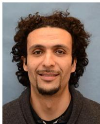

natural_image

Portrait of a man with curly hair and beard (no text or symbols visible)

Mehdi Bennis (S’07–AM’08–SM’15) received the M.Sc. degree in electrical engineering from EPFL, Switzerland, and Eurecom Institute, France, in 2002 and the Ph.D. degree in spectrum sharing for future mobile cellular systems in 2009. From 2002 to 2004, he was a Research Engineer with IMRA-EUROPE investigating adaptive equalization algorithms for mobile digital TV. In 2004, he joined the Centre for Wireless Communications, University of Oulu, Finland, as a Research Scientist. In 2008, he was a Visiting Researcher with the Alcatel-Lucent Chair on Flexible Radio, SUPELEC. He is currently an Adjunct Professor with the University of Oulu and the Academy of Finland Research Fellow. He has co-authored one book and published over 100 research papers in international conferences, journals, and book chapters. His main research interests are in radio resource management, heterogeneous networks, game theory, and machine learning in 5G networks and beyond. He was a recipient of the prestigious 2015 Fred W. Ellersick Prize from the IEEE Communications Society, the 2016 Best Tutorial Prize from the IEEE Communications Society, and the 2017 EURASIP Best Paper Award for the Journal of Wireless Communications and Networks. He serves as an Editor for the IEEE TRANSACTIONS ON WIRELESS COMMUNICATION.

natural_image

Portrait photo of a man in formal attire (no text or symbols visible)

Young-Han Nam received the B.S. degree in electrical engineering and the M.S. degree in biomedical engineering from Seoul National University, Seoul, South Korea, in 1998 and 2002, respectively, and the Ph.D. degree in electrical engineering from Ohio State University, Columbus, OH, USA, in 2008. He is a Principal Engineer with Standards and Mobility Innovation Lab, Samsung Research America, Plano, USA, where he currently leads 5G base station algorithm research. He actively contributed to 3GPP, 4G LTE, and 5G NR PHY-layer standards from 2008 to 2017, and led discussions on massive MIMO. He served as a Rapporteur for 5G channel modeling study item in 3GPP RAN1 to edit technical report 38.900/38.901.

natural_image

Portrait of a bald man in business attire with a smile (no text or symbols visible)

Mérouane Debbah (S’01–AM’03–M’04–SM’08– F’15) received the M.Sc. and Ph.D. degrees from the Ecole Normale Supérieure Paris-Saclay, France. He was with Motorola Labs, Saclay, France, from 1999 to 2002 and the Vienna Research Center for Telecommunications, Vienna, Austria, until 2003. From 2003 to 2007, he was with the Mobile Communications Department, Institut Eurecom, Sophia Antipolis, France, as an Assistant Professor. Since 2007, he has been a Full Professor with CentraleSupelec, Gif-sur-Yvette, France. From

2007 to 2014, he was the Director of the Alcatel-Lucent Chair on Flexible Radio. Since 2014, he has been the Vice-President of the Huawei France Research and Development Center and the Mathematical and Algorithmic Sciences Laboratory. He has managed 8 EU projects and over 24 national and international projects. His research interests lie in fundamental mathematics, algorithms, statistics, information, and communication sciences research. He was a recipient of the ERC Grant MORE (Advanced Mathematical Tools for Complex Network Engineering), the 17 Best Paper Awards, among which the 2007 IEEE GLOBECOM Best Paper Award, the Wi-Opt 2009 Best Paper Award, the 2010 Newcom++ Best Paper Award, the WUN CogCom Best Paper 2012 and 2013 Award, the 2014 WCNC Best Paper Award, the 2015 ICC Best Paper Award, the 2015 IEEE Communications Society Leonard G. Abraham Prize, the 2015 IEEE Communications Society Fred W. Ellersick Prize, the 2016 IEEE Communications Society Best Tutorial Paper Award, the 2016 European Wireless Best Paper Award, and the 2017 Eurasip Best Paper Award as well as the Valuetools 2007, Valuetools 2008, CrownCom2009, Valuetools 2012, and SAM 2014 Best Student Paper Awards, the Mario Boella Award in 2005, the IEEE Glavieux Prize Award in 2011, and the Qualcomm Innovation Prize Award in 2012. He is an Associate Editor-in-Chief of the journal Random Matrix: Theory and Applications and was an Associate and a Senior Area Editor for the IEEE TRANSACTIONS ON SIGNAL PROCESSING, from 2011 to 2013, and from 2013 to 2014, respectively. He is a WWRF Fellow and a member of the Academic Senate of Paris-Saclay.