# A UAV-Assisted Coordination Framework for Emergency Vehicle Priority and CAV Speed Optimization in Hybrid Human–Machine Driving on Expressways

Jinrui Zang , Zhengyang Liu, Guohua Song , and Xin Hu

Abstract—Providing convenient passage conditions for emergency vehicles (EVs) is crucial for ensuring their safe and swift arrival at the rescue scene. To optimize the eficiency of EVs within mixed human-machine driving environments on expressways, an innovative collaborative control framework that synergizes uncrewed aerial vehicle (UAV) surveillance with multi-vehicle dynamic coordination strategies on expressways is proposed in this study. First, a real-time vehicle coordination framework is developed, leveraging UAV-aided data collection and control to enable EV yielding. Second, an integer nonlinear programming model is constructed to achieve coordinated control of human-machine hybrid trafic flows under dynamic constraints, and a rolling speed-coordinated robust optimization control (SROC) method is proposed to reduce the uncertainty caused by manual vehicle lane-changing. Then, a UAV-assisted trajectory planning approach is established, which integrates quintic polynomial modeling and uncertainty set analysis for hybrid trafic lane-changing. Next, an O-CAV (connected autonomous vehicle in the objective lane) speed adjustment mechanism is introduced to alleviate cascading deceleration efects on subsequent trafic. Finally, a bi-level particle swarm optimization (PSO) model is designed to validate EV avoidance algorithm efectiveness and platform performance. The results show that the method constructed in this study efectively enhances the trafic eficiency of EVs. The rolling SROC method reduces vehicle evacuation time by 17.3%, EV travel time by 12.5%, advances vehicle lane-changing time by 14.2%, and decreases acceleration by 21.0% compared with the one-time SROC method. Increasing the penetration rate and selecting appropriate initial positions for O-CAV and EV can efectively improve the trafic eficiency of EVs. Limited time delays do not significantly afect the applicability of the method. The travel distance of O-CAV increases by 25.1% after the implementation of the O-CAV speed recovery mechanism. These findings demonstrate the potential of UAVassisted coordination to significantly enhance road safety and trafic eficiency in hybrid human-machine driving environments.

Index Terms—Emergency vehicle priority, uncrewed aerial vehicles, connected autonomous vehicles, coordinated control, hybrid human–machine driving.

## I. INTRODUCTION

including ambulances, fire trucks, and police cars, is vital for efective emergency response and public safety. However, the priority passage of EVs in real-world scenarios continues to pose a significant challenge owing to factors such as complex urban trafic conditions, road congestion, and insuficient driver awareness. Statistics indicate that in emergency situations, such as cardiac arrest, the mortality rate increases by 1%, and medical treatment costs are raised by 1,542 dollars for every one-minute delay in response time [1]. Therefore, the development and implementation of eficient strategies to facilitate the passage of emergency vehicles are not merely a technical challenge for intelligent transportation systems (ITS) but also a multidimensional issue encompassing social governance and public engagement.

The quick and safe arrival of EVs at the rescue site is beneficial for reducing the loss of life and property [2]. In existing studies on how to optimize the driving eficiency of EVs, some focused on EV path decision-making, and the main problem that needed to be solved was how to select the most efective path for EVs. Jose et al. [3] designed a dynamic path planning method, which efectively addresses congestion avoidance and travel time minimization in the rapid routing of emergency vehicles by integrating the Support Vector Regression model and an improved Bird Swarm Algorithm. Yang et al. [4] proposed a novel emergency path planning framework by integrating the Gaussian Process Regression algorithm, an improved bidirectional Dijkstra algorithm, and query acceleration techniques. Duan et al. [5] proposed a two-stage optimization model by combining the salp swarm algorithm with Dijkstra’s algorithm, significantly improving the eficiency of emergency vehicle dispatching. The above studies mainly concerned the travel time of EV from a path perspective, and the priority during the process of EV travel was less considered. Trafic signal priority (TSP) control is a commonly adopted technique for providing priority to EVs.

Nguyen et al. [6] proposed an integrated strategy encompassing path planning, trafic clearance scheduling, and signal preemption, aiming to optimize the routing of EVs and thereby achieving a notable improvement in response times. Yao et al. [7] constructed a dual-layer planning model for EVs path planning and signal priority control, with the upper layer being the dynamic priority model of EVs and the lower layer being the static path model of EVs. Liu et al. [8] proposed a bilevel V2X trajectory planning model that integrates signal timing optimization and emergency lane clearance to minimize emergency vehicle delays at intersections and on roads, boosting rescue eficiency in mixed trafic. The eficiency of emergency vehicle passage in urban environments is significantly enhanced by strategically designing trafic signal control strategies. Existing research has explored methods to enhance the travel eficiency of emergency vehicles from multiple aspects, such as path planning and signal priority control, providing crucial support for the rapid passage of EVs.

Vehicles ahead are supposed to yield the way when hearing the siren of an EV in practice. Given that vehicles make lane-changing decisions autonomously, there is a high probability that they will impede one another, potentially causing even more severe congestion for EVs as a result. Therefore, designing efective methods for non-priority vehicles to avoid EVs plays an important role in supporting EVs to arrive at the rescue site quickly and safely. Avoiding EV on urban expressway segments can be regarded as a problem of vehicle rescheduling and reorganization, which requires cooperation between drivers [9], [10], [11]. Agrawal et al. [12] developed fixed lane priority and optimal lane control strategies. Hannoun et al. [13] proposed a method in which the shortest path for EVs on a given road section was planned, and surrounding non-priority vehicles were then guided to deviate from the planned route. Wu et al. [9] developed a pre-empty strategy for the lane where EV was located while ensuring the expected speed of EV and minimizing the impact on surrounding vehicles. Hu et al. [14] presented an EV rapid passage control strategy based on collaborative lane changing, and used calculus of variations to optimize the process of vehicle collaborative lane changing. By optimizing the lane-level dynamic model of EV, Jiao et al. [15] advanced an optimal lane-changing guidance strategy for a convoy to avoid EVs based on a vehicle-road coordination system and provided a method for calculating the shortest distance to send an emergency avoidance signal. Humayun et al. [16] suggested a priority-setting approach for the order of vehicles when EVs enter the existing trafic stream. Hao et al. [17] proposed a coordinated lane changing strategy to avoid EV by controlling the preceding vehicle and adjacent objective lane vehicles. These studies proposed diverse strategies from varied perspectives to prompt non-priority vehicles to yield to emergency vehicles, ofering novel insights and solutions for addressing non-priority vehicle obstruction during emergency transit.

The above studies assume that vehicles can fully comply with the guidance instructions in an intelligent connected transportation environment. However, human-driven vehicles (HVs) and CAVs coexist in human-machine hybrid trafic before full autonomous driving is achieved [18]. There will still be a large number of HVs within the trafic flow for a con siderable period of time, and the compliance of human drivers with guidance instructions remains uncertain. It is challenging to guide human drivers to perform collaborative lane-changing maneuvers. The rapid advancement of UAV technology has introduced innovative solutions in the transportation sector. With features such as high-altitude surveillance, flexible deployment, and low operational costs, UAVs have shown immense potential in various applications, including trafic monitoring and management, logistics delivery, emergency response, urban planning, and ITS [19], [20], [21]. UAVs have the capability to operate collaboratively with CAVs and ITS in scenarios where emergency vehicle prioritization is required. Chowdhury et al. [22] proposed a UAV-guided priority-based incident management system that optimizes EV response times by dynamically adjusting trafic signal phases to prioritize EV clearance while minimizing disruptions to non-emergency trafic, achieving an 8% reduction in response time and a 12% improvement in trafic clearance around the incident site. Considering the efects of the time window, customer demand, load capacity, and duration of distribution benefits, a collaborative delivery path optimization model for vehicles and UAVs was proposed by Li et al. [23] to minimize the total distribution cost, while the utilization of distribution vehicles was significantly reduced and the start-up, waiting, and penalty costs were lowered. Oubbati et al. [24] explored the use of communication UAVs to detect road accidents, provide rescue teams with exact locations, plot the fastest intervention paths, and estimate road fluidity through temporary communication with existing ground vehicles. UAVs have advantages in real time trafic monitoring and dynamic information collection. Research on the integration and collaborative control of UAV with CAVs remains inadequately explored, which hinders the comprehensive application of UAVs. Existing studies have often overlooked the potential impacts of UAV-assisted evasive maneuvers on HVs, thereby compromising the overall trafic eficiency under particular conditions. There is an urgent need to develop integrated technologies that combine UAVs with dynamic path optimization to address modern trafic complexities.

Although significant progress has been made in the study of priority passage strategies for emergency vehicles, existing research still falls short in addressing collaborative avoidance between HVs and CAVs within mixed trafic environments. Moreover, the potential for deep integration between UAV technology and autonomous vehicles remains underexplored, particularly in leveraging real-time monitoring and dynamic path optimization to assist emergency vehicle passage. An innovative real-time coordinated avoidance method, which combines a UAV escort system with speed coordination control for CAVs, is proposed in this study. The SROC is constructed with a tailored design to specifically address the uncertainties that are inherently present in human driving, thereby facilitating more robust avoidance maneuvers.

Compared with existing strategies such as TSP, cooperative merging, or rule-based lane clearing, the proposed method in this study demonstrates diferentiated advantages. First, traditional TSP strategies rely on intersection phase adjustments and struggle with mid-block congestion, while rulebased lane clearing often fails due to low compliance from human drivers. Second, cooperative merging can cause deadlocks in dense mixed trafic, whereas this study introduces UAVs as aerial relays to solve visibility and information asymmetry issues. Most importantly, the proposed rolling SROC specifically compensates for the uncertainty of human driving behaviors, a capability absent in pure V2X or rulebased systems.

The technical approach adopted in this study is outlined in detail as follows: First, a real-time vehicle coordination method has been developed, utilizing UAVs for auxiliary data collection and control to enable EV yielding functionality. Second, an integer nonlinear programming model has been constructed for the coordinated control of human-machine hybrid trafic flows under dynamic constraints. Concurrently, a rolling SROC method has been devised to mitigate uncertainty impacts caused by lane-changing maneuvers of manually driven vehicles. Next, a UAV-assisted lane-changing trajectory planning method has been established, integrating quintic polynomial modeling with uncertainty set analysis for hybrid trafic flow applications. Then, an O-CAV speed adjustment mechanism has been proposed to alleviate cascading negative efects of vehicle deceleration on subsequent trafic. Finally, a bi-level particle swarm optimization model has been constructed, designed to validate the efectiveness of EV avoidance algorithms and platforms. The method designed in this study can reduce the uncertainty of manually-driven vehicles in complying with guidance instructions, thereby enhancing the efectiveness of EV avoidance maneuvers. With the continuous advancement of autonomous driving technology and the low-altitude economy, the proposed method can be widely applied in urban trafic governance, enabling priority passage for EVs and providing robust support for the rapid and safe arrival of EVs at rescue sites.

## II. METHODOLOGY

In the context of mixed human-machine driving scenarios on expressways, this study presents an innovative cooperative control method aimed at maximizing the operational eficiency of EVs, which uniquely integrates UAV-based monitoring systems with dynamic multi-vehicle coordination mechanisms. The research methods employed in this paper are specifically outlined as follows.

## A. A Real-Time Vehicle Coordination Method for Yielding to EVs Using UAV-Assisted Data Acquisition and Control

A real-time vehicle coordination method for yielding to EVs using UAV-assisted data acquisition and control is proposed, as illustrated in Fig 1.

In Fig. 1, the overall trafic flow consists of three types of vehicles, namely non-connected human driving vehicles (NCVs), CAVs, and connected human driving vehicles (CHVs). The methods for the collection, processing, and sharing of the real-time positions and speeds of diferent types of vehicles are described as follows:

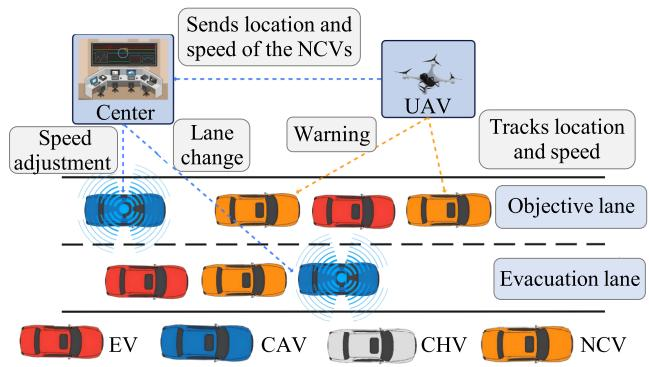  
Fig. 1. UAV-assisted data acquisition and control system.

(1) Leveraging V2V and V2I communications, CAVs enable real-time data sharing. Dedicated short-range communication (DSRC) ensures rapid and reliable short-range inter-vehicle data exchange, whereas C-V2X, which is based on cellular networks, expands coverage and boosts transmission rates. CAVs eficiently transmit position and speed data to nearby vehicles and trafic centers and interact with compatible UAVs for holistic information sharing using these technologies. To enable this interaction, UAVs are equipped with high-resolution cameras for capturing trafic details and identifying vehicle types, LiDAR sensors for providing 3D point cloud data to measure inter-vehicle distances and available lane-changing space, and inertial measurement units to maintain stable flight and precise positioning relative to vehicles amidst wind interference. On the vehicle side, in addition to the inherent radar and ultrasonic sensors on CAVs, NCVs and CHVs can be retrofitted with lowcost cameras or radar modules, combined with high-precision GPS receivers to ensure accurate location acquisition.

(2) The onboard diagnostic (OBD) system installed on EVs and CHVs utilizes specialized diagnostic tools or wireless adapters to acquire real-time vehicle location and speed information, which is then transmitted to external devices or cloud servers via Bluetooth, Wi-Fi, or mobile networks. Trafic surveillance cameras are used to collect images and videos of the EVs and CHVs. Object detection is enabled for vehicle identification and tracking using computer vision and image processing. The collected data are then transmitted to the control center and shared with the UAVs.

(3) The UAV tracks the location and speed of the NCVs and sends the information to the control center. The control center, following optimization calculations, transmits speed adjustment directives to CAVs. Among them, the O-CAV refers to the CAV that is situated in the objective lane, which is precisely the lane to which other vehicles are intended to change lanes. The E-CAV is the CAV in the evacuation lane, which is the lane temporarily cleared of non-priority vehicles so that an emergency vehicle can pass through without conflict. Furthermore, the UAV identifies non-priority vehicles that intentionally obstruct the EV or receives this information from the control center, and subsequently provides warnings. Considering the positions and speeds of vehicles in both the objective and waiting cleared lanes within a specific segment, the UAV determines whether any vehicles qualify for a lane change but have not yet executed it. The UAV alerts the respective vehicle to change lanes at the earliest opportunity. When all vehicles except the E-CAV have completed the lane change and the E-CAV satisfies the criteria for a lane change, the UAV transmits this information to the control center, which then issues a lane change command to the E-CAV. Specifically, the implementation of lane change prompts varies by vehicle type: for CAVs, the UAV sends instructions via V2U, and the onboard computer autonomously executes the maneuver after verifying safety; for NCVs and CHVs, visual prompts are displayed on Variable Message Signs (VMS), and auditory warnings are issued through in-vehicle systems. To encourage compliance, incentive mechanisms such as toll discounts, parking fee reductions, or reward points for timely yielding can be introduced.

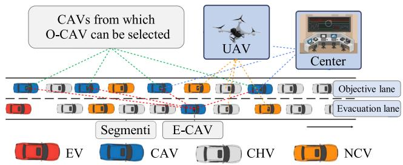  
Fig. 2. Schematic diagram of control segment division.

(4) A unified data fusion platform is established to integrate and standardize vehicle data sourced from diverse origins. Data cleaning techniques are employed to remove noise and erroneous data, while discrepancies among datasets are eliminated through calibration and conversion, ensuring a uniform data format and precision. A common data format is adopted to represent vehicle position and speed, facilitating efortless data interaction and sharing across diferent systems. Data standards and quality specifications are formulated to ensure data accuracy and consistency, thereby providing a reliable data foundation for coordinated control.

## B. Rolling Speed Optimization Strategy for CAVs Based on Dynamic Division of Control Segments

A study is presented on rolling speed optimization strategy for CAVs based on the dynamic division of control segments.

First, the control segment division rules are established. The road section is initially divided into manageable control segments, as shown in Fig. 2. The O-CAV and E-CAV are coordinated to efectively avoid EVs in each segment. Given the impact range of EVs and the unpredictability of vehicle behavior in the lane that requires clearing within a given segment, the segment length is best kept as short as possible. Furthermore, to maximize the optimization potential, the range of options for O-CAV selection ought to be broadened to the fullest extent feasible. The control segment division rules are designed as follows:

i Only one CAV can occupy the evacuation lane of each segment.

ii The range for selecting O-CAV: Between the first CAV, which is upstream of the last vehicle in the evacuation lane, and the first CAV, which is downstream of the E-CAV in the objective lane. To prevent the selected O-CAV from interfering with the optional range of other O-CAVs in downstream segments, it is necessary to ensure that there are at least two CAVs distributed within the objective lane between the E-CAV and its preceding vehicle.

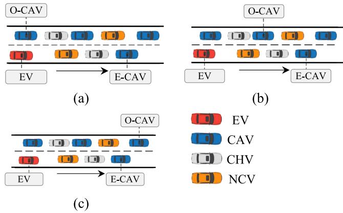  
Fig. 3. Relationship between O-CAV and tail position of the segment.

iii Only one E-CAV and one O-CAV can exist in each segment, meaning that if multiple CAVs are present in the objective lane of that segment, just a single one can be designated as the O-CAV.

iv The leading vehicle in the evacuation lane of each segment must be an E-CAV.

The possible position relationships between E-CAV and O-CAV in each segment are shown in Fig. 3.

The speeds of the E-CAV and O-CAV in each segment are coordinated according to the segmentation of the control zones. The speed control of the O-CAV is intended to create suficient lane-changing space for non-priority vehicles in the evacuation lane, whereas the speed control of the E-CAV is configured to regulate the speed of non-priority vehicles behind it.

Since there are multiple potential CAVs within the range of selecting the O-CAV, the selection of the O-CAV is considered one of the decision variables when building the coordinated control model, which is expressed as $s _ { O - C A V } , s _ { O - C A V } \in$ $\left[ C A V _ { 1 } , C A V _ { 2 } , \dots , C A V _ { n } \right]$ , where n denotes the number of CAV in the range of selecting O-CAV.

Next, an integer nonlinear programming model for coordinated control is established. During the implementation of speed coordinated control for the E-CAV and O-CAV, it is assumed that the acceleration or deceleration applied to both vehicles remains within the range of human comfort in this study. During the optimization process, if there are vehicles in the evacuation lane within the road section that have already completed lane-changing, and while there are still remaining vehicles that have not finished lane-changing and no vehicles are currently performing lane-changing maneuvers, then the model optimization process will be recalculated based on the actual operating status of each vehicle in the road section at that moment. According to the calculation results, the E-CAV and O-CAV are controlled to accelerate or decelerate again until achieving the objective speed. Therefore, the speed optimization of E-CAV and O-CAV during the process of clearing vehicles is actually a rolling optimization process based on the actual status of vehicles. The speed adjustment curves for both the E-CAV and O-CAV are shown in Fig. 4 (assuming that the O-CAV initially adjusts its speed, as illustrated in Fig. 4 (a), and the E-CAV subsequently adjusts its speed, as shown in Fig. 4 (b)).

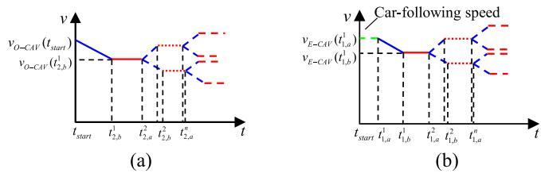  
Fig. 4. Speed adjustment curves for O-CAV and E-CAV.

The speed change equation, which is for the O-CAV in the first segment and corresponds to the speed adjustment curve in Fig. 4 (a), is shown in (1).

$$
\begin{array} { r l } & { \nu _ { O - C A V } ( t ) } \\ & { \quad = \left\{ \begin{array} { l l } { \nu _ { O - C A V } ( t _ { 2 , a } ^ { 1 } ) + a _ { c } ( t - t _ { 2 , a } ^ { 1 } ) , ~ t _ { 2 , a } ^ { 1 } < t \leq t _ { 2 , b } ^ { 1 } } \\ { \nu _ { O - C A V } ( t _ { 2 , a } ^ { 1 } ) + a _ { c } ( t _ { 2 , b } ^ { 1 } - t _ { 2 , a } ^ { 1 } ) , ~ t _ { 2 , b } ^ { 1 } < t \leq t _ { 2 , a } ^ { 2 } } \\ { t _ { 2 , a } ^ { 1 } = t _ { s t a r t } } \end{array} \right. } \end{array}\tag{1}
$$

where $\nu _ { O - C A V } ( t )$ is the speed of O-CAV at time t (m/s), $t _ { 2 , a } ^ { 1 }$ is the start time of O-CAV speed adjustment (s), and $t _ { 2 , b } ^ { 1 }$ ,is the end time of O-CAV speed adjustment (s).

The speed change equation for the E-CAV corresponding to the speed adjustment curve in Fig. 4 (b) is shown in (2).

$$
\begin{array} { r l } & { \nu _ { E - C A V } ( t ) } \\ & { \quad = \left\{ \begin{array} { l l } { \nu _ { E - C A V } ^ { f } ( t ) , ~ t _ { s t a r t } \leq t \leq t _ { 1 , a } ^ { 1 } } \\ { \nu _ { E - C A V } ^ { f } ( t _ { 1 , a } ^ { 1 } ) + a _ { c } ( t - t _ { 1 , a } ^ { 1 } ) , ~ t _ { 1 , a } ^ { 1 } < t \leq t _ { 1 , b } ^ { 1 } } \\ { \nu _ { E - C A V } ^ { f } ( t _ { 1 , a } ^ { 1 } ) + a _ { c } ( t _ { 1 , b } ^ { 1 } - t _ { 1 , a } ^ { 1 } ) , ~ t _ { 1 , b } ^ { 1 } < t \leq t _ { 1 , a } ^ { 2 } } \end{array} \right. } \end{array}\tag{2}
$$

where $\nu _ { E - C A V } ( t )$ is the speed of E-CAV at time t (m/s), $\nu _ { E - C A V } ^ { f } ( t )$ is the car-following speed of E-CAV at time t (m/s), tstart is the reference time (s), $t _ { 1 , a } ^ { 1 }$ is the start time of E-CAV speed adjustment $( \mathbf { s } ) , a _ { c }$ ,is the comfortable deceleration $( \mathrm { m } / \mathrm { s } ^ { 2 } )$ and $t _ { 1 , b } ^ { 1 }$ is the end time of E-CAV speed adjustment (s).

,The decision variables are $t _ { 1 , a } ^ { 1 } , \quad t _ { 1 , b } ^ { 1 }$ and $t _ { 2 , b } ^ { 1 }$ based , , ,on the assumption that the O-CAV adjusts its speed first. However, when the initial positions of the O-CAV change, it can’t be determined whether the E-CAV or O-CAV adjusts the speed first, in this case, a 0-1 auxiliary decision variable needs to be added, as shown in (3).

$$
\begin{array} { r l } & { \boxed { \sigma = \left\{ 1 , \ O - C A V a d j u s t s p e e d f i r s t l y \right. } } \\ & { \left. \left\{ 0 , \ E - C A V a d j u s t s p e e d f i r s t l y \right. \right.} \\ & { \left\{ t _ { 1 , a } ^ { 1 } = t _ { s t a r t } , \ i f \sigma = 0 \right. } \\ & { \left\{ t _ { 2 , a } ^ { 1 } = t _ { s t a r t } , \ i f \sigma = 1 \right. } \end{array}\tag{3}
$$

where $\sigma$ is the 0-1 auxiliary decision variable.

Regarding each subsequent road segment, E-CAV is taken as an illustrative example to expound upon the matter, with its speed variation pattern detailed in (4). It is noteworthy

that O-CAV exhibits similar characteristics concerning speed variation.

$$
\begin{array} { r l } & { \nu _ { E - C A V } ( t ) } \\ & { = \left\{ \begin{array} { l l } { \nu _ { E - C A V } ( t _ { 1 , a } ^ { i } ) + a _ { c } ( t - t _ { 1 , a } ^ { i } ) , \ t _ { 1 , a } ^ { i } < t \leq t _ { 1 , b } ^ { i } } \\ { \nu _ { E - C A V } ( t _ { 1 , a } ^ { i } ) + a _ { c } ( t _ { 1 , b } ^ { i } - t _ { 1 , a } ^ { i } ) , \ t _ { 1 , b } ^ { i } < t \leq t _ { 1 , a } ^ { i + 1 } } \\ { \nu _ { E - C A V } ( t _ { 1 , a } ^ { i } ) = \nu _ { E - C A V } ( t _ { 1 , b } ^ { i - 1 } ) } \\ { t _ { 1 , a } ^ { i } > t _ { 1 , b } ^ { i - 1 } } \\ { i \geq 2 } \end{array} \right. } \end{array}\tag{4}
$$

The decision variables must satisfy the following constraints: First, the optimized speeds of both the E-CAV and O-CAV cannot be less than zero. Second, the adjusted speed of the E-CAV must remain less than the speed of the preceding vehicle in the objective lane. Additionally, during the deceleration process of E-CAV or O-CAV, the safe distance from their preceding vehicle must be ensured. Furthermore, to ensure there is suficient lane-changing space in the objective lane, the adjusted speed of the E-CAV should be greater than or equal to that of the O-CAV. Given these considerations, the following scenarios are discussed:

(i) Referring to Fig. 3 (a), the constraints are shown in (5).

$$
\left\{ \begin{array} { l l } { \nu _ { E - C A V } ( t _ { 1 , a } ) - a _ { c } \cdot ( t _ { 1 , b } - t _ { 1 , a } ) \geq 0 } \\ { \nu _ { O - C A V } ( t _ { 1 , a n t } ) - a _ { c } \cdot ( t _ { 2 , b } - t _ { 2 , a } ) \geq 0 } \\ { \nu _ { E - C A V } ( t _ { 1 , a n t } ) - a _ { c } \cdot ( t _ { 1 , b } - t _ { 1 , a } ) \leq \nu _ { p , O - C A V } } \\ { G a p _ { i } ^ { \prime } ( t ) \geq G a p _ { i } ^ { \prime } s _ { e l f } ^ { \prime } ( t ) } \\ { G a p _ { i } ^ { p , s , e } ( t ) = \nu _ { i } ( t ) \tau _ { i } + \frac { \nu _ { i } ( t ) ^ { 2 } } { 2 a _ { i } } - \frac { \nu _ { i } ^ { p } ( t ) ^ { 2 } } { 2 a _ { i } ^ { p ^ { \prime } } } } \\ { t _ { 3 a n t } \leq 1 _ { 1 , a } \leq { T _ { a } } , \ i f \sigma = 1 } \\ { t _ { 3 a n t } \leq t _ { 2 , a } \leq { T _ { a } } , \ i f \sigma = 0 } \\ { t _ { 1 , a } \leq t \leq t _ { 1 , b } , \ i f i s E - C A V } \\ { t _ { 2 , a } \leq t \leq t _ { 2 , b } , \ i f i s o - C A V } \end{array} \right.\tag{5}
$$

where $\nu _ { p , O - C A V }$ is the speed of E-CAV preceding vehicle in the objective lane (m/s), $G a p _ { i } ^ { p } ( t )$ is the distance between E-CAV or O-CAV and its preceding vehicle at time t (m), $G a p _ { i } ^ { p , s a f e } ( t )$ is the safe distance between E-CAV or O-CAV and its preceding vehicle at time t (m), $\tau _ { i }$ is the reaction time of E-CAV or O-CAV (s), $a _ { i }$ τis the longitudinal braking deceleration of E-CAV or O-CAV (m/s2), $\bar { a _ { i } ^ { p } }$ is the braking deceleration of E-CAV or O-CAV preceding vehicle $( \mathrm { m } / \mathrm { s } ^ { 2 } )$ v (t) is the speed of E-CAV or O-CAV (m/s), $\nu _ { i } ^ { p } ( t )$ is the speed of E-CAV or O-CAV preceding vehicle (m/s), and $T _ { a }$ is the latest deceleration time of E-CAV or O-CAV (s).

(ii) Referring to Fig. 3 (b) and Fig. 3 (c), to create suficient lane-changing space in the objective lane, the adjusted speed of the E-CAV must be greater than or equal to that of the O-CAV. Based on the constraints in (5), the constraint in (6) must also be satisfied.

$$
\begin{array} { r l } & { \nu _ { E - C A V } ( t _ { s t a r t } ) - a _ { c } \cdot ( t _ { 1 , b } - t _ { 1 , a } ) } \\ & { ~ > \nu _ { O - C A V } ( t _ { s t a r t } ) - a _ { c } \cdot ( t _ { 2 , b } - t _ { 2 , a } ) } \end{array}\tag{6}
$$

The efectiveness of the control strategy is characterized by minimizing the deviation between the actual travel distance of the EV and its normal driving distance. Given the uncertainty in lane-changing decisions and timing for HVs, the robust optimization objective function is designed as shown in (7) to ensure the practical feasibility of the clearing strategy.

$$
J _ { 1 } = \operatorname* { m i n } \operatorname* { m a x } \left\{ 1 - \frac { x _ { E } ( t _ { e n d } ^ { i m p a c t } ) - x _ { E } ( t _ { s t a r t } ) } { V _ { E } \cdot ( t _ { e n d } ^ { i m p a c t } - t _ { s t a r t } ) } \right\}\tag{7}
$$

where $x _ { E } ( t )$ is the longitudinal position of EV (m), $t _ { e n d } ^ { i m p a c t }$ is the time when vehicles in the waiting cleared lane are completely cleared (s), and $V _ { E }$ is the normal driving speed of EV (m/s).

It should be noted that $t _ { s t a r t }$ can’t be determined directly in certain scenarios. If the initial moment is considered as $t _ { s t a r t }$ and the optimized avoidance process significantly afects the speed of the EV, then the optimal $t _ { s t a r t }$ is clearly the initial moment, and the objective function is expressed as (7). However, when the EV is suficiently distant from the preceding vehicle, diferent $t _ { s t a r t }$ may emerge, resulting in a minimal impact of the optimized avoidance process on the speed of the EV. The $t _ { s t a r t }$ is treated as a decision variable in the optimization of the avoidance process. Under the constraint of the avoidance process impact on EV is not more than a certain range $( J _ { 1 } \leq \tau , \tau$ is the threshold of avoidance process impact on EV), the objective function will be changed into minimizing the impact of the avoidance process on nonpriority vehicles as much as possible. The vehicles in the objective lane are marked as $V e h _ { b }$ , the O-CAV is marked as $V e h _ { b , 1 }$ , and the vehicles behind O-CAV in the objective lane are marked as $V e h _ { b , 2 }$ to $V e h _ { b , N }$ from near to far. The vehicles in the waiting cleared lane are labeled as $V e h _ { a }$ , and E-CAV is marked as $V e h _ { a , 1 }$ , the vehicles between E-CAV and EV in the waiting cleared lane are marked as $V e h _ { a , 2 }$ to $V e h _ { a , M }$ from near to far. The changed objective function is designed as shown in (8), at the bottom of the page, where $x _ { i } ( t )$ is the longitudinal position of vehicle i in the objective lane (m), and $x _ { j } ( t )$ is the longitudinal position of vehicle j in the waiting cleared lane (m).

C. UAV-Assisted Lane Change Trajectory Planning Method for Mixed Trafic Flow Based on Fifth-Degree Polynomial Models and Uncertainty Set Modeling

The trajectory planning and safety conditions for lane changes are introduced as follows. In order to calculate the objective function value, it is necessary to calculate $t _ { e n d } ^ { i m p a c t }$ and $\bar { x _ { E } ( t _ { e n d } ^ { i m p a c t } ) , x _ { V e h _ { b , i } } ( t _ { e n d } ^ { i m p a c t } ) , x _ { V e h _ { a , j } } ( t _ { e n d } ^ { i m p a c t } ) }$ . The relationship is as shown in (9).

$$
\left\{ \begin{array} { l l } { { x _ { E } } ( t _ { e n d } ^ { i m p a c t } ) = { x _ { E } } ( t _ { s t a r t } ) + \displaystyle \int _ { t _ { s t a r t } } ^ { t _ { e n d } ^ { i m p a c t } } { \dot { x } _ { E } } ( t ) d t } \\ { { x _ { V e h } } _ { a , j } ( t _ { e n d } ^ { i m p a c t } ) = { x _ { V e h } } _ { a , j } ( t _ { s t a r t } ) + \displaystyle \int _ { t _ { s t a r t } } ^ { t _ { e n d } ^ { i m p a c t } } { \dot { x } _ { V e h } } _ { a , j } ( t ) d t } \\ { { x _ { V e h } } _ { b , i } ( t _ { e n d } ^ { i m p a c t } ) = { x _ { V e h } } _ { b , i } ( t _ { s t a r t } ) + \displaystyle \int _ { t _ { s t a r t } } ^ { t _ { e n d } ^ { i m p a c t } } { \dot { x } _ { V e h } } _ { b , i } ( t ) d t } \end{array} \right.\tag{9}
$$

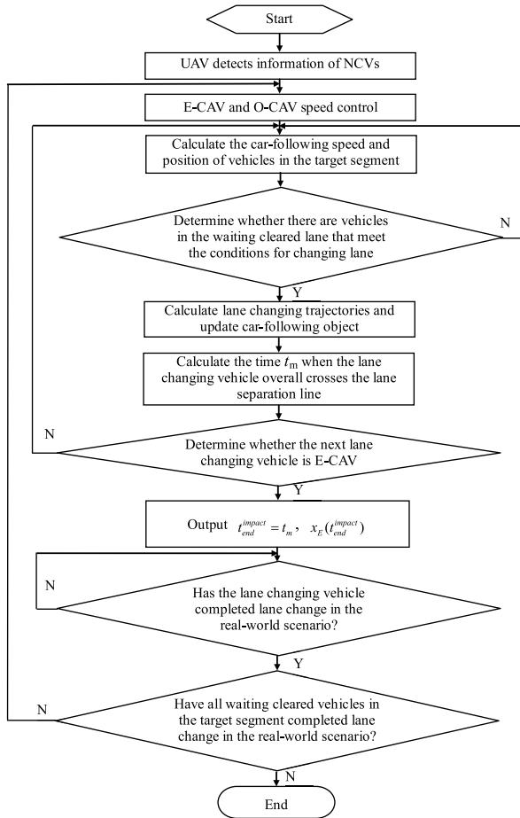  
Fig. 5. Calculation process for vehicle clearance time and the longitudinal position of EV.

Taking $t _ { e n d } ^ { i m p a c t }$ and $x _ { E } ( t _ { e n d } ^ { i m p a c t } )$ as an example, the calculation process for $t _ { e n d } ^ { i m p a c t }$ and $x _ { E } ( t _ { e n d } ^ { i m p a c t } )$ is described in Fig. 5.

As shown in Fig. 5, it is first necessary to determine the real-time speed and position of each NCV with the assistance of UAVs to calculate $t _ { e n d } ^ { i m p a c t }$ and $x _ { E } ( t _ { e n d } ^ { i m p a c t } )$ . The non-priority vehicles in the evacuation lane are generally in two states during driving: car-following and lane-changing states. The methods for calculating speed and position difer between the two states, and such approaches also have distinct efects on the speed of the following vehicle. In the car-following state, except for the O-CAV and E-CAV, the speeds of the other vehicles are influenced by the preceding vehicle. In the carfollowing scenario, corresponding car-following models are employed for diferent front-rear vehicle combinations. The intelligent driver model (IDM) is selected for constructing the car-following model when the rear vehicle is a NCV or a CHV. The cooperative adaptive cruise control (CACC) is used for simulation when both the rear and front vehicles are CAVs. The adaptive cruise control (ACC) is adopted when the

$$
J _ { 2 } = \operatorname* { m i n } \left\{ \frac { 1 } { \displaystyle \sum _ { i = 1 } ^ { N } \left( x _ { V e h _ { b i } } ( t _ { e n d } ^ { i m p a c t } ) - x _ { V e h _ { b i } } ( t _ { s t a r t } ) \right) + \displaystyle \sum _ { j = 1 } ^ { M } \left( x _ { V e h _ { a j } } ( t _ { e n d } ^ { i m p a c t } ) - x _ { V e h _ { a j } } ( t _ { s t a r t } ) \right) } \right\}\tag{8}
$$

rear vehicle is a CAV while the front vehicle is an NCV or a CHV. Additionally, calibration of various IDM parameters is conducted using the next generation simulation (NGSIM) dataset to ensure model accuracy and reliability when vehicles are in the car-following state. In the lane-changing state, vehicles undergoing lane changes can determine their speed and position at each moment using planned lane-changing trajectories.

When a vehicle follows another vehicle, a lane change by the lead vehicle may alter the following objective in the waiting cleared lane, which includes three situations: (1) the lead vehicle does not change lanes; (2) the lead vehicle is in process of changing lanes but has not fully crossed the lane line; (3)the lead vehicle is changing lanes and has completely crossed the lane line. In the first two scenarios, the following objective in the waiting cleared lane remains unchanged, but it changes in the third scenario.

When calculating the speed and position of the leading vehicle, it is crucial to consider the possibility that the leading vehicle may be changing lane because the longitudinal speed of a lane-changing vehicle inevitably afects the trailing vehicle. It is vital to determine both the start time of the lane change and the trajectory of the lane-changing vehicle. In an EV-avoidance environment, lane-changing decision-making processes difer significantly from those in conventional settings. The objective shifts from merely increasing the speed to ensuring safe avoidance during lane change. The specific conditions governing lane change influenced by EV are detailed below:

The value of margin to collision (MTC) at the beginning of lane changing is used to characterize the lane changing conditions. The MTC calculation equation is as (10):

$$
M _ { T C } = \left( \frac { \nu _ { c } ^ { 2 } } { 2 a _ { c } } + \Delta S \right) \left( \frac { \nu _ { r } ^ { 2 } } { 2 a _ { r } } + \nu _ { r } \tau _ { r } \right) ^ { - 1 }\tag{10}
$$

where $M _ { T C }$ is the collision margin, ∆S is the initial relative distance between the lane-changing vehicle and the rear vehicle in the objective lane (m), $\nu _ { c }$ is the speed of the lanechanging vehicle (m/s), vr is the speed of the rear vehicle in the objective lane (m/s), $a _ { c }$ is the braking deceleration of the lanechanging vehicle $( \mathrm { m } / \mathrm { s } ^ { 2 } )$ , and $a _ { r }$ is the braking deceleration of the rear vehicle in the objective lane $( \mathrm { m } / \mathrm { s } ^ { 2 } )$

When a lane-changing decision is made by ${ \mathrm { H V } } ,$ due to the uncertainty of the accepted MTC between the lane-changing vehicle and its rear vehicle in the objective lane, an uncertainty set is adopted as shown in (11).

$$
U _ { M T C } ^ { r } = \left\{ { \cal M } _ { T C } ^ { r } ( i ) \in [ M _ { \operatorname* { m i n } } ^ { r } , M _ { \operatorname* { m a x } } ^ { r } ] \right.\tag{11}
$$

where $M _ { T C } ^ { r } ( i )$ is the MTC uncertainty variable, $M _ { \mathrm { m i n } } ^ { r }$ is the MTC minimum value, to ensure the safety of lane change, the value here is 1, $M _ { \mathrm { m a x } } ^ { r }$ is the MTC maximum value, and m is the number of HVs waiting to change lane.

The attributes of MTC between the lane-changing HV and its rear vehicle in the objective lane are described using uncertainty sets, as shown in (12).

$$
U _ { M T C } ^ { p } = \left\{ { \cal M } _ { T C } ^ { p } ( i ) \in [ M _ { \operatorname* { m i n } } ^ { p } , M _ { \operatorname* { m a x } } ^ { p } ] \right.\tag{12}
$$

Once the vehicle in the evacuation lane meets the conditions outlined in (13), lane-changing trajectory planning is to be initiated, and the vehicle will then be guided along the planned trajectory.

$$
\begin{array} { r } { \left\{ \begin{array} { l l } { M _ { T C } ^ { r } ( i ) \geq M _ { \operatorname* { m i n } } ^ { r } } \\ { M _ { T C } ^ { p } ( i ) \geq M _ { \operatorname* { m i n } } ^ { p } } \end{array} \right. } \end{array}\tag{13}
$$

However, given the unpredictable nature of HV behavior, compliance with the aforementioned lane-changing conditions does not guarantee that the vehicle promptly executes a lane change. The UAV can be used to prompt vehicles that meet the lane-changing conditions, which collects vehicle’s driving data, judges whether the lane-changing conditions are met, and provides prompts. The MTC values of the vehicles in the waiting cleared lane are calculated. If the emptied vehicle satisfies $U _ { M T C } ^ { r } > M _ { \mathrm { m a x } } ^ { r }$ and $U _ { M T C } ^ { p } > M _ { \mathrm { m a x } } ^ { p }$ , it can be considered that the vehicle is intentionally performing obstructed behavior, in which case the UAV warns it and prompts it to change lane immediately.

Next, a fifth-degree polynomial model for vehicle lanechange trajectory planning is proposed. A coordinate system is established for the lane-changing scene, where the horizontal and vertical coordinates of the right front corner of the lane-changing vehicle are $x _ { 1 , c } ( t )$ and $y _ { 1 , c } ( t )$ respectively. A , ,fifth-degree polynomial is employed for lane-changing trajectory planning, as expressed in (14).

$$
\left\{ \begin{array} { l l } { \displaystyle x _ { 1 , c } ( t ) = \sum _ { i = 0 } ^ { 5 } a _ { i } t ^ { i } } \\ { \displaystyle y _ { 1 , c } ( t ) = \sum _ { i = 0 } ^ { 5 } b _ { i } t ^ { i } } \end{array} \right.\tag{14}
$$

According to the positional relationship of each corner of the vehicle, the left front corner points $x _ { 2 , c } ( t )$ and $y _ { 2 , c } ( t )$ , left rear corner points $x _ { 3 , c } ( t )$ and $y _ { 3 , c } ( t )$ , and right rear corner points $x _ { 4 , c } ( t )$ and $y _ { 4 , c } ( t )$ of the vehicle are shown in (15).

$$
\left\{ \begin{array} { l l } { x _ { 2 , c } ( t ) = x _ { 1 , c } ( t ) - l _ { b } \sin \theta _ { s } ( t ) } \\ { y _ { 2 , c } ( t ) = y _ { 1 , c } ( t ) + l _ { b } \cos \theta _ { s } ( t ) } \\ { x _ { 3 , c } ( t ) = x _ { 1 , c } ( t ) - l _ { a } \cos \theta _ { s } ( t ) - l _ { b } \sin \theta _ { s } ( t ) } \\ { y _ { 3 , c } ( t ) = y _ { 1 , c } ( t ) - l _ { a } \sin \theta _ { s } ( t ) + l _ { b } \cos \theta _ { s } ( t ) } \\ { x _ { 4 , c } ( t ) = x _ { 1 , c } ( t ) - l _ { a } \cos \theta _ { s } ( t ) } \\ { y _ { 4 , c } ( t ) = y _ { 1 , c } ( t ) - l _ { a } \sin \theta _ { s } ( t ) } \end{array} \right.\tag{15}
$$

where $l _ { a }$ is the length of the vehicle (m), $l _ { b }$ is the width of the vehicle (m), and $\theta _ { s } ( t )$ is the heading angle of the vehicle at time t.

The initial conditions for the lane-changing trajectory planning are shown in (16), at the bottom of the next page,where D is the lane width (m), $\Delta t _ { c }$ is the total time of changing lane (s), and $x _ { 1 , c } ^ { e n d }$ is the final longitudinal position (m). If $\Delta t _ { c }$ and $x _ { 1 , c } ^ { e n d }$ ,have been determined, a unique lane-changing trajectory ,can be determined.

Diferent methods are used to obtain lane-changing trajectories for CAV and HV. For CAV, owing to the good controllability, trajectory planning adopts trajectory optimization, with the optimization objectives considering comfort and eficiency. For HV, even under identical lane-changing conditions, various human drivers may opt for distinct lanechanging trajectories. In this study, to reduce computational complexity, it is assumed that the longitudinal velocity of the vehicle remains constant throughout the lane-changing process, and the diference between human drivers is reflected by randomly choosing diferent durations for lane changing.

Therefore, due to the uncertainty involved in lane-changing trajectory planning for HVs, an uncertainty set is adopted to describe this attribute in order to ensure the robustness of the method, as shown in (17).

$$
T = \left\{ \begin{array} { l l } { \Delta t _ { c } ( i ) \in [ t _ { \operatorname* { m i n } } , t _ { \operatorname* { m a x } } ] } \\ { i = 1 , 2 , . . . , m } \end{array} \right.\tag{17}
$$

where $\Delta t _ { c } ( i )$ is the lane changing total time (s), $t _ { \mathrm { m i n } }$ is the shortest lane changing time (s), and $t _ { \mathrm { m a x } }$ is the longest lane changing time (s).

When $\Delta t _ { c }$ takes diferent values, the fifth-degree polynomial trajectory planning model can be used to sample the corresponding lane-changing trajectories, perform constraint checks, and form a set of selectable lane-changing trajectories for the vehicle.

## D. Mechanism for Speed Adjustment of O-CAV to Mitigate Deceleration Impact on Subsequent Vehicles

To reduce the impact of O-CAV deceleration on subsequent vehicles in the objective lane, the positional relationship between the O-CAV and the rear vehicle in the evacuation lane is observed when the O-CAV reaches the controlled speed. The speed of the O-CAV is adjusted, while ensuring that the coordinated control result of the E-CAV and O-CAV speeds is not afected.

The speed adjustment process includes two strategies: controlled speed driving or following driving.

(1) When one of the following conditions is satisfied, O-CAV will drive at a controlled speed: ① the position of the tail vehicle in front of EV in the evacuation lane does not exceed O-CAV, as shown in (18); ② the position of the tail vehicle in front of EV in the evacuation lane exceeds the O-CAV, but it does not satisfy the lane-changing conditions with the O-CAV, as shown in (19).

Condition ①:

$$
\begin{array} { r } { \left\{ { x } _ { t a i l } ( t ) - { x } _ { O - C A V } ( t ) \le 0 \right. } \\ { \left. \left[ t > t _ { 2 , b } ^ { 1 } \right. \right. } \end{array}
$$

Condition ②:

(18)

$$
\left\{ \begin{array} { l l } { x _ { t a i l } ( t ) - x _ { O - C A V } ( t ) > 0 } \\ { M _ { T C } ^ { r } ( t a i l ) < M _ { \operatorname* { m a x } } ^ { r } } \\ { t > t _ { 2 , b } ^ { 1 } } \end{array} \right.\tag{19}
$$

where $x _ { t a i l } ( t )$ represents the position of the tail vehicle in front of EV in the waiting cleared lane at time t (m), and $M _ { T C } ^ { r } ( t a i l )$ represents the MTC value between the O-CAV and the trailing vehicle in the evacuation lane.

(2) When the following conditions shown in (20) are satisfied, O-CAV follows the preceding vehicle.

Condition:

$$
\left\{ \begin{array} { l l } { x _ { t a i l } ( t ) - x _ { O - C A V } ( t ) > 0 } \\ { M _ { T C } ^ { r } ( t a i l ) \geq M _ { \operatorname* { m a x } } ^ { r } } \\ { t > t _ { 2 , b } ^ { 1 } } \end{array} \right.\tag{20}
$$

Under the premise of meeting the conditions set by (20), if the MTC value $M _ { T C } ^ { r } ( p r e )$ between O-CAV and the preceding vehicle in the same lane is less than $M _ { T ( } ^ { r }$ (tail), O-CAV will choose to follow the preceding vehicle in that lane. At this point, its following speed should be determined based on the type of the preceding vehicle: if the preceding vehicle is a CAV, the CACC following model will be used for calculation; if the preceding vehicle is not a CAV, the ACC following model will be applied. Conversely, if the aforementioned MTC value $M _ { T C } ^ { r } ( p r e )$ is not less than $M _ { T C } ^ { r } ( t a i l )$ O-CAV will implement a virtual following strategy, targeting the tail vehicle in the evacuation lane for following. In this case, the following speed must ensure that the MTC value between the two vehicles is greater than or equal to $M _ { \mathrm { m a x } } ^ { r }$ , as shown in (21).

$$
\left( \frac { \nu _ { O - C A V } ^ { 2 } ( t ) } { 2 a _ { O - C A V } } + \nu _ { O - C A V } ( t ) \tau _ { O - C A V } \right) < \frac { \left( \frac { \nu _ { t a i l } ^ { 2 } ( t ) } { 2 a _ { t a i l } } + \Delta S \right) } { M _ { \operatorname* { m a x } } ^ { r } } ,\tag{21}
$$

where $\nu _ { t a i l } ( t )$ is the speed of the tail vehicle in the evacuation lane at time t (m/s), and $a _ { t a i l }$ is the braking deceleration $( \mathrm { m } / \mathrm { s } ^ { 2 } )$ of the tail vehicle in the evacuation lane.

If the following object of the O-CAV is the tail vehicle in front of EV in the evacuation lane, because they are not in the same lane, it can be considered that the O-CAV is performing virtual following (as shown in Fig. 6).

## E. Dual-Layer Particle Swarm Optimization Model and Rolling SROC Mechanism Collaborative Control for EV Avoidance Algorithm and Platform Design

When selecting $M _ { T C } ^ { r } ( i ) , ~ M _ { T C } ^ { p } ( i )$ and $\Delta t _ { c } ( i )$ for HVs in simulation, the same probability is used to randomly select diferent values. With $\Delta t _ { c } ( i )$ as an example, at intervals of 0.1 s, the initial optional quantity of $\Delta t _ { c } ( i )$ is $1 0 * ( t _ { \operatorname* { m a x } } - t _ { \operatorname* { m i n } } )$ , and

$$
( x _ { 1 , c } ( t _ { c } ^ { b e g i n } ) = x _ { 1 , c } ^ { b e g i n } , \dot { x } _ { 1 , c } ( t _ { c } ^ { b e g i n } ) = \nu _ { c } ^ { b e g i n } , \ddot { x } _ { 1 , c } ( t _ { c } ^ { b e g i n } ) = 0
$$

$$
\Bigm | x _ { 1 , c } \left( t _ { c } ^ { b e g i n } + \Delta t _ { c } \right) = x _ { 1 , c } ^ { e n d } , \dot { x } _ { 1 , c } \left( t _ { c } ^ { b e g i n } + \Delta t _ { c } \right) = \nu _ { c x } ^ { b e g i n } , \ddot { x } _ { 1 , c } \left( t _ { c } ^ { b e g i n } + \Delta t _ { c } \right) = 0
$$

$$
\mid y _ { 1 , c } \left( t _ { c } ^ { b e g i n } \right) = 0 , \dot { y } _ { 1 , c } \left( t _ { c } ^ { b e g i n } \right) = 0 , \ddot { y } _ { 1 , c } \left( t _ { c } ^ { b e g i n } \right) = 0\tag{16}
$$

$$
\lfloor y _ { 1 , c } ( t _ { c } ^ { b e g i n } + \Delta t _ { c } ) = D , \dot { y } _ { 1 , c } ( t _ { c } ^ { b e g i n } + \Delta t _ { c } ) = 0 , \ddot { y } _ { 1 , c } ( t _ { c } ^ { b e g i n } + \Delta t _ { c } ) = 0
$$

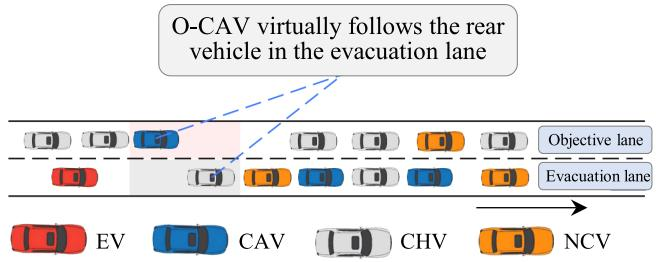  
Fig. 6. Virtual car-following diagram.

each selectable number is $1 , 2 , \ldots , 1 0 * ( t _ { \mathrm { m a x } } - t _ { \mathrm { m i n } } )$ . Performing constraint checks on each selectable number separately, and assuming the final number of options for $\Delta t _ { c } ( i )$ that satisfy the constraint conditions is $N _ { i } ( N _ { i } \le 1 0 * ( t _ { \operatorname* { m a x } } - t _ { \operatorname* { m i n } } ) )$ , then the probability $p _ { j }$ of vehicle i selecting number j from 1 to $N _ { i }$ is shown in (22).

$$
p _ { j } = \frac { i n t ( N _ { i } \cdot r n d ( \ k ) ) } { N _ { i } } , \ j \in [ 1 , 2 , \ldots , N _ { i } ]\tag{22}
$$

where $\overrightarrow { \mathbf { \nabla } } i n t ^ { \prime }$ represents rounding, and $\because _ { r n d ( ) } ,$ is a random number between 0-1.

The particle swarm optimization algorithm is employed in this study to optimize and solve the CAV speed coordinated control model. Due to uncertain variables $M _ { T C } ^ { r } ( i ) , ~ M _ { T C } ^ { p } ( i )$ and $\Delta t _ { c } ( i )$ is mutually independent with the variables $s _ { O } .$ −CAV, $t _ { 1 , a } ^ { 1 } , t _ { 1 , b } ^ { 1 } , t _ { 2 , a } ^ { 1 }$ and $t _ { 2 , b } ^ { 1 } ,$ therefore, as shown in (23), the inner , , , ,layer’s max problem can be solved first, and then the outer layer’s min problem can be solved.

$$
\begin{array} { r l } & { J _ { 1 } = \quad \mathrm { m i n } } \\ & { \begin{array} { r } { s o . c A v , ~ M _ { T C } ^ { r } ( i ) \in [ M _ { \mathrm { m i n } } ^ { r } , M _ { \mathrm { m a x } } ^ { r } ] , } \\ { t _ { 1 , a } ^ { 1 } , t _ { 1 , b } ^ { 1 } , ~ M _ { T C } ^ { p } ( i ) \in [ M _ { \mathrm { m i n } } ^ { p } , M _ { \mathrm { m a x } } ^ { p } ] , } \\ { t _ { 2 , a } ^ { 1 } , t _ { 2 , b } ^ { 1 } } & { \Delta t _ { c } ( i ) \in [ t _ { \mathrm { m i n } } , t _ { \mathrm { m a x } } ] } \end{array} } \\ & { \begin{array} { r } { \left\{ 1 - \frac { x _ { E } ( t _ { e n d } ^ { i m p a c t } ) - x _ { E } ( t _ { s t a r t } ) } { V _ { E } \cdot ( t _ { e n d } ^ { i m p a c t } - t _ { s t a r t } ) } \right\} } \end{array} } \end{array}\tag{23}
$$

For the inner layer issue, it is obvious that, if $M _ { T C } ^ { r } ( i ) =$ $M _ { \mathrm { m a x } } ^ { r } , ~ M _ { T C } ^ { p } ( i ) = ~ M _ { \mathrm { m a x } } ^ { p }$ and $\Delta t _ { c } ( i ) = t _ { \operatorname* { m a x } }$ , the waiting-to-becleared vehicles pose the highest obstacle to EVs. However, if E-CAV and O-CAV merely implement the one-time outcome of the SROC and persist with it until all vehicles in the evacuation lane of the segment have finished lane-changing, this approach is prone to yielding excessively conservative optimization results. Therefore, during the optimization process, if some vehicles within the evacuation lane of the segment have already completed lane-changing, while others remain unfinished and no vehicles are currently in the midst of lane-changing, the model optimization will be recalibrated based on the real-time status of each vehicle in the segment, and the rolling SROC method will be implemented. Based on the computation results, the E-CAV and O-CAV are directed to either accelerate or decelerate once more until they attain the targeted speed, as shown in Fig. 7.

Time variables are measured in second, therefore, the values can be considered integers. When using particle swarm optimization, even if the position and velocity of the particles are integers, the next position may still be a real number, which can’t guarantee that the search will still be in integer space. The method of applying the real number field and rounding is adopted in this study. The parameter values are shown in Table I:

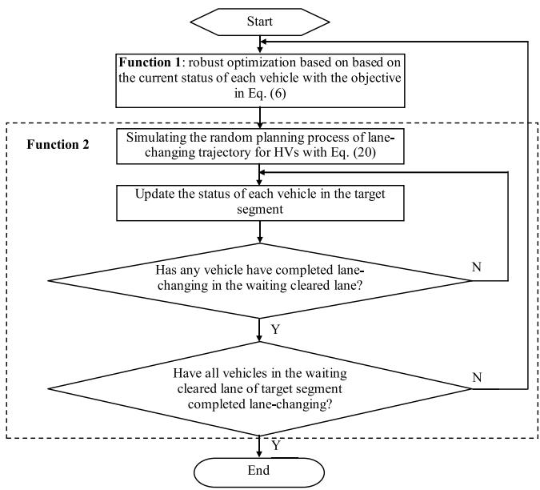  
Fig. 7. Calculation process of the rolling SROC method for vehicle clearance.

TABLE I  
PARAMETER SETTING TABLE
<table><tr><td>Parameter</td><td>Parameter definition</td><td>Value</td></tr><tr><td> $\Delta t$ </td><td>Simulation step size</td><td>0.1 s</td></tr><tr><td>τ</td><td>The threshold of avoidance process impact on EV</td><td>0.1</td></tr><tr><td> $\tau _ { H V }$ </td><td>Reaction time of HV</td><td>1.5 s</td></tr><tr><td> $\tau _ { C A V }$ </td><td>Reaction time of CAV</td><td>0.1s</td></tr><tr><td> $l _ { a } , l _ { b }$ </td><td>Vehicle length and width</td><td>4.8 m, 1.8 m</td></tr><tr><td> $\nu _ { \operatorname* { m i n } } , \nu _ { \operatorname* { m a x } }$ </td><td>Minimum and maximum speeds of non-priority vehicles</td><td>0 m/s, 16.6 m/s</td></tr><tr><td> $a _ { \operatorname* { m i n } } , a _ { \operatorname* { m a x } }$ </td><td>Minimum and maximum speeds for EV Minimum and maximum</td><td>0 m/s, 16.6 m/s -8 m/s2, 8 m/s²</td></tr><tr><td> $D$ </td><td>acceleration for lane-changing Lane width</td><td></td></tr><tr><td> $j _ { \operatorname* { m i n } } , j _ { \operatorname* { m a x } }$ </td><td>Minimum and maximum</td><td>3.5 m</td></tr><tr><td></td><td>acceleration for lane-changing</td><td>-8 m/s³, 8 m/s³</td></tr><tr><td> $b$ </td><td>Comfortable deceleration</td><td> $1 . 5 ~ \mathrm { m } / \mathrm { s } ^ { 2 }$ </td></tr><tr><td> $\kappa _ { \mathrm { m a x } }$ </td><td>Maximum curvature</td><td> $1 . 2 2 ^ { * } 1 0 ^ { - 3 } \mathrm { m ^ { - 1 } }$ </td></tr><tr><td> $M _ { \mathrm { m a x } } ^ { \prime }$ </td><td>The maximum MTC with rear vehicle in the objective lane</td><td>1.5</td></tr><tr><td> $M _ { \mathrm { m a x } } ^ { p }$ </td><td>The maximum MTC with preceding vehicle in the objective lane</td><td>1.5</td></tr><tr><td> $t _ { \mathrm { m i n } }$ </td><td>The shortest lane-changing time</td><td>3 s</td></tr><tr><td> $t _ { \mathrm { m a x } }$ </td><td>The longest lane-changing time</td><td>8 s</td></tr></table>

A platform for the collaborative guidance and avoidance of EVs by UAVs and CAVs has been developed in this study, as shown in Fig. 8. The aerial video data captured by UAVs is integrated into the platform, where relevant vehicle information is detected and analyzed. The efectiveness of this study has been analyzed through simulation experiments by using aerial data at a specific moment as the initial vehicle distribution on a road section.

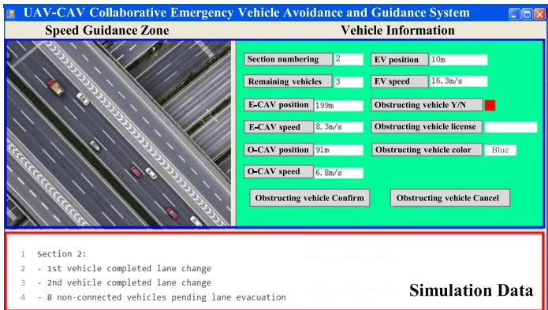  
Fig. 8. UAV-CAV collaborative EV avoidance and guidance platform.

The experimental scenario is set up as follows. A twolane road is constructed. Set the position at 0 meter, and the EV has an initial longitudinal position of −125 m, a lateral position of 0 m, and an initial velocity of 16.6 m/s. The initial longitudinal position of the EV’s preceding vehicle is 95 m, with a lateral position of 0 m and an initial velocity of 8.3 m/s. Beginning with the EV’s preceding vehicle, the initial longitudinal positions of the other vehicles in the evacuation lane are spaced 9 m apart from the vehicle behind them, with an initial velocity of 8.3 m/s. The number of vehicles in the evacuation lane is set to 6 (excluding EV), and the leading vehicle is E-CAV whose initial longitudinal position is 131 m. Corresponding to this E-CAV segment, the initial longitudinal positions of the CAVs in the objective lane are 91 m, 118 m and 136 m, the lateral positions are 3.5 m, and the initial velocities are 8.3 m/s. The longitudinal positions of the other vehicles in the objective lane are 100 m, 109 m, 127 m and 145 m, and the initial velocity is 8.3 m/s. During the vehicle’s driving process, only vehicles in the evacuation lane need to change lane into the objective lane to avoid the EV. Vehicles already in the objective lane do not change lane, and the EV does not perform any lane-changing maneuvers. The E-CAV will change lane only when specific lane-changing conditions are met and all following vehicles have completed lane change. In this scenario, UAVs are employed to assist in the detection of the real-time positions and speeds of NCVs, and this information is promptly shared with the control center. Subsequently, the control center relays specific instructions to the designated vehicles.

## III. RESULTS AND DISCUSSION

In this study, a comprehensive exploration into multiple factors influencing the trafic dynamics of EVs during evacuation scenarios is conducted.

## A. Impact of Diferent Optimization Methods on the Travel Distance of EVs and Vehicle Evacuation Time

The impacts of diferent optimization methods on the travel distance of EVs and vehicle evacuation time are analyzed in this study, encompassing three scenarios: 1) A control group without CAV control, denoted as M0; 2) The rolling robust optimization speed-coordinated control methods, denoted as M1; 3) The one-time robust optimization speed-coordinated control methods, denoted as M2. The optimization efects of diferent methods are illustrated in Fig. 9.

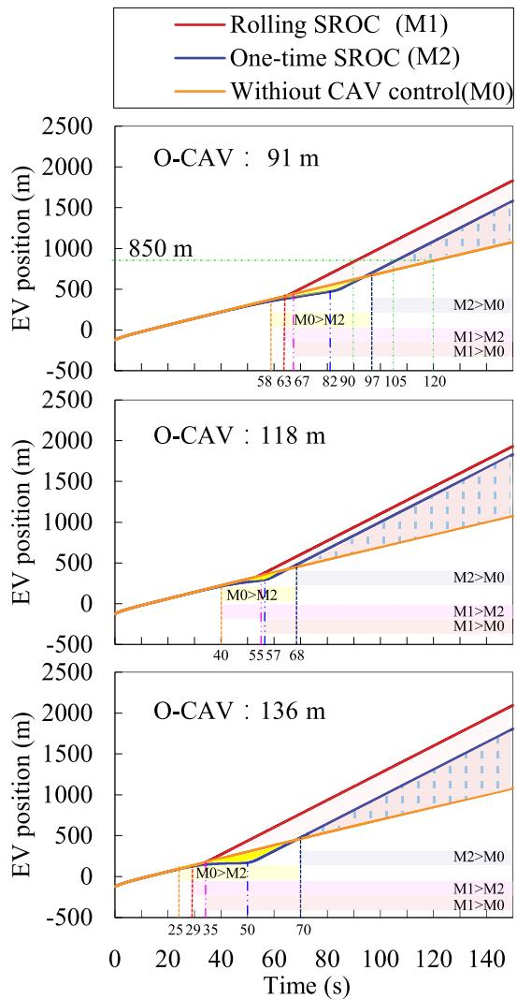  
Fig. 9. Comparison of EV position with diferent methods.

As illustrated in Fig. 9, the optimization results of diferent methods for improving the trafic eficiency of EVs exhibit significant diferences. The relevant conclusions are summarized as follows.

(1) Early-stage homogenization efect: When the initial positions of O-CAV are set to 91 m, 118 m, and 136 m respectively, the three strategies initially exhibit a high degree of similarity in the optimization efects on vehicle evacuation time and EV travel distance, with a diference range of less than 5.0%.

(2) Mid-stage diferentiation phenomenon: The optimization efects of these strategies gradually start to show diferences as time progresses, which includes:

1) The Rolling SROC strategy shows a growing superiority over both the one-time SROC strategy and the no-CAV control strategy in optimizing vehicle evacuation time and EV travel distance. Specifically, when the initial positions of O-CAV are configured at 91 m, 118 m, and 136 m, the Rolling SROC strategy surpasses the one-time SROC strategy in enhancing EV trafic eficiency at 63 s, 40 s, and 29 s, respectively. Given that the initial positions of O-CAV difer, utilizing the Rolling SROC method results in a shorter vehicle evacuation time compared to the one-time SROC method, achieving an average reduction of 17.3%. 2) In comparison to the no-CAV control strategy, the Rolling SROC strategy achieves a notably improved optimization efect on EV operational eficiency at 67 s, 55 s, and 35 s, respectively.

3) Compared to the no-CAV control method, the onetime SROC strategy exhibits a dynamic trend of initially weak and subsequently strong optimization efects on EV trafic eficiency. Specifically, when the initial positions of O-CAV are set at 91 m, 118 m, and 136 m, respectively, this strategy demonstrates inferior optimization performance for EV trafic eficiency compared to the no-CAV control method during the initial periods, specifically within the time intervals of [58,97] s, [40,68] s, and [25,70] s. However, as time progresses, its optimization efects gradually become evident and surpass those of the no-CAV control method, with the specific moments of surpassing occurring at 97 s, 68 s, and 70 s, respectively.

(3) Late-stage significant diferences: Taking the scenario where the initial position of O-CAV is set at 91 m as an example, when the Rolling SROC, one-time SROC, and no-CAV control strategies are employed respectively, the time required for EVs to reach the 850 m mark is 90 s, 105 s, and 120 s. Based on these calculations, it can be observed that the Rolling SROC strategy enhances EV trafic eficiency by 12.5% and 25.0% compared to the one-time SROC strategy and the no-CAV control strategy, respectively.

## B. Analysis of the Characteristics of Speed and Position Changes During Vehicle Evacuation Process

The speed changes of each vehicle during the clearing process are shown in Fig. 10 (Taking O-CAV position at 91 m as an example). For the evacuation lane, the first non-priority vehicle to change lane is the fourth vehicle behind E-CAV, and the lane-changing sequence is 4-3-2-1 until E-CAV.

As illustrated in Fig. 10, the initial speed of every vehicle decreased due to the deceleration of the E-CAV. After the vehicle has crossed the lane line, the speed of the following vehicle will increase owing to the change in the following object and distance. Then, the following speed decreases again until the lane change is completed because of the limitation of the E-CAV speed. For an EV that does not change lanes, its speed will continuously fluctuate until all preceding vehicles are cleared. It can be seen that approximately 3 s after the O-CAV begins to decelerate, the E-CAV begins to decelerate, and its final speed is greater than that of the O-CAV. When the rolling SROC method is implemented, the speeds of O-CAV and E-CAV undergo multiple adjustments throughout the entire lane-clearing process. These adjustments lead to an earlier lane-changing time for each vehicle on the evacuation lane in comparison to when the one-time SROC method is applied. Specifically, the lane-changing time of Vehicle 4 is advanced from 71 s to 57 s, that of Vehicle 3 from 53 s to 46 s, that of Vehicle 2 from 35 s to 32 s, and that of Vehicle 1 from 13 s to 11 s. When the rolling SROC method is implemented, the lane-changing instants of vehicles on the lane slated for evacuation exhibit, on average, a 14.2% advancement relative to the scenario where the one-time SROC method is adopted. Furthermore, owing to the multiple speed adjustments under the rolling SROC method, the degree to which the speed of EV is influenced by decelerating lane-changing vehicles is diminished. The data indicates that the average acceleration of the EV is 0.0174 m/s2 and 0.0136 m/s2 respectively when the rolling SROC method and the one-time SROC method are adopted. It is evident that the acceleration of the EV under the rolling SROC method is lower, decreasing by 21.0% compared to the one-time SROC method. As a result, the vehicle operates more smoothly, ofering a more comfortable and safer experience for the occupants.

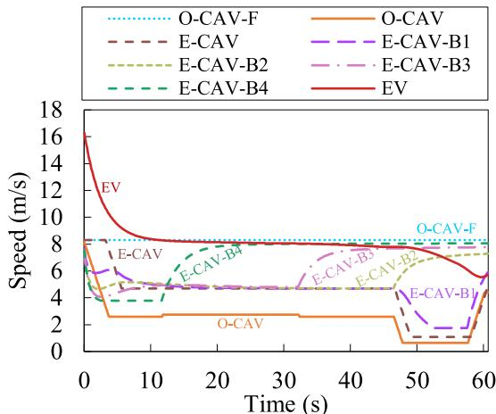

(a) The rolling SROC method  
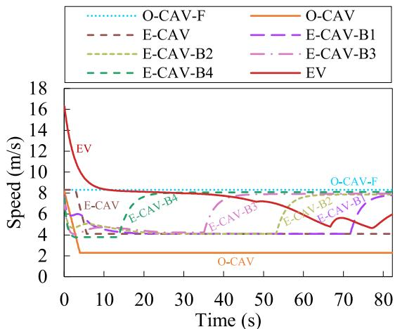  
(b) The one-time SROC method  
Fig. 10. The speed changing of each vehicle during the clearing process.

Fig. 11 illustrates the positional variations of each vehicle throughout the clearing process when employing the rolling SROC method (the number of vehicles in the waiting cleared lane is set to 10 excluding EV).

As illustrated in Fig. 11, a wave of vehicles congregates behind the E-CAV in the waiting cleared lane as a result of the E-CAV deceleration process. However, owing to the lanechanging behavior exhibited by vehicles during the clearing July 05,2026 at 11:54:16 UTC from IEEE Xplore. Restrictions apply.

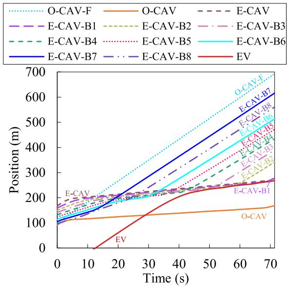  
Fig. 11. The position changing of each vehicle during the clearing process.

process, the number of congregating vehicles progressively decreases until all vehicles preceding the EV have completed their lane changes. Once all preceding vehicles have successfully executed their lane-changing maneuvers, the trafic conditions for EVs improve.

## C. Impact of CAV Penetration Rate on EV Trafic Eficiency

In this study, an experiment is designed to reveal the impact of CAV penetration on trafic flow. As the penetration rate of CAVs increases, the number of vehicles within each control segment decreases. Scenarios in which the initial position of the O-CAV is 91 m and the total number of vehicles is twelve with nine in the evacuation lane (excluding EV), are compared to those totaling eight vehicles with five in the waiting cleared lane (excluding EV), revealing diferences in positional changes among EVs, as illustrated in Fig. 12.

As illustrated in Fig. 12, the critical spatiotemporal nodes where CAV coordinated control strategies enhance trafic eficiency are compared under diferent penetration rates. When the number of vehicles in the evacuation lane decreases from 9 to 5, the trafic eficiency of EVs is notably enhanced, and this change is particularly pronounced under diferent control strategies. Specifically, in scenarios applying the Rolling SROC strategy: When there are 5 vehicles in the evacuation lane, the vehicle evacuation time is sharply reduced to 62 seconds, marking a 41.0% improvement in evacuation eficiency compared to the 105 seconds needed when there are 9 vehicles. A further comparison with the no-control strategy reveals that the Rolling SROC strategy exhibits a quicker response in optimizing EV trafic eficiency—it takes merely 67 s to achieve a significant improvement when there are 5 vehicles in the lane to be cleared, while it takes 117 s when there are 9 vehicles. Meanwhile, the travel distances of EVs in these two cases are 466 m and 831 m, respectively.

In scenarios employing the one-time SROC method: When there are 5 vehicles in the evacuation lane, the vehicle evacuation time is 85 s, representing a 30.9% improvement in evacuation eficiency compared to the 123 s required when there are 9 vehicles. Compared to the no-control strategy, the one-time SROC method also demonstrates certain advantages in optimizing EV trafic eficiency, albeit with a relatively slower response—it takes 97 s to achieve a significant improvement when there are 5 vehicles in the evacuation lane, whereas it takes 164 s when there are 9 vehicles. Additionally, the travel distances of EVs in these two scenarios are 259 m and 1190 m, respectively, indicating a positive impact of reduced vehicle numbers on EV travel distances while also highlighting the limitations of the onetime SROC method in terms of optimization efectiveness.

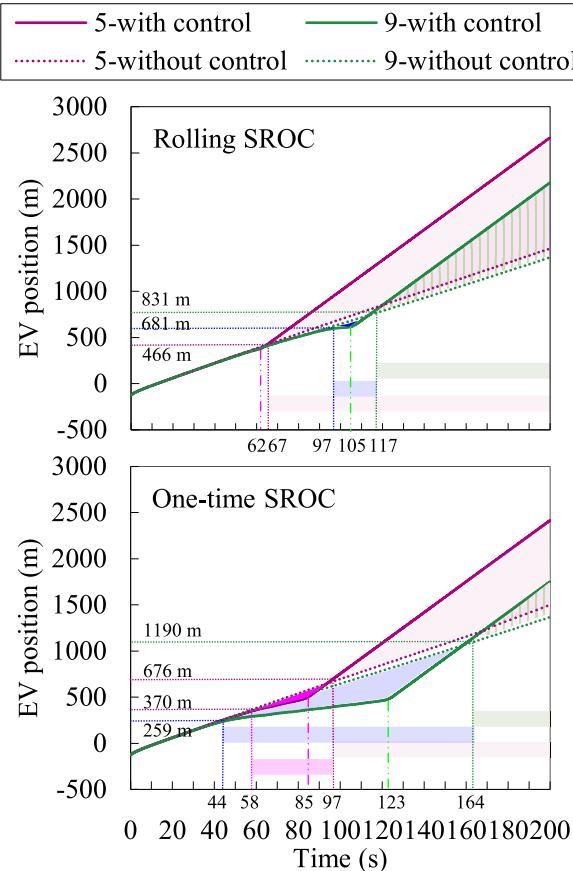  
Fig. 12. Comparison of EV position under varying vehicle numbers in the evacuation lane.

This indicates that during the process of making way for EVs, both length of road segments and number of vehicles waiting cleared are key factors determining the applicability of CAV speed-coordinated control methods. The increase in CAV penetration rate can significantly enhance the response eficiency of the trafic system when accommodating EV laneyielding, while efectively reducing the scope and duration of trafic disruptions.

D. Quantitative Assessment of the Influence of Vehicle Initial Position on the Trafic Eficiency of EVs

A quantitative assessment of the impact that vehicle initial position exerts on the trafic eficiency of EVs has been conducted in this study.

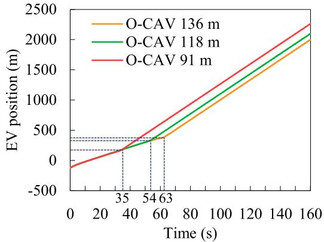  
Fig. 13. Comparison of EV position with diferent O-CAV.

First, a simulation analysis is presented that compares the trafic eficiency of EVs when selecting diferent CAVs in the objective lane as O-CAV, employing the rolling SROC method. The findings are illustrated in Fig. 13.

As shown in Fig. 13, the initial position of the O-CAV has a significant impact on the trafic eficiency of EVs: (1) when the initial position of the O-CAV is set at 136 m, the vehicle evacuation time is recorded as 35 s, with the EV covering a distance of 181 m; (2) when the O-CAV’s initial position is adjusted to 118 m, the evacuation time becomes 54 s, and the EV’s travel distance increases to 348 m; (3) if the O-CAV is initially located at 91 m, the evacuation time further goes up to 63 s, with the EV traveling 489 m. It is evident that compared to the case where the O-CAV’s initial position is 91 m, choosing an initial position of 136 m for the O-CAV leads to a 44.4% decrease in vehicle evacuation time and a 63.0% reduction in the EV’s travel distance. These results reflect the observable impact of selecting CAVs at diferent positions on the objective lane as O-CAVs on the optimization result of trafic flow under the specific conditions of the studied road section. Properly determining the initial position of the O-CAV is a relevant factor in enhancing the passage eficiency of emergency vehicles, ofering practical insights for trafic management and optimization strategies within intelligent transportation systems.

Then, the impact of the initial position of EVs on operational eficiency is analyzed in this study, particularly in the context of coordinated control with CAVs. A total of eight vehicles are set, with five vehicles needing to change lanes during lane clearing, and the initial position of the O-CAV is 91 m. In the simulation, when employing the rolling SROC method, the initial positions of the EVs are set at −50, −75, −100, −125 and −150 m. When employing the one time SROC method, the initial positions of the EVs are set at −50, −75, −100, −125, −150, −175 and −200 m. A comparison is made between the position changes of the EVs with and without CAV coordinated control. The simulation results are presented in Fig. 14.

As shown in Fig. 14, as the distance between the initial position of the EV and the preceding vehicle increases, at the completion of the evacuation lane, the travel distance disadvantage of the EV caused by the deceleration of the E-CAV decreases, and the extent of this decrease shows a non-linear variation. The conclusions are delineated as follows: (1) For the one-time SROC method, when the initial position of the EV reaches −200 m, the distance disadvantage of the EV with CAV control compared to that without CAV control is reduced to 11.7 m, and the impact of the vehicle-clearing process on the EV is comparable to that observed without any control; (2) When the rolling SROC method is adopted, with an initial distance of 150 m, the distance disadvantage with control compared to that without control is reduced to 6.6 m. The above results indicate that when using the rolling SROC method, it is possible to send a signal to yield to EVs at a shorter distance from the vehicle ahead of the EV, thereby reducing the impact of yielding to EVs on non-priority vehicles.

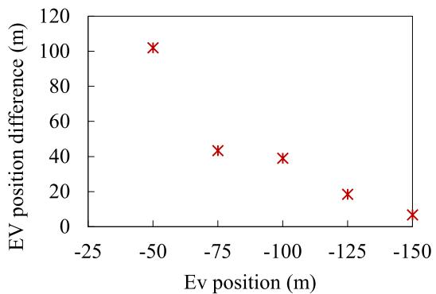

(a) The rolling SROC method  
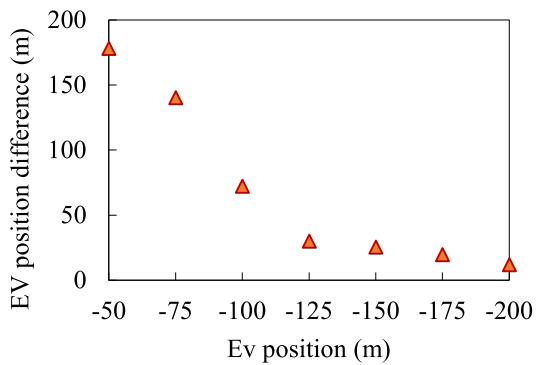  
(b) The one-time SROC method  
Fig. 14. The maximum value of EV position diference without and with CAV control.

When the initial position of the EV is configured at −150 m, with a corresponding distance of 245 m to the preceding vehicle, employing the rolling SROC method results in a laneclearing time of 60 s. During this period, the EV advanced to a position of 362 m. In the subsequent control road segment, with the initial position of the following vehicle set at 140 m and the initial speed at 8.3 m/s, the vehicle travels to the position of 638 m by the end of the evacuation period. This establishes a 276-m gap between the new preceding vehicle and the EV in the subsequent control road segment, with the spacing increasing by 12.6% compared to the initial 245-m gap. When the EV’s initial position is fixed at −200 m and it maintains a distance of 295 m from the preceding vehicle, utilizing the one-time SROC method yields a lane-clearing time of 82 s. The EV advanced to a position of 442 m. In the subsequent control road segment, the following vehicle travels to the position of 821 m by the end of the evacuation period. This establishes a 379-m gap between the new preceding vehicle and the EV in the subsequent control road segment, with the spacing increasing by 28.3% compared to the initial 295-m gap. The results indicate that CAV speed coordination control can optimize the spatial distribution of trafic flow, enabling vehicles to travel on roads in a more rational manner and improving the operational eficiency of EVs.

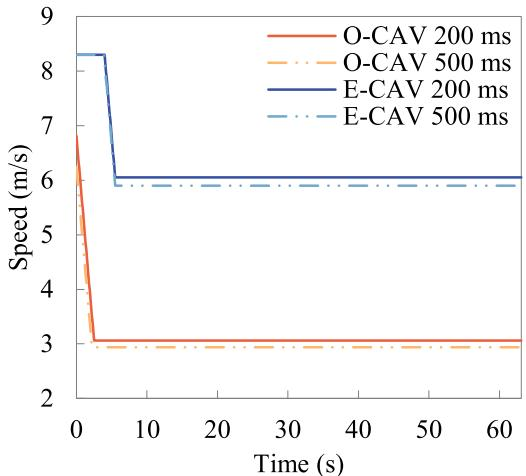

(a) Impact on speeds of E-CAV and O-CAV  
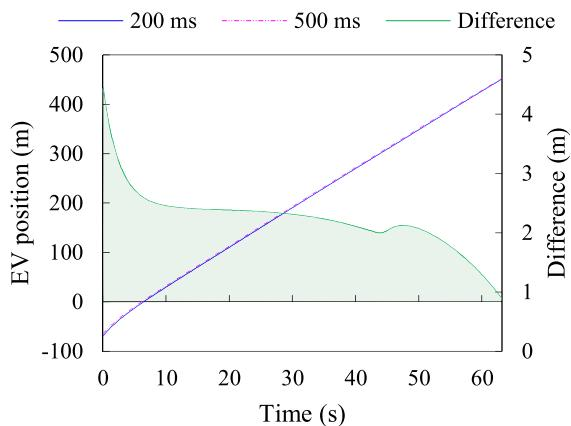  
(b) Impact on the EV position  
Fig. 15. Sensitivity analysis of time delay under the one-time SROC method.

In summary, when transmitting a signal to yield to EVs, provided that the distance between the EV and the preceding vehicle meets the specified criteria (245 m when employing the rolling SROC method and 295 m when using the onetime SROC method), the CAV speed coordination control consistently demonstrates superior performance over traditional non-CAV control in managing trafic flow, ensuring that the number of vehicles in any subsequent control segment is maintained at seven or fewer. It is reasonable to deduce that implementing CAV speed coordination control throughout the entire roadway would produce outcomes superior to those achieved by non-CAV strategies, provided that each control segment keeps the vehicle count at seven or fewer.

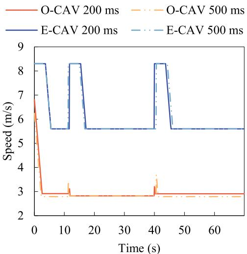

(a) Impact on speeds of E-CAV and O-CAV  
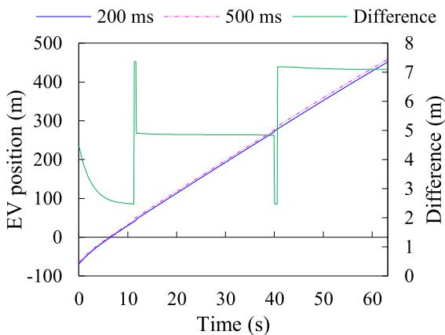  
(b) Impact on the EV position  
Fig. 16. Sensitivity analysis of time delay under the rolling SROC method.

## E. Sensitivity Analysis of One-Time and Rolling SROC Methods Under Time Delays

In real-world operations, systems may face time delays from various sources, such as UAV detection, optimization calculation, data upload to the central node, and control instruction issuance by the central node. This study uses total delay times of 200 ms and 500 ms as examples to analyze the sensitivity of the proposed method to time delays, as shown in Fig. 15 and Fig. 16. A 500 ms delay typically represents relatively long delays in current technological applications.

As depicted in Fig. 15(a), when the one-time SROC method is implemented, a comparison between a 200-ms delay and a 500-ms delay reveals that the latter induces subtle alterations in the speed optimization outcomes of E-CAV and O-CAV. Specifically, for E-CAV, the optimized speed changes from 6.1 m/s to 5.9 m/s, and for O-CAV, it changes from 3.1 m/s to 2.9 m/s. As illustrated in Fig. 15 (b), the influence of these speed variations on the driving distance of EV is approximately 1 m.

When the rolling SROC method is utilized, as shown in Fig. 16 (a), in contrast to a 200-ms delay, the speed adjustment trends of E-CAV and O-CAV under a 500-ms delay remain largely consistent. However, there is a discernible advancement in the speed adjustment time. As demonstrated in Fig. 16 (b), this advancement does not result in substantial changes in the driving distance of EV.

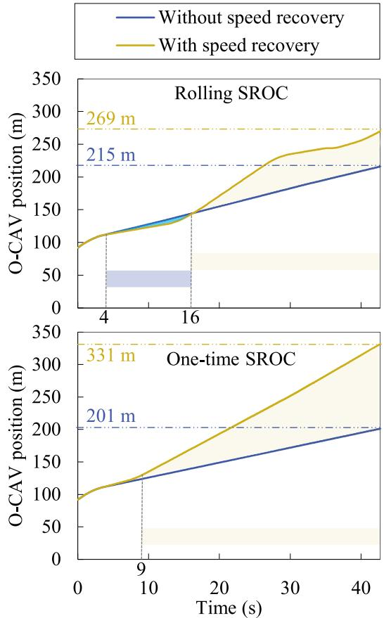  
Fig. 17. Comparison of O-CAV positions with and without speed recovery strategies.

Through a comprehensive analysis of the above-mentioned results, it can be firmly concluded that limited time delays do not compromise the applicability of the method proposed in this study.

## F. Impact of O-CAV Speed Recovery Strategies on Vehicle Evacuation Eficiency

The impact of O-CAV speed recovery strategies on vehicle evacuation eficiency is analyzed in this study. A total of eight vehicles are set up, among which five vehicles need to change lanes during the lane-clearing process, and the initial position of the O-CAV is 91 m, as shown in Fig. 17.

Variations in speed and position are analyzed under the O-CAV speed recovery mechanism. When the rolling SROC method is employed, due to speed enhancement, at the 42nd second before the end of the vehicle-clearing process, if the speed recovery strategy is not implemented, the position reached by the O-CAV is approximately 215 m; whereas when the speed recovery strategy is adopted, the O-CAV reaches a position of about 269 m, representing a 25.1% increase in driving distance. However, when the one-time SROC method is used, at the 42nd second before the end of the vehicle-clearing process, if the speed recovery strategy is not implemented, the position reached by the O-CAV is approximately 201 m; whereas when the speed recovery strategy is adopted, the O-CAV reaches a position of about 331 m, representing a 64.6% increase in driving distance. Since the rolling SROC method optimizes the O-CAV’s speed multiple times, the magnitude of improvement brought about by the speed adjustment strategy is relatively lower than that of the one-time SROC method. The analysis reveals that, regardless of whether the rolling SROC method or the onetime SROC method is used, with the implementation of the O-CAV speed recovery strategy, vehicles can maintain higher speeds throughout the entire clearing process compared to scenarios where speed recovery is not applied, and this is achieved without compromising the avoidance of emergency vehicles.

## IV. CONCLUSION

An innovative UAV-assisted real-time vehicle coordination method is proposed in this study, which is designed to facilitate the yielding of vehicles to EVs on urban expressways within a human-machine hybrid driving environment, enabling precise coordinated control, adaptive speed adjustment, and optimal trajectory planning for lane-changing to be achieved. Firstly, a real-time vehicle coordination method for yielding to EVs using UAV-assisted data acquisition and control is developed. Secondly, an integer nonlinear programming model tailored for coordinated control in dynamic-constrained hybrid human-machine trafic flow is constructed, accompanied by the rolling SROC method devised to mitigate the uncertainty stemming from manually driven vehicles’ lanechanging maneuvers. Thirdly, a UAV-assisted lane change trajectory planning method for mixed trafic flow based on fifth-degree polynomial models and uncertainty set modeling is established. Fourthly, a mechanism for speed adjustment of O-CAV to mitigate deceleration impact on subsequent vehicles is proposed. Finally, a dual-layer particle swarm optimization model, specifically engineered for the EV avoidance algorithm and its corresponding platform, has been constructed to substantiate and validate the efectiveness of the methodology that has been proposed.

The following conclusions are drawn:

(1) The rolling SROC method demonstrates remarkable optimization eficacy in scenarios involving emergency vehicle yielding, which achieves a substantial reduction of 17.3% in vehicle evacuation time, compared with the one-time optimization approach. The rolling SROC method leads to a notable reduction in the travel time for EVs to reach the same location during vehicle evacuation, with decreases of 12.5% and 25.0% respectively, when compared with the one-time optimization approach and the no-control strategy.

(2) During vehicle evacuation, the deceleration of E-CAV results in the gathering of rear vehicles, forming a deceleration wave that is gradually dispersed by vehicle lane-changing, thereby improving the trafic conditions ahead of EV. Under the efect of the rolling SROC method, the speeds of O-CAV and E-CAV are adjusted multiple times, resulting in an average 14.2% reduction in lane-changing time for each vehicle on the lanes to be evacuated compared to the one-time SROC method, and a 21.0% reduction in the acceleration of EVs.

(3) The augmentation of CAV penetration rate is of critical importance for optimizing EV trafic eficiency. As the number of vehicles in the evacuation lane decreases from 9 to 5, the application of the rolling SROC method leads to a significant 41.0% reduction in vehicle evacuation time. Additionally, it enhances the response speed for optimizing EV trafic eficiency by 42.7% and shortens the EV travel distance by 43.9%. In comparison, the one-time SROC strategy exhibits comparatively weaker optimization efects relative to the rolling SROC method. Increasing the CAV penetration rate can substantially enhance the response eficiency of the trafic system and reduce the extent of trafic disruptions.

(4) The initial positions of O-CAV and EV significantly impact the trafic eficiency of emergency vehicles. When the O-CAV’s initial position is set at 91 m instead of 136 m, the vehicle evacuation time drops by 44.4%, and the travel distance of emergency vehicles is reduced by 63.0%. Strategically determining their initial positions can enhance trafic flow eficiency. As the gap between EVs and the preceding vehicle widens, the deceleration of E-CAV results in a gradual, nonlinear decrease in its travel distance disadvantage. When a yielding signal is issued, the distance between emergency vehicles and the preceding vehicle must adhere to specific criteria (245 m for the rolling SROC method and 295 m for the one-time SROC method). CAV speed coordination control surpasses non-CAV control in trafic flow management, ensuring that the number of vehicles in subsequent controlled sections remains ≤ 7.

(5) Under limited time delays of 200 ms and 500 ms, the one-time SROC method changes the optimized speed value of E-CAV from 6.1 m/s to 5.9 m/s and that of O-CAV from 3.1 m/s to 2.9 m/s, with the EV’s travel distance changing by only about 1 meter. In the rolling SROC method, a 500-ms time delay advances the speed adjustment time but does not significantly change the EV’s travel distance. This conclusively demonstrates that limited time delays do not significantly compromise the applicability of the methods proposed in this study, which can instead sustain relatively stable performance across diverse time-delay scenarios.

(6) After the implementation of the O-CAV speed recovery mechanism, the rolling SROC method and the one-time SROC method increased the O-CAV travel distance by 25.1% and 64.6% respectively, enabling vehicles to maintain higher travel speeds during the vehicle evacuation process without compromising their ability to yield to emergency vehicles, thus achieving dual optimization of safety and eficiency.

However, the current research still has the following limitations. Firstly, this study focuses solely on single-controlled road sections and fails to validate the collaborative and interconnected mechanisms among multiple controlled road sections within urban expressway networks. Secondly, the adaptability to mixed trafic flows and dynamic road conditions has not been suficiently examined. Thirdly, the validation methods predominantly rely on simulation, with a notable lack of real-road scenario testing.

TABLE II  
GLOSSARY OF TERMS AND ABBREVIATIONS
<table><tr><td>Abbreviation</td><td>Full form</td></tr><tr><td>EV</td><td>Emergency vehicle</td></tr><tr><td>UAV</td><td>Uncrewed aerial vehicle</td></tr><tr><td>CAV</td><td>Connected autonomous vehicle</td></tr><tr><td>NCV</td><td>Non-connected vehicle</td></tr><tr><td>O-CAV</td><td>CAV in the objective lane</td></tr><tr><td>E-CAV</td><td>CAV in the evacuation lane</td></tr><tr><td>HV</td><td>Human-driven vehicle</td></tr><tr><td>CHV</td><td>Connected human driving vehicles</td></tr><tr><td>ITS</td><td>Intelligent transportation system</td></tr><tr><td>TSP</td><td>Traffic signal priority</td></tr><tr><td>DSRC</td><td>Dedicated short-range communication</td></tr><tr><td>OBD</td><td>Onboard diagnostic</td></tr><tr><td>SROC</td><td>Speed-coordinated robust optimization control</td></tr><tr><td>PSO</td><td>Particle swarm optimization</td></tr><tr><td>IDM</td><td>Intelligent driver model</td></tr><tr><td>CACC</td><td>Cooperative adaptive cruise control</td></tr><tr><td>ACC</td><td>Adaptive cruise control</td></tr><tr><td>NGSIM</td><td>Next generation simulation</td></tr><tr><td>MTC</td><td>Margin to collision</td></tr></table>

In the future, three core research directions will be prioritized. First, the limitation of single control segments will be transcended through the exploration of collaborative linkage mechanisms among multiple control segments in urban expressway networks, with a global optimization framework constructed to enhance cross-regional trafic coordination eficiencies. The specific improvements include: 1) Establishing a state transfer mechanism where upstream SROC outputs serve as initial constraints for the downstream integer nonlinear programming model, ensuring cross-segment trajectory continuity; 2) Extending the bi-level particle swarm optimization, with the upper level minimizing total emergency vehicle travel time via evacuation sequence allocation, while the lower level independently executes quintic polynomial trajectory generation and speed adjustment; 3) Introducing a virtual platooning strategy that uses UAV line-of-sight data to enable upstream O-CAVs to adaptively decelerate based on downstream queue lengths, preventing junction congestion and achieving network-level eficiency gains without altering the core algorithm structure. Second, in response to the complexity of mixed trafic flows and dynamic road conditions, the adaptability of avoidance strategies under varying trafic density scenarios will be systematically examined, and dynamic adjustment methodologies capable of real-time response to fluctuating road conditions will be developed. Third, by integrating real-world road environment data with infrastructure status information, the framework’s robustness will be refined through rigorous validation via actual scenario testing and multi-platform joint simulation, thereby facilitating the practical implementation of theoretical findings.

## APPENDIX

Abbreviations and their full forms used in this study are listed in Table II.

## REFERENCES

[1] L. L. Zhang, L. Wang, J. D. Liu, and L. Y. Zhang, “Priority control of urban emergency vehicles: Overview and prospect,” J. STEJ, vol. 21, no. 34, pp. 14484–14490, Dec. 2021.

[2] S. Humagain, R. Sinha, E. Lai, and P. Ranjitkar, “A systematic review of route optimisation and pre-emption methods for emergency vehicles,” Transp. Rev., vol. 40, no. 1, pp. 35–53, Jul. 2019.

[3] C. Jose and K. S. V. Grace, “Optimization based routing model for the dynamic path planning of emergency vehicles,” E, vol. 15, no. 2, pp. 1425–1439, Jul. 2020.

[4] B. Yang, Z. Ding, L. Yuan, J. Yan, L. Guo, and Z. Cai, “A novel urban emergency path planning method based on vector grid map,” IEEE Access, vol. 8, pp. 154338–154353, 2020.

[5] X. H. Duan, J. X. Wu, and Y. L. Xiong, “Dynamic emergency vehicle path planning and trafic evacuation based on salp swarm algorithm,” J. Adv. Transp., vol. 2022, pp. 1–28, Apr. 2022.

[6] V.-L. Nguyen, R.-H. Hwang, and P.-C. Lin, “Controllable path planning and trafic scheduling for emergency services in the Internet of Vehicles,” IEEE Trans. Intell. Transp. Syst., vol. 23, no. 8, pp. 12399–12413, Aug. 2022.

[7] J. Yao, K. Zhang, Y. Yang, and J. Wang, “Emergency vehicle route oriented signal coordinated control model with two-level programming,” Soft Comput., vol. 22, no. 13, pp. 4283–4294, Sep. 2017.

[8] Y. Liu, K. Long, W. Wu, and W. Liu, “Multi-vehicle collaborative trajectory planning for emergency vehicle priority at autonomous intersections,” Transp. Res. Record, J. Transp. Res. Board, vol. 2678, no. 10, pp. 926–941, Oct. 2024.

[9] J. Wu, B. Kulcsar, S. Ahn, and X. Qu, “Emergency vehicle lane pre-´ clearing: From microscopic cooperation to routing decision making,” Transp. Res. B, Methodol., vol. 141, pp. 223–239, Nov. 2020.

[10] Y. Xuan, C. F. Daganzo, and M. J. Cassidy, “Increasing the capacity of signalized intersections with separate left turn phases,” Transp. Res. B, Methodol., vol. 45, no. 5, pp. 769–781, Jun. 2011.

[11] J. Wu, P. Liu, Z. Z. Tian, and C. Xu, “Operational analysis of the contraflow left-turn lane design at signalized intersections in China,” Transp. Res. C, Emerg. Technol., vol. 69, pp. 228–241, Aug. 2016.

[12] A. Agarwal and P. Paruchuri, “V2V communication for analysis of lane level dynamics for better EV traversal,” in Proc. IEEE Intell. Vehicles Symp. (IV), Jun. 2016, pp. 368–375.

[13] G. J. Hannoun, P. Murray-Tuite, K. Heaslip, and T. Chantem, “Facilitating emergency response vehicles’ movement through a road segment in a connected vehicle environment,” IEEE Trans. Intell. Transp. Syst., vol. 20, no. 9, pp. 3546–3557, Sep. 2019.

[14] X. Hu, “Research on fast trafic strategy of emergency vehicles in intelligent network environment,” M.S. thesis, Dept. Mech. Vehicle Eng., Hunan Univ., Changsha, China, 2020.

[15] P. P. Jiao, Z. Y. Yang, W. Q. Hong, and Z. H. Wang, “Lane changing guidance method for vehicle platoon to avoid emergency vehicles of CVIS,” China J. Highw. Transp., vol. 34, no. 7, pp. 95–104, Jul. 2021.

[16] M. Humayun, M. F. Almufareh, and N. Z. Jhanjhi, “Autonomous trafic system for emergency vehicles,” Electronics, vol. 11, no. 4, pp. 510–522, Feb. 2022.

[17] W. Hao, C. Liang, Z. L. Zhang, N. C. Lyu, and K. F. Yi, “A cooperative lane changing strategy to give way to emergency vehicles with the cooperative vehicle infrastructure system,” Trafic Inf. Safety, vol. 40, no. 4, pp. 92–100, Apr. 2022.

[18] P. Bansal and K. M. Kockelman, “Forecasting Americans’ long-term adoption of connected and autonomous vehicle technologies,” Transp. Res. A, vol. 95, pp. 49–63, Jan. 2016.

[19] T. Li and H. Hu, “Development of the use of unmanned aerial vehicles (UAVs) in emergency rescue in China,” Risk Manage. Healthcare Policy, vol. 14, pp. 4293–4299, Oct. 2021.

[20] W. Alawad, N. B. Halima, and L. Aziz, “An unmanned aerial vehicle (UAV) system for disaster and crisis management in smart cities,” Electronics, vol. 12, no. 4, p. 1051, Feb. 2023.

[21] A. Beg, A. R. Qureshi, T. Sheltami, and A. Yasar, “UAV-enabled intelligent trafic policing and emergency response handling system for the smart city,” Pers. Ubiquitous Comput., vol. 25, no. 1, pp. 33–50, Feb. 2021.

[22] A. Chowdhury, S. Kaisar, M. E. Khoda, R. Naha, M. A. Khoshkholghi, and M. Aiash, “IoT-based emergency vehicle services in intelligent transportation system,” Sensors, vol. 23, no. 11, p. 5324, Jun. 2023.

[23] J. Li, H. Liu, K. Lai, and B. Ram, “Vehicle and UAV collaborative delivery path optimization model,” Mathematics, vol. 10, no. 20, p. 3744, Oct. 2022.

[24] O. S. Oubbati, A. Lakas, P. Lorenz, M. Atiquzzaman, and A. Jamalipour, “Leveraging communicating UAVs for emergency vehicle guidance in urban areas,” IEEE Trans. Emerg. Topics Comput., vol. 9, no. 2, pp. 1070–1082, Apr. 2021.

Jinrui Zang was born in Shandong, China, in December 1991. She received the B.S. and Ph.D. degrees in trafic engineering from Beijing Jiaotong University, Beijing, China, in 2015 and 2020, respectively. From August 2020 to March 2023, she was a Post-Doctoral Research Associate with Beijing University of Civil Engineering and Architecture, Beijing. Since April 2023, she has been a Lecturer with Beijing University of Civil Engineering and Architecture. She has published over 20 papers. Her current research interests focus on trafic flow theory,

transportation emissions, and intelligent transportation systems.

Zhengyang Liu is currently pursuing the B.S. degree in transportation engineering with Beijing University of Civil Engineering and Architecture, Beijing, China. His main research interests include autonomous vehicle technology and intelligent transportation systems.

Guohua (William) Song received the B.S. and Ph.D. degrees in trafic engineering from Beijing Jiaotong University, Beijing, China, in 2002 and 2009, respectively. From 2009 to 2010, he was a Post-Doctoral Research Associate with Texas Southern University. Since 2016, he has been a Professor with Beijing Jiaotong University. He has published over 60 papers with more than 1700 citations on Google Scholar. His current research interests include trafic flow, trafic operations, transportation emissions, and autonomous trafic. He serves as a

Committee Member for the Standing Committee of Transportation and Air Quality (ADC20) of the Transportation Research Board and the Chair for the Committee of Transportation Safety and Environment of the World Transport Convention.

Xin Hu received the B.S. degree in road, bridge and river-crossing engineering from Hebei University of Architecture, Hebei, China, in 2024. She is currently pursuing the M.S. degree in civil engineering with Beijing University of Civil Engineering and Architecture, Beijing, China. Her main research interests include mixed human–machine driving, trafic congestion, and trafic emissions.