# A UAV-Assisted Multi-Task Allocation Method for Mobile Crowd Sensing

Hui Gao , Jianhao Feng, Yu Xiao , Member, IEEE, Bo Zhang , Member, IEEE, and Wendong Wang , Member, IEEE

Abstract—Mobile crowd sensing (MCS) with human participants has been proposed as an efficient way of collecting data for smart cities applications. However, there often exist situations where humans are not able or reluctant to reach the target areas, due to for example traffic jams or bad road conditions. One solution is to complement manual data collection with autonomous data collection using unmanned aerial vehicles (UAVs) equipped with various sensors. In this paper, we focus on the scenarios of UAV-assisted MCS and propose a task allocation method, called “UMA” (UAV-assisted Multi-task Allocation method) to optimize the sensing coverage and data quality. The method incentivizes human participants to contribute sensing data from nearby points of interest (PoIs), with a limited budget. Meanwhile, the method jointly considers the optimization of task assignment and trajectory scheduling. It schedules the trajectories of UAVs, considering the locations of human participants, other UAVs and Pols which are rarely visited by human participants., In detail, UAVs take care of two tasks in our proposal. One is to calibrate the data collected by the human participants whom the UAVs come across along their trajectories. The other is to collect data from the PoIs which are not covered by other UAVs or human participants. We apply deep reinforcement learning to schedule UAVs moving trajectories and sensing activities in order to minimize the overall energy cost. We evaluate the proposed scheme via simulation using two real data sets. The results show that our proposal outperforms the compared methods. in terms of coverage completed ratio, calibrating ratio, energy efficiency, and task fairness.

Index Terms—Mobile crowd sensing, UAV, multi-task allocation, reinforcement learning

## 1 INTRODUCTION

HE rapid development of ubiquitous mobile devices Tequipped with plenty of sensors over the past few years has given rise to mobile crowd sensing (MCS) [1], [2], [3]. Compared with traditional sensor networks, MCS reduces the deployment and maintenance cost by outsourcing sensing tasks to individual participants [4], [5], [6]. In recent years, various MCS applications have been developed in different fields, such as indoor localization [7], public event reporting [8], road and traffic monitoring [9]. Although the MCS campaign provides useful information for several purposes, it still faces crucial challenges to overcome, one of which is how to allocate tasks to meet their requirements, e.g., coverage and sensing data quality requirements.

Sensing coverage is of paramount importance in both the spatial and temporal dimensions [10]. For example, road traffic monitoring typically requires continuous sensing of interested road segments [11]. As another example, air quality sensing applications usually require collecting the air quality measurements from specific geographic areas in different time instances for analytical and predictive purposes [12]. In real practice, human participants’ self-planned trajectories may fail to satisfy the platform’s spatio-temporal coverage demand [13].

Collecting high quality sensing data is a fundamental requirement to guarantee the success of MCS applications [14]. The data quality measures the degree of deviation to the ground truth and is sometimes defined as data noise [15]. Many factors can influence the sensing data quality, one of which is the strategy of human participants recruitment [16], [17]. It is a common challenge for most MCS applications to identify credible human participants, then to motive them to collect and contribute high quality data [18]. Unfortunately, as human participants may report less valuable sensing data when trying to minimize their efforts, or have no idea how to collect valuable data, it is difficult for the MCS applications to guarantee valuable service [19]. Another factor that influences the sensing data quality is the measurement error, which depends on whether the sensors have been calibrated [20]. Although the equipped sensors generally did device-level calibration before deployment, such a calibration scheme fails to account for the postdeployment factors, e.g., non-ideal environmental conditions and hardware aging [21]. In a word, sensors may suffer from noise and drift over time. And data sensed from the noise or drift suffered sensors may not meet the accuracy requirement [22]. Thus, these sensors require re-calibration to maintain data accuracy, which is a fundamental problem in wireless sensor networks.

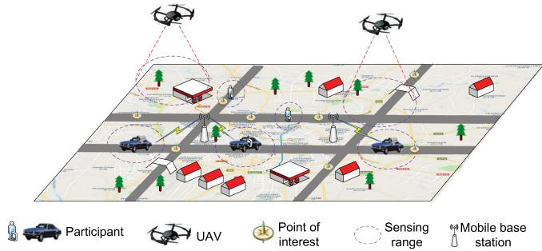  
Fig. 1. The overall scenario of the UAV-assisted MCS campaign.

Previous works mostly considered the single-task allocation scenario [23], [24], where an available human participant is associated with one task at a time. In this paradigm, if a human participant is willing to undertake multiple tasks for rewards, he/she has to wait and interact with the MCS platform for multiple rounds of assignments. Furthermore, as more and more sensing tasks may be time sensitive (such as traffic dynamic monitoring and pollution monitoring at specified locations and time intervals), it is almost indispensable to develop a generic mechanism supporting multiple concurrent MCS task assignments, in order to meet the requirements of all tasks [25], [26].

Recently, unmanned aerial vehicles (UAVs) have been considered to bring a new dimension into MCS [27], [28], [29]. Particularly, UAVs allow autonomous MCS due to the capability of fast deployment and controllable mobility. Furthermore, as the UAVs could be maintained frequently by the MCS staff, it is easier to calibrate UAVs’ sensors than that of human participants, data contributed by them are more accurate and credible. It is a better option to only employ UAVs to perform sensing tasks. However, as the UAVs are forbidden in some cities, e.g., Beijing, Seoul and Washington D.C., human participants are still needed to keep MCS campaigns running.

Here we focus on the overall scenario illustrated in Fig. 1. Imagine that several MCS tasks need to utilize sensing information in a region, e.g., air quality [30], noise level [31], traffic status [32]. For each task, there are several points of interest (PoIs) spread over the region that needs to be sensed by human participants or UAVs. The platform could offer different amounts of rewards for each PoI of a task. A human participant (hereafter referred to simply as “participant”) who is interested in the task could apply for the task. At the same time, the UAVs who act as the supplementary part begin to cruise in order to contribute sensing data or calibrate participants’ sensing data when they meet participants.

Despite the attractive advantages, UAV-assisted MCS systems face a major challenge: the on-board battery capacity of UAVs imposes a limitation on their endurance capability and performance. Hence, energy efficiency is a critical requirement for such UAV-assisted MCS systems [33]. In another word, the trajectory of each UAV should be scheduled carefully considering the locations of participants, other UAVs and PoIs, when it senses or calibrates, to avoid energy waste. Then how to allocate tasks to participants and UAVs simultaneously has become the primary issue. As the number of participants is much more than that of UAVs, an offered reward method should be well designed in order to recruit enough participants. On the other hand, the UAVs complement the participants. The trajectory of each UAV should be planned with the requirement of avoiding resource waste that a place is sensed by both participants and UAVs, but the sensing coverage should be considered.

In this paper, we propose a UAV-assisted multi-task allocation method for MCS systems with the purpose of meeting task coverage and sensing data quality requirements. The method consists of two parts, one of which is an online incentive mechanism designed for recruiting credible participants. The mechanism first calculates the maximum offered reward according to the sensing data collection condition and remaining budget. Then a task recommendation method is proposed to recruit credible participants. The other part is designed for scheduling UAV trajectories to contribute data from rarely sensed PoIs. The scheduled trajectories should avoid to sense PoIs that have been or are going to be sensed by participants or other UAVs in order to save energy. We leverage a deep reinforcement learning method to schedule trajectories for UAVs. Furthermore, UAVs are also used to calibrate sensing data contributed by participants. Here the system-level calibration is employed which aims to optimize the overall system performance by tuning the sensing parameters of all the sensors in an MCS network.

The main contribution of this paper is summarized:

We develop UMA, a multi-task allocation scheme that jointly optimizes the sensing coverage and data quality. The UMA allocates tasks to human participants and UAVs together, with the purpose of collecting high quality sensing data under task deadlines and budget constraints.

In order to allocate tasks to human participants, we design a learning-based online incentive mechanism that consists of a reward allocation step and a task recommendation step. The mechanism learns the reward offering strategy based on the law of supply and demand, in order to maximize the number of participants while guaranteeing the coverage requirement and budget constraint.

We propose a deep reinforcement learning based trajectory scheduling mechanism for UAVs, with the purpose of meeting coverage requirements of all tasks. The mechanism first takes locations of participants, other UAVs and PoIs into account, then schedules routes for each UAV to perform tasks efficiently.

We perform extensive simulations on four real data sets. Compared with four task allocation methods, the effectiveness, robustness and superiority of the proposed algorithm have been extensively evaluated in terms of diverse metrics.

The rest of this paper is organized as follows. We discuss related research efforts in Section 2. The system model is described in Section 3. We introduce the online incentive mechanism in Section 4. And the UAV trajectory scheduling and data calibration mechanism is described in Section 5. We present the simulation results in Section 6. Finally, we conclude the paper in Section 7.

## 2 RELATED WORK

In this section, we review the related literature covering four topics: task allocation methods for MCS, incentive mechanism for MCS, learning-assisted MCS and system-level calibration methods.

## 2.1 Task Allocation Methods for MCS

State-of-the-art research in task allocation methods for MCS can be divided into two categories, i.e., single task allocation and multi-task allocation methods. Zhu et al. [34] proposed a single task allocation method that reduced the total costs and improved the sensing data quality. The method consisted of three steps that modeled information, estimated cost and allocated task. Zhao et al. [35] argued that the platform did not know participants’ ability to perform tasks in advance, thus they proposed a single task allocation method that modeled participant recruitment as a multi-armed bandit game. Authors in [36] considered multi-dimensional task diversity to design a task allocation method. They formulated the platform-centric and participant-centric auction incentive mechanisms to recruit participants and compute payments. Wu et al. [37] designed a task recommend system that recommended tasks to participants based on their preference and reliability. Authors in [38] proposed a task allocation method that recommended a task to participants based on their preferences and reliability levels. Wang et al. [39] argued that tasks of MCS were usually time-sensitive and location-dependent. Therefore, they proposed a task allocation task method that took task information, such as time and location, into consideration. Authors in [40] investigated a task allocation problem by considering the competition of participants for tasks. They employed the congestion game theory to improve participant satisfaction by considering participant benefit, preference and designed a competition congestion metric. Wang et al. [41] leveraged the social network to recruit participants then allocate them tasks. The platform first selected several participants then influenced other participants using the influence propagation of the social network.

Yucel et al. [42] proposed a multi-task allocation method that took participant preferences into account, which employed Matching Theory to find the matching between participants and tasks. Wang et al. [15] argued that though the overall utility of multiple tasks is optimized, the sensing quality of individual task might poor. To deal with this problem, the authors proposed a multi-task allocation method that introduced a quality threshold for every single task. Authors in [43] proposed an online multi-task allocation method that updated the task available list for each participant in real-time. Dai et al. [44] designed a many-to-many matching algorithm to deal with the multi-task allocation problem, which took participants’ requested rewards and sensing data quality into account.

## 2.2 Incentive Mechanisms for MCS

As we know, participants need a reward to incentivize them to contribute sensing data. For location-constrained crowd sensing, Restuccia et al. [45] proposed that the capability of participants to execute sensing tasks depended on their mobility pattern, which was often uncertain. They designed an incentive mechanism that employed reverse auction to recruit participants with uncertain mobility. Xu et al. [46] presented a vehicular location-constrained crowd sensing system. The system incentivized the participants to match the sensing distribution of the sampled data to the desired target distribution with a limited budget. They formulated the incentivizing problem as a knapsack problem and proposed an algorithm named iLOCuS to solve the problem. Fan et al. [47] proposed a joint trajectory scheduling and incentive mechanism for spatio-temporal crowd sensing systems. They designed an online incentive mechanism that decided whether to recruit a participant when he/she asked to contribute sensing data. Hu et al. [48] designed a market-based incentive mechanism, which paid participants monthly or immediately through blockchain. Authors employed the Stackelberg game approach to analyze participants and task publishers’ incentive strategies. The authors in [49] proposed an incentive mechanism that formulated a Stackelberg game method to model the interactions among the platforms and participants. Zhang et al. [50] formulated the incentive model with maximizing the reliability of collected sensing data and task coverage. Authors in [51] investigated the problem of online incentive mechanisms by considering time-sensitive tasks. They proposed a method to determine a time-dependent threshold to select participants and calculate payments.

## 2.3 Learning-Assisted MCS

Machine learning techniques have been a new trend to optimize the MCS campaigns. For example, Zhu et al. [52] proposed an online participant selection method. The method first employed a deep learning method to predict participant mobility, then a greedy online algorithm was proposed to recruit participants. Authors in [53] proposed a deep reinforcement learning method to assign sensing tasks to participants with the purpose of collecting high quality sensing data and saving sensing costs. Hu et al. [54] proposed a task allocation method that employed a reinforcement learning approach to jointly consider both the previous coverage and participant current mobility predictability.

In this paper, we employ the deep reinforcement learning method to schedule the UAVs’ trajectories, which has recently attracted much attention from both industry and academia. In a pioneering work [55], the deep Q-learning (DQL) method, a reinforcement learning framework, was proposed to improve learning stability. Lillicrap et al. [56] presented an actor-critic, model-free algorithm based on the deterministic policy gradient that could operate over a continuous action space. Based on this, Lowe et al. [57] presented another actor-critic method. The method considered action policies of other agents and was able to successfully learn policies that required complex multi-agent coordination.

## 2.4 System-Level Calibration Methods

Several approaches to sensor calibration have been presented in the literature. For example, authors in [58] investigated how the fusion of data taken by sensor arrays could improve the calibration process. Lin et al. [59] proposed a two-phase data calibration method and employed two methods to train these two parts, respectively. The work required a large amount of training data to learn the calibration curve and thus could not provide real time data results, which July 05,2026 at 12:43:37 UTC from IEEE Xplore. Restrictions apply.

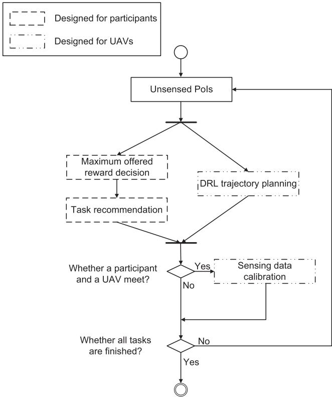  
Fig. 2. The workflow of proposed approaches.

could be summarized as the offline calibration method. Differing from the offline calibration methods, we propose an online approach, which leverages the historical calibration curve of mobile sensors to reduce calibrating times and improve data accuracy.

Compared with the existing research mentioned above, we propose a task allocation method for MCS systems that employs the UAVs and participants to jointly collect data. The coexistence of multiple concurrent tasks is taken into consideration, which makes our system more complex but more efficient. Fig. 2 illustrates the framework of our proposed approaches. In order to meet the coverage and data quality requirements of tasks, we design an incentive mechanism that calculates the maximum offered reward of each PoI and allocates the task to participants. If a PoI is rarely sensed, a higher price will be given to encourage participants to contribute sensing data. A task recommendation method helps the platform recommend tasks to credible participants who may contribute high quality sensing data. On the other hand, differing from all the above research work, the UAVs are not only employed as the supplementary part to contribute data from PoIs which are rarely sensed by participants or other UAVs, but also they are used to calibrate low precision sensor collection data of participants. The trajectory of each UAV is scheduled efficiently considering the locations of participants, other UAVs and the rarely sensed PoIs, with the purpose of avoiding energy waste. In addition, we propose a calibration approach, which could reduce the meeting times to calibrate.

## 3 SYSTEM MODEL

We consider an MCS system that provides services for smart cities every day. There are a set of $T$ concurrent tasks denoted by $\mathcal { T } \overset { \cdot } { = } \{ t | \dot { t } _ { 1 } , t _ { 2 } , \ldots , t _ { T } \}$ . Each task is associated with certain task budget $B ^ { t }$ and a set of P PoIs that is denoted by $\mathcal { P } ^ { t } = \{ p ^ { t } | p _ { 1 } ^ { t } , p _ { 2 } ^ { t } , . . . , p _ { P } ^ { t } \}$ . Furthermore, the whole P ¼ f j 1 2 . . . gsensing campaign is divided into K time-slots with equal duration L, that $\mathbf { \hat { \mathcal { K } } ^ { \mathrm { f } } } = \{ k ^ { t } | k _ { 1 } ^ { t } , k _ { 2 } ^ { t } , \dots , k _ { K } ^ { t } \}$ . Normally, the plat-K ¼ f j 1 2 . . . gform selects several pieces of sensing data contributed by participants for one PoI to get more accurate results. Each PoI needs to be sensed no more than $\eta _ { p } ^ { t }$ times by partici-hpants or 1 time by a UAV during one time-slot, and $\hat { \eta } _ { p } ^ { t } ( k ^ { t } )$ denotes the number of times PoI $p$ h^ ð Þhas been sensed until time-slot $k ^ { t }$

For a participant i who prepares to perform the task in one time-slot, he/she will claim his/her location and requested a reward at the very beginning of the time-slot. The platform will select several participants according to their requested rewards and locations, and the task requirement. Each participant has a requested reward which is denoted by $\bar { c } _ { i } ^ { t }$ for a task $t \in \tau$ . The final set of PoIs sensed 2 Tby participant i is denoted by $\mathcal { L } _ { i } = \{ x _ { i } ( k ^ { t } , p ^ { t } ) , k ^ { t } \in K ^ { t } , p ^ { t } \in$ ${ \mathcal { P } } ^ { t } \}$ , where $x _ { i } ( k ^ { t } , p ^ { t } ) = 1$ L ¼ f ð Þ 2 K 2denotes participant i contributes a P g ð Þ ¼ 1piece of sensing data for task t at PoI $p ^ { t }$ when timeslot is $k ^ { t } ,$ otherwise $x _ { i } ( k ^ { t } , p ^ { t } ) = 0$ . And the corresponding final reward ð Þ ¼ 0of the recruited participant i is denoted by $c ( \bar { \mathcal { L } } _ { i } )$ . The set of high quality sensing data is denoted by $\mathcal { L } _ { i } ^ { \tilde { h } } = \{ y _ { i } ( k ^ { t } , p ^ { t } ) , k ^ { t } \in$ $\mathcal { K } ^ {  } , p ^ { t } \dot { \in } \mathcal { P } ^ { t } \dot  \}$ , where $y _ { i } ( k ^ { t } , p ^ { t } ) = 1$ L ¼ f ð Þ 2denotes participant i con-K 2 P g ð Þ ¼ 1tributes a piece of high quality sensing data for task t at PoI $p ^ { t }$ when time-slot is $\breve { k ^ { t } }$ , otherwise $y _ { i } ( k ^ { t } , p ^ { t } ) = 0$

ð Þ ¼ 0We consider sensing tasks as that all UAVs fly around to cover PoIs. In the beginning, a UAV j that is with a fully charged battery moves with the vector velocity $v _ { j } ( k ^ { t } ) =$ $( \theta _ { j } ^ { v } ( \bar { k ^ { t } } ) , d _ { j } ^ { v } ( k ^ { t } ) ) _ { j \in \mathcal { T } } ,$ , where $| v _ { j } ( k ^ { t } ) | \in [ 0 , | v _ { m a x } | ] , \ \theta _ { j } ( k ^ { \bar { t } } ) \in [ 0 , 2 \pi )$ ðu ð Þ ð ÞÞ 2Jis a direction and $d _ { j } ( k ^ { t } )$ ð Þj 2 ½0 j j u ð Þ 2 ½0 2pÞis speed. The vector velocity is ð Þcontrolled by the vector acceleration, which is denoted by $a _ { j } ( k ^ { t } ) = \ ( \theta _ { j } ^ { a } \bar { ( k ^ { t } ) } , d _ { j } ^ { a } ( k ^ { t } ) ) _ { j \in \mathcal { J } } .$ Here, we consider the energy ð Þ ¼ ðu ðconsumption $e _ { j } ( k ^ { t } )$ ÞÞ 2J, which is simply proportional to flying distance, i.e., $\bar { e } _ { j } ( k ^ { t } ) = \gamma d _ { j } ( k ^ { t } )$ . And the battery capacity is denoted by $E _ { j } .$ ð Þ ¼ g ð Þ. The final coverage set is denoted by $\dot { \mathcal { L } } _ { j } =$ $\{ x _ { j } ( k ^ { t } , p ^ { t } ) , \mathrm { ~ } \mathrm { ~ } \mathrm { ~ } k ^ { t } \in \mathcal { K } ^ { t } , p ^ { t } \in \mathcal { P } ^ { t } \}$ , where $x _ { j } ( k ^ { t } , p ^ { t } ) = 1$ L ¼denotes a f ð Þ 2 K 2 P g ð Þ ¼ 1UAV j contributes a piece of high quality sensing data for task t at PoI $p ^ { t }$ when timeslot is $\mathit { \bar { k } ^ { t } } .$ , otherwise $x _ { j } ( \bar { k } ^ { t } , p ^ { t } ) = 0$ The set of calibration is denoted by $\mathcal { L } _ { j } ^ { m } = \{ y _ { j } ( k ^ { t } , i ) , k ^ { t } \in K ^ { t } \}$ where $y _ { j } ( k ^ { t } , i ) = 1$ L ¼ f ð Þ 2 K gdenotes that a UAV j calibrates sens-ð Þ ¼ 1ing data for participant i when timeslot is $k ^ { t } ,$ otherwise $y _ { j } ( k ^ { t } , i ) = 0$

Þ ¼ 0The frequently used notations are summarized in Table 1.

The target of this paper is to maximize the number of collected high quality sensing data in order to meet the coverage requirement under the consideration of the budget and UAV energy constraints, which can be formulated as

$$
\begin{array} { r l } & { \mathrm { m a x i m i z e : ~ } \displaystyle \sum _ { t = 1 } ^ { T } \left| \bigcup _ { i \in \{ 1 , 2 , \ldots , I \} } \mathcal { L } _ { i } ^ { h } \right| + \left| \bigcup _ { j \in \{ 1 , 2 , \ldots , J \} } \mathcal { L } _ { j } \right| * \eta _ { p } ^ { t } } \\ & { \mathrm { s u b j e c t ~ t o : ~ } \displaystyle \sum _ { t = 1 } ^ { T } \sum _ { k ^ { t } = 1 } ^ { K } \sum _ { i = 1 } ^ { I } c ( \mathcal { L } _ { i } ) \leq \sum _ { t = 1 } ^ { T } B ^ { t } , } \\ & { \qquad \displaystyle \sum _ { t = 1 } ^ { T } \sum _ { k ^ { t } = 1 } ^ { K } e _ { j } ( k ^ { t } ) \leq E _ { j } , } \end{array}\tag{1}
$$

where I and J is the number of recruiting participants and $\mathrm { U A V s } ,$ , respectively. $\vert \bigcup _ { i \in \{ 1 , 2 , . . . , I \} } \mathcal { L } _ { i } ^ { h } \vert + \vert \stackrel { \smile } { \bigcup } _ { j \in \{ 1 , 2 , . . . , J \} } \hat { \mathcal { L } } _ { j } \vert \ast \boldsymbol { \eta } _ { p } ^ { t }$ j 2f1 2 ... gL j þ j 2f1 2 ... gL j  hdenotes the total contributed high quality sensing data for July 05,2026 at 12:43:37 UTC from IEEE Xplore. Restrictions apply.

TABLE 1 List of Important Notations
<table><tr><td>Notation</td><td>Explantation</td></tr><tr><td> $\mathcal { T } , B ^ { t } , \mathcal { P } ^ { t } , \mathcal { K } ^ { t }$ </td><td>Set of tasks, budget of one task, set of PoIs, set of timeslots</td></tr><tr><td> $\eta _ { p } ^ { t } , \hat { \eta } _ { p } ^ { t } ( k ^ { t } )$ </td><td>No. of requested pieces of sensing data, No. of collected pieces of sensing data until  $k ^ { t }$ </td></tr><tr><td> $\mathscr { L } _ { i } , \mathscr { L } _ { i } ^ { h } c _ { i } ^ { k } , c ( \mathscr { L } _ { i } )$ </td><td>Set of sensed PoIs, set of contributed high quality sensing data, the required reward during time slot k</td></tr><tr><td> $v _ { j } ( k ^ { t } ) , a _ { j } ( k ^ { t } )$ </td><td>and the total offered reward Vector velocity and acceleration of  $\mathrm { U A V } ~ j$ </td></tr><tr><td> $e _ { j } ( k ^ { t } ) , E _ { j }$ </td><td>Energy consumption and battery capacity of  $\mathrm { U A V } ~ j$ </td></tr><tr><td> $\bar { \mathcal { L } } _ { j } , \bar { \mathcal { L } } _ { j } ^ { m }$   $c ^ { t } , c _ { p } \dot { ( k ^ { t } ) } , c _ { p } ^ { f } ( k ^ { t } )$ </td><td>Set of PoIs collected by  $\mathrm { U A V } j ,$  set of calibration Basic reward, floating reward and the maximum</td></tr><tr><td> $P _ { i } ^ { t } ( k ^ { t } )$ </td><td>offered reward in PoI p at timeslot kt Probability of high quality sensing data contributed</td></tr></table>

task $t . \ \eta _ { p } ^ { t }$ is the number of required times sensed from a PoI. $\eta _ { p } ^ { t } * \left| \mathcal { P } ^ { t } \right| ^ { r } * \left| \mathcal { K } ^ { t } \right|$ denotes the number of required high quality h  jP j  jK jsensing data of task t. The range of the problem formulation is [0,1], where 0 means there is no high quality sensing data contributed. On the contrary, 1 means the coverage requirement of the task has been fully satisfied.

Lemma 1. The target of this paper is an NP-hard problem.

Proof. The budget limited maximum coverage problem has been proved to be an NP-complete problem, which can be described as follows: given a collection of sets ${ \boldsymbol { S } } =$ $\{ S _ { 1 } , S _ { 2 } , \ldots , S _ { m } \}$ with associated costs $\{ c _ { i } \} _ { i = 1 } ^ { m }$ S ¼is defined fS1 S2 . . . S gover a domain of weighted elements ${ \mathcal { X } } = \{ x _ { 1 } , x _ { 2 } , \ldots , x _ { n } \}$ with associated weights $\{ \omega _ { i } \} _ { i = 1 } ^ { n }$ X ¼ f 1 2 . . . g. The goal is to find a collect of sets ${ \mathcal { S } } ^ { ' } \subseteq { \mathcal { S } } ,$ fv g ¼1such that the total cost of sets in $\boldsymbol { \mathcal { S } ^ { ' } }$ S does not exceed $L ,$ Sand the total weight of elements covered by $\boldsymbol { \mathcal { S } } ^ { ' }$ is maximized.

SWe prove the lemma by reducing the previous problem to an instance of (1). Imagine there is only one task performed one time-slot. And the task requires one piece of data from a PoI, that $T = 1 , K = 1$ and $\eta _ { p } = 1$ . For sim-¼ 1 ¼ 1 h ¼ 1plicity, we also assume that only participants perform the task. Then (1) could be formulated as

$$
\begin{array} { r l } & { \mathrm { m a x i m i z e : } \ \displaystyle \frac { \left| \bigcup _ { i \in \{ 1 , 2 , \ldots , I \} } { \mathcal { L } } _ { i } ^ { h } \right| } { | \mathcal { P } | } } \\ & { \mathrm { s u b j e c t ~ t o : } \ \displaystyle \sum _ { i = 1 } ^ { I } c ( { \mathcal { L } } _ { i } ) \leq B . } \end{array}\tag{2}
$$

For a collection PoI sets of $\mathcal { L } = \{ \mathcal { L } ^ { 1 } , \mathcal { L } ^ { 2 } , \ldots , \mathcal { L } ^ { m } \}$ . Each element ${ \mathcal { L } } ^ { m } \in { \mathcal { L } }$ L ¼ fL L . . . L gcontains several numbers of PoIs, and the L 2 Ldomain of PoIs is denoted by $\mathcal { P } = \{ p _ { 1 } , p _ { 2 } , . . . , p _ { n } \}$ with associated maximum offered reward $\{ c _ { p } ^ { f } \} _ { p = 1 } ^ { n }$ . g offered reward of $\mathcal { L } ^ { m }$ is denoted by $c ^ { m }$ f g ¼1. The target of (2) Lis to find a set of participants under budget constraints with the purpose of covering the maximum number of PoIs. In another word, the target is to find a collection of PoI sets ${ \mathcal { L } } ^ { \prime } \subseteq { \mathcal { L } }$ , where $\textstyle { \mathcal { L } } ^ { \prime } = { \big \mathrm { \top } } \bigcup _ { i \in \{ 1 , 2 , \dotsc , I \} } { \mathcal { L } } _ { i } ^ { h }$ , in order to maximize $| { \mathcal { L } } ^ { \prime } | / | { \mathcal { P } } |$ L ¼ 2f1 2 .under the budget B.

Lj j jPjAs demonstrated above, the budget limited maximum coverage problem is as complex as the simplified $( 2 ) ,$ which means that the proposed maximum target (1) is also NP-complete, and then completes the proof. □

## 4 ONLINE INCENTIVE MECHANISM

we design an online incentive mechanism that consists of a reward allocation step and a task recommendation step. For the reward allocation step, we decide the maximum offered reward considering the data collecting situation. For the task recommendation step, we predict which tasks are good for a participant for performing.

## 4.1 Maximum Offered Reward Decision Mechanism

Following the former work [60], the reward paid for sensing acts as a signal to reflect sensing data supply and demand, which depends on the demand of the platform and the supply of participants. Here we employ the maximum offered reward to decide the maximum reward offered to the participants. The maximum offered reward of every time-slot is denoted by $c _ { p } ^ { f } ( k )$ , which consists of the basic offered reward $c ^ { t }$ ð Þand floating reward $c _ { p } ( k )$ . For the sake of simplicity, here-ð Þafter we drop the task index t and treat all tasks equally.

The basic offered reward indicates the ideal fixed cost if the amount of requested sensing data is collected under budget constraints. The floating reward exists to make the maximum offered reward higher or lower, based on the number of participants or data collected consideration. For example, the maximum offered reward could be higher for a PoI, if there is less amount of sensing data collected.

The deep reinforcement learning based method is employed to calculate the floating reward offered for one piece of sensing data in every PoI at each timeslot. Coarsely speaking, the proposed method involves a decision agent that repeatedly observes the current states of the participant recruitment, then takes an action among the available actions allowed in that state. After, the agent will transfer to a new state and obtain the corresponding reward.

1) State Space: $\mathcal { N } \triangleq \{ \backslash ^ { k } = ( N _ { 1 } ^ { k } , \bar { N } _ { 2 } ^ { k } ) \}$ denotes the state that N fn ¼ ð 1 2 Þgindicates whether the participant is recruited or not.

2) Action Space: $\mathcal { A } \triangleq \{ a ^ { k } | a \in \mathcal { V } \}$ denotes the action set.

A f j 2 Vg3) Probability Distribution and State Transition: $F \colon \mathcal { N } \times \mathcal { A } \times$ $\mathcal { N }  [ 0 , 1 ]$ denotes the probability distribution $P \{ \setminus ^ { k + 1 } | \setminus ^ { k } ,$ $\{ a ^ { k } \} _ { k \in \mathcal K } \}$ 1 fn jof a state transition, in which the current state is $\bigwedge ^ { k }$ f g 2Kgand when action $a ^ { k }$ nis chosen, the state is transitioned to a new state $\backslash ^ { k + 1 }$

n4) Reward Function: $\mathcal { N } \times \mathcal { A }  \mathbb { R }$ expresses the expected N  A !immediate reward received after the state is transitioned from ${ \mathrm { \backslash } } ^ { k } { \mathrm { t o } } . { \mathrm { \backslash } } ^ { k + 1 }$ , due to taking the action $a ^ { k } ,$ , which is defined as: $r ^ { k } \stackrel { \cdot } { = } e ^ { a ^ { k } } \stackrel { \cdot } { / } \sum _ { Z = 1 } ^ { Z } e ^ { v _ { z } }$ . Here we employ the softmax value to ¼ ¼1calculate the reward.

5) Problem Formulation: When state transition $F$ and reward function $r _ { p } ^ { k } , p \in \mathcal { P } .$ , is predetermined, for each timeslot $k ,$ 2 Pour problem can be formulated as

$$
\begin{array} { l } { { \displaystyle Q _ { p } ( { \bf \big \backslash } ^ { k } ) = \operatorname* { m a x } _ { a _ { p } ^ { k } } \left[ r _ { p } ^ { k } ( { \bf \big \backslash } ^ { k } , a _ { p } ^ { k } ) \right. } \ ~ } \\ { { \displaystyle \qquad + \left. \gamma \int _ { { \bf \big \backslash } ^ { k } \in \mathcal { N } } F ( { \bf \big \backslash } ^ { k } , a _ { p } ^ { k } , { \bf \big \backslash } ^ { k + 1 } ) Q _ { p } ( { \bf \big \backslash } ^ { k + 1 } ) \right] } , } \end{array}
$$

and the optimal strategies of the floating reward is given by

$$
\begin{array} { l } { { \displaystyle c _ { p } ( k ) = \arg \operatorname* { m a x } _ { a _ { p } ^ { k } } \left[ r _ { p } ^ { k } ( \setminus ^ { k } , a _ { p } ^ { k } ) \right. } \ ~ } \\ { { \displaystyle ~ + \left. \gamma \int _ { \setminus ^ { s } \in { \cal N } } F ( \setminus ^ { k } , a _ { p } ^ { k } , \setminus ^ { k + 1 } ) Q _ { p } ( \setminus ^ { k + 1 } ) \right] } . } \end{array}\tag{3}
$$

Based on (3), the floating reward can be decided in PoI $p$ at time-slot k. Here a special phenomenon is also considered, that the budget could not afford the sum of maximum offered reward of all PoIs. For this reason, some rarely sensed PoIs are more important. Therefore, a method is needed to help the platform recruit participants preferentially from these PoIs under the limited budget. Here the Shapley method is employed to identify which PoIs are important, which is shown as

$$
\lambda _ { p } ( k ) = \sum _ { \mathcal { P } ^ { \prime } \subseteq \mathcal { P } \setminus \{ p \} } \frac { | \mathcal { P } ^ { \prime } | ! \big ( | \mathcal { P } | - | \mathcal { P } ^ { \prime } | - 1 \big ) ! } { | \mathcal { P } | ! } f \big ( \mathcal { P } ^ { \prime } \bigcup \{ p \} \big ) ,\tag{}
$$

where $f \left( { \mathcal { P } } ^ { \prime } \cup \{ p \} \right)$ is the marginal value, which is shown as

$$
\begin{array} { r l } {  { f ( \mathcal { P } ^ { \prime } \bigcup \{ p \} ) = } } \\ & { ~ \sum _ { \tau = 1 } ^ { \eta _ { p } ( k ) } \Bigg ( \Bigg ( 1 - \frac { \mathbb { I } [ \eta _ { 1 } ( k ) , \eta _ { 2 } ( k ) , \dotsc , \eta _ { | \mathcal { P } ^ { \prime } | } ( k ) , \eta _ { p } ( k ) - \tau ] \mathbb { I } _ { F } } { \eta \sqrt { | \mathcal { P } ^ { \prime } \bigcup \{ p \} | } } \Bigg ) } \\ & { - \Bigg ( 1 - \frac { \mathbb { I } [ \eta _ { 1 } ( k ) , \eta _ { 2 } ( k ) , \dotsc , \eta _ { | \mathcal { P } ^ { \prime } | } ( k ) ] \mathbb { I } _ { F } } { \eta \sqrt { | \mathcal { P } ^ { \prime } | } } \Bigg ) \Bigg ) , } \end{array}
$$

where $\eta _ { p } ( k ) = \eta _ { p } - \hat { \eta } _ { p } ( k ) , p \in \mathcal { P }$ is the number of pieces of h ð Þ ¼ h  h^ ð Þ 2 Psensing data that has not been collected yet, and $\| \hat { \cdot } \| _ { F }$ is the k 	 kFrobenius norm, which is mathematically used to measure the spatial length of a matrix, to quantify the difference between the required and attained values.

The maximum offered reward decision mechanism is presented in Algorithm 1. First the basic reward is calculated in Line 2. Then the mechanism calculates the floating reward for each PoI at one timeslot, and the maximum offered reward (Line 4 - Line 8). Finally, the Shapley method is used to rank all of PoIs in descending order (Line 9 - Line 10).

Algorithm 1. Maximum Offered Reward Decision   
Mechanism   
Input: Budget $B ^ { t } ,$ , sensing requirement $\eta _ { p } ,$ time-slot $\textstyle { \mathcal { K } } ^ { t }$   
h KOutput: The new sensing ranges of PoIs and the maximum   
offered reward of every PoI $c _ { p } ^ { f } ( k ^ { t } )$ at timeslot $k ^ { t }$   
ð Þ1: /\*Calculating the basic offered reward\*/   
2: $c ^ { t } = B ^ { t } / ( P * \eta _ { p } ) ;$   
¼ ð  h Þ3: /\*iterating through all of PoIs\*/   
4: for $l = 1 , \ldots , P$ do   
¼ 1 . . .5: Calculate the floating reward candidate by (3);   
6: /\*Calculating the maximum offered reward\*/   
7: $c _ { p } ^ { f } ( k ^ { t } ) = c ^ { t } + \overline { { c } } _ { p } ( k ^ { t } ) ;$   
ð Þ8: end for   
9: Calculate Shapley value $\lambda _ { p } ( k ^ { t } )$ by (4);   
10: Rank PoIs using $\dot { \lambda } _ { p } ( k ^ { t } )$ ð Þin descending order;

## 4.2 Task Recommendation Method

Several tasks need to be issued along a participant’s trajectory. Before recommending the participant tasks, it is essential to predict which tasks are good for him/her, with the purpose of collecting high quality sensing data. The quality of data is denoted by $q _ { i , n } ^ { t } ,$ which is contributed by a participant i for task $t \in \tau$ in the nth time. Here, we also drop the 2 Ttask index t for the same reason. Following our previous work [60], the quality of sensing data contributed by a participant is modeled as a semi-Markov with discrete time.

The kernel part of semi-Markov is defined in (5). $W _ { i } ^ { u h } ( k )$ ð Þdenotes the probability that a participant i contributes high quality sensing data in nth time at a timeslot $k ,$ given he/she contributed unusable quality sensing data in the $( n - 1 )$ th time. $f _ { i } ( k ) \leq \Lambda$ ð  1Þmeans the participant contributes sensing ð Þ data in the time duration L. Here we assume that a participant will contribute sensing data before the end of the timeslot.

$$
W _ { i } ^ { u h } ( k ) = P ( q _ { i , n } = h , f _ { i } ( k ) \leq \Lambda | q _ { i , n - 1 } = u ) .\tag{}
$$

Next, the probability that a participant i contributes high quality sensing data at the nth time while he/she contributes unusable quality data at last time, before time duration $\Lambda ,$ is denoted by $Z _ { i } ^ { u h } \dot { ( \cdot ) }$ , which is shown as

$$
\begin{array} { l } { { \displaystyle Z _ { i } ^ { u h } ( \Lambda ) = P ( f _ { i } ( k ) \le \Lambda | q _ { i , n } = h , q _ { i , n - 1 } = u ) } } \\ { { \displaystyle \qquad = \sum _ { x = 1 } ^ { \Lambda } P ( f _ { i } ( k ) = x | q _ { i , n } = h , q _ { i , n - 1 } = u ) . } } \end{array}\tag{6}
$$

The probability that a participant i contributes high quality sensing data at the nth time, when he/she contributes unusable quality data at the $( n - 1$ th time is calculated by

$$
P _ { i } ^ { u h } = P ( q _ { i , n } = h | q _ { i , n - 1 } = u ) = \frac { n u m _ { i } ^ { u h } } { n u m _ { i } ^ { u } } ,\tag{}
$$

where $n u m _ { i } ^ { u h }$ is the number of times data quality contributed from unusable to high quality, while numu is the number of times unusable data contributed.

We rewrite (5) based on (6) and (7), which is shown as

$$
\begin{array} { r c l } { { } } & { { } } & { { W _ { i } ^ { u h } ( k ) = P ( q _ { i , n } = h , f _ { i } ( k ) \le \Lambda | q _ { i , n - 1 } = u ) } } \\ { { } } & { { } } & { { } } \\ { { } } & { { } } & { { = Z _ { i } ^ { u h } ( \Lambda ) P _ { i } ^ { u h } . } } \end{array}\tag{8}
$$

Based on (8), the probability that a participant i contributes high quality sensing data at a timeslot k is shown as

$$
P _ { i } ( k ) = \frac { W _ { i } ^ { u h } ( k ) + W _ { i } ^ { h h } ( k ) } { W _ { i } ^ { u h } ( k ) + W _ { i } ^ { u u } ( k ) + W _ { i } ^ { h u } ( k ) + W _ { i } ^ { h h } ( k ) } .\tag{}
$$

The task recommendation method is shown in Algorithm 2, correspondingly we describe the main processes as follows.

Step 1: At the beginning of each time-slot $k ^ { t } ,$ , the maximum offered reward of every PoI is calculated by Algorithm 1 in Line 4, along with the new sensing range.

Step 2: The platform begins to allocate tasks to participants. For a PoI of each task which is in the sensing range of participant i. If the rest budget could afford the maximum offered reward, and there is still several amount of sensing data needed to be collected, then the PoI has a chance to be sensed (see Line 8). After that, the platform calculates probability $P _ { i } ^ { t } ( k ^ { t } )$ to decide whether the PoI $p ^ { t }$ ð Þcould be performed by the participant i. If the result is positive, the platform collects the PoI for recommendation (see Line 9-13).

Step 3: The crowd sensing campaign will be ended when one of the three conditions is met:

The last sensing time-slot is finished.

 The required amount of sensing data is met.

 The budget is exhausted.

Algorithm 2. Task Recommendation Mechanism   
Input: Budget $B ^ { t } ,$ , uncollected data $\eta _ { p } ( k ^ { t } )$ , time-slot $\textstyle { \mathcal { K } } ^ { t }$   
Output: Recommended PoI set $\mathcal { L } _ { i } ^ { \prime }$   
1: $k ^ { t } = 1 ;$   
2: $/ ^ { * }$ ¼ 1iterating through all of time-slots\*/   
3: while $k ^ { t } \le K$ do   
4: Calculating the new sensing range of PoIs with the   
maximum offered rewards in Algorithm 1;   
5: $p ^ { t } = 1 ;$   
6: ¼ 1/\*Starting to allocate tasks\*/   
7: while $p ^ { t } \overset { \smile } { \le } P$ && $p ^ { t }$ is in the sensing range of   
participant i do   
8: if $\tilde { B ^ { t } } - c _ { p } ^ { f } ( k ^ { t } ) \geq 0 \& \& \eta _ { p } ( k ^ { t } ) > 0$ then   
9: Calculate $P _ { i } ^ { t } ( k ^ { t } )$ by (9);   
10: ð Þnum with probability $P _ { i } ^ { t } ( k ^ { t } ) ;$   
11: ¼ 1num   
12: $\{ k ^ { t } , p ^ { t } \} \to \mathcal { L } _ { i } ^ { \prime } ;$   
13: fend if   
14: end if   
15: $/ ^ { * }$ For the next PoI\*/   
16: $p ^ { t } = p ^ { t } + 1 ;$   
17: ¼ þend while   
18: /\*For the next time-slot\*/   
19: $k ^ { t } = k ^ { t } + 1 ;$   
¼20: end while

## 5 UAV TRAJECTORY SCHEDULING AND DATA CALIBRATION MECHANISMS

In this section, we first introduce a UAV trajectory scheduling mechanism, which directs the UAVs to contribute sensing data from PoIs which are rarely accessed by participants. Then a sensing data calibration method is proposed to improve the quality of data collected by participants. It is worth noting that both trajectory scheduling and data calibration methods are calculated by the platform which is typically run on a cloud server. The UAVs receive and follow commands. More details are introduced in the sections below.

## 5.1 Learning-Based UAV Trajectory Scheduling Mechanism

As we mentioned in Section 1, there are two purposes for UAVs, i.e., data collection and calibration. Here we present the proposed Learning-based UAV trajectory scheduling mechanism for achieving these two purposes. We formulate our problem as a Markov Decision Process. It is noted that we also drop the task index t for the same reason.

1) State space and observation space: $S = \{ s ^ { k } | k \in \mathcal { K } \}$ denotes   
the state set of an MDP, where $s ^ { k }$ ¼ f j 2 Kgconsists of four parts. The   
first part is the state set of all UAVs that $\{ ( \boldsymbol { x } _ { j } ^ { k } , \boldsymbol { \hat { y } } _ { j } ^ { k } ) , \boldsymbol { e } _ { j } ^ { k } \} _ { j \in \mathcal { I } } ,$   
where $( x _ { i } ^ { k } , y _ { i } ^ { k } )$ fðdenotes the current position of a $\check { \mathrm { U A V } } \dot { \boldsymbol { j } }$ Jin   
time k. $e _ { j } ^ { \vec { k } } \in [ 0 \% , 1 0 \% \% ]$ denotes the remaining energy of a   
2 ½0% 100%UAV j that is expressed by a percentage. The second part is   
the state set of all participants that $\{ ( \breve { x } _ { i } ^ { k } , y _ { i } ^ { k } ) , m _ { i } ^ { k } \} _ { i \in \mathcal { T } } ,$ where   
$( x _ { i } ^ { k } , y _ { i } ^ { k } )$ fð Þis the position of a participant i in time $k ,$ 2Iand $m _ { i } ^ { k }$   
ð Þthe accumulated number of calibrating times with $\mathrm { U A V s } .$ Authorized licensed use limited to: Guangxi University. Downloaded

The third part is the obstacle position that $\{ ( x _ { o } , y _ { o } ) \}$ that fð ÞgUAVs should avoid hitting. The forth part is the state set of all PoIs that $\{ ( x _ { p } , y _ { p } ) , f _ { p } ^ { k } \}$ , where $( x _ { p } , y _ { p } )$ denotes the position of PoI $p .$ fð. And $\bar { f } _ { p } ^ { k }$ Þ g ð Þdenotes the sensing requirement completion percentage of PoI $p$ in time k that can be expressed as

$$
f _ { p } ^ { k } = \left\{ \begin{array} { l l } { \frac { \hat { \eta } _ { p } ( k ) } { \eta _ { p } } \mathrm { ~ , ~ i f ~ } \hat { \eta } \mathrm { p ( k ) } \leq \eta \mathrm { p } } \\ { 1 \qquad \mathrm { o t h e r w i s e } } \end{array} \right. .
$$

However, each UAV only knows a part of information of the state space which is called observation. The observation space is denoted by $\mathcal { O } ^ { k } = \{ o _ { i } ^ { k } | j \in \mathcal { I } , o _ { i } ^ { k } \subseteq s ^ { k } \}$

O ¼ f j 2 J  g2) Action space: The action set is denoted by $\mathcal { A } = \{ a _ { i } ^ { k } =$ $( \theta _ { j } ^ { a } ( k ) , d _ { j } ^ { a } ( k ) ) _ { j \in \mathcal { I } } \lvert \theta _ { j } ^ { a } ( k ) \in [ 0 , 2 \pi ) , d _ { j } ^ { a } ( k ) \in [ 0 , d _ { m a x } ] \}$ A ¼, where $\theta _ { j } ^ { \check { a } } ( k )$ ðu ðand $d _ { j } ^ { a } ( \dot { k } )$ ð ÞÞ 2J ju ð Þ 2 ½0 2pÞ ð Þ 2 ½0is direction and acceleration value of $\mathrm { U A V } ~ j$ u ð Þat time $k ,$ ð Þrespectively.

3) Probability distribution and state transition: $F : S \times \mathcal { A } \times$ $s \to [ 0 , 1 ]$ denotes the probability distribution $P \{ s ^ { k + 1 } | s ^ { k } .$ $\{ a _ { j } ^ { k } \} _ { j \in \mathcal { I } } \}$  f jof a state transition, in which the current state is $s ^ { k }$ f g 2J gand when action $a _ { j } ^ { k }$ is chosen, the state is transitioned to a new state $s ^ { k + 1 }$

4) Reward function: $s \times \mathcal { A } \to \mathbb { R }$ expresses the expected S  A !immediate reward received after the state is transitioned from $s ^ { k }$ to $s ^ { k + 1 }$ , due to taking the action $\{ a _ { j } ^ { k } \} _ { j \in \mathcal { I } ^ { \prime } }$ which is defined as: $r _ { j } ^ { k } = ( \mu o _ { j } ^ { k } + ( 1 - \bar { \mu ) } l _ { j } ^ { k } ) / e _ { j } ( k ) - g _ { j } ^ { k } ,$ g 2J, where $o _ { i } ^ { k }$ is the ¼ ðm þ ð1  mÞ Þ ð Þ amount of data collected by a UAV j at timeslot $k , l _ { j } ^ { \check { k } }$ is the number of calibrating (meeting) times with participants. And $\mu \in [ 0 , 1 ]$ is a parameter to decide the higher priority m 2 ½0 1between data collection and calibration campaign. The platform can adjust the value of $\mu$ for adapting to different sce-mnarios and task requirements. When UAV hits an obstacle or moves out of the area border in the timeslot $k ,$ the penalty $g _ { i } ^ { k }$ should be taken off. Therefore, the reward definition $r _ { j } ^ { \bar { k } } , \forall j$ 8can be considered to incorporate three objectives, data collection amount, times of calibration and energy consumption.

5) Problem formulation: When state transition $\mathbf { \Delta } _ { F } ^ { \dag }$ and reward function $r _ { i } ^ { k } , k \in \mathcal { K } , j \in \mathcal { I }$ is predetermined, for each stage $s ,$ 2 K 2 Jour problem can be formulated as

$$
\begin{array} { l } { { \displaystyle Q _ { j } ( s ^ { k } ) = \operatorname* { m a x } _ { a _ { j } ^ { k } } \left[ r _ { j } ^ { k } ( s ^ { k } , a _ { j } ^ { k } ) \right. } \ ~ } \\ { { \displaystyle ~ \left. + \gamma \int _ { s ^ { k + 1 } \in S } F ( s ^ { k } , a _ { j } ^ { k } , s ^ { k + 1 } ) Q _ { j } ( s ^ { k + 1 } ) \right] } , } \end{array}
$$

and the optimal strategies of a UAV j is given by

$$
\begin{array} { l } { \pi _ { j } = \displaystyle \arg \operatorname* { m a x } _ { a _ { j } ^ { k } } \big [ r _ { j } ^ { k } ( s ^ { k } , a _ { j } ^ { k } ) } \\ { \qquad + \gamma \int _ { s ^ { k + 1 } \in S } F ( s ^ { k } , a _ { j } ^ { k } , s ^ { k + 1 } ) Q _ { j } ( s ^ { k + 1 } ) \big ] , } \end{array}
$$

where $\gamma \in ( 0 , 1 )$ represents the discount factor, which g 2 ð0 1Þshows the importance between the future reward and present reward.

Obviously, it is a continued control problem that cannot be solved via the conventional dynamic programming method. In addition, since our scenario is fully distributed as a multiagent environment, a UAV’s reward is affected by the actions of many other UAVs. Hence, we employ the Multi-Agent Deep Deterministic Policy Gradient (MADDPG) approach to find the suboptimal solution.

In our proposed solution for the UAV trajectory scheduling problem, each UAV j has its policy decision network, which is divided into three parts: CNN extracts features of the observation $o _ { j } ^ { k } ,$ actor network decides the action and critic network estimates the action, where the design and implement of actor network and critic network are based on MADDPG. First, we utilize the CNN to extract features from the observation $o _ { j } ^ { k } ,$ in order to help each UAV to make decisions, including: (a) the related positions with PoIs/obstacles/participants, (b) the distribution of PoIs that do not meet the number of sensing requirements, (c) the distribution of the meeting times with each participant. We next utilize the observation feature results extracted from the CNN, action and reward to train the actor model and critic model. The actor model decides the action of UAV j according to the observation, and the critic model will unite with the action of other UAVs and the overall state to estimate its action, aiming to prove the overall reward. It is noted that, in our solution, a UAV has its policy to collect data or calibrate sensors, which is more suitable to our scenario compared with methods that the UAVs use the same policy.

## 5.2 Sensing Data Calibration Method

As we mentioned in Section 1, sensors suffer from noise and drift over time. Here we adopt the sensing data calibration method to calibrate contributed sensing data from these sensors. It is worth noting that the proposed method is a system-level calibration method that works for data of air quality, environment noise and GPS location, etc. For a task $t \in \mathcal T$ , inspired by dimension projection [61], we project the 2 Tmeasurements of mobile sensors into high dimensional space. Then, we adopt the linear regression model in matrix form as $\pmb { x } _ { i } ( \pmb { o } ) = \Phi _ { i } ( \bar { \pmb { o } } ) \pmb { w } _ { i } + \pmb { e } _ { i } ( \pmb { o } )$ , where o is a two dimen-ðsional matrix $o \subseteq \mathcal { K } \times \mathcal { P } . \ \Phi _ { i } ( o ) = [ \phi ( y _ { i } ^ { p } ( k ) ) , \{ k , p \} \in o ] ^ { T }$ , and $y _ { i } ^ { p } ( k )$  K  P ð Þ ¼ ½fð ð ÞÞ f g 2 is the measurement of sensing data contributed by a ð Þparticipant i in PoI p at timeslot $k , w _ { i }$ is the vector of calibration curve of participant $i ,$ that $\pmb { w } _ { i } = [ \omega _ { 1 } ^ { i } \ \omega _ { 2 } ^ { i } \ \dots \ \omega _ { P } ^ { i } ] ^ { T } . e _ { i } ( o )$ is the matrix of noise $\bar { \varepsilon _ { i } ^ { p } } ( k )$ , that $e _ { i } ( o ) = [ \varepsilon _ { i } ^ { p } ( k ) , \{ k , p \} \in o ] ^ { T }$

Let $p ( \pmb { w } _ { i } )$ ð Þ ð Þ ¼ ½ ð Þbe the prior distribution of $w _ { i } ,$ g 2that $p ( w _ { i } ) =$ $\mathcal { N } ( \pmb { w } _ { i } | \mu _ { i } , \Sigma _ { i } )$ , where $\mu _ { i }$ and $\Sigma _ { i }$ ð Þ ¼are the prior mean vector and N ð jm Þ mprior covariance matrix of $w _ { i } ,$ respectively. $\mathcal { N } ( \cdot )$ denotes the N ð	Þprobability density function of Gaussian distribution. The noise $\varepsilon _ { m } ^ { a , l } ( \dot { t } )$ is also supposed to follow Gaussian distribu-ð Þtion, where $p ( \varepsilon _ { i } ^ { p } ( k ) ) = \bar { \mathcal { N } } ( \varepsilon _ { i } ^ { p } ( k ) | 0 , \beta _ { i } )$ . Then, the probability ð ðdensity function of $\pmb { x } _ { i } ( \pmb { o } )$ N ð ð Þj0 bis shown as

$$
\begin{array} { r l } & { p ( \pmb { x } _ { i } ( o ) | \pmb { w } _ { i } ) = \displaystyle \prod _ { \{ k , p \} \in o } p ( x _ { i } ^ { p } ( k ) | \pmb { w } _ { i } ) } \\ & { \qquad = \displaystyle \prod _ { \{ k , p \} \in o } \mathcal { N } ( x _ { i } ^ { p } ( k ) | \pmb { w } _ { i } ^ { T } \phi ( y _ { i } ^ { p } ( k ) ) , \beta _ { i } ) , } \end{array}
$$

where $\pmb { x } _ { i } ( o ) = [ x _ { i } ^ { p } ( k ) , \{ k , p \} \in o ] ^ { T }$

ð Þ ¼ ½ ð Þ f g 2 Next, we first prove that the posterior mean vector $\hat { \mu } _ { i }$ and covariance matrix $\hat { \Sigma } _ { i }$ of ${ \pmb w } _ { i }$ can be updated by m^Theorems 1 and 2. Then, $\hat { \pmb x } _ { i } ( { \pmb o } )$ can be estimated by $\hat { \pmb { x } } _ { i } ( \pmb { o } ) =$ $\Phi _ { i } ( o ) \hat { \mu } _ { i }$

$$
\begin{array} { r l } & { \hat { \boldsymbol { \mu } } _ { i } = \left( \displaystyle \frac { 1 } { \beta _ { i } } \Phi _ { i } ( \boldsymbol { o } ) ^ { T } \Phi _ { i } ( \boldsymbol { o } ) + ( \Sigma _ { i } ) ^ { - 1 } \right) ^ { - 1 } } \\ & { \qquad \mathrm { ~ } \times \left( \displaystyle \frac { 1 } { \beta _ { i } } \Phi _ { i } ( \boldsymbol { o } ) ^ { T } x _ { i } ( \boldsymbol { o } ) + ( \Sigma _ { i } ) ^ { - 1 } \boldsymbol { \mu } _ { i } \right) , } \\ & { \qquad \mathrm { ~ } \forall \boldsymbol { o } \subset \mathcal { K } \times \mathcal { P } . } \end{array}\tag{10}
$$

Proof. we denote the posterior distribution of ${ \pmb w } _ { i }$ by $p ( \pmb { w } _ { i } | \pmb { x } _ { i } ( \pmb { o } ) )$ , then we have that $p ( \pmb { w } _ { i } | \pmb { x } _ { i } ( o ) ) \propto p ( \pmb { x } _ { i } ( o ) | \pmb { w } _ { i } ) p ( \pmb { w } _ { i } ) ,$ ð jwhere $\forall o \subseteq { \mathcal { K } } \times { \mathcal { P } }$ ð j ð ÞÞ / ð ð Þj Þ ð Þ. The results in the log-likelihood func-8  K  Ption which is shown as

$$
\begin{array} { r l } & { L ( \boldsymbol { w } _ { i } , o ) \triangleq \ln p ( x _ { i } ( o ) | \boldsymbol { w } _ { i } ) p ( \boldsymbol { w } _ { i } ) } \\ & { \qquad = - \displaystyle \frac { | o | + P } { 2 } \ln 2 \pi - \frac { | o | } { 2 } \beta _ { i } - \frac { 1 } { 2 } \ln | \Sigma _ { i } | } \\ & { \qquad - \displaystyle \frac { 1 } { 2 \beta _ { i } } ( x _ { i } ( o ) - \Phi _ { i } ( o ) \boldsymbol { w } _ { i } ) ^ { T } ( x _ { i } ( o ) - \Phi _ { i } ( o ) \boldsymbol { w } _ { i } ) } \\ & { \qquad \displaystyle - \frac { 1 } { 2 } ( \boldsymbol { w } _ { i } - \boldsymbol { \mu } _ { i } ) ^ { T } ( \Sigma _ { i } ) ^ { - 1 } ( \boldsymbol { w } _ { i } - \boldsymbol { \mu } _ { i } ) , } \end{array}
$$

The posterior mean vector of $w _ { i } , \hat { \mu } _ { i } ,$ can be calculated by ${ \hat { \mu } } _ { i } = \mathrm { a r g }$ max $L ( w _ { i } , o )$ m^. Taking the derivative of logg mw likelihood function in respect to ${ \pmb w } _ { i }$ that

$$
\begin{array} { r l r } { \frac { \partial L ( \boldsymbol { w } _ { i } , \boldsymbol { o } ) } { \partial \boldsymbol { w } _ { i } } = } & { } & \\ & { } & { \frac { 1 } { \beta _ { i } } \Phi _ { i } ( \boldsymbol { o } ) ^ { T } \Big ( \boldsymbol { x } _ { i } ( \boldsymbol { o } ) - \Phi _ { i } ( \boldsymbol { o } ) \boldsymbol { w } _ { i } \Big ) - ( \boldsymbol { \Sigma } _ { i } ) ^ { - 1 } ( \boldsymbol { w } _ { i } - \boldsymbol { \mu } _ { i } ) , } \\ & { } & { \quad \forall \boldsymbol { o } \succeq \boldsymbol { K } \times \mathcal { P } . } \end{array}\tag{11}
$$

Theorem 1 is proved, when $\partial L ( w _ { i } , \pmb { o } ) / \partial \pmb { w } _ { i } = 0$

Theorem 2. The posterior covariance matrix $\hat { \Sigma } _ { i } \ O f \ w _ { i }$ could be updated by (12).

$$
\begin{array} { r } { \hat { { \boldsymbol \Sigma } } _ { i } = \left( \frac { 1 } { \beta _ { i } } { \boldsymbol \Phi } _ { i } ( o ) ^ { T } { \boldsymbol \Phi } _ { i } ( o ) + ( { \boldsymbol \Sigma } _ { i } ) ^ { - 1 } \right) ^ { - 1 } , } \\ { \forall o \subseteq { \boldsymbol K } \times { \boldsymbol \mathcal P } . } \end{array}\tag{12}
$$

Proof. According to the Bayesian Cramer-Rao bound [62], the mean square error matrix $\hat { \Sigma } _ { i }$ -is bounded from below by the inverse of the Fisher information matrix J(w ), which can be formulated as $\hat { \Sigma } _ { i } \succeq J ( w _ { i } ) ^ { - 1 }$ , where

and

$$
\hat { \Sigma } _ { i } = E [ ( { \pmb w } _ { i } - \hat { \mu } _ { i } ) ( { \pmb w } _ { i } - \hat { \mu } _ { i } ) ^ { T } ] ,
$$

$$
J ( { \pmb w } _ { i } ) = E [ - \partial _ { { \pmb w } _ { i } } ^ { 2 } \ln p ( { \pmb x } _ { i } ( o ) , { \pmb w } _ { i } ) ] ,
$$

where $\partial _ { w _ { i } } ^ { 2 }$ denotes the Laplacian or second-order differential operator with respect to ${ \pmb w } _ { i }$

Based on the results of (11), we have

$$
\begin{array} { l } { \displaystyle { J ( w _ { i } ) = - E [ \boldsymbol { \partial } _ { w _ { i } } ^ { 2 } L ( w _ { i } , o ) ] } } \\ { \displaystyle { \phantom { \frac { J ( w _ { i } ) } { \beta _ { i } } } } } \\ { \displaystyle { \phantom { \frac { J ( w _ { i } ) } { \beta _ { i } } } } } \end{array}\tag{13}
$$

The expectation is in respect to $w _ { i } .$ . According to [63], $\hat { \mu } _ { i }$ m^is the best linear unbiased estimator which can achieve the Cramer-Rao lower bound $\mathbf { J } ( \pmb { w } _ { i } )$ under linear Gaussian condition. Thus, we have

$$
\hat { \Sigma } _ { i } = J ( \pmb { w } _ { i } ) ^ { - 1 } = \Bigg ( \frac { 1 } { \beta _ { i } } \Phi _ { i } ( \pmb { o } ) ^ { T } \Phi _ { i } ( \pmb { o } ) + ( \Sigma _ { i } ) ^ { - 1 } \Bigg ) ^ { - 1 } ,
$$

which proves Theorem 2.

□

It should be noted that, $\hat { \Sigma } _ { i }$ only shows how well can we estimate ${ \pmb w } _ { i }$ . To illustrate how well can we estimate $\pmb { x } _ { i } ( \pmb { o } ) .$ ð Þwe next evaluate the expected value of the mean square error matrix between the ground truth $\pmb { x } _ { i } ( \pmb { o } )$ and the estimation $\hat { \pmb x } _ { i } ( { \pmb o } )$ by Theorem 3.

Theorem 3. The expected value of the mean square error matrix between the ground truth ${ \pmb x } _ { i } ( { \pmb o } )$ and the estimation of the ground truth $\hat { \pmb x } _ { i } ( { \pmb o } )$ ð Þcan be calculated by (14).

$$
\begin{array} { r l } & { E [ ( \hat { \pmb x } _ { i } ( \pmb o ) - { \ b x } _ { i } ( \pmb o ) ) ^ { T } ( \hat { \pmb x } _ { i } ( \pmb o ) - { \ b x } _ { i } ( \pmb o ) ) ] } \\ & { = \Phi _ { i } ( \pmb o ) \hat { \Sigma } _ { i } \Phi _ { i } ( \pmb o ) ^ { T } + \beta _ { i } I . } \end{array}\tag{14}
$$

Proof. As mentioned before, ${ \pmb w } _ { i }$ and $\pmb { x } _ { i } ( \pmb { o } )$ conditioned on ${ \pmb w } _ { i }$ ð Þare Gaussian distributed, which can be shown as

$$
\begin{array} { r l } & { p ( { \pmb w } _ { i } ) = \mathcal { N } \Big ( { \pmb w } _ { i } | \hat { \mu } _ { i } , \hat { \Sigma } _ { i } \Big ) , } \\ & { p \Big ( { \pmb x } _ { i } ( o ) | { \pmb w } _ { i } \Big ) = \mathcal { N } \Big ( { \pmb x } _ { i } ( o ) | \Phi _ { i } ( o ) { \pmb w } _ { i } , { \beta } _ { i } I \Big ) . } \end{array}
$$

Then, based on the affine transformation property of multivariate Gaussian distributions, the joint distribution of ${ \pmb w } _ { i }$ and ${ \pmb x } _ { i } ( { \pmb o } )$ is given by

$$
\begin{array} { r l r } & { } & { p ( { \pmb w } _ { i } , { \pmb x } _ { i } ( o ) ) = { \mathcal N } \bigg ( \left( \begin{array} { c } { { \pmb w } _ { i } } \\ { { \pmb x } _ { i } ( o ) } \end{array} \right) \bigg | \left( \begin{array} { c } { \hat { \mu } _ { i } } \\ { \Phi _ { i } ( o ) \hat { \mu } _ { i } } \end{array} \right) , \Sigma _ { * } \bigg ) } \\ & { } & { = { \mathcal N } \bigg ( \left( \begin{array} { c } { { \pmb w } _ { i } } \\ { { \pmb x } _ { i } ( o ) } \end{array} \right) \bigg | \left( \begin{array} { c } { \hat { \mu } _ { i } } \\ { \hat { \pmb x } _ { i } ( o ) } \end{array} \right) , \Sigma _ { * } \bigg ) , } \end{array}
$$

where

$$
\begin{array} { r l } & { \Sigma _ { * } = ( ^ { \frac { 1 } { \beta _ { i } } \Phi _ { i } ( o ) ^ { T } \Phi _ { i } ( o ) + ( \hat { \Sigma } _ { i } ) ^ { - 1 } } - \frac { 1 } { \beta _ { i } } \Phi _ { i } ( o ) ^ { T } ) ^ { - 1 } } \\ & { \qquad - \frac { 1 } { \beta _ { i } } \Phi _ { i } ( o ) } \\ & { \qquad = ( ^ { \hat { \Sigma } _ { i } } \qquad { \hat { \Sigma } _ { i } \Phi _ { i } ( o ) ^ { T } }  } \\ & { \qquad \Phi _ { i } ( o ) \hat { \Sigma } _ { i } \Phi _ { i } ( o ) ^ { T } + \beta _ { i } I ) \mathrm { . } } \end{array}
$$

Thus, we have

$$
\begin{array} { r l } & { E [ ( \hat { \mathbf { \ b { x } } } _ { i } ( o ) - \mathbf { \ b { x } } _ { i } ( o ) ) ^ { T } ( \hat { \mathbf { \ b { x } } } _ { i } ( o ) - \mathbf { \ b { x } } _ { i } ( o ) ) ] } \\ & { ~ = \Phi _ { i } ( o ) \hat { \boldsymbol { \Sigma } } _ { i } \Phi _ { i } ( o ) ^ { T } + \beta _ { i } \boldsymbol { I } , } \\ & { ~ \forall o \subseteq \mathcal { K } \times \mathcal { P } , } \end{array}
$$

which proves Theorem 3.

## 6 PERFORMANCE EVALUATION

In this section, we first present detailed experimental settings including the necessary parameters. Next, we compare with four commonly used baselines and discuss the results.

TABLE 2 Parameter of Settings
<table><tr><td>Parameters</td><td>Value</td></tr><tr><td>No. of participants</td><td>Range from 20% to 100% of the total number of 98 participants, the default setting is 98</td></tr><tr><td>No. of UAVs</td><td>Range from 1 to 5, the default setting is 5</td></tr><tr><td>Sensing range</td><td>Range from 12m to 16m, the default setting is 15m</td></tr><tr><td>No. of PoIs</td><td>Range from 200 to 300, the default setting is 300</td></tr><tr><td>No. of tasks</td><td>Range from 1 to 6, the default setting is 6</td></tr><tr><td>The amount of budget</td><td>Range from 1 200 to 2 200 units, the default setting is 2 000 units</td></tr><tr><td>No. of time-slots</td><td>17 5</td></tr><tr><td>No. of requested data of each PoI</td><td></td></tr><tr><td>Amount of request reward</td><td>Range from 11 to 13 units Randomly</td></tr></table>

## 6.1 Setup

Four real data sets are used for the simulation. We employ a taxi mobility traces data set as the participants’ trajectories in an MCS campaign, which is collected in Rome, Italy. In the data set, GPS coordinates of approximately 320 taxis are recorded over 30 consecutive days [64]. Each trajectory is marked by a sequence of timestamped GPS points that contain taxi driver ID, timestamp (date and time), and taxi drivers’ position (latitude and longitude).

The map offset correction data1 is used as sensing data contributed by participants. Map offset is a value that indicates the value gap between GPS coordinates in the realworld $( \mathrm { i . e . , }$ accurate values) and those in a digital map, which is employed as “data quality” in our experiment.

The other two data sets employed for the data calibrating simulation are all air quality monitoring data, one of which is downloaded from OpenSense Zurich Data set [65], and the other one is collected by the Beijing Municipal Environmental Protection testing center, China2.

Table 2 summarizes the parameter settings in our experiments. We adopt the following procedures to set up our simulation platform:

For the first data set, which is used as the simulation area for the considered data collection campaign. As all traces are recorded in different parts of Rome. We find an area of about as our simula-1 000  1 000mtion region, Fig. 3a shows the GPS points of 30 days inside the region. We randomly select the data recorded in 1 day as locations of participants that perform tasks on the ground. Fig. 3b shows the PoIs and obstacles, which are shown as dots and red blocks, respectively.

We employ the map offset values to indicate a participant’s sensing data quality. The map offset of use is nonlinear, in the range of [300,500] miles. We collect those in the same latitude into a set.

For the air quality monitoring data set, we employ one subset of data collected by an air quality monitoring station as ground truth, and another subset as participants’ sensing data that needs to be calibrated.

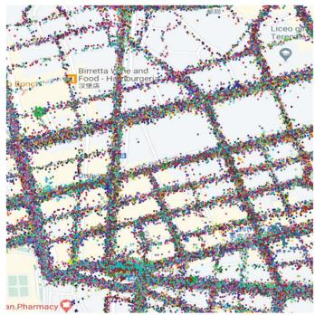  
(a)

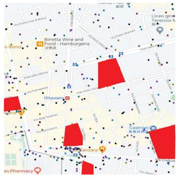  
(b)  
Fig. 3. Data sets that were employed in the simulation experiments. (a) GPS points inside the region. (b) PoIs and obstacles inside the region (dots for PoIs, red blocks for obstacles).

We simulate the UAV as DJI Mavic ${ 2 ^ { 3 } } ,$ which in an ideal situation, the maximum speed is 20m $. / { \mathsf s }$ and the max flight distance is m. The energy cost in 18 000this ideal situation includes the necessary signal receiving cost of a UAV. As we described in Section 5.1, the speed and direction of a UAV are decided by the vector acceleration, which is in the range of $[ 0 , 5 ] \mathrm { m } / \mathrm { s } ^ { 2 }$

The experiments are performed by an Ubuntu 18.04.3 X64 server with an Intel(R) Xeon(R) Gold 5122 CPU (4 cores @3.60Ghz), 62GB memory, and 4 Nvidia GeForce RTX 2080Ti graphics cards. The proposed method is implemented by Python 3.7 and Pytorch 1.7.0. To evaluate the performance of our proposed method, we design the simulation environment based on OpenAI Gym [66], which is a toolkit for developing and comparing reinforcement learning algorithms.

There are 98 candidates in the selected area who prepare to contribute sensing data. We set the number of UAVs as $5 ,$ and the sensing range is 15m. The number of PoIs is 300 with 6 tasks. The total budget is units. The number of time-slots is set to 17.

2 000We employ the following four metrics to measure our performance.

Coverage completed ratio (CCR): The CCR is calculated using Equation (1) to show the ratio between the number of sensed PoIs and the required PoIs of all tasks. The coverage completed ratio is defined as

$$
\mathit { C C R } = \sum _ { t = 1 } ^ { T } \frac { \left| \bigcup _ { \mathit { i } \in \{ 1 , 2 , \ldots , I \} } \mathcal { L } _ { i } ^ { h } \right| + \left| \bigcup _ { \mathit { j } \in \{ 1 , 2 , \ldots , J \} } \mathcal { L } _ { j } \right| * \eta _ { p } ^ { t } } { | \mathcal { P } ^ { t } | * \eta _ { p } ^ { t } * | \mathcal { K } ^ { t } | }
$$

Calibrating ratio (CR): The CR is calculated as a ratio between the number of effectively calibrated times and the maximum effectively calibrated times C. The maximum calibrated times are decided by experiences in Section 6.2. The calibrating ratio is defined as

$$
C R = \sum _ { t = 1 } ^ { T } \frac { \big | \bigcup _ { j \in \{ 1 , 2 , \ldots , J \} } \mathcal { L } _ { j } ^ { m } \big | } { \Psi }
$$

Task fairness (TF): The TF is to show how evenly a task associated with PoIs is sensed by participants and UAVs when all tasks are completed. The task fairness is defined as

$$
T F = \frac { \left( \sum _ { t = 1 } ^ { T } \sum _ { k ^ { t } = 1 } ^ { K ^ { t } = K } \sum _ { p = 1 } ^ { P } \hat { \eta } _ { p } ^ { t } ( k ^ { t } ) \right) ^ { 2 } } { \sum _ { t = 1 } ^ { T } \sum _ { p = 1 } ^ { P } \left( \eta _ { p } ^ { t } \right) ^ { 2 } } .
$$

Energy efficiency (EE): The EE is calculated as a ratio between the number of sensed PoIs and calibration times divided by the energy cost of UAVs. The energy efficiency is defined as

$$
E E = \sum _ { t = 1 } ^ { T } \frac { \left| \bigcup _ { j \in \{ 1 , 2 , \dotsc , J \} } \mathcal { L } _ { j } \right| + \left| \bigcup _ { j \in \{ 1 , 2 , \dotsc , J \} } \mathcal { L } _ { j } ^ { m } \right| } { \sum _ { j = 1 } ^ { J } e _ { j } ( k ^ { t } ) } .
$$

To compare with our proposed algorithm, we first employed a single sensing medium to contribute data, i.e., UAVs or participants, which is referred to as “UAV only” and “Participant only”, respectively. Next, we used five baselines to compare with our proposed algorithm. The first one is MADDPG [57], which is a state-of-the-art solution by OpenAI for multi-agent deep reinforcement learning in the competitive and cooperative environment (referred to as “MADDPG”). The state, action, reward function definitions are the same as UMA. In order to allocate tasks jointly to UAVs considering energy cost, the second method [33] transformed the joint optimization problem into a two-sided twostage matching problem. The method firstly solve the route planning problem based on either dynamic programming or genetic algorithms, then the task assignment problem is addressed by exploring the Gale–Shapley algorithm (referred to as “TARP”). The third method takes an action that maximizes the number of sensed PoIs (referred to as “PoI M”). The fourth one is a greedy approach that navigates a UAV to sense a PoI or meet a participant which could maximize the immediate reward (referred to as “Reward M”). The fifth one allows UAVs to take action randomly (referred to as “Random”).

## 6.2 Simulation Results

We first show moving trajectories for 1,2,3,5 UAVs in Fig. 4. As we described before, there are two responsibilities for UAVs, that is, sensing data from rare sensed PoIs, and calibrating data contributed by participants. As shown in Figs. 4a and 4b, 1 or 2 UAVs learned to mainly move around in half of the area, responsible for its data collection or calibration, which could potentially maximize their reward. It is worth noting that the blue UAV moved two different trajectories in Figs. 4a and 4b, as it learned to collaborate with other UAVs. With the increase in the number of UAVs, we observe that trajectories of each UAV are changed. For example, the green one moved a smaller area when a red UAV started to work, as shown in Figs. 4b and 4c. As we described in Section 5, each UAV has limited observation described in Section 5, each UAV has limited observation July 05,2026 at 12:43:37 UTC from IEEE Xplore. Restrictions apply.

(b)

(c)  
(d)  
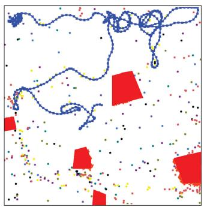  
(a)

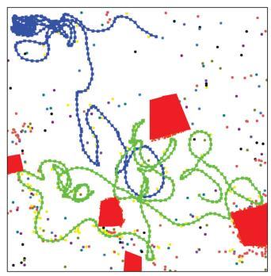  
(b)

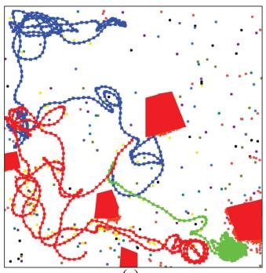  
(c)

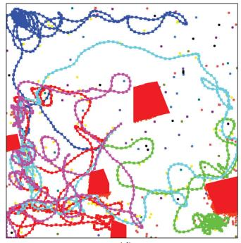  
(d)  
Fig. 4. UAV trajectories (lines for UAVs trajectories, red blocks for obstacles, and dots for PoIs and participants).

which is only a part of information of the state space, it has to respond for the limited maximum reward based on the observation. Therefore, the blue and green UAV worked in the upper left and lower right corner, which is shown in Figs. 4b and 4c, respectively. Furthermore, from Fig. 4d we observe that each UAV took responsibility to sense a local region because enough UAVs were deployed and they had learned to collaborate but not to go farther places of other’s area. Finally, we see that all UAVs successfully avoid obstacles and never go beyond the border.

The performance results compared with a single sensing medium are shown in Fig. 5. UMA consistently outperforms the other two conditions. For example, in Fig. 5a we observe that UMA gains : more than that of Participant only 90 1%when the number of PoIs is 200, in terms of coverage completed ratio. Fig. 5c shows that UMA gives : more than 13 3%that of UAV only when the sensing range of UAVs is 12m, in terms of energy efficiency. We present the time consumption of Algorithm 1 and UMA in Table 3, where Algorithm 1 costs 1.45ms and the UMA consumes 333.43ms when there are 200 PoIs needed to be sensed. Although the values of time consumption rise with the increase of the number of PoIs, the Algorithm 1 and UMA only consume 2.86ms and 336.77ms, when there are 400 PoIs needed to be sensed.

We present the impact of UAV sensing range, budget, number of UAVs, number of PoIs, number of tasks and number of participants on coverage completed ratio, as shown in Fig. 6. Here we fix five parameters described in Section 6.1 and observe the performance of algorithms with the changing of the other one parameter. For example, we fixed the number of UAVs, the total amount of budget, number of PoIs, the number of tasks and the number of participants, while changing the sensing range from 14m to 18m with a step size of 1m (see Fig. 6a).

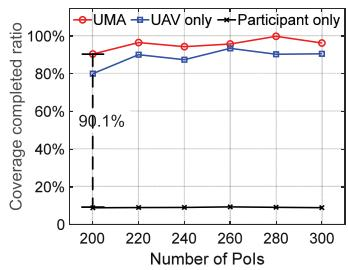

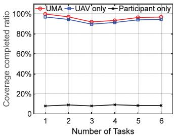

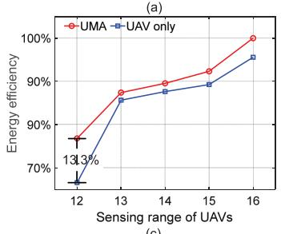

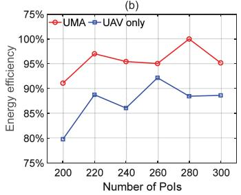

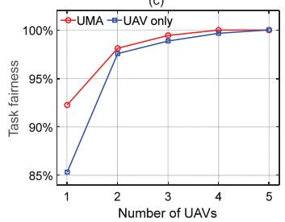  
(e)

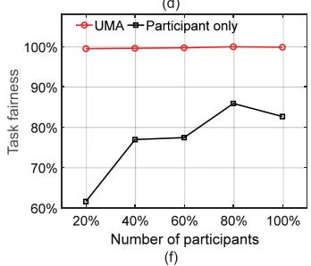  
Fig. 5. Impact of (a) & (d) number of PoIs, (b) number of tasks, (c) sensing range of UAVs, (e) number of UAVs and (f) number of participants on coverage completed ratio, energy efficiency and task fairness.

From Fig. 6, we can make the following observations: UMA consistently outperforms all baselines in terms of coverage completed ratio. For example, in Fig. 6a, we observe that UMA gives : more than that of TARP and : more than that 11 0% 25 0%of Reward M, when the number of PoIs is 200 and 280, respectively. In Fig. 6b, we can see that the coverage completed ratio of all methods increases monotonically with the number of UAVs. This is because more UAVs represent better data collection capability. UMA also shows the best performance, e.g., it gives : more than that of MADDPG. In Fig. 6c, UMA 54 2%improves : of coverage completed ratio if compared to 18 9%that of PoI M, when the sensing range is 15m. In Fig. 6d, we observe that UMA improves : if compared to that of Ram-58 1%dom, when the number of tasks is 5. Last, in Fig. 6e, when the total budget of 6 tasks is units, UMA gives : more 1 300 18 8%than that of Reward M. Finally, in Fig. 6f, UMA achieves a coverage completed ratio of : if compared to that of PoI M, 21 8%when there are of total participants.

60%Next, we present the breakdown results for the other three metrics. First, the impact of the number of UAVs, UAV sensing range, the number of participants, and budget on calibrating ratio are shown in Fig. 7. We observe that UMA outperforms all baselines in terms of calibrating ratio. For example, in Fig. 7a, we see that calibrating ratio given by UMA rises more intensely than four baselines with a larger sensing range. For example, UMA improves : of 56 9%calibrating ratio if compared to that of PoI M and Reward M, when the number of UAVs is 5. In Fig. 7b, when the sensing range is 14m, UMA gives a calibrating ratio of : 60 7%more if compared to that of PoI M. In Figs. 7c and 7d, we July 05,2026 at 12:43:37 UTC from IEEE Xplore. Restrictions apply.

(d)  
(b)  
TABLE 3  
Time Consumption of Algorithm 1 and UMA
<table><tr><td>Number of PoIs</td><td>100</td><td>175</td><td>200</td><td>225</td><td>250</td><td>275</td><td>300</td><td>375</td><td>400</td><td>1000</td><td>10 000</td><td>100 000</td></tr><tr><td>Algorithm 1 (ms)</td><td>0.77</td><td>1.31</td><td>1.45</td><td>1.59</td><td>1.87</td><td>2.07</td><td>2.16</td><td>2.76</td><td>2.86</td><td>7.19</td><td>79.28</td><td>950.32</td></tr><tr><td>UMA (ms)</td><td>327.18</td><td>330.20</td><td>333.43</td><td>332.28</td><td>332.75</td><td>333.75</td><td>333.91</td><td>337.57</td><td>336.77</td><td>358.33</td><td>689.47</td><td>6048.28</td></tr></table>

observe that the calibrating ratio of UMA decreases slightly with more participants and budget.

Two data sets are employed to verify the performance of the proposed system-level calibrating method. Here we employ a method as proposed in [67] to be the compared approach (referred to as “GMR approach”), which uses geometric mean regression to calibrate sensing data. As shown in Fig. 8, with the number of calibrating times increasing from 2 to 8, the estimation errors given by both the proposed and GMR approaches decrease. However, the proposed method performs much better than that of the compared approach. For example, when the number of calibrating times is 2, the proposed method decreases : of estimation error compared 69 4%with that of the GMR approach in Fig. 8a. And the accuracy improves : on average, compared with that of the GMR 36 7%approach. On the other side, Fig. 8b shows that the proposed method decreases : of estimation error, compared with 18 2%that of the GMR approach when the number of calibrating times is 4. And the accuracy improves : on average, compared with that of the GMR approach.

Fig. 9 shows the impact of number of UAVs, sensing range of UAVs, number of tasks, and number of PoIs on energy efficiency. In Figs. 9a and 9b, We observe that energy is consumed more efficiently with the number of UAVs and sensing range, respectively. While the energy efficiency in Figs. 9c and 9d barely changes.

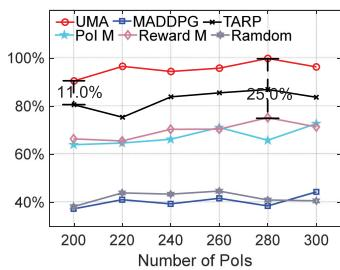

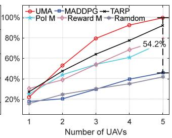

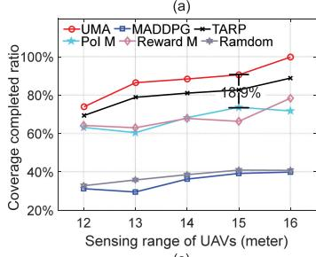

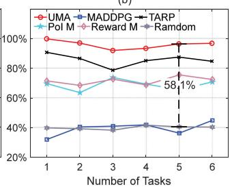

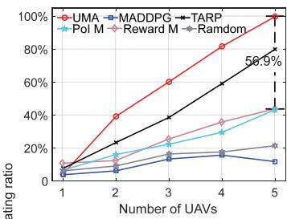

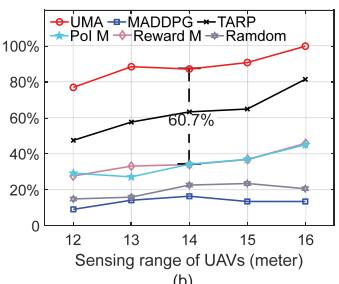

Finally, we record the resource utilization for performing the proposed method UMA under the condition of 5 UAVs, units budget and 300 PoIs. As shown in Fig. 11, the range 2 000of CPU utilization is between 225.7% and 237.7% where the total utilization is 400% when the 4 cores are fully utilized. The memory utilization is stable at 6.7%.

The impact of number of UAVs, sensing range of UAVs, number of tasks, and number of PoIs on task fairness is shown in Fig. 10. Similar to Fig. 9a, task fairness of UMA increases monotonically with the number of UAVs. And the task fairness increases slightly with the number of participants and PoIs. It is worth noting that, with the number of tasks increasing, task fairness decreases. However, we observe that UMA still outperforms all baselines in terms of task fairness.

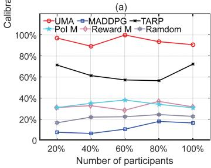  
(c)

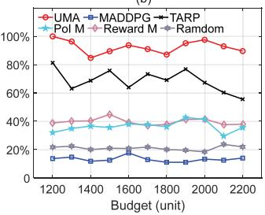  
(d)

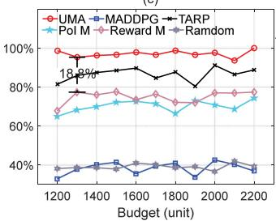

Fig. 7. Impact of (a) the number of UAVs, (b) sensing range of UAVs, (c) the number of participants, and (d) budget on calibrating ratio.  
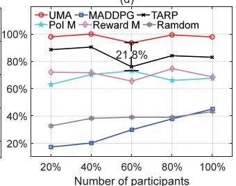  
Fig. 6. Impact of (a) number of PoIs, (b) number of UAVs, (c) sensing range of UAVs, (d) number of tasks, (e) budget and (f) number of participants on coverage completed ratio.  
(e)  
(f)

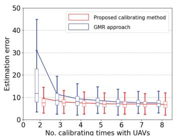  
(a)

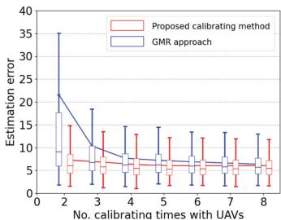  
(b)  
Fig. 8. Estimation error results after calibrating, where (a) is the experiment with OpenSense Zurich data set, and (b) is the experiment with Beijing air quality monitoring data set.  
Authorized licensed use limited to: Guangxi University. Downloaded on July 05,2026 at 12:43:37 UTC from IEEE Xplore. Restrictions apply.

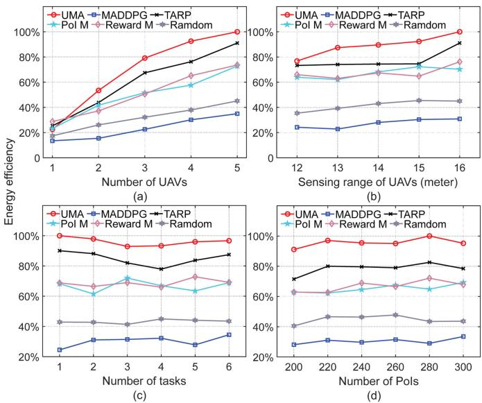  
Fig. 9. Impact of (a) number of UAVs, (b) sensing range of UAVs, (c) number of tasks, and (d) number of PoIs on energy efficiency.

## 7 CONCLUSION AND FUTURE WORK

In this paper, we explicitly consider the problem of UAVassisted multi-task allocation for MCS to maximize sensing coverage. To deal with the problem, we proposed a novel method “UMA”. On one hand, the method incentivized participants to contribute high quality sensing data, with a limited budget. On the other hand, the UAVs were employed to sense data from rarely sensed PoIs. In the meanwhile, they were also employed to calibrate for sensors of participants. The results well justified the efficiency and robustness of UMA in terms of four metrics, coverage completed ratio, calibrating ratio, task fairness and energy efficiency, compared with the state-of-the-art.

In the future, we plan to propose a method that determines the number of PoIs and pieces of sensing data, to mitigate data collection redundancy. Besides the budget and maximum offered reward, the task quality requirement is also considered to calculate the number of pieces of data to be sensed from a PoI. Normally higher quality sensing data requires more sensing data. We attempt to leverage the confidence interval to quantify the sensing data quality requirement. In practice, when the confidence interval is short, more data should be collected from the PoI in question. A reinforcement learning method may be employed to find out the relationship between the value of the confidence interval and the amount of the required sensing data.

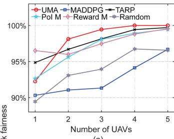

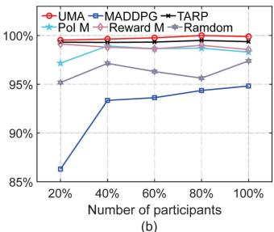

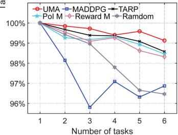  
(c)

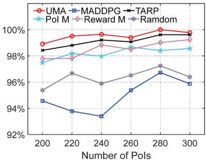  
(d)  
Fig. 10. Impact of (a) number of UAVs, (b) sensing range of UAVs, (c) number of tasks, and (d) number of PoIs on task fairness.

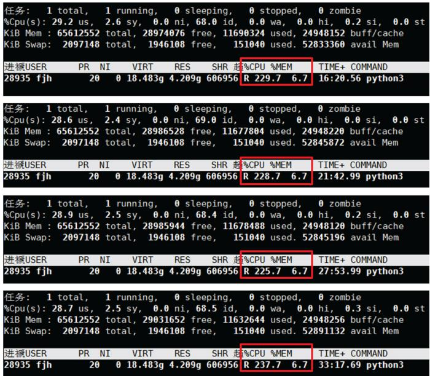  
Fig. 11. Resource utilization of CPU and memory for performing the proposed method.

## ACKNOWLEDGMENTS

Hui Gao and Jianhao Feng contributed equally to this work.

## REFERENCES

[1] A. Capponi, C. Fiandrino, B. Kantarci, L. Foschini, D. Kliazovich, and P. Bouvry, “A survey on mobile crowdsensing systems: Challenges, solutions, and opportunities,” IEEE Commun. Surv. Tuts., vol. 21, no. 3, pp. 2419–2465, Third Quarter 2019.

[2] J. Ni, K. Zhang, Q. Xia, X. Lin, and X. S. Shen, “Enabling strong privacy preservation and accurate task allocation for mobile crowdsensing,” IEEE Trans. Mobile Comput., vol. 19, no. 6, pp. 1317–1331, Jun. 2020.

[3] X. Li and X. Zhang, “Multi-task allocation under time constraints in mobile crowdsensing,” IEEE Trans. Mobile Comput., vol. 20, no. 4, pp. 1494–1510, Apr. 2021.

[4] B. Zhao, S. Tang, X. Liu, and X. Zhang, “PACE: Privacy-preserving and quality-aware incentive mechanism for mobile crowdsensing,” IEEE Trans. Mobile Comput., vol. 20, no. 5, pp. 1924–1939, May 2021.

[5] X. Chen et al., “PAS: Prediction-based actuation system for cityscale ridesharing vehicular mobile crowdsensing,” IEEE Internet Things J., vol. 7, no. 5, pp. 3719–3734, May 2020.

[6] K. Lou, Y. Yang, E. Wang, Z. Liu, T. Baker, and A. K. Bashir, “Reinforcement learning based advertising strategy using crowdsensing vehicular data,” IEEE Trans. Intell. Transp. Syst., vol. 22, no. 7, pp. 4635–4647, Jul. 2021.

[7] M. Noreikis, Y. Xiao, J. Hu, and Y. Chen, “SnapTask: Towards efficient visual crowdsourcing for indoor mapping,” in Proc. IEEE 38th Int. Conf. Distrib. Comput. Syst., 2018, pp. 578–588.

[8] A. Hamrouni, H. Ghazzai, M. Frikha, and Y. Massoud, “A spatial mobile crowdsourcing framework for event reporting,” IEEE Trans. Computat. Social Syst., vol. 7, no. 2, pp. 477–491, Apr. 2020.

Authorized licensed use limited to: Guangxi University. Downloaded on July 05,2026 at 12:43:37 UTC from IEEE Xplore. Restrictions apply.

[9] X. Wang et al., “A city-wide real-time traffic management system: Enabling crowdsensing in social internet of vehicles,” IEEE Commun. Mag., vol. 56, no. 9, pp. 19–25, Sep. 2018.

[10] L. Wang, Z. Yu, D. Zhang, B. Guo, and C. H. Liu, “Heterogeneous multi-task assignment in mobile crowdsensing using spatiotemporal correlation,” IEEE Trans. Mobile Comput., vol. 18, no. 1, pp. 84–97, Jan. 2019.

[11] F. Restuccia, N. Ghosh, S. Bhattacharjee, S. K. Das, and T. Melodia, “Quality of information in mobile crowdsensing: Survey and research challenges,” ACM Trans. Sensor Netw., vol. 13, no. 4, pp. 1–43, 2017.

[12] D. Wu et al., “When sharing economy meets IoT: Towards finegrained urban air quality monitoring through mobile crowdsensing on bike-share system,” Proc. ACM Interactive Mobile Wearable Ubiquitous Technol., vol. 4, no. 2, pp. 1–26, 2020.

[13] S. Bhattacharjee, N. Ghosh, V. K. Shah, and S. K. Das, “QnQ: Quality and quantity based unified approach for secure and trustworthy mobile crowdsensing,” IEEE Trans. Mobile Comput., vol. 19, no. 1, pp. 200–216, Jan. 2020.

[14] X. Gong and N. B. Shroff, “Truthful mobile crowdsensing for strategic users with private data quality,” IEEE/ACM Trans. Netw., vol. 27, no. 5, pp. 1959–1972, Oct. 2019.

[15] J. Wang, “Multi-task allocation in mobile crowd sensing with individual task quality assurance,” IEEE Trans. Mobile Comput., vol. 17, no. 9, pp. 2101–2113, Sep. 2018.

[16] C. Zhao, S. Yang, P. Yan, Q. Yang, X. Yang, and J. McCann, “Data quality guarantee for credible caching device selection in mobile crowdsensing systems,” IEEE Wireless Commun., vol. 25, no. 3, pp. 58–64, Jun. 2018.

[17] N. B. Truong, G. M. Lee, T.-W. Um, and M. Mackay, “Trust evaluation mechanism for user recruitment in mobile crowd-sensing in the Internet of Things,” IEEE Trans. Inf. Forensics Secur., vol. 14, no. 10, pp. 2705–2719, Oct. 2019.

[18] D. Peng, F. Wu, and G. Chen, “Data quality guided incentive mechanism design for crowdsensing,” IEEE Trans. Mobile Comput., vol. 17, no. 2, pp. 307–319, Feb. 2018.

[19] S. Liu, Z. Zheng, F. Wu, S. Tang, and G. Chen, “Context-aware data quality estimation in mobile crowdsensing,” in Proc. IEEE Conf. Comput. Commun., 2017, pp. 1–9.

[20] Y. Li et al., “Towards differentially private truth discovery for crowd sensing systems,” in Proc. IEEE 40th Int. Conf. Distrib. Comput. Syst., 2020, pp. 1156–1166.

[21] R. Tan, G. Xing, Z. Yuan, X. Liu, and J. Yao, “System-level calibration for data fusion in wireless sensor networks,” ACM Trans. Sensor Netw., vol. 9, no. 3, pp. 1–27, 2013.

[22] K. Fu, W. Ren, and W. Dong, “Multihop calibration for mobile sensing: K-hop calibratability and reference sensor deployment,” in Proc. IEEE Conf. Comput. Commun., 2017, pp. 1–9.

[23] H. Gao, C. H. Liu, J. Tan, D. Yang, P. Hui, and W. Wang, “Online quality-aware incentive mechanism for mobile crowd sensing with extra bonus,” IEEE Trans. Mobile Comput., vol. 18, no. 11, pp. 2589–2603, Nov. 2019.

[24] C. H. Liu, Z. Dai, Y. Zhao, J. Crowcroft, D. Wu, and K. K. Leung, “Distributed and energy-efficient mobile crowdsensing with charging stations by deep reinforcement learning,” IEEE Trans. Mobile Comput., vol. 20, no. 1, pp. 130–146, Jan. 2021.

[25] L. Wang, Z. Yu, D. Zhang, B. Guo, and C. H. Liu, “Heterogeneous multi-task assignment in mobile crowdsensing using spatiotemporal correlation,” IEEE Trans. Mobile Comput., vol. 18, no. 1, pp. 84–97, Jan. 2019.

[26] G. Gao, M. Xiao, J. Wu, L. Huang, and C. Hu, “Truthful incentive mechanism for nondeterministic crowdsensing with vehicles,” IEEE Trans. Mobile Comput., vol. 17, no. 12, pp. 2982–2997, Dec. 2018.

[27] C. H. Liu, Z. Chen, and Y. Zhan, “Energy-efficient distributed mobile crowd sensing: A deep learning approach,” IEEE J. Sel. Areas Commun., vol. 37, no. 6, pp. 1262–1276, Jun. 2019.

[28] H. Wu, X. Tao, N. Zhang, and X. Shen, “Cooperative UAV clusterassisted terrestrial cellular networks for ubiquitous coverage,” IEEE J. Sel. Areas Commun., vol. 36, no. 9, pp. 2045–2058, Sep. 2018.

[29] C. H. Liu, X. Ma, X. Gao, and J. Tang, “Distributed energy-efficient multi-UAV navigation for long-term communication coverage by deep reinforcement learning,” IEEE Trans. Mobile Comput., vol. 19, no. 6, pp. 1274–1285, Jun. 2020.

[30] D. Wu et al., “When sharing economy meets IoT: Towards finegrained urban air quality monitoring through mobile crowdsensing on bike-share system,” Proc. ACM Interactive Mobile Wearable Ubiquitous Technol., vol. 4, no. 2, pp. 1–26, 2020.

[31] P. Huang, X. Zhang, L. Guo, and M. Li, “Incentivizing crowdsensing-based noise monitoring with differentially-private locations,” IEEE Trans. Mobile Comput., vol. 20, no. 2, pp. 519–532, Feb. 2021.

[32] X. Wang, J. Zhang, X. Tian, X. Gan, Y. Guan, and X. Wang, “Crowdsensing-based consensus incident report for road traffic acquisition,” IEEE Trans. Intell. Transp. Syst., vol. 19, no. 8, pp. 2536–2547, Aug. 2018.

[33] Z. Zhou et al., “When mobile crowd sensing meets UAV: Energyefficient task assignment and route planning,” IEEE Trans. Commun., vol. 66, no. 11, pp. 5526–5538, Nov. 2018.

[34] X. Li and X. Zhang, “Multi-task allocation under time constraints in mobile crowdsensing,” IEEE Trans. Mobile Comput., vol. 20, no. 4, pp. 1494–1510, Apr. 2021.

[35] H. Zhao, M. Xiao, J. Wu, Y. Xu, H. Huang, and S. Zhang, “Differentially private unknown worker recruitment for mobile crowdsensing using multi-armed bandits,” IEEE Trans. Mobile Comput., vol. 20, no. 9, pp. 2779–2794, Sep. 2021.

[36] Z. Cai, Z. Duan, and W. Li, “Exploiting multi-dimensional task diversity in distributed auctions for mobile crowdsensing,” IEEE Trans. Mobile Comput., vol. 20, no. 8, pp. 2576–2591, Aug. 2021.

[37] F. Wu, S. Yang, Z. Zheng, S. Tang, and G. Chen, “Fine grained user profiling for personalized task matching in mobile crowdsensing,” IEEE Trans. Mobile Comput., vol. 20, no. 10, pp. 2961–2976, Oct. 2021.

[38] S. Yang, K. Han, Z. Zheng, S. Tang, and F. Wu, “Towards personalized task matching in mobile crowdsensing via fine-grained user profiling,” in Proc. IEEE Conf. Comput. Commun., 2018, pp. 2411–2419.

[39] Z. Wang et al., “Towards personalized task-oriented worker recruitment in mobile crowdsensing,” IEEE Trans. Mobile Comput., vol. 20, no. 5, pp. 2080–2093, May 2021.

[40] G. Yang, B. Wang, X. He, J. Wang, and H. Pervaiz, “Competitioncongestion-aware stable worker-task matching in mobile crowd sensing,” IEEE Trans. Netw. Service Manag., vol. 18, no. 3, pp. 3719–3732, Sep. 2021.

[41] J. Wang, F. Wang, Y. Wang, D. Zhang, L. Wang, and Z. Qiu, “Social-network-assisted worker recruitment in mobile crowd sensing,” IEEE Trans. Mobile Comput., vol. 18, no. 7, pp. 1661–1673, Jul. 2019.

[42] F. Yucel, M. Yuksel, and E. Bulut, “QoS-based budget constrained stable task assignment in mobile crowdsensing,” IEEE Trans. Mobile Comput., vol. 20, no. 11, pp. 3194–3210, Nov. 2021.

[43] G. Yang, Y. Li, X. He, Y. Song, J. Wang, and M. Liu, “Profile-free and real-time task recommendation in mobile crowdsensing,” IEEE Trans. Computat. Social Syst., vol. 8, no. 6, pp. 1311–1322, Dec. 2021.

[44] C. Dai, X. Wang, K. Liu, D. Qi, W. Lin, and P. Zhou, “Stable task assignment for mobile crowdsensing with budget constraint,” IEEE Trans. Mobile Comput., vol. 20, no. 12, pp. 3439–3452, Dec. 2021.

[45] F. Restuccia, P. Ferraro, S. Silvestri, S. K. Das, and G. L. Re, “IncentMe: Effective mechanism design to stimulate crowdsensing participants with uncertain mobility,” IEEE Trans. Mobile Comput., vol. 18, no. 7, pp. 1571–1584, Jul. 2019.

[46] S. Xu, X. Chen, X. Pi, C. Joe-Wong, P. Zhang, and H. Y. Noh, “iLOCuS: Incentivizing vehicle mobility to optimize sensing distribution in crowd sensing,” IEEE Trans. Mobile Comput., vol. 19, no. 8, pp. 1831–1847, Aug. 2020.

[47] G. Fan et al., “Joint scheduling and incentive mechanism for spatio-temporal vehicular crowd sensing,” IEEE Trans. Mobile Comput., vol. 20, no. 4, pp. 1449–1464, Apr. 2021.

[48] J. Hu, K. Yang, K. Wang, and K. Zhang, “A blockchain-based reward mechanism for mobile crowdsensing,” IEEE Trans. Computat. Social Syst., vol. 7, no. 1, pp. 178–191, Feb. 2020.

[49] J. Nie, J. Luo, Z. Xiong, D. Niyato, P. Wang, and H. V. Poor, “A multi-leader multi-follower game-based analysis for incentive mechanisms in socially-aware mobile crowdsensing,” IEEE Trans. Wireless Commun., vol. 20, no. 3, pp. 1457–1471, Mar. 2021.

[50] Y. Zhang, X. Zhang, and F. Li, “BiCrowd: Online biobjective incentive mechanism for mobile crowdsensing,” IEEE Internet Things J., vol. 7, no. 11, pp. 11 078–11 091, Nov. 2020.

[51] Z. Zheng, S. Yang, J. Xie, F. Wu, X. Gao, and G. Chen, “On designing strategy-proof budget feasible online mechanism for mobile crowdsensing with time-discounting values,” IEEE Trans. Mobile Comput., early access, Oct. 28, 2020, doi: 10.1109/TMC.2020.3034499

[52] X. Zhu, Y. Luo, A. Liu, W. Tang, and M. Z. A. Bhuiyan, “A deep learning-based mobile crowdsensing scheme by predicting vehicle mobility,” IEEE Trans. Intell. Transp. Syst., vol. 22, no. 7, pp. 4648–4659, Jul. 2021.

[53] X. Tao and A. S. Hafid, “DeepSensing: A novel mobile crowdsensing framework with double deep Q-network and prioritized experience replay,” IEEE Internet Things J., vol. 7, no. 12, pp. 11 547–11 558, Dec. 2020.

[54] Y. Hu, J. Wang, B. Wu, and S. Helal, “RL-Recruiter+: Mobilitypredictability-aware participant selection learning for fromscratch mobile crowdsensing,” IEEE Trans. Mobile Comput., early access, May 05, 2021, doi: 10.1109/TMC.2021.3077636

[55] V. Mnih et al., “Human-level control through deep reinforcement learning,” Nature, vol. 518, no. 7540, pp. 529–533, 2015.

[56] T. P. Lillicrap et al., “Continuous control with deep reinforcement learning,” 2015, arXiv:1509.02971.

[57] R. Lowe, Y. I. Wu, A. Tamar, J. Harb, O. P. Abbeel, and I. Mordatch, “Multi-agent actor-critic for mixed cooperative-competitive environments,” in Proc. Adv. Neural Inf. Process. Syst., 2017, pp. 6379–6390.

[58] P. Ferrer-Cid, J. M. Barcelo-Ordinas, J. Garcia-Vidal, A. Ripoll, and M. Viana, “Multisensor data fusion calibration in IoT air pollution platforms,” IEEE Internet Things J., vol. 7, no. 4, pp. 3124–3132, Apr. 2020.

[59] Y. Lin, W. Dong, and Y. Chen, “Calibrating low-cost sensors by a two-phase learning approach for urban air quality measurement,” Proc. ACM Interactive Mobile Wearable Ubiquitous Technol., vol. 2, no. 1, pp. 1–18, 2018.

[60] H. Gao, Y. Xiao, H. Yan, Y. Tian, D. Wang, and W. Wang, “A learning-based credible participant recruitment strategy for mobile crowd sensing,” IEEE Internet Things J., vol. 7, no. 6, pp. 5302–5314, Jun. 2020.

[61] Z. Li, T. Xi, J. Deng, G. Zhang, S. Wen, and R. He, “GP-NAS: Gaussian process based neural architecture search,” in Proc. IEEE/ CVF Conf. Comput. Vis. Pattern Recognit., 2020, pp. 11933–11942.

[62] D. Zachariah and P. Stoica, “Cramer-rao bound analog of Bayes’ rule [lecture notes],” IEEE Signal Process. Mag., vol. 32, no. 2, pp. 164–168, Mar. 2015.

[63] J. V. Candy, Bayesian Signal Processing: Classical, Modern, and Particle Filtering Methods, vol. 54. Hoboken, NJ, USA: Wiley, 2016.

[64] L. Bracciale, M. Bonola, P. Loreti, G. Bianchi, R. Amici, and A. Rabuffi, “CRAWDAD dataset roma/taxi (v. 2014–07-17),” 2014. [Online]. Available: http://crawdad.org/roma/taxi/20140717

[65] J. J. Li, B. Faltings, O. Saukh, D. Hasenfratz, and J. Beutel, “Sensing the air we breathe–the OpenSense zurich dataset,” in Proc. 26th AAAI Conf. Artif. Intell., 2012, pp. 323–325.

[66] G. Brockman et al., “OpenAI gym,” 2016, arXiv:1606.01540.

[67] O. Saukh, D. Hasenfratz, and L. Thiele, “Reducing multi-hop calibration errors in large-scale mobile sensor networks,” in Proc. ACM 14th Int. Conf. Informat. Process. Sensor Netw., 2015, pp. 274–285.

  
Hui Gao received the master’s and PhD degrees from the Beijing University of Posts and Telecommunications, China, in 2013 and 2017. He is currently an assistant professor with the School of Computer Science (National Pilot Software Engineering School), Beijing University of Posts and Telecommunications. His research interests include mobile crowdsensing, deep learning for smart city, and Internet-of-Things.

Jianhao Feng received the bachelor’s degree from the School of Computer Science (National Pilot Software Engineering School), Beijing University of Posts and Telecommunications, where he is currently working toward the MS degree. His research interests include mobile crowdsensing, reinforcement learning, and motion retargeting.

Yu Xiao (Member, IEEE) received the bachelor’s and master’s degrees in computer science and technology from the Beijing University of Posts and Telecommunications, China, and the PhD degree (Hons.) in computer science from Aalto University, Espoo, Finland, in January 2012. She is currently an assistant professor with the Department of Communications and Networking, Aalto University, where she leads the Mobile Cloud Computing Group. Her research interests include edge computing, mobile crowdsensing, and energy-efficient wireless networking.

Bo Zhang (Member, IEEE) received the master’s and PhD degrees from the Beijing University of Posts and Telecommunications, China, in 2010 and 2016, where he is currently an assistant professor with the State Key Laboratory of Networking and Switching Technology. His research interests include mobile crowd sensing, Internet of Things, deep learning for smart city, medical image analysis, and its applications.

Wendong Wang (Member, IEEE) received the bachelor’s and master’s degrees from the Beijing University of Posts and Telecommunications in 1985 and 1991, respectively, where he is currently a full professor with the State Key Laboratory of Networking and Switching Technology. He has published more than 200 papers in various journals and conference proceedings. His current research interests are the next generation network architecture and mobile crowdsensing.

" For more information on this or any other computing topic, please visit our Digital Library at www.computer.org/csdl.