# A Unified Framework for Guiding Generative AI With Wireless Perception in Resource Constrained Mobile Edge Networks

Jiacheng Wang , Hongyang Du , Dusit Niyato , Fellow, IEEE, Jiawen Kang , Senior Member, IEEE, Zehui Xiong , Deepu Rajan , Member, IEEE, Shiwen Mao , Fellow, IEEE, and Xuemin Shen , Fellow, IEEE

Abstract—With the significant advancements in artificial intelligence (AI) technologies and computational capabilities, generative AI (GAI) has become a pivotal digital content generation technique for offering superior digital services. However, due to the inherent instability of AI models, directing GAI towards the desired output remains a challenging task. Therefore, in this paper, we design a novel framework that utilizes wireless perception to guide GAI (WiPe-GAI) in delivering AI-generated content (AIGC) service, within resource-constrained mobile edge networks. Specifically, we first propose a new sequential multi-scale perception (SMSP) algorithm to predict user skeleton based on the channel state information (CSI) extracted from wireless signals. This prediction then guides GAI to provide users with AIGC, i.e., virtual character generation. To ensure the efficient operation of the proposed framework in resource constrained networks, we further design a pricing-based incentive mechanism and propose a diffusion model based approach to generate an optimal pricing strategy for the service provisioning. The strategy maximizes the user’s utility while incentivizing the participation of the virtual service provider (VSP) in AIGC provision. The experimental results demonstrate

Manuscript received 2 September 2023; revised 8 January 2024; accepted 1 March 2024. Date of publication 14 March 2024; date of current version 3 October 2024. This work was supported in part by the National Natural Science Foundation of China (NSFC) under Grant 62102099 and Grant U22A2054, in part by Pearl River Talent Recruitment Program under Grant 2021QN02S643, and in part by Guangzhou Basic Research Program under Grant 2023A04J1699, in part by National Research Foundation, Singapore, and Infocomm Media Development Authority under its Future Communications Research and Development Programme, DSO National Laboratories under the AI Singapore Programme (AISG) under Grant AISG2-RP-2020-019 and Grant FCP-ASTAR-TG-2022-003, and in part by MOE Tier 1 under Grant RG87/22, in part by SUTD under Grant SRG-ISTD-2021-165, in part by SUTD-ZJU IDEA under Grant SUTD-ZJU (VP) 202102, in part by the Ministry of Education, Singapore, under its SMU-SUTD Joint under Grant 22-SIS-SMU-048, and in part by SUTD Kickstarter Initiative under Grant SKI 20210204. The work of Shiwen Mao was supported in part by NSF under Grant CNS-2148382. Recommended for acceptance by N. Zhang. (Corresponding author: Jiawen Kang.)

Jiacheng Wang, Hongyang Du, Dusit Niyato, and Deepu Rajan are with the School of Computer Science and Engineering, Nanyang Technological University, Singapore 639798 (e-mail: jiacheng.wang@ntu.edu.sg; hongyang001@e.ntu.edu.sg; dniyato@ntu.edu.sg; asdrajan@ntu.edu.sg).

Jiawen Kang is with the School of Automation, Guangdong University of Technology, Guangzhou 510006, China (e-mail: kavinkang@gdut.edu.cn).

Zehui Xiong is with the Pillar of Information Systems Technology and Design, Singapore University of Technology and Design, Singapore 487372 (e-mail: zehui\_xiong@sutd.edu.sg).

Shiwen Mao is with the Department of Electrical and Computer Engineering, Auburn University, Auburn, AL 36849 USA (e-mail: smao@ieee.org).

Xuemin Shen is with the Department of Electrical and Computer Engineering, University of Waterloo, Waterloo, ON N2L 3G1, Canada (e-mail: sshen@uwaterloo.ca).

Digital Object Identifier 10.1109/TMC.2024.3377226

the effectiveness of the designed framework in terms of skeleton prediction and optimal pricing strategy generation, outperforming other existing solutions.

Index Terms—Wireless perception, AI-generated content, resource allocation, quality of service.

# I. INTRODUCTION

T HE proliferation of user data, advancements in hardwaredevices, and the evolution of AI models catalyze the devices，and the evolution of AI models catalyze the progression of generative artificial intelligence (GAI) technology [1]. This progression brings the artificial intelligencegenerated content (AIGC) and its associated applications into the spotlight [2]. Leading technological giants, such as Microsoft and Google, invest heavily in creating their own exclusive GAI model, with the objective of offering users more comprehensive digital service [3]. A representative example is OpenAI’s ChatGPT, which achieves notable breakthroughs in emulating human in text processing tasks. For instance, ChatGPT is capable of executing grammar error detection, generating text and code, and performing content retrieval operations [4]. Beyond text processing, the powerful capabilities of GAI are also unleashed in the realm of image and video generation. For instance, StableDiffusion can generate images based on users’ descriptions (i.e., prompts) and process images according to users’ instructions, including style modifications and rectification of missing pixels and other visual imperfections [5].

Compared with the conventional content generation methods, GAI exhibits two salient advantages. First, GAI demonstrates remarkable efficiency in content production, capable of generating digital content efficiently in accordance with user prompts. For example, Stable Diffusion [6] can generate a high-definition image within seconds, which is challenging to accomplish by the traditional user based generation method. Second, AIGC exhibits greater diversity, manifested in two aspects [7]. The first aspect pertains to the richness of the generated content. Due to the randomness of the seed in AI models, GAI’s outputs can vary significantly even with the identical instruction. For instance, the diffusion model can generate entirely different images with the same prompt, thus offering users a broader range of choices. The second aspect involves multimodal presentation capabilities, which enable AIGC to be delivered in various forms such as text, images, audio, and even videos [8]. This makes AIGC highly adaptable, catering to a range of applications. Owing to these benefits, GAI has emerged as the critical engine for creating digital content, playing an essential role in our progression towards a more immersive and interactive next-generation Internet [9], [10].

Despite the significant advancements, several challenges still need to be tackled for practical applications. First, the inherent instability of GAI models leads to generated content that often struggles to directly meet user requirements. [6]. For example, in augmented reality (AR) applications, such as virtual game and shopping, the virtual service providers (VSPs) use the GAI model to generate virtual characters for users. However, due to the random seeds used in GAI models and the difficulty of conveying information about users’ postures to the models through prompts, the generated characters may not precisely align the actual users. As a result, the user may trigger multiple requests until a satisfactory character is generated, which not only degrades the quality of service (QoS) of the VSP, but also leads to resource wastage. To mitigate this, an effective solution is to guide GAI with the help of other methods. Yet the computing resources of the VSP deployed in mobile edge networks are typically limited. This leads to the second challenge when employing other methods to guide GAI, that is, how to motivate the VSPs to actively participate in service provision, thereby ensuring the efficient operation of the overall framework. A potential solution to this issue is to establish a payment plan between the user and the VSP, whereby the user provides a fee to the VSP according to the plan to encourage participation.

Given the aforementioned challenges and potential solutions, this paper introduces wireless perception guided GAI (WiPe-GAI), a novel framework deployed in resource-constrained mobile edge networks, which uses wireless perception to guide GAI in providing AIGC to users and introduces an incentive mechanism to ensure its economical operation. Specifically, in WiPe-GAI, we first propose a novel sequential multi-scale perception (SMSP) algorithm, which enables WiPe-GAI to construct a feature channel state information (CSI) matrix. This is then fed into a trained neural network to predict the user’s skeleton, to accurately capture the user’s posture in the physical world. By integrating the user’s prompts with the predicted skeleton, WiPe-GAI then guides the GAI model to generate the corresponding virtual character for the user. Compared to imageguided AIGC, WiPe-GAI not only enhances privacy by reducing the exposure of users under the camera, but also expands service coverage through the ubiquitous availability of wireless signals. Furthermore, considering the limited resources of the VSP deployed in the mobile edge network, we design a pricing strategy-based incentive mechanism and propose a diffusion model based approach to generate an optimal pricing strategy. This strategy maximizes the user’s utility, while encouraging the VSP to actively participate in service provision, thereby ensuring the efficient operation of WiPe-GAI. In summary, the main contributions of this paper are as follows.

We propose WiPe-GAI, a unified framework deployed in resource-constrained mobile edge networks. The framework combines wireless perception with GAI to provide AIGC service to users, while also including an incentive mechanism to ensure its cost-effective operation.

We propose a novel SMSP algorithm, which sequentially performs large-scale and small-scale perception on the user to construct a CSI feature matrix for the skeleton prediction. During this process, the perception at different scales cooperates by sharing perception results, thus enhancing the overall perception performance.   
We design an incentive mechanism based on pricing to ensure the framework operates economically and propose a diffusion model-based approach to generate an optimal pricing strategy. This strategy maximizes the user’s utility while encourages the VSP with limited resources to participate actively in AIGC service provisioning.   
The experimental results demonstrate that the WiPe-GAI can accurately predict the user’s skeleton and generate the corresponding virtual character for the user. Moreover, the proposed diffusion-based method can effectively generate the optimal strategy that not only yields greater user utility than existing methods, but also ensures VSP’s participation, thereby enhancing the efficiency of the framework.

This paper is structured as follows. Section II reviews some related works. Section III presents the overall framework and details the design of the WiPe-GAI. The evaluation is given in Section IV. Section V summarizes the paper.

# II. RELATED WORK

This section offers a review of related works on wireless perception, diffusion model, and pricing-based incentive mechanisms.

# A. Wireless Perception

Wireless perception aims to realize various sensing tasks [11], [12] by processing and analyzing wireless signals. In [13], the authors used convolution neural network (CNN) to condense the spatial-temporal information in millimeter wave radar signals, enabling the conversion of frequency modulated continuous wave (FMCW) signals to human skeleton. This approach has also been extended to through-wall scenarios [14]. Another work [15] used two radar data to generate heatmaps and then adopts CNN to transform the heatmaps into human skeleton. Using the radio-frequency identification (RFID), the authors in [16] first imputed the missing data via tensor completion. On this basis, they estimated the spatial rotation angle of each human limb and utilize the angles to reconstruct human pose. Besides, other researchers have also used WiFi signals to predict user skeleton [17]. In [18], the authors designed a shared convolutional module and a transformer, which explores the spatial information of human pose via self-attention and maps the WiFi CSI to human skeleton. The authors in [19] proposed a deep learning approach, which takes WiFi signals as input and utilizes annotations on two-dimensional images to achieve pose estimation. Another work WiPose [20] used CNN and long short term memory (LSTM) to process the angle of arrival corresponding to the reflection signal introduced by the human target, thereby achieving the human skeleton prediction. Unlike these WiFi-based methods, which lack targeted processing of wireless signals, we introduce the SMSP algorithm, which sequentially performs large-scale and small-scale perception on the user.

In this process, the perception at different scales cooperates by sharing perception results, thereby enhancing the overall perception performance and predicting more accurate human skeleton.

# B. Diffusion Model

The diffusion model is a type of deep generative model [21], which can generate the sample by learning the reverse diffusion process [5]. This model is widely used in image generation [22]. For instance, the authors in [23] proposed a unified multi-modal latent diffusion model, which takes texts and images containing specified subjects as the input and generates customized images with the subjects. By introducing cross-attention layers, the authors in [24] transformed the diffusion model into a generator for general conditional inputs, making it possible for highresolution synthesis in a convolutional manner. Additionally, the authors in [25] achieved high perceptual quality image generation with less data, by adopting a novel neural adapter based on layout attention and task-aware prompts. Besides image generation, recent studies have expanded the application of the diffusion models to areas such as behavior cloning, policy regularization [26], and network optimization [27]. As demonstrated in [21] the diffusion models are capable of achieving network optimization with or without labeled optimal solutions. Moreover, they can incorporate changes in external conditions, such as the cost of unit computing resources, into the optimization process. This enables diffusion models to generate solutions based on given conditions, demonstrating notable adaptability. Given these advantages, in this paper, we propose to use the diffusion model to generate optimal pricing strategy for users and VSPs, thereby ensuring the efficient operation of WiPe-GAI.

# C. Pricing-Based Incentives

In wireless network, pricing strategies are often used in building incentive mechanisms, with the aim of enhancing the utility of the strategy provider [28]. For instance, the authors in [29] developed a stochastic game to simulate the dynamics between users and the access point (AP). Here, the AP establishes a price to maximize its utility, while users strategize their offloading to minimize both latency and costs. The authors in [30] employed the Stackelberg pricing game to facilitate spectrum trading between mobile network operators (MNOs) and wireless spectrum providers (WSPs), aiming to simultaneously maximize the payoffs for both MNOs and WSPs. In another study [31], the authors introduced a pricing strategy to stimulate content caching among device-to-device (D2D) users. The simulations indicate that a uniform pricing scheme with linear rewards is ideal for high cache quality scenarios, while the discriminatory pricing scheme with nonlinear is better for evenly distributed cache content. Additionally, the authors in [32] presented a pricing strategy by considering both cellular base station’s revenue and network throughput. Through the tests, they showed that the proposed algorithm can improve the total transmission rate of vehicular ad hoc networks by at least 20% compared with the random selection approach. From these works, we can see that the pricing strategy incentive mechanisms have better market adaptability and are more transparent to users and service providers. This allows the incentive mechanisms to be updated according to market changes. On this basis, the user can decide whether to participate in services based on updated price and their own conditions, which is more friendly to both users and service providers. Inspired by these advantages, this paper design the pricing strategy to incentivize the VSP to actively participate in service provision.

# III. SYSTEM DESIGN

In this section, we first provide an overview of the proposed WiPe-GAI. Subsequently, we introduce the key components, including SMSP algorithm, the user skeleton extraction, and the GAI based virtual character generation. Finally, we present the design of the pricing-based incentive mechanisms and the diffusion model based pricing strategy generation.

# A. System Overview

By taking virtual interactive gaming as an example, Fig. 1 illustrates the proposed framework, which involves three core steps, represented by A, B, and C, respectively. Specifically, in the step A, a user initiates an AIGC service request. Then, in the step B, WiPe-GAI employs the proposed diffusion model based approach to generate an optimal pricing strategy according to current conditions. After that, in the step C, the VSP provides AIGC services to the user once the utility brought by the generated strategy meets the requirements. Concretely, during service provision, the VSP first runs the proposed SMSP algorithm to construct the CSI feature matrix. Then, leveraging the trained neural network, the extracted CSI feature matrix is converted into the user skeleton, which represents the user’s posture in the physical world. Lastly, the VSP uses the acquired skeleton to guide GAI to generate a corresponding virtual character for the user. In contrast to other guiding strategies based on images or videos, WiPe-GAI not only offers better protection of user’s privacy but covers wider range due to the ubiquity of wireless signals [33]. Meanwhile, the pricing-based incentive mechanism and the corresponding generated optimal pricing strategy ensure the entire framework operates efficiently. Next, we will detail the designs of the proposed WiPe-GAI. To facilitate the description, we summarize the main notation in Table I.

# B. Sequential Multi-Scale Perception

1) Large-Scale Perception: Upon receiving the service request from the user, the VSP employs the wireless APs around the user to perform SMSP via the wireless signal transmission. Using the captured wireless signals, the first step is to perform large-scale perception. Concretely, assuming that one AP located at $[ x _ { t } , y _ { t } ]$ act as the transmitter to send the signals [xt, yt]modulated by the orthogonal frequency division multiplexing (OFDM) technique, while another AP (denoted as the -th receiver) located at $[ x _ { q } , y _ { q } ]$ qutilizes a uniform linear antenna [xq, yq]array to receive signals. Then, the CSI obtained by the receiver

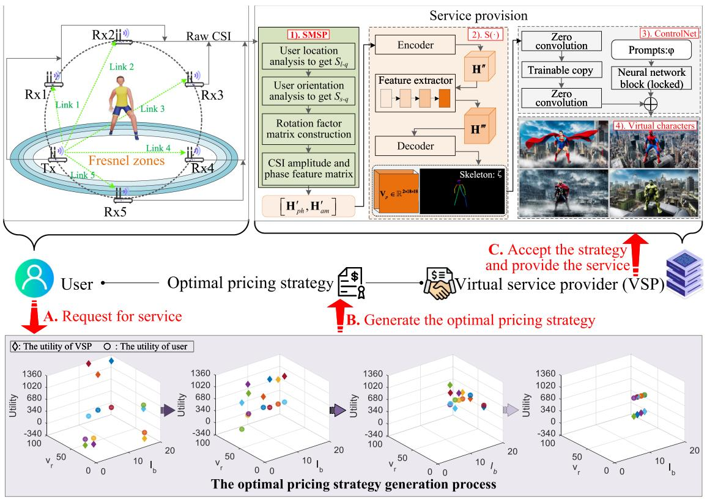

<details>
<summary>flowchart</summary>

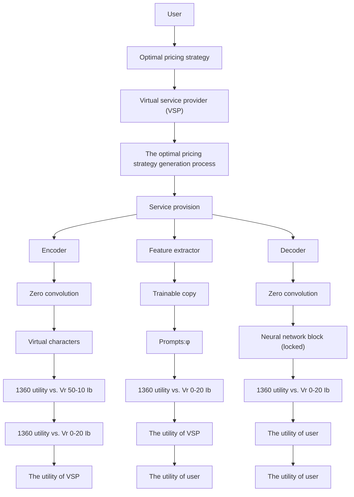
</details>

Fig. 1. Structure of the WiPe-GAI framework. When the user initiates the service request, WiPe-GAI employs the proposed diffusion model-based method to generate the pricing strategy, as four figures at the bottom show. Once the utility brought by the generated strategy meets the requirements of the VSP, the VSP provides the AIGC service to the user.

TABLE I SOME KEY NOTATIONS 

<table><tr><td>Section</td><td>Notation</td><td>Definition</td><td>Notation</td><td>Definition</td></tr><tr><td rowspan="6">Perception</td><td>M</td><td>Total number of antennas</td><td>N</td><td>Total number of subcarriers</td></tr><tr><td>k</td><td>Antenna spacing</td><td>c</td><td>Signal propagation speed</td></tr><tr><td>U</td><td>Total number of measurements</td><td>L</td><td>Total number of propagation paths</td></tr><tr><td>θ</td><td>Signal AoA</td><td>τ</td><td>Signal ToF</td></tr><tr><td>Q</td><td>Total number of receivers</td><td>I</td><td>Identity matrix</td></tr><tr><td> $F_q$ </td><td>Rotation matrix</td><td> $[H'_{ph}, H'_{am}]$ </td><td>CSI feature matrix</td></tr><tr><td rowspan="4">Skeleton prediction</td><td>B(·)</td><td>Neural network for converting V into V&#x27;</td><td>S(·)</td><td>Neural network for predicting  $V_p$ </td></tr><tr><td>V</td><td>Video data</td><td>V&#x27;</td><td>Pose adjacent matrix</td></tr><tr><td>H&#x27;&#x27;</td><td>Output of encoder</td><td>H&#x27;&#x27;&#x27;</td><td>Output of feature extractor</td></tr><tr><td> $V_p$ </td><td>Predicted skeleton</td><td> $\mathcal{L}_{MSE}$ </td><td>Loss function</td></tr><tr><td rowspan="4">Incentive mechanism</td><td> $v_r$ </td><td>Price for per unit of QoS paid by user</td><td> $Q_t$ </td><td>QoS</td></tr><tr><td> $I_b$ </td><td>Base fee provided by user to VSP</td><td> $v_c$ </td><td>Unit cost of computing resources</td></tr><tr><td> $v_m$ </td><td>User&#x27;s gain per unit of QoS</td><td> $E_t$ </td><td>Total computing resources</td></tr><tr><td> $U_{th}$ </td><td>Utility threshold of VSP</td><td>T</td><td>Number of rounds to add noise</td></tr></table>

can be expressed as

$$
\mathbf {H} = \left[ \begin{array}{c c c} H _ {1, 1} & \dots & H _ {1, N} \\ \vdots & \ddots & \vdots \\ H _ {M, 1} & \dots & H _ {M, N} \end{array} \right], \tag {1}
$$

where $H _ { m , n }$ is the CSI extracted from the -th antenna and the Hm,n m-th subcarrier, represents the total number of antennas, and n Mrepresents the number of subcarriers. Each element in matrix NH is the sum of the CSI of all the signal propagation paths [33]. For a given specified propagation path , the corresponding CSI

can be written as

$$
H _ {m, n} ^ {[ l ]} = \alpha_ {m, n} ^ {[ l ]} e ^ {- j 2 \pi f _ {n} \left[ \tau_ {q} ^ {[ l 1 ]} + (m - 1) k \sin \left(\theta_ {q} ^ {[ l ]}\right) / c \right]} e ^ {- j \varepsilon} + \eta_ {m, n} ^ {[ l ]}, \tag {2}
$$

where $\alpha _ { m , n } ^ { [ l ] }$ represents the attenuation introduced by the propaαm,ngation path, $f _ { n }$ is the frequency of the -th subcarrier, $\tau _ { q } ^ { [ l 1 ] }$ is the fn n τqtime of flight (ToF) of the signal arriving at the reference antenna, represents the antenna spacing at the receiver (assumed to be khalf-wavelength [34]), $\theta _ { q } ^ { [ l ] }$ represents the signal angle of arrival θq(AoA),  is the signal propagation speed, $e ^ { - j \varepsilon }$ represents the cphase error, and $\eta _ { m , n } ^ { [ \bar { l } ] }$ is the noise.

As can be observed from (2), for each propagation path, the signal AoA is encoded in the phase difference between the antennas, while the ToF is embedded in the phase difference between the subcarriers. Consequently, based on H, the two-dimensional multiple signal classification algorithm is used here to jointly estimate the AoA and ToF of the propagation path. The basic idea of this algorithm is the eigenvalues analysis of a correlation matrix $\mathbf { R } _ { \mathrm { X } }$ , denoted as

$$
\mathbf {R} _ {\mathrm{X}} = \operatorname{E} \left[ \mathbf {X X} ^ {\dagger} \right] = \mathbf {A R} _ {S} \mathbf {A} ^ {\dagger} + \sigma^ {2} \mathbf {I}, \tag {3}
$$

where $\mathbf { X } \in \mathbb { R } ^ { M ^ { \prime } \times N ^ { \prime } }$ is obtained by conducting spatial smoothing on the H, the superscript † is the conjugate transpose operator, A is the array manifold corresponding to X, $\mathbf { R } _ { S }$ is the correlation Smatrix of the signal matrix, I is the identity matrix, and $\sigma ^ { 2 }$ is the variance of noise. The matrix $\mathbf { R } _ { \mathrm { X } }$ has $M ^ { \prime }$ σeigenvalues, among Mwhich the larger ones correspond to eigenvectors that form the signal subspace $\mathbf { E } _ { S }$ . According to the information theoretic Scriteria [35], the number of large eigenvalues, denoted as $L ,$ can be estimated by minimizing

$$
\begin{array}{l} M D L (L) = - \log \left[ \frac {\prod_ {i = L + 1} ^ {M ^ {\prime}} \lambda_ {i} ^ {1 / (M ^ {\prime} - L)}}{\frac {1}{M ^ {\prime} - L} \sum_ {i = L + 1} ^ {M ^ {\prime}} \lambda_ {i}} \right] ^ {(M ^ {\prime} - L) U} \\ + \frac {1}{2} L (2 M ^ {\prime} - L) \log (U), \tag {4} \\ \end{array}
$$

where $\lambda _ { i }$ is the -th largest eigenvalue, and  is the number i iof observations.1 Apart from $\mathbf { E } _ { S }$ U, the remaining eigenvectors form the noise subspace $\mathbf { E } _ { N }$ S, which is orthogonal to the steering matrix a† $( \theta , \tau )$ Nextracted from X. Using this orthogonality, we can build

$$
P _ {s} (\theta , \tau) = \frac {1}{\mathbf {a} ^ {\dagger} (\theta , \tau) \mathbf {E} _ {N} \mathbf {E} _ {N} ^ {\dagger} \mathbf {a} (\theta , \tau)}, \tag {5}
$$

through which the joint AoA and ToF estimation for each signal propagation path is achieved by traversing  and $\tau , \mathrm { i . e . , A o A }$ and θ τToF, respectively. In this way, the VSP uses the CSI obtained from each receiver to estimate the AoA and ToF corresponding to the user induced reflection. By combining these estimated parameters, along with the locations of the transceivers, the VSP calculates the user’s location in the physical world, denoted as $[ x _ { u s } , y _ { u s } ]$ .

According to the Fresnel Zone Theory [37], the user’s posture has a greater influence on nearby wireless transmission links. This implies that the CSI obtained from links closer to the user carries more detailed information regarding the user’s posture. Hence, the VSP calculates the distance between the user and each link. By using the link formed by the -th receiver and transmitter as an example, this distance is

$$
D _ {q} = \frac {\left| \Upsilon x _ {u s} + \Upsilon^ {\prime} y _ {u s} + \left(x _ {q} - x _ {t}\right) y _ {t} - \left(y _ {u s} - y _ {t}\right) x _ {t} \right|}{\sqrt {\Upsilon^ {2} + \Upsilon^ {\prime 2}}}, \tag {6}
$$

1This value is determined based on the data transmission rate during the perception. For instance, assuming the node is a commonly used WiFi device with a data packet transmission frequency of 400 Hz. Then, based on the channel coherence time [36], U can be set as $4 0 \dot { 0 } \times 0 . 8 4 \approx 3 4$ . where $\Upsilon = y _ { q } - y _ { t }$ , and $\Upsilon ^ { \prime } = x _ { t } - y _ { q }$ . On this basis, the score Υ = yq yt Υ = xt yqof large-scale perception is calculated according to the computed distance as follows:

$$
S 1 _ {q} = \min \left\{D _ {q} \right\} / D _ {q}, q = 1, \dots , Q \tag {7}
$$

where $\{ D _ { q } \}$ represents the minimum distances and  is the min Dq Qtotal number of receivers involved in the perception. As shown in (7), links closer to the user yield higher scores, reflecting the richer information that they contain. These scores are subsequently utilized as weights in constructing the CSI feature matrix, thereby ensuring that links with more information play a more pivotal role in skeleton prediction. In this manner, the VSP accomplishes large-scale perception of the user, and the obtained user’s location is then utilized to aid in the following small-scale perception.

2) Small-Scale Perception: After large-scale perception, the VSP further conducts small-scale perception of users to obtain the CSI that contains more detailed information about user’s posture. Inspired by the Fresnel Zone Theory [37] and the impact of user’s orientation and behavior on the wireless link, the VSP analyzes the signal fluctuation characteristic with the help of the obtained user location to achieve small-scale perception.

Specifically, the VSP first utilizes $[ x _ { u s } , y _ { u s } ]$ and $[ x _ { q } , y _ { q } ]$ to [xus, yus] [xq, yq]calculate the direction of the user relative to the -th receiver, denoted as $\theta _ { q } ^ { \prime } .$ . Then, the VSP uses $\theta _ { q } ^ { \prime }$ qto construct a phase θq θqweight for the CSI of the -th antenna and the -th subcarrier2, which is

$$
w _ {m, n} \left(\theta_ {q} ^ {\prime}\right) = e ^ {j 2 \pi f _ {n} \frac {(m - 1) k \sin \left(\theta_ {q} ^ {\prime}\right)}{c}}. \tag {8}
$$

By using this weight, the power received by the -th receiver in the direction of $\theta _ { q } ^ { \prime }$ at time  can be calculated as

$$
P _ {w} ^ {[ u ]} \left(\theta_ {q} ^ {\prime}\right) = \left| \sum_ {m = 1} ^ {M} \sum_ {n = 1} ^ {N} w _ {m, n} \cdot H _ {m, n} \right| ^ {2}. \tag {9}
$$

Then for a power stream with  observations, the VSP employs Uunbiased variance to describe the fluctuation features of the wireless link over this period of time

$$
S _ {\theta_ {q} ^ {\prime}} ^ {2} = \frac {1}{U - 1} \sum_ {u = 1} ^ {U} \left[ P _ {w} ^ {[ u ]} \left(\theta_ {q} ^ {\prime}\right) - \bar {P} _ {w} \left(\theta_ {q} ^ {\prime}\right) \right] ^ {2}, \tag {10}
$$

where $\hat { P } _ { w } ( \theta _ { q } ^ { \prime } )$ is the average power value during this period. Pw(θq)Based on the variance of each wireless transmission link, the score of small-scale perception is calculated as

$$
S 2 _ {q} = S _ {\theta_ {q} ^ {\prime}} ^ {2} \Bigg / \max \left\{S _ {\theta_ {q} ^ {\prime}} ^ {2} \right\}, \tag {11}
$$

where $\{ S _ { \theta _ { a } ^ { \prime } } ^ { 2 } \}$ is the maximum among  variances. From the θqabove analysis, it can be seen that a link with higher fluctuations $( \mathrm { i . e . }$ , influenced more significantly by the user’s posture) tends to contain more information [37], thereby yielding a higher score. With the help of large-scale perception results, i.e., user

${ } ^ { 2 } \theta _ { q } ^ { \prime }$ is derived from $[ x _ { q } , y _ { q } ]$ ] and $\left[ x _ { u s } , y _ { u s } \right]$ , where the user’s location is determined by constraints based on the estimation results from multiple receivers [12]. Hence, $\dot { \theta } _ { q } ^ { \prime }$ is more accurate than θ and it is employed for small-scale perception.

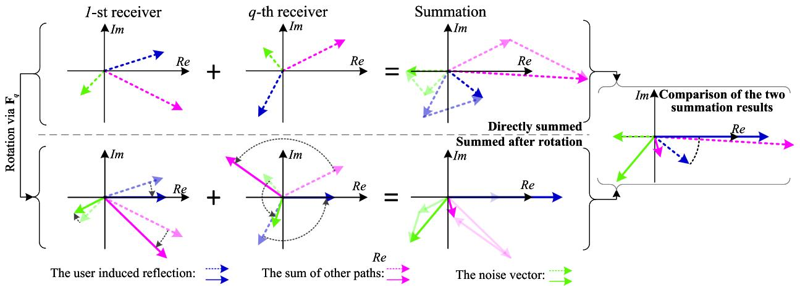

<details>
<summary>flowchart</summary>

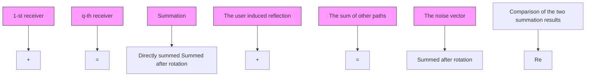
</details>

Fig. 2. Process of enhancing the user-induced CSI before building the feature matrix. As illustrated in the first row, if the raw CSIs are directly summed, the mismatched phases of these CSIs may diminish the proportion of user-induced reflections in the CSI sum, consequently degrading the perception performance. In WiPe-GAI, we propose to rotate the CSIs corresponding to the user to the same direction before summation, as depicted in the second row, thereby circumventing such an issue.

location, the VSP finishes the small-scale perception of the user and obtains the corresponding score, which will be integrated with the large-scale score later to create the CSI feature matrix for user skeleton generation.

To further improve the user skeleton extraction performance by combining CSI from all receivers, the VSP performs more processing on the original CSI data to enhance the user induced reflection before constructing the CSI feature matrix. Taking the case of two receivers as an example, for the -th antenna and the -th subcarrier, the CSI obtained by the 1-st and the n-th receivers are shown in Fig. 2. Here, the blue arrowed line qrepresents the CSI of the user induced reflection signal, the red arrowed line is the CSI corresponding to the sum of the signals from all other paths, and the green arrowed line is the noise. As shown by the first row in Fig. 2, if the CSIs from two receivers are directly summed, the phase inconsistency of the CSI among different receivers may weaken the user induced reflection, thereby reducing the perception performance. To circumvent such an issue, the VSP needs to rotate the CSI of the user obtained by each receiver to the same direction. Recall that the phase (i.e., the angle between the blue vector and the -axis) of the CSI corresponding to the user induced reflection is determined by the ToF and AoA, while the amplitude (i.e., the magnitude of the blue vector) is determined by the reflection coefficient [38]. Therefore, using the estimated AoA and ToF of the user induced reflection, the VSP builds a rotation factor matrix. For the -th receiver, the matrix is

$$
\mathbf {F} _ {q} = \left[ \begin{array}{c c c} F _ {q} ^ {[ 1, 1 ]} & \dots & F _ {q} ^ {[ 1, N ]} \\ \vdots & \ddots & \vdots \\ F _ {q} ^ {[ M, 1 ]} & \dots & F _ {q} ^ {[ M, N ]} \end{array} \right], \tag {12}
$$

where

$$
F _ {q} ^ {[ m, n ]} = e ^ {j 2 \pi f _ {n} \left[ \hat {\tau} _ {q} + (m - 1) k \sin (\theta_ {q} ^ {\prime}) / c \right]}, \tag {13}
$$

where $\hat { \tau } _ { q }$ is the estimated ToF. Next, H is multiplied with $\mathbf { F } _ { q }$ to τˆq qrotate the CSI induced by the user to the positive direction of the -axis

$$
\mathbf {H} _ {q} ^ {\prime} = \mathbf {H} \circ \mathbf {F} _ {q}, \tag {14}
$$

where ◦ is the Hadamard product operator. By performing this operation to all receivers, the CSI corresponding to the user induced reflection received by each receiver will be rotated towards the same direction.

As demonstrated in the second row of Fig. 2, this ensures that the CSI induced by the user is not attenuated during the summation process. Following this, the rotated CSI from each receiver is weighted by the scores acquired by the SMSP algorithm and then aggregated to construct the CSI amplitude and phase feature matrix, respectively denoted as

$$
\left\{ \begin{array}{l} \mathbf {H} _ {p h} ^ {\prime} = \sum_ {q = 1} ^ {Q} \left(S 1 _ {q} + S 2 _ {q}\right) a n g l e \left(\mathbf {H} _ {q} ^ {\prime}\right) \\ \mathbf {H} _ {a m} ^ {\prime} = \sum_ {q = 1} ^ {Q} \left(S 1 _ {q} + S 2 _ {q}\right) a b s \left(\mathbf {H} _ {q} ^ {\prime}\right), \end{array} \right. \tag {15}
$$

where {·} and {·} are phase and amplitude extractor, respectively. From (15), it is clear that the derived CSI feature matrix is abundant with information about user’s posture. Hence, the VSP uses these matrices to predict user skeleton with neural networks, which is explained in detail in the following section.

# C. Skeleton Extraction

Based on the acquired CSI feature matrix, the VSP further needs to convert it into skeleton, so as to guide the GAI model to create the virtual character for the user. To this end, the VSP utilizes a camera synchronized with the signal receiver to capture a video stream, from which the user’s skeleton is extracted (via neural network B · ) and used as supervision to train a neural ( )network (denoted as S · ), as shown in Fig. 3. Finally, based on ( )the trained neural network, the VSP can convert the CSI feature matrix into user’s skeleton.

Specifically, let $\{ \mathbf { V } , \mathbf { H } ^ { \prime \prime } \}$ be a pair of synchronized training ,data, where V is the video frame, $\mathbf { H } ^ { \prime \prime }$ is composed of multiple samples of $\mathbf { H } _ { p h } ^ { \prime }$ and $\mathbf { H } _ { a m } ^ { \prime } .$ , since the sampling rate of CSI is ph amhigher than that of the video frame. To convert the CSI data into skeleton data, the neural networks B · and $\mathbf { S } ( \cdot )$ are constructed. ( ) ( )For any given data pair, B · takes V as the input and outputs ( )skeleton data containing 18 points, by using OpenPose [39]. After that, these 18 points are transformed into a pose adjacent matrix V , and we denote this process as $\mathbf { B } ( \mathbf { V } ) \overset { ^ { \textstyle - } } \Rightarrow \mathbf { V } ^ { \prime } \in \mathbf { \bar { \mathbb { R } } } ^ { 2 \times 1 8 \times 1 8 }$ ( )At the same time, S · takes H as input and predicts $\mathbf { V } _ { p } ,$ which is denoted as $\mathbf { S } ( \mathbf { H } ^ { \prime \prime } ) \Rightarrow \mathbf { V } _ { p } \in \mathbb { R } ^ { 2 \times 1 8 \times 1 8 }$ p. On this basis, $\mathbf { S } ( \cdot )$ ( ) pis optimized with the supervision of $\mathbf { V } ^ { \prime }$ , to assist training. ( )The architecture of this network is shown in Fig. 3, where S · includes three components: encoder, feature extractor, and ( )decoder, which are introduced below.

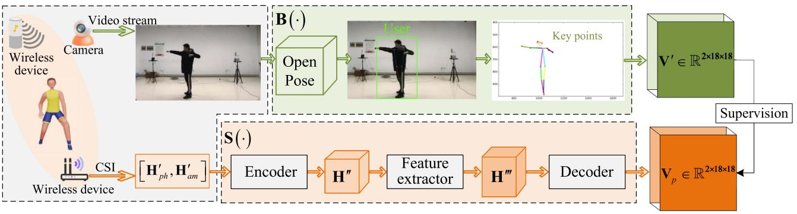

<details>
<summary>flowchart</summary>

```mermaid
graph TD
    A["Wireless device"] --> B["Camera"]
    B --> C["Video stream"]
    C --> D["Open Pose"]
    D --> E["User"]
    E --> F["Key points"]
    F --> G["V' ∈ ℝ²×18×18"]
    G --> H["Supervision"]
    I["Wireless device"] --> J["CSI"]
    J --> K["[H'ph, H'am"]]
    K --> L["Encoder"]
    L --> M["H''"]
    M --> N["Feature extractor"]
    N --> O["H'''"]
    O --> P["Decoder"]
    P --> Q["Vp ∈ ℝ²×18×18"]
    Q --> H
    style A fill:#f9f,stroke:#333
    style I fill:#f9f,stroke:#333
    style G fill:#ccf,stroke:#333
    style Q fill:#ccf,stroke:#333
```
</details>

Fig. 3. Training process of the network, which converts CSI feature matrix to user skeleton. Note that during the training process, the VSP needs to use a camera to acquire V , which serves as supervision to optimize the neural network S(·). However, during the operation, the WiPe-GAI needs only the wireless signals to predict the user’s skeleton, without the use of a camera. This makes the proposed framework applicable to more scenarios where cameras are not applicable.

Encoder: This module is designed to adjust the data dimension of $\mathbf { H } ^ { \prime \prime }$ through several operations. Specifically, in this paper, the CSI is collected using an IEEE 802.11ac based AP, with one antenna at the transmitter and four antennas at the receiver. One of the receiver’s antennas is used for phase calibration and the remaining ones for $\mathbf { H } ^ { \prime \prime }$ construction. Because of the different sampling rates between the camera and receiver, one image is used to match three CSI measurements. Therefore, we have $\mathbf { H } _ { p h } ^ { \prime } \in \mathbb { R } ^ { 2 5 6 \times 3 }$ and $\mathbf { H ^ { \prime } } _ { a m } \in \mathbb { R } ^ { 2 5 6 \times 3 }$ , where 256 represents the ph amnumber of subcarriers and 3 represents the number of antennas. Subsequently, the encoder removes the CSI corresponding to subcarriers at the bandwidth edges3 and performs downsampling to convert $[ \mathbf { H ^ { \prime } } _ { p h } , \mathbf { H ^ { \prime } } _ { a m } ] \in \bar { \mathbb { R } } ^ { 5 1 2 \times 3 } \mathrm { t o } \left[ \mathbf { \check { H } ^ { \prime \prime } } _ { p h } , \mathbf { H ^ { \prime \prime } } _ { a m } \right] \in$ $\mathbb { R } ^ { 1 5 0 \times 3 }$ [ ph,. On this basis, three $[ \bar { \mathbf { H ^ { \prime \prime } } _ { p h } } , \mathbf { H ^ { \prime \prime } } _ { a m } ]$ [ ph, am]are directly stacked to obtain $\mathbf { H ^ { \prime \prime } } _ { p m } \in \mathbb { R } ^ { 1 5 0 \times 3 \times 3 }$ [ ph, a. After that, $\bar { \mathbf { H } } ^ { \prime \prime } { } _ { p m } \in \mathbb { R } ^ { 1 \bar { 5 } 0 \times 3 \times 3 }$ is pm  interpolated to obtain $\mathbf { H } ^ { \prime \prime } \in \mathbb { R } ^ { 1 5 0 \times 1 4 4 \times 1 4 4 }$ pm  . Concretely, assuming that the values of four adjacent elements in $\mathbf { H ^ { \prime \prime } } _ { p m }$ are $h _ { 1 1 } ^ { \prime \prime } , h _ { 1 2 } ^ { \prime \prime } , h _ { 2 1 } ^ { \prime \prime }$ , and $h _ { 2 2 } ^ { \prime \prime }$ pm, respectively, and their corresponding h h hcoordinates are $[ \cdot , r _ { 1 } , c _ { 1 } ] , \ [ \cdot , r _ { 1 } , c _ { 2 } ] , \ [ \cdot , r _ { 2 } , c _ { 1 } ]$ , and $[ \cdot , r _ { 2 } , c _ { 2 } ]$ , [ , r , c ] [ , r , c ] [ , r , c ] [ , r , c ]respectively. Using these four elements, the element obtained through interpolation located at $[ \cdot , r , c ]$ is

$$
\begin{array}{l} h _ {r c} ^ {\prime \prime \prime} = [ h _ {1 1} ^ {\prime \prime} (r _ {2} - r) (c _ {2} - c) + h _ {2 1} ^ {\prime \prime} (r - r _ {1}) (c _ {2} - c) ] \\ + \left[ h _ {1 2} ^ {\prime \prime} \left(r _ {2} - r\right) \left(c - c _ {1}\right) + h _ {2 2} ^ {\prime \prime} \left(r - r _ {1}\right) \left(c - c _ {1}\right) \right], \tag {16} \\ \end{array}
$$

3The CSIs of the subcarriers at the edge of the bandwidth have amplitudes close to 0, containing no useful information [40]. Therefore, we remove the CSI corresponding to these subcarriers. Specifically, the indexes of these subcarriers are 1-24, 123-136, and 233-256.

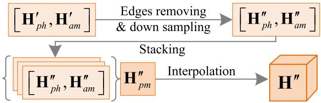

<details>
<summary>flowchart</summary>

```mermaid
graph TD
    A["[H'_{ph}, H'_{am}"]] -->|Edges removing & down sampling| B["[H''_{ph}, H''_{am}"]]
    A --> C["[H''_{ph}, H''_{am}"]]
    B --> D["H''_{pm}"]
    C --> E["H''_{pm}"]
    D -->|Interpolation| F["H''"]
    E -->|Interpolation| F
```
</details>

Fig. 4. Structure of the encoder.

where $r _ { 1 } < r < r _ { 2 }$ and $c _ { 1 } < c < c _ { 2 }$ . At last, $\mathbf { H } ^ { \prime \prime }$ is fed into the next module for feature extraction. The structure of the encoder is shown in Fig. 4.

Feature Extractor: Based on $\mathbf { H } ^ { \prime \prime }$ , a feature extractor is used to learn the effective features for user skeleton prediction. As deeper networks are known to have greater feature learning capabilities, the VSP could use them to fully unleash the feature information contained within $\mathbf { H } ^ { \prime \prime }$ . However, the deeper networks have potential risks, i.e., the gradient vanishing or exploding in deep convolutional layers caused by the chain rule in the backpropagation optimization. These risks also need to be carefully considered. The ResNet [41], a widely-used network in deep learning, can alleviate this problem through the use of shortcut connections and residual blocks. Given this ability, therefore, four ResNets basic blocks are stacked to form the feature extractor, as shown in Fig. 5, for learning features H ∈ R300×18×18. $\mathbf { H } ^ { \prime \prime \prime } \in \mathbb { R } ^ { 3 0 0 \times 1 8 \times 1 8 }$ Note that each convolutional layer is followed in succession by a batch normalization layer [42] and a rectified linear unit activation layer [43].

Decoder: The purpose of the decoder is to perform shape adaptation between $\bar { \mathbf { H } } ^ { \prime \prime \prime }$ and $\mathbf { V } ^ { \prime }$ . As explained for the encoder, $\mathbf { V } ^ { \prime }$ is a tensor of size $2 \times 1 8 \times 1 8$ , and the decoder takes $\mathbf { H } ^ { \prime \prime \prime }$ as 2 18the input to predict the matrix $\mathbf { V } _ { p } ,$ which has the same size as $\mathbf { V } ^ { \prime }$ . Based on the predicted $\mathbf { V } _ { p } ,$ p, we can extract the elements along pthe diagonal of the matrix to form the skeleton of the user. To accomplish this, the decoder utilizes two convolutional layers, as depicted in Fig. 6, where the first layer primarily extracts the channel-wise information, and the second layer reorganizes the spatial information of $\mathbf { H } ^ { \prime \prime \prime }$ using  ×  convolutional kernels. During the training phase, $\mathbf { B } ( \mathbf { V } ) \Rightarrow \mathbf { V } ^ { \prime }$ is used as the supervision and $\mathbf { S } ( \mathbf { H } ^ { \prime \prime } ) \Rightarrow \mathbf { V } _ { p }$ ( )is the prediction. Hence, the loss function is set as the mean squared error (MSE) between $\mathbf { V } ^ { \prime }$ and $\mathbf { V } _ { p } ,$ which is:

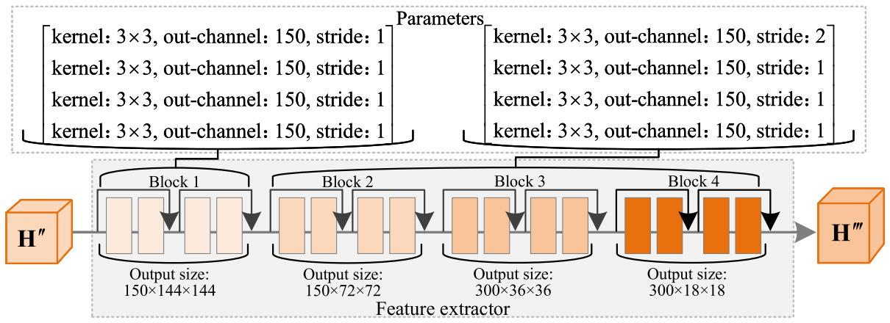

<details>
<summary>flowchart</summary>


</details>

Fig. 5. Structure and parameters of the feature extractor.

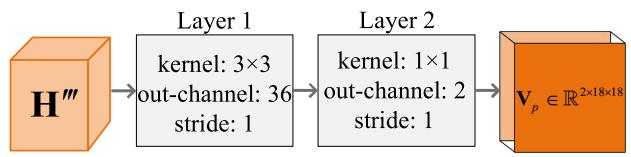

<details>
<summary>flowchart</summary>

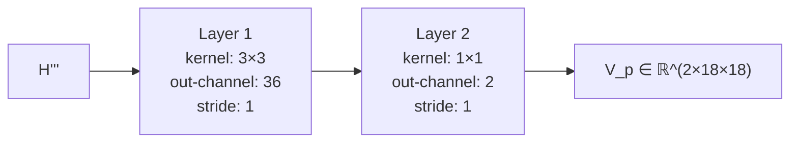
</details>

Fig. 6. Structure of the decoder.

$$
\mathcal {L} _ {M S E} = \left\| \mathbf {V} _ {p} - \mathbf {V} ^ {\prime} \right\| _ {2} ^ {2}. \tag {17}
$$

Under the above configurations, the network is trained for 20 epochs using the Adam optimizer with an initial learning rate of 0.001 and a batch size of 32. The learning rate is decayed by 0.5 at the 5th, 10th, and 15th epochs. Upon completion of training, the model is able to predict $\mathbf { V } _ { p }$ by leveraging the constructed pCSI feature matrix solely. Finally, the diagonal elements from $\mathbf { V } _ { p }$ are extracted and paired to get the predicted user skeleton. pThe pairing process can be denoted as

$$
\left\{ \begin{array}{l} X _ {p} = \mathbf {V} _ {p (1, p, p)}, p \in [ 1, 1 8 ] \\ Y _ {p} = \mathbf {V} _ {p (2, p, p)}, p \in [ 1, 1 8 ], \end{array} \right. \tag {18}
$$

where $X _ { p }$ and $Y _ { p }$ are the coordinates of the predicted skeleton.

# D. Virtual Character Generation

After obtaining the user skeleton, the VSP needs to further generate the virtual character and the specific background based on the user’s requests. Various GAI models have been developed for such purposes. In this paper, the VSP is deployed at the network edge to provide such services to the user. Considering the size of the training dataset, training time, and deployability, ControlNet [6] is selected for generating digital content for users. However, unlike previous approaches that use images for guidance [44], WiPe-GAI utilizes the predicted user skeleton to direct ControlNet in producing virtual character for the user.

Specifically, we consider a feature matrix $\varphi$ and the neural network $\Gamma ( \cdot , \Theta )$ , where Θ is a set of network parameters. In the original network, $\Gamma ( \cdot , \Theta )$ can transform the $\varphi$ into another feature matrix $\varphi ^ { \prime } , \mathrm { i . e . , } \Gamma ( \varphi ; \Theta ) { = } \varphi ^ { \prime }$ , to realize the digital content Γ( ; Θ)=generation, which is illustrated in part A of Fig. 7. However, in this paper, the network is required to generate the corresponding virtual character for the user under the guidance of the predicted skeleton. Therefore, ControlNet first locks Θ, and then copies and creates a trainable $\Theta ^ { \prime } .$ , which is trained with an external condition vector ζ. This operation not only mitigates the over-fitting problem due to a limited number of samples, but also maintains the quality of the content produced by the original network. After that, the neural network block is connected to a unique zero convolution layer, i.e., a  ×  convolution layer where both 1 1weight and bias are initialized with zeros, as shown in Fig. 7. By doing so, such a layer can gradually grow from zero to the optimal parameters through training. Once trained, the network can generate corresponding images based on the input feature matrix ϕ and external condition $\zeta .$ Following this structure, VSP uses stable diffusion as the core neural network, with the user prompts serving as $\varphi$ and the extracted user skeleton as the external condition vector $\zeta ,$ , to generate the virtual character for AIGC service provision.

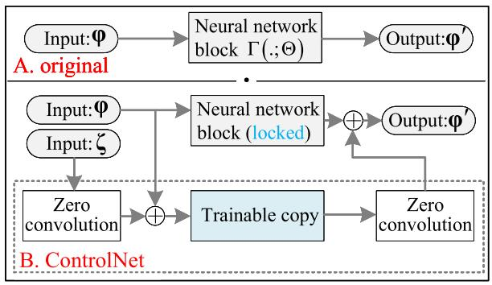

<details>
<summary>flowchart</summary>

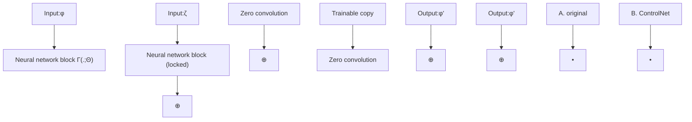
</details>

Fig. 7. Structure comparison between the original network and ControlNet. Building upon the original network, ControlNet creats a trainable block for external condition training. Meanwhile, the neural network is connected to the zero convolution layers that are initialized with zero weights and biases. These parameters are then optimized from zero to their optimal values through training.

# E. Pricing-Based Incentive Mechanism

Given the limited resources of VSP deployed at the mobile edge networks, we propose a pricing-based incentive mechanism to ensure efficient operation of WiPe-GAI. In this mechanism, the user compensates the VSP based on the quality of both perception and virtual character generation services, to encourage the VSP’s active participation. On this basis, we further propose a diffusion model based method to generate the optimal pricing strategy for the implementation of this incentive mechanism.

1) Incentive Mechanism Design: We design a pricing strategy to stimulate a VSP to engage actively in service provision while maximizing the benefits of users. In particular, assuming that the VSP provides perception and AIGC services to users, then the user pays a basic fee, as well as an additional fee based on the quality of service (QoS) to the VSP. Therefore, the profit of the VSP can be denoted as

$$
I _ {V S P} = v _ {r} Q _ {t} + I _ {b}, \tag {19}
$$

where $v _ { r }$ denotes the price that the user pays to the VSP for vrper unit of QoS, represents the QoS, and $I _ { b }$ denotes the basic fee offered by the user to the VSP. Since the service provided by the VSP consists of the wireless perception and virtual character generation, the QoS measure should consider the performance of both tasks. Specifically, wireless perception provides the skeleton for GAI, and then the GAI generates the virtual character based on the skeleton and prompt. Therefore, the following metrics are used.

The reciprocal of the normalized euclidean distance between $\mathbf { V } _ { p }$ and $\mathbf { V } ^ { \prime }$ is used as $Q _ { s }$ to quantify the precision of p Qsthe generated skeleton. As more computing resources are allocated to perception, the VSP can engage more wireless nodes to participate in perception, leading to a more accurate skeleton. Therefore, we have $Q _ { s } = \varsigma _ { s } ( \chi _ { s } )$ , where $\chi _ { s }$ represents the computing resources allocated to the χswireless perception and $\varsigma _ { s } ( \cdot )$ is the mapping relationship ςs( )between computing resources and QoS.

The Blind/Referenceless Image Spatial Quality Evaluator (BRISQUE) and Total Variation (TV) are use as the QoS of the generated virtual character. Similar to wireless perception, when more computing resources are assigned to GAI, the GAI model can execute more inferences, resulting in better AIGC. Hence, the QoS of AIGC is defined as $Q _ { a g } =$ $B R I S Q U E + T V = \varsigma _ { b r q } ( \chi _ { a g } ) + \varsigma _ { t v } ( \chi _ { a g } )$ Qag =, where BRISQUE + T V = ςbrq(χag) + ςtv(χag)represents the resource allocated to GAI by the VSP, $\varsigma _ { b r q } ( \cdot )$ ςbrq( )is the mapping relationship between computing resources and BRISQUE, and $\varsigma _ { t v } ( \cdot )$ is the mapping relationship ςtv( )between computing resources and TV.4

Based on the above analysis, we can model the total QoS of the service as

$$
Q _ {t} = Q _ {s} + Q _ {a g} = \varsigma_ {s} (\chi_ {s}) + \varsigma_ {b r q} (\chi_ {a g}) + \varsigma_ {t v} (\chi_ {a g}). \tag {20}
$$

4These mapping relationships, including $\varsigma _ { s } ( \cdot ) , \varsigma _ { b r q } ( \cdot )$ , and $\varsigma _ { t v } ( \cdot )$ are obtained by fitting real-world test results, which will be explained in detail in Section IV.

Given $I _ { V S P }$ and $Q _ { t } ,$ , the utility function of the VSP can be IV SPobtained as

$$
U _ {v s p} = I _ {V S P} - \left(\chi_ {s} + \chi_ {a g}\right) v _ {c} = v _ {r} Q _ {t} + I _ {b} - \left(\chi_ {s} + \chi_ {a g}\right) v _ {c}, \tag {21}
$$

where $v _ { c }$ is the unit cost of computing resources. Meanwhile, vcfor users, the utility function can be defined as

$$
U _ {u s} = v _ {m} Q _ {t} - (v _ {r} Q _ {t} + I _ {b}) = (v _ {m} - v _ {r}) Q _ {t} - I _ {b}, \tag {22}
$$

where $v _ { m }$ is the gain per unit QoS obtained by user, which is determined by the market. Based on the aforementioned model, the pricing strategy offered by users includes $I _ { b }$ and $v _ { r } ,$ which Ib vraims to maximize user’s utility and provide rational incentives for the VSP to agree to the pricing strategy. To obtain an optimal pricing strategy, we formulate an optimization problem as follows

$$
\max _ {v _ {r}, I _ {b}, \chi_ {s}, \chi_ {a g}} U _ {u s} (v _ {r}, I _ {b}, \chi_ {s}, \chi_ {a g})
$$

$$
\text { s.t. } \left\{ \begin{array}{l} \chi_ {s} ^ {\prime}, \chi_ {a g} ^ {\prime} \in \underset {\chi_ {s}, \chi_ {a g}} {\arg \max} U _ {v s p} (v _ {r}, I _ {b}, \chi_ {s}, \chi_ {a g}), \\ \chi_ {s} ^ {\prime} + \chi_ {a g} ^ {\prime} \leq E _ {t}, \\ U _ {v s p} (\chi_ {s} ^ {\prime}, \chi_ {a g} ^ {\prime}, v _ {r}, I _ {b,}) \geq U _ {t h}, \end{array} \right. \tag {23}
$$

where the first constraint is to ensure that the VSP can maximize its own utility, the second one comes from the limited computing resources of the VSP, and the third one is the utility threshold $U _ { t h }$ , signifying that the VSP only participates in service provision when the expected utility exceeds this value. As demonstrated by the above model, the users maximize their own utility through pricing, while the VSP seeks to optimize its utility by conducting resource allocation while meeting the constraints imposed by the provided pricing and limited computing resources. Therefore, the optimization problem is essentially a joint pricing and resource allocation problem. Considering the uncertainty in mapping relationship between computing resources and QoS and varying prices of computing resources across different situations, we propose a diffusion model-based approach to tackle this optimization problem.

2) Diffusion Model Generated Optimal Pricing Strategy: The diffusion model is a type of latent variable model, which first introduces Gaussian noise to perturb training samples, and then learns to perform the inverse denoising process to generate samples similar to the original. This denoising process allows the model to understand the underlying structure of the data, leading to more accurate and realistic generations [27]. Hence, we leverage the inverse diffusion process to generate optimal pricing strategy to solve this optimization problem [21].

Specifically, the forward process of the diffusion model is defined as a Markov chain, wherein  rounds of noises are Tsequentially added to the training samples. As  approaches infinity, the original samples converge to standard Gaussian noise distribution. For a given distribution $s _ { 0 }$ , this forward process can be expressed as follows

$$
z \left(\mathbf {s} _ {1: T} | \mathbf {s} _ {0}\right) = \prod_ {t = 1} ^ {T} z \left(\mathbf {s} _ {t} | \mathbf {s} _ {t - 1}\right)
$$

$$
= \prod_ {t = 1} ^ {T} \mathcal {N} \left(\mathbf {s} _ {t}; \sqrt {1 - \beta_ {t}} \mathbf {s} _ {t - 1}, \beta_ {t} \mathbf {I}\right), \tag {24}
$$

where $\{ \beta \} _ { t = 1 : T }$ is the hyperparameter corresponding to the variβ t Tance of Gaussian distribution, I is the identity matrix. Therefore, for given s0, $\mathbf { s } _ { t }$ can be denoted as

$$
z \left(\mathbf {s} _ {t} | \mathbf {s} _ {0}\right) = \mathcal {N} \left(\mathbf {s} _ {t}; \sqrt {\bar {\vartheta} _ {t}} \mathbf {s} _ {0}, \left(1 - \bar {\vartheta} _ {t}\right) \mathbf {I}\right), \tag {25}
$$

where $\begin{array} { r } { \bar { \vartheta } _ { t } = \prod _ { i = 1 } ^ { t } \left( 1 - \beta _ { i } \right) } \end{array}$ . In contrast to the forward process, ϑt = i (1 βi)the inference stage involves an inverse denoising process to generate samples. Theoretically, $\mathrm { i f } \ z \big ( \mathbf { s } _ { t - 1 } \big | \mathbf { s } _ { t } \big )$ can be obtained, z( t t)we can use it to recover the original sample from the standard Gaussian distribution. However, the acquisition of $z ( \mathbf { s } _ { t - 1 } | \mathbf { s } _ { t } )$ requires knowledge of all pricing strategies in all conditions, which is difficult to acheive in WiPe-GAI. Therefore, a neural network is used to learn the following transition relation as follows

$$
p _ {\omega} \left(\mathbf {s} _ {t - 1} | \mathbf {s} _ {t}\right) = \mathcal {N} \left(\mathbf {s} _ {t - 1}; \boldsymbol {\mu} _ {\omega} \left(\mathbf {s} _ {t}, t\right), \boldsymbol {\sigma} _ {\omega} ^ {2} \left(\mathbf {s} _ {t}, t\right) \mathbf {I}\right), \tag {26}
$$

where  is the hyperparameter of the neural network. On this ωbasis, the inverse denoising process can be described as

$$
\begin{array}{l} p _ {\omega} \left(\mathbf {s} _ {0: T}\right) = p \left(\mathbf {s} _ {T}\right) \prod_ {t = T} ^ {1} p _ {\omega} \left(\mathbf {s} _ {t - 1} | \mathbf {s} _ {t}\right) \\ = p \left(\mathbf {s} _ {T}\right) \prod_ {t = T} ^ {1} \mathcal {N} \left(\mathbf {s} _ {t - 1}; \boldsymbol {\mu} _ {\omega} \left(\mathbf {s} _ {t}, t\right), \boldsymbol {\sigma} _ {\omega} ^ {2} \left(\mathbf {s} _ {t}, t\right) \mathbf {I}\right), \tag {27} \\ \end{array}
$$

where $p ( \mathbf { s } _ { T } ) = \mathcal { N } ( \mathbf { s } _ { T } ; \mathbf { 0 } , \mathbf { I } )$ . As it can be seen, the purpose of p( T ) = ( T ; , )training the neural network is to learn $\mu _ { \omega } ( \mathbf { s } _ { t } , t )$ and $\sigma _ { \omega } ^ { 2 } ( \mathbf { s } _ { t } , t )$ , ωrespectively. From another perspective, given $\mathbf { s } _ { 0 } .$ ω, the Bayes equation can be utilized to obtain

$$
z \left(\mathbf {s} _ {t - 1} | \mathbf {s} _ {t}, \mathbf {s} _ {0}\right) = \mathcal {N} \left(\mathbf {s} _ {t - 1}; \tilde {\mu} _ {t} \left(\mathbf {s} _ {t}\right), \tilde {\beta} _ {t} \mathbf {I}\right), \tag {28}
$$

where $\tilde { \mu } _ { t } ( \mathbf { s } _ { t } ) = ( \mathbf { s } _ { t } - \beta _ { t } \bar { \varepsilon } / \sqrt { 1 - \bar { \vartheta } _ { t } } ) / \sqrt { \vartheta _ { t } }$ and $\tilde { \beta } _ { t } =$ $( 1 - \bar { \vartheta } _ { t - 1 } ) \beta _ { t } / ( 1 - \bar { \vartheta } _ { t } )$ βt¯ 1 ϑ. Considering $\tilde { \mu } _ { t } ( { \bf s } _ { t } )$ t βt =as the ground (1 ϑt )βt (1 ϑt)truth, therefore, the learned $\mu _ { \omega } ( \mathbf { s } _ { t } , t )$ μ˜t( t)is essentially $\varepsilon _ { \omega } ( \mathbf { s } _ { t } , t )$ , due to the relation

$$
\tilde {\mu} _ {\omega} \left(\mathbf {s} _ {t}, t\right) = \frac {1}{\sqrt {\vartheta_ {t}}} \left[ \mathbf {s} _ {t} - \frac {\beta_ {t}}{\sqrt {1 - \bar {\vartheta} _ {t}}} \overline {{\boldsymbol {\varepsilon}}} _ {\omega} \left(\mathbf {s} _ {t}, t\right) \right], \tag {29}
$$

and the prediction result of the model at step $t - 1$ is

$$
\mathbf {s} _ {t - 1} \left(\mathbf {s} _ {t}, t; \omega\right) = \frac {1}{\sqrt {\vartheta_ {t}}} \left[ \mathbf {s} _ {t} - \frac {\beta_ {t} \varepsilon_ {\omega} \left(\mathbf {s} _ {t} , t\right)}{\sqrt {1 - \bar {\vartheta} _ {t}}} \right] + \sigma_ {\omega} \left(\mathbf {s} _ {t}, t\right) \varepsilon , \tag {30}
$$

where $\varepsilon \sim \mathcal { N } ( { \bf 0 , I } )$ .

( , )Building upon the aforementioned model and taking the factors, such as the cost of computing resources, into consideration, we construct a conditional diffusion model and utilize its inverse process to generate the optimal pricing strategy. Specifically, assuming the pricing to be generated is represented by $\mathbf { s } = \{ v _ { r } , I _ { b } \}$ , and the state parameters influencing = vr, Ibthe resource allocation and QoS of the VSP are denoted by

# Algorithm 1: Diffusion Model Generated Optimal Pricing Strategy.

# Training Phase:

1: Input hyper-parameters: denoising step $T ,$ initialize neural network parameters  and   
2: ##Learning Process   
3: Initialize a random process for pricing strategy exploration   
4: while not converge do   
5: Observe the current environment   
6: $\mathbf { c } = \{ c _ { \varsigma _ { s } } , c _ { \varsigma _ { b r q } } , c _ { \varsigma _ { t v } } , v _ { c } , v _ { r } , v _ { m } \}$   
7: Set $s _ { N }$ = cςs , cςbrq , cςtv , vc, vr, vmas Gaussian noise. Generate pricing strategy $s _ { 0 }$ Nby denoising $s _ { N }$ according to (33)   
N8: Apply the generated pricing strategy $s _ { 0 }$ to the environment and observe the utility value as (22).   
9: Record the real utility value   
10: Update $Q _ { v }$ by minimizing the mean squared error Qvbetween the real and predicted utility values   
11: Update $\varepsilon _ { \omega }$ according to (34)   
εω12: return The trained solution generation network $\varepsilon _ { \theta }$ Inference Phase:   
1: Observe the environment vector c   
2: Generate the optimal pricing strategy $\scriptstyle { \boldsymbol { s } } _ { 0 }$ by denoising Gaussian noise using $\varepsilon _ { \theta }$   
θ3: return The optimal pricing strategy $s _ { 0 }$

$\mathbf { c } = \{ c _ { \varsigma _ { s } } , c _ { \varsigma _ { b r q } } , c _ { \varsigma _ { t v } } , v _ { c } , v _ { r } , v _ { m } \}$ , then the inverse process of the = cςs , cςbrq , cςtv , vc, vr, vmconditional diffusion model is defined as

$$
p _ {\omega} ^ {\prime} (\mathbf {s} | \mathbf {c}) = \mathcal {N} \left(\mathbf {s} ^ {T}; \mathbf {0}, \mathbf {I}\right) \prod_ {t = T} ^ {1} p _ {\omega} ^ {\prime} \left(\mathbf {s} _ {t - 1} | \mathbf {s} _ {t}, \mathbf {c}\right), \tag {31}
$$

where $p _ { \omega } ^ { \prime } ( \mathbf { s } _ { t - 1 } | \mathbf { s } _ { t , \mathbf { c } } )$ can be model as a Gaussian distribution pω( texpressed as $\mathcal { N } ( \mathbf { s } _ { t - 1 } ; \mu _ { \omega } ( \mathbf { s } _ { t } , t , \mathbf { c } ) , \pmb { \sigma } _ { \omega } ^ { 2 } ( \mathbf { s } _ { t } , t , \mathbf { c } ) \mathbf { I } )$ , and the corre-( t ; ω( t, t, ), ω( t, t,sponding mean and variance are denoted as

$$
\left\{ \begin{array}{l} \boldsymbol {\mu} _ {\omega} \left(\mathbf {s} _ {t}, t, \mathbf {c}\right) = \frac {1}{\sqrt {\vartheta_ {t}}} \left[ \mathbf {s} _ {t} - \frac {\beta_ {t}}{\sqrt {1 - \bar {\vartheta} _ {t}}} \bar {\varepsilon} _ {\omega} \left(\mathbf {s} _ {t}, t, \mathbf {c}\right) \right], \\ \boldsymbol {\sigma} _ {\omega} ^ {2} \left(\mathbf {s} _ {t}, t, \mathbf {c}\right) = \beta_ {t} \mathbf {I}, \end{array} \right. \tag {32}
$$

respectively. Meanwhile, according to (31), under the condition of c, the prediction outcome of the conditional diffusion model inverse process at step $t - 1$ can be expressed as

$$
\begin{array}{l} \mathbf {s} _ {t - 1} \left(\mathbf {s} _ {t}, t, \mathbf {c}; \omega\right) = \frac {1}{\sqrt {\vartheta_ {t}}} \left[ \mathbf {s} _ {t} - \frac {\beta_ {t}}{\sqrt {1 - \bar {\vartheta} _ {t}}} \boldsymbol {\varepsilon} _ {\omega} \left(\mathbf {s} _ {t}, t, \mathbf {c}\right) \right] \\ + \sigma_ {\omega} (\mathbf {s} _ {t}, t, \mathbf {c}) \varepsilon . \tag {33} \\ \end{array}
$$

In WiPe-GAI, our objective is to determine the $\varepsilon _ { \omega }$ capable of generating the optimal $\mathbf { s } _ { 0 }$ ωbased on the given the condition c. Here, the $\mathbf { s } _ { 0 }$ is defined as the one that maximizes $U _ { u s }$ subject Uusto the constraints defined in (23). Inspired by the deep reinforcement learning paradigm, we redefine certain elements in our context. Concretely, c is treated as the environment, while $\mathbf { s } _ { 0 }$ is considered the action. The expected cumulative reward is represented as the Q-value, denoted as $Q _ { v } ( \mathbf { s } _ { 0 } , \mathbf { c } )$ . To manage the Qv( , )training process, Q-learning is adopted. Hence, the optimal $\varepsilon _ { \omega }$ becomes synonymous with a denoising network that maximizes the expected cumulative Q-values, which can be expressed as

$$
\underset {\boldsymbol {\varepsilon} _ {\omega}} {\arg \min} \mathcal {L} (\omega) = - \mathbb {E} _ {\mathbf {s} _ {0} \sim \boldsymbol {\varepsilon} _ {\omega}} \left[ Q _ {v} \left(\mathbf {s} _ {0}, \mathbf {c}\right) \right]. \tag {34}
$$

After training, the model is utilized to generate the optimal pricing strategy, based on which the VSP calculates the best resource allocation method through convex optimization, so as to maximize its utility and solve the optimization problem in (23)). The overall training and inference process is summarized in Algorithm 1.

# IV. EXPERIMENT AND EVALUATION

In this section, we conduct a comprehensive evaluation and analysis of the proposed WiPe-GAI framework through experiments from two perspectives. First, we evaluate the performance of the user skeleton extraction and virtual character generation, based on collected CSI data, to validate the feasibility of WiPe-GAI. Then, based on these results, we derive the mapping functions $\varsigma _ { s } ( \cdot ) , \varsigma _ { b r q } ( \cdot )$ , and $\varsigma _ { t v } ( \cdot )$ through fitting. Subsequently, we perform experiments to evaluate the efficiency of the proposed incentive mechanisms.

# A. Experimental Configuration

In the experiments, multiple APs equipped with the Broadcom 4366C0 chips and the Nexmon toolkit [45] are used to collect CSI data based on the IEEE 802.11ac protocol. The AP operates at 5.805 GHz with the signal bandwidth of 80 MHz (including 256 subcarriers) and the transmission rate of 100 packets per second. During the perception process, the transmitter utilizes a single antenna for signal transmission and the receiver employs four antennas to receive the signal and extract the CSI. Note that the CSI from one antenna is used for phase error cancellation and the CSIs from the rest antennas are used for user skeleton prediction. The proposed algorithms are executed on an experimental platform constructed on a standard Ubuntu 20.04 system, equipped with an AMD Ryzen Threadripper PRO 3975WX 32-core processor and an NVIDIA RTX A5000 graphics processing unit (GPU).

# B. Wireless Perception to Virtual Character Generation

1) Effectiveness of WiPe-GAI: To verify the effectiveness of WiPe-GAI, we first conduct experiments on user skeleton prediction and the virtual character generation, the results are presented in Fig. 8. Taking the skeleton predicted by Open-Pose [39] as the ground truth, from the figures, we can observe that WiPe-GAI can effectively predict the skeleton of the user by using the proposed SMSP algorithm and the trained S · . ( )There are some differences between the predicted skeleton and the user’s actual posture. For instance, as shown in the second row of results, there are minor differences in the position of the predicted and actual knees. However, these differences are slight and overall, the predicted skeleton is fairly close to the user’s real posture. This validates the effectiveness of the proposed SMSP based skeleton extraction.

Building on this, the predicted skeleton and the user’s prompts are used as external conditions and prompts, respectively, to generate the virtual character for the user. As can be seen from the fourth column in Fig. 8, WiPe-GAI is able to effectively generate the virtual character based on the predicted skeleton and user’s prompt. Compared to the results without skeleton guidance in the fifth column, we can see WiPe-GAI produces a virtual character that more accurately match the user’s actual posture, demonstrating the effectiveness of the proposed WiPe-GAI framework. Furthermore, WiPe-GAI can craft a fitting background for the virtual character based on user’s prompts, thereby enhancing the overall naturalness of the generated content.

2) Impact of AP Quantity on Skeleton Prediction: After verifying the effectiveness of WiPe-GAI, we analyze the effect of the number of APs on perception accuracy, and compare our approach with the existing method in [46]. The results are presented in Fig. 9. As can be seen, the skeleton prediction performance deteriorates as the number of APs decreases. This can be explained by the fact that a decrease in the AP quantity causes a reduction in the information about user posture contained in the CSI feature matrix, which subsequently leads to a decline in prediction accuracy. However, given the fixed total computing resource, using fewer APs would free up more resources for the virtual character generation, which can enhance the AIGC quality. Furthermore, we can see from Fig. 9 that with the proposed SMSP algorithm, the predicted skeleton is improved compared to directly using the original CSI data for skeleton prediction, especially when fewer APs are involved. For instance, when only one AP participates in perception, the skeleton predicted by our algorithm can roughly indicate that the user is in a standing position, while the prediction of [46] implies that the user is in a squatting position, which does not match the ground truth.

We conduct multiple predictions with varying numbers of APs and analyze the prediction accuracy by employing the reciprocal of the normalized euclidean distance between the predicted skeleton and the skeleton obtained by OpenPose as the metric. The blue and red bars in Fig. 10 illustrate that for both the proposed WiPe-GAI framework and the method in [46], an increase in the number of APs participating in perception leads to the CSI feature matrix containing more user information, which in turn results in higher prediction accuracy. Specifically, when only one AP is used, the prediction accuracies of the proposed WiPe-GAI and the method in [46] are about 5.7 and 4.2, respectively. However, when the number of APs is increased to five, the prediction accuracies of these two methods rise to about 23.5 and 22.9, respectively. Additionally, as the number of APs grows, the performance of the method in [46] gradually becomes closer to that of WiPe-GAI. This is because more APs provide a greater amount of information about the user’s posture, leading to more accurate predictions, even without specialized signal processing.

By fitting the prediction results of both systems, the mapping relationships between the number of APs and the perception accuracy can be obtained, as shown by the red and blue lines in Fig. 10. From the fitting results, it can be seen that the overall prediction performance of WiPe-GAI is better, especially with fewer APs, demonstrating the effectiveness of the proposed SMSP algorithm. Essentially, the obtained mapping relationship signifies how computing resources relate to perception accuracy, as more APs used in perception lead to larger amount of resources use for prediction. Therefore, we use the fitted relationship as $\varsigma _ { s } ( \cdot )$ for the following analysis.

<table><tr><td>Video</td><td>OpenPose</td><td>Predicted</td><td>AIGC with guidance</td><td>AIGC without guidance</td></tr><tr><td></td><td></td><td></td><td></td><td></td></tr><tr><td colspan="5">Prompt: A dinosaur in the forest</td></tr><tr><td></td><td></td><td></td><td></td><td></td></tr><tr><td colspan="5">Prompt: The batman in the sky</td></tr><tr><td></td><td></td><td></td><td></td><td></td></tr><tr><td colspan="5">Prompt: The kung fu panda</td></tr><tr><td></td><td></td><td></td><td></td><td></td></tr><tr><td colspan="5">Prompt: A spiderman in the city</td></tr><tr><td></td><td></td><td></td><td></td><td></td></tr><tr><td colspan="5">Prompt: The superman in the field</td></tr><tr><td></td><td></td><td></td><td></td><td></td></tr><tr><td colspan="5">Prompt: captain America with shield</td></tr></table>

Fig. 8. Predicted user skeleton and the generated virtual character. In the figures, the first column presents the user’s posture captured by camera in the real-world scenario. The second column are the skeletons predicted by OpenPose based on the video sequence. The third and fourth columns, respectively, illustrate the user’s skeleton predicted by WiPe-GAI and the generated corresponding virtual character. The fifth column displays the generated virtual characters without the guidance of skeleton.

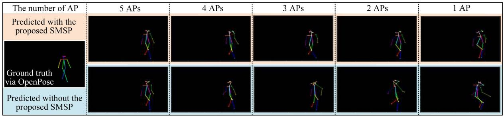

<details>
<summary>text_image</summary>

The number of AP
Predicted with the
proposed SMSP
Ground truth
via OpenPose
Predicted without the
proposed SMSP
5 APs
4 APs
3 APs
2 APs
1 AP
</details>

Fig. 9. Impact of AP quantity on skeleton prediction.

ςs( )3) Impact of Inference Steps on Virtual Character Generation: In addition to the perception, we also analyze the impact of

the number of inference steps on the virtual character generation and the results are illustrated in Fig. 11. From the figures, it is clear that the quality of the generated virtual character improves as the number of inference steps increases. Specifically, the virtual character generated with only 2 to 3 inference steps are in black and white, with incomplete character limbs, as shown by the first two figures of Fig. 11. However, with more inference steps, these issues are effectively alleviated, exhibiting a character with more thematic color, complete limbs, and less noise in the background. This is understandable, as more steps implies that the GAI model can perform more in-depth denoising, thereby producing higher quality results.

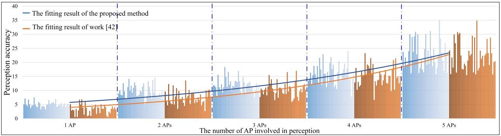

<details>
<summary>line</summary>

| The number of AP involved in perception | Perception accuracy (The fitting result of the proposed method) | Perception accuracy (The fitting result of work [42]) |
| --------------------------------------- | ------------------------------------------------------------- | -------------------------------------------------- |
| 1 AP                                    | ~6                                                            | ~4                                                 |
| 2 APs                                   | ~8                                                            | ~6                                                 |
| 3 APs                                   | ~10                                                           | ~8                                                 |
| 4 APs                                   | ~14                                                           | ~12                                                |
| 5 APs                                   | ~22                                                           | ~24                                                |
</details>

Fig. 10. Relation between the number of APs involved in perception and the perception performance.

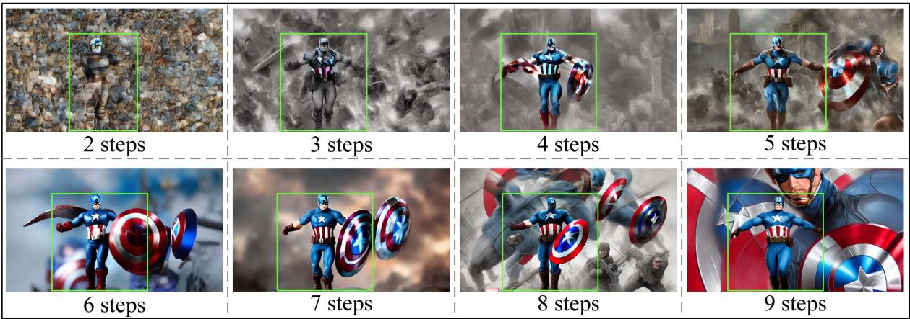

<details>
<summary>text_image</summary>

2 steps
3 steps
4 steps
5 steps
6 steps
7 steps
8 steps
9 steps
</details>

Fig. 11. Impact of inference steps on virtual character generation.

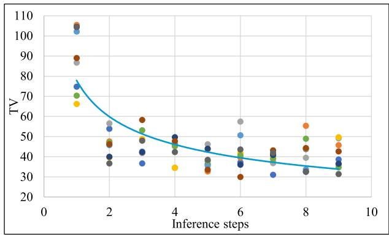

<details>
<summary>scatter</summary>

| Inference steps | TV  |
| --------------- | --- |
| 1               | 75  |
| 1               | 105 |
| 1               | 90  |
| 1               | 65  |
| 2               | 55  |
| 2               | 45  |
| 2               | 35  |
| 3               | 50  |
| 3               | 60  |
| 4               | 45  |
| 4               | 35  |
| 5               | 40  |
| 5               | 30  |
| 6               | 55  |
| 6               | 40  |
| 7               | 40  |
| 7               | 30  |
| 8               | 55  |
| 8               | 40  |
| 9               | 50  |
| 9               | 30  |
</details>

Fig. 12. TV value versus the number of inference steps.

On this basis, we further calculate the BRISQUE and TV values based on the images generated from multiple experiments. The results, represented as data points, are shown in Figs. 12 and 13. According to the results, we can observe a decrease in the TV value, from around 78 to 32, and a decline in the BRISQUE value, from approximately 55 to 3, as the number of inference steps increases from 1 to 10. These trends suggest a significant improvement in the naturalness and smoothness of the generated image, which contains the virtual character and the corresponding background, while also showing that GAI consumes more resources. By fitting these data points, we obtain the relationship between the computing resources allocated to GAI and the quality of the generated digital content, as the blue curves show. Hence, we use them as $\varsigma _ { t v } ( \cdot )$ and $\varsigma _ { b r q } ( \cdot )$ for subsequent analysis.

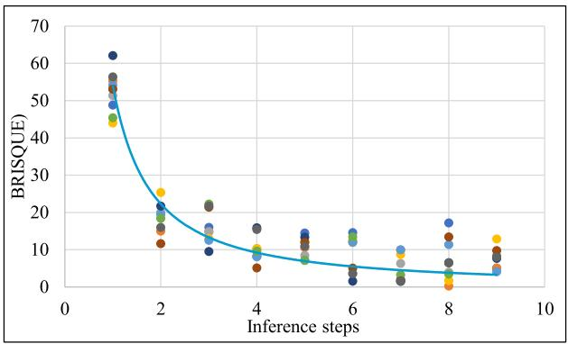

<details>
<summary>scatter</summary>

| Inference steps | BRISQUE |
| --------------- | ------- |
| 1               | 62      |
| 1               | 55      |
| 1               | 53      |
| 1               | 50      |
| 1               | 48      |
| 1               | 45      |
| 2               | 22      |
| 2               | 25      |
| 2               | 18      |
| 2               | 15      |
| 2               | 12      |
| 3               | 10      |
| 3               | 15      |
| 3               | 18      |
| 4               | 8       |
| 4               | 10      |
| 4               | 12      |
| 5               | 7       |
| 5               | 10      |
| 5               | 12      |
| 6               | 5       |
| 6               | 8       |
| 6               | 10      |
| 7               | 3       |
| 7               | 5       |
| 7               | 8       |
| 8               | 2       |
| 8               | 5       |
| 8               | 8       |
| 9               | 5       |
| 9               | 8       |
| 9               | 10      |
| 9               | 12      |
</details>

Fig. 13. BRISQUE value versus the number of inference steps.

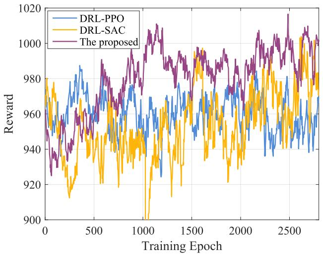

<details>
<summary>line</summary>

| Training Epoch | DRL-PPO | DRL-SAC | The proposed |
| -------------- | ------- | ------- | ------------ |
| 0              | 960     | 980     | 940          |
| 500            | 970     | 950     | 960          |
| 1000           | 965     | 930     | 980          |
| 1500           | 975     | 960     | 990          |
| 2000           | 970     | 955     | 985          |
| 2500           | 980     | 970     | 1010         |
| 2700           | 975     | 965     | 1005         |
</details>

Fig. 14. Training curves, with the diffusion step of 10, batch size of 512, soft target update parameter of 0.005, discount factor of 0.95, exploration noise of 0.01, and learning rate of 10−5.

# C. Incentive Mechanism Analysis

1) Pricing Strategy Generation: Utilizing the obtained $\varsigma _ { s } ( \cdot )$ , $\varsigma _ { t v } ( \cdot )$ , and $\varsigma _ { b r q } ( \cdot )$ ςs( ), we analyze the performance of WiPe-GAI in generating optimal pricing strategies. Moreover, we compare the generated strategies with those extracted by two DRL algorithms, i.e., Soft Actor-Critic (SAC) [47] and Proximal Policy Optimization (PPO) [48]. Specifically, the PPO realizes optimization by using a clipped surrogate objective to update the policy iteratively, which can provide smooth policy changes. The SAC is an off-policy algorithm, which maximizes the expected cumulative reward and the entropy of the policy by learning a stochastic policy. During the experiments, we assume that the VSP has a total of 100 units of computing resources, with processing the CSI of a single AP consuming 2 units, predicting the skeleton requiring 1 unit, and executing an inference consumes 2 units.

The results in Fig. 14 show the achievable reward against the training epoch of WiPe-GAI in comparison with SAC and PPO. From the experimental results, it can be observed that, under the preset number of epochs, the proposed algorithm has already converged, while SAC and PPO do not show a clear trend of convergence, indicating that the proposed algorithm converges faster. Moreover, the reward of WiPe-GAI is about 1000, whereas DRL-SAC and DRL-PPO can achieve around 970 and 960, respectively, which is lower than that of the proposed algorithm. We attribute this to two primary factors. First, WiPe-GAI has a better sampling quality because diffusion model can reduce the influence of uncertainty and noise through multiple rounds of fine-tuning. Second, unlike traditional neural networks that only consider the input at the current time step, the diffusion model can generate samples for more time steps by fine-tuning, providing a stronger processing capability for tasks with longterm dependencies.

Using the trained models, we further compare the optimal pricing strategy design capabilities of different models under a given environment state. As can be seen from the results in Fig. 15, the strategy generated by the proposed method (with $I _ { b } = 1 3 \mathrm { a n d } v _ { r } = 3 5 )$ yields a user utility of 910, higher than 787 Ib = 13 vr = 35and 737, which are achieved by SAC (with $I _ { b } = 1 7$ and $v _ { r } = 4 3 )$ and PPO (with $I _ { b } = 1 5$ and $v _ { r } = 4 6 )$ Ib = 17 vr = 43, respectively. A noteworthy Ibdetail is that the $\mathrm { { V S P } { \mathrm { { \Omega } s } } }$ vr = 46 utility provided by the optimal pricing strategy generated by the diffusion model stands at 496, which is lower than SAC’s 557 and PPO’s 626. We believe this trade-off is reasonable, as the pricing strategy aims to maximize the utility of the user while still incentivizing the VSP’s participation.

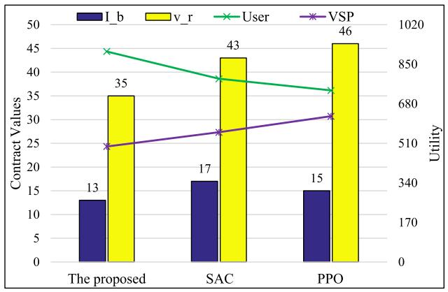

<details>
<summary>bar_line</summary>

| Category | I_b | v_r | User | VSP |
|---|---|---|---|---|
| The proposed | 13 | 35 | 870 | 510 |
| SAC | 17 | 43 | 820 | 560 |
| PPO | 15 | 46 | 790 | 600 |
</details>

Fig. 15. Generated optimal pricing strategy and the corresponding utility of the user and VSP.

At the same time, it is worth noting that a trained model typically requires only a small number of inference steps to generate an optimal pricing strategy. This contrasts with image generation processes, which often necessitate a large number of inference steps. The reason for this difference is that, in solving optimization problems using diffusion models, extending the number of inference steps beyond a certain threshold does not proportionally improve the optimization performance. Instead, it causes higher consumption of computing resources and energy. Moreover, an excessive number of inference steps may lead to overly deterministic decision-making solutions, thereby hindering the model from exploring and adapting to unknown environments.

2) Impact of Perception on Incentive Mechanism: In some practical scenarios, the number of APs may be relatively limited. Hence, we analyze the influence of the number of APs on the incentive mechanism and the results are presented in Fig. 16. As can be seen, when the total number of APs is relatively small, an increase in the number of APs improves the utility of both the user and VSP, while reducing $v _ { r }$ and the total fee that the vuser needs to pay. Specifically, when only one AP is involved in perception, the generated optimal pricing strategy is $( I _ { b } =$ $1 3 , v _ { r } = 4 1 )$ (Ib =, and the utility of the user and the VSP are 575 and 13, vr = 41)341, respectively. However, when the number of APs increases to 6, goes up to 17 and $v _ { r }$ drops to 34, while the utilities of Ib vrthe user and the VSP increase to 1016 and 450, respectively.

This is because with few APs involved in perception, the QoS of perception (i.e., ) is low, driving the VSP to allocate Qsmore resources to the GAI. The aim of WiPe-GAI adopting this strategy is to enhance by increasing the number of inference steps, thereby maximizing the VSP’s utility and guaranteeing its participation in service provisioning. However, once the number of inference steps reaches a certain level, the rate of increase in $Q _ { t }$ slows down, which forces the user to further increase $v _ { r }$ to Qt vrensure the VSP’s participation in service provision. Fortunately, as the number of APs gradually rises, the QoS improvement achieved through perception exceeds that of AIGC when consuming one unit of energy. As a result, the VSP reallocates some of the resources originally designated for GAI to perception, which maximizes the its utility and ensures its participation in service provision. From another perspective, this reallocation not only reduces $v _ { r }$ but also enhances the user utility, verifying vrthe rationality of the generated strategy and further illustrating the effectiveness of the WiPe-GAI.

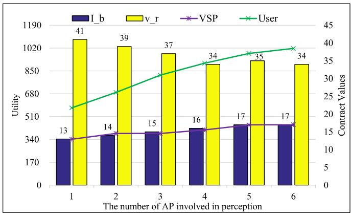

<details>
<summary>bar_line</summary>

| The number of AP involved in perception | I_b | v_r | VSP | User |
|---|---|---|---|---|
| 1 | 340 | 1025 | 13 | 22 |
| 2 | 342 | 1015 | 14 | 26 |
| 3 | 344 | 995 | 15 | 30 |
| 4 | 346 | 870 | 16 | 34 |
| 5 | 350 | 900 | 17 | 37 |
| 6 | 352 | 860 | 17 | 39 |
</details>

Fig. 16. Impact of the number of APs involved in perception on the utility of the user and VSP.

# D. Discussion

In the experiments presented above, we evaluate the proposed WiPe-GAI framework from perspectives of skeleton prediction, virtual character generation, and incentive mechanism. From these results, we can observe the following critical points:

- The proposed SMSP algorithm utilizes the information about user posture contained within CSI more effectively, enhancing the performance of user skeleton prediction and outperforming the method without SMSP.   
Using the predicted skeleton and user’s prompts, WiPe-GAI can effectively generate the virtual character and the corresponding background for the user, verifying the effectiveness of the proposed framework.   
The proposed diffusion model based method can efficiently generate the optimal pricing strategy, better than the conventional DRL based methods in terms of maximizing the user’s utility and speed of convergence.

Besides these achievements, the proposed WiPe-GAI has certain limitations, which are summarized as follows:

The proposed SMSP improves the performance of CSIbased skeleton prediction, but it may show unsatisfactory results when fewer APs are available. One possible solution for this issue is to optimize the deployment of APs, so that each AP can collect more non-overlapping information at different spatial locations for prediction.

WiPe-GAI only uses image as examples of the generated digital content. Yet, practical applications may require video streams to be produced for users. Given that video generation demands more resources, retraining the diffusion model is necessary. However, the framework and optimization strategies proposed in this paper remain effective.   
While the proposed diffusion based model demonstrates faster convergence in optimal pricing strategy generation, each execution involves a multi-step denoising process, which is not outstanding in terms of efficiency. Considering the complexity of real-world applications, further improving the efficiency of the proposed model is necessary.

# V. CONCLUSION

This paper introduces WiPe-GAI, a framework that combines wireless perception with GAI to provide the AIGC service to users. In WiPe-GAI, we prpose a novel SMSP algorithm, which uses CSI to predict the user’s skeleton, thereby guiding the GAI to generate virtual characters for the user. Furthermore, to encourage the VSP to participate in service provision, WiPe-GAI builds an incentive mechanism based on pricing and incorporates an new diffusion-based method to generate optimal pricing strategy, which maximizes user’s utility while ensuring the VSP’s participation. Through comprehensive experiments, it is demonstrated that WiPe-GAI can accurately predict the user’s skeleton and generate the corresponding virtual character for the user. Furthermore, the proposed diffusion-based approach can effectively generate the optimal pricing strategy, which not only yields greater user utility, but also ensures that the VSP’s participation, outperforming the existing DRL based methods. In the future, we will refine WiPe-GAI by incorporating additional factors such as communication loss and multi-user concurrency. Meanwhile, we will continue to explore the utilization of diffusion model-based optimization in different domains.

# REFERENCES

[1] M. Xu et al., “Unleashing the power of edge-cloud generative AI in mobile networks: A survey of AIGC services,” IEEE Commun. Surv. Tut., 2024.   
[2] A. Köksal, K. E. Ak, Y. Sun, D. Rajan, and J. H. Lim, “Controllable video generation with text-based instructions,” IEEE Trans. Multimedia, vol. 26, pp. 190–201, Mar. 2024.   
[3] H. Zou, Q. Zhao, L. Bariah, M. Bennis, and M. Debbah, “Wireless multi-agent generative AI: From connected intelligence to collective intelligence,” 2023, arXiv:2307.02757.   
[4] Y. Cao et al., “A comprehensive survey of AI-generated content (AIGC): A history of generative AI from GAN to ChatGPT,” 2023, arXiv:2303.04226.   
[5] F.-A. Croitoru, V. Hondru, R. T. Ionescu, and M. Shah, “Diffusion models in vision: A survey,” IEEE Trans. Pattern Anal. Mach. Intell., vol. 45, no. 9, pp. 10850–10869, Sep. 2023.   
[6] L. Zhang, A. Rao, and M. Agrawala, “Adding conditional control to textto-image diffusion models,” in Proc. IEEE/CVF Int. Conf. Comput. Vis., 2023.   
[7] J. Wang et al., “Guiding AI-generated digital content with wireless perception,” 2023, arXiv:2303.14624.   
[8] S. Bond-Taylor, A. Leach, Y. Long, and C. G. Willcocks, “Deep generative modelling: A comparative review of VAEs, GANs, normalizing flows, energy-based and autoregressive models,” IEEE Trans. Pattern Anal. Mach. Intell., vol. 44, no. 11, pp. 7327–7347, Nov. 2022.   
[9] O. Hashash, C. Chaccour, W. Saad, T. Yu, K. Sakaguchi, and M. Debbah, “The seven worlds and experiences of the wireless metaverse: Challenges and opportunities,” 2023, arXiv:2304.10282.

[10] O. Hashash, C. Chaccour, W. Saad, K. Sakaguchi, and T. Yu, “Towards a decentralized metaverse: Synchronized orchestration of digital twins and sub-metaverses,” in Proc. IEEE Int. Conf. Commun., 2023, pp. 1905–1910.   
[11] C. Yang, X. Wang, and S. Mao, “TARF: Technology-agnostic RF sensing for human activity recognition,” IEEE J. Biomed. Health Inform., vol. 27, no. 2, pp. 636–647, Feb. 2023.   
[12] J. Wang et al., “Through the wall detection and localization of autonomous mobile device in indoor scenario,” IEEE J. Sel. Areas Commun., vol. 42, no. 1, pp. 161–176, Jan. 2024.   
[13] M. Zhao et al., “RF-based 3D skeletons,” in Proc. Conf. ACM Special Int. Group Data Commun., 2018, pp. 267–281.   
[14] M. Zhao et al., “Through-wall human pose estimation using radio signals,” in Proc. IEEE Conf. Comput. Vis. Pattern Recognit., 2018, pp. 7356–7365.   
[15] K. Wang, Q. Wang, F. Xue, and W. Chen, “3D-skeleton estimation based on commodity millimeter wave radar,” in Proc. IEEE 6th Int. Conf. Comput. Commun., 2020, pp. 1339–1343.   
[16] C. Yang, X. Wang, and S. Mao, “RFID-pose: Vision-aided threedimensional human pose estimation with radio-frequency identification,” IEEE Trans. Rel., vol. 70, no. 3, pp. 1218–1231, Sep. 2021.   
[17] L. Guo, Z. Lu, X. Wen, S. Zhou, and Z. Han, “From signal to image: Capturing fine-grained human poses with commodity Wi-Fi,” IEEE Commun. Lett., vol. 24, no. 4, pp. 802–806, Apr. 2020.   
[18] Y. Zhou, H. Huang, S. Yuan, H. Zou, L. Xie, and J. Yang, “MetaFi++: WiFienabled transformer-based human pose estimation for metaverse avatar simulation,” IEEE Internet of Things J., vol. 10, no. 16, pp. 14128–14136, Aug. 2023.   
[19] F. Wang, S. Zhou, S. Panev, J. Han, and D. Huang, “Person-in-WiFi: Fine-grained person perception using WiFi,” in Proc. IEEE/CVF Int. Conf. Comput. Vis., 2019, pp. 5452–5461.   
[20] W. Jiang et al., “Towards 3D human pose construction using WiFi,” in Proc. 26th Annu. Int. Conf. Mobile Comput. Netw., 2020, pp. 1–14.   
[21] H. Du et al., “Beyond deep reinforcement learning: A tutorial on generative diffusion models in network optimization,” 2023, arXiv:2308.05384.   
[22] J. Ho, C. Saharia, W. Chan, D. J. Fleet, M. Norouzi, and T. Salimans, “Cascaded diffusion models for high fidelity image generation,” J. Mach. Learn. Res., vol. 23, no. 47, pp. 1–33, 2022.   
[23] Y. Ma, H. Yang, W. Wang, J. Fu, and J. Liu, “Unified multi-modal latent diffusion for joint subject and text conditional image generation,” 2023, arXiv:2303.09319.   
[24] R. Rombach, A. Blattmann, D. Lorenz, P. Esser, and B. Ommer, “High-resolution image synthesis with latent diffusion models,” in Proc. IEEE/CVF Conf. Comput. Vis. Pattern Recognit., 2022, pp. 10 684–10 695.   
[25] J. Cheng, X. Liang, X. Shi, T. He, T. Xiao, and M. Li, “LayoutDiffuse: Adapting foundational diffusion models for layout-to-image generation,” 2023, arXiv:2302.08908.   
[26] Z. Wang, J. J. Hunt, and M. Zhou, “Diffusion policies as an expressive policy class for offline reinforcement learning,” 2022, arXiv:2208.06193.   
[27] H. Du, J. Wang, D. Niyato, J. Kang, Z. Xiong, and D. I. Kim, “AIgenerated incentive mechanism and full-duplex semantic communications for information sharing,” IEEE J. Sel. Areas Commun., vol. 41, no. 9, pp. 2981–2997, 2023.   
[28] N. C. Luong, P. Wang, D. Niyato, Y.-C. Liang, Z. Han, and F. Hou, “Applications of economic and pricing models for resource management in 5G wireless networks: A survey,” IEEE Commun. Surveys Tuts., vol. 21, no. 4, pp. 3298–3339, Fourth Quarter, 2019.   
[29] Z. Zhao, W. Zhou, D. Deng, J. Xia, and L. Fan, “Intelligent mobile edge computing with pricing in Internet of Things,” IEEE Access, vol. 8, pp. 37 727–37 735, 2020.   
[30] B. Qian, H. Zhou, T. Ma, K. Yu, Q. Yu, and X. Shen, “Multi-operator spectrum sharing for massive IoT coexisting in 5G/B5G wireless networks,” IEEE J. Sel. Areas Commun., vol. 39, no. 3, pp. 881–895, Mar. 2021.   
[31] Y. Yang, Z. Liu, Z. Liu, K. Y. Chan, Y. Xie, and X. Guan, “Joint optimization of edge computing resource pricing and wireless caching for blockchain-driven networks,” IEEE Trans. Veh. Technol, vol. 71, no. 6, pp. 6661–6670, Jun. 2022.   
[32] B. Qian et al., “Leveraging dynamic Stackelberg pricing game for multimode spectrum sharing in 5G-VANET,” IEEE Trans. Veh. Technol, vol. 69, no. 6, pp. 6374–6387, Jun. 2020.   
[33] Z. Yang, Z. Zhou, and Y. Liu, “From RSSI to CSI: Indoor localization via channel response,” ACM Comput. Surv., vol. 46, no. 2, pp. 1–32, 2013.   
[34] M. Kotaru, K. Joshi, D. Bharadia, and S. Katti, “SpotFi: Decimeter level localization using WiFi,” in Proc. ACM Conf. Special Int. Group Data Commun., 2015, pp. 269–282.

[35] M. Wax and T. Kailath, “Detection of signals by information theoretic criteria,” IEEE Trans. Acoust., Speech, Signal Process., vol. 33, no. 2, pp. 387–392, Apr. 1985.   
[36] D. Vasisht, S. Kumar, and D. Katabi, “Decimeter-Level localization with a single WiFi access point,” in Proc. 13th USENIX Symp. Netw. Syst. Des. Implementation, 2016, pp. 165–178.   
[37] D. Zhang, F. Zhang, D. Wu, J. Xiong, and K. Niu, “Fresnel zone based theories for contactless sensing,” in Contactless Human Activity Analysis. Berlin, Germany: Springer, 2021, pp. 145–164.   
[38] Y. Zeng, J. Liu, J. Xiong, Z. Liu, D. Wu, and D. Zhang, “Exploring multiple antennas for long-range WiFi sensing,” in Proc. ACM Interactive Mobile Wearable Ubiquitous Technol., vol. 5, no. 4, pp. 1–30, 2021.   
[39] Z. Cao, G. Hidalgo, T. Simon, S.-E. Wei, and Y. Sheikh, “OpenPose: Realtime multi-person 2D pose estimation using part affinity fields,” IEEE Trans. Pattern Anal. Mach. Intell., vol. 43, no. 1, pp. 172–186, Jan. 2021.   
[40] R. J. Baxley, J. E. Kleider, and G. T. Zhou, “Pilot design for OFDM with null edge subcarriers,” IEEE Trans. Wireless Commun., vol. 8, no. 1, pp. 396–405, Jan. 2009.   
[41] K. He, X. Zhang, S. Ren, and J. Sun, “Deep residual learning for image recognition,” in Proc. IEEE Conf. Comput. Vis. Pattern Recognit., 2016, pp. 770–778.   
[42] S. Ioffe and C. Szegedy, “Batch normalization: Accelerating deep network training by reducing internal covariate shift,” in Proc. Int. Conf. Mach. Learn., 2015, pp. 448–456.   
[43] A. Krizhevsky, I. Sutskever, and G. E. Hinton, “ImageNet classification with deep convolutional neural networks,” Commun. ACM, vol. 60, no. 6, pp. 84–90, 2017.   
[44] D. Li, J. Li, and S. Hoi, “Blip-diffusion: Pre-trained subject representation for controllable text-to-image generation and editing,” in Proc. Adv. Neural Inf. Process. Syst., 2024, vol. 36.   
[45] F. Gringoli, M. Schulz, J. Link, and M. Hollick, “Free your CSI: A channel state information extraction platform for modern Wi-Fi chipsets,” in Proc. 13th Int. Workshop Wireless Netw. Testbeds Exp. Eval. Characterization, 2019, pp. 21–28.   
[46] F. Wang, S. Panev, Z. Dai, J. Han, and D. Huang, “Can WiFi estimate person pose?,” 2019, arXiv: 1904.00277.   
[47] T. Haarnoja, A. Zhou, P. Abbeel, and S. Levine, “Soft actor-critic: Offpolicy maximum entropy deep reinforcement learning with a stochastic actor,” in Proc. Int. Conf. Mach. Learn., 2018, pp. 1861–1870.   
[48] J. Schulman, F. Wolski, P. Dhariwal, A. Radford, and O. Klimov, “Proximal policy optimization algorithms,” 2017, arXiv: 1707.06347.


<details>
<summary>natural_image</summary>

Portrait photo of a young man in a black polo shirt (no text or symbols visible)
</details>

Jiacheng Wang received the PhD degree from the School of Communications and Information Engineering, Chongqing University of Posts and Telecommunications, Chongqing, China. He is the postdoctoral research fellow in computer science and engineering with Nanyang Technological University, Singapore. His research interests include wireless sensing, semantic communications, and Metaverse.


<details>
<summary>natural_image</summary>

Portrait of a young man wearing glasses and a dark shirt, with a classical sculpture in the background (no visible text or symbols)
</details>

Hongyang Du received the BSc degree from the Beijing Jiaotong University, Beijing, China, in 2021. He is currently working toward the PhD degree with the School of Computer Science and Engineering, Energy Research Institute @ NTU, Nanyang Technological University, Singapore, under the Interdisciplinary Graduate Program. He was recognized as an exemplary reviewer of IEEE Transactions on Communications in 2021. He was the recipient of IEEE Daniel E. Noble Fellowship Award in 2022. His research interests include semantic communications, resource

allocation, and communication theory.


<details>
<summary>natural_image</summary>

Portrait of a man wearing glasses and a dark jacket (no visible text or symbols)
</details>

Dusit Niyato (Fellow, IEEE) received the BEng degree from the King Mongkuts Institute of Technology Ladkrabang (KMITL), Thailand, in 1999, and the PhD degree in electrical and computer engineering from the University of Manitoba, Canada, in 2008. He is a professor with the School of Computer Science and Engineering, Nanyang Technological University, Singapore. His research interests include the areas of sustainability, edge intelligence, decentralized machine learning, and incentive mechanism design.


<details>
<summary>natural_image</summary>

Portrait of a man with glasses and mustache, wearing a light-colored shirt (no text or symbols visible)
</details>

Deepu Rajan (Member, IEEE) received the bachelor of engineering degree in electronics and communication engineering from the Birla Institute of Technology, Ranchi, India, the MS degree in electrical engineering from Clemson University, USA, and the PhD degree from the Indian Institute of Technology, Bombay, India. He is an associate professor with the School of Computer Science and Engineering, Nanyang Technological University, Singapore. From 1992 to 2002, he was a lecturer with the Department of Electronics, Cochin University of Science and

Technology, India. His research interests include image processing, computer vision, and multimedia signal processing.


<details>
<summary>natural_image</summary>

Portrait photo of a young man wearing glasses and a black polo shirt against a blue background (no text or symbols visible)
</details>

Jiawen Kang (Senior Member) received the PhD degree from the Guangdong University of Technology, China, in 2018. He was a postdoc with Nanyang Technological University, Singapore from 2018 to 2021. He currently is a professor with the Guangdong University of Technology, China. His research interests mainly focus on blockchain, security, and privacy protection in wireless communications and networking.


<details>
<summary>natural_image</summary>

Portrait of a man wearing glasses and a suit against a blue background (no text or symbols visible)
</details>

Shiwen Mao (Fellow, IEEE) received the PhD degree in electrical and computer engineering from Polytechnic University, Brooklyn, NY. He is a professor and Earle C. Williams Eminent scholar, and director of the Wireless Engineering Research and Education Center, Auburn University. His research interests include wireless networks and multimedia communications.

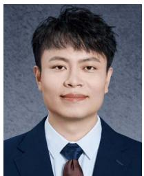

<details>
<summary>natural_image</summary>

Portrait photo of a man in formal attire (no text or symbols visible)
</details>

Zehui Xiong received the PhD degree from Nanyang Technological University (NTU), Singapore. He was the visiting scholar with Princeton University and with the University of Waterloo. He is currently an assistant professor with the Singapore University of Technology and Design, and an Honorary adjunct senior research scientist with Alibaba-NTU Singapore Joint Research Institute, Singapore. He is also the associate director with Future Communications R&D Programme. He has authored or coauthored more than 200 research papers in leading journals and flagship

conferences and is recognized as a Highly Cited researcher. His research interests include wireless communications, Internet of Things, blockchain, edge intelligence, and Metaverse. He was the recipient of more than 10 Best Paper awards in international conferences, is listed in the World’s Top 2% Scientists identified by Stanford University, was honored with Forbes Asia 30u30, IEEE Early Career Researcher Award for Excellence in Scalable Computing, IEEE Technical Committee on Blockchain and Distributed Ledger Technologies Early Career Award, IEEE Internet Technical Committee Early Achievement Award, IEEE TCSVC Rising Star Award, IEEE TCI Rising Star Award, IEEE TCCLD Rising Star Award, IEEE Best Land Transportation Paper Award, IEEE CSIM Technical Committee Best Journal Paper Award, IEEE SPCC Technical Committee Best Paper Award, and IEEE VTS Singapore Best Paper Award. He is the editor or guest editor of many leading journals including IEEE Journal on Selected Areas in Communications, IEEE Transactions on Vehicular Technology, IEEE Internet of Things Journal, IEEE Transactions on Cognitive Communications and Networking, and IEEE Transactions on Network Science and Engineering.


<details>
<summary>natural_image</summary>

Portrait of a man in a white shirt (no text or symbols visible)
</details>

Xuemin (Sherman) Shen (Fellow, IEEE) received the PhD degree in electrical engineering from Rutgers University, New Brunswick, NJ, USA, in 1990. He is currently a university professor with the Department of Electrical and Computer Engineering, University of Waterloo, Canada. His research interests include network resource management, wireless network security, Internet of Things, 5 G and beyond, and vehicular ad hoc and sensor networks. He is a registered professional engineer of Ontario, Canada, fellow of the Engineering Institute of Canada, fellow of the

Canadian Academy of Engineering, fellow of the Royal Society of Canada, foreign member of the Chinese Academy of Engineering, and distinguished lecturer of IEEE Vehicular Technology Society and Communications Society. He was the recipient of Canadian Award for Telecommunications Research from the Canadian Society of Information Theory (CSIT) in 2021, R.A. Fessenden Award in 2019 from IEEE, Canada, Award of Merit from the Federation of Chinese Canadian Professionals (Ontario) in 2019, James Evans Avant Garde Award in 2018 from the IEEE Vehicular Technology Society, Joseph LoCicero Award in 2015 and Education Award in 2017 from the IEEE Communications Society, and Technical Recognition Award from Wireless Communications Technical Committee (2019) and AHSN Technical Committee (2013). He was also the recipient of Excellent Graduate Supervision Award in 2006 from the University of Waterloo and Premier’s Research Excellence Award (PREA) in 2003 from the Province of Ontario, Canada. He was the technical program committee chair/co-chair of IEEE Globecom’ 16, IEEE Infocom’14, IEEE VTC’10 Fall, IEEE Globecom’07, and the chair of IEEE Communications Society Technical Committee on Wireless Communications. He is the president of IEEE Communications Society. He was the vice president of Technical and Educational Activities, vice president for Publications, member-at-large on the Board of Governors, chair of the Distinguished Lecturer Selection Committee, a member of IEEE Fellow Selection Committee of the ComSoc. He was the editor-in-chief of the IEEE Internet of Things Journal, IEEE Network, and IET Communications.