# Accessing From the Sky: A Tutorial on UAV Communications for 5G and Beyond

This article provides a tutorial overview of the recent advances in UAV communications, with an emphasis on integrating UAVs into the forthcoming fifth-generation and future cellular networks.

By YONG ZENG , Member IEEE, QINGQING WU , Member IEEE, AND RUI ZHANG , Fellow IEEE

| Unmanned aerial vehicles (UAVs) have found numerous applications and are expected to bring fertile business opportunities in the next decade. Among various enabling technologies for UAVs, wireless communication is essential and has drawn significantly growing attention in recent years. Compared to the conventional terrestrial communications, UAVs’ communications face new challenges due to their high altitude above the ground and great flexibility of movement in the 3-D space. Several critical issues arise, including the line-of-sight (LoS) dominant UAV-ground channels and induced strong aerial-terrestrial network interference, the distinct communication quality-of-service (QoS) requirements for UAV control messages versus payload data, the stringent constraints imposed by the size, weight, and power (SWAP) limitations of UAVs, as well as the exploitation of the new design degree of freedom (DoF) brought by the highly controllable 3-D UAV mobility. In this article, we give a tutorial overview of the recent advances in UAV communications to address the above issues, with an emphasis on how to integrate UAVs into the forthcoming fifth-generation (5G) and future cellular

networks. In particular, we partition our discussion into two promising research and application frameworks of UAV communications, namely UAV-assisted wireless communications and cellular-connected UAVs, where UAVs are integrated into the network as new aerial communication platforms and users, respectively. Furthermore, we point out promising directions for future research.

| 3-D placement; air–ground interference; antenna model; energy efficiency; cellular network; channel model; trajectory optimization; unmanned aerial vehicle (UAV); wireless communication

# I. I N T R O D U C T I O N

Unmanned aerial vehicles (UAVs), also commonly known as drones, are aircraft piloted by remote control or embedded computer programs without human onboard. Historically, UAVs were mainly used in military applications deployed in hostile territory for remote surveillance and armed attack, to reduce the pilot losses. In recent years, the enthusiasm for using UAVs in civilian and commercial applications has skyrocketed due to the advancement of UAVs’ manufacturing technologies and their reducing cost, making them more easily accessible to the public. Nowadays, UAVs have found numerous applications in a proliferation of fields, such as aerial inspection, photography, precision agriculture, traffic control, search and rescue, package delivery, and telecommunications. In June 2016, the U.S. Federal Aviation Administration (FAA) released the operational rules for routine civilian use of small unmanned aircraft systems (UASs) with aircraft weight

Manuscript received March 10, 2019; revised October 28, 2019; accepted November 1, 2019. Date of current version December 3, 2019. This work was supported by the startup funding of Southeast University, China, under Grant 4004009105. (Corresponding author: Qingqing Wu.) is with the National Mobile Communications Research Laboratory, Y. ZengSoutheast University, Nanjing 210096, China, and also with the Purple Mountain Laboratories, Nanjing 211111, China (e-mail: yong\_zeng@seu.edu.cn). and are with the Department of Electrical and Computer Q. Wu R. ZhangEngineering, National University of Singapore, Singapore 117583 (e-mail: elewuqq@nus.edu.sg; elezhang@nus.edu.sg).

Digital Object Identifier 10.1109/JPROC.2019.2952892 less than 55 pounds (25 kg) [1]. In November 2017, FAA further launched a national program in Washington, namely “Drone Integration Pilot Program,” to explore the expanded use of drones, including beyond-visual-line-ofsight (BVLoS) flights, night-time operations, and flights above people [2]. It is anticipated that these new guidelines and programs will spur the further growth of the global UAV industry in the coming years. The scale of the UAV industry is potentially enormous with realistic predictions of \$80 billion for the U.S. economy alone, which is expected to create tens of thousands of new jobs within the next decade [3]. Therefore, UAVs have emerged as a promising technology to offer fertile business opportunities in the next decade.

UAV Communication Requirements Specified by 3GPP [5] 

<table><tr><td></td><td>Data Type</td><td>Data Rate</td><td>Reliability</td><td>Latency</td></tr><tr><td>DL (Ground station to UAV)</td><td>Command and control</td><td>60-100 Kbps</td><td> $10^{-3}$  packet error rate</td><td>50 ms</td></tr><tr><td rowspan="2">UL (UAV to ground station)</td><td>Command and control</td><td>60-100 Kbps</td><td> $10^{-3}$  packet error rate</td><td>-</td></tr><tr><td>Application data</td><td>Up to 50 Mbps</td><td>-</td><td>Similar to terrestrial user</td></tr></table>

In practice, there are many types of UAVs due to their numerous and diversified applications. While there is no single standard for UAV classification, UAVs can be practically assorted into different categories according to different criteria, such as functionality, weight/payload, size, endurance, wing configuration, control methods, cruising range, flying altitude, maximum speed, and energy supplying methods. For example, in terms of wing configuration, fixed-wing and rotary-wing UAVs are the two main types of UAVs that have been widely used in practice. Typically, fixed-wing UAVs have higher maximum flying speed and can carry greater payloads for traveling longer distances compared to rotary-wing UAVs, while their disadvantages lie in that a runway or launcher is needed for takeoff/ landing as well as that hovering at a fixed position is impossible. In contrast, rotary-wing UAVs are able to take off/land vertically and remain static at a hovering location. A detailed classification for different types of UAVs has been provided in [4]. From a practical perspective, different applications usually require different types of UAVs due to different requirements in terms of payload, endurance, operating environment, cost, and so on. On the other hand, from a communication system design perspective, they mostly share similar characteristics and, thus, can be investigated in a unified manner.

# A. Wireless Communication With UAVs: Basic Requirements

An essential enabling technology of UAS is wireless communication. On one hand, UAVs need to exchange safety–critical information with various parties, such as remote pilots, nearby aerial vehicles, and air traffic controllers, to ensure the safe, reliable, and efficient flight operation. This is commonly known as the control and nonpayload communication (CNPC) [7]. On the other hand, depending on their missions, UAVs may need to timely transmit and/or receive mission-related data, such as aerial image, high-speed video, and data packets for relaying, to/from various ground entities, such as UAV operators, end users, or ground gateways. This is known as payload communication.

Enabling reliable and secure CNPC links is a necessity for the large-scale deployment and wide usage of UAVs. The International Telecommunication Union (ITU) has classified the required CNPC to ensure safe UAV operations into three categories [7].

1) Communication for UAV Command and Control: This includes the telemetry report (e.g., flight status) from the UAV to the ground pilot, the real-time telecommand signaling from the ground to UAVs for nonautonomous UAVs, and regular flight command update (such as waypoint update) for (semi) autonomous UAVs.   
2) Communication for Air Traffic Control (ATC) Relay: It is critical to ensure that UAVs do not cause any safety threat to traditional manned aircraft, especially for operations approaching areas with a high density of aircraft. To this end, a link between air traffic controller and the ground control station via the UAV, called ATC relay, is required.   
3) Communication Supporting “Sense and Avoid”: The ability to support “sense and avoid” ensures that the UAV maintains sufficient safety distance with nearby aerial vehicles, terrain, and obstacles.

The specific communication and spectrum requirements, in general, differ for CNPC and payload communications. Recently, the Third-Generation Partnership Project (3GPP) has specified the communication requirements for these two types of links [5], which are summarized in Table 1. CNPC is usually of low data rate, say, in the order of kilobits per second (kb/s) but has rather stringent requirement on high reliability and low latency. For example, as shown in Table 1, the data rate requirement for UAV command and control is only in the range of 60–100 kb/s for both downlink (DL) and uplink (UL) directions, but a reliability of less than 10−3 packet error rate and a latency less than 50 ms are required. While the communication requirements of CNPC links are similar for different types of UAVs due to their common safety consideration, those for payload data are highly application dependent. In Table 2, we list several typical UAV applications and their corresponding data communication requirements based on [6].

Communication Requirements for Typical UAV Applications [6] 

<table><tr><td>UAV Application</td><td>Height coverage in meter (m)</td><td>Payload traffic latency in millisecond (ms)</td><td>Payload data rate (DL/UL)</td></tr><tr><td>Drone delivery</td><td>100 m</td><td>500 ms</td><td>300 Kbps/200 Kbps</td></tr><tr><td>Drone filming</td><td>100 m</td><td>500 ms</td><td>300 Kbps/30 Mbps</td></tr><tr><td>Access point</td><td>500 m</td><td>500 ms</td><td>50 Mbps/50 Mbps</td></tr><tr><td>Surveillance</td><td>100 m</td><td>3000 ms</td><td>300 Kbps/10 Mbps</td></tr><tr><td>Infrastructure inspection</td><td>100 m</td><td>3000 ms</td><td>300 Kbps/10 Mbps</td></tr><tr><td>Drone fleet show</td><td>200 m</td><td>100 ms</td><td>200 Kbps/200 Kbps</td></tr><tr><td>Precision agriculture</td><td>300 m</td><td>500 ms</td><td>300 Kbps/200 Kbps</td></tr><tr><td>Search and rescue</td><td>100 m</td><td>500 ms</td><td>300 Kbps/6 Mbps</td></tr></table>

Comparison of Wireless Technologies for UAV Communication 

<table><tr><td>Technology</td><td>Description</td><td>Advantages</td><td>Disadvantages</td></tr><tr><td>Direct link</td><td>Direct point-to-point communication with ground node</td><td>Simple, low cost</td><td>Limited range, low data rate, vulnerable to interference, non-scalable</td></tr><tr><td>Satellite</td><td>Communication and Internet access via satellite</td><td>Global coverage</td><td>Costly, heavy/bulky/energy-consuming communication equipment, high latency, large signal attenuation</td></tr><tr><td>Ad-hoc network</td><td>Dynamically self-organizing and infrastructure-free network</td><td>Robust and adaptable, support for high mobility</td><td>Costly, low spectrum efficiency, intermittent connectivity, complex routing protocol</td></tr><tr><td>Cellular network</td><td>Enabling UAV communications by using cellular infrastructure and technologies</td><td>Almost ubiquitous accessibility, cost-effective, superior performance and scalability</td><td>Unavailable in remote areas, potential interference with terrestrial communications</td></tr></table>

Since the loss of CNPC link may cause catastrophic consequences, the International Civil Aviation Organization (ICAO) has determined that CNPC links for UAVs must operate over protected aviation spectrum [8], [9]. Furthermore, ITU studies have revealed that to support CNPC for the forecasted number of UAVs in the coming years, 34-MHz terrestrial spectrum and 56-MHz satellite spectrum are needed for supporting both LoS and beyond-LoS UAV operations [7]. To meet such requirement, the C-band spectrum at 5030–5091 MHz has been made available for UAV CNPC at the World Radiocommunication Conference (WRC)-12. More recently, the WRC-15 has decided that geostationary fixed-satellite service (FSS) networks may be used for UAS CNPC links.

Compared to CNPC, UAV payload communication usually has much higher data rate requirement. For instance, to support the transmission of full highdefinition (FHD) video from the UAV to the ground user, the transmission rate is about several Mb/s, while for 4k video, it is higher than 30 Mb/s. The rate requirement for UAV serving as an aerial communication platform can be even higher, e.g., up to dozens of gigabits per second for data forwarding/backhauling applications.

# B. Wireless Technologies for UAV Communication

To meet both the CNPC and payload communication requirements in multifarious UAV applications, proper wireless technologies are needed for achieving seamless connectivity and high reliability/throughput for both air-to-air and air-to-ground wireless communications in the 3-D space. Toward this end, four candidate communication technologies are compared in Table 3, including: 1) direct link; 2) satellite; 3) ad hoc network; and 4) cellular network.

1) Direct Link: Due to its simplicity and low cost, the direct-link communication between UAV and its associated ground node over the unlicensed band [e.g., the industrial scientific medical (ISM) 2.4-GHz band] was most commonly used for commercial UAVs in the past, where the ground node can be a joystick, remote controller, or ground station. However, it is usually limited to LoS communication, which significantly constrains its operation range and hinders its applications in the complex propagation environment. For example, in urban areas, the communication can be easily blocked by, e.g., trees and high-rise buildings, which results in low reliability and low rate. Furthermore, the ground node needs to connect to a gateway for enabling the Internet access of the UAV, which may cause a long delay in case of wireless data backhaul. In addition, such a simple solution is usually insecure and vulnerable to interference and jamming. Due to the abovementioned limitations, simple direct-link communication cannot be a scalable solution for supporting large-scale deployment of UAVs in the future.

2) Satellite: Enabling UAV communications by leveraging satellites is a viable option due to their global coverage. Specifically, satellites can help relay data transmitted between widely separated UAVs and ground gateways, which is particularly useful for UAVs above the ocean and in remote areas where the terrestrial network (Wi-Fi or cellular) coverage is unavailable. Furthermore, satellite signals can also be used for navigation and localization of UAVs. In WRC 2015, the conditional use of satellite communication frequencies in the Ku-/Kaband has been approved to connect drones to satellites, and some satellite companies, such as Inmarsat, have launched satellite communication service for UAVs [10]. However, there are also several disadvantages of satelliteenabled UAV communications. First, the propagation loss and delay are quite significant due to the long distances between satellite and low-altitude UAVs/ground stations. Thus, this poses great challenges for meeting ultrareliable and delay-sensitive CNPC for UAVs. Second, UAVs usually have stringent size, weight, and power (SWAP) constraints and, thus, may not be able to carry the heavy, bulky, and energy-consuming satellite communication equipment (e.g., dish antenna). Third, the high operational cost of satellite communication also hinders its wide use for densely deployed UAVs in consumergrade applications.

3) Ad Hoc Network: Mobile ad hoc network (MANET) is an infrastructure-free and dynamically self-organizing network for enabling peer-to-peer communications among mobile devices, such as laptops, cellphones, and walkie-talkies. Such devices usually communicate over bandwidth-constrained wireless links using, e.g., IEEE 802.11 a/b/g/n. Each device in a MANET can move

randomly over time; as a result, its link conditions with other devices may change frequently. Furthermore, for supporting communications between two far-apart nodes, some other nodes in between need to help forward the data via multihop relaying, thus incurring more energy consumption, low spectrum efficiency, and long end-to-end delay. Vehicular ad hoc network (VANET) and flying ad hoc network (FANET) are two applications of MANET for supporting communications among high-mobility ground vehicles and UAVs in 2-D and 3-D networks, respectively [11]. The topology or configuration of an FANET for UAVs may take different forms, such as a mesh, ring, star, or, even, a straight line, depending on the application scenario. Although FANET is a robust and flexible architecture for supporting UAV communications in a small network, it is generally unable to provide a scalable solution for serving massive UAVs deployed in a wide area due to the complexities and difficulties for realizing a reliable routing protocol over the whole network with dynamic and intermittent link connectivities among the flying UAVs.

4) Cellular Network: It is evident that the abovementioned technologies generally cannot support large-scale UAV communications in a cost-effective manner. On the other hand, it is also economically nonviable to build new and dedicated ground networks for achieving this goal. As such, there has been significantly growing interest recently in leveraging the existing as well as futuregeneration cellular networks for enabling UAV-ground communications [12]. Due to the almost ubiquitous coverage of the cellular network worldwide as well as its high-speed optical backhaul and advanced communication technologies, both CNPC and payload communication requirements for UAVs can be potentially met, regardless of the density of UAVs as well as their distances with the corresponding ground nodes. For example, the forthcoming fifth-generation (5G) cellular network is expected to support the peak data rate of 10 Gb/s with only 1-ms round-trip latency, which, in principle, is adequate for high-rate and delay-sensitive UAV communication applications, such as real-time video streaming and data relaying.

Despite the promising advantages of cellular-enabled UAV communications, there are still scenarios where the cellular services are unavailable, such as in remote areas, such as sea, desert, and forest. In such scenarios, other technologies, such as the direct link, satellite, and FANET, can be used to support UAV communications beyond the terrestrial coverage of cellular network. Therefore, it is envisioned that the future wireless network for supporting large-scale UAV communications will have an integrated 3-D architecture consisting of UAV-to-UAV, UAV-to-satellite, and UAV-to-ground communications, as shown in Fig. 1, where each UAV may be enabled with one or more communication technologies to exploit the rich connectivity diversity in such a hybrid network.

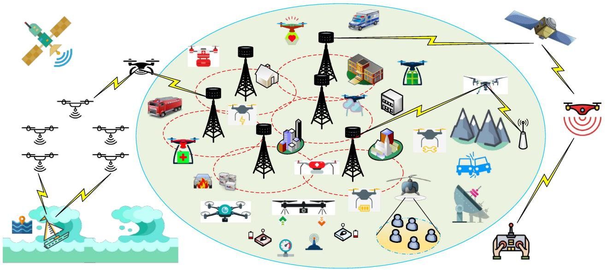

<details>
<summary>flowchart</summary>

```mermaid
graph TD
    A["Satellite"] --> B["Drone"]
    C["Truck"] --> D["Drone"]
    E["Drone"] --> F["Drone"]
    G["Drone"] --> H["Drone"]
    I["Drone"] --> J["Drone"]
    K["Drone"] --> L["Drone"]
    M["Drone"] --> N["Drone"]
    O["Drone"] --> P["Drone"]
    Q["Drone"] --> R["Drone"]
    S["Drone"] --> T["Drone"]
    U["Drone"] --> V["Drone"]
    W["Drone"] --> X["Drone"]
    Y["Drone"] --> Z["Drone"]
    AA["Drone"] --> AB["Drone"]
    AC["Drone"] --> AD["Drone"]
    AE["Drone"] --> AF["Drone"]
    AG["Drone"] --> AH["Drone"]
    AI["Drone"] --> AJ["Drone"]
    AK["Drone"] --> AL["Drone"]
    AM["Drone"] --> AN["Drone"]
    AO["Drone"] --> AP["Drone"]
    AQ["Drone"] --> AR["Drone"]
    AS["Drone"] --> AT["Drone"]
    AU["Drone"] --> AV["Drone"]
    AW["Drone"] --> AX["Drone"]
    AY["Satellite"] --> AZ["Drone"]
    BA["Truck"] --> BB["Drone"]
    BC["Drone"] --> BD["Drone"]
    BE["Drone"] --> BF["Drone"]
    BG["Drone"] --> BH["Drone"]
    BI["Drone"] --> BJ["Drone"]
    BK["Drone"] --> BL["Drone"]
    BM["Drone"] --> BN["Drone"]
    BO["Drone"] --> BP["Drone"]
    BQ["Truck"] --> BR["Drone"]
    BS["Drone"] --> BT["Drone"]
    BU["Drone"] --> BV["Drone"]
    BW["Drone"] --> BX["Drone"]
    BY["Drone"] --> BZ["Drone"]
    CA["Drone"] --> CB["Drone"]
    CC["Drone"] --> CD["Drone"]
    CE["Drone"] --> CF["Drone"]
    CG["Drone"] --> CH["Drone"]
    CI["Drone"] --> CJ["Drone"]
    CK["Drone"] --> CL["Drone"]
    CM["Drone"] --> CN["Drone"]
    CO["Drone"] --> CP["Drone"]
    CS["Drone"] --> CT["Drone"]
    CU["Drone"] --> CV["Drone"]
    DW["Truck"] --> DX["Drone"]
    DX --> DB["Droco"]
    DB --> DC["Droco"]
    DC --> DD["Droco"]
    DD --> DJ["Droco"]
    DJ --> DK["Droco"]
    DL["Droco"] --> DV["Droco"]
    DV --> DW
    DX --> DW
    CX["Droco"] --> CY["Droco"]
    CY --> Z["Droco"]
    Z --> DA["Droco"]
    DA --> DB
    DB --> DC
    DC --> DE["Droco"]
    DE --> F
    F --> DG["Droco"]
    DG --> DH["Droco"]
    DH --> DI["Droco"]
    DI --> DJ["Droco"]
```
</details>

Supporting UAV communications with an integrated network architecture.

# C. New Paradigm: Integrating UAVs Into Cellular Network

In this article, we focus on the aforementioned new paradigm of integrating UAVs into the cellular network. We partition our discussions into two main categories. On one hand, UAVs are considered as new aerial users that access the cellular network from the sky for communications, which we refer to as cellular-connected UAVs. On the other hand, UAVs are used as new aerial communication platforms, such as base stations (BSs) and relays, to assist in terrestrial wireless communications by providing data access from the sky, thus called UAV-assisted wireless communications.

1) Cellular-Connected UAVs: By incorporating UAVs as new user equipment (UE) in the cellular network, the following benefits can be achieved [12]. First, due to the almost worldwide accessibility of cellular networks, cellular-connected UAV makes it possible for the ground pilot to remotely command and control the UAV with virtually unlimited operation range. Besides, it also provides an effective solution to maintain wireless connectivity between UAVs and various other stakeholders, such as the end users and the air traffic controllers, regardless of their locations. Thus, this opens up many new UAV applications in the future. Second, with the advanced cellular technologies and authentication mechanisms, cellular-connected UAV is expected to achieve significant performance improvement over the other technologies introduced in Section I-B, in terms of reliability, security, and data throughput. For instance, the current fourth-generation (4G) long-term evolution (LTE) cellular network employs scheduling-based channel access mechanism, where multiple users can be served simultaneously by assigning them orthogonal resource blocks (RBs).

In contrast, Wi-Fi (e.g., 802.11g employed in FANET) adopts contention-based channel access with a random backoff mechanism, where users are allowed to only access channels that are sensed to be idle. Thus, multiuser transmission with centralized scheduling/control enables the cellular network to make more efficient use of the spectrum than Wi-Fi, especially when the user density is high. In addition, UAV-to-UAV communication can also be realized by leveraging the available device-to-device (D2D) communications in LTE and 5G systems. Third, cellular-based localization service can provide UAVs a new and complementary means in addition to the conventional satellite-based global positioning system (GPS) for achieving more robust or enhanced UAV navigation performance. Last but not least, cellular-connected UAV is a cost-effective solution since it reuses the millions of cellular BSs worldwide without the need of building new infrastructure dedicated for UAS only. Thus, cellularconnected UAV is expected to be a win–win technology for both UAV and cellular industries, with rich business opportunities to explore in the future.

2) UAV-Assisted Wireless Communications: Due to the continuous cost reduction in UAV manufacturing and device miniaturization in communication equipment, it becomes more feasible to mount compact BSs or relays on UAVs to enable flying aerial platforms to assist in terrestrial wireless communications. For instance, commercial LTE BSs with lightweight (e.g., less than 4 kg) are already available in the market, which are suitable to be mounted on UAVs with the moderate payload. Compared to conventional terrestrial communications with typically static BSs/relays deployed at fixed locations, UAV-assisted communications bring the following main advantages [13]. First, UAV-mounted BSs/relays can be swiftly deployed on demand. This is especially appealing for application scenarios, such as temporary or unexpected events, emergency response, and search and rescue. Second, due to their high altitude above the ground, UAV-BSs/relays are more likely to have LoS connection with their ground users compared to their terrestrial counterparts, thus providing more reliable links for communication as well as multiuser scheduling and resource allocation. Third, due to the controllable high-mobility of UAVs, UAV-BSs/relays possess an additional degree of freedom (DoF) for communication performance enhancement, by dynamically adjusting their locations in 3-D to cater for the terrestrial communication demands.

Opportunities and Challenges of Cellular Communication With UAVs 

<table><tr><td>Characteristic</td><td>Opportunities</td><td>Challenges</td></tr><tr><td>High altitude</td><td>Wide ground coverage as aerial BS/relay</td><td>Require 3D cellular coverage for aerial user</td></tr><tr><td>High LoS probability</td><td>Strong and reliable communication link; high macro-diversity; slow communication scheduling and resource allocation</td><td>Severe aerial-terrestrial interference; susceptible to terrestrial jamming/eavesdropping</td></tr><tr><td>High 3D mobility</td><td>Traffic-adaptive movement; QoS-aware trajectory design</td><td>Handover management; wireless backhaul</td></tr><tr><td>SWAP constraint</td><td>-</td><td>Limited payload and endurance; energy-efficient design; compact and lightweight BS/relay and antenna design</td></tr></table>

The abovementioned benefits make UAV-assisted communication a promising new technology to support the ever-increasing and highly dynamic wireless data traffic in the future 5G-and-beyond cellular systems. There are abundant new applications in anticipation, such as for cellular data offloading in hot-spot areas (e.g., stadium during a sport event), information dissemination and data collection in the wireless sensor and Internet-of-Things (IoT) networks, big data transfer between geographically separated data centers, fast service recovery after infrastructure failure, mobile data relaying in emergency situations, or customized communications.

# D. UAV Communications: What Is New?

The integration of UAVs into cellular networks, either as aerial users or as communication platforms, brings new design opportunities as well as challenges. Both cellularconnected UAV communication and UAV-assisted wireless communication are significantly different from their terrestrial counterparts, due to the high altitude and high mobility of UAVs, the high probability of UAV-ground LoS channels, the distinct communication quality-of-service (QoS) requirements for CNPC versus mission-related payload data, the stringent SWAP constraints of UAVs, as well as the new design DoF by jointly exploiting the UAV mobility control and communication scheduling/resource allocation. Table 4 summarizes the main design opportunities and challenges of cellular communications with UAVs, which are further elaborated as follows.

1) High Altitude: Compared with conventional terrestrial BSs/users, UAV BSs/users usually have much higher altitude. For instance, a typical height of a terrestrial BS is around 10 m for Urban Micro (UMi) deployment and 25 m for Urban Macro (UMa) deployment [5], whereas the current regulation already allows the UAVs to fly up to 122 m [1]. For cellular-connected UAVs, the high UAV altitude requires cellular BSs to offer 3-D aerial coverage for UAV users, in contrast to the conventional 2-D coverage for terrestrial users. However, existing BS antennas are usually tilted downward, either mechanically or electronically, to cater to the ground coverage as well as suppressing the intercell interference. Although in the urban area, the cellular network can also provide services for users in a high-rise building (e.g., dozens of meters above ground), it may not be directly applicable to support UAV users, which typically needs to fly far above the buildings for safety concerns. Fortunately, preliminary field measurement campaigns have demonstrated encouraging results with satisfactory aerial coverage to meet the basic communication requirements by the antenna sidelobes of BSs for UAVs up to 400 ft (122 m) [14]. However, as the altitude further increases, weak signal coverage is observed, which, thus, calls for new BS antenna designs and cellular communication techniques to achieve satisfactory UAV coverage up to the maximum altitude of 300 m as currently specified by 3GPP [5]. On the other hand, for UAV-assisted wireless communications, the high UAV altitude enables the UAV-BS/relay to achieve wider ground coverage compared to their terrestrial counterparts.

2) High LoS Probability: The high UAV altitude leads to unique air–ground channel characteristics compared to terrestrial communication channels. Specifically, compared to the terrestrial channels that generally suffer more severe path loss due to shadowing and multipath fading effects, the UAV-ground channels, including both the UAV-BS and UAV-user channels, typically experience limited scattering and, thus, have a dominant LoS link with high probability. The LoS-dominant air–ground channel brings both opportunities and challenges to the design of UAV communications compared to the traditional terrestrial communications. On one hand, it offers more reliable link performance between the UAV and its serving/served ground BSs (GBSs)/users, as well as a pronounced macrodiversity in terms of more flexible UAV-BS/user associations. Moreover, as LoS-dominant links have less channel variation in time and frequency, communication scheduling and resource allocation can be more efficiently implemented in a much slower pace compared to that over terrestrial fading channels. On the other hand, however, it also causes strong air–ground interference, which is a critical issue that may severely limit the cellular network capacity with coexisting aerial and terrestrial BSs/users. For example, in the UL communication of a UAV user, it may pose severe interference to many adjacent cells at the same frequency band due to its high-probability LoS channels with their BSs; while in the DL communication, the UAV user also suffers strong interference from these cochannel BSs. Interference mitigation is crucial for both frameworks of cellular-connected UAVs and UAV-assisted terrestrial communications. Furthermore, the LoS-dominant air–ground links also make UAV communications more susceptible to the jamming/eavesdropping attacks by malicious ground nodes compared to the terrestrial communications over fading channels, thus imposing a new security threat at the physical layer [15].

3) High 3-D Mobility: Different from the terrestrial networks where the BSs/relays are usually deployed at fixed locations and the users move sporadically and randomly, UAVs can move at high speed in 3-D space with partially or fully controllable mobility. On one hand, the high mobility of UAVs generally results in more frequent handovers and time-varying wireless backhaul links with GBSs/users. On the other hand, it also leads to a new design DoF via communication-aware trajectory optimization. In this case, the UAV’s mobility is no longer modeled stochastically (the readers may refer to [16] for the comprehensive discussion on random mobility models for airborne networks) but deliberately designed to improve its communication performance with the GBSs/users.

4) SWAP Constraints: Different from terrestrial communication systems where the GBSs/users usually have a stable power supply from the grid or rechargeable battery, the SWAP constraints of UAVs pose critical limits on their endurance and communication capabilities. For example, in the case of UAV-assisted wireless communications, customized BSs/relays, generally of lighter weight and more compact hardware compared to their terrestrial counterparts, need to be designed to cater for the limited

payload and size of UAVs. Furthermore, besides the conventional communication transceiver energy consumption, UAVs need to spend the additional propulsion energy to remain aloft and move freely over the air [17], [18], which is usually much more significant than the communication energy (e.g., in the order of kilowatt versus watt) for commercial UAVs. Thus, the energy-efficient design of UAV communication is more involved than that for the conventional terrestrial systems considering the communication energy only [19], [20].

Note that while UAV communications share some similarities with vehicular and aeronautical communications, they also have some important differences, which generally lead to different considerations on the system design [21], [22]. First, the different altitudes of ground vehicles, UAVs, and aircraft lead to different channel characteristics for their communication links. While vehicular communications usually experience severe small-scale fading due to rich scattering on the ground, aeronautical communications supported by satellites are typically over LoS links due to the relatively high altitude of aircraft. However, the UAV-ground communication channels are more diverse depending on the UAVs’ flying altitudes. As such, cellular-connected UAVs generally cause more severe interference to the terrestrial networks than ground vehicles, while aircraft generally do not have a significant impact on the cellular networks. Second, in terms of mobility, aircraft have much higher flying speeds than the ground vehicles and UAVs, thus rendering the topology of aeronautical networks more dynamic compared to its counterparts in vehicular and UAV communications. Besides, the trajectories of ground vehicles are generally constrained by streets and buildings, while an aircraft typically flies by following strictly planned trajectories from initial locations to destinations. In contrast, UAVs are able to move in 3-D space more flexibly in general. As such, the system design in the context of UAV communications (e.g., networking technology, mobility design, and interference mitigation) needs to be carefully studied to exploit the new opportunities as well as addressing the new challenges.

# E. Prior Work and Our Contribution

The exciting new opportunities in a broad range of UAV applications have spawned extensive research recently. In particular, several magazine [12], [13], [23]–[26] and survey [11], [27]–[37] articles on wireless communications and networks with UAVs have appeared. Among them, the survey articles [27]–[29] focus on air–ground channel models and experimental measurement results of UAV communications. The survey articles [11], [30], and [31] mainly address ad hoc networks for UAV communications by focusing on UAV–UAV communications. Prior work [32] gives a survey on UAV-aided civil applications, while the survey article [33] discusses other applications of UAVs and some promising technologies for them. In [34], the UAV-enabled IoT services are overviewed with a particular focus on data collection, delivery, and processing, while in [35], the challenges in designing and implementing multi-UAV networks for a wide range of cyber–physical applications are reviewed. The recent works [36], [37] provide surveys of UAV applications in cellular networks, focusing on academic literatures and industry activities, respectively.

Compared with the abovementioned survey articles, this article aims to provide a more comprehensive tutorial on UAV communications, with an emphasis on the two promising paradigms of cellular-connected UAVs and UAV-assisted wireless communications. Besides providing a state-of-the-art literature survey from both academic and industrial research perspectives, this article provides more technically in-depth results and discussions to facilitate and inspire future research in this area. In particular, this tutorial features a unified and general mathematical framework for UAV trajectory and communication codesign as well as a comprehensive overview on the various techniques to deal with the crucial air–ground interference issue in cellular communications with UAVs.

The rest of this article is organized as follows. Section II introduces some basics of UAV communications that are applicable to both frameworks of UAV-assisted wireless communications and cellular-connected UAV. Section III considers UAV-assisted wireless communications, where the basic system models, performance analysis, UAV placement/trajectory, and communication codesign, as well as energy-efficient UAV communications are discussed. We also highlight the promising new direction of learningbased UAV trajectory and communication design at the end of this section. In Section IV, we address the other paradigm of cellular-connected UAVs. We start with a historical feasibility study on supporting aerial users in cellular networks by introducing some major field trials from 2G to 4G, as well as the latest standardization efforts by 3GPP. We then give an overview on some representative works evaluating the performance of the cellular network with newly added UAV users to draw useful insights. Finally, we present promising techniques to efficiently embrace aerial users in the cellular network including air–ground interference mitigation and QoS-aware UAV trajectory planning. In Section V, we discuss other related topics to provide promising directions for future research and investigation. Finally, we conclude this article in Section VI.

Notations: In this article, scalars and vectors are denoted by italic letters and boldface lowercase letters, respectively. $\mathbb { R } ^ { M \times 1 }$ and $\mathbb { C } ^ { M \times 1 }$ denote the space of M-dimensional real- and complex-valued vectors, respectively. For a real number a, -a denotes the smallest integer greater than or equal to a. j is the imaginary unit with $j ^ { 2 } = - 1$ . For a vector $\mathbf { a } , \mathbf { a } ^ { T } , \mathbf { a } ^ { H } , \lVert \mathbf { a } \rVert$ , and [a] denote its transpose, complex conjugate transpose, the Euclidean norm, and the nth component, respectively. The notation $\exp ( \cdot )$ denotes the exponential function. For a twice differentiable timedependent vector-function ${ \bf x } ( t ) , \dot { { \bf x } } ( t )$ and $\ddot { { \mathbf x } } ( t )$ denote the first- and second-order derivatives with respect to time t, respectively. For a real-valued function $f ( \mathbf { q } )$ with respect to a vector $\mathbf { q } , \nabla f ( \mathbf { q } )$ denotes its gradient. For a random variable X, E[X] represents its statistical expectation, while $\mathrm { P r } ( E )$ denotes the probability of an event E. Furthermore, ${ \mathcal { N } } ( \mu , \sigma ^ { 2 } )$ represents the Gaussian distribution with mean $\mu$ and variance $\sigma ^ { 2 }$ .

# II. U A V C O M M U N I C AT I O N B A S I C S

In this section, we present some basic mathematical models pertinent to UAV communications, which are applicable to both frameworks of UAVs serving as aerial users or communication platforms. They include the channel model, antenna model, UAV energy consumption model, as well as some common performance metrics.

# A. Channel Model

UAV communications mainly involve three types of links, namely the GBS-UAV link, the UAV-ground terminal (GT) link, and the UAV–UAV link. As the communication between UAVs with moderate distance typically occurs in clear airspace when the earth curvature is irrelevant, the UAV–UAV channel is usually characterized by the simple free-space path-loss model [38], [39]. Therefore, we focus on the channel models for GBS-UAV and UAV-GT links in this section. In principle, the existing channel models for the extensively studied terrestrial communication systems can be applied to UAV communications. However, as UAV systems involve transmitters and/or receivers with altitude much higher than those in conventional terrestrial systems, customized mathematical models have been developed to more accurately characterize the unique propagation environment for UAV communications at a different altitude. Significant efforts have been devoted to the channel measurements and modeling for UAV communications, where some recent surveys on them can be found in, e.g., [27]–[29]. Different from these existing surveys focusing on channel measurement campaigns with a detailed description of the measurement setup and data processing methods, we provide, here, a tutorial overview on the mathematical UAV channel models to facilitate the performance analysis and evaluation for UAV communication systems.

We start with the general wireless channel model for baseband communication in a frequency nonselective channel, where the complex-valued channel coefficient between a transmitter and a receiver can be expressed as [40]

$$
h = \sqrt {\beta (d)} \tilde {h} \tag {1}
$$

where $\beta ( d )$ accounts for the large-scale channel attenuation, including distance-dependent path loss and shadowing, with d denoting the distance between the transmitter and the receiver, and $\tilde { h }$ is generally a complex random variable with $\mathbb { E } [ | \tilde { h } | ^ { 2 } ] = 1$ accounting for the small-scale fading due to multipath propagation. One classical model for $\beta ( d )$ is the log-distance path-loss (PL) model, where $\beta ( d ) [ \mathrm { d B } ] = - \mathrm { P L } ( d ) [ \mathrm { d B } ]$ with

$$
\mathrm{PL} (d) [ \mathrm{dB} ] = 1 0 \alpha \log_ {1 0} (d) + X _ {0} [ \mathrm{dB} ] + X _ {\sigma} [ \mathrm{dB} ] \tag {2}
$$

where α is the path-loss exponent that usually takes the value between 2 and $6 , X _ { 0 }$ is the path loss at a reference distance of 1 m, and $X _ { \sigma } \sim \mathcal { N } ( 0 , \sigma _ { X } ^ { 2 } )$ accounts for the shad-Xowing effect which is modeled as a normal (Gaussian) random variable with zero mean and a certain variance $\sigma _ { X } ^ { 2 }$ .

XFor UAV communications, the choice of appropriate models for the large- and small-scale channel parameters needs to take into account their unique propagation conditions. First, different from terrestrial communication systems where the Rayleigh fading is commonly used for small-scale fading, the more general Rician or Nakagami-m small-scale fading model is more appropriate for UAV-ground communications since the LoS channel component is usually present. While small-scale fading channel models have been well understood in the existing literature, the modeling for the large-scale channel component in UAV-ground communications is generally more sophisticated due to the high altitude of UAVs and resultant 3-D propagation space. Various customized models have been proposed, which can be generally classified into three categories, namely free-space channel model, models based on altitude/angle-dependent parameters, and probabilistic LoS channel model.

1) Free-Space Channel Model: For the ideal scenario in the absence of signal obstruction or reflection, we have the free-space propagation channel model where the effects of shadowing and small-scale fading vanish. In this case, we have $| { \tilde { h } } | = 1$ , and the channel power in (1) can be simplified as

$$
\beta (d) = \left(\frac {\lambda}{4 \pi d}\right) ^ {2} = \tilde {\beta} _ {0} d ^ {- 2} \tag {3}
$$

where λ is the carrier wavelength and $\tilde { \beta } _ { 0 } \triangleq ( \lambda / 4 \pi ) ^ { 2 }$ is the channel power at the reference distance of 1 m. With the abovementioned free-space path-loss model, the channel power is completely determined by the transmitter–receiver distance, which is easily predictable if their locations are known. As a result, the free-space channel model has been widely assumed in early works on offline UAV trajectory optimization in communication systems [17], [41], [42].

In practice, the free-space path-loss model gives a reasonable approximation in the rural area where there is little blockage or scattering and/or when the altitude of UAV is sufficiently high so that a clear LoS link between the UAV and the ground node is almost surely guaranteed. However, for low-altitude UAV operating in an urban environment where the building height is nonnegligible compared to UAV altitude, the free-space propagation model is oversimplified. In this case, more refined channel models are needed to reflect the change of propagation environment as the UAV altitude varies. Two approaches have been widely adopted to achieve this goal: using channel modeling parameters that are dependent on UAV altitude or elevation angle or using a probabilistic LoS channel model by modeling the LoS and NLoS scenarios randomly with a certain probability distribution, as discussed in the following.

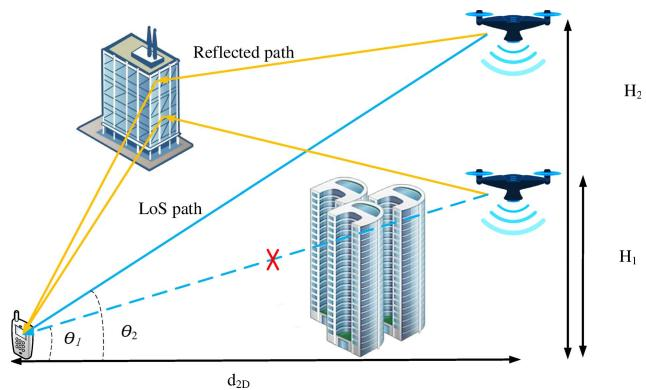

<details>
<summary>flowchart</summary>

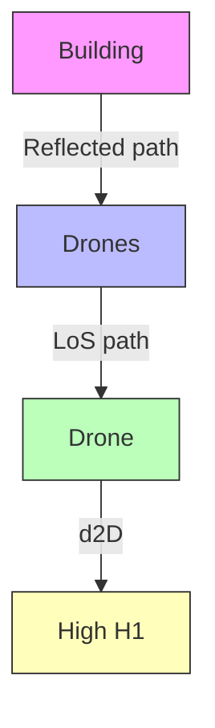
</details>

Illustration of the UAV-ground propagation in urban environment.

2) Altitude/Angle-Dependent Channel Parameters: As illustrated in Fig. 2, in the urban environment, as UAV moves higher, the effect of signal obstruction and scattering reduces. To explicitly model this, one approach is to use altitude- or angle-dependent channel parameters for the generic channel model in (1). Such parameters may include the path-loss exponent α [43], [44], the Rician factor $K _ { R }$ [44], the variance of the random shadowing $\sigma _ { X } ^ { 2 }$ [43], or the excessive path loss relative to conven-Xtional terrestrial channels [45].

a) Altitude-dependent channel parameters: In [43], the path-loss exponent α for GBS-UAV link is modeled as a monotonically decreasing function of the UAV altitude $H _ { U }$ as

$$
\alpha (H _ {U}) = \max (p _ {1} - p _ {2} \log_ {1 0} (H _ {U}), 2) \tag {4}
$$

where $p _ { 1 } , p _ { 2 } \ > \ 0$ are modeling parameters that can be obtained via curve fitting based on channel measurement results. The abovementioned model explicitly reflects the fact that as the UAV moves higher, there are, in general, less obstacles and scattering and, hence, smaller path-loss exponent. Note that when $H _ { U }$ is sufficiently large, we have $\alpha \ = \ 2 ,$ , which corresponds to the path-loss exponent of free-space propagation where the signal arrives at the receiver without incurring any notable obstruction, reflection, or scattering. Similar altitude-dependent expressions have been suggested in [43] for $X _ { 0 }$ and $\sigma _ { X } ^ { 2 }$ Xin (2). Note that while the abovementioned models were proposed in [43] for GBS-UAV links with UAVs being aerial users of cellular BSs, it can be in principle applied to UAV-GT channels, but with different parameters to reflect the fact that GBS-UAV links are usually subject to less obstacles than UAV-GT links, due to the elevated GBS site.

b) Elevation angle-dependent channel parameters: While the altitude-dependent channel model reveals the varying propagation environment for different UAV altitudes, it fails to model the fact that even with the same UAV altitude, the propagation environment may change if the UAV moves closer/further to/from the ground node [45]. To address this issue, another approach is to model the channel modeling parameters as functions of the elevation angle θ (as shown in Fig. 2), which depends on both the UAV altitude and the horizontal (or 2-D) distance with the corresponding ground node. For instance, in [44], by considering the UAV-GT communications and assuming the Rician fading channels, the Rician factor, and the pathloss exponent are, respectively, modeled as nondecreasing and nonincreasing functions of θ, which implies that as θ increases, i.e., either the UAV flies higher or closer to the ground node, the LoS component becomes more dominating.

c) Depression angle-dependent excess path-loss model: For GBS-UAV communication, the elevation angle (termed depression angle in [45]) can be both positive (when UAV is higher than GBS) or negative (when UAV is lower than GBS). Under this setup, Al-Hourani and Gomez [45] conducted both terrestrial and aerial experimental measurements in a typical suburban environment, by mounting the same handset on a car and on a UAV, respectively. By comparing the received signal power for these two measurement scenarios with roughly the same horizontal distance with the GBS, the authors proposed a path-loss model for GBS-UAV channels by adding an excess path loss1 on top of the conventional terrestrial path loss, where the excess path-loss component is a function of the depression angle θ, that is

$$
\mathrm{PL} _ {U} (d, \theta) = \mathrm{PL} (d _ {2 - \mathrm{D}}) + \eta (\theta) + X _ {U} (\theta) \tag {5}
$$

where $\mathrm { P L } ( d _ { \mathrm { 2 - D } } )$ denotes the path loss between the GBS and the point directly beneath the UAV, with $\operatorname { P L } ( \cdot )$ denoting the classical path-loss model in (2) and $d _ { \mathrm { 2 - D } }$ denoting the 2-D (horizontal) distance between the GBS and the UAV, η(θ) is the excess aerial path loss, and $X _ { U } ( \theta ) \ \sim$ $\mathcal { N } \big ( 0 , \sigma _ { U } ^ { 2 } ( \theta ) \big )$  represents the excess shadowing component. Furthermore, both $\eta ( \theta )$ and $\sigma _ { U } ^ { 2 } ( \theta )$ are modeled as functions of θ as

$$
\eta (\theta) = A (\theta - \theta_ {0}) \exp \left(- \frac {\theta - \theta_ {0}}{B}\right) + \eta_ {0} \tag {6}
$$

$$
\sigma_ {U} ^ {2} (\theta) = a \theta + \sigma_ {0} \tag {7}
$$

where $A , B , \theta _ { 0 } , a ,$ , and $\sigma _ { 0 }$ are modeling parameters that can be obtained based on curve fitting using measurement data. It was suggested in [45] that $A \ < \ 0$ and, thus, $\eta ( \theta )$ first decreases and then increases with θ. This is due to the following two effects as $\theta$ increases; on one hand, the obstruction and scattering are reduced as the UAV moves higher, while on the other hand, increased link distance and reduced GBS antenna gain are incurred.

3) Probabilistic LoS Channel Model: In an urban environment, the LoS link between UAV and ground nodes may be occasionally blocked by ground obstacles, such as buildings. To distinguish the different propagation environment between LoS and NLoS scenarios, another common approach is to separately model the LoS and NLoS propagations by taking into account their occurrence probabilities [46]–[49], referred to as the probabilistic LoS channel model. Such probabilities are based on the statistical modeling of the urban environment, such as the density and height of buildings. For given transmitter and receiver positions, the probability that there is an LoS link between them is given by that of no buildings being above the ray joining the transmitter and receiver [50]. Different expressions for LoS probability and the corresponding channel models have been proposed for UAV-ground communications. In the following, we discuss two well-known models, namely elevation angledependent probabilistic LoS model and the 3GPP GBS-UAV channel model.

a) Elevation angle-dependent probabilistic LoS model: With this model, the large-scale channel coefficient $\beta ( d )$ in (1) is modeled as [18], [49], [51]

$$
\beta (d) = \left\{ \begin{array}{l l} \beta_ {0} d ^ {- \alpha}, & \text { LoS   environment } \\ \kappa \beta_ {0} d ^ {- \alpha}, & \text { NLoS   environment } \end{array} \right. \tag {8}
$$

where $\beta _ { 0 }$ is the path loss at the reference distance of 1 m under LoS condition and $\kappa < 1$ is the additional attenuation factor due to the NLoS propagation.2 Furthermore, the probability of having LoS environment is modeled as a logistic function of the elevation angle θ as [49]

$$
P _ {\mathrm{LoS}} (\theta) = \frac {1}{1 + a \exp (- b (\theta - a))} \tag {9}
$$

1Note that we follow the terminology used in [45], though the term “excess” could be misleading as it is possible that η(θ) is a negative value for small θ.

$^ 2 \mathrm { A }$ simplification has been made here by assuming that the shadowing parameter κ is homogeneous in NLoS conditions, whereas in practice, κ is random and usually has a log-normal distribution.

where a and b are modeling parameters. The probability of NLoS environment ${ \mathrm { i } } s ,$ thus, given by $\begin{array} { r l } { P _ { \mathrm { N L o S } } ( \theta ) } & { { } = } \end{array}$ $1 ~ - ~ P _ { \mathrm { L o S } } ( \theta )$ . Equation (9) shows that the probability of having an LoS link increases as the elevation angle increases, and it approaches to 1 as θ gets sufficiently large.

With such a model, the expected channel power, with the expectation taken over both the randomness of the surrounding buildings and small-scale fading, can be expressed as

$$
\begin{array}{l} \bar {h} (d _ {2 - \mathrm{D}}, H _ {U}) \triangleq \mathbb {E} [ | h | ^ {2} ] (10) \\ = P _ {\mathrm{LoS}} (\theta) \beta_ {0} d ^ {- \alpha} + (1 - P _ {\mathrm{LoS}} (\theta)) \kappa \beta_ {0} d ^ {- \alpha} (11) \\ = \hat {P} _ {\mathrm{LoS}} (\theta) \beta_ {0} d ^ {- \alpha} (12) \\ \end{array}
$$

where $d _ { \mathrm { 2 - D } }$ and $H _ { U }$ are, respectively, the 2-D distance Uand UAV altitude, as illustrated in Fig. 2, and ${ \hat { P } } _ { \mathrm { L o S } } ( \theta ) \ { \triangleq }$ $P _ { \mathrm { L o S } } ( \theta ) + ( 1 - P _ { \mathrm { L o S } } ( \theta ) )$ κ can be interpreted as a regularized LoS probability by taking into account the effect of NLoS occurrence with the additional attenuation factor κ [18]. A typical plot of $\bar { h } ( d _ { \mathrm { 2 - D } } , H _ { U } )$ versus $H _ { U }$ for different $d _ { \mathrm { 2 - D } }$ U Uvalues is shown in Fig. 3. It is observed that with given $d _ { \mathrm { 2 - D } } ,$ , the expected channel power first increases with $H _ { U } ,$ due to the enhanced chance of LoS connection, and then decreases as $H _ { U }$ exceeds a certain threshold, Uat which the benefit of the increased LoS probability cannot compensate the increased path loss resulting from the longer link distance. Such a tradeoff on the UAV altitude has been extensively exploited for the UAV-mounted BS/relay placement optimization, as will be discussed in Section III-C.

b) 3GPP GBS-UAV channel model: In early 2017, the 3GPP technical specification group (TSG) approved a new study item on enhanced support for aerial vehicles via LTE networks. Detailed channel modeling between GBSs and aerial vehicles with altitude varying from 1.5 to 300 m has been suggested [5], which includes the comprehensive modeling of LoS probability, path loss, shadowing, and small-scale fading. The suggested channel models are presented for three typical 3GPP deployment scenarios, namely Rural Macro (RMa), UMa, and UMi.

For all the three deployment scenarios, the LoS probability is specified by two parameters: the 2-D distance $d _ { \mathrm { 2 - D } }$ between the GBS and the UAV, as well as the UAV altitude $H _ { U }$ . If $H _ { U }$ is below a certain threshold $H _ { 1 }$ , U Uthe model of LoS probability for conventional terrestrial users can be directly used for GBS-UAV channels. On the other hand, if $H _ { U }$ is greater than a threshold $H _ { 2 } ,$ 3GPP Usuggested a 100% LoS probability. Of particular interest is the regime of $H _ { 1 } \leq H _ { U } \leq H _ { 2 }$ , where LoS probability is suggested as a function of $d _ { \mathrm { 2 - D } }$ and $H _ { U }$ . For all the Uthree scenarios, the LoS probability specified in [5] can be uniformly written as

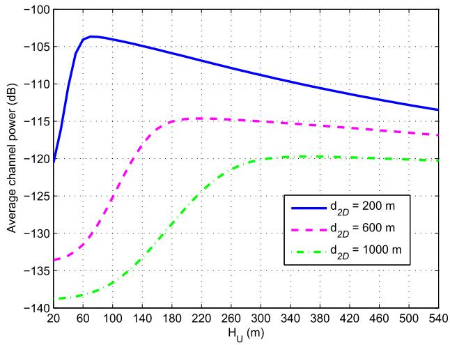

<details>
<summary>line</summary>

| H_U (m) | d_2D = 200 m | d_2D = 600 m | d_2D = 1000 m |
| ------- | ------------ | ------------ | ------------- |
| 20      | -120         | -135         | -140          |
| 60      | -105         | -130         | -138          |
| 100     | -105         | -125         | -135          |
| 140     | -106         | -120         | -132          |
| 180     | -107         | -115         | -128          |
| 220     | -108         | -115         | -125          |
| 260     | -109         | -115         | -123          |
| 300     | -110         | -115         | -121          |
| 340     | -111         | -115         | -120          |
| 380     | -112         | -115         | -120          |
| 420     | -113         | -115         | -120          |
| 460     | -114         | -115         | -120          |
| 500     | -115         | -115         | -120          |
| 540     | -116         | -115         | -120          |
</details>

Expected channel power versus UAV altitude in the elevation-angle-dependent probabilistic LoS channel model.

$$
P _ {\mathrm{LoS}} = \left\{ \begin{array}{l l} P _ {\mathrm{LoS}, \text { ter }}, & 1. 5 \mathrm{m} \leq H _ {U} \leq H _ {1} \\ P _ {\mathrm{LoS}, \mathrm{U}} (d _ {2 - \mathrm{D}}, H _ {U}), & H _ {1} \leq H _ {U} \leq H _ {2} \\ 1, & H _ {2} \leq H _ {U} \leq 3 0 0 \mathrm{m} \end{array} \right. \tag {13}
$$

where $P _ { \mathrm { L o S , t e r } }$ is the LoS probability for conventional ,terrestrial GBS-UE channels specified in [52, Table 7.4.2], and $P _ { \mathrm { L o S , U } } ( d _ { \mathrm { 2 - D } } , H _ { U } )$ is given by

$$
\begin{array}{l} P _ {\mathrm{LoS,U}} (d _ {2 - \mathrm{D}}, H _ {U}) \\ = \left\{ \begin{array}{l l} 1, & d _ {2 - \mathrm{D}} \leq d _ {1} \\ \frac {d _ {1}}{d _ {2 - \mathrm{D}}} + \exp \left(\frac {- d _ {2 - \mathrm{D}}}{p _ {1}}\right) \left(1 - \frac {d _ {1}}{d _ {2 - \mathrm{D}}}\right), & d _ {2 - \mathrm{D}} > d _ {1} \end{array} \right. \tag {14} \\ \end{array}
$$

with $p _ { 1 }$ and $d _ { 1 }$ given by logarithmic increasing functions of $H _ { U }$ as specified in [5]. Note that for the three typical Udeployment scenarios, different values for $H _ { 1 }$ , H2, $p _ { 1 }$ and $d _ { 1 }$ have been suggested. For example, $H _ { 2 } = 4 0$ m is suggested for $\mathrm { R M a } ,$ whereas $H _ { 2 } = 1 0 0$ m for UMa.

Based on the LoS and NLoS environments for the three deployment scenarios, the detailed path-loss model and shadowing standard deviation are, respectively, specified in $[ 5 ,$ Tables B-2 and B-3]. For moderate UAV altitude with $H _ { 1 } \leq H _ { U } \leq H _ { 2 } ,$ , the path-loss exponent and Ushadowing standard deviation are given as decreasing functions of $H _ { U }$ , reflecting the fact of reduced obstruc-Ution and scattering as UAV moves higher. On the other hand, three different methods are suggested to model the small-scale fading, with modified values for multipath angular spread, the Rician factor, delay spread, and so on [5]. Therefore, different from the other models discussed earlier, 3GPP model ${ \mathrm { i } } s ,$ in fact, a combination of both approaches of altitude-dependent channel parameters and the probabilistic LoS channel model to characterize the different propagation environment with varying UAV altitude.

Comparison of Main UAV-Ground Channel Models 

<table><tr><td>Channel model</td><td>Description</td><td>Proposed application scenarios</td><td>Pros and Cons</td></tr><tr><td>Free-space channel model [17,41]</td><td>Channel power inversely proportional to distance square, no shadowing or small-scale fading</td><td>GBS-UAV and UAV-GT channels in rural area and/or with very high UAV altitude</td><td>Simple, useful for offline UAV trajectory design; oversimplified in urban environment</td></tr><tr><td>Altitude-dependent channel parameters [43]</td><td>Channel modelling parameters such as path loss exponent and shadowing variance are functions of UAV altitude</td><td>GBS-UAV in urban/suburban environment</td><td>Useful for theoretical analysis; fails to model the change of propagation environment when UAV moves horizontally</td></tr><tr><td>Elevation angle-dependent channel parameters [44]</td><td>Rician factor and path loss exponent are functions of elevation angle</td><td>UAV-GT in urban/suburban environment</td><td>Useful for theoretical analysis; further experimental verification required</td></tr><tr><td>Depression angle-dependent excess path loss model [45]</td><td>Excessive path loss depends on depression (elevation) angle</td><td>GBS-UAV channel in suburban environment</td><td>Small-scale fading model not specified</td></tr><tr><td>Elevation angle-dependent probabilistic LoS model [49]</td><td>Separately model LoS and NLoS propagations; LoS probability increases with elevation angle</td><td>UAV-GT channel in urban environment with statistical information of building height/distribution</td><td>Useful for theoretical analysis; simplified shadowing; further experimental verification required</td></tr><tr><td>3GPP GBS-UAV channel model [5]</td><td>Separately model LoS and NLoS propagations; LoS probability and channel modelling parameters are both functions of UAV altitude and horizontal distance between GBS and UAV</td><td>GBS-UAV channel for UMa, UMi and RMa scenarios</td><td>Comprehensive models for path loss, shadowing and small-scale fading; useful for numerical simulations but too complicated for theoretical analysis or offline UAV trajectory optimization</td></tr></table>

4) Comparison of Different Models: The choice of channel models for the study of UAV communications depends on the communication scenarios and the purpose of the study since they offer different tradeoffs between analytical tractability and modeling accuracy. For instance, the free-space channel model has been extensively used for the offline communication-oriented UAV trajectory design due to its simplicity and good approximation in a rural environment or when the UAV altitude is sufficiently high. For the urban environment, the models based on altitude-/ angle-dependent channel parameters and LoS probabilities have been extensively used for theoretical analysis for UAV BS/relay placement and coverage performance optimization. On the other hand, the 3GPP model gives very comprehensive modeling for various aspects of GBS-UAV channels, but it is more suitable for numerical simulations rather than theoretical analysis due to its complicated expressions. A qualitative comparison of the above different UAV channel models is summarized in Table 5.

5) Other Models and Directions of Future Work: Besides the channel models discussed earlier, there are other models also proposed for UAV communications. For example, the 3-D geometry-based stochastic model for multipleinput–multiple-output (MIMO) UAV channels has been proposed in [53]. For UAV communications above water, the classic two-ray model has been suggested [54], [55]. Furthermore, extensive channel measurements have been

conducted [28], [54]–[56] on the air–ground channels in the L-band (around 970 MHz) and C-band (around 5 GHz) at rather high UAV altitude, long range (up to dozens of kilometers), and high aircraft speed (e.g., more than 70 m/s). The measurements were conducted over different environments, including above-water environment [54], mountainous/hilly environment [56], and suburban and near-urban environments [55]. Based on the measurement results, a modified log-distance path-loss model was proposed to account for the flight direction [55], [56]

$$
\mathrm{PL} (d) = \mathrm{PL} _ {\text {ter}} (d) + \xi F \tag {15}
$$

where $\mathrm { P L } _ { \mathrm { t e r } } ( d )$ is the classic log-distance path-loss model as given in (2), $\xi = - 1$ if the aircraft travels toward the ground station and ξ = 1 for travelling away from it, and F is a small positive adjustment factor for the direction of travel. It was explained in [55] and [56] that such a correction factor is to account for the slightly different orientations of the aircraft in the two travel directions. For wideband frequency-selective channel models, a tapped delay line (TDL) model has been developed in [56], which includes the LoS component, a potential ground reflection, and other intermittent taps.

It is worth mentioning that channel measurements and modeling for UAV communications are still active and ongoing research. The incorporation of various other issues would be very useful for the accurate performance analysis and practical design of UAV communication systems in the future, such as the MIMO and massive MIMO channel modeling, the channel variation induced by UAV mobility and/or blade rotation, the millimeter-wave (mmWave)

UAV channel modeling [57], and the wideband channel modeling in scattering environment.

Another important issue is channel estimation for UAV-ground communications. While the problem of acquiring the instantaneous channel state information (CSI) has been extensively studied for terrestrial communications, it deserves new investigations for UAV communications by exploiting the unique UAV-ground channel characteristics. For example, an efficient channel estimation scheme could be designed when it is known a priori that the deterministic LoS component dominates, as typically the case for GBS-UAV channels in rural/subrural environment, by tracking the Doppler frequency offset induced by the UAV movement. As the performance of channel estimation schemes typically depends on the underlying channel models, more research endeavor is needed for devising efficient channel estimation schemes for the specific UAV channel models discussed earlier, especially for MIMO- or massive MIMO-based UAV communications.

# B. Antenna Model

Besides channel modeling, antenna modeling at the transmitter/receiver is also crucial to the wireless communication link performance. Conventional terrestrial communication systems mostly assume that the transmitter–receiver distance is much larger than their antennas’ height difference. As a result, signals are assumed to mainly propagate horizontally, and antenna modeling mostly concerns the 2-D antenna gain along the horizontal direction. However, 2-D antenna modeling is generally insufficient for UAV communications, which involves aerial users or BSs with large-varying altitude. Instead, 3-D antenna modeling is often needed to take into account both the azimuth and elevation angles for UAV-ground communications.

The simplest antenna modeling leads to the isotropic model, where the antenna radiates (or receives) equal power in all directions and the corresponding radiation pattern is a sphere in 3-D. Isotropic antenna is a hypothetical antenna modeling that is mainly used for theoretical analysis as a baseline case. In practice, equal radiation in 2-D only (say, in the horizontal dimension) can be easily realized (by, e.g., dipole antennas), leading to the omnidirectional antenna. Isotropic or omnidirectional antenna modeling gives a reasonable approximation for scenarios when the antenna gains are approximately equal for the directions of interest. However, in modern wireless communication systems, directional antennas with fixed radiation pattern and advanced active antenna arrays for MIMO communications are widely used.

1) Directional Antenna With Fixed Radiation Pattern: For directional antenna with fixed radiation pattern, the antenna gain is completely specified by the deterministic function $G ( \theta , \phi )$ with respect to the elevation and azimuth angles θ and $\phi ,$ respectively. There are two common approaches to realize directional antenna with fixed pattern. The first one is via carefully designing the antenna shape, such as the parabolic antennas and horn antennas. The other approach, as more commonly seen in modern wireless communications, uses antenna arrays consisting of multiple antenna elements, whose relative phase shifts are designed to achieve constructive signal superposition in the desired directions. With the phase shift predetermined and fixed, the array antenna works like a single antenna with predetermined antenna gain in terms of G(θ, φ).

a) Cellular BS 3-D directional antenna model: Most existing cellular BSs are equipped with directional antennas with fixed radiation pattern, where sectorization technique is applied horizontally with, e.g., three sectors for each BS site. Along the vertical dimension, the signal is usually downtilted toward the ground to cover the ground users and suppress the intercell interference. For cellular BSs with fixed radiation pattern, i.e., without the full-dimensional MIMO (FD-MIMO) configuration, 3GPP suggested the array configuration with M-element uniform linear array (ULA) placed vertically [5], [58]. Each array element itself is directional, which is specified by its half-power beamwidths $\Theta _ { 3 } \mathrm { d B }$ and $\Phi _ { 3 } \exp { \mathrm { d } \mathrm { B } }$ along the vertical and horizontal dimensions, respectively. It is usually set that $\Theta _ { 3 \mathrm { ~ d B } } = \Phi _ { 3 \mathrm { ~ d B } } = 6 5 ^ { \circ }$ . It is also possible that the antenna element is only directional along the vertical dimension but omnidirectional horizontally (see [58, Table 7.1-1]). To achieve antenna downtilt radiation pattern with downtilt angle $\theta _ { \mathrm { t i l t } } ,$ , where $\theta _ { \mathrm { t i l t } }$ is defined relative to the horizontal plane of the BS site, a fixed phase shift is applied for each vertical antenna element, where the complex coefficient of the mth element is given by $w _ { m } = ( 1 / \sqrt { M } ) \exp ( - j ( 2 \pi / \lambda ) ( m - 1 ) d _ { V } \sin \theta _ { \mathrm { t i l t } } )$ , where $d _ { V }$ is the separation of adjacent antenna elements. It can be shown that with such phase shifts, the maximum antenna gain is achieved along the vertical direction $\theta _ { \mathrm { t i l t } }$ . As an illustration, Fig. 4 shows the 3-D and 2-D synthesized radiation patterns for an eight-element ULA with adjacent elements separated by half-wavelength, i.e., $d _ { V } \ = \ \lambda / 2 ,$ , and $\theta _ { \mathrm { t i l t } } = - 1 0 ^ { \circ }$ V. It can be observed that the main lobe is directing toward the elevation angle of $- 1 0 ^ { \circ } .$ , as desired. In addition, there are several sidelobes with generally decreasing lobe gains as elevation angle increases. As will be discussed in Section IV, these sidelobes make it possible to support UAV communications even using the existing BSs with downtilt antennas.

The synthesized BS antenna gain based on the specified array configuration is quite useful for numerical simulations that require 3-D BS antenna modeling, as will be illustrated in Section IV-C. However, it is difficult to be used for theoretical analysis due to the lack of closedform expressions. To overcome this issue, one approach is to adopt the approximated two-lobe antenna model consisting of one main lobe and one sidelobe only, and all directions in each lobe have an identical antenna gain [59].

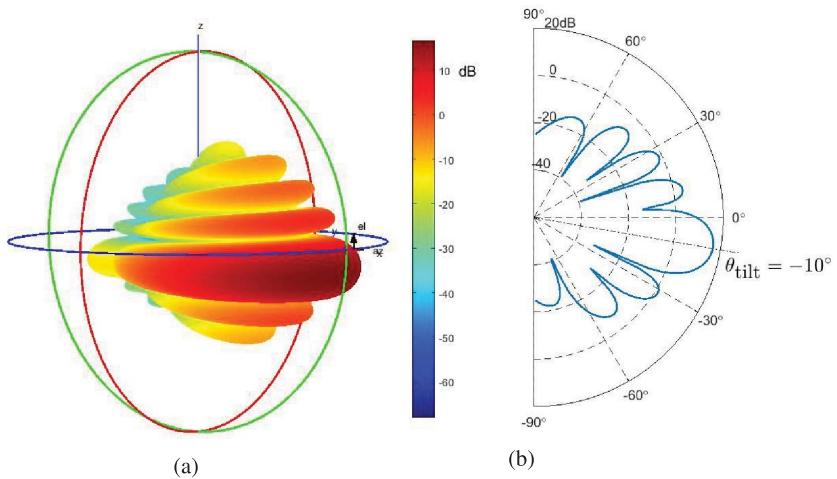  
Typical antenna pattern of the existing cellular BSs with “fixed-pattern” array configuration. (a) 3-D plot. (b) 2-D plot for vertical pattern intercepted at the azimuth angle 0◦.

For cellular BSs serving aerial users where the vertical antenna gain is of particular interest, the two-lobe model can be expressed as

$$
G (\theta , \phi) = \left\{ \begin{array}{l l} G _ {m}, & \theta \in \left[ \theta_ {\text { tilt }} - \frac {\Theta}{2}, \theta_ {\text { tilt }} + \frac {\Theta}{2} \right] \\ G _ {s}, & \text { otherwise } \end{array} \right. \tag {16}
$$

where Θ is the beamwidth of the main lobe and $G _ { m }$ and $G _ { s }$ are the antenna gains of the main lobe and sideslobe, respectively. Note that in the abovementioned model, omnidirectional radiation is assumed in the horizontal domain [60]. Such a simplified two-lobe antenna model gives a reasonable approximation for the performance analysis in conventional terrestrial systems [59]. However, it may not be sufficient for cellular UAV communications. The reason is that unlike terrestrial users that are usually served by the antenna main lobe of its closet BS, aerial users with altitude far exceeding the BS antenna height are typically served by the sidelobe of a more distant BS. As a result, it is necessary to distinguish the strongest sidelobe with other sidelobes since they will contribute to either the desired signal or interference. Thus, more accurate antenna gain approximation than the two-lobe model is needed for improved performance analysis for cellular UAV communications, and some recent progresses have been made in [61] and [62].

b) UAV directional antenna model: In principle, similar techniques discussed earlier can be applied to model or synthesize the 3-D directional antenna gains for UAVs. However, as the UAV orientation and its antenna boresight (i.e., the axis of maximum gain) may continuously change as it flies, additional care must be taken to define the signal direction with respect to the antenna boresight. On the other hand, for the convenience of mathematical representation and theoretical analysis, the directional antenna at UAVs is usually modeled with the main beam illuminating directly beneath the UAV, and it is symmetric around the boresight [63]. With the simple two-lobe approximation, the UAV directional antenna gain can be expressed as

$$
G (r) = \left\{ \begin{array}{l l} G _ {m}, & r \leq H _ {U} \tan (\Psi) \\ G _ {s}, & \text { otherwise } \end{array} \right. \tag {17}
$$

where r is the distance between the ground location of interest and the UAV’s horizontal projection on the ground and Ψ is the half-beamwidth in radians (rad). In particular, the antenna gain of the main lobe can be approximated as $G _ { m } \approx ( 2 . 2 8 5 / \Psi ^ { 2 } )$ [63]. Such antenna modeling has been mused for both scenarios when UAV is used as aerial BS [63]–[65] or aerial user [60].

2) UAV MIMO Communications: Different from directional antennas with fixed gain patterns, the antenna array for MIMO communications consists of elements each with a dynamically controllable complex weight coefficient. In this case, the antenna array can no longer be treated as a single antenna with the fixed gain pattern as a function of the direction. Instead, the channel coefficients between different pairs of transmitting and receiving antennas are represented as a matrix, based on which transmit and receive spatial precoding/combining (also generally known as beamforming) can be applied. This leads to the advanced MIMO communications that have been extensively studied for terrestrial communications during the past two decades.

For UAV communications, the MIMO antenna modeling, in general, needs to take into account both the azimuth and elevation angles. With M transmitting and N receiving antennas, the MIMO channel can be modeled as

$$
\mathbf {H} = \sqrt {\beta (d)} \sum_ {l = 1} ^ {L} \mathbf {a} (\theta_ {l} ^ {R}, \phi_ {l} ^ {R}) \mathbf {b} ^ {H} (\theta_ {l} ^ {T}, \phi_ {l} ^ {T}) \tag {18}
$$

where L is the total number of multipath, β(d) is the large-scale channel coefficient, as discussed in Section II-A, $\mathbf { a } ( \cdot ) ~ \in ~ \mathbb { C } ^ { N \times 1 }$ and $\mathbf { b } ( \cdot ) \in \mathbb { C } ^ { M \times 1 }$ are the array response vectors at the receiver and transmitter, respectively, $\theta _ { l } ^ { R }$ and $\phi _ { l } ^ { R }$ are, respectively, the elevation and azimuth l langles of arrival (AoAs) of the lth path, and $\theta _ { l } ^ { T }$ and $\phi _ { l } ^ { T }$ are, l lrespectively, the elevation and azimuth angles of departure (AoDs) of the lth path.

To support MIMO UAV communications (as well as that of conventional users in high buildings), 3GPP has suggested the use of uniform rectangular arrays (URAs) at the cellular BSs [5], [58], with antenna elements placed along both the vertical and horizontal dimensions. For instance, for UMa deployment scenario, one suggested BS antenna configuration is $( M _ { 1 } , M _ { 2 } , P ) = ( 8 , 4 , 2 )$ [5], where $M _ { 1 }$ is the number of antenna elements with the same polarization in each vertical column, $M _ { 2 }$ is the number of columns, and P specifies the number of polarization dimensions, with $P = 2$ for cross polarization and $P = 1$ for copolarization [66]. As 2-D active arrays are used, signals in both azimuth and elevation angles can be resolved, thus enabling 3-D beamforming or FD-MIMO. As will be discussed in Section IV-D, 3-D beamforming is a promising technique for dealing with the strong air–ground interference in cellular-connected UAV communications.

Conventional antenna array for MIMO communications requires one radio frequency (RF) chain for each antenna element. As the number of antennas increases in wireless systems, such as massive MIMO and/or mmWave communications, the required cost and complexity become prohibitive, in terms of hardware implementation, signal processing, and energy consumption [67]. To overcome this issue, there have been significant research efforts on developing cost-aware MIMO transceiver architectures, such as analog beamforming [68], hybrid anlog/digital precoding [69], [70], and lens antenna array communications [71], [72]. In particular, for communication environment with limited channel paths, lens MIMO communication is able to achieve comparable performance with the fully digital MIMO communication but with significantly reduced RF chain cost and signal processing complexity [67]. This is particularly appealing for UAV communications with the inherent multipath sparsity due to the high UAV altitude as well as the imperative needs for energy saving and cost/complexity reduction for UAVs. Therefore, UAV MIMO communication with low cost as well as compact and energy-efficient transceivers is an importation problem that deserves further investigation.

# C. UAV Energy Consumption Model

One critical issue of UAV communications is the limited onboard energy of UAVs, which renders energy-efficient UAV communication particularly important. To this end, proper modeling for UAV energy consumption is crucial. Notice that besides the conventional communication-related energy consumption due to, e.g., signal processing, circuits, and power amplification, UAVs are subject to the additional propulsion energy consumption to remain aloft and move freely. Depending on the size and payload of UAVs, the propulsion power consumption may be much more significant than communication-related power expenditure. For scenarios where the communication-related energy is nonnegligible, the existing models for communication energy consumption in the extensively studied terrestrial communication systems can be used for UAV communications. In contrast, the UAV propulsion energy consumption is unique for UAV communication, whereas its mathematical modeling had received very little attention in the past.

Early works considering UAV energy consumption mainly targeted for various other applications rather than wireless communication, where empirical or heuristic energy consumption models were usually used. For example, in [73], an empirical energy consumption model was applied for the energy-aware UAV path planning for aerial imaging. To that end, experimental measurements were conducted to study the energy consumption of a specific quadrotor UAV at different speeds. However, there is no mathematical model on UAV energy consumption suggested in [73], which makes the result difficult to be generalized for other UAVs. In [74] and [75], the UAV energy (fuel) cost was modeled as the L1-norm of the control force or acceleration vector, whereas in [76], it was modeled to be proportional to the square of the UAV speed. However, no rigorous mathematical derivation was provided for such heuristic models. In fact, although the power consumption of mobile robots moving on the ground can be modeled as a polynomial and monotonically increasing function with respect to its moving speed [77], such results are not applicable for UAVs due to their fundamentally different maneuvering mechanisms.

To fill such gap, rigorous mathematical derivations were performed recently in [17] and [18] to obtain the theoretical closed-form propulsion energy consumption models for fixed- and rotary-wing UAVs, respectively.

1) Fixed-Wing UAV Energy Model: For a fixed-wing UAV in straight-and-level flight with constant speed $V$ in m/s, the propulsion power consumption can be expressed in a closed form as [17]

$$
P (V) = \underbrace {c _ {1} V ^ {3}} _ {\text { parasite }} + \underbrace {\frac {c _ {2}}{V}} _ {\text { induced }} \tag {19}
$$

where $c _ { 1 }$ and $c _ { 2 }$ are two parameters related to the aircraft’s weight, wing area, air density, and so on.

2) Rotary-Wing UAV Energy Model: On the other hand, for a rotary-wing UAV in straight-and-level flight with speed $V ,$ the propulsion power consumption can be

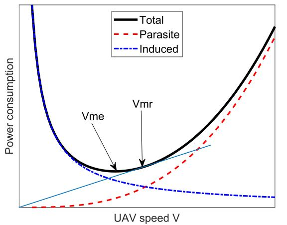

<details>
<summary>line</summary>

| UAV speed V | Total | Parasite | Induced |
| ----------- | ----- | -------- | ------- |
| Vme         | Vme   | Vme      | Vmr     |
| Peak        |       |          |         |
</details>

(a)

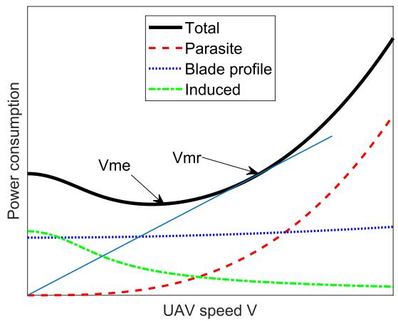

<details>
<summary>line</summary>

| UAV speed V | Total | Parasite | Blade profile | Induced |
| ----------- | ----- | -------- | ------------- | ------- |
| Vme         | Low   | Low      | Low           | Low     |
| Vmr         | High  | High     | Medium        | Low     |
</details>

(b)   
Typical plots for UAV propulsion power consumption versus speed. (a) Fixed wing. (b) Rotary wing.

expressed as [18]

$$
\begin{array}{l} P (V) = \underbrace {P _ {0} \left(1 + \frac {3 V ^ {2}}{U _ {\text {tip}} ^ {2}}\right)} _ {\text {blade profile}} + \underbrace {P _ {\text {ind}} \left(\sqrt {1 + \frac {V ^ {4}}{4 v _ {0} ^ {4}}} - \frac {V ^ {2}}{2 v _ {0} ^ {2}}\right) ^ {1 / 2}} _ {\text {induced}} \\ + \underbrace {\frac {1}{2} d _ {0} \rho s A V ^ {3}} _ {\text {parasite}} \end{array} \tag {20}
$$

where $P _ { 0 }$ and $P _ { \mathrm { i n d } }$ are constants (i.e., independent of the speed V ) representing the blade profile power and induced power in hovering status that depends on the aircraft weight, air density $\rho ,$ and rotor disc area A, as specified in [18, eq. (64)], $U _ { \mathrm { t i p } }$ denotes the tip speed of the rotor blade, $v _ { 0 }$ is known as the mean rotor induced velocity in hovering, and $d _ { 0 }$ and s are the fuselage drag ratio and rotor solidity, respectively.

The typical power versus speed curves according to (19) and (20) are plotted in Fig. 5(a) and (b), respectively. Several observations can be made.

1) First, for the extreme case with $V = 0 ,$ the required power consumption for fixed-wing UAV is infinity, whereas that for rotary-wing UAVs is given by a finite value $P _ { 0 } + P _ { \mathrm { i n d } }$ . This corroborates the wellknown fact that fixed-wing UAVs must maintain a minimum forward speed to remain airborne, while rotary-wing UAVs can hover with zero speed at fixed locations.   
2) Second, for both types of UAVs, the power consumption consists of at least two components: the parasite power and the induced power. The former is the power required to overcome the parasite friction drag due to the moving of the aircraft in the air, and the induced power corresponds to that required to overcome the induced drag developed during the creation of the lift force to maintain the aircraft airborne. Note

that parasite power is required only when the UAV has nonzero speed, while induced power is required even when $V ~ = ~ 0$ (for rotary-wing UAV). In fact, for both UAV types, the parasite power increases in cubic with the aircraft speed V , while the induced power decreases as V increases, with more complicated expressions for rotary-wing UAVs than fixedwing UAVs.

3) Third, compared to that for fixed-wing UAVs, the power consumption of rotary-wing UAVs has one additional term: the blade profile power, which is needed to overcome the profile drag due to the rotation of blades.

A comparison of the energy consumption models for fixedwing versus rotary-wing UAVs is summarized in Table 6.

For both UAV types, two particular UAV speeds that are of high practical interest are the maximum-endurance (ME) speed and the maximum-range (MR) speed that are denoted as $V _ { \mathrm { m e } }$ and $V _ { \mathrm { m r } } ,$ , respectively.   
3) ME Speed: By definition, the ME speed $V _ { \mathrm { m e } }$ is the optimal UAV speed that maximizes the UAV endurance for any given onboard energy, which can be obtained as

$$
V _ {\mathrm{me}} = \arg \min _ {V \geq 0} P (V). \tag {21}
$$

For fixed-wing UAV, $V _ { \mathrm { m e } }$ can be obtained based on (19) to be $V _ { \mathrm { m e } } = ( c _ { 2 } / 3 c _ { 1 } ) ^ { 1 / 4 }$ , whereas it can be obtained numerically for rotary-wing UAVs. Note that even for rotary-wing UAVs, hovering is not the most power-conserving status since $V _ { \mathrm { m e } } ~ \ne ~ 0$ in general. This may seem counterintuitive at the first glance, but it is fundamentally due to the fact that the induced power, which is the dominant power consumption component at low UAV speed, reduces as V increases.

4) MR Speed: On the other hand, the MR speed $V _ { \mathrm { m r } }$ is the optimal UAV speed that maximizes the total traveling distance with any given onboard energy, which can be obtained as

Comparison of Energy Consumption Models for Fixed-Wing Versus Rotary-Wing UAVs 

<table><tr><td></td><td>Fixed-Wing</td><td>Rotary-Wing</td></tr><tr><td>Convexity with respect to speed V</td><td>Convex</td><td>Non-convex</td></tr><tr><td>Components</td><td>Induced and parasite</td><td>Induced, parasite, and blade profile</td></tr><tr><td>Power at V = 0</td><td>Infinity</td><td>Finite</td></tr></table>

$$
V _ {\mathrm{mr}} = \arg \min _ {V \geq 0} E _ {0} (V) \triangleq \frac {P (V)}{V}. \tag {22}
$$

Note that $E _ { 0 } ( V )$ in Joule/meter (J/m) represents the UAV energy consumption per unit travelling distance. For fixedwing $\mathrm { U A V s } , V _ { \mathrm { m r } }$ can be obtained in closed form as $V _ { \mathrm { m r } } =$ $( c _ { 2 } / c _ { 1 } ) ^ { 1 / 4 } = 3 ^ { 1 / 4 } V _ { \mathrm { m e } } ,$ while it can be obtained numerically for rotary-wing UAVs. Alternatively, for both UAV types, $V _ { \mathrm { m r } }$ can be obtained graphically based on the power-speed curve $P ( V )$ , by drawing a tangential line from the origin to the power curve that corresponds to the minimum slope (and, hence, power/speed ratio), as illustrated in Fig. 5(b). Finally, it can be shown that $V _ { \mathrm { m r } } > V _ { \mathrm { m e } }$ for both UAV types.

5) Extensions and Directions of Future Work: Note that (19) and (20) only give the instantaneous power consumption for UAVs in straight-and-level flight with constant speed V . For UAVs flying in 3-D airspace with arbitrary trajectory ${ \bf q } ( t ) \in \mathbb { R } ^ { 3 \times 1 } , \ 0 \ \leq \ t \ \leq \ T$ , with $T$ denoting the time horizon of interest, the energy consumption, in general, depends on both the 3-D velocity vector $\mathbf { v } ( t ) =$ ${ \dot { \mathbf { q } } } ( t )$ and the acceleration vector $\mathbf { a } ( t ) \ = \ { \ddot { \mathbf { q } } } ( t )$ . In [17], for arbitrary 2-D trajectory with level flight (i.e., constant altitude), a closed-form expression of energy consumption was derived for fixed-wing UAVs. The result has a nice interpretation based on the work–energy principle. Based on (20), similar expression can be derived for rotarywing UAVs given arbitrary 2-D trajectory with level flight. However, for arbitrary 3-D UAV trajectory $\mathbf { q } ( t )$ with UAV climbing or descending over time, to the best of our knowledge, no closed-form expression has been rigorously derived for the UAV energy consumption as a function of $\mathbf { q } ( t )$ . One heuristic closed-form approximation might be

$$
\begin{array}{l} E (\mathbf {q} (t)) \approx \int_ {0} ^ {T} P (\| \mathbf {v} (t) \|) d t + \frac {1}{2} m (\| \mathbf {v} (T) \| ^ {2} - \| \mathbf {v} (0) \| ^ {2}) \\ + m g ([ \mathbf {q} (T) ] _ {3} - [ \mathbf {q} (0) ] _ {3}) \tag {23} \\ \end{array}
$$

where $P ( \cdot )$ is given by (19) or (20) with $\| \mathbf { v } ( t ) \|$ being the instantaneous UAV speed, m is the aircraft mass, and $g$ is the gravitational acceleration. Note that the second and third terms in (23) represent the change of kinetic energy and potential energy, respectively. It is worth remarking that proper care should be taken while using (23) since it ignores the effect of UAV acceleration/deceleration on the additional external forces (or work) that must be provided by the engine. More research endeavors are, thus, needed to rigorously derive the UAV energy consumption with arbitrary 3-D trajectory and evaluate the accuracy of the approximation in (23). In addition, the derivations in [17] and [18] assumed a zero wind speed. The energy consumption model by taking into account the effect of wind is a challenging problem that deserves further investigation. Furthermore, it will be worthwhile to practically validate the theoretical energy consumption models by flight experiment and measurement.

# D. UAV Communication Performance Metric

For UAV communications, similar performance metrics as for conventional terrestrial communications can be used, such as link signal-to-interference-plus-noise ratio (SINR), outage/coverage probability, communication throughput, delay, spectral efficiency, and energy efficiency. In addition, in certain scenarios, new performance metrics, such as UAV mission completion time [78]–[80] and energy consumption [17], [18], are of practical interest. In the following, we model the abovementioned performance metrics in the context of UAV-ground communications.

1) SINR: Consider a generic UAV communication system with K cochannel UAVs communicating with their respective ground nodes (GBSs or GTs). Each UAV can be either a transmitter or a receiver. Let ${ \mathcal { Q } } ~ = ~ \{ \mathbf { q } _ { k } \} _ { k = 1 } ^ { K }$ k kdenote the 3-D locations of all the K UAVs at a given time instant and ${ \mathcal { Q } } _ { k } ^ { - }$ denote all other UAV locations excluding kthat of UAV k. For the communication link between each UAV k and its associated ground node, the interference scenarios are shown in Fig. 6, for the cases that UAV k is a transmitter or a receiver. When UAV k is transmitting information, the SINR at its corresponding ground receiver can be expressed as [see Fig. 6(a)]

$$
\gamma_ {k} (\mathcal {Q}) = \frac {S (\mathbf {q} _ {k})}{I _ {\mathrm{ter}} + I _ {\mathrm{aer}} (\mathcal {Q} _ {k} ^ {-}) + \sigma^ {2}} \tag {24}
$$

where $S ( \mathbf { q } _ { k } )$ is the desired received signal power that kchanges with the location of UAV k, $I _ { \mathrm { t e r } }$ is the aggregate interference from other transmitting ground nodes, and $I _ { \mathrm { a e r } } ( \mathcal { Q } _ { k } ^ { - } )$ is the aggregate interference from other transkmitting UAVs that change with their locations and $\sigma ^ { 2 }$ is the receiver noise power. On the other hand, when UAV k is receiving information, its SINR can be similarly written as

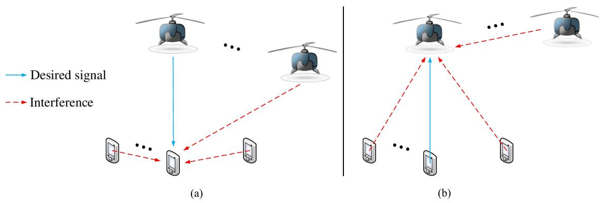  
Illustration of the possible interference when the UAV acts as (a) transmitter or (b) receiver.

$$
\gamma_ {k} (\mathcal {Q}) = \frac {S (\mathbf {q} _ {k})}{I _ {\mathrm{ter}} (\mathbf {q} _ {k}) + I _ {\mathrm{aer}} (\mathcal {Q}) + \sigma^ {2}}. \tag {25}
$$

Note that different from (24), in this case, both the terrestrial and aerial interference powers depend on $\mathbf { q } _ { k } ,$ which are, thus, denoted as $I _ { \mathrm { t e r } } ( \mathbf { q } _ { k } )$ and $I _ { \mathrm { a e r } } ( \mathcal { Q } )$ k, respectively. Such a difference has the following important implication: for the air–ground link with a UAV transmitter, changing the UAV location has an effect on its own link SINR only through the desired signal power, while in the case with a UAV receiver, it affects the link SINR in a more complicated manner through both the desired signal and undesired interference powers. This observation is useful for the design of the interference-aware UAV trajectory in practice.

In both (24) and (25), the desired signal power $S ( \mathbf q _ { k } )$ can be further written as

$$
S (\mathbf {q} _ {k}) = P _ {t} G _ {t} (\mathbf {q} _ {k}) G _ {r} (\mathbf {q} _ {k}) \beta (\mathbf {q} _ {k}) | \tilde {h} | ^ {2} \tag {26}
$$

where $P _ { t }$ is the transmission power, $G _ { t }$ and $G _ { r }$ are the transmit and receive antenna gains, respectively, $\beta$ is the large-scale channel power including path loss and shadowing, and $\tilde { h }$ is a random variable accounting for the small-scale fading. Note that in (26), $S ( \mathbf { q } _ { k } )$ explicitly depends on the UAV location $\mathbf q _ { k }$ kvia the following three kaspects: the transmit antenna gain, the receive antenna gain, and the large-scale channel power. Specifically, for directional transmission with either fixed antenna pattern or flexible beamforming, the relative position between UAV k and its associated GBS/GT determines the AoDs and AoAs of the signal propagation, which, thus, affects the transmit and receive antenna gains. On the other hand, the dependence of the large-scale channel power $\beta ( \mathbf { q } _ { k } )$ on the UAV location $\mathbf q _ { k }$ kis evident based on our discussions in Section II-A.

Similarly, the dependence of the interference from the terrestrial and other aerial users on the UAVs’ locations can be drawn for the abovementioned two cases, respectively. 2) Outage Probability: The SINR in (24) and (25) generally varies in both space and time and, thus, can be modeled as a random variable. For a target SINR threshold Γ, the outage probability for the link of an arbitrary UAV k can be expressed as3

$$
P _ {\text { out }, k} (\mathcal {Q}) = \operatorname * {P r} (\gamma_ {k} (\mathcal {Q}) <   \Gamma). \tag {27}
$$

Note that for the given UAV locations $\mathcal { Q } ,$ the abovementioned outage probability needs to take into account the randomness in both time (e.g., due to small-scale fading) as well as space (say, due to the LoS/NLoS probabilities).

3) Communication Throughput: Assuming the capacityachieving Gaussian signaling and Gaussian distributed interference and noise, the achievable rate for the link of UAV k is given by $R _ { k } ( \mathcal { Q } ) \ : = \ : \log _ { 2 } ( 1 + \gamma _ { k } ( \mathcal { Q } ) )$ in bits k kper second per Hertz (b/s/Hz) with each given channel realization. The average achievable communication throughput over the random channel realizations is, thus, given by

$$
\hat {R} _ {k} (\mathcal {Q}) = \mathbb {E} [ \log_ {2} (1 + \gamma_ {k} (\mathcal {Q})) ]. \tag {28}
$$

For the case of flying UAVs with K UAVs following certain trajectories $\begin{array} { r } { \mathcal { Q } ( t ) ~ = ~ \{ \mathbf { q } _ { k } ( t ) \} _ { k = 1 } ^ { K } , ~ 0 ~ \leq ~ t ~ \leq ~ T , } \end{array}$ k kthe average communication throughput of UAV k can be written as

$$
\bar {R} _ {k} (\mathcal {Q} (t)) = \mathbb {E} \left[ \int_ {0} ^ {T} R _ {k} (\mathcal {Q} (t)) d t \right] = \int_ {0} ^ {T} \hat {R} _ {k} (\mathcal {Q} (t)) d t. \tag {29}
$$

4) Energy Efficiency: Energy efficiency is measured by the number of information bits that can be reliably communicated per unit energy consumed, thus measured in bits/Joule [19], [81]–[83]. Of particular interest in UAV communications is the energy efficiency taking into

3Note that $1 \ - \ P _ { \mathrm { o u t } , k } ( \mathcal { Q } )$ is usually referred to as the ,knonoutage or coverage probability.

account the unique UAV’s propulsion energy consumption. For UAV $k ,$ the link energy efficiency can be defined as

$$
\mathrm{EE} _ {k} (\mathcal {Q} (t)) = \frac {\bar {R} _ {k} (\mathcal {Q} (t))}{E (\mathbf {q} _ {k} (t)) + E _ {\mathrm{com}}} \tag {30}
$$

where the numerator is the average communication throughput of UAV k given in (29) that, in general, depends on its own trajectory as well as those of all other cochannel UAVs due to their interference, while the denominator includes both its propulsion energy consumption $E \big ( \mathbf { q } _ { k } ( t ) \big )$ given in, $\mathbf { e . g . }$ , (23) that depends konly on its own trajectory, as well as communication energy consumption, denoted by $E _ { \mathrm { { c o m } } }$ . Besides the abovementioned per-link energy efficiency, there are also other definitions of energy efficiency, such as the network energy efficiency, which is given by the sum communication throughput of all UAVs’ links normalized by their total (propulsion and communication) energy consumption.

5) Special Case (Orthogonal Communication With Isotropic Antennas): For the purpose of illustration, we consider the special case with orthogonal communications over all the UAV and terrestrial links and where all UAVs and ground nodes are equipped with isotropic antennas, under which the performance metrics discussed earlier can be greatly simplified. Specifically, with orthogonal communications, all UAV links are interference free, and therefore, they can be considered separately. Furthermore, with isotropic transmit and receive antennas, we have $G _ { t } ( \mathbf { q } _ { k } ) \ = \ G _ { r } ( \mathbf { q } _ { k } ) \ = \ 1 \ \forall \mathbf { q } _ { k }$ . Then, the communication throughput of each UAV k’s link in (29) can be simplified as

$$
\bar {R} _ {k} (\{\mathbf {q} _ {k} (t) \}) = \mathbb {E} \left[ \int_ {0} ^ {T} \log_ {2} \left(1 + \frac {P | h _ {k} (t) | ^ {2}}{\sigma^ {2}}\right) d t \right] \tag {31}
$$

where P is the transmit power and $h _ { k } ( t ) = \sqrt { \beta _ { k } ( t ) } \tilde { g } _ { k } ( t )$ k k kis the instantaneous channel between UAV k and its associated ground node as in (1). The expression in (31) is difficult to be directly used for the performance analysis and UAV trajectory design because obtaining its closed-form expression as an explicit function of UAV trajectory $\mathbf { q } _ { k } ( t )$ is challenging. If the probabilistic LoS kchannel model is adopted, by applying Jensen’s inequality and a homogeneous approximation of the LoS probability, we have [18]

$$
\begin{array}{l} \bar {R} _ {k} (\{\mathbf {q} _ {k} (t) \}) \leq \int_ {0} ^ {T} \log_ {2} \left(1 + \frac {P \mathbb {E} [ | h _ {k} (t) | ^ {2} ]}{\sigma^ {2}}\right) d t (32) \\ = \int_ {0} ^ {T} \log_ {2} \left(1 + \frac {\tilde {\gamma} _ {0} \hat {P} _ {k , \mathrm{LoS}} (t)}{\| \mathbf {q} _ {k} (t) - \mathbf {w} _ {k} \| ^ {\alpha}}\right) d t (33) \\ \approx \int_ {0} ^ {T} \log_ {2} \left(1 + \frac {\gamma_ {k}}{\| \mathbf {q} _ {k} (t) - \mathbf {w} _ {k} \| ^ {\alpha}}\right) d t (34) \\ \end{array}
$$

where $\mathbf w _ { k } \in \mathbb R ^ { 3 \times 1 }$ denotes the location of the ground node kassociated with UAV $k , \ \tilde { \gamma } _ { 0 } \ \triangleq \ P \beta _ { 0 } / \sigma ^ { 2 } ;$ , and $\hat { P } _ { k , \mathrm { L o S } } ( t ) ~ =$ $P _ { k , \mathrm { L o S } } ( t ) + ( 1 - P _ { k , \mathrm { L o S } } ( t ) )$ k,κ is the regularized LoS probabilk, k,ity, as defined in (12). Note that in (34), a homogeneous approximation of the LoS probability is made by letting $\hat { P } _ { k , \mathrm { L o S } } ( t ) \approx \bar { P } _ { k , \mathrm { L o S } } \forall t$ , and $\gamma _ { k } \triangleq \tilde { \gamma } _ { 0 } \bar { P } _ { k , \mathrm { L o S } }$ . This provides a k, k, k,simple closed-form approximation of the expected communication throughput as a function of trajectory $\mathbf { q } _ { k } ( t )$ in (34), which can be readily used for performance analysis or trajectory optimization. As revealed in [18], such approximation gives rather satisfactory accuracy for suburban or rural environment with sufficiently large modeling parameter b in (9), and it becomes exact for the case with LoS link only, as commonly assumed in prior work on UAV trajectory optimization [17], [41], [42], [84]. The more accurate approximation of the expected throughput over general UAV-ground channels and the corresponding UAV trajectory optimization is nontrivial, which requires further investigation (see [85]).

# III. U A V-A S S I S T E D W I R E L E S S C O M M U N I C AT I O N S

# A. Section Overview and Organization

In this section, we focus on the first framework of UAV-assisted wireless communications, where UAVs are employed as aerial communication platforms to provide wireless access for terrestrial users from the sky. Under this framework, three typical use cases have been envisioned [13].

1) UAV-aided ubiquitous coverage, where UAVs are used as aerial BSs to achieve seamless coverage for a given geographical area. In this case, UAVs possess the essential functionalities of traditional terrestrial BSs but operate from a much higher altitude and with more flexible 3-D deployment and movement. Applications of this use case include UAV-enabled wireless coverage in remote areas, temporary traffic offloading in cellular hot spots [86], and fast communication service recovery for disaster relief [87].   
2) UAV-aided relaying, where UAVs are employed as aerial relays to establish or strengthen the wireless connectivity between far-apart terrestrial users or user groups. Typical applications include UAV-enabled cellular coverage extension, wireless backhaul, big data transfer, emergency response, and military operations [88].   
3) UAV-aided information dissemination and data collection, where UAVs are employed as aerial access points (APs) to disseminate (or collect) information to (from) ground nodes. Typical applications include UAV-aided wireless sensor network and the IoT communications.

Similar to the conventional terrestrial communications, UAV-assisted communications may have various basic models, as illustrated in Fig. $7 ;$ these include: 1) UAV-enabled relaying, where the UAV assists the communication from source node to destination node; 2) UAV-enabled DL, where the UAV sends independent information to multiple ground nodes; 3) UAV-enabled UL, where the UAV receives independent information from multiple ground nodes; 4) UAV-enabled multicasting (MC), where the UAV transmits common information to multiple ground nodes; and 5) multi-UAV interference channel, where there are multiple UAVs each communicating with its respective ground node subjected to the cochannel interference from the others. In general, a UAV-assisted communication system may involve one or more of the abovementioned communication models [89], possibly under the coexistence with other terrestrial BSs/APs/relays.

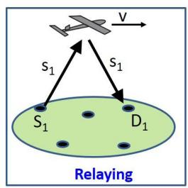

<details>
<summary>text_image</summary>

S₁
S₁
D₁
Relaying
</details>

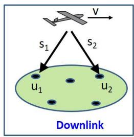

<details>
<summary>flowchart</summary>

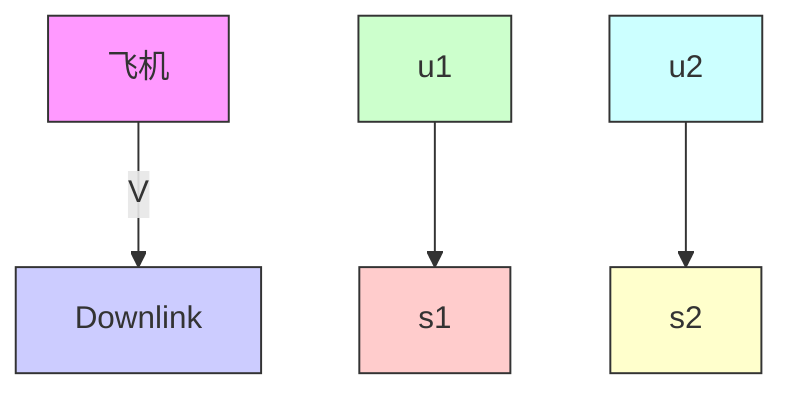
</details>

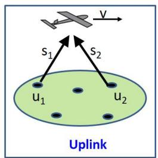

<details>
<summary>text_image</summary>

Uplink
S₁ S₂
u₁ u₂
</details>

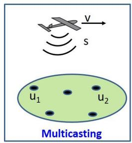

<details>
<summary>text_image</summary>

V
s
u₁ u₂
Multicasting
</details>

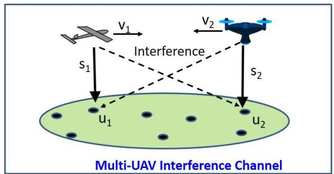

<details>
<summary>flowchart</summary>

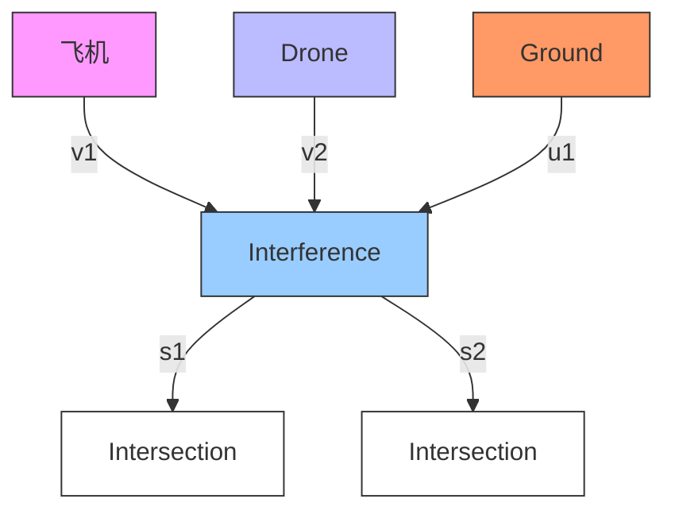
</details>

Some basic models for the UAV-assisted communications.

Depending on the UAV mobility, research on UAVassisted wireless communications in the literature can be loosely classified into two categories. In the first category, UAVs are used as (quasi-)stationary aerial communication platforms that remain static for a very long period of time once deployed. Under such a setup, extensive research effort has been devoted to UAV placement optimization and performance analysis by taking into account the unique characteristics of UAV-ground channels. In the second category, UAVs are employed as flying platforms to serve terrestrial users. In this case, the high UAV mobility offers further performance enhancement over stationary UAV platforms by exploiting the new DoF of UAV trajectory design. In general, UAV trajectory optimization needs to be jointly considered with multiuser communication scheduling and resource allocation. Note that while (quasi-)static UAVs may be easier for practical implementation as they can be tethered with ground vehicles for stability control and reliable energy supply, flying UAVs are more flexible for deployment and dynamic movement to best suit the communication needs. Therefore, the practical choice of static or flying UAVs depends on the application requirement.

The remaining part of this section is organized as follows. In Section III-B, we review the state-of-the-art results on performance analysis of UAV-assisted communications, for static and flying UAV platforms, respectively. Section III-C focuses on (quasi-)static UAV platforms, where the important problems of 2-D/3-D UAV placement are discussed. By exploiting the highly controllable UAV mobility, Section III-D introduces another important line of research for trajectory and communication codesign for flying UAVs. Considering its importance and unique characterization in UAV communications, energyefficient UAV communication is addressed dedicatedly in Section III-E, which is an extension of the UAV trajectory and communication codesign discussed in Section III-D. In Section III-F, we discuss some recent results on designing UAV trajectory and communication by leveraging machine learning techniques.

# B. Performance Analysis

For any UAV-assisted communication system deployed or to be deployed, one important issue is to validate/ evaluate its performance after/before the deployment. This can be achieved by conducting experimental field test [90] and computer-based simulations [91]–[93] or theoretical analysis [44], [51], [94]–[102], respectively. In particular, theoretical performance analysis not only predicts the expected performance of the UAV system to be deployed but also helps reduce the extensive simulations time. Furthermore, it can also offer useful insights and guidelines to design the UAV system and optimize its performance.

Therefore, performance analysis for UAV-assisted wireless communications has received significant research attention recently. While most works on performance analysis considered similar performance metrics, such as the coverage/outage probability given in (27) or the expected communication throughput given in (28), they differ in terms of the spatial modeling of the aerial/ground nodes involved, the considered system setup, as well as the UAV channel and antenna models assumed. In the following, we present some representative works on performance analysis for static and flying UAV platforms, respectively, by further addressing the two different scenarios where the locations/trajectories of UAVs are modeled deterministically or stochastically.

# 1) Static UAV Platform:

a) Deterministic modeling of UAV location: In this case, the number as well as locations of UAVs are deterministic and known a priori [44], [51], [94]–[96], whereas their associated ground nodes could be modeled either deterministically or stochastically.

For example, Azari et al. [44] considered one single UAV communicating with a ground node either directly or through a terrestrial relay. The relaying nodes are randomly distributed following a Poisson point process (PPP). By using the Rician channel model for the smallscale fading, with elevation angle-dependent Rician factor and path-loss exponent, as discussed in Section II-A, the authors derived the outage probability as a function of the UAV altitude with three communication modes between the UAV and the associated ground node: direct air-to-ground communication, decode-and-forward (DF) relaying by a selected ground relay, and cooperative communication. It was found that the outage probability first decreases and then increases with the UAV altitude $H _ { U }$ . This is expected since at relatively small $H _ { U }$ , as $H _ { U }$ U Uincreases, the benefits of reduced path-loss exponent and increased the Rician factor dominate the loss caused by the increased link distance. However, the reverse is true if $H _ { U }$ exceeds a certain threshold.

UIn [51], a UAV-enabled communication system with underlaid D2D links was studied. The UAV was assumed to hover at a given altitude serving multiple ground users in a given area, and the D2D users are spatially distributed following a PPP. With elevation-angle-dependent probabilistic LoS channel model for the UAV-ground links, as discussed in Section II-A3, the outage probabilities of the DL user served by the UAV and the D2D users were, respectively, derived. It was revealed that as the UAV altitude increases, the outage probability of D2D users first increases and then decreases, while the reverse is true for that of the DL UAV user. This is expected due to the different roles that the UAV plays for the D2D users and the UAV user, namely, as an interference source versus the desired information source.

b) Stochastic modeling of UAV location: When multiple UAV BSs are used, one effective method is to model their 3-D locations stochastically according to a random point process, by which the powerful analytical tool of stochastic geometry can be applied to attain the networklevel performance analysis. Different from the deterministic UAV modeling that was typically applied for one UAV BS at a given location, the stochastic analysis of UAV network involving multiple UAV BSs needs to consider the UAV-to-ground interference, by analyzing the distance distributions of the desired and interfering links. While stochastic geometry has been extensively used for the tractable performance analysis of terrestrial communication systems, its application to UAV networks is usually more challenging. Apart from the more sophisticated UAV channel model as reviewed in Section II-A, the following factors also complicate the stochastic analysis of UAV networks. First, as the UAV BSs can be freely deployed in 3-D space, their stochastic spatial modeling, in general, requires 3-D point process, as opposed to 2-D point process for terrestrial BSs. Some initial attempts have been made along this direction with 3-D PPP modeling for UAV BSs with given altitude range [101], [102]. However, for analytical simplicity, most of the existing works are still based on 2-D point process by assuming given UAV altitude [97]–[100]. Second, while conventional terrestrial BSs are usually modeled as an infinite-size homogeneous PPP (HPPP), it is not quite suitable for UAV-enabled communications [98], especially for the current deployment applications with typically small number of UAV BSs. To reflect this fact, binomial point process (BPP) has been applied for the performance analysis of finite-size UAV network [97], [98], where the number of UAV BSs is finite and known a priori.

For example, Chetlur and Dhillon [98] derived the DL coverage performance for a given finite number of UAV BSs deployed in a plane of fixed altitude, which is modeled as a uniform 2-D BPP. By assuming that each ground user is always associated with its closest UAV BS and suffers cochannel interference from other UAVs, the closedform expression for the coverage probability of a typical ground user was derived. It was revealed that the coverage probability degrades as the UAVs’ altitude increases. The reason is that as the altitude increases, the distance differences between the communication link and the interfering links diminish, and hence, the average signal-tointerference ratio (SIR) degrades. Note that such results were obtained based on the classic log-distance path-loss model with the Nakagami-m small-scale fading, without taking into account the change of propagation environment as the UAV altitude varies. The impact of the UAV altitude was observed to be different, depending on the assumed UAV channel and/or directional antenna models, as reported in [99] and [100].

Specifically, in [100], the UAV BSs were modeled as a 2-D PPP with directional UAV antennas that were assumed to have one main lobe and negligible sidelobes as in (16). The maximum-power association rule was applied, where the user is associated with the UAV that provides the maximum power. Different from [98] as discussed earlier, Galkin et al. [100] demonstrated that as the UAV altitude increases, the coverage probability first increases and then decreases. Similar observations have been obtained in [99].

2) Flying UAV Platform: For the performance evaluation of flying UAV platforms, some early results on field experiments [106], [107] or computer simulations [108] were reported. Recently, the theoretical performance analysis of flying UAV platforms in various setups has received growing interest. Most of such works were based on the deterministic modeling of UAV trajectories [51], [103], [104], [109], whereas there was also an initial attempt to consider stochastically modeled random UAV trajectories [105].

a) Deterministic modeling of UAV trajectory: In [103], a UAV-assisted relaying system was studied, where a fixed-wing UAV was employed to assist the communication between two ground nodes without the direct communication link. As fixed-wing UAV must maintain a forward speed to remain airborne, the UAV was assumed to fly along a circle at a constant height, and thus, its location changes periodically. By considering DF relaying and delay-sensitive applications such that the UAV forwards the information as soon as it receives and decodes it, Ono et al. [103] derived the link outage probability by assuming the Rician fading channel models. It was found that with the periodic circular UAV trajectory, the variable-rate communication outperforms the fixed-rate communication.

Lyu et al. [104] studied the UAV-assisted communication system with the UAV flying cyclically among the ground users, thus resulting in a cyclical variation pattern of each UAV-user channel strength. By considering the basic setup where all ground users are located in a line and served by the UAV alternately, a tradeoff between the average access delay and the network common throughput was revealed. This study was further extended in [109] for a hybrid wireless network consisting of a flying UAV BS and a conventional terrestrial BS, where the UAV flies cyclically along the cell edge to help offload the data traffic from the terrestrial BS.

b) Stochastic modeling of UAV trajectory: Different from the abovementioned works with deterministic UAV flying trajectories, the performance of flying UAV BSs was analyzed in [105] with stochastic UAV flying trajectories. To this end, the stochastic geometry analysis of [98] was extended to the case of flying UAV BSs, where the UAVs are assumed to fly following stochastic trajectory processes, i.e., at any snapshot, the UAV BSs can be modeled as a BPP. Two types of stochastic trajectory processes were considered, namely spiral and oval processes. The results demonstrated that compared to the static UAV BSs, the stochastically moving UAV BSs achieve comparable coverage performance but with significantly reduced channel average fade duration (AFD).

Table 7 summarizes the abovementioned representative works on performance analysis for both static and flying UAV-assisted wireless communication systems.

# C. UAV Placement

In this section, we focus on (quasi-)static UAV communication platforms, where the locations of UAVs remain unchanged for the duration of interest. For such setups, one important design problem is to determine the UAV locations to achieve the best communication performance, which has received extensive research attention recently [49], [63], [64], [110]–[117]. Different from the conventional 2-D cell planning with terrestrial BSs of typically predetermined BS heights, the altitude of UAV BS can be flexibly determined, thus leading to the new 3-D BS placement problems. Besides, the unique characteristics of UAV-ground channels, as discussed in Section II-A, also need to be considered for the UAV placement.

As an illustrative example, consider the UAV altitude optimization for a single-user system by assuming the ideal isotropic antennas with free-space path-loss model (while more sophisticated setups will be studied in Sections III-C1–III-C3). It is not difficult to see that the UAV placed at the minimum possible altitude $H _ { \mathrm { m i n } }$ leads to the smallest path loss and, thus, the best communication channel with the GTs. On the other hand, for the urban environment with signal blockage and multipath scattering, the optimization of UAV BS altitude becomes nontrivial. Specifically, as the UAV altitude increases, there are less obstacles, and therefore, the communication link is more likely to be dominated by the strong LoS component, $\mathbf { e . g . }$ , with the larger Rician factor $K _ { R }$ and/or higher LoS probability. However, as the altitude further increases, the benefit of having stronger LoS link cannot compensate for the higher path loss incurred due to the increased link distance, as illustrated in Fig. 3.

For the more sophisticated 3-D UAV placement problem to support multiple users, determining the optimal UAV locations is a nontrivial task since it depends on how much information pertaining the user locations is available at the UAV BS. In particular, with different knowledge about the user locations, the design objective and optimization techniques may vary for the UAV placement problem, as elaborated in the following for three different cases: 1) no user location information (ULI); 2) perfect ULI; and 3) partial ULI.

1) No ULI: When there is completely no ULI available, the UAV placement is usually optimized to maximize the geographic area covered by the UAV.

One representative work along this line is [49], which focused on 1-D altitude optimization. By assuming the elevation angle-dependent probabilistic LoS channel model, the coverage radius $R _ { \mathrm { c o v } }$ of a UAV BS is defined as the maximum horizontal distance from the UAV projected location on the ground so that the expected path loss is below a given threshold, where the expectation is taken with respect to the LoS and NLoS occurrence probabilities. An implicit expression was derived between $R _ { \mathrm { c o v } }$ and the UAV altitude $H _ { U }$ in [49], and it numerically showed that $R _ { \mathrm { c o v } }$ first increases and then decreases with $H _ { U }$ . Thus, an optimal UAV altitude exists that is, in general, between the minimum and maximum allowable altitude.

Summary of Representative Works on Performance Analysis of UAV-Assisted Wireless Communications 

<table><tr><td>Reference</td><td>Number of UAV BSs</td><td>Static or Flying</td><td>Setup</td><td>UAV channel Model</td><td>Main Findings</td></tr><tr><td>[44]</td><td>One</td><td>Static</td><td>UAV BS serving ground users with a terrestrial relay</td><td>Elevation-angle dependent channel parameters, Rician fading</td><td>Outage probability first decreases and then increases with UAV altitude</td></tr><tr><td>[51]</td><td>One</td><td>Static</td><td>UAV BS with underlaid terrestrial D2D links</td><td>Elevation-angle dependent probabilistic LoS, Rayleigh fading</td><td>UAV altitude has different effects on the D2D user and downlink UAV user performances</td></tr><tr><td>[98]</td><td>Multiple</td><td>Static</td><td>UAV BSs at the same altitude modelled as a BPP; each user associates with the closest UAV BS</td><td>Log-distance path loss, Nakagami-m fading</td><td>Coverage probability degrades as UAV altitude increases</td></tr><tr><td>[99]</td><td>Multiple</td><td>Static</td><td>UAV BSs modelled as a PPP with the same altitude; directional UAV antenna; each user associates with the closest UAV BS</td><td>Elevation-angle dependent probabilistic LoS and shadowing, no small-scale fading</td><td>Coverage probability firstly increases and then decreases with UAV altitude</td></tr><tr><td>[100]</td><td>Multiple</td><td>Static</td><td>UAV BSs modelled as a PPP with a given altitude, directional UAV antenna; maximum-power based association</td><td>Probabilistic LoS, Nakagami-m fading</td><td>Coverage probability firstly increases and then decreases with UAV altitude</td></tr><tr><td>[103]</td><td>One</td><td>Flying</td><td>UAV relay following a circular trajectory periodically</td><td>Log-distance path loss model, Rician fading</td><td>With a periodic circular UAV trajectory, variable-rate communication outperforms fixed-rate communication</td></tr><tr><td>[104]</td><td>One</td><td>Flying</td><td>UAV BS following a line trajectory periodically</td><td>Free space path loss</td><td>A tradeoff between throughput and access delay</td></tr><tr><td>[105]</td><td>Multiple</td><td>Flying</td><td>UAV BSs at the same altitude with stochastically modelled movement</td><td>Log-distance path loss model, Nakagami-m fading</td><td>Stochastically flying UAV BSs achieve similar coverage performance as static BSs, but with significantly reduced AFD</td></tr></table>

In [118], by assuming that two UAV BSs are employed to serve a target rectangular area on the ground, the 3-D locations of both UAVs were determined to maximize the fraction of the area covered by the UAV BSs. For the interference-free scenario, the two UAVs were placed so that they are separated as much as possible while ensuring that neither UAV covers outside the target area. The abovementioned work was then extended to [64], where by using directional UAV antenna model similar to (17), the 3-D locations of a given number of UAV BSs were obtained to maximize the total coverage area by leveraging the circle packing problem.

2) Perfect ULI: On the other hand, when the ULI or even the instantaneous CSI of the served GTs is known, the UAV placement can be designed for various objectives, such as maximizing the number of covered users [110]–[112], maximizing the communication throughput [63], [113], [114], or minimizing the number of required UAVs [115], [116].

UAV placement optimization for maximizing the number of covered users can be usually formulated as the mixedinteger nonlinear programming [110]–[112], with the binary variables indicating whether the users are served by each UAV or not. Such formulations were extended in [113], which took into account the limited backhaul capacity of the UAV BSs and the rate requirement for different users.

The UAV placement may also be designed to directly maximize the system throughput [63], [113], [114]. By assuming the free-space path-loss channel model and the directional UAV antenna with dynamically adjustable beamwidth (17), He et al. [63] investigated the joint UAV altitude and beamwidth optimization problems for throughput maximization in three basic multiuser communication models, namely DL MC, where UAV sends common information to all ground users, DL broadcasting (BC), where UAV sends independent information to different users, and UL multiple access (MAC), where each user sends independent information to the UAV. It was revealed that for the considered UAV directional antenna model, the UAV altitude should be set as the maximum possible value for DL MC but the minimum possible value for DL BC, while it has minimal effect to the throughput performance of UL MAC.

Another sensible design objective for UAV placement is to minimize the number of required UAVs while satisfying the communication requirement of ground users [115], [116]. In [115], by assuming that the user rate requirements are known, a heuristic algorithm based on particle swarm optimization was proposed to find the 3-D locations of UAV BSs to minimize the number of UAV BSs. In [116], by assuming that the UAVs hover at a fixed altitude, an efficient spiral UAV placement algorithm was proposed to find the minimum number of UAV BSs and their 2-D horizontal locations to ensure that all GTs are covered by at least one UAV. The main idea is to place the UAV BSs successively, starting from the area perimeter of those uncovered GTs and moving inward along a spiral path toward the center of the area. Compared to the benchmark strip-based placement, the proposed spiralbased algorithm better utilizes the location information of GTs and, thus, generally leads to less number of required UAV BSs.

3) Partial ULI: In many practical scenarios, instead of perfect ULI, it is more feasible to gain the partial information regarding the user locations, such as the statistic distribution of the users or some side information at each location realization. In [119], a trafficaware adaptive UAV deployment scheme was proposed, where starting from the current location, the displacement direction and distance of the UAV were optimized. The proposed scheme requires very limited knowledge of the GT locations at each realization, namely only the number of GTs for each given subarea, rather than their exact ULI. Based on the simple majority-vote rule, the UAV adjusts its location towards the subarea that has the largest number of GTs, with the displacement distance optimized to maximize the average throughput or the successful transmission probability for all GTs in the network. Romero and Leus [120] proposed an adaptive and decentralized algorithm for multi-UAV placement based on the stochastic gradient descent method, by using the message transmitted by the users through the control channels.

A summary of the abovementioned representative works on UAV placement is given in Table 8.

# D. Trajectory and Communication Codesign

Compared to conventional terrestrial BSs or quasistationary UAV BSs, flying UAV communication platforms offer an additional DoF via UAV trajectory optimization. Note that the concept of exploiting node mobility for boosting communication performance is not new, which has been studied in MANET [121] or ground mobile robotics [77], [122]. However, there are some important differences between such systems and the UAV communication systems. First, nodes moving on the ground are usually subject to many obstacles, which greatly limits their flexibility for path adaption. Therefore, most existing works on exploiting ground node mobility assumed either the random mobility model [121] or deterministic mobility along predetermined path [122]. In contrast, UAVs moving in 3-D airspace offer more design DoF in path/trajectory optimization for communication performance improvement. Second, due to the generally rich scattering environment, the wireless channels for ground robotic communications usually suffer from severe fading, which is difficult to be efficiently predicted at any location. In contrast, the UAV-ground communications often contain strong LoS link, making it easier for channel prediction and, thus, facilitating the offline trajectory optimization. Last but not least, robots and UAVs differ significantly in terms of energy consumption model, as discussed in Section II-C. The abovementioned differences are summarized in Table 9, which renders the communication-aware UAV trajectory optimization significantly different from that for the traditional terrestrial communications.

For UAV-assisted communications, the UAV trajectory optimization is, in general, closely coupled with communication resource allocation. Specifically, let $\mathcal { R } ( t )$ represent all relevant variables related to communication design over time t, such as transmit power, bandwidth, time allocation, beamforming, and so on and Q(t) denote the trajectories of all UAVs. Then, a generic mathematical problem for the joint trajectory and communication design can be formulated as

$$
\text {(P1)}: \quad \max _ {\mathcal {Q} (t), \mathcal {R} (t)} U (\mathcal {Q} (t), \mathcal {R} (t))
$$

$$
\text { s.t. } f _ {i} (\mathcal {Q} (t)) \geq 0, \quad i = 1, \dots , I _ {1} \tag {35}
$$

$$
g _ {i} (\mathcal {R} (t)) \geq 0, \quad i = 1, \dots , I _ {2} \tag {36}
$$

$$
h _ {i} (\mathcal {Q} (t), \mathcal {R} (t)) \geq 0, \quad i = 1, \dots , I _ {3}. \tag {37}
$$

Note that $U ( \cdot , \cdot )$ represents the utility function, which could correspond to any of the performance metrics exemplified in Section II-D, $f _ { i } ( \cdot ) s$ represent the constraints solely on the UAV trajectories, g (·)s denote the constraints isolely on the communication design variables, and $h _ { i } ( \cdot , \cdot ) s$ ispecify the coupled constraints (if any) involving both UAV trajectories and communication variables. One typical example of such coupled constraints is the interference constraint [123], which limits the transmit power and trajectory of each UAV such that its interference power at any of the other UAV links’ receivers needs to be below a certain threshold. Note that even without any coupled constraints on $h _ { i } ( \cdot , \cdot ) s$ , the objective utility function of ithe abovementioned generic optimization problem (P1), in general, has coupled trajectory and communication variables, as shown in Section III-C, which, thus, calls for a new UAV trajectory and communication codesign approach.

While the constraints on communication design have been extensively studied in wireless communication, those on UAV mobility are relatively new. In practice, the UAV trajectory constraints could be due to the aircraft mechanical limits, mission requirements, and/or flying regulations imposed by government authorities. For the purpose of illustration, we list down some typical UAV trajectory constraints for a single UAV with trajectory denoted by q(t) as follows.

Summary of Representative Works on UAV Placement 

<table><tr><td></td><td>Reference</td><td>Number of UAV BSs</td><td>Design variable</td><td>Design Objective</td><td>Main techniques</td></tr><tr><td rowspan="3">No ULI</td><td>[49]</td><td>Single UAV</td><td>1D altitude</td><td>Maximize coverage area</td><td>Implicit expression between coverage radius and UAV altitude</td></tr><tr><td>[118]</td><td>Two UAVs</td><td>3D location</td><td>Given a target rectangular area, maximize the fraction of coverage area using two UAV BSs</td><td>Maximum separation of the two UAV BSs subject to coverage area constraint</td></tr><tr><td>[64]</td><td>Multiple UAVs</td><td>3D location</td><td>Maximize the total coverage area</td><td>Circle packing</td></tr><tr><td rowspan="6">Perfect ULI</td><td>[110]-[112]</td><td>Single UAV</td><td>3D location</td><td>Given user locations, maximize the number of served users</td><td>Mixed-integer nonlinear programming</td></tr><tr><td>[113]</td><td>Single UAV</td><td>3D location</td><td>With UAV backhaul capacity constraint, maximize the number of served users or sum-rate</td><td>Branch-and-bound method</td></tr><tr><td>[114]</td><td>Single UAV</td><td>2D location</td><td>With UAV serving as relay, maximize the throughput or minimize communication power</td><td>Smart local search for LoS propagation</td></tr><tr><td>[63]</td><td>Single UAV</td><td>3D location</td><td>Joint altitude and beamwidth optimization for three basic multiuser communication models</td><td>Closed-form throughput expressions in terms of UAV altitude and beamwidth</td></tr><tr><td>[115]</td><td>Multiple UAVs</td><td>3D location</td><td>Minimize the number of UAVs to satisfy the user rate requirement</td><td>Particle swarm optimization</td></tr><tr><td>[116]</td><td>Multiple UAVs</td><td>2D location</td><td>Minimize the number of UAVs to ensure that all GTs are covered</td><td>Spiral BS placement</td></tr><tr><td rowspan="2">Partial ULI</td><td>[119]</td><td>Single UAV</td><td>2D location</td><td>Optimize UAV displacement direction and distance for maximizing average throughput or success transmission probability</td><td>UAV displacement to the sub-area with the most users</td></tr><tr><td>[120]</td><td>Multiple UAVs</td><td>3D location</td><td>Maximize the number of users served with minimum quality of service</td><td>Stochastic optimization</td></tr></table>

Exploiting Mobility in UAV Versus Terrestrial Communication Systems 

<table><tr><td></td><td>Terrestrial System</td><td>UAV System</td></tr><tr><td>Mobility</td><td>Nodes usually move randomly (e.g., in a MANET)Nodes move with predetermined path (e.g., mobile robotics)Very restrictive path planning</td><td>UAV mobility highly controllable/ predictableMore flexible path adaptation in 3D space</td></tr><tr><td>Communication channel</td><td>Severe shadowing and multipath fadingDifficult to predict offline</td><td>Less shadowing and fadingMore predictable</td></tr><tr><td>Energy consumption</td><td>Polynomial and increasing function of speed</td><td>More complicated (see Section II-C)</td></tr></table>

1) Minimum/Maximum Altitude: In the operational rules released by FAA for small UAVs [1], it is required that the aircraft should not fly more than 400 ft (122 m) above the ground level. Thus, we usually have the altitude constraints as

$$
H _ {\min} \leq [ \mathbf {q} (t) ] _ {3} \leq H _ {\max} \quad \forall t \tag {38}
$$

where $H _ { \mathrm { m i n } }$ and $H _ { \mathrm { m a x } }$ x denote the minimum and maximum possible altitudes, respectively.

2) Initial/Final Locations: In many scenarios, the UAV’s initial and/or final locations for the time horizon of interest [0, T ] are predetermined when, e.g., the UAV can only be launched or landed at certain given locations, or its mission specifies the initial and final locations (e.g., for package delivery). Mathematically, we have

$$
\mathbf {q} (0) = \mathbf {q} _ {I}, \quad \mathbf {q} (T) = \mathbf {q} _ {F} \tag {39}
$$

where $\mathbf q _ { I } , \mathbf q _ { F } \in \mathbb { R } ^ { 3 \times 1 }$ are the given initial/final Ilocations.

3) Maximum/Minimum UAV Speed:

$$
V _ {\min} \leq \| \mathbf {v} (t) \| \leq V _ {\max} \quad \forall t \tag {40}
$$

where $\mathbf { v } ( t ) \triangleq { \dot { \mathbf { q } } } ( t )$ denotes the the UAV velocity. Note that we usually have $V _ { \mathrm { m i n } } = 0$ for rotary-wing UAVs, whereas $V _ { \mathrm { m i n } } > 0$ for fixed-wing UAVs.

4) Maximum Acceleration Constraint:

$$
\| \mathbf {a} (t) \| \leq a _ {\max} \quad \forall t \tag {41}
$$

where $\mathbf { a } ( t ) \triangleq \ddot { \mathbf { q } } ( t )$ denotes the UAV acceleration. Note that as shown in [17], for fixed-wing UAVs with banked level turn, the maximum acceleration constraint (41) implies a constraint on the UAV’s maximum turning angle.

5) Obstacle Avoidance: To ensure that the UAV avoids a given obstacle with known location $\textbf { r } \in \ \mathbb { R } ^ { 3 \times 1 }$ , we could impose the constraint

$$
\left\| \mathbf {q} (t) - \mathbf {r} \right\| \geq D _ {1} \quad \forall t, \tag {42}
$$

where $D _ { 1 }$ is the safety distance with the obstacle.

6) Collision Avoidance: For a multi-UAV system, the collision avoidance constraint among the UAVs can be expressed as

$$
\left\| \mathbf {q} _ {k} (t) - \mathbf {q} _ {k ^ {\prime}} (t) \right\| \geq D _ {2} \quad \forall k > k ^ {\prime} \forall t \tag {43}
$$

where k and $k ^ { \prime }$ represent the UAV indices. Note that the abovementioned constraints for the other half of UAV pairs with $k \ < \ k ^ { \prime }$ are omitted due to symmetry.

7) No-Fly Zone: The mathematical constraints of a given no-fly zone depend on its shape. For example, if the no-fly zone is of a ball shape, constraints in the form of (42) can be imposed. On the other hand, if it is a cubic volume, the following constraints need to be satisfied:

$$
\bigcup_ {i = 1} ^ {6} \mathbf {a} _ {i} ^ {T} \mathbf {q} (t) \geq b _ {i} \quad \forall t \tag {44}
$$

where $\{ \mathbf { a } _ { i } , b _ { i } \} _ { i = 1 } ^ { 6 }$ 1 specifies the six hyperplanes correisponding to the faces of the cubic volume, and for two conditions $C _ { 1 }$ and $C _ { 2 } , C _ { 1 } \bigcup C _ { 2 }$ denotes that either $C _ { 1 }$ or $C _ { 2 }$ needs to be satisfied.

The optimization problem (P1) for UAV trajectory and communication codesign is, in general, difficult to be solved for two main reasons. First, the formulated problem is usually nonconvex with respect to communication and trajectory variables. In fact, even by fixing one of the two types of variables, the problem may be still nonconvex over the other. Second, the optimization problem involves continuous time $t ,$ which results in infinite variables, and thus, it is difficult to be directly optimized. In the following, we present several useful techniques to address the problem (P1). In particular, we first present the classic travelling salesman problem (TSP) and pickup-and-deliver problem (PDP) as two useful techniques for initial UAV path planning and then introduce the more general optimization framework with block coordinate descent (BCD) and successive convex approximation (SCA) techniques.

1) TSP and PDP for Initial Path Planning: In general, UAV trajectory optimization involves two aspects: path planning to determine the flying route and speed optimization that essentially determines how much time should be spent on each location along the route. While path planning has been extensively studied for UAV systems, early works mainly focused on UAV navigation applications rather than targeting for optimizing the communication performance [74], [124]–[126]. For such scenarios, mixed-integer linear program (MILP) has been shown to be an effective approach [74], [75], [127], [128]. Recently, there have been a handful of works on UAV path planning for communication purposes by partially optimizing some of the trajectory parameters. For example, in [129] and [130], by assuming that the UAV flies with a constant speed, the UAV’s heading (or flying direction) was optimized for UAV-based wireless relaying and UL communications, respectively. In [131], a UAV-based mobile relay node was considered for forwarding independent data to different user groups. The data downloading volume as well as the relay trajectory in terms of the visiting sequence to the different user groups were optimized by a genetic algorithm. In [132] and [133], the deployment/movement of UAVs was optimized to improve the network connectivity of a UAV-assisted ad hoc network. More recently, the use of more powerful optimization techniques for communication-aware UAV trajectory design has received growing interest, as discussed in the following.

Intuitively, for enhancing the communication link quality, the UAV should move closer to its communicating GT. This not only reduces the link distance but also increases the likelihood of establishing an LoS communication link with it, especially in a dense urban environment. As a toy example to illustrate this fact, we consider a basic pointto-point communication setup with a rotary-wing UAV at fixed altitude $H _ { U }$ communicating with a static ground Unode, with their initial horizontal distance denoted by D, as shown in Fig. 8. Fig. 9 plots the channel path loss, the LoS probability, and the average channel power versus time as the UAV flies toward the ground node with a constant speed V . Note that the channel path loss shown in Fig. 9(a) is based on the classical log-distance path-loss model in (2) by averaging over the shadowing, whereas the average channel power is obtained by averaging over the occurrence of LoS and NLoS realizations, with the elevation angle-dependent LoS probability model given in (9). The following parameters are used: D = 1000 m, $H _ { U } = 1 0 0$ m, V = 20 m/s, $\alpha = 2 . 3 , X _ { 0 } [ \mathrm { d B } ] = 5 0 ~ \mathrm { d B } $ , $a = 1 0 , b = 0 . 6 ,$ and $\kappa = 0 . 0 1$ . It is observed that as the UAV moves closer to the ground node, the channel path loss shown in Fig. 9(a) is significantly improved by about 23 dB for both LoS and NLoS cases, and there is an overall gain of about 40 dB, as shown in Fig. 9(c), for the average channel power due to the additional benefit of enhanced LoS probability, as shown in Fig. 9(b). This demonstrates the promising benefit of UAV trajectory design to enhance the channel quality, especially for delaytolerant applications so that there is sufficient time for the UAV to move toward its served GTs. Motivated by this, in the following, we discuss two useful techniques for UAV path planning, following the principle of bringing the UAV to each of its served GTs as closer as possible. Such techniques are useful to find an initial UAV flying path, which can be used for trajectory initialization for the more refined UAV trajectory and communication joint optimization to be discussed in Section III-D2.

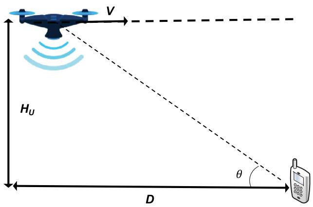

<details>
<summary>text_image</summary>

V
Hᵤ
D
θ
</details>

Point-to-point link with a rotary-wing UAV flying toward the GT.

a) TSP: To best exploit the UAV mobility for multiuser communications, the UAV, in general, needs to fly sequentially toward multiple GTs served by it. Intuitively, the sooner the UAV reaches each of the GTs, the more time will be left for the UAV to enjoy the best communication links with them. In this regard, a closely related problem is the celebrated TSP [134]–[137], which can be applied to determine the UAV flying path as well as the serving order of the GTs, as illustrated in Fig. 10(a). The standard TSP is described as follows: given a set of cities and the distances between each pair of the cities, a traveler wishes to start and end at the same city and visit each city exactly once. The problem then aims to find the route (or the sequence of visited cities) such that the total traveling distance is minimized. TSP is known to be NP-hard (nondeterministic polynomial-time hard), but various efficient algorithms have been proposed to find high-quality solutions [135]– [137], e.g., via solving binary integer problems. Note that the standard TSP algorithms deal with the scenario that the traveller/UAV needs to return to the initial city/location where it starts the tour. However, for UAV communications, the UAV needs not necessarily return to the initial location, and its initial/final location might be prespecified, as in [17] and [41]. In this case, variations of TSP algorithms can be applied by adding dummy cities/GTs whose distances with the existing cities/GTs are properly set [78].

TSP is feasible only when the given UAV operation duration T is sufficiently large so that the UAV can reach all GTs. Besides, in certain scenarios, it is simply unnecessary for the UAV to reach exactly on top of each GT (e.g., when only few data need to be collected from some GTs). In this case, another closely related problem is the TSP with neighborhood (TSPN), as illustrated in Fig. 10(b). TSPN is a generalization of TSP in the sense that the traveller does not have to visit each city/GT exactly but needs to reach a given neighborhood region around the city/GT. TSPN is also NP-hard, with various algorithms proposed to obtain approximate solutions [78], [138], [139]. In fact, in the context of UAV communications, the resultant problem is even more general than TSPN, as the size (radius) of each neighborhood area can also be a design variable depending on the communication requirement. One useful method for addressing such problems is as follows. First, solve the TSP based on the locations of all the cities/GTs to obtain the visiting order, by ignoring the neighborhood regions. Then, with the obtained order, use convex optimization techniques to obtain the optimal visiting locations inside the neighborhood regions. This method was first proposed in [78] and was later applied in various other setups [18], [89]. In fact, the abovementioned process for alternately updating the visiting order and the visiting locations can be repeated until convergence is reached. Another variation of TSP is the selective TSP [140], also known as the orienteering problem [141], where instead of visiting all nodes (or neighborhood regions), the goal is to determine a path and a subset of the nodes (or neighborhood regions) for visiting to maximize a certain utility, such as the number of nodes (or neighborhood regions) visited within a finite duration. This technique was applied in [142] for trajectory design for the UAV-enabled distributed estimation via maximizing the number of sensors visited by the UAV within a given time horizon.

b) PDP: For UAV-enabled mobile relaying, we usually have the additional information-causality constraint [41], [89], i.e., the UAV needs to first receive data from a source node before forwarding to its corresponding destination node. In this case, a useful approach for determining the UAV flying path is by solving the PDP. PDP can be regarded as another generalization of TSP, with the additional precedence constraints, i.e., for each pair of source–destination nodes, the UAV needs to first visit the source node before the destination node to meet the abovementioned information-causality constraint. PDP is also NP-hard, but various algorithms have been proposed to yield high-quality approximate solutions. Furthermore, in the general scenario where the given UAV operation duration T is insufficient to visit all the GTs, the extended PDP with neighborhood (PDPN) can be applied to obtain the visiting order of the GTs, as illustrated in Fig. 10(c).

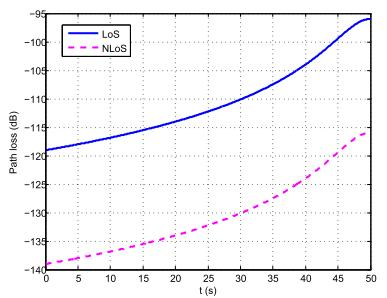

<details>
<summary>line</summary>

| t (s) | LoS    | NLoS   |
|-------|--------|--------|
| 0     | -120.0 | -140.0 |
| 5     | -118.0 | -139.0 |
| 10    | -116.0 | -138.0 |
| 15    | -114.0 | -137.0 |
| 20    | -112.0 | -136.0 |
| 25    | -110.0 | -135.0 |
| 30    | -108.0 | -134.0 |
| 35    | -106.0 | -133.0 |
| 40    | -104.0 | -132.0 |
| 45    | -102.0 | -131.0 |
| 50    | -98.0  | -128.0 |
</details>

(a)

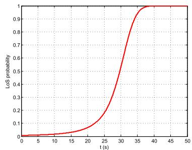

<details>
<summary>line</summary>

| t (s) | LoS probability |
| ----- | --------------- |
| 0     | 0.0             |
| 5     | 0.0             |
| 10    | 0.0             |
| 15    | 0.0             |
| 20    | 0.0             |
| 25    | 0.1             |
| 30    | 0.5             |
| 35    | 0.9             |
| 40    | 1.0             |
| 45    | 1.0             |
| 50    | 1.0             |
</details>

(b)

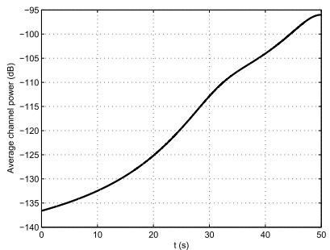

<details>
<summary>line</summary>

| t (s) | Average channel power (dB) |
| ----- | --------------------------- |
| 0     | -135                        |
| 10    | -128                        |
| 20    | -120                        |
| 30    | -110                        |
| 40    | -105                        |
| 50    | -95                         |
</details>

(c)   
Variation of channel quality as UAV flies toward the GT. (a) Channel path loss for LoS and NLoS conditions. (b) LoS probability. (c) Average channel power.

2) Joint Trajectory and Communication Optimization: While TSP and PDP are useful techniques to determine the initial UAV flying path or serving order of the GTs, they are, in general, suboptimal for the generic problem (P1). On one hand, the UAV flying trajectory needs to take into account the communication performance more explicitly, which also depends on the communication user scheduling and resource allocation with any given UAV trajectory. On the other hand, in practical scenarios where UAVs are subject to various mobility constraints, such as those exemplified above, the simple TSP and PDP solutions, which ignore such constraints, may lead to infeasible UAV path. To tackle such issues, it is inevitable to address the trajectory and communication joint optimization problem (P1). In the following, we first introduce two trajectory

discretization techniques to convert (P1) into more tractable forms with a finite number of optimization variables and, then, elaborate the BCD and SCA techniques to deal with the nonconvexity.

a) Trajectory discretization: To transform the optimization problem (P1) into a more tractable form with a finite number of variables, it is necessary to discretize the UAV trajectory as well as other related variables. The basic idea of trajectory discretization is to approximate the continuous UAV trajectory by a piecewise linear trajectory, which is represented by a finite number of line segments and the duration that the UAV needs to spend on each line segment. In order to ensure sufficient discretization accuracy, the length of each line segment should not exceed a certain threshold, say $\Delta _ { \mathrm { m a x } }$ , whose value could be prespecified based on practical requirements. For example, within each line segment, the distance between the UAV and all ground nodes of interest should be approximately unchanged in order to maintain constant average channel gains to facilitate the communication design and performance characterization. In this case, one may choose $\Delta _ { \mathrm { m a x } }$ such that $\Delta _ { \mathrm { m a x } } \ll H _ { \mathrm { m i n } } ,$ with $H _ { \mathrm { m i n } }$ denoting the minimum UAV altitude. For any given $\Delta _ { \mathrm { m a x } }$ , two trajectory discretization approaches have been proposed in the literature, namely, time discretization [17], [41] and path discretization [18].

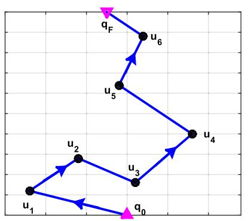

<details>
<summary>flowchart</summary>

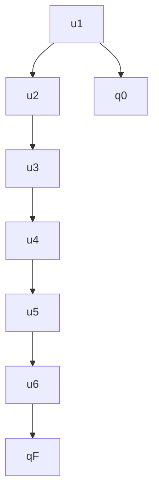
</details>

(a)

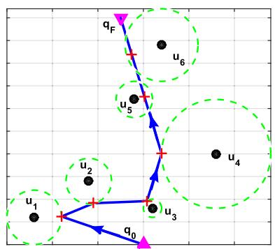

<details>
<summary>text_image</summary>

q_F
u_6
u_5
u_4
u_3
u_2
u_1
q_0
</details>

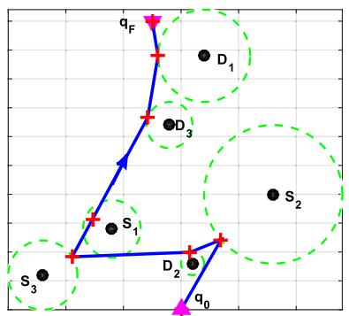

<details>
<summary>text_image</summary>

q_F
D_1
D_3
S_1
S_2
S_2
D_2
q_0
S_3
</details>

（c）  
TSP/TSPN and PDPN for UAV initial path planning. ${ \pmb q } _ { \pmb { 0 } }$ and $q _ { F }$ denote the predetermined initial and final locations, respectively. (a) TSP. (b) TSP with neighbourhood. (c) Pickup and delivery problem with three source–destination pairs.

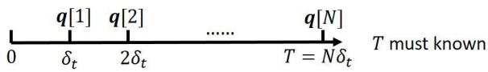

<details>
<summary>text_image</summary>

0
q[1]
q[2]
......
q[N]
δt
2δt
T = Nδt
T must known
</details>

(a)

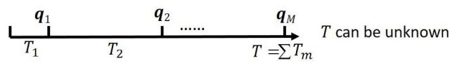

<details>
<summary>text_image</summary>

q₁ q₂ ...... qₘ
T₁ T₂ ... T =ΣTₘ T can be unknown
</details>

(b)   
Time versus path discretization. (a) Time discretization. (b) Path discretization.

Time Discretization: As illustrated in Fig. 11(a), with time discretization, the given time horizon [0, T ] is divided into N equal time slots with sufficiently small slot length $\delta _ { t } ~ [ 1 7 ]$ , [41], where $T \ = \ N \delta _ { t }$ . Let $V _ { \mathrm { m a x } }$ denote t tthe UAV’s maximum flying speed. Then, it is necessary to ensure that each segment length does not exceed $\Delta _ { \mathrm { m a x } }$ even with the maximum flying speed, for which $\delta _ { t }$ should be chosen as $\delta _ { t } \leq \Delta _ { \operatorname* { m a x } } / V _ { \operatorname* { m a x } }$ t. Thus, the minimum number tof segments required with time discretization is $N \_ =$ $\lceil T V _ { \mathrm { m a x } } / \Delta _ { \mathrm { m a x } } \rceil$ . As a result, the continuous UAV trajectory $\mathbf { q } ( t ) , 0 \leq t \leq T$ , can be approximated by the N-length sequence $\{ \mathbf { q } [ n ] \} _ { n = 1 } ^ { N }$ , which need to satisfy the maximum nUAV speed and acceleration constraints. With time discretization, the UAV movement can be approximated in a linear state-space model with respect to the UAV location, velocity, and acceleration [17].

Path Discretization: Another approach for discretized representation of UAV trajectory is to divide the UAV path (instead of time) into M consecutive line segments of generally unequal lengths, as shown in Fig. 11(b), which are represented by a sequence of segment start/end locations $\left\{ \mathbf { q } _ { m } \right\}$ along the path, together with the time sequence $\left\{ T _ { m } \right\}$ representing the duration that the UAV spends on each line segment. Path discretization can be interpreted as the more general form of time discretization, with flexibly chosen unequal time slot lengths for different line segments. Specifically, instead of fixing the slot length to $\delta _ { t } ~ = ~ \Delta _ { \operatorname* { m a x } } / V _ { \operatorname* { m a x } }$ that is bottlenecked by the maximum flying speed, with path discretization, the time slot length $T _ { m }$ is dynamically determined by the actual flying speed $V _ { m }$ that is assumed to be constant over each line segment. In this case, we have $T _ { m } V _ { m } \le \Delta _ { \mathrm { m a x } }$ ∀m. Note that since $V _ { m } ~ \leq ~ V _ { \operatorname* { m a x } } ,$ , we have $T _ { m } \ \geq \ \delta _ { t }$ ∀m. In other m m twords, given the same value for the maximum segment length $\Delta _ { \mathrm { m a x } }$ , path discretization entails longer time slot length in general. As a result, given the same trajectory to be discretized with the total operation duration $T =$ $\begin{array} { r } { N \delta _ { t } = \sum _ { m = 1 } ^ { M } T _ { m } , } \end{array}$ we have $M \leq N$ in general, $\mathrm { i . e . , }$ fewer mline segments are needed by path discretization than time discretization, especially when the UAV flies with a speed lower than the maximum speed for a significant portion of the operation duration.

On the other hand, note that time discretization also has its own merit. First, as the time interval $\delta _ { t }$ is fixed, time discretization leads to the simple linear state-space model [17], which can easily handle the UAV maximum acceleration constraint. In contrast, such a linear relationship is not preserved for path discretization with $\{ T _ { m } \}$ also being the optimization variables. Second, if ignoring the acceleration variable, time discretization requires only one variable for each line segment, namely the UAV locations $\{ \mathbf { q } [ n ] \}$ }, as the UAV velocity for each line segment n can be directly obtained as $\mathbf v [ n ] \ = \ ( \mathbf q [ n + 1 ] - \mathbf q [ n ] ) / \delta _ { t }$ with $\delta _ { t }$ given. By contrast, path discretization needs two variables for each line segment (namely, both the UAV end location and time duration). Thus, if given the same number of line segments, i.e., $N \ = \ M$ (e.g., when the UAV always flies at its maximum speed during the operation), then path discretization needs to double the number of variables compared to time discretization. The comparison of these two UAV trajectory discretization techniques is summarized in Table 10.

By applying the abovementioned trajectory discretization techniques, the optimization problem (P1) can be transformed into the following generic form with a finite number of variables:

$$
\text {(P2)}: \quad \max _ {\{\mathcal {Q} [ n ] \}, \{\mathcal {R} [ n ] \}} U (\{\mathcal {Q} [ n ] \}, \{\mathcal {R} [ n ] \})
$$

$$
\text { s.t. } f _ {i} (\{\mathcal {Q} [ n ] \}) \geq 0, \quad i = 1, \dots , I _ {1} \tag {45}
$$

$$
g _ {i} (\{\mathcal {R} [ n ] \}) \geq 0, \quad i = 1, \dots , I _ {2} \tag {46}
$$

$$
h _ {i} (\{\mathcal {Q} [ n ] \}, \{\mathcal {R} [ n ] \}) \geq 0, \quad i = 1, \dots , I _ {3} \tag {47}
$$

where $\{ \mathcal { Q } [ n ] \}$ and $\{ \mathcal { R } [ n ] \}$ denote the discretized UAV trajectories and communication design variables, respectively.

b) BCD and SCA for resource and trajectory optimization: Problem (P2) involves the joint optimization of UAV trajectory and communication resource allocation, which is usually nonconvex and difficult to be solved optimally. To tackle this problem efficiently, one useful approach to obtain a generally locally optimal solution for it is by alternately updating one block of variables with the other block fixed, which is known as the BCD method [143], [144]. Note that for any given feasible UAV trajectory, problem (P2) reduces to the extensively studied communication resource allocation problem, for which the existing techniques developed under the terrestrial communication setup can be directly applied. However, for any fixed communication resource allocation, the UAV trajectory optimization problem is relatively new, which is, thus, discussed in detail as follows. In particular, we introduce an effective technique, namely, SCA, which is useful for solving the nonconvex UAV trajectory optimization problems. For the purpose of easy illustration, we consider the case of one UAV with discretized trajectory denoted as {q[n]}. The corresponding subproblem of (P2) for trajectory optimization with given communication resource

Comparison Between Time and Path Discretization 

<table><tr><td></td><td>Time discretization</td><td>Path discretization</td></tr><tr><td>Pros</td><td>Equal time slot lengthLinear state-space representationIncorporate the maximum acceleration constraint easily</td><td>Fewer variables if UAV hovers or flies slowly most of the timeNo need to know mission completion time  $T$  a priori</td></tr><tr><td>Cons</td><td>Excessively large number of time slots when UAV hovers or moves slowlyNeed to know mission completion time  $T$  a priori</td><td>Difficult to incorporate the maximum acceleration constraintMore variables if UAV flies with high/maximum speed most of the time</td></tr></table>

allocation can be written as

$$
\text {(P3)}: \quad \max _ {\{\mathbf {q} [ n ] \}} f _ {0} (\{\mathbf {q} [ n ] \})
$$

$$
\text { s.t. } f _ {i} (\{\mathbf {q} [ n ] \}) \geq 0, \quad i = 1, \dots , I \tag {48}
$$

where $f _ { 0 } ( \cdot )$ represents the utility to be maximized and $f _ { i } ( \cdot ) s$ are the corresponding constraints in (45) and (47) iof (P2) that involves the UAV trajectory with $I = I _ { 1 } + I _ { 3 }$ . Note that problem (P3) is nonconvex if at least one of the functions $f _ { i } ( \cdot )$ is nonconcave with respect to $\{ \mathbf { q } [ n ] \}$ , $i = 0 , 1 , \ldots , I .$ This is usually the case since most utility and constraint functions are nonconcave over {q[n]}, due to which standard convex optimization techniques cannot be directly applied to solve (P3). Fortunately, recent work has shown that SCA is a useful technique for transforming the nonconvex optimization problem into solving a series of convex optimization problems, with guaranteed monotonic convergence to at least a Karush–Kuhn–Tucker (KKT) solution under some mild conditions [145], [146]. Thus, we apply SCA to solve the UAV trajectory optimization problem (P3) in the following.

SCA is an iterative optimization technique. Specifically, at each iteration l, we need to first find a global concave lower bound for those nonconcave functions $f _ { i } ( \{ \mathbf { q } [ n ] \} )$ in (P3), such that

$$
f _ {i} (\{\mathbf {q} [ n ] \}) \geq f _ {i, \mathrm{lb}} ^ {(l)} (\{\mathbf {q} [ n ] \}) \quad \forall \mathbf {q} [ n ]. \tag {49}
$$

Then, by replacing those nonconcave functions $f _ { i } ( \{ \mathbf { q } [ n ] \} )$ iin (P3) with their corresponding concave lower bounds $f _ { i , \mathrm { l b } } ^ { ( l ) } ( \{ \mathbf { q } [ n ] \} )$ , we have the following convex optimization i,problem:

$$
\text {(P4)}: \quad \max _ {\{\mathbf {q} [ n ] \}} f _ {0, \mathrm{lb}} ^ {(l)} (\{\mathbf {q} [ n ] \})
$$

$$
\text { s.t. } f _ {i, \mathrm{lb}} ^ {(l)} (\{\mathbf {q} [ n ] \}) \geq 0, \quad i = 1, \dots , I. \tag {50}
$$

As (P4) is convex, its optimal solution, denoted as $\{ \mathbf { q } ^ { ( l ) } [ n ] \}$ , can be efficiently obtained based on the standard convex optimization techniques or readily available software toolbox, such as CVX [147]. In addition, due to the global lower bound of (49), it can be verified that $\{ \mathbf { q } ^ { ( l ) } [ n ] \}$ is also feasible to the nonconvex problem (P3), and the corresponding optimal value provides at least a lower bound to that of problem (P3). Furthermore, if the lower bound (49) is tight at the local point $\{ \mathbf { q } ^ { ( l - 1 ) } [ n ] \}$ at the lth iteration, that is

$$
f _ {i, \mathrm{lb}} ^ {(l)} (\{\mathbf {q} ^ {(l - 1)} [ n ] \}) = f _ {i} (\{\mathbf {q} ^ {(l - 1)} [ n ] \}) \tag {51}
$$

then the sequence $f _ { 0 } ( \{ { \bf q } ^ { ( l ) } [ n ] \} )$ monotonically increases and converges to a finite limit [146]. With the additional condition that the gradient at the local point is also tight, that is

$$
\nabla f _ {i, \mathrm{lb}} ^ {(l)} (\{\mathbf {q} ^ {(l - 1)} [ n ] \}) = \nabla f _ {i} (\{\mathbf {q} ^ {(l - 1)} [ n ] \}) \tag {52}
$$

and then under some mild constraint qualifications, $\{ \mathbf { q } ^ { ( l ) } [ n ] \}$ converges to a solution fulfilling the KKT conditions of problem (P3) [146]. Thus, by iteratively updating the local point $\{ \mathbf { q } ^ { ( l ) } [ n ] \}$ and solving a sequence of convex optimization problems (P4), a KKT solution of the nonconvex trajectory optimization problem (P3) can be obtained.

The remaining task is then to find the concave lower bounds for the involved UAV utility and constraint functions satisfying the abovementioned properties. Fortunately, such bounds can be found for the typical utility/constraints functions [17], [41], [42], by using the fact that for convex differentiable functions, the firstorder Taylor approximation provides a global lower bound [148]. For example, at the lth iteration with the given local point $\{ \mathbf { q } ^ { ( l ) } [ n ] \}$ and $\mathbf { v } ^ { ( l ) } [ n ] ;$ , the following bounds are useful for the nonconvex minimum speed constraint (40) [17]:

$$
\left\| \mathbf {v} [ n ] \right\| ^ {2} \geq \left\| \mathbf {v} ^ {(l)} [ n ] \right\| ^ {2} + 2 \mathbf {v} ^ {(l) T} [ n ] (\mathbf {v} [ n ] - \mathbf {v} ^ {(l)} [ n ]), \quad \forall \mathbf {v} [ n ]. \tag {53}
$$

Besides, for the average communication rate in (34), by defining the convex function $\begin{array} { r l r } { h ( z ) } & { { } = } & { \log _ { 2 } ( 1 \ + } \end{array}$ $( \gamma _ { k } / z ^ { \alpha } ) ) , z \geq 0 .$ , and letting $z = \| \mathbf { q } [ n ] - \mathbf { w } _ { k } \|$ , the following kconcave lower bound can be obtained:

$$
\begin{array}{l} \log_ {2} \left(1 + \frac {\gamma_ {k}}{\| \mathbf {q} [ n ] - \mathbf {w} _ {k} \| ^ {\alpha}}\right) \geq A _ {k} [ n ] - B _ {k} [ n ] (\| \mathbf {q} [ n ] - \mathbf {w} _ {k} \| \\ - \left\| \mathbf {q} ^ {(l)} [ n ] - \mathbf {w} _ {k} \right\|) \tag {54} \\ \end{array}
$$

where

$$
A _ {k} [ n ] = \log_ {2} \left(1 + \frac {\gamma_ {k}}{\| \mathbf {q} ^ {(l)} [ n ] - \mathbf {w} _ {k} \| ^ {\alpha}}\right) \tag {55}
$$

$$
B _ {k} [ n ] = \frac {\gamma_ {k} \alpha (\log_ {2} e)}{\| \mathbf {q} ^ {(l)} [ n ] - \mathbf {w} _ {k} \| \left(\| \mathbf {q} ^ {(l)} [ n ] - \mathbf {w} _ {k} \| ^ {\alpha} + \gamma_ {k}\right)}. \tag {56}
$$

Note that for the given local point $\mathbf { q } ^ { ( l ) } [ n ] ,$ , all terms on the right-hand side of (54) are constants, except the term $\| \mathbf { q } [ n ] - \mathbf { w } _ { k } \|$ , which is the distance between the UAV and GT. Thus, we refer (54) as lower bound by distance. In fact, depending on the chosen convex function for which the first-order Taylor approximation is applied, there may exist more than one global concave lower bounds satisfying (51) and (52). For example, for the average communication rate function (34), by defining another convex function $h ( z ) =$ $\log _ { 2 } ( 1 + ( \gamma _ { k } / z ^ { \alpha / 2 } ) ) , z \geq 0 .$ and letting $z = \| \mathbf { q } [ n ] - \mathbf { w } _ { k } \| ^ { 2 } ;$ , kan alternative lower bound in terms of $\| \mathbf { q } [ n ] - \mathbf { w } _ { k } \| ^ { 2 }$ kcan kbe obtained, which we term as lower bound by distance square and has been extensively used in prior work on UAV trajectory optimization [17], [41], [42], [149].

Fig. 12 gives a 1-D illustration for the abovementioned concave lower bounds, where $\begin{array} { r l r } { { \bf w } _ { k } } & { { } = } & { { \bf 0 } } \end{array}$ and ${ \bf q } [ n ] \mathrm { ~  ~ \Gamma ~ } =$ $[ 0 , y [ n ] , H ] ^ { T }$ k. In other words, the UAV is assumed to fly along the y-axis with a constant altitude H communicating with a GT located at the origin. The following parameters are used: $\alpha = 2 . 3 , H = 1 0 0 \mathrm { ~ m ~ }$ , and $\gamma _ { k } ~ = ~ 6 0 ~ \mathrm { d B }$ . The kaverage rate (i.e., the left-hand side of (54)) versus y[n] is plotted in Fig. 12, together with the two lower bounds discussed earlier obtained at the local point $y ^ { ( l ) } [ n ] = 4 0 0 ~ \mathrm { m }$ . It is observed that the lower bound by distance is in fact tighter than that by distance square though the latter has been extensively used in the literature. It is, thus, interesting to investigate whether this new tighter bound would lead to better performance of the converged trajectory in the future work.

To summarize, UAV communications usually involve the joint optimization of UAV trajectory and communication resource allocation, as represented by the generic problem formulation (P1). For multiuser systems, the classic TSP and PDP algorithms can be used to find the initial UAV path planning. On the other hand, time- and path-discretization techniques can be applied to convert the continuous-time optimization problem approximately into more tractable forms with a finite number of discrete variables. To deal with the nonconvexity problem, BCD can be used to alternately update the communication resource allocation and UAV trajectory. In particular, for the nonconvex trajectory optimization subproblem, SCA is found to be effective to obtain a KKT suboptimal solution in general. Note that as the SCA-based UAV trajectory optimization requires iterative procedures, a feasible initial UAV trajectory needs to be specified. The TSP-/PDP-based path planning offers a good starting point to obtain the initial UAV trajectory for SCA. However, when the UAV trajectories are subject to various constraints shown in (38)–(44), more general methods need to be developed to determine a feasible initial path satisfying such constraints that deserve further investigation.

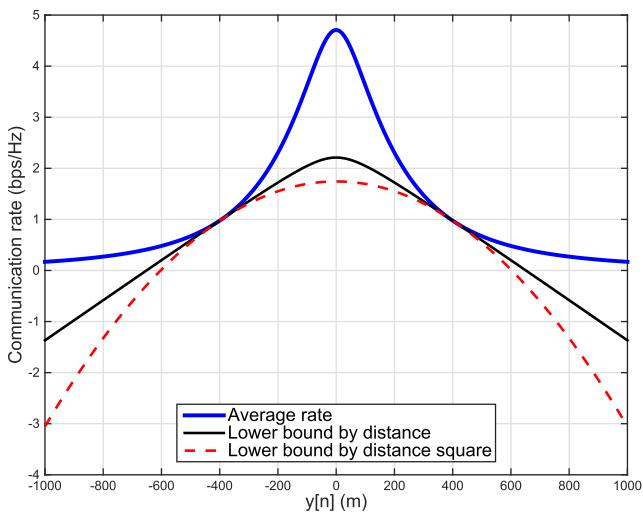

<details>
<summary>line</summary>

| y[n] (m) | Average rate | Lower bound by distance | Lower bound by distance square |
| -------- | ------------ | ----------------------- | ------------------------------ |
| -1000    | 0.0          | -1.5                    | -3.0                           |
| -800     | 0.2          | -1.0                    | -2.0                           |
| -600     | 0.5          | -0.5                    | -1.0                           |
| -400     | 1.0          | 0.0                     | 0.0                            |
| -200     | 2.0          | 1.0                     | 1.0                            |
| 0        | 4.8          | 2.2                     | 1.7                            |
| 200      | 3.0          | 1.5                     | 1.5                            |
| 400      | 1.5          | 0.5                     | 1.0                            |
| 600      | 0.5          | -0.5                    | 0.0                            |
| 800      | 0.2          | -1.0                    | -1.0                           |
| 1000     | 0.0          | -1.5                    | -3.0                           |
</details>

Illustration of the global concave lower bounds for the communication rate.

The use of BCD and SCA for joint UAV trajectory and communication resource allocation was first proposed in [41] in the context of UAV-enabled mobile relaying. It was later successfully applied in various other setups, such as energy-efficient UAV communications [17], [18], multi-UAV-enabled DL communication [42], [150], UAVenabled data collection [149], physical-layer security for UAV communications [151]–[153], UAV-enabled mobile edge computing (MEC) [154], [155], and UAV-enabled wireless power transfer (WPT) [156] and wireless powered communications [157]. Note that one drawback of alternately updating UAV trajectory and communication resource allocation is the likelihood of trapping into undesirable local optimums if the initialization is not properly designed. Therefore, there have been recent efforts on investigating the simultaneous update of these two blocks of variables for certain setups via developing new concave lower bound functions [18], [158]. The use of alternating direction method of multipliers (ADMM) technique to reduce the computation complexity for multi-UAV trajectory design has also been reported in [158]. UAV placement and movement optimization has been studied in [159] for multi-UAV UL coordinated multipoint (CoMP) communications, where each UAV forwards its received signals from all ground users to a central processor for joint decoding. While the abovementioned works mostly assumed either orthogonal multiuser communications or treating interference as noise, the capacity region of the UAV-enabled two-user broadcast channel has been characterized in [160] and [161], which requires superposition coding and interference cancellation in general. Under this setup, it was revealed that the capacity-achieving UAV trajectory follows the simple hover–fly–hover (HFH) pattern, where the UAV successively hovers at a pair of initial and final locations.

It is worth remarking that due to the practically finite UAV flying speed, exploiting UAV mobility for communication performance enhancement is most appropriate for delay-tolerant applications. In fact, for UAV platforms serving multiple users, there exists a new tradeoff between communication throughput and access delay, which was first studied in [104] for a UAV flying with fixed trajectory and was later extended in [162] and [163] via joint design of UAV trajectory and communication resource allocation in orthogonal frequency-division MAC (OFDMA) systems.

While the abovementioned works on communicationtrajectory codesign mostly focused on 2-D trajectory with the fixed UAV altitude, more research efforts are needed for 3-D trajectory-communication codesign to fully exploit the 3-D UAV mobility, especially in dense urban environment [85], [164]. To this end, more sophisticated channel models and performance metrics, as discussed in Sections II-A and II-D, need to be used. Besides, the consideration of more practical antenna models, such as the directional antenna with fixed pattern or more advanced MIMO beamforming, as discussed in Section II-B, is expected to have a significant impact on the joint optimization of communication resource and UAV trajectory, which is worthwhile for further investigation. Furthermore, for UAV-assisted communication in real-time applications, high-capacity wireless backhauling needs to be established between UAV and the core network on the ground. This brings a new design consideration to achieve the optimal balance between the wireless backhaul and radio access via joint UAV position/movement and resource optimization, which deserves further studies.

Note that while the discretization-based trajectory optimization discussed earlier may usually help convert the problems into convex optimization problems, which, thus, can be flexibly extended to handle new design objectives and/or constraints, the quality of their solutions critically depends on the discretization grid resolution. To address this issue, an alternative trajectory optimization approach by using the framework of the Lagrangian mechanics was proposed in [165], which avoids trajectory discretization. Another promising line of research for communicationtrajectory codesign is to explicitly take into account the application-specific requirement, for which new design objectives and/or constraints need to be considered. For example, in [166], by considering the particular UAVbased sport-event-filming application, the authors solved a novel optimization problem to obtain the sequence of UAV movements such that, besides the communication connectivity requirement, the timeliness required for the UAV to effectively film the event is also guaranteed.

# E. Energy-Efficient UAV Communication

Energy-efficient wireless communication has been an active research avenue during the past decade. It was driven not only by the need to reduce the operation cost and green gas emission of the information and communications technology (ICT) industry but also due to the importance to prolong the battery usage or lifespan of various types of communication devices. For UAV communications, the need for energy saving is even more imperative due to the highly limited onboard energy and the additional propulsion energy consumption, besides the conventional communication energy expenditure.

Energy-efficient UAV communications were initially focused only on the saving of the communication-related energy consumption of either the ground nodes [149], [167], [168] or the UAV [169], [170]. For example, in [167], adaptive link selection and transmission schemes were studied to minimize the energy consumption of ground nodes for a hybrid communication system with both aerial relay and direct terrestrial communications. Zhan et al. [149] studied the UAV-enabled data collection to minimize the maximum energy consumption of all sensor nodes via jointly optimizing the UAV trajectory and the wake-up schedule of the sensor nodes. In [169], the UAV-enabled DL communication was studied, where the locations of the UAVs and the cell boundaries are optimized to minimize the required transmit power of UAVs while satisfying the user rate requirement.

Note that for UAV communication systems, the UAV propulsion energy consumption is usually much more significant compared to the communication counterpart and, thus, poses the fundamental limit on the UAV endurance and communication performance. Therefore, there have been growing research efforts on energy-efficient UAV communications by rigorously taking into account the UAV’s propulsion energy consumption [17], [18], [171], [172]. This usually leads to significantly different design problems compared to those for the conventional terrestrial systems considering the communication energy only due to the new tradeoff between minimizing the UAV propulsion energy consumption versus maximizing the communication throughput, both dependent on the UAV trajectory, as discussed in Sections II-C and II-D. To illustrate such a tradeoff, consider the basic setup where a UAV needs to communicate with a ground node. From the throughput maximization perspective, the UAV should stay stationary at the nearest possible location from the ground node so as to maintain the best channel for communication. However, as shown in Fig. 5, hovering is power inefficient for rotary-wing UAVs and even impossible for fixed-wing UAVs. Therefore, energy-efficient UAV communication, in general, requires a nontrivial UAV trajectory design, jointly with the communication resource allocation, to achieve an optimal balance between energy saving and throughput enhancement. One commonly used design objective is the energy efficiency, as defined in Section II-D4.

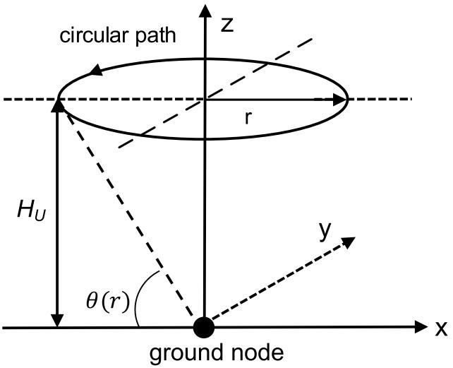

<details>
<summary>text_image</summary>

circular path
z
r
H_U
θ(r)
y
ground node
x
</details>

(a)

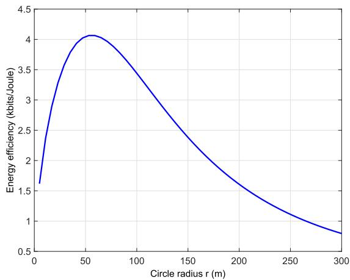

<details>
<summary>line</summary>

| Circle radius r (m) | Energy efficiency (kbits/Joule) |
| ------------------- | -------------------------------- |
| 0                   | 1.6                              |
| 50                  | 4.0                              |
| 100                 | 3.5                              |
| 150                 | 2.5                              |
| 200                 | 1.8                              |
| 250                 | 1.2                              |
| 300                 | 0.8                              |
</details>

Energy-efficient communication with a fixed-wing UAV following circular trajectory. (a) Point-to-point link where a fixed-wing UAV follows a circular trajectory with radius r. (b) Typical plot of energy efficiency versus circle radius r.

As a simple illustration for energy-efficient UAV communications, let us consider the scenario that a fixedwing UAV flies at a constant altitude $H _ { U }$ while com-Umunicating with a ground node. Assume that the UAV follows the simple circular path on the horizontal plane with radius r and the projection of the circle center on the ground coincides with the ground node, as shown in Fig. 13(a). The elevation angle is a function of r given by $\theta ( r ) ~ = ~ \tan ^ { - 1 } ( H _ { U } / r )$ . By using the elevation-angle-Udependent probabilistic LoS channel model and extending the result presented in [17] based on Jensen’s inequality approximation of the expected communication throughput, the energy efficiency can be expressed as a closedform expression of the radius r as

$$
\mathrm{EE} (r) = \frac {\log_ {2} \left(1 + \frac {\hat {P} _ {\mathrm{LoS}} (r) \gamma_ {0}}{\left(H _ {U} ^ {2} + r ^ {2}\right) ^ {\alpha / 2}}\right)}{A \left(c _ {1} + \frac {c _ {2}}{g ^ {2} r ^ {2}}\right) ^ {1 / 4} + P _ {\mathrm{com}}} \tag {57}
$$

where $c _ { 1 }$ and $c _ { 2 }$ are the constants for the fixed-wing UAV energy consumption model as in (19), $A ~ = ~ ( 3 ^ { - 3 / 4 } ~ +$ $3 ^ { 1 / 4 } ) c _ { 2 } ^ { 3 / 4 } , \ \gamma _ { 0 } \ = \ P _ { t } \beta _ { 0 } / \sigma ^ { 2 }$ / is the received signal-to-noise tratio (SNR) at the reference distance of 1 m with $P _ { t }$ denoting the transmit power, $P _ { \mathrm { c o m } }$ tis the communicationrelated power consumption of the UAV, and $\hat { P } _ { \mathrm { L o S } } ( r ) ~ =$ $P _ { \mathrm { L o S } } ( \theta ( r ) ) + ( 1 - P _ { \mathrm { L o S } } ( \theta ( r ) ) ) \kappa ,$ which decreases with r and can be interpreted as the regularized LoS probability, with $P _ { \mathrm { L o S } } ( \theta )$ given in (9). It is observed that as r increases, both the terms involving r in the denominator and numerator in (57) decrease. Thus, there must exist an optimal value $r ^ { \star }$ that maximizes $\mathrm { E E } ( r )$ , which is validated by Fig. 13(b) showing one typical plot of EE(r) against r. The same parameters as for Fig. 9 are used for the channel modeling, and the UAV energy consumption parameters are set as $c _ { 1 } = 9 . 2 6 \times 1 0 ^ { - 4 } , c _ { 2 } = 2 2 5 0 [ 1 7 ] , \gamma _ { 0 } = 5 2 . 5 \mathrm { d B } $ , and $P _ { \mathrm { c o m } } = 5 \mathrm { W } .$

Motivated by this, energy-efficient UAV communications have been studied for different setups with a variety of practical constraints. In particular, Zeng and Zhang [17] first derived a rigorous mathematical model for the propulsion energy consumption of fixed-wing UAVs in terms of the UAV velocity and acceleration and, based on the derived model, optimized the energy efficiency in bits/Joule for the point-to-point UAV-ground communication over a given finite-time horizon. With time discretization approach presented in Section III-D2, the SCA technique discussed earlier was extended to solve the nonconvex energy efficiency maximization problem. By numerical simulations, it was revealed that the energy-efficient UAV trajectory has an interesting “8” shape around its communicating ground node. For fixed-wing UAV following a circular trajectory, both the spectrum efficiency and energy efficiency were derived in [173] by optimizing the circle radius and time allocation. However, the abovementioned results for fixed-wing UAVs cannot be directly applied for energy-efficient communication with rotarywing UAVs due to their fundamentally different mechanical designs and, hence, drastically different energy consumption models, as discussed in Section II-C. Thus, this motivated the recent work [18], where the energy consumption model of rotary-wing UAVs was derived and used to design the UAV trajectory for minimizing its energy consumption, subject to the given communication rate requirements in a multiuser system. Apart from the more complicated energy consumption model compared to [17], another major challenge addressed in [18] is to optimize the mission completion time that is also a design variable.

Thus, this renders the time discretization approach inapplicable. To address this issue, the path discretization approach has been proposed in [18], as discussed in Section III-D2.

While the aforementioned works focused on the energy consumption of either the ground nodes or the UAV, an interesting tradeoff between them was revealed in [174] for UAV-enabled data collection. Intuitively, the closer the UAV flies to each GT, the less energy is needed for the GT to transmit its data with given package size. However, this usually comes at the cost of more UAV energy consumption. Such a tradeoff has been rigorously characterized in [174] for fixed-wing UAV via jointly optimizing the transmit power of ground nodes, the mission completion time, and the UAV flying speed. Note that while the energy consumptions for UAV and GTs are usually in different magnitude orders, the changes in terms of the percentage of energy consumption along the tradeoff curve are similar for them. Thus, this validates the practical value of such a tradeoff to save the energy of one while compromising that of the other, depending on their energy provisions and priorities in practical applications. Besides, the more general tradeoff between UAV energy consumption and other performance metrics, such as throughput and delay, has been studied in [175].

Note that besides energy-efficient trajectory and communication designs discussed earlier, there are various other ways to further improve the feasibility and endurance of UAV communication systems. For example, a novel concept of UAV landing spot (LS) has been proposed in [176] and [177] to reduce the UAV energy consumption while prolonging the communication service time. An LS corresponds to a small piece of real estate where a UAV is allowed to rest while maintaining its wireless communication service. Similarly, in [178], another innovative idea was proposed for persistent UAVbased video surveillance, which enables UAVs to ride the city buses for periodic recharging. Furthermore, energyaware UAV deployment with inter-UAV cooperation is also an effective approach to increase the feasibility of UAV real-time applications. For example, with proper planning, UAVs may take turns for sequential energy replenishment yet without causing service interruption for their ongoing mission [13]. On the other hand, in terms of energy supply, while battery technology has been continuously advanced to enable more onboard energy storage, researchers are also actively investigating energy harvesting or more radical WPT techniques, such as solar-powered UAVs, and free-space power beaming for UAVs [179]. With the continuous advancement of the aforementioned techniques, there are strong reasons to maintain optimistic that the use of UAV platforms will become more feasible in the future.

# F. UAV-Assisted Communication via Intelligent Learning

The aforementioned works heavily rely on the assumed channel models for UAV communications and/or the knowledge on CSI and locations of the GTs. In practice, the channel models discussed in Section II-A are mostly statistical, rendering them suitable only for average performance analysis and offline trajectory optimization rather than providing guaranteed performance in real time, which is affected by many practical factors, such as mismatched model, imperfect knowledge, and realistic channel variation in space and time. For practical implementation of UAV-assisted communications, one promising approach to deal with the abovementioned issue is by letting the UAV learn the environment by intelligent sensing and data analytics and adapt its trajectory and communication resource allocation accordingly in real time.

One useful information that could be learned for efficient UAV communication in urban environment is the 3-D city map. In fact, once the accurate information of the 3-D city map is available, for any pair of UAV-user locations, the LoS/NLoS condition can be inferred directly by, e.g., ray tracing, instead of being modeled as a random event as in Section II-A. Exploiting the 3-D city map for UAV placement has been studied in [180]–[184]. For example, by using the 3-D map of the environment together with the estimated channel parameters, an autonomous UAV placement algorithm was proposed and demonstrated experimentally in [184] for a flying UAV relay connecting an LTE BS to a user terminal.

For scenarios where the 3-D city map is unavailable, the UAV can be deployed to learn the radio map by measuring the signal powers from GTs at known locations [114], [185], [186]. Chen et al. [186] developed an approach to construct the radio map for UAV-enabled relaying based on the signal strength measurements from a limited number of locations. The main idea is to first partition the domain of all possible UAV-user position pairs into a finite number of disjoint segments, each of which may have different propagation environment in terms of the channel modeling parameters, such as path-loss exponent, average channel power at the reference distance, and shadowing variance. By using the set of measurement samples available, the corresponding parameters are then estimated based on the principle of maximum likelihood (ML). The radio map is then constructed by classifying each UAV position into one of the segments, based on which the average channel strength can be obtained. The radio map, thus, offers useful information for various UAV placement or path-planning designs. While the samples of power measurement in [186] for radio map construction were assumed to be given, they actually depend on the selected UAV trajectory during the learning phase. Therefore, Esrafilian et al. [182] extended the work [186] by studying first the learning trajectory optimization problem to minimize the estimation error of channel model parameters and, then, the communication trajectory design to maximize the communication throughput based on the learned channels.

While the main purpose of utilizing city map or radio map is to learn the channel indirectly or directly, another useful technique is to learn and adapt to the environment by directly interacting with it, for which reinforcement learning emerges as a powerful tool [187]. Reinforcement learning has been used in UAV networks for various purposes, e.g., navigation [188], antijamming [189], and communication rate maximization [190]. Specifically, Wang et al. [188] applied the deep reinforcement learning (DRL) technique for autonomous UAV navigation in a complex environment to guide the UAV flying from a given initial location to the destination using only sensory information, such as the UAV’s orientation angle and the distances to obstacles and the destination. While the main objective of [188] was to find a feasible path without explicitly considering the communication performance, Bayerlein et al. [190] studied the trajectory of a UAV BS serving multiple users to maximize the communication sum rate. By applying Q-learning, which is a modelfree reinforcement learning method, the UAV acts as an autonomous agent to learn the trajectory to maximize the sum rate with multiple ground users, without assuming any explicit information about the environment (such as user locations and channels with them). By dividing the possible flying area into 15 × 15 grids, it was shown that the UAV is able to interact with the environment to reach the location achieving the maximum sum rate and yet avoid flying through the shadowed area with obstacles and, thus, experiencing poor channel quality. However, as pointed out in [190], one major limitation of the proposed Q-learning approach for trajectory optimization is the heavy learning time, which makes it infeasible even for moderate state spaces, e.g., 30 × 30 grids. Therefore, one promising future research direction is to reduce the complexity and learning time for machine learning-based UAV trajectory and communication codesign. One possible approach is to combine the offline UAV trajectory designs, as described in Section III-D, for coarse initial trajectory planning and the online learning techniques to further refine the trajectory and optimize the communication resource allocation in real time. Machine learning for UAVassisted wireless communications is still in its infancy but anticipated to be a promising avenue for future research and investigation.

# IV. C E L L U L A R-C O N N E C T E D U A V

In this section, we focus on the other framework of cellularconnected UAV communications, where the UAVs are supported by cellular BSs as new aerial users. We first give a historical overview of the past efforts on supporting aerial users in cellular networks, by highlighting the major field trials from 2G to 4G, including the latest standardization efforts by 3GPP. We then present some representative works on performance evaluation of cellular-connected UAVs by numerical simulations as well as theoretical analysis. Finally, we discuss some promising techniques to embrace the new aerial users in the future cellular networks for air–ground interference mitigation and QoSaware UAV trajectory planning.

# A. Supporting Aerial Users: Field Trials From 2G to 4G

The attempt to support aerial users with cellular networks can be traced back to 2000s via 2G cellular networks, namely the global system for mobile communications (GSM) [191]–[193]. A prototype system was developed in [191] to test the remote UAV operation using general packet radio service (GPRS) that is a transmission technology for GSM. Based on the flight test, it was concluded that GSM network infrastructures can provide a useful means as a complementary communication channel for UAV. In [192], the aerial received signal strength indicator (RSSI) measurements were conducted over GSM networks to show the change of cellular coverage versus altitude. The results showed that RSSI increases with the altitude in urban environment due to the reduced blockage, whereas it decreases with altitude in rural environment due to the increased link distance. The authors claimed that the experiment results provided the evidence of available RF coverage in altitude up to 500 m.

Later, UAV flight tests were conducted over 3G universal mobile telecommunications system (UMTS) network [194]. The measurement results showed good connections for the UAV altitude up to about 8000 ft (2438 m), beyond which the connection was lost. In addition, it was also shown that although the BS antenna orientations are optimized for ground users, the average received power levels of the aerial users are 21% stronger than those on the ground, with latency in the order of 500 ms. Based on such results, the authors concluded that the 3G UMTS network could provide a possible solution for nonsafety–critical communications for aerial users with moderate speed and altitude (below 4000 ft or 1220 m).

While the research work on 2G-/3G-supported UAVs was limited, the enthusiasm for supporting UAVs via the 4G LTE network has skyrocketed during the past few years, in both academia (see [12], [23], [26], and [195]–[199]) and industry. This could be attributed to the significantly enhanced performance of LTE network over its predecessors, making it more promising to support aerial users, as well as the tremendous increase of UAV applications over the recent years.

In [195], flight tests with UAV altitude varying from 10 to 100 m were conducted to compare the latency performance of cellular-supported UAVs with three different technologies: enhanced data rates for GSM evolution (EDGE, regarded as pre-3G technology), evolved high-speed packet access (HSPA+), and 4G LTE. It was revealed that LTE achieved the best performance in terms of latency and jitter, with round-trip time (RTT) of 127 ms and standard deviation of 48 ms for the worst case scenario, and EDGE had the worst performance. Such results demonstrated the feasibility of (semi)autonomous UAV operations over LTE network with low altitude (say, up to 100 m).

In [200], the possibility of using LTE for controlling multicopter was studied based on the field measurement. The reference signal received power (RSRP) and reference signal received quality (RSRQ) were measured for an LTE-connected UAV moving vertically with a maximum altitude at 74 m and with a building between the initial UAV location and the BS. It was shown that the RSRP first increases and then decreases with altitude, with the maximum value achieved at around 34 m. In contrast, the RSRQ has the trend of decreasing with the increase of altitude. This is because the increase of interference is more dominant than the increase of RSRP.

In [23], measurements were taken with the main goal to quantify the interference experienced by aerial users at different altitudes. It was found that the number of detectable BSs increases as the UAV moves higher. However, the SINR of the best cell for the aerial user at the measured altitude of 150 or 300 m is much lower than that of the ground user. This is due to the dramatic increase of DL interference at higher altitude. Such observations have been corroborated by the extensive field trials for UAVs over commercial LTE networks by Qualcomm, based on which a trial report on LTE UAS was released in May 2017 [201]. It was found that although the BS antennas are downltilted toward the ground, satisfactory signal coverage can still be achieved for altitude up to 400 ft (122 m) in the studied test. In fact, the experiment showed that at 400 ft, the UAV is able to detect 18 BSs with the furthest one up to 11.5 mi (18.5 km) away. Such observations have been corroborated by other field measurement campaigns in various setups [197], [198], [202]–[204].

# B. Recent Results by 3GPP Study

Realizing the great business opportunities for cellular operators with the fast growth of the UAV industry, 3GPP approved the study item on the enhanced LTE support for aerial vehicles in March 2017 [205]. The main objective of the study item is to investigate the feasibility and ability of serving aerial vehicles using the LTE network with BS antennas downtilted mainly for terrestrial coverage. The study item was completed in December 2017 with the main results and findings reported in the Technical Report TR36.777 in Release 15 [5]. It was then followed by a new work item aiming to further improve the efficiency and robustness of terrestrial LTE network for serving UAVs.

In the technical report [5] resulted from the study item [205], 3GPP has specified that the maximum height and the maximum horizontal speed for aerial vehicles are 300 m and 160 km/h, respectively. Among others, one of the main outputs from the study item is the comprehensive GBS-UAV channel model for three typical deployment scenarios, as presented in Section II-A. The developed channel model extends the conventional terrestrial channel model for altitude up to 300 m, with detailed specifications on the path loss, LoS probability, shadowing, and small-scale fading. Such a channel model is very useful for detailed system-level simulations for cellular networks with coexisting terrestrial and aerial users. Furthermore, based on the extensive field measurements and system-level simulations, 3GPP has identified some main technical challenges in supporting aerial vehicles with cellular networks. While the detailed findings can be found in [5], we provide a summary of them as follows to motivate future research.

1) Interference Detection: Detecting the interference levels to/from aerial UEs is necessary for identifying the strong interference scenarios and thereby implementing effective countermeasures for them, especially when the UEs are potentially not certified for aerial usage. Interference detection can be achieved in practice via UE-based solutions and/or network-based solutions. For UE-based solutions, the interference can be detected based on the measurement report by UE on, e.g., RSRP and RSRQ. Furthermore, other UE-side information, such as mobility history report and speed estimation, can be utilized to facilitate the interference detection. On the other hand, for network-based solutions, interference detection can be performed by exchanging information among BSs, such as their UL scheduling information, and received measurement reports from UEs on their RSRP, RSRQ, and CSI.

2) UL Interference Mitigation: To mitigate the UL interference caused by the transmission of aerial UEs to their nonassociated BSs, 3GPP has suggested the following three techniques.

1) UL Power Control: To deal with the heterogeneous network with both terrestrial and aerial users, the existing UL power control mechanism could be improved by, e.g., introducing UE specific power control parameters. For example, in the open-loop power control for which the path loss of UEs is partially compensated, the UE’s transmit power can be written as [201]

$$
P _ {\mathrm{tx}} = \min \left\{P _ {\max}, 1 0 \log_ {1 0} \left(M _ {\mathrm{RB}}\right) + P _ {0} + \alpha_ {\mathrm{UE}} \cdot \mathrm{TPL} \right\} \tag {58}
$$

where $P _ { \mathrm { m a x } }$ is the maximum transmit power, $M _ { \mathrm { R B } }$ is the number of RBs assigned, $P _ { 0 }$ is a nominal value, $\alpha _ { \mathrm { U E } }$ is the fractional path-loss compensation factor, and TPL is the estimated total path loss. The simulation results in [5] showed that compared to the case where the same $\alpha _ { \mathrm { U E } }$ is used for all UEs, significant performance gain can be attained by using heightdependent compensation factors, ${ \mathrm { e . g . , ~ } } \alpha _ { \mathrm { U E } } \ = \ 0 . 8$ for terrestrial UEs and aerial UEs below 100 m and $\alpha _ { \mathrm { U E } } = 0 . 7$ for aerial UEs above 100 m.

2) FD-MIMO: With FD-MIMO (or 3-D beamforming), BSs are equipped with full-dimensional (FD) antenna arrays with active elements to achieve flexible beamforming in both azimuth and elevation dimensions. FD-MIMO has been supported in LTE since Release 13 and is particularly promising to support aerial UEs for interference mitigation, as will be further elaborated in Section IV-C.

3) Directional Antenna at UE: Directional antennas can be used at aerial UEs to focus the signal downward to their associated cells while reducing the interference to other cells. Apparently, the performance of this technique critically depends on the ability to align the antenna main lobe with the direction of the serving BS. Depending on the directional antenna type, as discussed in Section II-B, direction alignment can be achieved either mechanically or electrically (via phased array or digital beamforming).

3) DL Interference Mitigation: For the mitigation of DL interference from cochannel BSs to aerial UEs, the FD-MIMO and directional antenna at UE can be similarly applied. In addition, 3GPP has suggested three other techniques. First is the intrasite joint transmission CoMP (JT CoMP), where multiple cells/sectors belonging to the same site jointly transmit to their served UEs. Second is the coverage extension techniques to enhance synchronization and initial access for aerial UEs. This technique mainly aims to address the extremely severe interference scenario when even the minimum required SINR for the normal LTE control channels cannot be satisfied. The coverage extension introduced in Release 13 is achieved mainly via signal repetitions, which gives higher signal energy to mitigate interference through a processing gain [206]. Third is the coordinated data and control transmission, where data and control signals are jointly transmitted to the UEs.

4) Mobility: 3GPP has also briefly discussed the potential enhancement for mobility performance by, e.g., refining handover procedure and related parameters for aerial UEs based on their airborne status, location information, and flying path information, so as to avoid frequent handovers due to high UAV mobility and BS antenna sidelobe gain variation.

As a summary, the extensive field measurement campaigns and 3GPP investigation have provided strong evidence that the existing LTE networks should be able to support the initial UAV deployment with low density and low altitude, without the need of major changes. On the other hand, they also revealed the more severe air–ground interference issue than that in the traditional terrestrial network. As the number of UAVs grows rapidly due to their more appealing applications, it is necessary to develop new techniques to enable cellular-connected UAVs for their larger-scale deployment, in terms of ubiquitous 3-D aerial coverage, effective air–ground interference mitigation, as well as enhanced requirements for both CNPC and payload data communications in anticipation. In the following, we present some representative studies on the performance evaluation of cellular-connected UAVs to gain a deeper understanding of this new cellular system model, followed by some promising and advanced techniques for performance enhancement.

# C. Performance Evaluation

While field tests are very useful for feasibility studies, they are generally quite expensive and timeconsuming to implement. Besides, the obtained results are typically dependent on the particular scenarios being tested. In parallel to the field tests discussed earlier, there have been research efforts on the performance evaluation of cellular-connected UAVs via numerical simulations [12], [26], [207]–[209] or theoretical analysis [60], [210]–[212].

First, based on the simulation results reported in [12], we illustrate some new considerations that deserve particular attention in designing and implementing cellularconnected UAV communications. A simplified cellular system with 19 sites is considered, each constituting three sectors/cells, with their cell IDs labelled in Fig. 14. Two different BS array configurations discussed in Section II-B are considered: fixed pattern versus 3-D beamforming. For fixed pattern, a ULA of size $\begin{array} { r l } { ( M _ { 1 } , M _ { 2 } ) } & { { } = } \end{array}$ (8, 1) is employed at each sector, where $M _ { 1 }$ and $M _ { 2 }$ denote the number of antenna elements along the vertical and horizontal dimensions, respectively. For this configuration, the steering magnitude and phase of each antenna element are predetermined to achieve a $- 1 0 ^ { \circ }$ electrical downtilt. The synthesised array radiation pattern of this configuration is shown in Fig. 4. On the other hand, with 3-D beamforming, each sector is equipped with a uniform planar array (UPA) of size $( M _ { 1 } , M _ { 2 } ) \ = \ ( 8 , 4 )$ , and the signal magnitude and phase by each antenna element can be flexibly designed to enable 3-D beamforming.

Fig. 15 shows the empirical cell association probability for a user with three different altitudes, while its horizontal location is fixed at (250, 100 m), as marked in red triangle in Fig. 14. The maximum RSRP-based association rule is used. It is observed from Fig. 15(a) that with the fixed BS pattern, the UAV is most likely associated with the nearby cells when the altitude is low (e.g., cells 1, 5, and 9 for $H _ { \mathrm { U } } = 1 . 5 ~ { \mathrm { a n d } } ~ 9 0 ~ \mathrm { m } )$ . However, as the altitude increases, it is more likely that the associated cell is far away from the UAV, e.g., cells 13, 30, and 56 for $H _ { \mathrm { U } } ~ = ~ 2 0 0 ~ \mathrm { ~ m ~ }$ . This is expected due to the downtilted antenna pattern, as shown in Fig. 4. Specifically, as the UAV moves higher, it is likely that it falls into the antenna nulls or weak sidelobes of the nearby BSs. As a result, the UAV may need to associate with more distant cells via their stronger sidelobes. In contrast, with 3-D beamforming, Fig. 15(b) shows that the UAV is almost surely associated with the nearby cells even for high altitude at $H _ { \mathrm { U } } = 2 0 0$ m due to the flexible beam adjustment to focus signals to the UAV with 3-D beamforming.

For a cellular network with a total of 15 aerial and ground users, Fig. 16 plots the empirical cumulative distribution function (CDF) of the users’ achievable sum rate in the DL as the number of UAVs changes. It is observed that for both array configurations, the overall system spectral efficiency degrades as the number of aerial users/UAVs increases. This is mainly due to the stronger interference suffered by the aerial users compared to ground users. On the other hand, Fig. 16 shows that by employing 3-D beamforming, the system spectral efficiency can be significantly improved. This demonstrates the great potential of 3-D beamforming for interference mitigation in cellular systems with coexisting aerial and ground users. Similar results and observations can be obtained for the UL communication with the strong UAV interference to cochannel BSs.

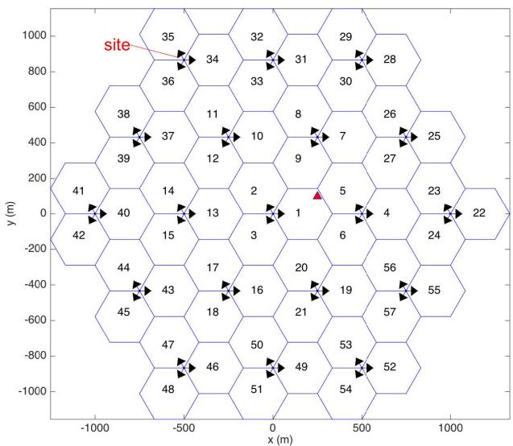

<details>
<summary>other</summary>

| Node | x (m) | y (m) |
|---|---|---|
| 1 | 200 | 1 |
| 2 | -200 | 2 |
| 3 | -200 | 3 |
| 4 | 500 | 4 |
| 5 | 500 | 5 |
| 6 | 500 | 6 |
| 7 | 500 | 7 |
| 8 | 200 | 8 |
| 9 | 200 | 9 |
| 10 | -200 | 10 |
| 11 | -200 | 11 |
| 12 | -200 | 12 |
| 13 | -200 | 13 |
| 14 | -200 | 14 |
| 15 | -200 | 15 |
| 16 | -200 | 16 |
| 17 | -200 | 17 |
| 18 | -200 | 18 |
| 19 | 500 | 19 |
| 20 | 500 | 20 |
| 21 | 500 | 21 |
| 22 | 1000 | 22 |
| 23 | 1000 | 23 |
| 24 | 1000 | 24 |
| 25 | 1000 | 25 |
| 26 | 500 | 26 |
| 27 | 500 | 27 |
| 28 | 500 | 28 |
| 29 | 500 | 29 |
| 30 | 500 | 30 |
| 31 | -200 | 31 |
| 32 | -200 | 32 |
| 33 | -200 | 33 |
| 34 | -500 | 34 |
| 35 | -500 | 35 |
| 36 | -500 | 36 |
| 37 | -500 | 37 |
| 38 | -500 | 38 |
| 39 | -500 | 39 |
| 40 | -500 | 40 |
| 41 | -1000 | 41 |
| 42 | -1000 | 42 |
| 43 | -500 | -43 |
| 44 | -500 | -44 |
| 45 | -500 | -45 |
| 46 | -500 | -46 |
| 47 | -500 | -47 |
| 48 | -500 | -48 |
| 49 | -200 | -49 |
| 50 | -200 | -50 |
| 51 | -200 | -51 |
| 52 | 500 | -52 |
| site indicated by red arrow near the center of the hexagon.
</details>

Cell layout for numerical simulations of cellular-connected UAV. Arrows denote boresight of each cell [12].

Besides numerical simulations, there were also works on theoretical performance analysis for cellular-connected UAVs. For example, in [210], based on the stochastic geometry with the GBSs modeled by an HPPP, the authors analyzed the DL coverage probability for an aerial user coexisting with conventional ground users. For simplicity, the BS antenna was modeled as the two-lobe model given in (16), while the UAV was assumed to be associated with the nearest BS. Based on the derived coverage probability expression and numerical examples, it was concluded that lowering BS antenna height and increasing downtilt angle are beneficial. However, this result may not hold if the RSRP-based association is considered in practice as it has been shown in Fig. 15 that in general, a UAV may not be associated with its nearest BS. Therefore, the analysis in [210] was extended in [60] by associating the UAV with the BS with the maximum power, instead of the nearest one. The authors further extended the analysis to the scenario that the UAV is also equipped with a directional antenna [211], with the two-lobe antenna model shown in (17). It was found that compared to the case of omnidirectional antennas at the UAV, the use of directional antennas with the optimum choice of antenna tilt can significantly improve the coverage probability and achievable throughput. The impact of using directional antenna at UAV for cellular UAV communications has also been studied in [212], where the coverage performance was analyzed by assuming that the UAV can intelligently tilt its main lobe direction. A more comprehensive analysis of cellular-connected UAVs for both UL and DL communications with general directional BS and/or UAV antenna models has been given in [62].

# D. Advanced Techniques for Air–Ground Interference Mitigation

Existing studies based on field measurements, numerical simulations, and theoretical analysis all showed that cellular networks supporting aerial users will face a more severe interference issue. In the UL transmission from UAV to BS, UAV could cause strong interference to a large number of cochannel BSs due to the high-probability LoS propagation at high altitude. On the other hand, in the DL transmission, UAV is the victim that may suffer severe interference from many nonassociated BSs. Thus, how to combat against the severe air–ground interference is of paramount importance for enhanced cellular support for aerial users. As summarized in Section IV-B, 3GPP has suggested several practical interference mitigation techniques that are readily for use without radically changing the network infrastructure or specifications. In the following, we further elaborate several advanced interference mitigation techniques by highlighting their unique opportunities and challenges in cellular systems supporting both terrestrial and aerial users.

1) 3-D Beamforming: Beamforming is an effective multiantenna technique that dynamically adjusts the antenna radiation pattern based on user location or even instantaneous CSI. Furthermore, compared to conventional 2-D beamforming, 3-D beamforming (or FD-MIMO) offers the enhanced capability of more refined angle resolutions in both azimuth and elevation dimensions. Thus, this significantly improves the interference mitigation capability by exploiting the elevation angle separation of users. The 3-D beamforming can only be achieved with FD antenna array with active array elements, such as UPA/URA. Note that 3-D beamforming is not new, which has received notable interest in conventional cellular networks [213] and has been supported in LTE since Release 13. However, the integration of aerial users with dominant LoS BS-UAV channels offers a new elevation angular diversity that renders 3-D beamforming particularly appealing in cellular-connected UAV systems. Specifically, compared to conventional cellular networks with terrestrial users only, it is more likely to find two users with sufficiently separated elevation angles in a hybrid aerial-terrestrial cellular system, where 3-D beamforming is more effective. Note that similar angular diversity exists from the UAV perspective to sufficiently separate the GBSs. Thus, 3-D beamforming can also be quite effective at the UAV side. The preliminary studies in [12] have demonstrated the promising gains of 3-D beamforming over the conventional BS antenna configuration with a fixed radiation pattern.

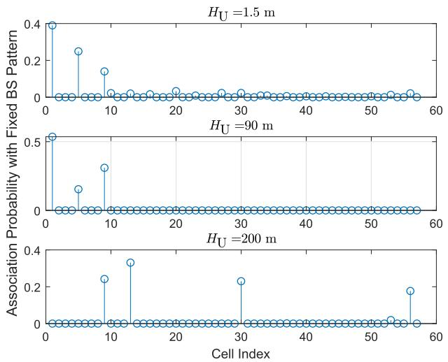

<details>
<summary>line</summary>

| Cell Index | Association Probability with Fixed BS Pattern (HU=1.5 m) | Association Probability with Fixed BS Pattern (HU=90 m) | Association Probability with Fixed BS Pattern (HU=200 m) |
| ---------- | -------------------------------------------------------- | ------------------------------------------------------ | ------------------------------------------------------ |
| 0          | 0.4                                                    | 0.5                                                    | 0.0                                                    |
| 5          | 0.25                                                   | 0.15                                                   | 0.25                                                   |
| 10         | 0.15                                                   | 0.3                                                    | 0.35                                                   |
| 15         | 0.05                                                   | 0.0                                                    | 0.0                                                    |
| 20         | 0.05                                                   | 0.0                                                    | 0.25                                                   |
| 25         | 0.05                                                   | 0.0                                                    | 0.0                                                    |
| 30         | 0.05                                                   | 0.0                                                    | 0.0                                                    |
| 35         | 0.05                                                   | 0.0                                                    | 0.0                                                    |
| 40         | 0.05                                                   | 0.0                                                    | 0.0                                                    |
| 45         | 0.05                                                   | 0.0                                                    | 0.0                                                    |
| 50         | 0.05                                                   | 0.0                                                    | 0.0                                                    |
| 55         | 0.05                                                   | 0.0                                                    | 0.18                                                   |
| 60         | 0.05                                                   | 0.0                                                    | 0.0                                                    |
</details>

(a)

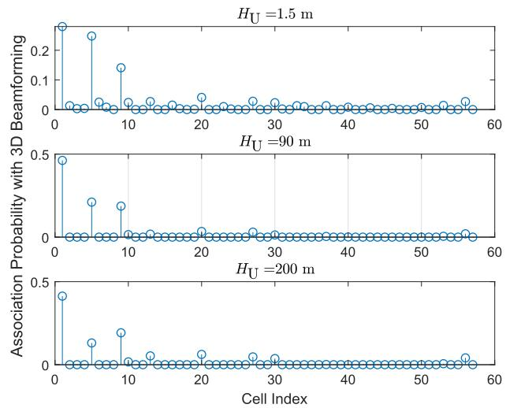

<details>
<summary>line</summary>

| Cell Index | Association Probability with 3D Beamforming (HU=1.5 m) | Association Probability with 3D Beamforming (HU=90 m) | Association Probability with 3D Beamforming (HU=200 m) |
| ---------- | -------------------------------------------------------- | -------------------------------------------------------- | -------------------------------------------------------- |
| 0          | 0.25                                                     | 0.45                                                     | 0.40                                                     |
| 5          | 0.22                                                     | 0.25                                                     | 0.15                                                     |
| 10         | 0.15                                                     | 0.20                                                     | 0.25                                                     |
| 15         | 0.05                                                     | 0.05                                                     | 0.05                                                     |
| 20         | 0.05                                                     | 0.05                                                     | 0.05                                                     |
| 25         | 0.05                                                     | 0.05                                                     | 0.05                                                     |
| 30         | 0.05                                                     | 0.05                                                     | 0.05                                                     |
| 35         | 0.05                                                     | 0.05                                                     | 0.05                                                     |
| 40         | 0.05                                                     | 0.05                                                     | 0.05                                                     |
| 45         | 0.05                                                     | 0.05                                                     | 0.05                                                     |
| 50         | 0.05                                                     | 0.05                                                     | 0.05                                                     |
| 55         | 0.05                                                     | 0.05                                                     | 0.05                                                     |
| 60         | 0.05                                                     | 0.05                                                     | 0.05                                                     |
</details>

Association probability at different UAV altitudes [12]. (a) Fixed BS pattern. (b) 3-D Beamforming.

Of particular interest is the use of 3-D beamforming under the massive MIMO paradigm [214]–[216], i.e., the number of BS antennas is much larger than the number of served users. There are some initial research efforts toward this direction for massive MIMO cellular UAV communications [217]–[219]. For instance, in [219], via extensive numerical simulations based on the latest 3GPP channel models, as discussed in Section II-A [5], the authors provided a rather comprehensive and insightful performance comparison of the DL UAV communication supported by the traditional cellular network versus the future massive MIMO network. The results showed that massive MIMO can dramatically enhance the reliability of the DL UAV command and control channel due to the better interference mitigation.

To practically enable 3-D beamforming for cellular UAV communications, efficient channel/beam training and tracking techniques need to be developed to cope with the high UAV mobility, which may induce significant Doppler effect and channel phase variations. One possible approach is to exploit the LoS-dominant BS-UAV channel and the knowledge on the UAV trajectory/velocity, which can be acquired a priori or estimated in real time, to reduce the pilot overhead. However, for 3-D beamforming in cellularconnected UAV systems, both the azimuth and elevation beam directions need to be estimated and tracked, which, thus, calls for new and efficient designs.

2) Coordinated Resource Allocation: Coordinated resource allocation, or intercell interference coordination (ICIC), is the mechanism used in practice to mitigate intercell interference by jointly optimizing the communication resources across different cells, which may include channel assignment, power allocation, beamforming, BS association, and so on. To this end, the cooperating BSs usually need to exchange the CSI of their served users via cellular backhaul links. While ICIC has been extensively studied and standardized for LTE networks with terrestrial users, its performance for the new UAV users deserves a further study. In particular, due to the LoS-dominant propagation between UAV and BSs, the number of potential coordinating BSs is typically much larger than that for serving terrestrial users only. This brings new issues on the implementation complexity and latency.

There has been some initial research efforts on coordinated resource allocation for cellular-connected UAVs. Mei et al. [220], [221] studied the ICIC designs for UL

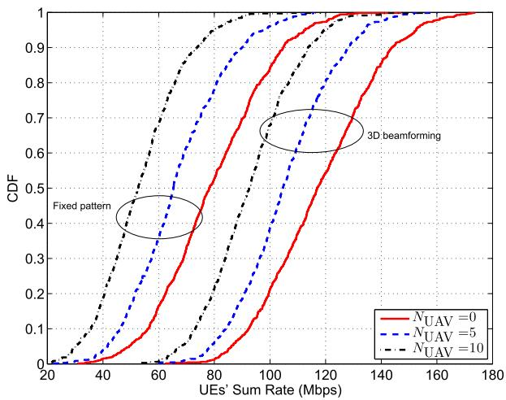

<details>
<summary>line</summary>

| UEs' Sum Rate (Mbps) | CDF (NUAV=0) | CDF (NUAV=5) | CDF (NUAV=10) |
|----------------------|--------------|--------------|---------------|
| 20                   | 0.0          | 0.0          | 0.0           |
| 40                   | 0.0          | 0.0          | 0.0           |
| 60                   | 0.1          | 0.2          | 0.3           |
| 80                   | 0.3          | 0.5          | 0.7           |
| 100                  | 0.5          | 0.7          | 0.9           |
| 120                  | 0.7          | 0.8          | 0.95          |
| 140                  | 0.8          | 0.9          | 0.98          |
| 160                  | 0.9          | 0.95         | 0.99          |
| 180                  | 1.0          | 1.0          | 1.0           |
</details>

Empirical CDF of UEs’ achievable sum rate, with NUAV denoting the number of UAV UEs [12].

UAV communications via jointly optimizing the UAV’s UL cell association and power allocation over multiple RBs. To reduce the implementation complexity, a decentralized ICIC scheme was proposed by dividing the cellular BSs into small-size clusters, where the information exchange is only needed between the UAV and cluster-head BSs by exploiting the LoS macrodiversity.

3) CoMP: Compared with coordinated resource allocation, one more effective technique for multicell cooperation is CoMP transmission/reception. In this case, the signals for each user are jointly transmitted/received by multiple cooperating BSs, which forms a virtual distributed antenna array or network MIMO system [222]. Different from the coordinated resource allocation aiming to suppress the interfering links, CoMP essentially exploits the strong cross links for desired signal transmission by simultaneously associating each user with multiple BSs. This is especially appealing for cellular-connected UAVs, due to the larger macrodiversity gain available for aerial users compared to terrestrial users. However, this also incurs more complexity and backhaul transmission delay as more cooperating BSs need to be involved. For low-complexity implementation, it is necessary to optimize the set of cooperating BSs so as to achieve a tradeoff between performance and complexity/delay, by taking into account the flying status, such as UAV speed and altitude, as well as the BS-UAV channel models. For example, one possible approach is the UAV-oriented cell cooperation, where large-scale multicell cooperation is applied for those UAVs with the low speed that induces slower channel variation and/or at high altitude with potentially large macrodiversity gains. In addition, the impact of the additional delay due to CoMP on the performance of CNPC transmissions needs to be critically evaluated.

There have been some recent research efforts on investigating low-complexity multicell cooperation for cellularconnected UAVs. For example, to reduce the backhaul delay of CoMP, Liu et al. [223] proposed a cooperative interference cancellation strategy for UL cellular UAV MIMO communications. In this scheme, it is assumed that each UAV uses an RB that is occupied by ground users only at some (not all) of the BSs, termed occupied BSs, which is valid in practical cellular networks with fractional frequency reuse. Then, those unoccupied BSs could be utilized to decode the UAV signals and forward them to adjacent occupied BSs for interference cancellation. The proposed scheme achieves better performance than the conventional transmit beamforming without the cooperative interference cancellation and, on the other hand, requires less complexity than CoMP since cooperation is limited only to adjacent BSs.

The abovementioned idea was further extended in [224], leading to the novel scheme termed cooperative nonorthogonal MAC (NOMA). Different from the cooperative interference cancellation between only nonoccupied and occupied BSs as in [223], the UAV signal might be also decoded at some of the occupied BSs, as long as their received UAV signal strengths are sufficiently strong compared to that of the terrestrial users. Then, the decoded UAV signal is forwarded to adjacent occupied BSs for interference cancellation, even without using the nonoccupied BSs. Compared to the conventional noncooperative NOMA scheme with only local interference cancellation at occupied BSs, the proposed cooperative NOMA achieves significant performance gains. The extension of the abovementioned works for UAV DL communication is more involved, which deserves further studies [225].

# E. QoS-Aware UAV Trajectory Optimization

Different from the conventional terrestrial users that usually move sporadically and randomly, the mobility of UAV users is fully or at least partially controllable. This offers an additional DoF for cellular-connected UAVs, via their communication QoS-aware trajectory design. For example, for areas where ubiquitous aerial coverage by the cellular network has not been achieved yet, the UAV path can be deliberately planned to circumvent entering any coverage holes. However, it should be noted that the trajectory design for cellular-connected UAVs is different from that for UAV-assisted communications in the following aspects. First, for cellular-connected UAVs, UAVs usually have their own missions, such as inspection, delivery, and photography, which to a certain extent limits their flexibility in trajectory adaptation to enhance communication performance compared to UAV-assisted communications, in which UAVs are dedicated BSs/relays/APs with fully controllable trajectories. Second, different from UAV-assisted communications where the trajectories of UAV BSs/relays/Aps, in general, need to be designed to ensure the coverage of all their served users, for cellularconnected UAVs, they are users and only need efficient trajectories to fulfill their communication requirements with some BSs along the trajectories. As a result, the UAV trajectory designs for the above two cases are generally different.

As an illustrating example, let us consider the scenario that a UAV aims to deliver a package from an initial location A to a destination B with minimum time, while ensuring that it maintains a good connection with at least one BS at any time along its trajectory. In practice, a good connection may be defined as follows: the outage probability that the SNR is below a target threshold $\gamma$ is less than some tolerable value . Intuitively, for any given , the coverage region of each BS depends on $\gamma ,$ , which in turn affects the UAV’s optimal flying path. For simplicity, assuming that the UAV maintains a constant altitude $H _ { U } ,$ Uthe coverage areas of the BSs in the UAV’s flying plane for two different $\gamma$ values are illustrated in Fig. 17. Note that the coverage area is, in general, of irregular shape that depends on the BS antenna radiation pattern and the random shadowing. When γ is small $( \mathrm { i . e . , } \ \gamma = \gamma _ { 1 } )$ , it is possible that there exists a straight path from A to B satisfying the connectivity constraint with the flying distance minimized, as shown by the red path in Fig. 17. However, as γ increases $( \mathrm { i } . \mathbf { e } . , \gamma = \gamma _ { 2 } )$ , the UAV may have to detour its flying path to maintain the connection with BSs, as illustrated by the blue path in Fig. 17, and as a result, more traveling time is needed.

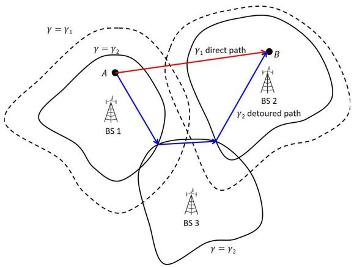

<details>
<summary>flowchart</summary>

```mermaid
graph TD
    A["BS 1"] -->|γ₁ direct path| B["BS 2"]
    B -->|γ₂ detoured path| BS 3
    BS 1 --> A
    BS 2 --> B
    BS 3 --> A
    style A fill:#f9f,stroke:#333
    style B fill:#bbf,stroke:#333
    style BS 1 fill:#dfd,stroke:#333
    style BS 2 fill:#dfd,stroke:#333
    style BS 3 fill:#dfd,stroke:#333
    note1["γ = γ₁"] --> A
    note2["γ = γ₂"] --> A
    note3["γ = γ₂"] --> B
```
</details>

Illustration of QoS-aware UAV path planning with target SNR γ1 < γ2. $\gamma _ { 1 } < \gamma _ { 2 } .$

There have been some recent works along the abovementioned direction. For example, Zhang et al. [199] formulated the UAV trajectory optimization problem to minimize the UAV flying time, subject to the stringent zero-outage constraint for the UAV at any time along its trajectory. By assuming the free-space LoS channel model and isotropic antennas so that the coverage areas in Fig. 17 reduce to circles, effective UAV trajectory solutions were obtained by utilizing the graph theory and convex optimization techniques. A similar problem was investigated in [226] and [227] but with certain tolerance on the loss of cellular connection, provided that such disconnected duration does not exceed a given threshold. Based on the field measurement of the UL interference by UAVs, Amorim et al. [203] suggested a possible solution to reduce UL interference caused by aerial users by controlling their cruise height though this usually compromises the UAV’s link quality. A more general trajectory optimization problem for UAV UL communication subject to their interference power constraints at the terrestrial users has been studied in [123].

Note that the practical challenge for optimal QoS-aware UAV path planning lies in how to obtain the accurate 3-D coverage maps of the BSs [228]. Toward this end, Zeng and Xu [229] proposed a novel framework for UAV path design by applying reinforcement learning technique, which only relies on the raw signal measurement at the UAV. A noncooperative game formulation was given in [230]. Note that the research on machine learning empowered cellular-connected UAV communication and trajectory optimization is still at an early stage. Similar to UAV-assisted communications, in order to reduce the learning time and complexity, trajectory planning for cellular-connected UAVs may also require a combined offline and online design approach, which deserves further investigation.

# V. E X T E N S I O N S

Some other relevant topics to UAV communication that are worthy of further investigation are discussed as follows.

# A. UAV Swarm Communications

UAV swarm is an effective approach to overcome the SWAP limitations of UAV systems, where a group of highly coordinated UAVs are dispatched to cooperatively accomplish a common mission that would be otherwise impossible by one single UAV. There are different possible networking architectures for UAV swarm communications. A typical one is the infrastructure-based UAV swarm [231], where a common ground infrastructure (such as a cellular BS) receives the telemetry information from all UAVs in the swarm and sends back the coordination information to them. Such an architecture has the advantage of centralized coordination enabled by ground infrastructure with typically powerful computing capabilities, but it also has the drawback of round-trip air–ground delay for UAV coordinations, as well as the heavy loading for ground infrastructure when the number of UAVs in a swarm becomes large. To overcome such issues, an alternative architecture for UAV swarm is infrastructure-assisted U2U (UAV-to-UAV) communications [12], where the ground infrastructure, such as cellular networks, offers the backbone connectivity between the aerial network formed by the UAVs, which could employ the FANET architecture [11] assisted by the cellular core network on the ground. More research efforts are needed to investigate the most effective network topologies and communication protocols that can make full use of both the sensed and communicated data of each UAV to realize high-performance UAV swarm operations.

# B. Security

Future wireless networks are expected to support massive user and device communications, which makes information security a more challenging task. The network security issue can be tackled either at higher communication protocol layers by using, e.g., cryptographic methods or at the physical layer by exploiting the intrinsic characteristics of wireless channels. With the integration of UAVs into wireless networks, the LoS-dominant air– ground channel and high mobility of UAVs bring new opportunities as well as challenges for physical-layer secure communications, depending on whether the UAVs are legitimate or malicious nodes in the network [15], [151], [152], [232]–[238]. For example, due to the high mobility, legitimate UAV transmitters or receivers can move far away from ground eavesdroppers to reduce information leakage to them [151], [233]–[235]. Besides, their high altitude also helps detect the ground eavesdroppers’ locations effectively via UAV-mounted cameras/radars. More proactively, artificial noise can be sent by dedicated UAV jammers deployed above the ground eavesdroppers to interfere with them and, thus, prevent against their wiretapping [152]. In practice, using multiple cooperative UAVs with different roles can further improve the wireless communication security [237], [238]. On the other hand, if the UAVs are malicious nodes in the network, their aforementioned advantages turn out to be new threats to the terrestrial secure communications as they can be more easily eavesdropped and/or jammed by UAVs. Therefore, effective techniques to combat such airborne eavesdropping and jamming are crucial [15] and worth investigating in the future work.

Besides information security, there are also other security issues for UAVs, such as how to detect and track malicious UAVs [239] and how to prevent the GPS spoofing attacks to the legitimate UAVs [240], which are also crucial and deserve further investigation. For example, while active UAVs, such as UAV jammers, can be detected/localized by using conventional signal sensing and ranging techniques, passive UAVs, such as UAV eavesdroppers, generally require more sophisticated detection techniques, such as radar and/or computer vision-based methods.

# C. Caching

Wireless caching is regarded as a promising solution to support the explosive growth of the mobile multimedia traffic arising from, e.g., video streaming and mobile TV [241]. By leveraging the storage device at BS/mobile terminal, the popular contents can be proactively cached during the off-peak period so as to reduce the real-time transmission delay and alleviate the network backhaul burden. However, as each BS only has a finite storage space, only a certain amount of the contents can be cached at it. This makes it difficult to provide mobility support for users, such as vehicles in 5G applications that may move across different small cells rapidly. To resolve this issue, UAV-enabled caching is a potential solution due to the UAV’s high mobility [242], [243]. Specifically, UAVs can dynamically cache the popular contents and track the mobility pattern of the corresponding users so as to effectively serve them. Compared to caching at the fixed terrestrial BSs, the UAV-enabled caching avoids the need for caching the same requested content at different BSs for serving a moving user and, thus, greatly saves the storage resource. The results in [244] have shown that such a scheme achieves significant performance gains in terms of both the average transmit power and the percentage of the users with satisfied quality-of-experience (QoE) compared with the benchmark case without the use of UAV caching.

However, the performance of the UAV-aided caching system is practically limited by the endurance of UAVs. To overcome this issue, [245] proposed a promising solution by jointly exploiting the D2D communications among the ground users and their proactive caching. Specifically, a UAV is dispatched to serve a group of ground users with random and asynchronous file requests, and each service period is divided into two phases, i.e., the file caching phase and the file retrieval phase. In the first phase, the UAV proactively transmits each file to a subset of selected users that cooperatively cache all the files of interest during that period, while in the second phase, a requested file by a ground user can be retrieved either from its own local cache directly or from its nearest neighbor via D2D communication. As such, the UAV is only needed in the first phase, and the saved time can be used for its battery charging or conducting other missions.

# D. MmWave Communication

By exploiting the enormous chunks of new spectrum available at 30–300 GHz, mmWave communications are expected to push the mobile data rates to tens of Gb/s for supporting emerging rate-demanding applications, such as ultrahigh-definition video (UHDV) streaming and virtual/augmented reality (VR/AR)-based gaming. Although mmWave communication, in general, suffers high propagation loss and is vulnerable to blockage, such issues are less severe when mmWave is applied for UAV communications due to the flexible UAV mobility and favorable air– ground channel characteristics. For example, by exploiting the controllable UAV mobility, the communication distance can be significantly shortened, which not only reduces signal attenuation loss but also enables the high probability of LoS channels [246], [247]. Furthermore, via smart positioning, e.g., adjusting the altitude, the UAV is able to bypass the obstacles, such as high-rise buildings and trees that may induce blockage in the mmWave UAV communications. Unfortunately, the high UAV mobility and the high operating carrier frequency make the Doppler frequency compensation a critical issue for mmWave UAV communications.

Furthermore, although more antennas can be equipped at the UAV and/or ground node given the same size due to the smaller mmWave signal wavelength, the largearray beamforming gain is achievable only when efficient channel estimation and tracking can be implemented. The beam training with hierarchical beamforming codebooks has been shown to be an effective technique to achieve this goal [248], especially for LoS-dominant air– ground channels. However, the existing beam training algorithms are mostly designed for estimating the beam direction in azimuth domain only. Recently, a channel tracking method for the flight control system (FCS) was proposed in [249] for UAV communications with mmWave MIMO. Specifically, a 3-D geometry-based channel model was constructed by combining the UAV movement state information and the channel gain information, where the former can be obtained by the sensor fusion of the FCS, while the latter can be estimated through the pilot signal. The proposed method has been shown to have a much lower training overhead compared to the existing method without utilizing the UAV movement information. Nevertheless, more research efforts are still needed to design the efficient channel/beam training and tracking techniques catering for 3-D mmWave air–ground channels.

# E. Mobile Edge Computing

The concept of MEC was mainly motivated by the emerging new applications, such as the VR/AR and autonomous driving, which usually demand ultralowlatency communication, computation, and control among a large number of wireless devices. While the real-time computation tasks to be executed can be quite intensive, wireless devices are generally of small size and only have limited computation and data storage resources. As such, MEC has been considered as a key technology for enhancing the computational capabilities of small devices by allowing them to offload the computation tasks to nearby MEC servers (e.g., APs and BSs). However, for users located at the cell edge, such an offloading strategy may even cause more transmission energy and/or longer delay than local computation due to the limited communication rate with the AP/BS. To address this problem, UAVs with highly controllable mobility can be used as the flying cloudlets to achieve more efficient computation offloading for the users by moving significantly closer to them [154], [250]–[255].

On the other hand, in practice, small UAVs may also have the need to offload the computation tasks to GBSs in cellular-connected UAVs. By exploiting its LoS dominant links with many GBSs, a UAV user can simultaneously connect with multiple GBSs to exploit their distributed computing resources to improve the computation offloading performance [155]. In [155], it has been shown that when the number of task-input bits is sufficiently large, the UAV should hover above its associated GBSs in order to achieve the most efficient computation offloading. However, if the UAV’s propulsion energy consumption is taken into account, this result may not hold, which, thus, requires further investigation.

# F. Wireless Power Transfer

RF transmission-enabled WPT is envisioned as a promising solution to provide perpetual energy supplies for massive low-power devices in the forthcoming IoT networks [256], [257]. To compensate for the significant signal attenuation over distance, a variety of techniques have been proposed to enhance the WPT efficiency, including transmit beamforming/precoding, waveform optimization, and energy scheduling. However, the efficiency of WPT is still fundamentally limited by the distances between energy transmitters (ETs) and energy receivers (ERs) [82], [83].

To solve this problem, UAV-mounted ETs can be employed to dramatically reduce the link distance by exploiting their highly controllable mobility in 3-D space [156], [258]–[260]. By moving close to the ERs with clear LoS links, the UAV-ET can significantly improve the efficiency of WPT to ERs, similarly like in wireless communication. As the energy signals from the ET are broadcast to all ERs, the energy harvested at each ER critically depends on the UAV location/trajectory. In [156], it was shown that to maximize the total harvested energy at all ERs, the UAV-ET with one single omnidirectional antenna should hover at one fixed location during the whole charging period. However, this may lead to unfair harvested energy among ERs due to their different distances from the UAV. To tackle this issue, the problem of maximizing the minimum energy harvested among all ERs was also considered in [156], where a successive hover-and-fly trajectory was shown to be optimal. However, how to extend the work [156] to the more general setup with multiple and/or multiantenna UAV-ETs is still not addressed yet. To enable energy as well as information transfer, the single-antenna UAV-enabled wireless powered communication network (WPCN) and simultaneous wireless information and power transfer (SWIPT) system were studied in [157], [259], and [260], respectively, all of which have shown that a joint design of the UAV trajectory and energy/communication scheduling can achieve significant performance gains compared to the case with fixed UAV locations.

# VI. C O N C L U S I O N

In this article, we provided a tutorial on UAV communication in 5G-and-beyond wireless systems, by addressing its main challenges due to the unique communication requirements and channel characteristics, as well as the new considerations, such as UAV energy limitation, high altitude, and high 3-D mobility. We first presented the fundamental mathematical models useful for the performance analysis, evaluation, and optimization of UAV communication, including the channel and antenna models, UAV energy consumption models, as well as the mathematical optimization framework for UAV communication and trajectory codesign. The stateof-the-art results were then reviewed for the two main research and application paradigms of UAV communication, namely, UAV-assisted terrestrial communications and cellular-connected UAVs. We also highlighted the promising directions in UAV communication and other related areas worthy of further investigation in the future works. It is hoped that this article will be a useful and inspiring resource for researchers working in this promising area to unlock the full potential of wireless communication meeting UAVs.

# R E F E R E N C E S

[1] FAA. Summary of Small Unmanned Aircraft Rule. Accessed: Feb. 18, 2019. [Online]. Available: https://www.faa.gov/uas/media/Part\_107 \_Summary.pdf   
[2] UAS. Integration Pilot Program Resources. Accessed: Feb. 18, 2019. [Online]. Available: https://www.faa.gov/uas/programs\_partnerships/ integration\_pilot\_program/   
[3] With 1 Announcement, the FAA Just Created an \$82 Billion Market and 100, 000 New Jobs. Accessed: Feb. 18, 2019. [Online]. Available: https://www.inc.com/yoram-solomon/with-onerule-the-faa-just-created-an-82-billion-marketand-100000-new-jobs.html   
[4] K. P. Valavanis and G. J. Vachtsevanos, Handbook of Unmanned Aerial Vehicles. Amsterdam, The Netherlands: Springer, 2015.   
[5] Technical Specification Group Radio Access Network: Study on enhanced LTE Support for Aerial Vehicles, document 3GPP TR 36.777 V15.0.0, Dec. 2017.   
[6] China Mobile Technical Report: Internet of Drones (in Chinese). Accessed: Feb. 18, 2019. [Online]. Available: http://www.jintiankansha.me/t/AE9FsWW9tc   
[7] Characteristics of Unmanned Aircraft Systems and Spectrum Requirements to Support Their Safe Operation in Non-Segregated Airspace, document M.2171, International Telecommunication Union, Dec. 2009.   
[8] R. J. Kerczewski, J. D. Wilson, and W. D. Bishop, “Frequency spectrum for integration of unmanned aircraft,” in Proc. IEEE/AIAA Digit. Avionics Syst. Conf. (DASC), Oct. 2013, pp. 6D5-1–6D5-9.   
[9] C. Caicedo. (Mar. 31, 2017). Spectrum Management Issues for the Operation of Commercial Services With UAVs. [Online]. Available: https://ssrn.com/abstract=2944132, doi: 10.2139/ssrn.2944132.   
[10] Launch of Inmarsat Swiftbroadband Unmanned Aerial Vehicle Service to Provide Operational Capability Boost. Accessed: Feb. 18, 2019. [Online]. Available: https://www.inmarsat.com/press-release/ launch-inmarsat-swiftbroadband-unmannedaerial-vehicle-service-provide-operationalcapability-boost/   
[11] I. Bekmezci, O. K. Sahingoz, and ¸S. Temel, “Flying ad-hoc networks (FANETs): A survey,” Ad Hoc Netw., vol. 11, no. 3, pp. 1254–1270, Jan. 2013.   
[12] Y. Zeng, J. Lyu, and R. Zhang, “Cellular-connected UAV: Potential, challenges, and promising technologies,” IEEE Wireless Commun., vol. 26, no. 1, pp. 120–127, Feb. 2019.   
[13] Y. Zeng, R. Zhang, and T. J. Lim, “Wireless communications with unmanned aerial vehicles: Opportunities and challenges,” IEEE Commun. Mag., vol. 54, no. 5, pp. 36–42, May 2016.   
[14] Paving the Path to 5G: Optimizing Commercial LTE Networks for Drone Communication. Accessed: Feb. 18, 2019. [Online]. Available: https://www.qualcomm.com/news/onq/ 2016/09/06/paving-path-5g-optimizingcommercial-lte-networks-drone-communication   
[15] Q. Wu, W. Mei, and R. Zhang, “Safeguarding wireless network with UAVs: A physical layer security perspective,” IEEE Wireless Commun., vol. 26, no. 5, pp. 12–18, Oct. 2019.   
[16] J. Xie, Y. Wan, J. H. Kim, S. Fu, and K. Namuduri, “A survey and analysis of mobility models for airborne networks,” IEEE Commun. Surveys Tuts., vol. 16, no. 3, pp. 1221–1238, 3rd Quart., 2014.   
[17] Y. Zeng and R. Zhang, “Energy-efficient UAV communication with trajectory optimization,” IEEE Trans. Wireless Commun., vol. 16, no. 6, pp. 3747–3760, Jun. 2017.   
[18] Y. Zeng, J. Xu, and R. Zhang, “Energy minimization for wireless communication with rotary-wing UAV,” IEEE Trans. Wireless Commun., vol. 18, no. 4, pp. 2329–2345, Apr. 2019.   
[19] Y. Chen, S. Zhang, S. Xu, and G. Y. Li, “Fundamental trade-offs on green wireless

networks,” IEEE Commun. Mag., vol. 49, no. 6, pp. 30–37, Jun. 2011.   
[20] Z. Hasan, H. Boostanimehr, and V. K. Bhargava, “Green cellular networks: A survey, some research issues and challenges,” IEEE Commun. Surveys Tuts., vol. 13, no. 4, pp. 524–540, 4th Quart., 2011.   
[21] C. F. Mecklenbrauker et al., “Vehicular channel characterization and its implications for wireless system design and performance,” Proc. IEEE, vol. 99, no. 7, pp. 1189–1212, Jul. 2011.   
[22] J. Zhang et al., “Aeronautical ad hoc networking for the Internet-above-the-clouds,” Proc. IEEE, vol. 107, no. 5, pp. 868–911, May 2019.   
[23] B. Van Der Bergh, A. Chiumento, and S. Pollin, “LTE in the sky: Trading off propagation benefits with interference costs for aerial nodes,” IEEE Commun. Mag., vol. 54, no. 5, pp. 44–50, May 2016.   
[24] I. Bor-Yaliniz and H. Yanikomeroglu, “The new frontier in RAN heterogeneity: Multi-tier drone-cells,” IEEE Commun. Mag., vol. 54, no. 11, pp. 48–55, Nov. 2016.   
[25] S. Sekander, H. Tabassum, and E. Hossain, “Multi-tier drone architecture for 5G/B5G cellular networks: Challenges, trends, and prospects,” IEEE Commun. Mag., vol. 56, no. 3, pp. 96–103, Mar. 2018.   
[26] X. Lin et al., “The sky is not the limit: LTE for unmanned aerial vehicles,” IEEE Commun. Mag., vol. 56, no. 4, pp. 204–210, Apr. 2018.   
[27] W. Khawaja, I. Guvenc, D. W. Matolaky, U. C. Fiebigz, and N. Schneckenberger, “A survey of air-to-ground propagation channel modeling for unmanned aerial vehicles,” IEEE Commun. Surveys Tuts., vol. 21, no. 3, pp. 2361–2391, 3rd Quart., 2019.   
[28] D. W. Matolak and R. Sun, “Unmanned aircraft systems: Air-ground channel characterization for future applications,” IEEE Veh. Technol. Mag., vol. 10, no. 2, pp. 79–85, Jun. 2015.   
[29] A. A. Khuwaja, Y. Chen, N. Zhao, M.-S. Alouini, and P. Dobbins, “A survey of channel modeling for UAV communications,” IEEE Commun. Surveys Tuts., vol. 20, no. 4, pp. 2804–2821, 4th Quart., 2018.   
[30] E. W. Frew and T. X. Brown, “Airborne communication networks for small unmanned aircraft systems,” Proc. IEEE, vol. 96, no. 12, pp. 2008–2027, Dec. 2008.   
[31] L. Gupta, R. Jain, and G. Vaszkun, “Survey of important issues in UAV communication networks,” IEEE Commun. Surveys Tuts., vol. 18, no. 2, pp. 1123–1152, 2nd Quart., 2016.   
[32] S. Hayat, E. Yanmaz, and R. Muzaffar, “Survey on unmanned aerial vehicle networks for civil applications: A communications viewpoint,” IEEE Commun. Surveys Tuts., vol. 18, no. 4, pp. 2624–2661, 4th Quart., 2016.   
[33] H. Shakhatreh et al., “Unmanned aerial vehicles (UAVs): A survey on civil applications and key research challenges,” IEEE Access, vol. 7, pp. 48572–48634, 2019.   
[34] N. H. Motlagh, T. Taleb, and O. Arouk, “Low-altitude unmanned aerial vehicles-based Internet of Things services: Comprehensive survey and future perspectives,” IEEE Internet Things J., vol. 3, no. 6, pp. 899–922, Dec. 2016.   
[35] R. Shakeri et al., “Design challenges of multi-UAV systems in cyber-physical applications: A comprehensive survey, and future directions,” IEEE Commun. Surveys Tuts., to be published. [Online]. Available: https://arxiv.org/abs/1810.09729   
[36] M. Mozaffari, W. Saad, M. Bennis, Y.-H. Nam, and M. Debbah, “A tutorial on UAVs for wireless networks: Applications, challenges, and open problems,” IEEE Commun. Surveys Tuts., vol. 21, no. 3, pp. 2334–2360, 3rd Quart., 2019.   
[37] A. Fotouhi et al., “Survey on UAV cellular communications: Practical aspects, standardization advancements, regulation, and

security challenges,” IEEE Commun. Surveys Tuts., to be published. [Online]. Available: https://arxiv.org/abs/1809.01752   
[38] N. Goddemeier, K. Daniel, and C. Wietfeld, “Role-based connectivity management with realistic air-to-ground channels for cooperative UAVs,” IEEE J. Sel. Areas Commun., vol. 30, no. 5, pp. 951–963, Jun. 2012.   
[39] N. Ahmed, S. S. Kanhere, and S. Jha, “On the importance of link characterization for aerial wireless sensor networks,” IEEE Commun. Mag., vol. 54, no. 5, pp. 52–57, May 2016.   
[40] A. Goldsmith, Wireless Communications. Cambridge, U.K.: Cambridge Univ. Press, 2005.   
[41] Y. Zeng, R. Zhang, and T. J. Lim, “Throughput maximization for UAV-enabled mobile relaying systems,” IEEE Trans. Commun., vol. 64, no. 12, pp. 4983–4996, Dec. 2016.   
[42] Q. Wu, Y. Zeng, and R. Zhang, “Joint trajectory and communication design for multi-UAV enabled wireless networks,” IEEE Trans. Wireless Commun., vol. 17, no. 3, pp. 2109–2121, Mar. 2018.   
[43] R. Amorim, H. Nguyen, P. Mogensen, I. Z. Kovács, J. Wigard, and T. B. Sørensen, “Radio channel modeling for UAV communication over cellular networks,” IEEE Wireless Commun. Lett., vol. 6, no. 4, pp. 514–517, Aug. 2017.   
[44] M. M. Azari, F. Rosas, K.-C. Chen, and S. Pollin, “Ultra reliable UAV communication using altitude and cooperation diversity,” IEEE Trans. Commun., vol. 66, no. 1, pp. 330–344, Jan. 2018.   
[45] A. Al-Hourani and K. Gomez, “Modeling cellular-to-UAV path-loss for suburban environments,” IEEE Wireless Commun. Lett., vol. 7, no. 1, pp. 82–85, Feb. 2018.   
[46] Q. Feng, E. K. Tameh, A. R. Nix, and J. McGeehan, “WLCp2-06: Modelling the likelihood of line-of-sight for air-to-ground radio propagation in urban environments,” in Proc. IEEE Global Commun. Conf. (GLOBECOM), Nov./Dec. 2006, pp. 1–5.   
[47] Q. Feng, J. McGeehan, E. K. Tameh, and A. R. Nix, “Path loss models for air-to-ground radio channels in urban environments,” in Proc. IEEE Veh. Technol. Conf. (VTC), May 2006, pp. 2901–2905.   
[48] A. Al-Hourani, S. Kandeepan, and A. Jamalipour, “Modeling air-to-ground path loss for low altitude platforms in urban environments,” in Proc. IEEE Global Commun. Conf. (GLOBECOM), Dec. 2014, pp. 2898–2904.   
[49] A. Al-Hourani, S. Kandeepan, and S. Lardner, “Optimal LAP altitude for maximum coverage,” IEEE Wireless Commun. Lett., vol. 3, no. 6, pp. 569–572, Dec. 2014.   
[50] Propagation Data and Prediction Methods Required for the Design of Terrestrial Broadband Radio Access Systems Operating in a Frequency Range From 3 to 60 GHz, document recommendation ITU-R P.1410. Accessed: Feb. 18, 2019. [Online]. Available: https://www.itu.int/rec/R-REC-P.1410/en   
[51] M. Mozaffari, W. Saad, M. Bennis, and M. Debbah, “Unmanned aerial vehicle with underlaid device-to-device communications: Performance and tradeoffs,” IEEE Trans. Wireless Commun., vol. 15, no. 6, pp. 3949–3963, Jun. 2016.   
[52] Study on Channel Model for Frequencies From 0.5 to 100 GHz, document 3GPP TR 38.901 version 14.0.0 Release 14, 2017.   
[53] L. Zeng, X. Cheng, C.-X. Wang, and X. Yin, “A 3D geometry-based stochastic channel model for UAV-MIMO channels,” in Proc. IEEE Wireless Commun. Net. Conf. (WCNC), Mar. 2017, pp. 1–5.   
[54] D. W. Matolak and R. Sun, “Air–ground channel characterization for unmanned aircraft systems—Part I: Methods, measurements, and models for over-water settings,” IEEE Trans. Veh. Technol., vol. 66, no. 1, pp. 26–44, Jan. 2017.   
[55] D. W. Matolak and R. Sun, “Air–ground channel characterization for unmanned aircraft systems—Part III: The suburban and near-urban environments,” IEEE Trans. Veh. Technol., vol. 66, no. 8, pp. 6607–6618, Aug. 2017.   
[56] R. Sun and D. W. Matolak, “Air–ground channel

characterization for unmanned aircraft systems Part II: Hilly and mountainous settings,” IEEE Trans. Veh. Technol., vol. 66, no. 3, pp. 1913–1925, Mar. 2017.   
[57] W. Khawaja, O. Ozdemir, and I. Guvenc, “UAV air-to-ground channel characterization for mmWave systems,” in Proc. IEEE Veh. Technol. Conf. (VTC), Sep. 2017, pp. 1–5.   
[58] Study on 3D Channel Model for LTE, document 3GPP TR 36.873, V12.7.0, Dec. 2017.   
[59] K. Venugopal, M. C. Valenti, and R. W. Heath, Jr., “Device-to-device millimeter wave communications: Interference, coverage, rate, and finite topologies,” IEEE Trans. Wireless Commun., vol. 15, no. 9, pp. 6175–6188, Sep. 2016.   
[60] M. M. Azari, F. Rosas, and S. Pollin, “Reshaping cellular networks for the sky: The major factors and feasibility,” in Proc. IEEE Int. Conf. Commun. (ICC), May 2018, pp. 1–7.   
[61] X. Xu and Y. Zeng, “Cellular-connected UAV: Performance analysis with 3D antenna modelling,” in Proc. IEEE Int. Conf. Commun. (ICC) Workshops, May 2019, pp. 1–6.   
[62] J. Lyu and R. Zhang, “Network-connected UAV: 3D system modeling and coverage performance analysis,” IEEE Internet Things J., vol. 6, no. 4, pp. 7048–7060, Aug. 2019.   
[63] H. He, S. Zhang, Y. Zeng, and R. Zhang, “Joint altitude and beamwidth optimization for UAV-enabled multiuser communications,” IEEE Commun. Lett., vol. 22, no. 2, pp. 344–347, Feb. 2018.   
[64] M. Mozaffari, W. Saad, M. Bennis, and M. Debbah, “Efficient deployment of multiple unmanned aerial vehicles for optimal wireless coverage,” IEEE Commun. Lett., vol. 20, no. 8, pp. 1647–1650, Aug. 2016.   
[65] B. Galkin, J. Kibiłda, and L. A. DaSilva, “A stochastic model for UAV networks positioned above demand hotspots in urban environments,” 2018, arXiv:1804.11001. [Online]. Available: https://arxiv.org/abs/1804.11001   
[66] Technical Specification Group Radio Access Network: Study on Elevation Beamforming/Full-Dimension (FD) Multiple Input Multiple Output (MIMO) for LTE, document 3GPP TR 36.897 V13.0.0, Jun. 2015.   
[67] Y. Zeng and R. Zhang, “Cost-effective millimeter-wave communications with lens antenna array,” IEEE Wireless Commun., vol. 24, no. 4, pp. 81–87, Aug. 2017.   
[68] S. Hur, T. Kim, D. J. Love, J. V. Krogmeier, T. A. Thomas, and A. Ghosh, “Millimeter wave beamforming for wireless backhaul and access in small cell networks,” IEEE Trans. Commun., vol. 61, no. 10, pp. 4391–4403, Oct. 2013.   
[69] X. Zhang, A. F. Molisch, and S.-Y. Kung, “Variable-phase-shift-based RF-baseband codesign for MIMO antenna selection,” IEEE Trans. Signal Process., vol. 53, no. 11, pp. 4091–4103, Nov. 2005.   
[70] O. El Ayach, S. Rajagopal, S. Abu-Surra, Z. Pi, and R. W. Heath, Jr., “Spatially sparse precoding in millimeter wave MIMO systems,” IEEE Trans. Wireless Commun., vol. 13, no. 3, pp. 1499–1513, Mar. 2013.   
[71] Y. Zeng and R. Zhang, “Millimeter wave MIMO with lens antenna array: A new path division multiplexing paradigm,” IEEE Trans. Commun., vol. 64, no. 4, pp. 1557–1571, Apr. 2016.   
[72] Y. Zeng, L. Yang, and R. Zhang, “Multi-user millimeter wave MIMO with full-dimensional lens antenna array,” IEEE Trans. Wireless Commun., vol. 17, no. 4, pp. 2800–2814, Apr. 2018.   
[73] C. Di Franco and G. Buttazzo, “Energy-aware coverage path planning of UAVs,” in Proc. IEEE Int. Conf. Auto. Robot Syst. Competitions, Apr. 2015, pp. 111–117.   
[74] A. Richards and J. P. How, “Aircraft trajectory planning with collision avoidance using mixed integer linear programming,” in Proc. IEEE Amer. Control Conf., May 2002, pp. 1936–1941.   
[75] C. S. Ma and R. H. Miller, “MILP optimal path

planning for real-time applications,” in Proc. IEEE Amer. Control Conf., Jun. 2006, p. 6.   
[76] E. I. Grøtli and T. A. Johansen, “Path planning for UAVs under communication constraints using SPLAT! And MILP,” J. Intell. Robot. Syst., vol. 65, nos. 1–4, pp. 265–282, Jan. 2012.   
[77] Y. Mei, Y.-H. Lu, Y. C. Hu, and C. S. G. Lee, “Energy-efficient motion planning for mobile robots,” in Proc. IEEE Int. Conf. Robot. Autom., Apr./May 2004, pp. 4344–4349.   
[78] Y. Zeng, X. Xu, and R. Zhang, “Trajectory design for completion time minimization in UAV-enabled multicasting,” IEEE Trans. Wireless Commun., vol. 17, no. 4, pp. 2233–2246, Apr. 2018.   
[79] M. Mozaffari, W. Saad, M. Bennis, and M. Debbah, “Wireless communication using unmanned aerial vehicles (UAVs): Optimal transport theory for hover time optimization,” IEEE Trans. Wireless Commun., vol. 16, no. 12, pp. 8052–8066, Dec. 2017.   
[80] J. Gong, T.-H. Chang, C. Shen, and X. Chen, “Flight time minimization of UAV for data collection over wireless sensor networks,” IEEE J. Sel. Areas Commun., vol. 36, no. 9, pp. 1942–1954, Sep. 2018.   
[81] S. Zhang, Q. Wu, S. Xu, and G. Y. Li, “Fundamental green tradeoffs: Progresses, challenges, and impacts on 5G networks,” IEEE Commun. Surveys Tuts., vol. 19, no. 1, pp. 33–56, 1st Quat., 2017.   
[82] Q. Wu, G. Y. Li, W. Chen, D. W. K. Ng, and R. Schober, “An overview of sustainable green 5G networks,” IEEE Wireless Commun., vol. 24, no. 4, pp. 72–80, Aug. 2017.   
[83] Q. Wu, M. Tao, D. W. K. Ng, W. Chen, and R. Schober, “Energy-efficient resource allocation for wireless powered communication networks,” IEEE Trans. Wireless Commun., vol. 15, no. 3, pp. 2312–2327, Mar. 2016.   
[84] Q. Wu, Y. Zeng, and R. Zhang, “Joint trajectory and communication design for UAV-enabled multiple access,” in Proc. IEEE Global Commun. Conf. (GLOBECOM), Dec. 2017, pp. 1–6.   
[85] C. You and R. Zhang, “3D trajectory optimization in Rician fading for UAV-enabled data harvesting,” IEEE Trans. Wireless Commun., vol. 18, no. 6, pp. 3192–3207, Jun. 2019.   
[86] S. Rohde, M. Putzke, and C. Wietfeld, “Ad hoc self-healing of OFDMA networks using UAV-based relays,” Ad Hoc Netw., vol. 11, no. 7, pp. 1893–1906, Sep. 2013.   
[87] V. Sharma, K. Srinivasan, H.-C. Chao, K.-L. Hua, and W.-H. Cheng, “Intelligent deployment of UAVs in 5G heterogeneous communication environment for improved coverage,” J. Netw. Comput. Appl., vol. 85, pp. 94–105, May 2016.   
[88] D. Orfanus, E. P. de Freitas, and F. Eliassen, “Self-organization as a supporting paradigm for military UAV relay networks,” IEEE Commun. Lett., vol. 20, no. 4, pp. 804–807, Apr. 2016.   
[89] J. Zhang, Y. Zeng, and R. Zhang, “UAV-enabled radio access network: Multi-mode communication and trajectory design,” IEEE Trans. Signal Process., vol. 66, no. 20, pp. 5269–5284, Oct. 2018.   
[90] W. Guo, C. Devine, and S. Wang, “Performance analysis of micro unmanned airborne communication relays for cellular networks,” in Proc. IEEE Int. Symp. Commun. Syst., Netw., Digit. Signal (CSNDSP), Jul. 2014, pp. 658–663.   
[91] K. Gomez, T. Rasheed, L. Reynaud, and S. Kandeepan, “On the performance of aerial LTE base-stations for public safety and emergency recovery,” in Proc. IEEE Global Commun. Conf. (GLOBECOM), Dec. 2013, pp. 1391–1396.   
[92] K. Gomez, A. Hourani, L. Goratti, R. Riggio, S. Kandeepan, and I. Bucaille, “Capacity evaluation of aerial LTE base-stations for public safety communications,” in Proc. IEEE Eur. Conf. Netw. Commun., Jun./Jul. 2015, pp. 133–138.   
[93] A. Al-Hourani, S. Chandrasekharan, G. Kaandorp, W. Glenn, A. Jamalipour, and S. Kandeepan, “Coverage and rate analysis of aerial base

stations,” IEEE Trans. Aerosp. Electron. Syst., vol. 52, no. 6, pp. 3077–3081, Dec. 2016.   
[94] M. M. Azari, F. Rosas, K.-C. Chen, and S. Pollin, “Joint sum-rate and power gain analysis of an aerial base station,” in Proc. IEEE Global Commun. Conf. (GLOBECOM), Dec. 2016, pp. 1–6.   
[95] M. M. Azari, F. Rosas, A. Chiumento, K.-C. Chen, and S. Pollin, “Coverage and power gain of aerial versus terrestrial base stations,” in Advances in Ubiquitous Networking. Singapore: Springer, 2017, pp. 627–636.   
[96] K. Han, K. Huang, and R. W. Heath, Jr., “Connectivity and blockage effects in millimeter-wave air-to-everything networks,” 2018, arxiv:1808.00144. [Online]. Available: https://arxiv.org/abs/1808.00144   
[97] A. M. Hayajneh, S. A. R. Zaidi, D. C. McLernon, and M. Ghogho, “Drone empowered small cellular disaster recovery networks for resilient smart cities,” in Proc. IEEE Int. Conf. Sens., Commun. Netw. (SECON Workshops), Jun. 2016, pp. 1–6.   
[98] V. V. Chetlur and H. S. Dhillon, “Downlink coverage analysis for a finite 3-D wireless network of unmanned aerial vehicles,” IEEE Trans. Commun., vol. 65, no. 10, pp. 4543–4558, Jul. 2017.   
[99] M. M. Azari, Y. Murillo, O. Amin, F. Rosas, M.-S. Alouini, and S. Pollin, “Coverage maximization for a Poisson field of drone cells,” 2017, arXiv:1708.06598. [Online]. Available: https://arxiv.org/abs/1708.06598   
[100] B. Galkin, J. Kibilda, and L. A. DaSilva, “Coverage analysis for low-altitude UAV networks in urban environments,” in Proc. IEEE Global Commun. Conf. (GLOBECOM), Dec. 2017, pp. 1–6.   
[101] C. Zhang and W. Zhang, “Spectrum sharing for drone networks,” IEEE J. Sel. Areas Commun., vol. 35, no. 1, pp. 136–144, Jan. 2017.   
[102] C. Liu, M. Ding, C. Ma, Q. Li, Z. Lin, and Y.-C. Liang, “Performance analysis for practical unmanned aerial vehicle networks with LoS/NLoS transmissions,” in Proc. IEEE Int. Conf. Commun. (ICC) Workshop, May 2018, pp. 1–6.   
[103] F. Ono, H. Ochiai, and R. Miura, “A wireless relay network based on unmanned aircraft system with rate optimization,” IEEE Trans. Wireless Commun., vol. 15, no. 11, pp. 7699–7708, Nov. 2016.   
[104] J. Lyu, Y. Zeng, and R. Zhang, “Cyclical multiple access in UAV-aided communications: A throughput-delay tradeoff,” IEEE Wireless Commun. Lett., vol. 5, no. 6, pp. 600–603, Dec. 2016.   
[105] S. Enayati, H. Saeedi, H. Pishro-Nik, and H. Yanikomeroglu, “Moving aerial base station networks: Stochastic geometry analysis and design perspective,” IEEE Trans. Wireless Commun., vol. 18, no. 6, pp. 2977–2988, Jun. 2019.   
[106] F. Ono, K. Takizawa, H. Tsuji, L. Shan, T. Kagawa, and R. Miura, “Measurement of TCP and UDP performance over UAS relay networks,” in Proc. IEEE Int. Conf. Unmanned Aircraft Syst. (ICUAS), May 2014, pp. 389–394.   
[107] Z. M. Fadlullah, D. Takaishi, H. Nishiyama, N. Kato, and R. Miura, “A dynamic trajectory control algorithm for improving the communication throughput and delay in UAV-aided networks,” IEEE Netw., vol. 30, no. 1, pp. 100–105, Jan./Feb. 2016.   
[108] Z. Becvar, M. Vondra, P. Mach, J. Plachy, and D. Gesbert, “Performance of mobile networks with UAVs: Can flying base stations substitute ultra-dense small cells?” in Proc. IEEE Eur. Wireless Conf., May 2017, pp. 1–7.   
[109] J. Lyu, Y. Zeng, and R. Zhang, “UAV-aided offloading for cellular hotspot,” IEEE Trans. Wireless Commun., vol. 17, no. 6, pp. 3988–4001, Jun. 2018.   
[110] R. I. Bor-Yaliniz, A. El-Keyi, and H. Yanikomeroglu, “Efficient 3-D placement of an aerial base station in next generation cellular

networks,” in Proc. IEEE Int. Conf. Commun. (ICC), May 2016, pp. 1–5.   
[111] M. Alzenad, A. El-Keyi, F. Lagum, and H. Yanikomeroglu, “3-D placement of an unmanned aerial vehicle base station (UAV-BS) for energy-efficient maximal coverage,” IEEE Wireless Commun. Lett., vol. 6, no. 4, pp. 434–437, Aug. 2017.   
[112] M. Alzenad, A. El-Keyi, and H. Yanikomeroglu, “3-D placement of an unmanned aerial vehicle base station for maximum coverage of users with different QoS requirements,” IEEE Wireless Commun. Lett., vol. 7, no. 1, pp. 38–41, Feb. 2018.   
[113] E. Kalantari, M. Z. Shakir, H. Yanikomeroglu, and A. Yongacoglu, “Backhaul-aware robust 3D drone placement in 5G+ wireless networks,” in Proc. IEEE Int. Conf. Commun. (ICC), May 2017, pp. 109–114.   
[114] J. Chen and D. Gesbert, “Optimal positioning of flying relays for wireless networks: A LOS map approach,” in Proc. IEEE Int. Conf. Commun. (ICC), May 2017, pp. 1–6.   
[115] E. Kalantari, H. Yanikomeroglu, and A. Yongacoglu, “On the number and 3D placement of drone base stations in wireless cellular networks,” in Proc. IEEE Veh. Technol. Conf. (VTC), Sep. 2016, pp. 1–6.   
[116] J. Lyu, Y. Zeng, R. Zhang, and T. J. Lim, “Placement optimization of UAV-mounted mobile base stations,” IEEE Commun. Lett., vol. 21, no. 3, pp. 604–607, Mar. 2017.   
[117] X. He et al., “Towards 3D deployment of UAV base stations in uneven terrain,” in Proc. IEEE Int. Conf. Comput. Commun. Netw. (ICCCN), Jul./Aug. 2018, pp. 1–9.   
[118] M. Mozaffari, W. Saad, M. Bennis, and M. Debbah, “Drone small cells in the clouds: Design, deployment and performance analysis,” in Proc. IEEE Global Commun. Conf. (GLOBECOM), Dec. 2015, pp. 1–6.   
[119] Z. Wang, L. Duan, and R. Zhang, “Adaptive deployment for UAV-aided communication networks,” IEEE Trans. Wireless Commun., vol. 18, no. 9, pp. 4531–4543, Sep. 2019.   
[120] D. Romero and G. Leus, “Non-cooperative aerial base station placement via stochastic optimization,” 2019, arXiv:1905.03988. [Online]. Available: https://arxiv.org/abs/1905.03988   
[121] M. Grossglauser and D. N. C. Tse, “Mobility increases the capacity of ad hoc wireless networks,” IEEE/ACM Trans. Netw., vol. 10, no. 4, pp. 477–486, Aug. 2002.   
[122] Y. Yan and Y. Mostofi, “Co-optimization of communication and motion planning of a robotic operation under resource constraints and in fading environments,” IEEE Trans. Wireless Commun., vol. 12, no. 4, pp. 1562–1572, Apr. 2013.   
[123] Y. Huang, W. Mei, J. Xu, L. Qiu, and R. Zhang, “Cognitive UAV communication via joint maneuver and power control,” IEEE Trans. Commun., to be published. [Online]. Available: https://arxiv.org/abs/1901.02804   
[124] T. Schouwenaars, B. De Moor, E. Feron, and J. How, “Mixed integer programming for multi-vehicle path planning,” in Proc. IEEE Eur. Control Conf., Sep. 2001, pp. 2603–2608.   
[125] I. K. Nikolos, K. P. Valavanis, N. C. Tsourveloudis, and A. N. Kostaras, “Evolutionary algorithm based offline/online path planner for UAV navigation,” IEEE Trans. Syst. Man, Cybern. B, Cybern., vol. 33, no. 6, pp. 898–912, Dec. 2003.   
[126] C. Zheng, L. Li, F. Xu, F. Sun, and M. Ding, “Evolutionary route planner for unmanned air vehicles,” IEEE Trans. Robot., vol. 21, no. 4, pp. 609–620, Aug. 2005.   
[127] J. Bellingham, A. Richards, and J. P. How, “Receding horizon control of autonomous aerial vehicles,” in Proc. IEEE Amer. Control Conf., May 2002, pp. 3741–3746.   
[128] T. Schouwenaars, A. Stubbs, J. Paduano, and

E. Feron, “Multivehicle path planning for nonline-of-sight communication,” J. Field Robot., vol. 23, pp. 269–290, Mar./Apr. 2006.   
[129] P. Zhan, K. Yu, and A. L. Swindlehurst, “Wireless relay communications with unmanned aerial vehicles: Performance and optimization,” IEEE Trans. Aerosp. Electron. Syst., vol. 47, no. 3, pp. 2068–2085, Jul. 2011.   
[130] F. Jiang and A. L. Swindlehurst, “Optimization of UAV heading for the ground-to-air uplink,” IEEE J. Sel. Areas Commun., vol. 30, no. 5, pp. 993–1005, Jun. 2012.   
[131] K. Anazawa, P. Li, T. Miyazaki, and S. Guo, “Trajectory and data planning for mobile relay to enable efficient Internet access after disasters,” in Proc. IEEE Global Commun. Conf. (GLOBECOM), Dec. 2015, pp. 1–6.   
[132] Z. Han, A. L. Swindlehurst, and K. J. R. Liu, “Optimization of MANET connectivity via smart deployment/movement of unmanned air vehicles,” IEEE Trans. Veh. Technol., vol. 58, no. 7, pp. 3533–3546, Sep. 2009.   
[133] S. Kim, H. Oh, J. Suk, and A. Tsourdos, “Coordinated trajectory planning for efficient communication relay using multiple UAVs,” in Proc. Cont. Eng. Pract. (ELSEVIER), vol. 29, May 2014, pp. 42–49.   
[134] E. L. Lawler, J. K. Lenstra, A. H. G. R. Kan, and D. B. Shmoys, The Traveling Salesman Problem: A Guided Tour of Combinatorial Optimization, 1st ed. Hoboken, NJ, USA: Wiley, 1985.   
[135] G. Laporte, “The traveling salesman problem: An overview of exact and approximate algorithms,” Eur. J. Oper. Res., vol. 59, no. 2, pp. 231–247, Jun. 1992.   
[136] (Jan. 11, 2018). Traveling Salesman Problem: Solver-Based. Accessed: Feb. 18, 2019. [Online]. Available: https://www.mathworks.com/help/ optim/ug/travelling-salesman-problem.html   
[137] C. Rego, D. Gamboa, F. Glover, and C. Osterman, “Traveling salesman problem heuristics: Leading methods, implementations and latest advances,” Eur. J. Oper. Res., vol. 211, no. 3, pp. 427–441, Jun. 2011.   
[138] A. Dumitrescu and J. S. B. Mitchell, “Approximation algorithms for TSP with neighborhoods in the plane,” J. Algorithms, vol. 48, no. 1, pp. 135–159, Aug. 2003.   
[139] B. Yuan, M. Orlowska, and S. Sadiq, “On the optimal robot routing problem in wireless sensor networks,” IEEE Trans. Knowl. Data Eng., vol. 19, no. 9, pp. 1252–1261, Sep. 2007.   
[140] G. Laporte and S. Martello, “The selective travelling salesman problem,” Discret. Appl. Math., vol. 26, nos. 2–3, pp. 193–207, Mar. 1990.   
[141] P. Vansteenwegen, W. Souffriau, and D. Van Oudheusden, “The orienteering problem: A survey,” Eur. J. Oper. Res., vol. 29, no. 1, pp. 1–10, Feb. 2011.   
[142] C. Zhan, Y. Zeng, and R. Zhang, “Trajectory design for distributed estimation in UAV-enabled wireless sensor network,” IEEE Trans. Veh. Technol., vol. 67, no. 10, pp. 10155–10159, Oct. 2018.   
[143] Y. Xu and W. Yin, “A block coordinate descent method for regularized multiconvex optimization with applications to nonnegative tensor factorization and completion,” SIAM J. Imag. Sci., vol. 6, no. 3, pp. 1758–1789, Sep. 2013.   
[144] M. Hong, M. Razaviyayn, Z.-Q. Luo, and J.-S. Pang, “A unified algorithmic framework for block-structured optimization involving big data: With applications in machine learning and signal processing,” IEEE Signal Process. Mag., vol. 33, no. 1, pp. 57–77, Jan. 2016.   
[145] B. R. Marks and G. P. Wright, “A general inner approximation algorithm for nonconvex mathematical programs,” Oper. Res., vol. 26, no. 4, pp.681-683,1978.   
[146] A. Zappone, E. Björnson, L. Sanguinetti, and E. Jorswieck, “Globally optimal energy-efficient power control and receiver design in wireless

networks,” IEEE Trans. Signal Process., vol. 65, no. 11, pp. 2844–2859, Jun. 2017.   
[147] M. Grant and S. Boyd. CVX: MATLAB Software for Disciplined Convex Programming, Version 2.1. Accessed: Dec. 9, 2018. [Online]. Available: http://cvxr.com/cvx   
[148] S. Boyd and L. Vandenberghe, Convex Optimization. Cambridge, U.K.: Cambridge Univ. Press, 2004.   
[149] C. Zhan, Y. Zeng, and R. Zhang, “Energy-efficient data collection in UAV enabled wireless sensor network,” IEEE Wireless Commun. Lett., vol. 7, no. 3, pp. 328–331, Jun. 2018.   
[150] Y. Xu, L. Xiao, D. Yang, Q. Wu, and L. Cuthbert, “Throughput maximization in multi-UAV enabled communication systems with difference consideration,” IEEE Access, vol. 6, pp. 55291–55301, 2018.   
[151] G. Zhang, Q. Wu, M. Cui, and R. Zhang, “Securing UAV communications via joint trajectory and power control,” IEEE Trans. Wireless Commun., vol. 18, no. 2, pp. 1376–1389, Feb. 2019.   
[152] A. Li, Q. Wu, and R. Zhang, “UAV-enabled cooperative jamming for improving secrecy of ground wiretap channel,” IEEE Wireless Commun. Lett., vol. 8, no. 1, pp. 181–184, Jan. 2019.   
[153] X. Zhou, Q. Wu, S. Yan, F. Shu, and J. Li, “UAV-enabled secure communications: Joint trajectory and transmit power optimization,” IEEE Trans. Veh. Technol., vol. 68, no. 4, pp. 4069–4073, Apr. 2019.   
[154] S. Jeong, O. Simeone, and J. Kang, “Mobile edge computing via a UAV-mounted cloudlet: Optimization of bit allocation and path planning,” IEEE Trans. Veh. Technol., vol. 67, no. 3, pp. 2049–2063, Mar. 2018.   
[155] X. Cao, J. Xu, and R. Zhangt, “Mobile edge computing for cellular-connected UAV: Computation offloading and trajectory optimization,” in Proc. IEEE Int. Workshop Signal Process. Adv. Wireless Commun. (SPAWC), Jun. 2018, pp. 1–5.   
[156] J. Xu, Y. Zeng, and R. Zhang, “UAV-enabled wireless power transfer: Trajectory design and energy optimization,” IEEE Trans. Wireless Commun., vol. 17, no. 8, pp. 5092–5106, Aug. 2018.   
[157] L. Xie, J. Xu, and R. Zhang, “Throughput maximization for UAV-enabled wireless powered communication networks,” IEEE Internet Things J., vol. 6, no. 2, pp. 1690–1703, Apr. 2019.   
[158] C. Shen, T.-H. Chang, J. Gong, Y. Zeng, and R. Zhang, “Multi-UAV interference coordination via joint trajectory and power control,” IEEE Trans. Signal Process., to be published. [Online]. Available: https://arxiv.org/abs/1809.05697   
[159] L. Liu, S. Zhang, and R. Zhang, “CoMP in the sky: UAV placement and movement optimization for multi-user communications,” IEEE Trans. Commun., vol. 67, no. 8, pp. 5645–5658, Aug. 2019.   
[160] Q. Wu, J. Xu, and R. Zhang, “UAV-enabled broadcast channel: Trajectory design and capacity characterization,” in Proc. IEEE Int. Conf. Commun. (ICC) Workshops, May 2018, pp. 1–6.   
[161] Q. Wu, J. Xu, and R. Zhang, “Capacity characterization of UAV-enabled two-user broadcast channel,” IEEE J. Sel. Areas Commun., vol. 36, no. 9, pp. 1955–1971, Sep. 2018.   
[162] Q. Wu and R. Zhang, “Common throughput maximization in UAV-enabled OFDMA systems with delay consideration,” IEEE Trans. Wireless Commun., vol. 66, no. 12, pp. 6614–6627, Dec. 2018.   
[163] Q. Wu and R. Zhang, “Delay-constrained throughput maximization in UAV-enabled OFDM systems,” in Proc. IEEE Asia–Pacific Conf. Commun. (APCC), Dec. 2017, pp. 1–6.   
[164] C. You and R. Zhang, “Hybrid offline-online design for UAV-enabled data harvesting in probabilistic LoS channel,” 2019, arXiv:1907.06181. [Online].

Available: https://arxiv.org/abs/1907.06181   
[165] M. Coupechoux, J. Darbon, J.-M. Kélif, and M. Sigelle, “Optimal trajectories of a UAV base station using Lagrangian mechanics,” 2018, arXiv:1812.08759. [Online]. Available: https://arxiv.org/abs/1812.08759   
[166] E. Natalizio, N. Zema, E. Yanmaz, L. Di Puglia Pugliese, and F. Guerriero, “Take the field from your smartphone: Leveraging UAVs for event filming,” IEEE Trans. Mobile Comput., to be published.   
[167] S. Kandeepan, K. Gomez, L. Reynaud, and T. Rasheed, “Aerial-terrestrial communications: Terrestrial cooperation and energy-efficient transmissions to aerial base stations,” IEEE Trans. Aerosp. Electron. Syst., vol. 50, no. 4, pp. 2715–2735, Oct. 2014.   
[168] M. Mozaffari, W. Saad, M. Bennis, and M. Debbah, “Mobile unmanned aerial vehicles (UAVs) for energy-efficient Internet of Things communications,” IEEE Trans. Wireless Commun., vol. 16, no. 11, pp. 7574–7589, Nov. 2017.   
[169] M. Mozaffari, W. Saad, M. Bennis, and M. Debbah, “Optimal transport theory for power-efficient deployment of unmanned aerial vehicles,” in Proc. IEEE Int. Conf. Commun. (ICC), May 2016, pp. 1–6.   
[170] K. Li, W. Ni, X. Wang, R. P. Liu, S. S. Kanhere, and S. Jha, “Energy-efficient cooperative relaying for unmanned aerial vehicles,” IEEE Trans. Mobile Comput., vol. 15, no. 9, pp. 1377–1386, Jun. 2016.   
[171] D. H. Choi, S. H. Kim, and D. K. Sung, “Energy-efficient maneuvering and communication of a single UAV-based relay,” IEEE Trans. Aerosp. Electron. Syst., vol. 50, no. 3, pp. 2320–2327, Jul. 2014.   
[172] S. Eom, H. Lee, J. Park, and I. Lee, “UAV-aided wireless communication designs with propulsion energy limitations,” 2018, arXiv:1801.02782. [Online]. Available: https://arxiv.org/abs/1801.02782   
[173] J. Zhang, Y. Zeng, and R. Zhang, “Spectrum and energy efficiency maximization in UAV-enabled mobile relaying,” in Proc. IEEE Int. Conf. Commun. (ICC), May 2017, pp. 1–6.   
[174] D. Yang, Q. Wu, Y. Zeng, and R. Zhang, “Energy trade-off in ground-to-UAV communication via trajectory design,” IEEE Trans. Veh. Technol, vol. 67, no. 7, pp. 6721–6726, Jul. 2018.   
[175] Q. Wu, L. Liu, and R. Zhang, “Fundamental trade-offs in communication and trajectory design for UAV-enabled wireless network,” IEEE Wireless Commun., vol. 26, no. 1, pp. 36–44, Feb. 2019.   
[176] R. Gangula, D. Gesbert, D. F. Külzer, and J. M. Franceschi, “A landing spot approach for enhancing the performance of UAV-aided wireless networks,” in Proc. IEEE Int. Conf. Commun. (ICC) Workshops, May 2018, pp. 1–6.   
[177] H. Bayerlein, R. Gangula, and D. Gesbert, “Learning to rest: A Q-learning approach to flying base station trajectory design with landing spots,” in Proc. Asilomar Conf. Signals, Syst., Comput., Oct. 2018, pp. 724–728.   
[178] A. Trotta, F. D. Andreagiovanni, M. Di Felice, E. Natalizio, and K. R. Chowdhury, “When UAVs ride a bus: Towards energy-efficient city-scale video surveillance,” in Proc. IEEE INFOCOM, Apr. 2018, pp. 1043–1051.   
[179] PowerLight. Free-Space Power Beaming. Accessed: Oct. 17,2019.[Online]. Available: http://powerlighttech.com/free-space-powerbeaming-2   
[180] P. Ladosz, H. Oh, and W.-H. Chen, “Optimal positioning of communication relay unmanned aerial vehicles in urban environments,” in Proc. IEEE Int. Conf. Unmanned Aircraft. Syst. (ICUAS), Jun. 2016, pp. 1140–1147.   
[181] O. Esrafilian and D. Gesbert, “Simultaneous user association and placement in multi-UAV enabled wireless networks,” in Proc. IEEE ITG Workshop Smart Antennas (WSA), Mar. 2018, pp. 1–5.   
[182] O. Esrafilian, R. Gangula, and D. Gesbert, “Learning to communicate in UAV-aided wireless

networks: Map-based approaches,” IEEE Internet Things J., vol. 6, no. 2, pp. 1791–1802, Apr. 2019.   
[183] J. Chen and D. Gesbert, “Efficient local map search algorithms for the placement of flying relays,” 2018, arXiv:1801.03595. [Online]. Available: https://arxiv.org/abs/1801.03595   
[184] R. Gangula, O. Esrafilian, D. Gesbert, C. Roux, F. Kaltenberger, and R. Knopp, “Flying rebots: First results on an autonomous UAV-based LTE relay using OpenAirInterface,” in Proc. IEEE Int. Workshop Signal Process. Adv. Wireless Commun. (SPAWC), Jun. 2018, pp. 1–5.   
[185] S. Bi, J. Lyu, Z. Ding, and R. Zhang, “Engineering radio maps for wireless resource management,” IEEE Wireless Commun., vol. 26, no. 2, pp. 133–141, Apr. 2019.   
[186] J. Chen, U. Yatnalli, and D. Gesbert, “Learning radio maps for UAV-aided wireless networks: A segmented regression approach,” in Proc. IEEE Int. Conf. Commun. (ICC), May 2017, pp. 1–6.   
[187] R. S. Sutton and A. G. Barto, Reinforcement Learning—An Introduction, 2nd ed. Cambridge, MA, USA: MIT Press, 2018.   
[188] C. Wang, J. Wang, X. Zhang, and X. Zhang, “Autonomous navigation of UAV in large-scale unknown complex environment with deep reinforcement learning,” in Proc. IEEE Global Conf. Signal Inf. Process. (GlobalSIP), Nov. 2017, pp. 858–862.   
[189] L. Xiao, X. Lu, D. Xu, Y. Tang, L. Wang, and W. Zhuang, “UAV relay in VANETs against smart jamming with reinforcement learning,” IEEE Trans. Veh. Technol., vol. 67, no. 5, pp. 4087–4097, May 2018.   
[190] H. Bayerlein, P. De Kerret, and D. Gesbert, “Trajectory optimization for autonomous flying base station via reinforcement learning,” in Proc. SPAWC, Jun. 2018, pp. 1–5.   
[191] M. Wzorek, D. Landén, and P. Doherty, “GSM technology as a communication media for an autonomous unmanned aerial vehicle,” in Proc. 21st Bristol UAV Syst. Conf., Apr. 2006, pp. 1–15.   
[192] N. Goddemeier, K. Daniel, and C. Wietfeld, “Coverage evaluation of wireless networks for unmanned aerial systems,” in Proc. IEEE Global Commun. Conf. (GLOBECOM), Dec. 2010, pp. 1760–1765.   
[193] K. Daniel, S. Rohde, and C. Wietfeld, “Leveraging public wireless communication infrastructures for UAV-based sensor networks,” in Proc. IEEE Int. Conf. Technol. Homeland Secur., Nov. 2010, pp. 179–184.   
[194] F. Gonzalez, R. Walker, N. Rutherford, and C. Turner, “Assessment of the suitability of public mobile data networks for aircraft telemetry and control purposes,” Prog. Aerosp. Sci., vol. 47, no. 3, pp. 240–248, Apr. 2011.   
[195] L. Afonso, N. Souto, P. Sebastiao, M. Ribeiro, T. Tavares, and R. Marinheiro, “Cellular for the skies: Exploiting mobile network infrastructure for low altitude air-to-ground communications,” IEEE Aerosp. Electron. Syst. Mag., vol. 31, no. 8, pp. 4–11, Aug. 2016.   
[196] S. Zhang, Y. Zeng, and R. Zhang, “Cellular-enabled UAV communication: Trajectory optimization under connectivity constraint,” in Proc. IEEE Int. Conf. Commun. (ICC), May 2018, pp. 1–6.   
[197] H. C. Nguyen, R. Amorim, J. Wigard, I. Z. Kovács, T. B. Sørensen, and P. E. Mogensen, “How to ensure reliable connectivity for aerial vehicles over cellular networks,” IEEE Access, vol. 6, pp. 12304–12317, 2018.   
[198] I. Kovacs, R. Amorim, H. C. Nguyen, J. Wigard, and P. Mogensen, “Interference analysis for UAV connectivity over LTE using aerial radio measurements,” in Proc. IEEE Veh. Technol. Conf. (VTC), Sep. 2017, pp. 1–6.   
[199] S. Zhang, Y. Zeng, and R. Zhang, “Cellular-enabled UAV communication: A connectivity-constrained trajectory optimization

perspective,” IEEE Trans. Commun., vol. 67, no. 3, pp. 2580–2604, Mar. 2019.   
[200] L. Sundqvist, “Cellular controlled drone experiment: Evaluation of network requirements,” M.S. thesis, School Elect. Eng., Aalto Univ., Espoo, Finland, Dec. 2015.   
[201] Qualcomm. (May 2017). LTE Unmanned Aircraft Systems Trial Report. [Online]. Available: https://www.qualcomm.com/documents/ lte-unmanned-aircraft-systems-trial-report   
[202] X. Lin et. al., “Mobile network-connected drones: Field trials, simulations, and design insights,” IEEE Veh. Technol. Mag., vol. 14, no. 3, pp. 115–125, Sep. 2019.   
[203] R. Amorim et al., “Measured uplink interference caused by aerial vehicles in LTE cellular networks,” IEEE Wireless Commun. Lett., vol. 7, no. 6, pp. 958–961, Dec. 2018.   
[204] Field Measurement Results for Drone LTE Enhancement, document R1-1705823, 3GPP TSG-RAN WG1 Meeting 88bis, KDDI Corporation, Mar. 2017.   
[205] New SID on Enhanced Support for Aerial Vehicles, document RP-170779, 2017.   
[206] On DL Interference Mitigation, document R1-1720859, Ericsson, Stockholm, Sweden, Nov./Dec. 2017.   
[207] L. M. Schalk and M. Herrmann, “Suitability of LTE for drone-to-infrastructure communications in very low level airspace,” in Proc. IEEE/AIAA 36th Digit. Avionics Syst. Conf. (DASC), Sep. 2017, pp. 1–7.   
[208] S. Euler et al., “Mobility support for cellular connected unmanned aerial vehicles: Performance and analysis,” 2019, arXiv:1804.04523. [Online]. Available: https://arxiv.org/abs/1804.04523   
[209] H. C. Nguyen, R. Amorim, J. Wigard, I. Z. Kovacs, and P. Mogensen, “Using LTE networks for UAV command and control link: A rural-area coverage analysis,” in Proc. IEEE Veh. Technol. Conf. (VTC), Sep. 2017, pp. 1–6.   
[210] M. M. Azari, F. Rosas, A. Chiumento, and S. Pollin, “Coexistence of terrestrial and aerial users in cellular networks,” in Proc. IEEE Global Commun. Conf. (GLOBECOM) Workshop, Dec. 2017, pp. 1–6.   
[211] M. M. Azari, F. Rosas, and S. Pollin, “Cellular connectivity for UAVs: Network modeling, performance analysis, and design guidelines,” IEEE Trans. Wireless Commun., vol. 18, no. 7, pp. 3366–3381, Jul. 2019.   
[212] B. Galkin, J. Kibiłda, and L. A. Dasilva, “Impact of UAV antenna configuration on wireless connectivity in urban environments,” 2018, arXiv:1807.00696. [Online]. Available: https://arxiv.org/abs/1807.00696   
[213] Y.-H. Nam et al., “Full-dimension MIMO (FD-MIMO) for next generation cellular technology,” IEEE Commun. Mag., vol. 51, no. 6, pp. 172–179, Jun. 2013.   
[214] T. L. Marzetta, “Noncooperative cellular wireless with unlimited numbers of base station antennas,” IEEE Trans. Wireless Commun., vol. 9, no. 11, pp. 3590–3600, Nov. 2010.   
[215] F. Rusek et al., “Scaling up MIMO: Opportunities and challenges with very large arrays,” IEEE Signal Process. Mag., vol. 30, no. 1, pp. 40–60, Jan. 2013.   
[216] L. Lu, G. Y. Li, A. L. Swindlehurst, A. Ashikhmin, and R. Zhang, “An overview of massive MIMO: Benefits and challenges,” IEEE J. Sel. Topics Signal Process., vol. 8, no. 5, pp. 742–758, Oct. 2014.   
[217] P. Chandhar, D. Danev, and E. Larsson, “Massive MIMO for communications with drone swarms,” IEEE Trans. Wireless Commun., vol. 17, no. 3, pp. 1604–1629, Mar. 2018.   
[218] G. Geraci, A. Garcia-Rodriguez, L. G. Giordano, D. López-Pérez, and E. Björnson, “Supporting UAV cellular communications through massive MIMO,” in Proc. IEEE Int. Conf. Commun. (ICC), May 2018, pp. 1–6.   
[219] G. Geraci, A. Garcia-Rodriguez, L. G. Giordano, D. López-Pérez, and E. Björnson, “Understanding UAV cellular communications: From existing networks to massive MIMO,” IEEE Access, vol. 6,

pp. 67853–67865, 2017.   
[220] W. Mei, Q. Wu, and R. Zhang, “Cellular-connected UAV: Uplink association, power control and interference coordination,” in Proc. IEEE Global Commun. Conf. (GLOBECOM), Dec. 2018, pp. 206–212.   
[221] W. Mei, Q. Wu, and R. Zhang, “Cellular-connected UAV: Uplink association, power control and interference coordination,” IEEE Trans. Wireless Commun., to be published. [Online]. Available: https://arxiv.org/abs/1807.08218   
[222] D. Gesbert, S. Hanly, H. Huang, S. S. Shitz, O. Simeone, and W. Yu, “Multi-cell MIMO cooperative networks: A new look at interference,” IEEE J. Sel. Areas Commun., vol. 28, no. 9, pp. 1380–1408, Dec. 2010.   
[223] L. Liu, S. Zhang, and R. Zhang, “Multi-beam UAV communication in cellular uplink: Cooperative interference cancellation and sum-rate maximization,” IEEE Trans. Wireless Commun., vol. 18, no. 100, pp. 4679–4691, Oct. 2019.   
[224] W. Mei and R. Zhang, “Uplink cooperative NOMA for cellular-connected UAV,” IEEE J. Sel. Areas Commun., vol. 13, no. 3, pp. 644–656, Jun. 2019.   
[225] W. Mei and R. Zhang, “Cooperative downlink interference transmission and cancellation for cellular-connected UAV: A divide-and-conquer approach,” 2019, arXiv:1906.00220. [Online]. Available: https://arxiv.org/abs/1906.00220   
[226] E. Bulut and I. Guevenc, “Trajectory optimization for cellular-connected UAVs with disconnectivity constraint,” in Proc. IEEE Int. Conf. Commun. (ICC), May 2018, pp. 1–6.   
[227] S. Zhang and R. Zhang, “Trajectory optimization for cellular-connected UAV under outage duration constraint,” J. Commun. Inf. Netw., to be published. [Online]. Available: https://arxiv.org/abs/1901.04286   
[228] S. Zhang and R. Zhang, “Radio map based path planning for cellular-connected UAV,” in Proc. IEEE Global Commun. Conf. (GLOBECOM), to be published.   
[229] Y. Zeng and X. Xu, “Path design for cellular-connected UAV with reinforcement learning,” in Proc. IEEE Global Commun. Conf. (GLOBECOM), to be published. [Online]. Available: https://arxiv.org/abs/1905.03440   
[230] U. Challita, W. Saad, and C. Bettstetter, “Interference management for cellular-connected UAVs: A deep reinforcement learning approach,” IEEE Trans. Wireless Commun., vol. 18, no. 4, pp. 2125–2140, Apr. 2019.   
[231] M. Campion, P. Ranganathan, and S. Faruque, “A review and future directions of UAV swarm communication architectures,” in Proc. IEEE Int. Conf. Electro/Inf. Technol. (EIT), May 2018, pp. 0903–0908.   
[232] Q. Wang, Z. Chen, W. Mei, and J. Fang, “Improving physical layer security using UAV-enabled mobile relaying,” IEEE Wireless Commun. Lett., vol. 6, no. 3, pp. 310–313, Jun. 2017.   
[233] G. Zhang, Q. Wu, M. Cui, and R. Zhang, “Securing UAV communications via trajectory optimization,” in Proc. IEEE Global Commun. Conf. (GLOBECOM), Dec. 2017, pp. 1376–1389.

[234] M. Cui, G. Zhang, Q. Wu, and D. W. K. Ng, “Robust trajectory and transmit power design for secure UAV communications,” IEEE Trans. Veh. Technol., vol. 67, no. 9, pp. 9042–9046, Sep. 2018.   
[235] L. Xiao, Y. Xu, D. Yang, and Y. Zeng, “Secrecy energy efficiency maximization for UAV-enabled mobile relaying,” 2018, arXiv:1807.04395. [Online]. Available: https://arxiv.org/abs/1807.04395   
[236] J. Ye, C. Zhang, H. Lei, G. Pan, and Z. Ding, “Secure UAV-to-UAV systems with spatially random UAVs,” IEEE Wireless Commun. Lett., vol. 8, no. 2, pp. 564–567, Apr. 2019.   
[237] Y. Cai, F. Cui, Q. Shi, M. Zhao, and G. Y. Li, “Dual-UAV-enabled secure communications: Joint trajectory design and user scheduling,” IEEE J. Sel. Areas Commun., vol. 36, no. 9, pp. 1972–1985, Sep. 2018.   
[238] H. Lee, S. Eom, J. Park, and I. Lee, “UAV-aided secure communications with cooperative jamming,” IEEE Trans. Veh. Commun., vol. 67, no. 10, pp. 9385–9392, Oct. 2018.   
[239] ˙I. Güvenç, O. Ozdemir, Y. Yapici, H. Mehrpouyan, and D. Matolak, “Detection, localization, and tracking of unauthorized UAS and jammers,” in Proc. IEEE Digit. Avionics Syst. Conf. (DASC), Sep. 2017, pp. 1–10.   
[240] A. J. Kerns, D. P. Shepard, J. A. Bhatti, and T. E. Humphreys, “Unmanned aircraft capture and control via GPS spoofing,” J. Field Robot., vol. 31, no. 4, pp. 617–636, Apr. 2014.   
[241] D. Liu, B. Chen, C. Yang, and A. F. Molisch, “Caching at the wireless edge: Design aspects, challenges, and future directions,” IEEE Commun. Mag., vol. 54, no. 9, pp. 22–28, Sep. 2016.   
[242] H. Wang, G. Ding, F. Gao, J. Chen, J. Wang, and L. Wang, “Power control in UAV-supported ultra dense networks: Communications, caching, and energy transfer,” IEEE Commun. Mag., vol. 56, no. 6, pp. 28–34, Jun. 2018.   
[243] N. Zhao et al., “Caching UAV assisted secure transmission in hyper-dense networks based on interference alignment,” IEEE Trans. Commun., vol. 66, no. 5, pp. 2281–2294, May 2018.   
[244] M. Chen, M. Mozaffari, W. Saad, C. Yin, M. Debbah, and C. S. Hong, “Caching in the sky: Proactive deployment of cache-enabled unmanned aerial vehicles for optimized quality-of-experience,” IEEE J. Sel. Areas Commun., vol. 35, no. 5, pp. 1046–1061, May 2017.   
[245] X. Xu, Y. Zeng, Y. L. Guan, and R. Zhang, “Overcoming endurance issue: UAV-enabled communications with proactive caching,” IEEE J. Sel. Areas Commun., vol. 36, no. 6, pp. 1231–1244, Jun. 2018.   
[246] M. Gapeyenko, I. Bor-Yaliniz, S. Andreev, H. Yanikomeroglu, and Y. Koucheryavy, “Effects of blockage in deploying mmWave drone base stations for 5G networks and beyond,” in Proc. IEEE Int. Conf. Commun. (ICC) Workshops, May 2018, pp. 1–6.   
[247] P. Yu et al., “Capacity enhancement for 5G networks using mmWave aerial base stations: Self-organizing architecture and approach,” IEEE

Wireless Commun., vol. 25, no. 4, pp. 58–64, Aug. 2018.   
[248] Z. Xiao, P. Xia, and X.-G. Xia, “Enabling UAV cellular with millimeter-wave communication: Potentials and approaches,” IEEE Commun. Mag., vol. 54, no. 5, pp. 66–73, May 2016.   
[249] J. Zhao, F. Gao, L. Kuang, Q. Wu, and W. Jia, “Channel tracking with flight control system for UAV mmWave MIMO communications,” IEEE Commun. Lett., vol. 22, no. 6, pp. 1224–1227, Jun. 2018.   
[250] Q. Hu, Y. Cai, G. Yu, Z. Qin, M. Zhao, and G. Y. Li, “Joint offloading and trajectory design for UAV-enabled mobile edge computing systems,” IEEE Internet Things J., vol. 6, no. 2, pp. 1879–1892, Apr. 2019.   
[251] F. Zhou, Y. Wu, H. Sun, and Z. Chu, “UAV-enabled mobile edge computing: Offloading optimization and trajectory design,” in Proc. IEEE Int. Conf. Commun. (ICC), May 2018, pp. 1–6.   
[252] M. Hua, Y. Huang, Y. Wang, Q. Wu, H. Dai, and L. Yang, “Energy optimization for cellular-connected multi-UAV mobile edge computing systems with multi-access schemes,” J. Commun. Inf. Netw., vol. 3, no. 4, pp. 33–44, Dec. 2018.   
[253] F. Zhou, Y. Wu, R. Q. Hu, and Y. Qian, “Computation rate maximization in UAV-enabled wireless powered mobile-edge computing systems,” IEEE J. Sel. Areas Commun., vol. 36, no. 9, pp. 1927–1941, Sep. 2018.   
[254] X. Hu, K.-K. Wong, K. Yang, and Z. Zheng, “UAV-assisted relaying and edge computing: Scheduling and trajectory optimization,” IEEE Trans. Wireless Commun., vol. 18, no. 10, pp. 4738–4752, Oct. 2019.   
[255] L. Zhang, Z. Zhao, Q. Wu, H. Zhao, H. Xu, and X. Wu, “Energy-aware dynamic resource allocation in UAV assisted mobile edge computing over social Internet of vehicles,” IEEE Access, vol. 6, pp. 56700–56715, 2018.   
[256] B. Clerckx, R. Zhang, R. Schober, D. W. K. Ng, D. I. Kim, and H. V. Poor, “Fundamentals of wireless information and power transfer: From RF energy harvester models to signal and system designs,” IEEE J. Sel. Areas Commun., vol. 37, no. 1, pp. 4–33, Jan. 2019.   
[257] Y. Zeng, B. Clerckx, and R. Zhang, “Communications and signals design for wireless power transmission,” IEEE Trans. Commun., vol. 65, no. 5, pp. 2264–2290, May 2017.   
[258] Y. Wu, J. Xu, and L. Qiu, “UAV-enabled wireless power transfer with directional antenna: A two-user case (invited paper),” in Proc. Int. Symp. Wireless Commun. Syst. (ISWCS), Aug. 2018, pp. 1–6.   
[259] S. Yin, Y. Zhao, and L. Li, “UAV-assisted cooperative communications with time-sharing SWIPT,” in Proc. IEEE Int. Conf. Commun. (ICC), May 2018, pp. 1–6.   
[260] J. Park, H. Lee, S. Eom, and I. Lee, “Minimum throughput maximization in UAV-aided wireless powered communication networks,” 2018, arXiv:1801.02781. [Online]. Available: https://arxiv.org/abs/1801.02781

# A B O U T T H E A U T H O R S

(Member, IEEE) received the Yong ZengB.E. (First-Class Honors) and Ph.D. degrees from Nanyang Technological University, Singapore, in 2009 and 2014, respectively.

From 2013 to 2018, he was a Research Fellow and a Senior Research Fellow with the Department of Electrical and Computer Engineering, National University of Singapore, Singapore. From 2018 to 2019, he was a Lecturer with the School of Electrical and Information Engineering, The University of Sydney, Sydney, NSW, Australia. He is currently with the National Mobile Communications Research Laboratory, Southeast University, Nanjing, China, and the Purple Mountain Laboratories, Nanjing.


<details>
<summary>natural_image</summary>

Portrait photo of a man in a collared shirt (no text or symbols visible)
</details>

Dr. Zeng was listed as a 2019 Highly Cited Researcher by Web of Science Group. He was a recipient of the Australia Research Council (ARC) Discovery Early Career Researcher Award (DECRA), the 2018 IEEE Communications Society Asia–Pacific Outstanding Young Researcher Award, the 2017 IEEE Communications Society Heinrich Hertz Prize Paper Award, the 2017 IEEE Transactions on Wireless Communications Best Reviewer, and the 2015 and 2017 IEEE Wireless Communications Letters Exemplary Reviewer. He was the Workshop Co-Chair of the IEEE International Conference on Communications (ICC) 2018 and ICC 2019 Workshops on UAV Communications and the Tutorial Speaker for the IEEE Global Communications Conference (Globecom) 2018 and ICC 2019 Tutorials on UAV Communications. He has served as an Associate Editor for IEEE ACCESS and the IEEE COMMUNICATIONS LETTERS and a Leading Guest Editor for the IEEE WIRELESS COMMUNICATIONS on Integrating UAVs into 5G and Beyond and China Communications on Network-Connected UAV Communications.

(Member, IEEE) received Qingqing Wuthe B.Eng. degree in electronic engineering from the South China University of Technology, Guangzhou, China, in 2012, and the Ph.D. degree in electronic engineering from Shanghai Jiao Tong University (SJTU),Shanghai, China, in 2016.

He is currently a Research Fellow with the Department of Electrical and Computer Engineering, National University of Singapore, Singapore. His research interests include intelligent reflecting surface (IRS), unmanned aerial vehicle (UAV) communications, and energyefficient wireless communications.


<details>
<summary>natural_image</summary>

Portrait of a young man wearing glasses and a baseball shirt, standing on a sports field (no text or symbols visible)
</details>

Dr. Wu received the IEEE WCSP Best Paper Award in 2015 and the Exemplary Reviewer of IEEE WIRELESS COMMUNICATIONS LETTERS, IEEE COMMUNICATIONS LETTERS, IEEE TRANSACTIONS ON COMMUNICATIONS, and the IEEE TRANSACTIONS ON WIRELESS COMMUNICATIONS. He was a recipient of the Outstanding Ph.D. Thesis Funding in SJTU in 2016 and the Best Ph.D. Thesis Award of the China Institute of Communications in 2017. He also serves as an Associate Editor for IEEE COMMUNICATIONS LETTERS and the IEEE OPEN JOURNAL OF THE COMMUNICATIONS SOCIETY and a Guest Editor for the IEEE OPEN JOURNAL OF VEHICULAR TECHNOLOGY on 6G Intelligent Communications. He is also the Workshop Co-Chair of the IEEE International Conference on Communications (ICC) 2019 and ICC 2020 Workshop on Integrating UAVs into 5G and Beyond.

(Fellow, IEEE) received the Rui ZhangPh.D. degree from the Electrical Engineering Department, Stanford University, Stanford, CA, USA, in 2007.

He is currently a Dean’s Chair Associate Professor with the Electrical & Computer Engineering Department, National University of Singapore, Singapore. His research interests include wireless communication and wireless power transfer.


<details>
<summary>natural_image</summary>

Portrait of a smiling man wearing glasses and a suit (no text or symbols visible)
</details>

Dr. Zhang is also a member of the Steering Committee of IEEE WIRELESS COMMUNICATIONS LETTERS. He has been listed as a Highly Cited Researcher by Thomson Reuters since 2015. He was a co-recipient of the IEEE Marconi Prize Paper Award in IEEE WIRELESS COMMUNICATIONS, the IEEE Signal Processing Society Best Paper Award, the IEEE Communications Society Heinrich Hertz Prize Paper Award, the IEEE Signal Processing Society Donald G. Fink Overview Paper Award, and so on. He is also an Editor of the IEEE TRANSACTIONS ON COMMUNICATIONS.