# Achieving Optimal 3-D Object Visual Coverage With a Single UAV

Hao Gong , Baoqi Huang , Senior Member, IEEE, and Bing Jia , Member, IEEE

Abstract—Camera-equipped unmanned aerial vehicles (UAVs) are extensively applied in various surveillance tasks, including building inspection, surface reconstruction, and so on, which often require comprehensive and efficient three-dimensional (3-D) object visual coverage. Due to limited onboard storage, great efforts had been devoted to achieving full coverage with minimal costs in terms of the size of a viewpoint set for taking pictures and the total energy consumptions for flight. However, existing studies usually adopted greedy strategies to generate every viewpoint set without considering the requirement of subsequent path planning, and simply calculate the flight distance of a UAV as an approximate metric for its energy consumption without considering the kinematics constraints and flight motion difference of the UAV. As a result, the final solution may far deviate from the global optimal solution. To this end, this paper establishes a tightly coupled optimization framework to jointly minimize viewpoint set size and energy consumption in UAV visual coverage tasks, which comprises two sequential subtasks: generating a viewpoint set with minimal size and inherent path sequences and planning energy-efficient trajectories between viewpoints. To address them, firstly, a path-aware viewpoint set optimization strategy is developed by leveraging overlapping field of view (FOV) gains between viewpoints for path guidance and adopting a novel tree-based search algorithm that balances global exploration and local convergence. Subsequently, a high-fidelity energy optimization scheme is proposed by fusing an energy consumption model with the UAV position-posture coupled control and trajectory smoothing, and devising a customized iterative solver. Extensive simulation results demonstrated that the proposed hierarchical framework generates smaller viewpoint sets with better overlapping FOVs. In addition, energy-efficient path planning significantly reduces UAV energy consumption by

up to 89.84% compared to conventional distance-optimized path planning, simultaneously decreasing task execution time.

Index Terms—3-D object visual coverage, viewpoint set generation, path planning, overlapping FOV, kinematics constraint.

## I. INTRODUCTION

W <sup>ITH</sup> <sup>the</sup> <sup>rapid</sup> <sup>development</sup> <sup>of</sup> <sup>UAV</sup> <sup>technology,</sup> <sup>camera-</sup>equipped UAVs are increasingly applied for infrastruc- equipped UAVs are increasingly applied for infrastructure inspection [1], [2], [3], [4] and building monitoring [5], [6], [7]. In such applications, UAVs are required to capture images of the objects’ entire surface, making three-dimensional (3-D) object visual coverage a primary concern. Typically, achieving this coverage entails two critical steps given a prior 3-D object model to be inspected (which is generally represented by a mesh): first, determining an effective set of viewpoints (involving both positions and observing orientations), and second, planning paths that ensure all viewpoints are visited by UAVs. Naturally, viewpoint generation and path planning have become central areas of research and innovation.

Much of the contribution around the two in existing studies mainly aims to improve viewpoint set quality and optimize UAV paths to minimize distance or time of tasks [8], [9], [10], [11]. Specifically, regarding viewpoint generation, in [8], an anisotropic Gaussian sampling approach was proposed to efficiently produce high-quality candidate viewpoints with a wider field of view (FOV), thereby avoiding the generation of numerous irrelevant viewpoints. Similarly, [9] employed a gravitation-like model to generate a minimal set of specialized and informative viewpoints for complete coverage. However, such approaches neglect the overlapping FOVs between viewpoints [12], which are essential to the actual visual coverage performance. Regarding path planning, [10] investigated coverage path planning for UAVs, aiming to find flight paths that minimize task completion time. Meanwhile, [11] proposed the exploration rapidly-exploring random tree (RRT), a tree-based approach that balances information gain, travel distance, and actuation effort during real-time local exploration in unknown environments. Minimizing UAV energy consumption is essential given limited onboard storage and the significant energy demands of frequent attitude adjustments and extended endurance in coverage tasks, yet this challenge remains insufficiently addressed in existing studies, which simply approximated flight distance as flight energy.

In summary, existing research exhibits two major limitations. First, most viewpoint set generation methods focus only on minimizing viewpoint set size or maximizing the FOV range of a single viewpoint, often neglecting overlapping FOV, which is crucial for constructing observation continuity to improve the quality of visual coverage. Second, path planning methods rarely consider realistic UAV energy optimization and UAV kinematics, leading to less practical flight plans.

To this end, this paper formulates an optimization problem that aims to jointly optimize the energy and viewpoint set for UAV 3-D object visual coverage while satisfying effective overlapping FOV and kinematics constraints. Since this optimization problem is nonlinear and involves a limited feasible solution space, it is challenging to solve directly. Drawing from the experience of prior studies, it is decomposed into two subproblems, i.e., optimal viewpoint set generation under effective overlapping FOV constraints between adjacent viewpoints and energy-efficient viewpoint visit under kinematics constraints. To solve the first subproblem, this paper proposes a hierarchical framework, in which the search space is narrowed with a guiding initial viewpoint set, and based on that, a tree-based search algorithm blending informed RRT∗ and simulated annealing (SA), namely informed RRT∗-SA, is developed to efficiently explore optimal viewpoints under the overlapping FOV constraint. To solve the second subproblem, which is a nonlinear programming problem, the sequential quadratic programming (SQP) [13] is employed for efficient optimization.

For the purpose of performance evaluation, extensive simulations were performed. It is shown that, compared to benchmarks, the viewpoint sets generated by the proposed informed RRT∗-SA algorithm not only exhibit higher quality (characterized by smaller size and broader FOV range per viewpoint) but also effectively satisfy overlapping FOV constraints. In the best case, the overlapping FOV rate for all viewpoints meets the standard, and on top of that, it can also achieve a uniform coverage of the 3-D object. Moreover, compared to distance-optimized coverage tasks, minimizing energy consumption during path planning results in energy savings of up to about 89.84% , while also significantly reducing task execution time. To further investigate this performance, the study analyzes variations in UAV speed and acceleration during the coverage process, offering deeper insights into the energy-efficient UAV operations.

The main contributions of this paper are summarized as follows:

\- New joint optimization problem: A tightly coupled optimization problem is formulated to minimize both the number of viewpoints and UAV energy consumption in 3-D object visual coverage tasks. This problem is proven to be nonlinear and involves a limited feasible solution space.

\- Hierarchical viewpoint optimization framework: A guided initial viewpoint set is constructed as a priority, with overlapping FOVs utilized through the innovative informed RRT∗-SA algorithm to achieve the smallest-scale, pathaware viewpoint set.

\- Energy-efficient trajectory planning method: A highfidelity UAV power consumption model, a position-posture coupled control mechanism, and trajectory smoothing techniques are incorporated to minimize energy consumption for UAV flying between adjacent viewpoints.

\- Validation and performance evaluation: Extensive simulations demonstrate that the proposal reduces energy consumption by over 20% compared to traditional distanceoptimized path planning approaches while maintaining high observation efficiency.

## II. RELATED WORK

In this section, some related works that investigate the 3-D object visual coverage, energy consumption optimization, and viewpoint generation in UAV applications are briefly presented.

UAV-based 3-D object visual coverage: Increasing research attention is being directed toward 3-D object visual coverage using UAVs. For example, in [14], a jointly optimized trajectory and camera control method was proposed, enabling UAVs to plan and execute coverage trajectories for maximal surface area coverage of 3-D objects in complex environments. [9] proposed FC-Planner, a skeleton-guided framework for efficient 3-D object coverage path planning in UAVs. An autonomous UAVbased inspection method was proposed, with a mathematical model developed to optimize trajectory quality by integrating mapping efficiency and 3-D object coverage while accounting for hardware constraints [15]. Ref. [16] developed an objectaware mapping approach by incorporating object awareness into the map representation and combining frontier-based and sampling-based strategies to efficiently plan view sequences for the effective observation of a 3-D structure.

In conclusion, current research mainly focused on reducing UAV flight time or distance for 3-D object coverage but overlooked energy consumption. Due to limited on-board storage, optimizing UAV energy consumption is not only critical to improve UAV sustained operation capability (especially in the face of massive 3-D object coverage tasks), but also increases the fault tolerance of UAVs when performing flight tasks. To the best of our knowledge, this paper is the first work to consider minimizing the energy required by UAVs to perform 3-D object covering tasks.

UAV energy consumption optimization: UAV energy consumption has become a mainstream optimization goal due to limited onboard storage. For instance, in [17], the authors addressed energy consumption reduction by optimizing UAV trajectory planning and computation resource allocation. These two problems were reformulated as convex ones and solved using an efficient iterative algorithm. [18] addressed energyefficient multi-UAV operations in generalized 3-D scenarios, where multiple ground nodes are accessed by the minimum required number of UAVs. An energy-efficient AirComp framework for UAV-assisted IIoT was proposed in [19], where UAV deployment and sensor pre-coding are optimized to reduce transmissions. [20] proposed a method utilizing multiple UAVs with pre-determined trajectories to gather sensory data from stationary devices, significantly reducing energy consumption.

In brief, existing studies commonly optimize UAV flight trajectories to minimize energy consumption. However, these approaches often focus solely on energy minimization while neglecting kinematics constraints, limiting their practical applicability. In 3-D object coverage tasks, where UAVs frequently change motion states to achieve visual coverage, high motion performance is critical. To address this, this paper integrates SE(3) geometric control with energy optimization and employs B-spline curves to model flight trajectories, ensuring better alignment with the UAV’s actual motion capabilities.

Viewpoint generation approaches: Generating high-quality viewpoint sets helps to improve the efficiency of visual coverage tasks. For example, [21] proposed a two-step method for UAV view planning, optimizing viewpoint selection using spectral clustering, a local potential field method, and a hyper-heuristic algorithm. The approach achieves higher coverage with fewer viewpoints. In [22], [23], some classic sampling-based exploration methods, such as RRT and next best view (NBV), were used to randomly generate candidate viewpoints. An anisotropic Gaussian sampling approach was designed in [8] to replace inefficient uniform sampling, generating high-quality candidate viewpoints.

In summary, current viewpoint generation strategies face two main limitations: one overly minimizes the number of viewpoints, resulting in insufficient overlapping FOV and degraded 3-D reconstruction quality, while the other prioritizes information gain but focuses too narrowly on local utility, neglecting global space exploration. To address these challenges, this paper introduces a viewpoint overlap constraint that balances viewpoint quantity and information gain, proposing a method that integrates local optimization with global exploration to effectively generate high-quality viewpoint sets.

## III. SYSTEM MODEL AND PROBLEM FORMULATION

This section introduces the system model and a generalized 3-D flight energy consumption model for multi-rotor UAVs. Subsequently, an optimization problem is formulated, aiming to optimize the energy consumption and viewpoint set required for a UAV to fulfill the 3-D object visual coverage task while ensuring the acquisition of effective overlapping images. Due to the high complexity of the problem, it is further decomposed into two subproblems.

## A. System Model

Consider a multi-rotor UAV equipped with an infrared camera tasked with performing comprehensive visual coverage (or image acquisition) of a complex 3-D object. It is assumed that, prior to the coverage task, a rough mesh representation of the 3-D object is available (typically obtained via LiDAR scanning [24]), consisting of a vertex set $\boldsymbol { \mathcal { V } } : = \{ \mathbf { v } _ { 1 } , \mathbf { v } _ { 2 } , \ldots , \mathbf { v } _ { p } \}$ of dimension $p ,$ a facet set $\mathcal { F } : = \{ \mathbf { f } _ { 1 } , \mathbf { f } _ { 2 } , \ldots , \mathbf { f } _ { q } \}$ of dimension $q ,$ and a set of facet centroids $\mathcal { C } : = \{ \mathbf { c } _ { 1 } , \mathbf { c } _ { 2 } , \ldots , \mathbf { c } _ { q } \}$ , where $\mathbf { f } . = \bar { ( s . , s . , } s ^ { 2 } , s . ^ { 3 } )$ represents a triangular facet composed of vertices $\mathbf { v } _ { s _ { . } ^ { 1 } } , \mathbf { v } _ { s _ { . } ^ { 2 } }$ , and $\mathbf { v } _ { s _ { . } ^ { 3 } }$ . On this basis, a series of viewpoints must be generated to assist the UAV in fully covering the object. Each viewpoint has five degrees of freedom, involving observation position, observation direction, and observation information. The viewpoint set, with an unknown size $N \in \mathbb { Z } ^ { + }$ that is calculated during the task, is defined as $\mathcal { V } _ { f } : = \{ \mathbf { v p } ^ { 1 } , \dots , \mathbf { v p } ^ { N } \}$ , where the i-th viewpoint, $i \in \mathcal { N } .$ , satisfies $\mathbf { v p } ^ { i } = [ \mathbf { p } _ { o } ^ { i } , \theta ^ { i } , \varphi ^ { i } , \mathbf { v } _ { c } ^ { i } ]$ , with $\mathcal { N } = [ N ] ^ { 1 } , \mathbf { p } _ { o } , \theta .$ and $\varphi$ representing the 3-D coordinates of the viewpoint, the pitch angle, and the yaw angle of the observation direction, respectively, and $\mathbf { v } _ { c }$ denoting the set of mesh facets observable from the viewpoint, with its size satisfying $1 \leq | \mathbf { v } _ { c } | \leq q .$ . To ensure the quality of the subsequent 3-D reconstruction and meet facility inspection requirements, the images captured by the UAV camera at adjacent viewpoints need to include overlapping information. Concretely, the FOV of adjacent viewpoints should have an overlap rate, denoted as $O _ { i , i + 1 } ^ { c }$ , between the i-th and (i + 1)-th viewpoints. The coverage task is considered fulfilled when the UAV sequentially visits all viewpoints, with the total time recorded as T .

## B. Energy Consumption Model

This subsection presents a generalized 3-D flight energy consumption model for multi-rotor UAVs, which depends solely on flight velocity, acceleration, and time. This model is used to estimate the energy consumption of UAVs during 3-D object coverage and further assists in energy optimization.

The energy consumption of UAVs typically includes propulsion energy and communication energy. However, since the proportion of communication energy in the total energy consumption is negligible (less than 0.5% [18]), only propulsion energy (hovering power is about 300 W [25]) is considered in this work. As described in [26], given the instantaneous flight velocity v and acceleration a of a n-rotor UAV, the power consumption, denoted as $P _ { m u } ( \mathbf { v } , \mathbf { a } )$ , can be computed as

$$
\begin{array} { l } { { \displaystyle P _ { m u } ( { \bf v } , { \bf a } ) = \frac { n } { 2 } \left( P _ { s _ { \parallel } } ( T _ { s \parallel } ^ { f } , \boldsymbol { \theta } , { \bf v } _ { \parallel } ) + P _ { s _ { \parallel } } ( T _ { s \parallel } ^ { r } , \boldsymbol { \theta } , { \bf v } _ { \parallel } ) \right) } } \\ { ~ + { \it n } \left( P _ { s _ { \perp } } \left( T _ { s \perp } , { \bf v } _ { \perp } \right) \right) - P _ { m h } , } \end{array}\tag{1}
$$

where $P _ { m h }$ represents the hovering power consumption of the UAV. $P _ { s \| }$ and $P _ { s \perp }$ denote the horizontal and vertical power consumption of a single rotor on the UAV, respectively, as shown at the top of the next page [i.e., (2) and (3) shown at the bottom of the next page]. $T _ { s \parallel } ^ { f } ~ ( T _ { s \parallel } ^ { r } )$ is the horizontal thrust of a single front-side (rear-side) rotor, and $T _ { s \perp }$ is the vertical thrust of a single rotor; they are both related to velocity and acceleration, more details can be found in [26]. ${ \bf v } _ { \parallel } ( { \bf v } _ { \perp } )$ and ${ \bf a } _ { \parallel } \left( { \bf a } _ { \perp } \right)$ represent the horizontal (vertical) velocity and acceleration of the UAV, respectively. The remaining parameters are depicted in Table I.

On this basis, the flight energy consumption of the UAV over a time period $T _ { u }$ , denoted as $E _ { u } ( T _ { u } )$ , can be expressed as

$$
E _ { u } ( T _ { u } ) = \int _ { 0 } ^ { T _ { u } } P _ { m u } ( \mathbf { v } _ { u } ( t ) , \mathbf { a } _ { u } ( t ) ) d t ,\tag{4}
$$

where $\mathbf { v } _ { u } ( t )$ and ${ \bf a } _ { u } ( t )$ represent the UAV’s velocity and acceleration at time t, respectively.

Specifically, assuming the UAV performs uniform or uniformly accelerated linear motion over the time period $T _ { u } ,$ $E _ { u } ( T _ { u } )$ can be approximated as

$$
\begin{array} { r } { E _ { u } ( T _ { u } ) \approx P _ { m u } ( \tilde { \mathbf { v } } _ { T _ { u } } , \tilde { \mathbf { a } } _ { T _ { u } } ) T _ { u } , } \end{array}\tag{5}
$$

TABLE I  
LIST OF MAIN NOTATIONS OF THE POWER CONSUMPTION MODEL
<table><tr><td rowspan=1 colspan=1>Notation</td><td rowspan=1 colspan=1>Physical meaning</td><td rowspan=1 colspan=1>Simulation value</td></tr><tr><td rowspan=1 colspan=1>δ</td><td rowspan=1 colspan=1>Profile drag coefficient</td><td rowspan=1 colspan=1>0.061</td></tr><tr><td rowspan=1 colspan=1> $\rho$ </td><td rowspan=1 colspan=1>Air density in $\mathrm { \overline { { k g / m ^ { 3 } } } }$ </td><td rowspan=1 colspan=1>1.168</td></tr><tr><td rowspan=1 colspan=1>S</td><td rowspan=1 colspan=1>Rotor solidity</td><td rowspan=1 colspan=1>0.0774</td></tr><tr><td rowspan=1 colspan=1> $\overline { { A } }$ </td><td rowspan=1 colspan=1>Rotor disc area $\overline { { \mathrm { i n ~ m } ^ { 2 } } }$ </td><td rowspan=1 colspan=1>0.214</td></tr><tr><td rowspan=1 colspan=1> $r$ </td><td rowspan=1 colspan=1>Rotor radius in m</td><td rowspan=1 colspan=1>0.261</td></tr><tr><td rowspan=1 colspan=1> $\mathrm { k \Omega }$ </td><td rowspan=1 colspan=1>Incremental correction factor toinduced power</td><td rowspan=1 colspan=1>0.11</td></tr><tr><td rowspan=1 colspan=1> $m$ </td><td rowspan=1 colspan=1>UAV mass in kg</td><td rowspan=1 colspan=1>4.796</td></tr><tr><td rowspan=1 colspan=1> $l _ { r }$ </td><td rowspan=1 colspan=1>Half of the UAV axial pitchlength in m</td><td rowspan=1 colspan=1>0.4</td></tr><tr><td rowspan=1 colspan=1> $\mathrm { g }$ </td><td rowspan=1 colspan=1>Gravitationalacceleration in $\mathrm { m } / \mathrm { s } ^ { 2 }$ </td><td rowspan=1 colspan=1>9.8</td></tr><tr><td rowspan=1 colspan=1> $S _ { F P \perp }$ </td><td rowspan=1 colspan=1>Vertical fuselage equivalent flatplate area in $\mathrm { m ^ { 2 } }$ </td><td rowspan=1 colspan=1>0.19</td></tr><tr><td rowspan=1 colspan=1> $\overline { { c 1 / c 2 } }$ </td><td rowspan=1 colspan=1>Horizontal drag coefficient</td><td rowspan=1 colspan=1>0.05/0.0163</td></tr><tr><td rowspan=1 colspan=1> $\overline { { C _ { t } } }$ </td><td rowspan=1 colspan=1>Thrust coefficient</td><td rowspan=1 colspan=1>0.01615</td></tr><tr><td rowspan=1 colspan=1> $\overline { { C _ { m } } }$ </td><td rowspan=1 colspan=1>Torque coefficient</td><td rowspan=1 colspan=1> $\overline { { 1 . 1 4 \times 1 0 ^ { - 7 } } }$ </td></tr></table>

where $\tilde { \mathbf { v } } _ { T _ { u } }$ and $\tilde { \mathbf { a } } _ { T _ { u } }$ are the $\mathrm { U A V } _ { \mathrm { \Delta } }$ average velocity and average acceleration over the time period $T _ { u }$ . Equation (5) essentially represents a discretization process, which is critical for the subsequent path discretization analysis.

## C. Problem Formulation

Focusing on the optimization problem, this subsection first introduces the decision variables and constraints, followed by a closed-form formulation of the optimization problem.

1) Decision Variables and Constraints: As described in [27], the solution to the UAV 3-D object visual coverage problem typically involves two steps: first, generating a set of viewpoints that fully cover the object; second, determining the UAV’s path through these viewpoints. Accordingly, the decision variables and constraints of the proposed optimization problem are designed around the viewpoints and UAV path, while considering both overlapping FOV and energy minimization. Table II summarizes the decision variables for the optimization problem, denoted as $\mathcal { X } = \{ \mathbb { P } _ { o s } , \mathbb { P } _ { i t } , \mathbb { Y } , \mathbb { C } , \mathbb { T } , N \}$ . The relevant constraints are described in detail below.

In terms of viewpoints, it is crucial to ensure that all generated viewpoints can observe the complete 3-D object uniformly and that the FOVs of adjacent viewpoints overlap. First, regarding the coverage constraint, the non-redundant union of the facet sets observed by all viewpoints must equal the facet set of the

object, as expressed by

$$
\widetilde { U n i q u e } \left( \bigcup _ { i \in \mathcal { N } } \mathbf { v } _ { c } ^ { i } \right) = [ q ] ,\tag{6}
$$

where $\widetilde { U n i q u e } ( \cdot )$ denotes the deduplication operator.

Second, regarding the uniformity constraint, each viewpoint must maintain a consistent or near-consistent distance to the centroid of the object surface it observes, described as

$$
| \| \mathbf { p } _ { o } ^ { i } - \mathbf { c } _ { o } ^ { i } \| - d _ { o } | \leq \exists , ~ \forall i \in \mathcal { N } \backslash \{ N \} ,\tag{7}
$$

where $d _ { o }$ represents the desired uniform observation distance, $\beth$ is distance tolerance, $\mathbf { c } _ { o } ^ { i }$ is the centroid coordinates of the object surface observed by viewpoint $\mathbf { v p } _ { i }$ and can be computed as $\begin{array} { r } { \mathbf { c } _ { o } ^ { i } = \arg \operatorname* { m i n } _ { \mathbf { p } \in \mathcal { V } \cup \mathcal { C } } \| \mathbf { p } - \frac { \sum _ { f \in \mathbf { v } _ { c } ^ { i } } A _ { f } \cdot \mathbf { c } _ { f } } { \sum _ { f \in \mathbf { v } _ { c } ^ { i } } A _ { f } } \| } \end{array}$ , where $A _ { f }$ and $\mathbf { c } _ { f }$ represent the area and centroid of the f-th observable facet in $\mathbf { v } _ { c } ^ { i } .$ , respectively.

Finally, regarding one of the primary focuses of this study, the overlapping FOV constraint, given two adjacent viewpoints $\mathbf { v } \mathbf { p } ^ { i }$ and $\mathbf { v } \mathbf { p } ^ { i + 1 }$ , the overlap rate of their FOVs, denoted as $O _ { i , i + 1 } ^ { c } ,$ must satisfy

$$
O _ { i , i + 1 } ^ { c } \geq O _ { \operatorname* { m i n } } ^ { c } , \forall i \in \mathcal { N } \backslash \{ N \} ,\tag{8}
$$

where $O _ { i , i + 1 } ^ { c } = \widetilde { O v e r l a p } ( \mathbf { v } _ { c } ^ { i } , \mathbf { v } _ { c } ^ { i + 1 } )$ is specifically calculated as $\begin{array} { r } { \widetilde { O v e r l a p } ( \mathbf { v } _ { c } ^ { i } , \mathbf { v } _ { c } ^ { i + 1 } ) = \frac { \mathbf { v } _ { c } ^ { i } \cap \mathbf { v } _ { c } ^ { i + 1 } } { \mathbf { v } _ { \ast } ^ { i } \cup \mathbf { v } _ { c } ^ { i + 1 } } \times 1 0 0 \% } \end{array}$ , and $\widetilde { O v e r l a p ( \cdot ) }$ denotes the overlap operator, and $\bar { O } _ { \operatorname* { m i n } } ^ { c }$ is the overlap rate threshold, which is typically required to be no less than 60% in practical scenarios [28].

Notably, the camera’s FOV (with horizontal and vertical FOV angles given by $\beta _ { h }$ and $\beta _ { v }$ , respectively) is represented by a regular pyramid at this point [26]. According to the ray-tracing based visibility model mentioned in [14], given $ { \mathbf { p } } _ { o } ^ { i }$ , θ<sup>i</sup> and $\varphi ^ { i }$ of i-th viewpoint, the corresponding $\mathbf { v } _ { c } ^ { i }$ satisfies $\mathbf { v } _ { c } ^ { i } = \widetilde { V i s } ( \mathbf { p } _ { o } ^ { i } , \mathbf { \boldsymbol { \theta } } ^ { i } , \varphi ^ { i } )$ where $\widetilde { V i s } ( \cdot )$ is visibility operator.

Before discussing the constraints for UAV flight, it is important to note that to adhere to UAV kinematics and maintain strong coupling between UAV position and orientation (the specific meaning is expressed in Proposition 1), this study employs SE(3) to represent UAV poses and designs time-continuous and smooth UAV trajectories based on uniform B-spline curves. Specifically, in SE(3) space, the UAV pose is commonly represented as a homogeneous transformation matrix [13], and the total time required for the UAV to travel from the i-th viewpoint to the (i + 1)-th viewpoint is denoted as $T _ { i , i + 1 }$ . The UAV pose at time

$$
\begin{array} { l } { P _ { s _ { \parallel } } ( T _ { s \parallel } , \theta , { \mathbf { v } } _ { \parallel } ) = \frac { \delta T _ { s \parallel } ^ { \frac { 3 } { 2 } } s } { 8 C _ { t } ^ { \frac { 3 } { 2 } } ( \rho A ) ^ { \frac { 1 } { 2 } } } + \frac { 3 ( \rho A T _ { s \parallel } ) ^ { \frac { 1 } { 2 } } s } { 8 C _ { t } ^ { \frac { 1 } { 2 } } } \| { \mathbf { v } } _ { \parallel } \| ^ { 2 } + ( 1 + { \mathbf { k } } ) \frac { W ^ { \frac { 1 } { 2 } } T _ { s \parallel } } { ( 2 \rho A n ) ^ { \frac { 1 } { 2 } } } \left( \sqrt { ( \frac { n T _ { s \parallel } } { W } ) ^ { 2 } + \frac { \| { \mathbf { v } } _ { \parallel } \| ^ { 4 } } { 4 v _ { 0 } ^ { 4 } } - \frac { \| { \mathbf { v } } _ { \parallel } \| ^ { 2 } } { 2 v _ { 0 } ^ { 2 } } } \right) ^ { \frac { 1 } { 2 } } } \\ { \quad \quad \quad \quad \quad \quad \quad \quad \quad + \frac { 1 } { 2 } S _ { F P \parallel } ( \theta ) \rho \| { \mathbf { v } } _ { \parallel } \| ^ { 3 } . } \\  P _ { s _ { \perp } } ( T _ { s \perp } , { \mathbf { v } } _ { \perp } ) = \frac { \delta s W ^ { \frac { 3 } { 2 } } } { 8 ( n C _ { t } ) ^ { \frac { 3 } { 2 } } ( \rho A ) ^ { \frac { 1 } { 2 } } } + { \mathbf { k } } \frac { W ^ { \frac { 3 } { 2 } } } { n ^ { \frac { 3 } { 2 } } ( 2 \rho A ) ^ { \frac { 1 } { 2 } } } + \widetilde { S } g n ( { \mathbf { v } } _ { \perp } ^ { z } ) \frac { 1 } { 2 } T _ { s \perp } \| { \mathbf { v } } _ { \perp } \| + \frac { T _ { s \perp } } { 2 } \sqrt  \| { \mathbf { v } } _ { \perp } \| ^ { 2 } + \frac  \end{array}\tag{2}
$$

(3)

TABLE IIDESCRIPTION OF DECISION VARIABLES
<table><tr><td rowspan=1 colspan=1>Variable Set</td><td rowspan=1 colspan=3>Variable Element</td><td rowspan=1 colspan=1>Physical meaning</td></tr><tr><td rowspan=1 colspan=1> $\overline { { \mathbb { P } _ { o s } } }$ </td><td rowspan=1 colspan=1> $\overline { { \{ \mathbf {</td><td rowspan=1 colspan=1>p } _ { o } ^ { \ i } \ \rvert \ \forall i \in \mathcal { N } \} }</td><td rowspan=1 colspan=1>}$ </td><td rowspan=1 colspan=1>The positions of all viewpoints in the viewpoint set</td></tr><tr><td rowspan=1 colspan=1> $\overline { { \mathbb { P } _ { i t } } }$ </td><td rowspan=1 colspan=1> $\overline { { \{ \the</td><td rowspan=1 colspan=1>ta ^ { i } \ | \ \forall i \in \mathcal { N } \} } }$ </td><td rowspan=1 colspan=1></td><td rowspan=1 colspan=1>The pitch angles of all viewpoints in the viewpoint set</td></tr><tr><td rowspan=1 colspan=1> $\overline { { \mathbb { Y } } }$ </td><td rowspan=1 colspan=1> $\overrightarrow { \{</td><td rowspan=1 colspan=1>\varphi ^ { i } \ | \ \forall i \in \mathcal { N } \} }<</td><td rowspan=1 colspan=1>/eq></td><td rowspan=1 colspan=1>The yaw angles of all viewpoints in the viewpoint set</td></tr><tr><td rowspan=1 colspan=1>C</td><td rowspan=1 colspan=3><eq>\left\{ \xi _ { i , i + 1 } ^ { 0 } , \xi _ { i , i + 1 } ^ { 1 } , \cdot \cdot \cdot , \xi _ { i , i + 1 } ^ { n _ { c } } \mid i \in \right.$ </td><td rowspan=1 colspan=1>The control points for B-spline characterization of UAVtrajectories</td></tr><tr><td rowspan=1 colspan=1> $\mathbb { T }$ </td><td rowspan=1 colspan=3> $\overline { { \{ t _ { i , i + 1 } ^ { 0 } , t _ { i , i + 1 } ^ { 1 } , \cdot \cdot \cdot , t _ { i , i + 1 } ^ { n _ { c } + k + 1 } \ | \ i \in } } $ N\{N}}</td><td rowspan=1 colspan=1>The time knots for B-spline characterization of UAV trajectories</td></tr><tr><td rowspan=1 colspan=1> $\overline { { N } }$ </td><td rowspan=1 colspan=3>N</td><td rowspan=1 colspan=1>The size of viewpoint set</td></tr></table>

$t \in [ 0 , T _ { i , i + 1 } ]$ is represented as $\mathbf { G } _ { i , i + 1 } ( t ) \in \mathbb { R } ^ { 4 \times 4 }$ , satisfying

$$
\begin{array} { r } { \mathbf { G } _ { i , i + 1 } ( t ) = \left[ \begin{array} { c c } { \mathbf { R } _ { i , i + 1 } ( t ) } & { \mathbf { S } _ { i , i + 1 } ( t ) } \\ { \mathbf { 0 } ^ { \top } } & { 1 } \end{array} \right] , } \end{array}\tag{9}
$$

where $\mathbf { R } . \in S O ( 3 )$ and $\mathbf { S } . \in \mathbb { R } ^ { 3 }$ represent the rotational and translational components, respectively.

Proposition 1: In SE(3) trajectory interpolation, the nonstrong coupling approach exhibits non-zero errors in general cases (except when ω<sub>·</sub>(·) and $\phi . ( \cdot )$ are either parallel or one of them is zero), and these errors increase with the magnitudes of both ω<sub>·</sub>(·) and $\phi . ( \cdot )$

Proof: The proof of Proposition 1 is given in Appendix A.1 of the supplemental material. -

On this basis, to further utilize B-spline curves for interpolating and smoothing UAV motion, it is necessary to establish a mapping between SE(3) and B-spline. Since ${ \mathrm { S E } } ( 3 )$ is a nonlinear Lie group, traditional B-spline interpolation for linear spatial data cannot be directly applied. Fortunately, through logarithmic mapping, SE(3) can be transformed into its corresponding Lie algebra se(3), which belongs to a linear space. The relationship between the two is given by

$$
\exp ( \varsigma _ { i , i + 1 } ( t ) ) = \mathbf { G } _ { i , i + 1 } ( t ) , t \in [ 0 , T _ { i , i + 1 } ] ,\tag{10}
$$

where $\varsigma . ( \cdot ) = [ \omega . ( \cdot ) , \phi . ( \cdot ) ] \in \mathbb { R } ^ { 6 }$ represents the Lie algebra of $\mathbf { G } _ { \cdot } ( \cdot )$ , with $\boldsymbol \omega \in \mathbb { R } ^ { 3 }$ and $\phi \in \mathbb { R } ^ { 3 }$ denoting the rotational and translational components of the Lie algebra, respectively. Regarding some twist, $\widehat { \mathsf { \mathsf { S } } } . ( \cdot ) = \left[ \begin{array} { l l } { \widehat { \pmb { \omega } } . ( \cdot ) } & { \ \phi . ( \cdot ) } \\ { \mathbf { 0 } ^ { \top } } & { \ 0 } \end{array} \right]$ , where $\widehat { \omega } . ( \cdot )$ is the $3 \times 3$ skew-symmetric matrix associated with the vector $\omega . ( \cdot )$ Under k-order B-spline interpolation, $\varsigma _ { i , i + 1 } ( \cdot )$ can be further expressed as

$$
\varsigma _ { i , i + 1 } ( t ) = \sum _ { u = 0 } ^ { n _ { c } } \xi _ { i , i + 1 } ^ { u } b _ { i , i + 1 } ^ { u , k } ( t ) ,\tag{11}
$$

where $\Xi _ { c } ^ { i } = \{ \xi _ { i , i + 1 } ^ { 0 } , . . . , \xi _ { i , i + 1 } ^ { n _ { c } } \}$ is the set of $n _ { c } + 1$ control points, $\mathcal { T } _ { u } ^ { i } = \{ t _ { i , i + 1 } ^ { 0 } , . . . , t _ { i , i + 1 } ^ { n _ { c } + k + 1 } \}$ is the knot vector, and $\mathcal { B } ^ { i } ( t ) = \{ b _ { i , i + 1 } ^ { 0 , k } ( t ) , \ldots , b _ { i , i + 1 } ^ { n _ { c } , k } ( t ) \}$ is the set of B-spline basis functions, which are computed using the Cox-de Boor recursion formula, as shown in (12) shown at the bottom of this page. Clearly, minimizing UAV energy consumption primarily relies on the optimal update of control points and time, with detailed updates discussed in Section V. To ensure the feasibility of the optimization results, certain UAV flight-related constraints must be considered.

In terms of UAV Path, first, the UAV must sequentially complete observations at all generated viewpoints. This is necessary and also mentioned above.

Then, to avoid collisions during flight, the UAV must maintain a safe distance from the object. This constraint can be expressed in closed form as

$$
\widetilde { D i s t } ( \mathbf { S } _ { i , i + 1 } ( t ) , \mathcal { F } ) \geq d _ { s } , t \in [ 0 , T _ { i , i + 1 } ] , i \in \mathcal { N } \backslash \{ N \} ,\tag{13}
$$

where $\widetilde { D i s t } ( \mathbf { S } _ { i , i + 1 } ( t ) , \mathcal { F } )$ represents the distance between the UAV at position $\mathbf { S } _ { i , i + 1 } ( t )$ at time t and the nearest facet center of the 3-D object. $d _ { s }$ denotes the safe distance the UAV must maintain from the object.

Besides, to address the limited onboard energy capacity of UAVs, which constrains their endurance, the energy consumption of the UAV is considered as one of the primary optimization objectives in this study. Specifically, the UAV must satisfy the following condition

$$
E _ { O } \leq E _ { \operatorname* { m a x } } ,\tag{14}
$$

where $E _ { \mathrm { m a x } }$ is the maximum energy capacity of a single UAV, and $E _ { O }$ denotes the energy required for the UAV to complete the coverage of the 3-D object, satisfying

$$
E _ { O } = \sum _ { i \in \mathcal { N } \backslash \{ N \} } E _ { i , i + 1 } ,\tag{15}
$$

where $E _ { i , i + 1 }$ represents the energy required for the UAV to sequentially complete observations at the i-th and (i + 1)-th viewpoints, and can be described as

$$
\begin{array} { r l } & { E _ { i , i + 1 } = E _ { u } \left( T _ { i , i + 1 } , \mathbf { S } _ { i , i + 1 } ( t ) \right) } \\ & { \qquad = \displaystyle \int _ { 0 } ^ { T _ { i , i + 1 } } P _ { u } \left( \dot { \mathbf { S } } _ { i , i + 1 } ( t ) , \ddot { \mathbf { S } } _ { i , i + 1 } ( t ) \right) \mathrm { d } t } \\ & { \qquad \approx \displaystyle \sum _ { l = 1 } ^ { \zeta - 1 } \bar { P } _ { i , i + 1 } ^ { l } \Delta t _ { i , i + 1 } ^ { l } , } \end{array}\tag{16}
$$

$$
\begin{array} { r } { b _ { i , i + 1 } ^ { u , 0 } ( t ) = \left\{ \begin{array} { l l } { 1 } & { \mathrm { i f ~ } t _ { i , i + 1 } ^ { u } \leq t < t _ { i , i + 1 } ^ { u + 1 } , } \\ { 0 } & { \mathrm { o t h e r w i s e } , } \end{array} \right. _ { b _ { i , i + 1 } ^ { u , k } ( t ) } = \frac { t - t _ { i , i + 1 } ^ { u } } { t _ { i , i + 1 } ^ { u + k } - t _ { i , i + 1 } ^ { u } } b _ { i , i + 1 } ^ { u , k - 1 } ( t ) + \frac { t _ { i , i + 1 } ^ { u + k + 1 } - t } { t _ { i , i + 1 } ^ { u + k + 1 } - t _ { i , i + 1 } ^ { u + 1 } } b _ { i , i + 1 } ^ { u + 1 , k - 1 } ( t ) . } \end{array}\tag{12}
$$

where $\dot { { \bf S } } . ( t )$ and $\ddot { { \bf S } } . ( t )$ are the first and second derivatives of S (t), representing the instantaneous velocity and acceleration of the UAV along the trajectory at time t. Following the definition of the Riemann sum [29], $E _ { i , i + 1 }$ can be further discretized as shown in the right-hand side of the third line of (16). ζ denotes the number of sampling points. With uniform sampling, the time interval between adjacent points, denoted as $\Delta t _ { i , i + 1 } ^ { \cdot }$ , is consistent [30], satisfying $\Delta t _ { i , i + 1 } = T _ { i , i + 1 } / ( \zeta - 1 )$ . The average power consumption $\bar { P } _ { i , i + 1 } ^ { l }$ over the l-th segment of the trajectory can be computed as

$$
\begin{array} { r l } & { \bar { P } _ { i , i + 1 } ^ { l } = \left( P _ { u } \left( \dot { \mathbf { S } } _ { i , i + 1 } ( \Delta t _ { i , i + 1 } ^ { l } . ( l - 1 ) ) , \ddot { \mathbf { S } } _ { i , i + 1 } ( \Delta t _ { i , i + 1 } ^ { l } . ( l - 1 ) ) \right) \right. } \\ & { \qquad \left. + P _ { u } \left( \dot { \mathbf { S } } _ { i , i + 1 } ( \Delta t _ { i , i + 1 } ^ { l } . l ) , \ddot { \mathbf { S } } _ { i , i + 1 } ( \Delta t _ { i , i + 1 } ^ { l } . l ) \right) \right) / 2 . } \end{array}\tag{17}
$$

Finally, during actual flight, UAVs are subject to constraints on flight velocity, acceleration, and attitude angles, all of which must adhere to the principles of UAV kinematics. For the sake of analysis, these common and necessary constraints will be discussed in detail in the following.

2) Mathematical Formulation: Before formally formulating the optimization problem, it is necessary to clarify the relationship between high-quality viewpoint sets and minimum energy consumption. While both represent optimization objectives of the study, they follow a clear logical sequence. Specifically, the determination of a high-quality viewpoint set that meets task coverage requirements serves as a prerequisite for optimizing energy consumption for full viewpoint access. Thus, the former, as a foundational step, is not explicitly incorporated into the overall objective function.

Based on (15), the overall optimization problem under constraints can be formulated as

$$
\begin{array} { r l } { \langle \mathbf { I } \| \cdot \nabla _ { \mathbf { x } } \| \Delta _ { t } \rangle = } & { \mathcal { L } _ { 0 } } \\ & { \leq } \\ & { \mathrm { S } _ { 1 , t } \left( \mathcal { B } _ { 1 , t - 1 } ( \theta ) \leq \epsilon _ { \mathrm { w i t } } \left| \mathcal { S } _ { 1 , t - 1 } \right| \mathcal { S } _ { 1 , t } \right| \leq \epsilon _ { \mathrm { w i t } } \left| \mathcal { S } _ { 1 , t - 1 } \right| \right) \leq \epsilon _ { \mathrm { w i t } } } \\ & { \qquad \mathrm { i f } \epsilon _ { \mathrm { w i t } } \left| \mathcal { S } _ { 1 , t + 1 } \right| \mathcal { H } \epsilon _ { \mathrm { w i t } } \left| \mathcal { S } _ { 1 , t } \right| \leq \epsilon _ { \mathrm { w i t } } \left| \mathcal { S } _ { 1 , t - 1 } \right| , \qquad \mathrm { o r } } \\ & { \qquad \mathrm { S } _ { 1 , t } ( 2 ( 0 ) - \epsilon _ { \mathrm { w i t } } \mathcal { S } _ { 1 , t - 1 } ^ { t } ) \epsilon _ { \mathrm { w i t } } \left| \mathcal { S } _ { 1 , t - 1 } \right| > \epsilon _ { \mathrm { w i t } } \left| \mathcal { S } _ { 1 , t } \right| \qquad \mathrm { 0 } , } \\ & { \qquad \mathrm { i f } \epsilon _ { \mathrm { w i t } } \mathcal { S } _ { 1 , t } } \\ & { \qquad - \epsilon _ { \mathrm { w i t } } ^ { t } \leq \epsilon _ { \mathrm { w i t } } ^ { t } \left| \mathcal { S } _ { 1 , t } \right| \leq \epsilon _ { \mathrm { w i t } } \mathcal { S } _ { 1 , t } \qquad \epsilon _ { \mathrm { w i t } } \left| \mathcal { S } _ { 1 , t - 1 } \right| , } \\ & { \qquad \quad - \epsilon _ { \mathrm { w i t } } ^ { t } \leq \epsilon _ { \mathrm { w i t } } \left| \mathcal { S } _ { 1 , t } \right| \leq \epsilon _ { \mathrm { w i t } } \left| \mathcal { S } _ { 1 , t - 1 } \right| , } \\ &  \qquad \quad - \epsilon _ { \mathrm { w i t } } \left| \mathcal { S } _  1 , \end{array}\tag{8a}
$$

8b)

8c)

8d)

where $v _ { \mathrm { m a x } }$ and $a _ { \mathrm { m a x } }$ denote the maximum flight speed and acceleration of the UAV, respectively. $\theta _ { i , i + 1 } ^ { u } ( t ) = { : }$ arcsin $( \mathbf { r } _ { i , i + 1 } ^ { 1 , 3 } ( t ) )$ and $\varphi _ { i , i + 1 } ^ { u } ( t ) = \arctan ( - \mathbf { r } _ { i , i + 1 } ^ { 1 , 2 } ( t ) / \mathbf { r } _ { i , i + 1 } ^ { 1 , 1 } ( t ) )$

represent the pitch and yaw angles of the UAV at time t during its flight from the i-th viewpoint to the $( i + 1 ) \ – \mathrm { t h }$ viewpoint, respectively. $\mathbf { r } _ { \cdot } ^ { \mu , \nu }$ refers to the entry in the μ-th row and ν-th column of the rotation matrix R<sub>·</sub> [13].

Clearly, directly solving this NP-hard problem [i.e., Problem (P1)], which involves diverse, high-dimensional decision variables and a complex objective function, is challenging. As aforementioned, this problem is typically decomposed into two subproblems for a practical solution: viewpoint generation and path planning. Regarding the first subproblem, i.e., Problem (P1.1), in addition to satisfying the effective overlapping FOV between adjacent viewpoints, it is desirable to generate a high-quality viewpoint set, thus a cost function J is introduced to evaluate the viewpoint quality, and the corresponding subproblem can be formulated as

$$
\begin{array} { r l } & { ( \mathrm { P 1 . 1 } ) : \underset { \mathbb { P } _ { o s } , \mathbb { P } _ { i t } } { \mathrm { m i n } } - \underset { i = 2 } { \overset { N } { \sum } } J ( \mathbf { p } _ { o } ^ { i - 1 } , \mathbf { p } _ { o } ^ { i } , \theta ^ { i } , \varphi ^ { i } ) - \underset { i \in \{ 1 , N \} } { \sum } J ( \mathbf { p } _ { o } ^ { i } , \mathbf { p } _ { o } ^ { i } , \theta ^ { i } , \varphi ^ { i } ) } \\ & { \qquad \mathrm { s . t . } \quad ( 6 ) - ( 8 ) , } \\ & { \mathrm { w h e r e } \quad \quad J \big ( \mathbf { p } _ { o } ^ { i - 1 } , \mathbf { p } _ { o } ^ { i } , \theta ^ { i } , \varphi ^ { i } \big ) = \gamma \cdot \frac { \widetilde { D i m } \big ( \widetilde { V i s } \big ( \mathbf { p } _ { o } ^ { i } , \theta ^ { i } , \varphi ^ { i } \big ) \big ) } { | \mathcal { F } | } + \iota \cdot } \end{array}
$$

$\widetilde { D i s t } ( \mathbf { p } _ { o } ^ { i - 1 } , \mathbf { p } _ { o } ^ { i } )$ is the coverage-distance cost function, which evaluates the quality of the i-th viewpoint. A larger value of J indicates a higher-quality viewpoint. γ and ι are weighting factors for coverage and distance, respectively, while $\widetilde { D i m } ( \varrho )$ represents the dimension operator for calculating the dimension of $\varrho .$ Increasing the distance between adjacent viewpoints aims to reduce the viewpoint amount required to reach the target while minimizing duplicate coverage of the same area. The primary purpose of introducing γ and ι is to establish a quantifiable evaluation framework that enables flexible definition and measurement of “high quality”. It is important to note that $\gamma$ and ι serve as preset baseline parameters here, not optimization decisions.

Regarding the second subproblem, i.e., Problem (P1.2), the energy-efficient UAV path planning problem can be formulated as

$$
\begin{array} { r l } { \mathrm { ( P 1 . 2 ) : ~ } \underset { \mathbb { C } , \mathbb { T } } { \mathrm { m i n } } } & { \displaystyle \sum _ { i \in \mathcal { N } \backslash \{ N \} } E _ { i , i + 1 } } \\ { \mathrm { s . t . } } & { ( 1 3 ) - ( 1 4 ) , \quad \mathrm { ( 1 8 a ) - ( 1 8 d ) } . } \end{array}
$$

Notably, Problem (P1.1), while introducing greater solution complexity, simplifies Problem (P1.2), which would otherwise require complete energy-efficient path planning, by eliminating the need to compute the order of viewpoint visits and instead focusing solely on sequentially calculating and summing the minimum flight energy consumption between neighboring viewpoints in the viewpoint set.

To demonstrate the validity of this problem decomposition approach, the relevant equivalence analysis is illustrated. Following the equivalence analysis approach in [31], this paper similarly focuses on equivalence at the optimal value level. Based on the preceding analysis of the problem structure, subproblem (P1.2) can be regarded as a simplified form derived by substituting the optimal solution of (P1.1) into the original problem (P1). Therefore, establishing a bidirectional feasible mapping between (P1) and (P1.2) that preserves the objective function value would prove their optimal values are identical. Therefore, verifying the equivalence of decomposition schemes reduces to testing the consistency of optimal values between (P1) and (P1.2), with the core condition provided by the following Proposition.

Proposition 2: Assume the optimal solution to Problem (P1) is $\mathcal { X } ^ { \ast } = \{ \mathbb { P } _ { o s } ^ { \ast } , \mathbb { P } _ { i t } ^ { \ast } , \mathbb { Y } ^ { \ast } , N ^ { \ast } , \mathbb { C } ^ { \ast } , \bar { \mathbb { T } } ^ { \ast } \}$ , while Problem (P1.1) theoretically yields the optimal solution $\mathcal { X } ^ { 1 ^ { \ast } } = \{ \mathbb { P } _ { o s } ^ { \ast } , \mathbb { P } _ { i t } ^ { \ast } , \mathbb { Y } ^ { \ast } , N ^ { \ast } \}$ Furthermore, let the combinatorial optimal solution corresponding to problem (P1.2) be ${ \mathcal { X } } ^ { o }$ , which incorporates both its actually obtained optimal solution and the $\chi ^ { 1 ^ { * } }$ treated as a constant here. Denote $\widetilde { f } _ { 1 } ( \cdot )$ as the objective function of problem (P1), then $\widetilde { f } _ { 1 } ( \chi ^ { o } ) = \widetilde { f } _ { 1 } ( \chi ^ { * } )$ holds.

Proof: The proof of Proposition 2 is given in Appendix A.2 of the supplemental material. -

## IV. SAMPLING-BASED SOLUTION FOR SOLVING PROBLEM(P1.1)

Given that Problem (P1.1) is characterized by a large solution space but a small feasible region, blindly solving it directly is unlikely to yield an effective viewpoint set. This section proposes a hierarchical viewpoint optimization framework under coverage-overlap constraints. In the first stage, a high-quality initial viewpoint set with a guiding nature is constructed to narrow the search space and facilitate subsequent viewpoint sampling. Based on this, the second stage employs a sampling method that combines informed RRT∗ and SA to generate high-quality viewpoints satisfying effective overlapping FOV. Additionally, the convergence and computational complexity of the proposed framework are discussed.

## A. Initial Viewpoint Sets for Guidance

This subsection aims to construct a high-quality initial/local viewpoint set (without considering the overlap ratio) to guide the generation of a full viewpoint set satisfying effective overlapping FOV. Typically, based on the normal vectors of the triangular facets from the object mesh model, a rough initial viewpoint set can be obtained, denoted as $\mathcal { V } _ { r } : = \{ \mathbf { v } \mathbf { p } _ { r } ^ { 1 } , \dots , \mathbf { v } \mathbf { p } _ { r } ^ { q } \}$ , where $\mathbf { v p } _ { r } ^ { i } = [ \mathbf { p } _ { r } ^ { i } , \mathbf { n } _ { r } ^ { i } ]$ represents the i-th initial viewpoint. p<sup>i</sup> and ${ \bf n } _ { r } ^ { i }$ are its 3-D coordinates and direction vector, respectively, and $\mathbf { p } _ { r } ^ { i }$ satisfies $\mathbf { p } _ { r } ^ { i } = \mathbf { c } _ { i } + \boldsymbol { d } _ { o } \cdot \nabla F ( \mathbf { c } _ { i } )$ , where $\nabla F ( \mathbf { c } _ { i } )$ represents the unit normal vector at $\mathbf { c } _ { i }$

Since the viewpoints in $\mathcal { V } _ { r }$ are often densely distributed in space, resulting in redundancy (e.g., similar positions and orientations) and limited diversity in observation directions, they cannot serve as a high-quality guiding set and need further optimization.

To this end, a heuristic strategy is designed to optimize $\mathcal { V } _ { r }$ in terms of both quantity and observation direction. First, to reduce the size of $\mathcal { V } _ { r }$ while retaining its effective features, inspired by [21], a viewpoint clustering method that integrates spatial position and directional information is proposed. Specifically, based on the 3-D coordinates and direction vectors of viewpoints, a balanced feature matrix is constructed after normalization and feature fusion, defined as $\mathbf D _ { r } = [ \hat { \mathbf P } _ { r } \hat { \mathbf N } _ { r } ]$ , where $\hat { \mathbf { P } } _ { r } : = [ \hat { \mathbf { p } } _ { r } ^ { 1 } ; \cdot \cdot \cdot ; \hat { \mathbf { p } } _ { r } ^ { q } ]$ and $\hat { \bf N } _ { r } : = [ \hat { \bf n } _ { r } ^ { 1 } ; \cdot \cdot \cdot ; \hat { \bf n } _ { r } ^ { q } ] . \hat { \bf p } _ { \acute { \imath } } ^ { . }$ and $\hat { \mathbf { n } } _ { r } ^ { \cdot }$ are the normalized representations of $\mathbf { p } _ { r } ^ { \mathrm { { . } } }$ and $\mathbf { n } _ { r } ^ { \mathrm { ~ \ ~ } }$ , respectively. Notably, $\hat { \mathbf { n } } _ { r } ^ { \cdot }$ equals $- \nabla F ( \mathbf { c } . )$

Based on this feature matrix, the $K \cdot$ -means algorithm is applied to group $\mathbf { D } _ { r }$ [32], resulting in $K$ clusters $\mathcal { C } _ { l } : =$ $\{ \bar { \mathbf { c } } _ { l } ^ { 1 } , \dots , \mathbf { c } _ { l } ^ { K } \}$ , and the i-th cluster $\mathbf { c } _ { l } ^ { i }$ contains the indices of viewpoints belonging to this cluster. Using a greedy strategy, $K$ is set to the minimum number of clusters required to achieve full coverage under the current observation directions. Thus, the rough viewpoint set $\mathcal { V } _ { r }$ can be further refined into $\nu _ { c : = }$ $\{ \mathbf { v p } _ { c } ^ { 1 } , \ldots , \mathbf { v p } _ { c } ^ { K } \}$ , where $\mathbf { v p } _ { c } ^ { i } = [ \mathbf { p } _ { c } ^ { i } , \mathbf { n } _ { c } ^ { i } ]$ represents the i-th new guiding viewpoint, with 3-D position $\mathbf { p } _ { c } ^ { i }$ and direction vector $\mathbf { n } _ { c } ^ { i }$ . The updated position is computed as $\begin{array} { r } { \mathbf { p } _ { c } ^ { i } = \sum _ { j \in \mathbf { c } _ { l } ^ { i } } \mathbf { p } _ { r } ^ { j } / | \mathbf { c } _ { l } ^ { i } | , ^ { 2 } } \end{array}$ while the direction vector is discussed below.

To improve the inefficiency caused by single-direction observation, this study further optimizes the positions and observation directions of viewpoints in $\nu _ { c } ,$ , aiming to maximize the number of observable facets for each individual viewpoint. To avoid excessive computational cost during the initial construction of the viewpoint set, the continuous 3-D spatial optimization problem is reformulated as a discrete candidate selection problem, where the infinite position/direction solution space is approximated by a finite set of options. Specifically, the optimization is divided into two steps.

The first step is to construct position and direction candidate sets. Inspired by the work in [33], the UAV motion directions are modeled as a 26-dimensional vector set determined by three degrees of freedom therein, thus the position candidate set of each viewpoint $\mathbf { v p } _ { c } ^ { i }$ is modeled as a set of vertices, edge midpoints, and face midpoints on a cubic space centered at $\mathbf { p } _ { c } ^ { i }$ The position candidate set is defined as ${ \mathcal { C } } _ { p } ^ { i } ,$ satisfying

$$
\begin{array} { l } { { \mathcal { C } _ { p } ^ { i } : = \left\{ \tilde { \bf p } _ { c } ^ { i } = { \bf p } _ { c } ^ { i } + ( \varpi _ { x } , \varpi _ { y } , \varpi _ { z } ) \ | \ \forall \varpi _ { x } , \varpi _ { y } , \varpi _ { z } \in \right. } } \\  { \phantom { { \mathcal { C } _ { p } ^ { i } } : = } \{ - \varpi , 0 , \varpi \} , ( \varpi _ { x } , \varpi _ { y } , \varpi _ { z } ) \neq ( 0 , 0 , 0 ) \} , } \end{array}\tag{19}
$$

where $\tilde { \mathbf { p } } _ { c } ^ { i }$ represents the candidate position, $\varpi$ is the displacement step, and $( \varpi _ { x } , \varpi _ { y } , \varpi _ { z } )$ is the corresponding displacement vector. The size of $\mathcal { C } _ { p } ^ { i } \ : \mathrm { \dot { i } s } \ : | \mathcal { C } _ { p } ^ { i } | = 2 6$

Meanwhile, following a similar method for constructing the discretized observation direction set as described in [34], regarding the $j \in [ 2 6 ]$ -th candidate position of $\mathbf { v p } _ { c } ^ { i }$ , denoted as $\mathcal { C } _ { p } ^ { i } ( j )$ , a nearest-neighbor search is performed. This search retrieves the set of triangular facets within a fixed radius $s _ { \ell }$ of the candidate position (KD-tree is employed to improve retrieval efficiency at this point), which can be expressed as $C _ { f } ^ { i , j } : = \{ f \in \mathcal { F } | \| \mathbf { c } _ { f } - \mathcal { C } _ { p } ^ { i } ( j ) \| \leq s _ { \ell } \}$ . Besides, regarding each triangular facet in $ { \mathcal { C } } _ { f } ^ { i , j }$ , the pitch and yaw angles of its centroid are aggregated to form the corresponding direction candidate set, defined as $\mathcal { D } ^ { i , j } : = \{ ( \alpha _ { 1 } , \gamma _ { 1 } ) , . . . , ( \alpha _ { | \mathcal { C } _ { f } ^ { i , j } | } , \gamma _ { | \mathcal { C } _ { f } ^ { i , j } | } ) \}$ , like

$$
\boldsymbol { \alpha } _ { k } = \arcsin \mathbf { e } _ { k } ^ { z } , \gamma _ { k } = \operatorname { a t a n } 2 \left( \mathbf { e } _ { k } ^ { y } , \mathbf { e } _ { k } ^ { x } \right) , k \in [ | \mathcal { C } _ { f } ^ { i , j } | ] ,\tag{20}
$$

where $\alpha _ { k }$ and $\gamma _ { k }$ represent the pitch and yaw angles when observing the k-th triangular facet center from the candidate position. $\mathbf { e } _ { . } ^ { x } , \mathbf { e } _ { . } ^ { y }$ , and $\mathbf { e } _ { . } ^ { z }$ denote the components of the observation direction unit vector e<sub>·</sub> along the X-axes, Y-axes, and Z-axes, respectively.

The second step is to select the optimal position and direction for each viewpoint. By combining the position and direction candidate sets, a set of potential optimal solutions is generated. The goal is to select the optimal position and observation direction for each initial viewpoint to maximize the number of observable triangular facets. Regarding the η-th viewpoint $\mathbf { v p } _ { c } ^ { \eta }$ , the optimal solution at the <sup>κ</sup>-th candidate position and ς-th candidate direction can be represented as $\mathbf { c } _ { \eta , \varkappa , \varsigma } ^ { o } = [ \mathcal { C } _ { p } ^ { \eta } ( \varkappa ) , D ^ { \eta , \varkappa } ( \varsigma ) ]$ where the number of observable triangular facets is computed as $| \widetilde { V i s } ( \mathbf { c } _ { \eta , \varkappa , \varsigma } ^ { o } ) |$ . The total number of potential solutions is $\begin{array} { r } { N _ { \eta } = \sum _ { \varkappa \in [ 2 6 ] } \left| \mathcal { D } ^ { \eta , \varkappa } \right| } \end{array}$ . The optimal solution, corresponding to the maximum number of observable facets, is selected to update $\mathbf { v p } _ { c } ^ { \eta }$ as

$$
\mathbf { v p } _ { c } ^ { \eta } = \left[ \underset { \varkappa \in [ 2 6 ] , \varsigma \in | \mathcal { C } _ { f } ^ { \eta , \varkappa } | } { \arg \operatorname* { m a x } } \widetilde { | V i s \left( \mathbf { c } _ { \eta , \varkappa , \varsigma } ^ { o } \right) | } , \widetilde { V i s } \left( \mathbf { c } _ { \eta , \varkappa , \varsigma } ^ { o } \right) \right] .\tag{21}
$$

Remark 1: $\mathcal { V } _ { c }$ to meet the overlap requirements [35]. To enhance exploration efficiency, the heuristic algorithm sorts viewpoints in $\mathcal { V } _ { c }$ by shortest distance, considering the higher FOV overlapping between closer viewpoints. Ideally, the updated $\mathcal { V } _ { c }$ at this stage could serve as the final viewpoint set, meeting the overlapping FOV threshold between adjacent viewpoints. However, since $\mathcal { V } _ { c }$ is constructed without strict overlap constraints to avoid redundancy and maintain observation efficiency, further refinement is often needed. A practical approach is to add new viewpoints between adjacent ones in $\mathcal { V } _ { c }$ to satisfy the overlap requirements [35].

## B. Informed RRT∗-SA Based Viewpoint Generation Method

To facilitate understanding, a supplementary explanation of the relationship between the previous and current stages is provided before introducing the specific viewpoint generation method. The viewpoint set constructed in the previous stage simplifies the process of solving Problem (P1.1) by transforming the task from blindly searching for feasible high-quality viewpoints in the global space to locally directed viewpoint generation based on the initial high-quality guiding viewpoint set. In other words, the goal of the current stage is to generate a series of high-quality new viewpoints between adjacent viewpoints in the initial set, forming a complete viewpoint set that satisfies the constraints as the solution to Problem (P1.1).

However, due to the complex constraints such as overlapping FOV, the feasible solution space is severely reduced, making it extremely challenging to directly generate valid viewpoints. Fortunately, this viewpoint generation problem can be abstracted as a waypoint generation problem, allowing the use of efficient sampling algorithms from the path planning domain as potential solutions. Among these, the informed RRT∗ algorithm is particularly attractive due to its fast convergence. However, it suffers from insufficient balance and adaptability between global search and local search. To better address this viewpoint generation problem, this study improves the sampling and re-connection processes of the informed RRT∗ algorithm by introducing a dynamic goal-directed probability and SA, enhancing its ability to dynamically adjust between global and local search states. The result is an informed RRT∗-SA-based viewpoint generation method. The following parts detail the key definitions and improvements in the proposed method, and the overall framework is described in Algorithm 1.

1) Notation: For clarity, some key notations of the proposed tree-structured viewpoint generation algorithm are first given.

Regarding the $i \in [ K - 1 ] { - } \mathsf { t h }$ pair of adjacent viewpoints in $\mathcal { V } _ { c } ,$ the associated viewpoint generation tree is defined as $\mathcal { T } _ { i , i + 1 } : = ( V _ { i , i + 1 } , E _ { i , i + 1 } )$ , where $V .$ and $E .$ represent the sets of nodes and edges, respectively, satisfying $\bar { V _ { \cdot } } \subset \mathcal { X } _ { . } ^ { f } , \mathcal { X } _ { . } ^ { f } : =$ $\widetilde { C l } ( \mathcal { X } _ { . } ^ { s } \backslash \mathcal { X } _ { . } ^ { o } )$ is the permissible state space, where $\mathcal { X } _ { . } ^ { s }$ denotes the state space of the entire problem, $\mathcal { X } _ { . } ^ { o }$ denotes the state space of the 3-D object, and $\widetilde { C l } ( \cdot )$ is the closure operator for sets. Each node $x , \in V .$ in the tree contains additional information, including position $\mathbf { p } _ { x . }$ and direction $( \theta _ { x . } , \varphi _ { x . } )$ . The parent node of $x .$ is denoted as $P _ { a } ( x . )$ .

Since $\tau$ dynamically grows during the algorithm’s execution, the tree structure differs across iterations. $\mathbf { A t }$ the r-th iteration, where $r \leq r _ { \operatorname* { m a x } } ,$ the tree is represented as $\boldsymbol { \mathcal { T } } _ { \mathrm { . } } ^ { ( r ) }$ , with other related definitions following a similar notation. Here, $r _ { \mathrm { m a x } }$ is the maximum number of iterations.

2) Dynamic New Node Sampling Operator: Node sampling is critical to guiding the search direction in tree-structured viewpoint generation methods. However, the static goal-directed sampling in the traditional informed RRT∗ algorithm, which alternates between random sampling (early stage) and informed sampling (later stage), employs a fixed goal-directed probability. This limits its ability to balance global exploration in the early stage and local optimization in the later stage, resulting in inefficient search directions and reduced overall performance, especially in solving Problem (P1.1) under complex solution spaces. To address this, a dynamic goal-directed probabilityassisted randomized and informed sampling method is proposed, as detailed below. The specific procedure is outlined in Algorithm 2.

During the construction of $\mathcal { T } _ { i , i + 1 }$ , a new node sampled at the r-th iteration, denoted as $x _ { i , i + 1 } ^ { n ^ { ( r ) } }$ , has its position $\mathbf { p } _ { x _ { i , i + \cdot } ^ { n ( r ) } }$ mathematically described as

$$
\mathbf { p } _ { x _ { i , i + 1 } ^ { n } } = \left\{ \begin{array} { l l } { \widetilde { R s a m } ( \mathcal { X } _ { i , i + 1 } ^ { f } ) , } & { \mathrm { i f } r < r _ { s } , \mathrm { r a n d } \le p _ { g } ^ { ( r ) } , } \\ { \widetilde { E s a m } ( \mathcal { X } _ { i , i + 1 } ^ { f } , r ) , } & { \mathrm { i f } r \ge r _ { s } , \mathrm { r a n d } \le p _ { g } ^ { ( r ) } , } \\ { \mathbf { v p } _ { c } ^ { i + 1 } ( 1 ) , } & { \mathrm { o t h e r w i s e } , } \end{array} \right.\tag{22}
$$

where $\widetilde { R s a m } ( \mathcal { X } _ { i , i + 1 } ^ { f } )$ represents random sampling within the permissible state space $\mathscr X _ { i , i + 1 } ^ { f }$ , and $\widetilde { E s a m } ( { \boldsymbol { \chi } } _ { i , i + 1 } ^ { f } , { \boldsymbol { r } } )$ denotes ellipsoid sampling within $\mathscr X _ { i , i + 1 } ^ { f }$ during the r-th iteration, as detailed in [36]. The sampling process is divided into the early stage (before obtaining an initial solution) and the later stage (after obtaining an initial solution). $r _ { s }$ is the iteration number at which the initial solution is obtained, satisfying $r _ { s } = \operatorname* { m i n } \{ \nu \mid$ $\widetilde { O v e r l a p ( V i s ( \mathbf { p } _ { x _ { i , i + 1 } ^ { n ( \nu - 1 ) } } , \boldsymbol { \theta } _ { x _ { i , i + 1 } ^ { n ( \nu - 1 ) } } , \boldsymbol { \varphi } _ { x _ { i , i + 1 } ^ { n ( \nu - 1 ) } } ) , \mathbf { v p } _ { c } ^ { i + 1 } ( 4 ) ) } \ge$

Algorithm 1: Informed RRT∗-SA.   
Input: $x _ { s } , x _ { g } , r _ { \operatorname* { m a x } } , r _ { a } , p _ { g } ^ { ( 0 ) } , \Delta p , \mathcal { X } ^ { f } , s _ { l } , T _ { t } ^ { ( 0 ) } , T ^ { 0 } , \aleph$   
and η   
Output: $\tau = ( V , E )$ , 2   
/\* For ease of description, node $x ,$   
tree $\tau$ and output $[ \mathbf { p } , \boldsymbol { \theta } , \varphi , \mathbf { v } _ { c } ]$ here are   
in simplified form, and V   
represents the viewpoint set.   
1 $V  \{ x _ { s } \} , E  \emptyset , \mathcal { T }  ( V , E ) , J _ { B e s t }  - \infty$   
2 pf ← false, $T _ { t } ^ { ( 0 ) } \gets T ^ { 0 } , p _ { g } ^ { ( 0 ) } \gets 0 . 4 ;$   
3 for r = 1 to rmax do   
4 if r mod $\eta = = 0$ then   
5 $T _ { t } ^ { ( r ) } \gets T ^ { 0 } ;$   
6 else   
7 $T _ { t } ^ { ( r ) } \gets T _ { t } ^ { ( r - 1 ) }$ .N;   
8 end   
9 $x _ { n } ^ { ( r ) } \gets \mathrm { A }$ lgorithm 2;   
10 xnear ← Nearest (r) $( \mathcal { T } , x _ { n } ^ { ( r ) } ) ,$   
$x _ { n e w } ^ { ( r ) }  S t e e r ( x _ { n e a r } ^ { ( r ) } , x _ { n } ^ { ( r ) } , s _ { l } ) ;$   
11 T ← Algorithm 3;   
12 if Distance $( x _ { n e w } , x _ { g } ) \leq s _ { l }$ then   
13 if IsFree $( x _ { n e w } , x _ { g } )$ then   
14 Add $x _ { g }$ to T, Update $J _ { B e s t } { ; }$   
15 pf ← true, Backtrack → V;   
16 return T, V;   
17 end   
18 end   
/\* The Nearest, Steer, IsFree and   
Distance mentioned above are all   
operations in the traditional   
informed RRT\* algorithm, see [36]   
for details.   
19 end   
20 if pf == false then   
21 | return T, ∅;   
22 end

$O _ { \operatorname* { m i n } } ^ { c } , \| \mathbf { p } _ { x _ { i , i + 1 } ^ { n } } - \mathbf { v } \mathbf { p } _ { c } ^ { i + 1 } ( 1 ) \| \leq s _ { t } \}$ , where $\mathbf { v p } _ { c } ^ { \cdot } ( \vartheta )$ denotes the ϑ-th component of $\mathbf { v p } _ { c } ^ { \prime }$ , and $s _ { t }$ is the sampling step. rand is a random number between 0 and 1, and $p _ { g } ^ { ( r ) }$ is the goal-directed probability at the r-th iteration, defined as

$$
p _ { g } ^ { ( r ) } = \operatorname* { m i n } \left( p _ { g } ^ { ( 0 ) } + \Delta p \cdot \lfloor \frac { r } { r _ { a } } \rfloor , 1 \right) ,\tag{23}
$$

where $\Delta p$ is the step size for the goal-directed probability, and $r _ { a }$ is the adjustment period. It can be found that, in the early stage, a relatively low goal-directed probability ensures broad exploration in the free space, avoiding premature convergence to local optima. As iterations progress, the goal-directed probability gradually increases, encouraging the search tree to expand toward the target point, accelerating the discovery of feasible solutions. In the later stage, a goal-directed probability close to 1 strengthens local optimization near the target point, enabling rapid convergence. This adaptive adjustment achieves a balance between exploration efficiency, solution quality, and convergence speed.

Algorithm 2: Dynamic Sampling Strategy.   
Input: $x _ { g } , J _ { B e s t } , r , p _ { g } ^ { ( r ) } , r _ { a } , \Delta p , \mathcal { X } ^ { f }$   
Output: $\bar { \mathbf { \chi } } _ { x _ { n } } ^ { ( r ) }$   
1 if r mod $r _ { a } = = 0$ then   
2 $\begin{array} { r } { p _ { g } ^ { ( r ) }  \operatorname* { m i n } ( p _ { g } ^ { ( r ) } + \Delta p \cdot \lfloor \frac { r } { r _ { a } } \rfloor , 1 ) ; } \end{array}$   
3 end   
4 if Isfinite $( J _ { B e s t } ) \wedge$ rand $( ) \leq p _ { g } ^ { ( r ) }$ then   
5 $x _ { n } ^ { ( r ) } . p \gets \widetilde { E s a m } ( \mathcal { X } ^ { f } , r ) ;$   
6 else   
7 if ～ Isfinite $( J _ { \underline { { { B e s t } } } } ) \wedge$ rand $( ) \leq p _ { g } ^ { ( r ) }$ then   
8 $x _ { n } ^ { ( r ) } . p  \widetilde { R s a m } ( \chi ^ { f } ) ;$   
9 else   
10 $x _ { n } ^ { ( r ) } . p \gets x _ { g } . p ;$   
11 end   
12 end   
13 $x _ { n } ^ { ( r ) } . o  x _ { n } ^ { ( r - 1 ) }$ .0;   
/\* Isfinite(·) reflects whether an   
effective solution was found.   
14 return $x _ { n } ^ { ( r ) } ;$

It is worth noting that, for simplicity, the initial direction (not the final version) of $x _ { i , i + 1 } ^ { n ^ { ( r ) } }$ is assumed to be the same as that of its parent node. Additionally, while $\widetilde { R s a m } ( \cdot )$ and $\widetilde { E s a m } ( \cdot )$ inherently use Euclidean distance as a condition for partitioning the state space, this does not affect the evaluation of nodes during the selection phase using the cost function J.

3) Simulated Annealing Based Rewiring Operator: The rewiring operation in the traditional informed RRT∗ algorithm is essentially a local optimization process, using a deterministic rewiring strategy (i.e., strictly connecting to a better solution). After a new node is added to the tree, it optimizes the connections between nodes in the current tree structure. However, this approach is prone to getting stuck in local optima [36]. By introducing $\mathrm { S A } .$ , this rewiring “attitude” transitions from being strictly deterministic to probabilistic. While still accepting better solutions, it also accepts suboptimal solutions with a certain probability, thereby achieving a better balance between “exploration” and “exploitation.” The probabilistic rewiring process based on SA is detailed below, with the overall procedure outlined in Algorithm 3.

The rewiring process mainly involves two steps: parent node selection and rewiring. SA primarily impacts the latter. To be specific, regarding the newly sampled node $x _ { i , i + 1 } ^ { n ^ { ( r ) } }$ , an optimal parent node is selected from its circular neighborhood with a radius $R _ { r }$ . The optimal parent node, denoted as $P _ { a } ^ { * } ( x _ { i , i + 1 } ^ { n ^ { ( r ) } } )$ , is determined as

$$
\begin{array} { r } { P _ { a } ^ { * } ( x _ { i , i + 1 } ^ { n ^ { ( r ) } } ) = \underset { \mathbf { x } \in \mathscr { X } _ { i , i + 1 } ^ { p ( r ) } } { \arg \operatorname* { m a x } } J \left( \mathbf { p } _ { \mathrm { x } } , \mathbf { p } _ { x _ { i , i + 1 } ^ { n ^ { ( r ) } } } , \boldsymbol { \theta } _ { x _ { i , i + 1 } ^ { n ^ { ( r ) } } } , \boldsymbol { \varphi } _ { x _ { i , i + 1 } ^ { n ^ { ( r ) } } } \right) , } \end{array}\tag{24}
$$

Algorithm 3: SA-Based Rewiring Process.   
Input: $\mathcal { T } , x _ { n e w } , { \chi ^ { p } } ^ { ( r ) } , r , T _ { t } ^ { ( r ) }$   
Output: T   
1 ParI $ - 1 , J _ { B e s t }  - \infty ;$   
2 foreach $v _ { n e 1 } \in \mathcal { X } ^ { p ^ { ( r ) } }$ do   
3 if IsFree $\left( v _ { n e 1 } , x _ { n e w } \right)$ then   
4 $J _ { n e w } ^ { ( r ) } \gets J ( v _ { n e 1 } . p , x _ { n e w } . p , x _ { n e w } . \theta , x _ { n e w } . \varphi ) ;$   
5 if $J _ { n e w } ^ { ( r ) } > J _ { B e s t }$ then   
6 ParI $ v _ { n e 1 } , J _ { B e s t }  J _ { n e w } ^ { ( r ) }$   
7 end   
8 if ParI $\neq - 1$ then   
9 Add $x _ { n e w }$ to $\tau { } _ { ; }$   
10 Update E with new edge;   
11 end   
12 end   
13 end   
14 foreach $v _ { n e 2 } \in \mathcal { X } ^ { p ^ { ( r ) } }$ do   
15 if IsFree $\left( x _ { n e w } , v _ { n e 2 } \right)$ then   
16 $J _ { r e w i r e } ^ { ( r ) } $   
$J ( P _ { a } ( v _ { n e 2 } ) . p , v _ { n e 2 } . p , v _ { n e 2 } . \theta , v _ { n e 2 } . \varphi ) ;$   
17 $\Delta J ^ { ( r ) } \gets$   
$J _ { r e w i r e } - J ( x _ { n e w } . p , v _ { n e 2 } . p , v _ { n e 2 } . \theta , v _ { n e 2 } . \varphi ) ;$   
18 if $\Delta J ^ { ( r ) } > 0$ then   
19 Rewire $v _ { n e 2 }$ to $x _ { n e w }$ to update $\tau _ { \rangle }$   
20 end   
21 else   
22 $\begin{array} { r } { P _ { t } \gets \exp \left( \frac { \Delta J ^ { ( r ) } } { T _ { t } ^ { ( r ) } } \right) } \end{array}$ 八   
23 if rand $) < P _ { t }$ then   
24 Rewire $v _ { n e 2 }$ to $x _ { n e w }$ to update $\tau { } _ { ; }$   
25 end   
26 end   
27 end   
28 end   
29 return $\tau$

where $\mathcal { X } _ { i , i + 1 } ^ { p ^ { ( r ) } } : = \{ \mathrm { x } \in V _ { i , i + 1 } ^ { ( r ) } \ | \ \| \mathbf { p } _ { \mathrm { x } } - \mathbf { p } _ { x _ { i , i + 1 } ^ { n ^ { ( r ) } } } \| \leq R _ { r } \}$ is the set of potential parent nodes within the neighborhood of $x _ { i , i + 1 } ^ { n ^ { ( r ) } }$ Although the traditional distance-based cost is no longer used to evaluate nodes, the cost function $J ( \cdot )$ still considers the distance between parent and child nodes (i.e., adjacent viewpoints) as an important metric, and thus the effective $\mathcal { X } _ { i , i + 1 } ^ { p ^ { ( r ) } }$ is defined based on spatial boundaries.

Remark 2: To ensure the quality of nodes in the tree, the initial position and observation direction of each newly sampled node during each iteration are further optimized to expand its corresponding FOV. The position is updated using the previously established 3-degree-of-freedom, 26-dimensional candidate set, while the observation direction is refined by exploring the pitch and yaw angles within a certain range using a heuristic method (the modified particle swarm optimization [18] is utilized here).

On this basis, a probabilistic rewiring process based on SA is conducted to enrich the solution space. Unlike traditional deterministic rewiring, this method uses a probability, denoted as $P _ { t }$ , to decide whether the parent node of a node in $\mathcal { X } _ { i , i + 1 } ^ { p ^ { ( r ) } }$ is rewired (replaced) by $x _ { i , i + 1 } ^ { n ^ { ( r ) } }$ . Regarding the -th item in $\mathcal { X } _ { i , i + 1 } ^ { p ^ { ( r ) } }$ denoted as $\mathscr { X } _ { i , i + 1 } ^ { p ^ { ( r ) } } ( \ell )$ , the acceptance probability of the rewiring event is calculated as

$$
P _ { t } ( \Delta J _ { i , i + 1 } ^ { \ell ^ { ( r ) } } , T _ { t } ^ { ( r ) } ) = \left\{ \begin{array} { l l } { 1 , } & { \mathrm { ~ i f ~ } \Delta J _ { i , i + 1 } ^ { \ell ^ { ( r ) } } > 0 , } \\ { e ^ { \Delta J _ { i , i + 1 } ^ { \ell ^ { ( r ) } } / T _ { t } ^ { ( r ) } } , } & { \mathrm { ~ o t h e r w i s e } , } \end{array} \right.\tag{25}
$$

where $e ^ { \Delta J _ { i , i + 1 } ^ { \ell ^ { ( r ) } } / T _ { t } ^ { ( r ) } }$ is a Boltzmann factor determining the probability of accepting a suboptimal solution, and $T _ { t } ^ { ( r ) }$ is the temperature control parameter at the r-th iteration. To dynamically adjust the acceptance rate of suboptimal solutions and balance global and local search capabilities, $T _ { t } ^ { ( r ) }$ features both exponential decay and periodic resetting, as follows

$$
\begin{array} { r } { T _ { t } ^ { ( r ) } = \binom { T ^ { 0 } , \quad \quad \mathrm { i f } r \mathrm { m o d } \eta = 0 , } { \aleph T _ { t } ^ { ( r - 1 ) } , \quad \mathrm { o t h e r w i s e } , } } \end{array}\tag{26}
$$

where ℵ and η denote the cooling rate and reset period, respectively, and $T ^ { 0 }$ is the initial temperature.

In addition, $\Delta J _ { . } ^ { \ell ^ { ( r ) } }$ represents the local cost change caused by the rewiring operation of $\mathscr { X } _ { . } ^ { p ^ { ( r ) } } ( \ell )$ , which is described as

$$
\begin{array} { r } { \Delta J _ { . } ^ { \ell ^ { ( r ) } } = J \left( \mathbf { p } _ { P _ { a } ( \mathcal { X } ^ { p ^ { ( r ) } } ( \ell ) ) } , \mathbf { p } _ { \mathcal { X } ^ { p ^ { ( r ) } } ( \ell ) } , \boldsymbol { \theta } _ { \mathcal { X } ^ { p ^ { ( r ) } } ( \ell ) } , \boldsymbol { \varphi } _ { \mathcal { X } ^ { p ^ { ( r ) } } ( \ell ) } \right) } \\ { - J \left( \mathbf { p } _ { x _ { \cdot } ^ { n ^ { ( r ) } } } , \mathbf { p } _ { \mathcal { X } ^ { p ^ { ( r ) } } ( \ell ) } , \boldsymbol { \theta } _ { \mathcal { X } ^ { p ^ { ( r ) } } ( \ell ) } , \boldsymbol { \varphi } _ { \mathcal { X } ^ { p ^ { ( r ) } } ( \ell ) } \right) . \mathrm { ( } } \end{array}\tag{27}
$$

Furthermore, from a graph-theoretic perspective, the proposed method maps an undirected graph (an unordered viewpoint set) to a directed graph (an ordered viewpoint set). Future work can exploit intrinsic graph structure and properties via advanced graph algorithms to further improve viewpoint selection performance.

## C. Algorithm Performance Analysis

In this subsection, the convergence analysis and the complexity analysis of Algorithm 1 are provided.

1) Convergence Analysis: Building upon the known asymptotic optimality [36] of the original informed RRT, this paper replaces its rewiring operation with the SA mechanism, i.e., deterministically accepting improved connections while accepting poor connections with a probability that decays to zero over time. This adjustment preserves the algorithm’s global coverage and path approximation properties. In the long run, high-quality connections accumulate irreversibly, while poor connections gradually disappear. Consequently, the path optimal cost sequence is nearly non-increasing everywhere and converges stably as perturbations approach zero. As the sample size tends to infinity, the algorithm converges to the global optimum with probability 1. In summary, the convergence properties of the Algorithm 1 align with the conclusions of informed RRT∗.

Furthermore, Algorithm 1 augments informed RRT∗ with SA, shifting from strict progressive optimality to a heuristic global search better suited to complex spaces. Although it no longer guarantees convergence to the theoretical optimum, it can escape local optima with nonzero probability. Standard informed

RRT∗ often settles prematurely on suboptimal paths due to its greedy bias. By better balancing global exploration and local exploitation, Algorithm 1 adapts more effectively to complex scenarios and shows greater potential to discover superior paths, making it a more advantageous planner for such problems.

2) Complexity Analysis: The computational complexity of Algorithm 1 consists of five main operations: generating new node, finding the nearest node, connecting the new node, performing collision detection, and updating the parent node, the first and fifth terms differ from the traditional RRT∗ in that the complexity needs to be recalculated, and the overall complexity of the remaining three terms can be expressed as $\mathcal { O } ( | \mathcal { V } | + C _ { n } )$ [37], where $C _ { n }$ is the number of collision $( C _ { n }$ equals 1in this paper). Besides, since the new node generation is a constant-time operation, typically denoted as $\mathcal { O } ( 1 )$ . The parent node update, i.e., SA-based rewiring, involves examining neighboring nodes and SA-based update, the former is usually $\mathcal { O } ( | \nu | )$ and the latter can be described as $\mathcal { O } ( | \mathcal { X } ^ { p } | )$ . Therefore, given r<sub>max</sub> iterations, the total complexity is $\mathcal { O } ( r _ { \operatorname* { m a x } } \cdot ( | \mathcal { V } | + C _ { n } + | \mathcal { X } ^ { p } | ) )$

## V. SQP-BASED SOLUTION FOR SOLVING PROBLEM (P1.2)

Since Problem (P1.2) belongs to the class of nonlinear programming problems and focuses on energy minimization of trajectories in a small space between adjacent viewpoints, the SQP algorithm, known for its effectiveness in solving small-scale nonlinear programming problems, can be directly applied. This approach strikes a balance between solution quality and computational efficiency. In the following, the algorithmic process is first described and then its convergence and computational complexity are analyzed.

## A. SQP-Based Energy Consumption Optimization

The essence of the SQP algorithm is to iteratively approximate the optimal solution of the original nonlinear optimization problem by transforming it into a quadratic programming (QP) subproblem at each step. Solving the subproblem provides a search direction, and a line search is performed to determine the step size. The iterate is updated continuously until convergence. The overall framework of the SQP-based energy consumption optimization algorithm is described in Algorithm 4, where  is the tolerance.

Before introducing the detailed process of solving Problem (P1.2) using the SQP algorithm, the objective function and constraints in Problem (P1.2) are reformulated as intermediate equations for clarity. Since the constraints in (18c) are linear and easy to handle, they are temporarily set aside during the solution process. The remaining equations in Problem (P1.2) are reformulated as follows

$$
f ( \Upsilon ) = \sum _ { i = 1 } ^ { N - 1 } E _ { i , i + 1 } ,\tag{28a}
$$

$$
C _ { i , i + 1 } ^ { 1 } ( \mathbb { C } ) = d _ { s } - \widetilde { D i s t } ( \mathbf { S } _ { i , i + 1 } ( t ) , \mathcal { F } ) ,\tag{28b}
$$

$$
C _ { i , i + 1 } ^ { 2 } ( \mathbb { C } ) = \| \dot { \mathbf { S } } _ { i , i + 1 } ( t ) \| - v _ { \operatorname* { m a x } } ,\tag{28c}
$$

$$
C _ { i , i + 1 } ^ { 3 } ( \mathbb { C } ) = \| \ddot { \mathbf { S } } _ { i , i + 1 } ( t ) \| - a _ { \operatorname* { m a x } } ,\tag{28d}
$$

$$
C _ { i , i + 1 } ^ { 4 } ( \mathbb { C } , \mathbb { T } ) = \mathbf { S } _ { i , i + 1 } ( T _ { i , i + 1 } ) - \mathbf { p } _ { o } ^ { i + 1 } ,
$$

$$
C _ { i , i + 1 } ^ { 5 } ( \mathbb { T } ) = \theta _ { i , i + 1 } ^ { u } ( T _ { i , i + 1 } ) - \theta ^ { i } ,\tag{28e}
$$

(28f)

$$
C _ { i , i + 1 } ^ { 6 } ( \mathbb { T } ) = \varphi _ { i , i + 1 } ^ { u } ( T _ { i , i + 1 } ) - \varphi ^ { i } ,\tag{28g}
$$

where $\Upsilon = [ \mathbb { C } , \mathbb { T } ]$ is defined as the solution to Problem (P1.2).

Based on this reformulation, the nonlinear and mixed linear constraints in Problem (P1.2) are approximated iteratively using Taylor expansion to transform the original problem into a series of standard QP subproblems. At the $r \le \varrho _ { \mathrm { m a x } ^ { - } }$ th iteration $( \varrho _ { \mathrm { m a x } }$ is the maximum number of iterations), the corresponding $\mathrm { Q P }$ subproblem can be expressed as

$$
\operatorname* { m i n } _ { \delta } \quad \frac { 1 } { 2 } \delta ^ { \top } H ^ { ( r ) } \delta + \nabla f ( \Upsilon ^ { ( r ) } ) ^ { \top } \delta
$$

$$
\begin{array} { r } { \mathrm { s . t . } \nabla C _ { i , i + 1 } ^ { 1 } ( \mathbb { C } ^ { ( r ) } ) ^ { \top } \delta + C _ { i , i + 1 } ^ { 1 } ( \mathbb { C } ^ { ( r ) } ) \leq 0 , i \in \mathcal { N } \backslash \{ N \} , } \end{array}\tag{29a}
$$

$$
\begin{array} { r } { \nabla C _ { i , i + 1 } ^ { 2 } ( \mathbb { C } ^ { ( r ) } ) ^ { \top } \delta + C _ { i , i + 1 } ^ { 2 } ( \mathbb { C } ^ { ( r ) } ) \leq 0 , \ i \in \mathcal { N } \backslash \{ N \} , } \end{array}\tag{29b}
$$

$$
\begin{array} { r } { \nabla C _ { i , i + 1 } ^ { 3 } ( \mathbb { C } ^ { ( r ) } ) ^ { \top } \delta + C _ { i , i + 1 } ^ { 3 } ( \mathbb { C } ^ { ( r ) } ) \leq 0 , \ i \in \mathcal { N } \backslash \{ N \} , } \end{array}\tag{29c}
$$

$$
\begin{array} { r } { \nabla C _ { i , i + 1 } ^ { 4 } ( \mathbb { C } ^ { ( r ) } , \mathbb { T } ^ { ( r ) } ) ^ { \top } \delta + C _ { i , i + 1 } ^ { 4 } ( \mathbb { C } ^ { ( r ) } , \mathbb { T } ^ { ( r ) } ) = 0 , } \end{array}\tag{29d}
$$

$$
\begin{array} { r l } & { i \in {  { \mathcal N } } \backslash \{ N \} , } \\ & { \nabla C _ { i , i + 1 } ^ { 5 } (  { \mathbb { T } } ^ { ( r ) } ) ^ { \top } \delta + C _ { i , i + 1 } ^ { 5 } (  { \mathbb { T } } ^ { ( r ) } ) = 0 , \ i \in {  { \mathcal N } } \backslash \{ N \} , } \end{array}\tag{29e}
$$

$$
\begin{array} { r } { \nabla C _ { i , i + 1 } ^ { 6 } ( \mathbb { T } ^ { ( r ) } ) ^ { \top } \delta + C _ { i , i + 1 } ^ { 6 } ( \mathbb { T } ^ { ( r ) } ) = 0 , \ i \in \mathcal { N } \backslash \{ N \} , } \end{array}\tag{29f}
$$

where $\Upsilon ^ { ( r ) } = \lceil \mathbb { C } ^ { ( r ) } , \mathbb { T } ^ { ( r ) } \rceil$ represents the solution at the r-th iteration, $\delta \in \bar { \mathbb { R } ^ { ( n _ { c } + N ) } }$ is the search direction for $\Upsilon , \nabla f ( \Upsilon ^ { ( r ) } )$ is the gradient vector of $f ( \Upsilon ^ { ( r ) } )$ , and $H ^ { ( r ) } = \nabla _ { \Upsilon } ^ { 2 } \mathcal { L } ( \Upsilon ^ { ( r ) } , \lambda , \mu )$ denotes the positive-definite quasi-Newton approximation of the Hessian matrix of the Lagrangian function L. The Lagrangian function for the r-th iteration of Problem (P1.2) is defined as

$$
\begin{array} { l } { \displaystyle \mathcal { L } ( \Upsilon ^ { ( r ) } , \lambda , \mu ) = f ( \Upsilon ^ { ( r ) } ) + \sum _ { i = 1 } ^ { N - 1 } ( \lambda _ { i , i + 1 } ^ { 1 } C _ { i , i + 1 } ^ { 1 } ( \mathbb { C } ^ { ( r ) } )  } \\ { \displaystyle \qquad + \lambda _ { i , i + 1 } ^ { 2 } C _ { i , i + 1 } ^ { 2 } ( \mathbb { C } ^ { ( r ) } ) + \lambda _ { i , i + 1 } ^ { 3 } C _ { i , i + 1 } ^ { 3 } ( \mathbb { C } ^ { ( r ) } ) ) } \\ { \displaystyle \qquad + \sum _ { i = 1 } ^ { N - 1 } ( \mu _ { i , i + 1 } ^ { 1 } C _ { i , i + 1 } ^ { 4 } ( \mathbb { C } ^ { ( r ) } , \mathbb { T } ^ { ( r ) } )  } \\ { \displaystyle \qquad + \mu _ { i , i + 1 } ^ { 2 } C _ { i , i + 1 } ^ { 5 } ( \mathbb { T } ^ { ( r ) } ) + \mu _ { i , i + 1 } ^ { 3 } C _ { i , i + 1 } ^ { 6 } ( \mathbb { T } ^ { ( r ) } ) ) } \end{array}\tag{30}
$$

where λ and $\mu$ are the Lagrange multipliers associated with inequality and equality constraints, respectively.

The solution to the QP subproblem is obtained using the active set method. At the r-th iteration, the Karush-Kuhn-Tucker (KKT) system associated with the active set can be constructed where $\Omega _ { i n } ^ { ( r ) }$ denotes the active set of inequality constraints. Notably, another activation set $\Omega _ { e } ^ { ( \cdot ) }$ is employed to handle the equality constraints [i.e., (29e)–(29f)]; however, as these constraints are always active and $\Omega _ { e } ^ { ( \cdot ) }$ remains constant, it is not explicitly reflected.

Algorithm 4: SQP-Based Algorithm for Energy Consump   
tion Optimization.   
Input: $H ^ { ( 0 ) } , \Upsilon ^ { ( 0 ) } , \varrho _ { \mathrm { m a x } } , \epsilon$   
Output: Optimal solution $\Upsilon ^ { \ast }$   
1 $\Omega _ { i n } ^ { ( 0 ) } \Big \cdot \mathrm { ~ \ - ~ } \partial , \mathbf { \tilde { Q } } _ { e } ^ { ( 0 ) } \gets \emptyset ;$   
2 for $r = 1$ to $\varrho _ { \mathrm { m a x } }$ do   
3 Construct the QP subproblem in Problem (P1.2);   
4 Solve the KKT system to compute $\delta ,$ λ and $\mu ;$   
5 while true do   
6 Check feasibility of $\delta ,$ find violated equality   
constraint i and inequality constraint $j ;$   
7 if no violated constraint exists then   
8 break;   
9 end   
10 Add i and j to $\Omega _ { e } ^ { ( r ) }$ and $\Omega _ { i n } ^ { ( r ) }$ , respectively ;   
11 Solve KKT system to update $\delta , \lambda$ and $\mu ;$   
12 if any $\lambda < 0$ then   
13 Remove the constraint with the smallest   
negative λ from $\Omega _ { e } ^ { ( r ) }$   
14 end   
15 if any $\mu < 0$ then   
16 Remove the constraint with the smallest   
negative $\mu$ from $\Omega _ { i n } ^ { ( r ) }$   
17 end   
18 end   
19 Perform line search to compute $\alpha ^ { ( r ) }$   
20 Update ${ \Upsilon } ^ { ( r + 1 ) } \gets { \Upsilon } ^ { ( r ) } + \dot { \alpha ^ { ( r ) } } \delta ;$   
21 Update $H ^ { ( r ) }$ using (33);   
22 Update $\Omega _ { e } ^ { ( r ) }$ and $\Omega _ { i n } ^ { ( r ) } ;$   
23 if $\| \nabla f ( \Upsilon ^ { ( r + 1 ) } ) \| < \epsilon$ then   
24 break loop;   
25 end   
26 end   
27 return $\Upsilon ^ { * } = \Upsilon ^ { ( r + 1 ) } ;$

```html
min <sup>1</sup> δ<sup></sup>H<sup>(r)</sup>δ + ∇f(Υ<sup>(r)</sup>)<sup></sup>δ
δ 2
s.t. ∇C<sup>ω</sup><sub>i,i+1</sub>(C<sup>(r)</sup>)<sup></sup>δ + C<sup>ω</sup><sub>i,i+1</sub>(C<sup>(r)</sup>) = 0,
i ∈ N \{N }, ω ∈ Ω<sup>(r)</sup>,
(29e)−(29f),
```

(31a)

By solving the above KKT system, $\delta , \lambda ,$ and $\mu$ are obtained. The solution is expressed as (32) shown at the bottom of this page, where $\begin{array} { r l } { \textsf { \textsf { F } } _ { i n } ( \Upsilon ^ { ( r ) } ) = } \end{array}$ $[ C _ { i , i + 1 } ^ { 1 } ( \mathbb { C } ^ { ( r ) } ) , C _ { i , i + 1 } ^ { 2 } ( \mathbb { C } ^ { ( r ) } ) , C _ { i , i + 1 } ^ { 3 } \mathrm { \hat { ( } \mathbb { C } ^ { ( r ) } ) } ]$ , and $\boldsymbol { F } _ { e } ( \Upsilon ^ { ( r ) } ) =$ $[ C _ { i , i + 1 } ^ { 4 } ( \mathbb { C } ^ { ( r ) } , \mathbb { T } ^ { ( r ) } ) , C _ { i , i + 1 } ^ { 5 } ( \mathbb { T } ^ { ( r ) } ) , C _ { i , i + 1 } ^ { 6 } ( \mathbb { T } ^ { ( r ) } ) ]$

The feasibility of the solution is analyzed, and the active set is adjusted accordingly. The updated iterate is computed as ${ \Upsilon } ^ { ( r + 1 ) } = { \Upsilon } ^ { ( r ) } + \alpha ^ { ( r ) } \dot { \delta }$ , where $\boldsymbol { \alpha } ^ { ( r ) }$ is the step size determined through a line search. If this step does not violate the constraints, it is accepted as the solution to the QP subproblem. Otherwise, $\alpha ^ { ( \cdot ) }$ is adjusted to the nearest feasible boundary, and the new constraint is added to the active set. To improve the accuracy of the search direction, $H ^ { ( r ) }$ is updated using the Broyden– Fletcher–Goldfarb–Shanno formula

$$
H ^ { ( r + 1 ) } = H ^ { ( r ) } - \frac { H ^ { ( r ) } s ^ { ( r ) } s ^ { ( r ) ^ { \top } } H ^ { ( r ) } } { s ^ { ( r ) ^ { \top } } H ^ { ( r ) } s ^ { ( r ) } } + \frac { y ^ { ( r ) } y ^ { ( r ) ^ { \top } } } { y ^ { ( r ) ^ { \top } } s ^ { ( r ) } } ,\tag{33}
$$

where $s ^ { ( r ) } = \Upsilon ^ { \left( r + 1 \right) } - \Upsilon ^ { ( r ) }$ and $y ^ { ( r ) } = \nabla f ( \Upsilon ^ { ( r + 1 ) } ) ~ -$ $\boldsymbol { \nabla } f ( \mathbf { Y } ^ { ( r ) } )$ .

## B. Algorithm Performance Analysis

In this subsection, the convergence analysis and the complexity analysis of Algorithm 4 are provided.

1) Convergence Analysis: This paper employs a standardized convergence analysis framework [13] to prove the convergence of the Algorithm 4. This is achieved by ensuring Algorithm 4 either terminates at a KKT point or converges to a KKT point as the limit of the iteration sequence. This conclusion hinges on three key conditions.

First, continuous differentiability of the objective and constraints. In the UAV coverage task with continuous motion (nonzero velocity), the mathematical models in (2)–(3), (13)–(14), and (18a)–(18d) are continuously differentiable, enabling gradient-based KKT conditions and effective SQP execution.

Second, validity of the search direction. Incorporating the BFGS quasi-Newton method keeps the Hessian approximation positive definite at each iteration, ensuring a valid descent direction and consistent progress toward optimality.

Third, reasonable step-size selection. A line search with the Armijo criterion determines the step size, guaranteeing stable convergence while avoiding oscillation or stagnation near the optimum.

In summary, Algorithm 4 satisfies these core conditions and therefore converges to a local optimum that meets the KKT conditions.

2) Complexity Analysis: In Algorithm 4, the computational complexity consists of two parts, including the quadratic programming and the line search. First, according to [38], the complexity for solving quadratic programing can be described

$$
\begin{array} { r } { \left[ \begin{array} { c c c c } { H ^ { ( r ) } } & { \nabla F _ { i n } ( \Upsilon ^ { ( r ) } ) ^ { \top } } & { \nabla F _ { i n } ( \Upsilon ^ { ( r ) } ) ^ { \top } } \\ { \nabla F _ { i n } ( \Upsilon ^ { ( r ) } ) } & { 0 } & { 0 } \\ { \nabla F _ { e } ( \Upsilon ^ { ( r ) } ) } & { 0 } & { 0 } \end{array} \right] \left[ \begin{array} { l } { \delta } \\ { \lambda } \\ { \mu } \end{array} \right] = \left[ \begin{array} { l } { - \nabla f ( \Upsilon ^ { ( r ) } ) } \\ { - F _ { i n } ( \Upsilon ^ { ( r ) } ) } \\ { - F _ { e } ( \Upsilon ^ { ( r ) } ) } \end{array} \right] . } \end{array}\tag{32}
$$

as $\mathcal { O } ( \varrho _ { \mathrm { m a x } } ^ { 3 } ( 2 n _ { c } + k + 1 ) ^ { 3 } )$ in this context. Second, the line search only involves a one-dimensional decision variable $\alpha ^ { ( \cdot ) }$ and the complexity of the line search with the accuracy of  is $\mathcal { O } ( \ln \epsilon ^ { - 1 } )$ [13]. Therefore, the overall time complexity is $\mathcal { O } ( \varrho _ { \mathrm { m a x } } ^ { 3 } ( 2 n _ { c } + k + 1 ) ^ { 3 } + \ln \epsilon ^ { - 1 } )$

## VI. SIMULATION SETUP AND RESULTS

This section presents simulations to evaluate the effectiveness of the proposal. First, the simulation setup is described. Then, the performance of the proposed informed RRT∗-SA is compared with benchmarks in viewpoint generation for various 3-D object visual coverage cases. Finally, the results of energy performance and path planning calculated with the optimization objective of flight distance and flight energy consumption are demonstrated in detail.

## A. Simulation Setup

The parameters involved in the simulation are illustrated as follows. Regarding viewpoint set generation, the horizontal and vertical FOV of the UAV camera are set to $\beta _ { h } = 1 2 0 ^ { \circ }$ and $\beta _ { v } =$ $9 0 ^ { \circ }$ , respectively. The desired consistent observation distance $d _ { o }$ is set to 15 m. Regarding UAV path planning, the number of control points $n _ { c }$ is set to 15, and the order of the B-spline curve satisfies $k = 6$ . The maximum speed and acceleration of the UAV are $2 5 \mathrm { m / s }$ and $1 . 5 \mathrm { m } / \mathrm { s } ^ { 2 }$ , respectively [18]. The safety distance $d _ { s }$ is 5 m, and the onboard storage capacity $E _ { \mathrm { m a x } } =$ 1000 kJ [26]. Additionally, parameters related to UAV energy consumption are presented in Table I. Regarding coverage tasks, four types of fully visible 3-D objects are considered, including two with relatively smooth surfaces (i.e., Big Ben and Hoa Hakananai’a [9]) and two with relatively rough surfaces (i.e., Christ and House). For ease of comparison and reproduction, the files corresponding to these 3-D objects have been uploaded to GitHub.<sup>3</sup> Three overlap rate thresholds are considered $O _ { \operatorname* { m i n } } ^ { c } =$ $6 0 \% / 7 0 \% / 8 0 \%$ . Discussion for objects with invisible portions is presented in Appendix B of the supplemental material.

In the evaluation of the proposed informed $\mathrm { R R T } { * } { \mathrm { - } } \mathrm { S A }$ , five methods are introduced as benchmarks, including four ”generative” methods of the same type [i.e., NBV [23], sparse samplingbased RRT∗ (termed Spa-RRT∗) [39], Gaussian sampling-based RRT∗ (termed Gau-RRT∗) [8], informed RRT∗ (termed In-RRT∗) 36] and one mainstream ”selective” method for viewpoint set construction [i.e., gravitational model-based method (termed Gm-based method) 9]. Notably, Spa-RRT∗ and Gau-RRT∗ are novel approaches that integrate sampling strategies from [39] and [8] with RRT∗. This integration addresses the challenge that a single sampling strategy struggles to handle Problem (P1.1). In addition, in the viewpoint set generation task, the related algorithms are limited to a maximum iterations $r _ { \mathrm { m a x } }$ of 100, while the energy consumption optimization task employs the SQP algorithm with a maximum iterations $\varrho _ { \mathrm { m a x } }$ of 300.

## B. Performance Evaluation of the Viewpoint Generation

In this subsection, the performance of the proposed viewpoint generation method is evaluated by assessing the generated viewpoint sets in terms of overlap compliance and quality. As aforementioned, the discussed viewpoint sets are derived from solving coverage cases composed of different 3-D objects under the $O _ { \mathrm { m i n } } ^ { c }$ constraint. To ensure robustness, each case is solved ten times, and the resulting viewpoint sets are used as the primary objects of analysis.

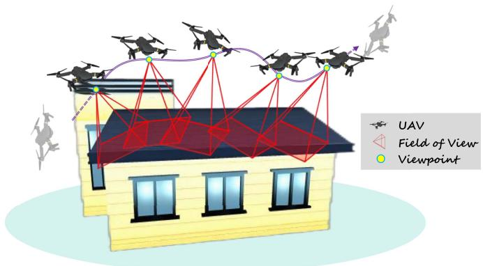  
Fig. 1. An overview of UAV 3-D object visual coverage scenarios.

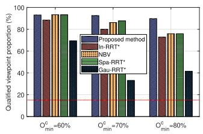

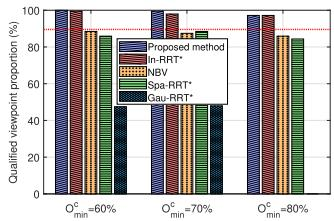  
(b) Hoa Hakananai'a

(a) Big Ben  
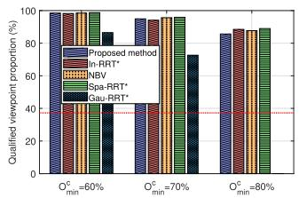  
(c) Christ

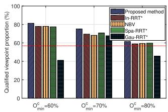  
(d) House  
Fig. 2. The proportion of qualified viewpoints corresponding to four 3-D objects (The red dashed line as a baseline reflects the proportion results calculated by the Gm-based method).

First, two metrics are introduced to evaluate the overlap compliance of viewpoint sets, i.e., the proportion of qualified viewpoints and the variance of triangular facet observation count, defined as $N _ { q u } / N _ { t o }$ and $\widetilde { V a r } ( \mathcal { N } _ { o b } )$ , respectively, where $N _ { q u }$ and $N _ { t o }$ denote the number of viewpoints in the set that satisfy the overlap rate constraint $O _ { \mathrm { m i n } } ^ { c }$ with the previous viewpoint and the total number of viewpoints, respectively. $\widetilde { V a r } ( \cdot )$ represents the variance operator, and $\mathcal { N } _ { o b }$ denotes the sequence representing the observation count for each triangular facet of the 3-D object. The proportion of qualified viewpoints directly reflects the capability of the viewpoint generation method to explore feasible solutions. As shown in Fig. 2, the proposed informed RRT∗-SA generally ensures that the generated viewpoint sets satisfy the overlap constraints better than the benchmarks, especially for small-scale object like Hoa Hakananai’a under $O _ { \mathrm { m i n } } ^ { c } = 6 0 \%$ where all viewpoints meet the constraints (note that the initial viewpoint is assumed to always satisfy the constraints). In contrast, Gau-RRT∗ fails to generate qualified viewpoints for Hoa Hakananai’a and Christ coverage cases under $O _ { \mathrm { m i n } } ^ { c } = 8 0 \%$ see Fig. 2(a) and (b). Furthermore, as expected, regarding the same 3-D object, the proportion of qualified viewpoints typically decreases with increasing $O _ { \mathrm { m i n } } ^ { c }$ , as the reduced feasible space makes viewpoint generation more challenging. Notably, since the Gm-based method focuses only on the number of viewpoints without considering $O _ { \mathrm { m i n } } ^ { c }$ , the compliance proportion of its generated viewpoint sets is relatively random, ranging from below 20% to over 80% (i.e., the red dashed line), indicating poor adaptability.

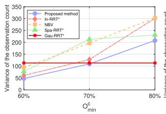

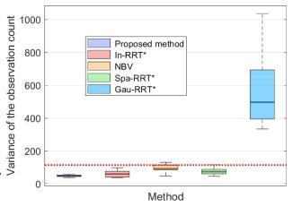  
(a) Big Ben

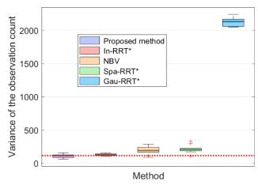

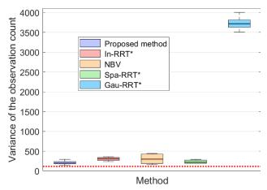

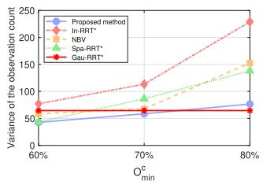

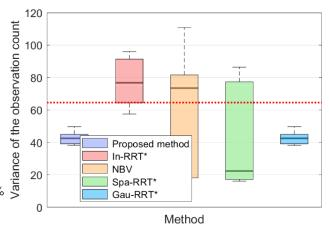

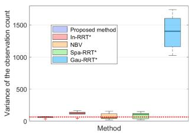

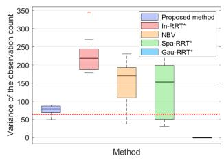  
(b) Hoa Hakananai'a

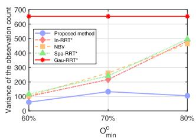

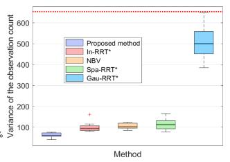

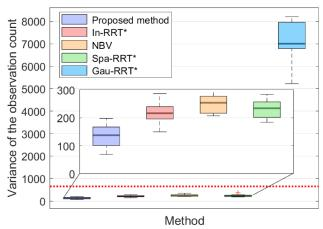  
(c) Christ

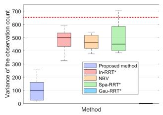

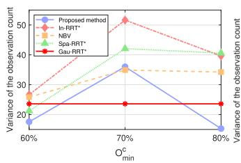

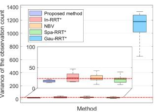  
(d) House

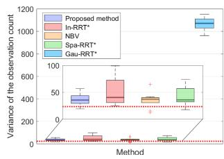

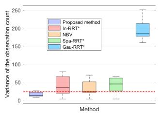  
Fig. 3. The variance of triangular facet observation count corresponding to four 3-D objects (each subplot includes four figures, representing the variance results for the overall case and the three individual cases of $O _ { \mathrm { m i n } } ^ { c } = 6 0 \%$ , 70% , and 80% , respectively, from left to right. The red dashed line as a baseline reflects the variation results calculated by the Gm-based method).

To ensure that the compliance proportion results obtained above are valid and not inflated by frequent coverage of certain regions, the variance of the triangular facet observation count is further used to evaluate the uniformity of the coverage process. Fig. 3 (including line and box plots) demonstrates that the viewpoint sets generated by the proposed method achieve more uniform coverage of 3-D objects, and the differences with benchmarks become more significant as $O _ { \mathrm { m i n } } ^ { c }$ increases. The line plots indicate that the Gm-based method demonstrates comparable uniform coverage capability to most ”generative” methods, except in Hoa Hakananai’a coverage cases, which is understandable as the Gm-based method merges adjacent viewpoints, thereby reducing redundant coverage. Additionally, it is worth noting that the significantly larger variance of Gau-RRT∗ (see the box plots) affects the visualization comparisons among other methods, thus it is not reflected in the line plots.

Second, adhering to the ”small but efficient” principle [40], the quality of the viewpoint sets is measured by the number of viewpoints and the number of triangular facets covered by each viewpoint. As shown by the lines in Fig. 4, the proposed method generates viewpoint sets with the smallest size, particularly for larger coverage objects like Big Ben and Christ, the optimization performance of the viewpoint amount is more significant. Interestingly, in most cases, informed RRT∗-SA even outperforms the Gm-based method, which explicitly aims to minimize the number of viewpoints. Moreover, regarding the same 3-D object, the number of viewpoints required for coverage increases with larger $O _ { \mathrm { m i n } } ^ { c } ,$ as stricter overlap constraints necessitate more auxiliary viewpoints for coverage in ”generative” methods.

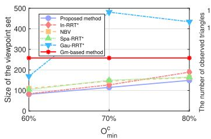

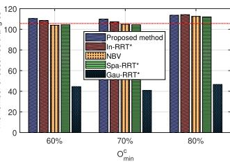  
(a) Big Ben

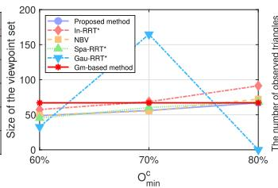

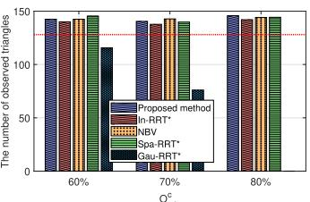  
(b) Hoa Hakananai'a

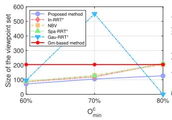

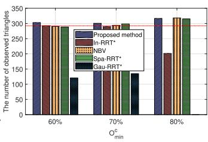  
(c) Christ

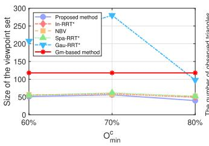

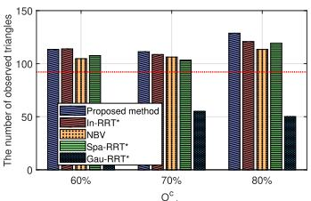  
(d) House  
Fig. 4. The quality of viewpoints corresponding to four 3-D objects (the line and bar charts in each subfigure depict the size of the viewpoint set and the number of triangular facets that can be observed at each viewpoint, respectively).

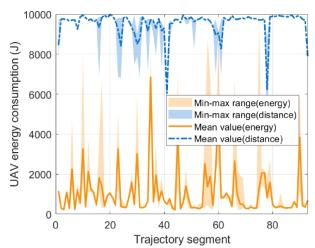  
(a) Big Ben

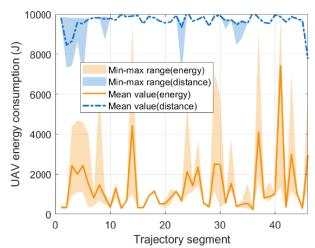  
(b) Hoa Hakananai'a

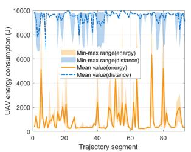  
(c) Christ

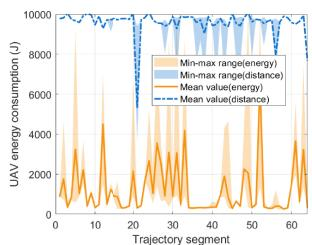  
(d) House

Fig. 5. The energy consumption required by the UAV to cover four 3-D objects under energy and distance optimization objectives.  
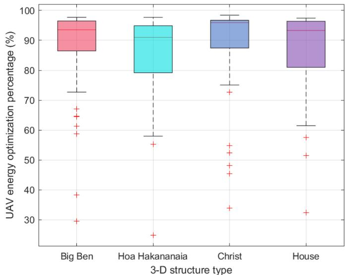  
Fig. 6. The energy optimization percentage corresponding to four 3-D objects.

The bar plots in Fig. 4 indicate that with increasing $O _ { \operatorname* { m i n } } ^ { c } ,$ each generated viewpoint tends to cover more triangular facets. As expected, compared to the benchmarks, the proposed method shows certain advantages, albeit not significant, which still supports the high compliance proportion discussed above. Similarly, the coverage performance of the Gm-based method shows little difference compared to other methods and, in some cases, even surpasses certain ”generative” methods, such as In-RRT∗ and NBV.

## C. Performance Evaluation of the UAV Path Optimization for Energy Minimization

To evaluate the effectiveness of UAV flight energy consumption optimization, a comparative analysis was conducted between coverage tasks optimized for flight distance and those optimized for energy consumption. The analysis focused on the energy consumption differences and the associated motion performance, including UAV flight time, speed, and acceleration. Concretely, to facilitate a comprehensive analysis, a series of optimization cases are designed to minimize UAV

Distance-based UAV motion optimization results

Distance-based UAV motion optimization results  
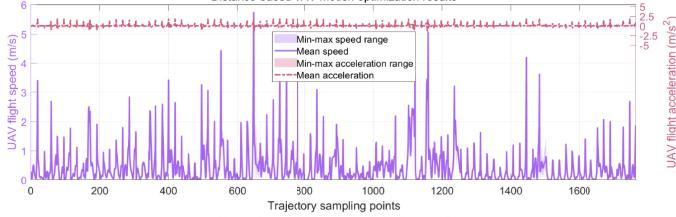

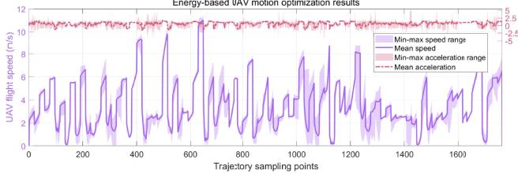  
(a) Big Ben

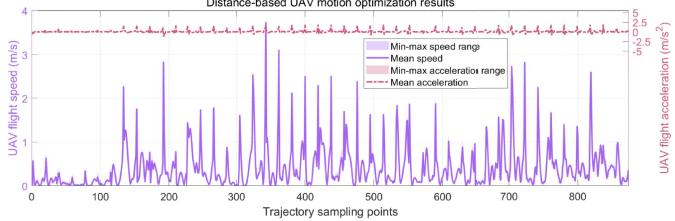

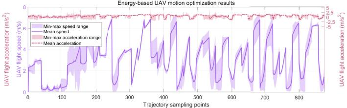  
(b) Hoa Hakananai'a

Distance-basedUAV motion optimization results  
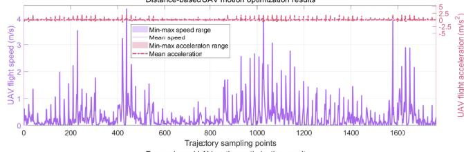

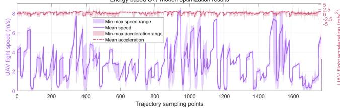  
(c) Christ

Distance-based UAV motion optimization results  
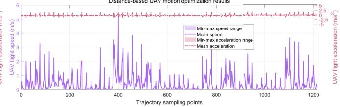

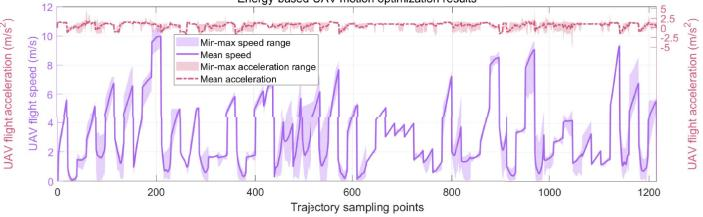  
(d) House  
Fig. 7. The speeds and accelerations for the UAV to cover four 3-D objects under energy and distance optimization objectives.

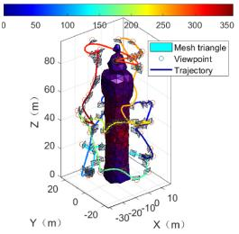  
(a) Big Ben

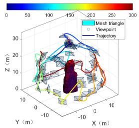  
(b) Hoa Hakananai'a

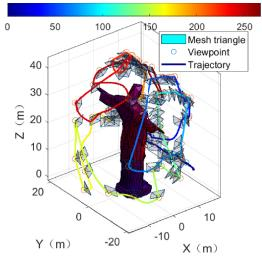  
(c) Christ

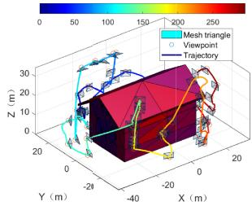  
(d) House  
Fig. 8. The trajectories for the UAV to cover four 3-D objects under energy and distance optimization objectives.

energy consumption and flight distance. These cases utilized four viewpoint sets obtained in the previous stage for covering four 3-D objects (all randomly selected and corresponding to $O _ { \mathrm { m i n } } ^ { c } = 6 0 \% )$ . Regarding each viewpoint set, two optimization cases are formulated: one minimizing energy consumption and the other minimizing flight distance, with consistent constraints applied. To ensure robustness, each optimization case was solved ten times, and the mean results are used as the primary evaluation metric (shown as the lines in the figures below), with the range of results as a reference (shown as the shaded areas in the figures below), as follows.

First, the energy consumption required by the UAV to complete coverage tasks under energy and distance optimization objectives is illustrated, as shown in Fig. 5. As expected, compared to tasks optimized for minimal distance, energy optimization significantly reduces the energy consumption required for UAV coverage. However, it can be observed from the fluctuation range of optimized energy consumption (i.e., shaded areas) that the complex relationships between UAV energy consumption, kinematics constraints, and motion parameters lead to multiple optimizations with varying results. Notably, energy optimization results in more frequent and larger fluctuations in UAV energy consumption during coverage. This is understandable, as frequent adjustments to the UAV’s motion parameters, such as speed and acceleration (see Fig. 7), are necessary to continuously reduce energy consumption while satisfying kinematics constraints, thereby causing significant changes in energy use.

TABLE III  
ENERGY AND TIME OF THREE OPTIMIZATION CASES
<table><tr><td rowspan=3 colspan=1>3-D object type</td><td rowspan=1 colspan=6>Optimization results</td></tr><tr><td rowspan=1 colspan=2>Energy consumption (kJ)</td><td rowspan=1 colspan=1></td><td rowspan=1 colspan=3>Flight time (s)</td></tr><tr><td rowspan=1 colspan=1>Energy-based</td><td rowspan=1 colspan=1>Energy-Line-based</td><td rowspan=1 colspan=1>Distance-based</td><td rowspan=1 colspan=1>Energy-based</td><td rowspan=1 colspan=1>Energy-Line-based</td><td rowspan=1 colspan=1>Distance-based</td></tr><tr><td rowspan=1 colspan=1>Big Ben</td><td rowspan=1 colspan=1>98.19</td><td rowspan=1 colspan=1>383.65</td><td rowspan=1 colspan=1>887.45</td><td rowspan=1 colspan=1>313.55</td><td rowspan=1 colspan=1>456.67</td><td rowspan=1 colspan=1>1060.38</td></tr><tr><td rowspan=1 colspan=1>Hoa Hakananai&#x27;a</td><td rowspan=1 colspan=1>63.13</td><td rowspan=1 colspan=1>246.53</td><td rowspan=1 colspan=1>444.13</td><td rowspan=1 colspan=1>198.36</td><td rowspan=1 colspan=1>267.01</td><td rowspan=1 colspan=1>685.77</td></tr><tr><td rowspan=1 colspan=1>Christ</td><td rowspan=1 colspan=1>89.69</td><td rowspan=1 colspan=1>138.31</td><td rowspan=1 colspan=1>882.72</td><td rowspan=1 colspan=1>284.98</td><td rowspan=1 colspan=1>420.96</td><td rowspan=1 colspan=1>1237.14</td></tr><tr><td rowspan=1 colspan=1>House</td><td rowspan=1 colspan=1>79.65</td><td rowspan=1 colspan=1>594.82</td><td rowspan=1 colspan=1>613.21</td><td rowspan=1 colspan=1>256.38</td><td rowspan=1 colspan=1>457.11</td><td rowspan=1 colspan=1>1494.57</td></tr></table>

Then, to more intuitively reflect the energy consumption differences between the two optimization objectives, the energy optimization percentage (EOP), defined as $\frac { | E _ { e } - E _ { d } | } { E \cdot } \times 1 0 0 \%$ was introduced as an evaluation metric, where $\dot { E _ { e } ^ { d } } ( E _ { d } )$ represents the average energy consumption per trajectory segment in tasks optimized for energy (distance). The boxplot (i.e., Fig. 6) illustrates the EOP for UAV coverage of the four 3-D objects. It can be observed that in almost all cases, the EOP exceeds 50% , further emphasizing the importance of energy optimization in UAV coverage tasks for 3-D objects.

Next, the variations in UAV motion parameters are analyzed to explore the reasons behind the significant differences in energy performance. As shown in Fig. 7, energy-optimized tasks use higher speeds and accelerations, often more than twice those in distance-optimized tasks, yet consume less energy. This agrees with [25], which indicates that energy does not increase monotonically with speed and that an optimal speed exists to minimize energy; finding this speed is central to energy-optimized tasks. Higher speeds also shorten task time (as shown in Table III). In contrast, speed and acceleration are more stable in distanceoptimized tasks. The greater variability under energy optimization arises from the complex nonlinear coupling between energy and motion, which requires frequent changes in motion state. In addition, with line trajectory constraints, performance is lower than with unconstrained energy optimization but still better than distance-based optimization.

Finally, a comprehensive evaluation of the total energy consumption and time required for UAVs to complete coverage tasks for the four 3-D objects under the two optimization objectives is presented in Table III. As expected, energy-optimized coverage tasks not only save energy but also reduce time costs, with significant advantages; similar results are also reported in [18]. Furthermore, Fig. 8 visually illustrates the UAV flight trajectories and flight time changes during coverage tasks (based on a randomly selected execution result from one of the optimization cases), the color variations in the 3-D structure reflect coverage effectiveness, where darker shades for individual meshes indicate higher observation frequencies.

## VII. CONCLUSION

This paper addressed the challenge of optimizing energy and viewpoints required for UAV-based 3-D object visual coverage under both overlapping FOV and kinematics constraints by formulating and solving an optimization problem, which is decomposed into two manageable subproblems: high-quality viewpoint set generation with effective overlapping FOV constraints, and energy-efficient UAV path planning considering kinematics constraints. To solve the two subproblems, a hierarchical viewpoint optimization framework and a SQP based energy-efficient path generation algorithm are proposed. Extensive simulations demonstrated that the proposals outperform benchmarks in both viewpoint set quality and energy optimization performance. To address the challenge of viewpoint generation for internally occluded objects, future research proposes to analyze their internal skeletons via point cloud processing. Based on this analysis, fine-grained viewpoint sampling will be performed to precisely construct an initial viewpoint set.

## REFERENCES

[1] C. Yang et al., “BladeView: Toward automatic wind turbine inspection with unmanned aerial vehicle,” IEEE Trans. Autom. Sci. Eng., vol. 22, pp. 7530–7545, 2025.

[2] Y. Liu, J. Dong, Y. Li, X. Gong, and J. Wang, “A UAV-based aircraft surface defect inspection system via external constraints and deep learning,” IEEE Trans. Instrum. Meas., vol. 71, 2022, Art. no. 5019315.

[3] X. Li, B. Huang, B. Jia, Y. Gao, and J. Qiao, “MAS-DSO: Advancing direct sparse odometry with multi-attention saliency,” IEEE Trans. Intell. Transp. Syst., vol. 25, no. 11, pp. 17468–17481, Nov. 2024.

[4] J. Zhu, C. Fan, S. Li, K. Nie, J. Li, and Z. He, “SEDNet: Substation equipment detection network with an attention mechanism for UAV automatic power inspection,” IEEE Trans. Instrum. Meas., vol. 74, 2025, Art. no. 5036114.

[5] Z. Chen et al., “UITDE: A UAV-assisted intelligent true data evaluation method for ubiquitous IoT systems in intelligent transportation of smart city,” IEEE Trans. Intell. Transp. Syst., vol. 25, no. 8, pp. 9597–9607, Aug. 2024.

[6] X. Li, B. Huang, B. Jia, L. Hao, H. Gong, and Z. Shi, “MF2-SLAM: A geometrically constrained framework for robust slam via multi-scale feature fusion,” Def. Technol.

[7] W. Wang, X. Li, L. Xie, H. Lv, and Z. Lv, “Unmanned aircraft system airspace structure and safety measures based on spatial digital twins,” IEEE Trans. Intell. Transp. Syst., vol. 23, no. 3, pp. 2809–2818, Mar. 2022.

[8] Z. Wang et al., “Efficient autonomous UAV exploration framework with limited FOV sensors for IoT applications,” IEEE Internet Things J., vol. 12, no. 1, pp. 713–725, Jan. 2025.

[9] C. Feng, H. Li, M. Zhang, X. Chen, B. Zhou, and S. Shen, “FC-planner: A skeleton-guided planning framework for fast aerial coverage of complex 3D scenes,” in Proc. IEEE Int. Conf. Robot. Autom., 2024, pp. 8686–8692.

[10] Y.-C. Ko and R.-H. Gau, “UAV velocity function design and trajectory planning for heterogeneous visual coverage of terrestrial regions,” IEEE Trans. Mobile Comput., vol. 22, no. 10, pp. 6205–6222, Oct. 2023.

[11] B. Lindqvist, A. Patel, K. Löfgren, and G. Nikolakopoulos, “A treebased next-best-trajectory method for 3-D UAV exploration,” IEEE Trans. Robot., vol. 40, pp. 3496–3513, 2024.

[12] H. Wang, S. Zhang, X. Zhang, X. Zhang, and J. Liu, “Near-optimal 3-D visual coverage for quadrotor unmanned aerial vehicles under photogrammetric constraints,” IEEE Trans. Ind. Electron., vol. 69, no. 2, pp. 1694–1704, Feb. 2022.

[13] J. Zhou, D. Tian, Y. Yan, X. Duan, and X. Shen, “Joint optimization of mobility and reliability-guaranteed air-to-ground communication for UAVs,” IEEE Trans. Mobile Comput., vol. 23, no. 1, pp. 566–580, Jan. 2024.

[14] S. Papaioannou, P. Kolios, T. Theocharides, C. G. Panayiotou, and M. M. Polycarpou, “Jointly-optimized trajectory generation and camera control for 3D coverage planning,” IEEE Trans. Mobile Comput., vol. 24, no. 8, pp. 7519–7537, Aug. 2025.

[15] H. Liu, Y. P. Tsang, C. K. M. Lee, and C. H. Wu, “UAV trajectory planning via viewpoint resampling for autonomous remote inspection of industrial facilities,” IEEE Trans. Ind. Informat., vol. 20, no. 5, pp. 7492–7501, May 2024.

[16] Y. Li, J. Wang, H. Chen, X. Jiang, and Y. Liu, “Object-aware view planning for autonomous 3-D model reconstruction of buildings using a mobile robot,” IEEE Trans. Instrum. Meas., vol. 72, 2023, Art. no. 5015615.

[17] W. Liu, B. Li, W. Xie, Y. Dai, and Z. Fei, “Energy efficient computation offloading in aerial edge networks with multi-agent cooperation,” IEEE Trans. Wireless Commun., vol. 22, no. 9, pp. 5725–5739, Sep. 2023.

[18] H. Gong, B. Huang, and B. Jia, “Energy-efficient 3-D UAV ground node accessing using the minimum number of UAVs,” IEEE Trans. Mobile Comput., vol. 22, no. 9, pp. 5725–5739, Sep. 2024.

[19] Y. Chen, S. Sun, M. Liu, B. Ai, Y. Wang, and Y. Liu, “Energy-efficient over-the-air computation in UAV-assisted IIoT networks,” IEEE Trans. Mobile Comput., vol. 24, no. 9, pp. 8549–8563, Sep. 2025.

[20] C. H. Liu, C. Piao, and J. Tang, “Energy-efficient UAV crowdsensing with multiple charging stations by deep learning,” in Proc. IEEE Conf. Comput. Commun., 2020, pp. 199–208.

[21] Y. Zheng, G. Liu, Y. Ding, and G. Tian, “A new clustering-based view planning method for building inspection with drone,” IEEE Robot. Autom. Lett., vol. 9, no. 11, pp. 9781–9788, Nov. 2024.

[22] S. M. LaValle, “Rapidly-exploring random trees : A new tool for path planning,” Annu. Res. Rep., 1998. [Online]. Available: https://api. semanticscholar.org/CorpusID:14744621

[23] A. Batinovic, A. Ivanovic, T. Petrovic, and S. Bogdan, “A shadowcastingbased next-best-view planner for autonomous 3D exploration,” IEEE Robot. Autom. Lett., vol. 7, no. 2, pp. 2969–2976, Apr. 2022.

[24] J. Lin et al., “IMMesh: An immediate LiDAR localization and meshing framework,” IEEE Trans. Robot., vol. 39, no. 6, pp. 4312–4331, Dec. 2023.

[25] H. Gong, B. Huang, B. Jia, and H. Dai, “Modeling power consumptions for multirotor UAVs,” IEEE Trans. Aerosp. Electron. Syst., vol. 59, no. 6, pp. 7409–7422, Dec. 2023.

[26] H. Gong, B. Huang, B. Jia, L. Hao, and Z. Shi, “Jointly optimizing the energy and time for multi-UAV 3-D coverage of terrestrial regions,” IEEE Trans. Mobile Comput., vol. 24, no. 10, pp. 10312–10329, Oct. 2025.

[27] J. Chen, C. Du, Y. Zhang, P. Han, and W. Wei, “A clustering-based coverage path planning method for autonomous heterogeneous UAVs,” IEEE Trans. Intell. Transp. Syst., vol. 23, no. 12, pp. 25546–25556, Dec. 2022.

[28] C. Chen and S. Zhang, “GPS-free automated registration of UAV-captured façade image sequences to bim models using semantic key points,” SSRN., 2025. [Online]. Available: https://ssrn.com/abstract=5254629 or http://dx. doi.org/10.2139/ssrn.5254629.

[29] S. Yang, X. Chen, Y. Xiu, W. Lyu, Z. Zhang, and C. Yuen, “Performance bounds for near-field localization with widely-spaced multi-subarray mmwave/THz MIMO,” IEEE Trans. Wireless Commun., vol. 23, no. 9, pp. 10757–10772, Sep. 2024.

[30] J. Choi, H. Chin, H. Park, D. Kwon, D. Baek, and S.-H. Lee, “Safe and efficient trajectory optimization for autonomous vehicles using B-spline with incremental path flattening,” IEEE Trans. Intell. Transp. Syst., vol. 26, no. 2, pp. 1797–1811, Feb. 2025.

[31] S. Gao, Y. Xu, Z. Zhang, Z. Wang, X. Zhou, and J. Wang, “Multiagent imitation learning-based energy management of a microgrid with hybrid energy storage and real-time pricing,” IEEE Internet Things J., vol. 12, no. 12, pp. 19801–19817, Jun. 2025.

[32] K. Krishna and M. Narasimha Murty, “Genetic K-means algorithm,” IEEE Trans. Syst., Man, Cybern., Part B (Cybern.), vol. 29, no. 3, pp. 433–439, Jun. 1999.

[33] J. Ji, T. Yang, C. Xu, and F. Gao, “Real-time trajectory planning for aerial perching,” in Proc. IEEE/RSJ Int. Conf. Intell. Robots Syst., 2022, pp. 10516–10522.

[34] B. Tang et al., “Bubble explorer: Fast UAV exploration in large-scale and cluttered 3D-environments using occlusion-free spheres,” in Proc. IEEE/RSJ Int. Conf. Intell. Robots Syst., 2023, pp. 1118–1125.

[35] G. Leifman, E. Shtrom, and A. Tal, “Surface regions of interest for viewpoint selection,” IEEE Trans. Pattern Anal. Mach. Intell., vol. 38, no. 12, pp. 2544–2556, Dec. 2016.

[36] J. D. Gammell, T. D. Barfoot, and S.S. Srinivasa, “Informed sampling for asymptotically optimal path planning,” IEEE Trans. Robot., vol. 34, no. 4, pp. 966–984, Aug. 2018.

[37] Y. Liu, L. Zhang, X. Liu, and Q. Fan, “Safety-enhanced navigation planning for magnetic microrobots,” IEEE Trans. Autom. Sci. Eng., vol. 22, pp. 10586–10595, 2025.

[38] S. Ao, Y. Niu, Z. Han, L. Xiong, N. Wang, and B. Ai, “Joint optimization air base stations deployment and user association in heterogeneous spaceair-ground integrated networks,” IEEE Trans. Veh. Technol., vol. 74, no. 8, pp. 12576–12589, Aug. 2025.

[39] B. Urtasun, I. Andonegui, and E. Gorostegui-Colinas, “Sparse samplingbased view planning for complex geometries,” IEEE Sensors J., vol. 24, no. 9, pp. 14992–15003, May 2024.

[40] Z. Fan, K. Wang, K. Wen, Z. Zhu, D. Xu, and Z. Wang, “LightGaussian: Unbounded 3D Gaussian compression with 15× reduction and 200 FPS,” in Proc. Adv. Neural Inf. Process. Syst., A. Globerson et al., Eds. Red Hook, NY, USA: Curran Associates, Inc., 2024, pp. 140138–140158. [Online]. Available: https://proceedings.neurips.cc/paper\_files/paper/2024/ file/fd881d3b625437354d4421818f81058f-Paper-Conference.pdf

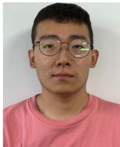  
Hao Gong received the BE degree in computer science from the Beijing University of Chemical Technology, Beijing, China, in 2019. He is currently working toward the PhD degree in computer science from Inner Mongolia University, Hohhot, China. His research interests include UAV energy modeling and UAV path planning.


Baoqi Huang (Senior Member, IEEE) received the BE degree in computer science from Inner Mongolia University (IMU), Hohhot, China, the MS degree in computer science from Peking University, Beijing, China, and the PhD degree in information engineering from the Australian National University, Canberra, ACT, Australia, in 2002, 2005, and 2012, respectively. He is currently with the College of Computer Science, IMU, where he is a professor. His research interests include indoor localization and navigation, wireless sensor networks, and mobile computing. He was the recipient of the Chinese Government Award for Outstanding Chinese Students Abroad in 2011.


Bing Jia (Member, IEEE) received the PhD degree from Jilin University, Changchun, China, in 2013. She is currently with the College of Computer Science, Inner Mongolia University, Hohhot, China, where she is a professor. Her research interests include indoor localization, crowdsourcing, wireless sensor networks, and mobile computing.