# Active-Passive Cascaded RIS-Aided Receiver Design for Jamming Nulling and Signal Enhancing

Yifu Sun , Yonggang Zhu , Kang An , Zhi Lin , Cheng Li, Derrick Wing Kwan Ng , Fellow, IEEE, and Jiangzhou Wang , Fellow, IEEE

Abstract— The utilization of a large-scale antenna array has led to substantial performance improvements in anti-jamming communications. However, due to the practical constraints of hardware cost and power consumption, deploying such a large-scale antenna array at the user side is impractical. Inspired by the remarkable advantages of reconfigurable intelligent surfaces (RIS), we propose an active-passive cascaded RIS-aided receiver architecture that facilitates the cost- and energy-efficient deployment of a large-scale antenna array at the user side, while also providing additional degrees-of-freedom for effective beamforming design. Building upon this architectural framework and taking into account the practical imperfections in the angular channel state information (CSI), we formulate a worst-case achievable rate maximization problem for antijamming communications. To address the challenges posed by the intractable non-convex design problem, we present a low-complexity optimization framework that obtains semi-closedform solutions. Specifically, we first develop a Pareto-dual scheme

Manuscript received 29 November 2022; revised 18 July 2023; accepted 16 October 2023. Date of publication 25 October 2023; date of current version 12 June 2024. This work was supported in part by the National Natural Science Foundation of China (NSFC) under Grant 61901502, Grant 62201592, and Grant 62131005; in part by the Research Plan Project of the National University of Defense Technology (NUDT) under Grant ZK21-33; in part by the Young Elite Scientist Sponsorship Program of China Association for Science and Technology (CAST) under Grant 2021-JCJQ-QT-048; in part by the Macau Young Scholars Program under Grant AM2022011; in part by the National Post-Doctoral Program for Innovative Talents under Grant BX20200101; and in part by the Graduate Innovation Program of Hunan Province under Grant CX20220008. The work of Derrick Wing Kwan Ng was supported by the Australian Research Council’s Discovery Projects under Grant DP210102169 and Grant DP230100603. An earlier version of this paper was presented in part at the IEEE International Conference on Communications (ICC), Rome, Italy, in 2023 [1]. The associate editor coordinating the review of this article and approving it for publication was Z. Zhang. (Corresponding authors: Kang An; Yonggang Zhu.)

Yifu Sun is with the Sixty-Third Research Institute, National University of Defense Technology, Nanjing 210007, China, and also with the College of Electronic Science and Technology, National University of Defense Technology, Changsha 410005, China (e-mail: sunyifu.nudt@nudt.edu.cn).

Yonggang Zhu, Kang An, and Cheng Li are with the Sixty-Third Research Institute, National University of Defense Technology, Nanjing 210007, China (e-mail: zhumaka1982@163.com; ankang89@nudt.edu.cn; licheng@ nudt.edu.cn).

Zhi Lin is with the College of Electronic Engineering, National University of Defense Technology, Hefei 230037, China, and also with the School of Computer Science and Engineering, Macau University of Science and Technology, Macau, China (e-mail: linzhi945@163.com).

Derrick Wing Kwan Ng is with the School of Electrical Engineering and Telecommunications, The University of New South Wales, Sydney, NSW 2025, Australia (e-mail: w.k.ng@unsw.edu.au).

Jiangzhou Wang is with the School of Engineering, University of Kent, CT2 7NZ Canterbury, U.K. (e-mail: j.z.wang@kent.ac.uk).

This article has supplementary material provided by the authors and color versions of one or more figures available at https://doi.org/10.1109/TWC.2023.3325813.

Digital Object Identifier 10.1109/TWC.2023.3325813

to handle the general power constraints in devising the optimal precoder for the base station. Subsequently, by introducing a novel anti-jamming criterion and employing the discretization method to transform the imperfect CSI of jammers into a robust form, we derive two jamming-nulling feasibility conditions and a unified unit-modulus zero-forcing scheme to determine the coefficients of the passive RIS. To strike a satisfactory balance between complexity and performance, we further design three computationally-efficient algorithms based on alternating majorization-minimization (AMM) and conventional/modified cyclic coordinate descent (C/M-CCD) methods to obtain the coefficients of the active RIS. Finally, through comprehensive numerical simulations, we validate the effectiveness of the proposed architecture and optimization framework, demonstrating their capacity to achieve exceptional performance in a costeffective manner.

Index Terms— Reconfigurable intelligent surface, antijamming communications, cascaded receiver architecture, low-complexity robust beamforming design.

# I. INTRODUCTION

MALICIOUS jamming attacks have posed a severe threatto wireless communications due to the broadcast and [ALICIOUS jamming attacks have posed a severe threat superposition characteristics of wireless systems [2], [3]. To cope with this issue, various conventional techniques have been developed, e.g., frequency hopping (FH) [4] and direction-sequence spread spectrum (DSSS) [5]. Nevertheless, these techniques consume extra spectral resources and may become ineffective when the jammers attack multiple frequencies [6], [7], [8]. With this focus, benefiting from the ascendancy that massive multiple-input multiple-output (MIMO) techniques can simultaneously increase the system capacity and mitigate jamming by employing a large-scale antenna array at wireless receivers, numerous MIMO-assisted anti-jamming schemes have been proposed to suppress jamming in the spatial domain, e.g., [9], [10], and [11]. It has been verified that massive MIMO-aided anti-jamming systems can achieve orders of magnitude increase in the system capacity by leveraging the additional degrees-of-freedom (DoFs) to enhance the desired signal strength and nullify the potential jamming signal. However, from the scalability and realizability perspective, employing a large-scale array equipping hundreds of antennas at a receiver is generally impractical. Hence, a cost-effective receiver architecture for anti-jamming communications is urgently needed.

Fortunately, the emerging innovative paradigm of reconfigurable intelligent surface (RIS) can be adopted to facilitate the employment of large-scale arrays [12], [13]. To elaborate, RIS is a large-scale array constituted by massive low-cost meta-material units, which can constructively increase the desired signal power or destructively eliminate the interference by altering the phase and/or amplitude of the incident electromagnetic waves [14]. Different from the energy-hungry RF counterparts in a typical MIMO array, RIS units are composed of low-cost tunnel diodes and/or active loads, which can serve as both the phase-shift network and receive (Rx) antennas in an energy-efficient manner [15]. Thus, RIS serves as a potential candidate to establish large-scale arrays at the receiver. In the literature, existing RIS-aided architectures can be roughly divided into two broad categories. The first category applies RIS as a relay-like reflector to reconfigure the radio propagation environment. Moreover, depending on whether the amplitude of each RIS unit can be controlled, the RIS-based reflector can be further divided into a passive and active one. As for the passive RIS-based reflector whose only the phases can be adapted, it can provide additional reconfigurable propagation paths and thus has been widely adopted for increasing the service coverage [14], [16], [17], maximizing the achievable rate [18], [19], improving the physical layer security [7], [20], [21], [22], and mitigating the interference/jamming [6], [8], [23], [24]. Nevertheless, due to the potential large-scale fading attenuation in the transmitter-RIS link, the signal strength would be extremely faint at the users such that directly exploiting the passive RIS-based reflector architecture at the user may be ineffective. To address this issue, the active RIS-assisted reflector has been proposed [25], [26], [27], where each RIS unit was connected with a power amplifier that can control both the phase and amplitude of the reflected signals simultaneously. Although the active RIS-assisted reflector architecture can significantly amplify the desired signals, directly deploying an active RIS at the user in the presence of strong jamming attacks would also introduce powerful dynamic noise. Besides, it consumes exceedingly large power at users that results in a limited performance gain compared to the ones without RIS.

The second category employs RIS as the power-efficient transmitter for manipulating the radiated electromagnetic waves. Depending on the number of RIS’s layers, RIS-aided transmitter architecture can be further categorized into the single-layer and multi-layer ones. Note that since active RIS would introduce dynamic noises inevitably, the typical RIS-aided transmitters usually utilize passive RIS. Although it has been verified that a single-layer RIS-aided transmitter architecture can improve the system performance efficiently [15], [28], [29], employing the single-layer architecture at the recevier would still suffer from the severe path loss attenuation. Besides, the power penetrating RIS generally scatters outside the Rx antennas’s area, as will be specified in Section V, which leads to significant performance degradation. To overcome the above shortcomings, the multi-layer architecture was proposed in [30] and [31], where the amplitude of incident signals can be partially controlled in a confined range. However, applying multi-layer RIS at the receiver leads to bulky hardware cost, and the amplitude of its units cannot be independently adapted in a wide range. Thus, the spatial DoFs cannot be fully exploited such that the pass loss attenuation and power scattering effects can only be partially overcome. From the above observations, there are no existing works have investigated the design of RIS-assisted receiver. More importantly, as stated before, the existing RIS-assisted architectures cannot be directly applicable to receiver, which motivates the contributions presented in our work.

On the other hand, jamming nullification and desired signal enhancement problems have been studied in the past, e.g., [7], [8], [9], [11], [15], [23], [24], [30]. However, due to the additional unit-modulus constraints and the dynamic noise term induced by the active RIS, the corresponding problem with the proposed RIS-aided receiver is non-convex and NP-hard. Indeed, existing MIMO anti-jamming schemes (e.g., [9] and [11]) are not applicable to this emerging design problem. Besides, there are few RIS-related works investigating the abovementioned problem. For example, two existing RIS-related works, i.e., [23] and [24], have proposed the alternating projection and Kronecker decomposition algorithm, respectively, to solve the similar interference eliminating problem. However, the alternating projection algorithm in [23] can only address the jamming nulling problem, while the Kronecker decomposition algorithm in [24] is only be applicable to the geometry-based channels. More importantly, applying their designs to the anti-jamming problem may lead to non-robust performance since they have not taken the imperfect channel state information (CSI) into account. Meanwhile, although several existing works, e.g., [7], [8], [15], and [30] have proposed various robust algorithms specializing on the polyblock approximation, successive convex approximation (SCA), and semidefinite relaxation (SDR) to handle the anti-jamming problem under various CSI uncertainty models, these algorithms lift the dimensionality of optimization variables, resulting in increased computational complexity, especially at the receiver side. Specifically, the existing robust algorithms first introduce numerous auxiliary variables to relax the non-convex problem into its convex counterpart such that an off-the-shelf optimization toolbox such as CVX can be applied to obtain a suboptimal solution. However, one of the limitations in the existing methods is that the optimization toolbox has extremely high computational complexity. Besides, since the computation process of the optimization toolbox is not transparent, it is challenging to perform them in real-time FPGA hardware for practical implementation. Thus, the scalability of these algorithms remains a bottleneck in the implementation of large-scale RIS-assisted systems that calls for the design of scalable and efficient algorithms for achieving better performance than the existing ones.

Motivated by the aboves, this paper proposes a novel active-passive cascaded RIS-aided receiver architecture to circumvent the curse of dimensionality inherent in deploying a large-scale array at the user. Building upon this architecture, a low-complexity optimization framework is established to design an efficient anti-jamming beamforming scheme. Specifically, the main contributions of this paper are summarized as follows:

• An active-passive cascaded RIS-aided receiver architecture is proposed to facilitate the employment of a large-scale array at the user side and overcome the dimensionality limit in the beamforming design, where a passive RIS having $N _ { \mathrm { P } }$ units are cascaded with an active RIS equipping $N _ { \mathrm { A } }$ units, and they are vertically stacked in front of the Rx antennas. To our best knowledge, this is the first work to exploit active-passive cascaded RIS at the user side for receiver design. Besides, a rigorous performance analysis of the proposed architecture is derived. The theoretical result shows that in contrast to existing active RIS whose receive power and asymptotic SINR are proportional to $\left( N _ { \mathrm { P } } + N _ { \mathrm { A } } \right) ^ { 2 }$ and $N _ { \mathrm { P } } { + } N _ { \mathrm { A } }$ , those of proposed architecture are proportional to $N _ { \mathrm { A } } ^ { 2 } N _ { \mathrm { P } } ^ { 2 }$ and $N _ { \mathrm { { A } } } N _ { \mathrm { { P } } } ,$ respectively, which indicates that the amplitude of the two RIS layers can be separately controlled in a larger range, thus providing additional DoFs for design.

• Utilizing the proposed receiver to combat the jamming attacks, a worst-case achievable rate maximization problem is formulated under the imperfect jammers’ angular CSI, while satisfying the general power constraints at the base station (BS) and the power budget constraint at the active RIS. Due to the non-convexity of the formulated problem, a low-complexity optimization framework is proposed to optimize the BS’s transmit precoder, the passive and active RISs’ coefficients, and the Rx digital decoder. For the design of the BS’s precoder, by exploiting the Lagrange dual and Pareto optimization theory, the general power constraints can be transformed into its tractable counterpart for obtaining the optimal semiclosed-form precoder at the BS.   
• For the optimization of the passive RIS’s coefficient, after transforming the jammers’ imperfect CSI into a robust one via the discretization method, we propose a new anti-jamming criterion where the jamming can always be nullified at the passive RIS. Based on this criterion, we further derive two feasibility conditions for successful jamming nulling and propose a unified unit-modulus zero-forcing scheme to obtain a semiclosed-form solution of the passive RIS’s coefficient with low computational complexity.   
• For the design of active RIS’s coefficient, three efficient algorithms, specializing on alternating majorizationminimization (AMM) and conventional/modified-cyclic coordinate descent (C/M-CCD) method, are proposed to obtain the semi-closed-form solutions of the phase shifts and amplitudes, which can achieve satisfactory tradeoff between the complexity and performance. Note that the above three algorithms can also be applicable to the optimization of passive RIS’s coefficient, which is viewed as another optimization framework such that further features our contributions. In addition, we prove that all the algorithms can converge to a limited KKT point. Numerical simulations shows that the proposed architecture and optimization framework can obtain superior performance with lower complexity in comparison with the existing fully-digital receiver and SDR method.

The remainder of this work is organized as follows. The system model and the problem formulation are presented in Section II. In Section III, the low-complexity optimization framework is proposed to address the formulated beamforming design problem. Performance analysis of the proposed architecture is shown in Section IV. Numerical results are provided in Section V. We conclude this paper in Section VI.

Notation: $\mathbf { X } ^ { H } , \mathbf { X } ^ { T } , \mathbf { X } ^ { * }$ , and $\| \mathbf { X } \| _ { F }$ denote conjugate transpose, transpose, conjugate, and Frobenius norm of a matrix X. The notations $\mathbb { E } \{ \cdot \} , \operatorname { t r } \{ \cdot \} , \ \Re \{ \cdot \} , \Im \{ \cdot \}$ and $\lambda \{ \cdot \}$ denote the expectation, trace, real part, imaginary part, and eigenvalue of

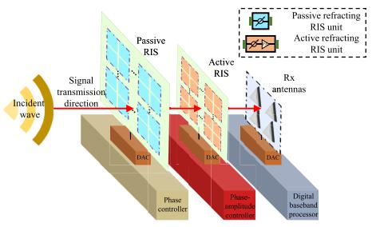

flowchart

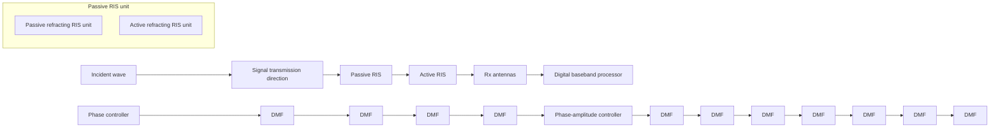

Fig. 1. Active-passive cascaded RIS-aided receiver.

a complex number or matrix, respectively. $\mathbb { C } ^ { m \times n }$ represents the complex space of $m \times n$ dimensions. The symbol $\mathbb { H } ^ { n \times n }$ is the Hermitian matrix of n × n dimensions. $[ \cdot ] _ { n , n }$ represents the nth diagonal element of a matrix. $\mathbf { X } \succeq 0 ^ { \cdot }$ means that the matrix X is positive semi-definite. The distribution of a circularly symmetric complex Gaussian (CSCG) random vector with mean vector x and covariance matrix Σ is denoted by $\mathcal { C N } ( x , \Sigma )$ ).

# II. SYSTEM MODEL AND PROBLEM FORMULATION

# A. Active-Passive Cascaded RIS-Aided Receiver Architecture

To illustrate the considered architecture, Fig. 1 portrays the proposed active-passive cascaded RIS-aided receiver. Specifically, the two layers of RISs, namely, the passive and active RIS, are vertically stacked in front of the Rx antennas to form a cascaded receiver structure, where the passive RIS is connected to a phase-shift controller for the jamming nulling, while the active one is connected to a phase-shift and amplitude controller for the desired signal amplification. To elaborate, the passive refracting RIS receives a superposition of the legitimate and jamming signals from the wireless channels. It then forwards the signals to the RIS-aided phase shifters. Subsequently, the phase-shifted signal are conveyed to the transmit units via the microstrip. Then, the phase delayed signals can be refracted by the active RIS, where the RIS phase shifters and power amplifier (PA) further impose the phase shift and power amplification to them. Naturally, the entire structure should be contained within an enclosure, which is surrounded by absorbing materials for reducing the potential energy loss and protecting the internal channel from external interference, which can also guarantee that the jammer can only send the signal to the passive RIS directly while the active RIS does not receive the jamming signal [27]. Besides, it is also worth noting that the gap between adjacent vertical layers is flexible for practical applications, but it is generally compact for implementation. To clarify the characteristics of the novel active-passive cascaded RIS-aided receiver architecture, we summarize its key advantages as follows.

• Low power consumption and hardware cost: The implementation of a fully-digital receiver requires as many radio-frequency (RF) chains as the number of antennas, which places huge demands on the hardware and increases the associated power consumption [29]. As a remedy, the hybrid analog-digital receiver, whose RF chains are connected to the antennas through an analog phase-shifter network, has been proposed to reduce the need for the use of RF combiners and phase shifters [15]. Nonetheless, deploying practical analog networks at a receiver still results in bulky circuits cost and excessive power consumption [15], [29]. Fortunately, the passive/active RIS only entails low-cost tunnel diodes and active loads, whose power and hardware consumption are extremely low [29]. Furthermore, as compared to the single-layer active/passive RIS-aided receiver, the proposed architecture only divides the total RIS units into two layers of RIS instead of deploying twice number of RIS units. Thus, the total number of the proposed cascaded RIS-receiver is the same as those of single-layer one, which means that the proposed architecture is still cost- and energy-efficient as the single-layer ones.

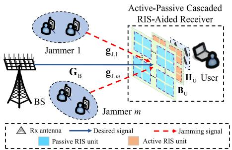

flowchart

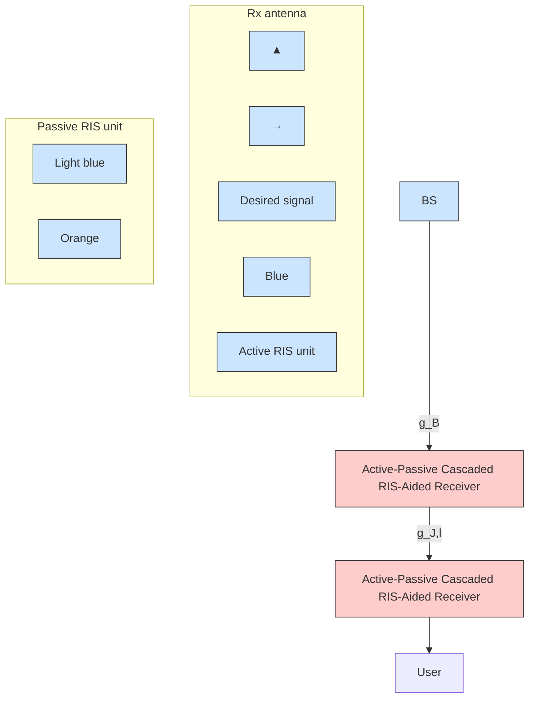

Fig. 2. System model.

• Miniaturization and high scalability: Benefiting from the compact axonometric structure and small size of meta-materials, the size of the proposed receiver is much smaller than those of the same dimensional single-layer RIS-aided and typical receivers, which contributes to the scalability of the proposed architecture. To elaborate, the typical and single-layer RIS-aided receivers can only deploy $N _ { \mathrm { P } } { + } N _ { \mathrm { A } }$ antennas/RIS units at the transversal side, while our proposed receiver can deploy $N _ { \mathrm { P } }$ and $N _ { \mathrm { A } }$ units at two compact layers, respectively. Combining with the fact that the gap between adjacent layers is generally very small [29], the miniaturization and scalability of the proposed architecture is highly desirable.   
• Additional DoFs for jamming nulling and signal enhancing: Assisted by the separated controllers of each RIS and the cascaded structure, the proposed receiver can flexibly amplify the signals in a larger range compared to these benchmark receivers, which will be stated in Theorem 6. Furthermore, the receive power of the proposed architecture is in proportion to the product of the number of active RIS units and that of passive RIS units $N _ { \mathrm { { A } } } N _ { \mathrm { { P } } } .$ , while the single-layer RIS-aided and typical receivers can only amplify it in proportional to the total number of antennas/RIS units $N _ { \mathrm { P } } { + } N _ { \mathrm { A } }$ (please see Theorem 5). The above findings suggest that additional DoFs are generated by the proposed architecture for facilitating the design.   
• Low power scattering ratio (PSR): Since the transmission mechanism between the active RIS and the Rx antennas is air, the power transmitted by active RIS would inevitably scatter outside the Rx antennas. Thus, we introduce a new metric of PSR to explicitly quantify the particular fraction of scattering power to the total transmit power. Due to the compact size of the proposed receiver and the DoFs introduced by the active RIS, the PSR of the proposed receiver is much lower than that of single-layer RIS-aided one (see Section V).

# B. RIS-Receiver-Aided Anti-Jamming Communications

Let us consider the RIS-receiver-aided anti-jamming communications scenario of Fig. 2, where an active-passive cascaded RIS-aided receiver is adopted at the $\mathrm { { u s e r } ^ { 1 } }$ for enhancing the desired signal from base station (BS), while simultaneously nullifying M jammers’ malicious signals. Furthermore, we assume that the BS is equipped with $N _ { \mathrm { B } }$ transmit antennas, and the m-th jammer utilizes an omnidirectional single-antenna to impair the signal reception at the receiver from all angles.2 Besides, the proposed cascaded RIS-aided receiver is composed of a passive RIS having $N _ { \mathrm { P } }$ units, an active RIS having $N _ { \mathrm { A } }$ units, and the Rx antennas having $N _ { \mathrm { U } }$ elements. For exposition, we denote $\mathbf { G } _ { \mathrm { B } } \in \mathbb { C } ^ { N _ { \mathrm { P } } \times N _ { \mathrm { B } } } ,$ $\mathbf { g } _ { \mathrm { J } , m } ~ \in ~ \mathbb { C } ^ { N _ { \mathrm { P } } \times 1 }$ , $\mathbf { B _ { \mathrm { U } } } ^ { \bullet } \in \mathbb { C } ^ { N _ { \mathrm { A } } \times N _ { \mathrm { P } } }$ , and $\mathbf { H } _ { \mathrm { U } } \in \mathbb { C } ^ { N _ { \mathrm { U } } \times N _ { \mathrm { A } } }$ as the channels spanning from the BS to the passive RIS, from the m-th jammer to the passive RIS, from the passive RIS to the active RIS, and from the active RIS to the Rx antennas, respectively.

Denote sU as the desired symbol transmitted by the BS to the $\mathrm { u s e r } , { } ^ { 3 }$ which satisfies E $\Big \{ \big | s _ { \mathrm { U } } \big | ^ { 2 } \Big \} = 1$ . Prior to transmission, sU is processed by the transmit precoder $\mathbf { w _ { B } } \in \mathbf { \Sigma }$ $\mathbb { C } ^ { N _ { \mathrm { B } } \times 1 }$ such that the desired signal transmitted by the BS is $\mathbf { w } _ { \mathrm { B } } s _ { \mathrm { U } }$ . Meanwhile, the m-th jammer launches the jamming signal $s _ { \mathrm { J } , m } ~ = ~ \sqrt { P _ { \mathrm { J } , m } } \widehat { s } _ { \mathrm { J } , m }$ to interrupt the legitimate transmission, where $\widehat { s } _ { \mathrm { J } , m }$ satisfying E $\left\{ \left| { \widehat { s } } _ { \mathrm { J } , m } \right| ^ { 2 } \right\} = 1$ is the jamming symbol and $P _ { \mathrm { J } , m }$ is the corresponding jamming power. As such, the proposed cascaded RIS-aided receiver simultaneously receives both the desired and jamming signals. Subsequently, the passive and active RIS can impose the coefficients $\mathbf { \bar { P } } \in \mathbb { C } ^ { \hat { N } _ { \mathrm { P } } \times N _ { \mathrm { P } } }$ and $\mathbf { \Xi } \equiv \mathrm { { \mathbb { C } } } ^ { N _ { \mathrm { { A } } } \times N _ { \mathrm { { A } } } }$ into the received signals, respectively. Here, P and Ξ can be rewritten as P= diag (p) = diag $\left( e ^ { j \theta _ { \mathrm { P } , 1 } } , \cdot \cdot \cdot , e ^ { j \theta _ { \mathrm { P } , N _ { \mathrm { P } } } } \right)$ and $\begin{array} { r } { \Xi = \bar { \Xi } { \mathbf { P } } \Xi = } \end{array}$ diag (ξ) = diag $\left( a _ { 1 } e ^ { j \theta _ { \mathrm { A , 1 } } } , \cdot \cdot \cdot , a _ { N _ { A } } e ^ { j \theta _ { \mathrm { A , \tilde { N _ { A } } } } } \right)$ , where $\theta _ { \mathrm { A } } , \theta _ { \mathrm { P } } \in$ [0, 2π) and $a _ { n } ~ \in ~ [ 0 , a _ { n , \operatorname* { m a x } } ]$ represent the phase and the amplitude, and $a _ { n , \mathrm { m a x } }$ is predetermined maximum amplitude of the active load for the n-th unit on the active RIS. Besides, Ξ and $\mathbf { P } _ { \Xi }$ are the amplitude and phase-shift matrices of the active RIS’s coefficient Ξ, respectively. Finally, the user adopts

1Deploying the proposed RIS-aided receiver at the user side is conceived for improving user’s individual utility, which is independent of the other users. As such, the key difference between the single-user scenario and multiuser one is the optimization of BS’s transmit beamforming. Since this paper focuses on the proposed RIS-aided receiver design, we only consider the single-user scenario for a better illustration of our design. Furthermore, our proposed algorithm for optimizing the transmit beamforming in Section III-A can be easily extended to the multi-user scenario by using some matrix transformations [10], [32].   
2The justifications for the single-antenna jammer are two-fold. First, from the view of flexibility and effective jamming, the single-antenna configuration for a potential jamming has been regarded as a practical scenario from the trade-off between cost and performance [33]. Moreover, to disrupt the legitimate nodes from different angles, the jammer tends to be equipped with omnidirectional single-antenna in practice. Second, as will be discussed in the later section, by dividing the multi-antenna jamming channel into multiple single-antenna ones, the jamming nulling algorithm proposed in Section III-B can also be extended to the multi-antenna jammers, thus we adopt the single-antenna jammers here for brevity.   
3To guarantee the anti-jamming communications under unfavorable condition and characterize the lower bound of the system performance, this paper considers the worst case that the BS only transmits a single-data stream [15]. Moreover, after using some matrix transformations, the proposed algorithms which are presented in Section III can be also extended to the multi-data stream case, thus we adopt the single-data stream for simplicity.

the digital decoder $\mathbf { v } _ { \mathrm { U } } ~ \in ~ \mathbb { C } ^ { N _ { \mathrm { U } } \times 1 }$ satisfing $\| \mathbf { v } _ { \mathrm { U } } \| ~ = ~ 1$ to harness the interference. Therefore, the received signal $\mathrm { i s } ^ { 4 }$

$$
y _ {\mathrm{U}} = \widetilde {\mathbf {h}} _ {\mathrm{U}} ^ {H} \left(\mathbf {G} _ {\mathrm{B}} \mathbf {w} _ {\mathrm{B}} s _ {\mathrm{U}} + \sum_ {m = 1} ^ {M} \mathbf {g} _ {\mathrm{J}, m} s _ {\mathrm{J}, m}\right) + \overline {{\mathbf {h}}} _ {\mathrm{U}} ^ {H} \mathbf {z} + n _ {\mathrm{U}}, (1)
$$

where $\widetilde { \mathbf { h } } _ { \mathrm { U } } = \mathbf { P } ^ { H } \mathbf { B } _ { \mathrm { U } } ^ { H } \Xi ^ { H } \mathbf { H } _ { \mathrm { U } } ^ { H } \mathbf { v } _ { \mathrm { U } } , \mathbf { \Xi } \overline { { \mathbf { h } } } _ { \mathrm { U } } = \Xi ^ { H } \mathbf { H } _ { \mathrm { U } } ^ { H } \mathbf { v } _ { \mathrm { U } } ,$ and nU = $\mathbf { v } _ { \mathrm { U } } ^ { H } \mathbf { n } _ { \mathrm { U } } .$ . Here, $\mathbf { z } \sim \mathcal { C N } ( \mathbf { 0 } , \sigma _ { z } ^ { 2 } \mathbf { I } _ { N _ { \mathrm { A } } } )$ and $\mathbf { n } _ { \mathrm { U } } \sim \mathcal { C N } ( \mathbf { 0 } , \sigma _ { \mathrm { U } } ^ { 2 } \mathbf { I } _ { N _ { \mathrm { U } } } )$ are the dynamic noise induced by the active RIS and thermal noise at the Rx antennas, respectively, where $\sigma _ { z } ^ { 2 }$ and $\sigma _ { \mathrm { U } } ^ { 2 }$ are the corresponding noise power per-antenna. Note that the dynamic noise induced by active RIS is related to the its amplitude, which is consistent with the existing works, $\mathrm { e . g . }$ , [25]. Then, the achievable rate at the user can be modeled as

$$
R _ {\mathrm{U}} \left(\mathbf {w} _ {\mathrm{B}}, \mathbf {P}, \boldsymbol {\Xi}, \mathbf {v} _ {\mathrm{U}}\right) = \log_ {2} \left(1 + \frac {\left| \widetilde {\mathbf {h}} _ {\mathrm{U}} ^ {H} \mathbf {G} _ {\mathrm{B}} \mathbf {w} _ {\mathrm{B}} \right| ^ {2}}{\sum_ {m = 1} ^ {M} P _ {\mathrm{J} , m} \left| \widetilde {\mathbf {h}} _ {\mathrm{U}} ^ {H} \mathbf {g} _ {\mathrm{J} , m} \right| ^ {2} + \widetilde {\sigma} _ {\mathrm{U}} ^ {2}}\right), \tag {2}
$$

where $\widetilde { \sigma } _ { \mathrm { U } } ^ { 2 } = \sigma _ { z } ^ { 2 } { \left\| \overline { { \mathbf { h } } } _ { \mathrm { U } } \right\| } ^ { 2 } + \sigma _ { \mathrm { U } } ^ { 2 } ,$ .

# C. Near/Far-Field Channel Models

In this paper, considering the effects of spherical wave, $\scriptstyle \mathbf { B } _ { \mathrm { U } }$ and $\mathbf { H } _ { \mathrm { U } }$ can be regarded as the near-field channels, which can be characterized as the radar illumination model [29], i.e.,

$$
\mathbf {Q} = \left[ \frac {\lambda \sqrt {\widehat {\rho} G _ {n , v} ^ {D} \left(\theta^ {R} , \varphi^ {R}\right) G _ {n , v} ^ {R} \left(\theta^ {D} , \varphi^ {D}\right)}}{4 \pi d _ {n , v}} e ^ {- j \frac {2 \pi d _ {n , v}}{\lambda}} \right] _ {n, v}, \tag {3}
$$

where Q denotes the near-field channels between adjacent vertical layers $( \mathrm { i . e . , \mathbf { B } _ { U } }$ and $\mathbf { H } _ { \mathrm { U } } )$ , λ is the carrier wavelength, $\widehat { \rho }$ denotes the power efficiency of the RIS, $d _ { n , v }$ is the distance bbetween the n-th RIS unit of the passive RIS and the v-th unit of the active RIS, and GDn,v $( \theta ^ { \dot { R _ { , } } } \varphi ^ { R } ) , G _ { n , v } ^ { R } \left( \theta ^ { D } , \varphi ^ { D } \right)$ are the active and passive antenna gains from the n-th and the vth unit, respectively. Owing to the short distance between the adjacent vertical layers, $\mathbf { B } _ { \mathrm { U } }$ and $\mathbf { H } _ { \mathrm { U } }$ are deterministic matrices and can be precisely measured in advance [15], [29], [30]. Besides, taking into account the effects of plane wave, the downlink channels $\mathbf { G } _ { \mathrm { B } }$ and $\mathbf { g } _ { \mathrm { J } , m }$ can be termed as the far-field channels, which is the superposition of a predominant lineof-sight (LoS) component and a sparse set of single-bounce non-LoS (NLoS) components [35]. Thus, $\mathbf { G } _ { \mathrm { B } }$ and $\mathbf { g } _ { \mathrm { J } , m }$ can be modeled as in [35], which is omitted here for brevity.

On the other hand, owing to the cooperation between the BS and the user, the legitimate CSI is available at the BS and the user by sending pilot signals and exploiting some efficient estimation methods in [36] and [37]. Hence, we assume that the involved legitimate CSI $\mathbf { G } _ { \mathrm { B } }$ can be perfectly obtained during the whole transmission period [7]. However, since the jammers are not expected to cooperate with the user for the channel estimation, the illegitimate CSI $\mathbf { g } _ { \mathrm { J } , m }$ are challenging

4When RIS’s reflection is considered, the multi-order-reflection between adjacent RISs will be introduced into the RIS-receiver. Particularly, the signals refracted by the passive RIS can be simultaneously refracted and reflected by the active RIS, then the reflected signals can be reflected by the passive RIS twice, which leads to the multi-order-reflection effect and the different signal model. The multi-order-reflection between multiple RISs has been investigated in [34], but a comprehensive understanding of these effects is still lacking and shall be addressed in our further works.

to obtain. Fortunately, the illegitimate CSI depends on the relative position between the jammer and the user, namely, the azimuth and elevation angles between them, such that $\mathbf { g } _ { \mathrm { J } , m }$ can be estimated by detecting the jamming power transmitted by the jammers’ RF frontend [10], [15], [38]. Nonetheless, the estimation of the azimuth and elevation angles may also be inaccurate. To account for this effect, this paper assumes that $\mathbf { g } _ { \mathrm { J } , m }$ belongs to a given continuous angle range, which is given $\mathsf { b y } ^ { 5 }$ [15], [30], [41]

$$
\Delta_ {\mathrm{J}} = \left\{\mathbf {g} _ {\mathrm{J}, m} \mid \theta_ {m} \in \left[ \theta_ {m, \mathrm{L}}, \theta_ {m, \mathrm{U}} \right], \varphi_ {m} \in \left[ \varphi_ {m, \mathrm{L}}, \varphi_ {m, \mathrm{U}} \right], \right.
$$

$$
g _ {m} \in \left[ g _ {m, \mathrm{L}}, g _ {m, \mathrm{U}} \right], \forall m \}, \tag {4}
$$

where $\theta _ { \mathrm { U } }$ and $\theta _ { \mathrm { { L } } }$ denote the upper and lower bounds of azimuth angle, φU and $\varphi _ { \mathrm { L } }$ are the upper and lower bounds of elevation angle, respectively, and $g _ { \mathrm { U } }$ and $g _ { \mathrm { L } }$ is the upper and lower bounds of the channel gain amplitude, respectively.

# D. Problem Formulation

In this paper, a worst-case achievable rate maximization problem formulation is considered for providing robustness against imperfect angular CSI. To elaborate, under the angular uncertainty $\Delta _ { \mathrm { J } } ,$ , our goal is to maximize the achievable rate by jointly optimizing the BS’s transmit precoder $\mathbf { w _ { \mathrm { B } } }$ , the passive and active $\mathbf { R I S s } '$ coefficients P and $\Xi ,$ and the Rx digital decoder $\mathbf { v _ { U } }$ , while fulfilling the BS’s power constraint and the active RIS power budget constraint. In contrast to most existing RIS-related works subject to only the total power constraint, e.g., [19], this paper adopts a general formulation:

$$
\mathrm{C} 1: \mathbf {w} _ {\mathrm{B}} ^ {H} \mathbf {E} _ {c} \mathbf {w} _ {\mathrm{B}} \leq p _ {\mathrm{B}, c}, \forall c = 1, \dots , C, \tag {5}
$$

where $\mathbf { E } _ { c } \succeq \mathbf { 0 }$ is the weighting matrices for the c-th antenna’s cluster, $p _ { \mathrm { B } , c }$ denotes the c-th cluster’s maximum power, and C is the total number of the antenna’s cluster. Note that the general power constraint can be reduced to the conventional total power constraint by setting $C ~ = ~ 1$ and $\mathbf { E } _ { c } \ = \ \mathbf { I } _ { N _ { \mathrm { B } } } .$ $\mathbf { A } s$ such, the corresponding optimization problem can be formulated as

$$
\max _ {\mathbf {w} _ {\mathrm{B}}, \mathbf {P}, \boldsymbol {\Xi}, \mathbf {v} _ {\mathrm{U}}} \min _ {\Delta_ {\mathrm{J}}} R _ {\mathrm{U}} \left(\mathbf {w} _ {\mathrm{B}}, \mathbf {P}, \boldsymbol {\Xi}, \mathbf {v} _ {\mathrm{U}}\right)
$$

$$
s. t. \mathrm{C1,C2}: \max _ {\Delta_ {\mathrm{J}}} \left(\| \boldsymbol {\Xi} \widetilde {\mathbf {w}} _ {\mathrm{B}} \| ^ {2} + \sigma_ {z} ^ {2} \| \boldsymbol {\Xi} \| _ {F} ^ {2}\right) \leq P _ {\mathrm{R,max}},
$$

$$
\mathrm{C} 3: \left| [ \boldsymbol {\Xi} ] _ {n _ {1}, n _ {1}} \right| \leq \alpha_ {n _ {1}, \max}, \forall n _ {1}, \mathrm{C} 4: \left| [ \mathbf {P} ] _ {n _ {2}, n _ {2}} \right| = 1, \forall n _ {2}, \tag {6}
$$

where $\begin{array} { r } { \widetilde { \mathbf { w } } _ { \mathrm { B } } = \mathbf { B } _ { \mathrm { U } } \mathbf { P } \left( \mathbf { G } _ { \mathrm { B } } \mathbf { w } _ { \mathrm { B } } + \sum _ { m = 1 } ^ { M } \mathbf { g } _ { \mathrm { J } , m } \right) } \end{array}$ $P _ { \mathrm { R , m a x } }$ is the maximum amplification power budget at active RIS, and

5The reasons that the LoS and NLoS components have the common CSI accuracy can be two-fold. First, recalling the jamming channel models in [35], θRx $\theta _ { \mathrm { J } , m d } ^ { \mathrm { R x } } = \theta _ { \mathrm { J } , m 0 } ^ { \mathrm { R x } } + \hat { \theta } _ { d } ,$ J,md θRx , and φRxJ,md $\varphi _ { \mathrm { J } , m d } ^ { \mathrm { R x } } ~ = ~ \varphi _ { \mathrm { J } , m 0 } ^ { \mathrm { R x } } + \hat { \varphi } _ { d }$ , where $\hat { \theta } _ { d }$ and $\hat { \varphi } _ { d }$ denote the random aNLoS components in $\mathbf { g } _ { \mathrm { J } , m }$ eviation [35],  are related to $\theta _ { \mathbf { J } , m 0 } ^ { \mathrm { R x } }$ findand $\varphi _ { \mathrm { J } , m 0 } ^ { \mathrm { R x } } ,$ oth the LoS and, which depends on the location estimation errors of jammers. As such, we can adopt the imperfect angular uncertainty set $\Delta _ { \mathrm { J } }$ to account for the location estimation errors, thereby characterizing the CSI imperfection of both the LoS and NLoS components. Furthermore, according to [39], $\hat { \theta } _ { d }$ and $\hat { \varphi } _ { d }$ can be obtained by using UPA based phase rotation schemes. Thus, it is resonable to assume that the LoS and NLoS components share the same accuracy $\Delta _ { \mathrm { J } } .$ . Second, based on the previous findings in [40], the contribution of the RIS-assisted link is mainly determined by its LoS component. Thus, we assume the same accuracy $\Delta _ { \mathrm { J } }$ in the LoS and NLoS components for brevity.

$\alpha _ { n _ { 1 } , \mathrm { m a x } } ~ > ~ 1$ denotes the maximum amplification factor at $n _ { 1 }$ -th active unit.

Obviously, the optimization problem in (6) is challenging to solve. To be specific, the unique challenges in addressing (6) are summarized as follows. First, different from the traditional hybrid MIMO beamforming schemes whose analog beamformers are seperated with the channel matrices, e.g., [42], the RISs’ coefficients P, Ξ and the propagation are tighly coupled in (6), rendering the optimal solutions challenging to obtain. Second, due to the cascaded active-passive RIS structure, the existing passive RIS-aided anti-jamming schemes (e.g., [7], [8], [15], [30]) are not directly applicable to (6). More importantly, the abovementioned schemes incur high computational complexity and suboptimal solutions, thus an efficient low-complexity algorithm for obtaining the closed-form solution is needed. Third, the angular uncertainty $\Delta _ { \mathrm { J } }$ and the existence of the extra noise term $\sigma _ { z } ^ { 2 } { \left\| \overline { { \mathbf { h } } } _ { \mathrm { U } } \right\| } ^ { 2 }$ in $R _ { \mathrm { U } }$ make (6) non-convex, which constitutes another unique challenge for obtaining the closed-form solution of (6). Thus, in the sequel, we propose an efficient low-complexity antijamming scheme to confront the foregoing unique challenges.

# III. EFFICIENT LOW-COMPLEXITY OPTIMIZATION FRAMEWORK FOR CASCADED RIS-RECEIVER-AIDED ANTI-JAMMING COMMUNICATIONS

In this section, an efficient low-complexity optimization framework based on the block coordinate descent (BCD) for cascaded RIS-receiver-aided anti-jamming communications is proposed. In particular, (6) is decoupled into four subproblems and then the optimal semi-closed-form solutions can be derived, thereby significantly reducing the complexity.

# A. Pareto-Dual Scheme for $\mathbf { w } _ { \mathrm { B } }$

Firstly, we focus on optimizing the transmit beamforming wB under the general power constraint. By defining $\begin{array} { r } { \widetilde { \mathbf { H } } _ { \mathrm { U } } = } \end{array}$ ${ \bf G } _ { \mathrm { B } } ^ { H } \widetilde { { \bf h } } _ { \mathrm { U } } \widetilde { { \bf h } } _ { \mathrm { U } } ^ { H } { \bf G } _ { \mathrm { B } }$ and $\mathbf { W } _ { \mathrm { B } } = \mathbf { w } _ { \mathrm { B } } \mathbf { w } _ { \mathrm { B } } ^ { H }$ e with an implicit constraint rank $( \mathbf { W } _ { \mathrm { B } } ) = 1$ , the subproblem for $\mathbf { w } _ { \mathrm { B } }$ is formulated $\mathrm { a s } ^ { 6 }$

$$
\min _ {\mathbf {W} _ {\mathrm{B}}} f \left(\mathbf {W} _ {\mathrm{B}}\right) = - \operatorname{tr} \left(\widetilde {\mathbf {H}} _ {\mathrm{U}} \mathbf {W} _ {\mathrm{B}}\right)
$$

$$
s. t. \widetilde {\mathrm{C}} 1: \operatorname{tr} \left(\mathbf {E} _ {c} \mathbf {W} _ {\mathrm{B}}\right) \leq p _ {\mathrm{B}, c}, \forall c = 1, \dots , C, \mathrm{C} 5: \mathbf {W} _ {\mathrm{B}} \succeq \mathbf {0}. \tag {7}
$$

Note that the multiple power constraints $\widetilde { \mathrm { C 1 } }$ prevent us from deriving the semi-closed-form solution of (7). Thus, we adopt Pareto optimization and Lagrangian dual theory [43], [44] to transform C1 into a tractable one via the following proposition.

Proposition 1: Since $f \left( \mathbf { W } _ { \mathrm { B } } \right)$ is a matrix-monotone decreasing affine function w.r.t $\mathbf { W } _ { \mathrm { B } }$ , subproblem (7) can be equivalently transformed into

$$
\min _ {\mathbf {W} _ {\mathrm{B}}} f \left(\mathbf {W} _ {\mathrm{B}}\right) s. t. \widetilde {\mathrm{C}} 1 _ {\mathrm{a}}: \operatorname{tr} \left(\mathbf {E W} _ {\mathrm{B}}\right) \leq P _ {\mathrm{B}}, \mathrm{C5}, \tag {8}
$$

$\begin{array} { r } { P _ { \mathrm { B } } ^ { \mathrm { ~ } } \ = \ \sum _ { c = 1 } ^ { C } p _ { \mathrm { B } , c } , \ \mathbf { E } ^ { \mathrm { ~ } } \ = \ \sum _ { c = 1 } ^ { C } \beta _ { c } \mathbf { E } _ { c } , } \end{array}$ , and dual v $\beta _ { c } \ =$ $\eta _ { c } P _ { \mathrm { B } } \Big / \sum _ { i = 1 } ^ { C } \eta _ { i } p _ { \mathrm { B } , i }$ $\eta _ { c }$

6Note that the rank-one constraint is temporality omitted for making (7) easier to handle, which can be always guaranteed by the derived optimal semi-closed-form solution later.

associated with $\widetilde \mathrm { C } 1 _ { a }$ , which can be obtained by solving the dual problem of (7):

$$
\min _ {\mathbf {Q} \succeq \mathbf {0}, \{\eta_ {c} \} _ {c = 1} ^ {C} \geq 0} \sum_ {c = 1} ^ {C} \eta_ {c} p _ {\mathrm{B}, c}
$$

$$
s. t. \mathbf {F} _ {1} = \sum_ {c = 1} ^ {C} \eta_ {c} \mathbf {E} _ {c} - \widetilde {\mathbf {H}} _ {\mathrm{U}} - \mathbf {Q} \succeq \mathbf {0}, \tag {9}
$$

where Q is the dual variable associated with $\mathbf { W _ { B } } \succeq \mathbf { 0 } .$ . Benefiting from the single power constraint in (8) and the dual method in (9), the optimal $\mathbf { w } _ { \mathrm { B } }$ to (7) can be derived in a closed-form expression with low computational complexity, which is presented in Proposition 2.

Proof: See Appendix A in the supplemental information. ■

Based on Proposition 1, we find that given the optimal dual variable $\eta _ { c }$ by utilizing the dual method (9), the optimal $\mathbf { W } _ { \mathrm { B } }$ of (7) can be obtained by solving (8) that provides the way for derving an optimal closed-form solution. Different from the widely adopted subgradient method for finding the optimal $\eta _ { c }$ in [18], the dual method in (9) solves $\eta _ { c }$ without the need for iterations. Besides, in contrast to directly solve the dual problem of (7) whose $\mathbf { W } _ { \mathrm { B } }$ is not constrained, (8) can restrict $\mathbf { W } _ { \mathrm { B } }$ by introducing tr $( \mathbf { E } \mathbf { W } _ { \mathrm { B } } ) = P _ { \mathrm { B } }$ and $\begin{array} { r } { \mathbf { E } = \sum _ { c = 1 } ^ { C } \beta _ { c } \mathbf { E } _ { c } . } \end{array}$ Therefore, Proposition 1 offers an easy way to address (7), and theoretically reduces the computational complexity.

Next, armed with Proposition 1, we develop the following proposition for obtaining the optimal solution of (7).

Proposition 2: The optimal closed-form solution for the convex optimization problem w.r.t. $\mathbf { w } _ { \mathrm { B } }$ can be derived by

$$
\mathbf {w} _ {\mathrm{B}} = \sqrt {P _ {\mathrm{B}}} \mathbf {E} ^ {- \frac {1}{2}} \mathbf {u} _ {\max} \left(\mathbf {E} ^ {- \frac {1}{2}} \widetilde {\mathbf {H}} _ {\mathrm{U}} \mathbf {E} ^ {- \frac {1}{2}}\right), \tag {10}
$$

where $\mathbf { u } _ { \mathrm { m a x } } \left( \mathbf { E } ^ { - \frac { 1 } { 2 } } \widetilde { \mathbf { H } } _ { \mathrm { U } } \mathbf { E } ^ { - \frac { 1 } { 2 } } \right)$ is the eigenvector corresponding to the largest eigenvalue of $\mathbf { E } ^ { - \frac { 1 } { 2 } } \widetilde { \mathbf { H } } _ { \mathrm { U } } \mathbf { E } ^ { - \frac { 1 } { 2 } }$ . Note that the implicit rank-one constraint of (7) can be satisfied by (10).

Proof: Defining $\mathbf { W } _ { \mathrm { B } } = \mathbf { E } ^ { - \frac { 1 } { 2 } } \widetilde { \mathbf { W } } _ { \mathrm { B } } \mathbf { E } ^ { - \frac { 1 } { 2 } }$ , problem (8) can be equivalently rewritten as

$$
\max _ {\widetilde {\mathbf {W}} _ {\mathrm{B}}} \operatorname{tr} \left(\widetilde {\mathbf {H}} _ {\mathrm{U}} \mathbf {E} ^ {- \frac {1}{2}} \widetilde {\mathbf {W}} _ {\mathrm{B}} \mathbf {E} ^ {- \frac {1}{2}}\right)
$$

$$
s. t. \overline {{{\mathrm{C}}}} 1: \operatorname{tr} \left(\widetilde {\mathbf {W}} _ {\mathrm{B}}\right) \leq P _ {\mathrm{B}}, \widetilde {\mathrm{C}} 5: \widetilde {\mathbf {W}} _ {\mathrm{B}} \succeq \mathbf {0}. \tag {11}
$$

It is well known that the optimal $\widetilde { \mathbf { W } } _ { \mathrm { B } }$ for the classical MIMO capacity maximization problem (11) is $\widetilde { \mathbf { W } } _ { \mathrm { B } } = \widetilde { p } _ { \mathrm { B } } \mathbf { u } _ { \mathrm { m a x } } \mathbf { u } _ { \mathrm { m a x } } ^ { H } ,$ where $\widetilde { p } _ { \mathrm { B } }$ is power for $\widetilde { \mathbf { w } } _ { \mathrm { B } }$ e. Then, (11) can be simplified as

$$
\max _ {\widetilde {p} _ {\mathrm{B}}} \widetilde {p} _ {\mathrm{B}} \operatorname{tr} \left(\mathbf {u} _ {\max} ^ {H} \mathbf {E} ^ {- \frac {1}{2}} \widetilde {\mathbf {H}} _ {\mathrm{U}} \mathbf {E} ^ {- \frac {1}{2}} \mathbf {u} _ {\max}\right) s. t. 0 \leq \widetilde {p} _ {\mathrm{B}} \leq P _ {\mathrm{B}}. \tag {12}
$$

Obviously, (12) is the positive linear problem, whose optimal solution is $P _ { \mathrm { B } }$ . Thus, by aligning the optimal $\widetilde { \mathbf { W } } _ { \mathrm { B } }$ with the largest eigenvalues of $\mathbf { E } ^ { - \frac { 1 } { 2 } } \widetilde { \mathbf { H } } _ { \mathrm { U } } \mathbf { E } ^ { - \frac { 1 } { 2 } }$ , we can obtain (10).

# B. Unified Unit-Modulus Zero-Forcing Beamforming for P

In this subsection, with a given $\mathbf { w } _ { \mathrm { B } }$ , we investigate the optimization of the passive RIS’s receive coefficient P for maximazing the achievable rate, which can be formulated as

$$
\max _ {\mathbf {P}} \min _ {\Delta_ {\mathrm{J}}} R _ {\mathrm{U}} (\mathbf {P}) s. t. \mathrm{C} 4: \left| [ \mathbf {P} ] _ {n _ {2}, n _ {2}} \right| = 1, \forall n _ {2}. \tag {13}
$$

Although some existing techniques have been widely adopted for rate maximazation, such as the polyblock approximation [15], the SCA [7], and the SDR [45], they lead to the suboptimal or even far away from the optimal solution with high computational complexity. Thus, we propose a novel antijamming criterion7 for our considered syetem, which makes the closed-form solution is much likely available, and thereby reducing the computational complexity.

Criterion 1: Since the malicious jammers usually transmit with high power which is extremely detrimental to the user, the passive RIS at the first layer is applied to nullify the jamming signals. Besides, the desired signal should be boosted simultaneously. As such, the rate maximization of anti-jamming communications can be regarded as the jamming nulling and desired signal enhancing:

$$
\max _ {\mathbf {P}} \min _ {\Delta_ {J}} R _ {U} (\mathbf {P}): \left\{ \begin{array}{l} \overline {{\mathbf {h}}} _ {U} ^ {H} \mathbf {B} _ {U} \mathbf {P} \mathbf {g} _ {J, m} = 0, \forall m, \\ \max _ {\mathbf {P}} \left| \widetilde {\mathbf {h}} _ {U} ^ {H} \mathbf {G} _ {B} \mathbf {w} _ {B} \right| ^ {2}. \end{array} \right. \tag {14}
$$

However, the jamming-nulling term in (14) is infinite non-convex due to the angular uncertainty $\Delta _ { \mathrm { J } }$ . According to our previous works [7], [15], [30], and [41], the equivalent worst-case CSI can be obtained by the discretization method,8 i.e.,

$$
\widehat {\mathbf {g}} _ {\mathrm{J}, m} = \sum_ {i = 1} ^ {N _ {\mathrm{P} 1}} \sum_ {j = 1} ^ {N _ {\mathrm{P} 2}} (1 / N _ {\mathrm{P}}) \mathbf {g} _ {\mathrm{J}, m} ^ {(i, j)}, \tag {15}
$$

where g(i,j)J,m $\mathbf { g } _ { \mathrm { J } , m } ^ { ( i , j ) }$ is the discrete CSI by discretizing all the angles in the set of $\Delta _ { \mathrm { J } }$ , which is given by

$$
\theta^ {(i)} = \theta_ {L} + (i - 1) \Delta \theta , i = 1, \dots , Q _ {1},
$$

$$
\varphi^ {(j)} = \varphi_ {L} + (j - 1) \Delta \varphi , j = 1, \dots , Q _ {2}, \tag {16}
$$

where $Q _ { 1 }$ and $Q _ { 2 }$ are the sample number of θ and $\varphi ,$ respectively, $\Delta \theta ~ = ~ ( \theta _ { U } - \theta _ { L } ) \bar { / } ( Q _ { 1 } - 1 )$ , and $\begin{array} { r l } { \Delta \varphi } & { { } = } \end{array}$ $( \varphi _ { U } - \varphi _ { L } ) / ( Q _ { 2 } - 1 )$ . The interested readers can refer to our previous works [7], [15], [30], [41] for more details, which is omitted here for brevity. As such, the obstacle introduced by $\Delta _ { \mathrm { J } }$ has been handled. In addition, due to the presence of active RIS, $\overline { { \mathbf { h } } } _ { \mathrm { U } }$ is undetermined such that the jamming nulling performance is related to the active RIS. In order to nullify the powerful jamming at the passive RIS, we further need to ensure that $\mathbf { B } _ { \mathrm { U } } \mathbf { P } \widehat { \mathbf { g } } _ { \mathrm { J } , m } = \mathbf { 0 } , \forall m$ . To proceed, we divide $\scriptstyle \mathbf { B } _ { \mathrm { U } }$ into multiple vectors $\mathbf { b } _ { \mathrm { U } , i } ,$ which is written as

$$
\mathbf {B} _ {\mathrm{U}} = \left[ \mathbf {b} _ {\mathrm{U}, 1} ^ {H}; \mathbf {b} _ {\mathrm{U}, 2} ^ {H}; \dots ; \mathbf {b} _ {\mathrm{U}, N _ {\mathrm{A}}} ^ {H} \right]. \tag {17}
$$

7Note that although the proposed criterion provides a subcase of (13), it can achieve a satisfactory tradeoff between the computational complexity and system performance. Specifically, as shown in Section V, although the proposed criterion solves a suboptimal solution, it still obtains superior performance compared to the existing conventional optimization techniques and achieves much lower computational complexity than that of algorithms proposed in Section III-C, which suggests a satisfactory tradeoff has been achieved by the proposed criterion. On the other hand, the proposed criterion contributes to the derivation of feasibility condition for jamming nulling, which offer insightful guidelines for the practical implementation of the proposed receiver in the anti-jamming communications. In summary, the proposed criterion provides a satisfactory and useful subcase of (13). However, finding the one in (14) that yields the optimal performance of (13) is still quite a challenging task and worth in-depth analysis in our future works.

8The discretization method transforms the orignal problem (6) into a worstcase one, which can guarantee that the constraint C2 can be satisfied under any CSI imperfections fulfilling any required conditions [46]. Furthermore, since there are no quality of service (QoS) constraints, the problem (6) is always feasible with any time-varying channel fading. As such, the power budget of the active RIS is always guaranteed under any imperfect CSI and time-varying channel fading by using the discretization method.

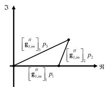

text_image

I
[g_{1,im}^H]_3 p_3
[g_{1,im}^H]_2 p_2
[g_{1,im}^H]_1 p_1
Re

(a)

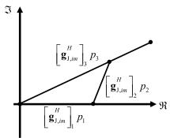  
Fig. 3. An example of $N _ { \mathrm { P } } = 3$ with $\begin{array} { r } { \operatorname* { m a x } _ { l \in \left[ N _ { \mathrm { P } } \right] } \left| \left[ \widetilde { \mathbf { g } } _ { \mathrm { J } , i m } \right] _ { l } \right| = \big | \left[ \widetilde { \mathbf { g } } _ { \mathrm { J } , i m } \right] _ { 3 } \big | , } \end{array}$ e  ewhere (a) satisfies the ZF condition and (b) contradicts the ZF condition.

Overall, the anti-jamming criterion is given by

$$
\mathbf {b} _ {\mathrm{U}, i} ^ {H} \mathbf {P} \widehat {\mathbf {g}} _ {\mathrm{J}, m} = 0, \forall i, m, \max _ {\mathbf {P}} \left| \widetilde {\mathbf {h}} _ {\mathrm{U}} ^ {H} \mathbf {G} _ {\mathrm{B}} \mathbf {w} _ {\mathrm{B}} \right| ^ {2}. \tag {18}
$$

By using Criterion 1, the subproblem w.r.t. $\mathbf { p } = \mathrm { d i a g } ( \mathbf { P } )$ can be reformulated as

$$
\max _ {\mathbf {p}} \left| \widetilde {\mathbf {b}} _ {\mathrm{U}} ^ {H} \mathbf {p} \right| ^ {2} s. t. \text { C4,C6 }: \widetilde {\mathbf {g}} _ {\mathrm{J}, i m} ^ {H} \mathbf {p} = 0, \forall i, m, \tag {19}
$$

where $\begin{array} { r l r } { \widetilde { { \bf b } } _ { \mathrm { U } } ^ { H } } & { { } = } & { \widetilde { { \bf h } } _ { \mathrm { U } } ^ { H } { \bf B } _ { \mathrm { U } } \mathrm { d i a g } \left\{ { \bf G } _ { \mathrm { B } } { \bf w } _ { \mathrm { B } } \right\} } \end{array}$ and $\begin{array} { r l } { \widetilde { \bf g } _ { \mathrm { J } , i m } ^ { H } } & { { } = } \end{array}$ $\mathbf { b } _ { \mathrm { U } , i } ^ { H } \mathrm { d i a g } \left\{ \widehat { \mathbf { g } } _ { \mathrm { J } , m } \right\}$ e. However, the non-convex unit-modulus conbstraints C4 prevents us from directly applying the conventional ZF beamforming. Thus, we propose a unified unit-modulus zero-forcing (ZF) beamforming to handle (19), which is also applicable to conventional ZF. Before tackling (19), it is of importance to investigate the feasibility condition for zeroforcing, which can be divided into the feasibility condition w.r.t. the number of passive RIS’s unit $N _ { \mathrm { P } }$ and w.r.t. the channels $\widetilde { \mathbf { g } } _ { \mathrm { J } , i m }$ . In the sequel, we provide the following two etheorems for investigating the zero-forcing feasibility.

Theorem 1 (Feasibility Condition w.r.t. $N _ { \mathrm { P } } ) { : }$ For a rectangular passive RIS having $N _ { \mathrm { P } } { = } N _ { \mathrm { P 1 } } \ \times \ N _ { \mathrm { P 2 } }$ elements, if min $\mathrm { \dot { \{ } }  N _ { \mathrm { P 1 } } , N _ { \mathrm { P 2 } } \} \geq \left( 4 ^ { N _ { \mathrm { A } } \mathbf { \bar { { M } } } } - 1 \right) / 3 .$ , there exists a feasible solution to the zero-forcing in problem (19).

Proof: See Appendix B in the supplemental information. ■

Observing from Theorem 1, to guarantee the feasibility for ZF, the number of passive RIS units $N _ { \mathrm { P } }$ should scale exponentially with the products of the active RIS’s units number and jammer’s number. However, this is only a sufficient condition. According to the properties of linear equations C6 and the simulation results, the feasibility can be ensured if $N _ { \mathrm { P } }$ is only slightly larger than $N _ { \mathrm { P } } \geq 2 M \left( M + 1 \right) N _ { \mathrm { U } }$ , which is much smaller than that stated in Theorem 1. In particular, when the number of passive RIS’s units is slightly larger than the product of jammers’ number and RF chains’ number, the jamming attacks can be eliminate at the passive $\mathrm { R I S . ^ { 9 } }$ On the other hand, note that the equivalent channels $\widetilde { \mathbf { g } } _ { \mathrm { J } , i m }$ are random, ewhich may also leads to infeasibility of (19). Thus, in order to further describe the ZF feasibility condition, we provide the necessary and sufficient condition w.r.t. $\widetilde { \mathbf { g } } _ { \mathrm { J } , i m } .$ .

eTheorem 2 (Feasibility Condition w.r.t. $\widetilde { \mathbf { g } } _ { \mathrm { J } , i m } ) .$ The ZF problem (19) is feasible only if

$$
2 \max _ {l \in [ N _ {\mathrm{P}} ]} \left| \left[ \widetilde {\mathbf {g}} _ {\mathrm{J}, i m} \right] _ {l} \right| \leq \sum_ {n _ {2} = 1} ^ {N _ {\mathrm{P}}} \left| \left[ \widetilde {\mathbf {g}} _ {\mathrm{J}, i m} \right] _ {n _ {2}} \right|, \forall i, m. \tag {20}
$$

Proof: See Appendix C in the supplemental information. ■

9Note that in order to effectively nullify the jamming signals, the RIS-unit number of the first layer needs to be sufficient when the number of jammer is large. Thus, deploying the passive RIS at the first layer is appealing to large-scale deployment as it can obtain satisfactory performance with low power and hardware consumptions [13].

To further elaborate Theorem 2, as shown in Fig. 3, we provide an example of $N _ { \mathrm { P } } ~ = ~ 3$ with $\begin{array} { r l } { \operatorname* { m a x } _ { l \in \left[ N _ { \mathrm { P } } \right] } \left| \left[ \widetilde { \mathbf { g } } _ { \mathrm { J } , i m } \right] _ { l } \right| } & { { } = } \end{array}$ $\left| [ \widetilde { \mathbf { g } } _ { \mathrm { J } , i m } ] _ { 3 } \right|$ e. If the ZF feasibility condition of (19) is satisfied, ewe have Fig. 3(a). In particular, a triangle with the length of three edges are constructed, i.e., $\begin{array} { r } { \left| \left[ \widetilde { \mathbf { g } } _ { \mathrm { J } , i m } \right] _ { 1 } \right| + \left| \left[ \widetilde { \mathbf { g } } _ { \mathrm { J } , i m } \right] _ { 2 } \right| \leq } \end{array}$ not satisfied, we obtain Fig. 3(b), where a triangle cannot be $\begin{array} { r } { \sum _ { n _ { 2 } = 1 } ^ { N _ { \mathrm { P } } } \left[ \widetilde { \bf g } _ { \mathrm { J } , i m } ^ { H } \right] _ { n _ { 2 } } p _ { n _ { 2 } } = 0 } \end{array}$ $| \left[ \widetilde { \bf g } _ { \mathrm { J } , i m } \right] _ { 3 } |$ 2 s that there always has p satisfing. On the contrary, if the condition is constructed, and thus there is no ZF solution. These above facts suggest that if the equivalent channels $\widetilde { \mathbf { g } } _ { \mathrm { J } , i m }$ do not esatisfy the general triangle theorem, the adjustment of the passive RIS’s coefficients cannot guarantee that the sum of $\widetilde { \mathbf { g } } _ { \mathrm { J } , i m }$ equals to zero, namely, the jammers’ channels $\widehat { \mathbf { g } } _ { \mathrm { J } , m }$ are e borthogonal to the legitimate channels, thus the ZF feasibility condition cannot be always ensured.

After checking the feasibility, we turn to solve problem (19). Specifically, a unified unit-modulus ZF beamforming scheme is proposed to obtain the semi-closed-form solution of (19) with low computational complexity. Since an arbitrary phase rotation of p does not alter the value of objective function in (19), we can transform it into

$$
\max _ {\mathbf {p}} \Re \left\{\widetilde {\mathbf {b}} _ {\mathrm{U}} ^ {H} \mathbf {p} \right\} s. t. \text { C4,C6 }. \tag {21}
$$

To nullify the jamming signals such that constraint C6 can be guaranteed, p must lie in the orthogonal complement of the subspace span $\Omega _ { \mathrm { J } }$ [28], namely,

$$
\Omega_ {\mathrm{J}} = \left[ \widetilde {\mathbf {g}} _ {\mathrm{J}, 1 1}, \dots , \widetilde {\mathbf {g}} _ {\mathrm{J}, N _ {\mathrm{A}} 1}, \dots , \widetilde {\mathbf {g}} _ {\mathrm{J}, 1 M}, \dots , \widetilde {\mathbf {g}} _ {\mathrm{J}, N _ {\mathrm{A}} M} \right], \tag {22}
$$

and the orthogonal projector $\mathcal { G } \left( \Omega _ { \mathrm { J } } \right)$ can be formulated as [28]

$$
\mathcal {G} \left(\boldsymbol {\Omega} _ {\mathrm{J}}\right) = \mathbf {I} _ {N _ {\mathrm{P}}} - \boldsymbol {\Omega} _ {\mathrm{J}} \left(\boldsymbol {\Omega} _ {\mathrm{J}} ^ {H} \boldsymbol {\Omega} _ {\mathrm{J}}\right) ^ {\dagger} \boldsymbol {\Omega} _ {\mathrm{J}} ^ {H}. \tag {23}
$$

As such, for p satisfying constraint C6, the optimal p can be written as ${ \bf p } = \mathscr { G } \left( { \Omega _ { \mathrm { J } } } \right) ^ { . }$ t, where t is the complex-valued vector with $N _ { \mathrm { P } }$ elements to be optimized.

Combining ${ \bf p } = \mathcal { G } \left( { \bf \Omega } \Omega _ { \mathrm { J } } \right)$ t and (21), problem (19) can be equivalently transformed into

$$
\max _ {\mathbf {p}, \mathbf {t}} \Re \left\{\widetilde {\mathbf {b}} _ {\mathrm{U}} ^ {H} \mathbf {p} \right\} s. t. \text { C4 }, \widetilde {\mathrm{C6}}: \mathbf {p} = \mathcal {G} \left(\boldsymbol {\Omega} _ {\mathrm{J}}\right) \mathbf {t}. \tag {24}
$$

Since p and t are tightly coupled in constraint ${ \widetilde { \mathrm { C } } } 6 ,$ we first adopt the penalty-based method to handle C6 [47], namely,

$$
\max _ {\mathbf {p}, \mathbf {t}} \Re \left\{\widetilde {\mathbf {b}} _ {\mathrm{U}} ^ {H} \mathcal {G} \left(\boldsymbol {\Omega} _ {\mathrm{J}}\right) \mathbf {t} \right\} - \lambda \| \mathbf {p} - \mathcal {G} \left(\boldsymbol {\Omega} _ {\mathrm{J}}\right) \mathbf {t} \| ^ {2} s. t. \text { C4 }, \tag {25}
$$

where $\lambda > 0$ is a penalty factor. In the following, we tackle p and t in an iterative manner, which admits a closed-form solutions in each iteration.

As for the optimization of p with given t, problem (25) w.r.t. p becomes:

$$
\max _ {\mathbf {p}} 2 \Re \left\{\mathbf {p} ^ {H} \mathcal {G} \left(\boldsymbol {\Omega} _ {\mathrm{J}}\right) \mathbf {t} \right\} - \mathbf {t} ^ {H} \mathcal {G} ^ {H} \left(\boldsymbol {\Omega} _ {\mathrm{J}}\right) \mathcal {G} \left(\boldsymbol {\Omega} _ {\mathrm{J}}\right) \mathbf {t} s. t. C 4. \tag {26}
$$

Obviously, the optimal p for (26) is

$$
[ \mathbf {p} ] _ {n _ {2}} ^ {\mathrm{opt}} = [ \mathcal {G} (\boldsymbol {\Omega} _ {\mathrm{J}}) \mathbf {t} ] _ {n _ {2}} / | [ \mathcal {G} (\boldsymbol {\Omega} _ {\mathrm{J}}) \mathbf {t} ] _ {n _ {2}} |, \forall n _ {2}. \tag {27}
$$

Then, as for the optimization of t with given p, problem (25) w.r.t. t can be formulated as

$$
\max _ {\mathbf {t}} g (\mathbf {p}, \mathbf {t}) = \Re \left\{\widetilde {\mathbf {b}} _ {\mathrm{U}} ^ {H} \mathcal {G} \left(\boldsymbol {\Omega} _ {\mathrm{J}}\right) \mathbf {t} \right\} - \lambda \| \mathbf {p} - \mathcal {G} \left(\boldsymbol {\Omega} _ {\mathrm{J}}\right) \mathbf {t} \| ^ {2}. \tag {28}
$$

Problem (28) is convex such that the optimal t can be obtained by setting the gradient of the objective function to zero that yields

$$
\partial_ {\mathbf {t}} g = \mathcal {G} ^ {H} \left(\boldsymbol {\Omega} _ {\mathrm{J}}\right) \widetilde {\mathbf {b}} _ {\mathrm{U}} + 2 \lambda \mathcal {G} ^ {H} \left(\boldsymbol {\Omega} _ {\mathrm{J}}\right) (\mathbf {p} - \mathcal {G} \left(\boldsymbol {\Omega} _ {\mathrm{J}}\right) \mathbf {t}) = \mathbf {0}. \tag {29}
$$

Then, the optimal t is

$$
\mathbf {t} ^ {\text { opt }} = \left(\mathcal {G} ^ {H} \left(\boldsymbol {\Omega} _ {\mathrm{J}}\right) \mathcal {G} \left(\boldsymbol {\Omega} _ {\mathrm{J}}\right)\right) ^ {\dagger} \left(\frac {1}{2 \lambda} \mathcal {G} ^ {H} \left(\boldsymbol {\Omega} _ {\mathrm{J}}\right) \widetilde {\mathbf {b}} _ {\mathrm{U}} + \mathcal {G} ^ {H} \left(\boldsymbol {\Omega} _ {\mathrm{J}}\right) \mathbf {p}\right). \tag {30}
$$

Note that under the alternative manner, since the optimal closed-form solution of subproblem (26) and (28) can be obtained, the objective value of (25) is monotonically increasing at each iteration. Meanwhile, according to [48], the ZF problem always has a finite upper bound. Thus, the proposed algorithm always converges, whose proof is similar to [48].

# C. Three Efficient Algorithms for $\mathbf { P } _ { \Xi }$

After optimizing $\mathbf { w _ { \mathrm { B } } }$ and P, we turn to the design of active RIS’s coefficients Ξ. After some mathematical manipulations, we can reformulate the subproblem w.r.t ${ \pmb \xi } = \mathrm { d i a g } \{ \bar { \pmb \Xi } \} ~ \mathrm { a s } ^ { 1 0 }$ as1

$$
\max _ {\boldsymbol {\xi}} \frac {\left| \mathbf {c} ^ {H} \boldsymbol {\xi} \right| ^ {2}}{\sigma_ {z} ^ {2} \boldsymbol {\xi} ^ {H} \mathbf {R} _ {1} \boldsymbol {\xi} + \sigma_ {\mathrm{U}} ^ {2}}
$$

$$
s. t. \quad \widetilde {\mathrm{C}} 2: \boldsymbol {\xi} ^ {H} \mathbf {R} _ {2} \boldsymbol {\xi} \leq P _ {\mathrm{R}, \max}, \quad \widetilde {\mathrm{C}} 3: | [ \boldsymbol {\xi} ] _ {n _ {1}} | \leq \alpha_ {n _ {1}, \max}, \forall n _ {1}, \tag {31}
$$

where

$$
\mathbf {c} ^ {H} = \mathbf {v} _ {\mathrm{U}} ^ {H} \mathbf {H} _ {\mathrm{U}} \mathrm{diag} \left\{\mathbf {B} _ {\mathrm{U}} \mathbf {P} \mathbf {G} _ {\mathrm{B}} \mathbf {w} _ {\mathrm{B}} \right\},
$$

$$
\mathbf {R} _ {1} = \sigma_ {z} ^ {- 2} \mathbf {R} _ {3} + \operatorname{diag} \left\{\mathbf {v} _ {\mathrm{U}} ^ {H} \mathbf {H} _ {\mathrm{U}} \right\} \operatorname{diag} \left\{\mathbf {H} _ {\mathrm{U}} ^ {H} \mathbf {v} \right\},
$$

$$
\mathbf {R} _ {2} = \mathrm{diag} \left\{\widetilde {\mathbf {w}} _ {\mathrm{B}} \right\} \mathrm{diag} \left\{\widetilde {\mathbf {w}} _ {\mathrm{B}} ^ {H} \right\} + \sigma_ {z} ^ {2} \mathbf {I} _ {N _ {\mathrm{A}}}.
$$

The above problem (31) are challenging to solve with the conventional RIS-related optimization algorithm and the algorithm proposed in Section III-B, since the active RIS introduces additional dynamic noise at the denominator of objective functions, which leads to a quadratic fractional programming problem. Although the Dinkelbach method and SDR in [26] can be also applicable to problem (31) which optimizes the active RIS’s phase shifts and amplitude jointly, the method cannot obtain the closed-form solutions and may leads to suboptimal or even far from the optimal solution, which will be evalated in Section V. Thus, to obtain the closed-form solution with low computational complexity, this paper divides the optimization of Ξ into two subproblems as in [25], namely, the optimization of active RIS’s phase shifts $\mathbf { P } _ { \Xi }$ and the optimization of its amplitude Ξ, which admits the closed-form solutions of $\mathbf { P } _ { \Xi }$ and Ξ. In this subsection, we focus on solving the subproblem w.r.t. PΞ, i.e.,

$$
\max _ {\mathbf {p} \equiv} \frac {\left| \widetilde {\mathbf {c}} ^ {H} \mathbf {p} _ {\Xi} \right| ^ {2}}{\sigma_ {z} ^ {2} \mathbf {p} _ {\Xi} ^ {H} \widetilde {\mathbf {R}} _ {1} \mathbf {p} _ {\Xi} + \sigma_ {\mathrm{U}} ^ {2}} s. t. \widetilde {\mathrm{C}} 3 _ {a}: \left| [ \mathbf {p} _ {\Xi} ] _ {n _ {1}} \right| = 1, \forall n _ {1}, \tag {32}
$$

where ${ \mathbf { P } } _ { \Xi } = \mathrm { d i a g } \left\{ { \mathbf { p } } _ { \Xi } \right\} , \widetilde { { \mathbf { c } } } ^ { H } = { \mathbf { c } } ^ { H } \widetilde { \Xi } .$ , and $\widetilde { \mathbf { R } } _ { 1 } = \widetilde { \mathbf { \Xi } } \widetilde { \mathbf { \Xi } } ^ { H } \mathbf { R } _ { 1 } \widetilde { \mathbf { \Xi } } \widetilde { \mathbf { \Xi } }$ . eHowever, problem (32) is still challenging to handle due to

10Note that after nullifying the jamming signals at passive RIS, the jamming signals will not consume a lot of power at active RIS, i.e., the constraint C2, which is one key reason for deploying passive RIS at the first layer. In addition, after nullifying the jamming signal by the passive RIS at the first layer, the active RIS at the second layer can further utilize the amplitude’s DoF to boost the desired signal power and focus the enhanced signal on the Rx antennas.

the fractional form of objective function. To address this issue, we first adopt the Dinkelbach’s method to transform (32) into an equivalent form [49], i.e.,

$$
\min _ {\mathbf {p} \Xi , \tau} h (\tau , \mathbf {p} _ {\Xi}) = \mathbf {p} _ {\Xi} ^ {H} \widetilde {\mathbf {C}} \mathbf {p} _ {\Xi} s. t. \widetilde {\mathrm{C}} 3 _ {a}: \left| [ \mathbf {p} _ {\Xi} ] _ {n _ {1}} \right| = 1, \forall n _ {1}, (3 3)
$$

where $\tau$ is the non-negative Dinkelbach’s parameter to be optimized, and $\widetilde { { \bf C } } = - \widetilde { \bf c } \widetilde { \bf c } ^ { H } + \tau \sigma _ { z } ^ { 2 } \widetilde { \bf R } _ { 1 }$ . It can be seen that eeproblem (33) is NP-hard due to the multiplicative variables pΞ and τ , and the unit-modulus constraints $\mathrm { C 3 } _ { a } .$ . Thus, we propose three efficient algorithms specializing on the MM and CCD optimization methods to handle problem (33), which admit the closed-form solutions for each optimization variables. In the following, we provide the detials of each algorithm.1 1

1) AMM Algorithm: We can see that the objective function of problem (33) is partially convex, namely, given one variable it is convex in the other. Thus, we can utilize the partial convexity of the objective and propose alternating minimization along with the MM framework, which is called AMM algorithm. Different from the conventional MM framework adopted in the existing RIS-aided works (e.g., [19]) where the cost function is majorized for all the optimization variables and a gradient projection (GP) method is utilized to tune the stepsize parameter, AMM algorithm only need majorization for the beamforming vector and the other variable are optimized in closed-form [51]. As such, the differences lead to efficient and effective MM implementations.

At the $( i _ { d } + 1 )$ -th iteration, the variable $\tau$ is updated by assuming the previous solution $\mathbf { p } _ { \Xi } ^ { ( i _ { d } ) }$ for $\mathbf { p } _ { \Xi }$ . Next, the problem (33) is addressed for $\mathbf { p } _ { \Xi } .$ , using $\bar { \boldsymbol { \tau } } ^ { ( i _ { d } + 1 ) }$ for variable $\tau .$ This procedure for the abovementioned two subproblems can be expressed as

$$
\left\{ \begin{array}{l} \tau^ {(i _ {d} + 1)} = z (\tau , \mathbf {p} _ {\Xi} ^ {(i _ {d})}), \\ \mathbf {p} _ {\Xi} ^ {(i _ {d} + 1)} = \arg \min _ {\mathbf {p} \equiv \in \mathcal {A}} h (\tau^ {(i _ {d} + 1)}, \mathbf {p} \equiv), \end{array} \right. \tag {34}
$$

where $z$ is the mapping function from $\left( \tau , \mathbf { p } _ { \Xi } ^ { \left( i _ { d } \right) } \right)$ to closedform solution, and $\mathcal { A } = \{ p _ { n } | | p _ { n } | = 1 , \forall n \}$ .

Using the above procedure, the subproblem w.r.t. τ admits the following solution [49], i.e.,

$$
\tau^ {(i _ {d} + 1)} = z \left(\tau , \mathbf {p} _ {\Xi} ^ {(i _ {d})}\right) = \frac {\left| \widetilde {\mathbf {c}} ^ {H} \mathbf {p} _ {\Xi} ^ {(i _ {d})} \right| ^ {2}}{\sigma_ {z} ^ {2} \mathbf {p} _ {\Xi} ^ {(i _ {d}) , H} \widetilde {\mathbf {R}} _ {1} \mathbf {p} _ {\Xi} ^ {(i _ {d})} + \sigma_ {\mathrm{U}} ^ {2}}. \tag {35}
$$

Now, assuming $\tau ^ { ( i _ { d } + 1 ) }$ for variable τ , we turn to solve the subproblem w.r.t. pΞ in (34). However, the minimization problem is NP-hard. Thus, we first find a majorizing function for the objective function of the subproblem w.r.t. pΞ and then propose the AMM framework. Note that subproblem is approximated by using a majorizing function, while the remaining variable is obtained in closed-form, which is the key difference between the proposed AMM framework and the block MM framework. To proceed, we adopt the following lemma to construct a majorizing function for the subproblem.

11According to [50], the BSUM optimization framework successively optimizes certain upper bounds or surrogate functions of the original objectives, possibly in a block-by-block manner, which includes numerous well-known methods, such as AMM and CCD schemes. Thus, the proposed algorithm based on AMM and CCD is the variants of BSUM scheme.

Lemma 2 [52]: For the quadratic function $\mathbf { p } _ { \Xi } ^ { H } \mathbf { S p } _ { \Xi }$ with S being a Hermitian matrix, it is majorized by

$$
\mathbf {p} _ {\Xi} ^ {H} \mathbf {T} \mathbf {p} _ {\Xi} + 2 \Re \left(\mathbf {p} _ {\Xi} ^ {H} (\mathbf {S} - \mathbf {T}) \mathbf {p} _ {\Xi} ^ {(i _ {d})}\right) + \mathbf {p} _ {\Xi} ^ {(i _ {d}), H} (\mathbf {T} - \mathbf {S}) \mathbf {p} _ {\Xi} ^ {(i _ {d})},
$$

at the point $\mathbf { p } _ { \Xi } ^ { ( i _ { d } ) }$ , where $\mathbf { T } \succeq \mathbf { S }$ is a Hermitian matrix.

ΞBased on the Lemma 2, we majorize the ${ h } \left( { \tau } ^ { \left( i _ { d } + 1 \right) } , \mathbf { p } _ { \Xi } \right)$ and obtain a tight upper bound of it, which is expressed as

$$
\begin{array}{l} h \left(\tau^ {(i _ {d} + 1)}, \mathbf {p} _ {\Xi}\right) \leq \widetilde {h} \left(\mathbf {p} _ {\Xi}; \tau^ {(i _ {d} + 1)}, \mathbf {p} _ {\Xi} ^ {(i _ {d})}\right) \\ = \lambda_ {\max} \left\{\widetilde {\mathbf {C}} \right\} \mathbf {p} _ {\Xi} ^ {H} \mathbf {p} _ {\Xi} \\ + 2 \Re \left(\mathbf {p} _ {\Xi} ^ {H} \left(\widetilde {\mathbf {C}} - \lambda_ {\max} \left\{\widetilde {\mathbf {C}} \right\} \mathbf {I} _ {N _ {\mathrm{A}}}\right) \mathbf {p} _ {\Xi} ^ {(i _ {d})}\right) \\ + \mathbf {p} _ {\Xi} ^ {(i _ {d}), H} \left(\lambda_ {\max} \left\{\widetilde {\mathbf {C}} \right\} \mathbf {I} _ {N _ {\mathrm{A}}} - \widetilde {\mathbf {C}}\right) \mathbf {p} _ {\Xi} ^ {(i _ {d})}. \tag {36} \\ \end{array}
$$

Due to the unit-modulus property $\mathbf { p } _ { \Xi } ^ { H } \mathbf { p } \Xi \mathbf { \Lambda } = \mathbf { \Lambda } N _ { \mathrm { A } }$ , the first term in $\widetilde { h } \left( \mathbf { p } _ { \Xi } ; \tau ^ { ( i _ { d } + 1 ) } , \mathbf { p } _ { \Xi } ^ { ( i _ { d } ) } \right)$ is independent of pΞ. Hence, by ignoring the constant term, the majorized subproblem for pΞ in (34) can be formulated as

$$
\min _ {\mathbf {p} \equiv} \Re \left(\mathbf {p} _ {\Xi} ^ {H} \left(\widetilde {\mathbf {C}} - \lambda_ {\max} \left\{\widetilde {\mathbf {C}} \right\} \mathbf {I} _ {N _ {\mathrm{A}}}\right) \mathbf {p} _ {\Xi} ^ {(i _ {d})}\right) s. t. \widetilde {\mathrm{C}} 3 _ {a}. \tag {37}
$$

Clearly, it can be seen that (37) admits the following closed-form solution $\mathbf { p } _ { \Xi }$ of (34), i.e.,

$$
\mathbf {p} _ {\Xi} = e ^ {- j \arg \left(\left(\widetilde {\mathbf {C}} - \lambda_ {\max} \{\widetilde {\mathbf {C}} \} \mathbf {I} _ {N _ {\mathrm{A}}}\right) \mathbf {p} _ {\Xi} ^ {(i _ {d})}\right)}. \tag {38}
$$

Finally, the overall AMM algorithm is obtained.

2) C-CCD Algorithm: To improve the convergence speed and the performance of AMM algorithm (see Section V), we develop C-CCD algorithm, where all variables are concatenated into one vector $\left[ \tau ; \mathbf { p } _ { \Xi } \right]$ and $N _ { \mathrm { A } } + 1$ scalar subproblems are addressed upon the block size chosen. Here, we choose the block size as 1. Note that analog to AMM algorithm, we only solve the subproblem w.r.t. $\mathbf { p } _ { \Xi } .$ , while the remaining variables are updated block-wise such that the closed-form solutions can be obtained, which again results in the improvement of CCD implementation than state-of-art. In the following, we present the details for the proposed C-CCD algorithm.

At first, the objective function $h \left( \tau , \mathbf { p } _ { \Xi } \right)$ of problem (33) can be further expanded as

$$
\begin{array}{l} \mathbf {p} _ {\Xi} ^ {H} \widetilde {\mathbf {C}} \mathbf {p} _ {\Xi} = \sum_ {j = 1} ^ {N _ {\mathrm{A}}} \sum_ {i = 1} ^ {N _ {\mathrm{A}}} p _ {\Xi , i} ^ {*} \widetilde {C} _ {(i, j)} p _ {\Xi , j} \\ = \sum_ {i = 1} ^ {N _ {\mathrm{A}}} p _ {\Xi , i} ^ {*} \widetilde {C} _ {(i, i)} p _ {\Xi , i} + \sum_ {j \neq i} ^ {N _ {\mathrm{A}}} \sum_ {i = 1} ^ {N _ {\mathrm{A}}} p _ {\Xi , i} ^ {*} \widetilde {C} _ {(i, j)} p _ {\Xi , j} \\ = \sum_ {i = 1} ^ {N _ {\mathrm{A}}} \widetilde {C} _ {(i, i)} + \Re \left(\sum_ {i = 1} ^ {N _ {\mathrm{A}}} p _ {\Xi , i} ^ {*} \overline {{C}} _ {(i)}\right), \tag {39} \\ \end{array}
$$

where $\begin{array} { r } { \overline { { C } } _ { ( i ) } = \sum _ { j = 1 } ^ { j < i } \widetilde { C } _ { ( i , j ) } p { \Xi } , j + \sum _ { j > i } ^ { N _ { \mathrm { A } } } \widetilde { C } _ { ( i , j ) } p { \Xi } , j } \end{array}$ . Note that the third equation holds due to the unit-modulus property $| p _ { \Xi , n _ { 1 } } | = 1 , \forall n _ { 1 }$ and the fact that $\widetilde { \mathbf { C } }$ is Hermitian matrix. As such, we can obtain $N _ { \mathrm { A } } { + 1 }$ scalar subproblems and update them by the following C-CCD algorithm.

$$
\left\{ \begin{array}{l} \tau_ {1} ^ {(i _ {d} + 1)} = z \left(\tau , p _ {\Xi , 1} ^ {(i _ {d})}, p _ {\Xi , 2} ^ {(i _ {d})}, \dots , p _ {\Xi , N _ {\mathrm{A}}} ^ {(i _ {d})}\right), \\ p _ {\Xi , 1} ^ {(i _ {d} + 1)} = \arg \min _ {p _ {\Xi , 1} \in \mathcal {A}} h \left(\tau^ {(i _ {d} + 1)}, p _ {\Xi , 1}, p _ {\Xi , 2} ^ {(i _ {d})}, \dots , p _ {\Xi , N _ {\mathrm{A}}} ^ {(i _ {d})}\right), \\ \vdots \\ p _ {\Xi , i} ^ {(i _ {d} + 1)} = \arg \min _ {p _ {\Xi , i} \in \mathcal {A}} h \left(\tau^ {(i _ {d} + 1)}, \dots , p _ {\Xi , i - 1} ^ {(i _ {d} + 1)}, p _ {\Xi , i}, \dots , p _ {\Xi , N _ {\mathrm{A}}} ^ {(i _ {d})}\right), \\ \vdots \\ p _ {\Xi , N _ {\mathrm{A}}} ^ {(i _ {d} + 1)} = \arg \min _ {p _ {\Xi , N _ {\mathrm{A}}} \in \mathcal {A}} h \left(\tau^ {(i _ {d} + 1)}, p _ {\Xi , 1} ^ {(i _ {d} + 1)}, p _ {\Xi , 2} ^ {(i _ {d} + 1)}, \dots , p _ {\Xi , N _ {\mathrm{A}}}\right). \end{array} \right. \tag {40}
$$

It is of importance to note that the problem (33) is addressed for each component $p _ { \Xi , i } .$ . As shown before, given the value for $\mathbf { p } _ { \Xi } .$ , the minimization problem (33) w.r.t. τ can be solved by the closed-form solution as given in (35). Next, we deal with the minimization problem w.r.t. the each component $p _ { \Xi , i }$ of pΞ. By ignoring the constant terms inside (39), the subproblem w.r.t. $p _ { \Xi , i }$ can be expressed as

$$
\min _ {p _ {\Xi , i}} \Re \left(p _ {\Xi , i} ^ {*} \left(\sum_ {j = 1} ^ {j <   i} \widetilde {C} _ {(i, j)} p _ {\Xi , j} ^ {(i _ {d} + 1)} + \sum_ {j > i} ^ {N _ {\mathrm{A}}} \widetilde {C} _ {(i, j)} p _ {\Xi , j} ^ {(i _ {d})}\right)\right)
$$

$$
s. t. \widetilde {\mathrm{C}} 3 _ {a}: p _ {\Xi , i} \in \mathcal {A}. \tag {41}
$$

It is evident that problem (41) admits the closed-form solution of (33), which is given by

$$
p _ {\Xi , i} = e ^ {j \arg \left(- \sum_ {j = 1} ^ {j <   i} \widetilde {C} _ {(i, j)} p _ {\Xi , j} ^ {(i _ {d} + 1)} - \sum_ {j > i} ^ {N _ {\mathrm{A}}} \widetilde {C} _ {(i, j)} p _ {\Xi , j} ^ {(i _ {d})}\right)}, \forall i. \tag {42}
$$

3) M-CCD Algorithm: Apart from the proposed C-CCD algorithm, M-CCD algorithm is also proposed to solve problem (33), where a new update rule is employed so that both the convergence speed and performance are improved.

Here, we denote that $\tau _ { i } ^ { ( i _ { d } + 1 ) }$ as the i-th inner update of τ at the $i _ { d } \mathrm { - t h }$ outer iteration. Then, problem (33) can be solved by the following subproblems, which is given by

$$
\left\{ \begin{array}{l} \tau_ {1} ^ {(i _ {d} + 1)} = z \left(\tau , p _ {\Xi , 1} ^ {(i _ {d})}, p _ {\Xi , 2} ^ {(i _ {d})}, \dots , p _ {\Xi , N _ {\mathrm{A}}} ^ {(i _ {d})}\right), \\ p _ {\Xi , 1} ^ {(i _ {d} + 1)} = \arg \min _ {p _ {\Xi , 1} \in \mathcal {A}} h \left(\tau_ {1} ^ {(i _ {d} + 1)}, p _ {\Xi , 1}, p _ {\Xi , 2} ^ {(i _ {d})}, \dots , p _ {\Xi , N _ {\mathrm{A}}} ^ {(i _ {d})}\right), \\ \vdots \\ \tau_ {i} ^ {(i _ {d} + 1)} = z \left(\tau , p _ {\Xi , 1} ^ {(i _ {d} + 1)}, \dots , p _ {\Xi , i - 1} ^ {(i _ {d} + 1)}, p _ {\Xi , i} ^ {(i _ {d})}, \dots , p _ {\Xi , N _ {\mathrm{A}}} ^ {(i _ {d})}\right), \\ p _ {\Xi , i} ^ {(i _ {d} + 1)} = \arg \min _ {p _ {\Xi , i} \in \mathcal {A}} h \left(\tau_ {i} ^ {(i _ {d} + 1)}, \dots , p _ {\Xi , i - 1} ^ {(i _ {d} + 1)}, p _ {\Xi , i}, \dots , p _ {\Xi , N _ {\mathrm{A}}} ^ {(i _ {d})}\right), \\ \vdots \\ \tau_ {N _ {\mathrm{A}}} ^ {(i _ {d} + 1)} = z \left(\tau , p _ {\Xi , 1} ^ {(i _ {d} + 1)}, p _ {\Xi , 2} ^ {(i _ {d} + 1)}, \dots , p _ {\Xi , N _ {\mathrm{A}}} ^ {(i _ {d})}\right), \\ p _ {\Xi , N _ {\mathrm{A}}} ^ {(i _ {d} + 1)} = \arg \min _ {p _ {\Xi , N _ {\mathrm{A}}} \in \mathcal {A}} h \left(\tau_ {N _ {\mathrm{A}}} ^ {(i _ {d} + 1)}, p _ {\Xi , 1} ^ {(i _ {d} + 1)}, p _ {\Xi , 2} ^ {(i _ {d} + 1)}, \dots , p _ {\Xi , N _ {\mathrm{A}}}\right). \end{array} \right. \tag {43}
$$

It can be seen that in the M-CCD procedure, we update the variable $\tau$ after obtaining the solution of $p _ { \Xi , i } .$ . As already shown, the closed-form solution of each subproblem can be obtained by the same methods proposed in C-CCD algorithm, namely, (35) and (42). After the overall iterations, we set τ (id+1) = A $\tau ^ { ( i _ { d } + 1 ) } = \tau _ { N _ { \mathrm { A } } } ^ { ( i _ { d } + 1 ) }$ τ (id+1)N . Based on where we update τ , two different $\tau ,$ algorithms are proposed.

It is worth noting that the three efficient algorithms are also applicable to solve (13) for the closed-form solutions, which can be regarded as the other algorithm for handling (6), and it will be evaluated in Section V. In the following, we provide the convergence guarantees of proposed AMM and C/M-CCD frameworks, which are given by the following theorems.

Theorem 3 (Convergence and Optimality of AMM):

Denote $\left\{ \tau ^ { \left( i _ { d } \right) } , \mathbf { p } _ { \Xi } ^ { \left( i _ { d } \right) } \right\}$ as the sequence generated by the proposed AMM algorithm. Then, $\left\{ \tau ^ { \left( i _ { d } \right) } , \mathbf { p } _ { \Xi } ^ { \left( i _ { d } \right) } \right\}$ can converge to the KKT point of problem (33), which can be regarded as the coordinatewise optimal solutions [50].

Proof: See Appendix D in the supplemental information.

Theorem 4 (Convergence and Optimality of C/M-CCD):

Let $\left\{ \tau ^ { ( i _ { d } ) } , p _ { \Xi , i } ^ { ( i _ { d } ) } \right\}$ be the sequence generated by the proposed C/M-CCD algorithm. Then, $\left\{ \tau ^ { \left( i _ { d } \right) } , p _ { \Xi , i } ^ { \left( i _ { d } \right) } \right\}$ converges to the KKT point of problem (33), which can be regarded as the coordinatewise optimal solutions [50].

Proof: The proof is similar to that of Theorem 3 and thus is omitted here for brevity.

# D. Effective Countermeasures $f o r \tilde { \Xi }$

Here, we focus on solving the amplitude matrix of active RIS Ξ. By defining $\widehat { \mathbf { c } } \mathbf { \Lambda } = \mathbf { \vert c \vert } , \mathbf { \overline { { R } } } _ { 1 } \mathbf { \Lambda } = \mathbf { \nabla } \mathbf { P } _ { \Xi } ^ { H } \mathbf { R } _ { 1 } \mathbf { P } _ { \Xi }$ , and $\widetilde { \pmb { \xi } } _ { } =$ diag $\left\{ \widetilde { \Xi } \right\}$ b, the subproblem w.r.t. $\widetilde { \pmb { \xi } }$ can be formulated as

$$
\max _ {\widetilde {\boldsymbol {\xi}}} \frac {\left| \widehat {\mathbf {c}} ^ {T} \widetilde {\boldsymbol {\xi}} \right| ^ {2}}{\sigma_ {z} ^ {2} \widetilde {\boldsymbol {\xi}} ^ {T} \overline {{\mathbf {R}}} _ {1} \widetilde {\boldsymbol {\xi}} + \sigma_ {\mathrm{U}} ^ {2}}
$$

$$
s. t. \overline {{{\mathrm{C}}}} 2: \widetilde {\boldsymbol {\xi}} ^ {T} \mathbf {R} _ {2} \widetilde {\boldsymbol {\xi}} \leq P _ {\mathrm{R}, \max}, \widetilde {\mathrm{C}} 3 _ {b}: 0 \leq \widetilde {\xi} _ {n _ {1}} \leq \alpha_ {n _ {1}, \max}, \forall n _ {1}. \tag {44}
$$

Similar to (32), the Dinkelbach’s method is also adopted to tackle the fractional form of objective function in (44), and thus proplem (44) can be recast as

$$
\max _ {\widetilde {\boldsymbol {\xi}}, \rho} r (\rho , \widetilde {\boldsymbol {\xi}}) = \widetilde {\boldsymbol {\xi}} ^ {T} \widehat {\mathbf {C}} \widetilde {\boldsymbol {\xi}} s. t. \overline {{\mathrm{C}}} 2, \widetilde {\mathrm{C}} 3 _ {b}, \tag {45}
$$

where $\widehat { \textbf { C } } = \widehat { \textbf { c c } } ^ { T } - \rho \sigma _ { z } ^ { 2 } \overline { { \mathbf { R } } } _ { 1 }$ , and $\rho$ is the non-negative bbDinkelbach’s parameter. Obviously, the algorithms proposed for solving problem (33) can be tailored for problem (45). Thus, we provide them in the following details.

1) AMM Algorithm: The AMM procedure for problem (45) can be expressed as

$$
\left\{ \begin{array}{l} \rho^ {(i _ {d} + 1)} = o \left(\rho , \widetilde {\boldsymbol {\xi}} ^ {(i _ {d})}\right), \\ \widetilde {\boldsymbol {\xi}} ^ {(i _ {d} + 1)} = \arg \min _ {\widetilde {\boldsymbol {\xi}}} r \left(\rho^ {(i _ {d} + 1)}, \widetilde {\boldsymbol {\xi}}\right). \end{array} \right. \tag {46}
$$

According to [49], the closed-form solution of subproblem w.r.t. $\rho$ in (46) can be obtained as

$$
\rho^ {(i _ {d} + 1)} = o \left(\rho , \widetilde {\boldsymbol {\xi}} ^ {(i _ {d})}\right) = \frac {\left| \widehat {\mathbf {c}} ^ {T} \widetilde {\boldsymbol {\xi}} ^ {(i _ {d})} \right| ^ {2}}{\sigma_ {z} ^ {2} \widetilde {\boldsymbol {\xi}} ^ {(i _ {d}) , T} \overline {{\mathbf {R}}} _ {1} \widetilde {\boldsymbol {\xi}} ^ {(i _ {d})} + \sigma_ {\mathrm{U}} ^ {2}}. \tag {47}
$$

Next, by utilizing the first-order Taylor series, the subproblem w.r.t. $\boldsymbol { \xi }$ can be rewritten as

$$
\max _ {\widetilde {\boldsymbol {\xi}}} \widetilde {\boldsymbol {\xi}} ^ {T} \widehat {\mathbf {C}} \widetilde {\boldsymbol {\xi}} ^ {(i _ {d})} s. t. \overline {{\mathrm{C}}} 2: 2 \widetilde {\boldsymbol {\xi}} ^ {T} \mathbf {R} _ {2} \widetilde {\boldsymbol {\xi}} ^ {(i _ {d})} \leq \widetilde {P} _ {\mathrm{R,max}},
$$

$$
\widetilde {\mathrm{C}} 3 _ {b} \colon 2 \widetilde {\boldsymbol {\xi}} ^ {T} \boldsymbol {\Lambda} _ {n _ {1}} \widetilde {\boldsymbol {\xi}} ^ {(i _ {d})} \leq \widetilde {\alpha} _ {n _ {1}, \max} ^ {2}, \forall n _ {1}, \tag {48}
$$

where $\widetilde { P } _ { \mathrm { R , m a x } } = P _ { \mathrm { R , m a x } } + \widetilde { \pmb { \xi } } ^ { ( i _ { d } ) , T } \mathbf { R } _ { 2 } \widetilde { \pmb { \xi } } ^ { ( i _ { d } ) }$ ax + ξ(id),T R and αe2n1,max $\widetilde \alpha _ { n _ { 1 } , \mathrm { m a x } } ^ { 2 } ~ =$ $\alpha _ { n _ { 1 } , \operatorname* { m a x } } ^ { 2 } + \widetilde \pmb { \xi } ^ { ( i _ { d } ) , T } \pmb { \Lambda } _ { n _ { 1 } } \widetilde \pmb { \xi } ^ { ( i _ { d } ) }$ α2n1,max and thus can be directly solved. . Clearly, problem (48) is convex,

2) C-CCD Algorithm: Similar to (41) stated in Section III-C, the objective function $r \left( \rho , \tilde { \pmb { \xi } } \right)$ in (45) can be expanded as

$$
\widetilde {\boldsymbol {\xi}} ^ {T} \widehat {\mathbf {C}} \widetilde {\boldsymbol {\xi}} = \sum_ {i = 1} ^ {N _ {\mathrm{A}}} \widetilde {\xi} _ {i} ^ {2} \widehat {C} _ {(i, i)}
$$

$$
\left. + \Re \left(\sum_ {i = 1} ^ {N _ {\mathrm{A}}} \widetilde {\xi} _ {i} \left(\sum_ {j = 1} ^ {j <   i} \widehat {C} _ {(i, j)} \widetilde {\xi} _ {j} + \sum_ {j > i} ^ {N _ {\mathrm{A}}} \widehat {C} _ {(i, j)} \widetilde {\xi} _ {j}\right)\right). \right. \tag {49}
$$

Then, problem (45) can be equivalently transformed into

$$
\max _ {\widetilde {\xi} _ {i}, \rho} \widetilde {\xi} _ {i} ^ {2} \widehat {C} _ {(i, i)} + \Re \left(\widetilde {\xi} _ {i} \widehat {c} _ {\mathrm{amp}, i}\right)
$$

$$
s. t. \widehat {\mathrm{C}} 2: \widetilde {\xi} _ {i} ^ {2} R _ {2, (i, i)} \leq \widetilde {P} _ {\mathrm{R}, i}, \forall i, \widetilde {\mathrm{C}} 3 _ {b}: \widetilde {\xi} _ {i} ^ {2} \leq \alpha_ {i, \max} ^ {2}, \forall i, (5 0)
$$

where $\begin{array} { r } { \widetilde { P } _ { \mathrm { R } , i } = P _ { \mathrm { R , m a x } } - P _ { \mathrm { R 1 } , i } } \end{array}$ ,

$$
P _ {\mathrm{R} 1, i} = \sum_ {j <   i} ^ {N _ {\mathrm{A}}} \widetilde {\xi} _ {j} ^ {(i _ {d} + 1), 2} R _ {2, (i, j)} + \sum_ {j > i} ^ {N _ {\mathrm{A}}} \widetilde {\xi} _ {j} ^ {(i _ {d}), 2} R _ {2, (i, j)},
$$

$$
\widehat {c} _ {\mathrm{amp}, i} = \sum_ {j = 1} ^ {j <   i} \widehat {C} _ {(i, j)} \widetilde {\xi} _ {j} ^ {(i _ {d} + 1)} + \sum_ {j > i} ^ {N _ {\mathrm{A}}} \widehat {C} _ {(i, j)} \widetilde {\xi} _ {j} ^ {(i _ {d})}.
$$

As such, the C-CCD procedure can be adopted to solve (50). Since the C-CCD procedure is similar to (40), we do not provide the detailed derivation steps for obtaining it for brevity. As for the update of $\rho$ in (49), the closed-form solution can be obtained by (47), while for the update of $\widetilde { \xi } _ { i } ,$ , by using the properties of quadratic function, the closed-form solution of $\ddot { \xi _ { i } }$ can be expressed as

$$
\left\{ \begin{array}{l l} \widetilde {\xi} _ {i} = d _ {i}, & \text { if } \widehat {C} _ {(i, i)} > 0, \Re (\widehat {c} _ {\mathrm{amp}, i}) \geq 0, \\ \widetilde {\xi} _ {i} = 0, & \text { if } \widehat {C} _ {(i, i)} > 0, \Re (\widehat {c} _ {\mathrm{amp}, i}) <   - 2 \widehat {C} _ {(i, i)} d _ {i}, \\ \widetilde {\xi} _ {i} = \arg \max _ {\widetilde {\xi} _ {i} = \{0, d _ {i} \}} r (\widetilde {\xi} _ {i}), \\ & \text { if } \widehat {C} _ {(i, i)} > 0, - 2 \widehat {C} _ {(i, i)} d _ {i} \leq \Re (\widehat {c} _ {\mathrm{amp}, i}) <   0, \\ \widetilde {\xi} _ {i} = d _ {i}, & \text { if } \widehat {C} _ {(i, i)} <   0, \Re (\widehat {c} _ {\mathrm{amp}, i}) \geq - 2 \widehat {C} _ {(i, i)} d _ {i}, \\ \widetilde {\xi} _ {i} = \frac {\widehat {c} _ {\mathrm{amp} , i}}{- 2 \widehat {C} _ {(i , i)}}, & \text { if } \widehat {C} _ {(i, i)} <   0, 0 <   \Re (\widehat {c} _ {\mathrm{amp}, i}) <   - 2 \widehat {C} _ {(i, i)} d _ {i}, \\ \widetilde {\xi} _ {i} = 0, & \text { if } \widehat {C} _ {(i, i)} <   0, \Re (\widehat {c} _ {\mathrm{amp}, i}) \leq 0, \end{array} \right. \tag {51}
$$

where $d _ { i } = \operatorname* { m i n } \left\{ \sqrt { \widetilde { P } _ { \mathrm { R } , i } \Big / R _ { 2 , ( i , i ) } } , a _ { i , \operatorname* { m a x } } \right\}$

3) M-CCD Algorithm: Depending upon where to update $\rho ,$ we can also obtain the M-CCD algorithm for problem (45), which can be referred from (43). As already shown, each problem in M-CCD can be solved by the solutions obtained from C-CCD algorithm, i.e., (47) and (51). Finally, analogous to Theorem $^ { 3 , }$ we can also establish the convergence guarantees to the KKT points for all the abovementioned algorithm.

# E. MMSE Decoder for $\mathbf { v _ { \mathrm { U } } }$

In this subsection, we investigate the design of the digital decoder $\mathbf { v _ { \mathrm { U } } }$ for maximizing the receive SINR. As we know, the linear minimum-mean-square-error (MMSE) detector is the optimal digital decoder for maximizing the receive SINR [53], which can balance the interference and noise at the receiver. Thus, we directly adopt MMSE detector for $\mathbf { v _ { \mathrm { U } } }$ , as given by

$$
\mathbf {v} _ {\mathrm{U}} = \frac {\left(\overline {{\mathbf {w}}} _ {\mathrm{B}} \overline {{\mathbf {w}}} _ {\mathrm{B}} ^ {H} + \overline {{\mathbf {R}}} _ {3} + \sigma_ {z} ^ {2} \mathbf {H} _ {\mathrm{U}} \boldsymbol {\Xi} \boldsymbol {\Xi} ^ {H} \mathbf {H} _ {\mathrm{U}} ^ {H} + \sigma_ {\mathrm{U}} ^ {2} \mathbf {I} _ {N _ {\mathrm{U}}}\right) ^ {- \frac {1}{\overline {{\mathbf {w}}} _ {\mathrm{B}}}}}{\left\| \left(\overline {{\mathbf {w}}} _ {\mathrm{B}} \overline {{\mathbf {w}}} _ {\mathrm{B}} ^ {H} + \overline {{\mathbf {R}}} _ {3} + \sigma_ {z} ^ {2} \mathbf {H} _ {\mathrm{U}} \boldsymbol {\Xi} \boldsymbol {\Xi} ^ {H} \mathbf {H} _ {\text {U}} ^ {H} + \sigma_ {\mathrm{U}} ^ {2} \mathbf {I} _ {N _ {\mathrm{U}}}\right) ^ {- \frac {1}{\overline {{\mathbf {w}}} _ {\mathrm{B}}}} \right\|}, \tag {52}
$$

where R3 = PMm= and $\begin{array} { r l } & { \mathrm {  ~ \bar { \ x p } ~ } _ { \mathrm { B } } = \sum _ { m = 1 } ^ { M } P _ { \mathrm { J } , m } \bar { \bf r } _ { 3 , m } \bar { \bf r } _ { 3 , m } ^ { H } , \bar { \bf r } _ { 3 , m } = { \bf H } _ { \mathrm { U } } \boldsymbol { \Xi } { \bf B } _ { \mathrm { U } } { \bf P } \widehat { \bf g } _ { \mathrm { J } , m } , } \\ & { \ \bar { \bf w } _ { \mathrm { B } } = { \bf H } _ { \mathrm { U } } \boldsymbol { \Xi } { \bf B } _ { \mathrm { U } } { \bf P } { \bf G } _ { \mathrm { B } } { \bf w } _ { \mathrm { B } } . } \end{array}$

# F. Convergence and Complexity Analysis

Combining all the proposed algorithms above, the integrated efficient low-complexity optimization framework is obtained. In the following, we analyze the convergence of proposed optimization framework. As already shown, the convergence of four subproblems have been proven such that a better solution of each subproblem can be obtained. Thus, the objective function of (6) $R _ { \mathrm { U } } \left( { \bf w } _ { \mathrm { B } } , { \bf P } , \Xi , { \bf v } _ { \mathrm { U } } \right)$ is a monotonically increasing sequence, which can be expressed as

$$
R _ {\mathrm{U}} \left(\mathbf {w} _ {\mathrm{B}} ^ {(n)}, \mathbf {P} ^ {(n)}, \boldsymbol {\Xi} ^ {(n)}, \mathbf {v} _ {\mathrm{U}} ^ {(n)}\right)
$$

$$
\leq R _ {\mathrm{U}} \left(\mathbf {w} _ {\mathrm{B}} ^ {(n + 1)}, \mathbf {P} ^ {(n)}, \boldsymbol {\Xi} ^ {(n)}, \mathbf {v} _ {\mathrm{U}} ^ {(n)}\right)
$$

$$
\leq R _ {\mathrm{U}} \left(\mathbf {w} _ {\mathrm{B}} ^ {(n + 1)}, \mathbf {P} ^ {(n + 1)}, \boldsymbol {\Xi} ^ {(n + 1)}, \mathbf {v} _ {\mathrm{U}} ^ {(n)}\right)
$$

$$
\leq R _ {\mathrm{U}} \left(\mathbf {w} _ {\mathrm{B}} ^ {(n + 1)}, \mathbf {P} ^ {(n + 1)}, \boldsymbol {\Xi} ^ {(n + 1)}, \mathbf {v} _ {\mathrm{U}} ^ {(n + 1)}\right). \tag {53}
$$

Besides, due to the compact set spanned by constraints C1 and C2, the optimization framework guarantees to converge.

On the other hand, the computational complexity of the proposed optimization framework is presented. For the optimization of $\mathbf { w } _ { \mathrm { B } }$ , its computational complexity is dominated by the computation of (9) and (10), which is computed as $\mathcal { O } \left( \left( N _ { \mathrm { B } } + C \right) ^ { 2 } + N _ { \mathrm { B } } \right)$ [47]. As for the design of $\mathbf { P } ,$ , the complexity of unit-modulus ZF beamforming lies in computing (27) and (30), which can be obtained as $\mathcal { O } \left( I _ { 1 } N _ { \mathrm { P } } \left( N _ { \mathrm { P } } + 1 \right) \right)$ ). Here, I denotes the iteration number. Then, we analyze the computational complexity of AMM and C/M-CCD algorithm. For the AMM algorithm, the worst-case per iteration complexity lies in updating the auxiliary variables and solving the desired variables. Therefore, the complexity of optimizing $\mathbf { P } _ { \Xi }$ and $\widetilde { \Xi }$ via AMM can be obtained as $\mathcal { O } \left( 2 I _ { 2 } N _ { \mathrm { A } } \right)$ and $\mathcal { O } \left( I _ { 2 } \left( N _ { \mathrm { A } } ^ { 2 } + N _ { \mathrm { A } } \right) \right)$ , respectively. Note that due to the use of CVX in solving $\tilde { \Xi }$ , the complexity of optimizing $\tilde { \Xi }$ via AMM is much higher than that of $\mathbf { P } _ { \Xi }$ . While for the C-CCD algorithm, since it updates each element of the optimization variables, the complexities of C-CCD for solving $\mathbf { P } _ { \Xi }$ and $\widetilde { \Xi }$ increase to both $\mathcal { O } \left( I _ { 2 } N _ { \mathrm { A } } ^ { 2 } \right)$ . Finally, for the M-CCD algorithm, the computation of each desired variable is followed by the update of auxiliary variables, thus the complexities of M-CCD for solving $\mathbf { P } _ { \Xi }$ and $\widetilde { \Xi }$ further increase to both $\mathcal { O } \left( I _ { 2 } \left( 2 N _ { \mathrm { A } } ^ { 2 } - N _ { \mathrm { A } } \right) \right)$ . Overall, the total complexity of the proposed optimization framework is given by

$$
\mathcal {O} _ {\mathrm{AMM}} = \mathcal {O} \left(\max \left\{\mathcal {O} \left((N _ {\mathrm{B}} + C) ^ {2} + N _ {\mathrm{B}}\right), \mathcal {O} \left(2 I _ {2} N _ {\mathrm{A}}\right), \right. \right.
$$

$$
\left. \mathcal {O} \left(I _ {1} N _ {\mathrm{P}} \left(N _ {\mathrm{P}} + 1\right)\right), \mathcal {O} \left(I _ {2} \left(N _ {\mathrm{A}} ^ {2} + N _ {\mathrm{A}}\right)\right) \right\},
$$

$$
\mathcal {O} _ {\mathrm{C-CCD}} = \mathcal {O} \left(\max \left\{\mathcal {O} \left((N _ {\mathrm{B}} + C) ^ {2} + N _ {\mathrm{B}}\right), \mathcal {O} \left(2 I _ {2} N _ {\mathrm{A}} ^ {2}\right), \right. \right.
$$

$$
\left. \mathcal {O} \left(I _ {1} N _ {\mathrm{P}} \left(N _ {\mathrm{P}} + 1)\right) \right\}\right),
$$

$$
\mathcal {O} _ {\mathrm{M-CCD}} = \mathcal {O} \left(\max \left\{\mathcal {O} \left((N _ {\mathrm{B}} + C) ^ {2} + N _ {\mathrm{B}}\right) \right. \right.,
$$

$$
\left. \mathcal {O} \left(2 I _ {2} \left(2 N _ {\mathrm{A}} ^ {2} - N _ {\mathrm{A}}\right)\right), \mathcal {O} \left(I _ {1} N _ {\mathrm{P}} \left(N _ {\mathrm{P}} + 1\right)\right) \right\}. \tag {54}
$$

Obviously, we can find that the proposed M-CCD requires the highest computational complexity, followed by the C-CCD, while the AMM algorithm achieves the lowest one. Furthermore, it is worth noting that the complexity required by all the proposed algorithms are significantly lesser than that of the SDR method requiring $\mathcal { O } \left( N _ { \mathrm { B } } ^ { 2 } \left( C + 1 \right) \right) , \mathcal { O } \left( N _ { \mathrm { P } } ^ { 4 } \left( N _ { \mathrm { P } } + 1 \right) \right)$ , and $\mathcal { O } \left( N _ { \mathrm { A } } ^ { 4 } \left( N _ { \mathrm { A } } ^ { } + 1 \right) \right)$ for solving wB, P, and $\Xi ,$ respectively [42]. Particularly, the complexity of SDR for solving (6) is given by

$$
\mathcal {O} _ {\mathrm{SDR}} = \mathcal {O} \left(\max \left\{\mathcal {O} \left(N _ {\mathrm{B}} ^ {2} (C + 1)\right), \mathcal {O} \left(N _ {\mathrm{P}} ^ {4} (N _ {\mathrm{P}} + 1)\right), \right. \right.
$$

$$
\left. \mathcal {O} \left(N _ {\mathrm{A}} ^ {4} (N _ {\mathrm{A}} + 1)\right) \right\}. \tag {55}
$$

Comparing (54) with (55), the complexity of the proposed optimization framework is much lesser than that of SDR, and thus is beneficial for practical implementation.

To further illustrate the complexity induced by the proposed architecture, we compare it with those of the other types of receivers. Here, we assume that all the architectures are equipped with the same number of antennas or RIS units to ensure a fair comparison. Specifically, the fully-digital receiver in [42] can flexibly control both the phase and amplitude due to the utilization of $N _ { \mathrm { A } } + N _ { \mathrm { P } }$ RF chains, resulting in a total number of $2 ( N _ { \mathrm { A } } + N _ { \mathrm { P } } )$ optimization variables. Thus, the complexity of MMSE algorithm induced by the fully-digital receiver is computed as $\mathcal { O } \left( \left( N _ { \mathrm { A } } + N _ { \mathrm { P } } \right) ^ { 2 } \right)$ . In addition, the single-layer passive RIS-receiver has $\tilde { N _ { \mathrm { A } } } + N _ { \mathrm { P } }$ phase variables that need to be optimized, such that the complexity of proposed algorithm for it is obtained as $\mathcal { O } \left( 2 I _ { 3 } \left( N _ { \mathrm { A } } + N _ { \mathrm { P } } \right) \right)$ . Clearly, by comparing them with the complexity of proposed architecture in (54), the fully-digital receiver has lower complexity since the proposed receiver introduces the need to design the two layers of RIS’s coefficients with unit-modula constraint iteratively. Similarly, due to the fact that the proposed architecture has additional $N _ { \mathrm { A } }$ amplitude variables to be optimize and incorporates the extra active RIS’s power constraints to the formulated problem, the complexity induced by the proposed architecture is higher than that of single-layer passive RIS-receiver. On the other hand, the single-layer active RIS-receiver and fully-connected phasearray receiver have $2 ( N _ { \mathrm { A } } + N _ { \mathrm { P } } )$ and $N _ { \mathrm { A } } + N _ { \mathrm { U } } N _ { \mathrm { A } }$ numbers of optimization variables to be designed, respectively, thus complexity induced by them can be given by $\mathcal { O } _ { \mathrm { S i n g l e - l a y e r } } =$ $\mathcal { O } \left( \operatorname* { m a x } \left\{ \mathcal { O } \left( 2 I _ { 4 } \left( N _ { \mathrm { P } } + N _ { \mathrm { A } } \right) \right) , \mathcal { O } \left( I _ { 4 } \left( \left( N _ { \mathrm { P } } + N _ { \mathrm { A } } \right) ^ { 2 } + \ N _ { \mathrm { P } } \right) \right) \right\} \right) .$ +NA))}) and OPhase−array = $\mathcal { O } \left( \operatorname* { m a x } \left\{ \mathcal { O } \left( 2 I _ { 5 } ( N _ { \mathrm { U } } N _ { \mathrm { A } } ) ^ { 2 } \right) , \mathcal { O } \left( I _ { 1 } N _ { \mathrm { P } } \left( N _ { \mathrm { P } } + 1 \right) \right) \right\} \right)$ . Since the number of optimization variables of the proposed receiver is lower than those of the single-layer active and phase-array ones, $I _ { 4 }$ and $I _ { 5 }$ are much higher than $I _ { 2 } .$ . Thus, we can obtain that the complexity induced by proposed architecture is lower than those of the single-layer active and phase-array ones. The above facts also confirm the superiority and scalability of our proposed architecture in the practical implementation.

# IV. PERFORMANCE ANALYSIS

To further analyze the performance gain attained by the proposed cascaded RIS-aided receiver architecture, we consider a simple SISO scenario, where a single-antenna BS transmits the desired symbols to a single-antenna user with the assistance of the proposed RIS-aided receiver. Based on the scenario above, we have the following theorem characterizing both the power scaling law and asymptotic SINR of proposed architecture.

Theorem 5: Assuming that $\mathbf { g } _ { \mathrm { B } } \sim \mathcal { C N } ( \mathbf { 0 } , \varsigma _ { g } \mathbf { I } ) , \ \mathbf { B } _ { \mathrm { U } }$ = $\rho { \bf 1 } _ { N _ { \mathrm { A } } \times N _ { \mathrm { P } } } , { \bf h } _ { \mathrm { U } } = \rho { \bf 1 } _ { N _ { \mathrm { A } } \times 1 }$ , and the amplification factors of each active RIS’s units adopt the same value $p ,$ if $N _ { \mathrm { P } }  \infty .$ , we have the following power scaling law and asymptotic SINR of the proposed architecture, as given by, respectively,

$$
P _ {\text { Prop. }} \rightarrow \frac {\left(\pi^ {2} - 7 \pi + 1 6\right) P _ {\mathrm{B}} ^ {\max} p ^ {2} \widehat {\rho} ^ {4} N _ {\mathrm{A}} ^ {2} N _ {\mathrm{P}} ^ {2} \varsigma_ {g}}{4}, \tag {56}
$$

$$
\gamma_ {\text { Prop. }} \rightarrow N _ {\mathrm{A}} N _ {\mathrm{P}} \frac {\widehat {\rho} ^ {4} P _ {\mathrm{B}} ^ {\max} P _ {\mathrm{R,max}} \pi^ {2} \varsigma_ {g} ^ {2} N _ {\mathrm{P}}}{1 6 \left(P _ {\mathrm{R,max}} \widehat {\rho} ^ {2} \sigma_ {z} ^ {2} N _ {\mathrm{P}} + \widehat {\rho} ^ {4} \sigma_ {\mathrm{U}} ^ {2} P _ {\mathrm{B}} ^ {\max}\right)}. \tag {57}
$$

Proof: See Appendix E in the supplemental information.

Obviously, the receive desired power $P _ { \mathrm { P r o p } }$ . is proportional to $p ^ { 2 } N _ { \mathrm { A } } ^ { 2 } N _ { \mathrm { P } } ^ { 2 }$ , while the asymptotic SINR $\gamma _ { \mathrm { P r o p } }$ . is proportional to $N _ { \mathrm { A } } N _ { \mathrm { P } }$ due to the dynamic noises additionally introduced by the active components. However, it is worth noting that although the active components introduce additional dynamic noises, the proposed cascaded RIS-aided receiver can still improve the SINR, since the multiple active RIS units can coherently add up the desired signals at the Rx antenna while the dynamic noises cannot.

To highlight the superior performance of the proposed cascaded RIS-aided architecture, we compare it with the existing single-layer RIS-aided architecture. According to [25] and [26], the active RIS can achieve better performance than the passive one. Thus, we here choose the single-layer active RIS-aided receiver as the benchmark, which have the same total number of RIS units with the proposed architecture. Specifically, similar to Theorem 5, the power scaling law and asymptotic SINR of the single-layer active RIS-aided receiver can be expressed as

$$
P _ {\mathrm{Single}} \rightarrow \frac {(\pi^ {2} - 7 \pi + 1 6) P _ {\mathrm{B}} ^ {\max} p ^ {2} \widehat {\rho} ^ {2} (N _ {\mathrm{P}} + N _ {\mathrm{A}}) ^ {2} \varsigma_ {g}}{4},
$$

$$
\gamma_ {\text {Single}} \rightarrow \left(N _ {\mathrm{P}} + N _ {\mathrm{A}}\right) \frac {\widehat {\rho} ^ {2} P _ {\mathrm{B}} ^ {\max} P _ {\mathrm{R} , \max} \pi^ {2} \varsigma_ {g} ^ {2} \left(N _ {\mathrm{P}} + N _ {\mathrm{A}}\right)}{1 6 \left(P _ {\mathrm{R} , \max} \widehat {\rho} ^ {2} \sigma_ {z} ^ {2} \left(N _ {\mathrm{P}} + N _ {\mathrm{A}}\right) + \widehat {\rho} ^ {2} \sigma_ {\mathrm{U}} ^ {2} P _ {\mathrm{B}} ^ {\max}\right)}. \tag {58}
$$

Observing from (58), we can find that the receive desired power of the single-layer active RIS-aided receiver $P _ { \mathrm { S i n g l e } }$ is proportional to $\left( N _ { \mathrm { P } } + N _ { \mathrm { A } } \right) ^ { 2 }$ , whereas its asymptotic SINR is proportional to $N _ { \mathrm { P } } { + } N _ { \mathrm { A } }$ . Then, comparing (56) with (58), the ratio $P _ { \mathrm { P r o p . } } / P _ { \mathrm { S i n g l e } }$ can be given, respectively, by

$$
\frac {P _ {\text { Prop. }}}{P _ {\text { Single }}} = \left(\frac {A _ {\text { Prop. }}}{A _ {\text { Single }}}\right) ^ {2} = \left(\frac {\widehat {\rho} N _ {\mathrm{A}} N _ {\mathrm{P}}}{N _ {\mathrm{P}} + N _ {\mathrm{A}}}\right) ^ {2}, \tag {59}
$$

where $A _ { i }$ denotes the amplitude of receive signal. Generally, the RIS’s power efficiency $\widehat { \rho }$ is near 0.8 [29], while $N _ { \mathrm { A } }$ and $N _ { \mathrm { P } }$ bare always large-scale, such that $P _ { \mathrm { P r o p . } } / P _ { \mathrm { S i n g l e } }$ is significantly larger than 1. In addition, we can also see that the same conclusion holds for $\gamma _ { \mathrm { { P r o p . } } } / \gamma _ { \mathrm { { S i n g l e } } } .$ . The aforementioned results suggest that the proposed cascaded active-passive RISaided architecture can flexibly and effectively amplify the amplitude of the receive signals, which is significantly higher than that of the single-layer active RIS-aided one.

To further justify the claimed advantages above, we also provide the following theorem:

Theorem 6: Denoting $y _ { n }$ as the signal radiated from the n-th RIS unit on the second layer, the phase of $y _ { n }$ can be adjusted to any desired angle in $[ - \pi , \pi )$ , while the amplitude can be adjusted in the range $[ 0 , y _ { n , \operatorname* { m a x } } ] ,$ namely

$$
\begin{array}{l} y _ {n, \max} ^ {2} = \frac {a _ {n , \max} ^ {2}}{1 6 \pi^ {2}} \int_ {- \frac {l _ {a} \sqrt {N _ {R}}}{2}} ^ {\frac {l _ {a} \sqrt {N _ {R}}}{2}} d p _ {x} \int_ {- \frac {l _ {a} \sqrt {N _ {R}}}{2}} ^ {\frac {l _ {a} \sqrt {N _ {R}}}{2}} d p _ {z} \\ \times \frac {l _ {1} l _ {2} \left(p _ {x} ^ {2} + l _ {1} ^ {2}\right) \left[ \left(p _ {x} - x _ {n}\right) ^ {2} + l _ {2} ^ {2} \right]}{\left\{\left(p _ {x} ^ {2} + p _ {z} ^ {2} + l _ {1} ^ {2}\right) \left[ \left(p _ {x} - x _ {n}\right) ^ {2} + \left(p _ {z} - z _ {n}\right) ^ {2} + l _ {2} ^ {2} \right] \right\} ^ {2 . 5}}, \tag {60} \\ \end{array}
$$

where $l _ { a }$ is the side-length of each RIS unit, $l _ { 1 }$ and $l _ { 2 }$ are the distances between the feed and first layer, the first layer and second layer, respectively, and $\left( { { x _ { n } } , { l _ { 1 } } + { l _ { 2 } } , { z _ { n } } } \right)$ denotes the position of n-th RIS unit on the second layer.

Proof: See Appendix A in [31].

Obviously, $y _ { n , \mathrm { m a x } }$ can be flexibly adapted with a larger range than those of the typical and single-layer RIS-assisted receiver whose amplitude is set to a constant one. Combining with the results in Theorem 5 and Theorem 6, we confirm that our proposed cascaded RIS-aided receiver generates more DoFs than the existing RIS-aided receivers, which will be further validated in the following Section V.

# V. SIMULATION RESULTS

In this section, we present the numerical results to evaluate the superiority and validity of our proposed algorithms. We assume that there are $M = 2$ jammers, the noise power at the active RIS and the Rx antennas are $\sigma _ { z } ^ { 2 } { = } \sigma _ { \mathrm { U } } ^ { \dot { 2 } } { = } \ -$ 70 dBm [19], and the carrier frequency is 5.8 GHz [30], [54]. Besides, the total number of the BS’s antenna’s cluster is C = 4 [55], and the maximum power at BS and active RIS are $P _ { \mathrm { B } } = 3 0$ dBm and $P _ { \mathrm { R , m a x } } { = 4 0 }$ dBm [26], respectively. Thus, the maximum power at each BS’s cluster is $\begin{array} { r l } { p _ { \mathrm { B } , c } } & { { } = } \end{array}$ 0.25 W. Moreover, the maximum amplification factor is set as $\alpha _ { n _ { 1 } , \mathrm { m a x } } { = } 1 0$ [26], and the CSI uncertainty is defined as $\Delta _ { \mathrm { J } } { = } \theta _ { \mathrm { U } } - \theta _ { \mathrm { L } } = 4 ^ { \circ }$ . The BS is located at (0 m, 0 m, 60 m), and the two jammers are located at (15 m, 30 m, 5 m) and (45 m, 5 m, -10 m), respectively. In addition, the user is located at the direction $\{ ( \theta , \varphi ) | ( 4 5 ^ { \circ } , \dot { 6 } 0 ^ { \circ } ) \}$ with a distance of 110 m w.r.t. the BS. Here, we compare the following architectures and algorithms:

• Prop. arch.: The proposed cascaded RIS-aided receiver architecture is adopted.   
• Digital arch.: The fully-digital receiver architecture in [15] with $N = N _ { \mathrm { A } } + N _ { \mathrm { P } }$ units is adopted, and the optimal MMSE decoder in [53] is exploited to design the decoder.

• Phase-array arch.: The fully-connected phase-array receiver architecture in [15] with $N = N _ { \mathrm { A } }$ Rx antennas and $N _ { \mathrm { { A } } } N _ { \mathrm { { U } } }$ phase shifters is adopted to repalce the active RIS of proposed receiver.   
• Single-layer arch.: The single-layer active RIS-aided receiver architecture $N = N _ { \mathrm { A } } + N _ { \mathrm { P } }$ units is adopted, and the M-CCD algorithm is applied to obtain Ξ. To highlight the superiorities of proposed architecture, we consider a favorable setting for the single-layer one, where the maximum amplification is set as 2.5, while ignore active RIS’s power constraints.   
• UM-ZF and AMM(C/M-CCD): Under the proposed cascaded RIS-aided receiver architecture, the proposed unit-modulus ZF (UM-ZF) and AMM(C/M-CCD) algorithms are utilized to handle P and Ξ in (6), respectively.   
• Double AMM(C/M-CCD): As shown in footnote $5 ,$ under the proposed architecture, the proposed AMM(C/M-CCD) algorithms are adopted to solve both P and Ξ.   
• SDR method: Under the proposed architecture, Dinkelbach method and SDR in [26] are used to solve (6).

Fig. 4 shows the normalized receive beampattern of different architectures and evaluates the quality of the beam by comparing their mainlobes and nulls. Here, we set $N _ { \mathrm { P } } = 8 \times 8 ,$ $N _ { \mathrm { A } } ~ = ~ 4 \times 4 , ~ N _ { \mathrm { U } } ~ = ~ 2 \times 2 .$ , and the signal-to-jamming plus-noise-ratio (SJNR) is $\begin{array} { r } { \mathrm { S J N R } = \biggr [ P _ { \mathrm { B } } \biggl / \sum _ { m = 1 } ^ { \bar { M } = 1 } P _ { \mathrm { J } , m } \biggr ] _ { [ d B ] } = } \end{array}$ −20 dB. As can be observed, due to the same number of RIS units constraint, the proposed architecture has a lower lobe resolution than both the single-layer and fully-digital architecture. However, the proposed architecture can still accurately generate the nulls towards the jammers’ regions, and simultaneously align the mainlobes with the desired target, even under the angular uncertainty. Furthermore, it is worth noting that the received SINR of proposed architecture at the BS’s direction is about 0 dB, while those of single-layer and fully-digital architecture are about −10 dB. This phenomenon suggests that the proposed active-passive cascaded RIS-aided architecture can significantly amplify the amplitude of the desired receive signals, which is consistent with Theorems 5-6 and their corresponding analysis. As such, combining the fact that the received SINR of all the architectures at the jammer’s direction are about −50 dB, we can conclude that the mainlobe to sidelobe ratio of proposed architecture is much higher than that of benchmark architectures, which implies that additional DoFs are introduced by the active-passive cascaded RIS-aided structure for jamming nulling and signal enhancing.

To further reveal the benefits of the active-passive cascaded RIS-aided structure, the power distribution of the proposed cascaded and the single-layer active RIS-aided architecture are presented in Fig. 5. As expected, the Rx antennas’ area is assigned most of the power in the proposed cascaded architecture, while most of the power scatters outside the Rx antennas’ area in the single-layer active RIS-aided architecture. To quantify this phenomenon, the PSR metric defined in Section II-A are adopted here. To elaborate, the proposed cascaded architecture has a PSR of 32.8%, which is 2.78 times lower than that of single-layer active RIS-aided architecture having a PSR of 75.9%. The potential reason for the phenomenon is that the second layer active RIS of the proposed architecture has fewer units, such that the illumination area of second-layer active RIS is inherently concentrated on the Rx antennas’ area. Moreover, benefiting from the amplitude control capability of the active RIS, the power can be further concentrated on the targets. On the other hand, similar to Fig. 4, we can find that the receive power of the proposed architecture is significantly higher than that of single-layer architecture. This result means that the amplitude gain caused by the active-passive cascaded RIS-aided structure can compensate for the power scattering effects. The abovementioned findings verify that the proposed active-passive cascaded RISaided receiver can effectively overcome the power scattering effects, such that obtain the unique performance ascendancy.

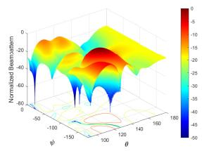

surface_3d

| θ    | Normalized Beamwidth |
|------|----------------------|
| -50  | 0                    |
| -100 | 20                   |
| -150 | 40                   |
| -100 | 60                   |
| -50  | 80                   |
| 0    | 100                  |
| 50   | 80                   |
| 100  | 60                   |
| 150  | 40                   |
| 100  | 20                   |
| 50   | 0                    |
| 100  | -20                  |
| 150  | -40                  |
| 100  | -60                  |
| 50   | -80                  |
| 100  | -60                  |
| 150  | -40                  |
| 100  | -20                  |
| 50   | 0                    |
| 100  | 20                   |
| 150  | 40                   |
| 100  | 60                   |
| 50   | 80                   |
| 100  | 60                   |
| 150  | 40                   |
| 100  | 20                   |
| 50   | 0                    |
| 100  | -20                  |
| 150  | -40                  |
| 100  | -60                  |
| 50   }<fcel>-80                  |
| 100  }<fcel>-60                  |
| 150  }<fcel>-40                  |
| 100  }<fcel>-20                  |
| 50   }<fcel>-0                  |
| 100  }<fcel>20                   |
| 150  }<fcel>40                   |
| 100  }<fcel>60                   |
| 50   }<fcel>80                   |
| 100  }<fcel>100                  |
| 150  }<fcel>120                  |
| 100  }<fcel>140                  |
| 50   }<fcel>160                  |
| 100  }<fcel>180                  |
The data is a heatmap of normalized beamwidth values against the angle θ. The x-axis represents θ in degrees, and the y-axis represents Normalized Beamwidth. The color scale indicates the value of the beamwidth for each angle. There is no label for the data series. The legend is not explicitly labeled but corresponds to the color scale.

(a) 3D beampattern of prop. arch.

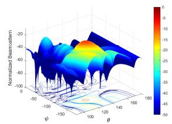

surface_3d

| θ     | ψ     | Normalized Beamstem |
|-------|-------|---------------------|
| -100  | -100  | -20                 |
| -100  | -150  | -40                 |
| -100  | -200  | -60                 |
| -150  | -100  | -40                 |
| -150  | -150  | -60                 |
| -150  | -200  | -80                 |
| 0     | -100  | -50                 |
| 0     | -150  | -70                 |
| 0     | -200  | -90                 |
| 100   | -100  | -60                 |
| 100   | -150  | -80                 |
| 100   | -200  | -100                |
| 150   | -100  | -70                 |
| 150   | -150  | -90                 |
| 150   | -200  | -110                |
| 200   | -100  | -80                 |
| 200   | -150  | -100                |
| 200   | -200  | -120                |

(b） 3D beampattern of single-layer arch.

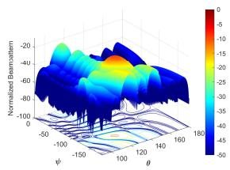

contour

| φ     | -50   | -100  | -150  | -200  | -250  | -300  | -350  | -400  | -450  | -500  |
|-------|-------|-------|-------|-------|-------|-------|-------|-------|-------|-------|
| 0     | 0     | 0     | 0     | 0     | 0     | 0     | 0     | 0     | 0     | 0     |
| 10    | 0     | 0     | 0     | 0     | 0     | 0     | 0     | 0     | 0     | 0     |
| 20    | 0     | 0     | 0     | 0     | 0     | 0     | 0     | 0     | 0     | 0     |
| 30    | 0     | 0     | 0     | 0     | 0     | 0     | 0     | 0     | 0     | 0     |
| 40    | 0     | 0     | 0     | 0     | 0     | 0     | 0     | 0     | 0     | 0     |
| 50    | 0     | 0     | 0     | 0     | 0     | 0     | 0     | 0     | 0     | 0     |
| 60    | 0     | 0     | 0     | 0     | 0     | 0     | 0     | 0     | 0     | 0     |
| 70    | 0     | 0     | 0     | 0     | 0     | 0     | 0     | 0     | 0     | 0     |
| 80    | 0     | 0     | 0     | 0     | 0     | 0     | 0     | 0     | 0     | 0     |
| 90    | 0     | 0     | 0     | 0     | 0     | 0     | 0     | 0     | 0     | 0     |
| 100   | 0     | 0     | 0     | 0     | 0     | 0     | 0     | 0     | 0     | 0     |
| 110   | 0     | 0     | 0     | 0     | 0     | 0     | 0     | 0     | 0     | 0     |
| 120   | 0     | 0     | 0     | 0     | 0     | 0     | 0     | 0     | 0     | 0     |
| 130   | 0     | 0     | 0     | 0     | 0     | 0     | 0     | 0     | 0     | 0     |
| 140   | 0     | 0     | 0     | 0     | 0     | 0     | 0     | 0     | 0     | 0     |
| 150   | 0     | 0     | 0     | 0     | 0     | 0     | 0     | 0     | 0     | 0     |
| 160   | -5    | -5    | -5    | -5    | -5    | -5    | -5    | -5    | -5    | -5    |
| -15    | -15   | -15   | -15   | -15   | -15   | -15   | -15   | -15   | -15   | -15   |
| -14    | -14   | -14   | -14   | -14   | -14   | -14   | -14   | -14   | -14   | -14   |
| -13    | -13   | -13   | -13   | -13   | -13   | -13   | -13   | -13   | -13   | -13   |
| -12    | -12   | -12   | -12   | -12   | -12   | -12   | -12   | -12   | -12   | -12   |
| -11    | -11   | -11   | -11   | -11   | -11   | -11   | -11   | -11   | -11   | -11   |
| -10    | -10   | -10   | -10   | -10   | -10   | -10   | -10   | -10   | -10   | -10   |
| -9    | -9    | -9    | -9    | -9    | -9    | -9    | -9    | -9    | -9    | -9    |
| -8    | -8    | -8    | -8    | -8    | -8    | -8    | -8    | -8    | -8    | -8    |
| -7    | -7    | -7    | -7    | -7    | -7    | -7    | -7    | -7    | -7    | -7    |
| -6    | -6    | -6    | -6    | -6    | -6    | -6    | -6    | -6    | -6    | -6    |
| -5    | -5    | -5    | -5    | -5    | -5    | -5    | -5    | -5    | -5    | -5    |
| ...   | ...   ...| ...   ...| ...   ...| ...   ...| ...   ...| ...   ...| ...   ...| ...   ...| ...   ...| ... |
| +5    / θ = ψ = φ = θ = θ = Δ = π/2π / φ = Δ = π/2π. The color scale ranges from blue (low) to red (high). Values are estimated based on the provided code. The chart displays a contour plot of normalized beamwidth against angular position θ. The legend is implicit in the color scale. The x-axis label 'θ' appears to be the angle parameter for the contour plot.

(c) 3D beampattern of digital arch.

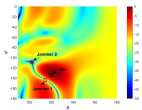

heatmap

| Point | θ    | φ     |
|-------|------|-------|
| Jammer 1 | 110  | -160  |
| Jammer 2 | 105  | -100  |
| BS | 120  | -140  |

(d) 2D beampattern of prop.arch.

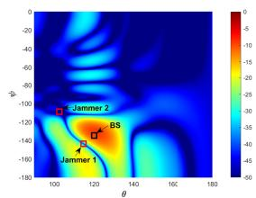

heatmap

| θ    | φ     | Value |
| ---- | ----- | ----- |
| 100  | -100  | -5    |
| 120  | -140  | -15   |
| 140  | -160  | -25   |

(e） 2D beampattern of single-layer arch.

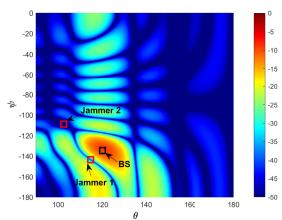

heatmap

| Label     | θ    | φ    |
|-----------|------|------|
| Jammer 2  | 100  | -100 |
| Jammer 1  | 120  | -140 |
| BS        | 120  | -160 |

(f) 2D beampatern of digital arch.

Fig. 4. Receive beampattern with different architectures (colorbar on the right is unified for 3 subfigures, unit: dB).   
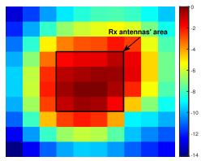

text_image

Rx antennas' area

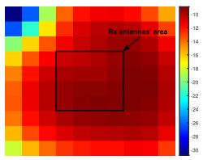

heatmap

| Rx antennas' area | Value |
| ----------------- | ----- |
| (Red box)         | 10    |

(b)

Fig. 5. Power distribution on Rx antennas for different architectures (colorbar on the right is unified for each subfigure, unit: dBW): (a) Proposed architecture with PSR 32.8%; (b) Single-layer active RIS-aided architecture with PSR 75.9%.   
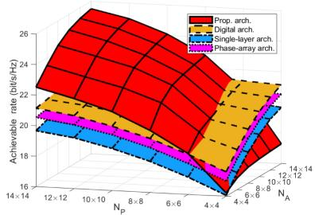  
Fig. 6. Achievable rate versus $N _ { \mathrm { P } }$ and $N _ { \mathrm { A } }$ .

Fig. 6 illustrates the achievable rate versus the number of passive and active RIS units $N _ { \mathrm { P } }$ and $N _ { \mathrm { A } }$ . It can be seen that when $N _ { \mathrm { P } } ~ < ~ 6 ~ \times ~ 6$ , the proposed architecture obtains a lower achievable rate than the other three architectures. This is because the $\mathrm { Z F }$ feasibility condition presented in Theorem 1 cannot be always satisfied when $N _ { \mathrm { P } } ~ < ~ 6 ~ \times ~ 6$ such that the jamming signals cannot be perfectly eliminated at the passive RIS and introduce huge dynamic noise at the active RIS, thereby resulting in significant performance degradation. Nonetheless, when $N _ { \mathrm { P } }$ is slightly larger than $6 \times 6 ,$ , the proposed architecture achieves the highest achievable rate among the considered schemes. The reason is that after nullifying the jamming signals at the passive RIS, the desired signal power can be enhanced in proportion to $p ^ { 2 } N _ { \mathrm { A } } ^ { 2 } N _ { \mathrm { P } } ^ { 2 }$ , whose value is significantly higher than those of the other architectures (see Figs. 4 and 5). The above results suggest that the ZF feasibility can be ensured if $N _ { \mathrm { P } }$ is only slightly larger than $N _ { \mathrm { P } } \geq 2 M \left( M + 1 \right) N _ { \mathrm { U } }$ , even under $\Delta _ { \mathrm { J } }$ , which confirms the claims presented in Theorem $\boldsymbol { \mathbf { \mathit { 1 } } } .$ Furthermore, due to $\gamma _ { \mathrm { P r o p . } } { \sim } N _ { \mathrm { A } } N _ { \mathrm { P } } , \gamma _ { \mathrm { S i n g l e } } { \sim } \left( N _ { \mathrm { P } } { + } N _ { \mathrm { A } } \right)$ in Theorem 5 and the fact that the amplitude of phase-array architecture cannot be controlled, we can see that the achievable rate of all the architectures increase with $N _ { \mathrm { P } }$ and $N _ { \mathrm { A } }$ , and the increasing spped of the proposed architecture is much higher than that of the other three architectures w.r.t. $N _ { \mathrm { P } }$ and $N _ { \mathrm { A } }$ . The finding indicates that the amplitude of passive RIS can be also partially altered, which brings about a new DoF for beamforming design that can be beneficially exploited for performance enhancement.

To find the proper fraction of active RIS’s unit number to the total unit number which leads to the best performance for implementation $( \mathrm { i . e . , } \ \beta { = } N _ { \mathrm { A } } / ( N _ { \mathrm { A } } { + } N _ { \mathrm { P } } ) )$ , Fig. 7 shows the achievable rate and energy efficiency (EE) versus $\beta ,$ and the EE is calculated by

$$
E E = R _ {\mathrm{U}} / \left(\| \mathbf {w} _ {\mathrm{B}} \| ^ {2} + \| \boldsymbol {\Xi} \widetilde {\mathbf {w}} _ {\mathrm{B}} \| ^ {2} + \sigma_ {z} ^ {2} \| \boldsymbol {\Xi} \| _ {F} ^ {2} + P _ {\text { Prop. }}\right), \tag {61}
$$

where $P _ { \mathrm { P r o p . } } = \left( N _ { \mathrm { P } } + N _ { \mathrm { A } } \right) p _ { r i s } + N _ { \mathrm { A } } p _ { a r i s } + N _ { \mathrm { U } } p _ { \mathrm { r } } + A p _ { b } ,$ $p _ { r i s } , p _ { \mathrm { r } } , p _ { \mathrm { b } }$ , and $p _ { \mathrm { a r i s } }$ are the power consumption of each RIS units, RF chain, baseband processor, and power amplifier circuit of active RIS unit, respectively. Here, we set $N _ { \mathrm { P } } { + } N _ { \mathrm { A } } =$ 100, and the power consumption of each component in the proposed architecture is the same as [30]. We can see that both the achievable rate and the energy efficiency achieve the maximum at $\beta ~ = ~ 0 . 3 6$ . The results can be explained through the following reasons. First, as shown in Theorem 5, the receive desired power $P _ { \mathrm { P r o p } }$ . is proportional to $p ^ { 2 } N _ { \mathrm { A } } ^ { 2 } N _ { \mathrm { P } } ^ { 2 }$ , thus the desired power increases when $N _ { \mathrm { P } }$ is closed to $N _ { \mathrm { A } }$ , which results in the phenomenon that both achievable rate and energy efficiency increase with $\beta$ when $\beta < 0 . 3 6$ . However, as stated in Theorem 1, $N _ { \mathrm { P } }$ should be slightly larger than $2 M \left( M + 1 \right) N _ { \mathrm { U } }$ for eliminating jamming signal, otherwise leads to performance degradation. Thus, considering with the fact that the power consumption increases with $\beta ,$ both achievable rate and energy efficiency decrease with $\beta$ when β>0.36. These findings indicate that β≈0.4 should be chosen for nullifying jamming and enhancing signal.

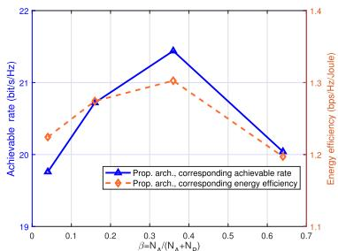

line

| β=N_A/(N_A+N_D) | Achievable rate (bit/s/Hz) | Energy efficiency (bps/Hz/doule) |
| --------------- | -------------------------- | -------------------------------- |
| 0.0             | 19.8                       | 1.2                              |
| 0.2             | 20.8                       | 1.3                              |
| 0.4             | 21.5                       | 1.3                              |
| 0.6             | 20.0                       | 1.2                              |

Fig. 7. Achievable rate and energy efficiency versus $\beta .$

Next, the convergence performance of the proposed optimization framework is illustrated in Fig. 8, where the convergence behaviors of two major algorithms, including the UM-ZF scheme in Section III-B and AMM (C/M-CCD) algorithms in Section III-C, are also illustrated. Here, SJNR is SJNR = − 20 dB, and $N _ { \mathrm { U } } = 2 \times 2$ . It can be seen that the abovementioned algorithms can monotonically converge to a stationary point for all settings of $N _ { \mathrm { P } }$ and $N _ { \mathrm { A } }$ . Besides, comparing Fig. 8 (a) and (b), we can observe that the iteration number of UM-ZF algorithm in per iteration is significantly smaller than that of AMM (C/M-CCD) algorithms. Thus, combining with the complexity analysis in Section III-F and the fact shown in Fig. 8 (c) and (d) that all the algorithms using UM-ZF converge faster than the remaining algorithms, we confirm that the proposed UM-ZF algorithm achieves the lowest complexity, which further supports the footnote 5. On the other hand, as shown in Fig. 8 (b)-(d), the C/M-CCD algorithms not only converge faster than AMM algorithm in the per iteration, but also have smaller number of iterations in the overall algorithm, which further highlights the superiority of C/M-CCD algorithm. It is also important to highlight the fact that due to the modified update for $\tau ,$ the M-CCD algorithm can achieve better convergence performance than the C-CCD algorithm.

Fig. 9 presents the achievable rate versus SJNR, where $N _ { \mathrm { P } } = 8 \times 8 , N _ { \mathrm { A } } = 4 \times 4 .$ , and $N _ { \mathrm { P } } = 2 \times 2$ . It is important to highlight the fact that the double C/M-CCD algorithms significantly outperform the algorithms using UM-ZF scheme, while the double AMM algorithm only slightly outperforms them. One of the potential reasons is that, C/M-CCD update each $p _ { i }$ and admit a closed-form solution, while both the AMM and UM-ZF algorithms directly optimize overall p. Combining with the complexity analysis in Fig. 8, we can find that in the double AMM( C/M-CCD) algorithms, the computational complexity is sacrificed for the performance enhancement. Nevertheless, it can be observed that the algorithms using UM-ZF scheme can still obtain the superior performance in comparison to the single-layer architecture as well as the SDR method, and its achievable rate is also close to that of digital architecture. Therefore, the algorithms using UM-ZF scheme obtains a good trade-off between the computational complexity and the performance, thereby contributing to the scalability of the UM-ZF algorithm. Furthermore, the UM-ZF scheme can provide the essential ZF feasibility conditions, which guides us for practical implementation. Besides, in the M-CCD algorithm, the modified update for the auxiliary variable improves the achievable rate in comparison to the C-CCD algorithm. Finally, as expected, the achievable rate of all the algorithms increases with SJNR, and all the algorithms related to the proposed architecture increase faster than the remaining, especially the AMM algorithm. This is because the unit number at the first-layer passive RIS is smaller than those of single-layer and digital architecture, such that its beam-pattern resolution is also lower, thereby resulting in the fact that it is more sensitive to jamming power. Overall, our proposed algorithms can obtain satisfactory performance in terms of both the achievable rate and complexity, and thus provide a flexible choice of algorithm for practical applications.

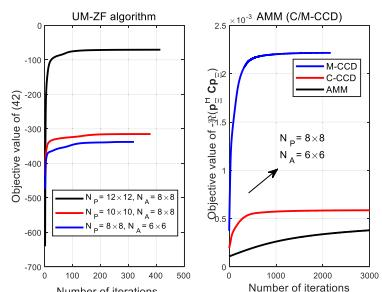

line

| Number of iterations | UM-ZF algorithm - M-CCD | UM-ZF algorithm - C-CCD | UM-ZF algorithm - AMM | AMM - M-CCD | AMM - C-CCD | AMM - AMM |
|----------------------|--------------------------|--------------------------|------------------------|-------------|-------------|-----------|
| 0                    | -100                     | -400                     | -700                   | 0           | 0           | 0         |
| 12x12                | -100                     | -350                     | -650                   | 0           | 0           | 0         |
| 10x10                | -100                     | -350                     | -650                   | 0           | 0           | 0         |
| 8x8                  | -100                     | -350                     | -650                   | 0           | 0           | 0         |
| 6x8                  | -100                     | -350                     | -650                   | 0           | 0           | 0         |
| 8x8                  | -100                     | -350                     | -650                   | 2.5e-3      | 1.5e-3      | 1.5e-3    |
| 12x12                | -100                     | -350                     | -650                   | 2.5e-3      | 1.5e-3      | 1.5e-3    |
| 24x12                | -100                     | -350                     | -650                   | 2.5e-3      | 1.5e-3      | 1.5e-3    |
| 36x12                | -100                     | -350                     | -650                   | 2.5e-3      | 1.5e-3      | 1.5e-3    |
| 48x12                | -100                     | -350                     | -650                   | 2.5e-3      | 1.5e-3      | 1.5e-3    |
| 60x12                | -100                     | -350                     | -650                   | 2.5e-3      | 1.5e-3      | 1.5e-3    |
| 72x12                | -100                     | -350                     | -650                   | 2.5e-3      | 1.5e-3      | 1.5e-3    |
| 84x12                | -100                     | -350                     | -650                   | 2.5e-3      | 1.5e-3      | 1.5e-3    |
| 96x12                | -100                     | -350                     | -650                   | 2.5e-3      | 1.5e-3      | 1.5e-3    |
| 108x12               | -100                     | -350                     | -650                   | 2.5e-3      | 1.5e-3      | 1.5e-3    |
| 120x12               | -100                     | -350                     | -650                   | 2.5e-3      | 1.5e-3      | 1.5e-3    |
| 132x12               | -100                     | -350                     | -650                   | 2.5e-3      | 1.5e-3      | 1.5e-3    |
| 144x12               | -100                     | -350                     | -650                   | 2.5e-3      | 1.5e-3      | 1.5e-3    |
| 156x12               | -100                     | -350                     | -650                   | 2.5e-3      | 1.5e-3      | 1.5e-3    |
| 168x12               | -100                     | -350                     | -650                   | 2.5e-3      | 1.5e-3      | 1.5e-3    |
| 180x12               | -100                     | -350                     | -650                   | 2.5e-3      | 1.5e-3      | 1.5e-3    |
| 192x12               | -100                     | -350                     | -650                   | 2.5e-3      | 1.5e-3      | 1.5e-3    |
| 204x12               | -100                     | -350                     | -650                   | 2.5e-3      | 1.5e-3      | 1.5e-3    |
| 216x12               | -100                     | -350                     | -650                   | 2.5e-3      | 1.5e-3      | 1.5e-3    |
| 228x12               | -100                     | -350                     | -650                   | 2.5e-3      | 1.5e-3      | 1.5e-3    |
| 240x12               | -100                     | -350                     | -650                   | 2.5e-3      | 1.5e-3      | 1.5e-3    |
| 252x12               | -100                     | -350                     | -650                   | 2.5e-3      | 1.5e-3      | 1.5e-3    |
| 264x12               | -100                     | -350                     | -650                   | 2.5e-3      | 1.5e-3      | 1.5e-3    |
| 276x12               | -100                     | -350                     | -650                   | 2.5e-3      | 1.5e-3      | 1.5e-3    |
| 288x12               | -100                     | -350                     | -650                   | 2.5e-3      | 1.5e-3      | 1.5e-3    |
| 300x12               | -100                     | -350                     | -650                   | 2.5e-3      | 1.5e-3      | 1.5e-3    |
| 312x12               | -100                     | -350                     | -650                   | 2.5e-3      | 1.5e-3      | 1.5e-3    |
| 324x12               | -100                     | -350                     | -650                   | 2.5e-3      | 1.5e-3      | 1.5e-3    |
| 336x12               | -100                     | -350                     | -650                   | 2.5e-3      | 1.5e-3      | 1.5e-3    |
| 348x12               | -100                     | -350                     | -650                   | 2.5e-3      | 1.5e-3      | 1.5e-3    |
| 360x12               | -100                     | -350                     | -650                   | 2.5e-3      | 1.5e-3      | 1.5e-3    |
| Note: The objective values are estimated based on the number of iterations (N_P = N_A = N_α = N_β = N_α^T / N_P^T * Cp_T). The data is presented in a table format as shown above by the code.

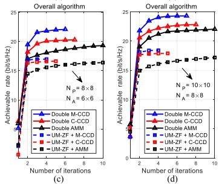

line

| Number of iterations | Double M-CCD (a) | Double C-CCD (a) | Double AMM (a) | UM-ZF + M-CCD (b) | UM-ZF + C-CCD (b) | UM-ZF + AMM (b) |
|---|---|---|---|---|---|---|
| 0 | 15.0 | 15.0 | 15.0 | 15.0 | 15.0 | 15.0 |
| 2 | 20.0 | 20.0 | 20.0 | 18.0 | 18.0 | 18.0 |
| 4 | 22.0 | 22.0 | 22.0 | 19.0 | 19.0 | 19.0 |
| 6 | 23.0 | 23.0 | 23.0 | 20.0 | 20.0 | 20.0 |
| 8 | 24.0 | 24.0 | 24.0 | 21.0 | 21.0 | 21.0 |
| 10 | 25.0 | 25.0 | 25.0 | 22.0 | 22.0 | 22.0 |

Fig. 8. Convergence of UM-ZF, AMM (C/M-CCD), and the overall algorithms under different settings of $N _ { \mathrm { P } }$ and $N _ { \mathrm { A \cdot } }$ .   
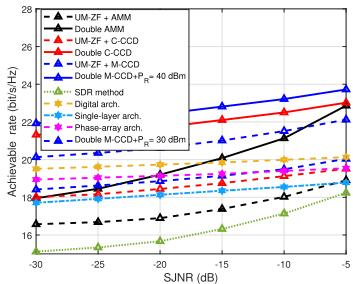

line

| SJNR (dB) | UM-ZF + AMM | Double AMM | UM-ZF + C-CCD | Double C-CCD | UM-ZF + M-CCD | Double M-CCD+PR = 40 dBm | Double M-CCD+PR = 30 dBm | Digital arch. | Single-layer arch. | Phase-array arch. | SDR method |
|---|---|---|---|---|---|---|---|---|---|---|---|
| -30 | 16.5 | 17.0 | 18.0 | 20.0 | 19.0 | 18.0 | 17.0 | 18.0 | 19.0 | 18.0 | 16.0 |
| -25 | 17.0 | 17.5 | 18.5 | 20.5 | 19.5 | 18.5 | 17.5 | 18.5 | 19.5 | 18.5 | 16.5 |
| -20 | 17.5 | 18.0 | 19.0 | 21.0 | 20.0 | 19.0 | 18.0 | 19.0 | 20.0 | 19.0 | 17.0 |
| -15 | 18.0 | 18.5 | 19.5 | 21.5 | 20.5 | 19.5 | 18.5 | 19.5 | 20.5 | 19.5 | 17.5 |
| -10 | 18.5 | 19.0 | 20.0 | 22.0 | 21.0 | 20.0 | 19.0 | 20.0 | 21.0 | 20.0 | 18.0 |
| -5 | 19.0 | 19.5 | 20.5 | 22.5 | 21.5 | 20.5 | 19.5 | 20.5 | 21.5 | 20.5 | 18.5 |
The chart displays a line graph with markers indicating the achievable rate in bit/s/Hz for each configuration at specific SJNR values (dB). The legend also includes symbols for the same configuration and uses color coding to differentiate between different configurations.

Fig. 9. Achievable rate versus SJNR.

On the other hand, we can observe that if the active RIS is equipped with a larger amplification power budget, the proposed RIS-receiver can achieve a better performance. In addition, as higher amplification power budget can introduce a larger amplification gain for the desired signals, the achievable rate gap between the schemes with 40 dBm and that with 30 dBm decreases with the increasing SJNR. Furthermore, even under $P _ { \mathrm { R , m a x } } { = 3 0 }$ dBm, the proposed

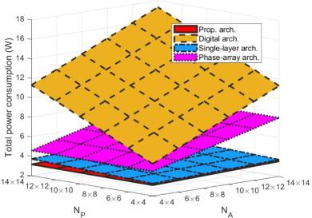  
Fig. 10. Total power consumption versus $N _ { \mathrm { P } }$ and $N _ { \mathrm { A } } .$ .

RIS-receiver can still obtain the higher achievable rate than the other benchmarks, which further confirms the superiority of our proposed architecture.

To further illustrate the low-cost feature of proposed architecture, the total power consumption versus $N _ { \mathrm { P } }$ and $N _ { \mathrm { A } }$ for different architectures is presented in Fig, 10. Here, the total power consumptions of different architectures are calculate based on the parameters in [42], [56], and [57]. It can be seen that the total power consumptions of the digital and phase-array architecture are much higher than that of the proposed cascaded RIS-receiver, due to the excessive power consumption of the RF chains and analog network for large numbers of antennas in the former. To elaborate, the analog network is comprised of power splitters, phase shifters, and line connections, which lead to high power consumption and hence reduce energy efficiency. Furthermore, we can also observe that the proposed cascaded RIS-receiver have almost the same power consumption as the single-layer one due to the utilization of the same number of RIS units. This finding confirms the proposed cascaded RIS-receiver is inherently energy- and cost-efficient compared to the benchmarks.

# VI. CONCLUSION

This paper investigated an active-passive cascaded RISaided receiver architecture for anti-jamming communications, which facilitates the deployment of a large-scale antenna array at the user side and provides additional DoFs for practical beamforming design. Utilizing this architecture and taking the imperfect angular CSI into account, a worstcase achievable rate maximization problem was formulated for simultaneously nullifying the jamming and boosting the desired signal. To handle the formulated intractable problem, a low-complexity optimization framework was developed by leveraging Lagrange dual theory, Pareto optimization theory, unified unit-modulus zero-forcing scheme, and AMM (C/M-CCD) method, which admits the semi-closed-form solutions of all optimization variables. Furthermore, the performance analysis of the proposed architecture was provided, and two jamming-nulling feasibility conditions were derived. The theoretical and simulation results showed that the receive power and the asymptotic SINR of proposed architecture are proportional to $N _ { \mathrm { A } } ^ { \mathrm { 2 } } N _ { \mathrm { P } } ^ { \mathrm { 2 } }$ and $N _ { \mathrm { A } } N _ { \mathrm { P } }$ , respectively, and the proposed algorithm can attain the excellent performance with low complexity if the channels satisfy the general triangle theorem and the number of passive units is slightly larger than 2M $( M + 1 ) N _ { \mathrm { U } }$ , which further confirmed the superiority of the proposed architecture and optimization framework in comparison with the existing ones.

# REFERENCES

[1] Y. Sun et al., “Active-passive cascaded RIS-assisted receiver design for anti-jamming communications,” in Proc. IEEE ICC, 2023, pp. 1–7.   
[2] X. Chen, D. W. K. Ng, W. H. Gerstacker, and H.-H. Chen, “A survey on multiple-antenna techniques for physical layer security,” IEEE Commun. Surveys Tuts., vol. 19, no. 2, pp. 1027–1053, 2nd Quart., 2017.   
[3] A. Mukherjee, S. A. A. Fakoorian, J. Huang, and A. L. Swindlehurst, “Principles of physical layer security in multiuser wireless networks: A survey,” IEEE Commun. Surveys Tuts., vol. 16, no. 3, pp. 1550–1573, 3rd Quart., 2014.   
[4] H. Wang, L. Zhang, T. Li, and J. Tugnait, “Spectrally efficient jamming mitigation based on code-controlled frequency hopping,” IEEE Trans. Wireless Commun., vol. 10, no. 3, pp. 728–732, Mar. 2011.   
[5] B. Gopalakrishnan and M. A. Bhagyaveni, “Random codekey selection using codebook without pre-shared keys for anti-jamming in WBAN,” Comput. Electr. Eng., vol. 51, pp. 89–103, Apr. 2016.   
[6] H. Yang et al., “Intelligent reflecting surface assisted anti-jamming communications: A fast reinforcement learning approach,” IEEE Trans. Wireless Commun., vol. 20, no. 3, pp. 1963–1974, Mar. 2021.   
[7] Y. Sun, K. An, J. Luo, Y. Zhu, G. Zheng, and S. Chatzinotas, “Intelligent reflecting surface enhanced secure transmission against both jamming and eavesdropping attacks,” IEEE Trans. Veh. Technol., vol. 70, no. 10, pp. 11017–11022, Oct. 2021.   
[8] Y. Sun, K. An, J. Luo, Y. Zhu, G. Zheng, and S. Chatzinotas, “Outage constrained robust beamforming optimization for multiuser IRS-assisted anti-jamming communications with incomplete information,” IEEE Internet Things J., vol. 9, no. 15, pp. 13298–13314, Aug. 2022.   
[9] T. T. Do, E. Björnson, E. G. Larsson, and S. M. Razavizadeh, “Jammingresistant receivers for the massive MIMO uplink,” IEEE Trans. Inf. Forensics Security, vol. 13, no. 1, pp. 210–223, Jan. 2018.   
[10] Z. Shen, K. Xu, and X. Xia, “Beam-domain anti-jamming transmission for downlink massive MIMO systems: A Stackelberg game perspective,” IEEE Trans. Inf. Forensics Security, vol. 16, pp. 2727–2742, 2021.   
[11] Q. Cheng et al., “Multi-user MIMO with jamming suppression for spectrum-efficient tactical communications,” in Proc. 14th Int. Conf. Signal Process. Commun. Syst. (ICSPCS), Dec. 2020, pp. 1–6.   
[12] X. Yu, V. Jamali, D. Xu, D. W. K. Ng, and R. Schober, “Smart and reconfigurable wireless communications: From IRS modeling to algorithm design,” IEEE Wireless Commun., vol. 28, no. 6, pp. 118–125, Dec. 2021.   
[13] C. Pan et al., “Reconfigurable intelligent surfaces for 6G systems: Principles, applications, and research directions,” IEEE Commun. Mag., vol. 59, no. 6, pp. 14–20, Jun. 2021.   
[14] Q. Wu and R. Zhang, “Intelligent reflecting surface enhanced wireless network via joint active and passive beamforming,” IEEE Trans. Wireless Commun., vol. 18, no. 11, pp. 5394–5409, Nov. 2019.   
[15] Y. Sun et al., “RIS-assisted robust hybrid beamforming against simultaneous jamming and eavesdropping attacks,” IEEE Trans. Wireless Commun., vol. 21, no. 11, pp. 9212–9231, Nov. 2022.   
[16] Q. Wu and R. Zhang, “Beamforming optimization for wireless network aided by intelligent reflecting surface with discrete phase shifts,” IEEE Trans. Commun., vol. 68, no. 3, pp. 1838–1851, Mar. 2020.   
[17] Z. Lin et al., “Refracting RIS-aided hybrid satellite-terrestrial relay networks: Joint beamforming design and optimization,” IEEE Trans. Aerosp. Electron. Syst., vol. 58, no. 4, pp. 3717–3724, Aug. 2022.   
[18] C. Pan et al., “Intelligent reflecting surface aided MIMO broadcasting for simultaneous wireless information and power transfer,” IEEE J. Sel. Areas Commun., vol. 38, no. 8, pp. 1719–1734, Aug. 2020.   
[19] L. You, J. Xiong, D. W. K. Ng, C. Yuen, W. Wang, and X. Gao, “Energy efficiency and spectral efficiency tradeoff in RIS-aided multiuser MIMO uplink transmission,” IEEE Trans. Signal Process., vol. 69, pp. 1407–1421, 2021.   
[20] L. Dong and H.-M. Wang, “Enhancing secure MIMO transmission via intelligent reflecting surface,” IEEE Trans. Wireless Commun., vol. 19, no. 11, pp. 7543–7556, Nov. 2020.   
[21] H. Yang, Z. Xiong, J. Zhao, D. Niyato, L. Xiao, and Q. Wu, “Deep reinforcement learning-based intelligent reflecting surface for secure wireless communications,” IEEE Trans. Wireless Commun., vol. 20, no. 1, pp. 375–388, Jan. 2021.   
[22] S. Hu, Z. Wei, Y. Cai, C. Liu, D. W. K. Ng, and J. Yuan, “Robust and secure sum-rate maximization for multiuser MISO downlink systems with self-sustainable IRS,” IEEE Trans. Commun., vol. 69, no. 10, pp. 7032–7049, Oct. 2021.

[23] T. Jiang and W. Yu, “Interference nulling using reconfigurable intelligent surface,” IEEE J. Sel. Areas Commun., vol. 40, no. 5, pp. 1392–1406, May 2022.   
[24] J. Ye, A. Kammoun, and M.-S. Alouini, “Reconfigurable intelligent surface enabled interference nulling and signal power maximization in mmWave bands,” IEEE Trans. Wireless Commun., vol. 21, no. 11, pp. 9096–9113, Nov. 2022.   
[25] R. Long, Y.-C. Liang, Y. Pei, and E. G. Larsson, “Active reconfigurable intelligent surface-aided wireless communications,” IEEE Trans. Wireless Commun., vol. 20, no. 8, pp. 4962–4975, Aug. 2021.   
[26] L. Dong, H.-M. Wang, and J. Bai, “Active reconfigurable intelligent surface aided secure transmission,” IEEE Trans. Veh. Technol., vol. 71, no. 2, pp. 2181–2186, Feb. 2022.   
[27] K. Liu, Z. Zhang, L. Dai, S. Xu, and F. Yang, “Active reconfigurable intelligent surface: Fully-connected or sub-connected?” IEEE Commun. Lett., vol. 26, no. 1, pp. 167–171, Jan. 2022.   
[28] Z. Yang, W. Xu, C. Huang, J. Shi, and M. Shikh-Bahaei, “Beamforming design for multiuser transmission through reconfigurable intelligent surface,” IEEE Trans. Commun., vol. 69, no. 1, pp. 589–601, Jan. 2021.   
[29] V. Jamali, A. M. Tulino, G. Fischer, R. R. Müller, and R. Schober, “Intelligent surface-aided transmitter architectures for millimeter-wave ultra massive MIMO systems,” IEEE Open J. Commun. Soc., vol. 2, pp. 144–167, 2021.   
[30] Y. Sun et al., “Energy-efficient hybrid beamforming for multilayer RIS-assisted secure integrated terrestrial-aerial networks,” IEEE Trans. Commun., vol. 70, no. 6, pp. 4189–4210, Jun. 2022.   
[31] K. Liu, Z. Zhang, L. Dai, and L. Hanzo, “Compact user-specific reconfigurable intelligent surfaces for uplink transmission,” IEEE Trans. Commun., vol. 70, no. 1, pp. 680–692, Jan. 2022.   
[32] X. Zhao, S. Lu, Q. Shi, and Z.-Q. Luo, “Rethinking WMMSE: Can its complexity scale linearly with the number of BS antennas?” IEEE Trans. Signal Process., vol. 71, pp. 433–446, 2023.   
[33] N. Zhao, J. Guo, F. R. Yu, M. Li, and V. C. M. Leung, “Antijamming schemes for interference-alignment-based wireless networks,” IEEE Trans. Veh. Technol., vol. 66, no. 2, pp. 1271–1283, Feb. 2017.   
[34] T. V. Nguyen, D. N. Nguyen, M. D. Renzo, and R. Zhang, “Leveraging secondary reflections and mitigating interference in multi-IRS/RIS aided wireless networks,” IEEE Trans. Wireless Commun., vol. 22, no. 1, pp. 502–517, Jan. 2023.   
[35] C. Hu, L. Dai, T. Mir, Z. Gao, and J. Fang, “Super-resolution channel estimation for MmWave massive MIMO with hybrid precoding,” IEEE Trans. Veh. Technol., vol. 67, no. 9, pp. 8954–8958, Sep. 2018.   
[36] G. T. de Araújo and A. L. F. de Almeida, “PARAFAC-based channel estimation for intelligent reflective surface assisted MIMO system,” in Proc. IEEE 11th Sensor Array Multichannel Signal Process. Workshop (SAM), Jun. 2020, pp. 1–5.   
[37] H. Guo and V. K. N. Lau, “Uplink cascaded channel estimation for intelligent reflecting surface assisted multiuser MISO systems,” IEEE Trans. Signal Process., vol. 70, pp. 3964–3977, 2022.   
[38] A. Mukherjee and A. L. Swindlehurst, “Detecting passive eavesdroppers in the MIMO wiretap channel,” in Proc. IEEE Int. Conf. Acoust., Speech Signal Process. (ICASSP), Mar. 2012, pp. 2809–2812.   
[39] H. Lin, F. Gao, S. Jin, and G. Y. Li, “A new view of multi-user hybrid massive MIMO: Non-orthogonal angle division multiple access,” IEEE J. Sel. Areas Commun., vol. 35, no. 10, pp. 2268–2280, Oct. 2017.   
[40] Y. Han, W. Tang, S. Jin, C.-K. Wen, and X. Ma, “Large intelligent surface-assisted wireless communication exploiting statistical CSI,” IEEE Trans. Veh. Technol., vol. 68, no. 8, pp. 8238–8242, Aug. 2019.   
[41] Y. Sun et al., “Robust design for RIS-assisted anti-jamming communications with imperfect angular information: A game-theoretic perspective,” IEEE Trans. Veh. Technol., vol. 71, no. 7, pp. 7967–7972, Jul. 2022.   
[42] Z. Lin, M. Lin, B. Champagne, W.-P. Zhu, and N. Al-Dhahir, “Secrecyenergy efficient hybrid beamforming for satellite-terrestrial integrated networks,” IEEE Trans. Commun., vol. 69, no. 9, pp. 6345–6360, Sep. 2021.   
[43] H. Zhu and J. Wang, “Chunk-based resource allocation in OFDMA systems—Part I: Chunk allocation,” IEEE Trans. Commun., vol. 57, no. 9, pp. 2734–2744, Sep. 2009.   
[44] H. Zhu and J. Wang, “chunk-based resource allocation in OFDMA systems—Part II: Joint Chunk, power and bit allocation,” IEEE Trans. Commun., vol. 60, no. 2, pp. 499–509, Feb. 2012.   
[45] X. Mu, Y. Liu, L. Guo, J. Lin, and R. Schober, “Simultaneously transmitting and reflecting (STAR) RIS aided wireless communications,” IEEE Trans. Wireless Commun., vol. 21, no. 5, pp. 3083–3098, May 2022.

[46] W. Shi and J. Ritcey, “Robust beamforming for MISO wiretap channel by optimizing the worst-case secrecy capacity,” in Proc. Conf. Rec. Forty 4th Asilomar Conf. Signals, Syst. Comput., Nov. 2010, pp. 300–304.   
[47] S. Boyd and L. Vandenberghe, Convex Optimization. Cambridge, U.K.: Cambridge Univ. Press, 2004.   
[48] S. Huang, H. Yin, J. Wu, and V. C. M. Leung, “User selection for multiuser MIMO downlink with zero-forcing beamforming,” IEEE Trans. Veh. Technol., vol. 62, no. 7, pp. 3084–3097, Sep. 2013.   
[49] K. Shen and W. Yu, “Fractional programming for communication systems—Part I: Power control and beamforming,” IEEE Trans. Signal Process., vol. 66, no. 10, pp. 2616–2630, May 2018.   
[50] M. Hong, M. Razaviyayn, Z.-Q. Luo, and J.-S. Pang, “A unified algorithmic framework for block-structured optimization involving big data: With applications in machine learning and signal processing,” IEEE Signal Process. Mag., vol. 33, no. 1, pp. 57–77, Jan. 2016.   
[51] A. Arora, C. G. Tsinos, M. R. B. Shankar, S. Chatzinotas, and B. Ottersten, “Efficient algorithms for constant-modulus analog beamforming,” IEEE Trans. Signal Process., vol. 70, pp. 756–771, 2022.   
[52] J. Song, P. Babu, and D. P. Palomar, “Optimization methods for designing sequences with low autocorrelation sidelobes,” IEEE Trans. Signal Process., vol. 63, no. 15, pp. 3998–4009, Aug. 2015.   
[53] V. Wong, R. Schober, D. W. K. Ng, and L. C. Wang, Key Technologies for 5G Wireless Systems. Cambridge, U.K.: Cambridge Univ. Press, 2017.   
[54] R. Ma, W. Yang, H. Shi, X. Lu, and J. Liu, “Covert communication with a spectrum sharing relay in the finite blocklength regime,” China Commun., vol. 20, no. 4, pp. 195–211, Apr. 2023.   
[55] S. Gong, C. Xing, X. Zhao, S. Ma, and J. An, “Unified IRS-aided MIMO transceiver designs via majorization theory,” IEEE Trans. Signal Process., vol. 69, pp. 3016–3032, 2021.   
[56] C. Huang, A. Zappone, G. C. Alexandropoulos, M. Debbah, and C. Yuen, “Reconfigurable intelligent surfaces for energy efficiency in wireless communication,” IEEE Trans. Wireless Commun., vol. 18, no. 8, pp. 4157–4170, Aug. 2019.   
[57] H. Niu et al., “Active RIS assisted rate-splitting multiple access network: Spectral and energy efficiency tradeoff,” IEEE J. Sel. Areas Commun., vol. 41, no. 5, pp. 1452–1467, May 2023.

natural_image

Portrait of a young man in a white shirt and dark jacket against a plain background (no text or symbols visible)

Yifu Sun received the B.Eng. degree in communications engineering from the National University of Defense Technology (NUDT), Changsha, China, in 2019, where he is currently pursuing the Ph.D. degree in information and communications engineering with the College of Electronic Science and Technology. His current research interests are in anti-jamming communications, reconfigurable intelligent surface, physical layer security, cooperative and cognitive communications, massive MIMO systems, and signal processing for wireless communications.

natural_image

Portrait photo of a man in formal attire (no text or symbols visible)

Yonggang Zhu received the B.S. degree in electronical engineering and the Ph.D. degree in science of military equipment from the PLA University of Science and Technology, Nanjing, China, in 2004 and 2009, respectively. Currently, he is a Research Associate Professor with the Sixty-Third Research Institute, National University of Defense Technology, Nanjing. His research interests include compressive sensing, statistical signal processing, reconfigurable intelligent surface, and anti-jamming communication.

natural_image

Portrait of a man wearing glasses and a suit (no text or symbols visible)

Kang An received the B.E. degree in electronic engineering from the Nanjing University of Aeronautics and Astronautics, Nanjing, China, in 2011, and the Ph.D. degree in communication engineering from Army Engineering University, Nanjing, in 2017. He is currently an Associate Professor with the Sixty-Third Research Institute, National University of Defense Technology, Nanjing. He has published more than 100 peer-reviewed research papers in leading journals and flagship conferences and many of them are ESI highly cited papers.

He was listed in the World’s Top 2% Scientists identified by Stanford University in 2022 and 2023. His current research interests include reconfigurable intelligent surface, anti-jamming communications, satellite/aerial communications, physical-layer security, signal processing, and machine learning for wireless communications. He was a recipient of the Exemplary Reviewer for IEEE TRANSACTIONS ON COMMUNICATIONS and IEEE COMMUNICA-TIONS LETTERS in 2022. He was also a recipient of the Outstanding Ph.D. Thesis Award of Chinese Institute of Command and Control in 2019. He was a co-recipient of the Best Paper Awards at the IEEE IWCMC 2023 and the IEEE ICCT 2023. He is serving as an Editor for Frontiers in Communications and Networks and Frontiers in Space Technologies.

natural_image

Portrait of a man wearing glasses and a suit jacket, with a lakeside background (no text or symbols visible)

Zhi Lin received the B.E. and M.E. degrees in information and communication engineering from the PLA University of Science and Technology in 2013 and 2016, respectively, and the Ph.D. degree in electronic science and technology from the Army Engineering University of PLA, Nanjing, China, in 2020. From March 2019 to June 2020, he was a Visiting Ph.D. Student with the Department of Electrical and Computer Engineering, McGill University, Montréal, Canada. Since February 2023, he has been a Post-Doctoral Fellow with the School of Computer

Science and Engineering, Macau University of Science and Technology, Macau, China. Since January 2021, he has been with the College of Electronic Engineering, National University of Defense Technology, Hefei, China, where he is currently an Associate Professor. His research interests include array signal processing, physical layer security, reconfigurable intelligent surface, and satellite-aerial-terrestrial integrated networks.

He was a recipient of the Outstanding Ph.D. Thesis Award of Chinese Institute of Electronics in 2022, the Macao Young Scholars Fellowship in 2022, and the Best Paper Award from IEEE IWCMC 2023 Conference and the IEEE ICCT 2023. He was the Symposium Co-Chair of IEEE WCSP’22 and a TPC Member of IEEE flagship conferences, including IEEE ICC, Globecom, Infocom, and VTC. He was listed in the World’s Top 2% Scientists identified by Stanford University in 2023. He has been serving as an Academic Editor for the Wireless Communications and Mobile Computing, since 2023. He was also a Lead Guest Editor of the IET Communications Special Issues on Reconfigurable Intelligent Surfaces Aided Physical Layer Security in 6G Wireless Networks.

natural_image

Portrait photo of a man in formal attire (no text or symbols visible)

Cheng Li received the B.S. degree in information engineering and the M.S. and Ph.D. degrees in information and communication engineering from the National University of Defense Technology, Changsha, in 2007, 2009, and 2015, respectively. He is currently an Assistant Research Fellow with the Sixty-Third Research Institute, National University of Defense Technology, Nanjing. His current research interests include signal processing, wireless communication, and electromagnetic countermeasure.

natural_image

Portrait of a young man wearing glasses and a sweater (no visible text or symbols)

Derrick Wing Kwan Ng (Fellow, IEEE) received the bachelor’s (Hons.) and M.Phil. degrees in electronic engineering from The Hong Kong University of Science and Technology (HKUST) in 2006 and 2008, respectively, and the Ph.D. degree from the University of British Columbia (UBC) in November 2012. He was a Senior Post-Doctoral Fellow with the Institute for Digital Communications, Friedrich-Alexander-University Erlangen-Nürnberg (FAU), Germany. He is currently a Scientia Associate Professor with The University of New South

Wales, Sydney, Australia. His research interests include global optimization, physical layer security, IRS-assisted communication, UAV-assisted communication, wireless information and power transfer, and green (energy-efficient) wireless communications.

He has been listed as a Highly Cited Researcher by Clarivate Analytics (Web of Science), since 2018. He received the Australian Research Council (ARC) Discovery Early Career Researcher Award in 2017; the IEEE Communications Society Leonard G. Abraham Prize in 2023; the IEEE Communications Society Stephen O. Rice Prize in 2022; the Best Paper Awards at the WCSP 2020 and 2021; the IEEE TCGCC Best Journal Paper Award in 2018; the INISCOM 2018; the IEEE International Conference on Communications (ICC) in 2018 and 2021; the IEEE International Conference on Computing, Networking and Communications (ICNC) in 2016; the IEEE Wireless Communications and Networking Conference (WCNC) in 2012; the IEEE Global Telecommunication Conference (Globecom) in 2011 and 2021; and the IEEE Third International Conference on Communications and Networking, China, in 2008. He served as an Editorial Assistant to the Editorin-Chief of IEEE TRANSACTIONS ON COMMUNICATIONS, from January 2012 to December 2019. He is serving as an Editor for IEEE TRANSACTIONS ON COMMUNICATIONS and the Associate Editor-in-Chief for IEEE OPEN JOURNAL OF THE COMMUNICATIONS SOCIETY.

natural_image

Portrait of a smiling man in business attire (no text or symbols visible)

Jiangzhou Wang (Fellow, IEEE) is a Professor with the University of Kent, U.K. He has published more than 400 papers and four books. His research focuses on mobile communications. He is a fellow of the Royal Academy of Engineering, U.K., and IET. He was a recipient of the 2022 IEEE Communications Society Leonard G. Abraham Prize and the IEEE Globecom 2012 Best Paper Award. He was the Technical Program Chair of the 2019 IEEE International Conference on Communications (ICC2019), Shanghai; the Executive Chair of the IEEE ICC2015,

London; and the Technical Program Chair of the IEEE WCNC2013. He is/was an Editor of a number of international journals, including IEEE TRANSAC-TIONS ON COMMUNICATIONS, from 1998 to 2013.