# Active Search for Low-altitude UAV Sensing and Communication for Users at Unknown Locations

Yuanshuai Zheng and Junting Chen

School of Science and Engineering, Shenzhen Future Network of Intelligence Institute (FNii-Shenzhen), and Guangdong Provincial Key Laboratory of Future Networks of Intelligence The Chinese University of Hong Kong, Shenzhen, Guangdong 518172, P.R. China

Abstract—This paper studies optimal unmanned aerial vehicle (UAV) placement to ensure line-of-sight (LOS) communication and sensing for a cluster of ground users possibly in deep shadow, while the UAV maintains backhaul connectivity with a base station (BS). Existing approaches generally require perfect user locations and environment information, which require explicit location signaling that may be challenging to be adopted in the standards in the near future due to privacy concerns. To address the challenge of unknown user locations, this paper develops an efficient online strategy that reconstructs a local channel map in real-time from noisy channel measurements to jointly estimate channels, explore the LOS service position, and optimize resource allocation. The proposed scheme generates a trajectory as a superposition of an LOS discovery trajectory for serving users at unknown locations and a channel estimation trajectory assuming no prior knowledge of the environment and propagation model. The LOS discovery trajectory is developed using perturbation theory and a local channel map constructed on-the-fly from online channel measurements. For local channel estimation, a spiral trajectory is found with an optimality guarantee in the minimum mean squared error (MSE) sense. Numerical results on real 3D city maps demonstrate that the proposed scheme achieves over 95% of the performance of a 3D exhaustive search scheme with just a 3-kilometer search, where no prior user location is required.

Index Terms—UAV placement, unknown user locations, perturbation theory, trajectory design, channel map construction

## I. INTRODUCTION

Millimeter wave (mmW), Terahertz (THz), and integrated optical transmissions are promising enabling technologies for 6G. However, their signals are prone to blockage in dense urban environments [1]–[3]. Unmanned aerial vehicle (UAV)-assisted communication is a promising solution to proactively avoid signal blockage, where by optimizing the position of the UAVs, line-of-sight (LOS) links can be formed between the UAV and some important ground users. However, existing UAV placement or trajectory optimization approaches are difficult to be supported by the standards because these methods require explicit location signaling from the user side, which raises privacy concerns. Thus, the challenge of incorporating low-altitude communication with active topology optimization into 6G is to design a new UAV placement strategy that does not rely on explicit user location information with little feedback signaling.

Apart from the issue of unavailable user location information, the optimization of UAV deployment poses additional challenges due to the arbitrarily complex terrain topology, which complicates modeling and predicting LOS conditions. Previous works bypassed this challenge by assuming distance-dependent pure LOS channel models [4, 5], or probabilistic channel models [6]–[9]. These simplified channel models enable a coarse analysis but sacrifice the performance by ignoring the actual LOS conditions. Some state-of-the-art works formulated blockage-aware channel models [10, 11] to assist UAV placement. For example, the authors in [10] approximated buildings as polyhedrons, and derived explicit expressions to determine the LOS status of a 3D position using an offline city map. However, the performance of these methods highly relies on the accuracy of the model of the environment.

In addition, most existing works [4]–[12] assume perfect knowledge of user locations and channel models. Nevertheless, in practical scenarios, accurate user locations and precise channel models are typically unavailable due to the location privacy of users and the uncertain non-line-of-sight (NLOS) conditions. Some recent works considered first estimating user locations and channel parameters before optimizing UAV service positions [13]–[15]. However, localization itself under possibly NLOS conditions is already a challenging problem and the performance of UAV placement highly depends on the localization accuracy of the users. Assuming the availability of 3D maps, the work [15] employed the fisher information metric to design an online trajectory for joint path-loss parameter estimation and user localization, but the global optimality and complexity remain unclear. With known user locations and maps, the work [13] utilized dynamic programming to optimize UAV trajectory for channel parameters learning and employed map compression to estimate the LOS probability for UAV positions. However, the placement performance relies on channel learning and LOS probability estimation. Without the prior knowledge of channels and user locations, a model-free approach in [14] relied on signal-to-interference-and-noise ratio (SINR) measurements and a 3D map to account for blockage and scatters, and the authors applied Q-learning to optimize UAV placement. However, the action space is restricted to four orthogonal horizontal directions on a 2D plane, and it is unclear about the theoretical guarantee on the performance. Existing state-of-the-art methods [16]–[20] are predominantly data-driven and rely on extensive historical datasets together with offline training to learn user mobility patterns, channel or beamforming strategies. While data-driven methods can achieve high accuracy in seen environments, they lack theoretical guarantees and their performance critically depends on the representativeness of the training data which may not hold in dynamic or previously unseen environments.

This paper investigates UAV trajectory design for communication and sensing services to ground users at unknown locations, while maintaining backhaul to a remote base station (BS). The goal is to develop an optimization framework for efficient UAV positioning across diverse tasks. To reduce signaling overhead and protect user privacy, the proposed method eliminates the need for explicit location reporting and relies instead on basic access signaling and occasional uplink probing to support channel gain-aware UAV trajectory design.

In this work, we develop three techniques to resolve the above challenges. First, we propose to search on an equipotential surface using trajectories developed from perturbation theory. The equipotential surface is the region of UAV positions where the sensing and communication performance for the users is balanced with capacity of the UAV-BS backhaul link. The status whether the UAV is on or off the equipotential surface can be quantified by measuring the signal-to-noise ratio (SNR), without requiring knowledge of user locations or channel parameters. While an explicit closed-form expression of the equipotential surface is not available, we employ perturbation theory to develop a search strategy so that the search trajectory remains on the equipotential surface, leading to an ordinary differential equation (ODE). Second, we propose to locally construct a channel map for each user within the LOS regime using local polynomial regression. This approach allows for a relatively simple construction of nonparametric channel models that are capable of capturing actual signal attenuations due to blockage from the possibly unknown propagation environment. Third, we develop our search strategy on the equipotential surface exploiting two universal properties: upward invariance and colinear invariance of LOS regions over almost all terrain structure. Prior studies have shown that, in certain cases, this strategy can achieve an ϵ-optimal solution globally in 3D space with a trajectory length linear of the search radius [21, 22]. Yet, the prior work [21, 22] assumed knowledge of user locations and channel model parameters.

The contributions of this paper are summarized as follows:

• We analytically show that the equipotential surface is a sphere for a class of sensing and communication problems, where the sphere parameters depend on the user distribution and the power budget.

• We develop a class of spiral trajectories to simultaneously construct the local LOS channels and search on the equipotential surface. An optimal radius of the spiral and an optimal measurement pattern for channel gain estimation are derived to minimize the mean squared error (MSE) of the locally constructed channel.

• We demonstrate that the normalized channel gain construction error is on the order of $1 0 ^ { - 2 }$ without knowing the user location or the propagation distance. With a 3-kilometer search, the proposed scheme can achieve over 95% performance of that from a 3D exhaustive search for a UAV-assisted multiuser sensing and communication problem over a dense urban area.

The remaining part of the paper is organized as follows: Section II introduces the system model and formulates a UAV-assisted sensing and communication problem. Section III discusses the geometric properties of the equipotential surface and local channel map construction. Section IV outlines the LOS discovery trajectory and proposes a superposed trajectory for optimal LOS position search. Section V presents numerical results and comparisons, while Section VI concludes the paper.

Notation: Vectors and matrices are denoted by bold x and bold capital X, respectively. $\mathcal { M } _ { m , n }$ denotes all m-by-n matrices with $\mathcal { M } _ { n }$ for square matrices. Matrix entry, column vector, and row vector are represented as $[ \mathbf { X } ] _ { ( i , j ) } , [ \mathbf { X } ] _ { ( : , j ) }$ , and $[ \mathbf { X } ] _ { ( i , : ) }$ , respectively. Matrix trace and diagonal are tr{X} and diag{X}. Expectation and variance are $\mathbb { E } \{ \cdot \}$ and $\mathbb { V } \{ \cdot \}$ . The gradient of $f ( \mathbf { x } )$ is $\nabla f ( \mathbf { x } )$ . The cross product is indicated by ×. The time derivative of $x ( t )$ is defined as $\dot { x } = \mathrm { d } x ( t ) / \mathrm { d } t . \mathrm { ~ } C$ represents a constant. The inequality $\mathbf { p } \geq 0$ indicates that all the entries in p are no less than 0.

## II. SYSTEM MODEL

In this section, we first establish an environment model with certain LOS properties. Then, a channel model for LOS propagation condition and NLOS propagation condition is defined. Finally, a general LOS-guaranteed UAV-assisted sensing and communication problem is formulated with two specific problems followed.

## A. Environment Model

Consider that a UAV serves one BS located at $\mathbf { u } _ { 0 }$ and a cluster of users without knowing their locations as shown in Fig. 1. We focus on the case where the users are clustered in an unknown neighborhood in a dense urban area. The set of users is denoted as ${ \mathcal { K } } \triangleq \{ 1 , 2 , \dots , K \}$

Let $\mathcal { X } = \{ \mathbf { x } \in \mathbb { R } ^ { 3 } : x _ { 3 } \geq H _ { \operatorname* { m i n } } \}$ be the feasible region of UAV positions where $H _ { \mathrm { m i n } }$ is the minimum flight height. While signals of ground users are likely blocked by buildings, we denote $\mathcal { D } _ { k } \subseteq \mathcal { X }$ as the region of UAV positions such that there is an LOS link between the UAV at position $\mathbf { x } \in \mathcal { D } _ { k }$ and user k at an unknown position $\mathbf { u } _ { k }$

The LOS region $\mathcal { D } _ { k }$ can be arbitrary except that $\mathcal { D } _ { k }$ is assumed to have the following properties: For any $\mathbf { x } \in \mathcal { D } _ { k }$

1) Upward invariant: any UAV position $\mathbf { x } ^ { \prime }$ perpendicularly above x also belongs to $\mathcal { D } _ { k } , i . e . , \mathbf { x } ^ { \prime } \in \mathcal { D } _ { k }$

2) Colinear invariant: any UAV position $\mathbf { x } ^ { \prime }$ that satisfies $\mathbf { x } ^ { \prime } -$ $\mathbf { u } _ { k } = \rho ( \mathbf { x } - \mathbf { u } _ { k } )$ for some $\rho > 1$ also belongs to $\mathcal { D } _ { k }$

Similarly, one can define $\mathcal { D } _ { 0 } \subseteq \mathcal { X }$ as the LOS region of UAV positions to the BS. To summarize, the upward invariant and colinear invariant properties imply that if there is an LOS link between the UAV and a user, such an LOS condition will remain if the UAV increases its altitude or moves away from the user without changing the elevation and azimuth angles. The widely adopted probabilistic LOS model in the UAV literature [23]–[26] is a special case that satisfies these properties in a statistical sense.

Define the full-LOS region $\tilde { \mathcal { D } } = \cap \mathcal { D } _ { k }$ as the set of UAV positions where there are LOS links to the BS and all the users. Since the full-LOS region is an intersection of $\mathcal { D } _ { k }$ , the upward invariant property automatically holds, $i . e . .$ , for any full-LOS position $\mathbf { x } \in \tilde { \cal D } ,$ , any position $\mathbf { x } ^ { \prime }$ perpendicularly above x is also a full-LOS position which satisfies $\mathbf { x } ^ { \prime } \in \tilde { \mathcal { D } }$ . Note that the colinear invariant property does not hold for D<sup>˜</sup>.

## B. Channel Model

Based on the LOS region $\mathcal { D } _ { k }$ , the channel gain from the UAV at position x to node k at the unknown position $\mathbf { u } _ { k }$ is modeled as

$$
\begin{array} { r } { \bar { g } _ { k } ( \mathbf { x } ) = \left\{ \begin{array} { l l } { g _ { k } ( \mathbf { x } ) } & { \mathrm { i f ~ } \mathbf { x } \in \mathcal { D } _ { k } } \\ { g _ { k } ( \mathbf { x } ) + \phi ( \mathbf { x } ) } & { \mathrm { o t h e r w i s e } } \end{array} \right. } \end{array}\tag{1a}
$$

(1b)

(1)

where $g _ { k } ( { \bf x } )$ is the LOS channel component, and $\phi ( \mathbf { x } )$ is a random variable to capture the power penalty due to the shadowing in NLOS condition [27].

The global model for the LOS channel gain $g _ { k } ( { \bf x } )$ is unknown to the system, except that $g _ { k } ( { \bf x } )$ is assumed to be Lipschitz continuous satisfying,

$$
g _ { k } ( { \mathbf x } ) \leq g _ { k } ( { \mathbf x } _ { 0 } ) + \nabla g _ { k } ( { \mathbf x } _ { 0 } ) ^ { \mathrm { T } } ( { \mathbf x } - { \mathbf x } _ { 0 } ) + \frac { L _ { g } } { 2 } d ^ { 2 } ( { \mathbf x } , { \mathbf x } _ { 0 } )\tag{2}
$$

and

$$
g _ { k } ( { \mathbf x } ) \geq g _ { k } ( { \mathbf x } _ { 0 } ) + \nabla g _ { k } ( { \mathbf x } _ { 0 } ) ^ { { \mathrm T } } ( { \mathbf x } - { \mathbf x } _ { 0 } ) - \frac { L _ { g } } { 2 } d ^ { 2 } ( { \mathbf x } , { \mathbf x } _ { 0 } )\tag{3}
$$

for all $\mathbf { x } \in \mathcal { X }$ where $L _ { g }$ is a finite constant,<sup>1</sup> and $d ( \mathbf { x } , \mathbf { x } _ { 0 } ) \triangleq$ $\lVert \mathbf { x } - \mathbf { x } _ { 0 } \rVert _ { 2 }$

While the global model $g _ { k } ( { \bf x } )$ or $\bar { g } _ { k } ( { \bf x } )$ is not available, the UAV may measure the channel gain $\bar { g } _ { k } ( { \bf x } )$ when it explores location x. The measurement model in dB is given by

$$
y = \bar { g } _ { k } ( { \bf x } ) + \xi\tag{4}
$$

where $\xi ~ \sim ~ \mathcal { N } ( 0 , \sigma ^ { 2 } )$ models the small-scale fading and the uncertainty due to the antenna gain which may not be omidirectional.

In addition, the complete geometry of $\mathcal { D } _ { k }$ is also unknown, except for a local area that has been explored by the UAV along its trajectory up to time t. Specifically, denote x(t) as the UAV position at time t. We assume that the value of LOS indicator function $\mathbb { I } \{ \mathbf { x } ( t ) \in \mathcal { D } _ { k } \}$ can be perfectly determined based on the measurements $\bar { g } _ { k } ( { \bf x } ( \tau ) )$ for $0 \leq \tau \leq t .$ . For a practical implementation, $\mathbb { I } \{ \mathbf { x } ( t ) \in \mathcal { D } _ { k } \}$ can be computed by statistical learning and hypothesis testing [12, 27].

## C. UAV-assisted Sensing and Communication with Backhaul

A common joint UAV position optimization and resource allocation problem needs to balance the performance of serving the users and the capacity of the backhaul link that the UAV connects to the BS. In addition, most sensing tasks require an LOS condition. Likewise, for a communication task, the LOS condition can substantially enhance the communication performance. These requirements lead to a general max-min problem for the LOS-guaranteed UAVassisted sensing and communication as follows.

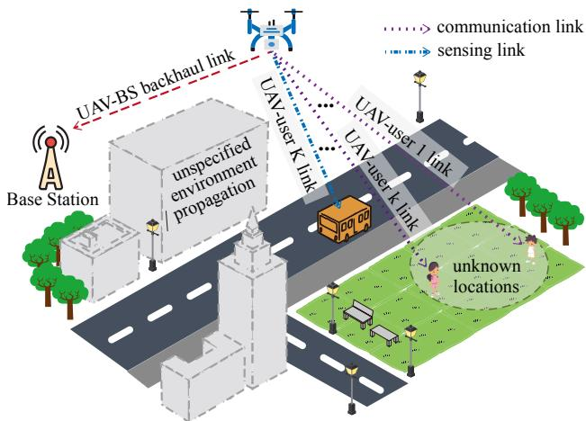  
Fig. 1. Illustration of a system where a UAV provides sensing and/or communication services for a cluster of sensing targets and/or communication users without knowing their locations, channel models, and the city topology while establishing an LOS backhaul link to a BS.

Denote $g _ { \mathrm { u } } ( \mathbf { x } )$ as a vector that collects the LOS channel gains for all the users, i.e., $g _ { \mathrm { u } } ( \mathbf { x } ) = [ g _ { 1 } ( \mathbf { x } ) , \ldots , g _ { K } ( \mathbf { x } ) ] ^ { \mathrm { T } }$ . Denote $\mathbf { p } = [ { p } _ { 1 } , { p } _ { 2 } , \ldots \ldots , { p } _ { K } ] ^ { \mathrm { T } }$ as the corresponding resource allocation given $g _ { \mathrm { u } } ( \mathbf { x } )$ . We have

$$
\begin{array} { r l } { \mathcal { P } : \quad \underset { \mathbf { x } , \mathbf { p } } { \mathrm { m a x i m i z e } } } & { \operatorname* { m i n } \{ f _ { 0 } ( g _ { 0 } ( \mathbf { x } ) ) , F _ { \mathrm { u } } ( g _ { \mathrm { u } } ( \mathbf { x } ) , \mathbf { p } ) \} } \\ & { \mathrm { s u b j e c t ~ t o } \quad \mathbf { x } \in \tilde { \mathcal { D } } , } \\ & { H _ { n } ( g _ { \mathrm { u } } ( \mathbf { x } ) , \mathbf { p } ) \leq 0 , n = 1 , 2 , \ldots , N } \end{array}\tag{5}
$$

where $f _ { 0 } ( g _ { 0 } ( \mathbf { x } ) )$ represents the objective of the BS-UAV link under the LOS condition, $F _ { \mathrm { u } } ( g _ { \mathrm { u } } ( \mathbf { x } ) , \mathbf { p } )$ represents the objective of the UAV-user links under LOS, and $H _ { n } ( g _ { \mathrm { u } } ( \mathbf { x } ) , \mathbf { p } ) \ \leq \ 0$ for $n = 1 , 2 , \ldots , N$ are the corresponding constraints for the resource allocation. Problem $\mathcal { P }$ is non-convex due to the LOS constraint on UAV positions and the fact that the blockage can have an arbitrary shape.

Such a general formulation (5) captures many typical applications for communication and sensing, with two examples illustrated as follows.

1) Balancing problem: Consider to deploy a UAV to offer sensing and/or communication services for a cluster of sensing targets and/or communication users while establishing a LOS relay link with a remote BS. Specify $p _ { k }$ as the power allocation from the UAV to user k. Denote $f _ { k } ( g _ { k } ( \mathbf { x } ) , p _ { k } )$ as the objective function for user k, and $N _ { 0 }$ as the noise power of the propagation channel. For sake of brevity, let $N _ { 0 } ~ = ~ 1$ in this paper. For a sensing task involving estimation, $f _ { k } ( g _ { k } ( \mathbf { x } ) , p _ { k } )$ can be specified as weighted SNR, i.e., $f _ { k } ( g _ { k } ( { \bf x } ) , p _ { k } ) = \mu _ { \mathrm { s } } p _ { k } g _ { k } ( { \bf x } )$ where $\mu _ { \mathrm { s } }$ is a weight of the sensing task [28, 29]. For a communication task, $f _ { k } ( g _ { k } ( \mathbf { x } ) , p _ { k } )$ can be specified as channel capacity, i.e., $f _ { k } ( g _ { k } ( \mathbf { x } ) , p _ { k } ) = \mu _ { \mathrm { c } } \log _ { 2 } ( 1 + p _ { k } g _ { k } ( \mathbf { x } ) )$ where $\mu _ { \mathrm { c } }$ is a weight of the communication task. In addition, the objective function of the BS-UAV link is given by the capacity function, i.e., $f _ { 0 } ( g _ { 0 } ( \mathbf { x } ) ) \ = \ \log _ { 2 } ( 1 + P _ { 0 } g _ { 0 } ( \mathbf { x } ) )$ where $P _ { 0 }$ is the transmit power of the BS. The balancing problem aims at maximizing the worst link performance of the BS-UAV link and the UAVuser links. Hence, the overall objective function is specified as min $\{ f _ { 0 } ( g _ { 0 } ( \mathbf { x } ) ) , \operatorname* { m i n } _ { k \in \mathcal { K } } \{ f _ { k } ( g _ { k } ( \mathbf { x } ) , p _ { k } ) \} \}$ . The balancing problem jointly optimizes the UAV position x and the power allocation p as follows

$$
\begin{array} { r l r } & { \underset { \mathbf { x } , \mathbf { p } \geq 0 } { \mathrm { m a x i m i z e } } } & { \underset { \mathbf { x } \in \mathcal { U } } { \mathrm { m i n } } \{ f _ { 0 } ( g _ { 0 } ( \mathbf { x } ) ) , \underset { k \in \mathcal { K } } { \mathrm { m i n } } \{ f _ { k } ( g _ { k } ( \mathbf { x } ) , p _ { k } ) \} \} } \\ & { \mathrm { s u b j e c t ~ t o } } & { \mathbf { x } \in \tilde { \mathcal { D } } , } \\ & { \underset { k \in \mathcal { K } } { \sum } p _ { k } \leq P _ { \mathrm { T } } } \end{array}\tag{6}
$$

where $P _ { \mathrm { T } }$ is the total transmit power of the UAV.

2) Sum-rate problem: Consider that a UAV relays signal from a BS to K ground users with other assumptions the same as that in the balancing problem. The sumrate problem aims at maximizing the sum capacity of the relay channels. Thus, the objective function is min $\begin{array} { r } { \{ f _ { 0 } ( g _ { 0 } ( \mathbf { x } ) ) , \sum _ { k \in \mathcal { K } } f _ { k } ( g _ { k } ( \mathbf { x } ) , p _ { k } ) \} } \end{array}$ where $f _ { 0 } ( g _ { 0 } ( \mathbf { x } ) )$ and $f _ { k } ( g _ { k } ( \mathbf { x } ) , p _ { k } )$ are defined in Section II-C1, and the problem is formulated as

$$
\begin{array} { r l r } & { \underset { \mathbf { x } , \mathbf { p } \geq 0 } { \mathrm { m a x i m i z e } } } & { \underset { \mathbf { \theta } } { \mathrm { m i n } } \{ f _ { 0 } ( g _ { 0 } ( \mathbf { x } ) ) , \sum _ { k \in K } f _ { k } ( g _ { k } ( \mathbf { x } ) , p _ { k } ) \} } \\ & { \mathrm { s u b j e c t ~ t o } } & { \mathbf { x } \in \tilde { \mathcal { D } } , } \\ & { } & { \displaystyle \sum _ { k \in K } p _ { k } \leq P _ { \mathrm { T } } . } \end{array}\tag{7}
$$

While the example formulation (6) is non-convex in the power allocation variable p and the problem (7) is convex in p, both cases can be handled in a same way in our proposed algorithm framework. In addition, as the channels and the LOS regions $\mathcal { D } _ { k }$ are not available before exploring near location $\mathbf { x } ,$ the UAV needs to design an online trajectory to explore the LOS opportunity, measure the channel quality, and optimize for the system performance.

Note that although orthogonal transmission is considered in our illustrative example, the proposed framework in (5) is compatible with interference-aware applications. For example, one can design the cost function $F _ { \mathrm { u } } ( \cdot )$ in (5) to incorporate interference under non-orthogonal transmission, and specifically, the objective function $f _ { k } ( \cdot )$ for each user k will depend on the SINR to capture the interference. In this case, our methodology still remains the same, except that one will need to construct a local SINR map instead of a channel gain map as discussed in Section III. To ease the discussion, we adopt orthogonal transmission here as an illustrative example.

## D. Suboptimal Solution on the Equipotential Surface

As the full LOS region $\tilde { \mathcal { D } }$ can have an arbitrary shape and is initially unknown before the exploration, finding the globally optimal solution to $\mathcal { P }$ generally requires an online exhaustive search in 3D, which is prohibitive due to the limited flight time of UAV. Thus, we compromise for a suboptimal solution on the equipotential surface.

The equipotential surface S is defined as a region where the objective of the BS-UAV link and the objective of the UAV-user links under the optimized resource allocation are equal, assuming all the links were in LOS. Specifically, define $\mathbf { p } ^ { * } ( \mathbf { x } )$ as the optimal solution to $\mathcal { P }$ given a fixed location x by ignoring the LOS constraint $\mathbf { x } \in \tilde { \mathcal { D } }$ . Denote ${ \pmb g } ( { \bf x } ) = [ g _ { 0 } ( { \bf \bar { x } } ) , { \bf \bar { g } } _ { \mathrm { u } } ( { \bf x } ) ^ { \top } ] ^ { \mathrm { T } }$ as a vector that collects the LOS channel gains from the BS and the users. Defining a balance function

$$
F ( \pmb { g } ( \mathbf { x } ) ) \overset { \Delta } { = } f _ { 0 } ( g _ { 0 } ( \mathbf { x } ) ) - F _ { \mathrm { u } } ( \pmb { g } _ { \mathrm { u } } ( \mathbf { x } ) , \mathbf { p } ^ { * } ( \mathbf { x } ) )\tag{8}
$$

the equipotential surface is defined as

$$
\mathcal { S } = \left\{ \mathbf { x } \in \mathcal { X } : F ( \pmb { g } ( \mathbf { x } ) ) = 0 \right\} .\tag{9}
$$

Recent studies [12, 21, 22] discover that searching on the equipotential surface S has significant promise in identifying the globally optimal UAV position in 3D space. First, searching on the equipotential surface reduces the search complexity from exploring in a 3D space to searching over a 2D area. Second, it has been shown that for a symmetric case with a single user and a BS, a solution can be found with only an $O ( \epsilon )$ performance gap to the globally optimal solution by searching only on the equipotential surface, for a search distance of $O ( 1 / \epsilon )$ , where the equipotential surface degenerates to a middle perpendicular plane under the condition that $P _ { 0 } ~ = ~ P _ { \mathrm { T } }$ [12, 21]. Third, even for an asymmetric case, it was also numerically demonstrated in [22], where the user locations are known, that searching on the equipotential surface in a multi-user case for a sum-rate maximization objective attains over 96% of the performance of that from an exhaustive search in the entire 3D space.

## E. Superposed Trajectory for Unknown User Locations

Since the user locations $\mathbf { u } _ { k }$ are unknown, the analytical form of the channels $\pmb { g } ( \mathbf { x } )$ is not available, and hence, no analytical form of the equipotential surface S is available to the system. As a result, while the UAV aims at searching on S, it also needs to simultaneously estimate $\pmb { g } ( \mathbf { x } )$ and construct S. A classical approach may first estimate a parametric form of $\pmb { g } ( \mathbf { x } )$ and then construct a global analytical model for S. However, it is known that a joint user localization and propagation parameter estimation for $\pmb { g } ( \mathbf { x } )$ require measurements across a large area, and such global construction is very challenging and inaccurate.

To tackle this challenge, we develop a superposed trajectory for the UAV exploration as ${ \bf x } ( t ) ~ = ~ { \bf x } _ { \mathrm { s } } ( t ) + { \bf x } _ { \mathrm { r } } ( t )$ where ${ \bf x } _ { \mathrm { s } } ( t )$ is the online search trajectory to find a suboptimal solution to $\mathcal { P }$ on $s$ based on the local information of $\pmb { g } ( \mathbf { x } )$ in the neighborhood along the search, and ${ \bf x } _ { \mathrm { r } } ( t )$ provides small deviation from ${ \bf x } _ { \mathrm { s } } ( t )$ to simultaneously collect measurements for the local reconstruction of $\pmb { g } ( \mathbf { x } )$ and S.

## III. TRAJECTORY DESIGN FOR TRACKING ON THE EQUIPOTENTIAL SURFACE

In this section, we first explore the geographic properties of $s ,$ and subsequently, demonstrate the feasibility of approximately constructing the equipotential surface without knowing the channel models and the user locations. Then, the local construction of the propagation model is studied with theoretical results on the optimal measurement pattern. A class of spiral trajectories for locally constructing the equipotential surface is proposed at the end of this section.

## A. Property of the Equipotential Surface

The equipotential surface does not exist when $s = \emptyset$ . This corresponds to a superior channel for the BS or for the users, resulting in a trivial solution where the UAV should hover above either the BS or above the cluster of the users. We focus on the scenario where $s$ does exist.

1) Existence Condition: The existence of the equipotential surface can be easily checked by evaluating the objective values at two special locations ${ \bf { x } } _ { 0 } ^ { \mathrm { { m } } } ~ = ~ { \bf { u } } _ { 0 } { \bf { \bar { \Psi } } } + [ 0 , 0 , \bar { H } _ { \mathrm { { m i n } } } ] ^ { \mathrm { T } }$ and $\begin{array} { r } { \mathbf { x } _ { \mathrm { u } } ^ { \mathrm { m } } = \sum _ { k \in \mathcal { K } } \mathbf { u } _ { k } / K + [ 0 , 0 , H _ { \mathrm { m i n } } ^ { - } ] ^ { \mathrm { T } } . } \end{array}$ A general existence condition yields $\mathrm { \bar { \it F } } ( g ( { \bf x } _ { 0 } ^ { \mathrm { m } } ) ) { \it F } ( g ( { \bf x } _ { \mathrm { u } } ^ { \mathrm { m } } ) ) \leq 0$ . This is because both the channel $\pmb { g } ( \mathbf { x } )$ and $F ( \pmb { g } ( \mathbf { x } ) )$ are continuous, and hence, there exists a path from ${ \bf x } _ { \bf u } ^ { \mathrm { m } }$ to $\mathbf { x } _ { 0 } ^ { \mathrm { { m } } }$ that reaches $F ( \pmb { g } ( \mathbf { x } ) ) = 0$

For a specific problem, such as the balancing problem in (6), the existence condition depends on the problem parameters, such as the power budget $P _ { \mathrm { T } }$

Proposition 1 (Existence condition in a specified balancing problem). For the balancing problem defined in (6) with $f _ { k } ( g _ { k } ( \mathbf { x } ) , p _ { k } ) = \log _ { 2 } ( 1 + p _ { k } g _ { k } ( \mathbf { x } ) )$ , a sufficient condition to the existence of the equipotential surface is given by

$$
\left( \frac { P _ { 0 } } { P _ { \mathrm { T } } } - \frac { 1 / g _ { 0 } ( \mathbf { x } _ { 0 } ^ { \mathrm { m } } ) } { \sum _ { k \in \mathcal { K } } ( 1 / g _ { k } ( \mathbf { x } _ { 0 } ^ { \mathrm { m } } ) ) } \right) \left( \frac { P _ { 0 } } { P _ { \mathrm { T } } } - \frac { 1 / g _ { 0 } ( \mathbf { x } _ { \mathrm { u } } ^ { \mathrm { m } } ) } { \sum _ { k \in \mathcal { K } } ( 1 / g _ { k } ( \mathbf { x } _ { \mathrm { u } } ^ { \mathrm { m } } ) ) } \right) \leq 0\tag{10}
$$

Proof. See Appendix A.

□

Proposition 1 provides an explicit condition to the existence of the equipotential surface in a typical balancing problem for maximizing the worst relay channel capacity. In particular, when $\begin{array} { r } { \mathcal { K } \stackrel {  } { = } \{ 1 \} , 1 / ( g _ { 0 } ( \mathbf { x } ) \sum _ { k \in \mathcal { K } } ( 1 / g _ { k } ( \bar { \mathbf { x } } ) ) ) } \end{array}$ is simplified as $g _ { 1 } ( \mathbf { x } ) / g _ { 0 } ( \mathbf { x } )$ , and thus the sufficient condition in (10) becomes $( P _ { 0 } / P _ { \mathrm { T } } - g _ { 1 } ( \mathbf { x } _ { 0 } ^ { \mathrm { m } } ) / g _ { 0 } ( \mathbf { x } _ { 0 } ^ { \mathrm { m } } ) ) ( P _ { 0 } / P _ { \mathrm { T } } - g _ { 1 } ( \mathbf { x } _ { \mathrm { u } } ^ { \mathrm { m } } ) / g _ { 0 } ( \mathbf { x } _ { \mathrm { u } } ^ { \mathrm { m } } ) ) \ \leq \ 0$ Consequently, there exists a point x satisfying $P _ { 0 } / P _ { \mathrm { T } } ~ =$ $g _ { 1 } ( \mathbf { x } ) / g _ { 0 } ( \mathbf { x } )$ implying that a smaller channel gain necessitates a corresponding increment in the allocated power budget.

2) Geometric Shape: While the geometric characteristics of the equipotential surface $s$ are highly related to the specific applications, the exploitation of geometric properties of $s$ in a typical balancing problem provides some insights for UAV trajectory design on ${ \mathcal { S } } .$

Proposition 2 (A spherical equipotential surface). Suppose that the channel gain satisfies $\begin{array} { r l r l } { g _ { k } ( \mathbf { x } ) } & { { } = } & { } & { { } } \end{array}$ $b _ { 0 } ~ - ~ 1 0 \log _ { 1 0 } ( d ^ { 2 } ( { \bf x } , { \bf u } _ { k } ) )$ . For the balancing problem defined in (6) with $f _ { k } ( g _ { k } ( \mathbf { x } ) , p _ { k } ) \ = \ \log _ { 2 } ( 1 + p _ { k } g _ { k } ( \mathbf { x } ) )$ the equipotential surface is a sphere centered at $\begin{array} { r l r } { \mathbf { o } } & { { } = } & { ( P _ { 0 } \sum _ { k \in \mathcal { K } } \mathbf { u } _ { k } ~ - ~ P _ { T } \mathbf { u } _ { 0 } ) / ( K P _ { 0 } ~ - ~ P _ { T } ) } \end{array}$ with radius R satisfying

$$
R ^ { 2 } = \frac { P _ { T } \| \mathbf { u } _ { 0 } \| _ { 2 } ^ { 2 } - P _ { 0 } \sum _ { k \in \mathcal { K } } \| \mathbf { u } _ { k } \| _ { 2 } ^ { 2 } } { K P _ { 0 } - P _ { T } } + \| \mathbf { o } \| _ { 2 } ^ { 2 }\tag{11}
$$

Proof. See Appendix B.

□

Knowing that the equipotential surface S is a sphere, one may estimate the center and radius of the sphere, and hence, one can easily design a trajectory exploring LOS opportunity on S. An example of the equipotential surface as stated in Proposition 2 is illustrated in Fig. 2. In general, when $s$ is not guaranteed to be a sphere, it is also inspired from Proposition 2 that S may be locally approximated by a patch from a sphere, leading to some simplified design of local trajectories. In particular, if $K = 1$ and $\begin{array} { r } { P _ { \mathrm { T } } = P _ { 0 } . } \end{array}$ , the equipotential surface becomes a middle-perpendicular plane between the BS and the user satisfying $d ( \mathbf { x } , \mathbf { u } _ { 0 } ) = d ( \mathbf { x } , \mathbf { u } _ { 1 } )$ for $\forall \mathbf { x } \in S \ [ 2 1 ]$

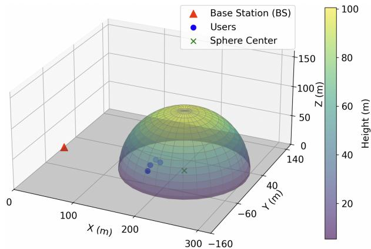  
Fig. 2. An example of the equipotential surface that forms a sphere with sphere center as (205, 5, 0) and sphere radius as 100.83 meters.

## B. Trajectory towards the Equipotential Surface

Recall that the channel gain $\pmb { g } ( \mathbf { x } )$ is not available before the UAV explores location x, and moreover, the analytical form of $F ( \pmb { g } ( \mathbf { x } ) )$ ) in (8) is not available. Here, we develop an iterative exploration strategy to move towards the equipotential surface S that satisfies $F ( \pmb { g } ( \mathbf { x } ) ) = 0$

We adopt a gradient-type search. Whenever the UAV locates off the equipotential surface $F ( \pmb { g } ( \mathbf { x } ) ) = \delta \neq 0$ at $\mathbf { x } = \mathbf { c } _ { 0 }$ , it moves to the direction that steepest decreases (or increases) $F ( \pmb { g } ( \mathbf { x } ) )$ ). A linear approximation of $F ( \pmb { g } ( \mathbf { x } ) )$ at $\mathbf { x } = \mathbf { c } _ { 0 }$ yields

$$
F ( \pmb { g } ( \mathbf { x } ) ) \approx F ( \pmb { g } ( \mathbf { c } _ { 0 } ) ) + \nabla F ( \pmb { g } ( \mathbf { c } _ { 0 } ) ) ^ { \mathrm { T } } \mathbf { G } ( \mathbf { c } _ { 0 } ) ( \mathbf { x } - \mathbf { c } _ { 0 } )\tag{12}
$$

where $\nabla F ( \pmb { g } ( \mathbf { c } _ { 0 } ) ) ^ { \mathrm { T } } \mathbf { G } ( \mathbf { c } _ { 0 } )$ represents the gradient of $F ( \pmb { g } ( \mathbf { x } ) )$ at $\mathbf { x } = \mathbf { c } _ { 0 }$ and $\mathbf { G } ( \mathbf { x } ) = [ \nabla g _ { 0 } ( \mathbf { x } ) , \nabla g _ { 1 } ( \mathbf { x } ) , \dots , \nabla g _ { K } ( \mathbf { x } ) ] ^ { \mathrm { T } }$ is the matrix that collects the gradients of the channel gains $\pmb { g } ( \mathbf { x } )$

Setting the above linear approximation (12) to 0 and noticing that $F ( \pmb { g } ( \mathbf { c } _ { 0 } ) ) = \delta$ , a nearest solution x from $\mathbf { c } _ { 0 }$ can be found by

$$
\begin{array} { r l } { \underset { \mathbf { x } } { \mathrm { m i n i m i z e } } } & { \| \mathbf { x } - \mathbf { c } _ { 0 } \| _ { 2 } ^ { 2 } } \\ { \mathrm { s u b j e c t ~ t o } } & { \nabla F ( \pmb { g } ( \mathbf { c } _ { 0 } ) ) ^ { \mathrm { T } } \mathbf { G } ( \mathbf { c } _ { 0 } ) ( \mathbf { x } - \mathbf { c } _ { 0 } ) = - F ( \pmb { g } ( \mathbf { c } _ { 0 } ) ) } \end{array}\tag{13}
$$

where the closed-form solution is obtained using the Lagrangian multiplier method as $\hat { \mathbf { x } } = \mathbf { c } _ { 0 } + \mathcal { V } ( \mathbf { c } _ { 0 } )$ , where

$$
\mathcal { V } ( \mathbf { c } _ { 0 } ) \triangleq - \frac { \mathbf { G } ( \mathbf { c } _ { 0 } ) ^ { \mathrm { T } } \nabla F ( \pmb { g } ( \mathbf { c } _ { 0 } ) ) F ( \pmb { g } ( \mathbf { c } _ { 0 } ) ) } { \| \mathbf { G } ( \mathbf { c } _ { 0 } ) ^ { \mathrm { T } } \nabla F ( \pmb { g } ( \mathbf { c } _ { 0 } ) ) \| _ { 2 } ^ { 2 } } .\tag{14}
$$

The solution xˆ provides an estimated location on ${ \mathcal { S } } .$ Consequently, the one-step exploration range for the UAV to approximately reach $s$ is given by $r _ { 0 } \triangleq \lVert \hat { \mathbf { x } } - \mathbf { c } _ { 0 } \rVert _ { 2 }$

As a result, a search trajectory for tracking S can be designed as $\mathbf { x } _ { \mathrm { s } } ( t _ { n + 1 } ) = \mathbf { x } _ { \mathrm { s } } ( t _ { n } ) + \mathcal { V } ( \mathbf { x } _ { \mathrm { s } } ( t _ { n } ) )$ . For mathematical convenience, the search trajectory ${ \bf x } _ { \mathrm { s } } ( t )$ that is described by a continuous-time ODE is given by

$$
\dot { { \mathbf x } } _ { \mathrm { s } } = \mathrm { d } { \mathbf x } _ { \mathrm { s } } ( t ) / \mathrm { d } t = \mu _ { \mathrm { v } } \mathcal { V } ( { \mathbf x } _ { \mathrm { s } } ( t ) )\tag{15}
$$

where $\mu _ { \mathrm { v } } ~ > ~ 0$ is a step size to control the speed of the trajectory.

It is observed that computing the search direction $\mathcal { V } ( \mathbf { x } )$ in (14) not only requires the channel gains $\pmb { g } ( \mathbf { x } )$ , but also its gradient $\mathbf { G } ( \mathbf { x } )$ . In the rest of this section, we develop methods and trajectory ${ \bf x } _ { \mathrm { r } } ( t )$ to locally construct $\pmb { g } ( \mathbf { x } )$ and its gradient $\mathbf { G } ( \mathbf { x } )$ at the neighborhood of ${ \bf x } _ { \mathrm { s } } ( t )$

## C. Construction of a Local Channel Map

It is well-known that directly estimating a global propagation model $g _ { k } ( { \bf x } )$ is difficult, as it leads to nonlinear regression. Instead, for each node k, we adopt a linear model $\hat { g } ( \mathbf x )$ to locally approximate the LOS channel map $g _ { k } ( { \bf x } )$ for the LOS region $\mathcal { D } _ { k }$ in the neighborhood of $\begin{array} { r } { \mathbf { x } = \mathbf { c } _ { 0 } \mathbf { : } } \end{array}$

$$
\hat { g } ( \mathbf { x } ) = \alpha + \beta ^ { \mathrm { { T } } } ( \mathbf { x } - \mathbf { c } _ { 0 } )\tag{16}
$$

where $\pmb { \theta } \triangleq [ \alpha , \beta ^ { \mathrm { T } } ] ^ { \mathrm { T } }$ , in which, $\alpha \in \mathbb { R }$ and $\beta = [ \beta _ { 1 } , \beta _ { 2 } , \beta _ { 3 } ] ^ { \mathrm { T } } \in$ $\mathbb { R } ^ { 3 }$ are channel parameters to be estimated based on the LOS measurements modeled in (4).

For each node $k ,$ let $\{ ( \mathbf { x } _ { m } , y _ { m } ) , m = 1 , 2 , \ldots , M \}$ be the set of measurements where all the measurements are assumed taken in the LOS case and $y _ { m }$ is the noisy measurement (4) with respect to (w.r.t.) to user k at $\mathbf x _ { m } = \mathbf x ( t _ { m } )$ , where the measurement noise $\xi _ { m }$ is assumed to be independent. Note that one can easily differentiate LOS from NLOS measurements by simply tracking the received signal strength. A least-squares solution of θ can be derived as [30, 31]

$$
{ \hat { \pmb { \theta } } } \triangleq \left[ \begin{array} { l } { \hat { \alpha } } \\ { \hat { \beta } } \end{array} \right] = \left( \tilde { \mathbf { X } } ^ { \mathrm { T } } \tilde { \mathbf { X } } \right) ^ { - 1 } \tilde { \mathbf { X } } ^ { \mathrm { T } } \mathbf { y }\tag{17}
$$

where $\mathbf { y } = [ y _ { 1 } , y _ { 2 } , \ldots , y _ { M } ] ^ { \mathrm { T } }$ , and $\tilde { \mathbf { X } } = [ \mathbf { 1 } , \mathbf { X } ]$ in which, 1 is a column vector of all 1s, and X is an $M \times 3$ matrix with the mth row given by $( \mathbf { x } _ { m } - \mathbf { c } _ { 0 } ) ^ { \mathrm { T } }$

As a result, for each user k, the channel gain and gradient at $\mathbf { x } = \mathbf { c } _ { 0 }$ for computing $\mathcal { V } ( \mathbf { x } )$ in (14) are estimated as $g _ { k } ( { \bf c } _ { 0 } ) =$ αˆ and $\nabla g _ { k } ( \mathbf { c } _ { 0 } ) = \hat { \beta }$

## D. Optimal Measurement Pattern

From the least-squares solution $\hat { \pmb { \theta } }$ in (17), the measurement pattern X<sup>˜</sup> affects the construction performance. We optimize the measurement pattern $\tilde { \mathbf { X } }$ via analyzing the estimation error $\pmb { \theta } ^ { \mathrm { ( e ) } } = \hat { \pmb { \theta } } - \pmb { \theta }$

Theorem 1 (Minimum variance). Given $d ( \mathbf { x } _ { m } , \mathbf { c } _ { 0 } ) \leq r _ { 1 }$ for all $m = 1 , 2 , \ldots , M ,$ the lower bound of the variance of the estimation error $\pmb { \theta } ^ { \left( \mathrm { e } \right) }$ is given by

$$
\operatorname { t r } \Big \{ \mathbb { V } \{ \pmb { \theta } ^ { ( \mathrm { e } ) } \} \Big \} \geq \frac { \sigma ^ { 2 } } { M } + \frac { 9 \sigma ^ { 2 } } { M r _ { 1 } ^ { 2 } }\tag{18}
$$

with equality achieved when the following conditions are satisfied for all coordinates $j , j ^ { \prime } \in \{ 1 , 2 , 3 \} \dot { \cdot } \stackrel { \cdot } { ( i ) } \textstyle \sum _ { m = 1 } ^ { M } ( x _ { m j } -$

$$
\begin{array} { r l } & { c _ { 0 j } \big ) = 0 ; ( i i ) \sum _ { m = 1 } ^ { M } ( x _ { m j } - c _ { 0 j } ) \big ( x _ { m j ^ { \prime } } - c _ { 0 j ^ { \prime } } \big ) = 0 , f o r j \ne j ^ { \prime } ; } \\ & { ( i i i ) \sum _ { m = 1 } ^ { M } \big ( x _ { m j } - c _ { 0 j } \big ) ^ { 2 } = M r _ { 1 } ^ { 2 } / 3 . } \end{array}
$$

Proof. See Appendix C.

Theorem 1 indicates that to achieve a minimum variance, the optimal measurement locations $\mathbf { x } _ { m }$ should be distributed in an even and symmetric way about $\mathbf { c } _ { 0 } .$ . One possible realization is to distribute the measurements uniformly on a ball with radius $M r _ { 1 } ^ { 2 } / 3$ centered at $\mathbf { c } _ { 0 }$

The variance lower bound (18) consists of two terms where the first term $\sigma ^ { 2 } / M$ represents the error of the estimated $g ( \mathbf { c } _ { 0 } ) = \alpha ,$ , and the second term represents the error of the estimated $\beta ,$ , i.e., the gradient $\nabla g ( \mathbf { c } _ { 0 } )$ of the channel gain model (see Appendix D). Both terms decrease as the number of measurements M increases. In addition, the error of $\beta$ decreases as the measurement radius $r _ { 1 }$ increases.

To derive the optimal measurement range $r _ { 1 }$ , we analyze the MSE of the locally constructed channel $\hat { g } ( \mathbf x )$ as follows.

Theorem 2 (MSE of the estimated channel gain). Suppose that $\left\{ \mathbf { x } _ { m } \right\} f o r \ m = 1 , 2 , \ldots , M$ satisfy conditions $( i ) – ( i i i )$ in Theorem 1. For location x with $r _ { 0 } = d ( { \bf x } , { \bf c } _ { 0 } )$ , the MSE of the locally constructed channel $\hat { g } ( \mathbf x )$ is upper bounded as

$$
\begin{array} { r l r } {  { \mathbb { E } \{ ( \hat { g } ( \mathbf { x } ) - g ( \mathbf { x } ) ) ^ { 2 } \} \le \frac { \sigma ^ { 2 } } { M } ( 1 + \frac { 3 r _ { 0 } ^ { 2 } } { r _ { 1 } ^ { 2 } } ) } } \\ & { } & { \quad \quad + \frac { L _ { g } ^ { 2 } } { 4 } ( r _ { 1 } ^ { 2 } + 3 r _ { 0 } r _ { 1 } + r _ { 0 } ^ { 2 } ) ^ { 2 } . } \end{array}\tag{19}
$$

In addition, $i f \mathbf { x } _ { m }$ also satisfies $\| \mathbf { x } _ { m } - \mathbf { c } _ { 0 } \| ^ { 2 } = r _ { 1 } ^ { 2 } ,$ , and $i f g ( \mathbf { x } )$ can be locally approximated by a second order mode $l , ^ { 2 } \ { \mathrm { i . e . } }$ $g ( \mathbf { x } ) \approx g ( \mathbf { c } _ { 0 } ) + \beta ^ { T } ( \mathbf { x } - \mathbf { c } _ { 0 } ) + L _ { g } ^ { \prime } \Vert \mathbf { x } - \mathbf { c } _ { 0 } \Vert ^ { 2 } / 2 ,$ , then the MSE is approximately by

$$
{  { \mathbb E } } \left\{ \left( \hat { g } ( {  { \mathbf x } } ) - g ( {  { \mathbf x } } ) \right) ^ { 2 } \right\} \approx \frac { \sigma ^ { 2 } } { M } \left( 1 + \frac { 3 r _ { 0 } ^ { 2 } } { r _ { 1 } ^ { 2 } } \right) + \frac { ( L _ { g } ^ { \prime } ) ^ { 2 } } { 4 } \left( r _ { 1 } ^ { 2 } + r _ { 0 } ^ { 2 } \right) ^ { 2 } .\tag{20}
$$

Proof. See Appendix D.

The result in Theorem 2 demonstrates a trade-off in the measurement range $r _ { 1 }$ . When the channel model $g ( \mathbf { x } )$ has a small Lipschitz constant $L _ { g }$ in (2) and (3), corresponding to a small curvature, a large range $r _ { 1 }$ is preferred for a small variance in (19), leading to a small MSE. When the channel model $g ( \mathbf { x } )$ has a large $L _ { g } ,$ , a small range $r _ { 1 }$ is preferred, because the linear model (16) becomes less accurate in the range $r _ { 0 }$ for a large $L _ { g }$

The MSE upper bound in Theorem 2 implies an optimal choice of the measurement range $r _ { 1 }$ . By minimizing the approximated MSE (20), Table I shows some numerical examples on the optimal choice of $r _ { 1 }$ under different values of M and $r _ { 0 } ,$ where $\sigma = 5$ dB and the parameter $L _ { g } ^ { \prime }$ is obtained from a free-space propagation model evaluated for a neighborhood at a propagation distance of 50 meters.

<sup>2</sup>Under free-space propagation, the parameter $L _ { g } ^ { \prime }$ in Theorem 2 can be calculated as $3 . { \overset { - } { 5 } } \times 1 0 ^ { - 3 }$ at a propagation distance of 50 meters.

TABLE I  
OPTIMAL CHOICE OF r<sub>1</sub> [METER] UNDER DIFFERENT r<sub>0</sub> [METER] AND M
<table><tr><td rowspan=1 colspan=1>ri</td><td rowspan=1 colspan=1> $\overline { { M = 4 0 } }$ </td><td rowspan=1 colspan=1> $\overline { { M = 6 0 } }$ </td><td rowspan=1 colspan=1> $\overline { { M = 8 0 } }$ </td><td rowspan=1 colspan=1> $\overline { { M = 1 0 0 } }$ </td></tr><tr><td rowspan=1 colspan=1> $r _ { 0 } = 1 0$ </td><td rowspan=1 colspan=1>17</td><td rowspan=1 colspan=1>16</td><td rowspan=1 colspan=1>15</td><td rowspan=1 colspan=1>14</td></tr><tr><td rowspan=1 colspan=1> $r _ { 0 } = 2 0$ </td><td rowspan=1 colspan=1>20</td><td rowspan=1 colspan=1>18</td><td rowspan=1 colspan=1>17</td><td rowspan=1 colspan=1>16</td></tr><tr><td rowspan=1 colspan=1> $r _ { 0 } = 3 0$ </td><td rowspan=1 colspan=1>21</td><td rowspan=1 colspan=1>20</td><td rowspan=1 colspan=1>18</td><td rowspan=1 colspan=1>17</td></tr></table>

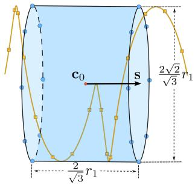  
(a)

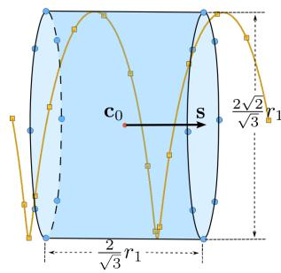  
(b)  
Fig. 3. (a) An alternating spiral trajectory (orange dots) that satisfies conditions (i)–(iii) in Theorem 1. (b) A spiral trajectory that satisfies conditions (i) and (iii) in Theorem 1 and it is smooth.

## E. Measurement Trajectory Design

Here, we construct the measurement trajectory ${ \bf x } _ { \mathrm { r } } ( t )$ to meet conditions (i)–(iii) in Theorem 1 for achieving a small error in locally constructing $\pmb { g } ( \mathbf { x } )$ along the search ${ \bf x } _ { \mathrm { s } } ( t )$

For the ease of elaboration, consider that the exploration direction is given by $\dot { \bf x } _ { \mathrm { s } } ~ = ~ { \bf s } ~ = ~ [ 0 , 1 , 0 ] ^ { \mathrm { T } }$ for a piece of trajectory ${ \bf x } _ { \mathrm { s } } ( t )$ centered at ${ \bf c } _ { 0 } = [ 0 , 0 , 0 ] ^ { \mathrm { T } }$ as illustrated in Fig. 3. One can construct a horizontal cylinder with length $2 \bar { r _ { 1 } } / \sqrt { 3 }$ and radius ${ \sqrt { 2 / 3 } } r _ { 1 }$ , where the measurement range $r _ { 1 }$ is chosen according to Theorem 2 for a good construction performance within a one-step exploration range $r _ { 0 }$ obtained while solving the equipotential surface tracking problem (13). The orientation of the cylinder is given by s. It follows that if one uniformly samples along the circumferences of the top and bottom bases of the cylinder as shown by the blue dots in Fig. 3, the resulting sampling locations $\left\{ { \bf x } _ { m } \right\}$ satisfy all conditions in Theorem 1.

Note that the above trajectory only visits two distinct positions in the direction s. Alternatively, along the search trajectory $\mathbf { x } _ { \mathrm { s } } ( t ) = [ 0 , v r _ { 1 } ( t - M / 2 ) , 0 ] ^ { \mathrm { T } }$ for a speed parameter v, one may consider an alternating spiral trajectory ${ \bf x } ( t ) =$ ${ \bf x } _ { \mathrm { s } } ( t ) + { \bf x } _ { \mathrm { r } } ( t )$ with $\mathbf { x } _ { \mathrm { r } } ( t ) = [ x _ { \mathrm { r 1 } } ( t ) , 0 , x _ { \mathrm { r 3 } } ( t ) ] ^ { \mathrm { T } }$ , where

$$
\left\{ \begin{array} { l l } { x _ { \mathrm { r 1 } } ( t ) = \sqrt { 2 / 3 } r _ { 1 } \cos ( \omega t ) } \\ { x _ { \mathrm { r 3 } } ( t ) = \sqrt { 2 / 3 } r _ { 1 } \sin ( \omega t ) ( - 1 ) ^ { \lfloor \omega t / ( 2 \pi ) \rfloor } } \end{array} \right.\tag{21}
$$

where $\omega = 4 k \pi / M$ and $v = 2 / \sqrt { M ^ { 2 } - 1 }$ , with k being a natural number, typically $k = 1 \left( \sec \mathrm { { F i g } } . 3 \left( \mathrm { { a } } \right) \right)$ . One can easily verify that if we sample at $t = m { - } 1 / 2 , i . e . , \mathbf { x } _ { m } = \mathbf { x } ( m { - } 1 / 2 )$ for $m = 1 , 2 , \ldots , M$ , then conditions $( \mathrm { i } ) { - } ( \mathrm { i } \mathrm { i } \mathrm { i } )$ in Theorem 1 are satisfied. As a result, the MSE of the locally reconstructed channel $\hat { g } _ { k } ( \mathbf { x } )$ is upper bounded by (19).

IV. TRAJECTORY DESIGN FOR SEARCHING OPTIMAL LOS POSITION ON THE EQUIPOTENTIAL SURFACE

When the search is constrained on the equipotential surface $s$ where it holds that $F ( g ( { \bf x } ) ) = f _ { 0 } ( g _ { 0 } ( { \bf x } ) ) -$ $F _ { \mathrm { u } } ( \pmb { g } _ { \mathrm { u } } ( \mathbf { x } ) , \mathbf { p } ^ { * } ( \mathbf { x } ) ) = 0$ , the original problem $\mathcal { P }$ becomes

$$
\begin{array} { r l } { \underset { \mathbf { x } , \mathbf { p } } { \operatorname { m a x i m i z e } } } & { F _ { \mathrm { u } } ( g _ { \mathrm { u } } ( \mathbf { x } ) , \mathbf { p } ) } \\ { \mathrm { s u b j e c t ~ t o } } & { \mathbf { x } \in \mathcal { S } \cap \tilde { \mathcal { D } } , } \\ & { H _ { n } ( g _ { \mathrm { u } } ( \mathbf { x } ) , \mathbf { p } ) \le 0 , n = 1 , 2 , \dotsc , N . } \end{array}\tag{22}
$$

It is very challenging to handle the constraint ${ \textbf { x } } \in { \textbf { \em S } } .$ especially when the analytical form of S is not available. Some classical approaches may consider projection-type algorithms, where the position ${ \bf x } ( t )$ is projected back to S whenever ${ \bf x } ( t )$ is off $S , \ e . g .$ , via the trajectory developed in Section III. However, such a projection-type search is not suitable for UAV trajectory design except for an initialization phase, because frequent projections may cost a large amount of maneuver energy for the UAV. Therefore, it is desired that the UAV only moves on S.

In this section, we develop a search trajectory ${ \bf x } _ { \mathrm { s } } ( t )$ sticking on the equipotential plane S without projections. The challenge is that a perturbation on ${ \bf x } _ { \mathrm { s } } ( t )$ may change the channel gain $g _ { k } ( \mathbf { x } _ { \mathrm { s } } )$ , and hence, the optimal resource allocation $\mathbf { p } ^ { * } ( \mathbf { x } _ { \mathrm { s } } )$ , possibly resulting in $F ( \pmb { g } ( \mathbf { x } _ { \mathrm { s } } ) ) \neq 0$ . We tackle this challenge via the perturbation theory.

## A. Trajectory on the Equipotential Surface

We simplify the elaboration by temporarily ignoring ${ \bf x } _ { \mathrm { r } } ( t )$ and hence, ${ \bf x } ( t ) = { \bf x } _ { \mathrm { s } } ( t )$ . Start from a position $\mathbf { x } ( 0 ) \in { \mathcal { S } } ,$ which can be obtained from the trajectory in Section III. To investigate the property of the trajectory $\mathbf { x } ( t ) \in S$ , we analyze the optimality of (22) via the Lagrangian approach as follows.

For the problem (22), denote the Lagrangian function as

$$
\begin{array} { r } { L ( \mathbf { p } , \boldsymbol { \lambda } ; g _ { \mathrm { u } } ( \mathbf { x } ) ) = F _ { \mathrm { u } } ( \mathbf { p } ; g _ { \mathrm { u } } ( \mathbf { x } ) ) - \sum _ { n = 1 } ^ { N } \lambda _ { n } H _ { n } ( \mathbf { p } ; g _ { \mathrm { u } } ( \mathbf { x } ) ) } \end{array}
$$

where $\begin{array} { l l l } { \lambda } & { = } & { [ \lambda _ { 1 } , \lambda _ { 2 } , \ldots , \lambda _ { N } ] ^ { \mathrm { T } } } \end{array}$ . The Karush-Kuhn-Tucker (KKT) conditions are written as

$$
\begin{array} { r } { \mathbf { J } ( \mathbf { p } ( \mathbf { x } ) , \boldsymbol { \lambda } ( \mathbf { x } ) ; g _ { \mathbf { u } } ( \mathbf { x } ) ) \triangleq \left[ \begin{array} { c } { \nabla _ { \mathbf { p } } L ( \mathbf { p } , \boldsymbol { \lambda } ; g _ { \mathbf { u } } ( \mathbf { x } ) ) } \\ { \boldsymbol { \lambda } _ { 1 } H _ { 1 } ( \mathbf { p } ; g _ { \mathbf { u } } ( \mathbf { x } ) ) } \\ { \boldsymbol { \lambda } _ { 2 } H _ { 2 } ( \mathbf { p } ; g _ { \mathbf { u } } ( \mathbf { x } ) ) } \\ { \vdots } \\ { \boldsymbol { \lambda } _ { N } H _ { N } ( \mathbf { p } ; g _ { \mathbf { u } } ( \mathbf { x } ) ) } \end{array} \right] = 0 } \end{array}\tag{23}
$$

together with $\lambda _ { n } \geq 0$ and $H _ { n } ( \mathbf { p } ( \mathbf { x } ) ; g _ { \mathrm { u } } ( \mathbf { x } ) ) \leq 0$ for all n. It is known that for a strictly convex problem, there is a unique solution $\{ \mathbf { p } ^ { * } , \lambda ^ { * } \}$ to $\begin{array} { r } { { \bf J } ( { \bf p } ( { \bf x } ) , \lambda ( { \bf x } ) ; g _ { \mathrm { u } } ( { \bf x } ) ) = 0 } \end{array}$ while satisfying $\lambda _ { n } \geq 0$ and $H _ { n } ( \mathbf { p } ( \mathbf { x } ) ; g _ { \mathrm { u } } ( \mathbf { x } ) ) \leq 0$

Since (23) and $F ( \pmb { g } ( \mathbf { x } ) ) = 0$ are expected to be satisfied for all $\mathbf { x } ( t ) , t \geq 0$ , we must have

$$
\left\{ \begin{array} { l l } { \frac { \mathrm { d } } { \mathrm { d } t } \mathbf { J } ( \mathbf { p } ( \mathbf { x } ( t ) ) , \lambda ( \mathbf { x } ( t ) ) ; g _ { \mathrm { u } } ( \mathbf { x } ( t ) ) ) } & { = 0 } \\ { \frac { \mathrm { d } } { \mathrm { d } t } F ( \pmb { g } ( \mathbf { x } ( t ) ) ) } & { = 0 } \end{array} \right.\tag{24}
$$

which leads to

$$
\left\{ \begin{array} { l l } { \nabla _ { \mathbf { p } } \mathbf { J } ^ { \mathrm { T } } \dot { \mathbf { p } } ^ { * } + \nabla _ { \boldsymbol { \lambda } } \mathbf { J } ^ { \mathrm { T } } \dot { \boldsymbol { \lambda } } ^ { * } + \nabla _ { g _ { \mathrm { u } } } \mathbf { J } ^ { \mathrm { T } } \nabla g _ { \mathrm { u } } ^ { \mathrm { T } } \dot { \mathbf { x } } } & { = 0 } \\ { \nabla _ { \mathbf { p } } F ^ { \mathrm { T } } \dot { \mathbf { p } } ^ { * } + \nabla _ { g } F ^ { \mathrm { T } } \nabla g ^ { \mathrm { T } } \dot { \mathbf { x } } } & { = 0 } \end{array} \right.\tag{25}
$$

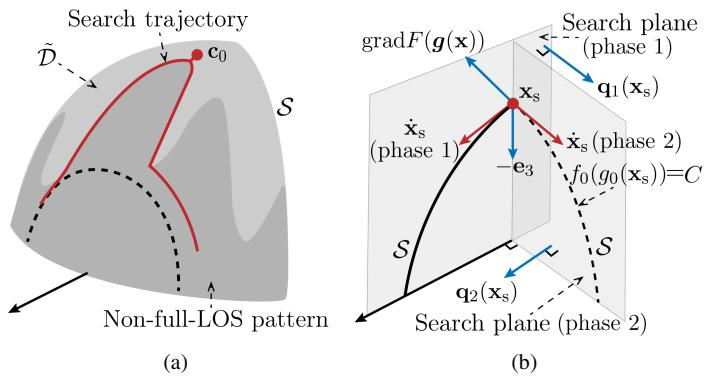  
Fig. 4. (a) LOS discovery trajectory on the equipotential surface. (b) Search directions in Phase 1 and 2.

where we use the notation $\dot { \mathbf { p } } ^ { * } = \mathbf { d } \mathbf { p } ^ { * } ( t ) / \mathbf { d } t , \dot { \lambda } ^ { * } = \mathbf { d } \lambda ^ { * } ( t ) / \mathbf { d } t ,$ and $\dot { \mathbf { x } } = \mathrm { d } \mathbf { x } ( t ) / \mathrm { d } t$

The above dynamical system (25) specifies a motion x˙ on the equipotential surface S with two spatial degrees of freedom. Suppose that the search is further constrained on a plane that intersects with S. Denote q as the normal vector of the search plane, $i . e . , \mathbf { q } ^ { \mathrm { T } } \dot { \mathbf { x } } = 0$ . Then, the dynamic of the trajectory satisfies

$$
\left[ \begin{array} { c c c } { \nabla _ { \mathbf { p } } \mathbf { J } ^ { \mathrm { T } } } & { \nabla _ { \lambda } \mathbf { J } ^ { \mathrm { T } } } & { \nabla _ { g _ { \mathrm { u } } } \mathbf { J } ^ { \mathrm { T } } \nabla g _ { \mathrm { u } } ^ { \mathrm { T } } } \\ { \nabla _ { \mathbf { p } } F ^ { \mathrm { T } } } & { \mathbf { 0 } } & { \nabla _ { g } F ^ { \mathrm { T } } \nabla g ^ { \mathrm { T } } } \\ { \mathbf { 0 } } & { \mathbf { 0 } } & { \mathbf { q } ^ { \mathrm { T } } } \\ { \mathbf { 0 } } & { \mathbf { 0 } } & { \mathbf { v } ^ { \mathrm { T } } } \end{array} \right] \left[ \begin{array} { c } { \dot { \mathbf { p } } ^ { \ast } } \\ { \dot { \lambda } ^ { \ast } } \\ { \dot { \mathbf { x } } } \end{array} \right] = \left[ \begin{array} { c } { \mathbf { 0 } } \\ { \mathbf { 1 } } \end{array} \right]\tag{26}
$$

where the vector v can be randomly chosen and the last equality $\mathbf { v } ^ { \mathrm { T } } \dot { \mathbf { x } } = 1$ is to avoid the trivial solution $\dot { \mathbf { x } } = \mathbf { 0 } , \mathbf { \dot { \xi } }$ and therefore, the system of equations (26) is completely determined.

To derive a closed-form expression for x˙ , let $\begin{array} { r l } { \mathbf { A } _ { 1 } } & { { } = } \end{array}$ $[ \begin{array} { l l } { \nabla _ { \mathbf { p } } \mathbf { J } ^ { \mathrm { T } } } & { \nabla _ { \lambda } \mathbf { J } ^ { \mathrm { T } } } \end{array} ] , \mathbf { A } _ { 2 } = \nabla _ { g _ { \mathrm { u } } } \mathbf { J } ^ { \mathrm { T } } \nabla g _ { \mathrm { u } } ^ { \mathrm { T } }$

$$
\mathbf { A } _ { 3 } = \left[ \begin{array} { c c } { \nabla _ { \mathbf { p } } F ^ { \mathrm { T } } } & { \mathbf { 0 } } \\ { \mathbf { 0 } } & { \mathbf { 0 } } \end{array} \right] , \quad \mathbf { A } _ { 4 } ( \mathbf { q } ) = \left[ \begin{array} { c } { \nabla F ^ { \mathrm { T } } \nabla g ^ { \mathrm { T } } } \\ { \mathbf { q } ^ { \mathrm { T } } } \\ { \mathbf { v } ^ { \mathrm { T } } } \end{array} \right]\tag{27}
$$

and ${ \bf e } _ { 3 } = [ 0 , 0 , 1 ] ^ { \mathrm { T } }$ . Using the block matrix inversion lemma, the dynamic x˙ as the solution to (26) can be derived as

$$
\begin{array} { r } { \dot { \mathbf { x } } = \pmb { \mathcal { A } } ( \mathbf { x } ; \mathbf { q } ) \triangleq \left( \mathbf { A } _ { 4 } ( \mathbf { q } ) - \mathbf { A } _ { 3 } \mathbf { A } _ { 1 } ^ { - 1 } \mathbf { A } _ { 2 } \right) ^ { - 1 } \mathbf { e } _ { 3 } . } \end{array}\tag{28}
$$

## B. LOS Discovery on the Equipotential Surface

The dynamical system (26) requires specifying a search direction determined by the normal vector q in (26). We present a search strategy to adaptively determine the search direction via the normal vector q to discover the best LOS opportunity that solves problem (22). The strategy is based on the following two properties.

First, consider the curve $f _ { 0 } ( g _ { 0 } ( \mathbf { x } ) ) = C$ on the equipotential surface $\mathbf { x } \in S .$ , as illustrated by the dashed curve in Fig. 4(a). It follows that the lower the curve, i.e., with a smaller radius, the larger the objective value $f _ { 0 } ( g _ { 0 } ( \mathbf { x } ) ) = F _ { \mathrm { u } } ( g _ { \mathrm { u } } ( \mathbf { x } ) , \mathbf { p } ^ { * } ( \mathbf { x } ) )$

because x is closer to the BS resulting in a larger channel gain $g _ { 0 } ( \mathbf { x } )$ . Second, there is an upward invariant property for the full LOS region $\tilde { \mathcal { D } }$ due to the environment model in Section $\mathrm { I I - A } , i . e . , \mathrm { i f } \textbf { x } \notin \tilde { \mathcal { D } }$ , the locations below x are also in NLOS.

These observations inspire the following search strategy for an LOS discovery trajectory ${ \bf x } _ { \mathrm { s } } ( t )$

• Phase 1: if $\mathbf { x } _ { \mathrm { s } } ( t ) \in \mathcal { S } \cap \tilde { \mathcal { D } } .$ , then one should decrease the altitude of ${ \bf x } _ { \mathrm { s } } ( t )$ to discover a larger $f _ { 0 } ( g _ { 0 } ( \mathbf { x } _ { \mathrm { s } } ( t ) ) )$ Thus, the search direction x˙ should lie on the tangent plane of the equipotential surface S and be as close to the downward vector $- { \bf e } _ { 3 } = [ 0 , 0 , - 1 ] ^ { \mathrm { T } }$ as possible. Analytically, the normal vector q in (26) of the search plan that contains x˙ should be orthogonal to both the normal vector grad $F ( \pmb { g } ( \mathbf { x } _ { \mathrm { s } } ) ) = \nabla F ( \pmb { g } ( \mathbf { c } _ { 0 } ) ) ^ { \mathrm { T } } \mathbf { G } ( \mathbf { c } _ { 0 } )$ for S and the downward vector −e<sub>3</sub>, i.e.,

$$
\mathbf { q } _ { 1 } ( \mathbf { x } _ { \mathrm { s } } ) = { \frac { \operatorname { g r a d } F ( { \pmb g } ( \mathbf { x } _ { \mathrm { s } } ) ) \times ( - \mathbf { e } _ { 3 } ) } { \| \operatorname { g r a d } F ( { \pmb g } ( \mathbf { x } _ { \mathrm { s } } ) ) \times ( - \mathbf { e } _ { 3 } ) \| _ { 2 } } }\tag{29}
$$

where a × b denotes the cross product of a and b.

• Phase 2: if ${ \bf x } _ { \mathrm { s } } ( t ) \in \mathcal { S }$ but ${ \textbf { x } } \notin \ \tilde { \mathcal { D } } ,$ one explores the equipotential surface following the curve $f _ { 0 } ( g _ { 0 } ( \mathbf x _ { \mathrm { s } } ( t ) ) ) =$ C to discover an LOS opportunity. Analytically, the curve $f _ { 0 } ( g _ { 0 } ( \mathbf x _ { s } ( t ) ) ) \ = \ C$ satisfies the following ODE $\begin{array} { r } { \frac { \mathrm { d } } { \mathrm { d } t } f _ { 0 } ( g _ { 0 } ( \mathbf { x } _ { \mathrm { s } } ( t ) ) ) = \nabla f _ { 0 } \nabla g _ { 0 } ^ { \mathrm { T } } \dot { \mathbf { x } } _ { \mathrm { s } } = 0 } \end{array}$ , and thus, the normal vector q is given by

$$
\mathbf { q } _ { 2 } ( \mathbf { x } _ { \mathrm { s } } ) = { \frac { \nabla f _ { 0 } ( g _ { 0 } ( \mathbf { x } _ { \mathrm { s } } ) ) \nabla g _ { 0 } ( \mathbf { x } _ { \mathrm { s } } ) ^ { \mathrm { T } } } { \left\| \nabla f _ { 0 } ( g _ { 0 } ( \mathbf { x } _ { \mathrm { s } } ) ) \nabla g _ { 0 } ( \mathbf { x } _ { \mathrm { s } } ) ^ { \mathrm { T } } \right\| _ { 2 } } } .\tag{30}
$$

## C. Superposed Trajectory via ODEs

1) The Superposed Trajectory: Here, we combine the search trajectory ${ \bf x } _ { \mathrm { s } } ( t )$ with the measurement trajectory ${ \bf x } _ { \mathrm { r } } ( t )$ developed in Section III-E, assuming the initial state satisfies $\mathbf { x } _ { \mathrm { s } } ( 0 ) \in \mathcal { S }$

First, from (15) and (28), the combined search trajectory is given by $\dot { \mathbf { x } } _ { s } = \mathcal { A } ( \mathbf { x } _ { s } ( t ) ; \mathbf { q } ( \mathbf { x } _ { s } ( t ) ) ) + \mu _ { \mathrm { v } } \mathcal { V } ( \mathbf { x } _ { s } ( t ) )$ , where the first term is to search on the equipotential surface S according to the two exploration phases (29) and (30), and the second term is to track the $s$ in case ${ \bf x } _ { \mathrm { s } } ( t )$ deviates from it due to implementation issues.

Second, consider the measurement trajectory $\begin{array} { r l } { \mathbf { x } _ { \mathrm { r } } ( t ) } & { { } = } \end{array}$ $r [ \cos ( \omega t ) , 0 , \sin ( \omega t ) ] ^ { \mathrm { T } }$ developed in Section III-E, which forms a circle on the plane with a normal vector $\begin{array} { r l } { \mathbf { e } _ { 2 } } & { { } = } \end{array}$ $[ 0 , 1 , 0 ] ^ { \mathrm { T } }$ . Then, given the search direction $\dot { \mathbf { x } } _ { \mathrm { s } } ,$ one can construct a rotation matrix ${ \bf R } ( \dot { \bf x } _ { \mathrm { s } } )$ that rotates the coordinate system with the reference direction $\mathbf { e } _ { 2 }$ to a new coordinate system with the reference direction $\dot { \bf x } _ { \mathrm { s } } / \| \dot { \bf x } _ { \mathrm { s } } \| _ { 2 }$ . The rotation matrix $\mathbf { R } ( \mathbf { s } )$ to the reference direction $\mathbf { s } ~ = ~ [ s _ { 1 } , s _ { 2 } , s _ { 3 } ] ^ { \mathrm { T } }$ is found as

$$
\mathbf { R } ( \mathbf { s } ) = \mathbf { I } - \frac { 1 } { \| \mathbf { s } \| _ { 2 } } \left[ \begin{array} { c c c } { \frac { s _ { 1 } ^ { 2 } } { \| \mathbf { s } \| _ { 2 } + s _ { 2 } } } & { s _ { 1 } } & { \frac { - s _ { 1 } s _ { 3 } } { \| \mathbf { s } \| _ { 2 } + s _ { 2 } } } \\ { - s _ { 1 } } & { \| \mathbf { s } \| _ { 2 } - s _ { 2 } } & { - s _ { 3 } } \\ { \frac { - s _ { 1 } s _ { 3 } } { \| \mathbf { s } \| _ { 2 } + s _ { 2 } } } & { s _ { 3 } } & { \frac { s _ { 3 } ^ { 2 } } { \| \mathbf { s } \| _ { 2 } + s _ { 2 } } } \end{array} \right] .
$$

The dynamical equation for the superposed UAV search trajectory ${ \bf x } ( t ) = { \bf x } _ { \mathrm { s } } ( t ) + { \bf x } _ { \mathrm { r } } ( t )$ then becomes

$$
\dot { { \bf x } } = \dot { { \bf x } } _ { \mathrm { s } } + { \bf R } ( \dot { { \bf x } } _ { \mathrm { s } } ) \dot { { \bf x } } _ { \mathrm { r } } + \frac { \mathrm { d } } { \mathrm { d } t } { \bf R } ( \dot { { \bf x } } _ { \mathrm { s } } ) { \bf x } _ { \mathrm { r } } ( t )\tag{31}
$$

$$
\dot { \mathbf { x } } _ { \mathrm { s } } = \mathcal { A } ( \mathbf { x } _ { \mathrm { s } } ( t ) ; \mathbf { q } ( \mathbf { x } _ { \mathrm { s } } ( t ) ) ) + \mu _ { \mathrm { v } } \mathcal { V } ( \mathbf { x } _ { \mathrm { s } } ( t ) )\tag{32}
$$

where $\begin{array} { r } { \dot { \mathbf { x } } _ { \mathrm { r } } ~ = ~ \mathbf { d } \mathbf { x } _ { \mathrm { r } } ( t ) / \mathbf { d } t ~ = ~ r \omega [ - \sin ( \omega t ) , 0 , \cos ( \omega t ) ] ^ { \mathrm { T } } } \end{array}$ and $\begin{array} { r } { \frac { \mathrm { d } } { \mathrm { d } t } \mathbf { R } ( \dot { \mathbf { x } } _ { \mathrm { s } } ) = \nabla \mathbf { R } ( \dot { \mathbf { x } } _ { \mathrm { s } } ) ( \mathbf { I } _ { 3 } \otimes \ddot { \mathbf { x } } _ { \mathrm { s } } ) } \end{array}$ . Here, the operator ∇R gives a matrix with $3 \times 3$ blocks, where the (i, j)th block is $\bigl [ \frac { \partial R _ { i j } } { \partial x _ { 1 } } , \frac { \partial R _ { i j } } { \partial x _ { 2 } } , \frac { \partial R _ { i j } } { \partial x _ { 3 } } \bigr ] , \ \otimes$ is the Kronecker product, and $\ddot { \bf x } _ { \mathrm { s } } ~ = { \ }$ $\mathrm { d } ^ { 2 } \mathbf { x } _ { \mathrm { s } } / \mathrm { d } t ^ { 2 }$ . In (31), the second term creates a spiral trajectory surrounding the main search route ${ \bf x } _ { \mathrm { s } } ( t )$ for collecting the channel measurement data, and the third term generates the adjustment due to the potential time variation of the search direction x˙ <sub>s</sub>.

2) Implementation: The analytical form of $\begin{array} { r } { \frac { \mathrm { d } } { \mathrm { d } t } \mathbf { R } ( \dot { \mathbf { x } } _ { \mathrm { s } } ) } \end{array}$ in (31) requires the second-order derivative of the search trajectory ${ \bf x } _ { \mathrm { s } } ( t )$ , which is not available. A simple solution is to use numerical approximations $\begin{array} { r } { \frac { \mathrm { d } } { \mathrm { d } t } \mathbf { R } ( \dot { \mathbf { x } } _ { \mathrm { s } } ) \approx \frac { \dot { 1 } } { \tau } ( \mathbf { R } ( \dot { \mathbf { x } } _ { \mathrm { s } } ( t ) ) - \mathbf { R } ( \dot { \mathbf { x } } _ { \mathrm { s } } ( t - } \end{array}$ $\tau ) ) )$ for a small enough $\tau > 0$ . Alternatively, we find the following approximations.

First, when the search ${ \bf x } _ { \mathrm { s } } ( t )$ remains in Phase 1 or Phase 2 as specified in Section IV-B, we likely have $\ddot { \mathbf { x } } _ { \mathrm { s } } \approx \mathbf { 0 } ,$ and thus the term $\begin{array} { r } { \frac { \mathrm { d } } { \mathrm { d } t } \mathbf { R } ( \dot { \mathbf { x } } _ { \mathrm { s } } ) \mathbf { x } _ { \mathrm { r } } ( t ) } \end{array}$ can be simply ignored. This is because ${ \bf x } _ { \mathrm { s } } ( t )$ is a trajectory on the equipotential surface $s ,$ and thus $\begin{array} { r } { \frac { \mathrm { d } } { \mathrm { d } t } \mathbf { R } ( \dot { \mathbf { x } } _ { \mathrm { s } } ) } \end{array}$ represents the supplementary rotation due to the curvature of $s ,$ , which is relatively small in practical regime of interest compared to the other terms.<sup>4</sup> Hence, the dynamical equation for ${ \bf x } ( t )$ in this case is approximated as

$$
\dot { \mathbf { x } } \approx \dot { \mathbf { x } } _ { \mathrm { s } } + \mathbf { R } ( \dot { \mathbf { x } } _ { \mathrm { s } } ) \dot { \mathbf { x } } _ { \mathrm { r } } .\tag{33}
$$

Second, when the search ${ \bf x } _ { \mathrm { s } } ( t )$ needs to switch, for instance, from Phase 1 to Phase 2 at time $t = t _ { 1 }$ , the search direction needs to switch between $\dot { \mathbf { x } } _ { \mathrm { s } } ( t _ { 1 } ^ { - } ) = \boldsymbol { A } ( \mathbf { x } _ { \mathrm { s } } ( t _ { 1 } ^ { - } ) ; \mathbf { q } _ { 1 } ( \mathbf { x } _ { \mathrm { s } } ( t _ { 1 } ^ { - } ) ) )$ and $\dot { \mathbf { x } } _ { \mathrm { s } } ( t _ { 1 } ^ { + } ) = \mathcal { A } ( \mathbf { x } _ { \mathrm { s } } ( t _ { 1 } ^ { + } ) ; \mathbf { q } _ { 2 } ( \mathbf { x } _ { \mathrm { s } } ( t _ { 1 } ^ { + } ) ) )$ , assuming $\mathcal { V } ( \mathbf { x } _ { \mathrm { s } } ( t ) ) = 0$ for simplicity. Thus, $\begin{array} { r } { \frac { \mathrm { d } } { \mathrm { d } t } \mathbf { R } ( \dot { \mathbf { x } } _ { \mathrm { s } } ) } \end{array}$ does not exist as $\ddot { \mathbf { x } } _ { \mathrm { s } }$ does not exist, since $\dot { { \bf x } } _ { \mathrm { s } } ( t _ { 1 } ^ { - } ) \neq \dot { { \bf x } } _ { \mathrm { s } } ( t _ { 1 } ^ { + } )$ . To circumvent this issue, a transition phase $t \in ( t _ { 1 } , t _ { 1 } + \tau )$ is needed, where without altering ${ \bf x } _ { \mathrm { s } } ( t )$ $i . e . , \dot { \bf x } _ { \mathrm { s } } = 0$ , we smoothly switch $\dot { \bf x } _ { \mathrm { s } }$ from $\dot { { \bf x } } _ { \mathrm { s } } ( t _ { 1 } ^ { - } )$ to $\dot { { \bf x } } _ { \mathrm { s } } ( t _ { 1 } ^ { + } )$ using a linear transition

$$
\dot { { \bf x } } _ { \mathrm { t } } = \frac { \tau - t + t _ { 1 } } { \tau } \dot { { \bf x } } _ { \mathrm { s } } ( t _ { 1 } ^ { - } ) + \frac { t - t _ { 1 } } { \tau } \dot { { \bf x } } _ { \mathrm { s } } ( t _ { 1 } ^ { + } ) , t \in ( t _ { 1 } , t _ { 1 } + \tau )\tag{34}
$$

which yields $\begin{array} { r } { \ddot { { \mathbf x } } _ { \mathrm { t } } ~ = ~ \frac { 1 } { \tau } ( \dot { { \mathbf x } } _ { \mathrm { s } } ( t _ { 1 } ^ { + } ) - \dot { { \mathbf x } } _ { \mathrm { s } } ( t _ { 1 } ^ { - } ) ) } \end{array}$ . As a result, the dynamical equation for ${ \bf x } ( t )$ becomes, for $t \in ( t _ { 1 } , t _ { 1 } + \tau )$

$$
\dot { \mathbf { x } } = \mathbf { R } ( \dot { \mathbf { x } } _ { \mathrm { t } } ) \dot { \mathbf { x } } _ { \mathrm { r } } + \frac { 1 } { \tau } \nabla \mathbf { R } ( \dot { \mathbf { x } } _ { \mathrm { t } } ) ( \mathbf { I } _ { 3 } \otimes ( \dot { \mathbf { x } } _ { \mathrm { s } } ( t _ { 1 } ^ { + } ) - \dot { \mathbf { x } } _ { \mathrm { s } } ( t _ { 1 } ^ { - } ) ) ) \mathbf { x } _ { \mathrm { r } } ( t ) .\tag{35}
$$

A sample implementation is summarized in Algorithm 1, and a flow chart of the overall online search framework is shown in Fig. 5. The core of this framework superposes two trajectories: an LOS-discovery component ${ \bf x } _ { \mathrm { s } } ( t )$ for superior positioning and a spiral component ${ \bf x } _ { \mathrm { r } } ( t )$ for online channel estimation, which work synergistically in a closed loop.

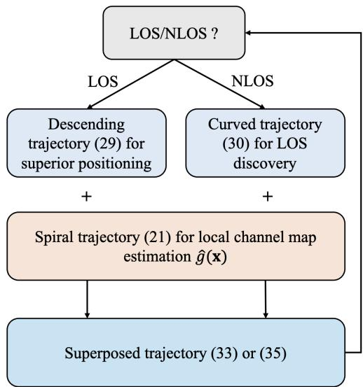  
Fig. 5. A flowchart of the online search framework via superposition of LOS discovery and channel estimation trajectories.

3) Complexity Analysis: As Algorithm 1 is an online search scheme, we investigate two different metrics for an understanding of its complexity: the trajectory length of the UAV and the per-step computational complexity every time the UAV adjusts its course.

The following proposition shows the trajectory length is linear in the radius of the equipotential surface under certain conditions.

Proposition 3 (Upper bound of trajectory length). Suppose that $g _ { k } ( { \bf x } ) = b _ { 0 } - 1 0 \log _ { 1 0 } ( d ^ { 2 } ( { \bf x } , { \bf u } _ { k } ) )$ . For the balancing problem defined in (6) with $f _ { k } ( g _ { k } ( \mathbf { x } ) , p _ { k } ) ~ = ~ \log _ { 2 } ( 1 ~ +$ $p _ { k } g _ { k } ( \mathbf { x } ) )$ ), the trajectory length L is upper bounded as

$$
L \leq \pi ( H _ { 0 } + R ) \sqrt { 3 \pi ^ { 2 } r _ { 1 } ^ { 2 } + 1 }\tag{36}
$$

where $H _ { 0 }$ is the initial search altitude, R is the radius of the equipotential surface given in (11), and $r _ { 1 }$ is the measurement range.

Proof. See Appendix E.

Proposition 3 suggests that reducing the initial search altitude decreases the upper bound of the trajectory length L. Additionally, the trajectory length L is related to the radius R of the equipotential surface. In a special case where $\mathbf { u } _ { 0 } =$ $[ 0 , 0 , 0 ] ^ { \mathrm { T } } , K = 1$ , and $P _ { 0 } > P _ { \mathrm { T } } > 0 , R ^ { 2 }$ in (11) simplifies to $\begin{array} { r } { \dot { R } ^ { 2 } = P _ { 0 } / ( P _ { 0 } - P _ { \mathrm { T } } ) ( P _ { 0 } / ( P _ { 0 } - P _ { \mathrm { T } } ) - 1 ) d ^ { 2 } ( \mathbf { u } _ { 0 } , \mathbf { u } _ { 1 } ) } \end{array}$ , which indicates that R is linear in $d ( \mathbf { u } _ { 0 } , \mathbf { u } _ { 1 } )$ . Thus, the worstcase search trajectory length is linear in the BS-user distance $d ( \mathbf { u } _ { 0 } , \mathbf { u } _ { 1 } )$

Recall that K is the number of users, M is the number of measurements used for local channel map construction, and N is the number of constraints for resource allocation in problem (22). The computational complexity of Steps 3 and 4 in Algorithm 1 is found as $O ( K M + ( K + N ) ^ { 3 } )$ . See Appendix F for a detailed derivation of the computational complexity.

```latex
Algorithm 1 Superposed LOS discovery and measurement
collection trajectory with unknown user locations
Find a full-LOS initial position $\mathbf { x } _ { 0 } \in \mathcal { S } \cap \tilde { \mathcal { D } } .$ Denote ${ \bf x } _ { \mathrm { r } } ( t ) =$
$r [ \cos ( \omega t ) , 0 , \sin ( \omega t ) ] ^ { \mathrm { T } }$
1) Initialization at $t = 0 \colon \tilde { \mathbf { x } } = \mathbf { x } _ { 0 } , \mathbf { x } _ { \mathrm { s } } ( 0 ) = \mathbf { x } _ { 0 } ,$ and $\mathbf { x } ( 0 ) =$
$\mathbf { x } _ { \mathrm { s } } ( 0 ) + \mathbf { x } _ { \mathrm { r } } ( 0 ) .$
2) While $x _ { 3 } ( t ) \geq H _ { \operatorname* { m i n } } \colon$
3) Local channel construction: Collect channel
measurements for each time slot $\triangle t .$ Construct the
local channel $\hat { g } _ { k } ( \mathbf { x } )$ and obtain the estimation of $\nabla g _ { k } ( { \bf x } )$
for each user based on model (16) with parameters (17)
estimated from the past M LOS measurements.
4) Update the UAV location ${ \bf x } ( t )$ according to the following
cases:
a) Phase 1 (LOS): If $\mathbf { x } ( t - \Delta t ) , \mathbf { x } ( t ) \in \tilde { \mathcal { D } } ,$
i) If $f _ { 0 } ( g _ { 0 } ( { \bf x } _ { s } ( t ) ) ) > f _ { 0 } ( g _ { 0 } ( \tilde { \bf x } ) )$ , then update the
optimal position $\tilde { \mathbf { x } } \gets \mathbf { x } _ { \mathrm { s } } ( t )$
ii) Compute the search direction $\begin{array} { r l } { \mathbf { s } ( t ) } & { { } = } \end{array}$
$\begin{array} { r } { \mathcal { A } ( \mathbf { x } _ { \mathrm { s } } ( t ) ; \mathbf { q } _ { 1 } ( \mathbf { x } _ { \mathrm { s } } ( t ) ) ) \ + \ \mu _ { \mathrm { v } } \mathcal { V } ( \mathbf { x } _ { \mathrm { s } } ( t ) ) } \end{array}$ from (14),
(28), and (29).
iii) Update ${ \bf x } _ { \mathrm { s } } ( t + \triangle t ) = { \bf x } _ { \mathrm { s } } ( t ) + { \bf s } \triangle t$ and $\mathbf { x } ( t + \triangle t ) =$
${ \bf x } ( t ) + ( { \bf s } + { \bf R } ( { \bf s } ) \dot { { \bf x } } _ { \mathrm { r } } ) \triangle t$ according to (31) and (33).
b) Phase $\begin{array} { r } { 2 \ ( \mathbf { N L O S } ) \colon \mathrm { I f } \ \mathbf { x } ( t - \Delta t ) , \mathbf { x } ( t ) \neq \tilde { \mathcal { D } } , } \end{array}$
i) Compute the search direction s(t) =
$\begin{array} { r } { \mathcal { A } ( \mathbf { x } _ { \mathrm { s } } ( t ) ; \mathbf { q } _ { 2 } ( \mathbf { x } _ { \mathrm { s } } ( t ) ) ) \ + \ \mu _ { \mathrm { v } } \mathcal { V } ( \mathbf { x } _ { \mathrm { s } } ( t ) ) } \end{array}$ from (14),
(28), and (30).
ii) The same as Step 4(a)iii.
c) Otherwise (Transition Phase):
i) Let $t _ { 1 } \gets t - \triangle t .$
ii) Compute x˙ and ${ \boldsymbol { \delta } } = { \dot { \mathbf { x } } }$ respectively according to
(34) and (35), by replacing $\mathbf { \tilde { x } } _ { \mathrm { s } } ( t _ { 1 } ^ { - } ) ^ { , }$ with s(t<sub>1</sub>) and
replacing $\cdots \dot { \mathbf { x } } _ { \mathrm { s } } ( t _ { 1 } ^ { + } ) ^ { \flat }$ with $\mathbf { s } ( t _ { 1 } + \triangle t )$
iii) Update $\mathbf { x } _ { \mathrm { s } } ( t + \bar { \triangle } t ) = \mathbf { x } _ { \mathrm { s } } ( t )$ and $\mathbf { x } ( t + \triangle t ) = \mathbf { x } ( t ) +$
$\delta \triangle t .$
iv) Repeat from Step 4(c)ii until $t \geq t _ { 1 } + \tau .$
5) End while; output $\tilde { \mathbf { x } }$ as the best position found on ${ \cal S } \cap \tilde { \cal D } .$
```

## V. NUMERICAL RESULTS

In this section, we present the experimental findings conducted on two real 3D urban maps.

## A. Environment Setup and Scenarios

Two city maps of different areas in Beijing, China are used to evaluate the proposed scheme. As shown in Fig. 6, map A represents a sparse commercial area with the building coverage ratio (BCR) and floor area ratio (FAR) [33] as 18% and 1.0, respectively, while map B represents a dense residential area with the BCR and FAR as 33% and 1.86, respectively. The minimum flying altitudes $H _ { \mathrm { m i n } }$ are set as 29 and 62 meters on maps A and B, respectively, which correspond to the minimum height of the top 20% tallest buildings. The users are placed uniformly at random in the non-building area for 2000 repetitions, with the BS placed above an arbitrarily chosen building. For the proposed scheme, $M , \omega , r , \mu _ { \mathrm { v } }$ , and τ are set as 100, π/25, 25, 1, and 5, respectively.

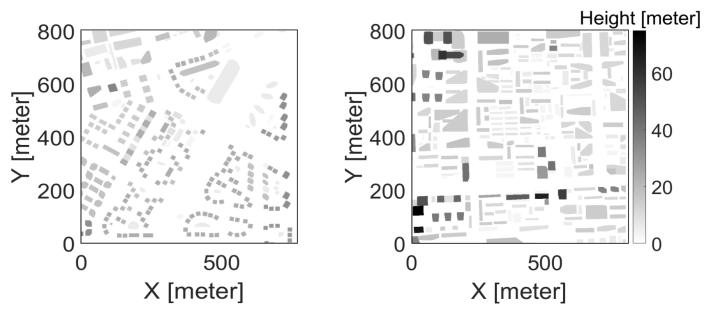  
Figure 6. Map A (left) is a sparse commercial area, and map B (right) is a dense residential area in Beijing, China.

Two application scenarios are evaluated in our experiments. For a sum-rate application, one UAV is placed to establish LOS relay channels for K ground users and a BS under decode-and-forward relaying. Consider the path loss model of millimeter wave cellular reported in [34, 35], where the deterministic LOS channel gain $g _ { k } ( { \bf x } )$ is modeled as $g _ { k } ( { \mathbf x } ) =$ $4 6 . 5 3 + 2 0 . 0 \log _ { 1 0 } { d ( \mathbf { x } , \mathbf { u } _ { k } ) }$ . The variance $\sigma ^ { 2 }$ of measurement uncertainty $\xi$ in (4) is set as 5 dB. It is assumed that the mmW beam alignment has been done for every UAV position. For a balancing application, one UAV is placed to provide location estimation services for 8 sensing targets and maintain a backhaul communication link with a BS simultaneously. Particularly, the objective functions for sensing are specified as SNR, i.e., $f _ { k } ( g _ { k } ( \mathbf { x } ) , p _ { k } ) = p _ { k } g _ { k } ( \mathbf { x } ) / ( \bar { N } _ { 0 } W )$ where the noise power spectral density $\bar { N } _ { 0 }$ is set as −150 dBm/Hz, and the bandwidth W is set as 1 GHz.

The baseline schemes are listed below, and the exhaustive search schemes are implemented with a 5-meter step size.

• Exhaustive 3D search (Exh3D): This scheme performs an exhaustive search in 3D space above the area of interest.

• Exhaustive 2D search (Exh2D) [36]: This scheme performs an exhaustive search at a height of $H _ { \operatorname* { m i n } } + 5 0 .$

• Statistical geometry (Statis) [25, 37]: The average channel gain from the UAV position x to the kth user is formulated as $\tilde { g } _ { k } ( \mathbf { x } ) \ : = \ : \mathrm { P _ { L } } ( \mathbf { x } ) g _ { k } ( \mathbf { x } ) \ : + \ : ( 1 \ : - \ : \mathrm { P _ { L } } ( \mathbf { x } ) ) ( g _ { k } ( \mathbf { x } ) \ : +$ $\phi ( \mathbf { x } ) )$ where the power penalty ϕ(x) for NLOS link is set as −30 dB, and $\mathrm { P _ { L } } ( \mathbf { x } )$ is the LOS probability at x, which is defined as $\mathrm { P _ { L } } ( \bf { x } ) \ = \ 1 / ( 1 \it { \Delta } + \ a _ { e } \ \times $ $\mathrm { e x p } ( - b _ { \mathrm { e } } ( \arctan ( x _ { 3 } / \sqrt { | | \mathbf { x } - \mathbf { u } _ { k } | | _ { 2 } ^ { 2 } - x _ { 3 } ^ { 2 } } ) - a _ { \mathrm { e } } ) ) )$ where the parameters $a _ { \mathrm { e } }$ and $b _ { \mathrm { e } }$ are learned from maps.

• Relaxed analytical geometry (RAG) [10]: This scheme models the city structure using polyhedrons and determines the LOS conditions via a set of constraints obtained from analytical geometry. The UAV position optimization problem is solved by Lagrangian relaxation and successive convex approximation (SCA).

Note that both the statistical geometry scheme and the relaxed analytical geometry scheme require user locations and channel model parameters, and hence, they serve for performance benchmarking only. Additionally, we test a geniusaided version of the proposed scheme with known user locations and channel models, and thus, the measurement range $r _ { 1 }$ is set to 0. This is to set the benchmark for the best possible performance of searching on the equipotential surface.

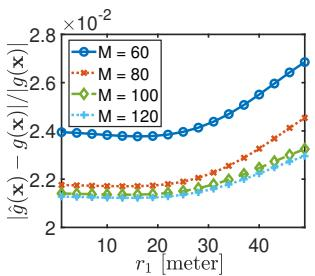  
(a)

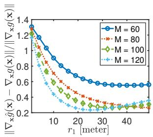  
(b)  
Figure 7. (a) Normalized estimation error of channel gain $g ( \mathbf { x } )$ versus measurement range $r _ { 1 }$ . (b) Normalized estimation error of the gradient of channel gain, i.e., ∇g(x), versus measurement range r<sub>1</sub>.

Table II  
CAPACITY ON TWO MAPS FOR A SUM-RATE APPLICATION [Gbps]
<table><tr><td>Map</td><td>User type</td><td>Statis</td><td>Exh2D</td><td>RAG</td><td>Proposed</td><td>Genius- aided</td><td>Exh3D</td></tr><tr><td rowspan="3">A</td><td>Edge</td><td>0.01</td><td>2.60</td><td>2.43</td><td>2.79</td><td>2.79</td><td>2.83</td></tr><tr><td>Center</td><td>2.45</td><td>2.62</td><td>2.51</td><td>2.88</td><td>2.88</td><td>2.92</td></tr><tr><td>All</td><td>2.91</td><td>2.65</td><td>3.12</td><td>3.39</td><td>3.40</td><td>3.44</td></tr><tr><td rowspan="3">B</td><td>Edge</td><td>0.02</td><td>1.71</td><td>1.60</td><td>1.95</td><td>1.95</td><td>2.03</td></tr><tr><td>Center</td><td>1.59</td><td>1.71</td><td>1.61</td><td>1.95</td><td>1.95</td><td>2.02</td></tr><tr><td>All</td><td>1.95</td><td>2.21</td><td>2.11</td><td>2.31</td><td>2.34</td><td>2.43</td></tr></table>

## B. UAV-assisted Communication and Sensing

Fig. 7a shows the normalized estimation error of channel gain $g ( \mathbf { x } )$ under different settings of M and $r _ { 1 }$ . It is found that the error in estimating $g ( \mathbf { x } )$ exhibits a monotonic decrease w.r.t. the increase of M while it is not monotonic w.r.t. $r _ { 1 }$ . This observation suggests the existence of an optimal value for $r _ { 1 }$ $e . g . , r _ { 1 } \approx 1 8$ when $M = 6 0$ , which confirms the analytical results in Theorem 2. Fig. 7b demonstrates the normalized estimation error of the gradient of channel gain $\nabla g ( \mathbf { x } )$ . It is observed that a small measurement range $r _ { 1 }$ leads to a large estimation error on the local gradient of $g ( \mathbf { x } )$ as the measurement is not geographically diverse. Yet, when $r _ { 1 }$ is too large, the first-order local LOS model $\hat { g } ( \mathbf x )$ becomes less accurate, leading to a slight increase of the estimation error.

Table II shows the system capacity, $i . e .$ min $\begin{array} { r } { \{ f _ { 0 } ( g _ { 0 } ( \mathbf { x } ) ) , \sum _ { k \in \mathcal { K } } \{ f _ { k } ( g _ { k } ( \mathbf { x } ) , p _ { k } ) \} \} } \end{array}$ , of different schemes on two maps, with $P _ { \mathrm { T } } ~ = ~ 3 0$ dBm and $K \ = \ 8 .$ . We label users in NLOS to the best position found by the statistical geometry method as edge users, and the LOS users as center users. For the statistical geometry method, the sum capacity of edge users approaches to 0. This is because it cannot guarantee the LOS condition while the NLOS condition results in little allocated power and thus poor performance. In all 2000 simulated cases, for edge users, center users, and all users, the proposed scheme reaches over 95% of the capacity achieved by the exhaustive 3D search. The proposed scheme is also extremely close to the genius-aided scheme that requires perfect user locations and channel parameters. This indicates that the globally optimal solution may lie on the equipotential surface, and the proposed scheme can search near the locally reconstructed equipotential surface with little deviation. The relaxed analytical geometry scheme achieves about 79% of the performance of the exhaustive 3D search for edge users on map B, representing a 17 percentage point lower performance compared with our proposed scheme. Additionally, the relaxed analytical geometry scheme requires complete knowledge of city topology and additional computational cost for polygonal approximation of buildings. The suboptimal performance of the exhaustive 2D search is primarily due to its inability to leverage height flexibility.

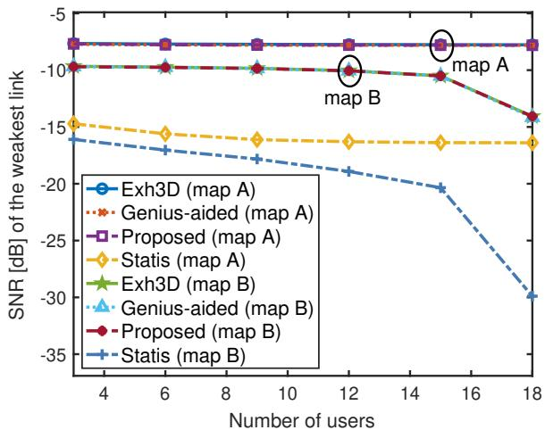

Figure 8. SNR of the weakest link versus number of users in a sum-rate application  
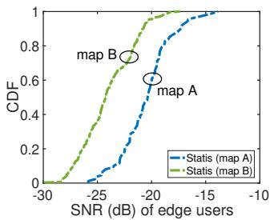  
(a)

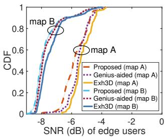  
(b)  
Figure 9. CDF of SNR of the weakest link among edge users in a balancing application for (a) the statistical geometry method; (b) the proposed scheme and other baselines.

Fig. 8 demonstrates the SNR of the weakest link versus the number of users in the sum-rate application. The proposed scheme closely approximates the performance of the exhaustive 3D search, regardless of the number of users. In the sparse map A, the statistical geometry scheme can achieve stable performance since, in most simulated cases, the users are in LOS. However, in the denser map B and with a larger number of users, it becomes more difficult to find an LOS solution. As a result, the performance of the statistical geometry scheme drops significantly.

Fig. 9 and 10 illustrate the CDF of SNR of the worst sensing link in a balancing application that encompasses both sensing and backhaul communication services. It is evident that the proposed scheme substantially increases the SNR of the weakest sensing link over the statistical geometry scheme. Specifically, for edge users, the proposed scheme exhibits a gain of above 14 dB over the statistical geometry scheme under CDF= 0.8. For all user cases, the CDF curve of the proposed scheme closely aligns with that of the exhaustive 3D search on both maps.

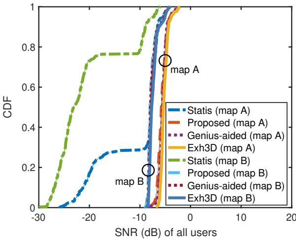  
Figure 10. CDF of SNR of the weakest sensing link among all users (2000 cases) in a balancing application.

Table III  
COMPARISON OF AVERAGE TRAJECTORY LENGTH [KILOMETER]
<table><tr><td></td><td>Genius-aided</td><td>Proposed</td><td>Exh2D</td><td>Exh3D</td></tr><tr><td>Map A</td><td>0.2604</td><td>3.272</td><td>1920</td><td>42240</td></tr><tr><td>Map B</td><td>0.2428</td><td>3.051</td><td>1920</td><td>42240</td></tr></table>

Table III summarizes the average trajectory lengths required by the four online schemes on two maps. Notably, the geniusaided scheme with known user locations and channel models requires only a few hundred meters to approximate a nearoptimal solution, confirming the efficiency of the LOS discovery strategy proposed in Section IV-B. The proposed scheme demands a longer trajectory of approximately 3 kilometers due to its reliance on spiral trajectories for data collection during the search process. Despite this, the proposed scheme still demonstrates considerable efficacy, significantly reducing search complexity compared to the exhaustive search schemes.

## VI. CONCLUSION

This paper developed an efficient online trajectory for optimal UAV placement without prior knowledge of user locations, channel model parameters, and terrain structure. We analytically characterized the equipotential surface and proposed an LOS discovery trajectory on it, utilizing perturbation theory to guide the UAV search direction, ensuring robust LOS connectivity. Additionally, we developed a class of spiral trajectories to construct local channel maps via local polynomial regression, independent of user position or distance. After deriving the optimal measurement pattern, we minimized the MSE of the locally estimated channel gain and determined the optimal measurement range. Experimental results on real urban maps demonstrated that our approach achieves over 95% of the performance of a 3D exhaustive search scheme with just a 3-kilometer search in a complex environment. The proposed method requires only minimal signaling interactions, such as UAV-initiated access grants and low-rate uplink probing signals from users, to estimate local channel gains and guide UAV positioning, making it compatible with lightweight and privacy-preserving 6G protocols.

## REFERENCES

[1] X. Wang, L. Kong, F. Kong, F. Qiu, M. Xia, S. Arnon, and G. Chen, “Millimeter wave communication: A comprehensive survey,” IEEE Commun. Surveys Tuts., vol. 20, no. 3, pp. 1616–1653, 2018.

[2] L. Chen, F. Liu, W. Wang, and C. Masouros, “Joint radar-communication transmission: A generalized pareto optimization framework,” IEEE Trans. Signal Process., vol. 69, pp. 2752–2765, 2021.

[3] K. Meng, Q. Wu, S. Ma, W. Chen, K. Wang, and J. Li, “Throughput maximization for UAV-enabled integrated periodic sensing and communication,” IEEE Trans. on Wireless Commun., vol. 22, no. 1, pp. 671–687, 2023.

[4] X. Liu, J. Wang, N. Zhao, Y. Chen, S. Zhang, Z. Ding, and F. R. Yu, “Placement and power allocation for NOMA-UAV networks,” IEEE Wireless Commun. Lett., vol. 8, no. 3, pp. 965–968, 2019.

[5] A. A. Nasir, H. D. Tuan, T. Q. Duong, and H. V. Poor, “UAV-enabled communication using NOMA,” IEEE Trans. on Commun., vol. 67, no. 7, pp. 5126–5138, 2019.

[6] X. Li, C. Pan, C. Zhang, C. He, and K. Wang, “Data rate maximization in UAV-assisted C-RAN,” IEEE Wireless Commun. Lett., vol. 9, no. 12, pp. 2163–2167, 2020.

[7] C. You and R. Zhang, “Hybrid offline-online design for UAV-enabled data harvesting in probabilistic LoS channel,” IEEE Trans. on Wireless Commun., vol. 19, no. 6, pp. 3753–3768, 2020.

[8] A. Meng, X. Gao, Y. Zhao, and Z. Yang, “Three-dimensional trajectory optimization for energy-constrained UAV-enabled IoT system in probabilistic LoS channel,” IEEE Internet Things J., vol. 9, no. 2, pp. 1109–1121, 2022.

[9] Z. Xiao, H. Dong, L. Bai, D. O. Wu, and X.-G. Xia, “Unmanned aerial vehicle base station (UAV-BS) deployment with millimeter-wave beamforming,” IEEE Internet Things J., vol. 7, no. 2, pp. 1336–1349, 2020.

[10] P. Yi, L. Zhu, L. Zhu, Z. Xiao, Z. Han, and X. Xia, “Joint 3-D positioning and power allocation for UAV relay aided by geographic information,” IEEE Trans. on Wireless Commun., vol. 21, no. 10, pp. 8148–8162, 2022.

[11] D.-Y. Kim, W. Saad, and J.-W. Lee, “On the use of high-rise topographic features for optimal aerial base station placement,” IEEE Trans. on Wireless Commun., vol. 22, no. 3, pp. 1868–1884, 2023.

[12] Y. Zheng and J. Chen, “UAV 3D placement for near-optimal LOS relaying to ground users in dense urban area,” in Proc. IEEE Int. Conf. Commun., pp. 4986–4991, 2023.

[13] O. Esrafilian, R. Gangula, and D. Gesbert, “Learning to communicate in UAV-aided wireless networks: Map-based approaches,” IEEE Internet Things J., vol. 6, no. 2, pp. 1791–1802, 2019.

[14] E. Krijestorac, S. Hanna, and D. Cabric, “UAV access point placement for connectivity to a user with unknown location using deep RL,” in Proc. IEEE Global Commun. Conf. Workshops, pp. 1–6, 2019.

[15] O. Esrafilian, R. Gangula, and D. Gesbert, “Three-dimensional-mapbased trajectory design in UAV-aided wireless localization systems,” IEEE Internet Things J., vol. 8, no. 12, pp. 9894–9904, 2021.

[16] C. Liu, W. Yuan, S. Li, X. Liu, H. Li, D. W. K. Ng, and Y. Li, “Learningbased predictive beamforming for integrated sensing and communication in vehicular networks,” IEEE J. Sel. Areas Commun., vol. 40, no. 8, pp. 2317–2334, 2022.

[17] S. Xu, W. Yuan, and Y. Cai, “Deep learning for velocity and range estimation of drones in urban occlusion environments,” IEEE Trans. Netw. Sci. Eng., vol. 13, pp. 6453–6469, 2026.

[18] J. Xu, X. Zhou, H. Zhang, and Y. Li, “Deep learning-based predictive bidirectional beamforming in ISAC-enabled UAV networks,” IEEE Trans. Wireless Commun., vol. 25, pp. 12 230–12 245, 2026.

[19] J. Zhang, S. Xu, C. Li, Y. Huang, and L. Yang, “Efficient beam selection for ISAC in cell-free massive MIMO via digital twin-assisted deep reinforcement learning,” IEEE Trans. Wireless Commun., vol. 25, pp. 9875–9890, 2026.

[20] H. Huang, W. Yuan, C. Liu, L. Liu, F. Liu, W. Xiang, and D. Wing Kwan Ng, “Llm in v2i: A data-driven predictive beamforming framework for vehicle tracking in near-field ISAC systems,” IEEE J. Sel. Areas Commun., vol. 44, pp. 2510–2527, 2026.

[21] Y. Zheng and J. Chen, “Geography-aware optimal UAV 3D placement for LOS relaying: A geometry approach,” IEEE Trans. on Wireless Commun., vol. 23, no. 8, pp. 9301–9314, 2024.

[22] Y. Zheng, J. Chen, and L. Yuan, “Adaptive search on the equipotential surface using perturbation methods for UAV-aided multiuser LOS relaying,” in Proc. IEEE Global Commun. Conf., pp. 4558–4563, 2023.

[23] M. Chen, M. Mozaffari, W. Saad, C. Yin, M. Debbah, and C. S. Hong, “Caching in the sky: Proactive deployment of cache-enabled unmanned aerial vehicles for optimized quality-of-experience,” IEEE J. Sel. Areas Commun., vol. 35, no. 5, pp. 1046–1061, 2017.

[24] I. Bor-Yaliniz, S. S. Szyszkowicz, and H. Yanikomeroglu, “Environmentaware drone-base-station placements in modern metropolitans,” IEEE Wireless Commun. Lett., vol. 7, no. 3, pp. 372–375, 2018.

[25] Y. Chen and D. Huang, “Joint trajectory design and BS association for cellular-connected UAV: An imitation-augmented deep reinforcement learning approach,” IEEE Internet Things J., vol. 9, no. 4, pp. 2843– 2858, 2022.

[26] S. K. Singh, K. Agrawal, K. Singh, A. Bansal, C. P. Li, and Z. Ding, “On the performance of laser-powered UAV-assisted SWIPT enabled multiuser communication network with hybrid NOMA,” IEEE Trans. on Commun., vol. 70, no. 6, pp. 3912–3929, 2022.

[27] J. Chen and D. Gesbert, “Efficient local map search algorithms for the placement of flying relays,” IEEE Trans. on Wireless Commun., vol. 19, no. 2, pp. 1305–1319, 2019.

[28] J. Johnston, L. Venturino, E. Grossi, M. Lops, and X. Wang, “MIMO OFDM dual-function radar-communication under error rate and beampattern constraints,” IEEE J. Sel. Areas Commun., vol. 40, no. 6, pp. 1951–1964, 2022.

[29] Z. Ben-Haim and Y. C. Eldar, “The cramér-rao bound for estimating a sparse parameter vector,” IEEE Trans. Signal Process., vol. 58, no. 6, pp. 3384–3389, 2010.

[30] F. J. and G. I., “Local polynomial modelling and its applications: Monographs on statistics and applied probability,” in Chapman Hall, London, 1996.

[31] H. Sun and J. Chen, “Propagation map reconstruction via interpolation assisted matrix completion,” IEEE Trans. Signal Process., vol. 70, pp. 6154–6169, 2022.

[32] Y. Zheng and J. Chen, “Active search for low-altitude UAV sensing and communication for users at unknown locations,” arXiv preprint arXiv:2408.14067, 2024. [Online]. Available: https://arxiv.org/abs/2408.14067.

[33] D. Gonzalez-Aguilera, E. Crespo-Matellan, D. Hernandez-Lopez, and P. Rodriguez-Gonzalvez, “Automated urban analysis based on LiDARderived building models,” IEEE Trans. Geosci. Remote Sens., vol. 51, no. 3, pp. 1844–1851, 2013.

[34] J. Chen, U. Mitra, and D. Gesbert, “3D urban UAV relay placement: Linear complexity algorithm and analysis,” IEEE Trans. on Wireless Commun., vol. 20, no. 8, pp. 5243–5257, 2021.

[35] K. T. Herring, J. W. Holloway, D. H. Staelin, and D. W. Bliss, “Pathloss characteristics of urban wireless channels,” IEEE Trans. Antennas Propag., vol. 58, no. 1, pp. 171–177, 2010.

[36] J. Lyu, Y. Zeng, R. Zhang, and T. J. Lim, “Placement optimization of UAV-mounted mobile base stations,” IEEE Commun. Lett., vol. 21, no. 3, pp. 604–607, 2017.

[37] A. Al-Hourani, S. Kandeepan, and S. Lardner, “Optimal LAP altitude for maximum coverage,” IEEE Wireless Commun. Lett., vol. 3, no. 6, pp. 569–572, 2014.