# Adaptive Bitrate Video Caching in UAV-Assisted MEC Networks Based on Distributionally Robust Optimization

Yali Chen , Min Liu , Senior Member, IEEE, Bo Ai , Fellow, IEEE, Yuwei Wang , Member, IEEE, and Sheng Sun

Abstract—To alleviate the pressure on the ground base station (BS) from intensive video requests, unmanned aerial vehicle (UAV)-assisted mobile edge computing (MEC) has become a promising and flexible solution. The UAV carries a MEC server to provide caching and transcoding services for adaptive bitrate video streaming, which can reduce duplicate transmissions of the BS and the content acquisition latency of users, while improving the flexibility of video delivery. However, considering the uncertainty of user requests and content popularity distribution, improving the robustness of video caching is a challenge to promote practical applications. Thus, by integrating caching and transcoding on the UAV, as well as backhaul retrieving, we study the bitrate-aware video caching and processing with uncertain popularity distribution. Then, the problem of joint cache placement and video delivery scheduling under the worst-case distribution is formulated to minimize the total expected system latency with energy consumption constrained. Specifically, we use ζ-structure probability metrics to characterize the uncertainty and construct confidence sets of arrival distribution. Furthermore, a distributionally robust latency optimization algorithm based on convex optimization theory is designed to obtain a robust solution. Finally, we conduct extensive simulations using real-world datasets to evaluate the effectiveness and robustness of the proposed scheme.

Index Terms—Adaptive bitrate video caching, mobile edge computing (MEC), optimization under uncertainty, unmanned aerial vehicle (UAV).

Manuscript received 11 November 2022; revised 7 July 2023; accepted 6 August 2023. Date of publication 14 August 2023; date of current version 4 April 2024. This work was supported in part by the National Key Research and Development Program of China under Grant 2021YFB2900102 and in part by the National Natural Science Foundation of China under Grants 62202449, 61732017, 62072436, and 61872028. Recommended for acceptance by A. Striegel. (Corresponding author: Min Liu.)

Yali Chen, Yuwei Wang, and Sheng Sun are with the Institute of Computing Technology, Chinese Academy of Sciences, Beijing 100190, China (e-mail: chenyali@ict.ac.cn; ywwang@ict.ac.cn; sunsheng@ict.ac.cn).

Min Liu is with the Institute of Computing Technology, Chinese Academy of Sciences, Beijing 100190, China, and also with Zhongguancun Laboratory, University of Chinese Academy of Sciences, Beijing 100049, China (e-mail: liumin@ict.ac.cn).

Bo Ai is with the State Key Laboratory of Rail Traffic Control and Safety, Beijing Jiaotong University, Beijing 100044, China, and also with the Henan Joint International Research Laboratory of Intelligent Networking and Data Analysis, Zhengzhou University, Zhengzhou 450001, China, and also with the Research Center of Networks and Communications, Peng Cheng Laboratory, Shenzhen 518000, China (e-mail: boai@bjtu.edu.cn).

This article has supplementary downloadable material available at https://doi.org/10.1109/TMC.2023.3304624, provided by the authors.

Digital Object Identifier 10.1109/TMC.2023.3304624

# I. INTRODUCTION

N RECENT years, the proliferation of video content providers and the continuous upgrading of mobile devices have driven the explosive growth of video streaming requests. According to the Cisco’s report, video traffic is expected to account for 82% of total mobile traffic by 2022 [1]. Especially in hot spots, such as concerts or other public events, a large number of users need to upload and share video data in real time or download video contents from the ground base station (BS). In this case, ensuring the quality of experience (QoE) for users is particularly important. Due to the differences in user preferences, the heterogeneity of devices’ processing capabilities, and the variant network conditions, users’ demands for video bitrates might be different. Thus, the adaptive bitrate streaming has been used as an effective video delivery technique and it provides users with appropriate bitrate versions to improve QoE [2]. Moreover, higher user density and the surge in transmission demands may create a heavy load on the BS, further causing unsatisfactory communication conditions or network congestion, and then degrading user experiences.

To cope with intensive adaptive bitrate video requests, mobile edge computing (MEC) has been introduced. It allows the deployment of computing and storage resources at the edge of mobile networks to provide cloud computing capabilities, thereby reducing service delivery latency [3]. As for edge nodes, considering that the construction and maintenance cost of the small BS server is expensive and the flexibility is poor, the unmanned aerial vehicle (UAV) with the MEC server has been deployed due to its incomparable advantages, such as high flexibility, quality line-of-sight (LoS) channel characteristics, low price and etc [4], [5], [6].

In UAV-assisted MEC networks, the UAV carries a MEC server with built-in memory space for edge caching and computing resources for edge processing, and acts as an aerial small BS to assist terrestrial cellular networks [7], [8]. In the non-peak period, the UAV server proactively caches some highly sought-after contents, and directly delivers them to users at peak-traffic times. However, if the UAV caches each bitrate version of a specific video as a disjoint streaming, it will lead to high storage overhead. Thus, computing resources of the MEC server can be fully utilized and performing transcoding of the video to different variants to satisfy diverse needs [9].

At present, video transcoding, that is, compressing a higher bitrate video into a lower bitrate version, can be operated by many techniques, such as the approach based on compressed domain [10]. It not only alleviates the storage pressure of the MEC server, but also makes the content delivery more flexible. Due to limited UAV capacity, the content completely missed in the cache needs to be obtained from the ground BS through the backhaul link. In general, UAV-assisted video caching can reduce the duplicated transmission of popular contents and help in alleviating backhaul traffic. Thereby, the network latency is reduced and user experiences are improved.

The video caching is closely related to user requests. In most of researches devoted to content caching for UAV-assisted systems [8], [11], [12], [13], [14], [15], [16], [17], [18], the Zipf discrete distribution has been used to represent the content popularity. Considering the high dynamics of the investigated scenario, user requests and the regional content popularity distribution are usually time-varying and difficult to predict accurately [19]. Especially when the adaptive bitrate streaming technology is applied for video delivery, predicting is more challenging because there are many factors that cause the popularity difference between multiple bitrate versions. In this case, there is always a gap between specific probability values in Zipf distribution and the real distribution [20]. The network caching strategy based on such deterministic assumptions may cause excessive system resource overhead or result in network congestion, and seriously damage the system robustness. Therefore, our objective is to design risk-averse strategies to predict the content popularity, and then optimize network storage and computing resources. Presently, the machine learning related algorithms used in existed works for problems with uncertain content popularity cannot provide robustness guarantee [21], [22], [23], while the methods of optimization under uncertainty that can complement this issue mainly include robust optimization and distributionally robust optimization (DRO) [24]. Robust optimization typically restricts the possible realization of all uncertain parameters to an uncertainty set, and studies the worst-case optimization problem without assuming probability information, but it is highly conservative. In contrast, DRO aims at the case that it is difficult to accurately fit the probability distribution or the uncertain parameters do not obey any distribution assumptions. It uses the statistical distribution information of random variables to establish the confidence set, which not only considers the distribution characteristics, but also avoids excessive conservatism.

From the aspect of performance indicator, the video acquisition latency can intuitively reflect the quality of user experiences. Besides, the energy consumption of UAV still needs to be controlled to maintain a longer endurance although the energy storage technology has made great progress. To minimize the latency with the energy consumption constrained, the key problem of this article is to design efficient cache placement and video delivery scheduling strategy with the popularity distribution unknown. The cache placement decision needs to be made before the actual requests arrive, which are vital to the judgement of a cache policy. The cache decision greatly affects the scheduling strategy, but it still needs to be determined based on actual request arrivals.

In this article, we study the adaptive bitrate video caching in UAV-assisted MEC networks. With uncertain content popularity distribution, the optimization problem of joint cache placement and video delivery under the worst-case distribution is formulated, and the objective is minimizing the total expected system latency. To characterize uncertainty, we make full use of the observed historical data and employ the data-driven approach to establish the confidence set. Then, the distributionally robust latency optimization algorithm is designed. The main contributions are summarized as:

- In the UAV-assisted MEC network, we consider local caching and online transcoding on the UAV edge server, as well as backhaul retrieval, and then propose an adaptive bitrate video delivering strategy under different caching placement modes.   
Without a priori information about content popularity distribution, we formulate the joint cache placement and delivery scheduling problem into a distributionally robust optimization problem under the worst-case distribution to avoid potential risks. Then, we introduce ζ-structure probability metrics with five family members to construct confidence sets of the unknown distribution, which also serve as constraints for the proposed optimization problem to predict content popularity.   
- The formulated problem is a mixed integer non-convex optimization problem under uncertainty. To solve the problem, we develop the distributionally robust latency optimization algorithm based on the convex optimization theory and attain a risk-averse solution.   
Based on the real-world data set of YouTube videos, we evaluate the system performance of the proposed scheme, deterministic scheme and other feasible schemes in terms of the efficiency and the robustness, and compare performance gains of different metrics.

The rest of the article is organized as follows. In Section II, we summarize the related work of content caching in UAV-assisted scenarios and distributionally robust optimization. In Section III, we present the system transmission model, latency and energy consumption models. In Section IV, the distributionally robust latency optimization problem is formulated and we describe the method of constructing confidence sets. Based on the convex optimization theory, we design a distributionally robust latency optimization algorithm in Section V. Performance evaluation based on the real-world data set is given in Section VI. Finally, more discussion can be found in Section VII and we conclude this article in Section VIII.

# II. RELATED WORK

There are many researches on the content caching of UAVassisted scenarios. Wang et al. [11] provided representative scenarios supported by UAVs, including that UAVs served as flying BSs in overloaded cells or areas without cellular infrastructure, UAVs cooperatively forwarded information as mobile relays, and UAVs acted as aerial caches for effective content delivery. Zhang et al. [12] considered that macro BSs were overloaded in UAV-assisted cellular networks in hot spots, and studied the user association, static location deployment and content cache placement of multiple cache-enabling UAVs to maximize the QoE of users. Considering joint UAV caching and device-to-device (D2D) caching, Ji et al. [13] studied cache placement to maximize the cache hit probability in the case of static UAV deployment. When deploying dynamically, the UAV trajectory was designed to minimize the number of path points to cover all users. Ji et al. [14] optimized multi-user association, jointly with UAV transmission power, flight trajectory and cache placement to minimize the total content acquisition latency while considering dynamic UAV positions and random content requests. Zhang et al. [15] proposed a cache-enabled UAV non-orthogonal multiple access (NOMA) framework, and optimized power allocation of NOMA, user association, UAV deployment and caching placement to minimize the long-term average content distribution delay in the dynamic environment. Wu et al. [16] designed the UAV-adaptive cache model and user-adaptive UAV trajectory model. Tran et al. [17] studied satellite-assisted and cache-assisted UAV communications in content delivery networks, and optimized cache placement, the UAV trajectory and resource allocation. In UAV-assisted cellular networks, Xie et al. [8] investigated joint user association and caching policy for adaptive bitrate video streaming to minimize the content delivery latency. Fazel et al. [18] optimized 3-D placements, numbers and the cache placement of UAVs to maximize the sum of secure cache throughput. Wang et al. [25] considered the spatial and temporal distribution characteristics of content popularity and adopted the Ornstein-Uhlenbeck process to describe the law of content popularity in cache-enabled UAV networks. All the above literatures assume the content popularity distribution conforms to the Zipf distribution and remains unchanged for a certain period of time, or conforms to a specific mathematical model. However, there will definitely be deviations or large deviations in practical complex scenarios, which result in inefficient or even invalid caching decisions and damage the system robustness.

With regard to uncertain user requests and content popularity distribution, existing literatures use machine learning related algorithms. According to the available human-centric information, Chen et al. [21] utilized conceptor-based echo state network learning framework to effectively predict mobility patterns of users and the content request distribution. Moreover, the authors optimized user association, UAVs’ deployment locations and content caching strategies based on behavior predictions. The optimization objective was to maximize the QoE of users with minimum transmit power of UAVs. Zhang et al. [22] used the latent Dirichlet allocation learning algorithm to investigate the content popularity distribution and intelligently cached contents in the UAVs. Luo et al. [23] proposed a Q-learning algorithm to learn the content placement in a cache-enabled multi-UAV network. However, these algorithms do not take into account the system robustness. Certainly, they can add adversarial training in the model training process to improve the system robustness, but the robustness is difficult to quantify. Meanwhile, the reliability of obtained caching decisions cannot be strictly quantified and guaranteed in theory, which may cause incalculable risks.

In a sense, DRO can guarantee the robustness under the disturbance of random factors and the performance against input disturbance. Bertsimas et al. [26] presented a mathematical framework, which was suitable for practical problems with limited available information and could make dynamic decisions under uncertainty. Rahimian et al. [27] described the relationship between DRO and other concepts, such as function regularization, robust optimization, chance-constrained optimization, risk-averse optimization and game theory. The authors also listed two types of techniques for solving DRO problems, and discussed different models for representing the ambiguity set of distributions.

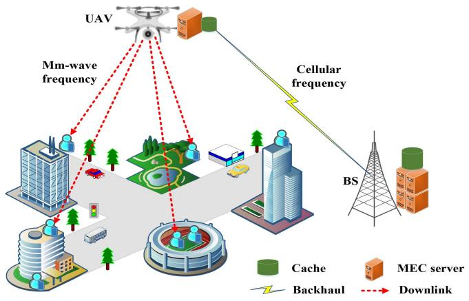

flowchart

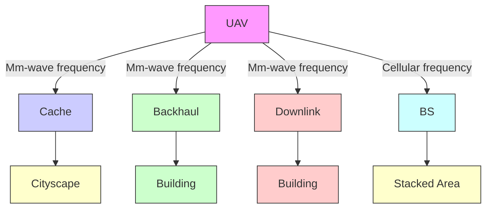

Fig. 1. System model of video caching in UAV-assisted MEC networks.

Nowadays, the related work based on DRO mainly involves the energy and reserve scheduling, unit commitment and topology control of the power system, while there are a few researches on DRO in computer networks and wireless communication networks. Based on the distributed satellite cluster network, Zhou et al. [28] proposed a distributionally robust two-stage stochastic optimization framework that considered dynamic network resources and incomplete distribution information of longterm data arrival. In cognitive network communications, Wang et al. [29] proposed a data-driven operational privacy preserving strategy for primary users, which integrated the temporary operational privacy preservation of primary users and uncertain traffic demands of secondary users under spectrum multiplexing. Li et al. [30] studied joint trajectory and caching design in UAV-assisted edge caching with the content demand uncertain, and developed a data-driven approach based on the first and second order statistics. To sum up, existed researches [28], [29], [30] either do not focus on video caching assisted by UAVs, or the studied problems and solutions under this background are completely different.

# III. SYSTEM MODEL

We study the typical scenario of UAV-assisted cellular networks in hot spots. As can be seen in Fig. 1, the static deployed UAV is equipped with a MEC server with storage and processing capabilities. It assists the BS in caching, transcoding and dispatching popular multimedia contents, so as to quickly respond to intensive user requests. Here, the millimeter-wave (mm-wave) band is considered for high-speed transmissions between the UAV and users [31]. Since the channel conditions of direct transmissions between the BS and users are not satisfactory, especially when the transmission distance is relatively long, this case is not considered in this article. The ground BS only provides the wireless backhaul link for the UAV, and the BS-UAV link operates at the cellular frequency band to ensure reliability. In this framework, assuming that there is a finite content library Ω available for users to download. It contains M video files and each video file has N different bitrate variants arranged in ascending order, i.e., $\Omega =$ $\{ f _ { 1 } ^ { 1 } , f _ { 1 } ^ { 2 } , . . . , f _ { 1 } ^ { N } , f _ { 2 } ^ { 1 } , f _ { 2 } ^ { 2 } , . . . , \tilde { f _ { 2 } ^ { N } } , . . . , f _ { M } ^ { 1 } , f _ { M } ^ { 2 } , . . . , f _ { M } ^ { N } \}$ . We regard it as a one-dimensional sample space, where $f _ { 1 } ^ { 1 }$ represents the lowest bitrate version of the first video file, and $f _ { 1 } ^ { \bar { N } }$ represents the highest bitrate version. Additionally, the size of the file $f \in \Omega ,$ , denoted as $R _ { f } ,$ , is equal to the product of bitrate and its own playtime duration.

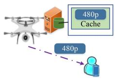

flowchart

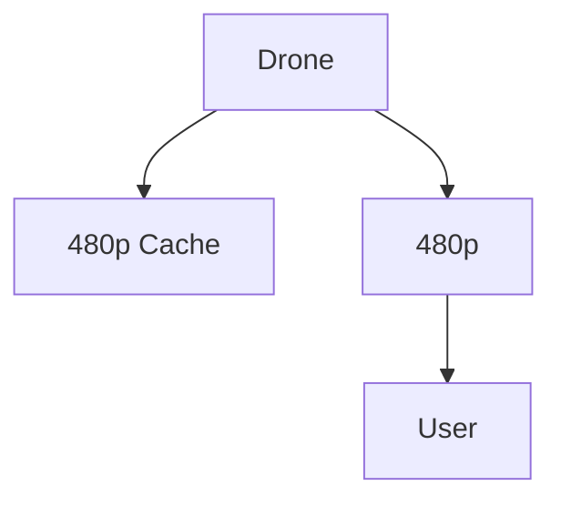

(a)

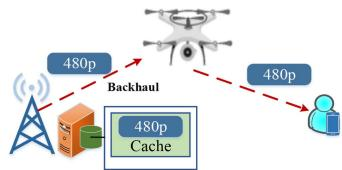

flowchart

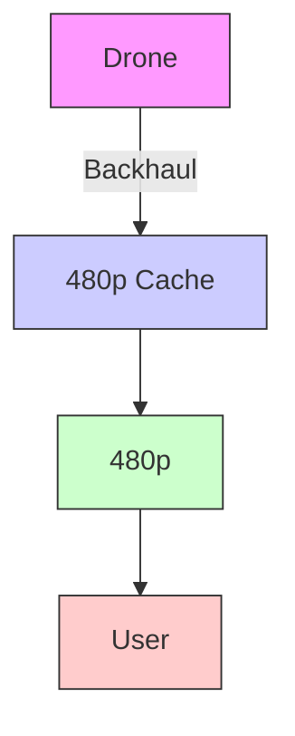

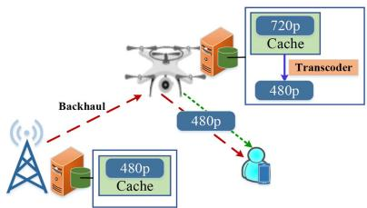

flowchart

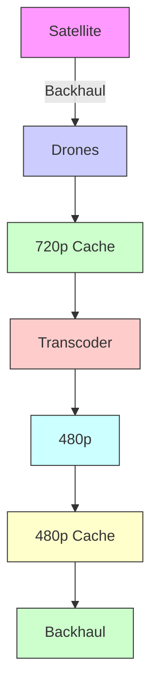

(b)   
Fig. 2. Illustration of video delivery scheduling under three caching modes. (a) Direct hit mode. (b) Transcoding hit mode. (c) Miss mode.

Supposing that the BS stores all the video files requested by users. At the same time, the UAV caches some of the popular files in advance. When a user initiates a video request, an illustration of delivery scheduling decisions under three possible caching modes is shown in Fig. 2. First, for the case of direct cache hit, the video file is exactly cached in the UAV server, and will be transmitted directly to the user by the UAV. Then, if there is no exact cache hit, but the UAV caches a higher bitrate version of the same requested file, that is, the transcoding hit mode may be triggered. In this case, we assume the video is divided into multiple chunks [32]. Each chunk can be obtained by local transcoding of the UAV server and transferred to the user, or be delivered from the BS over the wireless backhaul link. In other words, transcoding schedule can be performed on a portion of the video content. How much content is obtained by transcoding and how much is obtained by backhaul retrieval depends on the latency and energy cost of these two options. Note that we only consider the transcoding operation is from the higher bitrate version to the lower bitrate version, and the opposite case where the lower bitrate version is upgraded to the higher bitrate version is not within the scope of this article. Further, for the miss mode, neither the requested nor the transcodable version exists, and the UAV retrieves files from the BS cache and forwards them to the end user. Based on above descriptions, the problem to be solved in this article is bitrate-aware video caching placement

TABLE I NOTATION SUMMARY 

<table><tr><td>Notation</td><td>Description</td></tr><tr><td> $\Omega$ </td><td>Set of all video variants</td></tr><tr><td> $F$ </td><td>Number of all video variants</td></tr><tr><td> $M$ </td><td>Number of videos</td></tr><tr><td> $N$ </td><td>Number of bitrate variants of each video</td></tr><tr><td> $R_{f}$ </td><td>Size of the file  $f$ </td></tr><tr><td> $U$ </td><td>Number of users</td></tr><tr><td> $x_{f}$ </td><td>Whether the file  $f$  is cached in the UAV</td></tr><tr><td> $\xi_{i}$ </td><td>Video request of the user  $i$ </td></tr><tr><td> $y_{c}(\xi_{i})$ </td><td>Data amount obtained from UAV caching</td></tr><tr><td> $y_{t}(\xi_{i})$ </td><td>Data amount obtained from UAV server transcoding</td></tr><tr><td> $y_{b}(\xi_{i})$ </td><td>Data amount obtained from backhaul retrieving</td></tr><tr><td> $\tau$ </td><td>Time duration of a cache refreshing cycle</td></tr><tr><td> $\omega_{c}$ </td><td>Power efficiency for caching 1-bit data</td></tr><tr><td> $\omega_{t}$ </td><td>Power efficiency for executing one CPU cycle</td></tr><tr><td> $f_{u}$ </td><td>CPU dominant frequency of the UAV</td></tr><tr><td> $L_{c}$ </td><td>Latency in direct hit mode</td></tr><tr><td> $L_{t}$ </td><td>Latency in transcoding hit mode</td></tr><tr><td> $L_{b}$ </td><td>Latency in miss mode</td></tr><tr><td> $E_{h}$ </td><td>Hovering energy consumption</td></tr><tr><td> $E'$ </td><td>Caching energy consumption</td></tr><tr><td> $E_{c}$ </td><td>Energy consumption in direct hit mode</td></tr><tr><td> $E_{t}$ </td><td>Energy consumption in transcoding hit mode</td></tr><tr><td> $E_{b}$ </td><td>Energy consumption in miss mode</td></tr><tr><td> $\mathcal{D}$ </td><td>Confidence set</td></tr><tr><td> $\mathbb{P}_{0}$ </td><td>Reference distribution of request arrivals</td></tr><tr><td> $\mathbb{P}$ </td><td>Real distribution of request arrivals</td></tr><tr><td> $\theta$ </td><td>Tolerance value</td></tr><tr><td> $\beta$ </td><td>Confidence level</td></tr><tr><td> $C_{u}$ </td><td>Storage capacity of the UAV</td></tr><tr><td> $e_{f}(\xi_{i})$ </td><td>Indicator function, it is 1 if  $\{\xi_{i}=f\}$  is ture</td></tr><tr><td> $E_{max}$ </td><td>System energy consumption budget</td></tr><tr><td> $F'$ </td><td>Size of historical data</td></tr></table>

and delivery scheduling in UAV-assisted MEC networks. As for performance indicators, we focus on the latency of intensive user requests in hot spots, which can also reflect the quality of user experiences. Table I summarizes the key notations used in this article.

# A. Transmission Model

We introduce the models for transmission links. The channel model between the UAV and users adopts the standard lognormal shadowing model, wherein the path loss under LoS transmission and non-line-of-sight (NLoS) transmission between the UAV u and the user i are shown as follows [33]:

$$
P L _ {u i} ^ {L o S} = 2 0 \log (4 \pi f _ {c} d _ {0} / c) + 1 0 \mu_ {L o S} \log d _ {u i} + \chi_ {\sigma_ {L o S}}, \tag {1}
$$

$$
P L _ {u i} ^ {N L o S} = 2 0 \log (4 \pi f _ {c} d _ {0} / c) + 1 0 \mu_ {N L o S} \log d _ {u i} + \chi_ {\sigma_ {N L o S}}. \tag {2}
$$

Here, $d _ { 0 }$ is the reference distance in the free space, $d _ { u i }$ is distance between the UAV and the user, $f _ { c }$ is the mm-wave carrier frequency, c is the speed of light, $\mu _ { L o S }$ and $\mu _ {  { N }  { L }  { o } S }$ are path loss exponents of LoS and NLoS links. $\chi _ { \sigma _ { L o S } }$ and $\chi _ { \sigma _ { N L o S } }$ are shadow random variables, which follow a Gaussian distribution with a mean of zero and a standard deviation of $\sigma _ { L o S }$ and $\sigma _ { N L o S }$ , respectively. In this model, the probability of LoS connection depends on the environment, the density and height of buildings, the location of the UAV and users, and the elevation angle between the UAV and users. The LoS probability is calculated as

$$
P r (u i, L o S) = (1 + A \exp (- B (\phi_ {u i} - A))) ^ {- 1}, \tag {3}
$$

where $A$ and $B$ are constants determined by the environment (urban, dense urban, rural or others), $\phi _ { u i } = \sin ^ { - 1 } ( H / d _ { u i } )$ is elevation angle with the UAV altitude denoted as H [34]. Undoubtedly,

$$
P r (u i, N L o S) = 1 - P r (u i, L o S). \tag {4}
$$

Thus, the path loss of the transmission link between the UAV and the user i is

$$
P L _ {u i} = \operatorname * {P r} (u i, L o S) * P L _ {u i} ^ {L o S} + \operatorname * {P r} (u i, N L o S) * P L _ {u i} ^ {N L o S}. \tag {5}
$$

We assume the total downlink bandwidth available for the UAV is $W _ { u }$ . To simplify the analysis, it is divided equally among the associated users with the number of $U$ , and there is no interference between transmission links of the UAV and multiple users. Accordingly, the transmission rate $R _ { u i }$ can be expressed as

$$
R _ {u i} = W _ {u} / U * \log_ {2} \left(1 + \frac {P _ {u} 1 0 ^ {- P L _ {u i} / 1 0}}{N _ {0 m} * W _ {u} / U}\right), \tag {6}
$$

where $P _ { u }$ is the transmission power of the UAV, and $N _ { 0 m }$ is mm-wave noise power spectral density.

In addition, for the BS-UAV link, we model the corresponding path loss under LoS and NLoS cases as [35]:

$$
P L _ {b u} ^ {L o S} = d _ {b u} ^ {- \mu}, \tag {7}
$$

$$
P L _ {b u} ^ {N L o S} = \eta d _ {b u} ^ {- \mu}, \tag {8}
$$

where $d _ { b u }$ is the distance between the UAV and the BS, $\mu$ is the path loss exponent, and $\eta$ is the excessive path loss coefficient for NLoS links. Moreover, LoS connection probability, NLoS connection probability, and average path loss can also be calculated by formulas (3), (4) and (5). Only the UAV-user link is replaced by the BS-UAV backhaul link. Similarly, we assume there is no co-band interference to the backhaul link, and the total backhaul bandwidth $W _ { b }$ is evenly distributed among the maximum number of served users. Then, the channel capacity of the backhaul link can be calculated as

$$
R _ {b u} = W _ {b} / U * \log_ {2} \left(1 + \frac {P _ {b} 1 0 ^ {- P L _ {b u} / 1 0}}{N _ {0 c} * W _ {b} / U}\right), \tag {9}
$$

where $P _ { b }$ is the BS transmission power, and $N _ { 0 c }$ is cellular noise power spectral density.

# B. Latency and Energy Consumption Models

We define the cache decision variable as $x _ { f }$ to indicate whether the video file $f \in \Omega$ is cached in the UAV edge server. If it is, $x _ { f } = 1$ , otherwise $x _ { f } = 0$ . Then, when the user i requests a specific version of a video, recorded as $\xi _ { i }$ , we express the number of video bits obtained from the UAV caching, UAV server transcoding and backhaul retrieving as $y _ { c } ( \xi _ { i } ) , \ y _ { t } ( \xi _ { i } )$ and $y _ { b } ( \xi _ { i } )$ , respectively. Next, we introduce the latency and energy consumption under three delivering modes when the user requests $\xi _ { i }$ .

First, the hovering energy consumption of UAV is

$$
E _ {h} = P _ {h} \tau , \tag {10}
$$

where $P _ { h }$ is the hovering power, and τ is the cache refreshing cycle or UAV hovering time in seconds. Without loss of generality, we use the proportional energy model to describe the caching energy consumption as in [9]. The UAV caches the content $f \in \Omega$ within one period τ will generate energy consumption $E ^ { \prime }$ , which is expressed as

$$
E ^ {\prime} = \omega_ {c} R _ {f} \tau , \tag {11}
$$

where $\omega _ { c }$ is the cache power efficiency for storing each bit of content with the unit of watt/bit.

When the UAV has cached the content $\xi _ { i }$ requested by the user $i ,$ the incurred latency cost is

$$
L _ {c} = \frac {y _ {c} (\xi_ {i})}{R _ {u i}}. \tag {12}
$$

The transmission energy consumed in response to the user request $\xi _ { i }$ is

$$
E _ {c} = P _ {u} \frac {y _ {c} (\xi_ {i})}{R _ {u i}}. \tag {13}
$$

Then, when the user requests the file $\xi _ { i } ,$ , and it can be obtained through transcoding of the UAV server, the corresponding latency $L _ { t }$ and energy consumption $E _ { t }$ are respectively shown as [32]:

$$
L _ {t} = \frac {c (\xi_ {i}) c _ {1} y _ {t} (\xi_ {i})}{f _ {u}} + \frac {y _ {t} (\xi_ {i})}{R _ {u i}}, \tag {14}
$$

$$
E _ {t} = \omega_ {t} c (\xi_ {i}) c _ {1} y _ {t} (\xi_ {i}) \frac {c (\xi_ {i}) c _ {1} y _ {t} (\xi_ {i})}{f _ {u}} + P _ {u} \frac {y _ {t} (\xi_ {i})}{R _ {u i}}, \tag {15}
$$

where $c ( \xi _ { i } )$ can be interpreted as the number of CPU cycles required to process 1-bit data, and $c _ { 1 }$ is the ratio of the difference between the number of input bits and the number of output bits to the number of output bits. For simplicity, we do not consider which higher version of the file is transcoded to obtain the requested bitrate version. Therefore, for the value of $c _ { 1 }$ , we just take the average of all possible cases in the sample space. $f _ { u }$ is the CPU dominant frequency of the UAV edge server. ωt is the power consumption of UAV edge server during one CPU cycle. It is in the unit of watt/cycle.

When the content requested by the user needs to be provided from the BS server, the main components of latency include backhaul transmission part and UAV downlink transmission part, which is represented as $L _ { b }$ ,

$$
L _ {b} = \frac {y _ {b} (\xi_ {i})}{R _ {b u}} + \frac {y _ {b} (\xi_ {i})}{R _ {u i}}. \tag {16}
$$

The corresponding energy consumption $E _ { b }$ is

$$
E _ {b} = P _ {b} \frac {y _ {b} (\xi_ {i})}{R _ {b u}} + P _ {u} \frac {y _ {b} (\xi_ {i})}{R _ {u i}}. \tag {17}
$$

# IV. PROBLEM FORMULATION

In this section, considering the uncertainty of user preferences and the probability distribution of content popularity in hot spots, we utilize the distributionally robust optimization framework that allows distribution ambiguity to formulate a system latency optimization problem under the condition of limited energy consumption, and then introduce how to use the data-driven method to build a confidence set for the unknown content popularity distribution.

# A. Distributionally Robust Latency Optimization Problem Formulation

The arrival of incoming requests $\{ \xi _ { i } , \forall i \}$ is uncertain, and the associate probability distribution, denoted as $\mathbb { P } _ { : }$ , is unknown. Moreover, the probability distribution of user requests is particularly important for obtaining cache decisions, which are made at the beginning of a cache refreshing cycle. The caching policy and the realizations of $\xi _ { i }$ further determine the delivery decisions. In this case, we investigate the distributionally robust optimization method, which does not need to give the unique true distribution, but only establishes the confidence set $\mathcal { D }$ of the unknown true distribution. To be specific, there are a large number of distributions in the confidence set $\mathcal { D } _ { : }$ , and it is ensured the true distribution is within this set with a certain confidence level. In order to achieve “risk-averse” as much as possible, we focus on the worst-case distribution in the confidence set. Then, we study the adaptive bitrate video caching and transmission scheduling to minimize the total expected latency under the worst-case distribution in $\mathcal { D }$ with the system energy consumption constrained. Accordingly, the formulated distributionally robust latency optimization problem is given as

$$
\min _ {\mathbf {X}, \mathbf {Y}} \max _ {\mathbb {P} \in \mathcal {D}} \sum_ {i} \mathbb {E} _ {\mathbb {P}} \left[ \Psi (\mathbf {X}, \mathbf {Y}, \xi_ {i}) \right]
$$

s.t.

(a) $x _ { f } \in \{ 0 , 1 \} , \forall f ,$   
$( b ) \sum _ { f } x _ { f } R _ { f } \leq C _ { u } ,$   
(c) $y _ { c } ( \xi _ { i } ) = \sum _ { f } x _ { f } R _ { f } e _ { f } ( \xi _ { i } ) , \forall i ,$

$( d ) \ y _ { t } ( \xi _ { i } ) \leq \sum _ { f } \operatorname* { m i n } \left\{ f \quad { \bmod { N } } , \sum _ { j = \operatorname* { m i n } ( f + 1 , F ) } ^ { \operatorname* { m i n } ( f ^ { \prime } , F ) } x _ { j } \right\}$

$$
* R _ {f} e _ {f} (\xi_ {i}), \forall i,
$$

$( e ) y _ { t } ( \xi _ { i } ) + y _ { b } ( \xi _ { i } ) = \sum _ { f } ( 1 - x _ { f } ) R _ { f } e _ { f } ( \xi _ { i } ) , \forall i ,$

$( f ) \ y _ { c } ( \xi _ { i } ) \geq 0 , y _ { t } ( \xi _ { i } ) \geq 0 , y _ { b } ( \xi _ { i } ) \geq 0 , \forall i ,$   
$\begin{array} { r } { \left( g \right) \Psi ( \mathbf { X } , \mathbf { Y } , \xi _ { i } ) = L _ { c } + L _ { t } + L _ { b } , \forall i , } \end{array}$   
$( h ) E _ { h } + \sum _ { f } x _ { f } E ^ { \prime } + \sum _ { i } ( E _ { c } + E _ { t } + E _ { b } ) \leq E _ { \operatorname* { m a x } } .$ (18)

This is a one-stage mixed integer non-linear optimization problem, where $\mathbf { X } = \{ x _ { f } , \forall f \}$ is binary cache placement variables, $\mathbf { Y } = \{ y _ { c } ( \xi _ { i } ) , \overleftarrow { y _ { t } } ( \xi _ { i } ) , \overleftarrow { y _ { b } } ( \xi _ { i } ) , \forall i \}$ is content delivery scheduling variables, and $\mathbb { E } _ { \mathbb { P } } \left[ \cdot \right]$ represents the expectation on the distribution $\mathbb { P } .$ Constraint (18b) indicates that the contents cached by the UAV edge server must be less than the available storage capacity $C _ { u } .$ In constraint $( 1 8 \mathrm { c } ) , e _ { f } ( \xi _ { i } )$ is an indicator function. When the arrived request $\xi _ { i }$ of the user i matches $f$ in the sample space, $e _ { f } ( \xi _ { i } ) = 1$ , otherwise it is certainly 0. In constraint (18d), we assume that transcoding can only be carried out from the higher bitrate version to the lower bitrate version. Thus, the premise of choosing transcoding delivery mode is that the target request file is not cached, while the higher bitrate version of the same file is existed and cached. More specifically, min $( f + 1 , F )$ indicates the lowest bitrate version among higher bitrate versions of the file $f .$ min $( f ^ { \prime } , F )$ represents the highest version of the video file $f ,$ where $f ^ { \prime } = \stackrel { . } { f } + N - ( f$ mod N ). Constraint (18e) means that when $f$ is cached, the amount of data obtained through transcoding and backhaul requesting is equal to 0. When it is not cached, the amount of data obtained in these two modes is equal to the file size $R _ { f }$ . Constraint $( 1 8 \mathrm { g } )$ is the latency of user i requesting $\xi _ { i }$ . Constraint (18h) gives the upper bound of system energy consumption $E _ { \mathrm { m a x } }$ . In the formulated problem, the introduction of $\mathcal { D }$ provides tolerance for the unknown probability distribution to obtain a risk-averse solution. Along this direction, the construction of $\mathcal { D }$ is particularly important for solving distributionally robust optimization problem in terms of computational complexity and robustness of the final solution.

# B. Confidence Set Construction

To some extent, a significant amount of historical data about user requests can reveal public interests and preferences. Motivated by such a fact, we construct the confidence set based on distribution or density information. For the sample space Ω with F discrete basic events mentioned above, we use the reference distribution $\mathbb { P } _ { 0 } = \{ p _ { 1 } ^ { 0 } , p _ { 2 } ^ { 0 } , . . . , p _ { F } ^ { 0 } \}$ determined by the historical data reflecting user requests and the predefined distance measurement $d ( \mathbb { P } , \mathbb { P } _ { 0 } )$ to measure the distance between $\mathbb { P } _ { 0 }$ and the ambiguity distribution $\mathbb { P } = \{ p _ { 1 } , p _ { 2 } , . . . , p _ { F } \}$ . Then, we construct a confidence set D about the ambiguity distribution, which can be represented as

$$
\mathcal {D} = \{\mathbb {P}: d (\mathbb {P}, \mathbb {P} _ {0}) \leq \theta \}, \tag {19}
$$

where θ is the tolerance value and closely related to the observed historical data [36]. Intuitively, as more historical data is observed, θ decreases and finally approaches zero, while D becomes tighter around the true distribution $\mathbb { P } _ { : }$ , which further makes the studied problem risk-neutral. Next, we introduce the ζ-structure probability metrics used to quantify the distance between two distributions, and then describe the construction of the reference distribution $\mathbb { P } _ { 0 } .$ Finally, we provide qualitative convergence results and determine tolerance values under different metrics.

1) ζ-Structure Probability Metrics: We introduce the family of ζ-structure probability metrics with members of Kantorovich metric, Fortet-Mourier metric, Uniform/Kolmogorov metric, Total Variation metric and Bounded Lipschitz metric. Then, we give the definition of the ζ-structure probability metrics for any two probability distributions P and $\mathbb { P } _ { 0 } .$ .

$$
d _ {\zeta} (\mathbb {P}, \mathbb {P} _ {0}) = \sup _ {h \in \mathcal {H}} \left| \int_ {\Omega} h d \mathbb {P} - \int_ {\Omega} h d \mathbb {P} _ {0} \right|, \tag {20}
$$

where H is a family of real-valued bounded measurable functions on Ω. For different family members, the definition of H is variant.

Kantorovich metric: which has many applications in computer science. For the Kantorovich metric, it is denoted as $d _ { \mathrm { K } } ( \mathbb { P } , \mathbb { P } _ { 0 } ) . \ \mathcal { H } = \{ h : \| h \| _ { L } \leq 1 \}$ , where $\| h \| _ { L } : =$ $\operatorname* { s u p } \{ ( h ( x ) - h ( y ) ) / \rho ( x , y ) : x \neq y { \mathrm { ~ i n ~ } } \Omega \} . \ \rho ( x , y )$ represents the distance between two random variables x and y, rather than the absolute value of the difference between x and y.

Fortet-Mourier metric: which is described as $d _ { \mathrm { F M } } ( \mathbb { P } , \mathbb { P } _ { 0 } )$ . $\mathcal { H } = \{ h : \| h \| _ { C } \leq 1 \}$ , where $\| h \| _ { C } : = \operatorname* { s u p } \{ ( h ( x ) - h ( y ) ) /$ $c ( x , y ) : x \neq y$ in Ω}, and $c ( x , y ) =$ $\rho ( x , y ) \operatorname* { m a x } \{ 1 , \rho ( x , a ) ^ { p - 1 } , \rho ( y , a ) ^ { p - 1 } \} , p \geq 1 , a \in \Omega$ . It can be seen that the Fortet-Mourier metric is a generalization of the Kantorovich metric. When $p = 1$ , the Fortet-Mourier metric is the same as the Kantorovich metric.

Uniform/Kolmogorov metric: the Uniform metric is also called Kolmogorov metric, and the distance is in the form of $d _ { \mathrm { U } } ( \mathbb { P } , \mathbb { P } _ { 0 } ) . \ \mathcal { H } = \{ I _ { ( - \infty , t ] } , t \in R ^ { n } \}$ , where n is the dimension of Ω. Based on the definition, we can also express the Uniform metric as $d _ { \mathrm { U } } ( \mathbb { P } , \mathbb { P } _ { 0 } ) = \operatorname* { s u p } _ { t } | \mathbb { P } ( x \leq t ) - \mathbb { P } _ { 0 } ( x \leq t ) |$ .

Total Variation metric: which can be applied to information theory and is expressed as $d _ { \mathrm { T V } } ( \mathbb { P } , \mathbb { P } _ { 0 } ) . \ \mathcal { H } = \{ h : \| h \| _ { \infty } \leq 1 \}$ , where $\| h \| _ { \infty } : = \operatorname* { s u p } _ { x \in \Omega } \left| h ( x ) \right|$ .

Bounded Lipschitz metric: which is denoted by $d _ { \mathrm { B L } } ( \mathbb { P } , \mathbb { P } _ { 0 } )$ . $\begin{array} { r } { \mathcal { H } = \{ h : \| h \| _ { \mathrm { B L } } \leq 1 \} , \| h \| _ { \mathrm { B L } } : = \| h \| _ { \mathrm { L } } + \| h \| _ { \infty } . } \end{array}$

2) Reference Distribution: Generally speaking, the reference distribution $\mathbb { P } _ { 0 }$ can be constructed using any feasible distribution. Here, we use the widely used empirical distribution. Suppose the number of historical data samples on content requests is $F ^ { \prime }$ , the cumulative distribution function of empirical distribution is a step function, which jumps $1 / F ^ { \prime }$ on each data point, i.e., $\begin{array} { r } { p _ { f } ^ { 0 } = \frac { 1 } { F ^ { \prime } } \sum _ { i = 1 } ^ { F ^ { \prime } } \delta _ { \xi _ { i } } ( f ) , \forall f \in \Omega . \delta _ { \xi _ { i } } ( f ) = 1 \mathrm { ~ i f ~ } \xi _ { i } } \end{array}$ is matching with f and otherwise, $\delta _ { \xi _ { i } } ( f ) = 0 .$ .

3) Convergence Rate Analysis: After identifying the reference distribution $\mathbb { P } _ { 0 } .$ , we analyze the convergence rate from the reference distribution to the real distribution under these metrics in the ζ-structure family [37], and discuss the value of θ.

For the Kantorovich metric, whether for one-dimensional or higher dimensional cases, $P r \{ d _ { \mathrm { K } } ( \mathbb { P } , \mathbb { P } _ { 0 } ) \leq \theta \} \geq 1 -$ $\mathrm { e x p } ( - { \bar { \theta } } ^ { 2 } F ^ { \prime } / 2 F ^ { 2 } )$ . With the convergence rate obtained, we can calculate the value of θ accordingly. First, we introduce the confidence level β. It means that through countless unrepeatable sampling, a confidence interval is constructed for each sampling. In all the constructed confidence intervals, a certain proportion of confidence intervals contains the real distribution. The confidence level is the proportional value. Thus, let ${ P r } \{ d _ { \mathrm { K } } ( \mathbb { P } , \mathbb { P } _ { 0 } ) \leq$ $\theta \} \geq 1 - \exp ( - \theta ^ { 2 } F ^ { \prime } / 2 F ^ { 2 } ) = \beta , \theta = F \sqrt { \textstyle { \frac { 2 } { F ^ { \prime } } } \ln \frac { 1 } { 1 - \beta } } .$

For the Fortet-Mourier metric, because it is an extension of the Kantorovich metric, according to the relevance of their definitions, we get statements $d _ { \mathrm { K } } ( \mathbb { P } , \mathbb { P } _ { 0 } ) \leq$ $d _ { \mathrm { F M } } ( \mathbb { P } , \mathbb { P } _ { 0 } )$ and $d _ { \mathrm { F M } } ( \mathbb { P } , \mathbb { P } _ { 0 } ) \leq \Lambda * d _ { \mathrm { K } } ( \mathbb { P } , \mathbb { P } _ { 0 } )$ , where $\Lambda =$ max $\{ 1 , | \Omega | ^ { p - 1 } \} = \operatorname* { m a x } \{ 1 , F ^ { p - 1 } \}$ . Based on above relationships between the Kantorovich metric and the Fortet-Mourier metric, a gener $P r \{ d _ { \mathrm { F M } } ( \mathbb { P } , \mathbb { P } _ { 0 } ) \leq \theta \} \geq 1 - \exp ( - \theta ^ { 2 } F ^ { \prime } / 2 F ^ { 2 } \Lambda ^ { 2 } )$ $\begin{array} { r } { \theta = F \Lambda \sqrt { \frac { 2 } { F ^ { \prime } } \ln \frac { 1 } { 1 - \beta } } } \end{array}$ for

For the Uniform/Kolmogorov metric, according to the Dvoretzky-Kiefer-Wolfowitz inequality, we can obtain the convergence rate. For the case that the sample space is single dimension, $P r \{ d _ { \mathrm { U } } ( \mathbb { P } , \mathbb { P } _ { 0 } ) \leq \theta \} \geq 1 - 2 \exp ( - 2 \theta ^ { 2 } F ^ { \prime } )$ . Then, θ =  $\begin{array} { r } { \theta = \sqrt { \frac { 1 } { 2 F ^ { \prime } } \ln \frac { 2 } { 1 - \beta } } } \end{array}$ 12F  ln .

For the Total Variation metric, according to the Pinsker’s inequality, $d _ { \mathrm { T V } } ( \mathbb { P } , \mathbb { P } _ { 0 } ) \leq \sqrt { d _ { \mathrm { K L } } ( \mathbb { P } , \mathbb { P } _ { 0 } ) } . \ d _ { \mathrm { K L } } ( \mathbb { P } , \mathbb { P } _ { 0 } )$ is the KLdivergence in the discrete case and mathematically defined as $\begin{array} { r } { \sum _ { i } \ln ( p _ { i } / p _ { i } ^ { 0 } ) p _ { i } } \end{array}$ . For the KL-divergence metric, $d _ { \mathrm { K L } } ( \mathbb { P } , \mathbb { P } _ { 0 } )$ finally converges to a random variable that obeys chi-square distribution with $F - 1$ degrees of freedom. More specifically, the distance level $\begin{array} { r } { \theta _ { K L } = \frac { 1 } { 2 F ^ { \prime } } \chi _ { F - 1 , 1 - \beta } ^ { 2 } . } \end{array}$ , where $1 - \beta$ is the upper quantile [38]. Based on the relationship between TV metric and KL-divergence, we can deduce the convergence rate of the TV metric, i.e., $\begin{array} { r } { \theta = \sqrt { \frac { 1 } { 2 F ^ { \prime } } \chi _ { F - 1 , 1 - \beta } ^ { 2 } } . } \end{array}$ . When the number of observations tends to infinity, the upper bound of the convergence rate of $d _ { \mathrm { T V } } ( \mathbb { P } , \mathbb { P } _ { 0 } )$ is a random variable of chi-square distribution.

For the Bounded Lipschitz metric, according to the relationship between it and the Kantorovich metric, shown as $d _ { \mathrm { B L } } ( \mathbb { P } , \mathbb { P } _ { 0 } ) \leq d _ { \mathrm { K } } ( \mathbb { P } , \mathbb { P } _ { 0 } )$ , we have $P r \{ d _ { \mathrm { B L } } ( \mathbb { P } , \mathbb { P } _ { 0 } ) \leq$ $\theta \} \geq 1 - \exp ( - \theta ^ { 2 } F ^ { \prime } / 2 F ^ { 2 } )$ . Based on this, we derive $\theta =$ $\begin{array} { r } { F \sqrt { \frac { 2 } { F ^ { \prime } } \ln \frac { 1 } { 1 - \beta } } } \end{array}$ .

# V. DISTRIBUTIONALLY ROBUST LATENCY OPTIMIZATION ALGORITHM DESIGN

# A. Algorithm Design

In this subsection, we develop a methodology to obtain the robust optimal solution. First, for the user request $\xi _ { i }$ in the formulated problem (18), it can be any basic event in the sample space Ω. To be understood easier, the collection of videos available for download for the user i is indexed as $\Omega = \{ \xi _ { i } ^ { 1 } , \xi _ { i } ^ { 2 } , . . . , \xi _ { i } ^ { f } , . . . , \xi _ { i } ^ { F } \}$ . For the sample user i or the ith request, $\xi _ { i } ^ { f }$ implies the f th file is requested. In addition, the constraint (18d) can be decomposed into two constraints. Based on above analyses, the optimization problem can be rewritten as

$$
\min _ {\mathbf {X}, \mathbf {Y}} \max _ {\mathbb {P} \in \mathcal {D}} \sum_ {i} \mathbb {E} _ {\mathbb {P}} \left[ \Psi (\mathbf {X}, \mathbf {Y}, \xi_ {i} ^ {f}) \right]
$$

s.t.

(a) $y _ { c } ( \xi _ { i } ^ { f } ) = x _ { f } R _ { f } , \forall i , f ,$   
(b) $y _ { t } ( \xi _ { i } ^ { f } ) \leq ( f \mod N ) * R _ { f } , \forall i , f ,$   
$( c ) y _ { t } ( \xi _ { i } ^ { f } ) \leq \left( \sum _ { j = \operatorname* { m i n } ( f + 1 , F ) } ^ { \operatorname* { m i n } ( f ^ { \prime } , F ) } x _ { j } \right) R _ { f } , \forall i , f ,$   
$( d ) y _ { t } ( \xi _ { i } ^ { f } ) + y _ { b } ( \xi _ { i } ^ { f } ) = ( 1 - x _ { f } ) R _ { f } , \forall i , f ,$   
$( e ) y _ { c } ( \xi _ { i } ^ { f } ) \ge 0 , y _ { t } ( \xi _ { i } ^ { f } ) \ge 0 , y _ { b } ( \xi _ { i } ^ { f } ) \ge 0 , \forall i , f ,$

$$
\begin{array}{l} (f) \Psi (\mathbf {X}, \mathbf {Y}, \xi_ {i} ^ {f}) = \frac {y _ {c} (\xi_ {i} ^ {f})}{R _ {u i}} + \frac {c (\xi_ {i} ^ {f}) c _ {1} y _ {t} (\xi_ {i} ^ {f})}{f _ {u}} + \frac {y _ {t} (\xi_ {i} ^ {f})}{R _ {u i}} \\ + \frac {y _ {b} (\xi_ {i} ^ {f})}{R _ {b u}} + \frac {y _ {b} (\xi_ {i} ^ {f})}{R _ {u i}}, \forall i, f, \\ (g) E _ {h} + \sum_ {f} x _ {f} E ^ {\prime} + \sum_ {i} \left[ P _ {u} \frac {y _ {c} (\xi_ {i} ^ {f})}{R _ {u i}} + \omega_ {t} \frac {(c (\xi_ {i} ^ {f}) c _ {1} y _ {t} (\xi_ {i} ^ {f})) ^ {2}}{f _ {u}} \right. \\ \left. + P _ {u} \frac {y _ {t} (\xi_ {i} ^ {f})}{R _ {u i}} + P _ {b} \frac {y _ {b} (\xi_ {i} ^ {f})}{R _ {b u}} + P _ {u} \frac {y _ {b} (\xi_ {i} ^ {f})}{R _ {u i}} \right] \leq E _ {\mathrm{max}}, \forall f, \\ (1 8 a) \sim (1 8 b). \tag {21} \\ \end{array}
$$

Then, it should be noted that there is no strong duality between the original problem in (21) and the dual problem, so the minmax objective cannot be equivalent to the max-min operation. Since the problem has a two-layer structure, we temporarily assume X and Y in the outer layer are known, and solve the inner maximization optimization problem. The internal maximization problem is reformulated as follows,

$$
\max _ {\mathbb {P}} \sum_ {i} \sum_ {f} p _ {f} \Psi (\mathbf {X}, \mathbf {Y}, \xi_ {i} ^ {f})
$$

s.t.

$$
(a) \sum_ {f = 1} ^ {F} p _ {f} = 1,
$$

$\left( b \right) p _ { f } \geq 0 , \forall f ,$

$$
(c) \mathbb {P} \in \mathcal {D}. \tag {22}
$$

In order to merge with the outer minimization operation, the basic idea is to transform the problem into a convex problem, and then carry out dual transformation. For the constraint (22c), it can be transformed into ma $\begin{array} { r } { { \mathrm { { z } } } _ { h _ { f } } \sum _ { f = 1 } ^ { F } h _ { f } p _ { f } - \sum _ { f = 1 } ^ { F } h _ { f } p _ { f } ^ { 0 } \leq } \end{array}$ F F $\theta , \forall h _ { f } : \| h _ { f } \| _ { \xi } \leq 1$ according to the definition of the ζ-structure probability metrics. Moreover, $\| h _ { f } \| _ { \xi } \le 1$ has different forms of expression with respect to different members in the ζ family.

For the Kantorovich metric, it is $| h _ { x } - h _ { y } | \leq \rho ( \xi _ { i } ^ { x } , \xi _ { i } ^ { y } )$ , ∀x, y. In order to solve the problem, we choose two from $\begin{array} { r } { h _ { f } , \ f = } \end{array}$ $1 , 2 , . . . , F$ , and set the coefficient of one as 1 and the coefficient of the other as -1. In this way, there are $F * ( F - 1 )$ combinations. Then, the constraint (22c) can be converted to solve the following problem,

$$
\max _ {h _ {f}} \sum_ {f = 1} ^ {F} h _ {f} p _ {f} - \sum_ {f = 1} ^ {F} h _ {f} p _ {f} ^ {0}
$$

s.t.

$$
(a) \sum_ {f = 1} ^ {F} a _ {l f} h _ {f} \leq b _ {l}, \forall l = 1, 2, \dots , L, \tag {23}
$$

where $L = F * ( F - 1 ) , a _ { l f }$ is the coefficient matrix corresponding to $h _ { f } .$ , and bl represents $\rho ( \xi _ { i } ^ { x } , \xi _ { i } ^ { y } )$ . To facilitate subsequent processing, we transform this problem into a dual form, which is given as follows,

$$
\min _ {u _ {l}} \sum_ {l = 1} ^ {L} u _ {l} b _ {l}
$$

s.t.

$$
(a) \sum_ {l = 1} ^ {L} u _ {l} a _ {l f} - p _ {f} + p _ {f} ^ {0} = 0, \forall f = 1, 2, \dots , F,
$$

$$
(b) u _ {l} \geq 0, \forall l = 1, 2, \dots , L, \tag {24}
$$

where $\{ u _ { l } , \forall l \}$ are dual multipliers. Finally, we impose the following three constraints to replace the constraint (22c), i.e., the ambiguous distribution satisfies these constraints.

$$
\sum_ {l = 1} ^ {L} u _ {l} b _ {l} \leq \theta , \tag {25}
$$

$$
\sum_ {l = 1} ^ {L} u _ {l} a _ {l f} - p _ {f} + p _ {f} ^ {0} = 0, \forall f = 1, 2, \dots , F, \tag {26}
$$

$$
u _ {l} \geq 0, \forall l = 1, 2, \dots , L. \tag {27}
$$

For the Fortet-Mourier metric, the constraint (22c) is replaced similarly with the difference in the setting of $b _ { l } , \forall l = 1 , 2 , . . . , L . \quad b _ { l }$ corresponds $\begin{array} { r l } { \mathrm { t o } } & { { } \ \rho \big ( \xi _ { i } ^ { x } , \xi _ { i } ^ { y } \big ) } \end{array}$ max $\{ 1 , \rho ( \xi _ { i } ^ { x } , a ) ^ { p - 1 } , \rho ( \xi _ { i } ^ { y } , a ) ^ { p - 1 } \} , p \ge \bar { 1 } , a \in \Omega$ .

For the Uniform/Kolmogorov metric, we derive the reformulation of the constraint (22c) directly from the definition. As a result, $\begin{array} { r } { \biggr | \sum _ { z = 1 } ^ { f } ( p _ { z } - p _ { z } ^ { 0 } ) \biggr | \leq \theta , \forall f . } \end{array}$ .

For the Total Variation metric, we also focus on the equivalence of the constraint (22c), that is,

$$
\max _ {h _ {f}} \sum_ {f = 1} ^ {F} h _ {f} p _ {f} - \sum_ {f = 1} ^ {F} h _ {f} p _ {f} ^ {0}
$$

(28)

The dual problem can be derived as

$$
\min _ {a _ {f}, b _ {f}} \sum_ {f = 1} ^ {F} a _ {f} + b _ {f}
$$

s.t.

$( a ) p _ { f } ^ { 0 } - p _ { f } - a _ { f } + b _ { f } = 0 , \forall f = 1 , 2 , . . . , F ,$

$( b ) \ a _ { f } \geq 0 , b _ { f } \geq 0 , \forall f = 1 , 2 , . . . , F ,$ (29)

where $\{ a _ { f } , b _ { f } , \forall f \}$ are dual multipliers. In the same way, we add the constraint $\textstyle \sum _ { f = 1 } ^ { F } a _ { f } + b _ { f } \leq \theta$ and constraints $( 2 9 \mathrm { a } ) \sim$ (29b) to the problem in (22).

For the Bounded Lipschitz metric, we develop a reformulation of the constraint (22c), that is considering the following problem,

$$
\max _ {h _ {f}, A _ {1}, B _ {1}} \sum_ {f = 1} ^ {F} h _ {f} p _ {f} - \sum_ {f = 1} ^ {F} h _ {f} p _ {f} ^ {0}
$$

s.t.

(30)

where $A _ { 1 }$ and $A _ { 2 }$ are auxiliary variables. The dual problem is

$$
\min _ {u _ {l}, a _ {f}, b _ {f}, \varpi} \varpi
$$

s.t.

$( a ) \sum _ { l = 1 } ^ { L } u _ { l } a _ { l f } - p _ { f } + p _ { f } ^ { 0 } - a _ { f } + b _ { f } = 0 , \forall f = 1 , 2 , . . . , F ,$   
$( b ) \sum _ { l = 1 } ^ { L } u _ { l } b _ { l } - \varpi = 0 ,$   
$( c ) \sum _ { f = 1 } ^ { F } ( a _ { f } + b _ { f } ) - \varpi = 0 ,$   
$( d ) \ u _ { l } \geq 0 , \forall l = 1 , 2 , . . . , L ,$   
$( e ) a _ { f } \geq 0 , b _ { f } \geq 0 , \forall f = 1 , 2 , . . . , F ,$   
$( f ) \varpi \ge 0 ,$ (31)

where $a _ { f } , b _ { f } , u _ { l }$ and  are dual multipliers. Accordingly, the constraint (22)c becomes a new set of constraints consisting of $\varpi \le \theta$ and (31a)∼ (31f).

For the problem in (22), after transforming the constraints, we take the Kantorovich metric as an example, and get the dual form as follows,

$$
\min _ {\delta_ {K}, \varphi_ {K}, \boldsymbol {\nu} _ {K}, \boldsymbol {\rho} _ {K}, \boldsymbol {\lambda} _ {K}} \delta_ {K} + \theta \varphi_ {K} - \sum_ {f = 1} ^ {F} \nu_ {K} ^ {f} p _ {f} ^ {0}
$$

s.t.

$( a ) - \sum _ { i } \Psi ( { \bf X } , { \bf Y } , \xi _ { i } ^ { f } ) + \delta _ { K } - \nu _ { K } ^ { f } - \rho _ { K } ^ { f } \geq 0 , \forall f = 1 , 2 , . . . , F ,$   
$\left( b \right) \varphi _ { K } b _ { l } + \sum _ { f = 1 } ^ { F } \nu _ { K } ^ { f } a _ { l f } - \lambda _ { K } ^ { l } \geq 0 , \forall l = 1 , 2 , . . . , L ,$   
$( c ) \varphi _ { K } , \rho _ { K } ^ { f } , \lambda _ { K } ^ { l } \ge 0 , \forall f , l .$ (32)

After completing the dual transformation of the internal maximization problem, we combine it with the external minimization operation. Eventually, the optimization problem is listed as

$$
\min _ {\mathbf {X}, \mathbf {Y}, \delta_ {K}, \varphi_ {K}, \boldsymbol {\nu} _ {K}, \boldsymbol {\rho} _ {K}, \boldsymbol {\lambda} _ {K}} \delta_ {K} + \theta \varphi_ {K} - \sum_ {f = 1} ^ {F} \nu_ {K} ^ {f} p _ {f} ^ {0}
$$

s.t.

$$
(1 8 a) \sim (1 8 b), (2 1 a) \sim (2 1 g), (3 2 a) \sim (3 2 c). \tag {33}
$$

Due to the existence of binary variables and binomial constraints, this problem is a mixed integer non-linear programming problem. There are two possible methods. For one, we perform continuous relaxation on binary variables to make such problem convex, and it can be solved by some conventional convex problem solving methods to obtain continuous X and Y. Then, a common way to restore $\{ x _ { f } , \forall f \}$ to binary solutions is using branch and bound methods. There is no doubt that this will yield unacceptable computational burden, especially when the network size increases or the sample space expands. For the other, utilizing the Gurobi optimization solver directly to solve the mixed-integer programming problem in (33). Due to its lower complexity and better performance of the latter method, we choose it to output the solution of binary X and continuous Y.

Finally, we outline the solution process in Algorithm 1. Note that the sample data we provide contains two consecutive periods, one for predicting the probability distribution P and the other for detecting the system performance under the implementation of caching decisions X that have been made. Based on the sample data of the first period, in steps 1 to 3, we obtain the cache strategy X and delivery strategy Y under the predicted probability distribution P . The delivery strategy is made after the caching decisions are made, so it can be understood as determined by the variable X and the uncertain distribution P . To test the prediction performance and cache policy performance, we use the data in the next period as the actual arrival data. These data form the actual arrival distribution $\mathbb { P } _ { r } = \{ p _ { r 1 } , p _ { r 2 } , . . . , p _ { r F } \}$ according to the empirical distribution. In the step 4, based on the given cache strategy and the actual arrival distribution, we get the corresponding delivering strategy and the expected latency.

# B. Complexity Analysis

In Algorithm 1, the Gurobi optimizer is used in steps 3 and 4 to solve optimization problems, which bring computational complexity. For the problem in (33), it has one linear objective function, $Q _ { 1 } = 2 F + 7 U F + 1 + N _ { m e t r i c }$ linear constraints of size 1 after relaxation of integer variables by the optimizer’s internal algorithm, and $Q _ { 2 } = F$ second-order cone constraints of size 1. Here, $N _ { m e t r i c }$ corresponds to the number of linear equality and inequality constraints of the minimization problem obtained after convex and dual transformations of the internal maximization problem using probability metrics. For example, $N _ { m e t r i c } = 2 F + 2 L + 1$ for the Kantorovich metric. In the step 4, the Gurobi optimizer is utilized to find Y. This optimization problem in (21) contains $Q _ { 3 } = 7 U F$ linear constraints of size 1 and $Q _ { 4 } = F$ secondorder cone constraints of size 1. Based on the above analysis,

# Algorithm 1. Distributionally Robust Latency Optimization Algorithm

Input: Sample space Ω, sample data for two consecutive periods, confidence level $\beta .$

Output: X and Y under the predicted distribution $\mathbb { P } = \{ p _ { 1 } , p _ { 2 } , . . . , p _ { F } \}$ in the first period, Y under the actual arrival distribution $\mathbb { P } _ { r } = \{ p _ { r 1 } , p _ { r 2 } , . . . , p _ { r F } \}$ , which is generated with the sample data in the second period.

1: Randomly select a part from a series of sample data in the first period to obtain the reference distribution P0;   
2: Based on the selected ζ-structure probability metric, calculate the tolerance value θ and construct the confidence set D;   
3: Solve the optimization problem in (33) by the Gurobi optimizer to obtain binary X and continuous Y;   
4: Substitute X and $\mathbb { P } _ { r }$ , then solve the optimization problem in (21) by the Gurobi optimizer to get Y, and evaluate the latency performance of the caching policy under the actual arrival distribution.

the computational complexity of reaching ε-optimal solutions for the proposed distributionally robust latency optimization algorithm is $O ( \sqrt { Q _ { 1 } + 2 Q _ { 2 } } \ln ( 1 / \varepsilon ) \hat { n } ( Q _ { 1 } + \hat { n } Q _ { 1 } + \hat { n } ^ { 2 } + Q _ { 2 } ) +$ $\sqrt { Q _ { 3 } + 2 Q _ { 4 } }$ ln $( 1 / \varepsilon ) \widetilde { n } ( Q _ { 3 } + \widetilde { n } Q _ { 3 } + \widetilde { n } ^ { 2 } + Q _ { 4 } ) )$ , where n and n     are the number of decision variables for problems (33) and (21) [39]. Also take the Kantorovich metric as an example, n and n are on the order of $3 F + 3 U F + 2 + L$ and 3UF , respectively $( \mathrm { i . e . , } \ \widehat { n } \simeq \mathcal { O } ( 3 F + 3 U F + 2 + L ) , \widetilde { n } \simeq \mathcal { O } ( 3 U F ) )$ ).

# VI. PERFORMANCE EVALUATION

In this section, we compare the proposed scheme with other content caching strategies, and further evaluate the effectiveness of different metrics to gain useful insight into the distribution prediction under uncertainty.

# A. Simulation Setup

In the investigated system, users are uniformly deployed in a square area with the size of 500 m × 500 m [40]. The UAV is deployed in the center of the area and the three dimensional coordinate is (250, 250, 100)m. The BS is slightly away from users and the coordinate is (750, 750, 0)m. We use the real-world dataset for “Statistics and Social Network of YouTube Videos” [41]. It updates the statistics of 161085 videos once a week for 21 weeks, and records ID, length, bitrate, size, the number of views and other information of each video. In the simulation, since the dataset is extremely large, we only consider two sets of data corresponding to two adjacent weeks, and extract M = 30 unique videos appeared simultaneously in these two weeks. Each video has $N = 3$ bitrate variants and the bitrates of different videos are also irrelevant. That is to say, there are $F = 9 0$ basic events in the sample space Ω. In view of limited endurance of the UAV, we set the caching update cycle to one hour, i.e., $\tau = 3 6 0 0 s .$ The two groups of data selected for two consecutive weeks can be used as two groups of data for two consecutive hours in the studied scenario, respectively. The former group is regarded as a historical data set, and the latter one is assumed to be an actually arrived data set. Furthermore, we depict the requests for 90 video files in these two consecutive periods, as shown in Fig. 3. It can be seen that the request arrival distributions in two periods are similar, but they are still not completely consistent. Therefore, we can estimate the actual video request distribution in the latter period by exploiting the historical records in the former period. Besides, the transmission model parameters and other parameters are shown in the Table II [42].

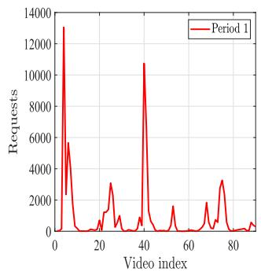

line

| Video index | Requests |
| ----------- | -------- |
| 0           | 13000    |
| 10          | 6000     |
| 20          | 1000     |
| 30          | 3000     |
| 40          | 11000    |
| 50          | 1000     |
| 60          | 2000     |
| 70          | 3000     |
| 80          | 1000     |
| 90          | 500      |

(a)

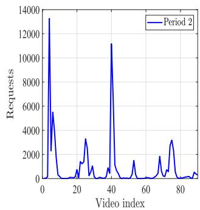

line

| Video index | Requests |
| ----------- | -------- |
| 0           | 0        |
| 5           | 13500    |
| 10          | 5500     |
| 15          | 0        |
| 20          | 1000     |
| 25          | 3500     |
| 30          | 1000     |
| 35          | 11500    |
| 40          | 11500    |
| 45          | 0        |
| 50          | 1500     |
| 55          | 0        |
| 60          | 1500     |
| 65          | 2000     |
| 70          | 3000     |
| 75          | 1500     |
| 80          | 500      |
| 85          | 200      |

Fig. 3. Video requests of two consecutive periods. (a) Period 1 and (b) Period 2.

TABLE II SIMULATION PARAMETERS 

<table><tr><td>Parameter</td><td>Value</td><td>Parameter</td><td>Value</td></tr><tr><td> $d_0$ </td><td>5 m</td><td>p</td><td>2</td></tr><tr><td>A</td><td>11.95</td><td>B</td><td>0.136</td></tr><tr><td> $μ_{LoS}$ </td><td>2</td><td> $μ_{NLoS}$ </td><td>2.4</td></tr><tr><td> $P_u$ </td><td>23 dBm</td><td> $P_b$ </td><td>43 dBm</td></tr><tr><td> $N_{0c}$ </td><td>-174 dBm/Hz</td><td> $N_{0m}$ </td><td>-134 dBm/MHz</td></tr><tr><td> $χσ_{LoS}$ </td><td>5.3</td><td> $χσ_{NLoS}$ </td><td>5.27</td></tr><tr><td> $ω_c$ </td><td>3.75 * 10-9watt/bit</td><td> $ω_t$ </td><td>10-9watt/cycle</td></tr><tr><td> $f_u$ </td><td>3 * 109cycles/s</td><td> $f_c$ </td><td>28 GHz</td></tr><tr><td> $P_h$ </td><td>168.49 W</td><td> $W_u$ </td><td>400 MHz</td></tr><tr><td>μ</td><td>2</td><td>η</td><td>1/100</td></tr><tr><td>c(ξi)</td><td>300 cycles/bit</td><td> $c_1$ </td><td>0.1330</td></tr><tr><td> $E_{max}$ </td><td>750 KJ</td><td></td><td></td></tr></table>

In order to evaluate the performance of the proposed algorithm, we name it with the adopted metric and compare it with following algorithms.

Deterministic Random Caching: which is labeled as DRC. This scheme does not consider the uncertainty of user requests and content popularity distribution, and randomly caches video files in the sample space in advance, and then decision-making of delivering can be promoted.   
Without Transcoding: this scheme can be labeled as WT. For clarity, the data-driven metric utilized will also be added to the label. What distinguishes WT from the proposed scheme is that it does not consider transcoding operations in content delivering.   
Pop Caching: which can be labeled as POP and the used metric shall be additionally marked. Different from the proposed scheme, after solving the problem in (33) based on ζ-structure probability metrics, this scheme does not

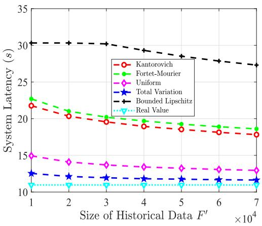

line

| Size of Historical Data F' ×10⁴ | Kantorovich | Fortet-Mourier | Uniform | Total Variation | Bounded Lipschitz | Real Value |
| ------------------------------- | ----------- | -------------- | ------- | ---------------- | ----------------- | ---------- |
| 1                               | 22.0        | 23.0           | 15.0    | 12.5             | 30.0              | 10.5       |
| 2                               | 20.5        | 21.5           | 14.0    | 12.0             | 30.0              | 10.5       |
| 3                               | 19.5        | 20.5           | 13.5    | 11.5             | 29.5              | 10.5       |
| 4                               | 19.0        | 20.0           | 13.0    | 11.5             | 29.0              | 10.5       |
| 5                               | 18.5        | 19.5           | 13.0    | 11.5             | 28.5              | 10.5       |
| 6                               | 18.0        | 19.0           | 13.0    | 11.5             | 28.0              | 10.5       |
| 7                               | 17.5        | 18.5           | 13.0    | 11.5             | 27.5              | 10.5       |

(a)

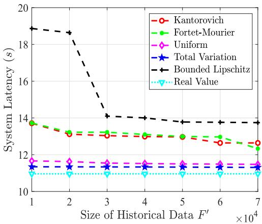

line

| Size of Historical Data F' ×10⁴ | Kantorovich | Fortet-Mourier | Uniform | Total Variation | Bounded Lipschitz | Real Value |
| ------------------------------- | ----------- | -------------- | ------- | ---------------- | ----------------- | ---------- |
| 1                               | 13.8        | 13.8           | 11.8    | 11.5             | 19.0              | 11.0       |
| 2                               | 13.2        | 13.2           | 11.7    | 11.5             | 18.8              | 11.0       |
| 3                               | 13.0        | 13.0           | 11.6    | 11.5             | 14.0              | 11.0       |
| 4                               | 13.0        | 13.0           | 11.6    | 11.5             | 14.0              | 11.0       |
| 5                               | 12.8        | 12.8           | 11.6    | 11.5             | 13.8              | 11.0       |
| 6                               | 12.6        | 12.6           | 11.6    | 11.5             | 13.8              | 11.0       |
| 7                               | 12.4        | 12.4           | 11.6    | 11.5             | 13.8              | 11.0       |

(b)   
Fig. 4. System latency v.s. size of historical data $F ^ { \prime }$ under (a) predicted content popularity distribution and (b) real content popularity distribution.

adopt the obtained cache placement strategy. Instead, it continues to solve the internal maximization problem to get the predicted content popularity distribution, and then directly caches the most popular video files according to the distribution information.

Real Value: the real content popularity distribution is generated from the data set of the second period with reference to the empirical distribution, and there is no need to utilize historical data for prediction.

# B. Performance Analysis

In Fig. 4, we set the number of users to be 30, $C _ { u } = 7 5 0$ Mbits, $W _ { b } = 1 0 \textrm { M } ,$ and $\beta = 0 . 9 5$ . These parameter settings remain unchanged unless otherwise stated. As the size of historical data changes from 10000 to 70000, we compare the system latency performance of the Real Value scheme and the proposed scheme under ζ-structure probability metrics. Since the data sets of two consecutive periods are correlated, the content popularity distribution predicted based on the historical data in the first period can reflect the characteristics of real data to a certain extent. Therefore, the system latency of the proposed scheme using different metrics can be compared by observing the performance of the content caching strategy under the predicted distribution in the first period or the real distribution in the second period, as shown in Figs. 4(a) and 4(b). For the Fig. 4(a), with the increase of historical data, the system latency of the proposed scheme gradually decreases, and approaches the optimal solution reached by the Real Value scheme no matter which metric is used. Simulation results in Fig. 4(b) suggest the similar conclusion. However, the performance of the curve may remain unchanged at a few points, and all curves decline slowly especially when $F ^ { \prime }$ becomes larger. There are two reasons for this phenomenon. One is that there is a deviation between the real data arriving in the second period and the sampled historical data used to predict the distribution. Meanwhile, we consider the worst-case distribution and the prediction is inevitably biased. The other is that similar caching strategies will appear when the predicted popularity order of basic events is similar, thus resulting in approximate performance under the determined real distribution. For the Total Variation, when $F ^ { \prime }$ equals 10000 and 70000, the gap between it and the optimal solution in Fig. 4(b) is 3.49% and 3.16% respectively. Besides, the comparison results of performance gains obtained by using different metrics in two figures are basically consistent.

As the confidence level $\beta$ varies from 0.6 to 0.9, Fig. 5 depicts the system latency of the proposed scheme with five metrics under the predicted probability distribution and the real distribution. For the Fig. 5(a), according to the convergence rate analysis, the $\beta$ is proportional to the tolerance value θ. Larger $\beta$ leads to a larger θ, which further expands the confidence set and improves the conservatism. Thus, the effectiveness is decreased and the system latency is increased. In addition, the latency performance of the proposed scheme using the Total Variation metric also increases with the growth of $\beta ,$ but the increasement is relatively small, so the curve marked by blue is almost static visually. For the Fig. 5(b), when the caching decisions made under the predicted distribution are detected under the real distribution, although the curve basically shows an upward trend, the performance is still flat at some points.

When comparing the performance of the proposed algorithm with other benchmark algorithms, on the one hand, we adopt the Bounded Lipschitz metric to construct the confidence set and compare the performance of the proposed scheme with the deterministic caching scheme. This is mainly because the system performance obtained by using the Bounded Lipschitz metric is inferior to that obtained by using other metrics as can be seen in Figs. 4 and 5. On the other hand, we use the Uniform metric, and compare the performance of the proposed algorithm with that of Uniform-WT and Uniform-POP. The conclusion is also applicable to the use of other metrics. Fig. 6 illustrates the impact of the number of users on the system latency. Obviously, the system performance will be deteriorated as the number of users increases. In addition, because the DRC does not consider the uncertainty and directly provides a certain caching strategy, its performance is far worse than that of proposed schemes Bounded Lipschitz and Uniform, which proves the robustness of the proposed scheme. Furthermore, compared with Uniform-POP and Uniform-WT schemes, the Uniform achieves the best performance and has the smallest gap with the optimal Real Value scheme, which further verify the effectiveness. In case of $U = 1 2 0$ , the proposed scheme Uniform can yield 62.6%, 16% and 15.7% latency reduction compared to DRC, Uniform-WT and Uniform-POP schemes, respectively.

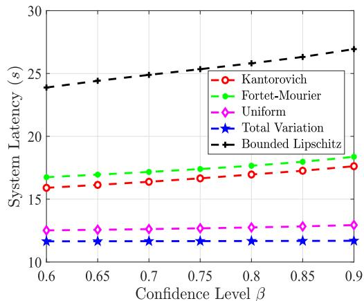

line

| Confidence Level β | Kantorovich | Fortet-Mourier | Uniform | Total Variation | Bounded Lipschitz |
| ------------------ | ----------- | -------------- | ------- | ---------------- | ----------------- |
| 0.6                | 16.0        | 17.0           | 12.5    | 11.5             | 24.0              |
| 0.65               | 16.0        | 17.0           | 12.5    | 11.5             | 24.5              |
| 0.7                | 16.0        | 17.0           | 12.5    | 11.5             | 25.0              |
| 0.75               | 16.5        | 17.5           | 12.5    | 11.5             | 25.5              |
| 0.8                | 17.0        | 18.0           | 12.5    | 11.5             | 26.0              |
| 0.85               | 17.5        | 18.5           | 12.5    | 11.5             | 26.5              |
| 0.9                | 18.0        | 19.0           | 12.5    | 11.5             | 27.0              |

(a)

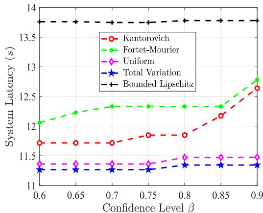

line

| Confidence Level β | Kantorovich | Fortet-Mourier | Uniform | Total Variation | Bounded Lipschitz |
| ------------------ | ----------- | -------------- | ------- | ---------------- | ----------------- |
| 0.6                | 11.7        | 12.1           | 11.4    | 11.3             | 13.8              |
| 0.65               | 11.7        | 12.2           | 11.4    | 11.3             | 13.8              |
| 0.7                | 11.7        | 12.3           | 11.4    | 11.3             | 13.8              |
| 0.75               | 11.8        | 12.3           | 11.4    | 11.3             | 13.8              |
| 0.8                | 11.9        | 12.3           | 11.5    | 11.3             | 13.8              |
| 0.85               | 12.2        | 12.3           | 11.5    | 11.3             | 13.8              |
| 0.9                | 12.7        | 12.8           | 11.5    | 11.3             | 13.8              |

(b)

Fig. 5. System latency v.s. confidence level β under (a) predicted content popularity distribution and (b) real content popularity distribution.   
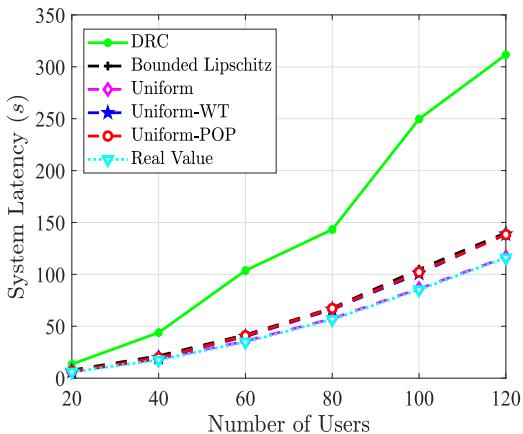

line

| Number of Users | DRC   | Bounded Lipschitz | Uniform | Uniform-WT | Uniform-POP | Real Value |
| --------------- | ----- | ------------------ | ------- | ---------- | ----------- | ---------- |
| 20              | 10    | 5                  | 5       | 5          | 5           | 5          |
| 40              | 45    | 20                 | 20      | 20         | 20          | 20         |
| 60              | 105   | 40                 | 40      | 40         | 40          | 40         |
| 80              | 145   | 65                 | 65      | 65         | 65          | 65         |
| 100             | 250   | 100                | 100     | 100        | 100         | 100        |
| 120             | 315   | 140                | 140     | 140        | 140         | 120        |

Fig. 6. System latency v.s. number of users.

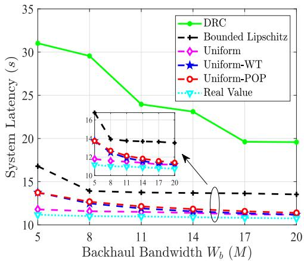

line

| Backhaul Bandwidth Wb (M) | DRC   | Bounded Lipschitz | Uniform | Uniform-WT | Uniform-POP | Real Value |
| ------------------------- | ----- | ----------------- | ------- | ---------- | ----------- | ---------- |
| 5                         | 31.0  | 17.0              | 12.0    | 12.0       | 14.0        | 12.0       |
| 8                         | 30.0  | 14.0              | 12.0    | 12.0       | 13.0        | 12.0       |
| 11                        | 24.0  | 14.0              | 12.0    | 12.0       | 13.0        | 12.0       |
| 14                        | 23.0  | 14.0              | 12.0    | 12.0       | 13.0        | 12.0       |
| 17                        | 20.0  | 14.0              | 12.0    | 12.0       | 13.0        | 12.0       |
| 20                        | 20.0  | 14.0              | 12.0    | 12.0       | 13.0        | 12.0       |

Fig. 7. System latency v.s. backhaul bandwidth $W _ { b } .$ .

Fig. 7 plots system latency results versus varying $W _ { b }$ . On the one hand, the larger the backhaul bandwidth, the less the latency overhead of backhaul retrieval will be. On the other hand, considering the limited caching capacity, it is impractical for all requests to be delivered through UAV local caching and server transcoding, and backhaul retrieval must exist. Thus, these curves show a downward trend. Moreover, the DRC is still the worst scheme. The proposed scheme Uniform is inferior to the Real Value scheme, but better than both schemes Uniform-POP and Uniform-WT. To be specific, when the $W _ { b }$ is small, the latency of transcoding scheduling is smaller than that of backhaul retrieval, which makes the gap between Uniform and the other two sub-optimal schemes larger. For $W _ { b } = 5 ,$ , the system latency of the Uniform increases by 5.51% compared with the Real

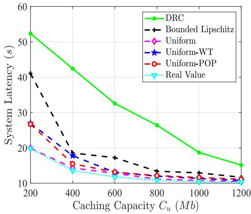

line

| Caching Capacity Cu (Mb) | DRC   | Bounded Lipschitz | Uniform | Uniform-WT | Uniform-POP | Real Value |
| ------------------------ | ----- | ------------------ | ------- | ---------- | ----------- | ---------- |
| 200                      | 52.0  | 41.0               | 27.0    | 26.0       | 26.0        | 20.0       |
| 400                      | 42.0  | 18.0               | 18.0    | 18.0       | 16.0        | 13.0       |
| 600                      | 33.0  | 17.0               | 14.0    | 14.0       | 13.0        | 12.0       |
| 800                      | 27.0  | 13.0               | 12.0    | 12.0       | 12.0        | 11.0       |
| 1000                     | 19.0  | 12.0               | 11.0    | 11.0       | 11.0        | 11.0       |
| 1200                     | 15.0  | 11.0               | 11.0    | 11.0       | 11.0        | 11.0       |

Fig. 8. System latency v.s. caching capacity $C _ { u } .$

Value scheme, and decreases by 14.25% and 14.18% compared with Uniform-WT and Uniform-POP, respectively. While the bandwidth is large, the gain caused by transcoding is small and the gap is not significant.

In Fig. 8, we give the system latency of six schemes with the caching capacity varied from 200 Mbits to 1200 Mbits. When the cache capacity is small, the proposed scheme Uniform is approximate to the optimal solution, and is obviously superior to two schemes of Uniform-WT and Uniform-POP. The reason is that the Uniform-POP enables the video that could have been obtained by transcoding to be cached, which is a waste of caching space. Similarly, the Uniform-WT does not introduce transcoding scheduling. For $C _ { u } = 2 0 0$ , compared with DRC, Uniform-WT and Uniform-POP, the Uniform scheme can reduce the latency by 62%, 26.3% and 25.6% respectively. When the cache capacity increases, the advantages of the proposed scheme are not particularly obvious compared with Uniform-WT and Uniform-POP, but the system performance is still slightly better.

# VII. DISCUSSION

Queuing: Theoretically, multiple user requests arrive at the UAV, which may result in queuing and thus the queuing latency should be considered. Specifically, suppose we adopt the discrete epoch-based system with an equal time duration within the cache refreshing cycle, the arrived requests in each epoch are random and stored in the queue. Moreover, since the processing capability of the UAV is limited, the arrived requests may not be processed completely within an epoch, and the remaining requests wait to be scheduled at the UAV. Once the queue is full, newly arrived requests will be dropped. Based on above analysis, the queuing problem can be formulated as a Markov decision process. The queuing latency is closely related to the unaccomplished task backlog at the beginning of the epoch and the number of tasks that can be completed in this epoch. Thus, if the queuing situation is introduced, there is a strong coupling between the decisions of epochs. This leads to that the distributionally robust latency optimization problem with uncertain content popularity distribution is extremely intractable, which we leave to future work and explore feasible solutions.

Direct transmission links between the BS and users: We assume the BS is already under heavy load, and thus the UAV-assisted MEC is introduced to cope with intensive video requests. Besides, whether in the system model or simulation evaluation, we consider the BS is relatively far away from the deployed users. Meanwhile, the millimeter-wave band is adopted for high-speed and low-latency transmissions between the UAV and users. Thus, in terms of channel conditions, the direct transmission links between the BS and investigated users are not optimal options with a large probability. However, when considering deploying users in a wider area, for users close to the BS, it may be more appropriate to obtain video files from the BS, and direct transmission links should be included. The details of introducing direct transmission links are put in the Appendix, available online.

Video caching in multi-UAV-assisted MEC networks: Single UAV-assisted MEC is a basic scenario for the multi-UAVassisted MEC. The video caching in multi-UAV-assisted MEC networks requires additional consideration of the user association and the co-frequency interference between UAVs and users. To simplify the video caching problem in multi-UAV scenarios, only additional user associations need to be considered, which can also alleviate the co-frequency interference. Unfortunately, user associations and the cache placement are still strongly coupled. In this case, the exhaustive or one-dimensional search related methods can be used to assign values to user association variables. Then, solving other variables based on the given user associations until the optimal solution or sub-optimal solution of the problem is output. However, the computational complexity is extremely high, and we leave the design of a low-complexity and effective solution to future work.

# VIII. CONCLUSION

In this article, we focus on the adaptive bitrate video caching with unknown content popularity distribution in UAV-assisted MEC networks. First, a mixed integer non-linear optimization problem under uncertainty for jointly optimizing cache placement and content delivery scheduling is formulated. Then, we explore the whole family of ζ-structure probability metrics to directly correlate the robustness of the model with the observed historical data, and provide distributionally robust latency optimization algorithm with competitive performance. Finally, we use the data sets of two consecutive periods in the real world for simulation. Compared with the deterministic caching scheme, the proposed scheme can reduce the system latency by more than 60%, which verifies its robustness. Compare with other schemes, the proposed scheme achieves 14% ∼ 27% latency reduction, which verifies its effectiveness.

# REFERENCES

[1] CiscoVNI GlobalIP TrafficForecast, 2017–2022. Cisco Vis. Netw. Index, San Jose, CA, USA, 2018.   
[2] T. X. Tran and D. Pompili, “Adaptive bitrate video caching and processing in mobile-edge computing networks,” IEEE Trans. Mobile Comput., vol. 18, no. 9, pp. 1965–1978, Sep. 2019.   
[3] T. Taleb, K. Samdanis, B. Mada, H. Flinck, S. Dutta, and D. Sabella, “On multi-access edge computing: A survey of the emerging 5G network edge cloud architecture and orchestration,” IEEE Commun. Surv. Tut., vol. 19, no. 3, pp. 1657–1681, Third Quarter 2017.   
[4] G. Geraci et al., “What will the future of UAV cellular communications be? A flight from 5G to 6G,” IEEE Commun. Surv. Tut., vol. 24, no. 3, pp. 1304–1335, Third Quarter 2022.   
[5] X. H. Wang and L. J. Duan, “Economic analysis of unmanned aerial vehicle (UAV) provided mobile services,” IEEE Trans. Mobile Comput., vol. 20, no. 5, pp. 1804–1816, May 2021.   
[6] X. W. Pang, M. Sheng, N. Zhao, J. Tang, D. Niyato, and K. Wong, “When UAV meets IRS: Expanding air-ground networks via passive reflection,” IEEE Wireless Commun., vol. 28, no. 5, pp. 164–170, Oct. 2021.   
[7] Y. Wang, Z. Y. Ru, K. Z. Wang, and P. Q. Huang, “Joint deployment and task scheduling optimization for large-scale mobile users in multi-UAVenabled mobile edge computing,” IEEE Trans. Cybern., vol. 50, no. 9, pp. 3984–3997, Sep. 2020.   
[8] J. F. Xie, Z. B. Wang, and Y. X. Chen, “Joint caching and user association optimization for adaptive bitrate video streaming in UAV-Assisted cellular networks,” IEEE Access, vol. 10, pp. 106275–106285, 2022.   
[9] L. Li, D. Shi, R. H. Hou, R. Chen, B. Lin, and M. Pan, “Energy-efficient proactive caching for adaptive video streaming via data-driven optimization,” IEEE Internet Things J., vol. 7, no. 6, pp. 5549–5561, Jun. 2020.   
[10] B. Shen, S. J. Lee, and S. Basu, “Caching strategies in transcoding-enabled proxy systems for streaming media distribution networks,” IEEE Trans. Multimedia, vol. 6, no. 2, pp. 375–386, Apr. 2004.   
[11] H. C. Wang, G. R. Ding, F. F. Gao, J. Chen, J. L. Wang, and L. Wang, “Power control in UAV-Supported ultra dense networks: Communications, caching, and energy transfer,” IEEE Commun. Mag., vol. 56, no. 6, pp. 28–34, Jun. 2018.

[12] T. K. Zhang, Y. Wang, Y. W. Liu, W. J. Xu, and A. Nallanathan, “Cacheenabling UAV communications: Network deployment and resource allocation,” IEEE Trans. Wireless Commun., vol. 19, no. 11, pp. 7470–7483, Nov. 2020.   
[13] J. Q. Ji, K. Zhu, D. Niyato, and R. Wang, “Probabilistic cache placement in UAV-Assisted networks with D2D connections: Performance analysis and trajectory optimization,” IEEE Trans. Commun., vol. 68, no. 10, pp. 6331–6345, Oct. 2020.   
[14] J. Q. Ji, K. Zhu, and L. Cai, “Trajectory and communication design for cache-enabled UAVs in cellular networks: A deep reinforcement learning approach,” IEEE Trans. Mobile Comput., to be published, doi: 10.1109/TMC.2022.3181308.   
[15] T. K. Zhang, Z. D. Wang, Y. W. Liu, W. J. Xu, and A. Nallanathan, “Joint resource, deployment and caching optimization for AR applications in dynamic UAV NOMA networks,” IEEE Trans. Wireless Commun., vol. 21, no. 5, pp. 3409–3422, May 2022.   
[16] G. X. Wu, Y. M. Miao, B. Alzahrani, A. Barnawi, A. Alhindi, and M. Chen, “Adaptive edge caching in UAV-Assisted 5G network,” in Proc. IEEE Glob. Commun. Conf., Madrid, Spain, 2021, pp. 1–6.   
[17] D. H. Tran, S. Chatzinotas, and B. Ottersten, “Satellite- and cache-assisted UAV: A joint cache placement, resource allocation, and trajectory optimization for 6G aerial networks,” IEEE Open J. Veh. Technol., vol. 3, pp. 40–54, 2022.   
[18] F. Fazel, J. Abouei, M. Jaseemuddin, A. Anpalagan, and K. N. Plataniotis, “Secure throughput optimization for cache-enabled multi-UAVs networks,” IEEE Internet Things J., vol. 9, no. 10, pp. 7783–7801, May 2022.   
[19] J. Gao, L. Zhao, and X. She, “The study of dynamic caching via state transition field-the case of time-invariant popularity,” IEEE Trans. Wireless Commun., vol. 18, no. 12, pp. 5924–5937, Dec. 2019.   
[20] L. Aitchison, N. Corradi, and P. E. Latham, “Zipf’s law arises naturally when there are underlying, unobserved variables,” PLoS Comput. Biol., vol. 12, no. 12, Dec. 2016, Art. no. e1005110.   
[21] M. Z. Chen, M. Mozaffari, W. Saad, C. C. Yin, M. Debbah, and C. S. Hong, “Caching in the sky: Proactive deployment of cache-enabled unmanned aerial vehicles for optimized quality-of-experience,” IEEE J. Sel. Areas Commun., vol. 35, no. 5, pp. 1046–1061, May 2017.   
[22] M. Z. Zhang, M. E. Hajjar, and S. X. Ng, “Intelligent caching in UAV-Aided networks,” IEEE Trans. Veh. Technol., vol. 71, no. 1, pp. 739–752, Jan. 2022.   
[23] J. J. Luo, J. L. Song, F. C. Zheng, L. Gao, and T. Wang, “User-centric UAV deployment and content placement in cache-enabled Multi-UAV networks,” IEEE Trans. Veh. Technol., vol. 71, no. 5, pp. 5656–5660, May 2022.   
[24] W. T. Hou, R. J. Zhu, H. Wei, and T. H. Hiep, “A data-driven affinely adjustable distributionally robust framework for unit commitment based on Wasserstein metric,” IET Gener. Transmiss. Distrib., vol. 13, no. 6, pp. 890–895, Mar. 2019.   
[25] E. B. Wang, Q. F. Dong, Y. A. Li, and Y. Y. Zhang, “Content placement considering the temporal and spatial attributes of content popularity in cache-enabled UAV networks,” IEEE Wireless Commun. Lett., vol. 11, no. 2, pp. 250–253, Feb. 2022.   
[26] D. Bertsimas and A. Thiele, “Robust and data-driven optimization: Modern decision making under uncertainty,” in Proc. Models Methods Appl. Innov. Decis. Mak., 2006, pp. 95–122.   
[27] H. Rahimian and S. Mehrotra, “Distributionally robust optimization: A review,” 2019, arXiv: 1908.05659.   
[28] D. Zhou, M. Sheng, B. Li, J. D. Li, and Z. Han, “Distributionally robust planning for data delivery in distributed satellite cluster network,” IEEE Trans. Wireless Commun., vol. 18, no. 7, pp. 3642–3657, Jul. 2019.   
[29] J. Y. Wang et al., “Data-driven optimization based primary users’ operational privacy preservation,” IEEE Trans. Cogn. Commun. Netw., vol. 4, no. 2, pp. 357–367, Jun. 2018.   
[30] X. H. Li, J. H. Liu, N. Zhao, and X. B. Wang, “UAV-Assisted edge caching under uncertain demand: A data-driven distributionally robust joint strategy,” IEEE Trans. Commun., vol. 70, no. 5, pp. 3499–3511, May 2020.   
[31] X. W. Pang, J. Tang, N. Zhao, X. Y. Zhang, and Y. Qian, “Energy-efficient design for mmWave-Enabled NOMA-UAV networks,” Sci. China Inf. Sci., vol. 64, no. 4, 2021, Art. no. 140303.   
[32] R. C. Xie, Z. S. Li, J. Wu, Q. M. Jia, and T. Huang, “Energy-efficient joint caching and transcoding for HTTP adaptive streaming in 5G networks with mobile edge computing,” China Commun., vol. 16, no. 7, pp. 229–244, Jul. 2019.

[33] T. S. Rappaport, F. Gutierrez, E. Ben-Dor, J. N. Murdock, Y. J. Qiao, and J. I. Tamir, “Broadband millimeter-wave propagation measurements and models using adaptive-beam antennas for outdoor urban cellular communications,” IEEE Trans. Antennas Propag., vol. 61, no. 4, pp. 1850–1859, Apr. 2013.   
[34] A. Al-Hourani, S. Kandeepan, and S. Lardner, “Optimal LAP altitude for maximum coverage,” IEEE Wireless Commun. Lett., vol. 3, no. 6, pp. 569–572, Dec. 2014.   
[35] M. Mozaffari, W. Saad, M. Bennis, and M. Debbah, “Unmanned aerial vehicle with underlaid device-to-device communications: Performance and tradeoffs,” IEEE Trans. Wireless Commun., vol. 15, no. 6, pp. 3949–3963, Jun. 2016.   
[36] X. Y. Zhang et al., “Data-driven caching with users’ content preference privacy in information-centric networks,” IEEE Trans. Wireless Commun., vol. 20, no. 9, pp. 5744–5753, Sep. 2021.   
[37] C. Y. Zhao and Y. P. Guan, “Data-driven risk-averse two-stage stochastic program with ζ-structure probability metrics,” Jul. 2015. [Online]. Available: https://optimization-online.org/2015/07/5014/   
[38] Y. W. Chen, Q. L. Guo, H. B. Sun, Z. S. Li, W. C. Wu, and Z. H. Li, “A distributionally robust optimization model for unit commitment based on Kullback-Leibler divergence,” IEEE Trans. Power Syst., vol. 33, no. 5, pp. 5147–5160, Sep. 2018.   
[39] Y. Lu, K. Xiong, P. Y. Fan, Z. D. Zhong, and K. Letaief, “Coordinated beamforming with artificial noise for secure SWIPT under non-linear EH model: Centralized and distributed designs,” IEEE J. Sel. Areas Commun., vol. 36, no. 7, pp. 1544–1563, Jul. 2018.   
[40] M. Alzenad, A. E. Keyi, F. Lagum, and H. Yanikomeroglu, “3-D placement of an unmanned aerial vehicle base station (UAV-BS) for energyefficient maximal coverage,” IEEE Wireless Commun. Lett., vol. 6, no. 4, pp. 434–437, Aug. 2017.   
[41] X. Cheng, C. Dale, and J. Liu, “Dataset for statistics and social network of YouTube videos,” 2008. [Online]. Available: http://netsg.cs.sfu.ca/ youtubedata/   
[42] N. Choi, K. Guan, D. C. Kilper, and G. Atkinson, “In-network caching effect on optimal energy consumption in content-centric networking,” in Proc. IEEE Int. Conf. Commun., Ottawa, ON, Canada, 2012, pp. 2889–2894.   
[43] 3rd generation part-nership project (3GPP), evolved universal terrestrial radio access (E-UTRA); further advancements for E-UTRA physical layer aspects, TR 36.814–920, 2017.

natural_image

Portrait photo of a woman with dark hair tied back, wearing a brown sweater against a blue background (no text or symbols visible)

Yali Chen received the BS degree in communication engineering from the Taiyuan University of Science and Technology, China, in 2016, and the PhD degree in communication and information systems from Beijing Jiaotong University, China, in 2022. She is an assistant professor with the Institute of Computing Technology, Chinese Academy of Sciences, Beijing, China. Her current research interests include unmanned aerial vehicles, optimization under uncertainty, and mobile edge computing.

natural_image

Portrait of a woman wearing glasses and a collared shirt (no text or symbols visible)

Min Liu (Senior Member, IEEE) received the BS and MS degrees in computer science from Xi’an Jiaotong University, China, in 1999 and 2002, respectively, and the PhD degree in computer science from the Graduate University of Chinese Academy of Sciences, China, in 2008. She is currently a professor with the Institute of Computing Technology, Chinese Academy of Sciences, and also holds a position with the Zhongguancun Laboratory. Her current research interests include mobile computing and edge intelligence.

natural_image

Portrait of a man in formal attire outdoors, no visible text or symbols

Bo Ai (Fellow, IEEE) received the MS and PhD degrees from Xidian University, China. He studied as a post-doctoral student with Tsinghua University. He was a visiting professor with the Electrical Engineering Department, Stanford University, in 2015. He is currently with Beijing Jiaotong University as a full professor and the PhD candidate advisor. He is the deputy director of the State Key Lab of Rail Traffic Control and Safety and the deputy director of the International Joint Research Center. He is one of the main people responsible for the Beijing Urban Rail Operation Control System, International Science and Technology Cooperation Base. He is also a Member, of the Innovative Engineering Based jointly granted by the Chinese Ministry of Education and the State Administration of Foreign Experts Affairs. He was honored with the excellent postdoctoral research fellow by Tsinghua University, in 2007. He has authored/co-authored eight books and published more than 300 academic research papers in his research area. He holds 26 invention patents. He has been the research team leader for 26 national projects. His interests include the research and applications of channel measurement and channel modeling, dedicated mobile communications for rail traffic systems. He has been notified by the Council of Canadian Academies that, based on Scopus database, he has been listed as one of the Top 1% authors in his field all over the world. He has also been feature interviewed by the IET Electronics Letters. He has received some important scientific research prizes. He is a fellow of the Institution of Engineering and Technology. He is an editorial committee member of the Wireless Personal Communications journal. He has received many awards, such as the Outstanding Youth Foundation from the National Natural Science Foundation of China, the Qiushi Outstanding Youth Award by the Hong Kong Qiushi Foundation, the New Century Talents by the Chinese Ministry of Education, the Zhan Tianyou Railway Science and Technology Award by the Chinese Ministry of Railways, and the Science and Technology New Star by the Beijing Municipal Science and Technology Commission. He was a co-chair or a session/track chair for many international conferences. He is an IEEE VTS Beijing Chapter Vice Chair and an IEEE BTS Xi’an Chapter Chair. He is the IEEE VTS Distinguished Lecturer. He is an editor of the IEEE Transactions on Consumer Electronics. He is the Lead guest editor of Special Issues of the IEEE Transactions on Vehicular Technology, the IEEE Antennas and Wireless Propagation Letters, and the International Journal of Antennas and Propagation.

natural_image

Portrait of a man wearing glasses and a sweater vest (no text or symbols visible)

Yuwei Wang (Member, IEEE) received the PhD degree in computer science from the University of Chinese Academy of Sciences, Beijing, China, in 2020. He is currently an associate professor with the Institute of Computing Technology, Chinese Academy of Sciences, Beijing. He has been responsible for setting more than 30 international and national standards, and also holds various positions in both international and national industrial standards development organizations (SDOs) as well as local research institutions, including the associate rapporteur at the ITU-T SG16 Q5, and the deputy director of China Communications Standards Association (CCSA) TC1 WG1. His current research interests include federated learning, mobile edge computing, and next-generation network architecture.

natural_image

Portrait of a woman with long dark hair (no text or symbols visible)

Sheng Sun received the BS degree in computer science from Beihang University, China, in 2014, and the PhD degree in computer science from the University of Chinese Academy of Sciences, China, in 2020. She is currently an assistant professor with the Institute of Computing Technology, Chinese Academy of Sciences, Beijing, China. Her current research interests include federated learning, mobile computing, and edge intelligence.