# Adaptive Digital Twin Migration in Vehicular Edge Computing and Networks

Fangyi Mou , Jiong Lou , Member, IEEE, Zhiqing Tang , Member, IEEE, Yuan Wu , Senior Member, IEEE, Weijia Jia , Fellow, IEEE, Yan Zhang , Fellow, IEEE, and Wei Zhao , Fellow, IEEE

Abstract—The surge in mobile vehicles and data traffic in Vehicular Edge Computing and Networks (VECONs) requires innovative approaches for low latency, stable connectivity, and efficient resource usage in fast-moving vehicles. Existing studies have identified that utilizing digital twins (DTs) can effectively improve service quality in VECONs. However, it still faces substantial challenges posed by large-scale complex DT communications in sustaining real-time collaborative endeavors. In particular, within the dynamic VECONs, the decision regarding DT migration plays a pivotal role in sustaining the quality of services. In this paper, we propose an adaptive DT migration (ADM) algorithm to minimize the overall migration costs when DTs deliver services. Specifically, 1) We formulate ADM as a combinatorial optimization problem in VECONs, comprehensively considering communication latency and migration latency under complex DT communications, vehicular mobilities, and dynamic states of edges; 2) An ADM algorithm based on off-policy actor-critic reinforcement learning is proposed to make migration decisions. Moreover, the ADM agent employs warm-up policies to address exploration challenges in sparse state

Received 29 February 2024; revised 30 June 2024; accepted 1 November 2024. Date of publication 7 November 2024; date of current version 5 March 2025. This work was supported in part by the National Natural Science Foundation of China (NSFC) under Grant 62272050 and Grant 62302048, in part by the Science and Technology Development Fund of Macau SAR under Grant 0158/2022/A, in part by the Guangdong Key Lab of AI and Multi-modal Data Processing, United International College (UIC), Zhuhai, under Grant 2023-2024, in part by the Guangdong Provincial Department of Education, in part by the Institute of Artificial Intelligence and Future Networks (BNU-Zhuhai) and Engineering Center of AI and Future Education, Guangdong Provincial Department of Science and Technology, China, in part by Zhuhai Science-Tech Innovation Bureau under Grant 2320004002772, and in part by the Interdisciplinary Intelligence Super Computer Center of Beijing Normal University at Zhuhai. The review of this article was coordinated by Prof. Zhao Ming. (Corresponding author: Zhiqing Tang.)

Fangyi Mou is with the Hong Kong Baptist University, Kowloon Tong, Hong Kong, and also with the Faculty of Science and Technology, Beijing Normal University-Hong Kong Baptist University United International College, Zhuhai 519087, China (e-mail: moufangyi@uic.edu.cn).

Jiong Lou is with the Department of Computer Science and Engineering, Shanghai Jiao Tong University, Shanghai 200240, China (e-mail: lj1994@sjtu.edu.cn).

Zhiqing Tang is with the Institute of Artificial Intelligence and Future Networks, Beijing Normal University, Zhuhai 519087, China (e-mail: zhiqingtang@bnu.edu.cn).

Yuan Wu is with the State Key Lab of IoT for Smart City, University of Macau, SAR Macau 999078, China (e-mail: yuanwu@um.edu.mo).

Weijia Jia is with the Institute of Artificial Intelligence and Future Networks, Beijing Normal University, Zhuhai 519087, China, and also with the Guangdong Key Lab of AI and Multi-Modal Data Processing, BNU-HKBU United International College, Zhuhai 519087, China (e-mail: jiawj@bnu.edu.cn).

Yan Zhang is with the Department of Informatics, University of Oslo, 0316 Oslo, Norway (e-mail: yanzhang@ieee.org).

Wei Zhao is with the Shenzhen University of Advanced Technology, Shenzhen 518055, China (e-mail: zhao.wei@siat.ac.cn).

Digital Object Identifier 10.1109/TVT.2024.3492349

spaces; 3) Simulations based on real-world, large-scale urban vehicular mobility datasets demonstrate that our method outperforms existing algorithms by approximately 39% on average, and it can achieve results close to the optimal.

Index Terms—Digital twin, migration, vehicular edge computing, deep reinforcement learning.

# I. INTRODUCTION

T HE paradigm of Vehicular Edge Computing and Networks(VECONs) [1] is a promising approach that can be em- (VECONs)[1] is a promising approach that can be embedded at the network edge to support massive data storage, computing, and sharing close to the vehicles [2]. Constrained by limited resources, current VECONs cannot efficiently satisfy the growing resource demands of vehicular applications [3]. To enable real-time services under large-scale communications, it is promising to conduct predictions and processing through specific virtual spaces, e.g., digital twins (DTs) [4], [5]. Real-world data and experiences, such as traffic patterns and environmental conditions, are captured and integrated into the virtual environment. Within the virtual realm, this data is used to model diverse scenarios and potential outcomes, evaluate the effectiveness of vehicle decisions, or analyze the impact of autonomous vehicle behavior [6], [7].

Using knowledge obtained through virtual analysis, DT facilitates bidirectional data exchange and enhances decision-making that can aid in formulating optimal operational approaches in diverse real-time VECONs [8]. Existing studies have investigated the performance enhancement of edge networks through the assistance of DTs, including network services improvement [9], [10], collaborative driving decisions-making [11], task scheduling and resource utilizations [12]. However, determining how to migrate DTs that handle complex communication and strict latency requirements to minimize service latency while preserving service quality remains a crucial, yet unresolved challenge, particularly for mobile vehicles in dynamic VECONs.

Achieving appropriate DT migration decisions requires addressing the following two challenges. The first challenge is how to quantify the complex latency of DT communications during migration. The complex communication relationships within DTs, which have been neglected by existing studies, primarily involve three components: interactions between physical objects and DTs, between DTs themselves, and the information flow between DTs and user applications. [8]. Different types of DTs can enable cooperative management of autonomous vehicle driving [11], [13]. Due to frequent status and data synchronization for DTs, it becomes essential to account for additional communication interactions and data transmissions. This inevitably leads to heightened system intricacy and increased communication costs. Moreover, the simultaneous exchange of information among multiple DTs significantly scales up the communication network. To address these issues, a feature extraction network is meticulously designed to capture interdependent complex communication features, which are then integrated into the system state.

The second challenge is how to make adaptive migration decisions for DTs in dynamic VECONs. It involves a joint optimization of DT migration latency and communications costs to achieve long-term benefits. Traditional heuristic algorithms often struggle to effectively address this challenge due to their static strategies and inability to capture long-term awards. Reinforcement learning (RL) is leveraged to optimize strategies and find optimal solutions. However, the interactive environment undergoes frequent changes due to the high-speed mobility of vehicles and variations in DT communications connections. Due to the insufficient state data, it is challenging for RL agents to make effective decisions from limited states to unseen ones. Therefore, warm-start policies [14], [15] from expert demonstrations are employed to improve policy exploration and accelerate the training process for RL agents. We first pre-train the agent based on expert demonstrations and progressively diminish the proportion of these demonstrations during the training process, guiding the RL agent to converge towards the expert region gradually. Then, adaptive DT migration decisions can be made by utilizing a policy gradient RL with warm-start policies.

In this paper, we first model the large-scale communicationaware adaptive DT migration problem in VECONs, aiming to minimize communication latency and migration cost. The features of large-scale interactive connections of DTs, DT mobilities, and the resources of heterogeneous roadside units (RSUs) are fully considered. Feature extraction is performed on these elements. Next, an adaptive DT migration (ADM) algorithm is proposed based on the off-policy actor-critic RL algorithm [16]. Expert demonstrations are utilized as prior knowledge for efficient initialization. The training process of the ADM algorithm is then guided by progressively diminishing demonstrations used as warm-up policies. Finally, simulations based on realworld vehicular mobility traces of Cologne, Germany [17], are conducted to evaluate the performance of the ADM algorithm compared to other migration algorithms. Results show that our ADM algorithm reduces total migration latency by approximately 39% on average compared to baseline algorithms. The main contributions are listed as follows:

- We address the significant system latency caused by largescale complex communications during DT migrations in VECONs, fully modeling interactions among physical objects, DTs, and user applications. This model comprehensively accounts for communication latency, colocation, and migration costs to enhance the performance of DTs.   
. - An RL-based ADM algorithm is proposed for DT migration decisions. Features are extracted from large-scale DT communications. Expert demonstrations are then used to

assist in feature learning, effectively guiding the RL agent in making adaptive migration decisions.

Simulations utilizing real-world urban vehicular mobility datasets evaluate the ADM algorithm’s performance. Results illustrate that our algorithm outperforms traditional baseline algorithms by roughly 39% on average.

# II. RELATED WORK

# A. DT in VECONs

Recent advancements in VECONs with DT technologies have addressed challenges associated with leveraging virtualization to facilitate remote execution of vehicle-related tasks by RSUs or base stations. Wang et al. [4] define and discuss three kinds of DT-built microservices for mobility services, focusing on driver management, vehicle, and traffic DTs in vehicular edge networks. Zhao et al. [3] apply the DT technology to construct virtual replicas of vehicular networks with multiple twin versions. Zheng et al. [18] examine the problem of joint network selection and power allocation in DT-assisted networks and use DT to predict the waiting time for decision-making. Zhang et al. [19] present a DT-assisted platform for edge computing networks and introduce a novel service framework to address resource dynamics and mobile users. Feng et al. [5] simulate the DT network by mapping the traffic situation in the physical road network to the virtual space and transmitting vehicular data interactions based on blockchain technology. Yuan et al. [20] utilize DTs to gather real-time data and obtain representations of the physical operating environments. Lu et al. [21] propose a DT-assist prediction algorithm for vehicle-to-vehicle pairing to improve task offloading efficiency according to the real-time vehicular network state.

These studies leverage the DT technology to derive insights from physical network data and then employ deep learning methods to optimize overall networks. However, they overlook the importance of optimizing DT performance throughout the entire DT lifecycle, which includes initialization, migration, and updates. This optimization is crucial for enhancing the operational quality of DT edge networks.

# B. Service and DT Migration

In edge computing, traditional service migration has been widely explored to address various challenges, such as reducing startup latency [22], improving system energy efficiency [23], [24], optimizing overall costs [25], [26], [27], and satisfying network Quality of Service (QoS) [28]. However, the constant movement of vehicles, diverse resources available at edge nodes, and the requirement for multifaceted vehicular communications present unique challenges for DT migration.

Existing research has begun addressing these challenges, yet notable gaps persist. Sun et al. [29] utilize DT to estimate states of edge servers and provide training data for service offloading decisions. Lu et al. [30] formulate the edge association problem concerning the dynamic network states and varying network topologies and then decompose the problem into DT placement and DT migration. Most existing studies mainly concentrate on optimizing migration costs and making decisions based on mobility patterns and network dynamics. However, the complex nature of DT communications, especially in large-scale, realtime collaborative environments, presents additional challenges that have not been thoroughly explored. It is crucial to examine the ADM problem considering multi-dimensional and intricate DT communications. Our research differs from existing studies by specifically addressing these gaps.

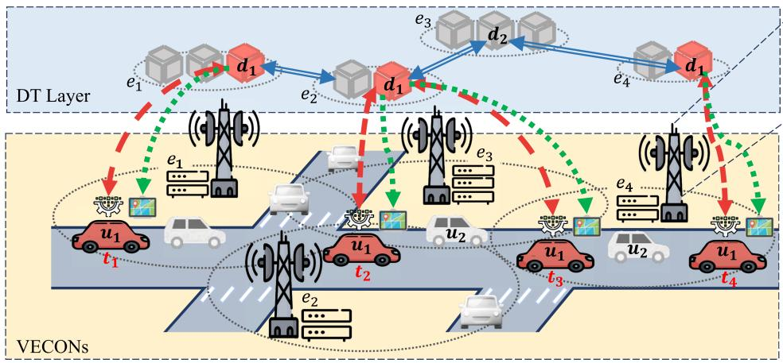

flowchart

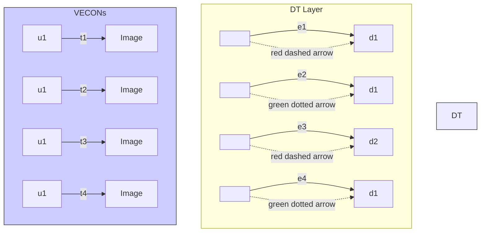

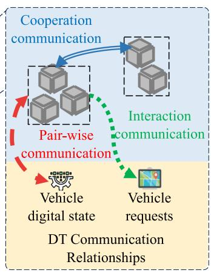

flowchart

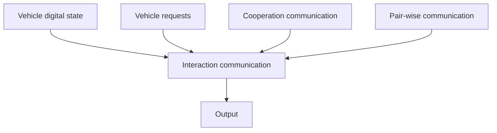

Fig. 1. An illustration of DT migration in VECONs. As the vehicle u1 continuously moves, the DT $d _ { 1 }$ must migrate intelligently on RSU servers $e _ { 1 } , e _ { 2 } , \dots \in$ E to enable concurrent running. The DT $d _ { 1 }$ maintains constant wireless pair-wise communications to acquire updated vehicular digital states. It also returns the processing results of vehicular requests and cooperates with other DTs simultaneously. More detailed explanations are in Section III-A.

# III. SYSTEM MODEL AND PROBLEM FORMULATION

# A. System Model

Fig. 1 shows the ADM problem in VECONs. In the physical space, RSU servers $e _ { 1 } , e _ { 2 } , \ldots \in \mathbf { E }$ are placed along the roads, allowing moving vehicles to achieve continuous data sharing through multiple RSUs [8], [31]. Each vehicle can transmit requests to servers on RSUs, using data collected by their onboard sensors [32]. The requests are sent in discrete time slots $t _ { 1 } , t _ { 2 } , \cdots \in T$ until they are finished. DTs are deployed in parallel with vehicles and modeled within RSUs, using a portion of their resources [33].

As the vehicle u1 moves from the coverage area of $e _ { 1 }$ to $e _ { 4 }$ over time, it starts communicating with DT $d _ { 1 }$ , which is currently hosted on $e _ { 1 }$ at time $t _ { 1 }$ . The vehicle $u _ { 1 }$ sends its current state and requests to DT $d _ { 1 }$ for processing. This interaction helps $u _ { 1 }$ to obtain real-time traffic updates and navigation assistance. As vehicle $u _ { 1 }$ continues moving, it approaches RSU $e _ { 2 }$ . To maintain a high QoS, DT $d _ { 1 }$ migrates from RSU $e _ { 1 }$ to $e _ { 2 }$ at time $t _ { 2 }$ . This migration involves transferring the DT’s state and ongoing vehicular request data to RSU $e _ { 2 }$ . This handover is critical to reduce latency and ensure seamless service continuity. At time $t _ { 3 }$ , DT can also connect to other RSUs through multi-hop routing to serve the vehicle $u _ { 1 }$ that approaches RSU $e _ { 4 }$ . During the continuous time interval from $t _ { 3 }$ to $t _ { 4 } .$ , vehicle $u _ { 1 }$ is near RSU $e _ { 4 } .$ . DT $d _ { 1 }$ at $e _ { 2 }$ keeps serving $u _ { 1 }$ by moving through RSU $e _ { 3 }$ to maintain low-latency services directly. Throughout this processing, DT $d _ { 1 }$ ensures that $u _ { 1 }$ receives continuous updates and processing results, effectively adapting to the vehicle’s changing position.

TABLE I NOTATIONS 

<table><tr><td> $\mathbf{U}$ </td><td>Mobile vehicle set</td></tr><tr><td> $u_{i}$ </td><td> $u^{i_{th}}$  mobile vehicle ( $u \in \mathbf{U}, i \in |\mathbf{U}|$ )</td></tr><tr><td> $z_{u_{i}}$ </td><td>Update size of vehicle  $u_{i}$ </td></tr><tr><td> $o_{u_{i}}$ </td><td>CPU request of vehicle  $u_{i}$ </td></tr><tr><td> $m_{u_{i}}$ </td><td>Memory request of vehicle  $u_{i}$ </td></tr><tr><td> $l_{u_{i}}(t)$ </td><td>Location of vehicle  $u_{i}$  at time  $t$ </td></tr><tr><td> $\mathbf{E}$ </td><td>RSU set</td></tr><tr><td> $e_{k}$ </td><td> $e^{k_{th}}$  RSU ( $e \in \mathbf{E}, k \in |\mathbf{E}|$ )</td></tr><tr><td> $b_{e_{k}}(t)$ </td><td>Bandwidth of RSU  $e_{k}$  at time  $t$ </td></tr><tr><td> $o_{e_{k}}(t)$ </td><td>CPU resource of RSU  $e_{k}$  at time  $t$ </td></tr><tr><td> $m_{e_{k}}(t)$ </td><td>Memory resource of RSU  $e_{k}$  at time  $t$ </td></tr><tr><td> $z_{e_{k}}(t)$ </td><td>Storage capacity of RSU  $e_{k}$  at time  $t$ </td></tr><tr><td> $l_{e_{k}}(t)$ </td><td>Location of RSU  $e_{k}$  at time  $t$ </td></tr><tr><td> $\mathbf{D}$ </td><td>DT set</td></tr><tr><td> $d_{j}$ </td><td> $d^{j_{th}}$  DT ( $d \in \mathbf{D}, j \in |\mathbf{D}|$ )</td></tr><tr><td> $b_{d_{j}}(t)$ </td><td>Allocated bandwidth for DT  $d_{j}$  at time  $t$ </td></tr><tr><td> $\ell_{d_{j}}(t)$ </td><td>CPU request of DT  $d_{j}$  at time  $t$ </td></tr><tr><td> $z_{d_{j}}$ </td><td>Size of DT  $d_{j}$ </td></tr><tr><td> $\Delta z_{d_{j}}$ </td><td>Synchronized size of DT  $d_{j}$ </td></tr><tr><td> $f(d_{i}, d_{j})$ </td><td>Cooperation frequency between DT  $d_{i}$  and  $d_{j}$ </td></tr><tr><td> $f(d_{i}, e_{k})$ </td><td>Interaction frequency between DT  $d_{i}$  and closest RSU  $e_{k}$  to vehicle application</td></tr><tr><td> $f(d_{i}, u_{i})$ </td><td>Pair-wise frequency between DT  $d_{i}$  and its vehicle  $u_{i}$ </td></tr><tr><td> $\mathcal{L}^{com}(t)$ </td><td>Communication latency for DT</td></tr><tr><td> $\mathcal{L}^{colo}(t)$ </td><td>Colocation cost for DT</td></tr><tr><td> $\mathcal{L}^{mig}(t)$ </td><td>Migration latency for DT</td></tr><tr><td> $\mathcal{L}(t)$ </td><td>Total latency for DT</td></tr></table>

Based on long-term optimizations of migration and communication latencies, DT migration facilitates communication between vehicles and DTs and ensures that vehicular requests are processed with minimal latency. The migration decisions are based on optimizing communication latencies and maintaining service quality, showcasing the dynamic interaction in a VECON environment. The vehicle, RSU, and DT are defined as follows. The main notations are summarized in Table I.

Vehicle: All moving vehicles in the system are denoted as a set $\mathbf { U } = \left\{ u _ { 1 } , u _ { 2 } , \ldots , u _ { | \mathbf { U } | } \right\}$ , where | · | signifies the cardinality =of the set. Thus, |U| represents the total number of vehicles in the moving vehicle set. Each vehicle $u \in { \bf U }$ is equipped with a set of attributes represented by $u ( t ) \triangleq \{ \vartheta _ { u } , z _ { u } , o _ { u } , m _ { u } , l _ { u } ( t ) \}$ , which ( ) ( )enable it to interact within the system environment. Specifically, $\vartheta _ { u }$ is the running period, $z _ { u }$ represents the update state, $o _ { u }$ is the request CPU frequency, $m _ { u }$ is the request memory, and $l _ { u } ( t )$ is the location.

RSU: All heterogeneous RSUs in the system are denoted as a set $\mathbf { E } = \left\{ e _ { 1 } , e _ { 2 } , \ldots , e _ { | \mathbf { E } | } \right\}$ , where |E| is the total number of =RSUs in the VECON network. The properties of a RSU $e \in \mathbf { E }$ are defined as $e ( t ) \triangleq \{ b _ { e } ( t ) , o _ { e } ( t ) , m _ { e } ( t ) , z _ { e } ( t ) , l _ { e } ( t ) \}$ , which support communications between vehicles and DTs. Specifically, $b _ { e } ( t )$ represents the remaining bandwidth, $o _ { e }$ denotes ( )the total CPU frequency capacity, $o _ { e } ( t )$ is remaining CPU frequency, $m _ { e } ( t )$ ( )indicates the remaining memory, $z _ { e } ( t )$ is the storage, and $l _ { e } ( t )$ denotes the location.

( )DT: A set of DT is defined as $\mathbf { D } = \{ d _ { 1 } , d _ { 2 } , \dots , d _ { | \mathbf { D } | } \}$ , rep-=resenting the digital models of the physical vehicles in the environment. The properties of each $d ( t )$ are defined as $d ( t ) \triangleq$ $\{ u ( t ) , \ell _ { d } ( t ) , m _ { d } , z _ { d } , \varDelta z _ { d } , l _ { d } ( t ) \}$ (. Here, $u ( t )$ ( )denotes the corre-( ) ( )sponding vehicle, $\ell _ { d } ( t )$ ( ) ( )denotes the required computational CPU frequency, $m _ { d }$ represents the DT memory capacity, $z _ { d }$ indicates the size of DT, $\varDelta z _ { d }$ is the size of synchronized data, and $l _ { d } ( t )$ represents the location.

# B. Cost

To ensure a satisfactory QoS, DTs should be dynamically migrated among RSUs as vehicles move, comprehensively considering communication latency, colocation cost, and migration latency.

Communications latency: The communication model consists of three parts [8]: the DT cooperation communication for data synchronization among DTs, the DT interaction communication with user applications, and the DT pair-wise communication for data exchange with the respective vehicle.

DT cooperation communication: Based on the direct trust interactions among RSUs [34], the communication of DTs between any two RSUs $e _ { i }$ and $e _ { j } .$ , denoted as $L ( e _ { i } , e _ { j } )$ , signifies ( )the potential for collaboration. The interaction rate, represented as $f ( d _ { i } , d _ { j } ) \geq 0$ , signifies the direct trust relationship between ( )RSUs. This direct trust interaction fosters an environment that promotes seamless communication and coordinated task execution among DTs. $\delta _ { d , e } ( t )$ is a binary variable to indicate if the ( )DT d is on the RSU e at time t, which is defined as follows:

$$
\delta_ {d, e} (t) \triangleq \left\{ \begin{array}{l l} 1, & \exists d (t) \in \mathbf {D}, e \in \mathbf {E}, \\ 0, & \text { otherwise }. \end{array} \right. \tag {1}
$$

Then, the cooperation communication latency over all kinds of DTs at time t is denoted as:

$$
\mathcal {L} ^ {\text { coop }} (t) = \sum_ {e _ {i}, e _ {j} \in \mathbf {E}} \sum_ {d _ {i}, d _ {j} \in \mathbf {D}} f (d _ {i}, d _ {j}) L (e _ {i}, e _ {j}) \delta_ {d _ {i}, e _ {i}} (t) \delta_ {d _ {j}, e _ {j}} (t). \tag {2}
$$

DT interaction communication: The DT $d _ { i }$ and the user application $e _ { k }$ are processed on separate RSUs, denoted as $e _ { i }$ and $e _ { k } .$ , respectively. The communicative relationship between these entities is denoted as $L ( e _ { i } , e _ { k } )$ , representing the connection ( )between RSUs. The interaction rate between the DT and user application is defined as $f ( d _ { i } , e _ { k } ) \ge 0 \ [ 3 5 ]$ . The interaction ( )communication latency is calculated as follows:

$$
\mathcal {L} ^ {\text { inter }} (t) = \sum_ {e _ {i}, e _ {k} \in \mathbf {E}} \sum_ {d _ {i} \in \mathbf {D}} f (d _ {i}, e _ {k}) L (e _ {i}, e _ {k}) \delta_ {d _ {i}, e _ {i}} (t). \tag {3}
$$

DT pair-wise communication: A DT $d _ { i }$ communicates with its relative vehicle $u _ { i }$ based on the data exchange rate $f ( d _ { i } , u _ { i } )$ . ( )The wireless uplink transmission rate is influenced by various factors, including path loss, modulation schemes, etc. [26]. The wireless transmission rate from vehicles to their DTs is formulated as:

$$
\xi (t) = b _ {d _ {i}} (t) \log_ {2} \left(1 + \frac {p _ {u _ {i}} | h _ {u _ {i} , d _ {i}} | ^ {2}}{b _ {d _ {i}} (t) \sigma}\right), \tag {4}
$$

where $b _ { d _ { i } } ( t )$ is the allocated bandwidth for DT $d _ { i }$ at time slot $t ,$ $p _ { u _ { i } }$ is the transmission power of vehicle $u _ { i } , h _ { u _ { i } , d _ { i } }$ is the channel gain between the vehicle $u _ { i }$ and its corresponding DT $d _ { i }$ , and σ is the power spectral density of the Gaussian white noise. The update for vehicle $u _ { i }$ to DT $d _ { i }$ is obtained as:

$$
\mathcal {L} ^ {u p} (t) = \frac {z _ {u _ {i}}}{\xi (t)}, \tag {5}
$$

where $z _ { u _ { i } }$ denotes the data size that vehicle $u _ { i }$ transfers.

The communication between a DT and the respective vehicle is bidirectional. The downlink communication primarily depends on the hop distance along the shortest path and the size of the synchronized data [36], [37]. The downlink communication latency is defined as:

$$
\mathcal {L} ^ {\text { down }} (t) = \frac {\Delta z _ {d _ {i}}}{b _ {e _ {i}} (t)} + \alpha (t) l (u _ {i}, e _ {i}), \tag {6}
$$

where $\alpha ( t )$ is a positive coefficient and $l ( u _ { i } , e _ { i } )$ is the hop ( )distance between the vehicle $u _ { i }$ ( )and the location $e _ { i }$ of the corresponding DT. The total pair-wise communication of the system is obtained as follows:

$$
\mathcal {L} ^ {\text {pair}} (t) = \sum_ {e _ {i} \in \mathbf {E}} \sum_ {d _ {i} \in \mathbf {D}} f (d _ {i}, u _ {i}) \delta_ {d _ {i}, e _ {i}} (t) \left(\mathcal {L} ^ {\text {up}} (t) + \mathcal {L} ^ {\text {down}} (t)\right). \tag {7}
$$

Various DT instances engage in concurrent and independent communications, where all three communications coincide within the overall system. Therefore, communication latency in VECONs at time t can be defined as:

$$
\mathcal {L} ^ {c o m} (t) = \max \left(\mathcal {L} ^ {c o o p} (t), \mathcal {L} ^ {i n t e r} (t), \mathcal {L} ^ {p a i r} (t)\right). \tag {8}
$$

Colocation cost: The colocation cost is associated with hosting DT data and computational resources for DT operation. While DT is migrating, resource contention may arise from CPU, memory, or network usage among DTs on the same RSU. The required CPU cycles of the DT $d _ { i }$ are defined as $\ell _ { d _ { i } } ( t ) = z _ { d _ { i } } \eta .$ where η represents the processing density of the ( ) =DT. The workload of the serving RSU is denoted as $w _ { e _ { i } } ( t ) =$ $\sum _ { d _ { i } \in \mathbf { D } } \ell _ { d _ { i } } ( t ) \delta _ { d _ { i } , e _ { i } } ( t )$ ( ). The actual colocation cost for the DT $d _ { i }$ ( )is obtained as [38]:

$$
\mathcal {L} _ {d _ {i}} ^ {\text { colo }} (t) = \frac {\ell_ {d _ {i}} (t)}{w _ {e _ {i}} (t) + \ell_ {d _ {i}} (t)} o _ {e _ {i}}. \tag {9}
$$

The total colocation cost for VECONs is defined as follows:

$$
\mathcal {L} ^ {\text { colo }} (t) = \sum_ {d _ {i} \in \mathbf {D}} \sum_ {e _ {i} \in \mathbf {E}} \mathcal {L} _ {d _ {i}} ^ {\text { colo }} (t) \delta_ {d _ {i}, e _ {i}} (t). \tag {10}
$$

DT Migration latency: Low migration latency is critical for ensuring the seamless transition of DTs between different RSUs. When DT migration is required, real-time processing modules and computations must be transferred to target RSUs. This requires optimizing the network latencies, including the DT transmission, propagation, processing, and queueing latencies. Due to the ample bandwidth available in the network, processing and queuing latencies are relatively small and can be disregarded. The transmission latency of DT is defined as $\begin{array} { r } { \mathcal { L } _ { d _ { i } } ^ { t r } ( t ) = \frac { z _ { d _ { i } } } { v _ { t } } } \end{array}$ zdi υ t where $v _ { t }$ ( ) =stands for the transmission rate. For DT migrating from node $e _ { i }$ to node $e _ { j }$ , the propagation latency is measured by the hop distance that is denoted as $\mathcal { L } _ { d _ { i } } ^ { p r } ( t ) = \beta ( t ) l ( e _ { i } , e _ { j } )$ , where $\beta ( t )$ is a positive coefficient, $l ( e _ { i } , e _ { j } )$ ( ) = ( ) ( )refers to the shortest path ( ) ( )from the source DT to the target DT. The DT migration latency is obtained as [36], [38]:

$$
\mathcal {L} _ {d _ {i}} ^ {m i g} (t) = \left\{ \begin{array}{l l} 0, & \text { if   } l (e _ {i}, e _ {j}) = 0, \\ \mathcal {L} _ {d _ {i}} ^ {t r} (t) + \mathcal {L} _ {d _ {i}} ^ {p r} (t), & \text { if   } l (e _ {i}, e _ {j}) \neq 0. \end{array} \right. \tag {11}
$$

The migration latency of VECONs can then be calculated as:

$$
\mathcal {L} ^ {m i g} (t) = \sum_ {d _ {i} \in \mathbf {D}} \mathcal {L} _ {d _ {i}} ^ {m i g} (t). \tag {12}
$$

# C. Problem Formulation

A comprehensive cost model including the above three types of costs is considered. The total cost at time t is defined as:

$$
\mathcal {L} (t) = \mathcal {L} ^ {\text { com }} (t) + \mathcal {L} ^ {\text { colo }} (t) + \mathcal {L} ^ {\text { mig }} (t). \tag {13}
$$

The main object is to minimize the total cost over time to guarantee the overall system QoS. The calculation of the total cost is processed across multiple RSUs, collecting DT colocation cost on each RSU, DT migration latencies between RSUs, and DT communication latencies between different RSUs, including DT state updates and synchronization.

Constraints: With the high mobility and handovers between vehicles and DTs, the dynamic environment leads to changing network connections. Therefore, the DT has to meet the latency requirements to realize real-time processing. The actual communication latency must be within the latency constraint for each time t, which can be denoted as:

$$
\mathcal {L} ^ {\text { pair }} (t) <   W _ {d}, \forall d \in \mathbf {D}, t \in T, \tag {14}
$$

where $W _ { d }$ denotes the latency constraint.

A binary variable $a _ { e } ( t ) \in \{ 0 , 1 \}$ is defined to indicate whether ( )RSU e is selected at time t. If the RSU e is selected at time t, then $a _ { e } ( t )$ is set to 1. Otherwise, $a _ { e } ( t ) = 0$ . It is imperative ( ) ( ) =to guarantee the allocation of at least one RSU to a DT, as constrained by:

$$
\sum_ {e \in \mathbf {E}} a _ {e} (t) = 1, \forall t \in T. \tag {15}
$$

It should be noted that at any given time t, one DT must be actively running on an RSU, which is represented as:

$$
\sum_ {e \in \mathbf {E}} \delta_ {d, e} (t) = 1, \forall d \in \mathbf {D}, t \in T. \tag {16}
$$

To ensure the performance of RSUs, the maximum number of DTs running on each RSU is limited with a number $N _ { e } { : }$

$$
\sum_ {d \in \mathbf {D}} \delta_ {d, e} (t) \leq N _ {e}, \forall e \in \mathbf {E}, t \in T. \tag {17}
$$

The migration of DTs is affected by the available resources on RSUs. The limits of storage and memory resources of each RSU are defined as follows:

$$
\sum_ {d \in \mathbf {D}} z _ {d} \delta_ {d, e} (t) \leq z _ {e}, \forall e \in \mathbf {E}, t \in T, \tag {18}
$$

$$
\sum_ {d \in \mathbf {D}} m _ {d} \delta_ {d, e} (t) \leq m _ {e}, \forall e \in \mathbf {E}, t \in T. \tag {19}
$$

Problem: (DT Migration Problem) For each time t, our goal is to optimize DT migrations to minimize the overall system cost. This optimization takes into account the high-speed movement of vehicles, complex communication relationships, as well as constraints related to communication latencies and resource limitations of RSUs, which is formulated as:

Problem 1: $\begin{array} { r } { \mathcal { L } = \sum _ { t \in T } \mathcal { L } ( t ) } \end{array}$ ,

${ \mathrm { s . t . } } \quad { \mathrm { E q s . } } ( 1 4 ) , ( 1 5 ) , ( 1 6 ) , ( 1 7 ) , ( 1 8 ) , ( 1 9 ) ,$

$$
\delta_ {d, e} (t) \in \{0, 1 \}, \forall d \in \mathbf {D}, \forall e \in \mathbf {E}, \forall t \in T,
$$

$$
a _ {e} (t) \in \{0, 1 \}, \forall e \in \mathbf {E}, \forall t \in T.
$$

The DT Migration problem is a binary non-linear programming problem. Equation (8) includes three communication relationships and varies among DT interactions. The core challenge lies in the exponential rise in DT migration complexity when evaluating overall system performance.

Proposition 1: The DT migration problem is NP-Hard.

Proof: The DT migration problem can be polynomial-time reduced to the set cover problem (SCP) ideally [39]. Given a graph with vertices and edges, each vertex represents a potential facility, and each edge represents a customer. Facilities are assigned a cost of 1. The distances between customers and facilities are 1 if edges connect them and 0 otherwise. Each edge connected to different facilities has an assigned weight. The service cost is the sum of the distances multiplied by the corresponding edge weights. The SCP is NP-hard. Therefore, the solution to the DT migration problem is NP-hardness. 

The objective of the problem is to make continuous DT migration decisions under complex communication and dynamic VECONs to maximize the cumulative long-term reward. The effectiveness of heuristic solutions is closely linked to the quality of the predefined rules. Meta-heuristic algorithms efficiently explore vast problem spaces and provide high-quality solutions, though their computational time can be considerable. The first-order transition probability of the system state remains quasi-static over an extended period [40] when modeled as a Markov Decision Process (MDP). RL is ideal for MDPs, offering a structure for iteratively and interactively learning optimal policies. Additionally, RL algorithms utilize the value function based on immediate rewards to secure long-term benefits. Therefore, RL can address the complex and large-scale DT migration issue.

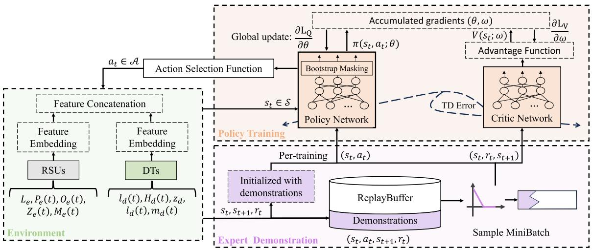

flowchart

```mermaid
graph TD
    subgraph Environment
        A["Feature Embedding"] --> B["RSUs"]
        C["Feature Embedding"] --> D["DTs"]
        B --> E["L_e, P_e(t), O_e(t), Z_e(t), M_e(t)"]
        D --> F["l_d(t), H_d(t), z_d, l_d(t), m_d(t)"]
    end

    subgraph Expert Demonstration
        G["Experienced with demonstrations"] --> H["ReplayBuffer"]
        H --> I["(s_t, a_t, s_{t+1}, r_t)"]
        I --> J["Sample MiniBatch"]
    end

    subgraph Policy Training
        K["Per-training"] --> L["(s_t, a_t)"]
        L --> M["(s_t, r_t, s_{t+1})"]
        M --> N["Critic Network"]
        N --> O["Advantage Function"]
        O --> P["Global update: ∂L_Q/∂θ"]
        P --> Q["Bootstrap Masking"]
        Q --> R["Policy Network"]
        R --> S["s_t ∈ S"]
        S --> T["Action Selection Function"]
        T --> U["a_t ∈ A"]
    end

    subgraph Sample MiniBatch
        V["τ"] --> W["Sample MiniBatch"]
    end

    X["Feature Concatenation"] --> Y["Feature Embedding"]
    Y --> Z["RSUs"]
    Z --> AA["L_e, P_e(t), O_e(t), Z_e(t), M_e(t)"]
    AA --> AB["Feature Embedding"]
    AB --> AC["DTs"]
    AC --> AD["l_d(t), H_d(t), z_d, l_d(t), m_d(t)"]
    AD --> AE["Environment"]
    AF["Accumulated gradients (θ,ω)"] --> AG["PD"]
    AH["V(s_t, ω)"] --> AI["PD"]
    AJ["∂L_Q/∂θ"] --> AK["PD"]
    AL["π(s_t, a_t; θ)"] --> AM["PD"]
    AN["∂L_V/∂ω"] --> AO["PD"]
    AP["SD Error"] --> AQ["PD"]
    AR["TD Error"] --> AS["PD"]
    AT["Demodulations"] --> AU["(s_t, a_t, s_{t+1}, r_t)"]
    AU --> AV["ReplayBuffer"]
    AW["Per-training"] --> AX["(s_t, a_t)"]
    AX --> AY["(s_t, r_t, s_{t+1})"]
    AZ["Proposed with Replications"] --> BA["(s_t, a_t, s_{t+1}, r_t)"]
    BA --> BB["Sample MiniBatch"]
```

Fig. 2. Algorithm structure.

In RL, the centralized network consolidates all RSU data into one edge node, achieving precise reward computation and enabling scheduling decisions based on the global state. As the network scales up, this centralized approach may become burdensome, resulting in additional latency. Although the estimated cumulative reward in a distributed network may show greater variance, the advantages of reduced data collection overhead and faster communication significantly outweigh this concern. [41].

# IV. PROPOSED ALGORITHMS

# A. Algorithm Settings

We formulate the ADM problem as an infinite-horizon MDP, which is represented by the tuple $\{ S , \mathcal { A } , \mathcal { P } , \rho _ { 0 } , r , \gamma \}$ , where S denotes a finite state set, A represents a finite action set, $\mathcal { P }$ $S \times \mathcal { A } \times \mathcal { S } \to \mathbb { R } _ { + }$ is the transition density, $\rho _ { 0 }$ :stands for the initial state distribution, $r : S \times \mathcal { A }  \mathbb { R }$ is the reward function, and $\gamma \in [ 0 , 1 )$ :is a discount factor.

[ )State: As shown in Fig. 2, the state is composed of properties of RSUs and DTs, which can be denoted as:

$$
s _ {t} = \{s _ {t} ^ {e}, s _ {t} ^ {d} \} \in \mathcal {S}, \tag {20}
$$

where the state of RSUs is described as $s _ { t } ^ { e } = \{ L _ { e } ,$ $P _ { e } ( t ) , O _ { e } ( t ) , Z _ { e } ( t ) , M _ { e } ( t ) \}$ =. It includes the locations of RSUs e = DTs $L _ { e } = \{ l _ { 1 } , l _ { 2 } , \ldots , l _ { | \mathbf { E } | } \}$ $\bar { P _ { e } } ( t ) = \{ \mathcal { L } _ { \mathbf { D } , 1 } ^ { c o o p } , \mathcal { L } _ { \mathbf { D } , 2 } ^ { c o o p } , \ldots , \mathcal { L } _ { \mathbf { D } , | \mathbf { E } | } ^ { c o o p } \}$ ( ), the communications with cooperating , the available CPU frequency $O _ { e } ( t ) = \{ o _ { 1 } ( t ) , o _ { 2 } ( t ) , \ldots , o _ { | \mathbf { E } | } ( t ) \}$ , the remaining storage $Z _ { e } ( t ) = \{ z _ { 1 } ( t ) , z _ { 2 } ( t ) , \dots , z _ { | \mathbf { E } | } ( t ) \}$ ( ), and the remaining memory $M _ { e } ( t ) = \{ m _ { 1 } ( t ) , m _ { 2 } ( t ) , \dots , m _ { | \mathbf { E } | } ( t ) \}$ .

( ) = ( ) ( ) ( )Moreover, the state of current processing DT is denoted as $s _ { t } ^ { d } = \{ l _ { d } ( t ) , H _ { d } ( t ) , z _ { d } , \ell _ { d } ( t ) , m _ { d } ( t ) \}$ , where $l _ { d } ( t )$ is the loca-= ( )tion of DT, $H _ { d } ( t ) = \{ L ( d , e _ { 1 } ) , L ( d , e _ { 2 } ) , \ldots , L ( d , e _ { | { \bf E } | } ) \}$ is the ( ) = ( ) ( ) ( )distance between DT d and each RSU, z indicates the size of the DT, $\ell _ { d } ( t )$ is the CPU request, and $m _ { d } ( t )$ denotes the ( ) ( )memory request of the DT d. Based on the dynamic state, a feature extraction and concatenation network is used to capture the intricate relationships in DT communication and migration for subsequent decision-making processes.

Action: An action $a _ { t } \in \mathbf { E }$ indicates that the DT can migrate to any satisfied RSU e, where the RSU set E combines the action space.

Reward: The agent navigates the environment repetitively, learning how to optimize to reach its goal. Since the goal is to minimize the overall cost in ADM, the reward can be denoted as $r _ { t } = - \mathcal { L } ( t )$ .

= ( )Policy network with feature extraction: In an MDP, an agent determines a sequence of parameterized policies $\pi ( a | s ; \theta _ { 1 } ) , \ldots , \pi ( a | s ; \theta _ { T } )$ to formalize the distribution of state-( ; ) (action trajectories $\tau = \{ s _ { 1 } , a _ { 1 } , \ldots , s _ { T } , a _ { T } \}$ .

=To enhance decision-making, a feature network $\phi ( s ; \theta _ { f } )$ is used to extract features from the state $s \in S$ ( ; ). The policy is then defined on these features:

$$
\pi (a | s; \theta) = \pi (a | \phi (s; \theta_ {f}); \theta_ {T}), \tag {21}
$$

where $\theta _ { f }$ is the parameters of the feature network.

The state distribution is defined as $d ^ { \pi } ( s )$ when following policy π. The long-term discounted average return of the ADM agent is denoted as:

$$
\eta (\pi) = \mathbb {E} _ {s \sim d ^ {\pi}, a \sim \pi (a | \phi (s; \theta_ {f}))} \left[ \sum_ {t = 0} ^ {\infty} \gamma^ {t} r (s _ {t}, a _ {t}) \right]. \tag {22}
$$

The Problem 1 can be transformed into a policy optimization problem, which is to obtain the optimal policy $\pi ^ { * }$ :

$$
\pi^ {*} = \arg \max _ {\pi} \eta (\pi). \tag {23}
$$

# B. Algorithm Overview

The ADM algorithm is introduced in Algorithm 1. All running DTs are in a priority queue $\mathbb { Q } ^ { D }$ saved with running duration time and DT index. In Lines $^ { 2 - 6 . }$ , the current processing DTs are obtained, and their actions are determined by policy. Then, according to the problem constraints, in Lines $8 - 1 6 ,$ , whether the decision satisfies DT communication constraints is checked. If not, a new finding that meets the above rules is resampled. The computation time is calculated, and the DT queue is updated in Line 18. Next, the processing queue is updated by recurring the tuple value in the DT queue in Lines 21–25. The environment is constantly updated.

# C. Expert Demonstration

Due to the complexity and sparsity of the state space in VECONs, the agent encounters challenges in exploration and training instability. A substantial number of trajectories are needed for the agent to find optimal strategies. To help the agent explore the state and action space more purposefully and reduce unnecessary exploration, pre-training with expert demonstrations is employed to initialize the actor network.

The optimal policy resides within a particular region around the expert policy. Once the agent enters this region, its optimization is solely influenced by environmental interactions rather than expert demonstrations [42]. As shown in Fig. 2, we also merge expert trajectories with training trajectories, enabling the agent to gradually converge towards regions of expertise under the guidance of expert features to improve sample efficiency.

The state-action value function $Q ^ { \pi } ( s , a )$ is defined as:

$$
Q ^ {\pi} (s, a) \equiv E \left[ \sum_ {t = 1} ^ {\infty} \left(r \left(s _ {t}, a _ {t}\right) - \eta (\pi)\right) \mid s _ {0} = s, a _ {0} = a, \pi \right]. \tag {24}
$$

This calculation starts from an initial state-action pair $\{ s _ { 0 } , a _ { 0 } \}$ and follows policy $\pi$ for subsequent actions. The definitions of state-value function $V ^ { \pi } ( s , \pi )$ and the advantage function $A ^ { \pi } ( s , a )$ are denoted as:

$$
V ^ {\pi} (s, \pi) \equiv E _ {a \sim \pi (a | s)} [ Q ^ {\pi} (s, a) ], \tag {25}
$$

$$
A ^ {\pi} (s, a) = Q ^ {\pi} (s, a) - V ^ {\pi} (s, \pi). \tag {26}
$$

The action-value function satisfies the well-known recurrence equation, which is defined as:

$$
Q ^ {\pi} (s, a) = r (s, a) - \eta (\pi) + \gamma E _ {s ^ {\prime} \sim \mathcal {P} _ {s a}} \left[ V ^ {\pi} (s ^ {\prime}, \pi) \right], \tag {27}
$$

where $s ^ { \prime } \sim \mathcal { P } _ { s a } = \rho ( s ^ { \prime } | s , a ) , s ^ { \prime } \in \mathcal { S }$ stands for the possible tran-= ( )sition probabilities of next states, $V ^ { \pi } ( s ^ { \prime } , \pi )$ is the next statevalue. Suppose there exists $\theta ^ { E }$ ( )for expert policy $\pi ( a | s ; \theta ^ { E } )$ ( ; )that yields high rewards, which the straight-forward constraint expressed as follows:

$$
Q ^ {\pi^ {E}} (s, a) = E \left[ \sum_ {t = 1} ^ {T} \gamma^ {t} r (t; \theta^ {E}) \right] \geq Q ^ {\pi} (s, a). \tag {28}
$$

The objective is to minimize the difference against the best fixed stationary policy, which can be defined as:

$$
\eta^ {\circ} \triangleq \min _ {\pi} \left(\sup _ {\theta} Q ^ {\pi} - Q ^ {\pi^ {E}}\right). \tag {29}
$$

Equivalently, we aim to seek an optimal solution $\pi ^ { * }$ that satisfies $Q ^ { \pi ^ { * } } \leq \bar { Q } ^ { \pi ^ { E } } + \eta ^ { \circ }$ with $\eta ^ { \circ }$ being always nonpositive, which +means the optimal policy outperforms the expert policy.

Intuitively, for a specific state s, an action a sampled from the deterministic expert policy $\pi ^ { E } ( a | s )$ is expected to yield a higher return compared to the policy π, which is defined as:

Algorithm 1: ADM Algorithm.   
Input : $Q^{D}, \pi_{\theta}, j = 0$ Output: $A_{\tau}$ 1 for $t \in \{1, 2, 3, \cdots\}$ do

2 Get the processing DT set $\mathbb{Q}^{D}(t)$ 3 for $i = 1, 2, \cdots, |\mathbb{Q}^{D}(t)|$ do

4 Get DT processing property $d_{i}(t)$ 5 Select the node $e = a_{t} \sim \pi_{\theta}$ 6 Get the corresponding vehicle $u_{i}(t)$ 7 Compute communication latency $T^{com}(t)$ 8 // Action Validation

9 while $z_{e}(t) + z_{d_{i}} > z_{e}$ or $m_{e}(t) + \ell_{d_{i}}(t) > m_{e}$ or $T^{pair}(t) > W_{d_{i}}$ do

10 Resample the node e

11 $j \leftarrow j + 1$ 12 if $j > |\mathcal{A}|$ then

13 Select the node $e = a \in \mathcal{A}$ 14 break

15 end if

16 end while

17 Compute Computation time $T^{colo}(t)$ 18 $\mathbb{Q}^{D}(t) \longleftarrow (T^{colo}(t) + \vartheta_{u_{i}}, d_{i})$ 19 Update the environment

20 end for

21 while $\mathbb{Q}^{D}(t) \neq \emptyset$ do

22 Get the sub-item $(t_{d}, d)$ from $\mathbb{Q}^{D}(t)$ 23 if $t_{d} > t$ then

24 $\mathbb{Q}^{D}(t) \longleftarrow (t_{d}, d)$ 25 end if

26 end while

27 Update the environment

28 end for

29 Return $A_{\tau}$ 30 end

$$
V ^ {\pi} (s, \pi^ {E}) \equiv E _ {a \sim \pi^ {E} (a | s)} [ Q ^ {\pi} (s, a) ]. \tag {30}
$$

The policy $\pi ^ { E }$ selects actions differently for the states visited under policy π. The optimal policy is guided toward selecting actions with a potentially high expected return.

Lemma 1: For any policies π and expert policy $\pi ^ { E }$

$$
\eta (\pi^ {E}) - \eta (\pi) = E _ {s \sim d ^ {\pi^ {E}}} \left[ V ^ {\pi} (s, \pi^ {E}) - V ^ {\pi} (s, \pi) \right]. \tag {31}
$$

Proof: We consider stationary policies where state transitions maintain the same distribution. Formally, ${ \mathrm { i f ~ } } s \sim d ^ { \pi ^ { E } } , a \sim$ , a ∼ $\pi ^ { E } ( a | s )$ , and $s ^ { \prime } \sim P _ { s a }$ , then $s ^ { \prime } \sim d ^ { \pi ^ { E } }$ . With this and (27), (30), ( )we have:

$$
\begin{array}{l} E _ {s \sim d ^ {\pi^ {E}}} \left[ V ^ {\pi} (s, \pi^ {E}) \right] = E _ {s \sim d ^ {\pi^ {E}}, a \sim \pi^ {E}} \left[ Q ^ {\pi} (s, a) \right] \\ = E _ {s \sim d ^ {\pi^ {E}}, a \sim \pi^ {E}} [ r (s, a) - \eta (\pi) + E _ {s ^ {\prime} \sim P _ {s a}} [ V ^ {\pi} (s ^ {\prime}, \pi) ] ] \\ = E _ {s \sim d ^ {\pi^ {E}}, a \sim \pi^ {E}} [ r (s, a) - \eta (\pi) ] + E _ {s \sim d ^ {\pi^ {E}}} [ V ^ {\pi} (s, \pi) ] \\ = \eta (\pi^ {E}) - \eta (\pi) + E _ {s \sim d ^ {\pi^ {E}}} [ V ^ {\pi} (s, \pi) ]. \tag {32} \\ \end{array}
$$

Rearranging, the result follows.

Lemma 1 shows that policy optimization relies on estimating state-action value functions until they converge to their optimal values. When the algorithm incorporates expert demonstrations, estimating the target $\eta ( \pi )$ requires sampling $\pi ^ { E }$ to generate expected trajectories.

The expected policy advantage objective, as derived from (26) and (31), is denoted as follows:

$$
\begin{array}{l} \mathbb {A} _ {\theta^ {E}} \left(\theta^ {*}\right) = E _ {s \sim d ^ {\pi^ {*}}} \left[ V ^ {\pi^ {E}} \left(s, \pi^ {*}\right) - V ^ {\pi^ {E}} \left(s, \pi^ {E}\right) \right] \\ = E _ {s \sim d ^ {\pi^ {*}}} \left[ \sum_ {t = 0} ^ {\infty} \gamma^ {t} \Big [ r (s _ {t}, a _ {t}) + \gamma V ^ {\pi^ {E}} (s _ {t + 1}) - V ^ {\pi^ {E}} (s _ {t}) \Big ] \right] \\ = E _ {s \sim d ^ {\pi^ {*}}} \left[ \sum_ {t = 0} ^ {\infty} \gamma^ {t} A ^ {\pi^ {E}} (s _ {t}, a _ {t}) \right] \\ = \sum_ {t = 0} ^ {\infty} \gamma^ {t} E _ {s _ {t} \sim d ^ {\pi^ {*}}} E _ {a _ {t} \sim \pi^ {*} (\cdot | s _ {t})} \left[ A ^ {\pi^ {E}} (s _ {t}, a _ {t}) \right]. \tag {33} \\ \end{array}
$$

Thus, our goal is to determine a policy $\pi ^ { * }$ that satisfies Lemma 1 while ensuring a monotonic increase in policy performance.

The proof of Lemma 1 demonstrates that the difference in policy performance can be decomposed into the summation of per-timestep value function estimators. An optimal strategy can direct the state towards more advantageous values. Therefore, the objective of the training phase is to learn to emulate the expert demonstrations with a value function that adheres to the Bellman equation and can be updated through TD learning once the agent begins interacting with the environment.

# D. Policy Training

The objective is to minimize the norm of the (29) to find the optimal policy $\pi ^ { * } ( \theta )$ . We start by considering the self-generated ( )trajectories and estimate the actor network policy gradient that is denoted as follows:

$$
g = E _ {s _ {t} \sim d ^ {\pi}, a _ {t} \sim \pi (\cdot | s _ {t})} \left[ \nabla_ {\theta} \log \pi (a _ {t} | s _ {t}) \cdot A ^ {\pi} (s _ {t}, a _ {t}) \right]. \tag {34}
$$

Equation (34) is obtained by differentiating the actor loss function $L _ { Q } ( \theta )$ of policy gradient, which is denoted as:

$$
L _ {Q} (\theta) = - E _ {\tau \sim \pi_ {\theta}} \left[ \log \pi (a _ {t} | s _ {t}) A _ {\theta} ^ {\pi} (s _ {t}, a _ {t}) \right]. \tag {35}
$$

The loss function of the critic network, parameterized by ω, is represented as:

$$
L _ {V} (\omega) = E _ {\tau \sim \pi_ {\theta}} \left[ r _ {t} + \gamma^ {t} V _ {\omega} ^ {\pi} (s _ {t + 1}) - V _ {\omega} ^ {\pi} (s _ {t}) \right]. \tag {36}
$$

Thus, the overall loss function is denoted as:

$$
L _ {A D M} = L _ {Q} + \frac {1}{2} L _ {V}. \tag {37}
$$

To incorporate with expert demonstration, importance sampling ratio $\begin{array} { r } { \dot { \overline { { w } } } ^ { e } = \frac { \pi _ { \theta } ( a _ { t } ^ { E } | s _ { t } ^ { E } ) } { \pi ^ { E } ( a _ { t } ^ { E } | s _ { t } ^ { E } ) } } \end{array}$ πθ(aEt |s is used to improve the target policy $\pi _ { \theta }$ based on expert trajectories. Thus, the corresponding policy gradient of off-policy actor-critic algorithm is estimated as:

$$
\begin{array}{l} \hat {g} = \nabla_ {\theta} (\eta (\pi) - \eta^ {E}) \\ = - \nabla_ {\theta} \sum_ {t = 0} ^ {\infty} \gamma^ {t} E _ {s _ {t} \sim d ^ {\pi}, a _ {t} \sim \pi (\cdot | s _ {t})} \left[ w ^ {e} A ^ {\pi^ {E}} (s _ {t}, a _ {t}) \right]. \tag {38} \\ \end{array}
$$

Algorithm 2: Training of ADM Algorithm.   
Input : Initialize $\tau_{E}$ , mask distribution M, parameters of policy network $\theta$ , value network $\omega$ ; Define $\tau_{RL} = \emptyset$ , pre-train step k.

Output: $\pi^{*}$ 1 for pre-train steps $t \in \{1, 2, 3, \cdots, k\}$ do

2    Sample a set of trajectories $\tau_{E}$ from $\pi^{E}$ 3    Compute the policy function by Eq. (35)

4    Update the policy parameter by Eq. (39)

5    Compute the value loss by Eq. (36)

6    Compute the total loss on Eq. (37)

7 $\theta_{t+1} \leftarrow \theta_{t}$ 8 $\omega_{t+1} \leftarrow \omega_{t}$ 9 end for

10 for online training $t \in \{1, 2, \ldots\}$ do

11    Call Algorithm 1 with policy $a \sim \pi_{\theta}$ 12    Store trajectory $\tau_{t} = (s_{t}, a_{t}, s_{t+1}, r_{t})$ into $\tau_{RL}$ , overwriting trajectory set if exceeded capacity

13    Sample mini-batch $\tau = \varepsilon \tau_{RL} \cup (1 - \varepsilon) \tau_{E}$ 14    Sample bootstrap mask $m_{t} \sim M$ 15    Compute action-value function $Q^{\pi_{\theta}}(\tau_{t}) + m_{t}$ 16    Compute policy loss function by Eq. (35)

17    Update the policy parameter Eq. (39)

18    Compute value loss function by Eq. (36)

19    Update loss function parameter on Eq. (37)

20 $\theta_{t+1} \leftarrow \theta_{t}$ 21 $\omega_{t+1} \leftarrow \omega_{t}$ 22 $s_{t+1} \leftarrow s_{t}$ 23    if done then

24    Break

25    end if

26 end for

27 Return $\pi^{*}$ 28 end

At the beginning, the policy $\pi ( \theta )$ is randomly initialized. To ( )enhance the ADM agent in obtaining better estimate policy gradients, the expert policy $\pi ^ { E }$ is added as follows:

$$
g _ {\pi} = g + \lambda \hat {g}, \tag {39}
$$

where λ is a constant weighting parameter.

To promote deep exploration, a bootstrap mask is applied during the update of the actor network to mitigate overfitting to expert demonstrations. We introduce bootstrap mask $\mathcal { M } _ { t } [ n ]$ for each estimated value function $Q _ { n } ( s , a )$ [ ]. The mask is defined as $\mathcal { M } _ { t } [ n ] \sim \psi ( t ) = \{ 0 , \kappa \iota _ { a _ { t } } ( n ) \} , \forall t \in T , n \in | A |$ , where $\mathcal { M } _ { t } [ n ]$ [ ] ( ) = ( ) [ ]represents the mask value at dimension n in time step t. The distribution $\psi ( t )$ takes a value κ on the selected action $a _ { t } . \iota _ { a _ { t } } ( n )$ ( ) ( )is an indicator vector with a dimensionality matching that of the action space. It takes a value of 1 at the position corresponding to the selected action and 0 otherwise. The masking distribution M is responsible for generating each $m _ { t } \in \mathcal { M } ( t )$ . This mechanism ( )facilitates training the model to enhance exploratory behavior by introducing noise and uncertainty, thereby mitigating bias and overfitting that may arise from the influence of actual expert trajectories.

The training process of the ADM algorithm primarily involves updating the network weights as shown in Fig. 2, which is detailed in Algorithm 2. Lines 2–8 show that the policy $\pi ( \theta )$ is pre-trained using the expert trajectories $\tau _ { E }$ ( )before interacting with the environment. The pre-training stage estimates the policy gradient $g _ { \pi }$ from expert demonstrations and updates the network loss. Next, the agent interacts with the environment and stores transitions $\tau _ { R L }$ . In Lines 13–15, training batches τ are sampled from mixed replay buffers, gradually reducing the proportion of expert demonstrations. A bootstrap mask is applied to the policy network to mitigate overfitting. Then, parameters in both actor and critic networks are optimized and updated in Lines 16–22. The training process continues until convergence and the optimal policy $\pi ^ { * }$ is sought.

# E. Computational Complexity Analysis

The ADM algorithm primarily involves two key operations: Algorithms 1 and 2. In Algorithm 1, the computation of the system state (20) has a computational complexity of $O ( | \mathbf { E } | )$ . ( )The time complexity of the policy network is predominantly dependent on the network size, which can be treated as a constant $O _ { t }$ . Then, the computational complexity for action selection is $O ( O _ { t } )$ . Algorithm 2 focuses on the update of network weights, ( )as illustrated in Fig. 2. This update can be assessed regarding floating-point operations (FLOPs) [25]. Denoting input and output dimensions of j-th linear layer as $D _ { i } ^ { i n }$ and $D _ { j } ^ { o u t }$ , respectively, the FLOPs for the two layers involved in the feature extraction process are $2 ( D _ { 1 } ^ { i n } - 1 ) D _ { 1 } ^ { o u t }$ and $2 ( D _ { 2 } ^ { i n } - 1 ) D _ { 2 } ^ { o u t }$ , respectively. ( ) ( )The non-linear activation functions, e.g., ReLU and Softmax, can be excluded from FLOP counts as negligible in the overall computational time. It should be noted that the complexity of the training phase does not significantly impact the computational complexity of decision-making within the network, treated as polynomial time. These steps are executed sequentially, completing within polynomial time. Moreover, our experiments also demonstrate that the execution time of the ADM algorithm is acceptable, as shown in Section V.

# V. NUMERICAL RESULTS

# A. Simulation Scenario

Dataset and settings: The vehicular mobility trace of the city of Cologne, Germany [17] is used. Each edge node is equipped with an RSU server, which comprises multiple CPU cores with computational capacities $o _ { e }$ vary from 128 GHz, 256 GHz, to 512 GHz (i.e., different numbers of 16-core, servers with 2 GHz for each core) [26]. The distribution coordinates of edge nodes in Cologne are obtained through web crawling techniques from the webpage [43], as depicted in Fig. 3(a). The coverage radius of each RSU reaches up to 500 meters according to the C-V2X standard [44], [45].

To emulate DT direct trust interactions and frequencies within the available communication range of moving vehicles [34], scale-free interactive graphs are synthesized based on interaction graph distributions reported in [46]. Cumulative Distribution Functions (CDFs) of synthetically generated frequencies of DT interactions are presented in Fig. 3. As the number of arriving mobile vehicles fluctuates across different time slots, DT interactions exhibit significant temporal unevenness and task concentration, as shown in Fig. 3(b), reflecting the varying frequencies of different types of DT interactions. This variability reflects the diverse traffic patterns seen in VECONs at various times. Fig. 3(c) illustrates the cumulative distribution of interactions among DTs over the observed period, showing a more balanced distribution when considered over longer time frames. This long-term perspective enhances data analysis and forecasting, providing a deeper understanding of systemic behaviors and trends in DT interactions.

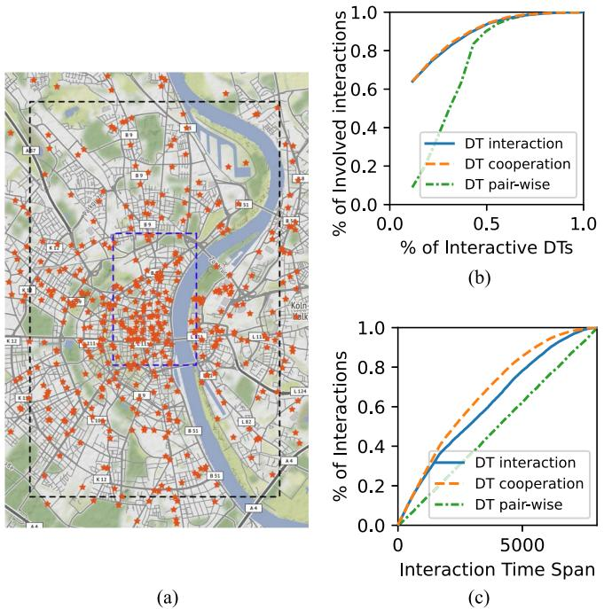  
Fig. 3. (a) The outer areas of Cologne, Germany (9.5km × 9.5km bounded by the coordinate pairs [6.914, 50.902] and [6.999, 50.987]) as a large-scale dataset, the inner areas (3 km × 3 km bounded by the coordinate pairs [6.924, 50.930] and [6.971, 50.959]) as a small-scale dataset. Orange stars refer to the location of base stations, with 448 base stations in the large-scale range and 194 base stations in the smaller one. (b), (c) Distributions of DT communications. (a) Mobility areas and edge nodes. (b) CDF of DT interactions. (c) CDF of remaining interactions.

The distances between two DTs are calculated by haversine distance based on their geographic coordinates. The Simulation of Urban Mobility (SUMO) package of Cologne [47] is used to obtain reference locations to measure the hop distance during DT migration. The positive coefficient $\beta$ uniformly distributed in 1.0, 3.0 s/hop [26] as the fluctuate empirical values to reflect [ ]the propagation conditions are not uniform across all hops. Transmission power $p _ { u }$ and noise power σ of wireless access are set to 0.2W and $1 . 0 7 \times 1 0 ^ { - 2 1 } W$ , respectively [48]. The channel gains $h _ { u _ { i } , d _ { k } }$ is calculated based on the distance between the vehicle and RSU with a path loss factor set to 6. The network bisection bandwidth of wired communication v is set to 1Gbps, and the bandwidth of backhaul communication network $b _ { b a c k }$ is set to 500 Mbps. The positive coefficient α for relatively stable backhaul communication latency is specified as 0.02 s/hop [37] by using the average value of the empirical α coefficient.

TABLE II HYPERPARAMETER SETTINGS 

<table><tr><td>Hyperparameter</td><td>Value</td><td>Hyperparameter</td><td>Value</td></tr><tr><td>Policy Layer Type</td><td>Dense</td><td>Layer Dimension</td><td>4</td></tr><tr><td>Layer Hidd. Units</td><td>128</td><td>Activation Function</td><td>ReLU</td></tr><tr><td>Loss Function</td><td>MSELoss</td><td>Weighted Param κ</td><td>0.8</td></tr><tr><td>Optimizer</td><td>Adam</td><td>Weighted Param λ</td><td>1</td></tr><tr><td>Discount Factor</td><td>0.99</td><td>Learning Rate</td><td>0.0003</td></tr><tr><td>Batch Size</td><td>256</td><td>Initial Sample Percent ε</td><td>0.95</td></tr></table>

The size of DT is uniformly distributed within 5, 100 MB, [ ]mirroring the variety of real-world data sizes. This range aligns with actual end-to-end vehicle data transmissions [4], where RSUs handle time-series information (such as position, velocity, and acceleration) that spans from basic telemetry data to complex diagnostics data. The required CPU cycles are uniformly distributed in 200, 5000 cycles/bit [37]. These ranges [ ]encompass various tasks, from high-resource-demanding activities such as autonomous assistance navigation to micro instances like road sensor data transmission.

Simulator: The simulation of VECONs is implemented in Python, involving classes of RSUs, vehicles, DTs, interactive networks, and the scheduler. The details are as follows:

1) RSUs. Each RSU includes its ID, resource capacities, bandwidth, geographic coordinates, and running DT list.   
2) Vehicles. Each vehicle contains its ID, arrival time, resource requests, running period, geographical coordinates, group ID, and request RSUs.   
3) DT. The DT class includes the DT ID, size, resource requests, interaction ID, and the deployed RSU.   
4) Interactions. The class of interactions mainly includes ID pairs of interactions between each DT and other objects.

The environment is constructed based on these classes and is updated online according to the interaction of the ADM agent. As vehicles move, the agent decides whether to migrate the DT and calculates total latencies. The hyperparameters of the ADM algorithm are listed in Table II.

Baselines: We compare the performance of the ADM algorithm against the following five Baselines.

1) Greedy. A greedy algorithm selects the RSU with the minimized total costs of communications latency, resource colocation, and migration during DT migration.

2) Never Migration (NM). The DT does not undergo migration that remains initialized on an RSU while the corresponding physical objects continue to move.

3) Round-Robin (RR). The RR algorithm is a load-balancing algorithm that distributes requests to RSUs.

4) Genetic Algorithm (GA). The GA algorithm is a heuristic method drawing inspiration from natural selection, incorporating mutation, crossover, and selection operators, and utilizing a comprehensive cost fitness function during DT migration to identify the optimal RSUs.

5) DRL. A traditional actor-critic-based deep reinforcement learning (DRL) algorithm selects the best RSUs for DT migration directly from the same states of the ADM.

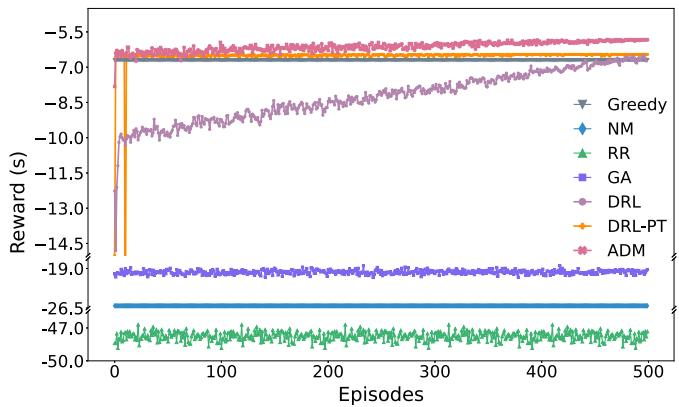

line

| Episodes | Greedy | NM   | RR   | GA   | DRL  | DRL-PT | ADM  |
| -------- | ------ | ---- | ---- | ---- | ---- | ------ | ---- |
| 0        | -26.5  | -26.5| -47.0| -19.0| -13.0| -15.0  | -5.5 |
| 500      | -26.5  | -26.5| -47.0| -19.0| -7.0 | -7.0   | -5.5 |

Fig. 4. Reward.

6) DRL-PT. A DRL algorithm integrates expert pre-training solely to initialize the ADM agent efficiently.

The neural network structure of DRL and DRL-PT algorithms is similar to the ADM algorithm with the same policy network. However, the key distinction lies in the initialization and training process. The ADM algorithm employs expert policies to guide its training, while the DRL algorithm starts with random parameters. The trajectories of the Greedy algorithm are saved as expert demonstrations. The ADM, DRL, and DRL-PT algorithms are trained with the same learning rate, mini-batch size, and number of gradient update steps.

# B. Simulation Results

The performance of the proposed ADM algorithm and baselines is evaluated, and the results are analyzed through various experiments.

Performance of the ADM algorithm: We evaluate the training performance of the ADM algorithm on small-scale and large-scale mobility trace datasets with 500 and 2000 randomly selected mobility traces, respectively. Fig. 4 displays training results of different algorithms. The final rewards of the training are $\mathrm { A D M } > \mathrm { D R L - P T } > \mathrm { D R L } > \mathrm { G r e e d y } > \mathrm { G A } > \mathrm { N M } > \mathrm { R R }$ . The DRL algorithm initially selects random actions, leading to a period of exploration before convergence. It performs worse than the Greedy algorithm at the beginning, requiring approximately 470 training epochs to reach a more competitive performance. In contrast, the DRL-PT and ADM algorithms initialize their learning process with expert-provided policies, ensuring efficient learning of effective policies from the outset. Consequently, these two algorithms quickly surpass the Greedy algorithm after initialization and continue to improve their performance. Moreover, the ADM agent gradually reduces reliance on expert guidance during training, as illustrated in Fig. 5(a). It rapidly converges to a higher value after approximately 100 epochs. This demonstrates that the ADM agent leverages expert knowledge to accelerate its learning in the initial stages and then refines its behavior through further exploration and experience.

To illustrate the convergence of the ADM algorithm, the total loss, policy loss, and pretrain loss are shown in Fig. 5(b), (c), and (d), respectively. In the pre-training phase, the reduction and stabilization of pre-train loss indicate that the ADM agent has initialized a policy that aligns well with the desired sub-optimal policy, as shown in Fig. 5(b). This significantly accelerates the subsequent RL training phase. As training progresses, the total loss curve in Fig. 5(c) initially decreases and stabilizes after approximately 100 epochs, signifying convergence of the ADM algorithm. As shown in Fig. 5(d), the rapid and early convergence of the actor loss in the first 20 epochs illustrates that the actor network is initialized with appropriate parameters. This means expert policies help to generate meaningful actions from the beginning of training, contributing to the quick convergence of the actor loss.

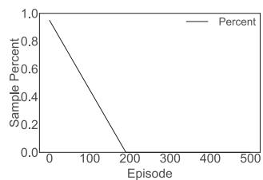

line

| Episode | Sample Percent |
| ------- | -------------- |
| 0       | 1.0            |
| 200     | 0.0            |

(a)

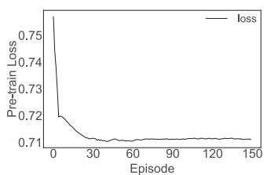

line

| Episode | Pre-train Loss |
| ------- | -------------- |
| 0       | 0.75           |
| 30      | 0.72           |
| 60      | 0.71           |
| 90      | 0.71           |
| 120     | 0.71           |
| 150     | 0.71           |

(b)

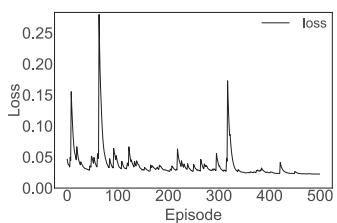

line

| Episode | Loss  |
| ------- | ----- |
| 0       | 0.15  |
| 50      | 0.25  |
| 100     | 0.05  |
| 150     | 0.05  |
| 200     | 0.05  |
| 250     | 0.05  |
| 300     | 0.18  |
| 350     | 0.05  |
| 400     | 0.05  |
| 450     | 0.05  |
| 500     | 0.05  |

（c）

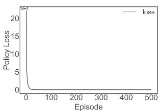

line

| Episode | Policy Loss |
| ------- | ----------- |
| 0       | 20.0        |
| 50      | 1.0         |
| 100     | 0.5         |
| 150     | 0.3         |
| 200     | 0.2         |
| 250     | 0.1         |
| 300     | 0.1         |
| 350     | 0.1         |
| 400     | 0.1         |
| 450     | 0.1         |
| 500     | 0.1         |

Fig. 5. Losses and sample percentage of ADM algorithm. (a) Sample percentage. (b) Pre-train loss. (c) Total loss. (d) Policy loss.   
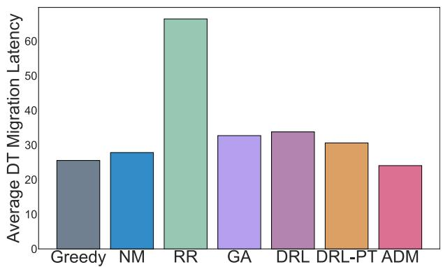

bar

| Method   | Average DT Migration Latency |
| -------- | ---------------------------- |
| Greedy   | 26                           |
| NM       | 28                           |
| RR       | 67                           |
| GA       | 33                           |
| DRL      | 34                           |
| DRL-PT   | 31                           |
| ADM      | 24                           |

Fig. 6. Average latency.

We evaluate the ADM algorithm and baselines on large-scale vehicular mobility trace datasets to appraise their capacity for generalization. As illustrated in Fig. 6, the ADM algorithm outperforms the other baseline algorithms, which demonstrates the adaptability and robustness of the ADM algorithm. The ADM algorithm reduces the overall average DT migration latency of Greedy, NM, RR, GA, DRL, and DRL-PT algorithms by 6%, 14%, 63%, 26%, 28%, and 21%, respectively. This shows the effectiveness of the ADM algorithm in the context of the complex and dynamic VECONs.

Performance with different migration coefficients: To compare the impact of migration latency on the overall latency, we evaluate these algorithms with different coefficients of migration latency in Fig. 7. In Fig. 7(a), as the migration cost coefficient increases, the performance of most algorithms degrades except for the NM algorithm, which does not involve DT migration. Due to the frequent migration decisions, the RR algorithm is more susceptible to variations in migration coefficient. It’s observed that the DRL-PT and DRL algorithms exhibit poorer performance compared to the ADM and Greedy algorithms when migration coefficients exceed 3. This observation indicates that the former two algorithms encounter exploration challenges. Exploration becomes difficult in environments with high migration coefficients, as suboptimal actions result in significant penalties. Expert policies help mitigate the exploration challenge by providing more informed actions, enabling the ADM algorithm to benefit from integrating expert insights to bypass unnecessary exploration. In Fig. 7(b), the ADM algorithm reduces the total migration latency of DTs than Greedy, NM, RR, GA, DRL, and DRL-PT algorithms by 25%, 61%, 93%, 83%, 54%, and 23% on average, respectively.

Fig. 7(c) reveals that ADM, DRL, and DRL-PT algorithms consistently demonstrate superior and stable communication latency compared to other heuristic algorithms as the migration coefficient progressively increases. Overall, the ADM algorithm learns to maintain the lowest communication latency among the scenarios with different migration costs, and the order of communication latencies of these algorithms is ADM < DRL-PT < DRL < Greedy < GA < NM < RR.

Performance with different numbers of moving vehicles: Fig. 8 shows the performance of each algorithm under the different numbers of moving vehicles. In Fig. 8(a), the number of moving vehicles is set from 400 to 800 with an interval of 100. As the number of vehicles increases, DTs wait in queues for longer durations, amplifying total DT migration latency as shown in Fig. 8(b). It can be seen from the figure that the ADM algorithm can reduce up to 40% of the total migration latency against the other algorithms. Overall, the total migration latency with different numbers of vehicles is reduced by 13%, 25%, 71%, 43%, 41%, and 25% on average compared with Greedy, NM, RR, GA, DRL, and DRL-PT algorithms, respectively. This means the ADM agent can adapt its policies based on real-time interactions, learning to make decisions that reduce DT migration latency in response to changing environments. As shown in Fig. 8(c), the ADM algorithm achieves the lowest and most stable communication latency of DTs. As the number of vehicles grows, the ADM algorithm can dynamically select RSUs that minimize latency and ensure efficient data transfer in complex communication relationships. Overall, the order of average communication latency of these algorithms is ADM < DRL-PT < DRL < GA < Greedy < NM < RR.

Performance with different arriving rates of vehicles: We evaluate the performance with different vehicle arriving rates in Fig. 9. The migration latency is defined as the total migration time for all DTs divided by their count. As shown in Fig. 9(a), the migration latency also rises with the increase in the arrival rate. The system seeks to expedite DT migration to meet DT response requirements. We find that the ADM effectively adapts to changes in the arrival rate, outperforming baselines that require DT migration. Fig. 9(b) shows the total latencies of all evaluated algorithms increase with the arrival rate increase since the number of DTs increases at each time slot. Overall, the total ADM latency outperforms Greedy, NM, RR, GA, DRL, and DRL-PT algorithms by 10%, 57%, 87%, 70%, 40%, and 36% on average, respectively. This is because the ADM algorithm considers the current resource availability and utilization across different RSUs and makes more informed migration decisions from a long-term perspective.

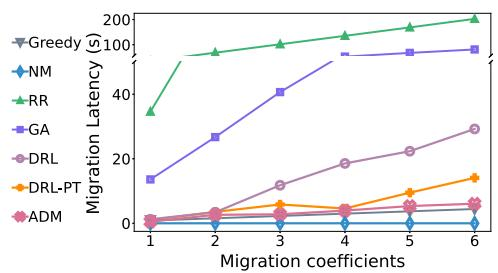

line

| Migration coefficients | Greedy | NM  | RR  | GA  | DRL | DRL-PT | ADM |
| --------------------- | ------ | --- | --- | --- | --- | ------ | --- |
| 1                     | 0      | 0   | 35  | 15  | 0   | 0      | 0   |
| 2                     | 0      | 0   | 90  | 25  | 0   | 0      | 0   |
| 3                     | 0      | 0   | 100 | 40  | 10  | 5      | 0   |
| 4                     | 0      | 0   | 110 | 70  | 15  | 5      | 0   |
| 5                     | 0      | 0   | 120 | 80  | 20  | 10     | 5   |
| 6                     | 0      | 0   | 130 | 90  | 30  | 15     | 5   |

(@)

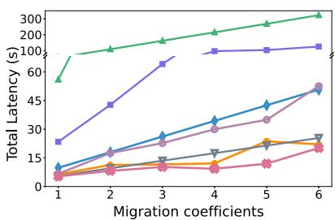

line

| Migration coefficients | Total Latency (s) |
| --------------------- | ----------------- |
| 1                     | 20                |
| 2                     | 45                |
| 3                     | 80                |
| 4                     | 100               |
| 5                     | 120               |
| 6                     | 150               |

(b)

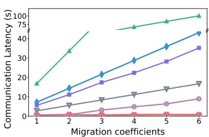

line

| Migration coefficients | Communication Latency (s) |
| ---------------------- | ------------------------- |
| 1                      | 15                        |
| 2                      | 35                        |
| 3                      | 45                        |
| 4                      | 70                        |
| 5                      | 80                        |
| 6                      | 90                        |

（c）

Fig. 7. Performance with different migration coefficients. (a) Migration latency. (b) Total ADM latency. (c) Communication latency.   
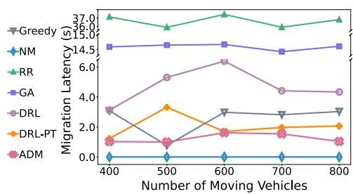  
(a)

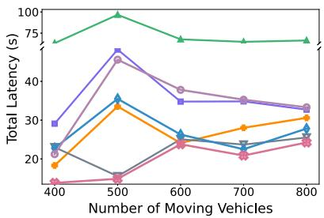

line

| Number of Moving Vehicles | Green Line | Purple Line | Blue Line | Orange Line | Pink Line |
| ------------------------- | ---------- | ----------- | --------- | ----------- | --------- |
| 400                       | 75         | 30          | 25        | 20          | 15        |
| 500                       | 100        | 60          | 35        | 35          | 15        |
| 600                       | 75         | 35          | 25        | 25          | 25        |
| 700                       | 75         | 35          | 25        | 30          | 20        |
| 800                       | 75         | 35          | 25        | 30          | 25        |

(b)

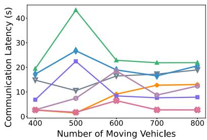

line

| Number of Moving Vehicles | Series 1 | Series 2 | Series 3 | Series 4 | Series 5 |
| ------------------------- | -------- | -------- | -------- | -------- | -------- |
| 400                       | 18       | 16       | 7        | 15       | 3        |
| 500                       | 42       | 27       | 22       | 10       | 5        |
| 600                       | 22       | 18       | 9        | 17       | 7        |
| 700                       | 22       | 16       | 8        | 13       | 12       |
| 800                       | 22       | 20       | 8        | 13       | 13       |

(c）

Fig. 8. Performance with different numbers of moving vehicles. (a) Migration latency. (b) Total ADM latency. (c) Communication latency.   
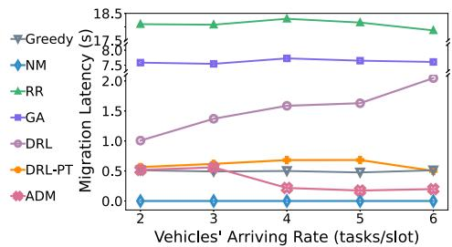

line

| Vehicles' Arriving Rate (tasks/slot) | Greedy | NM | RR | GA | DRL | DRL-PT | ADM |
| --- | --- | --- | --- | --- | --- | --- | --- |
| 2 | 7.5 | 0.0 | 18.5 | 7.5 | 1.0 | 0.5 | 0.5 |
| 3 | 7.5 | 0.0 | 18.5 | 7.5 | 1.5 | 0.5 | 0.5 |
| 4 | 7.5 | 0.0 | 18.5 | 7.5 | 1.5 | 0.7 | 0.2 |
| 5 | 7.5 | 0.0 | 18.5 | 7.5 | 1.5 | 0.7 | 0.2 |
| 6 | 7.5 | 0.0 | 18.5 | 7.5 | 2.0 | 0.5 | 0.2 |

(@)

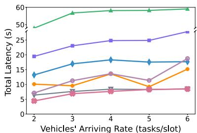

line

| Vehicles' Arriving Rate (tasks/slot) | Total Latency (s) |
| ------------------------------------- | ----------------- |
| 2                                     | 5                 |
| 3                                     | 10                |
| 4                                     | 15                |
| 5                                     | 10                |
| 6                                     | 15                |

(b)

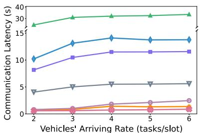

line

| Vehicles' Arriving Rate (tasks/slot) | Communication Latency (s) |
| ------------------------------------ | ------------------------- |
| 2                                    | 10                        |
| 3                                    | 15                        |
| 4                                    | 15                        |
| 5                                    | 15                        |
| 6                                    | 15                        |

（c）

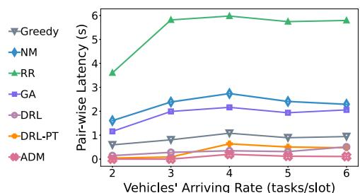

line

| Vehicles' Arriving Rate (tasks/slot) | Greedy | NM   | RR   | GA   | DRL  | DRL-PT | ADM  |
| ------------------------------------- | ------ | ---- | ---- | ---- | ---- | ------ | ---- |
| 2                                     | 0.5    | 1.5  | 3.5  | 1.0  | 0.2  | 0.1    | 0.1  |
| 3                                     | 0.7    | 2.5  | 5.5  | 2.0  | 0.3  | 0.2    | 0.1  |
| 4                                     | 1.0    | 2.8  | 5.8  | 2.2  | 0.5  | 0.6    | 0.2  |
| 5                                     | 0.9    | 2.5  | 5.5  | 2.1  | 0.4  | 0.5    | 0.2  |
| 6                                     | 1.0    | 2.3  | 5.5  | 2.2  | 0.5  | 0.4    | 0.2  |

(d）

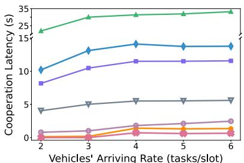

line

| Vehicles' Arriving Rate (tasks/slot) | Cooperation Latency (s) |
| ------------------------------------ | ---------------------- |
| 2                                    | 25                     |
| 3                                    | 25                     |
| 4                                    | 25                     |
| 5                                    | 25                     |
| 6                                    | 25                     |

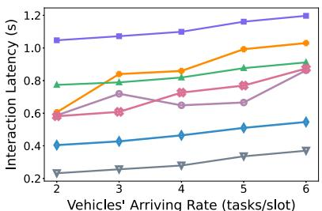

line

| Vehicles' Arriving Rate (tasks/slot) | Interaction Latency (s) |
| ------------------------------------- | ------------------------ |
| 2                                     | 0.5                      |
| 3                                     | 0.8                      |
| 4                                     | 0.9                      |
| 5                                     | 1.0                      |
| 6                                     | 1.1                      |

(f)   
Fig. 9. Performance with different arriving rates of vehicles. (a) Migration latency. (b) Total ADM latency. (c) Communication latency. (d) Pair-wise cost. (e) Cooperation cost. (f) Interaction cost.

The total communication latency of different algorithms is shown in Fig. 9(c). It shows that the ADM algorithm outperforms baselines with the order as $\mathrm { A D M } < \mathrm { D R L } \mathrm { - P T } < \mathrm { D R L } <$ < Greedy < GA < NM < RR while also exhibiting more excellent stability. ADM, DRL, and DRL-PT algorithms perform better than other heuristic baselines. In complex DT communication relationships, where short-term gains might lead to suboptimal long-term performance, RL can make better trade-offs by considering the overall impact of decisions over time. The communication latency mainly includes pair-wise cost, cooperation cost, and interaction cost, as shown in Fig. 9(d), (e), and (f), respectively. As the arrival rates of vehicles increase, the existing communications of DTs are more complex, so these three detailed costs increase.

TABLE III COMPUTATION RESOURCES FOR EACH DECISION-MAKING 

<table><tr><td>Algorithm</td><td>Vehicles</td><td>RAM</td><td>VRAM</td><td>Execution Time</td></tr><tr><td>Greedy</td><td>500</td><td>-</td><td>-</td><td> $1.123 \times 10^{-3}$ </td></tr><tr><td>NM</td><td>500</td><td>-</td><td>-</td><td> $2.510 \times 10^{-7}$ </td></tr><tr><td>RR</td><td>500</td><td>-</td><td>-</td><td> $1.274 \times 10^{-6}$ </td></tr><tr><td>GA</td><td>500</td><td>-</td><td>-</td><td> $3.941 \times 10^{-2}$ </td></tr><tr><td>DRL</td><td>500</td><td>112.4 Kb</td><td>112.8 Kb</td><td> $1.730 \times 10^{-3}$ </td></tr><tr><td>DRL-PT</td><td>500</td><td>115.6 Kb</td><td>120.4 Kb</td><td> $1.218 \times 10^{-3}$ </td></tr><tr><td>ADM</td><td>500</td><td>143.2 Kb</td><td>124.1 Kb</td><td> $1.319 \times 10^{-3}$ </td></tr><tr><td>ADM</td><td>1000</td><td>139.8 Kb</td><td>120.0 Kb</td><td> $1.522 \times 10^{-3}$ </td></tr><tr><td>ADM</td><td>2000</td><td>140.6 Kb</td><td>148.2 Kb</td><td> $1.537 \times 10^{-3}$ </td></tr><tr><td>ADM</td><td>3000</td><td>146.4 Kb</td><td>152.4 Kb</td><td> $1.597 \times 10^{-3}$ </td></tr></table>

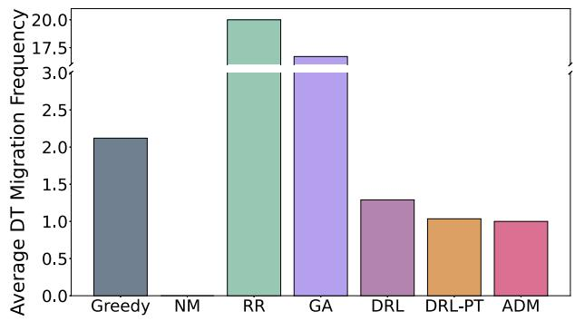

bar

| Method   | Average DT Migration Frequency |
| -------- | ------------------------------ |
| Greedy   | 2.1                            |
| NM       | 0.0                            |
| RR       | 20.0                           |
| GA       | 17.5                           |
| DRL      | 1.3                            |
| DRL-PT   | 1.0                            |
| ADM      | 1.0                            |

Fig. 10. Average DT migration frequency.

Computational complexity and execution time: To further demonstrate the computational complexity of all algorithms, we use torch.profiler [49] to obtain the Random Access Memory (RAM), Video RAM (VRAM), and execution time for different algorithms. The results of the average decision-making resources and time are presented in Table III. The algorithms with the least execution time are NM and RR due to their lack of complex heuristic rules and neural network reasoning processes. The GA algorithm has the longest execution time because it needs to explore more possible solutions. The computational demands and execution time of the ADM algorithm closely resemble those of RL algorithms, demonstrating that our enhancements do not significantly increase operational overhead. Therefore, our algorithm maintains reasonable computational complexity and is practical.

Performance for DT migrations: To further illustrate the effect of the algorithm, the average migration frequency is shown in Fig. 10. It can be seen from the figure that the average migration frequency of the ADM algorithm is the lowest among all algorithms. This fully demonstrates that the ADM algorithm can effectively reduce the number of migrations while maintaining a high reward, further illustrating the effectiveness of the algorithm. On the other hand, the migration frequency of the Greedy algorithm is relatively higher. The Greedy algorithm cannot consider long-term rewards, resulting in frequent migrations. The latencies of different sizes of DTs are shown in Fig. 11. The end-to-end migration latencies range from hundreds of milliseconds to a few seconds. The algorithms with larger latency do not indicate flaws in the simulation model itself but rather reflect the practical limitations and trade-offs inherent to baselines. This highlights the necessity of algorithmic designs that our ADM algorithm could balance computational efficiency and decision effectiveness to minimize migration latencies.

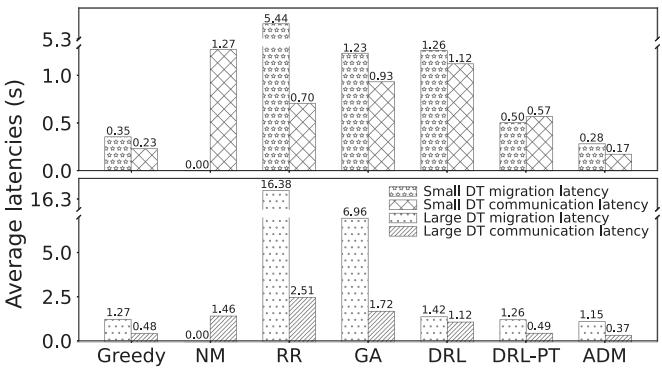

bar

| Method | Small DT migration latency (s) | Small DT communication latency (s) | Large DT migration latency (s) | Large DT communication latency (s) |
| :--- | :--- | :--- | :--- | :--- |
| Greedy | 0.35 | 0.23 | 1.27 | 0.48 |
| NM | 1.27 | 0.00 | 16.38 | 1.46 |
| RR | 5.44 | 0.70 | 2.51 | 16.38 |
| GA | 1.23 | 0.93 | 6.96 | 1.72 |
| DRL | 1.26 | 0.50 | 1.42 | 1.12 |
| DRL-PT | 0.57 | 0.49 | 1.26 | 0.37 |
| ADM | 0.28 | 0.17 | 1.15 | 0.37 |

Fig. 11. Latency results of various DTs.

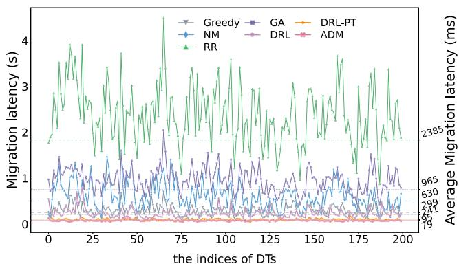

line

| the indices of DTs | Greedy | GA   | DRL-PT | NM   | DRL  | ADM  | RR   |
| ------------------ | ------ | ---- | ------ | ---- | ---- | ---- | ---- |
| 0                  | ~0.5   | ~1.5 | ~0.2   | ~0.8 | ~0.3 | ~0.1 | ~1.8 |
| 25                 | ~0.6   | ~1.4 | ~0.2   | ~0.9 | ~0.3 | ~0.1 | ~2.0 |
| 50                 | ~0.7   | ~1.3 | ~0.2   | ~1.0 | ~0.3 | ~0.1 | ~2.2 |
| 75                 | ~0.8   | ~1.2 | ~0.2   | ~1.1 | ~0.3 | ~0.1 | ~2.4 |
| 100                | ~0.9   | ~1.1 | ~0.2   | ~1.2 | ~0.3 | ~0.1 | ~2.6 |
| 125                | ~1.0   | ~1.0 | ~0.2   | ~1.3 | ~0.3 | ~0.1 | ~2.8 |
| 150                | ~1.1   | ~0.9 | ~0.2   | ~1.4 | ~0.3 | ~0.1 | ~3.0 |
| 175                | ~1.2   | ~0.8 | ~0.2   | ~1.5 | ~0.3 | ~0.1 | ~3.2 |
| 200                | ~1.3   | ~0.7 | ~0.2   | ~1.6 | ~0.3 | ~0.1 | ~3.4 |

Fig. 12. Average migration latency for each DT.

Average migration latency for each DT: To ensure the stability of our proposed ADM, the detailed and average migration latencies over 200 diverse DTs are recorded in a single episode. As depicted in Fig. 12, the ADM algorithm demonstrates minimal volatility compared to other baselines during the DT migration process. By the average migration latency lines, it becomes evident that the ADM algorithm achieves the lowest average latency time throughout the entire episode. Therefore, the ADM algorithm has created a stable, long-term optimized strategy that effectively addresses the challenges of DT migration in VECONs.

# VI. DISCUSSION

The ADM algorithm is built on a robust foundation of realworld data and can be deployed on RSUs using the Kubernetes scheduling framework [50]. The status of vehicles, e.g., speed and direction, can be seamlessly exchanged with RSUs through C-V2X technology [7]. RSUs possess sufficient computational and communication capabilities, allowing for continuous monitoring and processing of real-time resource load data collected by Prometheus via Kubernetes APIs [51]. Precisely, by utilizing custom iperf3 export files [52], the status of DTs at each time slot, connectivity status, and communication latency between each DT are monitored. The colocation costs on each RSU and the migration latencies for DTs across RSUs are recorded by the custom node export file.

There are two stages in the Kubernetes scheduling process: the scheduling cycle and the binding cycle [50]. During the scheduling cycle, the custom plugin of our ADM algorithm can select the most suitable edge node for each DT, ensuring optimal migration for minimizing communication latency and migration latency. Then, the binding cycle binds the decision to the chosen RSU, effectively executing the migration decision. The Kubernetes scheduling framework with complete customization offers a robust platform to integrate our algorithm effectively.

Deploying such a sophisticated system demands significant engineering effort, and incorporating RL adds complexity due to its iterative training and decision-making processes. The main goal of this proposed algorithm is to evaluate DT migration in VECONs. To thoroughly assess its performance and efficiency, we utilized large-scale simulations as a robust tool. This method enabled us to create a controlled yet realistic environment that mirrors complex real-world scenarios. Additionally, we acknowledge the importance of practical implementation. As noted, our team is simultaneously working on integrating the algorithm into the Kubernetes system.

# VII. CONCLUSION

In this work, we proposed the ADM algorithm to solve the adaptive DT migration problem in VECONs. We modeled the ADM problem comprehensively, considering the complex communication latency, colocation cost, and migration latency. Then, the ADM algorithm based on policy gradient RL was proposed for adaptive migration decisions. Expert demonstrations were utilized to improve the exploration and exploitation in sparse environments. We evaluated the proposed ADM algorithm using real-world data traces, and experimental results showed that our ADM algorithm consistently outperforms the baseline algorithms with an average 39% improvement in migration latency. Future work will include integrating DT-based complex task scheduling and edge caching, as well as exploring hybrid strategies that combine local centralized and global distributed decision-making. This dual approach seeks to balance responsiveness and overall network sum-rate performance.

# REFERENCES

[1] Y. Dai, D. Xu, S. Maharjan, and Y. Zhang, “Joint load balancing and offloading in vehicular edge computing and networks,” IEEE Internet Things J., vol. 6, no. 3, pp. 4377–4387, Jun. 2019.   
[2] X. Huang, R. Yu, J. Kang, Y. He, and Y. Zhang, “Exploring mobile edge computing for 5G-enabled software defined vehicular networks,” IEEE Wireless Commun., vol. 24, no. 6, pp. 55–63, Dec. 2017.   
[3] L. Zhao, Z. Bi, A. Hawbani, K. Yu, Y. Zhang, and M. Guizani, “ELITE: An intelligent digital twin-based hierarchical routing scheme for softwarized vehicular networks,” IEEE Trans. Mobile Comput., vol. 22, no. 9, pp. 5231–5247, Sep. 2023.

[4] Z. Wang et al., “Mobility digital twin: Concept, architecture, case study, and future challenges,” IEEE Internet Things J., vol. 9, no. 18, pp. 17452–17467, Sep. 2022.   
[5] H. Feng, D. Chen, and Z. Lv, “Blockchain in digital twins-based vehicle management in vanets,” IEEE Trans. Intell. Transp. Syst., vol. 23, no. 10, pp. 19613–19623, Oct. 2022.   
[6] S. Kitajima, H. Chouchane, J. Antona-Makoshi, N. Uchida, and J. Tajima, “A nationwide impact assessment of automated driving systems on traffic safety using multiagent traffic simulations,” IEEE Open J. Intell. Transp. Syst., vol. 3, pp. 302–312, 2022.   
[7] X. Hu, S. Li, T. Huang, B. Tang, R. Huai, and L. Chen, “How simulation helps autonomous driving: A survey of sim2real, digital twins, and parallel intelligence,” IEEE Trans. Intell. Veh., vol. 9, no. 1, pp. 593–612, Jan. 2024.   
[8] Y. Wu, K. Zhang, and Y. Zhang, “Digital twin networks: A survey,” IEEE Internet Things J., vol. 8, no. 18, pp. 13789–13804, Sep. 2021.   
[9] X. Lin, J. Wu, J. Li, W. Yang, and M. Guizani, “Stochastic digital-twin service demand with edge response: An incentive-based congestion control approach,” IEEE Trans. Mobile Comput., vol. 22, no. 4, pp. 2402–2416, Apr. 2023.   
[10] J. Li et al., “Digital twin-assisted, SFC-enabled service provisioning in mobile edge computing,” IEEE Trans. Mobile Comput., vol. 23, no. 1, pp. 393–408, Jan. 2024.   
[11] Y. Hui et al., “Collaboration as a service: Digital-twin-enabled collaborative and distributed autonomous driving,” IEEE Internet Things J., vol. 9, no. 19, pp. 18607–18619, Oct. 2022.   
[12] B. Li, W. Xie, Y. Ye, L. Liu, and Z. Fei, “FlexEdge: Digital twin-enabled task offloading for UAV-aided vehicular edge computing,” IEEE Trans. Veh. Technol., vol. 72, no. 8, pp. 11086–11091, Aug. 2023.   
[13] X. Liang, W. Liang, Z. Xu, Y. Zhang, and X. Jia, “Multiple service model refreshments in digital twin-empowered edge computing,” IEEE Trans. Serv. Comput., vol. 17, no. 5, pp. 2672–2686, Sep./Oct. 2024.   
[14] H. Wang, S. Lin, and J. Zhang, “Warm-start actor-critic: From approximation error to sub-optimality gap,” in Proc. Int. Conf. Mach. Learn., 2023, pp. 35989–36019.   
[15] T. Xie, N. Jiang, H. Wang, C. Xiong, and Y. Bai, “Policy finetuning: Bridging sample-efficient offline and online reinforcement learning,” Proc. Adv. Neural Inf. Process. Syst., 2021, vol. 34, pp. 27395–27407 .   
[16] T. Degris, M. White, and R. S. Sutton, “Off-policy actor-critic,” in Proc. 29th Int. Conf. Int. Conf. Mach. Learn., 2012, pp. 179–186.   
[17] S. Uppoor, O. Trullols-Cruces, M. Fiore, and J. M. Barcelo-Ordinas, “Generation and analysis of a large-scale urban vehicular mobility dataset,” IEEE Trans. Mobile Comput., vol. 13, no. 5, pp. 1061–1075, May 2014.   
[18] J. Zheng et al., “Data synchronization in vehicular digital twin network: A game theoretic approach,” IEEE Trans. Wireless Commun., vol. 22, no. 11, pp. 7635–7647, Nov. 2023, doi: 10.1109/TWC.2023.3254158.   
[19] R. Zhang, Z. Xie, D. Yu, W. Liang, and X. Cheng, “Digital twin-assisted federated learning service provisioning over mobile edge networks,” IEEE Trans. Comput., vol. 73, no. 2, pp. 586–598, Feb. 2024.   
[20] X. Yuan, J. Chen, N. Zhang, J. Ni, F. R. Yu, and V. C. M. Leung, “Digital twin-driven vehicular task offloading and IRS configuration in the Internet of Vehicles,” IEEE Trans. Intell. Transp. Syst., vol. 23, no. 12, pp. 24290–24304, Dec. 2022.   
[21] B. Lu, B. Fan, Y. Wu, L. Qian, H. Zhang, and R. Lu, “Predictive computation offloading and resource allocation in DT-empowered vehicular networks,” IEEE Trans. Intell. Transp. Syst., vol. 25, no. 6, pp. 5474–5487, Jun. 2024.   
[22] J. Lou, Z. Tang, W. Jia, W. Zhao, and J. Li, “Startup-aware dependent task scheduling with bandwidth constraints in edge computing,” IEEE Trans. Mobile Comput., vol. 23, no. 2, pp. 1586–1600, Feb. 2024, doi: 10.1109/TMC.2023.3238868.   
[23] Y. Sun, S. Zhou, and J. Xu, “EMM: Energy-aware mobility management for mobile edge computing in ultra dense networks,” IEEE J. Sel. Areas Commun., vol. 35, no. 11, pp. 2637–2646, Nov. 2017.   
[24] X. Chen, J. Wu, Y. Cai, H. Zhang, and T. Chen, “Energy-efficiency oriented traffic offloading in wireless networks: A brief survey and a learning approach for heterogeneous cellular networks,” IEEE J. Sel. Areas Commun., vol. 33, no. 4, pp. 627–640, Apr. 2015.   
[25] Z. Tang, X. Zhou, F. Zhang, W. Jia, and W. Zhao, “Migration modeling and learning algorithms for containers in fog computing,” IEEE Trans. Serv. Comput., vol. 12, no. 5, pp. 712–725, Sep./Oct. 2019.   
[26] J. Wang, J. Hu, G. Min, Q. Ni, and T. El-Ghazawi, “Online service migration in mobile edge with incomplete system information: A deep recurrent actor-critic learning approach,” IEEE Trans. Mobile Comput., vol. 22, no. 11, pp. 6663–6675, Nov. 2023, doi: 10.1109/TMC.2022.3197706.

[27] Q. Yuan, J. Li, H. Zhou, T. Lin, G. Luo, and X. Shen, “A joint service migration and mobility optimization approach for vehicular edge computing,” IEEE Trans. Veh. Technol., vol. 69, no. 8, pp. 9041–9052, Aug. 2020.   
[28] Z. Tang, F. Mou, J. Lou, W. Jia, Y. Wu, and W. Zhao, “Multi-user layer-aware online container migration in edge-assisted vehicular networks,” IEEE/ACM Trans. Netw., vol. 32, no. 2, pp. 1807–1822, Apr. 2024, doi: 10.1109/TNET.2023.3330255.   
[29] W. Sun, H. Zhang, R. Wang, and Y. Zhang, “Reducing offloading latency for digital twin edge networks in 6G,” IEEE Trans. Veh. Technol., vol. 69, no. 10, pp. 12240–12251, Oct. 2020.   
[30] Y. Lu, S. Maharjan, and Y. Zhang, “Adaptive edge association for wireless digital twin networks in 6G,” IEEE Internet Things J., vol. 8, no. 22, pp. 16219–16230, Nov. 2021.   
[31] C. Chen, J. Hu, T. Qiu, M. Atiquzzaman, and Z. Ren, “CVCG: Cooperative V2V-aided transmission scheme based on coalitional game for popular content distribution in vehicular ad-hoc networks,” IEEE Trans. Mobile Comput., vol. 18, no. 12, pp. 2811–2828, Dec. 2019.   
[32] L. Liu, J. Feng, C. Wu, C. Chen, and Q. Pei, “Reputation management for consensus mechanism in vehicular edge metaverse,” IEEE J. Sel. Areas Commun., vol. 42, no. 4, pp. 919–932, Apr. 2024.   
[33] L. Zhao et al., “A digital twin-assisted intelligent partial offloading approach for vehicular edge computing,” IEEE J. Sel. Areas Commun., vol. 41, no. 11, pp. 3386–3400, Nov. 2023.   
[34] M. Mao, P. Yi, J. Zhang, and J. Pei, “Detecting malicious roadside units in vehicular social networks for information service,” Wireless Pers. Commun., vol. 130, no. 4, pp. 2565–2588, 2023.   
[35] Y. Zhang, L. Jiao, J. Yan, and X. Lin, “Dynamic service placement for virtual reality group gaming on mobile edge cloudlets,” IEEE J. Sel. Areas Commun., vol. 37, no. 8, pp. 1881–1897, Aug. 2019.   
[36] S. Wang, R. Urgaonkar, M. Zafer, T. He, K. Chan, and K. K. Leung, “Dynamic service migration in mobile edge computing based on markov decision process,” IEEE/ACM Trans. Netw., vol. 27, no. 3, pp. 1272–1288, Jun. 2019.   
[37] T. Ouyang, R. Li, X. Chen, Z. Zhou, and X. Tang, “Adaptive user-managed service placement for mobile edge computing: An online learning approach,” in Proc. IEEE INFOCOM 2019-IEEE Conf. Comput. Commun., 2019, pp. 1468–1476.   
[38] S.-H. Lim, J.-S. Huh, Y. Kim, G. M. Shipman, and C. R. Das, “D-factor: A quantitative model of application slow-down in multi-resource shared systems,” ACM SIGMETRICS Perform. Eval. Rev., vol. 40, no. 1, pp. 271–282, 2012.   
[39] V. Verter, “Uncapacitated and capacitated facility location problems,” Found. Location Anal., vol. 155, pp. 25–37, 2011.   
[40] Z. Han, H. Tan, G. Chen, R. Wang, Y. Chen, and F. C. Lau, “Dynamic virtual machine management via approximate Markov decision process,” in Proc. IEEE INFOCOM 2016 35th Annu. IEEE Int. Conf. Comput. Commun., 2016, pp. 1–9.   
[41] A. A. Khan and R. S. Adve, “Centralized and distributed deep reinforcement learning methods for downlink sum-rate optimization,” IEEE Trans. Wireless Commun., vol. 19, no. 12, pp. 8410–8426, Dec. 2020.   
[42] M. Jing et al., “Reinforcement learning from imperfect demonstrations under soft expert guidance,” in Proc. AAAI Conf. Artif. Intell., 2020, vol. 34, no. 04, pp. 5109–5116.   
[43] Radio equipment locations on bundesnetzagentur. Accessed: Nov. 20, 2023. [Online]. Available: https://www.bundesnetzagentur.de/DE/ Vportal/TK/Funktechnik/EMF/start.html   
[44] M. H. C. Garcia et al., “A tutorial on 5G NR V2X communications,” IEEE Commun. Surv. Tut., vol. 23, no. 3, pp. 1972–2026, Thirdquarter 2021.   
[45] P. Zhou, X. Chen, Z. Liu, T. Braud, P. Hui, and J. Kangasharju, “DRLE: Decentralized reinforcement learning at the edge for traffic light control in the IoV,” IEEE Trans. Intell. Transp. Syst., vol. 22, no. 4, pp. 2262–2273, Apr. 2021.   
[46] C. Wilson, B. Boe, A. Sala, K. P. N. Puttaswamy, and B. Y. Zhao, “User interactions in social networks and their implications,” in Proc. 4th ACM Eur. Conf. Comput. Syst., 2009, pp. 205–218.   
[47] D. Naboulsi and M. Fiore, “Characterizing the instantaneous connectivity of large-scale urban vehicular networks,” IEEE Trans. Mobile Comput., vol. 16, no. 5, pp. 1272–1286, May 2017.   
[48] Y. Wang, M. Sheng, X. Wang, L. Wang, and J. Li, “Mobile-edge computing: Partial computation offloading using dynamic voltage scaling,” IEEE Trans. Commun., vol. 64, no. 10, pp. 4268–4282, Oct. 2016.   
[49] Pytorch documentation. Accessed: Feb. 4, 2024. [Online]. Available: https: //pytorch.org/docs/

[50] “Scheduling framework,” Accessed: Feb. 9, 2024. [Online]. Available: https://kubernetes.io/docs/concepts/scheduling-eviction/schedulingframework/   
[51] J. Turnbull, Monitoring With Prometheus. Turnbull Press, New York, NY, USA, 2018.   
[52] Y.-X. Huang and J. Chou, “Evaluations of network performance enhancement on cloud-native network function,” in Proc. 2021 Syst. Netw. Telemetry Analytics, 2020, pp. 3–8.

natural_image

Portrait of a young woman with long dark hair wearing a white collared shirt (no text or symbols visible)

Fangyi Mou received the B.S. degree from the Department of Electronic, Communication and Physics, Shandong University of Science and Technology, Qingdao, China, in 2017 and the M.Sc. degree from the Department of Computer Science, University of Macau, Zhuhai, China, in 2020. She is currently working toward the Mphil degree with BNU-HKBU United International College, Zhuhai. Her research interests include edge computing, resource allocation, and reinforcement learning.

natural_image

Portrait of a young man wearing glasses and a collared shirt (no text or symbols visible)

Jiong Lou (Member, IEEE) received the B.S. and Ph.D. degrees from the Department of Computer Science and Engineering, Shanghai Jiao Tong University, Shanghai, China, in 2016 and 2023, respectively. Since 2023, he has been an Research Assistant Professor with the Department of Computer Science and Engineering, Shanghai Jiao Tong University, China. He has authored or coauthored more than ten papers in leading journals and conferences such as TMC, TSC and CN. His research interests include edge computing, task scheduling and container management.

natural_image

Portrait of a young man wearing glasses and a suit against a blue background (no text or symbols visible)

Zhiqing Tang (Member, IEEE) received the B.S. degree from the School of Communication and Information Engineering, University of Electronic Science and Technology of China, Chengdu, China, in 2015 and the Ph.D. degree from the Department of Computer Science and Engineering, Shanghai Jiao Tong University, Shanghai, China, in 2022. He is currently an Assistant Professor with the Advanced Institute of Natural Sciences, Beijing Normal University, Beijing, China. His research interests include edge computing, resource scheduling, and reinforcement learning.

natural_image

Portrait of a man wearing glasses and a light blue shirt (no text or symbols visible)

Yuan Wu (Senior Member, IEEE) received the Ph.D. degree in electronic and computer engineering from the Hong Kong University of Science and Technology, Hong Kong, in 2010. He is currently an Associate Professor with the State Key Laboratory of Internet of Things for Smart City, University of Macau, Macao, China, and also with the Department of Computer and Information Science. His research interests include resource management for wireless networks, green communications and computing, edge computing and edge intelligence, and energy informatics. He was the

recipient of the Best Paper Award from the IEEE ICC’2016, IEEE TCGCC’2017, IWCMC’2021, and IEEE WCNC’2023. He is currently on the Editorial Board of IEEE TRANSACTIONS ON VEHICULAR TECHNOLOGYY, IEEE TRANSACTIONS ON NETWORK SCIENCE AND ENGINEERING, and IEEE INTERNET OF THINGS JOURNAL.

natural_image

Portrait of a smiling man in a light blue shirt and tie, seated indoors (no visible text or symbols)

Weijia Jia (Fellow, IEEE) is currently the Director with the Institute of Artificial Intelligence and Future Networking, and also with the Super Intelligent Computer Center, Beijing Normal University at Zhuhai, Guangzhou, China, and a Chair Professor with UIC, Zhuhai, Guangdong, China. From 2020 to 2024, he was the VP for Research with UIC. Prior joining BNU, he was the Deputy Director with the State Key Laboratory of Internet of Things for Smart City, University of Macau, Zhuhai, and the Zhiyuan Chair Professor with Shanghai Jiaotong University, Shanghai, China. From 1995 to 2013, he was with the City University of Hong Kong, Hong Kong, as a Professor. His contributions have been recoganized for the research of edge AI, optimal network routing and deployment, vertex cover, anycast and multicast protocols, sensors networking, knowledge relation extractions, NLP and intelligent edge computing. He has more than 700 publications in the prestige international journals/conferences and research books and book chapters. He was recipient of the Best Product awards from the International Science & Tech. Expo (Shenzhen) in 2011/2012 and the 1st Prize of Scientific Research awards from the Ministry of Education of China in 2017 (list 2), top 2% World Scientists in Stanford-list (2020–2024), and many provincial science and tech awards. He was the Area Editor for various prestige international journals, Chair and PC Member/Keynote Speaker for many top international conferences. He is also the Distinguished Member of CCF.

natural_image

Portrait of a man wearing glasses, suit, and red tie (no text or symbols visible)

Wei Zhao (Fellow, IEEE) received the undergraduate degree in physics from Shaanxi Normal University, Xian, China, in 1977, and the M.Sc. and Ph.D degrees in computer and information sciences from the University of Massachusetts Amherst, Amherst, MA, USA, in 1983 and 1986, respectively. He was the Chief Research Officer with the American University of Sharjah, Sharjah, UAE, Chair of Academic Council with the CAS Shenzhen Institute of Advanced Technology, eighth Rector of the University of Macau, Zhuhai, China, Dean of Science with Rensselaer Polytechnic Institute, Director for the Division of Computer and Network Systems in the U.S. National Science Foundation, and an Senior Associate Vice President for Research with Texas A&M University, College Station, TX, USA. He has made significant contributions to cyber-physical systems, distributed computing, real-time systems, and computer networks. He led the effort to define the research agenda of and to create the very first funding program for cyber-physical systems in 2006. His research results have been adopted in the standard of Survivable Adaptable Fiber Optic Embedded Network. He was the recipient of the Lifelong Achievement Award by the Chinese Association of Science and Technology in 2005.

natural_image

Portrait of a man wearing glasses and a suit (no visible text or symbols)

Yan Zhang (Fellow, IEEE) received the Ph.D. degree from the School of Electrical and Electronics Engineering, Nanyang Technological University, Singapore. He is currently a Full Professor with the Department of Informatics, University of Oslo, Oslo, Norway. His research interests include nextgeneration wireless networks leading to 6G, green and secure cyber-physical systems. He is an Editor (or Area Editor, Senior Editor, Associate Editor) for several IEEE transactions/magazine. Since 2018, he was the recipient of the global “Highly Cited Researcher”

Award (Web of Science top 1% most cited worldwide). He is also the Fellow of IET, Elected Member of Academia Europaea, Elected Member of the Royal Norwegian Society of Sciences and Letters, and Elected Member of Norwegian Academy of Technological Sciences.