IEEE TRANSACTIONS ON INTELLIGENT TRANSPORTATION SYSTEMS

# Adaptive Event-Triggered Fuzzy State Observer Control for Surface-Air Vehicles Subject to the Harbor-Approaching Operation

Guoqing Zhang , Member, IEEE, Haoyu Zhao, Jiqiang Li , Member, IEEE, and Weidong Zhang , Senior Member, IEEE

Abstract—This paper is concerned with an adaptive fuzzy observer control algorithm for the sea-air cooperative system subject to the harbor-approaching operation. The proposed algorithm consists of the guidance and control. In the former, a time-varying velocity function with the exponential form is conceived for achieving desired velocity-changing navigation efect. In the control part, a novel event-triggered fuzzy state observer is designed that uses the fuzzy logic system (FLS) and event-triggered mechanism, which is with two features. That is, the unmeasured variables of the underactuated surface vehicle (USV) and the unmanned aerial vehicle (UAV) are estimated, thereby mitigating the instability efect caused by external noise. Another feature is that the fuzzy triggered gain mechanism, using an adapting indeterminate threshold parameter, is designed to address the explicit problem of event-triggered amplitude gain. Furthermore, Lyapunov-based stability analysis provides a strictly theoretical guarantee with the semi-global uniformly ultimately bounded (SGUUB) stable. Finally, the efectiveness and advantages of the proposed strategy are verified through numerical results.

Index Terms—Fuzzy state observer, event-triggered mechanism, USV-UAV, cooperative path following.

Received 28 May 2025; revised 16 December 2025; accepted 16 June 2026. This work was supported in part by the National Natural Science Foundation of China under Grant 52571329 and Grant 52501375, in part by the National Excellent Youth Science Fund of China under Grant 52322111, in part by the Scientific Research Innovation Capability Support Project for Young Faculty under Grant SRICSPYF-BS2025121, in part by the Youth Talent Support Program of Liaoning Province under Grant XLYC2203129, in part by the National Key Laboratory of Unmanned Aerial Vehicle Technology under Grant WRFX-202509, in part by China Postdoctoral Science Foundation under Grant 2025M771628, in part by the Postdoctoral Fellowship Program of China Postdoctoral Science Foundation (CPSF) under Grant GZC20251126, in part by the Natural Science Foundation of Liaoning Province under Grant 2026- BS-0216, and in part by the Teacher Development Project of Dalian Maritime University under Grant JF2025Z02. The Associate Editor for this article was H. Khayyam. (Corresponding author: Jiqiang Li.)

Guoqing Zhang is with the State Key Laboratory of Maritime Technology and Safety, Dalian, Liaoning 116026, China, and also with the Navigation College, Dalian Maritime University (DMU), Dalian, Liaoning 116026, China (e-mail: zgq dlmu@163.com).

Weidong Zhang is with the School of Information and Communication Engineering, Hainan University, Haikou, Hainan 570228, China, and also with the Department of Automation, Shanghai Jiao Tong University, Shanghai 200240, China (e-mail: wdzhang@sjtu.edu.cn).

Digital Object Identifier 10.1109/TITS.2026.3705994

## I. INTRODUCTION

N RECENT decades, the coordinated motion of USV-UAV system has demonstrated significant potential in maritime operations, particularly in applications including maritime search and rescue, marine pasture monitoring, ofshore wind field inspection, harbor navigation [1], [2], [3], [4] and so on. However, the growing demands for intelligent control have exposed critical challenges in existing technical frameworks and algorithmic implementations. Fuzzy observation techniques have been proven efective in handling unmeasured states within homogeneous USV [5], thereby enhancing control system stability. It is worth noting that early USV systems often encountered fundamental challenges such as model uncertainties, underactuation, and environmental disturbances, which motivated the development of robust observation and adaptive strategies. Nevertheless, such approaches have rarely been implemented in heterogeneous USV-UAV systems, where the interplay of aerial and maritime dynamics introduces additional complexity in signal observation and coordination. A new research frontier has thus emerged concerning the observation and processing of indeterminate control signals in cooperative systems, representing a pivotal advancement direction for maritime intelligent vehicles.

As a precursor system in marine vehicle motion control, guidance planning can determine the maneuvering dynamics of maritime missions fundamentally, constituting a critical subsystem within collaborative intelligent navigation architecture [6], [7], [8], [9]. With the advancement of marine transportation engineering, guidance and navigation technologies have been deeply researched and applied, such as multi-sensor fusion navigation [10], line-of-sight guidance [11], path planning guidance [12], reinforcement learning-enabled obstacle avoidance [13] and the like. Thereinto, logic virtual ship-logic virtual aircraft (LVS-LVA) guidance technology can be utilized to enable dynamic planning before the control architecture runs [14], [15]. By generating virtual ship and aircraft, its reference signals and trajectories is produced into USV-UAV cooperative system. Thus, the cooperative system is directed to perform the task for path following. This guidance framework adaptively analyzes operational contexts during mission planning, optimizing user-defined objectives and navigation strategies according to specific task requirements. For instance, maritime search operations in designated areas necessitate waypoint configurations aligned with search radius for targeted path generation [16], while harbor navigation under complex trafic flow demands user-customized reference trajectories with real-time adaptive adjustment. However, within the dynamic and constrained harbor environment, several existing approaches exhibit quantifiable limitations. Constantvelocity guidance proves inadequate for approach operation requiring scheduled deceleration. This mismatch forces a trade-of, often resulting in either premature speed reduction or overspeed condition during navigation, compromising safety and final tracking accuracy by up to 40% in simulations [12], [17].

The control architecture integrating core algorithms is recognized as the determinant to judge the tracking performance in cooperative systems [18]. Within hybrid multi-agent coordination framework, the high-dimensional model complexity is a non-negligible challenge for control design phase. Dis tinguished from homogeneous ship formations where desired signals are directly transmitted, in heterogeneous USV-UAV cooperative system, the roll and pitch angle of UAV are obtained by nonlinear decoupling for its yaw angle associated with the control input [19], [20]. For model uncertainties, FLS can be employed through adaptive fuzzy approximation to estimate nonlinear terms [21]. The complexity explosion problem in virtual control law derivative, particularly when designed with one-dimensional state errors, can be mitigated through the implementation of first-order filters constructed via dynamic surface control (DSC) method [22]. Backstepping control design can ensure stable adaptive compensation within closed-loop systems. However, continuous real-time transmis sion of the control commands calculated by above algorithm to actuator may induce communication channel degradation or actuator fault due to excessive load [23]. This limitation is addressed by event-triggered mechanism. By setting the trigger threshold of the signal, it can make transmitted continuous signal generate step response, reduce the occupancy of channel resources [24], [25], [26], [27]. Therefore, the wear of channel is alleviated and the overall communication eficiency is improved. Concurrently, nonlinear time-varying guidance velocity may destabilize internal state observation, necessitating the deployment of fuzzy state observers to stabi lize system variables [28], [29], [30]. Notably, while recent advances in dynamic event-triggered mechanism [26], [27] have improved resource eficiency over static triggering, they often rely on predefined internal dynamic variables whose design is decoupled from the amplitude gain of the triggered signal itself. This decoupling can lead to insuficient adaptability when confronting the heterogenous dynamics and time-varying velocity characteristic of USV-UAV system, resulting in persistent chattering or conservative triggering performance. Consequently, insuficient attention has been directed toward the co-design of trigger threshold adaptation and signal gain stabilization, warranting focused investigation.

Motivated by the above research analysis and several achievements [17], [31], [32], [33], this article introduces an event-triggered gain update mechanism that unifies the threshold rule and amplitude compensation within a fuzzy framework. The primary innovations and contributions of the proposed guidance strategy and control algorithm are concluded as follows:

(1) Compared with existing constant-speed guidance principle [12], a time-varying velocity with the feature of recursive exponential function is designed for the LVS within the harbor-approaching operation. This guidance principle can improve the flexibility of the path following for cooperative sea-air system in presence of the multiple engineering scenarios.

(2) A novel adaptive fuzzy observer-based control algorithm for the sea-air cooperative system is presented with the help of the fuzzy logic system and the event-triggered mechanism. In that, the real-time estimation of immeasurable USV-UAV hybrid dynamics and the unknown triggered amplitude gain are tackled with the newly fuzzy adapting strategy, while ensuring the balance of the control accuracy and the transmission load.

The remainder of this paper is organized as follows. Section II presents the nonlinear modeling of the USV-UAV system and the guidance planning strategy. Section III introduces the fuzzy control design, including the event-triggered mechanism and the fuzzy state observer. Section IV details the controller design and provides a rigorous Lyapunov-based stability analysis. Section V demonstrates the efectiveness of the proposed method through numerical simulation and comparative experiment. Finally, Section VI concludes the paper and suggests future research directions.

## II. SYSTEM MODELING AND GUIDANCE PLANNING

In the exposition of the formulas presented in this paper, | · | represents the absolute operator value of a scalar (·). k · k expresses the Euclidean norm of a vector. $\tilde { \left( \cdot \right) } = \left( \cdot \right) - \hat { \left( \cdot \right) }$ where $\hat { \left( \cdot \right) }$ stands for the estimation value of (·). Trigonometric function sin(·) is abbreviated as s(·), and so on.

## A. Nonlinear Model for USV-UAV

Combining 3-DOF and 6-DOF motion systems for USV and UAV [34], the dynamic mathematical model of the USV-UAV cooperative system is established as

$$
\begin{array} { l } { { \dot { \pmb { \eta } } _ { i } = { \cal J } _ { i } \pmb { \nu } _ { i } , \quad i = 1 , 2 , 3 , } } \\ { { \dot { \pmb { \nu } } _ { i } = { \cal F } _ { i } + { \cal M } _ { i } ^ { - 1 } { \pmb { R } } _ { i } \pmb { \tau } _ { i } + { \cal D } _ { i } } } \end{array}\tag{1}
$$

where $\begin{array} { c c c c c l } { \pmb { \eta } _ { 1 } } & { = } & { [ x _ { a } , y _ { a } , z _ { a } ] ^ { \mathrm { T } } , } & { \pmb { \eta } _ { 2 } } & { = } & { [ \phi _ { a } , \theta _ { a } , \psi _ { a } ] ^ { \mathrm { T } } } \end{array}$ and $\begin{array} { r l } { \pmb { \eta } _ { 3 } } & { { } = } \end{array}$ $[ x _ { s } , y _ { s } , \psi _ { s } ] ^ { \mathrm { T } }$ express the position and attitude of the UAV as well as USV. $J _ { i }$ means the transformation matrices introduced as [17]. $\nu _ { 1 } ~ = ~ [ u _ { a x } , u _ { a y } , u _ { a z } ] ^ { \mathrm { T } } , ~ \nu _ { 2 } ~ = ~ [ p _ { a } , q _ { a } , r _ { a } ] ^ { \mathrm { T } } $ indicate the velocities along with three coordinate axis and the angular velocities within body coordinate system of the UAV; $\pmb { \nu } _ { 3 } = [ u _ { s } , \nu _ { s } , r _ { s } ] ^ { \mathrm { T } }$ denotes the surge, sway and yaw velocities in body coordinate system. $F _ { i }$ describes the nonlinear term, $F _ { 1 } ~ = ~ [ f _ { x } , f _ { y } , f _ { z } ] ^ { \mathrm { T } } , ~ F _ { 2 } ~ = ~ [ f _ { \phi } , f _ { \theta } , f _ { \psi } ] ^ { \mathrm { T } }$ and $\boldsymbol { F } _ { 3 } ~ = ~ [ f _ { u } , f _ { \nu } , f _ { r } ] ^ { \mathrm { T } }$ , , φ, θ, ψ , ,related details are described as [17]. M stands for the additional mass matrix. Therein, ${ M _ { 1 } = \mathrm { d i a g } \{ \mathrm { m } _ { \mathrm { a } } , \mathrm { m } _ { \mathrm { a } } , \mathrm { m } _ { \mathrm { a } } \} , \mathrm { ~ } M _ { 2 } = }$ $\mathrm { d i a g } \{ \mathrm { I } _ { \mathrm { x x } } , \mathrm { I } _ { \mathrm { y y } } , \mathrm { I } _ { z z } \}$ and $M _ { 3 } = \mathrm { d i a g } \{ \mathrm { m } _ { \mathrm { u } } , \mathrm { m } _ { \mathrm { v } } , \mathrm { m } _ { \mathrm { r } } \} . \ m _ { a }$ ,and $I _ { x x } , I _ { y y } , I _ { z z }$ mean the mass and rotary inertia of the UAV, $m _ { u } , m _ { \nu } , m _ { r }$ are the additional mass of an USV. $\pmb { R } _ { i }$ , ,expresses the gain matrix, $\pmb { R } _ { 1 } = \mathrm { d i a g } \{ \mathrm { s } ( \phi _ { \mathrm { a } } ) \mathrm { c } ( \theta _ { \mathrm { a } } ) \mathrm { c } ( \psi _ { \mathrm { a } } ) + \mathrm { s } ( \theta _ { \mathrm { a } } ) \mathrm { s } ( \psi _ { \mathrm { a } } ) , \mathrm { s } ( \phi _ { \mathrm { a } } ) \mathrm { c } ( \theta _ { \mathrm { a } } ) \mathrm { s } ( \psi _ { \mathrm { a } } ) -$ $\begin{array} { r l r } { \mathrm { s } ( \theta _ { \mathrm { a } } ) \mathrm { c } ( \psi _ { \mathrm { a } } ) , \mathrm { c } ( \phi _ { \mathrm { a } } ) \mathrm { c } ( \theta _ { \mathrm { a } } ) \} , R _ { 2 } } & { { } = } & { \mathrm { d i a g } \{ \mathrm { d } , \mathrm { d } , \mathrm { d } \} \quad \mathrm { a n d } \quad R _ { 3 } \quad = } \end{array}$ θ ψ , φ θ , ,diag{1 1 1}. Notice, d means the diagonal diameter of the UAV. $\tau _ { i }$ , describes the control input of the USV and UAV; $\tau _ { 1 } = [ \tau _ { f } , \tau _ { f } , \tau _ { f } , ] ^ { \mathrm { T } } , \tau _ { 2 } = [ \tau _ { \phi } , \tau _ { \theta } , \tau _ { \psi } , ] ^ { \mathrm { T } }$ and ${ \tau _ { 3 } } = [ \tau _ { u } , 0 , \tau _ { r } , ] ^ { \mathrm { I } }$ $\pmb { D } _ { i }$ represents the external environment disturbance comprising the sea wind and wave, where $\mathbf { D } _ { 1 } ~ = ~ [ d _ { w x } , d _ { w y } , d _ { w z } ] ^ { \mathrm { T } }$ $\pmb { D } _ { 2 } = [ d _ { w \phi } , d _ { w \theta } , d _ { w \psi } ] ^ { \mathrm { T } }$ and $\pmb { D } _ { 3 } = [ d _ { w u } , d _ { w \nu } , d _ { w r } ] ^ { \mathrm { T } }$

For the subsequent framework of the guidance and control design, several beneficial assumptions based on the characteristics of model and actual physical analysis are conceived.

Assumption 1: On the premise of meeting the general actual hydrologic conditions in the harbor, the external environment disturbance matrix Di is bounded in the real domain, and satisfies $\| \boldsymbol { D } _ { i } \| _ { F } = \ \sqrt { \sum | d _ { w \perp } | ^ { 2 } } \leq D _ { i M }$

Assumption 2: The 3-DOF underactuated ship has no lateral propulsion torque. As a passive state governed by inherently stable hydrodynamic damping, the sway velocity $\nu _ { s }$ is bounded and its fluctuations do not destabilize the system.

## B. Guidance Planning for LVS-LVA

The LVS-LVA guidance principle provides a prerequisite path planning for the velocity-changing navigation mission in the harbor area. The desired signals and reference trajectories (sea-air) can be generated from the main-agent LVS and sub-agent LVA existing in the guidance framework. The information for LVS is described as

$$
\dot { \pmb \eta } _ { 3 l } = { \pmb J } _ { 3 l } \cdot { \pmb \nu } _ { 3 l }\tag{2}
$$

and

$$
\begin{array} { r } { J _ { 3 l } = \left[ \begin{array} { c c c } { c ( \psi _ { s l } ) } & { - s ( \psi _ { s l } ) } & { 0 } \\ { s ( \psi _ { s l } ) } & { c ( \psi _ { s l } ) } & { 0 } \\ { 0 } & { 0 } & { 1 } \end{array} \right] } \end{array}\tag{3}
$$

where $\pmb { \eta } _ { 3 l } = [ x _ { s l } , y _ { s l } , \psi _ { s l } ] ^ { \mathrm { T } }$ and $\pmb { \nu } _ { 3 l } = [ u _ { s l } , \nu _ { s l } , r _ { s l } ] ^ { \mathrm { T } }$ denote the η , , ψ ν , ,desired state signals for USV. Notably, the LVA is mapped from LVS by employing cooperative 3D mapping guidance strategy [34]. Then, the position signals $( x _ { a l } , y _ { a l } )$ and attitude signal $\psi _ { a l }$ for LVA satisfy $[ x _ { a l } , y _ { a l } , \psi _ { a l } ] = [ x _ { s l } , y _ { s l } , \psi _ { s l } ]$ . Based on the location of the LVS and LVA, their altitude $z _ { s l } = 0$ and $z _ { a l }$ is a constant. $u _ { s l }$ and $r _ { s l }$ represent the virtual timevarying function and yaw velocity for LVS. In this paper, $\boldsymbol { u } _ { s l }$ is designed as

$$
u _ { s l } ( t ) = \kappa _ { 1 } \mathrm { e x p } \{ \kappa _ { 2 } t + \kappa _ { 3 } s ( \kappa _ { 4 } t ) \} + \kappa _ { 5 }\tag{4}
$$

where $\kappa _ { \iota }$ stands for the parameter correcting velocity.

κıRemark 1: The parameters $\kappa _ { 1 }$ to 5 collectively shape the κ κdeceleration profile to meet harbor approaching requirement. Qualitatively, and define the initial and final velocity magnitudes. The exponent 2 governs the decay rate, determining how rapidly the vehicle transitions from cruise to standby speed. The term 3s( 4t) introduces a minor periodic modulation, adjustable via amplitude $\kappa _ { 3 }$ and frequency $\kappa _ { 4 } ,$ , to simulate subtle speed adjustments in response to predicted trafic or environment fluctuation. The values used in this investigation are tuned via simulation to balance eficiency and safety.

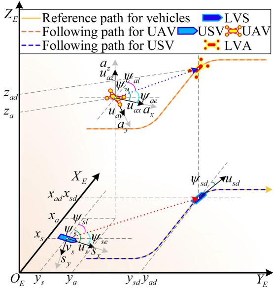  
Fig. 1. The framework of the integrated concept information.

Remark 2: Compared to recent reinforcement learningbased guidance strategy [35], the designed explicitly formulated time-varying velocity law provides deterministic stability and lower computational cost for predictable harbor approach.

Besides, $r _ { s l }$ requires to be defined by users according to the navigation conditions within a specific harbor. To prevent overshoot phenomenon for velocity-changing path following, the designed $r _ { s l }$ usually is a value with small fluctuation. As for the azimuth angles of LVS-LVA relative to the USV-UAV cooperative system, they can be calculated as

$$
\psi _ { \iota \nu } = - \frac { \pi } { 2 } \left[ 1 + \mathrm { s i g n } ( x _ { \iota e } ) \right] \mathrm { s i g n } ( y _ { \iota e } ) + \arctan \left( \frac { y _ { \iota e } } { x _ { \iota e } } \right) ,\tag{5}
$$

where $x _ { \imath e } = x _ { \imath } - x _ { \imath }$ and $y _ { \imath e } = y _ { \imath } - y _ { \imath l }$ denote the position errors between the USV/UAV and the LVS/LVA. Furthermore, the roll and pitch angles $\phi _ { a \nu }$ and $\theta _ { a \nu }$ of LVA can be calculated as (6) by using the nonlinear decoupling technic for the control input $\tau _ { ( \cdot ) }$ and relative azimuth angle $\psi _ { a \nu }$

$$
\begin{array} { l } { { \phi _ { a \nu } = \arctan \left( \frac { c ( \psi _ { a \nu } ) \tau _ { x } + s ( \psi _ { a \nu } ) \tau _ { y } } { \tau _ { z } } \right) } } \\ { { \theta _ { a \nu } = \arctan \left( c ( \phi _ { a \nu } ) \frac { s ( \psi _ { a \nu } ) \tau _ { x } - c ( \psi _ { a \nu } ) \tau _ { y } } { \tau _ { z } } \right) } } \end{array}\tag{6}
$$

In order to facilitate the subsequent control design and analysis calculation, the guidance signals for LVS and LVA can be organized as $\pmb { \eta } _ { 1 \nu } = [ x _ { a l } , y _ { a l } , z _ { a l } ] ^ { \mathrm { T } } , \pmb { \eta } _ { 2 \nu } = [ \phi _ { a \nu } , \theta _ { a \nu } , \psi _ { a \nu } ] ^ { \mathrm { T } }$ and $\pmb { \eta } _ { 3 \nu } = [ x _ { s l } , y _ { s l } , \psi _ { s \nu } ] ^ { \mathrm { T } }$

The mathematical modeling framework for cooperative system is integrated with the planning of virtual guidance signal in this chapter. A 3D visualization concept for paths and signals generated by USV-UAV and LVS-LVA is systematically constructed in Fig. 1.

## III. FUZZY CONTROL DESIGN STRATEGY

## A. Fuzzy Triggered Ratio for Event-Triggered Mechanism

Event-triggered mechanism is introduced to avoid the occupation for channel resources caused by continuous generated control order. Defining a trigger feedforward input $a _ { ( \cdot ) }$ to serve as an intermediate value for control design.

$$
\tau _ { ( \cdot ) } ( t ) = a _ { ( \cdot ) } ( t _ { \iota } ) , \quad t \in [ t _ { \iota } , t _ { \iota + 1 } ]\tag{7}
$$

where $\mathbf { \Phi } ( \cdot ) = u , r , x , y , z , \phi , \theta , \psi .$

Comparing dynamic-triggered strategy attached prescribed performance update technology [12], the gain-triggered mechanism with adaptive threshold is not dependent on the specific object instance, only associated with the control class itself, which is more suitable for the global signal change response scenario. Proposed trigger mechanism, based on the heterogenous feature of control input design for cooperative system, has better adaptive feedback efect in this paper. Its triggered rule can be designed as

$$
t _ { \iota + 1 } = \operatorname* { i n f } \{ t > t _ { \iota } \mid | a _ { ( \cdot ) } ( t _ { \iota } ) - \tau _ { ( \cdot ) } ( t ) | > d _ { ( \cdot ) } \tau _ { ( \cdot ) } ( t ) \}\tag{8}
$$

where $d _ { ( \cdot ) }$ is the threshold parameter satisfying $d _ { ( \cdot ) } \in ( 0 , 1 )$ Considering two conditions for triggered signals of the control input $\tau _ { ( \cdot ) } \colon$

$$
\begin{array} { r l } & { I : \tau _ { ( \cdot ) } ( t ) \geq 0 , } \\ & { \quad | a _ { ( \cdot ) } ( t _ { t } ) - \tau _ { ( \cdot ) } ( t ) | \leq d _ { ( \cdot ) } \tau _ { ( \cdot ) } ( t ) , } \\ & { \quad a _ { ( \cdot ) } ( t _ { t } ) - \tau _ { ( \cdot ) } ( t ) = p _ { ( \cdot ) } d _ { ( \cdot ) } \tau _ { ( \cdot ) } ( t ) , p _ { ( \cdot ) } \in [ - 1 , 1 ] } \\ & { I I : \tau _ { ( \cdot ) } ( t ) < 0 , } \\ & { \quad | a _ { ( \cdot ) } ( t _ { t } ) - \tau _ { ( \cdot ) } ( t ) | \leq - d _ { ( \cdot ) } \tau _ { ( \cdot ) } ( t ) , } \\ & { \quad a _ { ( \cdot ) } ( t _ { t } ) - \tau _ { ( \cdot ) } ( t ) = p _ { ( \cdot ) } d _ { ( \cdot ) } \tau _ { ( \cdot ) } ( t ) , p _ { ( \cdot ) } \in [ - 1 , 1 ] } \end{array}\tag{9}
$$

Through above analysis, a conclusion is given with equation as

$$
\tau _ { ( \cdot ) } ( t ) = \frac { 1 } { 1 + p _ { ( \cdot ) } d _ { ( \cdot ) } } a _ { ( \cdot ) } ( t _ { \iota } )\tag{10}
$$

The threshold parameter in (8) and (9) is not a fixed constant but is adaptively tuned online to balance triggering frequency and control performance. Therefore, introducing the fuzzy triggered ratio to facilitate the calculating for subsequent trigger gain design.

$$
M _ { i } ^ { - 1 } R _ { i } \pmb { \tau } _ { i } = \zeta _ { i } \pmb { A } _ { i }\tag{11}
$$

where $\pmb { \zeta } _ { i }$ expresses the fuzzy triggered ratio matrix. Therein, $\begin{array}{c} \begin{array} { r l r } { \zeta _ { 1 } } & { { } = } & { \mathrm { d i a g } \{ \zeta _ { \mathrm { x } } , \zeta _ { \mathrm { y } } , \zeta _ { z } \} , ~ \zeta _ { 2 } } \end{array} \quad = \quad \mathrm { d i a g } \{ \zeta _ { \phi } , \zeta _ { \theta } , \zeta _ { \psi } \}  \end{array}$ and $\begin{array} { r l } { \zeta _ { 3 } } & { { } = } \end{array}$ ζdiag $\{ \zeta _ { \mathrm { u } } , 0 , \zeta _ { \mathrm { r } } \} ; A _ { i }$ denotes the feedforward input matrix which $\begin{array} { r } { \pmb { A } _ { 1 } = [ a _ { x } , a _ { y } , a _ { z } ] ^ { \mathrm { T } } , \pmb { A } _ { 2 } = [ a _ { \phi } , a _ { \theta } , a _ { \psi } ] ^ { \mathrm { T } } } \end{array}$ and $\boldsymbol { A } _ { 3 } = [ a _ { u } , 0 , a _ { r } ] ^ { \mathrm { T } }$

Remark 3: Unlike recent dual-channel event-triggered mechanism that increases complexity [36], our adaptive single-channel mechanism with fuzzy-gain adjustment ofers a simpler solution to balance performance and communication eficiency.

## B. Fuzzy Logic System

The system’s nonlinear approximation capability stems from the universal approximation theorem, where properly configured FLS can estimate Lipschitz-continuous nonlinear functions with arbitrary accuracy.

FLS is made up of the knowledge base, the fuzzifier, the fuzzy inference engine working on fuzzy rules and the defuzzifier. Integrating the knowledge base, the rules within a collection of fuzzy rules can be defined as the processing instructions for signal input-output within the FLS. Choosing the function $x _ { \diamond }$ and y as the input and output signals for FLS. While $\pmb { x } = [ x _ { 1 } , x _ { 2 } , \ldots , x _ { n } ] ^ { \operatorname { T } } = [ M _ { 1 } ^ { m } , M _ { 2 } ^ { m } , \ldots , M _ { n } ^ { m } ]$ , the equation $y ~ = ~ G ^ { m }$ is satisfied. Thereinto, $\mathit { m } \ = \ 1 , 2 , \ldots , N$ expresses the number of rules. $M _ { \diamond } ^ { m }$ and $G ^ { m }$ represent the fuzzy sets associating with the membership functions $\gamma _ { M _ { \diamond } ^ { m } } ( x _ { \diamond } )$ and $\gamma _ { G ^ { m } } ( y )$ respectively. By introducing the singleton function, center average defuzzification and product inference [37], the function processing signals for FLS is described as

$$
y ( x ) = \frac { \sum _ { m = 1 } ^ { N } \overline { { y } } _ { m } \prod _ { i = 1 } ^ { n } \gamma _ { M _ { i } ^ { m } } ( x _ { i } ) } { \sum _ { m = 1 } ^ { N } \left[ \prod _ { i = 1 } ^ { n } \gamma _ { M _ { i } ^ { m } } ( x _ { i } ) \right] }\tag{12}
$$

which $\bar { y } _ { m } = \operatorname* { m a x } \gamma _ { G ^ { m } } ( y ) , y \in R .$ . Then, the fuzzy basis function is defined as

$$
\varphi _ { m } ( x _ { i } ) = \frac { \prod _ { i = 1 } ^ { n } \gamma _ { M _ { i } ^ { m } } ( x _ { i } ) } { \sum _ { m = 1 } ^ { N } \left( \prod _ { i = 1 } ^ { n } \gamma _ { M _ { i } ^ { m } } ( x _ { i } ) \right) }\tag{13}
$$

Furthermore, defining

$$
\begin{array} { c } { \omega _ { \hbar } = [ \overline { { y } } _ { 1 } , \overline { { y } } _ { 2 } , \cdots , \overline { { y } } _ { N } ] ^ { \mathrm { T } } = [ \omega _ { 1 } , \omega _ { 2 } , \cdots , \omega _ { N } ] ^ { \mathrm { T } } } \\ { \varphi ( x ) = \left[ \varphi _ { 1 } ^ { m } ( x ) , \varphi _ { 2 } ^ { m } ( x ) , \cdots , \varphi _ { N } ^ { m } ( x ) \right] ^ { \mathrm { T } } } \end{array}\tag{14}
$$

Combining (12), (13) and (14), the approximation function which tackle nonlinear terms can be described as

$$
y ( x ) = \omega _ { \hbar } ^ { \mathrm { T } } \varphi ( x )\tag{15}
$$

Lemma 1: For any continuous function $f ( x )$ defined on a compact set $\Omega _ { x } \subseteq R ^ { * }$ and satisfying $f ( x _ { 0 } ) = 0 f o r$ some initial point $x _ { 0 } ,$ there exists an arbitrarily small $\varepsilon > 0$ such that inequality (16) holds for all x in the set.

$$
\operatorname* { s u p } _ { x \in \Omega _ { x } } \left| f ( x ) - \omega _ { \hbar } ^ { \mathrm { T } } \varphi ( x ) \right| \leq \varepsilon\tag{16}
$$

Then, one can construct the optimal parameter [21] as

$$
\omega = \arg \operatorname* { m i n } _ { \omega _ { \hbar } \in \mathrm { R } ^ { * } } \left\{ \operatorname* { s u p } _ { \mathrm { x } \in \Omega _ { \mathrm { x } } } \left. \mathrm { f } ( \mathrm { x } ) - \omega _ { \hbar } ^ { \mathrm { T } } \varphi ( \mathrm { x } ) \right. \right\}\tag{17}
$$

Therefore, the continuous nonlinear function processed by FLS in the mathematical model can be approximated as

$$
F _ { i } = W _ { i } \Phi _ { i } + E _ { i }\tag{18}
$$

where $\begin{array} { r } { W _ { 1 } ~ = ~ \mathrm { d i a g } \{ \omega _ { \mathrm { x } } ^ { \mathrm { T } } , \omega _ { \mathrm { v } } ^ { \mathrm { T } } , \omega _ { \mathrm { z } } ^ { \mathrm { T } } \} , ~ W _ { 2 } ~ = ~ \mathrm { d i a g } \{ \omega _ { \phi } ^ { \mathrm { T } } , \omega _ { \theta } ^ { \mathrm { T } } , \omega _ { \psi } ^ { \mathrm { T } } \} } \end{array}$ and $\begin{array} { r } { W _ { 3 } = \mathrm { d i a g } \{ \omega _ { \mathrm { u } } ^ { \mathrm { T } } , \omega _ { \mathrm { v } } ^ { \mathrm { T } } , \omega _ { \mathrm { r } } ^ { \mathrm { T } } \} ; \mathbf { \dot { \Phi } } _ { \mathrm { d } } = [ \varphi _ { x } ^ { \mathrm { T } } ( \nu _ { a } ) , \varphi _ { v } ^ { \mathrm { T } } ( \nu _ { a } ) , \varphi _ { z } ^ { \mathrm { T } } ( \nu _ { a } ) ] ^ { \mathrm { T } } , \ \Phi _ { 2 } = } \end{array}$ $[ \varphi _ { \phi } ^ { \mathrm { T } } ( \nu _ { a } ) , \varphi _ { \theta } ^ { \mathrm { T } } ( \nu _ { a } ) , \varphi _ { \psi } ^ { \mathrm { T } } ( \nu _ { a } ) ] ^ { \mathrm { T } }$ and $\Phi _ { 3 } ~ = ~ [ \varphi _ { u } ^ { \mathrm { \scriptscriptstyle T } } ( \nu _ { s } ) , \varphi _ { \nu } ^ { \mathrm { \scriptscriptstyle T } } ( \nu _ { s } ) , \varphi _ { r } ^ { \mathrm { \scriptscriptstyle T } } ( \nu _ { s } ) ] ^ { \mathrm { \scriptscriptstyle T } }$ ϕφ , ϕθ , ϕψ ϕ , ϕ , ϕEi is considered the fuzzy approximation error matrix which $\pmb { { \cal E } } _ { 1 } = [ \pmb { \varepsilon } _ { x } , \pmb { \varepsilon } _ { y } , \pmb { \varepsilon } _ { z } ] ^ { \mathrm { T } } , \pmb { { \cal E } } _ { 2 } = [ \pmb { \varepsilon } _ { \phi } , \pmb { \varepsilon } _ { \theta } , \pmb { \varepsilon } _ { \psi } ] ^ { \mathrm { T } }$ and $\mathbf { { \mathit { E } } } _ { 3 } ~ = ~ [ \varepsilon _ { u } , \varepsilon _ { \nu } , \varepsilon _ { r } ] ^ { \mathrm { T } }$ ε , ε , εwith their upper bound $\pmb { { \cal E } } _ { i M }$ φ, εθ,and $\varepsilon ( \cdot ) m \cdot$

Whereupon, this architecture can fundamentally transform intractable nonlinear control problems into tractable rule-based optimization tasks, achieving robust performance without explicit model linearization.

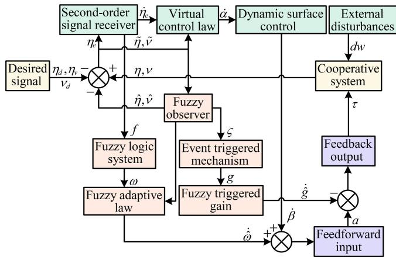  
Fig. 2. The process diagram of the internal control work module.

## C. Model for the Event-Triggered Fuzzy Observer

This section introduces the designed fuzzy observer model with the form as

$$
\begin{array} { l } { \dot { \hat { \pmb { \eta } } } _ { i } = { \pmb J } _ { i } \hat { \pmb { \nu } } _ { i } + \delta _ { \eta _ { i } } \tilde { \pmb { \eta } } _ { i } } \\ { \dot { \hat { \pmb { \nu } } } _ { i } = \hat { \zeta } _ { i } { \pmb A } _ { i } + \hat { \pmb { W } } _ { i } \pmb { \Phi } _ { i } + \delta _ { \nu _ { i } } \tilde { \pmb { \nu } } _ { i } } \end{array}\tag{19}
$$

where $\hat { \pmb { \eta } } _ { i }$ and $\hat { \nu } _ { i }$ denote the value for state observation which $\hat { \pmb { \eta } } _ { 1 } = [ \hat { \hat { x } } _ { a } , \hat { y } _ { a } , \hat { z } _ { a } ] ^ { \mathrm { T } } , \hat { \pmb { \eta } } _ { 2 } = [ \hat { \phi } _ { a } , \hat { \theta } _ { a } , \hat { \psi } _ { a } ] ^ { \mathrm { T } }$ and $\hat { \pmb { \eta } } _ { 3 } = [ \hat { x } _ { s } , \hat { y } _ { s } , \hat { \pmb { \psi } } _ { s } ] ^ { \mathrm { T } } ;$ $\hat { \boldsymbol { \nu } } _ { 1 } ~ = ~ [ \hat { u } _ { a x } , \hat { u } _ { a y } , \hat { u } _ { a z } ] ^ { \mathrm { T } } , ~ \hat { \boldsymbol { \nu } } _ { 2 } ~ = ~ [ \hat { p } _ { a } , \hat { q } _ { a } , \hat { r } _ { a } ] ^ { \mathrm { T } }$ and $\hat { \pmb { \nu } } _ { 3 } = [ \hat { u } _ { s } , \hat { \nu } _ { s } , \hat { r } _ { s } ] ^ { \mathrm { T } }$ $\tilde { \pmb { \eta } } _ { i }$ and ${ \tilde { \nu } } _ { i }$ , ν , , νstand for the errors of observer. $\delta _ { \eta _ { i } }$ , ,and $\delta _ { \nu _ { i } }$ express the observer parameter matrixes which are positive definite, where $\delta _ { \eta _ { 1 } } = \mathrm { d i a g } \{ \delta _ { \mathrm { a x } } , \delta _ { \mathrm { a y } } , \delta _ { \mathrm { a z } } \} , \delta _ { \eta _ { 2 } } = \mathrm { d i a g } \{ \delta _ { \phi } , \delta _ { \theta } , \delta _ { \psi _ { \mathrm { a } } } \}$ and $\begin{array} { r l r } { \delta _ { \eta _ { 3 } } } & { { } = } & { \mathrm { d i a g } \{ \delta _ { \mathrm { x } } , \delta _ { \mathrm { y } } , \delta _ { \psi _ { \mathrm { s } } } \} ; ~ \delta _ { \nu _ { 1 } } \quad = \quad \mathrm { d i a g } \{ \delta _ { \mathrm { u a x } } , \delta _ { \mathrm { u a y } } , \delta _ { \mathrm { u a z } } \} } \end{array}$ $\begin{array} { r c l } { \delta _ { \nu _ { 2 } } } & { = } & { \underline { { \mathrm { d i a g } } } \{ \delta _ { \mathrm { p } } , \delta _ { \mathrm { q } } , \delta _ { \mathrm { r _ { a } } } \} } \end{array}$ and $\begin{array} { r c l } { \delta _ { \nu _ { 3 } } } & { = } & { \mathrm { d i a g } \{ \delta _ { \mathrm { u } } , \delta _ { \mathrm { v } } , \delta _ { \mathrm { r } _ { \mathrm { s } } } \} . ~ \hat { \zeta } _ { 1 } ~ = } \end{array}$ $\mathrm { d i a g } \{ \hat { \zeta } _ { \mathrm { x } } , \hat { \zeta } _ { \mathrm { y } } , \hat { \zeta } _ { \mathrm { z } } \} , \hat { \zeta } _ { 2 } = \mathrm { d i a g } \{ \hat { \zeta } _ { \phi } , \hat { \zeta } _ { \theta } , \hat { \zeta } _ { \psi } \}$ and $\hat { \zeta } _ { 3 } ~ = ~ \mathrm { d i a g } \{ \hat { \zeta } _ { \mathrm { u } } , 0 , \hat { \zeta } _ { \mathrm { r } } \}$ $\hat { \pmb { W } } _ { 1 } = \mathrm { d i a g } \{ \hat { \omega } _ { \mathrm { x } } ^ { \mathrm { T } } , \bar { \hat { \omega } } _ { \mathrm { y } } ^ { \mathrm { T } } , \hat { \omega } _ { \mathrm { z } } ^ { \mathrm { T } } \} , \hat { \pmb { W } } _ { 2 } = \mathrm { d i a g } \{ \hat { \omega } _ { \phi } ^ { \mathrm { T } } , \bar { \hat { \omega } } _ { \theta } ^ { \mathrm { T } } , \hat { \omega } _ { \psi } ^ { \mathrm { T } } \}$ and $W _ { 3 } \ =$ diag $\{ \hat { \omega } _ { \mathrm { u } } ^ { \mathrm { T } } , \hat { \omega } _ { \mathrm { v } } ^ { \mathrm { T } } , \hat { \omega } _ { \mathrm { r } } ^ { \mathrm { T } } \}$ }.

In light of the robustness for system while designing the observer model, the gain adaptive triggered by the observation signal can be utilized to monitor the fluctuation threshold of observer errors in real time.

Assumption 3: In the subsequent stability analysis for the closed observation system, the rest of the generated error filtered noise can be continuously corrected by the dynamic characteristics of the control system, so as to ensure the continuous stability of the control performance.

In this chapter, around the fuzzy triggered ratio and the fuzzy adaptive law, a fuzzy observer for event-triggered mechanism is designed. For the problem of transmitted signal disturbance under the cooperation velocity-changing guidance circumstance, it can coordinate the control modules of the system to achieve stable output. The main flow diagram for internal control system with proposed algorithm is shown on Fig. 2.

## IV. CONTROLLER DESIGN AND STABILITY ANALYSIS

In this chapter, control design and stability analysis dividing internal observation and external control system will be discussed, by introducing proposed design theories and control algorithm.

## A. Determination for Observation Stability

According to (1) and (19), the derivative of the error for observer can be described as

$$
\begin{array} { r l } & { \dot { \tilde { \eta } } _ { i } = J _ { i } \tilde { \nu } _ { i } - \delta _ { \eta _ { i } } \tilde { \eta } _ { i } } \\ & { \dot { \tilde { \nu } } _ { i } = \tilde { \zeta } _ { i } A _ { i } + \tilde { W } _ { i } \Phi _ { i } - \delta _ { \nu _ { i } } \tilde { \nu } _ { i } + E _ { i } + D _ { i } } \end{array}\tag{20}
$$

Step 1: Following the derivation of state observation errors for USV, the Lyapunov function can be designed as

$$
V _ { a } = \frac { 1 } { 2 } \tilde { \eta } _ { 3 } ^ { \mathrm { T } } \tilde { \eta } _ { 3 } + \frac { 1 } { 2 } \tilde { \nu } _ { 3 } ^ { \mathrm { T } } \tilde { \nu } _ { 3 }\tag{21}
$$

The derivation for above function is calculated as

$$
\begin{array} { r l } & { \dot { V } _ { a } = \tilde { \eta } _ { 3 } ^ { \mathrm { T } } \dot { \eta } _ { 3 } + \tilde { \nu } _ { 3 } ^ { \mathrm { T } } \dot { \tilde { \nu } } _ { 3 } } \\ & { \quad = \tilde { \eta } _ { 3 } ^ { \mathrm { T } } \left( J _ { 3 } \tilde { \nu } _ { 3 } - \delta _ { \eta _ { 3 } } \tilde { \eta } _ { 3 } \right) } \\ & { \quad \quad + \tilde { \nu } _ { 3 } ^ { \mathrm { T } } \left( \tilde { \zeta } _ { 3 } A _ { 3 } + \tilde { W } _ { 3 } \Phi _ { 3 } - \delta _ { \nu _ { 3 } } \tilde { \nu } _ { 3 } + E _ { i } + D _ { i } \right) } \\ & { \quad = \tilde { \eta } _ { 3 } ^ { \mathrm { T } } J _ { 3 } \tilde { \nu } _ { 3 } - \tilde { \eta } _ { 3 } ^ { \mathrm { T } } \delta _ { \eta _ { 3 } } \tilde { \eta } _ { 3 } + \tilde { \nu } _ { 3 } ^ { \mathrm { T } } \tilde { \zeta } _ { 3 } A _ { 3 } + \tilde { \nu } _ { 3 } ^ { \mathrm { T } } \tilde { W } _ { 3 } \Phi _ { 3 } - \tilde { \nu } _ { 3 } ^ { \mathrm { T } } \delta _ { \nu _ { 3 } } \tilde { \nu } _ { 3 } } \\ & { \quad \quad + \tilde { \nu } _ { 3 } ^ { \mathrm { T } } \left( E _ { i } + D _ { i } \right) } \end{array}
$$

Furthermore, due to the particular nature of state matrix for USV, each element is computed sequentially as

$$
\begin{array} { r l } & { \dot { V } _ { a } = \tilde { x } _ { s } \tilde { u } _ { s } c ( \psi _ { s } ) - \tilde { x } _ { s } \tilde { \nu } _ { s } s ( \psi _ { s } ) - \delta _ { x } \tilde { x } _ { s } ^ { 2 } + \tilde { y } _ { s } \tilde { u } _ { s } s ( \psi _ { s } ) } \\ & { \qquad + \tilde { y } _ { s } \tilde { \nu } _ { s } c ( \psi _ { s } ) } \\ & { \qquad - \delta _ { y } \tilde { y } _ { s } ^ { 2 } + \tilde { \psi } _ { s } \tilde { r } _ { s } - \delta _ { \psi _ { s } } \tilde { \psi } _ { s } ^ { 2 } + \tilde { u } _ { s } \tilde { \zeta } _ { u } a _ { u } + \tilde { u } _ { s } \tilde { \omega } _ { u } ^ { \mathrm { T } } \varphi _ { u } ( \nu _ { s } ) } \\ & { \qquad + \tilde { u } _ { s } ( \varepsilon _ { u } + d _ { w u } ) - \delta _ { u } \tilde { u } _ { s } ^ { 2 } + \tilde { \nu } _ { s } \tilde { \omega } _ { \nu } ^ { \mathrm { T } } \varphi _ { \nu } ( \nu _ { s } ) + \tilde { \nu } _ { s } ( \varepsilon + d _ { w \nu } ) } \\ & { \qquad - \delta _ { \nu } \tilde { \nu } _ { s } ^ { 2 } + \tilde { r } _ { s } \tilde { \zeta } _ { r } a _ { r } + \tilde { r } _ { s } \tilde { \omega } _ { r } ^ { \mathrm { T } } \varphi _ { r } ( \nu _ { s } ) + \tilde { r } _ { s } ( \varepsilon _ { r } + d _ { w r } ) - \delta _ { r } \tilde { r } _ { s } ^ { 2 } } \end{array}\tag{23}
$$

Applying Young’s inequality to the cross terms and bounding the disturbance terms by their norms, one yield

$$
\begin{array} { r } { \dot { V } _ { a } \leq - ( \delta _ { x } - 1 ) \tilde { x } _ { s } ^ { 2 } - ( \delta _ { y } - 1 ) \tilde { y } _ { s } ^ { 2 } - ( \delta _ { u } - 2 ) \tilde { u } _ { s } ^ { 2 } - ( \delta _ { \nu } - 2 ) \tilde { v } _ { s } ^ { 2 } \ } \\ { - \left( \delta _ { \psi _ { s } } - \displaystyle \frac { 1 } { 2 } \right) \tilde { \psi } _ { s } ^ { 2 } - \left( \delta _ { r } - \displaystyle \frac { 3 } { 2 } \right) \tilde { r } _ { s } ^ { 2 } + \displaystyle \sum _ { \iota = u , \nu , r } \frac { 1 } { 2 } \| \varphi _ { \iota } ( \nu _ { s } ) \| ^ { 2 } \| \tilde { \omega } _ { \iota } \| ^ { 2 } } \\ { + E _ { 3 M } ^ { 2 } + D _ { 3 M } ^ { 2 } + \tilde { \eta } _ { 3 } ^ { \mathrm { T } } \tilde { \zeta } _ { 3 } A _ { 3 } \ \qquad ( 2 4 ) \| } \end{array}
$$

Step 2: For the unity of the state equation for UAV, its observation errors can be tackled by employing Routh-hurwitz matrix construction theory [38]. Constructing the Hurwitz parameter matrix as

$$
\pmb { Q } _ { \imath } = \left[ \begin{array} { c c } { - \delta _ { \jmath } } & { 1 } \\ { 1 } & { - \delta _ { \ell } } \end{array} \right] , \quad \left\{ \begin{array} { l } { \imath = x , y , z , \phi , \theta , \psi } \\ { \jmath = a x , a y , a z , \phi , \theta , \psi _ { a } } \\ { \ell = u a x , u a y , u a z , p , q , r _ { a } } \end{array} \right.\tag{25}
$$

Then, the derivative observation errors for UAV can be rewritten as

$$
\dot { \boldsymbol { \gamma } } _ { \iota } = \boldsymbol { Q } _ { \iota } \boldsymbol { \gamma } _ { \iota } + \boldsymbol { \Omega } _ { \iota } + \boldsymbol { K } _ { \iota } + \boldsymbol { E } _ { \iota } + \boldsymbol { D } _ { \iota } - \boldsymbol { \xi } _ { \iota }\tag{26}
$$

where $\gamma _ { \iota } = [ \tilde { \iota } _ { a } , \tilde { \varrho } ] ^ { \mathrm { T } } , \varrho = u _ { a x } , u a y , u _ { a z } , p _ { a } , q _ { a } , r _ { a } ; \ : \Omega _ { \iota } =$ $[ 0 , \tilde { \omega } _ { \iota } ^ { \mathrm { T } } \varphi _ { \iota } ( \nu _ { a } ) ] ^ { \mathrm { T } } ; K _ { \iota } \ = \ [ 0 , \tilde { \zeta } _ { \iota } a _ { \iota } ] ^ { \mathrm { T } } ; E _ { \iota } \ = \ [ 0 , \varepsilon _ { \iota } ] ; D _ { \iota } \ =$ $[ 0 , d _ { w \imath } ] ^ { \mathrm { T } } ; \xi _ { \imath } = [ 0 , \tilde { \imath } _ { a } ] ^ { \mathrm { T } }$ , ζı ı ı , εı. The upper bound for $\scriptstyle { E _ { \imath } }$ ıand $\pmb { { \cal D } } _ { \imath }$ are $\pmb { { \cal E } } _ { \imath M }$ and $\pmb { D } _ { \imath M }$

To facilitate the subsequent stability analysis, one can define a matrix $\pmb { H } _ { \iota }$ satisfying $\pmb { H } _ { \imath } ^ { \mathrm { T } } = \pmb { H } _ { \imath } > 0$ ı ı ı >There is a positive definite symmetry matrix $P _ { \iota }$ holding ${ \cal Q } _ { \imath } ^ { \mathrm { T } } { \cal P } _ { \imath } + { \cal P } _ { \imath } { \cal Q } _ { \imath } \ = \ - { \cal H } _ { \imath }$ . Therein, $\iota ~ \in ~ \partial ~ =$ ı{x y z }.

Designing a Lyapunov function to observation errors for UAV as

$$
V _ { b } = \sum _ { \partial } \frac { 1 } { 2 } \gamma _ { \iota } ^ { \mathrm { T } } P _ { \iota } \gamma _ { \iota }\tag{27}
$$

Taking its derivative as

$$
\begin{array} { r l } {  { \begin{array} { r l } { \overline { { V } } _ { \ell } = \sum _ { j } \overline { { \gamma } } ^ { \ell } \mu _ { j } ^ { \ell } ( \ell \partial _ { j } \gamma + \Delta \ell _ { i } + K _ { i } + \ell _ { j } + \Delta _ { i } - \ell _ { i } , \ell - \xi _ { i } ) } \\ & { - \sum _ { j } \overline { { \gamma } } ^ { \ell } [ \gamma ^ { \ell } \partial _ { j } \gamma _ { j } ] ^ { \ell } \gamma ^ { \ell } \mu _ { j } ^ { \ell } , } \\ & { + \gamma _ { j } ^ { \ell } \mu _ { i } ( \ell + K _ { i } ) - \gamma _ { j } ^ { \ell } \ell \xi _ { i } ] } \end{array} } } \\ &  \le \begin{array} { r l } { \sum _ { j } [ \Gamma _ { j } ^ { \ell } ( \ell ) , \ell \partial _ { j } \gamma + \frac { 1 } { 2 } ] ^ { \ell } \gamma ^ { \ell } , } \\ & { + \gamma _ { j } ^ { \ell } [ \ell ] ^ { \ell } , } \\ & { \le \sum _ { j } [ ( \frac { 1 } { 2 } - \frac { 1 } { 2 } ) \dim ( \ell ) ] ^ { 2 } \gamma ] ^ { \ell } - \frac { 1 } { 2 } [ \gamma ] ^ { \ell } \dim ( \ell ) \biggr [ \ell \chi _ { i } ( \ell ) \chi _ { i } ( \ell ) \chi _ { j } ] ^ { 2 } [ \ell \chi _ { i } ( \ell ) \chi _ { i } ] ^ { 2 } } \\ & { + \frac { 1 } { 2 } [ \eta _ { i } \xi ] ^ { \ell } ( \ell \chi _ { i } ( \ell ) , 1 ) \biggr ] ^ { \ell } \gamma ^ { \ell } , } \\ &  + \frac { 1 } { 2 } [ \eta _ { i } \xi ] ^ { \ell } [ \ell \chi _ { i } ( \ell ) , 1 ] ^ { \ell } \gamma ^ { \ell } [ \ell \chi _  \end{array} \end{array}
$$

## B. External Control Design

Combining (1) and the guidance signals for LVS and LVA, meanwhile defining the virtual control law $\alpha _ { \nu _ { i } } .$ , the state errors of the cooperative system can be described as

$$
\begin{array} { c } { { \pmb { \eta } _ { i e } = \pmb { \eta } _ { i } - \pmb { \eta } _ { i \nu } } } \\ { { \pmb { \nu } _ { i e } = \pmb { \nu } _ { i } - \pmb { \alpha } _ { \nu _ { i } } } } \end{array}\tag{29}
$$

Based on the characteristic that researched 3-DOF underactuated ships lack lateral propulsion, the position control torque is only applied to the forward thruster. For the sake of unification for the subsequent control design formula, integrated position error in surge direction is designed as (30) considering the problem for norm and geometric constraint.

$$
\pmb { Z } _ { s e } = \| \pmb { \eta } _ { 3 e } ( x _ { s e } , y _ { s e } ) \| _ { 2 }\tag{30}
$$

Then the state error $\pmb { \eta } _ { 3 e }$ can be represented as

$$
\pmb { \eta } _ { 3 e } = [ \pmb { Z } _ { s e } - \ell _ { \Delta } , 0 , \psi _ { s e } ] ^ { \mathrm { T } }\tag{31}
$$

where $\ell _ { \Delta }$ denotes a positive small value, which can be used to guarantee that LVS is always ahead of USV.

Calculating the derivative of the error $\pmb { \eta } _ { i e }$ and $\nu _ { i e }$ as

$$
\begin{array} { l } { \dot { \pmb { \eta } } _ { i e } = { \pmb J } _ { i } { \pmb \nu } _ { i } - \dot { \pmb { \eta } } _ { i \nu } } \\ { \dot { \pmb \nu } _ { i e } = \dot { \pmb \nu } _ { i } - \dot { \pmb \alpha } _ { \nu _ { i } } } \end{array}\tag{32}
$$

Designing the Lyapunov function for (29) and taking its derivative as

$$
\begin{array} { l } { \dot { V } _ { 1 } = \displaystyle \sum _ { I } \pmb { \eta } _ { i e } ^ { \mathrm { T } } \left( J _ { i } \nu _ { i } - \dot { \eta } _ { i \nu } \right) + \displaystyle \sum _ { I } \pmb { \nu } _ { i e } ^ { \mathrm { T } } \dot { \pmb { \nu } } _ { i e } } \\ { = \displaystyle \sum _ { I } \pmb { \eta } _ { i e } ^ { \mathrm { T } } \left[ J _ { i } \left( \nu _ { i e } + \alpha _ { \nu _ { i } } \right) - \dot { \eta } _ { i \nu } \right] + \displaystyle \sum _ { I } \nu _ { i e } ^ { \mathrm { T } } \left( \dot { \nu } _ { i } - \dot { \alpha } _ { \nu _ { i } } \right) } \end{array}\tag{33}
$$

where $i \in I = \{ 1 , 2 , 3 \}$

The proposed virtual control law with observation error can be designed by utilizing the Beckstepping design method as

$$
\pmb { \alpha } _ { \nu _ { i } } = \pmb { J } _ { i } ^ { - 1 } ( - k _ { \eta _ { i } } \pmb { \eta } _ { i e } + \dot { \pmb { \eta } } _ { i \nu } + \delta _ { \eta _ { i } } \tilde { \pmb { \eta } } _ { i } )\tag{34}
$$

where $k _ { \eta _ { i } }$ stands for the positive definite parameter matrix.

Lemma 2: To alleviate the complexity explosion problem and the disruption of control signals caused by the derivative of virtual control law, a filter reducing order is designed by introducing the DSC as

$$
\epsilon _ { \nu _ { i } } \dot { \rho } _ { \nu _ { i } } + \rho _ { \nu _ { i } } = \alpha _ { \nu _ { i } } , \quad \rho _ { \nu _ { i } } ( 0 ) = \alpha _ { \nu _ { i } } ( 0 ) , ~ \pmb { \vartheta } _ { \nu _ { i } } = \rho _ { \nu _ { i } } - \alpha _ { \nu _ { i } }\tag{35}
$$

where $\epsilon _ { \nu _ { i } }$ denotes the positive definite time constant matrix and $\pmb { \vartheta } _ { \nu _ { i } }$ νstands for the filter error matrix. The time derivative for $\rho _ { \nu _ { i } }$ ν and $\pmb { \vartheta } _ { \nu _ { i } }$ can be derived as

$$
\dot { \pmb { \rho } } _ { \nu _ { i } } = - \pmb { \epsilon } _ { \nu _ { i } } ^ { - 1 } \pmb { \vartheta } _ { \nu _ { i } } , \quad \dot { \pmb { \vartheta } } _ { \nu _ { i } } = - \pmb { \epsilon } _ { \nu _ { i } } ^ { - 1 } \pmb { \vartheta } _ { \nu _ { i } } + \pmb { T } _ { \nu _ { i } }\tag{36}
$$

where $\pmb { T } _ { \nu _ { i } } = - \dot { \pmb { \alpha } } _ { \nu _ { i } }$ satisfying $\lvert | T _ { \nu _ { i } } \rvert | \leq T _ { \nu _ { i } M } .$

Similarly, combined with the filter error, the derivative for Lyapunov function can be designed as

$$
\begin{array} { l } { { \displaystyle { \dot { V } } _ { 2 } = { \dot { V } } _ { 1 } + \sum _ { I } \pmb { \vartheta } _ { \nu _ { i } } ^ { \mathrm { T } } \pmb { \dot { \vartheta } } _ { \nu _ { i } } } \ ~ } \\ { { \displaystyle ~ = \sum _ { I } \left\{ \eta _ { i e } ^ { \mathrm { T } } \left[ { \pmb J } _ { i } \left( \nu _ { i e } + \alpha _ { \nu _ { i } } \right) - \pmb \eta _ { i \nu } \right] \right. } \ ~ } \\ { { \displaystyle ~ \left. + \nu _ { i e } ^ { \mathrm { T } } \left( { \dot { \nu } } _ { i } - { \dot { \alpha } } _ { \nu _ { i } } \right) + \pmb \vartheta _ { \nu _ { i } } ^ { \mathrm { T } } \pmb { \dot { \vartheta } } _ { \nu _ { i } } \right\} } } \end{array}\tag{37}
$$

Substituting (1), (11), (18), (34), (35) and (36) into (37), the equation can be further obtained as

$$
\begin{array} { r l } {  { \hat { V } _ { 2 } = \sum _ { I } \eta _ { t \ell } ^ { \mathrm { T } } \big ( - k _ { n } \eta _ { t \ell } + \gamma _ { i \ell } + \delta _ { n } \bar { \eta } _ { i } \big ) + \sum _ { I } \eta _ { i \ell } ^ { \mathrm { T } } \big ( \zeta _ { i } A _ { i } } } \\ & { + \mathrm { \textit { W } } _ { i } \Phi _ { i } + E _ { i } + D _ { i } \big ) - \sum _ { I } \nu _ { t \ell } ^ { \mathrm { T } } \big ( \hat { \rho } _ { v _ { r } } + \epsilon _ { v _ { i } } ^ { - } \hat { \theta } _ { v _ { r } } - T _ { v _ { i } } \big ) } \\ & { + \sum _ { I } \partial _ { v } ^ { \mathrm { T } } \hat { \theta } _ { v _ { i } } } \\ & { = \sum _ { I } \big ( - \eta _ { t \ell } ^ { \mathrm { T } } k _ { n } \eta _ { t \ell } + \eta _ { t \ell } ^ { \mathrm { T } } \nu _ { t } + \eta _ { i \ell } ^ { \mathrm { T } } \delta _ { \eta } \hat { \eta } _ { i } \big ) + \sum _ { I } \nu _ { i \ell } ^ { \mathrm { T } } \zeta _ { i } A _ { i } } \\ & { + \sum _ { I } \nu _ { u v } ^ { \mathrm { T } } W _ { i } \Phi _ { i } + \sum _ { I } \nu _ { u v } ^ { \mathrm { T } } \big ( E _ { i } + D _ { i } + T _ { v } \big ) - \sum _ { I } \nu _ { u v } ^ { \mathrm { T } } \hat { \rho } _ { v _ { i } } } \\ & { - \sum _ { I } \nu _ { u ^ { \prime } } ^ { \mathrm { T } } \epsilon _ { v _ { i } ^ { \mathrm { T } } } ^ { - 1 } \hat { \theta } _ { v _ { i } } + \sum _ { I } \partial _ { v } ^ { \mathrm { T } } \hat { \theta } _ { v _ { i } } } \end{array}\tag{8}
$$

According to above physical expression (11), to stabilize the chattering for fuzzy triggered ratio so that $\zeta _ { i } \to \zeta _ { i } ( 0 )$ as well as $\tau _ { i } = \zeta _ { i } ( 0 ) A _ { i }$ ζ ζare satisfied, one can define the fuzzy triggered gain $\pmb { g } _ { i } = \pmb { \zeta } _ { i } ^ { - 1 } \pmb { M } _ { i } ^ { - 1 } \pmb { R } _ { i }$ and design the control input as

$$
\begin{array} { r l } & { \pmb { A } _ { i } = \hat { \pmb { g } } _ { i } \pmb { \tau } _ { i } } \\ & { \pmb { \tau } _ { i } = \pmb { R } _ { i } ^ { - 1 } \pmb { M } _ { i } \left( - k _ { \nu _ { i } } \pmb { \nu } _ { i e } - \pmb { \eta } _ { i e } + \dot { \pmb { \rho } } _ { \nu _ { i } } - \hat { \pmb { W } } _ { i } \pmb { \Phi } _ { i } \right) } \end{array}\tag{39}
$$

where ${ \hat { \pmb g } } _ { 1 } = \mathrm { d i a g } [ { \hat { \pmb g } } _ { \mathrm { x } } , { \hat { \pmb g } } _ { \mathrm { y } } , { \hat { \pmb g } } _ { \mathrm { z } } ] , { \hat { \pmb g } } _ { 2 } = \mathrm { d i a g } [ { \hat { \pmb g } } _ { \phi } , { \hat { \pmb g } } _ { \theta } , { \hat { \pmb g } } _ { \psi } ]$ and $\hat { \bf g } _ { 3 } = { \bf \Phi }$ diag[ $\hat { \pmb g } _ { \mathrm { u } } , 0 , \hat { \pmb g } _ { \mathrm { r } } ] ; k _ { \nu _ { i } }$ φ θ ψexpresses the positive definite parameter matrix.

Substituting the designed control law into (38), one yields

$$
\begin{array} { l } { { \displaystyle \dot { V } _ { 2 } = - \sum _ { I } \eta _ { i e } ^ { \mathrm { T } } k _ { \eta _ { i } } \eta _ { i e } + \sum _ { I } \eta _ { i e } ^ { \mathrm { T } } \delta _ { \eta _ { i } } \tilde { \eta } _ { i } - \sum _ { I } \nu _ { i e } ^ { \mathrm { T } } k _ { \nu _ { i } } \nu _ { i e } } } \\ { { \displaystyle ~ + \sum _ { I } \nu _ { i e } ^ { \mathrm { T } } \tilde { W } _ { i } \Phi _ { i } - \sum _ { I } \nu _ { i e } ^ { \mathrm { T } } \zeta _ { i } \tilde { g } _ { i } \bar { \tau } _ { i } - \sum _ { I } \nu _ { i e } ^ { \mathrm { T } } \epsilon _ { \nu _ { i } } ^ { - 1 } \pmb { \vartheta } _ { \nu _ { i } } } } \\ { { \displaystyle ~ + \sum _ { I } \nu _ { i e } ^ { \mathrm { T } } \left( E _ { i } + D _ { i } + T _ { \nu _ { i } } \right) + \sum _ { I } \pmb { \vartheta } _ { \nu _ { i } } ^ { \mathrm { T } } \pmb { \dot { \vartheta } } _ { \nu _ { i } } } } \end{array}\tag{40}
$$

On the basis of the rules of matrix operation, the transition matrixes are designed to facilitate the subsequent design for adaptive laws.

$$
Y _ { 0 } = { \left[ \begin{array} { l } { 1 } \\ { \vdots } \\ { 1 } \end{array} \right] } _ { \mathrm { n } \times 1 } Y _ { 1 } = { \left[ \begin{array} { l } { 1 } \\ { 1 } \\ { 1 } \end{array} \right] } Y _ { 2 } = { \left[ \begin{array} { l l l } { 1 } & { 0 } & { 0 } \\ { 0 } & { 1 } & { 0 } \\ { 0 } & { 0 } & { 1 } \end{array} \right] } Y _ { 3 } = { \left[ \begin{array} { l } { Y _ { 0 } } \\ { Y _ { 0 } } \\ { Y _ { 0 } } \end{array} \right] }\tag{41}
$$

By employing Backstepping design method, the gain adaptive law and fuzzy adaptive law can be designed as

$$
\begin{array} { r l } & { \dot { \hat { \pmb { g } } } _ { i } = \pmb { \Gamma } _ { i } \left[ - \pmb { Y } _ { 1 } \pmb { \nu } _ { i e } ^ { \mathrm { T } } \pmb { \zeta } _ { i } \pmb { \tau } _ { i } \pmb { Y } _ { 1 } ^ { \mathrm { T } } - \pmb { \lambda } _ { i } \left( \pmb { \hat { \pmb { g } } } _ { i } - \pmb { \hat { \pmb { g } } } _ { i } ( 0 ) \right) \right] } \\ & { \dot { \pmb { \hat { W } } } _ { i } = \pmb { L } _ { i } \left[ \pmb { Y } _ { 1 } \pmb { \nu } _ { i e } ^ { \mathrm { T } } \pmb { Y } _ { 1 } \pmb { Y } _ { 3 } ^ { \mathrm { T } } \pmb { \Phi } _ { i } \pmb { Y } _ { 3 } ^ { \mathrm { T } } - \pmb { \mu } _ { i } \left( \pmb { \hat { W } } _ { i } - \pmb { \hat { W } } _ { i } ( 0 ) \right) \right] } \end{array}\tag{42}
$$

where $\Gamma _ { i } , \lambda _ { i } , L _ { i }$ and $\pmb { \mu } _ { i }$ stand for the positive definite parameter matrix.

Remark 4: The computational complexity of the proposed adaptive event-triggered fuzzy observer control algorithm is primarily determined by the online updating of the adaptive parameters in (42) and the evaluation of the fuzzy basis functions in (13). The adaptive laws involve only low-dimensional matrix operations and scalar updates, whose computational burden remains modest for standard embedded processors. Moreover, the event-triggered mechanism reduces the average communication and control-update frequency, further alleviating the real-time computational load. Overall, the algorithm is structured to be compatible with real-time implementation on typical embedded platforms, as evidenced by the continuoustime numerical simulations executed in MATLAB.

The Lyapunov function combining $V _ { 2 }$ is defined as (43) for the errors of triggered gain and fuzzy adaptive function.

$$
V _ { 3 } = V _ { 2 } + \frac { 1 } { 2 } \sum _ { I } Y _ { 1 } ^ { \mathrm { T } } \tilde { \pmb { g } } _ { i } \Gamma _ { i } ^ { - 1 } \tilde { \pmb { g } } _ { i } Y _ { 1 } + \frac { 1 } { 2 } \sum _ { I } Y _ { 3 } ^ { \mathrm { T } } \tilde { W } _ { i } ^ { \mathrm { T } } { \pmb { L } } _ { i } ^ { - 1 } \tilde { W } _ { i } Y _ { 3 }\tag{43}
$$

Take the derivative of above Lyapunov function as

$$
\begin{array} { l } { { \displaystyle \bar { V } _ { 3 } = \bar { V } _ { 2 } - \sum _ { I } { \cal Y } _ { 1 } ^ { \mathrm { T } } \tilde { g } _ { i } { \cal X } _ { i } ^ { \mathrm { - 1 } } \dot { \tilde { g } } _ { i } { \cal Y } _ { 1 } - \sum _ { I } { \cal Y } _ { 3 } ^ { \mathrm { T } } \tilde { \cal W } _ { i } ^ { \mathrm { T } } { \cal L } _ { i } ^ { - 1 } \dot { \hat { \cal W } } _ { i } { \cal Y } _ { 3 } } } \\ { ~ } \\ { { \displaystyle ~ = - \sum _ { I } \eta _ { i e } ^ { \mathrm { T } } k _ { i \eta } \eta _ { i e } + \sum _ { I } \eta _ { i e } ^ { \mathrm { T } } \delta _ { \eta _ { i } } \eta _ { i } - \sum _ { I } \nu _ { i e } ^ { \mathrm { T } } k _ { i \nu _ { i } \nu } \nu _ { i e } } } \\ { { ~ } } \\ { { \displaystyle ~ + \sum _ { I } \nu _ { i e } ^ { \mathrm { T } } \left( E _ { i } + { \cal D } _ { i } + { \cal T } _ { \nu } \right) - \sum _ { I } \nu _ { i e } ^ { \mathrm { T } } \epsilon _ { \nu _ { i } } ^ { - 1 } \vartheta _ { \nu _ { i } } + \sum _ { I } \vartheta _ { \nu \ell } ^ { \mathrm { T } } \delta _ { \nu _ { i } } } } \\ { { ~ } } \\ { { \displaystyle ~ + \sum _ { I } { \cal Y } _ { 1 } ^ { \mathrm { T } } \tilde { g } _ { i } \lambda _ { i } \left( \hat { g } _ { i } - \hat { g } _ { i } ( 0 ) \right) { \cal Y } _ { 1 } } } \\ { { ~ } } \\ { { \displaystyle ~ + \sum _ { I } { \cal Y } _ { 3 } ^ { \mathrm { T } } \tilde { \cal W } _ { i } ^ { \mathrm { T } } \mu _ { i } \left( \hat { \cal W } _ { i } - \hat { \cal W } _ { i } ( 0 ) \right) { \cal Y } _ { 3 } } } \end{array}\tag{44}
$$

The preceding mathematical formulation needs to be magnified. A set of instrumental inequality proofs is subsequently provided to facilitate the stability analysis and derivation.

$$
\begin{array} { r l } & { \frac { 1 } { 2 } \sum _ { j = 0 } ^ { n _ { d } } s _ { j } \sum _ { i = 1 } ^ { n _ { d } - 1 } \{ \eta _ { j } s _ { j } ^ { i } + \frac { 1 } { 2 } \sum _ { j = 1 } ^ { n _ { d } } s _ { j } } \\ &  = \sum _ { j = 1 } ^ { n _ { d } } s _ { j } \zeta _ { j } \delta _ { j } \delta _ { j } \sum _ { i = 1 } ^ { n _ { d } - 1 } \sum _ { j = 1 } ^ { n _ { d } - 1 } \tilde { \eta } _ { j } \delta _ { j } \zeta _ { j } \delta _ { j } \} \\ & { \frac { 1 } { 2 } \sum _ { j = 1 } ^ { n _ { d } } \zeta _ { j } \delta _ { j } \delta _ { j } - \sum _ { j = 1 } ^ { n _ { d } - 1 } \zeta _ { j } \zeta _ { j } \delta _ { j } \zeta _ { j } \delta _ { j } \sum _ { i = 1 } ^ { n _ { d } - 1 } \sum _ { j = 1 } ^ { n _ { d } } s _ { j } } \\ & { \frac { 1 } { 2 } \sum _ { j = 1 } ^ { n _ { d } } \left( \tilde { \eta } _ { j } \delta _ { j } - \phi _ { j , j } - \delta _ { j , j } \zeta _ { j } \right) } \\ & { \leq \sum _ { j = 1 } ^ { n _ { d } } \bigg \{ \frac { 1 } { 2 } \bigg ( \tilde { \eta } _ { j } \delta _ { j } \bigg - \frac { 1 } { 2 } \eta _ { j } \delta _ { j } \bigg \} \bigg ( - \phi _ { j , j } - \delta _ { j , j } \zeta _ { j } \bigg ) } \\ &  - \sum _ { j = 1 } ^ { n _ { d } } \bigg ( s _ { j } \bigg - \frac { 1 } { 2 } \eta _ { j } \delta _ { j } \bigg ) \bigg \} \delta _ { j } - \sum _ { j = 1 } ^ { n _ { d } } s _ { j } \bigg \} \\ &  \sum _ { j = 1 } ^ { n _ { d } } \sum _ { j = 1 } ^ { n _ { d } } s _ { j } \zeta _ { j }  \end{array}\tag{45}
$$

where $\sigma _ { \nu _ { i } }$ represents the positive definite constant matrix.

σνSubstituting the correlative inequations into function (44), one can obtain that

$$
\begin{array} { r l } { V _ { 3 } \leq - \sum _ { t } \eta _ { t } ^ { \tau } k _ { 1 } \eta _ { t } \kappa _ { t } + \sum _ { t } \frac { 1 } { 2 } \| \eta _ { t } \kappa _ { t } \| ^ { 2 } + \sum _ { t } \frac { 1 } { 2 } \eta _ { t } ^ { \tau } \delta _ { t } \eta _ { t } } \\ & { - \sum _ { t } \gamma _ { t } ^ { \tau } k _ { 1 } ^ { \tau } \nu _ { t } + \sum _ { t } \frac { 1 } { 2 } \| \nu _ { t } \| ^ { 2 } + \sum _ { t } \frac { 1 } { 2 } \eta _ { t } ^ { \tau } \epsilon _ { t } ^ { \tau } \nu _ { t } } \\ & { + \sum _ { t } \frac { 1 } { 2 } \left( E _ { t } ^ { \tau } + H _ { t } ^ { \tau } + { T } _ { t } ^ { \tau } \right) + \sum _ { t } \frac { 1 } { 2 } \| \theta _ { t } \| ^ { 2 } } \\ & { - \sum _ { t } \hat { \sigma } _ { t } ^ { \tau } \left( \epsilon _ { t } ^ { \tau } - { \frac { 1 } { 2 } \frac { 1 } { 4 } \frac { 1 } { 4 } \frac { 1 } { 4 } \epsilon _ { t } ^ { \tau } \sigma _ { t } ^ { \tau } } \right) + \sum _ { t } \sum _ { t } ^ { \tau } \| \theta _ { t } \| ^ { 2 } } \\ &  - \sum _ { t } \frac { 1 } { 2 } \frac { 1 } { 2 } Y _ { t } ^ { \tau } \lambda _ { t } ^ { \tau } k _ { 1 } ^ { \tau } \hat { \sigma } _ { t } ^ { \tau } - { \frac { 1 } { 2 } \frac { 1 } { 2 } \frac { 1 } { 2 } \frac { 1 } { 2 } \frac { 1 } { 2 } \hat { \sigma } _ { t } ^ { \tau } \epsilon _ { t } ^ { \tau } \hat { \sigma } _ { t } ^ { \tau } } \\ &  - \sum _ { t } \frac { 1 } { 2 } \frac { 1 } { 2 } Y _ { t } ^ { \tau } \lambda _ { t } ^  \end{array}\tag{46}
$$

## C. Stability Analysis for Integral Control System

Integrating the time derivatives of the observation Lyapunov function $V _ { a } , V _ { b }$ and the control Lyapunov function $V _ { 3 }$ , and grouping all quadratic error terms, one enforce the gain conditions such that each quadratic coeficient is negative. The remaining bounded terms are collected into a constant value.

This leads to the unified inequality:

$$
\begin{array} { r l } { \tau _ { \mathrm { { S Y } } } } & { \tau _ { \mathrm { { S Y } } } } \\ { = } & { \tau _ { \mathrm { S Y } } } \\ & { \tau _ { \mathrm { { S Y } } } } \\ & { = } & { \tau _ { \mathrm { { S Y } } } } \\ & { \tau _ { \mathrm { { S Y } } } } \\ & { = } & { \tau _ { \mathrm { { S Y } } } } \\ & { \tau _ { \mathrm { { S Y } } } } \\ & { = } & { \tau _ { \mathrm { { S Y } } } } \\ & { \tau _ { \mathrm { { S Y } } } } \\ & { \tau _ { \mathrm { { S Y } } } } \end{array} \Bigg [ \tau _ { \mathrm { { S Y } } } ^ { 2 } \tau _ { \mathrm { { S Y } } } ^ { 2 } \tau _ { \mathrm { { S Y } } } ^ { 2 } \tau _ { \mathrm { { S Y } } } ^ { 2 } \tau _ { \mathrm { { S Y } } } ^ { 2 }  \\ & { \tau _ { \mathrm { { S Y } } } ^ { 2 } \tau _ { \mathrm { { S Y } } } ^ { 2 } } \\ & { - \tau _ { \mathrm { { S Y } } } ^ { 2 } \tau _ { \mathrm { { S Y } } } ^ { 2 } \tau _ { \mathrm { { S Y } } } ^ { 2 } \tau _ { \mathrm { { S Y } } } ^ { 2 } } \\ & { - \tau _ { \mathrm { { S Y } } } ^ { 2 } \tau _ { \mathrm { { S Y } } } ^ { 2 } \tau _ { \mathrm { { S Y } } } ^ { 2 } \tau _ { \mathrm { { S Y } } } ^ { 2 } } \\ & { \tau _ { \mathrm { { S Y } } } ^ { 2 } \tau _ { \mathrm { { S Y } } } ^ { 2 } \tau _ { \mathrm { { S Y } } } ^ { 2 } } \\ & { \tau _ { \mathrm { { S Y } } } ^ { 2 } \tau _ { \mathrm { { S Y } } } ^ { 2 } \tau _ { \mathrm { { S Y } } } ^ { 2 } \tau _ { \mathrm { { S Y } } } ^ { 2 } \tau _ { \mathrm { { S Y } } } ^ { 2 } } \\ &  \tau _ { \mathrm { { S Y } } } ^ { 2 } \tau _\tag{47}
$$

Hence, the Lyapunov function for all factors made stability analysis within control system can be arranged as

$$
\dot { V } _ { 4 } \leq - \varrho _ { 1 } V _ { 4 } + \varrho _ { 2 }\tag{48}
$$

where $\varrho _ { 1 }$ is a set for coeficients of the system state errors, $\varrho _ { 2 }$ %is a bounded small value.

Finally, one can obtain

$$
V _ { 4 } ( t ) \leq \frac { \varrho _ { 2 } } { 2 \varrho _ { 1 } } + \left( V _ { 4 } ( 0 ) - \frac { \varrho _ { 2 } } { 2 \varrho _ { 1 } } \right) \exp ( - 2 \varrho _ { 1 } t )\tag{49}
$$

Remark 5: The derivation of the solution (48) and subsequent stability conclusion are standard and rigorous procedures in Lyapunov-based stability analysis for nonlinear system. With $\varrho _ { 1 } > 0$ and $\varrho _ { 2 } > 0 ,$ , the diferential inequality (49) is a well-known form whose solution can be explicitly obtained combining the references [39], [40].

As a result, through stability analysis, the convergence of $V _ { 4 }$ is demonstrated to asymptotically approach $\frac { \varrho _ { 2 } } { 2 \varrho _ { 1 } }$ under infinite %temporal progression. Furthermore, combining with Assumption 3, measurement discrepancies within the integrated system are constrained to a bounded neighborhood of the origin, through systematic gain optimization of the synthesized control architecture. Consequently, SGUUB is rigorously verified for all state signals in the closed-loop control system.

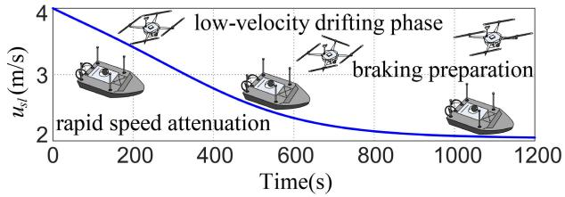  
Fig. 3. The executing status of the USV-UAV for velocity-changing guidance.

## V. NUMERICAL SIMULATIONS

Within this chapter, the velocity-changing path following simulation and the comparison example are conducted to illustrate the efectiveness and superiority of the proposed guidance and control algorithms. A simulation platform based on the MATLAB algorithm logic is used to realize the process for two experiments. The relevant models and parameters for the USV and UAV are described as [15] and [17].

## A. Cooperative Velocity-Changing Path Following

Around the customized desired angular velocity and virtual time-varying navigation velocity, a path following simulation example is finished with external disturbances and internal system uncertainties. Thereinto, introduced in [17], the external disturbances are characterized by time-varying fluctuations in trigonometric functions. Moreover, several reliable initial signals for cooperative system are designed as $\eta _ { 1 \nu } ^ { \mathrm { T } } ( 1 ) ~ = ~ [ 0 \mathrm { m } , 0 \mathrm { m } , 0 \mathrm { m } ] , ~ \eta _ { 2 \nu } ^ { \mathrm { T } } ( 1 ) ~ = ~ [ 0 \mathrm { d e g } , 0 \mathrm { d e g } , 4 7 . 1 \mathrm { d e g } ] .$ $\begin{array} { r l r } { \pmb { \eta } _ { \underline { { 3 } } \nu } ^ { \mathrm { T } } ( 1 ) } & { = } & { [ 0 \mathrm { m } , 0 \mathrm { m } , 4 7 . 1 \mathrm { d e g } ] , } \end{array}$ $\pmb { \eta } _ { 1 } ^ { \mathrm { T } } ( 1 ) = [ - 1 0 \mathrm { m } , 1 0 \mathrm { m } , 0 \mathrm { m } ] ,$ $\begin{array} { r l r } { \eta _ { 2 } ^ { \mathrm { T } } ( 1 ) } & { = } & { [ \mathrm { O d e g } , \mathrm { O d e g } , \mathrm { O d e g } ] , \eta _ { 3 } ^ { \mathrm { T } } ( 1 ) = [ - 1 0 \mathrm { m } , 1 0 \mathrm { m } , \mathrm { O d e g } ] . } \end{array}$ $\nu _ { 1 } ^ { \mathrm { { T } } } ( 1 ) = [ 4 \mathrm { { m } / \mathrm { { s } } , 0 \mathrm { { m } / \mathrm { { s } } , 0 \mathrm { { m } / \mathrm { { s } } } ] , \nu _ { 2 } ^ { \mathrm { { T } } } ( 1 ) = [ 0 r a d / s , 0 r a d / s , 0 r a d / s ] } }$ and $\nu _ { 3 } ^ { \mathrm { T } } ( 1 ) ~ = ~ [ 4 \mathrm { m / s } , 0 \mathrm { m / s } , 0 \mathrm { r a d / s } ]$ . Furthermore, parameters of the velocity-changing function for LVS is designed as $\begin{array} { l l l } { { \left[ \kappa _ { 1 } , \kappa _ { 2 } , \kappa _ { 3 } , \kappa _ { 4 } , \kappa _ { 5 } \right] } } & { { = } } & { { \left[ 2 , - 3 * 1 0 ^ { - 3 } , 0 . 3 , 5 * 1 0 ^ { - 3 } , 2 \right] } } \end{array}$ . Its work efect is shown in the Fig. 3. The utilization of concave function, exhibiting exponentially decaying characteristic, is critically noted in cooperative navigation system for enabling dual-phase velocity management during harbor approach operation. Specifically, rapid speed attenuation is guaranteed through the exponential decay property, while suficient temporal allowance is concurrently preserved for low-velocity drifting phase preceding dynamic braking preparation. This coordinated deceleration manipulation ensures operational safety margin during final berthing maneuvers through systematic potential energy dissipation.

Fig. 4-Fig. 9 illustrate the main efects of relevant control algorithm. Fig. 4 portrays the cooperative navigation trajectories of USV-UAV while cooperative system executing brake reduction in harbor area. As one can observation, the tracking path conducted by USV-UAV can achieve a great fitting result with the guidance reference path generated by LVS-LVA. Fig. 5 depicts the control inputs for USV-UAV with the event-triggered mechanism. On account of the diferences of actuators in heterogeneous collaborative system, the serve system is utilized to transmit the control orders into the actual inputs and act on the actuators in real time. In Fig. 6, fuzzy triggered gains is described with proposed fuzzy control strategy. Obviously, its tendency to converge towards zero over time means that, the fuzzy observation system can process the amplitude chattering caused by triggered signals, so that the transmitted signals gradually become stable. Similarly, the fuzzy adaptive laws with form as gradually stabilizing fluctuation explain that the compensation rate for uncertainty in the nonlinear system is gradually decreasing, see for Fig. 7 and Fig. 8. This also reflects the robustness of control architecture. As for Fig. 9, triggering intervals of control inputs for USV-UAV ar presented to account for the triggered frequency of control order within a certain period of time.

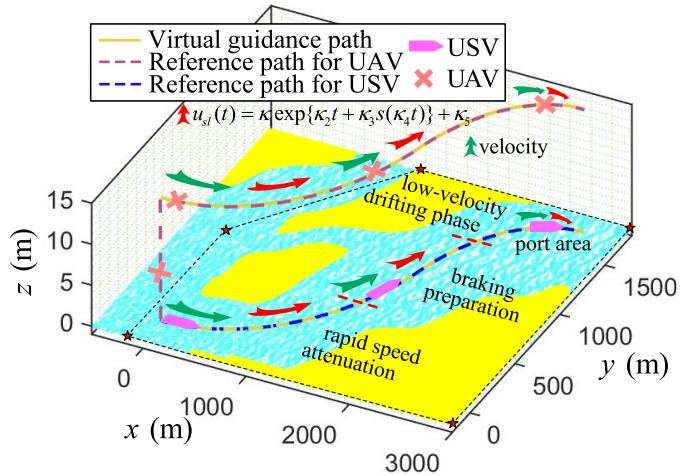  
Fig. 4. 3D simulation trajectory for USV-UAV cooperative system operated by proposed guidance and control algorithms.

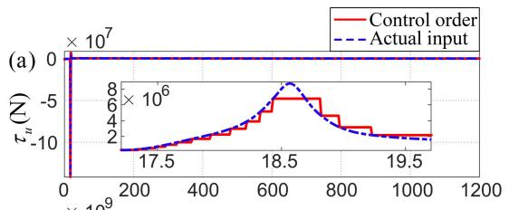

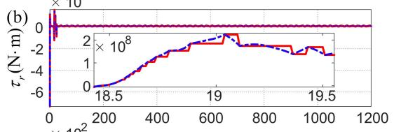

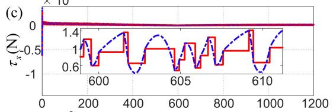

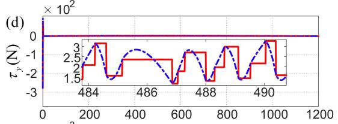

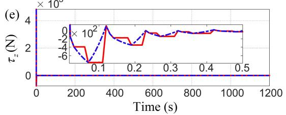  
Fig. 5. Control orders and actual inputs ((a), (b) For USV and (c), (d), (e) For UAV) obtained with the proposed algorithm.

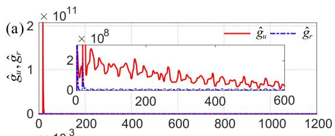

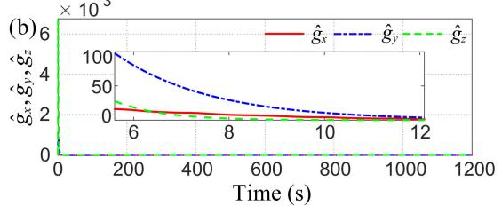  
Fig. 6. Fuzzy triggered gains ((a) For USV and (b) For UAV) obtained with the proposed algorithm.

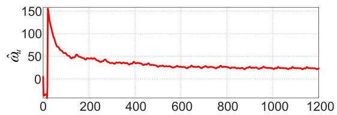

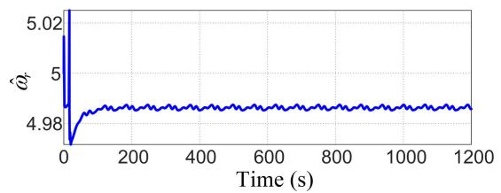  
Fig. 7. Fuzzy adaptive laws for USV obtained with the proposed algorithm.

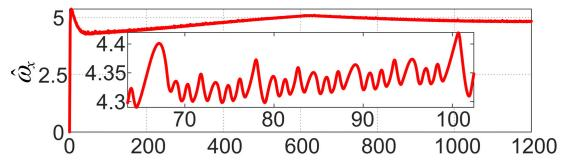

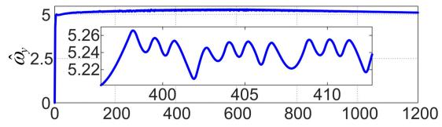

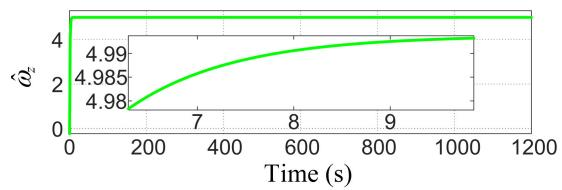  
Fig. 8. Fuzzy adaptive laws for UAV obtained with the proposed algorithm.

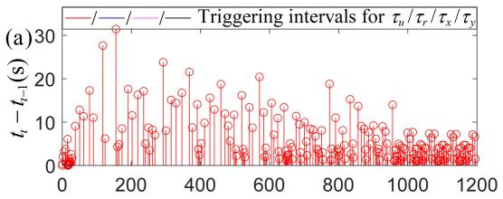

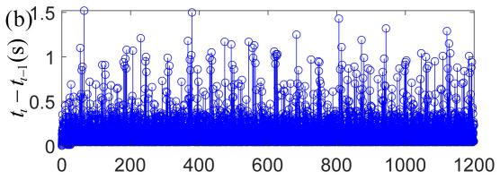

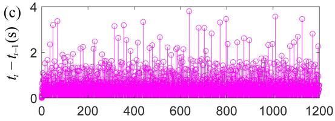

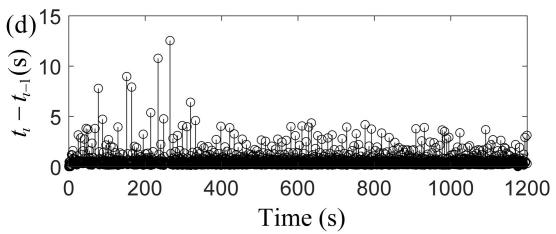  
Fig. 9. Triggering intervals ((a), (b) For USV and (c), (d) For UAV) obtained with the proposed algorithm.

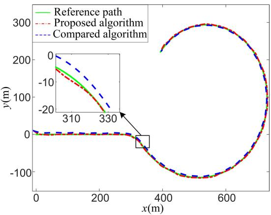  
Fig. 10. Comparison of the following trajectory for USV objected by two algorithms.

## B. Comparison Experiment

In order to highlight the superiority for proposed algorithm in field of the tracking performance and triggered signals amplitude gain, a comparison experiment is carried out between proposed algorithm and compared algorithm chosen in [41].

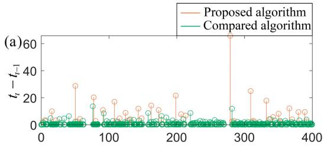

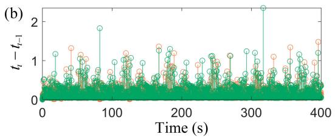  
Fig. 11. Comparison of the triggering intervals for USV ((a) For position input and (b) For attitude input) obtained with two algorithms.

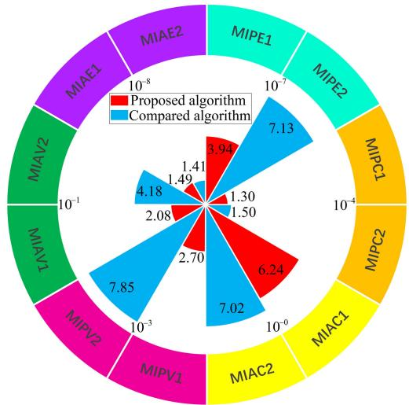  
Fig. 12. Nightingale rose diagram for comparison of the relevant statical data calculated with tow algorithms.

Without loss of generality, the turning simulation experiment for an USV is selected to be comparison. For the sake of clearly indicating the comparison results for relevant data, Fig. 10-Fig. 12 is exhibited in this section. Fig. 10 expresses the comparison of tracking trajectories for turning experiment with tow algorithms. It is not dificult to observe that the tracking accuracy for proposed algorithm is more higher than compared due to its higher trajectory fitting. The triggering frequency of control signals within communication channel is quantitatively determined by analyzing both inter-trigger intervals and event counts over identical operational durations. Consequently, channel loading conditions are assessable through systematic evaluation of signal transmission dynamics to actuator. As evidenced in Fig. 11, comparing existing control algorithm, the proposed algorithm exhibits significantly prolonged average triggering intervals and reduced triggering frequency. This empirical validation provides substantive evidence, that the implemented fuzzy control strategy efectively mitigates signal desynchronization arising from heterogeneous coordination discrepancies under velocity-changing condition, particularly through adaptive rule-weight modulation and nonlinear coupling suppression.

To rigorously quantify the comparative superiority of the proposed control architecture, three performance metrics are formally introduced: the mean integrated absolute error (MIE), mean integrated control input (MIC), and mean integrated input variation (MIV). Then, relevant data is subdivided into position and attitude sections (MIPE, MIAE, MIPC, MIAC, MIPV, MIAV). These indices are computed via the unified framework in (50), and their comparison efect is shown in Fig. 12.

$$
{ \begin{array} { r l } & { { \mathrm { M I A E } } = { \frac { 1 } { t _ { m } - 0 } } \displaystyle \int _ { 0 } ^ { t _ { m } } \| \chi _ { s e } ( t ) \| { \mathrm { d t } } } \\ & { { \mathrm { M I A C } } = { \frac { 1 } { t _ { m } - 0 } } \displaystyle \int _ { 0 } ^ { t _ { m } } \left\| \tau _ { \beta } ( t ) \right\| { \mathrm { d t } } } \\ & { { \mathrm { M I A V } } = { \frac { 1 } { t _ { m } - 0 } } \displaystyle \int _ { 0 } ^ { t _ { m } } \left\| \tau _ { \beta } ( t + 1 ) - \tau _ { \beta } ( t ) \right\| { \mathrm { d t } } } \end{array} }\tag{50}
$$

where $\Lambda = P , A ; \chi = p , \psi ; \beta = u , r .$

Similarly, the quantitative metrics in Fig. 12 conclusively demonstrate the superiority of the proposed algorithm. Compared to [41], our method achieves a reduction of approximately 30–60% in both the mean control input and its variation, indicating significantly lower actuator efort and smoother control signals. This is achieved while simultaneously improving the positional tracking accuracy. The only comparable metric is the attitude error, where our method shows a slight increase. Overall, the data validate that our algorithm delivers superior comprehensive performance, characterized by high tracking accuracy and low control cost.

## VI. CONCLUSION

In this paper, the improved guidance principle and control strategy are presented within the harbor-approaching operation circumstance. For the guidance part, a useful velocitychanging guidance principle is introduced to achieve the safety navigation standard in port. As for the control part, an adaptive event-triggered-based fuzzy state observer control strategy is indicated by incorporating FLS and threshold gain mechanism, improving the stability of amplitude gain and signal transmission. From the numerical results, obviously, proposed control algorithm is characteristic of the high precision and eficiency for path following as well as the low dissipation and high robustness for control architecture.

Future research will therefore focus on experimental validation with physical platforms, extending the framework for complex multi-agent tasks, and enhancing the resilience of mechanism to actual communication imperfections.

## ACKNOWLEDGMENT

The authors would like to thank anonymous reviewers for their valuable comments. They also sincerely thank the Editor-in-Chief, an Associate Editor, and reviewers for their valuable time spent and constructive feedback during the review process.

## REFERENCES

[1] X. Wu, B. Xiao, and Y. Qu, “Modeling and sliding mode-based attitude tracking control of a quadrotor UAV with time-varying mass,” ISA Trans., vol. 124, pp. 436–443, May 2022.

[2] M. Labbadi and M. Cherkaoui, “Robust adaptive backstepping fast terminal sliding mode controller for uncertain quadrotor UAV,” Aerosp. Sci. Technol., vol. 93, Oct. 2019, Art. no. 105306.

[3] W. Wu, S. Tong, and Y. Li, “Fuzzy adaptive tracking control for switched nonlinear systems with full time-varying state constraints,” Neurocomputing, vol. 352, pp. 1–11, Aug. 2019.

[4] J. Qin and J. Du, “Robust adaptive asymptotic trajectory tracking control for underactuated surface vessels subject to unknown dynamics and input saturation,” J. Mar. Sci. Technol., vol. 27, no. 1, pp. 307–319, Mar. 2022.

[5] J. Li, G. Zhang, C. Liu, and W. Zhang, “COLREGs-constrained adaptive fuzzy event-triggered control for underactuated surface vessels with the actuator failures,” IEEE Trans. Fuzzy Syst., vol. 29, no. 12, pp. 3822–3832, Dec. 2021.

[6] G. Shao, Y. Ma, R. Malekian, X. Yan, and Z. Li, “A novel cooperative platform design for coupled USV–UAV systems,” IEEE Trans. Ind. Informat., vol. 15, no. 9, pp. 4913–4922, Sep. 2019.

[7] S. Wang, M. Sun, Y. Xu, J. Liu, and C. Sun, “Predictor-based fixedtime LOS path following control of underactuated USV with unknown disturbances,” IEEE Trans. Intell. Vehicles, vol. 8, no. 3, pp. 2088–2096, Mar. 2023.

[8] Y. Wang, W. Liu, J. Liu, and C. Sun, “Cooperative USV–UAV marine search and rescue with visual navigation and reinforcement learningbased control,” ISA Trans., vol. 137, pp. 222–235, Jun. 2023.

[9] W. Wei, J. Wang, Z. Fang, J. Chen, Y. Ren, and Y. Dong, “3U: Joint design of UAV-USV-UUV networks for cooperative target hunting,” IEEE Trans. Veh. Technol., vol. 72, no. 3, pp. 4085–4090, Mar. 2023.

[10] J. Xin, S. Li, J. Sheng, Y. Zhang, and Y. Cui, “Application of improved particle swarm optimization for navigation of unmanned surface vehicles,” Sensors, vol. 19, no. 14, p. 3096, Jul. 2019.

[11] H. Li, Z. Liu, J. Huang, X. An, and Y. Chen, “An improved ESObased line-of-sight guidance law for path following of underactuated autonomous underwater helicopter with nonlinear tracking diferentiator and anti-saturation controller,” Ocean Eng., vol. 322, Apr. 2025, Art. no. 120456.

[12] J. Li, G. Zhang, D. Cabecinhas, A. M. Pascoal, and W. Zhang, “Prescribed performance path following control of USVs via an outputbased threshold rule,” IEEE Trans. Veh. Technol., vol. 73, no. 5, pp. 6171–6182, May 2024.

[13] C. Wang, X. Zhang, H. Gao, M. Bashir, H. Li, and Z. Yang, “COLERGsconstrained safe reinforcement learning for realising MASS’s riskinformed collision avoidance decision making,” Knowledge-Based Syst., vol. 300, Sep. 2024, Art. no. 112205.

[14] Y. Liu, J. Yan, and X. Zhao, “Deep reinforcement learning based latency minimization for mobile edge computing with virtualization in maritime UAV communication network,” IEEE Trans. Veh. Technol., vol. 71, no. 4, pp. 4225–4236, Apr. 2022.

[15] J. Li, G. Zhang, and B. Li, “Robust adaptive neural cooperative control for the USV-UAV based on the LVS-LVA guidance principle,” J. Mar. Sci. Eng., vol. 10, no. 1, p. 51, Jan. 2022.

[16] N. Wang, X. Liang, Z. Li, Y. Hou, and A. Yang, “PSE-D model-based cooperative path planning for UAV and USV systems in antisubmarine search missions,” IEEE Trans. Aerosp. Electron. Syst., vol. 60, no. 5, pp. 6224–6240, Oct. 2024.

[17] J. Li, G. Zhang, W. Zhang, Q. Shan, and W. Zhang, “Cooperative path following control of USV-UAVs considering low design complexity and command transmission requirements,” IEEE Trans. Intell. Vehicles, vol. 9, no. 1, pp. 715–724, Jan. 2024.

[18] N. Gu, D. Wang, Z. Peng, J. Wang, and Q.-L. Han, “Advances in lineof-sight guidance for path following of autonomous marine vehicles: An overview,” IEEE Trans. Syst., Man, Cybern., Syst., vol. 53, no. 1, pp. 12–28, Jan. 2023.

[19] T. Lyu, H. Xu, F. Liu, M. Li, L. Li, and Z. Han, “Computing ofloading and resource allocation of NOMA-based UAV emergency communication in marine Internet of Things,” IEEE Internet Things J., vol. 11, no. 9, pp. 15571–15586, May 2024.

[20] Y. Huang, M. Zhu, Z. Zheng, and K. H. Low, “Homography-based visual servoing for underactuated VTOL UAVs tracking a 6-DOF moving ship,” IEEE Trans. Veh. Technol., vol. 71, no. 3, pp. 2385–2398, Mar. 2022.

[21] W. Chang, Y. Li, and S. Tong, “Adaptive fuzzy backstepping tracking control for flexible robotic manipulator,” IEEE/CAA J. Autom. Sinica, vol. 8, no. 12, pp. 1923–1930, Dec. 2021.

[22] X. Yang, J. Yan, C. Chen, C. Hua, and X. Guan, “Adaptive asymptotic tracking control for underactuated autonomous underwater vehicles with state constraints,” IEEE Trans. Intell. Transp. Syst., vol. 25, no. 11, pp. 18485–18500, Nov. 2024.

[23] W. Song, Y. Zuo, and S. Tong, “Switching event-triggered fuzzy resilient control for networked unmanned surface vehicle under denial of service attacks,” Ocean Eng., vol. 323, Apr. 2025, Art. no. 120592.

[24] Z. Gu, C. K. Ahn, S. Yan, X. Xie, and D. Yue, “Event-triggered filter design based on average measurement output for networked unmanned surface vehicles,” IEEE Trans. Circuits Syst. II, Exp. Briefs, vol. 69, no. 9, pp. 3804–3808, Sep. 2022.

[25] H. Shen, G. Wen, Y. Lv, and J. Zhou, “A stochastic event-triggered robust unscented Kalman filter-based USV parameter estimation,” IEEE Trans. Ind. Electron., vol. 71, no. 9, pp. 11272–11282, Sep. 2024.

[26] B. Sui, J. Zhang, and Z. Liu, “Event triggered prescribed time trajectory tracking control for unmanned surface vessels with lumped disturbances and prescribed performance constraints,” Sci. Rep., vol. 15, no. 1, Mar. 2025, Art. no. 8157.

[27] Y. Ma, X. Qi, Z. Li, S. Hu, and M. A. Sotelo, “Resilient control´ for networked unmanned surface vehicles with dynamic event-triggered mechanism under aperiodic DoS attacks,” IEEE Trans. Veh. Technol., vol. 73, no. 4, pp. 5824–5833, Apr. 2024.

[28] S. Dong, K. Liu, M. Liu, and G. Chen, “Cooperative time-varying formation fuzzy tracking control of multiple heterogeneous uncertain marine surface vehicles with actuator failures,” IEEE Trans. Cybern., vol. 54, no. 2, pp. 667–678, Feb. 2024.

[29] W. Song, Y. Li, and S. Tong, “Fuzzy finite-time H∞ hybrid-triggered dynamic positioning control of nonlinear unmanned marine vehicles under cyber-attacks,” IEEE Trans. Intell. Vehicles, vol. 9, no. 1, pp. 970–980, Jan. 2024.

[30] X. Gao, Y. Long, T. Li, X. Hu, C. L. P. Chen, and F. Sun, “Optimal fuzzy output feedback control for dynamic positioning of vessels with finite-time disturbance rejection under thruster saturations,” IEEE Trans. Fuzzy Syst., vol. 31, no. 10, pp. 3447–3458, Oct. 2023.

[31] G. Wu, M. Zhao, Y. Cong, Z. Hu, and G. Li, “Algorithm of berthing and maneuvering for catamaran unmanned surface vehicle based on ship maneuverability,” J. Mar. Sci. Eng., vol. 9, no. 3, p. 289, Mar. 2021.

[32] L. Zhao, Z. Li, H. Li, and B. Liu, “Backstepping integral sliding mode control for pneumatic manipulators via adaptive extended state observers,” ISA Trans., vol. 144, pp. 374–384, Jan. 2023.

[33] H. Zhou, Y. Zuo, and S. Tong, “Distributed fuzzy formation control for nonlinear multiagent systems under communication delays and switching topology,” IEEE Trans. Fuzzy Syst., vol. 33, no. 2, pp. 779–788, Feb. 2025.

[34] J. Li, G. Zhang, Q. Shan, and W. Zhang, “A novel cooperative design for USV–UAV systems: 3-D mapping guidance and adaptive fuzzy control,” IEEE Trans. Control Netw. Syst., vol. 10, no. 2, pp. 564–574, Jun. 2023.

[35] A. Bentaleb, M. Lim, M. N. Akcay, A. C. Begen, and R. Zimmermann, “Bitrate adaptation and guidance with meta reinforcement learning,” IEEE Trans. Mobile Comput., vol. 23, no. 11, pp. 10378–10392, Nov. 2024.

[36] F. Zhang, B. Huang, and P. Huang, “Adaptive predefined-time dual-channel event-triggered deployment control of triangle space tethered system,” IEEE Trans. Aerosp. Electron. Syst., vol. 61, no. 2, pp. 4796–4807, Apr. 2025.

[37] S. Tong, X. Min, and Y. Li, “Observer-based adaptive fuzzy tracking control for strict-feedback nonlinear systems with unknown control gain functions,” IEEE Trans. Cybern., vol. 50, no. 9, pp. 3903–3913, Sep. 2020.

[38] X. Gao, T. Li, L. Yuan, and W. Bai, “Robust fuzzy adaptive output feedback optimal tracking control for dynamic positioning of marine vessels with unknown disturbances and uncertain dynamics,” Int. J. Fuzzy Syst., vol. 23, no. 7, pp. 2283–2296, Oct. 2021.

[39] H. Lin, J. Dong, H.-B. Zeng, and J. H. Park, “Stability analysis of delayed neural networks via a time-varying Lyapunov functional,” IEEE Trans. Syst., Man, Cybern., Syst., vol. 54, no. 4, pp. 2563–2575, Apr. 2024.

[40] Y. Kawano and B. Besselink, “Incremental versus diferential approaches to exponential stability and passivity,” IEEE Trans. Autom. Control, vol. 69, no. 9, pp. 6450–6457, Sep. 2024.

[41] H. Zhang, X. Zhang, H. Xu, and C. G. Soares, “Cooperative path following control of USV-UAVs with genetic algorithm extended state observer,” Ocean Eng., vol. 320, Mar. 2025, Art. no. 120332.

Guoqing Zhang (Member, IEEE) received the B.S. degree in marine technology and the Ph.D. degree in trafic information engineering and control from the Navigation College, Dalian Maritime University (DMU), Dalian, China, in 2010 and 2015, respectively.

He joined DMU in 2016 as a Lecturer, then took the research work as a Post-Doctoral Fellow with Shanghai Jiao Tong University, Shanghai, China. He has been a Doctorial Supervisor and a Professor with DMU since 2020 and 2022, respectively. His

current research interests include adaptive control, nonlinear control, and their application on the intelligent transportation systems.

Dr. Zhang was a recipient of the National Post-Doctoral Innovative Talent Scholars of China, the Ocean Engineering Technology Award (Second Class), and the National Excellent Doctoral Dissertation Award in the field of Intelligent Transportation.

Haoyu Zhao was born in Linyi, Shandong, China, in 2002. He received the B.S. degree in marine technology from Guangzhou Maritime University (GMU), Guangzhou, China, in 2024. He is currently pursuing the M.S. degree in trafic information engineering and control with Dalian Maritime Universit (DMU), Dalian, China.

His research interests include adaptive control, nonlinear control, multi-agent cooperative control, and their applications on intelligent vehicles.

Jiqiang Li (Member, IEEE) received the B.S. degree in marine technology and the M.S. degree in transportation engineering from Dalian Maritime University (DMU), Dalian, China, in 2018 and 2021, respectively, where he is currently pursuing the Ph.D. degree in trafic information engineering and control.

From 2023 to 2024, he was a Visiting Scholar with the Instituto Superior Tecnico, Universidade de Lisboa, Lisbon, Portugal. His research interests include adaptive control, neural control, nonlinear control, and their applications on intelligent vehicles.

Weidong Zhang (Senior Member, IEEE) received the B.S. degree in measurement technology and instruments, the M.S. degree in applied electronic technology, and the Ph.D. degree in control theory and its application from Zhejiang University, Hangzhou, China, in 1990, 1993, and 1996, respectively.

He was a Post-Doctoral Fellow with Shanghai Jiao Tong University, Shanghai, China. In 1998, he joined Shanghai Jiao Tong University as an Associate Professor and since 1999, he has been a Full Professor.

From 2003 to 2004, he was an Alexander von Humboldt Fellow with the University of Stuttgart, Stuttgart, Germany. In 2011, he became the Chair Professor at Shanghai Jiao Tong University. He is currently the Director of the Engineering Research Center of Marine Automation, Shanghai Municipal Education Commission, Shanghai, and the Deputy Dean of the Department of Automation, Shanghai Jiao Tong University. He is the author of more than 300 refereed papers and a book, and holds 32 patents. His research interests include control theory and its applications in industry and ocean engineering.

Prof. Zhang was a recipient of the National Science Fund for Distinguished Young Scholars of China.