# Adaptive Routing for Flying Ad Hoc Network using Evolvable Route Expiration Time

Liyou Deng, Zhiyuan Wang, Shan Zhang, Xiaohan Qiu, Mingsheng Tang, Fusang Zhang, and Hongbin Luo

Abstract—Flying ad hoc network (FANET) consists of unmanned aerial vehicles (UAVs) and can provide robust connectivity in various scenarios (e.g., search-and-rescue and emergency communications). Routing is crucial to unleash the potential of FANET. Existing routing approaches are either host-centric (e.g., AODV) or content-centric (e.g., NDNF and LFBL). To the best of our knowledge, only a few studies attempt to integrate the two routing paradigms, but fail to exploit their complementary strengths. This paper proposes the Evolvable Route Expiration Time (eRET) framework, which allows each UAV node to dynamically adjust its routing paradigm by properly configuring the route expiration time (RET). Specifically, this paper first derives key insights into routing adaptability across different FANET environments. Building on these insights, the proposed eRET framework comprises (i) a distributed environment perception mechanism that enables each UAV node to perceive the topology dynamics, traffic load, and request pattern of the FANET, and (ii) a RET evolution policy that updates the route expiration time to guide UAV nodes toward a suitable routing paradigm. Packet-level simulation results show that eRET outperforms state-of-the-art host-centric and content-centric routing protocols. In a representative search-and-rescue scenario, eRET reduces total packet loss by up to 52.91% and 65.24% compared to AODV and NDNF, respectively.

Index Terms—Flying ad hoc network (FANET), hybrid routing, content-centric, host-centric, distributed perception

## 1 INTRODUCTION

## 1.1 Background and Motivation

Unmanned Aerial Vehicle (UAV) swarm represents a prominent form of flying ad hoc network (FANET), which has garnered increasing attention in recent years [1]. Many companies (e.g., DJI [2], Northrop Grumman [3], and Thales [4]) have launched ambitious initiatives to advance UAV swarm technologies. According to market research by ECON [5], the global UAV swarm market is projected to reach 657.86 million USD by 2032. Driven by their wide coverage, operational flexibility, and autonomous capabilities, UAV swarms have been increasingly deployed in scenarios such as disaster rescue [6], agricultural production [7], and the establishment of communication networks [8].

To unleash the potential of UAV swarms, it is necessary to adopt a proper networking architecture for UAV swarms. Existing research on UAV swarm networking can be broadly classified into three categories. First, the early studies adopt host-centric networking architectures (e.g., IP-based), which rely on routing tables to forward data. Ad hoc On-Demand Distance Vector Routing (AODV), proposed by Perkins and Royer in [9], is one of the well-known host-centric routing protocols for FANET. Later on, there have been several improved versions (e.g., [10]–[13]). Hostcentric routing tends to maintain stable end-to-end paths for transmission, which becomes inefficient in a dynamic topology. Second, following the Named-Data Networking (NDN), some researchers have explored content-centric networking architectures for UAV swarms. Typical proposals include NDNF [14], LFBL [15], and E-CHANET [16]. Different from host-centric approaches, content-centric networking architectures do not maintain routing tables. Instead, they retrieve content by flooding Interest packets and then forwarding Data packets along the reverse paths recorded by the Pending Interest Table (PIT) of on-path routers. It is usually believed that content-centric networking architectures can handle frequent topology changes better than host-centric architectures. Third, a few studies propose to integrate host-centric and content-centric networking architectures, by incorporating routing tables into the Interest forwarding process of content-centric architectures. Typical solutions include the Hybrid IP-Information networking framework (HII) [17] and Integrated Host- and Content-centric Routing (IHCR) [18].

Although the two studies [17], [18] have demonstrated the benefits of integrating host-centric and content-centric networking architectures, a simple integration of these architectures remains insufficient to support efficient UAV swarm networking. Accordingly, this paper advocates that dynamic evolution between host-centric and contentcentric networking architectures is necessary. This argument is based on the following two considerations:

The FANET environment is complex and heavily depends on real-world usage of UAV swarms. For example, in a search-and-rescue mission, the UAV swarm exhibits a dynamic topology during the search phase to locate survivors, then transitions to a more stable topology during the rescue phase to facilitate reliable communication [19].

The host-centric and content-centric networking architectures fit different FANET environments. The integration of these architectures may mitigate their drawbacks, but unavoidably reduces their respective advantages [20].

To this end, this paper aims to develop a UAV swarm networking architecture that dynamically evolves between host-centric and content-centric architectures according to the time-varying requirements of UAV swarms. To achieve this goal, it is essential to systematically address the following key questions:

Question 1. Which kind of FANET environment favors hostcentric routing (or content-centric routing)?

To address Question 1, it is necessary to consider network topology dynamics, traffic load, and request pattern as the FANET environment. This paper quantifies each dimension and examines how node speed, traffic load intensity, and content-sharing degree affect the effectiveness of hostcentric and content-centric networking architectures. With the obtained insights, the next key question is

Question 2. How to strike the right balance between host-centric and content-centric routing for UAV swarms?

In real-world operations, completely replacing an installed networking architecture is of great overhead and also challenging. Therefore, to address Question 2, it is necessary to properly integrate the two networking architectures, thereby enabling UAV swarms to flexibly balance the two paradigms based on the perceived FANET environment.

## 1.2 Main Results and Key Contributions

This paper investigates the adaptation of routing paradigms in FANET and enables each UAV node to perceive the FANET environment and select a suitable routing paradigm accordingly. Specifically, the paper focuses on two typical routing paradigms, i.e., host-centric routing and content-centric routing. It examines their adaptability under different FANET environments and investigates environment perception and paradigm switching. The main results and key contributions are as follows:

An Adaptive Routing Framework for FANET: This paper proposes the eRET framework for FANET, which allows each UAV node to select and adjust its routing paradigm (between host-centric and content-centric ones) dynamically by configuring the route expiration time (RET). To the best of our knowledge, this is the first adaptive routing framework that enables FANET to evolve between host-centric and contentcentric routing based on real-time operational needs.

Insights into Routing Adaptability in FANET: This paper provides key insights into how different FANET environments affect the dominant routing paradigm. Specifically, host-centric routing exhibits superior adaptability in the FANET environment with lowspeed nodes, heavy-load traffic, and a low-contentsharing-degree pattern. In contrast, content-centric routing performs better in the FANET environment with high-speed nodes, light-load traffic, and a highcontent-sharing-degree pattern. These insights guide the subsequent design of the eRET framework.

Design of eRET Framework: This paper presents a distributed FANET environment perception mechanism that enables each UAV node to perceive the topology dynamics, traffic load, and request pattern. Based on this perception, this paper develops an evolution policy that adjusts the route expiration time, enabling nodes to adapt to the most suitable routing paradigm under time-varying FANET environments.

Packet-Level Evaluation: This paper evaluates the performance of the eRET framework through packetlevel simulations in OMNeT++ using real-world traces from a search-and-rescue scenario. Results show that eRET outperforms state-of-the-art hostcentric AODV and content-centric NDNF by up to 52.91% and 65.24% in packet loss, respectively.

The rest of this paper is organized as follows. Section 2 provides some preliminary results on FANET routing. Section 3 investigates the routing adaptability in FANET. Section 4 presents the design of the eRET framework. Section 5 presents the packet-level evaluation results. Section 6 and Section 7 discuss open problems and related works, respectively. Section 8 concludes the paper.

## 2 PRELIMINARY RESULTS

This section presents preliminary results on routing mechanisms in FANET. It briefly introduces the host-centric, content-centric, and hybrid routing paradigms.

## 2.1 Host-Centric Routing in FANET

Host-centric routing mechanisms forward request or content packets based on routing tables that record the host reachability information. Hosts are typically identified by a unique IP address or node identifier. The host reachability information in the routing tables can be either proactively maintained or reactively gathered during route discovery. Proactive host-centric routing (e.g., [21]–[23]) relies on periodic updates, which often incur significant overhead in FANET [24]. Reactive host-centric routing (e.g., [9], [12], [25]) tends to discover routes only when needed, which is generally considered to be more adaptable to topology changes in FANET.

AODV is one of the most extensively studied reactive host-centric routing mechanisms in FANET [9]. In AODV, routing tables are created dynamically based on data transmission demand. When a UAV node requires a route to a destination, it broadcasts a Route Request (RREQ) packet to initiate route discovery. Upon receiving the RREQ, the destination node unicasts a Route Reply (RREP) packet back to the source, allowing intermediate nodes to record the route. Subsequently, data packets are forwarded along the established route. Furthermore, Active Route Timeout (ART) defines the validity period of each routing entry. The expiration of an entry invalidates the route, triggering rediscovery if needed [26]. However, if a routing entry remains valid in the table while the actual route has already broken, then packets may be forwarded to unreachable nodes, resulting in packet loss. Therefore, more frequent topology changes accelerate the invalidation of route entries and increase the probability of packet loss.

To sum up, host-centric routing relies on pre-established routes (in routing tables), which is efficient when the network topology is stable. However, frequent topology changes in FANET significantly increase the challenge of maintaining end-to-end routes.

## 2.2 Content-Centric Routing in FANET

Content-centric routing retrieves data based on content names rather than the host identifiers. Specifically, a content consumer broadcasts a request packet (also known as the Interest packet in NDN) to discover and retrieve the desired content from any available node in the network, regardless of the specific host. That is, content-centric routing does not require dedicated routing protocols [27], but relies on stateful forwarding strategies in two stages:

Content Discovery: Most content-centric routing mechanisms flood Interest packets to discover the requested content.

Content Delivery: Upon receiving an Interest packet, the content provider returns the requested content. Intermediate nodes may cache the forwarded contents, enabling fast retrieval for future requests for the same content.

The following subsection briefly introduces two contentcentric routing mechanisms (e.g., NDNF and LFBL) in FANET that differ in their content forwarding strategies.

NDNF is the foundational forwarding mechanism for NDN in dynamic environments [14], [28]. In NDNF, the source node broadcasts Interest packets to discover the desired content. Intermediate nodes forward these Interest packets and record the content name in their Pending Interest Table (PIT). Each PIT entry tracks the upstream node from which the Interest was received. When the content is found, it is returned to the requester along the reverse path, as recorded in the PITs of intermediate nodes.

LFBL is another content-centric routing mechanism developed for FANET [15]. It relies on broadcast communication for all packets and employs smart-flooding through a dedicated Distance Table (DT). In content discovery, intermediate nodes record distance information to prioritize content forwarding. In content delivery, LFBL adopts a receiverdriven strategy, allowing each receiver to decide whether to broadcast the content packet based on its DT. This approach differs from NDNF’s sender-driven unicast delivery and improves resilience to mobility through multi-path content delivery. However, LFBL’s broadcast-based communication can lead to high packet collisions in the shared wireless medium.1 As shown in Fig. 1, the packet delivery ratio of LFBL remains consistently lower than that of NDNF under a single transmission pair across varying node speeds and request intervals. Therefore, this paper uses NDNF as the representative content-centric routing mechanism.

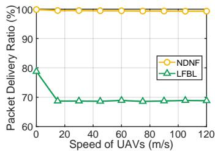  
(a) Request interval: 2s

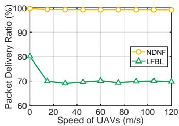  
(b) Request interval: 0.3s  
Fig. 1: PDR achieved by NDNF and LFBL

To sum up, content-centric routing leverages Interest flooding and stateful forwarding to achieve efficient adaptation to dynamic topologies. However, Interest flooding also introduces significant overhead in heavy-load scenarios.

## 2.3 Hybrid Routing in FANET

Hybrid routing mechanisms aim to integrate host-centric and content-centric paradigms by mapping content names to host identifiers in routing tables. This enables Interest packets to be forwarded using one of the following strategies:

If the routing table contains a route to the contentproducing host, the requester sends the Interest packet along this route to the corresponding host. This process resembles the behavior of host-centric routing.

If the routing table does not contain a route to the content-producing host, the requester broadcasts the Interest packet to discover the content. This process resembles the behavior of content-centric routing.

The choice between the two strategies is closely related to the Route Expiration Time (RET). Intuitively, a small RET increases the probability that the route has already expired, leading to broadcast-based discovery. In contrast, a large RET makes it more likely that the Interest packet can be forwarded along an established route. To the best of our knowledge, there are only two hybrid routing mechanisms for FANET, i.e., HII and IHCR.

HII is an integration of proactive host-centric routing and content-centric routing mechanisms [17]. It employs periodic routing maintenance and content advertisement to maintain the mapping from content names to host identifiers within the routing table. However, such periodic updates often incur significant overhead in FANET.

IHCR is another integration of reactive host-centric routing and content-centric routing mechanisms for FANET [18]. It embeds host identifiers (NID) into content names using the format NID:N, thereby enabling a natural mapping from content names to host identifiers. During both content discovery and delivery, IHCR establishes and updates routes to the content-producing host by leveraging the NID embedded in the content name. In IHCR, the RET is statically preset and uniformly applied across all nodes, limiting its adaptability to time-varying FANET environments. Let IHCR(T ) denote the IHCR mechanism whose RET is set to T seconds.

Table 1 summarizes the main differences among hybrid routing mechanisms in FANET. Existing hybrid routing mechanisms provide a foundation for integrating hostcentric and content-centric routing paradigms. Building on this foundation, this paper investigates the dynamic evolution between the two paradigms.

## 3 ROUTING ADAPTABILITY IN FANET

Building on the routing paradigms discussed in Section 2, this section investigates the adaptability of these routing approaches in FANET. First, Section 3.1 defines the specific FANET environment considered in this work. Then, Section 3.2, Section 3.3, and Section 3.4 analyze routing adaptability with respect to topology dynamics, traffic load, and request pattern, respectively.

## 3.1 FANET Environment

In general, formally defining the FANET environment is challenging due to its dynamic and heterogeneous nature. This paper focuses the analysis on three key aspects: topology dynamics, traffic load, and request pattern.

Topology Dynamics: Due to the inherent mobility of UAVs, FANET exhibits dynamic topologies. The magnitude of topology dynamics primarily depends on the relative speed of UAV nodes, referred to as node speed for convenience. Intuitively, high node speed indicates strong topology dynamics, typically corresponding to scenarios involving formation changes. Conversely, low node speed indicates weak topology dynamics, typically corresponding to the formation-flying scenarios.

Traffic Load: In addition to topology dynamics, traffic conditions also influence the performance of routing mechanisms in FANET [30]. While traffic conditions can be characterized in various ways, this discussion narrows to traffic load, which depends on the content request interval and the number of transmission pairs (i.e., data flows). Traffic load plays a critical role in determining the suitability of host-centric versus content-centric routing paradigms. Intuitively, routing mechanisms that generate a high volume of broadcast packets tend to perform poorly under heavy load due to increased packet collisions.

Request Pattern: In content-sharing scenarios (e.g., map sharing in FANET), the request pattern has a significant impact on routing performance, even under the same traffic load [31]. This paper introduces the content-sharing degree, defined as the number of consumers requesting the same content from a single content provider. A high contentsharing degree leads to a concentrated request pattern, commonly observed in centralized task scenarios. In contrast, a low content-sharing degree results in more distributed traffic, commonly observed in decentralized tasks.

The evaluation investigates the adaptability of different routing paradigms in FANET through packet-level simulations using OMNeT++. The important simulation parameters are listed in Table 2 unless otherwise stated. This paper focuses on three representative routing approaches: hostcentric AODV, content-centric NDNF, and hybrid IHCR. The following subsections present the impact of the three aspects on routing performance.

TABLE 2: Simulation parameters
<table><tr><td rowspan=1 colspan=1>Simulation Parameters</td><td rowspan=1 colspan=1>Settings</td></tr><tr><td rowspan=1 colspan=1>Playground Size</td><td rowspan=1 colspan=1>800m × 800m</td></tr><tr><td rowspan=1 colspan=1>IEEE 802.11std</td><td rowspan=1 colspan=1>802.11ac (5GHz)</td></tr><tr><td rowspan=1 colspan=1>Transmitter Power</td><td rowspan=1 colspan=1>12mW</td></tr><tr><td rowspan=1 colspan=1>Receiver Sensitivity</td><td rowspan=1 colspan=1>-85dBm</td></tr><tr><td rowspan=1 colspan=1>Receiver SNIR Threshold</td><td rowspan=1 colspan=1>4dB</td></tr><tr><td rowspan=1 colspan=1>DATA Packet Size</td><td rowspan=1 colspan=1>1000 Bytes</td></tr><tr><td rowspan=1 colspan=1>Mobility Model</td><td rowspan=1 colspan=1>Random Waypoint</td></tr><tr><td rowspan=1 colspan=1>Pause Time</td><td rowspan=1 colspan=1>0s</td></tr><tr><td rowspan=1 colspan=1>Number of Nodes</td><td rowspan=1 colspan=1>64</td></tr><tr><td rowspan=1 colspan=1>Speed</td><td rowspan=1 colspan=1>0-120m/s</td></tr><tr><td rowspan=1 colspan=1>Number of Transmission Pairs</td><td rowspan=1 colspan=1>1-12</td></tr><tr><td rowspan=1 colspan=1>Send Interval</td><td rowspan=1 colspan=1>24-1000ms</td></tr><tr><td rowspan=1 colspan=1>Content-Sharing Degree</td><td rowspan=1 colspan=1>1-24</td></tr><tr><td rowspan=1 colspan=1>Simulation Time</td><td rowspan=1 colspan=1>400s</td></tr><tr><td rowspan=1 colspan=1>Number of Simulation Runs</td><td rowspan=1 colspan=1>100</td></tr></table>

## 3.2 Topology Dynamics

This subsection focuses on the topology feature in FANET and investigates the impact of node speed. In the packet-level simulations, we vary the node speed to control the magnitude of topology dynamics. Fig. 2 shows the packet delivery ratio (PDR). Specifically, Fig. 2(a) corresponds to the case with one provider and one consumer, i.e., P1C1. Fig. 2(b) corresponds to the case with 12 providers and 12 consumers, i.e., P12C12. The content request interval is 300ms, and the content-sharing degree is 1 in both cases. Fig. 2 yields the following observations.

Observation 1. As the node speed increases, the PDR achieved by host-centric AODV decreases significantly, while the PDR achieved by content-centric NDNF decreases slightly.

Observation 1 indicates that host-centric AODV is less capable of handling dynamic topology (caused by high mobility) in FANET, compared to content-centric NDNF.

Observation 2. When the traffic load increases (from P1C1 to P12C12), the PDR achieved by content-centric NDNF decreases, while the PDR achieved by host-centric AODV remains almost the same.

Observation 2 indicates that content-centric NDNF is more sensitive to increased traffic load and less effective in heavy-load FANET environments than host-centric AODV. Section 3.3 further analyzes the impact of traffic load.

Observation 3. When the node speed varies, the PDRs achieved by host-centric AODV and hybrid IHCR(3s) are almost identical. Similarly, the PDRs achieved by content-centric NDNF and hybrid IHCR(0s) are also closely aligned.

Observation 3 indicates that with an appropriate configuration of the route expiration time (RET), a hybrid routing mechanism (e.g., IHCR or HII) can achieve PDR comparable to AODV and NDNF under varying node speeds. This motivates the design of eRET in Section 4, enabling the routing mechanism to evolve with changes in FANET environments.

TABLE 1: Comparison of hybrid routing mechanisms in FANET
<table><tr><td>Mechanism</td><td>Integration</td><td>Key Characteristic</td><td>Coupling Basis</td></tr><tr><td>HII [17]</td><td>Proactive host-centric and content-centric routing</td><td>Periodic route maintenance and content advertisement</td><td>Static coupling</td></tr><tr><td>IHCR [18]</td><td>Reactive host-centric and content-centric routing</td><td>On-demand route establishment and hybrid content request depending on route validity</td><td>Fixed RET</td></tr><tr><td>eRET</td><td>Reactive host-centric and content-centric routing</td><td>On-demand route establishment and hybrid content request depending on route validity</td><td>Evolvable RET</td></tr></table>

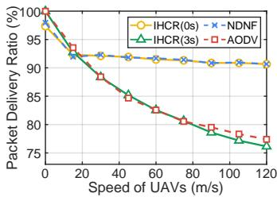  
(a) P1C1 traffic

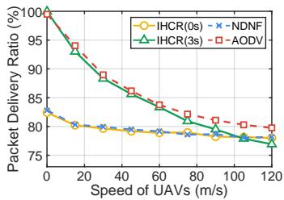  
(b) P12C12 traffic  
Fig. 2: Impact of node speed under different traffic loads

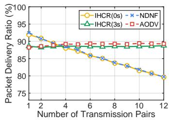  
(a) Request interval: 300ms

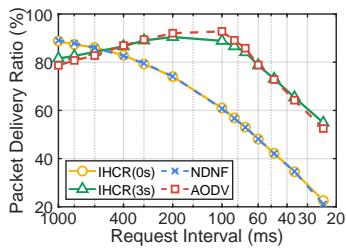  
(b) Transmission pair: P12C12  
Fig. 3: Impact of traffic load at 30m/s node speed

## 3.3 Traffic Load

This subsection investigates the impact of traffic load on routing mechanisms in FANET. In the packet-level simulations, we vary the traffic load by adjusting the number of transmission pairs and the interval between content requests. Fig. 3(a) shows the PDR under different numbers of transmission pairs, with the request interval fixed at 300ms. Fig. 3(b) shows the PDR under different request intervals, given twelve transmission pairs (i.e., P12C12). The node speed is 30m/s, and the content-sharing degree is 1 in both cases. Fig. 3 yields the following observations.

Observation 4. As the number of transmission pairs increases in Fig. 3(a), the PDR achieved by content-centric NDNF decreases significantly. Similarly, as the content request interval decreases in Fig. 3(b), the PDR achieved by content-centric NDNF decreases significantly.

Observation 4 indicates that content-centric NDNF is not suitable for handling heavy-load FANET environments.

Observation 5. As the number of transmission pairs increases in Fig. 3(a), the PDR achieved by host-centric AODV increases slightly. As the content request interval decreases in Fig. 3(b), the PDR achieved by host-centric AODV increases slightly and then decreases significantly.

Observation 5 shows that host-centric AODV may benefit from moderately heavy traffic by reusing established routes with low overhead. However, when the traffic load exceeds the bandwidth limit, the performance of hostcentric AODV also decreases significantly.

Observation 6. When the traffic load varies, host-centric AODV and hybrid IHCR(3s) perform similarly in terms of PDR. Likewise, content-centric NDNF and hybrid IHCR(0s) perform similarly in terms of PDR.

Observation 6 confirms that hybrid routing mechanisms, when configured with appropriate RET values, can achieve similar PDR to the host-centric AODV and content-centric NDNF under varying traffic loads.

## 3.4 Request Pattern

This subsection focuses on the request pattern in FANET and investigates the impact of content-sharing degree on routing mechanisms. In the packet-level simulations, we vary the number of providers while keeping the number of consumers constant to adjust the content-sharing degree. Fig. 4 presents the PDR results. Specifically, Fig. 4(a) corresponds to a node speed of 30m/s, while Fig. 4(b) corresponds to a node speed of 90m/s. In both cases, the number of transmission pairs is fixed at 24, and the content request interval remains at 300ms, ensuring a consistent traffic load. Fig. 4 yields the following observations.

Observation 7. As the content-sharing degree increases, the PDR achieved by content-centric NDNF increases significantly, while the PDR achieved by host-centric AODV increases slightly.

Observation 7 indicates that content-centric NDNF accommodates high content-sharing environments in FANET better than host-centric AODV.

Observation 8. When the content-sharing degree varies, content-centric NDNF and hybrid IHCR(0s) achieve a similar PDR. However, hybrid IHCR(3s) outperforms host-centric AODV in terms of PDR.

Observation 8 suggests that the hybrid routing mechanism with the appropriate RET configuration can achieve a comparable performance to content-centric NDNF under varying content-sharing degrees.

## 3.5 Key Insights

This subsection summarizes the key insights obtained from Section 3.2, Section 3.3, and Section 3.4. In general, topology dynamics, traffic load, and request pattern jointly affect the adaptability of routing mechanisms (between host-centric or content-centric) in FANET. Fig. 5 illustrates how these aspects affect the routing paradigm. In each subfigure, the horizontal axis represents node speed. In Fig. 5(a) and Fig. 5(b), the vertical axis represents the traffic load, controlled by the number of transmission pairs and the request interval, respectively. Moreover, the content-sharing degree in Fig. 5(a) and Fig. 5(b) is 1, i.e., non-content-sharing pattern. In Fig. 5(c), the vertical axis represents the contentsharing degree, controlled by the number of providers while maintaining the same traffic load. In general, each point in the sub-figure corresponds to a specific FANET environment defined by node speed, traffic load, and content-sharing degree. For each environment, we compare the PDR performance of host-centric AODV and content-centric NDNF using packet-level simulations. Blue squares indicate that NDNF outperforms AODV, while red circles indicate the opposite. The color intensity reflects the magnitude of the performance gap. White markers correspond to the cases where both paradigms achieve a similar PDR. Fig. 5 yields the following conclusions.

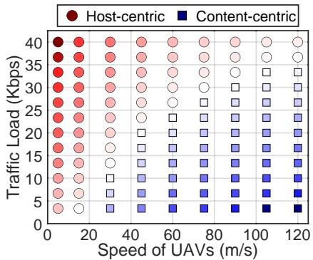  
(a) The traffic load is controlled by the number of transmission pairs without contentsharing possibility

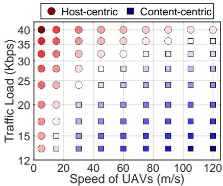  
(b) The traffic load is controlled by the request interval of the same transmission pairs without content-sharing possibility

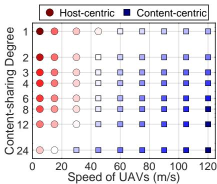  
(c) The content-sharing degree is controlled by the number of providers, while the traffic load remains the same

Fig. 5: Adaptability of host-centric and content-centric routing in different FANET environments  
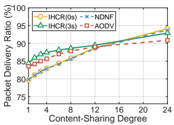  
(a) Speed: 30m/s

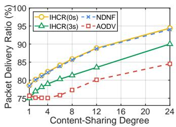  
(b) Speed: 90m/s  
Fig. 4: Impact of content-sharing degree under different node speeds

Given the traffic load, host-centric routing becomes less adaptive as the node speed increases, while content-centric routing becomes more adaptive.

Given the node speed, content-centric routing becomes less adaptive as the traffic load increases, while host-centric routing becomes more adaptive.

• Given the node speed and traffic load, host-centric routing becomes less adaptive as the content-sharing degree increases, while content-centric routing becomes more adaptive.

These insights facilitate the eRET design in Section 4.

## 4 ROUTING EVOLUTION IN FANET

This section presents the design of eRET. First, Section 4.1 introduces how eRET adjusts the routing paradigm through the route expiration time. Section 4.2 describes how eRET perceives dynamic FANET environments. Section 4.3 details the evolution policy that enables eRET to dynamically adapt to changing network conditions. Finally, Section 4.4 discusses the RET inconsistency problem within eRET.

## 4.1 eRET Framework

According to Observation 3, Observation 6, and Observation 8, the hybrid routing mechanism can achieve performance similar to AODV and NDNF by configuring the Route Expiration Time (RET) to 3 seconds and 0 seconds, respectively. This suggests that, with an appropriate RET setting, the hybrid networking architecture can approximate the behavior of either host-centric or content-centric paradigms. Motivated by this, we propose the concept of evolvable RET to enable dynamic adaptation to varying FANET environments. In the eRET framework, each node independently determines its Interest forwarding strategy based on the presence of a valid routing entry, as illustrated in Fig. 6. When the consumer or intermediate nodes lack a route to the provider, Interest forwarding follows a contentcentric approach (via flooding in Fig. 6(a)). Conversely, when a route exists, Interest forwarding follows a hostcentric approach (via unicast in Fig. 6(b)). The RET for each node evolves over time independently. Building on the insights from Section 3.5, the following implications arise:

In low-speed and heavy-load environments, RET should gradually increase, prompting the routing function to evolve toward host-centric paradigm.

In high-speed and light-load environments, RET should gradually decrease, prompting the routing function to evolve toward content-centric paradigm.

(b) RET: 3 seconds  
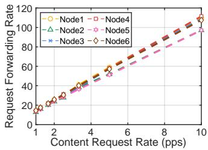

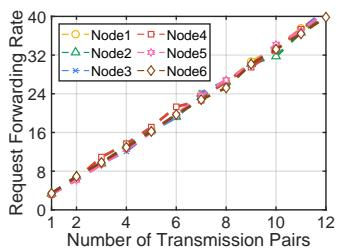

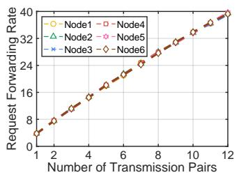  
(c) RET: 0 seconds

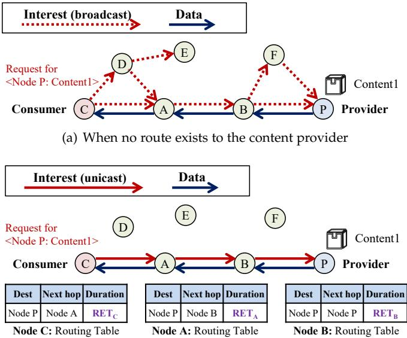  
(b) When a route to the content provider exists  
Fig. 6: Content request process of eRET framework

In high content-sharing environments, RET should gradually decrease, prompting the routing function to evolve toward content-centric paradigm.

To achieve the above outcomes, there are two challenges in the eRET framework design. First, it is not practical for a single UAV node to directly observe the global FANET environment, including the speeds of other nodes, the overall traffic load, and the degree of content sharing. Therefore, it is necessary to figure out locally observable indicators that can effectively reflect the aforementioned global FANET environment. Second, it is hard to induce a dynamic and consistent RET across all nodes, since it is managed locally by each node in the protocol stack. As a result, eRET is supposed to be able to accommodate RET inconsistency.

## 4.2 FANET Environment Perception

The eRET framework introduces three locally observable indicators for perception of the FANET environment: neighbor variation rate, request forwarding rate, and per-content request frequency. As discussed later, the three indicators can effectively reflect topology dynamics, traffic load, and request pattern, respectively. More importantly, each UAV node can measure these indicators independently without incurring additional overhead. For subsequent discussion, the time horizon is divided into slots of equal duration τ , and $t \in \{ 1 , 2 , 3 , \ldots \}$ denotes the slot index.

## 4.2.1 Neighbor Variation Rate

In FANET, the neighbors of a UAV node are defined as the UAV nodes that can mutually overhear via the shared wireless medium [32]. The neighbor variation rate is the rate at which these neighbor nodes change over time, thereby reflecting topology dynamics. Consider a generic UAV U in FANET. Let $S _ { t }$ denote the set of neighbors of U during the tth time slot. The neighbor variation rate perceived by UAV U in the t-th slot is defined as

$$
x _ { t } = \frac { | S _ { t } \setminus S _ { t - 1 } | + | S _ { t - 1 } \setminus S _ { t } | } { \tau } ,\tag{1}
$$

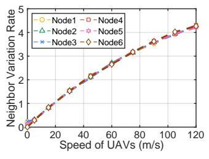

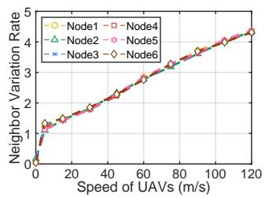  
Fig. 7: Impact of node speed on the neighbor variation rate  
Fig. 8: Impact of traffic load on the request forwarding rate

where \ denotes the set subtraction operator, and $| \cdot |$ represents the cardinality operator of a set. Intuitively, $| S _ { t } \setminus S _ { t - 1 } |$ represents the number of newly arriving neighbors in the t-th time slot, while $| S _ { t - 1 } \setminus S _ { t } |$ represents the number of departing neighbors in the t-th time slot.

To validate whether the neighbor variation rate reflects topology dynamics, we investigate the impact of node speed on the neighbor variation rate. Fig. 7 presents the results. The six curves correspond to six different UAV nodes, with a slot duration $\tau = 2$ seconds. The two sub-figures correspond to different RET configurations. Overall, the results indicate that the neighbor variation rate is positively related to node speed. Moreover, the similarity between the curves in both sub-figures suggests that RET does not significantly affect the relationship between neighbor variation rate and node speed.

## 4.2.2 Request Forwarding Rate

Consider a generic UAV U in FANET. The request forwarding rate of UAV U represents the number of content requests forwarded by U within a time slot. The request forwarding rate perceived by UAV U in the t-th slot is

$$
y _ { t } = \frac { N _ { t } } { \tau } ,\tag{2}
$$

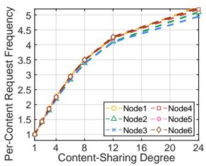

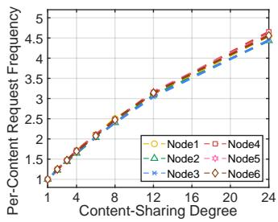  
(a) RET: 0 seconds  
(b) RET: 3 seconds  
Fig. 9: Impact of content-sharing degree on the per-content request frequency

where $N _ { t }$ represents the number of content requests forwarded by UAV U during the t-th slot.

Fig. 8 validates whether the request forwarding rate reflects traffic load. Specifically, the four sub-figures correspond to different RET configurations under varying traffic loads, controlled by the number of transmission pairs and the content request rate, respectively. Overall, the four subfigures demonstrate that the request forwarding rate is positively related to traffic load. Moreover, the similarity between the curves in sub-figures suggests that RET does not significantly affect the relationship between request forwarding rate and traffic load.

## 4.2.3 Per-Content Request Frequency

Consider a generic UAV U in FANET, which observes a total of $M _ { t }$ different contents requested during the t-th slot, indexed by $j \in \{ 1 , 2 , . . . , M _ { t } \}$ . The per-content request frequency perceived by UAV U in the t-th slot is

$$
z _ { t } = \frac { \sum _ { j = 0 } ^ { M _ { t } } N _ { t } ( j ) } { M _ { t } } ,\tag{3}
$$

where $N _ { t } ( j )$ represents the number of requests for j-th content forwarded by UAV U in the t-th slot.

Fig. 9 validates whether the per-content request frequency reflects request pattern. The two sub-figures show that the per-content request frequency is positively related to the content-sharing degree. Moreover, the curves in both sub-figures are similar, indicating that RET only slightly affects the relationship between per-content request frequency and content-sharing degree.

In summary, the neighbor variation rate, request forwarding rate, and per-content request frequency serve as effective indicators of topology dynamics, traffic load, and request pattern in FANET, respectively. Based on these indicators, the next subsection presents the RET evolution policy for time-varying FANET environments.

## 4.3 Evolution Policy of eRET

Under the eRET framework, the evolution policy of RET is applied at the node level, where each UAV node updates its RET based on locally observable indicators at each time slot. Moreover, these indicators are obtained via passive observations of data transmissions, without introducing dedicated control packets. Hence, the eRET framework incurs no additional communication overhead and does not require network-wide coordination as the network scales. The RET evolution policy consists of two phases: Sliding Window Estimation and RET Update.

## 4.3.1 Sliding Window Estimation

Due to the inherent randomness in FANET, the observable indicators perceived by a single node may exhibit noise. To mitigate the effect of random noise, the eRET framework adopts sliding-window estimation. Specifically, given the neighbor variation rate $x _ { t } ,$ the request forwarding rate $y _ { t . }$ and the per-content request frequency $z _ { t } ,$ the smoothed indicators at the t-th slot are

$$
\begin{array} { r } { x _ { t } ^ { \prime } = \frac { \sum _ { i = t - \operatorname* { m i n } ( t , W ) + 1 } ^ { t } x _ { t } } { \operatorname* { m i n } ( t , W ) } , } \\ { y _ { t } ^ { \prime } = \frac { \sum _ { i = t - \operatorname* { m i n } ( t , W ) + 1 } ^ { t } y _ { t } } { \operatorname* { m i n } ( t , W ) } , } \\ { z _ { t } ^ { \prime } = \frac { \sum _ { i = t - \operatorname* { m i n } ( t , W ) + 1 } ^ { t } z _ { t } } { \operatorname* { m i n } ( t , W ) } , } \end{array}\tag{4}
$$

where $W$ represents the sliding window size.

## 4.3.2 RET Update

This subsection describes how to update the RET based on the three observable indicators. First, we define the drift of the observable indicator between consecutive slots to reflect environmental changes. Specifically, the drifts of the three indicators $x _ { t } ^ { \prime } , y _ { t } ^ { \prime } ,$ and $\hat { z } _ { t } ^ { \prime }$ at the t-th slot are

$$
\begin{array} { r } { \Delta _ { t } ^ { N e i g h b o r } = \frac { x _ { t } ^ { \prime } - x _ { t - 1 } ^ { \prime } } { \left( x _ { t } ^ { \prime } + x _ { t - 1 } ^ { \prime } \right) / 2 } , } \\ { \Delta _ { t } ^ { R e q u e s t } = \frac { y _ { t } ^ { \prime } - y _ { t - 1 } ^ { \prime } } { \left( y _ { t } ^ { \prime } + y _ { t - 1 } ^ { \prime } \right) / 2 } , } \\ { \Delta _ { t } ^ { C o n t e n t } = \frac { z _ { t } ^ { \prime } - z _ { t - 1 } ^ { \prime } } { \left( z _ { t } ^ { \prime } + z _ { t - 1 } ^ { \prime } \right) / 2 } , } \end{array}\tag{5}
$$

Given the key insights in Section 3.5, the RET update rule uses the drifts $\Delta _ { t } ^ { N e i g h b o r } , \Delta _ { t } ^ { R e q u e s t }$ , and $\Delta _ { t } ^ { C o n t e n t }$ as follows:

$$
\begin{array} { r l } & { R E T _ { t + 1 } = \Pi _ { [ 0 , R E T _ { \mathrm { m a x } } ] } \Big ( R E T _ { t } \cdot \exp \Big ( \delta \Big [ \Delta _ { t } ^ { R e q u e s t } } \\ & { ~ - ~ \Delta _ { t } ^ { N e i g h b o r } - \Delta _ { t } ^ { C o n t e n t } \Big ] \Big ) \Big ) , } \end{array}\tag{6}
$$

where $\Pi _ { \mathcal { X } } ( \cdot )$ represents the projection operator to the set $\mathcal { X } ,$ and $R E T _ { \mathrm { m a x } }$ represents the maximal route expiration time. Moreover, $\delta > 0$ represents the step-size of RET evolution.

Algorithm 1 summarizes the RET evolution policy for each UAV node under eRET. The inputs to this algorithm include the slot duration τ and the evolution step-size $\delta ,$ and the sliding window size W . The output is the route expiration time $R E T _ { t }$ at each slot. First, the UAV initializes the $R E T _ { 0 }$ in Line 1. At the beginning of each slot $( \mathrm { i . e . }$ Line 3), the UAV adopts the route expiration time $R E T _ { t }$ for that slot. During the slot (i.e., Line 4), the UAV tracks its neighbors and updates the neighbor set $S _ { t } ,$ along with recording the number of forwarded requests $N _ { t }$ and the number of different requested content $\bar { M } _ { t }$ . At the end of the slot t (i.e., Lines 5-12), the UAV calculates the neighbor variation rate $\scriptstyle { \boldsymbol { x } } _ { t } ,$ request forwarding rate $y _ { t } ,$ and per-content request frequency $z _ { t } .$ . Moreover, the UAV applies Sliding Window estimation to smooth the observable indicators.

Algorithm 1: RET Evolution Policy on Each Node   
Input: Slot duration τ , step-size δ, window size W   
Output: Route expiration time RET at each slot   
$t \in \{ 1 , 2 , \mathsf { \bar { 3 } } , \ldots \}$   
1 Initialize $R E T _ { 0 } = 3$   
2 for $t = 1$ to T do   
$/ /$ At the beginning of this slot   
3 Adopt route expiration time RETt for this slot   
$/ /$ During this slot   
4 Update the neighbor set $\overline { { S _ { t } } } ,$ the number of   
forwarded requests $N _ { t } ,$ , and the number of   
different requested content $M _ { t }$   
$/ /$ At the end of this slot   
5 Calculate neighbor variation rate $x _ { t }$ based on (1)   
6 Calculate request forwarding rate $y _ { t }$ based on (2)   
7 Calculate per-content request frequency $z _ { t }$ based   
on (3)   
8 Generate $x _ { t } ^ { \prime } , y _ { t } ^ { \prime } ,$ and $z _ { t } ^ { \prime }$ according to (4)   
9 Calculate the drift of neighbor variation rate   
$\Delta _ { t } ^ { N e i g h b o r }$ according to (5)   
10 Calculate the drift of request forwarding rate   
$\Delta _ { t } ^ { R e q u e s t }$ according to (5)   
11 Calculate the drift of per-content request   
frequency $\Delta _ { t } ^ { C o n t e n t }$ according to (5)   
12 Update route expiration time $R E T _ { t + 1 }$ for the next   
slot according to (6)

The UAV then calculates the drifts of these three indicators. Finally, the UAV updates the route expiration time $R E T _ { t + 1 }$ for the next slot based on these drifts.

So far, this subsection has presented the design of the evolution policy for eRET. Next, Section 4.4 analyzes the feasibility of RET inconsistency arising from node-level distributed adaptation.

## 4.4 Feasibility Analysis for RET Inconsistency

Under the eRET framework, each node independently adjusts its RET based on its locally observable indicators. Although such local adjustments exhibit group-level trends in response to FANET environment variations, nodes may still adopt inconsistent RET values. To illustrate this, the following examples show the feasibility of RET inconsistency in eRET.2 In particular, in hybrid routing, when a consumer sends an Interest along the route stored in its routing table, end-to-end delivery succeeds only if every node on the route maintains a valid routing entry. RET inconsistency may cause the routing entry at a low-RET intermediate node to expire prematurely, resulting in Interest loss. However, eRET does not require end-to-end consistency of routing entries to maintain performance. This is because, in eRET, each node determines Interest forwarding (i.e., unicast or broadcast) based on the validity of its local routing entry. Two representative examples are shown in Fig. 10. The two sub-figures differ in the RET values of adjacent nodes on the route:

2. Maintaining RET consistency across all nodes in FANET would impose considerable overhead and latency.

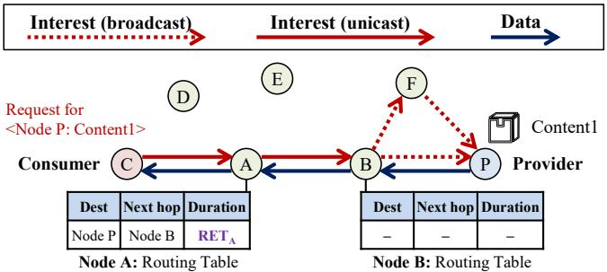  
(a) High RET node (Node A) forwarding to low RET node (Node B)

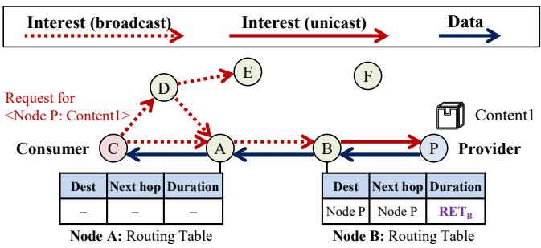  
(b) Low RET node (Node A) forwarding to high RET node (Node B)  
Fig. 10: The case of RET inconsistency

As shown in Fig. 10(a), a high-RET node (i.e., Node A) forwards an Interest to a low-RET node (i.e., Node B). Here, Node A may hold a valid route to the provider, but Node B does not. As a result, Node A unicasts the Interest to Node B, which subsequently broadcasts it because the routing entry has expired. From the perspective of Node B, it acts as an intermediate node, attempting to recover the route rather than discarding the Interest.

As shown in Fig. 10(b), a low-RET node (i.e., Node A) forwards an Interest to a high-RET node (i.e., Node B). Node A may lack a valid route to the provider, whereas Node B does not. Consequently, Node A broadcasts the Interest to its neighbors. Upon receiving the Interest, Node B unicasts it along the valid route, reusing existing route information and reducing content discovery overhead.

In summary, eRET enables each node to make forwarding decisions locally, and the RET inconsistency will not affect the forwarding performance.

## 5 PACKET-LEVEL SIMULATION

This section presents packet-level simulation results for AODV, NDNF, IHCR, and eRET under time-varying FANET environments using OMNeT++. For IHCR, the RET is fixed at 2s as an intermediate setting between the two fixed-RET settings (0s and 3s) considered in Section 3. Unless otherwise stated, the simulation setup follows the configuration in Section 3.1, with key parameters summarized in Table 2. For eRET, the slot duration is set to $\tau = 2 \mathsf { s } ,$ the step size is $\delta = 3 ,$ and the window size is W = 50. We consider three scenarios: (i) the environment transition scenario in Section 5.1, (ii) the environment oscillation scenario in Section 5.2, and (iii) the search-and-rescue (SAR) scenario in Section 5.3.

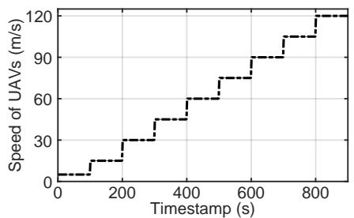  
(a) Transition in topology dynamics

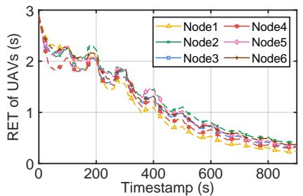  
(b) RET evolution under topology dynamics

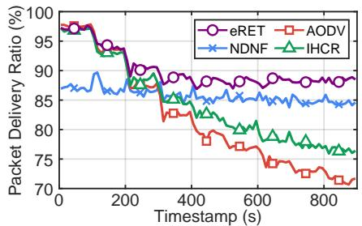  
(c) PDR under topology dynamics

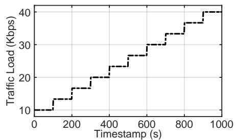  
(d) Transition in traffic load

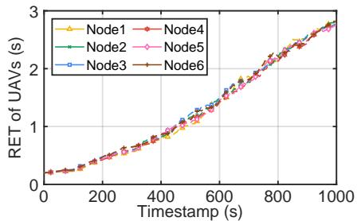

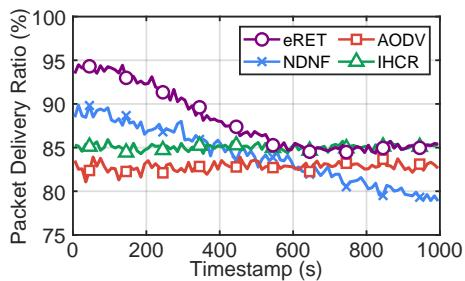  
(e) RET evolution under traffic load  
(f) PDR under traffic load

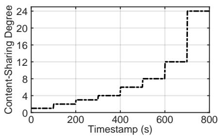  
(g) Transition in request pattern

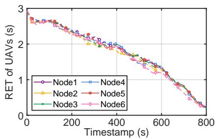  
(h) RET evolution under request pattern

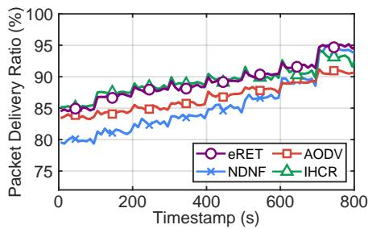  
(i) PDR under request pattern  
Fig. 11: Performance evaluation under changes in topology dynamics, traffic load, and request pattern

## 5.1 Performance Evaluation in Transition Scenario

In the transition scenario, the FANET environment evolves gradually over time, typically reflecting the progressive implementation of FANET operations in practice. This subsection evaluates eRET along three dimensions: topology dynamics, traffic load, and request pattern.

## 5.1.1 Transition in Topology Dynamics

To simulate the transition in topology dynamics, we gradually increase node speed, representing a shift from a stable network topology to a highly dynamic one (e.g., flying from an urban area to a wilderness). As shown in Fig. 11(a), node speed increases from 5m/s to 120m/s in 15m/s increments per 100 seconds. In this scenario, we randomly generate six source–destination pairs from a 64- node network. The content request interval is fixed at 300ms, and the content-sharing degree is 1.

Fig. 11(b) plots the real-time RET of six randomly selected nodes, and Table 3 summarizes the RET statistics over different speed ranges. As node speed increases, the observed RET decreases from 2.976s to 0.227s, and the average RET shows a downward trend across speed ranges. This indicates that eRET maintains relatively large RET in low-speed environments while substantially reducing it in high-speed environments. Moreover, the RET curves exhibit clear group-level trends, indicating that eRET consistently perceives global variations in topology dynamics across different nodes and thereby supports the evolution from host-centric to content-centric routing.

Fig. 11(c) shows the real-time packet delivery ratio of the four routing mechanisms. eRET behaves similarly to hostcentric routing in low-speed environments $( \mathrm { i . e . , } 0 { - } 3 0 0 \mathrm { s } )$ and gradually evolves toward content-centric routing in highspeed environments (i.e., 300–900s). The results demonstrate that eRET outperforms AODV, NDNF, and IHCR as topology dynamics change in FANET. Although IHCR can be competitive with eRET under some conditions, it adapts less effectively to changing topology dynamics than eRET, which evolves RET dynamically. Notably, eRET also outperforms NDNF in high-speed environments, as NDNF’s flooding mechanism is more likely to drop closely spaced consecutive requests. In contrast, eRET temporarily utilizes valid routes to unicast Interest packets, reducing collisions between preceding Data and subsequent Interest packets.

## 5.1.2 Transition in Traffic Load

To simulate the transition in traffic load, we gradually increase the number of transmission pairs, representing a service shift from light to heavy tasks (e.g., from periodic environmental monitoring to continuous target tracking).

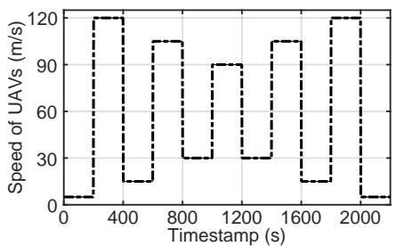  
(a) Oscillation in topology dynamics

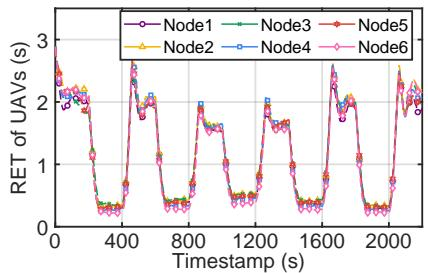  
(b) RET evolution under topology dynamics

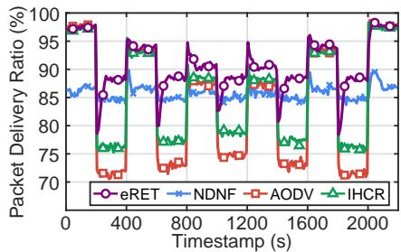  
(c) PDR under topology dynamics

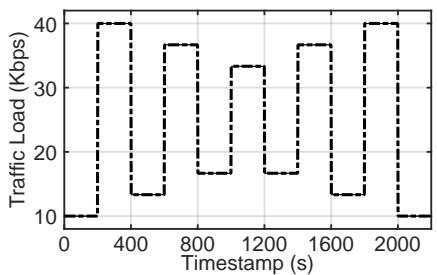  
(d) Oscillation in traffic load

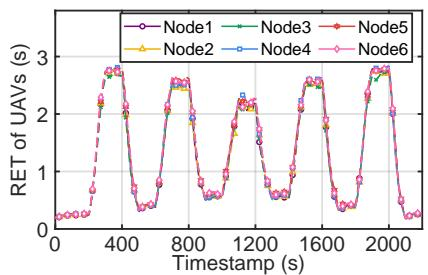  
(e) RET evolution under traffic load

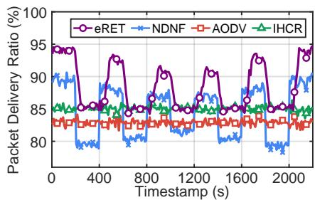  
(f) PDR under traffic load

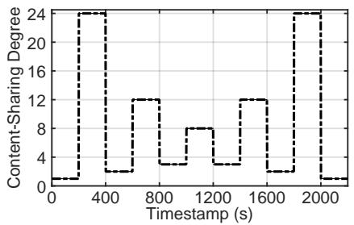  
(g) Oscillation in request pattern

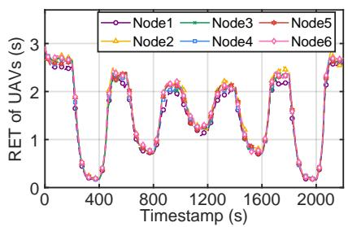  
(h) RET evolution under request pattern

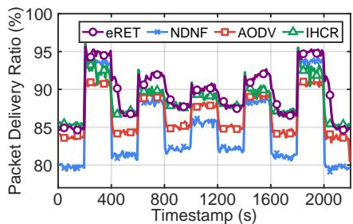  
(i) PDR under request pattern  
Fig. 12: Performance evaluation under oscillations in topology dynamics, traffic load, and request pattern

TABLE 3: RET statistics over different speed ranges
<table><tr><td>Speed range (m/s)</td><td>Avg. RET (s)</td><td>Min. RET (s)</td><td>Max. RET (s)</td></tr><tr><td>5-15</td><td>2.371</td><td>1.479</td><td>2.976</td></tr><tr><td>15-30</td><td>1.850</td><td>1.325</td><td>2.394</td></tr><tr><td>30-60</td><td>1.281</td><td>0.709</td><td>2.193</td></tr><tr><td>60-90</td><td>0.710</td><td>0.423</td><td>1.135</td></tr><tr><td>90-120</td><td>0.333</td><td>0.227</td><td>0.529</td></tr></table>

As shown in Fig. 11(d), the traffic load increases from 10Kbps to 40Kbps, controlled by the number of transmission pairs. In this scenario, the node speed is 45m/s, the request interval is 300ms, and the content-sharing degree is 1. In Fig. 11(e), as the traffic load increases, the RET of each node increases from 0.152s to 2.964s, and the curves exhibit group-level trends. This indicates that eRET perceives the global variations of traffic load and supports the evolution from content-centric to host-centric routing. In Fig. 11(f), eRET behaves similarly to content-centric routing in lightload environments (i.e., 0–600s) and gradually evolves to host-centric routing in heavy-load environments (i.e., 600– 1000s). The results demonstrate that eRET outperforms NDNF, AODV, and IHCR as traffic load gradually changes.

## 5.1.3 Transition in Request Pattern

To simulate the transition in request pattern, we gradually increase the content-sharing degree. As shown in Fig. 11(g), the content-sharing degree increases from 1 to 24. In this scenario, the node speed is 30m/s, and the traffic load is 40Kbps. In Fig. 11(h), as the content-sharing degree increases, the RET of each node decreases from 2.992s to 0.163s, and the curves exhibit group-level trends. This indicates that eRET perceives the global variations of request pattern and supports the evolution from host-centric to content-centric routing. In Fig. 11(i), eRET behaves similarly to host-centric routing in low-content-sharing environments (i.e., 0–600s) and evolves toward content-centric routing in high-content-sharing environments (i.e., 600–800s). The results demonstrate that eRET outperforms NDNF, AODV, and IHCR as request pattern gradually changes.

## 5.2 Performance Evaluation in Oscillation Scenario

In the oscillation scenario, the FANET environment exhibits periodic fluctuations that reflect abrupt changes in real-world FANET operations. This subsection evaluates eRET along three dimensions in this scenario.

## 5.2.1 Oscillation in Topology Dynamics

To simulate oscillation in topology dynamics, we periodically adjust node speed, representing the alternation between stable and dynamic topologies (e.g., switching between formation flying and formation changing). As shown in Fig. 12(a), node speed oscillates between 5-30m/s and 90- 120m/s every 200 seconds. In this scenario, the traffic load is 20Kbps and the content-sharing degree is 1. In Fig. 12(b), as node speed oscillates, the RET of each node fluctuates between 1.6–2.09s and 0.3–0.48s. This indicates that eRET perceives the rapid variations of topology dynamics and evolves accordingly. Notably, when node speed suddenly drops (e.g., at 400s), the RET first increases and then decreases toward convergence. This happens because hostcentric unicast requests in low-speed environments may mislead the nodes’ passive perception. Specifically, the set of neighbors observed by a node may be a subset of the actual set, causing fluctuations in the neighbor variation rate. In Fig. 12(c), eRET behaves between host-centric and contentcentric routing. When the environment changes abruptly, eRET requires 60 seconds to adapt. The results demonstrate that eRET outperforms AODV, NDNF, and IHCR as topology dynamics oscillate.

## 5.2.2 Oscillation in Traffic Load

To simulate oscillation in traffic load, we periodically adjust the number of transmission pairs, representing the alternation between low and high-intensity tasks (e.g., routine monitoring and peak data streaming). As shown in Fig. 12(d), the traffic load oscillates between 10-17Kbps and 33-40Kbps every 200 seconds. The node speed is 45m/s and the content-sharing degree is 1. In Fig. 12(e), as traffic load oscillates, the RET of each node fluctuates between 2.16– 2.73s and 0.24–0.57s. This indicates that eRET perceives the rapid variations of traffic load and evolves accordingly. The performance results in Fig. 12(f) demonstrate that eRET outperforms AODV, NDNF, and IHCR as traffic load oscillates.

## 5.2.3 Oscillation in Request Pattern

To simulate oscillation in request pattern, we periodically adjust the content-sharing degree. As shown in Fig. 12(g), the content-sharing degree oscillates between 1- 3 and 8-24. The node speed is 30m/s, and the traffic load is 40Kbps. In Fig. 12(h), the RET of each node fluctuates between 2.14-2.65s and 0.28-1.25s. This indicates that eRET perceives the rapid variations of request pattern and evolves accordingly. The performance results in Fig. 12(i) demonstrate that eRET outperforms AODV, NDNF, and IHCR as request pattern oscillates.

## 5.3 Performance Evaluation in SAR Scenario

## 5.3.1 SAR Scenario Description

In the search-and-rescue (SAR) scenario, the operation of the UAV swarm consists of two phases [33], [34].

Searching Phase: UAV nodes fly at high speeds to locate survivors, assess damage, and adjust their positions based on the findings. Therefore, the network topology tends to change frequently, while the traffic load remains constant.

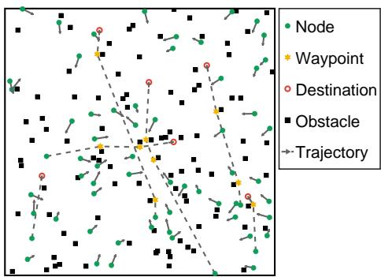  
Fig. 13: Illustration of the SAR scenario

Rescuing Phase: Once survivors are located, UAV nodes slow down and hover near survivors (or areas of interest) to maintain stable communication links for critical data transmission (e.g., real-time video). Therefore, the network topology tends to remain stable, whereas the traffic load increases.

To simulate a realistic SAR scenario, we consider an obstacle-rich environment, as shown in Fig. 13. The UAV swarm consists of 64 nodes (i.e., green dots). Each node performs search operations following waypoints (i.e., yellow hexagons) generated by a path planning algorithm introduced in a previous study [35]. The gray curves in Fig. 13 illustrate the trajectories of six nodes. Upon reaching a destination (i.e., red circles), each UAV hovers for 5 seconds at 0m/s to perform rescue operations. The searchphase speed is set to 30m/s or 90m/s. The traffic load is set to 7.5Kbps in the search phase and 20Kbps in the rescue phase (corresponding to low-rate traffic), or to 15Kbps in the search phase and 40Kbps in the rescue phase (corresponding to high-rate traffic). The content-sharing degree is fixed at one in both phases.

## 5.3.2 Packet Loss Analysis

Fig. 14 plots the cumulative packet loss under different traffic settings and search-phase speeds. Under low-rate traffic, eRET consistently achieves lower cumulative packet loss than AODV, NDNF, and IHCR. When the search-phase speed is 30m/s, eRET reduces total packet loss by up to 55.08%, 57.69%, and 42.04% compared with AODV, NDNF, and IHCR, respectively. When the search-phase speed is 90m/s, the corresponding reductions are 9.65%, 44.01%, and 37.13%. Under high-rate traffic, eRET consistently achieves lower cumulative packet loss than AODV, NDNF, and IHCR. When the search-phase speed is 30m/s, eRET reduces total packet loss by up to 52.91%, 65.24%, and 34.41% compared with AODV, NDNF, and IHCR, respectively. When the search-phase speed is 90m/s, the corresponding reductions are 33.35%, 39.82%, and 37.66%. These results indicate that eRET more effectively accommodates a wide range of SAR settings than the compared routing mechanisms.

## 5.3.3 Delay Analysis

Fig. 15 plots the end-to-end delay CDF under different traffic settings and search-phase speeds. The delay distributions exhibit two notable characteristics. First, AODV tends to accumulate a larger fraction of successfully delivered packets in the low-delay range below 5ms, which is consistent with its ability to quickly forward packets when valid routing entries are available. In contrast, NDNF exhibits a slower rise in this range because it relies on floodingbased content discovery for each request rather than route reuse. Second, AODV also exhibits a more pronounced longdelay tail, with some packets exceeding 100ms. This can be attributed to the additional delay introduced by route rediscovery after previously valid routing entries become stale. Although both IHCR and eRET exhibit more balanced delay distributions than AODV and NDNF, eRET better balances route reuse and route rediscovery, yielding a more stable delay distribution under different SAR settings.

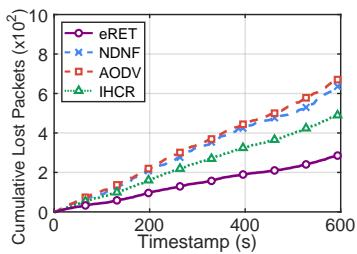  
(a) Low-rate traffic, 30m/s

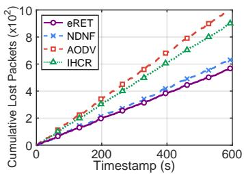

(b) Low-rate traffic, 90m/s  
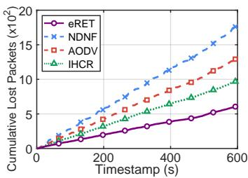  
(c) High-rate traffic, 30m/s

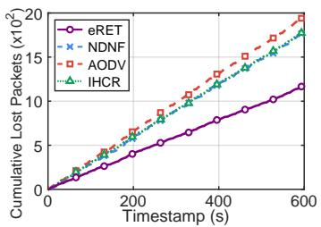  
(d) High-rate traffic, 90m/s

Fig. 14: Cumulative packet loss in the SAR scenario under different traffic settings and search-phase speeds  
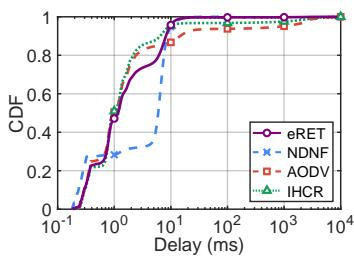  
(a) Low-rate traffic, 30m/s

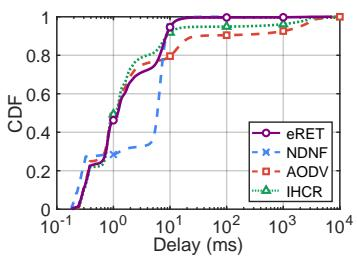  
(b) Low-rate traffic, 90m/s

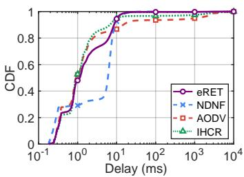  
(c) High-rate traffic, 30m/s

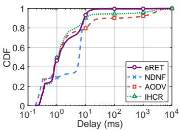  
(d) High-rate traffic, 90m/s  
Fig. 15: End-to-end delay CDF in the SAR scenario under different traffic settings and search-phase speeds

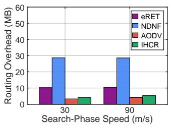  
(a) Low-rate traffic

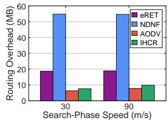  
(b) High-rate traffic  
Fig. 16: Routing overhead under different SAR settings

TABLE 4: Fairness analysis of the compared routing mechanisms in the SAR scenario
<table><tr><td>Mechanism</td><td>PDR Fairness</td><td>Throughput Fairness</td></tr><tr><td>eRET</td><td>0.999881</td><td>0.998855</td></tr><tr><td>NDNF</td><td>0.999567</td><td>0.998545</td></tr><tr><td>AODV</td><td>0.999 683</td><td>0.998420</td></tr><tr><td>IHCR</td><td>0.999831</td><td>0.998825</td></tr></table>

## 5.3.4 Routing Overhead Analysis

Fig. 16 plots the routing overhead under different SAR settings. NDNF consistently incurs the highest overhead, whereas AODV and IHCR incur lower overhead across all settings. eRET remains between these two extremes. The results are consistent with the probing tendencies of the compared routing mechanisms. Specifically, NDNF relies more heavily on flooding-based content discovery, whereas

AODV and IHCR rely more on route reuse and less on aggressive probing. This indicates that eRET achieves a balance between route reuse and path exploration.

## 5.3.5 Fairness Analysis

To further examine whether eRET provides balanced service across transmission pairs, we additionally evaluate fairness using Jain’s fairness index [36] for both PDR and throughput. We report the results under the high-rate traffic setting with a search-phase speed of 30m/s as a representative case. As shown in Table 4, all the routing mechanisms achieve fairness values close to 1 for both PDR and throughput. These results indicate that the distributed RET evolution of eRET does not introduce evident flow starvation or service imbalance across transmission pairs.

## 6 DISCUSSION

## 6.1 Other FANET Environment Definitions

As discussed in Section 3.1, the FANET environment is primarily defined by topology dynamics, traffic load, and request pattern. Network scale, largely reflected by node density, further shapes the environment by affecting both topology dynamics and traffic load. Specifically, a high node density improves connectivity, thereby mitigating the impact of topology dynamics on routing. Meanwhile, a high node density also intensifies channel contention, thereby reducing available bandwidth and heightening the impact of traffic load on routing.

  
(a) Speed: 30m/s, P3C3 traffic

  
(b) Speed: 90m/s, P8C8 traffic  
Fig. 17: Impact of node density under different node speeds and traffic loads

To investigate the impact of node density, we vary the number of UAVs with a fixed playground size under different node speeds and traffic loads. Fig. 17 shows the results, where Fig. 17(a) considers a node speed of 30m/s with P3C3 traffic and Fig. 17(b) considers a node speed of 90m/s with P8C8 traffic. In both cases, the content request interval is 300ms and the content-sharing degree is 1. As the number of UAVs increases, the PDR achieved by content-centric NDNF decreases, while the PDR achieved by host-centric AODV remains nearly unchanged. This indicates that contentcentric NDNF is more sensitive to density increase than host-centric AODV. Moreover, increasing density tends to amplify the adverse impact of traffic load on contentcentric routing. Therefore, in high-density environments, RET should gradually increase, prompting the routing function to evolve toward host-centric paradigm. However, node density is a global characteristic and is difficult to infer in real time based on purely local environment perception. Future work may investigate methods for obtaining robust density estimates and integrating them into the RET update as an additional normalized term.

## 6.2 Other Routing Paradigms

In addition to host-centric and content-centric routing, other routing paradigms may also be considered in FANET, such as location-centric or service-centric routing.

Location-centric routing uses geographic information as the primary basis for forwarding, and its effectiveness depends heavily on timely and accurate location maintenance. This paradigm is particularly useful in applications where data are associated with a specific geographic region rather than a specific node, such as area monitoring [37]. Moreover, geographic information is not isolated from hostcentric or content-centric paradigms. Existing studies have incorporated location awareness into host-centric routing to improve path selection [38], while others have integrated it into content-centric routing to better constrain content discovery toward relevant regions [39]. Taken together, geographic relevance could also be incorporated into eRET to further enhance adaptive routing.

Service-centric routing shifts the communication target from hosts or content objects to services. This paradigm requires routing decisions to account not only for packet delivery but also for service selection and execution under dynamic resource conditions. Some existing studies have explored service-centric extensions over content-centric architectures, such as service access and service execution [40], [41]. Accordingly, service-centric characteristics may also be incorporated into eRET, although the effective integration of service-related information into routing adaptation remains an open issue for future research.

## 6.3 Other Environment Perception Considerations

The effectiveness of eRET depends on the accuracy of local environment perception. As introduced in Section 4.3, eRET adopts sliding window estimation to mitigate random noise in local observations. Although this helps suppress short-term fluctuations, it also introduces a lag in perception, and the estimates may become temporarily outdated under abrupt environmental changes. As a result, eRET requires an adaptation period before converging to the new environment. Nevertheless, over a longer timescale, the underlying environmental trend remains observable, which is sufficient to support RET evolution. Future work may further improve this trade-off by adopting more accurate estimation methods (e.g., Kalman filtering [42]) to improve responsiveness.

In addition to estimation accuracy, more practical factors also deserve consideration in FANET environment perception, such as resource-related conditions [43]. For example, although the neighbor variation rate is used as a lightweight indicator of topology dynamics, its observation can also be affected by node resource states. In particular, energyconstrained or heavily loaded nodes can become less consistently available, thereby distorting the perceived neighbor variation even without substantial changes in mobility. Future work may therefore incorporate additional resourceaware indicators to support more robust adaptive routing.

Beyond the current perception indicators, the FANET environment can also be characterized at a finer granularity. In particular, while the current eRET design narrows network traffic to traffic load, traffic conditions may also differ in terms of QoS requirements and traffic priority, reflecting different latency or stability demands even under the same load. Similarly, link-quality fluctuations provide information complementary to topology dynamics, as path reliability can vary even with limited mobility. In this sense, these factors suggest additional dimensions for environment perception in adaptive routing.

## 6.4 eRET Parameters

Although eRET dynamically evolves between hostcentric and content-centric routing, its behavior under a given environment is mainly governed by three parameters: the environment perception interval τ, the sliding window size W , and the evolution step size δ.

Environment perception interval τ determines how often a node perceives environmental changes. A smaller τ improves reactiveness to abrupt changes, but can amplify measurement noise and induce RET oscillations. A larger τ filters transient fluctuations and enhances stability, but may delay the reaction to persistent environmental shifts. In practice, τ is typically set to cover multiple packet exchanges to ensure statistically reliable indicator estimation. Such a setting is commonly adopted in reactive, contextaware routing mechanisms [44].

Sliding window size W determines the smoothing horizon for estimating drift in time-varying environments. A larger W suppresses short-term noise and improves stability, but may lag behind fast environmental drifts and increase the adaptation time. A smaller W yields more reactive indicator estimation, but it is more sensitive to measurement noise and may lead to fluctuations. Future research could explore an adaptive sliding window to optimize drift estimation performance [45].

Evolution step size δ controls the update step size of RET evolution. A larger δ enables faster adaptation after environmental changes, but may cause oscillations when drift measurements are noisy. A smaller δ improves robustness and smoothness, but may slow down adaptation. In practice, δ is typically chosen relative to the feasible RET range so that the perupdate RET change remains moderate.

Overall, τ and W regulate the reliability of drift estimation through sampling granularity and smoothing, whereas δ regulates the magnitude of RET updates given the estimated drift. The three parameters control the trade-off between reactiveness and stability in RET evolution. More systematic joint tuning of τ , W , and δ to balance this tradeoff can be explored in future research.

## 7 RELATED WORKS

This section introduces two streams of related works that are not mentioned in Section 2.

## 7.1 Adaptive Routing in Host-centric Architecture

Adaptability in host-centric routing involves selecting among multiple routes to the destination. AOMDV-FG [46] introduces a bio-inspired genetic algorithm to choose highquality paths. TA-AOMDV [47] designs an adaptive QoS metric for path selection in different environments. However, these methods rely on host routing information (e.g., path fitness or QoS), which becomes outdated rapidly in high-speed environments due to frequent topology changes.

To improve robustness under high mobility, recent studies have explored AI-based approaches that optimize routing decisions in highly dynamic FANET environments. QGeo [48] applies Q-learning to adapt next-hop decisions via online value updates based on observed network dynamics. Q-FANET [49] improves Q-learning-based routing by refining the state/action design and update process to enhance packet delivery under mobility. Beyond reinforcement learning, AR-GAIL [50] leverages adversarial imitation learning to learn adaptive routing behaviors from demonstrations, with the goal of improving robustness in time-varying environments. These AI-based schemes primarily adapt path selection based on proactively maintained routing states, while the underlying routing paradigm remains unchanged.

## 7.2 Adaptive Routing in Content-centric Architecture

The adaptability in content-centric routing involves adaptive Interest and Data forwarding strategies. NAIF [51] proposes an adaptive Interest broadcast forwarding strategy, enabling nodes to decide whether to flood Interests. Subsequent work [52]–[54] focuses on limiting Interest flooding to reduce overhead. Dynamic Unicast [55] proposes an adaptive Data forwarding strategy that allows nodes to decide whether to forward DATA using broadcast or unicast. However, these methods still rely on Interest flooding for content discovery due to the lack of provider information, making them inefficient in heavy-load environments.

## 8 CONCLUSION

This paper proposes an adaptive networking approach for FANET, termed eRET, which perceives time-varying FANET environments and adapts routing behavior toward a suitable paradigm. First, this paper derives key insights into routing adaptability based on simulation-driven observations. Building on these insights, the eRET framework incorporates a distributed environment perception mechanism and a RET evolution policy. This design enables UAV swarm nodes to evolve toward host-centric routing in lowspeed, heavy-load, and low content-sharing environments, and toward content-centric routing in high-speed, lightload, and high content-sharing environments. Packet-level simulations show that eRET outperforms state-of-the-art host-centric and content-centric routing protocols. In a representative search-and-rescue scenario, eRET reduces total packet loss by up to 52.91% and 65.24% compared to AODV and NDNF, respectively.

## REFERENCES

[1] U.S. Government Accountability Office, “Science & tech spotlight: Drone swarm technologies,” U.S. Government Accountability Office, Report, 2023. [Online]. Available: https://www.gao.gov/ assets/gao-23-106930.pdf

[2] DJI, “Dji’s solutions for flood control and disaster relief: Technology empowering emergency response,” DJI Enterprise, Jul. 2023. [Online]. Available: https://enterprise.dji.com/cn/ news/detail/flood-control-and-disaster-relief

[3] A. Nolte, “Swarming behavior: Drone swarms to survey unknown environments,” Northrop Grumman, Nov. 2020. [Online]. Available: https://now.northropgrumman.com/ swarming-behavior-drone-swarms-to-survey-unknown-environments

[4] Thales Group, “Thales demonstrates its capacity to deploy drone swarms with unparalleled levels of autonomy using ai,” Oct. 2024. [Online]. Available: https://www. thalesgroup.com/en/worldwide/defence-and-security/press\_ release/thales-demonstrates-its-capacity-deploy-drone-swarms

[5] E. Research, “Swarm drones market,” EconMarket Research, Industry Report EMR00740, Apr. 2024. [Online]. Available: https://www.econmarketresearch.com/industry-report/ swarm-drones-market

[6] T. Xiong, F. Liu, H. Liu, J. Ge, H. Li, K. Ding, and Q. Li, “Multidrone optimal mission assignment and 3d path planning for disaster rescue,” Drones, vol. 7, no. 6, p. 394, 2023.

[7] G. A. Kakamoukas, P. G. Sarigiannidis, and A. A. Economides, “FANETs in Agriculture-A routing protocol survey,” Internet of Things, vol. 18, p. 100183, 2022.

[8] M. Y. Arafat and S. Moh, “Localization and clustering based on swarm intelligence in uav networks for emergency communications,” IEEE Internet of Things Journal, vol. 6, no. 5, pp. 8958–8976, 2019.

[9] C. Perkins and E. Royer, “Ad-hoc on-demand distance vector routing,” in Proceedings of the Second IEEE Workshop on Mobile Computing Systems and Applications (WMCSA’99), 1999, pp. 90–100.

[10] S.-J. Lee and M. Gerla, “AODV-BR: Backup routing in ad hoc networks,” in Proceedings of IEEE Wireless Communications and Networking Conference (WCNC), vol. 3, 2000, pp. 1311–1316.

[11] M. K. Marina and S. R. Das, “Ad hoc on-demand multipath distance vector routing,” Wireless communications and mobile computing, vol. 6, no. 7, pp. 969–988, 2006.

[12] C. E. Perkins, S. Ratliff, and J. Dowdell, “Dynamic MANET On-demand (AODVv2) Routing,” Internet Engineering Task Force, Internet-Draft draft-ietf-manet-dymo-26, February 2013, work in Progress. [Online]. Available: https://datatracker.ietf. org/doc/draft-ietf-manet-dymo/26/.

[13] N. J. Jevti´c and M. Z. Malnar, “Implementation of ETX metric within the AODV protocol in the NS-3 simulator,” Telfor Journal, vol. 10, no. 1, pp. 20–25, 2018.

[14] V. Jacobson, D. K. Smetters, J. D. Thornton, M. F. Plass, N. H. Briggs, and R. L. Braynard, “Networking named content,” in Proceedings of the 5th international conference on Emerging networking experiments and technologies, 2009, pp. 1–12.

[15] M. Meisel, V. Pappas, and L. Zhang, “Listen first, broadcast later: Topology-agnostic forwarding under high dynamics,” in Annual conference of international technology alliance in network and information science, 2010, p. 8.

[16] M. Amadeo, A. Molinaro, and G. Ruggeri, “E-CHANET: Routing, forwarding and transport in Information-Centric multihop wireless networks,” Computer communications, vol. 36, no. 7, pp. 792– 803, 2013.

[17] Y. Thomas, N. Fotiou, S. Toumpis, and G. C. Polyzos, “Improving mobile ad hoc networks using hybrid IP-information centric networking,” Computer Communications, vol. 156, pp. 25–34, 2020.

[18] X. Qiu, S. Zhang, Z. Wang, and H. Luo, “Integrated host-and content-centric routing for efficient and scalable networking of UAV swarm,” IEEE Transactions on Mobile Computing, vol. 23, no. 4, pp. 2927–2942, 2023.

[19] M. M. Alam, M. Y. Arafat, S. Moh, and J. Shen, “Topology control algorithms in multi-unmanned aerial vehicle networks: An extensive survey,” Journal of network and computer applications, vol. 207, p. 103495, 2022.

[20] A. Detti, N. Blefari Melazzi, S. Salsano, and M. Pomposini, “Conet: a content centric inter-networking architecture,” in Proceedings of the ACM SIGCOMM workshop on Information-centric networking, 2011, pp. 50–55.

[21] P. Jacquet, P. Muhlethaler, T. Clausen, A. Laouiti, A. Qayyum, and L. Viennot, “Optimized link state routing protocol for ad hoc networks,” in Proceedings of IEEE International Multi Topic Conference (INMIC). IEEE, 2001, pp. 62–68.

[22] G. He, “Destination-sequenced distance vector (DSDV) protocol,” Networking Laboratory, Helsinki University of Technology, vol. 135, pp. 1–9, 2002.

[23] J. Chroboczek, “RFC 6126: The Babel routing protocol,” 2011.

[24] S. Mohseni, R. Hassan, A. Patel, and R. Razali, “Comparative review study of reactive and proactive routing protocols in MANETs,” in 4th IEEE International Conference on Digital ecosystems and technologies. IEEE, 2010, pp. 304–309.

[25] D. Johnson, “Dynamic source routing in ad hoc wireless networks,” Mobile Computing/Kluwer Academic Publishers, 1996.

[26] C. Richard, C. E. Perkins, and C. Westphal, “Defining an optimal active route timeout for the AODV routing protocol,” in Second Annual IEEE Communications Society Conference on Sensor and Ad-Hoc Communications and Networks. IEEE SECON, 2005, pp. 26–29.

[27] M. Farkhana, A. A. Hanan, H. Suhaidi, K. A. Tajudin, and Z. K. Zuhairi, “Energy conservation of content routing through wireless broadcast control in NDN based MANET: A review,” Journal of Network and Computer Applications, vol. 131, pp. 109–132, 2019.

[28] M. A. Rahman and B. Zhang, “On data-centric forwarding in mobile ad-hoc networks: Baseline design and simulation analysis,” in 2021 International Conference on Computer Communications and Networks (ICCCN). IEEE, 2021, pp. 1–9.

[29] R. Oliveira, L. Bernardo, and P. Pinto, “The influence of broadcast traffic on ieee 802.11 dcf networks,” Computer communications, vol. 32, no. 2, pp. 439–452, 2009.

[30] V. Arora and C. R. Krishna, “Performance evaluation of routing protocols for MANETs under different traffic conditions,” in 2010 2nd International Conference on Computer Engineering and Technology, vol. 6. IEEE, 2010, pp. V6–79.

[31] S. K. Debnath, M. Saha, M. M. Islam, P. K. Sarker, and I. Pramanik, “Evaluation of multicast and unicast routing protocols performance for group communication with qos constraints in 802.11

mobile ad-hoc networks,” International Journal of Computer Network and Information Security, vol. 15, no. 1, p. 1, 2021.

[32] S. H. Lee and L. Choi, “Cross-layer route optimization using MAC overhearing for reactive routing protocols in MANETs,” in 2013 International Conference on ICT Convergence (ICTC). IEEE, 2013, pp. 550–555.

[33] M. Liu, J. Wei, and K. Liu, “A two-stage target search and tracking method for uav based on deep reinforcement learning,” Drones, vol. 8, no. 10, p. 544, 2024.

[34] N. A. Kyriakakis, M. Marinaki, N. Matsatsinis, and Y. Marinakis, “Moving peak drone search problem: An online multi-swarm intelligence approach for uav search operations,” Swarm and Evolutionary Computation, vol. 66, p. 100956, 2021.

[35] R. Penicka and D. Scaramuzza, “Minimum-time quadrotor waypoint flight in cluttered environments,” IEEE Robotics and Automation Letters, vol. 7, no. 2, pp. 5719–5726, 2022.

[36] R. K. Jain, D.-M. W. Chiu, W. R. Hawe et al., “A quantitative measure of fairness and discrimination,” Eastern Research Laboratory, Digital Equipment Corporation, Hudson, MA, vol. 21, no. 1, pp. 2022– 2023, 1984.

[37] I. Chandran and K. Vipin, “Multi-uav networks for disaster monitoring: challenges and opportunities from a network perspective,” Drone Systems and Applications, vol. 12, pp. 1–28, 2024.

[38] Z. Liu, Y. Zhang, T. Li, Z. Li, W. Diao, and Y. Wang, “A geographic routing protocol for flying ad-hoc network based on gauss-markov mobility prediction,” in 2024 4th International Symposium on Computer Technology and Information Science (ISCTIS). IEEE, 2024, pp. 115–122.

[39] G. Grassi, D. Pesavento, G. Pau, L. Zhang, and S. Fdida, “Navigo: Interest forwarding by geolocations in vehicular named data networking,” in 2015 IEEE 16th International Symposium on A World of Wireless, Mobile and Multimedia Networks (WoWMoM). IEEE, 2015, pp. 1–10.

[40] S. Shanbhag, N. Schwan, I. Rimac, and M. Varvello, “Soccer: Services over content-centric routing,” in Proceedings of the ACM SIGCOMM workshop on Information-centric networking, 2011, pp. 62– 67.

[42] G. Welch, “An Introduction to the Kalman Filter,” 1995.

[41] X. Li, S. Zhang, Z. Wang, Y. Li, T. Gan, G. Peng, H. Xiong, and H. Luo, “Hicom: A hyper-icn architecture for computing power network in edge,” IEEE Network, 2025.

[43] M. Hosseinzadeh, S. Ali, A. H. Mohammed, J. Lansky, S. Mildeova, M. S. Yousefpoor, E. Yousefpoor, O. H. Ahmed, A. M. Rahmani, and A. Mehmood, “An energy-aware routing scheme based on a virtual relay tunnel in flying ad hoc networks,” Alexandria Engineering Journal, vol. 91, pp. 249–260, 2024.

[44] M. A. Razzaque, M. H. U. Ahmed, C. S. Hong, and S. Lee, “Qosaware distributed adaptive cooperative routing in wireless sensor networks,” Ad Hoc Networks, vol. 19, pp. 28–42, 2014.

[45] W. Iqbal, J. L. Berral, D. Carrera et al., “Adaptive sliding windows for improved estimation of data center resource utilization,” Future Generation Computer Systems, vol. 104, pp. 212–224, 2020.

[46] N. Shah, H. El-Ocla, and P. Shah, “Adaptive routing protocol in mobile ad-hoc networks using genetic algorithm,” IEEE Access, vol. 10, pp. 132 949–132 964, 2022.

[47] Z. Chen, W. Zhou, S. Wu, and L. Cheng, “An adaptive ondemand multipath routing protocol with qos support for highspeed manet,” IEEE Access, vol. 8, pp. 44 760–44 773, 2020.

[48] C. He, Q. Wang, Y. Xu, J. Liu, and Y. Xu, “A q-learning based crosslayer transmission protocol for manets,” in 2019 IEEE International Conferences on Ubiquitous Computing & Communications (IUCC) and Data Science and Computational Intelligence (DSCI) and Smart Computing, Networking and Services (SmartCNS). IEEE, 2019, pp. 580–585.

[49] L. A. L. da Costa, R. Kunst, and E. P. de Freitas, “Q-fanet: Improved q-learning based routing protocol for fanets,” Computer Networks, vol. 198, p. 108379, 2021.

[50] J. Liu, Q. Wang, and Y. Xu, “Ar-gail: Adaptive routing protocol for fanets using generative adversarial imitation learning,” Computer Networks, vol. 218, p. 109382, 2022.

[51] Y.-T. Yu, R. B. Dilmaghani, S. Calo, M. Sanadidi, and M. Gerla, “Interest propagation in named data manets,” in 2013 international conference on computing, networking and communications (ICNC). IEEE, 2013, pp. 1118–1122.

[52] Q. Huang and F. Luo, “Ant-colony optimization based qos routing in named data networking,” Journal of Computational Methods in Science and Engineering, vol. 16, no. 3, pp. 671–682, 2016.

[53] H. Zhang, R. Xie, S. Zhu, T. Huang, and Y. Liu, “Dena: An intelligent content discovery system used in named data networking,” IEEE Access, vol. 4, pp. 9093–9107, 2016.

[54] D. Posch, B. Rainer, and H. Hellwagner, “Saf: Stochastic adaptive forwarding in named data networking,” IEEE/ACM Transactions on Networking, vol. 25, no. 2, pp. 1089–1102, 2016.

[55] C. Anastasiades, J. Weber, and T. Braun, “Dynamic unicast: Information-centric multi-hop routing for mobile ad-hoc networks,” Computer Networks, vol. 107, pp. 208–219, 2016.

  
Liyou Deng received the B.E. degree in School of Computer Science and Engineering, Beihang University, in 2022. He is currently pursuing the Ph.D. degree in the School of Computer Science and Engineering, Beihang University. His research interests include routing architecture, UAV swarm, and ad hoc networking.

Zhiyuan Wang is an associate professor in School of Cyber Science and Technology, Beihang University. He was a Post-Doctoral Fellow in Department of Computer Science and Engineering, The Chinese University of Hong Kong from 2019 to 2021. He received his Ph.D. degree in Information Engineering, from The Chinese University of Hong Kong, in 2019. He received the B.Eng. degree in School of Information Science and Engineering, from Southeast University, Nanjing, in 2016. His research interest includes routing architecture, game theory, and online learning theory.

Fusang Zhang received the MS and PhD degrees in computer science from the Institute of Software, Chinese Academy of Sciences, Beijing, China, in 2013 and 2017, respectively. He was an associate professor with the Institute of Software, Chinese Academy of Sciences. He is currently a full professor in School of Cyber Science and Technology, Beihang University, Beijing, China. His research interests include mobile and pervasive computing, wireless contactless sensing and quantum sensing.

Shan Zhang (Member, IEEE) received the Ph.D. degree in electronic engineering from Tsinghua University, Beijing, China, in 2016. She is currently an associate professor at the School of Computer Science and Engineering, Beihang University, Beijing, China. She was a postdoctoral fellow in the Department of Electronical and Computer Engineering, University of Waterloo, Ontario, Canada, from 2016 to 2017. Her research interests include edge computing and wireless network. She received the Best Paper

Award at the Asia-Pacific Conference on Communication, in 2013. She has been serving as an associate editor for Peer-to-Peer Networking and Applications, and a guest editor for China Communications.

Xiaohan Qiu received the BS degree and the MS degrees in communications and information science from the University of Electronic Science and Technology of China (UESTC), Chengdu, China, in 2016 and 2019, respectively. He is currently working toward the PhD degree with the School of Computer Science and Engineering, Beihang University, Beijing, China. His research interests include future internet architecture and UAV swarm networks.

Mingsheng Tang (Member, IEEE) received the B.S. degree in computer science and technology from Xi’an Jiaotong University, Xi’an, China, in 2008, and the M.S. and Ph.D. degrees in computer science and technology from the National University of Defense Technology, Changsha, China, in 2010 and 2015, respectively. He is an associate professor at School of Cyber Science and Technology, in Beihang University. He was a Visiting Scholar with the Lip6, Universite Pierre and Marie Curie, Paris, France, from 2012 to

2013. He has published dozens of academic papers and book chapters. His research interests are in the wide areas of network and cybersecurity technologies including space-air-ground-integrated networking, space cybersecurity, and system vulnerability analysis.

Hongbin Luo (Member, IEEE) received the B.S. degree from Beihang University, in 1999, and the M.S. (with honors) and Ph.D. degrees in communications and information science from the University of Electronic Science and Technology of China (UESTC), in June 2004 and March 2007, respectively. He is currently a professor at the School of Computer Science and Engineering, Beihang University. From June 2007 to March 2017, he worked at the School of Electronic and Information Engineering, Beijing Jiaotong University. From September 2009 to September 2010, he was a visiting scholar at the Department of Computer Science, Purdue University. His research interests include the areas of network technologies including network architecture, routing, and traffic engineering.