# Adaptive Selecting in Clustered LEO Systems: Direct or Cooperative Communication?

Shizhao Yang , Member, IEEE, Yongxu Zhu , Senior Member, IEEE, Yao Shi, Member, IEEE, Wei Feng , Senior Member, IEEE, and Qinyu Zhang , Senior Member, IEEE

Abstract—Satellite clustering has the potential to enhance inter-satellite cooperation, resist satellite malfunction, and enable more agile space-air-ground integrated applications. This paper investigates a promising model for clustered low Earth orbit (LEO) systems, in which one typical uncrewed aerial vehicle (UAV) can assist one satellite cluster to serve one random terrestrial user. Particularly, intra-cluster satellites can communicate user, while inter-cluster satellites are regarded as interference. Two types of satellites and users are randomly deployed at three visible spherical spaces by adopting three independent spherical Poisson point processes. In the modeling, an adaptive selecting mechanism is proposed to pick the strongest received signal between direct and cooperative transmissions. To facilitate a simpler analysis, we firstly transform the three spaces into the three planes through modifying their respective density. Next, assuming that the shadowed-Rician fading is employed in the satellite channel, two Gamma random variables are utilized to approximately express the aggregated power of interference and noise received by the UAV and user, respectively. Subsequently, the exact conditional user association and approximate Laplace transform of the accumulated signal power are derived to further investigate the conditional coverage probability. Finally, simulation results illustrate that: 1) Moderate satellite cluster sizes combined with a UAV altitude of about 200m are beneficial for achieving higher coverage probability; and 2) The adaptive selection mechanism generally achieves comparable or better performance than traditional transmissions by leveraging spatial diversity.

Received 15 May 2025; revised 27 August 2025 and 16 January 2026; accepted 26 January 2026. Date of publication 11 February 2026; date of current version 17 February 2026. This work was supported in part by the National Natural Science Foundation of China under Grant 62571125, Grant 62501145, Grant 62531012, Grant 62425110, and Grant 62027802; in part by Guangdong Science and Technology Planning Project under Grant 2021A1515110071; in part by the Major Key Project of PCL under Grant PCL2024A01; in part by the Basic Research Program of Jiangsu under Grant BK20251339; in part by Shenzhen Science and Technology Program under Grant GXWD20231129134340001; in part by Jiangsu Funding Program for Excellent Postdoctoral Talent under Grant 2025ZB078; and in part by the Postdoctoral Fellowship Program of China Postdoctoral Science Foundation under Grant 2025M773505 and Grant GZC20252310. The associate editor coordinating the review of this article and approving it for publication was G. Wei. (Corresponding author: Yongxu Zhu.)

Shizhao Yang is with the National Communications Research Laboratory, Southeast University, Nanjing 210096, China (e-mail: shizhao.yang@seu.edu.cn).

Yongxu Zhu is with the National Communications Research Laboratory, Southeast University, Nanjing 210096, China, and also with Purple Mountain Laboratories, Nanjing 211111, China (e-mail: yongxu.zhu@seu.edu.cn).

Yao Shi and Qinyu Zhang are with the School of Electronics and Information Engineering, Harbin Institute of Technology, Shenzhen 518055, China (e-mail: shiyao@hit.edyu.cn; zqy@hit.edu.cn).

Wei Feng is with the Department of Electronic Engineering, State Key Laboratory of Space Network and Communications, Tsinghua University, Beijing 100084, China (e-mail: fengwei@tsinghua.edu.cn).

Digital Object Identifier 10.1109/TWC.2026.3660891

Index Terms—Clustered low Earth orbit systems, uncrewed aerial vehicle, shadowed-Rician, stochastic geometry, coverage probability.

## I. INTRODUCTION

D RIVEN by the growing demands of cutting-edge appli-cations, such as autonomous uncrewed aerial vehicle cations, such as autonomous uncrewed aerial vehicle (UAV), satellite Internet of things, current non-terrestrial networks (NTN) are facing immense pressure in satisfying all kinds of key performance indicators [1]. To fully unlock the ability of these applications, it is essential to develop revolutionary network architectures that need to deliver unprecedented speed, unmatched reliability, and truly ubiquitous coverage [2]. Recently, benefiting from the reduction in launching and manufacturing costs of Low Earth orbit (LEO) satellite, both industry and academia have sparked widespread interest in integrating LEO satellite into the NTN to realize the above visions [3], [4]. Particularly, numerous tech giants, such as China Aerospace Science and Technology Corporation and SpaceX, are strategically investing in the deployment of LEO satellite constellations, reflecting their substantial commercial value [5]. Researchers have also proposed various system models involving LEO satellite and evaluated the system-level metric using stochastic geometry, providing valuable insights into practical applications [6].

Typically, with an increasing number of LEO satellites, two beneficial influences can be obtained [7]. Firstly, the communication coverage rate will be expanded to enable more seamless connectivity, particularly in remote areas, thus bridging the digital divide between developed and developing regions. Secondly, the higher satellite density will boost network capacity and reduce latency to support more powerful non-terrestrial services. Nevertheless, suppose a large number of LEO satellites have already been deployed in orbit, any further increase could lead to performance degradation due to the intensified satellite interference. To handle this issue, satellite clustering has been proposed to mitigate this phenomenon through satellite cooperation [8]. More importantly, owing to multiple transmission links, the spatial diversity can be leveraged to reduce the risk of satellite malfunctions, thereby providing more robust network performance. As a result, it is necessary to study satellite clustering in the NTN.

## A. Related Works

Based on the relationship between LEO satellites, research on the system-level metric for involving LEO satellite systems can be classified into two categories, namely, non-clustered and clustered LEO systems. Firstly, non-clustered LEO systems can offer some fundamental performance insights, which have been widely explored in early-stage research [9], [10], [11], [12], [13], [14], [15], [16], [17], [18], [19], [20], [21], [22], [23], [24]. Further, depending on studying either pure LEO systems or hybrid LEO systems, these researches can be further segmented. Secondly, although the clustered LEO systems may achieve superior system performance, the research in this filed is still in its infancy [25], [26].

For the non-clustered pure LEO systems [9], [10], [11], [12], [13], [14], [15], [16], the authors in [9] were the first to propose a tractable satellite model, which adopts the spherical Poisson point process (SPPP) to study the coverage performance of one typical user. Adopting the model, [10] provided a more finegrained performance insight via jointly considering coverage probability and user fairness, while the authors in [11] and [12] carried out two works from enhancing useful signal strength and suppressing interference from other LEO satellites to improve the coverage performance. Since utilizing the SPPP may cause complex simulation compared to the Poisson point process (PPP), the authors in [13] presented a transformation method from three-dimensional (3D) to two-dimensional (2D) without changing the distance distribution between the LEO satellite and the terrestrial user. Note that [10], [11], [12], [13] both adopted the Nakagami-m fading to model the satelliteterrestrial channel. Different from the above works, the authors in [14] utilized the Rician fading to study the coverage performance in the satellite-maritime communication. In [15] and [16], the authors focused on satellite communication systems operating in the S and Ka bands, where the shadowed-Rician fading model was employed to evaluate the uplink performance.

For the non-clustered hybrid LEO systems [17], [18], [19], [20], [21], [22], [23], [24], the authors in [17], [18], [19], and [20] both studied integrating LEO satellites into the geostationary Earth orbit (GEO) systems. A three-point system comprising one GEO satellite, one LEO satellite, and one terrestrial user was considered in [17] and [18]. Particularly, [17] studied the outage probabilities of the direct and cooperative transmissions, respectively, while [18] adaptively combined two transmission signals to improve system performance. The authors in [19] studied an uplink multiple LEO satellites aided GEO system, and proposed three LEO selecting strategies to investigate the coverage performance associated with each strategy. The randomness of the GEO satellite to the influence on the coverage probability was discussed in [20]. Moreover, applying LEO satellite to the UAV systems has been discussed in [21], [22], [23], and [24]. A space-air-ground three-point system was first proposed in [21]. Then, to pursue more accurate modeling, one circular truncated cone was utilized in [22] to study the visible area of the UAV. [23] focused on an uplink system with one typical satellite, and examined the coverage probability and the ergodic rate under the random UAV and user. Next, [24] modeled the visible satellite and user areas of one typical UAV as two independent SPPPs, respectively, and proposed a topological transformation to decrease the complexity of performance analysis.

For the clustered LEO systems [25], [26], the mentioned works both considered the downlink system, where one typical terrestrial user can communicate with one satellite cluster. Their differences are as follows. The authors in [25] assumed that satellites within an intra-cluster are arranged in circular and linear configurations to investigate their corresponding outage probability. In [26], the authors employed stochastic geometry to model the location of each satellite, and studied the influence on out-of-cluster satellites to the coverage performance.

Apart from the research on system-level metric, integrating artificial intelligence into the LEO systems has also received widely attention [27], [28], [29]. The authors in [27] investigated an energy-efficient resource allocation in the LEO-aided UAV networks to extend UAV operation time. In [28], a graph embedding-based reinforcement learning approach for path selection optimization was proposed, aiming to reduce the energy consumption and latency of the LEO networks. [29] utilized a generative diffusion model-based framework for carrier aggregation, load balancing, and backhauling in the LEO networks. It is worth noting that stochastic geometry and artificial intelligence represent two parallel research directions: the former focuses on network planning, whereas the latter aims to enhance network performance under a given deployment [30]. This work focuses on the network planning.

## B. Motivations and Contributions

As mentioned in the related works, research on the systemlevel metric for the clustered LEO systems is still limited. Regarding the modeling of clustered LEO systems, [25] considered one LEO satellite cluster with fixed position. Clearly, it may result in inaccurate modeling without considering interference from out-of-cluster random satellites. To address this issue, [26] has adopted the SPPP to model the two types of LEO satellites, respectively. However, this modeling needs to calculate 3D coordinate points, which will lead to complicated triangular transformation and huge computer memory. Interestingly, our works in [13] and [24] have introduced a tractable modeling to avoid the above issues in the nonclustered LEO systems. As a result, the first key issue is how to promote a tractable modeling in the clustered LEO systems to simultaneously enhance realism and simplicity.

Regarding the transmission of clustered LEO systems, a simple non-coherent joint transmission method has been proposed in [26] to enable signal enhancement, but this method is easily affected by obstacles since the satellite-terrestrial signal severely relies on transmission environment. Integrating UAV has been regarded as an effective solution to address the above issue in the research of non-clustered LEO systems [21], [22], [23], [24]. Moreover, considering the complexity of multisatellite joint transmission, the second key issue is how to integrate UAV into clustered LEO systems in a low complexity manner to improve transmission stability.

Regarding the analysis of clustered LEO systems, all derived results in [25] and [26] are based on the Nakagami-m fading. Although this assumption is widely used to model various wireless fading environments, it may be less suitable for accurately characterizing satellite channels than the shadowed-Rician fading. The shadowed-Rician fading has been widely applied in analyzing non-clustered LEO systems [15], [16], [21], [22]. However, since the useful signals of the clustered LEO systems come from multiple links, thus these existing analysis cannot be directly applied. Accordingly, the third key issue is how to analyze the performance of the clustered LEO systems under the shadowed-Rician fading?

TABLE I  
LIST OF ABBREVIATIONS
<table><tr><td rowspan=1 colspan=1>Decode-and-forward</td><td rowspan=1 colspan=1>DF</td></tr><tr><td rowspan=1 colspan=1>Geostationary Earth orbit</td><td rowspan=1 colspan=1>GEO</td></tr><tr><td rowspan=1 colspan=1>Line-of-sight</td><td rowspan=1 colspan=1>LoS</td></tr><tr><td rowspan=1 colspan=1>Low Earth orbit</td><td rowspan=1 colspan=1>LEO</td></tr><tr><td rowspan=1 colspan=1>Non-terrestrial networks</td><td rowspan=1 colspan=1>NTN</td></tr><tr><td rowspan=1 colspan=1>Poisson point process</td><td rowspan=1 colspan=1>PPP</td></tr><tr><td rowspan=1 colspan=1>Probability density functions</td><td rowspan=1 colspan=1>PDF</td></tr><tr><td rowspan=1 colspan=1>Random variable</td><td rowspan=1 colspan=1>RV</td></tr><tr><td rowspan=1 colspan=1>Signal-to-interference-plus-noise</td><td rowspan=1 colspan=1>SINR</td></tr><tr><td rowspan=1 colspan=1>Signal-to-noise ratio</td><td rowspan=1 colspan=1>SNR</td></tr><tr><td rowspan=1 colspan=1>Spherical Poisson point process</td><td rowspan=1 colspan=1>SPPP</td></tr><tr><td rowspan=1 colspan=1>Three-dimensional</td><td rowspan=1 colspan=1>3D</td></tr><tr><td rowspan=1 colspan=1>Two-dimensional</td><td rowspan=1 colspan=1>2D</td></tr><tr><td rowspan=1 colspan=1>Unmanned aerial vehicle</td><td rowspan=1 colspan=1>UAV</td></tr></table>

According to the above discussions, this is the first work to focus on UAV-aided clustered LEO systems by applying the stochastic geometry. The main contributions of this work are listed as follows:

• Different from [24] and [26], we present a tractable modeling in clustered LEO systems, where one satellite cluster can communicate with one terrestrial user through the assistance of one typical UAV. Particularly, intra-cluster satellites can directly serve the user, while satellites outside the cluster are treated as interference. Further, their locations are modeled within three visible spherical regions using three independent SPPPs. For the modeling, to improve system performance and ensure fairness among users, an adaptive selecting mechanism is employed at one random user to choose the stronger received signal between the direct and cooperative transmissions.

• To enable a simpler analysis, firstly, the three spherical regions are transformed into the three circular regions via scaling their corresponding density. Note that this conversion can apply to one UAV at any flight height and visible angle, and does not change the distribution functions from UAV to satellite and user, respectively. Secondly, considering that the satellite channel follows the shadowed-Rician distribution, the aggregated power of interference and noise received by the UAV and the user are approximated as two Gamma random variables, respectively.

• For the adaptive selecting mechanism, considering one scenario that at least one terrestrial user exists within the visible UAV area, we firstly analyze exact and approximate expressions for the conditional user association probability and the Laplace transform of the accumulated signal power, respectively. Next, the upper and lower bounds for the approximate conditional coverage probability are derived. Besides, we also investigate the coverage probabilities of direct-only and cooperative-only communications for comparison.

TABLE II LIST OF SOME KEY NOTATIONS
<table><tr><td rowspan=1 colspan=1>Spherical radius of LEO satellites</td><td rowspan=1 colspan=1> $\overline { { R _ { \mathrm { S } } } }$ </td></tr><tr><td rowspan=1 colspan=1>Spherical radius of terrestrial users</td><td rowspan=1 colspan=1> $\overline { { R _ { \mathrm { E } } } }$ </td></tr><tr><td rowspan=1 colspan=1>Flying altitude of UAV</td><td rowspan=1 colspan=1> $\overline { { R _ { \mathrm { H } } } }$ </td></tr><tr><td rowspan=1 colspan=1>Density of LEO satellites</td><td rowspan=1 colspan=1> $\lambda _ { \mathrm { { S } } }$ </td></tr><tr><td rowspan=1 colspan=1>Density of terrestrial users</td><td rowspan=1 colspan=1> $\overline { { \lambda _ { \mathrm { T } } } }$ </td></tr><tr><td rowspan=1 colspan=1>Minimum distance from LEO satellite to UAV</td><td rowspan=1 colspan=1> $\overline { { R _ { 1 } } }$ </td></tr><tr><td rowspan=1 colspan=1>Maximum distance from serving satellite to UAV</td><td rowspan=1 colspan=1> $\overline { { R _ { 2 } } }$ </td></tr><tr><td rowspan=1 colspan=1>Maximum distance from interfering satellite to UAV</td><td rowspan=1 colspan=1> $\overline { { R _ { 3 } } }$ </td></tr><tr><td rowspan=1 colspan=1>Maximum distance from UAV to terrestrial user</td><td rowspan=1 colspan=1> $\overline { { R _ { 4 } } }$ </td></tr><tr><td rowspan=1 colspan=1>Channel coefficient from satellite to UAV</td><td rowspan=1 colspan=1> $h _ { \mathrm { S } _ { i } \mathrm { U } }$ </td></tr><tr><td rowspan=1 colspan=1>Channel coefficient from satellite to terrestrial user</td><td rowspan=1 colspan=1> $h _ { \mathrm { S } _ { i } \mathrm { T } _ { \mathrm { \hat { 1 } } } }$ </td></tr><tr><td rowspan=1 colspan=1>Channel coefficient from UAV to terrestrial user</td><td rowspan=1 colspan=1> $h _ { \mathrm { U T } _ { \it j } }$ </td></tr><tr><td rowspan=1 colspan=1>Effective transmit gain of serving LEO satellite</td><td rowspan=1 colspan=1> $\overline { { G _ { \mathrm { S } _ { i } } ^ { \mathrm { C } } } }$ </td></tr><tr><td rowspan=1 colspan=1>Effective transmit gain of interfering LEO satellite</td><td rowspan=1 colspan=1> $\overline { { G _ { \mathrm { S } _ { i } } ^ { \mathrm { I } } } }$ </td></tr><tr><td rowspan=1 colspan=1>Carrier frequently of light</td><td rowspan=1 colspan=1> $f _ { c }$ </td></tr><tr><td rowspan=1 colspan=1>Speed of light</td><td rowspan=1 colspan=1> $c$ </td></tr><tr><td rowspan=1 colspan=1>Path loss exponent</td><td rowspan=1 colspan=1>α</td></tr></table>

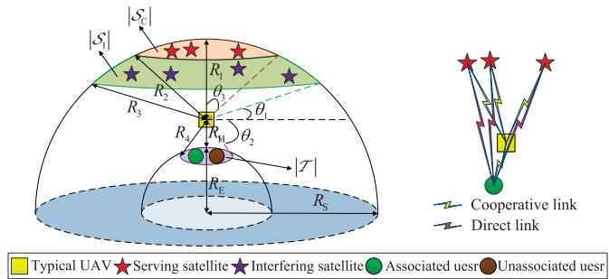  
Fig. 1. A downlink clustered LEO system.

• Simulation results explicate that: 1) In terms of the proposed mechanism, the coverage probability is more sensitive to the large-scale fading, and moderately expanding the size of the satellite cluster at a UAV altitude of about 200m is an effective approach to enhance the coverage probability; and 2) In terms of the comparison, the adaptive selecting mechanism is never worse than other transmissions, and a great performance improvement can be achieved under a lower threshold rate, UAV altitude, and satellite density.

## C. Abbreviations and Notations

To facilitate reading, the abbreviations and some key notations used in this paper are listed in Tables I and II, respectively.

## II. SYSTEM MODEL

A downlink clustered LEO system is studied as shown in Fig. 1, where LEO satellites can communicate with one terrestrial user cluster through the aid of one typical UAV. Particularly, all LEO satellites both exist the direct transmission link to the terrestrial user.1 For the system, the LEO satellites and terrestrial users are deployed in two spherical surfaces $\mathbb { S } _ { \mathrm { S } } ^ { 3 }$ and $\mathbb { S } _ { \mathrm { E } } ^ { 3 }$ with radii $R _ { \mathrm { { S } } }$ and $R _ { \mathrm { E } }$ , respectively, the UAV can hover at a fixed altitude above the center of the terrestrial user cluster. For illustration purposes [24], the locations of the LEO satellites and terrestrial users are expressed by two groups $\Phi _ { \mathrm { S } } = \{ \mathrm { S } _ { i } | i \in [ 1 , I ] \}$ and $\Phi _ { \mathrm { T } } = \{ \mathrm { T } _ { j } | j \in [ 1 , J ] \}$ , and are modeled by the two independent homogeneous SPPPs with densities $\lambda _ { \mathrm { { S } } }$ and $\lambda _ { \mathrm { T } }$ , respectively. The location of UAV U is represented by $( 0 , 0 , R _ { \mathrm { E } } + R _ { \mathrm { H } } )$ , where $R _ { \mathrm { H } } \mathrm { i s }$ the flying altitude of UAV. Next, in view of the Slivnyak’s theorem [13], two surfacesS $\in \mathrm { \mathbb { S } _ { S } ^ { 3 } }$ and $\tau \in \mathbb { S } _ { \mathrm { E } } ^ { 3 }$ are defined to express the visible satellite and terrestrial areas ofU, i.e., |S| and $| \tau |$ , which need to be located above a minimum elevation angle $\theta _ { 1 }$ and below a maximum depression angleθ2, respectively. Further, based on the concept of satellite clustering [8], |S| is physically divided into two sub-areas $| S _ { \mathrm { C } } |$ and $| S _ { \mathrm { I } } |$ using a maximum zenith angle $\theta _ { 3 } .$ , where all satellites within $| S _ { \mathrm { C } }$ |can cooperatively serveUand other satellites outside $| S _ { \mathrm { C } } |$ are viewed as interferences.2 Thus, the distance from U to any friendly satellite is $r _ { \mathrm { c } } \in [ R _ { 1 } , R _ { 2 } ]$ with $R _ { 1 } = R _ { \mathrm { S } } - R _ { \mathrm { E } } -$ $R _ { \mathrm { H } }$ and $R _ { 2 } = { \sqrt { { ( R _ { \mathrm { E } } + R _ { \mathrm { H } } ) } ^ { 2 } { \cos } ^ { 2 } \theta _ { 3 } + R _ { \mathrm { S } } ^ { 2 } - { ( R _ { \mathrm { E } } + R _ { \mathrm { H } } ) } ^ { 2 } } } -$ $( R _ { \mathrm { E } } + R _ { \mathrm { H } } )$ cos $\dot { \theta } _ { 3 }$ to any interfering satellite is $r _ { \mathrm { i } } ~ \in$ $( R _ { 2 } , R _ { 3 } ]$ with $R _ { 3 } = \sqrt { \left( R _ { \mathrm { E } } + R _ { \mathrm { H } } \right) ^ { 2 } \sin ^ { 2 } \theta _ { 1 } + R _ { \mathrm { S } } ^ { 2 } - \left( R _ { \mathrm { E } } + R _ { \mathrm { H } } \right) ^ { 2 } - \left( R _ { \mathrm { E } } + R _ { \mathrm { H } } \right) ^ { 2 } }$ $( R _ { \mathrm { E } } + ~ R _ { \mathrm { H } } )$ sin $\theta _ { 1 }$ , and to any user is $r _ { \mathrm { t } } ~ \in ~ [ R _ { \mathrm { H } } , R _ { 4 } ]$ with $\begin{array} { r } { R _ { 4 } = \frac { R _ { \mathrm { H } } } { \sin \theta _ { 2 } } } \end{array}$ , respectively.

## A. Channel Model

In the system, each wireless channel is characterized by both small-scale fading and large-scale fading to describe the randomness of channel quality. For the small-scale fading, three independent channel coefficients from $\mathrm { S } _ { i }$ to $\mathrm { U } , \mathrm { S } _ { i } \mathrm { \Delta t o \ T } _ { j }$ , and U to $\mathrm { T } _ { j }$ are defined as $h _ { \mathrm { S } _ { i } \mathrm { U } } , \ h _ { \mathrm { S } _ { i } \mathrm { T } _ { j } }$ , and $h _ { \mathrm { U T } _ { j } }$ , respectively. Since the shadowed-Rician fading has been viewed as one common choice to model the effect of satellite channel, thus the probability density functions (PDFs) of the channel gains $\left| h _ { \mathrm { S } _ { i } \mathrm { U } } \right| ^ { 2 }$ and $\left| { { h _ { \mathrm { { S } } _ { i } } } { { \mathrm { T } } _ { j } } } \right| ^ { 2 }$ are given by [21]

$$
\begin{array} { r l r } & { } & { f _ { | h _ { n } | ^ { 2 } } \left( x _ { n } \right) = \bigg ( \frac { 2 b _ { n } m _ { n } } { 2 b _ { n } m _ { n } + \Omega _ { n } } \bigg ) ^ { m } \frac { 1 } { 2 b _ { n } } \exp \left( - \frac { x _ { n } } { 2 b _ { n } } \right) } \\ & { } & { \times \ : _ { 1 } F _ { 1 } \left( m _ { n } ; 1 ; \frac { \Omega _ { n } x _ { n } } { 2 b _ { n } \left( 2 b _ { n } m _ { n } + \Omega _ { n } \right) } \right) , } \end{array}\tag{1}
$$

where $n = \{ \mathrm { S } _ { i } \mathrm { U } , \mathrm { S } _ { i } \mathrm { T } _ { j } \} , ~ 2 b _ { n } , ~ m _ { n }$ , and $\Omega _ { n }$ are the average power of the scatter component, the Nakagami-m parameter, and the average power of the line-of-sight (LoS) component of $h _ { i } ,$ respectively, and $ _ { 1 } F _ { 1 } \left( . ; . ; . \right)$ is the confluent hypergeometric function. Then, $h _ { \mathrm { U T } _ { j } }$ is modeled by adopting the Nakagami-m fading because of its versatility, thus the PDF of the channel gain $\left| h _ { \mathrm { U T } _ { j } } \right| ^ { 2 }$ is given by [24]

$$
f _ { \left| h _ { \mathrm { U T } _ { j } } \right| ^ { 2 } } \left( y \right) = \frac { m ^ { m } } { \Gamma \left( m \right) } y ^ { m - 1 } \exp \left( - m y \right) ,\tag{2}
$$

where n is the Nakagami-m parameter of $h _ { \mathrm { U T } _ { j } }$ . For the largescale fading, we define the distances from $\mathrm { S } _ { i }$ to $\mathrm { U } , \mathrm { S } _ { i }$ to ${ \mathrm { T } } _ { j } ,$ and U to $\mathrm { T } _ { j }$ as $R _ { \mathrm { S } _ { i } \mathrm { U } } , R _ { \mathrm { S } _ { i } \mathrm { T } _ { j } }$ , and $R _ { \mathrm { U T } _ { j } }$ , respectively. The free space path loss and classical path loss are utilized to model the effect of $R _ { n }$ and $R _ { \mathrm { U T } _ { j } }$ , thus their path losses are given by [24]

$$
L _ { n } = { \bigg ( } { \frac { 4 \pi f _ { c } R _ { n } } { c } } { \bigg ) } ^ { 2 } ,\tag{3}
$$

and

$$
{ \cal L } _ { \mathrm { U T } _ { j } } = { \cal R } _ { \mathrm { U T } _ { j } } ^ { \alpha } ,\tag{4}
$$

respectively, where $f _ { c }$ is the carrier frequently of light, c is the speed of light, and α is the path loss exponent.

## B. Downlink Clustered LEO Transmission

For a given time slot t, all LEO satellites have two transmission links to communicate with one random terrestrial user $\mathrm { T } _ { j }$ . In the direct link, each visible satellite within $| S _ { \mathrm { C } } |$ and $| S _ { \mathrm { I } } |$ directly transmit its corresponding signal to $\mathrm { T } _ { j }$ , thus the received signal at $\mathrm { T } _ { j }$ is given by

$$
\begin{array} { r l } & { y _ { \mathrm { T } _ { j } } ^ { D } \left( t \right) = \sum _ { \mathrm { S } _ { i } \in \Phi _ { \mathrm { S } } \cap \left. S _ { \mathrm { C } } \right. } \sqrt { \frac { P _ { \mathrm { S } } G _ { \mathrm { S } _ { i } } ^ { \mathrm { C } } } { L _ { \mathrm { S } _ { i } \mathrm { T } _ { j } } } } h _ { \mathrm { S } _ { i } \mathrm { T } _ { j } \mathrm { S } } \left( t \right) } \\ & { \quad \quad \quad + \sum _ { \mathrm { S } _ { i } \in \Phi _ { \mathrm { S } } \cap \left. S _ { \mathrm { I } } \right. } \sqrt { \frac { P _ { \mathrm { S } } G _ { \mathrm { S } _ { i } } ^ { \mathrm { I } } } { L _ { \mathrm { S } _ { i } \mathrm { T } _ { j } } } } h _ { \mathrm { S } _ { i } \mathrm { T } _ { j } \mathrm { S } _ { i } } \left( t \right) + n _ { \mathrm { T } _ { j } } \left( t \right) , } \end{array}\tag{5}
$$

where $P _ { \mathrm { S } _ { i } }$ is the transmit power of $\mathrm { S } _ { i } , \ G _ { \mathrm { S } _ { i } } ^ { \mathrm { C } }$ and $G _ { \mathrm { S } _ { i } } ^ { \mathrm { I } }$ are the effective transmit gains of $\mathrm { S } _ { i }$ located at $\vert s _ { \mathrm { C } } \vert$ and $| S _ { \mathrm { I } } |$ respectivel $ { \mathrm { y } } , ^ { 3 } \  { \mathrm { s } } ( t )$ and $\mathrm { s } _ { i } \left( t \right)$ are the information symbol of $\mathrm { S } _ { i }$ from $| S _ { \mathrm { C } } |$ and $| S _ { \mathrm { I } } |$ with $\mathbb { E } [ \mathrm { s } \left( t \right) ] ^ { 2 } ~ = ~ \mathbb { E } [ \mathrm { s } _ { i } \left( t \right) ] ^ { 2 } ~ = ~ 1$ respectively, $n _ { \mathrm { T } _ { i } } \left( t \right)$ is the additive white Gaussian noise at $\mathrm { T } _ { j }$ with $\bar { \mathbb { D } } \left[ n _ { \mathrm { T } _ { j } } ( t ) \right] = \sigma ^ { 2 }$ . In the cooperative link, U firstly receives the signals from the satellites and then transmits them to $\mathrm { T } _ { j }$ via utilizing the decode-and-forward (DF) protocol,4thus the received signals at U and $\mathrm { T } _ { j }$ are given by

$$
\begin{array} { r } { y _ { \mathrm { U } } ^ { C } \left( t \right) = \sum _ { \mathrm { S } _ { i } \in \Phi _ { \mathrm { S } } \cap \left. S _ { \mathrm { C } } \right. } \sqrt { \frac { P _ { \mathrm { S } } G _ { \mathrm { S } _ { i } } ^ { \mathrm { C } } } { L _ { \mathrm { S } _ { i } \mathrm { U } } } } h _ { \mathrm { S } _ { i } \mathrm { U } } \mathrm { s } \left( t \right) } \\ { + \sum _ { \mathrm { S } _ { i } \in \Phi _ { \mathrm { S } } \cap \left. S _ { \mathrm { I } } \right. } \sqrt { \frac { P _ { \mathrm { S } } G _ { \mathrm { S } _ { i } } ^ { \mathrm { I } } } { L _ { \mathrm { S } _ { i } \mathrm { U } } } } h _ { \mathrm { S } _ { i } \mathrm { U } } \mathrm { s } _ { i } \left( t \right) + n _ { \mathrm { U } } \left( t \right) , } \end{array}\tag{6}
$$

and

$$
y _ { \mathrm { T } _ { j } } ^ { C } \left( t \right) = \sqrt { \frac { P _ { \mathrm { U } } } { L _ { \mathrm { U T } _ { j } } } } h _ { \mathrm { U T } _ { j } } \mathrm { u } \left( t \right) + n _ { \mathrm { T } _ { j } } \left( t \right) ,\tag{7}
$$

where $n _ { \mathrm { U } } \left( t \right)$ is the additive white Gaussian noise at U with $\mathbb { D } \left[ n _ { \mathrm { U } } \left( t \right) \right] = \sigma ^ { 2 } , P _ { \mathrm { U } }$ is the transmit power of U, and ${ \mathrm { u } } \left( t \right)$ is the information symbol of U with $\mathbf { \mathbb { E } } { [ \mathrm { u } \left( t \right) ] } ^ { 2 } = 1$ . Herein, in order to reduce the complexity of multi-satellite transmission, we assumed that all satellites employ non-coherent joint transmission without stringent synchronization and phase matching. Thus, a non-coherent summation of the received signals can be achieved [31]. Accordingly, the received signalto-interference-plus-noise ratio (SINR) of $\mathrm { T } _ { j }$ over the direct link is given by

$$
r _ { \mathrm { T } _ { j } } ^ { D } \left( t \right) = \frac { S _ { \mathrm { S } _ { i } \mathrm { T } _ { j } } } { I _ { \mathrm { S } _ { i } \mathrm { T } _ { j } } + \bar { G } _ { \mathrm { S } _ { i } } ^ { \mathrm { C } } } ,\tag{8}
$$

where $\begin{array} { r } { S _ { \mathrm { S } _ { i } \mathrm { T } _ { j } } \ = \ \sum _ { \mathrm { S } _ { i } \in \Phi _ { \mathrm { S } } \cap | \mathcal { S } _ { \mathrm { C } } | } r _ { \mathrm { i n } } ^ { \mathrm { S } } L _ { \mathrm { S } _ { i } \mathrm { T } _ { j } } ^ { - 1 } \left| h _ { \mathrm { S } _ { i } \mathrm { T } _ { j } } \right| ^ { 2 } } \end{array}$ and $I _ { \mathrm { S } _ { i } \mathrm { T } _ { j } } =$ $\begin{array} { r } { \sum _ { \mathrm { S } _ { i } \in \Phi _ { \mathrm { S } } \cap \left| S _ { \mathrm { I } } \right| } r _ { \mathrm { i n } } ^ { \mathrm { S } } \bar { G } _ { \mathrm { S } _ { i } } ^ { \mathrm { I / C } } L _ { \mathrm { S } _ { i } \mathrm { T } _ { j } } ^ { - 1 } \left| h _ { \mathrm { S } _ { i } \mathrm { T } _ { j } } \right| ^ { 2 } } \end{array}$ are the accumulated signal and interference power from the direct link, respectively, $\begin{array} { r } { r _ { \mathrm { i n } } ^ { \mathrm { S } } = \frac { P _ { \mathrm { S } _ { i } } } { \sigma ^ { 2 } } } \end{array}$ is the transmit signal-to-noise ratio (SNR) of $\mathrm { S } _ { i }$ $\begin{array} { r } { \bar { G } _ { \mathrm { S } _ { i } } ^ { \mathrm { I / C } } = \frac { G _ { \mathrm { S } _ { i } } ^ { \mathrm { I } } } { G _ { \mathrm { S } _ { . } } ^ { \mathrm { C } } } } \end{array}$ is the equivalent transmit gain of $\mathrm { S } _ { i }$ within $| S _ { \mathrm { I } } |$ and $\begin{array} { r } { \bar { G } _ { \mathrm { S } _ { i } } ^ { \mathrm { C } } = \frac { 1 } { G _ { \mathrm { S } _ { i } } ^ { \mathrm { C } } } } \end{array}$ is the reciprocal of $G _ { \mathrm { S } _ { i } } ^ { \mathrm { C } }$ . The received SINRs of U and $\mathrm { T } _ { j }$ over the cooperative link are given by

$$
r _ { \mathrm { U } } ^ { C } \left( t \right) = \frac { S _ { \mathrm { S } _ { i } \mathrm { U } } } { I _ { \mathrm { S } _ { i } \mathrm { U } } + \bar { G } _ { \mathrm { S } _ { i } } ^ { \mathrm { C } } } ,\tag{9}
$$

and

$$
r _ { \mathrm { T } _ { j } } ^ { C } \left( t \right) = r _ { \mathrm { i n } } ^ { \mathrm { U } } L _ { \mathrm { U T } _ { j } } ^ { - 1 } \big | h _ { \mathrm { U T } _ { j } } \big | ^ { 2 } ,\tag{10}
$$

respectively, where $\begin{array} { r } { S _ { \mathrm { S } _ { i } \mathrm { U } } = \sum _ { \mathrm { S } _ { i } \in \Phi _ { \mathrm { S } } \cap \left. S _ { \mathrm { C } } \right. } r _ { \mathrm { i n } } ^ { \mathrm { S } } L _ { \mathrm { S } _ { i } \mathrm { U } } ^ { - 1 } { \left| h _ { \mathrm { S } _ { i } \mathrm { U } } \right| } ^ { 2 } } \end{array}$ and $\begin{array} { r l r } { I _ { \mathrm { S } _ { i } \mathrm { U } } } & { = } & { \sum _ { \mathrm { S } _ { i } \in \Phi _ { \mathrm { S } } \cap \left| S _ { \mathrm { I } } \right| } r _ { \mathrm { i n } } ^ { \mathrm { S } } G _ { \mathrm { S } _ { i } } ^ { \mathrm { I } / \mathrm { C } } L _ { \mathrm { S } _ { i } \mathrm { U } } ^ { - 1 } \big | h _ { \mathrm { S } _ { i } \mathrm { U } } \big | ^ { 2 } } \end{array}$ are the accumulated signal and interference power at U, respectively, and $\begin{array} { r l r } { r _ { \mathrm { i n } } ^ { \mathrm { U } } } & { { } = } & { \frac { P _ { \mathrm { U } } } { \sigma ^ { 2 } } } \end{array}$ is the transmit SNR of U. Note that if the imperfect relay decoding exists, (10) needs to be rewritten as $\begin{array} { r } { r _ { \mathrm { U } } ^ { \bar { C } } ( t ) = \frac { \bar { S } _ { \mathrm { S } _ { i } \mathrm { U } } } { \kappa S _ { \mathrm { S } _ { i } \mathrm { U } } + I _ { \mathrm { S } _ { i } \mathrm { U } } + \bar { G } _ { \mathrm { S } _ { i } } ^ { \mathrm { C } } } } \end{array}$ , where κ is the level of imperfect relay decoding.

## C. Adaptive Selecting Mechanism

To boost the system performance, it is necessary to further process the signals at $\mathrm { T } _ { j }$ received from two transmission links. Thus, we consider a called “adaptive selecting mechanism”, which can choose one stronger signal from direct and cooperative transmissions according to their real-time channel qualities. Clearly, this adaptive mechanism can ensure a better transmission quality in emergency communication. As a result, the received SINR at $\mathrm { T } _ { j }$ after conducting the adaptive selecting mechanism is given by

$$
r _ { \mathrm { T } _ { j } } ^ { A } \left( t \right) = \left\{ { r } _ { \mathrm { T } _ { j } } ^ { D } \left( t \right) , \begin{array} { l l } { r _ { \mathrm { U } } ^ { C } \left( t \right) < r _ { \mathrm { U } } ^ { \mathrm { t h } } } \\ { \operatorname* { m a x } \left( r _ { \mathrm { T } _ { j } } ^ { D } \left( t \right) , r _ { \mathrm { T } _ { j } } ^ { C } \left( t \right) \right) , } & { r _ { \mathrm { U } } ^ { C } \left( t \right) \geq r _ { \mathrm { U } } ^ { \mathrm { t h } } } \end{array}  \right. ,\tag{11}
$$

where $r _ { \mathrm { U } } ^ { \mathrm { t h } } = 2 ^ { R _ { \mathrm { U } } ^ { \mathrm { t h } } } - 1$ and $R _ { \mathrm { U } } ^ { \mathrm { t h } }$ is the target rate at U. Note that the proposed adaptive selecting mechanism only requires a single comparison per symbol, resulting in $O \left( 1 \right)$ computational complexity. In contrast, maximum ratio combining requires coherent combining, involving multiple complex multiplications and additions as well as phase alignment and channel estimation, leading to significantly higher computational overhead. Therefore, in practical scenarios the proposed mechanism can be readily implemented using simple comparison and switching logic in hardware, enabling low-complexity transmission and hardware implementation. Moreover, CSI acquisition and feedback delays may result in outdated channel information, thereby affecting the accuracy of link selection.

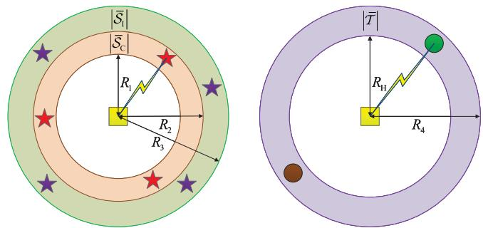  
Fig. 2. Three equivalent visible satellite and terrestrial areas about UAV.

However, since the proposed mechanism relies on a simple comparison of link quality rather than precise phase alignment or coherent signal combining, the impact of moderate CSI delays is expected to be limited. Investigating delay-aware selection strategy can be regraded as a promising direction in future work.

Remark 1 (Discussions on relay reliability): Although imperfect relay decoding may reduce the effective coding gain due to error propagation, it does not introduce additional channel randomness. Therefore, the achievable spatial diversity remains unchanged compared with the perfect decoding case. Nevertheless, relay misbehavior caused by malfunction or malicious actions can still significantly degrade system performance. An effective solution is to employ dedicated detection mechanisms, such as those studied in [35], to ensure robust cooperative diversity in practice.

## III. MATHEMATICAL PRELIMINARIES

This section provides some basic mathematical preliminaries before conducting the performance analysis. Specifically, we firstly provide three equivalent 2D areas about $| S _ { \mathrm { C } } | , | S _ { \mathrm { I } } |$ and $| \tau |$ to pursue an intuitive understanding of the system model. Then, to simplify the analytical complexity, we employ the moment matching method to approximate the summation of the random variables as the Gamma random variable.

## A. Topological Transformation From 3D Model to 2D Model

Based on Lemma 1 of [24], three equivalent visible satellite and terrestrial areas about UAV are depicted as shown in Fig. 2, where the brown area $| \bar { \mathcal { S } } _ { \mathrm { C } } |$ , the green area $\left| \hat { \mathcal { S } } _ { \mathrm { I } } \right|$ , and the purple area $| \bar { \mathcal T } |$ are the equivalent areas of $| \dot { S } _ { \mathrm { C } } | , \ | S _ { \mathrm { I } } |$ and $| \tau | .$ , respectively. The number of LEO satellites $\Phi _ { \bar { S } \mathrm { C } } =$ $\left\{ \mathrm { S } _ { i } \vert \dot { \mathrm { S } } _ { i } \stackrel { \cdot } { \in } \left. \bar { \mathcal { S } } _ { \mathrm { C } } \right. , i \in [ \dot { 1 } , I ] \right\}$ and $\Phi _ { \bar { S } _ { \mathrm { C } } } = \{ \mathrm { S } _ { i } | \mathrm { S } _ { i } \in | \bar { S } _ { \mathrm { I } } | , i \in [ \breve { 1 , I } ] \}$ within $| \bar { \mathcal { S } } _ { \mathrm { C } } ^ { \dot { } } |$ and $\left| \hat { S } _ { \mathrm { I } } \right|$ follow two independent identically homogeneous PPPs with one common density $\lambda _ { \bar { \mathrm { S } } } ,$ respectively, and the number of terrestrial users $\Phi _ { \bar { T } } { = } \{ \bar { \mathrm { T } _ { j } } | \tilde { \mathrm { T } _ { j } } \in \left| \bar { \bar { T } } \right| , j \in [ \bar { 1 } , J ] \}$ follows the homogeneous PPP with density $\lambda _ { \hat { \mathrm { T } } }$ . Based on the above, the conditions of topological transformation from 3D model to 2D model are given in the following Corollary.

Corollary 1: (Topological Transformation from 3D Model to 2D Model). The equivalent conditions between $| S _ { \mathrm { C } } |$ and $| \bar { S } _ { \mathrm { C } } |$ and between |S | and $| \bar { S } _ { \mathrm { I } } |$ are equal, and can be expressed as

$$
\lambda _ { \bar { \mathrm { S } } } = \frac { R _ { \mathrm { S } } } { R _ { \mathrm { E } } + R _ { \mathrm { H } } } \lambda _ { \mathrm { S } } .\tag{12}
$$

Next, in terms of $| \tau |$ and $| \bar { \mathcal T } |$ , their equivalent condition can be expressed as

$$
\lambda _ { \bar { \mathrm { T } } } = \frac { R _ { \mathrm { E } } } { R _ { \mathrm { E } } + R _ { \mathrm { H } } } \lambda _ { \mathrm { T } } .\tag{13}
$$

Proof: Refer to Lemma 1 of [24], (12) and (13) can be easily derived because the proposed conditions are solely related to the size of $R _ { \mathrm { H } }$ under any $\theta _ { 1 } , \theta _ { 2 }$ , and $\theta _ { 3 }$ 

Remark 2: Since $| S _ { \mathrm { C } } |$ and $\vert S _ { \mathrm { I } } \vert$ can be regarded as mutual independent based on the property of homogeneous SPPP, thus two different topological transformations have the same condition as [24].

According to the above Corollary, all analysis will be carried out in the three equivalent 2D areas in the following.

## B. Approximate Channel Statistics

Through examining (8) and (9), it can be observed that their numerators and denominators are composed of multiple random variables (RVs). In particular, the numerators in (8) and (9) may equal to zero when there is no $\mathrm { S } _ { i }$ within $| \bar { S } _ { \mathrm { C } } |$ for one specific realization. Conversely, since $\bar { G } _ { \mathrm { S } _ { i } } ^ { \mathrm { C } }$ exists in the denominators in (8) and (9), which cause their values are always greater than zero. Since the Gamma approximation has shown a better matching accuracy on a type of RV that contains the accumulation of multiple RVs [32], and the Gamma RV must be one positive, thus we employ the above method to make one approximation on the denominators in (8) and (9) in the following Proposition.

Proposition 1: The numerators in (8) and (9) can be approximated as two independent Gamma RVs $X _ { \mathrm { S } _ { i } \mathrm { U } }$ and $X _ { \mathrm { S } _ { i } \mathrm { T } _ { j } }$ . On one hand, the shape and scale parameters of $X _ { \mathrm { S } _ { i } \mathrm { U } }$ are given by

$$
k _ { \mathrm { S } _ { i } \mathrm { U } } = \frac { \phi _ { \mathrm { S } _ { i } \mathrm { U } } \lambda _ { \bar { \mathrm { S } } } ( \ln R _ { 3 } - \ln R _ { 2 } ) ^ { 2 } } { R _ { 2 } ^ { - 2 } - R _ { 3 } ^ { - 2 } } ,\tag{14}
$$

and

$$
\theta _ { \mathrm { S } _ { i } \mathrm { U } } = \frac { \varphi _ { \mathrm { S } _ { i } \mathrm { U } } \left( R _ { 2 } ^ { - 2 } - R _ { 3 } ^ { - 2 } \right) } { \ln { R _ { 3 } } - \ln { R _ { 2 } } } ,\tag{15}
$$

respectively,

$$
\begin{array}{c} \begin{array} { r l } & { \dot { \overline { { 8 b _ { i } \mathrm { U } m _ { \mathrm { S } _ { i } } \mathrm { U } \left( 2 b _ { \mathrm { S } _ { i } \mathrm { U } } + \Omega _ { \mathrm { S } _ { i } \mathrm { U } } \right) ^ { 2 } } } } \end{array} , \qquad \Longrightarrow { \overbrace { 8 b _ { \mathrm { S } _ { i } \mathrm { U } m _ { \mathrm { S } _ { i } } \mathrm { U } \left( b _ { \mathrm { S } _ { i } \mathrm { U } } + \Omega _ { \mathrm { S } _ { i } \mathrm { U } } \right) + \Omega _ { \mathrm { S } _ { i } \mathrm { U } } ^ { 2 } \left( m _ { \mathrm { S } _ { i } \mathrm { U } } + 1 \right) } } ^ { \dot { \mathrm { U } } } , \qquad \varphi _ { \mathrm { S } _ { i } \mathrm { U } } } } \\ & { \frac { \varepsilon \bar { G } _ { \mathrm { S } _ { i } } ^ { \mathrm { I / C } } \left( 8 b _ { \mathrm { S } _ { i } \mathrm { U } } m _ { \mathrm { S } _ { i } \mathrm { U } } \left( b _ { \mathrm { S } _ { i } \mathrm { U } } + \Omega _ { \mathrm { S } _ { i } \mathrm { U } } \right) + \Omega _ { \mathrm { S } _ { i } \mathrm { U } } ^ { 2 } \left( m _ { \mathrm { S } _ { i } \mathrm { U } } + 1 \right) \right) } { 2 m _ { \mathrm { S } _ { i } \mathrm { U } } \left( 2 b _ { \mathrm { S } _ { i } \mathrm { U } } + \Omega _ { \mathrm { S } _ { i } \mathrm { U } } \right) } , \qquad } \end{array}\tag{and}
$$

$\begin{array} { r l r } { \varepsilon } & { { } = } & { \frac { c ^ { 2 } r _ { \mathrm { i n } } ^ { \mathrm { S } } { \bar { G } } _ { \mathrm { S } _ { i } } ^ { \mathrm { I / C } } } { 1 6 \pi ^ { 2 } f _ { c } ^ { 2 } } } \end{array}$ . On the other hand, since $R _ { \mathrm { S } _ { i } \mathrm { T } _ { j } }$ can be approximated as $R _ { \mathrm { S } _ { i } \mathrm { U } }$ under the constraint $R _ { 1 } \ \gg \ R _ { 4 }$ , the shape and scale parameters of $X _ { \mathrm { S } _ { i } \mathrm { T } _ { j } }$ are given by

$$
k _ { \mathrm { S } _ { i } \mathrm { T } _ { j } } = \frac { \phi _ { \mathrm { S } _ { i } \mathrm { T } _ { j } } \lambda _ { \bar { \mathrm { T } } } ( \ln R _ { 3 } - \ln R _ { 2 } ) ^ { 2 } } { R _ { 2 } ^ { - 2 } - R _ { 3 } ^ { - 2 } } ,\tag{16}
$$

and

$$
\theta _ { \mathrm { S } _ { i } \mathrm { T } _ { j } } = \frac { \varphi _ { \mathrm { S } _ { i } \mathrm { T } _ { j } } \left( R _ { 2 } ^ { - 2 } - R _ { 3 } ^ { - 2 } \right) } { \ln { R _ { 3 } } - \ln { R _ { 2 } } } ,\tag{17}
$$

respectively, where $\scriptstyle \phi _ { \mathrm { S } _ { i } \mathrm { T } _ { j } } = { \frac { 4 \pi m _ { \mathrm { S } _ { i } \mathrm { T } _ { j } } \left( 2 b _ { \mathrm { S } _ { i } \mathrm { T } _ { j } } + \Omega _ { \mathrm { S } _ { i } \mathrm { T } _ { j } } \right) ^ { 2 } } { 8 b _ { \mathrm { S } _ { i } \mathrm { T } _ { j } } m _ { \mathrm { S } _ { i } \mathrm { T } _ { j } } \left( b _ { \mathrm { S } _ { i } \mathrm { T } _ { j } } + \Omega _ { \mathrm { S } _ { i } \mathrm { T } _ { j } } \right) + \Omega _ { \mathrm { S } _ { i } \mathrm { T } _ { j } } ^ { 2 } \left( m _ { \mathrm { S } _ { i } \mathrm { T } _ { j } } + 1 \right) } }$ and ${ \varphi } _ { \mathrm { S } _ { i } \mathrm { T } _ { j } } = \frac { \varepsilon \bar { G } _ { \mathrm { S } _ { i } } ^ { \mathrm { I } / \mathrm { C } } \left( 8 b _ { \mathrm { S } _ { i } \mathrm { T } _ { j } } m _ { \mathrm { S } _ { i } \mathrm { T } _ { j } } \left( b _ { \mathrm { S } _ { i } \mathrm { T } _ { j } } + \Omega _ { \mathrm { S } _ { i } \mathrm { T } _ { j } } \right) + \Omega _ { \mathrm { S } _ { i } \mathrm { T } _ { j } } ^ { 2 } \left( m _ { \mathrm { S } _ { i } \mathrm { T } _ { j } } + 1 \right) \right) } { 2 m _ { \mathrm { S } _ { i } \mathrm { T } _ { j } } \left( 2 b _ { \mathrm { S } _ { i } \mathrm { T } _ { j } } + \Omega _ { \mathrm { S } _ { i } \mathrm { T } _ { j } } \right) }$

Proof: See Appendix A.



## IV. PERFORMANCE ANALYSIS OF THE CLUSTERED LEO SYSTEMS

This section studies the performance of the clustered LEO systems based on the proposed adaptive selecting mechanism. In particular, we firstly derive the non-empty probability of ${ \mathrm { T } } _ { j } ,$ the conditional associated probability of U, and the conditional Laplace transforms of the cumulated signal power $S _ { \mathrm { S } _ { i } \mathrm { U } }$ and $S _ { \mathrm { S } _ { i } \mathrm { T } _ { \perp } }$ to further investigate the downlink coverage probability under the adaptive transmission. Moreover, since the pure direct and cooperative transmissions can be viewed two basic transmission benchmarks, we also analyze their corresponding downlink coverage probability.

## A. Statistical Properties

a) Non-Empty Probability: To obtain the meaningful result, at least one $\mathrm { T } _ { j }$ must exist within $| \bar { \mathcal T } |$ . Thus, its corresponding probability needs to be given in the following Lemma.

Lemma 1 (Non-Empty Probability of ${ \mathrm { T } } _ { j } ) { : }$ The non-empty probability $\mathbb { P } \left( \Phi _ { \bar { T } } > 0 \right)$ is given by

$$
\mathbb { P } \left( \Phi _ { \bar { T } } > 0 \right) = 1 - \exp \left( - \lambda _ { \bar { \mathrm { T } } } \left. \mathbb { S } _ { \bar { T } } ^ { 2 } \right. \right) ,\tag{18}
$$

where $\left| \mathbb { S } _ { \bar { T } } ^ { 2 } \right| = \pi \left( R _ { 4 } ^ { 2 } - R _ { \mathrm { H } } ^ { 2 } \right)$

Proof: The proof is complete via employing the property of the homogeneous PPP. 

b) Conditional User Association: Recall that the denominators in (8) and (9) are approximated as two Gamma RVs, which have averaged the randomness of $\mathrm { S } _ { i }$ within $\left| \hat { \mathcal { S } } _ { \mathrm { I } } \right|$ . Hence, we only need to derive the PDF of the distance from U to one random terrestrial user $\mathrm { T } _ { j }$ in the following Lemma.

Lemma 2 (Conditional User Association): If existing one $\mathrm { T } _ { j }$ satisfies the constraint $\mathrm { T } _ { j } \in \vert \bar { \mathcal { T } } \vert$ , the PDF of the distance from U to $\mathrm { T } _ { j }$ is given by

$$
f _ { R _ { \mathrm { U T } _ { j } } | \mathrm { T } _ { j } \in | \hat { \mathcal { T } } | } ( r _ { \mathrm { U T } _ { j } } ) = \{ \begin{array} { l l } { \frac { 2 r _ { \mathrm { U T } _ { j } } } { R _ { 4 } ^ { 2 } - R _ { \mathrm { H } } ^ { 2 } } , } & { r _ { \mathrm { U T } _ { j } } \in [ R _ { \mathrm { H } } , R _ { 4 } ] } \\ { 0 , } & { r _ { \mathrm { U T } _ { j } } \notin [ R _ { \mathrm { H } } , R _ { 4 } ] } \end{array} .\tag{19}
$$

Proof: See Appendix B.



c) Laplace Analysis: Before calculating the downlink coverage probability, the conditional Laplace transforms of the cumulated signal power $\sum _ { \mathrm { S } _ { i } \in \Phi _ { \mathrm { S } } \cap \left| S _ { \mathrm { C } } \right| } r _ { \mathrm { i n } } ^ { \mathrm { S } } L _ { \mathrm { S } _ { i } \mathrm { U } } ^ { - 1 } \big | h _ { \mathrm { S } _ { i } \mathrm { U } } \big | ^ { 2 }$ and $\begin{array} { r } { \sum _ { \mathrm { S } _ { i } \in \Phi _ { \mathrm { S } } \cap | \mathcal { S } _ { \mathrm { C } } | } r _ { \mathrm { i n } } ^ { \mathrm { S } } L _ { \mathrm { S } _ { i } \mathrm { T } _ { i } } ^ { - 1 } \left| h _ { \mathrm { S } _ { i } \mathrm { T } _ { j } } \right| ^ { 2 } } \end{array}$ still need to be derived.

Lemma 3: (Conditional Laplace Transform of the Accumulated Signal Power:) Given that $R _ { \mathrm { S } _ { i } \mathrm { U } } = r _ { \mathrm { S } _ { i } \mathrm { U } }$ under the constraint $\bar { \mathrm { S } } _ { i } \in | \bar { S } _ { \mathrm { C } } |$ , when $m _ { \mathrm { S } _ { i } \mathrm { U } }$ is round up or down to an integer, i.e., $\bar { m } _ { \mathrm { S } _ { i } \mathrm { U } } \dot { = } \Gamma m _ { \mathrm { S } _ { i } \mathrm { U } } \vert$ or $\bar { m } _ { \mathrm { S } _ { i } \mathrm { U } } = \lfloor m _ { \mathrm { S } _ { i } \mathrm { U } } \rfloor$ , the lower and upper bounds for the conditional Laplace transform of $S _ { \mathrm { S } _ { i } \mathrm { U } }$ are given by

$$
\begin{array} { r l } & { \quad _ { m _ { S _ { i } \cup [ S _ { i } ] } } ( _ { S _ { C } } ) ( _ { S } , m _ { S _ { i } \cup [ } \underbrace { \sum _ { i } ^ { n } m _ { S _ { i } \cup [ } } _ { m _ { S _ { i } \cup [ } } ]    } \\ & {           \frac { m _ { S _ { i } \cup [ } } { m _ { S _ { i } \cup [ } }     }     \\ & {               \frac { m _ { S _ { i } \cup [ } } { m _ { S _ { i } \cup [ } }     ]   }     \\ & {                  \frac { m _ { S _ { i } \cup [ } } { m _ { S _ { i } \cup [ } }     ]    }            \frac { ( 2 b _ { S _ { i } \cup [ } ^ { 2 } - 1 ] } { m _ { S _ { i } \cup [ } }           \\ & { \quad \quad \times               ( { \bar { R } } _ { 1 } ^ { 2 \setminus \mathrm { S } _ { i } \cup [ }       }      \\ &  \quad \quad -        \frac { 2 ^ { \mathrm { S } _ { i } \cup [ } } { m _ { S _ { i } \cup } } ,  \mathrm { S } _ { i } \cup    \mathrm { S } _ { i } \cup \{ \end{array}
$$

where $\begin{array} { r } { \eta \ = \ \frac { s \varepsilon } { \mathrm { G } _ { \mathrm { s } } ^ { \mathrm { I } / \mathrm { C } } } , \ \sigma _ { \mathrm { S } _ { i } \mathrm { U } } \ = \ \frac { 2 b _ { \mathrm { S } _ { i } \mathrm { U } \overline { { m } } \mathrm { S } _ { i } \mathrm { U } } + \Omega _ { \mathrm { S } _ { i } \mathrm { U } } \eta } { \overline { { m } } _ { \mathrm { S } _ { i } \mathrm { U } } } , \ \varsigma _ { \mathrm { S } _ { i } \mathrm { U } } \ = \ 1 \ + \ } \end{array}$ $\bar { m } _ { \mathrm { S } _ { i } \mathrm { U } } - l _ { 1 }$ , and ${ } _ { 2 } F _ { 1 } \left( . , . ; . ; . \right)$ is the Gaussian hypergeometric function. Based on the approximate expression $R _ { \mathrm { S } _ { i } \mathrm { T } _ { j } } \approx R _ { \mathrm { S } _ { i } \mathrm { U } } ,$ if $m _ { \mathrm { S } _ { i } \mathrm { T } _ { j } }$ is round up or down to an integer, i.e., $\bar { m } _ { \mathrm { S } _ { i } \mathrm { T } _ { j } } ~ =$ $\left\lceil m _ { \mathrm { S } _ { i } \mathrm { T } _ { j } } \right\rceil \mathrm { o r } \bar { m } _ { \mathrm { S } _ { i } \mathrm { T } _ { j } } = \left\lfloor m _ { \mathrm { S } _ { i } \mathrm { T } _ { j } } \right\rfloor$ , the lower and upper bounds for the conditional Laplace transform of $S _ { \mathrm { S } _ { i } \mathrm { T } _ { j } }$ are given by

$$
\begin{array} { r l } & { \quad L _ { S _ { s } , \tau _ { j } } | \mathrm { s } _ { i \in \left[ \bar { s } c \right] } \left( s , m _ { S _ { i } \tau _ { j } } \right) } \\ & { \quad \quad \quad \quad \quad \quad \quad \quad \quad \quad \quad \quad \quad \quad \quad \quad \quad \quad \quad \quad \quad \quad \quad \mathrm \quad \quad \quad \quad \quad \quad \quad \mathrm \quad \quad \quad \quad \quad \quad \mathrm }  \\ & { \quad \quad \quad \quad \quad \quad \quad \quad \quad \quad \quad \quad \quad \quad \quad \quad \quad \quad \quad \bar { m } _ { s , \tau _ { j } } \succ \left[ m _ { S _ { i } \tau _ { j } } \right] } \\ & { \quad \quad \quad \quad \quad \quad \quad \quad \quad \quad \quad \quad \quad \quad \quad \quad \bar { m } _ { s , \tau _ { j } , - 1 } - \left( \bar { m } _ { S _ { i } \tau _ { j } } - 1 \right) \underbrace { \left( 2 b _ { S _ { i } \tau _ { j } } \tau _ { j } \right) ^ { \tau _ { i _ { 1 } } } } _ { \mathrm { I _ { 1 } } } } \\ & { \quad \quad \quad \quad \quad \quad \quad \quad \quad \quad \quad \quad \quad \quad \quad \quad \quad \quad \quad \quad \quad \quad \quad \quad \quad \quad \quad \quad \quad \quad \quad \quad \quad \quad \quad \quad \quad \quad \quad } \\ & { \quad \quad \quad \quad \quad \quad \quad \times \left( { R _ { 1 } ^ { 2 S _ { i } \tau _ { j } } } _ { 2 } F _ { 1 } \left( \bar { m } _ { s , \tau _ { j } } , \mathrm { S } _ { s , \tau _ { j } } ; 1 + \mathrm { S } _ { s , \tau _ { j } } ; - \frac { R _ { 1 } ^ { 2 } } { \sigma _ { S _ { i } \tau _ { j } } } \right) \right. } \\ & { \quad \quad \quad \quad \quad \quad \quad \quad \quad \quad \quad \quad \quad \quad \quad \quad \quad \quad \quad \quad \quad \quad \quad \quad \quad \quad \quad \quad \quad \quad \quad \quad \quad \quad \quad \quad } \\ &  \quad \quad \quad \quad \quad \quad \quad \quad \quad \quad \quad \quad \quad \quad \ \end{array}\tag{21}
$$

where $\begin{array} { r } { \sigma _ { \mathrm { S } _ { i } \mathrm { T } _ { j } } = \frac { 2 b _ { \mathrm { S } _ { i } \mathrm { T } _ { j } } \bar { m } _ { \mathrm { S } _ { i } \mathrm { T } _ { j } } \eta + \Omega _ { \mathrm { S } _ { i } \mathrm { T } _ { j } } \eta } { \bar { m } _ { \mathrm { S } _ { i } \mathrm { T } _ { j } } } } \end{array}$ and $\mathrm { \varsigma _ { S _ { { i } T _ { { j } } } } } = 1 + \bar { m } \mathrm { \mathrm { S } } _ { i } \mathrm { T } _ { { j } } - \bar { l } _ { 1 }$ Proof: See Appendix C. 

Corollary 2: When $m _ { \mathrm { S } _ { i } \mathrm { U } } = m _ { \mathrm { S } _ { i } \mathrm { T } _ { j } } = 1$ holds, the tractable forms of (20) and (21) are given by

$$
L _ { S _ { \mathrm { S } _ { i } \mathrm { U } } | \mathrm { S } _ { i } \in | \bar { S } _ { \mathrm { C } } | } ( s , 1 ) = ( \frac { \sigma _ { \mathrm { S } _ { i } \mathrm { U } } + R _ { 1 } ^ { 2 } } { \sigma _ { \mathrm { S } _ { i } \mathrm { U } } + R _ { 2 } ^ { 2 } } ) ^ { \pi \lambda _ { \bar { \mathrm { S } } } \sigma _ { \mathrm { S } _ { i } \mathrm { U } } } ,\tag{22}
$$

and

$$
L _ { S _ { \mathrm { S } _ { i } \mathrm { T } _ { j } } | \mathrm { S } _ { i } \in | \bar { \mathcal { S } } _ { \mathrm { C } } | } ( s , 1 ) \approx ( \frac { \sigma _ { \mathrm { S } _ { i } \mathrm { T } _ { j } } + R _ { 1 } ^ { 2 } } { \sigma _ { \mathrm { S } _ { i } \mathrm { T } _ { j } } + R _ { 2 } ^ { 2 } } ) ^ { \pi \lambda _ { \bar { \mathrm { S } } } \sigma _ { \mathrm { S } _ { i } \mathrm { T } _ { j } } } .\tag{23}
$$

Proof: By setting $m _ { \mathrm { S } _ { i } \mathrm { U } } = m _ { \mathrm { S } _ { i } \mathrm { T } _ { j } } = 1$ into (20) and (21), (22) can be derived by utilizing a specific value of the Gaussian hypergeometric function in [[33], Eq. (07.23.03.3154.01)].

## B. Downlink Conditional Coverage Probability

For the considered system, $\mathrm { i f } \ \mathrm { T } _ { j }$ cannot successfully receive the information from the LEO satellite cluster at the t-th time slot, an outage event will be occurred. Thus, in the following analysis, we analyze the downlink conditional coverage probability of $\mathrm { T } _ { j }$ based on the considered mechanism, and two pure transmissions also be analyzed for comparison.

a) Adaptive Selecting Mechanism: Based on (11), the downlink conditional coverage probability of $\mathrm { T } _ { j }$ under the adaptive selecting mechanism is given by

$$
\begin{array} { r l } & { P _ { \mathrm { T } _ { j } } ^ { A S } \left( r _ { \mathrm { U } } ^ { \mathrm { t h } } , r _ { \mathrm { T } _ { j } } ^ { \mathrm { t h } } \right) } \\ & { = \mathbb { P } \left( \Phi _ { \hat { T } } > 0 \right) \left( \mathbb { P } \left( r _ { \mathrm { U } } ^ { C } \left( t \right) < r _ { \mathrm { U } } ^ { \mathrm { t h } } , r _ { \mathrm { T } _ { j } } ^ { D } \left( t \right) \ge r _ { \mathrm { T } _ { j } } ^ { \mathrm { t h } } \Big \vert \Phi _ { \hat { T } } > 0 \right) \right. } \\ & { \left. + \mathbb { P } \left( r _ { \mathrm { U } } ^ { C } \left( t \right) \ge r _ { \mathrm { U } } ^ { \mathrm { t h } } , \operatorname* { m a x } \left( r _ { \mathrm { T } _ { j } } ^ { D } \left( t \right) , r _ { \mathrm { T } _ { j } } ^ { C } \left( t \right) \right) \ge r _ { \mathrm { T } _ { j } } ^ { \mathrm { t h } } \Big \vert \Phi _ { \hat { T } } > 0 \right) \right) } \end{array}\tag{24}
$$

where $r _ { \mathrm { U } } ^ { \mathrm { t h } } \quad = \quad 2 ^ { R _ { \mathrm { U } } ^ { \mathrm { t h } } } - 1 , ~ r _ { \mathrm { T } _ { \mathrm { \it \cdot } } } ^ { \mathrm { t h } } \quad = \quad 2 ^ { R _ { \mathrm { T } _ { j } } ^ { \mathrm { t h } } } - 1$ , and $R _ { \mathrm { U } } ^ { \mathrm { t h } }$ and $R _ { \mathrm { T } _ { i } } ^ { \mathrm { t h } }$ are the target rates at U and $\mathrm { T } _ { j }$ respectively. In view of the above expression, two conditional probabilities $\mathbb { P } \Big ( r _ { \mathrm { U } } ^ { C } ( t ) < r _ { \mathrm { U } } ^ { \mathrm { t h } } , r _ { \mathrm { T } _ { j } } ^ { \bar { D } } ( t ) \ge r _ { \mathrm { T } _ { j } } ^ { \mathrm { t h } } | \Phi _ { \bar { T } } > 0 )$

and $\mathbb { P } \bigg ( r _ { \mathrm { U } } ^ { C } \left( t \right) \geq r _ { \mathrm { U } } ^ { \mathrm { t h } }$ , max $( r _ { \mathrm { T } _ { j } } ^ { D } ( t ) , r _ { \mathrm { T } _ { j } } ^ { C } ( t ) ) \geq r _ { \mathrm { T } _ { j } } ^ { \mathrm { t h } } \Big | \Phi _ { \bar { \tau } } > 0 )$ need to be derived in the following Lemmas.

Lemma 4: (Conditional Coverage Probability under the Adaptive Selecting Mechanism): The upper bound for the approximate expression of $\mathbb { P } \left( r _ { \mathrm { U } } ^ { C } \left( t \right) < r _ { \mathrm { U } } ^ { \mathrm { t h } } , r _ { \mathrm { T } _ { j } } ^ { D } \left( t \right) \ge r _ { \mathrm { T } _ { j } } ^ { \mathrm { t h } } \Big | \ \Phi _ { \bar { \tau } } > 0 \right)$ is given by P  rCU (t) < rthU , rDTj (t) ≥ rthTj  ΦT¯ > 0 ≤ Iupper1 Iupper2 ,

(25)

where

$$
\begin{array} { l } { { \displaystyle I _ { \mathrm { 1 } } ^ { \mathrm { u p p e r } } = \sum _ { l _ { 1 } = 1 } ^ { \bar { k } _ { \mathrm { S } _ { i } \mathrm { U } } } \binom { \bar { k } _ { \mathrm { S } _ { i } \mathrm { U } } } { l _ { 1 } } ( - 1 ) ^ { l _ { 1 } + 1 } } } \\ { { \displaystyle \phantom { \sum _ { l _ { 1 } = 1 } ^ { \bar { k } _ { \mathrm { S } _ { i } \mathrm { U } } } } \times L _ { S _ { \mathrm { S } _ { i } \mathrm { U } } \big | \mathrm { S } _ { i } \in \big | \bar { S } _ { \mathrm { C } } \big | } \big ( l _ { 1 } \mu _ { \mathrm { S } _ { i } \mathrm { U } } , m _ { \mathrm { S } _ { i } \mathrm { U } } \big ) , } } \end{array}\tag{26}
$$

$$
\begin{array} { r l } & { I _ { \mathrm { 2 } } ^ { \mathrm { u p p e r } } = \displaystyle \sum _ { l _ { 2 } = 0 } ^ { \bar { k } _ { \mathrm { S } _ { i } \mathrm { T } _ { j } } } ( \bar { k } _ { 0 } \mathrm { T } _ { j } ) ( - 1 ) ^ { l _ { 2 } } } \\ & { \qquad \quad \times L _ { S _ { \mathrm { S } _ { i } \mathrm { T } _ { j } } | \mathrm { S } _ { i } \in | \bar { S } _ { \mathrm { C } } | } ( l _ { 2 } \mu _ { \mathrm { S } _ { i } \mathrm { T } _ { j } } , m _ { \mathrm { S } _ { i } \mathrm { T } _ { j } } ) , } \end{array}\tag{27}
$$

$\begin{array} { r } { \bar { k } _ { \mathrm { S } _ { i } \mathrm { U } } ~ = ~ \left[ k _ { \mathrm { S } _ { i } \mathrm { U } } \right] , ~ \bar { k } _ { \mathrm { S } _ { i } \mathrm { T } _ { j } } ~ = ~ \left\lfloor k _ { \mathrm { S } _ { i } \mathrm { T } _ { j } } \right\rfloor , ~ \mu s , U ~ = ~ \frac { \left( k _ { 3 } , u ^ { 1 } \right) ^ { - \frac { 1 } { 2 u _ { , u } } } } { 8 5 , u r u ^ { 2 } } , , } \end{array}$ and $\begin{array} { r } { \mu _ { \mathrm { S } _ { i } \mathrm { T } _ { j } } ~ = ~ \frac { 1 } { \theta _ { \mathrm { S } _ { i } \mathrm { T } _ { j } } r _ { \mathrm { T } _ { j } } ^ { \mathrm { t h } } } } \end{array}$ . The lower bound for the approximate expression of $\mathbb { P } \left( r _ { \mathrm { U } } ^ { C } \left( t \right) < r _ { \mathrm { U } } ^ { \mathrm { t h } } , r _ { \mathrm { T } _ { j } } ^ { D } \left( t \right) \ge r _ { \mathrm { T } _ { j } } ^ { \mathrm { t h } } \Big | \Phi _ { \hat { T } } > 0 \right)$ is given by

$$
\mathbb { P } \left( r _ { \mathrm { U } } ^ { C } \left( t \right) < r _ { \mathrm { U } } ^ { \mathrm { t h } } , r _ { \mathrm { T } _ { j } } ^ { D } \left( t \right) \ge r _ { \mathrm { T } _ { j } } ^ { \mathrm { t h } } \Big | \Phi _ { \bar { T } } > 0 \right) \ge I _ { 1 } ^ { \mathrm { l o w e r } } I _ { 2 } ^ { \mathrm { l o w e r } } ,
$$

where

(28)

$$
I _ { 1 } ^ { \mathrm { l o w e r } } = \sum _ { l _ { 1 } = 1 } ^ { \tilde { k } _ { \mathrm { S } _ { i } \mathrm { U } } } \binom { \tilde { k } _ { \mathrm { S } _ { i } \mathrm { U } } } { l _ { 1 } } ( - 1 ) ^ { l _ { 1 } + 1 } L _ { S _ { \mathrm { S } _ { i } \mathrm { U } } | \mathrm { S } _ { i } \in | \bar { S } _ { \mathrm { C } } | } ( l _ { 1 } \nu _ { \mathrm { S } _ { i } \mathrm { U } } , m _ { \mathrm { S } _ { i } \mathrm { U } } ) ,\tag{29}
$$

and

$$
I _ { 2 } ^ { \mathrm { l o w e r } } = \sum _ { l _ { 2 } = 0 } ^ { \tilde { k } _ { \mathrm { S } _ { i } \mathrm { T } _ { j } } } \binom { \tilde { k } _ { \mathrm { S } _ { i } \mathrm { T } _ { j } } } { l _ { 2 } } ( - 1 ) ^ { l _ { 2 } } L _ { S _ { \mathrm { S } _ { i } \mathrm { T } _ { j } } | \mathrm { S } _ { i } \in | \bar { S } _ { \mathrm { C } } | } ( l _ { 2 } \nu _ { \mathrm { S } _ { i } \mathrm { T } _ { j } } , m _ { \mathrm { S } _ { i } \mathrm { T } _ { j } } ) ,\tag{30}
$$

$$
\begin{array} { r c l c l c l } { \tilde { k } _ { \mathrm { S } _ { i } \mathrm { U } } } & { = } & { \lfloor k _ { \mathrm { S } _ { i } \mathrm { U } } \rfloor , } & { \tilde { k } _ { \mathrm { S } _ { i } \mathrm { T } _ { j } } } & { = } & { \left\lceil k _ { \mathrm { S } _ { i } \mathrm { T } _ { j } } \right\rceil , } & { \nu _ { \mathrm { S } _ { i } \mathrm { U } } } & { = } & { \frac { 1 } { \theta _ { \mathrm { S } _ { i } \mathrm { U } } r _ { \mathrm { U } } ^ { \mathrm { t h } } } , } \end{array}
$$

and $\begin{array} { r l r } { v _ { \mathrm { B } , \ \mathrm { T } _ { y } } } & { { } = } & { \frac { \left( k _ { 3 , \ \mathrm { T } _ { 2 } } , 1 \right) ^ { - \frac { 1 } { \psi _ { 2 } \mathrm { T } _ { 3 } } } } { \delta _ { 3 , \ \mathrm { T } _ { 3 } } \Gamma _ { \mathrm { Y } _ { 3 } } } . . } \end{array}$ Subsequently, the upper bound for the approximate expression of $\begin{array} { r } { \mathbb { P } \bigg ( r _ { \mathrm { U } } ^ { C } \left( t \right) \geq r _ { \mathrm { U } } ^ { \mathrm { t h } } , \operatorname* { m a x } \left( r _ { \mathrm { T } _ { j } } ^ { D } \left( t \right) , r _ { \mathrm { T } _ { j } } ^ { \overline { { C } } } \left( t \right) \geq r _ { \mathrm { T } _ { j } } ^ { \mathrm { t h } } \bigg | \Phi _ { \mathcal { T } } > 0 \right) \mathrm { i } } \end{array}$ s given by

$$
\begin{array} { r l r } & { \mathbb { P } \left( r _ { \mathrm { U } } ^ { C } \left( t \right) \geq r _ { \mathrm { U } } ^ { \mathrm { t h } } , \operatorname* { m a x } \left( r _ { \mathrm { T } _ { j } } ^ { D } \left( t \right) , r _ { \mathrm { T } _ { j } } ^ { C } \left( t \right) \right) \geq r _ { \mathrm { T } _ { j } } ^ { \mathrm { t h } } \bigg \vert \Phi _ { \bar { T } } > 0 \right) } & \\ & { \leq I _ { 3 } ^ { \mathrm { u p p e r } } \left( 1 - I _ { 4 } ^ { \mathrm { l o w e r } } I _ { 5 } \right) , } & { \left( 3 - I _ { 4 } ^ { \mathrm { l o w e r } } I _ { 4 } ^ { \mathrm { p } } \left( t \right) \right) } \end{array}\tag{31}
$$

where

$$
\begin{array} { l } { { \displaystyle I _ { 5 } \approx 1 - \frac { \pi \left( R _ { 4 } + R _ { \mathrm { H } } \right) } N \sum _ { n = 1 } ^ { N } \sqrt { 1 - \sigma _ { n } ^ { 2 } } } } \\ { { \displaystyle \phantom { \frac { I _ { 5 } \approx 1 - \pi \left( R _ { 4 } + R _ { \mathrm { H } } \right) } N } \times r _ { n } \exp \left( - \frac { m r _ { n } ^ { \alpha } r _ { \mathrm { T } _ { j } } ^ { \mathrm { t h } } } { r _ { \mathrm { i n } } ^ { \mathrm { U } } } \right) \sum _ { l _ { 3 } = 0 } ^ { m - 1 } \frac { \left( \frac { m r _ { n } ^ { \alpha } r _ { \mathrm { T } _ { j } } ^ { \mathrm { t h } } } { r _ { \mathrm { i n } } ^ { \mathrm { U } } } \right) ^ { l _ { 3 } } } m } , } \end{array}\tag{32}
$$

$I _ { 3 } ^ { \mathrm { u p p e r } } \qquad = \qquad 1 ~ - ~ I _ { 1 } ^ { \mathrm { l o w e r } } , \quad I _ { 4 } ^ { \mathrm { l o w e r } } \qquad = \qquad 1 ~ - ~ I _ { 2 } ^ { \mathrm { u p p e r } }$ $\begin{array} { r l r } { \stackrel { \sim } { \sigma _ { n } } } & { { } = } & { \cos \frac { 2 n - 1 } { 2 N } \pi . } \end{array}$ , and $\begin{array} { r l r } { r _ { n } } & { { } \stackrel { \cdot } { = } } & { \frac { R _ { 4 } - R _ { \mathrm { H } } } { 2 } \sigma _ { n } \ + \ \frac { R _ { 4 } ^ { - } + R _ { \mathrm { H } } } { 2 } } \end{array}$ The lower bound for the approximate expression of $\mathbb { P } \Big ( r _ { \mathrm { U } } ^ { C } \left( t \right) \ge r _ { \mathrm { U } } ^ { \mathrm { t h } }$ , max $\left( r _ { \mathrm { T } _ { j } } ^ { D } \left( t \right) , r _ { \mathrm { T } _ { j } } ^ { C } \left( t \right) \ge r _ { \mathrm { T } _ { j } } ^ { \mathrm { t h } } \Big | \ \Phi _ { \bar { T } } > 0 \right)$ is given by

$$
\begin{array} { r l r } & { \mathbb { P } \left( r _ { \mathrm { U } } ^ { C } \left( t \right) \geq r _ { \mathrm { U } } ^ { \mathrm { t h } } , \operatorname* { m a x } \left( r _ { \mathrm { T } _ { j } } ^ { D } \left( t \right) , r _ { \mathrm { T } _ { j } } ^ { C } \left( t \right) \right) \leq r _ { \mathrm { T } _ { j } } ^ { \mathrm { t h } } \bigg \vert \Phi _ { \mathcal { T } } > 0 \right) } & \\ & { \geq I _ { 3 } ^ { \mathrm { l o w e r } } \left( 1 - I _ { 4 } ^ { \mathrm { u p p e r } } I _ { 5 } \right) , } & { \left( \frac { \gamma } { r } \right) , } \end{array}\tag{33}
$$

where $I _ { 3 } ^ { \mathrm { l o w e r } } = 1 - I _ { 1 } ^ { \mathrm { u p p e r } }$ and $I _ { 4 } ^ { \mathrm { u p p e r } } = 1 - I _ { 2 } ^ { \mathrm { l o w e r } }$

Proof: See Appendix D.

Corollary 3: When $k _ { \mathrm { S } _ { i } \mathrm { U } } = k _ { \mathrm { S } _ { i } \mathrm { T } _ { j } } = 1$ holds, the closedform expressions of $I _ { 1 }$ and $I _ { 2 }$ are given by

$$
I _ { 1 } = I _ { 1 } ^ { \mathrm { u p p e r } } = I _ { 1 } ^ { \mathrm { l o w e r } } = L _ { S _ { \mathrm { S } _ { i } \mathrm { U } }  \mathrm { S } _ { i } \in  \bar { S } _ { \mathrm { C } }  } ( \frac { 1 } { \theta _ { \mathrm { S } _ { i } \mathrm { U } } r _ { \mathrm { U } } ^ { \mathrm { t h } } } , m _ { \mathrm { S } _ { i } \mathrm { U } } ) ,\tag{34}
$$

and

$$
I _ { 2 } { = } I _ { 2 } ^ { \mathrm { u p p e r } } { = } I _ { 2 } ^ { \mathrm { l o w e r } } { = } 1 { - } L _ { S _ { \mathrm { S } _ { i } \mathrm { T } _ { j } } | \mathrm { S } _ { i } \in | \bar { S } _ { \mathrm { C } } | } ( \frac { 1 } { \theta _ { \mathrm { S } _ { i } \mathrm { T } _ { j } } r _ { \mathrm { U } } ^ { \mathrm { t h } } } , m _ { \mathrm { S } _ { i } \mathrm { T } _ { j } } )\tag{35}
$$

Proof: Setting $k _ { \mathrm { S } _ { i } \mathrm { U } } = k _ { \mathrm { S } _ { i } \mathrm { T } _ { j } } = 1$ into (55)-(58), (34) and (35) can be derived. 

Corollary 4: When $m = 1$ holds, the closed-form expression of $I _ { 5 }$ is given by

$$
\begin{array} { r l } & { I _ { 5 } = 1 - \displaystyle \frac { 2 } { \alpha \left( R _ { 4 } ^ { 2 } - R _ { \mathrm { H } } ^ { 2 } \right) } \left( \frac { r _ { \mathrm { i n } } ^ { \mathrm { U } } } { r _ { \mathrm { T } _ { j } } ^ { \mathrm { t h } } } \right) ^ { \frac { 2 } { \alpha } } } \\ & { \qquad \times \left( \gamma \left( \displaystyle \frac { 2 } { \alpha } , \frac { r _ { \mathrm { T } _ { j } } ^ { \mathrm { t h } } } { r _ { \mathrm { i n } } ^ { \mathrm { U } } } R _ { 4 } ^ { \alpha } \right) - \gamma \left( \displaystyle \frac { 2 } { \alpha } , \frac { r _ { \mathrm { T } _ { j } } ^ { \mathrm { t h } } } { r _ { \mathrm { i n } } ^ { \mathrm { U } } } R _ { \mathrm { H } } ^ { \alpha } \right) \right) . } \end{array}\tag{36}
$$

Proof: Utilizing the integral formula [[34], Eq. (8.350.1)] into (60), (36) can be derived. 

b) Direct-only Transmission: The downlink conditional coverage probability of $\mathrm { T } _ { j }$ under the direct-only transmission is given by

$$
\begin{array} { r } { P _ { \mathrm { T } _ { j } } ^ { D } \left( r _ { \mathrm { T } _ { j } } ^ { \mathrm { t h } } \right) = \mathbb { P } \left( \Phi _ { \bar { T } } > 0 \right) \mathbb { P } \left( r _ { \mathrm { T } _ { j } } ^ { D } \left( t \right) \geq r _ { \mathrm { T } _ { j } } ^ { \mathrm { t h } } \Big \vert \Phi _ { \bar { T } } > 0 \right) . } \end{array}\tag{37}
$$

According to the Lemma 4, (37) can be derived in the following Lemma.

Lemma 5: (Conditional Coverage Probability under the Direct-only Transmission): The upper and lower bounds for the approximate expression of $P _ { \mathrm { T } _ { j } } ^ { D } \left( r _ { \mathrm { T } _ { j } } ^ { \mathrm { t h } } \right)$ are given by

$$
P _ { \mathrm { T } _ { j } } ^ { D } \left( r _ { \mathrm { T } _ { j } } ^ { \mathrm { t h } } \right) \leq \mathbb { P } \left( \Phi _ { \bar { T } } > 0 \right) I _ { 2 } ^ { \mathrm { u p p e r } } ,\tag{38}
$$

and

$$
P _ { \mathrm { T } _ { j } } ^ { D } \left( r _ { \mathrm { T } _ { j } } ^ { \mathrm { t h } } \right) \geq \mathbb { P } \left( \Phi _ { \bar { T } } > 0 \right) I _ { 2 } ^ { \mathrm { l o w e r } } .\tag{39}
$$

Proof: See (56) and (58) of Appendix D.

c) Cooperative-only Transmission: The downlink conditional coverage probability of $\mathrm { T } _ { j }$ under the cooperative-only transmission is given by

$$
\begin{array} { r l } & { P _ { \mathrm { T } _ { j } } ^ { C } \left( r _ { \mathrm { U } } ^ { \mathrm { t h } } , r _ { \mathrm { T } _ { j } } ^ { \mathrm { t h } } \right) } \\ & { \quad \quad = \mathbb { P } \left( \Phi _ { \bar { T } } > 0 \right) } \end{array}
$$

$$
\times \mathbb { P } \left( r _ { \mathrm { U } } ^ { C } \left( t \right) \ge r _ { \mathrm { U } } ^ { \mathrm { t h } } , r _ { \mathrm { T } _ { j } } ^ { C } \left( t \right) \ge r _ { \mathrm { T } _ { j } } ^ { \mathrm { t h } } \Big | \Phi _ { \hat { T } } > 0 \right) .\tag{40}
$$

Based on the mutual independence of $r _ { \mathrm { U } } ^ { C } \left( t \right)$ and $r _ { \mathrm { T } _ { j } } ^ { C } \left( t \right)$ , we can calculate (40) in the following Lemma.

Lemma 6: (Conditional Coverage Probability under the Coop erative-only Transmission): The upper and lower bounds for the approximate expression of $P _ { \mathrm { T } _ { j } } ^ { C } \left( r _ { \mathrm { U } } ^ { \mathrm { t h } } , r _ { \mathrm { T } _ { j } } ^ { \mathrm { t h } } \right)$ are given by

$$
P _ { \mathrm { T } _ { j } } ^ { C } \left( r _ { \mathrm { U } } ^ { \mathrm { t h } } , r _ { \mathrm { T } _ { j } } ^ { \mathrm { t h } } \right) \leq \mathbb { P } \left( \Phi _ { \bar { T } } > 0 \right) \left( 1 - I _ { 1 } ^ { \mathrm { l o w e r } } \right) \left( 1 - I _ { 5 } \right) ,\tag{41}
$$

and

$$
P _ { \mathrm { T } _ { j } } ^ { C } \left( r _ { \mathrm { U } } ^ { \mathrm { t h } } , r _ { \mathrm { T } _ { j } } ^ { \mathrm { t h } } \right) \geq \mathbb { P } \left( \Phi _ { \bar { T } } > 0 \right) \left( 1 - I _ { 1 } ^ { \mathrm { u p p e r } } \right) \left( 1 - I _ { 5 } \right) .\tag{42}
$$

Proof: See (55), (57), and (60) of Appendix D.

Remark 3: (Theoretical insights on adaptive selecting mechanism): By observing the derived results in (4)-(33), the items $I _ { 1 } , \ I _ { 2 } ,$ , and $I _ { 5 }$ have the crucial influence on the conditional coverage probability. Particularly, based on the Corollaries 3 and 4, since the items $I _ { 2 }$ and $I _ { 5 }$ decrease with the item $I _ { 1 }$ and $R _ { \mathrm { H } }$ respectively, thus it is difficult to determine the optimal $R _ { \mathrm { H } }$ by taking the derivative of the items $I _ { 1 } , I _ { 2 }$ , and $I _ { 5 }$ . Therefore, one-dimensional search may be an efficient way to discover an optimal $R _ { \mathrm { H } }$ . Moreover, based on (8)-(10), the change of $\lambda _ { \bar { \mathrm { S } } }$ can both enhance or reduce the useful and interference signal power. For $\lambda _ { \bar { \mathrm { U } } }$ , improving its value cannot improve any signal power, but the conditional coverage probability will sharply decrease if its value is too low. As a result, the optimal setting tends to set a larger $\lambda _ { \bar { \mathrm { S } } }$ and a suitable $\lambda _ { \bar { \mathrm { U } } }$

Remark 4: (Discussions on UAV mobility and energy constraint): This work focuses on network-level performance analysis using stochastic geometry, aiming to study how the deployment of network nodes affects the statistical performance of UAV-aided clustered LEO systems. In particular, by invoking Slivnyak’s theorem, considering the typical UAV is not associated with a fixed location, and the proposed model captures the statistical performance of UAVs randomly located in the networks. In contrast, studies on UAV mobility and energy constraint are typically conducted under a deterministic network deployment. In short, these represent two parallel research directions: the former emphasizes network planning based on statistical performance, whereas the latter focuses on enhancing network performance under a given deployment. Accordingly, this work aims to support network planning through large-scale performance evaluation.

## V. SIMULATION RESULTS

In this section, the computer simulations are utilized to evaluate the theoretical performance of the clustered LEO systems through $1 0 ^ { 4 }$ large-scale and $1 0 ^ { 3 }$ small-scale Monte Carlo simulations. For illustration purposes, the system parameters are set in Table III [11], [24], [36]. Further, for the small-scale shadowed-Rician fading, we consider that $h _ { \mathrm { S } _ { i } \mathrm { U } }$ and $h _ { \mathrm { S } _ { i } \mathrm { T } _ { \mathcal { j } } }$ have the same fading parameters, and suffer the infrequent light shadowing with $b _ { n } = 0 . 1 5 8 , m _ { n } = 1 9 . 4$ , and $\Omega _ { n } = 1 . 2 9$ [36]. For the target rate, $R _ { \mathrm { U } } ^ { \mathrm { t h } } ~ = ~ R _ { \mathrm { T } _ { \it \it \ / i } } ^ { \mathrm { t h } } ~ = ~ \mathrm { l o g } _ { 2 } \left( 1 + r ^ { \mathrm { t h } } \right) \mathrm { i s }$ assumed for simplicity. Moreover, the following simulations are based solely on the derived mathematical results, without considering practical effects such as decoding complexity, hardware cost, or switching delay, which are beyond the scope of this paper.

TABLE III  
TABLE OF SYSTEM PARAMETERS
<table><tr><td rowspan=1 colspan=1>Parameter</td><td rowspan=1 colspan=1>Value</td></tr><tr><td rowspan=1 colspan=1>Spherical radius of LEO satellite $\overline { { ( R _ { \mathrm { S } } ) } }$ </td><td rowspan=1 colspan=1>6671km</td></tr><tr><td rowspan=1 colspan=1>Spherical radius of terrestrial users (RE)</td><td rowspan=1 colspan=1>6371km</td></tr><tr><td rowspan=1 colspan=1>Flying altitude of UAV $\overline { { ( R _ { \mathrm { H } } ) } }$ </td><td rowspan=1 colspan=1>500m</td></tr><tr><td rowspan=1 colspan=1>Minimum elevation angle $\overline { { ( \theta _ { 1 } ) } }$ </td><td rowspan=1 colspan=1> $\overline { { 3 0 ^ { \circ } } }$ </td></tr><tr><td rowspan=1 colspan=1>Maximum depression angle (θ2)</td><td rowspan=1 colspan=1>60°</td></tr><tr><td rowspan=1 colspan=1>Maximum zenith angle $\overline { { ( \theta _ { 3 } ) } }$ </td><td rowspan=1 colspan=1>30°</td></tr><tr><td rowspan=1 colspan=1>Density of LEO satellites (λs)</td><td rowspan=1 colspan=1> $\overline { { 1 0 ^ { - } } } \mathrm { { T } }$ </td></tr><tr><td rowspan=1 colspan=1>Density of terrestrial users $( \lambda _ { \mathrm { T } } )$ </td><td rowspan=1 colspan=1> $\overline { { 1 0 ^ { - 4 } } }$ </td></tr><tr><td rowspan=1 colspan=1>Carrier frequently of light $\overline { { ( f _ { c } ) } }$ </td><td rowspan=1 colspan=1> $\overline { { 1 \mathrm { ~ G H z } } }$ </td></tr><tr><td rowspan=1 colspan=1>Speed of light (c)</td><td rowspan=1 colspan=1> $\overline { { 3 \times 1 0 ^ { 8 } ~ m / s } }$ </td></tr><tr><td rowspan=1 colspan=1>Path loss exponent (α)</td><td rowspan=1 colspan=1> $\overline { { 3 . 5 } }$ </td></tr><tr><td rowspan=1 colspan=1>Nakagami-m parameter (m)</td><td rowspan=1 colspan=1>2</td></tr><tr><td rowspan=1 colspan=1>Transmit power of LEO satellite $\overline { { ( { P _ { \mathrm { S } } } _ { i } ) } }$ </td><td rowspan=1 colspan=1>30dBm</td></tr><tr><td rowspan=1 colspan=1>Transmit power of UAV (PU)</td><td rowspan=1 colspan=1>3dBm</td></tr><tr><td rowspan=1 colspan=1>Noise power $\overline { { ( \sigma ^ { 2 } ) } }$ </td><td rowspan=1 colspan=1>-90dBm</td></tr><tr><td rowspan=1 colspan=1>Effective transmit gain $\overline { { ( G _ { \mathrm { S } _ { i } } ^ { \mathrm { C } } ) } }$ </td><td rowspan=1 colspan=1>40dBm</td></tr></table>

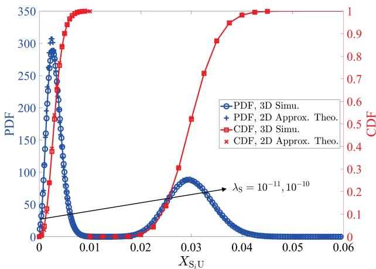

Fig. 3. The PDF and CDF of $X _ { \mathrm { S } _ { i } \mathrm { U } }$ for different $\lambda _ { \mathrm { { S } } }$  
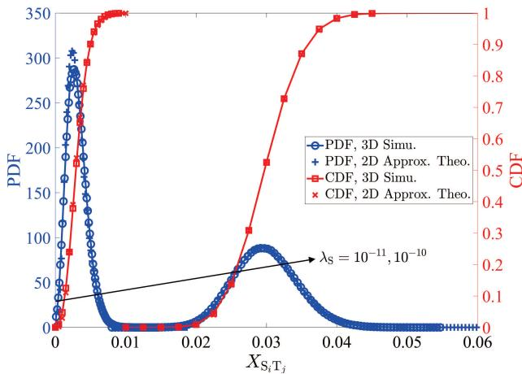  
Fig. 4. The PDF and CDF of $X _ { \mathrm { S } _ { i } \mathrm { T } _ { j } }$ for different $\lambda _ { \mathrm { { S } } }$

## A. Proof of Mathematical Preliminaries

To demonstrate the Corollary 1 and the Proposition 1, Figs. 3 and 4 plot the distribution function of $X _ { \mathrm { S } _ { i } \mathrm { U } }$ and $X _ { \mathrm { S } _ { i } \mathrm { T } _ { j } }$ for different $\lambda _ { \mathrm { S } } .$ , respectively. Firstly, in Fig. 3, we can observe that all approximate theoretical results can basically agree with their corresponding simulation results, which prove the proposed topological transformation and approximate channel statistics. Next, the matching accuracy can be improved with the increase of $\lambda _ { \mathrm { { S } } }$ . This is because that the Gamma approximation based moment matching method is more suitable for the case of accumulating more RVs, as explained by the central limit theorem. Accordingly, since the LEO satellites are expected to achieve a large-scale deployment, the proposed approximate RV $X _ { \mathrm { S } _ { i } \mathrm { U } }$ is simple and effective. Secondly, in Fig. 4, a phenomenon similar to Fig. 3 can be observed. This confirms the proposed assumption about the approximate equation $R _ { \mathrm { S } _ { i } \mathrm { T } _ { j } } \approx R _ { \mathrm { S } _ { i } \mathrm { U } }$ under the constraint $R _ { 1 } \gg R _ { \mathrm { H } }$ . As a result, the Corollary 1 and the Proposition 1 can be proven to simplify the complexity of the system and signal models.

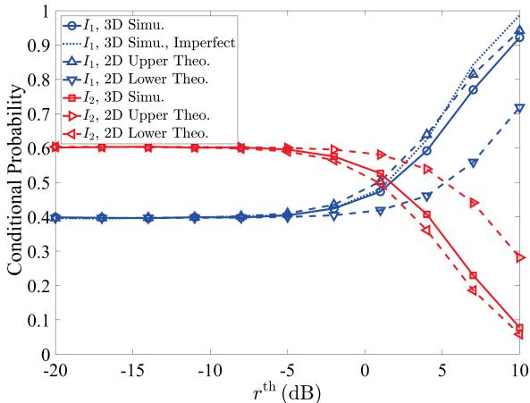  
Fig. 5. Conditional probability versus $r ^ { \mathrm { t h } }$ with $\kappa = 0 . 0 5$

## B. Adaptive Selecting Mechanism

To assess the derived results under the adaptive selecting mechanism, firstly, Fig. 5 plots the conditional probability versus $r ^ { \mathrm { t h } }$ . In general, it can be observed that the exact $I _ { 1 }$ and $I _ { 2 }$ are always located between their corresponding upper and lower theoretical results, which demonstrate the derived results in $( 2 5 ) ‐ ( 3 0 )$ . Then, the upper bound of $I _ { 1 }$ and the lower bound of $I _ { 2 }$ are closer to $I _ { 1 }$ and $I _ { 2 }$ compared to the lower bound of $I _ { 1 }$ and the upper bound of $I _ { 2 } ,$ , respectively. Therefore, to pursue a more accurate theoretical result in the following computer simulations, we choose the upper bound of $I _ { 1 }$ and the lower bound of $I _ { 2 }$ as two tight bounds to study the effects of various system parameters. Moreover, if a small relay decoding residual is considered, i.e., $\kappa = 0 . 0 5$ the corresponding result is almost identical to that of the perfect decoding case under $r ^ { \mathrm { t h } } < 0 \mathrm { d B }$ , which implies that the analytical results remain valid under practical scenarios with mild decoding imperfections.

In Fig. 6, the influences on the small-scale shadowed-Rician fading parameters $b _ { n } , m _ { n }$ , and $\Omega _ { n }$ over the satellite-UAV link are studied. Herein, apart from the above mentioned shadowing, we still consider two different shadowing cases, which include the average shadowing with $b _ { n } = 0 . 1 2 6 , m _ { n } = 1 0 . 1$ and $\Omega _ { n } ~ = ~ 0 . 8 3 5 ,$ , and the frequent heavy shadowing with $b _ { n } = 0 . 0 6 3 , m _ { n } = 0 . 7 3 9$ , and $\Omega _ { n } = 8 . 9 7 \times 1 0 ^ { 4 } \ [ 3 6 ]$ . We can observe that the infrequent and average shadowing are superior and inferior to the frequent heavy shadowing under a lower and higher $r ^ { \mathrm { t h } }$ , respectively. Thus, setting different $r ^ { \mathrm { t h } }$ in the different channel environments is profitable to improve the system performance.

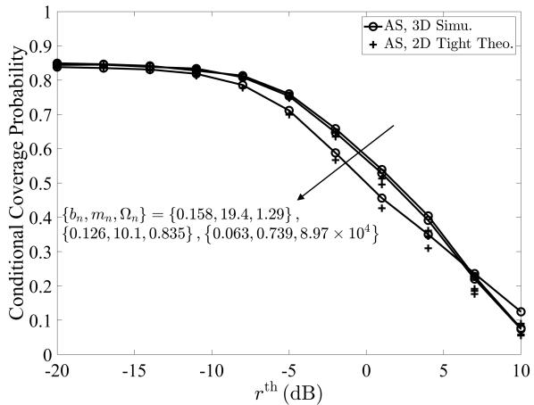  
Fig. 6. Conditional coverage probability versus $r ^ { \mathrm { t h } }$ under adaptive selecting mechanism for different $b _ { n } ,$ mn, and $\Omega _ { n }$

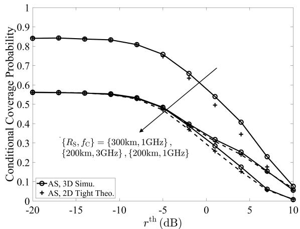  
Fig. 7. Conditional coverage probability versus $r ^ { \mathrm { t h } }$ under adaptive selecting mechanism for different R and $f _ { \mathrm { C } }$

Fig. 7 studies the influences on the large-scale path loss parameters $R _ { \mathrm { { S } } }$ and $f _ { \mathrm { C } }$ over the satellite-UAV link. An interesting observation is that the conditional coverage probability can significantly be improved through increasing $R _ { \mathrm { { S } } }$ . The reason is as follow. Since the received signal strength is mainly determined the size of the useful signal, and such variety can enhance $| S _ { \mathrm { C } } |$ to lead that more satellites achieve cooperative transmission with enhancing the system performance. Moreover, another interesting observation is that the conditional coverage probability changes with $f _ { \mathrm { C } }$ only in a larger $r ^ { \mathrm { t h } }$ . This is because that its variety can both reduce the useful signal and interference power, so the conditional coverage probability is insensitive to $f _ { \mathrm { C } }$ under some smaller $r ^ { \mathrm { t h } }$ . Conversely, the enhancement of $f _ { \mathrm { C } }$ can increase the conditional coverage probability under some strict $r ^ { \mathrm { t h } }$ due to a larger number of interfering satellites.

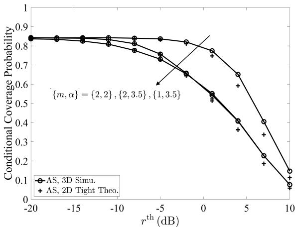  
Fig. 8. Conditional coverage probability versus $r ^ { \mathrm { t h } }$ under adaptive selecting mechanism for different m and α.

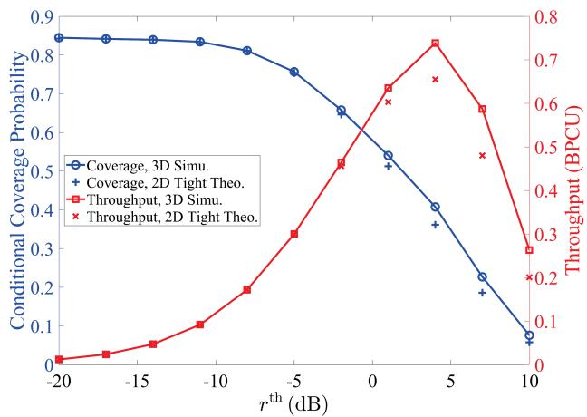  
Fig. 9. Conditional coverage probability and throughput versus $r ^ { \mathrm { t h } }$ under adaptive selecting mechanism.

For the UAV-terrestrial link, the impacts on the large-scale and small-scale parameters m and α are studied in Fig. 8. One can observe that improving m and reducing α can enhance the system performance, the reason is that it can boost the signal strength received by the UAV. One can also observe that α is more easily to affect the coverage probability than m. Particularly, an increase in m has almost no performance improvement under a larger $r ^ { \mathrm { t h } }$ . Therefore, creating a better large-scale propagation environment is more efficient.

Fig. 9 plots the conditional coverage probability and throughput versus $r ^ { \mathrm { t h } }$ under the adaptive selecting mechanism. The expression for the throughput is given by $R _ { \mathrm { T } _ { j } } ^ { A S } =$ $P _ { \mathrm { T } _ { j } } ^ { A S } \left( r _ { \mathrm { U } } ^ { \mathrm { t h } } , r _ { \mathrm { T } _ { j } } ^ { \mathrm { t h } } \right) \log _ { 2 } \left( 1 + r _ { \mathrm { T } _ { j } } ^ { \mathrm { t h } } \right)$ . It can be observed that as $r ^ { \mathrm { t h } }$ increases, the coverage probability decreases monotonically due to stricter decoding requirements, while the throughput first increases and then decreases. This behavior reveals a fundamental trade-off between coverage probability and throughput. Particularly, increasing the target SINR improves the spectral efficiency of each successful transmission, but at the cost of a reduced coverage probability, while lowering the SINR threshold enhances coverage at the expense of achievable data rate. Therefore, a moderate SINR threshold can be identified that effectively balances coverage reliability and spectral efficiency, thereby maximizing the achievable throughput in the considered system.

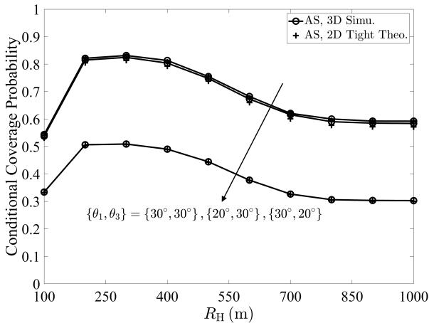  
Fig. 10. Conditional coverage probability versus $R _ { \mathrm { H } }$ under adaptive selecting mechanism for different $\theta _ { 1 }$ and $\theta _ { 3 }$ , where $r ^ { \mathrm { t h } } = - 5 \mathrm { d B }$

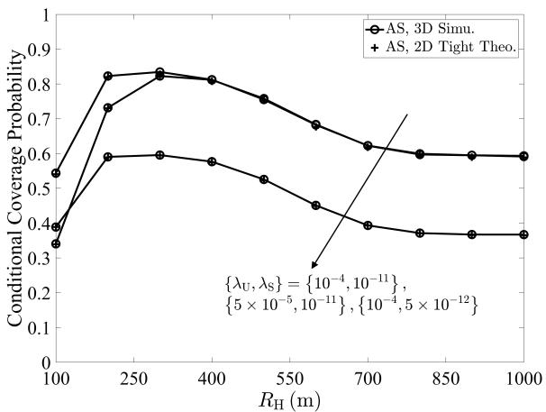  
Fig. 11. Conditional coverage probability versus $R _ { \mathrm { H } }$ under adaptive selecting mechanism for different $\lambda _ { \mathrm { U } }$ and $\lambda _ { \mathrm { { S } } } .$ , where $r ^ { \mathrm { t h } } = - 5 \mathrm { d B }$

Figs. 10 and 11 plot conditional coverage probability versus $R _ { \mathrm { H } }$ for different $\theta _ { \mathrm { 1 } } , \theta _ { \mathrm { 3 } } , \lambda _ { \mathrm { U } }$ , and $\lambda _ { \mathrm { { S } } }$ , respectively. In Fig. 10, all curves both firstly increase and then gradually decrease to a lower performance limit along with the growth of $R _ { \mathrm { H } }$ . The reasons are as follows. Under a lower $R _ { \mathrm { H } } .$ , the probability of having at least one $\mathrm { T } _ { j }$ is also very low, resulting in a lower performance. This problem can be mitigated with gradually increasing $R _ { \mathrm { H } }$ . However, if $R _ { \mathrm { H } }$ is too large, it will hardly affect the channel quality from the satellite-UAV link, and the signal strength received by the UAV-terrestrial link also becomes very weak, thus yielding a lower limit. Moreover, the system performance is more susceptible to $\theta _ { 3 }$ than $\theta _ { 1 }$ The reason is that the useful signal power plays a decisive role in the system performance.

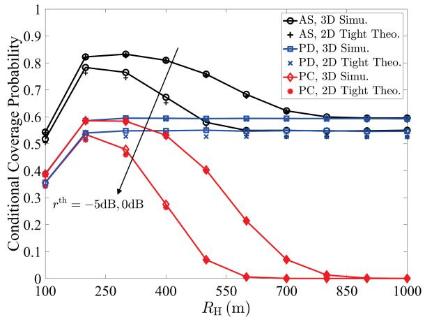  
Fig. 12. Conditional coverage probability versus $R _ { \mathrm { H } }$ under three transmissions for different $r ^ { \mathrm { t h } }$

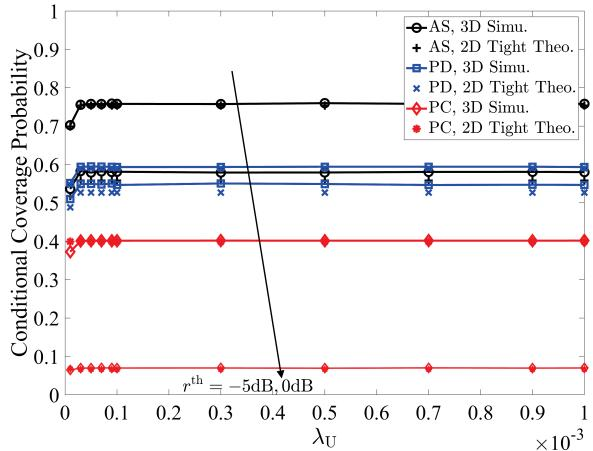  
${ \mathrm { F i g } } .$ 13. Conditional coverage probability versus $\lambda _ { \mathrm { U } }$ under three transmissions for different $r ^ { \mathrm { t h } }$

In Fig. 11, all curves show the similar varying tendencies to that in $\mathrm { F i g } .$ . 10. Further, the change in $\lambda _ { \mathrm { U } }$ only affect the system performance at a lower $R _ { \mathrm { H } }$ , and the performance degradation can be observed via reducing $\lambda _ { \mathrm { { S } } }$ . These phenomena can be explained as follows. $\lambda _ { \mathrm { U } }$ only affects the non-empty probability of ${ \mathrm { T } } _ { j } ,$ the number of cooperative and interfering satellites can be changed via adjusting $\lambda _ { \mathrm { { S } } }$ . In conclusion, choosing a UAV altitude $R _ { \mathrm { H } }$ around 200 m is critical for the considered systems across different system settings. While larger satellite clusters can improve coverage in simulations, increasing the cluster size beyond a certain point may reduce the feasibility of inter-satellite cooperative transmission due to the higher coordination complexity. Therefore, a trade-off exists between cluster size and practical system complexity, and moderate cluster sizes are recommended to balance coverage performance with cooperative transmission efficiency.

## C. Comparisons With Other Transmissions

Figs. 12–14 carry out some comparisons with other transmissions for different $R _ { \mathrm { H } } , \lambda _ { \mathrm { U } }$ , and $\lambda _ { \mathrm { { S } } }$ . On the whole, one can observe that the adaptive selecting transmission is always not less than the others in all figures, which reveal the superiority of the proposed mechanism due to the utilization of diversity gain. Another observation is that a more significant performance gain can be exhibited under $r ^ { \mathrm { t h } } = - 5 \mathrm { d B }$ compared to $r ^ { \mathrm { t h } } \ = \ 0 \mathrm { d B }$ . The reason is as follow. At a higher $r ^ { \mathrm { t h } }$ it is difficult for $\mathrm { T } _ { j }$ to decode the signals received from satellite and UAV, leading to a limited performance gain even with employing the adaptive selecting mechanism. From the perspective of each figure, as can be observed from Fig. 12, an optimal $R _ { \mathrm { H } }$ and a lower performance limit exist in both considered mechanism and pure cooperative transmission, and the pure direct transmission has an upper performance limit. The first phenomenon can be explained by the same reason as Fig. 10, and there are two reasons for the second phenomenon as follows. The performance of the pure direct transmission is independent of to $R _ { \mathrm { H } }$ , but if $R _ { \mathrm { H } }$ is very low, the probability of existing at least one $\mathrm { T } _ { j }$ is too small, which can lead to performance degradation. Besides, when $R _ { \mathrm { H } }$ is sufficient large, the performances of the adaptive selecting and pure direct transmissions are equal. In other words, the cooperative link is always in an outage state. As a result, in order to obtain the maximum performance gain, it is necessary to design the optimal $R _ { \mathrm { H } }$

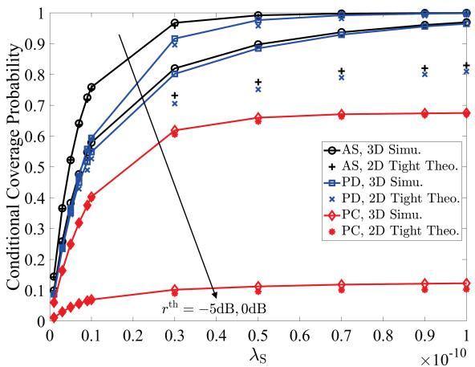  
Fig. 14. Conditional coverage probability versus $\lambda _ { \mathrm { { S } } }$ under three transmissions for different $r ^ { \mathrm { t h } }$

The influence on $\lambda _ { \mathrm { U } }$ is plotted in Fig. 13. We can observe that all curves both gradually increase the different upper values. This is because that $\lambda _ { \mathrm { U } }$ is independent of the performance limit and only effects the value of (18). Further, in Fig. 14, with the growth of $\lambda _ { \mathrm { { S } } }$ , one can observe that the matching accuracy between simulation and theory will worse, the reason is that the Alzer’s inequality is difficult to achieve a tight bound under a larger $k _ { n }$ . Another observation is that the performance gap between the considered and pure direct transmissions can both gradually decrease, this is because that the system performance mainly depends on the signal quality of the pure direct transmission link when $\lambda _ { \mathrm { { S } } }$ is sufficiently large. Thus, during the initial stage of satellite-terrestrial transmission, implementing adaptive selecting mechanism is a powerful way to improve the performance gain due to a lower $\lambda _ { \mathrm { { S } } }$

## VI. CONCLUSION

This paper has studied a novel modeling in the clustered LEO systems, where the terrestrial user can be communicated with one satellite cluster under the aid of one typical UAV. In particular, the locations of the intra-cluster satellites, the intercluster satellites, and the terrestrial users are modeled as the three SPPPs within three different spaces. For the modeling, we proposed an adaptive selecting mechanism to choose the best received signal from direct and cooperative transmissions. To simplify the analysis complexity, firstly, the three spaces were transformed the three planes via scaling their corresponding density. Then, given that the satellite channel follows the shadowed-Rician fading, the combined interference and noise power received by the UAV and user were approximated as two Gamma random variables, respectively. Based on these, the theoretical results for the conditional user association probability and Laplace transform of the accumulated signal power were analyzed to study the conditional coverage probability. Finally, the simulation results indicated that: 1) Deploying the UAV at around 200 m ensures favorable channel qualities for both the satellite-UAV and UAVterrestrial links; 2) Moderately increasing the satellite cluster size improves coverage, but excessively large clusters increase coordination complexity and reducing practical feasibility. These findings provide practical guidance for deploying UAVaided LEO networks in real-world scenarios.

Overall, this work provides tractable analysis and valuable insights into network planning for clustered LEO systems. Nevertheless, several promising directions remain for future research. First, more advanced approaches, such as learningbased mode selection and sophisticated interference mitigation techniques, could be explored to further enhance performance in dynamic environments. Second, the coordination of multiple UAVs offers new opportunities to improve spatial coverage, load balancing, and system reliability. Finally, relaxing the assumption of perfect CSI and investigating system performance under partial or imperfect CSI conditions would lead to more practical design guidelines for future LEO deployments.

## APPENDIX A PROOF OF PROPOSITION 1

According to the moment matching method [32], if we define one Gamma RV $X _ { n }$ to approximately represent the denominators in (8) and (9), its shape and scale parameters need to satisfy the following constraints:

$$
\begin{array} { r } { k _ { n } \theta _ { n } = \mathbb { E } \left[ I _ { n } + \bar { G } _ { \mathrm { S } _ { i } } ^ { \mathrm { C } } \right] , } \end{array}\tag{43}
$$

and

$$
\begin{array} { r } { k _ { n } \theta _ { n } ^ { 2 } = \mathbb { D } \left[ I _ { n } + \bar { G } _ { \mathrm { S } _ { i } } ^ { \mathrm { C } } \right] . } \end{array}\tag{44}
$$

Based on the above, the denominator in (9) is firstly utilized to calculate (43) and (44), and we have

$$
\begin{array} { r l } & { \mathbb { E } \left[ I _ { \mathrm { S } _ { i } \mathrm { U } } + \bar { G } _ { \mathrm { S } _ { i } } ^ { \mathrm { C } } \right] } \\ & { \stackrel { \mathrm { ( a ) } } { = } 2 \pi \lambda _ { \bar { \mathrm { S } } } \displaystyle \int _ { R _ { 2 } } ^ { R _ { 3 } } \mathbb { E } \left[ r _ { \mathrm { i n } } ^ { \mathrm { S } } \bar { G } _ { \mathrm { S } _ { i } } ^ { \mathrm { I } / \mathrm { C } } L _ { \mathrm { S } _ { i } \mathrm { U } } ^ { - 1 } \big | h _ { \mathrm { S } _ { i } \mathrm { U } } \big | ^ { 2 } \right] r _ { \mathrm { S } _ { i } \mathrm { U } } d r _ { \mathrm { S } _ { i } \mathrm { U } } + \bar { G } _ { \mathrm { S } _ { i } } ^ { \mathrm { C } } } \\ & { = 2 \varepsilon \pi \lambda _ { \bar { \mathrm { S } } } \bar { G } _ { \mathrm { S } _ { i } } ^ { \mathrm { I } / \mathrm { C } } \left( \ln R _ { 3 } - \ln R _ { 2 } \right) \mathbb { E } \left[ \big | h _ { \mathrm { S } _ { i } \mathrm { U } } \big | ^ { 2 } \right] + \bar { G } _ { \mathrm { S } _ { i } } ^ { \mathrm { C } } , ( 4 } \end{array}\tag{5}
$$

and

$$
\mathbb { D } \left[ I _ { \mathrm { S } _ { i } \mathrm { U } } + \bar { G } _ { \mathrm { S } _ { i } } ^ { \mathrm { C } } \right]
$$

$$
\begin{array} { r l r } {  { \stackrel { \mathrm { ( a ) } } { = } 2 \pi \lambda _ { \bar { \mathrm { S } } } \int _ { R _ { 2 } } ^ { R _ { 3 } } \mathbb { E } [ ( r _ { \mathrm { i n } } ^ { \mathrm { S } } \bar { G } _ { \mathrm { S } _ { i } } ^ { \mathrm { I / C } } L _ { \mathrm { S } _ { i } \mathrm { U } } ^ { - 1 } \big | h _ { \mathrm { S } _ { i } \mathrm { U } } \big | ^ { 2 } ) ^ { 2 } ] r _ { \mathrm { S } _ { i } \mathrm { U } } d r _ { \mathrm { S } _ { i } \mathrm { U } } } } \\ & { } & { = \pi \lambda _ { \bar { \mathrm { S } } } \varepsilon ^ { 2 } ( R _ { 2 } ^ { - 2 } - R _ { 3 } ^ { - 2 } ) \mathbb { E } [ | h _ { \mathrm { S } _ { i } \mathrm { U } } | ^ { 4 } ] , \qquad ( } \end{array}\tag{46}
$$

respectively, where step (a) follows from using the Campbell theorem [37] and $\begin{array} { r } { \varepsilon = \frac { \bar { c } ^ { 2 } r _ { \mathrm { i n } } ^ { \mathrm { S } } \bar { G } _ { \mathrm { S } _ { i } } ^ { \mathrm { I / C } } } { 1 6 \pi ^ { 2 } f _ { c } ^ { 2 } } } \end{array}$ . Next, by employing the property of random variable, the 1-st and 2-nd moments of the channel gain $\left| h _ { \mathrm { S } _ { i } \mathrm { U } } \right| ^ { 2 }$ are given by

$$
\begin{array} { r l r } & { \mathbb { E } \left[ \left| \boldsymbol { h } _ { s ; \lfloor \boldsymbol { \Psi } \rfloor } \right| ^ { 2 } \right] } \\ & { = \left( \frac { 2 \boldsymbol { b } _ { s ; \lfloor \boldsymbol { \Psi } \rfloor } m _ { s , \lfloor \boldsymbol { \Psi } \rfloor } } { 2 \boldsymbol { b } _ { s ; \lfloor \boldsymbol { \Psi } \rfloor } m _ { s , \lfloor \boldsymbol { \Psi } \rfloor } } \right) ^ { m } \frac { 1 } { 2 \boldsymbol { b } _ { s , \lfloor \boldsymbol { \Psi } \rfloor } } \int _ { 0 } ^ { \infty } x _ { s ; \lfloor \boldsymbol { \Psi } \rfloor } \exp \left( - \frac { x _ { s ; \lfloor \boldsymbol { \Psi } \rfloor } } { 2 \boldsymbol { b } _ { s ; \lfloor \boldsymbol { \Psi } \rfloor } } \right) } \\ & { \quad \times \boldsymbol { 1 } F _ { 1 } \left( m _ { s , \lfloor \boldsymbol { \Psi } \rfloor } ; \boldsymbol { 1 } ; \frac { \Omega _ { s , \lfloor \boldsymbol { \Psi } \rfloor } } { 2 \boldsymbol { b } _ { s ; \lfloor \boldsymbol { \Psi } \rfloor } m _ { s , \lfloor \boldsymbol { \Psi } \rfloor } } + \Omega _ { s , \lfloor \boldsymbol { \Psi } \rfloor } \right) d x _ { s , \lfloor \boldsymbol { \Psi } \rfloor } } \\ & { \stackrel { \mathrm { ( b ) } } { = } 2 b _ { s ; \lfloor \boldsymbol { \Psi } \rfloor } \frac { 2 b _ { s ; \lfloor \boldsymbol { \Psi } \rfloor } m _ { s , \lfloor \boldsymbol { \Psi } \rfloor } } { 2 b _ { s ; \lfloor \boldsymbol { \Psi } \rfloor } m _ { s , \lfloor \boldsymbol { \Psi } \rfloor } + \Omega _ { s , \lfloor \boldsymbol { \Psi } \rfloor } } \sum _ { u _ { s ; \lfloor \boldsymbol { \Psi } \rfloor } } ^ { m } } \\ & { \quad \times 2 F _ { 1 } \left( m _ { s , \lfloor \boldsymbol { \Psi } \rfloor } , 2 ; 1 ; \frac { \Omega _ { s , \lfloor \boldsymbol { \Psi } \rfloor } } { 2 b _ { s ; \lfloor \boldsymbol { \Psi } \rfloor } m _ { s , \lfloor \boldsymbol { \Psi } \rfloor } + \Omega _ { s , \lfloor \boldsymbol { \Psi } \rfloor } } \right) } \\ &  \stackrel { \mathrm { ( c ) } } { = } 2 b _  s ; \lfloor \boldsymbol  \ \end{array}
$$

and

$$
\begin{array} { r l } & { \mathbb { E } [ | h _ { s , \tau } | ^ { 4 } |  } \\ & {  = ( \frac { 2 b _ { s , \tau } \eta \mathbf { s } _ { s , \tau } } { 2 b _ { s , \tau } \eta \mathbf { m } _ { s , \tau } \Pi _ { s , \tau } } ) ^ { m } \frac { 1 } { 2 b _ { s , \tau } \eta } \int _ { 0 } ^ { \infty } x _ { s , \tau } ^ { 2 } \exp { ( - \frac { x _ { s , \tau } \Pi _ { s } } { 2 b _ { s , \tau } } ) } } \\ & { \quad \times  _ 1 F _ { 1 } ( m _ { s , \tau } | ! ; \frac { \Omega _ { s , \tau } \iota _ { s , \tau } } { 2 b _ { s , \tau } ( 2 b _ { s , \tau } \Pi _ { s , \tau } + \Omega _ { s , \tau } ) } ) d x _ { s , \tau }  } \\ & {  \stackrel { ( b ) } { = } \delta b _ { s , \tau } ^ { 2 } ( \frac { 2 b _ { s , \tau } \Pi _ { s , \tau } \Pi _ { s , \tau } } { 2 b _ { s , \tau } \Pi _ { s , \tau } + \Omega _ { s , \tau } } ) ^ { m } \frac { 2 b _ { s , \tau } \Omega _ { s , \tau } } { 2 b _ { s , \tau } ( 2 b _ { s , \tau } \Pi _ { s , \tau } + \Omega _ { s , \tau } ) } ) } \\ & { \quad \times  _ 2 F _ { 1 } ( m _ { s , \tau } , 3 ; 1 ; \frac { 2 b _ { s , \tau } \Omega _ { s , \tau } } { 2 b _ { s , \tau } ( 2 b _ { s , \tau } , 0 ) m _ { s , \tau } ( 2 b _ { s , \tau } , 0 ) } + \Omega _ { s , \tau } ) ) } \\ &  \stackrel { ( c ) } { = } \frac { \delta b _ { s , \tau } \Pi _ { s , \tau } ( b _ { s , \tau } ( \Omega _ { s , \tau } ) + \Omega _ { s , \tau } ^ { 2 } ) }  m _ { s , \tau } \Pi _  s , \ \end{array}
$$

respectively, where step (b) follows from employing the integral formula [[34], Eq. (7.522.9)], step (c) follows from adopting the specific value of the hypergeometric function [[33], Eq. (07.23.03.0082.01)], and ${ } _ { 2 } F _ { 1 } \left( . , . ; . ; . \right)$ is the Gaussian hypergeometric function. Finally, substituting (45)- (48) into (43)-(44), we can derive $k _ { \mathrm { S } _ { i } \mathrm { U } }$ and $\boldsymbol { \theta } _ { \mathrm { S } _ { i } \mathrm { U } }$ in (14) and (15). For the denominator in (8), because $R _ { \mathrm { S } _ { i } \mathrm { T } _ { j } } =$ $\sqrt { R _ { \mathrm { S } _ { i } \mathrm { U } } ^ { 2 } + R _ { \mathrm { U T } _ { j } } ^ { 2 } - 2 R _ { \mathrm { S } _ { i } \mathrm { U } } R _ { \mathrm { U T } _ { j } } }$ cos $\theta _ { \mathrm { S } _ { i } \mathrm { T } _ { : } }$ exists two random distances $R _ { \mathrm { S } _ { i } \mathrm { U } }$ and $R _ { \mathrm { U T } _ { j } }$ , the property of the PPP cannot be utilized. However, due to the constraint $R _ { 1 } \gg R _ { \mathrm { H } }$ , we can obtain one approximate equation $R _ { \mathrm { S _ { i } T _ { \it j } } } \approx R _ { \mathrm { S _ { i } U } }$ . Accordingly, similar to the analytical processing of (45)-(48), $k _ { \mathrm { S } _ { i } \mathrm { T } _ { \mathcal { I } } }$ and $\theta _ { \mathrm { S } _ { i } \mathrm { T } _ { j } }$ can be easily obtained in (16) and (17). The proof of Proposition 1 is complete.

## APPENDIX B PROOF OF LEMMA 2

To obtain the conditional PDF $f _ { R _ { \mathrm { U T } _ { i } } | \mathrm { T } _ { j } \in | \bar { \mathcal { T } } | } ( r _ { \mathrm { U T } _ { j } } )$ it is necessary to firstly derive its corresponding CDF

$F _ { R _ { \mathrm { U T } _ { j } } | \mathrm { T } _ { j } \in | \bar { \mathcal { T } } | } ( r _ { \mathrm { U T } _ { j } } )$ within the interva $r _ { \mathrm { U T } _ { j } } ~ \in ~ \left[ R _ { \mathrm { H } } , R _ { 4 } \right]$ which can be derived as

$$
\begin{array} { r l } & { { \cal F } _ { { \cal R } _ { \mathrm { U T } _ { j } } \left| \mathrm { T } _ { j } \in \left| \bar { \cal T } \right| \right)} \left( r _ { \mathrm { U T } _ { j } } \right) = { \mathbb { P } } \left( { \cal R } _ { \mathrm { U T } _ { j } } \leq r _ { \mathrm { S } _ { i } \mathrm { U } } \right| \mathrm { S } _ { i } \in \left| \bar { \cal S } _ { \mathrm { I } } \right|  } \\ & { \quad \quad \quad \quad \stackrel { \mathrm { ( d ) } } { = } \frac { r _ { \mathrm { U T } _ { j } } ^ { 2 } - R _ { \mathrm { H } } ^ { 2 } } { R _ { 4 } ^ { 2 } - R _ { \mathrm { H } } ^ { 2 } } , } \end{array}\tag{49}
$$

where step (d) follows from employing the property of the conditional probability. Then, utilizing the mathematical relation between the PDF and the CDF, $f _ { R _ { \mathrm { U T } _ { j } } | \mathrm { T } _ { j } \in | \bar { \mathcal { T } } | } ( r _ { \mathrm { U T } _ { j } } )$ is given by

$$
\begin{array} { r l } & { f _ { R _ { \mathrm { U T } _ { j } } | \mathrm { T } _ { j } \in | \hat { \mathcal { T } } | } ( r _ { \mathrm { U T } _ { j } } ) = \frac { \partial [ F _ { R _ { \mathrm { U T } _ { j } } | \mathrm { T } _ { j } \in | \hat { \mathcal { T } } | } ( r _ { \mathrm { U T } _ { j } } ) ] } { \partial r _ { \mathrm { U T } _ { j } } } } \\ & { \quad \quad \quad \quad = \frac { 2 r _ { \mathrm { U T } _ { j } } } { R _ { 4 } ^ { 2 } - R _ { \mathrm { H } } ^ { 2 } } . } \end{array}\tag{50}
$$

The proof of Lemma 2 is complete.

## APPENDIX C PROOF OF LEMMA 3

In view of the property of Laplace transform in [38], since $\mathrm { S } _ { i }$ can be located at anywhere of $| \bar { \mathcal { S } } _ { \mathrm { C } } |$ , and $L _ { S _ { \mathrm { S } _ { i } \mathrm { U } } | \mathrm { S } _ { i } \in | \bar { S } _ { \mathrm { C } } | } ( s , m _ { \mathrm { S } _ { i } \mathrm { U } } )$ is given by

$$
\begin{array} { r l } & { \mathbb { E } _ { \rho \sim \rho } \left( \frac { \mathbf { S } } { \mathbf { S } } , \mathbf { S } , \rho \right) , } \\ & { = \mathbb { E } _ { \rho \sim \rho } \left( \frac { \mathbf { S } } { \mathbf { S } } , \mathbf { S } ^ { \rho } \right) , } \\ & { = \mathbb { E } _ { \rho \sim \rho } \left( - \frac { \mathbf { S } } { \mathbf { S } } , \mathbf { S } ^ { \rho } \right) , } \\ & { \quad \quad \quad \quad \quad \quad \quad \quad \quad \quad \quad \quad \quad \quad \quad \quad \quad \quad \quad \quad \quad \quad \quad \quad \quad \quad \quad \quad \quad \quad \quad \quad }  \\ & { \quad \quad \quad \quad \quad \quad \quad \quad \quad \quad \quad \quad \quad \quad \quad \quad \quad \quad \quad \quad \quad \quad \quad \quad \quad \quad \quad \quad \quad \quad \quad \quad \quad \quad \quad \quad }  \\ & { \quad \quad \quad \quad \quad \quad \quad \quad \quad \quad \quad \quad \quad \quad \quad \quad \quad \quad \quad \quad \quad \quad \quad \quad \quad \quad \quad \quad \quad \quad \quad \quad \quad \quad \quad \quad \quad }  \\ & & { = \mathbb { E } _ { \rho \sim \rho } \left( - \frac { \mathbf { S } } { \mathbf { S } } , \mathbf { S } ^ { \rho } \right) , } \\ & { \quad \quad \quad \quad \quad \quad \quad \quad \quad \quad \quad \quad \quad \quad \quad \quad \quad \quad \quad \quad \quad \quad \quad \quad \quad \quad \quad \quad \quad \quad \quad \quad \quad \quad \quad \quad \quad \quad \quad \quad \quad \quad \quad \quad \quad \quad \quad }  \\ & { \quad \quad \quad \quad \quad \quad \quad \quad \quad \quad \quad \quad \quad \quad \quad \quad \quad \quad \quad \quad \quad \quad \quad \quad \quad \quad \quad \quad \quad \quad \quad \quad \quad \quad \quad \quad \quad \quad } \\ & { \quad \quad \quad \quad \quad \quad \quad \quad \quad \quad \quad \quad \quad \quad \quad \quad \quad \quad \quad \quad \quad \quad \quad \quad \quad \quad \quad \quad \quad \quad \quad \quad \quad \quad \quad } \\ &  \quad \quad \quad \quad \quad \quad \quad \quad \quad \quad \quad \quad \quad \quad \quad \quad  \end{array}\tag{51}
$$

where step (e) follows from adopting the probability generating functional of the PPP, step (f) follows from applying the Laplace transform of the Shadowed-Rician RV, step (g) follows from invoking the change of variable $r = r _ { \mathrm { S } _ { i } \mathrm { U } } ^ { - 2 } ,$ step (h) follows from employing the binomial expansion via rounding down mS U to an integer m¯ S U, i.e., $m _ { \mathrm { S } _ { i } \mathrm { U } } = \lfloor \bar { m } _ { \mathrm { S } _ { i } \mathrm { U } } \rfloor$ $\begin{array} { r } { \eta \ : = \ : \frac { s \varepsilon } { \mathrm { G } _ { \mathrm { S } _ { i } } ^ { \mathrm { I / C } } } } \end{array}$ , and $\begin{array} { r } { \sigma = \frac { 2 b _ { \mathrm { S } _ { i } \mathrm { U } } \mathbf { \check { m } } _ { \mathrm { S } _ { i } \mathrm { U } } \eta + \mathbf { \widetilde { \Omega } } _ { \mathrm { S } _ { i } \mathrm { U } } \eta } { m _ { \mathrm { S } _ { i } \mathrm { U } } } } \end{array}$ . For the conditional Laplace transform of $S _ { \mathrm { S } _ { i } \mathrm { T } _ { j } }$ , we have

$$
{ L } _ { { S } _ { \mathrm { S } _ { i } \mathrm { T } _ { j } } | \mathrm { S } _ { i } \in | \bar { S } _ { \mathrm { C } } | } ( s , m _ { \mathrm { S } _ { i } \mathrm { T } _ { j } } )
$$

$$
\begin{array} { r l } & { = \mathbb { E } \left[ \exp \left( - s S _ { \mathrm { S } _ { i } \mathrm { T } _ { j } } \right) \Big | \mathrm { S } _ { i } \in \Big | \bar { S } _ { \mathrm { I } } \Big | , R _ { \mathrm { S } _ { i } \mathrm { T } _ { j } } = r _ { \mathrm { S } _ { i } \mathrm { T } _ { j } } \right] } \\ & { \overset { \mathrm { ( i ) } } { \approx } \mathbb { E } \left[ \exp \left( - s S _ { \mathrm { S } _ { i } \mathrm { T } _ { j } } \right) \Big | \mathrm { S } _ { i } \in \Big | \bar { S } _ { \mathrm { I } } \Big | , R _ { \mathrm { S } _ { i } \mathrm { T } _ { j } } \approx R _ { \mathrm { S } _ { i } \mathrm { U } } = r _ { \mathrm { S } _ { i } \mathrm { U } } \right] . } \end{array}\tag{52}
$$

where step (i) follows from employing the approximate equation $R _ { \mathrm { S } _ { i } \mathrm { T } _ { j } } \approx R _ { \mathrm { S } _ { i } \mathrm { U } }$ . Next, carrying out the steps $\mathrm { { ( e ) } - \mathrm { { ( h ) } } }$ in (52), the upper bound of $L _ { S _ { \mathrm { S } _ { i } \mathrm { T } _ { j } } | \mathrm { S } _ { i } \in | \bar { S } _ { \mathrm { C } } | } ( s , k _ { \mathrm { S } _ { i } \mathrm { T } _ { j } } )$ can be approximated as

$$
\begin{array} { r l r } {  { L _ { S _ { \mathrm { S } _ { i } \mathrm { T } _ { j } } } \big | \mathrm { S } _ { i } \in \big | \bar { \mathcal { S } } _ { \mathrm { C } } \big | \ \big ( s , m _ { \mathrm { S } _ { i } \mathrm { T } _ { j } } \big ) \stackrel { \bar { m } _ { \mathrm { S } _ { i } \mathrm { T } _ { j } } = \big [ m _ { \mathrm { S } _ { i } \mathrm { T } _ { j } } \big ] } { \leq } } } \\ & { } & { \exp ( - \pi \lambda _ { \bar { \mathrm { S } } } ( R _ { 2 } ^ { 2 } - R _ { 1 } ^ { 2 } ) - \pi \lambda _ { \bar { \mathrm { S } } } \sum _ { l _ { 1 } = 0 } ^ { \bar { m } _ { \mathrm { S } _ { i } \mathrm { T } _ { j } } - 1 } \binom { \bar { m } _ { \mathrm { S } _ { i } \mathrm { T } _ { j } } - 1 } { l _ { 1 } }  } \\ & { } & {  \times \ ( 2 b _ { \mathrm { S } _ { i } \mathrm { T } _ { j } } \eta ) ^ { l _ { 1 } } \int _ { R _ { 1 } ^ { - 2 } } ^ { R _ { 2 } ^ { - 2 } } \frac { r ^ { l _ { 1 } - 2 } } { ( 1 + \sigma r ) ^ { \bar { m } _ { \mathrm { S } _ { i } \mathrm { T } _ { j } } } } d r ) . } \end{array}\tag{53}
$$

Note that if $m _ { \mathrm { S } _ { i } \mathrm { U } }$ and $m _ { \mathrm { S } _ { i } \mathrm { T } _ { j } }$ can be rounded up to two integers $\bar { m } _ { \mathrm { S } _ { i } \mathrm { U } }$ and $\bar { m } _ { \mathrm { S } _ { i } \mathrm { T } _ { j } } , \mathrm { i . e . , } \ r { m } _ { \mathrm { S } _ { i } \mathrm { U } } = \left\lceil \bar { m } _ { \mathrm { S } _ { i } \mathrm { U } } \right\rceil$ and $m _ { \mathrm { S } _ { i } \mathrm { T } _ { j } } =$ $\lceil \bar { m } _ { \mathrm { S } _ { i } \mathrm { T } _ { j } } \rceil , ( \bar { 5 } 1 )$ and (53) can be expressed as the lower bounds of $L _ { S _ { \mathrm { S } _ { i } \mathrm { U } } | \mathrm { S } _ { i } \in | \bar { S } _ { \mathrm { C } } | } ( s , m _ { \mathrm { S } _ { i } \mathrm { U } } )$ and ${ L } _ { { S } _ { \mathrm { S } _ { i } \mathrm { T } _ { j } } | \mathrm { S } _ { i } \in | \bar { S } _ { \mathrm { C } } | } ( s , m _ { \mathrm { S } _ { i } \mathrm { T } _ { j } } )$ respectively. Next, (20) and (21) can be derived through utilizing the integral formula [34], Eq. (3.194.2)] into (51) and (53), respectively. The proof of Lemma 3 is complete.

## APPENDIX D PROOF OF LEMMA 4

Through substituting (8) and (9) into (24) and adopting the Proposition 1, the probability $\mathbb { P } \left( r _ { \mathrm { U } } ^ { C } \left( t \right) < r _ { \mathrm { U } } ^ { \mathrm { t h } } , r _ { \mathrm { T } _ { j } } ^ { D } \left( t \right) \ge r _ { \mathrm { T } _ { j } } ^ { \mathrm { t h } } \Big | \ \Phi _ { \hat { \tau } } > 0 \right) \mathrm { c a n }$ be approximated as

$$
\begin{array} { r l } & { \mathbb { P } \left( r _ { \mathrm { U } } ^ { C } \left( t \right) < r _ { \mathrm { U } } ^ { \mathrm { t h } } , r _ { \mathrm { T } _ { j } } ^ { D } \left( t \right) \geq r _ { \mathrm { T } _ { j } } ^ { \mathrm { t h } } \middle | \Phi _ { \bar { T } } > 0 \right) } \\ & { \approx \mathbb { P } \left( \frac { S _ { \mathrm { S } _ { i } \mathrm { U } } } { X _ { \mathrm { S } _ { i } \mathrm { U } } } < r _ { \mathrm { U } } ^ { \mathrm { t h } } , \frac { S _ { \mathrm { S } _ { i } \mathrm { T } _ { j } } } { X _ { \mathrm { S } _ { i } \mathrm { T } _ { j } } } \geq r _ { \mathrm { T } _ { j } } ^ { \mathrm { t h } } \middle | \Phi _ { \bar { T } } > 0 \right) } \\ & { \overset { \mathrm { ( j ) } } { = } \underbrace { \mathbb { P } \left( X _ { \mathrm { S } _ { i } \mathrm { U } } > \frac { S _ { \mathrm { S } _ { i } \mathrm { U } } } { r _ { \mathrm { U } } ^ { \mathrm { t h } } } \right) } _ { I _ { 1 } } \underbrace { \mathbb { P } \left( X _ { \mathrm { S } _ { i } \mathrm { T } _ { j } } \leq \frac { S _ { \mathrm { S } _ { i } \mathrm { T } _ { j } } } { r _ { \mathrm { T } _ { j } } ^ { \mathrm { t h } } } \middle | \Phi _ { \bar { T } } > 0 \right) } _ { I _ { 2 } } , } \end{array}\tag{54}
$$

where step (j) follows from adopting the mutual independence of different events. Further, the items $I _ { 1 }$ and $I _ { 2 }$ can be calculated as

$$
\begin{array} { r l } & { I _ { 1 } \stackrel { \mathrm { ( B ) } } { = } \mathbb { E } \left[ \displaystyle \frac { \Gamma \left( k _ { \mathrm { S } , \mathrm { i } } \cup \frac { S _ { \mathrm { S } , \mathrm { i } } } { \theta _ { \mathrm { S } , \mathrm { t } } \gamma _ { \mathrm { t } } ^ { \mathrm { t } } } \right) } { \Gamma \left( k _ { \mathrm { S } , \mathrm { i } } \cup \right) } \right] } \\ & { \stackrel { \mathrm { ( i ) } } { \leq } \mathbb { E } \left[ \displaystyle \frac { \Gamma \left( \tilde { k } _ { \mathrm { S } , \mathrm { i } } , \frac { S _ { \mathrm { S } , \mathrm { i } } } { \theta _ { \mathrm { S } , \mathrm { i } } \gamma _ { \mathrm { t } } ^ { \mathrm { t r } } } \right) } { \Gamma \left( \tilde { k } _ { \mathrm { S } , \mathrm { i } } \right) } \right] } \\ & { \stackrel { \mathrm { ( m ) } } { \leq } \mathbb { E } \left[ 1 - \left( 1 - \exp \left( - \mu _ { \mathrm { S } , \mathrm { i } } \mathrm { U } S _ { \mathrm { S } , \mathrm { t } } \right) \right) ^ { \tilde { k } _ { \mathrm { S } , \mathrm { t } } } \right] } \\ & { \stackrel { \mathrm { ( i n ) } } { = } \mathbb { E } \left[ \displaystyle \sum _ { i = 1 } ^ { k _ { \mathrm { S } , \mathrm { i } } } \left( \frac { \tilde { k } _ { \mathrm { S } , \mathrm { i } } \mathrm { v } } { i _ { 1 } } \right) ( - 1 ) ^ { i _ { 1 } + 1 } \exp \left( - i _ { 1 } \mu _ { \mathrm { S } , \mathrm { i } } \mathrm { U } S _ { \mathrm { S } , \mathrm { i } } \cup \right) \right] , } \end{array}\tag{55}
$$

and

$$
\begin{array} { r l } & { I _ { 2 } ( \frac { \mathbb { B } } { 2 } \mathbb { E } [ \frac { \gamma ( \overline { { \mathsf { A } _ { \mathrm { S T } } } } , \nabla _ { \overline { { S } } _ { 2 } \overline { { \tau } } _ { 1 } } ^ { \mathsf { S } _ { 2 } } ) } { \Gamma ( \overline { { \mathsf { A } _ { \mathrm { S T } } } } , \nabla _ { \overline { { S } } _ { 2 } \overline { { \tau } } _ { 2 } } ^ { \mathsf { S } _ { 2 } } ) } ] } \\ & { \overset { ( i ) } { \leq } \mathbb { E } [ \frac { \gamma ( \overline { { \mathsf { A } _ { \mathrm { S T } } } } , \nabla _ { \overline { { S } } _ { 2 } \overline { { \tau } } _ { 2 } } ^ { \mathsf { S } _ { \mathrm { S } _ { \mathrm { S } _ { 2 } \overline { { \tau } } _ { 1 } } } ^ { \mathsf { S } } } ) } { \Gamma ( \overline { { \mathsf { A } _ { \mathrm { S T } } } } , \nabla _ { \overline { { S } } _ { 2 } \overline { { \tau } } _ { 1 } } ^ { \mathsf { S } } ) } ] } \\ & { \overset { ( i ) } { \leq } \mathbb { E } [ ( 1 - \mathrm { e x p } ( - \mu _ { \mathrm { S } _ { 1 } \mathrm { T } } , S _ { 0 } , \Gamma _ { 2 } ) ) ^ { \overline { { S } } _ { \mathrm { S } _ { 2 } \overline { { \tau } } _ { 1 } } } ] } \\ &  \overset { ( i i i ) } { = } \mathbb { E } [ \frac  \widetilde { E } _ { \mathrm { S T } } ^ { \mathrm { S } } \int _ { \overline { { S } } _ { 2 } \overline { { \tau } } _ { 2 } } ^ { \overline { { S } } _ { \mathrm { S } _ { 2 } \overline { { \tau } } _ { 2 } } ^ { \mathsf { S } _ { \mathrm { S } _ { 2 } \overline { { \tau } } _ { 1 } } ^ { \mathsf { S } } } }  ( \overline { { S } } _  2 \end{array}\tag{56}
$$

respectively, where step (k) follows from using the CDF of the Gamma RV, step (l) follows from taking an upper bound through rounding up and down $k _ { \mathrm { S } _ { i } \mathrm { U } }$ and $k _ { \mathrm { S } _ { i } \mathrm { T } _ { \mathrm { \ell } } }$ to two integers, respectively, i.e., $\bar { k } _ { \mathrm { S } _ { i } \mathrm { U } } = \lceil k _ { \mathrm { S } _ { i } \mathrm { U } } \rceil$ and $\bar { k } _ { \mathrm { S } _ { i } \mathrm { T } _ { j } } = \left\lfloor k _ { \mathrm { S } _ { i } \mathrm { T } _ { j } } \right\rfloor$ , step (m) utilizing the Alzer’s inequality, $\begin{array} { r } { \mu _ { \mathrm { S } _ { 1 } \mathrm { U } } = \frac { \left( k _ { n _ { 1 } \mathrm { u } } ! \right) ^ { - \frac { 1 } { n _ { n _ { 1 } } \mathrm { u } } } } { \theta _ { n _ { 1 } \mathrm { U } } r _ { \mathrm { u } } ^ { \mathrm { n } } } , } \end{array}$ and $\begin{array} { r } { { \mu } _ { \mathrm { S } _ { i } \mathrm { T } _ { j } } = \frac { 1 } { \theta _ { \mathrm { S } _ { i } \mathrm { T } _ { j } } r _ { \mathrm { T } _ { i } } ^ { \mathrm { t h } } } } \end{array}$ . Note that if the step (l) of (55) and (56) can round down and up $k _ { \mathrm { S } _ { i } \mathrm { U } }$ and $k _ { \mathrm { S } _ { i } \mathrm { T } _ { \perp } }$ to two integers, respectively, i.e., $\begin{array} { r c l } { \tilde { k } _ {  { \mathrm { S } } _ { i }  { \mathrm { U } } } } & { = } & { \lfloor k _ {  { \mathrm { S } } _ { i }  { \mathrm { U } } } \rfloor } \end{array}$ and $\begin{array} { r c l } { \tilde { k } _ { \mathrm { S } _ { i } \mathrm { T } _ { j } } } & { = } & { \left\lceil k _ { \mathrm { S } _ { i } \mathrm { T } _ { j } } \right\rceil } \end{array}$ through repeating the above steps again, (55) and (56) can be rewritten as

$$
I _ { 1 } \geq \mathbb { E } \left[ \sum _ { i _ { 1 } = 1 } ^ { \tilde { k } _ { \mathrm { S } _ { i } \mathrm { U } } } \binom { \tilde { k } _ { \mathrm { S } _ { i } \mathrm { U } } } { i _ { 1 } } ( - 1 ) ^ { i _ { 1 } + 1 } \exp \left( - i _ { 1 } \nu _ { \mathrm { S } _ { i } \mathrm { U } } S _ { \mathrm { S } _ { i } \mathrm { U } } \right) \right] ,\tag{57}
$$

and

$$
I _ { 2 } \geq \mathbb { E } \left[ \sum _ { i _ { 2 } = 0 } ^ { \tilde { k } _ { \mathrm { S } _ { i } \mathrm { T } _ { j } } } \binom { \tilde { k } _ { \mathrm { S } _ { i } \mathrm { T } _ { j } } } { i _ { 2 } } \left( - 1 \right) ^ { i _ { 2 } } \exp \left( - i _ { 2 } \nu _ { \mathrm { S } _ { i } \mathrm { T } _ { j } } S _ { \mathrm { S } _ { i } \mathrm { T } _ { j } } \right) \right] ,\tag{58}
$$

respectively, where $\begin{array} { r l r } { \nu _ { \mathrm { S } _ { i } \mathrm { U } } } & { { } = } & { \frac { 1 } { \theta _ { \mathrm { S } _ { i } \mathrm { U } } r _ { \mathrm { U } } ^ { \mathrm { t h } } } } \end{array}$ and $\begin{array} { r l } { \nu _ { S _ { 4 } } T _ { j } } & { { } = } \end{array}$ $\frac { \left( k _ { \Xi _ { 1 } T _ { j } } ! \right) ^ { - \frac { 1 } { k _ { \Xi _ { 1 } } T _ { j } } } } { \theta _ { n _ { 1 } T _ { 1 } } r _ { T _ { 1 } } ^ { 2 h } }$ .. Next, (25) and (30) can be obtained through utilizing the Lemma 3 into (55)-(58). Moreover, substituting (8)-(10) into (24) and adopting the Proposition 1, the probability P $( r _ { \mathrm { U } } ^ { C } ( t ) \ge r _ { \mathrm { U } } ^ { \mathrm { t h } }$ , max $( r _ { \mathrm { T } _ { j } } ^ { \bar { D } } ( t ) , r _ { \mathrm { T } _ { j } } ^ { \bar { C } } ( t ) ) \geq r _ { \mathrm { T } _ { j } } ^ { \mathrm { t h } } \bigg | \ \Phi _ { \bar { T } } > 0 )$ can be derived as

$$
\begin{array} { r l } & { \mathbb { P } ( r _ { \uparrow } ^ { \mathrm { o } } ( t ) \geq r _ { \downarrow } ^ { \mathrm { f i l } } , \operatorname* { m a x } ( r _ { \uparrow } ^ { \mathrm { D } } , ( t ) , r _ { \uparrow } ^ { \mathrm { C } } , ( t ) ) \geq r _ { \uparrow } ^ { \mathrm { f i l } } ,  \Phi _ { 7 } > 0 )  } \\ & {  \times \mathbb { P } ( \frac { S _ { \mathrm { S G I } } } { X _ { \mathrm { S G I } } } \geq r _ { \uparrow } ^ { \mathrm { f i l } } ,   } \\ & {   \operatorname* { m a x } ( \frac { S _ { \mathrm { S G I } } } { X _ { \mathrm { S G I } } } , r _ { \uparrow } ^ { \mathrm { f i l } } I _ { \mathrm { S T } _ { \uparrow } } ^ { - 1 } ,   )  \geq r _ { \uparrow } ^ { \mathrm { f i l } } ) + \mathbb { P } r _ { \uparrow } > 0 ) } \\ & {  \frac { \mathrm { d i v } } { \mathrm { P } } \underbrace { ( \frac { S _ { \mathrm { S G I } } } { X _ { \mathrm { S G I } } } \geq r _ { \uparrow } ^ { \mathrm { f i l } } ) } _ { r _ { \downarrow } ^ { \mathrm { o } } } ) ^ { r _ { \mathrm { d } } } ( 1 - \underbrace { \mathrm { P } ( \frac { S _ { \mathrm { S G I } } } { X _ { \mathrm { S G I } } } , r _ { \downarrow } ^ { \mathrm { o } } < r _ { \uparrow } ^ { \mathrm { f i l } } ) + \mathbb { P } _ { 7 } > 0 ) } _ { r _ { \downarrow } ^ { \mathrm { f i l } } } ) } \\ &  \times \underbrace  \mathbb { P } ( r _ { \downarrow } ^ { \mathrm { o } } t _ { \downarrow } ^ { - 1 } , \frac { 1 } { r _ { \uparrow } ^ { \mathrm { o } } \tau _ { \uparrow } ^ { \mathrm { f i l } } } ,  \mathrm { h e r g } | ^ { 2 } < r _ { \uparrow } ^ { \mathrm { f i l } } ) + \mathbb { P } ( 0 \end{array}\tag{59}
$$

Obviously, three are three probabilities in (59), where the items $I _ { 3 }$ and $I _ { 4 }$ can be easily derived through taking the complementary probabilities of $I _ { 1 }$ and $I _ { 2 } .$ . In other words, we have $I _ { 3 } = 1 - I _ { 1 }$ and $I _ { 4 } = 1 - I _ { 2 }$ . For the item $I _ { 5 }$ , we have

$$
\begin{array} { r l } & { I _ { S } \stackrel { \mathrm { i } \mathrm { i } } { \equiv } [ \frac { \gamma ( m _ { \mathrm { e } } ^ { \mathrm { i } \tau } , \frac { m _ { \mathrm { e } } ^ { \mathrm { i } \tau } \rho _ { \mathrm { e } } ^ { \mathrm { i } } } { \gamma _ { \mathrm { e } } ^ { \mathrm { i } } } ) } { \Gamma ( m _ { \mathrm { e } } ^ { \mathrm { i } } ) } ] \oplus \gamma _ { \mathrm { r } } \stackrel { \mathrm { i } } { \simeq } I _ { \mathrm { r } } I _ { \mathrm { r } } \chi _ { \mathrm { r } } - v v _ { \mathrm { r } } ] } \\ & { \stackrel { \mathrm { i } } { = } \underbrace { \mathrm { i } \stackrel { \mathrm { i } } { \simeq } \mathrm { e q } ( - \frac { m _ { \mathrm { r } } ^ { \mathrm { i } \tau } \gamma _ { \mathrm { r } } ^ { \mathrm { i } } } { \Gamma ( m _ { \mathrm { e } } ^ { \mathrm { i } } ) } , \frac { v _ { \mathrm { r } } ^ { \mathrm { i } \mathrm { i } } } { \gamma _ { \mathrm { e } } ^ { \mathrm { i } } } ) } _ { \mathrm { i } \geq 1 } \stackrel { \mathrm { i } } { \geq } ( \frac { m _ { \mathrm { r } } ^ { \mathrm { i } \tau } \gamma _ { \mathrm { r } } ^ { \mathrm { i } } } { m _ { \mathrm { e } } ^ { \mathrm { i } } } ) ^ { \frac { \pi } { \gamma _ { \mathrm { e } } ^ { \mathrm { i } } } } } \\ & { \stackrel { \mathrm { i } } { \geq } 0 , R _ { 1 1 } , } \\ &  \stackrel { \mathrm { i } } { \geq } \mathrm { i } -  _ { R _ { 1 1 } } ^ { R _ { 1 1 } } \frac { 2 \Gamma ( v _ { 1 } ^ { \mathrm { i } } \gamma _ { \mathrm { e } } ^ { \mathrm { i } } ) } { \Gamma ( m _ { \mathrm { e } } ^ { \mathrm { i } } ) } \stackrel { \mathrm { e q } } { \leq } ( - \frac  m _ { \mathrm { r } } ^ { \mathrm { i } \tau }  \end{array}\tag{60}
$$

where step (n) follows from conducting the exponential expansion and step (o) follows from taking the average with respect to $r _ { \mathrm { U T } _ { j } }$ . Finally, (32) can be derived through adopting the Gaussian-Chebyshev quadrature. The proof of Lemma 4 is complete.

## REFERENCES

[1] J. Wigard et al., “Ubiquitous 6G service through non-terrestrial networks,” IEEE Wireless Commun., vol. 30, no. 6, pp. 12–18, Dec. 2023.

[2] S. Mahboob and L. Liu, “Revolutionizing future connectivity: A contemporary survey on AI-empowered satellite-based non-terrestrial networks in 6G,” IEEE Commun. Surveys Tuts., vol. 26, no. 2, pp. 1279–1321, 2nd Quart., 2024.

[3] C. Lei, W. Feng, P. Wei, Y. Chen, N. Ge, and S. Mao, “Edge information hub: Orchestrating satellites, UAVs, MEC, sensing and communications for 6G closed-loop controls,” IEEE J. Sel. Areas Commun., vol. 43, no. 1, pp. 5–20, Jan. 2025.

[4] Q. Zhang et al., “Distributed satellite information networks: Architecture, enabling technologies, and trends,” Sci. China Inf. Sci., vol. 68, no. 9, Sep. 2025, Art. no. 190301.

[5] N. Pachler, E. F. Crawley, and B. G. Cameron, “Flooding the market: Comparing the performance of nine broadband megaconstellations,” IEEE Wireless Commun. Lett., vol. 13, no. 9, pp. 2397–2401, Sep. 2024.

[6] R. Wang, M. A. Kishk, and M.-S. Alouini, “Modeling and analysis of non-terrestrial networks by spherical stochastic geometry: A survey,” IEEE Commun. Surveys Tuts., vol. 28, pp. 1879–1905, 2026.

[7] X. Luo, H.-H. Chen, and Q. Guo, “LEO/VLEO satellite communications in 6G and beyond networks–technologies, applications, and challenges,” IEEE Netw., vol. 38, no. 5, pp. 273–285, Sep. 2024.

[8] D.-H. Jung, G. Im, J.-G. Ryu, S. Park, H. Yu, and J. Choi, “Satellite clustering for non-terrestrial networks: Concept, architectures, and applications,” IEEE Veh. Technol. Mag., vol. 18, no. 3, pp. 29–37, Sep. 2023.

[9] J. Park, J. Choi, and N. Lee, “A tractable approach to coverage analysis in downlink satellite networks,” IEEE Trans. Wireless Commun., vol. 22, no. 2, pp. 793–807, Feb. 2023.

[10] Y. Sun and Z. Ding, “A fine grained stochastic geometry-based analysis on LEO satellite communication systems,” IEEE Netw. Lett., vol. 5, no. 4, pp. 237–240, Dec. 2023.

[11] D. Kim, J. Park, and N. Lee, “Coverage analysis of dynamic coordinated beamforming for LEO satellite downlink networks,” IEEE Trans. Wireless Commun., vol. 23, no. 9, pp. 12239–12255, Sep. 2024.

[12] J. Choi, J. Park, J. Lee, and N. Lee, “Low-Earth orbit satellite network analysis: Coverage under distance-dependent shadowing,” 2024, arXiv:2409.04002.

[13] S. Yang, Y. Zhu, O. A. Dobre, G. K. Karagiannidis, and Z. Ding, “Performance analysis for NOMA-assisted LEO communications: A two-dimensional stochastic geometric approach,” IEEE Trans. Wireless Commun., vol. 24, no. 5, pp. 3822–3836, May 2025.

[14] Z. Li and B. Shang, “Fundamentals of satellite-maritime communications: Downlink and uplink analysis,” IEEE Trans. Commun., vol. 73, no. 4, pp. 2191–2206, Apr. 2025.

[15] A. Talgat, M. A. Kishk, and M.-S. Alouini, “Maximizing uplink data transmission of LEO-satellite-based wireless-powered IoT,” IEEE Internet Things J., vol. 11, no. 17, pp. 28975–28987, Sep. 2024.

[16] A. Talgat, R. Wang, M. A. Kishk, and M.-S. Alouini, “Enhancing physical-layer security in LEO satellite-enabled IoT network communications,” IEEE Internet Things J., vol. 11, no. 20, pp. 33967–33979, Oct. 2024.

[17] X. Lin, H. Zhang, G. Pan, S. Wang, and J. An, “LEO relay-aided GEO satellite-terrestrial transmissions,” IEEE Trans. Veh. Technol., vol. 72, no. 12, pp. 16899–16904, Dec. 2023.

[18] G. Xu, M. Xu, Q. Zhang, and Z. Song, “Cooperative FSO/RF spaceair-ground integrated network system with adaptive combining: A performance analysis,” IEEE Trans. Wireless Commun., vol. 23, no. 11, pp. 17279–17293, Nov. 2024.

[19] J. Zhou, R. Wang, B. Shihada, and M.-S. Alouini, “End-to-end uplink performance analysis of satellite-based IoT networks: A stochastic geometry approach,” IEEE Open J. Commun. Soc., vol. 5, pp. 4036–4045, 2024.

[20] D.-H. Jung, H. Nam, J. Choi, and D. J. Love, “Modeling and analysis of hybrid GEO-LEO satellite networks,” IEEE Commun. Lett., vol. 29, no. 9, pp. 2053–2057, Sep. 2025.

[21] G. Pan, J. Ye, Y. Zhang, and M.-S. Alouini, “Performance analysis and optimization of cooperative satellite-aerial-terrestrial systems,” IEEE Trans. Wireless Commun., vol. 19, no. 10, pp. 6693–6707, Oct. 2020.

[22] H. Zhang, G. Pan, S. Ke, S. Wang, and J. An, “Outage analysis of cooperative satellite-aerial-terrestrial networks with spatially random terminals,” IEEE Trans. Commun., vol. 70, no. 7, pp. 4972–4987, Jul. 2022.

[23] W.-Y. Dong, S. Yang, P. Zhang, and S. Chen, “Stochastic geometry based modeling and analysis of uplink cooperative satellite-aerial-terrestrial networks for nomadic communications with weak satellite coverage,” IEEE J. Sel. Areas Commun., vol. 42, no. 12, pp. 3428–3444, Dec. 2024.

[24] S. Yang and Y. Zhu, “A tractable approach in UAV aided LEO systems over mixed FSO/RF transmissions,” IEEE Trans. Wireless Commun.

[25] D.-H. Jung, J.-G. Ryu, and J. Choi, “Satellite clustering for nonterrestrial networks: Orbital configuration-dependent outage analysis,” IEEE Wireless Commun. Lett., vol. 13, no. 2, pp. 550–554, Feb. 2024.

[26] M. Lee, S. Kim, M. Kim, D.-H. Jung, and J. Choi, “Analyzing downlink coverage in clustered low Earth orbit satellite constellations: A stochastic geometry approach,” IEEE Trans. Commun., vol. 73, no. 11, pp. 12174–12188, Nov. 2025.

[27] Q. Wang et al., “Energy-efficient resource allocation in LEO-assisted UAV architecture for Internet of Things,” IEEE Internet Things J., vol. 12, no. 8, pp. 9614–9626, Apr. 2025.

[28] Y. Kang, Y. Zhu, D. Wang, and Z. Han, “Efficient path selection design for large scale LEO satellite constellations using graph embedding-based reinforcement learning,” IEEE Trans. Netw. Sci. Eng., vol. 12, no. 3, pp. 2007–2020, May 2025.

[29] F. Khoramnejad and E. Hossain, “Carrier aggregation, load balancing, and backhauling in non-terrestrial networks: Generative diffusion modelbased optimization,” IEEE Trans. Wireless Commun., vol. 24, no. 5, pp. 4483–4499, May 2025.

[30] D. Zhou, M. Sheng, J. Li, and Z. Han, “Aerospace integrated networks innovation for empowering 6G: A survey and future challenges,” IEEE Commun. Surveys Tuts., vol. 25, no. 2, pp. 975–1019, 2nd Quart., 2023.

[31] R. Tanbourgi, S. Singh, J. G. Andrews, and F. K. Jondral, “A tractable model for noncoherent joint-transmission base station cooperation,” IEEE Trans. Wireless Commun., vol. 13, no. 9, pp. 4959–4973, Sep. 2014.

[32] S. Yang, Z. Ding, and H. Zhu, “STAR-RIS aided multi-antenna NOMA downlink and uplink transmissions: A low-complexity approach,” IEEE Trans. Wireless Commun., vol. 23, no. 9, pp. 10773–10787, Sep. 2024.

[33] Wolfram Research,. The Wolfram Functions Site. [Online]. Available: http://www.functions.wolfram.com/

[34] I. S. Gradshteyn and I. Ryzhik, Table of Integrals, Series, and Products, 7th ed., New York, NY, USA: Academic, 2007.

[35] T. Wang, P.-H. Chou, and W.-J. Huang, “Relay misbehavior detection for robust diversity combining in cooperative communications,” in Proc. IEEE Signal Process. Signal Process. Educ. Workshop (SP/SPE), Aug. 2015, pp. 184–189.

[36] A. Abdi, W. C. Lau, M. Alouini, and M. Kaveh, “A new simple model for land mobile satellite channels: First{-} and second-order statistics,” IEEE Trans. Wireless Commun., vol. 2, no. 3, pp. 519–528, May 2003.

[37] S. N. Chiu, D. Stoyan, W. Kendall, and J. Meche, Stochastic Geometry and Its Applications, 3rd ed., Chichester, U.K.: Wiley, 2013.

[38] J. G. Andrews, F. Baccelli, and R. K. Ganti, “A tractable approach to coverage and rate in cellular networks,” IEEE Trans. Commun., vol. 59, no. 11, pp. 3122–3134, Nov. 2011.

  
Shizhao Yang (Member, IEEE) received the Ph.D. degree in communication and information system from Nanjing University of Posts and Telecommunications, Nanjing, China, in 2024. He is currently pursuing the Ph.D. degree with Southeast University, Nanjing. His research interests include 6G satelliteterrestrial networks, NOMA, and RIS.

Yongxu Zhu (Senior Member, IEEE) received the Ph.D. degree in electrical engineering from University College London, in 2017. From 2017 to 2019, she was a Research Associate with Loughborough University. From 2019 to 2023, she was a Senior Lecturer with London South Bank University and an Assistant Professor with the University of Warwick. She is currently a Professor with Southeast University. Her research interests include B5G/6G, edge mobile intelligent networks, cell-free wireless networks, and non-terrestrial networks. She serves as an Editor for IEEE WIRELESS COMMUNICATIONS LETTERS and IEEE TRANSACTIONS ON WIRELESS COMMUNICATIONS.

Yao Shi (Member, IEEE) received the Ph.D. degree in Electrical and Electronic Engineering from the University of Manchester, UK. She joined Harbin Institute of Technology (Shenzhen) in 2021 and currently serves as an Associate Professor in the School of Information Science and Technology. Her research interests include integrated satelliteterrestrial networks, UAV communications, B5G/6G uplink enhancement technologies, and multimodal data fusion.

Wei Feng (Senior Member, IEEE) received the B.S. and Ph.D. degrees from the Department of Electronic Engineering, Tsinghua University, Beijing, China, in 2005 and 2010, respectively. He is currently a Professor with the Department of Electronic Engineering, Tsinghua University. He is the Vice Dean of the Shuimu College, Tsinghua University, and the Chief Scientist of Network Science with the State Key Laboratory of Space Network and Communications, Beijing, China. His research interests include space-air-ground integrated networks, 6G mobile communications, maritime Internet of Things, and Internet of intelligent robots. He is a fellow of China Institute of Communications. He has received the National Technological Invention Award of China in 2016, the Outstanding Young Scholars Fund of Natural Science Foundation of China (NSFC) in 2019, and the Distinguished Young Scholars Fund of NSFC in 2024. He is the Assistant to the Editor-in-Chief of China Communications and an Associate Editor for IEEE TRANSACTIONS ON AEROSPACE AND ELECTRONIC SYSTEMS. He served as an Editor for IEEE TRANSACTIONS ON COGNITIVE COMMUNICATIONS AND NETWORKING from 2019 to 2023.

Qinyu Zhang (Senior Member, IEEE) received the bachelor’s degree in communication engineering from Harbin Institute of Technology (HIT), Harbin, China, in 1994, and the Ph.D. degree in biomedical and electrical engineering from the University of Tokushima, Tokushima, Japan, in 2003.

From 1999 to 2003, he was an Assistant Professor with the University of Tokushima. From 2003 to 2005, he was an Associate Professor with Shenzhen Graduate School, HIT, Shenzhen, China, where he was the Founding Director of the Communication

Engineering Research Center, School of Electronic and Information Engineering (EIE). Since 2005, he has been a Full Professor and the Dean of the EIE School, HIT. His research interests include aerospace communications and networks, wireless communications and networks, cognitive radios, signal processing, and biomedical engineering. He has been a TPC Member of the INFOCOM, IEEE ICC, IEEE GLOBECOM, IEEE Wireless Communications and Networking Conference, and other flagship conferences in communications. He was an Associate Chair for Finance of the International Conference on Materials and Manufacturing Technologies 2012. He was the TPC Co-Chair of IEEE/CIC ICCC 2015. He was the Symposium Co-Chair of the CHINACOM 2011 and the IEEE Vehicular Technology Conference 2016 (Spring). He was the Founding Chair of the IEEE Communications Society Shenzhen Chapter. He is on the editorial board of some academic journals, such as Journal of Communication, KSII Transactions on Internet and Information Systems, and Science China Information Sciences.