# Aerial ISAC: A HAPS-Assisted Integrated Sensing, Communications and Computing Framework for Enhanced Coverage and Security

Ahmed M. Benaya , Mohamed S. Hassan , Mahmoud H. Ismail , Senior Member, IEEE, and Taha Landolsi

Abstract—In this paper, we propose a framework for a nonterrestrial ISAC system, where a high-altitude platform station (HAPS)-mounted full duplex (FD) ISAC base station (BS) is deployed to deliver communication services to multiple user equipment (UEs) and, at the same time, sense multiple targets. Moreover, the ISAC-BS offloads part of the sensed data to a dedicated edge server for computation purposes. Additionally, an autonomous aerial vehicle (AAV) is deployed to transmit jamming signals aimed at degrading the reception quality of malicious targets or potential eavesdroppers identified through the sensing process. A multi-objective optimization problem is formulated to jointly optimize the transmit/receive beamforming and AAV trajectory to maximize the communication sum spectral efficiency under radar performance, security, offloading, and power constraints. Since the formulated problem is non-convex, we use alternating optimization (AO), semi-definite relaxation (SDR), and successive convex approximation (SCA) approaches to solve it. Simulation results show that the communication and radar achieved rates from the proposed algorithm outperforms the cases of using non-optimized AAV’s trajectory and using the Rayleigh-quotient method to design the receive beamforming vectors.

Index Terms—Integrated sensing and communication, nonterrestrial networks, high-altitude platform station, physical layer security, computation offloading, unmanned aerial vehicles.

# I. INTRODUCTION

N FUTURE smart cities, numerous wireless devices I will be deployed to sense the environment and share

Received 11 June 2024; revised 15 September 2024, 24 December 2024 and 7 February 2025; accepted 11 March 2025. Date of publication 14 March 2025; date of current version 27 November 2025. This work was supported by the American University of Sharjah under Grant PDF-RA-23-E10. The work of Mahmoud H. Ismail was supported by the American University of Sharjah under Grant FRG22-C-E13. The editor coordinating the review of this article was E. E. Tsiropoulou. (Corresponding author: Mohamed S. Hassan.)

Ahmed M. Benaya is with the Department of Electrical Engineering, American University of Sharjah, Sharjah, UAE, and also with the Department of Electronics and Electrical Communications Engineering, Faculty of Electronic Engineering, Menoufiya University, Shebeen El-Kom 6131567, Egypt (e-mail: adiab@aus.edu).

Mohamed S. Hassan is with the Department of Electrical Engineering, American University of Sharjah, Sharjah, UAE (e-mail: mshassan@aus.edu).

Mahmoud H. Ismail is with the Department of Electrical Engineering, American University of Sharjah, Sharjah, UAE, and also with the Department of Electronics and Electrical Communications Engineering, Faculty of Engineering, Cairo University, Giza 12613, Egypt (e-mail: mhibrahim@aus.edu).

Taha Landolsi is with the Department of Computer Science and Engineering, American University of Sharjah, Sharjah, UAE (e-mail: tlandolsi@aus.edu).

Digital Object Identifier 10.1109/TGCN.2025.3551395

information among each other and with different users. Hence, it is expected that sensing, communication, and computation processes will be combined giving rise to a new communication paradigm, referred to as integrated sensing and communication (ISAC) [1]. ISAC technology is considered one of the cutting-edge technologies to achieve the 6G vision of providing ubiquitous sensing and communication [2]. This is made possible by sharing the same radio frequency (RF) front-end hardware and signal processing capabilities between the two systems. Through sharing various resources and information, ISAC systems are capable of achieving high spectral, energy, and hardware efficiencies [3].

The deployment of ISAC in terrestrial networks faces various challenges in real-world applications, including being affected by environmental factors, possible restricted coverage due to the far distances between the sensed targets and the terrestrial ISAC-base station (ISAC-BS), and the presence of numerous areas with limited visibility due to blockages [4]. Recently, the global 6G vision suggests adopting coverage extension technologies for terrestrial networks through the integration between terrestrial and non-terrestrial networks [5]. Consequently, the concept of space–air–ground integrated networks (SAGIN), which integrates satellite, aerial, and terrestrial communications, is proposed [6]. The aerial segment in SAGIN comprises high altitude platform stations (HAPS), unmanned aerial vehicles (UAVs), aircraft, and balloons. Aerial communication is distinguished by its remarkable mobility and substantial coverage area in comparison to terrestrial communication systems, which makes it an excellent choice for providing adaptable communication services [7]. Deploying an ISAC-enabled BS on an aerial platform such as HAPS and UAVs can thus benefit from the large coverage area to improve the sensing and tracking capabilities as compared to utilizing terrestrial ISAC structures. However, some practical challenges arise such as hardware complexity and energy consumption due to the large number of RF chains required for multi-input-multi-output operations. Such challenge can be overcome through adopting analog or hybrid beamforming techniques [8]. Moreover, the deployment of UAVs requires some regulatory concerns due to privacy and public safety, these regulatory aspects have been discussed in detail in [9].

Another challenge that ISAC systems face is their susceptibility to unauthorized eavesdropping. This is because ISAC deployments utilize the same transmitted signals for both communication and sensing services, which makes them easily intercepted by receivers detected through the radar service [10]. Hence, it is crucial to safeguard the valuable information in the signal from potential interception by these targets. Consequently, ensuring secure communications emerges as another crucial consideration in ISAC scenarios. Due to the recent progress in artificial intelligence (AI) and the powerful computational capabilities of contemporary systems, traditional security methods may prove insufficient in mitigating these challenges. As a result, it becomes imperative to introduce an additional layer of security in modern communication systems. Physical layer security (PLS) is envisioned as a possible approach to safeguard confidential information against potential attacks by active jammers or eavesdroppers [11]. In the upcoming subsection, we provide a concise overview of pertinent literature concerning ISAC. This includes the works related to guaranteeing PLS for ISAC systems and those related to integrating ISAC with aerial communications.

# A. Related Work

Numerous research endeavors have focused on the performance evaluation and enhancement of ISAC systems. These included the fundamental limits of ISAC [12], performance analysis and rate region characterization [13], waveform design [14], and transmit beamforming design [15]. Moreover, ISAC technology has been integrated with different transmission paradigms such as non-orthogonal multiple access (NOMA) [16], where NOMA is considered a very promising access technique to enhance the capacity and data rates in future wireless communication systems [17], [18], [19]. In addition, ISAC technology has also been integrated with vehicular communications [20], and intelligent reflecting surfaces [2], [21], [22]. Moreover, the trade-off between the communication and sensing performance has been characterized in [23], where a single-antenna receiver is assumed to be able to process the echo signal from a target and an uplink communication signal simultaneously. In that work, the achievable bounds on the performance of both communications and sensing have been derived in terms of the achievable data rate and the radar estimation information rate, respectively.

Guaranteeing PLS in the context of ISAC systems has attracted many research efforts in the past few years. In [10], the ISAC’s sensing capability is utilized to facilitate the estimation of potential eavesdroppers’ directions to provide input to PLS, where a weighted optimization problem has been formulated with the objective of concurrently maximizing the secrecy rate with the assistance of artificial noise (AN) and minimizing the Cramér-Rao Bound (CRB) associated with the estimation of targets and eavesdroppers. Also, the inherent interference from the onboard radar system has been utilized to enhance secure communication against eavesdroppers in [24], where the transmit beamformers in communication and radar systems have been jointly designed to minimize the highest eavesdropping signal-to-interference-plus-noise ratio (SINR) among multiple legitimate users assuming known eavesdroppers’ channel state information (CSI). In cases where the CSI of eavesdroppers is not known, authors in [24] have introduced a coordinated design scheme for transmit beamforming with the assistance of AN, which utilizes the residual available power to generate AN, thus disrupting unauthorized receptions.

In the past, the deployment of a AAV to provide both communication and sensing services has usually been achieved through carrying separate hardware components. By replacing the independent communication and sensing payloads with an ISAC payload, UAVs can enhance their flexibility and energy efficiency through the reduction in the overall payload weight. Recently, the integration of UAVs with ISAC has been extensively studied in [4], [7], [25], [26], [27]. In [4], a full duplex (FD) AAV-aided ISAC is proposed to sense multiple targets and offloads the sensed data to a terrestrial BS for target analysis purposes. However, the relatively small size of the AAV makes the FD operation more challenging due to the increased self-interference. Additionally, the authors focused solely on target sensing, neglecting communication with user equipment (UEs), which contradicts the primary objective of ISAC. A multi-AAV assisted ISAC system is proposed in [26], where the flying UAVs send the ISAC signals toward a moving target and the echo signal is received by a terrestrial BS to perform sensing functions. However, the low coverage of the UAVs limits the sensing capabilities. Moreover, the UAVs’ high mobility can compromise the sensing accuracy by introducing significant Doppler shifts. In [27], a frame design for enhanced spectrum efficiency has been proposed, where the idle time during the waiting period of a pulsed radar is exploited to conduct interferencefree communication. In that work, the proposed frame design partially overcomes the limitations of the conventional time division duplex (TDD) operation that is widely deployed in joint radar and communications applications through opportunistic communication during the idle intervals of the radar service. However, the authors assumed separate hardware for sensing and communication, leading to increased hardware complexity. Furthermore, the potential for adopting full-duplex operation was not explored.

# B. Main Contributions

Motivated by the previously mentioned research attempts, we propose the deployment of a HAPS-mounted FD ISAC-BS that can simultaneously provide precise target sensing and communication services. The large footprint of the HAPS and the relative stationarity of its location provide enhanced coverage and reliable sensing and communication. Moreover, the large size of the HAPS facilitates the deployment of distant transmitting and receiving antenna arrays, which reduces the self-interference and makes FD operation easier. However, the required extensive computational resources to manage the large amounts of sensed data make the deployment of ISACenabled BS in the HAPS challenging. Consequently, in this work, we propose to utilize dedicated computational resources on the ground to manage this process through offloading the sensing data. The data obtained from the sensing process empowers the ISAC-BS to accurately pinpoint various targets and acquire insights into the existence of potential eavesdroppers or malicious entities. Armed with this information, the ISAC-BS authorizes a friendly jamming AAV to transmit interference signals, effectively degrading the reception quality for the identified eavesdroppers. The main contributions of this work can thus be summarized as follows:

A generalized framework for a non-terrestrial ISAC system is introduced, leveraging the enhanced coverage provided by the aerial-based network to seamlessly provide both sensing and communication services along with secure operation against potential eavesdroppers. To the best of our knowledge, this is the first work to consider a HAPS-mounted FD ISAC-BS, which provides sensing, secure communication, and computing services, simultaneously.   
• A joint radar/communication transmit beamforming, radar receive beamforming, and jamming AAV trajectory optimization problem is formulated to maximize the sum communication spectral efficiency under radar estimation information rate, security, trajectory, offloading, and transmit power constraints. Alternating optimization (AO) [28], [29], [30] is utilized to divide the nonconvex formulated problem into sub-problems that are transformed into convex form using the semi-definite relaxation (SDR) and successive convex approximation (SCA) approaches.1   
Monte Carlo simulations are conducted to evaluate the performance of the proposed system assuming different design parameters. The proposed algorithm shows convergence after a few number of iterations, and results show that the proposed algorithm achieves better performance in terms of achieved communication spectral efficiency, radar estimation information rate, and security.

The rest of this paper is organized as follows: in Section II, the system and signaling models are introduced. Section III discusses the formulation of the optimization problem and the proposed solution along with the complexity analysis of the proposed algorithm. Simulation results are introduced in Section IV. Finally, conclusions are drawn in Section V.

# II. SYSTEM MODEL

As shown in Fig. 1, our proposed system consists of a HAPS-mounted ISAC-enabled BS that is equipped with $N _ { t }$ transmit and receive antennas and is located at a fixed altitude of $z _ { H }$ . The ISAC-enabled BS is serving a group of K single antenna UEs simultaneously while sensing a group of L targets.2 Our system employs Time-Division Multiplexing ISAC (TDM-ISAC) [7], where one target is sensed per time

1Deep learning/machine learning (DL/ML)-based beamforming and trajectory optimization have been explored in the literature, with examples included in [31], [32]. However, in this work, we focus on traditional optimization techniques since DL/ML requires a massive amount of data to train the underlying model particularly for such a complicated problem. The integration of DL/ML techniques to further optimize the ISAC system performance is left for future research.   
2The ISAC-BS is mounted on a HAPS, which is a stationary aerial entity deployed in the stratosphere layer on a fixed altitude [6]. Moreover, the targets are considered as quasi-static or experience a relatively low mobility during the sensing time, where the Doppler effect can be neglected [12].

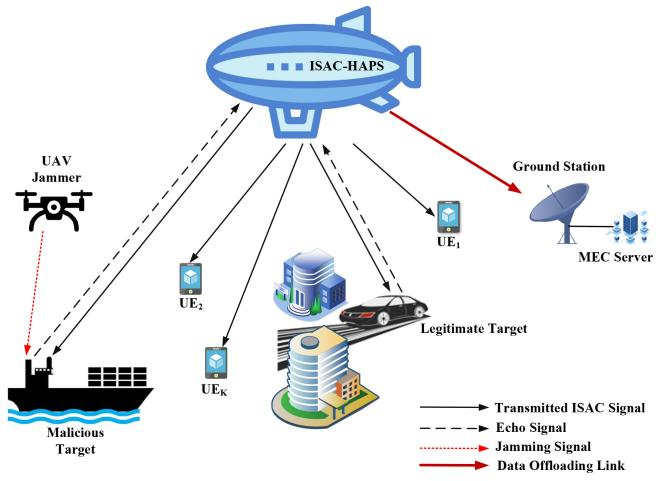

flowchart

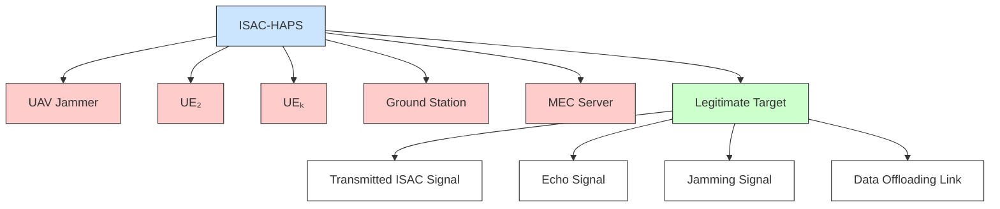

Fig. 1. HAPS-enabled ISAC system.

slot while serving one UE. Echo signals from other targets are treated as clutter or interference for the intended target.3 The ISAC-enabled BS offloads its sensing data to a ground station data computing center or a mobile edge computing (MEC) server to perform data processing. Based on the knowledge of the sensing results, the ISAC-enabled BS is able to locate malicious targets or potential eavesdroppers that are trying to intercept the data streams sent to the K communication users. Without loss of generality, we assume that the ISAC-BS knew from previous intervals the presence of a single eavesdropper. Consequently, it enables a single-antenna friendly jammer AAV to send jamming signals to degrade the achievable rate at this malicious target. We assume that the AAV is flying at a fixed altitude $z _ { U }$ within a mission time T, which is subdivided into N time slots, each with a small duration τ , i.e., $T = \tau N$ , where τ is small enough for the AAV to be considered fixed at each time slot. The location of the AAV is modeled as ${ \bf Q } = \{ { \bf q } [ 1 ] , { \bf q } [ 2 ] , { \bf q } [ N ] \}$ , where ${ \bf q } [ n ] = [ x [ n ] , y [ n ] ] ^ { T }$ represents the two dimensional x-axis and y-axis coordinates at the $n ^ { t h }$ time slot, $n \in \mathcal { N } \triangleq \{ 1 , 2 , N \}$ . Moreover, the locations of the HAPS, the communication UEs, and the targets are ${ \bf G } _ { H } =$ $[ x _ { H } , y _ { H } ] ^ { T }$ $\boldsymbol { y } _ { H } \boldsymbol { ] } ^ { T } \ \mathrm { a n d } \ \mathbf { G } _ { k } [ \boldsymbol { n } ] = [ \underline { { x _ { k } } } [ \boldsymbol { n } ] , \boldsymbol { y } _ { k } [ \boldsymbol { n } ] ] ^ { T } , \boldsymbol { k } \in \mathbf { \bar { \mathcal { K } } } \triangleq \{ 1 , 2 , \mathbf { \tilde { \mathcal { K } } } \}$ , and $\mathbf { G } _ { l } [ n ] = [ x _ { l } [ n ] , y _ { l } [ n ] ] ^ { T } , l \in \mathcal { L } \triangleq \{ 1 , 2 , L \}$ , respectively. Assuming that the AAV is flying with a maximum speed of $v ^ { \mathrm { m a x } }$ , its trajectory constraints can be expressed as follows:

$$
\left\| \mathbf {q} [ n + 1 ] - \mathbf {q} [ n ] \right\| ^ {2} \leq (\tau v ^ {\max}) ^ {2}, \tag {1}
$$

$$
\mathbf {q} [ 1 ] = \mathbf {q} ^ {0}, \mathbf {q} [ N ] = \mathbf {q} ^ {F}, \tag {2}
$$

where (1) accounts for the maximum flown distance between two consecutive time slots and (2) accounts for the beginning $( \mathbf { q } ^ { 0 } )$ and ending $( \mathbf { q } ^ { F } )$ locations of the AAV.

# A. Channel Model

Since the HAPS-mounted ISAC-BS and the AAV friendly jammer are located at relatively high altitude, there will

3Although integrating NOMA or rate-splitting multiple access (RSMA) with non-terrestrial-aided ISAC technology may enhance energy and spectral efficiency, it is beyond the scope of this work and is left as an open issue for future research.

be a possible strong line-of-sight (LoS) component over all links [33], [34]. However, we have considered the more general case of Rician fading for all the channel links between the ISAC-BS and the communication UEs and the MEC server. For example, the channel vector from the HAPS-mounted ISAC-BS to the $k ^ { t h }$ communication UE, $\forall k \in \ K$ , can be modeled as:

$$
\begin{array}{l} \mathbf {h} _ {H, k} [ n ] = \sqrt {G _ {H} \beta_ {0} d _ {H , k} ^ {- 2} [ n ]} \\ \times \left(\sqrt {\frac {\kappa}{\kappa + 1}} \bar {\mathbf {h}} _ {H, k} [ n ] + \sqrt {\frac {1}{\kappa + 1}} \bar {\bar {\mathbf {h}}} _ {H, k} [ n ]\right) \in \mathbb {C} ^ {N _ {t} \times 1}, \tag {3} \\ \end{array}
$$

where $G _ { H } \mathrm { ~ \textbf ~ { ~ i s ~ } ~ }$ the HAPS antenna gain, $\beta _ { 0 }$ is the path loss at a reference distance of 1 m, $\begin{array} { r l } { d _ { H , k } [ n ] } & { { } = } \end{array}$ $\sqrt { ( x _ { H } - x _ { k } [ n ] ) ^ { 2 } + ( y _ { H } - y _ { k } [ n ] ) ^ { 2 } + z _ { H } { } ^ { 2 } }$ is the separating distance between the HAPS-mounted ISAC-BS and the $k ^ { t h }$ communication UE, and κ is the Rician factor. In addition, $\bar { \mathbf { h } } _ { H , k } [ n ]$ and $\bar { \bar { \mathbf { h } } } _ { H , k } [ n ]$ are the LoS and non-LoS (NLoS) components of the channel vector, where $\bar { \bar { \mathbf { h } } } _ { H , k } [ n ]$ is modeled as Rayleigh fading and $\bar { \mathbf { h } } _ { H , k } [ n ]$ is the uniform linear array (ULA) steering vector at the ISAC-BS, which is given by:

$$
\bar {\mathbf {h}} _ {H, k} [ n ] = \left[ 1, e ^ {- j \frac {2 \pi d}{\lambda} \cos \theta [ n ]}, \dots , e ^ {- j \frac {2 \pi (N _ {t} - 1) d}{\lambda} \cos \theta [ n ]} \right], \tag {4}
$$

where d is the antenna element spacing at the ISAC-BS, λ is the carrier wavelength, and cos $\begin{array} { r } { \theta [ n ] ^ { \bf { \bar { \alpha } } } = \frac { x _ { k } [ n ] - x _ { H } } { d _ { H , k } [ n ] } } \end{array}$ is the cosine of the angle-of-arrival (AoA) from the HAPS to the $k ^ { t h }$ communication UE. This model can represent the complete LoS case by significantly increasing the Rician factor or in other words removing the NLOS component. The channels between the HAPS-mounted ISAC-BS and the targets, $\mathbf { h } _ { H , l } \in$ $\mathbb { C } ^ { N _ { t } \times 1 } ~ \forall ~ l ~ \in ~ \mathcal { L } ,$ the channel between the HAPS-mounted ISAC-BS and the eavesdropper, $\mathbf { h } _ { H , e } ~ \in ~ \mathbb { C } ^ { N _ { t } \times 1 }$ , and the channel between the HAPS-mounted ISAC-BS and the MEC server, $\mathbf { h } _ { H , \mathrm { o f f } } \in \mathbb { C } ^ { N _ { t } \times 1 }$ , can be modeled similarly.

According to [33], [34], due to the AAV’s trajectory optimization and its altitude, a strong LoS component will always be available and the channel coefficient between the jamming AAV and the $k ^ { t h }$ communication UE can be modeled as:

$$
h _ {U, k} [ n ] = \sqrt {\beta_ {0} d _ {U , k} ^ {- 2} [ n ]}, \tag {5}
$$

where $d _ { U , k } [ n ] = \sqrt { ( x _ { U } - x _ { k } [ n ] ) ^ { 2 } + ( y _ { U } - y _ { k } [ n ] ) ^ { 2 } + z _ { U } } ^ { 2 } .$ The channel between the AAV and the eavesdropper, $h _ { U , e } ,$ can be modeled similarly.

# B. Communication and Sensing Models

Without loss of generality, in the $n ^ { t h }$ time slot, the group of K-users along with the MEC station will be considered as $K + 1$ users receiving communication symbols ${ \mathbf s } _ { c } [ n ] =$ $\left[ s _ { c , 1 } , s _ { c , 2 } , \ldots , s _ { c , K + 1 } \right] ^ { T } \in \mathbb { C } ^ { ( K + 1 ) \times 1 }$ , where the $( K \dot { + } \dot { 1 } ) ^ { t h }$ user represents the MEC station. In addition, the ISAC-BS transmits a radar signal $\mathbf { s } _ { r } [ n ] \ = \ [ s _ { r , 1 } , s _ { r , 2 } , \ldots , s _ { r , N _ { t } } ] ^ { T } \ \in$ $\mathbb { C } ^ { N _ { t } \times 1 }$ for the purpose of targets sensing. The transmitted signal, $\mathbf { x } [ n ] ~ \in ~ \mathbb { C } ^ { N _ { t } \times 1 }$ , from the dual-functional HAPSmounted ISAC-BS can be expressed as:

$$
\mathbf {x} [ n ] = \mathbf {W} _ {c} [ n ] \mathbf {s} _ {c} [ n ] + \mathbf {W} _ {r} [ n ] \mathbf {s} _ {r} [ n ] = \mathbf {W} [ n ] \mathbf {s} [ n ], \tag {6}
$$

where $\mathbf { W } _ { c } ~ = ~ [ \mathbf { w } _ { c , 1 } , \mathbf { w } _ { c , 2 } , \ldots , \mathbf { w } _ { c , K + 1 } ] ~ \in ~ \mathbb { C } ^ { N _ { t } \times ( K + 1 ) }$ is the beamforming matrix for the $K \ + \ 1$ users, $\begin{array} { r l } { \mathbf { W } _ { r } } & { { } = } \end{array}$ $\left[ { \bf w } _ { r , 1 } , { \bf w } _ { r , 2 } , \ldots , { \bf w } _ { r , N _ { t } } \right] \in \mathbb { C } ^ { N _ { t } \times N _ { t } }$ is the radar beamforming matrix, $\mathbf { W } ~ = ~ [ \mathbf { W } _ { c } , \mathbf { \bar { W } } _ { r } ] ~ \in ~ \mathbb { C } ^ { N _ { t } \times ( K + N _ { t } + 1 ) }$ is the composite ISAC BS beamforming matrix, and $\textbf { s } = \left[ \mathbf { s } _ { c } , \mathbf { s } _ { r } \right] \ \in$ $\stackrel { \bullet } { \mathbb { C } } ( K + N _ { t } + 1 ) \times 1$ is the composite ISAC-BS transmitted signal with $\mathbb { E } \{ \mathbf { s s } ^ { H } \} ~ = ~ \mathbf { I } _ { K + N _ { t } + 1 }$ , where $\mathbb { E } \{ . \}$ is the expectation operator and $\mathbf { I } _ { A }$ is the identity matrix of dimensions $A \times A .$ . The transmit power of the HAPS-mounted ISAC-BS is given by:

$$
P _ {t} [ n ] = \mathbb {E} \left\{\| \mathbf {x} [ n ] \| ^ {2} \right\} = \| \mathbf {W} [ n ] \| _ {F} ^ {2}, \tag {7}
$$

where $\left. . \right.$ and $\| . \| _ { F }$ are the Euclidean norm of a vector, and the Frobenius norm of a matrix, respectively. The received signal at the $k ^ { t h }$ communication UE in the $n ^ { \dot { t } h }$ time slot can be expressed as:

$$
y _ {k} [ n ] = \mathbf {h} _ {H, k} ^ {H} [ n ] \mathbf {x} [ n ] + \sqrt {p _ {J}} h _ {U, k} [ n ] s _ {J} [ n ] + n _ {k} [ n ], \tag {8}
$$

where $p _ { J }$ is the jamming power from the friendly jamming AAV, $s _ { J }$ is the jamming signal, and $n _ { k } ~ \sim ~ \mathcal { C N } ( 0 , \sigma _ { n } ^ { 2 } )$ is the AWGN component at the $\mathit { \check { k } } ^ { t h }$ UE. Similarly, the received signal at the potential eavesdropper is:

$$
y _ {e} [ n ] = \mathbf {h} _ {H, e} ^ {H} [ n ] \mathbf {x} [ n ] + \sqrt {p _ {J}} h _ {U, e} [ n ] s _ {J} [ n ] + n _ {e} [ n ], \tag {9}
$$

where $n _ { e } ~ \sim ~ \mathcal { C N } ( 0 , \sigma _ { n } ^ { 2 } )$ is the AWGN component at the malicious target. From (3), (5), and (6), we can calculate the SINR at each communication UE as:

$$
\Gamma_ {k} [ n ] = \frac {\left| \mathbf {h} _ {H , k} ^ {H} [ n ] \mathbf {w} _ {k} [ n ] \right| ^ {2}}{\sum_ {j = 1 , j \neq k} ^ {K + N _ {t} + 1} \left| \mathbf {h} _ {H , k} ^ {H} [ n ] \mathbf {w} _ {j} [ n ] \right| ^ {2} + p _ {J} \left| h _ {U , k} [ n ] \right| ^ {2} + \sigma_ {n} ^ {2}}, \tag {10}
$$

where ${ \bf w } _ { k } [ n ]$ and wj [n ], ∀ $k \in \mathcal { K } , \forall j \in \{ 1 , 2 , \dots , K +$ $N _ { t } + 1 \}$ are the $k ^ { \stackrel { \triangledown } { t h } }$ and $j ^ { t h }$ columns of the composite beamforming matrix $\mathbf { W } [ n ] .$ , respectively. Consequently, the achieved rate at the $k ^ { t h }$ communication UE is denoted as $R _ { k } [ n ] = \log _ { 2 } ( 1 + \Gamma _ { k } [ n ] )$ . In similar ways, the SINR at the potential eavesdropper for decoding the $\mathbf { \bar { \rho } } _ { k } t h$ communication UE signal is given as:

$$
\Gamma_ {e v e, k} [ n ] = \frac {\left| \mathbf {h} _ {H , e} ^ {H} [ n ] \mathbf {w} _ {k} [ n ] \right| ^ {2}}{\sum_ {j = 1 , j \neq k} ^ {K + N _ {t} + 1} \left| \mathbf {h} _ {H , e} ^ {H} [ n ] \mathbf {w} _ {j} [ n ] \right| ^ {2} + p _ {J} \left| h _ {U , e} [ n ] \right| ^ {2} + \sigma_ {n} ^ {2}}. \tag {11}
$$

Regarding the sensing process, the $N _ { t } \times 1$ received echo signal at the ISAC-BS is given by:

$$
\mathbf {y} _ {r} [ n ] = \sum_ {l = 1} ^ {L} b _ {l} \mathbf {H} _ {H, l} [ n ] \mathbf {x} [ n ] + \mathbf {n} _ {r} [ n ], \tag {12}
$$

where $b _ { l }$ is the radar cross section (RCS) of the ${ { l } ^ { t h } }$ target with $\mathbb { E } \{ \tilde { | } b _ { l } | ^ { 2 } \} = \zeta _ { l } ^ { 2 } , \forall \ l \in \mathcal { L } , \mathbf { H } _ { H , l } [ n ] = \mathbf { h } _ { H , l } [ n ] \mathbf { h } _ { H , l } ^ { H } [ n ]$ , and $\mathbf { n } _ { r } \sim \mathcal { C N } ( \mathbf { 0 } _ { N _ { t } } , \sigma _ { l } ^ { 2 } \mathbf { I } _ { N _ { t } } )$ is the AWGN vector at the ISAC-BS. After receiving the signal ${ \bf y } _ { r } [ n ]$ , the ISAC-BS will apply the radar receive vector $\bar { \mathbf { u } } _ { l } \in \mathbb { C } ^ { \bar { N } _ { t } \times 1 }$ to process the echo signal coming from the ${ { l } ^ { t h } }$ target yielding

$$
\mathbf {u} _ {l} ^ {H} [ n ] \mathbf {y} _ {r} [ n ] = \mathbf {u} _ {l} ^ {H} [ n ] \sum_ {l = 1} ^ {L} b _ {l} \mathbf {H} _ {H, l} [ n ] \mathbf {x} [ n ] + \mathbf {u} _ {l} ^ {H} [ n ] \mathbf {n} _ {r} [ n ]. \tag {13}
$$

When processing the received echo signal of the ${ { l } ^ { t h } }$ target at the ISAC-BS, the received echo signals from other targets will be considered as clutter/interference. Hence, the achieved SINR for processing the echo signal of the ${ { l } ^ { t h } }$ target is given by:

$$
\Gamma_ {l} [ n ] = \frac {\zeta_ {l} ^ {2} \left\| \mathbf {u} _ {l} ^ {H} [ n ] \mathbf {H} _ {H , l} [ n ] \mathbf {W} [ n ] \right\| ^ {2}}{I _ {l} [ n ] + \sigma_ {l} ^ {2} \left\| \mathbf {u} _ {l} ^ {H} [ n ] \right\| ^ {2}}, \tag {14}
$$

where $\begin{array} { r l r } { I _ { l } [ n ] } & { { } = } & { \sum _ { i = 1 , i \neq l } ^ { L } \zeta _ { i } ^ { 2 } \| { \bf u } _ { l } ^ { H } [ n ] { \bf H } _ { H , i } [ n ] { \bf W } [ n ] \| ^ { 2 } } \end{array}$ and ${ \bf H } _ { H , i } [ n ] ~ = ~ { \bf h } _ { H , i } [ n ] { \bf h } _ { H , l } ^ { H } [ n ]$ . Then, one can find the radar estimation information rate as $\begin{array} { r } { R _ { \mathrm { r a d } } [ n ] ~ = ~ \sum _ { l = 1 } ^ { L } \log _ { 2 } ( 1 + } \end{array}$ $\Gamma _ { l } [ n ] )$ [23].

As mentioned previously, in this work, we focus on target detection in the worst-case scenario, where all other targets are assumed to exist, and their echo signals are considered interference/clutter to the detection of the desired target. Under this assumption, the hypothesis test for the ${ { l } ^ { t h } }$ target can be denoted as $H _ { l } ^ { 1 }$ , which represents a target exists in the ${ { l } ^ { t h } }$ location and $\dot { H } _ { l } ^ { 0 }$ , which represents no target exists in the ${ { l } ^ { t h } }$ location. Hence, the detection process of the ${ { l } ^ { t h } }$ target can be expressed as:

$$
V _ {l} = \left\{ \begin{array}{c} H _ {l} ^ {1}: \mathbf {u} _ {l} ^ {H} [ n ] \left(\sum_ {l = 1} ^ {L} b _ {l} \mathbf {H} _ {H, l} [ n ] \mathbf {x} [ n ] + \mathbf {n} _ {r} [ n ]\right) \\ H _ {l} ^ {0}: \mathbf {u} _ {l} ^ {H} [ n ] \left(\sum_ {i = 1, i \neq l} ^ {L} b _ {i} \mathbf {H} _ {H, i} [ n ] \mathbf {x} [ n ] + \mathbf {n} _ {r} [ n ]\right) \end{array} \right. \tag {15}
$$

where the optimal decision is $| V _ { l } | ^ { 2 } \begin{array} { c c c } { { } } & { { H _ { l } ^ { 0 } } } & { { } } \\ { { } } & { { \lesssim } } & { { \mu , } } \\ { { } } & { { H _ { l } ^ { 1 } } } & { { } } \end{array}$ where $\mu$ is the decision threshold that satisfies a predefined false alarm probability $P _ { f }$ . Now, the detection probability of the ${ { l } ^ { t h } }$ target can be expressed as [35]:

$$
p _ {d _ {l}} = Q _ {1} \left(\sqrt {2 \Gamma_ {l} [ n ]}, \sqrt {2 \ln \left(\frac {1}{p _ {f}}\right)}\right), \tag {16}
$$

where $\Gamma _ { l } [ n ]$ is the achieved SINR for processing the echo signal of the ${ { l } ^ { t h } }$ target and $Q _ { 1 }$ is the generalized Marcum’s $Q$ function of the $\bar { \mathbf { \Phi } } _ { 1 } s t$ order. Since $Q _ { 1 }$ is monotonically increasing with respect to $\Gamma _ { l } [ n ]$ [36], maximizing the detection probability can be achieved through maximizing the SINR, which can be achieved through maximizing the radar estimation information rate. Hence, using the radar estimation information rate is a good metric for radar performance characterization.

# C. Offloading Model

Now, the received signal at the ground MEC station can be expressed as:

$$
y _ {\text { off }} [ n ] = \mathbf {h} _ {H, \text { off }} ^ {H} [ n ] \mathbf {x} [ n ] + n _ {\text { off }} [ n ], \tag {17}
$$

where $\mathbf { h } _ { H , \mathrm { o f f } } \in \mathbb { C } ^ { N _ { t } \times 1 }$ is the channel vector from the HAPSmounted ISAC-BS to the MEC station and $n _ { \mathrm { o f f } } \sim \mathcal { C N } ( 0 , \sigma _ { n } ^ { 2 } )$ is the AWGN component at the MEC station. The SINR of the offloading signal at the MEC station, $\Gamma _ { \mathrm { o f f } } [ n ]$ , can thus be expressed as:

$$
\Gamma_ {\text { off }} [ n ] = \frac {\left| \mathbf {h} _ {H , \text { off }} ^ {H} [ n ] \mathbf {w} _ {k + 1} [ n ] \right| ^ {2}}{\sum_ {j = 1 , j \neq k + 1} ^ {K + N _ {t} + 1} \left| \mathbf {h} _ {H , \text { off }} ^ {H} [ n ] \mathbf {w} _ {j} [ n ] \right| ^ {2} + \sigma_ {n} ^ {2}}, \tag {18}
$$

where ${ \mathbf w } _ { k + 1 } [ n ]$ is the $( k + 1 ) ^ { t h }$ column of the composite beamforming matrix $\mathbf { W } [ n ] .$ . Hence, the offloading rate can be expressed as $R _ { \mathrm { o f f } } [ n ] = \log _ { 2 } ( 1 + \Gamma _ { \mathrm { o f f } } [ n ] )$ . Since the offloading throughput must not exceed the sum achieved radar estimation information rate at the ISAC-BS, we must add the constraint $R _ { \mathrm { o f f } } \le R _ { \mathrm { r a d } }$ . It is also important to guarantee that the latency for executing the computations workloads is upper bounded by a given threshold.4 Hence, the latency for the ISAC-BS to execute the remaining (non-offloaded) workloads is given by [37]:

$$
\xi_ {l o c} [ n ] = \frac {\varpi_ {l o c} \varsigma B (R _ {\mathrm{rad}} - R _ {\mathrm{off}})}{f _ {l o c}}, \tag {19}
$$

where $\varpi _ { l o c }$ is the consumed CPU cycles in locally processing one-bit data at the ISAC-BS, B is the bandwidth, and $f _ { l o c }$ is the CPU frequency of the ISAC-BS. Similarly, the latency for the MEC station to execute the offloaded workloads is given by:

$$
\xi_ {M E C} [ n ] = \frac {\varpi_ {M E C} \varsigma B R _ {\mathrm{off}}}{f _ {M E C}}, \tag {20}
$$

where $\varpi _ { M E C }$ and $f _ { M E C }$ are the consumed CPU cycles in processing one-bit data and the CPU frequency at the MEC station, respectively. Since the ISAC-BS and the MEC execute the workloads simultaneously, the total latency can be expressed as $\xi _ { t o t } [ n ] = \operatorname* { m a x } \{ \xi _ { l o c } [ n ] , \xi _ { M E C } [ n ] \}$ .

# III. OPTIMIZATION PROBLEM FORMULATION

In ISAC systems, there are three optimization problem formulation scenarios; communication-centric optimization with sensing constraints as in [21], [24], sensing-centric optimization with communication constraints as in [15], [22], [35], [39], and a weighted-sum joint objective with both functionalities as in [26], which is more complex due to challenges in weighting parameter optimization. We choose to align our work with the widely validated communication-centric framework to address scenarios prioritizing spectral efficiency under guaranteed sensing performance. In this paper, we aim to maximize the sum achievable communication rate of all the UEs while ensuring that the radar estimation information rate for each target is higher than a given threshold. Moreover, we need to be certain that the offloading rate is below the sum of radar estimation information rate of all targets and the

4Since the primary focus of this work is the integration of sensing and communication functionalities in ISAC-BS, we adopt a simplified offloading framework to ensure tractability [37]. Other dynamic offloading models such as that proposed in [38] is out of the scope of the current work and can be considered in future work.

total workloads execution time is below a given threshold. In addition, to maintain secure communication against potential eavesdroppers, we aim to degrade the maximum achieved rate at the malicious target to prevent it from decoding the communication signals through controlling the trajectory of the AAV friendly jammer. In other words, we aim to jointly optimize the AAV trajectory, the communication and radar transmit beamforming vectors, and the radar receive beamforming vector under the power, security, latency, and offloading rate constraints. We are going to use alternating optimization, SDR, and SCA in the solution of our proposed problem due to their proven effectiveness in handling non-convex optimization problems, especially in wireless communications. Mathematically speaking, our optimization problem can be formulated as:

$$
\max _ {\mathbf {W} [ n ], \mathfrak {u} [ n ] \forall l \in \mathcal {L}, \mathbf {Q}} \frac {1}{N} \sum_ {n = 1} ^ {N} \sum_ {k = 1} ^ {K} R _ {k} [ n ] \tag {21a}
$$

$\mathrm { S u b j e c t ~ t o : } ~ P _ { t } [ n ] \leq p _ { \operatorname* { m a x } } , \forall ~ n \in \mathcal { N } ,$ (21b)

$$
\left\| \mathbf {u} _ {l} [ n ] \right\| ^ {2} \leq 1, \forall l \in \mathcal {L}, n \in \mathcal {N}, \tag {21c}
$$

$$
\left\| \mathbf {q} [ n + 1 ] - \mathbf {q} [ n ] \right\| ^ {2} \leq \left(\tau v ^ {\max}\right) ^ {2}, \forall n \in \mathcal {N}, \tag {21d}
$$

$$
\mathbf {q} [ 1 ] = \mathbf {q} ^ {0}, \mathbf {q} [ N ] = \mathbf {q} ^ {F}, \tag {21e}
$$

$$
\max _ {k \in \mathcal {K}} \left\{\Gamma_ {e v e, k} [ n ] \right\} \leq \Gamma_ {\min}, \forall k \in \mathcal {K}, n \in \mathcal {N}, \tag {21f}
$$

$$
\log_ {2} (1 + \Gamma_ {l} [ n ]) \geq R _ {\text { req }}, \forall l \in \mathcal {L}, n \in \mathcal {N}, \tag {21g}
$$

$$
R _ {\text { off }} [ n ] \leq R _ {\text { rad }} [ n ], \forall n \in \mathcal {N}, \tag {21h}
$$

$$
\xi_ {t o t} [ n ] \leq \xi_ {\max}, \forall n \in \mathcal {N}. \tag {21i}
$$

Constraints (21b) and (21c) ensure that the transmit power from the ISAC-BS is below the maximum allowed power budget and the receive beamforming vector for each target is a unit-norm vector, respectively. Constraints (21d) and (21e) define the AAV trajectory constraints. The security constraint (21f) limits the maximum SINR at the eavesdropper for decoding all the UEs’ communication signals to a predefined value $\Gamma _ { \mathrm { m i n } }$ . In addition, constraint (21g) ensures that the achieved radar estimation information rate for each target is above the minimum required threshold $R _ { \mathrm { r e q } }$ . Finally, constraints (21h) and (21i) represent the offloading constraints, where (21h) ensures that the offloading rate is below the sum radar estimation information rate and (21i) ensures that the maximum latency of executing the workloads locally and in the MEC station is below the maximum allowed latency $\xi _ { \mathrm { m a x } } .$

In its direct form, problem (21) is not convex with respect to all variables due to the coupling between all variables. Hence, we will divide problem (21) into three sub-problems that can be solved via alternating optimization method until convergence [28], [29], [30]. Firstly, the radar receive beamforming vectors optimization sub-problem will be solved assuming an initial communication and radar transmit beamforming vectors and an initial AAV trajectory. This sub-problem can be formulated as the following feasibility problem:

$$
\text { Find } \mathbf {u} _ {l} [ n ] \tag {22a}
$$

$$
\text { Subject   to:   } (2 1 \mathrm{c}), (2 1 \mathrm{g}) - (2 1 \mathrm{i}). \tag {22b}
$$

Then, we will solve the communication and radar transmit beamforming sub-problem using the optimized receive beamforming vectors and the initial AAV trajectory. This subproblem is formulated as:

$$
\max _ {\mathbf {W} [ n ]} \frac {1}{N} \sum_ {n = 1} ^ {N} \sum_ {k = 1} ^ {K} R _ {k} [ n ] \tag {23a}
$$

$\mathrm { S u b j e c t ~ t o : } ( 2 1 \mathrm { b } ) , ( 2 1 \mathrm { f } ) - ( 2 \mathrm { l i } ) .$ (23b)

Finally, with the optimized communication and radar transmit and receive beamforming vectors, the trajectory optimization sub-problem will be solved, which can be formulated as:

$$
\max _ {\mathbf {Q}} \frac {1}{N} \sum_ {n = 1} ^ {N} \sum_ {k = 1} ^ {K} R _ {k} [ n ] \tag {24a}
$$

${ \mathrm { S u b j e c t ~ t o : } } ~ ( 2 1 { \mathrm { d } } ) - ( 2 1 { \mathrm { f } } ) .$ (24b)

In the following subsections, we will address each subproblem before presenting the comprehensive algorithm that leverages the alternative optimization process across all subproblems.

# A. Receive Beamforming Optimization

In the feasibility sub-problem (22), we target finding the unit-norm receive beamforming vectors at the ISAC-BS that fulfil the constraints (21g)–(21i). Since the receive beamforming vectors are found in the constraints in quadratic terms, we will exploit the semi-definite programming (SDP) approach to solve this feasibility problem. Let ${ \bf U } _ { l } [ n ] ~ = { \bf u } _ { l } [ n ] ~ { \bf u } _ { l } ^ { H } [ n ]$ , where Rank $\mathbf { \partial } _ { [ } ( \mathbf { U } _ { l } [ n ] ) ~ = ~ 1$ and ${ \bf U } _ { l } [ n ] \subseteq { \bf { 0 } }$ , where $\textbf { A } \succeq 0$ denotes that the matrix A is positive semi-definite. In addition, we define:

$$
\mathbf {F} _ {l} [ n ] = \zeta_ {l} ^ {2} \left(\mathbf {H} _ {H, l} [ n ] \mathbf {W} [ n ]\right) \left(\mathbf {H} _ {H, l} [ n ] \mathbf {W} [ n ]\right) ^ {H},
$$

$$
\mathbf {J} _ {l} [ n ] = \sum_ {i = 1, i \neq l} ^ {L} \zeta_ {i} ^ {2} \left(\mathbf {H} _ {H, i} [ n ] \mathbf {W} [ n ]\right) \left(\mathbf {H} _ {H, i} [ n ] \mathbf {W} [ n ]\right) ^ {H} + \sigma_ {n} ^ {2} \mathbf {I} _ {N _ {t}}.
$$

We add the set of auxiliary variables $\psi _ { l } [ n ] \ \forall \ l \in { \mathcal { L } }$ such that:

$$
\log_ {2} (1 + \Gamma_ {l} [ n ]) \geq \psi_ {l} [ n ]. \tag {25}
$$

Using the previously defined notations, (25) can be rewritten as:

$$
\operatorname{tr} \left(\mathbf {U} _ {l} [ n ] \mathbf {F} _ {l} [ n ]\right) - \left(2 ^ {\psi_ {l} [ n ]} - 1\right) \operatorname{tr} \left(\mathbf {U} _ {l} [ n ] \mathbf {J} _ {l} [ n ]\right) \geq 0. \tag {26}
$$

Due to the coupling between $\psi _ { l } [ n ]$ and ${ \bf U } _ { l } [ n ]$ , (26) is not convex. Hence, we approximate $\psi _ { l } [ n ]$ with a fixed point $\psi _ { l } ^ { m } [ n ]$ at the $m ^ { t h }$ iteration [40], which can be updated each iteration by:

$$
\psi_ {l} ^ {m} [ n ] = \log_ {2} (1 + \Gamma_ {l} ^ {m} [ n ]), \tag {27}
$$

where $\Gamma _ { l } ^ { m }$ is the achieved SINR for processing the echo signal of the $l ^ { \mathit { t h } }$ target in the $m ^ { t h }$ iteration.

Regarding constraint (21i), we can divide it, without loss of generality, into two constraints, $\begin{array} { r l } { \xi _ { l o c } [ n ] } & { { } \leq \xi _ { \operatorname* { m a x } } } \end{array}$ and $\xi _ { M E C } [ n ] \ \leq \ \xi _ { \mathrm { m a x } }$ . Since $\xi _ { M E C } [ n ] \ \leq \ \xi _ { \mathrm { m a x } }$ is not related to the receive beamforming vector, the receive beamforming optimization sub-problem can be written as:

$$
\text { Find } \mathbf {U} _ {l} [ n ], \psi_ {l} [ n ] \tag {28a}
$$

$$
\text { Subject   to: } \operatorname{tr} (\mathbf {U} _ {l} [ n ]) \leq 1, \forall l \in \mathcal {L}, n \in \mathcal {N}, \tag {28b}
$$

$$
\psi_ {l} [ n ] \geq R _ {\text {Req}}, \forall l \in \mathcal {L}, n \in \mathcal {N}, \tag {28c}
$$

$$
\sum_ {l = 1} ^ {L} \psi_ {l} [ n ] \geq R _ {\text { off }} [ n ], \forall l \in \mathcal {L}, n \in \mathcal {N}, \tag {28d}
$$

$$
\sum_ {l = 1} ^ {L} \psi_ {l} [ n ] \leq \frac {\xi_ {\max} f _ {l o c}}{\varpi_ {l o c} \varsigma B} + R _ {\text { off }} [ n ], \forall n \in \mathcal {N}, \tag {28e}
$$

$$
\mathbf {U} _ {l} [ n ] \succeq \mathbf {0}, \forall l \in \mathcal {L}, n \in \mathcal {N}, \tag {28f}
$$

$$
\operatorname{Rank} (\mathbf {U} _ {l} [ n ]) = 1, \forall l \in \mathcal {L}, n \in \mathcal {N}, \tag {28g}
$$

$$
(2 6). \tag {28h}
$$

Sub-problem (28a) is still not convex due to the Rankone constraint (28g). According to [29], [41], (28g) can be equivalently written as:

$$
\mathrm{tr} (\mathbf {U} _ {l} [ n ]) - \| \mathbf {U} _ {l} [ n ] \| _ {2} = 0, \forall l \in \mathcal {L}, n \in \mathcal {N}, \tag {29}
$$

where $\| \mathbf { U } _ { l } [ n ] \| _ { 2 } = \sigma _ { 1 } ( \mathbf { U } _ { l } [ n ] )$ is the spectral norm of the vector ${ \bf U } _ { l } | n |$ and $\sigma _ { 1 } ( . )$ is the largest eigenvalue. Since ${ \bf U } _ { l } [ n ] \mathrm { ~  ~ \Omega ~ } \in$ $\mathbb { C } ^ { \breve { N } _ { t } \breve { \times } N _ { t } }$ and $\begin{array} { r l r } { { \bf { U } } _ { l } [ n ] } & { { } \succeq } & { 0 , ~ \mathrm { t r } ( { \bf { U } } _ { l } [ n ] ) ~ - ~ \| { \bf { U } } _ { l } [ n ] \| _ { 2 } { \mathrm { ~  ~ \hat { ~ } { ~ \ge ~ } ~ } } 0 . } \end{array}$ where equality holds if and only if ${ \bf U } _ { l } [ n ]$ is Rank-one. Now, constraint (29) is still non-convex. Hence, we apply the successive convex approximation (SCA) iterative approach and utilize first-order Taylor approximation (FTA) to approximate the spectral norm of ${ \bf U } _ { l } [ n ]$ at a given point $\| \mathbf { U } _ { l } ^ { m } [ n ] \| _ { 2 }$ in the $m ^ { t h }$ iteration as follows:

$$
\begin{array}{l} \| \mathbf {U} _ {l} [ n ] \| _ {2} \geq \| \mathbf {U} _ {l} ^ {m} [ n ] \| _ {2} \\ + \operatorname{tr} \left(\nu \left(\mathbf {U} _ {l} ^ {m} [ n ]\right) \left(\nu \left(\mathbf {U} _ {l} ^ {m} [ n ]\right)\right) ^ {H} \left(\mathbf {U} _ {l} [ n ] - \mathbf {U} _ {l} ^ {m} [ n ]\right)\right) \\ = \left\| \hat {\mathbf {U}} _ {l} ^ {m} [ n ] \right\| _ {2}, \tag {30} \\ \end{array}
$$

where $\nu ( \mathbf { U } _ { l } ^ { m } [ n ] \mathbf { \Lambda } )$ is the vector corresponding to the largest eigenvalue of ${ \bf U } _ { l } [ n ]$ at the $m ^ { t h }$ iteration. Then, we add the approximated constraint (30) as a penalty function to the feasibility problem (28a) to get:

$$
\min _ {\mathbf {U} _ {l} [ n ], \psi_ {l} [ n ]} \eta \left(\operatorname{tr} \left(\mathbf {U} _ {l} [ n ]\right) - \left\| \hat {\mathbf {U}} _ {l} ^ {m} [ n ] \right\| _ {2}\right) \tag {31a}
$$

$$
\text { Subject   to: } (2 8 \mathrm{b}) - (2 8 \mathrm{f}), (2 6), \tag {31b}
$$

where $\eta > 0$ is the penalty factor for the Rank-one constraint. Now, (31a) is a standard semi-definite program that can be solved using the standard CVX solver [42] to get $\mathbf { U } _ { l } , \ \forall \ l \in { \mathcal { L } }$

Remark 1: Usually, the radar receive beamforming vectors optimization problem is solved approximately as the generalized Rayleigh quotient optimization problem [21], [22]. Due to the offloading constraints (21h) and (21i), the Rayleigh quotient method cannot be applied here. However, we will use this method to initialize the radar receive beamforming vectors in the first iteration. Also, we will compare the achieved radar estimation information rate for the proposed and the Rayleigh quotient approaches.

# B. Transmit Beamforming Optimization

In sub-problem (23a), we aim to jointly optimize the communication and radar transmit beamforming vectors using the optimized radar receive beamforming vectors and the initial AAV trajectory. Since the objective function (23a) is not convex, we add the set of auxiliary variables $\rho _ { k } [ n ] , \forall k \in \mathcal { K }$ such that:

$$
\frac {\left| \mathbf {h} _ {H , k} ^ {H} [ n ] \mathbf {w} _ {k} [ n ] \right| ^ {2}}{\sum_ {j = 1 , j \neq k} ^ {K + N _ {t} + 1} \left| \mathbf {h} _ {H , k} ^ {H} [ n ] \mathbf {w} _ {j} [ n ] \right| ^ {2} + p _ {J} \left| h _ {U , k} [ n ] \right| ^ {2} + \sigma_ {n} ^ {2}} \geq \rho_ {k} [ n ]. \tag {32}
$$

Unfortunately, the new constraint (25) is still not convex, therefore, we will add another set of auxiliary variables $\varrho _ { k } [ n ] , \forall k \in \mathcal { K }$ such that:

$$
\frac {\left| \mathbf {h} _ {H , k} ^ {H} [ n ] \mathbf {w} _ {k} [ n ] \right| ^ {2}}{\varrho_ {k} [ n ]} \geq \rho_ {k} [ n ], \tag {33}
$$

$$
\sum_ {j = 1, j \neq k} ^ {K + N _ {t} + 1} \left| \mathbf {h} _ {H, k} ^ {H} [ n ] \mathbf {w} _ {j} [ n ] \right| ^ {2} + p _ {J} \left| h _ {U, k} [ n ] \right| ^ {2} + \sigma_ {n} ^ {2} \leq \varrho_ {K} [ n ]. \tag {34}
$$

While (33) is convex, (33) is still not convex. Hence, we apply the SCA iterative approach and utilize FTA to approximate the left hand side of (33) at a given point $( \varrho _ { k } ^ { m } [ n ] , \mathbf w _ { k } ^ { m } [ n ] )$ at the $m ^ { t h }$ iteration as follows:

$$
\begin{array}{l} \frac {\left| \mathbf {h} _ {H , k} ^ {H} [ n ] \mathbf {w} _ {k} [ n ] \right| ^ {2}}{\varrho_ {k} [ n ]} \geq - \left(\frac {\left| \mathbf {h} _ {H , k} ^ {H} [ n ] \mathbf {w} _ {k} ^ {m} [ n ] \right|}{\varrho_ {k} ^ {m} [ n ]}\right) ^ {2} \varrho_ {k} [ n ] \\ + \frac {2 \mathcal {R} \left[ \left(\mathbf {h} _ {H , k} ^ {H} [ n ] \mathbf {w} _ {k} ^ {m} [ n ]\right) ^ {H} \left(\mathbf {h} _ {H , k} ^ {H} [ n ] \mathbf {w} _ {k} [ n ]\right) \right]}{\varrho_ {k} ^ {m} [ n ]} = \Lambda_ {k} ^ {\text { Taylor }} [ n ]. \tag {35} \\ \end{array}
$$

For the security constraint (21f), we consider the worst case scenario, where we want to degrade the achieved SINR at the potential eavesdropper for decoding the signals transmitted to its closest communication UE. Without loss of generality, we assume the target corresponding to $l = 1$ is the potential eavesdropper. Hence, $\operatorname* { m a x } _ { k \in \mathcal { K } } \{ \Gamma _ { e v e , k } [ n ] \}$ represents the SINR achieved at the ${ { l } ^ { t h } }$ target, $l \ = \ 1$ , for decoding the communication signal transmitted to its closest UE. Regarding constraint (21f), we can add the auxiliary variable $\varrho _ { e } [ n ]$ such that:

$$
\sum_ {j = 1, j \neq k} ^ {K + N _ {t} + 1} \left| \mathbf {h} _ {H, e} ^ {H} [ n ] \mathbf {w} _ {j} [ n ] \right| ^ {2} + p _ {J} \left| h _ {U, e} [ n ] \right| ^ {2} + \sigma_ {n} ^ {2} \geq \varrho_ {e} [ n ], \tag {36}
$$

$$
\left| \mathbf {h} _ {H, e} ^ {H} [ n ] \mathbf {w} _ {k} [ n ] \right| ^ {2} \leq \varrho_ {e} [ n ] \Gamma_ {\min}. \tag {37}
$$

The first term in the left hand side of (36) can be approximated using FTA at the given point $\mathbf { w } _ { k } ^ { m } [ n ]$ as follows:

$$
\sum_ {j = 1, j \neq k} ^ {K + N _ {t} + 1} \left| \mathbf {h} _ {H, e} ^ {H} [ n ] \mathbf {w} _ {j} [ n ] \right| ^ {2} \geq \sum_ {j = 1, j \neq k} ^ {K + N _ {t} + 1} \left(- \left| \mathbf {h} _ {H, e} ^ {H} [ n ] \mathbf {w} _ {j} ^ {m} [ n ] \right| ^ {2} \right.
$$

$$
\left. + 2 \mathcal {R} \left[ \left(\mathbf {h} _ {H, e} ^ {H} [ n ] \mathbf {w} _ {j} ^ {m} [ n ]\right) ^ {H} \left(\mathbf {h} _ {H, e} ^ {H} [ n ] \mathbf {w} _ {j} [ n ]\right) \right]\right) = \Lambda_ {e v e, k} ^ {\text { Taylor }} [ n ]. \tag {38}
$$

In similar ways, we can deal with constraint (21g) by replacing the left hand side with the set of auxiliary variables $\rho _ { l } [ n ] , \forall ~ l ~ \in ~ { \mathcal { L } }$ to get $\rho _ { l } [ n ] \geq R _ { \mathrm { r e q } }$ . Consequently, the following constraint will be added to the problem:

$$
\frac {\zeta_ {l} ^ {2} \left\| \mathbf {u} _ {l} ^ {H} [ n ] \mathbf {H} _ {H , l} [ n ] \mathbf {W} [ n ] \right\| ^ {2}}{I _ {l} [ n ] + \sigma_ {l} ^ {2} \left\| \mathbf {u} _ {l} ^ {H} [ n ] \right\| ^ {2}} \geq 2 ^ {\rho_ {l} [ n ]} - 1. \tag {39}
$$

Equation (39) is still not convex, hence we will follow the same procedure as in (32) by adding the set of auxiliary variables $\varrho _ { l } [ n ] , \forall ~ l \in \mathcal { L }$ such that:

$$
\frac {\left\| \mathbf {u} _ {l} ^ {H} [ n ] \mathbf {H} _ {H , l} [ n ] \mathbf {W} [ n ] \right\| ^ {2}}{\varrho_ {l} [ n ]} \geq \frac {2 ^ {\rho_ {l} [ n ]} - 1}{\zeta_ {l} ^ {2}} \tag {40}
$$

$$
\sum_ {i = 1, i \neq l} ^ {L} \zeta_ {i} ^ {2} \left\| \mathbf {u} _ {l} ^ {H} [ n ] \mathbf {H} _ {H, i} [ n ] \mathbf {W} [ n ] \right\| ^ {2} + \sigma_ {l} ^ {2} \left\| \mathbf {u} _ {l} ^ {H} [ n ] \right\| ^ {2} \leq \varrho_ {l} [ n ]. \tag {41}
$$

Again (41) is convex but (40) is not. We adopt the SCA approach and replace the left hand side of (40) with its FTA at a given point $( \bar { \varrho _ { l } ^ { m } } [ n ] , \mathbf { W ^ { \boldsymbol { m } } } [ n ] )$ at the $m ^ { t h }$ iteration as follows:

$$
\begin{array}{l} \frac {\left| \left| \mathbf {u} _ {l} ^ {H} [ n ] \mathbf {H} _ {H , l} [ n ] \mathbf {W} [ n ] \right| \right| ^ {2}}{\varrho_ {l} [ n ]} \\ \geq - \left(\frac {\left| \left| \mathbf {u} _ {l} ^ {H} [ n ] \mathbf {H} _ {H , l} [ n ] \mathbf {W} ^ {m} [ n ] \right| \right|}{\varrho_ {l} ^ {m} [ n ]}\right) ^ {2} \varrho_ {l} [ n ] \\ + \frac {2 \mathcal {R} \Big (\big (\mathbf {u} _ {l} ^ {H} [ n ] \mathbf {H} _ {H , l} [ n ] \mathbf {W} ^ {m} [ n ] \big) ^ {H} \big (\mathbf {u} _ {l} ^ {H} [ n ] \mathbf {H} _ {H , l} [ n ] \mathbf {W} [ n ] \big) \Big)}{\varrho_ {l} ^ {m} [ n ]} \\ = \Lambda_ {l} ^ {\text { Taylor }} [ n ]. \tag {42} \\ \end{array}
$$

Similarly, regarding constraint (21h), we add the auxiliary variables $\rho _ { \mathrm { o f f } } [ n ]$ and $\varrho _ { \mathrm { o f f } } [ n ]$ such that:

$$
\left| \mathbf {h} _ {H, \text { off }} ^ {H} [ n ] \mathbf {w} _ {k + 1} [ n ] \right| ^ {2} \leq \varrho_ {\text { off }} [ n ] \left(2 ^ {\rho_ {\text { off }} [ n ]} - 1\right), \tag {43}
$$

$$
\sum_ {j = 1, j \neq k + 1} ^ {K + N _ {t} + 1} \left| \mathbf {h} _ {H, \text { off }} ^ {H} [ n ] \mathbf {w} _ {j} [ n ] \right| ^ {2} + \sigma_ {n} ^ {2} \geq \varrho_ {\text { off }} [ n ]. \tag {44}
$$

The right hand side of (43) and the first term of the left hand side of (44) can be replaced by their FTA at the given points $( \rho _ { \mathrm { o f f } } ^ { m } [ n ] , \varrho _ { \mathrm { o f f } } ^ { m } [ n ] , \mathbf { w } _ { j } ^ { m } )$ as follows:

$$
\begin{array}{l} \left| \mathbf {h} _ {H, \text { off }} ^ {H} [ n ] \mathbf {w} _ {k + 1} [ n ] \right| ^ {2} \leq \varrho_ {\text { off }} ^ {m} [ n ] \left(2 ^ {\rho_ {\text { off }} ^ {m} [ n ]} - 1\right) \\ + \left(2 ^ {\rho_ {\text { off }} ^ {m} [ n ]} - 1\right) (\varrho_ {\text { off }} [ n ] - \varrho_ {\text { off }} ^ {m} [ n ]) \\ + \varrho_ {\text {off}} ^ {m} [ n ] 2 ^ {\rho_ {\text {off}} ^ {m} [ n ]} \log (2) (\rho_ {\text {off}} [ n ] - \rho_ {\text {off}} ^ {m} [ n ]), \tag {45} \\ \end{array}
$$

$$
\sum_ {j = 1, j \neq k} ^ {K + N _ {t} + 1} \left(- \left| \mathbf {h} _ {H, \text {off}} ^ {H} [ n ] \mathbf {w} _ {j} ^ {m} [ n ] \right| ^ {2} \right.
$$

$$
+ 2 \mathcal {R} \left[ \left(\mathbf {h} _ {H, \text { off }} ^ {H} [ n ] \mathbf {w} _ {j} ^ {m} [ n ]\right) ^ {H} \left(\mathbf {h} _ {H, \text { off }} ^ {H} [ n ] \mathbf {w} _ {j} [ n ]\right) \right] + \sigma_ {n} ^ {2}
$$

$$
\geq \varrho_ {\text { off }} [ n ]. \tag {46}
$$

Again, constraint (21i) will be divided into two separate constraints, and the transmit beamforming problem can now be expressed as:

$$
\max_{\substack{\mathbf{W}[n], \rho_{k}[n], \varrho_{k}[n], \varrho_{e}[n]\\ \rho_{l}[n],\varrho_{l}[n],\rho_{\text{off}}[n],\varrho_{\text{off}}[n]}} \frac{1}{N}\sum_{n = 1}^{N}\sum_{k = 1}^{K}\log_{2}(1 + \rho_{k}[n]) \tag{47a}
$$

$$
\text { Subject   to: } \| \mathbf {W} [ n ] \| _ {F} ^ {2} \leq p _ {\max}, \forall n \in \mathcal {N}, \tag {47b}
$$

$$
\Lambda_ {k} ^ {\text { Taylor }} [ n ] \geq \rho_ {k} [ n ], \forall k \in \mathcal {K}, n \in \mathcal {N}, \tag {47c}
$$

$$
\begin{array}{r l} \Lambda_ {e v e, k} ^ {\text { Taylor }} [ n ] + p _ {J} \left| h _ {U, e} [ n ] \right| ^ {2} + \sigma_ {n} ^ {2} & \geq \varrho_ {e} [ n ] \\ \forall k \in \mathcal {K}, n \in \mathcal {N}, \end{array} \tag {47d}
$$

$$
\rho_ {l} [ n ] \geq R _ {\text { req }}, \forall l \in \mathcal {L}, n \in \mathcal {N}, \tag {47e}
$$

$$
\Lambda_ {l} ^ {\text { Taylor }} [ n ] \geq \frac {2 ^ {\rho_ {l} [ n ]} - 1}{\zeta_ {l} ^ {2}}, \forall l \in \mathcal {L}, n \in \mathcal {N}, (4 7 \mathrm{f})
$$

$$
\rho_ {\text { off }} [ n ] \leq \sum_ {l = 1} ^ {L} \rho_ {l} [ n ], \forall n \in \mathcal {N}, \tag {47g}
$$

$$
\sum_ {l = 1} ^ {L} \rho_ {l} [ n ] - \rho_ {\text { off }} [ n ] \leq \frac {\xi_ {\max} f _ {l o c}}{\varpi_ {l o c} \varsigma B}, \forall n \in \mathcal {N}, (4 7 h)
$$

$$
\rho_ {\text { off }} [ n ] \leq \frac {\xi_ {\max} f _ {M E C}}{\varpi_ {M E C} \varsigma B}, \forall n \in \mathcal {N}, \tag {47i}
$$

$$
(3 4), (3 7), (4 1), (4 6), (4 6). \tag {47j}
$$

Problem (47) is now convex and can be solved using the standard CVX solver [42].

# C. Trajectory Optimization

In the trajectory optimization sub-problem (24), we will utilize the optimized receive and transmit beamforming vectors from the previous sub-problems, and find the optimum AAV trajectory that maximizes the communication spectral efficiency. Since the objective function of (24) is not convex, we add the set of auxiliary variables $\gamma _ { k } [ n ] , ~ \forall ~ k ~ \in ~ K$ such that:

$$
\frac {\left| \mathbf {h} _ {H , k} ^ {H} [ n ] \mathbf {w} _ {k} [ n ] \right| ^ {2}}{\sum_ {j = 1 , j \neq k} ^ {K + N _ {t} + 1} \left| \mathbf {h} _ {H , k} ^ {H} [ n ] \mathbf {w} _ {j} [ n ] \right| ^ {2} + p _ {J} \left| h _ {U , k} [ n ] \right| ^ {2} + \sigma_ {n} ^ {2}} \geq \gamma_ {k} [ n ]. \tag {48}
$$

Since $h _ { U , k } [ n ] ~ = ~ \sqrt { \beta _ { 0 } d _ { U , k } ^ { - 2 } [ n ] }$ and $d _ { U , k } [ n ] ~ = ~ \| \mathbf { q } [ n ] ~ -$ ${ \bf G } _ { k } [ n ] \| + z _ { u }$ , after some mathematical manipulations, (48) can be written as:

$$
\left\| \mathbf {q} [ n ] - \mathbf {G} _ {k} [ n ] \right\| ^ {2} + z _ {u} ^ {2} \geq \frac {\gamma_ {k} [ n ] p _ {J} \beta_ {0}}{A _ {k} [ n ] - \gamma_ {k} [ n ] B _ {k} [ n ]}, \tag {49}
$$

where $\begin{array} { r } { \sum _ { j = 1 , j \neq k } ^ { K + N _ { t } + 1 } | \mathbf { h } _ { H , k } ^ { H } [ n ] \mathbf { w } _ { j } [ n ] | ^ { 2 } + \sigma _ { n } ^ { 2 } } \end{array}$ $\begin{array} { r l r } { A _ { k } [ n ] } & { { } = } & { | { \bf h } _ { H . k } ^ { H } [ n ] { \bf w } _ { k } [ n ] | ^ { 2 } } \end{array}$ . Both hand given point and $\begin{array} { r l } { B _ { k } [ n ] \ } & { { } = } \end{array}$ $( \mathbf { q } ^ { m } [ n ] , \gamma _ { k } ^ { m } [ n ] )$ in the $m ^ { t h }$ iteration as follows:

$$
\begin{array}{l} \| \mathbf {q} [ n ] - \mathbf {G} _ {k} [ n ] \| ^ {2} + z _ {u} ^ {2} \geq \| \mathbf {q} ^ {m} [ n ] - \mathbf {G} _ {k} [ n ] \| ^ {2} + z _ {u} ^ {2} \\ + 2 \| \mathbf {q} ^ {m} [ n ] - \mathbf {G} _ {k} [ n ] \| (\mathbf {q} [ n ] - \mathbf {q} ^ {m} [ n ]) = D _ {U, k} ^ {\text { Taylor }} [ n ], (50) \\ \frac {\gamma_ {k} [ n ] p _ {J} \beta_ {0}}{A _ {k} [ n ] - \gamma_ {k} [ n ] B _ {k} [ n ]} \geq \frac {\gamma_ {k} ^ {m} [ n ] p _ {J} \beta_ {0}}{A _ {k} [ n ] - \gamma_ {k} ^ {m} [ n ] B _ {k} [ n ]} \\ + \frac {A _ {k} [ n ] p _ {J} \beta_ {0}}{\left(A _ {k} [ n ] - \gamma_ {k} ^ {m} [ n ] B _ {k} [ n ]\right) ^ {2}} (\gamma_ {k} [ n ] - \gamma_ {k} ^ {m} [ n ]) = \Xi_ {U, k} ^ {\text { Taylor }} [ n ]. (51) \\ \end{array}
$$

Algorithm 1 HAPS-Assisted ISAC Spectral Efficiency Maximization Algorithm   
1: Initialize system variables $\mathbf{W}^{(0)}[n], \mathbf{u}_{l}^{(0)}[n], \forall l \in \mathcal{L}, \mathbf{Q}^{(0)}$ and the auxiliary variables $\psi_{l}^{(0)}[n], \varrho_{k}^{(0)}[n], \varrho_{l}^{(0)}[n], \rho_{\text{off}}^{(0)}[n], \varrho_{\text{off}}^{(0)}[n], \gamma_{k}^{(0)}[n]$ .
2: Set the iteration number m = 1.
3: Repeat
4: Solve problem (31a) to find $U_{l}^{*}[n]$ using $\mathbf{W}^{(m-1)}[n], \mathbf{Q}^{(m-1)}$ , then find $u_{l}^{(m)}[n]$ using EVD.
5: Find $\mathbf{W}^{(m)}[n]$ by solving (47) using the given $\mathbf{Q}^{(m-1)}$ and the optimized $\mathbf{u}_{l}^{(m)}[n]$ .
6: Solve problem (53) to find the optimum $\mathbf{Q}^{(m)}$ using the optimized $\mathbf{u}_{l}^{(m)}[n]$ and $\mathbf{W}^{(m)}[n]$ .
7: Update $m = m + 1$ .
8: Update all the system and auxiliary variables.
9: Until convergence.
10: Output Set the optimal values $u_{l}^{*}[n] = u_{l}^{(m)}[n], W^{*}[n] = W^{(m)}[n], Q^{*} = Q^{(m)}$

After rearranging, constraint (21f) can be expressed as:

$$
\left\| \mathbf {q} [ n ] - \mathbf {G} _ {e v e} [ n ] \right\| ^ {2} + z _ {u} ^ {2} \leq \frac {\gamma_ {\min} [ n ] p _ {J} \beta_ {0}}{A _ {e} [ n ] - \gamma_ {\min} [ n ] B _ {e} [ n ]}, \tag {52}
$$

where $\begin{array} { r l r } { A _ { e } [ n ] \ } & { { } = \ } & { | { \bf h } _ { H . e } ^ { H } [ n ] { \bf w } _ { k } [ n ] | ^ { 2 } , \quad B _ { e } [ n ] } \end{array}$ $\begin{array} { r } { \sum _ { j = 1 , j \neq k } ^ { K + N _ { t } + 1 } | \mathbf { h } _ { H , e } ^ { H } [ n ] \mathbf { w } _ { j } [ n ] | ^ { 2 } + \sigma _ { n } ^ { 2 } } \end{array}$ , and ${ \mathbf G } _ { e v e } [ n ]$ is the location of the $\begin{array} { r } { l ^ { t h } , ~ l = 1 } \end{array}$ target. Equation (52) is convex, and the trajectory optimization sub-problem can be reformulated as:

$$
\max _ {\mathbf {Q}, \gamma_ {k} [ n ]} \frac {1}{N} \sum_ {n = 1} ^ {N} \sum_ {k = 1} ^ {K} \log_ {2} (1 + \gamma_ {k} [ n ]) \tag {53a}
$$

$\mathrm { S u b j e c t ~ t o : ~ } D _ { U , k } ^ { \mathrm { T a y l o r } } [ n ] \ge \Xi _ { U , k } ^ { \mathrm { T a y l o r } } [ n ] , \forall k \in \mathcal { K } , n \in \mathcal { N } ,$

$$
(2 1 \mathrm{d}), (2 1 \mathrm{e}), (5 2). \tag {53c}
$$

Problem (53) is now convex and can be solved using the standard CVX solver [42].

# D. Overall Algorithm and Complexity Analysis

According to the previously discussed sub-problems and their corresponding solutions, the steps of the overall algorithm are summarized in Algorithm 1. The AO method is guaranteed to converge to the optimal solution provided that each subproblem is solved optimally in each iteration [43]. However, because the SDR approach is applied to solve sub-problem (26) and first-order Taylor approximations are employed in other sub-problems, Algorithm 1 is guaranteed to converge to a sub-optimal solution. The convergence of Algorithm 1 is established in the Appendix and further validated through numerical simulations in the following section.

According to Algorithm 1, the complexity of the overall algorithm is characterized by the complexity of solving problems (28a), (47), and (53). According to [44], the complexity of solving the standard SDP receive beamforming sub-problem (28a) is $\mathcal { O } ( ( N L N _ { t } ) ^ { 3 . 5 } )$ . The radar and communication transmit beamforming optimization sub-problem (47) and the AAV trajectory optimization sub-problem are secondorder cone programming (SOCP) problems with complexities $\mathcal { O } ( ( N N _ { t } ( K + N _ { t } + 1 ) ) ^ { 3 } )$ and $\mathcal { O } ( ( 2 N ( K + 1 ) ) ^ { 3 } )$ . Consequently, the overall algorithm computational complexity is in the order of $\mathcal { O } ( m ( ( N L \bar { N } _ { t } ) ^ { 3 . 5 } + ( N \dot { N } _ { t } ( K + N _ { t } + 1 ) \dot { ) } ^ { 3 } + ( \dot { 2 } N ( K + 1 ) ) ^ { 3 } ) )$ , where m is the number of iterations in Algorithm 1.

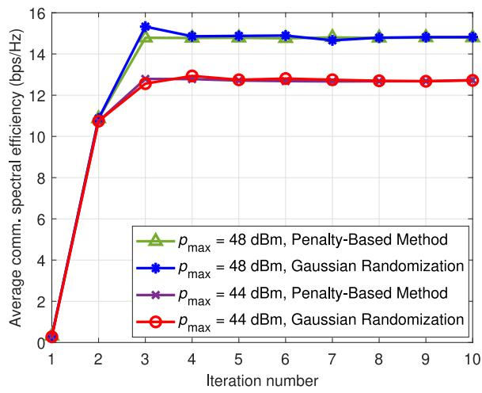

line

| Iteration number | p_max = 48 dBm, Penalty-Based Method | p_max = 48 dBm, Gaussian Randomization | p_max = 44 dBm, Penalty-Based Method | p_max = 44 dBm, Gaussian Randomization |
| ---------------- | ------------------------------------ | -------------------------------------- | ------------------------------------ | -------------------------------------- |
| 1                | 0                                    | 0                                      | 0                                    | 0                                      |
| 2                | 11                                   | 11                                     | 11                                   | 11                                     |
| 3                | 15                                   | 15                                     | 13                                   | 13                                     |
| 4                | 15                                   | 15                                     | 13                                   | 13                                     |
| 5                | 15                                   | 15                                     | 13                                   | 13                                     |
| 6                | 15                                   | 15                                     | 13                                   | 13                                     |
| 7                | 15                                   | 15                                     | 13                                   | 13                                     |
| 8                | 15                                   | 15                                     | 13                                   | 13                                     |
| 9                | 15                                   | 15                                     | 13                                   | 13                                     |
| 10               | 15                                   | 15                                     | 13                                   | 13                                     |

Fig. 2. Convergence performance of the proposed algorithm using penaltybased and Gaussian randomization Rank-one methods at different ISAC-BS transmit powers.

# IV. SIMULATION RESULTS

In this section, we conduct numerical simulations to evaluate the performance of the proposed HAPS-mounted FD ISAC-BS system. The HAPS is located at point $( 0 , 0 , z _ { H } )$ of a three-dimensional Cartesian coordinate system, and all the communication UEs, the targets, and the edge server are located randomly according to a uniform distribution within a circle of radius $r _ { H }$ m. In addition, the Rayleigh quotient method has been utilized to initialize the radar receive beamforming vectors. Unless otherwise stated, the simulation parameters are set as shown in Table I.

The convergence performance of the proposed algorithm is evaluated in Figs. 2 and 3 at different maximum ISAC-BS transmit powers. According to [41], the solution of the radar receive beamforming problem (31a) using the penalty-based Rank-one method adds extra computational complexity since we have to iteratively update the penalty factor η to reach the solution. Hence, for the sake of comparison, we further applied Gaussian randomization Rank-one relaxation method, which has lower computational complexity. In Fig. 2, the convergence performance is presented considering the penalty-based Rank-one solution and the Gaussian randomization solution. As can be seen from the figure, both methods converge exactly at the same steady state values at different maximum ISAC-BS transmit powers. However, we can notice that the convergence performance of the penalty-based method is slightly better, where it converged to the steady state value in fewer iterations. Moreover, it can be noticed that as the ISAC-BS transmit power increases, the average achieved communication spectral efficiency increases.

In Fig 3, the convergence performance is presented under both Rician fading and LoS component only channel cases. Again, the proposed algorithm converges to a steady state solution within small number of iterations for both cases. In addition, it is apparent that modeling the channel as Rician fading degrades the communication spectral efficiency due to the strong multipaths in the NLoS component. However, the performance enhancement percentage between the two transmit power cases is higher for the Rician fading, where there is an approximately 16.5% improvement between $p _ { \mathrm { m a x } } = 4 4$ dBm and $p _ { \operatorname* { m a x } } = 4 8$ dBm and only about 10.5% improvement between $p _ { \mathrm { m a x } } ~ = ~ 4 4$ dBm and $ { p _ { \mathrm { m a x } } } \ = \ 4 8$ dBm for the LoS only case. Since our system is based on aerial-to-ground communication with a strong possibility of LoS channels, we will adopt the LoS only channel for all the remaining results.

TABLE I SIMULATION PARAMETERS 

<table><tr><td>Parameter</td><td>Value</td><td>Parameter</td><td>Value</td></tr><tr><td>Number of Tx/Rx antennas,  $N_t$ </td><td>6</td><td>Number of UEs, K</td><td>2</td></tr><tr><td>Noise power spectral density</td><td>-174 dBm/Hz</td><td>Number of targets, L</td><td>3</td></tr><tr><td>Communication bandwidth, B</td><td>10 MHz</td><td>HAPS altitude,  $z_H$ </td><td>20 km</td></tr><tr><td>Jamming UAV altitude,  $z_U$ </td><td>20 m</td><td>Radius of service area,  $r_H$ </td><td>20 km</td></tr><tr><td>Maximum allowed Tx power  $p_{\text{max}}$ </td><td>46 dBm</td><td> $β_0$ </td><td>-20 dB</td></tr><tr><td>Jamming power,  $p_J$ </td><td>40 dBm</td><td>Maximum allowed eavesdropper SINR,  $Γ_{\text{min}}$ </td><td>0 dB</td></tr><tr><td>Radar estimation information rate requirements,  $R_{\text{Req}}$ </td><td>1 bps/Hz</td><td>UAV mission time, T</td><td>50 sec.</td></tr><tr><td>UAV mission interval,  $τ$ </td><td>1 sec</td><td>Maximum UAV speed,  $v^{\text{max}}$ </td><td>10 m/sec</td></tr><tr><td>ISAC-BS antenna spacing, d</td><td>0.5λ m</td><td>HAPS antenna gain,  $G_H$ </td><td>43.2 dBi [45]</td></tr><tr><td> $ω_{loc}$  and  $ω_{MEC}$ </td><td>1000 cycles [37]</td><td>CPU frequency,  $f_{loc}$  and  $f_{MEC}$ </td><td>10 GHz [37]</td></tr><tr><td>Maximum latency,  $ξ_{\text{max}}$ </td><td>3 sec.</td><td></td><td></td></tr></table>

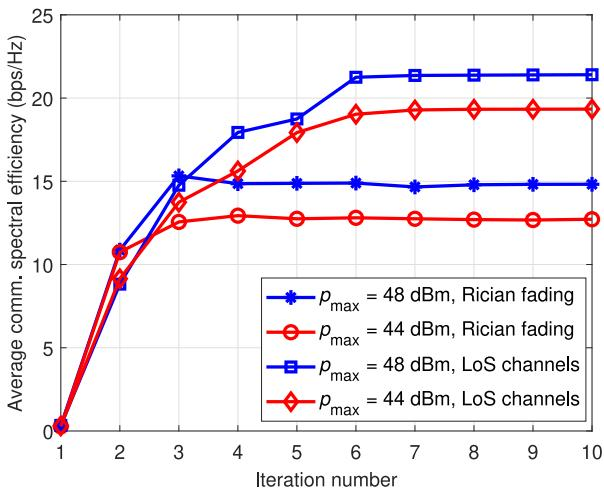

line

| Iteration number | p_max = 48 dBm, Rician fading | p_max = 44 dBm, Rician fading | p_max = 48 dBm, LoS channels | p_max = 44 dBm, LoS channels |
| ---------------- | ------------------------------ | ------------------------------ | ---------------------------- | ---------------------------- |
| 1                | 0                              | 0                              | 0                            | 0                            |
| 2                | 9                              | 11                             | 11                           | 10                           |
| 3                | 15                             | 13                             | 15                           | 14                           |
| 4                | 15                             | 13                             | 18                           | 16                           |
| 5                | 15                             | 13                             | 19                           | 18                           |
| 6                | 15                             | 13                             | 21                           | 19                           |
| 7                | 15                             | 13                             | 21                           | 19                           |
| 8                | 15                             | 13                             | 21                           | 19                           |
| 9                | 15                             | 13                             | 21                           | 19                           |
| 10               | 15                             | 13                             | 21                           | 19                           |

Fig. 3. Convergence performance of the proposed algorithm under Rician and LoS only channels at different ISAC-BS transmit powers.

In Fig. 4, we plot the initial and optimized AAV trajectories assuming different mission times. As shown in the figure, the optimized trajectory forces the AAV to move towards the eavesdropper or the malicious target and away from the legitimate UE. For short mission times, the AAV almost reaches the eavesdropper, while as the mission time increases, the AAV goes away from the eavesdropper, but in the direction away from the legitimate UE in order to reduce the amount of jamming interference experienced. When we further increase the mission time, we can notice that the AAV hovers for some time near the eavesdropper in the opposite direction from the legitimate UE as indicated by the solid area in the black squares curve at T = 100 seconds. In addition, as a special case for the sake of comparison, we plot the optimized trajectory while neglecting the jamming signals at the legitimate UEs at T = 80 seconds, see the blue curve. Since no jamming signals affect the legitimate UEs, we find that the AAV hovers on top of the eavesdropper most of the time, even if we increased the mission time.

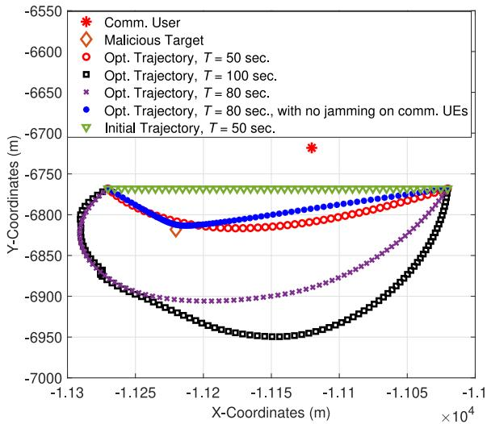  
Fig. 4. Initial and optimized AAV trajectories assuming different AAV mission times.

Figure 5 shows the average communication spectral efficiency against the ISAC-BS transmit power for different number of ISAC-BS transmit/receive antennas. As mentioned previously, we notice that as the ISAC-BS transmit power increases, the achieved spectral efficiency increases. Also, it is again apparent that the performance gap between the initial and optimized trajectory decreases with increasing the transmit power. This is due to the lower effect the jamming signal has on the achieved SINR at the legitimate UEs. Moreover, increasing the number of transmit antennas increases the achieved spectral efficiency since this adds extra degrees of freedom that allows the ISAC-BS to minimize the interference at the legitimate UEs through the optimum design of the transmit beamforming.

In Fig. 6, we study the effect of the AAV jamming power on the average communication spectral efficiency again assuming different number of transmit antennas. It can be seen that as the AAV jamming power increases, the achieved spectral efficiency at the legitimate UEs decreases. However, we can see the large gap between the optimized and initial trajectories at large AAV jamming powers, which highlights the significant effect the AAV jamming power has on the legitimate UEs at the initial trajectory. For the optimized trajectory, the achieved spectral efficiency slightly decreases with increasing the AAV jamming power. Moreover, increasing the number of antennas at the ISAC-BS gives more degrees of freedom that allow for better cancellation of the interference coming from the jamming AAV. In addition, for the case of $N _ { t } = 4$ antennas, we notice the large gap between the optimized and initial trajectories, which indicates that the optimization algorithm works better for worse conditions.

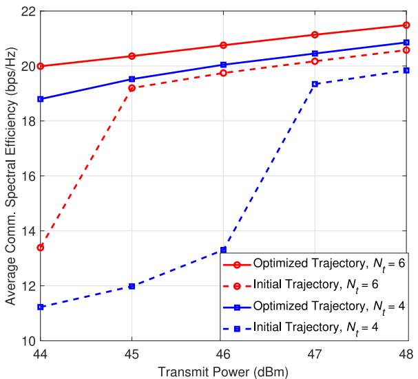

line

| Transmit Power (dBm) | Optimized Trajectory, Nt = 6 | Initial Trajectory, Nt = 6 | Optimized Trajectory, Nt = 4 | Initial Trajectory, Nt = 4 |
| --------------------- | ---------------------------- | --------------------------- | ---------------------------- | --------------------------- |
| 44                    | 20.0                         | 13.5                        | 18.8                         | 11.2                        |
| 45                    | 20.3                         | 19.2                        | 19.5                         | 12.0                        |
| 46                    | 20.7                         | 19.8                        | 20.0                         | 13.5                        |
| 47                    | 21.0                         | 20.2                        | 20.5                         | 19.2                        |
| 48                    | 21.5                         | 20.5                        | 20.8                         | 19.8                        |

Fig. 5. Average achieved communication users spectral efficiency vs. ISAC-BS transmit power for initial and optimized trajectories and different number of transmit/receive antennas.

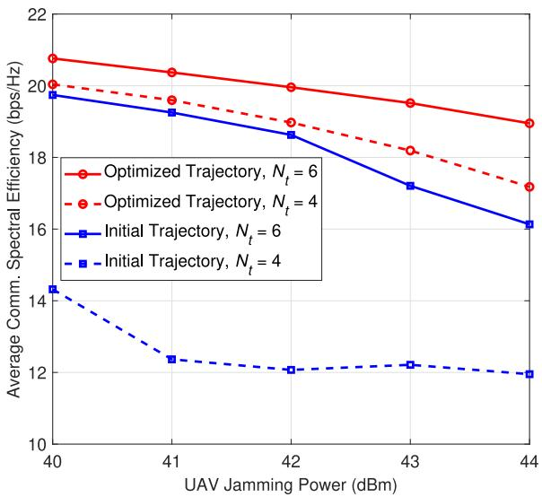

line

| UAV Jamming Power (dBm) | Optimized Trajectory, Nt = 6 | Optimized Trajectory, Nt = 4 | Initial Trajectory, Nt = 6 | Initial Trajectory, Nt = 4 |
| ----------------------- | ---------------------------- | ---------------------------- | --------------------------- | --------------------------- |
| 40                      | 21.0                         | 20.0                         | 19.5                        | 14.5                        |
| 41                      | 20.5                         | 19.5                         | 19.0                        | 12.5                        |
| 42                      | 20.0                         | 19.0                         | 18.5                        | 12.0                        |
| 43                      | 19.5                         | 18.0                         | 17.5                        | 12.0                        |
| 44                      | 19.0                         | 17.0                         | 16.5                        | 12.0                        |

Fig. 6. Average achieved communication users spectral efficiency vs. the AAV jamming power for initial and optimized trajectories and different number of transmit/receive antennas.

Although, in this work, our focus is on the case of perfect CSI, which provides an upper bound on the performance of communication systems, we also studied the effect of imperfect CSI on the achieved communication UEs spectral efficiency of the proposed system in Fig. 7. We adopt the bounded CSI model for the channels between the HAPSmounted ISAC-BS and the communications UEs as in [39], which can be expressed as:

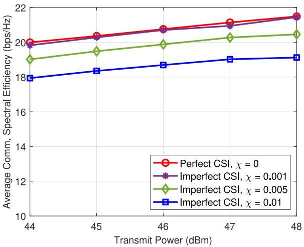

line

| Transmit Power (dBm) | Perfect CSI, χ = 0 | Imperfect CSI, χ = 0.001 | Imperfect CSI, χ = 0.005 | Imperfect CSI, χ = 0.01 |
| --------------------- | ------------------ | ------------------------ | ------------------------ | ----------------------- |
| 44                    | 20.0               | 20.0                     | 19.0                     | 18.0                    |
| 45                    | 20.5               | 20.5                     | 19.5                     | 18.5                    |
| 46                    | 21.0               | 21.0                     | 20.0                     | 19.0                    |
| 47                    | 21.5               | 21.5                     | 20.5                     | 19.5                    |
| 48                    | 22.0               | 22.0                     | 21.0                     | 20.0                    |

Fig. 7. Average achieved communication UEs spectral efficiency versus the ISAC-BS transmit power at different CSI uncertainty values χ.

$$
\mathbf {h} _ {H, k} = \hat {\mathbf {h}} _ {H, k} + \Delta \mathbf {h} _ {H, k}, \| \mathbf {h} _ {H, k} \| _ {2} \leq \hat {\chi} \tag {54}
$$

where $\mathbf { h } _ { H , k }$ is the actual CSI, $\hat { \mathbf { h } } _ { H , k }$ denotes the estimated CSI, and $\Delta \mathbf { h } _ { H , k }$ denotes the estimation error. The radius of the uncertainty region is denoted as $\hat { \chi } = \chi \| \mathbf { h } _ { H , k } \| _ { 2 }$ , where $\chi \in [ 0 , 1 )$ represents the relative amount of CSI uncertainty. If $\chi = 0$ , this indicates perfect CSI, while an increase in χ corresponds to a higher CSI error. In the imperfect CSI scenario in Fig. 7, the optimization problem is solved using the estimated CSI. The resulting spectral efficiency is then evaluated based on the actual CSI corresponding to the computed optimization variables. As shown in Fig. 7, increasing the relative amount of CSI uncertainty $\chi$ above zero degrades the achieved communication UEs spectral efficiency as compared to the perfect CSI case. Approximately there is about 0.25% degradation in the achieved spectral efficiency for the case of $\chi = 0 . 0 0 1$ and almost 4.5% for the case of $\chi = 0 . 0 0 5$ at transmit power of 46 dBm. In addition, increasing the amount of CSI uncertainty will further decrease the achieved spectral efficiency. Since the amount of degradation is relatively low at lower values of CSI uncertainty, our proposed algorithm can be considered robust to CSI errors when the uncertainty is low. However, when the CSI uncertainty is high, a more robust design for the optimization problem is required as discussed in [39].

The average radar estimation information rate is then presented in Fig. 8 against the ISAC-BS transmit power for the proposed algorithm that applies the SDR approach for the radar receive beamforming optimization sub-problem and for the Rayleigh quotient approach [21], [22]. For both approaches, it can be seen that the radar estimation information rate increases with increasing the transmit power. However, the proposed algorithm achieves better performance, where a performance improvement of approximately 20% is achieved at a transmit power of 44 dBm. As the transmit power increases, the Rayleigh quotient approach tends to achieve improved performance, where the performance improvement of the SDR approach decreases to approximately 12%. This can be attributed to the fact that the Rayleigh quotient approach depends only on the received SINR, which depends directly on the ISAC-BS transmit power.

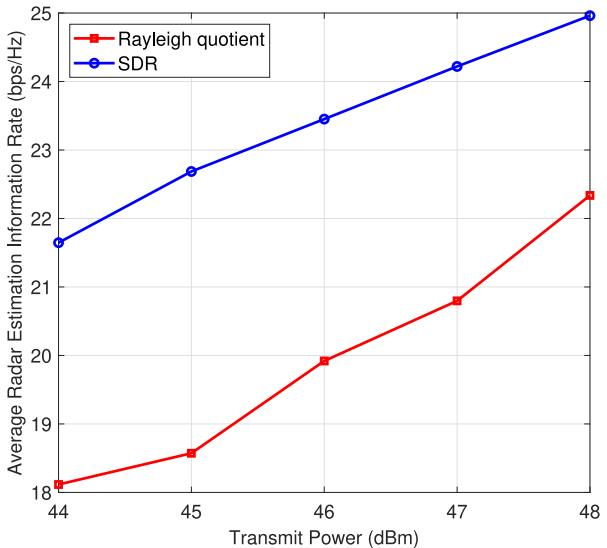

line

| Transmit Power (dBm) | Rayleigh quotient | SDR   |
| -------------------- | ----------------- | ----- |
| 44                   | 18.0              | 21.7  |
| 45                   | 18.5              | 22.7  |
| 46                   | 19.9              | 23.4  |
| 47                   | 20.8              | 24.2  |
| 48                   | 22.3              | 25.0  |

Fig. 8. Average achieved radar estimation information spectral efficiency vs. ISAC-BS transmit power under different receive beamforming vectors design techniques.

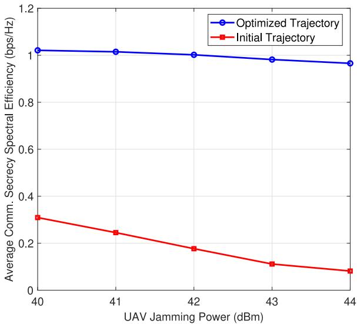

line

| UAV Jamming Power (dBm) | Optimized Trajectory | Initial Trajectory |
| ----------------------- | -------------------- | ------------------ |
| 40                      | 1.0                  | 0.3                |
| 41                      | 1.0                  | 0.25               |
| 42                      | 1.0                  | 0.18               |
| 43                      | 0.98                 | 0.1                |
| 44                      | 0.95                 | 0.08               |

Fig. 9. Average achieved communication users secrecy spectral efficiency vs. AAV jamming power for the initial and optimized trajectories.

In Fig. 9, we study the average communication secrecy rate performance against the AAV jamming power for the optimized and initial trajectories. The secrecy rate is calculated as the difference between the achieved spectral efficiency at the nearest legitimate UE to the eavesdropper and the achieved spectral efficiency at the eavesdropper. It is apparent that increasing the jamming power reduces the achieved secrecy rate since the jamming signals affect both the eavesdropper and the legitimate UE. However, we can see that the secrecy rate slightly decreases for the case of the optimized trajectory when compared to the considerable decrease in the case of the initial trajectory. This confirms the efficiency of the proposed algorithm in securing the communication signals against potential eavesdroppers.

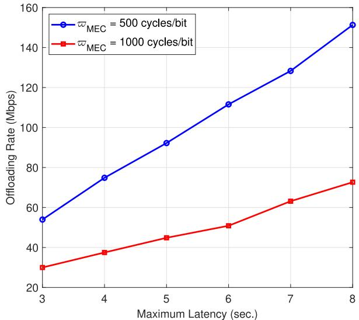

line

| Maximum Latency (sec.) | Offloading Rate (Mbps) for w_MEC = 500 cycles/bit | Offloading Rate (Mbps) for w_MEC = 1000 cycles/bit |
| ---------------------- | ----------------------------------------------- | ------------------------------------------------- |
| 3                      | 55                                              | 30                                                |
| 4                      | 75                                              | 38                                                |
| 5                      | 92                                              | 45                                                |
| 6                      | 112                                             | 51                                                |
| 7                      | 128                                             | 63                                                |
| 8                      | 152                                             | 73                                                |

Fig. 10. Offloading rate vs. maximum allowed latency for executing workloads at different consumed CPU cycles in processing one-bit of data.

Finally, Fig. 10 shows the effect of increasing the maximum allowed latency for executing the workloads locally and at the edge server on the rate of offloaded data for different tasks requiring different number of CPU cycles in processing 1-bit of data. According to [46], different tasks require different number of cycles/bit. As shown in the figure, the offloading rate increases while increasing the maximum allowed latency since there will be more available time for workload execution. Moreover, for a task requiring more CPU cycles/bit, the offloading rate will be smaller than for a task requiring less CPU cycles/bit at the same maximum allowed latency. In other words, to achieve the same offloading rate for a task requiring more CPU cycles/bit, we need more execution time.

# V. CONCLUSION

In this work, we propose the adoption of a non-terrestrial based ISAC framework that provides both sensing and communication services from an aerial platform to exploit the enhanced coverage and LoS connection. More specifically, we propose the deployment of a HAPS-mounted FD ISAC-BS that serves a group of communication UEs and senses a group of targets simultaneously. Meanwhile, the sensed information can be partially offloaded to an edge server due to the lack of computational resources onboard. After processing the sensed data, we assume that there is a potential eavesdropper that tries to intercept the communication signal of one of the UEs. To achieve secure communication, a friendly jamming AAV is utilized to degrade the achieved SINR at the eavesdropper without greatly affecting the legitimate UEs. A multi-objective optimization problem is formulated to maximize the achieved communication spectral efficiency, where the radar/communication transmit beamforming matrix, the radar receive beamforming vectors, and the AAV trajectory are jointly optimized while maintaining a minimum radar estimation information rate and a maximum allowed transmit power budget, latency as well as trajectory and security constraints. Extensive simulations are conducted to evaluate the performance of the proposed system, where almost 47% improvement in the achieved communication spectral efficiency for the optimized AAV trajectory as compared to the initial trajectory at transmit power of 44 dBm was obtained. Moreover, at the same transmit power, there is a 20% improvement in the achieved radar estimation information rate for the proposed algorithm as compared to the Rayleigh quotient approach that is typically used for radar receive beamforming design.

# APPENDIX

# PROOF OF CONVERGENCE OF ALGORITHM 1

Following [47], let us denote the objective function in problem (21) as $f ( \mathbf { u } _ { l } [ n ] , \mathbf { W } [ n ] , \mathbf { Q } )$ . This function is a logarithmic function, which is monotonically increasing. First, in Step 4 of Algorithm 1, since the sub-optimal value of ${ \mathbf u } _ { l } ^ { ( m ) } [ n ]$ in the $m ^ { t h }$ iteration is obtained at given values of $\mathbf { W } ^ { ( \breve { m } - 1 ) } [ n ]$ and $\mathbf { Q } ^ { ( m - 1 ) }$ from the previous iteration, the following inequality holds for function f :

$$
f \left(\mathbf {u} _ {l} ^ {(m - 1)} [ n ], \mathbf {W} ^ {(m - 1)} [ n ], \mathbf {Q} ^ {(m - 1)}\right)
$$

$$
\leq f \left(\mathbf {u} _ {l} ^ {(m)} [ n ], \mathbf {W} ^ {(m - 1)} [ n ], \mathbf {Q} ^ {(m - 1)}\right). \tag {55}
$$

Next, in Step 5 and 6 of Algorithm 1, similar inequalities hold for the function f regarding the other two variables $\mathbf { W } [ n ]$ and Q, but using the sub-optimal values obtained from previous steps, i.e.,

$$
f \left(\mathbf {u} _ {l} ^ {(m)} [ n ], \mathbf {W} ^ {(m - 1)} [ n ], \mathbf {Q} ^ {(m - 1)}\right)
$$

$$
\leq f \left(\mathbf {u} _ {l} ^ {(m)} [ n ], \mathbf {W} ^ {(m)} [ n ], \mathbf {Q} ^ {(m - 1)}\right). \tag {56}
$$

$$
f \left(\mathbf {u} _ {l} ^ {(m)} [ n ], \mathbf {W} ^ {(m)} [ n ], \mathbf {Q} ^ {(m - 1)}\right)
$$

$$
\leq f \left(\mathbf {u} _ {l} ^ {(m)} [ n ], \mathbf {W} ^ {(m)} [ n ], \mathbf {Q} ^ {(m)}\right). \tag {57}
$$

From (55), (56), and (57), we can write:

$$
f \left(\mathbf {u} _ {l} ^ {(m - 1)} [ n ], \mathbf {W} ^ {(m - 1)} [ n ], \mathbf {Q} ^ {(m - 1)}\right)
$$

$$
\leq f \left(\mathbf {u} _ {l} ^ {(m)} [ n ], \mathbf {W} ^ {(m)} [ n ], \mathbf {Q} ^ {(m)}\right). \tag {58}
$$

The inequality in (58) shows that the objective function f is always non-decreasing after each iteration. Hence, Algorithm 1 is guaranteed to converge, and this completes the proof.

# REFERENCES

[1] F. Liu, C. Masouros, A. P. Petropulu, H. Griffiths, and L. Hanzo, “Joint radar and communication design: Applications, state-of-the-art, and the road ahead,” IEEE Trans. Commun., vol. 68, no. 6, pp. 3834–3862, Jun. 2020.   
[2] R. Liu, M. Li, H. Luo, Q. Liu, and A. L. Swindlehurst, “Integrated sensing and communication with reconfigurable intelligent surfaces: Opportunities, applications, and future directions,” IEEE Wireless Commun., vol. 30, no. 1, pp. 50–57, Feb. 2023.

[3] F. Liu et al., “Integrated sensing and communications: Toward dualfunctional wireless networks for 6G and beyond,” IEEE J. Sel. Areas Commun., vol. 40, no. 6, pp. 1728–1767, Jun. 2022.   
[4] N. Huang, C. Dou, Y. Wu, L. Qian, B. Lin, and H. Zhou, “Unmanned aerial vehicle aided integrated sensing and computation with mobile edge computing,” IEEE Internet Things J., vol. 10, no. 19, pp. 16830–16844, Oct. 2023.   
[5] C.-X. Wang et al., “On the road to 6G: Visions, requirements, key technologies, and testbeds,” IEEE Commun. Surveys Tuts., vol. 25, no. 2, pp. 905–974, 2nd Quart., 2023.   
[6] D. Zhou, M. Sheng, J. Li, and Z. Han, “Aerospace integrated networks innovation for empowering 6G: A survey and future challenges,” IEEE Commun. Surveys Tuts., vol. 25, no. 2, pp. 975–1019, 2nd Quart., 2023.   
[7] K. Meng et al., “UAV-enabled integrated sensing and communication: Opportunities and challenges,” IEEE Wireless Commun., vol. 31, no. 2, pp. 97–104, Apr. 2024.   
[8] G. Zheng, M. Wen, J. Wen, and C. Shan, “Joint hybrid precoding and rate allocation for RSMA in near-field and far-field massive MIMO communications,” IEEE Wireless Commun. Lett., vol. 13, no. 4, pp. 1034–1038, Apr. 2024.   
[9] A. Fotouhi et al., “Survey on UAV cellular communications: Practical aspects, Standardization advancements, regulation, and security challenges,” IEEE Commun. Surveys Tuts., vol. 21, no. 4, pp. 3417–3442, 4th Quart., 2019.   
[10] N. Su, F. Liu, and C. Masouros, “Sensing-assisted eavesdropper estimation: An ISAC breakthrough in physical layer security,” IEEE Trans. Wireless Commun., vol. 23, no. 4, pp. 3162–3174, Apr. 2024.   
[11] W. Sun, S. Sun, X. Su, and R. Liu, “Security-ensured integrated sensing and communication (ISAC) systems enabled by phase-coupled intelligent omni-surfaces (IOS),” IEEE Trans. Wireless Commun., vol. 23, no. 4, pp. 3480–3492, Apr. 2024.   
[12] A. Liu et al., “A survey on fundamental limits of integrated sensing and communication,” IEEE Commun. Surveys Tuts., vol. 24, no. 2, pp. 994–1034, 2nd Quart., 2022.   
[13] C. Ouyang, Y. Liu, and H. Yang, “MIMO-ISAC: Performance analysis and rate region characterization,” IEEE Wireless Commun. Lett., vol. 12, no. 4, pp. 669–673, Apr. 2023.   
[14] Z. Xiao and Y. Zeng, “Waveform design and performance analysis for full-duplex integrated sensing and communication,” IEEE J. Sel. Areas Commun., vol. 40, no. 6, pp. 1823–1837, Jun. 2022.   
[15] H. Hua, J. Xu, and T. X. Han, “Optimal transmit beamforming for integrated sensing and communication,” IEEE Trans. Veh. Technol., vol. 72, no. 8, pp. 10588–10603, Aug. 2023.   
[16] Z. Wang, Y. Liu, X. Mu, Z. Ding, and O. A. Dobre, “NOMA empowered integrated sensing and communication,” IEEE Commun. Lett., vol. 26, no. 3, pp. 677–681, Mar. 2022.   
[17] A. Al Amin and S. Y. Shin, “Channel capacity analysis of nonorthogonal multiple access with OAM-MIMO system,” IEEE Wireless Commun. Lett., vol. 9, no. 9, pp. 1481–1485, Sep. 2020.   
[18] A. Al Amin and S. Y. Shin, “Capacity enhancement of NOMA-MIMO with OAM-IM,” IEEE Wireless Commun. Lett., vol. 10, no. 5, pp. 924–928, May 2021.   
[19] A. Al Amin and S. Y. Shin, “Capacity analysis of cooperative NOMA-OAM-MIMO based full-duplex relaying for 6G,” IEEE Wireless Commun. Lett., vol. 10, no. 7, pp. 1395–1399, Jul. 2021.   
[20] X. Cheng, D. Duan, S. Gao, and L. Yang, “Integrated sensing and communications (ISAC) for vehicular communication networks (VCN),” IEEE Internet Things J., vol. 9, no. 23, pp. 23441–23451, Dec. 2022.   
[21] A. A. Salem, M. H. Ismail, and A. S. Ibrahim, “Active reconfigurable intelligent surface-assisted MISO integrated sensing and communication systems for secure operation,” IEEE Trans. Veh. Technol., vol. 72, no. 4, pp. 4919–4931, Apr. 2023.   
[22] J. Chu, Z. Lu, R. Liu, M. Li, and Q. Liu, “Joint beamforming and reflection design for secure RIS-ISAC systems,” IEEE Trans. Veh. Technol., vol. 73, no. 3, pp. 4471–4475, Mar. 2024.   
[23] A. R. Chiriyath, B. Paul, G. M. Jacyna, and D. W. Bliss, “Inner bounds on performance of radar and communications co-existence,” IEEE Trans. Signal Process., vol. 64, no. 2, pp. 464–474, Jan. 2016.   
[24] J. Chu, R. Liu, M. Li, Y. Liu, and Q. Liu, “Joint secure transmit beamforming designs for integrated sensing and communication systems,” IEEE Trans. Veh. Technol., vol. 72, no. 4, pp. 4778–4791, Apr. 2023.   
[25] J. Mu, R. Zhang, Y. Cui, N. Gao, and X. Jing, “UAV meets integrated sensing and communication: Challenges and future directions,” IEEE Commun. Mag., vol. 61, no. 5, pp. 62–67, May 2023.

[26] J. Wu, W. Yuan, and L. Bai, “On the interplay between sensing and communications for UAV trajectory design,” IEEE Internet Things J., vol. 10, no. 23, pp. 20383–20395, Dec. 2023.   
[27] A. Naeem, S. Rafique, and H. Arslan, “A novel frame design for non-terrestrial network based integrated sensing and communication,” in Proc. IEEE 33rd Annu. Int. Symp. Pers., Indoor Mobile Radio Commun. (PIMRC), 2022, pp. 577–582.   
[28] M. Asif, X. Bao, A. Ihsan, W. U. Khan, M. Ahmed, and X. Li, “Securing NOMA 6G communications leveraging intelligent omni-surfaces under residual hardware impairments,” IEEE Internet Things J., vol. 11, no. 14, pp. 25326–25336, Jul. 2024.   
[29] W. U. Khan et al., “Integration of NOMA with reflecting intelligent surfaces: A multi-cell optimization with SIC decoding errors,” IEEE Trans. Green Commun. Netw., vol. 7, no. 3, pp. 1554–1565, Sep. 2023.   
[30] M. Asif, X. Bao, Z. Ali, A. Ihsan, M. Ahmed, and X. Li, “Transmissive RIS-empowered LEO-satellite communications with hybrid-NOMA under residual hardware impairments,” IEEE Trans. Green Commun. Netw., early access, Sep. 23, 2024, doi: 10.1109/TGCN.2024.3466469.   
[31] W. Xia, G. Zheng, Y. Zhu, J. Zhang, J. Wang, and A. P. Petropulu, “Deep learning based beamforming neural networks in downlink MISO systems,” in Proc. IEEE Int. Conf. Commun. Workshops (ICC Workshops), 2019, pp. 1–5.   
[32] Y. Qin, Z. Zhang, X. Li, W. Huangfu, and H. Zhang, “Deep reinforcement learning based resource allocation and trajectory planning in integrated sensing and communications UAV network,” IEEE Trans. Wireless Commun., vol. 22, no. 11, pp. 8158–8169, Nov. 2023.   
[33] Q. Wu, Y. Zeng, and R. Zhang, “Joint trajectory and communication design for multi-UAV enabled wireless networks,” IEEE Trans. Wireless Commun., vol. 17, no. 3, pp. 2109–2121, Mar. 2018.   
[34] M. Cui, G. Zhang, Q. Wu, and D. W. K. Ng, “Robust trajectory and transmit power design for secure UAV communications,” IEEE Trans. Veh. Technol., vol. 67, no. 9, pp. 9042–9046, Sep. 2018.   
[35] Z. Zhang, W. Chen, Q. Wu, Z. Li, X. Zhu, and J. Yuan, “Intelligent omni surfaces assisted integrated multi-target sensing and multi-user MIMO communications,” IEEE Trans. Commun., vol. 72, no. 8, pp. 4591–4606, Aug. 2024.   
[36] Y. Sun, A. Baricz, and S. Zhou, “On the monotonicity, log-concavity, and tight bounds of the generalized Marcum and Nuttall Q-functions,” IEEE Trans. Inf. Theory, vol. 56, no. 3, pp. 1166–1186, Mar. 2010.   
[37] N. Huang, C. Dou, Y. Wu, L. Qian, and R. Lu, “Energy-efficient integrated sensing and communication: A multi-access edge computing design,” IEEE Wireless Commun. Lett., vol. 12, no. 12, pp. 2053–2057, Dec. 2023.   
[38] A. Mohajer, J. Hajipour, and V. C. M. Leung, “Dynamic offloading in mobile edge computing with traffic-aware network slicing and adaptive TD3 strategy,” IEEE Commun. Lett., vol. 29, no. 1, pp. 95–99, Jan. 2025.   
[39] M. Luan, B. Wang, Z. Chang, T. Hämäläinen, and F. Hu, “Robust beamforming design for RIS-aided integrated sensing and communication system,” IEEE Trans. Intell. Transp. Syst., vol. 24, no. 6, pp. 6227–6243, Jun. 2023.   
[40] J. Zhou, H. Li, and W. Cui, “Low-complexity joint transmit and receive beamforming for MIMO radar with multi-targets,” IEEE Signal Process. Lett., vol. 27, pp. 1410–1414, Aug. 2020.   
[41] X. Mu, Y. Liu, L. Guo, J. Lin, and R. Schober, “Simultaneously transmitting and reflecting (STAR) RIS aided wireless communications,” IEEE Trans. Wireless Commun., vol. 21, no. 5, pp. 3083–3098, May 2022.   
[42] M. Grant, S. Boyd, and Y. Ye. “CVX: MATLAB software for disciplined convex programming.” 2009. [Online]. Available: https://github.com/cvxr/CVX   
[43] P. Tseng, “Convergence of a block coordinate descent method for nondifferentiable minimization,” J. Optim. Theory Appl., vol. 109, pp. 475–494, Jun. 2001.   
[44] A. Ben-Tal and A. Nemirovski, Lectures on Modern Convex Optimization: Analysis, Algorithms, and Engineering Applications (MPS-SIAM Series on Optimization). Philadelphia, PA, USA: SIAM, 2001.   
[45] “Study on new radio (NR) to support non-terrestrial networks, (Release 15), Version 15.4.0,” 3GPP, Sophia Antipolis, France, Rep. 38.811, 2020.   
[46] A. P. Miettinen and J. K. Nurminen, “Energy efficiency of mobile clients in cloud computing,” in Proc. 2nd USENIX Workshop Hot Topics Cloud Comput. (HotCloud), 2010, p. 4.   
[47] G. Yang, X. Xu, Y.-C. Liang, and M. D. Renzo, “Reconfigurable intelligent surface-assisted non-orthogonal multiple access,” IEEE Trans. Wireless Commun., vol. 20, no. 5, pp. 3137–3151, May 2021.

natural_image

Portrait of a smiling man with beard wearing red polo shirt (no text or symbols visible)

Ahmed M. Benaya received the B.Sc. and M.Sc. degrees in electronics and electrical communications engineering, from Menoufia University, Shibin Al Kawm, Egypt, and the Ph.D. degree in electronics and communications engineering from the Egypt-Japan University of Science and Technology, New Borg El Arab, Egypt, in 2018. Since 2019, he has been an Assistant Professor with the Department of Electronics and Electrical Communications Engineering, Faculty of Electronic Engineering, Menoufia University. He is currently

a Postdoctoral Research Fellow with the American University of Sharjah, Sharjah, UAE. His research interests include signal processing techniques for wireless communications, intelligent reflecting surfaces-assisted communications, energy harvesting and SWIPT systems, space–air–ground integrated networks, and physical-layer security for wireless communications.

natural_image

Portrait of a man in a light blue shirt and tie (no text or symbols visible)

Mohamed S. Hassan received the M.Sc. degree in electrical engineering from the University of Pennsylvania, Philadelphia, PA, USA, in 2000, and the Ph.D. degree in electrical and computer engineering from the University of Arizona, Tucson, AZ, USA, in 2005. He is currently a Professor of electrical engineering with the American University of Sharjah, Sharjah, UAE. In addition to his work on electric vehicles, he has actively participated in multiple projects in areas such as freespace optical communications, demand response, and smart

grids. His primary research interests include multimedia communications and networking, wireless communications, cognitive radios, resource allocation, performance evaluation of wired and wireless networks, and next-generation wireless systems.

natural_image

Portrait of a man wearing glasses and a collared shirt, outdoors with trees in the background (no text or symbols visible)

Mahmoud H. Ismail (Senior Member, IEEE) received the B.Sc. (Hons.) degree in electronics and electrical communications engineering, the M.Sc. degree in communications engineering from Cairo University, Egypt, in 2000 and 2002, respectively, and the Ph.D. degree in electrical engineering from The University of Mississippi, MS, USA, in 2006. He is currently a Full Professor with the American University of Sharjah, Sharjah, UAE, and a Full Professor (on leave) with the Department of Electronics and Electrical

Communications Engineering, Cairo University, Egypt. He was also a Systems Engineering Consultant with Newport Media Inc. (currently part of Microchip) Egypt Design Center, Cairo, from 2006 to 2014. His research is in the general area of wireless communications with emphasis on performance evaluation of next-generation wireless systems and communications over fading channels. He is the recipient of the University of Mississippi Summer Assistantship Award in 2004 and 2005, the University of Mississippi Dissertation Fellowship Award in 2006, the University of Mississippi Graduate Achievement Award in Electrical Engineering in 2006, and the Best Paper Award presented at the 10th IEEE Symposium on Computers and Communications in 2005, La Manga del Mar Menor, Spain. He served as a Reviewer for several refereed journals and conferences. He is a member of Sigma Xi and Phi Kappa Phi.

natural_image

Portrait of a man wearing glasses and a light blue shirt (no text or symbols visible)

Taha Landolsi received the Ph.D. degree from The University of Texas at Dallas, Richardson, TX, USA, in 1999. He worked in the North American telecommunications industry for more than seven years, designing and planning wireless and optical networks in several U.S. markets. He is currently a Professor of computer engineering with the American University of Sharjah, Sharjah, UAE. His research interests include wireless and optical networks, free-space optical communications, optical switching and computing, and wavelet transforms

applications to communications and signal processing.