# AeroGuard: Towards Real-Time UAV Fault Detection With Hybrid Models

Teng Li , Zhili Wei , Yebo Feng , Runze Yu, Zhuo Ma , Senior Member, IEEE,

Yulong Shen , Senior Member, IEEE, Jianfeng Ma , Member, IEEE, and Yang Liu , Senior Member, IEEE

Abstract—Unmanned Aerial Vehicles (UAVs) are increasingly deployed in safety-critical applications, yet their operations in complex environments make them vulnerable to diverse faults. This paper presents AeroGuard, a lightweight hybrid framework for real-time UAV fault detection. AeroGuard combines Long Short-Term Memory (LSTM) and AutoRegressive with eXogenous input (ARX) models, with residual-driven adaptive weighting to balance their strengths. Faults are identified through Z-score and Sequential Probability Ratio Test (SPRT) applied to prediction residuals, ensuring accurate and timely detection. Extensive experiments on public datasets, real UAV flight logs, and outdoor flights confirm AeroGuard’s robustness, particularly in detecting drift and bias faults where existing methods degrade. AeroGuard achieves up to 95.8% precision, representing about 10% improvement over prior work, while maintaining sub-5 ms latency on Raspberry Pi 4B with modest resource usage, and sub-second detection on Pi Zero for low-speed UAVs. We also discuss current limitations, noting that evaluation on hardware-induced faults (e.g., motor seizure) will be pursued in future work.

Received 12 November 2025; accepted 30 December 2025. Date of publication 13 January 2026; date of current version 7 May 2026. This work was supported in part by the National Key Research and Development Program of China under Grant 2023YFB2904000, in part by the Natural Science Basic Research Program of Shaanxi under Grant 2025JC-JCQN-073, in part by the National Natural Science Foundation of China under Grant 62272370 and Grant 62536002, in part by Young Elite Scientists Sponsorship Program by CAST under Grant 2022QNRC001, in part by China 111 Project under Grant B16037, in part by the Qinchuangyuan Scientist + Engineer Team Program of Shaanxi under Grant 2024QCY-KXJ-149, in part by Songshan Laboratory under Grant 241110210200, in part by the Fundamental Research Funds for the Central Universities under Grant QTZX23071, in part by China Higher Education Institutions Industry-University-Research Innovation Fund under Grant 2024IT095, in part by National Research Foundation, Singapore, and the Cyber Security Agency through its National Cybersecurity R&D Programme under Grant NCRP25-P04-TAICeN, in part by Ripple under the University Blockchain Research Initiative (UBRI) [61], in part by the National Research Foundation, Singapore, and in part by DSO National Laboratories through AI Singapore Programme under AISG Award AISG2-GC-2023-008. Recommended for acceptance by M. Ozger. (Corresponding author: Yebo Feng.)

Teng Li is with the School of Cyber Engineering, Xidian University, Xi’an 710071, China, and also with the College of Songshan Laboratory, Zhengzhou 452470, China (e-mail: litengxidian@gmail.com).

Zhili Wei, Zhuo Ma, and Jianfeng Ma are with the School of Cyber Engineering, Xidian University, Shaanxi 710126, China (e-mail: duanyan2024@gmail.com; mazhuo@mail.xidian.edu.cn; jfma@mail.xidian.edu. cn).

Yebo Feng and Yang Liu are with the College of Computing and Data Science (CCDS), Nanyang Technological University, Singapore 639798 (e-mail: yebo.feng@ntu.edu.sg; yangliu@ntu.edu.sg).

Runze Yu is with the Hong Kong University of Science and Technology (Guangzhou), Guangzhou 511453, China (e-mail: mercy2green@gmail.com).

Yulong Shen is with the School of Computer Science, Xidian University, Shaanxi 710071, China (e-mail: ylshen@mail.xidian.edu.cn).

This article has supplementary downloadable material available at https://doi.org/10.1109/TMC.2026.3653674, provided by the authors.

Digital Object Identifier 10.1109/TMC.2026.3653674

Index Terms—UAVs, fault detection, data-driven approach, hybrid model.

## I. INTRODUCTION

U NMANNED Aerial Vehicles (UAVs) have become in-dispensable in applications such as aerial photography, dispensable in applications such as aerial photography, surveillance, agriculture, and disaster response [1], [2].

Operating in complex environments exposes them to faults including power loss, actuator lock, sensor spoofing, or cyberattacks [3], [4], [5], [6], which can jeopardize flight safety through communication breakdowns or system failures. These faults often manifest as anomalies in flight data (e.g., ROS bags, Mavlink logs, sensor readings) [7], [8], [9]. Existing studies [10], [11], [12] categorize such manifestations as static, bias, drift, and point faults—four representative forms covering both internal and external UAV anomalies. Consequently, analyzing flight data becomes a practical and unified basis for fault detection and safety assurance [13], [14].

Current UAV fault detection research generally falls into three categories: (i) Knowledge-based approaches [15], [16], which rely on expert-defined rules or thresholds; (ii) Model-based methods [10], [17], [18], which employ physical or mathematical models; and (iii) Data-driven techniques [11], [19], [20], [21], [22], [23], [24], which leverage machine learning or neural networks. While these solutions have achieved notable progress, each exhibits key limitations: knowledge-based systems cannot detect unseen faults [16]; model-based approaches rely on precise aerodynamic modeling [18]; and data-driven methods, though powerful, are computationally heavy and sensitive to noisy data [11], [19], [20].

A persistent research gap thus remains: existing methods either achieve high accuracy at high computational cost or maintain lightweight efficiency but fail to handle multiple fault types. This trade-off between multi-fault accuracy and realtime feasibility remains unresolved. AeroGuard bridges this gap through a lightweight hybrid model (LSTM+ARX) with adaptive residual-based weighting, enabling precise multi-fault detection under limited onboard resources.

To address these challenges, we propose AeroGuard, a hybrid data-driven approach for rapid and accurate UAV fault detection with minimal computational overhead. AeroGuard predicts expected sensor measurements through a synergistic LSTM–ARX model, ensuring both robustness and precision.

Deep models such as LSTM capture nonlinear temporal dependencies but may suffer drift during long stable flights, whereas ARX models remain efficient in steady conditions but degrade under abrupt dynamics. AeroGuard unifies both through residual-driven adaptive fusion, dynamically emphasizing ARX in stable regimes and LSTM during maneuvers, thereby improving robustness while maintaining real-time feasibility.

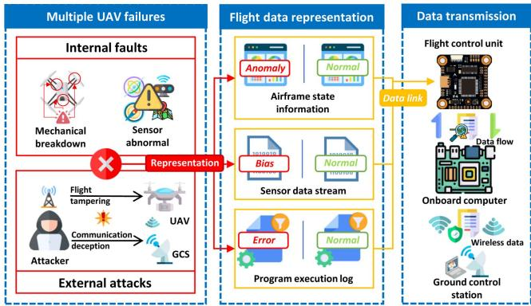  
Fig. 1. Operational model and fault scenario of a UAV.

AeroGuard further employs the Analytic Hierarchy Process (AHP) with a Dynamic Detection Factor (DDF) and Dynamic Weight Matrix (DWM) to fine-tune model weights adaptively. Residuals between predicted and actual measurements are evaluated via Z-score and Sequential Probability Ratio Test (SPRT), enabling precise, timely identification of both fault occurrence and type.

Our main contributions are summarized as follows:

\- Hybrid residual-driven architecture: We present Aero-Guard, a dual-model framework integrating LSTM and ARX predictions via residual-driven dynamic weighting. This balances linear interpretability with nonlinear modeling power, addressing the trade-off between multi-fault accuracy and onboard feasibility.

\- Lightweight real-time deployment: AeroGuard attains high detection accuracy while maintaining < 6 ms latency and modest resource use on Raspberry Pi platforms, surpassing prior works that depend on large models or simulation-only evaluations.

\- Comprehensive real-world evaluation: Extensive experiments on public datasets and real UAV flight data— covering stable, dynamic, and windy conditions—confirm AeroGuard’s robustness and generalization, validating its hybrid design for practical UAV deployment.

## II. BACKGROUND AND RELATED WORK

## A. Correlation of Faults and Flight Data

The occurrence of UAV faults and the flight data are closely intertwined, establishing the theoretical basis for data-driven fault detection approaches [12], [25], [26], [27], [28], [29], [30], [31], , [32]. In this context, we analyze specific fault types by examining UAV fault scenarios and their manifestations in flight data.

1) UAV Fault Scenario: In autonomous flight, operators are not required to control all flight behaviors, as UAVs rely on sensors for positioning and path planning [33], [34]. Fig. 1 shows a UAV fault scenario. UAVs may experience internal faults (e.g., mechanical breakdowns, sensor issues) or external attacks (e.g., flight tampering, communication deception). These faults may be hidden in or mixed with normal flight data (e.g., flight status, sensor streams, program logs). The flight control system sends this data to the onboard computer (OC) and ground control station (GCS) for analysis. Unlike manned aircraft, UAVs cannot autonomously detect and resolve faults, making reliable fault detection algorithms essential for safe operation.

TABLE I  
TYPES OF FAULTS STUDIED IN THIS PAPER
<table><tr><td>Phenomenon</td><td>Manifestation</td><td>Category</td></tr><tr><td>Full power loss</td><td>Static/Drift/Bias</td><td>Internal</td></tr><tr><td>Elevator stuck</td><td>Static/Drift/Bias</td><td>Internal</td></tr><tr><td>Aileron stuck</td><td>Static/Drift/Bias</td><td>Internal</td></tr><tr><td>Rudder stuck</td><td>Static/Drift/Bias</td><td>Internal</td></tr><tr><td>Sensor anomaly</td><td>Static/Drift/Bias/Point</td><td>Internal/External</td></tr><tr><td>Signal interference</td><td>Static/Drift/Bias/Point</td><td>Internal/External</td></tr><tr><td>GPS attack</td><td>Static/Drift/Bias/Point</td><td>External</td></tr></table>

2) Types and Manifestations of Faults: Through the UAV fault scenario, ensuring the safety of the UAV is paramount, necessitating the detection of faults in the flight data. According to current research [8], [11], [21], [25], UAVs can experience various faults during autonomous flight, and there are four primary forms of fault manifestation in flight data, identified as static, bias, drift, and point. These faults are computed by

$$
\left\{ \begin{array} { l l } { Y _ { S t a t i c } ( t ) = d , } \\ { Y _ { B i a s } ( t ) = y _ { s e n s o r } ( t ) + \Delta d , } \\ { Y _ { D r i f t } ( t ) = y _ { s e n s o r } ( t ) + k ( t ) , } \\ { Y _ { P o i n t } [ t _ { i } ] = m [ T _ { 1 } , T _ { 2 } , . . . , T _ { n } ] . } \end{array} \right.\tag{1}
$$

In (1), d is a constant indicating that the sensor value is fixed at a particular fault value; $\Delta d$ is a constant increment, indicating a constant bias in the sensor value; k(t) represents the time-based function of the fault value and the drift in the sensor value’s variability over a time period; $m [ T _ { 1 } , T _ { 2 } , . . . , T _ { n } ]$ represents an instantaneous fault in the sensor data at time $T _ { i }$ . These faults can occur in various components of the drone and pose significant threats to the flight safety of UAVs.

In this paper, our focus is on four specific types of faults in UAV flight data. These four types have been identified as major representations of various faults based on current research. The faults detected in this study are detailed in Table I.

## B. Related Work

Current UAV fault detection approaches can be categorized into three groups: knowledge-based [35], model-based [18], and data-driven [11], [36], [37], [38]. With the advancement and wide use of UAVs, fault scenarios are becoming more and more complicated. Thus, each approach may face its own challenges.

Table II presents a comparison between the proposed datadriven approach (i.e., AeroGuard) and state-of-the-art research.

As summarized in Table II, AeroGuard is the only approach that simultaneously supports real-time detection, multi-fault coverage, lightweight design, and actual onboard deployment.

TABLE II  
COMPARISONS OF RELATED APPROACHES
<table><tr><td>Approaches</td><td>[25]</td><td>[10]</td><td>[11]</td><td>[21]</td><td>[20]</td><td>AeroGuard</td></tr><tr><td>Real-time detection</td><td>√</td><td>x</td><td>x</td><td>x</td><td>x</td><td>√</td></tr><tr><td>Multiple faults deteciton</td><td>x</td><td>x</td><td>√</td><td>√</td><td>√</td><td>√</td></tr><tr><td>Lightweight design</td><td>√</td><td>√</td><td>x</td><td>x</td><td>x</td><td>√</td></tr><tr><td>Actual deployment</td><td>√</td><td>x</td><td>x</td><td>x</td><td>x</td><td>√</td></tr></table>

For example, LSTM-based methods [25], [21] achieve multifault detection but are not lightweight enough for UAV hardware, while ARX-based methods [20] are lightweight but fail to cover multiple fault types. Thus, AeroGuard bridges the gap by delivering both efficiency and generalizability in real-world UAV deployments.

1) Knowledge-Based Approaches: Knowledge-based approaches mimic human expertise for rapid, real-time fault detection [35], [39]. For instance, Bu et al. [39] propose an algorithm combining particle filter (PF) state residuals with a fuzzy inference system (FIS) for UAV fault detection. Similarly, Ding et al. [35] introduce PLT-SPRT and a fall detection system for smart walkers.

However, a key limitation of knowledge-based approaches is their inability to manage unknown faults, as generating new diagnoses from a fixed set of expert rules poses significant challenges.

2) Model-Based Approaches: Model-based approaches rely on a priori knowledge of the system [40]. The diagnostic process is based on a model of normal behavior and known faults [41], [42]. Some methods can detect unknown faults and enable quick, real-time applications [18], [25]. For example, He et al. [19] propose a least-squares-based FDI scheme for tracking saturation limits. Demircan et al. [18] use an extended Kalman filter to detect aileron locking faults. Wang et al. [42] propose an algorithm for diagnosing faults based on monitored fault levels and trends.

However, as the UAV system becomes more complex or its interaction with the environment intensifies, model-based approaches grow more challenging to construct. If the model cannot fit the aerodynamics of a UAV very well, it will significantly lose accuracy in detecting multiple faults. Additionally, the complex fine-tuning required across different UAV types and faults also leads to limitations in the applicability of this method.

3) Data-Driven Approaches: Data-driven approaches utilize sampled data to extract valuable information for fault detection and potential diagnosis [43], [44]. Some strategies statistically compare online data with known fault expressions or historically normal behaviors, while others use machine learning (ML) techniques to develop fault detection or diagnosis models [45], [46], [47]. Typically, ML transforms the nonlinear models of UAVs into linear ones through specific functional models [18], [25], [41]. Keipour et al. [25] use RLS for real-time UAV anomaly detection, which features ARX-based flight measurements modeling and low detection overhead. Fault detection is performed by the fitted model. While this avoids the need for complex aerodynamic models, it still requires manual model selection for training. To reduce these constraints, neural network-based approaches use flight data to construct a nonlinear UAV model [11], [21], [48]. Wang et al. [11] propose a data-driven multivariate regression method, applies LSTM with residual filtering for fault detection. Ahmad et al. [48] introduce a 7-layer LSTM and Dropout-based real-time prediction and classification framework for autonomous flight failures. Zhong et al. [21] utilize spatio-temporal correlations in LSTM for diverse UAV anomaly detection. These strategies use the fitted model to predict real-time UAV outputs and then to discern if the UAVs are malfunctioning. Recent advances also highlight the role of vibration-based analysis for UAV fault diagnosis. For example, Al-Haddad et al. [49] proposed a propeller fault detection framework that combines deep learning with $\chi ^ { 2 }$ -selected Taguchi-tested Lempel–Ziv complexity and Teager–Kaiser energy features, achieving robust diagnosis of non-traditional vibration patterns. Similarly, Al-Haddad et al. [50] systematically compared filtering and multiresolution analysis techniques for vibration signal processing in multirotor UAVs, demonstrating the importance of proper preprocessing choices in reliable fault diagnosis.

To the best of our knowledge, existing works employ either ARX or LSTM independently. None combine them through an adaptive residual-driven weighting mechanism. This makes AeroGuard distinct in bridging the complementary strengths of linear and nonlinear predictors, while ensuring feasibility on embedded UAV hardware. In parallel, complementary studies on vibration-signal based fault features [49], [50] provide additional insights that could be integrated with AeroGuard to further enhance robustness.

While these approaches demonstrate the strengths of ARX or LSTM individually, recent transformer-based models have further advanced state-of-the-art fault/anomaly detection. PatchTST [51] segments time series into subseries tokens to capture long-range temporal dependencies, while TimeSieve [52] integrates multi-scale wavelet preprocessing with an information bottleneck for improved robustness. Other transformer variants for anomaly detection, such as stacked predictive transformers [53] and memory-guided designs [54], achieve competitive accuracy on diverse CPS datasets. Although these methods excel in accuracy, their large-scale architectures and long look-back windows limit their feasibility on resource-constrained UAV platforms.

However, some of these approaches encounter challenges in achieving quick and online detection due to heavy computational overhead. Additionally, other data-driven approaches lack a lightweight design, restricting their applicability to specific onboard computers and limiting their fault detection capabilities.

Beyond conventional fault detection, the security community has also extensively investigated anomaly detection in UAVs, robotic platforms, and more general CPS systems. Quinonez et al. [55] proposed SAVIOR, a framework that secures autonomous vehicles through robust physical invariants against adversarial manipulations. Dash et al. [56] developed PID-Piper, a recovery mechanism for robotic vehicles under physical attacks leveraging control-theoretic resilience. Sindhwani et al. [57] introduced an unsupervised anomaly detection method for selfflying delivery drones, targeting robustness against unforeseen anomalies. These works highlight the importance of anomaly detection from a security perspective, and AeroGuard complements them by providing a lightweight yet adaptive fault detection mechanism specifically tailored to UAV onboard constraints.

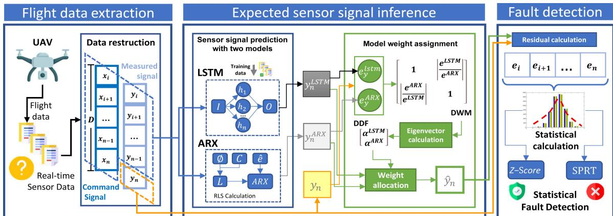  
Fig. 2. General workflow of AeroGuard.

## III. THREAT MODEL

In an autonomous UAV system, ensuring accurate and reliable flight data is essential. UAVs face internal failures and external threats. To formalize these, we are creating a threat model to define the adversary’s knowledge, capabilities, and impact.

## A. Knowledge and Ability of the Attacker

\- Abilities: The attacker understands the UAV’s architecture, sensor setup, and communication protocol, identifying key nodes and vulnerabilities.

\- Knowledge: The attacker can manipulate sensors, inject false data, interfere with signals, and exploit software vulnerabilities to execute system-level attacks, causing flight abnormalities.

## B. Fault Type and Threat Association

According to previous descriptions (Section II-A2), UAVs may exhibit four main types of faults in flight data: static, bias, drift, and point faults. We conducted a correlation analysis between these types of faults and the opponent’s attack capabilities:

1) Static: The attacker can disrupt the UAV system by freezing sensor data or communication signals, causing the system to be unable to sense changes in the environment. This disruption may lead to misoperation or loss of control. For instance, the attacker may maliciously jam the GPS signal to make the UAV mistakenly believe that it is stationary.

2) Bias: By adjusting sensor calibration parameters or introducing biased data, the attacker causes the UAV to consistently veer off course, raising the risk during flight. This attack could lead to the UAV gradually drifting away from its intended area.

3) Drift: The attacker gradually disconnects the UAV’s judgment from the actual situation by continuously modifying sensor data or system parameters. This type of attack is usually hard to detect immediately but it accumulates risk over time and can ultimately lead to system failure.

4) Point: The attacker may disrupt UAV operation through transient jamming or malicious data injection, causing sudden changes in flight altitude or direction at critical moments.

## IV. SYSTEM DESIGN

## A. System Overview

We first detail the architecture of AeroGuard. As depicted in Fig. 2, the data processing workflow of AeroGuard comprises three distinct segments:

1) Flight Data Extraction (Section IV-B): To facilitate the transformation of varied-frequency sensor measurements into data sequences suitable for subsequent analysis, we propose a flight data extraction module. This module is designed to extract and restructure the sensor data.

2) Expected Sensor Measurement Inference (Section IV-C): This module infers the expected sensor measurements in two steps:

\- Sensor measurements prediction with two models: This step involves inferring the expected sensor measurements in the absence of faults, thereby facilitating fault detection via comparative analysis. To accomplish this objective, we establish both an LSTM and an ARX model. These models are used to depict the sensors’ input-output measurement relationships, further enabling their utilization for inferential purposes in real time.

\- Model weight assignment: To optimize the detection accuracy of the hybrid model composed of ARX and LSTM, we propose DDF and DWM based on the AHP algorithm to dynamically adjust the weights of the two models. First, the residuals of the ARX-LSTM model’s outputs and the actual measurements are calculated respectively. Then, the residuals are used to form DWM. Finally, the two inferred measurements of the ARX-LSTM model are subjected to weight allocation calculation, generating the final expected sensor measurements.

3) Fault Detection (Section IV-D): To perform real-time detection of multiple faults, we employ statistical-based fault detection methods to compare the expected measurements and the actual measurements. Specifically, we utilize the Z-score and SPRT methods to achieve the goal.

## B. Flight Data Extraction

UAVs generate various sensor data that capture their real-time flight status, and faults can immediately affect flight trajectory or attitude. To reduce algorithmic complexity, we select only relevant sensor data for preprocessing and detection. For airframe fault detection, we focus on UAV attitude data based on existing research [25], which minimizes the data needed by the algorithm and reduces complexity.

After selecting the corresponding sensor measurements, we preprocess the data for subsequent analysis.

We employ a sliding window approach for data reconstruction, striking a balance between real-time fault detection and the capture of interrelated data points. This approach optimizes data processing efficiency and enhances comprehension of underlying data patterns by integrating the advantages of both batch processing and filtering.

The reconstruction assumes the following forms:

$$
X _ { n } ^ { A R X } = \left[ \begin{array} { c } { x _ { n - D + 1 } } \\ { x _ { n - D + 2 } } \\ { \cdots } \\ { x _ { n } } \\ { y _ { n - D + 1 } } \\ { y _ { n - D + 2 } } \\ { \cdots } \\ { \cdots } \\ { y _ { n - 1 } } \end{array} \right] _ { \ast } Y _ { n } ^ { A R X } = \Big [ y _ { n } \Big ] ,\tag{2}
$$

$$
\begin{array} { r } { X _ { n } ^ { L S T M } = \left[ { \begin{array} { c c } { x _ { n - D + 2 } } & { y _ { n - D + 1 } } \\ { x _ { n - D + 3 } } & { y _ { n - D + 2 } } \\ { \cdot \cdot } & { \cdot \cdot } \\ { x _ { n } } & { y _ { n - 1 } } \end{array} } \right] _ { , } Y _ { t } ^ { L S T M } = \Big [ y _ { n } \Big ] _ { . } } \end{array}\tag{3}
$$

On lightweight computing devices, referring to research in [8], [21], based on the computing power of drones, we designate the sliding window size as $D _ { : }$ , where D = 20. The grouping algorithm treats D pieces of command data and $D - 1$ pieces of measured data as variables $X _ { n } .$ , such as sensor readings and attitude information. It regards the current measurement as the variable $Y _ { n }$ . By adjusting the length of the time window $D ,$ we can guarantee both real-time data calculation and decent prediction accuracy.

In this study, we focus primarily on attitude sensor streams (gyroscope and accelerometer data), as they are directly related to UAV stability and control. Other modalities such as GPS and LiDAR are not included in the current evaluation but can be naturally incorporated into the AeroGuard framework by extending the input feature space.

## C. Expected Sensor Measurement Inference

Compared to previous methods based on direct detection, AeroGuard employs comparative analysis to ascertain discrepancies between the expected sensor measurements and the actual sensor measurements, thereby generating fault detection results. The primary advantage of this prediction-based fault detection approach lies in its improved detection accuracy and minimized false positive rate.

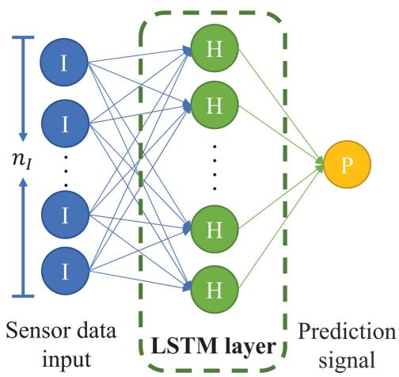  
Fig. 3. The LSTM model structure of AeroGuard.

Moreover, since the prediction process can be undertaken in advance, the computational load during the comparative analysis is lessened. This results in more efficient fault detection, particularly in the context of lightweight devices.

This module formulates the expected sensor measurements drawing from the past sensor data, a process critical to the production of detection outcomes. First, we leverage a hybrid prediction model based on ARX and LSTM to generate the interim prediction results (Section IV-C1). Then, we calculate and assign weights to these two models based on their bias at corresponding time slots, generating more robust and accurate outcomes (Section IV-C2).

1) Sensor Measurements Prediction With Two Models: We utilize both LSTM and ARX models to generate the predicted measurements. The LSTM model can achieve high-precision measurement predictions during stable flight conditions (Here, we consider the UAV to be in a stable flight state when it is no longer moving). Meanwhile, the ARX model can quickly fit and generate prediction measurements during significant flight changes. By combining these two models, this module is capable of producing robust and precise measurement predictions across a variety of circumstances.

a) LSTM Measurement Inference: LSTM is widely used in processing time series data. This algorithm offers advantages in fault detection by effectively modeling sequential data, accommodating variable-length inputs, capturing longterm dependencies, and handling non-linear relationships. In AeroGuard, we propose an LSTM network with one hidden layer, which is illustrated in Fig. 3, to predict expected sensor measurements. The input, forget, cell, and output layers of the LSTM algorithm are calculated using $L a y e r _ { t } = \sigma ( W _ { i } x _ { t } +$ $b _ { i } + W _ { h } h _ { t - 1 } + b _ { h } )$ , where $W _ { i }$ is the matrix that represents the forward connections for the input gate, $x _ { t }$ is the n-dimensional input vector at time $t , b _ { i }$ is a bias vector for the forward connections, $W _ { h }$ is the matrix for the recurrent connections, $h _ { t }$ is the bias vector for the recurrent operations, $b _ { h }$ is the bias vector for the recurrent operations, and $\sigma ( . )$ is the sigmoid function. The cell $c _ { t }$ and hidden state $h _ { t }$ are calculated as

Algorithm 1: LSTM Training Algorithm.   
Input: Sensor input data X, Sensor measured data ${ \mathit { Y } } ,$   
Window size D,   
Output: LSTM network parameter net   
1 for Each $x _ { n } \in X , y _ { n } \in { \hat { Y } }$ do   
2 Adding current data $x _ { n }$ to sensor data sequence $X , Y ;$   
3 Sensor measurements sequence resturction XD, YD;   
4 Input $= [ X _ { D } ; Y _ { D } ] ;$   
5 Supervision value $= y ( D )$   
6 Perform supervised learning to compute net;   
7 return net

$$
\begin{array} { r } { \left\{ c _ { t } = f _ { t } \odot c _ { t - 1 } + i _ { t } \odot g _ { t } , \right. } \\ { \left. h _ { t } = o _ { t } \odot t a n h ( c _ { t } ) . \right. } \end{array}\tag{4}
$$

In (4), $f _ { t } , i _ { t } , g _ { t }$ , and $o _ { t }$ are the forget, input, cell, and output gates. - is the Hadamard product.

During the LSTM training, the input data is formatted as the $X _ { t = i } ^ { L S T M }$ and the output label is formatted as the $Y _ { t = i } ^ { L S T M }$ in Equation 3 respectively. After the training, an LSTM neural network containing the functional relationship between the sensor input measurements and the inferred measurements is generated. Algorithm 1 lists the pseudo-code of the LSTM Training algorithm.

We utilize the Root Mean Square Error (RMSE) as the loss function for LSTM.

Equation 5 indicates its calculation.

A smaller RMSE means that the predicted value is closer to the actual value.

$$
R M S E ( Y ) = \sqrt { \frac { 1 } { m } { \sum _ { i = 1 } ^ { m } { { { \left( { Y _ { i } } - Y _ { i } ^ { \prime } \right) } } ^ { 2 } } } } .\tag{5}
$$

Once the LSTM model is trained, the trained model can be used to generate real-time predicted measurements $y _ { n } ^ { L S T M }$

b) ARX Measurement Inference: The ARX model combines an autoregressive part (AR) and an exogenous input part (X), and is often used for time-series prediction. In AeroGuard, we adopt ARX alongside the LSTM to predict expected sensor measurements $( y _ { n }$ in Fig. 2). The general ARX model is:

$$
y ( t ) = \frac { B ( q ^ { - 1 } ) } { A ( q ^ { - 1 } ) } x ( t ) + \frac { 1 } { A ( q ^ { - 1 } ) } n ( t ) .\tag{6}
$$

Here, $q ^ { - 1 }$ is the time-shift operator, $A ( q ^ { - 1 } )$ and $B ( q ^ { - 1 } )$ are polynomials of lag operators, $x _ { t }$ is the current input, $y _ { t }$ the output, $n _ { t }$ denotes white noise, and $a _ { t } , b _ { t }$ are trainable coefficients.

To update parameters in real time, we employ the Recursive Least Squares (RLS) algorithm, which iteratively minimizes the prediction error. For brevity, the detailed algebraic update formulas are provided in Appendix A, available online. The one-step ARX prediction is:

$$
\begin{array} { r } { y _ { t } ^ { A R X } = \phi ^ { \top } ( t ) \hat { \theta } ( t - 1 ) , } \end{array}\tag{7}
$$

where $\hat { \theta }$ is the parameter vector and φ(t) is the regressor.

2) Model Weight Assignment: To leverage both models and enhance robustness, AeroGuard fuses ARX and LSTM predictions via a residual-driven dynamic weighting scheme.

We compute the signed residuals:

$$
r ^ { L S T M } = Y - y ^ { L S T M } , ~ r ^ { A R X } = Y - y ^ { A R X } .\tag{8}
$$

For completeness, we also record their magnitudes $e = | r |$ for visualization, but all statistical tests (Z-score and SPRT) are applied on signed residuals $r ,$ which preserve distributional symmetry and are more consistent with Gaussian assumptions.

We then construct the dynamic weight matrix (DWM) using an AHP-style pairwise comparison:

$$
\begin{array} { r } { D = \Bigg [ \frac { 1 } { \left| \frac { r ^ { A R X } } { r ^ { L S T M } } \right| } \Bigg | \frac { r ^ { L S T M } } { r ^ { A R X } } \Bigg | \Bigg ] . } \end{array}\tag{9}
$$

Let $V = [ v _ { 1 } , v _ { 2 } ]$ be the eigenvector corresponding to the largest eigenvalue of D. The normalized fusion weights are:

$$
\alpha ^ { A R X } = \frac { v _ { 1 } } { v _ { 1 } + v _ { 2 } } , ~ \alpha ^ { L S T M } = \frac { v _ { 2 } } { v _ { 1 } + v _ { 2 } } .\tag{10}
$$

Finally, the fused prediction is obtained as:

$$
\hat { y } = \alpha ^ { A R X } y ^ { A R X } + \alpha ^ { L S T M } y ^ { L S T M } .\tag{11}
$$

Eqs. (6) and (7) define a lightweight linear predictor with online RLS updates. Eqs. (8)–(11) implement an interpretable residual-driven fusion that prioritizes the model with smaller instantaneous error. Detailed ARX expansions, RLS recursions, and theoretical justification of the dynamic weighting scheme are moved to Appendix A, available online for readability.

## D. Fault Detection

After predicting the expected sensor measurements using (11), AeroGuard performs the final fault detection by comparing and measuring the differences between the expected and actual sensor measurements.

Due to the extreme dependence of threshold-based fault detection on periodic data, drones as lightweight systems cannot meet their computational needs, we utilize statistical approaches to measure differences and perform fault detection. These methods offer several advantages: (1) they operate efficiently, enabling accurate real-time detection with limited computational resources; (2) their outputs are explainable, facilitating manual troubleshooting; (3) they can detect unseen faults, allowing for robust multi-fault detection without training data; (4) they are adaptable to various types of UAVs without modifications.

It is worth noting that statistical approaches such as Z-score and SPRT theoretically assume Gaussian-distributed residuals. In this work, the detectors operate on signed residuals $r _ { n } =$ $y _ { n } - { \hat { y } } _ { n }$ , which we validate empirically in Section V-C. For static, bias, and drift faults, residuals are approximately Gaussian after sliding-window preprocessing; for point faults, heavy tails emerge due to impulsive outliers, yet the detectors remain robust and effective.

To ensure the validity of this assumption, we conducted a residual distribution validation across different fault types. The results of Kolmogorov–Smirnov tests and Q-Q plots show that the residuals approximate Gaussian distributions in most scenarios, particularly after sliding-window preprocessing. Even when deviations from normality occur, Z-score and SPRT remain robust and effective, consistent with prior anomaly detection studies.

The fault detection procedure of AeroGuard works as follows. First, AeroGuard calculates a residual sequence by subtracting the expected sensor measurements from the actual sensor measurements using $e _ { n } = | y _ { n } - { \hat { y _ { n } } } |$ . Then, AeroGuard leverages the Z-score [25] and SPRT [42] to generate the detection outputs. AeroGuard will trigger a fault notification should any of the incorporated approaches detect a fault. By simultaneously employing two different statistical approaches, AeroGuard is able to detect multiple faults (e.g., step fault and drift fault) with appropriate sensitivities.

1) Z-Score: The Z-score is a robust method for fault detection, as it compares sample means with overall population attributes. By analyzing statistical deviations, it identifies significant differences and anomalies for prompt and accurate fault detection, particularly effective for step faults in UAV operations [25]. Experiments show that the calculated residual sequence conforms to a Gaussian distribution according to the central limit theorem [25]. A high Z-score indicates that the UAV is currently malfunctioning.

AeroGuard first utilizes Welford’s recursive method to calculate the average value and variance of the residual sequence iteratively [58], using the following formulas:

$$
\left\{ \begin{array} { l l } { \bar { e } _ { n } = e _ { n - 1 } + \frac { e _ { n } - \bar { e } _ { n - 1 } } { n } , } \\ { M _ { 2 , n } = M _ { 2 , n - 1 } + ( e _ { n } - \bar { e } _ { n - 1 } ) ( e _ { n } - \bar { e } _ { n } ) , } \\ { \mu _ { n } ^ { 2 } = \frac { M _ { 2 , n } } { n - 1 } , } \\ { \sigma _ { n } ^ { 2 } = \frac { M _ { 2 , n } } { n } . } \end{array} \right.\tag{12}
$$

Then, AeroGuard utilizes $z _ { i } = { \frac { e _ { i } - \mu } { \sigma } }$ to generate the Z-score. Here, $\mu$ denotes the average of the residual sequence, and σ denotes the standard deviation of the residual sequence. If the calculated Z-score is higher than the preset threshold, the UAV is undergoing a fault.

2) Sprt: By employing the sequential hypothesis test, the SPRT algorithm is particularly good at identifying drift faults with a given false positive rate and false negative rate [42]. Besides, it is able to minimize false alarms by dynamically adjusting the decision thresholds based on observed data, thereby improving the overall robustness and accuracy of the fault detection process.

The SPRT algorithm works as follows. We use two hypotheses $H _ { 0 }$ and $H _ { 1 }$ to represent the two states (i.e., normal state and fault state) of the UAV system respectively. The detection algorithm first collects the residual sequence $E _ { n } = [ e _ { 1 } , e _ { 2 } , \ldots , e _ { n } ]$ and calculates the likelihood ratio $L _ { n } ( E _ { n } )$ using

$$
\begin{array} { l } { \displaystyle L _ { n } ( E _ { n } ) = \frac { P ( E _ { n } | H _ { 1 } ) } { P ( E _ { n } | H _ { 0 } ) } } \\ { \displaystyle \ = \frac { P [ e _ { 1 } , e _ { 2 } , \ldots , e _ { n } | H _ { 1 } ] } { P [ e _ { 1 } , e _ { 2 } , \ldots , e _ { n } | H _ { 0 } ] } } \end{array}
$$

$$
= \prod _ { i = 1 } ^ { N } { \frac { P ( e _ { i } | H _ { 1 } ) } { P ( e _ { i } | H _ { 0 } ) } } = \prod _ { i = 1 } ^ { N } L ( e _ { i } ) .\tag{13}
$$

Based on the above equation, the log likelihood ratio ln $L _ { n } ( E _ { n } )$ can be calculated using

$$
\begin{array} { l } { \displaystyle \ln L _ { n } ( E _ { n } ) = \ln \left[ \prod _ { i = 1 } ^ { N } L ( e _ { i } ) \right] } \\ { = \ln L _ { n - 1 } ( E _ { n - 1 } ) + \ln L ( e _ { n } ) . } \end{array}\tag{14}
$$

Given the false alarm rate P and the missed detection rate $P _ { M }$ the detection thresholds $T ( H _ { 1 } )$ can be calculated according to the Wald formula, which is shown as

$$
T ( H _ { 1 } ) = \frac { 1 - P _ { M } } { P _ { F } } .\tag{15}
$$

When the UAV is in its normal operations, the log-likelihood ratio ln $L _ { n } ( E _ { n } )$ will remain below $T ( H _ { 1 } )$ . Once a fault occurs, the value of the log-likelihood ratio will increase rapidly, exceeding the detection threshold $T ( H _ { 1 } )$ . This indicates that a fault is happening to the UAV system. The detection decision procedure is shown as (16). When the system is in a normal state at the $i ^ { t h }$ step, the log-likelihood ratio will decrease. When the system has a gradual fault at $i ^ { t h }$ step, the log-likelihood ratio will increase and will gradually exceed the detection threshold $T ( H _ { 1 } )$ as the fault intensifies. In this case, hypothesis $H _ { 1 }$ will be accepted, which means the fault is successfully detected.

$$
\left\{ \begin{array} { l l } { \ln L _ { n } ( E _ { n } ) < T ( H _ { 1 } ) \to A c c e p t H _ { 0 } , } \\ { \ln L _ { n } ( E _ { n } ) \geq T ( H _ { 1 } ) \to A c c e p t H _ { 1 } . } \end{array} \right.\tag{16}
$$

## V. EVALUATION

In this section, we evaluate AeroGuard from the perspective of its prediction efficacy, fault detection efficacy, and time consumption for detection. We also compare AeroGuard to other state-of-the-art approaches with both public and collected real-world datasets.

## A. Setup

1) Various Types of Real UAVs and Open Source Datasets: As shown in Fig. 4, we deployed three quad-rotor UAVs with varying weights, sizes, onboard computing capabilities, and operating conditions for conducting experiments and gathering real-world flight data. We conduct flight experiments in five time periods to construct the dataset, the total length of flight time is 334 s, and the sampling rate uses the default frequency of the PX4 IMU sensor, 50 Hz. Our dataset is openly available on GitHub [59], and more detailed information about our UAVs can be found on the corresponding website. We implemented Aero-Guard using Python and the Robot Operating System (ROS) on these UAVs to assess their performance. Our tests involved injecting faults into the dataset using the PX4 fault injection method, as outlined in Section II-A2. The fault injection algorithm was configured with parameters Δd, k, m, and d set to 15, 0.03, 5, and -1, respectively.

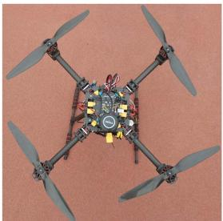  
(a) Heavy model.

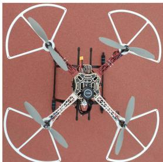  
(b) Medium model.

Fig. 4. AeroGuard experimental UAVs and location.  
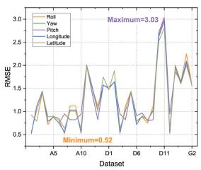  
(a) RMSE comparison on measurements.

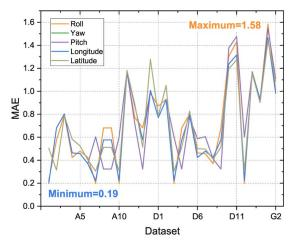  
(b) MAE comparison on measurements.

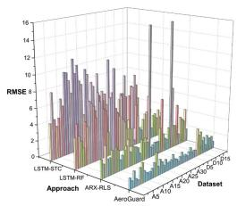

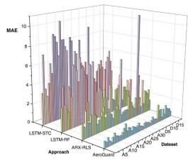  
(c) RMSE comparison on ap- (d) MAE comparison proaches. approaches  
Fig. 5. RMSE and MAE comparison of different measurements and approaches.

We also performed tests using two open-source datasets: the Air Lab Fault and Anomaly (ALFA) dataset [8] and the UAV attack dataset [60]. These three datasets collectively encompass both fixed-wing and multirotor UAVs and cover faults arising from internal malfunctions and external attacks on the UAVs.

2) Comparison With the Current Research: We compare AeroGuard to four data-driven UAV fault detection approaches. For clarity in the ensuing discussions, we will refer to the approaches proposed by Keipour et al. [25], Wang et al. [11], Ahmad et al. [48], and Zhong et al. [21] as ARX-RLS, LSTM-RF, LSTM-14, and STC-LSTM, respectively. These approaches are described at Section II-B3.

## B. Prediction Efficacy

We first tested the prediction efficacy of the expected sensor measurements inference module, as it is vital to the final detection results of AeroGuard.

Fig. 5 illustrates the Root Mean Square Error (RMSE) and Mean Absolute Error(MAE) values for different sensor measurements and approaches, which showcases the predictive capability of AeroGuard. We can see that AeroGuard can achieve low RMSE and MAE for diverse measurements across various datasets compared to other approaches. Fig. 5(a) shows that the RMSE values of AeroGuard remain mostly below 2. Fig. 5(b) shows that the MAE values of AeroGuard remain mostly below 1. Fig. 5(c), (d) clearly demonstrate that AeroGuard is significantly better than the other methods. This demonstrates that the proposed DDF approach is able to optimize the accuracy of the predicted measurements by combining the LSTM and ARX models.

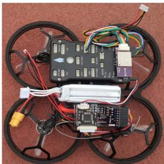  
(c) Light model.

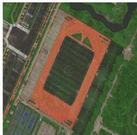  
(d) Experimental location.

## C. Detection Efficacy

We then evaluated the detection efficacy of AeroGuard with different settings.

The detailed threshold sensitivity analysis for Z-score (3.0– 5.0) and SPRT parameters (PF/PM) has been moved to Appendix B (Table V), available online.

1) Dynamic and Fixed Detection Factor: DDF is capable of dynamically assigning appropriate weights to the ARX and LSTM models, thereby better utilizing the advantages of these approaches. To demonstrate the superior detection efficacy of DDF over the approach with a fixed detection factor, we compared their fault detection accuracy, prediction efficacies, and time consumption.

In the fixed detection factor scenario, we configured the weight of ARX and LSTM as 0.5, as depicted in $\hat { y } = y ^ { A R X } ,$ ∗ $0 . 5 { \overset { - } { + } } y ^ { L S T M } * 0 . 5$ . Here, $\hat { y } , y ^ { A R X }$ , and $\overrightharpoon { y ^ { L S T M } }$ denote the final predicted values with the fixed detection factor, the predicted value of the ARX algorithm, and the predicted value of the LSTM algorithm, respectively.

Fig. 6 illustrates the RMSE values, detection time consumption, and Receiver Operating Characteristic (ROC) curves of the DDF and the approach with a fixed detection factor. Fig. 6(a) demonstrates that DDF exhibits lower RMSE values, indicating its superior prediction accuracy. Fig. 6(b) demonstrates that DDF consumes a shorter total detection time compared to the approach with a fixed detection factor. Fig. 6(c) indicates that DDF outperforms the approach with a fixed detection factor in terms of overall detection accuracies. The results demonstrate that DDF achieves a significant improvement in the accuracy, precision, recall, and F1 score, with respective increases of 17% , 10% , 27% , and 19% compared to the approach with a fixed detection factor. These findings highlight the effectiveness of DDF in enhancing UAV fault detection capabilities. In addition, Table IV shows that AeroGuard achieves almost identical detection results under different weight initializations, confirming robustness. Moreover, Fig. 6(d) illustrates that the RMSE decreases rapidly within the first 20 iterations under DDF and stabilizes at a lower plateau, demonstrating fast and stable convergence, which is consistent with the theoretical analysis in Section IV-C2.

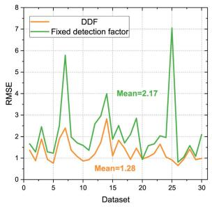  
(a) RMSE comparison.

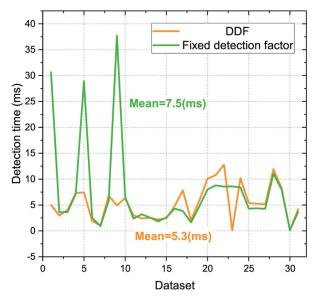  
(b) Time consumption comparison

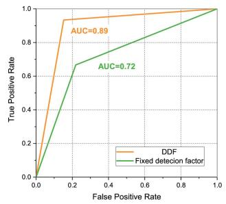  
(c) Detection ROC comparison. (d) =RMSE convergence surfaces of DDF, LSTM, and ARX.

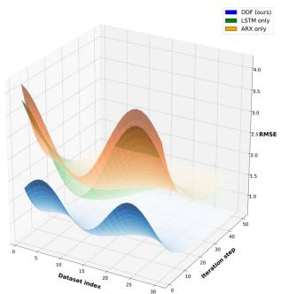

Fig. 6. Comparison experiments between DDF and baselines (fixed detection factor, LSTM only, ARX only).  
TABLE III  
COMPARISON OF DETECTION EFFICACY ACROSS VARIOUS DATASETS AND APPROACHES
<table><tr><td>Dataset</td><td>Number of positive samples</td><td>Number of negative samples</td><td>Algorithm</td><td>TP</td><td>FN</td><td>FP</td><td>TN</td><td>Accuracy(%)</td><td>Precision(%)</td><td>Recall(%)</td><td>F1(%)</td></tr><tr><td rowspan="5">ALFA</td><td rowspan="5">105</td><td rowspan="5">105</td><td>ARX-RLS</td><td>88</td><td>17</td><td>19</td><td>86</td><td>82.86</td><td>82.24</td><td>83.81</td><td>83.02</td></tr><tr><td>AeroGuard</td><td>98</td><td>7</td><td>14</td><td>91</td><td>90.00</td><td>87.50</td><td>93.33</td><td>90.32</td></tr><tr><td>LSTM-14</td><td>99</td><td>6</td><td>3</td><td>102</td><td>95.71</td><td>97.06</td><td>94.29</td><td>95.65</td></tr><tr><td>LSTM-RF</td><td>102</td><td>3</td><td>10</td><td>95</td><td>93.81</td><td>91.07</td><td>97.14</td><td>94.01</td></tr><tr><td>STC-LSTM</td><td>99</td><td>6</td><td>9</td><td>96</td><td>92.86</td><td>91.67</td><td>94.29</td><td>92.96</td></tr><tr><td rowspan="5">BIAS</td><td rowspan="5">30</td><td rowspan="5">30</td><td>ARX-RLS</td><td>23</td><td>7</td><td>13</td><td>17</td><td>66.67</td><td>63.89</td><td>76.67</td><td>69.70</td></tr><tr><td>AeroGuard</td><td>26</td><td>4</td><td>5</td><td>25</td><td>85.00</td><td>83.87</td><td>86.67</td><td>85.25</td></tr><tr><td>LSTM-14</td><td>27</td><td>3</td><td>2</td><td>28</td><td>91.67</td><td>93.10</td><td>90.00</td><td>91.53</td></tr><tr><td>LSTM-RF</td><td>26 25</td><td>4</td><td>3</td><td>27</td><td>88.33</td><td>89.66</td><td>86.67</td><td>88.14</td></tr><tr><td>STC-LSTM</td><td></td><td>5 17</td><td>4</td><td>26 27</td><td>85.00</td><td>86.21</td><td>83.33</td><td>84.75</td></tr><tr><td rowspan="5">DRIFT</td><td rowspan="5">30</td><td rowspan="5">30</td><td>ARX-RLS</td><td>13</td><td></td><td>3</td><td></td><td>66.67</td><td>81.25</td><td>43.33</td><td>56.52</td></tr><tr><td>AeroGuard</td><td>27</td><td>3</td><td>7</td><td>23</td><td>83.33</td><td>79.41</td><td>90.00</td><td>84.38</td></tr><tr><td>LSTM-14</td><td>12</td><td>18</td><td>13</td><td>17</td><td>48.33</td><td>48.00</td><td>40.00</td><td>43.64</td></tr><tr><td>LSTM-RF</td><td>16</td><td>14</td><td>11</td><td>19</td><td>58.33</td><td>59.26</td><td>53.33</td><td>56.14</td></tr><tr><td>STC-LSTM</td><td>17</td><td>13</td><td>14</td><td>16</td><td>55.00</td><td>54.84</td><td>56.67</td><td>55.74</td></tr><tr><td rowspan="4">POINT</td><td rowspan="4">30</td><td rowspan="4">30</td><td>ARX-RLS</td><td>17</td><td>13</td><td>6</td><td>24</td><td>68.33</td><td>73.91</td><td>56.67</td><td>64.15</td></tr><tr><td>AeroGuard</td><td>23</td><td>7</td><td>1 29</td><td></td><td>86.67</td><td>95.83</td><td>76.67</td><td>85.19</td></tr><tr><td>LSTM-RF</td><td>24</td><td>6</td><td>2</td><td>28</td><td>86.67</td><td>92.31</td><td>80.00</td><td>85.71</td></tr><tr><td>STC-LSTM</td><td>23</td><td>7</td><td>2</td><td>28</td><td>85.00</td><td>92.00</td><td>76.67</td><td>83.64</td></tr><tr><td rowspan="5">STATIC</td><td rowspan="5">30</td><td rowspan="5">30</td><td>ARX-RLS</td><td>28</td><td>2</td><td>2</td><td>28</td><td>93.33</td><td>93.33</td><td>93.33</td><td>93.33</td></tr><tr><td>AeroGuard</td><td>29</td><td>1</td><td>5</td><td>25</td><td>90.00</td><td>85.29</td><td>96.67</td><td>90.63</td></tr><tr><td>LSTM-14</td><td>27</td><td>3</td><td>2</td><td>28</td><td>91.67</td><td>93.10</td><td>90.00</td><td>91.53</td></tr><tr><td>LSTM-RF</td><td>28</td><td>2</td><td>3</td><td>27</td><td>91.67</td><td>90.32</td><td>93.33</td><td>91.80</td></tr><tr><td>STC-LSTM</td><td>29</td><td>1</td><td>4</td><td>26</td><td>91.67</td><td>87.88</td><td>96.67</td><td>92.06</td></tr><tr><td>ATTACK</td><td>2</td><td>2</td><td>AeroGuard</td><td>2</td><td>0</td><td>1</td><td>2</td><td>80.00</td><td>66.67</td><td>100.00</td><td>80.00</td></tr></table>

TABLE IV

IMPACT OF INITIAL WEIGHTS ON DETECTION EFFICACY (ALFA DATASET, NUC PLATFORM)
<table><tr><td>Initial weights  $\overline { { ( \alpha _ { A R X } , \alpha _ { L S T M } ) } }$ </td><td>Precision (%)</td><td>Recall (%)</td><td>F1 (%)</td></tr><tr><td>0.2 / 0.8</td><td>87.3</td><td>92.1</td><td>89.6</td></tr><tr><td>0.5 / 0.5</td><td>87.5</td><td>93.3</td><td>90.3</td></tr><tr><td>0.8 / 0.2</td><td>86.9</td><td>91.8</td><td>89.2</td></tr></table>

2) Efficacy Comparison: We further compared AeroGuard with other UAV fault detection approaches. Table III details the detection efficacy comparison results, which include the accuracy, precision, recall, and F1 score on different datasets and different fault types, tested using the NUC platform.

The presented tests include 105 instances of ALFA data, 120 instances of positive fault data, and all the attack data. For the ALFA dataset, AeroGuard achieves an accuracy of 90% , a precision of 87.5% , a recall of 93.33% , and an F1 score of 90.32% . As for the four simulated faults, the accuracies of AeroGuard range from 83% to 90% . For faults caused by GPS attacks, AeroGuard achieves an accuracy of 80% . Notably, AeroGuard exhibits higher accuracy in detecting DRIFT faults, highlighting its decent capability to detect cumulative faults.

For a fair comparison, all baseline methods were implemented in our environment under identical datasets and hardware settings (Raspberry Pi 4B and Pi Zero). We followed hyperparameter configurations reported in their original publications whenever available. In cases where exact values were not specified, we used small-scale grid search over common ranges (e.g., learning rates {0.001, 0.005, 0.01} and window sizes {10, 20, 30}) and selected the best-performing setting on a validation subset. This ensures that each baseline is tuned reasonably and run under conditions consistent with AeroGuard.

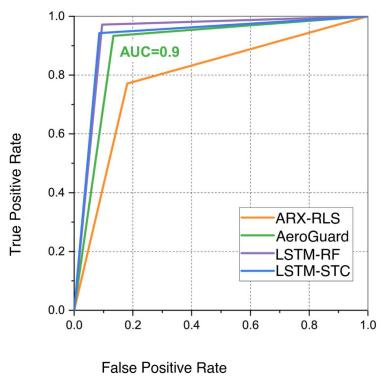  
(a) Algorithm comparison.

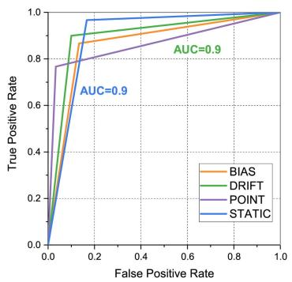  
(b) Fault comparison.

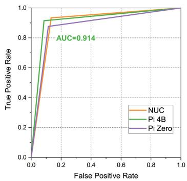  
(c) OC comparison.  
Fig. 7. Comparison of ROC curves of different algorithms at different OC (Onboard computer).

It should be noted that AeroGuard is not always the absolute best performer on every fault type. For example, LSTM-14 yields higher recall on bias faults, while AeroGuard provides stronger robustness on drift faults and achieves a more balanced F1 overall. Therefore, the “10% improvement” refers to the overall average gains across multiple fault categories, rather than uniform superiority on every single metric. The key advantage of AeroGuard is delivering consistent performance across both stable and dynamic conditions, while some baselines excel only on specific scenarios.

Fig. 7 illustrates the ROC curves of fault detections. In particular, Fig. 7(a) presents detection results for ALFA faults on Raspberry Pi 4B. It indicates that the ROC curve of AeroGuard closely resembles those of LSTM-RF and STC-LSTM. However, it notably outperforms the ROC curve of the ARX-RLS approach, exhibiting a significantly larger Area Under Curve (AUC). Furthermore, Fig. 7(b) illustrates the ROC curves of AeroGuard on the NUC for different fault types. The results indicate that AeroGuard can achieve decent results in detecting all four fault types. Lastly, Fig. 7(c) compares the ROC curves of AeroGuard on the three platforms (i.e., NUC, Raspberry Pi 4B, and Raspberry Pi Zero) for detecting faults in the ALFA dataset. The figure demonstrates that irrespective of the computational capabilities of different devices, the AeroGuard approach consistently generates satisfactory results for both the AUC and the ROC curves. Although Fig. 7 shows that LSTM-14 surpasses AeroGuard in certain cases, AeroGuard maintains lower false alarm rates and more consistent detection across varying flight conditions. This highlights AeroGuard’s robustness advantage, which is not fully captured by single-metric comparisons.

3) Residual Distribution Validation: The residual normality validation (KS/Shapiro–Wilk tests) and visualization (histograms with Gaussian fits and Q–Q plots) have been moved to Appendix B (Fig. 10, Fig. 11, and Table VI), available online.

4) Stable vs. Dynamic Flight Scenarios: The detailed evaluation results and analysis comparing stable and dynamic flight scenarios, which further validate the motivation for the hybrid LSTM–ARX design, have been moved tox Appendix B (Table IX), available online for completeness and readability.

## D. Time Complexity and Consumption

1) Theoretical Analysis: The detailed derivation of computational complexity for data restructuring, ARX (RLS), LSTM, fault detection, and the overall AeroGuard pipeline has been moved to Appendix C, available online.

2) Time Consumption: In addition to the theoretical analysis, we measured and analyzed the time consumption of AeroGuard during its operations. Fig. 8 illustrates the average time consumption for processing each data unit, the number of data units required for fault detection, and the overall time consumption from fault occurrences to generating detection results. The data presented in the figure is obtained from the ALFA fault dataset and the assembled UAVs with a Raspberry Pi 4B.

Although AeroGuard combines two predictors, the additional fusion computation increases the processing time by less than 1 ms on Raspberry Pi 4B, keeping the overall detection latency within 6 ms, which is well within real-time constraints.

Fig. 8(a) illustrates the time consumption for processing each data unit for different faults. We can see that the ARX-RLS approach exhibits the lowest time consumption due to its simpler model design compared to the neural network approaches. Still, AeroGuard demonstrates a short time consumption compared to LSTM-RF and LSTM-STC, being 42.3% and 62.9% shorter, respectively. Fig. 8(b) reveals that AeroGuard requires the least amount of data units for detecting faults. As generating a single data unit requires a fixed amount of time, AeroGuard has the shortest delay for starting to process the data compared to the other three approaches. Fig. 8(c) illustrates the total fault detection time (measured in ms). On average, the detection time of the AeroGuard algorithm is marginally longer than that of ARX-RLS, but it is notably shorter when compared to both LSTM-RF and LSTM-STC.

Fig. 9 presents the time consumption of AeroGuard for fault detection on the ALFA dataset and simulated faults with different computing devices. Fig. 9(a) illustrates that the AeroGuard algorithm, even when implemented on devices with less computational power, maintains a remarkably low processing time of 1.3 ms per data unit. Fig. 9(b) reveals that the fault detection time of AeroGuard remains relatively consistent across different devices. Fig. 9(c) illustrates the total fault detection time of AeroGuard on three different computing platforms. Even on devices with low computational power, the longest detection time of AeroGuard is only 0.8 s, while the shortest detection time can be below 0.02 s. To avoid over-emphasizing relative percentages, we henceforth report absolute latency as the primary metric, and use relative reductions only as supplementary context.

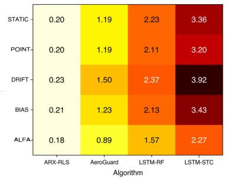

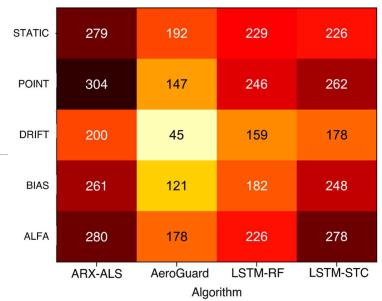

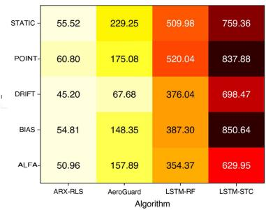  
(a) Time consumption (ms) for processing(b) Number of data units needed for detec-(c) Time consumption (ms) from fault oceach data unit. tion. currences to generating detection results.

Fig. 8. Comparison of time consumption of different algorithms at lightweight Onboard computer (OC).  
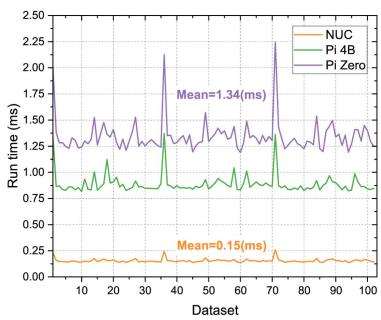  
(a) Time consumption (ms) for processing each data unit.

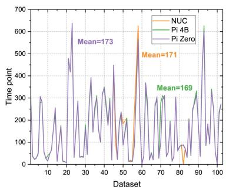  
(b) Number of data units needed for detection.

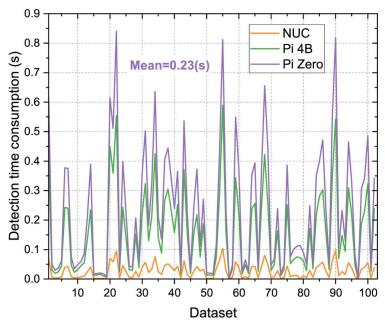  
(c) Time consumption (ms) from fault occurrences to generating detection results.  
Fig. 9. Comparison of time consumption of AeroGuard at different OC.

## E. Limitations and Real-World Validation

While our evaluation included both public datasets and real UAV flight logs with injected faults, we acknowledge that the current experiments do not yet cover physical hardware faults (e.g., motor seizure, actuator wear) or uncontrolled environmental disturbances such as strong wind gusts. Comprehensive details of the outdoor windy-flight evaluation and platform resource profiling have been relocated to Appendix B (Tables VII and VIII), available online; the main findings remain unchanged.

Nevertheless, controlled experiments on physical fault cases (e.g., induced motor stoppage or propeller damage on a safety testbed) remain as important future work. We have added this discussion to clearly delimit the scope of the current evaluation and to guide future validation efforts.

1) Sensor Modalities: A current limitation is that our evaluation is restricted to attitude sensor data. While these are critical for immediate flight control, practical UAV deployments also integrate multiple modalities such as GPS, LiDAR, and barometer streams. Extending AeroGuard to handle multi-modal data fusion is a promising future direction that could further improve robustness against a broader spectrum of operational anomalies.

2) Resource Utilization and Real-Time Applicability.: The detailed resource utilization statistics across different onboard platforms and the detection efficacy results under windy flight conditions have been moved to Appendix B (Tables VII and VIII), available online.

## F. Adaptive Adversaries

A limitation of the present study is that AeroGuard has been evaluated against non-adaptive faults and attacks. In practice, an adaptive adversary with knowledge of the deployed detection scheme could attempt to craft inputs that remain within detection thresholds (e.g., Z-score or SPRT limits), thereby evading alarms. Addressing such adaptive attacks requires integrating complementary strategies such as randomized thresholding, ensembles with diversity in model structures, or cross-layer monitoring that includes physical redundancies. Exploring these defenses, and formally modeling the adversary’s capabilities, is an important direction for future work to strengthen AeroGuard against adaptive threat models.

## G. Realism of Fault Injection

A limitation of the present evaluation is that PX4-based parameter injection cannot fully replicate the physics of hardware-level failures such as motor seizure, propeller damage, or environmental effects like strong wind gusts. Future work will extend AeroGuard’s evaluation with hardware-in-the-loop (HIL) and flight tests, to more comprehensively assess realism and robustness under operational failures.

## VI. CONCLUSION

In this work, we introduce AeroGuard, a data-driven real-time fault detection approach that contributes to the field of UAV fault detection in several key ways. Firstly, the integration of diverse prediction models within a hybrid framework, and the introduction of adaptive weight assignment, showcase AeroGuard’s versatility and robustness in fault identification. Secondly, the careful consideration of real-time computation constraints, coupled with its efficient architecture, ensures AeroGuard’s applicability in UAV systems with limited processing capabilities. Thirdly, the thorough evaluation, encompassing a range of fault scenarios, substantiates the practical feasibility of AeroGuard in diverse operational contexts.

Although the predict-and-compare paradigm is established, our contribution lies in extending it with a lightweight, residualdriven dynamic fusion of heterogeneous predictors. This hybrid design provides both theoretical interpretability (via ARX residuals) and practical robustness (via LSTM modeling), which is novel in UAV fault detection.

Through the rigorous evaluation of AeroGuard on both publicly available datasets and real-world UAV data collected from different quadrotor UAVs, we demonstrated its exceptional efficacy in detecting various types of faults. AeroGuard’s lightweight yet powerful design allowed it to operate in realtime, overcoming computational constraints inherent in UAV systems. Notably, AeroGuard exhibited a decent fault detection precision of 95.83% , even achieving detection times as short as under 5 ms on lightweight UAVs. The theoretical analysis and convergence experiments (Section IV-C2 and Fig. 6(d)) further demonstrate that the dynamic weighting not only provides per-step optimality but also ensures stable convergence of RMSE, leading to consistent detection improvements. These results underscore the practicality and reliability of AeroGuard in enhancing UAV safety and performance.

It is worth noting that transformer-based detectors such as PatchTST and TimeSieve set the current accuracy frontier on general benchmarks. However, AeroGuard addresses a different yet complementary objective: delivering adaptive multi-fault detection under strict onboard latency and memory constraints. Future work may explore integrating lightweight patching or memory-guided modules into AeroGuard’s residual fusion, closing the gap to transformer accuracy while maintaining deployability.

While AeroGuard is occasionally outperformed by single LSTM baselines on specific fault types, its overall robustness and balanced performance across diverse scenarios and platforms make it more suitable for practical UAV deployment.

Future work will extend AeroGuard to adversarially aware settings by modeling adaptive attackers and evaluating robustness against inputs deliberately crafted to evade detection.

Future work will also explore integrating multi-modal sensor data (e.g., GPS, LiDAR, barometer) to broaden the applicability of AeroGuard beyond attitude-based fault detection.

## REFERENCES

[1] L. Yang, S. Li, C. Li, A. Zhang, and X. Zhang, “A survey of unmanned aerial vehicle flight data anomaly detection: Technologies, applications, and future directions,” Sci. China Technological Sci., Mar. 2023, doi: 10.1007/s11431-022-2213-8.

[2] S. Javed et al., “State-of-the-Art and future research challenges in UAV swarms,” IEEE Internet Things J., vol. 11, no. 11, pp. 19023–19045, Jun. 2024.

[3] T. Deng et al., “Multi-modal UAV detection, classification and tracking algorithm–technical report for CVPR 2024 UG2 challenge,” 2024, arXiv:2405.16464.

[4] X. Wang and M. C. Gursoy, “Resilient path planning for UAVs in data collection under adversarial attacks,” IEEE Trans. Inf. Forensics Secur., vol. 18, pp. 2766–2779, 2023.

[5] W. Zhai, L. Liu, Y. Ding, S. Sun, and Y. Gu, “ETD: An efficient time delay attack detection framework for UAV networks,” IEEE Trans. Inf. Forensics Secur., vol. 18, pp. 2913–2928, 2023.

[6] L. A. Al-Haddad and A. A. Jaber, “Influence of operationally consumed propellers on multirotor UAVs airworthiness: Finite element and experimental approach,” IEEE Sensors J., vol. 23, no. 11, pp. 11738–11745, Nov. 2023.

[7] X. Yuan, S. Hu, W. Ni, X. Wang, and A. Jamalipour, “Deep reinforcement learning-driven reconfigurable intelligent surface-assisted radio surveillance with a fixed-wing UAV,” IEEE Trans. Inf. Forensics Secur., vol. 18, pp. 4546–4560, 2023.

[8] A. Keipour, M. Mousaei, and S. Scherer, “ALFA: A dataset for UAV fault and anomaly detection,” Int. J. Robot. Res., vol. 40, no. 2-3, pp. 515–520, 2021.

[9] J. Whelan, T. Sangarapillai, O. Minawi, A. Almehmadi, and K. El-Khatib, “Novelty-based intrusion detection of sensor attacks on unmanned aerial vehicles,” in Proc. 16th ACM Symp. QoS Secur. Wireless Mobile Netw., Alicante, Spain, 2020, pp. 23–28.

[10] M. Demircan and C. Kasnakoglu, “Aileron locking fault detection based on extended Kalman filter for UAV,” in Proc. 3rd Int. Conf. Vis, Image Signal Process., Vancouver, BC, Canada, 2019, pp. 53:1–53:6, doi: 10.1145/3387168.3390519.

[11] B. Wang, D. Liu, Y. Peng, and X. Peng, “Multivariate regression-based fault detection and recovery of UAV flight data,” IEEE Trans. Instrum. Meas., vol. 69, no. 6, pp. 3527–3537, Jun. 2020.

[12] G. Aissou, S. Benouadah, H. El Alami, and N. Kaabouch, “Instance-based supervised machine learning models for detecting GPS spoofing attacks on UAS,” in Proc. IEEE 12th Annu. Comput. Commun. Workshop Conf., 2022, pp. 208–214.

[13] A. Alsaedi, Z. Tari, R. Mahmud, N. Moustafa, A. Mahmood, and A. Anwar, “USMD: Unsupervised misbehaviour detection for multi-sensor data,” IEEE Trans. Dependable Secure Comput., vol. 20, no. 1, pp. 724–739, Jan./Feb. 2023.

[14] J. L. Gresham, B. M. Simmons, J. W. Hopwood, and C. A. Woolsey, “Spin aerodynamic modeling for a fixed-wing aircraft using flight data,” J. Aircr., vol. 61, no. 1, pp. 128–139, 2024.

[15] H. Sedjelmaci, S. M. Senouci, and N. Ansari, “A hierarchical detection and response system to enhance security against lethal cyber-attacks in UAV networks,” IEEE Trans. Syst. Man Cybern. Syst., vol. 48, no. 9, pp. 1594–1606, Sep. 2018, doi: 10.1109/TSMC.2017.2681698.

[16] K. H. Park, E. Park, and H. K. Kim, “Unsupervised fault detection on unmanned aerial vehicles: Encoding and thresholding approach,” Sensors, vol. 21, no. 6, 2021, Art. no. 2208, doi: 10.3390/s21062208.

[17] B. Simlinger and G. Ducard, “Vision-based gyroscope fault detection for UAVs,” in Proc. 2019 IEEE Sensors Appl. Symp., 2019, pp. 1–6.

[18] M. Demircan and C. Kasnakolu, “Aileron locking fault detection based on extended Kalman filter for UAV,” ACM Int. Conf. Proc. Ser., no. 43, pp. 1–6, 2019.

[19] Y. He, Y. Peng, S. Wang, and D. Liu, “ADMOST: UAV flight data anomaly detection and mitigation via online subspace tracking,” IEEE Trans. Instrum. Meas., vol. 68, no. 4, pp. 1035–1044, Apr. 2019.

[20] M. W. Ahmad, M. U. Akram, R. Ahmad, K. Hameed, and A. Hassan, “Intelligent framework for automated failure prediction, detection, and classification of mission critical autonomous flights,” ISA Trans., vol. 129, pp. 355–371, 2022. [Online]. Available: https://www.sciencedirect.com/ science/article/pii/S0019057822000209

[21] J. Zhong, Y. Zhang, J. Wang, C. Luo, and Q. Miao, “Unmanned aerial vehicle flight data anomaly detection and recovery prediction based on spatio-temporal correlation,” IEEE Trans. Rel., vol. 71, no. 1, pp. 457–468, Jan. 2022.

[22] I. Bozcan and E. Kayacan, “UAV-AdNet: Unsupervised anomaly detection using deep neural networks for aerial surveillance,” in Proc. 2020 IEEE/RSJ Int. Conf. Intell. Robots Syst., 2020, pp. 1158–1164.

[23] B. Wang, D. Liu, X. Peng, and Z. Wang, “Data-driven anomaly detection of UAV based on multimodal regression model,” in Proc. 2019 IEEE Int. Instrum. Meas. Technol. Conf., 2019, pp. 1–6.

[24] M. Du, F. Li, G. Zheng, and V. Srikumar, “DeepLog: Anomaly detection and diagnosis from system logs through deep learning,” in Proc. 2017 ACM SIGSAC Conf. Comput. Commun. Secur., 2017, Dallas, TX, USA, 2017, pp. 1285–1298.

[25] A. Keipour, M. Mousaei, and S. A. Scherer, “Automatic real-time anomaly detection for autonomous aerial vehicles,” in Proc. Int. Conf. Robot. Autom., Montreal, QC, Canada, 2019, pp. 5679–5685, doi: 10.1109/ICRA.2019.8794286.

[26] E. D’Amato, V. A. Nardi, I. Notaro, and V. Scordamaglia, “A particle filtering approach for fault detection and isolation of UAV IMU sensors: Design, implementation and sensitivity analysis,” Sensors, vol. 21, no. 9, 2021, Art. no. 3066. [Online]. Available: https://www.mdpi.com/1424- 8220/21/9/3066

[27] X. Wei, C. Sun, M. Lyu, Q. Song, and Y. Li, “ConstDet: Control semanticsbased detection for GPS spoofing attacks on UAVs,” Remote Sens., vol. 14, no. 21, 2022, Art. no. 5587. [Online]. Available: https://www.mdpi.com/ 2072-4292/14/21/5587

[28] C. Fan, H. Liu, B. Li, C. Zhao, and S. Mao, “Adversarial game against hybrid attacks in UAV communications with partial information,” IEEE Trans. Veh. Technol., vol. 71, no. 2, pp. 2204–2208, Feb. 2022.

[29] J. Xiao and M. Feroskhan, “Cyber attack detection and isolation for a quadrotor UAV with modified sliding innovation sequences,” IEEE Trans. Veh. Technol., vol. 71, no. 7, pp. 7202–7214, Jul. 2022.

[30] A. Gasimova, T. T. Khoei, and N. Kaabouch, “A comparative analysis of the ensemble models for detecting gps spoofing attacks on UAVs,” in Proc. IEEE 12th Annu. Comput. Commun. Workshop Conf., 2022, pp. 0310–0315.

[31] G. Aissou, H. O. Slimane, S. Benouadah, and N. Kaabouch, “Tree-based supervised machine learning models for detecting gps spoofing attacks on UAS,” in Proc. IEEE Annu. Ubiquitous Comput., Electron. Mobile Commun. Conf., 2021, pp. 0649–0653.

[32] Z. Haider and S. Khalid, “Survey on effective GPS spoofing countermeasures,” in Proc. 6th Int. Conf. Innov. Comput. Technol., 2016, pp. 573–577.

[33] C. Cheng, X. Li, L. Xie, and L. Li, “Autonomous dynamic docking of UAV based on UWB-vision in GPS-denied environment,” J. Frankl. Inst., vol. 359, no. 7, pp. 2788–2809, 2022, doi: 10.1016/j.jfranklin.2022.03.005.

[34] J. Zhang and H. Huang, “A path planning method for video camera equipped uavs monitoring a ground area,” in Proc. 2021 Australian New Zealand Control Conf., Gold Coast, Australia, 2021, pp. 238–243, doi: 10.1109/ANZCC53563.2021.9628286.

[35] D. Ding, Y. Wang, W. Zhang, and Q. Chen, “Fall detection system on smart walker based on multisensor data fusion and SPRT method,” IEEE Access, vol. 10, pp. 80932–80948, 2022, doi: 10.1109/ACCESS.2022.3195674.

[36] K. Gupta, F. Kaakai, B. Pesquet-Popescu, and J. Pesquet, “Safe design of stable neural networks for fault detection in small UAVs,” in Proc. Comput. Safety, Rel., Secur., 2022, pp. 263–275.

[37] X. Wang, “A multilayer perceptron neural network model for UAV sensor fault detection,” in Proc. 4th Int. Conf. Inf. Syst. Comput. Aided Educ., Dalian, China, 2021, pp. 22–26.

[38] J. Galvan, A. Raja, Y. Li, and J. Yuan, “Sensor data-driven UAV anomaly detection using deep learning approach,” in Proc. 2021 IEEE Mil. Commun. Conf., San Diego, CA, USA, 2021, pp. 589–594, doi: 10.1109/MIL-COM52596.2021.9653036.

[39] J. Bu et al., “Integrated method for the UAV navigation sensor anomaly detection,” IET Radar, Sonar Navigation, vol. 11, no. 5, pp. 847–853, 2017, doi: 10.1049/iet-rsn.2016.0427.

[40] J. D. Gage and R. R. Murphy, “Sensing assessment in unknown environments: A survey,” IEEE Trans. Syst. Man Cybern. Part A, vol. 40, no. 1, pp. 1–12, Jan. 2010, doi: 10.1109/TSMCA.2009.2033028.

[41] K. Rudin, G. J. J. Ducard, and R. Y. Siegwart, “Active fault-tolerant control with imperfect fault detection information: Applications to UAVs,” IEEE Trans. Aerosp. Electron. Syst., vol. 56, no. 4, pp. 2792–2805, Apr. 2020.

[42] R. Wang, Z. Xiong, J. Liu, J. Xu, and L. Shi, “Chi-square and SPRT combined fault detection for multisensor navigation,” IEEE Trans. Aerosp. Electron. Syst., vol. 52, no. 3, pp. 1352–1365, Jun. 2016, doi: 10.1109/TAES.2016.140860.

[43] X. Hu, T. Tang, L. Tan, and H. Zhang, “Fault detection for point machines: A review, challenges, and perspectives,” Actuators, vol. 12, no. 10, 2023, Art. no. 391.

[44] H. Chen, L. Li, C. Shang, and B. Huang, “Fault detection for nonlinear dynamic systems with consideration of modeling errors: A data-driven approach,” IEEE Trans. Cybern., vol. 53, no. 7, pp. 4259–4269, Jul. 2022.

[45] K. Khalil, O. Eldash, A. Kumar, and M. A. Bayoumi, “Machine learning-based approach for hardware faults prediction,” IEEE Trans. Circuits Syst., vol. 67, no. 11, pp. 3880–3892, Nov. 2020, doi: 10.1109/ TCSI.2020.3010743.

[46] R. Marino et al., “A machine-learning-based distributed system for fault diagnosis with scalable detection quality in industrial iot,” IEEE Internet Things J., vol. 8, no. 6, pp. 4339–4352, Mar. 2021, doi: 10.1109/JIOT.2020.3026211.

[47] K. Jang, S. Hong, M. Kim, J. Na, and I. Moon, “Adversarial autoencoder based feature learning for fault detection in industrial processes,” IEEE Trans. Ind. Informat., vol. 18, no. 2, pp. 827–834, Feb. 2022, doi: 10.1109/TII.2021.3078414.

[48] M. W. Ahmad, M. U. Akram, R. Ahmad, K. Hameed, and A. Hassan, “Intelligent framework for automated failure prediction, detection, and classification of mission critical autonomous flights,” ISA Trans., vol. 129, pp. 355–371, 2022.

[49] L. Al-Haddad et al., “UAV propeller fault diagnosis using deep learning of non-traditional -selected Taguchi method-tested Lempel–Ziv complexity and Teager–Kaiser energy features,” Sci. Rep., vol. 14, 2024, Art. no. 18599.

[50] L. A. Al-Haddad, W. Giernacki, A. A. Shandookh, A. A. Jaber, and R. Puchalski, “Vibration signal processing for multirotor UAVs fault diagnosis: Filtering or multiresolution analysis?,” Eksploatacja i Niezawodno´s´c – Maintenance Reliability, vol. 26, no. 1, 2024.

[51] Y. Nie et al., “A time series is worth 64 words: Long-term forecasting with transformers,” in Proc. Int. Conf. Learn. Representations, 2023. [Online]. Available: https://openreview.net/forum?id=Jbdc0vTOcol

[52] N. Feng et al., “TimeSieve: Extracting temporal dynamics through information bottlenecks,” 2024, arXiv:2406.05036.

[53] J. Kim et al., “Time-series anomaly detection with stacked transformerbased predictive model,” Knowl.-Based Syst., vol. 120, 2023, Art. no. 105964. [Online]. Available: https://www.sciencedirect.com/science/ article/abs/pii/S0952197623001483

[54] J. Song et al., “Memory-guided transformer for multivariate time series anomaly detection (MEMTO),” in Proc. Adv. Neural Inf. Process. Syst., 2023. [Online]. Available: https://proceedings.neurips. cc/paper\_files/paper/2023/hash/b4c898eb1fb556b8d871fbe9ead92256- Abstract-Conference.html

[55] R. Quinonez et al., “SAVIOR: Securing autonomous vehicles with robust physical invariants,” in Proc. 29th USENIX Secur. Symp., 2020.

[56] P. Dash et al., “PiD-Piper: Recovering robotic vehicles from physical attacks,” in Proc. 51st Annu. IEEE/IFIP Int. Conf. Dependable Syst. Netw., 2021, pp. 26–38.

[57] V. Sindhwani et al., “Unsupervised anomaly detection for self-flying delivery drones,” in Proc. 2020 IEEE Int. Conf. Robot. Automat., 2020, pp. 186–192.

[58] B. Welford, “Note on a method for calculating corrected sums of squares and products,” Technometrics, vol. 4, no. 3, pp. 419–420, 1962.

[59] Y. Runze, S. Jiakui, and L. Teng, “UAV-flight-datatset,” Sep. 2023. [Online]. Available: https://github.com/Mercy2Green/UAV-Flight-Datatset

[60] J. Whelan, T. Sangarapillai, O. Minawi, A. Almehmadi, and K. El-Khatib, “UAV attack dataset,” 2020, doi: 10.21227/00dg-0d12.

[61] Y. Feng, J. Xu, and L. Weymouth, “University blockchain research initiative (UBRI): Boosting blockchain education and research,” IEEE Potentials, vol. 41, no. 6, pp. 19–25, Nov./Dec. 2022.

  
Teng Li received the BS and PhD degrees from the School of Computer Science and Technology, Xidian University, China, in 2013 and 2018, respectively. He is currently an associate professor with the School of Cyber Engineering, Xidian University. His research interests include wireless and mobile networks, distributed systems and intelligent terminals, with focus on security and privacy issues.

Zhili Wei received the BE degree in 2025 from the School of Cyber Engineering, Xidian University, Xi’an, China, where he is currently working toward the MSc degree with the School of Cyber Engineering. His research interests include deep learning applications to cybersecurity and ransomware detection and defense.

Yebo Feng is currently a research fellow with the College of Computing and Data Science (CCDS), Nanyang Technological University (NTU). His research interests include network security, blockchain security, and anomaly detection. He was the recipient of the Best Paper Award of 2019 IEEE CNS, Gurdeep Pall Graduate Student Fellowship of UO, and Ripple Research Fellowship. He was a reviewer of IEEE Transactions on Dependable and Secure Computing, IEEE Transactions on Information Forensics and Security, ACM TKDD, IEEE Journal on Selected Areas in Communications, and IEEE Communications Surveys and Tutorials. He was a member of the Program Committees for international conferences including SDM, CIKM, and CYBER, and was also on the Artifact Evaluation (AE) Committees for USENIX OSDI and USENIX ATC.

Runze Yu received the BE and MS degrees from the School of Cyber Engineering, Xidian University, Xi’an, China, in 2021 and 2025, respectively. He is currently working toward the PhD degree in robotics and autonomous systems with The Hong Kong University of Science and Technology (Guangzhou), China. His research interests mainly include UAV security and robot navigation.

Yulong Shen (Senior Member, IEEE) received the BS and MS degrees in computer science and the PhD degree in cryptography from Xidian University, Xi’an, China, in 2002, 2005, and 2008, respectively. He is currently a professor with the School of Computer Science and Technology, Xidian University, where he is also an associate director with the Shaanxi Key Laboratory of Network and System Security and a member with the State Key Laboratory of Integrated Services Networks. His research interests include wireless network security and cloud computing secu-

Zhuo Ma (Senior Member, IEEE) received the PhD degree in computer architecture from Xidian University, Xi’an, China, in 2010. He is currently a professor with the School of Cyber Engineering, Xidian University. His research interests include cryptography, machine learning in cyber security, and Internet of Things security.

rity. He was also on the Technical Program Committees of several international conferences, including ICEBE, INCoS, CIS, and SOWN.

Jianfeng Ma (Member, IEEE) received the PhD degree from Xidian University, Xi’an, China, in 1995. Since 1998, he has been a professor with the Department of Computer Science and Technology, Xidian University. He was a special engaged professor with Yangtze River Scholar, China. His research interests include cryptology, network security, and data security.

Yang Liu (Senior Member, IEEE) is currently a full professor and the director with Cyber Security Laboratory, Nanyang Technological University, Singapore. His research interests include software security, verification, software engineering and artificial intelligence. His research has bridged the gap between the theory and practical usage of formal methods and program analysis to evaluate the design and implementation of software for high assurance and security. He has more than 200 publications and six Best Paper awards in top-tier conferences and

journals. With more than 50 million Singapore dollar funding support, he is leading a large research team working on state-of-the-art software engineering and cyber security problems and currently serving as an associated editor of TIFS.