# Age of Information (AoI)-Aware Joint Optimization for Active RIS and NOMA-Assisted AGMEC Networks

Zhaoyuan Shi , Member, IEEE, Zhipeng Bi, Ruichen Zhang , Member, IEEE, Huabing Lu , Member, IEEE, Chongwen Huang , Senior Member, IEEE, Helin Yang , Senior Member, IEEE, Jun Cai , Senior Member, IEEE, and Dusit Niyato , Fellow, IEEE

Abstract—The rapid proliferation of the Internet of Things has given rise to a multitude of real-time applications, which pose significant computing challenges for resource-constrained users. Air-ground collaborative mobile edge computing (AGMEC) emerges as an innovative solution, integrating aerial and terrestrial computing paradigms to provide flexible, efficient services that significantly enhance data processing capabilities. This paper focuses on the freshness of task data in AGMEC networks, characterized by the emerging metric of age of information (AoI).

Received 22 November 2025; revised 11 February 2026; accepted 16 April 2026. Date of current version 29 April 2026. The work of Zhaoyuan Shi was supported in part by the Natural Science Foundation of Anhui Province under Grant 2308085QF198 and in part by the Key Project on Anhui Provincial Natural Science Study by Colleges and Universities under Grant 2024AH051094. The work of Huabing Lu was supported in part by the National Natural Science Foundation of China under Grant 62371087, in part by the Key Research and Development Project of Jiangxi Province under Grant 20252BCE310050, in part by Jiangxi Provincial Natural Science Foundation under Grant 20244BAB28002, and in part by the Natural Science Foundation of Chongqing under Grant CSTB2025NSCQ-GPX0466. The work of Chongwen Huang was supported in part by the National Natural Science Foundation of China under Grant 62331023 and Grant 62394292, in part by China National Key Research and Development Program under Grant 2025ZD1301900 and Grant 2021YFA1000500, and in part by the Fundamental Research Funds for the Central Universities and Zhejiang University Global Partnership Fund. The work of Helin Yang was supported by the National Natural Science Foundation of China under Grant 62301467. The associate editor coordinating the review of this article and approving it for publication was M. Fiore. (Corresponding author: Huabing Lu.)

Zhaoyuan Shi and Zhipeng Bi are with the Key Laboratory of Intelligent Perception and Computing of Anhui Province, Anqing Normal University, Anqing 246004, China (e-mail: shizy123@126.com; bihipeng@126.com).

Ruichen Zhang and Dusit Niyato are with the College of Computing and Data Science, Nanyang Technological University, Singapore 639798 (e-mail: ruichen.zhang@ntu.edu.sg; dniyato@ntu.edu.sg).

Huabing Lu is with the School of Information Engineering, Jiangxi Provincial Key Laboratory of Advanced Signal Processing and Intelligent Communications, Nanchang University, Nanchang 330031, China (e-mail: luhuabing@ncu.edu.cn).

Chongwen Huang is with the College of Information Science and Electronic Engineering, Zhejiang University, Hangzhou 310027, China, and also with Zhejiang Provincial Key Laboratory of Multi-Modal Communication Networks and Intelligent Information Processing, and the National Key Laboratory of Millimeter-Wave and Terahertz Remote Sensing, Hangzhou 310027, China. (e-mail: chongwenhuang@zju.edu.cn).

Helin Yang is with the Department of Information and Communication Engineering, School of Informatics, Xiamen University, Xiamen 361005, China (e-mail: helinyang066@xmu.edu.cn).

Jun Cai is with the Network Intelligence and Innovation Laboratory (NI2L), Department of Electrical and Computer Engineering, Concordia University, Montreal, QC H3G 1M8, Canada (e-mail: jun.cai@concordia.ca).

Due to limited spectrum resources and network coverage gaps, we introduce non-orthogonal multiple access (NOMA) and active reconfigurable intelligent surface (RIS) technologies to facilitate efficient task offloading. We formulate a joint optimization problem of uncrewed aerial vehicle trajectory, active RIS beamforming, and task offloading strategy to minimize the network’s average AoI under multidimensional constraints. Considering the non-convex nature and the dynamic characteristics of the AGMEC environment, we develop an action adjuster-based deep deterministic policy gradient (AADDPG) algorithm. The innovative design of the action adjuster enables the algorithm to not only achieve efficient processing of hybrid action spaces but also effectively protect UAV battery performance. Simulation results demonstrate that the proposed AADDPG algorithm significantly improves AoI performance compared to other benchmark algorithms. Additionally, the results corroborate the efficacy of both NOMA and active RIS in minimizing AoI for AGMEC networks.

Index Terms—AoI, RIS, air-ground collaborative mobile edge computing (AGMEC), NOMA, action adjuster-based deep deterministic policy gradient (AADDPG).

## I. INTRODUCTION

W <sup>ITH</sup> <sup>the</sup> <sup>rapid</sup> <sup>advancement</sup> <sup>of</sup> <sup>the</sup> <sup>In</sup> <sup>ternet</sup> <sup>of</sup> <sup>Things</sup> (IoT) and communication technologies, the era of intelligent interconnection of all things is dawning [1]. This trend has led to an exponential increase in user equipment (UE) and a consequent need to process vast amounts of delay-sensitive and computation-intensive data. However, constrained by limitations in energy, storage, and computing resources, most UEs struggle to process data efficiently and in a timely manner. Fortunately, mobile edge computing (MEC), an emerging computing paradigm, presents an effective solution to this problem by deploying computing and storage resources at the network edge [2], [3].

In traditional MEC networks, computing servers are typically deployed at terrestrial base stations (BSs), which face multiple limitations such as sparse distribution, high costs, and poor flexibility [4]. To leverage the capability of uncrewed aerial vehicles (UAVs) in maintaining connectivity and enhancing communication reliability under high-mobility conditions [5], they are integrated into MEC networks, significantly expanding service coverage and improving service quality [6]. However, with the future demand for ubiquitous highperformance computing services, solutions that rely solely on

Digital Object Identifier 10.1109/TWC.2026.3686114 aerial or terrestrial MEC fail to deliver the required quality of service (QoS) for UEs [7]. As an improvement, air-ground cooperative MEC (AGMEC) has been proposed, which can provide more flexible and efficient computational service for UEs by integrating air and ground computing paradigms [8].

Recently, the performance optimization of AGMEC networks has attracted widespread attention [7], [9], [10], [11], [12], [13]. To minimize task execution delay and UAV energy consumption, Song et al. proposed a modified multi-objective evolutionary algorithm for joint task scheduling, resource allocation, and service caching in an AGMEC system [7]. Wang et al. introduced an AGMEC framework aimed at optimizing UAV trajectory, task allocation, and energy harvesting, with the goal of minimizing the UAV’s average energy consumption [9]. In [10], the authors focused on optimizing task offloading and UAV trajectories within the AGMEC framework to reduce system latency. Zhang and Ansari tackled the UAV-MEC problem by breaking it down into three sub-problems and solving them using a low-complexity approximation algorithm, ultimately reducing the average latency of all UEs [11]. He et al. introduced the effective network computing rate to quantify AGMEC network computational capacity, focusing on the task processing of collaborative UAVs to improve the effective network computing rate in remote areas [12]. For AGMEC-based vehicular networks, an optimization technique was developed to increase the volume of tasks that can be offloaded [13].

These studies have significantly improved key performance metrics in AGMEC networks, such as energy efficiency, computational capability, and latency. However, unlike these traditional metrics, many real-time MEC applications including autonomous driving and environmental anomaly detection depend critically on the freshness of computational results, where outdated data may lose utility or even cause harm [14]. To better quantify data freshness, the Age of Information (AoI) metric has been introduced, measuring the time elapsed since the last delivered update [15]. Despite its importance, research on AoI optimization in AGMEC networks remains limited. Qin et al. conducted foundational research on AoI optimization for AGMEC networks by proposing an iterative scheduling scheme that jointly optimizes task scheduling, computation allocation, and UAV trajectories to minimize the weighted average AoI across users [16]. Yang et al. further investigated AoI in a system with dual-role UAVs for data processing and energy transfer, developing a joint optimization framework for UAV trajectory and user offloading to reduce both AoI and energy consumption [17].

Restricted by limited spectrum resources and unstable wireless channel conditions, existing methods are difficult to significantly improve the AoI performance of AGMEC networks. Therefore, two novel techniques, active reconfigurable intelligent surface (RIS) and non-orthogonal multiple access (NOMA) are introduced in this paper to enhance the average AoI performance. NOMA technology is employed to alleviate spectrum resource limitations and mitigate interuser interference caused by multiple UEs in AGMEC. By enabling UEs to share the same resource block, NOMA utilizes successive interference cancellation (SIC) at the receiver [18], achieving substantial interference reduction and thereby improving the AoI performance of the AGMEC network. Additionally, the effectiveness of RIS in dynamic mobile networks has been well established. As in [19], passive RIS can improve communication reliability in uncrewed aerial vehicle - uncrewed ground vehicle (UAV-UGV) cooperative surveillance systems by dynamically optimizing phase shifts to mitigate signal blockage. While such results confirm the utility of RIS in fluctuating environments, passive RIS is fundamentally constrained by its inherent multiplicative fading nature, which limits its achievable gain under severe path loss or strict energy constraints. To address the highly dynamic channel conditions and stringent AoI requirements in AGMEC networks, this work adopts an active RIS architecture incorporating power amplifiers. Compared to passive RIS, active RIS not only enables dynamic beamforming but also actively amplifies signals, thereby significantly enhancing link quality and robustness against channel fluctuations [20]. It should be noted that active RIS introduces additional power overhead. To manage this energy consumption effectively at the system level and translate the link performance improvement brought by active RIS into sustainable network gains, this paper designs a UAV battery protection mechanism. This mechanism continuously monitors the UAV’s energy status and triggers automatic return-to-base charging when the battery level falls below a preset safety threshold. By integrating the dynamic channel enhancement of active RIS, the spectrum reuse capability of NOMA, and the battery protection mechanism designed for energy fluctuations, the proposed framework optimizes the task offloading process in AGMEC networks, thereby significantly improving the freshness of task data.

Recently, there has been some work to introduce RIS and/or NOMA into MEC networks [21], [22], [23], [24], [25], [26], [27], [28], [29], [30]. In [21], we introduced NOMA and an active RIS to maximize the communication success rate through the joint optimization of RIS amplification and phase shift. Yang et al. investigated a RIS-assisted MEC network, focusing on maximizing energy efficiency within the finite blocklength regime, employing NOMA transmission and dynamic resource allocation [22]. In [23] and [24], the RIS-assisted MEC framework was studied, which demonstrated how the strategic deployment of RIS can improve system throughput and QoS. In [25], a multi-user MEC architecture with RIS support and multiplexing offloading was introduced, aiming to maximize the total number of task-input bits completed. In [26], an asymptotically optimal algorithm for online offloading was developed to maximize the long-term utility of the system in a NOMA-enhanced MEC network, while ensuring user fairness and optimizing throughput. In [27], a secrecy energy efficiency maximization scheme was proposed for intelligent omni-surface-assisted MEC networks with NOMA, which significantly expands the secure offloading capacity compared to conventional systems. In [28], a dynamic offloading algorithm was designed to improve energy efficiency in NOMA-enabled AGMEC networks by optimizing UE offloading and BS/UAV resource allocation to reduce energy consumption. Zhai et al. proposed an integrated optimization approach for UAV trajectory, passive RIS beamforming, and MEC resource management, with the goal of enhancing system energy efficiency [29]. In [30], an iterative algorithm jointly optimizes transmit power, phase shift, bit allocation, and UAV trajectory to enhance energy efficiency in RIS-assisted AGMEC networks. In [31], Alotaibi et al. proposed an innovative edge computing architecture for disaster response. The system integrates a solar-powered highaltitude platform (HAP), multiple UAVs equipped with RIS, and ground mobile devices. By leveraging game theory to optimize task offloading decisions and employing multi-agent deep reinforcement learning (DRL) to dynamically coordinate UAV trajectories and RIS configurations, the framework achieves joint optimization of communication coverage, energy efficiency, and computational latency.

TABLE I  
COMPARISON OF RELATED REFERENCES
<table><tr><td rowspan=2 colspan=1>Reference</td><td rowspan=2 colspan=1>RIS</td><td rowspan=1 colspan=4>Objective function</td><td rowspan=1 colspan=2>MEC deployment methods</td><td rowspan=1 colspan=2>Access scheme</td><td rowspan=2 colspan=1>DRL-basedapproach</td></tr><tr><td rowspan=1 colspan=1>AoI</td><td rowspan=1 colspan=1>EE</td><td rowspan=1 colspan=1>EC</td><td rowspan=1 colspan=1>Systemlatency</td><td rowspan=1 colspan=1>AGMEC</td><td rowspan=1 colspan=1>terrestrial MEC</td><td rowspan=1 colspan=1>NOMA</td><td rowspan=1 colspan=1>OMA</td></tr><tr><td rowspan=1 colspan=1>[7]</td><td rowspan=1 colspan=1></td><td rowspan=1 colspan=1></td><td rowspan=1 colspan=1></td><td rowspan=1 colspan=1> $\checkmark$ </td><td rowspan=1 colspan=1></td><td rowspan=1 colspan=1> $\checkmark$ </td><td rowspan=1 colspan=1></td><td rowspan=1 colspan=1></td><td rowspan=1 colspan=1> $\checkmark$ </td><td rowspan=1 colspan=1></td></tr><tr><td rowspan=1 colspan=1>[9]</td><td rowspan=1 colspan=1></td><td rowspan=1 colspan=1></td><td rowspan=1 colspan=1></td><td rowspan=1 colspan=1></td><td rowspan=1 colspan=1> $\checkmark$ </td><td rowspan=1 colspan=1></td><td rowspan=1 colspan=1> $\checkmark$ </td><td rowspan=1 colspan=1></td><td rowspan=1 colspan=1></td><td rowspan=1 colspan=1> $\checkmark$ </td></tr><tr><td rowspan=1 colspan=1>[10]</td><td rowspan=1 colspan=1></td><td rowspan=1 colspan=1></td><td rowspan=1 colspan=1></td><td rowspan=1 colspan=1></td><td rowspan=1 colspan=1> $\checkmark$ </td><td rowspan=1 colspan=1> $\checkmark$ </td><td rowspan=1 colspan=1></td><td rowspan=1 colspan=1> $\checkmark$ </td><td rowspan=1 colspan=1> $\checkmark$ </td><td rowspan=1 colspan=1></td></tr><tr><td rowspan=1 colspan=1>[11]</td><td rowspan=1 colspan=1></td><td rowspan=1 colspan=1></td><td rowspan=1 colspan=1></td><td rowspan=1 colspan=1></td><td rowspan=1 colspan=1> $\checkmark$ </td><td rowspan=1 colspan=1></td><td rowspan=1 colspan=1> $\checkmark$ </td><td rowspan=1 colspan=1></td><td rowspan=1 colspan=1> $\checkmark$ </td><td rowspan=1 colspan=1></td></tr><tr><td rowspan=1 colspan=1>[12]</td><td rowspan=1 colspan=1></td><td rowspan=1 colspan=1></td><td rowspan=1 colspan=1></td><td rowspan=1 colspan=1></td><td rowspan=1 colspan=1></td><td rowspan=1 colspan=1></td><td rowspan=1 colspan=1> $\checkmark$ </td><td rowspan=1 colspan=1></td><td rowspan=1 colspan=1> $\checkmark$ </td><td rowspan=1 colspan=1></td></tr><tr><td rowspan=1 colspan=1>[13]</td><td rowspan=1 colspan=1></td><td rowspan=1 colspan=1></td><td rowspan=1 colspan=1></td><td rowspan=1 colspan=1></td><td rowspan=1 colspan=1></td><td rowspan=1 colspan=1></td><td rowspan=1 colspan=1> $\checkmark$ </td><td rowspan=1 colspan=1></td><td rowspan=1 colspan=1> $\checkmark$ </td><td rowspan=1 colspan=1> $\checkmark$ </td></tr><tr><td rowspan=1 colspan=1>[16]</td><td rowspan=1 colspan=1></td><td rowspan=1 colspan=1> $\checkmark$ </td><td rowspan=1 colspan=1></td><td rowspan=1 colspan=1></td><td rowspan=1 colspan=1></td><td rowspan=1 colspan=1> $\checkmark$ </td><td rowspan=1 colspan=1></td><td rowspan=1 colspan=1></td><td rowspan=1 colspan=1> $\checkmark$ </td><td rowspan=1 colspan=1></td></tr><tr><td rowspan=1 colspan=1>[17]</td><td rowspan=1 colspan=1></td><td rowspan=1 colspan=1> $\checkmark$ </td><td rowspan=1 colspan=1></td><td rowspan=1 colspan=1> $\checkmark$ </td><td rowspan=1 colspan=1></td><td rowspan=1 colspan=1></td><td rowspan=1 colspan=1> $\checkmark$ </td><td rowspan=1 colspan=1></td><td rowspan=1 colspan=1> $\checkmark$ </td><td rowspan=1 colspan=1> $\checkmark$ </td></tr><tr><td rowspan=1 colspan=1>[21]</td><td rowspan=1 colspan=1> $\checkmark$ </td><td rowspan=1 colspan=1></td><td rowspan=1 colspan=1></td><td rowspan=1 colspan=1></td><td rowspan=1 colspan=1></td><td rowspan=1 colspan=1></td><td rowspan=1 colspan=1></td><td rowspan=1 colspan=1> $\checkmark$ </td><td rowspan=1 colspan=1></td><td rowspan=1 colspan=1> $\checkmark$ </td></tr><tr><td rowspan=1 colspan=1>[22]</td><td rowspan=1 colspan=1> $\checkmark$ </td><td rowspan=1 colspan=1></td><td rowspan=1 colspan=1> $\checkmark$ </td><td rowspan=1 colspan=1></td><td rowspan=1 colspan=1></td><td rowspan=1 colspan=1></td><td rowspan=1 colspan=1> $\checkmark$ </td><td rowspan=1 colspan=1> $\checkmark$ </td><td rowspan=1 colspan=1></td><td rowspan=1 colspan=1></td></tr><tr><td rowspan=1 colspan=1>[23]</td><td rowspan=1 colspan=1> $\checkmark$ </td><td rowspan=1 colspan=1></td><td rowspan=1 colspan=1></td><td rowspan=1 colspan=1></td><td rowspan=1 colspan=1> $\checkmark$ </td><td rowspan=1 colspan=1></td><td rowspan=1 colspan=1> $\checkmark$ </td><td rowspan=1 colspan=1></td><td rowspan=1 colspan=1> $\checkmark$ </td><td rowspan=1 colspan=1></td></tr><tr><td rowspan=1 colspan=1>[24]</td><td rowspan=1 colspan=1> $\checkmark$ </td><td rowspan=1 colspan=1></td><td rowspan=1 colspan=1></td><td rowspan=1 colspan=1></td><td rowspan=1 colspan=1></td><td rowspan=1 colspan=1></td><td rowspan=1 colspan=1> $\checkmark$ </td><td rowspan=1 colspan=1></td><td rowspan=1 colspan=1> $\checkmark$ </td><td rowspan=1 colspan=1></td></tr><tr><td rowspan=1 colspan=1>[25]</td><td rowspan=1 colspan=1> $\checkmark$ </td><td rowspan=1 colspan=1></td><td rowspan=1 colspan=1></td><td rowspan=1 colspan=1></td><td rowspan=1 colspan=1></td><td rowspan=1 colspan=1></td><td rowspan=1 colspan=1> $\checkmark$ </td><td rowspan=1 colspan=1></td><td rowspan=1 colspan=1> $\checkmark$ </td><td rowspan=1 colspan=1></td></tr><tr><td rowspan=1 colspan=1>[26]</td><td rowspan=1 colspan=1></td><td rowspan=1 colspan=1></td><td rowspan=1 colspan=1></td><td rowspan=1 colspan=1></td><td rowspan=1 colspan=1></td><td rowspan=1 colspan=1></td><td rowspan=1 colspan=1> $\checkmark$ </td><td rowspan=1 colspan=1> $\checkmark$ </td><td rowspan=1 colspan=1></td><td rowspan=1 colspan=1></td></tr><tr><td rowspan=1 colspan=1>[27]</td><td rowspan=1 colspan=1></td><td rowspan=1 colspan=1></td><td rowspan=1 colspan=1> $\checkmark$ </td><td rowspan=1 colspan=1></td><td rowspan=1 colspan=1></td><td rowspan=1 colspan=1></td><td rowspan=1 colspan=1> $\checkmark$ </td><td rowspan=1 colspan=1> $\checkmark$ </td><td rowspan=1 colspan=1></td><td rowspan=1 colspan=1></td></tr><tr><td rowspan=1 colspan=1>[28]</td><td rowspan=1 colspan=1></td><td rowspan=1 colspan=1></td><td rowspan=1 colspan=1> $\checkmark$ </td><td rowspan=1 colspan=1></td><td rowspan=1 colspan=1></td><td rowspan=1 colspan=1></td><td rowspan=1 colspan=1> $\checkmark$ </td><td rowspan=1 colspan=1> $\checkmark$ </td><td rowspan=1 colspan=1></td><td rowspan=1 colspan=1></td></tr><tr><td rowspan=1 colspan=1>[29]</td><td rowspan=1 colspan=1> $\checkmark$ </td><td rowspan=1 colspan=1></td><td rowspan=1 colspan=1> $\checkmark$ </td><td rowspan=1 colspan=1></td><td rowspan=1 colspan=1></td><td rowspan=1 colspan=1></td><td rowspan=1 colspan=1> $\checkmark$ </td><td rowspan=1 colspan=1></td><td rowspan=1 colspan=1> $\checkmark$ </td><td rowspan=1 colspan=1></td></tr><tr><td rowspan=1 colspan=1>[30]</td><td rowspan=1 colspan=1> $\checkmark$ </td><td rowspan=1 colspan=1></td><td rowspan=1 colspan=1> $\checkmark$ </td><td rowspan=1 colspan=1></td><td rowspan=1 colspan=1></td><td rowspan=1 colspan=1></td><td rowspan=1 colspan=1> $\checkmark$ </td><td rowspan=1 colspan=1> $\checkmark$ </td><td rowspan=1 colspan=1></td><td rowspan=1 colspan=1></td></tr><tr><td rowspan=1 colspan=1>Proposed work</td><td rowspan=1 colspan=1> $\checkmark$ </td><td rowspan=1 colspan=1> $\checkmark$ </td><td rowspan=1 colspan=1></td><td rowspan=1 colspan=1></td><td rowspan=1 colspan=1></td><td rowspan=1 colspan=1>√</td><td rowspan=1 colspan=1></td><td rowspan=1 colspan=1> $\checkmark$ </td><td rowspan=1 colspan=1></td><td rowspan=1 colspan=1>√</td></tr></table>

These findings demonstrate that integrating NOMA and active RIS significantly enhances MEC network performance. Moreover, the combination of active RIS and UAVs expands the resource dimensions of AGMEC networks, creating substantial potential for improving computational result freshness. To our knowledge, AoI performance optimization in NOMA and active RIS-assisted AGMEC networks remains an open research problem. The key similarities and differences between our work and prior studies are summarized in Tab. I.

In this paper, we optimize UAV trajectory, RIS beamforming, and UE offloading strategies to minimize the average AoI in active RIS and NOMA-assisted AGMEC networks [21]. However, the integration of active RIS and NOMA increases system complexity and dynamics, posing critical challenges for performance optimization. Moreover, unlike conventional metrics such as energy consumption [7], [9], latency [7], [10], [11], and throughput [23], [24], AoI depends on both current and historical network states, significantly complicating the optimization process [32]. This renders traditional optimization algorithms inadequate for our formulated problem. Given the dynamic and uncertain nature of the problem [16], we propose a novel deep deterministic policy gradient (DDPG)-based solution [33] to minimize the average AoI. Furthermore, it is crucial to emphasize that the sustainable performance of UAV batteries is a key factor influencing the long-term stable operation of the system. Effective battery protection not only significantly enhances the stability of UAV service quality but also reduces maintenance costs and environmental burdens by minimizing battery replacement frequency, offering both economic and ecological benefits [34].

As 6G networks evolve towards zero-touch orchestration, anticipatory management is challenged by ill-defined loss functions that are difficult to predetermine [35]. This drives our investigation into a model-free DRL algorithm for minimizing AoI. Unlike related works that directly applied DRL algorithms to optimize performance, we designed an action adjuster and integrated it with the DDPG, called action adjuster assisted DDPG (AADDPG) algorithm. The improved algorithm can efficiently handle discrete-continuous hybrid action spaces with low computational complexity, while also effectively protecting the battery performance of UAVs. The key contributions are as follows.

Firstly, we establish a practical AGMEC network architecture assisted by active RIS and NOMA. Considering the constraints of the battery performance protection, energy consumption, rate requirement, and flight range, we develop a joint optimization framework for UAV flight trajectories, active RIS beamforming, and task offloading strategies to minimize the average AoI of the networks.

Secondly, to address the non-convex problem of jointly optimizing UAV trajectory, UEs offloading strategy, and RIS beamforming, we design a centralized DRL framework. In this design, the BS acts as the central controller, leveraging its inherent advantages as the network information hub and control center to uniformly collect global environmental states, compute joint decision policies, and distribute them. Compared to distributed architectures, this approach effectively avoids policy conflicts and high coordination overhead among multiple agents [36].

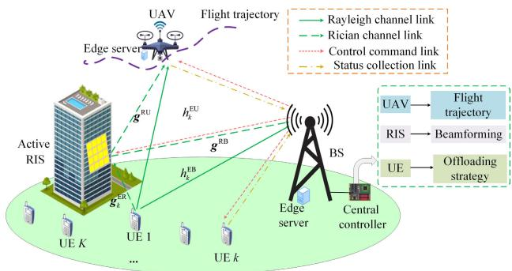  
Fig. 1. System model of the active RIS and NOMA-assisted AGMEC network, where K UEs perform task offloading to either the BS or the UAV with the assistance of an active RIS.

Thirdly, to address the limitations of DRL in handling hybrid continuous-discrete action space, we enhance the conventional DDPG algorithm with an innovative action adjuster. This lightweight module converts continuous action outputs into executable hybrid strategies through normalization and mapping rules. It also incorporates a UAV battery protection mechanism that monitors energy levels and triggers a mandatory return-to-base procedure when the battery drops below a safety threshold, ensuring both communication performance and system sustainability.

Sufficient simulation work is executed to demonstrate that the proposed AADDPG algorithm is more effective in improving the average AoI performance of the network compared to other benchmark methods. Furthermore, the results confirm the superiority of NOMA over orthogonal multiple access (OMA) and of active RIS over passive RIS in terms of AoI performance.

## II. SYSTEM MODEL

As shown in Fig. 1, an active RIS and NOMA-assisted AGMEC network is considered. Both the BS and UAV are equipped with MEC servers to offer computing services for the K ground UEs, with K denoting the set of UEs. Task offloading is facilitated by an active RIS with M elements installed on high-rise building surfaces. The central controller is installed at the BS to perform joint decision-making control regarding UAV flight trajectories, RIS beamforming, and task offloading strategies. Additionally, NOMA is employed to enhance the spectrum efficiency of the AGMEC network.

## A. Channel Model

In this paper, we use a 3D Cartesian coordinate system, where the position of UE k at slot n is expressed as $Q _ { k } ^ { \mathrm { E } } ( n ) \ = \ \{ x _ { k } ( n ) , y _ { k } ( n ) , 0 \} , \ k \in \mathcal { K }$ . The UAV starts from a starting point $Q ^ { \mathrm { S } } ( n ) ~ = ~ \{ 0 , 0 , 0 \}$ , ascends to a position $Q ^ { \mathrm { U } } ( n ) \stackrel { \textstyle = } { = } \{ x ^ { \mathrm { U } } ( n ) , y ^ { \mathrm { U } } ( n ) , z ^ { \mathrm { U } } ( n ) \}$ , and then maintains a constant altitude $\mathrm { ~ H ~ } ^ { \mathrm { U } }$ during its flight. The trajectory is controlled by speed $v ( n )$ and direction $\alpha ( n )$ , where $v ( n ) \in [ 0 , v _ { \mathrm { m a x } } ]$ and $\alpha ( n ) \in [ 0 , 2 \pi ]$ . Based on $\alpha ( n )$ and $v ( n )$ , the UAV’s horizontal coordinates are updated as

$$
\begin{array} { r } { \left\{ \begin{array} { l l } { x ^ { \mathrm { U } } ( n + 1 ) = x ^ { \mathrm { U } } ( n ) + v ( n ) \cos \bigl ( \alpha ( n ) \bigr ) \Delta n } \\ { y ^ { \mathrm { U } } ( n + 1 ) = y ^ { \mathrm { U } } ( n ) + v ( n ) \sin \bigl ( \alpha ( n ) \bigr ) \Delta n } \end{array} \right. \ , } \end{array}\tag{1}
$$

where $\Delta n$ represents the time duration of a slot. The UAV flies within a range of rectangles with side $x _ { \mathrm { m a x } }$ and $y _ { \mathrm { m a x } } ,$ where its horizontal coordinates $x ^ { \mathrm { U } } ( n )$ and $y ^ { \mathrm { U } } ( n )$ satisfy $x ^ { \mathrm { U } } ( n ) \in$ $[ 0 , x _ { \mathrm { m a x } } ]$ , and $y ^ { \mathrm { U } } ( n ) \in [ 0 , y _ { \mathrm { m a x } } ] .$ . We assume that the BS and RIS are fixed at coordinates $\bar { Q } ^ { \mathrm { B } }$ and $Q ^ { \mathrm { R } }$ , respectively. The distance between UE k and the UAV is calculated using the Euclidean norm $d _ { k } ^ { \mathrm { E U } } = \lVert Q ^ { \mathrm { U } } - Q _ { k } ^ { \mathrm { E } } \rVert ^ { 2 }$ . Similarly, $d _ { k } ^ { \mathrm { E R } } , ~ d _ { k } ^ { \mathrm { E B } }$ $d ^ { \mathrm { R B } }$ , and $d ^ { \mathrm { R U } }$ can be computed accordingly.

Without loss of generality, the MEC service is divided into N time slots, indexed by $n \in \{ 1 , 2 , . . . , N \}$ . A blockfading model is adopted, where the channel coefficient remains constant within each slot and changes independently between slots. As in [37], the direct channels from UEs to the BS/UAV (i.e., $h _ { k } ^ { \mathrm { E U } }$ and $h _ { k } ^ { \mathrm { E B } } )$ are represented with a Rayleigh fading model. Therefore, the direct channel $h _ { k } ^ { \mathrm { E U } } ( n )$ can be represented as

$$
h _ { k } ^ { \mathrm { E U } } ( n ) = \sqrt { C _ { 0 } ( d _ { k } ^ { \mathrm { E U } } ) } r _ { k } ^ { \mathrm { N L o S } } ( n ) ,\tag{2}
$$

where $r _ { k } ^ { \mathrm { N L o S } }$ represents the non-line-of-sight (NLoS) component modeled as Rayleigh fading. The expression for path loss is $\begin{array} { r } { C _ { 0 } ( d ) = \tau \left( \frac { D } { D _ { 0 } } \right) ^ { - \alpha } } \end{array}$ , where τ represents the path loss at the reference distance $D _ { 0 } .$ , α is the path loss exponent, and D is the transmission distance. Similarly, the direct channel $h _ { k } ^ { \mathrm { E B } } ( n )$ can be obtained. Assuming the RIS-assisted cascaded channel follows Rician fading, the channel between the UEs and the RIS can be expressed as

$$
\begin{array} { r l } & { \mathbf { g } _ { k } ^ { \mathrm { E R } } ( n ) = \sqrt { C _ { 0 } ( d _ { k } ^ { \mathrm { E R } } ) } \Big ( \sqrt { \frac { F _ { \mathrm { E R } } } { F _ { \mathrm { E R } } + 1 } } \mathbf { w } ^ { \mathrm { L o S } } ( n ) } \\ & { \qquad + \sqrt { \frac { 1 } { F _ { \mathrm { E R } } + 1 } } \mathbf { v } ^ { \mathrm { N L o S } } ( n ) \Big ) , } \end{array}\tag{3}
$$

where $F _ { \mathrm { E R } }$ represents Rice factors. Vector $\mathbf { w } ^ { \mathrm { L o S } }$ represents the line-of-sight (LoS) element and is represented as follows:

$$
\mathbf { w } ^ { \mathrm { L o S } } = [ 1 , \ldots , e ^ { j ( m - 1 ) \pi \sin ( \phi ^ { \mathrm { E R } } ) } \cdot \cdot \cdot , e ^ { j ( M - 1 ) \pi \sin ( \phi ^ { \mathrm { E R } } ) } ] ^ { N } ,\tag{4}
$$

where sin $\begin{array} { r } { \left( \phi ^ { \mathrm { E R } } \right) \ = \ \frac { y ^ { \mathrm { R } } - y _ { k } ( n ) } { \sqrt { ( x ^ { \mathrm { R } } - x _ { k } ( n ) ) ^ { 2 } + ( y ^ { \mathrm { R } } - y _ { k } ( n ) ) ^ { 2 } } } . \ \mathbf { v } ^ { \mathrm { N L o S } } } \end{array}$ represents the NLoS components, which modeled as Rayleigh fading. The components $\mathbf { v } ^ { \mathrm { N L o S } } \sim \mathcal { C N } ( 0 , \mathbf { I } )$ . Correspondingly, we can obtain the cascade channels $\mathbf { g } ^ { \mathrm { R U } } ( n )$ and $\mathbf { g } ^ { \mathrm { R B } } ( n )$

## B. MEC Model

In the AGMEC network, task arrivals are modeled as a Poisson process with parameter λ, where each arrival consists of a single independent task and the inter-arrival times follow an exponential distribution. This model is well-suited for scenarios involving sporadic requests from mobile terminals or intermittent reporting from IoT sensors, effectively capturing the characteristics of random independent events. The task arriving at UE k is defined as $\mathbf { G } _ { k } ( n ) = ( S _ { k } ( n ) , C _ { k } )$ , where $S _ { k } ( n )$ represents the size of the task [bits]. $C _ { k }$ denotes the number of CPU cycles needed to process unit size of task.

1) Task Computing: As shown in Fig. 1, the computationally limited UE offloads the arrived task ${ \bf G } _ { k } ( n )$ to either the UAV or the BS for remote computation, depending on the current environmental conditions. If task ${ \bf G } _ { k } ( n )$ is offloaded to the UAV/BS, its computational delay can be respectively expressed as

$$
T _ { k , \mathrm { c o m } } ^ { \mathrm { U } } ( n ) = \frac { S _ { k } ( n ) C _ { k } } { f _ { \mathrm { U } } } \xi _ { k } ^ { \mathrm { U } } ( n ) , T _ { k , \mathrm { c o m } } ^ { \mathrm { B } } ( n ) = \frac { S _ { k } ( n ) C _ { k } } { f _ { \mathrm { B } } } \xi _ { k } ^ { \mathrm { B } } ( n ) ,\tag{5}
$$

where $f _ { \mathrm { U } }$ and $f _ { \mathrm { B } }$ represent the computational resources allocated to each task by the UAV and BS, respectively. $\xi _ { k } ^ { \mathrm { U } } ( n ) = 1$ $( \xi _ { k } ^ { \mathrm { B } } ( n ) ~ = ~ 1 )$ indicates that the task is offloaded to the UAV (BS); otherwise, $\xi _ { k } ^ { \mathrm { U } } ( n ) \ = \ 0 \ ( \xi _ { k } ^ { \mathrm { B } } ( n ) \ = \ 0 )$ , and the condition $\xi _ { k } ^ { \mathrm { U } } ( n ) + \xi _ { k } ^ { \mathrm { B } } ( n ) \overset { \sim } { \simeq } 1$ holds. The energy required for task processing is given by $\begin{array} { r } { E _ { \mathrm { c o m } } ^ { \mathrm { U } } ( n ) = \sum _ { k = 1 } ^ { K } m f _ { \mathrm { U } } ^ { 2 } T _ { k , \mathrm { c o m } } ^ { \mathrm { U } } ( n ) } \end{array}$ where m denotes the effective switched capacitance of the UAV’s CPU [38]. According to [39], we can calculate the flight energy consumption $E _ { \mathrm { f } } ^ { \mathrm { U } } ( n )$ . Then the total energy consumption during each time slot is given by

$$
E _ { \mathrm { t o t } } ^ { \mathrm { U } } ( n ) = E _ { \mathrm { c o m } } ^ { \mathrm { U } } ( n ) + E _ { \mathrm { f } } ^ { \mathrm { U } } ( n ) .\tag{6}
$$

To protect the UAV’s battery performance, we set a protection threshold $E _ { \mathrm { t h } } ^ { \mathrm { U } }$ , and the battery level is checked at the start of each time slot. If the battery level is lower than the protection threshold $E _ { \mathrm { t h } } ^ { \mathrm { U } }$ , the UAV will return to the take-off point to recharge its battery and then take-off again in the next flight cycle. All tasks generated in the subsequent part of the current cycle will be offloaded to the BS for computation. Therefore, the battery level $E ^ { \mathrm { U } } ( n )$ of the UAV must satisfy

$$
\begin{array} { r } { E ^ { \mathrm { U } } ( n ) \geq E _ { \mathrm { t h } } ^ { \mathrm { U } } , \quad E ^ { \mathrm { U } } ( n ) = E _ { \mathrm { m a x } } ^ { \mathrm { U } } - \displaystyle \sum _ { i = 1 } ^ { n - 1 } E _ { \mathrm { t o t } } ^ { \mathrm { U } } ( i ) , } \end{array}\tag{7}
$$

where $E _ { \mathrm { m a x } } ^ { \mathrm { U } }$ denotes the capacity of the UAV battery.

2) Task Offloading: In this paper, we employ active RIS to leverage its outstanding performance in channel enhancement, which not only reflects incident signals but also further amplifies the reflected signals compared to the traditional passive RIS. In addition, to enhance the spectral efficiency in the AGMEC system, all UEs utilize NOMA technology for task offloading to the UAV/BS. Specifically, the signal received at the UAV/BS is given by equation (8), as shown at the bottom of this page. It should be noted that $\begin{array} { l l l } { \mathbf { L } ( n ) } & { = } & { \mathrm { d i a g } ( l _ { 1 } ( n ) , l _ { 2 } ( n ) , . . . , l _ { M } ( n ) ) } \end{array}$ denotes the amplification matrix, where $l _ { m } ( n ) \in \mathsf { \Gamma } ( 0 , l _ { \mathrm { m a x } } ]$ , and $\Theta ( n ) \stackrel { . } { = } \mathrm { d i a g } ( e ^ { j \theta _ { 1 } ( n ) } , e ^ { j \theta _ { 2 } ( n ) } , . . . , e ^ { j \theta _ { M } ( \stackrel { . } { n } ) } )$ denotes the phase shift matrix, with $\theta _ { m } ( n ) ~ \in ~ ( 0 , 2 \pi )$ $p _ { k }$ and $x _ { k }$ represent the transmitted power and unit power information symbol of UE k, respectively; $\mathbf { z } ( n ) \sim \mathcal { C } \bar { \mathcal { N } } ( 0 _ { M } , \delta _ { z } ^ { 2 } \mathbf { I } _ { M } )$ represent the dynamic noise at the active RIS; $\eta _ { \mathrm { U } } ( n ) , \tilde { \eta _ { \mathrm { B } } } ( n ) \sim \mathcal { C N } ( 0 , \sigma ^ { 2 } )$ is the additive white Gaussian noise (AWGN) at the UAV and BS. For simplicity, the equivalent channel between the k-th UE and the UAV/BS is expressed as $h _ { k } ^ { \mathrm { X } } ( n ) ~ = ~ h _ { k } ^ { \mathrm { E X } } ( n ) +$ $\mathbf { g } ^ { \mathrm { R X } } ( n ) \mathbf { L } ( n ) \Theta ( n ) \mathbf { g } _ { k } ^ { \mathrm { E R } } ( n )$ , where $X \in \{ \tilde { \mathrm { U } } , \tilde { \mathrm { B } } \}$

At the receiver, SIC is employed, and the mixed signals are decoded based on their strength in descending order. Specifically, the strongest signal is decoded first, then each decoded signal is regenerated and subtracted from the remaining signal. Signals that fail to be decoded or have not been decoded are treated as interference. For the UE k, the total interference can be formulated as

$$
N _ { k } ^ { \mathrm { X } } ( n ) = \sum _ { j \in K , j \ne k } \xi _ { j } ^ { \mathrm { X } } ( n ) \big ( 1 - \Phi _ { j k } ( n ) s _ { j } ( n ) \zeta \big ) \big | h _ { k } ^ { \mathrm { X } } ( n ) \big | ^ { 2 } p _ { j } ( n ) ,\tag{9}
$$

where $\Phi _ { j k }$ represents a binary variable, which takes the value of 1 if the signal strength of the j-th UE exceeds that of the k-th UE currently decoding the signal, and otherwise $\Phi _ { j k } = 0$ Additionally, $s _ { j } = 1$ indicates successful decoding of the j-th UE’s signal, while $s _ { j } = 0$ indicates that the decoding either failed or has not been decoded yet. The parameter $0 < \zeta < 1$ characterizes the residual power of the decoded signal due to imperfect channel state information and hardware limitations. When UE k offloads its task to the UAV/BS, the realizable communication rate can be expressed as

$$
\begin{array} { l } {  { R _ { k } ^ { \mathrm { X } } ( n ) } } \\ & { = \xi _ { k } ^ { \mathrm { X } } ( n ) \log _ { 2 } ( 1 + \frac { | h _ { k } ^ { \mathrm { X } } ( n ) | ^ { 2 } p _ { k } ( n ) } { N _ { k } ^ { \mathrm { X } } ( n ) + | | \mathbf { g } ^ { \mathrm { R X } } ( n ) \mathbf { L } ( n ) \Theta ( n ) | | ^ { 2 } \delta _ { z } ^ { 2 } + \delta ^ { 2 } } ) . } \end{array}\tag{10}
$$

To successfully execute the offloaded task, the QoS requirements of the UE must be satisfied, i.e., $R _ { k } ^ { \mathrm { X } } ( n ) \geq R _ { 0 }$ , where $R _ { 0 }$ represents the minimum offloading rate threshold. We characterize the successful offloading status of UE k by $V _ { k }$ The offloading status $V _ { k } ( n )$ is set to 1 if the rate threshold is met, and 0 otherwise.

## C. Performance Metrics

AoI is defined as the elapsed time since the last data task was generated [40]. We define $O _ { k } ( n )$ as the indicator for task arrival at slot n for UE k, where $O _ { k } ( n ) = 1$ indicates a new task is generated, and $O _ { k } ( n ) = 0$ otherwise. Furthermore,

$$
\begin{array}{c} \left\{ S _ { \mathrm { U } } ( n ) = \sum _ { k = 1 } ^ { K } \Big ( h _ { k } ^ { \mathrm { E U } } ( n ) + \mathbf { g } ^ { \mathrm { R U } } ( n ) \mathbf { L } ( n ) \Theta ( n ) \mathbf { g } _ { k } ^ { \mathrm { E R } } ( n ) \Big ) \xi _ { k } ^ { \mathrm { U } } ( n ) p _ { k } x _ { k } ( n ) + \mathbf { g } ^ { \mathrm { R U } } ( n ) \mathbf { L } ( n ) \Theta ( n ) \mathbf { z } ( n ) + \eta _ { \mathrm { U } } ( n ) ,  \\ { S _ { \mathrm { B } } ( n ) = \sum _ { k = 1 } ^ { K } \Big ( h _ { k } ^ { \mathrm { E B } } ( n ) + \mathbf { g } ^ { \mathrm { R B } } ( n ) \mathbf { L } ( n ) \Theta ( n ) \mathbf { g } _ { k } ^ { \mathrm { E R } } ( n ) \Big ) \xi _ { k } ^ { \mathrm { B } } ( n ) p _ { k } x _ { k } ( n ) + \mathbf { g } ^ { \mathrm { R B } } ( n ) \mathbf { L } ( n ) \Theta ( n ) \mathbf { z } ( n ) + \eta _ { \mathrm { B } } ( n ) , } \end{array} \right.\tag{8}
$$

we define $U _ { k } ( n )$ to monitor the duration for which the most recently generated task has remained. Its evolution is given by

$$
U _ { k } ( n + 1 ) = { \left\{ \begin{array} { l l } { 0 , } & { { \mathrm { i f ~ } } O _ { k } ( n + 1 ) = 1 } \\ { \operatorname* { m i n } \{ U _ { k } ( n ) + 1 , U _ { \operatorname* { m a x } } \} , } & { { \mathrm { o t h e r w i s e } } . } \end{array} \right. }\tag{11}
$$

In the considered systems, AoI either increases linearly by one per time slot or depends on the survival time of the most recent update packet if successfully delivered to the UAV/BS. Let $A _ { k } ( n ) \in \mathcal { A } _ { k }$ represent the AoI for UE k at slot n, where $\mathcal { A } _ { k } = \{ 1 , 2 , . . . , A _ { \operatorname* { m a x } } \}$ denotes the collection of all possible AoI values for UE k. Here, $A _ { \mathrm { m a x } }$ is the maximum possible value for $A _ { k } ( n )$ , which can be arbitrarily large. Thus, the AoI of UE k at slot $n + 1$ can be formulated as follows:

$$
A _ { k } ( n + 1 ) = \left\{ { \begin{array} { l l } { U _ { k } ( n ) , } & { { \mathrm { i f ~ } } V _ { k } ( n ) = 1 } \\ { \operatorname* { m i n } \{ A _ { k } ( n ) + 1 , A _ { \operatorname* { m a x } } \} , } & { { \mathrm { o t h e r w i s e } } } \end{array} } \right.\tag{12}
$$

$V _ { k } ( n ) = 1$ indicates successful task delivery to the UAV or BS, whereas $V _ { k } ( n ) ~ = ~ 0$ signifies an offloading failure or the absence of a task. Thus, the UEs’ average AoI can be expressed as

$$
\overline { { A } } ( n ) = \frac { 1 } { K } \sum _ { k = 1 } ^ { K } A _ { k } ( n ) .\tag{13}
$$

## D. Centralized Control Architecture

In the considered active RIS and NOMA-assisted AGMEC network, there exists intricate coupling among the UAV flight trajectory $\mathbf Q ( n )$ , the active RIS beamforming $\mathbf { L } ( n )$ and $\Theta ( n )$ and the UEs’ task offloading strategy ξ(n).

• The UAV’s trajectory determines its relative positions to UEs and the RIS, thereby directly influencing the channel quality of all wireless links.

Through active amplification and phase adjustment of signals, RIS beamforming can dynamically compensate for channel fluctuations induced by trajectory variations, serving as the key to enhancing NOMA transmission success rate and system capacity.

• The optimized task offloading strategy is critically dependent on the instantaneous communication quality and resource availability, which are jointly shaped by the aforementioned two factors.

This strong coupling implies that deploying separate agents for the UAV trajectory, RIS beamforming, and UE offloading would inevitably introduce substantial inter-agent communication and coordination overhead, resulting in high interaction load and decision latency [36]. To address this, as illustrated in Fig. 2, this paper adopts a centralized control architecture with the BS serving as the agent. This approach fully leverages the inherent advantages of the BS as the network core node: its backhaul links, computational resources, and global state perception capabilities are all superior to those of other network nodes, enabling efficient collection of global system information and reliable dissemination of control commands to the UAV, RIS, and UE. By deploying the central controller at the BS, the proposed architecture avoids multi-agent coordination overhead while achieving efficient joint optimization.

## E. Formulation of the Optimization Problem

In this paper, our major goal is to minimize the long-term average AoI of the UEs in active RIS and NOMA-assisted AGMEC networks. To achieve this, we focus on the joint optimization of the $\mathrm { U A V } \mathbf { \hat { s } }$ flight trajectory ${ \bf Q } ( n ) = \{ \alpha ( n ) , v ( n ) \}$ the beamforming of active RIS, and the offloading strategy $\xi ( n ) = \{ \xi ^ { \mathrm { U } } ( n ) , { \bar { \xi } } ^ { \mathrm { B } } ( n ) \}$ . Therefore, we can define the optimization problem as follows:

$$
\mathbf { P 1 } : \operatorname* { m i n } _  \{ \substack { \mathbf { L } ( n ) , \Theta ( n ) , \mathbf { Q } ( n ) , \mathbf { \xi } \mathbf { \} ( n ) } \} } \operatorname* { l i m } _ { N \to \infty } \frac { 1 } { N } \sum _ { n = 1 } ^ { N } \overline { { A } } ( n ) ,
$$

$$
\begin{array} { r } { \mathrm { s . t . ~ } \theta _ { m } ( n ) \in ( 0 , 2 \pi ) , l _ { m } ( n ) \in ( 0 , l _ { \operatorname* { m a x } } ] , } \end{array}\tag{C<sub>1</sub>}
$$

$$
\alpha ( n ) \in [ 0 , 2 \pi ] , v ( n ) \in [ 0 , v _ { \operatorname* { m a x } } ] ,\tag{C<sub>2</sub>}
$$

$$
x ^ { \mathrm { U } } ( n ) \in [ 0 , x _ { \mathrm { m a x } } ] , y ^ { \mathrm { U } } ( n ) \in [ 0 , y _ { \mathrm { m a x } } ] ,\tag{C<sub>3</sub>}
$$

$$
\xi _ { k } ^ { \mathrm { U } } ( n ) , \xi _ { k } ^ { \mathrm { B } } ( n ) \in \{ 0 , 1 \} , \xi ^ { \mathrm { U } } ( n )
$$

$$
+ \xi ^ { \mathrm { B } } ( n ) \leq 1 ,\tag{C<sub>4</sub>}
$$

$$
R _ { k } ( n ) \geq R _ { 0 } ,\tag{C<sub>5</sub>}
$$

$$
E ^ { \mathrm { U } } ( n ) \geq E _ { \mathrm { t h } } ^ { \mathrm { U } } ,\tag{C<sub>6</sub>}
$$

where $\mathrm { C } _ { 1 }$ is the relevant constraint on the active RIS beamforming, $\mathrm { C } _ { 2 }$ specifies the direction and velocity of the UAV, thereby defining its trajectory control parameters. $\mathrm { C } _ { 3 }$ denotes the UAV flight range, $\mathrm { C } _ { 4 }$ determines the task offloading decision, indicating whether tasks are offloaded to the UAV/BS. ${ \mathrm { C } } _ { 5 }$ represents the QoS requirements for each UE, $\mathrm { C } _ { 6 }$ is the battery protection threshold of the UAV.

Remark 1: To address the communication demands and interference management challenges in dense UE scenarios, the proposed system model can be extended by introducing frequency-domain orthogonal sub-band partitioning and intelligent UEs clustering. Specifically, the total bandwidth is divided into multiple orthogonal sub-bands. UEs are dynamically clustered according to channel spatial correlation or QoS requirements. Within each cluster, NOMA is adopted for multiple access, while inter-cluster interference is mitigated through frequency-division multiplexing.

## III. AADDPG-BASED AOI OPTIMIZATION IN ACTIVE RIS AND NOMA-ASSISTED AGMEC NETWORKS

The problem in (P1) is characterized by non-convexity, mixed-integer nature, and non-linearity, combined with the highly dynamic nature of the active RIS and NOMA-assisted AGMEC networks, which poses significant challenges for conventional methods. To address these limitations, we propose a DRL-based joint decision-making approach.

## A. Markov Decision Process Formulation

To address the challenges of dynamic environments and continuous decision-making, problem (P1) is modeled as a Markov Decision Process (MDP).

Agent: Following the centralized control architecture established in Section II-D, the BS is designated as the sole agent for the MDP formulation. The BS utilizes its global information collection capability to gather network states and transmits action decisions to the UAV, RIS, and UE via dedicated control links, thereby achieving centralized coordinated control of the AGMEC network.

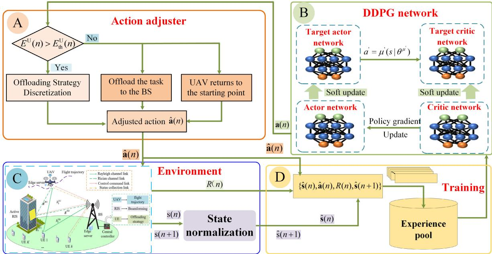  
Fig. 2. An overview of the proposed AADDPG algorithm framework. Part A illustrates the architecture and operational principle of the action adjuster. Part B presents the four neural network architectures and update rules in DDPG. Part C demonstrates the system environment and state normalization process Part D shows the experience replay mechanism.

Environment State: In the DRL algorithm, the design of the environment state directly determines the quality of the intelligent body’s perception of the environment, which is a fundamental condition for the algorithm to learn the optimal policy effectively. In this paper, to accurately describe the active RIS and NOMA-assisted AGMEC network, its environment state is designed as follows:

$$
\begin{array} { r } { \pmb { s } ( n ) = \big ( \pmb { \Lambda } ( n ) , \mathbf { U } ( n ) , Q ^ { \mathrm { U } } ( n ) , e ( n ) \big ) , } \end{array}\tag{14}
$$

where each element can be specifically represented as

$\mathbf { \boldsymbol { \Lambda } } ( n ) = ( A _ { 1 } ( n ) , \dots , A _ { K } ( n ) )$ is the AoIs of K UEs.

$\mathbf { U } ( n ) = ( U _ { 1 } ( n ) , \ldots , U _ { K } ( n ) )$ records the UEs’ updating lifetime of the task within the time slot.

$Q ^ { \mathrm { U } } ( n ) ~ = ~ \{ x ^ { \mathrm { U } } ( n ) , y ^ { \mathrm { U } } ( n ) , z ^ { \mathrm { U } } ( n ) \}$ refers to the UAV’s current position.

$e ( n ) \in [ E _ { \mathrm { t h } } ^ { \mathrm { U } } , E _ { \mathrm { m a x } } ^ { \mathrm { U } } ]$ is the UAV’s remaining energy.

Action space: The action space consists of all possible actions that the agent can execute. At time slot $n ,$ the system’s action space is composed of four components, as follows

$\begin{array} { r l r } { { \bf L } ( n ) } & { { } \ = \ } & { \left( l _ { 1 } ( n ) , \ldots , l _ { M } ( n ) \right) } \end{array}$ and $\begin{array} { r l r l } { \Theta ( n ) } & { { } } & { = } & { } \end{array}$ $( \theta _ { 1 } ( n ) , \dots , \theta _ { M } ( n ) )$ represent the amplification matrix and the phase shift matrix of the active RIS, respectively, where $l _ { m } ( n ) \in ( 0 , l _ { \mathrm { m a x } } ]$ and $\theta _ { m } ( n ) \in ( 0 , 2 \pi )$

${ \bf Q } ( n ) = \{ \alpha ( n ) , v ( n ) \}$ represents the UAV’s flight trajectory at slot n, where $v ( n ) \in [ 0 , v _ { \mathrm { m a x } } ]$ and $\alpha ( n ) \in [ 0 , 2 \pi ]$

$\pmb { \xi } ( n ) = \{ \xi _ { 1 } ( n ) , \xi _ { 2 } ( n ) , \dots , \xi _ { K } ( n ) \}$ defines the offloading strategy of all UE.

Consequently, the action ${ \pmb a } ( n )$ can be expressed as

$$
\begin{array} { r } { \pmb { a } ( n ) = \big ( \mathbf { L } ( n ) , \pmb { \Theta } ( n ) , \mathbf { Q } ( n ) , \pmb { \xi } ( n ) \big ) . } \end{array}\tag{15}
$$

Reward function: In the DRL algorithm, the design of the reward directly determines the goal orientation of the optimization problem, and a reasonable reward structure can guide the agent to efficiently converge to the desired optimal policy, while improper reward settings may cause the policy to fall into a suboptimal solution or fail to converge. Given the objective function (P1) and the constraints $\mathrm { C } _ { 1 } \mathrm { ~ - ~ } \mathrm { C } _ { 6 }$ in the optimization problem, we set up the following sub-rewards.

• With the optimization problem (P1) aiming to minimize the average AoI, it is natural to set the average AoI as the sub-reward, i.e., $\begin{array} { r } { R _ { a } = - \frac { 1 } { K } \sum _ { k = 1 } ^ { K } A _ { k } ( n ) } \end{array}$

• Considering the UAV’s energy constraints in the optimization problem, the corresponding sub-reward is defined as $R _ { b } = - E _ { \mathrm { t o t } } ^ { \mathrm { U } } ( n )$

• In the AGMEC network, if the UAV energy drops below $E _ { \mathrm { t h } } ^ { \mathrm { U } }$ , the task is offloaded to the BS, and the sub-reward function is formulated as

$$
R _ { c } = { \left\{ \begin{array} { l l } { C _ { n } , } & { { \mathrm { i f ~ } } E ^ { \mathrm { U } } ( n ) < E _ { \mathrm { t h } } ^ { \mathrm { U } } } \\ { 0 , } & { { \mathrm { o t h e r w i s e } } } \end{array} \right. } ,\tag{16}
$$

where $C _ { n }$ is a negative constant.

• Given that the UAV’s trajectory is limited to a specific area, once it flies outside the boundaries, we will impose the appropriate penalty mechanisms, i.e.,

$$
R _ { d } = \left\{ C _ { c } , \mathrm { i f } x ^ { \mathrm { U } } ( n ) > x _ { \mathrm { m a x } } { \mathrm { o r } } y ^ { \mathrm { U } } ( n ) > y _ { \mathrm { m a x } } \right. ,\tag{17}
$$

where $C _ { c }$ is a negative constant.

Considering all these factors, the overall reward function is designed as

$$
R ( n ) = \delta _ { 1 } R _ { a } + \delta _ { 2 } R _ { b } + \delta _ { 3 } R _ { c } + \delta _ { 4 } R _ { d } .\tag{18}
$$

The weights $\delta _ { 1 } , ~ \delta _ { 2 } , ~ \delta _ { 3 } .$ , and $\delta _ { 4 }$ are used to balance the corresponding sub-rewards, with $\delta _ { 1 } = 1 , \delta _ { 3 } = 1$ , and $\delta _ { 4 } = 1$ Meanwhile, $\delta _ { 2 } ~ = ~ 0 . 0 0 5$ is set to align the numerical scale of the energy term with the dominant AoI term. This design guides the agent to pursue lower AoI in decision-making, while leveraging the strong constraints imposed by $\delta _ { 3 }$ and $\delta _ { 4 }$ to ensure the system’s safety baseline. Ultimately, the agent autonomously learns strategies that meet energy sustainability requirements while prioritizing information freshness, achieving an effective trade-off between information timeliness and operational efficiency within the AGMEC network.

## B. The Framework of DDPG

The DDPG algorithm, an off-policy, model-free actorcritic approach, integrates the advantages of both deep $\mathrm { Q }$ Network (DQN) and actor-critic (AC), enabling it to optimize deterministic strategies in environments with continuous, multidimensional action spaces. Given these advantages, we develop the DDPG algorithm to jointly optimize multidimensional resources in active RIS and NOMA-assisted AGMEC networks. In the DDPG framework, four deep neural networks (DNNs) work together to learn the decision-making strategy, ensuring the steadiness and efficiency of the learning process [33].

In the DDPG framework, the actor and critic networks work synergistically to optimize policy learning. The actor network generates actions ${ \pmb a } ( n )$ based on the current state $s ( n )$ , aiming to maximize long-term cumulative reward. It leverages the Q-value $Q ( \pmb { s } ( n ) , \pmb { a } ( n ) )$ provided by the critic network to evaluate and refine its policy through policy gradient updates of $\pmb { \theta } ^ { \mu }$ . Concurrently, the critic network assesses action quality by minimizing temporal difference error and updates its parameters $\theta ^ { Q }$ via gradient descent. To ensure training stability, target networks with parameters $\pmb { \theta } ^ { \mu ^ { \prime } }$ and $\theta ^ { Q ^ { \prime } }$ are softly updated to track the main networks, providing stable learning targets that mitigate Q-value fluctuations and improve convergence.

The target network parameters are updated towards the main network parameters using a small proportion κ as follows:

$$
\{ \begin{array} { l } { { \pmb \theta ^ { Q ^ { \prime } }  \kappa \pmb \theta ^ { Q } + ( 1 - \kappa ) \pmb \theta ^ { Q ^ { \prime } } } } \\ { { \pmb \theta ^ { \mu ^ { \prime } }  \kappa \pmb \theta ^ { \mu } + ( 1 - \kappa ) \pmb \theta ^ { \mu ^ { \prime } } } } \end{array}  \quad ,\tag{19}
$$

where κ is a small constant, ensuring slow updates to the target networks. The overall network consists of two main components: the actor, which generates the deterministic policy $\mu$ to select actions, and the critic, which evaluates these actions based on the value function. Specifically, the action generated by the actor network is given by

$$
\pmb { a } ( n ) = \mu ( \pmb { s } ( n ) \mid \pmb { \theta } ^ { \mu } ( n ) ) + \delta _ { a } ,\tag{20}
$$

where $\delta _ { a } \sim \mathbb { N } ( \mu _ { e } , \sigma _ { e , i } ^ { 2 } )$ represents exploration noise.

## C. The Design of Action Adjuster

Conventional DDPG algorithms face significant challenges in dealing with the optimization problem P1: (1) inherent limitations in dealing with discrete-continuous hybrid action spaces; and (2) difficulty in achieving smart UAV battery performance preservation. To overcome these challenges, we propose a novel lightweight action adjuster.

Hybrid Action Space Processing: This paper employs the DDPG algorithm to jointly decide the active RIS beamforming $\left( \mathbf { L } ( n ) , \Theta ( n ) \right)$ , the flight trajectory $\mathbf { Q } ( n )$ , and the offloading strategy ξ(n). The action spaces of $( \mathbf { L } ( n ) , \Theta ( n ) , \mathbf { Q } ( n ) )$ are all continuous, with value ranges $l _ { m } ( n ) \in ( 0 , l _ { \mathrm { m a x } } ] , \theta _ { m } ( n ) \in$ $( 0 , 2 \pi ) , \ \alpha ( n ) \ \in \ [ 0 , 2 \pi ]$ , and $\begin{array} { r } { \begin{array} { l l l } { v ( n ) } & { \in } & { [ 0 , 1 ] } \end{array} } \end{array}$ , respectively. However, the offloading strategy ${ \pmb \xi } ( n )$ has a discrete action space of $\{ 0 , 1 \}$ . Since the DDPG algorithm is designed for MDP problems with continuous action spaces, it outputs continuous action values directly via a deterministic policy network and relies on gradient ascent to optimize the policy. In contrast, discrete action spaces cannot directly compute gradients and require a probability distribution output, which is incompatible with the design of DDPG. To deal with the optimization problem in the hybrid action space, some works design different DRL algorithms for continuous and discrete actions, respectively. For example, DDPG is used to handle continuous actions, while DQN is employed to handle discrete actions. This model undoubtedly increases the complexity of the algorithms and the interaction between the two algorithms imposes an additional load and may also affect the convergence of the whole algorithm.

To address the hybrid action space problem, we design a low-complexity action processing mechanism. Specifically, the discrete offloading action space {0, 1} is first normalized to the continuous interval [0, 1]. Consequently, the offloading subaction of UE k is a continuous variable $\xi _ { k } ( n )$ . This continuous output is then mapped to a discrete offloading strategy prior to execution, i.e.,

$$
\begin{array}{c} \begin{array} { r } { \left\{ \xi _ { k } ^ { \mathrm { B } } ( n ) = 1 , \xi _ { k } ^ { \mathrm { U } } ( n ) = 0 , \mathrm { i f } \xi _ { k } ( n ) \le 0 . 5 \right. . } \\ { \left. \xi _ { k } ^ { \mathrm { B } } ( n ) = 0 , \xi _ { k } ^ { \mathrm { U } } ( n ) = 1 , \mathrm { o t h e r w i s e } \right.} \end{array}  .  \end{array}\tag{21}
$$

With the above low-complexity processing of discrete subaction spaces, DDPG can perform joint processing of mixed continuous and discrete actions.

Action adjustment for battery protection: To ensure the stability of UAV battery performance, we have incorporated a corresponding component in the reward function. Building on this, we further develop a practical and low-complexity battery protection mechanism. Specifically, when the $\mathrm { U A V } \mathbf { \hat { s } }$ remaining battery power $E ^ { \mathrm { U } } ( n )$ falls below the threshold $E _ { \mathrm { t h } } ^ { \mathrm { U } } ,$ it will directly return to the starting point $Q ^ { S }$ for recharging and await the next flight cycle. In this case, the UAV’s flight trajectory is adjusted as follows:

$$
\mathbf { Q } ^ { \prime } ( n ) = { \left\{ v ( n ) = v ^ { \mathrm { S } } , \ \theta ( n ) = \theta ^ { S } , \ { \mathrm { ~ i f ~ } } Q ^ { \mathrm { U } } ( n ) \neq Q ^ { \mathrm { S } } \ , \ \right.}\tag{22}
$$

where $\begin{array} { r } { \theta ^ { S } = \frac { z ^ { \mathrm { U } } ( n ) } { \sqrt { ( x ^ { \mathrm { U } } ( n ) ) ^ { 2 } + ( y ^ { \mathrm { U } } ( n ) ) ^ { 2 } } } , ~ v ^ { \mathrm { S } } } \end{array}$ represents the constant flight protection speed, ensuring that the UAV can safely return to the starting point $Q ^ { \mathrm { s } }$ with the remaining threshold. In addition, in this battery protection scenario $( \check { E } ^ { \mathrm { U } } < E _ { t h } ^ { \mathrm { U } } )$ , the UEs can only perform task offloading to the BS, and hence its offloading strategy needs to be adjusted to $\xi _ { k } ( n ) = \xi ^ { \prime } ( n )$ where $\xi ^ { \prime } ( n )$ is a constant number smaller than 0.5.

Remark 2: The threshold $E _ { \mathrm { t h } } ^ { \mathrm { U } }$ is conservatively designed as $E _ { \mathrm { t h } } ^ { \mathrm { U } } ~ { = } ~ \operatorname* { m a x } ( E _ { \mathrm { r e t u r n } } , E _ { \mathrm { s a f e } } )$ . Here, $E _ { \mathrm { r e t u r n } }$ denotes the energy required for the UAV to return to the starting point from the farthest mission distance at the constant protection speed $v ^ { \mathrm { S } } ,$ , while $E _ { \mathrm { s a f e } }$ represents a fixed battery safety margin. This design guarantees that the UAV can always return to the starting point and effectively protects the UAV battery.

Remark 3: After training the proposed DRL algorithm, the lightweight battery protection mechanism operates as an independent safety module. Each UAV autonomously triggers its return-to-base procedure based solely on its remaining battery level. Consequently, even within a multi-UAV AGMEC system, the overhead of this mechanism scales linearly with the number of UAVs, avoiding the introduction of combinatorial complexity. Furthermore, dynamically adjusting the threshold $E _ { \mathrm { t h } } ^ { \mathrm { U } }$ enables a trade-off between information timeliness and energy sustainability under varying battery conditions and mission requirements, thereby enhancing the system’s longterm adaptability and robustness in dynamic environments.

The aforementioned mechanisms for hybrid action space processing and intelligent battery protection are integrated into our novel lightweight action adjuster. This component refines the raw actions from the actor network into safe and executable commands, which is formally defined as

$\hat { \pmb { a } } ( n ) = \left\{ \begin{array} { l l } { \big ( \mathbf { L } ( n ) , \boldsymbol { \Theta } ( n ) , \mathbf { Q } ( n ) , \boldsymbol { \xi } ( n ) \big ) , } \\ { \big ( \mathbf { L } ( n ) , \boldsymbol { \Theta } ( n ) , \mathbf { Q } ^ { \prime } ( n ) , \boldsymbol { \xi } ^ { \prime } ( n ) \big ) } \end{array} \right.$ if $E ^ { \mathrm { U } } ( n ) > E _ { \mathrm { t h } } ^ { \mathrm { U } }$   
otherwise   
(23)   
Algorithm 1 Mechanism of Action Adjuster   
Input: Initial action ${ \pmb a } ( n )$ output by the actor network   
Output: The adjusted action ${ \hat { \mathbf { a } } } ( n )$   
1 Feed action $\pmb { a } ( n ) = \big ( \mathbf { L } ( n ) , \pmb { \Theta } ( n ) , \mathbf { Q } ( n ) , \xi ( n ) \big )$ into the   
action adjuster;   
2 if $E ^ { \mathrm { U } } ( n ) \setminus E _ { t h } ^ { \mathrm { U } }$ then   
3 Discretize the continuous offloading strategy   
according to Equation (21) and execute the action;   
4 end   
5 else   
6 Offload the task directly to the BS and set   
$\xi _ { k } ( n ) = \xi ^ { \prime } ( n ) ;$   
7 The UAV returns to the starting point for charging   
according to (22);   
8 Adjust the action   
$\hat { \mathbf { } a } ( n ) = \left( \mathbf { L } ( n ) , \Theta ( n ) , \mathbf { Q } ^ { \prime } ( n ) , \xi ^ { \prime } ( n ) \right)$   
9 end

In summary, the proposed framework introduces an action adjuster to handle the hybrid action space and protect the UAV battery in AGMEC networks. The specific principles of the adjuster are described in Algorithm 1, which is executed at the agent. Therefore, we name the DDPG algorithm with the action adjuster as AADDPG.

## D. Training Process of AADDPG

Fig. 2 illustrates the structure of the proposed AADDPG algorithm. At time slot $n ,$ the agent interacts with the environment and obtains the state $s ( n )$ . Before feeding the state $s ( n )$ into the DNN, we normalize its components to ensure uniform magnitude and avoid negatively affecting the algorithm’s convergence. The state $s ( n )$ is normalized as follows:

$$
\hat { \pmb { s } } ( n ) = \left( \frac { \mathbf { \Delta } \mathbf { \Lambda } ( n ) } { A _ { \mathrm { m a x } } } , \frac { \mathbf { U } ( n ) } { U _ { \mathrm { m a x } } } , \frac { x ^ { \mathrm { U } } ( n ) } { x _ { \mathrm { m a x } } } , \frac { y ^ { \mathrm { U } } ( n ) } { y _ { \mathrm { m a x } } } , \frac { e ( n ) } { E _ { \mathrm { m a x } } ^ { \mathrm { U } } } \right) .\tag{24}
$$

Based on the input state $\hat { \boldsymbol { s } } ( n )$ , the agent generates the corresponding action ${ \pmb a } ( n )$ , which collectively determines the UAV flight trajectory $\mathbf Q ( n )$ , the RIS’s beam assignment $\left( \mathbf { L } ( n ) , \Theta ( n ) \right)$ , and the offloading strategy ${ \pmb \xi } ( n )$ . Note that before the action is executed, to realize the processing of the hybrid action as well as the protection of the UAV’s battery performance, it needs to be adjusted by the action adjuster in Algorithm 1.

```perl
Algorithm 2 The AADDPG-Based Joint Optimization $\mathrm { \ A l g o - }$
rithm for AGMEC Networks
Input: Maximum training episodes $\mathrm { E , }$ maximum
training steps $\mathrm { N } ;$ mini-batch size $\Omega _ { s } ,$ , and
maximum normalization values
$A _ { \mathrm { m a x } } , U _ { \mathrm { m a x } } , x _ { \mathrm { m a x } } , y _ { \mathrm { m a x } } , E _ { \mathrm { m a x } } .$
Output: Optimal weights ${ \pmb \theta } ^ { \mu ^ { * } }$ in the actor network
and $\theta ^ { Q ^ { * } }$ in the critic network
1 Initialize experience memory buffer $B _ { \mathrm { m } } ;$
2 Randomly initialize $\pmb { \theta } ^ { \mu }$ and $\theta ^ { Q } \colon$
3 for $e p = 1$ to $E$ do
4 Reset the active RIS and NOMA-assisted AGMEC
network;
5 for $n = 1$ to $N$ do
6 Interact with environment and obtain state
$s ( n ) ;$
7 Normalize $s ( n )$ according to (24);
8 Input $\hat { s } ( n )$ to actor and critic network, obtain
action a(n);
9 Input ${ \pmb a } ( n )$ to action adjuster, output adjusted
action ${ \hat { \mathbf { a } } } ( n )$ according to Algorithm 1;
10 Perform action ${ \hat { \mathbf { a } } } ( n )$ in the AGMEC network,
get reward $R ( n )$ , and transition to next state
$s ( n + 1 ) ;$
11 Store experience $\left[ \hat { s } ( n ) , \hat { \pmb a } ( n ) , { \cal R } ( n ) , { \pmb s } ( n + 1 ) \right]$
into $B _ { \mathrm { m } } ;$
12 while memory buffer is filled do
13 Sample mini-batch of size $\Omega _ { s }$ from $B _ { \mathrm { m } } ;$
14 Update critic network using loss function in
(25);
15 Update actor network using policy gradient
in (28);
16 Update target networks according to (19);
17 end
18 end
19 end
```

Subsequently, the agent executes the adjusted action ${ \hat { \mathbf { a } } } ( n )$ in the environment, which generates an immediate reward $R ( n )$ and transitions the system to the next state $s ( n + 1 )$ Following this interaction, the agent stores the experience tuple $[ \hat { \pmb s } ( n ) , \hat { \pmb a } ( n ) , { \cal R } ( n ) , \hat { \pmb s } ( n + 1 ) ]$ in the replay memory buffer $B _ { \mathrm { m } }$ . Once a sufficient number of experience tuples have been accumulated in the buffer, the agent randomly samples a minibatch from $B _ { \mathrm { m } }$ for training. The critic network is updated by the agent through the following loss function

$$
L ( \theta ^ { Q } ) = \frac { 1 } { \Omega _ { s } } \sum _ { t = 1 } ^ { \Omega _ { s } } \left[ y _ { n } - Q ( s ( n ) , \pmb { a } ( n ) | \theta ^ { Q } ) \right] ^ { 2 } ,\tag{25}
$$

where the target values $y _ { t }$ can be obtained by

$$
y _ { n } = R ( n ) + \gamma Q \left( s ( n + 1 ) , \mu ( s ( n + 1 ) ) | \theta ^ { Q } \right) .\tag{26}
$$

Then, the critic network’s parameters $\pmb { \theta } ^ { \mu }$ are then updated through gradient descent as follows:

$$
\pmb { \theta } ^ { Q }  \pmb { \theta } ^ { Q } - \beta _ { c } \nabla _ { \pmb { \theta } ^ { Q } } L ( \pmb { \theta } ^ { Q } ) ,\tag{27}
$$

where $\beta _ { c }$ is the learning rate of the critic network. Simultaneously, the actor network optimizes its policy by maximizing the state-action function Q predicted by the critic network for the selected actions. The policy gradient is given by

$$
\begin{array} { l } { { \nabla _ { \theta } ^ { \mu } J ( \theta ^ { \mu } ) = } } \\ { { { \displaystyle \frac { 1 } { \Omega _ { s } } \sum _ { n = 1 } ^ { \Omega _ { s } } \nabla _ { a } Q ( s , a | \theta ^ { Q } ) | _ { s = s ( n ) , a = \mu ( s ( n ) | \theta ^ { \mu } ) } \nabla _ { \theta ^ { \mu } } \mu ( s | \theta ^ { \mu } ) | _ { s = s ( n ) } } . } } \end{array}\tag{28}
$$

Details of the AADDPG algorithm are given in Algorithm 2.

From the perspective of system architecture, the proposed centralized optimization framework demonstrates inherent potential for scalable extension to multi-cell, large-scale networks. Referring to [31], this scalability can be achieved through a hierarchical control architecture: each BS operates independently as a local controller, implementing the proposed algorithm to manage UAVs and UEs within its cell. An upper-layer coordination node handles inter-cell interference coordination, global resource allocation, and anomaly management. When a BS fails, the coordination node activates a predefined neighbor-cell takeover mechanism, enabling adjacent cells to provide temporary control services while the UAVs’ built-in battery protection ensures basic operational safety. To mitigate communication delays during system scaling, BSs may asynchronously upload local learning results, which the coordination node aggregates before disseminating updated strategies. This architecture not only supports system expansion but also maintains robustness under network uncertainties, thereby enhancing overall adaptability in dynamic environments.

## E. Complexity Analysis

The proposed AADDPG algorithm comprises four DNNs: primary/target actor networks and primary/target critic networks. The network structures and corresponding notations are defined as follows:

• Actor Network: An input layer $( l _ { \mathrm { a , 0 } } ^ { \mathrm { d } } = 2 K + 4$ neurons, corresponding to the state dimension $D _ { s } = 2 K + 4 )$ three hidden layers $( l _ { { \mathrm { a , 1 } } } ^ { \mathrm { d } } = 2 5 6 , l _ { { \mathrm { a , 2 } } } ^ { \mathrm { d } } = 2 5 6 , l _ { { \mathrm { a , 3 } } } ^ { \mathrm { d } } = 1 2 8$ neurons, activated by ReLU), and an output layer $( l _ { \mathrm { a } , 4 } ^ { \mathrm { d } } =$ $2 M + K + 2$ neurons, activated by tanh, corresponding to the action dimension $D _ { a } = 2 M + K + 2 )$

• Critic Network: Shares the same hidden layer structure as the actor network, with an input layer $( l _ { \mathrm { c } , 0 } ^ { \mathrm { d } } = 3 K +$ 2M + 6 neurons, combining state and action dimensions) and an output layer $( l _ { \mathrm { c } , 4 } ^ { \mathrm { d } } = 1$ neuron, linear activation for Q-value estimation).

The complexity of the AADDPG algorithm primarily arises from four key components: network training, experience replay, target network updates, and action adjuster computation. To analyse their computational cost, we first define intermediate variables that capture the floating-point operations (FLOPs) associated with the fully connected layers and the corresponding activation functions.

$$
L _ { \mathrm { a } } ^ { \mathrm { d } } = \sum _ { i = 0 } ^ { 3 } \left( l _ { { \mathrm { a } } , i } ^ { \mathrm { d } } \cdot l _ { { \mathrm { a } } , i + 1 } ^ { \mathrm { d } } \right) + \sum _ { i = 1 } ^ { 3 } l _ { { \mathrm { a } } , i } ^ { \mathrm { d } } + 2 \cdot l _ { { \mathrm { a } } , 4 } ^ { \mathrm { d } } ,\tag{29}
$$

$$
L _ { \mathrm { c } } ^ { \mathrm { d } } = \sum _ { i = 0 } ^ { 3 } \left( l _ { \mathrm { c } , i } ^ { \mathrm { d } } \cdot l _ { \mathrm { c } , i + 1 } ^ { \mathrm { d } } \right) + \sum _ { i = 1 } ^ { 3 } l _ { \mathrm { c } , i } ^ { \mathrm { d } } + 1 \cdot l _ { \mathrm { c } , 4 } ^ { \mathrm { d } } ,\tag{30}
$$

The first term in (29) and (30) represents the total FLOPs of the fully connected layers. The second term corresponds to the computational overhead of the ReLU activation function, with each neuron requiring one FLOP. The third term denotes the computational load of the output layer activation function: when using the tanh function, each neuron requires two FLOPs, whereas for the linear activation function, only one FLOP per neuron is needed.

Network Training: The complexity originates from forward and backward propagations of the primary actor/critic networks. The per-step training complexity is $\mathcal { O } \left( 2 L _ { \mathrm { a } } ^ { \mathrm { d } } + 2 L _ { \mathrm { c } } ^ { \mathrm { d } } \right)$ where the factor of 2 accounts for both forward and backward propagations.

Experience Replay: Sampling $\Omega _ { s }$ experiences from a replay buffer with capacity $B _ { \mathrm { m } }$ entails a complexity of $\mathcal { O } \left( \Omega _ { s } \right)$

Target Network Updates: Target networks undergo soft parameter updates, with complexity determined by the parameter count of primary networks. Let $L _ { \mathrm { t a r g e t } } = L _ { \mathrm { a } } ^ { \mathrm { d } } + L _ { \mathrm { c } } ^ { \mathrm { d } }$ , then the per-step update complexity of the target networks can be expressed as $\mathcal { O } \left( L _ { \mathrm { t a r g e t } } \right)$

Action Adjuster Calculation: Action adjuster perform only rule-based deterministic processing, such as fixed threshold mapping and battery protection strategies. Their operations consist of basic logical and arithmetic functions, incurring minimal computational overhead. Consequently, their complexity is negligible compared to neural network training processes.

In summary, let $N _ { \mathrm { t r a i n } } = E \cdot N$ denote the total number of training steps after buffer initialization, where E is the total episodes and N is the total steps per episode. The overall time complexity can be expressed as

$$
\mathcal { O } \left( N _ { \mathrm { t r a i n } } \left( 2 L _ { \mathrm { a } } ^ { \mathrm { d } } + 2 L _ { \mathrm { c } } ^ { \mathrm { d } } + L _ { \mathrm { t a r g e t } } \right) + N _ { \mathrm { t r a i n } } \cdot \Omega _ { s } \right) .\tag{31}
$$

The complexity overhead introduced by AADDPG over conventional DDPG is marginal, stemming solely from its lightweight action adjuster. Hardware validation in Fig. 4 confirms that AADDPG’s average per-step runtime is merely 1.06% higher than DDPG, verifying its acceptable complexity for practical deployment in AGMEC networks.

It should be noted that the input and output layer dimensions of the actor, critic, and their target networks are only linearly related to the number of UEs K and the number of RIS elements M. In contrast, the subsequent hidden layers contain a significantly larger number of neurons. As a result, the network parameters directly tied to the system scale constitute a relatively small proportion of the total parameter count, which leads to a gradual increase in computational complexity when the system scales to scenarios with large numbers of UEs and RIS elements, thereby avoiding combinatorial explosion.

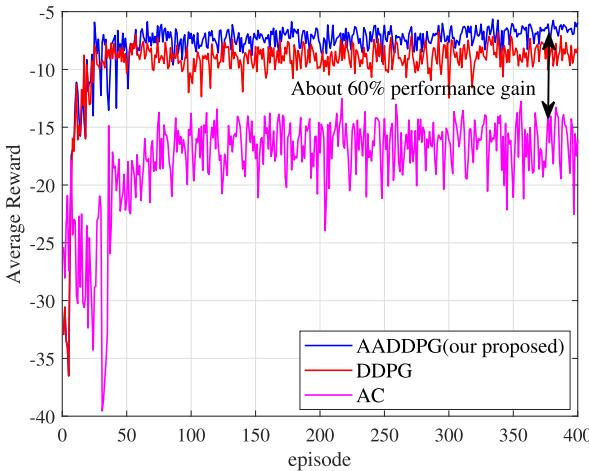

Fig. 3. Reward comparison of different algorithms, where $L = 4 5 , M = 6 4$ $K = 4 ,$ , and $R _ { 0 } = { \bar { 0 } } .$ .6 bits/s/Hz.  
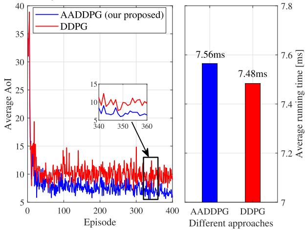  
Fig. 4. AoI performance and time complexity comparison of different algorithms.

## IV. SIMULATION RESULTS

This section evaluates the effectiveness of the proposed AADDPG algorithm in NOMA and active RIS-assisted AGMEC networks. We first examine the training convergence and time complexity of AADDPG, then assess the AoI enhancement from active RIS and NOMA. Finally, we test the algorithm’s robustness under different network parameters. The proposed method is benchmarked against classical DDPG and AC algorithms, with results obtained using TensorFlow 2.14.0. In all simulations, the BS and RIS are fixed at the three-dimensional coordinates (210 m, 210 m, 80 m) and (75 m, 75 m, 20 m), respectively. The UEs are randomly distributed within a 200 m ×200 m rectangular area. As a unified simulation benchmark, all numerical experiments in this paper are conducted under the condition of a 1 MHz system bandwidth, with each offloading UE transmitting at a fixed power of 0.1 W. This setup provides a fair resource premise for performance comparisons among different schemes in this work, such as NOMA versus OMA and active RIS versus passive RIS, thereby ensuring the objectivity and comparability of the analytical results. Unless otherwise specified, the simulation parameters follow Table III, with the settings based on [21], [37], and [39]. All simulation experiments for the algorithms were conducted on the same computer with the following hardware configuration: a 12th Gen Intel(R) Core(TM) i7-12650H processor and 16 GB of DDR4 RAM.

TABLE II  
MAIN NOTATIONS
<table><tr><td rowspan=1 colspan=1>Notation</td><td rowspan=1 colspan=1>Description</td></tr><tr><td rowspan=1 colspan=1> $\overline { { A _ { k } , \overline { { A } } } }$ </td><td rowspan=1 colspan=1>The AoI of UE k, average AoI of all UEs</td></tr><tr><td rowspan=1 colspan=1> $C _ { k }$ </td><td rowspan=1 colspan=1>Number of CPU cycles for unit task processing</td></tr><tr><td rowspan=1 colspan=1> $E _ { \mathrm { t h } } ^ { \mathrm { U } } , E _ { \operatorname* { m a x } } ^ { \mathrm { U } }$ </td><td rowspan=1 colspan=1>Protection energy threshold, battery capacity</td></tr><tr><td rowspan=1 colspan=1> $f _ { \mathrm { U } } , f _ { \mathrm { B } }$ </td><td rowspan=1 colspan=1>UAV and BS task computation resources</td></tr><tr><td rowspan=1 colspan=1> $\overline { { \mathbf { g } _ { k } ^ { \mathrm { E R } } , \mathbf { g } ^ { \mathrm { R U } } , \mathbf { g } ^ { \mathrm { R B } } } }$ </td><td rowspan=1 colspan=1>UE k- RIS; RIS-UAV; RIS-BS Channels</td></tr><tr><td rowspan=1 colspan=1> $\overline { { \mathrm { ~ H ~ } ^ { \mathrm { U } } } }$ </td><td rowspan=1 colspan=1>Constant altitude of the UAV during flight</td></tr><tr><td rowspan=1 colspan=1> $\overline { { h _ { k } ^ { \mathrm { E U } } , h _ { k } ^ { \mathrm { E B } } } }$ </td><td rowspan=1 colspan=1>Direct channel from UE k to the UAV and BS</td></tr><tr><td rowspan=1 colspan=1> $\mathbf { L } , \Theta$ </td><td rowspan=1 colspan=1>Amplification matrix, Phase shift matrix</td></tr><tr><td rowspan=1 colspan=1> $N , \Delta n$ </td><td rowspan=1 colspan=1>Number of time slots, time duration of a slot</td></tr><tr><td rowspan=1 colspan=1> $O _ { k } , V _ { k }$ </td><td rowspan=1 colspan=1>Task arrival state, task delivery state</td></tr><tr><td rowspan=1 colspan=1> $v , \alpha$ </td><td rowspan=1 colspan=1>UAV flight speed and direction</td></tr><tr><td rowspan=1 colspan=1> $U _ { k }$ </td><td rowspan=1 colspan=1>Duration of the task of UE k</td></tr><tr><td rowspan=1 colspan=1> $R _ { 0 }$ </td><td rowspan=1 colspan=1>Rate threshold of each UE</td></tr><tr><td rowspan=1 colspan=1> $S _ { k }$ </td><td rowspan=1 colspan=1>Size of the task at UE k</td></tr><tr><td rowspan=1 colspan=1> $\lambda$ </td><td rowspan=1 colspan=1>Task generation rate of UEs</td></tr><tr><td rowspan=1 colspan=1> $\overline { { \xi _ { k } ^ { \mathrm { U } } , \xi _ { k } ^ { \mathrm { B } } } }$ </td><td rowspan=1 colspan=1>Task offloading indicator to UAV and BS</td></tr></table>

TABLE III

SIMULATION PARAMETER SETTING
<table><tr><td>Notation</td><td>Value</td><td>Notation</td><td>Value</td></tr><tr><td> $\kappa$ </td><td>0.001</td><td> $\Delta n$ </td><td>1 s</td></tr><tr><td> $p _ { k }$ </td><td>0.1 W</td><td> $\mathrm { H } ^ { \mathrm { U } }$ </td><td>80 m</td></tr><tr><td> $B _ { \mathrm { m } }$ </td><td>3300</td><td> $\Omega _ { s }$ </td><td>64</td></tr><tr><td> $\mathrm { E }$ </td><td>400</td><td> $_ \mathrm { N }$ </td><td>300</td></tr><tr><td> $\beta _ { a }$ </td><td>0.01</td><td> $\beta _ { c }$ </td><td>0.02</td></tr><tr><td> $\alpha ^ { \mathrm { E U } } , \alpha ^ { \mathrm { E B } }$ </td><td>3.5</td><td> $\alpha ^ { \mathrm { E R } } , \alpha ^ { \mathrm { R U } } , \alpha ^ { \mathrm { R B } }$ </td><td>2.2</td></tr><tr><td> $D _ { 0 }$ </td><td>1 m</td><td> $f _ { \mathrm { U } } , f _ { \mathrm { B } }$ </td><td>5 GHz</td></tr><tr><td> $v _ { \mathrm { m a x } }$ </td><td>25 m/s</td><td> $E _ { \mathrm { m a x } } ^ { \mathrm { U } }$ </td><td>50000 J</td></tr><tr><td> $\delta _ { 1 } , \delta _ { 2 }$ </td><td>-1, 0.005</td><td> $\delta _ { 3 } , \delta _ { 4 }$ </td><td>-1, 1</td></tr></table>

## A. Validation of Algorithm Convergence and Time Complexity

First, we compare the training performance of the proposed algorithm with classic DRL algorithms, such as AC and DDPG, under the NOMA scheme. As shown in Fig. 3, the proposed AADDPG algorithm converges to the highest performance level compared to the DDPG and AC baselines, achieving average rewards 23% and 60% higher, respectively. The rapid convergence of all algorithms validates the effectiveness of the DRL framework for this joint decision-making problem. The performance gap, notably the 60% improvement over AC, stems from two architectural advantages. First, unlike the standard AC framework, both AADDPG and DDPG employ a DQN-based critic that ensures more stable and accurate value estimation. Second, and most critically, AADDPG’s novel action adjuster refines raw action outputs, enabling more coordinated and physically feasible decisions for UAV trajectory and RIS beamforming. This allows AADDPG to fully leverage the active RIS potential, resulting in superior overall system efficiency.

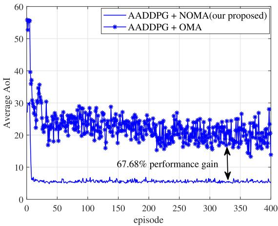  
Fig. 5. Validating of NOMA performance advantages, with $L = 4 5 , M = 6 4 .$ $K = 4 ,$ and $R _ { 0 } \stackrel { - } { = } 0 . 6$ bits/s/Hz.

As shown in Fig. 4, this paper compares the performance of AADDPG with the conventional DDPG algorithm under the NOMA scheme. The left subfigure demonstrates that after convergence, AADDPG consistently outperforms DDPG, where its action adjuster achieves a remarkable 23% improvement in average AoI performance through secondary optimization of the network output. The right subfigure reveals that this enhancement requires only a 1.06% increase in runtime. The result illustrates the effective trade-off between AoI performance and computational cost achieved by the proposed AADDPG algorithm. Figs. 3 and 4 validates that the proposed action adjuster attains significant performance gains at the cost of minimal computational complexity.

## B. NOMA Performance Validation

In this section, the impact of NOMA techniques on AoI performance in AGMEC networks is investigated. It should be noted that the simulation results presented in this section are obtained with the assistance of an active RIS. To prevent visual overlap among multiple simulation curves, Fig. 5 exclusively compares the proposed algorithm’s performance under NOMA and OMA access schemes. It is clear that with training, the AADDPG algorithm’s performance progressively improves and converges after approximately 15 episodes in both NOMA and OMA modes, confirming the proposed algorithm’s effectiveness. More notably, the AADDPG algorithm under the NOMA scheme achieves a 67.68% reduction in average AoI compared to its OMA counterpart, as shown in Fig. 5. This result demonstrates not only the superior performance of NOMA over OMA in AGMEC networks but also highlights NOMA’s superior adaptability to this network environment.

It should be noted that the performance comparison between NOMA and OMA in this section is conducted under specific system parameter conditions. The key parameter ζ, set to 0.05, characterizes the residual interference level caused by imperfect SIC. The performance gain achievable by NOMA is sensitive to ζ. As shown in Fig. 6, the average AoI performance is compared under different ζ as the number of UEs increases in the NOMA-based system. The results indicate that across all values of ζ, the AoI rises with an increasing number of UEs, primarily due to enhanced multi-user interference in dense networks. Moreover, a higher ζ, which reflects greater SIC imperfection, leads to poorer AoI performance, as more residual interference remains after imperfect signal decoding. Notably, under ideal SIC conditions, i.e., $\zeta ~ = ~ 0 ,$ the AoI degrades most slowly with the growth of UEs. Specially, When the number of UEs reaches 20, the AoI under $\zeta = 0 . 2$ is about 2.5 times that under $\zeta = 0$ . This finding demonstrates that the highly efficient SIC is essential to fully realize the advantages of NOMA in AGMEC networks.

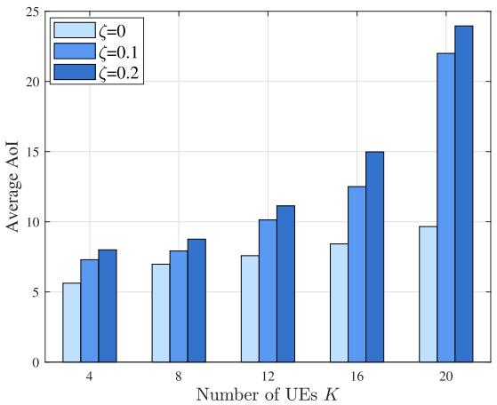  
Fig. 6. Impact of UE density and imperfect SIC on NOMA, with $L = 4 5$ $\bar { M } = 6 4 .$ , and $R _ { 0 } = 0 . 4$ bits/s/Hz.

## C. Performance Comparison Between Active and Passive RIS

Fig. 7 demonstrates the performance superiority of active RIS over passive RIS in NOMA-assisted AGMEC networks. Specifically, Figs. 7 (a) and 7 (b) respectively examine the average reward and AoI performance achieved by the proposed AADDPG algorithm under different RIS configurations. The AADDPG algorithm demonstrates consistent convergence within 15 training episodes under both active-RIS and passive-RIS configurations, exhibiting superior convergence stability. Most importantly, it can be seen that compared to passive RIS, the proposed algorithm can gain a significant advantage with the assistance of active RIS. Specifically, Fig. 7 (a) shows that the active RIS leads to a 29.28% increase in average reward, while Fig. 7 (b) demonstrates a 33.9% decrease in average AoI compared to the passive RIS.

## D. Algorithm Application Performance Verification

Finally, the application performance of the proposed algo rithm is verified.

Fig. 8 investigates the AoI under variations of key RIS parameters in the AGMEC network with NOMA. Results confirm that passive RIS brings minimal performance change with increasing M or L, whereas active RIS significantly reduces AoI as these parameters grow. The proposed AADDPG algorithm consistently demonstrates superior performance.

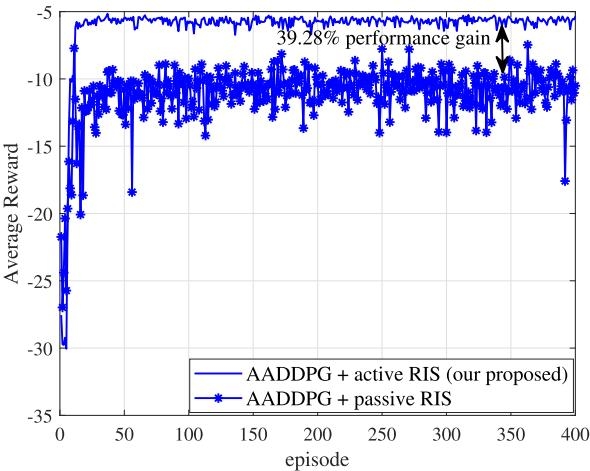

(a)  
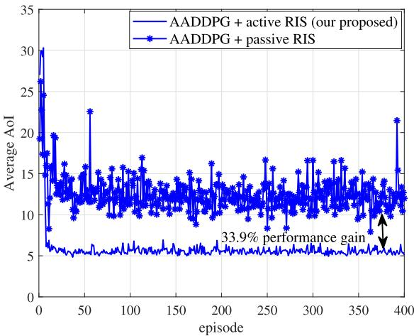  
(b)  
Fig. 7. Validating of active RIS performance advantages: (a) average reward, and (b) average AoI, with $L = 4 \bar { 5 } , M = 6 4 , K = 4 ,$ and $R _ { 0 } = 0 . \dot { 4 } \mathrm { b i t s / s / H z }$

Notably, it maintains substantial gains even under highly constrained configurations: with a limited number of elements at $M = 3 6$ , it achieves AoI reductions of 20.43% and 38.48% compared to DDPG and AC, respectively; under a strict power budget of $L = 5 ,$ , it still secures a 13.05% improvement over DDPG and a notable 43.4% reduction over $\mathbf { A C } .$ , showcasing its exceptional robustness in resource-limited scenarios.

In Figs. 9 and 10, alongside the classical DRL algorithms DDPG and AC, the traditional optimization algorithm, successive convex approximation (SCA), is also introduced as a comparative benchmark. Specifically, Fig. 9 illustrates the impact of the rate threshold on AoI performance of active RIS assisted AGMEC networks. As $R _ { 0 }$ increases, all algorithms experience performance degradation due to reduced offloading success probability. Notably, all algorithms demonstrate superior performance under NOMA compared to OMA, validating the effectiveness of NOMA adoption. Furthermore, the SCA algorithm performs the worst because its reliance on local linearizations makes it highly susceptible to local optima and approximation errors when addressing the highdimensional non-convexities and tight coupling of variables in the studied network. Most significantly, AADDPG consistently achieves optimal performance in the studied network: even when $R _ { 0 }$ increases to 0.8 bit/s/Hz, it maintains a 12.68% AoI improvement over DDPG, a 39.7% improvement over the AC and a 63.8% improvement over the SCA.

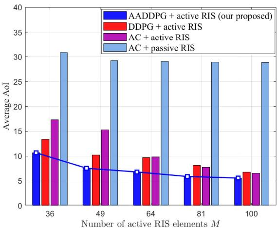  
(a)

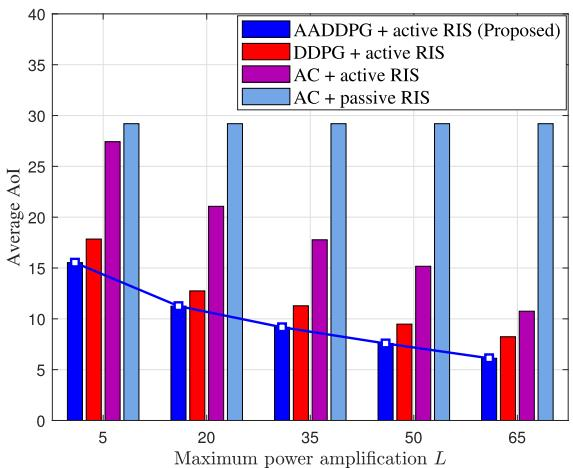  
(b)

Fig. 8. Average AoI versus active RIS parameters: (a) number of elements M; (b) maximum power amplification L with $\lambda { = } \mathrm { z } \ 0 . 2 , R _ { 0 } = 0 . 6$ bits/s/Hz.  
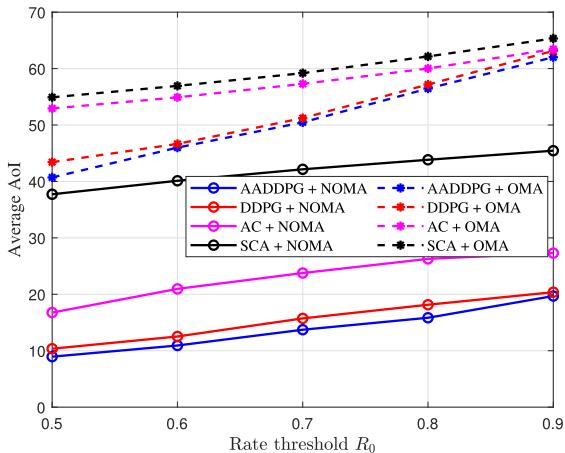  
Fig. 9. AoI performance of different algorithms under varying $R _ { 0 } .$ , where $L = 4 5 , M = 2 5 , \lambda = 0 . 2 .$

Fig. 10 demonstrates the AoI performance of all algorithms under increasing arrival rates λ in NOMA assisted AGMEC networks. This figure reconfirms the performance advantage of active RIS architectures compared to passive RIS configurations. Furthermore, it can be observed that as the task arrival rate increases, the AoI performance of all algorithms improves initially. This improvement occurs because higher arrival rates reduce inter-task intervals, thereby enhancing AoI performance. However, as the arrival rate increases further, too frequent task arrivals can lead to deterioration of AoI performance. In addition, Under the active RIS configuration, the proposed AADDPG algorithm yields the lowest average AoI. Specifically, at an arrival rate of 0.2, the average AoI is 6.78, surpassing the performance of the DDPG, AC, and SCA algorithms by 29.9%, 37.9%, and 83.9%, respectively.

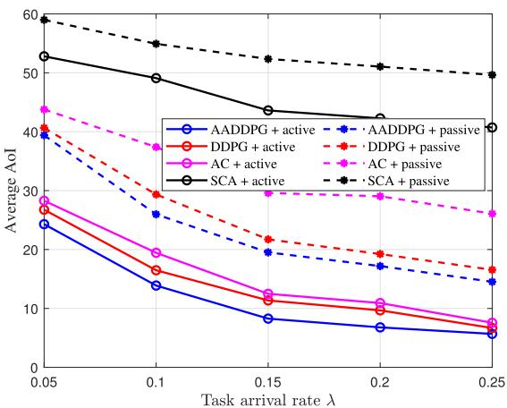

Fig. 10. AoI performance of different algorithms under varying λ, where $L = 4 5$ $M = 6 4 ,$ and $R _ { 0 } = 0 . 6$ bits/s/Hz.  
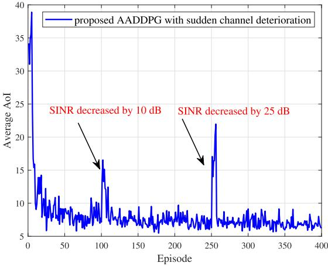  
Fig. 11. AoI performance of the AADDPG algorithm under sudden SINR degradation, where $L = 4 5 , M = 6 4 , \lambda = 0 . 2 ,$ and $R _ { 0 } = 0 . 6$ bits/s/Hz.

## E. Robustness Verification of the Proposed Algorithm

To validate the performance of the proposed AADDPG algorithm under dynamic network fluctuations, experiments simulated channel sudden changes caused by link congestion or transient interference. Specifically, during the testing phase, artificial events of 10 dB and 25 dB sudden drops in signal to interference noise (SINR) ratio are introduced at episodes 100–105 and 250–255, respectively. As shown in the Fig. 11, both perturbations caused an immediate deterioration in the system’s average AoI. The greater the drop in SINR, the more pronounced the degradation in peak performance, confirming the direct correlation between link quality and information timeliness. Notably, under the proposed AADDPG framework, the system consistently re-stabilized AoI to near-optimal levels within approximately 5 episodes. This rapid recovery capability stems from the algorithm’s active re-planning of UAV trajectories and dynamic adjustments to the actively RIS beamforming. The results demonstrate that the proposed AADDPG algorithm sensitively detects channel changes and promptly reoptimizes strategies. This disturbance-resistant characteristic not only minimizes recovery latency but also ensures high timeliness in information exchange, thereby validating the robustness and adaptability of the AADDPG algorithm in complex dynamic environments.

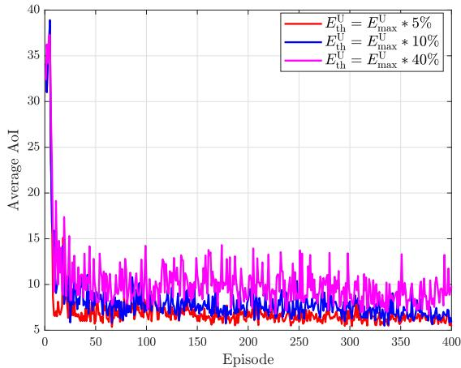  
Fig. 12. Average AoI versus battery protection threshold $E _ { \mathrm { t h } } ^ { \mathrm { U } }$ , where $L = 4 5$ $\begin{array} { r } { \bar { M } = 6 4 , \lambda = \bar { 0 } . 2 , } \end{array}$ and $R _ { 0 } = 0 . 6$ bits/s/Hz.

To evaluate the adaptability of the proposed battery protection mechanism under different battery conditions, such as new versus aged batteries, a comparative experiment was conducted, as shown in Fig. 12. In the experiment, returntrigger thresholds were set at 5%, 10%, and 40% of the total battery capacity $E _ { \mathrm { m a x } } ^ { \mathrm { U } }$ to simulate batteries with distinct performance characteristics. The results indicate that for an aged battery with a threshold set at 40% of total capacity, frequent returns lead to task interruptions, raising the system’s average AoI to approximately 10. In contrast, for a new battery in good condition with a threshold set at 5% of total capacity, the UAV can maintain longer operational periods, reducing the average AoI significantly to about 6. These findings confirm the robustness of the protection mechanism across varying battery states. Furthermore, the results also reveal that by dynamically adjusting the threshold according to real-time battery health and mission requirements, an adaptive and optimal balance can be achieved between information timeliness and system operational sustainability.

## V. CONCLUSION

This paper has presented a novel joint decision-making framework for optimizing task data freshness in AGMEC networks through the integration of active RIS and NOMA. To minimize the system’s average AoI, we have proposed an AADDPG algorithm that jointly optimizes UAV flight trajectory, active RIS beamforming, and task offloading strategies. The proposed AADDPG algorithm has extended conventional DDPG methods by incorporating an intelligent action adjuster module, which has enabled efficient hybrid action space optimization with low computational overhead while preserving

UAV battery performance. Simulation results have demonstrated that the AADDPG algorithm significantly reduces average AoI while confirming the performance advantages of NOMA and active RIS in AGMEC networks. Future work will focus on extending this framework to support high-density user scenarios involving multi-UAV coordination, enhancing its overall robustness in dynamic and complex AGMEC environments, and exploring the application of the proposed algorithms in practical vertical domains such as autonomous driving and industrial IoT.

## REFERENCES

[1] Q. He et al., “Integrating IoT and 6G: Applications of edge intelligence, challenges, and future directions,” IEEE Trans. Services Comput., vol. 18, no. 4, pp. 2471–2488, Jul. 2025.

[2] D. Xu, L. Duan, H. Zhao, and H. Zhu, “Effective computation throughput maximization for MEC-enabled WP-IoT networks with short packet communications,” IEEE Trans. Veh. Technol., vol. 74, no. 1, pp. 1137–1152, Jan. 2025.

[3] J. Xia, Y. Liu, and L. Tan, “Joint optimization of trajectory and task offloading for cellular-connected multi-UAV mobile edge computing,” Chin. J. Electron., vol. 33, no. 3, pp. 823–832, May 2024.

[4] Y. Mao, C. You, J. Zhang, K. Huang, and K. B. Letaief, “A survey on mobile edge computing: The communication perspective,” IEEE Commun. Surveys Tuts., vol. 19, no. 4, pp. 2322–2358, 4th Quart., 2017.

[5] O. S. Oubbati, N. Chaib, A. Lakas, and S. Bitam, “On-demand routing for urban VANETs using cooperating UAVs,” in Proc. Int. Conf. Smart Commun. Netw. Technol. (SaCoNeT), El Oued, Algeria, Oct. 2018, pp. 108–113.

[6] F. Song et al., “Evolutionary multi-objective reinforcement learning based trajectory control and task offloading in UAV-assisted mobile edge computing,” IEEE Trans. Mobile Comput., vol. 22, no. 12, pp. 7387–7405, Dec. 2023.

[7] F. Song et al., “Multi-objective dependent task scheduling, resource allocation, and service caching in aerial-ground integrated MEC,” IEEE Trans. Intell. Transp. Syst., vol. 26, no. 9, pp. 13489–13505, Sep. 2025.

[8] Q. Zhen et al., “Air-ground collaborative mobile edge computing: Architecture, challenges, and opportunities,” China Commun., vol. 21, no. 5, pp. 1–16, May 2024.

[9] L. Wang, Y. Li, Y. Chen, T. Li, and Z. Yin, “Air–ground coordinated MEC: Joint task, time allocation and trajectory design,” IEEE Trans. Veh. Technol., vol. 74, no. 3, pp. 4728–4743, Mar. 2025.

[10] Q. An and Y. Shen, “Air-ground integrated mobile edge computing in vehicular visual sensor networks,” IEEE Sensors J., vol. 22, no. 24, pp. 24395–24405, Dec. 2022.

[11] L. Zhang and N. Ansari, “Latency-aware IoT service provisioning in UAV-aided mobile-edge computing networks,” IEEE Internet Things J., vol. 7, no. 10, pp. 10573–10580, Oct. 2020.

[12] X. He, R. Jin, and H. Dai, “Joint power and deployment optimization for multi-UAV remote edge computing,” in Proc. IEEE Global Commun. Conf. (GLOBECOM), Dec. 2020, pp. 1–6.

[13] H. Peng and X. Shen, “Multi-agent reinforcement learning based resource management in MEC- and UAV-assisted vehicular networks,” IEEE J. Sel. Areas Commun., vol. 39, no. 1, pp. 131–141, Jan. 2021.

[14] C. Zhao, S. Xu, and J. Ren, “AoI-aware wireless resource allocation of energy-harvesting-powered MEC systems,” IEEE Internet Things J., vol. 10, no. 9, pp. 7835–7849, May 2023.

[15] S. Kaul, R. Yates, and M. Gruteser, “Real-time status: How often should one update?,” in Proc. IEEE INFOCOM, Mar. 2012, pp. 2731–2735.

[16] Z. Qin et al., “AoI-aware scheduling for air-ground collaborative mobile edge computing,” IEEE Trans. Wireless Commun., vol. 22, no. 5, pp. 2989–3005, May 2023.

[17] Y. Yang, T. Song, J. Yang, H. Xu, and S. Xing, “Joint energy and AoI optimization in UAV-assisted MEC-WET systems,” IEEE Sensors J., vol. 24, no. 9, pp. 15110–15124, May 2024.

[18] Z. Ding, X. Lei, G. K. Karagiannidis, R. Schober, J. Yuan, and V. K. Bhargava, “A survey on non-orthogonal multiple access for 5G networks: Research challenges and future trends,” IEEE J. Sel. Areas Commun., vol. 35, no. 10, pp. 2181–2195, Oct. 2017.

[19] O. S. Oubbati, J. Alotaibi, F. Alromithy, M. Atiquzzaman, and M. R. Altimania, “A UAV-UGV cooperative system: Patrolling and energy management for urban monitoring,” IEEE Trans. Veh. Technol., vol. 74, no. 9, pp. 13521–13536, Sep. 2025.

[20] Z. Zhang et al., “Active RIS vs. passive RIS: Which will prevail in 6G?,” IEEE Trans. Commun., vol. 71, no. 3, pp. 1707–1725, Mar. 2023.

[21] Z. Shi et al., “Active RIS-aided EH-NOMA networks: A deep reinforcement learning approach,” IEEE Trans. Commun., vol. 71, no. 10, pp. 5846–5861, Oct. 2023.

[22] Y. Yang, Y. Hu, and M. C. Gursoy, “Energy efficiency of RIS-assisted NOMA-based MEC networks in the finite blocklength regime,” IEEE Trans. Commun., vol. 72, no. 4, pp. 2275–2291, Apr. 2024.

[23] T. Bai, C. Pan, Y. Deng, M. Elkashlan, A. Nallanathan, and L. Hanzo, “Latency minimization for intelligent reflecting surface aided mobile edge computing,” IEEE J. Sel. Areas Commun., vol. 38, no. 11, pp. 2666–2682, Nov. 2020.

[24] T. Bai, C. Pan, H. Ren, Y. Deng, M. Elkashlan, and A. Nallanathan, “Resource allocation for intelligent reflecting surface aided wireless powered mobile edge computing in OFDM systems,” IEEE Trans. Wireless Commun., vol. 20, no. 8, pp. 5389–5407, Aug. 2021.

[25] X. Hu, C. Masouros, and K.-K. Wong, “Reconfigurable intelligent surface aided mobile edge computing: From optimization-based to location-only learning-based solutions,” IEEE Trans. Commun., vol. 69, no. 6, pp. 3709–3725, Jun. 2021.

[26] M. Hua, H. Tian, X. Lyu, W. Ni, and G. Nie, “Online offloading scheduling for NOMA-aided MEC under partial device knowledge,” IEEE Internet Things J., vol. 9, no. 3, pp. 2227–2241, Feb. 2022.

[27] W. Wang, W. Ni, H. Tian, and L. Song, “Intelligent omni-surface enhanced aerial secure offloading,” IEEE Trans. Veh. Technol., vol. 71, no. 5, pp. 5007–5022, May 2022.

[28] H. Li, Y. Chen, K. Li, Y. Yang, and J. Huang, “Dynamic energy-efficient computation offloading in NOMA-enabled air–ground-integrated edge computing,” IEEE Internet Things J., vol. 11, no. 23, pp. 37617–37629, Dec. 2024.

[29] Z. Zhai, X. Dai, B. Duo, X. Wang, and X. Yuan, “Energy-efficient UAVmounted RIS assisted mobile edge computing,” IEEE Wireless Commun. Lett., vol. 11, no. 12, pp. 2507–2511, Dec. 2022.

[30] X. Qin, Z. Song, T. Hou, W. Yu, J. Wang, and X. Sun, “Joint optimization of resource allocation, phase shift, and UAV trajectory for energyefficient RIS-assisted UAV-enabled MEC systems,” IEEE Trans. Green Commun. Netw., vol. 7, no. 4, pp. 1778–1792, Dec. 2023.

[31] J. Alotaibi, O. S. Oubbati, M. Atiquzzaman, F. Alromithy, and M. R. Altimania, “Optimizing disaster response with UAV-mounted RIS and HAP-enabled edge computing in 6G networks,” J. Netw. Comput Appl., vol. 241, Sep. 2025, Art. no. 104213.

[32] <sup>˙</sup>I. Kahraman, A. Kose, M. Koca, and E. Anarim, “Age of information in¨ Internet of Things: A survey,” IEEE Internet Things J., vol. 11, no. 6, pp. 9896–9914, Mar. 2024.

[33] J. Bai et al., “The DDPG-based joint optimization of task offloading and content caching in UAV-assisted IoV,” IEEE Internet Things J., vol. 12, no. 19, pp. 40330–40346, Oct. 2025.

[34] Y. Pan, Q. Chen, N. Zhang, Z. Li, T. Zhu, and Q. Han, “Extending delivery range and decelerating battery aging of logistics UAVs using public buses,” IEEE Trans. Mobile Comput., vol. 22, no. 9, pp. 5280–5295, Sep. 2023.

[35] M. Fiore, “Full network sensing: Architecting 6G beyond communications,” IEEE Netw., vol. 37, no. 3, pp. 232–239, May 2023.

[36] A. Siddiq and Y. J. Ghazwani, “Hybrid optimized deep neural network-based intrusion node detection and modified energy efficient centralized clustering routing protocol for wireless sensor network,” IEEE Trans. Consum. Electron., vol. 70, no. 3, pp. 6303–6313, Aug. 2024.

[37] R. Zhong, Y. Liu, X. Mu, Y. Chen, and L. Song, “AI empowered RISassisted NOMA networks: Deep learning or reinforcement learning?,” IEEE J. Sel. Areas Commun., vol. 40, no. 1, pp. 182–196, Jan. 2022.

[38] W. Lee and T. Kim, “Multiagent reinforcement learning in controlling offloading ratio and trajectory for multi-UAV mobile-edge computing,” IEEE Internet Things J., vol. 11, no. 2, pp. 3417–3429, Jan. 2024.

[39] B. Liu, Y. Wan, F. Zhou, Q. Wu, and R. Q. Hu, “Resource allocation and trajectory design for MISO UAV-assisted MEC networks,” IEEE Trans. Veh. Technol., vol. 71, no. 5, pp. 4933–4948, May 2022.

[40] H. Lv, Z. Zheng, F. Wu, and G. Chen, “Strategy-proof online mechanisms for weighted AoI minimization in edge computing,” IEEE J. Sel. Areas Commun., vol. 39, no. 5, pp. 1277–1292, May 2021.

[41] R. Zhang, K. Xiong, Y. Lu, D. W. K. Ng, P. Fan, and K. B. Letaief, “SWIPT-enabled cell-free massive MIMO-NOMA networks: A machine learning-based approach,” IEEE Trans. Wireless Commun., vol. 23, no. 7, pp. 6701–6718, Jul. 2024.

  
Zhaoyuan Shi (Member, IEEE) received the M.S. degree in information and communication engineering and the Ph.D. degree in computer science and technology from Chongqing University of Posts and Telecommunications, Chongqing, China, in 2013 and 2022, respectively. She is currently an Associate Professor with the School of Computer and Information, Anqing Normal University, Anqing, China. Her research interests include deep reinforcement learning-enabled wireless communications and LLM-empowered networks.


Zhipeng Bi received the B.S. degree in electronic information technology and instrumentation from the College of Information Engineering, Hangzhou Dianzi University, Hangzhou, China, in 2015. He is currently pursuing the master’s degree with Anqing Normal University, Anqing, China. His research interests include reconfigurable intelligent surface and mobile edge computing.

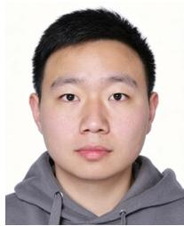

Ruichen Zhang (Member, IEEE) received the B.E. degree from Henan University (HENU), China, in 2018, and the Ph.D. degree from Beijing Jiaotong University (BJTU), China, in 2023. In 2024, he was a Visiting Scholar with the College of Information and Communication Engineering, Sungkyunkwan University, Suwon, South Korea. He is currently a Post-Doctoral Research Fellow with the College of Computing and Data Science, Nanyang Technological University (NTU), Singapore. His research interests include LLM-empowered networking, reinforcement learning-enabled wireless communication, generative AI models, and heterogeneous networks.


Huabing Lu (Member, IEEE) received the B.S. degree in electronics and information engineering, the M.S. degree in information and communication engineering, and the Ph.D. degree in computer science and technology from Chongqing University of Posts and Telecommunications, Chongqing, China, in 2010, 2013, and 2021, respectively. From 2022 to 2024, he was a Post-Doctoral Researcher with Dalian University of Technology, Dalian, China. From 2013 to 2016, he was an Engineer with Glodon, Chongqing. He is currently with the School of Information Engineering, Jiangxi Provincial Key Laboratory of Advanced Signal Processing and Intelligent Communications, Nanchang University, Nanchang, China. His current research interests include NOMA, ultra-reliable low-latency communications, UAV communications, physical-layer security, and communication resource management.


Chongwen Huang (Senior Member, IEEE) received the B.Sc. degree from Nankai University in 2010, the M.Sc. degree from the University of Electronic Science and Technology of China in 2013, and the Ph.D. degree from Singapore University of Technology and Design (SUTD) in 2019. From October 2019 to September 2020, he was a Post-Doctoral Researcher with SUTD. In September 2020, he joined Zhejiang University as a tenuretrack Young Professor. His main research interests include holographic MIMO surface/reconfigurable intelligent surface, B5G/6G wireless communications, mmWave/THz communications, and deep learning technologies for wireless communications. He was a recipient of the 2021 IEEE Marconi Prize Paper Award, the 2023 IEEE Fred W. Ellersick Prize Paper Award, and the 2021 IEEE ComSoc Asia–Pacific Outstanding Young Researcher Award. He has served as an Editor for IEEE COMMUNICATIONS LETTERS, Signal Processing (Elsevier), and EURASIP Journal on Wireless Communications and Networking and Physical Communication in 2021.


Helin Yang (Senior Member, IEEE) received the B.S. and M.S. degrees from the School of Telecommunications Information Engineering, Chongqing University of Posts and Telecommunications, in 2013 and 2016, respectively, and the Ph.D. degree from the School of Electrical and Electronic Engineering, Nanyang Technological University, Singapore, in 2020. He is currently an Associate Professor with the School of Informatics, Xiamen University, Xiamen, China. His research interests include wireless communication and resource management.


of Electrical and Computer Engineering, Concordia University, Canada, as a Full Professor, and the PERFORM Research Chair. His current research interests include edge/fog computing, eHealth, radio resource management in wireless communication networks, and performance analysis. He received the Best Paper Award from ChinaCom in 2013, the Rh Award for outstanding contributions to research in applied sciences from the University of Manitoba in 2012, and the Outstanding Service Award from IEEE GLOBECOM 2010. He served as the Technical Program Committee (TPC) Co-Chair for IEEE GreenCom 2018, the Track/Symposium TPC Co-Chair for IEEE VTC-Fall 2020, IEEE VTC-Fall 2019, IEEE CCECE 2017, IEEE VTC-Fall 2012, IEEE GLOBECOM 2010, and IWCMC 2008, the Publicity Co-Chair for IWCMC 2010, 2011, 2013, 2014, 2015, 2017, and 2020, and the Registration Chair for QShine 2005. He also served on the Editorial Board for IEEE INTERNET OF THINGS JOURNAL, IEEE ACCESS, IET Communications, and Wireless Communications and Mobile Computing.

Jun Cai (Senior Member, IEEE) received the Ph.D. degree from the University of Waterloo, ON, Canada, in 2004. From June 2004 to April 2006, he was with McMaster University, Canada, as a Natural Sciences and Engineering Research Council of Canada (NSERC) Post-Doctoral Fellow. From July 2006 to December 2018, he was with the Department of Electrical and Computer Engineering, University of Manitoba, Canada, where he was a Full Professor and the NSERC Industrial Research Chair. In January 2019, he joined the Department


Dusit Niyato (Fellow, IEEE) received the B.Eng. degree from the King Mongkut’s Institute of Technology Ladkrabang (KMITL), Thailand, and the Ph.D. degree in electrical and computer engineering from the University of Manitoba, Canada. He is currently a Professor with the College of Computing and Data Science, Nanyang Technological University, Singapore. His research interests include mobile generative AI, edge general intelligence, quantum computing and networking, and incentive mechanism design.