JOURNAL OF LAT X CLASS FILES, VOL. 14, NO. 8, AUGUST 2021

# Age of Information Minimization in UAV-Enabled Integrated Sensing and Communication Systems

Yu Bai, Member, IEEE, Yifan Zhang, Member, IEEE,

Boxuan Xie, Graduate Student Member, IEEE, Zheng Chang, Senior Member, IEEE, Yanru Zhang, Senior Member, IEEE, Riku Jantti,¨ Senior Member, IEEE, and Zhu Han, Fellow, IEEE.

Abstract—Unmanned aerial vehicles (UAVs) equipped with integrated sensing and communication (ISAC) capabilities are envisioned to play a pivotal role in future wireless networks due to their enhanced flexibility and efficiency. However, jointly optimizing UAV trajectory planning, multi-user communication, and target sensing under stringent resource constraints and timecritical conditions remains a significant challenge. To address this, we propose an Age of Information (AoI)-centric UAV-ISAC system that simultaneously performs target sensing and serves multiple ground users, emphasizing information freshness as the core performance metric. We formulate a long-term average AoI minimization problem that jointly optimizes the UAV’s flight trajectory and beamforming. To tackle the high dimensionality and non-convexity of this problem, we develop a deep reinforcement learning (DRL)-based algorithm capable of providing real-time decisions on UAV movement and beamforming for both radar sensing and multi-user communication. Specifically, a Kalman filter is employed for accurate target state prediction, regularized zero-forcing is utilized to mitigate inter-user interference, and a soft actor-critic algorithm is applied for training the DRL agent on continuous actions. The proposed framework adaptively balances the trade-offs between sensing accuracy and communication quality. Simulation results show that the proposed method achieves robust average-AoI performance and generally outperforms the considered baseline approaches under various system settings.

Index Terms—Integrated sensing and communication (ISAC), age of information (AoI), unmanned aerial vehicle (UAV), deep reinforcement learning (DRL).

This work is partly supported by the Fundamental and Interdisciplinary Disciplines Breakthrough Plan of the Ministry of Education of China under Grant No. JYB2025XDXM116, NSF of Sichuan under Grant No. 2025YFHZ0093, the Program of Introducing Talents of Discipline to Universities under Grant No. B20064, and by Horizon European Union Grant No. 101086159 and No. 101131117. (Corresponding author: Yifan Zhang).

Y. Bai is with the School of Software, Taiyuan University of Technology, Taiyuan 030024, China, and also with the Department of Information and Communications Engineering, Aalto University, 02150 Espoo, Finland (email: yu.baielec@gmail.com).

Y. Zhang, B. Xie, and R. Jantti are with the Department of Information¨ and Communications Engineering, Aalto University, 02150 Espoo, Finland (e-mail: yifan.1.zhang@aalto.fi, boxuan.xie@aalto.fi, riku.jantti@aalto.fi).

Y. Zhang is with the School of Computer Science and Engineering, University of Electronic Science and Technology of China, Chengdu 611731, China, and also with the Shenzhen Institute for Advanced Study, University of Electronic Science and Technology of China, Shenzhen 518110, China (e-mail:yanruzhang@uestc.edu.cn).

Z. Han is with the Department of Electrical and Computer Engineering, University of Houston, Houston, TX 77004 USA, and also with the Department of Computer Science and Engineering, Kyung Hee University, Seoul 446-701, South Korea (email: hanzhu22@gmail.com).

## I. INTRODUCTION

U NMANNED aerial vehicles (UAVs) have become anessential component in the evolution towards the sixth- essential component in the evolution towards the sixthgeneration (6G) and future wireless networks, due to their flexible deployment, high mobility, and independence from terrestrial infrastructure [1]. These characteristics make UAVs highly suitable for diverse and challenging missions in future wireless networks, such as disaster relief, precision agriculture, and temporary wireless coverage restoration [2]–[5]. Increasingly, UAVs are expected to simultaneously perform wireless communication and sensing tasks within these scenarios [6]. Traditionally, these functionalities have relied on separate hardware platforms and dedicated frequency resources, which pose significant constraints in terms of payload, energy efficiency, and overall system complexity on UAV platforms [7].

To overcome these limitations, Integrated Sensing and Communication (ISAC) has emerged as a promising paradigm wherein radar sensing and wireless communication functionalities share hardware resources and frequency bands [8]. Equipping UAVs with ISAC capabilities enables concurrent execution of sensing and communication tasks, thereby providing a compact, efficient solution particularly suited for resource-constrained platforms [9]. However, the simultaneous integration of sensing and communication introduces a fundamental challenge: effectively balancing and optimizing these two competing functionalities. The ability to quantitatively evaluate how well sensing and communication tasks are jointly executed becomes essential for optimizing overall system performance, particularly given the dynamic and mobile nature of UAV deployments [10].

Typical performance assessments for UAV-enabled ISAC systems have focused on the traditional communication or sensing performance [11]. However, they fall short in capturing the distinct demands of time-critical scenarios common in UAV missions such as disaster response and intelligent transportation systems, where the timely delivery of fresh information is crucial. In such contexts, the value of information rapidly deteriorates over time, making timeliness a critical performance dimension. Addressing this issue, Age of Information (AoI), a metric gaining traction in time-sensitive applications such as multi-access edge computing (MEC), has emerged as a particularly appropriate measure [12], [13]. Motivated by this advantage, adopting AoI as a primary performance metric in UAV-based ISAC systems allows for a more comprehensive and precise assessment of timely information

JOURNAL OF LATEX CLASS FILES, VOL. 14, NO. 8, AUGUST 2021

delivery in dynamic and time-sensitive missions.

## A. Related Work

Existing research on UAV-enabled ISAC systems typically focuses on optimizing either communication-centric or sensing-centric performance metrics. Communication-centric studies generally aim to enhance communication performance under sensing constraints, such as maximizing communication users’ sum-rate, average-rate, or minimum-rate [14]– [19], guaranteeing quality of service (QoS) [20], or maximizing the achievable rates under the security constraints [21]. Conversely, sensing-centric works focus on improving target sensing efficiency, optimizing metrics like the successful tracking ratio [22], the Cramer-Rao bound (CRB) [´ 23], [24], the radar probing error [25], and the radar estimation rate [26], [27]. Additionally, UAV-specific metrics, including collision avoidance and energy efficiency, have been explored to enhance real-world applicability [20], [28]. Among various optimization strategies, joint optimization of UAV trajectory and beamforming has been widely recognized as essential for fully utilizing UAV spatial degrees of freedom and achieving superior system performance [14], [15], [17]–[19], [21].

However, the communication or sensing-oriented metrics employed in existing studies typically neglect the timeliness requirements inherent to UAV missions, particularly in dynamic, time-critical scenarios. To better capture the temporal dimension in UAV-based missions, the AoI metric has recently emerged as a suitable measure of information freshness in time-sensitive applications such as MEC and disaster response [12], [13]. Several recent works have adopted AoI to assess UAV-ISAC system performance [29]–[32]. For instance, Zhu et al. [29] reduced AoI through UAV trajectory optimization while neglecting wireless resource allocation. Zhou et al. [30] extended AoI optimization to multi-UAV scenarios, yet maintained temporal alternation between sensing and communication without spatial beamforming. Mei et al. [31] considered AoI under interference constraints, yet their work remained limited to single-link scenarios. Liu et al. [32] introduced onboard computation resources but ignored multi-user spatial multiplexing capabilities. Although these studies initially explored the benefits of AoI, they did not fully exploit the joint trajectory and spatial beamforming optimization potential, thereby leaving significant space for improvement.

To effectively address these joint optimization challenges, selecting an appropriate method is critical. UAV-enabled ISAC optimization problems often exhibit strong variable coupling, non-convexity, and multi-objective characteristics, thus limiting the flexibility and scalability of classical techniques such as alternating optimization, heuristic methods, and convex approximation [14], [17], [18]. Recently, deep reinforcement learning (DRL) has emerged as a promising alternative, enabling end-to-end policy learning and adaptive decisionmaking in dynamic environments without explicit problem decomposition [33]. DRL has successfully optimized UAV trajectory and user tracking [27], [28], jointly addressed user association, trajectory planning, and power allocation [34], and integrated clustering-based user assignment with trajectory and beamforming optimization [35]. However, existing DRL approaches predominantly focus on conventional metrics, leaving AoI-centric optimization in UAV-enabled ISAC underexplored.

## B. Motivation and Contribution

Despite advances in UAV-enabled ISAC systems, several research gaps remain that motivate our work.

First, the potential of AoI as a metric for time-critical UAVenabled ISAC tasks remains insufficiently explored. Most prior works optimize communication performance under sensing constraints [14], [15] or sensing accuracy under data rate guarantees [22], [23]. Meanwhile, existing UAV-based ISAC systems that adopt AoI as a performance metric are still limited to data collection scenarios and have not considered timecritical applications [29]–[32].

Second, the beamforming capabilities of UAV-mounted antenna arrays remain unexplored in existing AoI-driven UAV-ISAC systems. Recent AoI-centric UAV studies mainly focus on reducing latency via trajectory planning or time-division protocols alone [29]–[32], yet the spatial degrees of freedom offered by multi-antenna ISAC platforms have remained unexplored. Without joint beamforming and trajectory design, these approaches cannot fully exploit the antenna array’s ability to serve multiple ground users and the sensing target simultaneously.

Third, existing optimization methods lack flexibility to adapt to different user distributions and dynamic target motions under AoI-driven UAV-ISAC settings. Alternating optimization needs to fix one set of variables while optimizing another, limited to solving different user distributions or target dynamics change [14], [17], [18]. Although some DRL-based solutions have emerged for UAV path planning and rate maximization, they typically overlook AoI-related objectives and may not scale well to scenarios with multiple users or rapidly moving targets [27], [28]. These gaps underscore the need for a more adaptive framework capable of handling the interdependence of UAV trajectory and beam control in real-time.

To bridge these research gaps, this paper proposes a UAVenabled ISAC framework that exploits DRL to jointly optimize the UAV’s trajectory, multi-user beamforming, and radar sensing, with the explicit objective of minimizing AoI in dynamic settings. Unlike conventional ISAC research that focuses primarily on throughput or detection accuracy, we emphasize information freshness to reflect the real-time requirements of disaster relief, transportation safety, and other time-critical scenarios. The key contributions are summarized below:

• AoI-Centric UAV-ISAC System for Time-Critical Missions. We introduce a UAV-enabled ISAC system explicitly optimized for minimizing AoI, defined as the age of the most recent target state updates successfully received by ground users. AoI captures the freshness of information, crucial for time-critical missions like disaster relief. Meanwhile, AoI in our system is influenced simultaneously by the allocation of sensing and communication resources, inherently reflecting a critical balance between these two components. The proposed system comprehensively integrates UAV dynamics, active sensing, and multi-user communication tasks, thereby ensuring efficient, timely, and balanced resource utilization.

• Spatially-Aware Beamforming for Multi-User Communication and Target Sensing. We introduce a joint sensing-communication waveform design leveraging the spatial degrees of freedom provided by the UAV-mounted uniform planar array (UPA) antenna within the AoIcentric UAV-ISAC system. This spatial resource allocation strategy enables precise beamforming towards multiple users and mobile targets simultaneously, significantly improving AoI performance. Unlike existing AoI-centric UAV-ISAC approaches, our spatially-aware waveform design effectively balances and enhances both communication reliability and sensing accuracy.

• DRL-Based Joint Trajectory and Beamforming with a Logit–Threshold Action Architecture. We develop a DRL-based joint trajectory and beamforming framework that introduces a new action structure tailored for AoIcentric UAV-ISAC systems. Instead of directly predicting high-dimensional beamforming vectors, the proposed agent outputs UAV motion together with priority logits and an adaptive activation threshold, which collectively determine the set of active beams and their power allocation in each slot. These abstract decisions are then transformed into physically feasible ISAC waveforms via a structured post-processing module that integrates regularized zero-forcing for multiuser communication and Kalman filter-based steering for target sensing. This hybrid policy learning and analytical beam synthesis design enables stable optimization over strongly coupled sensing–communication–AoI dynamics. In addition, we employ a soft actor-critic method to efficiently train our DRL agent for continuous action spaces, ensuring stable and effective learning performance.

The remainder of this paper is organized as follows. Section II presents the system model and problem formulation of the proposed AoI-centric UAV-ISAC system. Section III details the proposed DRL-based approach. Section IV provides a comprehensive evaluation of the proposed system and algorithm. Finally, we conclude the paper in Section V.

## II. SYSTEM MODEL AND PROBLEM FORMULATION

We consider a UAV-enabled ISAC system, where a single UAV is deployed to simultaneously perform moving target sensing and downlink communication for K ground users, as illustrated in Fig. 1. The set of ground users is denoted by ${ \cal K } = \{ 1 , 2 , \dots , K \}$ . The location of user k is denoted by $\mathbf { p } _ { k } = [ x _ { k } , y _ { k } , 0 ]$ , which is assumed to be known to the UAV in advance. The target is a mobile entity that moves within the same horizontal plane. Its position at time slot n is denoted as $\mathbf { p } _ { T } [ n ] = [ x _ { T } [ n ] , y _ { T } [ n ] , 0 ]$ , which is unknown and time-varying, and must be estimated by the UAV through active sensing. We adopt a discrete-time model consisting of N time slots, each lasting a duration $\delta _ { t } .$ , and index each slot by $n \in \{ 1 , 2 , \ldots , N \}$

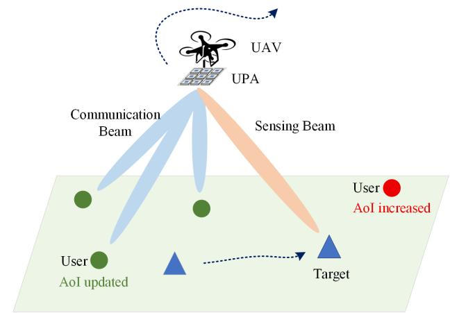  
Fig. 1. Illustration of the proposed UAV-enabled ISAC system.

## A. UAV and Antenna Array Geometry

The UAV is equipped with a UPA antenna consisting of $M = M _ { x } { \times } M _ { y }$ isotropic elements, spaced at half a wavelength in both axes, i.e. $d _ { x } = d _ { y } = \lambda / 2$ . Let $f _ { c }$ denote the carrier frequency and c the speed of light, such that $\lambda = c / f _ { c }$ . Each array element has a gain of $G _ { \mathrm { e l e m } }$ . The position of the UAV at time slot n is denoted as ${ \bf p } _ { u } [ n ] = [ x _ { u } [ n ] , y _ { u } [ n ] , H ]$ . The UAV is assumed to operate at a fixed altitude, following common practice in UAV-enabled communication and ISAC studies [24], [36]. The UAV is assumed to move with a maximum horizontal velocity of $v _ { \mathrm { m a x } }$ , where $\mathbf { v } _ { u } [ n ] \in \mathbb { R } ^ { 2 }$ denotes the UAV horizontal velocity at time slot $n ,$ and its maneuverability is further constrained by a maximum horizontal acceleration $a _ { \mathrm { m a x } }$

The angle-of-departure (AoD) from the UAV to user k is characterized by the azimuth $\psi _ { k } [ n ] \in [ - \pi , \pi ]$ and elevation $\vartheta _ { k } [ n ] \in [ 0 , \pi / 2 ]$ , calculated as

$$
\begin{array} { l } { \displaystyle \psi _ { k } [ n ] = \mathrm { a t a n 2 } \left( y _ { k } - y _ { u } [ n ] , x _ { k } - x _ { u } [ n ] \right) , } \\ { \displaystyle \vartheta _ { k } [ n ] = \operatorname { a r c c o s } \left( \frac { H } { \| \mathbf { p } _ { u } [ n ] - \mathbf { p } _ { k } \| } \right) . } \end{array}\tag{1}
$$

Based on the AoD pair, the corresponding beam steering vector to user k at time slot n is

$$
\mathbf { a } ( \psi _ { k } [ n ] , \vartheta _ { k } [ n ] ) = \mathbf { a } _ { y } ( \psi _ { k } [ n ] , \vartheta _ { k } [ n ] ) \otimes \mathbf { a } _ { x } ( \psi _ { k } [ n ] , \vartheta _ { k } [ n ] ) ,\tag{2}
$$

where ⊗ represents the Kronecker product of the steering vectors along the x-axis and y-axis

$$
\begin{array} { r l r } & { } & { \mathbf { a } _ { x } ( \psi _ { k } [ n ] , \vartheta _ { k } [ n ] ) = \big [ 1 , e ^ { - j \frac { 2 \pi d _ { x } } { \lambda } \sin ( \vartheta _ { k } [ n ] ) \cos ( \psi _ { k } [ n ] ) } , \ldots , } \\ & { } & { e ^ { - j \frac { 2 \pi d _ { x } } { \lambda } ( M _ { x } - 1 ) \sin ( \vartheta _ { k } [ n ] ) \cos ( \psi _ { k } [ n ] ) } \big ] , } \end{array}\tag{3}
$$

$$
\begin{array} { r l r } & { } & { \mathbf { a } _ { y } ( \psi _ { k } [ n ] , \vartheta _ { k } [ n ] ) = \big [ 1 , e ^ { - j \frac { 2 \pi d _ { y } } { \lambda } \sin ( \vartheta _ { k } [ n ] ) \sin ( \psi _ { k } [ n ] ) } , \allowbreak \cdot \cdot \cdot , } \\ & { } & { e ^ { - j \frac { 2 \pi d _ { y } } { \lambda } ( M _ { y } - 1 ) \sin ( \vartheta _ { k } [ n ] ) \sin ( \psi _ { k } [ n ] ) } \big ] . } \end{array}\tag{4}
$$

## B. Communication Model

Inspired by [37]–[39], we adopt a superimposed waveform design to enable simultaneous multi-user downlink communi-

cation and target sensing. Specifically, at time slot n, the total transmit signal from the UAV is given by

$$
{ \begin{array} { l } { \displaystyle \mathbf { x } [ n ] ~ = ~ \sum _ { \underbrace { k = 1 } _ { \mathrm { m u l t i - u s e r ~ c o m m u n i c a t i o n } } } ^ { K } + \underbrace { \mathbf { w } _ { \mathcal { T } } [ n ] ~ u _ { \mathcal { T } } [ n ] } _ { \mathrm { s e n s i n g / p r o b i n g } } , } \end{array} }\tag{5}
$$

where $u _ { k } [ n ]$ and $u \tau [ n ]$ are complex baseband waveforms $( \mathrm { e . g . }$ orthogonal code sequences or spread-spectrum signals). The beamforming vectors $\mathbf { w } _ { k } [ n ] \in \mathbf { \bar { C } } ^ { M \times 1 }$ and $\mathbf { w } _ { T } [ n ] \in \mathbb { C } ^ { M \times }$ 1 are defined as

$$
\begin{array} { r } { { \bf w } _ { i } [ n ] = \sqrt { P _ { i } [ n ] } { \bf v } _ { i } [ n ] , } \end{array}\tag{6}
$$

where $i \in \{ \mathcal { T } , 1 , \ldots , K \}$ , and $\mathbf { v } _ { i } [ n ]$ is the unit-norm beamforming direction vector, i.e., $\| \mathbf v _ { i } [ n ] \| _ { 2 } = 1$

Since all beams share the same RF front-end, the total instantaneous transmit power at time slot n must satisfy

$$
\sum _ { k } { P _ { k } [ n ] } + P _ { \mathcal { T } } [ n ] \leq P _ { \operatorname* { m a x } } .\tag{7}
$$

Moreover, we assume that any Doppler shift due to UAV mobility is perfectly compensated [14], [40]. The wireless channel from the UAV to user k follows a free-space path loss model described by the Friis transmission equation:

$$
\beta _ { k } [ n ] = \frac { G _ { \mathrm { e l e m } } G _ { \mathrm { u s e r } } \lambda ^ { 2 } } { ( 4 \pi d _ { u , k } [ n ] ) ^ { 2 } } ,\tag{8}
$$

where $d _ { u , k } [ n ] \ = \ \| \mathbf { p } _ { u } [ n ] - \mathbf { p } _ { k } \|$ is the Euclidean distance between the UAV and user k at time slot n. Here, $G _ { \mathrm { e l e m } }$ and $G _ { \mathrm { u s e r } }$ denote the antenna gains of the UAV and the singleantenna user k, respectively. The corresponding channel vector from the UAV to user k is expressed as

$$
\begin{array} { r } { { \bf h } _ { k } ^ { \mathrm { H } } [ n ] = \sqrt { \beta _ { k } [ n ] } e ^ { - j \frac { 2 \pi } { \lambda } d _ { u , k } [ n ] } { \bf a } ^ { \mathrm { H } } \big ( \psi _ { k } [ n ] , \vartheta _ { k } [ n ] \big ) . } \end{array}\tag{9}
$$

Under the assumption that the sensing waveform is orthogonal to the despreading code of user k [41], it does not contribute to the interference at the receiver. Hence, the signalto-interference-plus-noise ratio (SINR) at user k is given by

$$
\Gamma _ { k } [ n ] = \frac { | \mathbf { h } _ { k } ^ { \mathrm { H } } [ n ] \mathbf { w } _ { k } [ n ] | ^ { 2 } } { \sum _ { k ^ { \prime } \neq k } | \mathbf { h } _ { k } ^ { \mathrm { H } } [ n ] \mathbf { w } _ { k ^ { \prime } } [ n ] | ^ { 2 } + \xi _ { k } ^ { 2 } } ,\tag{10}
$$

where $\xi _ { k } ^ { 2 }$ is the receiver noise power at user k. A threshold $\Gamma _ { \mathrm { t h } }$ is established to guarantee reliable communication.

## C. Sensing Model

To detect and track the moving target, the UAV employs a dedicated probing beam characterized by the steering vector $\mathbf { v } _ { T } [ n ]$ . The directional gain towards the target is quantified by the one-way array factor gain:

$$
G _ { \mathrm { A F } } [ n ] = \left| { \bf a } ^ { \mathrm { H } } ( \psi _ { T } [ n ] , \vartheta _ { T } [ n ] ) { \bf v } _ { T } [ n ] \right| ^ { 2 } ,\tag{11}
$$

where $( \psi _ { T } [ n ] , \vartheta _ { T } [ n ] )$ denote the azimuth and elevation angles from the UAV to the target, computed as described in (1). The steering vector $\mathbf { a } ^ { \mathrm { H } } ( \psi _ { T } [ \bar { n } ] , \vartheta _ { T } [ n ] )$ is derived similarly to (2).

To model the received signal power, we extend the conventional single-antenna radar equation [42] by incorporating the

element gain $G _ { \mathrm { e l e m } }$ and the squared array factor (applied for both transmission and reception), yielding:

$$
P _ { r } [ n ] = \frac { P _ { T } [ n ] \left( G _ { \mathrm { e l e m } } G _ { \mathrm { A F } } [ n ] \right) ^ { 2 } \lambda ^ { 2 } \sigma _ { \mathcal { T } } } { ( 4 \pi ) ^ { 3 } \| \mathbf { p } _ { u } [ n ] - \mathbf { p } _ { \mathcal { T } } [ n ] \| ^ { 4 } } ,\tag{12}
$$

where $\sigma \tau$ denotes the radar cross-section (RCS) of the target.

Assuming coherent pulse integration at the receiver, the matched filter operates over a bandwidth B and integrates $N _ { p }$ pulses [42]. The thermal noise power is given by $k _ { \mathrm { B } } T _ { 0 } B \bar { F }$ where $k _ { \mathrm { B } }$ is the Boltzmann’s constant, $T _ { 0 }$ is the noise temperature, and F is the receiver noise figure. Consequently, the postdetection signal-to-noise ratio (SNR) per coherent processing interval is

$$
\mathrm { S N R } _ { p } [ n ] = \frac { P _ { r } [ n ] } { k _ { \mathrm { B } } T _ { 0 } B F } N _ { p } .\tag{13}
$$

In this work, the noise term in (13) is modeled as static and equivalent for analytical tractability [24]. In practice, the effective noise and interference power can be obtained via receiver calibration or noise-floor estimation to avoid overly optimistic sensing SNR evaluation.

1) Measurement model and reliability test: The radar processor converts the range–bearing measurements to horizontal Cartesian coordinates, yielding

$$
{ \bf z } [ n ] = { \bf p } _ { \cal T } ^ { \mathrm { h } } [ n ] \ + \ \Xi [ n ] , \quad \Xi [ n ] \sim { \mathcal N } \big ( { \bf 0 } , { \bf R } [ n ] \big ) .\tag{14}
$$

where ${ \bf p } _ { T } ^ { \mathrm { h } } [ n ] = ( x \tau , y \tau )$ is the target horizontal coordinates. $\Xi [ n ]$ denotes Gaussian measurement noise with zero mean and covariance matrix ${ \mathbf { R } } [ n ]$

Following the Cramer–Rao lower bound (CRLB) analysis´ in [23], [24], the measurement covariance matrix can be approximated by

$$
{ \bf R } [ n ] = \frac { \sigma _ { 0 } ^ { 2 } } { \mathrm { S N R } _ { p } [ n ] + \varepsilon } { \bf I } _ { 2 } , \quad \sigma _ { 0 } = \frac { c } { \sqrt { 8 } \pi B } ,\tag{15}
$$

where $\sigma _ { 0 }$ sets the high-SNR bound on range accuracy and B is the radar signal bandwidth. $\mathbf { I } _ { 2 }$ is the $2 \times 2$ identity matrix. $\mathrm { S N R } _ { p } [ n ]$ is the post-integration sensing SNR derived in (13) and a tiny constant $\varepsilon > 0$ avoids division by zero in numerical computations.

Let $\sigma _ { \mathrm { r e q } }$ denote the position accuracy threshold, defined as the maximum allowable 1-σ horizontal position error $( \mathrm { e . g . }$ 1 m). A Cartesian measurement is considered reliable when the standard deviation of each coordinate given by the diagonal of its covariance matrix ${ \mathbf { R } } [ n ]$ satisfies

$$
\sqrt { \mathrm { d i a g } ( { \bf R } [ n ] ) } \ \leq \ \sigma _ { \mathrm { r e q } } .\tag{16}
$$

where diag denotes the element-wise variance of the 2D measurement noise. This is equivalent to the SNR threshold based on (15)

$$
\begin{array} { r } { \mathrm { S N R } _ { p } [ n ] \geq \mathrm { S N R } _ { \mathrm { t h } } \triangleq \left( \frac { \sigma _ { 0 } } { \sigma _ { \mathrm { r e q } } } \right) ^ { 2 } . } \end{array}\tag{17}
$$

2) Kalman Filter-based Target State Estimation: We stack the target’s horizontal kinematics in

$$
\mathbf { s } _ { \mathcal { T } } [ n ] = \big [ x _ { \mathcal { T } } [ n ] , y _ { \mathcal { T } } [ n ] , v _ { x } [ n ] , v _ { y } [ n ] \big ] ^ { \mathsf { T } } .\tag{18}
$$

where $( x \tau , y \tau )$ and $( v _ { x } , v _ { y } )$ denote the target’s position and velocity, respectively. Assuming a nearly-constant-velocity (CV) model with time slot length $\delta _ { t } ,$ we have

$$
\begin{array} { r } { \mathbf { s } _ { \mathcal { T } } [ n + 1 ] = \mathbf { F } \mathbf { s } _ { \mathcal { T } } [ n ] + \mathbf { w } [ n ] , \mathbf { w } [ n ] \sim \mathcal { N } ( \mathbf { 0 } , \mathbf { Q } ) , } \end{array}\tag{19}
$$

where

$$
\mathbf { F } = \left[ \begin{array} { c c c c } { 1 } & { 0 } & { \delta _ { t } } & { 0 } \\ { 0 } & { 1 } & { 0 } & { \delta _ { t } } \\ { 0 } & { 0 } & { 1 } & { 0 } \\ { 0 } & { 0 } & { 0 } & { 1 } \end{array} \right] , \quad \mathbf { Q } = q _ { 0 } ^ { 2 } \mathbf { I } _ { 4 } ,\tag{20}
$$

where $q _ { 0 } ^ { 2 }$ tunes the model-mismatch level, and $\mathbf { I } _ { 4 }$ is the $4 \times 4$ identity matrix. The measurement in (14) can be written as

$$
\mathbf { z } [ n ] = \mathbf { H } \mathbf { s } _ { \mathcal { T } } [ n ] + \Xi [ n ] , \mathbf { H } = \left[ \begin{array} { l l l l } { 1 } & { 0 } & { 0 } & { 0 } \\ { 0 } & { 1 } & { 0 } & { 0 } \end{array} \right] .\tag{21}
$$

To predict the target’s state (position and velocity), we employ a standard discrete-time Kalman Filter (KF) [43], [44]. The CV target motion model and KF estimator provide a tractable and widely used representation of target dynamics; alternative target motion models can be accommodated by modifying the state transition, while the AoI formulation remains unchanged. Let $\hat { \mathbf { s } } _ { \mathcal { T } } [ n ] = [ \hat { x } _ { \mathcal { T } } [ n ] , \hat { y } _ { \mathcal { T } } [ n ] , \hat { v } _ { x } [ n ] , \hat { v } _ { y } [ n ] ] ^ { \mathsf { T } }$ be the state estimate at slot $n ,$ and ${ \bf C } [ n ]$ its error covariance. Each slot involves:

• Prediction step:

$$
\hat { \mathbf { s } } _ { T } ^ { - } [ n ] = \mathbf { F } \hat { \mathbf { s } } _ { T } [ n - 1 ] ,\tag{22}
$$

$$
\mathbf { C } ^ { - } [ n ] = \mathbf { F C } [ n - 1 ] \mathbf { F } ^ { \mathsf { T } } + \mathbf { Q } .\tag{23}
$$

• Gate on SNR: If $\mathrm { S N R } _ { p } [ n ] < \mathrm { S N R } _ { \mathrm { t h } }$ , set

$$
\hat { \mathbf { s } } _ { T } [ n ] = \hat { \mathbf { s } } _ { T } ^ { - } [ n ] , \quad \mathbf { C } [ n ] = \mathbf { C } ^ { - } [ n ]\tag{24}
$$

and skip the update.

• Update step (only when $\mathrm { S N R } _ { p } [ n ] \ \geq \ \mathrm { S N R } _ { \mathrm { t h } } ) { \mathrm { : } }$

$$
{ \bf K } [ n ] = { \bf C } ^ { - } [ n ] { \bf H } ^ { \top } \Big ( { \bf H } { \bf C } ^ { - } [ n ] { \bf H } ^ { \top } + { \bf R } [ n ] \Big ) ^ { - 1 } ,\tag{25}
$$

$$
\hat { \mathbf { s } } _ { \mathcal { T } } [ n ] = \hat { \mathbf { s } } _ { \mathcal { T } } ^ { - } [ n ] + \mathbf { K } [ n ] \big ( \mathbf { z } [ n ] - \mathbf { H } \hat { \mathbf { s } } _ { \mathcal { T } } ^ { - } [ n ] \big ) ,\tag{26}
$$

$$
{ \bf C } [ n ] = \left( { \bf I } _ { 4 } - { \bf K } [ n ] { \bf H } \right) { \bf C } ^ { - } [ n ] ,\tag{27}
$$

where superscript $^ { 6 6 } - ^ { 5 5 }$ indicates a predicted value before new measurements, and ${ \bf K } [ n ]$ is the Kalman gain. Notice that although the radar directly measures only position, the filter infers velocity through (19).

## D. Age of Information Model

The AoI characterizes the freshness of target state information delivered to the ground users. Let $\Delta _ { k } [ n ]$ denote the AoI of user k at the end of slot n. It represents the number of slots elapsed since the most recent target state was reliably sensed at the UAV and successfully decoded by user k.

Let $g [ n ]$ denote the slot index of the most recent effective sensing update. Its evolution follows

$$
g [ n ] = \left\{ { \begin{array} { l l } { n , } & { { \mathrm { i f ~ } } \mathrm { S N R } _ { p } [ n ] \geq \mathrm { S N R } _ { \mathrm { t h } } , } \\ { g [ n - 1 ] , } & { { \mathrm { o t h e r w i s e } } , } \end{array} } \right.\tag{28}
$$

with $g [ 1 ] = 1$ . Thus, $g [ n ]$ tracks the latest sensing opportunity whose measurement quality satisfies the radar reliability criterion.

User k receives a new update only when its downlink SINR exceeds the decoding threshold, i.e., $\Gamma _ { k } [ n ] \geq \Gamma _ { \mathrm { t h } } .$ Accordingly, the AoI evolves as

$$
\Delta _ { k } [ n ] = \left\{ { \begin{array} { l l } { n - g [ n - 1 ] , } & { { \mathrm { i f ~ } } \Gamma _ { k } [ n ] \geq \Gamma _ { \mathrm { t h } } , } \\ { { \Delta _ { k } [ n - 1 ] + 1 , } } & { { \mathrm { o t h e r w i s e } } , } \end{array} } \right.\tag{29}
$$

with $\Delta _ { k } [ 1 ] = 1$ . Hence, AoI of user $k$ resets to the age of the most recent effective sensing update if decoding succeeds; otherwise, it increases by one.

The average AoI of all users at time slot n is denoted as

$$
\bar { \Delta } [ n ] = \frac { 1 } { K } \sum _ { k = 1 } ^ { K } \Delta _ { k } [ n ] .\tag{30}
$$

Over the entire horizon of N slots, we define the long-term time-averaged AoI across all K users as

$$
\bar { \Delta } = \frac { 1 } { N } \sum _ { n = 1 } ^ { N } \bar { \Delta } [ n ] = \frac { 1 } { N K } \sum _ { n = 1 } ^ { N } \sum _ { k = 1 } ^ { K } \Delta _ { k } [ n ] .\tag{31}
$$

## E. Problem Formulation

Our objective is to jointly design the UAV’s trajectory and transmit beamforming to minimize the long-term average AoI at the ground users. The design variables are

$$
\{ \mathbf { p } _ { u } [ n ] , \{ \mathbf { w } _ { k } [ n ] \} _ { k \in \mathcal { K } } , \mathbf { w } _ { \mathcal { T } } [ n ] \} ,\tag{32}
$$

where $\mathbf { p } _ { u } [ n ]$ is the UAV’s position at time slot $n , \ \mathbf { w } _ { k } [ n ]$ is the communication beamforming vector for user k at slot $n ,$ and $\mathbf { w } _ { \mathcal { T } } [ n ]$ is the sensing beamform vector. The optimization problem is formulated as

$$
\mathbf { P 1 } : \operatorname* { m i n } _ { \{ \substack { \mathbf { p } _ { u } [ n ] , \{ \mathbf { w } _ { k } [ n ] \} _ { k \in \mathcal { K } , \mathbf { w } _ { \mathcal { T } } [ n ] } \} } } \bar { \Delta } = \frac { 1 } { K N } \sum _ { k = 1 } ^ { K } \sum _ { n = 1 } ^ { N } \Delta _ { k } [ n ]
$$

$$
\mathrm { s . t . } \quad \mathbf { C } \mathbf { 1 } \colon \sum _ { k = 1 } ^ { K } \| \mathbf { w } _ { k } [ n ] \| ^ { 2 } + \| \mathbf { w } _ { \mathcal { T } } [ n ] \| ^ { 2 } \leq P _ { \operatorname* { m a x } } ,
$$

$$
\begin{array} { r l } & { \mathrm { C 2 : ~ } \| \mathbf { p } _ { u } [ n + 1 ] - \mathbf { p } _ { u } [ n ] \| \leq v _ { \operatorname* { m a x } } \delta _ { t } , } \\ & { \mathrm { C 3 : ~ } \| \mathbf { v } _ { u } [ n + 1 ] - \mathbf { v } _ { u } [ n ] \| \leq a _ { \operatorname* { m a x } } \delta _ { t } , } \\ & { \mathrm { C 4 : ~ } ( 2 8 ) \mathrm { ~ a n d ~ } ( 2 9 ) , } \end{array}\tag{33}
$$

where constraint C1 enforces the per-slot transmit power limit, C2 and C3 regulate the UAV’s mobility, and C4 defines the AoI update rule.

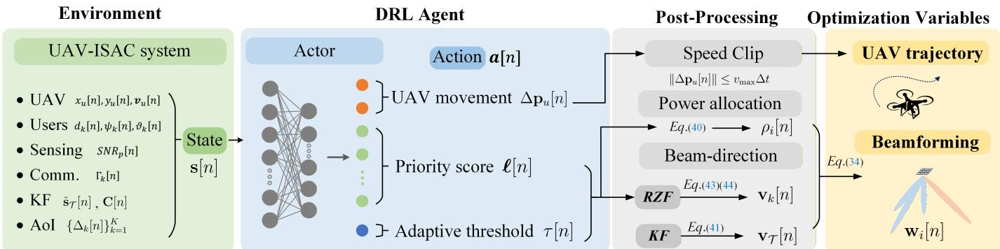  
Fig. 2. DRL-based decision-making process of the UAV-ISAC system.

## III. PROPOSED DRL-BASED JOINT UAV TRAJECTORY AND BEAM CONTROL

This section presents a novel DRL-based approach to address the joint UAV trajectory and beamforming optimization problem formulated in (33). First, the overall solution architecture is outlined. Then, the joint optimization problem is reformulated as a DRL-driven sequential decision-making process with well-defined state, action, and reward structures. Subsequently, we introduce post-processing modules for power allocation and beam synthesis based on the DRL output. Finally, the complete soft actor-critic-based training pipeline is detailed.

## A. Solution Architecture

We employ DRL to jointly optimize the variables defined in (32). Fig. 2 illustrates the per-slot decision making of the UAV trajectory and beamforming: (i) Environment observes state; (ii) DRL agent outputs UAV motion, priority scores, and adaptive threshold; and (iii) Post-processing maps to power/beam and forms the final transmit vector.

For the UAV trajectory, the DRL agent directly outputs the UAV’s next position at each time slot, while ensuring compliance with the velocity constraint.

For the beamforming, we reformulate the beamforming vector in (6) as:

$$
\begin{array} { r } { { \bf w } _ { i } [ n ] = \sqrt { \rho _ { i } [ n ] P _ { \mathrm { m a x } } } { \bf v } _ { i } [ n ] , i \in \{ \mathcal { T } , 1 , . . . , K \} , } \end{array}\tag{34}
$$

where $\rho _ { i } [ n ] \ \in \ [ 0 , 1 ]$ denotes the power allocation ratio for user or target i, subject to $\textstyle \sum _ { i } \rho _ { i } [ n ] = 1$ , and $\mathbf { v } _ { i } [ n ]$ represents the beam direction vector. As such, the beamforming vector is constructed by jointly determining both the power allocation and direction for each beam.

For beam power allocation, due to the practical constraints in UAV-ISAC systems such as limited transmission power, finite antenna array size, and UAV position, not all users or targets can be effectively served in every time slot. Therefore, the DRL agent outputs a set of priority scores $\ell [ n ]$ for all beams (covering both the target and the users), along with an adaptive threshold τ , to guide the allocation of power shares. The detailed power allocation strategy is described in Section III-C1.

For beam direction control, we exploit the known locations of communication users and apply regularized zero forcing (RZF) to mitigate inter-user interference. For the sensing target, whose position is unknown and dynamic, we leverage KF to predict its location and direct the sensing beam accordingly. The beam direction design methodology is detailed in Section III-C2.

## B. DRL-Based Decision Making

The joint trajectory–beamforming problem (P1) seeks to minimize the long-term average AoI subject to UAV mobility constraints, per-slot power limits, strong space–time coupling among users and beams, and stochastic target dynamics. Due to its high dimensionality, non-convexity, and partially unknown environment, direct optimization is impractical. We therefore recast it as a finite-horizon MDP [45], enabling a learning-driven solution via DRL.

1) From Optimization (P1) to Reinforcement Learning (RL) Reformulation: RL treats the controller as an agent that continuously interacts with an environment. The agent–environment interaction can be mathematically formulated as a finite MDP, defined by the tuple $\mathcal { M } = \langle { \mathcal { S } } , { \mathcal { A } } , { \mathcal { P } } , { \mathcal { R } } , \gamma , N \rangle$ , where S and A are the state and action spaces, ${ \mathcal { P } } : { \mathcal { S } } \times { \mathcal { A } }  { \mathcal { P } } ( { \mathcal { S } } )$ is the transition kernel $p ( \mathbf { s } [ n + 1 ] \mid \mathbf { s } [ n ] , \mathbf { a } [ n ] )$ $\mathcal { R } : \mathcal { S } \times \mathcal { A }  \mathbb { R }$ is the instantaneous reward, $\gamma \in \mathsf { \Gamma } ( 0 , 1 ]$ the discount factor, and N the episode length (same as the number of time slots in the system model). At decision epoch $n ,$ the DRL agent observes $\mathsf { s } [ n ] \in { \cal S }$ , executes action $\mathbf { a } [ n ] \in { \mathcal { A } } ,$ , receives reward $r [ n ] = \mathcal { R } ( \mathbf { s } [ n ] , \mathbf { a } [ n ] )$ , and the environment draws ${ \mathbf s } [ n + 1 ] \sim$ $\mathcal { P } ( \cdot \mid \mathbf { s } [ n ] , \mathbf { a } [ n ] )$ . The agent seeks a policy $\pi : S  { \mathcal { P } } ( A )$ that maximises the expected return $\scriptstyle \sum _ { n = 1 } ^ { N ^ { \bullet } } \gamma ^ { \dot { n } - 1 } r [ n ]$

In our UAV-ISAC system, the environment comprises the UAV-enabled ISAC system, including the elements such as the UAV, K ground users, the sensing target, the communication/sensing processing, and the AoI update rule. The agent is the decision maker (a neural network policy $\pi _ { \pmb { \theta } }$ discussed in Section III-D) to output trajectory and beamforming strategy. The following subsections detail the designed MDP.

2) State $\mathbf { s } [ n ] .$ : The state vector s[n] serves as a minimal sufficient statistic for per-slot decision-making by the UAV. It compactly encodes all relevant mobility, communication, and

sensing information at slot n:

$$
\begin{array} { r l } & { \mathbf { s } [ n ] = \underbrace { \big [ \underbrace { x _ { u } [ n ] , y _ { u } [ n ] , \mathbf { v } _ { u } [ n ] } _ { \mathrm { U A V } } , } _ { \mathrm { U A V } } ] , } \\ & { \underbrace { \big \{ d _ { k } [ n ] , \psi _ { k } [ n ] , \vartheta _ { k } [ n ] , \Gamma _ { k } [ n ] , \Delta _ { k } [ n ] \big \} _ { k = 1 } ^ { K } } _ { \mathrm { U s e r s } } , } \\ & { \underbrace { \widehat { \mathbf { s } } _ { \mathcal { T } } [ n ] , \mathrm { S N R } _ { p } [ n ] } _ { \mathrm { T a r g e t } } , \underbrace { \mathrm { d i a g } ( \mathbf { C } [ n ] ) , \mathrm { t r } ( \mathbf { C } [ n ] ) } _ { \mathrm { K F ~ U n c e r t a i n t y } } , \underbrace { \bar { \Delta } [ n ] , \varrho [ n ] } _ { \mathrm { G l o b a l } } ] , } \end{array}\tag{35}
$$

where the individual components are organized into five functional groups:

• UAV: the $\mathrm { U A V } \mathbf { \dot { s } }$ horizontal position $( x _ { u } [ n ] , y _ { u } [ n ] )$ and velocity $\mathbf { v } _ { u } [ n ] ;$

• Users: users’ relative geometry $( d _ { k } [ n ] , \psi _ { k } [ n ] , \vartheta _ { k } [ n ] )$ , instantaneous downlink SINR $\Gamma _ { k } [ n ]$ , and AoI $\Delta _ { k } [ n ]$ jointly reflecting link quality and service urgency;

• Target: the KF estimate $\hat { \mathbf { s } } _ { \mathcal { T } } [ n ]$ and the pulse-compressed radar $\mathrm { S N R } _ { p } [ n ]$ , indicating sensing accuracy and echo strength;

• KF Uncertainty: The element-wise variance diag $\left( \mathbf { C } [ n ] \right)$ and total variance $\operatorname { t r } ( \mathbf { C } [ n ] )$ derived from the covariance matrix $\mathbf { C } [ n ]$ , which together quantify estimation uncertainty;

• Global: the average AoI $\bar { \Delta } [ n ]$ and the normalized progress index $\varrho [ n ] \triangleq n / N$ provide mission-level temporal context.

The overall dimension of the MDP state vector in (35) is $d _ { s } = 5 K + 1 6$ , where the user-related components scale linearly with the number of users K, and all remaining components have fixed dimensions. This structured representation enables the DRL agent to access all relevant local and global context while keeping the overall state dimension manageable for continuous-control training. The adopted assumptions on user mobility and UAV altitude mainly affect the state transition of the MDP, while the AoI update rules and the AoI-driven control objective remain unchanged.

3) Action ${ \mathbf a } [ n ]$ : Rather than learning a full complex-valued beam vector, we output

$$
\mathbf { a } [ n ] = { \big [ } \Delta \mathbf { p } _ { u } [ n ] , \ell [ n ] , \tau [ n ] { \big ] } .\tag{36}
$$

$\Delta \mathbf { p } _ { u } [ n ] \in \mathbb { R } ^ { 2 }$ specifies the commanded horizontal motion of the UAV. The UAV mobility constraints are enforced at the environment execution level by projecting the commanded motion onto the feasible set defined by the maximum velocity and acceleration constraints before updating the UAV position.

$\bar { \ell [ n ] } = \bar { [ \ell _ { T } [ n ] , \ell _ { 1 } [ \bar { n } ] , \dots , \ell _ { K } [ n ] ] } \in \mathbb { R } ^ { K + 1 }$ is the priority score vector, which consists of one sensing-related logit $\ell \tau [ n ]$ for the target beam and K communication-related logits $\{ \ell _ { k } [ n ] \} _ { k = 1 } ^ { K }$ for the user beams.

$\tau [ n ] \in \mathbb { R }$ represents the adaptive threshold, which together with $\ell [ n ]$ compactly encodes the joint sensing and communication power-allocation intentions via (40).

4) Transition kernel P: Given $( \mathbf { s } [ n ] , \mathbf { a } [ n ] )$ , the next state s[n+1] is obtained by propagating the current variables through the physical models specified in Section II, such as

UAV and target movement, users’ SINR calculation, sensing measurement, KF estimation, and AoI updating.

5) Reward Function: The RL agent is trained to minimize the network-wide AoI, which is equivalently realized by maximizing the negative AoI:

$$
r [ n ] = - \bar { \Delta } [ n ] .\tag{37}
$$

Over an episode of N slots, the agent therefore maximises the expected return $\scriptstyle \sum _ { n = 1 } ^ { N } \gamma ^ { n - 1 } r [ n ]$ with discount factor $\gamma \in ( 0 , 1 )$ , leading to UAV trajectories and beam-control actions that jointly keep user information fresh and the sensing beam on target, thus solving the optimization problem in (33).

## C. Power Allocation and Beam Design

At each slot $n ,$ the DRL agent outputs the continuous action vector $\mathbf { a } [ n ] = [ \Delta \mathbf { p } _ { u } [ n ] , \ell [ n ] , \tau [ n ] ]$ . The components $\ell [ n ]$ and threshold τ [n] jointly determine the power allocation and beam directions for the sensing task and user communication, as described below.

1) Power allocation: The sensing beam (target beam) is always scheduled, independent of the threshold. The set of scheduled users is explicitly determined by comparing each user’s logit $\ell _ { k } [ n ]$ with the threshold $\tau [ n ]$

$$
\mathcal { U } [ n ] = \{ k \mid \ell _ { k } [ n ] \geq \tau [ n ] \} .\tag{38}
$$

To avoid the degenerate scenario where no user is scheduled, if $\mathcal { U } [ n ]$ is empty, the user with the highest logit is selected by

$$
\mathcal { U } [ n ] = \{ \arg \operatorname* { m a x } _ { k } \ell _ { k } [ n ] \} , \quad \mathrm { i f } \quad | \mathcal { U } [ n ] | = 0 .\tag{39}
$$

Applying a softmax function to the logits yields the powersplitting ratios for all beams as

$$
\begin{array} { r } { \rho _ { i } [ n ] = \left\{ \begin{array} { l l } { \frac { \exp ( \ell _ { i } [ n ] ) } { \sum _ { j \in \{ \mathcal { T } \} \cup \mathcal { U } [ n ] } \exp ( \ell _ { j } [ n ] ) } , } & { i \in \{ \mathcal { T } \} \cup \mathcal { U } [ n ] , } \\ { 0 , } & { \mathrm { o t h e r w i s e } . } \end{array} \right. } \end{array}\tag{40}
$$

The threshold-based selection in (38) and (39) determines the active beam set, while the Softmax mapping in (40) distributes the available power among the selected beams. Together, these steps prevent degenerate scheduling behaviors and avoid extreme power allocation without introducing additional tuning parameters.

2) Beam-direction synthesis: The sensing beam direction is computed directly using angles predicted by the KF, denoted as a function of $( \psi \tau [ n ] , \vartheta \tau [ n ] )$

$$
\mathbf { v } _ { T } [ n ] = \frac { \mathbf { a } ( \psi _ { T } [ n ] , \vartheta _ { T } [ n ] ) } { \| \mathbf { a } ( \psi _ { T } [ n ] , \vartheta _ { T } [ n ] ) \| _ { 2 } } .\tag{41}
$$

To generate beamforming directions for scheduled users, we adopt the RZF approach. Let $\mathbf { H } _ { \mathcal { U } } [ n ] \in \mathbb { C } ^ { | \mathcal { U } [ n ] | \times M }$ collect their conjugate-transpose channel vectors. Define the adaptive regularization factor as

$$
\alpha [ n ] = \operatorname* { m a x } \left( 1 0 ^ { - 9 } , \frac { | \mathcal { U } [ n ] | \xi _ { k } ^ { 2 } } { \sum _ { k \in \mathcal { U } [ n ] } P _ { k } [ n ] } \right) ,\tag{42}
$$

Algorithm 1: SAC-Based Joint UAV Trajectory and   
Beam Control   
Input: $N , \gamma ,$ Training max episodes $E ,$ initial temperature κ0, ${ \mathcal { H } } _ { \mathrm { t a r } } ,$   
learning rates ηθ, ηϕ, ηκ, mini-batch size D, update-interval   
Iupdate, grad-repeat J   
Output: Trained actor parameters $\pmb { \theta } ^ { * }$   
1 Initialization:   
2 Initialise actor $\pi _ { \theta } ,$ critics $Q _ { \phi _ { 1 } } , Q _ { \phi _ { 2 } } ,$   
3 target critics $\hat { Q } _ { \bar { \phi } _ { 1 } } , \hat { Q } _ { \bar { \phi } _ { 2 } } \gets Q _ { \phi _ { 1 } } , Q _ { \phi _ { 2 } } ;$   
4 Initialise temperature $\kappa \gets \kappa _ { 0 } ;$ replay buffer $B  \varnothing .$   
5 for e= 1 to E do   
6 Reset environment; obtain initial state $\mathbf { s } [ 1 ] ; R _ { e } \gets 0 .$   
7 for n= 1 to N do   
8 Sample action $\mathbf { a } [ n ] { \sim } \pi \pmb { \theta } ( \cdot | \mathbf { s } [ n ] )$   
9 UAV position: $\dot { \mathbf { p } _ { u } } [ n + 1 ] \stackrel { . } { = } \mathbf { p } _ { u } [ n ] + \Delta \mathbf { p } _ { u } [ n ]$ under   
velocity and acceleration constraint.   
10 Power allocation: {ρi[n]} via (40).   
11 Sensing beam: vT [n] by KF estimation (41);   
12 User beams: $\mathbf { v } _ { k } [ n ]$ via RZF (43)–(44).   
13 Beamforming vector: wi[n] (34);   
14 Environment Interaction:   
15 Reward $r [ n ] = - \bar { \Delta } [ n ] ;$   
16 Next state $\mathrm { \bf s } [ n + 1 ] .$ , set done $ ( n = = N )$   
17 Store (s[n], a[n], r[n], s[n+1], done) in B;   
18 $R _ { e } \gets \dot { R _ { e } } + r \dot { [ n ] }$   
19 $\mathbf { i f } \ | \boldsymbol { B } | \ge \mathcal { D }$ and n mod $I _ { \mathrm { u p d a t e } } = 0$ then   
20 for $j = 1$ to $\mathcal { T }$ do   
21 Sample mini-batch D from B;   
22 Compute y[n] (47), L (48), Lπ (49), Lκ (50);   
23 end   
24 Gradient steps for actor, critic, temperature (51)   
25 Soft update for target net (52).   
26 end   
27 end   
28 end   
29 return θ∗

where $\xi _ { k } ^ { 2 }$ is the receiver noise variance. The unnormalized beamforming matrix is

$$
\widetilde { { \mathbf V } } _ { \mathcal { U } } [ n ] = { \mathbf H } _ { \mathcal { U } } ^ { { \mathrm H } } [ n ] \big ( { \mathbf H } _ { \mathcal { U } } [ n ] { \mathbf H } _ { \mathcal { U } } ^ { { \mathrm H } } [ n ] + \alpha [ n ] { \mathbf I } \big ) ^ { - 1 } .\tag{43}
$$

where I denotes the identity matrix. Each user’s beam direction is then normalized as

$$
\mathbf { v } _ { k } [ n ] = \frac { \widetilde { \mathbf { v } } _ { k } [ n ] } { \| \widetilde { \mathbf { v } } _ { k } [ n ] \| _ { 2 } } , \quad k \in \mathcal { U } [ n ] ,\tag{44}
$$

where $\widetilde { \mathbf { v } } _ { k } [ n ]$ is the corresponding column of $\widetilde { { \mathbf V } } _ { \mathcal { U } } [ n ]$ . The beamforming vectors for the remaining unscheduled users $( k \notin \mathcal { U } [ n ] )$ are explicitly set to zero vectors. Thus, the overall beamforming matrix consists of the sensing beam vector, scheduled users’ beam vectors, and zero vectors for unscheduled users. For large-scale arrays, the RZF step can be implemented via standard low-complexity approximations (e.g., iterative solvers or truncated matrix inversion), while the proposed DRL-based decision framework remains unchanged.

## D. Soft Actor-Critic (SAC)-based Agent Training

This subsection describes how the agent is trained to obtain an effective policy using the soft actor-critic (SAC) algorithm [46], which is well-suited for continuous control and provides stable learning through entropy-regularized policy optimization. We first outline the actor–critic (AC) structure, then highlight SAC’s advantages, and finally detail the network design and update rules.

1) Overview and Rationale: AC methods employ a policy network (actor) for action selection and a value network (critic) to evaluate these actions. SAC is a variant of AC, which is well-suited for UAV-ISAC tasks due to its training stability and efficient exploration. It employs two critics to reduce overestimation bias and incorporates entropy regularization with automatic temperature adjustment, enabling balanced exploration–exploitation. This facilitates more accurate trajectory and beamforming policies over time.

2) Neural-Network Architectures: Both the actor and critics are parameterized by neural networks. Below are the key components:

a) Actor πθ: We maintain a parameterized policy πθ that outputs a distribution over a[n] given s[n]. In our case, $\pi _ { \theta }$ is a neural network producing the mean $\mu ( \mathbf { s } [ n ] )$ and log-standard-deviation log $\sigma ( \mathbf { s } [ n ] )$ of a multivariate Gaussian, from which we sample an action and map it (e.g., via tanh) into a valid control range. Through training, the parameters θ are optimized to maximize the expected return, and the final policy is denoted by the optimal parameters $\pmb { \theta } ^ { * }$

b) Twin Critics $Q _ { \phi _ { 1 } } , Q _ { \phi _ { 2 } }$ & Target Critics: Each critic $Q _ { \phi _ { i } }$ approximates the action-value function

$$
Q ^ { \pi } ( \mathbf { s } [ n ] , \mathbf { a } [ n ] ) \ = \ \mathbb { E } _ { \pi } \bigg [ \sum _ { k = 0 } ^ { \infty } \gamma ^ { k } r [ n + k ] \ \Big | \ \mathbf { s } [ n ] , \mathbf { a } [ n ] \bigg ] ,\tag{45}
$$

In SAC, we use two critics, $Q _ { \phi _ { 1 } }$ and $Q _ { \phi _ { 2 } }$ , to reduce overestimation. Each critic is a neural network mapping $( \mathbf { s } [ n ] , \mathbf { a } [ n ] )$ to a scalar Q-value. To stabilize learning, we maintain an additional set of slowly-updated copies $\{ \hat { Q } _ { \bar { \phi } _ { 1 } } , \hat { Q } _ { \bar { \phi } _ { 2 } } \}$ , often called target critics. They are initialized with $\phi _ { i } = \phi _ { i }$ and kept close to the online critics via a soft update rule described later in (52).

3) SAC Training Mechanism: Algorithm 1 summarizes the complete SAC-based training procedure. SAC maximizes the following objective that combines reward and policy entropy:

$$
J _ { \pi } = \mathbb { E } \Big [ \sum _ { n = 1 } ^ { N } \gamma ^ { n - 1 } \Big ( r [ n ] + \kappa \mathcal { H } ( \pi ( \mathbf { a } [ n ] | \mathbf { s } [ n ] ) ) \Big ) \Big ] ,\tag{46}
$$

where $\kappa > 0$ balances exploitation (maximizing reward) and exploration (maximizing entropy H(·)).

a) Critics Update: When training the critics, we form a Temporal-Difference (TD) target using a mini-batch of transitions $( \mathbf { s } [ n ] , \mathbf { a } [ n ] , r [ n ] , \mathbf { s } [ n + 1 ] , \mathrm { d o n e } )$ sampled from a replay buffer, where done indicates whether state $\mathbf { s } [ n + 1 ]$ is terminal (end of episode)

$$
\begin{array} { c } { { y [ n ] = r [ n ] + \gamma \left( 1 - \mathrm { d o n e } \right) \left[ \displaystyle \operatorname* { m i n } _ { j } \hat { Q } _ { \bar { \phi } _ { j } } \left( \mathbf { s } [ n + 1 ] , \mathbf { a } [ n + 1 ] \right) \right. } } \\ { { \left. - \kappa \log \pi _ { \theta } \left( \mathbf { a } [ n + 1 ] \mid \mathbf { s } [ n + 1 ] \right) \right] , } } \end{array}\tag{47}
$$

where $\mathbf { a } [ n + 1 ]$ is drawn from the current policy $\pi _ { \pmb { \theta } } ( \mathbf { s } [ n + 1 ] )$ and $\hat { Q } _ { \bar { \phi } _ { j } }$ are target networks (softly updated copies of $Q _ { \phi _ { j } } )$ . Each critic $Q _ { \phi _ { i } }$ is updated by minimizing

$$
\begin{array} { r } { \mathcal { L } _ { Q } \ = \ \frac { 1 } { 2 } \displaystyle \sum _ { i = 1 } ^ { 2 } \mathbb { E } _ { \mathcal { B } } \Big [ \big ( Q _ { \phi _ { i } } ( \mathbf { s } [ n ] , \mathbf { a } [ n ] ) \ - \ y [ n ] \big ) ^ { 2 } \Big ] . } \end{array}\tag{48}
$$

b) Actor Update: The actor is then updated to maximize the Q-value and maintain high entropy. Specifically, we minimize

$$
\begin{array} { c } { { { \mathcal { L } } _ { \pi } ~ = ~ \mathbb { E } _ { \mathcal { B } } \Big [ \kappa ~ \log \pi _ { \theta } \big ( { \bf a } [ n ] ~ | ~ { \bf s } [ n ] \big ) ~ - ~ Q _ { \phi _ { 1 } } \big ( { \bf s } [ n ] , { \bf a } [ n ] \big ) \Big ] , } } \\ { { { \bf a } [ n ] \sim \pi _ { \theta } ( { \bf s } [ n ] ) . } } \end{array}\tag{49}
$$

c) Temperature Tuning: We also learn κ online to meet a target entropy $\mathcal { H } _ { \mathrm { t a r } }$

$$
\mathcal { L } _ { \kappa } = \mathbb { E } _ { \mathcal { B } } \Big [ \kappa \left( - \log \pi _ { \theta } \big ( { \bf a } [ n ] \mid { \bf s } [ n ] \big ) - \mathcal { H } _ { \mathrm { t a r } } \right) \Big ] .\tag{50}
$$

4) Replay Buffer and Update Frequency: To stabilize training and improve sample efficiency, we employ an experience replay buffer B that stores transitions $( \mathbf { s } [ n ] , \mathbf { a } [ n ] , r [ n ] , \mathbf { s } [ n + 1 ]$ , done). The replay buffer reduces temporal correlations by uniformly sampling from a large memory pool. Parameter updates occur every $I _ { \mathrm { u p d a t e } }$ steps once the buffer contains at least D transitions. Each update involves sampling a mini-batch of size D and repeating gradient descent steps $\mathcal { I }$ times to enhance learning stability.

5) Gradient-Based Parameter Updates: Given the previously defined loss functions (see (48), (49), and (50)), the gradient-based parameter updates at each training iteration are explicitly formulated as follows:

$$
\begin{array} { r l } & { \phi _ { i }  \phi _ { i } - \eta _ { \phi } \nabla _ { \phi _ { i } } \mathcal L _ { Q } , \quad i = 1 , 2 , } \\ & { \theta  \theta - \eta _ { \theta } \nabla _ { \theta } \mathcal L _ { \pi } , } \\ & { \kappa  \kappa - \eta _ { \kappa } \nabla _ { \kappa } \mathcal L _ { \kappa } . } \end{array}\tag{51}
$$

where $\eta _ { \theta } , \eta _ { \phi }$ , and $\eta _ { \kappa }$ are the learning rates for the actor, critic, and entropy temperature $\kappa ,$ respectively.

The target critics $\hat { Q } _ { \bar { \phi } _ { i } }$ are slowly synchronized with the primary critics:

$$
\bar { \phi } _ { i }  \eta _ { s } \phi _ { i } \ : + \ : ( 1 - \eta _ { s } ) \bar { \phi } _ { i } ,\tag{52}
$$

where $\eta _ { s }$ is the soft-update coefficient, typically small to ensure stable TD targets.

6) Complexity Analysis: The Markov state and action dimensions are $d _ { \mathrm { s } } = 5 K + 1 6$ and $d _ { \mathrm { a } } = K + 4$ . For a two-hiddenlayer fully connected actor network with hidden width $N _ { \mathrm { h } }$ one forward pass has complexity $F _ { \pi } = d _ { \mathrm { s } } N _ { \mathrm { h } } + N _ { \mathrm { h } } ^ { 2 } + 2 d _ { \mathrm { a } } N _ { \mathrm { h } }$ Each critic incurs $F _ { Q } = ( d _ { \mathrm { s } } + d _ { \mathrm { a } } ) N _ { \mathrm { h } } + N _ { \mathrm { h } } ^ { 2 } + N _ { \mathrm { h } }$ , and SAC involves two critics per update, up to a constant factor due to backpropagation.

At each time slot, environment interaction includes KF update, channel generation, power allocation, beamforming, and SINR evaluation. The KF operates on a fixed-dimensional target state $( d _ { \mathbf { s } _ { \mathcal { T } } } ~ = ~ 4 )$ and thus has constant complexity O(1). Channel generation requires $\mathcal { O } ( K M )$ operations, while softmax-based power allocation incurs $\mathcal { O } ( | \mathcal { U } [ n ] | )$ ). RZF precoding over the scheduled user set $\mathcal { U } [ n ]$ yields complexity $\mathcal { O } ( \vert \mathcal { U } [ n ] \vert ^ { 2 } M + \vert \mathcal { U } [ n ] \vert ^ { 3 } )$ . SINR computation over scheduled users incurs $\mathcal { O } ( | \mathcal { U } [ n ] | ^ { 2 } M )$ ). Therefore, the per-slot environment interaction complexity is $\mathcal { O } ( F _ { \pi } + K M + \vert \bar { \mathcal { U } } [ n ] \vert ^ { 2 } M + \vert \mathcal { U } [ n ] \vert ^ { 3 } )$

During training, an episode of N slots incurs $\mathcal { O } ( N F _ { \mathrm { e n v } } )$ complexity, and network updates performed every $I _ { \mathrm { u p d } }$ slots, repeated J times with batch size $D ,$ add $\begin{array} { r l } { ) } & { { } \mathcal { O } \Bigl ( \frac { N J D } { I _ { \mathrm { u p d } } } ( F _ { \pi } + 2 F _ { Q } ) \Bigr ) } \end{array}$ . Hence, the total training complexity per episode is $\begin{array} { r } { \mathcal { O } \Big ( N F _ { \mathrm { e n v } } + \frac { N J D } { I _ { \mathrm { u p d } } } ( F _ { \pi } + 2 F _ { Q } ) \Big ) } \end{array}$ . After training, the per-slot inference complexity is $\mathcal { O } ( F _ { \mathrm { e n v } } ) \dot { }$

DEFAULT PARAMETERS IN SIMULATION.  
TABLE I
<table><tr><td>Symbol</td><td>Physical meaning</td><td>Default Value</td></tr><tr><td> $K$ </td><td>Number of ground users</td><td>6</td></tr><tr><td>N</td><td>Number of time-slots</td><td>60</td></tr><tr><td> $\delta _ { t }$ </td><td>Slot duration</td><td>1 s</td></tr><tr><td> $v _ { \mathrm { m a x } }$ </td><td>UAV max horizontal speed</td><td> $2 0 \mathrm { m } / \mathrm { s }$ </td></tr><tr><td> $a _ { \mathrm { m a x } }$ </td><td>UAV max horizontal acceleration</td><td> $8 \mathrm { m } / \mathrm { \dot { s } ^ { 2 } }$ </td></tr><tr><td> $H$ </td><td>UAV altitude</td><td> $5 0 \mathrm { { m } }$ </td></tr><tr><td> $M _ { x }$ </td><td>UPA elements (x-axis)</td><td>4</td></tr><tr><td> $M _ { y }$ </td><td>UPA elements (y-axis)</td><td>4</td></tr><tr><td> $f _ { c }$ </td><td>Carrier frequency</td><td>2 GHz</td></tr><tr><td> $P _ { \mathrm { m a x } }$ </td><td>Max transmit power</td><td>20 dBm</td></tr><tr><td> $G _ { \mathrm { e l e m } }$ </td><td>Per-element antenna gain</td><td>3 dBi</td></tr><tr><td> $G _ { \mathrm { u s e r } }$ </td><td>User antenna gain</td><td>0 dBi</td></tr><tr><td> $\xi _ { k } ^ { 2 }$ </td><td>Receiver noise power</td><td>-90 dBm</td></tr><tr><td> $\Gamma _ { \mathrm { t h } }$ </td><td>SINR decoding threshold</td><td>10 dB</td></tr><tr><td> $\sigma \tau$ </td><td>Target radar cross-section</td><td> $1 \mathrm { m ^ { 2 } }$ </td></tr><tr><td> $T _ { 0 }$ </td><td>System temperature</td><td>290 K</td></tr><tr><td> $B$ </td><td>Matched-filter bandwidth</td><td>100 MHz</td></tr><tr><td> $F$ </td><td>Receiver noise figure</td><td>20 dB</td></tr><tr><td> $N _ { p }$ </td><td>Pulses per slot</td><td>32</td></tr><tr><td> $\sigma _ { 0 }$ </td><td>Single-pulse range bound</td><td>0.338 m</td></tr><tr><td> $\sigma _ { \mathrm { r e q } }$ </td><td>Required 1-σ accuracy</td><td>1m</td></tr><tr><td> $q _ { 0 _ { \tau } } ^ { \angle }$ </td><td>Process-noise variance</td><td>0.25</td></tr><tr><td> $V _ { \mathrm { m a x } }$ </td><td>Target max speed</td><td>15m/s</td></tr><tr><td> $\gamma$ </td><td>Discount factor</td><td>0.99</td></tr><tr><td> $\eta _ { \theta } , \eta _ { \phi } , \eta _ { \kappa }$ </td><td>Learning rates</td><td>0.0003</td></tr><tr><td> $\eta _ { s }$ </td><td>Soft-update coefficient</td><td>0.01</td></tr></table>

## IV. PERFORMANCE EVALUATION

## A. Simulation Setup

The key simulation settings that govern the dynamics, initialization, and evaluation of the UAV-enabled ISAC system are summarized in Table I. Each simulation episode spans $N ~ = ~ 6 0$ discrete time slots, with a slot duration of $\delta _ { t } ~ = ~ 1 \mathrm { s . } ~ \mathrm { A t }$ the beginning of every episode, $K \ = \ 6$ ground users are uniformly and independently distributed within a 1,600 m × 1,600 m square region. These users are considered to remain stationary throughout the episode. To ensure a fair comparison across different algorithms, we generate 100 distinct random user layouts using seeds ranging from 100 to 199 and reuse these layouts across all schemes. The UAV starts each episode at a perturbed position near the initial location of the ground target, mimicking a realistic scenario in which the UAV is pre-deployed near the object of interest. Specifically, the initial UAV location is given by ${ \bf p } _ { u } [ 0 ] = { \bf p } _ { 0 } + \Delta { \bf p } , \quad \Delta { \bf p } \sim \mathcal { N } ( { \bf 0 } , 1 0 ^ { 2 } { \bf I } _ { 2 } )$ , where $\mathbf { p } _ { 0 } = [ 3 5 0 , 3 5 0 ] ^ { \mathsf { T } }$ m is the target’s starting location, and $\Delta \mathbf { p }$ introduces small Gaussian noise in both horizontal dimensions.

1) Target Trajectory Model: The target follows a randomly perturbed trajectory from the initial position $\begin{array} { r l } { \mathbf { p } _ { 0 } } & { { } = } \end{array}$ $[ 3 5 0 , 3 5 0 ] ^ { \mathsf { T } }$ m to the destination $\mathbf { p } _ { N } = [ 1 , 1 5 0 , \top , 1 , 1 5 0 ] ^ { \top }$ m over $ { N _ { \mathrm { ~ \scriptsize ~ = ~ } } } 6 0$ slots. To ensure feasibility under the velocity constraint $V _ { \mathrm { m a x } } ^ { \mathcal { T } } = 1 5 \mathrm { m / s }$ , we construct a hybrid path where the deterministic drift at slot n is given by

$$
{ \bf d } _ { \mathrm { d r i f t } } [ n ] = \frac { { \bf p } _ { N } - { \bf p } _ { T } ^ { \mathrm { h } } [ n ] } { N - 1 - n } ,\tag{53}
$$

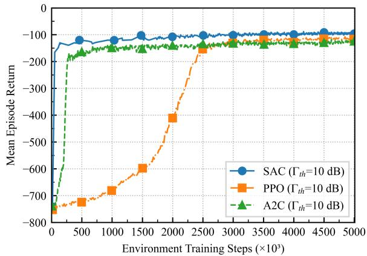  
Fig. 3. Training curves under different SINR thresholds $\Gamma _ { \mathrm { t h } }$

and the next position is set as

$$
{ \bf p } _ { \mathcal { T } } ^ { \mathrm { h } } [ n + 1 ] = { \bf p } _ { \mathcal { T } } ^ { \mathrm { h } } [ n ] + { \bf d } _ { \mathrm { d r i f t } } [ n ] + \omega [ n ] ,\tag{54}
$$

where $\omega [ n ]$ is a random perturbation constrained to satisfy

$$
\| \omega [ n ] \| \leq \sqrt { ( v _ { \operatorname* { m a x } } ^ { \mathcal { T } } ) ^ { 2 } - \| \mathbf { d } _ { \mathrm { d r i f t } } [ n ] \| ^ { 2 } } .\tag{55}
$$

This construction guarantees the per-slot speed limit and ensures the terminal constraint ${ \bf p } _ { T } ^ { \mathrm { h } } [ N - 1 ] = { \bf p } _ { N }$ is met.

2) Compared Algorithms: To demonstrate the efficacy of the proposed SAC-based controller, we compare it against four baseline schemes:

• Advantage Actor–Critic (A2C) [47]: Shares the same state, action, and reward formulation as SAC but learns in an on-policy manner without entropy regularization.

• Proximal Policy Optimization (PPO) [48]: A widely adopted on-policy RL algorithm for continuous control. PPO employs a clipped surrogate objective to stabilize policy updates and mitigate performance collapse. In this work, PPO uses the same state representation, action space, and reward formulation as the proposed SACbased method, and is trained until convergence to serve as a strong RL baseline for performance comparison.

• Single-User AoI-Greedy Scheduling (SAGS): Always selects the user with the largest instantaneous AoI and flies toward that user within the velocity constraint. The transmit power is equally split between sensing and the selected user beam.

• Kalman-Forecast Random (KF-RAND): Samples a random waypoint in a disc of radius $V _ { \operatorname* { m a x } } \delta _ { t }$ centered at the Kalman-predicted target position, adds Gaussian jitter, and applies random user logits $\ell _ { k } \sim \mathcal N ( 0 , \sigma _ { \mathrm { l o g i t } } ^ { 2 } )$ . Beams with $\ell _ { k } < 0$ are deactivated, and power is distributed via softmax among the remaining users.

All schemes are evaluated under identical conditions over 100 Monte Carlo episodes. This standardized setting enables reproducible and statistically sound performance comparisons.

## B. Simulation Results Analysis

Fig. 3 and Fig. 4 illustrate the training convergence behaviors of the SAC algorithm in comparison with the PPO and

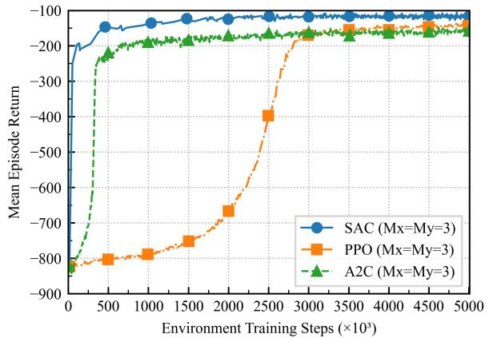  
Fig. 4. Training curves under different UPA configurations.

A2C baselines under two representative system configurations. Unless otherwise specified, all remaining parameters are fixed to their default values listed in Table I. The horizontal axis denotes the total number of training steps, where each episode consists of N steps, i.e., 600,000 steps correspond to 10,000 episodes. The vertical axis represents the mean episode return, which is computed by averaging cumulative rewards per episode across 100 Monte Carlo runs under different user layouts. In Fig. 3, the SINR threshold is set to $\Gamma _ { \mathrm { t h } } = 1 0 ~ \mathrm { d B }$ SAC rapidly improves the mean episode return during the early training stage and reaches a stable performance level. A2C also exhibits fast initial convergence, but suffers from a noticeably lower asymptotic return. PPO converges more slowly, yet eventually attains a higher steady-state performance than A2C. Fig. 4 shows the convergence behavior when the antenna array size is fixed at $M _ { x } = M _ { y } = 3 . \mathrm { ~ A ~ }$ similar trend can be observed: SAC maintains the fastest convergence speed and achieves the highest final return, while PPO demonstrates smoother but slower learning dynamics, and A2C remains suboptimal in terms of steady-state performance. These results indicate that SAC achieves more sample-efficient and stable learning across different representative configurations in our system. This advantage can be attributed to its off-policy learning framework combined with entropy regularization, which facilitates effective exploration and robust policy updates in continuous control settings. All RL baselines are evaluated based on their respective converged performance in the final evaluation stage.

Fig. 5 shows the average AoI achieved by all schemes under different user SINR thresholds $\Gamma _ { \mathrm { t h } } ~ \in ~ \{ 0 , 5 , 1 0 , 1 5 , 2 0 \}$ dB, with the UPA size fixed at $M _ { x } \times M _ { y } = 4 \times 4$ and the sensing accuracy requirement set to $\sigma _ { \mathrm { r e q } } = 1 \mathrm { m }$ . For this and all subsequent average AoI performance curves, we report the sample mean over 100 independent Monte Carlo episodes. The shaded regions and error bars represent the corresponding pointwise 95% confidence intervals, computed as $\bar { x } \pm 1 . 9 6 s / \sqrt { R }$ , where $R ~ = ~ 1 0 0$ is the number of episodes and s is the sample standard deviation. As $\Gamma _ { \mathrm { t h } }$ increases, the increasingly stringent communication constraints result in deteriorated performance across all schemes. The AoI of SAGS remains nearly constant because it always serves the user with the largest AoI while neglecting others, resulting in poor overall freshness. KF-RAND also exhibits limited performance due to its lack of optimization. Among the DRL-based baselines, A2C achieves noticeable AoI reduction compared with the heuristic schemes but still shows inferior performance relative to the proposed method, mainly due to its on-policy learning nature and limited exploration. PPO provides a stronger RL baseline and attains competitive AoI performance. Overall, the proposed SACbased approach maintains marginally lower AoI across all considered thresholds, indicating a more stable performance trend under increasingly stringent communication requirements.

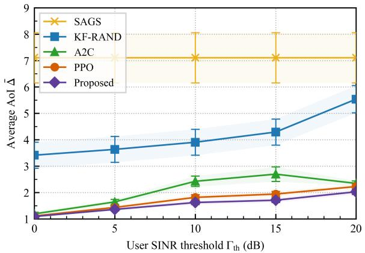  
Fig. 5. Average AoI versus user SINR threshold $\Gamma _ { \mathrm { t h } }$ with 95% confidence intervals.

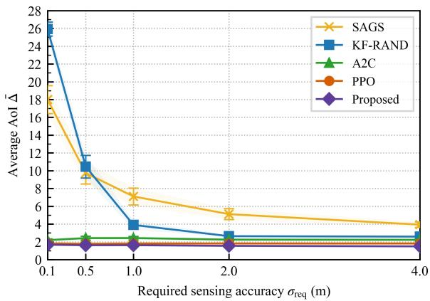  
Fig. 6. Average AoI versus position accuracy threshold (the maximum allowable 1-σ horizontal position error) $\sigma _ { \mathrm { r e q } }$ with 95% confidence intervals.

Fig. 6 presents the average AoI under varying position accuracy thresholds (the maximum allowable 1-σ horizontal position error) $\sigma _ { \mathrm { r e q } } \in \{ 0 . 1 , 0 . 5 , 1 , 2 , 4 \}$ m, with six users, a $4 \times 4 ~ \mathrm { U P A }$ , and $\Gamma _ { \mathrm { t h } } ~ = ~ 1 0 \mathrm { d B }$ fixed. Smaller $\sigma _ { \mathrm { r e q } }$ values impose stricter radar constraints, requiring the UAV to keep a close distance and allocate more power to the sensing target, which reduces the communication capacity and increases AoI. Despite the increasing sensing demand, the proposed SACbased method maintains a consistently low AoI across all thresholds, demonstrating strong robustness and efficient joint allocation of trajectory, beamforming, and sensing resources. PPO achieves a very similar AoI performance and closely tracks the proposed method over the entire range of $\sigma _ { \mathrm { r e q } } ,$ confirming its effectiveness as a strong DRL baseline. In comparison, A2C follows the same general trend but exhibits slightly higher AoI levels. KF-RAND performs competitively when the sensing requirement is loose but degrades rapidly as the constraint tightens, while SAGS starts with high AoI under strict sensing conditions and gradually improves as the radar burden becomes lighter, reflecting its limited adaptability. These results also indicate that DRL-based methods are able to implicitly adapt their sensing-aware decisions under stringent positioning constraints, leading to more effective sensing and communication tradeoffs.

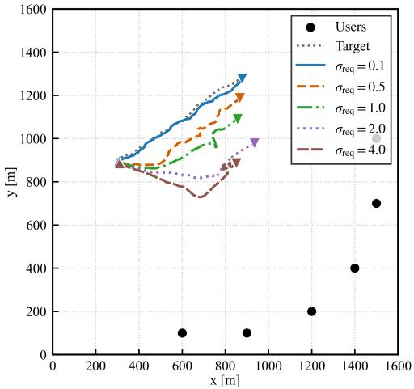  
Fig. 7. UAV trajectories under different position accuracy threshold $\sigma _ { \mathrm { r e q } } .$

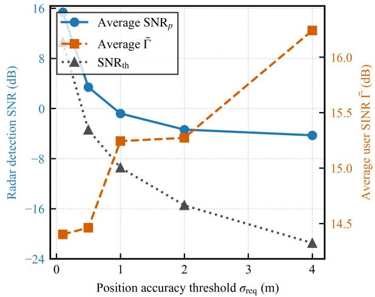  
Fig. 8. Average radar detection SNR $\mathrm { S N R } _ { p }$ and user SINR $\Gamma _ { k }$ versus $\sigma _ { \mathrm { r e q } } .$

To examine the effect of sensing position accuracy threshold $\sigma _ { \mathrm { r e q } }$ on UAV behavior, we consider a scenario where six users are positioned far from the target’s trajectory, specifically at coordinates [600, 100], [900, 100], [1,200, 200], [1,400, 400], [1,500, 700], and [1,500, 1,000] m. The target moves from [300, 900] m to [900, 1,300] m along an upward trajectory. This asymmetric layout emphasizes the trade-off between maintaining precise sensing and ensuring downlink communication. Fig. 7 depicts the SAC-based UAV flight trajectories obtained for five sensing position accuracy thresholds, i.e., $\sigma _ { \mathrm { r e q } } \in \{ 0 . 1 , 0 . 5 , 1 , 2 , 4 \}$ m, with six users, a $4 \times 4$ UPA, and $\Gamma _ { \mathrm { t h } } = 1 0$ dB fixed. It is observed that a stringent requirement $( \sigma _ { \mathrm { r e q } } ~ \leq ~ 0 . 5 ~ \mathrm { m } )$ forces the UAV to track the target more closely, resulting in a narrow bundle of trajectories concentrated around the target trajectory. As $\sigma _ { \mathrm { r e q } }$ relaxes, the trajectories progressively deviate downwards, forming a wider envelope. This deviation confirms the intuitive trade-off: when the localization constraint is loosened, the UAV shortens the average distance to the users located in the lower–right quadrant, thereby enhancing the communication link margin. The quantitative impact of $\sigma _ { \mathrm { r e q } }$ is summarized in Fig. 8. The radar detection SNR, denoted by $\mathrm { S N R } _ { p } ,$ the sensing threshold $\mathrm { S N R } _ { \mathrm { t h } }$ and the average user SINR $\begin{array} { r } { \bar { \Gamma } \triangleq \frac { 1 } { K } \sum _ { k = 1 } ^ { \bar { K } } \Gamma _ { k } } \end{array}$ are first averaged in the linear domain over all time slots and then converted to decibels. As $\sigma _ { \mathrm { r e q } }$ increases from 0.1 m to 4 m, the average radar detection SNR $\mathrm { S N R } _ { p }$ decreases monotonically from 15.35 dB to −4.28 dB, while the sensing threshold $\mathrm { S N R } _ { \mathrm { t h } }$ decreases accordingly from 10.57 dB to −21.47 dB. Over the entire range of $\sigma _ { \mathrm { r e q } } , ~ \mathrm { S N R } _ { p }$ remains above $\mathrm { S N R } _ { \mathrm { t h } }$ , ensuring reliable target detection. In contrast, the average downlink user SINR Γ¯ increases from 14.40 dB to 16.24 dB as the sensing constraint is relaxed. These results clearly visualize the fundamental sensing and communication trade-off: loosening the sensing accuracy requirement benefits downlink communication performance at the expense of radar sensing quality.

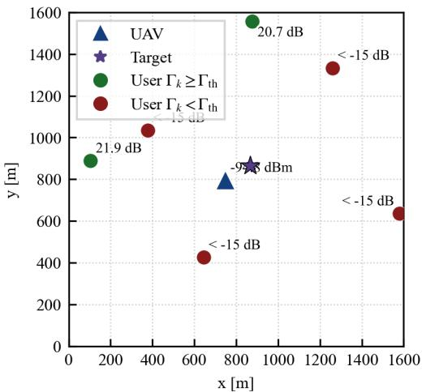  
(a)

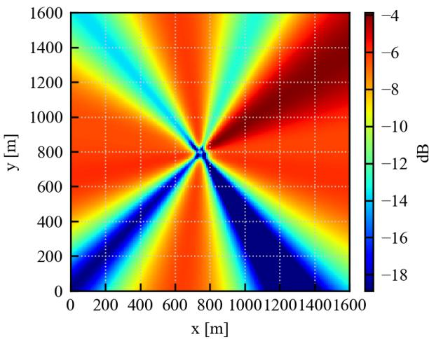

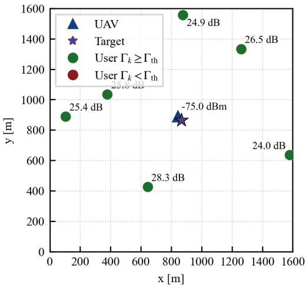  
(c)

(b)  
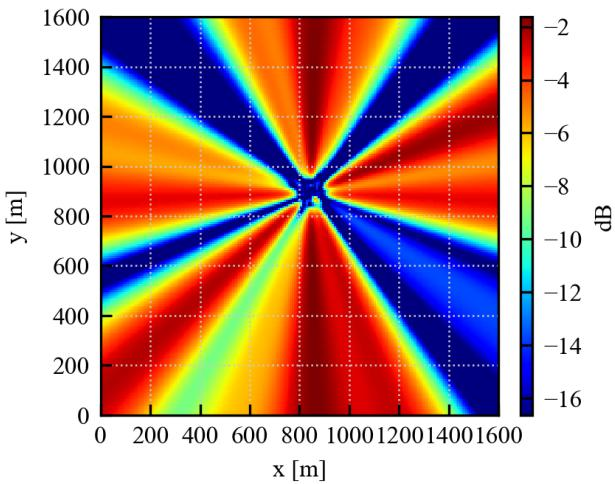  
(d)  
Fig. 9. Topology snapshots and ground-plane EIRP footprints at slot $n = 4 0$ under two UPA sizes, $M _ { x } = M _ { y } = 3$ and $M _ { x } = M _ { y } = 6$ . (a) Topology for 3 × 3 UPA; (b) EIRP footprint for 3 × 3 UPA; (c) Topology for $6 \times 6 ~ \mathrm { U P A } ;$ (d) EIRP footprint for $6 \times 6 ~ \mathrm { U P A } .$

To evaluate the effect of antenna array size on joint communication–sensing performance, Fig. 9 presents snapshots at slot $n = 4 0$ from an identical simulation episode with fixed random seed. All system parameters are held constant, with 6 static users, a sensing position accuracy threshold $\sigma _ { \mathrm { r e q } } = 1 ~ \mathrm { m }$ a SINR threshold $\Gamma _ { \mathrm { t h } } ~ = ~ 1 0 \mathrm { d B }$ , only the UPA size varies between $M _ { x } = M _ { y } = 3$ and $M _ { x } = M _ { y } = 6$ . Subplots (a) and (c) illustrate the UAV, target, and user positions projected onto the horizontal plane. Users are colored green if their SINR $\Gamma _ { k }$ exceeds the threshold, and red otherwise. The numeric labels near each user indicate the corresponding SINR $\Gamma _ { k }$ (in dB), while the UAV label shows the received radar echo power $P _ { r }$ (in dBm). Subplots (b) and (d) depict the equivalent isotropic radiated power (EIRP) footprints over the ground plane, expressed in dB, representing the post-beamforming transmit power distribution as if radiated isotropically. With

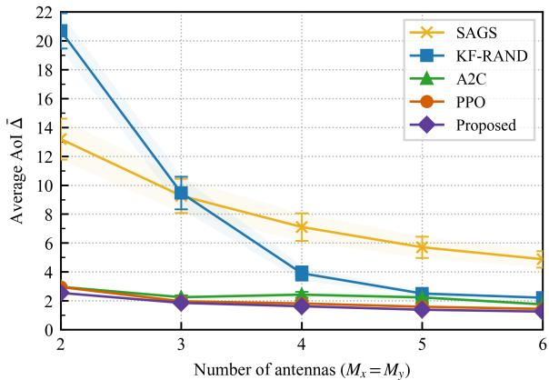  
Fig. 10. Average AoI versus UPA size $M _ { x } = M _ { y }$ with 95% confidence intervals.

$M _ { x } = M _ { y } = 3$ , the EIRP footprint in (b) shows a relatively broad mainlobe and higher sidelobes, reflecting the limited spatial resolution of the small array. This forces the UAV to compromise between user beams and the sensing beam, leading to only two users satisfying the SINR threshold in (a). In contrast, the $6 \times 6 ~ \mathrm { U P A }$ in (d) achieves a narrower, higher-gain mainlobe and deeper nulls, enabling the SAC agent to simultaneously serve all users while maintaining a strong radar return, as observed in (c). This comparison highlights the substantial performance gains enabled by increasing the array size under the SAC policy.

Fig. 10 illustrates the average AoI as the UPA size $M _ { x } = M _ { y }$ increases from 2 to 6, with other parameters held constant (position accuracy threshold $\sigma _ { \mathrm { r e q } } = 1 \mathrm { m }$ , and $\Gamma _ { \mathrm { t h } } =$ 10 dB). The AoI consistently decreases across all evaluated schemes with the growth of array size, as a larger antenna array enhances both the communication and sensing capabilities. Across all antenna configurations, the proposed SAC-based method achieves consistently low AoI and slightly outperforms the baseline schemes. PPO exhibits comparable performance and closely follows the proposed method, while A2C attains higher AoI despite benefiting from larger arrays. These results indicate that DRL-based approaches can effectively exploit the available spatial degrees of freedom, with SAC providing more consistent performance across different array sizes. In contrast, heuristic schemes show limited adaptability. SAGS performs relatively better for smaller arrays by concentrating power on a subset of users, whereas KF-RAND suffers from inefficient utilization of spatial resources. As the array size increases, the performance gap among heuristic methods narrows, suggesting that abundant beamforming capability can partially compensate for suboptimal control strategies.

Fig. 11 illustrates the average AoI as the number of users K increases from 3 to 15, while all other parameters remain fixed $( \sigma _ { \mathrm { r e q } } = 1 \mathrm { m } , 4 \times 4 \mathrm { U P A }$ , and $\Gamma _ { \mathrm { t h } } = 1 0 \mathrm { d B } )$ . As expected, the average AoI increases with K for all schemes, since more users contend for the limited downlink and sensing resources. Among the DRL-based approaches, SAC and PPO exhibit comparable performance across the evaluated user densities. This indicates that both entropy-regularized off-policy learning and clipped on-policy policy optimization can effectively exploit the proposed state-action representation under varying multi-user loads. Overall, the proposed SAC-based method remains competitive as the number of users increases and consistently outperforms A2C and the heuristic baselines. This result indicates that the proposed method remains effective under increasingly dense multi-user communication demands, while PPO can also become highly competitive in several dense-user cases. Among the heuristic schemes, SAGS performs better than KF-RAND at high user loads (e.g., K = 12 and K = 15). Under such congested conditions, the random power allocation in KF-RAND leaves many users below the SINR threshold $\Gamma _ { \mathrm { t h } } .$ , whereas the single-user emphasis of SAGS guarantees at least one timely update per slot, thereby yielding a lower average AoI than KF-RAND in dense-user cases.

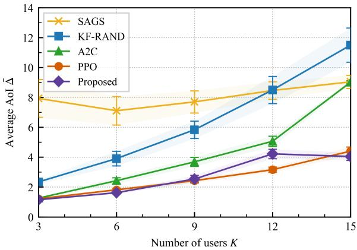  
Fig. 11. Average AoI versus number of users K with 95% confidence intervals.

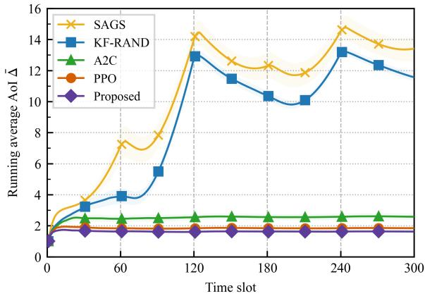  
Fig. 12. Running average AoI in the consecutive-mission stress test. Shaded regions denote 95% confidence intervals.

To further examine the stability of the learned policies over extended operation, we conduct a consecutive-mission stress test. Specifically, five 60-slot mission segments are concatenated within the same service region, resulting in 300 evaluation slots in total. At each mission boundary, a new waypoint-renewed mission segment is initiated, while the learned policies are reused without retraining. The default

JOURNAL OF LAT X CLASS FILES, VOL. 14, NO. 8, AUGUST 2021

setting with $K \ : = \ : 6 , \ : M _ { x } \ : = \ : M _ { y } \ : = \ : 4 , \ : \Gamma _ { \mathrm { t h } } \ : = \ : 1 0 \ : \ : \mathrm { d B }$ , and $\sigma _ { \mathrm { r e q } } = 1$ m is used. Fig. 12 reports the running average AoI, which is obtained by averaging the per-slot average AoI from the beginning of the test to the current time slot. As shown in Fig. 12, the proposed SAC-based method maintains a stable cumulative average AoI over the entire 300-slot consecutivemission evaluation. Its cumulative average AoI remains around 1.62 and does not exhibit an increasing trend across mission boundaries. PPO also achieves stable performance with a slightly higher cumulative AoI, while A2C and the heuristic baselines lead to larger AoI values. These results show that the proposed method can be repeatedly deployed across consecutive UAV-ISAC mission segments without systematic AoI performance degradation.

## V. CONCLUSION

This paper has presented a UAV-enabled ISAC system that leverages a superimposed transmit waveform for concurrent radar probing and downlink communication. This system has explicitly targeted an AoI-driven objective, focusing on tracking a moving target and the timely delivery of fresh information to multiple ground users. By integrating DRL with KF and RZF, the proposed solution has jointly optimized the UAV’s trajectory and multi-beam resource allocation. The simulation results show that the proposed method achieves robust average-AoI performance and generally outperforms the considered baseline approaches across the evaluated system settings, including different user SINR thresholds, sensing position-accuracy requirements, antenna array sizes, and numbers of users. The results have highlighted critical performance trade-offs in UAV-ISAC, such as how tighter sensing requirements force the UAV to remain closer to the target at the expense of communication coverage, and how larger antenna arrays significantly improve beamforming resolution and overall AoI performance. Future work may further extend the proposed AoI-centric UAV-ISAC framework by incorporating 3D UAV trajectory design to exploit additional spatial degrees of freedom, cooperative multi-UAV networks to enhance coverage and scalability, and mobile users with more general target motion models to address highly dynamic operating conditions.

## REFERENCES

[1] G. Geraci, A. Garcia-Rodriguez, M. M. Azari, A. Lozano, M. Mezzavilla, S. Chatzinotas, Y. Chen, S. Rangan, and M. Di Renzo, “What will the future of UAV cellular communications be? A flight from 5G to 6G,” IEEE Commun. Surv. Tutor., vol. 24, no. 3, pp. 1304–1335, May 2022.

[2] Y. Wang, Z. Su, N. Zhang, and D. Fang, “Disaster relief wireless networks: Challenges and solutions,” IEEE Wireless Commun., vol. 28, no. 5, pp. 148–155, Oct. 2021.

[3] P. Radoglou-Grammatikis, P. Sarigiannidis, T. Lagkas, and I. Moscholios, “A compilation of uav applications for precision agriculture,” Comput. Netw., vol. 172, p. 107148, May 2020.

[4] X. Qiang, Z. Chang, J. Tang, W. Feng, C. Yang, and Y. Zhang, “Bridging large language models and 6g networks: Overview and open issues,” China Communications, vol. 6, 2026.

[5] Y. Bai, B. Xie, Y. Liu, Z. Chang, and R. Jantti, “Dynamic uav¨ deployment in multi-uav wireless networks: A multi-modal featurebased deep reinforcement learning approach,” IEEE Internet Things J., early access, Apr. 2025.

[6] Q. Wu, J. Xu, Y. Zeng, D. W. K. Ng, N. Al-Dhahir, R. Schober, and A. L. Swindlehurst, “A comprehensive overview on 5G-and-beyond networks with UAVs: From communications to sensing and intelligence,” IEEE J. Sel. Areas Commun., vol. 39, no. 10, pp. 2912–2945, Jun. 2021.

[7] A. Wilson, A. Kumar, A. Jha, and L. R. Cenkeramaddi, “Embedded sensors, communication technologies, computing platforms and machine learning for UAVs: A review,” IEEE Sens. J., vol. 22, no. 3, pp. 1807– 1826, Dec. 2021.

[8] F. Liu, Y. Cui, C. Masouros, J. Xu, T. X. Han, Y. C. Eldar, and S. Buzzi, “Integrated sensing and communications: Toward dual-functional wireless networks for 6G and beyond,” IEEE J. Sel. Areas Commun., vol. 40, no. 6, pp. 1728–1767, Mar. 2022.

[9] J. Mu, R. Zhang, Y. Cui, N. Gao, and X. Jing, “UAV meets integrated sensing and communication: Challenges and future directions,” IEEE Commun. Mag., vol. 61, no. 5, pp. 62–67, Jan. 2023.

[10] Y. Zhang, Y. Bai, S. Zeng, R. Jantti, Z. Yan, C. Masouros, and¨ Z. Han, “Backscatter device-aided integrated sensing and communication: A pareto optimization framework,” IEEE Trans. Wireless Commun., vol. 25, pp. 17 958–17 974, 2026.

[11] K. Meng, Q. Wu, J. Xu, W. Chen, Z. Feng, R. Schober, and A. L. Swindlehurst, “UAV-enabled integrated sensing and communication: Opportunities and challenges,” IEEE Wireless Commun., vol. 31, no. 2, pp. 97–104, Apr. 2024.

[12] R. D. Yates, Y. Sun, D. R. Brown, S. K. Kaul, E. Modiano, and S. Ulukus, “Age of information: An introduction and survey,” IEEE J. Sel. Areas Commun., vol. 39, no. 5, pp. 1183–1210, Mar. 2021.

[13] F. Chiariotti, O. Vikhrova, B. Soret, and P. Popovski, “Peak age of information distribution for edge computing with wireless links,” IEEE Trans. Commun., vol. 69, no. 5, pp. 3176–3191, Jan. 2021.

[14] K. Meng, Q. Wu, S. Ma, W. Chen, K. Wang, and J. Li, “Throughput maximization for UAV-enabled integrated periodic sensing and communication,” IEEE Trans. Wireless Commun., vol. 22, no. 1, pp. 671–687, Aug. 2022.

[15] Z. Lyu, G. Zhu, and J. Xu, “Joint maneuver and beamforming design for UAV-enabled integrated sensing and communication,” IEEE Trans. Wireless Commun., vol. 22, no. 4, pp. 2424–2440, Oct. 2022.

[16] J. Liu, C. Zhou, M. Sheng, H. Yang, X. Huang, and J. Li, “Resource allocation for adaptive beam alignment in UAV-assisted integrated sensing and communication networks,” IEEE J. Sel. Areas Commun., vol. 43, no. 1, pp. 350–363, Jan. 2025.

[17] R. Zhang, Y. Zhang, R. Tang, H. Zhao, Q. Xiao, and C. Wang, “A joint UAV trajectory, user association, and beamforming design strategy for multi-UAV-assisted ISAC systems,” IEEE Internet Things J., vol. 11, no. 18, pp. 29 360–29 374, Sep. 2024.

[18] C. Deng, X. Fang, and X. Wang, “Beamforming design and trajectory optimization for UAV-empowered adaptable integrated sensing and communication,” IEEE Trans. Wireless Commun., vol. 22, no. 11, pp. 8512–8526, Nov. 2023.

[19] C. Deng, X. Fang, and X. Wang, “Integrated sensing, communication, and computation with adaptive DNN splitting in multi-UAV networks,” IEEE Trans. Wireless Commun., vol. 23, no. 11, pp. 17 429–17 445, Nov. 2024.

[20] A. Khalili, A. Rezaei, D. Xu, F. Dressler, and R. Schober, “Efficient UAV hovering, resource allocation, and trajectory design for ISAC with limited backhaul capacity,” IEEE Trans. Wireless Commun., vol. 23, no. 11, pp. 17 635–17 650, Nov. 2024.

[21] D. Deng, W. Zhou, X. Li, D. B. da Costa, D. W. K. Ng, and A. Nallanathan, “Joint beamforming and UAV trajectory optimization for covert communications in ISAC networks,” IEEE Trans. Wireless Commun., vol. 24, no. 2, pp. 1016–1030, Feb. 2025.

[22] L. Zhou, S. Leng, Q. Wang, and Q. Liu, “Integrated sensing and communication in UAV swarms for cooperative multiple targets tracking,” IEEE Trans. Mob. Comput., vol. 22, no. 11, pp. 6526–6542, Nov. 2022.

[23] Y. Jiang, Q. Wu, W. Chen, and K. Meng, “UAV-enabled integrated sensing and communication: Tracking design and optimization,” IEEE Commun. Lett., vol. 28, no. 5, pp. 1024–1028, May 2024.

[24] X. Jing, F. Liu, C. Masouros, and Y. Zeng, “ISAC from the sky: UAV trajectory design for joint communication and target localization,” IEEE Trans. Wireless Commun., vol. 23, no. 10, pp. 12 857–12 872, Oct. 2024.

[25] Y. Liu, W. Mao, B. He, W. Huangfu, T. Huang, H. Zhang, and K. Long, “Radar probing optimization for joint beamforming and UAV trajectory design in UAV-enabled integrated sensing and communication,” IEEE Trans. Commun., early access, Nov. 2024.

[26] Z. Liu, X. Liu, Y. Liu, V. C. Leung, and T. S. Durrani, “UAV assisted integrated sensing and communications for internet of things: 3D trajectory optimization and resource allocation,” IEEE Trans. Wireless Commun., vol. 23, no. 8, pp. 8654–8667, Aug. 2024.

[27] X. Liu, J. Wu, C. Zhao, and Z. Liu, “Integrated sensing and communications for UAV assisted internet of things based on deep reinforcement learning,” IEEE Trans. Veh. Technol., early access, Feb. 2025.

[28] M. Chen, F. Shu, M. Zhu, D. Wu, Y. Yao, and Q. Zhang, “Reinforcement-learning-based UAV 3-D target tracking and digitaltwin-assisted collision avoidance with integrated sensing and communication,” IEEE Internet Things J., early access, Apr. 2025.

[29] Q. Zhu, R. Liu, X. Lv, Q. Meng, and Y. Wang, “AoI-optimal trajectory planning in UAV-assisted ISAC networks,” in IEEE Int. Conf. Commun. Technol. (ICCT), Wuxi, China, Oct. 2023, pp. 428–433.

[30] Y. Zhou, A. A. Khuwaja, X. Li, N. Zhao, and Y. Chen, “Optimizing multi-UAV multi-user system through integrated sensing and communication for age of information (AoI) analysis,” IEEE Open J. Commun. Soc., vol. 5, no. 11, pp. 6918–6931, Nov. 2024.

[31] H. Mei, H. Zhang, X. Zhou, and J. Wang, “AoI minimization for airground integrated sensing and communication networks with jamming attack,” IEEE Trans. Veh. Technol., early access, Apr. 2025.

[32] Z. Liu, X. Liu, W. Yang, and X. Zhang, “Joint sensing and age of information optimization for energy constrained UAV-assisted integrated sensing, calculation, and communication,” IEEE Trans. Wireless Commun., vol. 24, no. 5, pp. 4440–4453, May 2025.

[33] Y. Bai, H. Zhao, X. Zhang, Z. Chang, R. Jantti, and K. Yang, “Toward¨ autonomous multi-UAV wireless network: A survey of reinforcement learning-based approaches,” IEEE Commun. Surv. Tutor., vol. 25, no. 4, pp. 3038–3067, Oct. 2023.

[34] Y. Qin, Z. Zhang, X. Li, W. Huangfu, and H. Zhang, “Deep reinforcement learning based resource allocation and trajectory planning in integrated sensing and communications UAV network,” IEEE Trans. Wireless Commun., vol. 22, no. 11, pp. 8158–8169, Nov. 2023.

[35] Q. Gao, R. Zhong, H. Shin, and Y. Liu, “MARL-based UAV trajectory and beamforming optimization for ISAC system,” IEEE Internet Things J., vol. 11, no. 24, pp. 40 492–40 505, Dec. 2024.

[36] X. Pang, S. Guo, J. Tang, N. Zhao, and N. Al-Dhahir, “Dynamic isac beamforming design for uav-enabled vehicular networks,” IEEE Transactions on Wireless Communications, 2024.

[37] F. Liu, C. Masouros, A. Li, H. Sun, and L. Hanzo, “MU-MIMO communications with MIMO radar: From co-existence to joint transmission,” IEEE Trans. Wireless Commun., vol. 17, no. 4, pp. 2755–2770, Apr. 2018.

[38] C. Sturm and W. Wiesbeck, “Waveform design and signal processing aspects for fusion of wireless communications and radar sensing,” Proc. IEEE, vol. 99, no. 7, pp. 1236–1259, Jul. 2011.

[39] B. Li, A. P. Petropulu, and W. Trappe, “Optimum co-design for spectrum sharing between matrix completion based MIMO radars and a MIMO communication system,” IEEE Trans. Signal Process., vol. 64, no. 17, pp. 4562–4575, Sep. 2016.

[40] M. Xing, X. Jiang, R. Wu, F. Zhou, and Z. Bao, “Motion compensation for UAV SAR based on raw radar data,” IEEE Trans. Geosci. Remote Sens., vol. 47, no. 8, pp. 2870–2883, Aug. 2009.

[41] Y. Liu, T. Huang, F. Liu, D. Ma, W. Huangfu, and Y. C. Eldar, “Nextgeneration multiple access for integrated sensing and communications,” Proc. IEEE, vol. 112, no. 9, pp. 1467–1496, Sep. 2024.

[42] N. Levanon and E. Mozeson, Radar Signals, ser. IEEE Press. Wiley, 2004. [Online]. Available: https://books.google.fi/books?id=l 2lHI9fVHUC

[43] Y. Bar-Shalom, T. E. Fortmann, and P. G. Cable, “Tracking and data association,” J. Acoust. Soc. Am., vol. 87, no. 2, pp. 918–919, Feb. 1990.

[44] S. S. Blackman and R. Popoli, Design and analysis of modern tracking systems, ser. The Artech House radar library. Artech House, 1999. [Online]. Available: https://cir.nii.ac.jp/crid/1130000795827809408

[45] M. Puterman, Markov Decision Processes: Discrete Stochastic Dynamic Programming, ser. Wiley Series in Probability and Statistics. Wiley, 2014. [Online]. Available: https://books.google.fi/books?id= VvBjBAAAQBAJ

[46] T. Haarnoja, A. Zhou, P. Abbeel, and S. Levine, “Soft actor-critic: Offpolicy maximum entropy deep reinforcement learning with a stochastic actor,” in Int. Conf. Mach. Learn. (ICML), Stockholm, Sweden, Jul. 2018, pp. 1861–1870.

[47] V. Mnih, A. P. Badia, M. Mirza, A. Graves, T. Lillicrap, T. Harley, D. Silver, and K. Kavukcuoglu, “Asynchronous methods for deep reinforcement learning,” in Int. Conf. Mach. Learn. (ICML), New York, USA, Jun. 2016, pp. 1928–1937.

[48] J. Schulman, F. Wolski, P. Dhariwal, A. Radford, and O. Klimov, “Proximal policy optimization algorithms,” 2017. [Online]. Available: https://arxiv.org/abs/1707.06347

Yu Bai (S’21–M’26) received the M.Sc. (Tech.) degree from the School of Computer Science and Engineering, University of Electronic Science and Technology of China, Chengdu, China, in 2021 and the Ph.D. degree from the School of Electrical Engineering, Aalto University, Espoo, Finland, in 2026. He is currently a lecturer in the School of Software Engineering, Taiyuan University of Technology. His research interests include UAV networks and machine learning.

Yifan Zhang (Member, IEEE) received the master’s degree in computer technology from Xidian University, Xian, China, in 2022, and the Ph.d degree from the School of Electrical Engineering, Aalto University, Espoo, Finland. He is currently a postdoc researcher at Aalto University. His research interests include wireless communication, physical-layer security, machine learning, and integrated sensing and communication.

Boxuan Xie (Graduate Student Member, IEEE) received the D.Sc. (Tech) and M.Sc. (Tech) in communications engineering from Aalto University, Finland, in 2026 and 2022, respectively. He is currently a researcher with the Department of Information and Communications Engineering, Aalto University. He severed as TPC members and reviewers in IEEE ICC’24-26, GLOBECOM’23’26, WCNC’24-26 and PIMRC’24-26. His research interests include Ambient IoT and sustainable RF electronics.

Zheng Chang (S’10-M’13-SM’17) received the B.Eng. degree from Jilin University, Changchun, China in 2007, M.Sc. (Tech.) degree from Helsinki University of Technology (Now Aalto University), Espoo, Finland in 2009 and Ph.D degree from the University of Jyvaskyla, Jyvaskyla, Finland in 2013. Since 2008, he has held various research positions at Helsinki University of Technology, University of Jyvaskyla and Magister Solutions Ltd in Finland. He was a visiting researcher at Tsinghua University, China, from June to August in 2013, and at Univer-

sity of Houston, TX, from April to May in 2015. He has been awarded by the Ulla Tuominen Foundation, the Nokia Foundation and the Riitta and Jorma J. Takanen Foundation for his research excellence. He has been awarded as 2018 IEEE Communications Society best young researcher for Europe, Middle East and Africa Region and 2021 IEEE Communications Society MMTC Outstanding Young Researcher.

He has published over 230 papers in journals and conferences, and received best paper awards from IEEE ICC in 2023, IEEE TCGCC and APCC in 2017. He serves as an editor of IEEE Wireless Communications Letters, IEEE Transactions on Machine Learning in Communications and Networking and China Communications, and a guest editor for IEEE Network, IEEE Wireless Communications, IEEE Communications Magazine, IEEE Internet of Things Journal, IEEE Transactions on Industrial Informatics, etc. He was the Best editor of IEEE Wireless Communication Letters and China Communications in 2024, the exemplary reviewer of IEEE Wireless Communication Letters in 2018. He has participated in organizing workshop and special session in Globecom’ 19, WCNC’18-‘24, SPAWC’19 and ISWCS’18. He also serves as Symposium/Track co-chair of IEEE ICC’20, Globecom’23, VTS’25S, VTS’26S, and ICC’26, Publicity co-chair of IEEE Infocom’22, Workshop co-chair of ICCC’22 and VTS’25F, TPC co-chair of IEEE iThing’22, and TPC member for many IEEE major conferences, such as INFOCOM, ICC, and Globecom. His research interests include federated learning, cloud/edge computing, UAV/vehicular networks, and green communications.

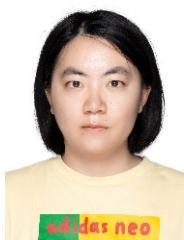

Yanru Zhang (S’13-M’16) received the B.S. degree in electronic engineering from University of Electronic Science and Technology of China (UESTC) in 2012, and the Ph.D. degree from the Department of Electrical and Computer Engineering, University of Houston (UH) in 2016. She was a Postdoctoral Fellow with UH and the Chinese University of Hong Kong, HongKong, successively. She is currently a Professor with UESTC, affiliated with both Shenzhen Institute for Advanced Study and School of Computer Science and Engineering. Her research interests include game theory, machine learning, deep learning in smart grid and Wireless network. She received the Best Paper Award with IEEE SmartGridcomm 2025, HPCC 2022, DependSys 2022, ICCC 2017, and ICCS 2016.

Riku Jantti¨ (M’02 - SM’07) is a Full Professor of Communications Engineering at Aalto University School of Electrical Engineering, Finland. He received his M.Sc (with distinction) in Electrical Engineering in 1997 and D.Sc (with distinction) in Automation and Systems Technology in 2001, both from Helsinki University of Technology (TKK). Prior to joining Aalto in August 2006, he was professor pro tem at the Department of Computer Science, University of Vaasa. Prof. Jantti is a senior¨ member of IEEE and member of the editorial board

of the IEEE Transactions on Cognitive Communications and Networking. He has also been IEEE VTS Distinguished Lecturer (Class 2016). The research interests of Prof. Jantti include machine type communications,¨ disaggregated radio access networks, backscatter communications, quantum communications, and radio frequency inference.

Zhu Han (S’01–M’04-SM’09-F’14) received the B.S. degree in electronic engineering from Tsinghua University, in 1997, and the M.S. and Ph.D. degrees in electrical and computer engineering from the University of Maryland, College Park, in 1999 and 2003, respectively.

From 2000 to 2002, he was an R&D Engineer of JDSU, Germantown, Maryland. From 2003 to 2006, he was a Research Associate at the University of Maryland. From 2006 to 2008, he was an assistant professor at Boise State University, Idaho. Currently, he is a John and Rebecca Moores Professor in the Electrical and Computer Engineering Department as well as in the Computer Science Department at the University of Houston, Texas. Dr. Han’s main research targets on the novel game-theory related concepts critical to enabling efficient and distributive use of wireless networks with limited resources. His other research interests include wireless resource allocation and management, wireless communications and networking, quantum computing, data science, smart grid, carbon neutralization, security and privacy. Dr. Han received an NSF Career Award in 2010, the Fred W. Ellersick Prize of the IEEE Communication Society in 2011, the EURASIP Best Paper Award for the Journal on Advances in Signal Processing in 2015, IEEE Leonard G. Abraham Prize in the field of Communications Systems (best paper award in IEEE JSAC) in 2016, IEEE Vehicular Technology Society 2022 Best Land Transportation Paper Award, and several best paper awards in IEEE conferences. Dr. Han was an IEEE Communications Society Distinguished Lecturer from 2015 to 2018 and ACM Distinguished Speaker from 2022 to 2025, AAAS fellow since 2019, and ACM Fellow since 2024. Dr. Han is also the winner of the 2021 IEEE Kiyo Tomiyasu Award (an IEEE Field Award), for outstanding early to mid-career contributions to technologies holding the promise of innovative applications, with the following citation: “for contributions to game theory and distributed management of autonomous communication networks.” Dr. Han is honored Lifetime Chair Professor of National Yang Ming Chiao Tung University, Taiwan, Eminent Scholar of Kyung Hee University, South Korea and Global Professor of Keio University, Japan.