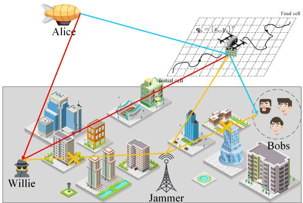
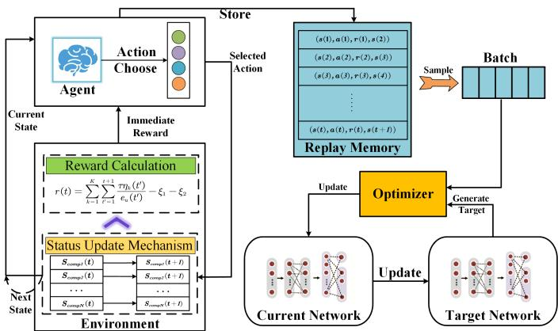
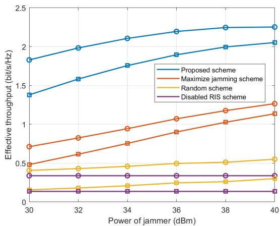
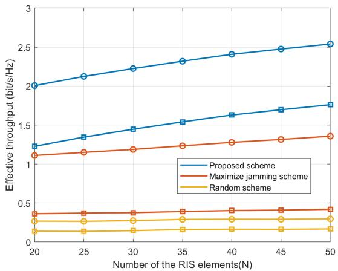
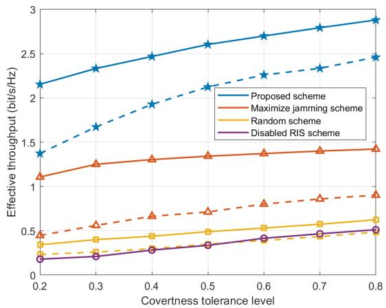
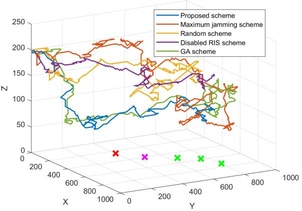
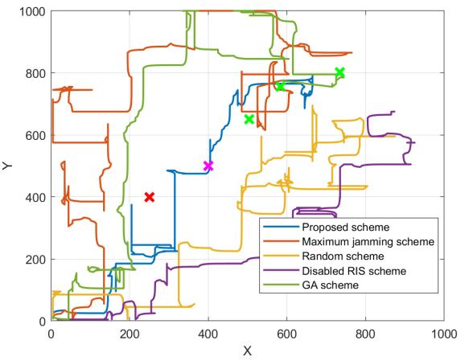
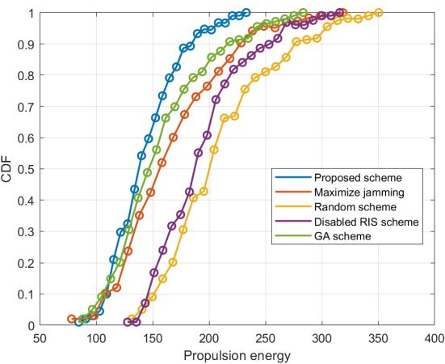
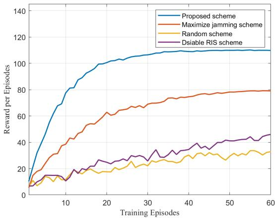
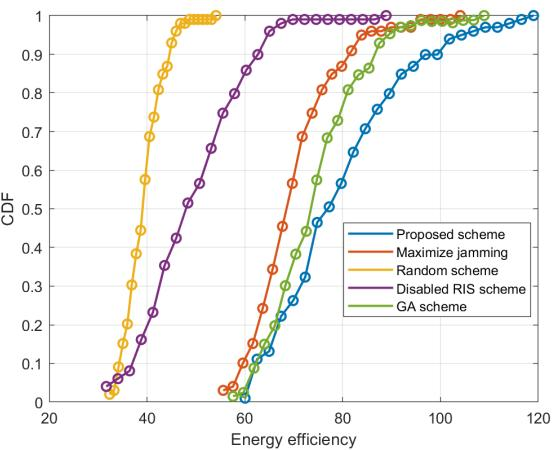

IEEE TRANSACTIONS ON MOBILE COMPUTING

# Air-Ground Cooperative Covert Transmission: A Jamming Dynamic Management and Security Enhancement Approach

Yunyang Zhang, Bohang Wang, Weijie Yuan, Senior Member, IEEE, Nanchi Su, Member, IEEE, Yuanhao Cui, Member, IEEE, and Guoru Ding

Abstract—Privacy security constitutes a critical challenge in low-altitude wireless communications. Motivated by the application requirements for stereoscopic coverage and multi-domain collaboration, this paper investigates a friendly jamming-assisted air-ground cooperative covert transmission scheme. In the considered system, an unmanned aerial vehicle (UAV) equipped with a reconfigurable intelligent surface (RIS) serves as a network hub. It relays confidential signals from an aerial hovering platform to ground users while cooperating with terrestrial jammer to realize environment-independent directional jamming. Benefiting from the UAV’s relaying functionality, this architecture can significantly enhance the flexibility of the jamming mechanism and the security of the jamming node. With the objective of maximizing the UAV’s energy efficiency associated with effective throughput, we formulate a joint optimization problem under strict covertness constraints. To solve this problem, we propose an algorithm that integrates semidefinite relaxation (SDR), the Dinkelbach method, and Gaussian randomization within a double deep Q-network (DDQN) framework. The UAV trajectory, onboard resource, user scheduling and RIS parameters are jointly optimized to simultaneously ensure the communication covertness and transmission performance. Numerical simulation results validate the superiority of the proposed scheme compared to benchmark solutions.

Index Terms—Air-ground cooperative network, jammingassisted, reconfigurable intelligent surface, covert communication, double deep Q-network.

## I. INTRODUCTION

## A. Background

Low-altitude wireless communications have emerged as a vital solution for addressing challenges in dense urban environments, fluctuating network conditions, and real-time service demands, owing to their high flexibility and adaptability [1]. Novel communication infrastructures, such as unmanned aerial vehicles (UAVs) and other aerial platforms, provide key technical support for constructing stereoscopic networks. However, as the interconnectivity and dynamics of wireless networks intensify, communication privacy security faces increasingly severe threats [2].

Driven by scenario-specific applicability, current academic research classifies communication privacy security into two levels: content security and behavior security [3]. Undoubtedly, behavior security, which aims to conceal the very existence of a transmission, can fundamentally mitigate the risks of information interception and node targeting. Consequently, in domains with high-security requirements, covert communication has become a pivotal research direction. By hiding detectable communication activities, covert communication effectively prevents unauthorized parties from discerning transmission presence, thereby offering a higher level of security assurance for low-altitude wireless networks [4].

## B. Related Work

In conventional research, UAVs are typically employed either as independent transceivers or as relay nodes cooperating with ground or aerial users to achieve covert transmission [4– 19]. By jointly optimizing parameters such as the UAV’s threedimensional (3D) trajectory and transmit power under strict covertness constraints, key performance metrics including system throughput, spectral efficiency, energy efficiency, and coverage have been significantly improved. Related derivative approaches are diverse, encompassing techniques such as integrated cognitive radio for spectrum sharing [4], nonorthogonal multiple access (NOMA) and finite blocklength transmission [6, 8], integration with wireless power transfer to energize ground devices [9], and the use of backscatter communication to reduce system power consumption [11]. Furthermore, through joint positioning, hovering, and multihop cooperation mechanisms, the challenges of severe signal attenuation and easy detection in long-distance transmission can be effectively mitigated [13, 16, 18, 19]. These studies fully leverage the high mobility of UAVs to transcend the performance limitations of fixed terrestrial networks, finding applications in fields such as the Internet of Things (IoT) [5], edge computing [10], and geostationary satellite communication [12].

IEEE TRANSACTIONS ON MOBILE COMPUTING

Recent research has further enriched the technical repertoire for UAV-assisted covert communication. Equipping UAVs with reconfigurable intelligent surfaces (RIS) enables the construction of movable and intelligently controllable wireless environment reconfiguration platforms [20–26]. By intelligently adjusting the phase shifts across numerous passive elements, the passive beamforming capability of RIS can significantly enhance signal strength towards legitimate receivers. This improves system performance metrics such as covert rate [21], energy efficiency [22], or optimizing covert age of information (CAoI) [23] without consuming additional transmit power. Additionally, the introduction of dedicated UAVs or ground nodes as cooperative friendly jammers [27–33], through the transmission of carefully designed artificial noise (AN), such as employing multi-antenna beamforming techniques [27, 28, 30] and trajectory coordination with the transmitting UAV [29, 31, 32], can effectively increase the detection uncertainty at eavesdroppers while avoiding excessive interference to legitimate receivers.

## C. Motivation and Contributions

It is commendable that existing research commendably elucidates the inherent trade-offs among covertness, communication quality, and energy consumption. Proactive wireless environment management and friendly jamming mechanisms can effectively enhance system robustness against eavesdroppers. However, current studies are subject to several limitations. First, the vast majority of works treat the desired signal, i.e., covert signal, as the absolute dominant factor, often neglecting scenario diversity and application breadth. Second, the ideal deployment conditions assumed for friendly jammers are frequently difficult to satisfy in practical dynamic environments. Lastly, the exposed physical locations of dedicated jamming nodes can easily attract soft or hard attacks, compromising system security.

To address these issues, this paper proposes a dynamic and reconfigurable jamming scheme for air-ground cooperative transmission scenarios in low-altitude wireless networks. The proposed scheme adapts to dynamic network conditions and evolving security threats, aiming to optimize signal propagation paths, enhance legitimate communication links, and suppress eavesdropping channels, thereby holistically improving transmission covertness, security, and reliability.

The main contributions of this paper are summarized as follows:

• Proposal of an air-ground cooperative covert transmission scheme: We design a friendly jamming-assisted covert communication scheme for air-ground networks to achieve environment-independent covert transmission. A UAV, acting as a relay node, forwards and enhances signals from an aerial hovering platform to a ground terminal. Concurrently, terrestrial jammers cooperate with the UAV-mounted RIS to achieve targeted covert jamming.

• Establishment of a system covertness analysis framework: By analyzing the system’s covertness characteristics, we derive a closed-form expression for the Kullback-Leibler (KL) divergence. Leveraging its convexity, we obtain a tractable upper bound estimate and establish strict analytical constraints for system covertness.

TABLE ICOMMONLY USED NOTATION
<table><tr><td rowspan=1 colspan=1>Notation</td><td rowspan=1 colspan=1>Definition</td></tr><tr><td rowspan=1 colspan=1>T, K, N</td><td rowspan=1 colspan=1>Total number of time slots, Bobs and RIS reflecting elements</td></tr><tr><td rowspan=1 colspan=1>T</td><td rowspan=1 colspan=1>Duration of one time slot</td></tr><tr><td rowspan=1 colspan=1> $\mathbf { q } _ { u } , z _ { u }$ </td><td rowspan=1 colspan=1>Horizontal coordinate and altitude of the UAV</td></tr><tr><td rowspan=1 colspan=1> ${ \bf q } _ { b } , { \bf q } _ { j } , { \bf q } _ { w }$ </td><td rowspan=1 colspan=1>Horizontal coordinate of the Bob, jammer and Willie</td></tr><tr><td rowspan=1 colspan=1> $v _ { h } , v _ { v }$ </td><td rowspan=1 colspan=1>Horizontal and vertical speed of the UAV</td></tr><tr><td rowspan=1 colspan=1> $z _ { \mathrm { m a x } } , ~ z _ { \mathrm { m i n } }$ </td><td rowspan=1 colspan=1>Maximum and minimum allowable altitude of the UAV</td></tr><tr><td rowspan=1 colspan=1> $P _ { a } , P _ { j } , P _ { u }$ </td><td rowspan=1 colspan=1>Transmit power of Alice, the jammer, and the UAV</td></tr><tr><td rowspan=1 colspan=1> $R , l , M$ </td><td rowspan=1 colspan=1>Code rate, blocklength, and number of information bits per block</td></tr><tr><td rowspan=1 colspan=1> $\sigma _ { b } ^ { 2 } , \sigma _ { u } ^ { 2 } , \sigma _ { w } ^ { 2 }$ </td><td rowspan=1 colspan=1>Noise power at the Bob, UAV, and Willie</td></tr><tr><td rowspan=1 colspan=1> $\boldsymbol { \hat { \Theta } } , \mathbf { r }$ </td><td rowspan=1 colspan=1>Phase shift and reflection coefficient of the RIS</td></tr><tr><td rowspan=1 colspan=1> $h _ { x y } , \mathbf { h } _ { x y }$ </td><td rowspan=1 colspan=1>Channel between node x and node y</td></tr><tr><td rowspan=1 colspan=1>K</td><td rowspan=1 colspan=1>Rician factor</td></tr><tr><td rowspan=1 colspan=1> $\gamma _ { b } , \gamma _ { u }$ </td><td rowspan=1 colspan=1>Received SNR at the Bob and UAV</td></tr><tr><td rowspan=1 colspan=1> $\delta _ { u }$ </td><td rowspan=1 colspan=1>Decoding error probability at the UAV</td></tr><tr><td rowspan=1 colspan=1> $c _ { k }$ </td><td rowspan=1 colspan=1>The user scheduling variable</td></tr><tr><td rowspan=1 colspan=1> $\mathcal { H } _ { 0 } , \mathcal { H } _ { 1 }$ </td><td rowspan=1 colspan=1>Null and alternative hypotheses at Willie</td></tr><tr><td rowspan=1 colspan=1> $\mathcal { D } \left( \mathrm { A } | | \mathrm { B } \right)$ </td><td rowspan=1 colspan=1>KL divergence between A and B</td></tr><tr><td rowspan=1 colspan=1> $\nu _ { T } \left( \mathbf { A } , \mathbf { B } \right)$ </td><td rowspan=1 colspan=1>The total variation distance between A and B</td></tr><tr><td rowspan=1 colspan=1> $\mathbb { C } ^ { x \times y }$ </td><td rowspan=1 colspan=1>The set of all $x \times y$ complex-valued matrices</td></tr><tr><td rowspan=1 colspan=1>E[]</td><td rowspan=1 colspan=1>Statistical expectation</td></tr><tr><td rowspan=1 colspan=1>diag (x)</td><td rowspan=1 colspan=1>Diagonal matrix with the elements of x on the diagonal</td></tr><tr><td rowspan=1 colspan=1>1</td><td rowspan=1 colspan=1>Euclidean norm of a vector</td></tr><tr><td rowspan=1 colspan=1> $( \cdot ) ^ { T } , \ ( \cdot ) ^ { H }$ </td><td rowspan=1 colspan=1>Transpose and conjugate transpose operators</td></tr><tr><td rowspan=1 colspan=1> $t r \left( \cdot \right) , r a n k \left( \cdot \right)$ </td><td rowspan=1 colspan=1>Trace and rank of a matrix</td></tr><tr><td rowspan=1 colspan=1>Q (·)</td><td rowspan=1 colspan=1>The Gaussian Q-function</td></tr></table>

• Development of a parameter optimization method for static scenario: Aiming to maximize the effective throughput, we formulate a time-slotted optimization problem. Utilizing semidefinite relaxation (SDR), the Dinkelbach method, and Gaussian randomization, we solve for key parameters including the optimal UAV transmit power and the RIS reflection coefficient and phase shift.

• Design of a system control algorithm for dynamic scenario: Addressing the dynamic requirements of practical applications, we design a hybrid optimization method. This method integrates the aforementioned traditional techniques with a double deep Q-network (DDQN) to achieve joint optimization of UAV trajectory planning, user scheduling, and related transmission parameters. Simulation results demonstrate the superiority of this method in terms of maximizing the UAV’s energy efficiency related to effective throughput compared to bench-

IEEE TRANSACTIONS ON MOBILE COMPUTING

mark schemes.

The remainder of this paper is organized as follows. Section II introduces the system model for air-ground cooperative covert transmission. Section III provides the covertness analysis and derives the closed-form expression for the KL divergence. In Section IV, an optimization scheme for RIS parameters based on an alternating optimization (AO) approach is proposed. Section V designs a DDQN-based algorithm to solve the dynamic trajectory optimization problem for the UAV. Numerical results and performance analysis are presented in Section VI. Finally, Section VII concludes the paper. The main notation used throughout this paper is summarized in Table I.

## II. SYSTEM MODEL

## A. Scenario and Assumptions

As illustrated in Fig. 1, we consider an air-ground cooperative covert communication system comprising a hovering transmitter (Alice), a relay UAV, a warden (Willie), a friendly jammer, and K terrestrial receivers (Bobs). All nodes are equipped with a single antenna, except for the RIS mounted on the UAV, which consists of N passive reflective elements. Under Willie’s surveillance, Alice attempts to establish a covert communication link with Bob. To capture challenging propagation conditions and cooperative requirements, we assume that Alice’s transmit beam cannot perfectly cover the intended Bob, while Willie unfortunately lies within its coverage area. Furthermore, due to static obstructions such as buildings or terrain, there exist no direct line-of-sight (LoS) links among the Bob, Willie, and the jammer. In this context, the UAV acts as a mobile relay to facilitate reliable covert transmission. Concurrently, the friendly jammer cooperates with the UAVmounted RIS to disrupt Willie’s detection capability while mitigating its own risk of exposure.

To facilitate analysis, the 3D service space is discretized into consecutive cells and time slots. Within an arbitrary time slot ${ { \mathbf { } } _ { t ,  } }$ the UAV’s horizontal coordinate is denoted as $\mathbf { q } _ { u } = \left[ x _ { u } , y _ { u } \right] ^ { T }$ with predefined initial and final locations $\mathbf { q } _ { u , o }$ and $\mathbf { q } _ { u , f } ,$ respectively. The corresponding vertical height is denoted as $z _ { u } .$ . The duration of each slot $\tau$ is chosen to be sufficiently small such that the UAV’s location can be considered quasistatic within a slot. Thus, the UAV’s trajectory over $T$ slots is characterized by the sequence $\left[ \mathbf { q } _ { u } ^ { T } , \dot { z _ { u } } \right] ^ { T }$ . The horizontal and vertical velocities of the UAV are denoted as $v _ { h }$ and $v _ { v } ,$ respectively. The propulsive energy consumption per time slot is modeled as [34]

$$
\begin{array} { r } { e _ { u } = \tau \left( P _ { 0 } \left( 1 + \frac { 3 v _ { h } ^ { 2 } } { U _ { t i p } ^ { 2 } } \right) + \frac { 1 } { 2 } d _ { 0 } \rho \omega G v _ { h } ^ { 3 } \right. } \\ { \left. + P _ { 1 } \left( \sqrt { 1 + \frac { v _ { h } ^ { 4 } } { 4 v _ { 0 } ^ { 4 } } } - \frac { v _ { h } ^ { 2 } } { 2 v _ { 0 } ^ { 2 } } \right) ^ { \frac { 1 } { 2 } } + P _ { 2 } v _ { v } \right) , } \end{array}\tag{1}
$$

where $P _ { 0 }$ and $P _ { 1 }$ represent the blade profile power and induced power in hover, respectively. $P _ { 2 }$ is a constant power component for vertical movement. $U _ { t i p }$ is the rotor blade tip speed. $v _ { 0 }$ is the mean rotor-induced velocity in hover. $d _ { 0 }$ and ω are the fuselage drag ratio and rotor solidity, respectively. $\rho$ and $G$ denote the air density and rotor disc area, respectively. Note that the subscript t of the aforementioned parameters is omitted in the current and subsequent static analyses to maintain conciseness, but will be reintroduced in necessary expressions and in dynamic analyses to enhance clarity.

  
Fig. 1. Air-Ground cooperative covert transmission scenario.

For other nodes, the horizontal coordinate of Alice is fixed at $\mathbf { q } _ { a } ~ = ~ \left[ x _ { a } , y _ { a } \right] ^ { T }$ at a hovering altitude $z _ { a }$ . Similarly, the horizontal coordinates of the k-th Bob, Willie, and the jammer are denoted as $\mathbf q _ { b , k } = \left[ x _ { k } , y _ { k } \right] ^ { T } , \mathbf q _ { w } = \left[ x _ { w } , y _ { w } \right] ^ { T }$ and ${ \bf q } _ { j } = { \bf \Phi }$ $\left[ x _ { j } , y _ { j } \right] ^ { T }$ , respectively.

## B. Collaborative Jamming Mechanism

In the proposed system, the UAV fulfills a dual function. Beyond its primary role as a decode-and-forward relay, it actively collaborates with the terrestrial friendly jammer. By intelligently configuring its onboard RIS, the UAV can redirect and focus the jamming signal towards Willie. This collaborative approach differs fundamentally from conventional jamming. First, the UAV’s mobility alleviates the jammer’s dependency on favorable geographical placement or fixed infrastructure. Second, since the jammer itself does not need to establish a direct link to the surveillance region, its operational security is significantly enhanced.

Let $\mathbf { h } _ { j r } \in \mathbb { C } ^ { N \times 1 }$ and $\mathbf { h } _ { r w } \in \mathbb { C } ^ { N \times 1 }$ denote the channel between the jammer and the RIS, and between the RIS and Willie, respectively. The RIS is characterized by a diagonal reflection matrix Θ = diag $\left( \beta _ { 1 } e ^ { j \theta _ { 1 } } , . . . , \beta _ { N } e ^ { j \theta _ { N } } \right)$ , where $\theta _ { n } \in$ [0, 2π) and $\beta _ { n } \in [ 0 , 1 ]$ represent the phase shift and reflection coefficient of the n-th element. For analytical tractability, we consider only the first-order reflected signals from the RIS at Willie’s receiver.

## C. Communication Channel and Signal Model

Owing to the altitude advantage of aerial platforms, the channels between the UAV and all other nodes are assumed to follow Rician fading, which can be expressed as

$$
h _ { g } = \sqrt { \rho _ { 0 } d _ { g } ^ { \alpha } } \left( \sqrt { \frac { \mathcal { K } } { \mathcal { K } + 1 } } h _ { g } ^ { \mathrm { L o S } } + \sqrt { \frac { 1 } { \mathcal { K } + 1 } } h _ { g } ^ { \mathrm { N L o S } } \right) ,\tag{2}
$$

where $g \in \{ a u , \ a w , \ u b , \ u w , \ j u \}$ index the link $\mathrm { e . g . }$ ., Alice-UAV, Alice-Willie, etc. $d _ { g }$ is the corresponding distance, $\rho _ { 0 }$ is the reference path loss, α is the path loss exponent, and

K is the Rician factor. The terms $h _ { g } ^ { \mathrm { L o S } }$ and $h _ { g } ^ { \mathrm { N L o S } }$ represent the deterministic LoS and Rayleigh fading non-LoS (NLoS) components, respectively. The channels related to the ${ \mathrm { R I S } } \ { \mathrm { e . g . } }$ $\mathbf { h } _ { a r } , \ \mathbf { h } _ { j r } .$ , are modeled similarly, with the LoS and NLoS components determined by the array response.

Thus, the received signal at the UAV from Alice is

$$
y _ { u } = \sqrt { P _ { a } } h _ { a u } s _ { a } + \sqrt { P _ { j } } h _ { j u } s _ { j } + n _ { u } ,\tag{3}
$$

where $s _ { a }$ and $s _ { j }$ are the confidential signal from Alice and the jamming signal from the friendly jammer, respectively, with $\mathbb { E } \left[ | s _ { a } | ^ { 2 } \right] \ = \ \mathbb { E } \left[ | s _ { j } | ^ { 2 } \right] \ = \ 1 . \ \dot { P _ { a } }$ and $P _ { j }$ denote their respective transmit powers. $n _ { u } \sim \mathcal { C N } \left( 0 , \sigma _ { u } ^ { 2 } \right)$ is the additive white Gaussian noise (AWGN) at the UAV with the noise power $\sigma _ { u } ^ { 2 }$ . The UAV employs an decode-and-forward protocol. The signal received at the Bob is

$$
y _ { b } = \sqrt { P _ { u } } h _ { u b } s _ { u } + \sqrt { P _ { j } } \mathbf { h } _ { r b } ^ { H } \Theta \mathbf { h } _ { j r } s _ { j } + n _ { b } ,\tag{4}
$$

where $P _ { u }$ and $s _ { u }$ denote the forward power and signal transmitted by the UAV, respectively. $n _ { b } \sim \mathcal { C N } \left( 0 , \sigma _ { b } ^ { 2 } \right)$ is the AWGN at Bob with the noise power $\sigma _ { b } ^ { 2 }$ . The corresponding signal-to-noise ratio (SNR) can be calculated as

$$
\gamma _ { b } = \frac { P _ { u } \left| h _ { u b } \right| ^ { 2 } } { P _ { j } \left| \mathbf { h } _ { r b } ^ { H } \Theta \mathbf { h } _ { j r } \right| ^ { 2 } + \sigma _ { b } ^ { 2 } } .\tag{5}
$$

Considering the finite blocklength transmission regime, the decoding error probability at the UAV for the Alice-UAV link is non-negligible. For a blocklength l and a code rate $R =$ $\textstyle { \frac { M } { l } } $ , where M is the number of information bits, the error probability can be approximated by

$$
\delta _ { u } = Q \left( \frac { \sqrt { l } \left( \gamma _ { u } + 1 \right) \left( \ln \left( \gamma _ { u } + 1 \right) - R \ln 2 \right) } { \sqrt { \gamma _ { u } \left( \gamma _ { u } + 2 \right) } } \right) ,\tag{6}
$$

where $\begin{array} { r } { \gamma _ { u } = \frac { P _ { a } | h _ { a u } | ^ { 2 } } { P _ { j } | h _ { j u } | ^ { 2 } + \sigma _ { u } ^ { 2 } } } \end{array}$ is the instantaneous SNR at the UAV, and $Q \left( \cdot \right)$ is the Gaussian Q-function.

In order to facilitate subsequent optimization, we employ a piecewise linear approximation for $\delta _ { u }$ . Let the part of the Q-function in parentheses be $\psi ,$ , which can be expressed as

$$
\psi = \frac { \sqrt { l } \left( \gamma _ { u } + 1 \right) \left( \ln \left( \gamma _ { u } + 1 \right) - R \ln 2 \right) } { \sqrt { \gamma _ { u } \left( \gamma _ { u } + 2 \right) } } .\tag{7}
$$

Correspondingly, the function $\delta _ { u } = Q \left( \psi \right)$ is symmetric about $\psi = 0$ and the coordinates of the symmetry point is $\left( \vartheta , \textstyle { \frac { 1 } { 2 } } \right)$ ， where $\vartheta = 2 ^ { R } - 1$ . Therefore, the derivative of the decoding error probability at $\gamma _ { u } = \vartheta$ is

$$
\delta _ { u } ^ { ' } | \gamma _ { u } = \vartheta = - \sqrt { \frac { l } { 2 \pi ( 2 ^ { 2 R } - 1 ) } } = \kappa .\tag{8}
$$

Thus, the approximate expression for the decoding error probability at the symmetry point can be obtained as

$$
\delta _ { u } = \kappa \left( \gamma _ { u } - \vartheta \right) + \frac { 1 } { 2 } .\tag{9}
$$

Finally, the approximate expression of the decoding error probability is

$$
\delta _ { u } = \left\{ \begin{array} { l l } { 1 , } & { \gamma _ { u } < \vartheta + \frac { 1 } { 2 \kappa } } \\ { \kappa \left( \gamma _ { u } - \vartheta \right) + \frac { 1 } { 2 } , } & { \vartheta + \frac { 1 } { 2 \kappa } \leq \gamma _ { u } \leq \vartheta - \frac { 1 } { 2 \kappa } } \\ { 0 , } & { \gamma _ { u } > \vartheta - \frac { 1 } { 2 \kappa } } \end{array} \right. .\tag{10}
$$

The channel coefficient $h _ { a u }$ varies from different blocks due to the flat fading channel. The probability of transmission error between Alice and the UAV is measured by the average decoding error probability. The average decoding error probability at the relay node can be expressed as

$$
\mathbb { E } _ { \gamma _ { u } } \left[ \delta _ { u } \right] = 1 - \kappa \bar { \gamma } _ { u } \left( \exp { \left( - \frac { \vartheta - \frac { 1 } { 2 \kappa } } { \bar { \gamma } _ { u } } \right) } - \exp { \left( - \frac { \vartheta + \frac { 1 } { 2 \kappa } } { \bar { \gamma } _ { u } } \right) } \right) ,\tag{11}
$$

where $\begin{array} { r } { \bar { \gamma } _ { u } = \frac { P _ { a } \alpha _ { a u } } { P _ { j } \alpha _ { j u } + \sigma _ { u } ^ { 2 } } } \end{array}$ is the average SNR at the relay node, $\alpha _ { a u } = \mathbb { E } \left[ \left| h _ { a u } \right| ^ { 2 } \right] , \alpha _ { j u } ^ { \ast } = \mathbb { E } \left[ \left| h _ { j u } \right| ^ { 2 } \right] ,$

## III. ANALYSIS OF COVERTNESS PERFORMANCE

A. Detection at Willie

Subject to interference from background noise and the collaborative friendly jamming, Willie cannot a priori ascertain the presence of an ongoing transmission from either Alice or the UAV. Therefore, Willie must perform binary hypothesis testing on its observed signals. We assume Willie optimally combines the received signals from both the Alice-UAV and UAV-Bob hops and employs a likelihood ratio test. The composite received signal at Willie can be expressed as (12). Here,

$$
\begin{array} { c c } { \displaystyle \mathcal { H } _ { 0 } \cdot y _ { w } = P _ { 2 } \mathbf { h } _ { p , w } ^ { I } \Theta \mathbf { h } _ { p , s p } ^ { I } ( i ) + n _ { w } ( i ) } & { \displaystyle i = 1 , \ldots , 2 l } \\ { \displaystyle \mathcal { H } _ { 1 } \cdot y _ { w } = \{ \begin{array} { l l } { P _ { o h } h _ { w a v } \alpha _ { i } ( i ) + P _ { 3 } \mathbf { h } _ { p v } ^ { I } \Theta \mathbf { h } _ { j r } s _ { j } ( i ) + n _ { w } ( i ) } & { \displaystyle i = 1 , \ldots , l } \\ { P _ { n } h _ { w a v } s _ { u } ( i ) + P _ { 3 } \mathbf { h } _ { p r } ^ { I } \Theta \mathbf { h } _ { j r } s _ { j } ( i ) + n _ { w } ( i ) } & { \displaystyle i = l + 1 , \ldots , 2 l } \end{array}  } \\ { \displaystyle \mathcal { f } _ { \mathcal { H } _ { 0 , 1 } } ^ { I } ( y _ { w } ( i ) ) = \prod _ { i = 1 } ^ { l } [ \frac { 1 } { \pi ( \frac { 1 } { k + 1 } P _ { j } | \mathbf { h } _ { p w } ^ { I } \Theta \mathbf { h } _ { j r } | ^ { 2 } + \sigma _ { w } ^ { 2 } ) } \exp ( - \frac { | y _ { w } ( i ) - \sqrt { \frac { K } { k + 1 } P _ { j } | \mathbf { h } _ { p w } ^ { I } \Theta \mathbf { h } _ { j r } | ^ { 2 } } | ^ { 2 } } { \displaystyle \frac { 1 } { k + 1 } P _ { j } | \mathbf { h } _ { r w } ^ { I } \Theta \mathbf { h } _ { j r } | ^ { 2 } + \sigma _ { w } ^ { 2 } } ) ] } \\  \displaystyle  ( \frac { 1 }  \pi ( \frac { 1 } { k + 1 } P _ { j } | \mathbf { h } _ { p w } ^ { I } \Theta \mathbf { h } _ { j r } | ^ { 2 } + \sigma _  w  \end{array}\tag{12}
$$

(13)

$\mathcal { H } _ { \mathrm { 0 } }$ denotes the null hypothesis, indicating that the system is silent and no transmission occurs. $\mathcal { H } _ { 1 }$ denotes the alternative hypothesis, indicating an active transmission state. The AWGN at Willie is denoted by $n _ { w } \sim \mathcal { C N } \left( 0 , \sigma _ { w } ^ { 2 } \right)$ with the noise power $\sigma _ { w } ^ { 2 }$

Under $\mathcal { H } _ { \mathrm { 0 } }$ , Willie’s received signal comprises only the jamming signal and AWGN. The received samples across the two hops are independent and identically distributed (i.i.d.), and the probability density functions (PDFs) for the signals in each hop are given by (13). Thus, the overall joint PDF for the two-hop observation under $\mathcal { H } _ { 0 }$ is (14).

Under $\mathcal { H } _ { 1 }$ , the first-hop received signal includes the covert signal from Alice, the jamming signal and AWGN. The PDF is (15). For the second hop, due to the decode-and-forward protocol at the UAV, the signal content may contain either composite noise only (if decoding fails) or the forwarded signal combined with composite noise (if decoding succeeds). The corresponding PDF is (16). Since the two hops are statistically independent, the overall joint PDF under $\mathcal { H } _ { 1 }$ is

$$
f _ { \mathcal { H } _ { 1 } } ^ { 2 l } \left( y _ { w } \right) = f _ { \mathcal { H } _ { 1 , 1 } } ^ { l } \left( y _ { w } \right) f _ { \mathcal { H } _ { 1 , 2 } } ^ { l } \left( y _ { w } \right) .\tag{17}
$$

Defining Willie’s detection performance is measured by the total detection error probability, and which can be expressed as

$$
\xi = P _ { F A } + P _ { M D } ,\tag{18}
$$

where $P _ { \mathrm { F A } } = P r [ D = 1 | \mathcal { H } _ { 0 } ]$ is the false alarm probability and $P _ { M D } = P r [ D = 0 | \mathcal { H } _ { 1 } ]$ is the miss detection probability. $D = 1$ denotes Willie’s decision in favor of $\mathcal { H } _ { 1 } .$ , and $D = 0$ denotes a decision in favor of $\mathcal { H } _ { 0 }$ . For optimal detection, Willie employs the likelihood ratio test

$$
\Lambda \left( y _ { w } \right) = \frac { f _ { \mathcal { H } _ { 1 } } \left( y _ { w } \right) } { f _ { \mathcal { H } _ { 0 } } \left( y _ { w } \right) } \sum _ { { \bf \Phi } < { \bf \Phi } } ^ { D = 1 } \phi .\tag{19}
$$

In order to ensure covert communication, we must constrain Willie’s detection capability. A common and rigorous covertness constraint requires that the total error probability is bounded by a prescribed level

$$
\xi \ge 1 - \varepsilon ,\tag{20}
$$

where $\varepsilon \in [ 0 , 1 ]$ represents the covertness tolerance level. A smaller ε imposes a stricter covertness requirement.

## B. Covertness Analysis

Directly computing ξ and enforcing (20) is analytically intractable due to the complexity of the likelihood ratio test. Instead, we adopt a standard approach based on informationtheoretic measures to derive a tractable covertness constraint. Specifically, the total detection error probability ξ is lower bounded by the total variation distance between the distributions $f _ { \mathcal { H } }$ and $f _ { \mathcal { H } _ { \mathrm { ( } } }$

$$
\xi \ge 1 - \mathcal { V } _ { T } \left( f _ { \mathcal { H } _ { 1 } } , f _ { \mathcal { H } _ { 0 } } \right) .\tag{21}
$$

Applying Pinsker’s inequality, the total variation distance is upper bounded by the KL divergence $\mathcal { D } \left( f _ { \mathcal { H } _ { 1 } } | | f _ { \mathcal { H } _ { 0 } } \right)$

$$
\mathcal { V } _ { T } \left( f _ { \mathcal { H } _ { 1 } } , f _ { \mathcal { H } _ { 0 } } \right) \leq \sqrt { \frac { 1 } { 2 } \mathcal { D } \left( f _ { \mathcal { H } _ { 1 } } \Vert f _ { \mathcal { H } _ { 0 } } \right) } .\tag{22}
$$

Combining (20), (21), and (22), a sufficient condition to guarantee the covertness constraint $\xi \ge 1 - \varepsilon$ is

$$
\xi \ge 1 - \sqrt { \frac { 1 } { 2 } \mathcal { D } \left( f _ { \mathcal { H } _ { 1 } } \vert \vert f _ { \mathcal { H } _ { 0 } } \right) } .\tag{23}
$$

Thus, our objective reduces to deriving the KL divergence $\mathcal { D } \left( f _ { \mathcal { H } _ { 1 } } | | f _ { \mathcal { H } _ { 0 } } \right)$ and ensuring condition (21) holds. An exact closed-form expression for $\mathcal { D } \left( f _ { \mathcal { H } _ { 1 } } | | f _ { \mathcal { H } _ { 0 } } \right)$ is difficult to obtain. We therefore derive a tight and tractable upper bound.

Theorem 1: In the considered air-ground cooperative covert transmission system, an upper bound for the KL divergence

$$
\small \begin{array} { c }  \displaystyle \int _ { \mathbb { R } _ { k - 1 } } ^ { \frac { 2 } { n } }  y _ { k \omega }  3   = \displaystyle \frac { \prod _ { k = 1 } ^ { n } \Bigg [ \frac { 1 } { \sqrt { ( \frac { 1 } { x + \sqrt { \varepsilon } } ) ^ { p } \{ \ln _ { k } ^ { n } \exp ( { \bf { h } _ { k } ^ { n } \cdot \bf { e } ( { \bf { h } _ { k } ^ { n } \cdot \bf { e } ) } ^ { 2 } } - \sigma _ { s } ^ { 2 } ) \} } } \exp ( - \frac {  y _ { k \omega } ( \hat { \textbf { 1 } } - \sqrt { \frac { \varepsilon } { x + \sqrt { \varepsilon } } ) \{ \ln _ { k } ^ { n } \exp ( { \bf { h } _ { k } ^ { n } \exp ( { \bf { h } _ { k } ^ { n } \cdot \bf { e } ( { \bf { h } _ { k } ^ { n } \cdot \bf { e } } ) } ^ { 2 } } ) ) }  } { x + \sqrt { \varepsilon } \{ \ln _ { k } ^ { n } \exp ( { \bf { h } _ { k } ^ { n } \exp ( { \bf { h } _ { k } ^ { n } \cdot \bf { e } ( { \bf { h } _ { k } ^ { n } \cdot \bf { e } } ) } ^ { 2 } ) ) + \sigma _ { s } ^ { 2 }  } \Bigg ] } \qquad ( \mathrm { 1 4 } ) } \\  \displaystyle \int _ { \mathbb { R } _ { k - 1 } } ^ { \frac { 1 } { \sqrt { \varepsilon } } } \{ ( \frac { 1 } { \sqrt { x + \sqrt { \varepsilon } } } \{ \{ \frac { 1 }  x ^ { \sqrt { \varepsilon } } \} \{ \{ \delta _ { k } ^ { n }  \ln _ { k } ^ { n } \exp (  \bf { h } _ { k } ^ { n } ) ^ { 2 } + ( \frac { 1 } { \sqrt { \varepsilon } } \{ b _ { k \omega } (  \bf { h } _ { k } ^ { n } \ \end{array}\tag{16}
$$

between the probability distributions under $\mathcal { H } _ { 1 }$ and $\mathcal { H } _ { 0 }$ is given by (24).

Proof: Due to the statistical independence between the two hops, the KL divergence can be decomposed as

$$
\begin{array} { r } { \mathcal { D } \left( f _ { \mathcal { H } _ { 1 } } ^ { 2 l } \middle | \middle | f _ { \mathcal { H } _ { 0 } } ^ { 2 l } \right) = \underset { \Xi _ { 1 } } { \int } f _ { \mathcal { H } _ { 1 , 1 } } ^ { l } \left( y _ { w } ^ { 2 l } \right) \ln \left( \frac { f _ { \mathcal { H } _ { 1 , 1 } } ^ { l } \left( y _ { w } ^ { 2 l } \right) } { f _ { \mathcal { H } _ { 0 , 1 } } ^ { l } \left( y _ { w } ^ { 2 l } \right) } \right) d y _ { 1 } } \\ { + \underset { \Xi _ { 2 } } { \int } f _ { \mathcal { H } _ { 1 , 2 } } ^ { l } \left( y _ { w } ^ { 2 l } \right) \ln \left( \frac { f _ { \mathcal { H } _ { 1 , 2 } } ^ { l } \left( y _ { w } ^ { 2 l } \right) } { f _ { \mathcal { H } _ { 0 , 2 } } ^ { l } \left( y _ { w } ^ { 2 l } \right) } \right) d y _ { 2 } , } \end{array}\tag{25}
$$

where $\Xi$ denotes the support of all received signal samples at Willie, while $\Xi _ { 1 }$ and $\Xi _ { 2 }$ represent the supports of the first and second hop, respectively. Here, $y _ { 1 }$ and $y _ { 2 }$ denote the received signal corresponding to the first and second hop. From (13) and (15), (26) can be obtained. And the KL divergence term for the second hop satisfies

$$
\begin{array} { r l r } & { } & { \displaystyle \int _ { \Xi _ { 2 } } f _ { \mathcal { H } _ { 1 , 2 } } ^ { l } \left( y _ { w } ^ { 2 l } \right) \ln \left( \frac { f _ { \mathcal { H } _ { 1 , 2 } } ^ { l } \left( y _ { w } ^ { 2 l } \right) } { f _ { \mathcal { H } _ { 0 , 2 } } ^ { l } \left( y _ { w } ^ { 2 l } \right) } \right) d y _ { 2 } \le \left( 1 - \delta _ { u } \right) I _ { 1 } + \delta I _ { 2 } . } \end{array}\tag{27}
$$

After further calculation, it can be obtained $\begin{array} { r l } { I _ { 1 } } & { { } = } \end{array}$ $\begin{array} { r } { l \left\lceil \frac { P _ { u } | h _ { u w } | ^ { 2 } } { P _ { j } | \mathbf { h } _ { r w } ^ { H } \Theta \mathbf { h } _ { j r } | ^ { 2 } + ( K + 1 ) \sigma _ { w } ^ { 2 } } - \ln \left( 1 + \frac { P _ { u } | h _ { u w } | ^ { 2 } } { P _ { j } | \mathbf { h } _ { r w } ^ { H } \Theta \mathbf { h } _ { j r } | ^ { 2 } + ( K + 1 ) \sigma _ { w } ^ { 2 } } \right) \right\rceil } \end{array}$ and $\bar { I } _ { 2 } ^ { \mathrm { ~ \tiny ~ \alpha ~ } } = 0 . \bar { \mathrm { ~ \tiny ~ B ~ y ~ } }$ substituting (12), (28) can be derived. Given that the $\mathrm { U A V } _ { \mathrm { \Delta } }$ decoding error probability is strictly greater than zero, we can get (29). Finally, substituting (25), (26), and (29) into (23), we obtain (24).

Theorem 1 is proved.

Note that ln $( 1 + x ) \ > \ x - \ { \textstyle { \frac { 1 } { 2 } } } x ^ { 2 }$ , which allows further simplification of the expression into (30). Thus, the covertness constraint of the system is given by

$$
\begin{array} { r l } { \frac { \sqrt { l } } { 2 } \left[ \frac { P _ { a } | h _ { a w } | ^ { 2 } } { P _ { j } | \mathbf { h } _ { r w } ^ { H } \Theta \mathbf { h } _ { j r } | ^ { 2 } + ( K + 1 ) \sigma _ { w } ^ { 2 } } + \frac { P _ { u } | h _ { u w } | ^ { 2 } } { P _ { j } | \mathbf { h } _ { r w } ^ { H } \Theta \mathbf { h } _ { j r } | ^ { 2 } + ( K + 1 ) \sigma _ { w } ^ { 2 } } \right] } & { \le \varepsilon . } \end{array}\tag{31}
$$

## IV. PARAMETER OPTIMIZATION OF COVERT COMMUNICATION

This section develops a joint optimization algorithm for static scenario, where the UAV position is fixed, to maximize the effective covert throughput. The algorithm leverages SDR, the Dinkelbach method, and Gaussian randomization to optimize the UAV’s transmit power and the RIS configuration parameters. The original non-convex problem is decomposed into three tractable subproblems: 1) UAV transmit power optimization, 2) RIS phase shift optimization, and 3) RIS reflection coefficient optimization. These subproblems are solved iteratively within an AO framework until convergence.

## A. Optimization Problem Formulation

The primary objective is to maximize the effective throughput at the legitimate Bob under the strict covertness constraint derived in Section III. For the typical low-rate regime inherent to covert communication, the code rate R is usually small, justifying the approximations ϑ ≈ R ln 2, $\begin{array} { r } { \kappa \approx - \frac { 1 } { 2 } \sqrt { \frac { l } { \pi R \ln { 2 } } } . } \end{array}$ Consequently, based on the piecewise linear approximation and the average decoding error probability, the optimization problem can be formulated as

$$
\begin{array} { r l } { \underset { \mathbf { T } , \hat { \Theta } , P _ { u } } { \operatorname* { m a x } } } & { \eta _ { b } = D \left( 1 - \frac { \left( P _ { j } \alpha _ { j u } + \sigma _ { u } ^ { 2 } \right) D \ln 2 } { P _ { a } \alpha _ { a u } n } \right) \left( 1 - \frac { \sigma _ { b } ^ { 2 } D \ln 2 } { P _ { u } \alpha _ { a u } n } \right) } \\ { \mathrm { s . t . } } & { \frac { \sqrt { l } \left[ P _ { a } \left| h _ { a w } \right| ^ { 2 } + P _ { u } \left| h _ { u w } \right| ^ { 2 } \right] } { 2 \left( P _ { j } \left| \mathbf { h } _ { r w } ^ { H } \mathbf { T } \hat { \Theta } \mathbf { h } _ { j r } \right| ^ { 2 } + ( K + 1 ) \sigma _ { w } ^ { 2 } \right) } \leq \varepsilon , } \\ & { \quad 0 \leq \beta _ { n } \leq 1 , \forall n \in \left[ 1 , . . . , N \right] , } \\ & { \quad 0 \leq \theta _ { n } < 2 \pi , \forall n \in \left[ 1 , . . . , N \right] , } \end{array}\tag{32}
$$

where $\hat { \Theta } = \mathrm { d i a g } \left( e ^ { j \theta _ { 1 } } , . . . , e ^ { j \theta _ { N } } \right)$ and $\Gamma = \mathrm { d i a g } \left( \beta _ { 1 } , . . . , \beta _ { N } \right)$ represent the RIS phase shift and reflection coefficient, respectively. Given that the effective throughput increases monotonically with the SNR at Bob, the problem can be simplified to

$$
\begin{array} { r l } { \underset { \mathbf { r } , \hat { \Theta } , P _ { u } } { \mathrm { m a x } } } & { \quad \frac { P _ { u } \left| h _ { u b } \right| ^ { 2 } } { P _ { j } \left| \mathbf { h } _ { r b } ^ { H } \mathbf { r } \hat { \Theta } \mathbf { h } _ { j r } \right| ^ { 2 } + \sigma _ { b } ^ { 2 } } } \\ { \mathrm { s . t . } } & { \quad \frac { \sqrt { l } \left[ P _ { a } \left| h _ { a w } \right| ^ { 2 } + P _ { u } \left| h _ { u w } \right| ^ { 2 } \right] } { 2 \left( P _ { j } \left| \mathbf { h } _ { r w } ^ { H } \mathbf { r } \hat { \Theta } \mathbf { h } _ { j r } \right| ^ { 2 } + ( \mathcal { K } + 1 ) \sigma _ { w } ^ { 2 } \right) } \leq \varepsilon , } \\ & { \quad 0 \leq \beta _ { n } \leq 1 , \forall n \in \left[ 1 , . . . , N \right] , } \\ & { \quad 0 \leq \theta _ { n } < 2 \pi , \forall n \in \left[ 1 , . . . , N \right] . } \end{array}\tag{33}
$$

However, this problem is non-convex and involves coupled variables, rendering it challenging to solve directly. Therefore,

$$
\begin{array} { r l } & { \mathcal { D } \left( f _ { \mathcal { H } _ { 1 } } | | f _ { \mathcal { H } _ { 0 } } \right) \leq l \left[ \frac { P _ { a } | h _ { a w } | ^ { 2 } } { P _ { j } | \mathbf { h } _ { r w } ^ { H } \Theta \mathbf { h } _ { j r } | ^ { 2 } + ( K + 1 ) \sigma _ { w } ^ { 2 } } - \ln \left( 1 + \frac { P _ { a } | h _ { a w } | ^ { 2 } } { P _ { j } | \mathbf { h } _ { r w } ^ { H } \Theta \mathbf { h } _ { j r } | ^ { 2 } + ( K + 1 ) \sigma _ { w } ^ { 2 } } \right) \right] } \\ & { \qquad + l \left[ \frac { P _ { u } | h _ { u w } | ^ { 2 } } { P _ { j } | \mathbf { h } _ { r w } ^ { H } \Theta \mathbf { h } _ { j r } | ^ { 2 } + ( K + 1 ) \sigma _ { w } ^ { 2 } } - \ln \left( 1 + \frac { P _ { u } | h _ { u w } | ^ { 2 } } { P _ { j } | \mathbf { h } _ { r w } ^ { H } \Theta \mathbf { h } _ { j r } | ^ { 2 } + ( K + 1 ) \sigma _ { w } ^ { 2 } } \right) \right] } \end{array}\tag{24}
$$

$$
\int _ { \overline { { \mathbf { a } } } _ { 1 } } \mathbf { f } _ { \mathcal { H } _ { 1 , 1 } } ^ { 2 l } \left( y _ { w } \right) \ln \left( \frac { f _ { \mathcal { H } _ { 1 , 1 } } ^ { 2 l } \left( y _ { w } \right) } { f _ { \mathcal { H } _ { 0 , 1 } } ^ { 2 l } \left( y _ { w } \right) } \right) d y _ { 1 } = l \left[ \frac { P _ { \alpha } \left| h _ { \alpha w } \right| ^ { 2 } } { P _ { j } \left| \mathbf { h } _ { r w } ^ { H } \Theta \mathbf { h } _ { j r } \right| ^ { 2 } + \left( \mathcal { K } + 1 \right) \sigma _ { w } ^ { 2 } } - \ln \left( 1 + \frac { P _ { \alpha } \left| h _ { \alpha w } \right| ^ { 2 } } { P _ { j } \left| \mathbf { h } _ { r w } ^ { H } \Theta \mathbf { h } _ { j r } \right| ^ { 2 } + \left( \mathcal { K } + 1 \right) \sigma _ { w } ^ { 2 } } \right) \right]\tag{26}
$$

$$
\int _ { \overline { { \rho } } _ { 2 } } f _ { \mathcal { H } _ { 1 , 2 } } ^ { t } \left( y _ { w } \right) \ln { \left( \frac { f _ { M _ { 1 , 2 } } ^ { t } \left( y _ { w } \right) } { f _ { \mathcal { H } _ { \mathrm { o } , 2 } } ^ { t } \left( y _ { w } \right) } \right) } d y _ { 2 } \leq \left( 1 - \delta _ { u } \right) l \left[ \frac { P _ { u } \left| h _ { u w } \right| ^ { 2 } } { P _ { j } \left| \mathbf { h } _ { r w } ^ { H } \Theta \mathbf { h } _ { j r } \right| ^ { 2 } + \left( K + 1 \right) \sigma _ { w } ^ { 2 } } - \ln \left( 1 + \frac { P _ { u } \left| h _ { u w } \right| ^ { 2 } } { P _ { j } \left| \mathbf { h } _ { r w } ^ { H } \Theta \mathbf { h } _ { j r } \right| ^ { 2 } + \left( K + 1 \right) \sigma _ { w } ^ { 2 } } \right) \right]
$$

$$
\int _ { \overline { { \mathbf { S } } } _ { 2 } } f _ { { \mathbb M } _ { 1 , 2 } } ^ { t } \left( y _ { w } \right) \ln \left( \frac { f _ { { \mathbb M } _ { 1 , 2 } } ^ { l } \left( y _ { w } \right) } { f _ { { \mathbb M } _ { 0 , 2 } } ^ { l } \left( y _ { w } \right) } \right) d y _ { 2 } \leq l \left[ \frac { P _ { w } \left| h _ { u w } \right| ^ { 2 } } { P _ { j } \left| \mathbf { h } _ { r w } ^ { H } \Theta \mathbf { h } _ { j r } \right| ^ { 2 } + \left( \mathcal { K } + 1 \right) \sigma _ { w } ^ { 2 } } - \ln \left( 1 + \frac { P _ { w } \left| h _ { u w } \right| ^ { 2 } } { P _ { j } \left| \mathbf { h } _ { r w } ^ { H } \Theta \mathbf { h } _ { j r } \right| ^ { 2 } + \left( \mathcal { K } + 1 \right) \sigma _ { w } ^ { 2 } } \right) \right]\tag{28}
$$

(29)

$$
\begin{array} { r } { \sqrt { \frac { 1 } { 2 } \mathscr { D } \left( f _ { \mathcal { H } _ { 1 } } \vert \vert f _ { \mathcal { H } _ { 0 } } \right) } \leq \frac { \sqrt { l } } { 2 } \left[ \frac { P _ { a } \vert h _ { a w } \vert ^ { 2 } } { P _ { j } \vert \mathbf { h } _ { r w } ^ { H } \Theta \mathbf { h } _ { j r } \vert ^ { 2 } + ( K + 1 ) \sigma _ { w } ^ { 2 } } + \frac { P _ { u } \vert h _ { u w } \vert ^ { 2 } } { P _ { j } \vert \mathbf { h } _ { r w } ^ { H } \Theta \mathbf { h } _ { j r } \vert ^ { 2 } + ( K + 1 ) \sigma _ { w } ^ { 2 } } \right] } \end{array}\tag{30}
$$

an AO approach is adopted to iteratively and alternately optimize the variable subsets.

B. UAV Transmit Power Optimization with Fixed RIS Phase Shift and Reflection Coefficient

With Θˆ and Γ fixed, the original joint optimization problem reduces to a univariate power allocation problem for the UAV. Observing the objective function in (33), the effective throughput is a monotonically increasing function of $P _ { u } .$ Therefore, to maximize the effective throughput, the UAV must transmit at the highest feasible power level, limit only by the covertness constraint imposed to ensure that the detection error probability at Willie satisfies the requirement. Since the objective function increases with power, the optimal solution lies on the boundary of the feasible set defined by the inequality constraint. By treating the covertness constraint in (33) as an equality and rearranging the terms, the optimal solution for the UAV transmit power can be derived as

$$
P _ { u } ^ { * } = \frac { \frac { 2 \varepsilon } { \sqrt { l } } \left( P _ { j } \left| \mathbf { h } _ { j r } ^ { H } \mathbf { \hat { I } } \hat { \Theta } \mathbf { h } _ { r w } \right| ^ { 2 } + \left( K + 1 \right) \sigma _ { w } ^ { 2 } \right) - P _ { a } \left| h _ { a w } \right| ^ { 2 } } { \left| h _ { u w } \right| ^ { 2 } } .\tag{34}
$$

C. RIS Phase Shift Optimization with Fixed UAV Transmit Power and RIS Reflection Coefficient

With Γ and $P _ { u }$ fixed, we proceed to optimize the RIS phase shift. In order to facilitate the expressions, auxiliary variables are introduced for problem reformulation. Defining $\mathbf { v } = \left\lceil e ^ { j \theta _ { 1 } } , . . . , e ^ { j \theta _ { N } } \right\rceil ^ { H }$ and noting that the composite channel can be expressed as

$$
\begin{array} { r } { \mathbf { h } _ { j r } ^ { H } \Theta \mathbf { h } _ { r w } = \mathbf { v } ^ { H }  { \mathbf { d i a g } } \left( \mathbf { h } _ { j r } ^ { H } \right) \mathbf { \Gamma } \mathbf { \mathbf { \mathbf { \mathbf { T } } } } \mathbf { h } _ { r w } = \mathbf { v } ^ { H } \mathbf { a } , } \\ { \mathbf { h } _ { j r } ^ { H } \Theta \mathbf { h } _ { r b } = \mathbf { v } ^ { H }  { \mathbf { d i a g } } \left( \mathbf { h } _ { j r } ^ { H } \right) \mathbf { \Gamma } \mathbf { \mathbf { \mathbf { T } } } \mathbf { h } _ { r b } = \mathbf { v } ^ { H } \mathbf { b } , } \end{array}\tag{35}
$$

where a = diag $\left( \mathbf { h } _ { j r } ^ { H } \right) \mathbf { \Gamma } ^ { } \mathbf { { T h } } _ { r w } , \mathbf { b } = \mathrm { d i a g } \left( \mathbf { h } _ { j r } ^ { H } \right)$ Γhrb. Under this condition, the problem can be rewritten as

$$
\begin{array} { r l } { \underset { \mathbf { v } } { \mathop { \operatorname* { m a x } } } \quad } & { \frac { | h _ { u b } | ^ { 2 } \left( \frac { 2 \varepsilon } { \sqrt { l } } \left( P _ { j } \left| \mathbf { v } ^ { H } \mathbf { a } \right| ^ { 2 } + ( K { + } 1 ) \sigma _ { w } ^ { 2 } \right) - P _ { a } \left| h _ { a w } \right| ^ { 2 } \right) } { | h _ { u w } | ^ { 2 } \left( P _ { j } | \mathbf { v } ^ { H } \mathbf { b } | ^ { 2 } + \sigma _ { b } ^ { 2 } \right) } } \\ { \mathrm { s . t . } \quad } & { \frac { \sqrt { l } \left[ P _ { a } | h _ { a w } | ^ { 2 } + P _ { u } ( t ) | h _ { u w } ( t ) | ^ { 2 } \right] } { 2 \left( P _ { j } \left| \mathbf { h } _ { r w } ^ { H } ( t ) \mathbf { T } ( t ) \hat { \boldsymbol { \Theta } } ( t ) \mathbf { h } _ { j r } ( t ) \right| ^ { 2 } + ( K { + } 1 ) \sigma _ { w } ^ { 2 } \right) } \leq \varepsilon \ , } \\ { \quad } & { \quad \quad 0 \leq \theta _ { n } < 2 \pi , \forall n \in [ 1 , . . . , N ] . } \end{array}\tag{36}
$$

Based on the properties of matrix operations and the trace function, we obtain

$$
\begin{array} { r l } & { { { { \left| { { { \bf { v } } } ^ { H } } { \bf { a } } \right| } ^ { 2 } } } = { { \mathbf { v } } ^ { H } } { \mathbf { a } } \left( { { \mathbf { v } } ^ { H } } { \mathbf { a } } \right) ^ { H } = { { \mathbf { v } } ^ { H } } { \mathbf { a } } { \mathbf { a } } ^ { H } { \mathbf { v } } = t r \left( { { \mathbf { V } } { \mathbf { A } } } \right) , } \\ & { { { { \left| { { { \bf { v } } } ^ { H } } { \mathbf { b } } \right| } ^ { 2 } } } = { { \mathbf { v } } ^ { H } } { \mathbf { b } } \left( { { \mathbf { v } } ^ { H } } { \mathbf { b } } \right) ^ { H } = { { \mathbf { v } } ^ { H } } { \mathbf { b } } { \mathbf { b } } ^ { H } { \mathbf { v } } = t r \left( { { \mathbf { V } } { \mathbf { B } } } \right) , } \end{array}\tag{37}
$$

where $\mathbf { V } \ = \ \mathbf { v } \mathbf { v } ^ { H } , \ \mathbf { A } \ = \ \mathbf { a } \mathbf { a } ^ { H } , \ \mathbf { B } \ = \ \mathbf { b } \mathbf { b } ^ { H } .$ , with $\textbf { V } \succeq \textbf { 0 }$ and rank $( \mathbf { V } ) = 1$ . Consequently, the problem (36) can be reformulated as

$$
\begin{array} { r l } { \underset { \mathbf { V } } { \operatorname* { m a x } } } & { \frac { \left. h _ { u b } \right. ^ { 2 } \left( \frac { 2 \varepsilon } { \sqrt { l } } \left( P _ { j } t r ( \mathbf { V A } ) + ( K + 1 ) \sigma _ { w } ^ { 2 } \right) - P _ { a } \left. h _ { a w } \right. ^ { 2 } \right) } { \left. h _ { u w } \right. ^ { 2 } \left( P _ { j } t r ( \mathbf { V B } ) + \sigma _ { b } ^ { 2 } \right) } } \\ { \mathrm { s . t . } } & { \frac { \sqrt { l } \left[ P _ { a } \left. h _ { a w } \right. ^ { 2 } + P _ { u } ( t ) \left. h _ { u w } ( t ) \right. ^ { 2 } \right] } { 2 ( P _ { j } t r ( \mathbf { V A } ) + ( K + 1 ) \sigma _ { w } ^ { 2 } ) } \leq \varepsilon , } \\ & { \quad \ 0 \leq \theta _ { n } < 2 \pi , \forall n \in \left[ 1 , . . . , N \right] , } \\ & { \quad r a n k \left( \mathbf { V } \right) = 1 , \mathbf { V } \succeq 0 \ . } \end{array}\tag{38}
$$

Noting that the problem (38) remains non-convex due to the rank-one constraint, we employ the SDR technique to relax this constraint, transforming it into a convex problem

$$
\begin{array} { r l } { \underset { \mathbf { V } } { \operatorname* { m a x } } } & { \frac { \vert h _ { u b } \vert ^ { 2 } \left( \frac { 2 \varepsilon } { \sqrt { l } } \left( P _ { j } t r ( \mathbf { V A } ) + ( K + 1 ) \sigma _ { w } ^ { 2 } \right) - P _ { a } \vert h _ { a w } \vert ^ { 2 } \right) } { \vert h _ { u w } \vert ^ { 2 } \left( P _ { j } t r ( \mathbf { V B } ) + \sigma _ { b } ^ { 2 } \right) } } \\ { \mathrm { s . t . } } & { \frac { \sqrt { l } \left[ P _ { a } \vert h _ { a w } \vert ^ { 2 } + P _ { u } ( t ) \vert h _ { u w } ( t ) \vert ^ { 2 } \right] } { 2 \left( P _ { j } t r ( \mathbf { V A } ) + ( K + 1 ) \sigma _ { w } ^ { 2 } \right) } \leq \varepsilon ~ , } \\ & { 0 \leq \theta _ { n } < 2 \pi , \forall n \in \left[ 1 , . . . , N \right] . } \end{array}\tag{39}
$$

The Dinkelbach algorithm is applied to solve (39). Defining $\begin{array} { r l r } { f _ { 1 } \left( { \bf V } \right) } & { { } = } & { \frac { 2 \varepsilon } { \sqrt { I } } \left( P _ { j } t r \left( { \bf V } { \bf A } \right) + \left( \dot { \bf K } + 1 \right) \sigma _ { w } ^ { 2 } \right) - P _ { a } \left| h _ { a w } \right| ^ { 2 } } \end{array}$ and $f _ { 2 } \left( { \bf V } \right) \ = \ \stackrel { \bf \ " } { P _ { j } t r } \left( { \bf V } { \bf B } \right) + \sigma _ { w } ^ { 2 }$ to conform to the algorithm standard form, the problem is transformed into

$$
\begin{array} { r l } { \underset { \mathbf { V } } { \operatorname* { m a x } } } & { } \\ { \mathrm { s . t . } } & { ~ \frac { \sqrt { l } \left[ P _ { a } | h _ { a w } | ^ { 2 } + P _ { u } ( t ) | h _ { u w } ( t ) | ^ { 2 } \right] } { 2 ( P _ { j } t r ( \mathbf { V } \mathbf { A } ) + ( K + 1 ) \sigma _ { w } ^ { 2 } ) } \leq \varepsilon , } \\ & { ~ 0 \leq \theta _ { n } < 2 \pi , \forall n \in \left[ 1 , . . . , N \right] , } \end{array}\tag{40}
$$

where u is an auxiliary variable updated iteratively according to

$$
u \left[ \varrho + 1 \right] = \frac { f _ { 1 } \left( \mathbf { V } \left[ \varrho \right] \right) } { f _ { 2 } \left( \mathbf { V } \left[ \varrho \right] \right) } ,\tag{41}
$$

where ϱ denoting the iteration index. Following the Dinkelbach procedure, u converges to an optimal value as iterations progress.

In general, the solution obtained from (40) may not be a rank-one, i.e., rank $( \mathbf { V } ) \mathbf { \Sigma } \neq \mathbf { \Sigma } 1$ . This means that the corresponding solution cannot be regard as the optimal solution to the original problem (36). To recover a feasible rankone solution, the Gaussian randomization method is applied. Specifically, we perform eigenvalue decomposition on V, i.e., $\mathbf { V } \ = \ U \Sigma U ^ { T }$ . A candidate solution $\bar { \bf { v } } = U \varSigma ^ { \frac 1 2 } { \bf r }$ is generated, where $\mathbf { r } \in \mathbb { C } ^ { N \times 1 }$ is a random vector satisfying $\mathbf { r } \sim \mathcal { C N } ( 0 , \mathbf { I } _ { N } )$ . The best candidate is selected from multiple random realizations. Finally, the phase shift is recovered as $e ^ { j \arg \left( \left[ \frac { \bar { \bf { v } } } { \bar { \bf { v } } _ { N } } \right] _ { ( 1 : N ) } \right) }$ . The corresponding procedure is summarized in Algorithm 1.

Algorithm 1 Phase shift optimization for (36)   
Input: Generate random vectors V, u and ϱ satisfying   
$\left| \operatorname* { m a x } _ { \mathbf { V } } f _ { 1 } \left( \mathbf { V } \right) - u f _ { 2 } \left( \mathbf { V } \right) \right| ~ > ~ 0 ,$ and the convergence   
condition is ζ.   
Output: Optimal phase shift $\hat { \Theta } \left( t \right)$   
while $\left| { \underset { \mathbf { V } [ \varrho ] } { \operatorname* { m a x } } } f _ { 1 } \left( \mathbf { V } \left[ \varrho \right] \right) - u f _ { 2 } \left( \mathbf { V } \left[ \varrho \right] \right) \right| \geq \zeta$ do   
Solve (40) to obtain Vi by cvx tool.   
$\begin{array} { r } { u \left[ \varrho + 1 \right] = \frac { f _ { 1 } ( \mathbf { V } [ \varrho ] ) } { f _ { 2 } ( \mathbf { V } [ \varrho ] ) } . } \end{array}$   
ϱ = ϱ + 1.   
end   
Then, we can obtain U and Σ by computing the singular value   
decomposition of V [ϱ].   
for $\varrho = 1 , . . . , L$ do   
Get r according to $\mathbf { r } \sim \mathcal { C N } ( 0 , \mathbf { I } _ { N } ) .$   
Construct v¯ by $\bar { \mathbf { v } } = U \varSigma ^ { \frac { 1 } { 2 } } \mathbf { r } ,$ and obtain v.   
end

D. RIS Reflection Coefficient Optimization with Fixed UAV Transmit Power and RIS Phase Shift

For a given $P _ { u }$ and $\hat { \Theta } ,$ , the reflection coefficient of the RIS is optimized via the following problem

$$
\begin{array} { r l } { \underset { \mathbf { T } } { \operatorname* { m a x } } } & { ~ \frac { \left. h _ { u b } \right. ^ { 2 } \left( \frac { 2 \varepsilon } { \sqrt { l } } \left( P _ { j } \left. \mathbf { h } _ { r w } ^ { H } \mathbf { \Gamma } \hat { \Theta } \mathbf { h } _ { j r } \right. ^ { 2 } + ( K + 1 ) \sigma _ { w } ^ { 2 } \right) - P _ { a } \left. h _ { a w } \right. ^ { 2 } \right) } { \left. h _ { u w } \right. ^ { 2 } \left( P _ { j } \left. \mathbf { h } _ { r w } ^ { H } \mathbf { \Gamma } \hat { \Theta } \mathbf { h } _ { j r } \right. ^ { 2 } + \sigma _ { b } ^ { 2 } \right) } } \\ { \mathrm { s . t . } } & { ~ \frac { \sqrt { l } \left[ P _ { a } \left. h _ { a w } \right. ^ { 2 } + P _ { u } ( t ) \left. h _ { u w } ( t ) \right. ^ { 2 } \right] } { 2 \left( P _ { j } \left. \mathbf { h } _ { r w } ^ { H } ( t ) \mathbf { \Gamma } ( t ) \hat { \Theta } ( t ) \mathbf { h } _ { j r } ( t ) \right. ^ { 2 } + ( K + 1 ) \sigma _ { w } ^ { 2 } \right) } \leq \varepsilon \ , } \\ & { ~ 0 \leq \beta _ { n } \leq 1 , \forall n \in \left[ 1 , . . . , N \right] \ . } \end{array}\tag{42}
$$

Following an approach similar to the phase shift optimization, we define

$$
\begin{array} { r } { \mathbf { h } _ { j r } ^ { H } \Theta \mathbf { h } _ { r w } = \mathbf { p } ^ { H } \mathrm { d i a g } \left( \mathbf { h } _ { j r } ^ { H } \right) \hat { \Theta } \mathbf { h } _ { r w } = \mathbf { p } ^ { H } \mathbf { c } , } \\ { \mathbf { h } _ { j r } ^ { H } \Theta \mathbf { h } _ { r b } = \mathbf { p } ^ { H } \mathrm { d i a g } \left( \mathbf { h } _ { j r } ^ { H } \right) \hat { \Theta } \mathbf { h } _ { r b } = \mathbf { p } ^ { H } \mathbf { d } , } \end{array}\tag{43}
$$

where $\begin{array} { r l r } { \mathbf { p } } & { = } & { [ \beta _ { 1 } , . . . , \beta _ { N } ] ^ { T } , \ \mathbf { c } \ = \ \mathrm { d i a g } \left( \mathbf { h } _ { r w } ^ { H } \right) \hat { \Theta } \mathbf { h } _ { j r } , \ \mathbf { d } \ = \ } \end{array}$ diag $\left( \mathbf { h } _ { r b } ^ { H } \right) \hat { \Theta } \mathbf { h } _ { j r }$ . Then (42) can be rewritten as

$$
\begin{array} { r l } { \underset { \mathbf { P } } { \operatorname* { m a x } } } & { \quad f _ { 1 } \left( \mathbf { P } \right) - u f _ { 2 } \left( \mathbf { P } \right) } \\ { \mathrm { s . t . ~ } } & { \frac { \sqrt { l } \left[ P _ { a } | h _ { a w } | ^ { 2 } + P _ { u } \left( t \right) | h _ { u w } \left( t \right) | ^ { 2 } \right] } { 2 ( P _ { j } t r ( \mathbf { P C } ) + ( K + 1 ) \sigma _ { w } ^ { 2 } ) } \leq \varepsilon , } \\ & { 0 \leq \beta _ { n } \leq 1 , \forall n \in \left[ 1 , . . . , N \right] ~ , } \\ & { \quad \quad \quad \quad \quad \mathbf { P } \succeq 0 , } \end{array}\tag{44}
$$

where $\begin{array} { r } { f _ { 1 } \left( \mathbf { P } \right) = \frac { 2 \varepsilon } { \sqrt { I } } \left( P _ { j } t r \left( \mathbf { P C } \right) + \left( K + 1 \right) \sigma _ { w } ^ { 2 } \right) - P _ { a } \left| h _ { a w } \right| ^ { 2 } } \end{array}$ $f _ { 2 } \left( \mathbf { P } \right) = P _ { j } t r \left( \mathbf { P } \mathbf { \overset { v \circ } { D } } \right) + \sigma _ { w } ^ { 2 } , \mathbf { P } = \mathbf { p } \mathbf { p } ^ { H } , \mathbf { C } = \mathbf { c } \mathbf { c } ^ { H }$ , and $\mathbf { D } =$ $\mathbf { \dot { d } d } ^ { H }$ . Similarly, since the solution obtained typically lacks the rank-one property, the Gaussian randomization method is subsequently employed to recover a feasible solution.

Finally, the above subproblems are optimized alternately within an iterative AO framework to obtain the optimal UAV transmit power, RIS phase shift, and RIS reflection coefficient. Based on the above analysis, the overall joint optimization procedure is summarized in Algorithm 2.

Algorithm 2 Joint optimization of the UAV transmit power   
and RIS configuration parameters for (33)   
Input: Initialize transmit power, phase shift matrix and reflec   
tion coefficient, set convergence conditions $\lambda .$   
Output: Transmit power, phase shift and reflection coeffi  
cients $\left[ P _ { u } , \mathbf { r } , \hat { \Theta } \right]$   
repeat   
Solve (36) for fixed Γ and $P _ { u }$ via Algorithm 1 to obtain   
$\hat { \Theta } .$   
Fix $\hat { \Theta }$ and $P _ { u }$ , then obtain the optimal solution Γ by   
solving (42).   
Update the optimization variables and slack variables in   
ϱth iteration following $\Big [ P _ { u } , \Gamma , \hat { \Theta } \Big ] ^ { ( \varrho ) } = \Big [ P _ { u } , \Gamma , \hat { \Theta } \Big ]$   
Update the $\eta ^ { ( \varrho ) }$ accroding to $\left[ P _ { u } , \bar { \Gamma } , \hat { \Theta } \right] ^ { ( \bar { \varrho } ) }$   
$\varrho = \varrho + 1 .$   
until $( \eta ^ { \stackrel {  } { ( \varrho ) } } - \eta ^ { ( \varrho - 1 ) } ) / \eta ^ { ( \varrho - 1 ) } \leq \lambda ;$

## V. DEEP REINFORCEMENT LEARNING ALGORITHM DESIGN

While the traditional optimization framework in Section IV effectively determines the UAV’s transmit power and RIS configuration for a static setup, the UAV’s trajectory is inherently a dynamic and long-term decision variable. The UAV’s position directly influences all channel states, thereby critically affecting both the achievable rate at Bob and the detection performance at Willie. A myopic trajectory that prioritizes immediate rate gain may inadvertently steer the UAV closer to Willie, elevating the risk of detection. Conversely, an overly cautious path may severely compromise communication quality. Therefore, a holistic control strategy that jointly optimizes the trajectory, transmit power, user scheduling, and RIS configuration over the entire mission horizon is essential to balance the long-term trade-off between covertness and communication efficiency. This problem involves a high-dimensional state space, temporal coupling, and non-convex constraints, rendering it intractable for conventional convex optimization methods. This motivates the adoption of deep reinforcement learning, specifically the DDQN algorithm, which excels at solving such complex sequential decision-making problems.

  
Fig. 2. Structure of the DDQN algorithm.

## A. Dynamic Joint Optimization Problem Formulation

We formulate the joint optimization over the mission duration of T time slots while satisfying all system constraints. The objective is to maximize the UAV’s energy efficiency related to effective throughput, defined as the total number of bits successfully delivered per unit of propulsion energy consumed. Let $c _ { k } \left( t \right) \in \{ 0 , 1 \}$ be the binary user scheduling variable, where $c _ { k } \left( t \right) = 1$ if the UAV serves the k-th Bob in time slot t. The optimization problem is formulated as

$$
\sum _ { k = 1 } ^ { K } \sum _ { t = 1 } ^ { T } \frac { \tau \eta _ { k } \left( t \right) } { e _ { u } \left( t \right) }\tag{45}
$$

$$
\begin{array} { r } { \mathrm { s . t . } \frac { \sqrt { l } \left[ P _ { a } | h _ { a w } | ^ { 2 } + P _ { u } ( t ) | h _ { u w } ( t ) | ^ { 2 } \right] } { 2 \left( P _ { j } \left| \mathbf { h } _ { r w } ^ { H } ( t ) \mathbf { T } ( t ) \hat { \boldsymbol { \Theta } } ( t ) \mathbf { h } _ { j r } ( t ) \right| ^ { 2 } + ( K + 1 ) \sigma _ { w } ^ { 2 } \right) } \leq \varepsilon } \end{array}\tag{45a}
$$

$$
\sum _ { k = 1 } ^ { K } c _ { k } \left( t \right) \leq 1 ,\tag{45b}
$$

$$
\sum _ { t = 1 } ^ { T } \tau \eta _ { k } \left( t \right) \geq D _ { k } ,\tag{45c}
$$

$$
{ \bf q } _ { u , \operatorname* { m i n } } \leq { \bf q } _ { u } \left( t \right) \leq { \bf q } _ { u , \operatorname* { m a x } } ,\tag{45d}
$$

$$
z _ { \operatorname* { m i n } } \le z _ { u } \left( t \right) \le z _ { \operatorname* { m a x } } ,\tag{45e}
$$

$$
v _ { h } \left( t \right) \leq v _ { h , \operatorname* { m a x } } ,\tag{45f}
$$

$$
v _ { v } \left( t \right) \leq v _ { v , \operatorname* { m a x } } ,\tag{45g}
$$

where, (45a) ensures the communication covertness in each time slot, (45b) restricts service to at most one Bob per slot, (45c) guarantees task completion. (45d) - (45g) enforce the $\mathrm { U A V } \mathbf { \hat { s } }$ operational region and mobility limits. $D _ { k }$ is the minimum amount of data to process for the k-th user. qu,min, qu,max, zmin, zmax, $v _ { h , \mathrm { m a x } }$ and $v _ { v , \mathrm { m a x } }$ represent the corresponding flight boundaries and speed limits, respectively.

## B. Markov Decision Process Formulation

In order to solve (45) via deep reinforcement learning, we cast it as a Markov decision process mainly defined by the tuple $( S , A , { \mathcal { R } } )$

State Space S: The state ${ \mathfrak { s } } \left( t \right) \in S$ at time slot t encapsulates the system’s key information for decision-making. It includes the UAV’s 3D position, the historical channel information of the major links, and the current scheduling demand indicator.

Action Space A: The action $a \left( t \right) \ \in \ A$ taken by the UAV agent at time slot t mainly comprises: i) horizontal movement direction $\begin{array} { r c l } { \mathbf { q } _ { u } \left( t + 1 \right) } & { = } & { \mathbf { q } _ { u } \left( t \right) + \mathbf { \Delta } \Delta \mathbf { q } \left( t \right) } \end{array}$ $\Delta \mathbf { q } \left( t \right) \in \left\{ \left( x , 0 \right) , \left( 0 , - y \right) , \left( - x , 0 \right) , \left( 0 , y \right) , \left( 0 , 0 \right) \right\}$ , ii) vertical movement direction $z _ { u } \left( t + 1 \right) = z _ { u } \left( t \right) + \varDelta z \left( t \right) , \varDelta z \left( t \right) \in$ $\{ z , - z , 0 \}$ , and iii) user selection $c _ { k } \left( t \right) ~ \in ~ \{ 0 , 1 \} , \ k ~ \in$ $\{ 1 , . . . , K \}$ indicating which Bob to serve. The discrete movement choices correspond to moving to adjacent spatial grids, respecting the maximum velocity constraints (45f), (45g). The RIS configuration and transmit power for the selected user are determined instantaneously by invoking Algorithm 1 from Section IV, given the current state $s \left( t \right)$ and selected user $c _ { k } \left( t \right)$

Reward Function R: The reward r (t) is designed to reflect the objective and constraints of (45). It is defined as the cumulative reward from the initial time slot up to the current time slot

$$
r \left( t \right) = \sum _ { k = 1 } ^ { K } \sum _ { t ^ { \prime } = 1 } ^ { t + 1 } \frac { \tau \eta _ { k } \left( t ^ { \prime } \right) } { e _ { u } \left( t ^ { \prime } \right) } - \zeta _ { 1 } - \zeta _ { 2 } ,\tag{46}
$$

where $t ^ { \prime }$ represents the cumulative auxiliary variable. $\zeta _ { 1 }$ and $\zeta _ { 2 }$ are penalty coefficients for failure of the flight mission and leaving the service area.

Algorithm 3 DDQN Algorithm   
for Episode $e \in { 1 , 2 , . . . , E }$ do   
Initialize state s for $t \in { 1 , 2 , . . . , T }$ do   
Choose an action a (t) at random with probability $\epsilon ;$   
Otherwise choose $a \left( t \right) = \arg \operatorname* { m a x } Q \left( s , a \right) ;$   
if the UAV flying position exceeding the service range   
or the flying speed exceeding the maximum value then   
Cancel the action a (t) and give the Punishment;   
end   
Apply the transmit power, the phase shift and reflection   
cofficient of the RIS by Algorithm $2 ;$   
Execute action a (t) in emulator and observe reward   
$s \left( t + 1 \right)$ and r (t);   
Store transition $\left( s \left( t \right) , a \left( t \right) , r \left( t \right) , s \left( t + 1 \right) \right)$ in replay   
buffer $\varPsi ;$ ;   
end   
Sample a minibatch of φ tuples   
$\left( s \left( j \right) , a \left( j \right) , r \left( j \right) , s \left( j + 1 \right) \right) \sim \varPsi$   
$\mathrm { S e t } \left. \mathcal { V } \left( t \right) = \gamma Q _ { \theta ^ { \prime } } \left( s \left( j + 1 \right) , \mathrm { a r g } \operatorname* { m a x } _ { a } Q _ { \theta } \left( s \left( j + 1 \right) , a \left( j \right) , \theta \right) , \theta ^ { \prime } \right) + \right.$   
$r ( j ) ;$   
Update weights $\theta _ { Q }$ of $Q$ function by minimizing the loss   
function: $L \left( \theta \right) = \dot { \mathbb { E } } _ { \varPsi } \left[ \mathcal { V } \left( j \right) - Q _ { \theta } \left( s \left( j \right) , a \left( j \right) , \theta \right) \right]$   
end   
Update the target network;

## C. DDQN Algorithm Design

The architecture of the proposed DDQN-based dynamic control algorithm is illustrated in Fig. 2. DDQN enhances the standard deep Q-network by decoupling action selection from value estimation to mitigate overoptimistic value estimates.

Online Network and Target Network: The algorithm employs two neural networks, i) online network $Q _ { \theta }$ with parameters θ for action selection, and ii) target network $Q _ { \theta ^ { \prime } }$ with parameters $\theta ^ { ' }$ for stable target value generation. The target network parameters are periodically soft-updated from the online network.

Experience Replay: The agent’s experiences at each time step, stored as transition tuples $\left( s \left( t \right) , a \left( t \right) , r \left( t \right) , s \left( t + 1 \right) \right)$ , are accumulated in a replay buffer Ψ. During training, minibatches are randomly sampled from $\varPsi$ to break temporal correlations and improve learning stability.

Learning Process: The core of Q-learning is to update the Q-value towards the target value. In DDQN, the target value for a sampled transition is computed as

$$
\mathscr { V } \left( t \right) = \gamma Q _ { \theta ^ { \prime } } \left( s \left( t + 1 \right) , \underset { a } { \mathrm { a r g } \mathrm { m a x } } Q _ { \theta } \left( s \left( t + 1 \right) , a \left( t \right) , \theta \right) , \theta ^ { \prime } \right) + r \left( t \right) ,\tag{47}
$$

where $\gamma$ is the discount factor. Note that the action selection for the next state uses the online network, while its evaluation uses the target network. This decoupling reduces overestimation bias.

Loss Function and Update: The parameters θ of the online network are trained and updated by minimizing the loss

$$
L \left( \theta \right) = \mathbb { E } _ { \left( s \left( t \right) , a \left( t \right) , r \left( t \right) , s \left( t + 1 \right) \right) \sim \varPsi } \left[ \mathscr { V } \left( t \right) - Q _ { \theta } \left( s \left( t \right) , a \left( t \right) , \theta \right) \right] .\tag{48}
$$

Through iterative interaction with the environment and training based on the above framework, the UAV agent learns an optimal policy that maximizes the expected cumulative discounted reward, thereby effectively solving the long-term joint optimization problem. The overall DDQN-based dynamic control algorithm is summarized in Algorithm 3.

## VI. NUMERICAL RESULTS

This section presents numerical simulation results to validate the theoretical analysis and evaluate the performance of the proposed air-ground cooperative covert transmission scheme. The impact of key system parameters on covert communication performance is investigated. Specifically, Fig. 3 to Fig. 5 illustrate the results for the static scenario based on the optimization framework in Section IV, while Fig. 6 to Fig. 9 demonstrate the performance of the DDQN-based dynamic control algorithm from Section V.

The communication service area is defined as a 1000m × 1000m square region. The $\mathrm { U A V } \mathbf { \hat { s } }$ initial and final positions are set to $\mathbf { q } _ { u , o } ~ = ~ \left[ 0 , 0 , 0 \right] ^ { T }$ and $\mathbf { q } _ { u , f } ~ = ~ [ 5 8 5 , 7 7 5 , 9 5 ] ^ { T }$ respectively, with maximum horizontal and vertical speeds of $v _ { h , \mathrm { { m a x } } } ~ = ~ v _ { v , \mathrm { { m a x } } } ~ = ~ 1 0 \mathrm { { m / s } }$ . Within this area, $K \ = \ 3$ Bobs are deployed at fixed coordinates $\mathbf { q } _ { b , 1 } = \left[ 7 3 4 , 8 0 2 \right] ^ { T }$ $\mathbf { q } _ { b , 2 } = \left[ 5 8 4 , 7 5 5 \right] ^ { T }$ , and $\mathbf { q } _ { b , 3 } = \left[ 5 0 4 , 6 5 1 \right] ^ { T }$ , respectively. The aerial transmitter Alice, the terrestrial warden Willie, and the friendly jammer are located at $\mathbf { q } _ { a } \equiv [ 3 0 0 , 9 0 0 , 5 0 0 ] ^ { T } , \mathbf { q } _ { w } =$ $[ 2 5 0 , \dot { 4 0 0 } ] ^ { T }$ , and $\mathbf { q } _ { j } ~ = ~ \left[ 4 0 0 , 5 0 0 \right] ^ { T }$ , respectively. The total mission duration is discretized into $T = 6 0 0$ time slots, each of length $\tau = 0 . 5 s$ . The wireless channels follow Rician model with the factors $\mathcal { K } = 1 0 \mathrm { d } \mathrm { B } , \rho _ { 0 } = - 3 0 \mathrm { d } \mathrm { B }$ , and $\alpha = - 3$ . The noise power at all receivers is $\sigma _ { w } ^ { 2 } = \sigma _ { u } ^ { 2 } = \sigma _ { b } ^ { 2 } = - 1 0 0 \mathrm { d B m }$ For the DDQN algorithm, the training episodes are set to $E = 6 0$ . The neural network comprises two fully connected layers with 30 neurons each. The learning rate is 0.001, the discount factor is $\gamma = 0 . 9 9$ , the replay buffer capacity is 3200, and the training batch size is $\varphi = 3 2$

The following benchmark schemes are considered for comparison:

1) Proposed scheme: The joint optimization algorithms described in Sections IV and V.

2) Maximum jamming scheme: The RIS phase shift and reflection coefficient are configured to minimize the SNR at Willie, thereby maximizing interference towards the warden.

3) Random scheme: The RIS parameters are randomly assigned in each time slot.

4) Disabled RIS scheme: The RIS is inactive, corresponding to a scenario without RIS assistance.

5) Genetic algorithm (GA) scheme: A genetic algorithm is employed to optimize the UAV trajectory in the dynamic scenario for comparative purposes.

Fig. 3 depicts the effective throughput versus the jammer’s transmit power for different schemes, with the number of RIS elements set to $N ~ = ~ 3 0 ~ ( \mathrm { C i r c l e } { : } ~ \varepsilon ~ = ~ 0 . 4 $ , Square: $\varepsilon = 0 . 2 )$ . The results indicate that increasing jamming power does not result in similar performance or growth trends across different schemes. This occurs because the non-rationalized, unsystematic, and non-global RIS parameter configurations not only hinders the proper functioning of constructive interference but also introduce unintended negative impacts. In other words, the perfect coordination between the friendly jammer and the UAV-mounted RIS is established based on a holistic consideration of the relationship between Bob and Willie, rather than being approached from the perspective of any single entity. Through rational optimization, the proposed scheme achieves significant throughput improvement with increasing jamming power. Meanwhile, the disabled RIS scheme demonstrates that standalone friendly jammer cannot accomplish desired tasks in geographically constrained environments, which further underscores the necessity and significance of this work. Additionally, it is worth mentioning that the nondirect link and the mobility of the UAV increase the difficulty for eavesdropper to obtain accurate location information about the friendly jammer, which significantly enhances the survival capabilities of the legitimate side under harsh conditions.

  
Fig. 3. Effective throughput versus power of jammer.

Fig. 4 illustrates the impact of the number of RIS elements on the effective throughput for different jamming power levels, with a covertness tolerance of $\varepsilon = 0 . 2$ (Circle: $P _ { j } ~ = ~ 4 0 \mathrm { { d B m } }$ , Square: $P _ { j } \ = \ 3 0 \mathrm { { d B m } ) }$ . As expected, the system performance of the proposed scheme is closely related to the number of RIS elements. Specifically, the throughput increases significantly with the growing number of elements, which confirms that the quantity of RIS elements constitute a crucial influencing factor. However, this parameter requires careful trade-off considerations with lightweight design and low-cost application requirements. It is noteworthy that the performance enhancement achieved through scaling the number of elements is conditional upon rational optimization that considers global user relationships. Comparative analysis with benchmark schemes reveals that simply increasing the RIS elements does not guarantee superior system performance.

To comprehensively evaluate system performance under various constraints, Fig. 5 simulates the effective throughput versus covertness tolerance with the RIS element number N = 25 (Solid line: $P _ { j } = 4 0 \mathrm { d B m }$ , Dashed line: $P _ { j } = 3 0 \mathrm { d B m } )$ Evidently, a larger ε values untie design constraints on transmit power, phase shift, and reflection coefficient. Therefore, with the gradual relaxed constraints, the throughput steadily increases. However, comparative analysis confirms that the proposed scheme exhibits significant advantages over other scheme across all covertness constraints. In the disabled RIS scheme, unavoidable environmental factors cause LoS path loss, which renders jammer ineffective. The random scheme suffers from imprecise signal directivity and degraded antireconnaissance capabilities due to non-optimized parameters. While the maximum jamming scheme reduces detection probability by amplifying interference at Willie, it neglects legitimate signal integrity at Bob. Therefore, under stringent constraints, our scheme achieves substantial performance gains in covert throughput through comprehensive consideration of inter-entity relationships.

  
Fig. 4. Effective throughput versus number of RIS.

  
Fig. 5. Effective throughput versus covertness tolerance level.

  
(a)

  
(b)  
Fig. 6. 3D trajectory and 2D projection of UAV with $\varepsilon = 0 . 2 ,$ (a) 3D trajectory, (b) 2D projection.

Fig. 6 shows the optimized 3D flight trajectory of the UAV and its 2D projection for $N \ = \ 2 5 , \ P _ { j } \ = \ 3 0 \mathrm { d B m } .$ and $\varepsilon ~ = ~ 0 . 2$ (the jammer, Bob, and Willie are marked in purple, green, and red, respectively). Under strict covertness constraints, maintaining a relatively high flight altitude and opting for frequent detours are effective strategies that most baseline schemes have to adopt. While this can reduce the risk of being detected by Willie to some extent, it also inevitably leads to an extended flight path. Although the GAbased trajectory maintains a flight altitude similar to that of the proposed scheme during this process, due to its nonglobal optimization and coordination, its path planning still contains redundancies and maintains a necessary safe distance from Willie. In contrast, the proposed DDQN-based algorithm jointly optimizes the trajectory with other parameters, enabling the UAV to navigate more efficiently while providing highquality service to the Bob, as evidenced by a more direct and intelligently planned path.

Figs. 7 and 8 plot the cumulative distribution functions (CDFs) of the UAV’s total propulsion energy consumption and the energy efficiency, respectively. The proposed scheme achieves a better CDF profile than all benchmarks, indicating superior performance in both minimizing energy consumption and maximizing energy efficiency. This advantage stems from the DDQN’s ability to handle the high-dimensional, coupled, and non-convex nature of the dynamic control problem, leading to more efficient trajectory and resource allocation compared to the traditional GA approach. These results affirm the necessity and effectiveness of integrating advanced intelligent algorithms for holistic system optimization in dynamic environments.

  
Fig. 7. Propulsive energy to accomplish tasks.  
Fig. 8. Propulsive efficiency to accomplish tasks.

  
Fig. 9. The reward versus the training episodes.

Finally, regarding the DDQN algorithm, Fig. 9 illustrates the evolution of the reward over the number of training episodes. Initially, due to exploration and limited environmental perception, the reward exhibits minor fluctuations and remains relatively low. As training progresses, the experience replay and target network updates enable the agent to gradually learn the optimal flight strategy and resource allocation scheme, resulting in a steady increase in reward and rapid convergence. However, when the RIS is configured with random or disabled states, it introduces greater uncertainty and difficulty in the agent’s exploration of the optimal strategy, causing significant fluctuations and hindering fast convergence.

## VII. CONCLUSION

This paper has investigated a friendly jamming-assisted covert transmission scheme for air-ground cooperative networks. To enhance security and flexibility, a UAV equipped with a RIS serves as a mobile relay, collaborating with a terrestrial jammer to achieve directional covert jamming. We first established a theoretical framework for covertness analysis, deriving a tractable upper bound for the KL divergence to formulate a rigorous covertness constraint. For static scenario, a joint optimization algorithm integrating SDR, the Dinkelbach method, and Gaussian randomization was proposed to optimally design the UAV’s transmit power and the RIS configuration. Furthermore, to address the dynamic nature of practical deployments, we developed a DDQN-based deep reinforcement learning algorithm for the joint long-term optimization of the UAV’s 3D trajectory, user scheduling, and transmission parameters, ensuring reliable and covert mission completion. Future research will extend this work to more complex and adversarial environments, such as scenarios involving covert channel estimation technologies, and multiple mobile and intelligent wardens capable of adaptive detection strategies.

## REFERENCES

[1] H. Jin, J. Wu, W. Yuan, F. Liu, and Y. Cui, “Co-Design of Sensing, Communications, and Control for Low-Altitude Wireless Networks,” IEEE Trans. Mobile Comput., pp. 1–13, early access, Jun. 2025, doi=10.1109/TMC.2025.3581616.

[2] B. Wang, Y. Zhang, R. Xu, S. Jiang, A. Liu, G. Ding, and X. Liang, “Relay-Assisted Finite Blocklength Covert Communications for Internet of Things,” IEEE Internet Thing J., vol. 11, no. 24, pp. 39 984–39 993, Dec. 2024.

[3] B. Wang, Y. Zhang, R. Xu, M. Jiang, G. Ding, and J. Han, “Covertness Performance Analysis and Optimization for Random Selection of Channel Use,” IEEE Trans. Veh. Technol., early access, Jun. 2025, doi=10.1109/TVT.2025.3578653.

[4] B. Wang, Y. Zhang, F. Chu, G. Ding, and R. Xu, “Analysis and Optimization of UAV-Assisted Covert Communications in Interweave Cognitive Radio Networks,” IEEE Trans. on Cogn. Commun. Netw., early access, Jan. 2025, doi=10.1109/TCCN.2025.3526846.

[5] W. Tian, X. Ding, G. Liu, Y. Dai, and Z. Han, “A UAV-Assisted Secure Communication System by Jointly Optimizing Transmit Power and Trajectory in the Internet of Things,” IEEE Trans. Green Commun. Netw., vol. 7, no. 4, pp. 2025–2037, Jan. 2023.

[6] Y. Su, S. Fu, J. Si, C. Xiang, N. Zhang, and X. Li, “Optimal Hovering Height and Power Allocation for UAV-Aided NOMA Covert Communication System,” IEEE Wireless Commun. Lett., vol. 12, no. 6, pp. 937–941, Jun. 2023.

[7] H. Huang, A. V. Savkin, and W. Ni, “Decentralized Navigation of a UAV Team for Collaborative Covert Eavesdropping on a Group of Mobile Ground Nodes,” IEEE Trans. Autom. Sci. Eng., vol. 19, no. 4, pp. 3932–3941, Oct. 2022.

[8] P. Liu, Z. Li, J. Si, N. Al-Dhahir, and Y. Gao, “Joint Information-Theoretic Secrecy and Covertness for UAV-Assisted Wireless Transmission With Finite Blocklength,” IEEE Trans. Veh. Technol., vol. 72, no. 8, pp. 10 187–10 199, Aug. 2023.

[9] X. Lu, W. Yang, S. Yan, Z. Li, and D. W. K. Ng, “Covertness and Timeliness of Data Collection in UAV-Aided Wireless-Powered IoT,” IEEE Internet Thing J., vol. 9, no. 14, pp. 12 573–12 587, Jul. 2022.

[10] D. Wang, Y. Jia, L. Liang, K. Ota, and M. Dong, “Resource Allocation in Blockchain Integration of UAV-Enabled MEC Networks: A Stackelberg Differential Game Approach,” IEEE Trans. Services Comput., vol. 17, no. 6, pp. 4197–4210, Dec. 2024.

[11] Y. Zhou, A. Al-nahari, R. Jantti, Z. Ma, and P. Fan, “Energy-¨ Efficient Covert Communications for UAV-Assisted Backscatter Systems,” IEEE Trans. Veh. Technol., vol. 73, no. 6, pp. 9147– 9152, Jun. 2024.

[12] J. Yu, Y. Cai, S. Yan, Y. Li, J. Wang, J. Liu, and J. An, “Joint 3D Beamforming-and-Trajectory Design for UAV-Satellite Uplink Covert Communication,” IEEE Trans. Commun., vol. 73, no. 5, pp. 3469–3481, May 2025.

[13] L. Jiao, R. Zhang, M. Liu, Q. Hua, N. Zhao, A. Nallanathan, and X. Wang, “Placement Optimization of UAV Relaying for Covert Communication,” IEEE Trans. Veh. Technol., vol. 71, no. 11, pp. 12 327–12 332, Nov. 2022.

[14] H. Wang, H. Bai, F. Li, J. Chen, and L. Wang, “Throughput Maximization for Covert UAV Relaying System,” IEEE Trans. Veh. Technol., vol. 73, no. 3, pp. 4429–4434, Mar. 2024.

[15] R. Zhang, X. Chen, M. Liu, N. Zhao, X. Wang, and A. Nallanathan, “UAV Relay Assisted Cooperative Jamming for Covert Communications Over Rician Fading,” IEEE Trans. Veh. Technol., vol. 71, no. 7, pp. 7936–7941, Jul. 2022.

[16] Y. Li, W. Tian, X. Ji, G. Liu, and Y. Dai, “Optimal Position Design for Unmanned Aerial Vehicle Relay-Assisted Covert Communication Based on Active Countermeasures,” IEEE Syst. J., vol. 18, no. 1, pp. 692–701, Mar. 2024.

[17] M. Li, X. Tao, H. Wu, and N. Li, “Joint Trajectory and Resource Optimization for Covert Communication in UAV-Enabled Relaying Systems,” IEEE Trans. Veh. Technol., vol. 72, no. 4, pp. 5518–5523, Apr. 2023.

[18] L. Jiao, X. Chen, L. Xu, N. Deng, N. Zhao, and X. Wang, “UAV-Relayed Finite-Blocklength Covert Communication With Channel Estimation,” IEEE Trans. Veh. Technol., vol. 73, no. 6, pp. 9032–9037, Jun. 2024.

[19] H. Bai, H. Wang, R. He, J. Du, G. Li, Y. Xu, and Y. Jiao, “Multi-Hop UAV Relay Covert Communication: A Multi-Agent Reinforcement Learning Approach,” Chin. J. Aeronaut., p. 103440, Feb. 2025.

[20] C. Wang, X. Chen, J. An, Z. Xiong, C. Xing, N. Zhao, and D. Niyato, “Covert Communication Assisted by UAV-IRS,” IEEE Trans. Commun., vol. 71, no. 1, pp. 357–369, Nov. 2023.

[21] S. Lin, Y. Xu, H. Wang, and G. Ding, “Multi-Antenna Covert Communication Assisted by UAV-RIS With Imperfect CSI,” IEEE Trans. Wireless Commun., vol. 23, no. 10, pp. 13 841– 13 855, Oct. 2024.

[22] M. Li, X. Tao, N. Li, and H. Wu, “Energy-Efficient Covert Communication With the Aid of Aerial Reconfigurable Intelligent Surface,” IEEE Commun. Lett., vol. 26, no. 9, pp. 2101–2105, Sep. 2022.

[23] W. Zeng, S. Fu, and B. Di, “Optimal Covert Age of Information for ARIS-Assisted Covert Communication System,” IEEE Wireless Commun. Lett., vol. 14, no. 8, pp. 2277–2281, Aug. 2025.

[24] Y. Qian, C. Yang, Z. Mei, X. Zhou, L. Shi, and J. Li, “On Joint Optimization of Trajectory and Phase Shift for IRS-UAV Assisted Covert Communication Systems,” IEEE Trans. Veh. Technol., vol. 72, no. 10, pp. 12 873–12 883, Oct. 2023.

[25] X. Qin, Z. Na, Z. Wen, and X. Wu, “Relaying IRS-UAV As-

sisted Covert Communications in Uplink C-NOMA Network,” IEEE Commun. Lett., vol. 28, no. 9, pp. 2136–2140, Sep. 2024.

[26] X. Chen, Z. Chang, M. Liu, N. Zhao, T. Ham¨ al¨ ainen, and¨ D. Niyato, “UAV-IRS Assisted Covert Communication: Introducing Uncertainty via Phase Shifting,” IEEE Wireless Commun. Lett., vol. 13, no. 1, pp. 103–107, Oct. 2024.

[27] X. Chen, Z. Chang, and T. Ham¨ al¨ ainen, “Enhancing Covert¨ Secrecy Rate in a Zero-Forcing UAV Jammer-Assisted Covert Communication,” EEE Wireless Commun. Lett., vol. 13, no. 12, pp. 3375–3379, Dec. 2024.

[28] H. Du, D. Niyato, Y.-A. Xie, Y. Cheng, J. Kang, and D. I. Kim, “Performance Analysis and Optimization for Jammer-Aided Multiantenna UAV Covert Communication,” IEEE J. Sel. Areas Commun., vol. 40, no. 10, pp. 2962–2979, Oct. 2022.

[29] M. Tatar Mamaghani and Y. Hong, “Aerial Intelligent Reflecting Surface-Enabled Terahertz Covert Communications in Beyond-5G Internet of Things,” IEEE Internet Thing J., vol. 9, no. 19, pp. 19 012–19 033, Oct. 2022.

[30] X. Chen, N. Zhang, J. Tang, M. Liu, N. Zhao, and D. Niyato, “UAV-Aided Covert Communication With a Multi-Antenna Jammer,” IEEE Trans. Veh. Technol., vol. 70, no. 11, pp. 11 619– 11 631, Nov. 2021.

[31] G. Yang, Y. Qian, K. Ren, Z. Mei, F. Shu, X. Zhou, and W. Wu, “Covert Wireless Communications for Augmented Reality Systems With Dual Cooperative UAVs,” IEEE J. Sel. Topics Signal Process., vol. 17, no. 5, pp. 1119–1130, Sep. 2023.

[32] D. Deng, S. Dang, X. Li, D. W. K. Ng, and A. Nallanathan, “Joint Optimization for Covert Communications in UAV-Assisted NOMA Networks,” IEEE Trans. Veh. Technol., vol. 73, no. 1, pp. 1012–1026, Jan. 2024.

[33] V. Nhan Vo, N. Quoc Long, V.-H. Dang, T. Dac Ho, H. Tran, S. Chatzinotas, D.-H. Tran, S. Sanguanpong, and C. So-In, “Deep Learning-Driven Throughput Maximization in Covert Communication for UAV-RIS Cognitive Systems,” IEEE Open J. Commun. Soc., vol. 6, pp. 4140–4155, Apr. 2025.

[34] H. Mei, K. Yang, Q. Liu, and K. Wang, “3D-Trajectory and Phase-Shift Design for RIS-Assisted UAV Systems Using Deep Reinforcement Learning,” IEEE Trans. Veh. Technol., vol. 71, no. 3, pp. 3020–3029, Jan. 2022.