# Air-to-Ground Covert Communication With Location and Interference Uncertainty

Hongchi Chen, Junsheng Mu , Member, IEEE, Na Deng , Senior Member, IEEE, Haichao Wei , Member, IEEE, and Nan Zhao , Senior Member, IEEE

Abstract—As uncrewed aerial vehicles (UAVs) are widely used in many communication scenarios, the issue of security has also caused much concern due to the line-of-sight propagation. Therefore, in this paper, we study an air-to-ground covert communication system, where a UAV transmitter Alice transmits messages covertly to a ground receiver Bob under the communication behavior detection of a ground warden Willie with location uncertainty and concurrent interference from other ground environmental nodes whose locations follow a two-dimensional Poisson point process. Under this setup, we first provide the approximate probability distribution of the aggregated interference power from all environmental co-channel nodes to facilitate the covert analysis. Then, we derive the average covert probability separately for two cases: case 1 assumes that Willie knows the received power from Alice; case 2 assumes that Willie knows the probability distribution of the received power from Alice. Next, we derive the connection probability and the covert throughput which is the maximal transmission rate under the covertness and reliability constraints. Numerical results demonstrate the feasibility of air-to-ground covert communication with location and interference uncertainty. The results also show the average covert probability and covert throughput in case 2 are higher than that in case 1, especially for a sparse deployment of interfering nodes.

Index Terms—Uncrewed aerial vehicles, air-to-ground covert communication, stochastic geometry.

## I. INTRODUCTION

## A. Motivation

W ITH the rapid advancement of wireless communica-tion technologies, uncrewed aerial vehicles (UAVs) tion technologies, uncrewed aerial vehicles (UAVs) are increasingly utilized across both military and civilian fields [2], [3], owing to their flexibility and high probabil ity of establishing line-of-sight (LoS) communication links.

However, in scenarios such as UAV military communication, it is easier for hostile entities to capture the signal from UAVs due to the LoS propagation. Under such conditions, it is insufficient merely to protect the content of the messages from unauthorized decoding. A more robust choice is to hide the entire transmission behavior, especially when there are potential eavesdroppers present, i.e., covert communication. Therefore, studying UAV-involved covert communication is of great significance.

Currently, extensive research has been conducted on covert communication systems utilizing UAVs. Early covert communication models primarily focused on a three-node configuration: a transmitter, a receiver, and an eavesdropper, and UAV can play any of these roles [4]. Subsequent studies expanded this framework to include additional nodes such as relays, multiple receivers, and multiple wardens [5]. Moreover, the UAV covert communication systems with multiple antennas and intelligent reflecting surface (IRS), are also considered [6], [7]. However, these studies primarily focus on the covert communication involving finite communication nodes and link-level covert performance. In reality, there are often numerous stochastic environmental interference nodes, including UAV interferers and ground interferers such as cellular base stations, cell phones, and wireless sensors. The presence of these environmental nodes may introduce interference, and thus degrade the decoding performance of the receiver, however, the interference also provides a shield to the communication behavior of the transmitter, which shows a competing effect on covert communications.

To effectively investigate the impact of these massive environmental interference nodes on the overall covert communication system, researchers often employ stochastic geometry to model the spatial distribution of the interference sources and to analyze the statistical characteristics of the interference considering the channel propagation features [8]. By this approach, they are able to comprehensively analyze the performance, such as covertness, reliability, covert throughput, etc. So far, the majority of research on covert communication under large-scale environmental interferers has concentrated on ground systems, while few of them concentrate on UAV covert communication systems. Moreover, few of the studies on UAV covert communication consider the location uncertainty of the eavesdropper, where the exact location of the eavesdropper is usually unknown. Unlike ground channels, air-ground channels exhibit greater randomness due to the blockage effect from obstructions, leading to significant differences between UAV covert communication and ground covert communication. Therefore, it is essential to investigate air-toground covert communication with location and interference uncertainty.

## B. Related Works

Due to the facts that the demand for communication security is increasingly growing and that UAVs are widely used in communication systems, a lot of works study covert communication network with UAVs. In earlier works such as [4] and [9], the authors only studied the covert communication system with three nodes: a transmitter Alice, a receiver Bob and a warden Willie, where Alice sends message to Bob secretly, and Willie tries to determine whether Alice is transmitting message with Bob or not. Therein, UAVs can play any of these three roles. In [4], the authors considered a UAV Alice and derived the optimal height of Alice for maximizing the signalto-noise ratio (SNR) at Bob under the covertness constraint which means the average covert probability is no less than the set value. Based on [4], the authors in [9] considered the mobility of UAV and found the optimal flight trajectory and transmission power to maximize the transmission rate of Alice under the transmission outage constraint and covertness constraint. In addition to being transmitters, the authors in [10] considered the case where a UAV acts as a receiver, secretly collecting data from a ground user and generating artificial noise (AN) with random transmit power to confuse Willie.

Furthermore, there are works that study the covert communication network containing UAVs with more communication nodes, such as multiple relays and multiple wardens. In order to tackle the communication security risks of UAV surveillance, the authors in [5] studied covert communication of linear multi-hop relay networks with a UAV warden, and derived the closed-form expressions of the optimal transmit power, transmission and secrecy rates under a fixed number of hops. In [11], the authors considered a UAV swarm as the wardens to cooperatively eavesdrop ground nodes and optimized the UAV’s trajectory to achieve the best effect of eavesdropping. In [12], the authors studied a scenario that a moving UAV secretly sends messages to multiple ground receivers and achieves power allocation and trajectory optimization by an algorithm based on block coordinate descent method.

In subsequent research, researchers have focused on wireless covert communication systems utilizing advanced technologies such as multi-antenna techniques, intelligent reflecting surfaces (IRS), and non-orthogonal multiple access (NOMA). For instance, in [7], the authors considered a multiantenna covert communication system and proposed a covert communication model including a UAV receiver, a multiantenna jammer and several randomly distributed wardens, and the location of UAV and the transmit power were optimized to maximize the transmission rate under covertness constraint. The authors in [13] studied a multi-antenna jammer-aided UAV covert communication system, and optimized the transmission and jamming power to maximize the user covert rate. With the emergence of IRS, there have been plenty of works concentrating on covert communication system with the aid of IRS. For example, the authors in [14] considered a covert communication system where the transmitter Alice attempts to communicate with the receiver Bob with the help of a jammer and a multi-functional IRS for harvesting energy, signal reflecting, and amplifying simultaneously, under the detection of K warders. The authors in [6] proposed covert communication scheme assisted by UAV-IRS, concentrating on the optimization of the transmit power of Alice, the IRS phase shift and the horizontal location of UAV-IRS subject to the covert constraint to maximize the covert transmission rate. In [15], the authors considered robust beamforming in a covert communication system where Alice transmits the secure messages via a uniform planar array to a UAV receiver Bob under the existence of a UAV warder Willie and a UAV eavesdropper Eve, where the locations of Bob, Willie and Eve are uncertain. Research on UAV-assisted NOMA covert communication systems has also garnered significant attention, as evidenced by studies such as [16], where the UAV provides downlink transmission to the public user and covert user with NOMA. To improve the covert SNR, the authors optimized the height and power allocation of the UAV by a successive geometric programming approximation algorithm. The authors in [17] examined the secrecy performance of a UAV-assisted, full-duplex NOMA-based spectrum-sharing network, focusing on enhancing data security through artificia jamming and achieving a positive secrecy rate. In [18], the authors examined UAV trajectory design and the transmit power of ground users to enhance covert communications in UAV-assisted NOMA networks against a UAV warden, and maximized average covert achievable rate. Additionally, the authors in [19] examined the performance of a low earth orbit (LEO) satellite covert communication system using a UAV as a jammer, and optimized UAV transmission power and trajectory with a genetic algorithm. In essence, covert communication is a competition between the transmitter and the warden, so some authors regard the covert communication process against warden as a game model. For example, the authors in [20] introduced a UAV-assisted covert communication game model to enhance covert communication between Alice and Bob by using UAVs to disrupt Willie’s detection through disguised interference signals. The authors in [21] proposed a tripartite matching game model for UAV-assisted covert communication to address device matching errors.

However, most of the above papers considered the covert communication system with finite network nodes with a deterministic topology. In realistic scenarios, there will be a lot of interfering nodes transmitting signals currently, such as terrestrial cellular base stations. Therefore, it is necessary to consider covert communication in large-scale networks. In [8] the authors studied a covert communication system including a Poisson field of interferers, and analyzed the covertness and reliability of the covert communication system. To capture the spatial distribution characteristics of environmental interfering nodes, the authors in [22] considered a hybrid covert communication network with backscatter interference nodes and modeled the backscattering nodes as a Poisson cluster process. Similarly, there are also articles like [23] and [24] to model the location of interferers as a two-dimension binomial point process (BPP) and Ginibre point process (GPP) field, respectively. In [25], the authors considered satellite-to-ground covert communication networks with multiple tiers of satellites whose locations obey the BPP, secretly communicating to the ground nodes via UAVs. However, few existing works consider air-to-ground communication systems with largescale ground interference nodes and the location uncertainty of the eavesdropper, which are realistic scenario characteristics. As a result, considering location and interference uncertainty is essential to the research on air-to-ground covert communication.

## C. Contributions

The main objective of this paper is to study covert communication over air-ground channels with location and interference uncertainty. The main contributions of this paper are summarized as follows.

• We propose a model of air-to-ground covert communication which consists of a transmitter UAV Alice, a receiver Bob, a warden Willie with location uncertainty, and Poisson-field environmental interference nodes.

• We propose an analytical framework to evaluate the performance of the covert communication system, where an approximation of the interference distribution is first obtained to simplify the analysis.

We first consider the case that Willie knows the instantaneous received power from Alice and obtain the optimal threshold to minimize the conditional covert probability for each given instantaneous received power. After that, we derive the average covert probability.

• We then consider the case that Willie merely knows the probability distribution of the received power from Alice and derive the average covert probability and the optimal threshold of Willie to minimize the average covert probability.

• We also derive the connection probability and the covert throughput. Numerical results demonstrate the feasibility of air-to-ground covert communication with location and interference uncertainty and verify the correctness of the theoretical derivation. We find that in the case 2 the average covert probability and the covert throughput are greater than that in case 1, especially for a sparse deployment of interfering nodes.

## D. Organization

The remainder of this paper is arranged as follows: Section II establishes the system model. In Section III, the approximation of the interference distribution is given, and three indicators of the covert communication system are proposed and analyzed. Next, numerical results are presented in Section IV to validate our analysis and to provide useful insights into the influence of some parameters. Finally, Section V concludes the paper.

Notations: ln(·), P(·) and $\mathbb { E } _ { u } ( \cdot )$ denote natural logarithm, probability, and the expectation taken over a random variable $u ,$ respectively. $f _ { u } ( \cdot )$ and $\mathcal { F } _ { u } ( \cdot )$ denote the probability density function (PDF) and the cumulative distribution function (CDF) of $u ,$ respectively. $B ( o , D )$ denotes the disc centered at o with a radius D. $\mathcal { C N } ( \mu , \sigma ^ { 2 } )$ denotes complex Gaussian distribution with mean $\mu$ and variance $\sigma ^ { 2 }$

## II. SYSTEM MODEL

## A. Scenario Description

We consider a covert communication system consisting of a UAV transmitter Alice, a ground receiver Bob, a ground warden Willie, and ground interferers which usually exist in reality and cause interference to the receiver and the warden, shown in Fig. 1. The interferers are assumed to be distributed randomly on the two-dimensional plane and their locations obey a homogeneous PPP, denoted by Φ with node density $\lambda _ { I }$ . Since Willie does not expose his location to Alice in general but Alice can infer Willie’s approximate location, we consider that Willie is located uniformly inside a disc $B ( \omega , r )$ where the horizontal distance between the Willie’s uncertainty area center $\omega$ and Alice is l, and the radius of Willie’s uncertain area is $^ { r } \cdot$ The distance between Alice and Willie is $d _ { a w } .$ . The height of Alice is h. Alice can infer the key parameters, such as $\lambda _ { I } , P _ { I }$ and l, by some prior information, environment sensing, or network assistance. For example, with some statistics such as the number of interferers in one certain area or recent received power from interferers, Alice can estimate the location distribution and transmission power of interferers. Similarly, Alice can also estimate the most possible location that Willie is likely to appear via experience and the environment feature. We assume that the system is slotted in time and the locations of each interferers and nodes in the network remain static in a slot. As it has been proved that the impact of noise on covertness is negligible compared with the interference, noise is not considered [8]. The UAV and all terrestrial nodes are equipped with a single antenna.

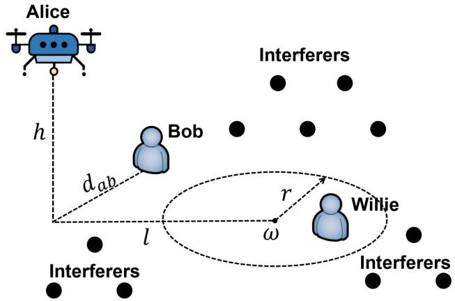  
Fig. 1. The layout of proposed covert communication network.

In the considered communication scenario, channel model includes air-ground and ground channel models. Air-to-ground channel includes line-of-sight (LoS) and non-line-of-sight (NLoS) links due to the blockage effect. A probabilistic LoS/NLoS blockage model was proposed in [26] to capture the blockage effect in UAV scenarios, in which the LoS link probability is approximated by a simplified Sigmoid function. The LoS probability of the channel between the UAV and a ground receiver with the horizontal distance d and vertical distance h is given by

$$
P _ { \mathrm { L } } ( d , h ) = \frac { 1 } { 1 + \nu \exp \left[ - \kappa \left( \arctan \left( \frac { h } { d } \right) \frac { 1 8 0 } { \pi } - \nu \right) \right] } ,\tag{1}
$$

where $\nu$ and κ are the parameters related to the propagation environment. Accordingly, the NLoS link probability is

$$
\begin{array} { r } { P _ { \mathrm { N } } ( d , h ) = 1 - P _ { \mathrm { L } } ( d , h ) . } \end{array}\tag{2}
$$

The path loss exponent differs in LoS and NLoS links, denoted as $\alpha _ { \mathrm { { L } } }$ and $\alpha _ { \mathrm { N } }$ respectively, where $\smash { \mathrm { ~ 2 ~  ~ { ~ < ~ } ~ } \alpha _ { \mathrm { L } } \le \alpha _ { \mathrm { N } } }$ . The random path loss function associated with the link from UAV to terrestrial nodes is given by

$$
\ell ( d , h ) = \left\{ { { \left( { { d ^ { 2 } } + h ^ { 2 } } \right) ^ { - { \frac { \alpha _ { \mathrm { L } } } { 2 } } } } , \mathrm { { w . p . } } P _ { \mathrm { L } } } { { \left( { { d , h } } \right) } } \right.\tag{3}
$$

LoS link experiences Nakagami fading with parameter $\mathcal { N } _ { \mathrm { L } }$ and NLoS link experiences Rayleigh fading (namely Nakagami fading with pamameter $\dot { \mathcal { N } } _ { \mathrm { N } } = 1 )$

For ground channel, we only consider NLoS link. The path loss function is given by

$$
\ell _ { \mathrm { g } } ( d ) = \left( \operatorname* { m a x } \left\{ d , d _ { 0 } \right\} \right) ^ { - \alpha _ { \mathrm { N } } } ,\tag{4}
$$

where d denotes the distance between each environmental node and receiver and $d _ { 0 }$ denotes the reference distance.

## B. Willie’s Hypothesis Test

In this part, we introduce Willie’s hypothesis test. We denote the normalized transmitted signal by $s [ k ] \sim \mathcal { C N } ( 0 , 1 )$ and normalized interference signal by $s _ { x } [ k ] \sim \mathcal { C N } ( 0 , 1 )$ , $x \in \Phi$ The received signals at Bob and Willie are

$$
y _ { b } [ k ] = \sqrt { P _ { b } } s [ k ] + \sum _ { x \in \Phi } \sqrt { P _ { I } \ell _ { \mathrm { g } } ( d _ { x b } ) g _ { x b } } s _ { x } [ k ] ,\tag{5}
$$

$$
y _ { w } [ k ] = \sqrt { P _ { w } } s [ k ] + \sum _ { x \in \Phi } \sqrt { P _ { I } \ell _ { \mathrm { g } } ( d _ { x w } ) g _ { x w } } s _ { x } [ k ] ,\tag{6}
$$

where $P _ { b } = P _ { a } \ell _ { a b } ( d _ { a b } , h ) g _ { a b }$ and $P _ { w } = P _ { a } \ell _ { a w } ( d _ { a w } , h ) g _ { a w }$ denote the received power from Alice at Bob and Willie respectively. $P _ { a }$ and $P _ { I }$ denote the transmission power at Alice and ground interferers. $g _ { a w }$ and $g _ { a b }$ denote the power fading coefficient at Willie and Bob respectively. We consider that Willie uses a radiometer because equipping the radiometer is an efficient and practical way for Willie to sniff the existence of the communication activity, which is a common assumption in [8] and [22]. Willie makes the decision whether Alice is transmitting or not by performing an optimal statistical hypothesis test. Two hypotheses are

$$
H _ { 0 } : y _ { w } [ k ] = \sqrt { P _ { w } } s [ k ] + \sum _ { x \in \Phi } \sqrt { P _ { I } \ell _ { \mathrm { g } } ( d _ { x w } ) g _ { x w } } s _ { x } [ k ] ,\tag{7}
$$

$$
H _ { 1 } : y _ { w } [ k ] = \sum _ { x \in \Phi } \sqrt { P _ { I } \ell _ { \mathrm { g } } ( d _ { x w } ) g _ { x w } } s _ { x } [ k ] ,\tag{8}
$$

Based on [27], Willie’s test statistic is given by

$$
T ( y _ { w } ) = \sum _ { k = 1 } ^ { N } \frac { | y _ { w } ( k ) | ^ { 2 } } { N } ,\tag{9}
$$

where N is the number of signal samples received by Willie. Let  denote the threshold of radiometer. When $T ( y _ { w } ) > \epsilon ,$ Willie makes the decision that Alice is transmitting messages to Bob, and $T ( y _ { w } ) < \epsilon$ means that Alice is keeping silent. The covert probability equals the probability of Willie making wrong decisions, given by

$$
p _ { c v } = \mathbb { P } \big ( T \big ( y _ { w } \mid H _ { 0 } \big ) < \epsilon \big ) + \mathbb { P } \big ( T \big ( y _ { w } \mid H _ { 1 } \big ) > \epsilon \big ) .\tag{10}
$$

Since $s [ k ] \sim \mathcal { C N } ( 0 , 1 )$ and $s _ { x } [ k ] \sim \mathcal { C N } ( 0 , 1 )$ , we can obtain $| s [ \bar { k } ] | ^ { 2 } \sim \exp ( 1 )$ and $| s _ { x } [ k ] | ^ { 2 } \sim \exp ( 1 )$ . Then, $| y _ { w } [ k ] | ^ { 2 }$ is given by

$$
| y _ { w } [ k ] | ^ { 2 } \mid H _ { 0 } \sim \exp ( \sigma _ { w } ^ { 2 } + P _ { w } ) ,\tag{11}
$$

$$
| y _ { w } [ k ] | ^ { 2 } \mid H _ { 1 } \sim \exp ( \sigma _ { w } ^ { 2 } ) ,\tag{12}
$$

where

$$
\sigma _ { w } ^ { 2 } = \sum _ { x \in \Phi } P _ { I } \ell _ { \mathrm { g } } ( d _ { x w } ) g _ { x w } .\tag{13}
$$

(13) denotes the aggregated interference power of Willie received from Φ. Based on (9), we have

$$
T ( y _ { w } | H _ { 0 } ) \sim \mathrm { G a m m a } \left( N , \frac { N } { \sigma _ { w } ^ { 2 } + P _ { w } } \right) ,\tag{14}
$$

$$
T ( y _ { w } | H _ { 1 } ) \sim \mathrm { G a m m a } \left( N , \frac { N } { \sigma _ { w } ^ { 2 } } \right) ,\tag{15}
$$

where N is the scale parameter and $\textstyle \frac { N } { \sigma _ { w } ^ { 2 } } , \frac { N } { \sigma _ { w } ^ { 2 } + P _ { w } }$ are rate parameters. If Willie obtains a sufficient number of signal samples to make his decision enough accurate, we can approximately consider that $N  \infty$ to simplify the analysis. And then we can obtain1

$$
T ( y _ { w } | H _ { 0 } ) = \sigma _ { w } ^ { 2 } + P _ { w } ,\tag{16}
$$

$$
T ( y _ { w } | H _ { 1 } ) = \sigma _ { w } ^ { 2 } ,\tag{17}
$$

which exists only when $N  \infty$ , because $\mathbb { E } [ T ( y _ { w } | H _ { 0 } ) ] =$ $\sigma _ { w } ^ { 2 } , \mathbb { E } [ T ( y _ { w } | H _ { 1 } ) ] = \sigma _ { w } ^ { 2 } + P _ { w }$ and $\begin{array} { r l } { \mathrm { V a r } [ T ( y _ { w } | H _ { 0 } ) ] } & { { } = } \end{array}$ $\mathrm { V a r } [ T ( y _ { w } | H _ { 1 } ) ] ~ = ~ 0 .$ . For each $\epsilon , \ \sigma _ { w } ^ { 2 }$ and $P _ { w }$ , the covert probability is given by

$$
p _ { c v } = \left\{ \begin{array} { l l } { 0 , \ \sigma _ { w } ^ { 2 } \leq \epsilon \leq \sigma _ { w } ^ { 2 } + P _ { w } } \\ { 1 , \ o t h e r w i s e . } \end{array} \right.\tag{18}
$$

(18) denotes each decision of Willie and is a Bernoulli variable related to different value of $\sigma _ { w } ^ { 2 }$ and $P _ { w }$ . If Willie makes a right judgement this time, $p _ { c v } = 0 ,$ otherwise, $p _ { c v } = 1$

## III. PERFORMANCE ANALYSIS OF THE COVERT COMMUNICATION SYSTEM

In this section, we study the performance of the airto-ground covert communication system. First, we provide the approximation of the interference distribution, which is essential to the derivation of the average covert probability and connection probability. Then, we derive the expression of average covert probability and connection probability. After that, we analyze the covert throughput which denotes the minimum achievable rate under covertness and reliability constraints.

## A. Interference Distribution Approximation

Since the PDF of $\sigma _ { w } ^ { 2 }$ has a very complicated form, we provide approximation of $f _ { \sigma _ { \prime \prime } ^ { 2 } } \left( x \right)$ using several common PDFs to simplify the analysis. The rule of choosing these PDFs is that for the probability distribution of the aggregated interference $f _ { \sigma _ { \mathscr { w } } ^ { 2 } } ( x )$ , when $x  0 , f _ { \sigma _ { \cdot \cdot \cdot } ^ { 2 } } ( x )  0$ and when $x \to \infty$ $f _ { \sigma _ { w } ^ { 2 } } \left( x \right) \stackrel { \smile } { \to } 0$ , which the chosen PDFs must satisfy. Also, under the bounded path loss model, the tail of $f _ { \sigma _ { \pi } ^ { 2 } } \left( x \right)$ follows the tail of fading distribution [28]. The gamma distribution has an exponential tail, while the inverse Gaussian distribution has a slightly super exponential tail. Inverse Gamma distribution has a fourth order decaying tail, and log-normal has a tail which decays polynomially. The PDFs above have different tail decays, so we choose them to fit the probability distribution of $\sigma _ { w } ^ { 2 }$ . Moreover, based on the good approximation of these PDFs shown in [28] and [29], we choose the PDFs below:

TABLE I  
SYMBOLS AND DESCRIPTIONS
<table><tr><td rowspan=1 colspan=1>Symbol</td><td rowspan=1 colspan=1>Description</td><td rowspan=1 colspan=1>Default value</td></tr><tr><td rowspan=1 colspan=1> $\lambda _ { I }$ </td><td rowspan=1 colspan=1>Density of environmental interference nodes</td><td rowspan=1 colspan=1> $\overline { { 1 0 ^ { - 2 } } }$ </td></tr><tr><td rowspan=1 colspan=1> $P _ { I }$ </td><td rowspan=1 colspan=1>Transmission power of each interference node</td><td rowspan=1 colspan=1> $1 0 \mathrm { d B m }$ </td></tr><tr><td rowspan=1 colspan=1>r</td><td rowspan=1 colspan=1>The radius of Willie&#x27;s uncertain area</td><td rowspan=1 colspan=1>50m</td></tr><tr><td rowspan=1 colspan=1> $l$ </td><td rowspan=1 colspan=1>The horizontal distance between Alice and the center of Willie&#x27;s uncertain area ω</td><td rowspan=1 colspan=1>150m</td></tr><tr><td rowspan=1 colspan=1> $d _ { a b }$ </td><td rowspan=1 colspan=1>The horizontal distance between Alice and Bob</td><td rowspan=1 colspan=1>50m</td></tr><tr><td rowspan=1 colspan=1> $h$ </td><td rowspan=1 colspan=1>The flying altitude of Alice [31]</td><td rowspan=1 colspan=1>100m</td></tr><tr><td rowspan=1 colspan=1> $P _ { a }$ </td><td rowspan=1 colspan=1>The transmission power of Alice</td><td rowspan=1 colspan=1>20dBm</td></tr><tr><td rowspan=1 colspan=1> $\alpha _ { \mathrm { L } } , \alpha _ { \mathrm { N } }$ </td><td rowspan=1 colspan=1>The path loss exponents of the LoS and NLoS links</td><td rowspan=1 colspan=1>2,4</td></tr><tr><td rowspan=1 colspan=1> $\mathcal { N } _ { \mathrm { L } } , \mathcal { N } _ { \mathrm { N } }$ </td><td rowspan=1 colspan=1>The Nakagami fading parameters of the LoS and NLoS links</td><td rowspan=1 colspan=1>3,1</td></tr><tr><td rowspan=1 colspan=1> $\nu , \kappa$ </td><td rowspan=1 colspan=1>The parameters in the LoS probability model [31]</td><td rowspan=1 colspan=1>9.6117,0.1581</td></tr><tr><td rowspan=1 colspan=1> $d _ { 0 }$ </td><td rowspan=1 colspan=1>The parameter of bounded path loss law</td><td rowspan=1 colspan=1>10m</td></tr></table>

(1) Gamma distribution: $\begin{array} { r } { f _ { G a } ( x ) ~ = ~ \frac { \rho ^ { \theta } } { \Gamma ( \theta ) } x ^ { \theta - 1 } \exp ( - \rho x ) } \end{array}$ with mean $\theta / \rho$ and variance $\theta / \rho ^ { 2 }$

(2) Inverse Gamma distribution: $\begin{array} { r l r l } { f _ { I G a } ( x ) } & { { } } & { = } \end{array}$ ${ \frac { \beta ^ { \dot { \alpha } } } { \Gamma ( \alpha ) } } { x ^ { - \alpha - 1 } } e ^ { - { \frac { \beta } { x } } }$ , with mean $\beta / ( \alpha - 1 )$ and variance $\beta ^ { 2 } / ( \alpha - 1 ) ( \alpha - 2 )$

(3) Inverse Gaussian distribution: $\begin{array} { r l r l } { f _ { I G } ( x ) } & { { } } & { = } \end{array}$ $\begin{array} { r } { \sqrt { \frac { \zeta } { 2 \pi x ^ { 3 } } } \exp \left\{ \frac { - \zeta ( x - \mu ) ^ { 2 } } { 2 \mu ^ { 2 } x } \right\} } \end{array}$ , with mean $\mu$ and variance $\mu ^ { 3 } / \zeta$

(4) Lognormal distribution: $f _ { L N } ( x ) ~ = ~ \frac { 1 } { x \sigma \sqrt { 2 \pi } } e ^ { - \frac { ( \ln x - \mu ) ^ { 2 } } { 2 \sigma ^ { 2 } } }$ with mean $\exp ( \mu + \sigma ^ { 2 } / 2 )$ and variance $( e ^ { \sigma ^ { 2 } } - 1 ) e ^ { 2 \mu + \sigma ^ { 2 } }$

Using two-moment matching method, we need the mean and variance of the aggregated interference to obtain the parameters in each PDF, given by

$$
\begin{array} { r l } { \displaystyle \mathbb { E } \big ( \sigma _ { w } ^ { 2 } \big ) = \mathbb { E } \left( \sum _ { x \in \Phi } P _ { I } g _ { x w } \ell _ { \mathrm { g } } ( d _ { x w } ) \right) ~ } & { } \\ { \displaystyle } & { \stackrel { ( a ) } { = } 2 \pi P _ { I } \lambda _ { I } \left( \int _ { 0 } ^ { \infty } \ell _ { \mathrm { g } } ( u ) u \mathrm { d } u \right) } \\ { \displaystyle } & { = 2 \pi \lambda _ { I } P _ { I } d _ { 0 } ^ { 2 - \alpha _ { \mathrm { N } } } \left( \frac { 1 } { \alpha _ { \mathrm { N } } - 2 } + \frac { 1 } { 2 } \right) , } \end{array}\tag{19}
$$

where step (a) uses Campbell theorem [30]. The variance of the aggregate interference is given by

$$
\mathrm { V a r } \big [ \sigma _ { w } ^ { 2 } \big ] = \mathbb { E } [ ( \sigma _ { w } ^ { 2 } ) ^ { 2 } ] - \mathbb { E } ^ { 2 } [ ( \sigma _ { w } ^ { 2 } ) ] ,\tag{20}
$$

and $\mathbb { E } \big ( ( \sigma _ { w } ^ { 2 } ) ^ { 2 } \big )$ is given by

$$
\begin{array} { r l } & { \mathbb { E } \big ( ( \sigma _ { w } ^ { 2 } ) ^ { 2 } \big ) = \mathbb { E } \left( \left( \displaystyle \sum _ { x \in \Phi } P _ { I } g _ { x w } \ell _ { \mathrm { g } } ( d _ { x w } ) \right) ^ { 2 } \right) } \\ & { \qquad = P _ { I } ^ { 2 } \bigg ( \displaystyle \sum _ { x \in \Phi } \mathbb { E } \Big ( \left( \ell _ { \mathrm { g } } ( d _ { x w } ) g _ { x w } \right) ^ { 2 } \Big ) } \\ & { \qquad + \displaystyle \sum _ { x _ { 1 } , x _ { 2 } \in \Phi } \mathbb { E } \Big ( \ell _ { \mathrm { g } } ( d _ { x _ { 1 } w } ) g _ { x _ { 1 } w } \ell _ { \mathrm { g } } ( d _ { x _ { 2 } w } ) g _ { x _ { 2 } w } \Big ) \bigg ) } \\ & { \qquad \quad \xrightarrow { x } \scriptscriptstyle { x _ { 1 } \ne x _ { 2 } } } \end{array}
$$

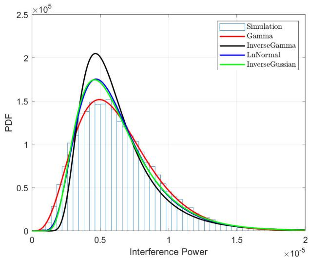  
Fig. 2. PDFs of aggregated interference power with $P _ { I } = 1 0 \mathrm { d B m }$ $\lambda _ { I } =$ $1 0 ^ { - 2 }$ $\alpha _ { \mathrm { { N } } } = 4$ and $\bar { ( d _ { 0 } ) } = 1 0$

$$
\begin{array} { r l } & { \mathrel { \phantom { = } } \pi P _ { I } ^ { 2 } \lambda _ { I } \int _ { 0 } ^ { \infty } \ell _ { \mathrm { g } } ^ { 2 } ( u ) u \mathrm { d } u } \\ & { \mathrel { \phantom { = } } + 4 \pi ^ { 2 } P _ { I } ^ { 2 } \lambda _ { I } ^ { 2 } \left( \int _ { 0 } ^ { \infty } \ell _ { \mathrm { g } } ( u ) u \mathrm { d } u \right) ^ { 2 } } \\ & { \mathrel { \phantom { = } } \frac { 2 \alpha _ { \mathrm { N } } \lambda \pi P _ { I } ^ { 2 } d _ { 0 } ^ { 2 - 2 \alpha _ { \mathrm { N } } } } { \alpha _ { \mathrm { N } } - 1 } + \mathbb { E } ^ { 2 } \left( \sigma _ { w } ^ { 2 } \right) , } \end{array}\tag{21}
$$

where step (b) uses Campbell theorem and the second-order product density of the PPP [30]. Hence, we have

$$
\begin{array} { r l } & { \mathrm { V a r } \left( \sigma _ { w } ^ { 2 } \right) = \mathbb { E } ( ( \sigma _ { w } ^ { 2 } ) ^ { 2 } ) - \mathbb { E } ^ { 2 } ( \sigma _ { w } ^ { 2 } ) } \\ & { \qquad = \frac { 2 \alpha _ { \mathrm { N } } \lambda \pi P _ { I } ^ { 2 } d _ { 0 } ^ { 2 - 2 \alpha _ { \mathrm { N } } } } { \alpha _ { \mathrm { N } } - 1 } . } \end{array}\tag{22}
$$

In Fig. 2, we plot the distribution of aggregated interference power $\sigma _ { w } ^ { 2 }$ by Monte Carlo simulation and four fitted PDFs with parameters in Table I. Evidently, in the case of $\alpha _ { \mathrm { { N } } } = 4 .$ Gamma distribution fits the best for the simulation. However, the worst fit is inverse Gamma distribution. Therefore, we use Gamma distribution to fit the interference probability distribution. Hence, $f _ { \sigma _ { w } ^ { 2 } } ( x )$ can be approximated as

$$
f _ { \sigma _ { w } ^ { 2 } } ( x ) \approx \frac { \rho ^ { \theta } } { \Gamma ( \theta ) } x ^ { \theta - 1 } \exp \left( - \rho x \right) , x \geq 0 ,\tag{23}
$$

where

$$
\rho = \frac { d _ { 0 } ^ { \alpha _ { \mathrm { N } } } ( \alpha _ { \mathrm { N } } - 1 ) } { P _ { I } ( 2 \alpha _ { \mathrm { N } } - 4 ) } ,\tag{24}
$$

and

$$
\theta = 2 \lambda _ { I } d _ { 0 } ^ { 2 } \frac { \alpha _ { \mathrm { { N } } } ( \alpha _ { \mathrm { { N } } } - 1 ) } { ( 2 \alpha _ { \mathrm { { N } } } - 4 ) ^ { 2 } } .\tag{25}
$$

Now, we have a suitable approximation for the probability distribution of interference power, which helps us for the following covert analysis.

## B. Average Covert Probability

The average covert probability is used to capture the covertness. Based on 18, the average covert probability is given by

$$
\begin{array} { r l } & { \overline { { p } } _ { c v } = 1 - { \displaystyle \int _ { 0 } ^ { \infty } } \mathbb { P } ( \sigma _ { w } ^ { 2 } < \epsilon ^ { * } < \sigma _ { w } ^ { 2 } + P _ { w } ) f _ { d _ { a w } } ( t ) \mathrm { d } t } \\ & { = 1 - { \displaystyle \int _ { 0 } ^ { \infty } } \int _ { 0 } ^ { \infty } { \displaystyle \int _ { A } ^ { \epsilon ^ { * } } } f _ { d _ { a w } } ( t ) f _ { \sigma _ { w } ^ { 2 } } ( x ) f _ { P _ { w } } ( y ) \mathrm { d } x \mathrm { d } y \mathrm { d } t , } \end{array}\tag{26}
$$

where $A = \mathrm { m a x } \{ \epsilon ^ { * } - y , 0 \}$ . To derive (26), we need to derive the distribution of $\sigma _ { w } ^ { 2 } , P _ { w }$ and $d _ { a w } ,$ and we use (23) to approximate the PDF of $\sigma _ { w } ^ { 2 }$ . Firstly we obtain the probability distribution of $P _ { w }$ . For LoS and NLoS links, $f _ { P _ { w } } ( y )$ is respectively given by

$$
f _ { P _ { w } } ( y ) = \frac { \left( \frac { \mathcal { N } _ { j } } { c _ { j } ( d _ { a w } , h ) } \right) ^ { \mathcal { N } _ { j } } y ^ { \mathcal { N } _ { j } - 1 } } { \Gamma ( \mathcal { N } _ { j } ) } e ^ { \frac { - \mathcal { N } _ { j } y } { c _ { j } ( d _ { a w } , h ) } } , \mathrm { w . p . } P _ { j } ( d _ { a w } , h ) ,\tag{27}
$$

where $\begin{array} { r } { c _ { j } ( d _ { a w } , h ) = \frac { P _ { a } } { \sqrt { ( d _ { a w } ^ { 2 } + h ^ { 2 } ) } ^ { \alpha _ { j } } } , j \in \{ \mathrm { N } , \mathrm { L } \} . } \end{array}$

Secondly, we derive the distribution of $d _ { a w } .$ . The PDF of $d _ { a w }$ is related to the relative magnitudes of r and l, where $r$ denotes the radius of disc $B ( \omega , r )$ where Willie is distributed uniformly and l denotes the horizontal distance between Alice and ω. According to [31], the PDF of $d _ { a w }$ is given by

$$
f _ { d _ { a w } } ( t ) = \frac { 2 t } { \pi r ^ { 2 } } \mathrm { a r c c o s } \left( \frac { t ^ { 2 } + l ^ { 2 } - r ^ { 2 } } { 2 t l } \right) , 0 < l - r < t < l + r\tag{28}
$$

$$
f _ { d _ { a w } } ( t ) = \left\{ \frac { \displaystyle \frac { 2 t } { r ^ { 2 } } , 0 < t < r - l } { \displaystyle \frac { 2 t } { \pi r ^ { 2 } } \mathrm { a r c c o s } \left( \displaystyle \frac { t ^ { 2 } + l ^ { 2 } - r ^ { 2 } } { 2 t l } \right) , r - l < t < r + l . } \right.\tag{29}
$$

where (28) denotes the case $r \leq l$ and (29) denotes the case $r > l .$

Clearly, the value of  affects the correctness of Willie’s decision. We consider the worst case for Alice, where Willie adopts the best threshold $\epsilon ^ { * }$ based on different levels of prior information that Willie knows. [8] considers the case where Willie knows the instantaneous value of the received power from Alice, while [22] and [32] consider the case where Willie does not know it and only knows the probability distribution of the received power from Alice. We consider two cases separately, and give the minimum average covert probability for each case.

1) Case 1: We first assume that Willie knows the instantaneous value of $P _ { w }$ and can adjust the threshold to minimize the error detection probability. This is considered to be the most ideal detection case for Willie.2 The average covert probability is given in Theorem 1.

Theorem 1: When Willie knows the instantaneous received power and adjusts the threshold to minimize the error detection probability, the minimum average covert probability is

$$
\overline { { p } } _ { c v }
$$

$$
\begin{array} { l } { \displaystyle \approx \int _ { \mathrm { m a x } \{ l - r , 0 \} } ^ { l + r } \int _ { 0 } ^ { \infty } \left( \frac { \Gamma \bigg ( \theta , \rho \epsilon ^ { * } ( y ) \bigg ) } { \Gamma ( \theta ) } + \frac { \gamma \bigg ( \theta , \rho \epsilon ^ { * } ( y ) - \rho y \bigg ) } { \Gamma ( \theta ) } \right) } \\ { \displaystyle \times \left( \sum _ { i \in \{ \mathrm { N } , \mathrm { L } \} } P _ { i } ( t , h ) \frac { \bigg ( \frac { N _ { i } } { c _ { i } ( t , h ) } \bigg ) ^ { N _ { i } } } { \Gamma ( \mathcal { N } _ { i } ) } y ^ { N _ { i } - 1 } e ^ { \frac { - N _ { i } y } { c _ { i } ( t , h ) } } f _ { d _ { a v } } ( t ) \right) \mathrm { d } y \mathrm { d } t , } \end{array}\tag{30}
$$

where $\epsilon ^ { * } ( y )$ is the optimal threshold when $P _ { w } \ = \ y$ and satisfies the conditions as follows

$$
\epsilon ^ { * } = \left\{ \begin{array} { l l } { P _ { w } \exp { \left( \frac { \rho P _ { w } } { \theta - 1 } \right) } } \\ { \exp { \left( \frac { \rho P _ { w } } { \theta - 1 } \right) - 1 } } \\ { y , \ 0 < \theta < 1 . } \end{array} \right.\tag{31}
$$

Proof: Please refer to Appendix A.

Theorem 1 provides an approximation of the average covert probability $p _ { c v }$ in case 1. Because the exact result of $f _ { \sigma _ { w } ^ { 2 } } ( x )$ is complicated and only when $\alpha = 4$ it has closed-form, we use gamma distribution $f _ { G a } ( x )$ as an approximation of $f _ { \sigma _ { w } ^ { 2 } } \left( x \right)$ This can help us to simplify the analysis of the average covert probability and also gives good approximation in Section IV. 2) Case 2: We assume that the instantaneous value of $P _ { w }$ is unknown to Willie, but Willie knows the probability distribution of $P _ { w }$ . Willie can achieve this through simulations of Alice’s transmission in order to obtain some prior distributions. In this case Willie knows less information of the received power from Alice than in case 1, but it is still beneficial for Willie to make decisions compared to having no information at all.

Theorem 2: When Willie does not know the instantaneous received power but knows the probability distribution of $P _ { w } ,$ the optimal threshold $\epsilon ^ { * }$ satisfies

$$
\epsilon ^ { \theta - 1 } = \int _ { 0 } ^ { \epsilon } ( \epsilon - y ) ^ { \theta - 1 } e ^ { \rho y } f _ { P _ { w } } ( y ) \mathrm { d } y .\tag{32}
$$

Proof: Please refer to Appendix B.

Similarly, Theorem 2 also indicates an approximation for average covert probability in case 2 with the optimal threshold in (32). The difference between average covert probability in case 1 and case 2 is the optimal threshold in each case. Here, Willie needs to know the probability distribution of $P _ { w }$ to find the optimal threshold, and the probability distribution of $P _ { w }$ is related to the horizontal distance between Alice and Willie $d _ { a w }$ . Therefore, in case 2, Willie obtains the optimal threshold for a given $d _ { a w } .$ , which indicates that $\epsilon ^ { * } ( d _ { a w } )$ is related to $d _ { a w } .$

Intuitively, when Alice uses a larger $P _ { a }$ for transmission, it is easier for Willie to detect Alice’s signal, and the covertness of the system decreases. We give the proof in the following corollary.

Corollary 1: Regardless whether the instantaneous received power is known or unknown to Willie, $\overline { { p } } _ { c v } ( P _ { a } , P _ { I } )$ decreases monotonically with $P _ { a }$ and increases monotonically with $P _ { I }$

Proof: Please refer to Appendix C.

Corollary 1 indicates that using $P _ { a 1 } = k P _ { a }$ and $\begin{array} { r } { P _ { I 1 } = \frac { P _ { I } } { k } } \end{array}$ have the same effect on the average covert probability. When $P _ { I }$ increases, Alice can adopt a greater $P _ { a }$ to make it easier for the decoding of receiver. Conversely, as $P _ { I }$ decreases, Alice can reduce her transmission power $P _ { a }$ to maintain the average covert probability.

## C. Connection Probability

In addition to the positive impact on network covertness, the aggregated interference also leads to the possibility of connection failure between Alice and Bob. Hence, the connection probability $p _ { c n }$ is used to measure the network connection ability. According to Shannon’s theorem, the connection probability $p _ { c n }$ is given by

$$
p _ { c n } = \mathbb { P } \Big ( \ln ( 1 + \mathrm { S I R } ) > R \Big ) ,\tag{33}
$$

where $\begin{array} { r } { \mathrm { S I R } \ = \ \frac { P _ { b } } { \sigma _ { h } ^ { 2 } } } \end{array}$ denotes the signal to interference ratio and R denotes the target transmission rate of Alice. To ensure the reliability of transmission, Alice can adjust the transmission power $P _ { a }$ and transmission rate $R$ to reach the target reliability. Similarly, we provide the approximation of the connection probability here due to the complicated form of $f _ { \sigma _ { \mathrm { r } } ^ { 2 } } ( x )$

Theorem 3: The connection probability from Alice to Bob is

$$
\begin{array} { r l r } {  { p _ { c n } \approx \int _ { 0 } ^ { \infty } \frac { \Gamma ( \theta , \frac { \rho y } { e ^ { R } - 1 } ) } { \Gamma ( \theta ) } } } \\ & { } & { \times \underbrace { \sum _ { i \in \{ \mathrm { N } , \mathrm { L } \} } P _ { i } ( d _ { a b } , h ) \frac { ( \frac { \sqrt { i } _ { i } } { c _ { i } ( d _ { a b } , h ) } ) ^ { \mathcal { N } _ { i } } y ^ { \mathcal { N } _ { i } - 1 } } { \Gamma ( \mathcal { N } _ { i } ) } e ^ { \frac { - \mathcal { N } _ { i } y } { c _ { i } ( d _ { a b } , h ) } } } _ { \Gamma ( \mathcal { N } _ { i } ) } \mathrm { d } y , } \end{array}\tag{34}
$$

where $\begin{array} { r } { c _ { i } ( d _ { a b } , h ) = \frac { P _ { a } } { \sqrt { ( d _ { a b } ^ { 2 } + h ^ { 2 } ) } ^ { \alpha _ { i } } } ( i \in \{ \mathrm { N } , \mathrm { L } \} ) . } \end{array}$

Proof: Since $\sigma _ { b } ^ { 2 }$ and $\sigma _ { w } ^ { 2 }$ have the same probability distribution, the PDF of $\sigma _ { b } ^ { 2 }$ is given by

$$
f _ { \sigma _ { b } ^ { 2 } } ( x ) \approx \frac { \rho ^ { \theta } } { \Gamma ( \theta ) } x ^ { \theta - 1 } \exp \left( - \rho x \right) , x \geq 0 .\tag{35}
$$

For LoS and NLoS links, $f _ { P _ { b } } ( y )$ is given by

$$
f _ { P _ { b } } ( y ) = \frac { \left( \frac { \mathcal { N } _ { i } } { c _ { i } \left( d _ { a b } , h \right) } \right) ^ { \mathcal { N } _ { i } } } { \Gamma ( \mathcal { N } _ { i } ) } y ^ { \mathcal { N } _ { i } - 1 } e ^ { \frac { - \mathcal { N } _ { i } y } { c _ { i } \left( d _ { a b } , h \right) } } , i \in \{ \mathrm { N } , \mathrm { L } \} ,\tag{36}
$$

where $\begin{array} { r } { c _ { i } ( d _ { a b } , h ) = \frac { P _ { a } } { \sqrt { \left( d _ { a b } ^ { 2 } + h ^ { 2 } \right) ^ { \alpha _ { i } } } } ( i \in \{ \mathrm { N } , \mathrm { L } \} ) . } \end{array}$

According to the total probability law, the connection probability is equal to the LoS link connection probability plus

the NLoS link connection probability. Thus, $p _ { c n }$ is given by

$$
\begin{array} { l } { { \displaystyle p _ { c n } = \mathbb { P } \left( \ln \left( 1 + \frac { P _ { b } } { \sigma _ { b } ^ { 2 } } \right) > R \right) } } \\ { { \displaystyle \quad = \int _ { 0 } ^ { \infty } \int _ { 0 } ^ { - \frac { p _ { c } } { R _ { b } } } f _ { \sigma _ { b } ^ { 2 } } ( x ) f _ { P _ { b } } ( y ) \mathrm { d } x \mathrm { d } y } } \\ { { \displaystyle \quad \approx \int _ { 0 } ^ { \infty } \frac { \gamma \left( \theta , \frac { \rho y } { e R _ { - 1 } } \right) } { \Gamma ( \theta ) } } } \\ { { \displaystyle \quad \quad \times \sum _ { i \in \{ \aleph , L \} } P _ { i } ( d _ { a b } , h ) \frac { \left( \frac { N _ { i } } { c _ { i i } ( d _ { a b } , h ) } \right) ^ { N _ { i } } } { \Gamma ( N _ { i } ) } y ^ { N _ { i } - 1 } e ^ { \frac { - N _ { i } y } { c _ { i i } ( d _ { a b } , h ) } } \mathrm { d } y } . }  \end{array}\tag{37}
$$

This completes the proof of Theorem 3.

Remark 1: When Alice hovers directly above Bob, the connection probability reaches the maximum value, because the probability of the LoS link reaches its maximum value, and the path loss reaches its minimum value in this case.

## D. Covert Throughput

Covert throughput captures the maximum transmission rate achievable while satisfying the requirements of covertness and reliability, given by

$$
\begin{array} { r } { \xi = \operatorname* { m a x } R ( P _ { a } ^ { * } ) , \mathrm { s . t . } \ \bar { p } _ { c v } ( \epsilon ^ { * } ) \geq \beta , p _ { c n } \geq \gamma , } \end{array}\tag{38}
$$

where $\beta , \gamma \in ( 0 , 1 )$ . Based on Corollary 1, Alice can adopt the maximum $P _ { a } ^ { * }$ which makes $\overline { { p } } _ { c v } ( P _ { a } ^ { * } , \epsilon ^ { * } ) = \beta$ . After that, Alice searches for the maximum $\xi ~ = ~ R ^ { * }$ which makes $p _ { c n } ( P _ { a } ^ { * } , R ^ { * } ) = \gamma$

Theorem 4: When $P _ { I 1 } = k P _ { I }$ and $P _ { a 1 } = k P _ { a }$ , the covert throughput $\xi ( P _ { I 1 } , P _ { a 1 } )$ remains unchanged.

Proof: Assuming that Alice transmitts under the maximal rate $R ^ { * }$ and $P _ { I 1 } = k P _ { I } , k > 1$ . If Alice does not change her transmission power and rate, the average covert probability rises and the connection probability declines. Hence, Alice can adopt $P _ { a 1 } \leq k P _ { a }$ to maintain $\overline { { p } } _ { c v } \geq \beta$ based on Corollary 1. To maximize $R , P _ { a 1 } = k P _ { a }$ . Based on (33), we have

$$
\begin{array} { r } { p _ { c n } ( k P _ { I } , k P _ { a } ) = p _ { c n } ( P _ { I } , P _ { a } ) , } \end{array}\tag{39}
$$

which means the maximize $R ^ { * }$ remains constant. This completes the proof. 

## IV. NUMERICAL RESULTS

In this section, we provide numerical results of performance metrics of the covert communication network. Default parameter settings are presented in Table I. To obtain the parameters Alice can detect Willie’s distribution area and interference transmission power as well as density of interferers.

Fig. 3 illustrates the influence of the transmission power of the interfering node, denoted as $P _ { I }$ , on the average covert probability $\overline { { p } } _ { c v }$ across various horizontal distances from Alice to the center of Willie’s uncertain area, denoted as $l ,$ for case 1 and case 2. Again, in case 1, Willie knows the instantaneous received power $P _ { w } ,$ and, in case 2, Willie only knows the probability distribution of $P _ { w }$ . For both cases, we observe that average covert probability increases with l and $P _ { I }$ . This is because an increase in l leads to a reduction in the LoS link probability $P _ { \mathrm { L } } ( d _ { a w } , h )$ and also extends the distance between Alice and Willie, resulting in a lower received power at Willie. Consequently, this contributes to an increase of the average covert probability $\overline { { p } } _ { c v }$

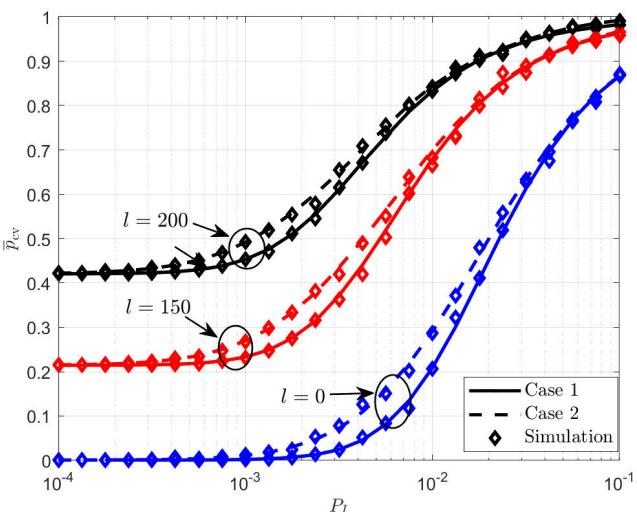

Fig. 3. Average covert probability versus the horizontal distance from Alice to the center of Willie’s distribution ω.  
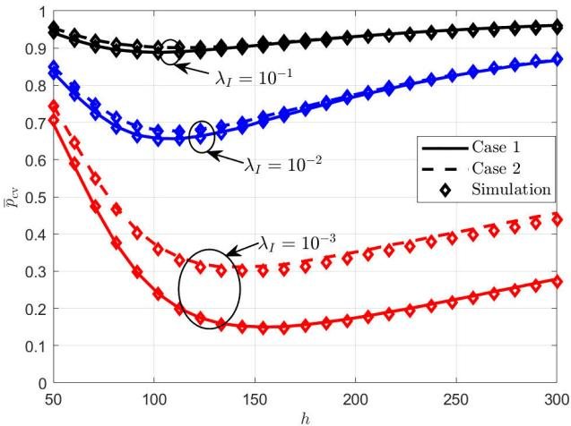  
Fig. 4. Average covert probability versus the flying height of Alice.

Fig. 4 shows the effects of Alice’s height h and the node density $\lambda _ { I }$ on the average covert probability $\overline { { p } } _ { c v }$ for case 1 and case 2. For the two cases, as h increases, the average covert probability first drops to the minimum value and then rises. This is because when h is small, the height increase enlarges the LoS link probability $P _ { \mathrm { L } } ( d _ { a w } , h )$ from Alice to Willie, which is beneficial to Willie’s eavesdropping. As the height h continues to increase, the probabilities of LoS and NLoS links would barely change, and the propagation distance between Alice and Willie becomes larger, and the received power at Willie becomes weaker, resulting in a better covertness. It can be also observed that a higher interference node density leads to a better covertness performance due to the severer interference. Similar to Fig. 3, the average covert probability $\overline { { p } } _ { c v }$ in case 1 is higher than that in case 2. In addition, when node density $\lambda _ { I }$ is smaller, the gap between average covert probability for case 1 and case 2 are more obvious. This is because when $\lambda _ { I }$ is smaller, the distribution of aggregated interference power is more compact, which means the average covert probability is more sensitive to the threshold. As a result, the gap between average covert probability for two cases becomes more significant.

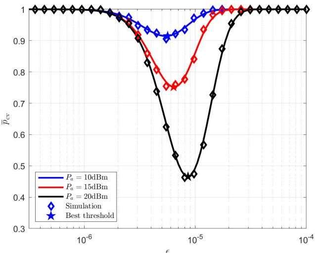  
Fig. 5. Average covert probability versus the threshold of Willie in case 2.

Fig. 5 shows the average covert probability $\overline { { p } } _ { c v }$ under various threshold  with different transmission power of Alice $P _ { a }$ for case 2 and $r \ = \ 0 ,$ where r denotes the radius of Willie’s uncertain area. When  is too small or too large, it is difficult for Willie to make accurate decisions, because when  is too small, the false alarm probability is high and when  is too large, the misdetection probability is high. Therefore, the best threshold $\epsilon ^ { * }$ for Willie exists. For different $P _ { a } .$ , the optimal threshold obtained via the analytical results in Theorem 1 makes the average covert probability reach the minimum value. Additionally, when Alice’s transmission power $P _ { a }$ becomes smaller, the optimal threshold $\epsilon ^ { * }$ also decreases, because the received power from Alice at Willie also decreases, which means Willie needs to choose a lower detection threshold to avoid enlarging the miss detection probability. But at the same time the average covert probability $\overline { { p } } _ { c v } ^ { * }$ improves, which also verifies Corollary 1. Based on this, Alice can choose an appropriate $P _ { a }$ to reduce the probability of being detected by Willie.

Fig. 6 shows the impact of transmission power of Alice $P _ { a }$ with different transmission power of each interferer $P _ { I }$ on the optimal threshold $\epsilon ^ { * }$ for case 2 and $r = 0 .$ . It is obvious that when transmission power of Alice $P _ { a }$ increases, $\epsilon ^ { * }$ also increases, because when Alice adopts a larger transmission power, Willie needs to increase the detection threshold to avoid increasing the false alarm probability. Moreover, the increase of $P _ { I }$ leads to the increase of $\epsilon ^ { * }$ , because Willie aims to maximize $\mathbb { P } \big ( \sigma _ { w } ^ { 2 } \ < \ \epsilon ^ { * } \ < \ \sigma _ { w } ^ { 2 } \ + \ P _ { w } \big )$ . When $P _ { I }$ increases, the aggregated interference power $\sigma _ { w } ^ { 2 }$ also increases, which means Willie needs to increase the detection threshold for eavesdropping. We can infer that from the perspective of Willie, it is necessary to know the exact transmission power of Alice when $P _ { I }$ is high, because if Alice rises her transmission power $P _ { a }$ slightly but Willie does not know that, it may cause significant increase on the average covert probability.

Fig. 7 shows the impact of the received power at Willie $P _ { w }$ with different transmission power of each interferer $P _ { I }$ on the optimal threshold $\epsilon ^ { * }$ for case 1. Similarly, when the received power at Willie $P _ { w }$ increases, Willie needs to adopt a larger detection threshold. For a larger $P _ { I }$ , a greater threshold should be taken. This indicates that in both cases, when Alice uses a higher transmission power, Willie should take a larger threshold to improve detecion accuracy. And when $P _ { w }$ rises, the optimal threshold $\epsilon ^ { * }$ rises more and more rapidly.

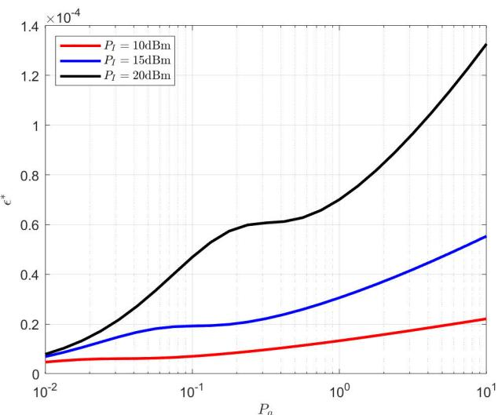

Fig. 6. The optimal threshold versus the transmission power in case 2.  
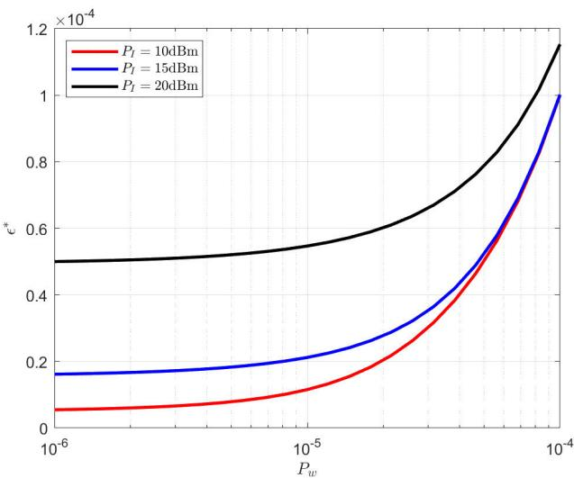  
Fig. 7. The optimal threshold versus the received power in case 1.

Fig. 8 shows the effect of the flying height of Alice on connection probability $p _ { c n }$ with different transmission rate R. As h becomes larger, the connection probability first rises then drops, and a larger transmission rate leads a smaller connection probability. The reason is as follows. When h is small, the increase of height enlarges the probability of the LoS link from Alice to Bob, and then connection probability is improved. Similar to Fig. 4, when the height h continues to increase, the probabilities of LoS and NLoS links do not change significantly, and the spatial distance from Alice to Bob increases and the connection probability declines.

Fig. 9 illustrates the impact of Alice’s flying height h and the horizontal distance between Alice and Bob $d _ { a b }$ on the covert throughput for case 1 and case 2. We observe that at lower values of height h and high values of $d _ { a b } ,$ the covert throughput remains relatively low. However, for a larger $d _ { a b }$ , as h increases, the covert throughput experiences a rapid increase. This phenomenon can be attributed to the fact that when the height rises, the increases of connection probability has a greater impact on covert throughput than the decrease of average covert probability, or both the connection probability and the average covert probability increase simultaneously. Thus, when $d _ { a b }$ is large, the covert throughput first increases. Conversely, when $d _ { a b }$ is relatively small, as the height rises, the covert throughput decreases monotonously. Furthermore, as the horizontal distance between Alice and Bob $d _ { a b }$ decreases, the covert throughput increases, because the LoS link probability between Alice and Bob increases, and the spatial distance between Alice and Bob decreases, which means that Alice can adopt a larger transmission power and transmission rate under the requirement of reliability. And it is obvious that in case 2 the covert throughput is higher than that in case 1.

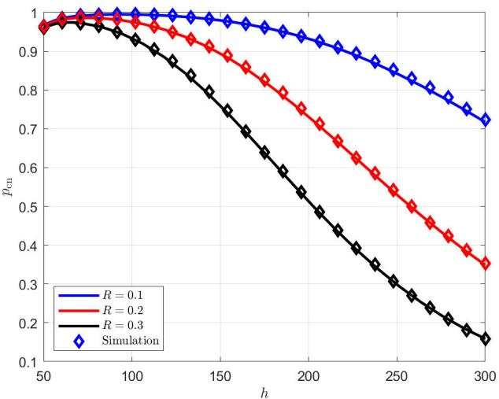  
Fig. 8. Connection probability versus the flying height of Alice.

Fig. 10 shows the impact of the covert requirement $\beta$ on the covert throughput ξ with different radius of Willie’s uncertain area r for two cases. When the covert requirement increases, covert throughput ξ decreases. This is because a larger $\beta$ leads to a more stringent covertness requirement. Based on the definition of covert throughput in (38), the maximum achievable transmission power of Alice $P _ { a } ^ { * }$ declines. As a result, the covert throughput becomes worse. Additionally, due to the randomness of Willie’s location, the increase of r has both good and bad effects for covertness. Fig. 10 indicates that a higher r leads to a higher covert throughput $\xi ,$ which is due to that a higher r leads to a higher average covert probability and the change of r does not effect the connection probability. In other words, we can find that increasing r has more positive effect on the covertness of the system.

Fig. 11 shows the maximum achievable transmission power of Alice $P _ { a } ^ { * }$ with different horizontal distance between Alice and Willie’s centre of his uncertain area l and different node density of interferers $\lambda _ { I }$ . We can see for two cases a greater l leads to higher maximum transmission power of Alice $P _ { a } ^ { * }$ because increasing l makes the average covert probability increases. This allows Alice to adopt higher transmission power $P _ { a } ^ { * }$ . And for case 2, the achievable transmission power

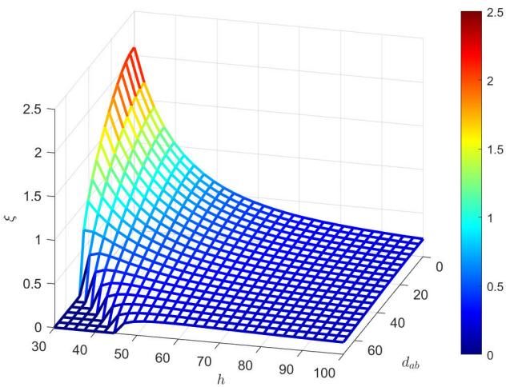  
(a) case 1

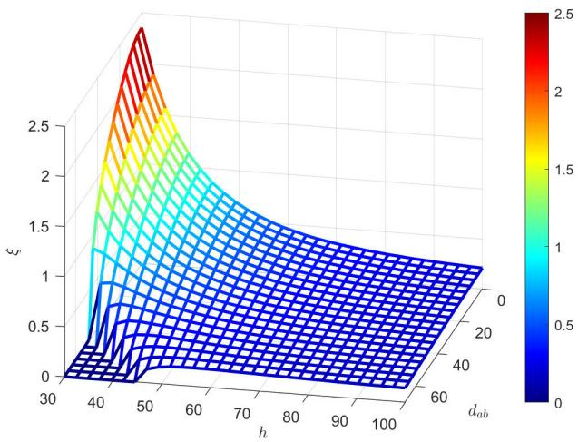  
(b) case 2

Fig. 9. Covert throughput versus the horizontal distance between Alice and Bob and the flying height of Alice.  
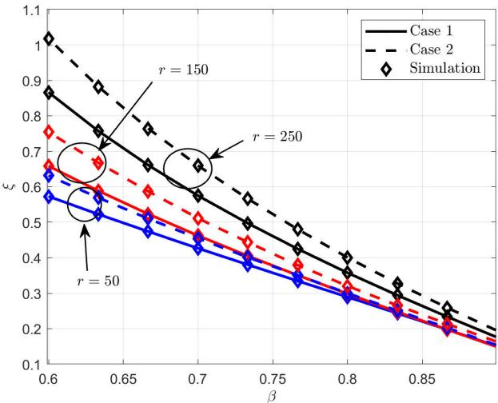

Fig. 10. Covert throughput versus the covert requirement.  
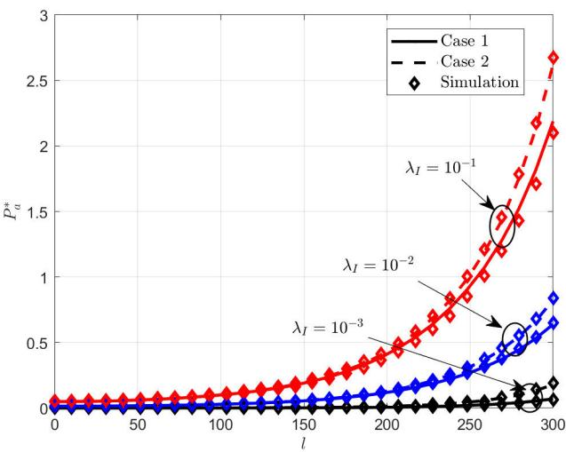  
Fig. 11. The optimal transmission power of Alice versus the horizontal distance between Alice and Willie’s uncertain area centre.

$P _ { a } ^ { * }$ is higher than that in case 1, because case 1 is more difficult for Alice to conceal her transmission. Moreover, when node density of interferers $\lambda _ { I }$ increases, the maximum achievable transmission power of Alice $P _ { a } ^ { * }$ also increases.

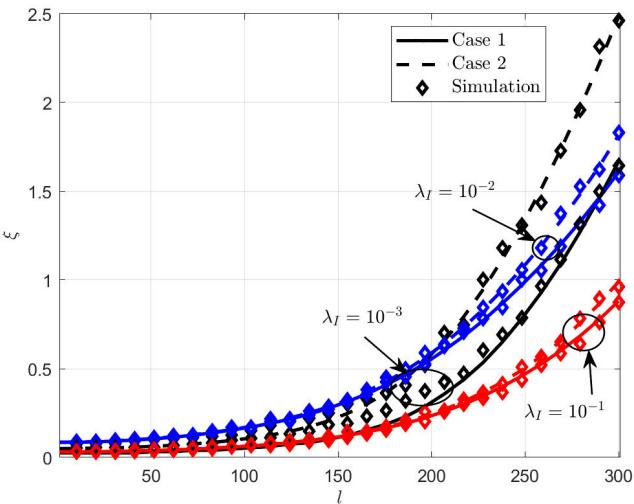  
Fig. 12. Covert throughput versus the horizontal distance between Alice and Willie’s uncertain area centre.

Fig. 12 presents the covert throughput ξ under of various values of l and different node density of interferers $\lambda _ { I }$ . We can see that for two cases, a greater l leads to a higher covert throughput ξ, for increasing l leading to better covertness, which allows a higher $P _ { a } ^ { * }$ for transmission. Also, the covert throughput ξ in case 2 is higher than that in case 1. Moreover, when $\lambda _ { I }$ is relatively small, the differences between covert throughput ξ with two cases are significant.

## V. CONCLUSION

In this study, we have investigated an air-to-ground covert communication system including a UAV transmitter Alice, a receiver Bob, a warden Willie with location uncertainty, and interfering nodes whose locations obey a PPP. To simplify the analysis, we have approximated the probability distribution of the aggregated interference power as a gamma distribution. After that, from Willie’s perspective, we have considered two cases where case 1 denotes that Willie knows the received power from Alice and case 2 denotes that Willie merely knows the probability distribution of the received power. Then, we have derived the average covert probability in the two cases above and obtained the optimal thresholds from Willie. After that, we have derived the connection probability and gave the expression of the covert throughput.

Numerical results have clearly demonstrated the feasibility of air-to-ground covert communication with location and interference uncertainty. Moreover, it is concluded that the average covert probability in case 2 is higher than that in case 1, and when the density of interfering nodes is relatively small, the average covert probability and covert throughput of the two cases above have a significant gap. For future works, we consider interference from multi-UAV interferers with the power control to balance the covertness and the reliability.

## APPENDIX A PROOF OF THEOREM 1

Given $P _ { w } ,$ , the probability that Willie makes right decision is

$$
p _ { r d } ( \epsilon ) \approx \int _ { \mathrm { m a x } \{ \epsilon - P _ { w } , 0 \} } ^ { \epsilon } f _ { G a } ( x ) \mathrm { d } x .\tag{40}
$$

Willie aims to maximize the probability that he makes a correct decision, which is also equivalent to minimize Alice’s average covert probability. As the threshold taken by Willie has a significant impact on the average covert probability, we need to find the optimal threshold from Willie’s perspective. The lower limit of integration in (40) is related to the magnitudes of  and $P _ { w }$ . Thus, we need classified discussion. When $0 < \epsilon < P _ { w } ,$ we have $\begin{array} { r } { \int _ { 0 } ^ { \epsilon } f _ { G a } ( x ) \mathrm { d } x < \int _ { 0 } ^ { P _ { w } } f _ { G a } ( x ) \mathrm { d } x } \end{array}$ , which means that the optimal detection threshold should be no less than $P _ { w }$

Then, we consider $\epsilon \geq P _ { w }$ . To maximize $p _ { r d } ( \epsilon )$ , we take the first-order derivative with respect to , given by

$$
\frac { \mathrm { d } p _ { r d } } { \mathrm { d } \epsilon } \approx f _ { G a } ( \epsilon ) - f _ { G a } ( \epsilon - P _ { w } ) .\tag{41}
$$

Therefore, the maximum of $p _ { r d } ( \epsilon )$ depends on the parameters of the approximated interference distribution, i.e., the Gamma distribution. We consider the case of $\theta \leq 1$ first. In this case, it is clear that for all $\epsilon \ge P _ { w } , f _ { G a } ( \epsilon ) - f _ { G a } ( \epsilon - P _ { w } ) < 0$ In other words, $\epsilon ^ { * } = P _ { w }$ for the case with $\theta \leq 1$ . Then, we consider the case of $\theta > 1$ . In this case, we know that $f _ { G a } ( x )$ first increases and then decreases, so for $f _ { G a } ^ { \prime } ( u ) = 0$ , we can obtain

$$
u ^ { * } = \frac { \theta - 1 } { \rho } .\tag{42}
$$

When $\epsilon - P _ { w } < \epsilon < u ^ { * }$ , we have

$$
f _ { G a } ( \epsilon ) - f _ { G a } ( \epsilon - P _ { w } ) > 0 .\tag{43}
$$

When $u ^ { * } < \epsilon - P _ { w } < \epsilon _ { \mathrm { m } }$ , we have

$$
f _ { G a } ( \epsilon ) - f _ { G a } ( \epsilon - P _ { w } ) < 0 .\tag{44}
$$

Hence, there must be an $\epsilon ^ { * }$ satisfying

$$
f _ { G a } ( \epsilon ^ { * } ) - f _ { G a } ( \epsilon ^ { * } - P _ { w } ) = 0 ,\tag{45}
$$

i.e., (31) for $\theta > 1$ holds. Thus, we have

$$
\epsilon ^ { * } - P _ { w } < u ^ { * } < \epsilon ^ { * } ,\tag{46}
$$

which means $f _ { G a } ^ { \prime } ( \epsilon ^ { * } - P _ { w } ) > 0$ and $f _ { G a } ^ { \prime } ( \epsilon ^ { * } ) < 0$ , so we have $\frac { \mathrm { d } ^ { 2 } p _ { r d } } { \mathrm { d } \epsilon ^ { * 2 } } < 0$

Now we prove that $\epsilon ^ { * }$ is the only solution to (31) with the method of reduction to absurdity. Assume that $\epsilon _ { 1 } ^ { * }$ is another solution to (31). If $\epsilon _ { 1 } ^ { * } < \epsilon ^ { * }$ , we have

$$
\epsilon _ { 1 } ^ { * } - P _ { w } < \epsilon ^ { * } - P _ { w } < u ^ { * } < \epsilon _ { 1 } ^ { * } < \epsilon ^ { * } .\tag{47}
$$

Based on the monotonicity of $f _ { G a } ( x )$ , we have

$$
f _ { G a } ( \epsilon _ { 1 } ^ { * } ) > f _ { G a } ( \epsilon ^ { * } )\tag{48}
$$

and

$$
f _ { G a } ( \epsilon _ { 1 } ^ { * } - P _ { w } ) < f _ { G a } ( \epsilon ^ { * } - P _ { w } ) ,\tag{49}
$$

which contradicts with $f _ { G a } ( \epsilon _ { 1 } ^ { * } - P _ { w } ) = f _ { G a } ( \epsilon _ { 1 } ^ { * } )$ . Similarly, if we assume that $\epsilon _ { 1 } ^ { * } > \epsilon ^ { * }$ , we can also obtain contradictory results. Hence, $\epsilon ^ { * }$ is the only solution to (45). Besides, it is clear that $\begin{array} { r } { \int _ { \epsilon ^ { * } - P _ { w } } ^ { \epsilon ^ { * } } f _ { \sigma _ { w } ^ { 2 } } ( x ) \mathrm { d } x ~ > ~ \int _ { 0 } ^ { P _ { w } } f _ { \sigma _ { w } ^ { 2 } } ( x ) \mathrm { d } x } \end{array}$ , because $f _ { G a } ( P _ { w } ) - f _ { G a } \mathrm { \tilde { ( 0 ^ { + } ) } } ^ { w } > \bar { 0 }$ . As a result, $\epsilon ^ { * }$ is a better threshold than $\epsilon = P _ { w } .$

Plugging $\epsilon ^ { * }$ into (26), we have

$$
\begin{array} { l } { { \displaystyle \bar { p } _ { c v } = 1 - \int _ { 0 } ^ { \infty } \int _ { 0 } ^ { \infty } \int _ { A } ^ { \epsilon } f _ { d _ { a w } } ( t ) f _ { \sigma _ { w } ^ { 2 } } ( x ) f _ { P _ { w } } ( y ) \mathrm { d } x \mathrm { d } y \mathrm { d } t } } \\ { { \displaystyle = \int _ { \operatorname* { m a x } \{ l - r , 0 \} } ^ { l + r } \int _ { 0 } ^ { \infty } \bigg ( 1 - F _ { \sigma _ { w } ^ { 2 } } ( \epsilon ^ { * } ( y ) ) + F _ { \sigma _ { w } ^ { 2 } } ( \epsilon ^ { * } ( y ) - y ) \bigg ) } } \\ { { \displaystyle \qquad \times f _ { P _ { w } } ( y ) f _ { d _ { a w } } ( t ) \mathrm { d } y \mathrm { d } t } } \end{array}
$$

$$
\overset { ( a ) } { \approx } \int _ { \mathrm { m a x } \{ l - r , 0 \} } ^ { l + r } \int _ { 0 } ^ { \infty } \left( \frac { \Gamma ( \theta , \rho \epsilon ^ { * } ( y ) ) } { \Gamma ( \theta ) } + \frac { \gamma \left( \theta , \rho \epsilon ^ { * } ( y ) - \rho y \right) } { \Gamma ( \theta ) } \right)
$$

$$
\times \left( \sum _ { i \in \{ \mathrm { N } , \mathrm { L } \} } P _ { i } ( t , h ) \frac { \left( \frac { \mathcal { N } _ { i } } { c _ { i } ( t , h ) } \right) ^ { \mathcal { N } _ { i } } } { \Gamma ( \mathcal { N } _ { i } ) } y ^ { \mathcal { N } _ { i } - 1 } e ^ { \frac { - \mathcal { N } _ { i } y } { c _ { i } ( t , h ) } } f _ { d _ { a w } } ( t ) \right) \mathrm { d } y \mathrm { d } t ,\tag{50}
$$

where step (a) adopts $\begin{array} { r } { f _ { \sigma _ { w } ^ { 2 } } ( x ) \approx \frac { \rho ^ { \theta } } { \Gamma ( \theta ) } x ^ { \theta - 1 } \exp \left( - \rho x \right) } \end{array}$ . This completes the proof of Theorem 1.

## APPENDIX B PROOF OF THEOREM 2

Similar to (40), Willie aims to maximize the probability of making a correct decision, given by

$$
p _ { r d } \approx \frac { \gamma ( \theta , \rho \epsilon ) } { \Gamma ( \theta ) } - \int _ { 0 } ^ { \epsilon } \frac { \gamma \big ( \theta , \rho ( \epsilon - y ) \big ) } { \Gamma ( \theta ) } f _ { P _ { w } } ( y ) \mathrm { d } y .\tag{51}
$$

Taking the first-order derivative with respect to $\epsilon ,$ we have

$$
\begin{array} { l } { \displaystyle \frac { \mathrm { d } p _ { r d } } { \mathrm { d } \epsilon } \approx \frac { \rho ^ { \theta } } { \Gamma ( \theta ) } \epsilon ^ { \theta - 1 } \exp \left( - \rho \epsilon \right) } \\ { \displaystyle - \frac { \rho ^ { \theta } } { \Gamma ( \theta ) } \int _ { 0 } ^ { \epsilon } ( \epsilon - y ) ^ { \theta - 1 } \exp \left( - \rho ( \epsilon - y ) \right) f _ { P _ { w } } ( y ) \mathrm { d } y . } \end{array}\tag{52}
$$

When $\epsilon  0$ and $\epsilon  \infty , p _ { r d }  0$ . Thus, there must be at least one  to make $\begin{array} { r } { \frac { \mathrm { d } p _ { r d } } { \mathrm { d } \epsilon } = \bar { 0 } . } \end{array}$ . Letting

$$
g ( \epsilon ) = \epsilon ^ { \theta - 1 } - \int _ { 0 } ^ { \epsilon } ( \epsilon - y ) ^ { \theta - 1 } e ^ { \rho y } f _ { P _ { w } } ( y ) \mathrm { d } y ,\tag{53}
$$

we take the first derivative with respect to , given by

$$
g ^ { \prime } ( \epsilon ) = ( \theta - 1 ) \epsilon ^ { \theta - 2 } - ( \theta - 1 ) \int _ { 0 } ^ { \epsilon } ( \epsilon - y ) ^ { \theta - 2 } e ^ { \rho y } f _ { P _ { w } } ( y ) \mathrm { d } y .\tag{54}
$$

It is clear that $\begin{array} { r } { \frac { \mathrm { d } p _ { r d } } { \mathrm { d } \epsilon } \approx g ( \epsilon ) \frac { \rho ^ { \theta } } { \Gamma ( \theta ) } \exp ( - \rho \epsilon ) } \end{array}$ , so there must be an $\epsilon _ { 0 }$ for $g ( \epsilon _ { 0 } ) = 0$ . In this case, $g ^ { \prime } ( \epsilon _ { 0 } )$ is given by

$$
\begin{array} { l } { { \displaystyle g ^ { \prime } ( \epsilon _ { 0 } ) = ( \theta - 1 ) \epsilon _ { 0 } ^ { \theta - 2 } - ( \theta - 1 ) \int _ { 0 } ^ { \epsilon _ { 0 } } ( \epsilon _ { 0 } - y ) ^ { \theta - 2 } e ^ { \rho y } f _ { P _ { w } } ( y ) \mathrm { d } y } } \\ { { \displaystyle ~ \stackrel { ( a ) } { = } ( \theta - 1 ) \int _ { 0 } ^ { \epsilon _ { 0 } } \left( \frac { ( \epsilon _ { 0 } - y ) ^ { \theta - 1 } } { \epsilon _ { 0 } } - ( \epsilon _ { 0 } - y ) ^ { \theta - 2 } \right) } } \\ { { \displaystyle ~ \times e ^ { \rho y } f _ { P _ { w } } ( y ) \mathrm { d } y } } \\ { { \displaystyle ~ = ( \theta - 1 ) \int _ { 0 } ^ { \epsilon _ { 0 } } - \frac { y } { \epsilon _ { 0 } } ( \epsilon _ { 0 } - y ) ^ { \theta - 2 } e ^ { \rho y } f _ { P _ { w } } ( y ) \mathrm { d } y < 0 } , } \end{array}\tag{55}
$$

where step (a) is based on (53) when $g ( \epsilon _ { 0 } ) = 0$ . Thus, $\frac { \mathrm { d } ^ { 2 } p _ { r d } } { \mathrm { d } \epsilon ^ { 2 } }$ is given by

$$
\begin{array} { r l r } & { } & { \displaystyle \frac { \mathrm { d } ^ { 2 } p _ { r d } } { \mathrm { d } \epsilon ^ { 2 } } \approx f _ { G a } ^ { \prime } ( \epsilon ) - \int _ { 0 } ^ { \epsilon } f _ { G a } ^ { \prime } ( \epsilon - y ) f _ { P _ { w } } ( y ) \mathrm { d } y } \\ & { } & { = \displaystyle \frac { \rho ^ { \theta } } { \Gamma ( \theta ) } \exp { ( - \rho \epsilon ) \left( g ^ { \prime } ( \epsilon ) - \rho g ( \epsilon ) \right) } . } \end{array}\tag{56}
$$

For all $\begin{array} { r } { \epsilon _ { 0 } , \frac { \mathrm { d } ^ { 2 } p _ { r d } } { \mathrm { d } \epsilon _ { 0 } ^ { 2 } } < 0 } \end{array}$ always exists, which means that there is only one optimal $\epsilon _ { 0 } = \epsilon ^ { * }$ for Willie. This completes the proof.

## APPENDIX C PROOF OF COROLLARY 1

Based on (26), note that increases of Alice’s transmission power $P _ { a }$ and transmission power of each interference node $P _ { I }$ do not change the probability distribution of Willie’s location and the probability of LoS link from Alice to Willie. We first assume $P _ { a 1 } = k P _ { a } , \ k > 1$ and $r = 0$ to simplify analysis, where r is the radius of ${ \bf W i l l i e } ^ { \prime } { \bf s }$ uncertain area. The average covert probability is given by

$$
\begin{array} { r } { \overline { { p } } _ { c v } ( P _ { a } | r = 0 ) = 1 - \mathbb { P } \bigg ( \sigma _ { w } ^ { 2 } < \epsilon ^ { * } < \sigma _ { w } ^ { 2 } + P _ { w } \bigg ) , } \end{array}\tag{57}
$$

$$
\begin{array} { r l } { \overline { { p } } _ { \omega ; 0 } ( k P _ { 0 } | r = 0 ) = 1 - \displaystyle \int _ { 0 } ^ { \infty } \int _ { \epsilon _ { 1 } - n _ { 1 } } ^ { r _ { 1 } ^ { \prime } } \sum _ { i \in \{ 0 , 1 \} , \epsilon } P _ { i } ( t , h ) } & { } \\ &  \times \left( \frac { \displaystyle \sum _ { k = i \neq i , k = 1 \} ^ { N _ { i } } \sum _ { j = 1 } ^ { N _ { i } } \sum _ { k = i \neq i \neq i \neq i \neq j } ^ { N _ { i } } P _ { j \epsilon _ { 1 } ^ { \prime } } ( x ) \mathrm { d } x \mathrm { d } y _ { j } } { \displaystyle \Gamma ( N _ { i } ) } \right. } \\ & { \stackrel { ( a ) } { = } 1 - \displaystyle \int _ { 0 } ^ { \infty } \int _ { \epsilon _ { 1 } - n _ { 1 } } ^ { r _ { 1 } ^ { \prime } } \sum _ { k = i \neq i \neq i \neq N _ { i } \in \{ 0 , 1 \} } P _ { j } ( t , h ) } \\ &  \quad \times \left( \frac { \displaystyle \sum _ { k = i \neq i , k = 1 \} ^ { N _ { i } } \sum _ { j = 1 } ^ { N _ { i } } \sum _ { \epsilon _ { 1 } ^ { \prime } = i \neq i \neq N _ { j } \in \{ i \} } ^ { N _ { i } } } { \displaystyle \Gamma ( N _ { i } ) } \right. } \\ & { = 1 - \left. \mathrm { F } ( x _ { i } ^ { 0 } ) \right) , } \end{array}
$$

where step $( a )$ uses $\begin{array} { r } { y = \frac { y _ { 1 } } { k } . \epsilon ^ { * } } \end{array}$ and $\epsilon _ { 1 } ^ { * }$ are the optimal threshold for $\overline { { p } } _ { c v } ( P _ { a } )$ and $\overline { { p } } _ { c v } ( P _ { a 1 } ) $ , respectively. It is clear that

$$
\mathbb { P } \big ( \sigma _ { w } ^ { 2 } < \epsilon ^ { * } < \sigma _ { w } ^ { 2 } + P _ { w } \big ) < \mathbb { P } \big ( \sigma _ { w } ^ { 2 } < \epsilon ^ { * } < \sigma _ { w } ^ { 2 } + k P _ { w } \big )\tag{59}
$$

and

$$
\begin{array} { r } { \mathbb { P } \big ( \sigma _ { w } ^ { 2 } < \epsilon ^ { * } < \sigma _ { w } ^ { 2 } + k P _ { w } \big ) < \mathbb { P } \big ( \sigma _ { w } ^ { 2 } < \epsilon _ { 1 } ^ { * } < \sigma _ { w } ^ { 2 } + k P _ { w } \big ) . } \end{array}\tag{60}
$$

As a result,

$$
\begin{array} { r } { \overline { { p } } _ { c v } ( P _ { a 1 } , \epsilon _ { 1 } ^ { * } ) < \overline { { p } } _ { c v } ( P _ { a } , \epsilon ^ { * } ) . } \end{array}\tag{61}
$$

Then we consider $P _ { I 1 } = k P _ { I } , k > 1$ . Based on (13), we have

$$
f _ { \sigma _ { v } ^ { 2 } } \bigl ( x | P _ { I 1 } \bigr ) = \frac { 1 } { k } f _ { \sigma _ { v } ^ { 2 } } \Bigl ( \frac { x } { k } | P _ { I } \Bigr ) .\tag{62}
$$

In this case, $\overline { { p } } _ { c v } ( P _ { I 1 } )$ is given by

$$
\begin{array} { r l } & { \overline { { \theta } } _ { \alpha } ( P _ { 1 } ) \iota = 0 ) = 1 - \displaystyle \int _ { 0 } ^ { \infty } \int _ { s - \tau _ { \alpha } } ^ { s ^ { \prime } + \sum _ { \nu \in \mathcal { I } _ { \tau } \backslash \mathcal { I } _ { \tau } } } P _ { \kappa } ( l , h , b ) } \\ & { \qquad \times \displaystyle \frac { \binom { N } { \mathrm { e x t } , \tau _ { \alpha } } } { \Gamma ( M _ { 1 } ) } \gamma ^ { N - 1 } e ^ { \frac { - \alpha \mathrm { K } _ { \nu \theta } } { \kappa ( l + \Delta ) } \frac { 1 } { h } l } f _ { \alpha } \int _ { s } ^ { \infty } \Big \langle \frac { x } { h } \Big \rangle d x d y } \\ & { \qquad \quad \cong 1 - \displaystyle \int _ { 0 } ^ { \infty } \int _ { \frac { s - \tau _ { \alpha } } { h } - \frac { 1 } { \tau } _ { \alpha } } ^ { \infty } \sum _ { \nu \in \mathcal { I } _ { \tau } \backslash \mathcal { I } _ { \tau } } P _ { \kappa } ( l , h ) } \\ & { \qquad \times \displaystyle \frac { \binom { N } { \mathrm { e x t } , \tau _ { \alpha } } } { \Gamma ( N _ { 1 } ) } \gamma ^ { N - 1 } e ^ { \frac { - \alpha \mathrm { K } _ { \nu \theta } } { \kappa ( l + \Delta ) } f _ { \sigma _ { \alpha } ^ { \prime } } } ( x ) \mathrm { d } x _ { 1 } \mathrm { d } y , } \\ & { \qquad = 1 - \displaystyle \mathrm { P } \{ \alpha _ { \nu \theta } ^ { \prime } < \epsilon _ { \alpha } ^ { \prime } < \epsilon _ { \alpha } ^ { \prime } < \delta \theta _ { \alpha } ^ { \prime } + P _ { \kappa \theta } \} } \\ & { \qquad \quad \cong 1 - \displaystyle \int _ { 0 } ^ { \infty } \eta _ { \alpha } ^ { \prime } < \epsilon _ { \alpha } ^ { \prime } < \sigma _ { \alpha } ^ { \prime } + \frac { N } { h } . } \end{array}\tag{63}
$$

where step (b) uses $\begin{array} { r } { x _ { 1 } \ = \ \frac { x } { k } . } \end{array}$ , and step (c) uses $\epsilon _ { 3 } ~ = ~ \frac { \epsilon _ { 2 } ^ { * } } { k }$ Similarly, we have $\overline { { p } } _ { c v } ( P _ { I 1 } ) \setminus \overline { { p } } _ { c v } ( P _ { I } )$ . Also, when $r \neq 0 ,$ we come out the same conclusion. This completes the proof of Corollary 1.

## ACKNOWLEDGMENT

The authors would like to thank Prof. Dusit Niyato for providing guidance.

## REFERENCES

[1] H. Chen, N. Deng, H. Wei, and N. Zhao, “Achieving air-to-ground covert communication with aggregated environmental interference,” in Proc. 17th Int. Conf. Wireless Commun. Signal Process. (WCSP), Oct. 2025, pp. 1–6.

[2] M. K. Banafaa et al., “A comprehensive survey on 5G-and-beyond networks with UAVs: Applications, emerging technologies, regulatory aspects, research trends and challenges,” IEEE Access, vol. 12, pp. 7786–7826, 2024.

[3] D. Lee, Y. Lee, C. Song, J. Oh, N. T. Vi, and S. Cho, “A survey on integrated sensing and communication: Integrated system of RIS, UAV, multiple access,” in Proc. Int. Conf. Artif. Intell. Inf. Commun. (ICAIIC), Feb. 2025, pp. 0028–0031.

[4] S. Yan, S. V. Hanly, I. B. Collings, and D. L. Goeckel, “Hiding unmanned aerial vehicles for wireless transmissions by covert communications,” in Proc. IEEE Int. Conf. Commun. (ICC), May 2019, pp. 1–6.

[5] H.-M. Wang, Y. Zhang, X. Zhang, and Z. Li, “Secrecy and covert communications against UAV surveillance via multi-hop networks,” IEEE Trans. Commun., vol. 68, no. 1, pp. 389–401, Jan. 2020.

[6] C. Wang et al., “IRS-assisted UAV covert communication via location and power optimization,” in Proc. 14th Int. Conf. Wireless Commun. Signal Process. (WCSP), Nov. 2022, pp. 275–280.

[7] X. Chen, Z. Chang, J. Tang, N. Zhao, and D. Niyato, “UAV-aided multiantenna covert communication against multiple wardens,” in Proc. IEEE Int. Conf. Commun., Jun. 2021, pp. 1–6.

[8] B. He, S. Yan, X. Zhou, and H. Jafarkhani, “Covert wireless communication with a Poisson field of interferers,” IEEE Trans. Wireless Commun., vol. 17, no. 9, pp. 6005–6017, Sep. 2018.

[9] X. Zhou, S. Yan, J. Hu, J. Sun, J. Li, and F. Shu, “Joint optimization of a UAV’s trajectory and transmit power for covert communications,” IEEE Trans. Signal Process., vol. 67, no. 16, pp. 4276–4290, Aug. 2019.

[10] X. Zhou, S. Yan, F. Shu, R. Chen, and J. Li, “Covert wireless data collection based on unmanned aerial vehicles,” in Proc. IEEE Globecom Workshops (GC Wkshps), Dec. 2019, pp. 1–6.

[11] H. Huang, A. V. Savkin, and W. Ni, “Decentralized covert and collaborative radio surveillance on a group of mobile ground nodes by a UAV swarm,” in Proc. IEEE 18th Int. Conf. Ind. Informat. (INDIN), vol. 1, Jul. 2020, pp. 307–310.

[12] X. Jiang, Z. Yang, N. Zhao, Y. Chen, Z. Ding, and X. Wang, “Resource allocation and trajectory optimization for UAV-enabled multiuser covert communications,” IEEE Trans. Veh. Technol., vol. 70, no. 2, pp. 1989–1994, Feb. 2021.

[13] H. Du, D. Niyato, Y.-A. Xie, Y. Cheng, J. Kang, and D. I. Kim, “Covert communication for jammer-aided multi-antenna UAV networks,” in Proc. IEEE Int. Conf. Commun., May 2022, pp. 91–96.

[14] M. Wang, Z. Xu, X. Lv, and B. Xia, “Covert communications aided by multi-functional IRS: Energy harvesting, reflecting, and amplifying,” IEEE Trans. Wireless Commun., vol. 24, no. 6, pp. 5381–5397, Jun. 2025.

[15] M. Wang, T. Liu, O. Lu, D. Wang, and B. Xia, “Robust beamforming for secure and covert communications against location uncertainty,” IEEE Wireless Commun. Lett., vol. 14, no. 11, pp. 3685–3689, Nov. 2025.

[16] Y. Su, S. Fu, J. Si, C. Xiang, N. Zhang, and X. Li, “Optimal hovering height and power allocation for UAV-aided NOMA covert communication system,” IEEE Wireless Commun. Lett., vol. 12, no. 6, pp. 937–941, Jun. 2023.

[17] M. K. Hasan, S. Yu, and M. Song, “Secured full-duplex UAV-aided spectrum-sharing network based on NOMA,” in Proc. IEEE 20th Int. Conf. Mobile Ad Hoc Smart Syst. (MASS), 2023, pp. 125–133.

[18] D. Deng, S. Dang, X. Li, D. W. K. Ng, and A. Nallanathan, “Joint optimization for covert communications in UAV-assisted NOMA networks,” IEEE Trans. Veh. Technol., vol. 73, no. 1, pp. 1012–1026, 2023.

[19] X. Li, G. Duan, S. Yan, Z. Zhao, J. Shi, and Z. Li, “Optimizing UAV jammer for covert communication of LEO satellite system,” in Proc. 10th Int. Conf. Inf. Syst. Comput. Technol. (ISCTech), Dec. 2022, pp. 156–161.

[20] J. Du et al., “Strategic UAV-assisted game model for detection in covert communication,” IEEE Trans. Veh. Technol., vol. 72, no. 6, pp. 7426–7438, Jun. 2023.

[21] Y. Xu et al., “Tripartite matching game model in UAV-assisted covert communication network,” IEEE Commun. Lett., vol. 28, no. 7, pp. 1619–1623, Jul. 2024.

[22] W. Ma, Z. Niu, W. Wang, S. He, and T. Jiang, “Covert communication with uninformed backscatters in hybrid active/passive wireless networks: Modeling and performance analysis,” IEEE Trans. Commun., vol. 70, no. 4, pp. 2622–2634, Apr. 2022.

[23] H. Rao, S. Yan, J. Wang, X. Peng, S. Xiao, and W. Tang, “Multi-antenna covert communications with a BPP field of wardens,” in Proc. Int. Conf. Ubiquitous Commun., Jul. 2024, pp. 91–96.

[24] J. Kong and F. T. Dagefu, “Covert communication with a Ginibre field of interferers,” in Proc. IEEE Wireless Commun. Netw. Conf. (WCNC), Apr. 2024, pp. 1–6.

[25] S. Feng, X. Lu, S. Sun, E. Hossain, G. Wei, and Z. Ni, “Covert communication in large-scale multi-tier LEO satellite networks,” IEEE Trans. Mobile Comput., vol. 23, no. 12, pp. 11576–11587, Dec. 2024.

[26] A. Al-Hourani, S. Kandeepan, and S. Lardner, “Optimal LAP altitude for maximum coverage,” IEEE Wireless Commun. Lett., vol. 3, no. 6, pp. 569–572, Dec. 2014.

[27] S. Lee, R. J. Baxley, M. A. Weitnauer, and B. Walkenhorst, “Achieving undetectable communication,” IEEE J. Sel. Topics Signal Process., vol. 9, no. 7, pp. 1195–1205, Oct. 2015.

[28] R. K. Ganti and M. Haenggi, “Interference in ad hoc networks with general motion-invariant node distributions,” in Proc. IEEE Int. Symp. Inf. Theory, Jul. 2008, pp. 1–5.

[29] H. Elkotby and M. Vu, “Interference modeling for cellular networks under beamforming transmission,” IEEE Trans. Wireless Commun., vol. 16, no. 8, pp. 5201–5217, Aug. 2017.

[30] M. Haenggi, Stochastic Geometry for Wireless Networks. Cambridge, U.K.: Cambridge Univ. Press, 2012.

[31] X. Shi and N. Deng, “Modeling and analysis of mmWave UAV swarm networks: A stochastic geometry approach,” IEEE Trans. Wireless Commun., vol. 21, no. 11, pp. 9447–9459, Nov. 2022.

[32] T.-X. Zheng, H.-M. Wang, D. W. K. Ng, and J. Yuan, “Multi-antenna covert communications in random wireless networks,” IEEE Trans. Wireless Commun., vol. 18, no. 3, pp. 1974–1987, Mar. 2019.

Hongchi Chen received the B.S. degree in electronic information engineering from Dalian University of Technology (DLUT), Dalian, China, in 2023, where she is currently pursuing the master’s degree in information and communication engineering. Her research interests include stochastic geometry and covert communication.

Junsheng Mu (Member, IEEE) received the Ph.D. degree from Beijing University of Posts and Telecommunications in 2019. He is currently an Associate Professor with the School of Information and Communication Engineering, Beijing University of Posts and Telecommunications. His research interests include communication signal processing and AI-enabled wireless communication.

Na Deng (Senior Member, IEEE) received the B.S. and Ph.D. degrees in information and communication engineering from the University of Science and Technology of China (USTC), Hefei, China, in 2010 and 2015, respectively. From 2015 to 2016, she was a Senior Engineer with Huawei Technologies Company Ltd., Shanghai, China. She is an Associate Professor with Dalian University of Technology, Dalian, China. Her scientific interests include networking and wireless communications, low-altitude communications, space–air–ground integrated networks, and covert communications.

Haichao Wei (Member, IEEE) received the B.S. and Ph.D. degrees in information and communication engineering from the University of Science and Technology of China (USTC), Hefei, China, in 2010 and 2016, respectively. From 2016 to 2018, he was an Engineer with Huawei Technologies Company Ltd., Shanghai, China. He is an Associate Professor with Dalian Maritime University, Dalian, China. His research interests include federated learning, space–air–ground integrated networks, networking and wireless communications, and covert communications.

Nan Zhao (Senior Member, IEEE) received the Ph.D. degree in information and communication engineering from Harbin Institute of Technology, Harbin, China, in 2011. He is currently a Professor with Dalian University of Technology, China. He won the Best Paper Awards from IEEE ICC 2025, IEEE/CIC ICCC 2025, WCSP 2024, IEEE ICNC 2018, and IEEE VTC’17-Spring. He also received the IEEE Communications Society Asia Pacific Board Outstanding Young Researcher Award in 2018. He is serving on the editorial boards of IEEE COMMUNICATIONS SURVEYS AND TUTORIALS, IEEE TRANS-ACTIONS ON COMMUNICATIONS, IEEE TRANSACTIONS ON NETWORK SCIENCE AND ENGINEERING, IEEE WIRELESS COMMUNICATIONS, and IEEE WIRELESS COMMUNICATIONS LETTERS.