# AirComp-Assisted Asynchronous Federated Learning for UAV Swarms: A Self-Adaptive Aggregation Scheme to Tackle Model Staleness

Yansong Huang , Xuan Li , Senior Member, IEEE, Lu Zhang , and Mugen Peng , Fellow, IEEE

Abstract—Federated learning (FL) is a promising paradigm for collaborative intelligence in the low-altitude economy, enabling uncrewed aerial vehicle (UAV) swarms to perform deep learning tasks (e.g., logistics, emergency rescue) while preserving data sovereignty. However, limited communication channels and heterogeneous computation capabilities among UAVs cause significant FL aggregation delays. To reduce convergence time, we propose an asynchronous FL (AFL) framework for UAV swarms, which integrates over-the-air computation (AirComp) to improve communication efficiency via simultaneous transmission. To address signal distortion in AirComp, we formulate an objective function and solve it using an aggregation scheduling algorithm, which transforms the nonconvex problem into two convex subproblems tackled via alternating optimization, to derive optimal aggregation strategies and beamforming vectors. Moreover, to mitigate model staleness in AFL, which causes gradient divergence and slow convergence, we propose a selfadaptive aggregation scheme with staleness awareness, enabling UAVs to adjust local models autonomously without requiring information from other UAVs. Simulation results show that our scheme reduces staleness impact and leverages stale parameters, helping AFL outperform synchronous FL in convergence speed and accuracy. Overall, our study presents an effective AFL framework, a fast aggregation scheduling algorithm, and a selfadaptive aggregation scheme for UAV swarms, accelerating global model convergence while reducing energy expenditure.

Index Terms—Asynchronous federated learning, over-the-air computation, self-adaptive aggregation, UAV.

## I. INTRODUCTION

## A. Background

A <sup>S</sup> <sup>AN</sup> <sup>emerging</sup> <sup>economic</sup> <sup>sector,</sup> <sup>low-altitude</sup> <sup>economy,</sup>where the uncrewed aerial vehicle (UAV) technology plays a key role [1], [2], [3], has led to its widespread application in various domains such as urban air mobility [4], emergency rescue [5], and drone logistics [6]. However, concerns about data security and the phenomenon of data isolation are impeding the further development of the lowaltitude economy [7]. In this context, federated learning (FL) has emerged as an effective decentralized machine learning framework [8], [9], [10], where edge nodes train deep learning models locally using sensitive data and only share model updates with a central server for model aggregation, contributing to a more powerful global model that integrates knowledge from all local models while preserving data sovereignty. Iteratively, the edge nodes receive the global model as the baseline for subsequent deep learning training and as a tool for downstream tasks [11], [12].

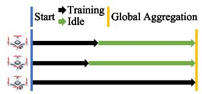  
(a) Synchronous FL

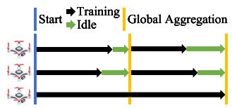  
(b) Asynchronous FL  
Fig. 1. AFL relaxes the aggregation constraint to save idle time and shorten the aggregation duration compared to SFL.

However, traditional FL frameworks, namely synchronous federated learning (SFL), face several challenges in UAV swarm networks, particularly communication efficiency and computation capability [13], [14]. The limited bandwidth and energy resources of UAVs lead to the delay of model transmission and differences in computational capabilities among UAVs result in longer training time, which dramatically increases aggregation time under the constraint of aggregating all local models in each global epoch [15]. Asynchronous federated learning (AFL) appears to be a potential solution to this problem because it relaxes the constraint and allows the parameter server (PS) to only aggregate a subset of local models instead of all of them [16] and [17]. As shown in Fig. 1, transmission delays and varying training durations lead to longer idle time in SFL than in AFL, resulting in longer aggregation time [18].

Nevertheless, while AFL effectively shortens iteration cycles, it introduces a critical challenge, namely model staleness [19]. Specifically, because some nodes fail to participate in global aggregation, their local models develop a version gap relative to the latest global model and thus these local models become stale [20]. These nodes may continue training on these stale models, which may gradually lead to significantly worse performance compared to those with fresh local models. When these stale models are aggregated, stale model parameters can distort the gradient update direction of the global model in subsequent aggregations, leading to convergence oscillations or even divergence [21], as shown in Fig. 2.

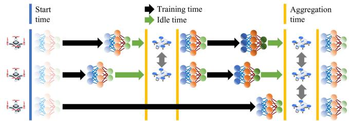  
Fig. 2. Illustration of model staleness in AFL. Models shown in lighter colours indicate less knowledge, whereas darker colours indicate better performance.

## B. Motivation

In scenarios such as emergency rescue, UAVs are allocated to collect data for situation analysis [22]. When deep learning is introduced into such tasks to reduce human workload, it is expected to support faster decision-making due to the urgency, even at some cost of accuracy [23]. However, when a deep learning model is applied to a new scenario, it usually needs to be fine-tuned to adapt itself to this scenario by training on datasets collected from ongoing incidents. In this case, the convergence time of the global model in FL is expected to be shorter, while maintaining model accuracy.

To address slow convergence, AFL has been proposed to relax the aggregation condition [16]. In the AFL scheme, the PS aggregates parameters from accessible UAVs at fixed intervals, rather than waiting for all UAVs to transmit their parameters [17]. By eliminating inefficient waiting time, iteration duration is significantly reduced. However, this also reduces the amount of training data available for updating the model. Research has shown that the decrease in training data per iteration results in lower accuracy of the final model [24]. Additionally, the model staleness issue in AFL, caused by delayed global model updates in UAVs, may result in slow improvement in model performance and even weight divergence [25]. To address the drawbacks of decreased training data and model staleness, an effective AFL framework should be designed to aggregate as many local models as possible within a given time, while also ensuring global model performance by mitigating staleness.

In order to further accelerate model aggregation, an advanced over-the-air computation (AirComp) transmission scheme may be integrated into the FL framework to utilize limited UAV channel bandwidth more efficiently and enable simultaneous communication and computation [26], [27]. It leverages signal superposition of weighted model parameters in the wireless multiple-access channel, thereby reducing energy consumption by integrating the reception of multiple local models [28]. However, despite the fact that AirComp utilizes signal superposition to avoid inter-channel interference, the signal is still affected by other factors, resulting in distortion that is difficult for the receiver to detect and correct, since it only receives the superposed signals from multiple transmitters with mixed distortions [29], [30], [31]. Hence, the beamforming vector of the receiver UAV should be carefully designed to eliminate channel interference from each transmitter UAV.

Sometimes, UAVs with poor channel conditions must be excluded from global aggregation in a given epoch to ensure AirComp transmission quality. However, this contradicts the goal of AFL, which aims to include as many UAVs as possible in each epoch to maximize training data utilization. To balance the requirements of AFL and AirComp, an algorithm should be designed to select UAVs whose channel conditions meet AirComp transmission requirements and maximize the volume of training data used in each epoch. Given the large scale of UAV swarm networks, the algorithm should also have low computational complexity.

## C. Related Work

Existing research on FL combined with AirComp primarily focuses on terrestrial networks. These studies have demonstrated the effectiveness of these technologies in enhancing communication efficiency and reducing latency in edge learning scenarios [29], [30], [31]. However, their direct application to UAV networks is not straightforward. UAVs face unique challenges, including limited computational capabilities and unstable communication links that extend the time required to aggregate local models and consequently slow the convergence of global models.

Some studies have started to adapt FL techniques to UAV scenarios, acknowledging limitations such as constrained computational power on UAVs [8], [9], [10]. These studies have employed various methods to reduce the convergence time of global models, but their convergence efficiency is still limited by the SFL mechanisms. For instance, He et al. [9] utilized Stackelberg equilibrium to optimize the allocation of limited resources and improve the effectiveness of the FL models.

Previous efforts to integrate FL with UAVs have largely focused on tackling the challenges caused by unreliable UAVto-UAV links and accelerating the convergence of FL models. However, these studies often do not adequately consider the constraints of limited computational resources available on UAVs or the need to optimize power consumption for onedge model training, thereby limiting their applicability in real-world UAV environments. Moreover, these works have not yet explored the unique challenges and potential benefits of applying AirComp to AFL within UAV networks, which might impact performance and energy efficiency.

In terms of model staleness, delayed or outdated local updates may degrade convergence stability and final model performance. Existing approaches that aim to relieve model staleness typically adjust aggregation weights, learning rates, or momentum terms at the server based on delay or version gaps [21], [32]. These methods rely on the server having access to individual local updates and explicit staleness information, enabling fine-grained control over each client’s contribution. While effective in conventional AFL settings, such server-side strategies are difficult to apply in AirComp-assisted FL, where the server only receives superposed signals rather than perclient model updates.

Another line of work alleviates staleness by selectively scheduling clients with fresher models or better communication conditions. By excluding highly stale clients from aggregation, these methods reduce harmful updates at the cost of sacrificing training data diversity [33], [34]. However, in large-scale UAV swarms with dynamic topology and limited communication resources, aggressive client exclusion may significantly reduce the effective data volume per global update, which contradicts the objective of AFL to maximize learning efficiency within a fixed time budget.

In contrast to the above methods, our work addresses model staleness from a fundamentally different perspective tailored to AirComp-assisted FL. It enables the global model to exploit informative components from highly stale local models, which are often trained on larger datasets or for longer durations, while suppressing harmful divergence caused by outdated layers. As a result, our approach not only mitigates stalenessinduced instability but also leverages stale updates as a source of useful knowledge. This differs from existing stalenessaware AFL methods that rely solely on server-side weighting or update suppression.

## D. Contributions and Organization

We design an AirComp-assisted AFL framework for UAV swarm networks, while jointly optimizing the linkage scheme and beamforming vectors, and propose a self-adaptive aggregation scheme to mitigate the staleness problem in AFL. To be more specific,

• we propose an efficient AFL framework for UAV swarm networks, where all UAVs work as edge nodes, collecting data and training local models, and the swarm heads act as central PSs, aggregating global models and transmitting them to users for downstream use.

We apply an energy-efficient AirComp-assisted transmission scheme to the AFL framework by superposing the signals of local models from multiple UAVs simultaneously, fully utilizing communication time and bandwidth, and formulate a data volume maximization problem under signal-distortion and power constraints.

• We propose a suboptimal solution by decomposing the original problem into a UAV selection subproblem and a beamforming design subproblem, which are solved by a branch-and-bound algorithm and an alternating optimization algorithm, respectively.

• We propose a self-adaptive aggregation scheme to address the staleness problem in AFL, enabling UAVs to upload only those layers in local models that have high cosine similarity with the latest global model, thereby accelerating global model convergence.

We evaluate the proposed AirComp-assisted AFL framework by implementing a practical deep learning task and compare our design in terms of model accuracy, loss, convergence time, energy efficiency, and transmission data volume against conventional SFL systems with and without AirComp transmission.

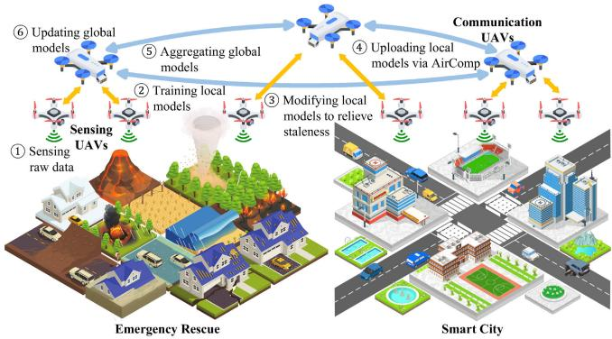  
Fig. 3. Illustration of AFL in UAV swarms.

The rest of our paper is organized as follows: first, Section II presents the AirComp-assisted AFL in UAV swarms, focusing on the model aggregation workflow and the optimization problem. Next, Section III introduces our optimal solution for linkage schemes using the branch-and-bound algorithm and our suboptimal solution for beamforming vectors using the alternating optimization algorithm. Then, Section IV details our self-adaptive aggregation scheme for addressing model staleness in AFL. Subsequently, Section V presents the simulation results for various performance indicators. Finally, Section VI analyses the results and concludes our work.

## II. SYSTEM MODEL

In this section, we introduce an AFL framework in UAV swarms, emphasizing the workflow of model aggregation. Additionally, we illustrate how to apply AirComp to AFL during the process of model aggregation to improve communication energy efficiency. The communication-quality constraint introduced by AirComp is modelled and described in detail.

## A. AFL in UAV Swarms

Consider a UAV swarm consisting of S sensing UAVs $\begin{array} { r c l } { \mathcal { S } } & { = } & { \{ s _ { 1 } , s _ { 2 } , . . . , s _ { S } \} } \end{array}$ and C communication UAVs $\mathcal { C } =$ $\{ c _ { 1 } , c _ { 2 } , \ldots , c _ { C } \}$ . A sensing UAV is equipped with sensors for data collection and one antenna for model transmission while a communication UAV is equipped with A antennas for model transmission. The trajectories of the UAVs are determined by specific path planning algorithms, which are beyond the scope of this paper.

As illustrated in Fig. 3, the communication UAVs in the swarm have stronger communication capabilities and are therefore connected with each other at all times. Meanwhile, the sensing UAVs are restricted to communicating only with the communication UAVs to reduce network complexity and interference. In this way, the sensing UAVs communicate with communication UAVs in a star topology while communication UAVs maintain interconnections through a backbone network for aggregating local models into global models and then synchronizing them. Such topology ensures the stability of the aggregation of local models under dynamic UAV mobility. Specifically, in the ongoing global epoch e, the sensing UAVs $s _ { i } \in S$ first collect data $\mathcal { D } ^ { [ e ] } = \left\{ d _ { 1 } ^ { [ e ] } , d _ { 2 } ^ { [ e ] } , \dots , d _ { S } ^ { [ e ] } \right\}$ and train local models $m _ { i } ^ { [ e ] } \in \mathcal { M } ^ { [ e ] } = \left\{ m _ { 1 } ^ { [ e ] } , m _ { 2 } ^ { [ e ] } , \dots , m _ { S } ^ { [ e ] } \right\}$ based on their latest updated global model $m ^ { \left[ e _ { i } ^ { \prime } \right] }$ as

$$
m _ { i } ^ { [ e ] } = m ^ { [ e _ { i } ^ { \prime } ] } - \eta \nabla \mathcal { T } _ { i } \left( m ^ { [ e _ { i } ^ { \prime } ] } , \left\{ d _ { i } ^ { [ e _ { i } ^ { \prime } ] } , \dots , d _ { i } ^ { [ e ] } \right\} \right)\tag{1}
$$

Here, $e _ { i } ^ { \prime }$ refers to the prior global epoch when the sensing UAV $s _ { i }$ obtains the global model $m ^ { \left[ e _ { i } ^ { \prime } \right] }$ as the baseline model, and typically $e _ { i } ^ { \prime } < e , \eta$ is the learning rate, $\nabla \mathcal { I } _ { i } ( \cdot )$ denotes the gradient of the local loss function $\mathcal { I } _ { i } ( \cdot )$ of the UAV $s _ { i } .$ From global epoch $e _ { i } ^ { \prime }$ to $e ,$ the sensing UAV $s _ { i }$ collects data $\left\{ d _ { i } ^ { \left[ e _ { i } ^ { \prime } \right] ^ { - } } , \ldots , d _ { i } ^ { \left[ e \right] } \right\}$ and trains its local model $m _ { i } ^ { [ e ] }$ based on the global model $\zeta \tilde { { \bf \it m } } ^ { [ e _ { i } ^ { \prime } ] }$

Then, the communication UAVs C determine the linkage scheme $\pmb { L } ^ { [ e ] } \in \mathbb { R } ^ { C \times S }$ for this epoch, where every entry $l _ { i , j } ^ { [ e ] } \in$ $L ^ { [ e ] }$ is defined as

$$
l _ { i , j } ^ { [ e ] } = \left\{ \begin{array} { l l } { { 1 , } } & { { \mathrm { i f } ~ s _ { i } \mathrm { ~ t r a n s m i t s ~ t o ~ } c _ { j } \mathrm { ~ a t ~ e p o c h } ~ e } } \\ { { 0 , } } & { { \mathrm { o t h e r w i s e } } } \end{array} \right.\tag{2}
$$

subject to the constraint

$$
\sum _ { j = 1 } ^ { C } l _ { i , j } ^ { [ e ] } \leq 1 , \forall i = 1 , 2 , . . . , S .\tag{3}
$$

The communication UAVs then send the latest global model $m ^ { [ e - 1 ] }$ to the sensing UAVs included in the UAV set $\boldsymbol { S } ^ { [ e ] } =$ $\{ s _ { i } \in S | \exists c _ { j } \in \mathcal { C }$ where $l _ { i , j } ~ = ~ 1 \}$ which changes in each epoch according to the linkage scheme $L ^ { [ e ] }$ . The selected sensing UAVs $\boldsymbol { S } ^ { [ e ] }$ modify their local models $\mathcal { M } _ { \mathrm { u p l o a d } } ^ { [ e ] } ~ =$ $\{ m _ { i } ^ { [ e ] } \in \mathcal { M } ^ { [ e ] } | s _ { i } \in S ^ { [ e ] } \}$ using the global model $m ^ { [ e - 1 ] }$ to $\mathcal { M } _ { \mathrm { u p l o a d } } ^ { [ e ] } = \{ \widehat { m } _ { i } ^ { [ e ] } = f ( m _ { i } ^ { [ e ] } , m ^ { [ e - 1 ] } ) | m _ { i } ^ { [ e ] } \in \mathcal { M } _ { \mathrm { u p l o a d } } ^ { [ e ] } \}$ through the operation $f ( \cdot )$ . This process is part of the self-adaptive aggregation scheme, which will be detailed in Section IV. Then, the selected sensing $\mathrm { U A V s } \ s _ { i } \in { \cal S } ^ { [ e ] }$ upload local models $\mathcal { M ^ { \prime } } _ { \mathrm { u p l o a d } } ^ { [ e ] }$ to communication UAVs for global aggregation

$$
m ^ { [ e ] } = \left( 1 - \frac { 1 } { \psi } \sum _ { s _ { i } \in S ^ { [ e ] } } \rho _ { i } \right) \cdot m ^ { [ e - 1 ] } + \frac { 1 } { \psi } \sum _ { s _ { i } \in S ^ { [ e ] } } \rho _ { i } \cdot \widehat { m } _ { i } ^ { [ e ] } .\tag{4}
$$

Here, the preprocessing scalar $\rho _ { i }$ is defined as

$$
\rho _ { i } = \sum _ { k = e _ { i } ^ { \prime } } ^ { e } \left| { d _ { i } ^ { [ k ] } } \right| \cdot \frac { e _ { i } ^ { \prime } } { e }\tag{5}
$$

whose first part $\scriptstyle \sum _ { k = e _ { i } ^ { \prime } } ^ { e } \left| d _ { i } ^ { [ k ] } \right|$ indicates the volume of training data accumulated by sensing UAV $s _ { i }$ from epoch $e _ { i } ^ { \prime }$ to current epoch e and the second part $e _ { i } ^ { \prime } / e$ indicates the effect of model staleness. The postprocessing scalar $\psi$ is defined as

$$
\psi = \sum _ { s _ { i } \in S ^ { [ e ] } } \sum _ { k = e _ { i } ^ { \prime } } ^ { e } \left| d _ { i } ^ { [ k ] } \right|\tag{6}
$$

to normalize the model after applying the preprocessing scalar while excluding the staleness factor $e _ { i } ^ { \prime } / e$ , whose effect is compensated by the previous global model $m ^ { [ e - 1 ] }$ following (4).

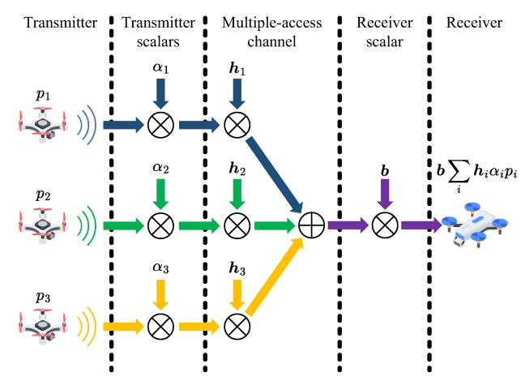  
Fig. 4. Demonstration of AirComp.

After receiving superposed local models from sensing UAVs through AirComp, communication UAVs C select one of them to receive these superposed local models from the others and aggregate them into the new global model $m ^ { [ e ] }$ . This process is still accomplished by AirComp, but the communication UAVs are less concerned about transmission distortion because of their stronger communication capability. Finally, the global model $m ^ { [ e ] }$ is sent to all communication UAVs C and then forwarded to the reachable sensing UAVs $\boldsymbol { S } ^ { [ e ] }$ to continue the local training in the new epoch e + 1.

Algorithm 1 AFL Workflow   
Initialize global model $m ^ { [ 0 ] }$   
Communication UAVs C broadcast $m ^ { [ 0 ] }$ to sensing UAVs S   
for epoch $e = 1 , \ldots , E$ do   
S collect data $\mathcal { D } ^ { [ e ] }$ and train local models $\mathcal { M } ^ { \left[ e \right] }$ as (1)   
C determine linkage scheme $L ^ { [ e ] }$ through Algorithm 2   
C send global model $m ^ { [ e - 1 ] }$ to selected UAVs $\boldsymbol { S } ^ { [ e ] }$   
$\boldsymbol { \mathcal { S } } ^ { [ e ] }$ modify local models $\mathcal { M } _ { \mathrm { u p l o a d } } ^ { [ e ] }$ into $\mathcal { M ^ { \prime } } _ { \mathrm { u p l o a d } } ^ { [ e ] }$ based on   
Algorithm 4 and send them to C   
C aggregate local models $\mathcal { M ^ { \prime } } _ { \mathrm { u p l o a d } } ^ { [ e ] }$ into a new global   
model $m ^ { [ e ] }$ as (4) and send to $\dot { S } ^ { [ e ] }$   
end for

To summarize, our proposed AFL framework includes four steps, data collection and training, modification, uploading and aggregation, and distribution. The details of the proposed AFL framework are illustrated in Algorithm 1.

## B. AirComp for Model Aggregation

In the conventional FL framework, edge nodes transmit their local models to PSs separately, which limits communication efficiency under bandwidth constraints or results in higher energy consumption because of longer transmission time [35]. To fully utilize communication resources, AirComp is introduced to integrate computation and communication by exploiting the signal superposition property of the multipleaccess channel and computing a linear function of distributed models from various UAVs, as illustrated in Fig. 4.

To upload the model $\widehat { m } _ { i } ^ { [ e ] }$ to the communication UAVs C, UAVs $\boldsymbol { S } ^ { [ e ] }$ transmit the signal vector $p _ { i } : = \widehat { m } _ { i } ^ { [ e ] } \in \mathbb { C } ^ { T }$ , which is normalized to unit variance as $\mathbb { E } ( p _ { i } p _ { i } ^ { \mathsf { H } } ) = I .$ . Here, the operation $( \cdot ) ^ { \sf H }$ denotes the conjugate transpose of the original matrix. At time slot $t \in \{ 1 , 2 , \dots , T \}$ , UAV $s _ { i } \in \mathcal S ^ { [ e ] }$ sends the signal $p _ { i } ^ { ( t ) }$ to UAV $c _ { j } \in { \mathcal { C } }$ via AirComp, and the ideal received signal $p _ { j } ^ { ( t ) }$ is denoted as

$$
p _ { j } ^ { ( t ) } = \sum _ { s _ { i } \in S ^ { [ e ] } } \rho _ { i } p _ { i } ^ { ( t ) } .\tag{7}
$$

For simplicity, the time slot index t is omitted in subsequent expressions. The effect of the multiple-access channel on the signal is given by

$$
p _ { j } = \sum _ { s _ { i } \in S ^ { [ e ] } } h _ { i , j } \alpha _ { i } p _ { i } + n ,\tag{8}
$$

where $\mathbf { \delta } _ { \mathbf { \mathcal { P } } _ { j } }$ is the signal affected by the multiple-access channel but not received by UAV $c _ { j }$ yet, $\pmb { h } _ { i , j } \in \mathbb { C } ^ { A }$ is the channel vector between UAV $s _ { i } \in \bigcup _ { { \cal S } } [ e ]$ and $c _ { j } \in \mathcal { C } , \alpha _ { i } \in \mathbb { R } ^ { + }$ is the transmitter scalar, and $\pmb { n } \sim \mathcal { C } \mathcal { N } ( \mathbf { 0 } , \sigma ^ { 2 } \pmb { I } )$ is the noise vector where $\sigma > 0$ denotes the standard deviation of the noise. After reception through the beamforming vector $b _ { j } \in \mathbb { C } ^ { A }$ at UAV $c _ { j }$ , the expected signal $\widehat { p } _ { j }$ is given by

$$
\widehat { p } _ { j } = \frac { 1 } { \sqrt { \lambda _ { j } } } b _ { j } ^ { \sf H } p _ { j } = \frac { 1 } { \sqrt { \lambda _ { j } } } b _ { j } ^ { \sf H } \sum _ { s _ { i } \in \mathcal { S } ^ { [ e ] } } h _ { i , j } \alpha _ { i } p _ { i } + \frac { b _ { j } ^ { \sf H } n } { \sqrt { \lambda _ { j } } }\tag{9}
$$

where $\lambda _ { j }$ is a normalization factor. The power constraint at sensing UAVs $s _ { i } \in S$ is

$$
\left| \alpha _ { i } \right| ^ { 2 } \leq P _ { S } .\tag{10}
$$

The constraint on the noise amplification factor at communication UAVs $c _ { j } \in \mathcal { C }$ is

$$
\left\| \boldsymbol { b } _ { j } \right\| ^ { 2 } \leq P _ { \mathrm { N } } .\tag{11}
$$

The performance of AirComp is characterized by the distortion between the ideal signal $p _ { j }$ in (7) and the estimated signal $\widehat { p } _ { j }$ in (9), which is measured by the mean-squared-error (MSE) defined as

$$
\mathsf { M S E } ( \widehat { p } _ { j } , p _ { j } ) = \mathbb { E } ( | \widehat { p } _ { j } - p _ { j } | ^ { 2 } )\tag{12a}
$$

$$
= \sum _ { s _ { i } \in S ^ { [ e ] } } \left| \frac { b _ { j } ^ { \sf H } h _ { i , j } \alpha _ { i } } { \sqrt { \lambda _ { j } } } - \rho _ { i } \right| ^ { 2 } + \sigma ^ { 2 } \frac { \left\| b _ { j } \right\| ^ { 2 } } { \lambda _ { j } } .\tag{12b}
$$

Given an arbitrarily receive beamforming vector $b _ { j }$ , the optimal transmitter scalar that minimizes the MSE is obtained by the following zero-forcing condition [36]:

$$
\frac { b _ { j } ^ { \mathsf { H } } h _ { i , j } \alpha _ { i } } { \sqrt { \lambda _ { j } } } - \rho _ { i } = 0 .\tag{13}
$$

Thus, the optimal transmitter scalar is

$$
\alpha _ { i } = \sqrt { \lambda _ { j } } \rho _ { i } \frac { ( b _ { j } ^ { \sf H } h _ { i , j } ) ^ { \sf H } } { \left\| b _ { j } ^ { \sf H } h _ { i , j } \right\| ^ { 2 } } .\tag{14}
$$

Under the transmit power constraint $\left| \alpha _ { i } \right| ^ { 2 } \leq P _ { S }$

$$
\begin{array} { r } { \left| \sqrt { \lambda _ { j } } \rho _ { i } \frac { ( b _ { j } ^ { \sf H } h _ { i , j } ) ^ { \sf H } } { \left\| b _ { j } ^ { \sf H } h _ { i , j } \right\| ^ { 2 } } \right| ^ { 2 } \leq P _ { S } . } \end{array}\tag{15}
$$

Given that $b _ { j } ^ { \mathsf { H } } h _ { i , j } \in \mathbb { C }$ , it can be derived that

$$
\left| ( b _ { j } ^ { \mathsf { H } } h _ { i , j } ) ^ { \mathsf { H } } \right| ^ { 2 } = \left\| ( b _ { j } ^ { \mathsf { H } } h _ { i , j } ) ^ { \mathsf { H } } \right\| ^ { 2 } = \left\| b _ { j } ^ { \mathsf { H } } h _ { i , j } \right\| ^ { 2 } .\tag{16}
$$

Therefore, combining (14) and (15), the normalization factor can be expressed and bounded as

$$
\lambda _ { j } = \frac { \alpha _ { i } ^ { 2 } } { \rho _ { i } ^ { 2 } } \left\| \boldsymbol { b } _ { j } ^ { \sf H } \boldsymbol { h } _ { i , j } \right\| ^ { 2 } \leq \frac { P s \left\| \boldsymbol { b } _ { j } ^ { \sf H } \boldsymbol { h } _ { i , j } \right\| ^ { 2 } } { \rho _ { i } ^ { 2 } } .\tag{17}
$$

To fully utilize the transmission power and suppress noise, the normalization factor should be set to its upper bound as

$$
\lambda _ { j } = \operatorname* { m i n } _ { s _ { i } \in { \cal S } ^ { [ e ] } } \frac { P s \left\| \pmb { b } _ { j } ^ { \sf H } { \pmb { h } _ { i , j } } \right\| ^ { 2 } } { \rho _ { i } ^ { 2 } } .\tag{18}
$$

Thus, the MSE is given by

$$
\begin{array} { r l } & { \mathsf { M S E } ( \widehat { p } _ { j } , p _ { j } ; S ^ { [ e ] } , { b } _ { j } ) = \frac { \left. { b } _ { j } \right. ^ { 2 } \sigma ^ { 2 } } { \lambda _ { j } } } \\ & { \qquad = \frac { \sigma ^ { 2 } } { P _ { S } } \underset { s _ { i } \in S ^ { [ e ] } } { \operatorname* { m a x } } \rho _ { i } ^ { 2 } \frac { \left. { b } _ { j } \right. ^ { 2 } } { \left. { b } _ { j } ^ { \mathsf { H } } { h } _ { i , j } \right. ^ { 2 } } . } \end{array}\tag{19a}
$$

(19b)

C. Problem Formulation

In FL, a critical factor that affects the performance of the global model $m ^ { [ e ] }$ is the volume of training data $\boldsymbol { D } ^ { [ e ] } ~ =$ $\mathbf { \widetilde { ( } } \left| d _ { 1 } ^ { [ e ] } \right| , \left| d _ { 2 } ^ { [ e ] } \right| , \ldots , \left| d _ { S } ^ { [ e ] } \right| ) ^ { \top }$ used to train local models $\mathcal { M } ^ { [ e ] } =$ $\{ m _ { 1 } ^ { [ e ] } , \dot { m } _ { 2 } ^ { [ e ] } , \hdots , m _ { S } ^ { [ e ] } \}$ . Thus, the ideal strategy is to aggregate all local models in each epoch e. However, this conflicts with the principle of AFL, which relaxes the aggregation constraint of SFL and this is difficult to achieve due to the limitations caused by AirComp, as presented in Section II-B. Furthermore, aggregation errors may lead to a notable drop in prediction accuracy [37]. Since not all sensing UAVs S can be connected to communication UAVs C, the optimization target is to maximize the total training data volume $\Big \| L ^ { [ e ] } D \Big \| _ { 1 }$ utilized by aggregated local models $\mathcal { M } _ { \mathrm { u p l o a d } } ^ { [ e ] } .$ This is achieved by jointly adjusting the linkage scheme $L ^ { [ e ] }$ and the beamforming vectors $b _ { j }$ at epoch $e ,$ subject to MSE and power constraints from (19) and (11) as

$$
\underset { { \pmb { L } } ^ { [ e ] } \in \mathbb { R } ^ { C \times S } , { \pmb { b } } _ { j } \in \mathbb { C } ^ { A } } { \mathrm { m a x i m i z e } } \left\| { \pmb { L } } ^ { [ e ] } { \pmb { D } } \right\| _ { 1 }\tag{20a}
$$

$$
\mathrm { s . t . } \quad \frac { \sigma ^ { 2 } } { P _ { S } } \operatorname* { m a x } _ { s _ { i } \in S ^ { [ e ] } } l _ { i , j } \rho _ { i } ^ { 2 } \frac { \left\| b _ { j } \right\| ^ { 2 } } { \left\| b _ { j } ^ { \sf H } h _ { i , j } \right\| ^ { 2 } } \leq \gamma , \ \forall j ,\tag{20b}
$$

$$
\left\| \pmb { b } _ { j } \right\| ^ { 2 } \leq P _ { \mathrm { N } } , c _ { j } \in \mathcal { C }\tag{20c}
$$

where the operation $\left\| \cdot \right\| _ { 1 }$ denotes the Manhattan norm, i.e., the sum of the absolute value of all elements in a matrix or vector, and $\gamma$ refers to the MSE threshold of AirComp transmission. Solving the mixed combinatorial optimization problem (20) is challenging due to the combinatorial objective function $\left\| \ L _ { L ^ { \left[ e \right] } D } \right\| .$ and the nonconvex MSE constraint.

The transceiver design proposed here, which utilizes Air-Comp, assumes the availability of perfect channel state information (CSI) [38]. However, obtaining and transmitting CSI feedback can introduce considerable overhead [39]. To address this issue, an alternative method involves performing the transceiver design at the communication UAVs C by solving problem (20) and computing the result in equation (13), which only requires the CSI at C [40]. Once the transmitter scalars are determined, C can transmit feedback to sensing UAVs S by sending the corresponding scalar value $\alpha _ { i }$ . To estimate the CSI at ${ \mathcal { C } } ,$ channel training can be performed by transmitting pilot sequences from S [41]. The feedback process can then be handled using either unquantized analog feedback or quantized digital feedback [42].

## III. SOLUTIONS FOR LINKAGE SCHEMES AND BEAMFORMING VECTORS

To solve problem (20), we decompose it into two subproblems: one for the linkage scheme $L ^ { [ e ] }$ and one for the beamforming vector $b _ { j }$ , denoted as $\mathcal { P } _ { 1 }$ and $\mathcal { P } _ { 2 }$ , respectively.

The first subproblem aims to determine the optimal linkage matrix $\pmb { L } ^ { [ e ] } \in \dot { \{ 0 , 1 \} } ^ { C \times S }$ that maximizes the total amount of training data utilized for aggregation. Each element $l _ { i , j } ^ { [ e ] } \in$ $\{ 0 , 1 \}$ indicates whether sensing UAV $s _ { i }$ uploads its local model to communication UAV $c _ { j }$ at epoch e. Accordingly, the uploading plan of sensing UAVs is defined as $v ^ { [ e ] } =$ $\textstyle \sum _ { j = 1 } ^ { C } L _ { j , : } ^ { [ e ] }$ , which represents whether each sensing UAV participates in the current aggregation epoch.

$$
\mathcal { P } _ { 1 } : \operatorname* { m a x i m i z e } _ { L ^ { [ e ] } \in \{ 0 , 1 \} ^ { C \times S } } \| L ^ { [ e ] } D \| _ { 1 }\tag{21a}
$$

$$
\mathrm { s . t . } { \pmb v } ^ { [ e ] } = \sum _ { j = 1 } ^ { C } { \pmb L } _ { j , : } ^ { [ e ] }\tag{21b}
$$

$$
{ \pmb v } ^ { [ e ] } { \pmb v } _ { k } ^ { \top } < \| { \pmb v } _ { k } \| _ { 1 } , \quad \forall { \pmb v } _ { k } \in \mathcal { V } _ { \mathrm { N F } } ^ { [ e ] }\tag{21c}
$$

$$
\begin{array} { r } { \pmb { L } _ { j , : } ^ { [ e ] } l _ { k } ^ { \mathsf { T } } \le \| l _ { k } \| _ { 1 } , \quad \forall c _ { j } \in \mathcal { C } , l _ { k } \in \mathcal { L } _ { \mathrm { N F } , j } ^ { [ e ] } . } \end{array}\tag{21d}
$$

Here, $\mathcal { V } _ { \mathrm { N F } } ^ { [ e ] }$ denotes the set of previously identified nonfeasible uploading plans, while $\mathcal { L } _ { \mathrm { N F } , j } ^ { [ e ] }$ represents the set of non-feasible transmission plans for communication UAV $c _ { j } .$ These sets are not optimization variables but are progressively constructed during the branch-and-bound procedure.

Specifically, if a candidate linkage matrix $L ^ { [ e ] }$ yields an infeasible beamforming solution in subproblem ${ \mathcal { P } } _ { 2 } ,$ , the corresponding uploading plan $v ^ { [ e ] }$ or transmission plan $L _ { j , : } ^ { [ e ] }$ is recorded in $\mathcal { V } _ { \mathrm { N F } } ^ { [ e ] }$ or $\mathcal { L } _ { \mathrm { N F } , j } ^ { [ e ] } ,$ respectively. The additional constraints above prevent repeated exploration of these infeasible plans, thereby pruning the search space efficiently.

With binary decision variables and linear constraints, subproblem $\mathcal { P } _ { 1 }$ becomes a 0–1 integer linear programming (ILP) problem. It is solved using a branch-and-bound algorithm that systematically explores feasible linkage schemes in descending order of the objective value while excluding infeasible branches identified by $\mathcal { P } _ { 2 }$

```latex
Algorithm 2 Algorithm for Linkage Scheme and Beamform
ing Vector
Initialize non-feasible sets $\mathcal { V } _ { \mathrm { N F } } ^ { [ e ] }$ and $\mathcal { L } _ { \mathrm { N F } , j } ^ { [ e ] }$
while exists uploading plan $v ^ { [ e ] }$ by solving $\mathcal { P } _ { 1 }$ do
while exists transmitting plan $\dot { \mathcal { L } } ^ { [ e ] }$ by solving $\mathcal { P } _ { 1 }$ do
if Algorithm 3 solves for beamforming vector
$b _ { j } , \forall c _ { j } \in \mathcal { C }$ by solving $\mathcal { P } _ { 2 }$ then
Return $\mathcal { L } ^ { [ e ] }$ and $b _ { j }$
else
Add $\mathcal { L } ^ { [ e ] }$ to $\mathcal { L } _ { \mathrm { N F } , j } ^ { [ e ] }$
end if
end while
Add $v ^ { [ e ] }$ to $\mathcal { V } _ { \mathrm { N F } } ^ { [ e ] }$
end while
```

The second subproblem is formulated as

$$
\mathcal { P } _ { 2 } : \operatorname* { m i n i m i z e } _ { \boldsymbol { b } _ { j } \in \mathbb { C } ^ { A } } \left\| \boldsymbol { b } _ { j } \right\| ^ { 2 }\tag{22a}
$$

$$
\mathrm { s . t . } \quad \frac { \sigma ^ { 2 } } { P _ { S } } \operatorname* { m a x } _ { s _ { i } \in S ^ { [ e ] } } l _ { i , j } \rho _ { i } ^ { 2 } \frac { \left\| b _ { j } \right\| ^ { 2 } } { \left\| b _ { j } ^ { \sf H } h _ { i , j } \right\| ^ { 2 } } \leq \gamma , \ \forall j ,\tag{22b}
$$

$$
\left\| \pmb { b } _ { j } \right\| ^ { 2 } \leq P _ { \mathrm { N } } , c _ { j } \in \mathcal { C }\tag{22c}
$$

to find the beamforming vectors $b _ { j }$ to support the linkage scheme $L ^ { [ e ] }$ obtained at subproblem (21). To simplify the subproblem, define a new threshold $\begin{array} { r } { \gamma _ { i } = \frac { \gamma P _ { S } } { \sigma ^ { 2 } \rho _ { i } ^ { 2 } } } \end{array}$ , and rewrite subproblem $\mathcal { P } _ { 2 }$ as

$$
\mathcal { P } _ { 2 } : \operatorname* { m i n i m i z e } _ { \boldsymbol { b } _ { j } \in \mathbb { C } ^ { A } } \left\| \boldsymbol { b } _ { j } \right\| ^ { 2 }\tag{23a}
$$

$$
\mathrm { s . t . } \quad \operatorname* { m a x } _ { s _ { i } \in S ^ { [ e ] } } l _ { i , j } \frac { \Vert \pmb { b } _ { j } \Vert ^ { 2 } } { \left. \pmb { b } _ { j } ^ { \sf H } \pmb { h } _ { i , j } \right. ^ { 2 } } \leq \gamma _ { i } , \ \forall j ,\tag{23b}
$$

$$
\| \pmb { b } _ { j } \| ^ { 2 } \leq P _ { \mathrm { N } } , c _ { j } \in \mathcal { C } .\tag{23c}
$$

If a beamforming vector $b _ { j }$ satisfies constraint (23b), then its scaled version $\beta \boldsymbol { { b } } _ { j }$ also satisfies the constraint, because

$$
\frac { { \left\| { \beta { { b } _ { j } } } \right\| ^ { 2 } } } { { \left\| { \beta { { b } _ { j } ^ { \mathrm { H } } } { { h } _ { i , j } } } \right\| ^ { 2 } } } = \frac { { \beta ^ { 2 } } \left\| { { b } _ { j } } \right\| ^ { 2 } } { { \beta ^ { 2 } } \left\| { { b } _ { j } ^ { \mathrm { H } } { { h } _ { i , j } } } \right\| ^ { 2 } } = \frac { { \left\| { { b } _ { j } } \right\| ^ { 2 } } } { { \left\| { { b } _ { j } ^ { \mathrm { H } } { { h } _ { i , j } } } \right\| ^ { 2 } } } .\tag{24}
$$

Therefore, there must exist $\beta > 0$ such that $\left\| \beta { \pmb b } _ { j } \right\| ^ { 2 } \leq P _ { \mathrm { N } }$ and thus the solution of subproblem (21) must satisfy the transformed subproblem

$$
\mathcal { P } _ { 2 } ^ { \prime } : \operatorname* { m i n i m i z e } _ { b _ { j } \in \mathbb { C } ^ { A } } \left\| b _ { j } \right\| ^ { 2 }\tag{25a}
$$

$$
\mathrm { s . t . } \quad \operatorname* { m a x } _ { s _ { i } \in S ^ { [ e ] } } l _ { i , j } \frac { P _ { \mathrm { N } } } { \left\| b _ { j } ^ { \sf H } h _ { i , j } \right\| ^ { 2 } } \leq \gamma _ { i } , \ \forall j ,\tag{25b}
$$

$$
\| \pmb { b } _ { j } \| ^ { 2 } \leq P _ { \mathrm { N } } , c _ { j } \in \mathcal { C } .\tag{25c}
$$

Conversely, if there exists $b _ { j }$ that satisfies the transformed subproblem (25), then

$$
\gamma _ { i } \geq \frac { l _ { i , j } P _ { \mathrm { N } } } { \left\| \boldsymbol b _ { j } ^ { \sf H } \boldsymbol { h } _ { i , j } \right\| ^ { 2 } } \geq \frac { l _ { i , j } \left\| \boldsymbol b _ { j } \right\| ^ { 2 } } { \left\| \boldsymbol b _ { j } ^ { \sf H } \boldsymbol { h } _ { i , j } \right\| ^ { 2 } } , \forall i\tag{26}
$$

and therefore the solution $b _ { j }$ of the subproblem (25) must satisfy the constraints of subproblem (21) as well. Since the solutions to subproblem (21) and (25) satisfy the constraints of each other, these two subproblems are equivalent. Then the subproblem (25) can be equivalently written as

$$
\mathcal { P } _ { 2 } : \operatorname* { m i n i m i z e } _ { \boldsymbol { b } _ { j } \in \mathbb { C } ^ { A } } \left\| \boldsymbol { b } _ { j } \right\| ^ { 2 }\tag{27a}
$$

$$
\begin{array} { r l } { \mathrm { s . t . } \quad } & { { } \left\| b _ { j } ^ { \mathsf { H } } h _ { i , j } \right\| ^ { 2 } \geq \widetilde { \gamma } _ { i } , \forall i , j } \end{array}\tag{27b}
$$

$$
\left\| \pmb { b } _ { j } \right\| ^ { 2 } \leq P _ { \mathrm { N } } , c _ { j } \in \mathcal { C }\tag{27c}
$$

with a new threshold $\begin{array} { r } { \widetilde { \gamma } _ { i } = \frac { l _ { i , j } P _ { \mathrm { N } } } { \gamma _ { i } } } \end{array}$ . Here, the constraint (27b) is nonconvex, while (27c) is convex. Up to this point, the problem (20) can be solved by alternately solving the two subproblems (21) and (27), as shown in Algorithm 2.

To solve the subproblem (27), the main difficulty is the nonconvex constraint (27b), which indicates that the inner product $\boldsymbol { b } _ { i } ^ { \sf H } \boldsymbol { h } _ { i , j }$ is a complex scalar and its squared modulus is greater than a threshold $\widetilde { \gamma } _ { i }$ . As a complex scalar, it can be rotated on the complex plane by

$$
\theta _ { i } = - \arg ( b _ { j } ^ { \mathsf { H } } h _ { i , j } )\tag{28}
$$

and aligned with the real axis as

$$
\mathrm { R e } ( b _ { j } ^ { \sf H } h _ { i , j } \cdot e ^ { \mathrm { i } \theta _ { i } } ) = \left\| b _ { j } ^ { \sf H } h _ { i , j } \cdot e ^ { \mathrm { i } \theta _ { i } } \right\| = \left\| b _ { j } ^ { \sf H } h _ { i , j } \right\| .\tag{29}
$$

In other words, if there exists a beamforming vector $b _ { j }$ that satisfies the constraint (27b), there must exist $b _ { j } ^ { \prime } = b _ { j } ^ { \prime } \cdot e ^ { \mathrm { i } \theta _ { i } }$ that satisfies the constraint as

$$
\mathrm { R e } ( { b _ { j } ^ { \prime } } ^ { \sharp } h _ { i , j } ) = \mathrm { R e } ( b _ { j } ^ { \sharp } h _ { i , j } \cdot e ^ { \mathrm { i } \theta _ { i } } ) = \left\| b _ { j } ^ { \sf H } h _ { i , j } \right\| \geq \sqrt { \widetilde { \gamma } _ { i } } .\tag{30}
$$

Therefore, the subproblem (27) can be rewritten as

$$
\mathcal { P } _ { 2 } : \operatorname* { m i n i m i z e } _ { \boldsymbol { b } _ { j } \in \mathbb { C } ^ { A } , \boldsymbol { \theta } \in \mathbb { R } ^ { S } } \| \boldsymbol { b } _ { j } \| ^ { 2 }\tag{31a}
$$

$$
\begin{array} { r l } { \mathrm { s . t . } \ } & { { } \mathrm { R e } ( b _ { j } ^ { \sf H } h _ { i , j } \cdot e ^ { \mathrm { i } \theta _ { i } } ) \geq \sqrt { \widetilde { \gamma } _ { i } } , \ \forall i , j } \end{array}\tag{31b}
$$

$$
\pmb { \theta } = ( \theta _ { 1 } , \theta _ { 2 } , \dots , \theta _ { S } )\tag{31c}
$$

$$
\left\| \pmb { b } _ { j } \right\| ^ { 2 } \leq P _ { \mathrm { N } } , c _ { j } \in \mathcal { C }\tag{31d}
$$

where the auxiliary angle vector θ includes the auxiliary angles $\theta _ { i }$ to help solve the subproblem.

In this way, the constraint (31b) is no longer nonconvex if $\theta _ { i }$ is regarded as a constant whereas when $b _ { j }$ is regarded as a constant $\theta _ { i }$ can be easily calculated by (28) as well. Therefore, an alternating optimization algorithm can be used to solve the subproblem (31) in two steps, including

$$
\mathcal { P } _ { 2 - 1 } : \operatorname* { m i n i m i z e } _ { \boldsymbol { b } _ { j } \in \mathbb { C } ^ { A } } \| \boldsymbol { b } _ { j } \| ^ { 2 }\tag{32a}
$$

$$
\begin{array} { r l } { \mathrm { s . t . } \ } & { { } \mathrm { R e } ( b _ { j } ^ { \sf H } h _ { i , j } \cdot e ^ { \mathrm { i } \theta _ { i } } ) \geq \sqrt { \widetilde { \gamma } _ { i } } , \ \forall i , j } \end{array}\tag{32b}
$$

and

$$
\mathcal { P } _ { 2 - 2 } : \operatorname* { m i n i m i z e } _ { \theta \in \mathbb { R } ^ { S } } \mathrm { R e } ( b _ { j } ^ { \sf H } h _ { i , j } \cdot e ^ { \mathrm { i } \theta _ { i } } ) \ \forall i , j\tag{33a}
$$

$$
\begin{array} { r l } { \mathrm { s . t . } } & { { } \pmb { \theta } = ( \theta _ { 1 } , \theta _ { 2 } , \ldots , \theta _ { S } ) . } \end{array}\tag{33b}
$$

The first step, $\mathcal { P } _ { 2 - 1 }$ , is convex and can be solved using the interior-point method or sequential quadratic programming. The second step, $\mathcal { P } _ { 2 - 2 } ,$ , is convex as well and can be calculated by (28) directly.

The sequence $\{ ( \pmb { b } _ { j } ^ { [ t ] } , \pmb { \theta } ^ { [ t ] } ) \}$ generated by iteratively solving $\mathcal { P } _ { 2 - 1 }$ and $\mathcal { P } _ { 2 - 2 }$ yields a non-increasing and convergent sequence of objective values $\left\{ \left\| b _ { j } ^ { [ t ] } \right\| ^ { 2 } \right\}$ as shown in the following proposition.

Algorithm 3 Alternating Optimization Algorithm for Beam  
forming Vectors   
Initialize auxiliary angle vector $\pmb { \theta } ^ { [ 0 ] }$   
Get beamforming vector $\pmb { b } ^ { [ 0 ] }$ through solving $\mathcal { P } _ { 2 - 1 }$   
while $\boldsymbol { b } ^ { [ t ] }$ does not satisfy condition (37) do   
Update auxiliary angle vector $\theta ^ { [ t ] }$ through solving $\mathcal { P } _ { 2 - 2 }$   
Update beamforming vector $b ^ { [ t ] }$ through solving $\mathcal { P } _ { 2 - 1 }$   
end while   
if $\boldsymbol { b } ^ { [ t ] }$ satisfies constraint (27b) then   
Return the optimized beamforming vector $\mathbf { \nabla } _ { b } [ t ]$   
else   
No feasible beamforming vector exists   
end if

Proposition 1: Let $b _ { j } ^ { [ t ] }$ as the result of $\mathcal { P } _ { 2 - 1 }$ at the iteration t of the proposed algorithm and $\theta ^ { [ t ] }$ as the result of $\mathcal { P } _ { 2 - 2 }$ Since the target of $\mathcal { P } _ { 2 - 2 }$ is to maximize $\mathfrak { \backslash e } ( b _ { j } ^ { \sf H } h _ { i , j } \cdot e ^ { \mathrm { i } \theta _ { i } } ) , \bar { \forall i } , \bar { j }$ it follows that

$$
\mathrm { R e } ( b _ { j } ^ { [ t ] } ^ { \mathsf { H } } h _ { i , j } \cdot e ^ { \mathsf { i } \theta _ { i } ^ { [ t ] } } ) \geq \mathrm { R e } ( b _ { j } ^ { [ t ] ^ { \mathsf { H } } } h _ { i , j } \cdot e ^ { \mathsf { i } \theta _ { i } ^ { [ t - 1 ] } } ) \geq \sqrt { \widetilde { \gamma } _ { i } } .\tag{34}
$$

Hence, there exists $\pmb { \mu } ^ { [ t ] } = \left\{ \mu _ { i } ^ { [ t ] } \mid \mu _ { i } ^ { [ t ] } \in ( 0 , 1 ] \right\}$ so that

$$
\mathrm { R e } ( \mu _ { i } ^ { [ t ] } { b _ { j } ^ { [ t ] } } ^ { \mathsf { H } } h _ { i , j } \cdot e ^ { \mathsf { i } \theta _ { i } ^ { [ t ] } } ) = \mathrm { R e } ( { b _ { j } ^ { [ t ] } } ^ { \mathsf { H } } h _ { i , j } \cdot e ^ { \mathsf { i } \theta _ { i } ^ { [ t - 1 ] } } ) \ge \sqrt { \widetilde { \gamma } _ { i } } .\tag{35}
$$

In this way, at the iteration $t + 1$ of the proposed algorithm, the subproblem $\mathcal { P } _ { 2 - 1 }$ can be obtained with the target value less than or equal to that of the last iteration as

$$
\left\| b _ { j } ^ { [ t + 1 ] } \right\| ^ { 2 } \leq \left\| \mu _ { \operatorname* { m a x } } ^ { [ t ] } b _ { j } ^ { [ t ] } \right\| ^ { 2 } \leq \left\| b _ { j } ^ { [ t ] } \right\| ^ { 2 }\tag{36}
$$

where $\mu _ { \mathrm { m a x } } ^ { [ t ] } = \operatorname* { m a x } \pmb { \mu } ^ { [ t ] }$ . As a result, in the proposed algorithm, when iteratively solving subproblems $\mathcal { P } _ { 2 - 1 }$ and $\mathcal { P } _ { 2 - 2 } ,$ the sequence $\left\{ { \left\| { \pmb b } _ { j } ^ { [ 1 ] } \right\| } ^ { 2 } , \dots , { \left\| { \pmb b } _ { j } ^ { [ t ] } \right\| } ^ { 2 } \right\}$ of the target values of problem $\mathcal { P } _ { 2 }$ is non-increasing. Assuming ${ b } _ { i } ^ { * }$ is the local minimum solution to problem (31) with $\left\| \ b _ { j } ^ { * } \right\| ^ { 2 } > 0$ , the sequence must converge to a value greater than or equal to $\big \| \bar { b } _ { j } ^ { * } \big \| ^ { 2 }$ , representing the local optimum. To stop the iteration, the ending criterion is set as

$$
\left\| b _ { j } ^ { [ t - 1 ] } \right\| ^ { 2 } - \left\| b _ { j } ^ { [ t ] } \right\| ^ { 2 } < \epsilon
$$

$$
\begin{array} { r l r } {  { \quad \quad \quad \stackrel { . . . } { \| { \pmb { b } } _ { j } ^ { [ t ] } \| ^ { 2 } } \quad } } & { { } \stackrel { . . . } { \| { \pmb { b } } _ { j } ^ { [ t ] } \| ^ { 2 } } } \end{array}\tag{37}
$$

where $\epsilon > 0$ is the threshold. The details of the proposed alternating optimization algorithm are illustrated in Algorithm 3.

The computational complexity of the two subproblems should be analysed separately. Consider one communication

UAV $c _ { j } \in { \mathcal { C } }$ with A antennas connects with all sensing UAVs $s$ whose number is S, the subproblems $\mathcal { P } _ { 2 - 1 }$ can be regarded as having 2A real variables in $b _ { j }$ and $S$ constraints. When solving $\mathcal { P } _ { 2 - 1 }$ with an interior-point method, the complexity is approximately $\mathcal { O } ( ( 2 A + S ) ^ { 1 . 5 } S )$ iterations, with each iteration costing $\mathcal { O } ( 2 A S + ( 2 A ) ^ { 2 } )$ . Thus, the total complexity is

$$
\mathcal { O } ( ( 2 A + S ) ^ { 1 . 5 } S ) \times \mathcal { O } ( 2 A S + ( 2 A ) ^ { 2 } ) = \mathcal { O } ( A S ^ { 3 . 5 } )\tag{38}
$$

where $S \_ > >$ . Then the subproblem $\mathcal { P } _ { 2 - 2 }$ requires ${ \mathcal { O } } ( A )$ to calculate $b _ { j } ^ { \sf H } h _ { i , j } , \mathcal { O } ( 1 )$ to extract phase $\arg ( \bar { b } _ { j } ^ { \sf H } h _ { i , j } )$ , and finally $\mathcal { O } ( 1 )$ to set $\theta _ { i } = - \arg ( b _ { i } ^ { \mathsf { H } } h _ { i , j } )$ . Therefore, with S elements in $\pmb { \theta } .$ , the complexity of $\bar { \mathcal { P } _ { 2 - 2 } }$ is $\mathcal { O } ( A S )$ . In this way, the total computation complexity of the proposed algorithm is

$$
\mathcal { O } ( A S ^ { 3 . 5 } ) + \mathcal { O } ( A S ) = \mathcal { O } ( A S ^ { 3 . 5 } + A S ) \approx \mathcal { O } ( A S ^ { 3 . 5 } ) .\tag{39}
$$

By comparison, the branch-and-bound algorithm for the convex-argument-cut-based relaxation problem (ACR-BB) that outputs the global optimal solutions has a complexity of $\mathcal { O } ( \bar { A } ^ { 3 } S ^ { 3 . 5 } )$ [43]. The simulation results in V-B show that the proposed algorithm achieves better performance and lower computational complexity than the ACR-BB algorithm through multiple random initializations.

According to the property

$$
\left\| \boldsymbol b _ { j } ^ { \sf H } \boldsymbol h _ { i , j } \right\| ^ { 2 } \leq \left\| \boldsymbol b _ { j } \right\| ^ { 2 } \cdot \left\| \boldsymbol h _ { i , j } \right\| ^ { 2 }\tag{40}
$$

and constraint $( 2 7 \mathrm { b } )$ , the potential minimum value of objective function ${ \| \pmb { b } _ { j } \| } ^ { 2 }$ is derived as

$$
\left\| \pmb { b } _ { j } \right\| ^ { 2 } \cdot \left\| \pmb { h } _ { i , j } \right\| ^ { 2 } \geq \left\| \pmb { b } _ { j } ^ { \sf H } \pmb { h } _ { i , j } \right\| ^ { 2 } \geq \widetilde { \gamma } _ { i } \Rightarrow \| \pmb { b } _ { j } \| ^ { 2 } \geq \frac { \widetilde { \gamma } _ { i } } { \left\| \pmb { h } _ { i , j } \right\| ^ { 2 } }\tag{41}
$$

and the potential maximum value is $P _ { C }$ . Based on the terminal condition (37), the longest sequence of $\left\{ \left\| b _ { j } ^ { [ t ] } \right\| ^ { 2 } \right\}$ satisfies the following relationship:

$$
\pmb { b } _ { j } ^ { [ t ] } = \frac { 1 } { 1 + \epsilon } \pmb { b } _ { j } ^ { [ t - 1 ] } , \forall t \neq T _ { \operatorname* { m a x } }\tag{42}
$$

which can be represented as

$$
P _ { \mathcal { C } } \left( \frac { 1 } { 1 + \epsilon } \right) ^ { T _ { \operatorname* { m a x } } - 1 } < \frac { \widetilde { \gamma } _ { i } } { \left. h _ { i , j } \right. ^ { 2 } } \leq P _ { \mathcal { C } } \left( \frac { 1 } { 1 + \epsilon } \right) ^ { T _ { \operatorname* { m a x } } } .\tag{43}
$$

Here, $T _ { \mathrm { m a x } }$ is the sequence length, representing the iteration complexity, and is given by

$$
T _ { \mathrm { m a x } } = \left\lceil \log _ { 1 + \epsilon } \left( \frac { P c \left\| h _ { i , j } \right\| ^ { 2 } } { \widetilde { \gamma } _ { i } } \right) \right\rceil .\tag{44}
$$

IV. SELF-ADAPTIVE AGGREGATION SCHEME FOR MODEL STALENESS

The first difficulty in mitigating model staleness is the limitation of information availability caused by AirComp in the proposed AFL framework. The conventional process of aggregating the local models [29] can be described as

$$
\operatorname* { m i n i m i z e } _ { \widetilde { \rho } _ { i } \in [ 0 , 1 ] } { \mathrm { m i n i m i z e } } \mathcal { I } \left( m ^ { [ e ] } \right)\tag{45a}
$$

$$
\begin{array} { r l r } { \mathrm { s . t . } } & { { } \displaystyle } & { \boldsymbol { m } ^ { [ e ] } = \left( 1 - \sum _ { s _ { i } \in S ^ { [ e ] } } \widetilde { \rho } _ { i } \right) \boldsymbol { m } ^ { [ e - 1 ] } + \sum _ { s _ { i } \in S ^ { [ e ] } } \widetilde { \rho } _ { i } \boldsymbol { m } _ { i } ^ { [ e ] } } \\ { } & { { } } & { \displaystyle \sum _ { s _ { i } \in S ^ { [ e ] } } \widetilde { \rho } _ { i } \leq 1 \qquad } \\ { } & { { } } & { \displaystyle ( 4 } \end{array}\tag{5b}
$$

5c)

where $\mathcal { I } ( \cdot )$ is the loss function of the global model $m ^ { [ e ] }$ and the scalar $\widetilde { \rho } _ { i }$ is the weight of the local model $m _ { i } ^ { [ e ] }$ in the global model $m ^ { [ e ] }$ . By controlling these scalars, PSs in conventional FL frameworks can mitigate model staleness in less valuable local models and enhance the contribution of more valuable ones. However, this is difficult to achieve in our proposed AFL framework because communication UAVs receive only superposed models due to AirComp, rather than individual models. Therefore, the process of mitigating model staleness can only be implemented on the sensing UAVs, but they have limited access to information of other local models.

The second difficulty is that simple aggregation schemes may lead to the loss of useful knowledge while reducing model staleness. Some related studies [29], [44] have proposed simple aggregation schemes to mitigate model staleness in FL as

$$
\operatorname* { m i n i m i z e } _ { \tau _ { e } \in \mathbb { N } ^ { + } } \mathcal { I } \left( m ^ { [ e ] } \right)\tag{46a}
$$

$$
\mathrm { s . t . } \quad m ^ { [ e ] } = ( 1 - \rho ) \cdot m ^ { [ e - 1 ] } + \frac { 1 } { \psi } \sum _ { s _ { i } \in S ^ { [ e ] } } \rho _ { i } \cdot m _ { i } ^ { [ e ] }\tag{46b}
$$

$$
\rho = \frac { 1 } { \psi } \sum _ { s _ { i } \in S ^ { [ e ] } } \rho _ { i }\tag{46c}
$$

$$
\rho _ { i } = \sum _ { k = e _ { i } ^ { \prime } } ^ { e } \left| d _ { i } ^ { [ k ] } \right| \cdot \frac { e _ { i } ^ { \prime } } { e }\tag{46d}
$$

$$
\psi = { \textstyle \sum _ { k = e _ { i } ^ { \prime } } ^ { e } } \left| d _ { i } ^ { [ k ] } \right|\tag{46e}
$$

$$
e - e _ { i } ^ { \prime } > \tau _ { e } , \forall s _ { i } \in S ^ { [ e ] }\tag{46f}
$$

which can be implemented in our proposed AFL framework. Here $\tau _ { e }$ is the threshold on the staleness delay to drop local models with high staleness and other variables are defined in Section II and $\rho$ is the sum of the weight $\rho _ { i }$ applied to local models. However, simply applying scalars to local models or dropping those that have been trained for a long time is a blunt solution. While it reduces the influence of highly stale local models and prevents bias in the global model, it also diminishes the impact of the knowledge those models have acquired. Typically, models with high staleness have been trained for longer periods and with larger data volumes than those with low staleness, suggesting that these models may have learned more and could perform better in certain situations. Therefore, preserving parts of these models may contribute to improving global models, despite their staleness.

To address the above two challenges while reducing model staleness, we propose a self-adaptive aggregation scheme that enables sensing UAVs to adaptively modify their own local models. Specifically, sensing UAVs modify particular layers of their local models if those layers exhibit low cosine similarity with the corresponding layers of the latest global model. Cosine similarity is used to determine which parts of a model should be preserved and which should be modified, thereby measuring the staleness of local models. Assuming independent and identically distributed (IID) data [45], the gradients of all local models can be considered to point in similar directions. Moreover, the more data a deep learning model has used for training, the closer it is to the optimal target shared by all local and global models [46], [47]. Therefore, the global model, which contains the most comprehensive knowledge, serves as the reference for comparison with local models. The higher the similarity between a local model and the global model, the less staleness it contains and the more valuable it is for inclusion in the new global model.

Algorithm 4 Self-Adaptive Aggregation Scheme   
Sensing UAVs $\boldsymbol { S } ^ { [ e ] }$ receive the latest global model $m ^ { [ e - 1 ] }$   
from communication $\mathrm { U A V s } ~ \mathcal { C }$   
for each local model $m _ { i } ^ { [ e ] } \in \mathcal { M } _ { \mathrm { u p l o a d } } ^ { [ e ] }$ do   
for each layer of model $w _ { i } ^ { k } \in m _ { i } ^ { [ e ] }$ do   
if cos-sim $( w _ { i } ^ { k } , w ^ { k } ) \leq \tau _ { \mathrm { c o s } }$ then   
Replace layer in local model $m _ { i } ^ { [ e ] } \colon w _ { i } ^ { k } : = w ^ { k }$   
end if   
end for   
Sensing UAV $s _ { i }$ obtains the self-adapted local model   
$\widehat { m } _ { i } ^ { [ e ] }$   
end for   
$\boldsymbol { S } ^ { [ e ] }$ upload self-adapted local models $\mathcal { M ^ { \prime } } _ { \mathrm { u p l o a d } } ^ { [ e ] } = \{ \widehat { m } _ { i } ^ { [ e ] } \ |$   
$s _ { i } \in S ^ { [ e ] } \}$ to C

In the third step in Fig. 3, previously denoted by f(·) before in Section II, at the $e ^ { \mathrm { t h } }$ global epoch, sensing UAV i first receives the latest global model $\overbar { m } ^ { [ e - 1 ] }$ if it is selected to upload its local model $m _ { i } ^ { [ e ] }$ in this epoch. Then it compares its local model $m _ { i } ^ { [ e ] }$ to the global model $m ^ { [ e - 1 ] }$ layer by layer by calculating the cosine similarity as

$$
\cos { - \sin ( w _ { i } ^ { k } , w ^ { k } ) } = { \frac { w _ { i } ^ { k } \cdot w ^ { k } } { \left\| w _ { i } ^ { k } \right\| \cdot \left\| w ^ { k } \right\| } }\tag{47}
$$

where $w _ { i } ^ { k } \in { \boldsymbol { m } } _ { i } ^ { [ e ] }$ and $w ^ { k } \in m ^ { [ e - 1 ] }$ denote the $k ^ { \mathrm { { t h } } }$ layers of the local model $m _ { i } ^ { [ e ] }$ and global model $m ^ { [ e - 1 ] }$ , respectively. In this way, the aggregation scheme in (4) appears as

$$
m ^ { [ e ] } = ( 1 - \rho ) \cdot m ^ { [ e - 1 ] } + \frac { 1 } { \psi } \sum _ { s _ { i } \in \mathcal { S } ^ { [ e ] } } \rho _ { i } \cdot \widehat { m } _ { i } ^ { [ e ] }\tag{48}
$$

where the local model $\widehat { m } _ { i } ^ { \left[ e \right] }$ is self-adapted. To clarify, the aggregation scheme (4) and (48) are the same except for the simplified scalar $\begin{array} { r } { \rho = \frac { 1 } { \psi } \sum _ { s _ { i } \in S ^ { [ e ] } } \rho _ { i } } \end{array}$ . This model consists of layers $\widehat { w } _ { i } ^ { k }$ selected from either the original local model $m _ { i } ^ { [ e ] }$ or the latest global model $m ^ { [ e - 1 ] }$ as

$$
\widehat { w } _ { i } ^ { k } = \mathbb { I } ( \mathcal { R } _ { i } ^ { k } \geq \tau _ { \mathrm { c o s } } ) w _ { i } ^ { k } + \mathbb { I } ( \mathcal { R } _ { i } ^ { k } < \tau _ { \mathrm { c o s } } ) w ^ { k }\tag{49}
$$

where the constant $\mathcal { R } _ { i } ^ { k }$ is calculated as

$$
\mathcal { R } _ { i } ^ { k } = \cos \mathrm { - } \sin ( w _ { i } ^ { k } , w ^ { k } ) .\tag{50}
$$

Here, the indicator function $\mathbb { I } ( \cdot ) = 1$ when the condition is true and $\mathbb { I } ( \cdot ) = 0$ when the condition is false. Specifically, if the cosine similarity cos-sim $( w _ { i } ^ { k } , w ^ { k } )$ exceeds a threshold $\tau _ { \mathrm { c o s } } ,$ the $k ^ { \mathrm { { t h } } }$ layer of local model $\dot { m } _ { i } ^ { [ e ] }$ is preserved as $w _ { i } ^ { k }$ , otherwise, it is replaced by the corresponding layer of the global model $w ^ { k }$ . This process is illustrated in Algorithm 4.

TABLE I  
KEY SIMULATION PARAMETERS
<table><tr><td rowspan=1 colspan=1>Parameters</td><td rowspan=1 colspan=1>Values</td></tr><tr><td rowspan=1 colspan=1>Number of sensing UAVs</td><td rowspan=1 colspan=1>1-20</td></tr><tr><td rowspan=1 colspan=1>Number of communication UAVs</td><td rowspan=1 colspan=1>1-10</td></tr><tr><td rowspan=1 colspan=1>Local training epoch</td><td rowspan=1 colspan=1>1</td></tr><tr><td rowspan=1 colspan=1>Global training epoch</td><td rowspan=1 colspan=1>30</td></tr><tr><td rowspan=1 colspan=1>Global epoch duration</td><td rowspan=1 colspan=1>120 seconds</td></tr><tr><td rowspan=1 colspan=1>Local training time (includingdata-sensing time)</td><td rowspan=1 colspan=1>90 seconds per epoch</td></tr><tr><td rowspan=1 colspan=1>Transmission time</td><td rowspan=1 colspan=1>30 seconds</td></tr><tr><td rowspan=1 colspan=1>Waiting time of retransmission forSFL</td><td rowspan=1 colspan=1>30 seconds</td></tr><tr><td rowspan=1 colspan=1>Volume of training data</td><td rowspan=1 colspan=1>11.2-22.4 GB per epoch per UAV</td></tr><tr><td rowspan=1 colspan=1>Number of parameters of a deeplearning model</td><td rowspan=1 colspan=1> $1 . 8 8 \times 1 0 ^ { 9 }$ </td></tr><tr><td rowspan=1 colspan=1>Transmission power of UAV(reference)</td><td rowspan=1 colspan=1>10 Watts (W)</td></tr></table>

The threshold $\tau _ { \mathrm { c o s } }$ should be set as an adjustable value that increases with the global epoch e. This is because at the initial stage of AFL, the global model is not well-trained and the training of local models leads to large divergence among them. Therefore, the cosine similarity between local models and the global model is typically low, and the threshold $\tau _ { \mathrm { c o s } }$ should be set to a low value to preserve more knowledge learned by the local models. As training proceeds, the global model is gradually optimized and local models are updated accordingly, resulting in higher cosine similarity. Thus, the threshold $\tau _ { \mathrm { c o s } }$ can be increased to replace more layers in the local models with those from the global model, thereby reducing model staleness. For example, in the simulations in Section V, $\tau _ { \mathrm { c o s } }$ is set to 0.5 at the first global epoch and gradually increased to 0.9 at the last global epoch.

## V. SIMULATIONS

In this section, we conduct simulations to compare the proposed alternating optimization algorithm for beamforming vectors with a state-of-the-art (SOTA) algorithm that derives the globally optimal solutions. We then conduct experiments to evaluate the performance of the proposed self-adaptive aggregation scheme in both SFL and AFL, with a case study on how the model staleness affects the performance of the AFL model and how the proposed aggregation scheme can compensate for this issue. Finally, we apply the proposed AFL framework to UAV-related distributed deep learning tasks to demonstrate its effectiveness.

## A. Simulation Setup

UAV Swarm and Communication Model. In the simulations, we consider a UAV swarm in which the communication UAVs equipped with A = 5 antennas and the sensing UAVs equipped with a single antenna. In a region of 20×20×20 cubic kilometres, the UAV trajectories are determined by the Olfati-Saber algorithm [10], which is well known for distributed control of multi-agent systems. This mobility model ensures realistic swarm coordination and dynamic spatial configurations during the learning process. However, it may introduce Doppler shifts and time-varying propagation delays, which are assumed to be compensated for through standard synchronization techniques at the physical layer in simulations. Furthermore, the wireless channels between UAVs are modelled using the Rician channel model since the UAVs are considered to communicate under line-of-sight (LoS) conditions [44] and channel coefficients are updated according to instantaneous UAV positions at each epoch. Some simulation parameters of the simulations are listed in Table I.

Deep Learning. To verify the effectiveness and generality of our proposed self-adaptive aggregation scheme in AFL, we conduct experiments on two datasets: the Modified National Institute of Standards and Technology database (MNIST) [48] and VisDrone2019 dataset [49]. The MNIST dataset is a widely used collection of handwritten digit images, consisting of 60,000 training examples and 10,000 testing examples, and serves as a standard benchmark in the previous FL studies for its simplicity and representativeness. The VisDrone2019 dataset consists of 288 video clips comprising 261,908 frames and 10,209 static images, which were collected using various drone platforms in different scenarios, weather conditions, and lighting conditions, covering a wide range of aspects including location, environment, objects, and density. This dataset is used to evaluate the performance of the proposed AFL framework in UAV-related distributed deep learning tasks. In terms of training process, since the MNIST dataset involves 10 classes, it is split into IID data [45] based on the number of UAVs in each simulation. However, the variation of the VisDrone2019 dataset is too complex to be divided in an independent and identically distributed manner, thus it is considered as non-IID data [25]. We set the local training epoch to 1 to minimize the risk of early divergence in the global model by ensuring more frequent aggregation of updates, which helps maintain model consistency and prevent biases caused by non-IID data across nodes. In the subsequent simulation results, SFL and AFL refer to synchronous and asynchronous federated learning, respectively, and ‘Adapt refers to the proposed self-adaptive aggregation scheme.

## B. Performance of Proposed Alternating Optimization Algorithm for Beamforming Vectors

Fig. 5 shows the performance of the proposed alternating optimization algorithm for solving beamforming vectors. To obtain the optimal value, we use the ACR-BB algorithm to determine the lower and upper bounds of the global optimal solutions. As described in [43], the upper bound is the actual solution derived by the ACR-BB algorithm and the lower bound is the potential value that the solution may achieve. Thus, the global optimal solution lies within this range.

The vertical axis in the figure represents the ratio of the difference between the solution value and the lower bound value to the lower bound value. As shown in the figure, the solutions obtained by the proposed algorithm consistently lie between the upper and lower bounds of the optimal solution across all scenarios, indicating that the solution quality of the proposed algorithm is close to the optimal solution. When there is only one transmitter, the original problem can be equivalently transformed into a nonconvex problem, allowing the optimal solution to be directly obtained. However, as the number of transmitters increases, the number of constraints grows, and the problem complexity rises accordingly. Consequently, the solution quality gradually stabilizes near the optimal level. As previously discussed, the computational complexity of the proposed algorithm is significantly lower than that of the ACR-BB algorithm. Therefore, the proposed algorithm outperforms existing approximation methods in both solution quality and computational efficiency.

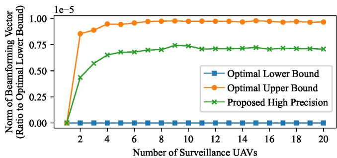  
Fig. 5. Average norm of the beamforming vectors over 100 repeated simulations. Because the absolute values of the solutions are too close to be distinguished, the vertical axis is set as the ratio of the difference between the solution value and the lower bound value to the lower bound value.

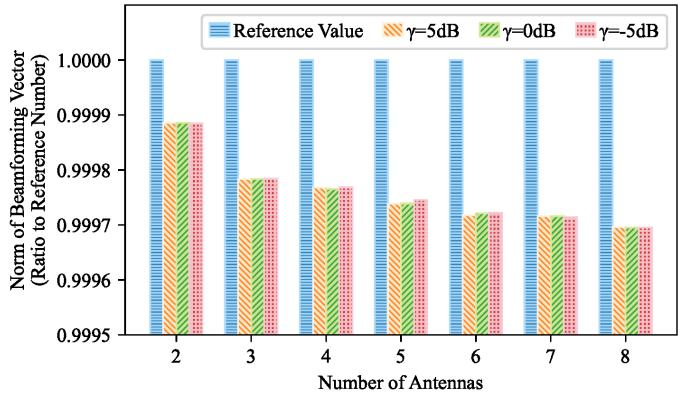  
Fig. 6. Average norm of the beamforming vectors of communication UAVs with different numbers of antennas over 100 repeated simulations. The reference value is derived by the ACR-BB algorithm, and it is normalized to 1 because the solution values derived by the proposed algorithm are divided by the reference value of corresponding situations for better comparison.

Fig. 6 shows the performance of the proposed alternating optimization algorithm for solving beamforming vectors with different numbers of antennas. The reference value is the upper bound derived by the ACR-BB algorithm. Under different MSE thresholds for AirComp, the UAV using the proposed algorithm can use lower energy to transmit the models than that using the ACR-BB algorithm, and that energy decreases as the number of antennas increases, namely the number of optimization variables in the problem, indicating the better performance of our proposed algorithm. Besides, the values derived by the proposed algorithm are very close to each other under different MSE thresholds because in our problem it is the phase of the beamforming vector that influences the distortion of the received signal but not its amplitude. The similarity of these values demonstrates the stability of our algorithm as well.

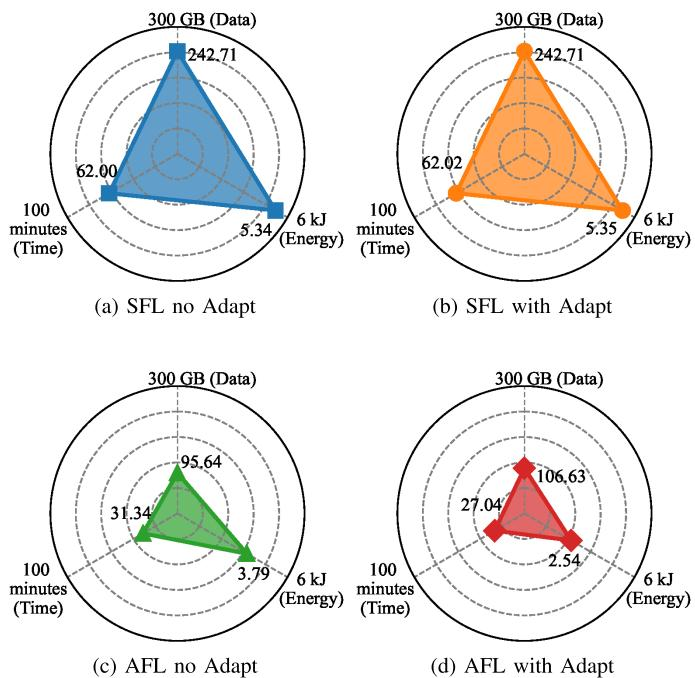  
Fig. 7. Consumption of different resources in different FL frameworks.

## C. Metrics of Proposed Self-Adaptive Aggregation Scheme

Fig. 7 shows three kinds of resources utilized by the FL frameworks to improve the accuracies of their global models to 90%. Among these resources, Data refers to the volume of data transmitted between UAVs, Time refers to the total time required to improve the global model, and Energy indicates the energy consumption of the communication UAVs to receive local models, which is calculated as the sum of the norm of beamforming vectors for simplification.

In Fig. 7, because AFL collects only a subset of local models instead of all of them and avoids retransmission, it reduces the consumption of all three resources. Besides, the self-adaptive aggregation scheme slightly increases the transmission data in both SFL and AFL because it adds the process of transmitting the latest global models from communication UAVs to sensing UAVs. With this additional cost, global models in AFL requires less time and energy to achieve 90% accuracy, while the global models in SFL show little change.

## D. Performance of Self-Adaptive Aggregation Scheme

Fig. 8 shows the performance of the proposed self-adaptive aggregation scheme through the accuracy curves of the global models in different FL frameworks. Since all models almost converge after 20 epochs, Fig. 8 only shows the accuracy curves for the first 20 epochs.

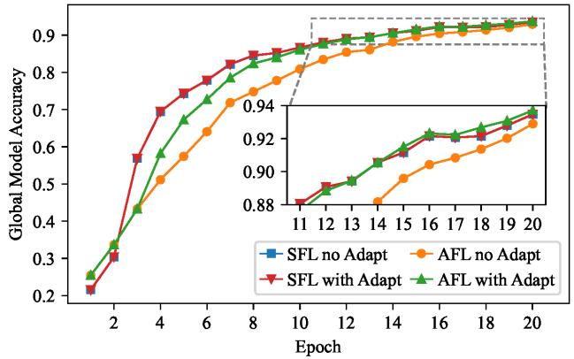  
Fig. 8. Comparison between the average accuracies of different FL frameworks over 100 repeated simulations. The results show that our proposed AFL framework can not only compensate for the staleness problem in AFL (total region), but also surpasses SFL by preventing global aggregation from uninformative parts of local models (zoomed-in region).

From the main figure, it can be observed that after applying the adaptive aggregation scheme, the model accuracy of SFL shows almost no improvement. This is because SFL requires each global aggregation round to include models from all edge nodes and synchronize the updated global model back to all edge nodes. Consequently, all local models at edge nodes remain fresh (non-stale), making the freshnessaware adaptive aggregation scheme ineffective. In contrast, AFL exhibits a significant improvement in model accuracy, particularly between the third and tenth training rounds. Before the third round, the adaptive aggregation scheme was not applied. This is because, in the initial stages, the model learns limited and highly divergent features, which may lead to low similarity between local and global models due to factors other than staleness (e.g., data heterogeneity), potentially discarding locally useful updates.

The subfigure reveals that as the model approaches convergence, the accuracy across all scenarios becomes comparable. This occurs because, over extended training periods, the global model in all cases accumulates similar amounts of learned knowledge. However, compared to SFL, AFL without adaptive aggregation suffers from noticeable accuracy degradation. This is attributed to model staleness in asynchronous settings, where the global model is skewed by highly stale local updates, causing parameter deviation. Remarkably, AFL with adaptive aggregation not only achieves higher accuracy than its nonadaptive counterpart but also slightly outperforms SFL. This demonstrates that the proposed algorithm effectively mitigates the negative impact of stale models while preserving the deeply learned features from high-staleness models (i.e., those trained for longer durations). As a result, the global model integrates more comprehensive and harder-to-learn knowledge, enhancing its generalization capability.

Fig. 9 shows the training performance of different FL frameworks over time. Compared to Fig. 8, it plots the global model accuracy against average training time instead of the number of epochs, where the duration of each epoch is the mean value of repeated experiments. This representation more accurately reflects the training efficiency of different FL schemes under realistic communication and computation constraints.

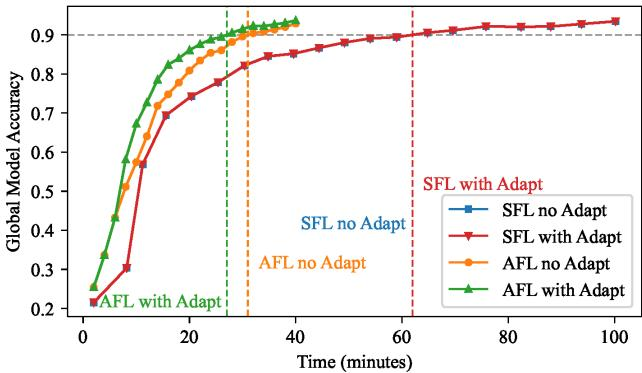  
Fig. 9. Comparison between the average accuracies of different FL frameworks over 100 repeated simulations, where the horizontal axis represents the accumulated training time. It can be observed that, although AFL performs more training epochs, its asynchronous nature and the proposed self-adaptive aggregation scheme significantly accelerate convergence in terms of absolute time compared with SFL and AFL without adaptation.

TABLE II  
TIME-TO-ACCURACY-THRESHOLD FOR DIFFERENT FL SCHEMES
<table><tr><td rowspan="2">Accuracy</td><td colspan="2">SFL</td><td colspan="2">AFL</td></tr><tr><td></td><td>Threshold no Adapt with Adapt no Adapt with Adapt</td><td></td><td></td></tr><tr><td>40%</td><td>9.292</td><td>9.292</td><td>5.321</td><td>5.321</td></tr><tr><td>50%</td><td>10.424</td><td>10.424</td><td>7.713</td><td>6.903</td></tr><tr><td>60%</td><td>12.299</td><td>12.299</td><td>10.778</td><td>8.400</td></tr><tr><td>70%</td><td>16.144</td><td>16.143</td><td>13.526</td><td>11.007</td></tr><tr><td>80%</td><td>27.855</td><td>27.878</td><td>19.440</td><td>14.761</td></tr><tr><td>90%</td><td>61.998</td><td>62.019</td><td>30.991</td><td>27.014</td></tr></table>

Because AFL relaxes the strict synchronization requirement, it allows the server to aggregate available local models at fixed time intervals, whereas SFL must wait until all participating edge nodes complete their local updates and upload their models. As a result, SFL exhibits a longer average epoch duration due to straggling nodes, which leads to slower convergence in terms of absolute time. In contrast, AFL achieves faster accuracy growth by exploiting asynchronous updates and avoiding idle waiting.

Moreover, the proposed self-adaptive aggregation scheme further improves the convergence efficiency of AFL. As indicated by the dashed vertical lines corresponding to the accuracy threshold of 90% (indicated by the gray dashed horizontal line), AFL with adaptation reaches the same target accuracy significantly earlier than both SFL schemes and AFL without adaptation. This demonstrates that the proposed method effectively mitigates the staleness issue inherent in AFL, thereby accelerating convergence in absolute time. Consequently, the proposed AFL framework achieves the best time-to-accuracy performance among all compared schemes, highlighting its advantage for time-constrained edge learning scenarios. The quantitative comparison of the time required to reach different accuracy levels is summarized in Table II.

## E. Case Study of Model Staleness in AFL

Fig. 10 and Fig. 11 show the accuracy and loss curves of the global models in different FL frameworks.

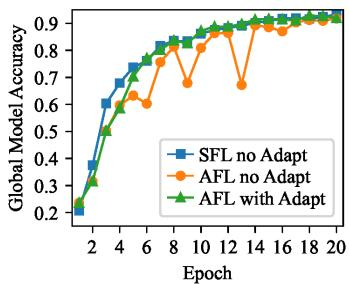  
(a) Case A

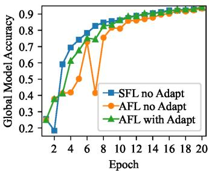  
(b) Case B

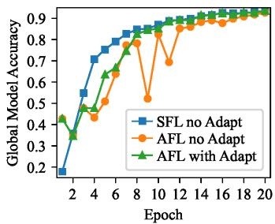  
(c) Case C

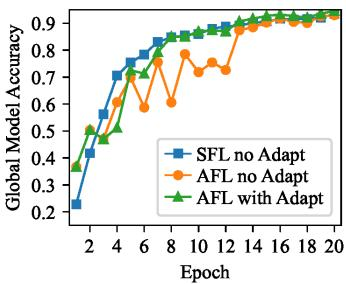  
(d) Case D

Fig. 10. Comparisons of accuracy curves in different FL frameworks. Our proposed self-adaptive aggregation scheme can prevent the dramatic fluctuations caused by model staleness.  
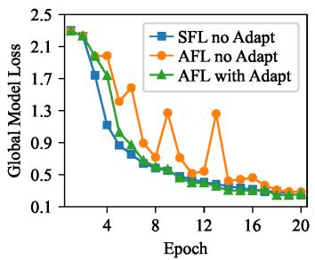  
(a) Case A

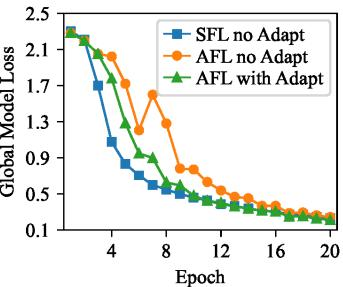  
(b) Case B

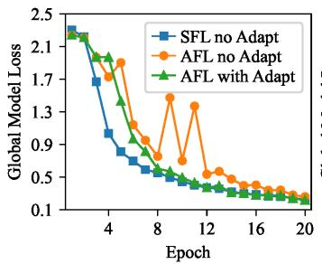  
(c) Case C

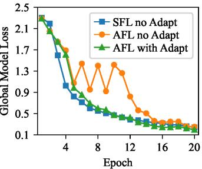  
(d) Case D  
Fig. 11. Comparisons of loss curves in different FL frameworks. Our proposed self-adaptive aggregation scheme can prevent the dramatic fluctuations caused by model staleness.

As shown in Fig. 10 and Fig. 11, during the early training stage, the AFL model without the adaptive aggregation scheme exhibits significant fluctuations. This leads to unstable performance, with accuracy consistently lagging behind that of the SFL model. In contrast, at the corresponding nodes, the AFL model equipped with the adaptive aggregation scheme shows smaller fluctuations (e.g., Epoch 9 in Fig. 10a, Epoch 7 in Fig. 10b, Epoch 4 in Fig. 10c, and Epoch 6 in Fig. 10d). This is because the algorithm mitigates the impact of highly stale models. Furthermore, in certain cases, the global model can improve performance without being impeded by stale models (e.g., Epoch 6 in Fig. 10a, Epoch 10 in Fig. 10b, Epoch 9 in Fig. 10c, and Epoch 8 in Fig. 10d).

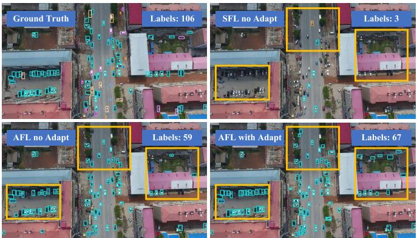  
(a) Case A

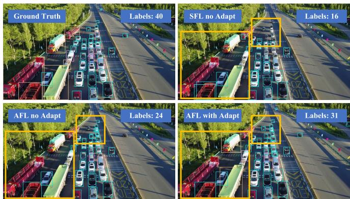  
(b) Case B  
Fig. 12. Target detection performed by models in different FL frameworks. The thin rectangles in various colours indicate the targets detected by deep learning models and the yellow bold rectangles indicate regions with significantly different results. The numbers in the upper-right corner indicate the number of correctly detected targets.

These simulation results conclusively demonstrate that the proposed self-adaptive aggregation scheme effectively reduces the negative influence of model staleness in heterogeneous federated learning, accelerates the convergence rate of the global model, and enhances its final performance after convergence.

## F. Case Study of Model Performance in FL

Fig. 12 shows the results of target detection completed by the models trained in different FL frameworks after the first hour of simulation time. The images from the VisDrone2019 dataset are captured by real UAVs and thus reflect the actual difficulties encountered in real-world scenarios. Thin rectangles in various colours indicate different kinds of detected targets, while the yellow bold rectangles highlight significant differences among the results. To facilitate direct evaluation, the numbers in the upper right corner of each figure indicate the number of correctly detected targets.

In both cases in Fig. 12, there are obvious omissions and false detections in the results produced by SFL. In contrast, the model trained in AFL without the self-adaptive aggregation scheme reduces some of these errors but still has room for improvement in completeness and accuracy. However, the model trained in AFL with the self-adaptive aggregation scheme achieves results much closer to the ground truth. This indicates that incorporating the self-adaptive aggregation scheme in AFL effectively enhances the model, making the detection results more reliable and closer to real-world conditions. Thus, this AFL framework can be effectively applied to practical object detection tasks in real-world scenarios.

## VI. CONCLUSION

In this paper, we present an AirComp-assisted AFL framework for UAV swarm networks that addresses the challenges of improving model-aggregation efficiency and mitigating model staleness. Our framework leverages UAVs as edge computing nodes to collect data and train local models, while swarm heads act as central PSs to aggregate local models. By integrating an energy-efficient AirComp transmission scheme, we enable simultaneous superposition of local model signals, optimizing communication time and bandwidth usage and formulate a data volume maximization problem under signal distortion and power constraints.

To solve the formulated problem, we decompose it into UAV selection and beamforming design subproblems, which are addressed using a branch-and-bound algorithm and our proposed alternating optimization algorithm, respectively. This approach balances computational complexity and performance, ensuring practical applicability in UAV swarm scenarios. Additionally, we propose a self-adaptive aggregation scheme that mitigates model staleness by enabling UAVs to upload only those layers of local models with high cosine similarity to the latest global model, significantly accelerating convergence.

Through simulations on practical deep learning tasks, we evaluate the proposed framework against conventional SFL systems with and without AirComp. The results demonstrate superior performance in model accuracy, loss, energy efficiency, and training data throughput, highlighting the effectiveness of our AirComp-assisted design and adaptive aggregation strategy. This work advances the integration of UAV swarms and federated learning, offering a robust solution for distributed edge computing with efficient resource utilization and convergence efficiency.

## APPENDIX

]Proof of the Convexity To prove the convexity of subprob lem $\mathcal { P } _ { 2 - 1 }$ , its optimization target and constraints should both be convex. Assume the complex vector $b _ { j }$ consists of the real part $\mathbf { \boldsymbol { x } } \in \mathbb { R } ^ { A }$ and the imaginary part $\ b { y } \in \mathbb { R } ^ { A }$

$$
\begin{array} { r } { \pmb { b } _ { j } = \pmb { x } + \mathrm { i } \pmb { y } , \pmb { x } , \pmb { y } \in \mathbb { R } ^ { A } . } \end{array}\tag{51}
$$

In this way, the objective function ${ \| \pmb { b } _ { j } \| } ^ { 2 }$ can be expressed as:

$$
\left\| \pmb { b } _ { j } \right\| ^ { 2 } = \pmb { b } _ { j } ^ { \sf H } \pmb { b } _ { j } = \pmb { x } ^ { \sf T } \pmb { x } + \pmb { y } ^ { \sf T } \pmb { y } .\tag{52}
$$

Hence, the gradient of ${ \| \pmb { b } _ { j } \| } ^ { 2 }$ with respect to x and y is

$$
\nabla _ { \pmb { x } } \left\| \pmb { b } _ { j } \right\| ^ { 2 } = 2 \pmb { x } , \nabla _ { \pmb { y } } \left\| \pmb { b } _ { j } \right\| ^ { 2 } = 2 \pmb { y } .\tag{53}
$$

The Hessian matrix is the matrix of second-order derivatives of the objective function for the decomposed real variables x and y. The second derivatives with respect to x and y are:

$$
{ \frac { \partial ^ { 2 } } { \partial \mathbf { x } \partial \mathbf { x } ^ { \mathsf { T } } } } \left\| b _ { j } \right\| ^ { 2 } = 2 I _ { A } , { \frac { \partial ^ { 2 } } { \partial { \mathbf { y } } \partial { \mathbf { y } } ^ { \mathsf { T } } } } \left\| b _ { j } \right\| ^ { 2 } = 2 I _ { A }\tag{54}
$$

where $\pmb { I } _ { A }$ is the $A \times A$ identity matrix. The cross-derivatives between x and y are given by:

$$
{ \frac { \partial ^ { 2 } } { \partial { \pmb x } \partial { \pmb y } ^ { \top } } } \left\| \pmb { b } _ { j } \right\| ^ { 2 } = \mathbf { 0 } , { \frac { \partial ^ { 2 } } { \partial { \pmb y } \partial { \pmb x } ^ { \top } } } \left\| \pmb { b } _ { j } \right\| ^ { 2 } = \mathbf { 0 } .\tag{55}
$$

Thus, the full Hessian matrix $\pmb { H } \in \mathbb { R } ^ { 2 A \times 2 A }$ of ${ \| \pmb { b } _ { j } \| } ^ { 2 }$ is

$$
{ \cal H } = \left[ \begin{array} { c c c } { { 2 I _ { A } } } & { { { \bf 0 } } } \\ { { { \bf 0 } } } & { { 2 I _ { A } } } \end{array} \right] .\tag{56}
$$

Since the Hessian matrix is symmetric and positive definite, the objective function ${ \| \pmb { b } _ { j } \| } ^ { 2 }$ is a strongly convex function, which guarantees the unique global minimum.

In terms of the constraints, since

$$
e ^ { \mathrm { i } \theta _ { i } } = \cos { \theta _ { i } } + \mathrm { i } \sin { \theta _ { i } }\tag{57}
$$

and assuming that

$$
\begin{array} { r } { b _ { j } ^ { \mathsf { H } } h _ { i , j } = a + \mathrm { i } b \mathrm { , w h e r e ~ } a = \mathrm { R e } ( b _ { j } ^ { \mathsf { H } } h _ { i , j } ) , b = \mathrm { I m } ( b _ { j } ^ { \mathsf { H } } h _ { i , j } ) , } \end{array}\tag{58}
$$

the expression in the constraint can be transformed as

$$
\begin{array} { r l } & { b _ { j } ^ { \sf H } h _ { i , j } \cdot e ^ { \mathrm { i } \theta _ { i } } } \\ & { = ( a + \mathrm { i } b ) ( \cos \theta _ { i } + \mathrm { i } \sin \theta _ { i } ) } \\ & { = ( a \cos \theta _ { i } - b \sin \theta _ { i } ) + \mathrm { i } ( a \sin \theta _ { i } + b \cos \theta _ { i } ) } \end{array}\tag{59}
$$

and its real part is

$$
\operatorname { R e } ( b _ { j } ^ { \mathsf { H } } h _ { i , j } \cdot e ^ { \mathrm { i } \theta _ { i } } ) = a \cos \theta _ { i } { - } b \sin \theta _ { i } .\tag{60}
$$

In this way, the constraint is transformed into

$$
a \cos \theta _ { i } { - } b \sin \theta _ { i } \geq \sqrt { \widetilde { \gamma } _ { i } } , \ \forall i , j .\tag{61}
$$

Since the inner product $\begin{array} { r } { b _ { j } ^ { \mathsf { H } } h _ { i , j } = \sum _ { k = 1 } ^ { A } b _ { j , k } ^ { * } h _ { i , j , k } } \end{array}$ is linear in the real and imaginary parts of $b _ { j } .$ , it follows that

$$
\begin{array} { r } { a = \mathrm { R e } ( b _ { j } ^ { \mathsf { H } } \pmb { h } _ { i , j } ) = b _ { j } ^ { \mathrm { R e } } \cdot h _ { i , j } ^ { \mathrm { R e } } + b _ { j } ^ { \mathrm { I m } } \cdot h _ { i , j } ^ { \mathrm { I m } } } \end{array}\tag{62}
$$

and

$$
\begin{array} { r } { b = \mathrm { I m } ( b _ { j } ^ { \mathsf { H } } h _ { i , j } ) = b _ { j } ^ { \mathrm { R e } } \cdot h _ { i , j } ^ { \mathrm { I m } } - b _ { j } ^ { \mathrm { I m } } \cdot h _ { i , j } ^ { \mathrm { R e } } } \end{array}\tag{63}
$$

where $\begin{array} { r } { b _ { j } = b _ { j } ^ { \mathrm { R e } } + \mathrm { i } b _ { j } ^ { \mathrm { I m } } } \end{array}$ and $h _ { i , j } = h _ { i , j } ^ { \mathrm { R e } } + \mathrm { i } h _ { i , j } ^ { \mathrm { I m } }$ . Hence,

$$
\begin{array} { r l } & { \mathrm { R e } ( b _ { j } ^ { \sf H } \boldsymbol { h } _ { i , j } \cdot e ^ { \mathrm { i } \theta _ { i } } ) = ( b _ { j } ^ { \mathrm { R e } } \cdot h _ { i , j } ^ { \mathrm { R e } } + b _ { j } ^ { \mathrm { I m } } \cdot h _ { i , j } ^ { \mathrm { I m } } ) \cos \theta _ { i } } \\ & { \phantom { { \mathrm { R e } } } - ( b _ { j } ^ { \mathrm { R e } } \cdot h _ { i , j } ^ { \mathrm { I m } } - b _ { j } ^ { \mathrm { I m } } \cdot h _ { i , j } ^ { \mathrm { R e } } ) \sin \theta _ { i } , } \end{array}\tag{64}
$$

indicating that $\boldsymbol { \mathrm { R e } } ( b _ { i } ^ { \mathsf { H } } h _ { i , j } \cdot e ^ { \mathrm { i } \theta _ { i } } )$ is an affine function with respect to $\boldsymbol { b } _ { j } ^ { \mathrm { R e } }$ and $\bar { \boldsymbol { b } } _ { j } ^ { \mathrm { I m } }$ . Therefore, the constraint turns out to be a linear inequality that defines a half-space in the real vector space $\mathbb { R } ^ { 2 A }$ . Since a half-space is naturally convex, each constraint defines $\mathrm { R e } ( b _ { j } ^ { \mathsf { H } } h _ { i , j } \cdot e ^ { \mathrm { i } \theta _ { i } ^ { \star } } )$ as a convex feasible set and their intersection also defines a convex feasible set.

In conclusion, since the objective function and the constraints are both convex, the optimization problem is convex.

## REFERENCES

[1] Y. Zhao et al., “Joint content caching, service placement, and task offloading in UAV-enabled mobile edge computing networks,” IEEE J. Sel. Areas Commun., vol. 43, no. 1, pp. 51–63, Jan. 2025.

[2] J. Tang et al., “Cooperative ISAC-empowered low-altitude economy,” IEEE Trans. Wireless Commun., vol. 24, no. 5, pp. 3837–3853, May 2025.

[3] R. Huang et al., “Dynamic task offloading for multi-UAVs in vehicular edge computing with delay guarantees: A consensus ADMMbased optimization,” IEEE Trans. Mobile Comput., vol. 23, no. 12, pp. 13696–13712, Dec. 2024.

[4] S. Shahriar Ahmed et al., “The state of urban air mobility research: An assessment of challenges and opportunities,” IEEE Trans. Intell. Transp Syst., vol. 26, no. 2, pp. 1375–1394, Feb. 2025.

[5] J. Li et al., “UAV-assisted microservice mobile edge computing architecture: Addressing post-disaster emergency medical rescue,” IEEE Trans. Comput., vol. 74, no. 8, pp. 2635–2648, Aug. 2025.

[6] S. Park, C. Park, and J. Kim, “Learning-based cooperative mobility control for autonomous drone-delivery,” IEEE Trans. Veh. Technol., vol. 73, no. 4, pp. 4870–4885, Apr. 2024.

[7] M. Song et al., “Trustworthy intelligent networks for low-altitude economy,” IEEE Commun. Mag., vol. 63, no. 7, pp. 72–79, Jul. 2025.

[8] X. Xu, G. Feng, S. Qin, Y. Liu, and Y. Sun, “Joint UAV deployment and resource allocation: A personalized federated deep reinforcement learning approach,” IEEE Trans. Veh. Technol., vol. 73, no. 3, pp. 4005–4018, Mar. 2024.

[9] W. He, H. Yao, T. Mai, F. Wang, and M. Guizani, “Three-stage Stackelberg game enabled clustered federated learning in heterogeneous UAV swarms,” IEEE Trans. Veh. Technol., vol. 72, no. 7, pp. 9366–9380, Jul. 2023.

[10] M. Zhao, X. Li, Y. Huang, H. Li, B. Zhang, and M. Peng, “IC2Sswarm: When digital twin meets collaborative ISR,” IEEE Commun. Mag., vol. 63, no. 4, pp. 221–227, Apr. 2025.

[11] W. Y. B. Lim et al., “Federated learning in mobile edge networks: A comprehensive survey,” IEEE Commun. Surveys Tuts., vol. 22, no. 3, pp. 2031–2063, 3rd Quart., 2020.

[12] A. Perez-Portero, J. F. Munoz-Martin, H. Park, and A. Camps, “Airborne GNSS-R: A key enabling technology for environmental monitoring,” IEEE J. Sel. Topics Appl. Earth Observ. Remote Sens., vol. 14, pp. 6652–6661, 2021.

[13] Y. Liu et al., “Vertical federated learning: Concepts, advances, and challenges,” IEEE Trans. Knowl. Data Eng., vol. 36, no. 7, pp. 3615–3634, Jul. 2024.

[14] Y. Peng et al., “How to tame mobility in federated learning over mobile networks?,” IEEE Trans. Wireless Commun., vol. 22, no. 12, pp. 9640–9657, Dec. 2023.

[15] X. Liu, Y. Deng, and T. Mahmoodi, “Wireless distributed learning: A new hybrid split and federated learning approach,” IEEE Trans. Wireless Commun., vol. 22, no. 4, pp. 2650–2665, Apr. 2023.

[16] P. Huang, D. Li, and Z. Yan, “Wireless federated learning with asynchronous and quantized updates,” IEEE Commun. Lett., vol. 27, no. 9, pp. 2393–2397, Sep. 2023.

[17] C. Xu, Y. Qu, T. H. Luan, P. W. Eklund, Y. Xiang, and L. Gao, “An efficient and reliable asynchronous federated learning scheme for smart public transportation,” IEEE Trans. Veh. Technol., vol. 72, no. 5, pp. 6584–6598, May 2023.

[18] Z. Yan and D. Li, “Convergence time optimization for decentralized federated learning with LEO satellites via number control,” IEEE Trans. Veh. Technol., vol. 73, no. 3, pp. 4517–4522, Mar. 2024.

[19] D. Qiao et al., “ASMAFL: Adaptive staleness-aware momentum asynchronous federated learning in edge computing,” IEEE Trans. Mobile Comput., vol. 24, no. 4, pp. 3390–3406, Apr. 2025.

[20] Z. Lin, Z. Chen, Z. Fang, X. Chen, X. Wang, and Y. Gao, “FedSN: A federated learning framework over heterogeneous LEO satellite networks,” IEEE Trans. Mobile Comput., vol. 24, no. 3, pp. 1293–1307, Mar. 2025.

[21] Q. Wu et al., “HiFlash: Communication-efficient hierarchical federated learning with adaptive staleness control and heterogeneity-aware clientedge association,” IEEE Trans. Parallel Distrib. Syst., vol. 34, no. 5, pp. 1560–1579, May 2023.

[22] Y. Wan, H. Yao, J. Liu, C. Sun, A. Ma, and Y. Zhong, “Low-light and infrared multimodal remote sensing in nighttime rescue mission: A review of anomaly detection methods,” IEEE Trans. Geosci. Remote Sens., vol. 63, 2025, Art. no. 5403518.

[23] S. Zhang and J. Liu, “Analysis and optimization of multiple unmanned aerial vehicle-assisted communications in post-disaster areas,” IEEE Trans. Veh. Technol., vol. 67, no. 12, pp. 12049–12060, Dec. 2018.

[24] Z. Lin, K. Ji, M. Kang, X. Leng, and H. Zou, “Deep convolutional highway unit network for SAR target classification with limited labeled training data,” IEEE Geosci. Remote Sens. Lett., vol. 14, no. 7, pp. 1091–1095, Jul. 2017.

[25] Z. Zhou, Y. Li, X. Ren, and S. Yang, “Towards efficient and stable K-asynchronous federated learning with unbounded stale gradients on non-IID data,” IEEE Trans. Parallel Distrib. Syst., vol. 33, no. 12, pp. 3291–3305, Dec. 2022.

[26] W. Liu, X. Zang, Y. Li, and B. Vucetic, “Over-the-air computation systems: Optimization, analysis and scaling laws,” IEEE Trans. Wireless Commun., vol. 19, no. 8, pp. 5488–5502, Aug. 2020.

[27] G. Zhu, Y. Du, D. Gund¨ uz, and K. Huang, “One-bit over-the-air¨ aggregation for communication-efficient federated edge learning: Design and convergence analysis,” IEEE Trans. Wireless Commun., vol. 20, no. 3, pp. 2120–2135, Mar. 2021.

[28] X. Cao, G. Zhu, J. Xu, and S. Cui, “Transmission power control for over-the-air federated averaging at network edge,” IEEE J. Sel. Areas Commun., vol. 40, no. 5, pp. 1571–1586, May 2022.

[29] K. Yang, T. Jiang, Y. Shi, and Z. Ding, “Federated learning via overthe-air computation,” IEEE Trans. Wireless Commun., vol. 19, no. 3, pp. 2022–2035, Mar. 2020.

[30] M. Mohammadi Amiri and D. Gund¨ uz, “Machine learning at the wire-¨ less edge: Distributed stochastic gradient descent over-the-air,” IEEE Trans. Signal Process., vol. 68, pp. 2155–2169, 2020.

[31] M. M. Amiri and D. Gund¨ uz, “Federated learning over wireless¨ fading channels,” IEEE Trans. Wireless Commun., vol. 19, no. 5, pp. 3546–3557, May 2020.

[32] S. Sun et al., “Staleness-controlled asynchronous federated learning: Accuracy and efficiency tradeoff,” IEEE Trans. Mob. Comput., vol. 23, no. 12, pp. 12621–12634, Dec. 2024.

[33] H. Zhang, M. Tao, Y. Shi, X. Bi, and K. B. Letaief, “Federated multi-task learning with non-stationary and heterogeneous data in wireless networks,” IEEE Trans. Wireless Commun., vol. 23, no. 4, pp. 2653–2667, Apr. 2024.

[34] Y. Xiao et al., “Time-sensitive learning for heterogeneous federated edge intelligence,” IEEE Trans. Mobile Comput., vol. 23, no. 2, pp. 1382–1400, Feb. 2024.

[35] F. Liang, Q. Yang, R. Liu, J. Wang, K. Sato, and J. Guo, “Semisynchronous federated learning protocol with dynamic aggregation in Internet of Vehicles,” IEEE Trans. Veh. Technol., vol. 71, no. 5, pp. 4677–4691, May 2022.

[36] S. Fang et al., “Zero forcing assisted single layer beamforming for spatial modulation MIMO systems,” IEEE Trans. Veh. Technol., vol. 71, no. 4, pp. 4116–4128, Apr. 2022.

[37] J. Wang and G. Joshi, “Cooperative SGD: A unified framework for the design and analysis of local-update SGD algorithms,” J. Mach. Learn. Res., vol. 22, no. 1, pp. 9709–9758, Jan. 2021.

[38] R. Talak, S. Karaman, and E. Modiano, “Improving age of information in wireless networks with perfect channel state information,” IEEE/ACM Trans. Netw., vol. 28, no. 4, pp. 1765–1778, Aug. 2020.

[39] R. Wang, X. Yuan, and J. Wu, “Degrees of freedom of a MIMO multipair two-way relay channel with delayed channel state information,” IEEE Signal Process. Lett., vol. 25, no. 2, pp. 243–247, Feb. 2018.

[40] S. Gong, C. Xing, N. Yang, Y.-C. Wu, and Z. Fei, “Energy efficient transmission in multi-user MIMO relay channels with perfect and imperfect channel state information,” IEEE Trans. Wireless Commun., vol. 16, no. 6, pp. 3885–3898, Jun. 2017.

[41] C. Luo, J. Ji, Q. Wang, X. Chen, and P. Li, “Channel state information prediction for 5G wireless communications: A deep learning approach,” IEEE Trans. Netw. Sci. Eng., vol. 7, no. 1, pp. 227–236, Jan. 2020.

[42] Z. Xiao, J. Sun, Z. Zhang, and Y. Liu, “Nonparametric regression for MU-MIMO channel prediction: From KNN to local linear regression,” IEEE Trans. Wireless Commun., vol. 23, no. 4, pp. 2784–2795, Apr. 2024.

[43] C. Lu and Y.-F. Liu, “An efficient global algorithm for single-group multicast beamforming,” IEEE Trans. Signal Process., vol. 65, no. 14, pp. 3761–3774, Jul. 2017.

[44] Y. Huang, X. Li, M. Zhao, H. Li, and M. Peng, “Asynchronous federated learning via over-the-air computation in LEO satellite networks,” IEEE Trans. Wireless Commun., vol. 23, no. 12, pp. 19885–19901, Dec. 2024.

[45] Z. Zhao et al., “Federated learning with non-IID data in wireless networks,” IEEE Trans. Wireless Commun., vol. 21, no. 3, pp. 1927–1942, Mar. 2022.

[46] P. Chen and X. Ma, “Optimal strategy for designing a multitask learningbased hybrid model to predict wheat leaf nitrogen content,” IEEE Geosci. Remote Sens. Lett., vol. 20, pp. 1–5, 2023.

[47] J. Kaplan et al., “Scaling laws for neural language models,” 2020, arXiv:2001.08361.

[48] Y. Lecun, L. Bottou, Y. Bengio, and P. Haffner, “Gradient-based learning applied to document recognition,” Proc. IEEE, vol. 86, no. 11, pp. 2278–2324, Nov. 1998.

[49] P. Zhu et al., “Detection and tracking meet drones challenge,” IEEE Trans. Pattern Anal. Mach. Intell., vol. 44, no. 11, pp. 7380–7399, Nov. 2022.

  
Yansong Huang received the B.S. degree in telecommunications engineering and the M.S. degree in information and communication engineering with management from Beijing University of Posts and Telecommunications (BUPT), Beijing, China, in 2022 and 2025, respectively. He is currently pursuing the Ph.D. degree in electronic and electrical engineering with the University College London, London, U.K. His current research interests include federated learning and fluid antenna systems.


Xuan Li (Senior Member, IEEE) received the B.Eng. degree in optical information science and technology from Beijing Institute of Technology, China, in 2012, and the Ph.D. degree from the Southampton Wireless, University of Southampton (UoS), U.K., in 2016. She was a Post-Doctoral Research Fellow with UoS, and then a Senior Data Scientist with Trilateral Research Ltd., U.K., from 2017 to 2021. She has been an Associate Professor with Beijing University of Posts and Telecommunications, China, since 2021. Her research interests

include AI-driven networks, UAV swarm network management, and humanswarm interaction.


Lu Zhang received the B.S. degree in electronic information engineering from Nanjing University of Posts and Telecommunications, China, in 2023. She is currently pursuing the master’s degree in communication engineering with Beijing University of Posts and Telecommunications (BUPT), China. Her research interests include UAV swarm networks and AI-driven networks.


Mugen Peng (Fellow, IEEE) received the Ph.D. degree in communication and information systems from Beijing University of Posts and Telecommunications (BUPT), Beijing, China, in 2005. Afterwards, he joined BUPT, where he has been a Full Professor with the School of Information and Communication Engineering since 2012. In 2014, he was an Academic Visiting Fellow with Princeton University, USA. He leads a Research Group focusing on wireless transmission and networking technologies with the State Key Laboratory of Net-

working and Switching Technology, BUPT. He was a recipient of the 2018 Heinrich Hertz Prize Paper Award, the 2014 IEEE ComSoc AP Outstanding Young Researcher Award, and the Best Paper Award in the JCN 2016. He has been on the Editorial/Associate Editorial Board of IEEE Communications Magazine, IEEE INTERNET OF THINGS JOURNAL, and IEEE ACCESS.