# AirFogSim: A Light-Weight and Modular Simulator for UAV-Integrated Vehicular Fog Computing

Zhiwei Wei , Graduate Student Member, IEEE, Bing Li , Member, IEEE, Rongqing Zhang , Member, IEEE, Xiang Cheng , Fellow, IEEE, and Liuqing Yang , Fellow, IEEE

Abstract—Vehicular Fog Computing (VFC) is significantly enhancing the efficiency, safety, and computational capabilities of Intelligent Transportation Systems (ITS), and the integration of Uncrewed Aerial Vehicles (UAVs) further elevates these advantages by incorporating flexible and auxiliary services. This evolving UAV-integrated VFC paradigm opens new doors while presenting unique complexities within the cooperative computation framework. Foremost among the challenges, modeling the intricate dynamics of aerial-ground interactive computing networks is a significant endeavor, and the absence of a comprehensive and flexible simulation platform may impede the exploration of this field. Inspired by the pressing need for a versatile tool, this paper provides a lightweight and modular aerial-ground collaborative simulation platform, termed AirFogSim. We present the design and implementation of AirFogSim, and demonstrate its versatility with five key missions in the domain of UAV-integrated VFC. A multifaceted use case is carried out to validate AirFogSim’s effectiveness, encompassing several integral aspects of the proposed AirFogSim, including UAV trajectory, task offloading, resource allocation, and blockchain. In general, AirFogSim is envisioned to set a new precedent in the UAV-integrated VFC simulation, bridge the gap between theoretical design and practical validation, and pave the way for future intelligent transportation domains.

Index Terms—Vehicular fog computing, UAV, simulation platform, computation offloading.

## I. INTRODUCTION

To further enhance coverage and computational capacity, the integration of Uncrewed Aerial Vehicles (UAVs) into VFC has become a promising frontier [15], [16], [17], [18]. UAVs can act as mobile aerial base stations or fog nodes, offering flexible and ubiquitous services. However, this integration introduces new complexities, including energy constraints and real-time 3D trajectory planning [19]. While research in this area is burgeoning, it is hampered by a fundamental obstacle: the lack of adequate simulation tools. Real-world experiments are often infeasible, and existing simulators [20], [21], [22], [23], [24], [25], [26], [27] are typically too specialized, difficult to extend, or lack the necessary fidelity to model the intricate interactions of a combined aerial-ground network. This tooling gap represents a significant barrier to advancing the science of UAV-integrated VFC.

Connected and Autonomous Vehicles (CAVs) has initiated a new era of urban mobility, characterized by massive data generation and the need for sophisticated, low-latency processing [1]. As emerging technologies like the vehicular metaverse gain traction [3], the demand for advanced computation and seamless collaboration among network entities has become more pressing than ever. Vehicular Fog Computing (VFC) has emerged as a key paradigm to address these demands by decentralizing computation [4]. However, the dynamic and resource-intensive nature of VFC, particularly for the critical task of computation offloading, presents significant challenges [5], [6], [7], [8], [9], [10], [11], [12], [13], [14].

This paper introduces AirFogSim, the platform which provides a formal conceptual model in the UAV-integrated VFC system. AirFogSim’s architecture provides a structured approach to research through a multi-level abstraction that decouples the core components of the simulation. This allows researchers to rigorously test competing hypotheses (e.g., different algorithms) within a high-fidelity, controlled digital environment, moving the field away from ad-hoc simulations and towards a more structured exploration of the problem space. The main contributions are given by:

1) We propose a novel modeling architecture for UAVintegrated VFC that serves as a formal conceptual model. This architecture is unique in its design, which vertically decouples fundamental problem domains (e.g., computation, communication, security) while horizontally abstracting the experimental logic into environment dynamics, scheduler APIs, and algorithm applications. This structure provides an extensible and systematic framework for studying complex system-level interactions of UAV-integrated VFC.

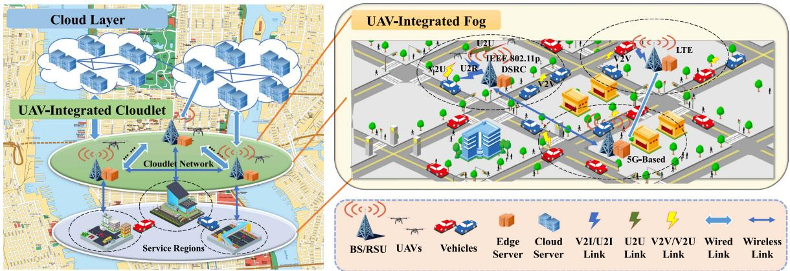  
Fig. 1. The UAV-integrated vehicular fog computing paradigm.

2) We develop a highly scalable and extensible simulation platform that surpasses previous works. Scalability is achieved through a lightweight core and system-level abstraction, leveraging high-performance libraries like NumPy and CuPy. Extensibility of the platform stems from a modular, API-driven architecture, which facilitates rapid prototyping and seamless integration with the modern AI and data science ecosystem.

3) We conduct a comprehensive suite of simulations to validate the platform’s fidelity and capabilities. This includes a detailed performance evaluation, a comparative analysis of different offloading algorithms, a robust “what-if” study across diverse network scenarios, and a study of security and privacy. These experiments collectively demonstrate AirFogSim’s effectiveness as a scientific tool for generating reproducible insights.

The rest of this paper is concluded as follows: Section II illustrates the background and related work. Section III introduces the system architecture of AirFogSim. Section IV presents core research domains supported by the AirFogSim. Section V describes the implementation and modeling of different functionalities. Section VI presents practical use cases. Section VII concludes this paper and proposes future research directions.

## II. BACKGROUND AND RELATED WORK

In this section, we first introduce the architecture of UAVintegrated VFC. Then, we summarize the existing research in UAV-integrated VFC and the current simulators.

## A. Architecture Design

Suppose vehicles, UAVs, RSUs, and cloud servers are deployed in a VFC environment. Fig. 1 represents the layered architecture and communication pathways of the UAV-integrated VFC paradigm.

Cloud Layer: At the top of the paradigm lies the cloud layer, representing the expansive and powerful computational resources available through remote data centers. This layer represents the upper echelon of processing capability, suited for tasks that are computationally intensive and not time-sensitive.

Fog-to-Cloudlet Hierarchy: Below the cloud layer, a multitiered edge-fog computing hierarchy provides localized, lowlatency services. This hierarchy consists of three distinct types of computational entities:

\- Fog Nodes: These are the most distributed and mobile computing resources. They are typically computationallycapable vehicles or low-altitude UAVs that form a dynamic, ad-hoc network to provide immediate services directly to end-users. They act as both data producers and consumers.

\- Edge Servers: This tier consists of fixed infrastructure deployed at the network edge, such as Roadside Units (RSUs) or servers co-located with 5 G base stations. They possess more computational power and more stable network connections than mobile fog nodes. They often act as local coordinators (i.e., zone managers) for the fog nodes in their vicinity.

Cloudlets: This represents a more powerful, semicentralized tier of computing, perhaps located at a traffic management center or a local data center. Cloudlets handle tasks that are too intensive for individual edge servers or that require a wider, regional view of the network. In our architecture, high-altitude UAVs can also serve as mobile cloudlets, extending processing capabilities to areas with sparse ground infrastructure.

Communication between these entities is typically hierarchical. Fog nodes (vehicles and UAVs) communicate with nearby Edge Servers (RSUs) via protocols like DSRC or C-V2X. In turn, Edge Servers communicate with each other and with the regional Cloudlet, often over a high-bandwidth fiber backhaul network. This structure allows for efficient, localized processing at the fog/edge while retaining the ability to escalate more demanding tasks to more powerful resources when necessary.

## B. UAV-Integrated Vehicular Fog Computing Research

The UAV-integrated VFC paradigm enables a host of missions, including the task offloading, RSU/ABS deployment, UAV trajectory planning, security and privacy, and resource allocation. These missions call for diverse functionalities and operations in the simulation platform.

The joint task assignment and computation allocation to fog nodes is studied as a multi-objective minimization problem (concerning latency, energy, pricing cost, etc.), and solved via centralized or distributed methods including heuristic methods [5], contract theory [6], matching theory [6], game theory [7], reinforcement learning (RL) approaches [8]. UAVs are also considered flexible auxiliary nodes for computation offloading in post-disaster rescue [17]. In [18], Liu et al. studied the UAV-assisted mobile edge computing with joint communication and computation resource allocation for vehicles. These studies require simulation of the computation, communication, and energy models for performance validation.

Considering the varying computational capabilities, dynamic channel state information, and reliability of moving vehicles, the task offloading missions in UAV-integrated VFC is not merely an optimization problem but intertwines with multiple dimensions of vehicular networks. Reference [13] focused on traffic loads in heterogeneous VFC scenarios and executed computation offloading regarding the predicted network conditions. Besides prediction-based proactive schemes, reactive methods such as redundant resource allocation and service migration [14] can also be optimized to alleviate the uncertainty in vehicular networks. The dynamics of vehicular networks and the uncertainty of computation offloading are based on models including communication channel attributes, computation queues, road topologies, and mobility. Therefore, the simulation of both fog node network and traffic flow is a prerequisite for the task offloading mission.

As for RSU/ABS deployment issues, drones are leveraged to augment network coverage in underserved areas [15] and guarantee real-time safety of vehicles on highway [16]. This mission is not without the scope of computation and communication dynamics, as the RSU/ABS deployment is closely related to the traffic conditions and the network topology. In the realm of security and attacks, research is intensifying on addressing unique cybersecurity challenges, including data privacy and secure communication [9], [12]. These mechanisms can be implemented by applying security operations such as authentication, encryption, and blockchain. In [19], Gupta et al. presented a blockchain-based secure scheme to prevent controller hijacking and man-in-the-middle attacks. Furthermore, the allocation of computational and communication resources among large-scale regions [10] and the exploration of economic models for resource sharing and trading through incentive CPU trading are gaining traction [11], thereby fostering a collaborative and efficient vehicular network ecosystem on the basis of incentive mechanisms.

Overall, these research efforts are jointly devoted to a secure, sustainable, collaborative, and efficient computation framework in the UAV-integrated VFC, and requires supportive functionalities to validate the propositions.

## C. Existing Simulation Platforms

By delving into the current research in Section II-B, the required operations for a simulation platform to manage can be summarized as follows: Communication, Computation, Energy, Security, Mobility, Traffic, and Scalability. The scalability of the simulator is both in terms of the size of the simulation and the development of new modules. We survey the representative simulators relevant to these requirements and compare them with our proposed AirFogSim in Table I.

General fog and edge computing simulators like IFogSim [20], IFogSim2 [21], and EdgeCloudSim [22] concentrate on computation and energy dynamics, yet they fall short in simulating critical aspects such as mobility and road topologies. Vehicular network-focused simulators, namely FogNetSim++ [23] and Veins [24], address more specialized requirements, while the former integrates computing features for complex network simulations, the latter excels in vehicular network and traffic simulations, albeit without comprehensive computation and energy components. VFogSim [25] represents a category of simulators specifically tailored for VFC, with robust communication and energy modeling capabilities. However, its lack of security features is a significant gap, given the increasing cybersecurity concerns in VFC environments. In the domain of UAVs, MARSIM [26] and Skywalker [27] emerge as specialized tools. MARSIM’s focus on LiDAR-based UAV applications marks its niche in UAV-centric simulations, whereas Skywalker extends its utility to UAV-assisted federated computing, proving invaluable for smart city applications. However, both simulators lack the ability to simulate the urban road topology and traffic dynamics.

While existing simulators provide valuable insights into various aspects of VFC, they exhibit notable limitations in the context of computation offloading in UAV-integrated VFC. Addressing these limitations, our proposed AirFogSim offers functionalities in Table I, as a modular, lightweight, and easily adaptable platform, making it a practical and efficient tool for evolving research requirements in this dynamic field.

## III. SYSTEM ARCHITECTURE AND MODULE

This section provides an overview of the proposed simulation platform AirFogSim.

## A. Core Architectural Principles

A fundamental design choice in AirFogSim is the framework for inter-module interaction. To ensure a lightweight and highperformance simulation environment, we deliberately avoided heavyweight distributed messaging frameworks like ROS. Instead, AirFogSim’s architecture is built on a discrete-time, step-based simulation paradigm. The design is best understood through its two primary axes: a vertical stratification of the platform’s functional layers and a horizontal modularity of decoupled research domains.

1) Centralized Simulation Engine: At the heart of AirFogSim is a centralized simulation loop. This engine acts as a conductor, orchestrating the entire simulation by calling the “step()” method of each vertical layer in a predefined order at every time step. This ensures a deterministic and synchronized evolution of the simulation world.

2) Horizontal Research Modularity: Orthogonal to the vertical layers, AirFogSim achieves research extensibility through horizontal modularity. Core scientific domains are encapsulated as independent, interchangeable modules or “Managers,” such as those for communication, computation, mobility, security, privacy, and energy. This design allows a researcher to, for example, replace a simple path-loss communication model with a complex ray-tracing model by modifying only the CommunicationManager, without impacting any other part of the system.

TABLE I  
COMPARISON OF OUR WORK WITH EXISTING SIMULATORS
<table><tr><td>Software</td><td>Comm. Op.</td><td>Comp. Op.</td><td>En. Op.</td><td>Sec. Op.</td><td>Mob. Op.</td><td>Road Topo.</td><td>Required Softwares</td><td>Language</td></tr><tr><td>IFogSim [20]</td><td>Not Ch. att.</td><td>Yes</td><td>Yes</td><td>No</td><td>No</td><td>No</td><td>CloudSim [32]</td><td>Java</td></tr><tr><td>IFogSim2 [21]</td><td>Not Ch. att.</td><td>Yes</td><td>Yes</td><td>No</td><td>Fog node</td><td>No</td><td>CloudSim</td><td>Java</td></tr><tr><td>EdgeCloudSim [22]</td><td>Yes</td><td>Yes</td><td>No</td><td>No</td><td>Client only</td><td>No</td><td>CloudSim</td><td>Java, Matlab</td></tr><tr><td>FogNetSim++ [23]</td><td>Yes</td><td>Yes</td><td>No</td><td>No</td><td>Veh. only</td><td>No</td><td>OMNeT++ [33]</td><td>C++</td></tr><tr><td>Veins [24]</td><td>Yes</td><td>No</td><td>No</td><td>No</td><td>Veh. only</td><td>Yes</td><td>SUMO, OMNeT++</td><td>C++</td></tr><tr><td>VFogSim [25]</td><td>V2N only</td><td>Yes</td><td>Yes</td><td>No</td><td>Veh. only</td><td>Yes</td><td>WinProp [35], SUMO</td><td>C++</td></tr><tr><td>MARSIM [26]</td><td>No</td><td>No</td><td>No</td><td>No</td><td>UAVs only</td><td>No</td><td>ROS</td><td>C++, C</td></tr><tr><td>Skywalker [27]</td><td>Yes</td><td>Yes</td><td>Yes</td><td>No</td><td>Veh. &amp; UAV</td><td>No</td><td>AnyLogic</td><td></td></tr><tr><td>AirFogSim (Ours)</td><td>Yes</td><td>Yes</td><td>Yes</td><td>Yes</td><td>Veh. &amp; UAV</td><td>Yes</td><td>SUMO [34]</td><td>Python</td></tr></table>

(1) "Not Ch. att." means that the software does not support channel attributes (such as fading) in modeling.  
(2) "Comm.", "Comp.", "En.", "Sec.", "Mob.", "Op.", and "Veh." stand for communication, computation, energy, security, mobility, operation, and vehicle, respectively.

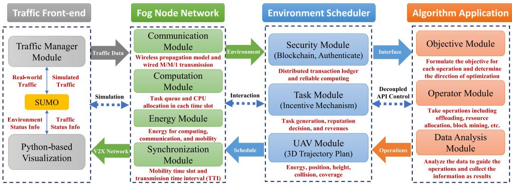  
Fig. 2. The system modules of the AirFogSim platform.

3) Vertical Layered Architecture: As shown in Fig. 2, the platform is vertically stratified into four core layers that manage the simulation’s data and control flow. This stack consists of the Traffic Front-End, the Fog Node Network Simulation, the Environment Scheduler, and the Algorithm Application. This layered design organizes the progression from the underlying physical-world simulation to the top-level decision-making logic where researchers apply their algorithms. To ensure extensibility, interaction is governed by Standardized APIs, typically in the form of abstract base classes. A researcher can introduce a novel scheduling APIs simply by creating a new class that inherits from “BaseScheduler” and implementing its required methods.

## B. Traffic Front-End

The “Traffic Front-End” serves as the foundational layer for the simulation, responsible for generating and managing the mobility of all entities. For vehicular traffic, it leverages the SUMO suite, accessed via the traci interface, to either generate synthetic traffic flows or import real-world mobility traces. Complementing this, the mobility of UAVs is managed by a distinct, Python-native module, allowing researchers to easily implement and test custom trajectory planning and flight control algorithms directly within the platform. Finally, this front-end includes an integrated visualization component that provides real-time feedback on the simulation state. It offers both a graphical user interface, built with tkinter, and a terminal-based tabular display, using curses, to render vehicular flows, UAV movements, and network topologies.

## C. Fog Node Network

“Fog Node Network” epitomizes the computation, communication, and energy simulation in the environment.

1) Communication Module: This module adheres to the 3GPP standards for channel propagation models. Researchers can adjust parameters online or offline to fit the dynamics of road traffic, vehicle flow, and physical obstructions that affect channel states. Wired links are also supported to simulate the communication between RSUs and cloud/edge servers via M/M/1 queues.

2) Computation Module: This module orchestrates computational tasks across diverse fog entities. It allows for the designation of different computational sequences and CPU allocation strategies. Tasks are stored in queues and processed according to the algorithms.

3) Energy Module: The energy module is responsible for managing the energy consumed during transmission and computation of fog entities, especially for the UAVs. This module aims to optimize energy usage across the

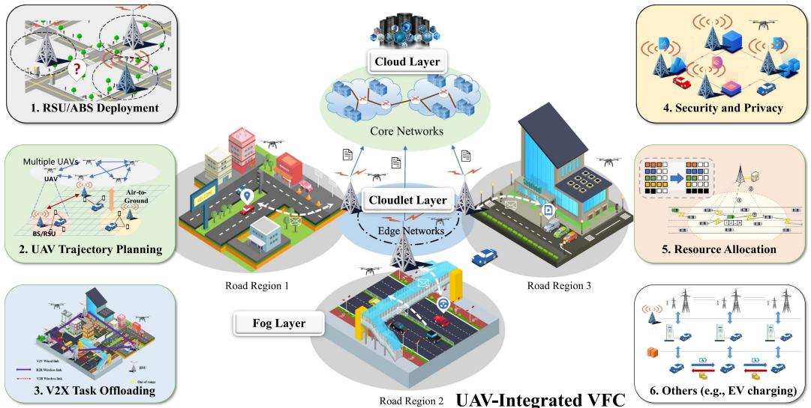  
Fig. 3. Key missions supported by AirFogSim, including RSU/ABS deployment, UAV trajectory planning, V2X task offloading, security and privacy, resource allocation, etc. in the UAV-integrated VFC paradigm.

VFC ecosystem, ensuring sustainable operation without compromising performance.

4) Synchronization Module: This module is responsible for time synchronization. Two-time scales are supported: the simulation time scale determined by SUMO and the transmission time interval (TTI) for slot-wise computation and communication.

## D. Environment Scheduler

The “Environment Scheduler” is responsible for orchestrating the simulation environment, including the operations of security, tasks, and UAVs.

1) Security Module: This module leverages blockchain and authentication technologies to validate the integrity and authenticity of computation services. It incorporates verification stages to ensure the results are trustworthy. Additionally, it utilizes reputation systems to evaluate and maintain the credibility of nodes.

2) Task Module: This module employs an incentive mechanism to encourage fog entities to participate in task computation and offloading processes actively. Vehicles may generate tasks and allocate resources to specific tasks according to this module.

3) UAV Module: This module dynamically controls the state of each UAV. Researchers can use this API to operate key flight parameters, including speed, flight direction, altitude, and transmission power. This enables the implementation of a wide range of sophisticated highlevel strategies, such as real-time trajectory optimization, energy-aware positioning, or collision avoidance.

## E. Algorithm Application

The uppermost “Algorithm Application” is the bedrock for experimentation and development. It provides a flexible framework for researchers to test and evaluate algorithms.

1) Objective Function Module: This module formulates an objective function that integrates trustworthiness metrics from the “Environment Scheduler” to serve as the foundation for optimization. It takes a multi-criteria approach to formulate the objective of each operation.

2) Operator Module: This module is responsible for the implementation of the optimization algorithms, including offloading, resource allocation, block mining, etc.

3) Data Analyses Module: This module is responsible for analyzing the data to guide the operations and collect the information as results.

## IV. CORE RESEARCH DOMAINS IN UAV-VFC

To enable a systematic and scientific investigation of the complex UAV-assisted VFC ecosystem as shown in Fig. 3, AirFogSim is architected around the problem space into its fundamental research pillars. Each pillar represents a core domain of study, complete with its own set of challenges and optimization objectives. The platform provides dedicated, modular support for each domain, allowing researchers to study them in isolation or, more importantly, to analyze their intricate interdependencies. These core domains are outlined below.

## A. Mobility and Deployment Planning

This domain addresses the physical placement and movement of all network entities. It is foundational, as the spatial-temporal distribution of nodes directly dictates communication feasibility, service coverage, and overall network topology.

\- UAV Trajectory Planning: The core objective is to develop and evaluate UAV flight strategies that minimize energy consumption and latency while maximizing QoS and coverage. AirFogSim enables the simulation of various trajectory planning algorithms through a native, flexible API.

\- RSU/ABS Deployment: This involves optimizing the static placement of infrastructure like RSUs or the initial operational areas for UAVs (as Aerial Base Stations) to align with dynamic vehicular demands and urban layouts.

\- Vehicular Mobility: Realistic ground traffic is essential. AirFogSim integrates with SUMO to model micro-traffic behavior, providing a dynamic foundation for all airground interactions.

## B. Communication Simulation

This domain focuses on the modeling of wireless links (V2V, V2U, U2U, etc.), which are the lifelines of the VFC system. The objective is to accurately capture channel dynamics to realistically evaluate the performance of communication-dependent applications. AirFogSim provides a high-fidelity, system-level communication model based on 3GPP standards, incorporating path loss, shadow fading, and small-scale fading to ensure that the simulated network performance is grounded in physical reality.

## C. Computation and Resource Management

This domain represents the core logic of fog computing: deciding where to execute computational tasks and how to allocate the necessary resources.

\- V2X Task Offloading: This is a pivotal functionality where tasks are transferred from vehicles to other fog nodes (vehicles, UAVs, RSUs). The primary objective is to optimize the distribution of these tasks to enhance efficiency, reduce latency, and conserve resources.

\- Resource Allocation: This module is dedicated to the efficient allocation of communication (e.g., bandwidth) and computation (e.g., CPU cycles) resources among all entities to improve network throughput and ensure fairness.

## D. Security and Trust Management

In a decentralized and dynamic environment, ensuring security and trust is paramount. This domain focuses on creating robust and resilient systems. AirFogSim provides built-in support for this pillar through:

\- Authentication: A dedicated module for verifying the identity of network entities to prevent spoofing and ensure that only authorized users can access system resources.

\- Trust and Data Integrity: A blockchain module to simulate the process of verifying and recording transactions, maintaining an immutable ledger for accountability and trust management in the VFC paradigm.

## E. Extensibility for Emerging Research Domains

The modular architecture of AirFogSim allows researchers to easily extend its capabilities to explore other aspects of UAVintegrated systems. For example, the problem of electric vehicle (EV) charging can be merged into VFC [36]. This mission can be readily implemented by adding a “battery” attribute to vehicle entities and developing a new ChargingStation class, demonstrating the platform’s flexibility as a scientific instrument for future research challenges.

## V. SYSTEM DESIGN AND IMPLEMENTATION

In this section, we introduce the platform design and implementation, including visualization, propagation modeling, computation and transmission modeling, blockchain modeling, and attack modeling.

## A. Visualization Based on SUMO Traffic

Traffic flow generation serves as the foundation for simulating vehicular networks within our platform. We utilize the SUMO tool and the traci package to interactively handle large road networks and traffic flows.

A VehicleManager object orchestrates the generation of vehicular traffic within the simulation. It manages the introduction of individual vehicles into the traffic flow, stipulating their points of origin and intended destinations. While synthetic data is adequate for a broad range of simulation missions, the integration of real-world traffic data can provide additional verisimilitude in traffic patterns.1 In the evaluation presented in this paper, we used synthetic traffic data to systematically vary parameters like vehicle density and flow patterns, allowing us to rigorously test our algorithms under specific, controlled conditions.

## B. Propagation Modeling

As discussed in 3GPP Release 15 [28] for cellular V2X enhancement, channel gain coefficients encompass the effects of frequency-independent large-scale fading (path loss, shadowing) and frequency-dependent small-scale fading (fast fading) in AirFogSim.

1) Path Loss Model: The path loss model for the WINNER scenarios [29], [30], [31] is carried out as:

$$
P L = A \log _ { 1 0 } ( d ) + B + C \log _ { 1 0 } \frac { f _ { c } } { D }\tag{1}
$$

where d is the 3D distance between transmitter and receiver, and $f _ { c }$ is the carrier frequency. A, B, C, D are the fitting parameters where A includes the path loss exponent, B is the intercept, C describes the path loss frequency dependence, and D is the scaling factor. The fitting parameters are environment and channelspecific. For example, the WINNER+ B1 urban scenario is adopted in 3GPP TR 36.885 [30] for V2V channels, thereby the fitting parameters are given as $A = 2 2 . 7 , B = 4 1 . 0 , C =$ = 22 7 = 41 0 =, D . . The path loss model can be easily changed according to practical requirements.

2) Shadow Fading Model: The shadow fading is assumed to initially follow the log-normal distribution with a fixed standard deviation [30], [31]. The shadow fading is affected by the relative movements between entities (vehicles and UAVs) based on the distances moved in the last time step. This is done using an autoregressive model where the new shadow fading is a weighted combination of the previous shadow fading and a new shadowing term. The weights depend on the relative movements between entities and the decorrelation distance. The update process can be mathematically represented as:

$$
\begin{array} { r l r } {  { S _ { i } ( t + 1 ) = 1 0 \cdot \log _ { 1 0 } [ \exp ( - \frac { \Delta d _ { i } } { d _ { \mathrm { c o r r } } } ) \cdot ( 1 0 ^ { \frac { S _ { i } ( t ) } { 1 0 } } )  } } \\ & { } & {  + \sqrt { 1 - \exp ( - 2 \cdot \frac { \Delta d _ { i } } { d _ { \mathrm { c o r r } } } ) } \cdot 1 0 ^ { \frac { N ( 0 , \sigma _ { S _ { i } } ) } { 1 0 } } ] } \end{array}\tag{2}
$$

where $S _ { i } ( t + 1 )$ represents the shadow fading of entity i at time step $t + 1 , \Delta d _ { i }$ is the relative movement of entities for the i-th channel during the last time step, $d _ { \mathrm { c o r r } }$ is the decorrelation distance, $S _ { i } ( t )$ is the shadow fading at time step $t ,$ and $N ( 0 , \sigma _ { S _ { i } } )$ ( ) (0 )represents a normally distributed random variable with mean 0 and standard deviation $\sigma _ { S _ { i } }$ . This formula allows for a dynamic update of the shadow fading as the relative positions of the entities change, thus improving the realism of the wireless signal strength simulations.

3) Fast Fading Model: The fast fading is modeled as Rayleigh fading and assumed to be exponentially distributed with unit mean [37]. Hereafter, the channel power gain of the i-th channel can be concluded as:

$$
g _ { i } ^ { m o d e } = \frac { S _ { i } } { P L _ { i } } h _ { i } ^ { m o d e }\tag{3}
$$

where mode denotes the mode of different channel frequencies, $S _ { i } , P L _ { i } , h _ { i }$ are the shadow fading, path loss, and fast fading of the i-th channel, respectively.

After all, we discuss the channel capacity of different link modes. Suppose that the i-th V2V channel is erected between vehicle $V _ { i }$ (transmitter) and $V _ { j }$ (receiver), the transmission rate of the i-th channel can be given by:

$$
C _ { i } ^ { V 2 V } = x _ { i , j } ^ { V 2 V } B _ { i } ^ { V 2 V } \log _ { 2 } \big ( 1 + \gamma _ { i } ^ { V 2 V } \big ) .\tag{4}
$$

In $( 4 ) , x _ { i , i } ^ { V 2 V }$ is the indicator variable to show whether $V _ { i }$ transmit to $V _ { j } , B _ { i , j } ^ { V 2 V }$ is the allocated bandwidth (i.e., resource blocks, RBs), and $\gamma _ { i , j } ^ { V 2 V }$ is the signal-to-interference-plus-noise ratio (SINR) of the V2V communications. If the allocated RBs are shared among multiple V2V channels simultaneously, the SINR of the i-th V2V link is expressed as:

$$
\begin{array} { c } { { \gamma _ { i } ^ { V 2 V } = \frac { p _ { i } ^ { V 2 V } g _ { i } ^ { V 2 V } } { N _ { 0 } + \sum _ { V _ { m } , V _ { n } \in { \bf V e h } , m \ne i } x _ { m , n } ^ { V 2 V } p _ { m } ^ { V 2 V } g _ { m } ^ { V 2 V } } } } \end{array}\tag{5}
$$

where $N _ { 0 }$ is the power of complex Gaussian white noise and $g _ { i } ^ { V 2 V }$ denotes the channel gain of the i-th V2V links. If the RB is occupied by only one channel, the interference disappears and the SINR $\gamma _ { i } ^ { V 2 V }$ degenerates into SNR.

Similarly, the transmission capacities of V2I, U2V, U2I, U2U, I2I, etc., channels can be induced by (4) and (5).

## C. Computation and Transmission Modeling

This subsection elucidates the computational queuing model and the transmission scheme underpinning task offloading and execution.

1) Task Queue Model: For the computation model, we symbolize the task queue at any fog node $X _ { j }$ as $\mathcal { T } _ { X _ { j } }$ . The state of the queue at any time t can be described by the tuple $( I _ { 1 } ^ { X _ { j } } , I _ { 2 } ^ { \hat { X _ { j } } } , \dots , I _ { n } ^ { X _ { j } } )$ , where $I _ { i } ^ { X _ { j } }$ represents the i-th task in the queue. Each task is further characterized by its own tuple $\{ X _ { j } , u p _ { i } ^ { X _ { j } } , r e q _ { i } ^ { X _ { j } } , \tau _ { i } ^ { X _ { j } } \}$ , specifying the upload size, required compute cycles, and delay tolerance, respectively.

2) CPU Resource Allocation: In each TTI, the CPU allocation strategy is determined by the fog node’s scheduling algorithm. This strategy can be modeled by adjusting the allocation of CPU resources $\epsilon _ { j , k }$ in the computation delay:

$$
T _ { X _ { j } , k } ^ { c o m p } = \frac { r e q _ { k } } { \epsilon _ { j , k } F _ { j } }\tag{6}
$$

The CPU resource allocation $\epsilon _ { j , k }$ reflects the portion of the computing frequency $F _ { j }$ that is allocated to task k by device $X _ { j }$ . This allocation can be dynamic and governed by various scheduling algorithms that consider factors like task urgency, resource availability, and overall system optimization goals.

3) Transmission Model: The spectrum is divided into many closely spaced subcarriers, which are assigned to users in a dynamic manner. The transmission delay $T _ { i , k } ^ { t r a n }$ for the i-th sub-channel, tasked with transmitting the data for vehicle $V _ { k } .$ is inversely proportional to the sub-channel’s capacity $C _ { i } ^ { m o d e }$

$$
T _ { i , k } ^ { t r a n } = \frac { u p _ { k } } { C _ { i } ^ { m o d e } }\tag{7}
$$

Here, $C _ { i } ^ { m o d e }$ encapsulates the effects of all sub-channel bandwidth allocation, modulation scheme, and the characteristics defined by the propagation modeling.

## D. Blockchain Modeling

Blockchain technology plays a pivotal role in ensuring the integrity and security of transaction data within a network. In each time slot, transactions are collected and added to a transaction pool. The blockchain modeling process can be summarized as follows:

1) Block Generation and Mining Process: A miner is selected in accordance with the consensus algorithm and employed by the blockchain system. This miner is responsible for generating a new block, which involves collating transactions from the pool, validating them, and then broadcasting the newly created block to the network.

2) Block Verification: Upon receipt of the new block, other nodes in the network undertake the verification process. This is a crucial step to ascertain the block’s validity and to maintain the blockchain’s overall consistency and reliability. Once verified, the block is appended to the blockchain, thus updating the ledger.

3) Reward Mechanism: The miner who successfully generates a block is rewarded for their contribution to the network. This reward typically comprises two components: the transaction fees and the block reward. Transaction fees are collected from the transactions included in the block, serving as an incentive for miners to prioritize transactions with higher fees. The block reward, usually a set number of cryptocurrency units, is granted as an additional incentive for participating in the block generation process.

Currently, the supported consensus algorithm in AirFogSim is Proof-of-Stake (PoS) due to the limited onboard resource assumption of vehicles. The plan for other consensus algorithms, such as Proof-of-Work (PoW) and Proof-of-Authority (PoA), is underway.

## E. Attack Modeling

Similar to previous works [9], [12], three typical attacks are considered in the computation offloading of fog vehicles:

1) Identity Spoofing Attack: In the computing ecosystem, fog nodes are rewarded by their computation. Therefore, the attacker disguises itself as a legitimate vehicle and can obtain the fees of other fog nodes. This attack can be prevented by the fog nodes authentication mechanism.

2) Always-On Attack: In this attack, the attacker always returns false results to the offloaded tasks to obtain the computing fees without any computation costs.

3) On-Off Attack: Malicious fog vehicles obtain computing fees by returning correct results for a while and then returning false results so that the reputation can be maintained at a certain level.

These three attack models can be prevented by the welldefined reputation mechanism based on the blockchain technology in the AirFogSim platform. Additional attacks and prevention methods (cipher attack, Sybil attack, etc.) will be considered in future work.

## VI. CASE STUDY: A UAV-INTEGRATED RELIABLE V2X TASK OFFLOADING FRAMEWORK

In this section, we present a comprehensive case study to validate the core scientific capabilities of the AirFogSim platform. We show how the platform’s architecture enables rapid prototyping, robust scenario analysis, large-scale performance evaluation, and the integration of advanced security mechanisms.

## A. Performance Metrics

A primary output of the simulator is a detailed log of the entire system state at each discrete time step. This includes the status of every entity (e.g., vehicles, UAVs, RSUs), encompassing a wide range of attributes such as precise 3D position, remaining battery levels, available computational resources, task queue lengths, and CPU properties. This granular data provides a comprehensive foundation for in-depth analysis.

From this raw state data, the platform natively calculates and logs several key performance indicators (KPIs), including task completion rate and task completion delay (latency). Crucially, the system is designed for extensibility. Researchers can define and compute their own custom metrics, either by post-processing the state logs or by leveraging dedicated interfaces like the scheduler API. For instance, load balancing can be readily implemented by calculating the standard deviation of resource utilization or task delays across all fog nodes.

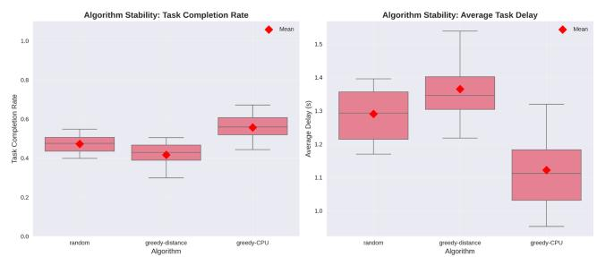  
Fig. 4. Comparison of three different task offloading algorithms. This showcases the platform’s modularity and ease of use for rapid prototyping and comparative evaluation of different strategies.

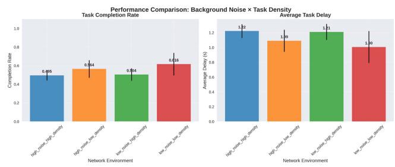  
Fig. 5. Performance comparison across four different network environment scenarios. This highlights AirFogSim’s feature for conducting “what-if” analysis by varying environmental parameters like noise and traffic density.

## B. Demonstrating Core Platform Capabilities

1) Modularity and Rapid Prototyping: A key strength of AirFogSim is the ease with which different algorithms can be implemented and evaluated, stemming from its modular, API-driven design. To demonstrate this, we implemented and compared three distinct task offloading strategies: a sophisticated approach combining a Window-based Hungarian (WHO) method for assignment with Alternating Optimization (AO) for resource allocation, a simpler greedy approach based on CPU availability, and a random baseline.

Critically, the integration of each new algorithm required minimal implementation effort, typically confined to the act\_offloading function within the algorithm module and requiring fewer than 20 lines of code to be modified. This remarkable efficiency substantiates our assertion that AirFogSim serves as an agile tool for rapid prototyping. As shown in Fig. 4, the results clearly distinguish the performance of these strategies, with the WHO+AO approach achieving the highest task completion rate ( . ± . ) and the lowest average delay ( . ± . s).

2) “what-If” Scenario Analysis: A robust simulator must be able to model diverse and dynamic operating conditions. We demonstrate this capability through a scenario-based analysis, with results presented in Fig. 5. By modifying only configuration parameters, we constructed four distinct network environments by combining low/high background noise with low/high vehicle densities. The platform’s integrated physics and communication models realistically captured the performance impact on the WHO+AO algorithm. For instance, the task completion rate decreased from 0.616 in the ideal “Low Noise, Low Density” scenario to 0.495 in the challenging “High Noise, High Density”

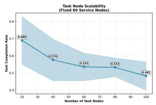

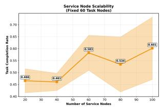

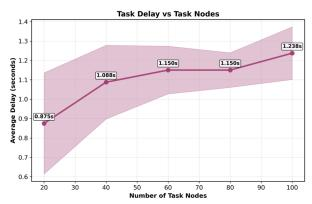

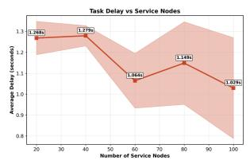  
Fig. 6. Scalability analysis results, showing the impact of varying the number of task nodes (left) and fog nodes (right) on task completion rate and average delay. This demonstrates the platform’s capability to evaluate system performance at different scales.

scenario. This result highlights how AirFogSim can be utilized to perform robust ’what-if’ analyses, thereby testing the resilience of algorithms under a variety of simulated conditions.

3) Comprehensive Scalability Analysis: We leverage the case study to demonstrate the platform’s capability in handling simulations of varying scales. Fig. 6 presents the results of our scalability analysis, where we systematically varied the number of task-generating nodes (from 20 to 100) and service-providing fog nodes (from 20 to 100). The results illustrate the platform’s ability to capture complex system dynamics, such as the law of diminishing returns observed when increasing service nodes beyond a certain point. For example, increasing the number of fog nodes from 20 to 60 improves the completion rate from 0.466 to 0.583, whereas further increases to 100 nodes yield only a marginal gain to 0.601. This finding demonstrates that AirFogSim is an effective tool for investigating the scalability of systems and algorithms.

## C. Security Module in Adversarial Environments

1) Methodology. Privacy-Preserving Multi-Attribute Authentication: A unique feature of AirFogSim is its integrated security module. We implemented a sophisticated Privacypreserving Multi-Attribute Authentication (PMA) algorithm. This mechanism allows nodes to authenticate each other based on a set of attributes without revealing their precise values, using a threshold-based trust policy. The module is seamlessly integrated into the platform’s architecture via the standard Manager-Scheduler-Algorithm design pattern, allowing researchers to easily enable, disable, or replace security mechanisms.

2) Performance and Impact Analysis: The implemented PMA algorithm is highly efficient. Our benchmarks, shown in Fig. 7, confirm that authentication latency remains below 0.5 ms even for scenarios with 100 nodes and six authentication factors, exhibiting a linear O(N) complexity suitable for real-time applications.

To demonstrate the tangible benefits of the security module, we experiment to quantify its impact in the presence of malicious nodes that intentionally drop tasks. We compared a standard greedy offloading algorithm with our security-enhanced version (Auth-Greedy). As shown in Fig. 8, the results are significant. With 0% malicious nodes, both algorithms perform identically. However, as the proportion of malicious nodes increases to 50%, the standard algorithm’s task completion rate plummets to 17.9%, whereas the ‘Auth-Greedy‘ algorithm maintains a rate of 37.8%. This experiment validates the security module’s effectiveness for building robust and reliable vehicular fog computing systems.

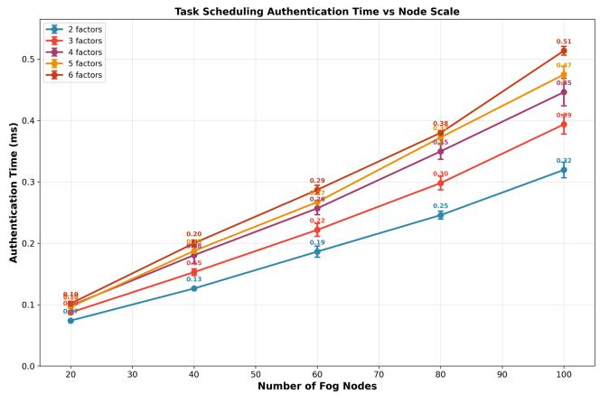

Fig. 7. Performance and scalability of the implemented PMA module. The authentication time scales linearly with the number of nodes and the overhead from increasing the number of authentication factors is minimal, ensuring low latency for real-time applications.  
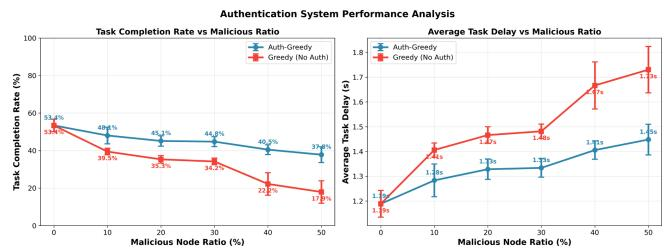  
Fig. 8. Impact of the security module on task completion rate in the presence of malicious nodes. The ‘Auth-Greedy‘ algorithm, which uses the PMA security module, consistently and significantly outperforms the standard ‘Greedy‘ algorithm as the percentage of malicious nodes in the network increases.

## D. K-Means for UAV Trajectory Planning

1) Methodology: UAV Positioning Via Vehicle Clustering: To optimize data collection and service coverage, we employ the K-Means clustering algorithm to dynamically group vehicles. UAVs are then directed to the centroids of these clusters, acting as mobile data mules and fog nodes. Following this UAV positioning phase, each vehicle determines its service zone by identifying the nearest zone manager (either a UAV or a fixed RSU), which is responsible for local resource discovery and task scheduling. Task offloading is consequently constrained, permitting vehicles to offload tasks only to fog nodes within their designated service zone.

2) Performance and Impact Analysis: As illustrated in Fig. 9, the four UAVs in the system dynamically adjust their trajectories to follow the shifting centers of vehicle clusters, ensuring efficient coverage. This dynamic repositioning, managed by the act\_mobility function, highlights the platform’s ability to integrate control algorithms that directly influence the physical layer of the simulation.

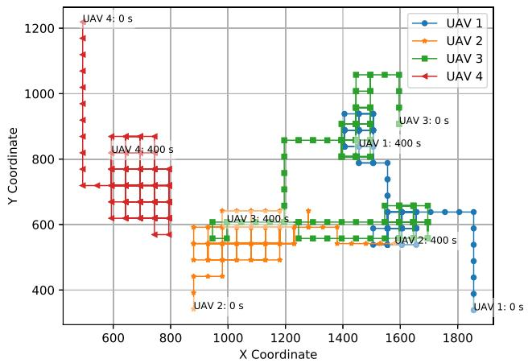  
Fig. 9. Trace of 4 UAVs in the system via K-Means clustering.

Algorithm 1. Alternating Optimization Algorithm.   
Result: Optimal x and y   
1 Initialization of x, y;   
2 for i ← 1 to maxIterations do   
3 Save current $x _ { p r e \nu }  x , y _ { p r e \nu }  y ;$   
4 Fix x, optimize y by calculating the time slot   
allocation problem for communication   
resources;   
5 Fix $y ,$ optimize x by calculating the time slot   
allocation problem for computation resources;   
6 if $| | x - x _ { p r e \nu } | | _ { 2 } <$ tolerance and   
$| | y - y _ { p r e \nu } | | _ { 2 } <$ tolerance then   
7 break;   
8 end   
9 end

## E. Window-Based Hungarian Algorithm for Task Offloading

1) Methodology. Optimal Task Assignment: The Hungarian algorithm, a classic combinatorial optimization method, is applied to solve the task assignment problem. The objective is to find a one-to-one mapping of tasks to fog devices that minimizes a total cost function (e.g., latency or resource consumption) within a defined time window, ws. The implementation of this algorithm is encapsulated within the act\_offloading function, demonstrating the modularity of the algorithm component.

2) Methodology. Alternating Optimization for Resource Allocation: e With a fixed task assignment, we address the NP-hard problem of joint communication and computation resource allocation using an Alternating Optimization (AO) strategy, detailed in Algorithm 1. This approach iteratively solves for the optimal transmission and computation time slots, which is guaranteed to converge to a global optimum as the sub-problems are convex. The AO logic is implemented in the act\_RB\_allocation and act\_CPU\_allocation functions.

3) Performance and Impact Analysis: We refer to the combined Window-based Hungarian and AO method as WHO. Table II compares WHO against a greedy baseline and the optimal Gurobi solver. The results show that WHO achieves near-optimal performance with significantly lower computational complexity, making it practical for real-world scenarios where commercial solvers fail to find a solution in a reasonable time.

TABLE II  
COMPARISON FOR THE GUROBI, WHO, AND GREEDY METHODS
<table><tr><td>SV/TV</td><td>Latency (s)</td><td>Ratio (%)</td><td>Complexity (s)</td></tr><tr><td>(5, 5)</td><td>0.133, 0.133, 0.133</td><td>100, 100, 100</td><td>257, 0.018, 0.007</td></tr><tr><td>(10, 5)</td><td>0.133, 0.133, 0.554</td><td>100, 100, 76.6</td><td>500, 0.031, 0.012</td></tr><tr><td>(5, 10)</td><td>-, 0.524, 0.771</td><td>-, 78.7, 65.3</td><td>-, 0.048, 0.015</td></tr><tr><td>(10, 10)</td><td>-, 0.179, 0.589</td><td>-, 97.3, 74.7</td><td>-, 0.064, 0.025</td></tr></table>

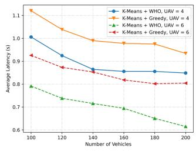  
(a)

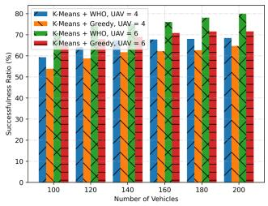  
(b)  
Fig. 10. The performance comparison of different situations with fixed 50 task vehicles. (a) The average latency, and (b) successful ratio.

Furthermore, Fig. 10 evaluates the system with 50 task vehicles and a varying number of service vehicles. The WHO method sharply reduces latency compared to the greedy algorithm, especially when the total vehicle count is below 140. Increasing the number of UAVs from four to six further enhances performance by reducing air-to-ground communication costs, boosting the successful task ratio from 72% (greedy) to a stable 80% (WHO). This analysis showcases the platform’s capability to dissect the performance of sophisticated, multi-stage optimization algorithms.

## F. Blockchain-Enabled Task Offloading With Proof-of-Stake

1) Methodology. A PoS-Based Transaction Framework: To ensure immutable and transparent task management, we integrate a blockchain framework into AirFogSim. We adopt a Proof-of-Stake (PoS) consensus mechanism as an energyefficient alternative to Proof-of-Work, where RSUs act as validators based on their stake. Every offloading decision is recorded as a transaction on the blockchain. The block generation policy is triggered either by a time interval (1 s) or a transaction count threshold (100). This functionality is realized by modifying the act\_mining\_and\_pay and act\_pay\_and\_punish functions.

2) Performance and Impact Analysis: The stability of the blockchain system is crucial. As shown in Fig. 11, in a scenario with 50 task vehicles and 50 serving vehicles, the number of certified transactions per second stabilizes around 110. This rate is consistent with the expected throughput given the task completion ratio of 58.9% observed in prior experiments (Fig. 10(b)), validating the reliability and correct functioning of the blockchain module.

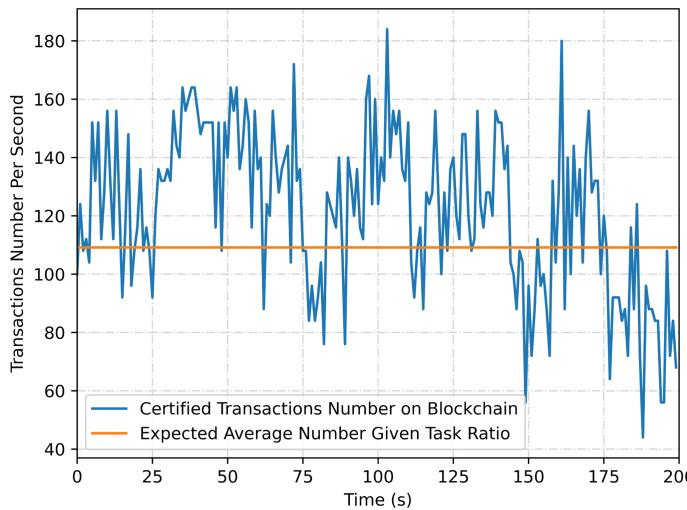  
Fig. 11. Transaction number per second with fixed 50 task vehicles, 50 serving vehicles, and 4 UAVs along the simulation time.

## VII. CONCLUSION AND FUTURE WORK

In this paper, we presented AirFogSim, a simulation platform that contributes to addressing the challenges of computation offloading in UAV-integrated VFC. Compared with current simulators, the proposed AirFogSim offers a more comprehensive and realistic simulation environment, focusing on the unique characteristics of UAVs and VFC in multiple layers, and providing several key missions in this field. We also demonstrated the capabilities of AirFogSim through a case study of computation offloading in VFC. The results show that AirFogSim can effectively simulate the complex interactions between UAVs and vehicles.

Future work includes enriching AirFogSim with more diverse missions and robust security models and applying the platform to a broader range of applications in ITS. Our aim is to continuously refine AirFogSim, making it an increasingly effective tool for the research community, contributing to the evolution of intelligent transportation systems.

## REFERENCES

[1] X. Cheng, R. Zhang, and L. Yang, “Wireless toward the era of intelligent vehicles,” IEEE Internet Things J., vol. 6, no. 1, pp. 188–202, Feb. 2019.

[2] Tuxera, “Autonomous cars–The data storage challenge,” Tuxera Blog, Accessed: Nov. 28, 2023. [Online]. Available: https://www.tuxera.com/ blog/autonomous-cars-300-tb-of-data-per-year/

[3] M. Xu et al., “Generative AI-Empowered simulation for autonomous driving in vehicular mixed reality metaverses,” IEEE J. Sel. Top. Signal Process., vol. 17, no. 5, pp. 1064–1079, 2023, arXiv:2302.08418.

[4] M. A. U. Rehman, M. Salah ud din, S. Mastorakis, and B. - S. Kim, “FoggyEdge: An information-centric computation offloading and management framework for edge-based vehicular fog computing,” IEEE Intell. Transp. Syst. Mag., vol. 15, no. 5, pp. 78–90, Sep./Oct. 2023.

[5] C. Zhu et al., “FOLO: Latency and quality optimized task allocation in vehicular fog computing,” IEEE Internet Things J., vol. 6, no. 3, pp. 4150–4161, Jun. 2019.

[6] Z. Zhou, P. Liu, J. Feng, Y. Zhang, S. Mumtaz, and J. Rodriguez, “Computation resource allocation and task assignment optimization in vehicular fog computing: A contract-matching approach,” IEEE Trans. Veh. Technol., vol. 68, no. 4, pp. 3113–3125, Apr. 2019.

[7] Z. Wei, B. Li, R. Zhang, X. Cheng, and L. Yang, “OCVC: An overlappingenabled cooperative vehicular fog computing protocol,” IEEE Trans. Mobile Comput., vol. 22, no. 12, pp. 7406–7419, Dec. 2023.

[8] J. Shi, J. Du, J. Wang, J. Wang, and J. Yuan, “Priority-aware task offloading in vehicular fog computing based on deep reinforcement learning,” IEEE Trans. Veh. Technol., vol. 69, no. 12, pp. 16067–16081, Dec. 2020.

[9] X. Liu, W. Chen, Y. Xia, and C. Yang, “SE-VFC: Secure and efficient outsourcing computing in vehicular fog computing,” IEEE Trans. Netw. Service Manag., vol. 18, no. 3, pp. 3389–3399, Sep. 2021.

[10] Y. Hou, Z. Wei, R. Zhang, X. Cheng, and L. Yang, “Hierarchical task offloading for vehicular fog computing based on multi-agent deep reinforcement learning,” IEEE Trans. Wireless Commun., vol. 23, no. 4, pp. 3074–3085, Apr. 2024.

[11] Z. Wei, B. Li, R. Zhang, X. Cheng, and L. Yang, “Many-to-many task offloading in vehicular fog computing: A multi-agent deep reinforcement learning approach,” IEEE Trans. Mobile Comput., vol. 23, no. 3, pp. 2107–2122, Mar. 2024.

[12] S. Xu, C. Guo, R. Q. Hu, and Y. Qian, “Blockchain-inspired secure computation offloading in a vehicular cloud network,” IEEE Internet Things J., vol. 9, no. 16, pp. 14723–14740, Aug. 2022.

[13] A. Bozorgchenani, S. Maghsudi, D. Tarchi, and E. Hossain, “Computation offloading in heterogeneous vehicular edge networks: On-line and offpolicy bandit solutions,” IEEE Trans. Mobile Comput., vol. 21, no. 12, pp. 4233–4248, Dec. 2022.

[14] A. S. Shafigh, B. Lorenzo, S. Glisic, and Y. Fang, “Low-latency robust computing vehicular networks,” IEEE Trans. Veh. Technol., vol. 72, no. 2, pp. 2130–2144, Feb. 2023.

[15] M. Samir, D. Ebrahimi, C. Assi, S. Sharafeddine, and A. Ghrayeb, “Leveraging UAVs for coverage in cell-free vehicular networks: A deep reinforcement learning approach,” IEEE Trans. Mobile Comput., vol. 20, no. 9, pp. 2835–2847, Sep. 2021.

[16] J. Li, X. Cao, D. Guo, J. Xie, and H. Chen, “Task scheduling with UAV-Assisted vehicular cloud for road detection in highway scenario,” IEEE Internet Things J., vol. 7, no. 8, pp. 7702–7713, Aug. 2020.

[17] Y. Wang et al., “Task offloading for post-disaster rescue in unmanned aerial vehicles networks,” IEEE/ACM Trans. Netw., vol. 30, no. 4, pp. 1525–1539, Aug. 2022.

[18] Y. Liu et al., “Joint communication and computation resource scheduling of a UAV-Assisted mobile edge computing system for platooning vehicles,” IEEE Trans. Intell. Transp. Syst., vol. 23, no. 7, pp. 8435–8450, Jul. 2022.

[19] R. Gupta, M. M. Patel, S. Tanwar, N. Kumar, and S. Zeadally, “Blockchainbased data dissemination scheme for 5G-Enabled softwarized UAV networks,” IEEE Trans. Green Commun. Netw., vol. 5, no. 4, pp. 1712–1721, Dec. 2021.

[20] H. Gupta et al., “iFogSim: A toolkit for modeling and simulation of resource management techniques in the Internet of Things, edge and fog computing environments,” Softw.: Pract. Experience, vol. 47, no. 9, pp. 1275–1296, 2017.

[21] R. Mahmud et al., “iFogSim2: An extended iFogSim simulator for mobility, clustering, and microservice management in edge and fog computing environments,” J. Syst. Softw., vol. 190, 2022, Art. no. 111351.

[22] C. Sonmez, A. Ozgovde, and C. Ersoy, “Edgecloudsim: An environment for performance evaluation of edge computing systems,” Trans. Emerg. Telecommun. Technol., vol. 29, no. 11, 2018, Art. no. e3493.

[23] T. Qayyum, A. W. Malik, M. A. K. Khattak, O. Khalid, and S. U. Khan, “FogNetSim : A toolkit for modeling and simulation of distributed fog environment,” IEEE Access, vol. 6, pp. 63570–63583, 2018.

[24] C. Sommer, R. German, and F. Dressler, “Bidirectionally coupled network and road traffic simulation for improved IVC analysis,” IEEE Trans. Mobile Comput., vol. 10, no. 1, pp. 3–15, Jan. 2011.

[25] Ö. U. Akgül, W. Mao, B. Cho, and Y. Xiao, “VFogSim: A data-driven platform for simulating vehicular fog computing environment,” IEEE Syst. J., vol. 17, no. 3, pp. 5002–5013, Sep. 2023.

[26] F. Kong et al., “MARSIM: A light-weight point-realistic simulator for LiDAR-Based UAVs,” IEEE Robot. Automat. Lett., vol. 8, no. 5, pp. 2954–2961, May 2023.

[27] K. Hayawi, Z. Anwar, A. W. Malik, and Z. Trabelsi, “Airborne computing: A toolkit for UAV-Assisted federated computing for sustainable smart cities,” IEEE Internet Things J., vol. 10, no. 21, pp. 18941–18950, Nov. 2023.

[28] 3GPP, “Study enhancement 3GPP support for 5G V2X services,” 3rd Generation Partnership Project (3GPP), TR 22.886, Release 15, Version 15.1.0Mar. 2017.

[29] P. Kyösti et al., “IST-4-027756 Winner II D1.1.2 v1.2 winner II channel models,” Inf. Soc. Technol., vol. 11, Feb. 2008.

[30] 3GPP, “Study on LTE-based V2X services,” 3rd Generation Partnership Project (3GPP), TR 36.885, Release 14, V14.0.0, Jul. 2016.

[31] 3GPP, “Enhanced LTE support for aerial vehicles,” 3rd Generation Partnership Project (3GPP), TR 36.777, Release 15, Version 15.0.0, Jan. 2018.

[32] R. N. Calheiros et al., “CloudSim: A toolkit for modeling and simulation of cloud computing environments and evaluation of resource provisioning algorithms,” Softw.: Pract. Experience, vol. 41, no. 1, pp. 23–50, 2011.

[33] A. Varga and R. Hornig, “An overview of the OMNeT simulation environment,” in Proc. 1st Int. Conf. Simul. Tools Techn. Commun., Netw. Syst. Workshops, 2008, pp. 1–10.

[34] D. Krajzewicz, J. Erdmann, M. Behrisch, and L. Bieker, “Recent development and applications of SUMO - Simulation of urban MObility,” Int. J. Adv. Syst. Meas., vol. 5, no. 3 & 4, pp. 128–138, 2012.

[35] R. Hoppe, G. Wölfle, and U. Jakobus, “Wave propagation and radio network planning software WinProp added to the electromagnetic solver package FEKO,” in Proc. Int. Appl. Comput. Electromagn. Soc. Symp., 2017, pp. 1–2.x.

[36] Z. Wei, B. Li, R. Zhang, and X. Cheng, “Contract-based charging protocol for electric vehicles with vehicular fog computing: An integrated charging and computing perspective,” IEEE Internet Things J., vol. 10, no. 9, pp. 7667–7680, May 2023.

[37] L. Liang, H. Ye, and G. Y. Li, “Spectrum sharing in vehicular networks based on multi-agent reinforcement learning,” IEEE J. Sel. Areas Commun., vol. 37, no. 10, pp. 2282–2292, Oct. 2019.

[38] W. Yu and R. Lui, “Dual methods for nonconvex spectrum optimization of multicarrier systems,” IEEE Trans. Commun., vol. 54, no. 7, pp. 1310–1322, Jul. 2006.

  
Zhiwei Wei (Graduate Student Member, IEEE) received the master’s degree in 2023 from Tongji University, Shanghai, China, where he is currently working toward the PhD degree with the Shanghai Research Institute for Intelligent Autonomous Systems. His research interests include vehicular fog computing, resource allocation, industrial Internet of Things, and low-altitude paradigms.

  
Bing Li (Member, IEEE) received the PhD degree from Tongji University, Shanghai, China, in 2021. She is currently an assistant professor with Tongji University. Her research interests include UAV communications, wireless resource allocation, and relay communications.

Rongqing Zhang (Member, IEEE) received the BS and PhD degrees (with Hons.) from Peking University, Beijing, China, in 2009 and 2014, respectively. He has held faculty positions with Tongji University and Colorado State University. He is currently an associate professor with The Hong Kong University of Science and Technology (Guangzhou) (HKUST(GZ)), Guangzhou, China. He has authored and coauthored three monographs and more than 200 papers in top journals and conferences, with three Best Paper Awards at IEEE ICC 2016, GLOBECOM

2018, and ICC 2019. His research interests include vehicular communications and networking, low-altitude vehicular networks, and connected intelligence. Dr. Zhang was the recipient of the 2017 First-Class Prize in Natural Science of Ministry of Education of China, 2023 First-Class Prize in Natural Science of Chinese Association of Automation, and 2023 First-Class Prize in Natural Science of China Institute of Communications. He is also the secretary genera with Connected Intelligence Committee, Chinese Association of Automation, vice-chair with Information Services Committee, IEEE ComSoc Asian-Pacific Board, and also an associate editor for IEEE Transactions on Vehicular Technology and IET Communications.

Xiang Cheng (Fellow, IEEE) received the joint PhD degree from Heriot-Watt University and The University of Edinburgh, Edinburgh, U.K., in 2009. He is currently a Boya Distinguished professor with Peking University. He has authored or coauthored more than 280 journals and conference papers, eleven books, and holds 32 patents in his research interests which include the in-depth integration of communication networks and artificial intelligence, and also intelligent communication networks and connected intelligence. He was a recipient of the IEEE Asia–Pacific

Outstanding Young Researcher Award in 2015, Xplorer Prize in 2023, and the Best Paper Awards at IEEE ITST’12, ICCC’13, ITSC’14, ICC’16, ICNC’17, GLOBECOM’18, ICCS’18, and ICC’19. He was also the co-recipient of the 2016 IEEE Journal on Selected Areas in Communications Best Paper Award: Leonard G. Abraham Prize and the 2021 IET Communications Best Paper Award: Premium Award, and has also been Highly Cited Chinese Researcher since 2020. In 2021 and 2023, he was selected into two world scientist lists, including the World’s Top 2% Scientists released by Stanford University and top computer science scientists released by Guide2Research. He is a Subject editor of IET Communications, an associate editor for IEEE Transactions on Wireless Communications, IEEE Transactions on Intelligent Transportation Systems, IEEE Wireless Communications Letters, and Journal of Communications and Information Networks. He was the Symposium Lead chair, co-chair, and member of the Technical Program Committee for several international conferences. He led the establishment of four Chinese standards (including industry standards and group standards) and participated in the formulation of ten 3GPP international standards and two Chinese industry standards. He was a Distinguished Lecturer of the IEEE Vehicular Technology Society.

Liuqing Yang (Fellow, IEEE) received the PhD degree in electrical and computer engineering from the University of Minnesota, Minneapolis, MN, USA, in 2004. She is currently a professor with the Hong Kong University of Science and Technology (Guangzhou), and was a faculty member with the Department of Electrical and Computer Engineering, University of Florida, Colorado State University, and University of Minnesota. She has authored or coauthored more than 410 journal and conference papers, four book chapters, and five books in her research interests which include communications and networking subjects. She was the recipient of the ONR Young Investigator Program (YIP) Award in 2007, NSF Faculty Early Career Development (CAREER) Award in 2009, and several Best Paper awards. She has also worked in various editorial roles for multiple leading IEEE and IET journals, and participated in the organization of many internationa conferences.