# All-Sky Autonomous Computing in UAV Swarm

Hao Sun , Yuben Qu , Member, IEEE, Chao Dong , Senior Member, IEEE, Haipeng Dai , Senior Member, IEEE, Zhenhua Li , Senior Member, IEEE, Lei Zhang Qihui Wu , Fellow, IEEE, and Song Guo , Fellow, IEEE

Abstract—Unmanned aerial vehicles (UAVs) play an essential role in emergency cases and adverse environments for applications like disaster detection and mine exploration. To process the massive volume of sensing data generated by various sensory payloads in these applications, existing works either compress deep learning (DL) models to conduct onboard computing, or offload raw data back to the resourceful ground station with the help of relay UAVs due to base station damage. However, the former sacrifices the inference accuracy of DL models (up to 10% accuracy loss), while the latter achieves high accuracy at the cost of significant latency, due to limited wireless communication resources in the multi-hop transmission. To address the problem, exploiting the resources of the UAV swarm including both task UAVs and relay UAVs, we build up an all-sky autonomous computing (ASAP) system to autonomously conduct collaborative computing in the swarm, to achieve both high accuracy and low latency of sensing data processing. In detail, we first propose a novel UAV swarm-native collaborative computing architecture, considering the general hierarchy and clustering structure of UAV swarms, as well as the characteristic of DL model execution. We then design an elastic efficient task scheduler to allocate computing tasks for UAVs, and update the scheduling scheme online when some UAVs are unavailable, with the aid of a lightweight and accurate DL inference performance predictor. Finally, we design an adaptive inter-UAV data compressor, to adapt to the limited and dynamic communication resources between UAVs. Experiment results on 24 airborne computers and five real-world UAVs show that, the proposed system can perform collaborative computing in a timely manner and effectively deal with situations when some UAVs become unavailable.

Index Terms—UAV swarm, collaborative inference, model inference performance prediction, task scheduling.

# I. INTRODUCTION

D RONES, or unmanned aerial vehicles (UAVs) have a widerange of critical applications in emergency and harsh range of critical applications in emergency and harsh

Manuscript received 9 February 2024; revised 14 May 2024; accepted 7 July 2024. Date of publication 15 July 2024; date of current version 5 November 2024. This work was supported in part by the National Natural Science Foundation of China under Grant 61931011 and Grant 62072303. Recommended for acceptance by X. Peng. (Corresponding author: Chao Dong.)

Hao Sun, Yuben Qu, Chao Dong, Lei Zhang, and Qihui Wu are with the Key Laboratory of Dynamic Cognitive System of Electromagnetic Spectrum Space, Ministry of Industry and Information Technology, Nanjing University of Aeronautics and Astronautics, Nanjing 210023, China (e-mail: sunhaosn@nuaa.edu. cn; quyuben@nuaa.edu.cn; dch@nuaa.edu.cn; Zhang\_lei@nuaa.edu.cn; wuqihui@nuaa.edu.cn).

Haipeng Dai is with the State Key Laboratory for Novel Software Technology, Nanjing University, Nanjing 210023, China (e-mail: haipengdai@nju.edu.cn).

Zhenhua Li is with the School of Information Science and Technology, Tsinghua University, Beijing 100190, China (e-mail: lizhenhua1983@tsinghua. edu.cn).

Song Guo is with the Hong Kong University of Science and Technology, Hong Kong 999077, China (e-mail: songguo@cse.ust.hk).

Digital Object Identifier 10.1109/TMC.2024.3427420

environments that are difficult for humans to navigate. Some examples include earthquake search and rescue [1], [2], forest fire detection [3], [4], and mine exploration [5], [6], [7]. To support the desired capabilities of the aforementioned applications, some sensory payloads need to be deployed on UAVs, e.g., a variety of EO/IR cameras and radars, which usually generate abundant sensing data [8], while the communication in the aforementioned environment is generally restricted or even damaged. Therefore, how to process these data effectively and efficiently is critical to the applications.

Due to the outstanding performance of deep learning (DL), most of these applications employ DL techniques for fast computational processing [9], [10]. Nevertheless, these DL models are usually computationally expensive, e.g., processing a frame of 720P video with ResNet101 model requires a computational cost of 14.47 GFLOPs (FP32) and a memory of 3.99 GB in our field test. Because of the load and power limitations, both airborne computation and memory resources of UAVs are limited, e.g., the frequently used Nvidia Jetson Nano airborne computer only has approximately 7.6 GPLOFS of computing power under FP32 and 4 GB of memory [11], and the aforementioned computing task cannot be completed because not all the memory can be used for computing. Therefore, conducting computational processing of the sensory payload data on a single UAV with accurate but complex DL models is tough.

To relieve the computational burden, there are generally two main approaches as follows. 1) Model compression: Many works try to reduce computing overhead by the lightweight design of model structure (line ❸ in Fig. 1) via model pruning [12], [13], model quantization [14], [15], knowledge distillation [16], [17] and neural architecture search [18], [19], which could decrease the inference accuracy by up to 10% [20], [21], [22]. 2) Raw data offloading: Most existing UAV systems transmit the captured on-site raw data back to the resourceful ground station for highly accurate data processing [8], [23], [24], [25], [26]. Due to the wide UAV working area, the data cannot be directly transmitted back to the remote ground station, which usually requires some base stations for communication relay (line ❹ in Fig. 1). However, the communication relay is usually unavailable in these tough environments, due to base station damage or lack of conditions for installing communication equipment. To this end, some works conduct communication relay on UAVs instead of base stations [27], [28], [29], [30], [31] (line ❷ in Fig. 1). Nevertheless, the wireless communication resources in the UAV swarm are still limited, which results in high transmission latency when transmitting raw images. Overall, existing

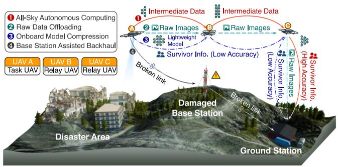

<details>
<summary>flowchart</summary>

```mermaid
graph TD
    A["1 All-Sky Autonomous Computing"] --> B["2 Raw Data Offloading"]
    B --> C["3 Onboard Model Compression"]
    C --> D["4 Base Station Assisted Backhaul"]
    D --> E["5 Intermediate Data"]
    E --> F["6 Intermediate Data"]
    F --> G["7 Survival Info. (Low Accuracy)"]
    G --> H["8 Damaged Base Station"]
    H --> I["9 Ground Station"]
    I --> J["10 Injury Control"]
    J --> K["11 Breakdown Link"]
    K --> L["12 Breakdown Link"]
    L --> M["13 Breakdown Link"]
    M --> N["14 Breakdown Link"]
    N --> O["15 Breakdown Link"]
    O --> P["16 Breakdown Link"]
    P --> Q["17 Breakdown Link"]
    Q --> R["18 Breakdown Link"]
    R --> S["19 Breakdown Link"]
    S --> T["20 Breakdown Link"]
    T --> U["21 Breakdown Link"]
    U --> V["22 Breakdown Link"]
    V --> W["23 Breakdown Link"]
    W --> X["24 Breakdown Link"]
    X --> Y["25 Breakdown Link"]
    Y --> Z["26 Breakdown Link"]
    Z --> AA["27 Breakdown Link"]
    AA --> AB["28 Breakdown Link"]
    AB --> AC["29 Breakdown Link"]
    AC --> AD["30 Breakdown Link"]
    AD --> AE["31 Breakdown Link"]
    AE --> AF["32 Breakdown Link"]
    AF --> AG["33 Breakdown Link"]
    AG --> AH["34 Breakdown Link"]
    AH --> AI["35 Breakdown Link"]
    AI --> AJ["36 Breakdown Link"]
    AJ --> AK["37 Breakdown Link"]
    AK --> AL["38 Breakdown Link"]
    AL --> AM["39 Breakdown Link"]
    AM --> AN["40 Breakdown Link"]
    AN --> AO["41 Breakdown Link"]
    AO --> AP["42 Breakdown Link"]
    AP --> AQ["43 Breakdown Link"]
    AQ --> AR["44 Breakdown Link"]
    AR --> AS["45 Breakdown Link"]
    AS --> AT["46 Breakdown Link"]
    AT --> AU["47 Breakdown Link"]
    AU --> AV["48 Breakdown Link"]
    AV --> AW["49 Breakdown Link"]
    AW --> AX["50 Breakdown Link"]
    AX --> AY["51 Breakdown Link"]
    AY --> AZ["52 Breakdown Link"]
    AZ --> BA["53 Breakdown Link"]
    BA --> BB["54 Breakdown Link"]
    BB --> BC["55 Breakdown Link"]
    BC --> BD["56 Breakdown Link"]
    BD --> BE["57 Breakdown Link"]
    BE --> BF["58 Breakdown Link"]
    BF --> BG["59 Breakdown Link"]
    BG --> BH["60 Breakdown Link"]
    BH --> BI["61 Breakdown Link"]
    BI --> BJ["62 Breakdown Link"]
    BJ --> BK["63 Breakdown Link"]
    BK --> BL["64 Breakdown Link"]
    BL --> BM["65 Breakdown Link"]
    BM --> BN["66 Breakdown Link"]
    BN --> BO["67 Breakdown Link"]
    BO --> BP["68 Breakdown Link"]
    BP --> BQ["69 Breakdown Link"]
    BQ --> BR["70 Breakdown Link"]
    BR --> BS["71 Breakdown Link"]
    BS --> BT["72 Breakdown Link"]
    BT --> BU["73 Breakdown Link"]
    BU --> BV["74 Breakdown Link"]
    BV --> BW["75 Breakdown Link"]
    BW --> BX["76 Breakdown Link"]
    BX --> BY["77 Breakdown Link"]
    BY --> BZ["78 Breakdown Link"]
    BZ --> CA["79 Breakdown Link"]
    CA --> CB["80 Breakdown Link"]
    CB --> CC["81 Breakdown Link"]
    CC --> CD["82 Breakdown Link"]
    CD --> CE["83 Breakdown Link"]
    CE --> CF["84 Breakdown Link"]
    CF --> CG["85 Breakdown Link"]
    CG --> CH["86 Breakdown Link"]
    CH --> CI["87 Breakdown Link"]
    CI --> CJ["88 Breakdown Link"]
    CJ --> CK["89 Breakdown Link"]
    CK --> CL["90 Breakdown Link"]
    CL --> CM["91 Breakdown Link"]
    CM --> CN["92 Breakdown Link"]
    CN --> CO["93 Breakdown Link"]
    CO --> CP["94 Breakdown Link"]
    CP --> CQ["95 Breakdown Link"]
    CQ --> CR["96 Breakdown Link"]
    CR --> CS["97 Breakdown Link"]
    CS --> CT["98 Breakdown Link"]
    CT --> CU["99 Breakdown Link"]
```
</details>

Fig. 1. A killer application of UAVs: earthquake search and rescue. Due to the possible broken base station communication link (line ❹), existing relay UAV assisted approaches either transmit the massive on-site images back to the ground station for further processing in a time-consuming manner (line ❷), or analyse the images onboard with a compressed DL model in low accuracy (line ❸). Differently, we propose to collaboratively process the data during transmission (line ❶), which could transmit high accuracy survivor information to the ground for fast decision-making in a communication-efficient manner.

UAV systems cannot simultaneously process sensory data with high accuracy and low latency.

In this paper, we propose a novel system named ASAP (All-Sky Autonomous comPuting) that could fast and accurately process the UAV sensory data, solely by the autonomous collaboration within the UAV swarm, based on the following important observation. There exist several relay UAVs whose computational resources are not utilized during the transmission, as shown in Fig. 1. On the contrary, in the ASAP, we fully leverage the UAV swarm’s computational and communication resources to conduct collaborative computing in the sky. The prominent advantages of the proposed ASAP lie in two aspects: 1) without transmitting a large amount of raw sensory data, the overall processing latency could be small, and communication resources could also be saved; 2) leveraging the resources of multiple UAVs, it could employ relatively large DL models rather than lightweight ones to process the sensory data, which guarantees high accuracy. Exploiting the ASAP, as illustrated in line ❶ in Fig. 1, the high accuracy survivor information could be returned to the ground in a timely way through multi-UAV collaborative computing.

Nevertheless, achieving the aforementioned great vision in the context of UAV swarms is extremely challenging. To cope with the unique UAV swarm formation, we first design a novel general collaborative computing architecture tailored to the typical hierarchy and clustering structure of UAV swarms, i.e., UAV swarm native collaborative computing architecture. More crucially, considering the complex network environment of UAV swarms, three technical challenges exist as follows.

Challenge 1: How to guarantee the efficiency and stability of collaborative computing in a UAV swarm. The UAV computing capability heterogeneity results in varying performance of different UAV clusters. Besides, external interference or software/hardware failures may lead to the UAV connection loss. However, existing collaborative computing works rarely consider the task allocation among clusters in the swarm and the reliability mechanisms to deal with possible node failure.

Challenge 2: How to evaluate the cost of tasks fast and accurately for online task scheduling and efficient autonomous UAV collaboration. A task’s computing cost on different UAVs is an important index for task scheduling and corresponding autonomous collaboration, and it is necessary to reschedule the task allocation scheme onboard immediately when the available UAV set changes. However, to the best of our knowledge, existing DL inference performance prediction works either require a large amount of computing resources or sacrifice accuracy for prediction timeliness, which is not suitable for online task scheduling and autonomous collaboration among UAVs.

Challenge 3: How to deal with limited and dynamic communication resources between UAVs. The performance of collaborative computing depends on the efficient communication among UAVs to a certain degree, while the available wireless spectrum resource shared by the swarm is limited and might vary with time, owing to the high mobility of UAVs. Although compressing the data before transmitting is a feasible way to combat challenging communication, most existing studies often employ a static compression strategy, which cannot ensure latency and data quality under dynamic communication conditions.

The ASAP addresses the aforementioned challenges in the following. For Challenge 1, different from existing collaborative computing works only partition DL models or data independently, ASAP respectively partitions DL model and data among UAV clusters and within each cluster, and two-layer load balancing and elastic scheduling algorithms are designed to perform efficient and robust collaborative computing. For Challenge 2, we design a lightweight and accurate DL inference performance predictor using a first-operator level prediction and then a latency fusion fine-tuning strategy. For challenge 3, instead of a static compression strategy, the proposed system can adaptively compress the intermediate data transmitted between UAVs, achieving an appropriate tradeoff between the latency and quality of the intermediate DL inference data. Compared with existing computing works in UAV swarm and collaborative edge computing works, the key innovation of ASAP lies in that, it avoids the long data transmission latency and makes collaborative computing applicable to UAV swarm to autonomously process UAV sensory data with low latency and high accuracy. In detail, the main contributions of this paper can be summarized as follows:

- An efficient elastic scheduler is proposed to partition DL model computing tasks among UAV clusters and within each UAV cluster. The scheduling scheme is developed according to the current computing capability of different UAV clusters or UAVs and is updated in a timely manner when some UAVs in the swarm become unavailable.   
A lightweight accurate DL inference performance predictor is designed. Unlike many existing works that cannot simultaneously achieve high efficiency and accuracy, it decomposes the DL model performance prediction into two steps: operator-level prediction and performance finetuning, which ensures efficiency and accuracy together.   
- An adaptive inter-UAV inference data compressor is designed to adaptively decrease the intermediate data transmitted between UAVs. It compresses the intermediate data

to an appropriate scale according to the data size and current communication rate between UAVs.

. - ASAP has been deployed on 24 popular airborne computers and 5 real-world quad-rotor UAVs. Experiment results show that the proposed system can decrease the computing latency by up to 92.66% compared with data offloading methods, and up to 98.50% compared with state-of-the-art terrestrial collaborative computing systems. Besides, the proposed system can effectively deal with the situation when some pre-selected UAVs become unavailable.

To benefit the community, ASAP is open sourced at https: //github.com/snhao222/ASAP. The remainder of this paper is organized as follows. The related work is discussed in Section II. The overview of the system is discussed in Section III. The technical details of the elastic efficient scheduler, lightweight accurate latency predictor, and adaptive inter-UAV data compressor are described in Sections IV, V, VI, respectively. The system implementation details are discussed in Section VII. Then, the performance evaluation results of the proposed system are presented in Section VIII. Finally, the paper is concluded in Section X.

# II. RELATED WORK

# A. Existing Computing Methods in UAV System

Model Compression: Due to the load and power limitations, both airborne computation and memory resources of UAVs are greatly suppressed. To conduct computational processing of the large amount of data generated during task execution, some works try to reduce the model size while retaining the functions of the original model. Model pruning works delete parts of the model that have less impact on the inference results, including non-structured pruning [12] and structured pruning [13]. Model quantization works convert floating-point operations of DNN into fixed-point operations to reduce computing burden [14], [15]. Knowledge distillation works construct and train a new lightweight model with the original complex model to transfer knowledge between models [16], [17]. Neural architecture search works try to construct models according to the capability of devices [18], [19]. Although the computing cost is released, model compression decreases the inference accuracy of the model at the same time, even more than 10% [20], [21], [22], which is unacceptable in an emergency.

Raw Data Offloading: Some UAV systems are hugely dependent on the resourceful ground for the airborne sensory payload data processing [8], [23], [24], [25], [26]. The task offloading of these works requires the assistance of base stations, which may be broken or obstructed in emergency cases like earthquakes. Therefore, some works proposed to relay communication data of UAVs with a UAV swarm [27], [28], [29], [30], [31]. However, the backhaul link between UAVs and ground is usually bandwidth-limited, which means the transmission of a large amount of raw data may affect the efficiency of task offloading. To this end, the proposed system utilizes the computing resources of UAV swarm to perform collaborative computing during the transmission process, which reduces the size and quantity of data transmitted from air to ground.

TABLE I COMPARISON BETWEEN ASAP AND OTHER WORKS 

<table><tr><td>Work</td><td>Collaboration</td><td>Computation</td><td>Latency</td><td>Acc.</td></tr><tr><td>Model compression</td><td>—</td><td>Low</td><td>Low</td><td>Low</td></tr><tr><td>Raw data offloading</td><td>Device-Server</td><td>—</td><td>High</td><td>High</td></tr><tr><td>Model partition</td><td>Device-Server</td><td>Medium</td><td>High</td><td>High</td></tr><tr><td>Data partition</td><td>Require a central node</td><td>Medium</td><td>Medium</td><td>High</td></tr><tr><td>ASAP</td><td>UAV swarm clustering</td><td>Low</td><td>Low</td><td>High</td></tr></table>

# B. Existing Collaborative Edge Computing Paradigms for Terrestrial IoT Systems

Model Partition: Model partition works mainly split the complete model of task into two submodels between the edge device and an edge server [32], [33], [34], [35], [36], [37], [38], [39]. Wherein, Neurosurgeon [33] partitioned the model between the mobile device and cloud based on the best split point predicted. This method considers the collaborative computing between a single device and a server, and the amount of transmission data is not decreased explicitly, which is not suitable for collaborative computing in the UAV swarm.

Data Partition: Data partition works split data to be computed among edge devices, and the data partitions can be computed in a parallel manner [40], [41], [42], [43], [44]. DeepSlicing [44] split the DL model into a sequence of subtasks and conducted data partition for each one. Like DeepSlicing, MoDNN [42] considered each convolution layer combined with the subsequent non-overlapping layer structure as a subtask. Although the computing task can be distributed to several devices, this method is more suitable for systems with a central node, which contradicts the clustering organization pattern of UAV swarm.

The aforementioned problems of model partition and data partition in UAV swarm motivate us to design a collaborative computing architecture for UAV swarm specifically. The comparison between ASAP and other related works is summarized in Table I, which shows that ASAP is specially designed for UAV swarm, and achieves low latency and high inference accuracy simultaneously.

# C. DL Inference Performance Prediction

Existing DL inference performance prediction works search suitable model architectures for devices by latency prediction models, which can be divided into operator-grain prediction and model-grain prediction. Note that operators are minimal computing logic units of DL models, e.g., convolution, relu can be regarded as operators.

Operator-Grain Prediction: Some works try to predict the inference latency of operators with linear or polynomial models, and simply sum them up to get the inference latency of DL models [33], [45], [46]. These works usually use FLOPs-based linear models to predict the inference latency of operators. Although the lightweight models are friendly to edge devices, the inference latency of operators is not simply linear with FLOPs, which results in inaccurate prediction results. What’s more, due to the optimization of operator fusion, the inference latency of the DL model is not exactly the latency sum of the constituent operators. Note that operator fusion is the optimization method of deep learning frameworks, which greatly impacts the inference latency of the DL model. It fuses some specific operator combinations into a single operator to decrease the inference latency. For example, the inference latency of operator pairs < conv, bn > could be almost equal to conv because of the operator fusion in the TensorRT framework.

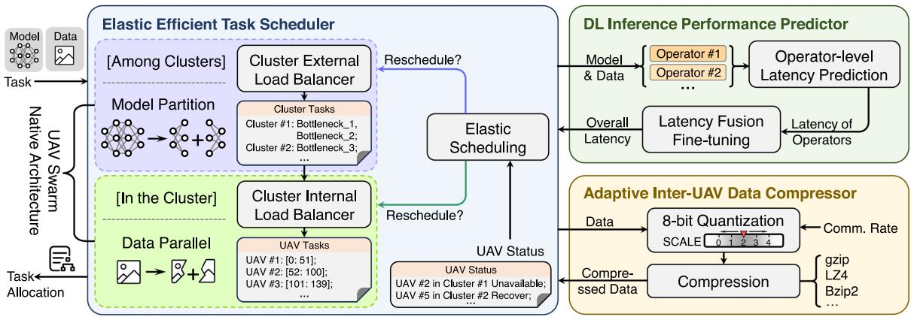

<details>
<summary>flowchart</summary>

```mermaid
graph TD
    A["Task"] --> B["Type: UAV Swarm"]
    B --> C["Type: Native Architecture"]
    C --> D["Task Allocation"]
    D --> E["Type: UAV Status"]
    E --> F["Data Parallel"]
    F --> G["Type: UAV Tasks"]
    G --> H["Cluster External Load Balancer"]
    H --> I["Cluster Tasks"]
    I --> J["Cluster #1: Bottleneck_1, Bottleneck_2; Cluster #2: Bottleneck_3; ..."]
    J --> K["Cluster Internal Load Balancer"]
    K --> L["UAV Tasks"]
    L --> M["UAV #1: [0: 51"]; UAV #2: [52: 100]; UAV #3: [101: 139]; ...]
    M --> N["UAV Status"]
    N --> O["UAV #2 in Cluster #1 Unavailable; UAV #5 in Cluster #2 Recover; ..."]
    O --> P["Elastic Scheduling"]
    P --> Q["Reschedule?"]
    Q --> R["Type: Cluster External Load Balancer"]
    R --> S["Cluster Tasks"]
    S --> T["Cluster #1: Bottleneck_1, Bottleneck_2; Cluster #2: Bottleneck_3; ..."]
    T --> U["Cluster Internal Load Balancer"]
    U --> V["UAV Tasks"]
    V --> W["UAV #1: [0: 51"]; UAV #2: [52: 100]; UAV #3: [101: 139]; ...]
    W --> X["UAV Status"]
    X --> Y["UAV #2 in Cluster #1 Unavailable; UAV #5 in Cluster #2 Recover; ..."]
    Y --> Z["Elastic Scheduling"]
    Z --> AA["Reschedule?"]
    AA --> AB["Type: Cluster External Load Balancer"]
    AB --> AC["Cluster Tasks"]
    AC --> AD["Cluster #1: Bottleneck_1, Bottleneck_2; Cluster #2: Bottleneck_3; ..."]
    AD --> AE["Cluster Internal Load Balancer"]
    AE --> AF["UAV Tasks"]
    AF --> AG["UAV #1: [0: 51"]; UAV #2: [52: 100]; UAV #3: [101: 139]; ...]
    AG --> AH["UAV Status"]
    AH --> AI["UAV #2 in Cluster #1 Unavailable; UAV #5 in Cluster #2 Recover; ..."]
    AI --> AJ["Elastic Scheduling"]
    AJ --> AK["Reschedule?"]
    AK --> AL["Type: Cluster External Load Balancer"]
    AL --> AM["Cluster Tasks"]
    AM --> AN["Cluster #1: Bottleneck_1, Bottleneck_2; Cluster #2: Bottleneck_3; ..."]
    AN --> AO["Cluster Internal Load Balancer"]
    AO --> AP["UAV Tasks"]
    AP --> AQ["UAV #1: [0: 51"]; UAV #2: [52: 100]; UAV #3: [101: 139]; ...]
    AQ --> AR["UAV Status"]
    AR --> AS["UAV #2 in Cluster #1 Unavailable; UAV #5 in Cluster #2 Recover; ..."]
    AS --> AT["Elastic Scheduling"]
    AT --> AU["Reschedule?"]
    AU --> AV["Type: Cluster External Load Balancer"]
    AV --> AW["Cluster Tasks"]
    AW --> AX["Cluster #1: Bottleneck_1, Bottleneck_2; Cluster #2: Bottleneck_3; ..."]
    AX --> AY["UAV Tasks"]
    AY --> AZ["UAV #1: [0: 51"]; UAV #2: [52: 100]; UAV #3: [101: 139]; ...]
    AZ --> BA["UAV Status"]
    BA --> BB["UAV #2 in Cluster #1 Unavailable; UAV #5 in Cluster #2 Recover; ..."]
    BB --> BC["Elastic Scheduling"]
    BC --> BD["Reschedule?"]
    BD --> BE["Type: Cluster External Load Balancer"]
    BE --> BF["Cluster Tasks"]
    BF --> BG["Cluster #1: Bottleneck_1, Bottleneck_2; Cluster #2: Bottleneck_3; ..."]
    BG --> BH["UAV Tasks"]
    BH --> BI["UAV #1: [0: 51"]; UAV #2: [52: 100]; UAV #3: [101: 139]; ...]
    BI --> BJ["UAV Status"]
    BJ --> BK["UAV #2 in Cluster #1 Unavailable; UAV #5 in Cluster #2 Recover; ..."]
    BK --> BL["Elastic Scheduling"]
    BL --> BM["Reschedule?"]
    BM --> BN["Type: Cluster External Load Balancer"]
    BN --> BO["Cluster Tasks"]
        BO --> BP["Cluster #1: Bottleneck_1, Bottleneck_2; Cluster #2: Bottleneck_3; ..."]
        BP --> BQ["UAV Tasks"]
        BQ --> BR["UAV #1: [0: 51"]; UAV #2: [52: 100]; UAV #3: [101: 139]; ...]
        BR --> BS["UAV Status"]
        BS --> BT["UAV #2 in Cluster #1 Unavailable; UAV #5 in Cluster #2 Recover; ..."]
        BT --> BU["Elastic Scheduling"]
        BU --> BV["Reschedule?"]
        BV --> BW["Type: Cluster External Load Balancer"]
        BW --> BX["Cluster Tasks"]
        BX --> BY["Cluster #1: Bottleneck_1, Bottleneck_2; Cluster #2: Bottleneck_3; ..."]
        BY --> BZ["UAV Tasks"]
        BZ --> CA["UAV #1: [0: 51"]; UAV #2: [52: 100]; UAV #3: [101: 139]; ...]
        CA --> CB["UAV Status"]
        CB --> CC["UAV #2 in Cluster #1 Unavailable; UAV #5 in Cluster #2 Recover; ..."]
        CC --> CD["Elastic Scheduling"]
        CD --> DD["Reschedule?"]
        DD --> DE["Type: Cluster External Load Balancer"]
        DE --> DF["Cluster Tasks"]
        DF --> DG["Cluster #1: Bottleneck_1, Bottleneck_2; Cluster #2: Bottleneck_3; ..."]
        DG --> DH["UAV Tasks"]
        DH --> DI["UAV #1: [0: 51"]; UAV #2: [52: 100]; UAV #3: [101: 139]; ...]
        DI --> DJ["UAV Status"]
        DJ --> DK["UAV #2 in Cluster #1 Unavailable; UAV #5 in Cluster #2 Recover; ..."]
        DK --> DL["Elastic Scheduling"]
        DL --> DV["Reschedule?"]
        DV --> DW["Type: Cluster External Load Balancer"]
        DW --> DX["Cluster Tasks"]
        DX --> DY["Cluster #1: Bottleneck_1, Bottleneck_2; Cluster #2: Bottleneck_3; ..."]
        DY --> DB["UAV Tasks"]
        DB --> DC["UAV #1: [0: 51"]; UAV #2: [52: 100]; UAV #3: [101: 139]; ...]
        DC --> DEU["UAV Status"]
        DEU --> DFU["UAV #2 in Cluster #1 Unavailable; UAV #5 in Cluster #2 Recover; ..."]
        DFU --> DGU["UAV Status"]
        DGU --> DWU["UAV #2 in Cluster #1 Unavailable; UAV #5 in Cluster #2 Recover; ..."]

    subgraph DL Inference Performance Predictor
        F-> G-> H
        F-> I-> J-> K-> L-> M-> N-> O-> P-> Q-> R-> S-> T-> U-> V-> W-> X-> Y-> Z-> AB
        W-> AC-> AD
        W-> AE-> AF
        W-> AF
        W-> AG
        W-> AH
        W-> AI
        W-> AJ
        W-> AK
        W-> AL
        W-> AM
        W-> AN
        W-> AO
        W-> AP
        W-> AQ
        W-> AR
        W-> AS
        W-> AT
        W-> AU
        W-> AV
        W-> AW
        W-> AX
        W-> AY
        W-> AZ
        W-> BA
        W-> BB
        W-> BC
        W-> BD
        W-> BE
        W-> BF
        W-> BG
        W-> BH
        W-> BI
        W-> BJ
        W-> BK
        W-> BL
        W-> BM
        W-> BN
        W-> BO
        W-> BP
        W-> BQ
        W-> BR
        W-> BS
        W-> BT
        W-> BU
        W-> BV
        W-> BW
        W-> BX
        W-> BY
        W-> BZ
        W-> CA
        W-> CB
        W-> CC
        W-> CD
        X["Overall Latency"] --> Y["Operator level Latency Prediction"]
        Y --> Z["Latency Fusion Fine-tuning"] --> AA["Latency of Operators"] --> AB["Latency of Operators"] --> AC["Adaptive Inter-UAV Data Compressor"] --> AD["8-bit Quantization SCALE"] <--> AE["Compression"] <--> AF["Compressed Data"] <--> AG["gzip LZ4 Bzip2 ..."] <--> AH["Output Data Compressor"] <--> AI["gzip LZ4 LZ4 Bzip2 ..."] <--> AJ["Output Data Compressor"] <--> AK["gzip LZ4 LZ4 Bzip2 ..."] <--> AL["Output Data Compressor"] <--> AM["gzip LZ4 LZ4 Bzip2 ..."] <--> AN["gzip LZ4 LZ4 Bzip2 ..."] <--> AO["gzip LZ4 LZ4 Bzip2 ..."] <--> AP["gzip LZ4 LZ4 Bzip2 ..."] <--> AQ["gzip LZ4 LZ4 Bzip2 ..."] <--> AR["gzip LZ4 LZ4 Bzip2 ..."] <--> AS["gzip LZ4 LZ4 Bzip2 ..."] <--> AT["gzip LZ4 LZ4 Bzip2 ..."] <--> AU["gzip LZ4 LZ4 Bzip2 ..."] <--> AV["gzip LZ4 LZ4 Bzip2 ..."] <--> AW["gzip LZ4 LZ4 Bzip2 ..."] <--> AX["gzip LZ4 LZ4 Bzip2 ..."] <--> AY["gzip LZ4 LZ4 Bzip2 ..."] <--> AZ["gzip LZ4 LZ4 Bzip2 ..."] <--> BA["gzip LZ4 LZ4 Bzip2 ..."] <--> BB["gzip LZ4 LZ4 Bzip2 ..."] <--> BC["gzip LZ4 LZ4 Bzip2 ..."] <--> BD["gzip LZ4 LZ4 Bzip2 ..."] <--> BE["gzip LZ4 LZ4 Bzip2 ..."] <--> BF["gzip LZ4 LZ4 Bzip2 ..."] <--> BG["gzip LZ4 LZ4 Bzip2 ..."] <--> BH["gzip LZ4 LZ4 Bzip2 ..."] <--> BI["gzip LZ4 LZ4 Bzip2 ..."] <--> BJ["gzip LZ4 LZ4 Bzip2 ..."] <--> BK["gzip LZ4 LZ4 Bzip2 ..."] <--> BL["gzip LZ4 LZ4 Bzip2 ..."] <--> BM["gzip LZ4 LZ4 Bzip2 ..."] <--> BN["gzip LZ4 LZ4 Bzip2 ..."] <--> BO["gzip LZ4 LZ4 Bzip2 ..."] <--> BP["gzip LZ4 LZ4 Bzip2 ..."] <--> BQ["gzip LZ4 LZ4 Bzip2 ..."] <--> BR["GDP Performance Predictor"] <--> AS["GDP Performance Predictor"] <--> AT["GDP Performance Predictor"] <--> AU["GDP Performance Predictor"] <--> AV["GDP Performance Predictor"] <--> AW["GDP Performance Predictor"] <--> AX["GDP Performance Predictor"] <--> AY["GDP Performance Predictor"] <--> AZ["GDP Performance Predictor"] <--> BA["GDP Performance Predictor"] <--> BB["GDP Performance Predictor"] <--> BC["GDP Performance Predictor"] <--> BD["GDP Performance Predictor"] <--> BE["GDP Performance Predictor"] <--> BF["GDP Performance Predictor"] <--> BG["GDP Performance Predictor"] <--> BH["GDP Performance Predictor"] <--> BI["GDP Performance Predictor"] <--> BJ["GDP Performance Predictor"] <--> BK["GDP Performance Predictor"] <--> BL["GDP Performance Predictor"] <--> BM["GDP Performance Predictor"] <--> BN["GDP Performance Predictor"] <--> BO["GDP Performance Predictor"] <--> BP["GDP Performance Predictor"] <--> AY["GDP Performance Predictor"] <--> AZ["GDP Performance Predictor"] <--> BA["GDP Performance Predictor"] <--> BB["GDP Performance Predictor"] <--> BC["GDP Performance Predictor"] <--> BK["GDP Performance Predictor"] <--> BL["GDP Performance Predictor"] <--> BM["GDP Performance Predictor"] <--> BN["GDP Performance Predictor"] <--> BO["GDP Performance Predictor"] <--> AY["GDP Performance Predictor"] <--> AZ["GDP Performance Predictor"] <--> BA["GDP Performance Predictor"] <--> BB["GDP Performance Predictor"] <--> BC["GDP Performance Predictor"] <--> BK["GDP Performance Predictor"] <--> BL["GDP Performance Predictor"] <--> BM["GDP Performance Predictor"] <--> BN["GDP Performance Predictor"] <--> BO["GDP Performance Predictor"] <--> AY["GDP Performance Predictor"] <--> AZ["Gdp Level Latency Prediction"]
    end

    style DL Inference Performance Predictor fill:#f9f9f9,stroke:#333,stroke-width:2px,color:#fff,stroke-width:2px,color:#fff,stroke-dasharray: 5 5
```
</details>

Fig. 2. Overview of ASAP design. The elastic efficient task scheduler partitions tasks to UAV clusters and UAVs inside with the help of the DL inference performance predictor. The adaptive inter-UAV data compressor further decreases the intermediate data transmitted between UAVs.

Model-Grain Prediction: Some works aim to predict the inference latency of DL model accurately [19], [47], [48], [49], [50], [51], [52], [53]. Wherein, nn-Meter [48] considered the operator fusion optimization and used a random forests model to accurately predict the model-grain inference latency. These works usually use balk-box machine learning methods to predict the inference latency of the DL model according to a series of operator hyperparameters. However, because of the huge data space, these black-box models are too complicated to perform online prediction on UAVs.

Motivated by the incapability to have both high accuracy and low complexity in existing inference latency prediction works, the proposed DL inference performance predictor decomposes the model-grain prediction into operator-level prediction and performance fine-tuning, which guarantees prediction accuracy with less cost.

# III. SYSTEM OVERVIEW

The goal of ASAP is to conduct efficient and reliable collaborative computing in the UAV relay swarm, which relieves the burden of air-ground communication by transmitting valuable data results instead of raw data. As illustrated in Fig. 2, the system is composed of three modules, i.e., elastic efficient task scheduler (Section IV), lightweight accurate DNN block performance predictor (Section V), and adaptive inter-UAV inference data compressor (Section VI). First, when there is a task to be processed, i.e., a DL model and a sequence of data, the elastic efficient task scheduler partitions the task to UAV clusters and UAVs inside to conduct efficient collaborative computing. Besides, the allocation scheme can be updated by the task scheduler when the status of UAVs varies, e.g., some UAVs become unavailable or rejoin the swarm. Second, the task allocation scheme is developed with the help of the DL inference performance predictor, which can estimate the inference latency of various models and data partitions on different UAVs at a clip. Finally, the intermediate data transmitted between UAVs will be further compressed by the adaptive inter-UAV data compressor to save the inter-UAV communication resource.

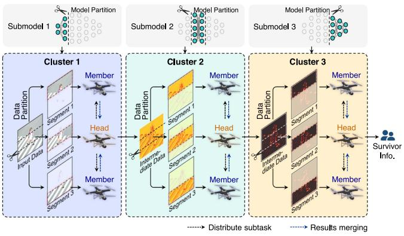

<details>
<summary>flowchart</summary>

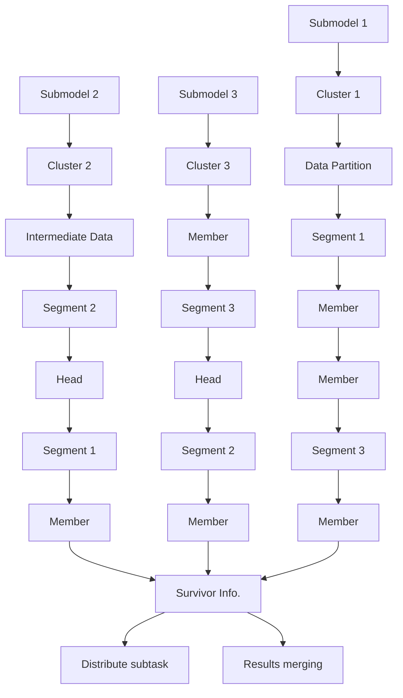
</details>

Fig. 3. A workflow example of UAV swarm native collaborative computing architecture. The model is partitioned among UAV clusters and the data is partitioned among UAVs inside clusters.

UAV Swarm Native Collaborative Computing Architecture: As mentioned in Section II-B, we modify existing collaborative edge computing paradigms to a new collaborative computing architecture suitable for UAV swarms. A workflow example of the proposed architecture is shown in Fig. 3. First, the complete DL model is partitioned into three submodels for each cluster (green model blocks in Fig. 3 - top). Second, the input data of the task flows from cluster to cluster according to the sequence of submodels. The results of submodels flow in a pipeline parallel manner. That is to say, each cluster can process the next task immediately after completing the current task, which is equivalent to processing multiple tasks simultaneously. Inside clusters, the data is split into several segments and distributed to UAVs in the cluster by the cluster head UAVs and computed in parallel. Finally, after computing, the computing results are collected by cluster heads and concatenated together to get a full result, which is sent to the next cluster for computing. The process will repeat until the input data is computed by the entire model. Overall, collaborative computing is accelerated twice in terms of model and data. The reason why we called the proposed architecture UAV swarm native is that, in the organizational form of UAV swarm clustering, the data transmission between cluster members within or between clusters should go through the relay of cluster heads, which affects the efficiency of existing collaborative computing paradigms like model partition or data partition, and existing paradigms are not suitable for collaboration with too many nodes involved like UAV swarm. Considering that partitioning the DL model within a cluster will introduce additional data relays and UAV heads can exchange data with each other directly, the proposed architecture partitions the DL model and data among UAV clusters and within each cluster, respectively, which avoids data relay in the swarm and splits tasks at a finer granularity to more nodes, as well as provides one-more acceleration compared to existing architectures.

Elastic Efficient Scheduler: The scheduler mainly consists of three key components: cluster external load balancer, cluster internal load balancer, and an elastic scheduling module. First, the cluster external load balancer partitions the entire model into submodels according to the capability of clusters in the swarm, which avoids the collaborative efficiency being encumbered by the slowest UAV. Second, the cluster internal load balancer is responsible for generating data partition schemes for UAVs in the same cluster, which reduces the efficiency reduction induced by data synchronization. Finally, the elastic scheduling module conducts some mechanisms to deal with unexpected situations, which controls the scheduler to reschedule tasks for each UAV. The algorithm details of these modules will be described in Section IV.

Lightweight Accurate DL Inference Performance Predictor: The proposed predictor decomposes DL inference latency prediction into operator-level prediction and latency fusion finetuning. The operator-level prediction is based on the relation between latency performance and hyperparameters of each operator, and the latency fusion fine-tuning uses a very small model to learn the fusion rules of DL frameworks. The architecture of the predictor is illustrated in Fig. 4 with two phases: offline phase and online phase. In the offline phase, the inference latency of operators is measured to generate parameters of the operator-level latency predictor, and the operator fusion rule set is obtained from the latency of operator pairs. The latency of operators is collected to train the latency fusion fine-tuner. In the online phase, the latency fusion fine-tuner adjusts the operator-level latency of operators and adds them up to get the DL model latency.

Adaptive Inter-UAV Data Compressor: The adaptive data compressor conducts 8-bit quantization and compression algorithms (e.g., gzip, LZ4, Bzip2.) on the intermediate data transmitted between UAVs to decrease communication overhead. Instead of a fixed quantization scale, the adaptive data compressor changes compression degree according to data size and communication rate between UAVs, which saves communication resources and guarantees the accuracy of tasks at the same time.

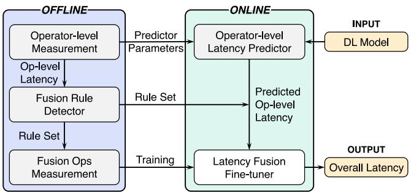

<details>
<summary>flowchart</summary>

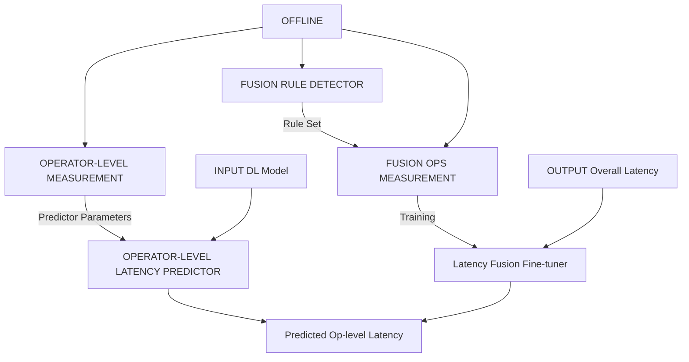
</details>

Fig. 4. Architecture of lightweight accurate DL inference performance predictor.

Algorithm 1: Mapping Range Transforming (MRT).   
Input: model architecture A, output range $R_{out}$ Output: input range $R_{in}$ 1 $R_{out} \leftarrow \{R_{out}^{l} | R_{out}^{l} = \varnothing, l \in A\}$ // initialize output range set as empty
2 $R_{out}^{lO} \leftarrow R_{out}$ 3 for $l \leftarrow l_{O}$ to $l_{I}$ do // traverse each layer
4 $[w_{in}, h_{in}] \leftarrow r_{-in}(R_{out}^{l})$ // deduce input range
5 if $l = l_{I}$ then // reach input layer
6 $R_{in} \leftarrow [w_{in}, h_{in}]$ // calculated input range
7 return $R_{in}$ 8 foreach adjacent forward layer $l_{a}$ do
9 if $R_{out}^{l_{a}} = \varnothing$ then // update adjacent forward output
10 $R_{out}^{l_{a}} \leftarrow [w_{in}, h_{in}]$ // range with deduced input
11 else // layer output has been calculated
12 $R_{out}^{l_{a}} \leftarrow R_{out}^{l_{a}} \cup [w_{in}, h_{in}]$ // output range union

Algorithm 2: Internal Cluster Load Balancing (ICLB).   
Input: model architecture A, complete input range $R_{in}$ , communication rate $r_{m}$ between cluster head and each cluster member m, number of cluster members M

Output: input range set $R_{in}$ for cluster head and cluster members

1 $r_{0} \leftarrow 0$ // set computing rate of itself to 0
2 for $m \leftarrow 0$ to M do // traverse each node in the cluster
3 $\tau_{m} \leftarrow \text{Predictor}(A, R_{in})$ // predicted latency
4 $t_{align} \leftarrow \frac{1}{\sum_{m=0}^{M} \frac{1}{\tau_{m}}}$ // alignment latency
5 for $m \leftarrow 0$ to M do // m = 0 : cluster head
6 $R_{out}^{m} \leftarrow 0$ // initialize output range to 0
7 repeat
8 $R_{out}^{m}++$ // increase output range
9 $R_{in}^{m} \leftarrow \text{MRT}(A, R_{out}^{m})$ // input range of member m
10 $\tau_{m} \leftarrow \text{Predictor}(A, R_{in}^{m})$ // predicted latency
11 until no more reduction on $|\tau_{m} - t_{align}|$ or $R_{out}$ has been partitioned completely
12 $\tau_{m} \leftarrow (\text{Data}(R_{in}^{m}) + \text{Data}(R_{out}^{m})) / r_{m} + \tau_{m}$ 13 // add data transmission latency
14 repeat
15 Fine tune $R_{out}^{0 \rightarrow M}$ to reduce (max( $\tau$ ) - min( $\tau$ ))
16 until no more reduction on (max( $\tau$ ) - min( $\tau$ ))
17 return $R_{in} = \{R_{in}^{i}, \forall i \in [0, M]\}$ // Input range for nodes

TABLE II SUMMARY OF MAIN NOTATIONS 

<table><tr><td>Notation</td><td>Description</td></tr><tr><td> $R_{in}, R_{out}$ </td><td>Input range and output range of model</td></tr><tr><td>A</td><td>Model architecture</td></tr><tr><td> $l_O, l_I$ </td><td>The last layer and the first layer of model</td></tr><tr><td> $l_a$ </td><td>Adjacent forward layer</td></tr><tr><td>s,k,p</td><td>Stride size, kernel size, and padding size</td></tr><tr><td> $w_o^l, h_o^l$ </td><td>Output width and height of layer l</td></tr><tr><td> $w_{in}, h_{in}$ </td><td>Input width and height of layer l</td></tr><tr><td> $M_c$ </td><td>Submodel for cluster c</td></tr><tr><td> $r\_in(w_o^l, h_o^l)$ </td><td>Input range of layer l</td></tr><tr><td>τ</td><td>Predicted latency</td></tr><tr><td> $C_{in}, C_{out}$ </td><td>Input channel and output channel</td></tr><tr><td>H,W,K,S</td><td>Height, width, kernel, and stride</td></tr><tr><td> $f(C_{in}, K, S)$ </td><td>Latency pattern under fixed  $C_{out}, H$ , and W</td></tr><tr><td> $T_{CO}, T_H, T_W$ </td><td>Impact factors of  $C_{out}, H$ , and W</td></tr><tr><td> $a_i, n_i, s_i$ </td><td>first step height, height between two steps, step number</td></tr><tr><td> $l_{CO}$ </td><td>The step length of  $C_{out}$ </td></tr><tr><td> $k_{CO}$ </td><td>The ratio of two adjacent  $C_{out}$  step</td></tr><tr><td> $t_{op}$ </td><td>The inference latency of operator</td></tr><tr><td> $t_{<op1,op2>}$ </td><td>The inference latency of continuous operators</td></tr></table>

# IV. ELASTIC EFFICIENT SCHEDULER

The main notations are summarized in Table II.

# A. Inter-Cluster Load Balancing

For the data partition in the cluster, the data computing synchronization affects the computing efficiency. Let $D _ { i }$ denote the workload to be computed for UAV $n _ { i } ~ ( i = 1 , 2 , \ldots , N )$ , then the computing latency for $n _ { i }$ can be calculated by $l _ { i } = D _ { i } / C _ { i }$ where $C _ { i }$ is the computing ability of UAV i. Considering that the entire task of a cluster is completed only when all the subtasks of UAVs in the cluster finish, the collaborative latency of a task in a cluster is max $\{ l _ { 1 } , l _ { 2 } , \dots , l _ { N } \}$ . Assuming there is a data partition scheme making $l _ { 1 } = l _ { 2 } = \cdot \cdot \cdot = l _ { N }$ , the value of max $\{ l _ { 1 } , l _ { 2 } , \dots , l _ { N } \}$ will increase if some workload is adjusted from one UAV to another one. Therefore, the data partition scheme that ensures $l _ { 1 } = l _ { 2 } = \cdot \cdot \cdot = l _ { N }$ can maximize the computing efficiency in the cluster. To balance the workload inside the cluster, we propose the Mapping Range Transformer (MRT) algorithm to calculate the minimal input range corresponding to the desired output range of DL models, and design the Internal Cluster Load Balancing (ICLB) algorithm to generate data partition strategy in the cluster.

Algorithm 1 shows the details of the MRT algorithm. It calculates the minimal input range $R _ { i n }$ corresponding to the given output range $R _ { o u t }$ of model A. The algorithm transverses every layer of the model from the last one $l _ { O }$ to the first one $l _ { I }$ , and calculates the input range of each layer $r _ { - } i n ( w _ { o } ^ { l } , h _ { o } ^ { l } )$ with (1), where s, k, p are stride size, kernel size, and padding size of the layer, respectively, and $w _ { o } ^ { l } , h _ { o } ^ { l }$ are the output width and height of layer $l ,$ respectively. Note that $R _ { o u t }$ contains $w _ { o } ^ { l _ { O } }$ and $h _ { o } ^ { l _ { O } }$ of $l _ { O }$ , and the input range is equal to the output range except for convolution and pooling layers. The calculated input range is stored as the output range of each adjacent forward layer $l _ { a }$ . Finally, the input range of $l _ { I }$ is the minimal input range of the model block.

Algorithm 3: External Cluster Load Balancer (ECLB). 

<table><tr><td colspan="2">Input: model architecture A, input range Rin, number of clusters C, baseline model inference latency tc of each cluster c</td></tr><tr><td colspan="2">Output: submodel set M for each cluster</td></tr><tr><td>1</td><td>M←{Mc|Mc=∅, ∀c∈[0,C)} // initialize submodel set</td></tr><tr><td>2</td><td>τ0←Predictor(A,Rin) // baseline latency</td></tr><tr><td>3</td><td>for c←0 to C-1 do // tranverse each cluster</td></tr><tr><td>4</td><td>Tc←1/∑C-1/c1tc / allocated latency for clusters</td></tr><tr><td>5</td><td>repeat</td></tr><tr><td>6</td><td>add layers to Mc // contains a few model layers</td></tr><tr><td>7</td><td>Rcin←MRT(A,Rin,Mc) // deduced input range</td></tr><tr><td>8</td><td>τc←Predictor(Mc,Rcin) // predicted latency</td></tr><tr><td>9</td><td>until no more reduction on |τc-Tc| or model A has been partitioned completely</td></tr><tr><td>10</td><td>return M←{Mc, ∀c∈[0,C)}</td></tr></table>

$$
\begin{array}{l} r \_ i n \left(w _ {o} ^ {l}, h _ {o} ^ {l}\right) \\ = \left\{ \begin{array}{l l} {\left[ \left(w _ {o} ^ {l} - 1\right) \cdot s + k - p, \left(h _ {o} ^ {l} - 1\right) \right.} & \\ {\cdot s + k - p ],} & l \in [ C o n v, P o o l ] \\ {\left[ w _ {o} ^ {l}, h _ {o} ^ {l} \right],} & \text { otherwise } \end{array} \right. \tag {1} \\ \end{array}
$$

Algorithm 2 describes the procedure of ICLB. Initially, ICLB predicts the inference latency with full input data for each UAV. Subsequently, an aligned time $t _ { a l i g n }$ is calculated based on the computing capability of each UAV, which is the target computing latency for each UAV. For each UAV, ICLB adjusts the output range bit by bit until there is no more reduction between the predicted latency τ and $t _ { a l i g n }$ . In addition, ICLB also takes the data transmission latency into consideration to reduce synchronization overhead further.

# B. Intra-Cluster Load Balancing

As shown in Fig. 3, tasks are computed among different clusters in a pipeline parallel manner, and the computing of a cluster requires the result of the previous cluster as input. Denote the computing latency for cluster $\boldsymbol { c } _ { i } \left( i = 1 , 2 , \ldots , N \right)$ as $l _ { i } ,$ , then the average collaborative computing latency in the UAV swarm can be calculated by lim $\begin{array} { r } { \mathbf { \epsilon } _ { 1 } . . . \mathbf { \epsilon } _ { \infty } ( \sum _ { i = 1 } ^ { M } l _ { i } + ( k - 1 } \end{array}$ 1)max $\{ l _ { 1 } , l _ { 2 } , \dotsc , l _ { M } \} ) / k = \operatorname* { m a x } \{ l _ { 1 } , l _ { 2 } , \dotsc , l _ { M } \}$ , where k is the number of tasks, and it is an infinite value during pipeline running. Considering that the expression of average collaborative computing is consistent with Section IV-A, the model partition scheme that makes $l _ { 1 } = l _ { 2 } = \cdot \cdot \cdot = l _ { M }$ is the most efficient. A more intuitive explanation is that ‘bubbles’ will be generated if the task computing speed of different clusters is inconsistent in the collaborative pipeline, which sacrifices the overall computing efficiency. Therefore, the External Cluster Load Balancing (ECLB) algorithm is designed to control the model partition strategy among UAV clusters.

Algorithm 4: Elastic Scheduling (ES).   
Input: model architecture A, input range $R_{in}$ ,
clusters set C, cluster parameters $p_{c}$ for each cluster c,
baseline model inference latency $t_{c}$ of each cluster c

Output: updated submodel set M for each cluster c,
updated input range set $\mathbb{R}_{in}^{(c\in\mathbb{C})}$ foreach cluster $c \in C$ do // tranverse each cluster

Update cluster parameters $p_{c}$ if cluster c changes connection status then

Update cluster set C
M ← ECLB(A, $R_{in}$ , C, $t_{(c\in\mathbb{C})}$ )
// recalculate submodel set

foreach cluster $c \in C$ do $\mathbb{R}_{in}^{c} \leftarrow \text{ICLB}(M_{c}, R_{in}, p_{c})$ // recalculate input range set

return M, $\mathbb{R}_{in}^{(c\in\mathbb{C})}$ else if cluster members in cluster c changes connection status then

Update $t_{c}$ // update baseline model inference latency
M ← ECLB(A, $R_{in}$ , C, $t_{(c\in\mathbb{C})}$ )
foreach cluster $c \in C$ do $\mathbb{R}_{in}^{c} \leftarrow \text{ICLB}(M_{c}, R_{in}, p_{c})$ return M, $\mathbb{R}_{in}^{(c\in\mathbb{C})}$

As described in Algorithm 3, each cluster performs collaborative computing with the same baseline model initially, which indicates the computing capability of each cluster. Considering that it is not feasible to predict the inference latency of a cluster with latency predictor, the ECLB algorithm uses a public predictor to predict the entire DL model latency $t _ { 0 } .$ , and calculates the target computing latency $t _ { c }$ for each cluster according to the computing capability of clusters. Subsequently, the ECLB algorithm adjusts the submodels for each cluster layer by layer, and predicts the corresponding latency $\tau _ { c }$ with the public predictor, until there is no more reduction on $| \tau _ { c } - T _ { c } |$ |.

# C. Elastic Scheduling

In addition to improving computing efficiency, the Elastic Efficient Scheduler develops some strategies to cope with the situations of node unavailable, which improves the elasticity of ASAP. As shown in Algorithm 4, when the connection status of clusters changes (i.e., a cluster becomes unavailable or recovers from fault), the scheduler will update the available cluster set, and reschedule the model and data partition strategy through ECLB and ICLB algorithms according to the updated cluster performance information. Besides, if the connection status of some cluster members changes, the scheduler will update the target computing latency $t _ { c }$ for each cluster and reschedule the model and data partition strategy. It is noted that the UAV status is detected by the state manager of ASAP, and the UAV status monitoring technique is described in Section VII-B in detail.

# V. LIGHTWEIGHT ACCURATE DL INFERENCE PERFORMANCEPREDICTOR

# A. Operator-Level Latency Prediction

The operator-level latency prediction aims to predict the inference latency of a single operator, without the influence of adjacent operators. In detail, we generally divide common DL operators into two categories: convolution-like operators and element-wise operators. Convolution-like operators (e.g., convolution, max pooling, etc.) extract features with a kernel sliding on the feature map, and element-wise operators (e.g., relu, batch normalization, etc.) conduct same operations on every element of the input data.

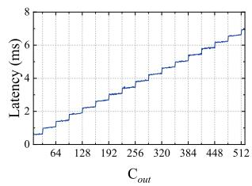

<details>
<summary>line</summary>

| C_out | Latency (ms) |
| ----- | ------------ |
| 64    | 1.0          |
| 128   | 2.0          |
| 192   | 3.0          |
| 256   | 4.0          |
| 320   | 5.0          |
| 384   | 6.0          |
| 448   | 7.0          |
| 512   | 8.0          |
</details>

(a) Staircase pattern.

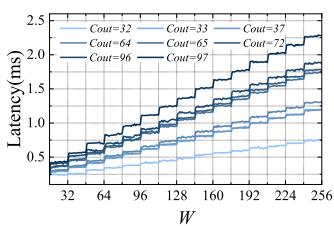

<details>
<summary>line</summary>

| W   | Cout=32 | Cout=33 | Cout=37 | Cout=64 | Cout=65 | Cout=96 | Cout=97 |
|-----|---------|---------|---------|---------|---------|---------|---------|
| 32  | 0.4     | 0.4     | 0.4     | 0.4     | 0.4     | 0.4     | 0.4     |
| 64  | 0.5     | 0.5     | 0.5     | 0.5     | 0.5     | 0.5     | 0.5     |
| 96  | 0.6     | 0.6     | 0.6     | 0.6     | 0.6     | 0.6     | 0.6     |
| 128 | 0.7     | 0.7     | 0.7     | 0.7     | 0.7     | 0.7     | 0.7     |
| 160 | 0.8     | 0.8     | 0.8     | 0.8     | 0.8     | 0.8     | 0.8     |
| 192 | 0.9     | 0.9     | 0.9     | 0.9     | 0.9     | 0.9     | 0.9     |
| 224 | 1.0     | 1.0     | 1.0     | 1.0     | 1.0     | 1.0     | 1.0     |
| 256 | 1.1     | 1.1     | 1.1     | 1.1     | 1.1     | 1.1     | 1.1     |
</details>

(b) Influence between dimensions.   
Fig. 5. Inference latency pattern of convolution operator. The latency of convolution with different values of configurations shows staircase pattern, and the impact of different configuration dimensions to the inference latency is independent.

Convolution-Like Operators: Convolution-like operators have huge number of primary configuration dimensions (i.e., input channel $( C _ { i n } )$ , height (H), width (W ), output channel $( C _ { o u t } )$ , kernel (K), and stride (S)). Through extensive experiments, we find that the latency of Conv shows a staircase pattern when changing the values of $C _ { i n } , H$ , W , or $C _ { o u t }$ , as shown in Fig. 5(a). The reason for the staircase phenomenon is that even if the computing threads cannot fill up the basic execution unit of the processor (including several ALUs or cores) perfectly, the idle ALUs or cores are still computed [48], [54]. It is noted that due to the FLOPs is not a direct factor to inference latency, the latency-FLOPs pattern is not stepped or linear. Besides, we find that the impact of each configuration dimension on the latency is independent. As illustrated in Fig. 5(b), the latency pattern increases several times suddenly, and the $C _ { o u t }$ values under increase points are exactly the step points of the staircase pattern. This phenomenon also happens on other configuration dimensions, which means that the latency pattern $f ( C _ { i n } , H , W , C _ { o u t } , K , S )$ can be transformed into

$$
f (C _ {i n}, H, W, C _ {o u t}, K, S) = f (C _ {i n}, K, S) \cdot T _ {c o} \cdot T _ {H} \cdot T _ {W} \tag {2}
$$

where $T _ { c o } , T _ { H }$ and $T _ { W }$ are impact factors of corresponding dimensions, and $f ( C _ { i n } , K , S )$ is the basic latency pattern under fixed $C _ { o u t } , H$ , and W , which is measured in the offline phase.

Because of the staircase pattern, the impact factors can be modeled as $T _ { i } = a + n s .$ , where $i = \{ c o , H , W \}$ , a is the height of the first step, and s is the height between two steps. Considering that the impact factor cannot be measured directly due to the entanglement between different dimensions, we get the impact factors in an indirect manner. Taking $C _ { o u t }$ dimension as an example, we measure the latency pattern under the $n _ { c o }$ th step of $C _ { o u t } \ ( f _ { 1 } = [ a _ { c o } + n _ { c o } s _ { c o } ] f _ { 0 } )$ and the $n _ { c o } + 1 \mathrm { t h }$ step $( f _ { 2 } = \left[ ( a _ { c o } + n _ { c o } + 1 ) s _ { c o } \right] f _ { 0 } )$ , where $f _ { 0 }$ is the pattern under a fixed $C _ { o u t }$ , and $n _ { c o }$ can be denoted as $\lceil \frac { C _ { o u t } } { l _ { c o } } - \mathrm { i } \rceil$ , where ${ l } _ { c o }$ is lco the step length of $C _ { o u t }$ . The ratio of two adjacent steps can be

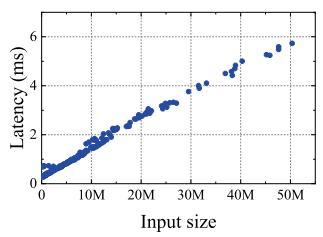

<details>
<summary>scatter</summary>

| Input size | Latency (ms) |
| ---------- | ------------ |
| 0          | 0            |
| 10M        | 2            |
| 20M        | 3            |
| 30M        | 4            |
| 40M        | 5            |
| 50M        | 6            |
</details>

(a) Pooling.

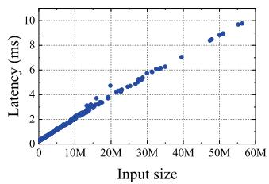

<details>
<summary>scatter</summary>

| Input size | Latency (ms) |
| ---------- | ------------ |
| 0          | 0            |
| 10M        | 2            |
| 20M        | 4            |
| 30M        | 6            |
| 40M        | 8            |
| 50M        | 9            |
| 60M        | 10           |
</details>

(b) ReLu.   
Fig. 6. The latency pattern of pooling and ReLu.

fully utilized.

$$
k _ {c o} = \frac {f _ {2}}{f _ {1}} = \frac {\left[ \left(a _ {c o} + n _ {c o} + 1\right) s _ {c o} \right] f _ {0}}{\left[ a _ {c o} + n _ {c o} s _ {c o} \right] f _ {0}} \tag {3}
$$

$$
\frac {s _ {c o}}{a _ {c o}} = \frac {k _ {c o} - 1}{1 + n _ {c o} - n _ {c o} k _ {c o}} \tag {4}
$$

The latency under the nth step of $C _ { o u t }$ can be represented as

$$
\begin{array}{l} f = (a _ {c o} + n s _ {c o}) f _ {0} = \frac {a _ {c o} + n s _ {c o}}{a _ {c o} + n _ {c o} s _ {c o}} \cdot (a _ {c o} + n _ {c o} s _ {c o}) f _ {0} \\ = \frac {1 + n \frac {s _ {c o}}{a _ {c o}}}{1 + n _ {c o} \frac {s _ {c o}}{a _ {c o}}} \cdot (a _ {c o} + n _ {c o} s _ {c o}) f _ {0} = \frac {1 + n \frac {s _ {c o}}{a _ {c o}}}{1 + n _ {c o} \frac {s _ {c o}}{a _ {c o}}} \cdot f _ {1} \tag {5} \\ \end{array}
$$

Therefore, $T _ { c o }$ can be denoted as

$$
T _ {c o} = \frac {f}{f _ {1}} = \frac {1 + \lceil \frac {C _ {o u t}}{l _ {c o}} - 1 \rceil \frac {s _ {c o}}{a _ {c o}}}{1 + n _ {c o} \frac {s _ {c o}}{a _ {c o}}} \tag {6}
$$

where ${ l } _ { c o }$ is the step length of $C _ { o u t } .$ . In a similar manner, $T _ { H }$ and $T _ { W }$ can be calculated.

Unlike other operators, the configuration values of K and S are limited, only a few values are used in applications. Therefore, only the basic latency patterns with K and S used in the target model are needed to be measured.

For pooling operators, which only have configuration dimensions of $C _ { i n } , H$ and W , the inference latency can be predicted in the same method. The only difference is that the latency patterns of the three configuration dimensions are linear instead of staircase shapes. Therefore, the impact factors can be merged together, which represents that the latency of pooling is proportional to the product of $C _ { i n } , H$ , and W , as shown in Fig. 6(a).

Elementwise Operator: Elementwise operators conduct the same operations for each input element. For example, the ReLu operator applies a function to each input element, and the batch normalization operator normalizes each element with the same parameters. The characteristic of the elementwise operator means that there are no other configuration dimensions except input data size, and the inference latency is proportional to it, as illustrated in Fig. 6(b).

# B. Latency Fusion Fine-Tuning

Instead of predicting the latency of model blocks with a complicated machine learning (ML) model, ASAP fine-tunes the latency of operators. Without learning the structure details of the DL model, we use a very small model, with only 16 neurons in the hidden layer, to learn the fusion rules of deep learning framework runtime, as shown in Fig. 7.

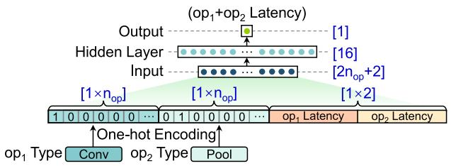

<details>
<summary>flowchart</summary>

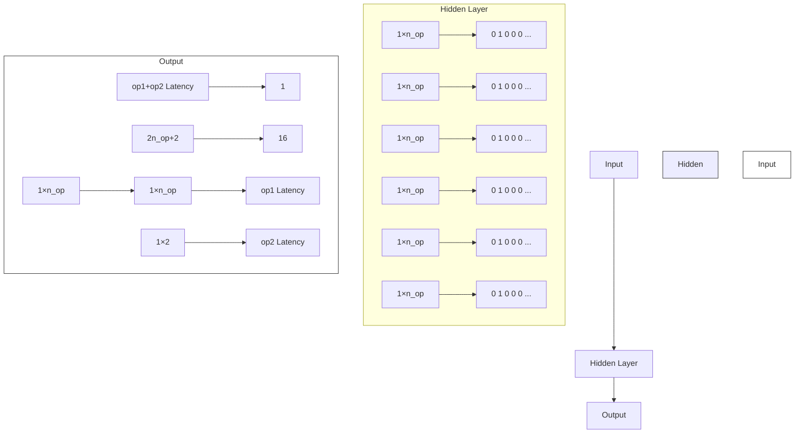
</details>

Fig. 7. The training of latency fusion fine-tuner.

With respect to the training of latency fusion fine-tuner, we collect a latency dataset of various fusible operator pairs with more than 10,000 samples. It is considered that operator 1 and operator 2 are fusible if the inference latency follows the inequation below.

$$
t _ {o p 1} + t _ {o p 2} - t _ {<   o p 1, o p 2 >} > \beta \cdot \min \left(t _ {o p 1}, t _ {o p 2}\right) \tag {7}
$$

where $t _ { o p 1 }$ is the inference latency of operator 1, and $t _ { < o p 1 , o p 2 > }$ is the inference latency of continuous operators, and $\beta$ is the decision threshold (0.5 in our experiment). Note that two fusible operators can also be regarded as a new operator until no fusion happens. We encode the operator pairs with one-hot encoding, and concatenate them with the latency of two operators, which generates training data with $2 n _ { o p } + 2$ elements, where $n _ { o p }$ is the number of operator types in the dataset, and the fused latency of $< o p _ { 1 } , o p _ { 2 } >$ is extracted as labels to train the small model.

The advantage of the proposed predictor is that, it considers the operator fusion optimization of DL frameworks, which achieves higher prediction accuracy than operator-grain predictors. In addition, through decomposing the model-grain prediction into operator-level prediction and performance fine-tuning, the proposed predictor greatly reduces prediction complexity, and achieves higher prediction efficiency than other model-grain predictors like nn-meter (the corresponding evaluation results are presented in Section VIII-D).

# VI. ADAPTIVE INTER-UAV DATA COMPRESSOR

Communication resources between UAVs are limited due to the energy and payload limitations of UAVs. The transmission of large intermediate data between UAVs may affect the computing efficiency of the collaborative system, especially for the unstable communication in UAV swarm. To further improve the efficiency of UAV collaborative computing, we compress the intermediate data in the transmission process instead of model compression, which has a smaller impact on the DL model inference.

In detail, we compress the intermediate data transmitted between UAVs with 8-bit quantization and typical lossless compression algorithms (gzip algorithm in the experiments). The 8-bit quantization can convert floating-point data into 8-bit fixedpoint data, which greatly reduces the data amount and makes data more organized. The reason for using 8-bit quantization is that, 8-bit quantization achieves the best balance between data size and inference accuracy compared with other quantization levels.

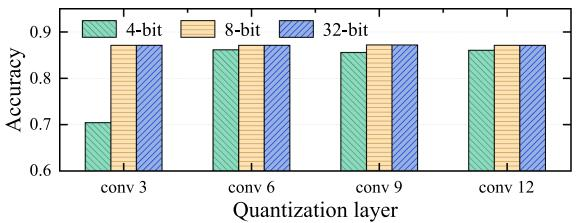

<details>
<summary>bar</summary>

| Quantization layer | 4-bit | 8-bit | 32-bit |
| ------------------ | ----- | ----- | ------ |
| conv 3             | 0.70  | 0.87  | 0.87   |
| conv 6             | 0.86  | 0.87  | 0.87   |
| conv 9             | 0.85  | 0.87  | 0.87   |
| conv 12            | 0.86  | 0.87  | 0.87   |
</details>

Fig. 8. Inference accuracy under different quantization levels of VGG16.

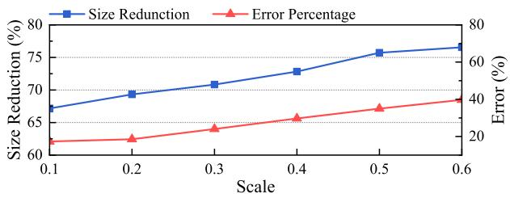

<details>
<summary>line</summary>

| Scale | Size Reduction (%) | Error (%) |
|-------|---------------------|---------|
| 0.1   | 67                  | 20      |
| 0.2   | 69                  | 22      |
| 0.3   | 71                  | 25      |
| 0.4   | 73                  | 28      |
| 0.5   | 76                  | 32      |
| 0.6   | 77                  | 35      |
</details>

Fig. 9. Data size reduction and error percentage of a random data tensor under different quantization scales.

As illustrated in Fig. 8, 8-bit quantization nearly achieves the same level of inference accuracy with 32-bit quantization while reducing 75% of data size, and 4-bit quantization will introduce a severe accuracy loss. In addition, the 8-bit quantization is commonly supported by normal devices and DL frameworks (e.g., PyTorch, TensorFlow), while 4-bit quantization requires special hardware support. Considering that the organized data has more compression space, we further process the quantized data with typical lossless compression algorithms, which makes the combination of 8-bit quantization and lossless compression algorithms perform better than using them separately.

In the 8-bit quantization, the quantization scale determines the compression grain, i.e., the larger quantization scale needs less valid data to represent the original data. Nevertheless, a large quantization scale may affect the inference accuracy of the DL model. As illustrated in Fig. 9, as the data size decreases, the error between compressed data and raw data also increases, with larger quantization scales.

Note that the communication rate between UAVs is dynamic, we propose an adaptive compression algorithm to adapt to the unstable inter-UAV communication status while ensuring inference accuracy. Considering that data size and communication rate both determine the delay of data transmission, e.g., the transmission latency may be long for a large data size, even if the communication quality is good. The algorithm can compress the inter-UAV inference data with a series of quantization scales according to the communication rate and transmission data size between UAVs. In detail, it calculates the ratio of the data size to the inter-UAV communication rate (collected by the system at the regular time, and the technical details are introduced in Section VII-B.) before each data transmission, and compares the ratio with a set of thresholds, where each threshold represents one quantization scale. In general, the adaptive inter-UAV inference data compressor maintains the computing efficiency of ASAP under the dynamic communication quality in the UAV swarm, while ensuring the inference accuracy.

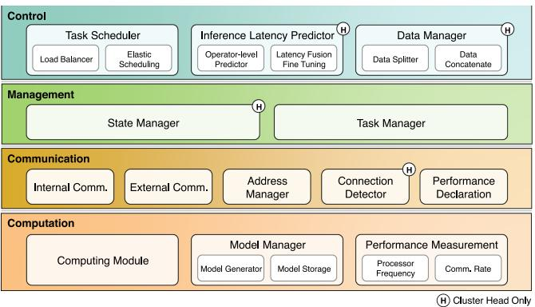

<details>
<summary>flowchart</summary>

```mermaid
graph TD
    A["Control"] --> B["Task Scheduler"]
    A --> C["Inference Latency Predictor"]
    A --> D["Data Manager"]
    B --> E["Load Balancer"]
    B --> F["Elastic Scheduling"]
    C --> G["Operator-level Predictor"]
    C --> H["Latency Fusion Fine Tuning"]
    D --> I["Data Splitter"]
    D --> J["Data Concatenate"]
    K["Management"] --> L["State Manager"]
    K --> M["Task Manager"]
    N["Communication"] --> O["Internal Comm."]
    N --> P["External Comm."]
    N --> Q["Address Manager"]
    N --> R["Connection Detector"]
    N --> S["Performance Declaration"]
    T["Computation"] --> U["Computing Module"]
    T --> V["Model Manager"]
    T --> W["Performance Measurement"]
    T --> X["Processor Frequency"]
    T --> Y["Comm. Rate"]
    Z["H Cluster Head Only"] --> AA
```
</details>

(a) System module composition.

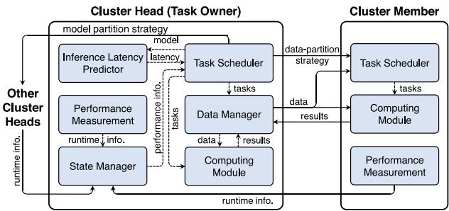

<details>
<summary>flowchart</summary>

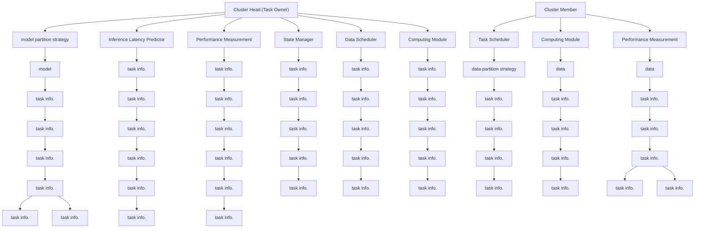
</details>

(b) System module relationship.   
Fig. 10. System module design.

# VII. IMPLEMENTATION

The self-developed system consists of over 4,000 lines of Python code, and we have open sourced our work at https: //github.com/snhao222/ASAP. This section will introduce some technique details in engineering.

# A. System Module Design

The module composition of the system is shown in Fig. 10(a). We classify modules into four categories: Control, Management, Communication, and Computation. Control modules are responsible for task scheduling and data allocation. Management modules are in charge of data organization and maintenance. Communication modules are middlewares for communication management between UAVs and information transmission between modules. Computation modules handle work related to computing. It is noted that modules do not exchange information and data directly, but through the internal communication module, which ensures orderly communications between modules by unifying communication interfaces.

The relationship between main modules is illustrated in Fig. 10(b). Each UAV in the swarm is deployed with a performance measurement module to measure the communication and computing performance of UAVs, and the runtime information is collected by the state manager of cluster heads to perform elastic task scheduling. The task scheduler of task publisher UAV controls the model partition strategy and sends it to other cluster heads, and the task scheduler of cluster heads is responsible for generating data partition strategy and send to cluster members in the cluster. The data manager controls the flow of data, and distributes data partitions to the computing module for local computing and concatenates results returned from cluster members.

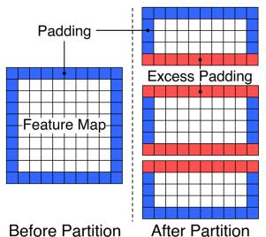

<details>
<summary>text_image</summary>

Padding
Feature Map
Before Partition
Excess Padding
After Partition
</details>

(a) Padding in data partition.

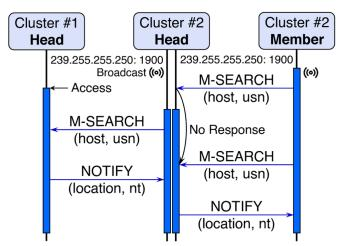

<details>
<summary>flowchart</summary>

```mermaid
graph TD
    A["Cluster #1 Head"] -->|239.255.255.250: 1900 Broadcast (*)| B["Cluster #2 Head"]
    B -->|239.255.255.250: 1900 M-SEARCH (host, usn)| C["Cluster #2 Member"]
    C -->|No Response| B
    B -->|M-SEARCH (host, usn)| A
    A -->|NOTIFY (location, nt)| B
    B -->|NOTIFY (location, nt)| C
```
</details>

(b) UAV access protocol.   
Fig. 11. Padding in data partition and UAV access protocol.

# B. Implementation Tricks

Padding in Data Partition: Some layers in DL models padding zeros around feature maps to increase the perception of boundary information. However, as illustrated in Fig. 11(a), the padding operation after data partition introduces some useless information to the feature map, which affects the perception capability of DL models. To ensure the information perception ability after data partition, we customize padding strategies for DL model layers on each UAV, which are automatically generated online. In detail, when a task is received by a UAV, the model generator in the model manager will calculate the intermediate data range for each layer with the MRT algorithm, and compare the data range with the boundaries of each layer. As long as the data range exceeds the boundary, the padding of the corresponding side will be set to zero, and this process will be repeated until the entire model is traversed iteratively.

UAV Access Technique: In the proposed system, any UAV joining the swarm can be discovered automatically by other UAVs and exchange identity information with each other. The UAV access function is based on SSDP protocol (Simple Service Discovery Protocol), which allows devices to broadcast messages on a reserved address (i.e., 239.255.255.250: 1900). As shown in Fig. 11(b), two kinds of messages are used to discover joined UAVs. 1) M-SEARCH message: This message contains the host address and the unique service name (‘usn’ in short) with cluster information and UAV number. 2) NOTIFY message: This message contains the location (i.e., UAV local address) and the notification type (‘nt’ in short) with UAV information. When a UAV joins the swarm, the M-SEARCH message will be broadcast periodically, and the related UAVs will respond to the message with a NOTIFY message in unicast mode. It is noted that the UAV discovery not only occurs in the UAV cluster but also between cluster heads of different clusters.

UAV Status Monitoring: For elastic scheduling, detecting the change of UAV status in time is crucial. Therefore, a state manager is deployed to manage the connection status of UAVs. For each cluster member, a live announcement message is sent to the cluster head periodically with a dedicated port to show the connection status of the UAV. The alive announcement message is very small, and we set the sending period to 2 seconds to reduce communication overhead. In addition, a timer is set to judge the disconnection of UAVs. The count of the timer will be decreased when not receiving the announcement message and reset after receiving the message. It is noted that not only the status of cluster members can be detected, but the cluster head can be monitored by other cluster heads.

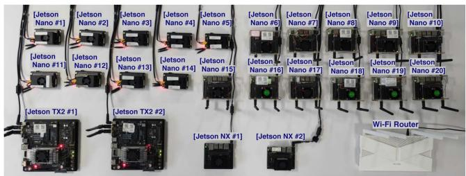

<details>
<summary>text_image</summary>

[Jetson Nano #1]
[Jetson Nano #2]
[Jetson Nano #3]
[Jetson Nano #4]
[Jetson Nano #5]
[Jetson Nano #6]
[Jetson Nano #7]
[Jetson Nano #8]
[Jetson Nano #9]
[Jetson Nano #10]
[Jetson Nano #11]
[Jetson Nano #12]
[Jetson Nano #13]
[Jetson Nano #14]
[Jetson Nano #15]
[Jetson Nano #16]
[Jetson Nano #17]
[Jetson Nano #18]
[Jetson Nano #19]
[Jetson Nano #20]
[Jetson TX2 #1]
[Jetson TX2 #2]
[Jetson NX #1]
[Jetson NX #2]
Wi-Fi Router
</details>

(a) 24 UAV airborne computers through Wi-Fi connection.

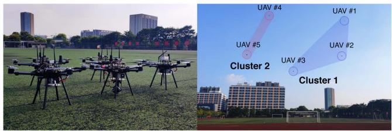

<details>
<summary>text_image</summary>

UAV #4
UAV #1
UAV #5
UAV #2
Cluster 2
UAV #3
Cluster 1
</details>

(b) 5 real-world UAVs through Ad-hoc connection.   
Fig. 12. Evaluation testbed. The indoor experiments are conducted on 24 UAV airborne computers, and the outdoor experiments are conducted on 5 real-world UAVs.

Inter-UAV Communication Rate Measurement: Because a UAV in the swarm typically needs to communicate with multiple UAVs simultaneously, the communication rate between UAVs is usually not equal to the total communication rate. To this end, the proposed system records the communication time during each communication, and the current inter-UAV communication rate is calculated by the ratio of data volume to communication time. In detail, the inter-UAV communication rate R is updated by the following formula, which uses a coefficient α to smooth extreme data. Note that α is an empirical parameter. Generally, the larger the value of α, the more sensitive the R is to the current measured communication rate $R _ { n e w }$ , which may affect the stability of the system, and the value is 0.2 in our evaluation.

$$
R = R _ {n e w} \cdot \alpha + R _ {o l d} \cdot (1 - \alpha) \tag {8}
$$

# VIII. PERFORMANCE EVALUATION

# A. Evaluation Setup

We have deployed ASAP on 24 UAV airborne computers, including 20 Jetson Nano, 2 Jetson Xavier TX2, and 2 Jetson Xavier NX (20 Jetson Nano are used to evaluate system performance under different number of nodes, 7 Jetson Nano, 2 Jetson Xavier TX2, and 2 Jetson Xavier NX are used to construct a heterogeneous device testbed), and the devices communicate with each other through a WiFi network, as shown in Fig. 12(a). Besides, the ASAP has also been deployed on 5 real-world UAVs, which are equipped with 4 Jetson Nano and 1 Jetson

NX, and the UAVs transmit data through the Ad hoc modules on UAVs, as illustrated in Fig. 12(b).

Compared Systems: We compare the performance of ASAP against three kinds of works.

1) Raw data offloading: This kind of work transmits the raw data collected by edge devices to the edge server or cloud server for processing. In the UAV scenario, the data generated on the UAV is transmitted to the ground station, and the inference results are sent back to the UAV for decision-making. In the experiment, we use a computer equipped with an NVIDIA RTX 3060 GPU as the ground station to process the data transmitted by a UAV.   
2) Edge-device collaborative computing: This kind of work partitions DL models between edge device and server to improve end-to-end latency and server throughput. In the evaluation experiment, we select Neurosurgeon [33] as a baseline, which is one of the state-of-the-art edge-device collaborative computing systems.   
3) Existing terrestrial collaborative edge computing: We compare ASAP with two state-of-the-art collaborative edge computing systems designed for terrestrial IoT systems.

\- DeepSlicing [44]: DeepSlicing partitions the entire DL model into submodels with equal length, and distributes the input data to every device (we set the submodel number to 4 in our experiment). Note that different from ASAP, it uses all the nodes to compute a submodel, and the submodels are computed in sequence, without the acceleration of the model pipeline.

\- MoDNN [42]: MoDNN also partitions the input data of submodels to all the nodes. Differently, it considers every convolution layer combined with the subsequent non-overlapping layer structures (e.g., ReLu, pooling, normalization, etc.) as a submodel task.

DL Models: We evaluate the performance of ASAP with 3 medium DL models and 3 large DL models, which are classified according to the model size.

1) Medium DL model: We select 3 typical medium DL models widely used in intelligent algorithms to evaluate the performance of ASAP (i.e., VGG16, ResNet34, and DarkNet19). VGG is a classic model used as the backbone in detection algorithms like Faster R-CNN and SSD, and ResNet is a model consisting of residual blocks, and DarkNet is the backbone of YOLOv2. Note that because the MoDNN is not designed for models with residual connection, we only deploy VGG16 and DarkNet19 models on MoDNN.   
2) Large DL model: Three ResNet models (i.e., ResNet50, ResNet101, and ResNet152.) are used as typical large DL models. The inference of large DL models imposes a significant burden on the embedded devices, and even cannot be completed due to resource limitations.

Source Data: We use a video as the source data to evaluate the inference performance of three systems. Due to the fact that the computing cost of a task is not only determined by the model size, but also by the size of the input data, we convert the source data into three levels of resolution to represent different workloads: 1) high resolution (720 × 1280), 2) medium resolution (540 × 960), and 3) low resolution (180 × 320). The resolution level of the task is determined by the computing capability of the UAV swarm.

# B. Overall Performance

We first evaluate the latency performance of ASAP against two data offloading works and two collaborative edge computing systems. In addition, the computing and memory overhead of ASAP is measured to evaluate the cost-reducing ability.

ASAP versus Raw data offloading versus Edge-device collaborative computing (Neurosurgeon): Table III compares the average inference latency of ASAP with two types of data offloading works. The average latency is measured by dividing the total latency of N tasks by N , where the total latency is the duration of time from the moment the first task starts executing to the moment the Nth task is completed, and the value of N is set to 100 in the experiments. For the data offloading systems, a UAV equipped with a Jetson Nano is used to offload data to the ground station at three heights (i.e., 20 m, 50 m, and 100 m). For ASAP, the average inference latency with the collaboration of a different number of UAV airborne computers (Jetson Nano) is measured, ranging from 4 to 20. Considering that the ground station has strong computing power, we select three large DL models and high-resolution source data to evaluate the ability of ASAP to handle tasks with high computation costs.

The results in Table III show that ASAP can perform DL model computing with a higher speed than data offloading works, even with only 4 nodes. This is because the long transmission latency dominates the entire inference latency of data offloading works, even if the computation speed of the ground station is high. In contrast, ASAP performs task computing near the data source, which greatly reduces the transmission latency and improves the computation speed in a collaborative way.

As shown in the table, the inference latency can be reduced when the number of collaboration nodes increases, e.g., the inference latency of ResNet152 is decreased by 43.1% with the collaboration of 20 nodes compared with 4 nodes. However, there is a limit to the improvement of collaborative computing speed, and the computing efficiency may be affected when excessive nodes are included, because the computing overhead shared by each node is decreasing, and more interaction overhead will be included when the number of nodes increases. It is noted that the larger the computational workload a task has, the more nodes can be used to improve the inference speed, e.g., the inference latency continues to decrease when the node number increases from 4 to 20, but the inference latency of ResNet101 and ResNet50 rebounds again when the number of participating nodes increases to 20 and 16 respectively.

ASAP versus Existing Terrestrial Collaborative Edge Computing: Fig. 13 compares the average computing latency of ASAP with DeepSlicing and MoDNN under three medium DNN models. Note that Deepslicing and MoDNN are designed for terrestrial IoT systems and not suitable for UAV swarm, we enable communication between all nodes for the two systems. We set up two scenarios for the evaluation: 11 UAV airborne computers (7 Jetson Nano, 2 Jetson NX, and 2 Jetson TX2), and 5 real-world UAVs. For both scenarios, the tasks are generated on a Jetson Nano, and the computing tasks are completed with the assistance of other devices. Note that MoDNN considers each convolution layer as a task, and is not designed for DL models with residual structure, the ResNet is not within the experiment scope of MoDNN. Considering the different node scales, we select the medium resolution source data for 11 UAV airborne computers scenario and low resolution for 5 real-world UAVs scenario.

TABLE III INFERENCE LATENCY OF ASAP COMPARED WITH RAW DATA OFFLOADING AND EDGE-DEVICE COLLABORATIVE COMPUTING (NEUROSURGEON) 

<table><tr><td rowspan="2">Task</td><td rowspan="2">On-board</td><td colspan="3">Raw Data Offloading</td><td colspan="3">Neurosurgeon</td><td colspan="5">ASAP (Ours)</td></tr><tr><td>20m</td><td>50m</td><td>100m</td><td>20m</td><td>50m</td><td>100m</td><td>4 nodes</td><td>8 nodes</td><td>12 nodes</td><td>16 nodes</td><td>20 nodes</td></tr><tr><td>ResNet152</td><td>—*</td><td>5.75</td><td>5.79</td><td>5.91</td><td>7.19</td><td>13.21</td><td>14.36</td><td>2.32</td><td>2.07</td><td>1.82</td><td>1.65</td><td>1.32</td></tr><tr><td>ResNet101</td><td>—</td><td>5.28</td><td>5.63</td><td>5.87</td><td>7.07</td><td>12.12</td><td>12.67</td><td>2.13</td><td>1.39</td><td>1.17</td><td>0.93</td><td>1.13</td></tr><tr><td>ResNet50</td><td>1.72</td><td>5.26</td><td>5.41</td><td>5.69</td><td>6.09</td><td>7.87</td><td>8.63</td><td>1.28</td><td>0.96</td><td>0.75</td><td>0.94</td><td>1.03</td></tr></table>

All data inthetableisinseconds (s).\*indicates thetaskcannotberunbecauseof theresource limitationsof the device.

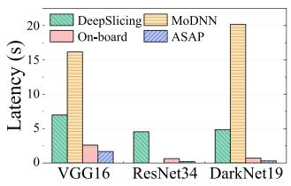

<details>
<summary>bar</summary>

| Model     | DeepSlicing | MoDNN | On-board | ASAP |
| --------- | ----------- | ----- | -------- | ---- |
| VGG16     | 7           | 17    | 2        | 1    |
| ResNet34  | 4           | 0     | 1        | 0    |
| DarkNet19 | 5           | 20    | 1        | 0    |
</details>

(a)11 UAV airborne computers.

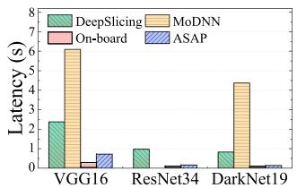

<details>
<summary>bar</summary>

| Model     | DeepSlicing | MoDNN | On-board | ASAP |
|-----------|-------------|-------|----------|------|
| VGG16     | 2.5         | 6.0   | 0.5      | 0.8  |
| ResNet34  | 1.0         | 0.2   | 0.1      | 0.1  |
| DarkNet19 | 0.8         | 4.5   | 0.1      | 0.1  |
</details>

(b) 5 real-world UAVs.

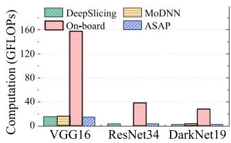

<details>
<summary>bar</summary>

| Model     | DeepSlicing | MoDNN | On-board | ASAP |
|-----------|-------------|-------|----------|------|
| VGG16     | 20          | 20    | 160      | 20   |
| ResNet34  | 5           | 5     | 40       | 5    |
| DarkNet19 | 5           | 5     | 30       | 5    |
</details>

(a) Computing overhead.

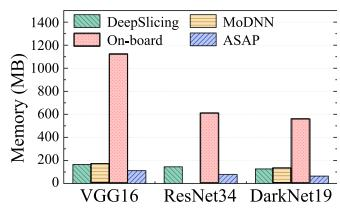

<details>
<summary>bar</summary>

| Model    | DeepSlicing | MoDNN | On-board | ASAP |
| -------- | ----------- | ----- | -------- | ---- |
| VGG16    | 150         | 150   | 1100     | 100  |
| ResNet34 | 150         | 150   | 600      | 50   |
| DarkNet19| 150         | 150   | 550      | 50   |
</details>

(b) Memory overhead.   
Fig. 13. Latency performance of ASAP compared with DeepSlicing, MoDNN, and on-board computing.   
Fig. 14. Average system overhead per node of ASAP compared with Deep-Slicing, MoDNN, and on-board computing.

As shown in Fig. 13, our system keeps the computing latency at a low level in contrast with two baseline systems in both scenarios. In the 11 UAV airborne computers scenario, ASAP can reduce the computing latency by up to 95.35% than Deep-Slicing, and up to 98.50% than MoDNN. In the 5 real-world UAVs scenario, ASAP reduces the computing latency by up to 83.37% and 96.84% in corresponding to DeepSlicing and MoDNN.

The reason why DeepSlicing and MoDNN show poor latency performance in the experiments is that, both systems regard a subset of the DL model as a computing task. They partition the input data to each participant device for collaborative computing and concatenate results back. The entire model is split into several submodels, which are computed in sequence. Although the data parallel paradigm can decrease the overall computing time, data transmission latency is added in each submodel computing, which affects the speed of inference. For MoDNN, it creates more submodels than DeepSlicing, which increases the transmission latency. In contrast, ASAP deploys the model pipeline to mitigate the influence of communication overhead on the overall latency while increasing the inference speed by data partition.

ASAP versus On-Board Computing: As shown in Table III, some large DL models (i.e., ResNet152 and ResNet101) cannot be computed onboard due to the resource limitations of the device, while ASAP is able to process the computing tasks by distributing them to several nodes and achieve a high computing speed. For medium DL models can be computed onboard, as illustrated in Fig. 13, even if the longer communication latency sacrifices collaborative computing speed to a certain degree in 5 real-world UAVs scenario, ASAP keeps the computing latency at the same level with on-board computing, much lower than DeepSlicing and MoDNN. However, when it comes to the system overhead, as shown in Fig. 14, ASAP reduces the computing and memory overhead per node by up to 90.56% and 90.02%, respectively, which greatly releases the burden of a single device.

Although DeepSlicing and MoDNN show worse latency performance compared with on-board computing, it does not mean that they do not have latency advantages in any situation. In detail, they are more suitable for very weak devices, where the computing latency is much higher than transmission latency, not for the GPU enabled devices in our experiment, and ASAP can achieve more performance gain on these devices. However, given the recent development of UAV intelligent applications, we think it is a trend to deploy embedded devices with computation accelerators on UAVs.

Computing and Memory Overhead: We evaluate the computing overhead with the metric of floating point operations (FLOPs). For the memory overhead, we add up the memory footprints of model parameters and all the intermediate data generated during inference. The system overhead of all the nodes in the experiment is measured, and the numerical averages are calculated to represent the average node overhead.

Fig. 15 compares the average node computing and memory overhead of ASAP with different numbers of collaboration nodes under three large DL models. Generally, the computing cost and memory usage continue to decrease with the increase of node number. In detail, the cost decreases rapidly when the number of nodes is small and slows down with more nodes. That is because the computing and memory overhead of each node tends to be saturated, and more computing and memory costs can be shared with the increase of node number. But when the number of nodes is sufficient, the overhead that can be shared is decreased, and the redundant computing also adds overhead when there are too many nodes.

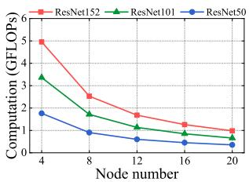

<details>
<summary>line</summary>

| Node number | ResNet152 | ResNet101 | ResNet50 |
| ----------- | --------- | --------- | -------- |
| 4           | 5.0       | 3.5       | 2.0      |
| 8           | 2.5       | 1.5       | 1.0      |
| 12          | 1.5       | 1.0       | 0.7      |
| 16          | 1.0       | 0.7       | 0.5      |
| 20          | 0.7       | 0.5       | 0.3      |
</details>

(a) Computing overhead.

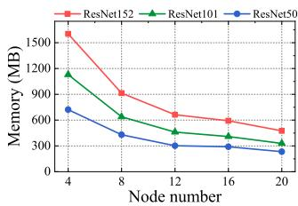

<details>
<summary>line</summary>

| Node number | ResNet152 (MB) | ResNet101 (MB) | ResNet50 (MB) |
|---|---|---|---|
| 4 | 1550 | 1180 | 670 |
| 8 | 900 | 620 | 380 |
| 12 | 650 | 480 | 300 |
| 16 | 600 | 420 | 290 |
| 20 | 550 | 380 | 270 |
</details>

(b) Memory overhead.

Fig. 15. Average system overhead per node when computing an inference task.   
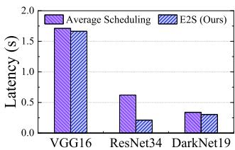

<details>
<summary>bar</summary>

| Model | Average Scheduling (s) | E2S (Ours) (s) |
| :--- | :--- | :--- |
| VGG16 | 1.7 | 1.65 |
| ResNet34 | 0.6 | 0.2 |
| DarkNet19 | 0.35 | 0.3 |
</details>

(a) E2S vs. average scheduling.

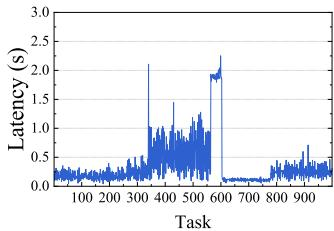

<details>
<summary>line</summary>

| Task | Latency (s) |
| ---- | ----------- |
| 100  | 0.3         |
| 200  | 0.4         |
| 300  | 0.5         |
| 400  | 2.1         |
| 500  | 1.2         |
| 600  | 2.3         |
| 700  | 0.1         |
| 800  | 0.3         |
| 900  | 0.5         |
</details>

(b) Unstable node connection.   
Fig. 16. Performance of E2S scheduling.

# C. Performance of Elastic Efficient Scheduler

Task Scheduling Performance: To demonstrate the effectiveness of the elastic efficient scheduler (E2S), we set up a comparative experiment on 11 heterogeneous airborne computers (7 Jetson Nano, 2 Jetson TX2, and 2 Jetson NX), in which the E2S is replaced with an average scheduler. The average scheduler distributes computing tasks evenly to each node.

Fig. 16(a) compares the overall latency performance of ASAP with E2S and the average scheduler. In general, the system with E2S shows higher computing efficiency than the average scheduler, which reduces the average inference latency by 2.8%∼66.0%. This is because E2S can allocate workload based on the capabilities of clusters and nodes inside.

Elastic Scheduling Performance: To better evaluate the adaptive ability of ASAP under an unstable node connection, we set up an extreme experimental scenario, in which the communication of one cluster head is cut off during a collaborative computing task. The breakdown of the cluster head means all the cluster members inside can not obtain intermediate data and are unable to participate in the collaborative computing procedure. After that, the communication of that cluster head is recovered, which is the same as the initial situation.

Fig. 16(b) illustrates the computing latency of a sequence of inference tasks. Even if a cluster becomes suddenly unavailable during the collaborative computing procedure, the computing of new tasks is not interrupted. On the contrary, the computing latency of new tasks only increases slightly. This is because ASAP can detect the situation of node disconnection, and E2S reschedules tasks within the remaining nodes immediately. When the cluster head becomes available again, the computing latency of the tasks returns to the previous level. This is owe to the elastic scheduling of E2S when detecting the connection recovery. We further evaluate the rescheduling latency of E2S. As shown in Table IV, the rescheduling latency under three tasks remains within 1 second, which is low enough to ensure that tasks can be allocated in a timely manner.

TABLE IV RESCHEDULING LATENCY OF ELASTIC EFFICIENT SCHEDULER 

<table><tr><td>Task</td><td>Rescheduling latency (ms)</td></tr><tr><td>VGG16</td><td>989.30</td></tr><tr><td>ResNet34</td><td>415.58</td></tr><tr><td>DarkNet19</td><td>616.05</td></tr></table>

# D. Performance of Lightweight Accurate DL Inference Performance Predictor

In this section, we evaluate the accuracy and efficiency performance of the light-weight accurate DL inference performance predictor, which are two primary performance metrics for the scheduler of ASAP. The prediction accuracy of the predictor determines the effectiveness of task scheduling, and the prediction efficiency affects the real-time performance of scheduling.

Prediction Accuracy: We evaluate the accuracy performance of the predictor in ASAP from two aspects: operator-level prediction and block-level prediction. As a comparison, we select the FLOPs-based latency prediction method as a baseline, which predicts the operator-level inference latency with a linear model trained by FLOPs and corresponding latency, and adds them up to obtain the inference latency of DL models.

For the operator-level latency prediction, we select four representative operators, wherein Conv and Pool are typical convolution-like operators, and ReLu and Batch normalization (Bn) are elementwise operators. To train the latency fusion finetuner, we measured and generated a test dataset of 2,000 operator configurations and corresponding latency. The test dataset is measured in the TensorRT framework, and the configurations of operators are generated randomly.

Fig. 17(a) shows the operator-level accuracy performance of the latency predictor in ASAP compared with the FLOPs-based method. In general, the operator-level prediction accuracy of our system outperforms the FLOPs-based method. For convolutionlike operators, our predictor shows higher prediction accuracy and outperforms the FLOPs-based method by 34.35% and 28.39% on Conv and Pool operators, respectively. That is because FLOPs is not a direct influence factor to the inference latency of convolution-like operators. In contrast, our predictor predicts the operator-level latency according to the configurations of operators, which increases the prediction accuracy. For elementwise operators, the prediction accuracy of our predictor can reach up to 95%, which is high enough. It is noted that because the latency of elementwise operators is exactly linear with FLOPs, the FLOPs-based method shows similar prediction accuracy to our predictor.

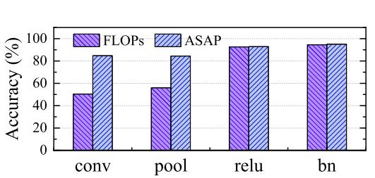

<details>
<summary>bar</summary>

| Layer | FLOPs (%) | ASAP (%) |
| :--- | :--- | :--- |
| conv | 50 | 85 |
| pool | 55 | 84 |
| relu | 92 | 91 |
| bn | 93 | 93 |
</details>

(a) Operator-level inference latency prediction.

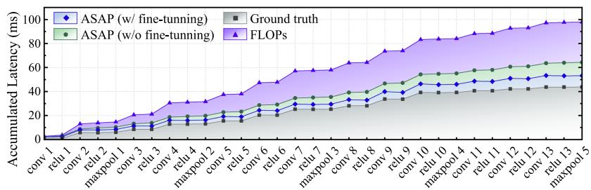  
(b) Block-level inference latency prediction.   
Fig. 17. Prediction accuracy of neural network inference latency predictor.

TABLE VPREDICTION LATENCY OF LIGHTWEIGHT ACCURATE PREDICTOR VERSUSNN-METER

<table><tr><td rowspan="2">Predictor</td><td colspan="3">Prediction Latency (ms)</td></tr><tr><td>VGG16</td><td>ResNet34</td><td>DarkNet19</td></tr><tr><td>ASAP</td><td>12.3</td><td>28.0</td><td>13.7</td></tr><tr><td>nn-Meter</td><td>292326.3</td><td>15530.9</td><td>9057.6</td></tr></table>

For DL model latency prediction, we train a latency fusion fine-tuner to learn the fusion rules of operators. In detail, the fine-tuner is a very small shallow neural network with a hidden layer containing 16 neurons, and the model is trained on an Adam optimizer with 60 epochs. The training dataset has 6,000 samples generated in the TensorRT framework. In the experiment, we predict the inference latency of a VGG16 model with the latency fusion fine-tuner. In comparison, we predict the latency of the same model with the FLOPs-based method and our predictor without fine-tuning. As illustrated in Fig. 17(b), the prediction error between the FLOPs-based method and ground truth is especially high, and the error accumulates when the number of operators increases, which can reach up to 123.8%. This is because the operator-level prediction accuracy of the FLOPs-based method is low, and it ignores the impact of operator fusion, which further sacrifices the prediction accuracy. In contrast, based on the accurate operator-level prediction, our predictor reduces the error by 76.8%, even without fusion fine-tuning. In addition, with the aid of the latency fusion fine-tuner, the prediction error can be further decreased by 25.4%.

Prediction Efficiency: We evaluate the efficiency of the predictor from the metric of prediction speed. For comparison, nn-Meter is selected as a baseline. nn-Meter [48] is a state-ofthe-art DL inference latency prediction work, which predicts the latency of DL models with a random forests model. The prediction latency is measured on a Jetson Nano, which serves as a cluster head in the experiments.

Table V lists the prediction latency of our predictor and nn-Meter on three DL models. Overall, our predictor shows less prediction latency than nn-Meter on three models, which reduces latency by 82.0%∼99.6%. While the prediction latency of our predictor maintains at the millisecond level, nn-Meter spends tens of seconds predicting a DL model. This is because the prediction model in nn-Meter is complex to learn the latency behavior of different structures. In contrast, attributed to the small model, our predictor is lightweight enough to achieve high efficiency. It is noted that the prediction of VGG16 tasks nn-Meter almost 5 minutes, which is much longer than other DL models. This is because approximately 3.8 GB of memory overhead is generated during prediction, which almost reaches the memory limit of the device.

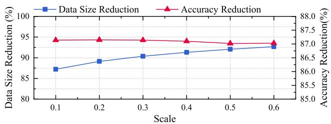

<details>
<summary>line</summary>

| Scale | Data Size Reduction (%) | Accuracy Reduction (%) |
|-------|--------------------------|------------------------|
| 0.1   | 87.0                     | 87.5                   |
| 0.2   | 89.0                     | 87.5                   |
| 0.3   | 90.0                     | 87.5                   |
| 0.4   | 91.0                     | 87.5                   |
| 0.5   | 92.0                     | 87.0                   |
| 0.6   | 93.0                     | 87.0                   |
</details>

Fig. 18. Data size reduction and accuracy reduction under different quantization scale.

# E. Performance of Adaptive Inter-UAV Data Compressor

Finally, we evaluate the impact of the adaptive inter-UAV inference data compressor on intermediate data size and inference accuracy, which determine the efficiency and effectiveness of collaborative computing, respectively. We conduct the experiment with a pre-trained VGG16 model, which is trained on the CIFAR-10 dataset. In order to evaluate the effectiveness of intermediate data compression, we conduct the 8-bit quantization on the intermediate data after one layer of the model (Conv 3 in our experiment) and evaluate the inference accuracy on the test dataset of CIFAR-10.

Fig. 18 shows the intermediate data size reduction and inference accuracy under different quantization scales. For quantization scales from 0.1 to 0.6, the intermediate data size can be reduced by 87.2%∼92.7%, which saves a lot of communication overhead. Nevertheless, the accuracy reduction remains at a low level for each quantization scale, within 0.15%. The experiment result indicates that the adaptive inference data compressor plays a critical role in reducing communication latency and ensuring the accuracy of collaborative inference at the same time.

# IX. DISCUSSION

Task Extension: For the inference process of reinforcement learning (RL) tasks, DL model inference and the interaction with the environment are typically included, and the DL models used are basically consistent with our work, which means the proposed system can be extended to RL tasks. However, considering that the proposed system is mainly focused on the inference process, it may be hard to apply ASAP to the training of RL. For tasks with transformer-like models, benefit from the parallelizable structure, ASAP has the potential to process this sort of task in a collaborative manner. In detail, multiple attention heads of encoders or decoders can be allocated to UAVs in a cluster for computing, and the computing of different encoders or decoders is distributed to multiple clusters. Note that it is the multiple attention heads to be allocated instead of the previous feature maps, an attention head scheduling algorithm is required for efficient collaborative computing.

Multiple Task Flows: The proposed system mainly considers the situation of a single task flow, and the UAV airborne computers can accelerate computation through GPUs, which makes full use of all computing resources (cuda cores) for parallel computing when there are tasks to be computed. Besides, the task scheduler tends to avoid idle state between tasks in order to complete tasks as soon as possible. When it comes to multiple task flows, considering that computing them simultaneously on resource-limited airborne computers is not practical, we mainly provide two technical solutions to improve ASAP. For the first one, the UAV swarm can be divided into multiple sets, and each set is responsible for a single task flow, which is equivalent to deploying multiple proposed systems in the swarm. In this case, a scheduling algorithm for UAV set partitioning and task flow allocation is required to be added to the system. For the second one, tasks of multiple flows can be queued up for collaborative computing. In this case, multiple task flows are treated as a single task flow, and the computing resources are shared by multiple task flows in a time-division manner. It is noted that the tasks cannot be computed disorderly, and a task scheduling algorithm is required to comprehensively consider factors such as task priority, cluster resources, etc.

There are several research directions to extend this work. First, considering that involving too many UAVs does not always mean a higher performance of collaborative computing, as shown in Table V, how many UAVs in theory are sufficient for different tasks is worth studying. Second, it is valuable to study fault tolerance techniques in the volatile network environment of UAV swarms to improve communication stability.

# X. CONCLUSION

In this paper, we have presented ASAP, a UAV swarm collaborative computing system for fast and accurate UAV sensory data processing. ASAP employs a novel collaborative computing architecture for UAV swarm, and the elastic efficient scheduler ensures the efficiency and stability of collaborative computing, with the help of the proposed lightweight accurate DL inference performance predictor. In addition, we design an adaptive inter-UAV data compressor to further lighten the communication burden of UAV swarm adaptively. The evaluation results show that ASAP can greatly decrease the computing latency by up to 92.66% and 98.50% in corresponding to state-of-the-art ground-dependent computing and terrestrial collaborative computing systems, and could effectively cope with UAV unavailable situations.

# REFERENCES

[1] J. Chen et al., “Damage degree evaluation of earthquake area using UAV aerial image,” Int. J. Aerosp. Eng., vol. 2016, pp. 1–10, 2016.   
[2] J. Qi et al., “Search and rescue rotary-wing UAV and its application to the Lushan ms 7.0 earthquake,” J. Field Robot., vol. 33, no. 3, pp. 290–321, 2016.   
[3] C. Yuan, Z. Liu, and Y. Zhang, “UAV-based forest fire detection and tracking using image processing techniques,” in Proc. Int. Conf. Unmanned Aircr. Syst., 2015, pp. 639–643.   
[4] S. Sudhakar, V. Vijayakumar, C. S. Kumar, V. Priya, L. Ravi, and V. Subramaniyaswamy, “Unmanned aerial vehicle (UAV) based forest fire detection and monitoring for reducing false alarms in forest-fires,” Comput. Commun., vol. 149, pp. 1–16, 2020.   
[5] P. Petráˇcek, V. Krátky, M. Petrlík, T. Báˇca, R. Kratochvíl, and M. Saska, “Large-scale exploration of cave environments by unmanned aerial vehicles,” IEEE Robot. Automat. Lett., vol. 6, no. 4, pp. 7596–7603, Oct. 2021.   
[6] S. Park and Y. Choi, “Applications of unmanned aerial vehicles in mining from exploration to reclamation: A review,” Minerals, vol. 10, no. 8, 2020, Art. no. 663.   
[7] H. Li, A. V. Savkin, and B. Vucetic, “Autonomous area exploration and mapping in underground mine environments by unmanned aerial vehicles,” Robotica, vol. 38, no. 3, pp. 442–456, 2020.   
[8] G. Damigos, T. Lindgren, S. Sandberg, and G. Nikolakopoulos, “Performance of sensor data process offloading on 5G-enabled UAVs,” Sensors, vol. 23, no. 2, 2023, Art. no. 864.   
[9] S. Samaras et al., “Deep learning on multi sensor data for counter UAV applications—A systematic review,” Sensors, vol. 19, no. 22, 2019, Art. no. 4837.   
[10] L. P. Osco et al., “A review on deep learning in UAV remote sensing,” Int. J. Appl. Earth Observ. Geoinformation, vol. 102, 2021, Art. no. 102456.   
[11] NVIDIA, “Jetson nano,” 2023. [Online]. Available: https://developer. nvidia.com/embedded/jetson-nano/   
[12] H. Hu, R. Peng, Y.-W. Tai, and C.-K. Tang, “Network trimming: A data-driven neuron pruning approach towards efficient deep architectures,” 2016, arXiv:1607.03250.   
[13] C. Zhang, T. Hu, Y. Guan, and Z. Ye, “Accelerating convolutional neural networks with dynamic channel pruning,” in Proc. Data Compression Conf., 2019, Art. no. 563.   
[14] B. Jacob et al., “Quantization and training of neural networks for efficient integer-arithmetic-only inference,” in Proc. IEEE Conf. Comput. Vis. Pattern Recognit., 2018, pp. 2704–2713.   
[15] K. Wang, Z. Liu, Y. Lin, J. Lin, and S. Han, “HAQ: Hardware-aware automated quantization with mixed precision,” in Proc. IEEE/CVF Conf. Comput. Vis. Pattern Recognit., 2019, pp. 8612–8620.   
[16] F. Tung and G. Mori, “Similarity-preserving knowledge distillation,” in Proc. IEEE/CVF Int. Conf. Comput. Vis., 2019, pp. 1365–1374.   
[17] W. Park, D. Kim, Y. Lu, and M. Cho, “Relational knowledge distillation,” in Proc. IEEE/CVF Conf. Comput. Vis. Pattern Recognit., 2019, pp. 3967–3976.   
[18] H. Cai, L. Zhu, and S. Han, “ProxylessNAS: Direct neural architecture search on target task and hardware,” 2018, arXiv: 1812.00332.   
[19] L. Dudziak, T. Chau, M. Abdelfattah, R. Lee, H. Kim, and N. Lane, “BRP-NAS: Prediction-based NAS using GCNs,” in Proc. Int. Conf. Neural Inf. Process. Syst., 2020, pp. 10480–10490.   
[20] K. Huang and W. Gao, “Real-time neural network inference on extremely weak devices: Agile offloading with explainable AI,” in Proc. 28th Annu. Int. Conf. Mobile Comput. Netw., 2022, pp. 200–213.   
[21] R. Yazdani, M. Riera, J.-M. Arnau, and A. González, “The dark side of DNN pruning,” in Proc. ACM/IEEE 45th Annu. Int. Symp. Comput. Archit., 2018, pp. 790–801.   
[22] K. Nan, S. Liu, J. Du, and H. Liu, “Deep model compression for mobile platforms: A survey,” Tsinghua Sci. Technol., vol. 24, no. 6, pp. 677–693, 2019.

[23] C. Luo, J. Nightingale, E. Asemota, and C. Grecos, “A UAV-cloud system for disaster sensing applications,” in Proc. IEEE 81st Veh. Technol. Conf., 2015, pp. 1–5.   
[24] H. A. Alharbi, B. A. Yosuf, M. Aldossary, J. Almutairi, and J. M. Elmirghani, “Energy efficient UAV-based service offloading over cloudfog architectures,” IEEE Access, vol. 10, pp. 89598–89613, 2022.   
[25] X. Cao, J. Xu, and R. Zhang, “Mobile edge computing for cellularconnected UAV: Computation offloading and trajectory optimization,” in Proc. IEEE 19th Int. Workshop Signal Process. Adv. Wireless Commun., 2018, pp. 1–5.   
[26] A. Sacco, F. Esposito, G. Marchetto, and P. Montuschi, “Sustainable task offloading in UAV networks via multi-agent reinforcement learning,” IEEE Trans. Veh. Technol., vol. 70, no. 5, pp. 5003–5015, May 2021.   
[27] C. Zhang et al., “UAV swarm-enabled collaborative secure relay communications with time-domain colluding eavesdropper,” 2023, arXiv:2310.01980.   
[28] D. Yin, X. Yang, H. Yu, S. Chen, and C. Wang, “An air-to-ground relay communication planning method for UAVs swarm applications,” IEEE Trans. Intell. Veh., vol. 8, no. 4, pp. 2983–2997, Apr. 2023.   
[29] H. Dang-Ngoc et al., “Secure swarm UAV-assisted communications with cooperative friendly jamming,” IEEE Internet Things J., vol. 9, no. 24, pp. 25596–25611, Dec. 2022.   
[30] O. Cetin and I. Zagli, “Continuous airborne communication relay approach using unmanned aerial vehicles,” J. Intell. Robot. Syst., vol. 65, pp. 549–562, 2012.   
[31] R. C. Palat, A. Annamalau, and J. Reed, “Cooperative relaying for ad-hoc ground networks using swarm UAVs,” in Proc. IEEE Mil. Commun. Conf., 2005, pp. 1588–1594.   
[32] Y. Huang, X. Qiao, S. Dustdar, J. Zhang, and J. Li, “Toward decentralized and collaborative deep learning inference for intelligent IoT devices,” IEEE Netw., vol. 36, no. 1, pp. 59–68, Jan./Feb. 2022.   
[33] Y. Kang et al., “Neurosurgeon: Collaborative intelligence between the cloud and mobile edge,” ACM SIGARCH Comput. Archit. News, vol. 45, no. 1, pp. 615–629, 2017.   
[34] T. Bai, J. Wang, Y. Ren, and L. Hanzo, “Energy-efficient computation offloading for secure UAV-edge-computing systems,” IEEE Trans. Veh. Technol., vol. 68, no. 6, pp. 6074–6087, Jun. 2019.   
[35] N. Shan, Z. Ye, and X. Cui, “Collaborative intelligence: Accelerating deep neural network inference via device-edge synergy,” Secur. Commun. Netw., vol. 2020, pp. 1–10, 2020.   
[36] E. Li, Z. Zhou, and X. Chen, “Edge intelligence: On-demand deep learning model co-inference with device-edge synergy,” in Proc. Workshop Mobile Edge Commun., 2018, pp. 31–36.   
[37] J. Jiang, H. Li, and L. Wang, “Joint model, task partitioning and privacy preserving adaptation for edge DNN inference,” in Proc. IEEE Wireless Commun. Netw. Conf., 2022, pp. 1224–1229.   
[38] S. Laskaridis, S. I. Venieris, M. Almeida, I. Leontiadis, and N. D. Lane, “SPINN: Synergistic progressive inference of neural networks over device and cloud,” in Proc. 26th Annu. Int. Conf. Mobile Comput. Netw., 2020, pp. 1–15.   
[39] W. H. Mubark, J. G. Kasula, and M. Y. Sarwar Uddin, “ASAP: Asynchronous split inference for accelerated DNN execution,” in Proc. 25th Int. Conf. Distrib. Comput. Netw., 2024, pp. 32–44.   
[40] T. Mohammed, C. Joe-Wong, R. Babbar, and M. Di Francesco, “Distributed inference acceleration with adaptive DNN partitioning and offloading,” in Proc. IEEE Conf. Comput. Commun., 2020, pp. 854–863.   
[41] Z. Zhao, K. M. Barijough, and A. Gerstlauer, “DeepThings: Distributed adaptive deep learning inference on resource-constrained IoT edge clusters,” IEEE Trans. Comput.-Aided Des. Integr. Circuits Syst., vol. 37, no. 11, pp. 2348–2359, Nov. 2018.   
[42] J. Mao, X. Chen, K. W. Nixon, C. Krieger, and Y. Chen, “MoDNN: Local distributed mobile computing system for deep neural network,” in Proc. IEEE Des. Automat. Test Eur. Conf. Exhib., 2017, pp. 1396–1401.   
[43] L. Zeng, X. Chen, Z. Zhou, L. Yang, and J. Zhang, “CoEdge: Cooperative DNN inference with adaptive workload partitioning over heterogeneous edge devices,” IEEE/ACM Trans. Netw., vol. 29, no. 2, pp. 595–608, Apr. 2021.   
[44] S. Zhang, S. Zhang, Z. Qian, J. Wu, Y. Jin, and S. Lu, “Deepslicing: Collaborative and adaptive CNN inference with low latency,” IEEE Trans. Parallel Distrib. Syst., vol. 32, no. 9, pp. 2175–2187, Sep. 2021.   
[45] Y. Kim, J. Kim, D. Chae, D. Kim, and J. Kim, “µlayer: Low latency on-device inference using cooperative single-layer acceleration and processor-friendly quantization,” in Proc. 14th EuroSys Conf., 2019, pp. 1–15.

[46] H. Qi, E. R. Sparks, and A. Talwalkar, “Paleo: A performance model for deep neural networks,” in Proc. Int. Conf. Learn. Representations, 2017, pp. 1–10.   
[47] L. Liu, M. Shen, R. Gong, F. Yu, and H. Yang, “NNLQP: A multi-platform neural network latency query and prediction system with an evolving database,” in Proc. 51st Int. Conf. Parallel Process., 2022, pp. 1–14.   
[48] L. L. Zhang et al., “Nn-meter: Towards accurate latency prediction of deep-learning model inference on diverse edge devices,” in Proc. 19th Annu. Int. Conf. Mobile Syst. Appl. Serv., 2021, pp. 81–93.   
[49] H. Lee, S. Lee, S. Chong, and S. J. Hwang, “Help: Hardwareadaptive efficient latency prediction for NAS via meta-learning,” 2021, arXiv:2106.08630.   
[50] L. Lu and B. Lyu, “Reducing energy consumption of neural architecture search: An inference latency prediction framework,” Sustain. Cities Soc., vol. 67, 2021, Art. no. 102747.   
[51] M. Syed and A.A. Srinivasan, “Generalized latency performance estimation for once-for-all neural architecture search,” 2021, arXiv:2101.00732.   
[52] T. Chen et al., “TVM: An automated End-to-End optimizing compiler for deep learning,” in Proc. 13th USENIX Symp. Operating Syst. Des. Implementation, 2018, pp. 578–594.   
[53] S. Kaufman, P. M. Phothilimthana, and M. Burrows, “Learned TPU cost model for XLA tensor programs,” in Proc. Workshop ML Syst. NeurIPS, 2019, pp. 1–6.   
[54] F. Jia et al., “CoDL: Efficient CPU-GPU co-execution for deep learning inference on mobile devices,” in Proc. 20th Annu. Int. Conf. Mobile Syst. Appl. Serv. Assoc. Comput. Machinery, New York, NY, USA, 2022, pp. 209–221.


<details>
<summary>natural_image</summary>

Portrait photo of a young man against a solid blue background (no text or symbols visible)
</details>

Hao Sun received the BS degree in electronic science and technology from the Nanjing University of Aeronautics and Astronautics, Nanjing, China, in 2022. He is currently working toward the MS degree with the College of Electronic and Information Engineering, Nanjing University of Aeronautics and Astronautics, Nanjing, China. His research interests include deep learning and edge computing.


<details>
<summary>natural_image</summary>

Portrait photo of a man in formal attire (no text or symbols visible)
</details>

Yuben Qu (Member, IEEE) received the BSc degree in mathematics and applied mathematics from Nanjing University, China, in 2009, and the MSc degree in communication and information systems, and the PhD degree in computer science and technology from the Nanjing Institute of Communications, China, in 2012 and 2016, respectively. From 2019 to 2022, he was a postdoctoral fellow with the Department of Computer Science and Engineering, Shanghai Jiao Tong University, China. He is currently an associate research fellow with the College of Electronic and

Information Engineering, Nanjing University of Aeronautics and Astronautics, and also with the Key Laboratory of Dynamic Cognitive System of Electromagnetic Spectrum Space, Ministry of Industry and Information Technology, China. From October 2015 to January 2016, he was a visiting research associate with the School of Computer Science and Engineering, University of Aizu, Japan. He was a recipient of the Best Paper Awards of GPC 2020 and IEEE SAGC 2021. His research interests include mobile edge computing, edge intelligence, and UAVs collaborative intelligence.


<details>
<summary>natural_image</summary>

Portrait photo of a man against a blue background (no text or symbols visible)
</details>

Chao Dong (Senior Member, IEEE) received the PhD degree in communication engineering from the PLA University of Science and Technology, Nanjing, China, in 2007. From 2008 to 2011, he worked as a post doc with the Department of Computer Science and Technology, Nanjing University, China. From 2011 to 2017, he was an associate professor with the Institute of Communications Engineering, PLA University of Science and Technology. He is now a full professor with the College of Electronic and Information Engineering, Nanjing University of Aero-

nautics and Astronautics, Nanjing. His current research interests include D2D communications, UAVs swarm networking, and anti-jamming network protocol. He is a member of the ACM and IEICE.


<details>
<summary>natural_image</summary>

Portrait of a man wearing glasses and a suit (no text or symbols visible)
</details>

Haipeng Dai (Senior Member, IEEE) received the BS degree from the Department of Electronic Engineering, Shanghai Jiao Tong University, Shanghai, China, in 2010, and the PhD degree from the Department of Computer Science and Technology, Nanjing University, Nanjing, China, in 2014. His research interests are mainly in the areas of wireless charging, mobile computing, and data mining. He is an associate professor with the Department of Computer Science and Technology, Nanjing University.


<details>
<summary>natural_image</summary>

Portrait of a man wearing glasses and a suit against a blue background (no text or symbols visible)
</details>

Qihui Wu (Fellow, IEEE) received the BSc degree in communications engineering, and the MSc and PhD degrees in communications an information systems from the Institute of Communications Engineering, China, in 1994, 1997, and 2000, respectively. From 2003 to 2005, he was a postdoctoral research associate with Southeast University, China. From 2005 to 2007, he was an associate professor with Institute of Communications Engineering, PLA University of Science and Technology, China, where he is currently a full professor. From March 2011 to September 2011, he was an advanced visiting scholar with the Stevens Institute of Technology, USA. Since 2016, he has been with the Nanjing University of Aeronautics and Astronautics and appointed a distinguished professor. His research interests include wireless communications and statistical signal processing, with emphasis on system design of software defined radio, cognitive radio, and smart radio.


<details>
<summary>natural_image</summary>

Portrait of a man wearing glasses and a suit (no text or symbols visible)
</details>

Zhenhua Li (Senior Member, IEEE) received the BSc and MSc degrees in computer science and technology from Nanjing University, in 2005 and 2008, respectively, and the PhD degree in computer science and technology from Peking University, in 2013. He is currently a tenured associate professor with the School of Software, Tsinghua University. His research interests include mobile networking/emulation and cloud computing/storage.


<details>
<summary>natural_image</summary>

Portrait photo of a man with short dark hair wearing a dark shirt (no text or symbols visible)
</details>

Song Guo (Fellow, IEEE) is a full professor with the Department of Computing, Hong Kong Polytechnic University. He also holds a Changjiang chair professorship awarded by the Ministry of Education of China. He is a fellow of the Canadian Academy of Engineering. His research interests are mainly in Big Data, edge AI, mobile computing, and distributed systems. He published many papers in top venues with wide impact in these areas and was recognized as a Highly Cited Researcher (Clarivate Web of Science). He is the recipient of more than a dozen Best


<details>
<summary>natural_image</summary>

Portrait of a smiling man in a blue collared shirt (no text or symbols visible)
</details>

Lei Zhang is currently a full professor with the College of Electronic and Information Engineering, Nanjing University of Aeronautics and Astronautics, Nanjing, China. His current research interests include embedded systems and edge computing.

Paper Awards from IEEE/ACM conferences, journals, and technical committees. He is the editor-in-chief of the IEEE Open Journal of the Computer Society and the chair of IEEE Communications Society (ComSoc) Space and Satellite Communications Technical Committee. He was an IEEE ComSoc distinguished lecturer and a member of IEEE ComSoc Board of Governors. He has served for IEEE Computer Society on Fellow Evaluation Committee, and been named on editorial board of a number of prestigious international journals like IEEE Transactions on Parallel and Distributed Systems, IEEE Transactions on Cloud Computing, IEEE Transactions on Emerging Topics in Computing, etc. He has also served as chairs of organizing and technical committees of many international conferences.