# An Adaptive Constraint Violation Evaluation Framework for Constrained Multiobjective Evolutionary Optimization

Bing-Chuan Wang, Jing-Jing Guo, Zhi-Zhong Liu, and Yong Wang, Senior Member, IEEE

Abstract—Constrained multiobjective optimization evolutionary algorithms cope with various constraints through the combination of a constraint violation evaluation (CVE) framework with a constraint handling technique. The evaluation of constraint violation is a critical problem that determines how effectively constraint information is utilized. However, this topic has received limited attention in existing research. To bridge this gap, an adaptive CVE (ACVE) framework that considers the evolutionary state is proposed in this paper. ACVE first divides solutions into multiple clusters. Each cluster is then reassigned a constraint violation value. By adjusting the number of clusters based on the evolutionary state, ACVE adaptively utilizes constraint information at different levels of granularity. This design allows ACVE to achieve a more optimal balance between constraint satisfaction and objective optimization, thereby reducing the dependency on constraint handling techniques. Extensive experiments conducted on several benchmark test suites demonstrate the effectiveness of ACVE. Based on ACVE, we develop the dual-population dynamic coevolutionary algorithm (DDCo). In experiments on multiple benchmark test suites, DDCo demonstrates superior or competitive performance compared with state-of-the-art algorithms, as evaluated using indicators such as inverted generational distance and hypervolume. Moreover, DDCo is successfully applied to optimize the charging protocols of lithium-ion batteries.

Index Terms—Constrained multiobjective evolutionary optimization, constraint violation evaluation, clustering, dualpopulation, lithium-ion battery

# I. INTRODUCTION

HERE are many constrained multiobjective optimization problems (CMOPs) in the real world, including trajectory optimization [1], vehicle routing [2], and charging design [3]. Without losing its generality, a CMOP can be mathematically formulated as [2]:

$$
\min F (\vec {x}) = \left(f _ {1} (\vec {x}), f _ {2} (\vec {x}), \dots , f _ {m} (\vec {x})\right) ^ {\mathrm{T}} \in \mathbb {R} ^ {m}
$$

$$
\text { s.t. } \left\{ \begin{array}{l} g _ {j} (\vec {x}) \leq 0, j = 1, \dots , n _ {g} \\ h _ {k} (\vec {x}) = 0, k = 1, \dots , n _ {h} \\ \vec {x} = (x _ {1}, \dots , x _ {l}, \dots , x _ {D}) ^ {\mathrm{T}}, L _ {l} \leq x _ {l} \leq U _ {l} \\ \mathbb {S} = \prod_ {l = 1} ^ {D} [ L _ {l}, U _ {l} ] \\ \Omega = \{\vec {x} \in \mathbb {S} | \forall j \in \{1, \dots , n _ {g} \}, g _ {j} (\vec {x}) \leq 0 \bigwedge \\ \forall k \in \{1, \dots , n _ {h} \}, h _ {k} (\vec {x}) = 0 \} \end{array} \right. \tag {1}
$$

This work was supported in part by the National Natural Science Foundation of China under Grant 62476290, Grant U23A20347, and Grant 62206090, in part by the Hunan Provincial Natural Science Foundation under Grant 2024JJ4072, and in part by the High Performance Computing Center of Central South University. (Corresponding author: Yong Wang)

Bing-Chuan Wang, Jing-Jing Guo, and Yong Wang are with the School of Automation, Central South University, Changsha 410083, China (e-mail: bingcwang@csu.edu.cn; 214611098@csu.edu.cn; ywang@csu.edu.cn).

Zhi-Zhong Liu is with the College of Information Science and Electronic Engineering, Hunan University, Changsha 410082, China (e-mail: liuzz@hnu.edu.cn).

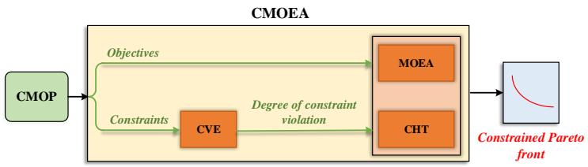

flowchart

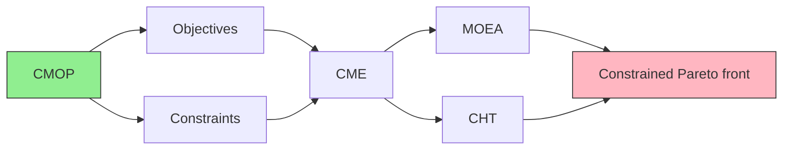

Fig. 1. The main components of a CMOEA.

where $\vec { x }$ is the decision vector $( \mathrm { i . e . , }$ , solution) consisting of D decision variables, $L _ { l }$ and $U _ { l }$ denote the lower and upper bounds of $x _ { l } ,$ respectively, S is the decision space, $F ( \vec { x } )$ denotes a vector of m conflicting objectives, $f _ { i } ( \vec { x } ) ( i \equiv$ $1 , \cdots , m )$ is the ith objective, $g _ { j } ( \vec { x } )$ and $h _ { k } ( \vec { x } )$ are the jth inequality and kth equality constraints, respectively, $n _ { g }$ is the number of inequality constraints, $n _ { h }$ is the number of equality constraints, and Ω denotes the constrained search space. The ultimate goal of constrained multiobjective optimization is to seek a set of feasible nondominated solutions with good convergence and diversity [4]. The past two decades have witnessed the success of using evolutionary algorithms to solve CMOPs and numerous constrained multiobjective optimization evolutionary algorithms (CMOEAs) have been proposed [5]. Generally speaking, as shown in Fig. 1, a CMOEA comprises three critical components: a multiobjective optimization evolutionary algorithm (MOEA), a constraint-handling technique (CHT), and a constraint violation evaluation (CVE) framework.

So far, numerous MOEAs have been proposed, which seek to find a set of solutions that approximates the Pareto front of an unconstrained multiobjective optimization problem (MOP). Aiming to achieve a balance among multiple conflicting objectives, these MOEAs can be divided into three categories: domination-based [6], decomposition-based [7], and indicator-based [8]. Compared with unconstrained MOPs, CMOPs consist of multiple constraints that divide the search space into feasible and infeasible regions, adding an additional level of complexity to the optimization process. Moreover, if the constraints are complex, the resulting feasible region may exhibit discontinuities or be divided into multiple smaller regions, giving rise to multiple local optima [9]. In other words, to address a CMOP, it requires the optimization of multiple conflicting objectives, while tackling various complex constraints. The core of tackling constraints is to pursue a balance between constraint satisfaction and objective optimization. The term “balance” refers to a CMOEA’s ability to effectively leverage constraint and objective information in various stages of evolution, thereby aiding the population in satisfying constraints while also approximating the constrained Pareto front (CPF). It is not only essential for enabling the population to explore the entire objective space and navigate through the infeasible obstacles in the early stage of evolution, but also crucial for obtaining a set of feasible nondominated solutions approximating the CPF in the later stage of evolution.

As shown in Fig. 1, MOEAs cope with various constraints through the combination of a CVE framework with a CHT. In essence, the CVE framework serves to evaluate the degree of constraint violation of a solution, while the CHT acts as a selection technique to identify and retain promising solutions under the consideration of constraints and objectives. Over the last two decades, significant efforts have been devoted to the design of CHTs. Currently, CHTs can be broadly divided into six categories: constrained dominance principle (CDP)- based methods [6], penalty functions [10], stochastic ranking methods [11], ε constrained methods [12], multiobjective optimization-based methods [13], and hybrid methods [14]. Before applying a CHT, a CVE framework must first be used to determine the degree of constraint violation. However, despite its critical role in the performance of CMOEAs, CVE has received little attention in the literature.

To the best of our knowledge, two main CVE frameworks are currently available: the na¨ıve CVE (NCVE) framework [6] and the Boolean CVE (BCVE) framework [15]. As we know, NCVE is the most recognized and widely used framework, in which the degree of constraint violation of a solution is a real value calculated from the original constraints. In this case, the landscape of the degree of constraint violation is continuous at any solution. That is to say, the constraint information is provided in a fine-grained style. When the CPF is situated within a large feasible region, it can be located without the need for fine-grained constraint information. For CMOPs with complex constraints, it may even exacerbate the preference for constraints, resulting in the wrong guidance toward local optima in the infeasible region.

In BCVE [15], the degree of constraint violation of a solution is represented as a Boolean value indicating whether it is feasible or not. In this manner, the explicit value of constraint violation is abandoned. Therefore, the constraint information is considerably simplified. However, the coarsegrained information provided by BCVE may not be sufficient to strike a balance between constraint satisfaction and objective optimization. Without sufficient constraint information, it can be challenging for the population to converge toward feasible regions. From the perspective of constraint information granularity, NCVE and BCVE can be viewed as two opposite extremes. However, both frameworks encounter difficulties in effectively balancing constraint satisfaction and objective optimization. Thus, it is reasonable to propose a general framework that can reconcile these two ends.

Based on these observations, we propose an adaptive constraint violation evolution (ACVE) framework. In ACVE, the population is divided into multiple clusters, and the solutions within each cluster are reassigned an identical degree of constraint violation derived from the original constraints. By leveraging valuable experience from the constrained multiobjective evolutionary optimization community, ACVE adaptively adjusts the number of clusters based on the evolutionary state, enabling the utilization of constraint information at multiple levels of granularity. Thus, it will contribute to the balance between constraint satisfaction and objective optimization. The main contributions of this paper are summarized as follows:

1) ACVE is an adaptive CVE framework, which aims to achieve a balance between constraint satisfaction and objective optimization from the perspective of constraint violation evaluation.   
2) The implementation of ACVE is simple and flexible, which enables seamless integration into various CHTs to improve the performance of CMOEAs.   
3) Taking a step further, we develop a novel dualpopulation dynamic coevolutionary algorithm named DDCo based on ACVE.   
4) Extensive experiments have been conducted to verify the superiority of ACVE and DDCo. Additionally, DDCo has been successfully applied to optimize the charging protocols of lithium-ion batteries.

The rest of this paper is organized as follows. Section II provides some basic definitions. Section III gives a review of related studies. The details of ACVE and DDCo are described in Sections IV and V, respectively. Section VI presents the experimental studies and discussions. In Section VII, DDCo is applied to optimize the charging protocols of lithium-ion batteries. Finally, conclusions and suggestions are presented in Section VIII.

# II. BASIC DEFINITIONS

Some basic definitions in the context of constrained multiobjective optimization are given as follows [6], [16].

1) Pareto dominance: Given two solutions $\vec { x } _ { 1 } , \vec { x } _ { 2 } \in \mathbb { S } , \vec { x } _ { 1 }$ is said to Pareto dominate ${ \vec { x } } _ { 2 } .$ , denoted as $\vec { x } _ { 1 } ~ \prec ~ \vec { x } _ { 2 }$ , if and only if $\forall j \in \{ 1 , \cdot \cdot \cdot , m \} , f _ { j } ( \vec { x } _ { 1 } ) \leq f _ { j } ( \vec { x } _ { 2 } ) \land \exists j \in$ $\{ 1 , \cdot \cdot \cdot , m \} , f _ { j } ( \vec { x } _ { 1 } ) < f _ { j } ( \vec { x } _ { 2 } )$ .

2) Nondominated solution: A solution ${ \vec { x } } \in \mathbb { S }$ is nondominated if and only $\operatorname { i f } \ \lnot \exists { \vec { y } } \in \mathbb { S } , { \vec { y } } \lnot \ { x } .$ .

3) Unconstrained Pareto set $( U P S ) \colon \mathbb { U P S } = \{ \vec { x } \in \mathbb { S } | \neg \exists \vec { y } \in$ S, $\vec { y } \prec \vec { x } \}$ .

4) Uonstrained Pareto front $( U P F ) \colon \mathbb { U P F } = \{ F ( \vec { x } ) | \vec { x } \in$ UPS}.

5) Feasible nondominated solution: A solution ${ \vec { x } } \in \Omega$ is recognized as a feasible nondominated solution if and only i $\mathbf { f } \neg \exists \vec { y } \in \Omega , \vec { y } \prec \vec { x } .$ .

6) Constrained Pareto set $( C P S ) \colon { \mathbb { C P S } } = \{ { \vec { x } } \in \Omega | \neg \exists { \vec { y } } \in$ $\boldsymbol { { \Omega } } , \vec { y } \prec \vec { x } \}$ .

7) Constrained Pareto front $( C P F ) \colon { \mathbb { C P F } } = \{ F ( { \vec { x } } ) | { \vec { x } } \in$ CPS}.

8) Crowding distance: Crowding distance is a measure used in MOEAs/CMOEAs to determine the density of solutions in a specific region. A detailed definition can be found in [6].

# III. RELATED WORK

In this section, some representative CHTs and two main CVE frameworks are reviewed.

# A. Representative CHTs

1) Constrained dominance principle (CDP) [6]: In CDP, one solution ${ \vec { x } } _ { 1 }$ is said to constrained-dominate another solution ${ \vec { x } } _ { 2 } .$ , if and only if:

• Both ${ \vec { x } } _ { 1 }$ and $\scriptstyle { \vec { x } } _ { 2 }$ are feasible, and $\vec { x } _ { 1 } \prec \vec { x } _ { 2 }$   
• $C V ( { \vec { x } } _ { 1 } ) = C V ( { \vec { x } } _ { 2 } )$ , and $\vec { x } _ { 1 } \prec \vec { x } _ { 2 }$   
• ${ \vec { x } } _ { 1 }$ is feasible and $\scriptstyle { \vec { x } } _ { 2 }$ is infeasible

• Both ${ \vec { x } } _ { 1 }$ and $\scriptstyle { \vec { x } } _ { 2 }$ are infeasible, and $C V ( { \vec { x } } _ { 1 } ) < C V ( { \vec { x } } _ { 2 } )$ where $C V ( \cdot )$ denotes the degree of constraint violation of a solution.

Due to its simplicity, CDP has been adopted in various CMOEAs [17]. However, it has a significant drawback in that it puts excessive emphasis on constraints. It causes CDP to converge prematurely toward local optima in the feasible region [5], [18]. Recently, some attempts have been made to improve CDP. For example, Ma et al. [19] proposed a novel approach called the two-ranking (ToR) method, in which two distinct rankings are designed to achieve a balance between constraint satisfaction and objective optimization. Yu et al. [20] proposed a dynamic selection preference-assisted CMOEA, which assigns higher priority to objectives in the early stage of evolution.

2) Adaptive penalty function-based methods: The penalty function incorporates the degree of constraint violation into objectives using a penalty factor. To avoid the need for repetitive tuning of penalty factors, researchers have developed adaptive penalty function-based methods. Woldesenbet et al. [9] proposed the self-adaptive penalty function (SP). In the SP approach, as the number of feasible solutions in the population increases, the search process shifts from “feasibility-first” to “optimality-first”. In [21], the objectives were modified based on the population feasibility during the evolutionary process, enabling the algorithm to balance constraint satisfaction and objective optimization. Ma and Wang [22] proposed a shiftbased penalty (ShiP) method, in which the shift of infeasible solutions is determined by the distribution of their neighboring feasible solutions. The extent of the shift is adaptively controlled based on the population feasibility.

3) ε constrained method $I I 2 { \cal I } .$ The ε constrained method releases the degree of constraint violation by defining a gradually decaying parameter (denoted as ε). Specifically, ⃗x1 is considered to be better than ${ \vec { x } } _ { 2 } .$ , denoted as $\vec { x } _ { 1 } \prec _ { \varepsilon } \vec { x } _ { 2 }$ , when one of the following conditions is satisfied:

• $C V ( \vec { x } _ { 1 } ) \leq \varepsilon , C V ( \vec { x } _ { 2 } ) \leq \varepsilon ,$ and $\vec { x } _ { 1 } \prec \vec { x } _ { 2 }$   
• CV (⃗x1) = CV (⃗x2), and ⃗x1 ≺ ⃗x2   
• $C V ( { \vec { x } } _ { 1 } ) \leq \varepsilon { \mathrm { ~ a n d ~ } } C V ( { \vec { x } } _ { 2 } ) > \varepsilon$   
$\bullet \ C V ( \vec { x } _ { 1 } ) > \varepsilon , C V ( \vec { x } _ { 2 } ) > \varepsilon , \mathrm { a n d } \ C V ( \vec { x } _ { 1 } ) < C V ( \vec { x } _ { 2 } ) .$

The ε constrained method has been widely used for constrained multiobjective evolutionary optimization. Saxena et al. [23] integrated it into NSGA-II [6] to limit the infeasibility and enhance the convergence. Qian et al. [24] also adopted the ε constrained method in NSGA-II, and used a self-adaptive differential evolution algorithm as the search algorithm. Wang et al. [25] utilized a niche strategy in combination with the ε constrained method to address CMOPs. Zhu et al. [26] proposed a novel approach that combines a stagnationbreaking mechanism with an enhanced ε constrained method for solving CMOPs.

4) Stochastic ranking (SR) [11]: The SR method introduces a probability parameter (denoted as $\boldsymbol { p } _ { f } )$ to determine the comparison criterion for solutions. In the comparison criterion, two solutions are compared based on objectives with a probability of $p _ { f }$ regardless of the degree of constraint violation. Additionally, the traditional stochastic ranking is used to rank all solutions based on the comparison criterion. Geng et al. [27] proposed a CMOEA based on elite-dominance and the SR method. Ying et al. [28] proposed an adaptive SR method, in which $p _ { f }$ was adjusted dynamically based on the current stage of evolution and the discrepancy among the degree of constraint violation of the solutions. Liu et al. [29] integrated the indicator-based MOEAs with CDP, ε constrained method, and SR, respectively.

5) Multiobjective optimization-based methods: As the name refers, the multiobjective optimization-based methods transform the constraints into objectives or a single objective and then solve the transformed MOP by multiobjective optimization techniques. Based on their previous work [30], Ray et al. [13] proposed an infeasibility-driven evolutionary algorithm (IDEA). In IDEA, a specified number of promising infeasible solutions are retained in the population in order to facilitate convergence. Peng et al. [31] developed a novel CHT by considering the degree of constraint violation as an additional objective and used two types of weight vectors to solve the transformed MOP. Zhou et al. [32] introduced a triobjective evolutionary framework, in which constraints are first converted into feasibility indicators, and then integrated with convergence and diversity indicators for constrained manyobjective optimization.

6) Other methods: In response to the “no free lunch” theorem [33], hybrid methods attempt to improve a CMOEA by integrating multiple diverse CHTs into a single one. Wang et al. [34] proposed an adaptive tradeoff model (ATM). Qu and Suganthan [35] proposed a framework that integrates three CHTs. Some methods construct surrogate models for expensive constraints to accelerate constrained multiobjective optimization. Datta and Regis [36] utilized cubic radial basis functions to approximate constraints and employed evolutionary strategies for offspring generation. Zhang et al. [37] developed multigranularity surrogate models for constraints, where surrogate models for constraint violation or each individual constraint are established adaptively. Song et al. [38] analyzed the correlation between objective optimization and constraint satisfaction to determine whether to construct constraint surrogate models.

# B. Representative CVE Frameworks

First, the degree of constraint violation of a solution ⃗x on an individual constraint can be quantified as follows [16]:

$$
\left\{ \begin{array}{l} C V _ {j} (\vec {x}) = \max (0, g _ {j} (\vec {x})), j = 1, \dots , n _ {g} \\ C V _ {k} (\vec {x}) = \max (0, | h _ {k} (\vec {x}) | - \delta), k = 1, \dots , n _ {h} \end{array} \right. \tag {2}
$$

where δ is a small tolerance value that can relax equality constraints, and is usually set to a fixed value $1 0 ^ { - 4 } \ [ \bar { 1 } 8 ]$ . If the degree of constraint violation of each individual constraint equals 0, ⃗x is considered as a feasible solution; otherwise, ⃗x is an infeasible solution. Next, the degree of constraint violation on all constraints (denoted as CV ) of ⃗x can be calculated in a CVE framework.

1) NCVE: In NCVE, the CV value of ⃗x is calculated as follows:

$$
C V (\vec {x}) = \sum_ {j = 1} ^ {n _ {g}} C V _ {j} (\vec {x}) + \sum_ {k = 1} ^ {n _ {h}} C V _ {k} (\vec {x}). \tag {3}
$$

In this manner, CV (⃗x) is a real value calculated from the original constraints by applying the addition and maximum operators on the original constraints. Thus, its landscape is continuous at any solution. That is to say, the constraint information is provided in a fine-grained style.

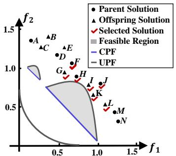

scatter

| Point | Type             | f1    | f2    |
|-------|------------------|-------|-------|
| A     | Parent Solution  | ~0.3  | 1.4   |
| B     | Parent Solution  | ~0.4  | 1.3   |
| C     | Parent Solution  | ~0.4  | 1.2   |
| D     | Parent Solution  | ~0.6  | 1.1   |
| E     | Parent Solution  | ~0.7  | 1.0   |
| F     | Parent Solution  | ~0.8  | 0.9   |
| G     | Parent Solution  | ~0.9  | 0.8   |
| H     | Parent Solution  | ~1.0  | 0.7   |
| I     | Parent Solution  | ~1.1  | 0.6   |
| J     | Parent Solution  | ~1.2  | 0.5   |
| K     | Parent Solution  | ~1.3  | 0.4   |
| L     | Parent Solution  | ~1.4  | 0.3   |
| M     | Parent Solution  | ~1.5  | 0.2   |
| N     | Parent Solution  | ~1.6  | 0.1   |

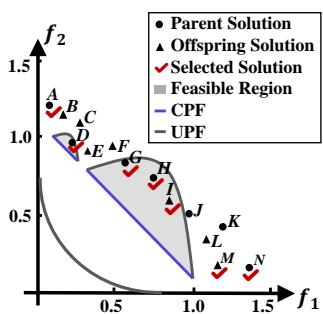

scatter

| Point | f1    | f2    | Category         |
|-------|-------|-------|------------------|
| A     | 0.3   | 1.2   | Parent Solution  |
| B     | 0.4   | 1.1   | Parent Solution  |
| C     | 0.5   | 1.0   | Parent Solution  |
| D     | 0.6   | 0.9   | Parent Solution  |
| E     | 0.7   | 0.8   | Parent Solution  |
| F     | 0.8   | 0.7   | Parent Solution  |
| G     | 0.9   | 0.6   | Parent Solution  |
| H     | 1.0   | 0.5   | Parent Solution  |
| I     | 1.1   | 0.4   | Parent Solution  |
| J     | 1.2   | 0.3   | Parent Solution  |
| K     | 1.3   | 0.2   | Parent Solution  |
| L     | 1.4   | 0.1   | Parent Solution  |
| M     | 1.5   | 0.0   | Parent Solution  |
| N     | 1.6   | -0.1  | Parent Solution  |
| A     | 0.3   | 1.3   | Offspring Solution |
| B     | 0.4   | 1.2   | Offspring Solution |
| C     | 0.5   | 1.1   | Offspring Solution |
| D     | 0.6   | 1.0   | Offspring Solution |
| E     | 0.7   | 0.9   | Offspring Solution |
| F     | 0.8   | 0.8   | Offspring Solution |
| G     | 0.9   | 0.7   | Offspring Solution |
| H     | 1.0   | 0.6   | Offspring Solution |
| I     | 1.1   | 0.5   | Offspring Solution |
| J     | 1.2   | 0.4   | Offspring Solution |
| K     | 1.3   | 0.3   | Offspring Solution |
| L     | 1.4   | 0.2   | Offspring Solution |
| M     | 1.5   | 0.1   | Offspring Solution |
| N     | 1.6   | 0.0   | Offspring Solution |
| A     | 0.3   | 1.4   | Selected Solution|
| B     | 0.4   | 1.3   | Selected Solution|
| C     | 0.5   | 1.2   | Selected Solution|
| D     | 0.6   | 1.1   | Selected Solution|
| E     | 0.7   | 1.0   | Selected Solution|
| F     | 0.8   | 0.9   | Selected Solution|
| G     | 0.9   | 0.8   | Selected Solution|
| H     | 1.0   | 0.7   | Selected Solution|
| I     | 1.1   | 0.6   | Selected Solution|
| J     | 1.2   | 0.5   | Selected Solution|
| K     | 1.3   | 0.4   | Selected Solution|
| L     | 1.4   | 0.3   | Selected Solution|
| M     | 1.5   | 0.2   | Selected Solution|
| N     | 1.6   | 0.1   | Selected Solution|
| A     | 0.3   | 1.5   | CPF              |
| B     | 0.4   | 1.4   | CPF              |
| C     | 0.5   | 1.3   | CPF              |
| D     | 0.6   | 1.2   | CPF              |
| E     | 0.7   | 1.1   | CPF              |
| F     | 0.8   | 1.0   | CPF              |
| G     | 0.9   | 0.9   | CPF              |
| H     | 1.0   | 0.8   | CPF              |
| I     | 1.1   | 0.7   | CPF              |
| J     | 1.2   | 0.6   | CPF              |
| K     | 1.3   | 0.5   | CPF              |
| L     | 1.4   | 0.4   | CPF              |
| M     | 1.5   | 0.3   | CPF              |
| N     | 1.6   | 0.2   | CPF              |
| A     | 0.3   | 1.6   | UPF              |
| B     | 0.4   | 1.5   | UPF              |
| C     | 0.5   | 1.4   | UPF              |
| D     | 0.6   | 1.3   | UPF              |
| E     | 0.7   | 1.2   | UPF              |
| F     | 0.8   | 1.1   | UPF              |
| G     | 0.9   | 1.0   | UPF              |
| H     | 1.0   | 0.9   | UPF              |
| I     | 1.1   | 0.8   | UPF              |
| J     | 1.2   | 0.7   | UPF              |
| K     | 1.3   | 0.6   | UPF              |
| L     | 1.4   | 0.5   | UPF              |
| M     | 1.5   | 0.4   | UPF              |
| N     | 1.6   | 0.3   | UPF              |
| A     | 0.3   | 1.7   | Selective Solution|
| B     | 0.4   | 1.6   | Selective Solution|
| C     | 0.5   | 1.5   | Selective Solution|
| D     | 0.6   | 1.4   | Selective Solution|
| E     | 0.7   | 1.3   | Selective Solution|
| F     | 0.8   | 1.2   | Selective Solution|
| G     | 0.9   | 1.1   | Selective Solution|
| H     | 1.0   | 1.0   | Selective Solution|
| I     | 1.1   | 0.9   | Selective Solution|
| J     | 1.2   | 0.8   | Selective Solution|
| K     | 1.3   | 0.7   | Selective Solution|
| L     | 1.4   | 0.6   | Selective Solution|
| M     | 1.5   | 0.5   | Selective Solution|
| N     | 1.6   | 0.4   | Selective Solution|
The chart includes a legend for 'Selected Solution' and 'Feasible Region'. The data is presented in a table format with columns for 'Parent Solution' and 'UpF'.

Fig. 2. Population distribution. (a) In the early stage of evolution when using NCVE for constraint violation evaluation. (b) In the later stage of evolution when using BCVE for constraint violation evaluation.

2) BCVE: In BCVE [15], a Boolean value is used to define the CV value of a solution:

$$
C V (\vec {x}) = \left\{ \begin{array}{l l} 0, & \text { if } \vec {x} \in \Omega , \\ 1, & \text { otherwise }. \end{array} \right. \tag {4}
$$

In this manner, $C V ( \vec { x } )$ is a Boolean value indicating whether the solution is feasible or not. Consequently, the constraint information is largely neglected, providing only a coarse-grained representation of constraint information.

# IV. PROPOSED FRAMEWORK: ACVE

# A. Motivation

Effective utilization of constraint information is crucial for achieving a balance between constraint satisfaction and objective optimization in constrained multiobjective evolutionary optimization. In the early stage of evolution, it is recommended to assign a lower weight to constraint information than objective information. It can help maintain population diversity and allow for extensive exploration of the infeasible region, enabling the identification of as many feasible regions as possible. As the population evolves, the weight of constraint information should be gradually increased to guide the population toward feasible regions and approach the CPF. As shown in Fig. 1, the utilization of constraint information requires the integration of two critical components: a CVE framework and a CHT. The CVE framework is used to quantify the constraint violation of a solution. It is directly related to the utilization of constraint and objective information, which is critical to guiding the population to the CPF. However, prior research has primarily focused on improving the CHT for constrained multiobjective evolutionary optimization, while the CVE framework has received less attention. Among the limited number of frameworks proposed, NCVE and BCVE are two representative examples.

As discussed in Section III-B, the degree of constraint violation evaluated in NCVE provides the constraint information in a fine-grained manner. However, utilizing fine-grained constraint information in the early stage of evolution may lead to the population being trapped in local optima or missing some feasible regions. Fig. 2(a) gives an example to illustrate this shortcoming, where CDP is used for constraint handling. As shown in Fig. 2(a), the population consists of fourteen solutions, labeled as A to N . In this case, the solutions closer to feasible regions, such as F , G, H, I, J , K, and L, will be selected, potentially leading to the population being trapped in the larger feasible region while missing the smaller one.

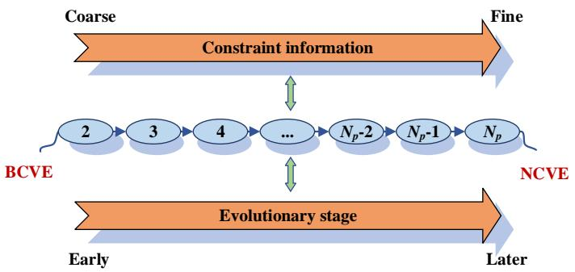

flowchart

Fig. 3. The spectrum of the CVE framework.

In contrast, the degree of constraint violation evaluated in BCVE provides the constraint information in a coarse-grained manner. However, without sufficient constraint information, it can be challenging for the population to converge in the later stage of evolution. Fig. 2(b) gives an example to illustrate this shortcoming. In BCVE, D, G, H, and I will be retained as feasible solutions. This is reasonable because it is necessary to keep the final population feasible. Among the remaining infeasible solutions, A, M, and N will be selected due to the large crowding distance. However, these solutions are far from feasible regions, resulting in the population spending unnecessary effort in the infeasible region, which can lead to slow convergence or even convergence failure.

As shown in Fig. 3, from the perspective of constraint information granularity, BCVE and NCVE can be viewed as two opposite extremes. In BCVE, there exist up to two types of CV values in the population. The constraint information is provided in a coarse-grained manner. On the other hand, in NCVE, there exist up to $N _ { p }$ types of CV values, where $N _ { p }$ represents the population size. The constraint information is leveraged in a fine-grained manner. It is evident that with an increase in the number of types of CV values, a finer level of constraint information is provided. As analyzed above, for constrained multiobjective evolutionary optimization, it is necessary to provide coarse-grained constraint information in the early stage of evolution while fine-grained information in the later stage of evolution. Both BCVE and NCVE face challenges in this regard. In summary, to finely use constraint information for constrained multiobjective evolutionary optimization, it is advantageous to propose a CVE framework in which the CV values can be adjusted adaptively.

Based on these considerations, we design ACVE and propose a CMOEA called DDCo based on ACVE.

# B. ACVE

In ACVE, the population is partitioned into clusters and the same CV value is reassigned to the solutions within each cluster. By adapting the number of clusters based on the evolutionary state, ACVE can adaptively adjust CV values in the population. That is to say, ACVE can leverage the constraint information from coarse to fine-grained. Thus, this adaptive framework has the potential to overcome the limitations of existing static CVE frameworks. The details of ACVE are given in Algorithm 1.

# Algorithm 1 ACVE

Input: Parent population P, offspring population $\mathbb { Q } ,$ population size $N _ { p } ,$ current generation number t, and maximum generation number $T$

# Output: CV values

1: U ← P ∪ Q;   
2: Evaluate the CV values for all solutions in U according to Eqs. (2) and (3);   
3: Calculate the proportion of feasible solutions in P, and denoted it as $P _ { f e a } ;$   
4: Decide the number of clusters (denoted as $n _ { c } )$ according to Eq. (5);   
5: Divide U into $n _ { c }$ clusters in the objective space by the K-means method;   
6: for $i = 1 : n _ { c }$ do   
7: Select the minimum CV value, and reassign it to all solutions in the ith cluster;   
8: end for

Suppose a population P with $N _ { p }$ solutions is maintained. The offspring population Q with $N _ { p }$ solutions is produced by genetic operators. In each generation, P and Q are combined to form a union population U (Line 1). The CV values of the solutions in U are assigned as follows. First, according to Eqs. (2) and (3), the CV values of all solutions in U are evaluated (Line 2). Then, the proportion of feasible solutions $P _ { f e a }$ in P is calculated (Line 3). Based on $P _ { f e a } ,$ the number of clusters $n _ { c }$ is determined using Eq. (5) (Line 4). The population U is then divided into $n _ { c }$ clusters using the K-means method (Line 5). The minimum CV value in each cluster is identified and reassigned to all solutions within the corresponding cluster (Line 7). This process continues until all solutions in U have new CV values. In summary, ACVE is shown in Fig. 4.

As shown in Algorithm 1, the number of clusters $n _ { c }$ is closely related to the volume of constraint information, making it critical to ACVE. According to the prior knowledge, the less constraint information in the early stage of evolution will help the population cross the infeasible obstacles and explore more feasible regions. Conversely, the preference for constraint information in the later stage of evolution enhances the ability of exploitation. Based on this understanding, $n _ { c }$ is adaptively adjusted using a sigmoid function, as it is commonly applied in similar cases in evolutionary computation [39]:

$$
n _ {c} = \left\{ \begin{array}{l l} \max (\left\lfloor \frac {2 N _ {p}}{1 + e ^ {- 1 0 (P _ {f e a} - 0 . 5)}} \right\rfloor , 1), & t \leq 0. 7 T \\ 2 N _ {p}, & t > 0. 7 T \end{array} \right. \tag {5}
$$

where ⌊·⌋ is the flooring function, and t and T denote the current and maximum generation numbers, respectively. By adjusting $n _ { c }$ according to Eq. (5), less constraint information is utilized in the early stage of evolution, while more constraint information is employed in the later stage. The rationale for this setting is discussed in detail below. In the following discussions, CMOPs in which all solutions are feasible in the initial stage are not considered, as all CVE frameworks exhibit the same effectiveness in such cases, given that the degree of constraint violation for any feasible solution is inherently zero.

When $t ~ \leq ~ 0 . 7 T , ~ n _ { c }$ increases according to a sigmoid function, with the trend being controlled by $P _ { f e a } .$ . The reason for this setting is as follows. In the early stage of evolution, the population is mainly located in the infeasible region $( \mathrm { i } . \mathrm { e } . , \ P _ { f e a }$ is small), and thus $n _ { c }$ remains a small value and increases gradually. At this point, many solutions in the population have the same CV value, leading to a reduced consideration of constraint information in solution selection. Due to the impact of the CHT, $P _ { f e a }$ will increase during the evolution, resulting in the generation of some feasible solutions. For CMOPs with numerous feasible solutions in the initial stage, the evolution encounters this situation directly at the beginning. Additionally, due to the sigmoid function’s characteristics, the emergence of multiple clusters only occurs when a certain number of feasible solutions are identified. Thus, promising objective information can be used effectively to aid the population in converging toward feasible regions from diverse directions. In the later stage, a certain number of feasible solutions will be generated. As per Eq. (5), this leads to rapid growth of $n _ { c }$ to a large value. Consequently, in this situation, there are fewer individuals in the population sharing the same CV value. More constraint information is used for solution selection to accelerate population convergence.

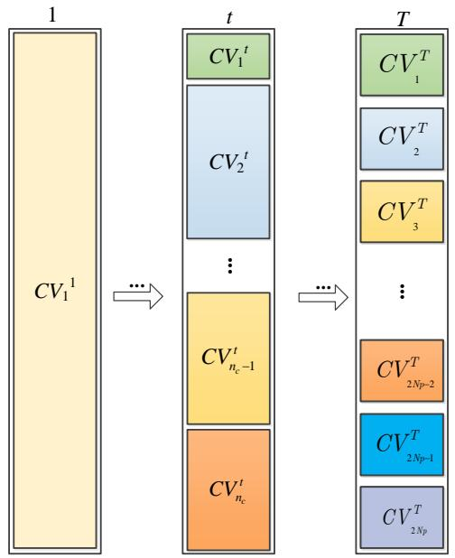

flowchart

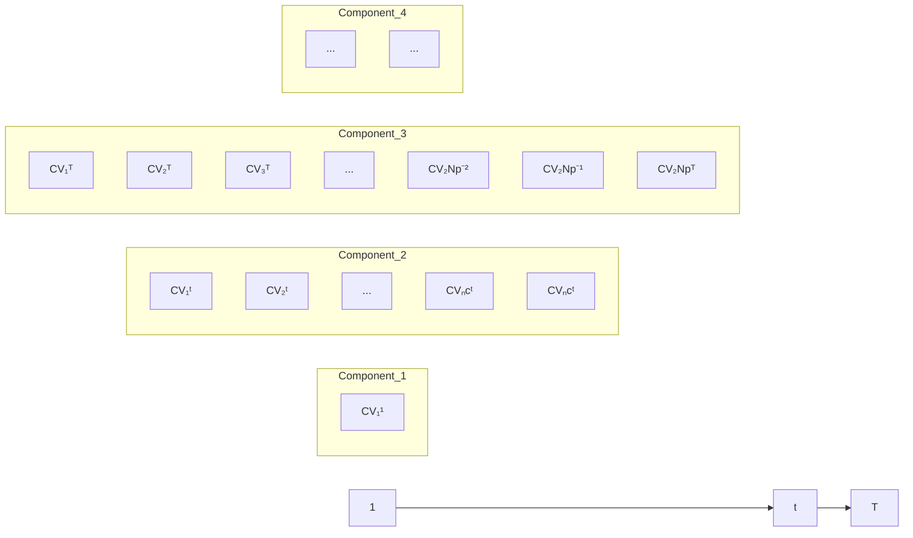

Fig. 4. Schematic of ACVE.

When $t > 0 . 7 T , n _ { c }$ is directly set to its upper limit $2 N _ { p } .$ It means that there is only one solution in each cluster. The rationale for this setting is as follows. For complex CMOPs with very small feasible regions, if no feasible solution is found (i.e., $P _ { f e a } ~ = ~ 0$ and $n _ { c } ~ = ~ 1 )$ in the early stage, the population may directly traverse feasible regions driven solely by objective information, converging toward the UPF. In this case, the population will completely be trapped in the infeasible region due to $n _ { c } ~ = ~ 1$ , where all solutions share the same CV value. Consequently, the population will rely solely on objective information, which can push it further away from feasible regions. To pull the population back to feasible regions, $n _ { c }$ is manually set to $\bar { 2 } \bar { N } _ { p } .$ This ensures that a minimum number of solutions share the same CV value, thereby offering fine-grained constraint information for solution selection.

In summary, ACVE can balance constraint satisfaction and objective optimization during the evolutionary process from the perspective of constraint violation evaluation. The threshold for setting $n _ { c } ( \mathrm { i } . \mathrm { e } . , 0 . 7 T )$ is another key factor related to the volume of constraint information and is determined based on the findings in [5]. In [5], constraint information is adaptively utilized across multiple stages. A threshold is defined such that, when the adaptive conditions are not met, the population is forced to enter the third stage, thereby ensuring the thorough utilization of constraint information. This threshold is set to 0.7 of the maximum function evaluations. The sensitivity of the threshold and the effectiveness of the adjustment based on Eq. (5) are experimentally investigated in Section VI-E.

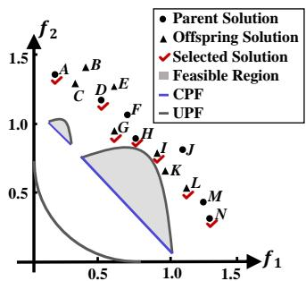

scatter

| Point | Type             | f1    | f2    |
|-------|------------------|-------|-------|
| A     | Parent Solution  | 0.3   | 1.4   |
| B     | Parent Solution  | 0.4   | 1.3   |
| C     | Parent Solution  | 0.5   | 1.2   |
| D     | Parent Solution  | 0.6   | 1.1   |
| E     | Parent Solution  | 0.7   | 1.0   |
| F     | Parent Solution  | 0.8   | 0.9   |
| G     | Parent Solution  | 0.9   | 0.8   |
| H     | Parent Solution  | 1.0   | 0.7   |
| I     | Parent Solution  | 1.1   | 0.6   |
| J     | Parent Solution  | 1.2   | 0.5   |
| K     | Parent Solution  | 1.3   | 0.4   |
| L     | Parent Solution  | 1.4   | 0.3   |
| M     | Parent Solution  | 1.5   | 0.2   |
| N     | Parent Solution  | 1.6   | 0.1   |
The chart includes a shaded region labeled 'Feasible Region' and a legend defining the legend as 'CPF' and 'UPF'.

(a)

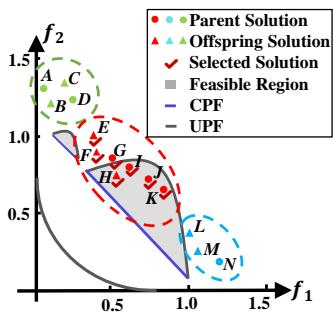  
(b)

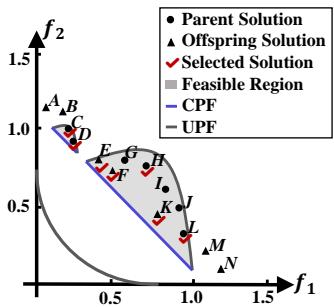  
(c)

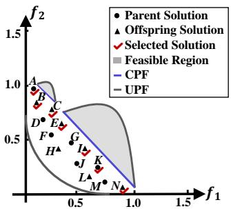

scatter

| Point | Type             | f1    | f2    |
|-------|------------------|-------|-------|
| A     | Parent Solution  | ~0.1  | ~1.0  |
| B     | Parent Solution  | ~0.15 | ~0.9  |
| C     | Parent Solution  | ~0.2  | ~0.8  |
| D     | Parent Solution  | ~0.25 | ~0.7  |
| E     | Parent Solution  | ~0.3  | ~0.6  |
| F     | Parent Solution  | ~0.35 | ~0.5  |
| G     | Parent Solution  | ~0.4  | ~0.4  |
| H     | Parent Solution  | ~0.45 | ~0.3  |
| I     | Parent Solution  | ~0.5  | ~0.2  |
| J     | Parent Solution  | ~0.55 | ~0.1  |
| K     | Parent Solution  | ~0.6  | ~0.05 |
| L     | Parent Solution  | ~0.65 | ~0.02 |
| M     | Parent Solution  | ~0.7  | ~0.01 |
| N     | Parent Solution  | ~0.75 | ~0.005|
| O     | Parent Solution  | ~0.8  | ~0.002|
| P     | Parent Solution  | ~0.85 | ~0.001|
| Q     | Parent Solution  | ~0.9  | ~0.0005|
| R     | Parent Solution  | ~0.95 | ~0.0002|
| S     | Parent Solution  | ~1.0  | ~0.0001|
| T     | Parent Solution  | ~1.05 | ~0.00005|
| U     | Parent Solution  | ~1.1  | ~0.00002|
| V     | Parent Solution  | ~1.15 | ~0.00001|
| W     | Parent Solution  | ~1.2  | ~0.000005|
| X     | Parent Solution  | ~1.25 | ~0.000002|
| Y     | Parent Solution  | ~1.3  | ~0.000001|
| Z     | Parent Solution  | ~1.35 | ~0.0000005|
| AA    | Parent Solution  | ~1.4  | ~0.0000002|
| AB    | Parent Solution  | ~1.45 | ~0.0000001|
| AC    | Parent Solution  | ~1.5  | ~0.00000005|
| AD    | Parent Solution  | ~1.55 | ~0.00000002|
| AE    | Parent Solution  | ~1.6  | ~0.00000001|
| AF    | Parent Solution  | ~1.65 | ~0.000000005|
| AG    | Parent Solution  | ~1.7  | ~0.000000002|
| AH    | Parent Solution  | ~1.75 | ~0.000000001|
| AI    | Parent Solution  | ~1.8  | ~0.0000000005|
| AJ    | Parent Solution  | ~1.85 | ~0.0000000002|
| AK    | Parent Solution  | ~1.9  | ~0.0000000001|
| AL    | Parent Solution  | ~1.95 | ~0.000000000<nl>
 AM    | Parent Solution  | ~2.0  | ~0.5   |
| AN    | Parent Solution  | ~2.1  | ~1.2   |
| AO    | Parent Solution  | ~2.2  | ~1.8   |
| AP    | Parent Solution  | ~2.3  | ~2.2   |
| AQ    | Parent Solution  | ~2.4  | ~2.6   |
| AR    | Parent Solution  | ~2.5  | ~3.2   |
| AS    | Parent Solution  | ~2.6  | ~3.6   |
| AT    | Parent Solution  | ~2.7  | ~4.2   |
| AU    | Parent Solution  | ~2.8  | ~4.6   |
| AV    | Parent Solution  | ~2.9  | ~5.2   |
| AW    | Parent Solution  | ~3.0  | ~5.6   |
| AX    | Parent Solution  | ~3.1  | ~6.2   |
| AY    | Parent Solution  | ~3.2  | ~6.6   |
| AZ    | Parent Solution  | ~3.3  | ~7.2   |
| BA    | Parent Solution  | ~3.4  | ~7.6   |
| BB    | Parent Solution  | ~3.5  | ~8.2   |
| BC    | Parent Solution  | ~3.6  | ~8.6   |
| BD    | Parent Solution  | ~3.7  | ~9.2   |
| BE    | Parent Solution  | ~3.8  | ~9.6   |
| BF    | Parent Solution  | ~3.9  | ~10.2  |
| BG    | Parent Solution  | ~4.0  | ~11.6  |
| BH    | Parent Solution  | ~4.1  | ~13.2  |
| BI    | Parent Solution  | ~4.2  | ~14.6  |
| BJ    | Parent Solution  | ~4.3  | ~16.2  |
| BK    | Parent Solution  | ~4.4  | ~17.6  |
| BL    | Parent Solution  | ~4.5  | ~19.2  |
| BM    | Parent Solution  | ~4.6  | ~21.6  |
| BN    | Parent Solution  | ~4.7  | ~24.2  |
| BO    | Parent Solution  | ~4.8  | ~26.6  |
| BP    | Parent Solution  | ~4.9  | ~31.2  |
| BPW   | Parent Solution  | ~5.1  | ~36.6  |
| BPW   (Upper Limit) - NPF - Upper Limit - NPF - NPF - NPF - NPF - NPF - NPF - NPF - NPF - NPF - NPF - NPF - NPF - NPF - NPF - NPF - NPF - NPF - NPF - NPF - NPF - NPF - NPF - NPF - NPF - NPF - NPF - NPF - NPF - NPF - NPF - NPF - NPF - NPF - NPF (Upper Limit) - NPF - NPF - NPF - NPF - NPF - NPF - NPF - NPF - NPF - NPF - NPF - NPF - NPF - NPF - NPF - NPF - NPF - NPF - NPF - NPF - NPF - NPF - NPF - NPF - NPF - NPF - NPF - NPF (Upper Limit) - NPF - NPF - NPF - NPf - NPF - NPf - NPf - NPf - NPf - NPf - NPf - NPf - NPf - NPf - NPf - NPf - NPf - NPf - NPf - NPf (Upper Limit) - NPf - NPf - NPf - NPf - NPf - NPf - NPf - NPf - NPf - NPf - NPf - NPf - NPf (Upper Limit) - NPf - NPf - NPf - NPf - NPf - NPf - NPf - NPf - NPf - NPf - NPf - NPf - NPf (Upper Limit) - NPf - NPf - NPf - NPf - LP- LP- LP- LP- LP- LP- LP- LP- LP- LP- LP- LP- LP- LP- LP- LP- LP- LP- LP- LP- LP- LP- LP- LP- LP- LP- LP- LP- LP- LP- LP- LP- LP- LP- LP- LP- LP- LP- LP- LP- LP- LP- LP- LP- LP- LP- LP- LP- LP- LP- LP(Upper Limit) / Upper Limit: < PF / LP- LP- LP- LP- LP- LP- LP- LP- LP- LP- LP- LP- LP- LP- LP- LP- LP- LP- LP- LP- LP- LP- LP- LP- LP- LP- LP- LP- LP- LP- LP- LP- LP- LP- LP- LP- LP- LP- LP(Upper Limit) / Upper Limit: < PF / LP- LP- LP- LP- LP- LP(Upper Limit) / Upper Limit: < PF / LP- LP- LP(Upper Limit) / Upper Limit: < PF / UPF / UPF

(d)   
Fig. 5. Population distribution. (a) When $t \leq 0 . 7 T$ and $P _ { f e a } = 0 . \left( \mathrm { b } \right)$ When $t \overset { _ { \textrm { = } } } \leq 0 . 7 T$ and $0 < P _ { f e a } < 1 .$ . (c) When $t \leq 0 . 7 T$ and $\dot { P _ { f e a } } = 1 . \ ( \mathrm { d } )$ ) When $t > 0 . 7 T$ .

# C. Analysis of Principle

For better understanding, some examples are provided to illustrate the principle of ACVE. Specifically, we combined ACVE with a popular MOEA (i.e., NSGA-II [6]) and a popular CHT (i.e., CDP) to analyze the population search behavior1.

1) When $t \leq 0 . 7 T$ and $P _ { f e a } = 0 $ , according to Eq. (5), $n _ { c } ~ = ~ 1$ . This indicates that all solutions are in the same cluster and have the same CV value. Consequently, ACVE does not provide any constraint information. In this case, the population is always scattered in the infeasible region. Additionally, the search relying on objective information helps the population maintain good diversity. For clarity, we presented a hypothetical population with fourteen infeasible solutions (denoted as A-N ). Fig. 5(a) shows the distribution of the population in the objective space. As mentioned in Section

1In the field of constrained multiobjective evolutionary optimization, NSGA-II and CDP are commonly used as baselines for analyzing the role of specific techniques [2], [19]. Their relative simplicity facilitates a clear demonstration of the impact of these techniques. In contrast, state-of-the-art algorithms often incorporate multiple components, making it more challenging to isolate and assess the effect of any single proposed technique.

IV-A, NCVE prioritizes infeasible solutions (i.e., F , G, H, I, J, K, and L) near feasible regions, leading to premature convergence. In contrast, ACVE selects seven well-distributed solutions (i.e., A, D, G, H , I , L, and N ). Obviously, these solutions can maintain diversity and facilitate the exploration of more feasible regions.

2) When $t \leq 0 . 7 T$ and $0 < P _ { f e a } < 1$ , $n _ { c }$ is adaptively adjusted according to Eq. (5). As $\dot { P } _ { f e a }$ increases, $n _ { c }$ becomes larger. Consequently, the number of $C V$ values gradually increases with the number of clusters. This manner enables the use of constraint information from a coarse-grained to a fine-grained level, guiding the population to converge toward feasible regions from diverse directions. Fig. 5(b) provides an example to explain this principle in detail. Correspondingly, Table I summarizes the CV values of A-N decided by NCVE, BCVE, and ACVE.

Among the seven parent solutions, three are feasible (i.e., I, $^ { J , }$ and K). Thus, $P _ { f e a } = 3 / 7$ . According to Eq. (5), ${ n _ { c } = 3 }$ The fourteen solutions are then divided into three clusters using the K-means method, and these clusters are represented by red, blue, and green colors, respectively. For each cluster, the smallest CV value is selected and reassigned to all solutions within that cluster. From Fig. 5(b), among all infeasible solutions, we can see that $G , L ,$ , and M are less valuable for exploration because they are close to the found feasible region. A, B, C, D, and N are far from feasible regions, contributing little to convergence. In comparison, E and F are closer to the unexplored feasible regions. Recognizing these two solutions would significantly enhance the probability of generating highquality feasible solutions. According to Table I, in NCVE, H, I, J, K, G, L, and M are selected due to their lower CV values. As a result, E and F are discarded. In contrast, in BCVE, the feasible solutions H, I, J, and K are retained. Among the infeasible solutions, A, N, and L have relatively larger crowding distances and are therefore more likely to be selected over E and F . In ACVE, the CV values of the population are divided into three levels based on the three clusters. The solutions at the minimum level, which have the lowest CV values, are prioritized. Since E, F , and G are close to the feasible solutions, they are clustered into the minimum level along with H, I, J, and K. As a result, these three infeasible solutions are treated as feasible solutions and enter the next generation. In this situation, ACVE demonstrates superior performance against both NCVE and BCVE.

As $n _ { c }$ gradually increases with $\begin{array} { r } { P _ { f e a } , } \end{array}$ , the probability that infeasible solutions are evaluated as feasible ones decreases. This shift means that the driver of the search behavior transitions from relying primarily on objective information to incorporating more constraint information. Additionally, when $P _ { f e a }$ remains smaller than 1, there is still a chance for some valuable yet infeasible solutions to be recognized as feasible and survive during environment selection. In summary, ACVE effectively identifies valuable infeasible solutions and guides them toward feasible regions.

3) When $t \leq 0 . 7 T$ and $P _ { f e a } = 1 , n _ { c } = 2 N _ { p }$ . That is to say, there is only one solution in each cluster. ACVE degenerates into NCVE, providing the constraint information in a finegrained manner. In this stage, the evolutionary goal is to obtain a set of well-distributed and well-converged feasible nondominated solutions to approximate the CPF. The fine-grained constraint information can facilitate the population’s evolution toward the CPF. For better understanding, an example is shown in Fig. 5(c). The parent population has seven feasible solutions, making $P _ { f e a } = 1$ . In the offspring population, there are also seven solutions, including three feasible ones (i.e., E, F , and K). In this scenario, C, D, E, F , K, and L are preferred as feasible nondominated solutions. Although H is a dominated solution, it is retained due to feasibility and contribution to diversity. Obviously, the selected solutions are promising for approximating the entire CPF.

TABLE I CONSTRAINT VIOLATION EVALUATION OF FOURTEEN HYPOTHETICAL SOLUTIONS 

<table><tr><td>Solution</td><td>Original Objectives $(f_1, f_2)$ </td><td>CV values based on NCVE</td><td>CV values based on BCVE</td><td>CV values based on ACVE</td><td>Crowding Distance</td></tr><tr><td>A</td><td>(0.05, 1.33)</td><td>3.25</td><td>1</td><td>3.11</td><td>∞</td></tr><tr><td>B</td><td>(0.10, 1.22)</td><td>3.11</td><td>1</td><td>3.11</td><td>0.15</td></tr><tr><td>C</td><td>(0.18, 1.35)</td><td>3.92</td><td>1</td><td>3.11</td><td>0.19</td></tr><tr><td>D</td><td>(0.25, 1.26)</td><td>3.23</td><td>1</td><td>3.11</td><td>0.58</td></tr><tr><td>E</td><td>(0.39, 0.98)</td><td>2.12</td><td>1</td><td>0</td><td>0.48</td></tr><tr><td>F</td><td>(0.40, 0.93)</td><td>1.54</td><td>1</td><td>0</td><td>0.23</td></tr><tr><td>G</td><td>(0.50, 0.86)</td><td>0.21</td><td>1</td><td>0</td><td>0.32</td></tr><tr><td>H</td><td>(0.52, 0.73)</td><td>0</td><td>0</td><td>0</td><td>0.16</td></tr><tr><td>I</td><td>(0.60, 0.80)</td><td>0</td><td>0</td><td>0</td><td>0.22</td></tr><tr><td>J</td><td>(0.73, 0.74)</td><td>0</td><td>0</td><td>0</td><td>0.40</td></tr><tr><td>K</td><td>(0.85, 0.65)</td><td>0</td><td>0</td><td>0</td><td>0.64</td></tr><tr><td>L</td><td>(1.00, 0.37)</td><td>0.23</td><td>1</td><td>0.23</td><td>0.61</td></tr><tr><td>M</td><td>(1.06, 0.25)</td><td>0.74</td><td>1</td><td>0.23</td><td>0.40</td></tr><tr><td>N</td><td>(1.20, 0.17)</td><td>2.98</td><td>1</td><td>0.23</td><td>∞</td></tr></table>

4) When $t ~ > ~ 0 . 7 T , ~ n _ { c }$ is set to $2 N _ { p }$ to ensure the convergence of the population in the later stage. This setting is particularly effective when the population has already crossed feasible regions. It can pull the population back to feasible regions by introducing constraint information in a fine-grained manner. For clarity, an example featuring fourteen solutions is illustrated in Fig. 5(d). They are all infeasible solutions that have crossed feasible regions. The adjustment based on the sigmoid function will not be effective in this scenario. Since all solutions are clustered together and reassigned the same CV value, A, D, F , H, J, L, and N will be selected based on objective values. However, these solutions are further away from feasible regions and meaningless for finding the feasible nondominated solutions. Absolutely, solutions with smaller CV values would indeed be preferred to ensure the feasibility of the final population. Therefore, it is necessary to maintain the cluster number at its maximum value. In this scenario, solutions closer to feasible regions (i.e., A, B, C, E, I, K, and N ) are preserved.

The above examples show that ACVE can facilitate the balance between constraint satisfaction and objective optimization from the perspective of constraint violation evaluation.

# V. PROPOSED CMOEA: DDCO

# A. Overview

We further integrate ACVE within a dual-population evolutionary framework, resulting in a novel dual-population dynamic coevolutionary algorithm named DDCo. Fig. 6 illustrates the schematic of DDCo. It maintains two populations (denoted as $\mathbb { P } _ { 1 }$ and $\mathbb { P } _ { 2 } )$ , both driven by CDP. $\mathbb { P } _ { 1 }$ , as the main population, is evaluated in NCVE, while $\mathbb { P } _ { 2 } ,$ , as the auxiliary population, is evaluated within a coevolutionary CVE (CCVE) framework built upon ACVE. Unlike ACVE, CCVE leverages the dual-population interaction to adjust search preference for constraints. This facilitates $\mathbb { P } _ { 2 }$ in supplementing the evolutionary path by providing necessary objective information for $\mathbb { P } _ { 1 }$ . In this manner, DDCo can achieve a tradeoff between constraint satisfaction and objective optimization. Different from other dual-population CMOEAs, DDCo makes the first attempt to create an effective auxiliary population from the perspective of constraint violation evaluation. Especially, the feasibility information from the main population is used for constraint violation evaluation of the auxiliary population. The main components of DDCo, including offspring generation, constraint violation evaluation, and population updating, are illustrated in the following subsections.

Algorithm 2 Offspring Generation   
Input: Main population $P_{1}$ , auxiliary population $P_{2}$ Output: Offspring population Q

1: $U \leftarrow P_{1} \cup P_{2}$ ;

2: $\bar{P} \leftarrow \varnothing$ ;

3: $\bar{P} \leftarrow \bar{P} \cup a$ solution randomly selected from U;

4: while $|\bar{P}| < N_{p}$ do

5: $\vec{x}_{1} \leftarrow a$ solution randomly selected from $P_{1}$ ;

6: $\vec{x}_{2} \leftarrow a$ solution randomly selected from $P_{2}$ ;

7: Calculate the density values of $\vec{x}_{1}$ and $\vec{x}_{2}$ according to Eq. (6) and denote them as $d_{1}$ and $d_{2}$ , respectively;

8: if $d_{1} > d_{2}$ then

9: $\bar{P} \leftarrow \bar{P} \cup \vec{x}_{1}$ ;

10: else

11: $\bar{P} \leftarrow \bar{P} \cup \vec{x}_{2}$ ;

12: end if

13: end while

14: $Q \leftarrow a$ population generated based on $\bar{P}$ ;

# B. Main Components

1) Offspring Generation: The main procedure of the offspring generation is given in Algorithm 2. First, a mating pool (denoted as P¯) is formed, followed by the generation of an offspring population (denoted as Q) based on $\bar { \mathbb { P } } ,$ where | · | denotes the cardinality of a set. In general, the mating selection considers two conditions.

• If the mating pool $\bar { \mathbb { P } }$ is empty, a solution is randomly selected from the combined population U and added to P¯ (Lines 1-3).

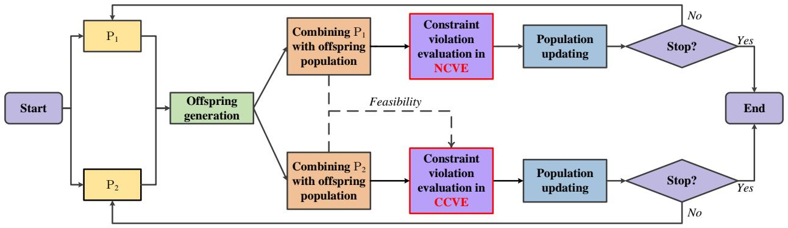

flowchart

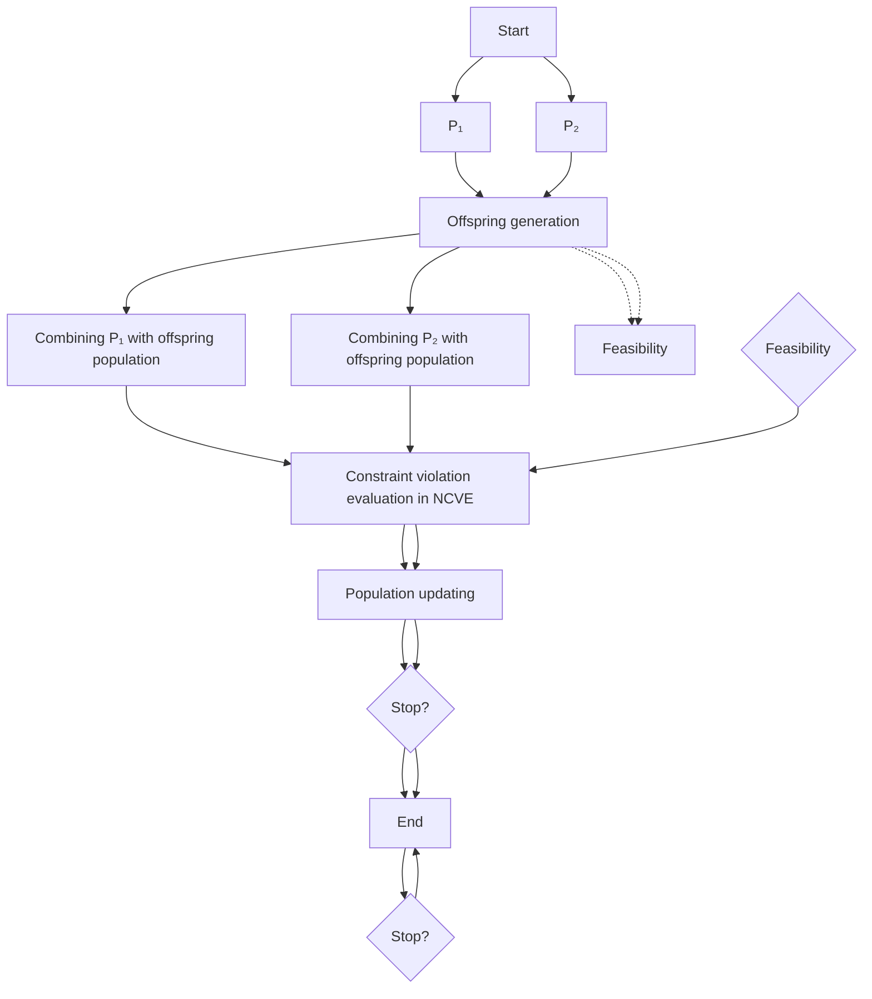

Fig. 6. Schematic of DDCo. The main difference between the evolution of $\mathbb { P } _ { 1 }$ and $\mathbb { P } _ { 2 }$ lies in that the constraints are evaluated in NCVE and CCVE, respectively. Additionally, CCVE considers the feasibility information of both $\mathbb { P } _ { 1 }$ and $\mathbb { P } _ { 2 } ,$ where the feasibility of a population is indicated by the proportion of feasible solutions within it.

• Otherwise, the solution with the larger density value in the objective space is selected to enter $\bar { \mathbb { P } } .$ This is because diversity is crucial throughout the entire evolutionary process. To be specific, first, randomly select a solution from $\mathbb { P } _ { 1 }$ and $\mathbb { P } _ { 2 } ,$ , respectively (Lines 5-6). Next, calculate the density values of these two solutions (Line 7). Finally, add the one with the larger density value to the mating pool (Lines 8-12). Specifically, for a solution ${ \vec { x } } ,$ we determine its density value as the Euclidean distance between $\vec { x }$ and its nearest neighbor in P¯:

$$
d (\vec {x}) = \min _ {\vec {y} \in \mathbb {P}} \sqrt {\sum_ {i = 1} ^ {m} \left(f _ {i} (\vec {y}) - f _ {i} (\vec {x})\right) ^ {2}}. \tag {6}
$$

2) Constraint Violation Evaluation: CCVE leverages the information provided by coevolution and its details are described in Algorithm 3. Similar to ACVE, the value of $n _ { c }$ is adjusted according to the sigmoid function:

$$
n _ {c} = \max (\left\lfloor \frac {2 N _ {p}}{1 + e ^ {- 1 0 (P _ {f e a} - 0 . 5)}} \right\rfloor , 1) \tag {7}
$$

The main differences lie in the fact that CCVE leverages the information from two coevolutionary populations to adjust $\begin{array} { r } { P _ { f e a } , } \end{array}$ and it detects whether the population has crossed feasible regions using the information provided by coevolution.

As mentioned above, the auxiliary population $\mathbb { P } _ { 2 }$ is to supplement the evolutionary path by providing necessary objective information for the main population $\mathbb { P } _ { 1 }$ . Therefore, it is necessary to detect whether $\mathbb { P } _ { 2 }$ has crossed feasible regions and adjust $P _ { f e a }$ accordingly. Intuitively, we could conclude that $\mathbb { P } _ { 2 }$ has crossed feasible regions if the following three conditions are satisfied:

• Condition 1: All solutions in $\mathbb { P } _ { 1 }$ are feasible, i.e., $P _ { f e a _ { 1 } } = = 1$ .   
• Condition 2: All solutions in $\mathbb { P } _ { 2 }$ are infeasible, i.e., $P _ { f e a _ { 2 } } = = 0 .$ .   
• Condition 3: $\forall \vec { y } \in \mathbb { P } _ { 2 } , \forall \vec { x } \in \mathbb { P } _ { 1 }$ , ⃗y is not dominated by ⃗x.

It is interesting to find that, theoretically, these three conditions can also be satisfied when an infeasible region blocks the population’s progression toward the UPF. In the practical optimization process, this outcome depends on the effectiveness of the genetic operators employed [40]. If appropriate genetic operators are employed, the population can successfully traverse such regions. However, while genetic operators play a crucial role, the primary focus of this study is to propose an adaptive CVE framework and develop an effective CMOEA based on it. Nonetheless, DDCo can mitigate this issue to some extent for the following reasons. First, clustering helps maintain population diversity. Additionally, the mating selection process is based on density, which further enhances this diversity. This increased diversity is advantageous for enabling the population to traverse such regions.

When the auxiliary population has not crossed feasible regions (indicated by $\gamma = = 1 ) , P _ { f e a }$ is adjusted according to coevolution information as follows:

$$
\left\{ \begin{array}{l} P _ {f e a} = \max (P _ {f e a _ {2}} - u _ {1} \cdot P _ {f e a _ {1}}, 0) \\ u _ {1} = \frac {1}{1 + e ^ {1 0 \cdot (t - 0 . 5)}} \end{array} \right. \tag {8}
$$

where $u _ { 1 }$ is a penalty factor. The rationale for this setting is as follows. Driven by CDP and NCVE, $\mathbb { P } _ { 1 }$ primarily utilizes constraint information to gradually enter feasible regions. Since $\mathbb { P } _ { 1 }$ will provide feasible solutions for $\mathbb { P } _ { 2 } .$ , the search behavior of $\mathbb { P } _ { 2 }$ will soon align with that of $\mathbb { P } _ { 1 }$ . To ensure that $\mathbb { P } _ { 2 }$ can provide complementary objective information, $P _ { f e a _ { 2 } }$ is penalized by $P _ { f e a _ { 1 } }$ as shown in Eq. (8). Moreover, $u _ { 1 }$ decreases as t increases. In this way, in the early stage of evolution, $\mathbb { P } _ { 2 }$ can leverage more objective information to explore the decision space and provide valuable insights about the infeasible region to $\mathbb { P } _ { 1 }$ . In the later stage of evolution, as $u _ { 1 }$ decreases, the penalty effect gradually diminishes, and the search behavior of the two populations begins to be similar. The role of $\mathbb { P } _ { 2 }$ gradually shifts from assisting the evolution of $\mathbb { P } _ { 1 }$ to collaboratively exploiting the CPF. However, for some complex CMOPs with very small feasible ratios, the penalty may be excessive, causing $\mathbb { P } _ { 2 }$ to cross feasible regions completely.

When the auxiliary population has crossed feasible regions (indicated by $\gamma = = 2 ) , P _ { f e a }$ is adjusted according to coevolution information as follows:

$$
\left\{ \begin{array}{l} P _ {f e a} = \min (P _ {f e a _ {2}} + u _ {2} \cdot P _ {f e a _ {1}}, 1) \\ u _ {2} = \frac {1}{1 + e ^ {- 1 0 \cdot (t - 0 . 5)}}. \end{array} \right. \tag {9}
$$

where $u _ { 2 }$ is a weight coefficient. The rationale for this setting is as follows. Since $\mathbb { P } _ { 2 }$ has crossed feasible regions, $P _ { f e a _ { 2 } }$ remains at 0. The adjustment strategy in Eq. (8) does not work, causing $\mathbb { P } _ { 2 }$ to converge toward the UPF. Consequently, the objective information becomes less significant for exploring the CPF. To address this issue, $\mathbb { P } _ { 2 }$ should be pulled back to the CPF. A simple way to achieve this is to promote $P _ { f e a _ { 2 } }$ using $P _ { f e a _ { 1 } }$ as shown in Eq. (9). Moreover, $u _ { 2 }$ increases as t increases. In this manner, P2 can take advantage of constraint information to evolve toward feasible regions from the infeasible side. As evolution progresses, more constraint information can be utilized. This aligns with the ultimate goal of constrained multiobjective optimization, which is to find the CPF. In general, the initial population has not yet crossed feasible regions. Therefore, the initial value of γ is set to 1.

Algorithm 3 CCVE   
Input: Main population $P_{1}$ , auxiliary population $P_{2}$ , offspring population Q, current generation number t, phase indicator $\gamma$ Output: CV values, $\gamma$ 1: $U \leftarrow P_{2} \cup Q$ ;

2: Evaluate the CV values of all solutions in U according to Eqs. (2) and (3);

3: Calculate the proportion of feasible solutions in $P_{1}$ and $P_{2}$ , denoted as $P_{fea_{1}}$ and $P_{fea_{2}}$ , respectively;

4: $t_{ag} \leftarrow 1$ ;

5: for each $\vec{y} \in P_{2}$ do

6: for each $\vec{x} \in P_{1}$ do

7: if $\vec{y}$ is dominated by $\vec{x}$ then

8: $t_{ag} \leftarrow 0$ ;

9: break;

10: end if

11: end for

12: end for

13: if $P_{fea_{1}} == 1 \& \& P_{fea_{2}} == 0 \& \& t_{ag} == 1$ then

14: $\gamma \leftarrow 2$ ;

15: end if

16: if $\gamma == 1$ then

17: Calculate $P_{fea}$ according to Eq. (8);

18: else

19: Calculate $P_{fea}$ according to Eq. (9);

20: end if

21: Decide the number of clusters $n_{c}$ according to Eq. (7);

22: Divide U into $n_{c}$ clusters in the objective space by the K-means method;

23: for i = 1 : $n_{c}$ do

24: Select the minimum CV value, and reassign it to all solutions in the ith cluster;

25: end for

3) Population Updating: As presented in Algorithm 4, in DDCo, CDP and SPEA2 [41] are adopted to update $\mathbb { P } _ { 1 }$ and $\mathbb { P } _ { 2 }$ . First, evaluate the objective values and CV values of the solutions in U in NCVE or CCVE (Lines 1-2). Next, the fitness values of the solutions in U are calculated (Line 3). Then, copy all feasible nondominated solutions from U to S (Line 4). If the cardinality of S exceeds $N _ { p } ,$ perform the truncation operation in SPEA2 iteratively to remove solutions until the cardinality is equivalent to $N _ { p }$ (Lines 5-7). Otherwise, copy the first $N _ { p }$ best solutions from U to S (Lines 8-10). Finally, the solutions in S proceed to the next generation (Line 11).

Algorithm 4 Population Updating   
Input: Parent population $P_{1(2)}$ , offspring population Q
Output: $P_{1(2)}$ 1: $U \leftarrow P_{1(2)} \cup Q;$ 2: Evaluate the objective values and CV values of the solutions in U in NCVE (CCVE);
3: Calculate the fitness values of all solutions in U according to CDP and SPEA2;
4: S ← all feasible nondominated solutions in U;
5: if $|S| \geq N_p$ then
6: Execute the truncation operation in SPEA2 for S;
7: else
8: Sort the solutions in U in ascending order based on the fitness values;
9: $S \leftarrow$ the first $N_p$ solutions in U;
10: end if
11: $P_{1(2)} \leftarrow S;$

# VI. EXPERIMENTAL STUDY

# A. Test Instances and Performance Metrics

In this section, four suites of benchmark CMOPs (e.g., MW [18], CTP [4], Zhou’s CF [42], Zhang’s CF [43]) were adopted to assess the performance of ACVE and DDCo. MW covers diverse characteristics commonly found in realworld CMOPs, including extremely small feasible ratios, highly nonlinear constraints, and other complex features. CTP, which is one of the most classic CMOP test suites, contains seven test instances. The 16 test instances of Zhou’s CF include various difficulties in the objective and decision spaces. Apart from small feasible ratios, the complex relationship between position and distance variables also poses great challenges for CMOEAs. Zhang’s CF comprises 10 test instances characterized by complex feasible region boundaries, segmented/discrete CPFs, and strong coupling relationships among variables.

In all experiments, three commonly used performance indicators were adopted: inverted generational distance (IGD) [4], IGD+ [44], and hypervolume (HV) [45]. All experiments were conducted using the PlatEMO platform [46].

# B. Parameter Settings

The experiments were implemented based on the following parameter settings

• Number of independent runs: 30   
• Maximum function evaluations: $M a x F E s = 5 0 0 0 0$   
• Maximum generation number: $T = 5 0 0$   
• Population size: $N _ { p } = 1 0 0$   
• Number of objectives for the test instances that are scalable in terms of objectives: m = 3.

For a fair comparison, the number of decision variables for all test instances was kept the same as specified in their original papers. In addition, for the CMOEAs adopting the simulated binary crossover (SBX) [6] and polynomial mutation (PM) [6] as the genetic operators, the corresponding parameters were set as follows

• SBX: the crossover probability $p _ { c } = 1 . 0$ and the distribution index $\eta _ { c } = 2 0$

TABLE II WILCOXON’S RANK-SUM TEST RESULTS BETWEEN NCVE-BASED CMOEAS AND ACVE-BASED CMOEAS 

<table><tr><td rowspan="2">Algorithm Comparison</td><td colspan="3">MW</td><td colspan="3">Zhou&#x27;s CF</td></tr><tr><td>IGD+\-= $=$ </td><td>IGD $^{+}$ +\-= $=$ </td><td>HV+\-= $=$ </td><td>IGD+\-= $=$ </td><td>IGD $^{+}$ +\-= $=$ </td><td>HV+\-= $=$ </td></tr><tr><td>NCVE-CDP vs ACVE-CDP</td><td>1/6/7</td><td>1/6/7</td><td>1/5/8</td><td>1/6/9</td><td>1/6/9</td><td>0/5/11</td></tr><tr><td>NCVE-MO vs ACVE-MO</td><td>0/13/1</td><td>0/13/1</td><td>0/13/1</td><td>0/15/1</td><td>0/15/1</td><td>0/16/0</td></tr><tr><td>NCVE-SR vs ACVE-SR</td><td>1/7/6</td><td>1/7/6</td><td>1/6/7</td><td>0/6/10</td><td>0/6/10</td><td>0/5/11</td></tr><tr><td>NCVE-SP vs ACVE-SP</td><td>0/5/9</td><td>0/6/8</td><td>0/4/10</td><td>1/5/10</td><td>1/5/10</td><td>0/4/12</td></tr><tr><td>NCVE- $\varepsilon$  vs ACVE- $\varepsilon$ </td><td>0/5/9</td><td>0/5/9</td><td>0/4/10</td><td>0/4/12</td><td>1/4/11</td><td>1/3/12</td></tr><tr><td>NCVE-ATM vs ACVE-ATM</td><td>1/5/8</td><td>0/4/10</td><td>1/4/9</td><td>1/2/13</td><td>1/2/13</td><td>1/3/12</td></tr></table>

TABLE III WILCOXON’S RANK-SUM TEST RESULTS BETWEEN BCVE-BASED CMOEAS AND ACVE-BASED CMOEAS 

<table><tr><td rowspan="2">Algorithm Comparison</td><td colspan="3">MW</td><td colspan="3">Zhou&#x27;s CF</td></tr><tr><td>IGD+\-= $=$ </td><td>IGD $^{+}$ +\-= $=$ </td><td>HV+\-= $=$ </td><td>IGD+\-= $=$ </td><td>IGD $^{+}$ +\-= $=$ </td><td>HV+\-= $=$ </td></tr><tr><td>BCVE-CDP vs ACVE-CDP</td><td>0/3/11</td><td>0/3/11</td><td>0/2/12</td><td>0/3/13</td><td>0/3/13</td><td>0/2/14</td></tr><tr><td>BCVE-MO vs ACVE-MO</td><td>0/13/1</td><td>0/13/1</td><td>0/14/0</td><td>0/15/1</td><td>0/15/1</td><td>0/15/1</td></tr><tr><td>BCVE-SR vs ACVE-SR</td><td>0/3/11</td><td>0/2/12</td><td>0/2/12</td><td>0/2/14</td><td>0/2/14</td><td>0/2/14</td></tr><tr><td>BCVE-SP vs ACVE-SP</td><td>1/4/9</td><td>1/4/9</td><td>1/5/8</td><td>0/3/13</td><td>0/3/13</td><td>1/2/13</td></tr><tr><td>BCVE- $\varepsilon$  vs ACVE- $\varepsilon$ </td><td>4/8/2</td><td>3/9/2</td><td>3/9/2</td><td>1/11/4</td><td>0/15/1</td><td>0/15/1</td></tr><tr><td>BCVE-ATM vs ACVE-ATM</td><td>2/7/5</td><td>2/5/7</td><td>2/6/6</td><td>1/13/2</td><td>0/13/3</td><td>0/11/5</td></tr></table>

• PM: the mutation probability $\begin{array} { r } { p _ { m } = \frac { 1 } { D } } \end{array}$ and the distribution index $\eta _ { m } = 2 0$ .

To detect statistical significance, the Wilcoxon’s rank-sum test at a 0.05 significance level was implemented between each pair of the compared CMOEAs. In the results, the symbols “+”, “-”, and “=” indicate that a CMOEA performs better than, worse than, and similarly to its competitor, respectively2.

# C. Performance of ACVE

To verify the performance of ACVE, we combined it with six representative CHTs including CDP [6], multiobjective optimization-based method [13], SR [11], SP [10], ε constrained method [12], and ATM [14]. The corresponding parameters of these six representative CHTs were set according to the recommendations in [19]. For comparisons, we also combined both NCVE and BCVE with these six CHTs, resulting in twelve CMOEAs. All of these CMOEAs were implemented in the framework of NSGA-II and denoted in the form of $\mathrm { ^ { 6 6 } X - Y ^ { 9 } }$ , where “X” represents the CVE framework and “Y” represents the CHT used in a CMOEA. All of the comparisons were based on the MW and Zhou’s CF test suites. Tables S1-S6 in the supplementary file present the detailed comparison results. Moreover, the results of the Wilcoxon’s rank-sum test are summarized in Tables II and III.

1) CDP: As shown in Tables II and III, ACVE-CDP performs better than NCVE-CDP on most of the test instances. As both CDP and NCVE prefer constraints to objectives, NCVE-CDP reveals inferior performance on test instances with disconnected or local CPFs, especially for MW9-MW11, Zhou’s CF7, and Zhou’s CF10. ACVE-CDP performs similarly to BCVE-CDP on most of the test instances. The reason is as follows. BCVE-CDP leverages constraint information in a boolean manner. As a result, it is able to leverage objective

2When a significant difference exists between the experimental results of two CMOEAs, the one with the better average value is deemed superior.

information to a great extent, which proves advantageous for addressing the existing benchmark CMOPs.

2) Multiobjective Optimization-Based Method: For the multiobjective optimization-based CMOEAs (i.e., NCVE-MO, BCVE-MO, and ACVE-MO), ACVE-MO performs better than NCVE-MO and BCVE-MO on both the MW and Zhou’s CF test suites. In our implementation, multiobjective optimization is applied separately to feasible and infeasible solutions, with a preference for feasible solutions during environment selection. Thus, ACVE can remedy the preference for constraints. Additionally, due to the lower selection pressure in multiobjective optimization, the advantage of ACVE for multiobjective optimization-based methods is pronounced.   
3) SR: In this case, ACVE-SR outperforms NCVE-SR and BCVE-SR on more test instances than it underperforms. That is to say, ACVE can enhance the performance of SR to some extent. Additionally, the results show that ACVE-SR performs similarly to BCVE-SR on most of the test instances. As we know, SR can utilize objective information to some extent. Due to this, the objective information provided by both ACVE and BCVE may contribute little to the exploration of the infeasible region for the test instances.   
4) SP: In this situation, ACVE-SP outperforms NCVE-SP and BCVE-SP on more test instances than it underperforms. Additionally, these three CMOEAs perform similarly on most of the test instances. The reasons for this may be as follows. First, in the self-adaptive penalty function, objective information is incorporated, which helps address the shortcomings of NCVE caused by its preference for constraints. Second, the self-adaptive penalty function also takes distance information into consideration. By combining it with each objective, diversity is enhanced, which further promotes BCVE’s exploration of the infeasible region.   
5) ε Constrained Method: Similarly to the above cases, ACVE-ε consistently outperforms NCVE-ε and BCVE-ε on more test instances than it underperforms. Additionally, ACVE-ε performs similarly to NCVE-ε on both the MW and

TABLE IV WILCOXON’S RANK-SUM TEST RESULTS BETWEEN DDCO AND EACH OF THE SIX COMPETITORS 

<table><tr><td rowspan="2">Algorithm Comparison</td><td colspan="3">MW</td><td colspan="3">Zhou&#x27;s CF</td><td colspan="3">CTP</td><td colspan="3">Zhang&#x27;s CF</td></tr><tr><td>IGD+\-= $=$ </td><td> $IGD^{+}$ +\-= $=$ </td><td>HV+\-= $=$ </td><td>IGD+\-= $=$ </td><td> $IGD^{+}$ +\-= $=$ </td><td>HV+\-= $=$ </td><td>IGD+\-= $=$ </td><td> $IGD^{+}$ +\-= $=$ </td><td>HV+\-= $=$ </td><td>IGD+\-= $=$ </td><td> $IGD^{+}$ +\-= $=$ </td><td>HV+\-= $=$ </td></tr><tr><td>C-TAEA vs DDCo</td><td>0/11/3</td><td>0/9/5</td><td>0/10/4</td><td>1/14/1</td><td>1/11/4</td><td>1/12/3</td><td>0/7/0</td><td>0/7/0</td><td>0/7/0</td><td>0/6/4</td><td>0/7/3</td><td>0/8/2</td></tr><tr><td>CCMO vs DDCo</td><td>1/9/4</td><td>1/9/4</td><td>0/11/3</td><td>0/7/9</td><td>1/7/8</td><td>2/5/9</td><td>1/4/2</td><td>2/4/1</td><td>2/3/2</td><td>1/4/5</td><td>1/4/5</td><td>1/3/6</td></tr><tr><td>PPS vs DDCo</td><td>0/14/0</td><td>0/14/0</td><td>0/13/1</td><td>1/14/1</td><td>1/13/2</td><td>1/14/1</td><td>0/6/1</td><td>0/7/0</td><td>0/7/0</td><td>2/5/3</td><td>2/5/3</td><td>2/3/5</td></tr><tr><td>ToP vs DDCo</td><td>0/14/0</td><td>0/14/0</td><td>0/14/0</td><td>0/15/1</td><td>0/15/1</td><td>0/15/1</td><td>0/6/1</td><td>0/7/0</td><td>0/7/0</td><td>3/6/1</td><td>2/6/2</td><td>3/6/1</td></tr><tr><td>NSGA-II-CDP vs DDCo</td><td>0/14/0</td><td>0/14/0</td><td>0/14/0</td><td>0/15/1</td><td>0/15/1</td><td>0/15/1</td><td>0/4/3</td><td>0/5/2</td><td>0/4/3</td><td>0/8/2</td><td>0/8/2</td><td>0/8/2</td></tr><tr><td>ShiP vs DDCo</td><td>0/14/0</td><td>0/14/0</td><td>0/14/0</td><td>0/15/1</td><td>0/15/1</td><td>0/15/1</td><td>0/5/2</td><td>0/6/1</td><td>0/6/1</td><td>0/8/2</td><td>0/8/2</td><td>0/8/2</td></tr></table>

Zhou’s CF test suites. This is attributed to the fact that the ε constrained method can introduce objective information into the evolutionary process in an adaptive manner. Moreover, for ACVE-ε and BCVE-ε, a significant difference exists on these test instances. This may be because an excess of objective information in BCVE-ε hinders the optimization process.

6) ATM: In terms of ATM, ACVE-ATM is competitive against NCVE-ATM and BCVE-ATM. ATM, being a three-stage CHT, is more robust than the multiobjective optimization-based CHT. Consequently, NCVE-ATM outperforms NCVE-MO on both the MW and Zhou’s CF test suites. Additionally, BCVE-ATM demonstrates superior performance over BCVE-MO on the MW test suite.

In summary, compared with NCVE and BCVE, ACVE shows greater potential to enhance CHTs for constrained multiobjective evolutionary optimization. This advantage stems from its ability to balance constraint satisfaction and objective optimization through adaptive constraint violation evaluation. For further insight, a visual analysis of ACVE’s advantages over NCVE and BCVE is presented in Section SI in the supplementary file.

# D. Performance of DDCo

To evaluate the performance of DDCo, we compared it with six advanced competitors: C-TAEA [47], CCMO [2], PPS [40], ToP [48], NSGA-II-CDP [6], and ShiP [22]3. The experiments were conducted on four test suites (i.e., MW, Zhou’s CF, CTP, and Zhang’s CF). The experimental results for these test suites are recorded in Tables S7-S9 in the supplementary file, where “NaN” denotes that a feasible solution could not be found over any of the runs consistently. Additionally, the Wilcoxon’s rank-sum test results are summarized in Table IV.

1) MW Test Suite: Overall, as shown in Table IV, DDCo outperforms the six competitors on most of the test instances in terms of the IGD, IGD+, and HV values.

For MW2, MW4, and MW14, their CPFs coincide with the UPFs. In contrast, for each of MW1, MW5, MW6, and MW8, the CPF is a part of the UPF. These test instances are mainly designed to test a CMOEA’s capability to maintain diversity, which is crucial for preventing the loss of certain parts of the CPFs [16]. The results in Tables S7-S9 in the supplementary file demonstrate that C-TAEA, CCMO, and DDCo can capture all parts of the CPFs. This success is attributed to the additional population maintained, which helps preserve diversity. Moreover, DDCo outperforms C-TAEA and CCMO, as CCVE adaptively utilizes constraint information, further enhancing diversity maintenance. In contrast, PPS, ToP, NSGA-II-CDP, and ShiP do not achieve any best average IGD, IGD+, or HV value. Notably, ToP fails to obtain any feasible solution for MW1, MW4, and MW5, likely due to the ineffectiveness of the genetic operator used in its first stage for these CMOPs.

For MW3, MW7, MW10, and MW13, the CPFs include a part of the UPFs and a part of the constrained boundaries. For MW9, MW11, and MW12, the CPFs are entirely different from the UPFs. As suggested in [16], the key to effectively solving these test instances is retaining some infeasible solutions close to the CPFs, which can provide a driving force toward the CPFs from the infeasible side. In DDCo, the auxiliary population serves to provide such kind of infeasible solutions in CCVE. Thus, it achieves satisfactory performance on these seven test instances. Although the additional population in CCMO and C-TAEA directly approaches the UPFs, they also perform well on these instances. This may be because the UPFs of these test instances are close to the CPFs, making the infeasible solutions in CCMO and C-TAEA’s additional populations significant for solving these problems. However, the other four CMOEAs fail to achieve the best average IGD, IGD+, or HV values on most of the test instances. Specifically, ToP cannot find any feasible solution for MW9, MW10, and MW12. As previously discussed, this may be due to the ineffectiveness of the genetic operator used in the first stage of ToP.

2) Zhou’s CF Test Suite: As shown in Table IV, DDCo outperforms the other six competitors on more test instances than it underperforms.

For the test instances in Zhou’s CF test suite, the CPFs are a part or the entirety of the UPFs. Thus, maintaining a set of solutions close to the UPFs is promising for solving these test instances. Thus, besides DDCo, the coevolutionary CMOEAs (i.e., C-TAEA and CCMO) achieve the best average values on several test instances in terms of the IGD, IGD+, or HV value, including CF1, CF2, CF5, CF6, CF9, and CF11. In the pushing phase of PPS, objective information is used to drive the population toward the UPFs. Consequently, it achieves the best average value on two test instances in terms of the IGD or IGD+ value (i.e., CF2 and CF15). However, in both C-TAEA and PPS, all solutions in the main population are updated with reference points or vectors. It is challenging to adapt these references to the shape of the CPFs with complex characteristics. Additionally, without adequately considering constraint violation evaluation, CCMO may not leverage the complementary advantages of constraints and objectives effectively. Consequently, these three competitors perform worse than DDCo. For ShiP, although it uses objective information during the infeasible phase, the reliance on local constraint information in the semi-feasible phase results in inferior performance. For ToP and NSGA-II-CDP, the preference for constraints impedes their ability to solve these test instances,

3Furthermore, CCMO was compared with the other two state-of-the-art CMOEAs in Section SII in the supplementary file.

particularly hindering ToP from finding any feasible solution for CF5 and CF13.

3) CTP Test Suite: Overall, as shown in Table IV, DDCo outperforms the six competitors on most of the test instances. Additionally, the advantage of DDCo is particularly significant for the CTP test suite.

The results in Tables S7-S9 in the supplementary file show that C-TAEA, CCMO, and PPS fail to obtain satisfactory results. This may be because the CPFs of most test instances in the CTP test suite lie on the constrained boundaries far away from the UPFs. In such cases, the infeasible solutions close to the UPFs retained by C-TAEA, CCMO, and PPS might not contribute effectively to achieving the CPFs. In contrast, due to the utilization of CCVE, DDCo can maintain a number of infeasible solutions close to the CPFs. Consequently, it performs better than these three competitors. Similarly, in ShiP, the population is initially driven solely by objectives. Consequently, most solutions may evolve through the infeasible region and drift away from the CPFs, leading to inferior performance on the CTP test suite. For NSGA-II-CDP and ToP, only constraint information is utilized when all solutions are infeasible. This makes it challenging to achieve CPFs with complex characteristics.

4) Zhang’s CF Test Suite: For Zhang’s CF test suite, DDCo outperforms the six competitors on most of the test instances.

This test suite considers the complex characteristics of the CPS when constructing test instances. Thus, maintaining diversity or employing advanced genetic operators is effective in solving the test instances in this suite. Due to the use of differential evolution, PPS and ToP can find the best average values on several test instances (i.e., CF1, CF2, and CF4). For CCMO, it performs similarly to DDCo on most of the test instances. This implies that the coevolutionary strategy is significant for solving these test instances as it promotes diversity. Additionally, the constraint violation evaluation is not as critical for these instances. Although a coevolutionary population is used in C-TAEA, it performs worse than DDCo, possibly due to the use of reference points. Without using an archive, ShiP cannot outperform DDCo because it introduces less diversity. As with the other test suites, NSGA-II-CDP reveals the worst performance.

Besides, the Friedman’s test with the Bonferroni-Dunn method was carried out via the KEEL software [49], which can compare the performance of multiple CMOEAs concurrently. The results in Fig. S4 in the supplementary file show that DDCo can achieve the smallest ranking values in all cases. In summary, the extensive experimental results indicate that DDCo can solve various CMOPs successfully.

# E. Further Analysis

1) Effectiveness of the Trend Function for ACVE: As mentioned in Section IV-B, the trend function in Eq. (5) is critical to the performance of ACVE. To evaluate the impact of different trend function shapes, we compared ACVE-CDP with three variants: ACVE-Lin, ACVE-Exp, and ACVE-NExp. These variants utilize the following trend functions, respectively, as described in [39]:

$$
\text { Linear }: n _ {c} = \max (\left\lfloor 2 N _ {p} \cdot P _ {f e a} \right\rfloor , 1) \tag {10}
$$

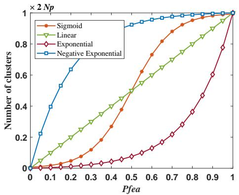

line

| Pfea | Sigmoid | Linear | Exponential | Negative Exponential |
|------|---------|--------|-------------|----------------------|
| 0.0  | 0.0     | 0.0    | 0.0         | 0.0                  |
| 0.1  | 0.05    | 0.1    | 0.01        | 0.4                  |
| 0.2  | 0.1     | 0.2    | 0.02        | 0.6                  |
| 0.3  | 0.2     | 0.3    | 0.03        | 0.7                  |
| 0.4  | 0.3     | 0.4    | 0.05        | 0.8                  |
| 0.5  | 0.4     | 0.5    | 0.08        | 0.9                  |
| 0.6  | 0.5     | 0.6    | 0.1         | 0.95                 |
| 0.7  | 0.6     | 0.7    | 0.15        | 0.97                 |
| 0.8  | 0.7     | 0.8    | 0.2         | 0.98                 |
| 0.9  | 0.8     | 0.9    | 0.3         | 0.99                 |
| 1.0  | 1.0     | 1.0    | 1.0         | 1.0                  |

Fig. 7. Cluster size versus $P _ { f e a }$

$$
\text { Exponential }: n _ {c} = \max (\left\lfloor 2 N _ {p} \cdot \frac {e ^ {5 P _ {f e a}} - 1}{e ^ {5} - 1} \right\rfloor , 1) \tag {11}
$$

$$
\text { Negative   Exponential }: n _ {c} = \max \left(\left\lfloor 2 N _ {p} \cdot \frac {e ^ {- 5 P _ {f e a}} - 1}{e ^ {- 5} - 1} \right\rfloor , 1\right) \tag {12}
$$

Specifically, in these three variants, Eqs. (10), (11), and (12) were used to replace the sigmoid function in Eq. (5). Fig. 7 illustrates the shapes of these four trend functions.

Then, ACVE was compared with these three variants based on the MW and CTP test suites. The experimental results are summarized in Tables S12 and S13 in the supplementary file. For all these three variants, the number of test instances where they outperform ACVE is fewer than the number where they underperform. The results indicate that the trend function in ACVE is more effective.

2) Necessity of CCVE for DDCo: To demonstrate the necessity of CCVE for DDCo, we further designed two variants: DDCo1 and DDCo2. In DDCo1, the update of the auxiliary population $\mathbb { P } _ { 2 }$ does not consider the influence of the main population $\mathbb { P } _ { 1 } .$ . In other words, in DDCo1, $P _ { f e a }$ in Eqs. (8) and (9) is directly equivalent to $P _ { f e a _ { 2 } }$ . In DDCo2, the adjusting equation in Eq. (9) was removed.

Then, DDCo was compared with these two variants based on the MW and CTP test suites. The experimental results are summarized in Tables S14 and S15 in the supplementary file. The results show that DDCo outperforms these two variants on more test instances than it underperforms. It implies that CCVE can improve the performance of DDCo.

3) Parameter Sensitivity Analysis: In Eq. (5) of ACVE, when $t \geq 0 . 7 T , n _ { c }$ is set to $2 N _ { p }$ to promote the utilization of constraint information. To test the sensitivity of this threshold, we designed five variants of ACVE-CDP, setting the thresholds to 0.1T , 0.3T , 0.5T , 0.7T , and 0.9T , respectively.

Then, these variants were evaluated using the MW and CTP test suites. The experimental results, summarized in Tables S16 and S17 in the supplementary file, show that the variants with thresholds of 0.5T , 0.7T , and 0.9T perform similarly on most test instances and outperform the other variants. In summary, a threshold value within the range [0.5T , 0.9T ] would be a better choice.

# VII. REAL-WORLD APPLICATION

In this section, DDCo is applied to optimize the charging protocols of lithium-ion batteries, a hot topic in new energy research recently [3], [50].

TABLE V RESULTS OF DDCO AND SIX COMPETITORS ON THE REAL-WORLD APPLICATION WHERE “STD DEV” DENOTES THE STANDARD DEVIATION OF THE HV VALUES OVER 20 INDEPENDENT RUNS. 

<table><tr><td>Algorithm Comparison</td><td>C-TAEA</td><td>CCMO</td><td>PPS</td><td>ToP</td><td>NSGA-II-CDP</td><td>ShiP</td><td>DDCo</td></tr><tr><td>HV (Std Dev)</td><td>0.6743 (0.0110)</td><td>0.6325 (0.0084)</td><td>0.6571 (0.0073)</td><td>0.6426 (0.0092)</td><td>0.6538 (0.0103)</td><td>0.6384 (0.0075)</td><td>0.7068 (0.0077)</td></tr></table>

TABLE VI REPRESENTATIVE OPTIMAL PROTOCOLS FROM THE CPF AND THE CORRESPONDING SIMULATION RESULTS 

<table><tr><td>Protocol</td><td> $cc_{1}/cc_{2}/cc_{3}/\Delta soc_{1}/\Delta soc_{2}/\Delta soc_{3}$ </td><td> $C_{t}/s$ </td><td> $T_{p}/K$ </td><td> $S_{EI}/nm$ </td></tr><tr><td>I</td><td>0.54/1.82/0.70/0.24/0.29/0.27</td><td>3557.5</td><td>305.2</td><td>0.83</td></tr><tr><td>II</td><td>0.67/0.91/0.53/0.25/0.27/0.28</td><td>4292.2</td><td>302.8</td><td>0.85</td></tr><tr><td>III</td><td>0.71/1.75/0.70/0.26/0.29/0.25</td><td>3199.2</td><td>305.3</td><td>0.84</td></tr><tr><td>IV</td><td>3.44/3.70/1.55/0.31/0.29/0.20</td><td>1073.4</td><td>317.9</td><td>1.79</td></tr><tr><td>V</td><td>1.42/2.13/3.35/0.11/0.13/0.56</td><td>1113.3</td><td>317.9</td><td>1.83</td></tr><tr><td>VI</td><td>4.94/2.93/2.47/0.10/0.23/0.47</td><td>1037.4</td><td>317.3</td><td>2.03</td></tr></table>

# A. Problem Formulation

The charging protocol optimization is a typical CMOP. Its objectives, constraints, and decision variables are introduced as follows.

1) Objectives: The charging process should satisfy diverse user demands, which can be formulated as charging objectives [3]. Generally, these include time, safety, and sustainability requirements, which can be represented by minimizing the charging time (denoted as $C _ { t } )$ , the temperature peak (denoted as $\bar { T _ { p } } )$ , and the thickness of the solid electrolyte interphase layer (denoted as $S _ { E I } )$ , respectively:

$$
\min F (\vec {x}) = (C _ {t}, T _ {p}, S _ {E I}) ^ {\mathrm{T}}. \tag {13}
$$

In Eq. (13), ⃗x denotes the decision vector which will be introduced later. In practical scenarios, these three objectives are conflicting. Larger currents do reduce the required charging time; however, this practice also leads to increased battery temperature and accelerates the formation of the solid electrolyte interphase (SEI) layer. Conversely, opting for smaller charging currents extends the charging duration but maintains the battery temperature at a lower level and slows down the development of the SEI layer. Thus, the charging protocol optimization aims to balance these three conflicting objectives, thus achieving rapid charging without compromising battery performance.

2) Constraints: The terminal voltage (denoted as U ), $T _ { p } ,$ $S _ { E I }$ , and state of charge (denoted as soc) must satisfy certain constraints:

$$
\left\{ \begin{array}{l} U \leq U _ {\max} \\ T _ {p} \leq T _ {\max} \\ S _ {E I} \leq S _ {\max} \\ s o c \leq s _ {\max} \end{array} \right. \tag {14}
$$

where $U _ { \mathrm { m a x } } , T _ { \mathrm { m a x } } , S _ { \mathrm { m a x } } ,$ , and $s _ { \mathrm { m a x } }$ denote the corresponding upper bounds. Importantly, U represents the output of the electrochemical model, with the input being the current. This variable appears exclusively in the constraints.

3) Decision Variables: Due to its efficiency [3], the threestage constant current protocol is investigated. As shown in Fig. 8, the charging process is divided into three stages, with the goal of raising the state of charge from $s _ { \mathrm { m i n } }$ to $s _ { \mathrm { m a x } } .$ In the ith stage, the current rate is $c c _ { i }$ , the amount charged is $\Delta s o c _ { i } .$ , and the charging time is $t _ { i } .$ In summary, the decision

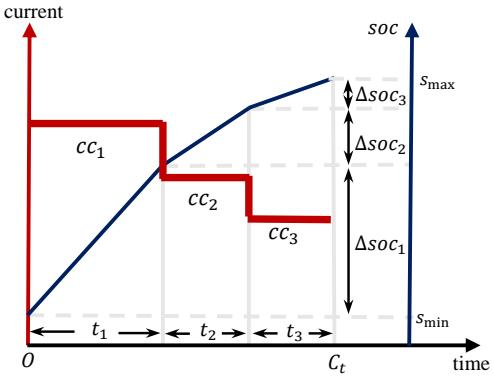

line

| time | current | SOC   |
|------|---------|-------|
| t₁   | 0       | 0     |
| t₂   | 0.5     | 0.5   |
| t₃   | 1       | 1     |

Fig. 8. Three-stage constant current charging protocol.

vector is as follows:

$$
\vec {x} = (c c _ {1}, c c _ {2}, c c _ {3}, \Delta s o c _ {1}, \Delta s o c _ {2}, \Delta s o c _ {3}) ^ {\mathrm{T}}. \tag {15}
$$

To evaluate ${ \vec { x } } ,$ a battery model is constructed by the COMSOL software package. The evaluation process is computationally expensive as it involves simulating the electrochemicalthermal-aging model. However, unlike black-box expensive problems, the system equations of the batteries are known, and a reduced-order model serves as a global model that is sufficiently accurate to approximate the process. Therefore, the reduced-order model is used in our experiment instead of constructing data-driven surrogate models which typically require iterative updates [50].

# B. Experimental Results

In the experimental study, $U _ { \mathrm { m a x } } , \ T _ { \mathrm { m a x } } , \ S _ { \mathrm { m a x } } ,$ and $s _ { \mathrm { m a x } }$ were set to 4.3 V, 318 K, 4.2 nm, and 0.9, respectively. The initial temperature is 298.15 K and the initial state of charge is 0.1. Next, we applied C-TAEA, CCMO, PPS, ToP, NSGA-II-CDP, ShiP, and DDCo to solve the charging protocol optimization problem. Due to the high computational cost of simulating a single charging process in the software package COMSOL (approximately 20 seconds per simulation), the population size was set to 50, and M axF Es was set to 2000.

The HV values of the feasible solutions obtained by DDCo and the six competitors are given in Table V. As can be seen, DDCo provides the best HV value, indicating that the charging protocols designed by DDCo outperform the others in terms of overall performance. To visually demonstrate the effectiveness of DDCo, we selected six representative solutions from its feasible nondominated set. Each solution reflects an optimal protocol for a specific preference. We simulated these protocols in COMSOL, and the experimental parameters and results are presented in Table VI, where the currents (i.e., cc1, cc2, and cc3) are measured in C-rate, with 1Crate corresponding to 16.21 A. For example, the current in the first stage of Protocol I (i.e., cc1) is 0.54C, which equals $0 . 5 4 \times 1 6 . 2 1 = 8 . 7 5 \mathrm { ~ A ~ }$ .

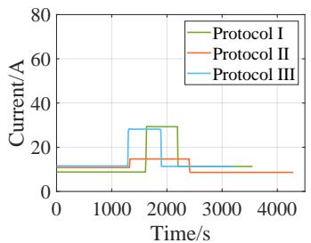

line

| Time/s | Protocol I | Protocol II | Protocol III |
| ------ | ---------- | ----------- | ------------ |
| 0      | 10         | 10          | 10           |
| 1000   | 10         | 10          | 30           |
| 2000   | 30         | 15          | 10           |
| 3000   | 10         | 10          | 10           |
| 4000   | 10         | 10          | 10           |

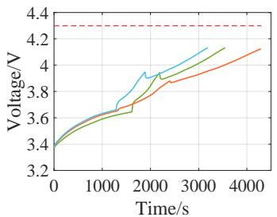

line

| Time/s | Voltage/V |
| ------ | --------- |
| 0      | 3.4       |
| 1000   | 3.6       |
| 2000   | 3.9       |
| 3000   | 4.1       |
| 4000   | 4.2       |

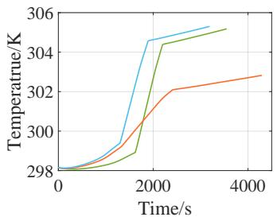

line

| Time/s | Temperature/K (Blue) | Temperature/K (Green) | Temperature/K (Orange) |
| ------ | --------------------- | ---------------------- | ----------------------- |
| 0      | 298                   | 298                    | 298                     |
| 2000   | 305                   | 304                    | 302                     |
| 4000   | 306                   | 305                    | 303                     |

(c)

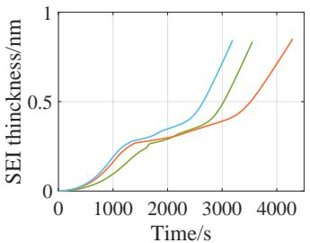

line

| Time/s | SEI thickness/nm (Blue) | SEI thickness/nm (Green) | SEI thickness/nm (Orange) |
| ------ | ------------------------ | ------------------------- | -------------------------- |
| 0      | 0.0                      | 0.0                       | 0.0                        |
| 1000   | 0.2                      | 0.1                       | 0.1                        |
| 2000   | 0.3                      | 0.2                       | 0.2                        |
| 3000   | 0.6                      | 0.4                       | 0.3                        |
| 4000   | 0.9                      | 0.8                       | 0.7                        |

Fig. 9. Charging processes of smooth charging protocols.

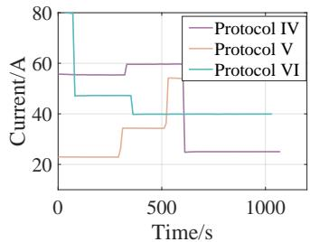

line

| Time/s | Protocol IV | Protocol V | Protocol VI |
| ------ | ----------- | ---------- | ----------- |
| 0      | 60          | 25         | 80          |
| 500    | 60          | 35         | 40          |
| 1000   | 25          | 25         | 40          |

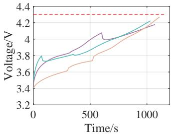

line

| Time/s | Voltage/V (Line 1) | Voltage/V (Line 2) | Voltage/V (Line 3) |
| ------ | ------------------ | ------------------ | ------------------ |
| 0      | 3.6                | 3.8                | 3.4                |
| 500    | 4.1                | 4.0                | 3.8                |
| 1000   | 4.3                | 4.2                | 4.2                |

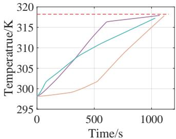

line

| Time/s | Temperature/K |
| ------ | ------------- |
| 0      | 298           |
| 500    | 315           |
| 1000   | 318           |

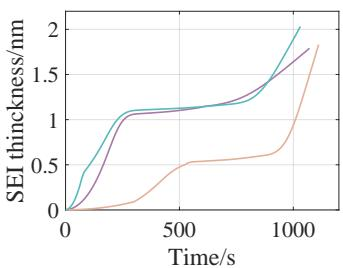

line

| Time/s | SEI thickness/nm (Line 1) | SEI thickness/nm (Line 2) | SEI thickness/nm (Line 3) |
| ------ | -------------------------- | -------------------------- | -------------------------- |
| 0      | 0                          | 0                          | 0                          |
| 500    | 1.1                        | 1.1                        | 0.5                        |
| 1000   | 2.0                        | 1.8                        | 1.9                        |

(d)   
Fig. 10. Charging processes of smooth charging protocols.

Additionally, the charging curves of these six protocols are shown in Figs. 9 and 10. Protocols I, II, and III offer smooth charging protocols that prioritize lower battery temperatures and provide a more stable charging experience. In contrast, Protocols IV, V, and VI are designed for fast charging, allowing the battery to reach a high rate of charge quickly, thereby significantly reducing the charging time. All of these protocols effectively maintain the charging voltage and the thickness of the SEI layer within a reasonable range. In summary, DDCo is able to achieve a set of protocols that meet various demands, all while adhering to various constraints.

# VIII. CONCLUSION

When addressing CMOPs, in addition to CHTs, constraint violation evaluation also plays a crucial role in balancing constraint satisfaction and objective optimization. This paper designed an adaptive CVE framework called ACVE, which demonstrates the capability to dynamically utilize constraint information at various levels of granularity. It achieves this by clustering the population according to the evolutionary state and reassigning CV values to the clusters. During the evolutionary process, the number of clusters is adaptively adjusted to facilitate a gradual shift from emphasizing objectives to focusing on constraints. ACVE can be seamlessly combined with various CHTs, demonstrating its simplicity, flexibility, and broad applicability. To further verify the performance of ACVE, we embedded it into a dual-population evolutionary framework and proposed a new CMOEA called DDCo. Extensive experimental studies were conducted to analyze ACVE and DDCo. Additionally, DDCo was applied to optimize the charging protocols of lithium-ion batteries, showcasing its practical utility in a real-world application.

In our study, constraints are treated as black-box functions, meaning gradient information or other specific details about the constraints are unavailable. When such information becomes accessible, incorporating active constraints could further improve our method, and we plan to explore this in future research. Additionally, the main topic of our study focuses only on constraint violation evaluation for CMOPs. In the future, the advantages of surrogate-assisted CMOEAs [51], [52] will be explored to extend DDCo for expensive CMOPs.

# REFERENCES

[1] R. Chai, A. Savvaris, A. Tsourdos, Y. Xia, and S. Chai, “Solving multiobjective constrained trajectory optimization problem by an extended evolutionary algorithm,” IEEE Transactions on Cybernetics, vol. 50, no. 4, pp. 1630–1643, 2018.   
[2] Y. Tian, T. Zhang, J. Xiao, X. Zhang, and Y. Jin, “A coevolutionary framework for constrained multiobjective optimization problems,” IEEE Transactions on Evolutionary Computation, vol. 25, no. 1, pp. 102–116, 2020.   
[3] B.-C. Wang, Y.-Y. Mao, Y. Wang, and H.-X. Li, “Gaussian processaccelerated multiobjective evolutionary design of charging process considering multiple user preferences,” IEEE Transactions on Industrial Informatics, 2024, DOI: 10.1109/TII.2024.3388602.   
[4] K. Deb, A. Pratap, and T. Meyarivan, “Constrained test problems for multi-objective evolutionary optimization,” in Evolutionary Multi-Criterion Optimization: First International Conference, EMO 2001 Zurich, Switzerland, March 7–9, 2001 Proceedings 1. Springer, 2001, pp. 284–298.   
[5] R. Sun, J. Zou, Y. Liu, S. Yang, and J. Zheng, “A multi-stage algorithm for solving multi-objective optimization problems with multiconstraints,” IEEE Transactions on Evolutionary Computation, vol. 27, no. 5, pp. 1207–1219, 2023.   
[6] K. Deb, A. Pratap, S. Agarwal, and T. Meyarivan, “A fast and elitist multiobjective genetic algorithm: NSGA-II,” IEEE Transactions on Evolutionary Computation, vol. 6, no. 2, pp. 182–197, 2002.   
[7] Q. Zhang and H. Li, “MOEA/D: A multiobjective evolutionary algorithm based on decomposition,” IEEE Transactions on Evolutionary Computation, vol. 11, no. 6, pp. 712–731, 2007.

[8] Y. Tian, R. Cheng, X. Zhang, F. Cheng, and Y. Jin, “An indicator-based multiobjective evolutionary algorithm with reference point adaptation for better versatility,” IEEE Transactions on Evolutionary Computation, vol. 22, no. 4, pp. 609–622, 2017.   
[9] Y. G. Woldesenbet, G. G. Yen, and B. G. Tessema, “Constraint handling in multiobjective evolutionary optimization,” IEEE Transactions on Evolutionary Computation, vol. 13, no. 3, pp. 514–525, 2009.   
[10] B. Tessema and G. G. Yen, “A self adaptive penalty function based algorithm for constrained optimization,” in 2006 IEEE International Conference on Evolutionary Computation. IEEE, 2006, pp. 246–253.   
[11] T. P. Runarsson and X. Yao, “Stochastic ranking for constrained evolutionary optimization,” IEEE Transactions on Evolutionary Computation, vol. 4, no. 3, pp. 284–294, 2000.   
[12] T. Takahama and S. Sakai, “Constrained optimization by the ε constrained differential evolution with gradient-based mutation and feasible elites,” in 2006 IEEE International Conference on Evolutionary Computation. IEEE, 2006, pp. 1–8.   
[13] T. Ray, H. K. Singh, A. Isaacs, and W. Smith, “Infeasibility driven evolutionary algorithm for constrained optimization,” Constraint-Handling in Evolutionary Optimization, pp. 145–165, 2009.   
[14] Z. Cai and Y. Wang, “A multiobjective optimization-based evolutionary algorithm for constrained optimization,” IEEE Transactions on Evolutionary Computation, vol. 10, no. 6, pp. 658–675, 2006.   
[15] S. Li, K. Li, and W. Li, “Do we really need to use constraint violation in constrained evolutionary multi-objective optimization?” in Parallel Problem Solving from Nature–PPSN XVII: 17th International Conference, PPSN 2022, Dortmund, Germany, September 10–14, 2022, Proceedings, Part II. Springer, 2022, pp. 124–137.   
[16] B.-C. Wang, Y. Qin, X.-B. Meng, Y. Wang, and Z.-Z. Liu, “ATM-R: An adaptive tradeoff model with reference points for constrained multiobjective evolutionary optimization,” IEEE Transactions on Cybernetics, 2024, DOI: 10.1109/TCYB.2023.3329947.   
[17] S. Y. Zeng, L. S. Kang, and L. X. Ding, “An orthogonal multi-objective evolutionary algorithm for multi-objective optimization problems with constraints,” Evolutionary Computation, vol. 12, no. 1, pp. 77–98, 2004.   
[18] Z. Ma and Y. Wang, “Evolutionary constrained multiobjective optimization: Test suite construction and performance comparisons,” IEEE Transactions on Evolutionary Computation, vol. 23, no. 6, pp. 972–986, 2019.   
[19] Z. Ma, Y. Wang, and W. Song, “A new fitness function with two rankings for evolutionary constrained multiobjective optimization,” IEEE Transactions on Systems, Man, and Cybernetics: Systems, vol. 51, no. 8, pp. 5005–5016, 2019.   
[20] K. Yu, J. Liang, B. Qu, Y. Luo, and C. Yue, “Dynamic selection preference-assisted constrained multiobjective differential evolution,” IEEE Transactions on Systems, Man, and Cybernetics: Systems, vol. 52, no. 5, pp. 2954–2965, 2021.   
[21] L. Jiao, J. Luo, R. Shang, and F. Liu, “A modified objective function method with feasible-guiding strategy to solve constrained multiobjective optimization problems,” Applied Soft Computing, vol. 14, pp. 363–380, 2014.   
[22] Z. Ma and Y. Wang, “Shift-based penalty for evolutionary constrained multiobjective optimization and its application,” IEEE Transactions on Cybernetics, vol. 53, no. 1, pp. 18–30, 2023.   
[23] D. K. Saxena, T. Ray, K. Deb, and A. Tiwari, “Constrained manyobjective optimization: A way forward,” in 2009 IEEE Congress on Evolutionary Computation. IEEE, 2009, pp. 545–552.   
[24] F. Qian, B. Xu, R. Qi, and H. Tianfield, “Self-adaptive differential evolution algorithm with α-constrained-domination principle for constrained multi-objective optimization,” Soft Computing, vol. 16, pp. 1353–1372, 2012.   
[25] Z. Wang, J. Wei, and Y. Zhang, “A multi-constraint handling techniquebased niching evolutionary algorithm for constrained multi-objective optimization problems,” in 2020 IEEE Congress on Evolutionary Computation (CEC). IEEE, 2020, pp. 1–6.   
[26] Q. Zhu, Q. Zhang, and Q. Lin, “A constrained multiobjective evolutionary algorithm with detect-and-escape strategy,” IEEE Transactions on Evolutionary Computation, vol. 24, no. 5, pp. 938–947, 2020.   
[27] H. Geng, M. Zhang, L. Huang, and X. Wang, “Infeasible elitists and stochastic ranking selection in constrained evolutionary multi-objective optimization,” in 2006 International Conference on Simulated Evolution and Learning (SEAL). Springer, 2006, pp. 336–344.   
[28] W.-Q. Ying, W.-P. He, Y.-X. Huang, D.-T. Li, and Y. Wu, “An adaptive stochastic ranking mechanism in MOEA/D for constrained multiobjective optimization,” in 2016 International Conference on Information System and Artificial Intelligence (ISAI). IEEE, 2016, pp. 514–518.   
[29] Z.-Z. Liu, Y. Wang, and B.-C. Wang, “Indicator-based constrained multiobjective evolutionary algorithms,” IEEE Transactions on Systems, Man, and Cybernetics: Systems, vol. 51, no. 9, pp. 5414–5426, 2019.   
[30] A. Isaacs, T. Ray, and W. Smith, “Blessings of maintaining infeasible solutions for constrained multi-objective optimization problems,” in 2008

IEEE Congress on Evolutionary Computation (IEEE World Congress on Computational Intelligence). IEEE, 2008, pp. 2780–2787.   
[31] C. Peng, H.-L. Liu, and F. Gu, “An evolutionary algorithm with directed weights for constrained multi-objective optimization,” Applied Soft Computing, vol. 60, pp. 613–622, 2017.   
[32] Y. Zhou, M. Zhu, J. Wang, Z. Zhang, Y. Xiang, and J. Zhang, “Trigoal evolution framework for constrained many-objective optimization,” IEEE Transactions on Systems, Man, and Cybernetics: Systems, vol. 50, no. 8, pp. 3086–3099, 2018.   
[33] D. H. Wolpert and W. G. Macready, “No free lunch theorems for optimization,” IEEE Transactions on Evolutionary Computation, vol. 1, no. 1, pp. 67–82, 1997.   
[34] Y. Wang, Z. Cai, Y. Zhou, and W. Zeng, “An adaptive tradeoff model for constrained evolutionary optimization,” IEEE Transactions on Evolutionary Computation, vol. 12, no. 1, pp. 80–92, 2008.   
[35] B. Y. Qu and P. N. Suganthan, “Constrained multi-objective optimization algorithm with an ensemble of constraint handling methods,” Engineering Optimization, vol. 43, no. 4, pp. 403–416, 2011.   
[36] R. Datta and R. G. Regis, “A surrogate-assisted evolution strategy for constrained multi-objective optimization,” Expert Systems with Applications, vol. 57, pp. 270–284, 2016.   
[37] Y. Zhang, H. Jiang, Y. Tian, H. Ma, and X. Zhang, “Multigranularity surrogate modeling for evolutionary multiobjective optimization with expensive constraints,” IEEE Transactions on Neural Networks and Learning Systems, 2023.   
[38] Z. Song, H. Wang, B. Xue, M. Zhang, and Y. Jin, “Balancing objective optimization and constraint satisfaction in expensive constrained evolutionary multi-objective optimization,” IEEE Transactions on Evolutionary Computation, 2023.   
[39] Z. Wang, Q. Zhang, A. Zhou, M. Gong, and L. Jiao, “Adaptive replacement strategies for MOEA/D,” IEEE Transactions on Cybernetics, vol. 46, no. 2, pp. 474–486, 2015.   
[40] Z. Fan, W. Li, X. Cai, H. Li, C. Wei, Q. Zhang, K. Deb, and E. Goodman, “Push and pull search for solving constrained multi-objective optimization problems,” Swarm and Evolutionary Computation, vol. 44, pp. 665– 679, 2019.   
[41] E. Zitzler, M. Laumanns, and L. Thiele, “SPEA2: Improving the strength pareto evolutionary algorithm,” TIK report, vol. 103, 2001.   
[42] Y. Zhou, Y. Xiang, and X. He, “Constrained multiobjective optimization: Test problem construction and performance evaluations,” IEEE Transactions on Evolutionary Computation, vol. 25, no. 1, pp. 172–186, 2020.   
[43] Q. Zhang, A. Zhou, S. Zhao, P. N. Suganthan, W. Liu, S. Tiwari, et al., “Multiobjective optimization test instances for the CEC 2009 special session and competition,” University of Essex, Colchester, UK and Nanyang technological University, Singapore, special session on performance assessment of multi-objective optimization algorithms, technical report, vol. 264, pp. 1–30, 2008.   
[44] H. Ishibuchi, H. Masuda, Y. Tanigaki, and Y. Nojima, “Modified distance calculation in generational distance and inverted generational distance,” in 2015 International Conference on Evolutionary Multi-Criterion Optimization (EMO). Springer, 2015, pp. 110–125.   
[45] L. While, P. Hingston, L. Barone, and S. Huband, “A faster algorithm for calculating hypervolume,” IEEE Transactions on Evolutionary Computation, vol. 10, no. 1, pp. 29–38, 2006.   
[46] Y. Tian, R. Cheng, X. Zhang, and Y. Jin, “PlatEMO: A matlab platform for evolutionary multi-objective optimization [educational forum],” IEEE Computational Intelligence Magazine, vol. 12, no. 4, pp. 73–87, 2017.   
[47] K. Li, R. Chen, G. Fu, and X. Yao, “Two-archive evolutionary algorithm for constrained multiobjective optimization,” IEEE Transactions on Evolutionary Computation, vol. 23, no. 2, pp. 303–315, 2018.   
[48] Z.-Z. Liu and Y. Wang, “Handling constrained multiobjective optimization problems with constraints in both the decision and objective spaces,” IEEE Transactions on Evolutionary Computation, vol. 23, no. 5, pp. 870–884, 2019.   
[49] J. Alcala-Fdez, L. Sanchez, S. Garcia, M. J. del Jesus, S. Ventura, ´ J. M. Garrell, J. Otero, C. Romero, J. Bacardit, V. M. Rivas, et al., “KEEL: a software tool to assess evolutionary algorithms for data mining problems,” Soft Computing, vol. 13, pp. 307–318, 2009.   
[50] A. Jokar, B. Rajabloo, M. Desilets, and M. Lacroix, “Review of simpli- ´ fied pseudo-two-dimensional models of lithium-ion batteries,” Journal of Power Sources, vol. 327, pp. 44–55, 2016.   
[51] R. de Winter, B. Milatz, J. Blank, N. van Stein, T. Back, and K. Deb, ¨ “Parallel multi-objective optimization for expensive and inexpensive objectives and constraints,” Swarm and Evolutionary Computation, vol. 86, p. 101508, 2024.   
[52] R. de Winter, P. Bronkhorst, B. van Stein, and T. Back, “Constrained ¨ multi-objective optimization with a limited budget of function evaluations,” Memetic Computing, vol. 14, no. 2, pp. 151–164, 2022.