# An Adaptive Near-Field Channel Model for 6G XL-MIMO UPA-to-Multi-UAV Cooperative Communications

Lu Bai , Senior Member, IEEE, Mengyuan Lu , Graduate Student Member, IEEE, Ziwei Huang , Member, IEEE, Xuesong Cai , Senior Member, IEEE, and Xiang Cheng , Fellow, IEEE

Abstract—In this paper, a novel adaptive near-field channel model with an extremely large-scale multiple-input multipleoutput (XL-MIMO) uniform planar array (UPA) is proposed for sixth generation (6G) multiple-uncrewed aerial vehicle (multi-UAV) cooperative communications. In the proposed model, a novel selective near-field area (SNA) of the XL-MIMO UPA, where the transmission is regarded as spherical wavefront, is proposed to balance complexity and accuracy of near-field channel modeling. To jointly model the non-stationarity on the array, and in the space, time, and frequency domains, an adaptive UPA-UAVtime-frequency non-stationary algorithm is developed, which mimics the non-stationarity on the XL-MIMO UPA for the first time. The channel parameters related to the three-dimensional (3D) continuously arbitrary trajectory and self-rotation of multi-UAVs are also taken into account in the proposed model and the developed algorithm. To explore the channel statistics and validate the proposed model, a new XL-MIMO-UPA-to-multi-UAV channel dataset at low-terahertz (low-THz) frequency band under National Stadium scenario is built. Key UPA-to-multi-UAV channel statistics, such as the array-space-time-frequency correlation function (ASTF-CF), time stationary interval (TSI), Doppler power spectral density (DPSD), and singular value

spread (SVS), are obtained. The close agreement between the simulation results and ray-tracing results in National Stadium scenario is achieved, demonstrating the accuracy of proposed channel model.

Index Terms—6G, near-field channel modeling, XL-MIMO, spherical wavefront, channel non-stationarity.

## I. INTRODUCTION

INCE fifth generation (5G) wireless communication net-S works have been deployed worldwide, research and development of sixth generation (6G) wireless systems have attracted much attention from academia and industry. The International Telecommunication Union (ITU) has released the “Framework and Overall Objectives of the Future Development of IMT for 2030 and Beyond” in June 2023 [1], which demonstrated that 6G is expected to achieve a 100-fold increase than the peak data rate of 5G (from Gbps to Tbps) and extensions of mMTC+ defined in 5G (Hyper-massive Connectivity). In this case, the low-terahertz (low-THz) frequency band is widely regarded as a key technology of 6G [2], [3], while it can achieve remarkable data transmission rates and energy efficiency. Nevertheless, this major technological advancement brings considerable challenge that substantial path loss occurring at these frequency bands [4], [5]. To overcome severe path loss, an efficient approach is to leverage extremely large-scale multiple-input multiple-output (XL-MIMO) antenna arrays [6], [7]. Envisioned as a key enabler for 6G, XL-MIMO can provide ultra-high spatial resolution and massive connectivity. Meanwhile, it moves electromagnetic diffraction from far-field to near-field regimes and transforms the signal wavefront from planar to spherical, requiring fundamental redesigns of conventional wireless systems. Therefore, it is significant to develop a proper nearfield channel model to support the design of 6G wireless communication systems with XL-MIMO antenna arrays at low-THz frequency bands [8], [9].

Compared with the typical millimeter wave (mmWave), i.e., 30–100 GHz band, the low-THz, i.e., 0.1–1 THz band provides tens of times larger potential bandwidth and enables higher achievable data rates, while suffering from more severe path loss and molecular absorption. In addition, due to its shorter wavelength, the Rayleigh distance of an XL-MIMO antenna array becomes significantly larger under the same physical aperture, making spherical wavefront and near-field propagation effects non-negligible. Consequently, the low-THz band highlights stronger near-field characteristics than the mmWave band, which motivates the adoption of near-field adaptive channel modeling to accurately characterize propagation in this regime. Furthermore, the low-THz and mmWave bands are selected as comparative frequencies, i.e., 28 GHz and 0.35 THz, to illustrate how the operating frequency influences spatial–temporal correlation and channel statistical properties.

To date, considerable research efforts have been devoted to near-field channel modeling. A generalized electromagnetic domain near-field channel modeling was proposed in [10], where the capacity limit of point-to-point holographic MIMO (H-MIMO) systems equipped with arbitrarily placed surfaces in a line-of-sight (LoS) environment was investigated. However, the channel model in [10] was developed for onedimensional (1D) uniform linear arrays (ULAs) and may exhibit limitations when applied to two-dimensional (2D) uniform planar arrays (UPAs). To further investigate near field channel models for UPAs, the authors in [11] and [12] introduced a near-field integrated sensing and communication (ISAC) channel model at 2.8 GHz and a subarray decompo sition scheme-based near-field channel model at 5 GHz for UPA-to-ULA wireless communication systems respectively. Meanwhile, the authors in [14] conducted a measurement campaign with a virtual ultra-large-scale UPA at 15 GHz, analyzing the spatial variations of coherent bandwidth and distance along the array. However, a modeling challenge of array non-stationarity on UPA is that the deterministic characterization of a certain antenna element’s random non stationary state at a given instant was ignored in [11] and [12]. The birth-death (BD) process, which is an efficient method to model the array non-stationarity on ULA, becomes improper when modeling the non-stationarity on UPA. On the 1D ULA, the BD process typically considers the evolution of clusters along the horizontal direction, which is suitable when only azimuth variation is involved [13]. However, when extending to the 2D UPA, clusters can evolve along multiple paths that include both azimuth and elevation directions, leading to different states of the last cluster, i.e., both survival and death states may occur depending on the evolution path. Therefore, the BD process based solely on the 1D assumption is insufficient to capture the non-stationarity characteristics on UPA. Meanwhile, while valid for conventional MIMO/massive MIMO configurations, the works in [10], [11], and [12] face challenges in XL-MIMO and low-THz deployments aggravated by the increased channel dimensionality and spatial correlation. The distance limitation and blockage problems of a promising THz ultra-large antenna array (ULAA) system were investigated in [15], where the modeling challenge of array non-stationarity on UPA was also ignored. Furthermore, the aforementioned four models in [10], [11], [12], and [15] are confined to terrestrial communication scenarios, failing to capture distinctive propagation characteristics of air-to-ground channels and three-dimensional (3D) continuously arbitrary trajectories of uncrewed aerial vehicles (UAVs). Given the widespread deployment of UAVs in the low-altitude economy, there is a critical need for dedicated modeling research addressing the unique propagation environment of aerial links and UAVs’ 3D continuously arbitrary trajectories. Particularly under ultra-massive MIMO and terahertz-based systems, the spatial correlation of multi-UAV-to-ground channels exhibits heightened complexity and warrants dedicated investigation, rendering the conventional method of reduplicated usage of single-UAV channel models inadequate [16], [17]. Single-UAV channels cannot capture the complex spatial correlation and cooperative characteristics among multi-UAVs. In practice, multi-UAVs experience joint influence from shared scattering clusters, leading to obvious inter-UAV channel coupling and non-stationarity. Such coupling critically affects beamforming, interference management, and cooperative resource allocation. Therefore, the channel characteristic analysis and modeling of 6G near-field channel with XL-MIMO antenna array at low-THz frequency band present a critical and time-sensitive investigative necessity demanding urgent scholarly attention.

The scarcity of research on 6G multi-UAV near-field channels with XL-MIMO antenna arrays at low-THz frequency band stems from inadequate channel measurement campaigns, resulting in insufficient theoretical grounding for channel characterization. Due to hardware challenges posed by the large number of antennas, research on XL-MIMO channel measurement has remained limited. Under 6 GHz, measurements have been carried out in corridor [18], indoor classroom, and outdoor scenarios [19], typically utilizing a 32-element UPA with displacement scanning to synthesize larger virtual arrays. A 40 × 25 array was utilized in [20] at 3.8 GHz, and 128×256 dynamic dual-polarized channels were characterized based on the switched array principle in [21]. At low-THz band, several studies [22], [23] have conducted low-THz channel measurements with XL-MIMO antenna arrays. For example, at 99–101 GHz frequency band, path loss, delay spread, and angular spread were characterized in an indoor hall [22]. At 142 GHz, wave-object interactions were analyzed in indoor entrance hall and outdoor residential street scenarios, revealing reflection orders and cluster distributions for geometry-based modeling [23]. However, these low-THz measurements remain limited to static scenarios. Therefore, dynamic channel measurements for multi-UAV near-field XL-MIMO channels at low-THz band are critically important and urgently needed.

To fill these gaps, a new XL-MIMO UPA-to-multi-UAV channel dataset at low-THz frequency bands is constructed under National Stadium scenario and a novel adaptive nearfield channel model is further proposed for 6G XL-MIMO UPA-to-multi-UAV cooperative communications in this paper. The main contributions and novelties are summarized as follows.

1) This paper proposes a novel adaptive near-field channel model for 6G XL-MIMO UPA-to-multi-UAV cooperative communications. The proposed model for the first time calculates the multi-UAV cooperative channel impulse responses (CIRs) of the LoS transmission, the ground reflection transmission, and the non-LoS (NLoS) component transmission through twin-clusters in consideration of the impact of near-field communications.

2) To balance complexity and accuracy, a novel selective near-field area (SNA) of XL-MIMO UPA in near-field channel is proposed for 6G multi-UAV cooperative communications. The transmission through the clusters within SNA and when UAVs moves in SNA is calculated as spherical wavefront, otherwise the transmission is calculated as plane wavefront. In this case, the unnecessary complexity is reduced while ensuring the precision of channel modeling for near-field communications.

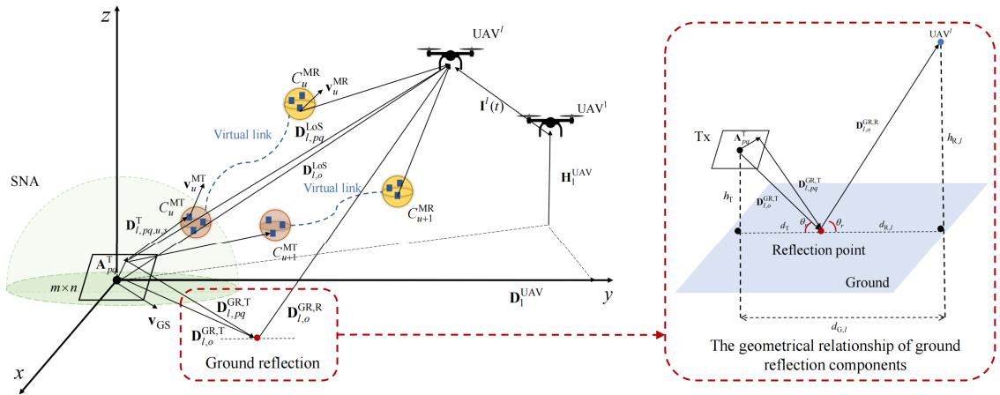  
Fig. 1. The proposed adaptive near-field channel model for 6G XL-MIMO UPA-to-multi-UAV cooperative communications.

3) To jointly model the non-stationarity on array, space, time, and frequency domains for 6G near-field multi-UAV channel, an adaptive UPA-UAV-time-frequency non-stationarity algorithm is developed for the first time. Specifically, for the non-stationarity modeling on the XL-MIMO UPA, a seed growth method with BD process is designed to guarantee the unique solution in the nonstationarity at a certain time.

4) To thoroughly explore the channel statistics of XL-MIMO UPA-to-multi-UAV cooperative communications, a new channel dataset at low-THz frequency bands under National Stadium scenario is presented for the first time. Key UPA-to-multi-UAV channel statistics, such as the array-space-time-frequency correlation function (ASTF-CF), time stationary interval (TSI), Doppler power spectral density (DPSD), and singular value spread (SVS), are obtained. The close agreement between the simulation results and ray-tracing results in National Stadium scenario is achieved, demonstrating the accuracy of proposed channel model.

The rest of this paper is organized as follows. Section II illustrates the 3D adaptive near-field channel model for 6G XL-MIMO UPA-to-multi-UAV cooperative communication systems. Section III describes the novel adaptive UPA-UAVtime-frequency non-stationary algorithm. In Section IV, the key channel characteristics are calculated. The National Stadium XL-MIMO-UPA-to-multi-UAV dataset and simulation results are presented in Section V. At last, the conclusions are given in Section VI.

## II. 3D ADAPTIVE NEAR-FIELD CHANNEL MODEL

The simplified representation of the proposed adaptive nearfield channel model for 6G XL-MIMO UPA-to-multi-UAV cooperative communications is shown in Fig. 1. In the theoretical reference model, the Tx is a ground station (GS) equipped with UPAs composed of $M _ { \mathrm { T } } \left( m \times n \right)$ omnidirectional antennas. The antenna spacing of the UPA is $\delta _ { \mathrm { T } }$ . The p-th row and q-th column antenna in the UPA is represented as $\mathrm { A } _ { p q } ^ { \mathrm { T } } ,$ , where $p =$ $1 , 2 , \ldots , m , q = 1 , 2 , \ldots , n$ . The Rx are $M _ { \mathrm { R } }$ multi-UAVs. The l-th UAV is represented as $\mathrm { U A V } ^ { l }$ , where $l = 1 , 2 , \ldots , M _ { \mathrm { R } }$ . As the green semi-sphere shown in Fig. 1, the SNA is defined as a semi-sphere with radius of Γ at the GS side. To decrease the complexity, the calculation of sphere wavefront is adaptive in the proposed model. In the SNA, the CIR is calculated as sphere wavefront, otherwise it is calculated as plane wave. ΓNF can be computed by $\begin{array} { r } { \Gamma _ { \mathrm { N F } } = \frac { 2 \delta _ { \mathrm { T } } ^ { 2 } \left( \mathrm { m } ^ { 2 } + \mathrm { n } ^ { 2 } \right) } { \lambda } } \end{array}$ In this context, $\bar { \delta } _ { \mathrm { T } } ^ { 2 } ( m ^ { 2 } + n ^ { 2 } )$ represents the squared effective aperture $D ^ { 2 }$ of the UPA, and $\Gamma _ { \mathrm { N F } } ^ { \bullet } \approx 2 D ^ { 2 } / \lambda$ is derived from the Rayleigh criterion, which provides a physically grounded transition between spherical-wave and plane-wave calculations to balance modeling accuracy and computational complexity. The SNA mechanism is integrated with an adaptive update process, in which element-wise distances and phases are computed utilizing spherical wavefronts when a cluster or a UAV is located within the SNA, while a plane-wave approximation is applied outside the region, with the corresponding visibility and power parameters updated accordingly. Furthermore, when the physical aperture of the UPA is far smaller than the operating wavelength or the transmission distance is much larger than the Rayleigh distance, the spherical-wavefront terms in the model become negligible and the proposed nearfield formulation naturally degenerates into the conventional far-field plane-wave model with globally uniform visibility and stationary channel characteristics.

In near-field communications, the placement angle of UPA affects the channel more significantly. In the proposed model, the placement angle of UPA is considered by the transition between local coordinate system (LCS) and global

$$
{ \bf R } = { \bf R } _ { Z } ( \alpha ) { \bf R } _ { Y } ( \beta ) { \bf R } _ { X } ( \gamma ) = \left( \begin{array} { c } { { + \cos \alpha - \sin \alpha \mathrm { ~ 0 } } } \\ { { + \sin \alpha + \cos \alpha \mathrm { ~ 0 } } } \\ { { 0 \mathrm { ~ } \mathrm { ~ 0 } } } \end{array} \right) \left( \begin{array} { c c } { { + \cos \beta \mathrm { ~ 0 ~ } + \sin \beta } } \\ { { 0 \mathrm { ~ 1 ~ } \mathrm { ~ 0 } } } \\ { { - \sin \beta \mathrm { ~ 0 ~ } + \cos \beta } } \end{array} \right) \left( \begin{array} { c c } { { 1 \mathrm { ~ 0 ~ } } } & { { 0 } } \\ { { 0 \mathrm { ~ + c o s \gamma - s i n \gamma } } } \\ { { 0 \mathrm { ~ + s i n \gamma + c o s \gamma } } } \end{array} \right) .\tag{4}
$$

coordinate system (GCS). The scattering environment is defined in the GCS. The LCS is defined for the UPA of Tx. The origins of GCS and LCS are located at the central points of the UPA of Tx. In the LCS, the antenna vector of $\mathrm { A } _ { p q } ^ { \mathrm { T } }$ is $\mathbf { A ^ { \prime } } _ { p q } ^ { \mathrm { T } } = \left[ { x ^ { \prime } } _ { p q } ^ { \mathrm { T } } , { y ^ { \prime } } _ { p q } ^ { \mathrm { T } } , { z ^ { \prime } } _ { p q } ^ { \mathrm { T } } \right] ^ { \mathrm { T } }$ , where

$$
{ x ^ { \prime } } _ { p q } ^ { \mathrm { T } } = \left\{ \begin{array} { l l } { - \frac { m - 2 p + 1 } { 2 } \delta _ { \mathrm { T } } , ~ p < \frac { m + 1 } { 2 } , } \\ { \frac { m - 2 p + 1 } { 2 } \delta _ { \mathrm { T } } , ~ p \ge \frac { m + 1 } { 2 } } \end{array} \right.\tag{1}
$$

$$
{ y ^ { \prime } } _ { p q } ^ { \mathrm { T } } = \left\{ \begin{array} { l l } { - \frac { n - 2 q + 1 } { 2 } \delta _ { \mathrm { T } } , q < \frac { n + 1 } { 2 } , } \\ { \frac { n - 2 q + 1 } { 2 } \delta _ { \mathrm { T } } , q \geq \frac { n + 1 } { 2 } } \end{array} \right.\tag{2}
$$

$$
z _ { p q } ^ { \prime \mathrm { T } } = 0 .\tag{3}
$$

The placement angles of UPA with respect to x-axis, y-axis, and z-axis of the GCS are defined by the angles $\alpha , \ \beta ,$ and $\gamma .$ . The 3D rotation matrix is calculated as (4), shown at the bottom of the previous page.

The antenna vector of $\mathrm { A } _ { p q } ^ { \mathrm { T } }$ in $\mathbf { \bar { G } C S } , \mathbf { A } _ { p q } ^ { \mathrm { T } }$ , can be calculated as $\mathbf { A } _ { p q } ^ { \mathrm { T } } = \mathbf { R } \mathbf { A } _ { p q } ^ { \prime \mathrm { T } }$

The CIR of proposed channel model can be characterized by an $M _ { \mathrm R } \times M _ { \mathrm T } \left[ M _ { \mathrm R } \times \left( m \times n \right) \right]$ ] complex matrix $\mathbf { H } ( t , \tau ) =$ $\left[ \mathbf { h } ^ { \mathbf { 1 } } , \mathbf { h } ^ { \mathbf { 2 } } , \ldots , \mathbf { h } ^ { l } , \ldots , \mathbf { h } ^ { M _ { \mathrm { R } } } \right] ^ { \mathrm { T } }$ , where

$$
\mathbf { h } ^ { l } = \left[ \begin{array} { c c c c c c } { h _ { 1 1 } ^ { l } } & { h _ { 1 2 } ^ { l } } & { \cdots } & { h _ { 1 q } ^ { l } } & { \cdots } & { h _ { 1 n } ^ { l } } \\ { h _ { 2 1 } ^ { l } } & { h _ { 2 2 } ^ { l } } & { \cdots } & { h _ { 2 q } ^ { l } } & { \cdots } & { h _ { 2 n } ^ { l } } \\ { \vdots } & { \vdots } & { \ddots } & { \vdots } & { \ddots } & { \vdots } \\ { h _ { p 1 } ^ { l } } & { h _ { p 2 } ^ { l } } & { \cdots } & { h _ { p q } ^ { l } } & { \cdots } & { h _ { p n } ^ { l } } \\ { \vdots } & { \vdots } & { \ddots } & { \vdots } & { \ddots } & { \vdots } \\ { h _ { m 1 } } & { h _ { m 2 } } & { \cdots } & { h _ { m q } ^ { l } } & { \cdots } & { h _ { m n } } \end{array} \right] .\tag{5}
$$

In (5), $l ~ = ~ 1 , 2 , \cdot \cdot ~ , M _ { \mathrm { R } } - 1 , ~ p ~ = ~ 1 , 2 , \cdot \cdot ~ , m - 1$ , and $q = 1 , 2 , \cdots , n - 1$ . The complex channel gain from $\mathrm { A } _ { p q } ^ { \mathrm { T } }$ of GS to the l-th UAV $\mathrm { U A V } ^ { l }$ at time t with delay $\tau , h _ { p q } ^ { l } ( t , \tau )$ , can be calculated by $( 6 ) ,$ shown at the bottom of the page, where $h _ { l , p q } ^ { \mathrm { L o S } } ( t )$ and $h _ { l , p q } ^ { \mathrm { { \scriptsize { ( \dot { G } } R } } } ( t )$ are the LoS component and the ground reflection component of the complex channel gain from $\mathrm { A } _ { p q } ^ { \mathrm { T } }$ of GS to $\mathrm { U A V } ^ { l }$ at time $\therefore h _ { l , p q , u , s } ^ { \mathrm { N L o S } } ( t )$ is the NLoS component, which is the complex channel gain from $\mathrm { A } _ { p q } ^ { \mathrm { T } }$ of GS to the $\mathrm { U A V } ^ { l }$ through the s-th ray within the u-th twin-cluster at time $t . \ \tau _ { l , p q } ^ { \mathrm { L o S } } ( t ) , \ \tau _ { l , p q } ^ { \mathrm { G R } } ( t )$ , and $\tau _ { l , p q , u , s } ^ { \mathrm { N L o S } } ( t )$ are the delays of the corresponding LoS component, ground reflection component, and NLoS component, respectively. $P _ { \mathrm { L o S } } , P _ { \mathrm { G R } }$ , and $P _ { \mathrm { N L o S } }$ are the path-powers of the corresponding LoS component, ground reflection component, and NLoS component, which can be calculated as $\begin{array} { r } { \dot { P } _ { \mathrm { L o S } } + P _ { \mathrm { G R } } = \frac { K } { K + 1 } , \ : \dot { P _ { \mathrm { N L o S } } } = \frac { 1 } { K + 1 } , } \end{array}$ $\begin{array} { r } { P _ { \mathrm { L o S } } = \left( 1 - \frac { G ^ { 2 } } { 2 } \right) \frac { K } { K + 1 } } \end{array}$ , and $\begin{array} { r } { P _ { \mathrm { G R } } = \frac { G ^ { 2 } } { 2 } \frac { K } { K + 1 } } \end{array}$ , where K is the Ricean K-factor. G is the reflection coefficient that is related to incident wave polarization and ground electromagnetic properties [24]. The number of twin-clusters, which are visible for the transmission from $\mathrm { A } _ { p q } ^ { \mathrm { T } }$ of GS to $\mathrm { U A V } ^ { l } , ~ U _ { l , p q } ( t )$ , is calculated by the adaptive UPA-time-frequency non-stationary algorithm proposed in Section III. $S _ { l , p q , u } ( t )$ is the number of rays in the u-th twin-cluster, which is visible for the transmission from $\mathrm { A } _ { p q } ^ { \mathrm { T } }$ of GS to $\mathrm { U A V } ^ { l }$

## A. LoS Component

The LoS component of signal transmission from $\mathrm { A } _ { p q } ^ { \mathrm { T } }$ of GS to $\mathrm { U A V } ^ { l }$ represents the signal transmitting from $\mathrm { A } _ { p q } ^ { \mathrm { T } }$ of GS to $\mathrm { U A V } ^ { l }$ directly without any scattering. The complex channel gain of LoS component, $h _ { l , p q } ^ { \mathrm { { \bar { L } o S } } } ( t )$ , can be expressed as

$$
h _ { l , p q } ^ { \mathrm { L o S } } ( t ) = \prod _ { T _ { 0 } } ( t ) \mathrm { e x p } \left\{ j 2 \pi \int _ { 0 } ^ { t } f _ { l , p q } ^ { \mathrm { L o S } } ( t ) \mathrm { d } t + j \varphi _ { l , p q } ^ { \mathrm { L o S } } ( t ) \right\}\tag{7}
$$

where $\Pi _ { T _ { 0 } } ( t )$ and $T _ { 0 }$ are the rectangular window function and observation time interval. $f _ { l , p q } ^ { \mathrm { L o S } } ( t )$ and $\varphi _ { l , p q } ^ { \mathrm { L o S } } ( t )$ are the corresponding Doppler frequency and phase shift, which can be expressed as

$$
f _ { l , p q } ^ { \mathrm { L o S } } ( t ) = \frac { 1 } { \lambda } \frac { \left. \mathbf { D } _ { l , p q } ^ { \mathrm { L o S } } ( t ) , \mathbf { v } _ { l } ^ { \mathrm { U A V } } ( t ) - \mathbf { v } ^ { \mathrm { G S } } ( t ) \right. } { \left\| \mathbf { D } _ { l , p q } ^ { \mathrm { L o S } } ( t ) \right\| }\tag{8}
$$

$$
\varphi _ { l , p q } ^ { \mathrm { L o S } } ( t ) = \varphi _ { 0 } + \frac { 2 \pi } { \lambda } \left\| \mathbf { D } _ { l , p q } ^ { \mathrm { L o S } } ( t ) \right\|\tag{9}
$$

where $\langle \cdot , \cdot \rangle$ and k·k are the inner product and Frobenius norm. $\varphi _ { 0 }$ and λ are the initial phase shift and wavelength. $\mathbf { v } ^ { \mathrm { G S } } ( t )$ and $\mathbf { v } _ { l } ^ { \mathrm { U A V } } ( t )$ are the velocity vectors of GS and $\mathrm { U A V } ^ { l }$ . In the proposed adaptive near-field channel model, the calculation of the distance vector from $\mathrm { A } _ { p q } ^ { \mathrm { T } }$ of GS to $\mathrm { U A V } ^ { l } , ~ \mathbf { D } _ { l , p q } ^ { \mathrm { L o S } } ( t )$ depends on whether $\mathrm { U A V } ^ { l }$ flies into the proposed SNA.

$\bar { \mathbf { \tau } } _ { - } \mathrm { i f ~ U A V } ^ { l } \in$ SNA at time t

$$
\mathbf { D } _ { l , p q } ^ { \mathrm { L o S } } ( t ) = \mathbf { D } _ { l , o } ^ { \mathrm { L o S } } ( t ) - \mathbf { A } _ { p q } ^ { \mathrm { T } } + \mathbf { I } ^ { l } ( t )\tag{10}
$$

– otherwise

$$
\mathbf { D } _ { l , p q } ^ { \mathrm { L o S } } ( t ) = \mathbf { D } _ { l , o } ^ { \mathrm { L o S } } ( t ) + \mathbf { I } ^ { l } ( t ) .\tag{11}
$$

In this case, the accuracy of near-field channels and the simplicity of calculation have been well traded off. The distance vector from the central point of UPA at Tx to $\mathrm { U A V } ^ { l } , \mathbf { D } _ { l , o } ^ { \mathrm { L o S } } ( t )$ which is expressed as

$$
\mathbf { D } _ { l , o } ^ { \mathrm { L o S } } ( t ) = \mathbf { D } _ { 1 } ^ { \mathrm { U A V } } ( t ) + \mathbf { H } _ { 1 } ^ { \mathrm { U A V } } ( t )\tag{12}
$$

where $\mathbf { D } _ { 1 } ^ { \mathrm { U A V } } ( t )$ and $\mathbf { H } _ { 1 } ^ { \mathrm { U A V } } ( t )$ are the distance vectors from the GS to $\mathrm { U A } \dot { \mathrm { V } } ^ { 1 }$ on the azimuth plane and elevation plane at time instant t, which are computed by (15) and (16). shown at the bottom of the next page. $D _ { 1 } ^ { \mathrm { U A } } \dot { \mathrm { V } } _ { } ( 0 )$ and $H _ { 1 } ^ { \mathrm { { U A V } } } ( 0 )$ are

$$
\begin{array} { r l } & { h _ { p q } ^ { l } ( t , \tau ) = \underbrace { \sqrt { P ^ { \mathrm { L o S } } } h _ { l , p q } ^ { \mathrm { L o S } } ( t ) \delta \left( \tau - \tau _ { l , p q } ^ { \mathrm { L o S } } ( t ) \right) } _ { \mathrm { L o S ~ C o m p o n e n t } } + \underbrace { \sqrt { P ^ { \mathrm { G R } } } h _ { l , p q } ^ { \mathrm { G R } } ( t ) \delta \left( \tau - \tau _ { l , p q } ^ { \mathrm { G R } } ( t ) \right) } _ { \mathrm { G r o u n d ~ R e f l e c t i o n ~ C o m p o n e n t } } } \\ & { ~ + \underbrace { \sqrt { P ^ { \mathrm { N L o S } } } } _ { u = 1 } \underbrace { \sum _ { s = 1 } ^ { U _ { l , p q } ( t ) S _ { l , p q , u } ( t ) } } _ { \mathrm { N L o S ~ C o m p o n e n t } } h _ { l , p q , u , s } ^ { \mathrm { N L o S } } ( t ) \delta \left( \tau - \tau _ { l , p q , u , s } ^ { \mathrm { N L o S } } ( t ) \right) } _ { \mathrm { N L o S ~ C o m p o n e n t } }  \end{array}\tag{6}
$$

the azimuth distance and elevation distance between from the GS and $\mathrm { U A V ^ { 1 } }$ at initial time. ${ \bf v } _ { 1 . \mathrm { A } } ^ { \mathrm { U A V } } ( t )$ is the azimuth component of velocity vector of $\mathrm { U A V } ^ { 1 }$ at time instant t. $\alpha _ { 1 } ^ { \mathrm { U A V , v } } ( t )$ and $\beta _ { 1 } ^ { \mathrm { U A V , v } } ( t )$ are the azimuth angle and elevation angle of velocity vector of $\mathrm { U A V ^ { 1 } }$ at time instant $t . \mathbf { I } ^ { l } ( t )$ is the relative distance vector between $\mathrm { U A V ^ { 1 } }$ and $\mathrm { U A V } ^ { l }$ at time $t ,$ which can be calculated as

$$
\mathbf { I } ^ { l } ( t ) = \mathbf { I } ^ { l } ( 0 ) + \int _ { 0 } ^ { t } \mathbf { v } _ { l } ^ { \mathrm { U A V } } ( t ) \mathrm { d } t - \int _ { 0 } ^ { t } \mathbf { v } _ { 1 } ^ { \mathrm { U A V } } ( t ) \mathrm { d } t .\tag{13}
$$

The relative distance vector between $\mathrm { U A V ^ { 1 } }$ and $\mathrm { U A V } ^ { l }$ at initial time, $\mathbf { I } ^ { l } ( 0 )$ , is set as

$$
\begin{array}{c} \mathbf { I } ^ { l } ( 0 ) = \| \mathbf { I } ^ { l } ( 0 ) \| \begin{array} { l } { \left[ \mathrm { c o s } \alpha _ { l } ^ { \mathrm { I } } ( 0 ) \mathrm { c o s } \beta _ { l } ^ { \mathrm { I } } ( 0 ) \right] } \\ { \mathrm { s i n } \alpha _ { l } ^ { \mathrm { I } } ( 0 ) \mathrm { c o s } \beta _ { l } ^ { \mathrm { I } } ( 0 ) } \\ { \mathrm { s i n } \beta _ { l } ^ { \mathrm { I } } ( 0 ) } \end{array}  \end{array}\tag{14}
$$

where $\alpha _ { l } ^ { \mathrm { I } } ( 0 )$ and $\beta _ { l } ^ { \mathrm { I } } ( 0 )$ are the azimuth angle and elevation angle of the relative distance vector between $\mathrm { \bar { U } A V ^ { 1 } }$ and $\mathrm { U A V } ^ { l }$ at initial time. The delay of the LoS component from $\mathrm { A } _ { p q } ^ { \mathrm { T } }$ of GS to $\mathrm { U A V } ^ { l }$ at time $t , \tau _ { l , q p } ^ { \mathrm { L o S } } ( t )$ , can be calculated as

$$
\tau _ { l , p q } ^ { \mathrm { L o S } } ( t ) = \frac { \left\| \mathbf { D } _ { l , p q } ^ { \mathrm { L o S } } ( t ) \right\| } { c } .\tag{17}
$$

where c is the speed of light.

## B. Ground Reflection Component

The ground reflection component of signal transmission from $\mathrm { A } _ { p q } ^ { \overline { { \mathrm { T } } } }$ of GS to $\mathrm { U A V } ^ { l }$ represents the signal transmitting from $\mathrm { A } _ { p q } ^ { \mathsf { ^ { T } } }$ of GS to $\mathrm { U A V } ^ { l }$ through a reflection point on the ground. The ground-reflection coefficient is computed from the Fresnel formulation using the incidence angle obtained via the equivalent ground permittivity for the considered scenario and polarization. A surface-roughness attenuation factor is further applied to capture scattering-induced loss, and a scenario-dependent calibration factor is introduced to accommodate material dispersion at mmWave and low-THz bands. Therefore, the ground-reflection coefficient reflects both the geometric incidence and frequency–material dependence, rather than being treated as a fixed constant. The complex channel gain of ground reflection component can be expressed as (18), shown at the bottom of the page. where $f _ { l , p q } ^ { \mathrm { G R , T / R } } ( t )$ and $\varphi _ { l , p q } ^ { \mathrm { G R } } ( t )$ are the corresponding Doppler frequency at $\mathrm { G S / U A V } ^ { l }$ and phase of ground reflection component, which can be computed by

$$
f _ { l , p q } ^ { \mathrm { G R , T } } ( t ) = \frac { 1 } { \lambda } \frac { \langle \mathbf { D } _ { l , p q } ^ { \mathrm { G R , T } } ( t ) , \mathbf { v } ^ { \mathrm { G S } } ( t ) \rangle } { \| \mathbf { D } _ { l , p q } ^ { \mathrm { G R , T } } ( t ) \| }\tag{19}
$$

$$
f _ { l , q p } ^ { \mathrm { G R , R } } ( t ) = \frac { 1 } { \lambda } \frac { \langle \ \mathbf { D } _ { l , p q } ^ { \mathrm { G R , R } } ( t ) , \mathbf { v } _ { l } ^ { \mathrm { U A V } } ( t ) \ \rangle } { \Vert \mathbf { D } _ { l , p q } ^ { \mathrm { G R , R } } ( t ) \Vert }\tag{20}
$$

$$
\varphi _ { l , q p } ^ { \mathrm { G R } } ( t ) = \varphi _ { 0 } + \frac { 2 \pi } { \lambda } \left( \Vert \mathbf { D } _ { l , p q } ^ { \mathrm { G R , T } } ( t ) \Vert + \Vert \mathbf { D } _ { l , p q } ^ { \mathrm { G R , R } } ( t ) \Vert \right)\tag{21}
$$

where $\mathbf { D } _ { l , p q } ^ { \mathrm { G R , R } } ( t )$ is the distance vector of ground reflection component from the reflection point to $\mathrm { U A V } ^ { l }$ , which is expressed as $\mathbf { D } _ { l , p q } ^ { \mathrm { G R , R } } ( t ) = \mathbf { D } _ { l , o } ^ { \mathrm { G R , R } } ( t ) . \mathbf { D } _ { l , p q } ^ { \mathrm { G R , T } } ( t )$ is the distance vector of ground reflection component from $\mathrm { A } _ { p q } ^ { \mathrm { T } }$ of GS to the reflection point, which depends on whether the reflection point is in the proposed SNA.

– if the reflection point ∈ SNA at time t

$$
\mathbf { D } _ { l , p q } ^ { \mathrm { G R , T } } ( t ) = \mathbf { D } _ { l , o } ^ { \mathrm { G R , T } } ( t ) - \mathbf { A } _ { p q } ^ { \mathrm { T } }\tag{22}
$$

– otherwise

$$
\mathbf { D } _ { l , p q } ^ { \mathrm { G R , T } } ( t ) = \mathbf { D } _ { l , o } ^ { \mathrm { G R , T } } ( t )\tag{23}
$$

where $\mathbf { D } _ { l . o } ^ { \mathrm { G R , T } } ( t )$ is the distance vector from the centra point of UPA at GS to the reflection point. In the transmission of ground reflection component, only the elevation angles should be calculated since the azimuth angles are identical to those of the LoS component [24]. In this case, the ground reflection component is modeled on the $y z$ -plane, as shown in Fig. 1. $h _ { \mathrm { T } }$ is the actual height of the antenna array of GS, which is certain. $h _ { \mathrm { R } , l } ( t )$ is the actual heights of the l-th UAV at time t, which changes over time and can be calculated by (24). shown at the bottom of the next page. The distance between the center of antenna array of GS and $\mathrm { U A V } ^ { l }$ on the yz-plane at time t is $d _ { \mathrm { G } , l } ( t )$ , which can be calculated as (25), shown at the bottom of the next page, where $\alpha _ { l } ^ { \mathrm { U A V , v } } ( t ) / \alpha ^ { \mathrm { G S , v } } ( t )$ and $\beta _ { l } ^ { \mathrm { U A V , v } } ( t ) / \beta ^ { \mathrm { G S , v } } ( t )$ are the azimuth and elevation angle of velocity vectors of $\mathrm { U A V } ^ { l } / \mathrm { G S }$ . The distance between the reflection point and the center of antenna array of $\mathrm { G S / U A V } ^ { l }$ on the yz-plane is ${ d _ { \mathrm { T } } ( t ) } / { d _ { \mathrm { R } , l } ( t ) }$ , which can be expressed as

$$
d _ { \mathrm { R } , l } ( t ) = \frac { d _ { \mathrm { G } , l } ( t ) h _ { \mathrm { R } , l } ( t ) } { h _ { \mathrm { R } , l } ( t ) + h _ { \mathrm { T } } }\tag{26}
$$

$$
d _ { \mathrm { T } } ( t ) = d _ { \mathrm { G } , l } ( t ) - d _ { \mathrm { R } , l } ( t ) .\tag{27}
$$

$$
\mathbf { D } _ { 1 } ^ { \mathrm { U A V } } ( t ) = \mathbf { D } _ { 1 } ^ { \mathrm { U A V } } ( 0 ) - \int _ { 0 } ^ { t } \mathbf { v } ^ { \mathrm { G S } } ( t ) \mathrm { d } t + \int _ { 0 } ^ { t } \mathbf { v } _ { 1 , \mathrm { A } } ^ { \mathrm { U A V } } ( t ) \mathrm { d } t = [ 0 , D _ { 1 } ^ { \mathrm { U A V } } ( 0 ) , 0 ] ^ { \mathrm { T } } - \int _ { 0 } ^ { t } \mathbf { v } ^ { \mathrm { G S } } ( t ) \mathrm { d } t
$$

$$
+ \int _ { 0 } ^ { t } \left\| \mathbf { v } _ { 1 } ^ { \mathrm { U A V } } ( t ) \right\| \left[ \begin{array} { c } { \cos \alpha _ { 1 } ^ { \mathrm { U A V , v } } ( t ) \cos \beta _ { 1 } ^ { \mathrm { U A V , v } } ( t ) } \\ { \sin \alpha _ { 1 } ^ { \mathrm { U A V , v } } ( t ) \cos \beta _ { 1 } ^ { \mathrm { U A V , v } } ( t ) } \\ { 0 } \end{array} \right] \mathrm { d } t\tag{15}
$$

$$
\mathbf { H } _ { 1 } ^ { \mathrm { U A V } } ( t ) = \left[ 0 , 0 , H _ { 1 } ^ { \mathrm { U A V } } ( 0 ) - \int _ { 0 } ^ { t } \| \mathbf { v } _ { 1 } ^ { \mathrm { U A V } } ( t ) \| \mathrm { s i n } \beta _ { 1 } ^ { \mathrm { U A V , v } } ( t ) \mathrm { d } t \right] ^ { \mathrm { T } }\tag{16}
$$

$$
h _ { l , p q } ^ { \mathrm { G R } } ( t ) = \prod _ { T _ { 0 } } ( t ) \mathrm { e x p } \left\{ j 2 \pi \left[ \int _ { 0 } ^ { t } f _ { l , p q } ^ { \mathrm { G R , T } } ( t ) \mathrm { d } t + \int _ { 0 } ^ { t } f _ { l , p q } ^ { \mathrm { G R , R } } ( t ) \mathrm { d } t \right] + j \varphi _ { l , p q } ^ { \mathrm { G R } } ( t ) \right\}\tag{18}
$$

The transmission distance between $\mathrm { U A V } ^ { l }$ and the reflection point can be calculated as

$$
\| \mathbf { D } _ { l , o } ^ { \mathrm { G R , R } } ( t ) \| = \sqrt { d _ { \mathrm { R } , l } ^ { 2 } ( t ) + h _ { \mathrm { R } , l } ^ { 2 } ( t ) } .\tag{28}
$$

The transmission distance between the center of GS antenna array and the reflection point is computed by

$$
\| \mathbf { D } _ { l , o } ^ { \mathrm { G R , T } } ( t ) \| = \sqrt { d _ { \mathrm { G } , l } ( t ) ^ { 2 } + ( h _ { \mathrm { R } , l } ( t ) + h _ { \mathrm { T } } ) ^ { 2 } } - \| \mathbf { D } _ { l , o } ^ { \mathrm { G R , R } } ( t ) \| .\tag{29}
$$

Consequently, their corresponding distance vectors with angles are expressed by

$$
\begin{array} { r l } & { \mathbf { D } _ { l } ^ { \mathrm { G R , T / R } } ( t ) } \\ & { = \lVert \mathbf { D } _ { l } ^ { \mathrm { G R , T / R } } ( t ) \rVert } \\ & { \quad \left[ \begin{array} { l } { \cos { \alpha _ { l } ^ { \mathrm { G R , T / R } } ( t ) } \cos { \beta _ { l } ^ { \mathrm { G R , T / R } } ( t ) } } \\ { \sin { \alpha _ { l } ^ { \mathrm { G R , T / R } } ( t ) } \cos { \beta _ { l } ^ { \mathrm { G R , T / R } } ( t ) } } \\ { \sin { \beta _ { l } ^ { \mathrm { G R , T / R } } ( t ) } \cos { \beta _ { l } ^ { \mathrm { G R , T / R } } ( t ) } } \end{array} \right] } \end{array}\tag{30}
$$

where $\alpha _ { l , o } ^ { \mathrm { G R , T / R } } ( t ) / \beta _ { l , o } ^ { \mathrm { G R , T / R } } ( t )$ is the azimuth and elevation angle of $\mathbf { D } _ { l , o } ^ { \mathrm { G R , T / R } } ( t )$ , which is obtained by the reflection angle $\theta _ { \mathrm { r } } ( t )$ , i.e.,

$$
\beta _ { l } ^ { \mathrm { G R , T / R } } ( t ) = \theta _ { \mathrm { r } } ( t ) = \arctan \frac { h _ { \mathrm { T } } } { d _ { \mathrm { T } , u } ( t ) } .\tag{31}
$$

The delay of the ground reflection component from $\mathrm { A } _ { p q } ^ { \mathrm { T } }$ of GS to $\mathrm { U A V } ^ { l }$ at time $t , \tau _ { l , p q } ^ { \mathrm { G R } } ( t )$ , can be calculated as

$$
\tau _ { l , q p } ^ { \mathrm { G R } } ( t ) = \frac { \| \mathbf { D } _ { l , p q } ^ { \mathrm { G R , T } } ( t ) \| + \| \mathbf { D } _ { l , p q } ^ { \mathrm { G R , R } } ( t ) \| } { c } .\tag{32}
$$

## C. NLoS Component

The twin-cluster model utilized in the NLoS modeling is derived from empirical observations in multi-UAV communications. It is observed that the transmitter (Tx) and receiver (Rx) generally experience a pair of dominant scatterers in their vicinity. The NLoS component of signal transmission from $\mathrm { A } _ { p q } ^ { \mathrm { T } }$ of GS to $\mathrm { U A V } ^ { l }$ represents the signal transmitting from $\mathrm { A } _ { p q } ^ { \mathrm { T } }$ of GS to $\mathrm { U A V } ^ { l }$ through rays within clusters of scattering. The complex channel gain of NLoS component through the s-th ray within the u-th twin-cluster can be expressed as (33), shown at the bottom of the page, where $f _ { l , p q , u , s } ^ { \mathrm { T } \mathrm { / R } } ( t )$ and $\varphi _ { l , p q , u , s } ^ { \mathrm { N L o S } } ( t )$ are the corresponding Doppler frequency at

GS/U $\mathrm { A V } ^ { l }$ and phase of NLoS component through the s-th ray within the u-th twin-cluster, which can be computed by

$$
f _ { l , p q , u , s } ^ { \mathrm { T } } ( t ) = \frac { 1 } { \lambda } \frac { \left. \mathbf { D } _ { l , p q , u , s } ^ { \mathrm { T } } ( t ) , \mathbf { v } ^ { \mathrm { G S } } ( t ) - \mathbf { v } _ { u } ^ { \mathrm { M T } } ( t ) \right. } { \left\| \mathbf { D } _ { l , p q , u , s } ^ { \mathrm { T } } ( t ) \right\| }\tag{34}
$$

$$
f _ { l , p q , u , s } ^ { \mathrm { R } } ( t ) = \frac { 1 } { \lambda } \frac { \left. \mathbf { D } _ { l , p q , u , s } ^ { \mathrm { R } } ( t ) , \mathbf { v } _ { l } ^ { \mathrm { U A V } } ( t ) - \mathbf { v } _ { u } ^ { \mathrm { M R } } ( t ) \right. } { \left\| \mathbf { D } _ { l , p q , u , s } ^ { \mathrm { R } } ( t ) \right\| }\tag{35}
$$

$$
\begin{array} { r l } { \varphi _ { l , p q , u , s } ^ { \mathrm { N L o S } } ( t ) = \displaystyle \varphi _ { 0 } + \frac { 2 \pi } { \lambda } \Big [ \left\| \mathbf { D } _ { l , p q , u , s } ^ { \mathrm { T } } ( t ) \right\| } & { } \\ { + \left\| \mathbf { D } _ { l , p q , u , s } ^ { \mathrm { R } } ( t ) \right\| + c \tilde { \tau } _ { n } ( t ) \Big ] } \end{array}\tag{36}
$$

where ${ \bf v } _ { u } ^ { \mathrm { M T / M R } } ( t )$ is the velocity vector of the sub-cluster nearby $\mathrm { G S / U A V } ^ { l }$ of the u-th twin-cluster $( C _ { u } ^ { \mathrm { M T / M R } } ) . \tilde { \tau } _ { n } ( t )$ is the delay of the virtual link within twin-cluster. $\mathbf { D } _ { l , p q , u , s } ^ { \mathrm { R } } ( t )$ is the distance vector of NLoS component from the subcluster nearby $\mathrm { U A V } ^ { l } ~ ( C _ { u } ^ { \mathrm { M R } } )$ to $\mathrm { U A } \dot { \mathrm { V } } ^ { l }$ , which is obtained by $\begin{array} { r l r } { { \bf D } _ { l , p q , u , s } ^ { \mathrm { R } } ( t ) } & { = } & { { \bf D } _ { 1 , u , s } ^ { \mathrm { R } } ( 0 ) + { \bf I } ^ { l } ( 0 ) + \int _ { 0 } ^ { t } { \bf v } _ { u , s } ^ { \mathrm { M R } } ( t ) \mathrm { d } t - } \end{array}$ $\begin{array} { r } { \int _ { 0 } ^ { t } \mathbf { v } _ { l } ^ { \mathrm { U A V } } ( t ) \mathrm { d } t . ~ \mathbf { D } _ { l , p q , u , s } ^ { \mathrm { T } } ( t ) } \end{array}$ is the distance vector of NLoS component from $\mathrm { \dot { A } } _ { p q } ^ { \mathrm { T } }$ of GS to the sub-cluster nearby GS $( C _ { u } ^ { \mathrm { M T } } )$ , which depends on whether $C _ { u } ^ { \mathrm { M T } }$ is in the proposed SNA.

$- \mathrm { \ i f \ } C _ { u } ^ { \mathrm { M T } } \in \mathrm { S N A }$ at time t

$$
\mathbf { D } _ { l , p q , u , s } ^ { \mathrm { T } } ( t ) = \mathbf { D } _ { l , o , u , s } ^ { \mathrm { T } } ( t ) - \mathbf { A } _ { p } ^ { \mathrm { T } } ( t )\tag{37}
$$

– otherwise

$$
\mathbf { D } _ { l , p q , u , s } ^ { \mathrm { T } } ( t ) = \mathbf { D } _ { l , o , u , s } ^ { \mathrm { T } } ( t )\tag{38}
$$

where $\mathbf { D } _ { l , o , u , s } ^ { \mathrm { T } } ( t )$ is the distance vector of NLoS component from UPA center of GS to $C _ { u } ^ { \mathrm { M T } }$ , which is computed by

$$
{ \bf D } _ { l , o , u , s } ^ { \mathrm { T } } ( t ) = { \bf D } _ { l , o , u , s } ^ { \mathrm { T } } ( 0 ) + \int _ { 0 } ^ { t } { { \bf v } _ { u , s } ^ { \mathrm { M T } } ( t ) \mathrm d t } - \int _ { 0 } ^ { t } { { \bf v } ^ { \mathrm { G S } } ( t ) \mathrm d t } .\tag{39}
$$

The delay of the NLoS component from $\mathrm { A } _ { p q } ^ { \mathrm { T } }$ of GS to $\mathrm { U A V } ^ { l }$ through the s-th ray within the u-th twin-cluster at time t, $\tau _ { l , p q , u , s } ^ { \mathrm { N L o S } } ( t )$ , can be calculated as

$$
\tau _ { l , p q , u , s } ^ { \mathrm { N L o S } } ( t ) = \frac { \left\| \mathbf { D } _ { l , p q , u , s } ^ { \mathrm { T } } ( t ) \right\| + \left\| \mathbf { D } _ { l , p q , u , s } ^ { \mathrm { R } } ( t ) \right\| } { c } + \tilde { \tau } _ { n } ( t ) .\tag{40}
$$

$$
h _ { \mathrm { R } , l } ( t ) = H _ { \mathrm { 1 } } ^ { \mathrm { U A V } } ( 0 ) + \| { \bf I } ^ { l } ( 0 ) \| \mathrm { s i n } \beta _ { l } ^ { \mathrm { I } } ( 0 ) + \int _ { 0 } ^ { t } \| { \bf v } _ { l } ^ { \mathrm { U A V } } ( t ) \| \mathrm { s i n } \beta _ { l } ^ { \mathrm { U A V , v } } ( t ) \mathrm { d } t + h _ { \mathrm { R } }\tag{24}
$$

$$
\begin{array} { l } { { \displaystyle d _ { \mathbb { G } , l } ( t ) = D _ { 1 } ^ { \mathrm { U A V } } ( 0 ) + \left\| \mathbf { I } ^ { l } ( 0 ) \right\| \cos \beta _ { l } ^ { \mathrm { I } } ( 0 ) \cos \alpha _ { l } ^ { \mathrm { I } } ( 0 ) - \displaystyle \int _ { 0 } ^ { t } \left\| \mathbf { v } ^ { \mathrm { G S } } ( t ) \right\| \cos \beta ^ { \mathrm { G S , v } } ( t ) \cos \alpha ^ { \mathrm { G S , v } } ( t ) \mathrm { d } t } } \\ { { \displaystyle \qquad + \int _ { 0 } ^ { t } \left\| \mathbf { v } _ { l } ^ { \mathrm { U A V } } ( t ) \right\| \cos \beta _ { l } ^ { \mathrm { U A V , v } } ( t ) \cos \alpha _ { l } ^ { \mathrm { U A V , v } } ( t ) \mathrm { d } t } } \end{array}\tag{25}
$$

$$
h _ { l , p q , u , s } ^ { \mathrm { N L o S } } ( t ) = \prod _ { T _ { 0 } } ( t ) \mathrm { e x p } \left\{ j 2 \pi \left[ \int _ { 0 } ^ { t } f _ { l , p q , u , s } ^ { \mathrm { T } } ( t ) \mathrm { d } t + \int _ { 0 } ^ { t } f _ { l , p q , u , s } ^ { \mathrm { R } } ( t ) \mathrm { d } t \right] + j \varphi _ { l , p q , u , s } ^ { \mathrm { N L o S } } ( t ) \right\}\tag{33}
$$

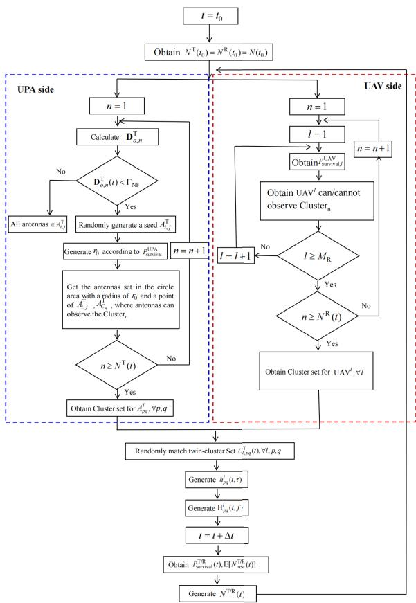  
Fig. 2. Flowchart of the novel adaptive UPA-UAV-time-frequency nonstationary algorithm.

## III. ADAPTIVE UPA-UAV-TIME-FREQUENCY NON-STATIONARY ALGORITHM

The non-stationarity in the array, space, time, and frequency domains needs to be mimicked in the 6G XL-MIMO UPA-tomulti-UAV cooperative communication channels. First, due to the near-field effect, the XL-MIMO UPA at Tx side results in the array non-stationarity [25], where the sets of clusters which are visible by different antennas in the XL-MIMO UPA are different. The 2D characteristic of XL-MIMO UPA brings the challenges of unique solution on the non-stationarity at a certain time [26]. Second, the different positions of multi-UAVs in the integrated propagation environment result in the space non-stationarity, i.e., different UAVs observe different sets of clusters. Third, the high-speed mobility of UAVs brings the time non-stationarity, i.e., the clusters are not visible all the time [27]. Fourth, the usage of low-THz technology results in large bandwidth where the uncorrelated scattering assumption is not valid, leading to the frequency non-stationarity [28]. At present, the non-stationarity in the array, space, time, and frequency domains in 6G XL-MIMO UPA-to-multi-UAV cooperative communication channel has not been properly modeled. To fill this gap, an efficient adaptive UPA-UAV-timefrequency non-stationary algorithm is developed for the first time, which is shown in Fig. 2. The visibility of clusters is determined by their spatial relationship with the Tx and Rx array geometries, based on LoS and occlusion effects. The survival probability is modeled utilizing a BD process, which is adapted to account for the non-stationary dynamics in array, space, and time. The survival probability parameters, such as the array-correlated distance coefficient δ and recombination rate λ , define the evolution of cluster visibility over time. This modeling choice follows the widely adopted assumption that scatterer visibility events can be approximated as a Poisson arrival process, leading naturally to an exponential distribution for the cluster survival probability.

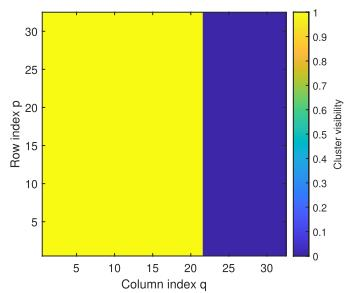  
(a) Conventional BD model utilized on 1D ULA

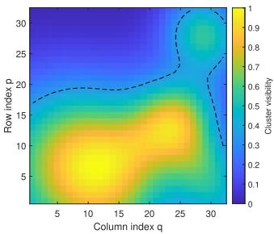  
(b) Proposed 2D non-stationary modeling approach based on the BD process and the seed-growth.  
Fig. 3. Comparison of cluster visibility evolution.

## A. Modeling of Adaptive Non-Stationarity on UPA

In the modeling of array non-stationarity, the employment of XL-MIMO UPA brings two challenges. First, when the antenna numbers are the same, compared to the ULA, the physical size of the UPA is smaller, which leads to the small Rayleigh distance. When the distances between UPA and clusters are much larger than Rayleigh distance, the array nonstationarity may no longer exist. Therefore, in the proposed adaptive UPA-UAV-time-frequency non-stationary algorithm, the modeling of array non-stationarity is adaptive to the size of UPA and the distances between UPA and clusters. Only the clusters which are in or move in SNA go through the non-stationary algorithm on the array domain. Second, the BD process, which is generally utilized to model the nonstationarity on ULA, is improper to model the non-stationarity on UPA. The evolution path of clusters on the 1D ULA from the first antenna to the last antenna is unique, resulting in the unique visible state of last cluster, i.e., the death state or not. However, there are several different evolution paths from the first antenna to the last antenna on the 2D UPA, which leads to different states of last cluster, i.e., the survival state and the death state. Therefore, in the proposed adaptive UPA-UAV-time-frequency non-stationary algorithm, a novel 2D array non-stationary method combined on BD process and seed algorithm is developed for XL-MIMO UPAs. As illustrated in Fig. 3, the conventional BD model, i.e., Fig. 3(a), produces a globally consistent cluster evolution and a deterministic visibility state at the array boundary, whereas the proposed a 2D array non-stationary method combined on BD process and seed algorithm, i.e., Fig. 3(b), captures multidirectional evolution and mixed visibility states across the array aperture.

Based on this, the survival probability of a cluster on a 2D UPA is expressed in an exponential form, capturing the statistical nature of recombination and disappearance.

$$
\begin{array} { r } { P _ { \mathrm { s u r v i v a l } } ^ { \mathrm { U P A } } = \mathrm { e } ^ { - \lambda _ { \mathrm { R } } \frac { \delta _ { \mathrm { T } } } { D _ { \mathrm { c } } ^ { \mathrm { a } } } } } \end{array}\tag{41}
$$

where $\lambda _ { \mathrm { R } }$ and $D _ { \mathrm { c } } ^ { \mathrm { a } }$ are the recombination rate of clusters and the array-correlated distance coefficient that affects the modeling of array non-stationarity on the UPA. $\lambda _ { \mathrm { R } }$ can be obtained statistically by tracking cluster visibility along the UAV trajectory and fitting the exponential mean parameter to the observed residence distance distribution. In practice, cluster visibility on the UPA is modeled as a continuous weight rather than a binary state. For the u-th cluster, a seed antenna is first selected and the visibility weight on element $( p , q )$ is assigned as $w _ { u } ( p , q ) \in [ 0 , 1 ]$ , which decays with the array–correlated distance from the seed according to the survival probability. Multiple clusters may yield overlapping or competing $w _ { u } ( p , q )$ , producing smooth, non-stationary power variations across the aperture and avoiding discontinuities at visibility boundaries.

The set of visible antennas for a certain cluster is the antennas in a circle area with the seed antenna at the center and the growth of survival probability as the radius on the UPA. The details of this method are illustrated in Fig. 2.

## B. Modeling of Non-Stationarity Among Multiple UAVs

Due to the different positions of multi-UAVs in the integrated propagation environment, different UAVs may observe different clusters. The heights of UAV brings a challenge, i.e., the increase of UAVs’ heights widens the view of UAVs, and thus the numbers of newly generated visible clusters increase. To characterize this effect, the spatial survival probability across UAVs incorporates altitude and viewing-angle parameters into the exponential decay expression. Therefore, the survival probability of a certain cluster from UAVl to $\mathrm { U A V } ^ { l + 1 }$ $P ( t ) _ { \mathrm { s u r v i v a l } , l } ^ { \mathrm { U A V } } ,$ is calculated by

$$
\begin{array} { r } { P _ { \mathrm { s u r v i v a l } , l } ^ { \mathrm { U A V } } ( t ) = \mathrm { e } ^ { - \lambda _ { \mathrm { R } } \frac { \left. \mathbf { I } ^ { l + 1 } ( t ) - \mathbf { I } ^ { l } ( t ) \right. \left[ \Vert \mathbf { H } ( t ) \Vert + \left. \mathbf { I } ^ { l + 1 } ( t ) \right. \sin \beta _ { l + 1 } ^ { \mathrm { I } } ( t ) \right] } { D _ { \mathrm { c } } ^ { \mathrm { s } } } } } \end{array}\tag{42}
$$

where $\Vert \mathbf { I } ^ { l + 1 } ( t ) - \mathbf { I } ^ { l } ( t ) \Vert \left[ \Vert \mathbf { H } ( t ) \Vert + \left. \mathbf { I } ^ { l + 1 } ( t ) \right. \right]$ sin $\beta _ { l + 1 } ^ { \mathrm { I } } ( t ) ]$ considers the impact of heights of the l-th UAV and the l + 1-th UAV, which is consistent with the fact that the survival probability decreases if the UAV flies higher. Ds is the spacecorrelated distance coefficient that considers the correlation among multi-UAVs on the space survival probability.

## C. Modeling of Time Non-Stationarity

The temporal evolution of clusters is modeled based on a BD process, where the initial cluster population is determined

by the ratio of generation to recombination rates. The initial number of clusters at initial time $t _ { 0 }$ is

$$
N ( t _ { 0 } ) = \frac { \lambda _ { \mathrm { G } } } { \lambda _ { \mathrm { R } } }\tag{43}
$$

where $\lambda _ { \mathrm { G } }$ indicates generation rate of clusters. Due to the movement of transceivers, some transmission paths through clusters disappear. Accordingly, the time-domain survival probability is determined by the relative velocity between terminals and the observation duration. The survival probabilities of a certain cluster from time t to $t + \Delta t$ at Tx/Rx side, $P _ { \mathrm { s u r v i v a l } } ^ { \mathrm { T / R } } ( \Delta t )$ , is given by

$$
\begin{array} { r } { P _ { \mathrm { s u r v i v a l } } ^ { \mathrm { T } } \big ( t + \Delta t \big ) = \mathrm { e } ^ { - \lambda _ { \mathrm { R } } \frac { \mathrm { E } \big [ \big | \mathbf { v } ^ { \mathrm { G S } } ( t ) - \mathbf { v } ^ { \mathrm { M T } } ( t ) \big | \big | \Delta t } { D _ { \mathrm { c } } ^ { \mathrm { t } } } } } \end{array}\tag{44}
$$

$$
\begin{array} { r } { P _ { \mathrm { s u r v i v a l } } ^ { \mathrm { R } } \big ( t + \Delta t \big ) = \mathrm { e } ^ { - \lambda _ { \mathrm { R } } \frac { \mathrm { E } \left[ \left\| \mathbf { v } _ { l } ^ { \mathrm { U A V } } ( t ) - \mathbf { v } ^ { \mathrm { M R } } ( t ) \right\| \right] \Delta t } { D _ { \mathrm { c } } ^ { \mathrm { t } } } } } \end{array}\tag{45}
$$

where $\mathrm { E } [ \cdot ]$ is the operations of expectation, and $D _ { \mathrm { c } } ^ { \mathrm { t } }$ is the time-correlated distance coefficient that considers the time survival probability of clusters. As time goes on, several newly clusters are generated, the mean number of newly generated sub-clusters nearby Tx/Rx at $t + \Delta t$ on the time axis can be computed as

$$
\mathrm { E } \left[ N _ { \mathrm { n e w } } ^ { \mathrm { T } } ( t + \Delta t ) \right] = \frac { \lambda _ { \mathrm { G } } } { \lambda _ { \mathrm { R } } } ( 1 - P _ { \mathrm { s u r v i v a l } } ^ { \mathrm { T } } ( t + \Delta t ) )\tag{46}
$$

$$
\mathrm { E } \left[ N _ { \mathrm { n e w } } ^ { \mathrm { R } } ( t + \Delta t ) \right] = \frac { \lambda _ { \mathrm { G } } } { \lambda _ { \mathrm { R } } } ( 1 - P _ { \mathrm { s u r v i v a l } } ^ { \mathrm { R } } ( t + \Delta t ) ) .\tag{47}
$$

Equations (46) and (47) further link the disappearance of existing clusters to the generation of new ones.

## D. Modeling of Frequency Non-Stationarity

Due to the usage of low-THz technology with large bandwidth, higher resolution rays in the near-field channel exhibit higher frequency dependence. To capture this phenomenon, a frequency-scaling parameter is introduced into the transfer function to model the spectral variation of multipath components. Therefore, we introduce the frequency-dependence parameter $\left( \frac { f } { f _ { c } } \right) ^ { \alpha }$ into the time-varying transfer function to model the frequency non-stationarity. The frequencydependence parameter is represented by (48), shown at the bottom of the page, where ω indicates a environmentdependent factor and depends on the scenarios [29].

## IV. CHANNEL STATISTICAL PROPERTIES

In this section, key statistical properties of UPA-to-multi-UAV channels are given in turn, such as ASTF-CF, TSI, DPSD, and SVS, are obtained.

$$
\begin{array} { r l } & { H _ { p q } ^ { l } ( t , f ) = \underbrace { \sqrt { P ^ { \mathrm { L o S } } } h _ { l , p q } ^ { \mathrm { L o S } } ( t ) e ^ { - j 2 \pi f \tau _ { l , p q } ^ { \mathrm { L o S } } ( t ) } } _ { \mathrm { L o S ~ C o m p o n e n t } } + \underbrace { \sqrt { P ^ { \mathrm { G R } } } h _ { l , p q } ^ { \mathrm { G R } } ( t ) e ^ { - j 2 \pi f \tau _ { l , p q } ^ { \mathrm { G R } } ( t ) } \left( \frac { f } { f _ { c } } \right) ^ { \omega } } _ { \mathrm { G r o u n d ~ R e f l e c t i o n ~ C o m p o n e n t } } } \\ & { \quad \quad + \underbrace { \sqrt { P ^ { \mathrm { N L o S } } } } _ { u = 1 } \underbrace { \sum _ { s = 1 } ^ { U _ { l , p q } ( t ) } \sum _ { s = 1 } ^ { S _ { l , p q , u } ( t ) } h _ { l , p q , u , s } ^ { \mathrm { N L o S } } ( t ) e ^ { - j 2 \pi f ( t ) \tau _ { l , p q , u , s } ^ { \mathrm { N L o S } } } \left( \frac { f } { f _ { c } } \right) ^ { \omega } } _ { \mathrm { N L o S ~ C o m p o n e n t } } } \end{array}\tag{48}
$$

## A. ASTF-CF

The ASTF-CF of the transmission from $\mathrm { A } _ { p q } ^ { \mathrm { T } }$ of GS to the l-th UAV $\mathrm { U A V } ^ { l }$ at time t with delay $\tau , \ h _ { p q } ^ { l } ( t , \tau )$ can be computed as (49), shown at the bottom of the page, where $( \cdot ) ^ { * }$ is complex conjugate. Since the ASTF-CFs of LoS transmission, ground reflection transmission, and NLoS transmission can be regarded as independent with each other [30], (49) can be computed by the sum of the ASTF-CFs of LoS transmission, ground reflection transmission, and NLoS transmission, i.e., (50), shown at the bottom of the page, where $R _ { l p q , l ^ { \prime } p ^ { \prime } q ^ { \prime } } ^ { \mathrm { L o S } } ( t , f ; \Delta t , \Delta f ; \left\| \mathbf { I } ^ { l } - \mathbf { I } ^ { l ^ { \prime } } \right\| ; \delta _ { \mathrm { T } } )$ $R _ { l p q , l ^ { \prime } p ^ { \prime } q ^ { \prime } } ^ { \mathrm { G R } } ( t , f ; \Delta t , \Delta f ; \left\| \mathbf { I } ^ { l } - \mathbf { I } ^ { l ^ { \prime } } \right\| ; \delta _ { \mathrm { T } } ) ,$ and 1 1 $R _ { l p q , l ^ { \prime } p ^ { \prime } q ^ { \prime } } ^ { \mathrm { N L o S } } ( t , f ; \Delta t , \Delta f ; \left\| \mathbf { I } ^ { l } - \mathbf { I } ^ { l ^ { \prime } } \right\| ; \delta _ { \mathrm { T } } )$ can be calculated by $( 5 1 ) ‐ ( 5 3 )$ , shown at the bottom of the page.

For a certain UAV, the ASTF-CF can be simplified to the array cross-correlation function (CCF) between different antennas at Tx by setting $p \neq p ^ { \prime } , q \neq q ^ { \prime } , l = l ^ { \prime } , \Delta t = 0$ , and $\Delta f = 0$ . The ASTF-CF can be simplified to the space CCF between different UAVs by setting $l \neq l ^ { \prime } , p = p ^ { \prime } , q = q ^ { \prime } ,$ $\Delta t = 0 .$ , and $\Delta f = 0$ . The ASTF-CF can be simplified to the time auto-correlation function (ACF) by setting $p = p ^ { \prime }$ $q = q ^ { \prime } , l = l ^ { \prime } , \Delta t \neq 0 ,$ and $\Delta f = 0$ . The ASTF-CF can be simplified to the frequency correlation function (FCF) by setting $\bar { p } = p ^ { \prime } , q = q ^ { \prime } , \bar { l = { l ^ { \prime } } } , \Delta f \neq 0 .$ and $\Delta t = 0$

## B. TSI

The TSI of UPA-to-multi-UAV channel corresponds to the maximum time duration when the relative error of the delay

spread is constrained to within 10% in absolute value [31]. In the time stationary interval, the UPA-to-multi-UAV channel can be considered as stationary. The TSI is expressed by

$$
\begin{array} { r } { T _ { s } ( t ) = \operatorname* { i n f } \left\{ \Delta t \big | _ { \frac { \left\| \boldsymbol { B } _ { \tau ^ { \prime } } ^ { ( 2 ) } ( t + \Delta t ) - \boldsymbol { B } _ { \tau ^ { \prime } } ^ { ( 2 ) } ( t ) \right\| } { B _ { \tau ^ { \prime } } ^ { ( 2 ) } ( t ) } \leq 0 . 1 } \right\} } \end{array}\tag{54}
$$

where $\operatorname { i n f } \{ \cdot \}$ is the infimum of the function. $B _ { \tau ^ { \prime } } ^ { ( 2 ) } ( t )$ is the time-variant delay spread and can be computed as (55) with (56), shown at the bottom of the page, where $c _ { l , p q , u , s }$ is the path gain of the s-th ray within the u-th twin-cluster from $\mathrm { A } _ { p q } ^ { \mathrm { T } }$ of GS to the l-th UAV $\mathrm { U A V } ^ { l }$

## C. DPSD

Performing Fourier transformation on the time ACF, the DPSD is obtained, which is presented as

$$
\begin{array} { r l } { S _ { l p q } ( t ; f _ { D } ) = } & { { } \int _ { - \infty } ^ { + \infty } R _ { l p q } ( t ; \Delta t ) e ^ { - j 2 \pi f _ { \mathrm { D } } \Delta t } \mathrm { d } ( \Delta t ) } \end{array}\tag{57}
$$

where $R _ { l p q } ( t ; \Delta t )$ and $f _ { \mathrm { D } }$ are time ACF and Doppler frequency, respectively.

## D. SVS

To analyze the correlation among multi-UAVs for multi-UAV cooperative communication systems, SVS is derived. The singular value decomposition of the proposed CIR matrix can be calculated as

$$
\mathbf { H } _ { \mathrm { a l l } } ^ { \mathrm { T } } = \mathbf { U } \sum \mathbf { V }\tag{58}
$$

$$
R _ { l p q , l ^ { \prime } p ^ { \prime } q ^ { \prime } } ( t , f ; \Delta t , \Delta f ; \left. \mathbf { I } ^ { l } - \mathbf { I } ^ { l ^ { \prime } } \right. ; \delta _ { \mathrm { T } } ) = \mathrm { E } [ H _ { l p q } ^ { * } ( t ) H _ { l ^ { \prime } p ^ { \prime } q ^ { \prime } } ( t + \Delta t , f + \Delta f ) ]\tag{49}
$$

$$
\begin{array} { r l } & { R _ { i p q , v } \mathrm { e } _ { p q ^ { \prime } } ( i , j ; \Delta l , \Delta f ; \sqrt { \left\| \mathbf { I } ^ { t } - \mathbf { I } ^ { t ^ { \prime } } \right\| } ; \delta _ { \Gamma } ) } \\ & { = R _ { i p q , v } ^ { \mathrm { B a s } } } \\ & { = R _ { i p q , v } ^ { \mathrm { B a s } } \mathrm { e } _ { p q ^ { \prime } } ( i , j ; \Delta l , \Delta f ; \sqrt { \left\| \mathbf { I } ^ { t } - \mathbf { I } ^ { t ^ { \prime } } \right\| } ; \delta _ { \Gamma } ) + R _ { i p q , i ^ { \prime } p ^ { \prime } q ^ { \prime } } ^ { \mathrm { G R } } ( i , j ; \Delta l , \Delta f ; \sqrt { \left\| \mathbf { I } ^ { t } - \mathbf { I } ^ { t ^ { \prime } } \right\| } ; \delta _ { \Gamma } ) + R _ { i p q , i ^ { \prime } p ^ { \prime } q ^ { \prime } } ^ { \mathrm { N a s } } ( i , j ; \Delta l , \Delta f ; \sqrt { \left\| \mathbf { I } ^ { t } - \mathbf { I } ^ { t ^ { \prime } } \right\| } ; \delta _ { \Gamma } ) } \end{array}\tag{50}
$$

$$
R _ { l p q , l ^ { \prime } p ^ { \prime } q ^ { \prime } } ^ { \mathrm { L o S } } ( t , f ; \Delta t , \Delta f ; \left. \mathbf { I } ^ { l } - \mathbf { I } ^ { l ^ { \prime } } \right. ; \delta _ { \Gamma } ) = h _ { l , p q } ^ { \mathrm { L o S } * } ( t ) h _ { l ^ { \prime } , p ^ { \prime } q ^ { \prime } } ^ { \mathrm { L o S } } ( t + \Delta t ) e ^ { j 2 \pi \left( f \tau _ { l , p q } ^ { \mathrm { L o S } } ( t ) - ( f + \Delta f ) \tau _ { l ^ { \prime } , p ^ { \prime } q ^ { \prime } } ^ { \mathrm { L o S } } ( t + \Delta t ) \right) }\tag{51}
$$

$$
R _ { l p q , l ^ { \prime } p ^ { \prime } q ^ { \prime } } ^ { \mathrm { G R } } ( t , f ; \Delta t , \Delta f ; \left. \mathbf { I } ^ { l } - \mathbf { I } ^ { l ^ { \prime } } \right. ; \delta _ { \mathrm { T } } ) = h _ { l , p q } ^ { \mathrm { G R } * } ( t ) h _ { l ^ { \prime } , p ^ { \prime } q ^ { \prime } } ^ { \mathrm { G R } } ( t + \Delta t ) e ^ { j 2 \pi \left( f \tau _ { l , p q } ^ { \mathrm { G R } } ( t ) - ( f + \Delta f ) \tau _ { l ^ { \prime } , p ^ { \prime } q ^ { \prime } } ^ { \mathrm { G R } } ( t + \Delta t ) \right) }\tag{52}
$$

$$
R _ { l p q , l ^ { \prime } p ^ { \prime } q ^ { \prime } } ^ { \mathrm { N L o S } } ( t , f ; \Delta t , \Delta f ; \left\| \mathbf { I } ^ { l } - \mathbf { I } ^ { l ^ { \prime } } \right\| ; \delta _ { \mathrm { T } } )
$$

$$
= \mathbb { E } \left[ \sum _ { u = 1 } ^ { U _ { l , p _ { q } } ( t ) } \sum _ { u ^ { \prime } = 1 } ^ { U _ { l ^ { \prime } , p _ { q ^ { \prime } } ^ { \prime } } ( t ) } \sum _ { s = 1 } ^ { S _ { l , p _ { q } , s } ( t ) S _ { l ^ { \prime } , p _ { q ^ { \prime } } ^ { \prime } , u ^ { \prime } } ( t ) } h _ { l , p _ { q } , u , s } ^ { \mathrm { M a S } _ { s } } ( t ) h _ { l ^ { \prime } , p _ { q ^ { \prime } } ^ { \prime } , u ^ { \prime } , s ^ { \prime } } ^ { u ^ { \prime } , \mathrm { N I } , \mathrm { a S } } ( t + \Delta l ) e ^ { j 2 \pi \left( f \tau _ { q ^ { \prime } , s } ^ { \mathrm { r a N } , \mathrm { r a S } } ( t ) - ( f + \Delta f ) \tau _ { q ^ { \prime } , p ^ { \prime } , u ^ { \prime } , s ^ { \prime } } ^ { \mathrm { r a N } , \mathrm { r a S } } ( t + \Delta t ) \right) } \right]\tag{53}
$$

$$
B _ { \tau ^ { \prime } } ^ { ( 2 ) } ( t ) = \sqrt { \frac { \sum _ { l = 1 } ^ { M _ { \mathrm { R } } } \sum _ { p = 1 } ^ { m } \sum _ { q = 1 } ^ { n } \sum _ { u = 1 } ^ { U _ { l , p q } ( t ) } \sum _ { s = 1 } ^ { S _ { l , p q , u } ( t ) } ( c _ { l , p q , u , s } ( t ) ) ^ { 2 } ( \tau _ { l , p q , u , s } ^ { \mathrm { N L o S } } ( t ) ) ^ { 2 } } { \sum _ { l = 1 } ^ { M _ { \mathrm { R } } } \sum _ { p = 1 } ^ { m } \sum _ { q = 1 } ^ { n } \sum _ { u = 1 } ^ { U _ { l , p q } ( t ) } \sum _ { s = 1 } ^ { S _ { l , p q , u } ( t ) } ( c _ { l , p q , u , s } ( t ) ) ^ { 2 } } - \left( B _ { \tau ^ { \prime } } ^ { ( 1 ) } ( t ) \right) ^ { 2 } }\tag{55}
$$

$$
B _ { \tau ^ { \prime } } ^ { ( 1 ) } ( t ) = \frac { \sum _ { l = 1 } ^ { M _ { \mathrm { R } } } \sum _ { p = 1 } ^ { m } \sum _ { q = 1 } ^ { n } \sum _ { u = 1 } ^ { U _ { l , p q } ( t ) } \sum _ { s = 1 } ^ { S _ { l , p q , u } ( t ) } ( c _ { l , p q , u , s } ( t ) ) ^ { 2 } ( \tau _ { l , p q , u , s } ^ { \mathrm { N L o S } } ( t ) ) ^ { 2 } } { \sum _ { l = 1 } ^ { M _ { \mathrm { R } } } \sum _ { p = 1 } ^ { m } \sum _ { q = 1 } ^ { n } \sum _ { u = 1 } ^ { U _ { l , p q } ( t ) } \sum _ { s = 1 } ^ { S _ { l , p q , u } ( t ) } ( c _ { l , p q , u , s } ( t ) ) ^ { 2 } } .\tag{56}
$$

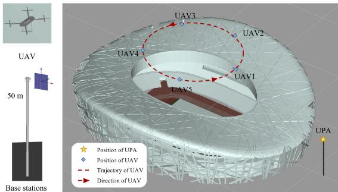

(a) Scenario with 5 UAVs and 64 × 64 UPA.  
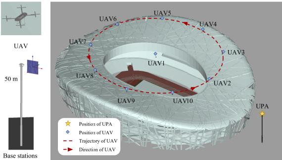  
(b) Scenario with 10 UAVs and 64 × 64 UPA.  
Fig. 4. National Stadium UPA-to-multi-UAV scenarios in Wireless InSite.

where U and V are unitary matrices. $\displaystyle \sum$ is a positive semidefinite diagonal matrix, which includes singular values $\sigma _ { l , a }$ $( l = 1 , 2 , \cdot \cdot \cdot , M _ { \mathrm { R } } , a = 1 , 2 , \cdot \cdot \cdot , M _ { \mathrm { T } } )$ . The SVS is calculated as

$$
\kappa _ { \mathrm { s v s } } = \frac { \operatorname* { m a x } \{ \sigma _ { l , a } \} } { \operatorname* { m i n } \{ \sigma _ { l , a } \} } .\tag{59}
$$

A higher SVS value indicates that at least two multi-UAV channels are nearly parallel, meaning that they exhibit strong correlation. In contrast, a lower SVS value signifies weaker correlation but greater channel capacity.

## V. XL-MIMO UPA-TO-MULTI-UAV DATASET AND SIMULATION RESULTS

In this section, the XL-MIMO UPA-to-Multi-UAV channel dataset under the National Stadium scenario is introduced. The dataset, generated through the Wireless InSite simulation platform [32], captures the channel characteristics of the communication links between the UPA and multi-UAVs. Key channel properties are analyzed based on the proposed model. The accuracy of the proposed model is then verified through a comparison with results obtained from ray-tracing simulations.

## A. New XL-MIMO UPA-to-Multi-UAV Communication Dataset at Low-THz Frequency Under National Stadium Scenario

The simulation scenario in Wireless InSite for the $\mathrm { X L } -$ MIMO UPA-to-multi-UAV communication system in the National Stadium is presented in Fig. 4. The base station (BS) is located outside the stadium, while multi-UAVs are positioned above the stadium. This setup simulates realworld scenarios during large-scale events, such as concerts and sports competitions, where the communication demand from spectators and staff dramatically increases. Conventional communication systems face challenges like signal congestion and capacity shortages in concerts and sports competitions environments. In this case, the ground-based UPA can transmit directional signals within the event venue, with UAVs acting as aerial relay nodes, which can receive and forward signals to user devices on the ground [33].

We construct the dataset with multiple configurable parameters. Specifically, the dataset covers two carrier frequencies, i.e., 28 GHz with 2 GHz bandwidth, and 0.35 THz with 10 GHz bandwidth, which allows comparative studies across frequency bands. The UPA at the BS side is configured with varying array sizes, including $8 \times 8 , ~ 1 6 \times 1 6 , ~ 3 2 \times 3 2$ and $6 4 \times 6 4 .$ , which reflects small to XL-MIMO systems. To examine the impact of aerial terminal density, two UAV deployment schemes are considered, i.e., one with 5 UAVs and another with 10 UAVs. All UAVs follow predefined circular trajectories centered over the stadium, as shown in Fig. 4, with a constant speed of 5 m/s. In the scenario with 5 UAVs, all UAVs fly at an altitude of $9 7 . 9 2 ~ \mathrm { m } .$ , while in the scenario with 10 UAVs, they are placed at 75.9 m to avoid excessive overlap and enable denser link-level interactions.

For each combination of frequency, UPA size, and UAV density, we generate 100 independent snapshots using Wireless InSite. In each snapshot, the downlink propagation channel from the ground UPA to each UAV is simulated and stored. These include key channel parameters, such as CIR, path loss, angle of departure (AoD), and angle of arrival (AoA), enabling both deterministic modeling and data-driven learning approaches. The final dataset consists of 1600 snapshots in total and is organized in a hierarchical directory structure by frequency, array configuration, and UAV count. It is designed to be reusable and extensible, supporting diverse applications, such as beamforming algorithm evaluation, multi-user MIMO optimization, UAV positioning, and learning-based channel estimation. By exposing key parameters and simulation settings, the constructed dataset can support other research involving XL-MIMO UPA-to-multi-UAVs communication at low-THz frequencies.

## B. Model Simulation and Verification

In this section, the simulation results of the proposed model are presented. Key channel-related parameters are listed below. The center frequency is $f _ { c } = 2 8$ GHz for the mmWave configuration, with a communication bandwidth of BW = 2 GHz, and $f _ { c } ~ = ~ 0 . 3 5$ THz for the low-THz configuration, with a bandwidth of BW = 10 GHz. The number of transmit (Tx) antennas is $M _ { \mathrm { T } } ~ = ~ 6 4$ for the $8 \times 8$ UPA configuration, and the antenna spacing is $\delta _ { T } ~ = ~ 0 . 5 \lambda$ , where λ is the wavelength corresponding to the respective carrier frequency. Configurations for $1 6 \times 1 6 , 3 2 \times 3 2$ , and 64 × 64 UPAs are also considered. The radius of the SNA is determined by the UPA size and operating frequency, which has been implicitly captured in the simulations through the analysis of different UPA configurations and frequencies. Larger UPA arrays lead to a larger SNA radius, which affects the near-field propagation and the channel statistical characteristics. The number of UAVs is $M _ { \mathrm { R } } = 5$ . The height of the UPA is $h _ { \mathrm { T } } = 5 0 ~ \mathrm { m }$ . The UPA placement angles are $\begin{array} { r } { \alpha = \frac { \pi } { 6 } } \end{array}$ , i.e., rotation around the ${ z \mathrm { - } \mathrm { a x i s } } .$

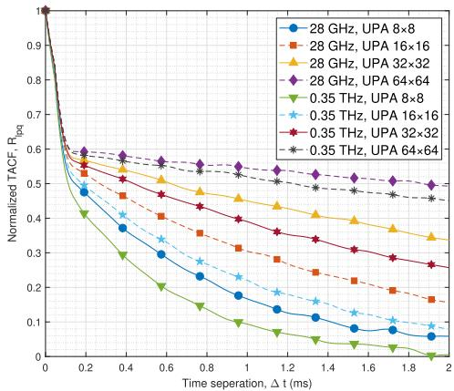  
Fig. 5. Comparison of normalized time ACF for different UPA configurations at 28 GHz and 0.35 THz. The configurations are $8 \times 8 ,$ 16 × 16, 32 × 32, and 64 × 64 UPAs.

$\beta ~ = ~ \frac { \pi } { 1 2 }$ , i.e., rotation around the y-axis, and $\gamma = \frac { \pi } { 1 8 }$ , i.e., rotation around the x-axis. The ground reflection coefficient is influenced by the surface material and frequency. The power parameters for the mmWave configuration include a Ricean K-factor of $K = 1 0$ and a ground reflection coefficient of $G = 0 . 6$ . The LoS power, ground reflection power, and NLoS power are computed utilizing these values. For the low-THz configuration, the Ricean K-factor is adjusted to $K = 3 . 5$ reflecting a LoS-dominant environment at THz frequencies, and the ground reflection coefficient is reduced to $G = 0 . 3 .$ The LoS power is increased to $P _ { \mathrm { L o S } } = 0 . 7 $ , while the NLoS power is reduced to $P _ { \mathrm { N L o S } } = 0 . 2$ . For the non-stationarity parameters, the generation rate of clusters is $\lambda _ { \mathrm { G } } = 0 . 2 ~ \mathrm { m ^ { - 1 } }$ and the recombination rate is $\lambda _ { \mathrm { R } } = 0 . 0 5 ~ \mathrm { m ^ { - 1 } }$ for the mmWave configuration. For the low-THz configuration, the generation rate of clusters is decreased to $\lambda _ { \mathrm { G } } ~ = ~ 0 . 1 5 ~ \mathrm { m ^ { - 1 } }$ , and the recombination rate is increased to $\lambda _ { \mathrm { R } } ~ = ~ 0 . 0 8 ~ \mathrm { m ^ { - 1 } }$ . The array-correlated, space-correlated, and time-correlated distance coefficients are $D _ { \mathrm { c } } ^ { \mathrm { a } } = 1 5 ~ \mathrm { m } , D _ { \mathrm { c } } ^ { \mathrm { s } } = 5 0 ~ \mathrm { m }$ , and $D _ { \mathrm { c } } ^ { \mathrm { t } } = 3 0$ m for the mmWave configuration, while these values are adjusted for the low-THz configuration to $D _ { \mathrm { c } } ^ { \mathrm { a } } = 5$ m, $D _ { \mathrm { c } } ^ { \mathrm { s } } = 5 0$ m, and $D _ { \mathrm { c } } ^ { \mathrm { t } } = 1 5 ~ \mathrm { m }$ , respectively. The frequency dependence factor is $\omega = 1 . 2$ for the mmWave case and $\omega = 0 . 9$ for the low-THz case. The simulation time is set to $T = 1 \mathrm { ~ s ~ }$ , with a time step $\Delta t = 0 . 0 1$ s.

In Fig. 5, the normalized time ACF for different UPA configurations is shown at 28 GHz and 0.35 THz. As the UPA size increases from $8 \times 8$ to $1 6 \times 1 6$ to $3 2 \times 3 2$ to 64 × 64, the time ACF decays more slowly during the initial phase. Notably, for the same UPA configuration, the time ACF at 0.35 THz band decays faster than at 28 GHz. This is because that more severe propagation loss in the 0.35 THz band, resulting in faster signal attenuation and stronger channel dynamicity. This behavior can also be attributed to the narrower beams of larger UPAs, which reduce the initial phase variation between multipath components and thus slow the early-stage ACF decay. In contrast, the shorter wavelength at 0.35 THz increases the normalized Doppler shift for the same UAV speed, making path phases more sensitive to movement and causing faster decorrelation. From a practical perspective, this implies that low-THz deployments with large UPAs require more frequent CSI updates and beam tracking to sustain coherent UAV links.

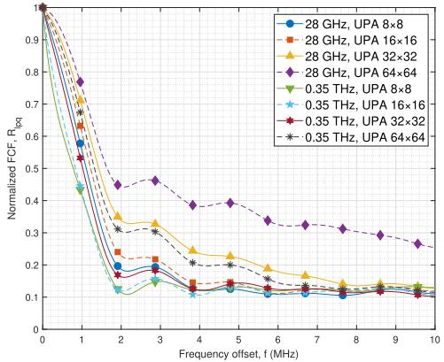  
Fig. 6. Normalized FCF for different UPA configurations at 28 GHz and 0.35 THz. The configurations are $8 \times 8 ,$ 16 × 16, ${ \bar { 3 2 } } \times 3 2 .$ and $6 4 \times 6 4$ UPAs and $\mathrm { U A V ^ { 1 } }$

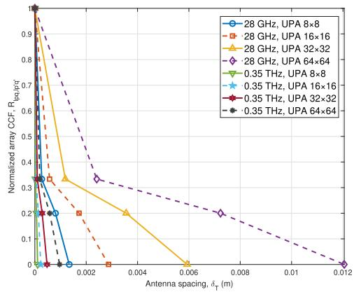  
Fig. 7. Array CCF comparison for different UPA configurations at 28 GHz and 0.35 THz. The configurations are $8 \times 8 ,$ 16 × 16, ${ \overline { { 3 2 } } } \times 3 2 .$ and 64 × 64 UPAs.

In Fig. 6, the normalized FCFs for different UPA configurations are shown at 28 GHz and 0.35 THz. At the same frequency, larger UPAs, e.g., $6 4 \times 6 4$ , exhibit slower FCF decay and higher steady-state correlation than smaller ones, $\mathrm { e . g . , ~ 8 ~ \times ~ 8 , ~ }$ due to enhanced spatial-frequency diversity. For example, at 28 GHz, the $3 2 \times 3 2$ UPA shows higher initial and steady-state values than smaller arrays. A similar trend is observed at 0.35 THz, but with overall faster decay. Across bands, the 28 GHz FCF maintains stronger correlation than 0.35 THz under the same UPA. The 0.35 THz band suffers more from frequency-selective fading due to atmospheric absorption and scattering, leading to lower initial correlation and faster decorrelation. Physically, larger UPAs achieve finer spatial resolution, which selectively emphasizes multipath components with similar delays, leading to slower FCF decay. In low-THz channels, stronger absorption and material dispersion broaden the delay profile, reducing correlation. Practically, this suggests that low-THz XL-MIMO systems may need smaller OFDM subcarrier spacing or adaptive frequency-domain equalization to mitigate fast frequency decorrelation.

In Fig. 7, for both 28 GHz and 0.35 THz frequency bands, as the UPA size increases from 8×8 to 64×64, the normalized array CCF decays more slowly. Larger UPAs also have higher initial array CCF values and maintain higher values as antenna spacing increases. Comparing the 28 GHz and 0.35 THz bands, the array CCF in the 28 GHz band decays more slowly and remains higher than in the 0.35 THz band, especially as antenna spacing increases. Larger UPAs provide better spatial diversity and are less sensitive to changes in antenna spacing, resulting in slower array CCF decay. In contrast, smaller UPAs, such as $8 \times 8$ , show faster decay due to limited spatial diversity. The longer wavelength of the 28 GHz band leads to slower changes in spatial correlation, while the shorter wavelength of the 0.35 THz band results in more rapid decay. From a physical perspective, larger apertures sample a broader angular spectrum, which smooths array-to-element correlation, while shorter wavelengths at low-THz make even small spatial offsets cause significant phase changes. In UAV deployments, this means that low-THz arrays require stricter calibration and flight attitude control to preserve intended spatial correlation.

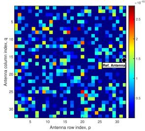  
(a) UPA spatial correlation for 32 × 32 UPA to $\mathrm { U A V ^ { 1 } }$ at 28 $\mathrm { G H z } , t = 0 . 0 1 \ \mathrm { s }$

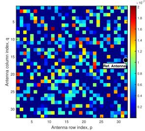  
(b) UPA spatial correlation for $3 2 \times 3 2 ~ \mathrm { U \bar { P A } }$ to $\mathrm { U A V ^ { 1 } }$ at 0.35 $\mathrm { T H z } , t = 0 . 0 1 \ \mathrm { s }$

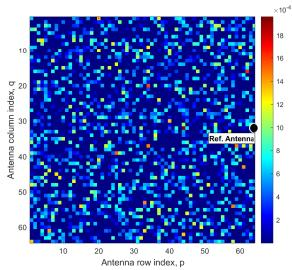  
(c) UPA spatial correlation for 64 × 64 UPA to $\mathrm { U A V ^ { 1 } }$ at 28 GHz, $t = 0 . 0 1$ S.

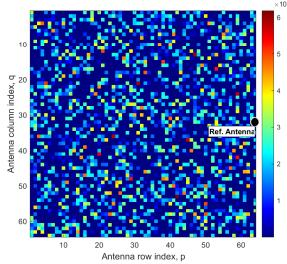  
(d) UPA spatial correlation for 64 × 64 UPA to $\mathrm { U A V ^ { 1 } }$ at 0.35 THz, $t = 0 . 0 1$ S.  
Fig. 8. UPA spatial correlation for different frequency bands, different snapshots, and different UPA configurations.

The spatial correlation is quantified by the normalized crosscorrelation coefficient between the reference antenna element and other elements across the UPA aperture. In Fig. 8, the UPA spatial correlation is shown for different frequency bands and array sizes. At a fixed frequency, larger UPAs result in more fragmented spatial correlation distributions than smaller ones. The wider spatial aperture captures more spatially diverse multipath components, making the correlation harder to concentrate. Comparing frequency bands, for the same UPA size, the 0.35 THz band exhibits more dispersed correlation patterns than 28 GHz. The shorter wavelength of THz makes it more sensitive to environmental scattering and UAV movement, leading to more rapid spatial decorrelation. Overall, spatial correlation is jointly affected by UPA scale and frequency. Larger UPAs and higher frequencies both amplify sensitivity to spatial changes, making the correlation distribution more fragmented. This fragmentation is attributed to two main factors. First, the high angular resolution of large UPAs leads to abrupt changes in the propagation environment over small spatial offsets. Second, the short wavelengths in the low-THz band amplify phase shifts resulting from minor position changes. Practically, while this enables fine-grained beam steering, it also imposes stricter UAV position stabilization requirements to prevent beam misalignment. Moreover, even adjacent antenna elements may exhibit randomized correlation due to the curvature of spherical wavefronts, variations in cluster visibility, and the influence of localized scattering in near-field non-stationary environments.

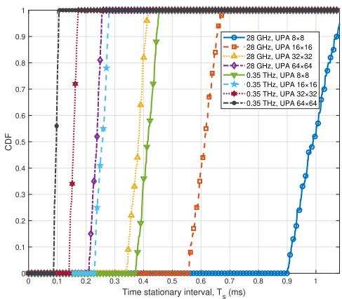  
Fig. 9. TSI for different UPA configurations at 28 GHz and 0.35 THz. The configurations include $8 \times 8 ,$ 16 × 16, 32 × 32, and 64 × 64 UPAs.

In Fig. 9, the TSI shows significant differences across various UPA configurations, i.e., ${ 8 \times 8 , 1 6 \times 1 6 , 3 2 \times 3 2 }$ 64 × 64 and carrier frequencies, i.e., 28 GHz and 0.35 THz. For the same frequency, smaller UPAs, e.g., $8 \times 8 ,$ , have longer TSI, indicating a longer period of channel stability. In contrast, larger UPAs, e.g., 64 × 64, exhibit shorter TSI. When comparing frequencies, for the same UPA configuration, TSI at 28 GHz is significantly longer than at 0.35 THz. TSI decreases with increasing UPA size due to enhanced angular resolution, which makes the channel more sensitive to spatial dynamics. TSI also decreases with carrier frequency, as higher frequencies result in faster temporal fading and reduced coherence time. Engineering-wise, shorter TSI at low-THz implies that CSI and beamforming updates should be performed more frequently in large-array UAV systems, scaling update intervals proportionally to the observed TSI.

In Fig. 10, the normalized DPSD is compared for different UPA configurations, i.e., 8 × 8, 16 × 16, $3 2 \times 3 2$ and $6 4 \times 6 4 .$ , at both 28 GHz and 0.35 THz. For the same frequency, as the UPA size increases, the DPSD peak broadens. In the 28 GHz scenario, the $6 4 \times 6 4$ UPA has a wider peak compared to the 8 × 8 UPA. Across frequencies, for the same UPA configuration, the DPSD peak in the 0.35 THz band is broader and more scattered, with greater amplitude fluctuations, compared to 28 GHz. Larger UPAs capture more multipath components, leading to broader DPSD peaks. However, smaller arrays have narrower peaks due to fewer multipaths. The carrier frequency appears to influence the Doppler characteristics, with higher frequencies generally exhibiting broader Doppler spreads under certain conditions. This demonstrates the combined effect of frequency and array size on the channel Doppler spread. This can be explained by the Doppler shift formula $f _ { D } = v / \lambda .$ , where at the same UAV speed, a shorter wavelength at low-THz yields a higher $f _ { D }$ thereby widening the DPSD. From a deployment perspective, broader DPSD requires shorter channel estimation intervals and more advanced Doppler compensation to maintain coherent communication for moving UAVs.

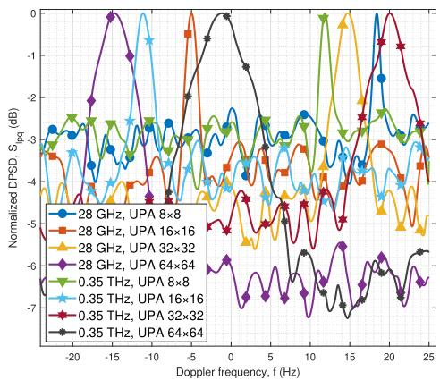  
Fig. 10. DPSD for different UPA configurations at 28 GHz and 0.35 THz. The configurations include 8 × 8, 16 × 16, 32 × 32, and 64 × 64 UPAs.

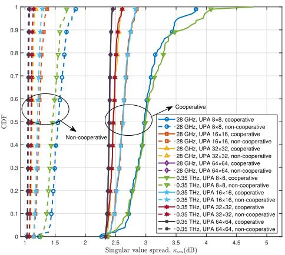  
Fig. 11. SVS for different UPA configurations at 28 GHz and 0.35 THz with UAV cooperative and non-cooperative communications. The configurations include $\mathrm { { \bar { 8 ^ { ' } } } \times 8 , 1 6 \times 1 6 , 3 2 \times \bar { 3 } 2 , }$ , and 64 × 64 UPAs.

In Fig. 11, SVS is compared for different UPA configurations at 28 GHz and 0.35 THz with UAV cooperative and non-cooperative communications. In cooperative communications, multi-UAVs interact and jointly process information, which increases the number and diversity of effective channel paths. This results in a broader distribution of singular values in the channel matrix, leading to larger SVS. On the other hand, in non-cooperative communications, each UAV operates independently, capturing fewer and more concentrated channel paths, resulting in smaller SVS. The CDF curve for cooperative communications is shifted more to the right, indicating larger SVS, while for non-cooperative communications, the CDF curve reaches 1 more quickly. For the same frequency, the SVS of 8 × 8 UPA is furthest right, indicating the largest SVS, while the 64 × 64 UPA is furthest left, with the smallest SVS. The same trend holds at 0.35 THz under non-cooperative mode, showing that SVS decreases as UPA size increases. In the stadium scenario, clusters are compact and UAV’s trajectories are simple, resulting in channels dominated by LoS or few multipath components. This leads to low-rank channel matrices with concentrated singular values. Smaller UPAs capture more diverse multipath features, yielding more dispersed singular values and larger SVS. Larger UPAs, due to redundant spatial sampling of similar paths, cause singular values to concentrate and SVS to decrease. From the system design perspective, large SVS in cooperative UAV operation offers greater potential for spatial multiplexing and high-capacity MIMO, whereas low SVS scenarios call for beam orthogonalization and interference-aware scheduling to maintain performance.

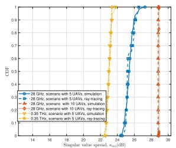  
(a) Comparison of the simulated and ray-tracing-based SVSs of UPA 16 × 16 to $\mathrm { U A V ^ { 1 } }$ under National Stadium scenario with 5 UAVs and 10 UAVs.

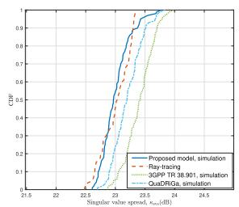  
(b) Comparison of the proposed model, standardized model and ray-tracing-based SVSs of UPA 16 × 16 to $\mathrm { U A V ^ { 1 } }$ under National Stadium scenario with 5 UAVs at 0.35 THz.  
Fig. 12. Comparison of the simulated and ray-tracing-based SVSs.

As shown in Fig. 12(a), at 28 GHz, the simulation and ray-tracing curves exhibit highly similar trends in scenarios with 5 UAVs and 10 UAVs, indicating good agreement in modeling SVS distributions. This validates applicability of the proposed model to different UAV densities at the mmWave band. In contrast, at 0.35 THz, the ray-tracing curve under the scenarios with 5 UAVs shows noticeable deviation from that at 28 GHz, reflecting the impact of frequency on SVS characteristics. The higher path loss and distinct scattering behavior at THz frequencies lead to a different CDF trend. Nevertheless, simulation curves at 0.35 THz remain closely matched with their ray-tracing counterparts across UAV configurations, suggesting that the simulation model can replicate the key statistical characteristics of SVS even under highfrequency conditions. The consistency between simulation and ray-tracing results verifies the applicability of the simulation model. As shown in Fig. 12(b), the proposed near-field model is further compared with two simplified standardized channel models, i.e., 3GPP TR 38.901 [34] and QuaDRiGa [35], under the 0.35 THz scenario with 5 UAVs. Both standardized models, originally developed for far-field conditions, show noticeable deviations from the ray-tracing reference, due to their lack of explicit near-field. The proposed adaptive model achieves a significantly closer match to the ray-tracing curve, validating its improved capability in capturing near-field channel nonstationary characteristics at the THz band.

As shown in Fig. 13, the DPSDs obtained from simulation and ray-tracing methods are closely aligned under scenarios with 5 UAVs and 10 UAVs at 28 GHz, verifying the accuracy and reliability of the simulation model in capturing Doppler characteristics. This confirms that the proposed simulation approach can effectively be utilized for large-scale analysis while significantly reducing computational cost. Compared to 28 GHz, DPSD under 0.35 THz shows noticeable differences in shape distribution, indicating the influence of frequencydependent channel behaviors. These differences are likely caused by higher path loss and altered scattering conditions at the low-THz band.

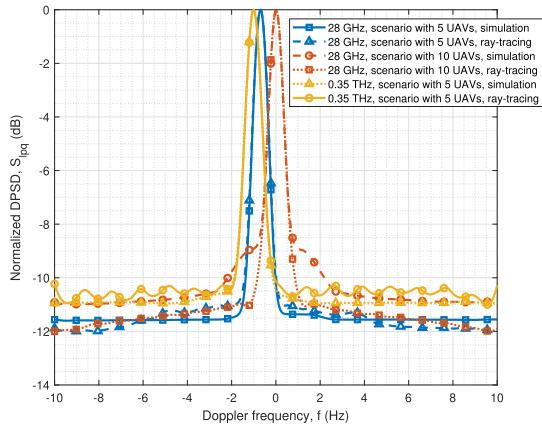  
Fig. 13. Comparison of the simulated and ray-tracing-based DPSDs of UPA 16 × 16 to $\mathrm { U A V ^ { 1 } }$ under National Stadium scenario with 5 UAVs and 10 UAVs.

## VI. CONCLUSION

In this paper, a novel adaptive near-field channel model has been proposed for 6G XL-MIMO UPA-to-multi-UAV cooperative communications, where the SNA of XL-MIMO UPA has been proposed for the first time to balance complexity and accuracy of near-field channel modeling. To jointly model the non-stationarity in the array, space, time, and frequency domains for 6G near-field multi-UAV channel, a new adaptive UPA-UAV-time-frequency non-stationary algorithm has been developed. The channel parameters related to the 3D continuously arbitrary trajectory and self-rotation of multi-UAVs have also been taken into account. A new XL-MIMO-UPA-to-multi-UAV channel dataset at mmWave and low-THz frequency band under National Stadium scenario is built. Key UPA-tomulti-UAV channel statistics, including time ACF, FCF, array CCF, TSI, and SVS, have been analyzed, revealing that larger UPAs and higher frequencies lead to stronger spatial-frequency diversity whereas increased near-field non-stationarity. The proposed model has accurately characterized UPA-UAV-timefrequency non-stationary. Simulation results, validated against the ray-tracing-based data, have demonstrated the ability of the proposed model to capture key channel statistics.

## ACKNOWLEDGMENT

The authors would like to thank Shiliang Lu for the help in the dataset construction at mmWave and low-THz frequency bands under National Stadium scenario via Wireless InSite Simulation Platform.

## REFERENCES

[1] Framework and Overall Objectives of the Future Development of IMT for 2030 and Beyond, Int. Telecommun. Union, Geneva, Switzerland, 2023.

[2] X. Cai, X. Cheng, and F. Tufvesson, “Toward 6G with terahertz communications: Understanding the propagation channels,” IEEE Commun. Mag., vol. 62, no. 2, pp. 32–38, Feb. 2024.

[3] C. Huang et al., “Multi-hop RIS-empowered terahertz communications: A DRL-based hybrid beamforming design,” IEEE J. Sel. Areas Commun., vol. 39, no. 6, pp. 1663–1677, Jun. 2021.

[4] G. Zheng, M. Wen, J. Wen, and C. Shan, “Joint hybrid precoding and rate allocation for RSMA in near-field and far-field massive MIMO communications,” IEEE Wireless Commun. Lett., vol. 13, no. 4, pp. 1034–1038, Apr. 2024.

[5] H. Yi et al., “Ray tracing meets terahertz: Challenges and opportunities,” IEEE Commun. Mag., vol. 62, no. 2, pp. 40–46, Feb. 2024.

[6] H. Lu et al., “A tutorial on near-field XL-MIMO communications toward 6G,” IEEE Commun. Surveys Tuts., vol. 26, no. 4, pp. 2213–2257, 4th Quart., 2024.

[7] K. Zhi et al., “Performance analysis and low-complexity design for XL-MIMO with near-field spatial non-stationarities,” IEEE J. Sel. Areas Commun., vol. 42, no. 6, pp. 1656–1672, Jun. 2024.

[8] A. Molisch, Wireless Communications. Hoboken, NJ, USA: Wiley, 2011.

[9] P.-H. Ho, M. Wen, Z. Ding, M. D. Renzo, and W. Duan, “Guest editorial special issue on near-field communications (NFCs) in Internet of Everything,” IEEE Internet Things J., vol. 12, no. 12, pp. 18459–18460, Jun. 2025.

[10] T. Gong et al., “Holographic MIMO communications with arbitrary surface placements: Near-field LoS channel model and capacity limit,” IEEE J. Sel. Areas Commun., vol. 42, no. 6, pp. 1549–1566, Jun. 2024.

[11] Y. Jin, R. He, B. Ai, Y. Yuan, Y. Niu, and H. Zhang, “Geometry-based stochastic MIMO channel model for near-field and far-field scenarios of integrated sensing and communications,” IEEE Trans. Veh. Technol., vol. 74, no. 5, pp. 6928–6940, May 2025.

[12] H. Jiang, W. Shi, X. Chen, Q. Zhu, and Z. Chen, “High-efficient nearfield channel characteristics analysis for large-scale MIMO communication systems,” IEEE Internet Things J., vol. 12, no. 6, pp. 7446–7458, Mar. 2025.

[13] L. Bai, Z. Huang, L. Cui, T. Feng, and X. Cheng, “A mixed-bouncing based non-stationary model for 6G massive MIMO mmWave UAV channels,” IEEE Trans. Commun., vol. 70, no. 10, pp. 7055–7069, Oct. 2022.

[14] J. Chen, Q. Shi, and X. Cai, “Coherent bandwidth and distance in an ultra-large-scale antenna array at 15 GHz,” in Proc. Int. Symp. Antennas Propag. (ISAP), Nov. 2024, pp. 1–2.

[15] C. Han, Y. Chen, L. Yan, Z. Chen, and L. Dai, “Cross far- and near-field wireless communications in terahertz ultra-large antenna array systems,” IEEE Wireless Commun., vol. 31, no. 3, pp. 148–154, Jun. 2024.

[16] L. Bai, Z. Huang, T. Feng, and X. Cheng, “A non-stationary channel model for 6G multi-UAV cooperative communication,” IEEE Trans. Wireless Commun., vol. 23, no. 2, pp. 949–961, Feb. 2024.

[17] L. Bai, Z. Huang, L. Cui, and X. Cheng, “A non-stationary multi-UAV cooperative channel model for 6G massive MIMO mmWave communications,” IEEE Trans. Wireless Commun., vol. 22, no. 12, pp. 9233–9247, Dec. 2023.

[18] Q. Wei et al., “Measurement-based analysis of XL-MIMO channel characteristics in a corridor scenario,” in Proc. IEEE 99th Veh. Technol. Conf., Jun. 2024, pp. 1–5.

[19] H. Miao et al., “Empirical studies of propagation characteristics and modeling based on XL-MIMO channel measurement: From far-field to near-field,” 2024, arXiv:2404.17270.

[20] B. Deutschmann et al., “Channel modeling and prediction for wireless power transfer,” in Proc. IEEE ICC Workshops, Rome, Italy, Oct. 2023, pp. 1–5.

[21] X. Cai, E. L. Bengtsson, O. Edfors, and F. Tufvesson, “A switched array sounder for dynamic millimeter-wave channel characterization: Design, implementation, and measurements,” IEEE Trans. Antennas Propag., vol. 72, no. 7, pp. 5985–5999, Jul. 2024.

[22] Y. Lyu, Z. Yuan, P. Zhang, Z. Huang, P. Kyosti, and W. Fan, “Large¨ virtual antenna array-based empirical channel characterization for sub-THz indoor hall scenarios,” IEEE Trans. Antennas Propag., vol. 73, no. 4, pp. 2000–2011, Apr. 2025.

[23] M. F. De Guzman and K. Haneda, “Analysis of wave-interacting objects in indoor and outdoor environments at 142 GHz,” IEEE Trans. Antennas Propag., vol. 71, no. 12, pp. 9838–9848, Dec. 2023.

[24] S. Jaeckel, L. Raschkowski, S. Wu, L. Thiele, and W. Keusgen, “An explicit ground reflection model for mm-Wave channels,” in Proc. IEEE Wireless Commun. Netw. Conf. Workshops (WCNCW), San Francisco, CA, USA, Mar. 2017, pp. 1–5.

[25] X. Gao, F. Tufvesson, and O. Edfors, “Massive MIMO channels—Measurements and models,” in Proc. Asilomar Conf. Signals, Syst. Comput., Pacific Grove, CA, USA, Nov. 2013, pp. 280–284.

[26] X. Cheng, Z. Huang, and L. Bai, “Channel nonstationarity and consistency for beyond 5G and 6G: A survey,” IEEE Commun. Surveys Tuts., vol. 24, no. 3, pp. 1634–1669, 3rd Quart., 2022.

[27] L. Bai, Z. Huang, J. Liu, L. Cui, M. Sheng, and X. Cheng, “A mixed-bouncing based 6G multi-UAV integrated channel model with consistency and non-stationarity,” IEEE Trans. Wireless Commun., vol. 23, no. 10, pp. 13456–13470, Oct. 2024.

[28] A. F. Molisch, “Ultrawideband propagation channels-theory, measurement, and modeling,” IEEE Trans. Veh. Technol., vol. 54, no. 5, pp. 1528–1545, Sep. 2005.

[29] A. F. Molisch et al., “A comprehensive model for ultrawideband propagation channels,” in Proc. IEEE Global Telecommun. Conf., Dec. 2005, pp. 3648–3653.

[30] M. Patzold, Mobile Radio Channels, 2nd ed., West Sussex, U.K.: Wiley, 2012.

[31] M. Paetzold and C. A. Gutierrez, “Definition and analysis of quasistationary intervals of mobile radio channels—Invited paper,” in Proc. IEEE 87th Veh. Technol. Conf., Porto, Portugal, Jun. 2018, pp. 1–6.

[32] (Jan. 2017). Remcom. Accessed: Mar. 2022. [Online]. Available: https:// www.remcom.com/wireless-insite-em-propagation-software

[33] G. Zheng, C. Xu, M. Wen, and X. Zhao, “Service caching based aerial cooperative computing and resource allocation in multi-UAV enabled MEC systems,” IEEE Trans. Veh. Technol., vol. 71, no. 10, pp. 10934–10947, Oct. 2022.

[34] Technical Specification Group Radio Access Network; Study on Channel Model for Frequencies From 0.5 to 100 GHz (Release 14), document TR 38.901, 14.2.0, 3GPP, Sep. 2017. [Online]. Available: http:// www.3gpp.org/DynaReport/38901.htm

[35] S. Jaeckel, L. Raschkowski, K. Borner, and L. Thiele, “QuaDRiGa: A 3-¨ D multi-cell channel model with time evolution for enabling virtual field trials,” IEEE Trans. Antennas Propag., vol. 62, no. 6, pp. 3242–3256, Jun. 2014.

Lu Bai (Senior Member, IEEE) received the Ph.D. degree in information and communication engineering from Shandong University, China, in 2019. From 2017 to 2019, she was a Visiting Ph.D. Student with Heriot-Watt University, U.K. From 2019 to 2022, she was a Post-Doctoral Researcher with Beihang University, China. She is currently a Professor with Shandong University. Her general research interests include wireless communications and artificial intelligence, subject on which she has published more than 50 journal and conference papers, two books, holds eight patents, and participated in formulating seven Chinese standards. She is a member of the IEEE P1944. She has served as the member of the Technical Program Committee and the session chair for several international conferences. She has received IEEE VR Best Paper Award, Science and Technology Progress Award of China Transport and Logistics Association, and TaiShan Scholar Award. She was a recipient of the Young Elite Scientist Sponsorship Program by China Association for Science and Technology. She is currently an Associate Editor of IET Communications.

Mengyuan Lu (Graduate Student Member, IEEE) received the B.S. degree in engineering from the School of Software, Shandong University, China, in 2024, where she is currently pursuing the master’s degree. Her research interests focus on AI-based 6G vehicular communications.

Ziwei Huang (Member, IEEE) received the Ph.D. degree in information and communication engineering from Peking University, Beijing, China, in 2024. He is currently a Boya Post-Doctoral Fellow with Peking University. His general research interests include wireless communications and artificial intelligence, subject on which he has published more than 40 journal and conference papers and two books. He has served as the member of the Technical Program Committee for several international conferences. He was a recipient of China National Postdoctoral Pro-

gram for Innovative Talents. He was a co-recipient of the IET Communications Best Paper Award: Premium Award and was honored with the Doctoral Dissertation Incentive Program by China Institute of Communications (CIC). He has also received the Silver Award at the National Invention Exhibition. He is an Associate Editor of IET Communications.

Xuesong Cai (Senior Member, IEEE) received the B.S. and Ph.D. degrees (Hons.) from Tongji University, Shanghai, China, in 2013 and 2018, respectively.

In 2015, he conducted a three-month internship with Huawei Technologies, Shanghai, China. He was also a Visiting Scholar with the Universidad Politecnica de Madrid, Madrid, Spain, in 2016. From´ 2018 to 2022, he conducted several postdoctoral stays with Aalborg University and Nokia Bell Labs, Denmark, and Lund University, Sweden. He became

an Assistant Professor in 2022 and then an Associate Professor in 2024 with Lund University, closely cooperating with Ericsson and Sony. He is currently a Research Professor, an Endowed Boya Young Scholar, and a Weiming Scholar with the School of Electronics, Peking University, Beijing, China. His work has led to over 90 peer-reviewed publications, two book chapters, and five granted patents. His research interests include multi-modal intelligent radio channel characterization, high-resolution parameter estimation, over-theair testing, resource optimization, and radio-based localization for 5G/B5G wireless systems. He was a recipient of China National Scholarship (the highest honor for Ph.D. Candidates) in 2016, the Outstanding Doctorate Graduate Awarded by Shanghai Municipal Education Commission in 2018, the Marie Skłodowska-Curie Actions (MSCA) “Seal of Excellence” in 2019, and the EU MSCA Fellowship (ranking top 1.2%, overall success rate 14%) and the Starting Grant (success rate 12%) funded by Swedish Research Council in 2022. He was also selected by the “ZTE Blue Sword-Future Leaders Plan” in 2018 and “Huawei Genius Youth Program” in 2021. He received the Best Paper Award at ICWMC2021, the Best Student Paper Award at VTC2024- Fall, the 2025 Outstanding Associate Editor Award of IEEE Antennas and Wireless Propagation Letters, and the 2025 Harold A. Wheeler Applications Prize Paper Award. He is a Young Professional Ambassador of the IEEE Antennas and Propagation Society (class of 2024) and a Subcommittee Chair of the IEEE Vehicular Technology Society. He is an Associate Editor of IEEE TRANSACTIONS ON VEHICULAR TECHNOLOGY, IEEE ANTENNAS AND WIRELESS PROPAGATION LETTERS, and IET Communications, and a Guest Editor of Radio Science and IEEE OPEN JOURNAL OF ANTENNAS AND PROPAGATION.

Xiang Cheng (Fellow, IEEE) received the joint Ph.D. degree from Heriot-Watt University and The University of Edinburgh, Edinburgh, U.K., in 2009. He is currently a Boya Distinguished Professor with Peking University. His research focuses on the in-depth integration of communication networks and artificial intelligence, including intelligent communication networks and connected intelligence, the subject on which he has published more than 280 journals and conference papers, 11 books, and holds 35 patents. He was a recipient of the IEEE

Asia–Pacific Outstanding Young Researcher Award in 2015 and the Xplorer Prize in 2023. He was a co-recipient of the 2016 IEEE Journal on Selected Areas in Communications Best Paper Award: Leonard G. Abraham Prize and the 2021 IET Communications Best Paper Award: Premium Award. He has also received the Best Paper Awards at IEEE ITST’12, ICCC’13, ITSC’14, ICC’16, ICNC’17, GLOBECOM’18, ICCS’18, and ICC’19. He has been a Highly Cited Chinese Researcher since 2020. In 2021 and 2023, he was selected into two world scientist lists, including the World’s Top 2% Scientists released by Stanford University and top computer science scientists released by Guide2Research. He has served as the symposium lead chair, the co-chair, and a member of the technical program committee for several international conferences. He led the establishment of four Chinese standards (including industry standards and group standards) and participated in the formulation of ten 3GPP international standards and two Chinese industry standards. He was a Distinguished Lecturer of the IEEE Vehicular Technology Society. He is currently a Subject Editor of IET Communications and an Associate Editor of IEEE TRANSACTIONS ON WIRELESS COM-MUNICATIONS, IEEE TRANSACTIONS ON INTELLIGENT TRANSPORTATION SYSTEMS, IEEE WIRELESS COMMUNICATIONS LETTERS, and Journal of Communications and Information Networks.